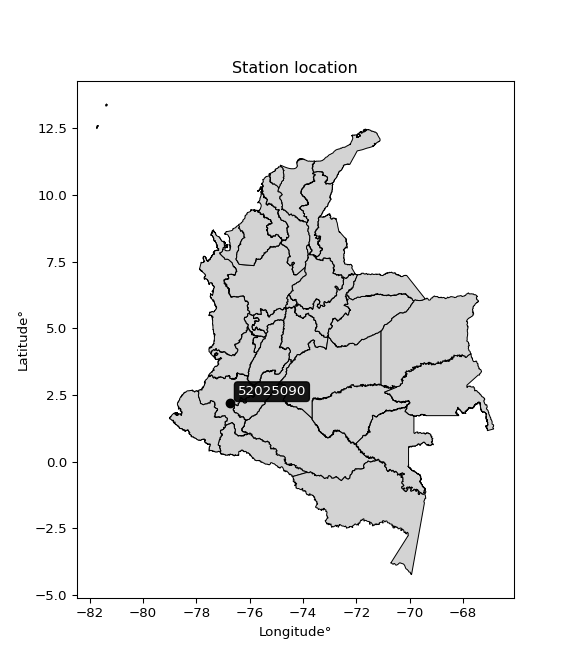

<div align="center">


</div>

# PMP Station (Rain, Pmax24h): 52025090

Probable Maximum Precipitation (PMP) is the greatest amount of rainfall for a specific duration that is meteorologically possible for a given location, acting as a "worst-case" scenario for extreme storms, crucial for designing safety-critical infrastructure like bridges, river deviations, dams, spillways, and nuclear plants to prevent catastrophic failure. PMP is calculated by hydrologists using meteorological data to determine the upper limit of extreme rainfall, often leading to the Probable Maximum Flood (PMF) for flood control design, and is increasingly being studied for climate change impacts.

<div align="center">

</img>

</div>


## A. General information


### 1. General running parameters

• app_version: _v20260103_. • runtime: _2026-01-03 07:24:50.581521_. • Python version: _3.14.0_. • SciPy version: _1.16.3_. • Pandas version: _2.3.3_. • NumPy version: _2.3.5_. • Stations dataset (station_dataset_file): _dataset/pmax24h_in/automatic_colombia_2003_2024.csv_. • Stations catalog (station_catalog_file): _dataset/CNE.xls_. • Minimum year to eval til year_max (date_min): _1900_. • Maximum year to eval since year_min (date_max): _2024_. • Creates, save and include plots into reports (create_plot): _False_. • Plot only fit distributions with Δo > Δ (plot_only_fit): _True_. • Eval low extreme values, if False, evaluates high extreme values (low_extreme): _False_. • Eval every SciPy distribution as logarithmic (pdist_logarithmic_on): _True_. • Standard deviation normalized (ddof): _1.0_. • Return periods to eval in years (Tr): _[2, 2.33, 5, 10, 15, 20, 25, 50, 75, 100, 200, 250, 500, 750, 1000]_. • Minimum data sample per station, 0 means any (minimum_sample): _5_. • Z-Score maximum threshold to adjust a value, 0 means disable (zscore_max): _3.5_. • Z-Score minimum threshold to adjust a value, 0 means disable (zscore_min): _-2.5_. • Avoid zeros, e.g. rain = 0 (avoid_zeros): _True_. • Avoid null values (avoid_nans): _True_. [:file_folder:Dataset file.](../../dataset/pmax24h_in/automatic_colombia_2003_2024.csv)

> Delta Degrees of Freedom (DDOF): is a parameter used in the formulas for calculating variance and standard deviation. When ddof=0, the divisor is $N$ (the total number of observations) and this is used when your data set is the entire population. When ddof=1, the divisor is $N-1$ and this is used when your data set is a sample drawn from a larger population. Using $N-1$ provides an unbiased estimate of the population variance (known as Bessel´s correction).


### 2. Station info and location

|   id |   CODIGO | NOMBRE                     | CATEGORIA               | TECNOLOGIA                              | ESTADO   | FECHA_INSTALACION   |   FECHA_SUSPENSION |   ALTITUD |   LATITUD |   LONGITUD | DEPARTAMENTO   | MUNICIPIO   | AREA_OPERATIVA                      | ENTIDAD                                                     | AREA_HIDROGRAFICA   | ZONA_HIDROGRAFICA   | SUBZONA_HIDROGRAFICA   |   CORRIENTE | Catalogo   |   Version |
|-----:|---------:|:---------------------------|:------------------------|:----------------------------------------|:---------|:--------------------|-------------------:|----------:|----------:|-----------:|:---------------|:------------|:------------------------------------|:------------------------------------------------------------|:--------------------|:--------------------|:-----------------------|------------:|:-----------|----------:|
|    0 | 52025090 | LA SIERRA - AUT [52025090] | Climatológica Principal | Automática con Telemetría, Convencional | Activa   | 23/09/2005          |                nan |      1870 |   2.19383 |   -76.7503 | Cauca          | La Sierra   | Area Operativa 07 - Nariño-Putumayo | INSTITUTO DE HIDROLOGIA METEOROLOGIA Y ESTUDIOS AMBIENTALES | Pacifico            | Patía               | Río Guachicono         |         nan | CNE_IDEAM  |  20251226 |

<div align="center">

Dynamic map: [:earth_americas:Google](http://maps.google.com/maps?q=2.193833333,-76.75033333) [:earth_americas:OSM](https://www.openstreetmap.org/#map=18/2.193833333/-76.75033333&layers=P) [:earth_americas:Bing](https://www.bing.com/maps?cp=2.193833333~-76.75033333&lvl=18) [:earth_americas:Apple](https://maps.apple.com/frame?center=2.193833333%2C-76.75033333&span=0.003%2C0.006)

</div>


<div align="center">

```geojson
{
  "type": "Feature",
  "geometry": {
    "type": "Point", 
    "coordinates": [-76.75033333, 2.193833333]
  }, 
  "properties": {
    "Name": "52025090"
  }
}
```

</div>


### 3. Discrete values table and plot

<div align="center">

|               |          0 |           1 |           2 |            3 |           4 |          5 |
|:--------------|-----------:|------------:|------------:|-------------:|------------:|-----------:|
| Date          | 2016       | 2017        | 2018        | 2019         | 2020        | 2024       |
| Value         |    0.3     |   58.6      |   76.3      |   60.8       |   68.3      |  123.8     |
| Value_initial |    0.3     |   58.6      |   76.3      |   60.8       |   68.3      |  123.8     |
| count         |    6       |    6        |    6        |    6         |    6        |    6       |
| mean          |   64.6833  |   64.6833   |   64.6833   |   64.6833    |   64.6833   |   64.6833  |
| std           |   39.5983  |   39.5983   |   39.5983   |   39.5983    |   39.5983   |   39.5983  |
| zscore        |   -1.62591 |   -0.153626 |    0.293363 |   -0.0980683 |    0.091334 |    1.49291 |


</div>


> The initial value (value_initial) correspond to the initial obtained or null completed value, and value (value) is adjusted only when the initial value is outside the valid range definite through the Z-Score value. If Z-Score is active, values out of range or outliers are replaced with the station mean value


### 4. Active continuous probability distributions from SciPy (44 of 104 available)

A Probability Density Function (PDF) describes the relative likelihood of a continuous random variable falling within a specific range, where the total area under its curve equals 1, and the area over any interval gives the actual probability for that range. Unlike discrete probabilities (like rolling a die), a PDF shows density, not direct probability for a single point (which is zero), with higher points indicating higher likelihood, often visualized as a bell curve for normal distributions.

A log of a probability density function (log-PDF) is simply the logarithm of the PDF´s value, denoted as $log(f(x))$, useful for converting multiplication of probabilities into addition, improving numerical stability with tiny numbers, and connecting to information theory concepts like entropy. Instead of dealing with very small probabilities (e.g., 0.000001), log-PDFs use negative numbers (e.g., $log(0.00001) ≈ -11.51$ that are easier for computers to handle, preventing underflow errors and simplifying complex calculations. In this study, each active probability distribution from SciPy is also evaluated in the $log$ form.

[scipy.stats](https://docs.scipy.org/doc/scipy/reference/stats.html) is a Python´s powerful submodule within the SciPy library for comprehensive statistical analysis, offering over 130 probability distributions (like Normal, Poisson), functions for descriptive stats (mean, variance), hypothesis testing (t-tests, chi-square), random variable generation, and statistical tests, making it essential for data science, modeling, and research. It provides tools to explore, model, and draw conclusions from data efficiently, working seamlessly with NumPy.

<div align="center">

|   id | p_dist             |   n_parameter | fit_method   | label                                                                       | active   | ref                                                                                                        |
|-----:|:-------------------|--------------:|:-------------|:----------------------------------------------------------------------------|:---------|:-----------------------------------------------------------------------------------------------------------|
|    0 | alpha              |             3 | MLE          | Alpha                                                                       | True     | [:mortar_board:](https://docs.scipy.org/doc/scipy/reference/generated/scipy.stats.alpha.html)              |
|    1 | betaprime          |             4 | MLE          | Beta prime                                                                  | True     | [:mortar_board:](https://docs.scipy.org/doc/scipy/reference/generated/scipy.stats.betaprime.html)          |
|    2 | chi2               |             3 | MLE          | Chi²                                                                        | True     | [:mortar_board:](https://docs.scipy.org/doc/scipy/reference/generated/scipy.stats.chi2.html)               |
|    3 | crystalball        |             4 | MLE          | Crystalball                                                                 | True     | [:mortar_board:](https://docs.scipy.org/doc/scipy/reference/generated/scipy.stats.crystalball.html)        |
|    4 | erlang             |             3 | MLE          | Erlang                                                                      | True     | [:mortar_board:](https://docs.scipy.org/doc/scipy/reference/generated/scipy.stats.erlang.html)             |
|    5 | expon              |             2 | MLE          | Exponential                                                                 | True     | [:mortar_board:](https://docs.scipy.org/doc/scipy/reference/generated/scipy.stats.expon.html)              |
|    6 | exponnorm          |             3 | MLE          | Exponentially modified Normal                                               | True     | [:mortar_board:](https://docs.scipy.org/doc/scipy/reference/generated/scipy.stats.exponnorm.html)          |
|    7 | f                  |             4 | MLE          | F                                                                           | True     | [:mortar_board:](https://docs.scipy.org/doc/scipy/reference/generated/scipy.stats.f.html)                  |
|    8 | fatiguelife        |             3 | MLE          | Fatigue-life (Birnbaum-Saunders)                                            | True     | [:mortar_board:](https://docs.scipy.org/doc/scipy/reference/generated/scipy.stats.fatiguelife.html)        |
|    9 | fisk               |             3 | MLE          | Fisk                                                                        | True     | [:mortar_board:](https://docs.scipy.org/doc/scipy/reference/generated/scipy.stats.fisk.html)               |
|   10 | gamma              |             3 | MLE          | Gamma                                                                       | True     | [:mortar_board:](https://docs.scipy.org/doc/scipy/reference/generated/scipy.stats.gamma.html)              |
|   11 | genexpon           |             5 | MLE          | Generalized exponential                                                     | True     | [:mortar_board:](https://docs.scipy.org/doc/scipy/reference/generated/scipy.stats.genexpon.html)           |
|   12 | genlogistic        |             3 | MLE          | Generalized logistic                                                        | True     | [:mortar_board:](https://docs.scipy.org/doc/scipy/reference/generated/scipy.stats.genlogistic.html)        |
|   13 | gibrat             |             2 | MM           | Gibrat                                                                      | True     | [:mortar_board:](https://docs.scipy.org/doc/scipy/reference/generated/scipy.stats.gibrat.html)             |
|   14 | gompertz           |             3 | MLE          | Gompertz (or truncated Gumbel)                                              | True     | [:mortar_board:](https://docs.scipy.org/doc/scipy/reference/generated/scipy.stats.gompertz.html)           |
|   15 | gumbel_l           |             2 | MM           | Gumbel Left Skew                                                            | True     | [:mortar_board:](https://docs.scipy.org/doc/scipy/reference/generated/scipy.stats.gumbel_l.html)           |
|   16 | gumbel_r           |             2 | MM           | Gumbel Right Skew                                                           | True     | [:mortar_board:](https://docs.scipy.org/doc/scipy/reference/generated/scipy.stats.gumbel_r.html)           |
|   17 | halflogistic       |             2 | MM           | Half-logistic                                                               | True     | [:mortar_board:](https://docs.scipy.org/doc/scipy/reference/generated/scipy.stats.halflogistic.html)       |
|   18 | halfnorm           |             2 | MM           | Half Normal                                                                 | True     | [:mortar_board:](https://docs.scipy.org/doc/scipy/reference/generated/scipy.stats.halfnorm.html)           |
|   19 | hypsecant          |             2 | MM           | hyperbolic secant                                                           | True     | [:mortar_board:](https://docs.scipy.org/doc/scipy/reference/generated/scipy.stats.hypsecant.html)          |
|   20 | invgamma           |             3 | MLE          | Inverted gamma                                                              | True     | [:mortar_board:](https://docs.scipy.org/doc/scipy/reference/generated/scipy.stats.invgamma.html)           |
|   21 | invgauss           |             3 | MLE          | Inverse Gaussian                                                            | True     | [:mortar_board:](https://docs.scipy.org/doc/scipy/reference/generated/scipy.stats.invgauss.html)           |
|   22 | invweibull         |             3 | MLE          | Inverted Weibull                                                            | True     | [:mortar_board:](https://docs.scipy.org/doc/scipy/reference/generated/scipy.stats.invweibull.html)         |
|   23 | johnsonsu          |             4 | MLE          | Johnson Su                                                                  | True     | [:mortar_board:](https://docs.scipy.org/doc/scipy/reference/generated/scipy.stats.johnsonsu.html)          |
|   24 | kstwobign          |             2 | MLE          | Limiting distribution of scaled Kolmogorov-Smirnov two-sided test statistic | True     | [:mortar_board:](https://docs.scipy.org/doc/scipy/reference/generated/scipy.stats.kstwobign.html)          |
|   25 | laplace            |             2 | MM           | Laplace                                                                     | True     | [:mortar_board:](https://docs.scipy.org/doc/scipy/reference/generated/scipy.stats.laplace.html)            |
|   26 | laplace_asymmetric |             3 | MLE          | Asymmetric Laplace                                                          | True     | [:mortar_board:](https://docs.scipy.org/doc/scipy/reference/generated/scipy.stats.laplace_asymmetric.html) |
|   27 | loggamma           |             3 | MLE          | Log gamma                                                                   | True     | [:mortar_board:](https://docs.scipy.org/doc/scipy/reference/generated/scipy.stats.loggamma.html)           |
|   28 | logistic           |             2 | MM           | Logistic (or Sech-squared)                                                  | True     | [:mortar_board:](https://docs.scipy.org/doc/scipy/reference/generated/scipy.stats.logistic.html)           |
|   29 | lognorm            |             3 | MLE          | Log Normal                                                                  | True     | [:mortar_board:](https://docs.scipy.org/doc/scipy/reference/generated/scipy.stats.lognorm.html)            |
|   30 | maxwell            |             2 | MM           | Maxwell                                                                     | True     | [:mortar_board:](https://docs.scipy.org/doc/scipy/reference/generated/scipy.stats.maxwell.html)            |
|   31 | mielke             |             4 | MLE          | Mielke Beta-Kappa / Dagum                                                   | True     | [:mortar_board:](https://docs.scipy.org/doc/scipy/reference/generated/scipy.stats.mielke.html)             |
|   32 | moyal              |             2 | MM           | Moyal                                                                       | True     | [:mortar_board:](https://docs.scipy.org/doc/scipy/reference/generated/scipy.stats.moyal.html)              |
|   33 | nakagami           |             3 | MLE          | Nakagami                                                                    | True     | [:mortar_board:](https://docs.scipy.org/doc/scipy/reference/generated/scipy.stats.nakagami.html)           |
|   34 | ncf                |             5 | MLE          | Non-central F distribution                                                  | True     | [:mortar_board:](https://docs.scipy.org/doc/scipy/reference/generated/scipy.stats.ncf.html)                |
|   35 | nct                |             4 | MLE          | Non-central Student’s t                                                     | True     | [:mortar_board:](https://docs.scipy.org/doc/scipy/reference/generated/scipy.stats.nct.html)                |
|   36 | norm               |             2 | MM           | Normal                                                                      | True     | [:mortar_board:](https://docs.scipy.org/doc/scipy/reference/generated/scipy.stats.norm.html)               |
|   37 | pearson3           |             3 | MM           | Pearson type III                                                            | True     | [:mortar_board:](https://docs.scipy.org/doc/scipy/reference/generated/scipy.stats.pearson3.html)           |
|   38 | rayleigh           |             2 | MM           | Rayleigh                                                                    | True     | [:mortar_board:](https://docs.scipy.org/doc/scipy/reference/generated/scipy.stats.rayleigh.html)           |
|   39 | rice               |             3 | MLE          | Rice                                                                        | True     | [:mortar_board:](https://docs.scipy.org/doc/scipy/reference/generated/scipy.stats.rice.html)               |
|   40 | t                  |             3 | MLE          | Student’s t                                                                 | True     | [:mortar_board:](https://docs.scipy.org/doc/scipy/reference/generated/scipy.stats.t.html)                  |
|   41 | truncnorm          |             4 | MLE          | Truncated normal                                                            | True     | [:mortar_board:](https://docs.scipy.org/doc/scipy/reference/generated/scipy.stats.truncnorm.html)          |
|   42 | wald               |             2 | MM           | Wald                                                                        | True     | [:mortar_board:](https://docs.scipy.org/doc/scipy/reference/generated/scipy.stats.wald.html)               |
|   43 | weibull_min        |             3 | MLE          | Weibull minimum                                                             | True     | [:mortar_board:](https://docs.scipy.org/doc/scipy/reference/generated/scipy.stats.weibull_min.html)        |

</div>

> **n_parameter:** # arguments & localization & scale.
>
> **Fit methods:** (MLE) maximum likelihood, (MM) L-moments.
>
>**Inactive** (With the only purpose of prevent loops, zero divisions, infinite values, over high estimated values or horizontal trending for recurrence intervals estimations, the follow distributions were disabled.)**:** foldnorm, gennorm, norminvgauss, powernorm, powerlognorm, skewnorm, genextreme, anglit, arcsine, argus, beta, bradford, burr, burr12, cauchy, cosine, halfcauchy, foldcauchy, skewcauchy, wrapcauchy, dgamma, gengamma, exponweib, exponpow, truncexpon, gausshyper, genhalflogistic, genhyperbolic, geninvgauss, halfgennorm, johnsonsb, kappa4, kappa3, ksone, kstwo, loglaplace, levy, levy_l, levy_stable, ncx2, pareto, genpareto, truncpareto, lomax, powerlaw, rdist, rel_breitwigner, recipinvgauss, semicircular, studentized_range, trapezoid, triang, truncweibull_min, tukeylambda, uniform, loguniform, vonmises, vonmises_line, weibull_max, dweibull, 


## B. Probability distributions vs. Empirical distributions

A continuous probability distribution (CPD) describes probabilities for variables that can take any value within a range (like rain any time), unlike discrete variables with specific outcomes (like temperature). It uses a Probability Density Function (PDF), a curve where the total area under it equals 1, and the probability of the variable falling within an interval (a to b) is found by calculating the area under the curve between those points. A key feature is that the probability of hitting any single exact value is zero, so probabilities are always expressed for ranges, e.g., $P(a ≤ X ≤ b)$.

<div align="center">

Distributions parameters from station values
|    |   station | p_dist                |   n |             loc |           scale | shape                  | shape1                 | shape2                | shape3   |
|---:|----------:|:----------------------|----:|----------------:|----------------:|:-----------------------|:-----------------------|:----------------------|:---------|
|  0 |  52025090 | alpha                 |   6 |     0.00164019  |     0.730493    | 4.944570049876209e-09  |                        |                       |          |
|  1 |  52025090 | betaprime             |   6 | -1294.36        | 77522.2         | 1423.7393813705771     | 81226.66461149955      |                       |          |
|  2 |  52025090 | chi2                  |   6 |  -242.717       |     2.25148     | 136.38873754019812     |                        |                       |          |
|  3 |  52025090 | crystalball           |   6 |    64.6833      |    36.1481      | 4770.689669082474      | 1841.3487858585659     |                       |          |
|  4 |  52025090 | erlang                |   6 |  -655.673       |     1.85198     | 388.9520706097519      |                        |                       |          |
|  5 |  52025090 | expon                 |   6 |     0.3         |    64.3833      |                        |                        |                       |          |
|  6 |  52025090 | exponnorm             |   6 |    64.646       |    36.148       | 0.0010365944174503161  |                        |                       |          |
|  7 |  52025090 | f                     |   6 |     0.3         |    81.9045      | 1.27031682046149       | 16.932762065904782     |                       |          |
|  8 |  52025090 | fatiguelife           |   6 |     0.3         |     7.52842e-05 | 925.989910465902       |                        |                       |          |
|  9 |  52025090 | fisk                  |   6 |    -1.37451e+09 |     1.37451e+09 | 69845723.27640471      |                        |                       |          |
| 10 |  52025090 | gamma                 |   6 |  -689.789       |     1.76572     | 427.1345377324267      |                        |                       |          |
| 11 |  52025090 | genexpon              |   6 |     0.299943    |     2.59851     | 0.045073921670702344   | 3.2742387182885257e-07 | 2.3619045438540294    |          |
| 12 |  52025090 | genlogistic           |   6 |    73.103       |    17.4675      | 0.7518070422967129     |                        |                       |          |
| 13 |  52025090 | gibrat                |   6 |    37.1069      |    16.726       |                        |                        |                       |          |
| 14 |  52025090 | gompertz              |   6 |     0.299215    |    46.5936      | 0.23307017410989017    |                        |                       |          |
| 15 |  52025090 | gumbel_l              |   6 |    80.9519      |    28.1846      |                        |                        |                       |          |
| 16 |  52025090 | gumbel_r              |   6 |    48.4148      |    28.1846      |                        |                        |                       |          |
| 17 |  52025090 | halflogistic          |   6 |    21.8394      |    30.9053      |                        |                        |                       |          |
| 18 |  52025090 | halfnorm              |   6 |    16.8374      |    59.9659      |                        |                        |                       |          |
| 19 |  52025090 | hypsecant             |   6 |    64.6833      |    23.0126      |                        |                        |                       |          |
| 20 |  52025090 | invgamma              |   6 |  -302.71        | 35875.9         | 98.84229439196889      |                        |                       |          |
| 21 |  52025090 | invgauss              |   6 |  -120.328       |  3540.21        | 0.052233514399003284   |                        |                       |          |
| 22 |  52025090 | invweibull            |   6 |     0.3         |     2.76675     | 0.040660591122708034   |                        |                       |          |
| 23 |  52025090 | johnsonsu             |   6 |    63.215       |     6.34212     | -0.1004429786272798    | 0.5377410412913313     |                       |          |
| 24 |  52025090 | kstwobign             |   6 |   -83.9537      |   170.215       |                        |                        |                       |          |
| 25 |  52025090 | laplace               |   6 |    64.6833      |    25.5606      |                        |                        |                       |          |
| 26 |  52025090 | laplace_asymmetric    |   6 |    68.3         |    24.5844      | 1.0762563873707156     |                        |                       |          |
| 27 |  52025090 | loggamma              |   6 |  -405.509       |   158.853       | 19.79427712805544      |                        |                       |          |
| 28 |  52025090 | logistic              |   6 |    64.6833      |    19.9295      |                        |                        |                       |          |
| 29 |  52025090 | lognorm               |   6 |     0.3         |     0.0707075   | 15.55639095180921      |                        |                       |          |
| 30 |  52025090 | maxwell               |   6 |   -20.9725      |    53.6768      |                        |                        |                       |          |
| 31 |  52025090 | mielke                |   6 |     0.3         |   127.162       | 0.6706100673292842     | 31.963615194797374     |                       |          |
| 32 |  52025090 | moyal                 |   6 |    44.0115      |    16.2724      |                        |                        |                       |          |
| 33 |  52025090 | nakagami              |   6 |     0.3         |    70.5247      | 0.17495570538199123    |                        |                       |          |
| 34 |  52025090 | ncf                   |   6 |     0.3         |    21.2574      | 1.0076821033670158     | 373.30789967729027     | 2.287872741089846     |          |
| 35 |  52025090 | nct                   |   6 |    -0.107782    |     0.0182541   | 0.23129380599636123    | 54.736143041210894     |                       |          |
| 36 |  52025090 | norm                  |   6 |    64.6833      |    36.1481      |                        |                        |                       |          |
| 37 |  52025090 | pearson3              |   6 |    64.6833      |    36.1481      | -0.20800675549295955   |                        |                       |          |
| 38 |  52025090 | rayleigh              |   6 |    -4.47008     |    55.1764      |                        |                        |                       |          |
| 39 |  52025090 | rice                  |   6 |   -22.431       |    39.6114      | 1.9155549392060083     |                        |                       |          |
| 40 |  52025090 | t                     |   6 |    64.6846      |    36.1431      | 6814.6353947042335     |                        |                       |          |
| 41 |  52025090 | truncnorm             |   6 |    -0.328861    |     4.92458     | -0.1875570087366783    | 25.20598131604783      |                       |          |
| 42 |  52025090 | wald                  |   6 |    28.5352      |    36.1481      |                        |                        |                       |          |
| 43 |  52025090 | weibull_min           |   6 |   -64.2827      |   142.212       | 4.052228890309074      |                        |                       |          |
| 44 |  52025090 | logalpha              |   6 |   -84.168       |  3531.04        | 40.3752723638427       |                        |                       |          |
| 45 |  52025090 | logbetaprime          |   6 |   -85.4514      |  2303.33        | 1793.8812597590254     | 46494.63382741134      |                       |          |
| 46 |  52025090 | logchi2               |   6 |    -1.20397     |     3.01581     | 0.2923995106531384     |                        |                       |          |
| 47 |  52025090 | logcrystalball        |   6 |     3.39193     |     2.0701      | 717.6729135551105      | 1.8621218474140537     |                       |          |
| 48 |  52025090 | logerlang             |   6 |    -1.20397     |     5.78113     | 0.6846880465098708     |                        |                       |          |
| 49 |  52025090 | logexpon              |   6 |    -1.20397     |     4.59591     |                        |                        |                       |          |
| 50 |  52025090 | logexponnorm          |   6 |     3.39096     |     2.07009     | 0.0004667695582593471  |                        |                       |          |
| 51 |  52025090 | logf                  |   6 |    -1.20397     |     1.14251     | 1.1125690389423706     | 1.122361482155183      |                       |          |
| 52 |  52025090 | logfatiguelife        |   6 |  -850.33        |   853.697       | 0.002418817931858951   |                        |                       |          |
| 53 |  52025090 | logfisk               |   6 |    -1.20397     |     1.2135      | 0.4503274520558437     |                        |                       |          |
| 54 |  52025090 | loggamma              |   6 |   -31.2924      |     0.138994    | 249.40420998870502     |                        |                       |          |
| 55 |  52025090 | loggenexpon           |   6 |    -1.41212     |     0.0819259   | 0.004542867969261483   | 4.29826494266349       | 8.357151356462112e-05 |          |
| 56 |  52025090 | loggenlogistic        |   6 |     4.82037     |     5.23215e-06 | 3.6761516524110067e-06 |                        |                       |          |
| 57 |  52025090 | loggibrat             |   6 |     1.81269     |     0.957855    |                        |                        |                       |          |
| 58 |  52025090 | loggompertz           |   6 |    -1.20397     |     2.09449     | 0.09307697744601282    |                        |                       |          |
| 59 |  52025090 | loggumbel_l           |   6 |     4.32359     |     1.61405     |                        |                        |                       |          |
| 60 |  52025090 | loggumbel_r           |   6 |     2.46028     |     1.61405     |                        |                        |                       |          |
| 61 |  52025090 | loghalflogistic       |   6 |     0.93834     |     1.76989     |                        |                        |                       |          |
| 62 |  52025090 | loghalfnorm           |   6 |     0.651917    |     3.43409     |                        |                        |                       |          |
| 63 |  52025090 | loghypsecant          |   6 |     3.39193     |     1.31786     |                        |                        |                       |          |
| 64 |  52025090 | loginvgamma           |   6 |   -47.2933      | 27950           | 552.8402985784203      |                        |                       |          |
| 65 |  52025090 | loginvgauss           |   6 |   -15.2243      |  1136.07        | 0.016345562760024426   |                        |                       |          |
| 66 |  52025090 | loginvweibull         |   6 |    -4.4956e+08  |     4.4956e+08  | 175461026.37120885     |                        |                       |          |
| 67 |  52025090 | logjohnsonsu          |   6 |     4.85999     |     0.000930637 | 4.939522099300726      | 0.6887288142820291     |                       |          |
| 68 |  52025090 | logkstwobign          |   6 |    -6.94322     |    11.8037      |                        |                        |                       |          |
| 69 |  52025090 | loglaplace            |   6 |     3.39193     |     1.46378     |                        |                        |                       |          |
| 70 |  52025090 | loglaplace_asymmetric |   6 |     4.33467     |     0.694505    | 1.8874260937557887     |                        |                       |          |
| 71 |  52025090 | logloggamma           |   6 |     4.81873     |     6.28847e-06 | 4.421006102947136e-06  |                        |                       |          |
| 72 |  52025090 | loglogistic           |   6 |     3.39193     |     1.1413      |                        |                        |                       |          |
| 73 |  52025090 | loglognorm            |   6 |    -1.20397     |     0.424818    | 14.88373246315064      |                        |                       |          |
| 74 |  52025090 | logmaxwell            |   6 |    -1.51333     |     3.07392     |                        |                        |                       |          |
| 75 |  52025090 | logmielke             |   6 |    -1.20397     |     1.76269     | 0.164646087452261      | 1.2013228423893483     |                       |          |
| 76 |  52025090 | logmoyal              |   6 |     2.20812     |     0.931871    |                        |                        |                       |          |
| 77 |  52025090 | lognakagami           |   6 | -2125.88        |  2129.28        | 262951.23636203073     |                        |                       |          |
| 78 |  52025090 | logncf                |   6 |    -1.20397     |     1.09354     | 1.0562536575350208     | 1.1487343300408355     | 1.0874017124440836    |          |
| 79 |  52025090 | lognct                |   6 |  -132.33        |     2.01564     | 36527.521884770744     | 67.33203313068216      |                       |          |
| 80 |  52025090 | lognorm               |   6 |     3.39193     |     2.0701      |                        |                        |                       |          |
| 81 |  52025090 | logpearson3           |   6 |     3.39195     |     2.07007     | -1.7300090965385333    |                        |                       |          |
| 82 |  52025090 | lograyleigh           |   6 |    -0.568255    |     3.15978     |                        |                        |                       |          |
| 83 |  52025090 | logrice               |   6 | -1460.38        |     2.06792     | 707.8470558247918      |                        |                       |          |
| 84 |  52025090 | logt                  |   6 |     4.17918     |     0.130885    | 0.6470160275700546     |                        |                       |          |
| 85 |  52025090 | logtruncnorm          |   6 |     3.39227     |     8.94418     | -0.5139122107320793    | 0.15947745936555144    |                       |          |
| 86 |  52025090 | logwald               |   6 |     1.32179     |     2.07013     |                        |                        |                       |          |
| 87 |  52025090 | logweibull_min        |   6 |    -1.20397     |     4.80417     | 0.1603763935686221     |                        |                       |          |

</div>

> **loc** (Location parameter): This shifts the distribution along the x-axis. For many common distributions, like the normal (Gaussian) distribution, loc represents the mean $μ$. For others, like the uniform distribution, it might represent the minimum value, or for the beta distribution, the left end of the support interval.
>
> **scale** (Scale parameter): This determines the width or spread of the distribution. For the normal distribution, scale represents the standard deviation $σ$. For a uniform distribution, it defines the length of the interval (from $loc$ to $loc + scale$).
>
> **shape** (Shape parameters): Refers to parameters that define the specific form of a probability distribution, distinct from its location (loc) and scale (scale). These parameters are required arguments for most distribution functions. For example, a normal (Gaussian) distribution is fully defined by its location (mean) and scale (standard deviation), so it has no specific shape parameters beyond loc and scale. However, other distributions have intrinsic properties that need specification, as Gamma distribution that takes a shape parameter, often named $a$ or $alpha$.


### 0. Cumulative distribution values - CDF (88 evaluated)

Cumulative Distribution Function (CDF), denoted as $F$<sub>$X$</sub>$(x)$, is a function that gives the probability that a random variable $X$ will take a value less than or equal to a specific value, $x$ (i.e., $(P(X≥x)$. It essentially "accumulates" probabilities from a given point up to the far right (positive infinity), providing a complete picture of the distribution´s probabilities for both discrete (like rain) and continuous (like temperature) variables, helping to find probabilities over ranges or above certain values. Each station is evaluated separately ordering the $x$ values ascending, calculating the CDF and PDF values for the activated distributions and their logarithmic forms.

<div align="center">

CDF ordered by x ascending and calculating $log(f(x))$ separately
|   id |   Station |   date |     x |   count |    mean |     std |     zscore |   Value_initial |   station |   m |     alpha |   alpha_pdf |   betaprime |   betaprime_pdf |      chi2 |   chi2_pdf |   crystalball |   crystalball_pdf |    erlang |   erlang_pdf |    expon |   expon_pdf |   exponnorm |   exponnorm_pdf |           f |          f_pdf |   fatiguelife |   fatiguelife_pdf |      fisk |   fisk_pdf |     gamma |   gamma_pdf |    genexpon |   genexpon_pdf |   genlogistic |   genlogistic_pdf |   gibrat |   gibrat_pdf |    gompertz |   gompertz_pdf |   gumbel_l |   gumbel_l_pdf |   gumbel_r |   gumbel_r_pdf |   halflogistic |   halflogistic_pdf |   halfnorm |   halfnorm_pdf |   hypsecant |   hypsecant_pdf |   invgamma |   invgamma_pdf |   invgauss |   invgauss_pdf |   invweibull |   invweibull_pdf |   johnsonsu |   johnsonsu_pdf |   kstwobign |   kstwobign_pdf |   laplace |   laplace_pdf |   laplace_asymmetric |   laplace_asymmetric_pdf |   loggamma |   loggamma_pdf |   logistic |   logistic_pdf |   lognorm |   lognorm_pdf |   maxwell |   maxwell_pdf |      mielke |   mielke_pdf |       moyal |   moyal_pdf |    nakagami |   nakagami_pdf |         ncf |     ncf_pdf |       nct |     nct_pdf |      norm |   norm_pdf |   pearson3 |   pearson3_pdf |   rayleigh |   rayleigh_pdf |      rice |   rice_pdf |         t |      t_pdf |   truncnorm |   truncnorm_pdf |     wald |   wald_pdf |   weibull_min |   weibull_min_pdf |   logalpha |   logalpha_pdf |   logbetaprime |   logbetaprime_pdf |    logchi2 |   logchi2_pdf |   logcrystalball |   logcrystalball_pdf |   logerlang |   logerlang_pdf |   logexpon |   logexpon_pdf |   logexponnorm |   logexponnorm_pdf |        logf |    logf_pdf |   logfatiguelife |   logfatiguelife_pdf |     logfisk |   logfisk_pdf |   loggenexpon |   loggenexpon_pdf |   loggenlogistic |   loggenlogistic_pdf |   loggibrat |   loggibrat_pdf |   loggompertz |   loggompertz_pdf |   loggumbel_l |   loggumbel_l_pdf |   loggumbel_r |   loggumbel_r_pdf |   loghalflogistic |   loghalflogistic_pdf |   loghalfnorm |   loghalfnorm_pdf |   loghypsecant |   loghypsecant_pdf |   loginvgamma |   loginvgamma_pdf |   loginvgauss |   loginvgauss_pdf |   loginvweibull |   loginvweibull_pdf |   logjohnsonsu |   logjohnsonsu_pdf |   logkstwobign |   logkstwobign_pdf |   loglaplace |   loglaplace_pdf |   loglaplace_asymmetric |   loglaplace_asymmetric_pdf |   logloggamma |   logloggamma_pdf |   loglogistic |   loglogistic_pdf |   loglognorm |   loglognorm_pdf |   logmaxwell |   logmaxwell_pdf |   logmielke |   logmielke_pdf |    logmoyal |   logmoyal_pdf |   lognakagami |   lognakagami_pdf |      logncf |   logncf_pdf |    lognct |   lognct_pdf |   logpearson3 |   logpearson3_pdf |   lograyleigh |   lograyleigh_pdf |   logrice |   logrice_pdf |      logt |   logt_pdf |   logtruncnorm |   logtruncnorm_pdf |   logwald |   logwald_pdf |   logweibull_min |   logweibull_min_pdf |
|-----:|----------:|-------:|------:|--------:|--------:|--------:|-----------:|----------------:|----------:|----:|----------:|------------:|------------:|----------------:|----------:|-----------:|--------------:|------------------:|----------:|-------------:|---------:|------------:|------------:|----------------:|------------:|---------------:|--------------:|------------------:|----------:|-----------:|----------:|------------:|------------:|---------------:|--------------:|------------------:|---------:|-------------:|------------:|---------------:|-----------:|---------------:|-----------:|---------------:|---------------:|-------------------:|-----------:|---------------:|------------:|----------------:|-----------:|---------------:|-----------:|---------------:|-------------:|-----------------:|------------:|----------------:|------------:|----------------:|----------:|--------------:|---------------------:|-------------------------:|-----------:|---------------:|-----------:|---------------:|----------:|--------------:|----------:|--------------:|------------:|-------------:|------------:|------------:|------------:|---------------:|------------:|------------:|----------:|------------:|----------:|-----------:|-----------:|---------------:|-----------:|---------------:|----------:|-----------:|----------:|-----------:|------------:|----------------:|---------:|-----------:|--------------:|------------------:|-----------:|---------------:|---------------:|-------------------:|-----------:|--------------:|-----------------:|---------------------:|------------:|----------------:|-----------:|---------------:|---------------:|-------------------:|------------:|------------:|-----------------:|---------------------:|------------:|--------------:|--------------:|------------------:|-----------------:|---------------------:|------------:|----------------:|--------------:|------------------:|--------------:|------------------:|--------------:|------------------:|------------------:|----------------------:|--------------:|------------------:|---------------:|-------------------:|--------------:|------------------:|--------------:|------------------:|----------------:|--------------------:|---------------:|-------------------:|---------------:|-------------------:|-------------:|-----------------:|------------------------:|----------------------------:|--------------:|------------------:|--------------:|------------------:|-------------:|-----------------:|-------------:|-----------------:|------------:|----------------:|------------:|---------------:|--------------:|------------------:|------------:|-------------:|----------:|-------------:|--------------:|------------------:|--------------:|------------------:|----------:|--------------:|----------:|-----------:|---------------:|-------------------:|----------:|--------------:|-----------------:|---------------------:|
|    0 |  52025090 |   2016 |   0.3 |       6 | 64.6833 | 39.5983 | -1.62591   |             0.3 |  52025090 |   1 | 0.0143507 | 0.326882    |   0.0370346 |      0.00230223 | 0.0344964 | 0.0024027  |     0.0374481 |        0.00225926 | 0.0358957 |   0.00229931 | 0        |  0.015532   |   0.0374477 |      0.00225924 | 4.77019e-12 | 18193.5        |     0.0235392 |       2.47708e+09 | 0.0348291 | 0.0017082  | 0.0364876 |  0.00232492 | 9.89269e-07 |     0.0173461  |     0.0430661 |        0.00182532 | 0        |   0          | 3.92476e-06 |     0.00500225 |  0.0555753 |     0.001916   | 0.00403346 |    0.000788978 |       0        |         0          |   0        |     0          |   0.0387524 |      0.00167981 |  0.0298148 |     0.00236029 |  0.0372907 |     0.00304045 |   0.00844175 |      2.9523e+13  |   0.0437789 |     0.000788394 |    0.032937 |      0.00354596 | 0.0402759 |    0.00157571 |            0.0410748 |               0.00155239 |  0.0152509 |      0.0192414 |  0.0380319 |     0.00183575 | 0.0132046 |     0.0163906 | 0.0157958 |    0.0021583  | 8.60175e-09 |  48.2699     | 0.000127631 | 6.10688e-05 | 3.68572e-07 |    2.32328e+09 | 3.51719e-10 | 3.19234e+06 | 0.0472915 | 0.287292    | 0.0374481 | 0.00225926 |  0.0430963 |     0.00226223 | 0.00372995 |     0.00156097 | 0.0279808 | 0.00260087 | 0.0374476 | 0.00225867 |    0.217961 |    0.139893     | 0        | 0          |     0.0399923 |        0.00245845 |  0.0144142 |      0.0187733 |      0.0141291 |           0.017455 | 0.00423511 |    2.7885e+12 |        0.0132046 |            0.0163906 | 6.35929e-12 |   19609.3       |   0        |      0.217585  |      0.0132045 |          0.0163906 | 1.21299e-09 | 3.03888e+06 |        0.0132276 |            0.0165449 | 8.18327e-08 |   1.65964e+08 |     0.0126211 |         0.0657494 |         0        |            0.0101965 |    0        |       0         |   4.08806e-08 |         0.0444389 |     0.0320361 |         0.0195269 |   6.24224e-05 |        0.00037443 |          0        |              0        |      0        |          0        |      0.0194622 |          0.0147587 |     0.0130894 |         0.0177203 |     0.0159264 |          0.022511 |       0.0226493 |           0.0334823 |      0.0563369 |          0.0128763 |      0.0279215 |           0.04591  |    0.0216467 |        0.0147882 |               0.0114162 |                  0.00870916 |      0.014492 |         0.0101884 |     0.0175174 |         0.0150797 |   0.00903545 |      7.38014e+12 |  0.000270264 |       0.00261562 |  0.00241085 |     1.78765e+12 | 4.41163e-10 |    9.43894e-09 |     0.0133227 |         0.0164807 | 1.97765e-09 |  4.70378e+06 | 0.0133738 |    0.0165781 |     0.0384432 |         0.0199626 |      0        |          0        | 0.0131258 |     0.0163232 | 0.0281736 | 0.00338545 |    4.23345e-05 |           0.150508 |  0        |     0         |       0.00239719 |          1.72934e+12 |
|    1 |  52025090 |   2017 |  58.6 |       6 | 64.6833 | 39.5983 | -0.153626  |            58.6 |  52025090 |   2 | 0.990054  | 0.000169727 |   0.439406  |      0.0108869  | 0.454052  | 0.0107883  |     0.433178  |        0.0108811  | 0.440602  |   0.0108615  | 0.595666 |  0.0062801  |   0.433177  |      0.0108812  | 0.556565    |     0.00450234 |     0.829028  |       0.00207003  | 0.411119  | 0.0123023  | 0.442942  |  0.0108754  | 0.636249    |     0.00630971 |     0.408108  |        0.0122326  | 0.599005 |   0.0179868  | 0.440913    |     0.0097736  |  0.363939  |     0.010211   | 0.498218   |    0.0123159   |       0.533288 |         0.0115774  |   0.513845 |     0.0104403  |   0.416819  |      0.0133624  |  0.468554  |     0.0109569  |  0.487258  |     0.00981523 |   0.413358   |      0.000254688 |   0.321495  |     0.024565    |    0.515485 |      0.00910485 | 0.394103  |    0.0154184  |            0.371963  |               0.0140581  |  0.631811  |      0.16945   |  0.424276  |     0.0122565  | 0.628509  |     0.18263   | 0.467582  |    0.0108868  | 0.592749    |   0.00681824 | 0.522993    | 0.01277     | 0.732526    |    0.00396956  | 0.557198    | 0.00565464  | 0.678685  | 0.00126586  | 0.433178  | 0.0108811  |  0.41998   |     0.0106861  | 0.479672   |     0.0107794  | 0.446225  | 0.01072    | 0.433158  | 0.0108821  |    1        |    1.13673e-32  | 0.59154  | 0.0143044  |     0.424906  |        0.0104916  |  0.63997   |      0.16967   |      0.622601  |           0.176786 | 0.955154   |    0.0121325  |        0.628509  |            0.18263   | 0.741803    |       0.0540429 |   0.682633 |      0.0690542 |      0.628511  |          0.18263   | 0.738991    | 0.024127    |        0.633358  |            0.182151  | 0.659646    |   0.0191678   |     0.669441  |         0.115057  |         0        |            0.414925  |    0.804432 |       0.122316  |   0.654186    |         0.190686  |     0.574715  |         0.225283  |   0.691633    |        0.157991   |          0.708872 |              0.140546 |      0.680533 |          0.141549 |      0.657151  |          0.212691  |     0.639512  |         0.170428  |     0.642081  |          0.151684 |       0.616695  |           0.116346  |      0.42781   |          0.342413  |      0.651314  |           0.108466 |    0.685534  |        0.214832  |               0.638414  |                  0.487031   |      0.591046 |         0.415525  |     0.644456  |         0.200764  |   0.567199   |      0.00500933  |  0.65236     |       0.164503   |  0.967981   |     0.0063862   | 0.712797    |    0.147265    |     0.627294  |         0.182266  | 0.637068    |  0.0309132   | 0.62864   |    0.181873  |     0.526747  |         0.236689  |      0.659628 |          0.158148 | 0.628644  |     0.182801  | 0.306171  | 1.2171     |    0.872464    |           0.171259 |  0.772235 |     0.120942  |       0.637633   |          0.011184    |
|    2 |  52025090 |   2019 |  60.8 |       6 | 64.6833 | 39.5983 | -0.0980683 |            60.8 |  52025090 |   3 | 0.990414  | 0.000157667 |   0.463441  |      0.0109559  | 0.477796  | 0.0107911  |     0.457225  |        0.0109728  | 0.464567  |   0.0109177  | 0.609249 |  0.00606914 |   0.457223  |      0.0109728  | 0.566318    |     0.00436531 |     0.833502  |       0.00199771  | 0.438427  | 0.0125111  | 0.466934  |  0.0109288  | 0.649868    |     0.00607345 |     0.435369  |        0.0125388  | 0.636164 |   0.0158473  | 0.462503    |     0.00985048 |  0.386879  |     0.0106418  | 0.524977   |    0.0120029   |       0.558273 |         0.0111361  |   0.536518 |     0.0101701  |   0.446539  |      0.0136374  |  0.492605  |     0.0109006  |  0.508727  |     0.00969762 |   0.413908   |      0.000245384 |   0.381875  |     0.0302155   |    0.535313 |      0.00891898 | 0.429526  |    0.0168042  |            0.404213  |               0.0152769  |  0.638036  |      0.168368  |  0.45144   |     0.0124259  | 0.63522   |     0.181538  | 0.491455  |    0.0108102  | 0.607657    |   0.00673556 | 0.550515    | 0.0122471   | 0.741115    |    0.00383966  | 0.569488    | 0.00551897  | 0.681408  | 0.0012098   | 0.457225  | 0.0109728  |  0.443668  |     0.0108423  | 0.503249   |     0.0106499  | 0.469855  | 0.0107563  | 0.457207  | 0.0109739  |    1        |    4.90536e-35  | 0.621552 | 0.0130032  |     0.448143  |        0.010628   |  0.646202  |      0.168493  |      0.629098  |           0.175766 | 0.955598   |    0.0119871  |        0.63522   |            0.181538  | 0.743787    |       0.0535817 |   0.685168 |      0.0685027 |      0.635222  |          0.181538  | 0.739876    | 0.0238993   |        0.64005   |            0.18101   | 0.66035     |   0.0190157   |     0.673667  |         0.114227  |         0        |            0.42581   |    0.808873 |       0.118677  |   0.661204    |         0.190133  |     0.583031  |         0.225979  |   0.697414    |        0.155715   |          0.714014 |              0.138479 |      0.685722 |          0.140037 |      0.664937  |          0.209828  |     0.645771  |         0.169224  |     0.647651  |          0.150558 |       0.620967  |           0.115479  |      0.44077   |          0.361148  |      0.655296  |           0.107647 |    0.693353  |        0.20949   |               0.656618  |                  0.500919   |      0.606561 |         0.426433  |     0.651821  |         0.198852  |   0.567383   |      0.00497418  |  0.658397    |       0.163079   |  0.968215   |     0.00630168  | 0.718179    |    0.144761    |     0.633992  |         0.181189  | 0.638202    |  0.0306482   | 0.635323  |    0.180783  |     0.535528  |         0.239851  |      0.66543  |          0.156688 | 0.635361  |     0.181705  | 0.358091  | 1.61453    |    0.878774    |           0.171204 |  0.77664  |     0.118086  |       0.638044   |          0.0111062   |
|    3 |  52025090 |   2020 |  68.3 |       6 | 64.6833 | 39.5983 |  0.091334  |            68.3 |  52025090 |   4 | 0.991466  | 0.000124943 |   0.545651  |      0.0108892  | 0.557979  | 0.0105209  |     0.539848  |        0.0109812  | 0.546338  |   0.0108116  | 0.652216 |  0.00540177 |   0.539847  |      0.0109813  | 0.597434    |     0.00394324 |     0.847637  |       0.00177798  | 0.533342  | 0.0126472  | 0.54875   |  0.0108126  | 0.692581    |     0.00533256 |     0.531763  |        0.0130071  | 0.733435 |   0.0105319  | 0.536969    |     0.00996777 |  0.471828  |     0.0119622  | 0.610276   |    0.0106931   |       0.636138 |         0.00963149 |   0.609216 |     0.00920675 |   0.549821  |      0.0136629  |  0.572857  |     0.0104323  |  0.579473  |     0.00912803 |   0.415642   |      0.000218195 |   0.615732  |     0.0252723   |    0.599601 |      0.00820716 | 0.56597   |    0.0169805  |            0.536678  |               0.0202833  |  0.657411  |      0.164707  |  0.545244  |     0.0124415  | 0.656122  |     0.177764  | 0.570882  |    0.0103127  | 0.657196    |   0.00648121 | 0.63542     | 0.010388    | 0.768376    |    0.00344013  | 0.6092      | 0.00507557  | 0.689851  | 0.00104862  | 0.539848  | 0.0109812  |  0.526189  |     0.0110863  | 0.580922   |     0.0100171  | 0.55024   | 0.0106109  | 0.539839  | 0.0109824  |    1        |    9.4801e-44   | 0.705196 | 0.00952201 |     0.528894  |        0.0108376  |  0.665574  |      0.164536  |      0.649343  |           0.172255 | 0.956967   |    0.0115427  |        0.656122  |            0.177764  | 0.749936    |       0.0521569 |   0.693036 |      0.0667907 |      0.656124  |          0.177765  | 0.742615    | 0.0232036   |        0.660882  |            0.177089  | 0.662534    |   0.0185497   |     0.686799  |         0.111569  |         0        |            0.462072  |    0.822047 |       0.108044  |   0.683199    |         0.187942  |     0.609416  |         0.227498  |   0.71511     |        0.148564   |          0.729747 |              0.132062 |      0.701733 |          0.135267 |      0.688796  |          0.200281  |     0.665224  |         0.165184  |     0.664951  |          0.14686  |       0.634239  |           0.112712  |      0.486698  |          0.43172   |      0.667667  |           0.105053 |    0.716778  |        0.193487  |               0.717549  |                  0.547401   |      0.658248 |         0.46277   |     0.674579  |         0.192343  |   0.567955   |      0.00486637  |  0.677098    |       0.158426   |  0.968933   |     0.00604528  | 0.734566    |    0.137046    |     0.654856  |         0.177465  | 0.641719    |  0.0298359   | 0.656138  |    0.177022  |     0.564009  |         0.249834  |      0.683383 |          0.151969 | 0.656282  |     0.177921  | 0.594291  | 1.926      |    0.898678    |           0.171011 |  0.789874 |     0.109601  |       0.639322   |          0.0108676   |
|    4 |  52025090 |   2018 |  76.3 |       6 | 64.6833 | 39.5983 |  0.293363  |            76.3 |  52025090 |   5 | 0.992361  | 0.000100117 |   0.630828  |      0.0103251  | 0.639558  | 0.00980877 |     0.626032  |        0.0104809  | 0.630771  |   0.0102199  | 0.692853 |  0.00477059 |   0.626032  |      0.0104809  | 0.627395    |     0.00355678 |     0.861049  |       0.00158075  | 0.631832  | 0.0118206  | 0.633147  |  0.0102099  | 0.732414    |     0.00464161 |     0.634159  |        0.0124018  | 0.802765 |   0.00708341 | 0.616282    |     0.0098077  |  0.571665  |     0.0128852  | 0.689487   |    0.00909563  |       0.706963 |         0.0080925  |   0.67861  |     0.00813802 |   0.654262  |      0.0122392  |  0.65299   |     0.00954469 |  0.649318  |     0.00830387 |   0.417292   |      0.000195117 |   0.755175  |     0.0116211   |    0.661938 |      0.00736895 | 0.68261   |    0.0124172  |            0.673576  |               0.0142902  |  0.675446  |      0.160897  |  0.641732  |     0.0115363  | 0.675592  |     0.173734  | 0.650128  |    0.00945024 | 0.70809     |   0.00624805 | 0.710796    | 0.00848654  | 0.794393    |    0.00307308  | 0.648015    | 0.00463333  | 0.697684  | 0.000915124 | 0.626032  | 0.0104809  |  0.614184  |     0.0108208  | 0.657482   |     0.00908714 | 0.633052  | 0.0100225  | 0.626031  | 0.0104819  |    1        |    3.73025e-54  | 0.770589 | 0.00698746 |     0.614944  |        0.0105926  |  0.683575  |      0.160451  |      0.668219  |           0.168522 | 0.958223   |    0.0111389  |        0.675592  |            0.173734  | 0.75564     |       0.0508422 |   0.700346 |      0.0652003 |      0.675594  |          0.173734  | 0.74515     | 0.0225716   |        0.68027   |            0.172925  | 0.664565    |   0.0181247   |     0.699015  |         0.108991  |         0        |            0.499468  |    0.833504 |       0.0990035 |   0.703871    |         0.185219  |     0.634647  |         0.227918  |   0.731192    |        0.14183    |          0.744044 |              0.126109 |      0.716465 |          0.130736 |      0.71045   |          0.19064   |     0.683292  |         0.161021  |     0.681014  |          0.143152 |       0.646576  |           0.110043  |      0.5392    |          0.520512  |      0.679166  |           0.102573 |    0.737418  |        0.179386  |               0.780816  |                  0.595666   |      0.711554 |         0.500247  |     0.695513  |         0.185555  |   0.568488   |      0.00476794  |  0.694391    |       0.153797   |  0.969589   |     0.00581494  | 0.749351    |    0.129973    |     0.674295  |         0.173483  | 0.644983    |  0.0290946   | 0.675527  |    0.173008  |     0.592205  |         0.259276  |      0.69996  |          0.147341 | 0.675769  |     0.173878  | 0.741858  | 0.85134    |    0.917608    |           0.170802 |  0.801599 |     0.10221   |       0.640513   |          0.0106495   |
|    5 |  52025090 |   2024 | 123.8 |       6 | 64.6833 | 39.5983 |  1.49291   |           123.8 |  52025090 |   6 | 0.995292  | 3.80293e-05 |   0.947274  |      0.00287703 | 0.938873  | 0.00289008 |     0.949018  |        0.00289772 | 0.944498  |   0.00291071 | 0.853129 |  0.0022812  |   0.949018  |      0.00289772 | 0.756851    |     0.00207267 |     0.916693  |       0.000858326 | 0.950443  | 0.00239346 | 0.945488  |  0.00287807 | 0.88261     |     0.00203626 |     0.96062   |        0.00215148 | 0.950058 |   0.00118857 | 0.953475    |     0.00329596 |  0.989678  |     0.00167497 | 0.933394   |    0.00228269  |       0.928798 |         0.00222187 |   0.925531 |     0.0027111  |   0.951317  |      0.00210727 |  0.93675   |     0.00274325 |  0.909845  |     0.00295905 |   0.424482   |      0.000119754 |   0.931539  |     0.00116513  |    0.898369 |      0.00291387 | 0.950509  |    0.00193624 |            0.959198  |               0.00178625 |  0.748737  |      0.141246  |  0.951028  |     0.00233693 | 0.754655  |     0.151975  | 0.936353  |    0.00284663 | 0.973798    |   0.00379613 | 0.931347    | 0.0021043   | 0.901818    |    0.00160596  | 0.815832    | 0.00259085  | 0.729667  | 0.000504617 | 0.949018  | 0.00289772 |  0.955751  |     0.00293119 | 0.93294    |     0.00282539 | 0.943755  | 0.00294371 | 0.949015  | 0.00289729 |    1        |    1.53703e-139 | 0.935975 | 0.00155304 |     0.955151  |        0.00299973 |  0.756385  |      0.139752  |      0.745156  |           0.148504 | 0.963222   |    0.00957034 |        0.754655  |            0.151975  | 0.778936    |       0.04554   |   0.730297 |      0.0586832 |      0.754657  |          0.151975  | 0.755461    | 0.0201153   |        0.758819  |            0.150695  | 0.672922    |   0.0164573   |     0.748971  |         0.0973642 |         0.998803 |            0.701767  |    0.873618 |       0.0690085 |   0.789342    |         0.166012  |     0.743076  |         0.216321  |   0.792973    |        0.113964   |          0.799133 |              0.102093 |      0.775004 |          0.111286 |      0.792091  |          0.146781  |     0.756299  |         0.140009  |     0.746081  |          0.125371 |       0.696976  |           0.0982026 |      0.967803  |          1.20196   |      0.726185  |           0.091742 |    0.811346  |        0.128882  |               0.941174  |                  0.159868   |      0.999961 |         0.70295   |     0.777316  |         0.151665  |   0.5707     |      0.00438045  |  0.763631    |       0.131989   |  0.972185   |     0.00494408  | 0.805354    |    0.102341    |     0.75329   |         0.151948  | 0.65834     |  0.026184    | 0.754269  |    0.151393  |     0.727089  |         0.296359  |      0.76619  |          0.126151 | 0.754887  |     0.152058  | 0.888787  | 0.110668   |    1           |           0.169582 |  0.844415 |     0.0762651 |       0.645454   |          0.00978972  |


</div>

An Empirical Distribution Function (EDF) is a step-function estimate of a true cumulative distribution function (CDF) based on observed sample data, representing the proportion of data points less than or equal to a given value. It is calculated by ordering your data and jumping up by $1/n$ (where $n$ is sample size) at each unique data point, allowing analysis without assuming an underlying population distribution, and it gets closer to the true CDF as the sample size grows. For the empirical probability calculations, the parameter $m$ correspond to the order number which means the position of the $x$ values in an ascending order list.


### 1. Empirical - EDF California (1923)

California´s estimates the true probability distribution of water-related data (like rainfall, streamflow) using observed samples, crucial for risk assessment.

<div align="center">


$P=m/n$


</div>


**1.1. Empirical values**

<div align="center">

|                | 0                   | 1                  | 2              | 3                  | 4                  | 5              |
|:---------------|:--------------------|:-------------------|:---------------|:-------------------|:-------------------|:---------------|
| date           | 2016                | 2017               | 2019           | 2020               | 2018               | 2024           |
| x              | 0.3                 | 58.6               | 60.8           | 68.3               | 76.3               | 123.8          |
| m              | 1                   | 2                  | 3              | 4                  | 5                  | 6              |
| empirical_dist | edf_california      | edf_california     | edf_california | edf_california     | edf_california     | edf_california |
| empirical      | 0.16666666666666666 | 0.3333333333333333 | 0.5            | 0.6666666666666666 | 0.8333333333333334 | 1.0            |
| empirical_tr   | 1.2                 | 1.4999999999999998 | 2.0            | 2.9999999999999996 | 6.000000000000002  | inf            |

</div>


**1.2. Kolmogorov-Smirnov fit test (sorted by Δ)**


<div align="center">

|                | 0                   | 1                   | 2                  | 3                   | 4                   | 5                   | 6                   | 7                   | 8                   | 9                   | 10                  | 11                 | 12                  | 13                  | 14                  | 15                 | 16                  | 17                  | 18                 | 19                  | 20                  | 21                  | 22                  | 23                 | 24                  | 25                  | 26                  | 27                  | 28                  | 29                 | 30                  | 31                  | 32                  | 33                  | 34                 | 35                  | 36                | 37                 | 38                  | 39                 | 40                 | 41                  | 42                 | 43                  | 44                  | 45                | 46                  | 47                  | 48                  | 49                  | 50                 | 51                 | 52                 | 53                    | 54                  | 55                 | 56                 | 57                 | 58                | 59                 | 60                  | 61                  | 62                  | 63                  | 64                 | 65                  | 66                 | 67                  | 68                  | 69                 | 70                  | 71                  | 72                  | 73                  | 74                  | 75                  | 76                 | 77                  | 78                  | 79                 | 80                 | 81                 | 82                 | 83                 | 84                 | 85                 | 86                 | 87                 |
|:---------------|:--------------------|:--------------------|:-------------------|:--------------------|:--------------------|:--------------------|:--------------------|:--------------------|:--------------------|:--------------------|:--------------------|:-------------------|:--------------------|:--------------------|:--------------------|:-------------------|:--------------------|:--------------------|:-------------------|:--------------------|:--------------------|:--------------------|:--------------------|:-------------------|:--------------------|:--------------------|:--------------------|:--------------------|:--------------------|:-------------------|:--------------------|:--------------------|:--------------------|:--------------------|:-------------------|:--------------------|:------------------|:-------------------|:--------------------|:-------------------|:-------------------|:--------------------|:-------------------|:--------------------|:--------------------|:------------------|:--------------------|:--------------------|:--------------------|:--------------------|:-------------------|:-------------------|:-------------------|:----------------------|:--------------------|:-------------------|:-------------------|:-------------------|:------------------|:-------------------|:--------------------|:--------------------|:--------------------|:--------------------|:-------------------|:--------------------|:-------------------|:--------------------|:--------------------|:-------------------|:--------------------|:--------------------|:--------------------|:--------------------|:--------------------|:--------------------|:-------------------|:--------------------|:--------------------|:-------------------|:-------------------|:-------------------|:-------------------|:-------------------|:-------------------|:-------------------|:-------------------|:-------------------|
| station        | 52025090            | 52025090            | 52025090           | 52025090            | 52025090            | 52025090            | 52025090            | 52025090            | 52025090            | 52025090            | 52025090            | 52025090           | 52025090            | 52025090            | 52025090            | 52025090           | 52025090            | 52025090            | 52025090           | 52025090            | 52025090            | 52025090            | 52025090            | 52025090           | 52025090            | 52025090            | 52025090            | 52025090            | 52025090            | 52025090           | 52025090            | 52025090            | 52025090            | 52025090            | 52025090           | 52025090            | 52025090          | 52025090           | 52025090            | 52025090           | 52025090           | 52025090            | 52025090           | 52025090            | 52025090            | 52025090          | 52025090            | 52025090            | 52025090            | 52025090            | 52025090           | 52025090           | 52025090           | 52025090              | 52025090            | 52025090           | 52025090           | 52025090           | 52025090          | 52025090           | 52025090            | 52025090            | 52025090            | 52025090            | 52025090           | 52025090            | 52025090           | 52025090            | 52025090            | 52025090           | 52025090            | 52025090            | 52025090            | 52025090            | 52025090            | 52025090            | 52025090           | 52025090            | 52025090            | 52025090           | 52025090           | 52025090           | 52025090           | 52025090           | 52025090           | 52025090           | 52025090           | 52025090           |
| empirical_dist | edf_california      | edf_california      | edf_california     | edf_california      | edf_california      | edf_california      | edf_california      | edf_california      | edf_california      | edf_california      | edf_california      | edf_california     | edf_california      | edf_california      | edf_california      | edf_california     | edf_california      | edf_california      | edf_california     | edf_california      | edf_california      | edf_california      | edf_california      | edf_california     | edf_california      | edf_california      | edf_california      | edf_california      | edf_california      | edf_california     | edf_california      | edf_california      | edf_california      | edf_california      | edf_california     | edf_california      | edf_california    | edf_california     | edf_california      | edf_california     | edf_california     | edf_california      | edf_california     | edf_california      | edf_california      | edf_california    | edf_california      | edf_california      | edf_california      | edf_california      | edf_california     | edf_california     | edf_california     | edf_california        | edf_california      | edf_california     | edf_california     | edf_california     | edf_california    | edf_california     | edf_california      | edf_california      | edf_california      | edf_california      | edf_california     | edf_california      | edf_california     | edf_california      | edf_california      | edf_california     | edf_california      | edf_california      | edf_california      | edf_california      | edf_california      | edf_california      | edf_california     | edf_california      | edf_california      | edf_california     | edf_california     | edf_california     | edf_california     | edf_california     | edf_california     | edf_california     | edf_california     | edf_california     |
| p_dist         | johnsonsu           | logt                | laplace            | laplace_asymmetric  | gumbel_r            | rayleigh            | hypsecant           | invgamma            | halfnorm            | kstwobign           | maxwell             | invgauss           | moyal               | logistic            | chi2                | genlogistic        | halflogistic        | gamma               | rice               | fisk                | betaprime           | erlang              | crystalball         | norm               | exponnorm           | t                   | gompertz            | weibull_min         | pearson3            | ncf                | f                   | loggumbel_l         | logloggamma         | wald                | mielke             | gumbel_l            | expon             | gibrat             | logpearson3         | logbetaprime       | lognakagami        | logjohnsonsu        | logcrystalball     | lognorm             | lognorm             | logexponnorm      | lognct              | logrice             | loggamma            | loggamma            | logfatiguelife     | genexpon           | loginvweibull      | loglaplace_asymmetric | loginvgamma         | logalpha           | loginvgauss        | loglogistic        | logkstwobign      | logmaxwell         | loggompertz         | loghypsecant        | lograyleigh         | logfisk             | loggenexpon        | logncf              | nct                | loghalfnorm         | logexpon            | loglaplace         | logweibull_min      | loggumbel_r         | loghalflogistic     | logmoyal            | nakagami            | logf                | logerlang          | loglognorm          | logwald             | loggibrat          | fatiguelife        | logtruncnorm       | invweibull         | logchi2            | logmielke          | alpha              | truncnorm          | loggenlogistic     |
| delta          | 0.12288776760080222 | 0.14190949831260913 | 0.1507235314441101 | 0.15975731829538786 | 0.16488508577776168 | 0.17585181747038614 | 0.17907092911465605 | 0.18034360234368552 | 0.18051213148261153 | 0.18215144371323694 | 0.18320563983343752 | 0.1840157466587523 | 0.18965931096996141 | 0.19160159160513546 | 0.19377487840839258 | 0.1991745067351519 | 0.19995441688155574 | 0.20018669590670335 | 0.2002811156365204 | 0.20150123691930566 | 0.20250574207677896 | 0.20256249230562728 | 0.20730091781270865 | 0.2073009232695232 | 0.20730174896806686 | 0.20730187708149772 | 0.21705086043295052 | 0.21838910934034128 | 0.21914940289046703 | 0.2238641918630519 | 0.24314920603971057 | 0.25692355049012794 | 0.25771286295745194 | 0.25820701057330847 | 0.2594156831516266 | 0.26166813160018754 | 0.262332601745562 | 0.2656712736358314 | 0.27291138246622304 | 0.2892677470137049 | 0.2939605303226393 | 0.29413314875674423 | 0.2951760070185921 | 0.29517602002322224 | 0.29517602002322224 | 0.295178011545494 | 0.29530694148638575 | 0.29531057937847244 | 0.29847742218656287 | 0.29847742218656287 | 0.3000245213452339 | 0.3029153110683486 | 0.3030237662870562 | 0.30508073050836054   | 0.30617870404616004 | 0.3066367940811398 | 0.3087477941013463 | 0.3111230374898864 | 0.317980294423772 | 0.3190265929043265 | 0.32085283063121467 | 0.32381765053089523 | 0.32629457744354035 | 0.32707763142842294 | 0.3361081466893236 | 0.34166017879321864 | 0.3453521108519118 | 0.34719931737238224 | 0.34929980659098364 | 0.3522005649039534 | 0.35454609219953337 | 0.35830002664498045 | 0.37553901591985944 | 0.37946393726811295 | 0.39919299662292024 | 0.40565743550481287 | 0.4084700961146999 | 0.42930041023930166 | 0.43890190218749253 | 0.4710988489755909 | 0.4956950312403851 | 0.5391303992530911 | 0.5755175504319077 | 0.6218205167958626 | 0.6346476665329572 | 0.6567204177777315 | 0.6666666666666667 | 0.8333333333333334 |
| deltao         | 0.530385761606      | 0.530385761606      | 0.530385761606     | 0.530385761606      | 0.530385761606      | 0.530385761606      | 0.530385761606      | 0.530385761606      | 0.530385761606      | 0.530385761606      | 0.530385761606      | 0.530385761606     | 0.530385761606      | 0.530385761606      | 0.530385761606      | 0.530385761606     | 0.530385761606      | 0.530385761606      | 0.530385761606     | 0.530385761606      | 0.530385761606      | 0.530385761606      | 0.530385761606      | 0.530385761606     | 0.530385761606      | 0.530385761606      | 0.530385761606      | 0.530385761606      | 0.530385761606      | 0.530385761606     | 0.530385761606      | 0.530385761606      | 0.530385761606      | 0.530385761606      | 0.530385761606     | 0.530385761606      | 0.530385761606    | 0.530385761606     | 0.530385761606      | 0.530385761606     | 0.530385761606     | 0.530385761606      | 0.530385761606     | 0.530385761606      | 0.530385761606      | 0.530385761606    | 0.530385761606      | 0.530385761606      | 0.530385761606      | 0.530385761606      | 0.530385761606     | 0.530385761606     | 0.530385761606     | 0.530385761606        | 0.530385761606      | 0.530385761606     | 0.530385761606     | 0.530385761606     | 0.530385761606    | 0.530385761606     | 0.530385761606      | 0.530385761606      | 0.530385761606      | 0.530385761606      | 0.530385761606     | 0.530385761606      | 0.530385761606     | 0.530385761606      | 0.530385761606      | 0.530385761606     | 0.530385761606      | 0.530385761606      | 0.530385761606      | 0.530385761606      | 0.530385761606      | 0.530385761606      | 0.530385761606     | 0.530385761606      | 0.530385761606      | 0.530385761606     | 0.530385761606     | 0.530385761606     | 0.530385761606     | 0.530385761606     | 0.530385761606     | 0.530385761606     | 0.530385761606     | 0.530385761606     |
| eval           | Δo > Δ              | Δo > Δ              | Δo > Δ             | Δo > Δ              | Δo > Δ              | Δo > Δ              | Δo > Δ              | Δo > Δ              | Δo > Δ              | Δo > Δ              | Δo > Δ              | Δo > Δ             | Δo > Δ              | Δo > Δ              | Δo > Δ              | Δo > Δ             | Δo > Δ              | Δo > Δ              | Δo > Δ             | Δo > Δ              | Δo > Δ              | Δo > Δ              | Δo > Δ              | Δo > Δ             | Δo > Δ              | Δo > Δ              | Δo > Δ              | Δo > Δ              | Δo > Δ              | Δo > Δ             | Δo > Δ              | Δo > Δ              | Δo > Δ              | Δo > Δ              | Δo > Δ             | Δo > Δ              | Δo > Δ            | Δo > Δ             | Δo > Δ              | Δo > Δ             | Δo > Δ             | Δo > Δ              | Δo > Δ             | Δo > Δ              | Δo > Δ              | Δo > Δ            | Δo > Δ              | Δo > Δ              | Δo > Δ              | Δo > Δ              | Δo > Δ             | Δo > Δ             | Δo > Δ             | Δo > Δ                | Δo > Δ              | Δo > Δ             | Δo > Δ             | Δo > Δ             | Δo > Δ            | Δo > Δ             | Δo > Δ              | Δo > Δ              | Δo > Δ              | Δo > Δ              | Δo > Δ             | Δo > Δ              | Δo > Δ             | Δo > Δ              | Δo > Δ              | Δo > Δ             | Δo > Δ              | Δo > Δ              | Δo > Δ              | Δo > Δ              | Δo > Δ              | Δo > Δ              | Δo > Δ             | Δo > Δ              | Δo > Δ              | Δo > Δ             | Δo > Δ             | Δo <= Δ            | Δo <= Δ            | Δo <= Δ            | Δo <= Δ            | Δo <= Δ            | Δo <= Δ            | Δo <= Δ            |
| fit            | 1                   | 1                   | 1                  | 1                   | 1                   | 1                   | 1                   | 1                   | 1                   | 1                   | 1                   | 1                  | 1                   | 1                   | 1                   | 1                  | 1                   | 1                   | 1                  | 1                   | 1                   | 1                   | 1                   | 1                  | 1                   | 1                   | 1                   | 1                   | 1                   | 1                  | 1                   | 1                   | 1                   | 1                   | 1                  | 1                   | 1                 | 1                  | 1                   | 1                  | 1                  | 1                   | 1                  | 1                   | 1                   | 1                 | 1                   | 1                   | 1                   | 1                   | 1                  | 1                  | 1                  | 1                     | 1                   | 1                  | 1                  | 1                  | 1                 | 1                  | 1                   | 1                   | 1                   | 1                   | 1                  | 1                   | 1                  | 1                   | 1                   | 1                  | 1                   | 1                   | 1                   | 1                   | 1                   | 1                   | 1                  | 1                   | 1                   | 1                  | 1                  | 0                  | 0                  | 0                  | 0                  | 0                  | 0                  | 0                  |
| n              | 6                   | 6                   | 6                  | 6                   | 6                   | 6                   | 6                   | 6                   | 6                   | 6                   | 6                   | 6                  | 6                   | 6                   | 6                   | 6                  | 6                   | 6                   | 6                  | 6                   | 6                   | 6                   | 6                   | 6                  | 6                   | 6                   | 6                   | 6                   | 6                   | 6                  | 6                   | 6                   | 6                   | 6                   | 6                  | 6                   | 6                 | 6                  | 6                   | 6                  | 6                  | 6                   | 6                  | 6                   | 6                   | 6                 | 6                   | 6                   | 6                   | 6                   | 6                  | 6                  | 6                  | 6                     | 6                   | 6                  | 6                  | 6                  | 6                 | 6                  | 6                   | 6                   | 6                   | 6                   | 6                  | 6                   | 6                  | 6                   | 6                   | 6                  | 6                   | 6                   | 6                   | 6                   | 6                   | 6                   | 6                  | 6                   | 6                   | 6                  | 6                  | 6                  | 6                  | 6                  | 6                  | 6                  | 6                  | 6                  |
| best_fit       | 1                   | 0                   | 0                  | 0                   | 0                   | 0                   | 0                   | 0                   | 0                   | 0                   | 0                   | 0                  | 0                   | 0                   | 0                   | 0                  | 0                   | 0                   | 0                  | 0                   | 0                   | 0                   | 0                   | 0                  | 0                   | 0                   | 0                   | 0                   | 0                   | 0                  | 0                   | 0                   | 0                   | 0                   | 0                  | 0                   | 0                 | 0                  | 0                   | 0                  | 0                  | 0                   | 0                  | 0                   | 0                   | 0                 | 0                   | 0                   | 0                   | 0                   | 0                  | 0                  | 0                  | 0                     | 0                   | 0                  | 0                  | 0                  | 0                 | 0                  | 0                   | 0                   | 0                   | 0                   | 0                  | 0                   | 0                  | 0                   | 0                   | 0                  | 0                   | 0                   | 0                   | 0                   | 0                   | 0                   | 0                  | 0                   | 0                   | 0                  | 0                  | 0                  | 0                  | 0                  | 0                  | 0                  | 0                  | 0                  |
| best_fit_sort  | 1                   | 2                   | 3                  | 4                   | 5                   | 6                   | 7                   | 8                   | 9                   | 10                  | 11                  | 12                 | 13                  | 14                  | 15                  | 16                 | 17                  | 18                  | 19                 | 20                  | 21                  | 22                  | 23                  | 24                 | 25                  | 26                  | 27                  | 28                  | 29                  | 30                 | 31                  | 32                  | 33                  | 34                  | 35                 | 36                  | 37                | 38                 | 39                  | 40                 | 41                 | 42                  | 43                 | 44                  | 45                  | 46                | 47                  | 48                  | 49                  | 50                  | 51                 | 52                 | 53                 | 54                    | 55                  | 56                 | 57                 | 58                 | 59                | 60                 | 61                  | 62                  | 63                  | 64                  | 65                 | 66                  | 67                 | 68                  | 69                  | 70                 | 71                  | 72                  | 73                  | 74                  | 75                  | 76                  | 77                 | 78                  | 79                  | 80                 | 81                 | 82                 | 83                 | 84                 | 85                 | 86                 | 87                 | 88                 |

</div>


**1.3. Best fit**

<div align="center">

|   id |   station | empirical_dist   | p_dist    |    delta |   deltao | eval   |   fit |   n |   best_fit |   best_fit_sort |
|-----:|----------:|:-----------------|:----------|---------:|---------:|:-------|------:|----:|-----------:|----------------:|
|    0 |  52025090 | edf_california   | johnsonsu | 0.122888 | 0.530386 | Δo > Δ |     1 |   6 |          1 |               1 |

</div>


### 2. Empirical - EDF Hazen (1930)

Hazen method for plotting positions is a formula used to estimate the empirical cumulative probability distribution of flood events or other hydrological data. This formula often results in biased estimations, particularly when extrapolating to extreme events (high return periods).

<div align="center">


$P=(m-0.5)/n$


</div>


**2.1. Empirical values**

<div align="center">

|                | 0                   | 1                  | 2                  | 3                  | 4         | 5                  |
|:---------------|:--------------------|:-------------------|:-------------------|:-------------------|:----------|:-------------------|
| date           | 2016                | 2017               | 2019               | 2020               | 2018      | 2024               |
| x              | 0.3                 | 58.6               | 60.8               | 68.3               | 76.3      | 123.8              |
| m              | 1                   | 2                  | 3                  | 4                  | 5         | 6                  |
| empirical_dist | edf_hazen           | edf_hazen          | edf_hazen          | edf_hazen          | edf_hazen | edf_hazen          |
| empirical      | 0.08333333333333333 | 0.25               | 0.4166666666666667 | 0.5833333333333334 | 0.75      | 0.9166666666666666 |
| empirical_tr   | 1.090909090909091   | 1.3333333333333333 | 1.7142857142857144 | 2.4000000000000004 | 4.0       | 11.999999999999995 |

</div>


**2.2. Kolmogorov-Smirnov fit test (sorted by Δ)**


<div align="center">

|                | 0                   | 1                   | 2                   | 3                  | 4                  | 5                  | 6                  | 7                   | 8                  | 9                   | 10                  | 11                  | 12                 | 13                  | 14                | 15                  | 16                  | 17                 | 18                  | 19                  | 20                  | 21                  | 22                  | 23                  | 24                  | 25                 | 26                | 27                  | 28                  | 29                  | 30                  | 31                  | 32                 | 33                 | 34                  | 35                  | 36                 | 37                 | 38                 | 39                 | 40                 | 41                 | 42                 | 43                 | 44                 | 45                  | 46                  | 47                 | 48                  | 49                  | 50                 | 51                 | 52                 | 53                  | 54                  | 55                  | 56                    | 57                  | 58                 | 59                 | 60                 | 61                  | 62                 | 63                | 64                  | 65                  | 66                  | 67                 | 68                 | 69                  | 70                  | 71                 | 72                  | 73                  | 74                  | 75                  | 76                 | 77                  | 78                  | 79                 | 80                 | 81                 | 82                 | 83                 | 84                 | 85                 | 86             | 87             |
|:---------------|:--------------------|:--------------------|:--------------------|:-------------------|:-------------------|:-------------------|:-------------------|:--------------------|:-------------------|:--------------------|:--------------------|:--------------------|:-------------------|:--------------------|:------------------|:--------------------|:--------------------|:-------------------|:--------------------|:--------------------|:--------------------|:--------------------|:--------------------|:--------------------|:--------------------|:-------------------|:------------------|:--------------------|:--------------------|:--------------------|:--------------------|:--------------------|:-------------------|:-------------------|:--------------------|:--------------------|:-------------------|:-------------------|:-------------------|:-------------------|:-------------------|:-------------------|:-------------------|:-------------------|:-------------------|:--------------------|:--------------------|:-------------------|:--------------------|:--------------------|:-------------------|:-------------------|:-------------------|:--------------------|:--------------------|:--------------------|:----------------------|:--------------------|:-------------------|:-------------------|:-------------------|:--------------------|:-------------------|:------------------|:--------------------|:--------------------|:--------------------|:-------------------|:-------------------|:--------------------|:--------------------|:-------------------|:--------------------|:--------------------|:--------------------|:--------------------|:-------------------|:--------------------|:--------------------|:-------------------|:-------------------|:-------------------|:-------------------|:-------------------|:-------------------|:-------------------|:---------------|:---------------|
| station        | 52025090            | 52025090            | 52025090            | 52025090           | 52025090           | 52025090           | 52025090           | 52025090            | 52025090           | 52025090            | 52025090            | 52025090            | 52025090           | 52025090            | 52025090          | 52025090            | 52025090            | 52025090           | 52025090            | 52025090            | 52025090            | 52025090            | 52025090            | 52025090            | 52025090            | 52025090           | 52025090          | 52025090            | 52025090            | 52025090            | 52025090            | 52025090            | 52025090           | 52025090           | 52025090            | 52025090            | 52025090           | 52025090           | 52025090           | 52025090           | 52025090           | 52025090           | 52025090           | 52025090           | 52025090           | 52025090            | 52025090            | 52025090           | 52025090            | 52025090            | 52025090           | 52025090           | 52025090           | 52025090            | 52025090            | 52025090            | 52025090              | 52025090            | 52025090           | 52025090           | 52025090           | 52025090            | 52025090           | 52025090          | 52025090            | 52025090            | 52025090            | 52025090           | 52025090           | 52025090            | 52025090            | 52025090           | 52025090            | 52025090            | 52025090            | 52025090            | 52025090           | 52025090            | 52025090            | 52025090           | 52025090           | 52025090           | 52025090           | 52025090           | 52025090           | 52025090           | 52025090       | 52025090       |
| empirical_dist | edf_hazen           | edf_hazen           | edf_hazen           | edf_hazen          | edf_hazen          | edf_hazen          | edf_hazen          | edf_hazen           | edf_hazen          | edf_hazen           | edf_hazen           | edf_hazen           | edf_hazen          | edf_hazen           | edf_hazen         | edf_hazen           | edf_hazen           | edf_hazen          | edf_hazen           | edf_hazen           | edf_hazen           | edf_hazen           | edf_hazen           | edf_hazen           | edf_hazen           | edf_hazen          | edf_hazen         | edf_hazen           | edf_hazen           | edf_hazen           | edf_hazen           | edf_hazen           | edf_hazen          | edf_hazen          | edf_hazen           | edf_hazen           | edf_hazen          | edf_hazen          | edf_hazen          | edf_hazen          | edf_hazen          | edf_hazen          | edf_hazen          | edf_hazen          | edf_hazen          | edf_hazen           | edf_hazen           | edf_hazen          | edf_hazen           | edf_hazen           | edf_hazen          | edf_hazen          | edf_hazen          | edf_hazen           | edf_hazen           | edf_hazen           | edf_hazen             | edf_hazen           | edf_hazen          | edf_hazen          | edf_hazen          | edf_hazen           | edf_hazen          | edf_hazen         | edf_hazen           | edf_hazen           | edf_hazen           | edf_hazen          | edf_hazen          | edf_hazen           | edf_hazen           | edf_hazen          | edf_hazen           | edf_hazen           | edf_hazen           | edf_hazen           | edf_hazen          | edf_hazen           | edf_hazen           | edf_hazen          | edf_hazen          | edf_hazen          | edf_hazen          | edf_hazen          | edf_hazen          | edf_hazen          | edf_hazen      | edf_hazen      |
| p_dist         | logt                | johnsonsu           | laplace_asymmetric  | laplace            | genlogistic        | fisk               | hypsecant          | pearson3            | logistic           | weibull_min         | gumbel_l            | t                   | exponnorm          | norm                | crystalball       | betaprime           | erlang              | gompertz           | gamma               | rice                | chi2                | logjohnsonsu        | maxwell             | invgamma            | rayleigh            | invgauss           | gumbel_r          | halfnorm            | kstwobign           | moyal               | logpearson3         | halflogistic        | f                  | ncf                | loggumbel_l         | logloggamma         | wald               | mielke             | expon              | loglognorm         | gibrat             | loginvweibull      | logbetaprime       | lognakagami        | logcrystalball     | lognorm             | lognorm             | logexponnorm       | lognct              | logrice             | loggamma           | loggamma           | logfatiguelife     | genexpon            | logncf              | logweibull_min      | loglaplace_asymmetric | loginvgamma         | logalpha           | loginvgauss        | loglogistic        | logkstwobign        | logmaxwell         | loggompertz       | loghypsecant        | lograyleigh         | logfisk             | loggenexpon        | nct                | loghalfnorm         | logexpon            | loglaplace         | loggumbel_r         | loghalflogistic     | logmoyal            | nakagami            | logf               | logerlang           | invweibull          | logwald            | loggibrat          | fatiguelife        | logtruncnorm       | logchi2            | logmielke          | alpha              | loggenlogistic | truncnorm      |
| delta          | 0.05857616497927581 | 0.07149476893544593 | 0.12196336889685794 | 0.1441025877832846 | 0.1581077187656651 | 0.1611193876830998 | 0.1668186292669288 | 0.16998033600156437 | 0.1742763359736224 | 0.17490552132584725 | 0.17833479826685417 | 0.18315792640218387 | 0.1831766951332584 | 0.18317789079304247 | 0.183177898252451 | 0.18940649354645372 | 0.19060249995071848 | 0.1909133493329429 | 0.19294197819084913 | 0.19622468652491598 | 0.20405198090020382 | 0.21079981542341086 | 0.21758230267293682 | 0.21855423615261238 | 0.22967158802818266 | 0.2372581019118013 | 0.248218419111095 | 0.26384546481594484 | 0.26548477704657025 | 0.27299264430329473 | 0.27674695227296475 | 0.28328775021488906 | 0.3065645863826737 | 0.3071975251963852 | 0.32471549211674877 | 0.34104619629078525 | 0.3415403439066418 | 0.3427490164849599 | 0.3456659350788953 | 0.3459670769059683 | 0.3490046069691647 | 0.3666953931990595 | 0.3726010803470382 | 0.3772938636559726 | 0.3785093403519254 | 0.37850935335655556 | 0.37850935335655556 | 0.3785113448788273 | 0.37864027481971907 | 0.37864391271180575 | 0.3818107555198962 | 0.3818107555198962 | 0.3833578546785672 | 0.38624864440168194 | 0.38706763515081477 | 0.38763320929509626 | 0.38841406384169386   | 0.38951203737949336 | 0.3899701274144731 | 0.3920811274346796 | 0.3944563708232197 | 0.40131362775710533 | 0.4023599262376598 | 0.404186163964548 | 0.40715098386422854 | 0.40962791077687366 | 0.40964618017915577 | 0.4194414800226569 | 0.4286854441852451 | 0.43053265070571556 | 0.43263313992431696 | 0.4355338982372867 | 0.44163335997831377 | 0.45887234925319276 | 0.46279727060144626 | 0.48252632995625355 | 0.4889907688381462 | 0.49180342944803324 | 0.49218421709857424 | 0.5222352355208258 | 0.5544321823089242 | 0.5790283645737184 | 0.6224637325864245 | 0.7051538501291958 | 0.7179809998662905 | 0.7400537511110649 | 0.75           | 0.75           |
| deltao         | 0.530385761606      | 0.530385761606      | 0.530385761606      | 0.530385761606     | 0.530385761606     | 0.530385761606     | 0.530385761606     | 0.530385761606      | 0.530385761606     | 0.530385761606      | 0.530385761606      | 0.530385761606      | 0.530385761606     | 0.530385761606      | 0.530385761606    | 0.530385761606      | 0.530385761606      | 0.530385761606     | 0.530385761606      | 0.530385761606      | 0.530385761606      | 0.530385761606      | 0.530385761606      | 0.530385761606      | 0.530385761606      | 0.530385761606     | 0.530385761606    | 0.530385761606      | 0.530385761606      | 0.530385761606      | 0.530385761606      | 0.530385761606      | 0.530385761606     | 0.530385761606     | 0.530385761606      | 0.530385761606      | 0.530385761606     | 0.530385761606     | 0.530385761606     | 0.530385761606     | 0.530385761606     | 0.530385761606     | 0.530385761606     | 0.530385761606     | 0.530385761606     | 0.530385761606      | 0.530385761606      | 0.530385761606     | 0.530385761606      | 0.530385761606      | 0.530385761606     | 0.530385761606     | 0.530385761606     | 0.530385761606      | 0.530385761606      | 0.530385761606      | 0.530385761606        | 0.530385761606      | 0.530385761606     | 0.530385761606     | 0.530385761606     | 0.530385761606      | 0.530385761606     | 0.530385761606    | 0.530385761606      | 0.530385761606      | 0.530385761606      | 0.530385761606     | 0.530385761606     | 0.530385761606      | 0.530385761606      | 0.530385761606     | 0.530385761606      | 0.530385761606      | 0.530385761606      | 0.530385761606      | 0.530385761606     | 0.530385761606      | 0.530385761606      | 0.530385761606     | 0.530385761606     | 0.530385761606     | 0.530385761606     | 0.530385761606     | 0.530385761606     | 0.530385761606     | 0.530385761606 | 0.530385761606 |
| eval           | Δo > Δ              | Δo > Δ              | Δo > Δ              | Δo > Δ             | Δo > Δ             | Δo > Δ             | Δo > Δ             | Δo > Δ              | Δo > Δ             | Δo > Δ              | Δo > Δ              | Δo > Δ              | Δo > Δ             | Δo > Δ              | Δo > Δ            | Δo > Δ              | Δo > Δ              | Δo > Δ             | Δo > Δ              | Δo > Δ              | Δo > Δ              | Δo > Δ              | Δo > Δ              | Δo > Δ              | Δo > Δ              | Δo > Δ             | Δo > Δ            | Δo > Δ              | Δo > Δ              | Δo > Δ              | Δo > Δ              | Δo > Δ              | Δo > Δ             | Δo > Δ             | Δo > Δ              | Δo > Δ              | Δo > Δ             | Δo > Δ             | Δo > Δ             | Δo > Δ             | Δo > Δ             | Δo > Δ             | Δo > Δ             | Δo > Δ             | Δo > Δ             | Δo > Δ              | Δo > Δ              | Δo > Δ             | Δo > Δ              | Δo > Δ              | Δo > Δ             | Δo > Δ             | Δo > Δ             | Δo > Δ              | Δo > Δ              | Δo > Δ              | Δo > Δ                | Δo > Δ              | Δo > Δ             | Δo > Δ             | Δo > Δ             | Δo > Δ              | Δo > Δ             | Δo > Δ            | Δo > Δ              | Δo > Δ              | Δo > Δ              | Δo > Δ             | Δo > Δ             | Δo > Δ              | Δo > Δ              | Δo > Δ             | Δo > Δ              | Δo > Δ              | Δo > Δ              | Δo > Δ              | Δo > Δ             | Δo > Δ              | Δo > Δ              | Δo > Δ             | Δo <= Δ            | Δo <= Δ            | Δo <= Δ            | Δo <= Δ            | Δo <= Δ            | Δo <= Δ            | Δo <= Δ        | Δo <= Δ        |
| fit            | 1                   | 1                   | 1                   | 1                  | 1                  | 1                  | 1                  | 1                   | 1                  | 1                   | 1                   | 1                   | 1                  | 1                   | 1                 | 1                   | 1                   | 1                  | 1                   | 1                   | 1                   | 1                   | 1                   | 1                   | 1                   | 1                  | 1                 | 1                   | 1                   | 1                   | 1                   | 1                   | 1                  | 1                  | 1                   | 1                   | 1                  | 1                  | 1                  | 1                  | 1                  | 1                  | 1                  | 1                  | 1                  | 1                   | 1                   | 1                  | 1                   | 1                   | 1                  | 1                  | 1                  | 1                   | 1                   | 1                   | 1                     | 1                   | 1                  | 1                  | 1                  | 1                   | 1                  | 1                 | 1                   | 1                   | 1                   | 1                  | 1                  | 1                   | 1                   | 1                  | 1                   | 1                   | 1                   | 1                   | 1                  | 1                   | 1                   | 1                  | 0                  | 0                  | 0                  | 0                  | 0                  | 0                  | 0              | 0              |
| n              | 6                   | 6                   | 6                   | 6                  | 6                  | 6                  | 6                  | 6                   | 6                  | 6                   | 6                   | 6                   | 6                  | 6                   | 6                 | 6                   | 6                   | 6                  | 6                   | 6                   | 6                   | 6                   | 6                   | 6                   | 6                   | 6                  | 6                 | 6                   | 6                   | 6                   | 6                   | 6                   | 6                  | 6                  | 6                   | 6                   | 6                  | 6                  | 6                  | 6                  | 6                  | 6                  | 6                  | 6                  | 6                  | 6                   | 6                   | 6                  | 6                   | 6                   | 6                  | 6                  | 6                  | 6                   | 6                   | 6                   | 6                     | 6                   | 6                  | 6                  | 6                  | 6                   | 6                  | 6                 | 6                   | 6                   | 6                   | 6                  | 6                  | 6                   | 6                   | 6                  | 6                   | 6                   | 6                   | 6                   | 6                  | 6                   | 6                   | 6                  | 6                  | 6                  | 6                  | 6                  | 6                  | 6                  | 6              | 6              |
| best_fit       | 1                   | 0                   | 0                   | 0                  | 0                  | 0                  | 0                  | 0                   | 0                  | 0                   | 0                   | 0                   | 0                  | 0                   | 0                 | 0                   | 0                   | 0                  | 0                   | 0                   | 0                   | 0                   | 0                   | 0                   | 0                   | 0                  | 0                 | 0                   | 0                   | 0                   | 0                   | 0                   | 0                  | 0                  | 0                   | 0                   | 0                  | 0                  | 0                  | 0                  | 0                  | 0                  | 0                  | 0                  | 0                  | 0                   | 0                   | 0                  | 0                   | 0                   | 0                  | 0                  | 0                  | 0                   | 0                   | 0                   | 0                     | 0                   | 0                  | 0                  | 0                  | 0                   | 0                  | 0                 | 0                   | 0                   | 0                   | 0                  | 0                  | 0                   | 0                   | 0                  | 0                   | 0                   | 0                   | 0                   | 0                  | 0                   | 0                   | 0                  | 0                  | 0                  | 0                  | 0                  | 0                  | 0                  | 0              | 0              |
| best_fit_sort  | 1                   | 2                   | 3                   | 4                  | 5                  | 6                  | 7                  | 8                   | 9                  | 10                  | 11                  | 12                  | 13                 | 14                  | 15                | 16                  | 17                  | 18                 | 19                  | 20                  | 21                  | 22                  | 23                  | 24                  | 25                  | 26                 | 27                | 28                  | 29                  | 30                  | 31                  | 32                  | 33                 | 34                 | 35                  | 36                  | 37                 | 38                 | 39                 | 40                 | 41                 | 42                 | 43                 | 44                 | 45                 | 46                  | 47                  | 48                 | 49                  | 50                  | 51                 | 52                 | 53                 | 54                  | 55                  | 56                  | 57                    | 58                  | 59                 | 60                 | 61                 | 62                  | 63                 | 64                | 65                  | 66                  | 67                  | 68                 | 69                 | 70                  | 71                  | 72                 | 73                  | 74                  | 75                  | 76                  | 77                 | 78                  | 79                  | 80                 | 81                 | 82                 | 83                 | 84                 | 85                 | 86                 | 87             | 88             |

</div>


**2.3. Best fit**

<div align="center">

|   id |   station | empirical_dist   | p_dist   |     delta |   deltao | eval   |   fit |   n |   best_fit |   best_fit_sort |
|-----:|----------:|:-----------------|:---------|----------:|---------:|:-------|------:|----:|-----------:|----------------:|
|    0 |  52025090 | edf_hazen        | logt     | 0.0585762 | 0.530386 | Δo > Δ |     1 |   6 |          1 |               1 |

</div>


### 3. Empirical - EDF Weibull (1939)

Weibull plotting position formula is an empirical method used to estimate the non-exceedance probability or plotting position for a set of observed data, is often recommended or widely used in practice, particularly in flood frequency analysis.

<div align="center">


$P=m/(n+1)$


</div>


**3.1. Empirical values**

<div align="center">

|                | 0                   | 1                  | 2                   | 3                  | 4                  | 5                  |
|:---------------|:--------------------|:-------------------|:--------------------|:-------------------|:-------------------|:-------------------|
| date           | 2016                | 2017               | 2019                | 2020               | 2018               | 2024               |
| x              | 0.3                 | 58.6               | 60.8                | 68.3               | 76.3               | 123.8              |
| m              | 1                   | 2                  | 3                   | 4                  | 5                  | 6                  |
| empirical_dist | edf_weibull         | edf_weibull        | edf_weibull         | edf_weibull        | edf_weibull        | edf_weibull        |
| empirical      | 0.14285714285714285 | 0.2857142857142857 | 0.42857142857142855 | 0.5714285714285714 | 0.7142857142857143 | 0.8571428571428571 |
| empirical_tr   | 1.1666666666666665  | 1.4                | 1.75                | 2.333333333333333  | 3.5                | 6.999999999999997  |

</div>


**3.2. Kolmogorov-Smirnov fit test (sorted by Δ)**


<div align="center">

|                | 0                   | 1                   | 2                   | 3                  | 4                  | 5                  | 6                  | 7                   | 8                  | 9                   | 10                  | 11                  | 12                 | 13                  | 14                 | 15                  | 16                 | 17                 | 18                  | 19                  | 20                  | 21                  | 22                  | 23                  | 24                  | 25                 | 26                 | 27                  | 28                  | 29                  | 30                  | 31                  | 32                | 33                 | 34                  | 35                 | 36                  | 37                 | 38                 | 39                 | 40                | 41                  | 42                 | 43                 | 44                 | 45                  | 46                  | 47                 | 48                  | 49                  | 50                 | 51                 | 52                 | 53                  | 54                  | 55                  | 56                    | 57                  | 58                 | 59                 | 60                | 61                  | 62                 | 63                 | 64                  | 65                  | 66                 | 67                 | 68                 | 69                  | 70                  | 71                | 72                  | 73                  | 74                  | 75                 | 76                  | 77                 | 78                  | 79                  | 80                 | 81                 | 82                 | 83                 | 84                 | 85                 | 86                 | 87                 |
|:---------------|:--------------------|:--------------------|:--------------------|:-------------------|:-------------------|:-------------------|:-------------------|:--------------------|:-------------------|:--------------------|:--------------------|:--------------------|:-------------------|:--------------------|:-------------------|:--------------------|:-------------------|:-------------------|:--------------------|:--------------------|:--------------------|:--------------------|:--------------------|:--------------------|:--------------------|:-------------------|:-------------------|:--------------------|:--------------------|:--------------------|:--------------------|:--------------------|:------------------|:-------------------|:--------------------|:-------------------|:--------------------|:-------------------|:-------------------|:-------------------|:------------------|:--------------------|:-------------------|:-------------------|:-------------------|:--------------------|:--------------------|:-------------------|:--------------------|:--------------------|:-------------------|:-------------------|:-------------------|:--------------------|:--------------------|:--------------------|:----------------------|:--------------------|:-------------------|:-------------------|:------------------|:--------------------|:-------------------|:-------------------|:--------------------|:--------------------|:-------------------|:-------------------|:-------------------|:--------------------|:--------------------|:------------------|:--------------------|:--------------------|:--------------------|:-------------------|:--------------------|:-------------------|:--------------------|:--------------------|:-------------------|:-------------------|:-------------------|:-------------------|:-------------------|:-------------------|:-------------------|:-------------------|
| station        | 52025090            | 52025090            | 52025090            | 52025090           | 52025090           | 52025090           | 52025090           | 52025090            | 52025090           | 52025090            | 52025090            | 52025090            | 52025090           | 52025090            | 52025090           | 52025090            | 52025090           | 52025090           | 52025090            | 52025090            | 52025090            | 52025090            | 52025090            | 52025090            | 52025090            | 52025090           | 52025090           | 52025090            | 52025090            | 52025090            | 52025090            | 52025090            | 52025090          | 52025090           | 52025090            | 52025090           | 52025090            | 52025090           | 52025090           | 52025090           | 52025090          | 52025090            | 52025090           | 52025090           | 52025090           | 52025090            | 52025090            | 52025090           | 52025090            | 52025090            | 52025090           | 52025090           | 52025090           | 52025090            | 52025090            | 52025090            | 52025090              | 52025090            | 52025090           | 52025090           | 52025090          | 52025090            | 52025090           | 52025090           | 52025090            | 52025090            | 52025090           | 52025090           | 52025090           | 52025090            | 52025090            | 52025090          | 52025090            | 52025090            | 52025090            | 52025090           | 52025090            | 52025090           | 52025090            | 52025090            | 52025090           | 52025090           | 52025090           | 52025090           | 52025090           | 52025090           | 52025090           | 52025090           |
| empirical_dist | edf_weibull         | edf_weibull         | edf_weibull         | edf_weibull        | edf_weibull        | edf_weibull        | edf_weibull        | edf_weibull         | edf_weibull        | edf_weibull         | edf_weibull         | edf_weibull         | edf_weibull        | edf_weibull         | edf_weibull        | edf_weibull         | edf_weibull        | edf_weibull        | edf_weibull         | edf_weibull         | edf_weibull         | edf_weibull         | edf_weibull         | edf_weibull         | edf_weibull         | edf_weibull        | edf_weibull        | edf_weibull         | edf_weibull         | edf_weibull         | edf_weibull         | edf_weibull         | edf_weibull       | edf_weibull        | edf_weibull         | edf_weibull        | edf_weibull         | edf_weibull        | edf_weibull        | edf_weibull        | edf_weibull       | edf_weibull         | edf_weibull        | edf_weibull        | edf_weibull        | edf_weibull         | edf_weibull         | edf_weibull        | edf_weibull         | edf_weibull         | edf_weibull        | edf_weibull        | edf_weibull        | edf_weibull         | edf_weibull         | edf_weibull         | edf_weibull           | edf_weibull         | edf_weibull        | edf_weibull        | edf_weibull       | edf_weibull         | edf_weibull        | edf_weibull        | edf_weibull         | edf_weibull         | edf_weibull        | edf_weibull        | edf_weibull        | edf_weibull         | edf_weibull         | edf_weibull       | edf_weibull         | edf_weibull         | edf_weibull         | edf_weibull        | edf_weibull         | edf_weibull        | edf_weibull         | edf_weibull         | edf_weibull        | edf_weibull        | edf_weibull        | edf_weibull        | edf_weibull        | edf_weibull        | edf_weibull        | edf_weibull        |
| p_dist         | johnsonsu           | laplace_asymmetric  | laplace             | logt               | genlogistic        | fisk               | hypsecant          | pearson3            | logistic           | weibull_min         | gumbel_l            | t                   | exponnorm          | norm                | crystalball        | betaprime           | erlang             | gompertz           | gamma               | rice                | chi2                | logjohnsonsu        | maxwell             | invgamma            | rayleigh            | invgauss           | gumbel_r           | halfnorm            | kstwobign           | moyal               | logpearson3         | halflogistic        | f                 | ncf                | loglognorm          | loggumbel_l        | logloggamma         | wald               | mielke             | expon              | gibrat            | loginvweibull       | logbetaprime       | lognakagami        | logcrystalball     | lognorm             | lognorm             | logexponnorm       | lognct              | logrice             | loggamma           | loggamma           | logfatiguelife     | genexpon            | logncf              | logweibull_min      | loglaplace_asymmetric | loginvgamma         | logalpha           | loginvgauss        | loglogistic       | logkstwobign        | logmaxwell         | loggompertz        | loghypsecant        | lograyleigh         | logfisk            | loggenexpon        | nct                | loghalfnorm         | logexpon            | loglaplace        | loggumbel_r         | loghalflogistic     | logmoyal            | invweibull         | nakagami            | logf               | logerlang           | logwald             | loggibrat          | fatiguelife        | logtruncnorm       | logchi2            | logmielke          | alpha              | loggenlogistic     | truncnorm          |
| delta          | 0.09907824379127841 | 0.10205479433740816 | 0.10838830206899891 | 0.1146835667206932 | 0.1223934330513794 | 0.1254051019688141 | 0.1311043435526431 | 0.13426605028727867 | 0.1385620502593367 | 0.13919123561156155 | 0.14262051255256847 | 0.14744364068789817 | 0.1474624094189727 | 0.14746360507875678 | 0.1474636125381653 | 0.15369220783216803 | 0.1548882142364328 | 0.1551990636186572 | 0.15722769247656343 | 0.16051040081063028 | 0.16833769518591812 | 0.17508552970912516 | 0.18186801695865112 | 0.18283995043832668 | 0.19395730231389696 | 0.2015438161975156 | 0.2125041333968093 | 0.22813117910165914 | 0.22977049133228455 | 0.23727835858900903 | 0.24103266655867905 | 0.24757346450060336 | 0.270850300668388 | 0.2714832394820995 | 0.28644326738215875 | 0.2890012064024631 | 0.30533191057649955 | 0.3058260581923561 | 0.3070347307706742 | 0.3099516493646096 | 0.313290321254879 | 0.33098110748477383 | 0.3368867946327525 | 0.3415795779416869 | 0.3427950546376397 | 0.34279506764226986 | 0.34279506764226986 | 0.3427970591645416 | 0.34292598910543337 | 0.34292962699752005 | 0.3460964698056105 | 0.3460964698056105 | 0.3476435689642815 | 0.35053435868739624 | 0.35135334943652907 | 0.35191892358081056 | 0.35269977812740816   | 0.35379775166520766 | 0.3542558417001874 | 0.3563668417203939 | 0.358742085108934 | 0.36559934204281963 | 0.3666456405233741 | 0.3684718782502623 | 0.37143669814994285 | 0.37391362506258796 | 0.3739318944648701 | 0.3837271943083712 | 0.3929711584709594 | 0.39481836499142986 | 0.39691885421003126 | 0.399819612523001 | 0.40591907426402807 | 0.42315806353890706 | 0.42708298488716057 | 0.4326604075747647 | 0.44681204424196785 | 0.4532764831238605 | 0.45608914373374754 | 0.48652094980654015 | 0.5187178965946385 | 0.5433140788594327 | 0.5867494468721388 | 0.6694395644149101 | 0.6822667141520048 | 0.7043394653967792 | 0.7142857142857143 | 0.7142857142857143 |
| deltao         | 0.530385761606      | 0.530385761606      | 0.530385761606      | 0.530385761606     | 0.530385761606     | 0.530385761606     | 0.530385761606     | 0.530385761606      | 0.530385761606     | 0.530385761606      | 0.530385761606      | 0.530385761606      | 0.530385761606     | 0.530385761606      | 0.530385761606     | 0.530385761606      | 0.530385761606     | 0.530385761606     | 0.530385761606      | 0.530385761606      | 0.530385761606      | 0.530385761606      | 0.530385761606      | 0.530385761606      | 0.530385761606      | 0.530385761606     | 0.530385761606     | 0.530385761606      | 0.530385761606      | 0.530385761606      | 0.530385761606      | 0.530385761606      | 0.530385761606    | 0.530385761606     | 0.530385761606      | 0.530385761606     | 0.530385761606      | 0.530385761606     | 0.530385761606     | 0.530385761606     | 0.530385761606    | 0.530385761606      | 0.530385761606     | 0.530385761606     | 0.530385761606     | 0.530385761606      | 0.530385761606      | 0.530385761606     | 0.530385761606      | 0.530385761606      | 0.530385761606     | 0.530385761606     | 0.530385761606     | 0.530385761606      | 0.530385761606      | 0.530385761606      | 0.530385761606        | 0.530385761606      | 0.530385761606     | 0.530385761606     | 0.530385761606    | 0.530385761606      | 0.530385761606     | 0.530385761606     | 0.530385761606      | 0.530385761606      | 0.530385761606     | 0.530385761606     | 0.530385761606     | 0.530385761606      | 0.530385761606      | 0.530385761606    | 0.530385761606      | 0.530385761606      | 0.530385761606      | 0.530385761606     | 0.530385761606      | 0.530385761606     | 0.530385761606      | 0.530385761606      | 0.530385761606     | 0.530385761606     | 0.530385761606     | 0.530385761606     | 0.530385761606     | 0.530385761606     | 0.530385761606     | 0.530385761606     |
| eval           | Δo > Δ              | Δo > Δ              | Δo > Δ              | Δo > Δ             | Δo > Δ             | Δo > Δ             | Δo > Δ             | Δo > Δ              | Δo > Δ             | Δo > Δ              | Δo > Δ              | Δo > Δ              | Δo > Δ             | Δo > Δ              | Δo > Δ             | Δo > Δ              | Δo > Δ             | Δo > Δ             | Δo > Δ              | Δo > Δ              | Δo > Δ              | Δo > Δ              | Δo > Δ              | Δo > Δ              | Δo > Δ              | Δo > Δ             | Δo > Δ             | Δo > Δ              | Δo > Δ              | Δo > Δ              | Δo > Δ              | Δo > Δ              | Δo > Δ            | Δo > Δ             | Δo > Δ              | Δo > Δ             | Δo > Δ              | Δo > Δ             | Δo > Δ             | Δo > Δ             | Δo > Δ            | Δo > Δ              | Δo > Δ             | Δo > Δ             | Δo > Δ             | Δo > Δ              | Δo > Δ              | Δo > Δ             | Δo > Δ              | Δo > Δ              | Δo > Δ             | Δo > Δ             | Δo > Δ             | Δo > Δ              | Δo > Δ              | Δo > Δ              | Δo > Δ                | Δo > Δ              | Δo > Δ             | Δo > Δ             | Δo > Δ            | Δo > Δ              | Δo > Δ             | Δo > Δ             | Δo > Δ              | Δo > Δ              | Δo > Δ             | Δo > Δ             | Δo > Δ             | Δo > Δ              | Δo > Δ              | Δo > Δ            | Δo > Δ              | Δo > Δ              | Δo > Δ              | Δo > Δ             | Δo > Δ              | Δo > Δ             | Δo > Δ              | Δo > Δ              | Δo > Δ             | Δo <= Δ            | Δo <= Δ            | Δo <= Δ            | Δo <= Δ            | Δo <= Δ            | Δo <= Δ            | Δo <= Δ            |
| fit            | 1                   | 1                   | 1                   | 1                  | 1                  | 1                  | 1                  | 1                   | 1                  | 1                   | 1                   | 1                   | 1                  | 1                   | 1                  | 1                   | 1                  | 1                  | 1                   | 1                   | 1                   | 1                   | 1                   | 1                   | 1                   | 1                  | 1                  | 1                   | 1                   | 1                   | 1                   | 1                   | 1                 | 1                  | 1                   | 1                  | 1                   | 1                  | 1                  | 1                  | 1                 | 1                   | 1                  | 1                  | 1                  | 1                   | 1                   | 1                  | 1                   | 1                   | 1                  | 1                  | 1                  | 1                   | 1                   | 1                   | 1                     | 1                   | 1                  | 1                  | 1                 | 1                   | 1                  | 1                  | 1                   | 1                   | 1                  | 1                  | 1                  | 1                   | 1                   | 1                 | 1                   | 1                   | 1                   | 1                  | 1                   | 1                  | 1                   | 1                   | 1                  | 0                  | 0                  | 0                  | 0                  | 0                  | 0                  | 0                  |
| n              | 6                   | 6                   | 6                   | 6                  | 6                  | 6                  | 6                  | 6                   | 6                  | 6                   | 6                   | 6                   | 6                  | 6                   | 6                  | 6                   | 6                  | 6                  | 6                   | 6                   | 6                   | 6                   | 6                   | 6                   | 6                   | 6                  | 6                  | 6                   | 6                   | 6                   | 6                   | 6                   | 6                 | 6                  | 6                   | 6                  | 6                   | 6                  | 6                  | 6                  | 6                 | 6                   | 6                  | 6                  | 6                  | 6                   | 6                   | 6                  | 6                   | 6                   | 6                  | 6                  | 6                  | 6                   | 6                   | 6                   | 6                     | 6                   | 6                  | 6                  | 6                 | 6                   | 6                  | 6                  | 6                   | 6                   | 6                  | 6                  | 6                  | 6                   | 6                   | 6                 | 6                   | 6                   | 6                   | 6                  | 6                   | 6                  | 6                   | 6                   | 6                  | 6                  | 6                  | 6                  | 6                  | 6                  | 6                  | 6                  |
| best_fit       | 1                   | 0                   | 0                   | 0                  | 0                  | 0                  | 0                  | 0                   | 0                  | 0                   | 0                   | 0                   | 0                  | 0                   | 0                  | 0                   | 0                  | 0                  | 0                   | 0                   | 0                   | 0                   | 0                   | 0                   | 0                   | 0                  | 0                  | 0                   | 0                   | 0                   | 0                   | 0                   | 0                 | 0                  | 0                   | 0                  | 0                   | 0                  | 0                  | 0                  | 0                 | 0                   | 0                  | 0                  | 0                  | 0                   | 0                   | 0                  | 0                   | 0                   | 0                  | 0                  | 0                  | 0                   | 0                   | 0                   | 0                     | 0                   | 0                  | 0                  | 0                 | 0                   | 0                  | 0                  | 0                   | 0                   | 0                  | 0                  | 0                  | 0                   | 0                   | 0                 | 0                   | 0                   | 0                   | 0                  | 0                   | 0                  | 0                   | 0                   | 0                  | 0                  | 0                  | 0                  | 0                  | 0                  | 0                  | 0                  |
| best_fit_sort  | 1                   | 2                   | 3                   | 4                  | 5                  | 6                  | 7                  | 8                   | 9                  | 10                  | 11                  | 12                  | 13                 | 14                  | 15                 | 16                  | 17                 | 18                 | 19                  | 20                  | 21                  | 22                  | 23                  | 24                  | 25                  | 26                 | 27                 | 28                  | 29                  | 30                  | 31                  | 32                  | 33                | 34                 | 35                  | 36                 | 37                  | 38                 | 39                 | 40                 | 41                | 42                  | 43                 | 44                 | 45                 | 46                  | 47                  | 48                 | 49                  | 50                  | 51                 | 52                 | 53                 | 54                  | 55                  | 56                  | 57                    | 58                  | 59                 | 60                 | 61                | 62                  | 63                 | 64                 | 65                  | 66                  | 67                 | 68                 | 69                 | 70                  | 71                  | 72                | 73                  | 74                  | 75                  | 76                 | 77                  | 78                 | 79                  | 80                  | 81                 | 82                 | 83                 | 84                 | 85                 | 86                 | 87                 | 88                 |

</div>


**3.3. Best fit**

<div align="center">

|   id |   station | empirical_dist   | p_dist    |     delta |   deltao | eval   |   fit |   n |   best_fit |   best_fit_sort |
|-----:|----------:|:-----------------|:----------|----------:|---------:|:-------|------:|----:|-----------:|----------------:|
|    0 |  52025090 | edf_weibull      | johnsonsu | 0.0990782 | 0.530386 | Δo > Δ |     1 |   6 |          1 |               1 |

</div>


### 4. Empirical - EDF Beard (1943)

The Beard formula (or Beard´s plotting position formula) in hydrology is used to estimate the empirical non-exceedance probability _(P)_ of a flood event (or other extreme hydrological data point) within a given dataset.

<div align="center">


$P=(m-0.31)/(n+0.38)$


</div>


**4.1. Empirical values**

<div align="center">

|                | 0                   | 1                   | 2                  | 3                  | 4                  | 5                  |
|:---------------|:--------------------|:--------------------|:-------------------|:-------------------|:-------------------|:-------------------|
| date           | 2016                | 2017                | 2019               | 2020               | 2018               | 2024               |
| x              | 0.3                 | 58.6                | 60.8               | 68.3               | 76.3               | 123.8              |
| m              | 1                   | 2                   | 3                  | 4                  | 5                  | 6                  |
| empirical_dist | edf_beard           | edf_beard           | edf_beard          | edf_beard          | edf_beard          | edf_beard          |
| empirical      | 0.10815047021943573 | 0.26489028213166144 | 0.4216300940438871 | 0.5783699059561128 | 0.7351097178683387 | 0.8918495297805643 |
| empirical_tr   | 1.1212653778558874  | 1.3603411513859276  | 1.7289972899728996 | 2.3717472118959106 | 3.7751479289940844 | 9.246376811594207  |

</div>


**4.2. Kolmogorov-Smirnov fit test (sorted by Δ)**


<div align="center">

|                | 0                   | 1                   | 2                  | 3                   | 4                   | 5                   | 6                   | 7                   | 8                   | 9                  | 10                  | 11                  | 12                  | 13                  | 14                  | 15                 | 16                  | 17                  | 18                 | 19                  | 20                  | 21                  | 22                 | 23                  | 24                  | 25                  | 26                  | 27                 | 28                 | 29                 | 30                 | 31                 | 32                  | 33                 | 34                  | 35                  | 36                 | 37                  | 38                 | 39                 | 40                  | 41                 | 42                  | 43                 | 44                  | 45                 | 46                 | 47                 | 48                  | 49                 | 50                  | 51                  | 52                  | 53                 | 54                  | 55                 | 56                    | 57                 | 58                 | 59                  | 60                 | 61                 | 62                 | 63                  | 64                 | 65                 | 66                  | 67                 | 68                 | 69                 | 70                 | 71                 | 72                  | 73                 | 74                  | 75                 | 76                 | 77                  | 78                 | 79                 | 80                 | 81                | 82                 | 83                 | 84                 | 85                 | 86                 | 87                 |
|:---------------|:--------------------|:--------------------|:-------------------|:--------------------|:--------------------|:--------------------|:--------------------|:--------------------|:--------------------|:-------------------|:--------------------|:--------------------|:--------------------|:--------------------|:--------------------|:-------------------|:--------------------|:--------------------|:-------------------|:--------------------|:--------------------|:--------------------|:-------------------|:--------------------|:--------------------|:--------------------|:--------------------|:-------------------|:-------------------|:-------------------|:-------------------|:-------------------|:--------------------|:-------------------|:--------------------|:--------------------|:-------------------|:--------------------|:-------------------|:-------------------|:--------------------|:-------------------|:--------------------|:-------------------|:--------------------|:-------------------|:-------------------|:-------------------|:--------------------|:-------------------|:--------------------|:--------------------|:--------------------|:-------------------|:--------------------|:-------------------|:----------------------|:-------------------|:-------------------|:--------------------|:-------------------|:-------------------|:-------------------|:--------------------|:-------------------|:-------------------|:--------------------|:-------------------|:-------------------|:-------------------|:-------------------|:-------------------|:--------------------|:-------------------|:--------------------|:-------------------|:-------------------|:--------------------|:-------------------|:-------------------|:-------------------|:------------------|:-------------------|:-------------------|:-------------------|:-------------------|:-------------------|:-------------------|
| station        | 52025090            | 52025090            | 52025090           | 52025090            | 52025090            | 52025090            | 52025090            | 52025090            | 52025090            | 52025090           | 52025090            | 52025090            | 52025090            | 52025090            | 52025090            | 52025090           | 52025090            | 52025090            | 52025090           | 52025090            | 52025090            | 52025090            | 52025090           | 52025090            | 52025090            | 52025090            | 52025090            | 52025090           | 52025090           | 52025090           | 52025090           | 52025090           | 52025090            | 52025090           | 52025090            | 52025090            | 52025090           | 52025090            | 52025090           | 52025090           | 52025090            | 52025090           | 52025090            | 52025090           | 52025090            | 52025090           | 52025090           | 52025090           | 52025090            | 52025090           | 52025090            | 52025090            | 52025090            | 52025090           | 52025090            | 52025090           | 52025090              | 52025090           | 52025090           | 52025090            | 52025090           | 52025090           | 52025090           | 52025090            | 52025090           | 52025090           | 52025090            | 52025090           | 52025090           | 52025090           | 52025090           | 52025090           | 52025090            | 52025090           | 52025090            | 52025090           | 52025090           | 52025090            | 52025090           | 52025090           | 52025090           | 52025090          | 52025090           | 52025090           | 52025090           | 52025090           | 52025090           | 52025090           |
| empirical_dist | edf_beard           | edf_beard           | edf_beard          | edf_beard           | edf_beard           | edf_beard           | edf_beard           | edf_beard           | edf_beard           | edf_beard          | edf_beard           | edf_beard           | edf_beard           | edf_beard           | edf_beard           | edf_beard          | edf_beard           | edf_beard           | edf_beard          | edf_beard           | edf_beard           | edf_beard           | edf_beard          | edf_beard           | edf_beard           | edf_beard           | edf_beard           | edf_beard          | edf_beard          | edf_beard          | edf_beard          | edf_beard          | edf_beard           | edf_beard          | edf_beard           | edf_beard           | edf_beard          | edf_beard           | edf_beard          | edf_beard          | edf_beard           | edf_beard          | edf_beard           | edf_beard          | edf_beard           | edf_beard          | edf_beard          | edf_beard          | edf_beard           | edf_beard          | edf_beard           | edf_beard           | edf_beard           | edf_beard          | edf_beard           | edf_beard          | edf_beard             | edf_beard          | edf_beard          | edf_beard           | edf_beard          | edf_beard          | edf_beard          | edf_beard           | edf_beard          | edf_beard          | edf_beard           | edf_beard          | edf_beard          | edf_beard          | edf_beard          | edf_beard          | edf_beard           | edf_beard          | edf_beard           | edf_beard          | edf_beard          | edf_beard           | edf_beard          | edf_beard          | edf_beard          | edf_beard         | edf_beard          | edf_beard          | edf_beard          | edf_beard          | edf_beard          | edf_beard          |
| p_dist         | johnsonsu           | logt                | laplace_asymmetric | laplace             | genlogistic         | fisk                | hypsecant           | pearson3            | logistic            | weibull_min        | gumbel_l            | t                   | exponnorm           | norm                | crystalball         | betaprime          | erlang              | gompertz            | gamma              | rice                | chi2                | logjohnsonsu        | maxwell            | invgamma            | rayleigh            | invgauss            | gumbel_r            | halfnorm           | kstwobign          | moyal              | logpearson3        | halflogistic       | f                   | ncf                | loggumbel_l         | loglognorm          | logloggamma        | wald                | mielke             | expon              | gibrat              | loginvweibull      | logbetaprime        | lognakagami        | logcrystalball      | lognorm            | lognorm            | logexponnorm       | lognct              | logrice            | loggamma            | loggamma            | logfatiguelife      | genexpon           | logncf              | logweibull_min     | loglaplace_asymmetric | loginvgamma        | logalpha           | loginvgauss         | loglogistic        | logkstwobign       | logmaxwell         | loggompertz         | loghypsecant       | lograyleigh        | logfisk             | loggenexpon        | nct                | loghalfnorm        | logexpon           | loglaplace         | loggumbel_r         | loghalflogistic    | logmoyal            | invweibull         | nakagami           | logf                | logerlang          | logwald            | loggibrat          | fatiguelife       | logtruncnorm       | logchi2            | logmielke          | alpha              | truncnorm          | loggenlogistic     |
| delta          | 0.06437157115357131 | 0.07997689408298608 | 0.1070730867651965 | 0.12921230565162317 | 0.14321743663400366 | 0.14622910555143837 | 0.15192834713526737 | 0.15509005386990293 | 0.15938605384196097 | 0.1600152391941858 | 0.16344451613519284 | 0.16826764427052243 | 0.16828641300159697 | 0.16828760866138104 | 0.16828761612078957 | 0.1745162114147923 | 0.17571221781905705 | 0.17602306720128147 | 0.1780516960591877 | 0.18133440439325454 | 0.18916169876854239 | 0.19590953329174954 | 0.2026920205412754 | 0.20366395402095094 | 0.21478130589652122 | 0.22236781978013986 | 0.23332813697943355 | 0.2489551826842834 | 0.2505944949149088 | 0.2581023621716333 | 0.2618566701413033 | 0.2683974680832276 | 0.29167430425101226 | 0.2923072430647238 | 0.30982520998508734 | 0.32114994001986596 | 0.3261559141591238 | 0.32665006177498035 | 0.3278587343532985 | 0.3307756529472339 | 0.33411432483750325 | 0.3518051110673981 | 0.35771079821537677 | 0.3624035815243112 | 0.36361905822026397 | 0.3636190712248941 | 0.3636190712248941 | 0.3636210627471659 | 0.36374999268805763 | 0.3637536305801443 | 0.36692047338823475 | 0.36692047338823475 | 0.36846757254690576 | 0.3713583622700205 | 0.37217735301915333 | 0.3727429271634348 | 0.3735237817100324    | 0.3746217552478319 | 0.3750798452828117 | 0.37719084530301816 | 0.3795660886915583 | 0.3864233456254439 | 0.3874696441059984 | 0.38929588183288655 | 0.3922607017325671 | 0.3947376286452122 | 0.39475589804749434 | 0.4045511978909955 | 0.4137951620535837 | 0.4156423685740541 | 0.4177428577926555 | 0.4206436161056253 | 0.42674307784665233 | 0.4439820671215313 | 0.44790698846978483 | 0.4673670802124719 | 0.4676360478245921 | 0.47410048670648475 | 0.4769131473163718 | 0.5073449533891644 | 0.5395419001772628 | 0.564138082442057 | 0.6075734504547631 | 0.6902635679975344 | 0.7030907177346291 | 0.7251634689794034 | 0.7351097178683386 | 0.7351097178683387 |
| deltao         | 0.530385761606      | 0.530385761606      | 0.530385761606     | 0.530385761606      | 0.530385761606      | 0.530385761606      | 0.530385761606      | 0.530385761606      | 0.530385761606      | 0.530385761606     | 0.530385761606      | 0.530385761606      | 0.530385761606      | 0.530385761606      | 0.530385761606      | 0.530385761606     | 0.530385761606      | 0.530385761606      | 0.530385761606     | 0.530385761606      | 0.530385761606      | 0.530385761606      | 0.530385761606     | 0.530385761606      | 0.530385761606      | 0.530385761606      | 0.530385761606      | 0.530385761606     | 0.530385761606     | 0.530385761606     | 0.530385761606     | 0.530385761606     | 0.530385761606      | 0.530385761606     | 0.530385761606      | 0.530385761606      | 0.530385761606     | 0.530385761606      | 0.530385761606     | 0.530385761606     | 0.530385761606      | 0.530385761606     | 0.530385761606      | 0.530385761606     | 0.530385761606      | 0.530385761606     | 0.530385761606     | 0.530385761606     | 0.530385761606      | 0.530385761606     | 0.530385761606      | 0.530385761606      | 0.530385761606      | 0.530385761606     | 0.530385761606      | 0.530385761606     | 0.530385761606        | 0.530385761606     | 0.530385761606     | 0.530385761606      | 0.530385761606     | 0.530385761606     | 0.530385761606     | 0.530385761606      | 0.530385761606     | 0.530385761606     | 0.530385761606      | 0.530385761606     | 0.530385761606     | 0.530385761606     | 0.530385761606     | 0.530385761606     | 0.530385761606      | 0.530385761606     | 0.530385761606      | 0.530385761606     | 0.530385761606     | 0.530385761606      | 0.530385761606     | 0.530385761606     | 0.530385761606     | 0.530385761606    | 0.530385761606     | 0.530385761606     | 0.530385761606     | 0.530385761606     | 0.530385761606     | 0.530385761606     |
| eval           | Δo > Δ              | Δo > Δ              | Δo > Δ             | Δo > Δ              | Δo > Δ              | Δo > Δ              | Δo > Δ              | Δo > Δ              | Δo > Δ              | Δo > Δ             | Δo > Δ              | Δo > Δ              | Δo > Δ              | Δo > Δ              | Δo > Δ              | Δo > Δ             | Δo > Δ              | Δo > Δ              | Δo > Δ             | Δo > Δ              | Δo > Δ              | Δo > Δ              | Δo > Δ             | Δo > Δ              | Δo > Δ              | Δo > Δ              | Δo > Δ              | Δo > Δ             | Δo > Δ             | Δo > Δ             | Δo > Δ             | Δo > Δ             | Δo > Δ              | Δo > Δ             | Δo > Δ              | Δo > Δ              | Δo > Δ             | Δo > Δ              | Δo > Δ             | Δo > Δ             | Δo > Δ              | Δo > Δ             | Δo > Δ              | Δo > Δ             | Δo > Δ              | Δo > Δ             | Δo > Δ             | Δo > Δ             | Δo > Δ              | Δo > Δ             | Δo > Δ              | Δo > Δ              | Δo > Δ              | Δo > Δ             | Δo > Δ              | Δo > Δ             | Δo > Δ                | Δo > Δ             | Δo > Δ             | Δo > Δ              | Δo > Δ             | Δo > Δ             | Δo > Δ             | Δo > Δ              | Δo > Δ             | Δo > Δ             | Δo > Δ              | Δo > Δ             | Δo > Δ             | Δo > Δ             | Δo > Δ             | Δo > Δ             | Δo > Δ              | Δo > Δ             | Δo > Δ              | Δo > Δ             | Δo > Δ             | Δo > Δ              | Δo > Δ             | Δo > Δ             | Δo <= Δ            | Δo <= Δ           | Δo <= Δ            | Δo <= Δ            | Δo <= Δ            | Δo <= Δ            | Δo <= Δ            | Δo <= Δ            |
| fit            | 1                   | 1                   | 1                  | 1                   | 1                   | 1                   | 1                   | 1                   | 1                   | 1                  | 1                   | 1                   | 1                   | 1                   | 1                   | 1                  | 1                   | 1                   | 1                  | 1                   | 1                   | 1                   | 1                  | 1                   | 1                   | 1                   | 1                   | 1                  | 1                  | 1                  | 1                  | 1                  | 1                   | 1                  | 1                   | 1                   | 1                  | 1                   | 1                  | 1                  | 1                   | 1                  | 1                   | 1                  | 1                   | 1                  | 1                  | 1                  | 1                   | 1                  | 1                   | 1                   | 1                   | 1                  | 1                   | 1                  | 1                     | 1                  | 1                  | 1                   | 1                  | 1                  | 1                  | 1                   | 1                  | 1                  | 1                   | 1                  | 1                  | 1                  | 1                  | 1                  | 1                   | 1                  | 1                   | 1                  | 1                  | 1                   | 1                  | 1                  | 0                  | 0                 | 0                  | 0                  | 0                  | 0                  | 0                  | 0                  |
| n              | 6                   | 6                   | 6                  | 6                   | 6                   | 6                   | 6                   | 6                   | 6                   | 6                  | 6                   | 6                   | 6                   | 6                   | 6                   | 6                  | 6                   | 6                   | 6                  | 6                   | 6                   | 6                   | 6                  | 6                   | 6                   | 6                   | 6                   | 6                  | 6                  | 6                  | 6                  | 6                  | 6                   | 6                  | 6                   | 6                   | 6                  | 6                   | 6                  | 6                  | 6                   | 6                  | 6                   | 6                  | 6                   | 6                  | 6                  | 6                  | 6                   | 6                  | 6                   | 6                   | 6                   | 6                  | 6                   | 6                  | 6                     | 6                  | 6                  | 6                   | 6                  | 6                  | 6                  | 6                   | 6                  | 6                  | 6                   | 6                  | 6                  | 6                  | 6                  | 6                  | 6                   | 6                  | 6                   | 6                  | 6                  | 6                   | 6                  | 6                  | 6                  | 6                 | 6                  | 6                  | 6                  | 6                  | 6                  | 6                  |
| best_fit       | 1                   | 0                   | 0                  | 0                   | 0                   | 0                   | 0                   | 0                   | 0                   | 0                  | 0                   | 0                   | 0                   | 0                   | 0                   | 0                  | 0                   | 0                   | 0                  | 0                   | 0                   | 0                   | 0                  | 0                   | 0                   | 0                   | 0                   | 0                  | 0                  | 0                  | 0                  | 0                  | 0                   | 0                  | 0                   | 0                   | 0                  | 0                   | 0                  | 0                  | 0                   | 0                  | 0                   | 0                  | 0                   | 0                  | 0                  | 0                  | 0                   | 0                  | 0                   | 0                   | 0                   | 0                  | 0                   | 0                  | 0                     | 0                  | 0                  | 0                   | 0                  | 0                  | 0                  | 0                   | 0                  | 0                  | 0                   | 0                  | 0                  | 0                  | 0                  | 0                  | 0                   | 0                  | 0                   | 0                  | 0                  | 0                   | 0                  | 0                  | 0                  | 0                 | 0                  | 0                  | 0                  | 0                  | 0                  | 0                  |
| best_fit_sort  | 1                   | 2                   | 3                  | 4                   | 5                   | 6                   | 7                   | 8                   | 9                   | 10                 | 11                  | 12                  | 13                  | 14                  | 15                  | 16                 | 17                  | 18                  | 19                 | 20                  | 21                  | 22                  | 23                 | 24                  | 25                  | 26                  | 27                  | 28                 | 29                 | 30                 | 31                 | 32                 | 33                  | 34                 | 35                  | 36                  | 37                 | 38                  | 39                 | 40                 | 41                  | 42                 | 43                  | 44                 | 45                  | 46                 | 47                 | 48                 | 49                  | 50                 | 51                  | 52                  | 53                  | 54                 | 55                  | 56                 | 57                    | 58                 | 59                 | 60                  | 61                 | 62                 | 63                 | 64                  | 65                 | 66                 | 67                  | 68                 | 69                 | 70                 | 71                 | 72                 | 73                  | 74                 | 75                  | 76                 | 77                 | 78                  | 79                 | 80                 | 81                 | 82                | 83                 | 84                 | 85                 | 86                 | 87                 | 88                 |

</div>


**4.3. Best fit**

<div align="center">

|   id |   station | empirical_dist   | p_dist    |     delta |   deltao | eval   |   fit |   n |   best_fit |   best_fit_sort |
|-----:|----------:|:-----------------|:----------|----------:|---------:|:-------|------:|----:|-----------:|----------------:|
|    0 |  52025090 | edf_beard        | johnsonsu | 0.0643716 | 0.530386 | Δo > Δ |     1 |   6 |          1 |               1 |

</div>


### 5. Empirical - EDF Chegodayev (1955)

The Chegodayev formula is an empirical plotting position formula used in hydrological frequency analysis to estimate the exceedance probability or return period of a specific event from a set of observed data. It is primarily used for plotting observed data points on probability paper to fit a theoretical distribution, particularly for analyzing extreme events like maximum flood flows or rainfall intensities. The constant _b_ value in the generalized plotting position formula is 0.3.

<div align="center">


$P=(m-b)/(n+1-2b)$


</div>


**5.1. Empirical values**

<div align="center">

|                | 0                   | 1                  | 2                  | 3                  | 4                 | 5                 |
|:---------------|:--------------------|:-------------------|:-------------------|:-------------------|:------------------|:------------------|
| date           | 2016                | 2017               | 2019               | 2020               | 2018              | 2024              |
| x              | 0.3                 | 58.6               | 60.8               | 68.3               | 76.3              | 123.8             |
| m              | 1                   | 2                  | 3                  | 4                  | 5                 | 6                 |
| empirical_dist | edf_chegodayev      | edf_chegodayev     | edf_chegodayev     | edf_chegodayev     | edf_chegodayev    | edf_chegodayev    |
| empirical      | 0.10937499999999999 | 0.265625           | 0.421875           | 0.578125           | 0.734375          | 0.890625          |
| empirical_tr   | 1.1228070175438596  | 1.3617021276595744 | 1.7297297297297298 | 2.3703703703703702 | 3.764705882352941 | 9.142857142857142 |

</div>


**5.2. Kolmogorov-Smirnov fit test (sorted by Δ)**


<div align="center">

|                | 0                   | 1                   | 2                   | 3                  | 4                  | 5                  | 6                  | 7                   | 8                  | 9                   | 10                  | 11                  | 12                 | 13                  | 14                | 15                  | 16                  | 17                 | 18                  | 19                  | 20                  | 21                  | 22                  | 23                  | 24                  | 25                 | 26                | 27                  | 28                  | 29                  | 30                  | 31                  | 32                 | 33                 | 34                  | 35                  | 36                  | 37                 | 38                 | 39                 | 40                 | 41                 | 42                 | 43                 | 44                 | 45                  | 46                  | 47                 | 48                  | 49                  | 50                 | 51                 | 52                 | 53                  | 54                  | 55                  | 56                    | 57                  | 58                 | 59                 | 60                 | 61                  | 62                 | 63                | 64                  | 65                  | 66                  | 67                 | 68                 | 69                  | 70                  | 71                 | 72                  | 73                  | 74                  | 75                 | 76                  | 77                 | 78                  | 79                 | 80                 | 81                 | 82                 | 83                 | 84                 | 85                 | 86             | 87             |
|:---------------|:--------------------|:--------------------|:--------------------|:-------------------|:-------------------|:-------------------|:-------------------|:--------------------|:-------------------|:--------------------|:--------------------|:--------------------|:-------------------|:--------------------|:------------------|:--------------------|:--------------------|:-------------------|:--------------------|:--------------------|:--------------------|:--------------------|:--------------------|:--------------------|:--------------------|:-------------------|:------------------|:--------------------|:--------------------|:--------------------|:--------------------|:--------------------|:-------------------|:-------------------|:--------------------|:--------------------|:--------------------|:-------------------|:-------------------|:-------------------|:-------------------|:-------------------|:-------------------|:-------------------|:-------------------|:--------------------|:--------------------|:-------------------|:--------------------|:--------------------|:-------------------|:-------------------|:-------------------|:--------------------|:--------------------|:--------------------|:----------------------|:--------------------|:-------------------|:-------------------|:-------------------|:--------------------|:-------------------|:------------------|:--------------------|:--------------------|:--------------------|:-------------------|:-------------------|:--------------------|:--------------------|:-------------------|:--------------------|:--------------------|:--------------------|:-------------------|:--------------------|:-------------------|:--------------------|:-------------------|:-------------------|:-------------------|:-------------------|:-------------------|:-------------------|:-------------------|:---------------|:---------------|
| station        | 52025090            | 52025090            | 52025090            | 52025090           | 52025090           | 52025090           | 52025090           | 52025090            | 52025090           | 52025090            | 52025090            | 52025090            | 52025090           | 52025090            | 52025090          | 52025090            | 52025090            | 52025090           | 52025090            | 52025090            | 52025090            | 52025090            | 52025090            | 52025090            | 52025090            | 52025090           | 52025090          | 52025090            | 52025090            | 52025090            | 52025090            | 52025090            | 52025090           | 52025090           | 52025090            | 52025090            | 52025090            | 52025090           | 52025090           | 52025090           | 52025090           | 52025090           | 52025090           | 52025090           | 52025090           | 52025090            | 52025090            | 52025090           | 52025090            | 52025090            | 52025090           | 52025090           | 52025090           | 52025090            | 52025090            | 52025090            | 52025090              | 52025090            | 52025090           | 52025090           | 52025090           | 52025090            | 52025090           | 52025090          | 52025090            | 52025090            | 52025090            | 52025090           | 52025090           | 52025090            | 52025090            | 52025090           | 52025090            | 52025090            | 52025090            | 52025090           | 52025090            | 52025090           | 52025090            | 52025090           | 52025090           | 52025090           | 52025090           | 52025090           | 52025090           | 52025090           | 52025090       | 52025090       |
| empirical_dist | edf_chegodayev      | edf_chegodayev      | edf_chegodayev      | edf_chegodayev     | edf_chegodayev     | edf_chegodayev     | edf_chegodayev     | edf_chegodayev      | edf_chegodayev     | edf_chegodayev      | edf_chegodayev      | edf_chegodayev      | edf_chegodayev     | edf_chegodayev      | edf_chegodayev    | edf_chegodayev      | edf_chegodayev      | edf_chegodayev     | edf_chegodayev      | edf_chegodayev      | edf_chegodayev      | edf_chegodayev      | edf_chegodayev      | edf_chegodayev      | edf_chegodayev      | edf_chegodayev     | edf_chegodayev    | edf_chegodayev      | edf_chegodayev      | edf_chegodayev      | edf_chegodayev      | edf_chegodayev      | edf_chegodayev     | edf_chegodayev     | edf_chegodayev      | edf_chegodayev      | edf_chegodayev      | edf_chegodayev     | edf_chegodayev     | edf_chegodayev     | edf_chegodayev     | edf_chegodayev     | edf_chegodayev     | edf_chegodayev     | edf_chegodayev     | edf_chegodayev      | edf_chegodayev      | edf_chegodayev     | edf_chegodayev      | edf_chegodayev      | edf_chegodayev     | edf_chegodayev     | edf_chegodayev     | edf_chegodayev      | edf_chegodayev      | edf_chegodayev      | edf_chegodayev        | edf_chegodayev      | edf_chegodayev     | edf_chegodayev     | edf_chegodayev     | edf_chegodayev      | edf_chegodayev     | edf_chegodayev    | edf_chegodayev      | edf_chegodayev      | edf_chegodayev      | edf_chegodayev     | edf_chegodayev     | edf_chegodayev      | edf_chegodayev      | edf_chegodayev     | edf_chegodayev      | edf_chegodayev      | edf_chegodayev      | edf_chegodayev     | edf_chegodayev      | edf_chegodayev     | edf_chegodayev      | edf_chegodayev     | edf_chegodayev     | edf_chegodayev     | edf_chegodayev     | edf_chegodayev     | edf_chegodayev     | edf_chegodayev     | edf_chegodayev | edf_chegodayev |
| p_dist         | johnsonsu           | logt                | laplace_asymmetric  | laplace            | genlogistic        | fisk               | hypsecant          | pearson3            | logistic           | weibull_min         | gumbel_l            | t                   | exponnorm          | norm                | crystalball       | betaprime           | erlang              | gompertz           | gamma               | rice                | chi2                | logjohnsonsu        | maxwell             | invgamma            | rayleigh            | invgauss           | gumbel_r          | halfnorm            | kstwobign           | moyal               | logpearson3         | halflogistic        | f                  | ncf                | loggumbel_l         | loglognorm          | logloggamma         | wald               | mielke             | expon              | gibrat             | loginvweibull      | logbetaprime       | lognakagami        | logcrystalball     | lognorm             | lognorm             | logexponnorm       | lognct              | logrice             | loggamma           | loggamma           | logfatiguelife     | genexpon            | logncf              | logweibull_min      | loglaplace_asymmetric | loginvgamma         | logalpha           | loginvgauss        | loglogistic        | logkstwobign        | logmaxwell         | loggompertz       | loghypsecant        | lograyleigh         | logfisk             | loggenexpon        | nct                | loghalfnorm         | logexpon            | loglaplace         | loggumbel_r         | loghalflogistic     | logmoyal            | invweibull         | nakagami            | logf               | logerlang           | logwald            | loggibrat          | fatiguelife        | logtruncnorm       | logchi2            | logmielke          | alpha              | loggenlogistic | truncnorm      |
| delta          | 0.06559610093413556 | 0.08120142386355034 | 0.10633836889685794 | 0.1284775877832846 | 0.1424827187656651 | 0.1454943876830998 | 0.1511936292669288 | 0.15435533600156437 | 0.1586513359736224 | 0.15928052132584725 | 0.16270979826685417 | 0.16753292640218387 | 0.1675516951332584 | 0.16755289079304247 | 0.167552898252451 | 0.17378149354645372 | 0.17497749995071848 | 0.1752883493329429 | 0.17731697819084913 | 0.18059968652491598 | 0.18842698090020382 | 0.19517481542341086 | 0.20195730267293682 | 0.20292923615261238 | 0.21404658802818266 | 0.2216331019118013 | 0.232593419111095 | 0.24822046481594484 | 0.24985977704657025 | 0.25736764430329473 | 0.26112195227296475 | 0.26766275021488906 | 0.2909395863826737 | 0.2915725251963852 | 0.30909049211674877 | 0.31992541023930166 | 0.32542119629078525 | 0.3259153439066418 | 0.3271240164849599 | 0.3300409350788953 | 0.3333796069691647 | 0.3510703931990595 | 0.3569760803470382 | 0.3616688636559726 | 0.3628843403519254 | 0.36288435335655556 | 0.36288435335655556 | 0.3628863448788273 | 0.36301527481971907 | 0.36301891271180575 | 0.3661857555198962 | 0.3661857555198962 | 0.3677328546785672 | 0.37062364440168194 | 0.37144263515081477 | 0.37200820929509626 | 0.37278906384169386   | 0.37388703737949336 | 0.3743451274144731 | 0.3764561274346796 | 0.3788313708232197 | 0.38568862775710533 | 0.3867349262376598 | 0.388561163964548 | 0.39152598386422854 | 0.39400291077687366 | 0.39402118017915577 | 0.4038164800226569 | 0.4130604441852451 | 0.41490765070571556 | 0.41700813992431696 | 0.4199088982372867 | 0.42600835997831377 | 0.44324734925319276 | 0.44717227060144626 | 0.4661425504319076 | 0.46690132995625355 | 0.4733657688381462 | 0.47617842944803324 | 0.5066102355208258 | 0.5388071823089242 | 0.5634033645737184 | 0.6068387325864245 | 0.6895288501291958 | 0.7023559998662905 | 0.7244287511110649 | 0.734375       | 0.734375       |
| deltao         | 0.530385761606      | 0.530385761606      | 0.530385761606      | 0.530385761606     | 0.530385761606     | 0.530385761606     | 0.530385761606     | 0.530385761606      | 0.530385761606     | 0.530385761606      | 0.530385761606      | 0.530385761606      | 0.530385761606     | 0.530385761606      | 0.530385761606    | 0.530385761606      | 0.530385761606      | 0.530385761606     | 0.530385761606      | 0.530385761606      | 0.530385761606      | 0.530385761606      | 0.530385761606      | 0.530385761606      | 0.530385761606      | 0.530385761606     | 0.530385761606    | 0.530385761606      | 0.530385761606      | 0.530385761606      | 0.530385761606      | 0.530385761606      | 0.530385761606     | 0.530385761606     | 0.530385761606      | 0.530385761606      | 0.530385761606      | 0.530385761606     | 0.530385761606     | 0.530385761606     | 0.530385761606     | 0.530385761606     | 0.530385761606     | 0.530385761606     | 0.530385761606     | 0.530385761606      | 0.530385761606      | 0.530385761606     | 0.530385761606      | 0.530385761606      | 0.530385761606     | 0.530385761606     | 0.530385761606     | 0.530385761606      | 0.530385761606      | 0.530385761606      | 0.530385761606        | 0.530385761606      | 0.530385761606     | 0.530385761606     | 0.530385761606     | 0.530385761606      | 0.530385761606     | 0.530385761606    | 0.530385761606      | 0.530385761606      | 0.530385761606      | 0.530385761606     | 0.530385761606     | 0.530385761606      | 0.530385761606      | 0.530385761606     | 0.530385761606      | 0.530385761606      | 0.530385761606      | 0.530385761606     | 0.530385761606      | 0.530385761606     | 0.530385761606      | 0.530385761606     | 0.530385761606     | 0.530385761606     | 0.530385761606     | 0.530385761606     | 0.530385761606     | 0.530385761606     | 0.530385761606 | 0.530385761606 |
| eval           | Δo > Δ              | Δo > Δ              | Δo > Δ              | Δo > Δ             | Δo > Δ             | Δo > Δ             | Δo > Δ             | Δo > Δ              | Δo > Δ             | Δo > Δ              | Δo > Δ              | Δo > Δ              | Δo > Δ             | Δo > Δ              | Δo > Δ            | Δo > Δ              | Δo > Δ              | Δo > Δ             | Δo > Δ              | Δo > Δ              | Δo > Δ              | Δo > Δ              | Δo > Δ              | Δo > Δ              | Δo > Δ              | Δo > Δ             | Δo > Δ            | Δo > Δ              | Δo > Δ              | Δo > Δ              | Δo > Δ              | Δo > Δ              | Δo > Δ             | Δo > Δ             | Δo > Δ              | Δo > Δ              | Δo > Δ              | Δo > Δ             | Δo > Δ             | Δo > Δ             | Δo > Δ             | Δo > Δ             | Δo > Δ             | Δo > Δ             | Δo > Δ             | Δo > Δ              | Δo > Δ              | Δo > Δ             | Δo > Δ              | Δo > Δ              | Δo > Δ             | Δo > Δ             | Δo > Δ             | Δo > Δ              | Δo > Δ              | Δo > Δ              | Δo > Δ                | Δo > Δ              | Δo > Δ             | Δo > Δ             | Δo > Δ             | Δo > Δ              | Δo > Δ             | Δo > Δ            | Δo > Δ              | Δo > Δ              | Δo > Δ              | Δo > Δ             | Δo > Δ             | Δo > Δ              | Δo > Δ              | Δo > Δ             | Δo > Δ              | Δo > Δ              | Δo > Δ              | Δo > Δ             | Δo > Δ              | Δo > Δ             | Δo > Δ              | Δo > Δ             | Δo <= Δ            | Δo <= Δ            | Δo <= Δ            | Δo <= Δ            | Δo <= Δ            | Δo <= Δ            | Δo <= Δ        | Δo <= Δ        |
| fit            | 1                   | 1                   | 1                   | 1                  | 1                  | 1                  | 1                  | 1                   | 1                  | 1                   | 1                   | 1                   | 1                  | 1                   | 1                 | 1                   | 1                   | 1                  | 1                   | 1                   | 1                   | 1                   | 1                   | 1                   | 1                   | 1                  | 1                 | 1                   | 1                   | 1                   | 1                   | 1                   | 1                  | 1                  | 1                   | 1                   | 1                   | 1                  | 1                  | 1                  | 1                  | 1                  | 1                  | 1                  | 1                  | 1                   | 1                   | 1                  | 1                   | 1                   | 1                  | 1                  | 1                  | 1                   | 1                   | 1                   | 1                     | 1                   | 1                  | 1                  | 1                  | 1                   | 1                  | 1                 | 1                   | 1                   | 1                   | 1                  | 1                  | 1                   | 1                   | 1                  | 1                   | 1                   | 1                   | 1                  | 1                   | 1                  | 1                   | 1                  | 0                  | 0                  | 0                  | 0                  | 0                  | 0                  | 0              | 0              |
| n              | 6                   | 6                   | 6                   | 6                  | 6                  | 6                  | 6                  | 6                   | 6                  | 6                   | 6                   | 6                   | 6                  | 6                   | 6                 | 6                   | 6                   | 6                  | 6                   | 6                   | 6                   | 6                   | 6                   | 6                   | 6                   | 6                  | 6                 | 6                   | 6                   | 6                   | 6                   | 6                   | 6                  | 6                  | 6                   | 6                   | 6                   | 6                  | 6                  | 6                  | 6                  | 6                  | 6                  | 6                  | 6                  | 6                   | 6                   | 6                  | 6                   | 6                   | 6                  | 6                  | 6                  | 6                   | 6                   | 6                   | 6                     | 6                   | 6                  | 6                  | 6                  | 6                   | 6                  | 6                 | 6                   | 6                   | 6                   | 6                  | 6                  | 6                   | 6                   | 6                  | 6                   | 6                   | 6                   | 6                  | 6                   | 6                  | 6                   | 6                  | 6                  | 6                  | 6                  | 6                  | 6                  | 6                  | 6              | 6              |
| best_fit       | 1                   | 0                   | 0                   | 0                  | 0                  | 0                  | 0                  | 0                   | 0                  | 0                   | 0                   | 0                   | 0                  | 0                   | 0                 | 0                   | 0                   | 0                  | 0                   | 0                   | 0                   | 0                   | 0                   | 0                   | 0                   | 0                  | 0                 | 0                   | 0                   | 0                   | 0                   | 0                   | 0                  | 0                  | 0                   | 0                   | 0                   | 0                  | 0                  | 0                  | 0                  | 0                  | 0                  | 0                  | 0                  | 0                   | 0                   | 0                  | 0                   | 0                   | 0                  | 0                  | 0                  | 0                   | 0                   | 0                   | 0                     | 0                   | 0                  | 0                  | 0                  | 0                   | 0                  | 0                 | 0                   | 0                   | 0                   | 0                  | 0                  | 0                   | 0                   | 0                  | 0                   | 0                   | 0                   | 0                  | 0                   | 0                  | 0                   | 0                  | 0                  | 0                  | 0                  | 0                  | 0                  | 0                  | 0              | 0              |
| best_fit_sort  | 1                   | 2                   | 3                   | 4                  | 5                  | 6                  | 7                  | 8                   | 9                  | 10                  | 11                  | 12                  | 13                 | 14                  | 15                | 16                  | 17                  | 18                 | 19                  | 20                  | 21                  | 22                  | 23                  | 24                  | 25                  | 26                 | 27                | 28                  | 29                  | 30                  | 31                  | 32                  | 33                 | 34                 | 35                  | 36                  | 37                  | 38                 | 39                 | 40                 | 41                 | 42                 | 43                 | 44                 | 45                 | 46                  | 47                  | 48                 | 49                  | 50                  | 51                 | 52                 | 53                 | 54                  | 55                  | 56                  | 57                    | 58                  | 59                 | 60                 | 61                 | 62                  | 63                 | 64                | 65                  | 66                  | 67                  | 68                 | 69                 | 70                  | 71                  | 72                 | 73                  | 74                  | 75                  | 76                 | 77                  | 78                 | 79                  | 80                 | 81                 | 82                 | 83                 | 84                 | 85                 | 86                 | 87             | 88             |

</div>


**5.3. Best fit**

<div align="center">

|   id |   station | empirical_dist   | p_dist    |     delta |   deltao | eval   |   fit |   n |   best_fit |   best_fit_sort |
|-----:|----------:|:-----------------|:----------|----------:|---------:|:-------|------:|----:|-----------:|----------------:|
|    0 |  52025090 | edf_chegodayev   | johnsonsu | 0.0655961 | 0.530386 | Δo > Δ |     1 |   6 |          1 |               1 |

</div>


### 6. Empirical - EDF Blom (1958)

The Blom formula is a specific "plotting position" formula used in hydrology and statistical analysis to estimate the empirical cumulative probability (or non-exceedance probability) of a data series. It is particularly recommended for data that are approximately normally distributed. The constant _a_ is set to 0.375 (or 3/8).

<div align="center">


$P=(m-a)/(n+1-2a)$


</div>


**6.1. Empirical values**

<div align="center">

|                | 0                  | 1                  | 2                  | 3                 | 4                 | 5                  |
|:---------------|:-------------------|:-------------------|:-------------------|:------------------|:------------------|:-------------------|
| date           | 2016               | 2017               | 2019               | 2020              | 2018              | 2024               |
| x              | 0.3                | 58.6               | 60.8               | 68.3              | 76.3              | 123.8              |
| m              | 1                  | 2                  | 3                  | 4                 | 5                 | 6                  |
| empirical_dist | edf_blom           | edf_blom           | edf_blom           | edf_blom          | edf_blom          | edf_blom           |
| empirical      | 0.1                | 0.26               | 0.42               | 0.58              | 0.74              | 0.9                |
| empirical_tr   | 1.1111111111111112 | 1.3513513513513513 | 1.7241379310344827 | 2.380952380952381 | 3.846153846153846 | 10.000000000000002 |

</div>


**6.2. Kolmogorov-Smirnov fit test (sorted by Δ)**


<div align="center">

|                | 0                   | 1                   | 2                   | 3                  | 4                  | 5                  | 6                  | 7                   | 8                  | 9                   | 10                  | 11                  | 12                 | 13                  | 14                | 15                  | 16                  | 17                 | 18                  | 19                  | 20                 | 21                  | 22                 | 23                  | 24                  | 25                 | 26                  | 27                  | 28                  | 29                 | 30                  | 31                  | 32                 | 33                 | 34                  | 35                 | 36                  | 37                 | 38                 | 39                 | 40                 | 41                 | 42                 | 43                 | 44                 | 45                  | 46                  | 47                 | 48                  | 49                  | 50                 | 51                 | 52                 | 53                  | 54                  | 55                  | 56                    | 57                  | 58                 | 59                 | 60                 | 61                 | 62                 | 63                | 64                  | 65                  | 66                  | 67                 | 68                 | 69                  | 70                  | 71                 | 72                  | 73                  | 74                  | 75                  | 76                  | 77                 | 78                 | 79                 | 80                 | 81                 | 82                 | 83                 | 84                 | 85                 | 86             | 87             |
|:---------------|:--------------------|:--------------------|:--------------------|:-------------------|:-------------------|:-------------------|:-------------------|:--------------------|:-------------------|:--------------------|:--------------------|:--------------------|:-------------------|:--------------------|:------------------|:--------------------|:--------------------|:-------------------|:--------------------|:--------------------|:-------------------|:--------------------|:-------------------|:--------------------|:--------------------|:-------------------|:--------------------|:--------------------|:--------------------|:-------------------|:--------------------|:--------------------|:-------------------|:-------------------|:--------------------|:-------------------|:--------------------|:-------------------|:-------------------|:-------------------|:-------------------|:-------------------|:-------------------|:-------------------|:-------------------|:--------------------|:--------------------|:-------------------|:--------------------|:--------------------|:-------------------|:-------------------|:-------------------|:--------------------|:--------------------|:--------------------|:----------------------|:--------------------|:-------------------|:-------------------|:-------------------|:-------------------|:-------------------|:------------------|:--------------------|:--------------------|:--------------------|:-------------------|:-------------------|:--------------------|:--------------------|:-------------------|:--------------------|:--------------------|:--------------------|:--------------------|:--------------------|:-------------------|:-------------------|:-------------------|:-------------------|:-------------------|:-------------------|:-------------------|:-------------------|:-------------------|:---------------|:---------------|
| station        | 52025090            | 52025090            | 52025090            | 52025090           | 52025090           | 52025090           | 52025090           | 52025090            | 52025090           | 52025090            | 52025090            | 52025090            | 52025090           | 52025090            | 52025090          | 52025090            | 52025090            | 52025090           | 52025090            | 52025090            | 52025090           | 52025090            | 52025090           | 52025090            | 52025090            | 52025090           | 52025090            | 52025090            | 52025090            | 52025090           | 52025090            | 52025090            | 52025090           | 52025090           | 52025090            | 52025090           | 52025090            | 52025090           | 52025090           | 52025090           | 52025090           | 52025090           | 52025090           | 52025090           | 52025090           | 52025090            | 52025090            | 52025090           | 52025090            | 52025090            | 52025090           | 52025090           | 52025090           | 52025090            | 52025090            | 52025090            | 52025090              | 52025090            | 52025090           | 52025090           | 52025090           | 52025090           | 52025090           | 52025090          | 52025090            | 52025090            | 52025090            | 52025090           | 52025090           | 52025090            | 52025090            | 52025090           | 52025090            | 52025090            | 52025090            | 52025090            | 52025090            | 52025090           | 52025090           | 52025090           | 52025090           | 52025090           | 52025090           | 52025090           | 52025090           | 52025090           | 52025090       | 52025090       |
| empirical_dist | edf_blom            | edf_blom            | edf_blom            | edf_blom           | edf_blom           | edf_blom           | edf_blom           | edf_blom            | edf_blom           | edf_blom            | edf_blom            | edf_blom            | edf_blom           | edf_blom            | edf_blom          | edf_blom            | edf_blom            | edf_blom           | edf_blom            | edf_blom            | edf_blom           | edf_blom            | edf_blom           | edf_blom            | edf_blom            | edf_blom           | edf_blom            | edf_blom            | edf_blom            | edf_blom           | edf_blom            | edf_blom            | edf_blom           | edf_blom           | edf_blom            | edf_blom           | edf_blom            | edf_blom           | edf_blom           | edf_blom           | edf_blom           | edf_blom           | edf_blom           | edf_blom           | edf_blom           | edf_blom            | edf_blom            | edf_blom           | edf_blom            | edf_blom            | edf_blom           | edf_blom           | edf_blom           | edf_blom            | edf_blom            | edf_blom            | edf_blom              | edf_blom            | edf_blom           | edf_blom           | edf_blom           | edf_blom           | edf_blom           | edf_blom          | edf_blom            | edf_blom            | edf_blom            | edf_blom           | edf_blom           | edf_blom            | edf_blom            | edf_blom           | edf_blom            | edf_blom            | edf_blom            | edf_blom            | edf_blom            | edf_blom           | edf_blom           | edf_blom           | edf_blom           | edf_blom           | edf_blom           | edf_blom           | edf_blom           | edf_blom           | edf_blom       | edf_blom       |
| p_dist         | johnsonsu           | logt                | laplace_asymmetric  | laplace            | genlogistic        | fisk               | hypsecant          | pearson3            | logistic           | weibull_min         | gumbel_l            | t                   | exponnorm          | norm                | crystalball       | betaprime           | erlang              | gompertz           | gamma               | rice                | chi2               | logjohnsonsu        | maxwell            | invgamma            | rayleigh            | invgauss           | gumbel_r            | halfnorm            | kstwobign           | moyal              | logpearson3         | halflogistic        | f                  | ncf                | loggumbel_l         | loglognorm         | logloggamma         | wald               | mielke             | expon              | gibrat             | loginvweibull      | logbetaprime       | lognakagami        | logcrystalball     | lognorm             | lognorm             | logexponnorm       | lognct              | logrice             | loggamma           | loggamma           | logfatiguelife     | genexpon            | logncf              | logweibull_min      | loglaplace_asymmetric | loginvgamma         | logalpha           | loginvgauss        | loglogistic        | logkstwobign       | logmaxwell         | loggompertz       | loghypsecant        | lograyleigh         | logfisk             | loggenexpon        | nct                | loghalfnorm         | logexpon            | loglaplace         | loggumbel_r         | loghalflogistic     | logmoyal            | nakagami            | invweibull          | logf               | logerlang          | logwald            | loggibrat          | fatiguelife        | logtruncnorm       | logchi2            | logmielke          | alpha              | loggenlogistic | truncnorm      |
| delta          | 0.06149476893544592 | 0.07182642386355036 | 0.11196336889685793 | 0.1341025877832846 | 0.1481077187656651 | 0.1511193876830998 | 0.1568186292669288 | 0.15998033600156436 | 0.1642763359736224 | 0.16490552132584724 | 0.16833479826685416 | 0.17315792640218386 | 0.1731766951332584 | 0.17317789079304247 | 0.173177898252451 | 0.17940649354645372 | 0.18060249995071848 | 0.1809133493329429 | 0.18294197819084912 | 0.18622468652491597 | 0.1940519809002038 | 0.20079981542341085 | 0.2075823026729368 | 0.20855423615261237 | 0.21967158802818265 | 0.2272581019118013 | 0.23821841911109498 | 0.25384546481594483 | 0.25548477704657024 | 0.2629926443032947 | 0.26674695227296474 | 0.27328775021488905 | 0.2965645863826737 | 0.2971975251963852 | 0.31471549211674876 | 0.3293004102393017 | 0.33104619629078524 | 0.3315403439066418 | 0.3327490164849599 | 0.3356659350788953 | 0.3390046069691647 | 0.3566953931990595 | 0.3626010803470382 | 0.3672938636559726 | 0.3685093403519254 | 0.36850935335655555 | 0.36850935335655555 | 0.3685113448788273 | 0.36864027481971906 | 0.36864391271180574 | 0.3718107555198962 | 0.3718107555198962 | 0.3733578546785672 | 0.37624864440168193 | 0.37706763515081476 | 0.37763320929509625 | 0.37841406384169385   | 0.37951203737949335 | 0.3799701274144731 | 0.3820811274346796 | 0.3844563708232197 | 0.3913136277571053 | 0.3923599262376598 | 0.394186163964548 | 0.39715098386422854 | 0.39962791077687365 | 0.39964618017915576 | 0.4094414800226569 | 0.4186854441852451 | 0.42053265070571555 | 0.42263313992431695 | 0.4255338982372867 | 0.43163335997831376 | 0.44887234925319275 | 0.45279727060144626 | 0.47252632995625354 | 0.47551755043190763 | 0.4789907688381462 | 0.4818034294480332 | 0.5122352355208258 | 0.5444321823089242 | 0.5690283645737184 | 0.6124637325864245 | 0.6951538501291958 | 0.7079809998662905 | 0.7300537511110649 | 0.74           | 0.74           |
| deltao         | 0.530385761606      | 0.530385761606      | 0.530385761606      | 0.530385761606     | 0.530385761606     | 0.530385761606     | 0.530385761606     | 0.530385761606      | 0.530385761606     | 0.530385761606      | 0.530385761606      | 0.530385761606      | 0.530385761606     | 0.530385761606      | 0.530385761606    | 0.530385761606      | 0.530385761606      | 0.530385761606     | 0.530385761606      | 0.530385761606      | 0.530385761606     | 0.530385761606      | 0.530385761606     | 0.530385761606      | 0.530385761606      | 0.530385761606     | 0.530385761606      | 0.530385761606      | 0.530385761606      | 0.530385761606     | 0.530385761606      | 0.530385761606      | 0.530385761606     | 0.530385761606     | 0.530385761606      | 0.530385761606     | 0.530385761606      | 0.530385761606     | 0.530385761606     | 0.530385761606     | 0.530385761606     | 0.530385761606     | 0.530385761606     | 0.530385761606     | 0.530385761606     | 0.530385761606      | 0.530385761606      | 0.530385761606     | 0.530385761606      | 0.530385761606      | 0.530385761606     | 0.530385761606     | 0.530385761606     | 0.530385761606      | 0.530385761606      | 0.530385761606      | 0.530385761606        | 0.530385761606      | 0.530385761606     | 0.530385761606     | 0.530385761606     | 0.530385761606     | 0.530385761606     | 0.530385761606    | 0.530385761606      | 0.530385761606      | 0.530385761606      | 0.530385761606     | 0.530385761606     | 0.530385761606      | 0.530385761606      | 0.530385761606     | 0.530385761606      | 0.530385761606      | 0.530385761606      | 0.530385761606      | 0.530385761606      | 0.530385761606     | 0.530385761606     | 0.530385761606     | 0.530385761606     | 0.530385761606     | 0.530385761606     | 0.530385761606     | 0.530385761606     | 0.530385761606     | 0.530385761606 | 0.530385761606 |
| eval           | Δo > Δ              | Δo > Δ              | Δo > Δ              | Δo > Δ             | Δo > Δ             | Δo > Δ             | Δo > Δ             | Δo > Δ              | Δo > Δ             | Δo > Δ              | Δo > Δ              | Δo > Δ              | Δo > Δ             | Δo > Δ              | Δo > Δ            | Δo > Δ              | Δo > Δ              | Δo > Δ             | Δo > Δ              | Δo > Δ              | Δo > Δ             | Δo > Δ              | Δo > Δ             | Δo > Δ              | Δo > Δ              | Δo > Δ             | Δo > Δ              | Δo > Δ              | Δo > Δ              | Δo > Δ             | Δo > Δ              | Δo > Δ              | Δo > Δ             | Δo > Δ             | Δo > Δ              | Δo > Δ             | Δo > Δ              | Δo > Δ             | Δo > Δ             | Δo > Δ             | Δo > Δ             | Δo > Δ             | Δo > Δ             | Δo > Δ             | Δo > Δ             | Δo > Δ              | Δo > Δ              | Δo > Δ             | Δo > Δ              | Δo > Δ              | Δo > Δ             | Δo > Δ             | Δo > Δ             | Δo > Δ              | Δo > Δ              | Δo > Δ              | Δo > Δ                | Δo > Δ              | Δo > Δ             | Δo > Δ             | Δo > Δ             | Δo > Δ             | Δo > Δ             | Δo > Δ            | Δo > Δ              | Δo > Δ              | Δo > Δ              | Δo > Δ             | Δo > Δ             | Δo > Δ              | Δo > Δ              | Δo > Δ             | Δo > Δ              | Δo > Δ              | Δo > Δ              | Δo > Δ              | Δo > Δ              | Δo > Δ             | Δo > Δ             | Δo > Δ             | Δo <= Δ            | Δo <= Δ            | Δo <= Δ            | Δo <= Δ            | Δo <= Δ            | Δo <= Δ            | Δo <= Δ        | Δo <= Δ        |
| fit            | 1                   | 1                   | 1                   | 1                  | 1                  | 1                  | 1                  | 1                   | 1                  | 1                   | 1                   | 1                   | 1                  | 1                   | 1                 | 1                   | 1                   | 1                  | 1                   | 1                   | 1                  | 1                   | 1                  | 1                   | 1                   | 1                  | 1                   | 1                   | 1                   | 1                  | 1                   | 1                   | 1                  | 1                  | 1                   | 1                  | 1                   | 1                  | 1                  | 1                  | 1                  | 1                  | 1                  | 1                  | 1                  | 1                   | 1                   | 1                  | 1                   | 1                   | 1                  | 1                  | 1                  | 1                   | 1                   | 1                   | 1                     | 1                   | 1                  | 1                  | 1                  | 1                  | 1                  | 1                 | 1                   | 1                   | 1                   | 1                  | 1                  | 1                   | 1                   | 1                  | 1                   | 1                   | 1                   | 1                   | 1                   | 1                  | 1                  | 1                  | 0                  | 0                  | 0                  | 0                  | 0                  | 0                  | 0              | 0              |
| n              | 6                   | 6                   | 6                   | 6                  | 6                  | 6                  | 6                  | 6                   | 6                  | 6                   | 6                   | 6                   | 6                  | 6                   | 6                 | 6                   | 6                   | 6                  | 6                   | 6                   | 6                  | 6                   | 6                  | 6                   | 6                   | 6                  | 6                   | 6                   | 6                   | 6                  | 6                   | 6                   | 6                  | 6                  | 6                   | 6                  | 6                   | 6                  | 6                  | 6                  | 6                  | 6                  | 6                  | 6                  | 6                  | 6                   | 6                   | 6                  | 6                   | 6                   | 6                  | 6                  | 6                  | 6                   | 6                   | 6                   | 6                     | 6                   | 6                  | 6                  | 6                  | 6                  | 6                  | 6                 | 6                   | 6                   | 6                   | 6                  | 6                  | 6                   | 6                   | 6                  | 6                   | 6                   | 6                   | 6                   | 6                   | 6                  | 6                  | 6                  | 6                  | 6                  | 6                  | 6                  | 6                  | 6                  | 6              | 6              |
| best_fit       | 1                   | 0                   | 0                   | 0                  | 0                  | 0                  | 0                  | 0                   | 0                  | 0                   | 0                   | 0                   | 0                  | 0                   | 0                 | 0                   | 0                   | 0                  | 0                   | 0                   | 0                  | 0                   | 0                  | 0                   | 0                   | 0                  | 0                   | 0                   | 0                   | 0                  | 0                   | 0                   | 0                  | 0                  | 0                   | 0                  | 0                   | 0                  | 0                  | 0                  | 0                  | 0                  | 0                  | 0                  | 0                  | 0                   | 0                   | 0                  | 0                   | 0                   | 0                  | 0                  | 0                  | 0                   | 0                   | 0                   | 0                     | 0                   | 0                  | 0                  | 0                  | 0                  | 0                  | 0                 | 0                   | 0                   | 0                   | 0                  | 0                  | 0                   | 0                   | 0                  | 0                   | 0                   | 0                   | 0                   | 0                   | 0                  | 0                  | 0                  | 0                  | 0                  | 0                  | 0                  | 0                  | 0                  | 0              | 0              |
| best_fit_sort  | 1                   | 2                   | 3                   | 4                  | 5                  | 6                  | 7                  | 8                   | 9                  | 10                  | 11                  | 12                  | 13                 | 14                  | 15                | 16                  | 17                  | 18                 | 19                  | 20                  | 21                 | 22                  | 23                 | 24                  | 25                  | 26                 | 27                  | 28                  | 29                  | 30                 | 31                  | 32                  | 33                 | 34                 | 35                  | 36                 | 37                  | 38                 | 39                 | 40                 | 41                 | 42                 | 43                 | 44                 | 45                 | 46                  | 47                  | 48                 | 49                  | 50                  | 51                 | 52                 | 53                 | 54                  | 55                  | 56                  | 57                    | 58                  | 59                 | 60                 | 61                 | 62                 | 63                 | 64                | 65                  | 66                  | 67                  | 68                 | 69                 | 70                  | 71                  | 72                 | 73                  | 74                  | 75                  | 76                  | 77                  | 78                 | 79                 | 80                 | 81                 | 82                 | 83                 | 84                 | 85                 | 86                 | 87             | 88             |

</div>


**6.3. Best fit**

<div align="center">

|   id |   station | empirical_dist   | p_dist    |     delta |   deltao | eval   |   fit |   n |   best_fit |   best_fit_sort |
|-----:|----------:|:-----------------|:----------|----------:|---------:|:-------|------:|----:|-----------:|----------------:|
|    0 |  52025090 | edf_blom         | johnsonsu | 0.0614948 | 0.530386 | Δo > Δ |     1 |   6 |          1 |               1 |

</div>


### 7. Empirical - EDF Tukey (1962)

In hydrology, the Tukey formula is used as a plotting position formula to estimate the empirical probability or frequency of a flood event (or other hydrological data). The formula parameter is given as _c=0.333_ (or 1/3).

<div align="center">


$P=(m-c)/(n+1-2c)$


</div>


**7.1. Empirical values**

<div align="center">

|                | 0                   | 1                  | 2                   | 3                  | 4                  | 5                  |
|:---------------|:--------------------|:-------------------|:--------------------|:-------------------|:-------------------|:-------------------|
| date           | 2016                | 2017               | 2019                | 2020               | 2018               | 2024               |
| x              | 0.3                 | 58.6               | 60.8                | 68.3               | 76.3               | 123.8              |
| m              | 1                   | 2                  | 3                   | 4                  | 5                  | 6                  |
| empirical_dist | edf_tukey           | edf_tukey          | edf_tukey           | edf_tukey          | edf_tukey          | edf_tukey          |
| empirical      | 0.10526315789473684 | 0.2631578947368421 | 0.42105263157894735 | 0.5789473684210527 | 0.7368421052631579 | 0.8947368421052632 |
| empirical_tr   | 1.1176470588235294  | 1.357142857142857  | 1.7272727272727273  | 2.375              | 3.7999999999999994 | 9.5                |

</div>


**7.2. Kolmogorov-Smirnov fit test (sorted by Δ)**


<div align="center">

|                | 0                   | 1                   | 2                   | 3                   | 4                 | 5                  | 6                   | 7                   | 8                   | 9                   | 10                  | 11                  | 12                  | 13                  | 14                  | 15                  | 16                 | 17                  | 18                  | 19                 | 20                  | 21                  | 22                  | 23                 | 24                  | 25                 | 26                 | 27                  | 28                  | 29                  | 30                  | 31                  | 32                 | 33                 | 34                 | 35                 | 36                  | 37                 | 38                  | 39                 | 40                 | 41                  | 42                 | 43                 | 44                 | 45                  | 46                  | 47                 | 48                | 49                  | 50                 | 51                 | 52                 | 53                  | 54                 | 55                  | 56                    | 57                  | 58                  | 59                 | 60                 | 61                  | 62                 | 63                 | 64                  | 65                  | 66                 | 67                 | 68                  | 69                  | 70                  | 71                  | 72                 | 73                  | 74                 | 75                  | 76                 | 77                 | 78                  | 79                 | 80                 | 81                 | 82                 | 83                 | 84                 | 85                 | 86                 | 87                |
|:---------------|:--------------------|:--------------------|:--------------------|:--------------------|:------------------|:-------------------|:--------------------|:--------------------|:--------------------|:--------------------|:--------------------|:--------------------|:--------------------|:--------------------|:--------------------|:--------------------|:-------------------|:--------------------|:--------------------|:-------------------|:--------------------|:--------------------|:--------------------|:-------------------|:--------------------|:-------------------|:-------------------|:--------------------|:--------------------|:--------------------|:--------------------|:--------------------|:-------------------|:-------------------|:-------------------|:-------------------|:--------------------|:-------------------|:--------------------|:-------------------|:-------------------|:--------------------|:-------------------|:-------------------|:-------------------|:--------------------|:--------------------|:-------------------|:------------------|:--------------------|:-------------------|:-------------------|:-------------------|:--------------------|:-------------------|:--------------------|:----------------------|:--------------------|:--------------------|:-------------------|:-------------------|:--------------------|:-------------------|:-------------------|:--------------------|:--------------------|:-------------------|:-------------------|:--------------------|:--------------------|:--------------------|:--------------------|:-------------------|:--------------------|:-------------------|:--------------------|:-------------------|:-------------------|:--------------------|:-------------------|:-------------------|:-------------------|:-------------------|:-------------------|:-------------------|:-------------------|:-------------------|:------------------|
| station        | 52025090            | 52025090            | 52025090            | 52025090            | 52025090          | 52025090           | 52025090            | 52025090            | 52025090            | 52025090            | 52025090            | 52025090            | 52025090            | 52025090            | 52025090            | 52025090            | 52025090           | 52025090            | 52025090            | 52025090           | 52025090            | 52025090            | 52025090            | 52025090           | 52025090            | 52025090           | 52025090           | 52025090            | 52025090            | 52025090            | 52025090            | 52025090            | 52025090           | 52025090           | 52025090           | 52025090           | 52025090            | 52025090           | 52025090            | 52025090           | 52025090           | 52025090            | 52025090           | 52025090           | 52025090           | 52025090            | 52025090            | 52025090           | 52025090          | 52025090            | 52025090           | 52025090           | 52025090           | 52025090            | 52025090           | 52025090            | 52025090              | 52025090            | 52025090            | 52025090           | 52025090           | 52025090            | 52025090           | 52025090           | 52025090            | 52025090            | 52025090           | 52025090           | 52025090            | 52025090            | 52025090            | 52025090            | 52025090           | 52025090            | 52025090           | 52025090            | 52025090           | 52025090           | 52025090            | 52025090           | 52025090           | 52025090           | 52025090           | 52025090           | 52025090           | 52025090           | 52025090           | 52025090          |
| empirical_dist | edf_tukey           | edf_tukey           | edf_tukey           | edf_tukey           | edf_tukey         | edf_tukey          | edf_tukey           | edf_tukey           | edf_tukey           | edf_tukey           | edf_tukey           | edf_tukey           | edf_tukey           | edf_tukey           | edf_tukey           | edf_tukey           | edf_tukey          | edf_tukey           | edf_tukey           | edf_tukey          | edf_tukey           | edf_tukey           | edf_tukey           | edf_tukey          | edf_tukey           | edf_tukey          | edf_tukey          | edf_tukey           | edf_tukey           | edf_tukey           | edf_tukey           | edf_tukey           | edf_tukey          | edf_tukey          | edf_tukey          | edf_tukey          | edf_tukey           | edf_tukey          | edf_tukey           | edf_tukey          | edf_tukey          | edf_tukey           | edf_tukey          | edf_tukey          | edf_tukey          | edf_tukey           | edf_tukey           | edf_tukey          | edf_tukey         | edf_tukey           | edf_tukey          | edf_tukey          | edf_tukey          | edf_tukey           | edf_tukey          | edf_tukey           | edf_tukey             | edf_tukey           | edf_tukey           | edf_tukey          | edf_tukey          | edf_tukey           | edf_tukey          | edf_tukey          | edf_tukey           | edf_tukey           | edf_tukey          | edf_tukey          | edf_tukey           | edf_tukey           | edf_tukey           | edf_tukey           | edf_tukey          | edf_tukey           | edf_tukey          | edf_tukey           | edf_tukey          | edf_tukey          | edf_tukey           | edf_tukey          | edf_tukey          | edf_tukey          | edf_tukey          | edf_tukey          | edf_tukey          | edf_tukey          | edf_tukey          | edf_tukey         |
| p_dist         | johnsonsu           | logt                | laplace_asymmetric  | laplace             | genlogistic       | fisk               | hypsecant           | pearson3            | logistic            | weibull_min         | gumbel_l            | t                   | exponnorm           | norm                | crystalball         | betaprime           | erlang             | gompertz            | gamma               | rice               | chi2                | logjohnsonsu        | maxwell             | invgamma           | rayleigh            | invgauss           | gumbel_r           | halfnorm            | kstwobign           | moyal               | logpearson3         | halflogistic        | f                  | ncf                | loggumbel_l        | loglognorm         | logloggamma         | wald               | mielke              | expon              | gibrat             | loginvweibull       | logbetaprime       | lognakagami        | logcrystalball     | lognorm             | lognorm             | logexponnorm       | lognct            | logrice             | loggamma           | loggamma           | logfatiguelife     | genexpon            | logncf             | logweibull_min      | loglaplace_asymmetric | loginvgamma         | logalpha            | loginvgauss        | loglogistic        | logkstwobign        | logmaxwell         | loggompertz        | loghypsecant        | lograyleigh         | logfisk            | loggenexpon        | nct                 | loghalfnorm         | logexpon            | loglaplace          | loggumbel_r        | loghalflogistic     | logmoyal           | nakagami            | invweibull         | logf               | logerlang           | logwald            | loggibrat          | fatiguelife        | logtruncnorm       | logchi2            | logmielke          | alpha              | loggenlogistic     | truncnorm         |
| delta          | 0.06148425882887241 | 0.07708958175828719 | 0.10880547416001585 | 0.13094469304644252 | 0.144949824028823 | 0.1479614929462577 | 0.15366073453008672 | 0.15682244126472228 | 0.16111844123678032 | 0.16174762658900516 | 0.16517690353001202 | 0.17000003166534178 | 0.17001880039641631 | 0.17001999605620038 | 0.17002000351560892 | 0.17624859880961163 | 0.1774446052138764 | 0.17775545459610081 | 0.17978408345400704 | 0.1830667917880739 | 0.19089408616336173 | 0.19764192068656872 | 0.20442440793609473 | 0.2053963414157703 | 0.21651369329134057 | 0.2241002071749592 | 0.2350605243742529 | 0.25068757007910275 | 0.25232688230972816 | 0.25983474956645264 | 0.26358905753612266 | 0.27012985547804697 | 0.2934066916458316 | 0.2940396304595431 | 0.3115575973799067 | 0.3240372523445648 | 0.32788830155394316 | 0.3283824491697997 | 0.32959112174811783 | 0.3325080403420532 | 0.3358467122323226 | 0.35353749846221744 | 0.3594431856101961 | 0.3641359689191305 | 0.3653514456150833 | 0.36535145861971347 | 0.36535145861971347 | 0.3653534501419852 | 0.365482380082877 | 0.36548601797496366 | 0.3686528607830541 | 0.3686528607830541 | 0.3701999599417251 | 0.37309074966483985 | 0.3739097404139727 | 0.37447531455825417 | 0.37525616910485177   | 0.37635414264265127 | 0.37681223267763103 | 0.3789232326978375 | 0.3812984760863776 | 0.38815573302026324 | 0.3892020315008177 | 0.3910282692277059 | 0.39399308912738645 | 0.39647001604003157 | 0.3964882854423137 | 0.4062835852858148 | 0.41552754944840303 | 0.41737475596887347 | 0.41947524518747487 | 0.42237600350044463 | 0.4284754652414717 | 0.44571445451635067 | 0.4496393758646042 | 0.46936843521941146 | 0.4702543925371708 | 0.4758328741013041 | 0.47864553471119115 | 0.5090773407839837 | 0.5412742875720822 | 0.5658704698368764 | 0.6093058378495824 | 0.6919959553923538 | 0.7048231051294485 | 0.7268958563742227 | 0.7368421052631579 | 0.736842105263158 |
| deltao         | 0.530385761606      | 0.530385761606      | 0.530385761606      | 0.530385761606      | 0.530385761606    | 0.530385761606     | 0.530385761606      | 0.530385761606      | 0.530385761606      | 0.530385761606      | 0.530385761606      | 0.530385761606      | 0.530385761606      | 0.530385761606      | 0.530385761606      | 0.530385761606      | 0.530385761606     | 0.530385761606      | 0.530385761606      | 0.530385761606     | 0.530385761606      | 0.530385761606      | 0.530385761606      | 0.530385761606     | 0.530385761606      | 0.530385761606     | 0.530385761606     | 0.530385761606      | 0.530385761606      | 0.530385761606      | 0.530385761606      | 0.530385761606      | 0.530385761606     | 0.530385761606     | 0.530385761606     | 0.530385761606     | 0.530385761606      | 0.530385761606     | 0.530385761606      | 0.530385761606     | 0.530385761606     | 0.530385761606      | 0.530385761606     | 0.530385761606     | 0.530385761606     | 0.530385761606      | 0.530385761606      | 0.530385761606     | 0.530385761606    | 0.530385761606      | 0.530385761606     | 0.530385761606     | 0.530385761606     | 0.530385761606      | 0.530385761606     | 0.530385761606      | 0.530385761606        | 0.530385761606      | 0.530385761606      | 0.530385761606     | 0.530385761606     | 0.530385761606      | 0.530385761606     | 0.530385761606     | 0.530385761606      | 0.530385761606      | 0.530385761606     | 0.530385761606     | 0.530385761606      | 0.530385761606      | 0.530385761606      | 0.530385761606      | 0.530385761606     | 0.530385761606      | 0.530385761606     | 0.530385761606      | 0.530385761606     | 0.530385761606     | 0.530385761606      | 0.530385761606     | 0.530385761606     | 0.530385761606     | 0.530385761606     | 0.530385761606     | 0.530385761606     | 0.530385761606     | 0.530385761606     | 0.530385761606    |
| eval           | Δo > Δ              | Δo > Δ              | Δo > Δ              | Δo > Δ              | Δo > Δ            | Δo > Δ             | Δo > Δ              | Δo > Δ              | Δo > Δ              | Δo > Δ              | Δo > Δ              | Δo > Δ              | Δo > Δ              | Δo > Δ              | Δo > Δ              | Δo > Δ              | Δo > Δ             | Δo > Δ              | Δo > Δ              | Δo > Δ             | Δo > Δ              | Δo > Δ              | Δo > Δ              | Δo > Δ             | Δo > Δ              | Δo > Δ             | Δo > Δ             | Δo > Δ              | Δo > Δ              | Δo > Δ              | Δo > Δ              | Δo > Δ              | Δo > Δ             | Δo > Δ             | Δo > Δ             | Δo > Δ             | Δo > Δ              | Δo > Δ             | Δo > Δ              | Δo > Δ             | Δo > Δ             | Δo > Δ              | Δo > Δ             | Δo > Δ             | Δo > Δ             | Δo > Δ              | Δo > Δ              | Δo > Δ             | Δo > Δ            | Δo > Δ              | Δo > Δ             | Δo > Δ             | Δo > Δ             | Δo > Δ              | Δo > Δ             | Δo > Δ              | Δo > Δ                | Δo > Δ              | Δo > Δ              | Δo > Δ             | Δo > Δ             | Δo > Δ              | Δo > Δ             | Δo > Δ             | Δo > Δ              | Δo > Δ              | Δo > Δ             | Δo > Δ             | Δo > Δ              | Δo > Δ              | Δo > Δ              | Δo > Δ              | Δo > Δ             | Δo > Δ              | Δo > Δ             | Δo > Δ              | Δo > Δ             | Δo > Δ             | Δo > Δ              | Δo > Δ             | Δo <= Δ            | Δo <= Δ            | Δo <= Δ            | Δo <= Δ            | Δo <= Δ            | Δo <= Δ            | Δo <= Δ            | Δo <= Δ           |
| fit            | 1                   | 1                   | 1                   | 1                   | 1                 | 1                  | 1                   | 1                   | 1                   | 1                   | 1                   | 1                   | 1                   | 1                   | 1                   | 1                   | 1                  | 1                   | 1                   | 1                  | 1                   | 1                   | 1                   | 1                  | 1                   | 1                  | 1                  | 1                   | 1                   | 1                   | 1                   | 1                   | 1                  | 1                  | 1                  | 1                  | 1                   | 1                  | 1                   | 1                  | 1                  | 1                   | 1                  | 1                  | 1                  | 1                   | 1                   | 1                  | 1                 | 1                   | 1                  | 1                  | 1                  | 1                   | 1                  | 1                   | 1                     | 1                   | 1                   | 1                  | 1                  | 1                   | 1                  | 1                  | 1                   | 1                   | 1                  | 1                  | 1                   | 1                   | 1                   | 1                   | 1                  | 1                   | 1                  | 1                   | 1                  | 1                  | 1                   | 1                  | 0                  | 0                  | 0                  | 0                  | 0                  | 0                  | 0                  | 0                 |
| n              | 6                   | 6                   | 6                   | 6                   | 6                 | 6                  | 6                   | 6                   | 6                   | 6                   | 6                   | 6                   | 6                   | 6                   | 6                   | 6                   | 6                  | 6                   | 6                   | 6                  | 6                   | 6                   | 6                   | 6                  | 6                   | 6                  | 6                  | 6                   | 6                   | 6                   | 6                   | 6                   | 6                  | 6                  | 6                  | 6                  | 6                   | 6                  | 6                   | 6                  | 6                  | 6                   | 6                  | 6                  | 6                  | 6                   | 6                   | 6                  | 6                 | 6                   | 6                  | 6                  | 6                  | 6                   | 6                  | 6                   | 6                     | 6                   | 6                   | 6                  | 6                  | 6                   | 6                  | 6                  | 6                   | 6                   | 6                  | 6                  | 6                   | 6                   | 6                   | 6                   | 6                  | 6                   | 6                  | 6                   | 6                  | 6                  | 6                   | 6                  | 6                  | 6                  | 6                  | 6                  | 6                  | 6                  | 6                  | 6                 |
| best_fit       | 1                   | 0                   | 0                   | 0                   | 0                 | 0                  | 0                   | 0                   | 0                   | 0                   | 0                   | 0                   | 0                   | 0                   | 0                   | 0                   | 0                  | 0                   | 0                   | 0                  | 0                   | 0                   | 0                   | 0                  | 0                   | 0                  | 0                  | 0                   | 0                   | 0                   | 0                   | 0                   | 0                  | 0                  | 0                  | 0                  | 0                   | 0                  | 0                   | 0                  | 0                  | 0                   | 0                  | 0                  | 0                  | 0                   | 0                   | 0                  | 0                 | 0                   | 0                  | 0                  | 0                  | 0                   | 0                  | 0                   | 0                     | 0                   | 0                   | 0                  | 0                  | 0                   | 0                  | 0                  | 0                   | 0                   | 0                  | 0                  | 0                   | 0                   | 0                   | 0                   | 0                  | 0                   | 0                  | 0                   | 0                  | 0                  | 0                   | 0                  | 0                  | 0                  | 0                  | 0                  | 0                  | 0                  | 0                  | 0                 |
| best_fit_sort  | 1                   | 2                   | 3                   | 4                   | 5                 | 6                  | 7                   | 8                   | 9                   | 10                  | 11                  | 12                  | 13                  | 14                  | 15                  | 16                  | 17                 | 18                  | 19                  | 20                 | 21                  | 22                  | 23                  | 24                 | 25                  | 26                 | 27                 | 28                  | 29                  | 30                  | 31                  | 32                  | 33                 | 34                 | 35                 | 36                 | 37                  | 38                 | 39                  | 40                 | 41                 | 42                  | 43                 | 44                 | 45                 | 46                  | 47                  | 48                 | 49                | 50                  | 51                 | 52                 | 53                 | 54                  | 55                 | 56                  | 57                    | 58                  | 59                  | 60                 | 61                 | 62                  | 63                 | 64                 | 65                  | 66                  | 67                 | 68                 | 69                  | 70                  | 71                  | 72                  | 73                 | 74                  | 75                 | 76                  | 77                 | 78                 | 79                  | 80                 | 81                 | 82                 | 83                 | 84                 | 85                 | 86                 | 87                 | 88                |

</div>


**7.3. Best fit**

<div align="center">

|   id |   station | empirical_dist   | p_dist    |     delta |   deltao | eval   |   fit |   n |   best_fit |   best_fit_sort |
|-----:|----------:|:-----------------|:----------|----------:|---------:|:-------|------:|----:|-----------:|----------------:|
|    0 |  52025090 | edf_tukey        | johnsonsu | 0.0614843 | 0.530386 | Δo > Δ |     1 |   6 |          1 |               1 |

</div>


### 8. Empirical - EDF Gringorten (1963)

Gringorten plotting position formula is essential for estimating the probability and return periods of extreme events like floods and heavy rainfall. The constant _a=0.44_.

<div align="center">


$P=(m-a)/(n+1-2a)$


</div>


**8.1. Empirical values**

<div align="center">

|                | 0                   | 1                  | 2                   | 3                  | 4                  | 5                  |
|:---------------|:--------------------|:-------------------|:--------------------|:-------------------|:-------------------|:-------------------|
| date           | 2016                | 2017               | 2019                | 2020               | 2018               | 2024               |
| x              | 0.3                 | 58.6               | 60.8                | 68.3               | 76.3               | 123.8              |
| m              | 1                   | 2                  | 3                   | 4                  | 5                  | 6                  |
| empirical_dist | edf_gringorten      | edf_gringorten     | edf_gringorten      | edf_gringorten     | edf_gringorten     | edf_gringorten     |
| empirical      | 0.09150326797385622 | 0.2549019607843137 | 0.41830065359477125 | 0.5816993464052288 | 0.7450980392156862 | 0.9084967320261437 |
| empirical_tr   | 1.1007194244604317  | 1.3421052631578947 | 1.7191011235955058  | 2.3906250000000004 | 3.9230769230769216 | 10.928571428571415 |

</div>


**8.2. Kolmogorov-Smirnov fit test (sorted by Δ)**


<div align="center">

|                | 0                   | 1                   | 2                   | 3                  | 4                  | 5                  | 6                  | 7                   | 8                  | 9                   | 10                  | 11                  | 12                 | 13                  | 14                 | 15                  | 16                  | 17                 | 18                  | 19                  | 20                  | 21                  | 22                  | 23                  | 24                  | 25                 | 26                  | 27                  | 28                  | 29                | 30                  | 31                  | 32               | 33                 | 34                  | 35                  | 36                 | 37                 | 38                 | 39                 | 40                | 41                 | 42                 | 43                 | 44                 | 45                  | 46                  | 47                 | 48                  | 49                  | 50                 | 51                 | 52                 | 53                  | 54                  | 55                  | 56                    | 57                  | 58                 | 59                 | 60                | 61                 | 62                 | 63                 | 64                  | 65                  | 66                  | 67                 | 68                 | 69                  | 70                  | 71                | 72                  | 73                  | 74                  | 75                  | 76                 | 77                 | 78                 | 79                 | 80                 | 81                 | 82                 | 83                 | 84                 | 85                 | 86                 | 87                 |
|:---------------|:--------------------|:--------------------|:--------------------|:-------------------|:-------------------|:-------------------|:-------------------|:--------------------|:-------------------|:--------------------|:--------------------|:--------------------|:-------------------|:--------------------|:-------------------|:--------------------|:--------------------|:-------------------|:--------------------|:--------------------|:--------------------|:--------------------|:--------------------|:--------------------|:--------------------|:-------------------|:--------------------|:--------------------|:--------------------|:------------------|:--------------------|:--------------------|:-----------------|:-------------------|:--------------------|:--------------------|:-------------------|:-------------------|:-------------------|:-------------------|:------------------|:-------------------|:-------------------|:-------------------|:-------------------|:--------------------|:--------------------|:-------------------|:--------------------|:--------------------|:-------------------|:-------------------|:-------------------|:--------------------|:--------------------|:--------------------|:----------------------|:--------------------|:-------------------|:-------------------|:------------------|:-------------------|:-------------------|:-------------------|:--------------------|:--------------------|:--------------------|:-------------------|:-------------------|:--------------------|:--------------------|:------------------|:--------------------|:--------------------|:--------------------|:--------------------|:-------------------|:-------------------|:-------------------|:-------------------|:-------------------|:-------------------|:-------------------|:-------------------|:-------------------|:-------------------|:-------------------|:-------------------|
| station        | 52025090            | 52025090            | 52025090            | 52025090           | 52025090           | 52025090           | 52025090           | 52025090            | 52025090           | 52025090            | 52025090            | 52025090            | 52025090           | 52025090            | 52025090           | 52025090            | 52025090            | 52025090           | 52025090            | 52025090            | 52025090            | 52025090            | 52025090            | 52025090            | 52025090            | 52025090           | 52025090            | 52025090            | 52025090            | 52025090          | 52025090            | 52025090            | 52025090         | 52025090           | 52025090            | 52025090            | 52025090           | 52025090           | 52025090           | 52025090           | 52025090          | 52025090           | 52025090           | 52025090           | 52025090           | 52025090            | 52025090            | 52025090           | 52025090            | 52025090            | 52025090           | 52025090           | 52025090           | 52025090            | 52025090            | 52025090            | 52025090              | 52025090            | 52025090           | 52025090           | 52025090          | 52025090           | 52025090           | 52025090           | 52025090            | 52025090            | 52025090            | 52025090           | 52025090           | 52025090            | 52025090            | 52025090          | 52025090            | 52025090            | 52025090            | 52025090            | 52025090           | 52025090           | 52025090           | 52025090           | 52025090           | 52025090           | 52025090           | 52025090           | 52025090           | 52025090           | 52025090           | 52025090           |
| empirical_dist | edf_gringorten      | edf_gringorten      | edf_gringorten      | edf_gringorten     | edf_gringorten     | edf_gringorten     | edf_gringorten     | edf_gringorten      | edf_gringorten     | edf_gringorten      | edf_gringorten      | edf_gringorten      | edf_gringorten     | edf_gringorten      | edf_gringorten     | edf_gringorten      | edf_gringorten      | edf_gringorten     | edf_gringorten      | edf_gringorten      | edf_gringorten      | edf_gringorten      | edf_gringorten      | edf_gringorten      | edf_gringorten      | edf_gringorten     | edf_gringorten      | edf_gringorten      | edf_gringorten      | edf_gringorten    | edf_gringorten      | edf_gringorten      | edf_gringorten   | edf_gringorten     | edf_gringorten      | edf_gringorten      | edf_gringorten     | edf_gringorten     | edf_gringorten     | edf_gringorten     | edf_gringorten    | edf_gringorten     | edf_gringorten     | edf_gringorten     | edf_gringorten     | edf_gringorten      | edf_gringorten      | edf_gringorten     | edf_gringorten      | edf_gringorten      | edf_gringorten     | edf_gringorten     | edf_gringorten     | edf_gringorten      | edf_gringorten      | edf_gringorten      | edf_gringorten        | edf_gringorten      | edf_gringorten     | edf_gringorten     | edf_gringorten    | edf_gringorten     | edf_gringorten     | edf_gringorten     | edf_gringorten      | edf_gringorten      | edf_gringorten      | edf_gringorten     | edf_gringorten     | edf_gringorten      | edf_gringorten      | edf_gringorten    | edf_gringorten      | edf_gringorten      | edf_gringorten      | edf_gringorten      | edf_gringorten     | edf_gringorten     | edf_gringorten     | edf_gringorten     | edf_gringorten     | edf_gringorten     | edf_gringorten     | edf_gringorten     | edf_gringorten     | edf_gringorten     | edf_gringorten     | edf_gringorten     |
| p_dist         | logt                | johnsonsu           | laplace_asymmetric  | laplace            | genlogistic        | fisk               | hypsecant          | pearson3            | logistic           | weibull_min         | gumbel_l            | t                   | exponnorm          | norm                | crystalball        | betaprime           | erlang              | gompertz           | gamma               | rice                | chi2                | logjohnsonsu        | maxwell             | invgamma            | rayleigh            | invgauss           | gumbel_r            | halfnorm            | kstwobign           | moyal             | logpearson3         | halflogistic        | f                | ncf                | loggumbel_l         | logloggamma         | wald               | loglognorm         | mielke             | expon              | gibrat            | loginvweibull      | logbetaprime       | lognakagami        | logcrystalball     | lognorm             | lognorm             | logexponnorm       | lognct              | logrice             | loggamma           | loggamma           | logfatiguelife     | genexpon            | logncf              | logweibull_min      | loglaplace_asymmetric | loginvgamma         | logalpha           | loginvgauss        | loglogistic       | logkstwobign       | logmaxwell         | loggompertz        | loghypsecant        | lograyleigh         | logfisk             | loggenexpon        | nct                | loghalfnorm         | logexpon            | loglaplace        | loggumbel_r         | loghalflogistic     | logmoyal            | nakagami            | invweibull         | logf               | logerlang          | logwald            | loggibrat          | fatiguelife        | logtruncnorm       | logchi2            | logmielke          | alpha              | loggenlogistic     | truncnorm          |
| delta          | 0.06332969183740657 | 0.06659280815113222 | 0.11706140811254423 | 0.1392006269989709 | 0.1532057579813514 | 0.1562174268987861 | 0.1619166684826151 | 0.16507837521725066 | 0.1693743751893087 | 0.17000356054153354 | 0.17343283748254035 | 0.17825596561787016 | 0.1782747343489447 | 0.17827593000872877 | 0.1782759374681373 | 0.18450453276214002 | 0.18570053916640478 | 0.1860113885486292 | 0.18804001740653542 | 0.19132272574060227 | 0.19915002011589011 | 0.20589785463909704 | 0.21268034188862311 | 0.21365227536829867 | 0.22476962724386895 | 0.2323561411274876 | 0.24331645832678128 | 0.25894350403163113 | 0.26058281626225654 | 0.268090683518981 | 0.27184499148865104 | 0.27838578943057535 | 0.30166262559836 | 0.3022955644120715 | 0.31981353133243506 | 0.33614423550647154 | 0.3366383831223281 | 0.3377971422654453 | 0.3378470557006462 | 0.3407639742945816 | 0.344102646184851 | 0.3617934324147458 | 0.3676991195627245 | 0.3723919028716589 | 0.3736073795676117 | 0.37360739257224185 | 0.37360739257224185 | 0.3736093840945136 | 0.37373831403540536 | 0.37374195192749204 | 0.3769087947355825 | 0.3769087947355825 | 0.3784558938942535 | 0.38134668361736823 | 0.38216567436650106 | 0.38273124851078255 | 0.38351210305738015   | 0.38461007659517965 | 0.3850681666301594 | 0.3871791666503659 | 0.389554410038906 | 0.3964116669727916 | 0.3974579654533461 | 0.3992842031802343 | 0.40224902307991484 | 0.40472594999255995 | 0.40474421939484206 | 0.4145395192383432 | 0.4237834834009314 | 0.42563068992140185 | 0.42773117914000325 | 0.430631937452973 | 0.43673139919400006 | 0.45397038846887905 | 0.45789530981713256 | 0.47762436917193984 | 0.4840142824580513 | 0.4840888080538325 | 0.4869014686637195 | 0.5173332747365121 | 0.5495302215246105 | 0.5741264037894047 | 0.6175617718021108 | 0.7002518893448821 | 0.7130790390819768 | 0.7351517903267512 | 0.7450980392156862 | 0.7450980392156863 |
| deltao         | 0.530385761606      | 0.530385761606      | 0.530385761606      | 0.530385761606     | 0.530385761606     | 0.530385761606     | 0.530385761606     | 0.530385761606      | 0.530385761606     | 0.530385761606      | 0.530385761606      | 0.530385761606      | 0.530385761606     | 0.530385761606      | 0.530385761606     | 0.530385761606      | 0.530385761606      | 0.530385761606     | 0.530385761606      | 0.530385761606      | 0.530385761606      | 0.530385761606      | 0.530385761606      | 0.530385761606      | 0.530385761606      | 0.530385761606     | 0.530385761606      | 0.530385761606      | 0.530385761606      | 0.530385761606    | 0.530385761606      | 0.530385761606      | 0.530385761606   | 0.530385761606     | 0.530385761606      | 0.530385761606      | 0.530385761606     | 0.530385761606     | 0.530385761606     | 0.530385761606     | 0.530385761606    | 0.530385761606     | 0.530385761606     | 0.530385761606     | 0.530385761606     | 0.530385761606      | 0.530385761606      | 0.530385761606     | 0.530385761606      | 0.530385761606      | 0.530385761606     | 0.530385761606     | 0.530385761606     | 0.530385761606      | 0.530385761606      | 0.530385761606      | 0.530385761606        | 0.530385761606      | 0.530385761606     | 0.530385761606     | 0.530385761606    | 0.530385761606     | 0.530385761606     | 0.530385761606     | 0.530385761606      | 0.530385761606      | 0.530385761606      | 0.530385761606     | 0.530385761606     | 0.530385761606      | 0.530385761606      | 0.530385761606    | 0.530385761606      | 0.530385761606      | 0.530385761606      | 0.530385761606      | 0.530385761606     | 0.530385761606     | 0.530385761606     | 0.530385761606     | 0.530385761606     | 0.530385761606     | 0.530385761606     | 0.530385761606     | 0.530385761606     | 0.530385761606     | 0.530385761606     | 0.530385761606     |
| eval           | Δo > Δ              | Δo > Δ              | Δo > Δ              | Δo > Δ             | Δo > Δ             | Δo > Δ             | Δo > Δ             | Δo > Δ              | Δo > Δ             | Δo > Δ              | Δo > Δ              | Δo > Δ              | Δo > Δ             | Δo > Δ              | Δo > Δ             | Δo > Δ              | Δo > Δ              | Δo > Δ             | Δo > Δ              | Δo > Δ              | Δo > Δ              | Δo > Δ              | Δo > Δ              | Δo > Δ              | Δo > Δ              | Δo > Δ             | Δo > Δ              | Δo > Δ              | Δo > Δ              | Δo > Δ            | Δo > Δ              | Δo > Δ              | Δo > Δ           | Δo > Δ             | Δo > Δ              | Δo > Δ              | Δo > Δ             | Δo > Δ             | Δo > Δ             | Δo > Δ             | Δo > Δ            | Δo > Δ             | Δo > Δ             | Δo > Δ             | Δo > Δ             | Δo > Δ              | Δo > Δ              | Δo > Δ             | Δo > Δ              | Δo > Δ              | Δo > Δ             | Δo > Δ             | Δo > Δ             | Δo > Δ              | Δo > Δ              | Δo > Δ              | Δo > Δ                | Δo > Δ              | Δo > Δ             | Δo > Δ             | Δo > Δ            | Δo > Δ             | Δo > Δ             | Δo > Δ             | Δo > Δ              | Δo > Δ              | Δo > Δ              | Δo > Δ             | Δo > Δ             | Δo > Δ              | Δo > Δ              | Δo > Δ            | Δo > Δ              | Δo > Δ              | Δo > Δ              | Δo > Δ              | Δo > Δ             | Δo > Δ             | Δo > Δ             | Δo > Δ             | Δo <= Δ            | Δo <= Δ            | Δo <= Δ            | Δo <= Δ            | Δo <= Δ            | Δo <= Δ            | Δo <= Δ            | Δo <= Δ            |
| fit            | 1                   | 1                   | 1                   | 1                  | 1                  | 1                  | 1                  | 1                   | 1                  | 1                   | 1                   | 1                   | 1                  | 1                   | 1                  | 1                   | 1                   | 1                  | 1                   | 1                   | 1                   | 1                   | 1                   | 1                   | 1                   | 1                  | 1                   | 1                   | 1                   | 1                 | 1                   | 1                   | 1                | 1                  | 1                   | 1                   | 1                  | 1                  | 1                  | 1                  | 1                 | 1                  | 1                  | 1                  | 1                  | 1                   | 1                   | 1                  | 1                   | 1                   | 1                  | 1                  | 1                  | 1                   | 1                   | 1                   | 1                     | 1                   | 1                  | 1                  | 1                 | 1                  | 1                  | 1                  | 1                   | 1                   | 1                   | 1                  | 1                  | 1                   | 1                   | 1                 | 1                   | 1                   | 1                   | 1                   | 1                  | 1                  | 1                  | 1                  | 0                  | 0                  | 0                  | 0                  | 0                  | 0                  | 0                  | 0                  |
| n              | 6                   | 6                   | 6                   | 6                  | 6                  | 6                  | 6                  | 6                   | 6                  | 6                   | 6                   | 6                   | 6                  | 6                   | 6                  | 6                   | 6                   | 6                  | 6                   | 6                   | 6                   | 6                   | 6                   | 6                   | 6                   | 6                  | 6                   | 6                   | 6                   | 6                 | 6                   | 6                   | 6                | 6                  | 6                   | 6                   | 6                  | 6                  | 6                  | 6                  | 6                 | 6                  | 6                  | 6                  | 6                  | 6                   | 6                   | 6                  | 6                   | 6                   | 6                  | 6                  | 6                  | 6                   | 6                   | 6                   | 6                     | 6                   | 6                  | 6                  | 6                 | 6                  | 6                  | 6                  | 6                   | 6                   | 6                   | 6                  | 6                  | 6                   | 6                   | 6                 | 6                   | 6                   | 6                   | 6                   | 6                  | 6                  | 6                  | 6                  | 6                  | 6                  | 6                  | 6                  | 6                  | 6                  | 6                  | 6                  |
| best_fit       | 1                   | 0                   | 0                   | 0                  | 0                  | 0                  | 0                  | 0                   | 0                  | 0                   | 0                   | 0                   | 0                  | 0                   | 0                  | 0                   | 0                   | 0                  | 0                   | 0                   | 0                   | 0                   | 0                   | 0                   | 0                   | 0                  | 0                   | 0                   | 0                   | 0                 | 0                   | 0                   | 0                | 0                  | 0                   | 0                   | 0                  | 0                  | 0                  | 0                  | 0                 | 0                  | 0                  | 0                  | 0                  | 0                   | 0                   | 0                  | 0                   | 0                   | 0                  | 0                  | 0                  | 0                   | 0                   | 0                   | 0                     | 0                   | 0                  | 0                  | 0                 | 0                  | 0                  | 0                  | 0                   | 0                   | 0                   | 0                  | 0                  | 0                   | 0                   | 0                 | 0                   | 0                   | 0                   | 0                   | 0                  | 0                  | 0                  | 0                  | 0                  | 0                  | 0                  | 0                  | 0                  | 0                  | 0                  | 0                  |
| best_fit_sort  | 1                   | 2                   | 3                   | 4                  | 5                  | 6                  | 7                  | 8                   | 9                  | 10                  | 11                  | 12                  | 13                 | 14                  | 15                 | 16                  | 17                  | 18                 | 19                  | 20                  | 21                  | 22                  | 23                  | 24                  | 25                  | 26                 | 27                  | 28                  | 29                  | 30                | 31                  | 32                  | 33               | 34                 | 35                  | 36                  | 37                 | 38                 | 39                 | 40                 | 41                | 42                 | 43                 | 44                 | 45                 | 46                  | 47                  | 48                 | 49                  | 50                  | 51                 | 52                 | 53                 | 54                  | 55                  | 56                  | 57                    | 58                  | 59                 | 60                 | 61                | 62                 | 63                 | 64                 | 65                  | 66                  | 67                  | 68                 | 69                 | 70                  | 71                  | 72                | 73                  | 74                  | 75                  | 76                  | 77                 | 78                 | 79                 | 80                 | 81                 | 82                 | 83                 | 84                 | 85                 | 86                 | 87                 | 88                 |

</div>


**8.3. Best fit**

<div align="center">

|   id |   station | empirical_dist   | p_dist   |     delta |   deltao | eval   |   fit |   n |   best_fit |   best_fit_sort |
|-----:|----------:|:-----------------|:---------|----------:|---------:|:-------|------:|----:|-----------:|----------------:|
|    0 |  52025090 | edf_gringorten   | logt     | 0.0633297 | 0.530386 | Δo > Δ |     1 |   6 |          1 |               1 |

</div>


### 9. Empirical - EDF Filliben (1975)

The specific values of the constants (0.3175) (often denoted as $alpha$) and (0.365) are derived from a method proposed by James J. Filliben in a 1975 paper. This particular formula is the mean value of the $i$-th order statistic of the normal distribution and is considered a robust and effective plotting position formula for the normal probability plot correlation coefficient test for normality.

<div align="center">


$P=(m-0.3175)/(n+0.365)$


</div>


**9.1. Empirical values**

<div align="center">

|                | 0                   | 1                   | 2                  | 3                  | 4                  | 5                  |
|:---------------|:--------------------|:--------------------|:-------------------|:-------------------|:-------------------|:-------------------|
| date           | 2016                | 2017                | 2019               | 2020               | 2018               | 2024               |
| x              | 0.3                 | 58.6                | 60.8               | 68.3               | 76.3               | 123.8              |
| m              | 1                   | 2                   | 3                  | 4                  | 5                  | 6                  |
| empirical_dist | edf_filliben        | edf_filliben        | edf_filliben       | edf_filliben       | edf_filliben       | edf_filliben       |
| empirical      | 0.10722702278083267 | 0.26433621366849963 | 0.4214454045561665 | 0.5785545954438335 | 0.7356637863315004 | 0.8927729772191673 |
| empirical_tr   | 1.1201055873295205  | 1.3593166043780034  | 1.7284453496266123 | 2.3727865796831313 | 3.783060921248143  | 9.326007326007321  |

</div>


**9.2. Kolmogorov-Smirnov fit test (sorted by Δ)**


<div align="center">

|                | 0                   | 1                   | 2                  | 3                   | 4                   | 5                   | 6                   | 7                   | 8                   | 9                   | 10                 | 11                  | 12                  | 13                  | 14                  | 15                 | 16                  | 17                  | 18                 | 19                  | 20                 | 21                 | 22                 | 23                  | 24                  | 25                  | 26                  | 27                 | 28                 | 29                 | 30                 | 31                 | 32                  | 33                 | 34                  | 35                 | 36                 | 37                  | 38                 | 39                 | 40                  | 41                 | 42                 | 43                | 44                 | 45                 | 46                 | 47                 | 48                  | 49                 | 50                  | 51                  | 52                  | 53                 | 54                  | 55                  | 56                    | 57                 | 58                 | 59                  | 60                 | 61                 | 62                 | 63                  | 64                 | 65                  | 66                  | 67                 | 68                 | 69                 | 70                 | 71                 | 72                  | 73                 | 74                  | 75                 | 76                 | 77                  | 78                 | 79                 | 80                 | 81                 | 82                 | 83                 | 84                 | 85                 | 86                 | 87                 |
|:---------------|:--------------------|:--------------------|:-------------------|:--------------------|:--------------------|:--------------------|:--------------------|:--------------------|:--------------------|:--------------------|:-------------------|:--------------------|:--------------------|:--------------------|:--------------------|:-------------------|:--------------------|:--------------------|:-------------------|:--------------------|:-------------------|:-------------------|:-------------------|:--------------------|:--------------------|:--------------------|:--------------------|:-------------------|:-------------------|:-------------------|:-------------------|:-------------------|:--------------------|:-------------------|:--------------------|:-------------------|:-------------------|:--------------------|:-------------------|:-------------------|:--------------------|:-------------------|:-------------------|:------------------|:-------------------|:-------------------|:-------------------|:-------------------|:--------------------|:-------------------|:--------------------|:--------------------|:--------------------|:-------------------|:--------------------|:--------------------|:----------------------|:-------------------|:-------------------|:--------------------|:-------------------|:-------------------|:-------------------|:--------------------|:-------------------|:--------------------|:--------------------|:-------------------|:-------------------|:-------------------|:-------------------|:-------------------|:--------------------|:-------------------|:--------------------|:-------------------|:-------------------|:--------------------|:-------------------|:-------------------|:-------------------|:-------------------|:-------------------|:-------------------|:-------------------|:-------------------|:-------------------|:-------------------|
| station        | 52025090            | 52025090            | 52025090           | 52025090            | 52025090            | 52025090            | 52025090            | 52025090            | 52025090            | 52025090            | 52025090           | 52025090            | 52025090            | 52025090            | 52025090            | 52025090           | 52025090            | 52025090            | 52025090           | 52025090            | 52025090           | 52025090           | 52025090           | 52025090            | 52025090            | 52025090            | 52025090            | 52025090           | 52025090           | 52025090           | 52025090           | 52025090           | 52025090            | 52025090           | 52025090            | 52025090           | 52025090           | 52025090            | 52025090           | 52025090           | 52025090            | 52025090           | 52025090           | 52025090          | 52025090           | 52025090           | 52025090           | 52025090           | 52025090            | 52025090           | 52025090            | 52025090            | 52025090            | 52025090           | 52025090            | 52025090            | 52025090              | 52025090           | 52025090           | 52025090            | 52025090           | 52025090           | 52025090           | 52025090            | 52025090           | 52025090            | 52025090            | 52025090           | 52025090           | 52025090           | 52025090           | 52025090           | 52025090            | 52025090           | 52025090            | 52025090           | 52025090           | 52025090            | 52025090           | 52025090           | 52025090           | 52025090           | 52025090           | 52025090           | 52025090           | 52025090           | 52025090           | 52025090           |
| empirical_dist | edf_filliben        | edf_filliben        | edf_filliben       | edf_filliben        | edf_filliben        | edf_filliben        | edf_filliben        | edf_filliben        | edf_filliben        | edf_filliben        | edf_filliben       | edf_filliben        | edf_filliben        | edf_filliben        | edf_filliben        | edf_filliben       | edf_filliben        | edf_filliben        | edf_filliben       | edf_filliben        | edf_filliben       | edf_filliben       | edf_filliben       | edf_filliben        | edf_filliben        | edf_filliben        | edf_filliben        | edf_filliben       | edf_filliben       | edf_filliben       | edf_filliben       | edf_filliben       | edf_filliben        | edf_filliben       | edf_filliben        | edf_filliben       | edf_filliben       | edf_filliben        | edf_filliben       | edf_filliben       | edf_filliben        | edf_filliben       | edf_filliben       | edf_filliben      | edf_filliben       | edf_filliben       | edf_filliben       | edf_filliben       | edf_filliben        | edf_filliben       | edf_filliben        | edf_filliben        | edf_filliben        | edf_filliben       | edf_filliben        | edf_filliben        | edf_filliben          | edf_filliben       | edf_filliben       | edf_filliben        | edf_filliben       | edf_filliben       | edf_filliben       | edf_filliben        | edf_filliben       | edf_filliben        | edf_filliben        | edf_filliben       | edf_filliben       | edf_filliben       | edf_filliben       | edf_filliben       | edf_filliben        | edf_filliben       | edf_filliben        | edf_filliben       | edf_filliben       | edf_filliben        | edf_filliben       | edf_filliben       | edf_filliben       | edf_filliben       | edf_filliben       | edf_filliben       | edf_filliben       | edf_filliben       | edf_filliben       | edf_filliben       |
| p_dist         | johnsonsu           | logt                | laplace_asymmetric | laplace             | genlogistic         | fisk                | hypsecant           | pearson3            | logistic            | weibull_min         | gumbel_l           | t                   | exponnorm           | norm                | crystalball         | betaprime          | erlang              | gompertz            | gamma              | rice                | chi2               | logjohnsonsu       | maxwell            | invgamma            | rayleigh            | invgauss            | gumbel_r            | halfnorm           | kstwobign          | moyal              | logpearson3        | halflogistic       | f                   | ncf                | loggumbel_l         | loglognorm         | logloggamma        | wald                | mielke             | expon              | gibrat              | loginvweibull      | logbetaprime       | lognakagami       | logcrystalball     | lognorm            | lognorm            | logexponnorm       | lognct              | logrice            | loggamma            | loggamma            | logfatiguelife      | genexpon           | logncf              | logweibull_min      | loglaplace_asymmetric | loginvgamma        | logalpha           | loginvgauss         | loglogistic        | logkstwobign       | logmaxwell         | loggompertz         | loghypsecant       | lograyleigh         | logfisk             | loggenexpon        | nct                | loghalfnorm        | logexpon           | loglaplace         | loggumbel_r         | loghalflogistic    | logmoyal            | nakagami           | invweibull         | logf                | logerlang          | logwald            | loggibrat          | fatiguelife        | logtruncnorm       | logchi2            | logmielke          | alpha              | truncnorm          | loggenlogistic     |
| delta          | 0.06344812371496825 | 0.07905344664438302 | 0.1076271552283583 | 0.12976637411478498 | 0.14377150509716546 | 0.14678317401460017 | 0.15248241559842918 | 0.15564412233306474 | 0.15994012230512278 | 0.16056930765734762 | 0.1639985845983546 | 0.16882171273368424 | 0.16884048146475877 | 0.16884167712454284 | 0.16884168458395138 | 0.1750702798779541 | 0.17626628628221885 | 0.17657713566444327 | 0.1786057645223495 | 0.18188847285641635 | 0.1897157672317042 | 0.1964636017549113 | 0.2032460890044372 | 0.20421802248411275 | 0.21533537435968303 | 0.22292188824330167 | 0.23388220544259536 | 0.2495092511474452 | 0.2511485633780706 | 0.2586564306347951 | 0.2624107386044651 | 0.2689515365463894 | 0.29222837271417407 | 0.2928613115278856 | 0.31037927844824914 | 0.3220733874584689 | 0.3267099826222856 | 0.32720413023814215 | 0.3284128028164603 | 0.3313297214103957 | 0.33466839330066506 | 0.3523591795305599 | 0.3582648666785386 | 0.362957649987473 | 0.3641731266834258 | 0.3641731396880559 | 0.3641731396880559 | 0.3641751312103277 | 0.36430406115121944 | 0.3643076990433061 | 0.36747454185139655 | 0.36747454185139655 | 0.36902164101006757 | 0.3719124307331823 | 0.37273142148231514 | 0.37329699562659663 | 0.3740778501731942    | 0.3751758237109937 | 0.3756339137459735 | 0.37774491376617997 | 0.3801201571547201 | 0.3869774140886057 | 0.3880237125691602 | 0.38984995029604835 | 0.3928147701957289 | 0.39529169710837403 | 0.39530996651065614 | 0.4051052663541573 | 0.4143492305167455 | 0.4161964370372159 | 0.4182969262558173 | 0.4211976845687871 | 0.42729714630981414 | 0.4445361355846931 | 0.44846105693294663 | 0.4681901162877539 | 0.4682905276510749 | 0.47465455516964655 | 0.4774672157795336 | 0.5078990218523263 | 0.5400959686404245 | 0.5646921509052187 | 0.6081275189179249 | 0.6908176364606962 | 0.7036447861977908 | 0.7257175374425653 | 0.7356637863315003 | 0.7356637863315004 |
| deltao         | 0.530385761606      | 0.530385761606      | 0.530385761606     | 0.530385761606      | 0.530385761606      | 0.530385761606      | 0.530385761606      | 0.530385761606      | 0.530385761606      | 0.530385761606      | 0.530385761606     | 0.530385761606      | 0.530385761606      | 0.530385761606      | 0.530385761606      | 0.530385761606     | 0.530385761606      | 0.530385761606      | 0.530385761606     | 0.530385761606      | 0.530385761606     | 0.530385761606     | 0.530385761606     | 0.530385761606      | 0.530385761606      | 0.530385761606      | 0.530385761606      | 0.530385761606     | 0.530385761606     | 0.530385761606     | 0.530385761606     | 0.530385761606     | 0.530385761606      | 0.530385761606     | 0.530385761606      | 0.530385761606     | 0.530385761606     | 0.530385761606      | 0.530385761606     | 0.530385761606     | 0.530385761606      | 0.530385761606     | 0.530385761606     | 0.530385761606    | 0.530385761606     | 0.530385761606     | 0.530385761606     | 0.530385761606     | 0.530385761606      | 0.530385761606     | 0.530385761606      | 0.530385761606      | 0.530385761606      | 0.530385761606     | 0.530385761606      | 0.530385761606      | 0.530385761606        | 0.530385761606     | 0.530385761606     | 0.530385761606      | 0.530385761606     | 0.530385761606     | 0.530385761606     | 0.530385761606      | 0.530385761606     | 0.530385761606      | 0.530385761606      | 0.530385761606     | 0.530385761606     | 0.530385761606     | 0.530385761606     | 0.530385761606     | 0.530385761606      | 0.530385761606     | 0.530385761606      | 0.530385761606     | 0.530385761606     | 0.530385761606      | 0.530385761606     | 0.530385761606     | 0.530385761606     | 0.530385761606     | 0.530385761606     | 0.530385761606     | 0.530385761606     | 0.530385761606     | 0.530385761606     | 0.530385761606     |
| eval           | Δo > Δ              | Δo > Δ              | Δo > Δ             | Δo > Δ              | Δo > Δ              | Δo > Δ              | Δo > Δ              | Δo > Δ              | Δo > Δ              | Δo > Δ              | Δo > Δ             | Δo > Δ              | Δo > Δ              | Δo > Δ              | Δo > Δ              | Δo > Δ             | Δo > Δ              | Δo > Δ              | Δo > Δ             | Δo > Δ              | Δo > Δ             | Δo > Δ             | Δo > Δ             | Δo > Δ              | Δo > Δ              | Δo > Δ              | Δo > Δ              | Δo > Δ             | Δo > Δ             | Δo > Δ             | Δo > Δ             | Δo > Δ             | Δo > Δ              | Δo > Δ             | Δo > Δ              | Δo > Δ             | Δo > Δ             | Δo > Δ              | Δo > Δ             | Δo > Δ             | Δo > Δ              | Δo > Δ             | Δo > Δ             | Δo > Δ            | Δo > Δ             | Δo > Δ             | Δo > Δ             | Δo > Δ             | Δo > Δ              | Δo > Δ             | Δo > Δ              | Δo > Δ              | Δo > Δ              | Δo > Δ             | Δo > Δ              | Δo > Δ              | Δo > Δ                | Δo > Δ             | Δo > Δ             | Δo > Δ              | Δo > Δ             | Δo > Δ             | Δo > Δ             | Δo > Δ              | Δo > Δ             | Δo > Δ              | Δo > Δ              | Δo > Δ             | Δo > Δ             | Δo > Δ             | Δo > Δ             | Δo > Δ             | Δo > Δ              | Δo > Δ             | Δo > Δ              | Δo > Δ             | Δo > Δ             | Δo > Δ              | Δo > Δ             | Δo > Δ             | Δo <= Δ            | Δo <= Δ            | Δo <= Δ            | Δo <= Δ            | Δo <= Δ            | Δo <= Δ            | Δo <= Δ            | Δo <= Δ            |
| fit            | 1                   | 1                   | 1                  | 1                   | 1                   | 1                   | 1                   | 1                   | 1                   | 1                   | 1                  | 1                   | 1                   | 1                   | 1                   | 1                  | 1                   | 1                   | 1                  | 1                   | 1                  | 1                  | 1                  | 1                   | 1                   | 1                   | 1                   | 1                  | 1                  | 1                  | 1                  | 1                  | 1                   | 1                  | 1                   | 1                  | 1                  | 1                   | 1                  | 1                  | 1                   | 1                  | 1                  | 1                 | 1                  | 1                  | 1                  | 1                  | 1                   | 1                  | 1                   | 1                   | 1                   | 1                  | 1                   | 1                   | 1                     | 1                  | 1                  | 1                   | 1                  | 1                  | 1                  | 1                   | 1                  | 1                   | 1                   | 1                  | 1                  | 1                  | 1                  | 1                  | 1                   | 1                  | 1                   | 1                  | 1                  | 1                   | 1                  | 1                  | 0                  | 0                  | 0                  | 0                  | 0                  | 0                  | 0                  | 0                  |
| n              | 6                   | 6                   | 6                  | 6                   | 6                   | 6                   | 6                   | 6                   | 6                   | 6                   | 6                  | 6                   | 6                   | 6                   | 6                   | 6                  | 6                   | 6                   | 6                  | 6                   | 6                  | 6                  | 6                  | 6                   | 6                   | 6                   | 6                   | 6                  | 6                  | 6                  | 6                  | 6                  | 6                   | 6                  | 6                   | 6                  | 6                  | 6                   | 6                  | 6                  | 6                   | 6                  | 6                  | 6                 | 6                  | 6                  | 6                  | 6                  | 6                   | 6                  | 6                   | 6                   | 6                   | 6                  | 6                   | 6                   | 6                     | 6                  | 6                  | 6                   | 6                  | 6                  | 6                  | 6                   | 6                  | 6                   | 6                   | 6                  | 6                  | 6                  | 6                  | 6                  | 6                   | 6                  | 6                   | 6                  | 6                  | 6                   | 6                  | 6                  | 6                  | 6                  | 6                  | 6                  | 6                  | 6                  | 6                  | 6                  |
| best_fit       | 1                   | 0                   | 0                  | 0                   | 0                   | 0                   | 0                   | 0                   | 0                   | 0                   | 0                  | 0                   | 0                   | 0                   | 0                   | 0                  | 0                   | 0                   | 0                  | 0                   | 0                  | 0                  | 0                  | 0                   | 0                   | 0                   | 0                   | 0                  | 0                  | 0                  | 0                  | 0                  | 0                   | 0                  | 0                   | 0                  | 0                  | 0                   | 0                  | 0                  | 0                   | 0                  | 0                  | 0                 | 0                  | 0                  | 0                  | 0                  | 0                   | 0                  | 0                   | 0                   | 0                   | 0                  | 0                   | 0                   | 0                     | 0                  | 0                  | 0                   | 0                  | 0                  | 0                  | 0                   | 0                  | 0                   | 0                   | 0                  | 0                  | 0                  | 0                  | 0                  | 0                   | 0                  | 0                   | 0                  | 0                  | 0                   | 0                  | 0                  | 0                  | 0                  | 0                  | 0                  | 0                  | 0                  | 0                  | 0                  |
| best_fit_sort  | 1                   | 2                   | 3                  | 4                   | 5                   | 6                   | 7                   | 8                   | 9                   | 10                  | 11                 | 12                  | 13                  | 14                  | 15                  | 16                 | 17                  | 18                  | 19                 | 20                  | 21                 | 22                 | 23                 | 24                  | 25                  | 26                  | 27                  | 28                 | 29                 | 30                 | 31                 | 32                 | 33                  | 34                 | 35                  | 36                 | 37                 | 38                  | 39                 | 40                 | 41                  | 42                 | 43                 | 44                | 45                 | 46                 | 47                 | 48                 | 49                  | 50                 | 51                  | 52                  | 53                  | 54                 | 55                  | 56                  | 57                    | 58                 | 59                 | 60                  | 61                 | 62                 | 63                 | 64                  | 65                 | 66                  | 67                  | 68                 | 69                 | 70                 | 71                 | 72                 | 73                  | 74                 | 75                  | 76                 | 77                 | 78                  | 79                 | 80                 | 81                 | 82                 | 83                 | 84                 | 85                 | 86                 | 87                 | 88                 |

</div>


**9.3. Best fit**

<div align="center">

|   id |   station | empirical_dist   | p_dist    |     delta |   deltao | eval   |   fit |   n |   best_fit |   best_fit_sort |
|-----:|----------:|:-----------------|:----------|----------:|---------:|:-------|------:|----:|-----------:|----------------:|
|    0 |  52025090 | edf_filliben     | johnsonsu | 0.0634481 | 0.530386 | Δo > Δ |     1 |   6 |          1 |               1 |

</div>


### 10. Empirical - EDF Jenkinson (1977)

The Jenkinson formula in hydrology is an empirical plotting position formula used to estimate the non-exceedance probability _(P)_ or return period _(T)_ of a given ordered observation within a sample. It is a widely used method in the frequency analysis of extreme events such as floods and rainfall, as it provides a distribution-free way to plot data. _a≈0.31_ and _b≈0.38_ are constants derived to approximate the median of the probability distribution for the given rank.

<div align="center">


$P=(m-a)/(n+b)$


</div>


**10.1. Empirical values**

<div align="center">

|                | 0                   | 1                   | 2                  | 3                  | 4                  | 5                  |
|:---------------|:--------------------|:--------------------|:-------------------|:-------------------|:-------------------|:-------------------|
| date           | 2016                | 2017                | 2019               | 2020               | 2018               | 2024               |
| x              | 0.3                 | 58.6                | 60.8               | 68.3               | 76.3               | 123.8              |
| m              | 1                   | 2                   | 3                  | 4                  | 5                  | 6                  |
| empirical_dist | edf_jenkinson       | edf_jenkinson       | edf_jenkinson      | edf_jenkinson      | edf_jenkinson      | edf_jenkinson      |
| empirical      | 0.10815047021943573 | 0.26489028213166144 | 0.4216300940438871 | 0.5783699059561128 | 0.7351097178683387 | 0.8918495297805643 |
| empirical_tr   | 1.1212653778558874  | 1.3603411513859276  | 1.7289972899728996 | 2.3717472118959106 | 3.7751479289940844 | 9.246376811594207  |

</div>


**10.2. Kolmogorov-Smirnov fit test (sorted by Δ)**


<div align="center">

|                | 0                   | 1                   | 2                  | 3                   | 4                   | 5                   | 6                   | 7                   | 8                   | 9                  | 10                  | 11                  | 12                  | 13                  | 14                  | 15                 | 16                  | 17                  | 18                 | 19                  | 20                  | 21                  | 22                 | 23                  | 24                  | 25                  | 26                  | 27                 | 28                 | 29                 | 30                 | 31                 | 32                  | 33                 | 34                  | 35                  | 36                 | 37                  | 38                 | 39                 | 40                  | 41                 | 42                  | 43                 | 44                  | 45                 | 46                 | 47                 | 48                  | 49                 | 50                  | 51                  | 52                  | 53                 | 54                  | 55                 | 56                    | 57                 | 58                 | 59                  | 60                 | 61                 | 62                 | 63                  | 64                 | 65                 | 66                  | 67                 | 68                 | 69                 | 70                 | 71                 | 72                  | 73                 | 74                  | 75                 | 76                 | 77                  | 78                 | 79                 | 80                 | 81                | 82                 | 83                 | 84                 | 85                 | 86                 | 87                 |
|:---------------|:--------------------|:--------------------|:-------------------|:--------------------|:--------------------|:--------------------|:--------------------|:--------------------|:--------------------|:-------------------|:--------------------|:--------------------|:--------------------|:--------------------|:--------------------|:-------------------|:--------------------|:--------------------|:-------------------|:--------------------|:--------------------|:--------------------|:-------------------|:--------------------|:--------------------|:--------------------|:--------------------|:-------------------|:-------------------|:-------------------|:-------------------|:-------------------|:--------------------|:-------------------|:--------------------|:--------------------|:-------------------|:--------------------|:-------------------|:-------------------|:--------------------|:-------------------|:--------------------|:-------------------|:--------------------|:-------------------|:-------------------|:-------------------|:--------------------|:-------------------|:--------------------|:--------------------|:--------------------|:-------------------|:--------------------|:-------------------|:----------------------|:-------------------|:-------------------|:--------------------|:-------------------|:-------------------|:-------------------|:--------------------|:-------------------|:-------------------|:--------------------|:-------------------|:-------------------|:-------------------|:-------------------|:-------------------|:--------------------|:-------------------|:--------------------|:-------------------|:-------------------|:--------------------|:-------------------|:-------------------|:-------------------|:------------------|:-------------------|:-------------------|:-------------------|:-------------------|:-------------------|:-------------------|
| station        | 52025090            | 52025090            | 52025090           | 52025090            | 52025090            | 52025090            | 52025090            | 52025090            | 52025090            | 52025090           | 52025090            | 52025090            | 52025090            | 52025090            | 52025090            | 52025090           | 52025090            | 52025090            | 52025090           | 52025090            | 52025090            | 52025090            | 52025090           | 52025090            | 52025090            | 52025090            | 52025090            | 52025090           | 52025090           | 52025090           | 52025090           | 52025090           | 52025090            | 52025090           | 52025090            | 52025090            | 52025090           | 52025090            | 52025090           | 52025090           | 52025090            | 52025090           | 52025090            | 52025090           | 52025090            | 52025090           | 52025090           | 52025090           | 52025090            | 52025090           | 52025090            | 52025090            | 52025090            | 52025090           | 52025090            | 52025090           | 52025090              | 52025090           | 52025090           | 52025090            | 52025090           | 52025090           | 52025090           | 52025090            | 52025090           | 52025090           | 52025090            | 52025090           | 52025090           | 52025090           | 52025090           | 52025090           | 52025090            | 52025090           | 52025090            | 52025090           | 52025090           | 52025090            | 52025090           | 52025090           | 52025090           | 52025090          | 52025090           | 52025090           | 52025090           | 52025090           | 52025090           | 52025090           |
| empirical_dist | edf_jenkinson       | edf_jenkinson       | edf_jenkinson      | edf_jenkinson       | edf_jenkinson       | edf_jenkinson       | edf_jenkinson       | edf_jenkinson       | edf_jenkinson       | edf_jenkinson      | edf_jenkinson       | edf_jenkinson       | edf_jenkinson       | edf_jenkinson       | edf_jenkinson       | edf_jenkinson      | edf_jenkinson       | edf_jenkinson       | edf_jenkinson      | edf_jenkinson       | edf_jenkinson       | edf_jenkinson       | edf_jenkinson      | edf_jenkinson       | edf_jenkinson       | edf_jenkinson       | edf_jenkinson       | edf_jenkinson      | edf_jenkinson      | edf_jenkinson      | edf_jenkinson      | edf_jenkinson      | edf_jenkinson       | edf_jenkinson      | edf_jenkinson       | edf_jenkinson       | edf_jenkinson      | edf_jenkinson       | edf_jenkinson      | edf_jenkinson      | edf_jenkinson       | edf_jenkinson      | edf_jenkinson       | edf_jenkinson      | edf_jenkinson       | edf_jenkinson      | edf_jenkinson      | edf_jenkinson      | edf_jenkinson       | edf_jenkinson      | edf_jenkinson       | edf_jenkinson       | edf_jenkinson       | edf_jenkinson      | edf_jenkinson       | edf_jenkinson      | edf_jenkinson         | edf_jenkinson      | edf_jenkinson      | edf_jenkinson       | edf_jenkinson      | edf_jenkinson      | edf_jenkinson      | edf_jenkinson       | edf_jenkinson      | edf_jenkinson      | edf_jenkinson       | edf_jenkinson      | edf_jenkinson      | edf_jenkinson      | edf_jenkinson      | edf_jenkinson      | edf_jenkinson       | edf_jenkinson      | edf_jenkinson       | edf_jenkinson      | edf_jenkinson      | edf_jenkinson       | edf_jenkinson      | edf_jenkinson      | edf_jenkinson      | edf_jenkinson     | edf_jenkinson      | edf_jenkinson      | edf_jenkinson      | edf_jenkinson      | edf_jenkinson      | edf_jenkinson      |
| p_dist         | johnsonsu           | logt                | laplace_asymmetric | laplace             | genlogistic         | fisk                | hypsecant           | pearson3            | logistic            | weibull_min        | gumbel_l            | t                   | exponnorm           | norm                | crystalball         | betaprime          | erlang              | gompertz            | gamma              | rice                | chi2                | logjohnsonsu        | maxwell            | invgamma            | rayleigh            | invgauss            | gumbel_r            | halfnorm           | kstwobign          | moyal              | logpearson3        | halflogistic       | f                   | ncf                | loggumbel_l         | loglognorm          | logloggamma        | wald                | mielke             | expon              | gibrat              | loginvweibull      | logbetaprime        | lognakagami        | logcrystalball      | lognorm            | lognorm            | logexponnorm       | lognct              | logrice            | loggamma            | loggamma            | logfatiguelife      | genexpon           | logncf              | logweibull_min     | loglaplace_asymmetric | loginvgamma        | logalpha           | loginvgauss         | loglogistic        | logkstwobign       | logmaxwell         | loggompertz         | loghypsecant       | lograyleigh        | logfisk             | loggenexpon        | nct                | loghalfnorm        | logexpon           | loglaplace         | loggumbel_r         | loghalflogistic    | logmoyal            | invweibull         | nakagami           | logf                | logerlang          | logwald            | loggibrat          | fatiguelife       | logtruncnorm       | logchi2            | logmielke          | alpha              | truncnorm          | loggenlogistic     |
| delta          | 0.06437157115357131 | 0.07997689408298608 | 0.1070730867651965 | 0.12921230565162317 | 0.14321743663400366 | 0.14622910555143837 | 0.15192834713526737 | 0.15509005386990293 | 0.15938605384196097 | 0.1600152391941858 | 0.16344451613519284 | 0.16826764427052243 | 0.16828641300159697 | 0.16828760866138104 | 0.16828761612078957 | 0.1745162114147923 | 0.17571221781905705 | 0.17602306720128147 | 0.1780516960591877 | 0.18133440439325454 | 0.18916169876854239 | 0.19590953329174954 | 0.2026920205412754 | 0.20366395402095094 | 0.21478130589652122 | 0.22236781978013986 | 0.23332813697943355 | 0.2489551826842834 | 0.2505944949149088 | 0.2581023621716333 | 0.2618566701413033 | 0.2683974680832276 | 0.29167430425101226 | 0.2923072430647238 | 0.30982520998508734 | 0.32114994001986596 | 0.3261559141591238 | 0.32665006177498035 | 0.3278587343532985 | 0.3307756529472339 | 0.33411432483750325 | 0.3518051110673981 | 0.35771079821537677 | 0.3624035815243112 | 0.36361905822026397 | 0.3636190712248941 | 0.3636190712248941 | 0.3636210627471659 | 0.36374999268805763 | 0.3637536305801443 | 0.36692047338823475 | 0.36692047338823475 | 0.36846757254690576 | 0.3713583622700205 | 0.37217735301915333 | 0.3727429271634348 | 0.3735237817100324    | 0.3746217552478319 | 0.3750798452828117 | 0.37719084530301816 | 0.3795660886915583 | 0.3864233456254439 | 0.3874696441059984 | 0.38929588183288655 | 0.3922607017325671 | 0.3947376286452122 | 0.39475589804749434 | 0.4045511978909955 | 0.4137951620535837 | 0.4156423685740541 | 0.4177428577926555 | 0.4206436161056253 | 0.42674307784665233 | 0.4439820671215313 | 0.44790698846978483 | 0.4673670802124719 | 0.4676360478245921 | 0.47410048670648475 | 0.4769131473163718 | 0.5073449533891644 | 0.5395419001772628 | 0.564138082442057 | 0.6075734504547631 | 0.6902635679975344 | 0.7030907177346291 | 0.7251634689794034 | 0.7351097178683386 | 0.7351097178683387 |
| deltao         | 0.530385761606      | 0.530385761606      | 0.530385761606     | 0.530385761606      | 0.530385761606      | 0.530385761606      | 0.530385761606      | 0.530385761606      | 0.530385761606      | 0.530385761606     | 0.530385761606      | 0.530385761606      | 0.530385761606      | 0.530385761606      | 0.530385761606      | 0.530385761606     | 0.530385761606      | 0.530385761606      | 0.530385761606     | 0.530385761606      | 0.530385761606      | 0.530385761606      | 0.530385761606     | 0.530385761606      | 0.530385761606      | 0.530385761606      | 0.530385761606      | 0.530385761606     | 0.530385761606     | 0.530385761606     | 0.530385761606     | 0.530385761606     | 0.530385761606      | 0.530385761606     | 0.530385761606      | 0.530385761606      | 0.530385761606     | 0.530385761606      | 0.530385761606     | 0.530385761606     | 0.530385761606      | 0.530385761606     | 0.530385761606      | 0.530385761606     | 0.530385761606      | 0.530385761606     | 0.530385761606     | 0.530385761606     | 0.530385761606      | 0.530385761606     | 0.530385761606      | 0.530385761606      | 0.530385761606      | 0.530385761606     | 0.530385761606      | 0.530385761606     | 0.530385761606        | 0.530385761606     | 0.530385761606     | 0.530385761606      | 0.530385761606     | 0.530385761606     | 0.530385761606     | 0.530385761606      | 0.530385761606     | 0.530385761606     | 0.530385761606      | 0.530385761606     | 0.530385761606     | 0.530385761606     | 0.530385761606     | 0.530385761606     | 0.530385761606      | 0.530385761606     | 0.530385761606      | 0.530385761606     | 0.530385761606     | 0.530385761606      | 0.530385761606     | 0.530385761606     | 0.530385761606     | 0.530385761606    | 0.530385761606     | 0.530385761606     | 0.530385761606     | 0.530385761606     | 0.530385761606     | 0.530385761606     |
| eval           | Δo > Δ              | Δo > Δ              | Δo > Δ             | Δo > Δ              | Δo > Δ              | Δo > Δ              | Δo > Δ              | Δo > Δ              | Δo > Δ              | Δo > Δ             | Δo > Δ              | Δo > Δ              | Δo > Δ              | Δo > Δ              | Δo > Δ              | Δo > Δ             | Δo > Δ              | Δo > Δ              | Δo > Δ             | Δo > Δ              | Δo > Δ              | Δo > Δ              | Δo > Δ             | Δo > Δ              | Δo > Δ              | Δo > Δ              | Δo > Δ              | Δo > Δ             | Δo > Δ             | Δo > Δ             | Δo > Δ             | Δo > Δ             | Δo > Δ              | Δo > Δ             | Δo > Δ              | Δo > Δ              | Δo > Δ             | Δo > Δ              | Δo > Δ             | Δo > Δ             | Δo > Δ              | Δo > Δ             | Δo > Δ              | Δo > Δ             | Δo > Δ              | Δo > Δ             | Δo > Δ             | Δo > Δ             | Δo > Δ              | Δo > Δ             | Δo > Δ              | Δo > Δ              | Δo > Δ              | Δo > Δ             | Δo > Δ              | Δo > Δ             | Δo > Δ                | Δo > Δ             | Δo > Δ             | Δo > Δ              | Δo > Δ             | Δo > Δ             | Δo > Δ             | Δo > Δ              | Δo > Δ             | Δo > Δ             | Δo > Δ              | Δo > Δ             | Δo > Δ             | Δo > Δ             | Δo > Δ             | Δo > Δ             | Δo > Δ              | Δo > Δ             | Δo > Δ              | Δo > Δ             | Δo > Δ             | Δo > Δ              | Δo > Δ             | Δo > Δ             | Δo <= Δ            | Δo <= Δ           | Δo <= Δ            | Δo <= Δ            | Δo <= Δ            | Δo <= Δ            | Δo <= Δ            | Δo <= Δ            |
| fit            | 1                   | 1                   | 1                  | 1                   | 1                   | 1                   | 1                   | 1                   | 1                   | 1                  | 1                   | 1                   | 1                   | 1                   | 1                   | 1                  | 1                   | 1                   | 1                  | 1                   | 1                   | 1                   | 1                  | 1                   | 1                   | 1                   | 1                   | 1                  | 1                  | 1                  | 1                  | 1                  | 1                   | 1                  | 1                   | 1                   | 1                  | 1                   | 1                  | 1                  | 1                   | 1                  | 1                   | 1                  | 1                   | 1                  | 1                  | 1                  | 1                   | 1                  | 1                   | 1                   | 1                   | 1                  | 1                   | 1                  | 1                     | 1                  | 1                  | 1                   | 1                  | 1                  | 1                  | 1                   | 1                  | 1                  | 1                   | 1                  | 1                  | 1                  | 1                  | 1                  | 1                   | 1                  | 1                   | 1                  | 1                  | 1                   | 1                  | 1                  | 0                  | 0                 | 0                  | 0                  | 0                  | 0                  | 0                  | 0                  |
| n              | 6                   | 6                   | 6                  | 6                   | 6                   | 6                   | 6                   | 6                   | 6                   | 6                  | 6                   | 6                   | 6                   | 6                   | 6                   | 6                  | 6                   | 6                   | 6                  | 6                   | 6                   | 6                   | 6                  | 6                   | 6                   | 6                   | 6                   | 6                  | 6                  | 6                  | 6                  | 6                  | 6                   | 6                  | 6                   | 6                   | 6                  | 6                   | 6                  | 6                  | 6                   | 6                  | 6                   | 6                  | 6                   | 6                  | 6                  | 6                  | 6                   | 6                  | 6                   | 6                   | 6                   | 6                  | 6                   | 6                  | 6                     | 6                  | 6                  | 6                   | 6                  | 6                  | 6                  | 6                   | 6                  | 6                  | 6                   | 6                  | 6                  | 6                  | 6                  | 6                  | 6                   | 6                  | 6                   | 6                  | 6                  | 6                   | 6                  | 6                  | 6                  | 6                 | 6                  | 6                  | 6                  | 6                  | 6                  | 6                  |
| best_fit       | 1                   | 0                   | 0                  | 0                   | 0                   | 0                   | 0                   | 0                   | 0                   | 0                  | 0                   | 0                   | 0                   | 0                   | 0                   | 0                  | 0                   | 0                   | 0                  | 0                   | 0                   | 0                   | 0                  | 0                   | 0                   | 0                   | 0                   | 0                  | 0                  | 0                  | 0                  | 0                  | 0                   | 0                  | 0                   | 0                   | 0                  | 0                   | 0                  | 0                  | 0                   | 0                  | 0                   | 0                  | 0                   | 0                  | 0                  | 0                  | 0                   | 0                  | 0                   | 0                   | 0                   | 0                  | 0                   | 0                  | 0                     | 0                  | 0                  | 0                   | 0                  | 0                  | 0                  | 0                   | 0                  | 0                  | 0                   | 0                  | 0                  | 0                  | 0                  | 0                  | 0                   | 0                  | 0                   | 0                  | 0                  | 0                   | 0                  | 0                  | 0                  | 0                 | 0                  | 0                  | 0                  | 0                  | 0                  | 0                  |
| best_fit_sort  | 1                   | 2                   | 3                  | 4                   | 5                   | 6                   | 7                   | 8                   | 9                   | 10                 | 11                  | 12                  | 13                  | 14                  | 15                  | 16                 | 17                  | 18                  | 19                 | 20                  | 21                  | 22                  | 23                 | 24                  | 25                  | 26                  | 27                  | 28                 | 29                 | 30                 | 31                 | 32                 | 33                  | 34                 | 35                  | 36                  | 37                 | 38                  | 39                 | 40                 | 41                  | 42                 | 43                  | 44                 | 45                  | 46                 | 47                 | 48                 | 49                  | 50                 | 51                  | 52                  | 53                  | 54                 | 55                  | 56                 | 57                    | 58                 | 59                 | 60                  | 61                 | 62                 | 63                 | 64                  | 65                 | 66                 | 67                  | 68                 | 69                 | 70                 | 71                 | 72                 | 73                  | 74                 | 75                  | 76                 | 77                 | 78                  | 79                 | 80                 | 81                 | 82                | 83                 | 84                 | 85                 | 86                 | 87                 | 88                 |

</div>


**10.3. Best fit**

<div align="center">

|   id |   station | empirical_dist   | p_dist    |     delta |   deltao | eval   |   fit |   n |   best_fit |   best_fit_sort |
|-----:|----------:|:-----------------|:----------|----------:|---------:|:-------|------:|----:|-----------:|----------------:|
|    0 |  52025090 | edf_jenkinson    | johnsonsu | 0.0643716 | 0.530386 | Δo > Δ |     1 |   6 |          1 |               1 |

</div>


### 11. Empirical - EDF Cunnane (1978)

Cunnane´s work in statistical hydrology has focused on the performance and evaluation of different probability distributions (such as GEV, Gumbel, Lognormal) for flood frequency estimation. _b_ is a constant, typically set to 0.4.

<div align="center">


$P=(m-b)/(n+1-2b)$


</div>


**11.1. Empirical values**

<div align="center">

|                | 0                  | 1                   | 2                   | 3                  | 4                  | 5                  |
|:---------------|:-------------------|:--------------------|:--------------------|:-------------------|:-------------------|:-------------------|
| date           | 2016               | 2017                | 2019                | 2020               | 2018               | 2024               |
| x              | 0.3                | 58.6                | 60.8                | 68.3               | 76.3               | 123.8              |
| m              | 1                  | 2                   | 3                   | 4                  | 5                  | 6                  |
| empirical_dist | edf_cunnane        | edf_cunnane         | edf_cunnane         | edf_cunnane        | edf_cunnane        | edf_cunnane        |
| empirical      | 0.0967741935483871 | 0.25806451612903225 | 0.41935483870967744 | 0.5806451612903226 | 0.7419354838709676 | 0.9032258064516128 |
| empirical_tr   | 1.1071428571428572 | 1.3478260869565217  | 1.7222222222222225  | 2.384615384615385  | 3.8749999999999982 | 10.333333333333318 |

</div>


**11.2. Kolmogorov-Smirnov fit test (sorted by Δ)**


<div align="center">

|                | 0                   | 1                   | 2                   | 3                   | 4                   | 5                   | 6                   | 7                   | 8                   | 9                 | 10                 | 11                  | 12                  | 13                  | 14                  | 15                  | 16                  | 17                  | 18                  | 19                  | 20                  | 21                 | 22                  | 23                  | 24                 | 25                  | 26                  | 27                 | 28                | 29                 | 30                 | 31                 | 32                  | 33                  | 34                 | 35                 | 36                | 37                  | 38                  | 39                  | 40                  | 41                 | 42                  | 43                  | 44                  | 45                 | 46                 | 47                  | 48                 | 49                 | 50                  | 51                  | 52                  | 53                 | 54                 | 55                | 56                    | 57                 | 58                  | 59                  | 60                  | 61                 | 62                  | 63                  | 64                 | 65                 | 66                 | 67                  | 68                 | 69                 | 70                 | 71                  | 72                 | 73                 | 74                | 75                 | 76                 | 77                  | 78                | 79                 | 80                | 81                 | 82                 | 83                 | 84                 | 85                 | 86                 | 87                 |
|:---------------|:--------------------|:--------------------|:--------------------|:--------------------|:--------------------|:--------------------|:--------------------|:--------------------|:--------------------|:------------------|:-------------------|:--------------------|:--------------------|:--------------------|:--------------------|:--------------------|:--------------------|:--------------------|:--------------------|:--------------------|:--------------------|:-------------------|:--------------------|:--------------------|:-------------------|:--------------------|:--------------------|:-------------------|:------------------|:-------------------|:-------------------|:-------------------|:--------------------|:--------------------|:-------------------|:-------------------|:------------------|:--------------------|:--------------------|:--------------------|:--------------------|:-------------------|:--------------------|:--------------------|:--------------------|:-------------------|:-------------------|:--------------------|:-------------------|:-------------------|:--------------------|:--------------------|:--------------------|:-------------------|:-------------------|:------------------|:----------------------|:-------------------|:--------------------|:--------------------|:--------------------|:-------------------|:--------------------|:--------------------|:-------------------|:-------------------|:-------------------|:--------------------|:-------------------|:-------------------|:-------------------|:--------------------|:-------------------|:-------------------|:------------------|:-------------------|:-------------------|:--------------------|:------------------|:-------------------|:------------------|:-------------------|:-------------------|:-------------------|:-------------------|:-------------------|:-------------------|:-------------------|
| station        | 52025090            | 52025090            | 52025090            | 52025090            | 52025090            | 52025090            | 52025090            | 52025090            | 52025090            | 52025090          | 52025090           | 52025090            | 52025090            | 52025090            | 52025090            | 52025090            | 52025090            | 52025090            | 52025090            | 52025090            | 52025090            | 52025090           | 52025090            | 52025090            | 52025090           | 52025090            | 52025090            | 52025090           | 52025090          | 52025090           | 52025090           | 52025090           | 52025090            | 52025090            | 52025090           | 52025090           | 52025090          | 52025090            | 52025090            | 52025090            | 52025090            | 52025090           | 52025090            | 52025090            | 52025090            | 52025090           | 52025090           | 52025090            | 52025090           | 52025090           | 52025090            | 52025090            | 52025090            | 52025090           | 52025090           | 52025090          | 52025090              | 52025090           | 52025090            | 52025090            | 52025090            | 52025090           | 52025090            | 52025090            | 52025090           | 52025090           | 52025090           | 52025090            | 52025090           | 52025090           | 52025090           | 52025090            | 52025090           | 52025090           | 52025090          | 52025090           | 52025090           | 52025090            | 52025090          | 52025090           | 52025090          | 52025090           | 52025090           | 52025090           | 52025090           | 52025090           | 52025090           | 52025090           |
| empirical_dist | edf_cunnane         | edf_cunnane         | edf_cunnane         | edf_cunnane         | edf_cunnane         | edf_cunnane         | edf_cunnane         | edf_cunnane         | edf_cunnane         | edf_cunnane       | edf_cunnane        | edf_cunnane         | edf_cunnane         | edf_cunnane         | edf_cunnane         | edf_cunnane         | edf_cunnane         | edf_cunnane         | edf_cunnane         | edf_cunnane         | edf_cunnane         | edf_cunnane        | edf_cunnane         | edf_cunnane         | edf_cunnane        | edf_cunnane         | edf_cunnane         | edf_cunnane        | edf_cunnane       | edf_cunnane        | edf_cunnane        | edf_cunnane        | edf_cunnane         | edf_cunnane         | edf_cunnane        | edf_cunnane        | edf_cunnane       | edf_cunnane         | edf_cunnane         | edf_cunnane         | edf_cunnane         | edf_cunnane        | edf_cunnane         | edf_cunnane         | edf_cunnane         | edf_cunnane        | edf_cunnane        | edf_cunnane         | edf_cunnane        | edf_cunnane        | edf_cunnane         | edf_cunnane         | edf_cunnane         | edf_cunnane        | edf_cunnane        | edf_cunnane       | edf_cunnane           | edf_cunnane        | edf_cunnane         | edf_cunnane         | edf_cunnane         | edf_cunnane        | edf_cunnane         | edf_cunnane         | edf_cunnane        | edf_cunnane        | edf_cunnane        | edf_cunnane         | edf_cunnane        | edf_cunnane        | edf_cunnane        | edf_cunnane         | edf_cunnane        | edf_cunnane        | edf_cunnane       | edf_cunnane        | edf_cunnane        | edf_cunnane         | edf_cunnane       | edf_cunnane        | edf_cunnane       | edf_cunnane        | edf_cunnane        | edf_cunnane        | edf_cunnane        | edf_cunnane        | edf_cunnane        | edf_cunnane        |
| p_dist         | johnsonsu           | logt                | laplace_asymmetric  | laplace             | genlogistic         | fisk                | hypsecant           | pearson3            | logistic            | weibull_min       | gumbel_l           | t                   | exponnorm           | norm                | crystalball         | betaprime           | erlang              | gompertz            | gamma               | rice                | chi2                | logjohnsonsu       | maxwell             | invgamma            | rayleigh           | invgauss            | gumbel_r            | halfnorm           | kstwobign         | moyal              | logpearson3        | halflogistic       | f                   | ncf                 | loggumbel_l        | loglognorm         | logloggamma       | wald                | mielke              | expon               | gibrat              | loginvweibull      | logbetaprime        | lognakagami         | logcrystalball      | lognorm            | lognorm            | logexponnorm        | lognct             | logrice            | loggamma            | loggamma            | logfatiguelife      | genexpon           | logncf             | logweibull_min    | loglaplace_asymmetric | loginvgamma        | logalpha            | loginvgauss         | loglogistic         | logkstwobign       | logmaxwell          | loggompertz         | loghypsecant       | lograyleigh        | logfisk            | loggenexpon         | nct                | loghalfnorm        | logexpon           | loglaplace          | loggumbel_r        | loghalflogistic    | logmoyal          | nakagami           | invweibull         | logf                | logerlang         | logwald            | loggibrat         | fatiguelife        | logtruncnorm       | logchi2            | logmielke          | alpha              | loggenlogistic     | truncnorm          |
| delta          | 0.06343025280641368 | 0.06860061741193745 | 0.11389885276782569 | 0.13603807165425236 | 0.15004320263663284 | 0.15305487155406755 | 0.15875411313789656 | 0.16191581987253212 | 0.16621181984459016 | 0.166841005196815 | 0.1702702821378218 | 0.17509341027315162 | 0.17511217900422615 | 0.17511337466401022 | 0.17511338212341876 | 0.18134197741742147 | 0.18253798382168623 | 0.18284883320391065 | 0.18487746206181688 | 0.18816017039588373 | 0.19598746477117157 | 0.2027352992943785 | 0.20951778654390457 | 0.21048972002358013 | 0.2216070718991504 | 0.22919358578276905 | 0.24015390298206274 | 0.2557809486869126 | 0.257420260917538 | 0.2649281281742625 | 0.2686824361439325 | 0.2752232340858568 | 0.29850007025364145 | 0.29913300906735296 | 0.3166509759877165 | 0.3325262166909144 | 0.332981680161753 | 0.33347582777760953 | 0.33468450035592767 | 0.33760141894986306 | 0.34094009084013244 | 0.3586308770700273 | 0.36453656421800595 | 0.36922934752694037 | 0.37044482422289315 | 0.3704448372275233 | 0.3704448372275233 | 0.37044682874979507 | 0.3705757586906868 | 0.3705793965827735 | 0.37374623939086393 | 0.37374623939086393 | 0.37529333854953495 | 0.3781841282726497 | 0.3790031190217825 | 0.379568693166064 | 0.3803495477126616    | 0.3814475212504611 | 0.38190561128544087 | 0.38401661130564735 | 0.38639185469418746 | 0.3932491116280731 | 0.39429541010862756 | 0.39612164783551573 | 0.3990864677351963 | 0.4015633946478414 | 0.4015816640501235 | 0.41137696389362466 | 0.4206209280562129 | 0.4224681345766833 | 0.4245686237952847 | 0.42746938210825447 | 0.4335688438492815 | 0.4508078331241605 | 0.454732754472414 | 0.4744618138272213 | 0.4787433568835204 | 0.48092625270911393 | 0.483738913319001 | 0.5141707193917936 | 0.546367666179892 | 0.5709638484446862 | 0.6143992164573923 | 0.6970893340001636 | 0.7099164837372582 | 0.7319892349820326 | 0.7419354838709676 | 0.7419354838709677 |
| deltao         | 0.530385761606      | 0.530385761606      | 0.530385761606      | 0.530385761606      | 0.530385761606      | 0.530385761606      | 0.530385761606      | 0.530385761606      | 0.530385761606      | 0.530385761606    | 0.530385761606     | 0.530385761606      | 0.530385761606      | 0.530385761606      | 0.530385761606      | 0.530385761606      | 0.530385761606      | 0.530385761606      | 0.530385761606      | 0.530385761606      | 0.530385761606      | 0.530385761606     | 0.530385761606      | 0.530385761606      | 0.530385761606     | 0.530385761606      | 0.530385761606      | 0.530385761606     | 0.530385761606    | 0.530385761606     | 0.530385761606     | 0.530385761606     | 0.530385761606      | 0.530385761606      | 0.530385761606     | 0.530385761606     | 0.530385761606    | 0.530385761606      | 0.530385761606      | 0.530385761606      | 0.530385761606      | 0.530385761606     | 0.530385761606      | 0.530385761606      | 0.530385761606      | 0.530385761606     | 0.530385761606     | 0.530385761606      | 0.530385761606     | 0.530385761606     | 0.530385761606      | 0.530385761606      | 0.530385761606      | 0.530385761606     | 0.530385761606     | 0.530385761606    | 0.530385761606        | 0.530385761606     | 0.530385761606      | 0.530385761606      | 0.530385761606      | 0.530385761606     | 0.530385761606      | 0.530385761606      | 0.530385761606     | 0.530385761606     | 0.530385761606     | 0.530385761606      | 0.530385761606     | 0.530385761606     | 0.530385761606     | 0.530385761606      | 0.530385761606     | 0.530385761606     | 0.530385761606    | 0.530385761606     | 0.530385761606     | 0.530385761606      | 0.530385761606    | 0.530385761606     | 0.530385761606    | 0.530385761606     | 0.530385761606     | 0.530385761606     | 0.530385761606     | 0.530385761606     | 0.530385761606     | 0.530385761606     |
| eval           | Δo > Δ              | Δo > Δ              | Δo > Δ              | Δo > Δ              | Δo > Δ              | Δo > Δ              | Δo > Δ              | Δo > Δ              | Δo > Δ              | Δo > Δ            | Δo > Δ             | Δo > Δ              | Δo > Δ              | Δo > Δ              | Δo > Δ              | Δo > Δ              | Δo > Δ              | Δo > Δ              | Δo > Δ              | Δo > Δ              | Δo > Δ              | Δo > Δ             | Δo > Δ              | Δo > Δ              | Δo > Δ             | Δo > Δ              | Δo > Δ              | Δo > Δ             | Δo > Δ            | Δo > Δ             | Δo > Δ             | Δo > Δ             | Δo > Δ              | Δo > Δ              | Δo > Δ             | Δo > Δ             | Δo > Δ            | Δo > Δ              | Δo > Δ              | Δo > Δ              | Δo > Δ              | Δo > Δ             | Δo > Δ              | Δo > Δ              | Δo > Δ              | Δo > Δ             | Δo > Δ             | Δo > Δ              | Δo > Δ             | Δo > Δ             | Δo > Δ              | Δo > Δ              | Δo > Δ              | Δo > Δ             | Δo > Δ             | Δo > Δ            | Δo > Δ                | Δo > Δ             | Δo > Δ              | Δo > Δ              | Δo > Δ              | Δo > Δ             | Δo > Δ              | Δo > Δ              | Δo > Δ             | Δo > Δ             | Δo > Δ             | Δo > Δ              | Δo > Δ             | Δo > Δ             | Δo > Δ             | Δo > Δ              | Δo > Δ             | Δo > Δ             | Δo > Δ            | Δo > Δ             | Δo > Δ             | Δo > Δ              | Δo > Δ            | Δo > Δ             | Δo <= Δ           | Δo <= Δ            | Δo <= Δ            | Δo <= Δ            | Δo <= Δ            | Δo <= Δ            | Δo <= Δ            | Δo <= Δ            |
| fit            | 1                   | 1                   | 1                   | 1                   | 1                   | 1                   | 1                   | 1                   | 1                   | 1                 | 1                  | 1                   | 1                   | 1                   | 1                   | 1                   | 1                   | 1                   | 1                   | 1                   | 1                   | 1                  | 1                   | 1                   | 1                  | 1                   | 1                   | 1                  | 1                 | 1                  | 1                  | 1                  | 1                   | 1                   | 1                  | 1                  | 1                 | 1                   | 1                   | 1                   | 1                   | 1                  | 1                   | 1                   | 1                   | 1                  | 1                  | 1                   | 1                  | 1                  | 1                   | 1                   | 1                   | 1                  | 1                  | 1                 | 1                     | 1                  | 1                   | 1                   | 1                   | 1                  | 1                   | 1                   | 1                  | 1                  | 1                  | 1                   | 1                  | 1                  | 1                  | 1                   | 1                  | 1                  | 1                 | 1                  | 1                  | 1                   | 1                 | 1                  | 0                 | 0                  | 0                  | 0                  | 0                  | 0                  | 0                  | 0                  |
| n              | 6                   | 6                   | 6                   | 6                   | 6                   | 6                   | 6                   | 6                   | 6                   | 6                 | 6                  | 6                   | 6                   | 6                   | 6                   | 6                   | 6                   | 6                   | 6                   | 6                   | 6                   | 6                  | 6                   | 6                   | 6                  | 6                   | 6                   | 6                  | 6                 | 6                  | 6                  | 6                  | 6                   | 6                   | 6                  | 6                  | 6                 | 6                   | 6                   | 6                   | 6                   | 6                  | 6                   | 6                   | 6                   | 6                  | 6                  | 6                   | 6                  | 6                  | 6                   | 6                   | 6                   | 6                  | 6                  | 6                 | 6                     | 6                  | 6                   | 6                   | 6                   | 6                  | 6                   | 6                   | 6                  | 6                  | 6                  | 6                   | 6                  | 6                  | 6                  | 6                   | 6                  | 6                  | 6                 | 6                  | 6                  | 6                   | 6                 | 6                  | 6                 | 6                  | 6                  | 6                  | 6                  | 6                  | 6                  | 6                  |
| best_fit       | 1                   | 0                   | 0                   | 0                   | 0                   | 0                   | 0                   | 0                   | 0                   | 0                 | 0                  | 0                   | 0                   | 0                   | 0                   | 0                   | 0                   | 0                   | 0                   | 0                   | 0                   | 0                  | 0                   | 0                   | 0                  | 0                   | 0                   | 0                  | 0                 | 0                  | 0                  | 0                  | 0                   | 0                   | 0                  | 0                  | 0                 | 0                   | 0                   | 0                   | 0                   | 0                  | 0                   | 0                   | 0                   | 0                  | 0                  | 0                   | 0                  | 0                  | 0                   | 0                   | 0                   | 0                  | 0                  | 0                 | 0                     | 0                  | 0                   | 0                   | 0                   | 0                  | 0                   | 0                   | 0                  | 0                  | 0                  | 0                   | 0                  | 0                  | 0                  | 0                   | 0                  | 0                  | 0                 | 0                  | 0                  | 0                   | 0                 | 0                  | 0                 | 0                  | 0                  | 0                  | 0                  | 0                  | 0                  | 0                  |
| best_fit_sort  | 1                   | 2                   | 3                   | 4                   | 5                   | 6                   | 7                   | 8                   | 9                   | 10                | 11                 | 12                  | 13                  | 14                  | 15                  | 16                  | 17                  | 18                  | 19                  | 20                  | 21                  | 22                 | 23                  | 24                  | 25                 | 26                  | 27                  | 28                 | 29                | 30                 | 31                 | 32                 | 33                  | 34                  | 35                 | 36                 | 37                | 38                  | 39                  | 40                  | 41                  | 42                 | 43                  | 44                  | 45                  | 46                 | 47                 | 48                  | 49                 | 50                 | 51                  | 52                  | 53                  | 54                 | 55                 | 56                | 57                    | 58                 | 59                  | 60                  | 61                  | 62                 | 63                  | 64                  | 65                 | 66                 | 67                 | 68                  | 69                 | 70                 | 71                 | 72                  | 73                 | 74                 | 75                | 76                 | 77                 | 78                  | 79                | 80                 | 81                | 82                 | 83                 | 84                 | 85                 | 86                 | 87                 | 88                 |

</div>


**11.3. Best fit**

<div align="center">

|   id |   station | empirical_dist   | p_dist    |     delta |   deltao | eval   |   fit |   n |   best_fit |   best_fit_sort |
|-----:|----------:|:-----------------|:----------|----------:|---------:|:-------|------:|----:|-----------:|----------------:|
|    0 |  52025090 | edf_cunnane      | johnsonsu | 0.0634303 | 0.530386 | Δo > Δ |     1 |   6 |          1 |               1 |

</div>


### 12. Empirical - EDF Adamowski (1981)

The Adamowski formula in hydrology refers to a specific plotting position formula used for estimating the non-parametric empirical distribution of hydrological events (like flood peaks) to calculate their return periods. This formula provides an alternative to traditional parametric methods (like the Gumbel or Log Pearson Type III distributions). 

<div align="center">


$P=(m-0.25)/(n+0.5)$


</div>


**12.1. Empirical values**

<div align="center">

|                | 0                   | 1                  | 2                  | 3                  | 4                  | 5                  |
|:---------------|:--------------------|:-------------------|:-------------------|:-------------------|:-------------------|:-------------------|
| date           | 2016                | 2017               | 2019               | 2020               | 2018               | 2024               |
| x              | 0.3                 | 58.6               | 60.8               | 68.3               | 76.3               | 123.8              |
| m              | 1                   | 2                  | 3                  | 4                  | 5                  | 6                  |
| empirical_dist | edf_adamowski       | edf_adamowski      | edf_adamowski      | edf_adamowski      | edf_adamowski      | edf_adamowski      |
| empirical      | 0.11538461538461539 | 0.2692307692307692 | 0.4230769230769231 | 0.5769230769230769 | 0.7307692307692307 | 0.8846153846153846 |
| empirical_tr   | 1.1304347826086958  | 1.3684210526315788 | 1.7333333333333334 | 2.3636363636363633 | 3.7142857142857135 | 8.666666666666664  |

</div>


**12.2. Kolmogorov-Smirnov fit test (sorted by Δ)**


<div align="center">

|                | 0                   | 1                   | 2                   | 3                   | 4                   | 5                   | 6                  | 7                   | 8                  | 9                   | 10                 | 11                  | 12                 | 13                  | 14                 | 15                 | 16                  | 17                 | 18                 | 19                  | 20                 | 21                 | 22                 | 23                  | 24                  | 25                  | 26                  | 27                  | 28                  | 29                 | 30                  | 31                  | 32                 | 33                | 34                  | 35                  | 36                  | 37                  | 38                 | 39                 | 40                  | 41                 | 42                | 43                 | 44                 | 45                  | 46                  | 47                 | 48                  | 49                  | 50                  | 51                  | 52                | 53                 | 54                  | 55                  | 56                    | 57                  | 58                 | 59                 | 60                 | 61                 | 62                 | 63                  | 64                 | 65                  | 66                  | 67                 | 68                 | 69                  | 70                  | 71                 | 72                  | 73                  | 74                  | 75                 | 76                  | 77                  | 78                | 79                 | 80                | 81                 | 82                 | 83                 | 84                 | 85                 | 86                 | 87                 |
|:---------------|:--------------------|:--------------------|:--------------------|:--------------------|:--------------------|:--------------------|:-------------------|:--------------------|:-------------------|:--------------------|:-------------------|:--------------------|:-------------------|:--------------------|:-------------------|:-------------------|:--------------------|:-------------------|:-------------------|:--------------------|:-------------------|:-------------------|:-------------------|:--------------------|:--------------------|:--------------------|:--------------------|:--------------------|:--------------------|:-------------------|:--------------------|:--------------------|:-------------------|:------------------|:--------------------|:--------------------|:--------------------|:--------------------|:-------------------|:-------------------|:--------------------|:-------------------|:------------------|:-------------------|:-------------------|:--------------------|:--------------------|:-------------------|:--------------------|:--------------------|:--------------------|:--------------------|:------------------|:-------------------|:--------------------|:--------------------|:----------------------|:--------------------|:-------------------|:-------------------|:-------------------|:-------------------|:-------------------|:--------------------|:-------------------|:--------------------|:--------------------|:-------------------|:-------------------|:--------------------|:--------------------|:-------------------|:--------------------|:--------------------|:--------------------|:-------------------|:--------------------|:--------------------|:------------------|:-------------------|:------------------|:-------------------|:-------------------|:-------------------|:-------------------|:-------------------|:-------------------|:-------------------|
| station        | 52025090            | 52025090            | 52025090            | 52025090            | 52025090            | 52025090            | 52025090           | 52025090            | 52025090           | 52025090            | 52025090           | 52025090            | 52025090           | 52025090            | 52025090           | 52025090           | 52025090            | 52025090           | 52025090           | 52025090            | 52025090           | 52025090           | 52025090           | 52025090            | 52025090            | 52025090            | 52025090            | 52025090            | 52025090            | 52025090           | 52025090            | 52025090            | 52025090           | 52025090          | 52025090            | 52025090            | 52025090            | 52025090            | 52025090           | 52025090           | 52025090            | 52025090           | 52025090          | 52025090           | 52025090           | 52025090            | 52025090            | 52025090           | 52025090            | 52025090            | 52025090            | 52025090            | 52025090          | 52025090           | 52025090            | 52025090            | 52025090              | 52025090            | 52025090           | 52025090           | 52025090           | 52025090           | 52025090           | 52025090            | 52025090           | 52025090            | 52025090            | 52025090           | 52025090           | 52025090            | 52025090            | 52025090           | 52025090            | 52025090            | 52025090            | 52025090           | 52025090            | 52025090            | 52025090          | 52025090           | 52025090          | 52025090           | 52025090           | 52025090           | 52025090           | 52025090           | 52025090           | 52025090           |
| empirical_dist | edf_adamowski       | edf_adamowski       | edf_adamowski       | edf_adamowski       | edf_adamowski       | edf_adamowski       | edf_adamowski      | edf_adamowski       | edf_adamowski      | edf_adamowski       | edf_adamowski      | edf_adamowski       | edf_adamowski      | edf_adamowski       | edf_adamowski      | edf_adamowski      | edf_adamowski       | edf_adamowski      | edf_adamowski      | edf_adamowski       | edf_adamowski      | edf_adamowski      | edf_adamowski      | edf_adamowski       | edf_adamowski       | edf_adamowski       | edf_adamowski       | edf_adamowski       | edf_adamowski       | edf_adamowski      | edf_adamowski       | edf_adamowski       | edf_adamowski      | edf_adamowski     | edf_adamowski       | edf_adamowski       | edf_adamowski       | edf_adamowski       | edf_adamowski      | edf_adamowski      | edf_adamowski       | edf_adamowski      | edf_adamowski     | edf_adamowski      | edf_adamowski      | edf_adamowski       | edf_adamowski       | edf_adamowski      | edf_adamowski       | edf_adamowski       | edf_adamowski       | edf_adamowski       | edf_adamowski     | edf_adamowski      | edf_adamowski       | edf_adamowski       | edf_adamowski         | edf_adamowski       | edf_adamowski      | edf_adamowski      | edf_adamowski      | edf_adamowski      | edf_adamowski      | edf_adamowski       | edf_adamowski      | edf_adamowski       | edf_adamowski       | edf_adamowski      | edf_adamowski      | edf_adamowski       | edf_adamowski       | edf_adamowski      | edf_adamowski       | edf_adamowski       | edf_adamowski       | edf_adamowski      | edf_adamowski       | edf_adamowski       | edf_adamowski     | edf_adamowski      | edf_adamowski     | edf_adamowski      | edf_adamowski      | edf_adamowski      | edf_adamowski      | edf_adamowski      | edf_adamowski      | edf_adamowski      |
| p_dist         | johnsonsu           | logt                | laplace_asymmetric  | laplace             | genlogistic         | fisk                | hypsecant          | pearson3            | logistic           | weibull_min         | gumbel_l           | t                   | exponnorm          | norm                | crystalball        | betaprime          | erlang              | gompertz           | gamma              | rice                | chi2               | logjohnsonsu       | maxwell            | invgamma            | rayleigh            | invgauss            | gumbel_r            | halfnorm            | kstwobign           | moyal              | logpearson3         | halflogistic        | f                  | ncf               | loggumbel_l         | loglognorm          | logloggamma         | wald                | mielke             | expon              | gibrat              | loginvweibull      | logbetaprime      | lognakagami        | logcrystalball     | lognorm             | lognorm             | logexponnorm       | lognct              | logrice             | loggamma            | loggamma            | logfatiguelife    | genexpon           | logncf              | logweibull_min      | loglaplace_asymmetric | loginvgamma         | logalpha           | loginvgauss        | loglogistic        | logkstwobign       | logmaxwell         | loggompertz         | loghypsecant       | lograyleigh         | logfisk             | loggenexpon        | nct                | loghalfnorm         | logexpon            | loglaplace         | loggumbel_r         | loghalflogistic     | logmoyal            | invweibull         | nakagami            | logf                | logerlang         | logwald            | loggibrat         | fatiguelife        | logtruncnorm       | logchi2            | logmielke          | alpha              | loggenlogistic     | truncnorm          |
| delta          | 0.07160571631875096 | 0.08721103924816574 | 0.10273259966608872 | 0.12487181855251539 | 0.13887694953489588 | 0.14188861845233058 | 0.1475878600361596 | 0.15074956677079515 | 0.1550455667428532 | 0.15567475209507803 | 0.1591040290360849 | 0.16392715717141465 | 0.1639459259024892 | 0.16394712156227326 | 0.1639471290216818 | 0.1701757243156845 | 0.17137173071994927 | 0.1716825801021737 | 0.1737112089600799 | 0.17699391729414676 | 0.1848212116694346 | 0.1915690461926416 | 0.1983515334421676 | 0.19932346692184316 | 0.21044081879741344 | 0.21802733268103208 | 0.22898764988032577 | 0.24461469558517562 | 0.24625400781580103 | 0.2537618750725255 | 0.25751618304219553 | 0.26405698098411984 | 0.2873338171519045 | 0.287966755965616 | 0.30548472288597955 | 0.31391579485468624 | 0.32181542706001603 | 0.32230957467587257 | 0.3235182472541907 | 0.3264351658481261 | 0.32977383773839547 | 0.3474646239682903 | 0.353370311116269 | 0.3580630944252034 | 0.3592785711211562 | 0.35927858412578634 | 0.35927858412578634 | 0.3592805756480581 | 0.35940950558894985 | 0.35941314348103653 | 0.36257998628912697 | 0.36257998628912697 | 0.364127085447798 | 0.3670178751709127 | 0.36783686592004555 | 0.36840244006432704 | 0.36918329461092464   | 0.37028126814872414 | 0.3707393581837039 | 0.3728503582039104 | 0.3752256015924505 | 0.3820828585263361 | 0.3831291570068906 | 0.38495539473377877 | 0.3879202146334593 | 0.39039714154610444 | 0.39041541094838655 | 0.4002107107918877 | 0.4094546749544759 | 0.41130188147494634 | 0.41340237069354774 | 0.4163031290065175 | 0.42240259074754455 | 0.43964158002242354 | 0.44356650137067705 | 0.4601329350472922 | 0.46329556072548433 | 0.46975999960737697 | 0.472572660217264 | 0.5030044662900566 | 0.535201413078155 | 0.5597975953429493 | 0.6032329633556552 | 0.6859230808984267 | 0.6987502306355213 | 0.7208229818802956 | 0.7307692307692307 | 0.7307692307692308 |
| deltao         | 0.530385761606      | 0.530385761606      | 0.530385761606      | 0.530385761606      | 0.530385761606      | 0.530385761606      | 0.530385761606     | 0.530385761606      | 0.530385761606     | 0.530385761606      | 0.530385761606     | 0.530385761606      | 0.530385761606     | 0.530385761606      | 0.530385761606     | 0.530385761606     | 0.530385761606      | 0.530385761606     | 0.530385761606     | 0.530385761606      | 0.530385761606     | 0.530385761606     | 0.530385761606     | 0.530385761606      | 0.530385761606      | 0.530385761606      | 0.530385761606      | 0.530385761606      | 0.530385761606      | 0.530385761606     | 0.530385761606      | 0.530385761606      | 0.530385761606     | 0.530385761606    | 0.530385761606      | 0.530385761606      | 0.530385761606      | 0.530385761606      | 0.530385761606     | 0.530385761606     | 0.530385761606      | 0.530385761606     | 0.530385761606    | 0.530385761606     | 0.530385761606     | 0.530385761606      | 0.530385761606      | 0.530385761606     | 0.530385761606      | 0.530385761606      | 0.530385761606      | 0.530385761606      | 0.530385761606    | 0.530385761606     | 0.530385761606      | 0.530385761606      | 0.530385761606        | 0.530385761606      | 0.530385761606     | 0.530385761606     | 0.530385761606     | 0.530385761606     | 0.530385761606     | 0.530385761606      | 0.530385761606     | 0.530385761606      | 0.530385761606      | 0.530385761606     | 0.530385761606     | 0.530385761606      | 0.530385761606      | 0.530385761606     | 0.530385761606      | 0.530385761606      | 0.530385761606      | 0.530385761606     | 0.530385761606      | 0.530385761606      | 0.530385761606    | 0.530385761606     | 0.530385761606    | 0.530385761606     | 0.530385761606     | 0.530385761606     | 0.530385761606     | 0.530385761606     | 0.530385761606     | 0.530385761606     |
| eval           | Δo > Δ              | Δo > Δ              | Δo > Δ              | Δo > Δ              | Δo > Δ              | Δo > Δ              | Δo > Δ             | Δo > Δ              | Δo > Δ             | Δo > Δ              | Δo > Δ             | Δo > Δ              | Δo > Δ             | Δo > Δ              | Δo > Δ             | Δo > Δ             | Δo > Δ              | Δo > Δ             | Δo > Δ             | Δo > Δ              | Δo > Δ             | Δo > Δ             | Δo > Δ             | Δo > Δ              | Δo > Δ              | Δo > Δ              | Δo > Δ              | Δo > Δ              | Δo > Δ              | Δo > Δ             | Δo > Δ              | Δo > Δ              | Δo > Δ             | Δo > Δ            | Δo > Δ              | Δo > Δ              | Δo > Δ              | Δo > Δ              | Δo > Δ             | Δo > Δ             | Δo > Δ              | Δo > Δ             | Δo > Δ            | Δo > Δ             | Δo > Δ             | Δo > Δ              | Δo > Δ              | Δo > Δ             | Δo > Δ              | Δo > Δ              | Δo > Δ              | Δo > Δ              | Δo > Δ            | Δo > Δ             | Δo > Δ              | Δo > Δ              | Δo > Δ                | Δo > Δ              | Δo > Δ             | Δo > Δ             | Δo > Δ             | Δo > Δ             | Δo > Δ             | Δo > Δ              | Δo > Δ             | Δo > Δ              | Δo > Δ              | Δo > Δ             | Δo > Δ             | Δo > Δ              | Δo > Δ              | Δo > Δ             | Δo > Δ              | Δo > Δ              | Δo > Δ              | Δo > Δ             | Δo > Δ              | Δo > Δ              | Δo > Δ            | Δo > Δ             | Δo <= Δ           | Δo <= Δ            | Δo <= Δ            | Δo <= Δ            | Δo <= Δ            | Δo <= Δ            | Δo <= Δ            | Δo <= Δ            |
| fit            | 1                   | 1                   | 1                   | 1                   | 1                   | 1                   | 1                  | 1                   | 1                  | 1                   | 1                  | 1                   | 1                  | 1                   | 1                  | 1                  | 1                   | 1                  | 1                  | 1                   | 1                  | 1                  | 1                  | 1                   | 1                   | 1                   | 1                   | 1                   | 1                   | 1                  | 1                   | 1                   | 1                  | 1                 | 1                   | 1                   | 1                   | 1                   | 1                  | 1                  | 1                   | 1                  | 1                 | 1                  | 1                  | 1                   | 1                   | 1                  | 1                   | 1                   | 1                   | 1                   | 1                 | 1                  | 1                   | 1                   | 1                     | 1                   | 1                  | 1                  | 1                  | 1                  | 1                  | 1                   | 1                  | 1                   | 1                   | 1                  | 1                  | 1                   | 1                   | 1                  | 1                   | 1                   | 1                   | 1                  | 1                   | 1                   | 1                 | 1                  | 0                 | 0                  | 0                  | 0                  | 0                  | 0                  | 0                  | 0                  |
| n              | 6                   | 6                   | 6                   | 6                   | 6                   | 6                   | 6                  | 6                   | 6                  | 6                   | 6                  | 6                   | 6                  | 6                   | 6                  | 6                  | 6                   | 6                  | 6                  | 6                   | 6                  | 6                  | 6                  | 6                   | 6                   | 6                   | 6                   | 6                   | 6                   | 6                  | 6                   | 6                   | 6                  | 6                 | 6                   | 6                   | 6                   | 6                   | 6                  | 6                  | 6                   | 6                  | 6                 | 6                  | 6                  | 6                   | 6                   | 6                  | 6                   | 6                   | 6                   | 6                   | 6                 | 6                  | 6                   | 6                   | 6                     | 6                   | 6                  | 6                  | 6                  | 6                  | 6                  | 6                   | 6                  | 6                   | 6                   | 6                  | 6                  | 6                   | 6                   | 6                  | 6                   | 6                   | 6                   | 6                  | 6                   | 6                   | 6                 | 6                  | 6                 | 6                  | 6                  | 6                  | 6                  | 6                  | 6                  | 6                  |
| best_fit       | 1                   | 0                   | 0                   | 0                   | 0                   | 0                   | 0                  | 0                   | 0                  | 0                   | 0                  | 0                   | 0                  | 0                   | 0                  | 0                  | 0                   | 0                  | 0                  | 0                   | 0                  | 0                  | 0                  | 0                   | 0                   | 0                   | 0                   | 0                   | 0                   | 0                  | 0                   | 0                   | 0                  | 0                 | 0                   | 0                   | 0                   | 0                   | 0                  | 0                  | 0                   | 0                  | 0                 | 0                  | 0                  | 0                   | 0                   | 0                  | 0                   | 0                   | 0                   | 0                   | 0                 | 0                  | 0                   | 0                   | 0                     | 0                   | 0                  | 0                  | 0                  | 0                  | 0                  | 0                   | 0                  | 0                   | 0                   | 0                  | 0                  | 0                   | 0                   | 0                  | 0                   | 0                   | 0                   | 0                  | 0                   | 0                   | 0                 | 0                  | 0                 | 0                  | 0                  | 0                  | 0                  | 0                  | 0                  | 0                  |
| best_fit_sort  | 1                   | 2                   | 3                   | 4                   | 5                   | 6                   | 7                  | 8                   | 9                  | 10                  | 11                 | 12                  | 13                 | 14                  | 15                 | 16                 | 17                  | 18                 | 19                 | 20                  | 21                 | 22                 | 23                 | 24                  | 25                  | 26                  | 27                  | 28                  | 29                  | 30                 | 31                  | 32                  | 33                 | 34                | 35                  | 36                  | 37                  | 38                  | 39                 | 40                 | 41                  | 42                 | 43                | 44                 | 45                 | 46                  | 47                  | 48                 | 49                  | 50                  | 51                  | 52                  | 53                | 54                 | 55                  | 56                  | 57                    | 58                  | 59                 | 60                 | 61                 | 62                 | 63                 | 64                  | 65                 | 66                  | 67                  | 68                 | 69                 | 70                  | 71                  | 72                 | 73                  | 74                  | 75                  | 76                 | 77                  | 78                  | 79                | 80                 | 81                | 82                 | 83                 | 84                 | 85                 | 86                 | 87                 | 88                 |

</div>


**12.3. Best fit**

<div align="center">

|   id |   station | empirical_dist   | p_dist    |     delta |   deltao | eval   |   fit |   n |   best_fit |   best_fit_sort |
|-----:|----------:|:-----------------|:----------|----------:|---------:|:-------|------:|----:|-----------:|----------------:|
|    0 |  52025090 | edf_adamowski    | johnsonsu | 0.0716057 | 0.530386 | Δo > Δ |     1 |   6 |          1 |               1 |

</div>


## C. Best fit & Estimate extreme values for specific return periods - Tr

Best fit in probability distribution analysis means finding the theoretical distribution (like Normal, Poisson, Exponential) that most accurately mirrors your real-world data´s patterns (shape, center, spread) for better predictions, using methods like visual checks (Q-Q plots), goodness-of-fit tests (Kolmogorov-Smirnov, Chi-Squared), and information criteria (AIC) to score and select the simplest, most representative model.


### 1. Best fit (ordered by delta Δ)

<div align="center">

|   id |   station | empirical_dist   | p_dist    |     delta |   deltao | eval   |   fit |   n |   best_fit |   best_fit_sort |
|-----:|----------:|:-----------------|:----------|----------:|---------:|:-------|------:|----:|-----------:|----------------:|
|    0 |  52025090 | edf_hazen        | logt      | 0.0585762 | 0.530386 | Δo > Δ |     1 |   6 |          1 |               1 |
|    1 |  52025090 | edf_tukey        | johnsonsu | 0.0614843 | 0.530386 | Δo > Δ |     1 |   6 |          1 |               2 |
|    2 |  52025090 | edf_blom         | johnsonsu | 0.0614948 | 0.530386 | Δo > Δ |     1 |   6 |          1 |               3 |
|    3 |  52025090 | edf_gringorten   | logt      | 0.0633297 | 0.530386 | Δo > Δ |     1 |   6 |          1 |               4 |
|    4 |  52025090 | edf_cunnane      | johnsonsu | 0.0634303 | 0.530386 | Δo > Δ |     1 |   6 |          1 |               5 |
|    5 |  52025090 | edf_filliben     | johnsonsu | 0.0634481 | 0.530386 | Δo > Δ |     1 |   6 |          1 |               6 |
|    6 |  52025090 | edf_beard        | johnsonsu | 0.0643716 | 0.530386 | Δo > Δ |     1 |   6 |          1 |               7 |
|    7 |  52025090 | edf_jenkinson    | johnsonsu | 0.0643716 | 0.530386 | Δo > Δ |     1 |   6 |          1 |               8 |
|    8 |  52025090 | edf_chegodayev   | johnsonsu | 0.0655961 | 0.530386 | Δo > Δ |     1 |   6 |          1 |               9 |
|    9 |  52025090 | edf_adamowski    | johnsonsu | 0.0716057 | 0.530386 | Δo > Δ |     1 |   6 |          1 |              10 |
|   10 |  52025090 | edf_weibull      | johnsonsu | 0.0990782 | 0.530386 | Δo > Δ |     1 |   6 |          1 |              11 |
|   11 |  52025090 | edf_california   | johnsonsu | 0.122888  | 0.530386 | Δo > Δ |     1 |   6 |          1 |              12 |

</div>

:file_folder:Tables: [bestfit_52025090.csv](table/bestfit_52025090.csv) | [extreme_52025090.csv](table/extreme_52025090.csv)


### 2. Extreme values

In hydrology, a return period (or recurrence interval $Tr$) is the statistical average time between extreme events like floods or droughts of a specific magnitude, indicating how rare an event is, with a 100-year flood, for example, having a 1% chance of occurring in any given year, not that it happens exactly every century. It is a key tool for infrastructure design (like bridges or dams) and risk assessment, calculated from historical data to determine the probability of future events, although it is important to remember it is statistical average, and events can cluster or be missed.

> risk_rate: assuming the return period as the project useful life.

|   id |      tr |   prob_l |     prob_g |     alpha |   betaprime |     chi2 |   crystalball |   erlang |    expon |   exponnorm |         f |   fatiguelife |     fisk |    gamma |   genexpon |   genlogistic |   gibrat |   gompertz |   gumbel_l |   gumbel_r |   halflogistic |   halfnorm |   hypsecant |   invgamma |   invgauss |      invweibull |   johnsonsu |   kstwobign |   laplace |   laplace_asymmetric |   loggamma |   logistic |    lognorm |   maxwell |   mielke |    moyal |   nakagami |      ncf |              nct |     norm |   pearson3 |   rayleigh |     rice |        t |   truncnorm |     wald |   weibull_min |   logalpha |   logbetaprime |          logchi2 |   logcrystalball |        logerlang |         logexpon |   logexponnorm |            logf |   logfatiguelife |        logfisk |   loggenexpon |   loggenlogistic |        loggibrat |   loggompertz |   loggumbel_l |   loggumbel_r |   loghalflogistic |   loghalfnorm |   loghypsecant |   loginvgamma |   loginvgauss |    loginvweibull |   logjohnsonsu |     logkstwobign |   loglaplace |   loglaplace_asymmetric |   logloggamma |   loglogistic |   loglognorm |   logmaxwell |       logmielke |         logmoyal |   lognakagami |         logncf |     lognct |   logpearson3 |   lograyleigh |    logrice |              logt |   logtruncnorm |          logwald |   logweibull_min |   station |   n |   risk_rate |
|-----:|--------:|---------:|-----------:|----------:|------------:|---------:|--------------:|---------:|---------:|------------:|----------:|--------------:|---------:|---------:|-----------:|--------------:|---------:|-----------:|-----------:|-----------:|---------------:|-----------:|------------:|-----------:|-----------:|----------------:|------------:|------------:|----------:|---------------------:|-----------:|-----------:|-----------:|----------:|---------:|---------:|-----------:|---------:|-----------------:|---------:|-----------:|-----------:|---------:|---------:|------------:|---------:|--------------:|-----------:|---------------:|-----------------:|-----------------:|-----------------:|-----------------:|---------------:|----------------:|-----------------:|---------------:|--------------:|-----------------:|-----------------:|--------------:|--------------:|--------------:|------------------:|--------------:|---------------:|--------------:|--------------:|-----------------:|---------------:|-----------------:|-------------:|------------------------:|--------------:|--------------:|-------------:|-------------:|----------------:|-----------------:|--------------:|---------------:|-----------:|--------------:|--------------:|-----------:|------------------:|---------------:|-----------------:|-----------------:|----------:|----:|------------:|
|    0 |    2    | 0.5      | 0.5        |   1.08467 |     64.1304 |  62.8601 |       64.6833 |  64.0418 |  44.9271 |     64.6834 |   47.069  |      0.300075 |  65.6715 |  63.8227 |    40.2595 |       65.8553 |  53.8328 |    64.5877 |    70.6219 |    58.7448 |        55.7924 |    57.2838 |     64.6833 |    61.4792 |    59.9025 | 22734.7         |     64.4066 |     56.9118 |   64.6833 |              66.4269 |    27.8567 |    64.6833 |    29.7234 |   61.5917 |  45.5344 |  56.8276 |    19.0227 |  49.0068 |      8.56421     |  64.6833 |    65.9357 |    60.4952 |  63.602  |  64.6846 |     2.43679 |  52.9656 |       65.6316 |    26.7761 |        30.001  |      0.310139    |          29.7234 |      2.91316     |      7.25483     |        29.7231 |    0.933505     |          28.9855 |   1.00957      |       15.6114 |          inf     |     15.9673      |       26.1876 |       41.7633 |       21.1544 |      17.8635      |       19.4564 |        29.7234 |       26.9577 |       24.4121 |     23.2715      |        70.3847 |     16.8643      |      29.7234 |                 42.5379 |       46.191  |       29.7234 |     0.458794 |      24.9004 |     0.307998    |     18.9548      |       29.8617 |   3.30156      |    29.6264 |       52.2126 |       23.385  |    29.7227 |     65.3126       |        6.64925 |     15.1935      |      0.489097    |  52025090 |   6 |    0.75     |
|    1 |    2.33 | 0.570815 | 0.429185   |   1.29033 |     70.6223 |  69.5248 |       71.134  |  70.576  |  54.7598 |     71.1341 |   61.8378 |      2.35582  |  71.2836 |  70.3506 |    49.0638 |       71.3099 |  57.1005 |    71.699  |    76.234  |    64.722  |        61.938  |    64.2458 |     69.8458 |    68.1045 |    67.356  |     4.18652e+06 |     66.6538 |     64.8642 |   68.587  |              70.0482 |    41.2626 |    70.3668 |    43.0062 |   68.2935 |  55.4125 |  62.4858 |    27.8034 |  61.0408 |     16.6841      |  71.134  |    72.3329 |    67.2961 |  70.2482 |  71.1346 |     3.04687 |  57.1953 |       72.1749 |    39.4787 |        43.9627 |      0.325909    |          43.0062 |      5.63071     |     14.6371      |        43.0057 |    1.67511      |          41.9033 |   2.95049      |       26.358  |          inf     |     19.2531      |       37.9812 |       57.5935 |       29.7893 |      25.3988      |       28.9875 |        39.9477 |       39.6565 |       37.3103 |     40.069       |        80.8264 |     29.273       |      37.1693 |                 50.6037 |       55.7677 |       41.1576 |   127.126    |      36.5499 |     0.318339    |     26.2086      |       43.2537 |  10.6456       |    42.9232 |       70.1776 |       34.5208 |    42.9885 |     67.4979       |       10.0861  |     19.3579      |      1.62863     |  52025090 |   6 |    0.729209 |
|    2 |    5    | 0.8      | 0.2        |   2.88501 |     94.9326 |  95.1386 |       95.1063 |  95.2051 | 103.921  |     95.1064 |  147.21   |     46.0247   |  92.9528 |  94.9399 |    93.0832 |       91.6638 |  75.9132 |    96.6336 |    94.3645 |    90.6899 |        89.7454 |    93.6869 |     90.5536 |    94.1804 |    97.8262 |     2.90256e+16 |     80.9478 |     98.6444 |   88.1042 |              87.4901 |   182.365  |    92.3115 |   169.724  |   94.6712 |  91.4694 |  88.6953 |    78.1479 | 117.917  |    455.838       |  95.1063 |    95.4138 |    94.5232 |  95.2725 |  95.1053 |     5.58551 |  80.8736 |       95.6511 |   172.316  |       183.703  |      0.767654    |         169.724  |    201.735       |    489.24        |       169.721  | 2344.42         |         165.085  |   8.43293e+10  |      217.624  |          inf     |     56.5446      |      132.097  |      162.664  |      131.796  |     124.858       |      156.472  |       130.771  |      172.357  |      196.831  |    424.647       |       107.925  |    304.654       |     113.657  |                 78.9154 |       90.1362 |      144.621  |   inf        |     165.547  |     0.517501    |    117.569       |      171.429  |   1.29379e+07  |   170.416  |      157.509  |      164.148  |   169.409  |     83.6103       |       38.4059  |     75.1214      |      1.08615e+40 |  52025090 |   6 |    0.67232  |
|    3 |   10    | 0.9      | 0.1        |   5.81483 |    111.22   | 112.875  |      111.009  | 111.846  | 148.548  |    111.009  |  237.641  |    106.32     | 108.911  | 111.54   |   133.043  |      106.19   |  97.3576 |   111.512  |   104.459  |   111.84   |       112.838  |   115.473  |    107.089  |   112.836  |   120.619  |     3.00657e+24 |    104.405  |    124.364  |  105.821  |             103.323  |   499.984  |   108.473  |   421.943  |  113.234  | 108.997  | 111.515  |   122.677  | 166.244  |   9128.79        | 111.009  |   110.13   |   113.937  | 112.07   | 111.008  |     7.43544 | 106.002  |      110.43   |   470.801  |       478.482  |      4.0599      |         421.943  |   6526.68        |  11831.2         |       421.935  |    5.328e+13    |         410.438  |   6.1817e+68   |      988.354  |          inf     |    193.078       |      270.133  |      289.964  |      442.518  |     468.56        |      544.839  |       337.108  |      471.308  |      641.583  |   2904.38        |       117.416  |   1812.93        |     313.499  |                101.843  |      106.576  |      364.904  |   inf        |     479.295  |     1.42923     |    434.34        |      427.459  |   3.26463e+26  |   425.743  |      217.912  |      498.955  |   420.757  |    139.017        |       68.8301  |    316.761       |    inf           |  52025090 |   6 |    0.651322 |
|    4 |   15    | 0.933333 | 0.0666667  |   8.73419 |    119.396  | 121.95   |      118.945  | 120.241  | 174.653  |    118.945  |  295.537  |    145.755    | 117.606  | 119.91   |   156.418  |      114.016  | 112.149  |   118.424  |   109.03   |   123.773  |       125.907  |   126.81   |    116.526  |   122.582  |   132.814  |     1.00053e+29 |    125.376  |    138.017  |  116.185  |             112.585  |   832.724  |   117.278  |   664.694  |  122.759  | 115.167  | 124.758  |   146.799  | 193.554  |  52692.5         | 118.945  |   117.298  |   123.939  | 120.493  | 118.945  |     8.39185 | 122.138  |      117.565  |   784.082  |       773.504  |     14.4615      |         664.694  |  52825           |  76265.2         |       664.681  |    1.59777e+29  |         646.827  |   2.35093e+184 |     2158.93   |          inf     |    450.411       |      374.809  |      376.737  |      876.418  |     990.366       |     1042.88   |       578.722  |      786.122  |     1185.45   |   8593.47        |       120.477  |   4672.88        |     567.538  |                118.229  |      112.234  |      604.197  |   inf        |     826.964  |     3.68793     |    927.262       |      674.422  |   8.1517e+54   |   672.504  |      243.884  |      884.78   |   662.509  |    270.133        |       83.6624  |    798.101       |    inf           |  52025090 |   6 |    0.644736 |
|    5 |   20    | 0.95     | 0.05       |  11.651   |    124.768  | 127.976  |      124.142  | 125.771  | 193.175  |    124.142  |  338.79   |    174.951    | 123.616  | 125.423  |   173.002  |      119.402  | 123.752  |   122.772  |   111.876  |   132.128  |       135.063  |   134.369  |    123.183  |   129.129  |   141.107  |     1.46734e+32 |    144.516  |    147.215  |  123.539  |             119.157  |  1165.9    |   123.364  |   895.104  |  129.08   | 118.434  | 134.137  |   163.052  | 212.603  | 182778           | 124.142  |   121.929  |   130.588  | 126.022  | 124.143  |     9.02763 | 134.163  |      122.153  |  1098.48   |      1060.41   |     39.3832      |         895.104  | 237256           | 286110           |       895.086  |    2.2404e+49   |         871.382  | inf            |     3630.67   |          inf     |    875.345       |      459.979  |      443.413  |     1414.2    |    1673.1         |     1607.78   |       847.308  |     1102.88   |     1788.07   |  18366.7         |       122.043  |   8842.73        |     864.724  |                131.431  |      115.096  |      856.14   |   inf        |    1187.68   |     9.00625     |   1586.61        |      909.136  |   2.36323e+91  |   907.322  |      258.718  |     1294.75   |   891.882  |    599.483        |       92.2539  |   1589.01        |    inf           |  52025090 |   6 |    0.641514 |
|    6 |   25    | 0.96     | 0.04       |  14.5668  |    128.731  | 132.452  |      127.967  | 129.859  | 207.542  |    127.967  |  373.584  |    198.149    | 128.213  | 129.497  |   185.867  |      123.514  | 133.424  |   125.886  |   113.901  |   138.564  |       142.117  |   139.992  |    128.336  |   134.034  |   147.371  |     4.031e+34   |    162.249  |    154.105  |  129.242  |             124.254  |  1495.54   |   128.02   |  1114.35   |  133.773  | 120.531  | 141.407  |   175.197  | 227.218  | 479639           | 127.967  |   125.307  |   135.528  | 130.098  | 127.969  |     9.49983 | 143.794  |      125.487  |  1410.21   |      1338.27   |     89.8769      |        1114.35   | 767467           | 797853           |      1114.32   |    7.54984e+73  |        1085.2    | inf            |     5343.28   |          inf     |   1523.17        |      532.337  |      497.931  |     2044.42   |    2505.95        |     2218.69   |      1138.1    |     1417.59   |     2430.98   |  32969.5         |       123.013  |  14258.4         |    1198.76   |                142.678  |      116.823  |     1117.73   |   inf        |    1553.86   |    21.1269      |   2405.89        |     1132.68   |   2.04766e+135 |  1131.18   |      268.455  |     1718.07   |  1110.08   |   1495.36         |       97.8329  |   2758.5         |    inf           |  52025090 |   6 |    0.639603 |
|    7 |   50    | 0.98     | 0.02       |  29.141   |    140.121  | 145.468  |      138.922  | 141.642  | 252.169  |    138.922  |  488.691  |    272.577    | 142.26   | 141.238  |   225.826  |      136.042  | 167.521  |   134.412  |   119.397  |   158.389  |       163.853  |   156.339  |    144.309  |   148.493  |   166.071  |     1.31357e+42 |    237.334  |    174.335  |  146.96   |             140.087  |  3069.2    |   142.245  |  2086.81   |  147.383  | 125.559  | 163.975  |   210.613  | 271.871  |      9.60327e+06 | 138.922  |   134.831  |   149.867  | 141.792  | 138.928  |    10.8689  | 175.241  |      134.844  |  2905.84   |      2611.75   |   1445.71        |        2086.81   |      3.06196e+07 |      1.92943e+07 |      2086.76   |    1.61817e+256 |        2034.91   | inf            |    16419.8    |          inf     |  10733.9         |      792.581  |      682.141  |     6362.62   |    8700.92        |     5657.87   |      2840.94   |     2934.16   |     5987.93   | 199901           |       125.121  |  57989.2         |    3306.54   |                184.131  |      120.3    |     2524.21   |   inf        |    3387.68   |  1042.64        |   8761.38        |     2125.89   | inf            |  2127.54   |      290.814  |     3905.38   |  2077.45   | 610329            |      110.041   |  16703           |    inf           |  52025090 |   6 |    0.63583  |
|    8 |   75    | 0.986667 | 0.0133333  |  43.7133  |    146.258  | 152.572  |      144.801  | 148.013  | 278.274  |    144.801  |  561.081  |    317.401    | 150.372  | 147.583  |   249.201  |      143.262  | 190.549  |   138.76   |   122.177  |   169.912  |       176.488  |   165.238  |    153.644  |   156.513  |   176.58   |     3.05716e+46 |    298.851  |    185.466  |  157.324  |             149.349  |  4530.3    |   150.461  |  2921.99   |  154.782  | 127.9    | 177.173  |   229.903  | 297.556  |      5.54307e+07 | 144.801  |   139.852  |   157.668  | 148.081  | 144.808  |    11.6122  | 194.592  |      139.749  |  4303.32   |      3744.02   |   8277.76        |        2921.99   |      2.7056e+08  |      1.24373e+08 |      2921.92   |  inf            |        2851.88   | inf            |    30258.3    |          inf     |  40133.2         |      969.98   |      799.841  |    12309.1    |   17939.5         |     9418.14   |      4848.77   |     4358.26   |     9845.4    | 569837           |       125.932  | 125478           |    5985.94   |                213.757  |      121.465  |     4040.73   |   inf        |    5175.29   | 36254.1         |  18655.6         |     2980.34   | inf            |  2986.4    |      299.671  |     6104.92   |  2907.84   |      1.76037e+09  |      114.445   |  50591.2         |    inf           |  52025090 |   6 |    0.634587 |
|    9 |  100    | 0.99     | 0.01       |  58.285   |    150.418  | 157.424  |      148.776  | 152.341  | 296.796  |    148.776  |  614.784  |    349.654    | 156.1    | 151.893  |   265.786  |      148.356  | 208.389  |   141.616  |   123.995  |   178.068  |       185.431  |   171.299  |    160.266  |   162.044  |   183.882  |     3.76719e+49 |    352.346  |    193.092  |  164.677  |             155.92   |  5903.69   |   156.262  |  3669.09   |  159.823  | 129.414  | 186.536  |   243.033  | 315.619  |      1.92275e+08 | 148.776  |   143.213  |   162.982  | 152.338  | 148.786  |    12.118   | 208.701  |      143.023  |  5623.03   |      4779.27   |  29796.1         |        3669.09   |      1.28e+09    |      4.66589e+08 |      3669      |  inf            |        3583.5    | inf            |    45897.3    |          inf     | 111478           |     1107.23   |      887.606  |    19636.4    |   29938.3         |    13326.9    |      7084.68   |     5707.65   |    13856.9    |      1.19602e+06 |       126.384  | 212934           |    9120.43   |                237.626  |      122.05   |     5632.8    |   inf        |    6906.93   |     1.02582e+06 |  31891.7         |     3745.5    | inf            |  3756.47   |      304.569  |     8276.74   |  3650.45   |      2.54781e+13  |      116.714   | 113495           |    inf           |  52025090 |   6 |    0.633968 |
|   10 |  200    | 0.995    | 0.005      | 116.571   |    159.886  | 168.574  |      157.795  | 162.215  | 341.423  |    157.795  |  752.493  |    428.602    | 169.84   | 161.723  |   305.745  |      160.566  | 256.923  |   147.854  |   127.947  |   197.675  |       206.93   |   185.164  |    176.219  |   174.921  |   201.032  |     1.01478e+57 |    523.063  |    210.658  |  182.394  |             171.753  | 10810.4    |   170.176  |  6149.64   |  171.354  | 132.782  | 209.095  |   273      | 358.676  |      3.84972e+09 | 157.795  |   150.732  |   175.143  | 162.009  | 157.809  |    13.2731  | 243.844  |      150.322  | 10374.8    |      8328.42   | 734502           |        6149.64   |      5.54066e+10 |      1.12834e+10 |      6149.48   |  inf            |        6016.86   | inf            |   119132      |          inf     |      1.79591e+06 |     1477.12   |     1113.02   |    60353.5    |  102552           |    29481.6    |     17663.3    |    10592.2    |    30586.7    |      7.10927e+06 |       127.181  | 719863           |   25156.9    |                306.664  |      122.927  |    12496.5    |   inf        |   13368.1    |     2.07821e+11 | 116074           |     6289.83   | inf            |  6321.97   |      312.915  |    16607.3    |  6115.08   |      4.48439e+35  |      120.204   | 849237           |    inf           |  52025090 |   6 |    0.633042 |
|   11 |  250    | 0.996    | 0.004      | 145.713   |    162.788  | 172.022  |      160.551  | 165.249  | 355.79   |    160.551  |  799.423  |    454.332    | 174.251  | 164.743  |   318.609  |      164.484  | 274.337  |   149.697  |   129.109  |   203.978  |       213.842  |   189.429  |    181.354  |   178.95   |   206.438  |     2.48383e+59 |    593.115  |    216.094  |  188.098  |             176.85   | 13021.1    |   174.643  |  7201      |  174.903  | 133.815  | 216.357  |   282.197  | 372.415  |      1.01023e+10 | 160.551  |   153      |   178.886  | 164.967  | 160.567  |    13.628   | 255.471  |      152.518  | 12530.6    |      9873.44   |      2.12419e+06 |        7200.99   |      1.8749e+11  |      3.14651e+10 |      7200.81   |  inf            |        7049.77   | inf            |   159809      |          inf     |      4.86851e+06 |     1608.08   |     1189.65   |    86590.7    |  152353           |    37638.4    |     23702.3    |    12818.3    |    39140.4    |      1.26091e+07 |       127.373  |      1.04946e+06 |   34874.8    |                332.906  |      123.103  |    16139.5    |   inf        |   16381.4    |     6.08623e+13 | 175935           |     7369.56   | inf            |  7412.43   |      314.819  |    20577.7    |  7159.34   |      3.85847e+49  |      120.915   |      1.65268e+06 |    inf           |  52025090 |   6 |    0.632858 |
|   12 |  500    | 0.998    | 0.002      | 291.426   |    171.416  | 182.356  |      168.723  | 174.287  | 400.417  |    168.723  |  953.722  |    535.045    | 187.931  | 173.737  |   358.569  |      176.633  | 334.521  |   154.996  |   132.442  |   223.543  |       235.295  |   202.146  |    197.305  |   191.163  |   222.935  |     6.44632e+66 |    870.08   |    232.384  |  205.815  |             192.684  | 22683.2    |   188.497  | 11498.9    |  185.495  | 136.956  | 238.916  |   309.553  | 414.776  |      2.02267e+11 | 168.723  |   159.649  |   190.055  | 173.749  | 168.746  |    14.6852  | 292.439  |      158.938  | 22033.6    |     16374.8    |      6.2082e+07  |       11498.9    |      8.40061e+12 |      7.60913e+11 |     11498.6    |  inf            |       11279.5    | inf            |   384052      |          123.658 |      1.52831e+08 |     2052.09   |     1439.85   |   265492      |  520486           |    77967.6    |     59089.9    |    22683.2    |    82378.9    |      7.46598e+07 |       127.834  |      3.24774e+06 |   96195.2    |                429.626  |      123.455  |    35682.2    |   inf        |   30045.6    |     1.35249e+25 | 640321           |    11789.2    | inf            | 11883.9    |      319.082  |    39009.7    | 11426.7    |      1.8526e+141  |      122.349   |      1.37287e+07 |    inf           |  52025090 |   6 |    0.632489 |
|   13 |  750    | 0.998667 | 0.00133333 | 437.138   |    176.224  | 188.168  |      173.263  | 179.337  | 426.522  |    173.263  | 1050.24   |    582.734    | 195.923  | 178.761  |   381.944  |      183.729  | 374.322  |   157.838  |   134.224  |   234.98   |       247.836  |   209.251  |    206.636  |   198.124  |   232.404  |     1.39199e+71 |   1082.37   |    241.536  |  216.179  |             201.945  | 30941.6    |   196.591  | 14913.2    |  191.419  | 138.772  | 252.112  |   324.789  | 439.363  |      1.1675e+12  | 173.263  |   163.291  |   196.301  | 178.632  | 173.29   |    15.2752  | 314.604  |      162.447  | 30236.5    |     21705.8    |      4.68038e+08 |       14913.2    |      7.84242e+13 |      4.90494e+12 |     14912.8    |  inf            |       14646.3    | inf            |   627220      |          123.776 |      1.49319e+09 |     2338.11   |     1594.49   |   511099      |       1.0674e+06  |   117114      |    100827      |    31248.6    |   125606      |      2.1117e+08  |       128.033  |      6.1263e+06  |  174145      |                498.753  |      123.572  |    56722.6    |   inf        |   42181.3    |     3.26118e+35 |      1.36329e+06 |    15305.3    | inf            | 15448.1    |      320.731  |    55783.1    | 14815.6    |      6.05876e+262 |      122.831   |      4.88545e+07 |    inf           |  52025090 |   6 |    0.632366 |
|   14 | 1000    | 0.999    | 0.001      | 582.85    |    179.54   | 192.199  |      176.389  | 182.825  | 445.044  |    176.389  | 1121.67   |    616.751    | 201.591  | 182.231  |   398.529  |      188.761  | 404.78   |   159.754  |   135.423  |   243.093  |       256.732  |   214.157  |    213.257  |   202.992  |   239.051  |     1.6525e+74  |   1260.17   |    247.876  |  223.532  |             208.517  | 38349.9    |   202.331  | 17836.7    |  195.514  | 140.059  | 261.474  |   335.291  | 456.732  |      4.04976e+12 | 176.389  |   165.778  |   200.616  | 181.996  | 176.418  |    15.6824  | 330.548  |      164.84   | 37644.4    |     26362.9    |      1.99691e+09 |       17836.7    |      3.84064e+14 |      1.8401e+13  |     17836.2    |  inf            |       17532.8    | inf            |   880381      |          123.835 |      8.54354e+09 |     2552.9    |     1707.81   |   813352      |       1.77657e+06 |   155108      |    147310      |    39013.8    |   168529      |      4.41502e+08 |       128.15   |      9.50916e+06 |  265335      |                554.445  |      123.631  |    78797.9    |   inf        |   53327.8    |     2.07401e+45 |      2.33046e+06 |    18318.4    | inf            | 18506.5    |      321.633  |    71423.8    | 17716.6    |    inf            |      123.072   |      1.21745e+08 |    inf           |  52025090 |   6 |    0.632305 |

<sub>**APP DISCLAIMER**: NO WARRANTY - This software is provided by [github.com/rcfdtools](https://github.com/rcfdtools) "as is", without any express or implied warranty, including warranties of merchantability, fitness for a particular purpose, or non-infringement. There is no guarantee that the software will be error-free or operate without interruption. LIMITATION OF LIABILITY - Neither the authors nor copyright holders will be liable for claims or damages arising from the software or its use. You are responsible for determining if the software is appropriate for your use and assume all associated risks, including errors, legal compliance, and data loss. NO PROFESSIONAL ADVICE - The software provides general information and does not offer professional advice. It should not replace consultation with professional advisors.</sub>