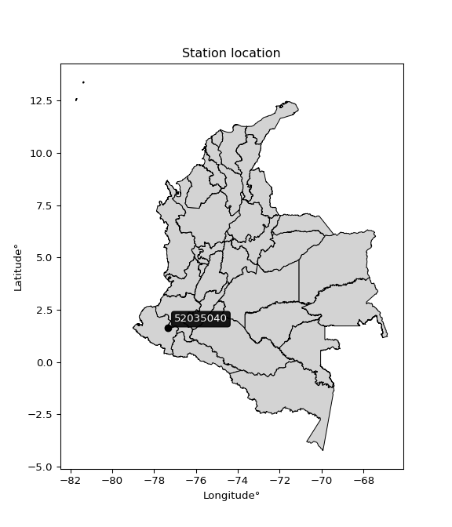

<div align="center">


</div>

# PMax24h Station (Rain): 52035040

Maximum Precipitation in 24 hours (PMax24h) is the greatest amount of rainfall for a specific duration that is meteorologically possible for a given location, acting as a "worst-case" scenario for extreme storms, crucial for designing safety-critical infrastructure like bridges, river deviations, dams, spillways, and nuclear plants to prevent catastrophic failure. The PMax24h is related with the Probable Maximum Precipitation (PMP) and it is calculated by hydrologists using meteorological data to determine the upper limit of extreme rainfall, often leading to the Probable Maximum Flood (PMF) for flood control design, and is increasingly being studied for climate change impacts. Probable Maximum Precipitation (PMP) is the theoretical upper limit of rainfall, a deterministic estimate for extreme events, while probability distributions (like GEV, Gumbel) describe the likelihood and frequency of various precipitation amounts, including rare ones, showing how often events occur, with PMP representing the extreme end of these distributions, used for critical infrastructure design to ensure safety against the worst conceivable weather, unlike standard statistical forecasts which cover typical probabilities.

The most common probability distributions in hydrology, used for analyzing floods, rainfall, and streamflow, include the Normal, Log-Normal, Gumbel, Gamma (including Log-Pearson Type III), and Generalized Extreme Value (GEV) distributions, often chosen based on the data´s skewness and whether modeling extremes or general conditions, with Gumbel and GEV popular for extreme events like floods, while the Normal distribution serves as a baseline, though often requiring transformations for skewed hydrological data. These distributions help in designing water infrastructure, managing water resources, and forecasting hydrologic events.

> Hydrological data often isn´t perfectly normal (it´s skewed), so different distributions are needed for different applications, such as: **Flood Frequency Analysis**: Using Gumbel, GEV, or Log-Pearson Type III for predicting extreme flood magnitudes and their return periods, **Rainfall Analysis**: Normal for annual totals, but Log-Normal, Weibull, or GEV for intensity or extreme daily rainfall, **Streamflow Modeling**: Gamma and Log-Normal for maximum flows, GEV for minimum flows, and Kappa for daily flows.

<div align="center">

</img>

</div>


## A. General information


### 1. General running parameters

• app_version: _v20260225_. • runtime: _2026-02-28 16:54:07.457399_. • Python version: _3.14.0_. • SciPy version: _1.16.3_. • Pandas version: _2.3.3_. • NumPy version: _2.3.5_. • Stations dataset (station_dataset_file): _dataset/pmax24h_in/automatic_colombia_2003_2025.csv_. • Stations catalog (station_catalog_file): _dataset/CNE.xls_. • Minimum year to eval til year_max (date_min): _1900_. • Maximum year to eval since year_min (date_max): _2025_. • Creates, save and include plots into reports (create_plot): _False_. • Plot only fit distributions with Δo > Δ (plot_only_fit): _True_. • Plot only simple graphs avoiding multiple CDFs and multiple Extreme values plots (plot_only_simple): _False_. • Eval low extreme values, if False, evaluates high extreme values (low_extreme): _False_. • Eval every SciPy distribution as logarithmic (pdist_logarithmic_on): _True_. • Standard deviation normalized (ddof): _1.0_. • Return periods to eval in years (Tr): _[2, 2.33, 5, 10, 15, 20, 25, 50, 75, 100, 200, 250, 500, 750, 1000]_. • Minimum data sample per station, 0 means any (minimum_sample): _5_. • Z-Score maximum threshold to adjust a value, 0 means disable (zscore_max): _3.5_. • Z-Score minimum threshold to adjust a value, 0 means disable (zscore_min): _-2.5_. • Avoid zeros, e.g. rain = 0 (avoid_zeros): _True_. • Avoid null values (avoid_nans): _True_. 

:file_folder:Table: [dataset.csv](../../dataset/pmax24h_in/automatic_colombia_2003_2025.csv)

> Delta Degrees of Freedom (DDOF): is a parameter used in the formulas for calculating variance and standard deviation. When ddof=0, the divisor is $N$ (the total number of observations) and this is used when your data set is the entire population. When ddof=1, the divisor is $N-1$ and this is used when your data set is a sample drawn from a larger population. Using $N-1$ provides an unbiased estimate of the population variance (known as Bessel´s correction).


### 2. Station info and location

|   id |   CODIGO | NOMBRE                        | CATEGORIA               | TECNOLOGIA                              | ESTADO   | FECHA_INSTALACION   |   FECHA_SUSPENSION |   ALTITUD |   LATITUD |   LONGITUD | DEPARTAMENTO   | MUNICIPIO   | AREA_OPERATIVA                      | ENTIDAD                                                     | AREA_HIDROGRAFICA   | ZONA_HIDROGRAFICA   | SUBZONA_HIDROGRAFICA   |   CORRIENTE | Catalogo   |   Version |
|-----:|---------:|:------------------------------|:------------------------|:----------------------------------------|:---------|:--------------------|-------------------:|----------:|----------:|-----------:|:---------------|:------------|:------------------------------------|:------------------------------------------------------------|:--------------------|:--------------------|:-----------------------|------------:|:-----------|----------:|
|    0 | 52035040 | VIENTO LIBRE - AUT [52035040] | Climatológica Ordinaria | Automática con Telemetría, Convencional | Activa   | 01/03/2004          |                nan |      1400 |      1.62 |     -77.34 | Nariño         | Taminango   | Area Operativa 07 - Nariño-Putumayo | INSTITUTO DE HIDROLOGIA METEOROLOGIA Y ESTUDIOS AMBIENTALES | Pacifico            | Patía               | Río Patia Alto         |         nan | CNE_IDEAM  |  20251226 |

<div align="center">

Dynamic map: [:earth_americas:Google](http://maps.google.com/maps?q=1.62,-77.34) [:earth_americas:OSM](https://www.openstreetmap.org/#map=18/1.62/-77.34&layers=P) [:earth_americas:Bing](https://www.bing.com/maps?cp=1.62~-77.34&lvl=18) [:earth_americas:Apple](https://maps.apple.com/frame?center=1.62%2C-77.34&span=0.003%2C0.006)

</div>


<div align="center">

```geojson
{
  "type": "Feature",
  "geometry": {
    "type": "Point", 
    "coordinates": [-77.34, 1.62]
  }, 
  "properties": {
    "Name": "52035040"
  }
}
```

</div>


### 3. Discrete values table and plot

<div align="center">

|               |          0 |            1 |         2 |            3 |           4 |           5 |            6 |          7 |           8 |           9 |
|:--------------|-----------:|-------------:|----------:|-------------:|------------:|------------:|-------------:|-----------:|------------:|------------:|
| Date          | 2016       | 2017         | 2018      | 2019         | 2020        | 2021        | 2022         | 2023       | 2024        | 2025        |
| Value         |    0.2     |   32.9       |   39.6    |   35         |   28.8      |   17        |   32.8       |   62.7     |   41.6      |   50.4      |
| Value_initial |    0.2     |   32.9       |   39.6    |   35         |   28.8      |   17        |   32.8       |   62.7     |   41.6      |   50.4      |
| count         |   10       |   10         |   10      |   10         |   10        |   10        |   10         |   10       |   10        |   10        |
| mean          |   34.1     |   34.1       |   34.1    |   34.1       |   34.1      |   34.1      |   34.1       |   34.1     |   34.1      |   34.1      |
| std           |   17.1393  |   17.1393    |   17.1393 |   17.1393    |   17.1393   |   17.1393   |   17.1393    |   17.1393  |   17.1393   |   17.1393   |
| zscore        |   -1.97791 |   -0.0700145 |    0.3209 |    0.0525109 |   -0.309231 |   -0.997707 |   -0.0758491 |    1.66868 |    0.437591 |    0.951031 |


</div>


> The initial value (value_initial) correspond to the initial obtained or null completed value, and value (value) is adjusted only when the initial value is outside the valid range (outlier) definite through the Z-Score value. If Z-Score is active, values out of range or outliers are replaced with the station mean value. A Z-Score (or standard score) measures how many standard deviations a data point is from the mean of a dataset, indicating its relative position; positive scores mean above the mean, negative mean below, and a score of zero is exactly at the mean, allowing for comparison of values from different distributions. It´s calculated using the formula $z=(x–μ)/σ$, where $x$ is the data point, $μ$ is the mean, and $σ$ is the standard deviation, helping identify outliers and understand probability.
>
> <sub>**Note**: In this study, "completing" (filling gaps in) and "extending" (forecasting or lengthening the historical record) rainfall data series are avoided for certain critical analyses because they introduce artificial bias and uncertainty, which can distort the statistics of rare events (extremes), alter day-to-day variability, and compromise the integrity and homogeneity of the original data. Some reasons against Completing/Extending rainfall data are: **Distortion of Extremes and Variability**: The primary issue is that most gap-filling or extension methods rely on averaging or regression with nearby stations, which inherently smooths the data. Rainfall is highly variable in space and time, with a large percentage of zero values and occasional large storms. Infilling methods often underestimate the highest values and overestimate the lowest (zero) values, which severely distorts analyses focused on flood frequency, drought severity, and intensity-duration-frequency (IDF) curves, **Loss of Data Homogeneity**: Infilled or extended data are synthetic estimates, not actual measurements. Combining these estimates with observed data can violate the assumption of data homogeneity, which requires that the data properties do not change over time. Inhomogeneity can lead to incorrect conclusions about long-term trends or changes in climate patterns, **Propagation of Errors**: Errors and biases from the original data (e.g., wind-induced undercatch, instrument errors, site changes) or the data used for imputation can propagate through the analysis, leading to unreliable hydrological models and inaccurate predictions, **Compromised Statistical Integrity**: For statistical analyses, especially those involving the frequency of events, using artificial data can introduce time bias or autocorrelation that doesn´t exist in reality, making it difficult to assess the true probability of events, **Difficulty in Validation**: It is difficult to accurately validate the quality of filled or extended data, especially for past periods where ground-truth measurements are unavailable. The reliability of imputation techniques heavily depends on the density of the surrounding station network and the complexity of the local topography.</sub>


### 4. Active continuous probability distributions from SciPy (80 of 104 available)

A Probability Density Function (PDF) describes the relative likelihood of a continuous random variable falling within a specific range, where the total area under its curve equals 1, and the area over any interval gives the actual probability for that range. Unlike discrete probabilities (like rolling a die), a PDF shows density, not direct probability for a single point (which is zero), with higher points indicating higher likelihood, often visualized as a bell curve for normal distributions.

A log of a probability density function (log-PDF) is simply the logarithm of the PDF´s value, denoted as $log(f(x))$, useful for converting multiplication of probabilities into addition, improving numerical stability with tiny numbers, and connecting to information theory concepts like entropy. Instead of dealing with very small probabilities (e.g., 0.000001), log-PDFs use negative numbers (e.g., $log(0.00001) ≈ -11.51$ that are easier for computers to handle, preventing underflow errors and simplifying complex calculations. In this study, each active probability distribution from SciPy is also evaluated in the $log$ form.

[scipy.stats](https://docs.scipy.org/doc/scipy/reference/stats.html) is a Python´s powerful submodule within the SciPy library for comprehensive statistical analysis, offering over 130 probability distributions (like Normal, Poisson, etc.), functions for descriptive stats (mean, variance), hypothesis testing (t-tests, chi-square), random variable generation, and statistical tests, making it essential for data science, modeling, and research. It provides tools to explore, model, and draw conclusions from data efficiently, working seamlessly with [NumPy](https://numpy.org/).

<div align="center">

|   id | p_dist           |   n_parameter | fit_method   | label                                                                       | active   | ref                                                                                                      |
|-----:|:-----------------|--------------:|:-------------|:----------------------------------------------------------------------------|:---------|:---------------------------------------------------------------------------------------------------------|
|    0 | alpha            |             3 | MLE          | Alpha                                                                       | True     | [:mortar_board:](https://docs.scipy.org/doc/scipy/reference/generated/scipy.stats.alpha.html)            |
|    1 | anglit           |             2 | MM           | Anglit                                                                      | True     | [:mortar_board:](https://docs.scipy.org/doc/scipy/reference/generated/scipy.stats.anglit.html)           |
|    2 | arcsine          |             2 | MM           | Arcsine                                                                     | True     | [:mortar_board:](https://docs.scipy.org/doc/scipy/reference/generated/scipy.stats.arcsine.html)          |
|    3 | argus            |             3 | MLE          | Argus                                                                       | True     | [:mortar_board:](https://docs.scipy.org/doc/scipy/reference/generated/scipy.stats.argus.html)            |
|    4 | beta             |             4 | MLE          | Beta                                                                        | True     | [:mortar_board:](https://docs.scipy.org/doc/scipy/reference/generated/scipy.stats.beta.html)             |
|    5 | betaprime        |             4 | MLE          | Beta prime                                                                  | True     | [:mortar_board:](https://docs.scipy.org/doc/scipy/reference/generated/scipy.stats.betaprime.html)        |
|    6 | bradford         |             3 | MLE          | Bradford                                                                    | True     | [:mortar_board:](https://docs.scipy.org/doc/scipy/reference/generated/scipy.stats.bradford.html)         |
|    7 | burr             |             4 | MLE          | Burr (Type III)                                                             | True     | [:mortar_board:](https://docs.scipy.org/doc/scipy/reference/generated/scipy.stats.burr.html)             |
|    8 | burr12           |             4 | MLE          | Burr (Type III) 12                                                          | True     | [:mortar_board:](https://docs.scipy.org/doc/scipy/reference/generated/scipy.stats.burr12.html)           |
|    9 | cosine           |             2 | MLE          | Cosine                                                                      | True     | [:mortar_board:](https://docs.scipy.org/doc/scipy/reference/generated/scipy.stats.cosine.html)           |
|   10 | crystalball      |             4 | MLE          | Crystalball                                                                 | True     | [:mortar_board:](https://docs.scipy.org/doc/scipy/reference/generated/scipy.stats.crystalball.html)      |
|   11 | dgamma           |             3 | MLE          | Double gamma                                                                | True     | [:mortar_board:](https://docs.scipy.org/doc/scipy/reference/generated/scipy.stats.dgamma.html)           |
|   12 | dweibull         |             3 | MLE          | Double Weibull                                                              | True     | [:mortar_board:](https://docs.scipy.org/doc/scipy/reference/generated/scipy.stats.dweibull.html)         |
|   13 | erlang           |             3 | MLE          | Erlang                                                                      | True     | [:mortar_board:](https://docs.scipy.org/doc/scipy/reference/generated/scipy.stats.erlang.html)           |
|   14 | exponnorm        |             3 | MLE          | Exponentially modified Normal                                               | True     | [:mortar_board:](https://docs.scipy.org/doc/scipy/reference/generated/scipy.stats.exponnorm.html)        |
|   15 | exponpow         |             3 | MLE          | Exponential power                                                           | True     | [:mortar_board:](https://docs.scipy.org/doc/scipy/reference/generated/scipy.stats.exponpow.html)         |
|   16 | exponweib        |             4 | MLE          | Exponentiated Weibull                                                       | True     | [:mortar_board:](https://docs.scipy.org/doc/scipy/reference/generated/scipy.stats.exponweib.html)        |
|   17 | f                |             4 | MLE          | F                                                                           | True     | [:mortar_board:](https://docs.scipy.org/doc/scipy/reference/generated/scipy.stats.f.html)                |
|   18 | fatiguelife      |             3 | MLE          | Fatigue-life (Birnbaum-Saunders)                                            | True     | [:mortar_board:](https://docs.scipy.org/doc/scipy/reference/generated/scipy.stats.fatiguelife.html)      |
|   19 | foldnorm         |             3 | MM           | Fold Normal                                                                 | True     | [:mortar_board:](https://docs.scipy.org/doc/scipy/reference/generated/scipy.stats.foldnorm.html)         |
|   20 | gamma            |             3 | MLE          | Gamma                                                                       | True     | [:mortar_board:](https://docs.scipy.org/doc/scipy/reference/generated/scipy.stats.gamma.html)            |
|   21 | gausshyper       |             6 | MLE          | Gauss hypergeometric                                                        | True     | [:mortar_board:](https://docs.scipy.org/doc/scipy/reference/generated/scipy.stats.gausshyper.html)       |
|   22 | genexpon         |             5 | MLE          | Generalized exponential                                                     | True     | [:mortar_board:](https://docs.scipy.org/doc/scipy/reference/generated/scipy.stats.genexpon.html)         |
|   23 | genextreme       |             3 | MLE          | Generalized exponential                                                     | True     | [:mortar_board:](https://docs.scipy.org/doc/scipy/reference/generated/scipy.stats.genextreme.html)       |
|   24 | gengamma         |             4 | MLE          | Generalized gamma                                                           | True     | [:mortar_board:](https://docs.scipy.org/doc/scipy/reference/generated/scipy.stats.gengamma.html)         |
|   25 | genhalflogistic  |             3 | MLE          | Generalized half-logistic                                                   | True     | [:mortar_board:](https://docs.scipy.org/doc/scipy/reference/generated/scipy.stats.genhalflogistic.html)  |
|   26 | genlogistic      |             3 | MLE          | Generalized logistic                                                        | True     | [:mortar_board:](https://docs.scipy.org/doc/scipy/reference/generated/scipy.stats.genlogistic.html)      |
|   27 | gennorm          |             3 | MLE          | Generalized Normal                                                          | True     | [:mortar_board:](https://docs.scipy.org/doc/scipy/reference/generated/scipy.stats.gennorm.html)          |
|   28 | genpareto        |             3 | MLE          | Generalized Pareto                                                          | True     | [:mortar_board:](https://docs.scipy.org/doc/scipy/reference/generated/scipy.stats.genpareto.html)        |
|   29 | gompertz         |             3 | MLE          | Gompertz (or truncated Gumbel)                                              | True     | [:mortar_board:](https://docs.scipy.org/doc/scipy/reference/generated/scipy.stats.gompertz.html)         |
|   30 | gumbel_l         |             2 | MM           | Gumbel Left Skew                                                            | True     | [:mortar_board:](https://docs.scipy.org/doc/scipy/reference/generated/scipy.stats.gumbel_l.html)         |
|   31 | gumbel_r         |             2 | MM           | Gumbel Right Skew                                                           | True     | [:mortar_board:](https://docs.scipy.org/doc/scipy/reference/generated/scipy.stats.gumbel_r.html)         |
|   32 | halfgennorm      |             3 | MLE          | Upper half of a generalized normal                                          | True     | [:mortar_board:](https://docs.scipy.org/doc/scipy/reference/generated/scipy.stats.halfgennorm.html)      |
|   33 | halflogistic     |             2 | MM           | Half-logistic                                                               | True     | [:mortar_board:](https://docs.scipy.org/doc/scipy/reference/generated/scipy.stats.halflogistic.html)     |
|   34 | halfnorm         |             2 | MM           | Half Normal                                                                 | True     | [:mortar_board:](https://docs.scipy.org/doc/scipy/reference/generated/scipy.stats.halfnorm.html)         |
|   35 | hypsecant        |             2 | MM           | hyperbolic secant                                                           | True     | [:mortar_board:](https://docs.scipy.org/doc/scipy/reference/generated/scipy.stats.hypsecant.html)        |
|   36 | invgamma         |             3 | MLE          | Inverted gamma                                                              | True     | [:mortar_board:](https://docs.scipy.org/doc/scipy/reference/generated/scipy.stats.invgamma.html)         |
|   37 | invgauss         |             3 | MLE          | Inverse Gaussian                                                            | True     | [:mortar_board:](https://docs.scipy.org/doc/scipy/reference/generated/scipy.stats.invgauss.html)         |
|   38 | invweibull       |             3 | MLE          | Inverted Weibull                                                            | True     | [:mortar_board:](https://docs.scipy.org/doc/scipy/reference/generated/scipy.stats.invweibull.html)       |
|   39 | johnsonsb        |             4 | MLE          | Johnson SB                                                                  | True     | [:mortar_board:](https://docs.scipy.org/doc/scipy/reference/generated/scipy.stats.johnsonsb.html)        |
|   40 | johnsonsu        |             4 | MLE          | Johnson Su                                                                  | True     | [:mortar_board:](https://docs.scipy.org/doc/scipy/reference/generated/scipy.stats.johnsonsu.html)        |
|   41 | kappa3           |             3 | MLE          | Kappa 3                                                                     | True     | [:mortar_board:](https://docs.scipy.org/doc/scipy/reference/generated/scipy.stats.kappa3.html)           |
|   42 | kappa4           |             4 | MLE          | Kappa 4                                                                     | True     | [:mortar_board:](https://docs.scipy.org/doc/scipy/reference/generated/scipy.stats.kappa4.html)           |
|   43 | ksone            |             3 | MLE          | Kolmogorov-Smirnov one-sided test statistic distribution                    | True     | [:mortar_board:](https://docs.scipy.org/doc/scipy/reference/generated/scipy.stats.ksone.html)            |
|   44 | kstwobign        |             2 | MLE          | Limiting distribution of scaled Kolmogorov-Smirnov two-sided test statistic | True     | [:mortar_board:](https://docs.scipy.org/doc/scipy/reference/generated/scipy.stats.kstwobign.html)        |
|   45 | laplace          |             2 | MM           | Laplace                                                                     | True     | [:mortar_board:](https://docs.scipy.org/doc/scipy/reference/generated/scipy.stats.laplace.html)          |
|   46 | levy_l           |             2 | MLE          | Left-skewed Levy                                                            | True     | [:mortar_board:](https://docs.scipy.org/doc/scipy/reference/generated/scipy.stats.levy_l.html)           |
|   47 | loggamma         |             3 | MLE          | Log gamma                                                                   | True     | [:mortar_board:](https://docs.scipy.org/doc/scipy/reference/generated/scipy.stats.loggamma.html)         |
|   48 | logistic         |             2 | MM           | Logistic (or Sech-squared)                                                  | True     | [:mortar_board:](https://docs.scipy.org/doc/scipy/reference/generated/scipy.stats.logistic.html)         |
|   49 | loglaplace       |             3 | MLE          | Log-Laplace                                                                 | True     | [:mortar_board:](https://docs.scipy.org/doc/scipy/reference/generated/scipy.stats.loglaplace.html)       |
|   50 | lomax            |             3 | MLE          | Lomax (Pareto of the second kind)                                           | True     | [:mortar_board:](https://docs.scipy.org/doc/scipy/reference/generated/scipy.stats.lomax.html)            |
|   51 | maxwell          |             2 | MM           | Maxwell                                                                     | True     | [:mortar_board:](https://docs.scipy.org/doc/scipy/reference/generated/scipy.stats.maxwell.html)          |
|   52 | mielke           |             4 | MLE          | Mielke Beta-Kappa / Dagum                                                   | True     | [:mortar_board:](https://docs.scipy.org/doc/scipy/reference/generated/scipy.stats.mielke.html)           |
|   53 | moyal            |             2 | MM           | Moyal                                                                       | True     | [:mortar_board:](https://docs.scipy.org/doc/scipy/reference/generated/scipy.stats.moyal.html)            |
|   54 | nakagami         |             3 | MLE          | Nakagami                                                                    | True     | [:mortar_board:](https://docs.scipy.org/doc/scipy/reference/generated/scipy.stats.nakagami.html)         |
|   55 | ncf              |             5 | MLE          | Non-central F distribution                                                  | True     | [:mortar_board:](https://docs.scipy.org/doc/scipy/reference/generated/scipy.stats.ncf.html)              |
|   56 | nct              |             4 | MLE          | Non-central Student’s t                                                     | True     | [:mortar_board:](https://docs.scipy.org/doc/scipy/reference/generated/scipy.stats.nct.html)              |
|   57 | norm             |             2 | MM           | Normal                                                                      | True     | [:mortar_board:](https://docs.scipy.org/doc/scipy/reference/generated/scipy.stats.norm.html)             |
|   58 | pearson3         |             3 | MM           | Pearson type III                                                            | True     | [:mortar_board:](https://docs.scipy.org/doc/scipy/reference/generated/scipy.stats.pearson3.html)         |
|   59 | powerlaw         |             3 | MLE          | Power-function                                                              | True     | [:mortar_board:](https://docs.scipy.org/doc/scipy/reference/generated/scipy.stats.powerlaw.html)         |
|   60 | rayleigh         |             2 | MM           | Rayleigh                                                                    | True     | [:mortar_board:](https://docs.scipy.org/doc/scipy/reference/generated/scipy.stats.rayleigh.html)         |
|   61 | rdist            |             3 | MLE          | R-distributed (symmetric beta)                                              | True     | [:mortar_board:](https://docs.scipy.org/doc/scipy/reference/generated/scipy.stats.rdist.html)            |
|   62 | rice             |             3 | MLE          | Rice                                                                        | True     | [:mortar_board:](https://docs.scipy.org/doc/scipy/reference/generated/scipy.stats.rice.html)             |
|   63 | semicircular     |             2 | MM           | Semicircular                                                                | True     | [:mortar_board:](https://docs.scipy.org/doc/scipy/reference/generated/scipy.stats.semicircular.html)     |
|   64 | skewnorm         |             3 | MLE          | Skew normal                                                                 | True     | [:mortar_board:](https://docs.scipy.org/doc/scipy/reference/generated/scipy.stats.skewnorm.html)         |
|   65 | t                |             3 | MLE          | Student’s t                                                                 | True     | [:mortar_board:](https://docs.scipy.org/doc/scipy/reference/generated/scipy.stats.t.html)                |
|   66 | trapezoid        |             4 | MLE          | Trapezoid                                                                   | True     | [:mortar_board:](https://docs.scipy.org/doc/scipy/reference/generated/scipy.stats.trapezoid.html)        |
|   67 | triang           |             3 | MLE          | Triangular                                                                  | True     | [:mortar_board:](https://docs.scipy.org/doc/scipy/reference/generated/scipy.stats.triang.html)           |
|   68 | truncexpon       |             3 | MLE          | Truncated exponential                                                       | True     | [:mortar_board:](https://docs.scipy.org/doc/scipy/reference/generated/scipy.stats.truncexpon.html)       |
|   69 | truncnorm        |             4 | MLE          | Truncated normal                                                            | True     | [:mortar_board:](https://docs.scipy.org/doc/scipy/reference/generated/scipy.stats.truncnorm.html)        |
|   70 | truncpareto      |             4 | MLE          | Upper truncated Pareto                                                      | True     | [:mortar_board:](https://docs.scipy.org/doc/scipy/reference/generated/scipy.stats.truncpareto.html)      |
|   71 | truncweibull_min |             5 | MLE          | Doubly truncated Weibull minimum                                            | True     | [:mortar_board:](https://docs.scipy.org/doc/scipy/reference/generated/scipy.stats.truncweibull_min.html) |
|   72 | tukeylambda      |             3 | MLE          | Tukey-Lamdba                                                                | True     | [:mortar_board:](https://docs.scipy.org/doc/scipy/reference/generated/scipy.stats.tukeylambda.html)      |
|   73 | uniform          |             2 | MLE          | Uniform                                                                     | True     | [:mortar_board:](https://docs.scipy.org/doc/scipy/reference/generated/scipy.stats.uniform.html)          |
|   74 | vonmises         |             3 | MLE          | Von Mises                                                                   | True     | [:mortar_board:](https://docs.scipy.org/doc/scipy/reference/generated/scipy.stats.vonmises.html)         |
|   75 | vonmises_line    |             3 | MLE          | Von Mises line                                                              | True     | [:mortar_board:](https://docs.scipy.org/doc/scipy/reference/generated/scipy.stats.vonmises_line.html)    |
|   76 | wald             |             2 | MM           | Wald                                                                        | True     | [:mortar_board:](https://docs.scipy.org/doc/scipy/reference/generated/scipy.stats.wald.html)             |
|   77 | weibull_max      |             3 | MLE          | Weibull maximum                                                             | True     | [:mortar_board:](https://docs.scipy.org/doc/scipy/reference/generated/scipy.stats.weibull_max.html)      |
|   78 | weibull_min      |             3 | MLE          | Weibull minimum                                                             | True     | [:mortar_board:](https://docs.scipy.org/doc/scipy/reference/generated/scipy.stats.weibull_min.html)      |
|   79 | wrapcauchy       |             3 | MLE          | Wrapped  Cauchy                                                             | True     | [:mortar_board:](https://docs.scipy.org/doc/scipy/reference/generated/scipy.stats.wrapcauchy.html)       |

</div>

> **n_parameter:** # arguments & localization & scale.
>
> **Fit methods:** (MLE) maximum likelihood, (MM) L-moments.
>
>**Inactive** (With the only purpose of prevent loops, zero divisions, infinite values, over high estimated values or horizontal trending for recurrence intervals estimations, the follow distributions were disabled.)**:** lognorm, norminvgauss, powernorm, powerlognorm, cauchy, halfcauchy, foldcauchy, skewcauchy, chi2, expon, fisk, genhyperbolic, geninvgauss, gibrat, kstwo, laplace_asymmetric, levy, levy_stable, ncx2, pareto, rel_breitwigner, recipinvgauss, studentized_range, loguniform, 


## B. Probability (PDF) vs. Empirical (EDF) distributions functions

A continuous probability distribution (CPD) describes probabilities for variables that can take any value within a range (like rain any time), unlike discrete variables with specific outcomes (like temperature). It uses a Probability Density Function (PDF), a curve where the total area under it equals 1, and the probability of the variable falling within an interval (a to b) is found by calculating the area under the curve between those points. A key feature is that the probability of hitting any single exact value is zero, so probabilities are always expressed for ranges, e.g., $P(a ≤ X ≤ b)$.

<div align="center">

Distributions parameters from station values
|     |   station | p_dist              |   n |             loc |           scale | shape                  | shape1                | shape2                 | shape3             |
|----:|----------:|:--------------------|----:|----------------:|----------------:|:-----------------------|:----------------------|:-----------------------|:-------------------|
|   0 |  52035040 | alpha               |  10 |  -149.788       |  1973.67        | 10.851307061433559     |                       |                        |                    |
|   1 |  52035040 | anglit              |  10 |    34.1         |    47.5663      |                        |                       |                        |                    |
|   2 |  52035040 | arcsine             |  10 |    11.1052      |    45.9895      |                        |                       |                        |                    |
|   3 |  52035040 | argus               |  10 |    -8.81866     |    73.9255      | 4.3626854115992795e-06 |                       |                        |                    |
|   4 |  52035040 | beta                |  10 |     0.2         |    62.5041      | 0.9601102000500368     | 0.9848501314980052    |                        |                    |
|   5 |  52035040 | betaprime           |  10 |  -594.97        | 37850.4         | 1487.2634308729248     | 89498.62513425638     |                        |                    |
|   6 |  52035040 | bradford            |  10 |    -8.21368     |    70.9139      | 2.0365278272962425e-05 |                       |                        |                    |
|   7 |  52035040 | burr                |  10 |    -0.63489     |    64.3788      | 163.34693535890932     | 0.006474633181220629  |                        |                    |
|   8 |  52035040 | burr12              |  10 |   -39.6514      |   400.364       | 5.248966067295765      | 4659.827110142052     |                        |                    |
|   9 |  52035040 | cosine              |  10 |    33.06        |    14.5087      |                        |                       |                        |                    |
|  10 |  52035040 | crystalball         |  10 |    34.1         |    16.2598      | 2684.9939980874115     | 3412.6818466678064    |                        |                    |
|  11 |  52035040 | dgamma              |  10 |    35           |    12.3449      | 0.8950788952115551     |                       |                        |                    |
|  12 |  52035040 | dweibull            |  10 |    35           |    12.1163      | 0.9108360208969348     |                       |                        |                    |
|  13 |  52035040 | erlang              |  10 |  -243.61        |     0.985997    | 281.5291861610373      |                       |                        |                    |
|  14 |  52035040 | exponnorm           |  10 |    34.0871      |    16.2597      | 0.0007931622186755697  |                       |                        |                    |
|  15 |  52035040 | exponpow            |  10 |     0.2         |     2.47685     | 0.10093315159626295    |                       |                        |                    |
|  16 |  52035040 | exponweib           |  10 |     0.2         |     3.41233     | 1.0228127381755643     | 0.37668570141568614   |                        |                    |
|  17 |  52035040 | f                   |  10 | -3810.48        |  3844.58        | 111459.5906508881      | 18721638.4324561      |                        |                    |
|  18 |  52035040 | fatiguelife         |  10 | -1721.51        |  1755.61        | 0.00922563304200772    |                       |                        |                    |
|  19 |  52035040 | foldnorm            |  10 |   -55.5236      |    15.6428      | 5.738843008298615      |                       |                        |                    |
|  20 |  52035040 | gamma               |  10 |  -268.049       |     0.899024    | 335.8508386389708      |                       |                        |                    |
|  21 |  52035040 | gausshyper          |  10 |    -6.74082     |    69.4408      | 1.5345085722172362     | 0.829386361918426     | 0.9971858193021138     | 0.5342496783204389 |
|  22 |  52035040 | genexpon            |  10 |     0.199992    |     2.55936     | 0.07539243288502928    | 7.280074418270293e-07 | 1.150381706131118      |                    |
|  23 |  52035040 | genextreme          |  10 |    29.36        |    17.2469      | 0.4067674950242449     |                       |                        |                    |
|  24 |  52035040 | gengamma            |  10 |     0.2         |     1.12104     | 2.3027487600245147     | 0.35185669737741      |                        |                    |
|  25 |  52035040 | genhalflogistic     |  10 |    -6.29186     |    72.7559      | 1.0545577268072404     |                       |                        |                    |
|  26 |  52035040 | genlogistic         |  10 |    39.7293      |     7.48122     | 0.6600515869575783     |                       |                        |                    |
|  27 |  52035040 | gennorm             |  10 |    32.9         |     0.737795    | 0.4026752635480313     |                       |                        |                    |
|  28 |  52035040 | genpareto           |  10 |    -0.150005    |    98.7942      | -1.5719037612129694    |                       |                        |                    |
|  29 |  52035040 | gompertz            |  10 |    16.9999      |    16.5943      | 0.2669083077942709     |                       |                        |                    |
|  30 |  52035040 | gumbel_l            |  10 |    41.4178      |    12.6777      |                        |                       |                        |                    |
|  31 |  52035040 | gumbel_r            |  10 |    26.7822      |    12.6777      |                        |                       |                        |                    |
|  32 |  52035040 | halfgennorm         |  10 |     0.2         |     1.51308     | 0.3617620067512789     |                       |                        |                    |
|  33 |  52035040 | halflogistic        |  10 |    14.8284      |    13.9015      |                        |                       |                        |                    |
|  34 |  52035040 | halfnorm            |  10 |    12.5785      |    26.9732      |                        |                       |                        |                    |
|  35 |  52035040 | hypsecant           |  10 |    34.1         |    10.3513      |                        |                       |                        |                    |
|  36 |  52035040 | invgamma            |  10 |  -192.536       | 40607.1         | 180.40098651398216     |                       |                        |                    |
|  37 |  52035040 | invgauss            |  10 |   -95.0858      |  7302.93        | 0.01762982823472671    |                       |                        |                    |
|  38 |  52035040 | invweibull          |  10 |    -1.51417e+09 |     1.51417e+09 | 88605009.75304177      |                       |                        |                    |
|  39 |  52035040 | johnsonsb           |  10 |  -239.172       |   362.251       | -4.660875102836997     | 4.099098917940084     |                        |                    |
|  40 |  52035040 | johnsonsu           |  10 |    37.1296      |    13.6338      | 0.17380549236228807    | 1.1556604881938854    |                        |                    |
|  41 |  52035040 | kappa3              |  10 |     0.198984    |    62.5008      | 651272.1306587798      |                       |                        |                    |
|  42 |  52035040 | kappa4              |  10 |    -6.12189     |    69.7246      | 1.0997752756440016     | 1.0126926145954767    |                        |                    |
|  43 |  52035040 | ksone               |  10 |    -6.05        |    75           | 1.0                    |                       |                        |                    |
|  44 |  52035040 | kstwobign           |  10 |   -36.5714      |    81.0741      |                        |                       |                        |                    |
|  45 |  52035040 | laplace             |  10 |    34.1         |    11.4974      |                        |                       |                        |                    |
|  46 |  52035040 | levy_l              |  10 |    65.7726      |    15.9709      |                        |                       |                        |                    |
|  47 |  52035040 | loggamma            |  10 |   -47.3856      |    42.4686      | 7.306151890066559      |                       |                        |                    |
|  48 |  52035040 | logistic            |  10 |    34.1         |     8.96448     |                        |                       |                        |                    |
|  49 |  52035040 | loglaplace          |  10 |    -0.0796305   |    35.0796      | 1.4062027893184275     |                       |                        |                    |
|  50 |  52035040 | lomax               |  10 |     0.2         |     3.251e+11   | 9583207285.882296      |                       |                        |                    |
|  51 |  52035040 | maxwell             |  10 |    -4.42882     |    24.1444      |                        |                       |                        |                    |
|  52 |  52035040 | mielke              |  10 |     0.2         |    62.9833      | 0.9326080823587499     | 383.485104096682      |                        |                    |
|  53 |  52035040 | moyal               |  10 |    24.8016      |     7.31947     |                        |                       |                        |                    |
|  54 |  52035040 | nakagami            |  10 |     0.2         |    38.1328      | 0.32519988386267884    |                       |                        |                    |
|  55 |  52035040 | ncf                 |  10 |     0.2         |     2.60645     | 0.6913757888584994     | 46.476988385135115    | 7.127787927898529      |                    |
|  56 |  52035040 | nct                 |  10 | -1206.6         |    16.2228      | 597766.1591168973      | 76.4789808835047      |                        |                    |
|  57 |  52035040 | norm                |  10 |    34.1         |    16.2598      |                        |                       |                        |                    |
|  58 |  52035040 | pearson3            |  10 |    34.1         |    16.2598      | -0.36751253121379657   |                       |                        |                    |
|  59 |  52035040 | powerlaw            |  10 |     0.2         |    62.5         | 0.21128051222307345    |                       |                        |                    |
|  60 |  52035040 | rayleigh            |  10 |     2.99406     |    24.8189      |                        |                       |                        |                    |
|  61 |  52035040 | rdist               |  10 |    -5.05588     |    40.0559      | 1.011696702521347      |                       |                        |                    |
|  62 |  52035040 | rice                |  10 |   -10.3025      |    17.3377      | 2.332056135401276      |                       |                        |                    |
|  63 |  52035040 | semicircular        |  10 |    34.1         |    32.5195      |                        |                       |                        |                    |
|  64 |  52035040 | skewnorm            |  10 |    49.2637      |    22.2333      | -1.6665270462811494    |                       |                        |                    |
|  65 |  52035040 | t                   |  10 |    34.081       |    16.1948      | 90.72453450211572      |                       |                        |                    |
|  66 |  52035040 | trapezoid           |  10 |    -6.3525      |    75           | 1.0                    | 1.0                   |                        |                    |
|  67 |  52035040 | triang              |  10 |    -8.60433     |    71.5857      | 0.9999999999975815     |                       |                        |                    |
|  68 |  52035040 | truncexpon          |  10 |     0.199965    |    96.7217      | 0.6461844495506325     |                       |                        |                    |
|  69 |  52035040 | truncnorm           |  10 |    72.0079      |    37.6541      | -1.9076629579977906    | -0.24712946948254594  |                        |                    |
|  70 |  52035040 | truncpareto         |  10 |     0.198377    |     0.00162297  | 0.11116519701078925    | 38510.55063786352     |                        |                    |
|  71 |  52035040 | truncweibull_min    |  10 |    -2.18569     |    98.9903      | 1.3960785461247633     | 0.001314111561292775  | 0.6554754998199215     |                    |
|  72 |  52035040 | tukeylambda         |  10 |    -4.92041     |    39.4921      | 1.0442010620301012     |                       |                        |                    |
|  73 |  52035040 | uniform             |  10 |     0.2         |    62.5         |                        |                       |                        |                    |
|  74 |  52035040 | vonmises            |  10 |     1.31772     |     1           | 0.11305615114867623    |                       |                        |                    |
|  75 |  52035040 | vonmises_line       |  10 |    31.4501      |     9.94723     | 0.9507903143657157     |                       |                        |                    |
|  76 |  52035040 | wald                |  10 |    17.8402      |    16.2598      |                        |                       |                        |                    |
|  77 |  52035040 | weibull_max         |  10 |    62.7         |     1.62032     | 0.2655400465475493     |                       |                        |                    |
|  78 |  52035040 | weibull_min         |  10 |   -39.6268      |    80.0676      | 5.246539692994017      |                       |                        |                    |
|  79 |  52035040 | wrapcauchy          |  10 |     0.194506    |     9.94807     | 0.00410624412158782    |                       |                        |                    |
|  80 |  52035040 | logalpha            |  10 |   -64.8918      |  2646.98        | 38.99812092965766      |                       |                        |                    |
|  81 |  52035040 | loganglit           |  10 |     3.05887     |     4.65275     |                        |                       |                        |                    |
|  82 |  52035040 | logarcsine          |  10 |     0.809596    |     4.49854     |                        |                       |                        |                    |
|  83 |  52035040 | logargus            |  10 |    -3.45004     |     7.64288     | 3.562036379429993      |                       |                        |                    |
|  84 |  52035040 | logbeta             |  10 |    -2.3327      |     6.47106     | 0.2396667020119757     | 0.029892120553789245  |                        |                    |
|  85 |  52035040 | logbetaprime        |  10 |    -1.60944     |     2.62583     | 0.19305220988594834    | 0.49728863483463304   |                        |                    |
|  86 |  52035040 | logbradford         |  10 |    -1.6617      |     5.80006     | 2.5997370978298864e-05 |                       |                        |                    |
|  87 |  52035040 | logburr             |  10 |    -6.57798e+07 |     6.57798e+07 | 383633344.8586191      | 0.1721538291054252    |                        |                    |
|  88 |  52035040 | logburr12           |  10 | -9861.91        |  9874.3         | 14960.635047264928     | 616286.176045097      |                        |                    |
|  89 |  52035040 | logcosine           |  10 |     2.50784     |     1.63723     |                        |                       |                        |                    |
|  90 |  52035040 | logcrystalball      |  10 |     3.05887     |     1.59046     | 7.362561537464368      | 74.00607093989245     |                        |                    |
|  91 |  52035040 | logdgamma           |  10 |     3.49043     |     1.22707     | 0.4732890009347242     |                       |                        |                    |
|  92 |  52035040 | logdweibull         |  10 |     3.49347     |     1.07163     | 0.6645294056627568     |                       |                        |                    |
|  93 |  52035040 | logerlang           |  10 |    -1.60944     |   113.908       | 0.17984447893993605    |                       |                        |                    |
|  94 |  52035040 | logexponnorm        |  10 |     3.0579      |     1.59047     | 0.0006092964407999976  |                       |                        |                    |
|  95 |  52035040 | logexponpow         |  10 |    -1.60944     |     1.73151     | 0.3417513992076392     |                       |                        |                    |
|  96 |  52035040 | logexponweib        |  10 |    -1.60944     |     1.93072     | 1.3356905822391711     | 0.18805853029328984   |                        |                    |
|  97 |  52035040 | logf                |  10 |    -1.60944     |     1.1991      | 1.05426849212423       | 1.0491558599157733    |                        |                    |
|  98 |  52035040 | logfatiguelife      |  10 | -1329.41        |  1332.47        | 0.0011921223864581401  |                       |                        |                    |
|  99 |  52035040 | logfoldnorm         |  10 |    -4.92489     |     1.05268     | 7.700946596533377      |                       |                        |                    |
| 100 |  52035040 | loggamma            |  10 |   -26.3278      |     0.0968792   | 303.11301202622303     |                       |                        |                    |
| 101 |  52035040 | loggausshyper       |  10 |    -1.771       |     5.90936     | 1.3525882988698352     | 0.5714111558210453    | 1.0152735016886267     | 0.768464562575277  |
| 102 |  52035040 | loggenexpon         |  10 |    -2.28978     |     0.113545    | 2.8253186284428125e-05 | 7.73296667242273      | 0.00010662163431036131 |                    |
| 103 |  52035040 | loggenextreme       |  10 |     2.97988     |     1.36264     | 1.1762240554627776     |                       |                        |                    |
| 104 |  52035040 | loggengamma         |  10 |    -1.60944     |     8.01323     | 0.08172477726099024    | 2.932319727944474     |                        |                    |
| 105 |  52035040 | loggenhalflogistic  |  10 |    -2.24406     |     6.7593      | 1.0590484158477218     |                       |                        |                    |
| 106 |  52035040 | loggenlogistic      |  10 |     4.1388      |     5.93875e-05 | 5.578223477678399e-05  |                       |                        |                    |
| 107 |  52035040 | loggennorm          |  10 |     3.55535     |     0.0216723   | 0.38279835419628705    |                       |                        |                    |
| 108 |  52035040 | loggenpareto        |  10 |    -1.60944     |     1.17759     | 0.9935158133318974     |                       |                        |                    |
| 109 |  52035040 | loggompertz         |  10 |    -1.60944     |     9.92508e+11 | 1406060708322.772      |                       |                        |                    |
| 110 |  52035040 | loggumbel_l         |  10 |     3.77466     |     1.24008     |                        |                       |                        |                    |
| 111 |  52035040 | loggumbel_r         |  10 |     2.34308     |     1.24008     |                        |                       |                        |                    |
| 112 |  52035040 | loghalfgennorm      |  10 |    -1.62973     |     5.79125     | 1192.902742655165      |                       |                        |                    |
| 113 |  52035040 | loghalflogistic     |  10 |     1.17377     |     1.35981     |                        |                       |                        |                    |
| 114 |  52035040 | loghalfnorm         |  10 |     0.953693    |     2.63843     |                        |                       |                        |                    |
| 115 |  52035040 | loghypsecant        |  10 |     3.05887     |     1.01252     |                        |                       |                        |                    |
| 116 |  52035040 | loginvgamma         |  10 |   -44.7324      | 37335.1         | 783.0513913533196      |                       |                        |                    |
| 117 |  52035040 | loginvgauss         |  10 |   -17.3546      |  2357.92        | 0.008663110114070373   |                       |                        |                    |
| 118 |  52035040 | loginvweibull       |  10 |    -4.1871e+08  |     4.1871e+08  | 186928250.10882393     |                       |                        |                    |
| 119 |  52035040 | logjohnsonsb        |  10 |  -557.824       |   562.052       | -6.674868739567394     | 0.9922063298185433    |                        |                    |
| 120 |  52035040 | logjohnsonsu        |  10 |     3.66148     |     0.141851    | 0.4104462417149849     | 0.5761661767479066    |                        |                    |
| 121 |  52035040 | logkappa3           |  10 |    -1.60944     |     5.7478      | 5324262.178066551      |                       |                        |                    |
| 122 |  52035040 | logkappa4           |  10 |    -1.89901     |     6.79546     | 1.0357603602356162     | 1.1255668806529244    |                        |                    |
| 123 |  52035040 | logksone            |  10 |    -2.18422     |     6.89736     | 1.0                    |                       |                        |                    |
| 124 |  52035040 | logkstwobign        |  10 |    -6.2684      |    10.7251      |                        |                       |                        |                    |
| 125 |  52035040 | loglaplace          |  10 |     3.05887     |     1.12462     |                        |                       |                        |                    |
| 126 |  52035040 | loglevy_l           |  10 |     4.20602     |     0.348663    |                        |                       |                        |                    |
| 127 |  52035040 | logloggamma         |  10 |     4.13838     |     2.33603e-06 | 2.1682667700081184e-06 |                       |                        |                    |
| 128 |  52035040 | loglogistic         |  10 |     3.05887     |     0.876866    |                        |                       |                        |                    |
| 129 |  52035040 | logloglaplace       |  10 |    -1.60944     |     1.80409     | 0.21453361206493082    |                       |                        |                    |
| 130 |  52035040 | loglomax            |  10 |    -1.60944     |     6.28926e+09 | 985163941.2007775      |                       |                        |                    |
| 131 |  52035040 | logmaxwell          |  10 |    -0.709818    |     2.36168     |                        |                       |                        |                    |
| 132 |  52035040 | logmielke           |  10 |    -1.60944     |     4.34706     | 0.22053061023196013    | 1.371074669894667     |                        |                    |
| 133 |  52035040 | logmoyal            |  10 |     2.14934     |     0.715958    |                        |                       |                        |                    |
| 134 |  52035040 | lognakagami         |  10 | -2281.09        |  2284.16        | 515647.64526133495     |                       |                        |                    |
| 135 |  52035040 | logncf              |  10 |    -1.60944     |     1.04416     | 1.0510586525652053     | 1.1755756115300855    | 1.0712501006647117     |                    |
| 136 |  52035040 | lognct              |  10 |   -88.927       |     1.5227      | 16797.0109461686       | 60.40601786323799     |                        |                    |
| 137 |  52035040 | lognorm             |  10 |     3.05887     |     1.59046     |                        |                       |                        |                    |
| 138 |  52035040 | logpearson3         |  10 |     3.05887     |     1.59044     | -2.4607791831901213    |                       |                        |                    |
| 139 |  52035040 | logpowerlaw         |  10 |    -1.60944     |     5.7478      | 0.25815015823475956    |                       |                        |                    |
| 140 |  52035040 | lograyleigh         |  10 |     0.016244    |     2.42766     |                        |                       |                        |                    |
| 141 |  52035040 | logrdist            |  10 |    -1.60944     |     1.80083e-10 | 1.3601275808554445     |                       |                        |                    |
| 142 |  52035040 | logrice             |  10 |  -622.768       |     1.59055     | 393.46554886753967     |                       |                        |                    |
| 143 |  52035040 | logsemicircular     |  10 |     3.05887     |     3.18095     |                        |                       |                        |                    |
| 144 |  52035040 | logskewnorm         |  10 |     4.13836     |     1.92211     | -3250760.1524127303    |                       |                        |                    |
| 145 |  52035040 | logt                |  10 |     3.57514     |     0.189568    | 0.9033142698324828     |                       |                        |                    |
| 146 |  52035040 | logtrapezoid        |  10 |    -2.29343     |     6.89736     | 1.0                    | 1.0                   |                        |                    |
| 147 |  52035040 | logtriang           |  10 |    -2.24473     |     6.38317     | 0.9999999968050199     |                       |                        |                    |
| 148 |  52035040 | logtruncexpon       |  10 |    -1.60945     |    11.2062      | 0.5129177314860314     |                       |                        |                    |
| 149 |  52035040 | logtruncnorm        |  10 |     2.96802     |     7.97016     | -0.5743251281958112    | 0.146840065385563     |                        |                    |
| 150 |  52035040 | logtruncpareto      |  10 |    -1.60967     |     0.000236034 | 1.300533384300575e-10  | 24387.175375110754    |                        |                    |
| 151 |  52035040 | logtruncweibull_min |  10 |    -3.35111     |     8.03619     | 5.854364833014421      | 7.041105843338104e-09 | 0.931967038843599      |                    |
| 152 |  52035040 | logtukeylambda      |  10 |    -1.60944     |     2.18875e-16 | 1.3852733987655452     |                       |                        |                    |
| 153 |  52035040 | loguniform          |  10 |    -1.60944     |     5.7478      |                        |                       |                        |                    |
| 154 |  52035040 | logvonmises         |  10 |    -2.60279     |     1           | 5.214201893655801      |                       |                        |                    |
| 155 |  52035040 | logvonmises_line    |  10 |     1.25286     |     0.918484    | 4.01303995546647e-06   |                       |                        |                    |
| 156 |  52035040 | logwald             |  10 |     1.46844     |     1.59044     |                        |                       |                        |                    |
| 157 |  52035040 | logweibull_max      |  10 |     4.13836     |     1.8715      | 0.9468139718374854     |                       |                        |                    |
| 158 |  52035040 | logweibull_min      |  10 |    -1.60944     |     1.7101      | 0.3050892910777467     |                       |                        |                    |
| 159 |  52035040 | logwrapcauchy       |  10 |    -1.61844     |     0.916223    | 0.6152266390537827     |                       |                        |                    |

</div>

> **loc** (Location parameter): This shifts the distribution along the x-axis. For many common distributions, like the normal (Gaussian) distribution, loc represents the mean $μ$. For others, like the uniform distribution, it might represent the minimum value, or for the beta distribution, the left end of the support interval.
>
> **scale** (Scale parameter): This determines the width or spread of the distribution. For the normal distribution, scale represents the standard deviation $σ$. For a uniform distribution, it defines the length of the interval (from $loc$ to $loc + scale$).
>
> **shape** (Shape parameters): Refers to parameters that define the specific form of a probability distribution, distinct from its location (loc) and scale (scale). These parameters are required arguments for most distribution functions. For example, a normal (Gaussian) distribution is fully defined by its location (mean) and scale (standard deviation), so it has no specific shape parameters beyond loc and scale. However, other distributions have intrinsic properties that need specification, as Gamma distribution that takes a shape parameter, often named $a$ or $alpha$.


### 0. Cumulative distribution values - CDF (160 evaluated)

Cumulative Distribution Function (CDF), denoted as $F$<sub>$X$</sub>$(x)$, is a function that gives the probability that a random variable $X$ will take a value less than or equal to a specific value, $x$ (i.e., $(P(X≥x)$. It essentially "accumulates" probabilities from a given point up to the far right (positive infinity), providing a complete picture of the distribution´s probabilities for both discrete (like rain) and continuous (like temperature) variables, helping to find probabilities over ranges or above certain values. Each station is evaluated separately ordering the $x$ values ascending, calculating the CDF and PDF values for the activated distributions and their logarithmic forms.

<div align="center">

CDF ordered by x ascending and calculating $log(f(x))$ separately
|   id |   Station |   date |    x |   count |   mean |     std |     zscore |   Value_initial |   station |   m |     alpha |   alpha_pdf |     anglit |   anglit_pdf |   arcsine |   arcsine_pdf |     argus |   argus_pdf |        beta |   beta_pdf |   betaprime |   betaprime_pdf |   bradford |   bradford_pdf |      burr |    burr_pdf |   burr12 |   burr12_pdf |    cosine |   cosine_pdf |   crystalball |   crystalball_pdf |    dgamma |   dgamma_pdf |   dweibull |   dweibull_pdf |    erlang |   erlang_pdf |   exponnorm |   exponnorm_pdf |   exponpow |   exponpow_pdf |   exponweib |   exponweib_pdf |         f |      f_pdf |   fatiguelife |   fatiguelife_pdf |   foldnorm |   foldnorm_pdf |     gamma |   gamma_pdf |   gausshyper |   gausshyper_pdf |    genexpon |   genexpon_pdf |   genextreme |   genextreme_pdf |    gengamma |   gengamma_pdf |   genhalflogistic |   genhalflogistic_pdf |   genlogistic |   genlogistic_pdf |   gennorm |   gennorm_pdf |   genpareto |   genpareto_pdf |   gompertz |   gompertz_pdf |   gumbel_l |   gumbel_l_pdf |    gumbel_r |   gumbel_r_pdf |   halfgennorm |   halfgennorm_pdf |   halflogistic |   halflogistic_pdf |   halfnorm |   halfnorm_pdf |   hypsecant |   hypsecant_pdf |   invgamma |   invgamma_pdf |   invgauss |   invgauss_pdf |   invweibull |   invweibull_pdf |   johnsonsb |   johnsonsb_pdf |   johnsonsu |   johnsonsu_pdf |      kappa3 |   kappa3_pdf |      kappa4 |   kappa4_pdf |     ksone |   ksone_pdf |   kstwobign |   kstwobign_pdf |   laplace |   laplace_pdf |   levy_l |   levy_l_pdf |   loggamma |   loggamma_pdf |   logistic |   logistic_pdf |   loglaplace |   loglaplace_pdf |       lomax |   lomax_pdf |    maxwell |   maxwell_pdf |     mielke |   mielke_pdf |       moyal |   moyal_pdf |    nakagami |   nakagami_pdf |         ncf |     ncf_pdf |       nct |    nct_pdf |      norm |   norm_pdf |   pearson3 |   pearson3_pdf |    powerlaw |   powerlaw_pdf |   rayleigh |   rayleigh_pdf |    rdist |       rdist_pdf |      rice |   rice_pdf |   semicircular |   semicircular_pdf |   skewnorm |   skewnorm_pdf |         t |      t_pdf |   trapezoid |   trapezoid_pdf |    triang |   triang_pdf |   truncexpon |   truncexpon_pdf |   truncnorm |   truncnorm_pdf |   truncpareto |   truncpareto_pdf |   truncweibull_min |   truncweibull_min_pdf |   tukeylambda |   tukeylambda_pdf |   uniform |   uniform_pdf |   vonmises |   vonmises_pdf |   vonmises_line |   vonmises_line_pdf |     wald |   wald_pdf |   weibull_max |   weibull_max_pdf |   weibull_min |   weibull_min_pdf |   wrapcauchy |   wrapcauchy_pdf |   logalpha |   logalpha_pdf |   loganglit |   loganglit_pdf |   logarcsine |   logarcsine_pdf |   logargus |   logargus_pdf |   logbeta |   logbeta_pdf |   logbetaprime |   logbetaprime_pdf |   logbradford |   logbradford_pdf |    logburr |   logburr_pdf |   logburr12 |   logburr12_pdf |   logcosine |   logcosine_pdf |   logcrystalball |   logcrystalball_pdf |   logdgamma |   logdgamma_pdf |   logdweibull |   logdweibull_pdf |   logerlang |   logerlang_pdf |   logexponnorm |   logexponnorm_pdf |   logexponpow |   logexponpow_pdf |   logexponweib |   logexponweib_pdf |       logf |    logf_pdf |   logfatiguelife |   logfatiguelife_pdf |   logfoldnorm |   logfoldnorm_pdf |   loggausshyper |   loggausshyper_pdf |   loggenexpon |   loggenexpon_pdf |   loggenextreme |   loggenextreme_pdf |   loggengamma |   loggengamma_pdf |   loggenhalflogistic |   loggenhalflogistic_pdf |   loggenlogistic |   loggenlogistic_pdf |   loggennorm |   loggennorm_pdf |   loggenpareto |   loggenpareto_pdf |   loggompertz |   loggompertz_pdf |   loggumbel_l |   loggumbel_l_pdf |   loggumbel_r |   loggumbel_r_pdf |   loghalfgennorm |   loghalfgennorm_pdf |   loghalflogistic |   loghalflogistic_pdf |   loghalfnorm |   loghalfnorm_pdf |   loghypsecant |   loghypsecant_pdf |   loginvgamma |   loginvgamma_pdf |   loginvgauss |   loginvgauss_pdf |   loginvweibull |   loginvweibull_pdf |   logjohnsonsb |   logjohnsonsb_pdf |   logjohnsonsu |   logjohnsonsu_pdf |   logkappa3 |   logkappa3_pdf |   logkappa4 |   logkappa4_pdf |   logksone |   logksone_pdf |   logkstwobign |   logkstwobign_pdf |   loglevy_l |   loglevy_l_pdf |   logloggamma |   logloggamma_pdf |   loglogistic |   loglogistic_pdf |   logloglaplace |   logloglaplace_pdf |    loglomax |   loglomax_pdf |   logmaxwell |   logmaxwell_pdf |   logmielke |   logmielke_pdf |    logmoyal |   logmoyal_pdf |   lognakagami |   lognakagami_pdf |      logncf |   logncf_pdf |     lognct |   lognct_pdf |    lognorm |   lognorm_pdf |   logpearson3 |   logpearson3_pdf |   logpowerlaw |   logpowerlaw_pdf |   lograyleigh |   lograyleigh_pdf |    logrdist |   logrdist_pdf |    logrice |   logrice_pdf |   logsemicircular |   logsemicircular_pdf |   logskewnorm |   logskewnorm_pdf |      logt |   logt_pdf |   logtrapezoid |   logtrapezoid_pdf |   logtriang |   logtriang_pdf |   logtruncexpon |   logtruncexpon_pdf |   logtruncnorm |   logtruncnorm_pdf |   logtruncpareto |   logtruncpareto_pdf |   logtruncweibull_min |   logtruncweibull_min_pdf |   logtukeylambda |   logtukeylambda_pdf |   loguniform |   loguniform_pdf |   logvonmises |   logvonmises_pdf |   logvonmises_line |   logvonmises_line_pdf |   logwald |   logwald_pdf |   logweibull_max |   logweibull_max_pdf |   logweibull_min |   logweibull_min_pdf |   logwrapcauchy |   logwrapcauchy_pdf |
|-----:|----------:|-------:|-----:|--------:|-------:|--------:|-----------:|----------------:|----------:|----:|----------:|------------:|-----------:|-------------:|----------:|--------------:|----------:|------------:|------------:|-----------:|------------:|----------------:|-----------:|---------------:|----------:|------------:|---------:|-------------:|----------:|-------------:|--------------:|------------------:|----------:|-------------:|-----------:|---------------:|----------:|-------------:|------------:|----------------:|-----------:|---------------:|------------:|----------------:|----------:|-----------:|--------------:|------------------:|-----------:|---------------:|----------:|------------:|-------------:|-----------------:|------------:|---------------:|-------------:|-----------------:|------------:|---------------:|------------------:|----------------------:|--------------:|------------------:|----------:|--------------:|------------:|----------------:|-----------:|---------------:|-----------:|---------------:|------------:|---------------:|--------------:|------------------:|---------------:|-------------------:|-----------:|---------------:|------------:|----------------:|-----------:|---------------:|-----------:|---------------:|-------------:|-----------------:|------------:|----------------:|------------:|----------------:|------------:|-------------:|------------:|-------------:|----------:|------------:|------------:|----------------:|----------:|--------------:|---------:|-------------:|-----------:|---------------:|-----------:|---------------:|-------------:|-----------------:|------------:|------------:|-----------:|--------------:|-----------:|-------------:|------------:|------------:|------------:|---------------:|------------:|------------:|----------:|-----------:|----------:|-----------:|-----------:|---------------:|------------:|---------------:|-----------:|---------------:|---------:|----------------:|----------:|-----------:|---------------:|-------------------:|-----------:|---------------:|----------:|-----------:|------------:|----------------:|----------:|-------------:|-------------:|-----------------:|------------:|----------------:|--------------:|------------------:|-------------------:|-----------------------:|--------------:|------------------:|----------:|--------------:|-----------:|---------------:|----------------:|--------------------:|---------:|-----------:|--------------:|------------------:|--------------:|------------------:|-------------:|-----------------:|-----------:|---------------:|------------:|----------------:|-------------:|-----------------:|-----------:|---------------:|----------:|--------------:|---------------:|-------------------:|--------------:|------------------:|-----------:|--------------:|------------:|----------------:|------------:|----------------:|-----------------:|---------------------:|------------:|----------------:|--------------:|------------------:|------------:|----------------:|---------------:|-------------------:|--------------:|------------------:|---------------:|-------------------:|-----------:|------------:|-----------------:|---------------------:|--------------:|------------------:|----------------:|--------------------:|--------------:|------------------:|----------------:|--------------------:|--------------:|------------------:|---------------------:|-------------------------:|-----------------:|---------------------:|-------------:|-----------------:|---------------:|-------------------:|--------------:|------------------:|--------------:|------------------:|--------------:|------------------:|-----------------:|---------------------:|------------------:|----------------------:|--------------:|------------------:|---------------:|-------------------:|--------------:|------------------:|--------------:|------------------:|----------------:|--------------------:|---------------:|-------------------:|---------------:|-------------------:|------------:|----------------:|------------:|----------------:|-----------:|---------------:|---------------:|-------------------:|------------:|----------------:|--------------:|------------------:|--------------:|------------------:|----------------:|--------------------:|------------:|---------------:|-------------:|-----------------:|------------:|----------------:|------------:|---------------:|--------------:|------------------:|------------:|-------------:|-----------:|-------------:|-----------:|--------------:|--------------:|------------------:|--------------:|------------------:|--------------:|------------------:|------------:|---------------:|-----------:|--------------:|------------------:|----------------------:|--------------:|------------------:|----------:|-----------:|---------------:|-------------------:|------------:|----------------:|----------------:|--------------------:|---------------:|-------------------:|-----------------:|---------------------:|----------------------:|--------------------------:|-----------------:|---------------------:|-------------:|-----------------:|--------------:|------------------:|-------------------:|-----------------------:|----------:|--------------:|-----------------:|---------------------:|-----------------:|---------------------:|----------------:|--------------------:|
|    0 |  52035040 |   2016 |  0.2 |      10 |   34.1 | 17.1393 | -1.97791   |             0.2 |  52035040 |   1 | 0.0105123 |  0.00244241 | 0.00527726 |   0.00304639 |  0        |     0         | 0.0222415 |  0.00491382 | 8.45491e-09 |  0.032741  |   0.0184608 |      0.00285562 |   0.118647 |      0.0141017 | 0.0100964 | nan         | 0.02531  |   0.00329111 | 0.0172019 |   0.00395281 |     0.0185392 |        0.00279189 | 0.0242434 |   0.0020209  |  0.0366099 |     0.00250503 | 0.0173958 |   0.00283482 |   0.0185388 |      0.00279185 |  0.0194581 |    7.07503e+13 | 2.60434e-07 |     3.61512e+09 | 0.0187672 | 0.00282499 |     0.0172813 |        0.00269185 |  0.0147554 |     0.00238697 | 0.0175246 |  0.00284259 |    0.0299045 |       0.00652587 | 2.24416e-07 |     0.0294576  |    0.0267606 |       0.00332879 | 1.30331e-14 |   380.459      |         0.0468205 |            0.00756949 |     0.0304728 |        0.00267497 | 0.0496804 |    0.00208112 |  0.00354637 |       0.0101426 | 0          |     0          |  0.0379872 |     0.00293874 | 0.000291677 |    0.000187275 |   4.34784e-14 |        0.14692    |      0         |         0          |   0        |     0          |   0.0240646 |      0.00232258 |  0.0152208 |     0.00281578 |  0.0133989 |     0.00275312 |    0.0118703 |       0.00307975 |   0.0269591 |      0.00314272 |   0.0346612 |      0.00225036 | 1.62485e-05 |    0.0159995 | 3.11074e-15 |    0.402339  | 0.0833333 |   0.0133333 |   0.0137368 |      0.00410725 | 0.0262093 |    0.00227958 | 0.378354 |   0.0026583  | 0.00188914 |     0.00400654 |  0.0222787 |     0.00242986 |   0.00787439 |        0.0070018 | 6.46175e-13 |  0.0294777  | 0.00185353 |    0.00119248 | 1.2073e-13 |    0.127047  | 7.93644e-08 | 1.61353e-07 | 1.23911e-12 | 29036.3        | 2.97307e-08 | 3.70287e+08 | 0.0185484 | 0.00279334 | 0.0185392 | 0.00279189 |  0.0270906 |     0.00310279 | 0.000132577 |     1.0092e+12 |   0        |     0          | 0.542225 |      0.00807993 | 0.0139513 | 0.00299993 |       0        |         0          |  0.0273292 |     0.00314351 | 0.0196118 | 0.00283074 |  0.00763293 |      0.00232978 | 0.0151266 |   0.00343617 |  7.55246e-07 |        0.0217224 | 0.000107326 |      0.00459501 |      0        |      99.1532      |          0.0126902 |             0.00753588 |      0.566854 |         0.0130596 |    0      |         0.016 |   0.305758 |       0.166696 |     5.42228e-08 |          0.00498988 | 0        | 0          |     0.0715276 |       0.000801575 |     0.0253086 |        0.00329145 |  8.86149e-05 |        0.0161305 | 0.00232748 |     0.00480839 |    0        |        0        |     0        |         0        | 0.00219837 |     0.00281481 | 0.0677192 |   0.0246242   |    0.000632224 |        5.49675e+11 |    0.00901107 |          0.172414 | 0.00350877 |    0.00352286 | 0.000375056 |      0.00056895 |  0.00640513 |        0.018479 |       0.00166667 |           0.00337738 |  0.00178638 |      0.00161101 |      0.029774 |         0.0109379 | 0.000706917 |     5.72565e+11 |      0.0016668 |         0.00337759 |   3.70589e-06 |       5.70377e+09 |    9.90724e-05 |        1.12019e+11 | 3.3084e-09 | 7.85414e+06 |       0.00159957 |           0.00326881 |   2.66445e-06 |       1.20323e-05 |        0.005995 |           0.0499975 |     0.0148555 |         0.0430947 |       0.0201821 |           0.0116512 |   0.000112287 |       1.21187e+11 |            0.0494057 |                0.0819391 |         0        |           0.00424544 |   0.00363768 |       0.00180699 |    1.20894e-09 |          0.849191  |   8.14723e-14 |       1.41667     |     0.0129294 |         0.0103586 |   3.01941e-11 |       5.89806e-10 |         0        |             0.172758 |          0        |              0        |      0        |          0        |     0.00633156 |         0.00625287 |    0.00205125 |        0.00435422 |    0.00287709 |          0.00607  |      0.00516765 |           0.0121473 |       0.015641 |         0.00674287 |       0.019134 |         0.00509549 | 4.16798e-07 |        0.173979 |   0.0100166 |        0.174444 |  0.0833333 |       0.144983 |     0.00835301 |          0.0216505 |    0.193432 |       0.0163011 |    0.00481973 |         0.0044736 |    0.00485029 |        0.00550457 |     0.000193099 |         1.86567e+11 | 7.11197e-12 |      0.156642  |     0        |         0        |  0.00025537 |     2.53628e+11 | 2.39164e-43 |    3.19945e-41 |    0.00164482 |        0.00333933 | 2.25001e-09 |  5.32526e+06 | 0.00173232 |   0.00350336 | 0.00166669 |    0.00337741 |     0.0219102 |         0.0121934 |   5.79383e-05 |       6.73593e+10 |      0        |          0        | 8.21632e-06 |    2.98807e+11 | 0.00166781 |     0.0033793 |          0        |              0        |    0.00278642 |        0.00474644 | 0.0157758 | 0.00274646 |     0.00983411 |          0.0287551 |  0.00990545 |       0.0311839 |     2.69985e-06 |            0.222394 |    4.85184e-07 |           0.154064 |      0.000400898 |          417.702     |           0.000267403 |               0.000898779 |              0.5 |          2.98369e+15 |     0        |          0.17398 |      0.982515 |         0.0830698 |         0.00402105 |               0.173279 |  0        |      0        |        0.0553934 |            0.0264006 |      1.42289e-05 |          1.95504e+10 |      0.00656086 |           0.728909  |
|    1 |  52035040 |   2021 | 17   |      10 |   34.1 | 17.1393 | -0.997707  |            17   |  52035040 |   2 | 0.163027  |  0.0174749  | 0.170685   |   0.0158193  |  0.233094 |     0.0207049 | 0.177268  |  0.0132807  | 0.279679    |  0.0160242 |   0.150098  |      0.0144505  |   0.355556 |      0.0141016 | 0.254232  |   0.015247  | 0.149938 |   0.0127943  | 0.181491  |   0.0158776  |     0.146474  |        0.0141132  | 0.099431  |   0.00844515 |  0.119167  |     0.00864763 | 0.152006  |   0.0148297  |   0.146473  |      0.0141132  |  0.905965  |    0.00230568  | 0.835081    |     0.00672677  | 0.147601  | 0.0141637  |     0.144375  |        0.0141695  |  0.135097  |     0.0138866  | 0.152318  |  0.0148562  |    0.189283  |       0.0118355  | 0.390363    |     0.0179586  |    0.153274  |       0.0129057  | 0.656406    |     0.0120274  |         0.192845  |            0.00998905 |     0.130517  |        0.0109886  | 0.11303   |    0.00663848 |  0.183491   |       0.0113663 | 9.0153e-07 |     0.0160843  |  0.135604  |     0.00993581 | 0.114951    |    0.0196146   |   0.486966    |        0.013477   |      0.0779474 |         0.0357488  |   0.130208 |     0.0291858  |   0.12056   |      0.0113704  |  0.15908   |     0.0159128  |  0.163321  |     0.0166469  |    0.190351  |       0.0184781  |   0.147593  |      0.0126036  |   0.116679  |      0.00932193 | 0.268807    |    0.0159995 | 0.299754    |    0.0162573 | 0.307333  |   0.0133333 |   0.224857  |      0.0195224  | 0.112992  |    0.00982759 | 0.43284  |   0.0039738  | 0.459277   |     0.236368   |  0.129259  |     0.0125552  |   0.4091     |        0.363766  | 0.390566    |  0.0179647  | 0.147595   |    0.0175566  | 0.291582   |    0.0161864 | 0.0883944   | 0.0217482   | 0.448574    |     0.0165558  | 0.311503    | 0.0214686   | 0.146529  | 0.0141163  | 0.146474  | 0.0141132  |  0.14662   |     0.0125524  | 0.757617    |     0.00952795 |   0.147201 |     0.0193907  | 0.686984 |      0.00957649 | 0.151145  | 0.0147922  |       0.181381 |         0.0166515  |  0.146408  |     0.0124241  | 0.147176  | 0.0140474  |  0.0969492  |      0.00830311 | 0.127931  |   0.0099929  |  0.335001    |        0.0182588 | 0.117074    |      0.00974054 |      0.929618 |       0.00342716  |          0.22593   |             0.0156378  |      0.786904 |         0.0131649 |    0.2688 |         0.016 |   2.99636  |       0.141694 |     0.131213    |          0.0144435  | 0        | 0          |     0.088278  |       0.00124504  |     0.149947  |        0.0127948  |  0.270161    |        0.0159825 | 0.465681   |     0.229378   |    0.451577 |        0.213916 |     0.468013 |         0.142235 | 0.245498   |     0.284011   | 0.139811  |   0.0232673   |    0.785857    |        0.0194536   |    0.774979   |          0.172411 | 0.303562   |    0.304482   | 0.271609    |      0.350086   |  0.563051   |        0.192507 |       0.443587   |           0.248323   |  0.141967   |      0.177083   |      0.242207 |         0.176691  | 0.600464    |     0.0235161   |      0.443588  |         0.248321   |   0.948929    |       0.0215466   |    0.608635    |        0.0181235   | 0.70057    | 0.0300421   |       0.44198    |           0.248531   |   0.370295    |       0.358768    |        0.558228 |           0.19504   |     0.567921  |         0.141328  |       0.330662  |           0.238368  |   0.893729    |       0.040898    |            0.634771  |                0.215981  |         0        |           0.275557   |   0.0974159  |       0.133229   |    0.791524    |          0.0372849 |   0.998152    |       0.00261765  |     0.373777  |         0.236359  |   0.509914    |       0.276946    |         0.771008 |             0.172758 |          0.544251 |              0.258783 |      0.52376  |          0.234639 |     0.42964    |         0.306726   |    0.468681   |        0.234154   |    0.468036   |          0.211868 |      0.48455    |           0.156733  |       0.234224 |         0.218798   |       0.156301 |         0.164285   | 0.772929    |        0.173979 |   0.742239  |        0.176448 |  0.727442  |       0.144983 |     0.53259    |          0.141971  |    0.385712 |       0.128987  |    0.297769   |         0.276385  |    0.436017   |        0.280438   |     0.587898    |         0.0199002   | 0.501378    |      0.0781053 |     0.477961 |         0.246777 |  0.896633   |     0.0219223   | 0.535077    |    0.285142    |    0.442372   |        0.248223   | 0.621556    |  0.0378768   | 0.445006   |   0.246573   | 0.443587   |    0.248323   |     0.292955  |         0.187807  |   0.935672    |       0.0543693   |      0.489937 |          0.243798 | 1           |    0           | 0.443611   |     0.248312  |          0.454876 |              0.199631 |    0.497124   |        0.329642   | 0.0898388 | 0.105356   |     0.552459   |          0.215525  |  0.632854   |       0.249256  |     0.815679    |            0.149606 |    0.763633    |           0.181662 |      0.974364    |            0.022281  |           0.40086     |               0.340002    |              1   |          0           |     0.772931 |          0.17398 |      1.03427  |         0.152264  |         0.773844   |               0.17328  |  0.60491  |      0.311878 |        0.491213  |            0.25332   |      0.737662    |          0.0241069   |      0.585688   |           0.0900316 |
|    2 |  52035040 |   2020 | 28.8 |      10 |   34.1 | 17.1393 | -0.309231  |            28.8 |  52035040 |   3 | 0.420657  |  0.0241978  | 0.389497   |   0.0205034  |  0.425968 |     0.0142257 | 0.362075  |  0.0177771  | 0.466998    |  0.0157588 |   0.378382  |      0.0232538  |   0.521955 |      0.0141016 | 0.437057  |   0.0157037 | 0.355025 |   0.0216884  | 0.407207  |   0.0214698  |     0.372228  |        0.0232661  | 0.275816  |   0.0245638  |  0.290441  |     0.0231778  | 0.384016  |   0.0233773  |   0.372228  |      0.0232662  |  0.925499  |    0.00121061  | 0.889874    |     0.00322647  | 0.373369  | 0.0232044  |     0.371593  |        0.0234147  |  0.363816  |     0.0240025  | 0.384995  |  0.0234633  |    0.344168  |       0.0143533  | 0.569365    |     0.0126856  |    0.356014  |       0.021041   | 0.759431    |     0.00637622 |         0.324712  |            0.0125115  |     0.332207  |        0.02379    | 0.273151  |    0.0282488  |  0.32479    |       0.0126711 | 0.241621   |     0.0248376  |  0.309005  |     0.0201462  | 0.426194    |    0.0286712   |   0.60994     |        0.00811703 |      0.464097  |         0.0282205  |   0.452422 |     0.0246871  |   0.343708  |      0.0271178  |  0.400705  |     0.0235838  |  0.411173  |     0.0237061  |    0.435336  |       0.0211857  |   0.352408  |      0.0218244  |   0.310515  |      0.025537   | 0.457601    |    0.0159995 | 0.486952    |    0.015547  | 0.464667  |   0.0133333 |   0.466101  |      0.0199295  | 0.315334  |    0.0274266  | 0.488975 |   0.0057142  | 0.583106   |     0.229674   |  0.356354  |     0.0255861  |   0.617583   |        0.34004   | 0.569609    |  0.0126869  | 0.405321   |    0.0242789  | 0.478902   |    0.0156164 | 0.446662    | 0.0310498   | 0.616373    |     0.0121938  | 0.54907     | 0.0179764   | 0.372297  | 0.0232647  | 0.372228  | 0.0232661  |  0.351725  |     0.0219341  | 0.847749    |     0.00626269 |   0.417577 |     0.0244001  | 0.822401 |      0.0148803  | 0.381115  | 0.0231732  |       0.396705 |         0.0193148  |  0.350605  |     0.0220261  | 0.372552  | 0.0232813  |  0.21968    |      0.0124987  | 0.273018  |   0.0145982  |  0.537831    |        0.0161618 | 0.26022     |      0.0146582  |      0.959363 |       0.00189763  |          0.421114  |             0.0171698  |      0.943641 |         0.0134828 |    0.4576 |         0.016 |   4.88648  |       0.146537 |     0.41243     |          0.0323123  | 0.498803 | 0.0409766  |     0.106226  |       0.00186566  |     0.355033  |        0.0216875  |  0.45799     |        0.0158723 | 0.585407   |     0.221473   |    0.564621 |        0.213124 |     0.542798 |         0.142806 | 0.452198   |     0.519319   | 0.154784  |   0.035697    |    0.795415    |        0.0169098   |    0.865867   |          0.17241  | 0.513582   |    0.504895   | 0.505858    |      0.52825    |  0.662055   |        0.181536 |       0.575178   |           0.246368   |  0.311291   |      0.638765   |      0.389383 |         0.486116  | 0.612271    |     0.0213509   |      0.575178  |         0.246366   |   0.95902     |       0.0169485   |    0.617663    |        0.0161989   | 0.71528    | 0.0259335   |       0.573742   |           0.246791   |   0.567381    |       0.37356     |        0.672005 |           0.242387  |     0.639555  |         0.129988  |       0.490252  |           0.381897  |   0.913716    |       0.03505     |            0.758904  |                0.257344  |         0        |           0.452124   |   0.245891   |       0.602337   |    0.809491    |          0.0311535 |   0.999124    |       0.00124043  |     0.511295  |         0.282169  |   0.643858    |       0.228596    |         0.86208  |             0.172758 |          0.666274 |              0.20447  |      0.638317 |          0.199489 |     0.593416   |         0.300934   |    0.590763   |        0.225436   |    0.578105   |          0.203158 |      0.564058   |           0.14419   |       0.400174 |         0.442714   |       0.32557  |         0.623477   | 0.864644    |        0.173979 |   0.837545  |        0.186126 |  0.803872  |       0.144983 |     0.604193   |          0.12935   |    0.479197 |       0.246489  |    0.485715   |         0.450833  |    0.585125   |        0.276843   |     0.597693    |         0.0173665   | 0.540898    |      0.0719148 |     0.603761 |         0.227265 |  0.90719    |     0.0182856   | 0.66775     |    0.218129    |    0.573972   |        0.246501   | 0.640197    |  0.0330274   | 0.575534   |   0.244196   | 0.575178   |    0.246368   |     0.414981  |         0.28417   |   0.963152    |       0.0500296   |      0.612782 |          0.219716 | 1           |    0           | 0.575194   |     0.246353  |          0.560251 |              0.199234 |    0.685655   |        0.382461   | 0.237765  | 0.709336   |     0.671917   |          0.237687  |  0.771072   |       0.275132  |     0.892719    |            0.142731 |    0.859382    |           0.181468 |      0.985463    |            0.0199177 |           0.607498    |               0.442968    |              1   |          0           |     0.864646 |          0.17398 |      1.23948  |         0.68047   |         0.865191   |               0.173279 |  0.734109 |      0.190437 |        0.646897  |            0.342913  |      0.749599    |          0.0212851   |      0.654375   |           0.190869  |
|    3 |  52035040 |   2022 | 32.8 |      10 |   34.1 | 17.1393 | -0.0758491 |            32.8 |  52035040 |   4 | 0.516709  |  0.0235971  | 0.472683   |   0.0209919  |  0.481995 |     0.0138649 | 0.435478  |  0.018882   | 0.529924    |  0.0157066 |   0.473827  |      0.0242386  |   0.578361 |      0.0141016 | 0.500108  |   0.0158194 | 0.446138 |   0.0237067  | 0.494296  |   0.0219375  |     0.468138  |        0.0244573  | 0.397618  |   0.0378641  |  0.404722  |     0.0354237  | 0.479532  |   0.0241484  |   0.468138  |      0.0244574  |  0.929961  |    0.00102911  | 0.901586    |     0.0026578   | 0.468947  | 0.0243554  |     0.468036  |        0.0245703  |  0.463123  |     0.0253942  | 0.480876  |  0.0242424  |    0.403192  |       0.015159   | 0.617232    |     0.0112755  |    0.443881  |       0.022749   | 0.78283     |     0.00536765 |         0.376896  |            0.0136047  |     0.435361  |        0.0275141  | 0.484831  |    0.132794   |  0.376625   |       0.0132633 | 0.346043   |     0.0272558  |  0.397543  |     0.0240808  | 0.536822    |    0.0263416   |   0.640201    |        0.00705349 |      0.569234  |         0.0243129  |   0.546558 |     0.0223338  |   0.460129  |      0.0305098  |  0.495866  |     0.0237658  |  0.506122  |     0.0235433  |    0.517844  |       0.0199417  |   0.44418   |      0.0238902  |   0.425717  |      0.0316695  | 0.521599    |    0.0159995 | 0.54881     |    0.0153868 | 0.518     |   0.0133333 |   0.543231  |      0.01856    | 0.446544  |    0.0388388  | 0.513551 |   0.00660947 | 0.612665   |     0.224705   |  0.463809  |     0.0277417  |   0.659345   |        0.302906  | 0.617479    |  0.0112758  | 0.50217    |    0.0239318  | 0.541087   |    0.0154792 | 0.56256     | 0.0266891   | 0.662782    |     0.0110278  | 0.61721     | 0.0160734   | 0.468196  | 0.0244538  | 0.468138  | 0.0244573  |  0.444018  |     0.0240361  | 0.871523    |     0.00564834 |   0.513794 |     0.0235265  | 0.895749 |      0.024191   | 0.475995  | 0.0240458  |       0.474557 |         0.0195609  |  0.443651  |     0.0243189  | 0.468564  | 0.0244886  |  0.272519   |      0.0139209  | 0.334533  |   0.0161593  |  0.601159    |        0.015507  | 0.322456    |      0.0164653  |      0.966416 |       0.00164075  |          0.490236  |             0.01737    |      0.998526 |         0.0144731 |    0.5216 |         0.016 |   5.51179  |       0.177593 |     0.544974    |          0.0331238  | 0.634196 | 0.0277058  |     0.11433   |       0.00220197  |     0.446141  |        0.0237054  |  0.521465    |        0.0158689 | 0.613902   |     0.216558   |    0.592223 |        0.211239 |     0.561454 |         0.144196 | 0.52449    |     0.593005   | 0.159806  |   0.0419025   |    0.797578    |        0.016368    |    0.88829    |          0.17241  | 0.582867   |    0.559765   | 0.576253    |      0.551749   |  0.685403   |        0.177433 |       0.606936   |           0.241769   |  0.5        |      2.9588e+07 |      0.489947 |         2.1723    | 0.615017    |     0.0208795   |      0.606936  |         0.241767   |   0.961162    |       0.0159941   |    0.619743    |        0.015784    | 0.718595   | 0.0250622   |       0.605558   |           0.242228   |   0.615336    |       0.363028    |        0.704735 |           0.261782  |     0.656255  |         0.126809  |       0.54326   |           0.434947  |   0.918187    |       0.0337084   |            0.793194  |                0.270218  |         0        |           0.510869   |   0.360463   |       1.33601    |    0.813458    |          0.0298735 |   0.999272    |       0.00103171  |     0.548494  |         0.289517  |   0.67271     |       0.215059    |         0.884548 |             0.172758 |          0.692026 |              0.191608 |      0.663677 |          0.190486 |     0.631741   |         0.287832   |    0.61975    |        0.220151   |    0.60425    |          0.198785 |      0.582573   |           0.140523  |       0.463559 |         0.535365   |       0.429726 |         1.0183     | 0.88727     |        0.173979 |   0.86198   |        0.189768 |  0.822727  |       0.144983 |     0.620797   |          0.12598   |    0.514836 |       0.305007  |    0.548033   |         0.508676  |    0.620616   |        0.268515   |     0.599916    |         0.0168301   | 0.550156    |      0.0704646 |     0.63284  |         0.219774 |  0.909518   |     0.0175203   | 0.69508     |    0.202262    |    0.605752   |        0.241956   | 0.644424    |  0.0319861   | 0.60701    |   0.239601   | 0.606937   |    0.241769   |     0.45411   |         0.31855   |   0.969596    |       0.04908     |      0.640844 |          0.211719 | 1           |    0           | 0.606951   |     0.241753  |          0.586104 |              0.198285 |    0.736044   |        0.392182   | 0.369295  | 1.36056    |     0.703185   |          0.243154  |  0.807269   |       0.281516  |     0.911174    |            0.141084 |    0.882972    |           0.181298 |      0.98802     |            0.0194098 |           0.666651    |               0.466492    |              1   |          0           |     0.887273 |          0.17398 |      1.33668  |         0.807315  |         0.887726   |               0.173279 |  0.757515 |      0.169991 |        0.693293  |            0.3711    |      0.752328    |          0.0206786   |      0.682433   |           0.243635  |
|    4 |  52035040 |   2017 | 32.9 |      10 |   34.1 | 17.1393 | -0.0700145 |            32.9 |  52035040 |   5 | 0.519067  |  0.0235651  | 0.474783   |   0.0209965  |  0.483381 |     0.0138616 | 0.437368  |  0.0189062  | 0.531494    |  0.0157055 |   0.476251  |      0.0242453  |   0.579771 |      0.0141016 | 0.50169   |   0.0158221 | 0.44851  |   0.0237438  | 0.49649   |   0.0219386  |     0.470584  |        0.0244688  | 0.401429  |   0.0383588  |  0.408288  |     0.0358843  | 0.481947  |   0.0241496  |   0.470585  |      0.0244689  |  0.930064  |    0.00102518  | 0.901851    |     0.00264559  | 0.471383  | 0.0243662  |     0.470493  |        0.0245806  |  0.465663  |     0.0254087  | 0.4833    |  0.0242437  |    0.404708  |       0.0151792  | 0.618358    |     0.0112424  |    0.446157  |       0.0227802  | 0.783366    |     0.00534563 |         0.378258  |            0.013634   |     0.438116  |        0.0275829  | 0.5       |    0.207568   |  0.377952   |       0.0132795 | 0.348772   |     0.0273061  |  0.399956  |     0.0241743  | 0.539452    |    0.0262627   |   0.640905    |        0.00702979 |      0.571661  |         0.0242133  |   0.548788 |     0.0222717  |   0.463181  |      0.0305453  |  0.498242  |     0.0237528  |  0.508476  |     0.0235223  |    0.519837  |       0.0199016  |   0.446571  |      0.0239278  |   0.42889   |      0.0317831  | 0.523198    |    0.0159995 | 0.550348    |    0.0153831 | 0.519333  |   0.0133333 |   0.545085  |      0.0185204  | 0.450445  |    0.039178   | 0.514213 |   0.00663476 | 0.613349   |     0.224575   |  0.466584  |     0.0277633  |   0.660266   |        0.302087  | 0.618605    |  0.0112426  | 0.504562   |    0.0239072  | 0.542635   |    0.015476  | 0.565222    | 0.0265678   | 0.663884    |     0.0109999  | 0.618814    | 0.0160246   | 0.470642  | 0.0244653  | 0.470584  | 0.0244688  |  0.446424  |     0.0240741  | 0.872087    |     0.00563471 |   0.516145 |     0.0234913  | 0.898195 |      0.0247378  | 0.4784    | 0.0240504  |       0.476513 |         0.0195632  |  0.446085  |     0.0243614  | 0.471013  | 0.0245002  |  0.273913   |      0.0139564  | 0.336151  |   0.0161984  |  0.602709    |        0.015491  | 0.324104    |      0.0165109  |      0.96658  |       0.00163518  |          0.491974  |             0.0173734  |      1        |         0.0204712 |    0.5232 |         0.016 |   5.52953  |       0.17736  |     0.548284    |          0.0330794  | 0.636953 | 0.027445   |     0.114551  |       0.00221166  |     0.448514  |        0.0237425  |  0.523052    |        0.0158691 | 0.614561   |     0.216431   |    0.592866 |        0.211187 |     0.561893 |         0.144235 | 0.526298   |     0.594764   | 0.159934  |   0.0420777   |    0.797628    |        0.0163556   |    0.888815   |          0.17241  | 0.584573   |    0.560966   | 0.577933    |      0.552104   |  0.685943   |        0.17733  |       0.607672   |           0.241643   |  0.53298    |      5.11892    |      0.5      |     44858         | 0.61508     |     0.0208687   |      0.607672  |         0.241641   |   0.96121     |       0.0159725   |    0.619791    |        0.0157745   | 0.718672   | 0.0250424   |       0.606295   |           0.242103   |   0.616441    |       0.362719    |        0.705532 |           0.262301  |     0.656641  |         0.126733  |       0.544586  |           0.436317  |   0.91829     |       0.0336774   |            0.794017  |                0.270537  |         0        |           0.512332   |   0.364587   |       1.37357    |    0.813549    |          0.0298445 |   0.999275    |       0.00102727  |     0.549375  |         0.289662  |   0.673364    |       0.214741    |         0.885073 |             0.172758 |          0.692609 |              0.191311 |      0.664256 |          0.190275 |     0.632617   |         0.287483   |    0.62042    |        0.220014   |    0.604855   |          0.198673 |      0.583001   |           0.140435  |       0.465192 |         0.53778    |       0.432845 |         1.03053    | 0.8878      |        0.173979 |   0.862558  |        0.189863 |  0.823169  |       0.144983 |     0.62118    |          0.1259    |    0.515767 |       0.306644  |    0.549584   |         0.510115  |    0.621433   |        0.26829    |     0.599968    |         0.0168179   | 0.550371    |      0.070431  |     0.633509 |         0.219589 |  0.909571   |     0.017503    | 0.695695    |    0.201898    |    0.606488   |        0.241831   | 0.644522    |  0.0319624   | 0.607739   |   0.239476   | 0.607672   |    0.241643   |     0.455081  |         0.319429  |   0.969746    |       0.0490583   |      0.641488 |          0.211524 | 1           |    0           | 0.607687   |     0.241627  |          0.586708 |              0.198258 |    0.737238   |        0.392391   | 0.373462  | 1.37732    |     0.703925   |          0.243282  |  0.808127   |       0.281665  |     0.911604    |            0.141046 |    0.883524    |           0.181293 |      0.988079    |            0.0193983 |           0.668072    |               0.467026    |              1   |          0           |     0.887802 |          0.17398 |      1.33914  |         0.809719  |         0.888254   |               0.173279 |  0.758032 |      0.169546 |        0.694424  |            0.371799  |      0.752391    |          0.0206648   |      0.683177   |           0.245102  |
|    5 |  52035040 |   2019 | 35   |      10 |   34.1 | 17.1393 |  0.0525109 |            35   |  52035040 |   6 | 0.567726  |  0.0227258  | 0.518916   |   0.0210082  |  0.512462 |     0.0138533 | 0.477575  |  0.0193731  | 0.564453    |  0.0156839 |   0.527164  |      0.0241772  |   0.609384 |      0.0141016 | 0.534976  |   0.0158776 | 0.499066 |   0.0243466  | 0.542499  |   0.0218414  |     0.522071  |        0.024498   | 0.5       |   1.49974    |  0.5       |     0.805982   | 0.532543  |   0.0239727  |   0.522072  |      0.0244981  |  0.932134  |    0.000948413 | 0.907151    |     0.00240766  | 0.522638  | 0.0243808  |     0.522185  |        0.0245805  |  0.51917   |     0.0254738  | 0.534092  |  0.0240645  |    0.437033  |       0.015607   | 0.641251    |     0.010568   |    0.494578  |       0.0232871  | 0.794128    |     0.00491315 |         0.407552  |            0.0142736  |     0.497292  |        0.0286494  | 0.655798  |    0.0452498  |  0.406208   |       0.0136373 | 0.407119   |     0.0282133  |  0.452705  |     0.0260214  | 0.59275     |    0.0244523   |   0.655165    |        0.00655963 |      0.620315  |         0.0221274  |   0.594168 |     0.0209393  |   0.527641  |      0.0306349  |  0.547702  |     0.0232933  |  0.557285  |     0.0229087  |    0.56069   |       0.0189835  |   0.497516  |      0.0245305  |   0.497612  |      0.0334103  | 0.556797    |    0.0159995 | 0.582575    |    0.0153101 | 0.547333  |   0.0133333 |   0.583075  |      0.0176473  | 0.537647  |    0.0402138  | 0.528731 |   0.00720494 | 0.62716    |     0.221787   |  0.525078  |     0.0278177  |   0.678453   |        0.285915  | 0.641499    |  0.0105678  | 0.554107   |    0.0232287  | 0.575066   |    0.0154112 | 0.618311    | 0.0239866   | 0.686378    |     0.0104273  | 0.651388    | 0.0149973   | 0.522121  | 0.0244936  | 0.522071  | 0.024498   |  0.497681  |     0.0246799  | 0.883632    |     0.00536477 |   0.564606 |     0.0226228  | 1        | 309142          | 0.528866  | 0.0239497  |       0.517616 |         0.019569   |  0.498036  |     0.0250494  | 0.522564  | 0.0245262  |  0.304005   |      0.0147031  | 0.371028  |   0.017018   |  0.63489     |        0.0151583 | 0.359782    |      0.0174683  |      0.969896 |       0.00152591  |          0.528521  |             0.0174283  |      1        |         0         |    0.5568 |         0.016 |   5.87424  |       0.14756  |     0.616281    |          0.0314717  | 0.689298 | 0.022598   |     0.119421  |       0.00243283  |     0.499067  |        0.0243452  |  0.556383    |        0.0158759 | 0.62787    |     0.213718   |    0.605899 |        0.210051 |     0.570844 |         0.145096 | 0.564207   |     0.630537   | 0.162655  |   0.046032    |    0.798632    |        0.0161084   |    0.899483   |          0.17241  | 0.620005   |    0.58375    | 0.612271    |      0.557078   |  0.69685    |        0.175193 |       0.622541   |           0.238907   |  0.63811    |      0.97124    |      0.569775 |         0.694469  | 0.616365    |     0.0206522   |      0.622541  |         0.238905   |   0.962185    |       0.0155406   |    0.620761    |        0.0155845   | 0.720209   | 0.0246453   |       0.621193   |           0.239381   |   0.638677    |       0.355844    |        0.722106 |           0.273693  |     0.664435  |         0.125177  |       0.572475  |           0.465646  |   0.920354    |       0.0330521   |            0.810962  |                0.277226  |         0        |           0.54299    |   0.5        |       6.11801    |    0.815378    |          0.0292638 |   0.999336    |       0.000941056 |     0.567383  |         0.292314  |   0.686451    |       0.208259    |         0.895763 |             0.172758 |          0.704261 |              0.185327 |      0.675897 |          0.185977 |     0.650178   |         0.28003    |    0.633945   |        0.217106   |    0.617076   |          0.196316 |      0.591635   |           0.138632  |       0.500041 |         0.589452   |       0.504756 |         1.29738    | 0.898565    |        0.173979 |   0.874368  |        0.191919 |  0.83214   |       0.144983 |     0.62892    |          0.124273  |    0.535841 |       0.343327  |    0.582071   |         0.54027   |    0.637885   |        0.263424   |     0.601001    |         0.0165735   | 0.554708    |      0.0697516 |     0.646978 |         0.215726 |  0.910643   |     0.0171551   | 0.707961    |    0.194588    |    0.621369   |        0.23912    | 0.646484    |  0.0314863   | 0.622474   |   0.236757   | 0.622541   |    0.238906   |     0.475417  |         0.338174  |   0.972768    |       0.0486216   |      0.654453 |          0.207503 | 1           |    0           | 0.622554   |     0.238891  |          0.598958 |              0.197682 |    0.761645   |        0.396446   | 0.467558  | 1.6267     |     0.719059   |          0.245883  |  0.825649   |       0.284703  |     0.920307    |            0.140269 |    0.894738    |           0.181195 |      0.989272    |            0.0191659 |           0.697301    |               0.477675    |              1   |          0           |     0.898568 |          0.17398 |      1.3906   |         0.851332  |         0.898975   |               0.173279 |  0.768249 |      0.160801 |        0.717877  |            0.386423  |      0.753661    |          0.0203873   |      0.699322   |           0.277624  |
|    6 |  52035040 |   2018 | 39.6 |      10 |   34.1 | 17.1393 |  0.3209    |            39.6 |  52035040 |   7 | 0.666405  |  0.0200137  | 0.6146     |   0.0204636  |  0.57688  |     0.0142565 | 0.568504  |  0.020085   | 0.636512    |  0.0156494 |   0.635659  |      0.0227063  |   0.674252 |      0.0141015 | 0.608274  |   0.015989  | 0.611761 |   0.0243262  | 0.641078  |   0.0208436  |     0.632416  |        0.0231713  | 0.681576  |   0.0288526  |  0.669465  |     0.0270889  | 0.639638  |   0.0223191  |   0.632417  |      0.0231714  |  0.936167  |    0.000811089 | 0.917213    |     0.00198714  | 0.632408  | 0.0230439  |     0.632744  |        0.0231821  |  0.633876  |     0.0240534  | 0.641569  |  0.0223897  |    0.511038  |       0.0165804  | 0.686714    |     0.00922873 |    0.602397  |       0.0233394  | 0.814854    |     0.00413219 |         0.476754  |            0.01586    |     0.62924   |        0.0279981  | 0.785742  |    0.0182618  |  0.470994   |       0.0145688 | 0.539301   |     0.0289262  |  0.579547  |     0.0287347  | 0.695004    |    0.0199459   |   0.683258    |        0.00568664 |      0.711871  |         0.0177405  |   0.683555 |     0.0179094  |   0.66169   |      0.026868   |  0.650544  |     0.0211975  |  0.657777  |     0.0205895  |    0.642721  |       0.0166254  |   0.610971  |      0.0244644  |   0.648797  |      0.030932   | 0.630395    |    0.0159995 | 0.652673    |    0.0151719 | 0.608667  |   0.0133333 |   0.659488  |      0.0155458  | 0.690103  |    0.0269536  | 0.565294 |   0.00877605 | 0.654167   |     0.215493   |  0.648746  |     0.0254197  |   0.711889   |        0.256185  | 0.686959    |  0.00922774 | 0.655876   |    0.0208386  | 0.645655   |    0.0152828 | 0.715937    | 0.0185631   | 0.731598    |     0.00925062 | 0.715249    | 0.0127846   | 0.632443  | 0.0231659  | 0.632416  | 0.0231713  |  0.61176   |     0.0245763  | 0.907116    |     0.00486436 |   0.663007 |     0.0200265  | 1        |      0          | 0.636266  | 0.0224723  |       0.607155 |         0.0192945  |  0.614016  |     0.0249978  | 0.632974  | 0.0231664  |  0.375401   |      0.0163387  | 0.45344   |   0.0188133  |  0.702985    |        0.0144542 | 0.444941    |      0.0195504  |      0.976444 |       0.0013293   |          0.608786  |             0.0174478  |      1        |         0         |    0.6304 |         0.016 |   6.60294  |       0.174348 |     0.746699    |          0.0247131  | 0.774808 | 0.0151852  |     0.131987  |       0.00307245  |     0.611756  |        0.024325   |  0.629479    |        0.0159089 | 0.653895   |     0.207662   |    0.631675 |        0.20734  |     0.588886 |         0.14722  | 0.646379   |     0.699345   | 0.168968  |   0.0570794   |    0.800592    |        0.0156336   |    0.920772   |          0.17241  | 0.694199   |    0.613341   | 0.680999    |      0.552711   |  0.718204   |        0.170598 |       0.651658   |           0.232484   |  0.721601   |      0.501084   |      0.633864 |         0.409026  | 0.618889    |     0.0202339   |      0.651657  |         0.232483   |   0.964053    |       0.0147174   |    0.622663    |        0.0152184   | 0.723205   | 0.0238834   |       0.65037    |           0.232983   |   0.681618    |       0.338993    |        0.757587 |           0.302629  |     0.679697  |         0.121999  |       0.634063  |           0.534462  |   0.924359    |       0.0318275   |            0.846081  |                0.291931  |         0        |           0.609767   |   0.702399   |       0.873715   |    0.818922    |          0.0281546 |   0.999442    |       0.000790029 |     0.603719  |         0.295797  |   0.711369    |       0.195364    |         0.917095 |             0.172758 |          0.726421 |              0.173669 |      0.698331 |          0.177395 |     0.683752   |         0.263431   |    0.660363   |        0.21063    |    0.641004   |          0.19114  |      0.608527   |           0.134942  |       0.57991  |         0.707378   |       0.684654 |         1.43289    | 0.920048    |        0.173979 |   0.898359  |        0.196892 |  0.850042  |       0.144983 |     0.644063   |          0.120991  |    0.583918 |       0.442124  |    0.652758   |         0.60588   |    0.669742   |        0.252248   |     0.603018    |         0.0161047   | 0.563238    |      0.0684154 |     0.673116 |         0.207534 |  0.91272    |     0.0164893   | 0.731112    |    0.180506    |    0.650515   |        0.232744   | 0.650315    |  0.0305702   | 0.651329   |   0.2304     | 0.651658   |    0.232484   |     0.519755  |         0.381408  |   0.978719    |       0.0477768   |      0.679563 |          0.199138 | 1           |    0           | 0.651669   |     0.232469  |          0.623286 |              0.196297 |    0.811044   |        0.403414   | 0.655512  | 1.25321    |     0.749741   |          0.251075  |  0.861178   |       0.290764  |     0.937532    |            0.138732 |    0.917099    |           0.180967 |      0.991611    |            0.0187184 |           0.757538    |               0.497664    |              1   |          0           |     0.920051 |          0.17398 |      1.49861  |         0.886705  |         0.920372   |               0.173279 |  0.787106 |      0.144953 |        0.767526  |            0.418412  |      0.756145    |          0.0198531   |      0.738447   |           0.360348  |
|    7 |  52035040 |   2024 | 41.6 |      10 |   34.1 | 17.1393 |  0.437591  |            41.6 |  52035040 |   8 | 0.705026  |  0.0185905  | 0.655074   |   0.0199866  |  0.605755 |     0.0146435 | 0.608847  |  0.0202414  | 0.667801    |  0.0156399 |   0.679979  |      0.0215706  |   0.702455 |      0.0141015 | 0.640297  |   0.0160338 | 0.659845 |   0.0236936  | 0.682045  |   0.0200932  |     0.677694  |        0.0220595  | 0.733821  |   0.0236252  |  0.718659  |     0.0223269  | 0.683136  |   0.0211394  |   0.677696  |      0.0220595  |  0.937739  |    0.000761699 | 0.921035    |     0.00183788  | 0.677437  | 0.0219377  |     0.678016  |        0.0220422  |  0.680819  |     0.0228365  | 0.685194  |  0.0211948  |    0.544645  |       0.0170305  | 0.704639    |     0.00870072 |    0.64867   |       0.0228857  | 0.822831    |     0.00384941 |         0.509247  |            0.0166433  |     0.683769  |        0.026412   | 0.817644  |    0.0139454  |  0.500609   |       0.0150568 | 0.596858   |     0.0285545  |  0.637409  |     0.0290149  | 0.732906    |    0.017964    |   0.694301    |        0.00536205 |      0.745568  |         0.0159741  |   0.718045 |     0.0165817  |   0.712753  |      0.0241339  |  0.691695  |     0.0199242  |  0.697665  |     0.0192748  |    0.674879  |       0.0155292  |   0.659301  |      0.0238018  |   0.707553  |      0.0276792  | 0.662394    |    0.0159995 | 0.682964    |    0.0151205 | 0.635333  |   0.0133333 |   0.689631  |      0.0145966  | 0.739582  |    0.0226501  | 0.583689 |   0.00964098 | 0.664717   |     0.212727   |  0.697756  |     0.0235254  |   0.724238   |        0.245203  | 0.704881    |  0.00869944 | 0.696251   |    0.0195146  | 0.67617    |    0.0152319 | 0.750921    | 0.016451    | 0.749615    |     0.00876915 | 0.739892    | 0.0118634   | 0.677711  | 0.0220541  | 0.677694  | 0.0220595  |  0.660282  |     0.0238808  | 0.916656    |     0.00467805 |   0.701742 |     0.0186931  | 1        |      0          | 0.680137  | 0.0213576  |       0.645512 |         0.0190488  |  0.66334   |     0.0242525  | 0.678222  | 0.0220328  |  0.40879    |      0.0170498  | 0.491847  |   0.0195938  |  0.731597    |        0.0141584 | 0.484931    |      0.020436   |      0.97903  |       0.00125814  |          0.643655  |             0.0174179  |      1        |         0         |    0.6624 |         0.016 |   6.92042  |       0.144143 |     0.792645    |          0.0212321  | 0.802833 | 0.0129148  |     0.138493  |       0.00344562  |     0.659837  |        0.0236926  |  0.661317    |        0.0159296 | 0.664062   |     0.205022   |    0.64186  |        0.206095 |     0.596164 |         0.14823  | 0.681455   |     0.724058   | 0.171928  |   0.0633238   |    0.801358    |        0.0154507   |    0.929267   |          0.17241  | 0.724501   |    0.615523   | 0.708058    |      0.545067   |  0.726562   |        0.168647 |       0.663042   |           0.229584   |  0.744335   |      0.425921   |      0.652709 |         0.358476  | 0.619882    |     0.0200719   |      0.663041  |         0.229582   |   0.96477     |       0.0144027   |    0.623409    |        0.0150769   | 0.724374   | 0.0235902   |       0.661779   |           0.23009    |   0.698131    |       0.33122     |        0.772855 |           0.317503  |     0.685676  |         0.120707  |       0.661181  |           0.566871  |   0.925916    |       0.0313474   |            0.860623  |                0.29843   |         0        |           0.63865    |   0.740007   |       0.668985   |    0.820299    |          0.0277295 |   0.99948     |       0.000736765 |     0.618312  |         0.296452  |   0.720869    |       0.190262    |         0.925607 |             0.172758 |          0.734866 |              0.169131 |      0.706987 |          0.173976 |     0.696557   |         0.256318   |    0.670672   |        0.207813   |    0.650367   |          0.188912 |      0.615139   |           0.133441  |       0.616033 |         0.759254   |       0.749202 |         1.17027    | 0.92862     |        0.173979 |   0.908119  |        0.199322 |  0.857186  |       0.144983 |     0.649992   |          0.119671  |    0.606966 |       0.495059  |    0.683303   |         0.634231  |    0.68205    |        0.24731    |     0.603807    |         0.0159243   | 0.566596    |      0.0678894 |     0.683257 |         0.204106 |  0.913526   |     0.0162338   | 0.739872    |    0.175087    |    0.661913   |        0.22986    | 0.651813    |  0.0302167   | 0.662612   |   0.227536   | 0.663042   |    0.229583   |     0.539032  |         0.401363  |   0.981065    |       0.0474492   |      0.68929  |          0.19569  | 1           |    0           | 0.663053   |     0.229568  |          0.632942 |              0.195656 |    0.83098    |        0.405761   | 0.71044   | 0.981613   |     0.762163   |          0.253146  |  0.875564   |       0.293182  |     0.944353    |            0.138123 |    0.926013    |           0.180864 |      0.992529    |            0.0185456 |           0.782243    |               0.505101    |              1   |          0           |     0.928623 |          0.17398 |      1.54221  |         0.881467  |         0.92891    |               0.173279 |  0.794104 |      0.13917  |        0.788484  |            0.432437  |      0.757118    |          0.0196468   |      0.75718    |           0.400801  |
|    8 |  52035040 |   2025 | 50.4 |      10 |   34.1 | 17.1393 |  0.951031  |            50.4 |  52035040 |   9 | 0.839458  |  0.0120094  | 0.816476   |   0.0162761  |  0.750789 |     0.0196252 | 0.785524  |  0.0194589  | 0.805399    |  0.0156475 |   0.840366  |      0.0145183  |   0.826548 |      0.0141015 | 0.782191  |   0.0162096 | 0.842743 |   0.0169531  | 0.838271  |   0.0149941  |     0.841943  |        0.0148447  | 0.875925  |   0.010597   |  0.855904  |     0.0106032  | 0.839786  |   0.0141664  |   0.841944  |      0.0148447  |  0.943656  |    0.000594965 | 0.934871    |     0.00134449  | 0.840904  | 0.0147988  |     0.841786  |        0.0147752  |  0.849093  |     0.0149652  | 0.841966  |  0.0141379  |    0.70448   |       0.0194615  | 0.772086    |     0.00671388 |    0.830819  |       0.0177229  | 0.852193    |     0.00289078 |         0.673755  |            0.0210489  |     0.867547  |        0.0148239  | 0.896896  |    0.00579704 |  0.645729   |       0.0183234 | 0.822818   |     0.0213277  |  0.86879   |     0.0210197  | 0.85623     |    0.010483    |   0.736168    |        0.0042219  |      0.856329  |         0.00959252 |   0.839141 |     0.011068   |   0.87001   |      0.0122117  |  0.838114  |     0.0132152  |  0.838695  |     0.0127127  |    0.790601  |       0.0108702  |   0.842686  |      0.0169776  |   0.879089  |      0.0122157  | 0.803189    |    0.0159995 | 0.815225    |    0.0149565 | 0.752667  |   0.0133333 |   0.799992  |      0.0105538  | 0.878866  |    0.0105358  | 0.691928 |   0.0157346  | 0.704417   |     0.200735   |  0.860361  |     0.0134018  |   0.767495   |        0.20674   | 0.772312    |  0.00671171 | 0.839336   |    0.0129333  | 0.809316   |    0.0150354 | 0.861859    | 0.00934171  | 0.818094    |     0.00684546 | 0.827914    | 0.00828119  | 0.84192   | 0.0148418  | 0.841943  | 0.0148447  |  0.843593  |     0.0168898  | 0.954753    |     0.00401834 |   0.838651 |     0.0124175  | 1        |      0          | 0.839343  | 0.0144698  |       0.805181 |         0.0169398  |  0.847656  |     0.0167037  | 0.841853  | 0.0147454  |  0.572595   |      0.0201787  | 0.679385  |   0.0230283  |  0.850691    |        0.0129271 | 0.680986    |      0.024016   |      0.988962 |       0.0010156   |          0.795607  |             0.0170603  |      1        |         0         |    0.8032 |         0.016 |   8.29488  |       0.165574 |     0.92167     |          0.00945262 | 0.885747 | 0.00673703 |     0.180325  |       0.00666863  |     0.842733  |        0.0169537  |  0.80198     |        0.0160413 | 0.702341   |     0.193676   |    0.680881 |        0.20037  |     0.625056 |         0.153188 | 0.826973   |     0.776344   | 0.187947  |   0.114013    |    0.804257    |        0.0147717   |    0.962351   |          0.17241  | 0.837747   |    0.540341   | 0.80738     |      0.481084   |  0.758151   |        0.160447 |       0.705895   |           0.216637   |  0.808607   |      0.2667     |      0.70925  |         0.24559   | 0.623675    |     0.019466    |      0.705894  |         0.216635   |   0.967421    |       0.013247    |    0.626251    |        0.0145496   | 0.728795   | 0.0225036   |       0.704731   |           0.217164   |   0.758449    |       0.296354    |        0.841734 |           0.414962  |     0.708347  |         0.115559  |       0.785028  |           0.739743  |   0.931755    |       0.0295217   |            0.920679  |                0.329386  |         0        |           0.764788   |   0.828493   |       0.321479   |    0.825467    |          0.0261623 |   0.999604    |       0.000561394 |     0.675133  |         0.294547  |   0.7555      |       0.170815    |         0.958758 |             0.172758 |          0.765672 |              0.152134 |      0.739099 |          0.160741 |     0.74297    |         0.227151   |    0.709417   |        0.195738   |    0.685729   |          0.17945  |      0.640175   |           0.12747   |       0.78122  |         0.952294   |       0.883912 |         0.381808   | 0.962005    |        0.173979 |   0.947569  |        0.213524 |  0.885007  |       0.144983 |     0.67246    |          0.114489  |    0.730435 |       0.837132  |    0.816518   |         0.757879  |    0.727514   |        0.226075   |     0.606798    |         0.0152557   | 0.579429    |      0.0658792 |     0.721091 |         0.190055 |  0.91655    |     0.01529     | 0.771524    |    0.155125    |    0.704824   |        0.216974   | 0.657483    |  0.0289019   | 0.705089   |   0.214782   | 0.705895   |    0.216636   |     0.624981  |         0.501601  |   0.990051    |       0.0462221   |      0.72552  |          0.181809 | 1           |    0           | 0.705903   |     0.216622  |          0.670212 |              0.192662 |    0.909546   |        0.412439   | 0.83023   | 0.380084   |     0.811513   |          0.261213  |  0.932727   |       0.302602  |     0.970632    |            0.135778 |    0.960676    |           0.180396 |      0.996025    |            0.017902  |           0.881704    |               0.530544    |              1   |          0           |     0.962008 |          0.17398 |      1.70234  |         0.764004  |         0.96216    |               0.173279 |  0.818831 |      0.119182 |        0.877389  |            0.497609  |      0.760813    |          0.0188788   |      0.851746   |           0.590476  |
|    9 |  52035040 |   2023 | 62.7 |      10 |   34.1 | 17.1393 |  1.66868   |            62.7 |  52035040 |  10 | 0.940966  |  0.00514137 | 0.966477   |   0.00756831 |  1        |     0         | 0.983788  |  0.00993636 | 0.999927    |  0.0175105 |   0.957855  |      0.0053044  |   0.999996 |      0.0141015 | 0.982433  |   0.0153432 | 0.973264 |   0.00496388 | 0.966885  |   0.00598092 |     0.960706  |        0.00522358 | 0.956115  |   0.00367892 |  0.940205  |     0.00417557 | 0.955378  |   0.00532995 |   0.960707  |      0.00522351 |  0.949991  |    0.000446979 | 0.948602    |     0.000925716 | 0.959792  | 0.00527177 |     0.960085  |        0.00522631 |  0.965533  |     0.00487779 | 0.95674   |  0.00524528 |    1         |       7.0684     | 0.84136     |     0.0046732  |    0.977746  |       0.00597088 | 0.882105    |     0.00204319 |         1         |            0.183897   |     0.970506  |        0.00379689 | 0.94375   |    0.00246418 |  1          |    6456.65      | 0.980254   |     0.00498789 |  0.995293  |     0.00198964 | 0.942869    |    0.00437513  |   0.781031    |        0.00315003 |      0.938081  |         0.00431623 |   0.936859 |     0.00526286 |   0.959879  |      0.00386571 |  0.948264  |     0.00534954 |  0.945608  |     0.00530118 |    0.891905  |       0.00597051 |   0.973573  |      0.004988   |   0.962147  |      0.00328566 | 0.999982    |    0.0159993 | 0.999539    |    0.0158118 | 0.916667  |   0.0133333 |   0.900296  |      0.00602104 | 0.958442  |    0.00361455 | 0.977386 |   0.0220095  | 0.746582   |     0.185151   |  0.96047   |     0.00423529 |   0.808529   |        0.170254  | 0.841556    |  0.00467055 | 0.948069   |    0.0053547  | 0.99272    |    0.014079  | 0.940132    | 0.00408198  | 0.888222    |     0.00465041 | 0.906202    | 0.00472217  | 0.960676  | 0.00522477 | 0.960706  | 0.00522358 |  0.973304  |     0.00494286 | 1           |     0.00338049 |   0.944624 |     0.00536755 | 1        |      0          | 0.957168  | 0.00536716 |       0.975344 |         0.00931749 |  0.973209  |     0.00469189 | 0.959719  | 0.0052032  |  0.847688   |      0.024552   | 0.992156  |   0.0278288  |  1           |        0.0113834 | 0.999931    |      0.0274625  |      1        |       0.000796104 |          1         |             0.0161028  |      1        |         0         |    1      |         0.016 |  10.2514   |       0.160831 |     0.999999    |          0.00498988 | 0.942503 | 0.00305613 |     0.999846  |       5.75236e+09 |     0.973266  |        0.00496446 |  0.999999    |        0.0161305 | 0.743068   |     0.179076   |    0.723775 |        0.1922   |     0.659338 |         0.161309 | 0.980611   |     0.512967   | 0.700543  |   1.24596e+13 |    0.807403    |        0.0140584   |    1          |          0.17241  | 0.932286   |    0.313144   | 0.899095    |      0.35094    |  0.792074   |        0.150068 |       0.751346   |           0.19923    |  0.856377   |      0.179769   |      0.755051 |         0.180109  | 0.627854    |     0.0188212   |      0.751345  |         0.199228   |   0.970182    |       0.0120559   |    0.629366    |        0.0139915   | 0.733583   | 0.0213647   |       0.750298   |           0.199764   |   0.818262    |       0.250774    |        1        |      692959         |     0.732926  |         0.109528  |       1         |         180.288     |   0.937982    |       0.0275266   |            1         |                2.29453   |         0.999585 |           0.938353   |   0.881028   |       0.180026   |    0.831       |          0.024535  |   0.999709    |       0.000412016 |     0.738372  |         0.282885  |   0.790488    |       0.149868    |         0.996476 |             0.171312 |          0.796907 |              0.134188 |      0.772579 |          0.145958 |     0.788886   |         0.193551   |    0.7505     |        0.180271   |    0.723624   |          0.167438 |      0.667253   |           0.120521  |       0.977462 |         0.595141   |       0.93584  |         0.145358   | 0.999997    |        0.173979 |   1         |        8.86453  |  0.916667  |       0.144983 |     0.696813   |          0.108556  |    0.976792 |       1.01776   |    0.999982   |         0.928065  |    0.774008   |        0.199483   |     0.610051    |         0.0145546   | 0.593572    |      0.0636638 |     0.760758 |         0.173114 |  0.91978    |     0.014307    | 0.803122    |    0.134668    |    0.750356   |        0.199621   | 0.663641    |  0.0275159   | 0.750167   |   0.19768    | 0.751346   |    0.199229   |     0.754373  |         0.712523  |   1           |       0.0449129   |      0.763443 |          0.165455 | 1           |    0           | 0.751351   |     0.199217  |          0.711823 |              0.188258 |    0.999999   |        0.41511    | 0.886143  | 0.171343   |     0.869557   |          0.270393  |  0.999976   |       0.31332   |     0.999995    |            0.133158 |    0.999999    |           0.17974  |      0.999859    |            0.0172219 |           1           |               0.551284    |              1   |          0           |     1        |          0.17398 |      1.84331  |         0.518127  |         0.999999   |               0.173279 |  0.842751 |      0.100538 |        1         |            3.3043    |      0.764846    |          0.0180676   |      1          |           0.729201  |


</div>

An Empirical Distribution Function (EDF) is a step-function estimate of a true cumulative distribution function (CDF) based on observed sample data, representing the proportion of data points less than or equal to a given value. It is calculated by ordering your data and jumping up by $1/n$ (where $n$ is sample size) at each unique data point, allowing analysis without assuming an underlying population distribution, and it gets closer to the true CDF as the sample size grows. For the empirical probability calculations, the parameter $m$ correspond to the order number which means the position of the $x$ values in an ascending order list.

The Kolmogorov-Smirnov (K-S) test is a non-parametric statistical test used to determine if a sample data set comes from a specific theoretical distribution (one-sample) or if two different samples come from the same underlying distribution (two-sample), by comparing their cumulative distribution functions (CDFs). It calculates the maximum vertical difference (D statistic) between these functions, with a small p-value indicating a significant difference and rejection of the null hypothesis (that the data/samples match).


### 1. EDF California (1923)

California´s estimates the true probability distribution of water-related data (like rainfall, streamflow) using observed samples, crucial for risk assessment.

<div align="center">


$P=m/n$


</div>


**1.1. Empirical values**

<div align="center">

|                | 0                  | 1              | 2                  | 3                  | 4              | 5              | 6                 | 7                 | 8                  | 9              |
|:---------------|:-------------------|:---------------|:-------------------|:-------------------|:---------------|:---------------|:------------------|:------------------|:-------------------|:---------------|
| date           | 2016               | 2021           | 2020               | 2022               | 2017           | 2019           | 2018              | 2024              | 2025               | 2023           |
| x              | 0.2                | 17.0           | 28.8               | 32.8               | 32.9           | 35.0           | 39.6              | 41.6              | 50.4               | 62.7           |
| m              | 1                  | 2              | 3                  | 4                  | 5              | 6              | 7                 | 8                 | 9                  | 10             |
| empirical_dist | edf_california     | edf_california | edf_california     | edf_california     | edf_california | edf_california | edf_california    | edf_california    | edf_california     | edf_california |
| empirical      | 0.1                | 0.2            | 0.3                | 0.4                | 0.5            | 0.6            | 0.7               | 0.8               | 0.9                | 1.0            |
| empirical_tr   | 1.1111111111111112 | 1.25           | 1.4285714285714286 | 1.6666666666666667 | 2.0            | 2.5            | 3.333333333333333 | 5.000000000000001 | 10.000000000000002 | inf            |

</div>


**1.2. Kolmogorov-Smirnov fit test (sorted by Δ)**


<div align="center">

|                | 0                   | 1                   | 2                   | 3                   | 4                   | 5                  | 6                   | 7                   | 8                   | 9                   | 10                  | 11                  | 12                  | 13                  | 14                  | 15                  | 16                 | 17                  | 18                 | 19                  | 20                  | 21                  | 22                 | 23                  | 24                  | 25                  | 26                  | 27                  | 28                 | 29                 | 30                  | 31                  | 32                  | 33                 | 34                  | 35                 | 36                  | 37                  | 38                  | 39                 | 40                  | 41                 | 42                 | 43                  | 44                  | 45                  | 46                 | 47                  | 48                  | 49                 | 50                  | 51                 | 52                 | 53                  | 54                  | 55                  | 56                  | 57                  | 58                  | 59                  | 60                  | 61                  | 62                 | 63                 | 64                  | 65                  | 66                  | 67                 | 68                  | 69                  | 70                 | 71                 | 72                 | 73                 | 74                 | 75                 | 76                  | 77                 | 78                  | 79                 | 80                  | 81                  | 82                  | 83                  | 84                  | 85                  | 86                 | 87                 | 88                 | 89                 | 90                 | 91                 | 92                 | 93                 | 94                 | 95                 | 96                  | 97                 | 98                 | 99                 | 100                 | 101                | 102                | 103                | 104                | 105                | 106                 | 107                | 108                | 109                 | 110                | 111                | 112                 | 113                 | 114                | 115                | 116                | 117                 | 118                 | 119                 | 120                | 121                | 122                 | 123                | 124                 | 125                | 126                 | 127                | 128                | 129                | 130                | 131                | 132                | 133                | 134                | 135                | 136                | 137                | 138                | 139                | 140                | 141                | 142                | 143                | 144                | 145                | 146                | 147                | 148                | 149                | 150                | 151                | 152                | 153                | 154                | 155                | 156                | 157                | 158                | 159                |
|:---------------|:--------------------|:--------------------|:--------------------|:--------------------|:--------------------|:-------------------|:--------------------|:--------------------|:--------------------|:--------------------|:--------------------|:--------------------|:--------------------|:--------------------|:--------------------|:--------------------|:-------------------|:--------------------|:-------------------|:--------------------|:--------------------|:--------------------|:-------------------|:--------------------|:--------------------|:--------------------|:--------------------|:--------------------|:-------------------|:-------------------|:--------------------|:--------------------|:--------------------|:-------------------|:--------------------|:-------------------|:--------------------|:--------------------|:--------------------|:-------------------|:--------------------|:-------------------|:-------------------|:--------------------|:--------------------|:--------------------|:-------------------|:--------------------|:--------------------|:-------------------|:--------------------|:-------------------|:-------------------|:--------------------|:--------------------|:--------------------|:--------------------|:--------------------|:--------------------|:--------------------|:--------------------|:--------------------|:-------------------|:-------------------|:--------------------|:--------------------|:--------------------|:-------------------|:--------------------|:--------------------|:-------------------|:-------------------|:-------------------|:-------------------|:-------------------|:-------------------|:--------------------|:-------------------|:--------------------|:-------------------|:--------------------|:--------------------|:--------------------|:--------------------|:--------------------|:--------------------|:-------------------|:-------------------|:-------------------|:-------------------|:-------------------|:-------------------|:-------------------|:-------------------|:-------------------|:-------------------|:--------------------|:-------------------|:-------------------|:-------------------|:--------------------|:-------------------|:-------------------|:-------------------|:-------------------|:-------------------|:--------------------|:-------------------|:-------------------|:--------------------|:-------------------|:-------------------|:--------------------|:--------------------|:-------------------|:-------------------|:-------------------|:--------------------|:--------------------|:--------------------|:-------------------|:-------------------|:--------------------|:-------------------|:--------------------|:-------------------|:--------------------|:-------------------|:-------------------|:-------------------|:-------------------|:-------------------|:-------------------|:-------------------|:-------------------|:-------------------|:-------------------|:-------------------|:-------------------|:-------------------|:-------------------|:-------------------|:-------------------|:-------------------|:-------------------|:-------------------|:-------------------|:-------------------|:-------------------|:-------------------|:-------------------|:-------------------|:-------------------|:-------------------|:-------------------|:-------------------|:-------------------|:-------------------|:-------------------|:-------------------|
| station        | 52035040            | 52035040            | 52035040            | 52035040            | 52035040            | 52035040           | 52035040            | 52035040            | 52035040            | 52035040            | 52035040            | 52035040            | 52035040            | 52035040            | 52035040            | 52035040            | 52035040           | 52035040            | 52035040           | 52035040            | 52035040            | 52035040            | 52035040           | 52035040            | 52035040            | 52035040            | 52035040            | 52035040            | 52035040           | 52035040           | 52035040            | 52035040            | 52035040            | 52035040           | 52035040            | 52035040           | 52035040            | 52035040            | 52035040            | 52035040           | 52035040            | 52035040           | 52035040           | 52035040            | 52035040            | 52035040            | 52035040           | 52035040            | 52035040            | 52035040           | 52035040            | 52035040           | 52035040           | 52035040            | 52035040            | 52035040            | 52035040            | 52035040            | 52035040            | 52035040            | 52035040            | 52035040            | 52035040           | 52035040           | 52035040            | 52035040            | 52035040            | 52035040           | 52035040            | 52035040            | 52035040           | 52035040           | 52035040           | 52035040           | 52035040           | 52035040           | 52035040            | 52035040           | 52035040            | 52035040           | 52035040            | 52035040            | 52035040            | 52035040            | 52035040            | 52035040            | 52035040           | 52035040           | 52035040           | 52035040           | 52035040           | 52035040           | 52035040           | 52035040           | 52035040           | 52035040           | 52035040            | 52035040           | 52035040           | 52035040           | 52035040            | 52035040           | 52035040           | 52035040           | 52035040           | 52035040           | 52035040            | 52035040           | 52035040           | 52035040            | 52035040           | 52035040           | 52035040            | 52035040            | 52035040           | 52035040           | 52035040           | 52035040            | 52035040            | 52035040            | 52035040           | 52035040           | 52035040            | 52035040           | 52035040            | 52035040           | 52035040            | 52035040           | 52035040           | 52035040           | 52035040           | 52035040           | 52035040           | 52035040           | 52035040           | 52035040           | 52035040           | 52035040           | 52035040           | 52035040           | 52035040           | 52035040           | 52035040           | 52035040           | 52035040           | 52035040           | 52035040           | 52035040           | 52035040           | 52035040           | 52035040           | 52035040           | 52035040           | 52035040           | 52035040           | 52035040           | 52035040           | 52035040           | 52035040           | 52035040           |
| empirical_dist | edf_california      | edf_california      | edf_california      | edf_california      | edf_california      | edf_california     | edf_california      | edf_california      | edf_california      | edf_california      | edf_california      | edf_california      | edf_california      | edf_california      | edf_california      | edf_california      | edf_california     | edf_california      | edf_california     | edf_california      | edf_california      | edf_california      | edf_california     | edf_california      | edf_california      | edf_california      | edf_california      | edf_california      | edf_california     | edf_california     | edf_california      | edf_california      | edf_california      | edf_california     | edf_california      | edf_california     | edf_california      | edf_california      | edf_california      | edf_california     | edf_california      | edf_california     | edf_california     | edf_california      | edf_california      | edf_california      | edf_california     | edf_california      | edf_california      | edf_california     | edf_california      | edf_california     | edf_california     | edf_california      | edf_california      | edf_california      | edf_california      | edf_california      | edf_california      | edf_california      | edf_california      | edf_california      | edf_california     | edf_california     | edf_california      | edf_california      | edf_california      | edf_california     | edf_california      | edf_california      | edf_california     | edf_california     | edf_california     | edf_california     | edf_california     | edf_california     | edf_california      | edf_california     | edf_california      | edf_california     | edf_california      | edf_california      | edf_california      | edf_california      | edf_california      | edf_california      | edf_california     | edf_california     | edf_california     | edf_california     | edf_california     | edf_california     | edf_california     | edf_california     | edf_california     | edf_california     | edf_california      | edf_california     | edf_california     | edf_california     | edf_california      | edf_california     | edf_california     | edf_california     | edf_california     | edf_california     | edf_california      | edf_california     | edf_california     | edf_california      | edf_california     | edf_california     | edf_california      | edf_california      | edf_california     | edf_california     | edf_california     | edf_california      | edf_california      | edf_california      | edf_california     | edf_california     | edf_california      | edf_california     | edf_california      | edf_california     | edf_california      | edf_california     | edf_california     | edf_california     | edf_california     | edf_california     | edf_california     | edf_california     | edf_california     | edf_california     | edf_california     | edf_california     | edf_california     | edf_california     | edf_california     | edf_california     | edf_california     | edf_california     | edf_california     | edf_california     | edf_california     | edf_california     | edf_california     | edf_california     | edf_california     | edf_california     | edf_california     | edf_california     | edf_california     | edf_california     | edf_california     | edf_california     | edf_california     | edf_california     |
| p_dist         | gennorm             | laplace             | hypsecant           | logjohnsonsu        | dweibull            | dgamma             | logistic            | johnsonsu           | maxwell             | invgamma            | invgauss            | gamma               | genlogistic         | erlang              | rayleigh            | cosine              | foldnorm           | rice                | betaprime          | alpha               | t                   | fatiguelife         | nct                | exponnorm           | crystalball         | norm                | f                   | logt                | invweibull         | loggennorm         | skewnorm            | gumbel_r            | pearson3            | burr12             | weibull_min         | johnsonsb          | logdgamma           | anglit              | vonmises_line       | genextreme         | logargus            | halfnorm           | semicircular       | truncweibull_min    | uniform             | kappa3              | wrapcauchy         | burr                | moyal               | gumbel_l           | ksone               | kstwobign          | beta               | halflogistic        | mielke              | logjohnsonsb        | logloggamma         | kappa4              | loggenextreme       | argus               | loglevy_l           | arcsine             | gompertz           | logburr12          | logburr             | bradford            | wald                | truncexpon         | logdweibull         | ncf                 | gausshyper         | loggumbel_l        | logfoldnorm        | genexpon           | lomax              | logfatiguelife     | lognakagami         | logpearson3        | logcrystalball      | lognorm            | logexponnorm        | logrice             | lognct              | loganglit           | loginvgauss         | levy_l              | loggamma           | loggamma           | loglogistic        | logalpha           | logsemicircular    | genhalflogistic    | loginvgamma        | loghypsecant       | genpareto          | logmaxwell         | logtruncweibull_min | triang             | halfgennorm        | lograyleigh        | truncnorm           | nakagami           | loglaplace         | loglaplace         | logkstwobign       | loginvweibull      | loghalfnorm         | logarcsine         | loggumbel_r        | logweibull_max      | logcosine          | loghalflogistic    | logmoyal            | loggenexpon         | logtrapezoid       | loggausshyper      | logskewnorm        | logwrapcauchy       | logloglaplace       | trapezoid           | logerlang          | loglomax           | logexponweib        | logncf             | logwald             | loggenhalflogistic | gengamma            | logtriang          | logf               | rdist              | logksone           | logweibull_min     | logkappa4          | powerlaw           | logtruncnorm       | loghalfgennorm     | logkappa3          | loguniform         | logvonmises_line   | logbradford        | logbetaprime       | loggenpareto       | logtruncexpon      | exponweib          | tukeylambda        | loggengamma        | logmielke          | exponpow           | logbeta            | weibull_max        | truncpareto        | logpowerlaw        | logexponpow        | logtruncpareto     | loggompertz        | logrdist           | logtukeylambda     | loggenlogistic     | logvonmises        | vonmises           |
| delta          | 0.08696968455838824 | 0.08700832357549675 | 0.08724689216109494 | 0.09524400206645789 | 0.09999999999998732 | 0.1005689910147674 | 0.10224389146839363 | 0.10238795388961464 | 0.10532112990003317 | 0.10830505228269527 | 0.11117335882699025 | 0.11480579313109318 | 0.11623080996931812 | 0.11686364524957826 | 0.11757730009581718 | 0.11795490219437554 | 0.1191810275678904 | 0.11986271642113244 | 0.1200208446521085 | 0.12065685650364139 | 0.12177816075898296 | 0.12198397843030517 | 0.1222891421311092 | 0.12230416978219893 | 0.12230558937332658 | 0.12230559406173258 | 0.12256314937171386 | 0.13244175301049677 | 0.1353358144484706 | 0.1354130005117501 | 0.13666043559190488 | 0.13682224438501223 | 0.13971750602161592 | 0.1401549822115975 | 0.14016305028384235 | 0.1406990052877224 | 0.14362316436630684 | 0.14492573169187906 | 0.14497424846260776 | 0.1513299742102845 | 0.15219847239209588 | 0.1524218324034013 | 0.1544883432281401 | 0.15634502377460402 | 0.15760000000000002 | 0.15760072334751563 | 0.1579896379867921 | 0.15970293862354723 | 0.16255961125732943 | 0.1625914073866912 | 0.16466666666666674 | 0.1661009321075813 | 0.1669979313323715 | 0.16923430278442764 | 0.17890215961798456 | 0.18396735282528975 | 0.18571501133128343 | 0.18695184980052026 | 0.19025248211317114 | 0.19115256007302828 | 0.19303381060859492 | 0.19424484117115481 | 0.2031421417107767 | 0.2058579892852524 | 0.21358152644780865 | 0.22195460555822083 | 0.23419595478684418 | 0.2378306197340389 | 0.24494869026012145 | 0.24906982649621995 | 0.2553546706382034 | 0.2616278805704948 | 0.2673805702184308 | 0.2693651665571864 | 0.2696094393300615 | 0.2737419220621102 | 0.27397230798643196 | 0.2750194033734721 | 0.27517775088495283 | 0.2751779224118908 | 0.27517803722510487 | 0.27519426728522106 | 0.27553399235336556 | 0.27622501806695443 | 0.27810465483152197 | 0.27835434560204775 | 0.2831055468826414 | 0.2831055468826414 | 0.2851245657563723 | 0.2854070761385468 | 0.2881774606583527 | 0.2907534151793544 | 0.2907631595987457 | 0.2934156882772167 | 0.2993905014825957 | 0.3037614537110646 | 0.30749782685921395 | 0.3081526420155545 | 0.3099396315527971 | 0.3127823116310165 | 0.31506947532048607 | 0.3163734826307321 | 0.3175828117771497 | 0.3175828117771497 | 0.3325897799510052 | 0.3327465256182601 | 0.33831737227781716 | 0.3406615740940443 | 0.3438582206635801 | 0.34689679528918177 | 0.3630510988848396 | 0.3662743324357522 | 0.36774995959341455 | 0.36792062047025936 | 0.3719173040072868 | 0.3720054520459211 | 0.3856548778857832 | 0.38568778680623167 | 0.38994861984875584 | 0.39121026555555566 | 0.4004639891455343 | 0.406427872218051  | 0.40863510258492314 | 0.4215559456712002 | 0.43410871243435206 | 0.4589039973040379 | 0.45943087395480225 | 0.4710724567606028 | 0.5005697962979374 | 0.5224010214435912 | 0.5274423476677503 | 0.5376624902293328 | 0.5422389203518969 | 0.5576166713001609 | 0.5636327296928656 | 0.5710084387100793 | 0.5729286702526271 | 0.5729308172013003 | 0.5738440611386686 | 0.574979075023087  | 0.5858565460311933 | 0.5915240867755198 | 0.6156788560995932 | 0.6350805583682881 | 0.6436407755470597 | 0.6937285917953595 | 0.6966329442320514 | 0.7059648263742304 | 0.7120534629766414 | 0.7196751837937897 | 0.729618087056429  | 0.7356716785143635 | 0.7489293298794655 | 0.7743635572042185 | 0.7981522568297996 | 0.8                | 0.8                | 0.9                | 0.939480384087878  | 9.251402083430166  |
| deltao         | 0.3942745923300002  | 0.3942745923300002  | 0.3942745923300002  | 0.3942745923300002  | 0.3942745923300002  | 0.3942745923300002 | 0.3942745923300002  | 0.3942745923300002  | 0.3942745923300002  | 0.3942745923300002  | 0.3942745923300002  | 0.3942745923300002  | 0.3942745923300002  | 0.3942745923300002  | 0.3942745923300002  | 0.3942745923300002  | 0.3942745923300002 | 0.3942745923300002  | 0.3942745923300002 | 0.3942745923300002  | 0.3942745923300002  | 0.3942745923300002  | 0.3942745923300002 | 0.3942745923300002  | 0.3942745923300002  | 0.3942745923300002  | 0.3942745923300002  | 0.3942745923300002  | 0.3942745923300002 | 0.3942745923300002 | 0.3942745923300002  | 0.3942745923300002  | 0.3942745923300002  | 0.3942745923300002 | 0.3942745923300002  | 0.3942745923300002 | 0.3942745923300002  | 0.3942745923300002  | 0.3942745923300002  | 0.3942745923300002 | 0.3942745923300002  | 0.3942745923300002 | 0.3942745923300002 | 0.3942745923300002  | 0.3942745923300002  | 0.3942745923300002  | 0.3942745923300002 | 0.3942745923300002  | 0.3942745923300002  | 0.3942745923300002 | 0.3942745923300002  | 0.3942745923300002 | 0.3942745923300002 | 0.3942745923300002  | 0.3942745923300002  | 0.3942745923300002  | 0.3942745923300002  | 0.3942745923300002  | 0.3942745923300002  | 0.3942745923300002  | 0.3942745923300002  | 0.3942745923300002  | 0.3942745923300002 | 0.3942745923300002 | 0.3942745923300002  | 0.3942745923300002  | 0.3942745923300002  | 0.3942745923300002 | 0.3942745923300002  | 0.3942745923300002  | 0.3942745923300002 | 0.3942745923300002 | 0.3942745923300002 | 0.3942745923300002 | 0.3942745923300002 | 0.3942745923300002 | 0.3942745923300002  | 0.3942745923300002 | 0.3942745923300002  | 0.3942745923300002 | 0.3942745923300002  | 0.3942745923300002  | 0.3942745923300002  | 0.3942745923300002  | 0.3942745923300002  | 0.3942745923300002  | 0.3942745923300002 | 0.3942745923300002 | 0.3942745923300002 | 0.3942745923300002 | 0.3942745923300002 | 0.3942745923300002 | 0.3942745923300002 | 0.3942745923300002 | 0.3942745923300002 | 0.3942745923300002 | 0.3942745923300002  | 0.3942745923300002 | 0.3942745923300002 | 0.3942745923300002 | 0.3942745923300002  | 0.3942745923300002 | 0.3942745923300002 | 0.3942745923300002 | 0.3942745923300002 | 0.3942745923300002 | 0.3942745923300002  | 0.3942745923300002 | 0.3942745923300002 | 0.3942745923300002  | 0.3942745923300002 | 0.3942745923300002 | 0.3942745923300002  | 0.3942745923300002  | 0.3942745923300002 | 0.3942745923300002 | 0.3942745923300002 | 0.3942745923300002  | 0.3942745923300002  | 0.3942745923300002  | 0.3942745923300002 | 0.3942745923300002 | 0.3942745923300002  | 0.3942745923300002 | 0.3942745923300002  | 0.3942745923300002 | 0.3942745923300002  | 0.3942745923300002 | 0.3942745923300002 | 0.3942745923300002 | 0.3942745923300002 | 0.3942745923300002 | 0.3942745923300002 | 0.3942745923300002 | 0.3942745923300002 | 0.3942745923300002 | 0.3942745923300002 | 0.3942745923300002 | 0.3942745923300002 | 0.3942745923300002 | 0.3942745923300002 | 0.3942745923300002 | 0.3942745923300002 | 0.3942745923300002 | 0.3942745923300002 | 0.3942745923300002 | 0.3942745923300002 | 0.3942745923300002 | 0.3942745923300002 | 0.3942745923300002 | 0.3942745923300002 | 0.3942745923300002 | 0.3942745923300002 | 0.3942745923300002 | 0.3942745923300002 | 0.3942745923300002 | 0.3942745923300002 | 0.3942745923300002 | 0.3942745923300002 | 0.3942745923300002 |
| eval           | Δo > Δ              | Δo > Δ              | Δo > Δ              | Δo > Δ              | Δo > Δ              | Δo > Δ             | Δo > Δ              | Δo > Δ              | Δo > Δ              | Δo > Δ              | Δo > Δ              | Δo > Δ              | Δo > Δ              | Δo > Δ              | Δo > Δ              | Δo > Δ              | Δo > Δ             | Δo > Δ              | Δo > Δ             | Δo > Δ              | Δo > Δ              | Δo > Δ              | Δo > Δ             | Δo > Δ              | Δo > Δ              | Δo > Δ              | Δo > Δ              | Δo > Δ              | Δo > Δ             | Δo > Δ             | Δo > Δ              | Δo > Δ              | Δo > Δ              | Δo > Δ             | Δo > Δ              | Δo > Δ             | Δo > Δ              | Δo > Δ              | Δo > Δ              | Δo > Δ             | Δo > Δ              | Δo > Δ             | Δo > Δ             | Δo > Δ              | Δo > Δ              | Δo > Δ              | Δo > Δ             | Δo > Δ              | Δo > Δ              | Δo > Δ             | Δo > Δ              | Δo > Δ             | Δo > Δ             | Δo > Δ              | Δo > Δ              | Δo > Δ              | Δo > Δ              | Δo > Δ              | Δo > Δ              | Δo > Δ              | Δo > Δ              | Δo > Δ              | Δo > Δ             | Δo > Δ             | Δo > Δ              | Δo > Δ              | Δo > Δ              | Δo > Δ             | Δo > Δ              | Δo > Δ              | Δo > Δ             | Δo > Δ             | Δo > Δ             | Δo > Δ             | Δo > Δ             | Δo > Δ             | Δo > Δ              | Δo > Δ             | Δo > Δ              | Δo > Δ             | Δo > Δ              | Δo > Δ              | Δo > Δ              | Δo > Δ              | Δo > Δ              | Δo > Δ              | Δo > Δ             | Δo > Δ             | Δo > Δ             | Δo > Δ             | Δo > Δ             | Δo > Δ             | Δo > Δ             | Δo > Δ             | Δo > Δ             | Δo > Δ             | Δo > Δ              | Δo > Δ             | Δo > Δ             | Δo > Δ             | Δo > Δ              | Δo > Δ             | Δo > Δ             | Δo > Δ             | Δo > Δ             | Δo > Δ             | Δo > Δ              | Δo > Δ             | Δo > Δ             | Δo > Δ              | Δo > Δ             | Δo > Δ             | Δo > Δ              | Δo > Δ              | Δo > Δ             | Δo > Δ             | Δo > Δ             | Δo > Δ              | Δo > Δ              | Δo > Δ              | Δo <= Δ            | Δo <= Δ            | Δo <= Δ             | Δo <= Δ            | Δo <= Δ             | Δo <= Δ            | Δo <= Δ             | Δo <= Δ            | Δo <= Δ            | Δo <= Δ            | Δo <= Δ            | Δo <= Δ            | Δo <= Δ            | Δo <= Δ            | Δo <= Δ            | Δo <= Δ            | Δo <= Δ            | Δo <= Δ            | Δo <= Δ            | Δo <= Δ            | Δo <= Δ            | Δo <= Δ            | Δo <= Δ            | Δo <= Δ            | Δo <= Δ            | Δo <= Δ            | Δo <= Δ            | Δo <= Δ            | Δo <= Δ            | Δo <= Δ            | Δo <= Δ            | Δo <= Δ            | Δo <= Δ            | Δo <= Δ            | Δo <= Δ            | Δo <= Δ            | Δo <= Δ            | Δo <= Δ            | Δo <= Δ            | Δo <= Δ            |
| fit            | 1                   | 1                   | 1                   | 1                   | 1                   | 1                  | 1                   | 1                   | 1                   | 1                   | 1                   | 1                   | 1                   | 1                   | 1                   | 1                   | 1                  | 1                   | 1                  | 1                   | 1                   | 1                   | 1                  | 1                   | 1                   | 1                   | 1                   | 1                   | 1                  | 1                  | 1                   | 1                   | 1                   | 1                  | 1                   | 1                  | 1                   | 1                   | 1                   | 1                  | 1                   | 1                  | 1                  | 1                   | 1                   | 1                   | 1                  | 1                   | 1                   | 1                  | 1                   | 1                  | 1                  | 1                   | 1                   | 1                   | 1                   | 1                   | 1                   | 1                   | 1                   | 1                   | 1                  | 1                  | 1                   | 1                   | 1                   | 1                  | 1                   | 1                   | 1                  | 1                  | 1                  | 1                  | 1                  | 1                  | 1                   | 1                  | 1                   | 1                  | 1                   | 1                   | 1                   | 1                   | 1                   | 1                   | 1                  | 1                  | 1                  | 1                  | 1                  | 1                  | 1                  | 1                  | 1                  | 1                  | 1                   | 1                  | 1                  | 1                  | 1                   | 1                  | 1                  | 1                  | 1                  | 1                  | 1                   | 1                  | 1                  | 1                   | 1                  | 1                  | 1                   | 1                   | 1                  | 1                  | 1                  | 1                   | 1                   | 1                   | 0                  | 0                  | 0                   | 0                  | 0                   | 0                  | 0                   | 0                  | 0                  | 0                  | 0                  | 0                  | 0                  | 0                  | 0                  | 0                  | 0                  | 0                  | 0                  | 0                  | 0                  | 0                  | 0                  | 0                  | 0                  | 0                  | 0                  | 0                  | 0                  | 0                  | 0                  | 0                  | 0                  | 0                  | 0                  | 0                  | 0                  | 0                  | 0                  | 0                  |
| n              | 10                  | 10                  | 10                  | 10                  | 10                  | 10                 | 10                  | 10                  | 10                  | 10                  | 10                  | 10                  | 10                  | 10                  | 10                  | 10                  | 10                 | 10                  | 10                 | 10                  | 10                  | 10                  | 10                 | 10                  | 10                  | 10                  | 10                  | 10                  | 10                 | 10                 | 10                  | 10                  | 10                  | 10                 | 10                  | 10                 | 10                  | 10                  | 10                  | 10                 | 10                  | 10                 | 10                 | 10                  | 10                  | 10                  | 10                 | 10                  | 10                  | 10                 | 10                  | 10                 | 10                 | 10                  | 10                  | 10                  | 10                  | 10                  | 10                  | 10                  | 10                  | 10                  | 10                 | 10                 | 10                  | 10                  | 10                  | 10                 | 10                  | 10                  | 10                 | 10                 | 10                 | 10                 | 10                 | 10                 | 10                  | 10                 | 10                  | 10                 | 10                  | 10                  | 10                  | 10                  | 10                  | 10                  | 10                 | 10                 | 10                 | 10                 | 10                 | 10                 | 10                 | 10                 | 10                 | 10                 | 10                  | 10                 | 10                 | 10                 | 10                  | 10                 | 10                 | 10                 | 10                 | 10                 | 10                  | 10                 | 10                 | 10                  | 10                 | 10                 | 10                  | 10                  | 10                 | 10                 | 10                 | 10                  | 10                  | 10                  | 10                 | 10                 | 10                  | 10                 | 10                  | 10                 | 10                  | 10                 | 10                 | 10                 | 10                 | 10                 | 10                 | 10                 | 10                 | 10                 | 10                 | 10                 | 10                 | 10                 | 10                 | 10                 | 10                 | 10                 | 10                 | 10                 | 10                 | 10                 | 10                 | 10                 | 10                 | 10                 | 10                 | 10                 | 10                 | 10                 | 10                 | 10                 | 10                 | 10                 |
| best_fit       | 1                   | 0                   | 0                   | 0                   | 0                   | 0                  | 0                   | 0                   | 0                   | 0                   | 0                   | 0                   | 0                   | 0                   | 0                   | 0                   | 0                  | 0                   | 0                  | 0                   | 0                   | 0                   | 0                  | 0                   | 0                   | 0                   | 0                   | 0                   | 0                  | 0                  | 0                   | 0                   | 0                   | 0                  | 0                   | 0                  | 0                   | 0                   | 0                   | 0                  | 0                   | 0                  | 0                  | 0                   | 0                   | 0                   | 0                  | 0                   | 0                   | 0                  | 0                   | 0                  | 0                  | 0                   | 0                   | 0                   | 0                   | 0                   | 0                   | 0                   | 0                   | 0                   | 0                  | 0                  | 0                   | 0                   | 0                   | 0                  | 0                   | 0                   | 0                  | 0                  | 0                  | 0                  | 0                  | 0                  | 0                   | 0                  | 0                   | 0                  | 0                   | 0                   | 0                   | 0                   | 0                   | 0                   | 0                  | 0                  | 0                  | 0                  | 0                  | 0                  | 0                  | 0                  | 0                  | 0                  | 0                   | 0                  | 0                  | 0                  | 0                   | 0                  | 0                  | 0                  | 0                  | 0                  | 0                   | 0                  | 0                  | 0                   | 0                  | 0                  | 0                   | 0                   | 0                  | 0                  | 0                  | 0                   | 0                   | 0                   | 0                  | 0                  | 0                   | 0                  | 0                   | 0                  | 0                   | 0                  | 0                  | 0                  | 0                  | 0                  | 0                  | 0                  | 0                  | 0                  | 0                  | 0                  | 0                  | 0                  | 0                  | 0                  | 0                  | 0                  | 0                  | 0                  | 0                  | 0                  | 0                  | 0                  | 0                  | 0                  | 0                  | 0                  | 0                  | 0                  | 0                  | 0                  | 0                  | 0                  |
| best_fit_sort  | 1                   | 2                   | 3                   | 4                   | 5                   | 6                  | 7                   | 8                   | 9                   | 10                  | 11                  | 12                  | 13                  | 14                  | 15                  | 16                  | 17                 | 18                  | 19                 | 20                  | 21                  | 22                  | 23                 | 24                  | 25                  | 26                  | 27                  | 28                  | 29                 | 30                 | 31                  | 32                  | 33                  | 34                 | 35                  | 36                 | 37                  | 38                  | 39                  | 40                 | 41                  | 42                 | 43                 | 44                  | 45                  | 46                  | 47                 | 48                  | 49                  | 50                 | 51                  | 52                 | 53                 | 54                  | 55                  | 56                  | 57                  | 58                  | 59                  | 60                  | 61                  | 62                  | 63                 | 64                 | 65                  | 66                  | 67                  | 68                 | 69                  | 70                  | 71                 | 72                 | 73                 | 74                 | 75                 | 76                 | 77                  | 78                 | 79                  | 80                 | 81                  | 82                  | 83                  | 84                  | 85                  | 86                  | 87                 | 88                 | 89                 | 90                 | 91                 | 92                 | 93                 | 94                 | 95                 | 96                 | 97                  | 98                 | 99                 | 100                | 101                 | 102                | 103                | 104                | 105                | 106                | 107                 | 108                | 109                | 110                 | 111                | 112                | 113                 | 114                 | 115                | 116                | 117                | 118                 | 119                 | 120                 | 121                | 122                | 123                 | 124                | 125                 | 126                | 127                 | 128                | 129                | 130                | 131                | 132                | 133                | 134                | 135                | 136                | 137                | 138                | 139                | 140                | 141                | 142                | 143                | 144                | 145                | 146                | 147                | 148                | 149                | 150                | 151                | 152                | 153                | 154                | 155                | 156                | 157                | 158                | 159                | 160                |

</div>


**1.3. Best fit**

<div align="center">

|   id |   station | empirical_dist   | p_dist   |     delta |   deltao | eval   |   fit |   n |   best_fit |   best_fit_sort |
|-----:|----------:|:-----------------|:---------|----------:|---------:|:-------|------:|----:|-----------:|----------------:|
|    0 |  52035040 | edf_california   | gennorm  | 0.0869697 | 0.394275 | Δo > Δ |     1 |  10 |          1 |               1 |

</div>


### 2. EDF Hazen (1930)

Hazen method for plotting positions is a formula used to estimate the empirical cumulative probability distribution of flood events or other hydrological data. This formula often results in biased estimations, particularly when extrapolating to extreme events (high return periods).

<div align="center">


$P=(m-0.5)/n$


</div>


**2.1. Empirical values**

<div align="center">

|                | 0                  | 1                  | 2                  | 3                  | 4                  | 5                  | 6                 | 7         | 8                 | 9                  |
|:---------------|:-------------------|:-------------------|:-------------------|:-------------------|:-------------------|:-------------------|:------------------|:----------|:------------------|:-------------------|
| date           | 2016               | 2021               | 2020               | 2022               | 2017               | 2019               | 2018              | 2024      | 2025              | 2023               |
| x              | 0.2                | 17.0               | 28.8               | 32.8               | 32.9               | 35.0               | 39.6              | 41.6      | 50.4              | 62.7               |
| m              | 1                  | 2                  | 3                  | 4                  | 5                  | 6                  | 7                 | 8         | 9                 | 10                 |
| empirical_dist | edf_hazen          | edf_hazen          | edf_hazen          | edf_hazen          | edf_hazen          | edf_hazen          | edf_hazen         | edf_hazen | edf_hazen         | edf_hazen          |
| empirical      | 0.05               | 0.15               | 0.25               | 0.35               | 0.45               | 0.55               | 0.65              | 0.75      | 0.85              | 0.95               |
| empirical_tr   | 1.0526315789473684 | 1.1764705882352942 | 1.3333333333333333 | 1.5384615384615383 | 1.8181818181818181 | 2.2222222222222223 | 2.857142857142857 | 4.0       | 6.666666666666666 | 19.999999999999982 |

</div>


**2.2. Kolmogorov-Smirnov fit test (sorted by Δ)**


<div align="center">

|                | 0                   | 1                   | 2                   | 3                   | 4                   | 5                   | 6                  | 7                   | 8                   | 9                   | 10                  | 11                  | 12                  | 13                  | 14                  | 15                  | 16                  | 17                  | 18                  | 19                  | 20                  | 21                  | 22                  | 23                 | 24                  | 25                  | 26                  | 27                  | 28                  | 29                 | 30                  | 31                  | 32                  | 33                  | 34                  | 35                 | 36                  | 37                  | 38                 | 39                  | 40                  | 41                  | 42                 | 43                  | 44                  | 45                  | 46                  | 47                 | 48                 | 49                  | 50                  | 51                  | 52                 | 53                  | 54                 | 55                  | 56                  | 57                 | 58                 | 59                  | 60                  | 61                  | 62                 | 63                  | 64                  | 65                  | 66                  | 67                  | 68                 | 69                  | 70                 | 71                  | 72                 | 73                 | 74                  | 75                 | 76                  | 77                 | 78                 | 79                 | 80                  | 81                 | 82                 | 83                  | 84                  | 85                 | 86                 | 87                  | 88                  | 89                  | 90                  | 91                  | 92                 | 93                 | 94                  | 95                 | 96                 | 97                 | 98                 | 99                 | 100                | 101                 | 102                 | 103                 | 104                | 105                | 106                | 107                | 108                | 109                 | 110                | 111                 | 112                | 113                | 114                 | 115                 | 116                | 117                | 118                 | 119                 | 120                | 121                | 122                | 123                | 124                 | 125                | 126                | 127                | 128                | 129                | 130                | 131                | 132                | 133                | 134                | 135                | 136                | 137                | 138                | 139                | 140                | 141                | 142                | 143                | 144                | 145                | 146                | 147                | 148                | 149                | 150                | 151                | 152                | 153                | 154                | 155                | 156                | 157                | 158                | 159                |
|:---------------|:--------------------|:--------------------|:--------------------|:--------------------|:--------------------|:--------------------|:-------------------|:--------------------|:--------------------|:--------------------|:--------------------|:--------------------|:--------------------|:--------------------|:--------------------|:--------------------|:--------------------|:--------------------|:--------------------|:--------------------|:--------------------|:--------------------|:--------------------|:-------------------|:--------------------|:--------------------|:--------------------|:--------------------|:--------------------|:-------------------|:--------------------|:--------------------|:--------------------|:--------------------|:--------------------|:-------------------|:--------------------|:--------------------|:-------------------|:--------------------|:--------------------|:--------------------|:-------------------|:--------------------|:--------------------|:--------------------|:--------------------|:-------------------|:-------------------|:--------------------|:--------------------|:--------------------|:-------------------|:--------------------|:-------------------|:--------------------|:--------------------|:-------------------|:-------------------|:--------------------|:--------------------|:--------------------|:-------------------|:--------------------|:--------------------|:--------------------|:--------------------|:--------------------|:-------------------|:--------------------|:-------------------|:--------------------|:-------------------|:-------------------|:--------------------|:-------------------|:--------------------|:-------------------|:-------------------|:-------------------|:--------------------|:-------------------|:-------------------|:--------------------|:--------------------|:-------------------|:-------------------|:--------------------|:--------------------|:--------------------|:--------------------|:--------------------|:-------------------|:-------------------|:--------------------|:-------------------|:-------------------|:-------------------|:-------------------|:-------------------|:-------------------|:--------------------|:--------------------|:--------------------|:-------------------|:-------------------|:-------------------|:-------------------|:-------------------|:--------------------|:-------------------|:--------------------|:-------------------|:-------------------|:--------------------|:--------------------|:-------------------|:-------------------|:--------------------|:--------------------|:-------------------|:-------------------|:-------------------|:-------------------|:--------------------|:-------------------|:-------------------|:-------------------|:-------------------|:-------------------|:-------------------|:-------------------|:-------------------|:-------------------|:-------------------|:-------------------|:-------------------|:-------------------|:-------------------|:-------------------|:-------------------|:-------------------|:-------------------|:-------------------|:-------------------|:-------------------|:-------------------|:-------------------|:-------------------|:-------------------|:-------------------|:-------------------|:-------------------|:-------------------|:-------------------|:-------------------|:-------------------|:-------------------|:-------------------|:-------------------|
| station        | 52035040            | 52035040            | 52035040            | 52035040            | 52035040            | 52035040            | 52035040           | 52035040            | 52035040            | 52035040            | 52035040            | 52035040            | 52035040            | 52035040            | 52035040            | 52035040            | 52035040            | 52035040            | 52035040            | 52035040            | 52035040            | 52035040            | 52035040            | 52035040           | 52035040            | 52035040            | 52035040            | 52035040            | 52035040            | 52035040           | 52035040            | 52035040            | 52035040            | 52035040            | 52035040            | 52035040           | 52035040            | 52035040            | 52035040           | 52035040            | 52035040            | 52035040            | 52035040           | 52035040            | 52035040            | 52035040            | 52035040            | 52035040           | 52035040           | 52035040            | 52035040            | 52035040            | 52035040           | 52035040            | 52035040           | 52035040            | 52035040            | 52035040           | 52035040           | 52035040            | 52035040            | 52035040            | 52035040           | 52035040            | 52035040            | 52035040            | 52035040            | 52035040            | 52035040           | 52035040            | 52035040           | 52035040            | 52035040           | 52035040           | 52035040            | 52035040           | 52035040            | 52035040           | 52035040           | 52035040           | 52035040            | 52035040           | 52035040           | 52035040            | 52035040            | 52035040           | 52035040           | 52035040            | 52035040            | 52035040            | 52035040            | 52035040            | 52035040           | 52035040           | 52035040            | 52035040           | 52035040           | 52035040           | 52035040           | 52035040           | 52035040           | 52035040            | 52035040            | 52035040            | 52035040           | 52035040           | 52035040           | 52035040           | 52035040           | 52035040            | 52035040           | 52035040            | 52035040           | 52035040           | 52035040            | 52035040            | 52035040           | 52035040           | 52035040            | 52035040            | 52035040           | 52035040           | 52035040           | 52035040           | 52035040            | 52035040           | 52035040           | 52035040           | 52035040           | 52035040           | 52035040           | 52035040           | 52035040           | 52035040           | 52035040           | 52035040           | 52035040           | 52035040           | 52035040           | 52035040           | 52035040           | 52035040           | 52035040           | 52035040           | 52035040           | 52035040           | 52035040           | 52035040           | 52035040           | 52035040           | 52035040           | 52035040           | 52035040           | 52035040           | 52035040           | 52035040           | 52035040           | 52035040           | 52035040           | 52035040           |
| empirical_dist | edf_hazen           | edf_hazen           | edf_hazen           | edf_hazen           | edf_hazen           | edf_hazen           | edf_hazen          | edf_hazen           | edf_hazen           | edf_hazen           | edf_hazen           | edf_hazen           | edf_hazen           | edf_hazen           | edf_hazen           | edf_hazen           | edf_hazen           | edf_hazen           | edf_hazen           | edf_hazen           | edf_hazen           | edf_hazen           | edf_hazen           | edf_hazen          | edf_hazen           | edf_hazen           | edf_hazen           | edf_hazen           | edf_hazen           | edf_hazen          | edf_hazen           | edf_hazen           | edf_hazen           | edf_hazen           | edf_hazen           | edf_hazen          | edf_hazen           | edf_hazen           | edf_hazen          | edf_hazen           | edf_hazen           | edf_hazen           | edf_hazen          | edf_hazen           | edf_hazen           | edf_hazen           | edf_hazen           | edf_hazen          | edf_hazen          | edf_hazen           | edf_hazen           | edf_hazen           | edf_hazen          | edf_hazen           | edf_hazen          | edf_hazen           | edf_hazen           | edf_hazen          | edf_hazen          | edf_hazen           | edf_hazen           | edf_hazen           | edf_hazen          | edf_hazen           | edf_hazen           | edf_hazen           | edf_hazen           | edf_hazen           | edf_hazen          | edf_hazen           | edf_hazen          | edf_hazen           | edf_hazen          | edf_hazen          | edf_hazen           | edf_hazen          | edf_hazen           | edf_hazen          | edf_hazen          | edf_hazen          | edf_hazen           | edf_hazen          | edf_hazen          | edf_hazen           | edf_hazen           | edf_hazen          | edf_hazen          | edf_hazen           | edf_hazen           | edf_hazen           | edf_hazen           | edf_hazen           | edf_hazen          | edf_hazen          | edf_hazen           | edf_hazen          | edf_hazen          | edf_hazen          | edf_hazen          | edf_hazen          | edf_hazen          | edf_hazen           | edf_hazen           | edf_hazen           | edf_hazen          | edf_hazen          | edf_hazen          | edf_hazen          | edf_hazen          | edf_hazen           | edf_hazen          | edf_hazen           | edf_hazen          | edf_hazen          | edf_hazen           | edf_hazen           | edf_hazen          | edf_hazen          | edf_hazen           | edf_hazen           | edf_hazen          | edf_hazen          | edf_hazen          | edf_hazen          | edf_hazen           | edf_hazen          | edf_hazen          | edf_hazen          | edf_hazen          | edf_hazen          | edf_hazen          | edf_hazen          | edf_hazen          | edf_hazen          | edf_hazen          | edf_hazen          | edf_hazen          | edf_hazen          | edf_hazen          | edf_hazen          | edf_hazen          | edf_hazen          | edf_hazen          | edf_hazen          | edf_hazen          | edf_hazen          | edf_hazen          | edf_hazen          | edf_hazen          | edf_hazen          | edf_hazen          | edf_hazen          | edf_hazen          | edf_hazen          | edf_hazen          | edf_hazen          | edf_hazen          | edf_hazen          | edf_hazen          | edf_hazen          |
| p_dist         | dgamma              | dweibull            | johnsonsu           | logjohnsonsu        | logt                | genlogistic         | loggennorm         | laplace             | skewnorm            | pearson3            | johnsonsb           | burr12              | weibull_min         | genextreme          | hypsecant           | gumbel_l            | logistic            | foldnorm            | fatiguelife         | crystalball         | norm                | exponnorm           | nct                 | t                  | f                   | betaprime           | rice                | erlang              | gamma               | gennorm            | anglit              | argus               | semicircular        | logdgamma           | logjohnsonsb        | invgamma           | gompertz            | maxwell             | cosine             | invgauss            | rayleigh            | alpha               | truncweibull_min   | arcsine             | invweibull          | gumbel_r            | burr                | logdweibull        | vonmises_line      | logargus            | halfnorm            | gausshyper          | uniform            | kappa3              | wrapcauchy         | moyal               | ksone               | kstwobign          | beta               | halflogistic        | logpearson3         | mielke              | loglevy_l          | logloggamma         | kappa4              | loggenextreme       | genhalflogistic     | genpareto           | logburr12          | triang              | loggumbel_l        | logburr             | truncnorm          | bradford           | wald                | truncexpon         | ncf                 | logsemicircular    | loganglit          | logfoldnorm        | logarcsine          | genexpon           | lomax              | logfatiguelife      | lognakagami         | logcrystalball     | lognorm            | logexponnorm        | logrice             | lognct              | loginvgauss         | levy_l              | loggamma           | loggamma           | loginvweibull       | loglogistic        | logalpha           | loginvgamma        | trapezoid          | loghypsecant       | logmaxwell         | loglomax            | logtruncweibull_min | halfgennorm         | lograyleigh        | nakagami           | loglaplace         | loglaplace         | logkstwobign       | loghalfnorm         | loggumbel_r        | logweibull_max      | logcosine          | loghalflogistic    | logmoyal            | loggenexpon         | logtrapezoid       | loggausshyper      | logskewnorm         | logwrapcauchy       | logloglaplace      | logerlang          | logexponweib       | logncf             | logwald             | loggenhalflogistic | gengamma           | logtriang          | logf               | rdist              | logksone           | logweibull_min     | logkappa4          | powerlaw           | logtruncnorm       | loghalfgennorm     | logkappa3          | loguniform         | logvonmises_line   | logbradford        | logbetaprime       | loggenpareto       | logbeta            | logtruncexpon      | weibull_max        | exponweib          | tukeylambda        | loggengamma        | logmielke          | exponpow           | truncpareto        | logpowerlaw        | logexponpow        | logtruncpareto     | loggompertz        | loggenlogistic     | logtukeylambda     | logrdist           | logvonmises        | vonmises           |
| delta          | 0.05056899101476739 | 0.05472238758944781 | 0.07571710780693297 | 0.07972627953674899 | 0.08244175301049683 | 0.08536119906371875 | 0.0854130005117501 | 0.09654445931771338 | 0.10060526756283439 | 0.10172456402544622 | 0.10240841845792903 | 0.10502537204090923 | 0.10503332174133984 | 0.10601394197245867 | 0.11012869939234815 | 0.11259140738669116 | 0.11380920335267974 | 0.11381588691438627 | 0.12159251630298307 | 0.12222808708441785 | 0.12222808712674615 | 0.12222817894061327 | 0.12229680967746465 | 0.1225523824367658 | 0.12336859226641461 | 0.12838178479301704 | 0.13111513907732497 | 0.13401562614242052 | 0.13499465274611339 | 0.1357424428510401 | 0.13949653166674875 | 0.14115256007302823 | 0.14670532613502252 | 0.14999997223748712 | 0.15017394323157973 | 0.1507050748390576 | 0.15314214171077667 | 0.15532112990003316 | 0.1572074405325422 | 0.16117335882699024 | 0.16757730009581717 | 0.17065685650364137 | 0.1711139864447539 | 0.17596795592427605 | 0.18533581444847058 | 0.18682224438501227 | 0.18705748242593118 | 0.1949486902601214 | 0.1949742484626078 | 0.20219847239209587 | 0.20242183240340128 | 0.20535467063820334 | 0.2076             | 0.20760072334751561 | 0.2079896379867921 | 0.21255961125732947 | 0.21466666666666667 | 0.2161009321075813 | 0.2169979313323715 | 0.21923430278442768 | 0.22501940337347204 | 0.22890215961798455 | 0.2357116855975098 | 0.23571501133128342 | 0.23695184980052025 | 0.24025248211317113 | 0.24075341517935434 | 0.24939050148259567 | 0.2558579892852524 | 0.25815264201555443 | 0.2612952951647508 | 0.26358152644780863 | 0.265069475320486  | 0.2719546055582208 | 0.28419595478684423 | 0.2878306197340389 | 0.29906982649621994 | 0.3102513732639064 | 0.3146207245943161 | 0.3173805702184308 | 0.31801250694006544 | 0.3193651665571864 | 0.3196094393300615 | 0.32374192206211017 | 0.32397230798643195 | 0.3251777508849528 | 0.3251779224118908 | 0.32517803722510485 | 0.32519426728522105 | 0.32553399235336555 | 0.32810465483152196 | 0.32835434560204774 | 0.3331055468826414 | 0.3331055468826414 | 0.33454961533128236 | 0.3351245657563723 | 0.3354070761385468 | 0.3407631595987457 | 0.3412102655555556 | 0.3434156882772167 | 0.3537614537110646 | 0.35642787221805095 | 0.35749782685921394 | 0.35993963155279707 | 0.3627823116310165 | 0.3663734826307321 | 0.3675828117771497 | 0.3675828117771497 | 0.3825897799510052 | 0.38831737227781715 | 0.3938582206635801 | 0.39689679528918176 | 0.4130510988848396 | 0.4162743324357522 | 0.41774995959341454 | 0.41792062047025935 | 0.4219173040072868 | 0.4220054520459211 | 0.43565487788578316 | 0.43568778680623166 | 0.437897751875978  | 0.4504639891455343 | 0.4586351025849231 | 0.4715559456712002 | 0.48410871243435205 | 0.5089039973040379 | 0.5094308739548022 | 0.5210724567606028 | 0.5505697962979375 | 0.5724010214435912 | 0.5774423476677504 | 0.5876624902293327 | 0.592238920351897  | 0.607616671300161  | 0.6136327296928655 | 0.6210084387100793 | 0.6229286702526271 | 0.6229308172013004 | 0.6238440611386686 | 0.624979075023087  | 0.6358565460311932 | 0.6415240867755198 | 0.6620534629766414 | 0.6656788560995931 | 0.6696751837937897 | 0.6850805583682881 | 0.6936407755470597 | 0.7437285917953596 | 0.7466329442320513 | 0.7559648263742303 | 0.779618087056429  | 0.7856716785143636 | 0.7989293298794654 | 0.8243635572042184 | 0.8481522568297997 | 0.85               | 0.85               | 0.85               | 0.9894803840878781 | 9.301402083430167  |
| deltao         | 0.3942745923300002  | 0.3942745923300002  | 0.3942745923300002  | 0.3942745923300002  | 0.3942745923300002  | 0.3942745923300002  | 0.3942745923300002 | 0.3942745923300002  | 0.3942745923300002  | 0.3942745923300002  | 0.3942745923300002  | 0.3942745923300002  | 0.3942745923300002  | 0.3942745923300002  | 0.3942745923300002  | 0.3942745923300002  | 0.3942745923300002  | 0.3942745923300002  | 0.3942745923300002  | 0.3942745923300002  | 0.3942745923300002  | 0.3942745923300002  | 0.3942745923300002  | 0.3942745923300002 | 0.3942745923300002  | 0.3942745923300002  | 0.3942745923300002  | 0.3942745923300002  | 0.3942745923300002  | 0.3942745923300002 | 0.3942745923300002  | 0.3942745923300002  | 0.3942745923300002  | 0.3942745923300002  | 0.3942745923300002  | 0.3942745923300002 | 0.3942745923300002  | 0.3942745923300002  | 0.3942745923300002 | 0.3942745923300002  | 0.3942745923300002  | 0.3942745923300002  | 0.3942745923300002 | 0.3942745923300002  | 0.3942745923300002  | 0.3942745923300002  | 0.3942745923300002  | 0.3942745923300002 | 0.3942745923300002 | 0.3942745923300002  | 0.3942745923300002  | 0.3942745923300002  | 0.3942745923300002 | 0.3942745923300002  | 0.3942745923300002 | 0.3942745923300002  | 0.3942745923300002  | 0.3942745923300002 | 0.3942745923300002 | 0.3942745923300002  | 0.3942745923300002  | 0.3942745923300002  | 0.3942745923300002 | 0.3942745923300002  | 0.3942745923300002  | 0.3942745923300002  | 0.3942745923300002  | 0.3942745923300002  | 0.3942745923300002 | 0.3942745923300002  | 0.3942745923300002 | 0.3942745923300002  | 0.3942745923300002 | 0.3942745923300002 | 0.3942745923300002  | 0.3942745923300002 | 0.3942745923300002  | 0.3942745923300002 | 0.3942745923300002 | 0.3942745923300002 | 0.3942745923300002  | 0.3942745923300002 | 0.3942745923300002 | 0.3942745923300002  | 0.3942745923300002  | 0.3942745923300002 | 0.3942745923300002 | 0.3942745923300002  | 0.3942745923300002  | 0.3942745923300002  | 0.3942745923300002  | 0.3942745923300002  | 0.3942745923300002 | 0.3942745923300002 | 0.3942745923300002  | 0.3942745923300002 | 0.3942745923300002 | 0.3942745923300002 | 0.3942745923300002 | 0.3942745923300002 | 0.3942745923300002 | 0.3942745923300002  | 0.3942745923300002  | 0.3942745923300002  | 0.3942745923300002 | 0.3942745923300002 | 0.3942745923300002 | 0.3942745923300002 | 0.3942745923300002 | 0.3942745923300002  | 0.3942745923300002 | 0.3942745923300002  | 0.3942745923300002 | 0.3942745923300002 | 0.3942745923300002  | 0.3942745923300002  | 0.3942745923300002 | 0.3942745923300002 | 0.3942745923300002  | 0.3942745923300002  | 0.3942745923300002 | 0.3942745923300002 | 0.3942745923300002 | 0.3942745923300002 | 0.3942745923300002  | 0.3942745923300002 | 0.3942745923300002 | 0.3942745923300002 | 0.3942745923300002 | 0.3942745923300002 | 0.3942745923300002 | 0.3942745923300002 | 0.3942745923300002 | 0.3942745923300002 | 0.3942745923300002 | 0.3942745923300002 | 0.3942745923300002 | 0.3942745923300002 | 0.3942745923300002 | 0.3942745923300002 | 0.3942745923300002 | 0.3942745923300002 | 0.3942745923300002 | 0.3942745923300002 | 0.3942745923300002 | 0.3942745923300002 | 0.3942745923300002 | 0.3942745923300002 | 0.3942745923300002 | 0.3942745923300002 | 0.3942745923300002 | 0.3942745923300002 | 0.3942745923300002 | 0.3942745923300002 | 0.3942745923300002 | 0.3942745923300002 | 0.3942745923300002 | 0.3942745923300002 | 0.3942745923300002 | 0.3942745923300002 |
| eval           | Δo > Δ              | Δo > Δ              | Δo > Δ              | Δo > Δ              | Δo > Δ              | Δo > Δ              | Δo > Δ             | Δo > Δ              | Δo > Δ              | Δo > Δ              | Δo > Δ              | Δo > Δ              | Δo > Δ              | Δo > Δ              | Δo > Δ              | Δo > Δ              | Δo > Δ              | Δo > Δ              | Δo > Δ              | Δo > Δ              | Δo > Δ              | Δo > Δ              | Δo > Δ              | Δo > Δ             | Δo > Δ              | Δo > Δ              | Δo > Δ              | Δo > Δ              | Δo > Δ              | Δo > Δ             | Δo > Δ              | Δo > Δ              | Δo > Δ              | Δo > Δ              | Δo > Δ              | Δo > Δ             | Δo > Δ              | Δo > Δ              | Δo > Δ             | Δo > Δ              | Δo > Δ              | Δo > Δ              | Δo > Δ             | Δo > Δ              | Δo > Δ              | Δo > Δ              | Δo > Δ              | Δo > Δ             | Δo > Δ             | Δo > Δ              | Δo > Δ              | Δo > Δ              | Δo > Δ             | Δo > Δ              | Δo > Δ             | Δo > Δ              | Δo > Δ              | Δo > Δ             | Δo > Δ             | Δo > Δ              | Δo > Δ              | Δo > Δ              | Δo > Δ             | Δo > Δ              | Δo > Δ              | Δo > Δ              | Δo > Δ              | Δo > Δ              | Δo > Δ             | Δo > Δ              | Δo > Δ             | Δo > Δ              | Δo > Δ             | Δo > Δ             | Δo > Δ              | Δo > Δ             | Δo > Δ              | Δo > Δ             | Δo > Δ             | Δo > Δ             | Δo > Δ              | Δo > Δ             | Δo > Δ             | Δo > Δ              | Δo > Δ              | Δo > Δ             | Δo > Δ             | Δo > Δ              | Δo > Δ              | Δo > Δ              | Δo > Δ              | Δo > Δ              | Δo > Δ             | Δo > Δ             | Δo > Δ              | Δo > Δ             | Δo > Δ             | Δo > Δ             | Δo > Δ             | Δo > Δ             | Δo > Δ             | Δo > Δ              | Δo > Δ              | Δo > Δ              | Δo > Δ             | Δo > Δ             | Δo > Δ             | Δo > Δ             | Δo > Δ             | Δo > Δ              | Δo > Δ             | Δo <= Δ             | Δo <= Δ            | Δo <= Δ            | Δo <= Δ             | Δo <= Δ             | Δo <= Δ            | Δo <= Δ            | Δo <= Δ             | Δo <= Δ             | Δo <= Δ            | Δo <= Δ            | Δo <= Δ            | Δo <= Δ            | Δo <= Δ             | Δo <= Δ            | Δo <= Δ            | Δo <= Δ            | Δo <= Δ            | Δo <= Δ            | Δo <= Δ            | Δo <= Δ            | Δo <= Δ            | Δo <= Δ            | Δo <= Δ            | Δo <= Δ            | Δo <= Δ            | Δo <= Δ            | Δo <= Δ            | Δo <= Δ            | Δo <= Δ            | Δo <= Δ            | Δo <= Δ            | Δo <= Δ            | Δo <= Δ            | Δo <= Δ            | Δo <= Δ            | Δo <= Δ            | Δo <= Δ            | Δo <= Δ            | Δo <= Δ            | Δo <= Δ            | Δo <= Δ            | Δo <= Δ            | Δo <= Δ            | Δo <= Δ            | Δo <= Δ            | Δo <= Δ            | Δo <= Δ            | Δo <= Δ            |
| fit            | 1                   | 1                   | 1                   | 1                   | 1                   | 1                   | 1                  | 1                   | 1                   | 1                   | 1                   | 1                   | 1                   | 1                   | 1                   | 1                   | 1                   | 1                   | 1                   | 1                   | 1                   | 1                   | 1                   | 1                  | 1                   | 1                   | 1                   | 1                   | 1                   | 1                  | 1                   | 1                   | 1                   | 1                   | 1                   | 1                  | 1                   | 1                   | 1                  | 1                   | 1                   | 1                   | 1                  | 1                   | 1                   | 1                   | 1                   | 1                  | 1                  | 1                   | 1                   | 1                   | 1                  | 1                   | 1                  | 1                   | 1                   | 1                  | 1                  | 1                   | 1                   | 1                   | 1                  | 1                   | 1                   | 1                   | 1                   | 1                   | 1                  | 1                   | 1                  | 1                   | 1                  | 1                  | 1                   | 1                  | 1                   | 1                  | 1                  | 1                  | 1                   | 1                  | 1                  | 1                   | 1                   | 1                  | 1                  | 1                   | 1                   | 1                   | 1                   | 1                   | 1                  | 1                  | 1                   | 1                  | 1                  | 1                  | 1                  | 1                  | 1                  | 1                   | 1                   | 1                   | 1                  | 1                  | 1                  | 1                  | 1                  | 1                   | 1                  | 0                   | 0                  | 0                  | 0                   | 0                   | 0                  | 0                  | 0                   | 0                   | 0                  | 0                  | 0                  | 0                  | 0                   | 0                  | 0                  | 0                  | 0                  | 0                  | 0                  | 0                  | 0                  | 0                  | 0                  | 0                  | 0                  | 0                  | 0                  | 0                  | 0                  | 0                  | 0                  | 0                  | 0                  | 0                  | 0                  | 0                  | 0                  | 0                  | 0                  | 0                  | 0                  | 0                  | 0                  | 0                  | 0                  | 0                  | 0                  | 0                  |
| n              | 10                  | 10                  | 10                  | 10                  | 10                  | 10                  | 10                 | 10                  | 10                  | 10                  | 10                  | 10                  | 10                  | 10                  | 10                  | 10                  | 10                  | 10                  | 10                  | 10                  | 10                  | 10                  | 10                  | 10                 | 10                  | 10                  | 10                  | 10                  | 10                  | 10                 | 10                  | 10                  | 10                  | 10                  | 10                  | 10                 | 10                  | 10                  | 10                 | 10                  | 10                  | 10                  | 10                 | 10                  | 10                  | 10                  | 10                  | 10                 | 10                 | 10                  | 10                  | 10                  | 10                 | 10                  | 10                 | 10                  | 10                  | 10                 | 10                 | 10                  | 10                  | 10                  | 10                 | 10                  | 10                  | 10                  | 10                  | 10                  | 10                 | 10                  | 10                 | 10                  | 10                 | 10                 | 10                  | 10                 | 10                  | 10                 | 10                 | 10                 | 10                  | 10                 | 10                 | 10                  | 10                  | 10                 | 10                 | 10                  | 10                  | 10                  | 10                  | 10                  | 10                 | 10                 | 10                  | 10                 | 10                 | 10                 | 10                 | 10                 | 10                 | 10                  | 10                  | 10                  | 10                 | 10                 | 10                 | 10                 | 10                 | 10                  | 10                 | 10                  | 10                 | 10                 | 10                  | 10                  | 10                 | 10                 | 10                  | 10                  | 10                 | 10                 | 10                 | 10                 | 10                  | 10                 | 10                 | 10                 | 10                 | 10                 | 10                 | 10                 | 10                 | 10                 | 10                 | 10                 | 10                 | 10                 | 10                 | 10                 | 10                 | 10                 | 10                 | 10                 | 10                 | 10                 | 10                 | 10                 | 10                 | 10                 | 10                 | 10                 | 10                 | 10                 | 10                 | 10                 | 10                 | 10                 | 10                 | 10                 |
| best_fit       | 1                   | 0                   | 0                   | 0                   | 0                   | 0                   | 0                  | 0                   | 0                   | 0                   | 0                   | 0                   | 0                   | 0                   | 0                   | 0                   | 0                   | 0                   | 0                   | 0                   | 0                   | 0                   | 0                   | 0                  | 0                   | 0                   | 0                   | 0                   | 0                   | 0                  | 0                   | 0                   | 0                   | 0                   | 0                   | 0                  | 0                   | 0                   | 0                  | 0                   | 0                   | 0                   | 0                  | 0                   | 0                   | 0                   | 0                   | 0                  | 0                  | 0                   | 0                   | 0                   | 0                  | 0                   | 0                  | 0                   | 0                   | 0                  | 0                  | 0                   | 0                   | 0                   | 0                  | 0                   | 0                   | 0                   | 0                   | 0                   | 0                  | 0                   | 0                  | 0                   | 0                  | 0                  | 0                   | 0                  | 0                   | 0                  | 0                  | 0                  | 0                   | 0                  | 0                  | 0                   | 0                   | 0                  | 0                  | 0                   | 0                   | 0                   | 0                   | 0                   | 0                  | 0                  | 0                   | 0                  | 0                  | 0                  | 0                  | 0                  | 0                  | 0                   | 0                   | 0                   | 0                  | 0                  | 0                  | 0                  | 0                  | 0                   | 0                  | 0                   | 0                  | 0                  | 0                   | 0                   | 0                  | 0                  | 0                   | 0                   | 0                  | 0                  | 0                  | 0                  | 0                   | 0                  | 0                  | 0                  | 0                  | 0                  | 0                  | 0                  | 0                  | 0                  | 0                  | 0                  | 0                  | 0                  | 0                  | 0                  | 0                  | 0                  | 0                  | 0                  | 0                  | 0                  | 0                  | 0                  | 0                  | 0                  | 0                  | 0                  | 0                  | 0                  | 0                  | 0                  | 0                  | 0                  | 0                  | 0                  |
| best_fit_sort  | 1                   | 2                   | 3                   | 4                   | 5                   | 6                   | 7                  | 8                   | 9                   | 10                  | 11                  | 12                  | 13                  | 14                  | 15                  | 16                  | 17                  | 18                  | 19                  | 20                  | 21                  | 22                  | 23                  | 24                 | 25                  | 26                  | 27                  | 28                  | 29                  | 30                 | 31                  | 32                  | 33                  | 34                  | 35                  | 36                 | 37                  | 38                  | 39                 | 40                  | 41                  | 42                  | 43                 | 44                  | 45                  | 46                  | 47                  | 48                 | 49                 | 50                  | 51                  | 52                  | 53                 | 54                  | 55                 | 56                  | 57                  | 58                 | 59                 | 60                  | 61                  | 62                  | 63                 | 64                  | 65                  | 66                  | 67                  | 68                  | 69                 | 70                  | 71                 | 72                  | 73                 | 74                 | 75                  | 76                 | 77                  | 78                 | 79                 | 80                 | 81                  | 82                 | 83                 | 84                  | 85                  | 86                 | 87                 | 88                  | 89                  | 90                  | 91                  | 92                  | 93                 | 94                 | 95                  | 96                 | 97                 | 98                 | 99                 | 100                | 101                | 102                 | 103                 | 104                 | 105                | 106                | 107                | 108                | 109                | 110                 | 111                | 112                 | 113                | 114                | 115                 | 116                 | 117                | 118                | 119                 | 120                 | 121                | 122                | 123                | 124                | 125                 | 126                | 127                | 128                | 129                | 130                | 131                | 132                | 133                | 134                | 135                | 136                | 137                | 138                | 139                | 140                | 141                | 142                | 143                | 144                | 145                | 146                | 147                | 148                | 149                | 150                | 151                | 152                | 153                | 154                | 155                | 156                | 157                | 158                | 159                | 160                |

</div>


**2.3. Best fit**

<div align="center">

|   id |   station | empirical_dist   | p_dist   |    delta |   deltao | eval   |   fit |   n |   best_fit |   best_fit_sort |
|-----:|----------:|:-----------------|:---------|---------:|---------:|:-------|------:|----:|-----------:|----------------:|
|    0 |  52035040 | edf_hazen        | dgamma   | 0.050569 | 0.394275 | Δo > Δ |     1 |  10 |          1 |               1 |

</div>


### 3. EDF Weibull (1939)

Weibull plotting position formula is an empirical method used to estimate the non-exceedance probability or plotting position for a set of observed data, is often recommended or widely used in practice, particularly in flood frequency analysis.

<div align="center">


$P=m/(n+1)$


</div>


**3.1. Empirical values**

<div align="center">

|                | 0                   | 1                   | 2                  | 3                   | 4                   | 5                  | 6                  | 7                  | 8                  | 9                  |
|:---------------|:--------------------|:--------------------|:-------------------|:--------------------|:--------------------|:-------------------|:-------------------|:-------------------|:-------------------|:-------------------|
| date           | 2016                | 2021                | 2020               | 2022                | 2017                | 2019               | 2018               | 2024               | 2025               | 2023               |
| x              | 0.2                 | 17.0                | 28.8               | 32.8                | 32.9                | 35.0               | 39.6               | 41.6               | 50.4               | 62.7               |
| m              | 1                   | 2                   | 3                  | 4                   | 5                   | 6                  | 7                  | 8                  | 9                  | 10                 |
| empirical_dist | edf_weibull         | edf_weibull         | edf_weibull        | edf_weibull         | edf_weibull         | edf_weibull        | edf_weibull        | edf_weibull        | edf_weibull        | edf_weibull        |
| empirical      | 0.09090909090909091 | 0.18181818181818182 | 0.2727272727272727 | 0.36363636363636365 | 0.45454545454545453 | 0.5454545454545454 | 0.6363636363636364 | 0.7272727272727273 | 0.8181818181818182 | 0.9090909090909091 |
| empirical_tr   | 1.1                 | 1.2222222222222223  | 1.375              | 1.5714285714285714  | 1.8333333333333335  | 2.1999999999999997 | 2.75               | 3.666666666666667  | 5.500000000000002  | 10.999999999999996 |

</div>


**3.2. Kolmogorov-Smirnov fit test (sorted by Δ)**


<div align="center">

|                | 0                   | 1                   | 2                   | 3                   | 4                  | 5                   | 6                   | 7                   | 8                   | 9                   | 10                  | 11                  | 12                  | 13                  | 14                 | 15                  | 16                  | 17                  | 18                  | 19                  | 20                  | 21                  | 22                  | 23                 | 24                  | 25                  | 26                  | 27                 | 28                  | 29                  | 30                  | 31                  | 32                  | 33                  | 34                 | 35                  | 36                 | 37                  | 38                 | 39                  | 40                  | 41                  | 42                  | 43                 | 44                  | 45                  | 46                 | 47                  | 48                  | 49                  | 50                  | 51                 | 52                 | 53                 | 54                 | 55                  | 56                 | 57                 | 58                 | 59                 | 60                 | 61                  | 62                  | 63                 | 64                  | 65                  | 66                  | 67                  | 68                  | 69                  | 70                 | 71                  | 72                  | 73                 | 74                 | 75                  | 76                  | 77                 | 78                 | 79                 | 80                 | 81                 | 82                 | 83                  | 84                  | 85                  | 86                 | 87                 | 88                  | 89                  | 90                 | 91                  | 92                  | 93                  | 94                  | 95                 | 96                 | 97                 | 98                 | 99                 | 100                | 101                | 102                 | 103                 | 104                | 105                | 106                | 107                | 108                | 109                 | 110                | 111                 | 112                 | 113                | 114                | 115                 | 116                 | 117                | 118                 | 119                | 120                 | 121                | 122                | 123                | 124                 | 125                | 126                 | 127                 | 128                | 129                | 130                | 131                | 132                | 133                | 134                | 135                | 136                | 137                | 138                | 139                | 140                | 141                | 142                | 143                | 144                | 145                | 146                | 147                | 148                | 149                | 150                | 151                | 152                | 153                | 154                | 155                | 156                | 157                | 158                | 159                |
|:---------------|:--------------------|:--------------------|:--------------------|:--------------------|:-------------------|:--------------------|:--------------------|:--------------------|:--------------------|:--------------------|:--------------------|:--------------------|:--------------------|:--------------------|:-------------------|:--------------------|:--------------------|:--------------------|:--------------------|:--------------------|:--------------------|:--------------------|:--------------------|:-------------------|:--------------------|:--------------------|:--------------------|:-------------------|:--------------------|:--------------------|:--------------------|:--------------------|:--------------------|:--------------------|:-------------------|:--------------------|:-------------------|:--------------------|:-------------------|:--------------------|:--------------------|:--------------------|:--------------------|:-------------------|:--------------------|:--------------------|:-------------------|:--------------------|:--------------------|:--------------------|:--------------------|:-------------------|:-------------------|:-------------------|:-------------------|:--------------------|:-------------------|:-------------------|:-------------------|:-------------------|:-------------------|:--------------------|:--------------------|:-------------------|:--------------------|:--------------------|:--------------------|:--------------------|:--------------------|:--------------------|:-------------------|:--------------------|:--------------------|:-------------------|:-------------------|:--------------------|:--------------------|:-------------------|:-------------------|:-------------------|:-------------------|:-------------------|:-------------------|:--------------------|:--------------------|:--------------------|:-------------------|:-------------------|:--------------------|:--------------------|:-------------------|:--------------------|:--------------------|:--------------------|:--------------------|:-------------------|:-------------------|:-------------------|:-------------------|:-------------------|:-------------------|:-------------------|:--------------------|:--------------------|:-------------------|:-------------------|:-------------------|:-------------------|:-------------------|:--------------------|:-------------------|:--------------------|:--------------------|:-------------------|:-------------------|:--------------------|:--------------------|:-------------------|:--------------------|:-------------------|:--------------------|:-------------------|:-------------------|:-------------------|:--------------------|:-------------------|:--------------------|:--------------------|:-------------------|:-------------------|:-------------------|:-------------------|:-------------------|:-------------------|:-------------------|:-------------------|:-------------------|:-------------------|:-------------------|:-------------------|:-------------------|:-------------------|:-------------------|:-------------------|:-------------------|:-------------------|:-------------------|:-------------------|:-------------------|:-------------------|:-------------------|:-------------------|:-------------------|:-------------------|:-------------------|:-------------------|:-------------------|:-------------------|:-------------------|:-------------------|
| station        | 52035040            | 52035040            | 52035040            | 52035040            | 52035040           | 52035040            | 52035040            | 52035040            | 52035040            | 52035040            | 52035040            | 52035040            | 52035040            | 52035040            | 52035040           | 52035040            | 52035040            | 52035040            | 52035040            | 52035040            | 52035040            | 52035040            | 52035040            | 52035040           | 52035040            | 52035040            | 52035040            | 52035040           | 52035040            | 52035040            | 52035040            | 52035040            | 52035040            | 52035040            | 52035040           | 52035040            | 52035040           | 52035040            | 52035040           | 52035040            | 52035040            | 52035040            | 52035040            | 52035040           | 52035040            | 52035040            | 52035040           | 52035040            | 52035040            | 52035040            | 52035040            | 52035040           | 52035040           | 52035040           | 52035040           | 52035040            | 52035040           | 52035040           | 52035040           | 52035040           | 52035040           | 52035040            | 52035040            | 52035040           | 52035040            | 52035040            | 52035040            | 52035040            | 52035040            | 52035040            | 52035040           | 52035040            | 52035040            | 52035040           | 52035040           | 52035040            | 52035040            | 52035040           | 52035040           | 52035040           | 52035040           | 52035040           | 52035040           | 52035040            | 52035040            | 52035040            | 52035040           | 52035040           | 52035040            | 52035040            | 52035040           | 52035040            | 52035040            | 52035040            | 52035040            | 52035040           | 52035040           | 52035040           | 52035040           | 52035040           | 52035040           | 52035040           | 52035040            | 52035040            | 52035040           | 52035040           | 52035040           | 52035040           | 52035040           | 52035040            | 52035040           | 52035040            | 52035040            | 52035040           | 52035040           | 52035040            | 52035040            | 52035040           | 52035040            | 52035040           | 52035040            | 52035040           | 52035040           | 52035040           | 52035040            | 52035040           | 52035040            | 52035040            | 52035040           | 52035040           | 52035040           | 52035040           | 52035040           | 52035040           | 52035040           | 52035040           | 52035040           | 52035040           | 52035040           | 52035040           | 52035040           | 52035040           | 52035040           | 52035040           | 52035040           | 52035040           | 52035040           | 52035040           | 52035040           | 52035040           | 52035040           | 52035040           | 52035040           | 52035040           | 52035040           | 52035040           | 52035040           | 52035040           | 52035040           | 52035040           |
| empirical_dist | edf_weibull         | edf_weibull         | edf_weibull         | edf_weibull         | edf_weibull        | edf_weibull         | edf_weibull         | edf_weibull         | edf_weibull         | edf_weibull         | edf_weibull         | edf_weibull         | edf_weibull         | edf_weibull         | edf_weibull        | edf_weibull         | edf_weibull         | edf_weibull         | edf_weibull         | edf_weibull         | edf_weibull         | edf_weibull         | edf_weibull         | edf_weibull        | edf_weibull         | edf_weibull         | edf_weibull         | edf_weibull        | edf_weibull         | edf_weibull         | edf_weibull         | edf_weibull         | edf_weibull         | edf_weibull         | edf_weibull        | edf_weibull         | edf_weibull        | edf_weibull         | edf_weibull        | edf_weibull         | edf_weibull         | edf_weibull         | edf_weibull         | edf_weibull        | edf_weibull         | edf_weibull         | edf_weibull        | edf_weibull         | edf_weibull         | edf_weibull         | edf_weibull         | edf_weibull        | edf_weibull        | edf_weibull        | edf_weibull        | edf_weibull         | edf_weibull        | edf_weibull        | edf_weibull        | edf_weibull        | edf_weibull        | edf_weibull         | edf_weibull         | edf_weibull        | edf_weibull         | edf_weibull         | edf_weibull         | edf_weibull         | edf_weibull         | edf_weibull         | edf_weibull        | edf_weibull         | edf_weibull         | edf_weibull        | edf_weibull        | edf_weibull         | edf_weibull         | edf_weibull        | edf_weibull        | edf_weibull        | edf_weibull        | edf_weibull        | edf_weibull        | edf_weibull         | edf_weibull         | edf_weibull         | edf_weibull        | edf_weibull        | edf_weibull         | edf_weibull         | edf_weibull        | edf_weibull         | edf_weibull         | edf_weibull         | edf_weibull         | edf_weibull        | edf_weibull        | edf_weibull        | edf_weibull        | edf_weibull        | edf_weibull        | edf_weibull        | edf_weibull         | edf_weibull         | edf_weibull        | edf_weibull        | edf_weibull        | edf_weibull        | edf_weibull        | edf_weibull         | edf_weibull        | edf_weibull         | edf_weibull         | edf_weibull        | edf_weibull        | edf_weibull         | edf_weibull         | edf_weibull        | edf_weibull         | edf_weibull        | edf_weibull         | edf_weibull        | edf_weibull        | edf_weibull        | edf_weibull         | edf_weibull        | edf_weibull         | edf_weibull         | edf_weibull        | edf_weibull        | edf_weibull        | edf_weibull        | edf_weibull        | edf_weibull        | edf_weibull        | edf_weibull        | edf_weibull        | edf_weibull        | edf_weibull        | edf_weibull        | edf_weibull        | edf_weibull        | edf_weibull        | edf_weibull        | edf_weibull        | edf_weibull        | edf_weibull        | edf_weibull        | edf_weibull        | edf_weibull        | edf_weibull        | edf_weibull        | edf_weibull        | edf_weibull        | edf_weibull        | edf_weibull        | edf_weibull        | edf_weibull        | edf_weibull        | edf_weibull        |
| p_dist         | dweibull            | johnsonsu           | genlogistic         | logjohnsonsu        | skewnorm           | pearson3            | johnsonsb           | dgamma              | burr12              | weibull_min         | laplace             | genextreme          | loggennorm          | logt                | gumbel_l           | hypsecant           | foldnorm            | logistic            | fatiguelife         | norm                | crystalball         | exponnorm           | nct                 | t                  | f                   | betaprime           | rice                | erlang             | anglit              | gamma               | argus               | semicircular        | logjohnsonsb        | invgamma            | cosine             | logdgamma           | maxwell            | invgauss            | truncweibull_min   | gennorm             | rayleigh            | alpha               | arcsine             | logdweibull        | invweibull          | burr                | gumbel_r           | logargus            | vonmises_line       | gompertz            | gausshyper          | halfnorm           | uniform            | kappa3             | wrapcauchy         | ksone               | logpearson3        | kstwobign          | beta               | moyal              | halflogistic       | mielke              | loglevy_l           | logloggamma        | kappa4              | loggenextreme       | genhalflogistic     | genpareto           | logburr12           | triang              | loggumbel_l        | logburr             | truncnorm           | bradford           | truncexpon         | wald                | ncf                 | logarcsine         | levy_l             | logsemicircular    | loganglit          | logfoldnorm        | genexpon           | lomax               | logfatiguelife      | lognakagami         | logcrystalball     | lognorm            | logexponnorm        | logrice             | loginvweibull      | lognct              | loginvgauss         | loggamma            | loggamma            | loglogistic        | logalpha           | loginvgamma        | trapezoid          | loglomax           | loghypsecant       | logmaxwell         | logtruncweibull_min | halfgennorm         | lograyleigh        | nakagami           | loglaplace         | loglaplace         | logkstwobign       | loghalfnorm         | loggumbel_r        | logweibull_max      | loggenexpon         | logcosine          | loghalflogistic    | logmoyal            | logtrapezoid        | loggausshyper      | logwrapcauchy       | logloglaplace      | logskewnorm         | logerlang          | logexponweib       | logncf             | logwald             | loggenhalflogistic | gengamma            | logtriang           | logf               | logksone           | rdist              | logweibull_min     | logkappa4          | powerlaw           | logtruncnorm       | loghalfgennorm     | logkappa3          | loguniform         | logvonmises_line   | logbradford        | logbetaprime       | loggenpareto       | logbeta            | logtruncexpon      | weibull_max        | exponweib          | tukeylambda        | loggengamma        | logmielke          | exponpow           | truncpareto        | logpowerlaw        | logexponpow        | logtruncpareto     | loggompertz        | logrdist           | logtukeylambda     | loggenlogistic     | logvonmises        | vonmises           |
| delta          | 0.06265167555082829 | 0.06513948614714093 | 0.07172483542735508 | 0.07177509323862634 | 0.0800141788243563 | 0.08038182329753335 | 0.08054364983823087 | 0.08238717283294922 | 0.08250126645861433 | 0.08250480088555379 | 0.08290809568134971 | 0.08328666924518596 | 0.08995845505720462 | 0.09197941002171424 | 0.0927497990086742 | 0.09649233575598448 | 0.09948667259035154 | 0.10017283971631608 | 0.10439942207179392 | 0.10450137285543015 | 0.10450137444922042 | 0.10450193268502889 | 0.10456011355237632 | 0.1049271573945767 | 0.10531077493744184 | 0.11019089791253939 | 0.11235843266903178 | 0.1158956723195449 | 0.11676925893947604 | 0.11723971417381956 | 0.11842528734575553 | 0.12397805340774981 | 0.12744667050430702 | 0.13223010057755802 | 0.1344801678052695 | 0.13636360860112345 | 0.1385337898571204 | 0.14248611215398688 | 0.1483867137174812 | 0.14937880648740376 | 0.15015758392263734 | 0.15307253992293324 | 0.15324068319700335 | 0.1540395993510305 | 0.16260854172119787 | 0.16433020969865847 | 0.1731858807486486 | 0.17947119966482317 | 0.18133788482624413 | 0.18181728028775548 | 0.18262739791093063 | 0.1829211705476852 | 0.1848727272727273 | 0.1848734506202429 | 0.1852623652595194 | 0.19193939393939397 | 0.1932012215552903 | 0.1933736593803086 | 0.1942706586050988 | 0.1989232476209658 | 0.205597939148064  | 0.20617488689071184 | 0.20646935772367203 | 0.2129877386040107 | 0.21422457707324755 | 0.21752520938589842 | 0.21802614245208163 | 0.22666322875532297 | 0.23313071655797968 | 0.23542536928828173 | 0.2385680224374781 | 0.24085425372053593 | 0.24234220259321332 | 0.2492273328309481 | 0.2651033470067662 | 0.27055959115048056 | 0.27634255376894723 | 0.2861943251218836 | 0.2874452546929568 | 0.2875241005366337 | 0.2918934518670434 | 0.2946532974911581 | 0.2966378938299137 | 0.29688216660278877 | 0.30101464933483746 | 0.30124503525915924 | 0.3024504781576801 | 0.3024506496846181 | 0.30245076449783215 | 0.30246699455794834 | 0.3027314335131005 | 0.30280671962609285 | 0.30537738210424925 | 0.31037827415536867 | 0.31037827415536867 | 0.3123972930290996 | 0.3126798034112741 | 0.318035886871473  | 0.3184829928282829 | 0.3195599926687384 | 0.320688415549944  | 0.3310341809837919 | 0.33477055413194123 | 0.33721235882552436 | 0.3400550389037438 | 0.3436462099034594 | 0.344855539049877  | 0.344855539049877  | 0.3507715981328234 | 0.36559009955054445 | 0.3711309479363074 | 0.37416952256190905 | 0.38610243865207755 | 0.3893277865556327 | 0.3935470597084795 | 0.39502268686614184 | 0.39919003128001407 | 0.3992781793186484 | 0.40386960498804986 | 0.4060795700577962 | 0.41292760515851046 | 0.4186458073273525 | 0.4268169207667413 | 0.4397377638530184 | 0.46138143970707934 | 0.4861767245767652 | 0.48670360122752954 | 0.49834518403333006 | 0.5187516144797557 | 0.5456241658495686 | 0.5496737487163185 | 0.5558443084111508 | 0.5648178706481777 | 0.5757984894819792 | 0.5866544590815619 | 0.5893525496920142 | 0.5919165499705887 | 0.5919190011316852 | 0.592463245192706  | 0.5931608932049053 | 0.6040383642130114 | 0.6097059049573379 | 0.6302352811584596 | 0.6338606742814112 | 0.6378570019756079 | 0.6532623765501062 | 0.670913502819787  | 0.7119104099771778 | 0.7148147624138694 | 0.7241466445560485 | 0.7477999052382471 | 0.7538534966961818 | 0.7671111480612836 | 0.7925453753860365 | 0.8163340750116179 | 0.8181818181818181 | 0.8181818181818181 | 0.8181818181818182 | 0.9730434404451093 | 9.342311174339258  |
| deltao         | 0.3942745923300002  | 0.3942745923300002  | 0.3942745923300002  | 0.3942745923300002  | 0.3942745923300002 | 0.3942745923300002  | 0.3942745923300002  | 0.3942745923300002  | 0.3942745923300002  | 0.3942745923300002  | 0.3942745923300002  | 0.3942745923300002  | 0.3942745923300002  | 0.3942745923300002  | 0.3942745923300002 | 0.3942745923300002  | 0.3942745923300002  | 0.3942745923300002  | 0.3942745923300002  | 0.3942745923300002  | 0.3942745923300002  | 0.3942745923300002  | 0.3942745923300002  | 0.3942745923300002 | 0.3942745923300002  | 0.3942745923300002  | 0.3942745923300002  | 0.3942745923300002 | 0.3942745923300002  | 0.3942745923300002  | 0.3942745923300002  | 0.3942745923300002  | 0.3942745923300002  | 0.3942745923300002  | 0.3942745923300002 | 0.3942745923300002  | 0.3942745923300002 | 0.3942745923300002  | 0.3942745923300002 | 0.3942745923300002  | 0.3942745923300002  | 0.3942745923300002  | 0.3942745923300002  | 0.3942745923300002 | 0.3942745923300002  | 0.3942745923300002  | 0.3942745923300002 | 0.3942745923300002  | 0.3942745923300002  | 0.3942745923300002  | 0.3942745923300002  | 0.3942745923300002 | 0.3942745923300002 | 0.3942745923300002 | 0.3942745923300002 | 0.3942745923300002  | 0.3942745923300002 | 0.3942745923300002 | 0.3942745923300002 | 0.3942745923300002 | 0.3942745923300002 | 0.3942745923300002  | 0.3942745923300002  | 0.3942745923300002 | 0.3942745923300002  | 0.3942745923300002  | 0.3942745923300002  | 0.3942745923300002  | 0.3942745923300002  | 0.3942745923300002  | 0.3942745923300002 | 0.3942745923300002  | 0.3942745923300002  | 0.3942745923300002 | 0.3942745923300002 | 0.3942745923300002  | 0.3942745923300002  | 0.3942745923300002 | 0.3942745923300002 | 0.3942745923300002 | 0.3942745923300002 | 0.3942745923300002 | 0.3942745923300002 | 0.3942745923300002  | 0.3942745923300002  | 0.3942745923300002  | 0.3942745923300002 | 0.3942745923300002 | 0.3942745923300002  | 0.3942745923300002  | 0.3942745923300002 | 0.3942745923300002  | 0.3942745923300002  | 0.3942745923300002  | 0.3942745923300002  | 0.3942745923300002 | 0.3942745923300002 | 0.3942745923300002 | 0.3942745923300002 | 0.3942745923300002 | 0.3942745923300002 | 0.3942745923300002 | 0.3942745923300002  | 0.3942745923300002  | 0.3942745923300002 | 0.3942745923300002 | 0.3942745923300002 | 0.3942745923300002 | 0.3942745923300002 | 0.3942745923300002  | 0.3942745923300002 | 0.3942745923300002  | 0.3942745923300002  | 0.3942745923300002 | 0.3942745923300002 | 0.3942745923300002  | 0.3942745923300002  | 0.3942745923300002 | 0.3942745923300002  | 0.3942745923300002 | 0.3942745923300002  | 0.3942745923300002 | 0.3942745923300002 | 0.3942745923300002 | 0.3942745923300002  | 0.3942745923300002 | 0.3942745923300002  | 0.3942745923300002  | 0.3942745923300002 | 0.3942745923300002 | 0.3942745923300002 | 0.3942745923300002 | 0.3942745923300002 | 0.3942745923300002 | 0.3942745923300002 | 0.3942745923300002 | 0.3942745923300002 | 0.3942745923300002 | 0.3942745923300002 | 0.3942745923300002 | 0.3942745923300002 | 0.3942745923300002 | 0.3942745923300002 | 0.3942745923300002 | 0.3942745923300002 | 0.3942745923300002 | 0.3942745923300002 | 0.3942745923300002 | 0.3942745923300002 | 0.3942745923300002 | 0.3942745923300002 | 0.3942745923300002 | 0.3942745923300002 | 0.3942745923300002 | 0.3942745923300002 | 0.3942745923300002 | 0.3942745923300002 | 0.3942745923300002 | 0.3942745923300002 | 0.3942745923300002 |
| eval           | Δo > Δ              | Δo > Δ              | Δo > Δ              | Δo > Δ              | Δo > Δ             | Δo > Δ              | Δo > Δ              | Δo > Δ              | Δo > Δ              | Δo > Δ              | Δo > Δ              | Δo > Δ              | Δo > Δ              | Δo > Δ              | Δo > Δ             | Δo > Δ              | Δo > Δ              | Δo > Δ              | Δo > Δ              | Δo > Δ              | Δo > Δ              | Δo > Δ              | Δo > Δ              | Δo > Δ             | Δo > Δ              | Δo > Δ              | Δo > Δ              | Δo > Δ             | Δo > Δ              | Δo > Δ              | Δo > Δ              | Δo > Δ              | Δo > Δ              | Δo > Δ              | Δo > Δ             | Δo > Δ              | Δo > Δ             | Δo > Δ              | Δo > Δ             | Δo > Δ              | Δo > Δ              | Δo > Δ              | Δo > Δ              | Δo > Δ             | Δo > Δ              | Δo > Δ              | Δo > Δ             | Δo > Δ              | Δo > Δ              | Δo > Δ              | Δo > Δ              | Δo > Δ             | Δo > Δ             | Δo > Δ             | Δo > Δ             | Δo > Δ              | Δo > Δ             | Δo > Δ             | Δo > Δ             | Δo > Δ             | Δo > Δ             | Δo > Δ              | Δo > Δ              | Δo > Δ             | Δo > Δ              | Δo > Δ              | Δo > Δ              | Δo > Δ              | Δo > Δ              | Δo > Δ              | Δo > Δ             | Δo > Δ              | Δo > Δ              | Δo > Δ             | Δo > Δ             | Δo > Δ              | Δo > Δ              | Δo > Δ             | Δo > Δ             | Δo > Δ             | Δo > Δ             | Δo > Δ             | Δo > Δ             | Δo > Δ              | Δo > Δ              | Δo > Δ              | Δo > Δ             | Δo > Δ             | Δo > Δ              | Δo > Δ              | Δo > Δ             | Δo > Δ              | Δo > Δ              | Δo > Δ              | Δo > Δ              | Δo > Δ             | Δo > Δ             | Δo > Δ             | Δo > Δ             | Δo > Δ             | Δo > Δ             | Δo > Δ             | Δo > Δ              | Δo > Δ              | Δo > Δ             | Δo > Δ             | Δo > Δ             | Δo > Δ             | Δo > Δ             | Δo > Δ              | Δo > Δ             | Δo > Δ              | Δo > Δ              | Δo > Δ             | Δo > Δ             | Δo <= Δ             | Δo <= Δ             | Δo <= Δ            | Δo <= Δ             | Δo <= Δ            | Δo <= Δ             | Δo <= Δ            | Δo <= Δ            | Δo <= Δ            | Δo <= Δ             | Δo <= Δ            | Δo <= Δ             | Δo <= Δ             | Δo <= Δ            | Δo <= Δ            | Δo <= Δ            | Δo <= Δ            | Δo <= Δ            | Δo <= Δ            | Δo <= Δ            | Δo <= Δ            | Δo <= Δ            | Δo <= Δ            | Δo <= Δ            | Δo <= Δ            | Δo <= Δ            | Δo <= Δ            | Δo <= Δ            | Δo <= Δ            | Δo <= Δ            | Δo <= Δ            | Δo <= Δ            | Δo <= Δ            | Δo <= Δ            | Δo <= Δ            | Δo <= Δ            | Δo <= Δ            | Δo <= Δ            | Δo <= Δ            | Δo <= Δ            | Δo <= Δ            | Δo <= Δ            | Δo <= Δ            | Δo <= Δ            | Δo <= Δ            |
| fit            | 1                   | 1                   | 1                   | 1                   | 1                  | 1                   | 1                   | 1                   | 1                   | 1                   | 1                   | 1                   | 1                   | 1                   | 1                  | 1                   | 1                   | 1                   | 1                   | 1                   | 1                   | 1                   | 1                   | 1                  | 1                   | 1                   | 1                   | 1                  | 1                   | 1                   | 1                   | 1                   | 1                   | 1                   | 1                  | 1                   | 1                  | 1                   | 1                  | 1                   | 1                   | 1                   | 1                   | 1                  | 1                   | 1                   | 1                  | 1                   | 1                   | 1                   | 1                   | 1                  | 1                  | 1                  | 1                  | 1                   | 1                  | 1                  | 1                  | 1                  | 1                  | 1                   | 1                   | 1                  | 1                   | 1                   | 1                   | 1                   | 1                   | 1                   | 1                  | 1                   | 1                   | 1                  | 1                  | 1                   | 1                   | 1                  | 1                  | 1                  | 1                  | 1                  | 1                  | 1                   | 1                   | 1                   | 1                  | 1                  | 1                   | 1                   | 1                  | 1                   | 1                   | 1                   | 1                   | 1                  | 1                  | 1                  | 1                  | 1                  | 1                  | 1                  | 1                   | 1                   | 1                  | 1                  | 1                  | 1                  | 1                  | 1                   | 1                  | 1                   | 1                   | 1                  | 1                  | 0                   | 0                   | 0                  | 0                   | 0                  | 0                   | 0                  | 0                  | 0                  | 0                   | 0                  | 0                   | 0                   | 0                  | 0                  | 0                  | 0                  | 0                  | 0                  | 0                  | 0                  | 0                  | 0                  | 0                  | 0                  | 0                  | 0                  | 0                  | 0                  | 0                  | 0                  | 0                  | 0                  | 0                  | 0                  | 0                  | 0                  | 0                  | 0                  | 0                  | 0                  | 0                  | 0                  | 0                  | 0                  |
| n              | 10                  | 10                  | 10                  | 10                  | 10                 | 10                  | 10                  | 10                  | 10                  | 10                  | 10                  | 10                  | 10                  | 10                  | 10                 | 10                  | 10                  | 10                  | 10                  | 10                  | 10                  | 10                  | 10                  | 10                 | 10                  | 10                  | 10                  | 10                 | 10                  | 10                  | 10                  | 10                  | 10                  | 10                  | 10                 | 10                  | 10                 | 10                  | 10                 | 10                  | 10                  | 10                  | 10                  | 10                 | 10                  | 10                  | 10                 | 10                  | 10                  | 10                  | 10                  | 10                 | 10                 | 10                 | 10                 | 10                  | 10                 | 10                 | 10                 | 10                 | 10                 | 10                  | 10                  | 10                 | 10                  | 10                  | 10                  | 10                  | 10                  | 10                  | 10                 | 10                  | 10                  | 10                 | 10                 | 10                  | 10                  | 10                 | 10                 | 10                 | 10                 | 10                 | 10                 | 10                  | 10                  | 10                  | 10                 | 10                 | 10                  | 10                  | 10                 | 10                  | 10                  | 10                  | 10                  | 10                 | 10                 | 10                 | 10                 | 10                 | 10                 | 10                 | 10                  | 10                  | 10                 | 10                 | 10                 | 10                 | 10                 | 10                  | 10                 | 10                  | 10                  | 10                 | 10                 | 10                  | 10                  | 10                 | 10                  | 10                 | 10                  | 10                 | 10                 | 10                 | 10                  | 10                 | 10                  | 10                  | 10                 | 10                 | 10                 | 10                 | 10                 | 10                 | 10                 | 10                 | 10                 | 10                 | 10                 | 10                 | 10                 | 10                 | 10                 | 10                 | 10                 | 10                 | 10                 | 10                 | 10                 | 10                 | 10                 | 10                 | 10                 | 10                 | 10                 | 10                 | 10                 | 10                 | 10                 | 10                 |
| best_fit       | 1                   | 0                   | 0                   | 0                   | 0                  | 0                   | 0                   | 0                   | 0                   | 0                   | 0                   | 0                   | 0                   | 0                   | 0                  | 0                   | 0                   | 0                   | 0                   | 0                   | 0                   | 0                   | 0                   | 0                  | 0                   | 0                   | 0                   | 0                  | 0                   | 0                   | 0                   | 0                   | 0                   | 0                   | 0                  | 0                   | 0                  | 0                   | 0                  | 0                   | 0                   | 0                   | 0                   | 0                  | 0                   | 0                   | 0                  | 0                   | 0                   | 0                   | 0                   | 0                  | 0                  | 0                  | 0                  | 0                   | 0                  | 0                  | 0                  | 0                  | 0                  | 0                   | 0                   | 0                  | 0                   | 0                   | 0                   | 0                   | 0                   | 0                   | 0                  | 0                   | 0                   | 0                  | 0                  | 0                   | 0                   | 0                  | 0                  | 0                  | 0                  | 0                  | 0                  | 0                   | 0                   | 0                   | 0                  | 0                  | 0                   | 0                   | 0                  | 0                   | 0                   | 0                   | 0                   | 0                  | 0                  | 0                  | 0                  | 0                  | 0                  | 0                  | 0                   | 0                   | 0                  | 0                  | 0                  | 0                  | 0                  | 0                   | 0                  | 0                   | 0                   | 0                  | 0                  | 0                   | 0                   | 0                  | 0                   | 0                  | 0                   | 0                  | 0                  | 0                  | 0                   | 0                  | 0                   | 0                   | 0                  | 0                  | 0                  | 0                  | 0                  | 0                  | 0                  | 0                  | 0                  | 0                  | 0                  | 0                  | 0                  | 0                  | 0                  | 0                  | 0                  | 0                  | 0                  | 0                  | 0                  | 0                  | 0                  | 0                  | 0                  | 0                  | 0                  | 0                  | 0                  | 0                  | 0                  | 0                  |
| best_fit_sort  | 1                   | 2                   | 3                   | 4                   | 5                  | 6                   | 7                   | 8                   | 9                   | 10                  | 11                  | 12                  | 13                  | 14                  | 15                 | 16                  | 17                  | 18                  | 19                  | 20                  | 21                  | 22                  | 23                  | 24                 | 25                  | 26                  | 27                  | 28                 | 29                  | 30                  | 31                  | 32                  | 33                  | 34                  | 35                 | 36                  | 37                 | 38                  | 39                 | 40                  | 41                  | 42                  | 43                  | 44                 | 45                  | 46                  | 47                 | 48                  | 49                  | 50                  | 51                  | 52                 | 53                 | 54                 | 55                 | 56                  | 57                 | 58                 | 59                 | 60                 | 61                 | 62                  | 63                  | 64                 | 65                  | 66                  | 67                  | 68                  | 69                  | 70                  | 71                 | 72                  | 73                  | 74                 | 75                 | 76                  | 77                  | 78                 | 79                 | 80                 | 81                 | 82                 | 83                 | 84                  | 85                  | 86                  | 87                 | 88                 | 89                  | 90                  | 91                 | 92                  | 93                  | 94                  | 95                  | 96                 | 97                 | 98                 | 99                 | 100                | 101                | 102                | 103                 | 104                 | 105                | 106                | 107                | 108                | 109                | 110                 | 111                | 112                 | 113                 | 114                | 115                | 116                 | 117                 | 118                | 119                 | 120                | 121                 | 122                | 123                | 124                | 125                 | 126                | 127                 | 128                 | 129                | 130                | 131                | 132                | 133                | 134                | 135                | 136                | 137                | 138                | 139                | 140                | 141                | 142                | 143                | 144                | 145                | 146                | 147                | 148                | 149                | 150                | 151                | 152                | 153                | 154                | 155                | 156                | 157                | 158                | 159                | 160                |

</div>


**3.3. Best fit**

<div align="center">

|   id |   station | empirical_dist   | p_dist   |     delta |   deltao | eval   |   fit |   n |   best_fit |   best_fit_sort |
|-----:|----------:|:-----------------|:---------|----------:|---------:|:-------|------:|----:|-----------:|----------------:|
|    0 |  52035040 | edf_weibull      | dweibull | 0.0626517 | 0.394275 | Δo > Δ |     1 |  10 |          1 |               1 |

</div>


### 4. EDF Beard (1943)

The Beard formula (or Beard´s plotting position formula) in hydrology is used to estimate the empirical non-exceedance probability _(P)_ of a flood event (or other extreme hydrological data point) within a given dataset.

<div align="center">


$P=(m-0.31)/(n+0.38)$


</div>


**4.1. Empirical values**

<div align="center">

|                | 0                   | 1                   | 2                  | 3                   | 4                   | 5                  | 6                  | 7                  | 8                  | 9                  |
|:---------------|:--------------------|:--------------------|:-------------------|:--------------------|:--------------------|:-------------------|:-------------------|:-------------------|:-------------------|:-------------------|
| date           | 2016                | 2021                | 2020               | 2022                | 2017                | 2019               | 2018               | 2024               | 2025               | 2023               |
| x              | 0.2                 | 17.0                | 28.8               | 32.8                | 32.9                | 35.0               | 39.6               | 41.6               | 50.4               | 62.7               |
| m              | 1                   | 2                   | 3                  | 4                   | 5                   | 6                  | 7                  | 8                  | 9                  | 10                 |
| empirical_dist | edf_beard           | edf_beard           | edf_beard          | edf_beard           | edf_beard           | edf_beard          | edf_beard          | edf_beard          | edf_beard          | edf_beard          |
| empirical      | 0.06647398843930635 | 0.16281310211946048 | 0.2591522157996146 | 0.35549132947976875 | 0.45183044315992293 | 0.5481695568400771 | 0.6445086705202312 | 0.7408477842003853 | 0.8371868978805393 | 0.9335260115606935 |
| empirical_tr   | 1.0712074303405574  | 1.1944764096662832  | 1.3498049414824447 | 1.5515695067264574  | 1.8242530755711774  | 2.213219616204691  | 2.813008130081301  | 3.8587360594795537 | 6.142011834319521  | 15.043478260869529 |

</div>


**4.2. Kolmogorov-Smirnov fit test (sorted by Δ)**


<div align="center">

|                | 0                   | 1                   | 2                  | 3                   | 4                   | 5                   | 6                   | 7                   | 8                   | 9                  | 10                  | 11                  | 12                  | 13                  | 14                  | 15                  | 16                  | 17                  | 18                  | 19                  | 20                  | 21                  | 22                  | 23                  | 24                 | 25                  | 26                  | 27                 | 28                  | 29                  | 30                  | 31                 | 32                  | 33                  | 34                  | 35                  | 36                 | 37                 | 38                  | 39                  | 40                  | 41                  | 42                  | 43                  | 44                  | 45                  | 46                  | 47                 | 48                  | 49                  | 50                  | 51                  | 52                 | 53                 | 54                  | 55                  | 56                  | 57                 | 58                  | 59                 | 60                 | 61                  | 62                 | 63                 | 64                  | 65                 | 66                  | 67                 | 68                  | 69                  | 70                 | 71                 | 72                  | 73                 | 74                 | 75                  | 76                 | 77                 | 78                 | 79                 | 80                 | 81                  | 82                  | 83                 | 84                  | 85                  | 86                 | 87                 | 88                  | 89                  | 90                  | 91                  | 92                  | 93                  | 94                  | 95                  | 96                 | 97                 | 98                  | 99                 | 100                 | 101                | 102                 | 103                 | 104                 | 105                | 106                 | 107                 | 108                | 109                 | 110                | 111                 | 112                | 113                | 114                 | 115                 | 116                 | 117                | 118                | 119                 | 120                 | 121                 | 122                 | 123                | 124                 | 125                | 126                | 127                | 128                | 129                | 130                | 131                | 132                | 133                | 134                | 135                | 136                | 137                | 138                | 139                | 140                | 141                | 142                | 143                | 144                | 145                | 146                | 147                | 148                | 149                | 150                | 151                | 152                | 153                | 154                | 155                | 156                | 157                | 158                | 159                |
|:---------------|:--------------------|:--------------------|:-------------------|:--------------------|:--------------------|:--------------------|:--------------------|:--------------------|:--------------------|:-------------------|:--------------------|:--------------------|:--------------------|:--------------------|:--------------------|:--------------------|:--------------------|:--------------------|:--------------------|:--------------------|:--------------------|:--------------------|:--------------------|:--------------------|:-------------------|:--------------------|:--------------------|:-------------------|:--------------------|:--------------------|:--------------------|:-------------------|:--------------------|:--------------------|:--------------------|:--------------------|:-------------------|:-------------------|:--------------------|:--------------------|:--------------------|:--------------------|:--------------------|:--------------------|:--------------------|:--------------------|:--------------------|:-------------------|:--------------------|:--------------------|:--------------------|:--------------------|:-------------------|:-------------------|:--------------------|:--------------------|:--------------------|:-------------------|:--------------------|:-------------------|:-------------------|:--------------------|:-------------------|:-------------------|:--------------------|:-------------------|:--------------------|:-------------------|:--------------------|:--------------------|:-------------------|:-------------------|:--------------------|:-------------------|:-------------------|:--------------------|:-------------------|:-------------------|:-------------------|:-------------------|:-------------------|:--------------------|:--------------------|:-------------------|:--------------------|:--------------------|:-------------------|:-------------------|:--------------------|:--------------------|:--------------------|:--------------------|:--------------------|:--------------------|:--------------------|:--------------------|:-------------------|:-------------------|:--------------------|:-------------------|:--------------------|:-------------------|:--------------------|:--------------------|:--------------------|:-------------------|:--------------------|:--------------------|:-------------------|:--------------------|:-------------------|:--------------------|:-------------------|:-------------------|:--------------------|:--------------------|:--------------------|:-------------------|:-------------------|:--------------------|:--------------------|:--------------------|:--------------------|:-------------------|:--------------------|:-------------------|:-------------------|:-------------------|:-------------------|:-------------------|:-------------------|:-------------------|:-------------------|:-------------------|:-------------------|:-------------------|:-------------------|:-------------------|:-------------------|:-------------------|:-------------------|:-------------------|:-------------------|:-------------------|:-------------------|:-------------------|:-------------------|:-------------------|:-------------------|:-------------------|:-------------------|:-------------------|:-------------------|:-------------------|:-------------------|:-------------------|:-------------------|:-------------------|:-------------------|:-------------------|
| station        | 52035040            | 52035040            | 52035040           | 52035040            | 52035040            | 52035040            | 52035040            | 52035040            | 52035040            | 52035040           | 52035040            | 52035040            | 52035040            | 52035040            | 52035040            | 52035040            | 52035040            | 52035040            | 52035040            | 52035040            | 52035040            | 52035040            | 52035040            | 52035040            | 52035040           | 52035040            | 52035040            | 52035040           | 52035040            | 52035040            | 52035040            | 52035040           | 52035040            | 52035040            | 52035040            | 52035040            | 52035040           | 52035040           | 52035040            | 52035040            | 52035040            | 52035040            | 52035040            | 52035040            | 52035040            | 52035040            | 52035040            | 52035040           | 52035040            | 52035040            | 52035040            | 52035040            | 52035040           | 52035040           | 52035040            | 52035040            | 52035040            | 52035040           | 52035040            | 52035040           | 52035040           | 52035040            | 52035040           | 52035040           | 52035040            | 52035040           | 52035040            | 52035040           | 52035040            | 52035040            | 52035040           | 52035040           | 52035040            | 52035040           | 52035040           | 52035040            | 52035040           | 52035040           | 52035040           | 52035040           | 52035040           | 52035040            | 52035040            | 52035040           | 52035040            | 52035040            | 52035040           | 52035040           | 52035040            | 52035040            | 52035040            | 52035040            | 52035040            | 52035040            | 52035040            | 52035040            | 52035040           | 52035040           | 52035040            | 52035040           | 52035040            | 52035040           | 52035040            | 52035040            | 52035040            | 52035040           | 52035040            | 52035040            | 52035040           | 52035040            | 52035040           | 52035040            | 52035040           | 52035040           | 52035040            | 52035040            | 52035040            | 52035040           | 52035040           | 52035040            | 52035040            | 52035040            | 52035040            | 52035040           | 52035040            | 52035040           | 52035040           | 52035040           | 52035040           | 52035040           | 52035040           | 52035040           | 52035040           | 52035040           | 52035040           | 52035040           | 52035040           | 52035040           | 52035040           | 52035040           | 52035040           | 52035040           | 52035040           | 52035040           | 52035040           | 52035040           | 52035040           | 52035040           | 52035040           | 52035040           | 52035040           | 52035040           | 52035040           | 52035040           | 52035040           | 52035040           | 52035040           | 52035040           | 52035040           | 52035040           |
| empirical_dist | edf_beard           | edf_beard           | edf_beard          | edf_beard           | edf_beard           | edf_beard           | edf_beard           | edf_beard           | edf_beard           | edf_beard          | edf_beard           | edf_beard           | edf_beard           | edf_beard           | edf_beard           | edf_beard           | edf_beard           | edf_beard           | edf_beard           | edf_beard           | edf_beard           | edf_beard           | edf_beard           | edf_beard           | edf_beard          | edf_beard           | edf_beard           | edf_beard          | edf_beard           | edf_beard           | edf_beard           | edf_beard          | edf_beard           | edf_beard           | edf_beard           | edf_beard           | edf_beard          | edf_beard          | edf_beard           | edf_beard           | edf_beard           | edf_beard           | edf_beard           | edf_beard           | edf_beard           | edf_beard           | edf_beard           | edf_beard          | edf_beard           | edf_beard           | edf_beard           | edf_beard           | edf_beard          | edf_beard          | edf_beard           | edf_beard           | edf_beard           | edf_beard          | edf_beard           | edf_beard          | edf_beard          | edf_beard           | edf_beard          | edf_beard          | edf_beard           | edf_beard          | edf_beard           | edf_beard          | edf_beard           | edf_beard           | edf_beard          | edf_beard          | edf_beard           | edf_beard          | edf_beard          | edf_beard           | edf_beard          | edf_beard          | edf_beard          | edf_beard          | edf_beard          | edf_beard           | edf_beard           | edf_beard          | edf_beard           | edf_beard           | edf_beard          | edf_beard          | edf_beard           | edf_beard           | edf_beard           | edf_beard           | edf_beard           | edf_beard           | edf_beard           | edf_beard           | edf_beard          | edf_beard          | edf_beard           | edf_beard          | edf_beard           | edf_beard          | edf_beard           | edf_beard           | edf_beard           | edf_beard          | edf_beard           | edf_beard           | edf_beard          | edf_beard           | edf_beard          | edf_beard           | edf_beard          | edf_beard          | edf_beard           | edf_beard           | edf_beard           | edf_beard          | edf_beard          | edf_beard           | edf_beard           | edf_beard           | edf_beard           | edf_beard          | edf_beard           | edf_beard          | edf_beard          | edf_beard          | edf_beard          | edf_beard          | edf_beard          | edf_beard          | edf_beard          | edf_beard          | edf_beard          | edf_beard          | edf_beard          | edf_beard          | edf_beard          | edf_beard          | edf_beard          | edf_beard          | edf_beard          | edf_beard          | edf_beard          | edf_beard          | edf_beard          | edf_beard          | edf_beard          | edf_beard          | edf_beard          | edf_beard          | edf_beard          | edf_beard          | edf_beard          | edf_beard          | edf_beard          | edf_beard          | edf_beard          | edf_beard          |
| p_dist         | dweibull            | dgamma              | johnsonsu          | logjohnsonsu        | genlogistic         | logt                | loggennorm          | laplace             | skewnorm            | pearson3           | johnsonsb           | burr12              | weibull_min         | genextreme          | gumbel_l            | hypsecant           | foldnorm            | logistic            | fatiguelife         | crystalball         | norm                | exponnorm           | nct                 | t                   | f                  | betaprime           | rice                | erlang             | gamma               | anglit              | argus               | semicircular       | logjohnsonsb        | gennorm             | invgamma            | logdgamma           | maxwell            | cosine             | invgauss            | rayleigh            | alpha               | truncweibull_min    | gompertz            | arcsine             | invweibull          | burr                | logdweibull         | gumbel_r           | vonmises_line       | logargus            | halfnorm            | gausshyper          | uniform            | kappa3             | wrapcauchy          | ksone               | kstwobign           | moyal              | beta                | logpearson3        | halflogistic       | mielke              | loglevy_l          | logloggamma        | kappa4              | loggenextreme      | genhalflogistic     | genpareto          | logburr12           | triang              | loggumbel_l        | logburr            | truncnorm           | bradford           | truncexpon         | wald                | ncf                | logsemicircular    | logarcsine         | loganglit          | logfoldnorm        | genexpon            | lomax               | levy_l             | logfatiguelife      | lognakagami         | logcrystalball     | lognorm            | logexponnorm        | logrice             | lognct              | loginvgauss         | loginvweibull       | loggamma            | loggamma            | loglogistic         | logalpha           | loginvgamma        | trapezoid           | loghypsecant       | loglomax            | logmaxwell         | logtruncweibull_min | halfgennorm         | lograyleigh         | nakagami           | loglaplace          | loglaplace          | logkstwobign       | loghalfnorm         | loggumbel_r        | logweibull_max      | logcosine          | loggenexpon        | loghalflogistic     | logmoyal            | logtrapezoid        | loggausshyper      | logwrapcauchy      | logloglaplace       | logskewnorm         | logerlang           | logexponweib        | logncf             | logwald             | loggenhalflogistic | gengamma           | logtriang          | logf               | rdist              | logksone           | logweibull_min     | logkappa4          | powerlaw           | logtruncnorm       | loghalfgennorm     | logkappa3          | loguniform         | logvonmises_line   | logbradford        | logbetaprime       | loggenpareto       | logbeta            | logtruncexpon      | weibull_max        | exponweib          | tukeylambda        | loggengamma        | logmielke          | exponpow           | truncpareto        | logpowerlaw        | logexponpow        | logtruncpareto     | loggompertz        | loggenlogistic     | logtukeylambda     | logrdist           | logvonmises        | vonmises           |
| delta          | 0.04923105810967904 | 0.06338209313422788 | 0.0702257783271642 | 0.07423495005698022 | 0.07986986958394998 | 0.08061130985057385 | 0.08724344367167303 | 0.09105312983794461 | 0.09145305176321977 | 0.0925723482258316 | 0.09325620265831441 | 0.09587315624129461 | 0.09588110594172522 | 0.09686172617284405 | 0.10343919158707648 | 0.10463736991257938 | 0.10763170674694644 | 0.10831787387291097 | 0.11254445622838882 | 0.11307587128480323 | 0.11307587132713154 | 0.11307596314099866 | 0.11314459387785003 | 0.11340016663715119 | 0.1142163764668    | 0.11922956899340242 | 0.12196292327771036 | 0.1248634103428059 | 0.12584243694649877 | 0.13034431586713413 | 0.13200034427341356 | 0.1375531103354079 | 0.14102172743196512 | 0.14123377233080892 | 0.14155285903944298 | 0.14450864275771835 | 0.1466788240137153 | 0.1480552247329276 | 0.15202114302737563 | 0.15842508429620256 | 0.16150464070402676 | 0.16196177064513928 | 0.16281220058903415 | 0.16681574012466144 | 0.17618359864885597 | 0.17790526662631656 | 0.17847470182081493 | 0.1813309149052435 | 0.18948291898283903 | 0.19304625659248126 | 0.19326961660378666 | 0.19620245483858867 | 0.1984477842003854 | 0.198448507547901  | 0.19883742218717748 | 0.20551445086705206 | 0.20694871630796668 | 0.2070682817775607 | 0.20784571553275688 | 0.2122063012540114 | 0.2137429733046589 | 0.21974994381836993 | 0.2228985834780493 | 0.2265627955316688 | 0.22779963400090564 | 0.2311002663135565 | 0.23160119937973966 | 0.240238285682981  | 0.24670577348563777 | 0.24900042621593976 | 0.2521430793651362 | 0.254429310648194  | 0.25591725952087135 | 0.2628023897586062 | 0.2786784039344243 | 0.27870462530707546 | 0.2899176106966053 | 0.3010991574642918 | 0.3051994048206049 | 0.3054685087947015 | 0.3082283544188162 | 0.31021295075757177 | 0.31045722353044686 | 0.3118803571627414 | 0.31458970626249555 | 0.31482009218681734 | 0.3160255350853382 | 0.3160257066122762 | 0.31602582142549024 | 0.31604205148560643 | 0.31638177655375094 | 0.31895243903190734 | 0.32173651321182184 | 0.32395333108302676 | 0.32395333108302676 | 0.32597234995675767 | 0.3262548603389322 | 0.3316109437991311 | 0.33205804975594094 | 0.3342634724776021 | 0.33995388377874447 | 0.34460923791145   | 0.3483456110595993  | 0.35078741575318245 | 0.35363009583140187 | 0.3572212668311175 | 0.35843059597753507 | 0.35843059597753507 | 0.3697766778315447 | 0.37916515647820254 | 0.3847060048639655 | 0.38774457948956714 | 0.4029028434832908 | 0.4051075183507989 | 0.40712211663613757 | 0.40859774379379993 | 0.41276508820767216 | 0.4128532362463065 | 0.4228746846867712 | 0.42508464975651755 | 0.42650266208616855 | 0.43765088702607385 | 0.44582200046546266 | 0.4587428435517397 | 0.47495649663473744 | 0.4997517815044233 | 0.5002786581551877 | 0.5119202409609882 | 0.537756694178477  | 0.5632488056439766 | 0.56462924554829   | 0.5748493881098722 | 0.5794258182324366 | 0.5948035691807005 | 0.600819627573405  | 0.6081953365906188 | 0.6101155681331667 | 0.61011771508184   | 0.6110309590192082 | 0.6121659729036266 | 0.6230434439117327 | 0.6287109846560592 | 0.6492403608571807 | 0.6528657539801326 | 0.656862081674329  | 0.6722674562488276 | 0.684488559747445  | 0.7309154896758991 | 0.7338198421125908 | 0.7431517242547698 | 0.7668049849369685 | 0.7728585763949032 | 0.7861162277600049 | 0.8115504550847579 | 0.8353391547103393 | 0.8371868978805393 | 0.8371868978805395 | 0.8371868978805395 | 0.9811884746017041 | 9.317876071869472  |
| deltao         | 0.3942745923300002  | 0.3942745923300002  | 0.3942745923300002 | 0.3942745923300002  | 0.3942745923300002  | 0.3942745923300002  | 0.3942745923300002  | 0.3942745923300002  | 0.3942745923300002  | 0.3942745923300002 | 0.3942745923300002  | 0.3942745923300002  | 0.3942745923300002  | 0.3942745923300002  | 0.3942745923300002  | 0.3942745923300002  | 0.3942745923300002  | 0.3942745923300002  | 0.3942745923300002  | 0.3942745923300002  | 0.3942745923300002  | 0.3942745923300002  | 0.3942745923300002  | 0.3942745923300002  | 0.3942745923300002 | 0.3942745923300002  | 0.3942745923300002  | 0.3942745923300002 | 0.3942745923300002  | 0.3942745923300002  | 0.3942745923300002  | 0.3942745923300002 | 0.3942745923300002  | 0.3942745923300002  | 0.3942745923300002  | 0.3942745923300002  | 0.3942745923300002 | 0.3942745923300002 | 0.3942745923300002  | 0.3942745923300002  | 0.3942745923300002  | 0.3942745923300002  | 0.3942745923300002  | 0.3942745923300002  | 0.3942745923300002  | 0.3942745923300002  | 0.3942745923300002  | 0.3942745923300002 | 0.3942745923300002  | 0.3942745923300002  | 0.3942745923300002  | 0.3942745923300002  | 0.3942745923300002 | 0.3942745923300002 | 0.3942745923300002  | 0.3942745923300002  | 0.3942745923300002  | 0.3942745923300002 | 0.3942745923300002  | 0.3942745923300002 | 0.3942745923300002 | 0.3942745923300002  | 0.3942745923300002 | 0.3942745923300002 | 0.3942745923300002  | 0.3942745923300002 | 0.3942745923300002  | 0.3942745923300002 | 0.3942745923300002  | 0.3942745923300002  | 0.3942745923300002 | 0.3942745923300002 | 0.3942745923300002  | 0.3942745923300002 | 0.3942745923300002 | 0.3942745923300002  | 0.3942745923300002 | 0.3942745923300002 | 0.3942745923300002 | 0.3942745923300002 | 0.3942745923300002 | 0.3942745923300002  | 0.3942745923300002  | 0.3942745923300002 | 0.3942745923300002  | 0.3942745923300002  | 0.3942745923300002 | 0.3942745923300002 | 0.3942745923300002  | 0.3942745923300002  | 0.3942745923300002  | 0.3942745923300002  | 0.3942745923300002  | 0.3942745923300002  | 0.3942745923300002  | 0.3942745923300002  | 0.3942745923300002 | 0.3942745923300002 | 0.3942745923300002  | 0.3942745923300002 | 0.3942745923300002  | 0.3942745923300002 | 0.3942745923300002  | 0.3942745923300002  | 0.3942745923300002  | 0.3942745923300002 | 0.3942745923300002  | 0.3942745923300002  | 0.3942745923300002 | 0.3942745923300002  | 0.3942745923300002 | 0.3942745923300002  | 0.3942745923300002 | 0.3942745923300002 | 0.3942745923300002  | 0.3942745923300002  | 0.3942745923300002  | 0.3942745923300002 | 0.3942745923300002 | 0.3942745923300002  | 0.3942745923300002  | 0.3942745923300002  | 0.3942745923300002  | 0.3942745923300002 | 0.3942745923300002  | 0.3942745923300002 | 0.3942745923300002 | 0.3942745923300002 | 0.3942745923300002 | 0.3942745923300002 | 0.3942745923300002 | 0.3942745923300002 | 0.3942745923300002 | 0.3942745923300002 | 0.3942745923300002 | 0.3942745923300002 | 0.3942745923300002 | 0.3942745923300002 | 0.3942745923300002 | 0.3942745923300002 | 0.3942745923300002 | 0.3942745923300002 | 0.3942745923300002 | 0.3942745923300002 | 0.3942745923300002 | 0.3942745923300002 | 0.3942745923300002 | 0.3942745923300002 | 0.3942745923300002 | 0.3942745923300002 | 0.3942745923300002 | 0.3942745923300002 | 0.3942745923300002 | 0.3942745923300002 | 0.3942745923300002 | 0.3942745923300002 | 0.3942745923300002 | 0.3942745923300002 | 0.3942745923300002 | 0.3942745923300002 |
| eval           | Δo > Δ              | Δo > Δ              | Δo > Δ             | Δo > Δ              | Δo > Δ              | Δo > Δ              | Δo > Δ              | Δo > Δ              | Δo > Δ              | Δo > Δ             | Δo > Δ              | Δo > Δ              | Δo > Δ              | Δo > Δ              | Δo > Δ              | Δo > Δ              | Δo > Δ              | Δo > Δ              | Δo > Δ              | Δo > Δ              | Δo > Δ              | Δo > Δ              | Δo > Δ              | Δo > Δ              | Δo > Δ             | Δo > Δ              | Δo > Δ              | Δo > Δ             | Δo > Δ              | Δo > Δ              | Δo > Δ              | Δo > Δ             | Δo > Δ              | Δo > Δ              | Δo > Δ              | Δo > Δ              | Δo > Δ             | Δo > Δ             | Δo > Δ              | Δo > Δ              | Δo > Δ              | Δo > Δ              | Δo > Δ              | Δo > Δ              | Δo > Δ              | Δo > Δ              | Δo > Δ              | Δo > Δ             | Δo > Δ              | Δo > Δ              | Δo > Δ              | Δo > Δ              | Δo > Δ             | Δo > Δ             | Δo > Δ              | Δo > Δ              | Δo > Δ              | Δo > Δ             | Δo > Δ              | Δo > Δ             | Δo > Δ             | Δo > Δ              | Δo > Δ             | Δo > Δ             | Δo > Δ              | Δo > Δ             | Δo > Δ              | Δo > Δ             | Δo > Δ              | Δo > Δ              | Δo > Δ             | Δo > Δ             | Δo > Δ              | Δo > Δ             | Δo > Δ             | Δo > Δ              | Δo > Δ             | Δo > Δ             | Δo > Δ             | Δo > Δ             | Δo > Δ             | Δo > Δ              | Δo > Δ              | Δo > Δ             | Δo > Δ              | Δo > Δ              | Δo > Δ             | Δo > Δ             | Δo > Δ              | Δo > Δ              | Δo > Δ              | Δo > Δ              | Δo > Δ              | Δo > Δ              | Δo > Δ              | Δo > Δ              | Δo > Δ             | Δo > Δ             | Δo > Δ              | Δo > Δ             | Δo > Δ              | Δo > Δ             | Δo > Δ              | Δo > Δ              | Δo > Δ              | Δo > Δ             | Δo > Δ              | Δo > Δ              | Δo > Δ             | Δo > Δ              | Δo > Δ             | Δo > Δ              | Δo <= Δ            | Δo <= Δ            | Δo <= Δ             | Δo <= Δ             | Δo <= Δ             | Δo <= Δ            | Δo <= Δ            | Δo <= Δ             | Δo <= Δ             | Δo <= Δ             | Δo <= Δ             | Δo <= Δ            | Δo <= Δ             | Δo <= Δ            | Δo <= Δ            | Δo <= Δ            | Δo <= Δ            | Δo <= Δ            | Δo <= Δ            | Δo <= Δ            | Δo <= Δ            | Δo <= Δ            | Δo <= Δ            | Δo <= Δ            | Δo <= Δ            | Δo <= Δ            | Δo <= Δ            | Δo <= Δ            | Δo <= Δ            | Δo <= Δ            | Δo <= Δ            | Δo <= Δ            | Δo <= Δ            | Δo <= Δ            | Δo <= Δ            | Δo <= Δ            | Δo <= Δ            | Δo <= Δ            | Δo <= Δ            | Δo <= Δ            | Δo <= Δ            | Δo <= Δ            | Δo <= Δ            | Δo <= Δ            | Δo <= Δ            | Δo <= Δ            | Δo <= Δ            | Δo <= Δ            |
| fit            | 1                   | 1                   | 1                  | 1                   | 1                   | 1                   | 1                   | 1                   | 1                   | 1                  | 1                   | 1                   | 1                   | 1                   | 1                   | 1                   | 1                   | 1                   | 1                   | 1                   | 1                   | 1                   | 1                   | 1                   | 1                  | 1                   | 1                   | 1                  | 1                   | 1                   | 1                   | 1                  | 1                   | 1                   | 1                   | 1                   | 1                  | 1                  | 1                   | 1                   | 1                   | 1                   | 1                   | 1                   | 1                   | 1                   | 1                   | 1                  | 1                   | 1                   | 1                   | 1                   | 1                  | 1                  | 1                   | 1                   | 1                   | 1                  | 1                   | 1                  | 1                  | 1                   | 1                  | 1                  | 1                   | 1                  | 1                   | 1                  | 1                   | 1                   | 1                  | 1                  | 1                   | 1                  | 1                  | 1                   | 1                  | 1                  | 1                  | 1                  | 1                  | 1                   | 1                   | 1                  | 1                   | 1                   | 1                  | 1                  | 1                   | 1                   | 1                   | 1                   | 1                   | 1                   | 1                   | 1                   | 1                  | 1                  | 1                   | 1                  | 1                   | 1                  | 1                   | 1                   | 1                   | 1                  | 1                   | 1                   | 1                  | 1                   | 1                  | 1                   | 0                  | 0                  | 0                   | 0                   | 0                   | 0                  | 0                  | 0                   | 0                   | 0                   | 0                   | 0                  | 0                   | 0                  | 0                  | 0                  | 0                  | 0                  | 0                  | 0                  | 0                  | 0                  | 0                  | 0                  | 0                  | 0                  | 0                  | 0                  | 0                  | 0                  | 0                  | 0                  | 0                  | 0                  | 0                  | 0                  | 0                  | 0                  | 0                  | 0                  | 0                  | 0                  | 0                  | 0                  | 0                  | 0                  | 0                  | 0                  |
| n              | 10                  | 10                  | 10                 | 10                  | 10                  | 10                  | 10                  | 10                  | 10                  | 10                 | 10                  | 10                  | 10                  | 10                  | 10                  | 10                  | 10                  | 10                  | 10                  | 10                  | 10                  | 10                  | 10                  | 10                  | 10                 | 10                  | 10                  | 10                 | 10                  | 10                  | 10                  | 10                 | 10                  | 10                  | 10                  | 10                  | 10                 | 10                 | 10                  | 10                  | 10                  | 10                  | 10                  | 10                  | 10                  | 10                  | 10                  | 10                 | 10                  | 10                  | 10                  | 10                  | 10                 | 10                 | 10                  | 10                  | 10                  | 10                 | 10                  | 10                 | 10                 | 10                  | 10                 | 10                 | 10                  | 10                 | 10                  | 10                 | 10                  | 10                  | 10                 | 10                 | 10                  | 10                 | 10                 | 10                  | 10                 | 10                 | 10                 | 10                 | 10                 | 10                  | 10                  | 10                 | 10                  | 10                  | 10                 | 10                 | 10                  | 10                  | 10                  | 10                  | 10                  | 10                  | 10                  | 10                  | 10                 | 10                 | 10                  | 10                 | 10                  | 10                 | 10                  | 10                  | 10                  | 10                 | 10                  | 10                  | 10                 | 10                  | 10                 | 10                  | 10                 | 10                 | 10                  | 10                  | 10                  | 10                 | 10                 | 10                  | 10                  | 10                  | 10                  | 10                 | 10                  | 10                 | 10                 | 10                 | 10                 | 10                 | 10                 | 10                 | 10                 | 10                 | 10                 | 10                 | 10                 | 10                 | 10                 | 10                 | 10                 | 10                 | 10                 | 10                 | 10                 | 10                 | 10                 | 10                 | 10                 | 10                 | 10                 | 10                 | 10                 | 10                 | 10                 | 10                 | 10                 | 10                 | 10                 | 10                 |
| best_fit       | 1                   | 0                   | 0                  | 0                   | 0                   | 0                   | 0                   | 0                   | 0                   | 0                  | 0                   | 0                   | 0                   | 0                   | 0                   | 0                   | 0                   | 0                   | 0                   | 0                   | 0                   | 0                   | 0                   | 0                   | 0                  | 0                   | 0                   | 0                  | 0                   | 0                   | 0                   | 0                  | 0                   | 0                   | 0                   | 0                   | 0                  | 0                  | 0                   | 0                   | 0                   | 0                   | 0                   | 0                   | 0                   | 0                   | 0                   | 0                  | 0                   | 0                   | 0                   | 0                   | 0                  | 0                  | 0                   | 0                   | 0                   | 0                  | 0                   | 0                  | 0                  | 0                   | 0                  | 0                  | 0                   | 0                  | 0                   | 0                  | 0                   | 0                   | 0                  | 0                  | 0                   | 0                  | 0                  | 0                   | 0                  | 0                  | 0                  | 0                  | 0                  | 0                   | 0                   | 0                  | 0                   | 0                   | 0                  | 0                  | 0                   | 0                   | 0                   | 0                   | 0                   | 0                   | 0                   | 0                   | 0                  | 0                  | 0                   | 0                  | 0                   | 0                  | 0                   | 0                   | 0                   | 0                  | 0                   | 0                   | 0                  | 0                   | 0                  | 0                   | 0                  | 0                  | 0                   | 0                   | 0                   | 0                  | 0                  | 0                   | 0                   | 0                   | 0                   | 0                  | 0                   | 0                  | 0                  | 0                  | 0                  | 0                  | 0                  | 0                  | 0                  | 0                  | 0                  | 0                  | 0                  | 0                  | 0                  | 0                  | 0                  | 0                  | 0                  | 0                  | 0                  | 0                  | 0                  | 0                  | 0                  | 0                  | 0                  | 0                  | 0                  | 0                  | 0                  | 0                  | 0                  | 0                  | 0                  | 0                  |
| best_fit_sort  | 1                   | 2                   | 3                  | 4                   | 5                   | 6                   | 7                   | 8                   | 9                   | 10                 | 11                  | 12                  | 13                  | 14                  | 15                  | 16                  | 17                  | 18                  | 19                  | 20                  | 21                  | 22                  | 23                  | 24                  | 25                 | 26                  | 27                  | 28                 | 29                  | 30                  | 31                  | 32                 | 33                  | 34                  | 35                  | 36                  | 37                 | 38                 | 39                  | 40                  | 41                  | 42                  | 43                  | 44                  | 45                  | 46                  | 47                  | 48                 | 49                  | 50                  | 51                  | 52                  | 53                 | 54                 | 55                  | 56                  | 57                  | 58                 | 59                  | 60                 | 61                 | 62                  | 63                 | 64                 | 65                  | 66                 | 67                  | 68                 | 69                  | 70                  | 71                 | 72                 | 73                  | 74                 | 75                 | 76                  | 77                 | 78                 | 79                 | 80                 | 81                 | 82                  | 83                  | 84                 | 85                  | 86                  | 87                 | 88                 | 89                  | 90                  | 91                  | 92                  | 93                  | 94                  | 95                  | 96                  | 97                 | 98                 | 99                  | 100                | 101                 | 102                | 103                 | 104                 | 105                 | 106                | 107                 | 108                 | 109                | 110                 | 111                | 112                 | 113                | 114                | 115                 | 116                 | 117                 | 118                | 119                | 120                 | 121                 | 122                 | 123                 | 124                | 125                 | 126                | 127                | 128                | 129                | 130                | 131                | 132                | 133                | 134                | 135                | 136                | 137                | 138                | 139                | 140                | 141                | 142                | 143                | 144                | 145                | 146                | 147                | 148                | 149                | 150                | 151                | 152                | 153                | 154                | 155                | 156                | 157                | 158                | 159                | 160                |

</div>


**4.3. Best fit**

<div align="center">

|   id |   station | empirical_dist   | p_dist   |     delta |   deltao | eval   |   fit |   n |   best_fit |   best_fit_sort |
|-----:|----------:|:-----------------|:---------|----------:|---------:|:-------|------:|----:|-----------:|----------------:|
|    0 |  52035040 | edf_beard        | dweibull | 0.0492311 | 0.394275 | Δo > Δ |     1 |  10 |          1 |               1 |

</div>


### 5. EDF Chegodayev (1955)

The Chegodayev formula is an empirical plotting position formula used in hydrological frequency analysis to estimate the exceedance probability or return period of a specific event from a set of observed data. It is primarily used for plotting observed data points on probability paper to fit a theoretical distribution, particularly for analyzing extreme events like maximum flood flows or rainfall intensities. The constant _b_ value in the generalized plotting position formula is 0.3.

<div align="center">


$P=(m-b)/(n+1-2b)$


</div>


**5.1. Empirical values**

<div align="center">

|                | 0                  | 1                   | 2                   | 3                  | 4                  | 5                  | 6                  | 7                  | 8                  | 9                  |
|:---------------|:-------------------|:--------------------|:--------------------|:-------------------|:-------------------|:-------------------|:-------------------|:-------------------|:-------------------|:-------------------|
| date           | 2016               | 2021                | 2020                | 2022               | 2017               | 2019               | 2018               | 2024               | 2025               | 2023               |
| x              | 0.2                | 17.0                | 28.8                | 32.8               | 32.9               | 35.0               | 39.6               | 41.6               | 50.4               | 62.7               |
| m              | 1                  | 2                   | 3                   | 4                  | 5                  | 6                  | 7                  | 8                  | 9                  | 10                 |
| empirical_dist | edf_chegodayev     | edf_chegodayev      | edf_chegodayev      | edf_chegodayev     | edf_chegodayev     | edf_chegodayev     | edf_chegodayev     | edf_chegodayev     | edf_chegodayev     | edf_chegodayev     |
| empirical      | 0.0673076923076923 | 0.16346153846153846 | 0.25961538461538464 | 0.3557692307692308 | 0.4519230769230769 | 0.5480769230769231 | 0.6442307692307693 | 0.7403846153846154 | 0.8365384615384615 | 0.9326923076923076 |
| empirical_tr   | 1.0721649484536082 | 1.1954022988505746  | 1.3506493506493507  | 1.5522388059701495 | 1.8245614035087718 | 2.2127659574468086 | 2.810810810810811  | 3.8518518518518525 | 6.117647058823526  | 14.857142857142836 |

</div>


**5.2. Kolmogorov-Smirnov fit test (sorted by Δ)**


<div align="center">

|                | 0                  | 1                   | 2                   | 3                   | 4                   | 5                   | 6                   | 7                   | 8                   | 9                   | 10                  | 11                  | 12                 | 13                  | 14                  | 15                  | 16                  | 17                  | 18                  | 19                  | 20                  | 21                  | 22                  | 23                  | 24                  | 25                 | 26                  | 27                  | 28                  | 29                 | 30                  | 31                  | 32                 | 33                  | 34                  | 35                  | 36                  | 37                  | 38                 | 39                 | 40                  | 41                  | 42                  | 43                  | 44                  | 45                  | 46                  | 47                  | 48                 | 49                  | 50                  | 51                  | 52                  | 53                  | 54                  | 55                  | 56                  | 57                  | 58                  | 59                 | 60                  | 61                 | 62                  | 63                  | 64                  | 65                 | 66                  | 67                 | 68                  | 69                  | 70                  | 71                 | 72                  | 73                 | 74                  | 75                 | 76                 | 77                  | 78                 | 79                 | 80                  | 81                  | 82                  | 83                  | 84                  | 85                 | 86                 | 87                  | 88                 | 89                 | 90                 | 91                 | 92                  | 93                  | 94                  | 95                  | 96                 | 97                  | 98                  | 99                  | 100                | 101                 | 102                 | 103                 | 104                 | 105                 | 106                 | 107                 | 108                 | 109                | 110                | 111                | 112                | 113                 | 114                 | 115                | 116                 | 117                 | 118                 | 119                | 120                 | 121                | 122                | 123                 | 124                | 125                 | 126                | 127                | 128                | 129                | 130                | 131                | 132                | 133                | 134                | 135                | 136                | 137                | 138                | 139                | 140                | 141                | 142                | 143                | 144                | 145                | 146                | 147                | 148                | 149                | 150                | 151                | 152                | 153                | 154                | 155                | 156                | 157                | 158                | 159                |
|:---------------|:-------------------|:--------------------|:--------------------|:--------------------|:--------------------|:--------------------|:--------------------|:--------------------|:--------------------|:--------------------|:--------------------|:--------------------|:-------------------|:--------------------|:--------------------|:--------------------|:--------------------|:--------------------|:--------------------|:--------------------|:--------------------|:--------------------|:--------------------|:--------------------|:--------------------|:-------------------|:--------------------|:--------------------|:--------------------|:-------------------|:--------------------|:--------------------|:-------------------|:--------------------|:--------------------|:--------------------|:--------------------|:--------------------|:-------------------|:-------------------|:--------------------|:--------------------|:--------------------|:--------------------|:--------------------|:--------------------|:--------------------|:--------------------|:-------------------|:--------------------|:--------------------|:--------------------|:--------------------|:--------------------|:--------------------|:--------------------|:--------------------|:--------------------|:--------------------|:-------------------|:--------------------|:-------------------|:--------------------|:--------------------|:--------------------|:-------------------|:--------------------|:-------------------|:--------------------|:--------------------|:--------------------|:-------------------|:--------------------|:-------------------|:--------------------|:-------------------|:-------------------|:--------------------|:-------------------|:-------------------|:--------------------|:--------------------|:--------------------|:--------------------|:--------------------|:-------------------|:-------------------|:--------------------|:-------------------|:-------------------|:-------------------|:-------------------|:--------------------|:--------------------|:--------------------|:--------------------|:-------------------|:--------------------|:--------------------|:--------------------|:-------------------|:--------------------|:--------------------|:--------------------|:--------------------|:--------------------|:--------------------|:--------------------|:--------------------|:-------------------|:-------------------|:-------------------|:-------------------|:--------------------|:--------------------|:-------------------|:--------------------|:--------------------|:--------------------|:-------------------|:--------------------|:-------------------|:-------------------|:--------------------|:-------------------|:--------------------|:-------------------|:-------------------|:-------------------|:-------------------|:-------------------|:-------------------|:-------------------|:-------------------|:-------------------|:-------------------|:-------------------|:-------------------|:-------------------|:-------------------|:-------------------|:-------------------|:-------------------|:-------------------|:-------------------|:-------------------|:-------------------|:-------------------|:-------------------|:-------------------|:-------------------|:-------------------|:-------------------|:-------------------|:-------------------|:-------------------|:-------------------|:-------------------|:-------------------|:-------------------|
| station        | 52035040           | 52035040            | 52035040            | 52035040            | 52035040            | 52035040            | 52035040            | 52035040            | 52035040            | 52035040            | 52035040            | 52035040            | 52035040           | 52035040            | 52035040            | 52035040            | 52035040            | 52035040            | 52035040            | 52035040            | 52035040            | 52035040            | 52035040            | 52035040            | 52035040            | 52035040           | 52035040            | 52035040            | 52035040            | 52035040           | 52035040            | 52035040            | 52035040           | 52035040            | 52035040            | 52035040            | 52035040            | 52035040            | 52035040           | 52035040           | 52035040            | 52035040            | 52035040            | 52035040            | 52035040            | 52035040            | 52035040            | 52035040            | 52035040           | 52035040            | 52035040            | 52035040            | 52035040            | 52035040            | 52035040            | 52035040            | 52035040            | 52035040            | 52035040            | 52035040           | 52035040            | 52035040           | 52035040            | 52035040            | 52035040            | 52035040           | 52035040            | 52035040           | 52035040            | 52035040            | 52035040            | 52035040           | 52035040            | 52035040           | 52035040            | 52035040           | 52035040           | 52035040            | 52035040           | 52035040           | 52035040            | 52035040            | 52035040            | 52035040            | 52035040            | 52035040           | 52035040           | 52035040            | 52035040           | 52035040           | 52035040           | 52035040           | 52035040            | 52035040            | 52035040            | 52035040            | 52035040           | 52035040            | 52035040            | 52035040            | 52035040           | 52035040            | 52035040            | 52035040            | 52035040            | 52035040            | 52035040            | 52035040            | 52035040            | 52035040           | 52035040           | 52035040           | 52035040           | 52035040            | 52035040            | 52035040           | 52035040            | 52035040            | 52035040            | 52035040           | 52035040            | 52035040           | 52035040           | 52035040            | 52035040           | 52035040            | 52035040           | 52035040           | 52035040           | 52035040           | 52035040           | 52035040           | 52035040           | 52035040           | 52035040           | 52035040           | 52035040           | 52035040           | 52035040           | 52035040           | 52035040           | 52035040           | 52035040           | 52035040           | 52035040           | 52035040           | 52035040           | 52035040           | 52035040           | 52035040           | 52035040           | 52035040           | 52035040           | 52035040           | 52035040           | 52035040           | 52035040           | 52035040           | 52035040           | 52035040           |
| empirical_dist | edf_chegodayev     | edf_chegodayev      | edf_chegodayev      | edf_chegodayev      | edf_chegodayev      | edf_chegodayev      | edf_chegodayev      | edf_chegodayev      | edf_chegodayev      | edf_chegodayev      | edf_chegodayev      | edf_chegodayev      | edf_chegodayev     | edf_chegodayev      | edf_chegodayev      | edf_chegodayev      | edf_chegodayev      | edf_chegodayev      | edf_chegodayev      | edf_chegodayev      | edf_chegodayev      | edf_chegodayev      | edf_chegodayev      | edf_chegodayev      | edf_chegodayev      | edf_chegodayev     | edf_chegodayev      | edf_chegodayev      | edf_chegodayev      | edf_chegodayev     | edf_chegodayev      | edf_chegodayev      | edf_chegodayev     | edf_chegodayev      | edf_chegodayev      | edf_chegodayev      | edf_chegodayev      | edf_chegodayev      | edf_chegodayev     | edf_chegodayev     | edf_chegodayev      | edf_chegodayev      | edf_chegodayev      | edf_chegodayev      | edf_chegodayev      | edf_chegodayev      | edf_chegodayev      | edf_chegodayev      | edf_chegodayev     | edf_chegodayev      | edf_chegodayev      | edf_chegodayev      | edf_chegodayev      | edf_chegodayev      | edf_chegodayev      | edf_chegodayev      | edf_chegodayev      | edf_chegodayev      | edf_chegodayev      | edf_chegodayev     | edf_chegodayev      | edf_chegodayev     | edf_chegodayev      | edf_chegodayev      | edf_chegodayev      | edf_chegodayev     | edf_chegodayev      | edf_chegodayev     | edf_chegodayev      | edf_chegodayev      | edf_chegodayev      | edf_chegodayev     | edf_chegodayev      | edf_chegodayev     | edf_chegodayev      | edf_chegodayev     | edf_chegodayev     | edf_chegodayev      | edf_chegodayev     | edf_chegodayev     | edf_chegodayev      | edf_chegodayev      | edf_chegodayev      | edf_chegodayev      | edf_chegodayev      | edf_chegodayev     | edf_chegodayev     | edf_chegodayev      | edf_chegodayev     | edf_chegodayev     | edf_chegodayev     | edf_chegodayev     | edf_chegodayev      | edf_chegodayev      | edf_chegodayev      | edf_chegodayev      | edf_chegodayev     | edf_chegodayev      | edf_chegodayev      | edf_chegodayev      | edf_chegodayev     | edf_chegodayev      | edf_chegodayev      | edf_chegodayev      | edf_chegodayev      | edf_chegodayev      | edf_chegodayev      | edf_chegodayev      | edf_chegodayev      | edf_chegodayev     | edf_chegodayev     | edf_chegodayev     | edf_chegodayev     | edf_chegodayev      | edf_chegodayev      | edf_chegodayev     | edf_chegodayev      | edf_chegodayev      | edf_chegodayev      | edf_chegodayev     | edf_chegodayev      | edf_chegodayev     | edf_chegodayev     | edf_chegodayev      | edf_chegodayev     | edf_chegodayev      | edf_chegodayev     | edf_chegodayev     | edf_chegodayev     | edf_chegodayev     | edf_chegodayev     | edf_chegodayev     | edf_chegodayev     | edf_chegodayev     | edf_chegodayev     | edf_chegodayev     | edf_chegodayev     | edf_chegodayev     | edf_chegodayev     | edf_chegodayev     | edf_chegodayev     | edf_chegodayev     | edf_chegodayev     | edf_chegodayev     | edf_chegodayev     | edf_chegodayev     | edf_chegodayev     | edf_chegodayev     | edf_chegodayev     | edf_chegodayev     | edf_chegodayev     | edf_chegodayev     | edf_chegodayev     | edf_chegodayev     | edf_chegodayev     | edf_chegodayev     | edf_chegodayev     | edf_chegodayev     | edf_chegodayev     | edf_chegodayev     |
| p_dist         | dweibull           | dgamma              | johnsonsu           | logjohnsonsu        | genlogistic         | logt                | loggennorm          | laplace             | skewnorm            | pearson3            | johnsonsb           | burr12              | weibull_min        | genextreme          | gumbel_l            | hypsecant           | foldnorm            | logistic            | fatiguelife         | crystalball         | norm                | exponnorm           | nct                 | t                   | f                   | betaprime          | rice                | erlang              | gamma               | anglit             | argus               | semicircular        | logjohnsonsb       | invgamma            | gennorm             | logdgamma           | maxwell             | cosine              | invgauss           | rayleigh           | alpha               | truncweibull_min    | gompertz            | arcsine             | invweibull          | burr                | logdweibull         | gumbel_r            | vonmises_line      | logargus            | halfnorm            | gausshyper          | uniform             | kappa3              | wrapcauchy          | ksone               | kstwobign           | moyal               | beta                | logpearson3        | halflogistic        | mielke             | loglevy_l           | logloggamma         | kappa4              | loggenextreme      | genhalflogistic     | genpareto          | logburr12           | triang              | loggumbel_l         | logburr            | truncnorm           | bradford           | truncexpon          | wald               | ncf                | logsemicircular     | logarcsine         | loganglit          | logfoldnorm         | genexpon            | lomax               | levy_l              | logfatiguelife      | lognakagami        | logcrystalball     | lognorm             | logexponnorm       | logrice            | lognct             | loginvgauss        | loginvweibull       | loggamma            | loggamma            | loglogistic         | logalpha           | loginvgamma         | trapezoid           | loghypsecant        | loglomax           | logmaxwell          | logtruncweibull_min | halfgennorm         | lograyleigh         | nakagami            | loglaplace          | loglaplace          | logkstwobign        | loghalfnorm        | loggumbel_r        | logweibull_max     | logcosine          | loggenexpon         | loghalflogistic     | logmoyal           | logtrapezoid        | loggausshyper       | logwrapcauchy       | logloglaplace      | logskewnorm         | logerlang          | logexponweib       | logncf              | logwald            | loggenhalflogistic  | gengamma           | logtriang          | logf               | rdist              | logksone           | logweibull_min     | logkappa4          | powerlaw           | logtruncnorm       | loghalfgennorm     | logkappa3          | loguniform         | logvonmises_line   | logbradford        | logbetaprime       | loggenpareto       | logbeta            | logtruncexpon      | weibull_max        | exponweib          | tukeylambda        | loggengamma        | logmielke          | exponpow           | truncpareto        | logpowerlaw        | logexponpow        | logtruncpareto     | loggompertz        | loggenlogistic     | logtukeylambda     | logrdist           | logvonmises        | vonmises           |
| delta          | 0.048953156820217  | 0.06403052947630586 | 0.06994787703770217 | 0.07395704876751819 | 0.07959196829448795 | 0.08051867608741992 | 0.08733607743482702 | 0.09077522854848258 | 0.09098988294744975 | 0.09210917941006158 | 0.09279303384254439 | 0.09540998742552459 | 0.0954179371259552 | 0.09639855735707403 | 0.10297602277130657 | 0.10435946862311735 | 0.10735380545748441 | 0.10803997258344894 | 0.11226655493892679 | 0.11261270246903321 | 0.11261270251136152 | 0.11261279432522864 | 0.11268142506208001 | 0.11293699782138117 | 0.11375320765102998 | 0.1187664001776324 | 0.12149975446194033 | 0.12440024152703588 | 0.12537926813072875 | 0.1298811470513641 | 0.13153717545764365 | 0.13708994151963788 | 0.1405585586161951 | 0.14108969022367296 | 0.14151167362027084 | 0.14423074146825632 | 0.14640092272425326 | 0.14759205591715757 | 0.1515579742116056 | 0.1580247167897702 | 0.16104147188825674 | 0.16149860182936926 | 0.16346063693111212 | 0.16635257130889142 | 0.17572042983308594 | 0.17744209781054654 | 0.17764099795242905 | 0.18105301361578147 | 0.189205017693377  | 0.19258308777671124 | 0.19280644778801664 | 0.19573928602281876 | 0.19798461538461537 | 0.19798533873213098 | 0.19837425337140746 | 0.20505128205128204 | 0.20648554749219666 | 0.20679038048809867 | 0.20738254671698686 | 0.2115578649119335 | 0.21346507201519688 | 0.2192867750025999 | 0.22225014713597133 | 0.22609962671589878 | 0.22733646518513562 | 0.2306370974977865 | 0.23113803056396975 | 0.2397751168672111 | 0.24624260466986775 | 0.24853725740016985 | 0.25167991054936617 | 0.253966141832424  | 0.25545409070510144 | 0.2623392209428362 | 0.27821523511865426 | 0.2784267240176134 | 0.2894544418808353 | 0.30063598864852176 | 0.3045509684785269 | 0.3050053399789315 | 0.30776518560304617 | 0.30974978194180175 | 0.30999405471467684 | 0.31104665329435544 | 0.31412653744672553 | 0.3143569233710473 | 0.3155623662695682 | 0.31556253779650617 | 0.3155626526097202 | 0.3155788826698364 | 0.3159186077379809 | 0.3184892702161373 | 0.32108807686974383 | 0.32349016226725674 | 0.32349016226725674 | 0.32550918114098765 | 0.3257916915231622 | 0.33114777498336107 | 0.33159488094017103 | 0.33380030366183205 | 0.3391201799103586 | 0.34414606909567996 | 0.3478824422438293  | 0.35032424693741243 | 0.35316692701563185 | 0.35675809801534747 | 0.35796742716176505 | 0.35796742716176505 | 0.36912824148946677 | 0.3787019876624325 | 0.3842428360481955 | 0.3872814106737971 | 0.4024396746675208 | 0.40445908200872094 | 0.40665894782036754 | 0.4081345749780299 | 0.41230191939190214 | 0.41239006743053647 | 0.42222624834469324 | 0.4244362134144396 | 0.42603949327039853 | 0.4370024506839959 | 0.4451735641233847 | 0.45809440720966177 | 0.4744933278189674 | 0.49928861268865327 | 0.4998154893394176 | 0.5114570721452181 | 0.537108257836399  | 0.5627856368282065 | 0.563980809206212  | 0.5742009517677943 | 0.5787773818903585 | 0.5941551328386225 | 0.6001711912313271 | 0.6075469002485409 | 0.6094671317910887 | 0.609469278739762  | 0.6103825226771302 | 0.6115175365615486 | 0.6223950075696548 | 0.6280625483139813 | 0.6485919245151028 | 0.6522173176380547 | 0.6562136453322511 | 0.6716190199067497 | 0.6840253909316751 | 0.7302670533338211 | 0.7331714057705129 | 0.7425032879126919 | 0.7661565485948906 | 0.7722101400528252 | 0.785467791417927  | 0.81090201874268   | 0.8346907183682613 | 0.8365384615384615 | 0.8365384615384616 | 0.8365384615384616 | 0.9809105733122421 | 9.318709775737858  |
| deltao         | 0.3942745923300002 | 0.3942745923300002  | 0.3942745923300002  | 0.3942745923300002  | 0.3942745923300002  | 0.3942745923300002  | 0.3942745923300002  | 0.3942745923300002  | 0.3942745923300002  | 0.3942745923300002  | 0.3942745923300002  | 0.3942745923300002  | 0.3942745923300002 | 0.3942745923300002  | 0.3942745923300002  | 0.3942745923300002  | 0.3942745923300002  | 0.3942745923300002  | 0.3942745923300002  | 0.3942745923300002  | 0.3942745923300002  | 0.3942745923300002  | 0.3942745923300002  | 0.3942745923300002  | 0.3942745923300002  | 0.3942745923300002 | 0.3942745923300002  | 0.3942745923300002  | 0.3942745923300002  | 0.3942745923300002 | 0.3942745923300002  | 0.3942745923300002  | 0.3942745923300002 | 0.3942745923300002  | 0.3942745923300002  | 0.3942745923300002  | 0.3942745923300002  | 0.3942745923300002  | 0.3942745923300002 | 0.3942745923300002 | 0.3942745923300002  | 0.3942745923300002  | 0.3942745923300002  | 0.3942745923300002  | 0.3942745923300002  | 0.3942745923300002  | 0.3942745923300002  | 0.3942745923300002  | 0.3942745923300002 | 0.3942745923300002  | 0.3942745923300002  | 0.3942745923300002  | 0.3942745923300002  | 0.3942745923300002  | 0.3942745923300002  | 0.3942745923300002  | 0.3942745923300002  | 0.3942745923300002  | 0.3942745923300002  | 0.3942745923300002 | 0.3942745923300002  | 0.3942745923300002 | 0.3942745923300002  | 0.3942745923300002  | 0.3942745923300002  | 0.3942745923300002 | 0.3942745923300002  | 0.3942745923300002 | 0.3942745923300002  | 0.3942745923300002  | 0.3942745923300002  | 0.3942745923300002 | 0.3942745923300002  | 0.3942745923300002 | 0.3942745923300002  | 0.3942745923300002 | 0.3942745923300002 | 0.3942745923300002  | 0.3942745923300002 | 0.3942745923300002 | 0.3942745923300002  | 0.3942745923300002  | 0.3942745923300002  | 0.3942745923300002  | 0.3942745923300002  | 0.3942745923300002 | 0.3942745923300002 | 0.3942745923300002  | 0.3942745923300002 | 0.3942745923300002 | 0.3942745923300002 | 0.3942745923300002 | 0.3942745923300002  | 0.3942745923300002  | 0.3942745923300002  | 0.3942745923300002  | 0.3942745923300002 | 0.3942745923300002  | 0.3942745923300002  | 0.3942745923300002  | 0.3942745923300002 | 0.3942745923300002  | 0.3942745923300002  | 0.3942745923300002  | 0.3942745923300002  | 0.3942745923300002  | 0.3942745923300002  | 0.3942745923300002  | 0.3942745923300002  | 0.3942745923300002 | 0.3942745923300002 | 0.3942745923300002 | 0.3942745923300002 | 0.3942745923300002  | 0.3942745923300002  | 0.3942745923300002 | 0.3942745923300002  | 0.3942745923300002  | 0.3942745923300002  | 0.3942745923300002 | 0.3942745923300002  | 0.3942745923300002 | 0.3942745923300002 | 0.3942745923300002  | 0.3942745923300002 | 0.3942745923300002  | 0.3942745923300002 | 0.3942745923300002 | 0.3942745923300002 | 0.3942745923300002 | 0.3942745923300002 | 0.3942745923300002 | 0.3942745923300002 | 0.3942745923300002 | 0.3942745923300002 | 0.3942745923300002 | 0.3942745923300002 | 0.3942745923300002 | 0.3942745923300002 | 0.3942745923300002 | 0.3942745923300002 | 0.3942745923300002 | 0.3942745923300002 | 0.3942745923300002 | 0.3942745923300002 | 0.3942745923300002 | 0.3942745923300002 | 0.3942745923300002 | 0.3942745923300002 | 0.3942745923300002 | 0.3942745923300002 | 0.3942745923300002 | 0.3942745923300002 | 0.3942745923300002 | 0.3942745923300002 | 0.3942745923300002 | 0.3942745923300002 | 0.3942745923300002 | 0.3942745923300002 | 0.3942745923300002 |
| eval           | Δo > Δ             | Δo > Δ              | Δo > Δ              | Δo > Δ              | Δo > Δ              | Δo > Δ              | Δo > Δ              | Δo > Δ              | Δo > Δ              | Δo > Δ              | Δo > Δ              | Δo > Δ              | Δo > Δ             | Δo > Δ              | Δo > Δ              | Δo > Δ              | Δo > Δ              | Δo > Δ              | Δo > Δ              | Δo > Δ              | Δo > Δ              | Δo > Δ              | Δo > Δ              | Δo > Δ              | Δo > Δ              | Δo > Δ             | Δo > Δ              | Δo > Δ              | Δo > Δ              | Δo > Δ             | Δo > Δ              | Δo > Δ              | Δo > Δ             | Δo > Δ              | Δo > Δ              | Δo > Δ              | Δo > Δ              | Δo > Δ              | Δo > Δ             | Δo > Δ             | Δo > Δ              | Δo > Δ              | Δo > Δ              | Δo > Δ              | Δo > Δ              | Δo > Δ              | Δo > Δ              | Δo > Δ              | Δo > Δ             | Δo > Δ              | Δo > Δ              | Δo > Δ              | Δo > Δ              | Δo > Δ              | Δo > Δ              | Δo > Δ              | Δo > Δ              | Δo > Δ              | Δo > Δ              | Δo > Δ             | Δo > Δ              | Δo > Δ             | Δo > Δ              | Δo > Δ              | Δo > Δ              | Δo > Δ             | Δo > Δ              | Δo > Δ             | Δo > Δ              | Δo > Δ              | Δo > Δ              | Δo > Δ             | Δo > Δ              | Δo > Δ             | Δo > Δ              | Δo > Δ             | Δo > Δ             | Δo > Δ              | Δo > Δ             | Δo > Δ             | Δo > Δ              | Δo > Δ              | Δo > Δ              | Δo > Δ              | Δo > Δ              | Δo > Δ             | Δo > Δ             | Δo > Δ              | Δo > Δ             | Δo > Δ             | Δo > Δ             | Δo > Δ             | Δo > Δ              | Δo > Δ              | Δo > Δ              | Δo > Δ              | Δo > Δ             | Δo > Δ              | Δo > Δ              | Δo > Δ              | Δo > Δ             | Δo > Δ              | Δo > Δ              | Δo > Δ              | Δo > Δ              | Δo > Δ              | Δo > Δ              | Δo > Δ              | Δo > Δ              | Δo > Δ             | Δo > Δ             | Δo > Δ             | Δo <= Δ            | Δo <= Δ             | Δo <= Δ             | Δo <= Δ            | Δo <= Δ             | Δo <= Δ             | Δo <= Δ             | Δo <= Δ            | Δo <= Δ             | Δo <= Δ            | Δo <= Δ            | Δo <= Δ             | Δo <= Δ            | Δo <= Δ             | Δo <= Δ            | Δo <= Δ            | Δo <= Δ            | Δo <= Δ            | Δo <= Δ            | Δo <= Δ            | Δo <= Δ            | Δo <= Δ            | Δo <= Δ            | Δo <= Δ            | Δo <= Δ            | Δo <= Δ            | Δo <= Δ            | Δo <= Δ            | Δo <= Δ            | Δo <= Δ            | Δo <= Δ            | Δo <= Δ            | Δo <= Δ            | Δo <= Δ            | Δo <= Δ            | Δo <= Δ            | Δo <= Δ            | Δo <= Δ            | Δo <= Δ            | Δo <= Δ            | Δo <= Δ            | Δo <= Δ            | Δo <= Δ            | Δo <= Δ            | Δo <= Δ            | Δo <= Δ            | Δo <= Δ            | Δo <= Δ            |
| fit            | 1                  | 1                   | 1                   | 1                   | 1                   | 1                   | 1                   | 1                   | 1                   | 1                   | 1                   | 1                   | 1                  | 1                   | 1                   | 1                   | 1                   | 1                   | 1                   | 1                   | 1                   | 1                   | 1                   | 1                   | 1                   | 1                  | 1                   | 1                   | 1                   | 1                  | 1                   | 1                   | 1                  | 1                   | 1                   | 1                   | 1                   | 1                   | 1                  | 1                  | 1                   | 1                   | 1                   | 1                   | 1                   | 1                   | 1                   | 1                   | 1                  | 1                   | 1                   | 1                   | 1                   | 1                   | 1                   | 1                   | 1                   | 1                   | 1                   | 1                  | 1                   | 1                  | 1                   | 1                   | 1                   | 1                  | 1                   | 1                  | 1                   | 1                   | 1                   | 1                  | 1                   | 1                  | 1                   | 1                  | 1                  | 1                   | 1                  | 1                  | 1                   | 1                   | 1                   | 1                   | 1                   | 1                  | 1                  | 1                   | 1                  | 1                  | 1                  | 1                  | 1                   | 1                   | 1                   | 1                   | 1                  | 1                   | 1                   | 1                   | 1                  | 1                   | 1                   | 1                   | 1                   | 1                   | 1                   | 1                   | 1                   | 1                  | 1                  | 1                  | 0                  | 0                   | 0                   | 0                  | 0                   | 0                   | 0                   | 0                  | 0                   | 0                  | 0                  | 0                   | 0                  | 0                   | 0                  | 0                  | 0                  | 0                  | 0                  | 0                  | 0                  | 0                  | 0                  | 0                  | 0                  | 0                  | 0                  | 0                  | 0                  | 0                  | 0                  | 0                  | 0                  | 0                  | 0                  | 0                  | 0                  | 0                  | 0                  | 0                  | 0                  | 0                  | 0                  | 0                  | 0                  | 0                  | 0                  | 0                  |
| n              | 10                 | 10                  | 10                  | 10                  | 10                  | 10                  | 10                  | 10                  | 10                  | 10                  | 10                  | 10                  | 10                 | 10                  | 10                  | 10                  | 10                  | 10                  | 10                  | 10                  | 10                  | 10                  | 10                  | 10                  | 10                  | 10                 | 10                  | 10                  | 10                  | 10                 | 10                  | 10                  | 10                 | 10                  | 10                  | 10                  | 10                  | 10                  | 10                 | 10                 | 10                  | 10                  | 10                  | 10                  | 10                  | 10                  | 10                  | 10                  | 10                 | 10                  | 10                  | 10                  | 10                  | 10                  | 10                  | 10                  | 10                  | 10                  | 10                  | 10                 | 10                  | 10                 | 10                  | 10                  | 10                  | 10                 | 10                  | 10                 | 10                  | 10                  | 10                  | 10                 | 10                  | 10                 | 10                  | 10                 | 10                 | 10                  | 10                 | 10                 | 10                  | 10                  | 10                  | 10                  | 10                  | 10                 | 10                 | 10                  | 10                 | 10                 | 10                 | 10                 | 10                  | 10                  | 10                  | 10                  | 10                 | 10                  | 10                  | 10                  | 10                 | 10                  | 10                  | 10                  | 10                  | 10                  | 10                  | 10                  | 10                  | 10                 | 10                 | 10                 | 10                 | 10                  | 10                  | 10                 | 10                  | 10                  | 10                  | 10                 | 10                  | 10                 | 10                 | 10                  | 10                 | 10                  | 10                 | 10                 | 10                 | 10                 | 10                 | 10                 | 10                 | 10                 | 10                 | 10                 | 10                 | 10                 | 10                 | 10                 | 10                 | 10                 | 10                 | 10                 | 10                 | 10                 | 10                 | 10                 | 10                 | 10                 | 10                 | 10                 | 10                 | 10                 | 10                 | 10                 | 10                 | 10                 | 10                 | 10                 |
| best_fit       | 1                  | 0                   | 0                   | 0                   | 0                   | 0                   | 0                   | 0                   | 0                   | 0                   | 0                   | 0                   | 0                  | 0                   | 0                   | 0                   | 0                   | 0                   | 0                   | 0                   | 0                   | 0                   | 0                   | 0                   | 0                   | 0                  | 0                   | 0                   | 0                   | 0                  | 0                   | 0                   | 0                  | 0                   | 0                   | 0                   | 0                   | 0                   | 0                  | 0                  | 0                   | 0                   | 0                   | 0                   | 0                   | 0                   | 0                   | 0                   | 0                  | 0                   | 0                   | 0                   | 0                   | 0                   | 0                   | 0                   | 0                   | 0                   | 0                   | 0                  | 0                   | 0                  | 0                   | 0                   | 0                   | 0                  | 0                   | 0                  | 0                   | 0                   | 0                   | 0                  | 0                   | 0                  | 0                   | 0                  | 0                  | 0                   | 0                  | 0                  | 0                   | 0                   | 0                   | 0                   | 0                   | 0                  | 0                  | 0                   | 0                  | 0                  | 0                  | 0                  | 0                   | 0                   | 0                   | 0                   | 0                  | 0                   | 0                   | 0                   | 0                  | 0                   | 0                   | 0                   | 0                   | 0                   | 0                   | 0                   | 0                   | 0                  | 0                  | 0                  | 0                  | 0                   | 0                   | 0                  | 0                   | 0                   | 0                   | 0                  | 0                   | 0                  | 0                  | 0                   | 0                  | 0                   | 0                  | 0                  | 0                  | 0                  | 0                  | 0                  | 0                  | 0                  | 0                  | 0                  | 0                  | 0                  | 0                  | 0                  | 0                  | 0                  | 0                  | 0                  | 0                  | 0                  | 0                  | 0                  | 0                  | 0                  | 0                  | 0                  | 0                  | 0                  | 0                  | 0                  | 0                  | 0                  | 0                  | 0                  |
| best_fit_sort  | 1                  | 2                   | 3                   | 4                   | 5                   | 6                   | 7                   | 8                   | 9                   | 10                  | 11                  | 12                  | 13                 | 14                  | 15                  | 16                  | 17                  | 18                  | 19                  | 20                  | 21                  | 22                  | 23                  | 24                  | 25                  | 26                 | 27                  | 28                  | 29                  | 30                 | 31                  | 32                  | 33                 | 34                  | 35                  | 36                  | 37                  | 38                  | 39                 | 40                 | 41                  | 42                  | 43                  | 44                  | 45                  | 46                  | 47                  | 48                  | 49                 | 50                  | 51                  | 52                  | 53                  | 54                  | 55                  | 56                  | 57                  | 58                  | 59                  | 60                 | 61                  | 62                 | 63                  | 64                  | 65                  | 66                 | 67                  | 68                 | 69                  | 70                  | 71                  | 72                 | 73                  | 74                 | 75                  | 76                 | 77                 | 78                  | 79                 | 80                 | 81                  | 82                  | 83                  | 84                  | 85                  | 86                 | 87                 | 88                  | 89                 | 90                 | 91                 | 92                 | 93                  | 94                  | 95                  | 96                  | 97                 | 98                  | 99                  | 100                 | 101                | 102                 | 103                 | 104                 | 105                 | 106                 | 107                 | 108                 | 109                 | 110                | 111                | 112                | 113                | 114                 | 115                 | 116                | 117                 | 118                 | 119                 | 120                | 121                 | 122                | 123                | 124                 | 125                | 126                 | 127                | 128                | 129                | 130                | 131                | 132                | 133                | 134                | 135                | 136                | 137                | 138                | 139                | 140                | 141                | 142                | 143                | 144                | 145                | 146                | 147                | 148                | 149                | 150                | 151                | 152                | 153                | 154                | 155                | 156                | 157                | 158                | 159                | 160                |

</div>


**5.3. Best fit**

<div align="center">

|   id |   station | empirical_dist   | p_dist   |     delta |   deltao | eval   |   fit |   n |   best_fit |   best_fit_sort |
|-----:|----------:|:-----------------|:---------|----------:|---------:|:-------|------:|----:|-----------:|----------------:|
|    0 |  52035040 | edf_chegodayev   | dweibull | 0.0489532 | 0.394275 | Δo > Δ |     1 |  10 |          1 |               1 |

</div>


### 6. EDF Blom (1958)

The Blom formula is a specific "plotting position" formula used in hydrology and statistical analysis to estimate the empirical cumulative probability (or non-exceedance probability) of a data series. It is particularly recommended for data that are approximately normally distributed. The constant _a_ is set to 0.375 (or 3/8).

<div align="center">


$P=(m-a)/(n+1-2a)$


</div>


**6.1. Empirical values**

<div align="center">

|                | 0                   | 1                   | 2                   | 3                   | 4                   | 5                  | 6                  | 7                  | 8                  | 9                  |
|:---------------|:--------------------|:--------------------|:--------------------|:--------------------|:--------------------|:-------------------|:-------------------|:-------------------|:-------------------|:-------------------|
| date           | 2016                | 2021                | 2020                | 2022                | 2017                | 2019               | 2018               | 2024               | 2025               | 2023               |
| x              | 0.2                 | 17.0                | 28.8                | 32.8                | 32.9                | 35.0               | 39.6               | 41.6               | 50.4               | 62.7               |
| m              | 1                   | 2                   | 3                   | 4                   | 5                   | 6                  | 7                  | 8                  | 9                  | 10                 |
| empirical_dist | edf_blom            | edf_blom            | edf_blom            | edf_blom            | edf_blom            | edf_blom           | edf_blom           | edf_blom           | edf_blom           | edf_blom           |
| empirical      | 0.06097560975609756 | 0.15853658536585366 | 0.25609756097560976 | 0.35365853658536583 | 0.45121951219512196 | 0.5487804878048781 | 0.6463414634146342 | 0.7439024390243902 | 0.8414634146341463 | 0.9390243902439024 |
| empirical_tr   | 1.064935064935065   | 1.1884057971014492  | 1.3442622950819672  | 1.5471698113207546  | 1.8222222222222222  | 2.2162162162162162 | 2.827586206896552  | 3.9047619047619047 | 6.307692307692307  | 16.399999999999984 |

</div>


**6.2. Kolmogorov-Smirnov fit test (sorted by Δ)**


<div align="center">

|                | 0                   | 1                    | 2                   | 3                   | 4                   | 5                  | 6                   | 7                   | 8                   | 9                   | 10                  | 11                  | 12                  | 13                  | 14                 | 15                 | 16                  | 17                  | 18                 | 19                  | 20                  | 21                  | 22                  | 23                  | 24                  | 25                  | 26                 | 27                  | 28                  | 29                  | 30                  | 31                  | 32                  | 33                  | 34                  | 35                  | 36                 | 37                  | 38                  | 39                  | 40                 | 41                 | 42                  | 43                 | 44                  | 45                  | 46                 | 47                  | 48                  | 49                 | 50                  | 51                  | 52                  | 53                  | 54                  | 55                 | 56                  | 57                  | 58                  | 59                  | 60                  | 61                  | 62                  | 63                  | 64                 | 65                  | 66                  | 67                 | 68                  | 69                 | 70                  | 71                 | 72                  | 73                  | 74                 | 75                  | 76                 | 77                  | 78                  | 79                 | 80                  | 81                 | 82                 | 83                  | 84                 | 85                 | 86                  | 87                  | 88                 | 89                 | 90                 | 91                 | 92                 | 93                 | 94                 | 95                 | 96                  | 97                  | 98                  | 99                  | 100                | 101                 | 102                 | 103                | 104                | 105                 | 106                | 107                | 108                | 109                | 110                 | 111                | 112                 | 113                | 114                | 115                | 116                | 117                 | 118                | 119                 | 120                | 121                 | 122                 | 123                | 124                | 125                | 126                | 127                | 128                | 129                | 130                | 131                | 132                | 133                | 134                | 135                | 136                | 137                | 138                | 139                | 140                | 141                | 142                | 143                | 144                | 145                | 146                | 147                | 148                | 149                | 150                | 151                | 152                | 153                | 154                | 155                | 156                | 157                | 158                | 159                |
|:---------------|:--------------------|:---------------------|:--------------------|:--------------------|:--------------------|:-------------------|:--------------------|:--------------------|:--------------------|:--------------------|:--------------------|:--------------------|:--------------------|:--------------------|:-------------------|:-------------------|:--------------------|:--------------------|:-------------------|:--------------------|:--------------------|:--------------------|:--------------------|:--------------------|:--------------------|:--------------------|:-------------------|:--------------------|:--------------------|:--------------------|:--------------------|:--------------------|:--------------------|:--------------------|:--------------------|:--------------------|:-------------------|:--------------------|:--------------------|:--------------------|:-------------------|:-------------------|:--------------------|:-------------------|:--------------------|:--------------------|:-------------------|:--------------------|:--------------------|:-------------------|:--------------------|:--------------------|:--------------------|:--------------------|:--------------------|:-------------------|:--------------------|:--------------------|:--------------------|:--------------------|:--------------------|:--------------------|:--------------------|:--------------------|:-------------------|:--------------------|:--------------------|:-------------------|:--------------------|:-------------------|:--------------------|:-------------------|:--------------------|:--------------------|:-------------------|:--------------------|:-------------------|:--------------------|:--------------------|:-------------------|:--------------------|:-------------------|:-------------------|:--------------------|:-------------------|:-------------------|:--------------------|:--------------------|:-------------------|:-------------------|:-------------------|:-------------------|:-------------------|:-------------------|:-------------------|:-------------------|:--------------------|:--------------------|:--------------------|:--------------------|:-------------------|:--------------------|:--------------------|:-------------------|:-------------------|:--------------------|:-------------------|:-------------------|:-------------------|:-------------------|:--------------------|:-------------------|:--------------------|:-------------------|:-------------------|:-------------------|:-------------------|:--------------------|:-------------------|:--------------------|:-------------------|:--------------------|:--------------------|:-------------------|:-------------------|:-------------------|:-------------------|:-------------------|:-------------------|:-------------------|:-------------------|:-------------------|:-------------------|:-------------------|:-------------------|:-------------------|:-------------------|:-------------------|:-------------------|:-------------------|:-------------------|:-------------------|:-------------------|:-------------------|:-------------------|:-------------------|:-------------------|:-------------------|:-------------------|:-------------------|:-------------------|:-------------------|:-------------------|:-------------------|:-------------------|:-------------------|:-------------------|:-------------------|:-------------------|:-------------------|
| station        | 52035040            | 52035040             | 52035040            | 52035040            | 52035040            | 52035040           | 52035040            | 52035040            | 52035040            | 52035040            | 52035040            | 52035040            | 52035040            | 52035040            | 52035040           | 52035040           | 52035040            | 52035040            | 52035040           | 52035040            | 52035040            | 52035040            | 52035040            | 52035040            | 52035040            | 52035040            | 52035040           | 52035040            | 52035040            | 52035040            | 52035040            | 52035040            | 52035040            | 52035040            | 52035040            | 52035040            | 52035040           | 52035040            | 52035040            | 52035040            | 52035040           | 52035040           | 52035040            | 52035040           | 52035040            | 52035040            | 52035040           | 52035040            | 52035040            | 52035040           | 52035040            | 52035040            | 52035040            | 52035040            | 52035040            | 52035040           | 52035040            | 52035040            | 52035040            | 52035040            | 52035040            | 52035040            | 52035040            | 52035040            | 52035040           | 52035040            | 52035040            | 52035040           | 52035040            | 52035040           | 52035040            | 52035040           | 52035040            | 52035040            | 52035040           | 52035040            | 52035040           | 52035040            | 52035040            | 52035040           | 52035040            | 52035040           | 52035040           | 52035040            | 52035040           | 52035040           | 52035040            | 52035040            | 52035040           | 52035040           | 52035040           | 52035040           | 52035040           | 52035040           | 52035040           | 52035040           | 52035040            | 52035040            | 52035040            | 52035040            | 52035040           | 52035040            | 52035040            | 52035040           | 52035040           | 52035040            | 52035040           | 52035040           | 52035040           | 52035040           | 52035040            | 52035040           | 52035040            | 52035040           | 52035040           | 52035040           | 52035040           | 52035040            | 52035040           | 52035040            | 52035040           | 52035040            | 52035040            | 52035040           | 52035040           | 52035040           | 52035040           | 52035040           | 52035040           | 52035040           | 52035040           | 52035040           | 52035040           | 52035040           | 52035040           | 52035040           | 52035040           | 52035040           | 52035040           | 52035040           | 52035040           | 52035040           | 52035040           | 52035040           | 52035040           | 52035040           | 52035040           | 52035040           | 52035040           | 52035040           | 52035040           | 52035040           | 52035040           | 52035040           | 52035040           | 52035040           | 52035040           | 52035040           | 52035040           | 52035040           |
| empirical_dist | edf_blom            | edf_blom             | edf_blom            | edf_blom            | edf_blom            | edf_blom           | edf_blom            | edf_blom            | edf_blom            | edf_blom            | edf_blom            | edf_blom            | edf_blom            | edf_blom            | edf_blom           | edf_blom           | edf_blom            | edf_blom            | edf_blom           | edf_blom            | edf_blom            | edf_blom            | edf_blom            | edf_blom            | edf_blom            | edf_blom            | edf_blom           | edf_blom            | edf_blom            | edf_blom            | edf_blom            | edf_blom            | edf_blom            | edf_blom            | edf_blom            | edf_blom            | edf_blom           | edf_blom            | edf_blom            | edf_blom            | edf_blom           | edf_blom           | edf_blom            | edf_blom           | edf_blom            | edf_blom            | edf_blom           | edf_blom            | edf_blom            | edf_blom           | edf_blom            | edf_blom            | edf_blom            | edf_blom            | edf_blom            | edf_blom           | edf_blom            | edf_blom            | edf_blom            | edf_blom            | edf_blom            | edf_blom            | edf_blom            | edf_blom            | edf_blom           | edf_blom            | edf_blom            | edf_blom           | edf_blom            | edf_blom           | edf_blom            | edf_blom           | edf_blom            | edf_blom            | edf_blom           | edf_blom            | edf_blom           | edf_blom            | edf_blom            | edf_blom           | edf_blom            | edf_blom           | edf_blom           | edf_blom            | edf_blom           | edf_blom           | edf_blom            | edf_blom            | edf_blom           | edf_blom           | edf_blom           | edf_blom           | edf_blom           | edf_blom           | edf_blom           | edf_blom           | edf_blom            | edf_blom            | edf_blom            | edf_blom            | edf_blom           | edf_blom            | edf_blom            | edf_blom           | edf_blom           | edf_blom            | edf_blom           | edf_blom           | edf_blom           | edf_blom           | edf_blom            | edf_blom           | edf_blom            | edf_blom           | edf_blom           | edf_blom           | edf_blom           | edf_blom            | edf_blom           | edf_blom            | edf_blom           | edf_blom            | edf_blom            | edf_blom           | edf_blom           | edf_blom           | edf_blom           | edf_blom           | edf_blom           | edf_blom           | edf_blom           | edf_blom           | edf_blom           | edf_blom           | edf_blom           | edf_blom           | edf_blom           | edf_blom           | edf_blom           | edf_blom           | edf_blom           | edf_blom           | edf_blom           | edf_blom           | edf_blom           | edf_blom           | edf_blom           | edf_blom           | edf_blom           | edf_blom           | edf_blom           | edf_blom           | edf_blom           | edf_blom           | edf_blom           | edf_blom           | edf_blom           | edf_blom           | edf_blom           | edf_blom           |
| p_dist         | dweibull            | dgamma               | johnsonsu           | logjohnsonsu        | logt                | genlogistic        | loggennorm          | laplace             | skewnorm            | pearson3            | johnsonsb           | burr12              | weibull_min         | genextreme          | hypsecant          | gumbel_l           | foldnorm            | logistic            | fatiguelife        | crystalball         | norm                | exponnorm           | nct                 | t                   | f                   | betaprime           | rice               | erlang              | gamma               | anglit              | argus               | gennorm             | semicircular        | logjohnsonsb        | invgamma            | logdgamma           | maxwell            | cosine              | invgauss            | gompertz            | rayleigh           | alpha              | truncweibull_min    | arcsine            | invweibull          | burr                | gumbel_r           | logdweibull         | vonmises_line       | logargus           | halfnorm            | gausshyper          | uniform             | kappa3              | wrapcauchy          | ksone              | moyal               | kstwobign           | beta                | halflogistic        | logpearson3         | mielke              | loglevy_l           | logloggamma         | kappa4             | loggenextreme       | genhalflogistic     | genpareto          | logburr12           | triang             | loggumbel_l         | logburr            | truncnorm           | bradford            | wald               | truncexpon          | ncf                | logsemicircular     | loganglit           | logarcsine         | logfoldnorm         | genexpon           | lomax              | levy_l              | logfatiguelife     | lognakagami        | logcrystalball      | lognorm             | logexponnorm       | logrice            | lognct             | loginvgauss        | loginvweibull      | loggamma           | loggamma           | loglogistic        | logalpha            | loginvgamma         | trapezoid           | loghypsecant        | loglomax           | logmaxwell          | logtruncweibull_min | halfgennorm        | lograyleigh        | nakagami            | loglaplace         | loglaplace         | logkstwobign       | loghalfnorm        | loggumbel_r         | logweibull_max     | logcosine           | loggenexpon        | loghalflogistic    | logmoyal           | logtrapezoid       | loggausshyper       | logwrapcauchy      | logloglaplace       | logskewnorm        | logerlang           | logexponweib        | logncf             | logwald            | loggenhalflogistic | gengamma           | logtriang          | logf               | rdist              | logksone           | logweibull_min     | logkappa4          | powerlaw           | logtruncnorm       | loghalfgennorm     | logkappa3          | loguniform         | logvonmises_line   | logbradford        | logbetaprime       | loggenpareto       | logbeta            | logtruncexpon      | weibull_max        | exponweib          | tukeylambda        | loggengamma        | logmielke          | exponpow           | truncpareto        | logpowerlaw        | logexponpow        | logtruncpareto     | loggompertz        | loggenlogistic     | logtukeylambda     | logrdist           | logvonmises        | vonmises           |
| delta          | 0.05106385100408195 | 0.059105576380621055 | 0.07205857122156711 | 0.07606774295138313 | 0.08122224081537488 | 0.0817026624783529 | 0.08663251270687206 | 0.09288592273234753 | 0.09450770658722463 | 0.09562700304983646 | 0.09631085748231927 | 0.09892781106529946 | 0.09893576076573007 | 0.09991638099684891 | 0.1064701628069823 | 0.1064938464110814 | 0.10946449964134936 | 0.11015066676731389 | 0.1154949553273733 | 0.11613052610880809 | 0.11613052615113639 | 0.11613061796500351 | 0.11619924870185488 | 0.11645482146115604 | 0.11727103129080485 | 0.12228422381740728 | 0.1250175781017152 | 0.12791806516681076 | 0.12889709177050362 | 0.13339897069113898 | 0.13505499909741847 | 0.13940097943640595 | 0.14060776515941276 | 0.14407638225596997 | 0.14460751386344783 | 0.14634143565212127 | 0.1492235689244234 | 0.15110987955693245 | 0.15507579785138048 | 0.15853568383542732 | 0.1614797391202074 | 0.1645592955280316 | 0.16501642546914413 | 0.1698703949486663 | 0.17923825347286082 | 0.18095992145032141 | 0.1831637077996464 | 0.18397308050402383 | 0.19131571187724195 | 0.1961009114164861 | 0.19632427142779152 | 0.19925710966259358 | 0.20150243902439025 | 0.20150316237190585 | 0.20189207701118234 | 0.2085691056910569 | 0.20890107467196362 | 0.21000337113197154 | 0.21090037035676173 | 0.21557576619906182 | 0.21648281800761837 | 0.22280459864237478 | 0.22717510023165613 | 0.22961745035567366 | 0.2308542888249105 | 0.23415492113756137 | 0.23465585420374457 | 0.2432929405069859 | 0.24976042830964262 | 0.2520550810399447 | 0.25519773418914105 | 0.2574839654721989 | 0.25897191434487626 | 0.26585704458261106 | 0.2805374182014784 | 0.28173305875842913 | 0.2929722655206102 | 0.30415381228829663 | 0.30852316361870635 | 0.3094759215742118 | 0.31128300924282104 | 0.3132676055815766 | 0.3135118783544517 | 0.31737873584595017 | 0.3176443610865004 | 0.3178747470108222 | 0.31908018990934306 | 0.31908036143628105 | 0.3190804762494951 | 0.3190967063096113 | 0.3194364313777558 | 0.3220070938559122 | 0.3260130299654287 | 0.3270079859070316 | 0.3270079859070316 | 0.3290270047807625 | 0.32930951516293705 | 0.33466559862313594 | 0.33511270457994585 | 0.33731812730160693 | 0.3454522624619534 | 0.34766389273545484 | 0.3514002658836042  | 0.3538420705771873 | 0.3566847506554067 | 0.36027592165512234 | 0.3614852508015399 | 0.3614852508015399 | 0.3740531945851515 | 0.3822198113022074 | 0.38776065968797035 | 0.390799234313572  | 0.40595749830729566 | 0.4093840351044057 | 0.4101767714601424 | 0.4116523986178048 | 0.415819743031677  | 0.41590789107031134 | 0.427151201440378  | 0.42936116651012435 | 0.4295573169101734 | 0.44192740377968065 | 0.45009851721906946 | 0.4630193603053465 | 0.4780111514587423 | 0.5028064363284281 | 0.5033333129791925 | 0.514974895784993  | 0.5420332109320838 | 0.5663034604679814 | 0.5689057623018967 | 0.579125904863479  | 0.5837023349860433 | 0.5990800859343073 | 0.6050961443270119 | 0.6124718533442256 | 0.6143920848867734 | 0.6143942318354467 | 0.615307475772815  | 0.6164424896572334 | 0.6273199606653396 | 0.6329875014096661 | 0.6535168776107877 | 0.6571422707337394 | 0.661138598427936  | 0.6765439730024344 | 0.68754321457145   | 0.7351920064295059 | 0.7380963588661976 | 0.7474282410083767 | 0.7710815016905753 | 0.7771350931485099 | 0.7903927445136117 | 0.8158269718383647 | 0.839615671463946  | 0.8414634146341463 | 0.8414634146341463 | 0.8414634146341463 | 0.9833828231122683 | 9.312377693186264  |
| deltao         | 0.3942745923300002  | 0.3942745923300002   | 0.3942745923300002  | 0.3942745923300002  | 0.3942745923300002  | 0.3942745923300002 | 0.3942745923300002  | 0.3942745923300002  | 0.3942745923300002  | 0.3942745923300002  | 0.3942745923300002  | 0.3942745923300002  | 0.3942745923300002  | 0.3942745923300002  | 0.3942745923300002 | 0.3942745923300002 | 0.3942745923300002  | 0.3942745923300002  | 0.3942745923300002 | 0.3942745923300002  | 0.3942745923300002  | 0.3942745923300002  | 0.3942745923300002  | 0.3942745923300002  | 0.3942745923300002  | 0.3942745923300002  | 0.3942745923300002 | 0.3942745923300002  | 0.3942745923300002  | 0.3942745923300002  | 0.3942745923300002  | 0.3942745923300002  | 0.3942745923300002  | 0.3942745923300002  | 0.3942745923300002  | 0.3942745923300002  | 0.3942745923300002 | 0.3942745923300002  | 0.3942745923300002  | 0.3942745923300002  | 0.3942745923300002 | 0.3942745923300002 | 0.3942745923300002  | 0.3942745923300002 | 0.3942745923300002  | 0.3942745923300002  | 0.3942745923300002 | 0.3942745923300002  | 0.3942745923300002  | 0.3942745923300002 | 0.3942745923300002  | 0.3942745923300002  | 0.3942745923300002  | 0.3942745923300002  | 0.3942745923300002  | 0.3942745923300002 | 0.3942745923300002  | 0.3942745923300002  | 0.3942745923300002  | 0.3942745923300002  | 0.3942745923300002  | 0.3942745923300002  | 0.3942745923300002  | 0.3942745923300002  | 0.3942745923300002 | 0.3942745923300002  | 0.3942745923300002  | 0.3942745923300002 | 0.3942745923300002  | 0.3942745923300002 | 0.3942745923300002  | 0.3942745923300002 | 0.3942745923300002  | 0.3942745923300002  | 0.3942745923300002 | 0.3942745923300002  | 0.3942745923300002 | 0.3942745923300002  | 0.3942745923300002  | 0.3942745923300002 | 0.3942745923300002  | 0.3942745923300002 | 0.3942745923300002 | 0.3942745923300002  | 0.3942745923300002 | 0.3942745923300002 | 0.3942745923300002  | 0.3942745923300002  | 0.3942745923300002 | 0.3942745923300002 | 0.3942745923300002 | 0.3942745923300002 | 0.3942745923300002 | 0.3942745923300002 | 0.3942745923300002 | 0.3942745923300002 | 0.3942745923300002  | 0.3942745923300002  | 0.3942745923300002  | 0.3942745923300002  | 0.3942745923300002 | 0.3942745923300002  | 0.3942745923300002  | 0.3942745923300002 | 0.3942745923300002 | 0.3942745923300002  | 0.3942745923300002 | 0.3942745923300002 | 0.3942745923300002 | 0.3942745923300002 | 0.3942745923300002  | 0.3942745923300002 | 0.3942745923300002  | 0.3942745923300002 | 0.3942745923300002 | 0.3942745923300002 | 0.3942745923300002 | 0.3942745923300002  | 0.3942745923300002 | 0.3942745923300002  | 0.3942745923300002 | 0.3942745923300002  | 0.3942745923300002  | 0.3942745923300002 | 0.3942745923300002 | 0.3942745923300002 | 0.3942745923300002 | 0.3942745923300002 | 0.3942745923300002 | 0.3942745923300002 | 0.3942745923300002 | 0.3942745923300002 | 0.3942745923300002 | 0.3942745923300002 | 0.3942745923300002 | 0.3942745923300002 | 0.3942745923300002 | 0.3942745923300002 | 0.3942745923300002 | 0.3942745923300002 | 0.3942745923300002 | 0.3942745923300002 | 0.3942745923300002 | 0.3942745923300002 | 0.3942745923300002 | 0.3942745923300002 | 0.3942745923300002 | 0.3942745923300002 | 0.3942745923300002 | 0.3942745923300002 | 0.3942745923300002 | 0.3942745923300002 | 0.3942745923300002 | 0.3942745923300002 | 0.3942745923300002 | 0.3942745923300002 | 0.3942745923300002 | 0.3942745923300002 | 0.3942745923300002 | 0.3942745923300002 |
| eval           | Δo > Δ              | Δo > Δ               | Δo > Δ              | Δo > Δ              | Δo > Δ              | Δo > Δ             | Δo > Δ              | Δo > Δ              | Δo > Δ              | Δo > Δ              | Δo > Δ              | Δo > Δ              | Δo > Δ              | Δo > Δ              | Δo > Δ             | Δo > Δ             | Δo > Δ              | Δo > Δ              | Δo > Δ             | Δo > Δ              | Δo > Δ              | Δo > Δ              | Δo > Δ              | Δo > Δ              | Δo > Δ              | Δo > Δ              | Δo > Δ             | Δo > Δ              | Δo > Δ              | Δo > Δ              | Δo > Δ              | Δo > Δ              | Δo > Δ              | Δo > Δ              | Δo > Δ              | Δo > Δ              | Δo > Δ             | Δo > Δ              | Δo > Δ              | Δo > Δ              | Δo > Δ             | Δo > Δ             | Δo > Δ              | Δo > Δ             | Δo > Δ              | Δo > Δ              | Δo > Δ             | Δo > Δ              | Δo > Δ              | Δo > Δ             | Δo > Δ              | Δo > Δ              | Δo > Δ              | Δo > Δ              | Δo > Δ              | Δo > Δ             | Δo > Δ              | Δo > Δ              | Δo > Δ              | Δo > Δ              | Δo > Δ              | Δo > Δ              | Δo > Δ              | Δo > Δ              | Δo > Δ             | Δo > Δ              | Δo > Δ              | Δo > Δ             | Δo > Δ              | Δo > Δ             | Δo > Δ              | Δo > Δ             | Δo > Δ              | Δo > Δ              | Δo > Δ             | Δo > Δ              | Δo > Δ             | Δo > Δ              | Δo > Δ              | Δo > Δ             | Δo > Δ              | Δo > Δ             | Δo > Δ             | Δo > Δ              | Δo > Δ             | Δo > Δ             | Δo > Δ              | Δo > Δ              | Δo > Δ             | Δo > Δ             | Δo > Δ             | Δo > Δ             | Δo > Δ             | Δo > Δ             | Δo > Δ             | Δo > Δ             | Δo > Δ              | Δo > Δ              | Δo > Δ              | Δo > Δ              | Δo > Δ             | Δo > Δ              | Δo > Δ              | Δo > Δ             | Δo > Δ             | Δo > Δ              | Δo > Δ             | Δo > Δ             | Δo > Δ             | Δo > Δ             | Δo > Δ              | Δo > Δ             | Δo <= Δ             | Δo <= Δ            | Δo <= Δ            | Δo <= Δ            | Δo <= Δ            | Δo <= Δ             | Δo <= Δ            | Δo <= Δ             | Δo <= Δ            | Δo <= Δ             | Δo <= Δ             | Δo <= Δ            | Δo <= Δ            | Δo <= Δ            | Δo <= Δ            | Δo <= Δ            | Δo <= Δ            | Δo <= Δ            | Δo <= Δ            | Δo <= Δ            | Δo <= Δ            | Δo <= Δ            | Δo <= Δ            | Δo <= Δ            | Δo <= Δ            | Δo <= Δ            | Δo <= Δ            | Δo <= Δ            | Δo <= Δ            | Δo <= Δ            | Δo <= Δ            | Δo <= Δ            | Δo <= Δ            | Δo <= Δ            | Δo <= Δ            | Δo <= Δ            | Δo <= Δ            | Δo <= Δ            | Δo <= Δ            | Δo <= Δ            | Δo <= Δ            | Δo <= Δ            | Δo <= Δ            | Δo <= Δ            | Δo <= Δ            | Δo <= Δ            | Δo <= Δ            | Δo <= Δ            |
| fit            | 1                   | 1                    | 1                   | 1                   | 1                   | 1                  | 1                   | 1                   | 1                   | 1                   | 1                   | 1                   | 1                   | 1                   | 1                  | 1                  | 1                   | 1                   | 1                  | 1                   | 1                   | 1                   | 1                   | 1                   | 1                   | 1                   | 1                  | 1                   | 1                   | 1                   | 1                   | 1                   | 1                   | 1                   | 1                   | 1                   | 1                  | 1                   | 1                   | 1                   | 1                  | 1                  | 1                   | 1                  | 1                   | 1                   | 1                  | 1                   | 1                   | 1                  | 1                   | 1                   | 1                   | 1                   | 1                   | 1                  | 1                   | 1                   | 1                   | 1                   | 1                   | 1                   | 1                   | 1                   | 1                  | 1                   | 1                   | 1                  | 1                   | 1                  | 1                   | 1                  | 1                   | 1                   | 1                  | 1                   | 1                  | 1                   | 1                   | 1                  | 1                   | 1                  | 1                  | 1                   | 1                  | 1                  | 1                   | 1                   | 1                  | 1                  | 1                  | 1                  | 1                  | 1                  | 1                  | 1                  | 1                   | 1                   | 1                   | 1                   | 1                  | 1                   | 1                   | 1                  | 1                  | 1                   | 1                  | 1                  | 1                  | 1                  | 1                   | 1                  | 0                   | 0                  | 0                  | 0                  | 0                  | 0                   | 0                  | 0                   | 0                  | 0                   | 0                   | 0                  | 0                  | 0                  | 0                  | 0                  | 0                  | 0                  | 0                  | 0                  | 0                  | 0                  | 0                  | 0                  | 0                  | 0                  | 0                  | 0                  | 0                  | 0                  | 0                  | 0                  | 0                  | 0                  | 0                  | 0                  | 0                  | 0                  | 0                  | 0                  | 0                  | 0                  | 0                  | 0                  | 0                  | 0                  | 0                  | 0                  |
| n              | 10                  | 10                   | 10                  | 10                  | 10                  | 10                 | 10                  | 10                  | 10                  | 10                  | 10                  | 10                  | 10                  | 10                  | 10                 | 10                 | 10                  | 10                  | 10                 | 10                  | 10                  | 10                  | 10                  | 10                  | 10                  | 10                  | 10                 | 10                  | 10                  | 10                  | 10                  | 10                  | 10                  | 10                  | 10                  | 10                  | 10                 | 10                  | 10                  | 10                  | 10                 | 10                 | 10                  | 10                 | 10                  | 10                  | 10                 | 10                  | 10                  | 10                 | 10                  | 10                  | 10                  | 10                  | 10                  | 10                 | 10                  | 10                  | 10                  | 10                  | 10                  | 10                  | 10                  | 10                  | 10                 | 10                  | 10                  | 10                 | 10                  | 10                 | 10                  | 10                 | 10                  | 10                  | 10                 | 10                  | 10                 | 10                  | 10                  | 10                 | 10                  | 10                 | 10                 | 10                  | 10                 | 10                 | 10                  | 10                  | 10                 | 10                 | 10                 | 10                 | 10                 | 10                 | 10                 | 10                 | 10                  | 10                  | 10                  | 10                  | 10                 | 10                  | 10                  | 10                 | 10                 | 10                  | 10                 | 10                 | 10                 | 10                 | 10                  | 10                 | 10                  | 10                 | 10                 | 10                 | 10                 | 10                  | 10                 | 10                  | 10                 | 10                  | 10                  | 10                 | 10                 | 10                 | 10                 | 10                 | 10                 | 10                 | 10                 | 10                 | 10                 | 10                 | 10                 | 10                 | 10                 | 10                 | 10                 | 10                 | 10                 | 10                 | 10                 | 10                 | 10                 | 10                 | 10                 | 10                 | 10                 | 10                 | 10                 | 10                 | 10                 | 10                 | 10                 | 10                 | 10                 | 10                 | 10                 | 10                 |
| best_fit       | 1                   | 0                    | 0                   | 0                   | 0                   | 0                  | 0                   | 0                   | 0                   | 0                   | 0                   | 0                   | 0                   | 0                   | 0                  | 0                  | 0                   | 0                   | 0                  | 0                   | 0                   | 0                   | 0                   | 0                   | 0                   | 0                   | 0                  | 0                   | 0                   | 0                   | 0                   | 0                   | 0                   | 0                   | 0                   | 0                   | 0                  | 0                   | 0                   | 0                   | 0                  | 0                  | 0                   | 0                  | 0                   | 0                   | 0                  | 0                   | 0                   | 0                  | 0                   | 0                   | 0                   | 0                   | 0                   | 0                  | 0                   | 0                   | 0                   | 0                   | 0                   | 0                   | 0                   | 0                   | 0                  | 0                   | 0                   | 0                  | 0                   | 0                  | 0                   | 0                  | 0                   | 0                   | 0                  | 0                   | 0                  | 0                   | 0                   | 0                  | 0                   | 0                  | 0                  | 0                   | 0                  | 0                  | 0                   | 0                   | 0                  | 0                  | 0                  | 0                  | 0                  | 0                  | 0                  | 0                  | 0                   | 0                   | 0                   | 0                   | 0                  | 0                   | 0                   | 0                  | 0                  | 0                   | 0                  | 0                  | 0                  | 0                  | 0                   | 0                  | 0                   | 0                  | 0                  | 0                  | 0                  | 0                   | 0                  | 0                   | 0                  | 0                   | 0                   | 0                  | 0                  | 0                  | 0                  | 0                  | 0                  | 0                  | 0                  | 0                  | 0                  | 0                  | 0                  | 0                  | 0                  | 0                  | 0                  | 0                  | 0                  | 0                  | 0                  | 0                  | 0                  | 0                  | 0                  | 0                  | 0                  | 0                  | 0                  | 0                  | 0                  | 0                  | 0                  | 0                  | 0                  | 0                  | 0                  | 0                  |
| best_fit_sort  | 1                   | 2                    | 3                   | 4                   | 5                   | 6                  | 7                   | 8                   | 9                   | 10                  | 11                  | 12                  | 13                  | 14                  | 15                 | 16                 | 17                  | 18                  | 19                 | 20                  | 21                  | 22                  | 23                  | 24                  | 25                  | 26                  | 27                 | 28                  | 29                  | 30                  | 31                  | 32                  | 33                  | 34                  | 35                  | 36                  | 37                 | 38                  | 39                  | 40                  | 41                 | 42                 | 43                  | 44                 | 45                  | 46                  | 47                 | 48                  | 49                  | 50                 | 51                  | 52                  | 53                  | 54                  | 55                  | 56                 | 57                  | 58                  | 59                  | 60                  | 61                  | 62                  | 63                  | 64                  | 65                 | 66                  | 67                  | 68                 | 69                  | 70                 | 71                  | 72                 | 73                  | 74                  | 75                 | 76                  | 77                 | 78                  | 79                  | 80                 | 81                  | 82                 | 83                 | 84                  | 85                 | 86                 | 87                  | 88                  | 89                 | 90                 | 91                 | 92                 | 93                 | 94                 | 95                 | 96                 | 97                  | 98                  | 99                  | 100                 | 101                | 102                 | 103                 | 104                | 105                | 106                 | 107                | 108                | 109                | 110                | 111                 | 112                | 113                 | 114                | 115                | 116                | 117                | 118                 | 119                | 120                 | 121                | 122                 | 123                 | 124                | 125                | 126                | 127                | 128                | 129                | 130                | 131                | 132                | 133                | 134                | 135                | 136                | 137                | 138                | 139                | 140                | 141                | 142                | 143                | 144                | 145                | 146                | 147                | 148                | 149                | 150                | 151                | 152                | 153                | 154                | 155                | 156                | 157                | 158                | 159                | 160                |

</div>


**6.3. Best fit**

<div align="center">

|   id |   station | empirical_dist   | p_dist   |     delta |   deltao | eval   |   fit |   n |   best_fit |   best_fit_sort |
|-----:|----------:|:-----------------|:---------|----------:|---------:|:-------|------:|----:|-----------:|----------------:|
|    0 |  52035040 | edf_blom         | dweibull | 0.0510639 | 0.394275 | Δo > Δ |     1 |  10 |          1 |               1 |

</div>


### 7. EDF Tukey (1962)

In hydrology, the Tukey formula is used as a plotting position formula to estimate the empirical probability or frequency of a flood event (or other hydrological data). The formula parameter is given as _c=0.333_ (or 1/3).

<div align="center">


$P=(m-c)/(n+1-2c)$


</div>


**7.1. Empirical values**

<div align="center">

|                | 0                   | 1                   | 2                   | 3                  | 4                   | 5                  | 6                  | 7                  | 8                  | 9                  |
|:---------------|:--------------------|:--------------------|:--------------------|:-------------------|:--------------------|:-------------------|:-------------------|:-------------------|:-------------------|:-------------------|
| date           | 2016                | 2021                | 2020                | 2022               | 2017                | 2019               | 2018               | 2024               | 2025               | 2023               |
| x              | 0.2                 | 17.0                | 28.8                | 32.8               | 32.9                | 35.0               | 39.6               | 41.6               | 50.4               | 62.7               |
| m              | 1                   | 2                   | 3                   | 4                  | 5                   | 6                  | 7                  | 8                  | 9                  | 10                 |
| empirical_dist | edf_tukey           | edf_tukey           | edf_tukey           | edf_tukey          | edf_tukey           | edf_tukey          | edf_tukey          | edf_tukey          | edf_tukey          | edf_tukey          |
| empirical      | 0.06451612903225806 | 0.16129032258064516 | 0.25806451612903225 | 0.3548387096774194 | 0.45161290322580644 | 0.5483870967741935 | 0.6451612903225806 | 0.7419354838709677 | 0.8387096774193549 | 0.9354838709677419 |
| empirical_tr   | 1.0689655172413792  | 1.1923076923076923  | 1.3478260869565217  | 1.55               | 1.823529411764706   | 2.214285714285714  | 2.818181818181818  | 3.875              | 6.200000000000001  | 15.499999999999988 |

</div>


**7.2. Kolmogorov-Smirnov fit test (sorted by Δ)**


<div align="center">

|                | 0                   | 1                   | 2                   | 3                  | 4                   | 5                  | 6                   | 7                   | 8                   | 9                   | 10                  | 11                  | 12                  | 13                  | 14                 | 15                  | 16                  | 17                  | 18                  | 19                 | 20                 | 21                  | 22                 | 23                  | 24                  | 25                  | 26                  | 27                  | 28                  | 29                 | 30                  | 31                  | 32                  | 33                  | 34                  | 35                  | 36                  | 37                  | 38                 | 39                  | 40                  | 41                  | 42                  | 43                 | 44                  | 45                  | 46                  | 47                  | 48                 | 49                  | 50                  | 51                 | 52                  | 53                  | 54                  | 55                  | 56                  | 57                  | 58                  | 59                  | 60                 | 61                 | 62                  | 63                  | 64                 | 65                  | 66                  | 67                  | 68                  | 69                 | 70                  | 71                 | 72                 | 73                  | 74                  | 75                  | 76                 | 77                  | 78                  | 79                 | 80                  | 81                  | 82                 | 83                  | 84                 | 85                 | 86                  | 87                  | 88                 | 89                 | 90                 | 91                 | 92                  | 93                  | 94                  | 95                  | 96                  | 97                  | 98                  | 99                  | 100                 | 101                 | 102                 | 103                | 104                 | 105                 | 106                 | 107                 | 108                | 109                | 110                 | 111                | 112                 | 113                 | 114                 | 115                | 116                | 117                 | 118                 | 119                | 120                | 121                | 122                | 123                | 124                | 125                | 126                | 127                | 128                | 129                | 130                | 131                | 132                | 133                | 134                | 135                | 136                | 137                | 138                | 139                | 140                | 141                | 142                | 143                | 144                | 145                | 146                | 147                | 148                | 149                | 150                | 151                | 152                | 153                | 154                | 155                | 156                | 157                | 158                | 159                |
|:---------------|:--------------------|:--------------------|:--------------------|:-------------------|:--------------------|:-------------------|:--------------------|:--------------------|:--------------------|:--------------------|:--------------------|:--------------------|:--------------------|:--------------------|:-------------------|:--------------------|:--------------------|:--------------------|:--------------------|:-------------------|:-------------------|:--------------------|:-------------------|:--------------------|:--------------------|:--------------------|:--------------------|:--------------------|:--------------------|:-------------------|:--------------------|:--------------------|:--------------------|:--------------------|:--------------------|:--------------------|:--------------------|:--------------------|:-------------------|:--------------------|:--------------------|:--------------------|:--------------------|:-------------------|:--------------------|:--------------------|:--------------------|:--------------------|:-------------------|:--------------------|:--------------------|:-------------------|:--------------------|:--------------------|:--------------------|:--------------------|:--------------------|:--------------------|:--------------------|:--------------------|:-------------------|:-------------------|:--------------------|:--------------------|:-------------------|:--------------------|:--------------------|:--------------------|:--------------------|:-------------------|:--------------------|:-------------------|:-------------------|:--------------------|:--------------------|:--------------------|:-------------------|:--------------------|:--------------------|:-------------------|:--------------------|:--------------------|:-------------------|:--------------------|:-------------------|:-------------------|:--------------------|:--------------------|:-------------------|:-------------------|:-------------------|:-------------------|:--------------------|:--------------------|:--------------------|:--------------------|:--------------------|:--------------------|:--------------------|:--------------------|:--------------------|:--------------------|:--------------------|:-------------------|:--------------------|:--------------------|:--------------------|:--------------------|:-------------------|:-------------------|:--------------------|:-------------------|:--------------------|:--------------------|:--------------------|:-------------------|:-------------------|:--------------------|:--------------------|:-------------------|:-------------------|:-------------------|:-------------------|:-------------------|:-------------------|:-------------------|:-------------------|:-------------------|:-------------------|:-------------------|:-------------------|:-------------------|:-------------------|:-------------------|:-------------------|:-------------------|:-------------------|:-------------------|:-------------------|:-------------------|:-------------------|:-------------------|:-------------------|:-------------------|:-------------------|:-------------------|:-------------------|:-------------------|:-------------------|:-------------------|:-------------------|:-------------------|:-------------------|:-------------------|:-------------------|:-------------------|:-------------------|:-------------------|:-------------------|:-------------------|
| station        | 52035040            | 52035040            | 52035040            | 52035040           | 52035040            | 52035040           | 52035040            | 52035040            | 52035040            | 52035040            | 52035040            | 52035040            | 52035040            | 52035040            | 52035040           | 52035040            | 52035040            | 52035040            | 52035040            | 52035040           | 52035040           | 52035040            | 52035040           | 52035040            | 52035040            | 52035040            | 52035040            | 52035040            | 52035040            | 52035040           | 52035040            | 52035040            | 52035040            | 52035040            | 52035040            | 52035040            | 52035040            | 52035040            | 52035040           | 52035040            | 52035040            | 52035040            | 52035040            | 52035040           | 52035040            | 52035040            | 52035040            | 52035040            | 52035040           | 52035040            | 52035040            | 52035040           | 52035040            | 52035040            | 52035040            | 52035040            | 52035040            | 52035040            | 52035040            | 52035040            | 52035040           | 52035040           | 52035040            | 52035040            | 52035040           | 52035040            | 52035040            | 52035040            | 52035040            | 52035040           | 52035040            | 52035040           | 52035040           | 52035040            | 52035040            | 52035040            | 52035040           | 52035040            | 52035040            | 52035040           | 52035040            | 52035040            | 52035040           | 52035040            | 52035040           | 52035040           | 52035040            | 52035040            | 52035040           | 52035040           | 52035040           | 52035040           | 52035040            | 52035040            | 52035040            | 52035040            | 52035040            | 52035040            | 52035040            | 52035040            | 52035040            | 52035040            | 52035040            | 52035040           | 52035040            | 52035040            | 52035040            | 52035040            | 52035040           | 52035040           | 52035040            | 52035040           | 52035040            | 52035040            | 52035040            | 52035040           | 52035040           | 52035040            | 52035040            | 52035040           | 52035040           | 52035040           | 52035040           | 52035040           | 52035040           | 52035040           | 52035040           | 52035040           | 52035040           | 52035040           | 52035040           | 52035040           | 52035040           | 52035040           | 52035040           | 52035040           | 52035040           | 52035040           | 52035040           | 52035040           | 52035040           | 52035040           | 52035040           | 52035040           | 52035040           | 52035040           | 52035040           | 52035040           | 52035040           | 52035040           | 52035040           | 52035040           | 52035040           | 52035040           | 52035040           | 52035040           | 52035040           | 52035040           | 52035040           | 52035040           |
| empirical_dist | edf_tukey           | edf_tukey           | edf_tukey           | edf_tukey          | edf_tukey           | edf_tukey          | edf_tukey           | edf_tukey           | edf_tukey           | edf_tukey           | edf_tukey           | edf_tukey           | edf_tukey           | edf_tukey           | edf_tukey          | edf_tukey           | edf_tukey           | edf_tukey           | edf_tukey           | edf_tukey          | edf_tukey          | edf_tukey           | edf_tukey          | edf_tukey           | edf_tukey           | edf_tukey           | edf_tukey           | edf_tukey           | edf_tukey           | edf_tukey          | edf_tukey           | edf_tukey           | edf_tukey           | edf_tukey           | edf_tukey           | edf_tukey           | edf_tukey           | edf_tukey           | edf_tukey          | edf_tukey           | edf_tukey           | edf_tukey           | edf_tukey           | edf_tukey          | edf_tukey           | edf_tukey           | edf_tukey           | edf_tukey           | edf_tukey          | edf_tukey           | edf_tukey           | edf_tukey          | edf_tukey           | edf_tukey           | edf_tukey           | edf_tukey           | edf_tukey           | edf_tukey           | edf_tukey           | edf_tukey           | edf_tukey          | edf_tukey          | edf_tukey           | edf_tukey           | edf_tukey          | edf_tukey           | edf_tukey           | edf_tukey           | edf_tukey           | edf_tukey          | edf_tukey           | edf_tukey          | edf_tukey          | edf_tukey           | edf_tukey           | edf_tukey           | edf_tukey          | edf_tukey           | edf_tukey           | edf_tukey          | edf_tukey           | edf_tukey           | edf_tukey          | edf_tukey           | edf_tukey          | edf_tukey          | edf_tukey           | edf_tukey           | edf_tukey          | edf_tukey          | edf_tukey          | edf_tukey          | edf_tukey           | edf_tukey           | edf_tukey           | edf_tukey           | edf_tukey           | edf_tukey           | edf_tukey           | edf_tukey           | edf_tukey           | edf_tukey           | edf_tukey           | edf_tukey          | edf_tukey           | edf_tukey           | edf_tukey           | edf_tukey           | edf_tukey          | edf_tukey          | edf_tukey           | edf_tukey          | edf_tukey           | edf_tukey           | edf_tukey           | edf_tukey          | edf_tukey          | edf_tukey           | edf_tukey           | edf_tukey          | edf_tukey          | edf_tukey          | edf_tukey          | edf_tukey          | edf_tukey          | edf_tukey          | edf_tukey          | edf_tukey          | edf_tukey          | edf_tukey          | edf_tukey          | edf_tukey          | edf_tukey          | edf_tukey          | edf_tukey          | edf_tukey          | edf_tukey          | edf_tukey          | edf_tukey          | edf_tukey          | edf_tukey          | edf_tukey          | edf_tukey          | edf_tukey          | edf_tukey          | edf_tukey          | edf_tukey          | edf_tukey          | edf_tukey          | edf_tukey          | edf_tukey          | edf_tukey          | edf_tukey          | edf_tukey          | edf_tukey          | edf_tukey          | edf_tukey          | edf_tukey          | edf_tukey          | edf_tukey          |
| p_dist         | dweibull            | dgamma              | johnsonsu           | logjohnsonsu       | genlogistic         | logt               | loggennorm          | laplace             | skewnorm            | pearson3            | johnsonsb           | burr12              | weibull_min         | genextreme          | gumbel_l           | hypsecant           | foldnorm            | logistic            | fatiguelife         | crystalball        | norm               | exponnorm           | nct                | t                   | f                   | betaprime           | rice                | erlang              | gamma               | anglit             | argus               | semicircular        | gennorm             | logjohnsonsb        | invgamma            | logdgamma           | maxwell             | cosine              | invgauss           | rayleigh            | gompertz            | alpha               | truncweibull_min    | arcsine            | invweibull          | burr                | logdweibull         | gumbel_r            | vonmises_line      | logargus            | halfnorm            | gausshyper         | uniform             | kappa3              | wrapcauchy          | ksone               | moyal               | kstwobign           | beta                | logpearson3         | halflogistic       | mielke             | loglevy_l           | logloggamma         | kappa4             | loggenextreme       | genhalflogistic     | genpareto           | logburr12           | triang             | loggumbel_l         | logburr            | truncnorm          | bradford            | wald                | truncexpon          | ncf                | logsemicircular     | loganglit           | logarcsine         | logfoldnorm         | genexpon            | lomax              | levy_l              | logfatiguelife     | lognakagami        | logcrystalball      | lognorm             | logexponnorm       | logrice            | lognct             | loginvgauss        | loginvweibull       | loggamma            | loggamma            | loglogistic         | logalpha            | loginvgamma         | trapezoid           | loghypsecant        | loglomax            | logmaxwell          | logtruncweibull_min | halfgennorm        | lograyleigh         | nakagami            | loglaplace          | loglaplace          | logkstwobign       | loghalfnorm        | loggumbel_r         | logweibull_max     | logcosine           | loggenexpon         | loghalflogistic     | logmoyal           | logtrapezoid       | loggausshyper       | logwrapcauchy       | logloglaplace      | logskewnorm        | logerlang          | logexponweib       | logncf             | logwald            | loggenhalflogistic | gengamma           | logtriang          | logf               | rdist              | logksone           | logweibull_min     | logkappa4          | powerlaw           | logtruncnorm       | loghalfgennorm     | logkappa3          | loguniform         | logvonmises_line   | logbradford        | logbetaprime       | loggenpareto       | logbeta            | logtruncexpon      | weibull_max        | exponweib          | tukeylambda        | loggengamma        | logmielke          | exponpow           | truncpareto        | logpowerlaw        | logexponpow        | logtruncpareto     | loggompertz        | loggenlogistic     | logtukeylambda     | logrdist           | logvonmises        | vonmises           |
| delta          | 0.04988367791202841 | 0.06185931359541255 | 0.07087839812951358 | 0.0748875698593296 | 0.08052248938629936 | 0.0808288497846903 | 0.08702590373755653 | 0.09170574964029399 | 0.09254075143380214 | 0.09366004789641397 | 0.09434390232889678 | 0.09696085591187698 | 0.09696880561230758 | 0.09794942584342642 | 0.1045268912576589 | 0.10528998971492876 | 0.10828432654929582 | 0.10897049367526035 | 0.11352800017395082 | 0.1141635709553856 | 0.1141635709977139 | 0.11416366281158102 | 0.1142322935484324 | 0.11448786630773355 | 0.11530407613738236 | 0.12031726866398479 | 0.12305062294829272 | 0.12595111001338827 | 0.12693013661708114 | 0.1314320155377165 | 0.13308804394399598 | 0.13864081000599027 | 0.14058115252845949 | 0.14210942710254748 | 0.14264055871002534 | 0.14516126256006773 | 0.14733144381606467 | 0.14914292440350996 | 0.153108842697958  | 0.15951278396678492 | 0.16128942105021882 | 0.16259234037460912 | 0.16304947031572165 | 0.1679034397952438 | 0.17727129831943833 | 0.17899296629689893 | 0.18043256122786333 | 0.18198353470759288 | 0.1901355387851884 | 0.19413395626306362 | 0.19435731627436903 | 0.1972901545091711 | 0.19953548387096776 | 0.19953620721848336 | 0.19992512185775985 | 0.20660215053763442 | 0.20772090157991008 | 0.20803641597854905 | 0.20893341520333925 | 0.21372908079282693 | 0.2143955931070083 | 0.2208376434889523 | 0.22442136301686463 | 0.22765049520225117 | 0.228887333671488  | 0.23218796598413888 | 0.23268889905032208 | 0.24132598535356342 | 0.24779347315622013 | 0.2500881258865222 | 0.25323077903571856 | 0.2555170103187764 | 0.2570049591914538 | 0.26389008942918857 | 0.27935724510942483 | 0.27976610360500664 | 0.2910053103671877 | 0.30218685713487414 | 0.30655620846528386 | 0.3067221843594202 | 0.30931605408939855 | 0.31130065042815414 | 0.3115449232010292 | 0.31383821656978966 | 0.3156774059330779 | 0.3159077918573997 | 0.31711323475592057 | 0.31711340628285856 | 0.3171135210960726 | 0.3171297511561888 | 0.3174694762243333 | 0.3200401387024897 | 0.32325929275063714 | 0.32504103075360913 | 0.32504103075360913 | 0.32706004962734003 | 0.32734256000951456 | 0.33269864346971345 | 0.33314574942652336 | 0.33535117214818444 | 0.34191174318579287 | 0.34569693758203235 | 0.3494333107301817  | 0.3518751154237648 | 0.35471779550198423 | 0.35830896650169985 | 0.35951829564811744 | 0.35951829564811744 | 0.3712994573703601 | 0.3802528561487849 | 0.38579370453454787 | 0.3888322791601495 | 0.40399054315387317 | 0.40663029788961425 | 0.40820981630671993 | 0.4096854434643823 | 0.4138527878782545 | 0.41394093591688885 | 0.42439746422558655 | 0.4266074292953329 | 0.4275903617567509 | 0.4391736665648892 | 0.447344780004278  | 0.4602656230905551 | 0.4760441963053198 | 0.5008394811750057 | 0.50136635782577   | 0.5130079406315705 | 0.5392794737172923 | 0.5643365053145589 | 0.5661520250871053 | 0.5763721676486876 | 0.5809485977712519 | 0.5963263487195158 | 0.6023424071122204 | 0.6097181161294342 | 0.611638347671982  | 0.6116404946206553 | 0.6125537385580235 | 0.6136887524424419 | 0.6245662234505481 | 0.6302337641948746 | 0.6507631403959963 | 0.654388533518948  | 0.6583848612131445 | 0.673790235787643  | 0.6855762594180275 | 0.7324382692147144 | 0.7353426216514062 | 0.7446745037935852 | 0.7683277644757839 | 0.7743813559337185 | 0.7876390072988203 | 0.8130732346235733 | 0.8368619342491546 | 0.8387096774193549 | 0.8387096774193549 | 0.8387096774193549 | 0.9818410944040535 | 9.315918212462424  |
| deltao         | 0.3942745923300002  | 0.3942745923300002  | 0.3942745923300002  | 0.3942745923300002 | 0.3942745923300002  | 0.3942745923300002 | 0.3942745923300002  | 0.3942745923300002  | 0.3942745923300002  | 0.3942745923300002  | 0.3942745923300002  | 0.3942745923300002  | 0.3942745923300002  | 0.3942745923300002  | 0.3942745923300002 | 0.3942745923300002  | 0.3942745923300002  | 0.3942745923300002  | 0.3942745923300002  | 0.3942745923300002 | 0.3942745923300002 | 0.3942745923300002  | 0.3942745923300002 | 0.3942745923300002  | 0.3942745923300002  | 0.3942745923300002  | 0.3942745923300002  | 0.3942745923300002  | 0.3942745923300002  | 0.3942745923300002 | 0.3942745923300002  | 0.3942745923300002  | 0.3942745923300002  | 0.3942745923300002  | 0.3942745923300002  | 0.3942745923300002  | 0.3942745923300002  | 0.3942745923300002  | 0.3942745923300002 | 0.3942745923300002  | 0.3942745923300002  | 0.3942745923300002  | 0.3942745923300002  | 0.3942745923300002 | 0.3942745923300002  | 0.3942745923300002  | 0.3942745923300002  | 0.3942745923300002  | 0.3942745923300002 | 0.3942745923300002  | 0.3942745923300002  | 0.3942745923300002 | 0.3942745923300002  | 0.3942745923300002  | 0.3942745923300002  | 0.3942745923300002  | 0.3942745923300002  | 0.3942745923300002  | 0.3942745923300002  | 0.3942745923300002  | 0.3942745923300002 | 0.3942745923300002 | 0.3942745923300002  | 0.3942745923300002  | 0.3942745923300002 | 0.3942745923300002  | 0.3942745923300002  | 0.3942745923300002  | 0.3942745923300002  | 0.3942745923300002 | 0.3942745923300002  | 0.3942745923300002 | 0.3942745923300002 | 0.3942745923300002  | 0.3942745923300002  | 0.3942745923300002  | 0.3942745923300002 | 0.3942745923300002  | 0.3942745923300002  | 0.3942745923300002 | 0.3942745923300002  | 0.3942745923300002  | 0.3942745923300002 | 0.3942745923300002  | 0.3942745923300002 | 0.3942745923300002 | 0.3942745923300002  | 0.3942745923300002  | 0.3942745923300002 | 0.3942745923300002 | 0.3942745923300002 | 0.3942745923300002 | 0.3942745923300002  | 0.3942745923300002  | 0.3942745923300002  | 0.3942745923300002  | 0.3942745923300002  | 0.3942745923300002  | 0.3942745923300002  | 0.3942745923300002  | 0.3942745923300002  | 0.3942745923300002  | 0.3942745923300002  | 0.3942745923300002 | 0.3942745923300002  | 0.3942745923300002  | 0.3942745923300002  | 0.3942745923300002  | 0.3942745923300002 | 0.3942745923300002 | 0.3942745923300002  | 0.3942745923300002 | 0.3942745923300002  | 0.3942745923300002  | 0.3942745923300002  | 0.3942745923300002 | 0.3942745923300002 | 0.3942745923300002  | 0.3942745923300002  | 0.3942745923300002 | 0.3942745923300002 | 0.3942745923300002 | 0.3942745923300002 | 0.3942745923300002 | 0.3942745923300002 | 0.3942745923300002 | 0.3942745923300002 | 0.3942745923300002 | 0.3942745923300002 | 0.3942745923300002 | 0.3942745923300002 | 0.3942745923300002 | 0.3942745923300002 | 0.3942745923300002 | 0.3942745923300002 | 0.3942745923300002 | 0.3942745923300002 | 0.3942745923300002 | 0.3942745923300002 | 0.3942745923300002 | 0.3942745923300002 | 0.3942745923300002 | 0.3942745923300002 | 0.3942745923300002 | 0.3942745923300002 | 0.3942745923300002 | 0.3942745923300002 | 0.3942745923300002 | 0.3942745923300002 | 0.3942745923300002 | 0.3942745923300002 | 0.3942745923300002 | 0.3942745923300002 | 0.3942745923300002 | 0.3942745923300002 | 0.3942745923300002 | 0.3942745923300002 | 0.3942745923300002 | 0.3942745923300002 | 0.3942745923300002 |
| eval           | Δo > Δ              | Δo > Δ              | Δo > Δ              | Δo > Δ             | Δo > Δ              | Δo > Δ             | Δo > Δ              | Δo > Δ              | Δo > Δ              | Δo > Δ              | Δo > Δ              | Δo > Δ              | Δo > Δ              | Δo > Δ              | Δo > Δ             | Δo > Δ              | Δo > Δ              | Δo > Δ              | Δo > Δ              | Δo > Δ             | Δo > Δ             | Δo > Δ              | Δo > Δ             | Δo > Δ              | Δo > Δ              | Δo > Δ              | Δo > Δ              | Δo > Δ              | Δo > Δ              | Δo > Δ             | Δo > Δ              | Δo > Δ              | Δo > Δ              | Δo > Δ              | Δo > Δ              | Δo > Δ              | Δo > Δ              | Δo > Δ              | Δo > Δ             | Δo > Δ              | Δo > Δ              | Δo > Δ              | Δo > Δ              | Δo > Δ             | Δo > Δ              | Δo > Δ              | Δo > Δ              | Δo > Δ              | Δo > Δ             | Δo > Δ              | Δo > Δ              | Δo > Δ             | Δo > Δ              | Δo > Δ              | Δo > Δ              | Δo > Δ              | Δo > Δ              | Δo > Δ              | Δo > Δ              | Δo > Δ              | Δo > Δ             | Δo > Δ             | Δo > Δ              | Δo > Δ              | Δo > Δ             | Δo > Δ              | Δo > Δ              | Δo > Δ              | Δo > Δ              | Δo > Δ             | Δo > Δ              | Δo > Δ             | Δo > Δ             | Δo > Δ              | Δo > Δ              | Δo > Δ              | Δo > Δ             | Δo > Δ              | Δo > Δ              | Δo > Δ             | Δo > Δ              | Δo > Δ              | Δo > Δ             | Δo > Δ              | Δo > Δ             | Δo > Δ             | Δo > Δ              | Δo > Δ              | Δo > Δ             | Δo > Δ             | Δo > Δ             | Δo > Δ             | Δo > Δ              | Δo > Δ              | Δo > Δ              | Δo > Δ              | Δo > Δ              | Δo > Δ              | Δo > Δ              | Δo > Δ              | Δo > Δ              | Δo > Δ              | Δo > Δ              | Δo > Δ             | Δo > Δ              | Δo > Δ              | Δo > Δ              | Δo > Δ              | Δo > Δ             | Δo > Δ             | Δo > Δ              | Δo > Δ             | Δo <= Δ             | Δo <= Δ             | Δo <= Δ             | Δo <= Δ            | Δo <= Δ            | Δo <= Δ             | Δo <= Δ             | Δo <= Δ            | Δo <= Δ            | Δo <= Δ            | Δo <= Δ            | Δo <= Δ            | Δo <= Δ            | Δo <= Δ            | Δo <= Δ            | Δo <= Δ            | Δo <= Δ            | Δo <= Δ            | Δo <= Δ            | Δo <= Δ            | Δo <= Δ            | Δo <= Δ            | Δo <= Δ            | Δo <= Δ            | Δo <= Δ            | Δo <= Δ            | Δo <= Δ            | Δo <= Δ            | Δo <= Δ            | Δo <= Δ            | Δo <= Δ            | Δo <= Δ            | Δo <= Δ            | Δo <= Δ            | Δo <= Δ            | Δo <= Δ            | Δo <= Δ            | Δo <= Δ            | Δo <= Δ            | Δo <= Δ            | Δo <= Δ            | Δo <= Δ            | Δo <= Δ            | Δo <= Δ            | Δo <= Δ            | Δo <= Δ            | Δo <= Δ            | Δo <= Δ            |
| fit            | 1                   | 1                   | 1                   | 1                  | 1                   | 1                  | 1                   | 1                   | 1                   | 1                   | 1                   | 1                   | 1                   | 1                   | 1                  | 1                   | 1                   | 1                   | 1                   | 1                  | 1                  | 1                   | 1                  | 1                   | 1                   | 1                   | 1                   | 1                   | 1                   | 1                  | 1                   | 1                   | 1                   | 1                   | 1                   | 1                   | 1                   | 1                   | 1                  | 1                   | 1                   | 1                   | 1                   | 1                  | 1                   | 1                   | 1                   | 1                   | 1                  | 1                   | 1                   | 1                  | 1                   | 1                   | 1                   | 1                   | 1                   | 1                   | 1                   | 1                   | 1                  | 1                  | 1                   | 1                   | 1                  | 1                   | 1                   | 1                   | 1                   | 1                  | 1                   | 1                  | 1                  | 1                   | 1                   | 1                   | 1                  | 1                   | 1                   | 1                  | 1                   | 1                   | 1                  | 1                   | 1                  | 1                  | 1                   | 1                   | 1                  | 1                  | 1                  | 1                  | 1                   | 1                   | 1                   | 1                   | 1                   | 1                   | 1                   | 1                   | 1                   | 1                   | 1                   | 1                  | 1                   | 1                   | 1                   | 1                   | 1                  | 1                  | 1                   | 1                  | 0                   | 0                   | 0                   | 0                  | 0                  | 0                   | 0                   | 0                  | 0                  | 0                  | 0                  | 0                  | 0                  | 0                  | 0                  | 0                  | 0                  | 0                  | 0                  | 0                  | 0                  | 0                  | 0                  | 0                  | 0                  | 0                  | 0                  | 0                  | 0                  | 0                  | 0                  | 0                  | 0                  | 0                  | 0                  | 0                  | 0                  | 0                  | 0                  | 0                  | 0                  | 0                  | 0                  | 0                  | 0                  | 0                  | 0                  | 0                  |
| n              | 10                  | 10                  | 10                  | 10                 | 10                  | 10                 | 10                  | 10                  | 10                  | 10                  | 10                  | 10                  | 10                  | 10                  | 10                 | 10                  | 10                  | 10                  | 10                  | 10                 | 10                 | 10                  | 10                 | 10                  | 10                  | 10                  | 10                  | 10                  | 10                  | 10                 | 10                  | 10                  | 10                  | 10                  | 10                  | 10                  | 10                  | 10                  | 10                 | 10                  | 10                  | 10                  | 10                  | 10                 | 10                  | 10                  | 10                  | 10                  | 10                 | 10                  | 10                  | 10                 | 10                  | 10                  | 10                  | 10                  | 10                  | 10                  | 10                  | 10                  | 10                 | 10                 | 10                  | 10                  | 10                 | 10                  | 10                  | 10                  | 10                  | 10                 | 10                  | 10                 | 10                 | 10                  | 10                  | 10                  | 10                 | 10                  | 10                  | 10                 | 10                  | 10                  | 10                 | 10                  | 10                 | 10                 | 10                  | 10                  | 10                 | 10                 | 10                 | 10                 | 10                  | 10                  | 10                  | 10                  | 10                  | 10                  | 10                  | 10                  | 10                  | 10                  | 10                  | 10                 | 10                  | 10                  | 10                  | 10                  | 10                 | 10                 | 10                  | 10                 | 10                  | 10                  | 10                  | 10                 | 10                 | 10                  | 10                  | 10                 | 10                 | 10                 | 10                 | 10                 | 10                 | 10                 | 10                 | 10                 | 10                 | 10                 | 10                 | 10                 | 10                 | 10                 | 10                 | 10                 | 10                 | 10                 | 10                 | 10                 | 10                 | 10                 | 10                 | 10                 | 10                 | 10                 | 10                 | 10                 | 10                 | 10                 | 10                 | 10                 | 10                 | 10                 | 10                 | 10                 | 10                 | 10                 | 10                 | 10                 |
| best_fit       | 1                   | 0                   | 0                   | 0                  | 0                   | 0                  | 0                   | 0                   | 0                   | 0                   | 0                   | 0                   | 0                   | 0                   | 0                  | 0                   | 0                   | 0                   | 0                   | 0                  | 0                  | 0                   | 0                  | 0                   | 0                   | 0                   | 0                   | 0                   | 0                   | 0                  | 0                   | 0                   | 0                   | 0                   | 0                   | 0                   | 0                   | 0                   | 0                  | 0                   | 0                   | 0                   | 0                   | 0                  | 0                   | 0                   | 0                   | 0                   | 0                  | 0                   | 0                   | 0                  | 0                   | 0                   | 0                   | 0                   | 0                   | 0                   | 0                   | 0                   | 0                  | 0                  | 0                   | 0                   | 0                  | 0                   | 0                   | 0                   | 0                   | 0                  | 0                   | 0                  | 0                  | 0                   | 0                   | 0                   | 0                  | 0                   | 0                   | 0                  | 0                   | 0                   | 0                  | 0                   | 0                  | 0                  | 0                   | 0                   | 0                  | 0                  | 0                  | 0                  | 0                   | 0                   | 0                   | 0                   | 0                   | 0                   | 0                   | 0                   | 0                   | 0                   | 0                   | 0                  | 0                   | 0                   | 0                   | 0                   | 0                  | 0                  | 0                   | 0                  | 0                   | 0                   | 0                   | 0                  | 0                  | 0                   | 0                   | 0                  | 0                  | 0                  | 0                  | 0                  | 0                  | 0                  | 0                  | 0                  | 0                  | 0                  | 0                  | 0                  | 0                  | 0                  | 0                  | 0                  | 0                  | 0                  | 0                  | 0                  | 0                  | 0                  | 0                  | 0                  | 0                  | 0                  | 0                  | 0                  | 0                  | 0                  | 0                  | 0                  | 0                  | 0                  | 0                  | 0                  | 0                  | 0                  | 0                  | 0                  |
| best_fit_sort  | 1                   | 2                   | 3                   | 4                  | 5                   | 6                  | 7                   | 8                   | 9                   | 10                  | 11                  | 12                  | 13                  | 14                  | 15                 | 16                  | 17                  | 18                  | 19                  | 20                 | 21                 | 22                  | 23                 | 24                  | 25                  | 26                  | 27                  | 28                  | 29                  | 30                 | 31                  | 32                  | 33                  | 34                  | 35                  | 36                  | 37                  | 38                  | 39                 | 40                  | 41                  | 42                  | 43                  | 44                 | 45                  | 46                  | 47                  | 48                  | 49                 | 50                  | 51                  | 52                 | 53                  | 54                  | 55                  | 56                  | 57                  | 58                  | 59                  | 60                  | 61                 | 62                 | 63                  | 64                  | 65                 | 66                  | 67                  | 68                  | 69                  | 70                 | 71                  | 72                 | 73                 | 74                  | 75                  | 76                  | 77                 | 78                  | 79                  | 80                 | 81                  | 82                  | 83                 | 84                  | 85                 | 86                 | 87                  | 88                  | 89                 | 90                 | 91                 | 92                 | 93                  | 94                  | 95                  | 96                  | 97                  | 98                  | 99                  | 100                 | 101                 | 102                 | 103                 | 104                | 105                 | 106                 | 107                 | 108                 | 109                | 110                | 111                 | 112                | 113                 | 114                 | 115                 | 116                | 117                | 118                 | 119                 | 120                | 121                | 122                | 123                | 124                | 125                | 126                | 127                | 128                | 129                | 130                | 131                | 132                | 133                | 134                | 135                | 136                | 137                | 138                | 139                | 140                | 141                | 142                | 143                | 144                | 145                | 146                | 147                | 148                | 149                | 150                | 151                | 152                | 153                | 154                | 155                | 156                | 157                | 158                | 159                | 160                |

</div>


**7.3. Best fit**

<div align="center">

|   id |   station | empirical_dist   | p_dist   |     delta |   deltao | eval   |   fit |   n |   best_fit |   best_fit_sort |
|-----:|----------:|:-----------------|:---------|----------:|---------:|:-------|------:|----:|-----------:|----------------:|
|    0 |  52035040 | edf_tukey        | dweibull | 0.0498837 | 0.394275 | Δo > Δ |     1 |  10 |          1 |               1 |

</div>


### 8. EDF Gringorten (1963)

Gringorten plotting position formula is essential for estimating the probability and return periods of extreme events like floods and heavy rainfall. The constant _a=0.44_.

<div align="center">


$P=(m-a)/(n+1-2a)$


</div>


**8.1. Empirical values**

<div align="center">

|                | 0                   | 1                   | 2                  | 3                   | 4                  | 5                 | 6                  | 7                  | 8                  | 9                  |
|:---------------|:--------------------|:--------------------|:-------------------|:--------------------|:-------------------|:------------------|:-------------------|:-------------------|:-------------------|:-------------------|
| date           | 2016                | 2021                | 2020               | 2022                | 2017               | 2019              | 2018               | 2024               | 2025               | 2023               |
| x              | 0.2                 | 17.0                | 28.8               | 32.8                | 32.9               | 35.0              | 39.6               | 41.6               | 50.4               | 62.7               |
| m              | 1                   | 2                   | 3                  | 4                   | 5                  | 6                 | 7                  | 8                  | 9                  | 10                 |
| empirical_dist | edf_gringorten      | edf_gringorten      | edf_gringorten     | edf_gringorten      | edf_gringorten     | edf_gringorten    | edf_gringorten     | edf_gringorten     | edf_gringorten     | edf_gringorten     |
| empirical      | 0.05533596837944665 | 0.15415019762845852 | 0.2529644268774704 | 0.35177865612648224 | 0.4505928853754941 | 0.549407114624506 | 0.6482213438735178 | 0.7470355731225297 | 0.8458498023715416 | 0.9446640316205535 |
| empirical_tr   | 1.0585774058577406  | 1.1822429906542056  | 1.3386243386243388 | 1.542682926829268   | 1.8201438848920866 | 2.219298245614035 | 2.842696629213483  | 3.9531250000000004 | 6.487179487179492  | 18.071428571428605 |

</div>


**8.2. Kolmogorov-Smirnov fit test (sorted by Δ)**


<div align="center">

|                | 0                   | 1                   | 2                   | 3                   | 4                   | 5                   | 6                   | 7                   | 8                  | 9                   | 10                  | 11                  | 12                  | 13                  | 14                  | 15                  | 16                  | 17                  | 18                  | 19                  | 20                  | 21                  | 22                  | 23                  | 24                  | 25                  | 26                  | 27                  | 28                 | 29                  | 30                 | 31                 | 32                  | 33                  | 34                 | 35                  | 36                  | 37                  | 38                  | 39                  | 40                  | 41                  | 42                 | 43                  | 44                 | 45                  | 46                 | 47                 | 48                  | 49                  | 50                 | 51                 | 52                 | 53                  | 54                 | 55                  | 56                  | 57                 | 58                 | 59                  | 60                  | 61                  | 62                  | 63                  | 64                  | 65                  | 66                 | 67                  | 68                 | 69                 | 70                 | 71                  | 72                 | 73                 | 74                  | 75                 | 76                  | 77                 | 78                 | 79                  | 80                 | 81                 | 82                 | 83                  | 84                  | 85                 | 86                 | 87                  | 88                  | 89                  | 90                  | 91                  | 92                 | 93                 | 94                  | 95                 | 96                 | 97                 | 98                 | 99                 | 100                | 101                 | 102                 | 103                | 104                | 105                | 106                | 107                | 108                | 109                 | 110                | 111                 | 112                 | 113                | 114                | 115                 | 116                | 117                | 118                | 119                 | 120                 | 121                 | 122                 | 123                | 124                 | 125                | 126                | 127                | 128                | 129                | 130                | 131                | 132                | 133                | 134                | 135                | 136                | 137                | 138                | 139                | 140                | 141                | 142                | 143                | 144                | 145                | 146                | 147                | 148                | 149                | 150                | 151                | 152                | 153                | 154                | 155                | 156                | 157                | 158                | 159                |
|:---------------|:--------------------|:--------------------|:--------------------|:--------------------|:--------------------|:--------------------|:--------------------|:--------------------|:-------------------|:--------------------|:--------------------|:--------------------|:--------------------|:--------------------|:--------------------|:--------------------|:--------------------|:--------------------|:--------------------|:--------------------|:--------------------|:--------------------|:--------------------|:--------------------|:--------------------|:--------------------|:--------------------|:--------------------|:-------------------|:--------------------|:-------------------|:-------------------|:--------------------|:--------------------|:-------------------|:--------------------|:--------------------|:--------------------|:--------------------|:--------------------|:--------------------|:--------------------|:-------------------|:--------------------|:-------------------|:--------------------|:-------------------|:-------------------|:--------------------|:--------------------|:-------------------|:-------------------|:-------------------|:--------------------|:-------------------|:--------------------|:--------------------|:-------------------|:-------------------|:--------------------|:--------------------|:--------------------|:--------------------|:--------------------|:--------------------|:--------------------|:-------------------|:--------------------|:-------------------|:-------------------|:-------------------|:--------------------|:-------------------|:-------------------|:--------------------|:-------------------|:--------------------|:-------------------|:-------------------|:--------------------|:-------------------|:-------------------|:-------------------|:--------------------|:--------------------|:-------------------|:-------------------|:--------------------|:--------------------|:--------------------|:--------------------|:--------------------|:-------------------|:-------------------|:--------------------|:-------------------|:-------------------|:-------------------|:-------------------|:-------------------|:-------------------|:--------------------|:--------------------|:-------------------|:-------------------|:-------------------|:-------------------|:-------------------|:-------------------|:--------------------|:-------------------|:--------------------|:--------------------|:-------------------|:-------------------|:--------------------|:-------------------|:-------------------|:-------------------|:--------------------|:--------------------|:--------------------|:--------------------|:-------------------|:--------------------|:-------------------|:-------------------|:-------------------|:-------------------|:-------------------|:-------------------|:-------------------|:-------------------|:-------------------|:-------------------|:-------------------|:-------------------|:-------------------|:-------------------|:-------------------|:-------------------|:-------------------|:-------------------|:-------------------|:-------------------|:-------------------|:-------------------|:-------------------|:-------------------|:-------------------|:-------------------|:-------------------|:-------------------|:-------------------|:-------------------|:-------------------|:-------------------|:-------------------|:-------------------|:-------------------|
| station        | 52035040            | 52035040            | 52035040            | 52035040            | 52035040            | 52035040            | 52035040            | 52035040            | 52035040           | 52035040            | 52035040            | 52035040            | 52035040            | 52035040            | 52035040            | 52035040            | 52035040            | 52035040            | 52035040            | 52035040            | 52035040            | 52035040            | 52035040            | 52035040            | 52035040            | 52035040            | 52035040            | 52035040            | 52035040           | 52035040            | 52035040           | 52035040           | 52035040            | 52035040            | 52035040           | 52035040            | 52035040            | 52035040            | 52035040            | 52035040            | 52035040            | 52035040            | 52035040           | 52035040            | 52035040           | 52035040            | 52035040           | 52035040           | 52035040            | 52035040            | 52035040           | 52035040           | 52035040           | 52035040            | 52035040           | 52035040            | 52035040            | 52035040           | 52035040           | 52035040            | 52035040            | 52035040            | 52035040            | 52035040            | 52035040            | 52035040            | 52035040           | 52035040            | 52035040           | 52035040           | 52035040           | 52035040            | 52035040           | 52035040           | 52035040            | 52035040           | 52035040            | 52035040           | 52035040           | 52035040            | 52035040           | 52035040           | 52035040           | 52035040            | 52035040            | 52035040           | 52035040           | 52035040            | 52035040            | 52035040            | 52035040            | 52035040            | 52035040           | 52035040           | 52035040            | 52035040           | 52035040           | 52035040           | 52035040           | 52035040           | 52035040           | 52035040            | 52035040            | 52035040           | 52035040           | 52035040           | 52035040           | 52035040           | 52035040           | 52035040            | 52035040           | 52035040            | 52035040            | 52035040           | 52035040           | 52035040            | 52035040           | 52035040           | 52035040           | 52035040            | 52035040            | 52035040            | 52035040            | 52035040           | 52035040            | 52035040           | 52035040           | 52035040           | 52035040           | 52035040           | 52035040           | 52035040           | 52035040           | 52035040           | 52035040           | 52035040           | 52035040           | 52035040           | 52035040           | 52035040           | 52035040           | 52035040           | 52035040           | 52035040           | 52035040           | 52035040           | 52035040           | 52035040           | 52035040           | 52035040           | 52035040           | 52035040           | 52035040           | 52035040           | 52035040           | 52035040           | 52035040           | 52035040           | 52035040           | 52035040           |
| empirical_dist | edf_gringorten      | edf_gringorten      | edf_gringorten      | edf_gringorten      | edf_gringorten      | edf_gringorten      | edf_gringorten      | edf_gringorten      | edf_gringorten     | edf_gringorten      | edf_gringorten      | edf_gringorten      | edf_gringorten      | edf_gringorten      | edf_gringorten      | edf_gringorten      | edf_gringorten      | edf_gringorten      | edf_gringorten      | edf_gringorten      | edf_gringorten      | edf_gringorten      | edf_gringorten      | edf_gringorten      | edf_gringorten      | edf_gringorten      | edf_gringorten      | edf_gringorten      | edf_gringorten     | edf_gringorten      | edf_gringorten     | edf_gringorten     | edf_gringorten      | edf_gringorten      | edf_gringorten     | edf_gringorten      | edf_gringorten      | edf_gringorten      | edf_gringorten      | edf_gringorten      | edf_gringorten      | edf_gringorten      | edf_gringorten     | edf_gringorten      | edf_gringorten     | edf_gringorten      | edf_gringorten     | edf_gringorten     | edf_gringorten      | edf_gringorten      | edf_gringorten     | edf_gringorten     | edf_gringorten     | edf_gringorten      | edf_gringorten     | edf_gringorten      | edf_gringorten      | edf_gringorten     | edf_gringorten     | edf_gringorten      | edf_gringorten      | edf_gringorten      | edf_gringorten      | edf_gringorten      | edf_gringorten      | edf_gringorten      | edf_gringorten     | edf_gringorten      | edf_gringorten     | edf_gringorten     | edf_gringorten     | edf_gringorten      | edf_gringorten     | edf_gringorten     | edf_gringorten      | edf_gringorten     | edf_gringorten      | edf_gringorten     | edf_gringorten     | edf_gringorten      | edf_gringorten     | edf_gringorten     | edf_gringorten     | edf_gringorten      | edf_gringorten      | edf_gringorten     | edf_gringorten     | edf_gringorten      | edf_gringorten      | edf_gringorten      | edf_gringorten      | edf_gringorten      | edf_gringorten     | edf_gringorten     | edf_gringorten      | edf_gringorten     | edf_gringorten     | edf_gringorten     | edf_gringorten     | edf_gringorten     | edf_gringorten     | edf_gringorten      | edf_gringorten      | edf_gringorten     | edf_gringorten     | edf_gringorten     | edf_gringorten     | edf_gringorten     | edf_gringorten     | edf_gringorten      | edf_gringorten     | edf_gringorten      | edf_gringorten      | edf_gringorten     | edf_gringorten     | edf_gringorten      | edf_gringorten     | edf_gringorten     | edf_gringorten     | edf_gringorten      | edf_gringorten      | edf_gringorten      | edf_gringorten      | edf_gringorten     | edf_gringorten      | edf_gringorten     | edf_gringorten     | edf_gringorten     | edf_gringorten     | edf_gringorten     | edf_gringorten     | edf_gringorten     | edf_gringorten     | edf_gringorten     | edf_gringorten     | edf_gringorten     | edf_gringorten     | edf_gringorten     | edf_gringorten     | edf_gringorten     | edf_gringorten     | edf_gringorten     | edf_gringorten     | edf_gringorten     | edf_gringorten     | edf_gringorten     | edf_gringorten     | edf_gringorten     | edf_gringorten     | edf_gringorten     | edf_gringorten     | edf_gringorten     | edf_gringorten     | edf_gringorten     | edf_gringorten     | edf_gringorten     | edf_gringorten     | edf_gringorten     | edf_gringorten     | edf_gringorten     |
| p_dist         | dweibull            | dgamma              | johnsonsu           | logjohnsonsu        | logt                | genlogistic         | loggennorm          | laplace             | skewnorm           | pearson3            | johnsonsb           | burr12              | weibull_min         | genextreme          | hypsecant           | gumbel_l            | foldnorm            | logistic            | fatiguelife         | crystalball         | norm                | exponnorm           | nct                 | t                   | f                   | betaprime           | rice                | erlang              | gamma              | anglit              | gennorm            | argus              | semicircular        | logjohnsonsb        | invgamma           | logdgamma           | maxwell             | gompertz            | cosine              | invgauss            | rayleigh            | alpha               | truncweibull_min   | arcsine             | invweibull         | burr                | gumbel_r           | logdweibull        | vonmises_line       | logargus            | halfnorm           | gausshyper         | uniform            | kappa3              | wrapcauchy         | moyal               | ksone               | kstwobign          | beta               | halflogistic        | logpearson3         | mielke              | loglevy_l           | logloggamma         | kappa4              | loggenextreme       | genhalflogistic    | genpareto           | logburr12          | triang             | loggumbel_l        | logburr             | truncnorm          | bradford           | wald                | truncexpon         | ncf                 | logsemicircular    | loganglit          | logarcsine          | logfoldnorm        | genexpon           | lomax              | logfatiguelife      | lognakagami         | logcrystalball     | lognorm            | logexponnorm        | logrice             | lognct              | levy_l              | loginvgauss         | loggamma           | loggamma           | loginvweibull       | loglogistic        | logalpha           | loginvgamma        | trapezoid          | loghypsecant       | logmaxwell         | loglomax            | logtruncweibull_min | halfgennorm        | lograyleigh        | nakagami           | loglaplace         | loglaplace         | logkstwobign       | loghalfnorm         | loggumbel_r        | logweibull_max      | logcosine           | loghalflogistic    | loggenexpon        | logmoyal            | logtrapezoid       | loggausshyper      | logwrapcauchy      | logskewnorm         | logloglaplace       | logerlang           | logexponweib        | logncf             | logwald             | loggenhalflogistic | gengamma           | logtriang          | logf               | rdist              | logksone           | logweibull_min     | logkappa4          | powerlaw           | logtruncnorm       | loghalfgennorm     | logkappa3          | loguniform         | logvonmises_line   | logbradford        | logbetaprime       | loggenpareto       | logbeta            | logtruncexpon      | weibull_max        | exponweib          | tukeylambda        | loggengamma        | logmielke          | exponpow           | truncpareto        | logpowerlaw        | logexponpow        | logtruncpareto     | loggompertz        | logrdist           | logtukeylambda     | loggenlogistic     | logvonmises        | vonmises           |
| delta          | 0.05294373146296555 | 0.05471918864322592 | 0.07393845168045071 | 0.07794762341026673 | 0.08184886763500276 | 0.08358254293723649 | 0.08600588588724417 | 0.09476580319123112 | 0.097640840685364  | 0.09876013714797582 | 0.09944399158045863 | 0.10206094516343883 | 0.10206889486386944 | 0.10304951509498828 | 0.10835004326586589 | 0.10962698050922082 | 0.11134438010023295 | 0.11203054722619749 | 0.11862808942551267 | 0.11926366020694745 | 0.11926366024927576 | 0.11926375206314288 | 0.11933238279999425 | 0.11958795555929541 | 0.12040416538894422 | 0.12541735791554665 | 0.12815071219985458 | 0.13105119926495012 | 0.132030225868643  | 0.13653210478927835 | 0.1375210989775223 | 0.1381881331955579 | 0.14374089925755212 | 0.14720951635410934 | 0.1477406479615872 | 0.14822131611100486 | 0.15235670302256277 | 0.15414929609803218 | 0.15424301365507181 | 0.15820893194951985 | 0.16461287321834678 | 0.16769242962617098 | 0.1681495595672835 | 0.17300352904680566 | 0.1823713875710002 | 0.18409305554846078 | 0.18504358825853   | 0.1896127218806749 | 0.19319559233612554 | 0.19923404551462548 | 0.1994574055259309 | 0.202390243760733  | 0.2046355731225296 | 0.20463629647004522 | 0.2050252111093217 | 0.21078095513084721 | 0.21170223978919628 | 0.2131365052301109 | 0.2140335044549011 | 0.21745564665794542 | 0.22086920574501367 | 0.22593773274051415 | 0.23156148796905127 | 0.23275058445381303 | 0.23398742292304986 | 0.23728805523570073 | 0.237788988301884  | 0.24642607460512533 | 0.252893562407782  | 0.2551882151380841 | 0.2583308682872804 | 0.26061709957033824 | 0.2621050484430157 | 0.2689901786807504 | 0.28241729866036197 | 0.2848661928565685 | 0.29610539961874954 | 0.307286946386436  | 0.3116562977168457 | 0.31386230931160686 | 0.3144161433409604 | 0.316400739679716  | 0.3166450124525911 | 0.32077749518463977 | 0.32100788110896156 | 0.3222133240074824 | 0.3222134955344204 | 0.32221361034763446 | 0.32222984040775066 | 0.32256956547589516 | 0.32301837722260107 | 0.32514022795405156 | 0.330141120005171  | 0.330141120005171  | 0.33039941770282377 | 0.3321601388789019 | 0.3324426492610764 | 0.3377987327212753 | 0.3382458386780853 | 0.3404512613997463 | 0.3507970268335942 | 0.35109190383860445 | 0.35453339998174355 | 0.3569752046753267 | 0.3598178847535461 | 0.3634090557532617 | 0.3646183848996793 | 0.3646183848996793 | 0.3784395823225467 | 0.38535294540034676 | 0.3908937937861097 | 0.39393236841171136 | 0.40909063240543503 | 0.4133099055582818 | 0.4137704228418009 | 0.41478553271594415 | 0.4189528771298164 | 0.4190410251684507 | 0.4315375891777732 | 0.43269045100831277 | 0.43374755424751954 | 0.44631379151707584 | 0.45448490495646465 | 0.4674057480427417 | 0.48114428555688166 | 0.5059395704265675 | 0.5064664470773319 | 0.5181080298831324 | 0.546419598669479  | 0.5694365945661208 | 0.5732921500392919 | 0.5835122926008742 | 0.5880887227234385 | 0.6034664736717025 | 0.6094825320644071 | 0.6168582410816208 | 0.6187784726241686 | 0.6187806195728419 | 0.6196938635102102 | 0.6208288773946286 | 0.6317063484027348 | 0.6373738891470613 | 0.657903265348183  | 0.6615286584711346 | 0.6655249861653313 | 0.6809303607398296 | 0.6906763486695893 | 0.7395783941669011 | 0.7424827466035928 | 0.7518146287457719 | 0.7754678894279705 | 0.7815214808859051 | 0.7947791322510069 | 0.8202133595757599 | 0.8440020592013412 | 0.8458498023715415 | 0.8458498023715415 | 0.8458498023715416 | 0.9865159572104076 | 9.306738051809614  |
| deltao         | 0.3942745923300002  | 0.3942745923300002  | 0.3942745923300002  | 0.3942745923300002  | 0.3942745923300002  | 0.3942745923300002  | 0.3942745923300002  | 0.3942745923300002  | 0.3942745923300002 | 0.3942745923300002  | 0.3942745923300002  | 0.3942745923300002  | 0.3942745923300002  | 0.3942745923300002  | 0.3942745923300002  | 0.3942745923300002  | 0.3942745923300002  | 0.3942745923300002  | 0.3942745923300002  | 0.3942745923300002  | 0.3942745923300002  | 0.3942745923300002  | 0.3942745923300002  | 0.3942745923300002  | 0.3942745923300002  | 0.3942745923300002  | 0.3942745923300002  | 0.3942745923300002  | 0.3942745923300002 | 0.3942745923300002  | 0.3942745923300002 | 0.3942745923300002 | 0.3942745923300002  | 0.3942745923300002  | 0.3942745923300002 | 0.3942745923300002  | 0.3942745923300002  | 0.3942745923300002  | 0.3942745923300002  | 0.3942745923300002  | 0.3942745923300002  | 0.3942745923300002  | 0.3942745923300002 | 0.3942745923300002  | 0.3942745923300002 | 0.3942745923300002  | 0.3942745923300002 | 0.3942745923300002 | 0.3942745923300002  | 0.3942745923300002  | 0.3942745923300002 | 0.3942745923300002 | 0.3942745923300002 | 0.3942745923300002  | 0.3942745923300002 | 0.3942745923300002  | 0.3942745923300002  | 0.3942745923300002 | 0.3942745923300002 | 0.3942745923300002  | 0.3942745923300002  | 0.3942745923300002  | 0.3942745923300002  | 0.3942745923300002  | 0.3942745923300002  | 0.3942745923300002  | 0.3942745923300002 | 0.3942745923300002  | 0.3942745923300002 | 0.3942745923300002 | 0.3942745923300002 | 0.3942745923300002  | 0.3942745923300002 | 0.3942745923300002 | 0.3942745923300002  | 0.3942745923300002 | 0.3942745923300002  | 0.3942745923300002 | 0.3942745923300002 | 0.3942745923300002  | 0.3942745923300002 | 0.3942745923300002 | 0.3942745923300002 | 0.3942745923300002  | 0.3942745923300002  | 0.3942745923300002 | 0.3942745923300002 | 0.3942745923300002  | 0.3942745923300002  | 0.3942745923300002  | 0.3942745923300002  | 0.3942745923300002  | 0.3942745923300002 | 0.3942745923300002 | 0.3942745923300002  | 0.3942745923300002 | 0.3942745923300002 | 0.3942745923300002 | 0.3942745923300002 | 0.3942745923300002 | 0.3942745923300002 | 0.3942745923300002  | 0.3942745923300002  | 0.3942745923300002 | 0.3942745923300002 | 0.3942745923300002 | 0.3942745923300002 | 0.3942745923300002 | 0.3942745923300002 | 0.3942745923300002  | 0.3942745923300002 | 0.3942745923300002  | 0.3942745923300002  | 0.3942745923300002 | 0.3942745923300002 | 0.3942745923300002  | 0.3942745923300002 | 0.3942745923300002 | 0.3942745923300002 | 0.3942745923300002  | 0.3942745923300002  | 0.3942745923300002  | 0.3942745923300002  | 0.3942745923300002 | 0.3942745923300002  | 0.3942745923300002 | 0.3942745923300002 | 0.3942745923300002 | 0.3942745923300002 | 0.3942745923300002 | 0.3942745923300002 | 0.3942745923300002 | 0.3942745923300002 | 0.3942745923300002 | 0.3942745923300002 | 0.3942745923300002 | 0.3942745923300002 | 0.3942745923300002 | 0.3942745923300002 | 0.3942745923300002 | 0.3942745923300002 | 0.3942745923300002 | 0.3942745923300002 | 0.3942745923300002 | 0.3942745923300002 | 0.3942745923300002 | 0.3942745923300002 | 0.3942745923300002 | 0.3942745923300002 | 0.3942745923300002 | 0.3942745923300002 | 0.3942745923300002 | 0.3942745923300002 | 0.3942745923300002 | 0.3942745923300002 | 0.3942745923300002 | 0.3942745923300002 | 0.3942745923300002 | 0.3942745923300002 | 0.3942745923300002 |
| eval           | Δo > Δ              | Δo > Δ              | Δo > Δ              | Δo > Δ              | Δo > Δ              | Δo > Δ              | Δo > Δ              | Δo > Δ              | Δo > Δ             | Δo > Δ              | Δo > Δ              | Δo > Δ              | Δo > Δ              | Δo > Δ              | Δo > Δ              | Δo > Δ              | Δo > Δ              | Δo > Δ              | Δo > Δ              | Δo > Δ              | Δo > Δ              | Δo > Δ              | Δo > Δ              | Δo > Δ              | Δo > Δ              | Δo > Δ              | Δo > Δ              | Δo > Δ              | Δo > Δ             | Δo > Δ              | Δo > Δ             | Δo > Δ             | Δo > Δ              | Δo > Δ              | Δo > Δ             | Δo > Δ              | Δo > Δ              | Δo > Δ              | Δo > Δ              | Δo > Δ              | Δo > Δ              | Δo > Δ              | Δo > Δ             | Δo > Δ              | Δo > Δ             | Δo > Δ              | Δo > Δ             | Δo > Δ             | Δo > Δ              | Δo > Δ              | Δo > Δ             | Δo > Δ             | Δo > Δ             | Δo > Δ              | Δo > Δ             | Δo > Δ              | Δo > Δ              | Δo > Δ             | Δo > Δ             | Δo > Δ              | Δo > Δ              | Δo > Δ              | Δo > Δ              | Δo > Δ              | Δo > Δ              | Δo > Δ              | Δo > Δ             | Δo > Δ              | Δo > Δ             | Δo > Δ             | Δo > Δ             | Δo > Δ              | Δo > Δ             | Δo > Δ             | Δo > Δ              | Δo > Δ             | Δo > Δ              | Δo > Δ             | Δo > Δ             | Δo > Δ              | Δo > Δ             | Δo > Δ             | Δo > Δ             | Δo > Δ              | Δo > Δ              | Δo > Δ             | Δo > Δ             | Δo > Δ              | Δo > Δ              | Δo > Δ              | Δo > Δ              | Δo > Δ              | Δo > Δ             | Δo > Δ             | Δo > Δ              | Δo > Δ             | Δo > Δ             | Δo > Δ             | Δo > Δ             | Δo > Δ             | Δo > Δ             | Δo > Δ              | Δo > Δ              | Δo > Δ             | Δo > Δ             | Δo > Δ             | Δo > Δ             | Δo > Δ             | Δo > Δ             | Δo > Δ              | Δo > Δ             | Δo > Δ              | Δo <= Δ             | Δo <= Δ            | Δo <= Δ            | Δo <= Δ             | Δo <= Δ            | Δo <= Δ            | Δo <= Δ            | Δo <= Δ             | Δo <= Δ             | Δo <= Δ             | Δo <= Δ             | Δo <= Δ            | Δo <= Δ             | Δo <= Δ            | Δo <= Δ            | Δo <= Δ            | Δo <= Δ            | Δo <= Δ            | Δo <= Δ            | Δo <= Δ            | Δo <= Δ            | Δo <= Δ            | Δo <= Δ            | Δo <= Δ            | Δo <= Δ            | Δo <= Δ            | Δo <= Δ            | Δo <= Δ            | Δo <= Δ            | Δo <= Δ            | Δo <= Δ            | Δo <= Δ            | Δo <= Δ            | Δo <= Δ            | Δo <= Δ            | Δo <= Δ            | Δo <= Δ            | Δo <= Δ            | Δo <= Δ            | Δo <= Δ            | Δo <= Δ            | Δo <= Δ            | Δo <= Δ            | Δo <= Δ            | Δo <= Δ            | Δo <= Δ            | Δo <= Δ            | Δo <= Δ            |
| fit            | 1                   | 1                   | 1                   | 1                   | 1                   | 1                   | 1                   | 1                   | 1                  | 1                   | 1                   | 1                   | 1                   | 1                   | 1                   | 1                   | 1                   | 1                   | 1                   | 1                   | 1                   | 1                   | 1                   | 1                   | 1                   | 1                   | 1                   | 1                   | 1                  | 1                   | 1                  | 1                  | 1                   | 1                   | 1                  | 1                   | 1                   | 1                   | 1                   | 1                   | 1                   | 1                   | 1                  | 1                   | 1                  | 1                   | 1                  | 1                  | 1                   | 1                   | 1                  | 1                  | 1                  | 1                   | 1                  | 1                   | 1                   | 1                  | 1                  | 1                   | 1                   | 1                   | 1                   | 1                   | 1                   | 1                   | 1                  | 1                   | 1                  | 1                  | 1                  | 1                   | 1                  | 1                  | 1                   | 1                  | 1                   | 1                  | 1                  | 1                   | 1                  | 1                  | 1                  | 1                   | 1                   | 1                  | 1                  | 1                   | 1                   | 1                   | 1                   | 1                   | 1                  | 1                  | 1                   | 1                  | 1                  | 1                  | 1                  | 1                  | 1                  | 1                   | 1                   | 1                  | 1                  | 1                  | 1                  | 1                  | 1                  | 1                   | 1                  | 1                   | 0                   | 0                  | 0                  | 0                   | 0                  | 0                  | 0                  | 0                   | 0                   | 0                   | 0                   | 0                  | 0                   | 0                  | 0                  | 0                  | 0                  | 0                  | 0                  | 0                  | 0                  | 0                  | 0                  | 0                  | 0                  | 0                  | 0                  | 0                  | 0                  | 0                  | 0                  | 0                  | 0                  | 0                  | 0                  | 0                  | 0                  | 0                  | 0                  | 0                  | 0                  | 0                  | 0                  | 0                  | 0                  | 0                  | 0                  | 0                  |
| n              | 10                  | 10                  | 10                  | 10                  | 10                  | 10                  | 10                  | 10                  | 10                 | 10                  | 10                  | 10                  | 10                  | 10                  | 10                  | 10                  | 10                  | 10                  | 10                  | 10                  | 10                  | 10                  | 10                  | 10                  | 10                  | 10                  | 10                  | 10                  | 10                 | 10                  | 10                 | 10                 | 10                  | 10                  | 10                 | 10                  | 10                  | 10                  | 10                  | 10                  | 10                  | 10                  | 10                 | 10                  | 10                 | 10                  | 10                 | 10                 | 10                  | 10                  | 10                 | 10                 | 10                 | 10                  | 10                 | 10                  | 10                  | 10                 | 10                 | 10                  | 10                  | 10                  | 10                  | 10                  | 10                  | 10                  | 10                 | 10                  | 10                 | 10                 | 10                 | 10                  | 10                 | 10                 | 10                  | 10                 | 10                  | 10                 | 10                 | 10                  | 10                 | 10                 | 10                 | 10                  | 10                  | 10                 | 10                 | 10                  | 10                  | 10                  | 10                  | 10                  | 10                 | 10                 | 10                  | 10                 | 10                 | 10                 | 10                 | 10                 | 10                 | 10                  | 10                  | 10                 | 10                 | 10                 | 10                 | 10                 | 10                 | 10                  | 10                 | 10                  | 10                  | 10                 | 10                 | 10                  | 10                 | 10                 | 10                 | 10                  | 10                  | 10                  | 10                  | 10                 | 10                  | 10                 | 10                 | 10                 | 10                 | 10                 | 10                 | 10                 | 10                 | 10                 | 10                 | 10                 | 10                 | 10                 | 10                 | 10                 | 10                 | 10                 | 10                 | 10                 | 10                 | 10                 | 10                 | 10                 | 10                 | 10                 | 10                 | 10                 | 10                 | 10                 | 10                 | 10                 | 10                 | 10                 | 10                 | 10                 |
| best_fit       | 1                   | 0                   | 0                   | 0                   | 0                   | 0                   | 0                   | 0                   | 0                  | 0                   | 0                   | 0                   | 0                   | 0                   | 0                   | 0                   | 0                   | 0                   | 0                   | 0                   | 0                   | 0                   | 0                   | 0                   | 0                   | 0                   | 0                   | 0                   | 0                  | 0                   | 0                  | 0                  | 0                   | 0                   | 0                  | 0                   | 0                   | 0                   | 0                   | 0                   | 0                   | 0                   | 0                  | 0                   | 0                  | 0                   | 0                  | 0                  | 0                   | 0                   | 0                  | 0                  | 0                  | 0                   | 0                  | 0                   | 0                   | 0                  | 0                  | 0                   | 0                   | 0                   | 0                   | 0                   | 0                   | 0                   | 0                  | 0                   | 0                  | 0                  | 0                  | 0                   | 0                  | 0                  | 0                   | 0                  | 0                   | 0                  | 0                  | 0                   | 0                  | 0                  | 0                  | 0                   | 0                   | 0                  | 0                  | 0                   | 0                   | 0                   | 0                   | 0                   | 0                  | 0                  | 0                   | 0                  | 0                  | 0                  | 0                  | 0                  | 0                  | 0                   | 0                   | 0                  | 0                  | 0                  | 0                  | 0                  | 0                  | 0                   | 0                  | 0                   | 0                   | 0                  | 0                  | 0                   | 0                  | 0                  | 0                  | 0                   | 0                   | 0                   | 0                   | 0                  | 0                   | 0                  | 0                  | 0                  | 0                  | 0                  | 0                  | 0                  | 0                  | 0                  | 0                  | 0                  | 0                  | 0                  | 0                  | 0                  | 0                  | 0                  | 0                  | 0                  | 0                  | 0                  | 0                  | 0                  | 0                  | 0                  | 0                  | 0                  | 0                  | 0                  | 0                  | 0                  | 0                  | 0                  | 0                  | 0                  |
| best_fit_sort  | 1                   | 2                   | 3                   | 4                   | 5                   | 6                   | 7                   | 8                   | 9                  | 10                  | 11                  | 12                  | 13                  | 14                  | 15                  | 16                  | 17                  | 18                  | 19                  | 20                  | 21                  | 22                  | 23                  | 24                  | 25                  | 26                  | 27                  | 28                  | 29                 | 30                  | 31                 | 32                 | 33                  | 34                  | 35                 | 36                  | 37                  | 38                  | 39                  | 40                  | 41                  | 42                  | 43                 | 44                  | 45                 | 46                  | 47                 | 48                 | 49                  | 50                  | 51                 | 52                 | 53                 | 54                  | 55                 | 56                  | 57                  | 58                 | 59                 | 60                  | 61                  | 62                  | 63                  | 64                  | 65                  | 66                  | 67                 | 68                  | 69                 | 70                 | 71                 | 72                  | 73                 | 74                 | 75                  | 76                 | 77                  | 78                 | 79                 | 80                  | 81                 | 82                 | 83                 | 84                  | 85                  | 86                 | 87                 | 88                  | 89                  | 90                  | 91                  | 92                  | 93                 | 94                 | 95                  | 96                 | 97                 | 98                 | 99                 | 100                | 101                | 102                 | 103                 | 104                | 105                | 106                | 107                | 108                | 109                | 110                 | 111                | 112                 | 113                 | 114                | 115                | 116                 | 117                | 118                | 119                | 120                 | 121                 | 122                 | 123                 | 124                | 125                 | 126                | 127                | 128                | 129                | 130                | 131                | 132                | 133                | 134                | 135                | 136                | 137                | 138                | 139                | 140                | 141                | 142                | 143                | 144                | 145                | 146                | 147                | 148                | 149                | 150                | 151                | 152                | 153                | 154                | 155                | 156                | 157                | 158                | 159                | 160                |

</div>


**8.3. Best fit**

<div align="center">

|   id |   station | empirical_dist   | p_dist   |     delta |   deltao | eval   |   fit |   n |   best_fit |   best_fit_sort |
|-----:|----------:|:-----------------|:---------|----------:|---------:|:-------|------:|----:|-----------:|----------------:|
|    0 |  52035040 | edf_gringorten   | dweibull | 0.0529437 | 0.394275 | Δo > Δ |     1 |  10 |          1 |               1 |

</div>


### 9. EDF Filliben (1975)

The specific values of the constants (0.3175) (often denoted as $alpha$) and (0.365) are derived from a method proposed by James J. Filliben in a 1975 paper. This particular formula is the mean value of the $i$-th order statistic of the normal distribution and is considered a robust and effective plotting position formula for the normal probability plot correlation coefficient test for normality.

<div align="center">


$P=(m-0.3175)/(n+0.365)$


</div>


**9.1. Empirical values**

<div align="center">

|                | 0                   | 1                  | 2                   | 3                  | 4                  | 5                  | 6                  | 7                  | 8                  | 9                  |
|:---------------|:--------------------|:-------------------|:--------------------|:-------------------|:-------------------|:-------------------|:-------------------|:-------------------|:-------------------|:-------------------|
| date           | 2016                | 2021               | 2020                | 2022               | 2017               | 2019               | 2018               | 2024               | 2025               | 2023               |
| x              | 0.2                 | 17.0               | 28.8                | 32.8               | 32.9               | 35.0               | 39.6               | 41.6               | 50.4               | 62.7               |
| m              | 1                   | 2                  | 3                   | 4                  | 5                  | 6                  | 7                  | 8                  | 9                  | 10                 |
| empirical_dist | edf_filliben        | edf_filliben       | edf_filliben        | edf_filliben       | edf_filliben       | edf_filliben       | edf_filliben       | edf_filliben       | edf_filliben       | edf_filliben       |
| empirical      | 0.06584659913169319 | 0.1623251326579836 | 0.25880366618427403 | 0.3552821997105644 | 0.4517607332368548 | 0.5482392667631452 | 0.6447178002894356 | 0.741196333815726  | 0.8376748673420163 | 0.9341534008683067 |
| empirical_tr   | 1.0704879938032532  | 1.193780593147135  | 1.3491701919947936  | 1.5510662177328844 | 1.8240211174659038 | 2.2135611318739987 | 2.814663951120163  | 3.8639328984156576 | 6.1604754829123305 | 15.186813186813156 |

</div>


**9.2. Kolmogorov-Smirnov fit test (sorted by Δ)**


<div align="center">

|                | 0                   | 1                   | 2                   | 3                   | 4                   | 5                   | 6                   | 7                   | 8                   | 9                   | 10                 | 11                 | 12                  | 13                  | 14                  | 15                  | 16                  | 17                  | 18                  | 19                  | 20                  | 21                  | 22                  | 23                  | 24                  | 25                  | 26                  | 27                 | 28                  | 29                  | 30                  | 31                 | 32                  | 33                 | 34                  | 35                 | 36                  | 37                  | 38                  | 39                  | 40                  | 41                  | 42                  | 43                  | 44                  | 45                  | 46                  | 47                  | 48                  | 49                  | 50                  | 51                  | 52                  | 53                 | 54                  | 55                  | 56                  | 57                  | 58                  | 59                 | 60                  | 61                  | 62                 | 63                 | 64                  | 65                 | 66                  | 67                 | 68                  | 69                  | 70                 | 71                 | 72                  | 73                 | 74                 | 75                  | 76                 | 77                  | 78                 | 79                 | 80                 | 81                  | 82                  | 83                 | 84                  | 85                 | 86                 | 87                 | 88                 | 89                 | 90                 | 91                  | 92                  | 93                  | 94                  | 95                  | 96                 | 97                 | 98                  | 99                  | 100                 | 101                 | 102                 | 103                 | 104                 | 105                | 106                 | 107                 | 108                | 109                | 110                | 111                 | 112                | 113                | 114                 | 115                | 116                 | 117                | 118                | 119                 | 120                 | 121                 | 122                 | 123                | 124                | 125                | 126                | 127                | 128                | 129                | 130                | 131                | 132                | 133                | 134                | 135                | 136                | 137                | 138                | 139                | 140                | 141                | 142                | 143                | 144                | 145                | 146                | 147                | 148                | 149                | 150                | 151                | 152                | 153                | 154                | 155                | 156                | 157                | 158                | 159                |
|:---------------|:--------------------|:--------------------|:--------------------|:--------------------|:--------------------|:--------------------|:--------------------|:--------------------|:--------------------|:--------------------|:-------------------|:-------------------|:--------------------|:--------------------|:--------------------|:--------------------|:--------------------|:--------------------|:--------------------|:--------------------|:--------------------|:--------------------|:--------------------|:--------------------|:--------------------|:--------------------|:--------------------|:-------------------|:--------------------|:--------------------|:--------------------|:-------------------|:--------------------|:-------------------|:--------------------|:-------------------|:--------------------|:--------------------|:--------------------|:--------------------|:--------------------|:--------------------|:--------------------|:--------------------|:--------------------|:--------------------|:--------------------|:--------------------|:--------------------|:--------------------|:--------------------|:--------------------|:--------------------|:-------------------|:--------------------|:--------------------|:--------------------|:--------------------|:--------------------|:-------------------|:--------------------|:--------------------|:-------------------|:-------------------|:--------------------|:-------------------|:--------------------|:-------------------|:--------------------|:--------------------|:-------------------|:-------------------|:--------------------|:-------------------|:-------------------|:--------------------|:-------------------|:--------------------|:-------------------|:-------------------|:-------------------|:--------------------|:--------------------|:-------------------|:--------------------|:-------------------|:-------------------|:-------------------|:-------------------|:-------------------|:-------------------|:--------------------|:--------------------|:--------------------|:--------------------|:--------------------|:-------------------|:-------------------|:--------------------|:--------------------|:--------------------|:--------------------|:--------------------|:--------------------|:--------------------|:-------------------|:--------------------|:--------------------|:-------------------|:-------------------|:-------------------|:--------------------|:-------------------|:-------------------|:--------------------|:-------------------|:--------------------|:-------------------|:-------------------|:--------------------|:--------------------|:--------------------|:--------------------|:-------------------|:-------------------|:-------------------|:-------------------|:-------------------|:-------------------|:-------------------|:-------------------|:-------------------|:-------------------|:-------------------|:-------------------|:-------------------|:-------------------|:-------------------|:-------------------|:-------------------|:-------------------|:-------------------|:-------------------|:-------------------|:-------------------|:-------------------|:-------------------|:-------------------|:-------------------|:-------------------|:-------------------|:-------------------|:-------------------|:-------------------|:-------------------|:-------------------|:-------------------|:-------------------|:-------------------|:-------------------|
| station        | 52035040            | 52035040            | 52035040            | 52035040            | 52035040            | 52035040            | 52035040            | 52035040            | 52035040            | 52035040            | 52035040           | 52035040           | 52035040            | 52035040            | 52035040            | 52035040            | 52035040            | 52035040            | 52035040            | 52035040            | 52035040            | 52035040            | 52035040            | 52035040            | 52035040            | 52035040            | 52035040            | 52035040           | 52035040            | 52035040            | 52035040            | 52035040           | 52035040            | 52035040           | 52035040            | 52035040           | 52035040            | 52035040            | 52035040            | 52035040            | 52035040            | 52035040            | 52035040            | 52035040            | 52035040            | 52035040            | 52035040            | 52035040            | 52035040            | 52035040            | 52035040            | 52035040            | 52035040            | 52035040           | 52035040            | 52035040            | 52035040            | 52035040            | 52035040            | 52035040           | 52035040            | 52035040            | 52035040           | 52035040           | 52035040            | 52035040           | 52035040            | 52035040           | 52035040            | 52035040            | 52035040           | 52035040           | 52035040            | 52035040           | 52035040           | 52035040            | 52035040           | 52035040            | 52035040           | 52035040           | 52035040           | 52035040            | 52035040            | 52035040           | 52035040            | 52035040           | 52035040           | 52035040           | 52035040           | 52035040           | 52035040           | 52035040            | 52035040            | 52035040            | 52035040            | 52035040            | 52035040           | 52035040           | 52035040            | 52035040            | 52035040            | 52035040            | 52035040            | 52035040            | 52035040            | 52035040           | 52035040            | 52035040            | 52035040           | 52035040           | 52035040           | 52035040            | 52035040           | 52035040           | 52035040            | 52035040           | 52035040            | 52035040           | 52035040           | 52035040            | 52035040            | 52035040            | 52035040            | 52035040           | 52035040           | 52035040           | 52035040           | 52035040           | 52035040           | 52035040           | 52035040           | 52035040           | 52035040           | 52035040           | 52035040           | 52035040           | 52035040           | 52035040           | 52035040           | 52035040           | 52035040           | 52035040           | 52035040           | 52035040           | 52035040           | 52035040           | 52035040           | 52035040           | 52035040           | 52035040           | 52035040           | 52035040           | 52035040           | 52035040           | 52035040           | 52035040           | 52035040           | 52035040           | 52035040           | 52035040           |
| empirical_dist | edf_filliben        | edf_filliben        | edf_filliben        | edf_filliben        | edf_filliben        | edf_filliben        | edf_filliben        | edf_filliben        | edf_filliben        | edf_filliben        | edf_filliben       | edf_filliben       | edf_filliben        | edf_filliben        | edf_filliben        | edf_filliben        | edf_filliben        | edf_filliben        | edf_filliben        | edf_filliben        | edf_filliben        | edf_filliben        | edf_filliben        | edf_filliben        | edf_filliben        | edf_filliben        | edf_filliben        | edf_filliben       | edf_filliben        | edf_filliben        | edf_filliben        | edf_filliben       | edf_filliben        | edf_filliben       | edf_filliben        | edf_filliben       | edf_filliben        | edf_filliben        | edf_filliben        | edf_filliben        | edf_filliben        | edf_filliben        | edf_filliben        | edf_filliben        | edf_filliben        | edf_filliben        | edf_filliben        | edf_filliben        | edf_filliben        | edf_filliben        | edf_filliben        | edf_filliben        | edf_filliben        | edf_filliben       | edf_filliben        | edf_filliben        | edf_filliben        | edf_filliben        | edf_filliben        | edf_filliben       | edf_filliben        | edf_filliben        | edf_filliben       | edf_filliben       | edf_filliben        | edf_filliben       | edf_filliben        | edf_filliben       | edf_filliben        | edf_filliben        | edf_filliben       | edf_filliben       | edf_filliben        | edf_filliben       | edf_filliben       | edf_filliben        | edf_filliben       | edf_filliben        | edf_filliben       | edf_filliben       | edf_filliben       | edf_filliben        | edf_filliben        | edf_filliben       | edf_filliben        | edf_filliben       | edf_filliben       | edf_filliben       | edf_filliben       | edf_filliben       | edf_filliben       | edf_filliben        | edf_filliben        | edf_filliben        | edf_filliben        | edf_filliben        | edf_filliben       | edf_filliben       | edf_filliben        | edf_filliben        | edf_filliben        | edf_filliben        | edf_filliben        | edf_filliben        | edf_filliben        | edf_filliben       | edf_filliben        | edf_filliben        | edf_filliben       | edf_filliben       | edf_filliben       | edf_filliben        | edf_filliben       | edf_filliben       | edf_filliben        | edf_filliben       | edf_filliben        | edf_filliben       | edf_filliben       | edf_filliben        | edf_filliben        | edf_filliben        | edf_filliben        | edf_filliben       | edf_filliben       | edf_filliben       | edf_filliben       | edf_filliben       | edf_filliben       | edf_filliben       | edf_filliben       | edf_filliben       | edf_filliben       | edf_filliben       | edf_filliben       | edf_filliben       | edf_filliben       | edf_filliben       | edf_filliben       | edf_filliben       | edf_filliben       | edf_filliben       | edf_filliben       | edf_filliben       | edf_filliben       | edf_filliben       | edf_filliben       | edf_filliben       | edf_filliben       | edf_filliben       | edf_filliben       | edf_filliben       | edf_filliben       | edf_filliben       | edf_filliben       | edf_filliben       | edf_filliben       | edf_filliben       | edf_filliben       | edf_filliben       |
| p_dist         | dweibull            | dgamma              | johnsonsu           | logjohnsonsu        | genlogistic         | logt                | loggennorm          | laplace             | skewnorm            | pearson3            | johnsonsb          | burr12             | weibull_min         | genextreme          | gumbel_l            | hypsecant           | foldnorm            | logistic            | fatiguelife         | crystalball         | norm                | exponnorm           | nct                 | t                   | f                   | betaprime           | rice                | erlang             | gamma               | anglit              | argus               | semicircular       | gennorm             | logjohnsonsb       | invgamma            | logdgamma          | maxwell             | cosine              | invgauss            | rayleigh            | alpha               | truncweibull_min    | gompertz            | arcsine             | invweibull          | burr                | logdweibull         | gumbel_r            | vonmises_line       | logargus            | halfnorm            | gausshyper          | uniform             | kappa3             | wrapcauchy          | ksone               | moyal               | kstwobign           | beta                | logpearson3        | halflogistic        | mielke              | loglevy_l          | logloggamma        | kappa4              | loggenextreme      | genhalflogistic     | genpareto          | logburr12           | triang              | loggumbel_l        | logburr            | truncnorm           | bradford           | wald               | truncexpon          | ncf                | logsemicircular     | logarcsine         | loganglit          | logfoldnorm        | genexpon            | lomax               | levy_l             | logfatiguelife      | lognakagami        | logcrystalball     | lognorm            | logexponnorm       | logrice            | lognct             | loginvgauss         | loginvweibull       | loggamma            | loggamma            | loglogistic         | logalpha           | loginvgamma        | trapezoid           | loghypsecant        | loglomax            | logmaxwell          | logtruncweibull_min | halfgennorm         | lograyleigh         | nakagami           | loglaplace          | loglaplace          | logkstwobign       | loghalfnorm        | loggumbel_r        | logweibull_max      | logcosine          | loggenexpon        | loghalflogistic     | logmoyal           | logtrapezoid        | loggausshyper      | logwrapcauchy      | logloglaplace       | logskewnorm         | logerlang           | logexponweib        | logncf             | logwald            | loggenhalflogistic | gengamma           | logtriang          | logf               | rdist              | logksone           | logweibull_min     | logkappa4          | powerlaw           | logtruncnorm       | loghalfgennorm     | logkappa3          | loguniform         | logvonmises_line   | logbradford        | logbetaprime       | loggenpareto       | logbeta            | logtruncexpon      | weibull_max        | exponweib          | tukeylambda        | loggengamma        | logmielke          | exponpow           | truncpareto        | logpowerlaw        | logexponpow        | logtruncpareto     | loggompertz        | loggenlogistic     | logtukeylambda     | logrdist           | logvonmises        | vonmises           |
| delta          | 0.04944018787888338 | 0.06289412367275099 | 0.07043490809636854 | 0.07444407982618456 | 0.08007899935315432 | 0.08068101977364195 | 0.08717373374860488 | 0.09126225960714895 | 0.09180160137856036 | 0.09292089784117219 | 0.093604752273655  | 0.0962217058566352 | 0.09622965555706581 | 0.09721027578818464 | 0.10378774120241718 | 0.10484649968178372 | 0.10784083651615078 | 0.10852700364211532 | 0.11278885011870904 | 0.11342442090014382 | 0.11342442094247213 | 0.11342451275633925 | 0.11349314349319062 | 0.11374871625249178 | 0.11456492608214058 | 0.11957811860874301 | 0.12231147289305094 | 0.1252119599581465 | 0.12619098656183936 | 0.13069286548247472 | 0.13234889388875426 | 0.1379016599507485 | 0.14102464256160452 | 0.1413702770473057 | 0.14190140865478357 | 0.1447177725269227 | 0.14688795378291963 | 0.14840377434826818 | 0.15236969264271621 | 0.15877363391154314 | 0.16185319031936735 | 0.16231032026047987 | 0.16232423112755726 | 0.16716428974000203 | 0.17653214826419655 | 0.17825381624165715 | 0.17910209112842812 | 0.18154004467444784 | 0.18969204875204337 | 0.19339480620782185 | 0.19361816621912725 | 0.19655100445392937 | 0.19879633381572598 | 0.1987970571632416 | 0.19918597180251807 | 0.20586300048239264 | 0.20727741154676504 | 0.20729726592330727 | 0.20819426514809747 | 0.2126942707154884 | 0.21395210307386325 | 0.22009849343371052 | 0.2233865529395262 | 0.2269113451470094 | 0.22814818361624623 | 0.2314488159288971 | 0.23194974899508036 | 0.2405868352983217 | 0.24705432310097836 | 0.24934897583128046 | 0.2524916289804768 | 0.2547778602635346 | 0.25626580913621205 | 0.2631509393739468 | 0.2789137550762798 | 0.27902695354976487 | 0.2902661603119459 | 0.30144770707963237 | 0.3056873742820818 | 0.3058170584100421 | 0.3085769040341568 | 0.31056150037291236 | 0.31080577314578745 | 0.3125077464703545 | 0.31493825587783614 | 0.3151686418021579 | 0.3163740847006788 | 0.3163742562276168 | 0.3163743710408308 | 0.316390601100947  | 0.3167303261690915 | 0.31930098864724793 | 0.32222448267329873 | 0.32430188069836735 | 0.32430188069836735 | 0.32632089957209826 | 0.3266034099542728 | 0.3319594934144717 | 0.33240659937128164 | 0.33461202209294266 | 0.34058127308635766 | 0.34495778752679057 | 0.3486941606749399  | 0.35113596536852304 | 0.35397864544674246 | 0.3575698164464581 | 0.35877914559287566 | 0.35877914559287566 | 0.3702646472930216 | 0.3795137060935431 | 0.3850545544793061 | 0.38809312910490773 | 0.4032513930986314 | 0.4055954878122758 | 0.40747066625147815 | 0.4089462934091405 | 0.41311363782301275 | 0.4132017858616471 | 0.4233626541482481 | 0.42557261921799444 | 0.42685121170150914 | 0.43813885648755074 | 0.44630996992693955 | 0.4592308130132166 | 0.475305046250078  | 0.5001003311197638 | 0.5006272077705283 | 0.5122687905763288 | 0.5382446636399538 | 0.5635973552593172 | 0.5651172150097667 | 0.5753373575713492 | 0.5799137876939133 | 0.5952915386421773 | 0.601307597034882  | 0.6086833060520958 | 0.6106035375946435 | 0.6106056845433168 | 0.611518928480685  | 0.6126539423651034 | 0.6235314133732097 | 0.6291989541175362 | 0.6497283303186577 | 0.6533537234416096 | 0.657350051135806  | 0.6727554257103046 | 0.6848371093627856 | 0.7314034591373759 | 0.7343078115740678 | 0.7436396937162468 | 0.7672929543984455 | 0.77334654585638   | 0.7866041972214819 | 0.8120384245462349 | 0.835827124171816  | 0.8376748673420163 | 0.8376748673420165 | 0.8376748673420165 | 0.9813976043709085 | 9.31724868256186   |
| deltao         | 0.3942745923300002  | 0.3942745923300002  | 0.3942745923300002  | 0.3942745923300002  | 0.3942745923300002  | 0.3942745923300002  | 0.3942745923300002  | 0.3942745923300002  | 0.3942745923300002  | 0.3942745923300002  | 0.3942745923300002 | 0.3942745923300002 | 0.3942745923300002  | 0.3942745923300002  | 0.3942745923300002  | 0.3942745923300002  | 0.3942745923300002  | 0.3942745923300002  | 0.3942745923300002  | 0.3942745923300002  | 0.3942745923300002  | 0.3942745923300002  | 0.3942745923300002  | 0.3942745923300002  | 0.3942745923300002  | 0.3942745923300002  | 0.3942745923300002  | 0.3942745923300002 | 0.3942745923300002  | 0.3942745923300002  | 0.3942745923300002  | 0.3942745923300002 | 0.3942745923300002  | 0.3942745923300002 | 0.3942745923300002  | 0.3942745923300002 | 0.3942745923300002  | 0.3942745923300002  | 0.3942745923300002  | 0.3942745923300002  | 0.3942745923300002  | 0.3942745923300002  | 0.3942745923300002  | 0.3942745923300002  | 0.3942745923300002  | 0.3942745923300002  | 0.3942745923300002  | 0.3942745923300002  | 0.3942745923300002  | 0.3942745923300002  | 0.3942745923300002  | 0.3942745923300002  | 0.3942745923300002  | 0.3942745923300002 | 0.3942745923300002  | 0.3942745923300002  | 0.3942745923300002  | 0.3942745923300002  | 0.3942745923300002  | 0.3942745923300002 | 0.3942745923300002  | 0.3942745923300002  | 0.3942745923300002 | 0.3942745923300002 | 0.3942745923300002  | 0.3942745923300002 | 0.3942745923300002  | 0.3942745923300002 | 0.3942745923300002  | 0.3942745923300002  | 0.3942745923300002 | 0.3942745923300002 | 0.3942745923300002  | 0.3942745923300002 | 0.3942745923300002 | 0.3942745923300002  | 0.3942745923300002 | 0.3942745923300002  | 0.3942745923300002 | 0.3942745923300002 | 0.3942745923300002 | 0.3942745923300002  | 0.3942745923300002  | 0.3942745923300002 | 0.3942745923300002  | 0.3942745923300002 | 0.3942745923300002 | 0.3942745923300002 | 0.3942745923300002 | 0.3942745923300002 | 0.3942745923300002 | 0.3942745923300002  | 0.3942745923300002  | 0.3942745923300002  | 0.3942745923300002  | 0.3942745923300002  | 0.3942745923300002 | 0.3942745923300002 | 0.3942745923300002  | 0.3942745923300002  | 0.3942745923300002  | 0.3942745923300002  | 0.3942745923300002  | 0.3942745923300002  | 0.3942745923300002  | 0.3942745923300002 | 0.3942745923300002  | 0.3942745923300002  | 0.3942745923300002 | 0.3942745923300002 | 0.3942745923300002 | 0.3942745923300002  | 0.3942745923300002 | 0.3942745923300002 | 0.3942745923300002  | 0.3942745923300002 | 0.3942745923300002  | 0.3942745923300002 | 0.3942745923300002 | 0.3942745923300002  | 0.3942745923300002  | 0.3942745923300002  | 0.3942745923300002  | 0.3942745923300002 | 0.3942745923300002 | 0.3942745923300002 | 0.3942745923300002 | 0.3942745923300002 | 0.3942745923300002 | 0.3942745923300002 | 0.3942745923300002 | 0.3942745923300002 | 0.3942745923300002 | 0.3942745923300002 | 0.3942745923300002 | 0.3942745923300002 | 0.3942745923300002 | 0.3942745923300002 | 0.3942745923300002 | 0.3942745923300002 | 0.3942745923300002 | 0.3942745923300002 | 0.3942745923300002 | 0.3942745923300002 | 0.3942745923300002 | 0.3942745923300002 | 0.3942745923300002 | 0.3942745923300002 | 0.3942745923300002 | 0.3942745923300002 | 0.3942745923300002 | 0.3942745923300002 | 0.3942745923300002 | 0.3942745923300002 | 0.3942745923300002 | 0.3942745923300002 | 0.3942745923300002 | 0.3942745923300002 | 0.3942745923300002 | 0.3942745923300002 |
| eval           | Δo > Δ              | Δo > Δ              | Δo > Δ              | Δo > Δ              | Δo > Δ              | Δo > Δ              | Δo > Δ              | Δo > Δ              | Δo > Δ              | Δo > Δ              | Δo > Δ             | Δo > Δ             | Δo > Δ              | Δo > Δ              | Δo > Δ              | Δo > Δ              | Δo > Δ              | Δo > Δ              | Δo > Δ              | Δo > Δ              | Δo > Δ              | Δo > Δ              | Δo > Δ              | Δo > Δ              | Δo > Δ              | Δo > Δ              | Δo > Δ              | Δo > Δ             | Δo > Δ              | Δo > Δ              | Δo > Δ              | Δo > Δ             | Δo > Δ              | Δo > Δ             | Δo > Δ              | Δo > Δ             | Δo > Δ              | Δo > Δ              | Δo > Δ              | Δo > Δ              | Δo > Δ              | Δo > Δ              | Δo > Δ              | Δo > Δ              | Δo > Δ              | Δo > Δ              | Δo > Δ              | Δo > Δ              | Δo > Δ              | Δo > Δ              | Δo > Δ              | Δo > Δ              | Δo > Δ              | Δo > Δ             | Δo > Δ              | Δo > Δ              | Δo > Δ              | Δo > Δ              | Δo > Δ              | Δo > Δ             | Δo > Δ              | Δo > Δ              | Δo > Δ             | Δo > Δ             | Δo > Δ              | Δo > Δ             | Δo > Δ              | Δo > Δ             | Δo > Δ              | Δo > Δ              | Δo > Δ             | Δo > Δ             | Δo > Δ              | Δo > Δ             | Δo > Δ             | Δo > Δ              | Δo > Δ             | Δo > Δ              | Δo > Δ             | Δo > Δ             | Δo > Δ             | Δo > Δ              | Δo > Δ              | Δo > Δ             | Δo > Δ              | Δo > Δ             | Δo > Δ             | Δo > Δ             | Δo > Δ             | Δo > Δ             | Δo > Δ             | Δo > Δ              | Δo > Δ              | Δo > Δ              | Δo > Δ              | Δo > Δ              | Δo > Δ             | Δo > Δ             | Δo > Δ              | Δo > Δ              | Δo > Δ              | Δo > Δ              | Δo > Δ              | Δo > Δ              | Δo > Δ              | Δo > Δ             | Δo > Δ              | Δo > Δ              | Δo > Δ             | Δo > Δ             | Δo > Δ             | Δo > Δ              | Δo <= Δ            | Δo <= Δ            | Δo <= Δ             | Δo <= Δ            | Δo <= Δ             | Δo <= Δ            | Δo <= Δ            | Δo <= Δ             | Δo <= Δ             | Δo <= Δ             | Δo <= Δ             | Δo <= Δ            | Δo <= Δ            | Δo <= Δ            | Δo <= Δ            | Δo <= Δ            | Δo <= Δ            | Δo <= Δ            | Δo <= Δ            | Δo <= Δ            | Δo <= Δ            | Δo <= Δ            | Δo <= Δ            | Δo <= Δ            | Δo <= Δ            | Δo <= Δ            | Δo <= Δ            | Δo <= Δ            | Δo <= Δ            | Δo <= Δ            | Δo <= Δ            | Δo <= Δ            | Δo <= Δ            | Δo <= Δ            | Δo <= Δ            | Δo <= Δ            | Δo <= Δ            | Δo <= Δ            | Δo <= Δ            | Δo <= Δ            | Δo <= Δ            | Δo <= Δ            | Δo <= Δ            | Δo <= Δ            | Δo <= Δ            | Δo <= Δ            | Δo <= Δ            | Δo <= Δ            |
| fit            | 1                   | 1                   | 1                   | 1                   | 1                   | 1                   | 1                   | 1                   | 1                   | 1                   | 1                  | 1                  | 1                   | 1                   | 1                   | 1                   | 1                   | 1                   | 1                   | 1                   | 1                   | 1                   | 1                   | 1                   | 1                   | 1                   | 1                   | 1                  | 1                   | 1                   | 1                   | 1                  | 1                   | 1                  | 1                   | 1                  | 1                   | 1                   | 1                   | 1                   | 1                   | 1                   | 1                   | 1                   | 1                   | 1                   | 1                   | 1                   | 1                   | 1                   | 1                   | 1                   | 1                   | 1                  | 1                   | 1                   | 1                   | 1                   | 1                   | 1                  | 1                   | 1                   | 1                  | 1                  | 1                   | 1                  | 1                   | 1                  | 1                   | 1                   | 1                  | 1                  | 1                   | 1                  | 1                  | 1                   | 1                  | 1                   | 1                  | 1                  | 1                  | 1                   | 1                   | 1                  | 1                   | 1                  | 1                  | 1                  | 1                  | 1                  | 1                  | 1                   | 1                   | 1                   | 1                   | 1                   | 1                  | 1                  | 1                   | 1                   | 1                   | 1                   | 1                   | 1                   | 1                   | 1                  | 1                   | 1                   | 1                  | 1                  | 1                  | 1                   | 0                  | 0                  | 0                   | 0                  | 0                   | 0                  | 0                  | 0                   | 0                   | 0                   | 0                   | 0                  | 0                  | 0                  | 0                  | 0                  | 0                  | 0                  | 0                  | 0                  | 0                  | 0                  | 0                  | 0                  | 0                  | 0                  | 0                  | 0                  | 0                  | 0                  | 0                  | 0                  | 0                  | 0                  | 0                  | 0                  | 0                  | 0                  | 0                  | 0                  | 0                  | 0                  | 0                  | 0                  | 0                  | 0                  | 0                  | 0                  |
| n              | 10                  | 10                  | 10                  | 10                  | 10                  | 10                  | 10                  | 10                  | 10                  | 10                  | 10                 | 10                 | 10                  | 10                  | 10                  | 10                  | 10                  | 10                  | 10                  | 10                  | 10                  | 10                  | 10                  | 10                  | 10                  | 10                  | 10                  | 10                 | 10                  | 10                  | 10                  | 10                 | 10                  | 10                 | 10                  | 10                 | 10                  | 10                  | 10                  | 10                  | 10                  | 10                  | 10                  | 10                  | 10                  | 10                  | 10                  | 10                  | 10                  | 10                  | 10                  | 10                  | 10                  | 10                 | 10                  | 10                  | 10                  | 10                  | 10                  | 10                 | 10                  | 10                  | 10                 | 10                 | 10                  | 10                 | 10                  | 10                 | 10                  | 10                  | 10                 | 10                 | 10                  | 10                 | 10                 | 10                  | 10                 | 10                  | 10                 | 10                 | 10                 | 10                  | 10                  | 10                 | 10                  | 10                 | 10                 | 10                 | 10                 | 10                 | 10                 | 10                  | 10                  | 10                  | 10                  | 10                  | 10                 | 10                 | 10                  | 10                  | 10                  | 10                  | 10                  | 10                  | 10                  | 10                 | 10                  | 10                  | 10                 | 10                 | 10                 | 10                  | 10                 | 10                 | 10                  | 10                 | 10                  | 10                 | 10                 | 10                  | 10                  | 10                  | 10                  | 10                 | 10                 | 10                 | 10                 | 10                 | 10                 | 10                 | 10                 | 10                 | 10                 | 10                 | 10                 | 10                 | 10                 | 10                 | 10                 | 10                 | 10                 | 10                 | 10                 | 10                 | 10                 | 10                 | 10                 | 10                 | 10                 | 10                 | 10                 | 10                 | 10                 | 10                 | 10                 | 10                 | 10                 | 10                 | 10                 | 10                 |
| best_fit       | 1                   | 0                   | 0                   | 0                   | 0                   | 0                   | 0                   | 0                   | 0                   | 0                   | 0                  | 0                  | 0                   | 0                   | 0                   | 0                   | 0                   | 0                   | 0                   | 0                   | 0                   | 0                   | 0                   | 0                   | 0                   | 0                   | 0                   | 0                  | 0                   | 0                   | 0                   | 0                  | 0                   | 0                  | 0                   | 0                  | 0                   | 0                   | 0                   | 0                   | 0                   | 0                   | 0                   | 0                   | 0                   | 0                   | 0                   | 0                   | 0                   | 0                   | 0                   | 0                   | 0                   | 0                  | 0                   | 0                   | 0                   | 0                   | 0                   | 0                  | 0                   | 0                   | 0                  | 0                  | 0                   | 0                  | 0                   | 0                  | 0                   | 0                   | 0                  | 0                  | 0                   | 0                  | 0                  | 0                   | 0                  | 0                   | 0                  | 0                  | 0                  | 0                   | 0                   | 0                  | 0                   | 0                  | 0                  | 0                  | 0                  | 0                  | 0                  | 0                   | 0                   | 0                   | 0                   | 0                   | 0                  | 0                  | 0                   | 0                   | 0                   | 0                   | 0                   | 0                   | 0                   | 0                  | 0                   | 0                   | 0                  | 0                  | 0                  | 0                   | 0                  | 0                  | 0                   | 0                  | 0                   | 0                  | 0                  | 0                   | 0                   | 0                   | 0                   | 0                  | 0                  | 0                  | 0                  | 0                  | 0                  | 0                  | 0                  | 0                  | 0                  | 0                  | 0                  | 0                  | 0                  | 0                  | 0                  | 0                  | 0                  | 0                  | 0                  | 0                  | 0                  | 0                  | 0                  | 0                  | 0                  | 0                  | 0                  | 0                  | 0                  | 0                  | 0                  | 0                  | 0                  | 0                  | 0                  | 0                  |
| best_fit_sort  | 1                   | 2                   | 3                   | 4                   | 5                   | 6                   | 7                   | 8                   | 9                   | 10                  | 11                 | 12                 | 13                  | 14                  | 15                  | 16                  | 17                  | 18                  | 19                  | 20                  | 21                  | 22                  | 23                  | 24                  | 25                  | 26                  | 27                  | 28                 | 29                  | 30                  | 31                  | 32                 | 33                  | 34                 | 35                  | 36                 | 37                  | 38                  | 39                  | 40                  | 41                  | 42                  | 43                  | 44                  | 45                  | 46                  | 47                  | 48                  | 49                  | 50                  | 51                  | 52                  | 53                  | 54                 | 55                  | 56                  | 57                  | 58                  | 59                  | 60                 | 61                  | 62                  | 63                 | 64                 | 65                  | 66                 | 67                  | 68                 | 69                  | 70                  | 71                 | 72                 | 73                  | 74                 | 75                 | 76                  | 77                 | 78                  | 79                 | 80                 | 81                 | 82                  | 83                  | 84                 | 85                  | 86                 | 87                 | 88                 | 89                 | 90                 | 91                 | 92                  | 93                  | 94                  | 95                  | 96                  | 97                 | 98                 | 99                  | 100                 | 101                 | 102                 | 103                 | 104                 | 105                 | 106                | 107                 | 108                 | 109                | 110                | 111                | 112                 | 113                | 114                | 115                 | 116                | 117                 | 118                | 119                | 120                 | 121                 | 122                 | 123                 | 124                | 125                | 126                | 127                | 128                | 129                | 130                | 131                | 132                | 133                | 134                | 135                | 136                | 137                | 138                | 139                | 140                | 141                | 142                | 143                | 144                | 145                | 146                | 147                | 148                | 149                | 150                | 151                | 152                | 153                | 154                | 155                | 156                | 157                | 158                | 159                | 160                |

</div>


**9.3. Best fit**

<div align="center">

|   id |   station | empirical_dist   | p_dist   |     delta |   deltao | eval   |   fit |   n |   best_fit |   best_fit_sort |
|-----:|----------:|:-----------------|:---------|----------:|---------:|:-------|------:|----:|-----------:|----------------:|
|    0 |  52035040 | edf_filliben     | dweibull | 0.0494402 | 0.394275 | Δo > Δ |     1 |  10 |          1 |               1 |

</div>


### 10. EDF Jenkinson (1977)

The Jenkinson formula in hydrology is an empirical plotting position formula used to estimate the non-exceedance probability _(P)_ or return period _(T)_ of a given ordered observation within a sample. It is a widely used method in the frequency analysis of extreme events such as floods and rainfall, as it provides a distribution-free way to plot data. _a≈0.31_ and _b≈0.38_ are constants derived to approximate the median of the probability distribution for the given rank.

<div align="center">


$P=(m-a)/(n+b)$


</div>


**10.1. Empirical values**

<div align="center">

|                | 0                   | 1                   | 2                  | 3                   | 4                   | 5                  | 6                  | 7                  | 8                  | 9                  |
|:---------------|:--------------------|:--------------------|:-------------------|:--------------------|:--------------------|:-------------------|:-------------------|:-------------------|:-------------------|:-------------------|
| date           | 2016                | 2021                | 2020               | 2022                | 2017                | 2019               | 2018               | 2024               | 2025               | 2023               |
| x              | 0.2                 | 17.0                | 28.8               | 32.8                | 32.9                | 35.0               | 39.6               | 41.6               | 50.4               | 62.7               |
| m              | 1                   | 2                   | 3                  | 4                   | 5                   | 6                  | 7                  | 8                  | 9                  | 10                 |
| empirical_dist | edf_jenkinson       | edf_jenkinson       | edf_jenkinson      | edf_jenkinson       | edf_jenkinson       | edf_jenkinson      | edf_jenkinson      | edf_jenkinson      | edf_jenkinson      | edf_jenkinson      |
| empirical      | 0.06647398843930635 | 0.16281310211946048 | 0.2591522157996146 | 0.35549132947976875 | 0.45183044315992293 | 0.5481695568400771 | 0.6445086705202312 | 0.7408477842003853 | 0.8371868978805393 | 0.9335260115606935 |
| empirical_tr   | 1.0712074303405574  | 1.1944764096662832  | 1.3498049414824447 | 1.5515695067264574  | 1.8242530755711774  | 2.213219616204691  | 2.813008130081301  | 3.8587360594795537 | 6.142011834319521  | 15.043478260869529 |

</div>


**10.2. Kolmogorov-Smirnov fit test (sorted by Δ)**


<div align="center">

|                | 0                   | 1                   | 2                  | 3                   | 4                   | 5                   | 6                   | 7                   | 8                   | 9                  | 10                  | 11                  | 12                  | 13                  | 14                  | 15                  | 16                  | 17                  | 18                  | 19                  | 20                  | 21                  | 22                  | 23                  | 24                 | 25                  | 26                  | 27                 | 28                  | 29                  | 30                  | 31                 | 32                  | 33                  | 34                  | 35                  | 36                 | 37                 | 38                  | 39                  | 40                  | 41                  | 42                  | 43                  | 44                  | 45                  | 46                  | 47                 | 48                  | 49                  | 50                  | 51                  | 52                 | 53                 | 54                  | 55                  | 56                  | 57                 | 58                  | 59                 | 60                 | 61                  | 62                 | 63                 | 64                  | 65                 | 66                  | 67                 | 68                  | 69                  | 70                 | 71                 | 72                  | 73                 | 74                 | 75                  | 76                 | 77                 | 78                 | 79                 | 80                 | 81                  | 82                  | 83                 | 84                  | 85                  | 86                 | 87                 | 88                  | 89                  | 90                  | 91                  | 92                  | 93                  | 94                  | 95                  | 96                 | 97                 | 98                  | 99                 | 100                 | 101                | 102                 | 103                 | 104                 | 105                | 106                 | 107                 | 108                | 109                 | 110                | 111                 | 112                | 113                | 114                 | 115                 | 116                 | 117                | 118                | 119                 | 120                 | 121                 | 122                 | 123                | 124                 | 125                | 126                | 127                | 128                | 129                | 130                | 131                | 132                | 133                | 134                | 135                | 136                | 137                | 138                | 139                | 140                | 141                | 142                | 143                | 144                | 145                | 146                | 147                | 148                | 149                | 150                | 151                | 152                | 153                | 154                | 155                | 156                | 157                | 158                | 159                |
|:---------------|:--------------------|:--------------------|:-------------------|:--------------------|:--------------------|:--------------------|:--------------------|:--------------------|:--------------------|:-------------------|:--------------------|:--------------------|:--------------------|:--------------------|:--------------------|:--------------------|:--------------------|:--------------------|:--------------------|:--------------------|:--------------------|:--------------------|:--------------------|:--------------------|:-------------------|:--------------------|:--------------------|:-------------------|:--------------------|:--------------------|:--------------------|:-------------------|:--------------------|:--------------------|:--------------------|:--------------------|:-------------------|:-------------------|:--------------------|:--------------------|:--------------------|:--------------------|:--------------------|:--------------------|:--------------------|:--------------------|:--------------------|:-------------------|:--------------------|:--------------------|:--------------------|:--------------------|:-------------------|:-------------------|:--------------------|:--------------------|:--------------------|:-------------------|:--------------------|:-------------------|:-------------------|:--------------------|:-------------------|:-------------------|:--------------------|:-------------------|:--------------------|:-------------------|:--------------------|:--------------------|:-------------------|:-------------------|:--------------------|:-------------------|:-------------------|:--------------------|:-------------------|:-------------------|:-------------------|:-------------------|:-------------------|:--------------------|:--------------------|:-------------------|:--------------------|:--------------------|:-------------------|:-------------------|:--------------------|:--------------------|:--------------------|:--------------------|:--------------------|:--------------------|:--------------------|:--------------------|:-------------------|:-------------------|:--------------------|:-------------------|:--------------------|:-------------------|:--------------------|:--------------------|:--------------------|:-------------------|:--------------------|:--------------------|:-------------------|:--------------------|:-------------------|:--------------------|:-------------------|:-------------------|:--------------------|:--------------------|:--------------------|:-------------------|:-------------------|:--------------------|:--------------------|:--------------------|:--------------------|:-------------------|:--------------------|:-------------------|:-------------------|:-------------------|:-------------------|:-------------------|:-------------------|:-------------------|:-------------------|:-------------------|:-------------------|:-------------------|:-------------------|:-------------------|:-------------------|:-------------------|:-------------------|:-------------------|:-------------------|:-------------------|:-------------------|:-------------------|:-------------------|:-------------------|:-------------------|:-------------------|:-------------------|:-------------------|:-------------------|:-------------------|:-------------------|:-------------------|:-------------------|:-------------------|:-------------------|:-------------------|
| station        | 52035040            | 52035040            | 52035040           | 52035040            | 52035040            | 52035040            | 52035040            | 52035040            | 52035040            | 52035040           | 52035040            | 52035040            | 52035040            | 52035040            | 52035040            | 52035040            | 52035040            | 52035040            | 52035040            | 52035040            | 52035040            | 52035040            | 52035040            | 52035040            | 52035040           | 52035040            | 52035040            | 52035040           | 52035040            | 52035040            | 52035040            | 52035040           | 52035040            | 52035040            | 52035040            | 52035040            | 52035040           | 52035040           | 52035040            | 52035040            | 52035040            | 52035040            | 52035040            | 52035040            | 52035040            | 52035040            | 52035040            | 52035040           | 52035040            | 52035040            | 52035040            | 52035040            | 52035040           | 52035040           | 52035040            | 52035040            | 52035040            | 52035040           | 52035040            | 52035040           | 52035040           | 52035040            | 52035040           | 52035040           | 52035040            | 52035040           | 52035040            | 52035040           | 52035040            | 52035040            | 52035040           | 52035040           | 52035040            | 52035040           | 52035040           | 52035040            | 52035040           | 52035040           | 52035040           | 52035040           | 52035040           | 52035040            | 52035040            | 52035040           | 52035040            | 52035040            | 52035040           | 52035040           | 52035040            | 52035040            | 52035040            | 52035040            | 52035040            | 52035040            | 52035040            | 52035040            | 52035040           | 52035040           | 52035040            | 52035040           | 52035040            | 52035040           | 52035040            | 52035040            | 52035040            | 52035040           | 52035040            | 52035040            | 52035040           | 52035040            | 52035040           | 52035040            | 52035040           | 52035040           | 52035040            | 52035040            | 52035040            | 52035040           | 52035040           | 52035040            | 52035040            | 52035040            | 52035040            | 52035040           | 52035040            | 52035040           | 52035040           | 52035040           | 52035040           | 52035040           | 52035040           | 52035040           | 52035040           | 52035040           | 52035040           | 52035040           | 52035040           | 52035040           | 52035040           | 52035040           | 52035040           | 52035040           | 52035040           | 52035040           | 52035040           | 52035040           | 52035040           | 52035040           | 52035040           | 52035040           | 52035040           | 52035040           | 52035040           | 52035040           | 52035040           | 52035040           | 52035040           | 52035040           | 52035040           | 52035040           |
| empirical_dist | edf_jenkinson       | edf_jenkinson       | edf_jenkinson      | edf_jenkinson       | edf_jenkinson       | edf_jenkinson       | edf_jenkinson       | edf_jenkinson       | edf_jenkinson       | edf_jenkinson      | edf_jenkinson       | edf_jenkinson       | edf_jenkinson       | edf_jenkinson       | edf_jenkinson       | edf_jenkinson       | edf_jenkinson       | edf_jenkinson       | edf_jenkinson       | edf_jenkinson       | edf_jenkinson       | edf_jenkinson       | edf_jenkinson       | edf_jenkinson       | edf_jenkinson      | edf_jenkinson       | edf_jenkinson       | edf_jenkinson      | edf_jenkinson       | edf_jenkinson       | edf_jenkinson       | edf_jenkinson      | edf_jenkinson       | edf_jenkinson       | edf_jenkinson       | edf_jenkinson       | edf_jenkinson      | edf_jenkinson      | edf_jenkinson       | edf_jenkinson       | edf_jenkinson       | edf_jenkinson       | edf_jenkinson       | edf_jenkinson       | edf_jenkinson       | edf_jenkinson       | edf_jenkinson       | edf_jenkinson      | edf_jenkinson       | edf_jenkinson       | edf_jenkinson       | edf_jenkinson       | edf_jenkinson      | edf_jenkinson      | edf_jenkinson       | edf_jenkinson       | edf_jenkinson       | edf_jenkinson      | edf_jenkinson       | edf_jenkinson      | edf_jenkinson      | edf_jenkinson       | edf_jenkinson      | edf_jenkinson      | edf_jenkinson       | edf_jenkinson      | edf_jenkinson       | edf_jenkinson      | edf_jenkinson       | edf_jenkinson       | edf_jenkinson      | edf_jenkinson      | edf_jenkinson       | edf_jenkinson      | edf_jenkinson      | edf_jenkinson       | edf_jenkinson      | edf_jenkinson      | edf_jenkinson      | edf_jenkinson      | edf_jenkinson      | edf_jenkinson       | edf_jenkinson       | edf_jenkinson      | edf_jenkinson       | edf_jenkinson       | edf_jenkinson      | edf_jenkinson      | edf_jenkinson       | edf_jenkinson       | edf_jenkinson       | edf_jenkinson       | edf_jenkinson       | edf_jenkinson       | edf_jenkinson       | edf_jenkinson       | edf_jenkinson      | edf_jenkinson      | edf_jenkinson       | edf_jenkinson      | edf_jenkinson       | edf_jenkinson      | edf_jenkinson       | edf_jenkinson       | edf_jenkinson       | edf_jenkinson      | edf_jenkinson       | edf_jenkinson       | edf_jenkinson      | edf_jenkinson       | edf_jenkinson      | edf_jenkinson       | edf_jenkinson      | edf_jenkinson      | edf_jenkinson       | edf_jenkinson       | edf_jenkinson       | edf_jenkinson      | edf_jenkinson      | edf_jenkinson       | edf_jenkinson       | edf_jenkinson       | edf_jenkinson       | edf_jenkinson      | edf_jenkinson       | edf_jenkinson      | edf_jenkinson      | edf_jenkinson      | edf_jenkinson      | edf_jenkinson      | edf_jenkinson      | edf_jenkinson      | edf_jenkinson      | edf_jenkinson      | edf_jenkinson      | edf_jenkinson      | edf_jenkinson      | edf_jenkinson      | edf_jenkinson      | edf_jenkinson      | edf_jenkinson      | edf_jenkinson      | edf_jenkinson      | edf_jenkinson      | edf_jenkinson      | edf_jenkinson      | edf_jenkinson      | edf_jenkinson      | edf_jenkinson      | edf_jenkinson      | edf_jenkinson      | edf_jenkinson      | edf_jenkinson      | edf_jenkinson      | edf_jenkinson      | edf_jenkinson      | edf_jenkinson      | edf_jenkinson      | edf_jenkinson      | edf_jenkinson      |
| p_dist         | dweibull            | dgamma              | johnsonsu          | logjohnsonsu        | genlogistic         | logt                | loggennorm          | laplace             | skewnorm            | pearson3           | johnsonsb           | burr12              | weibull_min         | genextreme          | gumbel_l            | hypsecant           | foldnorm            | logistic            | fatiguelife         | crystalball         | norm                | exponnorm           | nct                 | t                   | f                  | betaprime           | rice                | erlang             | gamma               | anglit              | argus               | semicircular       | logjohnsonsb        | gennorm             | invgamma            | logdgamma           | maxwell            | cosine             | invgauss            | rayleigh            | alpha               | truncweibull_min    | gompertz            | arcsine             | invweibull          | burr                | logdweibull         | gumbel_r           | vonmises_line       | logargus            | halfnorm            | gausshyper          | uniform            | kappa3             | wrapcauchy          | ksone               | kstwobign           | moyal              | beta                | logpearson3        | halflogistic       | mielke              | loglevy_l          | logloggamma        | kappa4              | loggenextreme      | genhalflogistic     | genpareto          | logburr12           | triang              | loggumbel_l        | logburr            | truncnorm           | bradford           | truncexpon         | wald                | ncf                | logsemicircular    | logarcsine         | loganglit          | logfoldnorm        | genexpon            | lomax               | levy_l             | logfatiguelife      | lognakagami         | logcrystalball     | lognorm            | logexponnorm        | logrice             | lognct              | loginvgauss         | loginvweibull       | loggamma            | loggamma            | loglogistic         | logalpha           | loginvgamma        | trapezoid           | loghypsecant       | loglomax            | logmaxwell         | logtruncweibull_min | halfgennorm         | lograyleigh         | nakagami           | loglaplace          | loglaplace          | logkstwobign       | loghalfnorm         | loggumbel_r        | logweibull_max      | logcosine          | loggenexpon        | loghalflogistic     | logmoyal            | logtrapezoid        | loggausshyper      | logwrapcauchy      | logloglaplace       | logskewnorm         | logerlang           | logexponweib        | logncf             | logwald             | loggenhalflogistic | gengamma           | logtriang          | logf               | rdist              | logksone           | logweibull_min     | logkappa4          | powerlaw           | logtruncnorm       | loghalfgennorm     | logkappa3          | loguniform         | logvonmises_line   | logbradford        | logbetaprime       | loggenpareto       | logbeta            | logtruncexpon      | weibull_max        | exponweib          | tukeylambda        | loggengamma        | logmielke          | exponpow           | truncpareto        | logpowerlaw        | logexponpow        | logtruncpareto     | loggompertz        | loggenlogistic     | logtukeylambda     | logrdist           | logvonmises        | vonmises           |
| delta          | 0.04923105810967904 | 0.06338209313422788 | 0.0702257783271642 | 0.07423495005698022 | 0.07986986958394998 | 0.08061130985057385 | 0.08724344367167303 | 0.09105312983794461 | 0.09145305176321977 | 0.0925723482258316 | 0.09325620265831441 | 0.09587315624129461 | 0.09588110594172522 | 0.09686172617284405 | 0.10343919158707648 | 0.10463736991257938 | 0.10763170674694644 | 0.10831787387291097 | 0.11254445622838882 | 0.11307587128480323 | 0.11307587132713154 | 0.11307596314099866 | 0.11314459387785003 | 0.11340016663715119 | 0.1142163764668    | 0.11922956899340242 | 0.12196292327771036 | 0.1248634103428059 | 0.12584243694649877 | 0.13034431586713413 | 0.13200034427341356 | 0.1375531103354079 | 0.14102172743196512 | 0.14123377233080892 | 0.14155285903944298 | 0.14450864275771835 | 0.1466788240137153 | 0.1480552247329276 | 0.15202114302737563 | 0.15842508429620256 | 0.16150464070402676 | 0.16196177064513928 | 0.16281220058903415 | 0.16681574012466144 | 0.17618359864885597 | 0.17790526662631656 | 0.17847470182081493 | 0.1813309149052435 | 0.18948291898283903 | 0.19304625659248126 | 0.19326961660378666 | 0.19620245483858867 | 0.1984477842003854 | 0.198448507547901  | 0.19883742218717748 | 0.20551445086705206 | 0.20694871630796668 | 0.2070682817775607 | 0.20784571553275688 | 0.2122063012540114 | 0.2137429733046589 | 0.21974994381836993 | 0.2228985834780493 | 0.2265627955316688 | 0.22779963400090564 | 0.2311002663135565 | 0.23160119937973966 | 0.240238285682981  | 0.24670577348563777 | 0.24900042621593976 | 0.2521430793651362 | 0.254429310648194  | 0.25591725952087135 | 0.2628023897586062 | 0.2786784039344243 | 0.27870462530707546 | 0.2899176106966053 | 0.3010991574642918 | 0.3051994048206049 | 0.3054685087947015 | 0.3082283544188162 | 0.31021295075757177 | 0.31045722353044686 | 0.3118803571627414 | 0.31458970626249555 | 0.31482009218681734 | 0.3160255350853382 | 0.3160257066122762 | 0.31602582142549024 | 0.31604205148560643 | 0.31638177655375094 | 0.31895243903190734 | 0.32173651321182184 | 0.32395333108302676 | 0.32395333108302676 | 0.32597234995675767 | 0.3262548603389322 | 0.3316109437991311 | 0.33205804975594094 | 0.3342634724776021 | 0.33995388377874447 | 0.34460923791145   | 0.3483456110595993  | 0.35078741575318245 | 0.35363009583140187 | 0.3572212668311175 | 0.35843059597753507 | 0.35843059597753507 | 0.3697766778315447 | 0.37916515647820254 | 0.3847060048639655 | 0.38774457948956714 | 0.4029028434832908 | 0.4051075183507989 | 0.40712211663613757 | 0.40859774379379993 | 0.41276508820767216 | 0.4128532362463065 | 0.4228746846867712 | 0.42508464975651755 | 0.42650266208616855 | 0.43765088702607385 | 0.44582200046546266 | 0.4587428435517397 | 0.47495649663473744 | 0.4997517815044233 | 0.5002786581551877 | 0.5119202409609882 | 0.537756694178477  | 0.5632488056439766 | 0.56462924554829   | 0.5748493881098722 | 0.5794258182324366 | 0.5948035691807005 | 0.600819627573405  | 0.6081953365906188 | 0.6101155681331667 | 0.61011771508184   | 0.6110309590192082 | 0.6121659729036266 | 0.6230434439117327 | 0.6287109846560592 | 0.6492403608571807 | 0.6528657539801326 | 0.656862081674329  | 0.6722674562488276 | 0.684488559747445  | 0.7309154896758991 | 0.7338198421125908 | 0.7431517242547698 | 0.7668049849369685 | 0.7728585763949032 | 0.7861162277600049 | 0.8115504550847579 | 0.8353391547103393 | 0.8371868978805393 | 0.8371868978805395 | 0.8371868978805395 | 0.9811884746017041 | 9.317876071869472  |
| deltao         | 0.3942745923300002  | 0.3942745923300002  | 0.3942745923300002 | 0.3942745923300002  | 0.3942745923300002  | 0.3942745923300002  | 0.3942745923300002  | 0.3942745923300002  | 0.3942745923300002  | 0.3942745923300002 | 0.3942745923300002  | 0.3942745923300002  | 0.3942745923300002  | 0.3942745923300002  | 0.3942745923300002  | 0.3942745923300002  | 0.3942745923300002  | 0.3942745923300002  | 0.3942745923300002  | 0.3942745923300002  | 0.3942745923300002  | 0.3942745923300002  | 0.3942745923300002  | 0.3942745923300002  | 0.3942745923300002 | 0.3942745923300002  | 0.3942745923300002  | 0.3942745923300002 | 0.3942745923300002  | 0.3942745923300002  | 0.3942745923300002  | 0.3942745923300002 | 0.3942745923300002  | 0.3942745923300002  | 0.3942745923300002  | 0.3942745923300002  | 0.3942745923300002 | 0.3942745923300002 | 0.3942745923300002  | 0.3942745923300002  | 0.3942745923300002  | 0.3942745923300002  | 0.3942745923300002  | 0.3942745923300002  | 0.3942745923300002  | 0.3942745923300002  | 0.3942745923300002  | 0.3942745923300002 | 0.3942745923300002  | 0.3942745923300002  | 0.3942745923300002  | 0.3942745923300002  | 0.3942745923300002 | 0.3942745923300002 | 0.3942745923300002  | 0.3942745923300002  | 0.3942745923300002  | 0.3942745923300002 | 0.3942745923300002  | 0.3942745923300002 | 0.3942745923300002 | 0.3942745923300002  | 0.3942745923300002 | 0.3942745923300002 | 0.3942745923300002  | 0.3942745923300002 | 0.3942745923300002  | 0.3942745923300002 | 0.3942745923300002  | 0.3942745923300002  | 0.3942745923300002 | 0.3942745923300002 | 0.3942745923300002  | 0.3942745923300002 | 0.3942745923300002 | 0.3942745923300002  | 0.3942745923300002 | 0.3942745923300002 | 0.3942745923300002 | 0.3942745923300002 | 0.3942745923300002 | 0.3942745923300002  | 0.3942745923300002  | 0.3942745923300002 | 0.3942745923300002  | 0.3942745923300002  | 0.3942745923300002 | 0.3942745923300002 | 0.3942745923300002  | 0.3942745923300002  | 0.3942745923300002  | 0.3942745923300002  | 0.3942745923300002  | 0.3942745923300002  | 0.3942745923300002  | 0.3942745923300002  | 0.3942745923300002 | 0.3942745923300002 | 0.3942745923300002  | 0.3942745923300002 | 0.3942745923300002  | 0.3942745923300002 | 0.3942745923300002  | 0.3942745923300002  | 0.3942745923300002  | 0.3942745923300002 | 0.3942745923300002  | 0.3942745923300002  | 0.3942745923300002 | 0.3942745923300002  | 0.3942745923300002 | 0.3942745923300002  | 0.3942745923300002 | 0.3942745923300002 | 0.3942745923300002  | 0.3942745923300002  | 0.3942745923300002  | 0.3942745923300002 | 0.3942745923300002 | 0.3942745923300002  | 0.3942745923300002  | 0.3942745923300002  | 0.3942745923300002  | 0.3942745923300002 | 0.3942745923300002  | 0.3942745923300002 | 0.3942745923300002 | 0.3942745923300002 | 0.3942745923300002 | 0.3942745923300002 | 0.3942745923300002 | 0.3942745923300002 | 0.3942745923300002 | 0.3942745923300002 | 0.3942745923300002 | 0.3942745923300002 | 0.3942745923300002 | 0.3942745923300002 | 0.3942745923300002 | 0.3942745923300002 | 0.3942745923300002 | 0.3942745923300002 | 0.3942745923300002 | 0.3942745923300002 | 0.3942745923300002 | 0.3942745923300002 | 0.3942745923300002 | 0.3942745923300002 | 0.3942745923300002 | 0.3942745923300002 | 0.3942745923300002 | 0.3942745923300002 | 0.3942745923300002 | 0.3942745923300002 | 0.3942745923300002 | 0.3942745923300002 | 0.3942745923300002 | 0.3942745923300002 | 0.3942745923300002 | 0.3942745923300002 |
| eval           | Δo > Δ              | Δo > Δ              | Δo > Δ             | Δo > Δ              | Δo > Δ              | Δo > Δ              | Δo > Δ              | Δo > Δ              | Δo > Δ              | Δo > Δ             | Δo > Δ              | Δo > Δ              | Δo > Δ              | Δo > Δ              | Δo > Δ              | Δo > Δ              | Δo > Δ              | Δo > Δ              | Δo > Δ              | Δo > Δ              | Δo > Δ              | Δo > Δ              | Δo > Δ              | Δo > Δ              | Δo > Δ             | Δo > Δ              | Δo > Δ              | Δo > Δ             | Δo > Δ              | Δo > Δ              | Δo > Δ              | Δo > Δ             | Δo > Δ              | Δo > Δ              | Δo > Δ              | Δo > Δ              | Δo > Δ             | Δo > Δ             | Δo > Δ              | Δo > Δ              | Δo > Δ              | Δo > Δ              | Δo > Δ              | Δo > Δ              | Δo > Δ              | Δo > Δ              | Δo > Δ              | Δo > Δ             | Δo > Δ              | Δo > Δ              | Δo > Δ              | Δo > Δ              | Δo > Δ             | Δo > Δ             | Δo > Δ              | Δo > Δ              | Δo > Δ              | Δo > Δ             | Δo > Δ              | Δo > Δ             | Δo > Δ             | Δo > Δ              | Δo > Δ             | Δo > Δ             | Δo > Δ              | Δo > Δ             | Δo > Δ              | Δo > Δ             | Δo > Δ              | Δo > Δ              | Δo > Δ             | Δo > Δ             | Δo > Δ              | Δo > Δ             | Δo > Δ             | Δo > Δ              | Δo > Δ             | Δo > Δ             | Δo > Δ             | Δo > Δ             | Δo > Δ             | Δo > Δ              | Δo > Δ              | Δo > Δ             | Δo > Δ              | Δo > Δ              | Δo > Δ             | Δo > Δ             | Δo > Δ              | Δo > Δ              | Δo > Δ              | Δo > Δ              | Δo > Δ              | Δo > Δ              | Δo > Δ              | Δo > Δ              | Δo > Δ             | Δo > Δ             | Δo > Δ              | Δo > Δ             | Δo > Δ              | Δo > Δ             | Δo > Δ              | Δo > Δ              | Δo > Δ              | Δo > Δ             | Δo > Δ              | Δo > Δ              | Δo > Δ             | Δo > Δ              | Δo > Δ             | Δo > Δ              | Δo <= Δ            | Δo <= Δ            | Δo <= Δ             | Δo <= Δ             | Δo <= Δ             | Δo <= Δ            | Δo <= Δ            | Δo <= Δ             | Δo <= Δ             | Δo <= Δ             | Δo <= Δ             | Δo <= Δ            | Δo <= Δ             | Δo <= Δ            | Δo <= Δ            | Δo <= Δ            | Δo <= Δ            | Δo <= Δ            | Δo <= Δ            | Δo <= Δ            | Δo <= Δ            | Δo <= Δ            | Δo <= Δ            | Δo <= Δ            | Δo <= Δ            | Δo <= Δ            | Δo <= Δ            | Δo <= Δ            | Δo <= Δ            | Δo <= Δ            | Δo <= Δ            | Δo <= Δ            | Δo <= Δ            | Δo <= Δ            | Δo <= Δ            | Δo <= Δ            | Δo <= Δ            | Δo <= Δ            | Δo <= Δ            | Δo <= Δ            | Δo <= Δ            | Δo <= Δ            | Δo <= Δ            | Δo <= Δ            | Δo <= Δ            | Δo <= Δ            | Δo <= Δ            | Δo <= Δ            |
| fit            | 1                   | 1                   | 1                  | 1                   | 1                   | 1                   | 1                   | 1                   | 1                   | 1                  | 1                   | 1                   | 1                   | 1                   | 1                   | 1                   | 1                   | 1                   | 1                   | 1                   | 1                   | 1                   | 1                   | 1                   | 1                  | 1                   | 1                   | 1                  | 1                   | 1                   | 1                   | 1                  | 1                   | 1                   | 1                   | 1                   | 1                  | 1                  | 1                   | 1                   | 1                   | 1                   | 1                   | 1                   | 1                   | 1                   | 1                   | 1                  | 1                   | 1                   | 1                   | 1                   | 1                  | 1                  | 1                   | 1                   | 1                   | 1                  | 1                   | 1                  | 1                  | 1                   | 1                  | 1                  | 1                   | 1                  | 1                   | 1                  | 1                   | 1                   | 1                  | 1                  | 1                   | 1                  | 1                  | 1                   | 1                  | 1                  | 1                  | 1                  | 1                  | 1                   | 1                   | 1                  | 1                   | 1                   | 1                  | 1                  | 1                   | 1                   | 1                   | 1                   | 1                   | 1                   | 1                   | 1                   | 1                  | 1                  | 1                   | 1                  | 1                   | 1                  | 1                   | 1                   | 1                   | 1                  | 1                   | 1                   | 1                  | 1                   | 1                  | 1                   | 0                  | 0                  | 0                   | 0                   | 0                   | 0                  | 0                  | 0                   | 0                   | 0                   | 0                   | 0                  | 0                   | 0                  | 0                  | 0                  | 0                  | 0                  | 0                  | 0                  | 0                  | 0                  | 0                  | 0                  | 0                  | 0                  | 0                  | 0                  | 0                  | 0                  | 0                  | 0                  | 0                  | 0                  | 0                  | 0                  | 0                  | 0                  | 0                  | 0                  | 0                  | 0                  | 0                  | 0                  | 0                  | 0                  | 0                  | 0                  |
| n              | 10                  | 10                  | 10                 | 10                  | 10                  | 10                  | 10                  | 10                  | 10                  | 10                 | 10                  | 10                  | 10                  | 10                  | 10                  | 10                  | 10                  | 10                  | 10                  | 10                  | 10                  | 10                  | 10                  | 10                  | 10                 | 10                  | 10                  | 10                 | 10                  | 10                  | 10                  | 10                 | 10                  | 10                  | 10                  | 10                  | 10                 | 10                 | 10                  | 10                  | 10                  | 10                  | 10                  | 10                  | 10                  | 10                  | 10                  | 10                 | 10                  | 10                  | 10                  | 10                  | 10                 | 10                 | 10                  | 10                  | 10                  | 10                 | 10                  | 10                 | 10                 | 10                  | 10                 | 10                 | 10                  | 10                 | 10                  | 10                 | 10                  | 10                  | 10                 | 10                 | 10                  | 10                 | 10                 | 10                  | 10                 | 10                 | 10                 | 10                 | 10                 | 10                  | 10                  | 10                 | 10                  | 10                  | 10                 | 10                 | 10                  | 10                  | 10                  | 10                  | 10                  | 10                  | 10                  | 10                  | 10                 | 10                 | 10                  | 10                 | 10                  | 10                 | 10                  | 10                  | 10                  | 10                 | 10                  | 10                  | 10                 | 10                  | 10                 | 10                  | 10                 | 10                 | 10                  | 10                  | 10                  | 10                 | 10                 | 10                  | 10                  | 10                  | 10                  | 10                 | 10                  | 10                 | 10                 | 10                 | 10                 | 10                 | 10                 | 10                 | 10                 | 10                 | 10                 | 10                 | 10                 | 10                 | 10                 | 10                 | 10                 | 10                 | 10                 | 10                 | 10                 | 10                 | 10                 | 10                 | 10                 | 10                 | 10                 | 10                 | 10                 | 10                 | 10                 | 10                 | 10                 | 10                 | 10                 | 10                 |
| best_fit       | 1                   | 0                   | 0                  | 0                   | 0                   | 0                   | 0                   | 0                   | 0                   | 0                  | 0                   | 0                   | 0                   | 0                   | 0                   | 0                   | 0                   | 0                   | 0                   | 0                   | 0                   | 0                   | 0                   | 0                   | 0                  | 0                   | 0                   | 0                  | 0                   | 0                   | 0                   | 0                  | 0                   | 0                   | 0                   | 0                   | 0                  | 0                  | 0                   | 0                   | 0                   | 0                   | 0                   | 0                   | 0                   | 0                   | 0                   | 0                  | 0                   | 0                   | 0                   | 0                   | 0                  | 0                  | 0                   | 0                   | 0                   | 0                  | 0                   | 0                  | 0                  | 0                   | 0                  | 0                  | 0                   | 0                  | 0                   | 0                  | 0                   | 0                   | 0                  | 0                  | 0                   | 0                  | 0                  | 0                   | 0                  | 0                  | 0                  | 0                  | 0                  | 0                   | 0                   | 0                  | 0                   | 0                   | 0                  | 0                  | 0                   | 0                   | 0                   | 0                   | 0                   | 0                   | 0                   | 0                   | 0                  | 0                  | 0                   | 0                  | 0                   | 0                  | 0                   | 0                   | 0                   | 0                  | 0                   | 0                   | 0                  | 0                   | 0                  | 0                   | 0                  | 0                  | 0                   | 0                   | 0                   | 0                  | 0                  | 0                   | 0                   | 0                   | 0                   | 0                  | 0                   | 0                  | 0                  | 0                  | 0                  | 0                  | 0                  | 0                  | 0                  | 0                  | 0                  | 0                  | 0                  | 0                  | 0                  | 0                  | 0                  | 0                  | 0                  | 0                  | 0                  | 0                  | 0                  | 0                  | 0                  | 0                  | 0                  | 0                  | 0                  | 0                  | 0                  | 0                  | 0                  | 0                  | 0                  | 0                  |
| best_fit_sort  | 1                   | 2                   | 3                  | 4                   | 5                   | 6                   | 7                   | 8                   | 9                   | 10                 | 11                  | 12                  | 13                  | 14                  | 15                  | 16                  | 17                  | 18                  | 19                  | 20                  | 21                  | 22                  | 23                  | 24                  | 25                 | 26                  | 27                  | 28                 | 29                  | 30                  | 31                  | 32                 | 33                  | 34                  | 35                  | 36                  | 37                 | 38                 | 39                  | 40                  | 41                  | 42                  | 43                  | 44                  | 45                  | 46                  | 47                  | 48                 | 49                  | 50                  | 51                  | 52                  | 53                 | 54                 | 55                  | 56                  | 57                  | 58                 | 59                  | 60                 | 61                 | 62                  | 63                 | 64                 | 65                  | 66                 | 67                  | 68                 | 69                  | 70                  | 71                 | 72                 | 73                  | 74                 | 75                 | 76                  | 77                 | 78                 | 79                 | 80                 | 81                 | 82                  | 83                  | 84                 | 85                  | 86                  | 87                 | 88                 | 89                  | 90                  | 91                  | 92                  | 93                  | 94                  | 95                  | 96                  | 97                 | 98                 | 99                  | 100                | 101                 | 102                | 103                 | 104                 | 105                 | 106                | 107                 | 108                 | 109                | 110                 | 111                | 112                 | 113                | 114                | 115                 | 116                 | 117                 | 118                | 119                | 120                 | 121                 | 122                 | 123                 | 124                | 125                 | 126                | 127                | 128                | 129                | 130                | 131                | 132                | 133                | 134                | 135                | 136                | 137                | 138                | 139                | 140                | 141                | 142                | 143                | 144                | 145                | 146                | 147                | 148                | 149                | 150                | 151                | 152                | 153                | 154                | 155                | 156                | 157                | 158                | 159                | 160                |

</div>


**10.3. Best fit**

<div align="center">

|   id |   station | empirical_dist   | p_dist   |     delta |   deltao | eval   |   fit |   n |   best_fit |   best_fit_sort |
|-----:|----------:|:-----------------|:---------|----------:|---------:|:-------|------:|----:|-----------:|----------------:|
|    0 |  52035040 | edf_jenkinson    | dweibull | 0.0492311 | 0.394275 | Δo > Δ |     1 |  10 |          1 |               1 |

</div>


### 11. EDF Cunnane (1978)

Cunnane´s work in statistical hydrology has focused on the performance and evaluation of different probability distributions (such as GEV, Gumbel, Lognormal) for flood frequency estimation. _b_ is a constant, typically set to 0.4.

<div align="center">


$P=(m-b)/(n+1-2b)$


</div>


**11.1. Empirical values**

<div align="center">

|                | 0                    | 1                   | 2                   | 3                   | 4                   | 5                  | 6                  | 7                  | 8                  | 9                  |
|:---------------|:---------------------|:--------------------|:--------------------|:--------------------|:--------------------|:-------------------|:-------------------|:-------------------|:-------------------|:-------------------|
| date           | 2016                 | 2021                | 2020                | 2022                | 2017                | 2019               | 2018               | 2024               | 2025               | 2023               |
| x              | 0.2                  | 17.0                | 28.8                | 32.8                | 32.9                | 35.0               | 39.6               | 41.6               | 50.4               | 62.7               |
| m              | 1                    | 2                   | 3                   | 4                   | 5                   | 6                  | 7                  | 8                  | 9                  | 10                 |
| empirical_dist | edf_cunnane          | edf_cunnane         | edf_cunnane         | edf_cunnane         | edf_cunnane         | edf_cunnane        | edf_cunnane        | edf_cunnane        | edf_cunnane        | edf_cunnane        |
| empirical      | 0.058823529411764705 | 0.15686274509803924 | 0.25490196078431376 | 0.35294117647058826 | 0.45098039215686275 | 0.5490196078431373 | 0.6470588235294118 | 0.7450980392156863 | 0.8431372549019608 | 0.9411764705882353 |
| empirical_tr   | 1.0625               | 1.1860465116279069  | 1.3421052631578947  | 1.5454545454545456  | 1.8214285714285712  | 2.217391304347826  | 2.8333333333333335 | 3.9230769230769234 | 6.375              | 16.999999999999996 |

</div>


**11.2. Kolmogorov-Smirnov fit test (sorted by Δ)**


<div align="center">

|                | 0                   | 1                    | 2                   | 3                   | 4                   | 5                   | 6                   | 7                  | 8                   | 9                   | 10                  | 11                  | 12                  | 13                 | 14                  | 15                  | 16                  | 17                  | 18                 | 19                  | 20                  | 21                  | 22                  | 23                  | 24                  | 25                  | 26                 | 27                  | 28                  | 29                  | 30                  | 31                  | 32                  | 33                  | 34                  | 35                  | 36                 | 37                  | 38                  | 39                 | 40                 | 41                 | 42                  | 43                 | 44                  | 45                 | 46                 | 47                  | 48                  | 49                 | 50                  | 51                  | 52                  | 53                  | 54                  | 55                 | 56                 | 57                  | 58                  | 59                 | 60                  | 61                  | 62                  | 63                  | 64                 | 65                  | 66                  | 67                  | 68                 | 69                 | 70                  | 71                  | 72                 | 73                  | 74                  | 75                  | 76                 | 77                  | 78                  | 79                  | 80                  | 81                 | 82                 | 83                 | 84                 | 85                 | 86                  | 87                  | 88                 | 89                 | 90                 | 91                 | 92                  | 93                 | 94                 | 95                 | 96                  | 97                  | 98                 | 99                 | 100                 | 101                 | 102                 | 103                | 104                | 105                 | 106                | 107                | 108                | 109                | 110                 | 111                | 112                 | 113                 | 114                | 115                | 116                | 117                 | 118                 | 119                | 120                | 121                | 122                 | 123                | 124                | 125                | 126                | 127                | 128                | 129                | 130                | 131                | 132                | 133                | 134                | 135                | 136                | 137                | 138                | 139                | 140                | 141                | 142                | 143                | 144                | 145                | 146                | 147                | 148                | 149                | 150                | 151                | 152                | 153                | 154                | 155                | 156                | 157                | 158                | 159                |
|:---------------|:--------------------|:---------------------|:--------------------|:--------------------|:--------------------|:--------------------|:--------------------|:-------------------|:--------------------|:--------------------|:--------------------|:--------------------|:--------------------|:-------------------|:--------------------|:--------------------|:--------------------|:--------------------|:-------------------|:--------------------|:--------------------|:--------------------|:--------------------|:--------------------|:--------------------|:--------------------|:-------------------|:--------------------|:--------------------|:--------------------|:--------------------|:--------------------|:--------------------|:--------------------|:--------------------|:--------------------|:-------------------|:--------------------|:--------------------|:-------------------|:-------------------|:-------------------|:--------------------|:-------------------|:--------------------|:-------------------|:-------------------|:--------------------|:--------------------|:-------------------|:--------------------|:--------------------|:--------------------|:--------------------|:--------------------|:-------------------|:-------------------|:--------------------|:--------------------|:-------------------|:--------------------|:--------------------|:--------------------|:--------------------|:-------------------|:--------------------|:--------------------|:--------------------|:-------------------|:-------------------|:--------------------|:--------------------|:-------------------|:--------------------|:--------------------|:--------------------|:-------------------|:--------------------|:--------------------|:--------------------|:--------------------|:-------------------|:-------------------|:-------------------|:-------------------|:-------------------|:--------------------|:--------------------|:-------------------|:-------------------|:-------------------|:-------------------|:--------------------|:-------------------|:-------------------|:-------------------|:--------------------|:--------------------|:-------------------|:-------------------|:--------------------|:--------------------|:--------------------|:-------------------|:-------------------|:--------------------|:-------------------|:-------------------|:-------------------|:-------------------|:--------------------|:-------------------|:--------------------|:--------------------|:-------------------|:-------------------|:-------------------|:--------------------|:--------------------|:-------------------|:-------------------|:-------------------|:--------------------|:-------------------|:-------------------|:-------------------|:-------------------|:-------------------|:-------------------|:-------------------|:-------------------|:-------------------|:-------------------|:-------------------|:-------------------|:-------------------|:-------------------|:-------------------|:-------------------|:-------------------|:-------------------|:-------------------|:-------------------|:-------------------|:-------------------|:-------------------|:-------------------|:-------------------|:-------------------|:-------------------|:-------------------|:-------------------|:-------------------|:-------------------|:-------------------|:-------------------|:-------------------|:-------------------|:-------------------|:-------------------|
| station        | 52035040            | 52035040             | 52035040            | 52035040            | 52035040            | 52035040            | 52035040            | 52035040           | 52035040            | 52035040            | 52035040            | 52035040            | 52035040            | 52035040           | 52035040            | 52035040            | 52035040            | 52035040            | 52035040           | 52035040            | 52035040            | 52035040            | 52035040            | 52035040            | 52035040            | 52035040            | 52035040           | 52035040            | 52035040            | 52035040            | 52035040            | 52035040            | 52035040            | 52035040            | 52035040            | 52035040            | 52035040           | 52035040            | 52035040            | 52035040           | 52035040           | 52035040           | 52035040            | 52035040           | 52035040            | 52035040           | 52035040           | 52035040            | 52035040            | 52035040           | 52035040            | 52035040            | 52035040            | 52035040            | 52035040            | 52035040           | 52035040           | 52035040            | 52035040            | 52035040           | 52035040            | 52035040            | 52035040            | 52035040            | 52035040           | 52035040            | 52035040            | 52035040            | 52035040           | 52035040           | 52035040            | 52035040            | 52035040           | 52035040            | 52035040            | 52035040            | 52035040           | 52035040            | 52035040            | 52035040            | 52035040            | 52035040           | 52035040           | 52035040           | 52035040           | 52035040           | 52035040            | 52035040            | 52035040           | 52035040           | 52035040           | 52035040           | 52035040            | 52035040           | 52035040           | 52035040           | 52035040            | 52035040            | 52035040           | 52035040           | 52035040            | 52035040            | 52035040            | 52035040           | 52035040           | 52035040            | 52035040           | 52035040           | 52035040           | 52035040           | 52035040            | 52035040           | 52035040            | 52035040            | 52035040           | 52035040           | 52035040           | 52035040            | 52035040            | 52035040           | 52035040           | 52035040           | 52035040            | 52035040           | 52035040           | 52035040           | 52035040           | 52035040           | 52035040           | 52035040           | 52035040           | 52035040           | 52035040           | 52035040           | 52035040           | 52035040           | 52035040           | 52035040           | 52035040           | 52035040           | 52035040           | 52035040           | 52035040           | 52035040           | 52035040           | 52035040           | 52035040           | 52035040           | 52035040           | 52035040           | 52035040           | 52035040           | 52035040           | 52035040           | 52035040           | 52035040           | 52035040           | 52035040           | 52035040           | 52035040           |
| empirical_dist | edf_cunnane         | edf_cunnane          | edf_cunnane         | edf_cunnane         | edf_cunnane         | edf_cunnane         | edf_cunnane         | edf_cunnane        | edf_cunnane         | edf_cunnane         | edf_cunnane         | edf_cunnane         | edf_cunnane         | edf_cunnane        | edf_cunnane         | edf_cunnane         | edf_cunnane         | edf_cunnane         | edf_cunnane        | edf_cunnane         | edf_cunnane         | edf_cunnane         | edf_cunnane         | edf_cunnane         | edf_cunnane         | edf_cunnane         | edf_cunnane        | edf_cunnane         | edf_cunnane         | edf_cunnane         | edf_cunnane         | edf_cunnane         | edf_cunnane         | edf_cunnane         | edf_cunnane         | edf_cunnane         | edf_cunnane        | edf_cunnane         | edf_cunnane         | edf_cunnane        | edf_cunnane        | edf_cunnane        | edf_cunnane         | edf_cunnane        | edf_cunnane         | edf_cunnane        | edf_cunnane        | edf_cunnane         | edf_cunnane         | edf_cunnane        | edf_cunnane         | edf_cunnane         | edf_cunnane         | edf_cunnane         | edf_cunnane         | edf_cunnane        | edf_cunnane        | edf_cunnane         | edf_cunnane         | edf_cunnane        | edf_cunnane         | edf_cunnane         | edf_cunnane         | edf_cunnane         | edf_cunnane        | edf_cunnane         | edf_cunnane         | edf_cunnane         | edf_cunnane        | edf_cunnane        | edf_cunnane         | edf_cunnane         | edf_cunnane        | edf_cunnane         | edf_cunnane         | edf_cunnane         | edf_cunnane        | edf_cunnane         | edf_cunnane         | edf_cunnane         | edf_cunnane         | edf_cunnane        | edf_cunnane        | edf_cunnane        | edf_cunnane        | edf_cunnane        | edf_cunnane         | edf_cunnane         | edf_cunnane        | edf_cunnane        | edf_cunnane        | edf_cunnane        | edf_cunnane         | edf_cunnane        | edf_cunnane        | edf_cunnane        | edf_cunnane         | edf_cunnane         | edf_cunnane        | edf_cunnane        | edf_cunnane         | edf_cunnane         | edf_cunnane         | edf_cunnane        | edf_cunnane        | edf_cunnane         | edf_cunnane        | edf_cunnane        | edf_cunnane        | edf_cunnane        | edf_cunnane         | edf_cunnane        | edf_cunnane         | edf_cunnane         | edf_cunnane        | edf_cunnane        | edf_cunnane        | edf_cunnane         | edf_cunnane         | edf_cunnane        | edf_cunnane        | edf_cunnane        | edf_cunnane         | edf_cunnane        | edf_cunnane        | edf_cunnane        | edf_cunnane        | edf_cunnane        | edf_cunnane        | edf_cunnane        | edf_cunnane        | edf_cunnane        | edf_cunnane        | edf_cunnane        | edf_cunnane        | edf_cunnane        | edf_cunnane        | edf_cunnane        | edf_cunnane        | edf_cunnane        | edf_cunnane        | edf_cunnane        | edf_cunnane        | edf_cunnane        | edf_cunnane        | edf_cunnane        | edf_cunnane        | edf_cunnane        | edf_cunnane        | edf_cunnane        | edf_cunnane        | edf_cunnane        | edf_cunnane        | edf_cunnane        | edf_cunnane        | edf_cunnane        | edf_cunnane        | edf_cunnane        | edf_cunnane        | edf_cunnane        |
| p_dist         | dweibull            | dgamma               | johnsonsu           | logjohnsonsu        | logt                | genlogistic         | loggennorm          | laplace            | skewnorm            | pearson3            | johnsonsb           | burr12              | weibull_min         | genextreme         | hypsecant           | gumbel_l            | foldnorm            | logistic            | fatiguelife        | crystalball         | norm                | exponnorm           | nct                 | t                   | f                   | betaprime           | rice               | erlang              | gamma               | anglit              | argus               | gennorm             | semicircular        | logjohnsonsb        | invgamma            | logdgamma           | maxwell            | cosine              | invgauss            | gompertz           | rayleigh           | alpha              | truncweibull_min    | arcsine            | invweibull          | burr               | gumbel_r           | logdweibull         | vonmises_line       | logargus           | halfnorm            | gausshyper          | uniform             | kappa3              | wrapcauchy          | moyal              | ksone              | kstwobign           | beta                | halflogistic       | logpearson3         | mielke              | loglevy_l           | logloggamma         | kappa4             | loggenextreme       | genhalflogistic     | genpareto           | logburr12          | triang             | loggumbel_l         | logburr             | truncnorm          | bradford            | wald                | truncexpon          | ncf                | logsemicircular     | loganglit           | logarcsine          | logfoldnorm         | genexpon           | lomax              | logfatiguelife     | lognakagami        | levy_l             | logcrystalball      | lognorm             | logexponnorm       | logrice            | lognct             | loginvgauss        | loginvweibull       | loggamma           | loggamma           | loglogistic        | logalpha            | loginvgamma         | trapezoid          | loghypsecant       | loglomax            | logmaxwell          | logtruncweibull_min | halfgennorm        | lograyleigh        | nakagami            | loglaplace         | loglaplace         | logkstwobign       | loghalfnorm        | loggumbel_r         | logweibull_max     | logcosine           | loggenexpon         | loghalflogistic    | logmoyal           | logtrapezoid       | loggausshyper       | logwrapcauchy       | logskewnorm        | logloglaplace      | logerlang          | logexponweib        | logncf             | logwald            | loggenhalflogistic | gengamma           | logtriang          | logf               | rdist              | logksone           | logweibull_min     | logkappa4          | powerlaw           | logtruncnorm       | loghalfgennorm     | logkappa3          | loguniform         | logvonmises_line   | logbradford        | logbetaprime       | loggenpareto       | logbeta            | logtruncexpon      | weibull_max        | exponweib          | tukeylambda        | loggengamma        | logmielke          | exponpow           | truncpareto        | logpowerlaw        | logexponpow        | logtruncpareto     | loggompertz        | loggenlogistic     | logtukeylambda     | logrdist           | logvonmises        | vonmises           |
| delta          | 0.05178121111885953 | 0.057431736112806636 | 0.07277593133634469 | 0.07678510306616071 | 0.08146136085363409 | 0.08242002259313047 | 0.08639339266861285 | 0.0936032828471251 | 0.09570330677852062 | 0.09682260324113245 | 0.09750645767361527 | 0.10012341125659546 | 0.10013136095702607 | 0.1011119811881449 | 0.10718752292175987 | 0.10768944660237745 | 0.11018185975612693 | 0.11086802688209146 | 0.1166905555186693 | 0.11732612630010408 | 0.11732612634243239 | 0.11732621815629951 | 0.11739484889315088 | 0.11765042165245204 | 0.11846663148210085 | 0.12347982400870328 | 0.1262131782930112 | 0.12911366535810676 | 0.13009269196179962 | 0.13459457088243498 | 0.13625059928871452 | 0.13868361932162832 | 0.14180336535070875 | 0.14527198244726597 | 0.14580311405474383 | 0.14705879576689884 | 0.1504191691157194 | 0.15230547974822845 | 0.15627139804267648 | 0.1568618435676129 | 0.1626753393115034 | 0.1657548957193276 | 0.16621202566044013 | 0.1710659951399623 | 0.18043385366415682 | 0.1821555216416174 | 0.183881067914424  | 0.18612516084835673 | 0.19203307199201952 | 0.1972965116077821 | 0.19751987161908752 | 0.20045270985388963 | 0.20269803921568624 | 0.20269876256320185 | 0.20308767720247833 | 0.2096184347867412 | 0.2097647058823529 | 0.21119897132326754 | 0.21209597054805773 | 0.2162931263138394 | 0.21815665827543285 | 0.22400019883367078 | 0.22884894049947055 | 0.23081305054696966 | 0.2320498890162065 | 0.23535052132885736 | 0.23585145439504063 | 0.24448854069828196 | 0.2509560285009386 | 0.2532506812312407 | 0.25639333438043704 | 0.25867956566349487 | 0.2601675145361723 | 0.26705264477390706 | 0.28125477831625595 | 0.28292865894972513 | 0.2941678657119062 | 0.30534941247959263 | 0.30971876381000235 | 0.31114976184202614 | 0.31247860943411704 | 0.3144632057728726 | 0.3147074785457477 | 0.3188399612777964 | 0.3190703472021182 | 0.319530816190283  | 0.32027579010063906 | 0.32027596162757704 | 0.3202760764407911 | 0.3202923065009073 | 0.3206320315690518 | 0.3232026940472082 | 0.32768687023324305 | 0.3282035860983276 | 0.3282035860983276 | 0.3302226049720585 | 0.33050511535423305 | 0.33586119881443194 | 0.3363083047712419 | 0.3385137274929029 | 0.34760434280628627 | 0.34885949292675084 | 0.3525958660749002  | 0.3550376707684833 | 0.3578803508467027 | 0.36147152184641834 | 0.3626808509928359 | 0.3626808509928359 | 0.375727034852966  | 0.3834154114935034 | 0.38895625987926635 | 0.391994834504868  | 0.40715309849859166 | 0.41105787537222016 | 0.4113723716514384 | 0.4128479988091008 | 0.417015343222973  | 0.41710349126160734 | 0.42882504170819247 | 0.4307529171014694 | 0.4310350067779388 | 0.4436012440474951 | 0.45177235748688394 | 0.464693200573161  | 0.4792067516500383 | 0.5040020365197242 | 0.5045289131704884 | 0.516170495976289  | 0.5437070511998983 | 0.5674990606592774 | 0.5705796025697112 | 0.5807997451312935 | 0.5853761752538578 | 0.6007539262021218 | 0.6067699845948263 | 0.6141456936120401 | 0.6160659251545879 | 0.6160680721032612 | 0.6169813160406294 | 0.6181163299250478 | 0.628993800933154  | 0.6346613416774806 | 0.6551907178786022 | 0.6588161110015539 | 0.6628124386957505 | 0.6782178132702489 | 0.688738814762746  | 0.7368658466973204 | 0.7397701991340121 | 0.7491020812761912 | 0.7727553419583898 | 0.7788089334163244 | 0.7920665847814262 | 0.8175008121061792 | 0.8412895117317605 | 0.8431372549019608 | 0.8431372549019608 | 0.8431372549019608 | 0.9845784233035644 | 9.310225612841931  |
| deltao         | 0.3942745923300002  | 0.3942745923300002   | 0.3942745923300002  | 0.3942745923300002  | 0.3942745923300002  | 0.3942745923300002  | 0.3942745923300002  | 0.3942745923300002 | 0.3942745923300002  | 0.3942745923300002  | 0.3942745923300002  | 0.3942745923300002  | 0.3942745923300002  | 0.3942745923300002 | 0.3942745923300002  | 0.3942745923300002  | 0.3942745923300002  | 0.3942745923300002  | 0.3942745923300002 | 0.3942745923300002  | 0.3942745923300002  | 0.3942745923300002  | 0.3942745923300002  | 0.3942745923300002  | 0.3942745923300002  | 0.3942745923300002  | 0.3942745923300002 | 0.3942745923300002  | 0.3942745923300002  | 0.3942745923300002  | 0.3942745923300002  | 0.3942745923300002  | 0.3942745923300002  | 0.3942745923300002  | 0.3942745923300002  | 0.3942745923300002  | 0.3942745923300002 | 0.3942745923300002  | 0.3942745923300002  | 0.3942745923300002 | 0.3942745923300002 | 0.3942745923300002 | 0.3942745923300002  | 0.3942745923300002 | 0.3942745923300002  | 0.3942745923300002 | 0.3942745923300002 | 0.3942745923300002  | 0.3942745923300002  | 0.3942745923300002 | 0.3942745923300002  | 0.3942745923300002  | 0.3942745923300002  | 0.3942745923300002  | 0.3942745923300002  | 0.3942745923300002 | 0.3942745923300002 | 0.3942745923300002  | 0.3942745923300002  | 0.3942745923300002 | 0.3942745923300002  | 0.3942745923300002  | 0.3942745923300002  | 0.3942745923300002  | 0.3942745923300002 | 0.3942745923300002  | 0.3942745923300002  | 0.3942745923300002  | 0.3942745923300002 | 0.3942745923300002 | 0.3942745923300002  | 0.3942745923300002  | 0.3942745923300002 | 0.3942745923300002  | 0.3942745923300002  | 0.3942745923300002  | 0.3942745923300002 | 0.3942745923300002  | 0.3942745923300002  | 0.3942745923300002  | 0.3942745923300002  | 0.3942745923300002 | 0.3942745923300002 | 0.3942745923300002 | 0.3942745923300002 | 0.3942745923300002 | 0.3942745923300002  | 0.3942745923300002  | 0.3942745923300002 | 0.3942745923300002 | 0.3942745923300002 | 0.3942745923300002 | 0.3942745923300002  | 0.3942745923300002 | 0.3942745923300002 | 0.3942745923300002 | 0.3942745923300002  | 0.3942745923300002  | 0.3942745923300002 | 0.3942745923300002 | 0.3942745923300002  | 0.3942745923300002  | 0.3942745923300002  | 0.3942745923300002 | 0.3942745923300002 | 0.3942745923300002  | 0.3942745923300002 | 0.3942745923300002 | 0.3942745923300002 | 0.3942745923300002 | 0.3942745923300002  | 0.3942745923300002 | 0.3942745923300002  | 0.3942745923300002  | 0.3942745923300002 | 0.3942745923300002 | 0.3942745923300002 | 0.3942745923300002  | 0.3942745923300002  | 0.3942745923300002 | 0.3942745923300002 | 0.3942745923300002 | 0.3942745923300002  | 0.3942745923300002 | 0.3942745923300002 | 0.3942745923300002 | 0.3942745923300002 | 0.3942745923300002 | 0.3942745923300002 | 0.3942745923300002 | 0.3942745923300002 | 0.3942745923300002 | 0.3942745923300002 | 0.3942745923300002 | 0.3942745923300002 | 0.3942745923300002 | 0.3942745923300002 | 0.3942745923300002 | 0.3942745923300002 | 0.3942745923300002 | 0.3942745923300002 | 0.3942745923300002 | 0.3942745923300002 | 0.3942745923300002 | 0.3942745923300002 | 0.3942745923300002 | 0.3942745923300002 | 0.3942745923300002 | 0.3942745923300002 | 0.3942745923300002 | 0.3942745923300002 | 0.3942745923300002 | 0.3942745923300002 | 0.3942745923300002 | 0.3942745923300002 | 0.3942745923300002 | 0.3942745923300002 | 0.3942745923300002 | 0.3942745923300002 | 0.3942745923300002 |
| eval           | Δo > Δ              | Δo > Δ               | Δo > Δ              | Δo > Δ              | Δo > Δ              | Δo > Δ              | Δo > Δ              | Δo > Δ             | Δo > Δ              | Δo > Δ              | Δo > Δ              | Δo > Δ              | Δo > Δ              | Δo > Δ             | Δo > Δ              | Δo > Δ              | Δo > Δ              | Δo > Δ              | Δo > Δ             | Δo > Δ              | Δo > Δ              | Δo > Δ              | Δo > Δ              | Δo > Δ              | Δo > Δ              | Δo > Δ              | Δo > Δ             | Δo > Δ              | Δo > Δ              | Δo > Δ              | Δo > Δ              | Δo > Δ              | Δo > Δ              | Δo > Δ              | Δo > Δ              | Δo > Δ              | Δo > Δ             | Δo > Δ              | Δo > Δ              | Δo > Δ             | Δo > Δ             | Δo > Δ             | Δo > Δ              | Δo > Δ             | Δo > Δ              | Δo > Δ             | Δo > Δ             | Δo > Δ              | Δo > Δ              | Δo > Δ             | Δo > Δ              | Δo > Δ              | Δo > Δ              | Δo > Δ              | Δo > Δ              | Δo > Δ             | Δo > Δ             | Δo > Δ              | Δo > Δ              | Δo > Δ             | Δo > Δ              | Δo > Δ              | Δo > Δ              | Δo > Δ              | Δo > Δ             | Δo > Δ              | Δo > Δ              | Δo > Δ              | Δo > Δ             | Δo > Δ             | Δo > Δ              | Δo > Δ              | Δo > Δ             | Δo > Δ              | Δo > Δ              | Δo > Δ              | Δo > Δ             | Δo > Δ              | Δo > Δ              | Δo > Δ              | Δo > Δ              | Δo > Δ             | Δo > Δ             | Δo > Δ             | Δo > Δ             | Δo > Δ             | Δo > Δ              | Δo > Δ              | Δo > Δ             | Δo > Δ             | Δo > Δ             | Δo > Δ             | Δo > Δ              | Δo > Δ             | Δo > Δ             | Δo > Δ             | Δo > Δ              | Δo > Δ              | Δo > Δ             | Δo > Δ             | Δo > Δ              | Δo > Δ              | Δo > Δ              | Δo > Δ             | Δo > Δ             | Δo > Δ              | Δo > Δ             | Δo > Δ             | Δo > Δ             | Δo > Δ             | Δo > Δ              | Δo > Δ             | Δo <= Δ             | Δo <= Δ             | Δo <= Δ            | Δo <= Δ            | Δo <= Δ            | Δo <= Δ             | Δo <= Δ             | Δo <= Δ            | Δo <= Δ            | Δo <= Δ            | Δo <= Δ             | Δo <= Δ            | Δo <= Δ            | Δo <= Δ            | Δo <= Δ            | Δo <= Δ            | Δo <= Δ            | Δo <= Δ            | Δo <= Δ            | Δo <= Δ            | Δo <= Δ            | Δo <= Δ            | Δo <= Δ            | Δo <= Δ            | Δo <= Δ            | Δo <= Δ            | Δo <= Δ            | Δo <= Δ            | Δo <= Δ            | Δo <= Δ            | Δo <= Δ            | Δo <= Δ            | Δo <= Δ            | Δo <= Δ            | Δo <= Δ            | Δo <= Δ            | Δo <= Δ            | Δo <= Δ            | Δo <= Δ            | Δo <= Δ            | Δo <= Δ            | Δo <= Δ            | Δo <= Δ            | Δo <= Δ            | Δo <= Δ            | Δo <= Δ            | Δo <= Δ            | Δo <= Δ            |
| fit            | 1                   | 1                    | 1                   | 1                   | 1                   | 1                   | 1                   | 1                  | 1                   | 1                   | 1                   | 1                   | 1                   | 1                  | 1                   | 1                   | 1                   | 1                   | 1                  | 1                   | 1                   | 1                   | 1                   | 1                   | 1                   | 1                   | 1                  | 1                   | 1                   | 1                   | 1                   | 1                   | 1                   | 1                   | 1                   | 1                   | 1                  | 1                   | 1                   | 1                  | 1                  | 1                  | 1                   | 1                  | 1                   | 1                  | 1                  | 1                   | 1                   | 1                  | 1                   | 1                   | 1                   | 1                   | 1                   | 1                  | 1                  | 1                   | 1                   | 1                  | 1                   | 1                   | 1                   | 1                   | 1                  | 1                   | 1                   | 1                   | 1                  | 1                  | 1                   | 1                   | 1                  | 1                   | 1                   | 1                   | 1                  | 1                   | 1                   | 1                   | 1                   | 1                  | 1                  | 1                  | 1                  | 1                  | 1                   | 1                   | 1                  | 1                  | 1                  | 1                  | 1                   | 1                  | 1                  | 1                  | 1                   | 1                   | 1                  | 1                  | 1                   | 1                   | 1                   | 1                  | 1                  | 1                   | 1                  | 1                  | 1                  | 1                  | 1                   | 1                  | 0                   | 0                   | 0                  | 0                  | 0                  | 0                   | 0                   | 0                  | 0                  | 0                  | 0                   | 0                  | 0                  | 0                  | 0                  | 0                  | 0                  | 0                  | 0                  | 0                  | 0                  | 0                  | 0                  | 0                  | 0                  | 0                  | 0                  | 0                  | 0                  | 0                  | 0                  | 0                  | 0                  | 0                  | 0                  | 0                  | 0                  | 0                  | 0                  | 0                  | 0                  | 0                  | 0                  | 0                  | 0                  | 0                  | 0                  | 0                  |
| n              | 10                  | 10                   | 10                  | 10                  | 10                  | 10                  | 10                  | 10                 | 10                  | 10                  | 10                  | 10                  | 10                  | 10                 | 10                  | 10                  | 10                  | 10                  | 10                 | 10                  | 10                  | 10                  | 10                  | 10                  | 10                  | 10                  | 10                 | 10                  | 10                  | 10                  | 10                  | 10                  | 10                  | 10                  | 10                  | 10                  | 10                 | 10                  | 10                  | 10                 | 10                 | 10                 | 10                  | 10                 | 10                  | 10                 | 10                 | 10                  | 10                  | 10                 | 10                  | 10                  | 10                  | 10                  | 10                  | 10                 | 10                 | 10                  | 10                  | 10                 | 10                  | 10                  | 10                  | 10                  | 10                 | 10                  | 10                  | 10                  | 10                 | 10                 | 10                  | 10                  | 10                 | 10                  | 10                  | 10                  | 10                 | 10                  | 10                  | 10                  | 10                  | 10                 | 10                 | 10                 | 10                 | 10                 | 10                  | 10                  | 10                 | 10                 | 10                 | 10                 | 10                  | 10                 | 10                 | 10                 | 10                  | 10                  | 10                 | 10                 | 10                  | 10                  | 10                  | 10                 | 10                 | 10                  | 10                 | 10                 | 10                 | 10                 | 10                  | 10                 | 10                  | 10                  | 10                 | 10                 | 10                 | 10                  | 10                  | 10                 | 10                 | 10                 | 10                  | 10                 | 10                 | 10                 | 10                 | 10                 | 10                 | 10                 | 10                 | 10                 | 10                 | 10                 | 10                 | 10                 | 10                 | 10                 | 10                 | 10                 | 10                 | 10                 | 10                 | 10                 | 10                 | 10                 | 10                 | 10                 | 10                 | 10                 | 10                 | 10                 | 10                 | 10                 | 10                 | 10                 | 10                 | 10                 | 10                 | 10                 |
| best_fit       | 1                   | 0                    | 0                   | 0                   | 0                   | 0                   | 0                   | 0                  | 0                   | 0                   | 0                   | 0                   | 0                   | 0                  | 0                   | 0                   | 0                   | 0                   | 0                  | 0                   | 0                   | 0                   | 0                   | 0                   | 0                   | 0                   | 0                  | 0                   | 0                   | 0                   | 0                   | 0                   | 0                   | 0                   | 0                   | 0                   | 0                  | 0                   | 0                   | 0                  | 0                  | 0                  | 0                   | 0                  | 0                   | 0                  | 0                  | 0                   | 0                   | 0                  | 0                   | 0                   | 0                   | 0                   | 0                   | 0                  | 0                  | 0                   | 0                   | 0                  | 0                   | 0                   | 0                   | 0                   | 0                  | 0                   | 0                   | 0                   | 0                  | 0                  | 0                   | 0                   | 0                  | 0                   | 0                   | 0                   | 0                  | 0                   | 0                   | 0                   | 0                   | 0                  | 0                  | 0                  | 0                  | 0                  | 0                   | 0                   | 0                  | 0                  | 0                  | 0                  | 0                   | 0                  | 0                  | 0                  | 0                   | 0                   | 0                  | 0                  | 0                   | 0                   | 0                   | 0                  | 0                  | 0                   | 0                  | 0                  | 0                  | 0                  | 0                   | 0                  | 0                   | 0                   | 0                  | 0                  | 0                  | 0                   | 0                   | 0                  | 0                  | 0                  | 0                   | 0                  | 0                  | 0                  | 0                  | 0                  | 0                  | 0                  | 0                  | 0                  | 0                  | 0                  | 0                  | 0                  | 0                  | 0                  | 0                  | 0                  | 0                  | 0                  | 0                  | 0                  | 0                  | 0                  | 0                  | 0                  | 0                  | 0                  | 0                  | 0                  | 0                  | 0                  | 0                  | 0                  | 0                  | 0                  | 0                  | 0                  |
| best_fit_sort  | 1                   | 2                    | 3                   | 4                   | 5                   | 6                   | 7                   | 8                  | 9                   | 10                  | 11                  | 12                  | 13                  | 14                 | 15                  | 16                  | 17                  | 18                  | 19                 | 20                  | 21                  | 22                  | 23                  | 24                  | 25                  | 26                  | 27                 | 28                  | 29                  | 30                  | 31                  | 32                  | 33                  | 34                  | 35                  | 36                  | 37                 | 38                  | 39                  | 40                 | 41                 | 42                 | 43                  | 44                 | 45                  | 46                 | 47                 | 48                  | 49                  | 50                 | 51                  | 52                  | 53                  | 54                  | 55                  | 56                 | 57                 | 58                  | 59                  | 60                 | 61                  | 62                  | 63                  | 64                  | 65                 | 66                  | 67                  | 68                  | 69                 | 70                 | 71                  | 72                  | 73                 | 74                  | 75                  | 76                  | 77                 | 78                  | 79                  | 80                  | 81                  | 82                 | 83                 | 84                 | 85                 | 86                 | 87                  | 88                  | 89                 | 90                 | 91                 | 92                 | 93                  | 94                 | 95                 | 96                 | 97                  | 98                  | 99                 | 100                | 101                 | 102                 | 103                 | 104                | 105                | 106                 | 107                | 108                | 109                | 110                | 111                 | 112                | 113                 | 114                 | 115                | 116                | 117                | 118                 | 119                 | 120                | 121                | 122                | 123                 | 124                | 125                | 126                | 127                | 128                | 129                | 130                | 131                | 132                | 133                | 134                | 135                | 136                | 137                | 138                | 139                | 140                | 141                | 142                | 143                | 144                | 145                | 146                | 147                | 148                | 149                | 150                | 151                | 152                | 153                | 154                | 155                | 156                | 157                | 158                | 159                | 160                |

</div>


**11.3. Best fit**

<div align="center">

|   id |   station | empirical_dist   | p_dist   |     delta |   deltao | eval   |   fit |   n |   best_fit |   best_fit_sort |
|-----:|----------:|:-----------------|:---------|----------:|---------:|:-------|------:|----:|-----------:|----------------:|
|    0 |  52035040 | edf_cunnane      | dweibull | 0.0517812 | 0.394275 | Δo > Δ |     1 |  10 |          1 |               1 |

</div>


### 12. EDF Adamowski (1981)

The Adamowski formula in hydrology refers to a specific plotting position formula used for estimating the non-parametric empirical distribution of hydrological events (like flood peaks) to calculate their return periods. This formula provides an alternative to traditional parametric methods (like the Gumbel or Log Pearson Type III distributions). 

<div align="center">


$P=(m-0.25)/(n+0.5)$


</div>


**12.1. Empirical values**

<div align="center">

|                | 0                   | 1                   | 2                  | 3                   | 4                  | 5                  | 6                  | 7                  | 8                  | 9                  |
|:---------------|:--------------------|:--------------------|:-------------------|:--------------------|:-------------------|:-------------------|:-------------------|:-------------------|:-------------------|:-------------------|
| date           | 2016                | 2021                | 2020               | 2022                | 2017               | 2019               | 2018               | 2024               | 2025               | 2023               |
| x              | 0.2                 | 17.0                | 28.8               | 32.8                | 32.9               | 35.0               | 39.6               | 41.6               | 50.4               | 62.7               |
| m              | 1                   | 2                   | 3                  | 4                   | 5                  | 6                  | 7                  | 8                  | 9                  | 10                 |
| empirical_dist | edf_adamowski       | edf_adamowski       | edf_adamowski      | edf_adamowski       | edf_adamowski      | edf_adamowski      | edf_adamowski      | edf_adamowski      | edf_adamowski      | edf_adamowski      |
| empirical      | 0.07142857142857142 | 0.16666666666666666 | 0.2619047619047619 | 0.35714285714285715 | 0.4523809523809524 | 0.5476190476190477 | 0.6428571428571429 | 0.7380952380952381 | 0.8333333333333334 | 0.9285714285714286 |
| empirical_tr   | 1.0769230769230769  | 1.2                 | 1.3548387096774193 | 1.5555555555555558  | 1.826086956521739  | 2.210526315789474  | 2.8000000000000003 | 3.818181818181819  | 6.000000000000002  | 14.000000000000007 |

</div>


**12.2. Kolmogorov-Smirnov fit test (sorted by Δ)**


<div align="center">

|                | 0                    | 1                   | 2                  | 3                   | 4                   | 5                   | 6                   | 7                   | 8                   | 9                  | 10                  | 11                  | 12                  | 13                  | 14                 | 15                  | 16                  | 17                  | 18                  | 19                  | 20                  | 21                  | 22                  | 23                 | 24                  | 25                  | 26                  | 27                  | 28                  | 29                  | 30                  | 31                 | 32                 | 33                  | 34                  | 35                 | 36                 | 37                 | 38                  | 39                  | 40                  | 41                  | 42                  | 43                  | 44                  | 45                  | 46                  | 47                 | 48                  | 49                  | 50                  | 51                  | 52                 | 53                 | 54                  | 55                  | 56                  | 57                  | 58                 | 59                  | 60                 | 61                  | 62                  | 63                 | 64                  | 65                 | 66                  | 67                 | 68                  | 69                  | 70                 | 71                 | 72                  | 73                 | 74                 | 75                  | 76                 | 77                 | 78                 | 79                 | 80                 | 81                  | 82                  | 83                  | 84                  | 85                  | 86                 | 87                 | 88                  | 89                  | 90                  | 91                  | 92                  | 93                  | 94                  | 95                  | 96                 | 97                 | 98                  | 99                 | 100                | 101                | 102                 | 103                 | 104                 | 105                | 106                 | 107                 | 108                | 109                 | 110                | 111                 | 112                | 113                 | 114                 | 115                | 116                 | 117                | 118                 | 119                | 120                 | 121                | 122                | 123                | 124                 | 125                | 126                | 127                | 128                | 129                | 130                | 131                | 132                | 133                | 134                | 135                | 136                | 137                | 138                | 139                | 140                | 141                | 142                | 143                | 144                | 145                | 146                | 147                | 148                | 149                | 150                | 151                | 152                | 153                | 154                | 155                | 156                | 157                | 158                | 159                |
|:---------------|:---------------------|:--------------------|:-------------------|:--------------------|:--------------------|:--------------------|:--------------------|:--------------------|:--------------------|:-------------------|:--------------------|:--------------------|:--------------------|:--------------------|:-------------------|:--------------------|:--------------------|:--------------------|:--------------------|:--------------------|:--------------------|:--------------------|:--------------------|:-------------------|:--------------------|:--------------------|:--------------------|:--------------------|:--------------------|:--------------------|:--------------------|:-------------------|:-------------------|:--------------------|:--------------------|:-------------------|:-------------------|:-------------------|:--------------------|:--------------------|:--------------------|:--------------------|:--------------------|:--------------------|:--------------------|:--------------------|:--------------------|:-------------------|:--------------------|:--------------------|:--------------------|:--------------------|:-------------------|:-------------------|:--------------------|:--------------------|:--------------------|:--------------------|:-------------------|:--------------------|:-------------------|:--------------------|:--------------------|:-------------------|:--------------------|:-------------------|:--------------------|:-------------------|:--------------------|:--------------------|:-------------------|:-------------------|:--------------------|:-------------------|:-------------------|:--------------------|:-------------------|:-------------------|:-------------------|:-------------------|:-------------------|:--------------------|:--------------------|:--------------------|:--------------------|:--------------------|:-------------------|:-------------------|:--------------------|:--------------------|:--------------------|:--------------------|:--------------------|:--------------------|:--------------------|:--------------------|:-------------------|:-------------------|:--------------------|:-------------------|:-------------------|:-------------------|:--------------------|:--------------------|:--------------------|:-------------------|:--------------------|:--------------------|:-------------------|:--------------------|:-------------------|:--------------------|:-------------------|:--------------------|:--------------------|:-------------------|:--------------------|:-------------------|:--------------------|:-------------------|:--------------------|:-------------------|:-------------------|:-------------------|:--------------------|:-------------------|:-------------------|:-------------------|:-------------------|:-------------------|:-------------------|:-------------------|:-------------------|:-------------------|:-------------------|:-------------------|:-------------------|:-------------------|:-------------------|:-------------------|:-------------------|:-------------------|:-------------------|:-------------------|:-------------------|:-------------------|:-------------------|:-------------------|:-------------------|:-------------------|:-------------------|:-------------------|:-------------------|:-------------------|:-------------------|:-------------------|:-------------------|:-------------------|:-------------------|:-------------------|
| station        | 52035040             | 52035040            | 52035040           | 52035040            | 52035040            | 52035040            | 52035040            | 52035040            | 52035040            | 52035040           | 52035040            | 52035040            | 52035040            | 52035040            | 52035040           | 52035040            | 52035040            | 52035040            | 52035040            | 52035040            | 52035040            | 52035040            | 52035040            | 52035040           | 52035040            | 52035040            | 52035040            | 52035040            | 52035040            | 52035040            | 52035040            | 52035040           | 52035040           | 52035040            | 52035040            | 52035040           | 52035040           | 52035040           | 52035040            | 52035040            | 52035040            | 52035040            | 52035040            | 52035040            | 52035040            | 52035040            | 52035040            | 52035040           | 52035040            | 52035040            | 52035040            | 52035040            | 52035040           | 52035040           | 52035040            | 52035040            | 52035040            | 52035040            | 52035040           | 52035040            | 52035040           | 52035040            | 52035040            | 52035040           | 52035040            | 52035040           | 52035040            | 52035040           | 52035040            | 52035040            | 52035040           | 52035040           | 52035040            | 52035040           | 52035040           | 52035040            | 52035040           | 52035040           | 52035040           | 52035040           | 52035040           | 52035040            | 52035040            | 52035040            | 52035040            | 52035040            | 52035040           | 52035040           | 52035040            | 52035040            | 52035040            | 52035040            | 52035040            | 52035040            | 52035040            | 52035040            | 52035040           | 52035040           | 52035040            | 52035040           | 52035040           | 52035040           | 52035040            | 52035040            | 52035040            | 52035040           | 52035040            | 52035040            | 52035040           | 52035040            | 52035040           | 52035040            | 52035040           | 52035040            | 52035040            | 52035040           | 52035040            | 52035040           | 52035040            | 52035040           | 52035040            | 52035040           | 52035040           | 52035040           | 52035040            | 52035040           | 52035040           | 52035040           | 52035040           | 52035040           | 52035040           | 52035040           | 52035040           | 52035040           | 52035040           | 52035040           | 52035040           | 52035040           | 52035040           | 52035040           | 52035040           | 52035040           | 52035040           | 52035040           | 52035040           | 52035040           | 52035040           | 52035040           | 52035040           | 52035040           | 52035040           | 52035040           | 52035040           | 52035040           | 52035040           | 52035040           | 52035040           | 52035040           | 52035040           | 52035040           |
| empirical_dist | edf_adamowski        | edf_adamowski       | edf_adamowski      | edf_adamowski       | edf_adamowski       | edf_adamowski       | edf_adamowski       | edf_adamowski       | edf_adamowski       | edf_adamowski      | edf_adamowski       | edf_adamowski       | edf_adamowski       | edf_adamowski       | edf_adamowski      | edf_adamowski       | edf_adamowski       | edf_adamowski       | edf_adamowski       | edf_adamowski       | edf_adamowski       | edf_adamowski       | edf_adamowski       | edf_adamowski      | edf_adamowski       | edf_adamowski       | edf_adamowski       | edf_adamowski       | edf_adamowski       | edf_adamowski       | edf_adamowski       | edf_adamowski      | edf_adamowski      | edf_adamowski       | edf_adamowski       | edf_adamowski      | edf_adamowski      | edf_adamowski      | edf_adamowski       | edf_adamowski       | edf_adamowski       | edf_adamowski       | edf_adamowski       | edf_adamowski       | edf_adamowski       | edf_adamowski       | edf_adamowski       | edf_adamowski      | edf_adamowski       | edf_adamowski       | edf_adamowski       | edf_adamowski       | edf_adamowski      | edf_adamowski      | edf_adamowski       | edf_adamowski       | edf_adamowski       | edf_adamowski       | edf_adamowski      | edf_adamowski       | edf_adamowski      | edf_adamowski       | edf_adamowski       | edf_adamowski      | edf_adamowski       | edf_adamowski      | edf_adamowski       | edf_adamowski      | edf_adamowski       | edf_adamowski       | edf_adamowski      | edf_adamowski      | edf_adamowski       | edf_adamowski      | edf_adamowski      | edf_adamowski       | edf_adamowski      | edf_adamowski      | edf_adamowski      | edf_adamowski      | edf_adamowski      | edf_adamowski       | edf_adamowski       | edf_adamowski       | edf_adamowski       | edf_adamowski       | edf_adamowski      | edf_adamowski      | edf_adamowski       | edf_adamowski       | edf_adamowski       | edf_adamowski       | edf_adamowski       | edf_adamowski       | edf_adamowski       | edf_adamowski       | edf_adamowski      | edf_adamowski      | edf_adamowski       | edf_adamowski      | edf_adamowski      | edf_adamowski      | edf_adamowski       | edf_adamowski       | edf_adamowski       | edf_adamowski      | edf_adamowski       | edf_adamowski       | edf_adamowski      | edf_adamowski       | edf_adamowski      | edf_adamowski       | edf_adamowski      | edf_adamowski       | edf_adamowski       | edf_adamowski      | edf_adamowski       | edf_adamowski      | edf_adamowski       | edf_adamowski      | edf_adamowski       | edf_adamowski      | edf_adamowski      | edf_adamowski      | edf_adamowski       | edf_adamowski      | edf_adamowski      | edf_adamowski      | edf_adamowski      | edf_adamowski      | edf_adamowski      | edf_adamowski      | edf_adamowski      | edf_adamowski      | edf_adamowski      | edf_adamowski      | edf_adamowski      | edf_adamowski      | edf_adamowski      | edf_adamowski      | edf_adamowski      | edf_adamowski      | edf_adamowski      | edf_adamowski      | edf_adamowski      | edf_adamowski      | edf_adamowski      | edf_adamowski      | edf_adamowski      | edf_adamowski      | edf_adamowski      | edf_adamowski      | edf_adamowski      | edf_adamowski      | edf_adamowski      | edf_adamowski      | edf_adamowski      | edf_adamowski      | edf_adamowski      | edf_adamowski      |
| p_dist         | dweibull             | dgamma              | johnsonsu          | logjohnsonsu        | genlogistic         | logt                | loggennorm          | skewnorm            | laplace             | pearson3           | johnsonsb           | burr12              | weibull_min         | genextreme          | gumbel_l           | hypsecant           | foldnorm            | logistic            | fatiguelife         | norm                | crystalball         | exponnorm           | nct                 | t                  | f                   | betaprime           | rice                | erlang              | gamma               | anglit              | argus               | semicircular       | logjohnsonsb       | invgamma            | logdgamma           | gennorm            | maxwell            | cosine             | invgauss            | rayleigh            | truncweibull_min    | alpha               | arcsine             | gompertz            | invweibull          | logdweibull         | burr                | gumbel_r           | vonmises_line       | logargus            | halfnorm            | gausshyper          | uniform            | kappa3             | wrapcauchy          | ksone               | kstwobign           | beta                | moyal              | logpearson3         | halflogistic       | mielke              | loglevy_l           | logloggamma        | kappa4              | loggenextreme      | genhalflogistic     | genpareto          | logburr12           | triang              | loggumbel_l        | logburr            | truncnorm           | bradford           | truncexpon         | wald                | ncf                | logsemicircular    | logarcsine         | loganglit          | logfoldnorm        | levy_l              | genexpon            | lomax               | logfatiguelife      | lognakagami         | logcrystalball     | lognorm            | logexponnorm        | logrice             | lognct              | loginvgauss         | loginvweibull       | loggamma            | loggamma            | loglogistic         | logalpha           | loginvgamma        | trapezoid           | loghypsecant       | loglomax           | logmaxwell         | logtruncweibull_min | halfgennorm         | lograyleigh         | nakagami           | loglaplace          | loglaplace          | logkstwobign       | loghalfnorm         | loggumbel_r        | logweibull_max      | logcosine          | loggenexpon         | loghalflogistic     | logmoyal           | logtrapezoid        | loggausshyper      | logwrapcauchy       | logloglaplace      | logskewnorm         | logerlang          | logexponweib       | logncf             | logwald             | loggenhalflogistic | gengamma           | logtriang          | logf               | rdist              | logksone           | logweibull_min     | logkappa4          | powerlaw           | logtruncnorm       | loghalfgennorm     | logkappa3          | loguniform         | logvonmises_line   | logbradford        | logbetaprime       | loggenpareto       | logbeta            | logtruncexpon      | weibull_max        | exponweib          | tukeylambda        | loggengamma        | logmielke          | exponpow           | truncpareto        | logpowerlaw        | logexponpow        | logtruncpareto     | loggompertz        | loggenlogistic     | logtukeylambda     | logrdist           | logvonmises        | vonmises           |
| delta          | 0.047619047619035015 | 0.06723565768143405 | 0.0685742506640758 | 0.07258342239389182 | 0.07821834192086158 | 0.08006080062954446 | 0.08779395289270248 | 0.08870050565807247 | 0.08940160217485621 | 0.0898198021206843 | 0.09050365655316711 | 0.09312061013614731 | 0.09312855983657792 | 0.09410918006769675 | 0.1006866454819293 | 0.10298584224949098 | 0.10598017908385804 | 0.10666634620982257 | 0.11089292856530042 | 0.11099487934893665 | 0.11099488094272691 | 0.11099543917853538 | 0.11105362004588282 | 0.1114206638880832 | 0.11180428143094834 | 0.11668440440604588 | 0.11921037717256305 | 0.12238917881305139 | 0.12373322066732606 | 0.12759176976198683 | 0.12924779816826637 | 0.1348005642302606 | 0.1382691813268178 | 0.13880031293429568 | 0.14285711509462995 | 0.1428852999938972 | 0.1450272963506269 | 0.1453026786277803 | 0.14926859692222832 | 0.15665109041614383 | 0.15920922453999198 | 0.15956604641643973 | 0.16406319401951414 | 0.16666576513624032 | 0.17343105254370866 | 0.17352011883155005 | 0.17515272052116926 | 0.1796793872421551 | 0.18783139131975063 | 0.19029371048733396 | 0.19051707049863936 | 0.19344990873344148 | 0.1956952380952381 | 0.1956959614427537 | 0.19608487608203018 | 0.20276190476190475 | 0.20419617020281938 | 0.20509316942760958 | 0.2054167541144723 | 0.20835273670680543 | 0.2120914456415705 | 0.21699739771322263 | 0.21904501893084313 | 0.2238102494265215 | 0.22504708789575834 | 0.2283477202084092 | 0.22884865327459247 | 0.2374857395778338 | 0.24395322738049047 | 0.24624788011079257 | 0.2493905332599889 | 0.2516767645430467 | 0.25316471341572416 | 0.2600498436534589 | 0.275925857829277  | 0.27705309764398706 | 0.287165064591458  | 0.2983466113591445 | 0.3013458402733987 | 0.3027159626895542 | 0.3054758083136689 | 0.30692577417347633 | 0.30746040465242447 | 0.30770467742529956 | 0.31183716015734825 | 0.31206754608167003 | 0.3132729889801909 | 0.3132731605071289 | 0.31327327532034294 | 0.31328950538045913 | 0.31362923044860364 | 0.31619989292676004 | 0.31788294866461564 | 0.32120078497787946 | 0.32120078497787946 | 0.32321980385161037 | 0.3235023142337849 | 0.3288583976939838 | 0.32930550365079375 | 0.3315109263724548 | 0.3349993007894796 | 0.3418566918063027 | 0.345593064954452   | 0.34803486964803515 | 0.35087754972625457 | 0.3544687207259702 | 0.35567804987238777 | 0.35567804987238777 | 0.3659231132843386 | 0.37641261037305523 | 0.3819534587588182 | 0.38499203338441984 | 0.4001502973781435 | 0.40125395380359274 | 0.40436957053099026 | 0.4058451976886526 | 0.41001254210252486 | 0.4101006901411592 | 0.41902112013956505 | 0.4212310852093114 | 0.42375011598102125 | 0.4337973224788677 | 0.4419684359182565 | 0.4548892790045336 | 0.47220395052959013 | 0.496999235399276  | 0.4975261120500403 | 0.5091676948558408 | 0.5339031296312708 | 0.5604962595388292 | 0.5607756810010838 | 0.5709958235626661 | 0.5756403814706885 | 0.5909500046334943 | 0.5974769699040727 | 0.6043417720434127 | 0.6062620035859605 | 0.6062641505346338 | 0.607177394472002  | 0.6083124083564204 | 0.6191898793645266 | 0.6248574201088531 | 0.6453867963099748 | 0.6490121894329265 | 0.653008517127123  | 0.6684138917016215 | 0.6817360136422979 | 0.7270619251286929 | 0.7299662775653847 | 0.7392981597075637 | 0.7629514203897624 | 0.769005011847697  | 0.7822626632127988 | 0.8076968905375518 | 0.8314855901631331 | 0.8333333333333334 | 0.8333333333333334 | 0.8333333333333334 | 0.9795369469386157 | 9.322830654858738  |
| deltao         | 0.3942745923300002   | 0.3942745923300002  | 0.3942745923300002 | 0.3942745923300002  | 0.3942745923300002  | 0.3942745923300002  | 0.3942745923300002  | 0.3942745923300002  | 0.3942745923300002  | 0.3942745923300002 | 0.3942745923300002  | 0.3942745923300002  | 0.3942745923300002  | 0.3942745923300002  | 0.3942745923300002 | 0.3942745923300002  | 0.3942745923300002  | 0.3942745923300002  | 0.3942745923300002  | 0.3942745923300002  | 0.3942745923300002  | 0.3942745923300002  | 0.3942745923300002  | 0.3942745923300002 | 0.3942745923300002  | 0.3942745923300002  | 0.3942745923300002  | 0.3942745923300002  | 0.3942745923300002  | 0.3942745923300002  | 0.3942745923300002  | 0.3942745923300002 | 0.3942745923300002 | 0.3942745923300002  | 0.3942745923300002  | 0.3942745923300002 | 0.3942745923300002 | 0.3942745923300002 | 0.3942745923300002  | 0.3942745923300002  | 0.3942745923300002  | 0.3942745923300002  | 0.3942745923300002  | 0.3942745923300002  | 0.3942745923300002  | 0.3942745923300002  | 0.3942745923300002  | 0.3942745923300002 | 0.3942745923300002  | 0.3942745923300002  | 0.3942745923300002  | 0.3942745923300002  | 0.3942745923300002 | 0.3942745923300002 | 0.3942745923300002  | 0.3942745923300002  | 0.3942745923300002  | 0.3942745923300002  | 0.3942745923300002 | 0.3942745923300002  | 0.3942745923300002 | 0.3942745923300002  | 0.3942745923300002  | 0.3942745923300002 | 0.3942745923300002  | 0.3942745923300002 | 0.3942745923300002  | 0.3942745923300002 | 0.3942745923300002  | 0.3942745923300002  | 0.3942745923300002 | 0.3942745923300002 | 0.3942745923300002  | 0.3942745923300002 | 0.3942745923300002 | 0.3942745923300002  | 0.3942745923300002 | 0.3942745923300002 | 0.3942745923300002 | 0.3942745923300002 | 0.3942745923300002 | 0.3942745923300002  | 0.3942745923300002  | 0.3942745923300002  | 0.3942745923300002  | 0.3942745923300002  | 0.3942745923300002 | 0.3942745923300002 | 0.3942745923300002  | 0.3942745923300002  | 0.3942745923300002  | 0.3942745923300002  | 0.3942745923300002  | 0.3942745923300002  | 0.3942745923300002  | 0.3942745923300002  | 0.3942745923300002 | 0.3942745923300002 | 0.3942745923300002  | 0.3942745923300002 | 0.3942745923300002 | 0.3942745923300002 | 0.3942745923300002  | 0.3942745923300002  | 0.3942745923300002  | 0.3942745923300002 | 0.3942745923300002  | 0.3942745923300002  | 0.3942745923300002 | 0.3942745923300002  | 0.3942745923300002 | 0.3942745923300002  | 0.3942745923300002 | 0.3942745923300002  | 0.3942745923300002  | 0.3942745923300002 | 0.3942745923300002  | 0.3942745923300002 | 0.3942745923300002  | 0.3942745923300002 | 0.3942745923300002  | 0.3942745923300002 | 0.3942745923300002 | 0.3942745923300002 | 0.3942745923300002  | 0.3942745923300002 | 0.3942745923300002 | 0.3942745923300002 | 0.3942745923300002 | 0.3942745923300002 | 0.3942745923300002 | 0.3942745923300002 | 0.3942745923300002 | 0.3942745923300002 | 0.3942745923300002 | 0.3942745923300002 | 0.3942745923300002 | 0.3942745923300002 | 0.3942745923300002 | 0.3942745923300002 | 0.3942745923300002 | 0.3942745923300002 | 0.3942745923300002 | 0.3942745923300002 | 0.3942745923300002 | 0.3942745923300002 | 0.3942745923300002 | 0.3942745923300002 | 0.3942745923300002 | 0.3942745923300002 | 0.3942745923300002 | 0.3942745923300002 | 0.3942745923300002 | 0.3942745923300002 | 0.3942745923300002 | 0.3942745923300002 | 0.3942745923300002 | 0.3942745923300002 | 0.3942745923300002 | 0.3942745923300002 |
| eval           | Δo > Δ               | Δo > Δ              | Δo > Δ             | Δo > Δ              | Δo > Δ              | Δo > Δ              | Δo > Δ              | Δo > Δ              | Δo > Δ              | Δo > Δ             | Δo > Δ              | Δo > Δ              | Δo > Δ              | Δo > Δ              | Δo > Δ             | Δo > Δ              | Δo > Δ              | Δo > Δ              | Δo > Δ              | Δo > Δ              | Δo > Δ              | Δo > Δ              | Δo > Δ              | Δo > Δ             | Δo > Δ              | Δo > Δ              | Δo > Δ              | Δo > Δ              | Δo > Δ              | Δo > Δ              | Δo > Δ              | Δo > Δ             | Δo > Δ             | Δo > Δ              | Δo > Δ              | Δo > Δ             | Δo > Δ             | Δo > Δ             | Δo > Δ              | Δo > Δ              | Δo > Δ              | Δo > Δ              | Δo > Δ              | Δo > Δ              | Δo > Δ              | Δo > Δ              | Δo > Δ              | Δo > Δ             | Δo > Δ              | Δo > Δ              | Δo > Δ              | Δo > Δ              | Δo > Δ             | Δo > Δ             | Δo > Δ              | Δo > Δ              | Δo > Δ              | Δo > Δ              | Δo > Δ             | Δo > Δ              | Δo > Δ             | Δo > Δ              | Δo > Δ              | Δo > Δ             | Δo > Δ              | Δo > Δ             | Δo > Δ              | Δo > Δ             | Δo > Δ              | Δo > Δ              | Δo > Δ             | Δo > Δ             | Δo > Δ              | Δo > Δ             | Δo > Δ             | Δo > Δ              | Δo > Δ             | Δo > Δ             | Δo > Δ             | Δo > Δ             | Δo > Δ             | Δo > Δ              | Δo > Δ              | Δo > Δ              | Δo > Δ              | Δo > Δ              | Δo > Δ             | Δo > Δ             | Δo > Δ              | Δo > Δ              | Δo > Δ              | Δo > Δ              | Δo > Δ              | Δo > Δ              | Δo > Δ              | Δo > Δ              | Δo > Δ             | Δo > Δ             | Δo > Δ              | Δo > Δ             | Δo > Δ             | Δo > Δ             | Δo > Δ              | Δo > Δ              | Δo > Δ              | Δo > Δ             | Δo > Δ              | Δo > Δ              | Δo > Δ             | Δo > Δ              | Δo > Δ             | Δo > Δ              | Δo <= Δ            | Δo <= Δ             | Δo <= Δ             | Δo <= Δ            | Δo <= Δ             | Δo <= Δ            | Δo <= Δ             | Δo <= Δ            | Δo <= Δ             | Δo <= Δ            | Δo <= Δ            | Δo <= Δ            | Δo <= Δ             | Δo <= Δ            | Δo <= Δ            | Δo <= Δ            | Δo <= Δ            | Δo <= Δ            | Δo <= Δ            | Δo <= Δ            | Δo <= Δ            | Δo <= Δ            | Δo <= Δ            | Δo <= Δ            | Δo <= Δ            | Δo <= Δ            | Δo <= Δ            | Δo <= Δ            | Δo <= Δ            | Δo <= Δ            | Δo <= Δ            | Δo <= Δ            | Δo <= Δ            | Δo <= Δ            | Δo <= Δ            | Δo <= Δ            | Δo <= Δ            | Δo <= Δ            | Δo <= Δ            | Δo <= Δ            | Δo <= Δ            | Δo <= Δ            | Δo <= Δ            | Δo <= Δ            | Δo <= Δ            | Δo <= Δ            | Δo <= Δ            | Δo <= Δ            |
| fit            | 1                    | 1                   | 1                  | 1                   | 1                   | 1                   | 1                   | 1                   | 1                   | 1                  | 1                   | 1                   | 1                   | 1                   | 1                  | 1                   | 1                   | 1                   | 1                   | 1                   | 1                   | 1                   | 1                   | 1                  | 1                   | 1                   | 1                   | 1                   | 1                   | 1                   | 1                   | 1                  | 1                  | 1                   | 1                   | 1                  | 1                  | 1                  | 1                   | 1                   | 1                   | 1                   | 1                   | 1                   | 1                   | 1                   | 1                   | 1                  | 1                   | 1                   | 1                   | 1                   | 1                  | 1                  | 1                   | 1                   | 1                   | 1                   | 1                  | 1                   | 1                  | 1                   | 1                   | 1                  | 1                   | 1                  | 1                   | 1                  | 1                   | 1                   | 1                  | 1                  | 1                   | 1                  | 1                  | 1                   | 1                  | 1                  | 1                  | 1                  | 1                  | 1                   | 1                   | 1                   | 1                   | 1                   | 1                  | 1                  | 1                   | 1                   | 1                   | 1                   | 1                   | 1                   | 1                   | 1                   | 1                  | 1                  | 1                   | 1                  | 1                  | 1                  | 1                   | 1                   | 1                   | 1                  | 1                   | 1                   | 1                  | 1                   | 1                  | 1                   | 0                  | 0                   | 0                   | 0                  | 0                   | 0                  | 0                   | 0                  | 0                   | 0                  | 0                  | 0                  | 0                   | 0                  | 0                  | 0                  | 0                  | 0                  | 0                  | 0                  | 0                  | 0                  | 0                  | 0                  | 0                  | 0                  | 0                  | 0                  | 0                  | 0                  | 0                  | 0                  | 0                  | 0                  | 0                  | 0                  | 0                  | 0                  | 0                  | 0                  | 0                  | 0                  | 0                  | 0                  | 0                  | 0                  | 0                  | 0                  |
| n              | 10                   | 10                  | 10                 | 10                  | 10                  | 10                  | 10                  | 10                  | 10                  | 10                 | 10                  | 10                  | 10                  | 10                  | 10                 | 10                  | 10                  | 10                  | 10                  | 10                  | 10                  | 10                  | 10                  | 10                 | 10                  | 10                  | 10                  | 10                  | 10                  | 10                  | 10                  | 10                 | 10                 | 10                  | 10                  | 10                 | 10                 | 10                 | 10                  | 10                  | 10                  | 10                  | 10                  | 10                  | 10                  | 10                  | 10                  | 10                 | 10                  | 10                  | 10                  | 10                  | 10                 | 10                 | 10                  | 10                  | 10                  | 10                  | 10                 | 10                  | 10                 | 10                  | 10                  | 10                 | 10                  | 10                 | 10                  | 10                 | 10                  | 10                  | 10                 | 10                 | 10                  | 10                 | 10                 | 10                  | 10                 | 10                 | 10                 | 10                 | 10                 | 10                  | 10                  | 10                  | 10                  | 10                  | 10                 | 10                 | 10                  | 10                  | 10                  | 10                  | 10                  | 10                  | 10                  | 10                  | 10                 | 10                 | 10                  | 10                 | 10                 | 10                 | 10                  | 10                  | 10                  | 10                 | 10                  | 10                  | 10                 | 10                  | 10                 | 10                  | 10                 | 10                  | 10                  | 10                 | 10                  | 10                 | 10                  | 10                 | 10                  | 10                 | 10                 | 10                 | 10                  | 10                 | 10                 | 10                 | 10                 | 10                 | 10                 | 10                 | 10                 | 10                 | 10                 | 10                 | 10                 | 10                 | 10                 | 10                 | 10                 | 10                 | 10                 | 10                 | 10                 | 10                 | 10                 | 10                 | 10                 | 10                 | 10                 | 10                 | 10                 | 10                 | 10                 | 10                 | 10                 | 10                 | 10                 | 10                 |
| best_fit       | 1                    | 0                   | 0                  | 0                   | 0                   | 0                   | 0                   | 0                   | 0                   | 0                  | 0                   | 0                   | 0                   | 0                   | 0                  | 0                   | 0                   | 0                   | 0                   | 0                   | 0                   | 0                   | 0                   | 0                  | 0                   | 0                   | 0                   | 0                   | 0                   | 0                   | 0                   | 0                  | 0                  | 0                   | 0                   | 0                  | 0                  | 0                  | 0                   | 0                   | 0                   | 0                   | 0                   | 0                   | 0                   | 0                   | 0                   | 0                  | 0                   | 0                   | 0                   | 0                   | 0                  | 0                  | 0                   | 0                   | 0                   | 0                   | 0                  | 0                   | 0                  | 0                   | 0                   | 0                  | 0                   | 0                  | 0                   | 0                  | 0                   | 0                   | 0                  | 0                  | 0                   | 0                  | 0                  | 0                   | 0                  | 0                  | 0                  | 0                  | 0                  | 0                   | 0                   | 0                   | 0                   | 0                   | 0                  | 0                  | 0                   | 0                   | 0                   | 0                   | 0                   | 0                   | 0                   | 0                   | 0                  | 0                  | 0                   | 0                  | 0                  | 0                  | 0                   | 0                   | 0                   | 0                  | 0                   | 0                   | 0                  | 0                   | 0                  | 0                   | 0                  | 0                   | 0                   | 0                  | 0                   | 0                  | 0                   | 0                  | 0                   | 0                  | 0                  | 0                  | 0                   | 0                  | 0                  | 0                  | 0                  | 0                  | 0                  | 0                  | 0                  | 0                  | 0                  | 0                  | 0                  | 0                  | 0                  | 0                  | 0                  | 0                  | 0                  | 0                  | 0                  | 0                  | 0                  | 0                  | 0                  | 0                  | 0                  | 0                  | 0                  | 0                  | 0                  | 0                  | 0                  | 0                  | 0                  | 0                  |
| best_fit_sort  | 1                    | 2                   | 3                  | 4                   | 5                   | 6                   | 7                   | 8                   | 9                   | 10                 | 11                  | 12                  | 13                  | 14                  | 15                 | 16                  | 17                  | 18                  | 19                  | 20                  | 21                  | 22                  | 23                  | 24                 | 25                  | 26                  | 27                  | 28                  | 29                  | 30                  | 31                  | 32                 | 33                 | 34                  | 35                  | 36                 | 37                 | 38                 | 39                  | 40                  | 41                  | 42                  | 43                  | 44                  | 45                  | 46                  | 47                  | 48                 | 49                  | 50                  | 51                  | 52                  | 53                 | 54                 | 55                  | 56                  | 57                  | 58                  | 59                 | 60                  | 61                 | 62                  | 63                  | 64                 | 65                  | 66                 | 67                  | 68                 | 69                  | 70                  | 71                 | 72                 | 73                  | 74                 | 75                 | 76                  | 77                 | 78                 | 79                 | 80                 | 81                 | 82                  | 83                  | 84                  | 85                  | 86                  | 87                 | 88                 | 89                  | 90                  | 91                  | 92                  | 93                  | 94                  | 95                  | 96                  | 97                 | 98                 | 99                  | 100                | 101                | 102                | 103                 | 104                 | 105                 | 106                | 107                 | 108                 | 109                | 110                 | 111                | 112                 | 113                | 114                 | 115                 | 116                | 117                 | 118                | 119                 | 120                | 121                 | 122                | 123                | 124                | 125                 | 126                | 127                | 128                | 129                | 130                | 131                | 132                | 133                | 134                | 135                | 136                | 137                | 138                | 139                | 140                | 141                | 142                | 143                | 144                | 145                | 146                | 147                | 148                | 149                | 150                | 151                | 152                | 153                | 154                | 155                | 156                | 157                | 158                | 159                | 160                |

</div>


**12.3. Best fit**

<div align="center">

|   id |   station | empirical_dist   | p_dist   |    delta |   deltao | eval   |   fit |   n |   best_fit |   best_fit_sort |
|-----:|----------:|:-----------------|:---------|---------:|---------:|:-------|------:|----:|-----------:|----------------:|
|    0 |  52035040 | edf_adamowski    | dweibull | 0.047619 | 0.394275 | Δo > Δ |     1 |  10 |          1 |               1 |

</div>


## C. Best fit & Estimate extreme values for specific return periods - Tr

Best fit in probability distribution analysis means finding the theoretical distribution (like Normal, Poisson, Exponential, etc.) that most accurately mirrors your real-world data´s patterns (shape, center, spread) for better predictions, using methods like visual checks (Q-Q plots), goodness-of-fit tests (Kolmogorov-Smirnov, Chi-Squared), and information criteria (AIC) to score and select the simplest, most representative model.


### 1. Best fit (ordered by delta Δ)

:file_folder:Table: [bestfit_52035040.csv](table/bestfit_52035040.csv)

<div align="center">

|   id |   station | empirical_dist   | p_dist   |     delta |   deltao | eval   |   fit |   n |   best_fit |   best_fit_sort |
|-----:|----------:|:-----------------|:---------|----------:|---------:|:-------|------:|----:|-----------:|----------------:|
|    0 |  52035040 | edf_adamowski    | dweibull | 0.047619  | 0.394275 | Δo > Δ |     1 |  10 |          1 |               1 |
|    1 |  52035040 | edf_chegodayev   | dweibull | 0.0489532 | 0.394275 | Δo > Δ |     1 |  10 |          1 |               2 |
|    2 |  52035040 | edf_jenkinson    | dweibull | 0.0492311 | 0.394275 | Δo > Δ |     1 |  10 |          1 |               3 |
|    3 |  52035040 | edf_beard        | dweibull | 0.0492311 | 0.394275 | Δo > Δ |     1 |  10 |          1 |               4 |
|    4 |  52035040 | edf_filliben     | dweibull | 0.0494402 | 0.394275 | Δo > Δ |     1 |  10 |          1 |               5 |
|    5 |  52035040 | edf_tukey        | dweibull | 0.0498837 | 0.394275 | Δo > Δ |     1 |  10 |          1 |               6 |
|    6 |  52035040 | edf_hazen        | dgamma   | 0.050569  | 0.394275 | Δo > Δ |     1 |  10 |          1 |               7 |
|    7 |  52035040 | edf_blom         | dweibull | 0.0510639 | 0.394275 | Δo > Δ |     1 |  10 |          1 |               8 |
|    8 |  52035040 | edf_cunnane      | dweibull | 0.0517812 | 0.394275 | Δo > Δ |     1 |  10 |          1 |               9 |
|    9 |  52035040 | edf_gringorten   | dweibull | 0.0529437 | 0.394275 | Δo > Δ |     1 |  10 |          1 |              10 |
|   10 |  52035040 | edf_weibull      | dweibull | 0.0626517 | 0.394275 | Δo > Δ |     1 |  10 |          1 |              11 |
|   11 |  52035040 | edf_california   | gennorm  | 0.0869697 | 0.394275 | Δo > Δ |     1 |  10 |          1 |              12 |

</div>


### 2. Extreme values and % difference analysis

In hydrology, a return period (or recurrence interval $Tr$) is the statistical average time between extreme events like floods or droughts of a specific magnitude, indicating how rare an event is, with a 100-year flood, for example, having a 1% chance of occurring in any given year, not that it happens exactly every century. It is a key tool for infrastructure design (like bridges or dams) and risk assessment, calculated from historical data to determine the probability of future events, although it is important to remember it is statistical average, and events can cluster or be missed.

The extreme value porcentage difference is evaluated as $pdiff = 1 - (ETrBf / ETr) * 100$, where _ETrBf_ correspond to the bestfit extreme value for a specific recurrence interval and _ETr_ correspond to the extreme value for one of the most used PDFsused in hydrology.

> risk_rate: assuming the return period as the project useful life.

:file_folder:Table: [extreme_52035040.csv](table/extreme_52035040.csv), all PDFs.  
:file_folder:Table: [extremepdiff_52035040.csv](table/extremepdiff_52035040.csv), % difference between bestfit and most used PDFs in Hydrology.

<div align="center">

Extreme values table for only best fit PDFs
|   id |      tr |   prob_l |     prob_g |    alpha |   anglit |   arcsine |   argus |    beta |   betaprime |   bradford |    burr |   burr12 |   cosine |   crystalball |   dgamma |   dweibull |   erlang |   exponnorm |    exponpow |   exponweib |       f |   fatiguelife |   foldnorm |   gamma |   gausshyper |   genexpon |   genextreme |   gengamma |   genhalflogistic |   genlogistic |   gennorm |   genpareto |   gompertz |   gumbel_l |   gumbel_r |   halfgennorm |   halflogistic |   halfnorm |   hypsecant |   invgamma |   invgauss |   invweibull |   johnsonsb |   johnsonsu |    kappa3 |   kappa4 |   ksone |   kstwobign |   laplace |   levy_l |   loggamma |   logistic |   loglaplace |    lomax |   maxwell |   mielke |    moyal |   nakagami |      ncf |     nct |    norm |   pearson3 |   powerlaw |   rayleigh |    rdist |    rice |   semicircular |   skewnorm |       t |   trapezoid |   triang |   truncexpon |   truncnorm |   truncpareto |   truncweibull_min |   tukeylambda |   uniform |   vonmises |   vonmises_line |     wald |   weibull_max |   weibull_min |   wrapcauchy |   logalpha |   loganglit |   logarcsine |   logargus |   logbeta |   logbetaprime |   logbradford |   logburr |   logburr12 |   logcosine |   logcrystalball |   logdgamma |      logdweibull |    logerlang |   logexponnorm |   logexponpow |   logexponweib |            logf |   logfatiguelife |   logfoldnorm |   loggausshyper |   loggenexpon |   loggenextreme |   loggengamma |   loggenhalflogistic |   loggenlogistic |   loggennorm |    loggenpareto |   loggompertz |   loggumbel_l |   loggumbel_r |   loghalfgennorm |   loghalflogistic |   loghalfnorm |   loghypsecant |   loginvgamma |   loginvgauss |    loginvweibull |   logjohnsonsb |   logjohnsonsu |   logkappa3 |   logkappa4 |   logksone |     logkstwobign |   loglevy_l |   logloggamma |   loglogistic |   logloglaplace |         loglomax |   logmaxwell |      logmielke |    logmoyal |   lognakagami |         logncf |    lognct |   lognorm |   logpearson3 |   logpowerlaw |   lograyleigh |   logrdist |   logrice |   logsemicircular |   logskewnorm |             logt |   logtrapezoid |   logtriang |   logtruncexpon |   logtruncnorm |   logtruncpareto |   logtruncweibull_min |   logtukeylambda |   loguniform |   logvonmises |   logvonmises_line |          logwald |   logweibull_max |   logweibull_min |   logwrapcauchy |   station |   n |   risk_rate |
|-----:|--------:|---------:|-----------:|---------:|---------:|----------:|--------:|--------:|------------:|-----------:|--------:|---------:|---------:|--------------:|---------:|-----------:|---------:|------------:|------------:|------------:|--------:|--------------:|-----------:|--------:|-------------:|-----------:|-------------:|-----------:|------------------:|--------------:|----------:|------------:|-----------:|-----------:|-----------:|--------------:|---------------:|-----------:|------------:|-----------:|-----------:|-------------:|------------:|------------:|----------:|---------:|--------:|------------:|----------:|---------:|-----------:|-----------:|-------------:|---------:|----------:|---------:|---------:|-----------:|---------:|--------:|--------:|-----------:|-----------:|-----------:|---------:|--------:|---------------:|-----------:|--------:|------------:|---------:|-------------:|------------:|--------------:|-------------------:|--------------:|----------:|-----------:|----------------:|---------:|--------------:|--------------:|-------------:|-----------:|------------:|-------------:|-----------:|----------:|---------------:|--------------:|----------:|------------:|------------:|-----------------:|------------:|-----------------:|-------------:|---------------:|--------------:|---------------:|----------------:|-----------------:|--------------:|----------------:|--------------:|----------------:|--------------:|---------------------:|-----------------:|-------------:|----------------:|--------------:|--------------:|--------------:|-----------------:|------------------:|--------------:|---------------:|--------------:|--------------:|-----------------:|---------------:|---------------:|------------:|------------:|-----------:|-----------------:|------------:|--------------:|--------------:|----------------:|-----------------:|-------------:|---------------:|------------:|--------------:|---------------:|----------:|----------:|--------------:|--------------:|--------------:|-----------:|----------:|------------------:|--------------:|-----------------:|---------------:|------------:|----------------:|---------------:|-----------------:|----------------------:|-----------------:|-------------:|--------------:|-------------------:|-----------------:|-----------------:|-----------------:|----------------:|----------:|----:|------------:|
|    0 |    2    | 0.5      | 0.5        |  32.0951 |  34.1    |   34.1    | 36.1508 | 30.8962 |     33.8789 |    27.2431 | 32.7931 |  35.0384 |  33.06   |       34.1    |  35      |    35      |  33.6477 |     34.1    |    0.204309 |     1.56871 | 34.0726 |       34.0986 |    34.248  | 33.5889 |      38.9313 |    23.7301 |      35.2326 |    8.00488 |           41.0406 |       35.0945 |   32.9    |     41.5595 |    38.2421 |    36.7712 |    31.4288 |       17.9917 |        30.1008 |    30.7717 |     34.1    |    32.974  |    32.5402 |      31.9128 |     35.1012 |     35.0714 |  0.198984 |  29.6403 | 31.45   |     30.5233 |   34.1    |  30.6667 |    20.191  |    34.1    |      21.3034 |  23.7143 |   32.7094 |  30.1531 |  30.5664 |    20.2475 |  26.1566 | 34.0978 | 34.1    |    35.0939 |    2.55013 |    32.2161 | -5.05588 | 33.7979 |        34.1    |    35.0784 | 34.081  |     46.6805 |  42.0144 |      26.4871 |     42.3317 |       0.27178 |            33.3618 |     -4.92041  |   31.45   |    1.31772 |         31.4501 |  28.8292 |       62.2925 |       35.0383 |      31.4473 |    19.7428 |     21.3034 |      21.3034 |    31.4458 |      62.7 |   0.254307     |       3.44978 |   28.0267 |     28.4816 |     12.2784 |          21.3035 |     32.8    |     32.9         | 0.962778     |        21.3034 |      0.260714 |   0.619409     |    0.666481     |          21.4351 |       24.0883 |         12.4341 |       10.6502 |         29.5353 |      0.290429 |              8.53792 |         inf      |      35      |    0.6474       |      0.326228 |       27.6647 |       16.4049 |         0.195983 |           14.4064 |       15.3834 |        21.3034 |       19.4324 |       19.7731 |     18.773       |        34.9976 |        34.8711 |         0.2 |     4.07631 |    3.54119 |     13.5642      |     31.1753 |       29.7136 |       21.3034 |     1.21489     |     16.7031      |      18.5941 |    0.241713    |     15.0779 |       21.4078 |   1.86341      |   21.2186 |   21.3034 |       37.5488 |      0.296017 |       17.7183 |        0.2 |   21.3017 |           21.3035 |       17.1487 |     35.6996      |        13.2466 |     9.66828 |         2.45942 |        3.94161 |         0.20746  |               22.276  |              0.2 |      3.54119 |     0.0740669 |            3.50034 |     12.7219      |          17.5942 |     0.334523     |         3.52529 |  52035040 |  10 |    0.75     |
|    1 |    2.33 | 0.570815 | 0.429185   |  35.1361 |  37.4798 |   39.1736 | 39.715  | 35.4057 |     36.8177 |    32.2649 | 37.2532 |  37.9264 |  36.3012 |       37.0016 |  36.4102 |    36.5395 |  36.6084 |     37.0015 |    0.2194   |     2.50589 | 36.9881 |       36.9913 |    37.0395 | 36.5369 |      43.1208 |    28.9145 |      38.2516 |   11.2559  |           45.138  |       37.5488 |   33.5594 |     46.0713 |    40.6918 |    39.2956 |    34.1174 |       24.3734 |        32.8651 |    33.9032 |     36.4221 |    35.9992 |    35.5936 |      35.537  |     37.9685 |     37.1844 |  0.198984 |  34.2325 | 36.7612 |     34.3111 |   35.8559 |  40.2202 |    27.3048 |    36.6565 |      25.2954 |  28.8952 |   35.7239 |  34.7243 |  33.1115 |    25.2283 |  30.0291 | 36.9999 | 37.0016 |    37.9448 |    4.5991  |    35.2753 |  3.71326 | 36.7637 |        37.7249 |    37.8835 | 36.9792 |     50.3117 |  45.4803 |      30.8628 |     45.6314 |       0.346   |            37.4245 |      0.503358 |   35.876  |    1.71757 |         33.5849 |  30.7318 |       62.5166 |       37.9266 |      35.9089 |    26.9721 |     29.6501 |      34.9931 |    35.367  |      62.7 |   0.330578     |       5.20201 |   32.096  |     32.478  |     17.7006 |          28.2951 |     33.3092 |     35.0527      | 5.56011      |        28.295  |      0.302401 |   3.20739      |    1.28039      |          28.4607 |       29.0662 |         18.1212 |       17.3523 |         34.8752 |      0.382512 |             12.4677  |         inf      |      35.8474 |    0.953014     |      0.363361 |       35.4131 |       21.3397 |         5.33563  |           18.8794 |       20.897  |        26.7359 |       26.3766 |       27.7876 |     30.1883      |        39.0893 |        36.701  |         0.2 |     6.24637 |    5.77132 |     22.3876      |     38.4051 |       34.2714 |       27.3559 |     7.9007      |     44.2812      |      24.9709 |    0.283769    |     19.3401 |       28.4338 |   5.48808      |   28.2495 |   28.295  |       44.8842 |      0.385025 |       23.8987 |        0.2 |   28.2931 |           30.3696 |       21.0904 |     37.2993      |        18.4984 |    13.1695  |         3.6896  |        5.85584 |         0.215607 |               26.4713 |              0.2 |      5.32011 |     0.0802606 |            5.26739 |     15.3241      |          22.705  |     0.537151     |        14.18    |  52035040 |  10 |    0.729209 |
|    2 |    5    | 0.8      | 0.2        |  47.3879 |  49.4045 |   52.7032 | 51.1478 | 50.0549 |     47.8207 |    48.5174 | 51.498  |  48.0423 |  47.9815 |       47.7846 |  44.8559 |    46.0074 |  47.7955 |     47.7845 |    1.83822  |    12.6758  | 47.8361 |       47.7831 |    47.4134 | 47.6603 |      55.0829 |    54.8352 |      48.7249 |   36.224   |           55.9002 |       46.5425 |   40.4278 |     57.6928 |    49.3618 |    47.4509 |    45.798  |       69.155  |        45.3732 |    47.1461 |     45.7367 |    47.7274 |    47.5889 |      51.2819 |     48.0486 |     45.454  |  0.198984 |  49.3825 | 53.95   |     50.4007 |   44.635  |  56.0483 |    85.3565 |    46.5274 |      59.7011 |  54.7985 |   47.5888 |  49.7807 |  44.9008 |    47.8537 |  47.2508 | 47.7853 | 47.7846 |    47.993  |   21.9371  |    47.5223 | 27.2132  | 47.8708 |        50.0951 |    47.7705 | 47.7753 |     60.7295 |  55.4238 |      46.5561 |     55.19   |       2.45183 |            50.6576 |     17.9943   |   50.2    |    3.0928  |         41.9514 |  41.3825 |       62.6943 |       48.0429 |      50.2765 |    88.2263 |     95.1918 |     131.442  |    48.6788 |      62.7 |  38.1352       |      19.6551  |   47.1341 |     49.6383 |     66.132  |          81.2419 |     48.8499 |     84.1843      | 2.15346e+10  |        81.2425 |      0.925953 |   6.42047e+22  | 7341.76         |          81.6623 |       58.4214 |         45.1405 |      122.578  |         51.4134 |      2.93272  |             33.6325  |         inf      |      46.6229 |   21.545        |      0.622899 |       78.6331 |       66.8945 |        20.1062   |           64.1723 |       76.3235 |        66.4944 |       84.02   |      103.485  |    237.754       |        51.397  |        43.7206 |         0.2 |    23.4785  |   28.0411  |    188.1         |     54.257  |       49.3024 |       71.8415 |     2.50828e+55 |   5797.4         |      79.7008 |    1.40408     |     61.274  |       81.65   |   1.73097e+06  |   81.9549 |   81.242  |       66.5619 |      2.25274  |       79.1835 |        0.2 |   81.2411 |          101.846  |       38.5287 |     47.0878      |        48.2192 |    31.962   |        15.316   |       20.7674  |         0.428974 |               43.0809 |              0.2 |     19.8619  |     0.108435  |           19.7699  |     43.433       |          42.7125 |   683.471        |        45.8018  |  52035040 |  10 |    0.67232  |
|    3 |   10    | 0.9      | 0.1        |  56.4522 |  56.154  |   55.9693 | 56.661  | 56.4323 |     55.1909 |    55.6088 | 57.6395 |  54.236  |  55.0383 |       54.9377 |  52.9328 |    55.4303 |  55.378  |     54.9376 |   14.6333   |    32.2113  | 55.0436 |       54.9785 |    54.2951 | 55.1862 |      59.4211 |    78.3654 |      54.7845 |   72.6026  |           59.6077 |       52.8518 |   50.9474 |     61.0158 |    54.5788 |    51.9914 |    55.3117 |      129.106  |        55.7606 |    56.9455 |     53.1746 |    55.9526 |    56.1334 |      64.1059 |     54.2329 |     52.2934 |  0.198984 |  56.0769 | 61.45   |     62.6509 |   52.6043 |  59.8695 |   184.708  |    53.797  |     130.175  |  78.3128 |   55.9388 |  56.455  |  55.1652 |    65.348  |  61.426  | 54.9407 | 54.9377 |    54.1937 |   38.1584  |    56.2547 | 32.9723  | 55.2934 |        56.4425 |    53.9577 | 54.9877 |     64.7987 |  59.3078 |      54.2916 |     59.0111 |      10.3871  |            56.5931 |     25.5438   |   56.45   |    3.75988 |         48.3202 |  52.6855 |       62.6997 |       54.2365 |      56.4974 |   198.158  |    184.215  |     180.919  |    55.4503 |      62.7 |   9.01235e+09  |      35.1052  |   57.3686 |     62.8624 |    146.639  |         163.551  |     84.9069 |    294.876       | 1.35277e+26  |       163.552  |      3.68627  |   3.46167e+128 |    2.40925e+17  |         164.398  |       92.8317 |         56.8531 |      494.449  |         57.758  |     19.8868   |             47.2784  |         inf      |      70.7011 | 7204.07         |      1.01603  |      122.599  |      169.644  |        35.869    |          177.264  |      199.045  |       137.643  |      184.979  |      258.958  |   1276.86        |        56.9815 |        52.8527 |         0.2 |    39.931   |   55.8911  |    951.011       |     58.9774 |       55.973  |      146.282  |   inf           | 484172           |     180.373  |   19.9084      |    167.23   |      164.4    |   1.9212e+23   |  166.344  |  163.551  |       73.6576 |      9.13584  |      186.033  |        0.2 |  163.555  |          189.49   |       49.2461 |     68.7656      |        70.1041 |    45.1899  |        30.3108  |       36.0314  |         1.62656  |               52.1618 |              0.2 |     35.2894  |     0.133049  |           35.2076  |    131.211       |          52.6989 |     5.3847e+10   |        54.4243  |  52035040 |  10 |    0.651322 |
|    4 |   15    | 0.933333 | 0.0666667  |  61.2946 |  59.0362 |   56.5923 | 58.7569 | 58.5459 |     58.8901 |    57.9726 | 59.6782 |  57.1833 |  58.2528 |       58.5073 |  57.7253 |    61.1462 |  59.2103 |     58.5072 |   36.2938   |    49.2774  | 58.6437 |       58.5801 |    57.7292 | 58.9859 |      60.6929 |    92.1296 |      57.4702 |  100.529   |           60.7202 |       56.2299 |   58.9427 |     61.8096 |    57.0102 |    54.0476 |    60.6792 |      173.155  |        61.6389 |    62.0451 |     57.4194 |    60.1972 |    60.5796 |      71.3411 |     57.1699 |     56.4649 |  0.198984 |  58.3091 | 63.95   |     69.1543 |   57.2661 |  61.0239 |   272.801  |    57.7578 |     205.383  |  92.0678 |   60.223  |  58.692  |  61.1222 |    74.5462 |  69.4285 | 58.5115 | 58.5073 |    57.1525 |   45.2882  |    60.754  | 34.0861  | 59.0094 |        58.9178 |    56.9606 | 58.6107 |     66.1044 |  60.554  |      57.014  |     60.2537 |      18.124   |            58.6071 |     28.0342   |   58.5333 |    3.99072 |         51.7068 |  59.9437 |       62.6999 |       57.1836 |      58.5661 |   298.853  |    244.21   |     192.286  |    58.0786 |      62.7 |   1.05951e+24  |      42.5929  |   62.9113 |     69.9592 |    210.758  |         231.894  |    122.41   |    712.537       | 3.53917e+37  |       231.898  |      9.12082  |   2.94841e+282 |    7.6126e+38   |         233.13   |      116.966  |         59.7513 |     1014.64   |         59.6483 |     53.1927   |             52.3505  |         inf      |      97.554  |    2.36188e+06  |      1.35272  |      149.913  |      286.785  |        43.5027   |          315.022  |      327.784  |       208.486  |      275.994  |      414.972  |   3296.18        |        59.1116 |        61.6609 |         0.2 |    47.1006  |   70.3384  |   2248.1         |     60.4826 |       58.2096 |      215.501  |   inf           |      6.44408e+06 |     274.264  |  189.55        |    299.483  |      233.124  |   5.44129e+47  |  236.918  |  231.895  |       75.4541 |     16.2869   |      288.884  |        0.2 |  231.905  |          241.401  |       53.3875 |    101.18        |        79.0478 |    50.5011  |        38.4209  |       43.3188  |         3.76471  |               55.4976 |              0.2 |     42.7417  |     0.147721  |           42.6757  |    266.871       |          56.1063 |     5.64736e+18  |        57.1487  |  52035040 |  10 |    0.644736 |
|    5 |   20    | 0.95     | 0.05       |  64.5908 |  60.7316 |   56.8117 | 59.9073 | 59.5981 |     61.3203 |    59.1545 | 60.6962 |  59.0644 |  60.2296 |       60.8449 |  61.145  |    65.2722 |  61.7375 |     60.8448 |   62.7208   |    64.2429  | 61.0026 |       60.9426 |    59.9782 | 61.4901 |      61.2825 |   101.895  |      59.0934 |  123.517   |           61.2515 |       58.5495 |   65.4471 |     62.1335 |    58.542  |    55.3276 |    64.4374 |      208.594  |        65.7575 |    65.4451 |     60.4139 |    63.0291 |    63.5586 |      76.407  |     59.0399 |     59.5655 |  0.198984 |  59.4232 | 65.2    |     73.5352 |   60.5737 |  61.615  |   352.779  |    60.4954 |     283.84   | 101.827  |   63.0663 |  59.8127 |  65.341  |    80.696  |  75.0326 | 60.85   | 60.8449 |    59.042  |   49.2281  |    63.7445 | 34.4817  | 61.4467 |        60.2907 |    58.9013 | 60.9939 |     66.7485 |  61.1687 |      58.4045 |     60.8702 |      24.3075  |            59.6219 |     29.2711   |   59.575  |    4.10725 |         53.8651 |  65.3525 |       62.7    |       59.0646 |      59.5999 |   392.153  |    288.263  |     196.457  |    59.5334 |      62.7 |   6.31307e+43  |      46.9158  |   66.812  |     74.7757 |    263.429  |         291.47   |    160.677  |   1412.15        | 2.37514e+46  |       291.475  |     17.8765   | inf            |    1.13629e+68  |         293.065  |      136.078  |         60.9005 |     1636.28   |         60.5309 |    100.483    |             54.9566  |         inf      |     127.069  |    7.64542e+08  |      1.65729  |      169.908  |      414.198  |        47.9087   |          471.306  |      457.111  |       279.438  |      359.505  |      567.981  |   6403.1         |        60.3053 |        70.6301 |         0.2 |    50.9754  |   78.9073  |   4013.35        |     61.2682 |       59.3303 |      281.673  |   inf           |      4.04358e+07 |     362.204  | 1435.84        |    452.472  |      293.04   |   5.2109e+78   |  298.706  |  291.471  |       76.2074 |     22.2558   |      387.047  |        0.2 |  291.487  |          276.098  |       55.5807 |    150.53        |        83.8715 |    53.3467  |        43.3393  |       47.5052  |         6.44894  |               57.2295 |              0.2 |     47.0387  |     0.158383  |           46.9843  |    452.97        |          57.8074 |     2.40639e+26  |        58.5134  |  52035040 |  10 |    0.641514 |
|    6 |   25    | 0.96     | 0.04       |  67.0839 |  61.8806 |   56.9135 | 60.6492 | 60.2273 |     63.1131 |    59.8637 | 61.307  |  60.4253 |  61.6159 |       62.5657 |  63.8062 |    68.5079 |  63.6067 |     62.5656 |   91.7366   |    77.6034  | 62.7396 |       62.6837 |    61.6337 | 63.3417 |      61.6174 |   109.47   |      60.2169 |  143.234   |           61.5614 |       60.3177 |   70.9723 |     62.3011 |    59.6398 |    56.2384 |    67.3323 |      238.541  |        68.9306 |    67.9747 |     62.7314 |    65.1408 |    65.786  |      80.3091 |     60.3896 |     62.0672 |  0.198984 |  60.0904 | 65.95   |     76.8166 |   63.1393 |  61.9861 |   426.656  |    62.5896 |     364.805  | 109.397  |   65.1772 |  60.4858 |  68.611  |    85.2769 |  79.3511 | 62.5714 | 62.5657 |    60.4088 |   51.7192  |    65.9665 | 34.6663  | 63.2425 |        61.1814 |    60.318  | 62.7542 |     67.1322 |  61.535  |      59.2484 |     61.2386 |      29.138   |            60.2333 |     30.0095   |   60.2    |    4.17743 |         55.3517 |  69.6848 |       62.7    |       60.4253 |      60.2201 |   479.622  |    322.551  |     198.423  |    60.4759 |      62.7 |   1.97789e+69  |      49.7175  |   69.8592 |     78.4038 |    308.037  |         344.902  |    199.544  |   2475.78        | 3.69531e+53  |       344.908  |     30.5373   | inf            |    4.96815e+104 |         346.834  |      152.115  |         61.4764 |     2333.88   |         61.035  |    159.374    |             56.5345  |         inf      |     159.278  |    2.45152e+11  |      1.94002  |      185.74   |      549.771  |        50.7637   |          642.839  |      585.445  |       350.537  |      437.251  |      717.472  |  10678.7         |        61.0928 |        79.8942 |         0.2 |    53.3722  |   84.5419  |   6194.89        |     61.7665 |       60.0034 |      345.708  |   inf           |      1.68049e+08 |     445.27   | 9345.03        |    623.025  |      346.782  |   4.78272e+115 |  354.295  |  344.903  |       76.6043 |     27.0495   |      481.008  |        0.2 |  344.925  |          301.231  |       56.9381 |    226.122       |        86.8841 |    55.1177  |        46.6168  |       50.2116  |         9.32916  |               58.29   |              0.2 |     49.8216  |     0.166837  |           49.7755  |    692.003       |          58.8227 |     3.73035e+33  |        59.337   |  52035040 |  10 |    0.639603 |
|    7 |   50    | 0.98     | 0.02       |  74.5548 |  64.709  |   57.0494 | 62.3313 | 61.4784 |     68.2654 |    61.282  | 62.5433 |  64.215  |  65.2459 |       67.4935 |  72.1099 |    78.7295 |  69.0013 |     67.4933 |  247.834    |   129.703   | 67.7167 |       67.679  |    66.3744 | 68.6819 |      62.2311 |   133.001  |      63.0892 |  215.528   |           62.1576 |       65.6978 |   90.8503 |     62.5658 |    62.6494 |    58.7108 |    76.2498 |      345.723  |        78.7075 |    75.3276 |     69.9166 |    71.3171 |    72.3289 |      92.3296 |     64.1303 |     70.4686 |  0.198984 |  61.4198 | 67.45   |     86.4525 |   71.1087 |  62.8215 |   738.447  |    68.9881 |     795.439  | 132.911  |   71.2991 |  61.8336 |  78.7626 |    98.6038 |  92.6803 | 67.5012 | 67.4935 |    64.2108 |   57.0006  |    72.4164 | 34.9151  | 68.3922 |        63.2161 |    64.3251 | 67.8261 |     67.8937 |  62.2619 |      60.9588 |     61.9725 |      42.3792  |            61.4624 |     31.4742   |   61.45   |    4.31821 |         58.7893 |  83.83   |       62.7    |       64.2144 |      61.4601 |   859.162  |    425.353  |     201.079  |    62.6257 |      62.7 |   9.86486e+282 |      55.8327  |   79.6516 |     89.1649 |    463.985  |         558.508  |    400.715  |  16601.1         | 2.84084e+77  |       558.519  |    170.218    | inf            |  inf            |         561.912  |      209.278  |         62.3337 |     6544.15   |         61.9665 |    573.62     |             59.6929  |          61.3929 |     362.03   |    7.57817e+23  |      3.16444  |      236.557  |     1315.24   |        56.9942   |         1672.79   |     1201.84   |       707.892  |      770.268  |     1418.13   |  51616.5         |        62.9747 |       132.442  |         0.2 |    58.2363  |   97.0469  |  22163.4         |     62.9034 |       61.3513 |      646.435  |   inf           |      1.40347e+10 |     810.373  |    3.06318e+07 |   1681.71   |      561.671  | inf            |  577.793  |  558.509  |       77.2477 |     40.6782   |      903.954  |        0.2 |  558.56   |          367.567  |       59.7506 |   1921.85        |        93.187  |    58.8083  |        54.0117  |       56.1037  |        22.0546   |               60.4607 |              0.2 |     55.8911  |     0.194392  |           55.8653  |   2760.55        |          60.8246 |     1.75718e+64  |        61.0016  |  52035040 |  10 |    0.63583  |
|    8 |   75    | 0.986667 | 0.0133333  |  78.7796 |  65.9537 |   57.0746 | 62.9984 | 61.8919 |     71.0412 |    61.7547 | 62.9843 |  66.1858 |  66.9795 |       70.1375 |  76.9877 |    84.813  |  71.9214 |     70.1373 |  401.115    |   168.23    | 70.389  |       70.3651 |    68.9182 | 71.5706 |      62.4125 |   146.765  |      64.4177 |  265.966   |           62.3476 |       68.7951 |  104.416  |     62.6291 |    64.1861 |    59.9611 |    81.433  |      418.71   |        84.3908 |    79.3302 |     74.1156 |    74.7121 |    75.9417 |      99.3163 |     66.0621 |     75.8842 |  0.198984 |  61.8603 | 67.95   |     91.7542 |   75.7705 |  63.1648 |   993.674  |    72.6837 |    1255      | 146.666  |   74.6275 |  62.2839 |  84.699  |   105.859  | 100.459  | 70.1464 | 70.1375 |    66.1832 |   58.8528  |    75.9253 | 34.9619  | 71.1593 |        64.0289 |    66.448  | 70.5686 |     68.1458 |  62.5025 |      61.5357 |     62.2162 |      48.1955  |            61.874  |     31.9569   |   61.8667 |    4.36523 |         60.0579 |  92.5342 |       62.7    |       66.1847 |      61.8735 |  1179.35   |    480.427  |     201.575  |    63.4831 |      62.7 | inf            |      58.0339  |   85.7295 |     95.1568 |    564.238  |         723.354  |    610.497  |  56035.2         | 1.95132e+92  |       723.37   |    477.578    | inf            |  inf            |         728.007  |      248.351  |         62.5195 |    11468.9    |         62.2455 |   1110.8      |             60.7328  |          61.8377 |     637.778  |    2.12511e+36  |      4.21304  |      267.33   |     2183.7    |        59.2366   |         2916.59   |     1777.79   |      1067.44   |     1047.35   |     2059.65   | 128977           |        63.7885 |       197.915  |         0.2 |    59.8334  |  101.614   |  44691.7         |     63.3766 |       61.801  |      927.93   |   inf           |      1.86794e+11 |    1122.21   |    3.18941e+10 |   3005.62   |      727.542  | inf            |  751.339  |  723.356  |       77.407  |     46.8584   |     1274.12   |        0.2 |  723.432  |          397.985  |       60.7182 |  18428.6         |        95.3728 |    60.0837  |        56.7533  |       58.2202  |        30.6052   |               61.1994 |              0.2 |     58.0744  |     0.211621  |           58.0566  |   6467.77        |          61.4758 |     1.06605e+89  |        61.5633  |  52035040 |  10 |    0.634587 |
|    9 |  100    | 0.99     | 0.01       |  81.7285 |  66.6939 |   57.0834 | 63.3708 | 62.0976 |     72.923  |    61.9911 | 63.228  |  67.4951 |  68.066  |       71.9259 |  80.4556 |    89.1705 |  73.9067 |     71.9257 |  545.491    |   199.449   | 72.1972 |       72.1841 |    70.6386 | 73.5336 |      62.4968 |   156.531  |      65.233  |  305.586   |           62.4403 |       70.979  |  114.926  |     62.6549 |    65.1961 |    60.7789 |    85.1015 |      475.27   |        88.4134 |    82.0569 |     77.0941 |    77.0412 |    78.4262 |     104.261  |     67.3394 |     79.9756 |  0.198984 |  62.0797 | 68.2    |     95.3866 |   79.0781 |  63.3654 |  1215.84   |    75.2929 |    1734.41   | 156.426  |   76.8945 |  62.5108 |  88.9107 |   110.8    | 105.986  | 71.9356 | 71.9259 |    67.4908 |   59.7966  |    78.3159 | 34.9784  | 73.0323 |        64.4841 |    67.8742 | 72.4328 |     68.2716 |  62.6225 |      61.8255 |     62.3379 |      51.4338  |            62.0801 |     32.1966   |   62.075  |    4.38874 |         60.7089 |  98.8804 |       62.7    |       67.4937 |      62.0801 |  1463.45   |    516.501  |     201.749  |    63.9628 |      62.7 | inf            |      59.1668  |   90.2435 |     99.2923 |    637.839  |         861.63   |    826.825  | 138693           | 1.33694e+103 |       861.65   |   1000.61     | inf            |  inf            |         867.393  |      278.835  |         62.5909 |    16809.3    |         62.3763 |   1718.79     |             61.246   |          62.0601 |     991.61   |    5.59501e+48  |      5.16163  |      289.593  |     3126.31   |        60.3907   |         4322.73   |     2321.22   |      1428.48   |     1291.09   |     2659.12   | 246608           |        64.2728 |       278.966  |         0.2 |    60.6128  |  103.977   |  72263.4         |     63.6548 |       62.026  |     1197.72   |   inf           |      1.17211e+12 |    1400.82   |    1.75204e+13 |   4537.84   |      866.698  | inf            |  897.472  |  861.632  |       77.4734 |     50.3444   |     1609.77   |        0.2 |  861.731  |          416.105  |       61.2077 | 192025           |        96.4821 |    60.7302  |        58.1806  |       59.3087  |        36.3596   |               61.5716 |              0.2 |     59.1977  |     0.224444  |           59.1842  |  12032.2         |          61.7958 |     1.42447e+110 |        61.8458  |  52035040 |  10 |    0.633968 |
|   10 |  200    | 0.995    | 0.005      |  88.708  |  68.0922 |   57.0919 | 64.018  | 62.4041 |     77.2049 |    62.3457 | 63.6825 |  70.3973 |  70.2753 |       75.9824 |  88.8311 |    99.7951 |  78.4403 |     75.9822 | 1043.13     |   288.822   | 76.3007 |       76.317  |    74.5412 | 78.0141 |      62.6119 |   180.061  |      66.8417 |  414.742   |           62.5753 |       76.2121 |  143.318  |     62.6848 |    67.4034 |    62.5564 |    93.9209 |      628.386  |        98.084  |    88.2933 |     84.2697 |    82.4248 |    84.1862 |     116.149  |     70.1497 |     90.7599 |  0.198984 |  62.407  | 68.575  |    103.753  |   87.0474 |  63.7456 |  1927.32   |    81.5517 |    3781.79   | 179.94   |   82.0813 |  62.8679 |  99.0579 |   122.094  | 119.365  | 75.994  | 75.9824 |    70.3786 |   61.2347  |    83.7859 | 34.9945  | 77.2849 |        65.2776 |    71.0832 | 76.6913 |     68.4598 |  62.8021 |      62.2618 |     62.5203 |      56.7562  |            62.3898 |     32.5529   |   62.3875 |    4.42403 |         61.6998 | 114.688  |       62.7    |       70.395  |      62.3901 |  2399.37   |    592.207  |     201.917  |    64.7987 |      62.7 | inf            |      60.9078  |  101.933  |    108.912  |    818.431  |        1281.28   |   1739.04   |      1.41446e+06 | 1.24801e+130 |      1281.31   |   6041.33     | inf            |  inf            |        1290.71   |      362.58   |         62.6675 |    40319.7    |         62.557  |   4489.47     |             61.9997  |          62.3939 |    3298.81   |    1.82488e+98  |      8.41933  |      344.587  |     7407.77   |        62.1645   |        11132.2    |     4272.12   |      2882.03   |     2083.91   |     4790.57   |      1.17151e+06 |        65.2017 |       812.945  |         0.2 |    61.7345  |  107.625   | 218567           |     64.1854 |       62.3636 |     2209.2    |   inf           |      9.78894e+13 |    2326.58   |    5.33155e+22 |  12243.7    |     1289.1    | inf            | 1343.42   | 1281.28   |       77.5526 |     56.1391   |     2748.7    |        0.2 | 1281.46   |          449.69   |       61.9495 |      3.88666e+09 |        98.1665 |    61.7108  |        60.3955  |       60.9805  |        47.6086   |               62.1336 |              0.2 |     60.9237  |     0.257778  |           60.9168  |  56475.7         |          62.2647 |     6.67064e+174 |        62.2715  |  52035040 |  10 |    0.633042 |
|   11 |  250    | 0.996    | 0.004      |  90.9257 |  68.4481 |   57.093  | 64.1695 | 62.4649 |     78.5172 |    62.4166 | 63.8047 |  71.2662 |  70.8809 |       77.222  |  91.5325 |   103.25   |  79.8342 |     77.2218 | 1255.94     |   322.082   | 77.5553 |       77.5819 |    75.7338 | 79.391  |      62.6327 |   187.636  |      67.2693 |  454.161   |           62.6015 |       77.8909 |  153.398  |     62.6893 |    68.0558 |    63.0794 |    96.7562 |      682.888  |       101.193  |    90.2118 |     86.5796 |    84.0983 |    85.9813 |     119.971  |     70.9848 |     94.5299 |  0.198984 |  62.4721 | 68.65   |    106.342  |   89.613  |  63.8446 |  2220.53   |    83.5611 |    4860.55   | 187.51   |   83.6779 |  62.9481 | 102.325  |   125.566  | 123.7    | 77.2343 | 77.222  |    71.2396 |   61.5255  |    85.4696 | 34.9965  | 78.5854 |        65.4638 |    72.0572 | 78.0016 |     68.4973 |  62.838  |      62.3493 |     62.5568 |      57.8928  |            62.4518 |     32.6235   |   62.45   |    4.43108 |         61.8995 | 119.918  |       62.7    |       71.2635 |      62.4521 |  2794.5    |    613.186  |     201.938  |    64.9947 |      62.7 | inf            |      61.2621  |  105.972  |    111.915  |    876.32   |        1446.46   |   2216.41   |      3.10842e+06 | 9.97088e+138 |      1446.5    |  10806.6      | inf            |  inf            |        1457.43   |      392.879  |         62.678  |    52783.8    |         62.59   |   5972.57     |             62.1468  |          62.4606 |    5069.1    |    8.91647e+122 |      9.85563  |      362.674  |     9775.37   |        62.5264   |        15088.9    |     5154.01   |      3612.64   |     2415.06   |     5749.48   |      1.93334e+06 |        65.4441 |      1250.23   |         0.2 |    61.9477  |  108.37    | 307851           |     64.3242 |       62.4311 |     2689.03   |   inf           |      4.06824e+14 |    2719.84   |    8.71921e+26 |  16853.1    |     1455.4    | inf            | 1519.78   | 1446.46   |       77.5648 |     57.3866   |     3240.82   |        0.2 | 1446.67   |          457.954  |       62.0989 |      6.94641e+11 |        98.5064 |    61.9085  |        60.8494  |       61.3205  |        50.3287   |               62.2465 |              0.2 |     61.2749  |     0.269363  |           61.2694  |  94192.9         |          62.356  |     1.72692e+200 |        62.357   |  52035040 |  10 |    0.632858 |
|   12 |  500    | 0.998    | 0.002      |  97.7515 |  69.3306 |   57.0943 | 64.5177 | 62.5858 |     82.4187 |    62.5584 | 64.1452 |  73.7951 |  72.4926 |       80.8982 |  99.9364 |   114.08   |  83.9912 |     80.898  | 2112.02     |   440.274   | 81.2774 |       81.3381 |    79.2706 | 83.4954 |      62.6708 |   211.166  |      68.374  |  590.556   |           62.6526 |       83.0954 |  187.686  |     62.6964 |    69.9326 |    64.5787 |   105.556  |      868.97   |       110.843  |    95.932  |     93.7547 |    89.1409 |    91.4017 |     131.834  |     73.3969 |    107.248  |  0.198984 |  62.6015 | 68.8    |    114.102  |   97.5824 |  64.1001 |  3387.19   |    89.7928 |   10598.2    | 211.024  |   88.4423 |  63.143  | 112.471  |   135.909  | 137.278  | 80.9125 | 80.8982 |    73.7347 |   62.1106  |    90.4935 | 34.9991  | 82.4449 |        65.8924 |    74.9292 | 81.9134 |     68.5725 |  62.9097 |      62.5245 |     62.6297 |      60.243   |            62.5758 |     32.7635   |   62.575  |    4.4452  |         62.2996 | 136.546  |       62.7    |       73.7914 |      62.5761 |  4408.4    |    668.465  |     201.965  |    65.4458 |      62.7 | inf            |      61.9769  |  119.485  |    120.994  |   1051.11   |        2072.4    |   4746.56   |      4.03124e+07 | 1.6246e+167  |      2072.46   |  65920.8      | inf            |  inf            |        2089.65   |      498.451  |         62.6935 |   117924      |         62.6514 |  13642.3      |             62.4341  |          62.5942 |   22066.4    |    1.00118e+246 |     16.0759   |      419.959  |    23119.2    |        63.2694   |        38778.6    |     9018.79   |      7288.32   |     3752.14   |     9947.66   |      9.15327e+06 |        66.0669 |      6631.15   |         0.2 |    62.354   |  109.875   | 859267           |     64.684  |       62.5662 |     4946.77   |   inf           |      3.3976e+16  |    4334.47   |    2.33138e+45 |  45470.6    |     2085.68   | inf            | 2191.43   | 2072.41   |       77.5846 |     59.9768   |     5297.5    |        0.2 | 2072.74   |          477.563  |       62.3988 |      5.19943e+23 |        99.1893 |    62.3055  |        61.7684  |       62.0064  |        56.3399   |               62.4729 |              0.2 |     61.9834  |     0.308616  |           61.9807  | 479077           |          62.5345 |     2.37647e+295 |        62.5283  |  52035040 |  10 |    0.632489 |
|   13 |  750    | 0.998667 | 0.00133333 | 101.713  |  69.7212 |   57.0946 | 64.6577 | 62.6257 |     84.5927 |    62.6057 | 64.3278 |  75.1704 |  73.2736 |       82.9404 | 104.86   |   120.478  |  86.3155 |     82.9402 | 2767.76     |   520.365   | 83.3461 |       83.4281 |    81.2352 | 85.7892 |      62.6821 |   224.93   |      68.8893 |  680.499   |           62.6691 |       86.135  |  209.868  |     62.6981 |    70.9396 |    65.3799 |   110.701  |      989.93   |       116.484  |    99.1277 |     97.9518 |    91.9947 |    94.4763 |     138.768  |     74.6958 |    115.441  |  0.198984 |  62.6444 | 68.85   |    118.461  |  102.244  |  64.2214 |  4288.99   |    93.4335 |   16721.2    | 224.779  |   91.107  |  63.2348 | 118.407  |   141.681  | 145.315  | 82.9558 | 82.9404 |    75.0834 |   62.3066  |    93.3028 | 34.9996  | 84.5904 |        66.0649 |    76.5147 | 84.1046 |     68.5975 |  62.9336 |      62.5829 |     62.654  |      61.0498  |            62.6172 |     32.8097   |   62.6167 |    4.4499  |         62.4331 | 146.517  |       62.7    |       75.166  |      62.6174 |  5692.91   |    694.504  |     201.97   |    65.6273 |      62.7 | inf            |      62.217   |  128.138  |    126.144  |   1147.95   |        2530.62   |   7446.4    |      1.95231e+08 | 1.12145e+184 |      2530.7    | 189578        | inf            |  inf            |        2552.84   |      568.907  |         62.6968 |   184866      |         62.6698 |  21317.8      |             62.5269  |          62.6387 |   57535.5    |  inf            |     21.403    |      454.198  |    38240.1    |        63.5362   |        67334.7    |    12328.3    |     10988.1    |     4802.84   |    13552.1    |      2.27163e+07 |        66.3583 |     23189.4    |         0.2 |    62.4806  |  110.382   |      1.52954e+06 |     64.8554 |       62.6112 |     7062.92   |   inf           |      4.52203e+17 |    5625.17   |    2.13013e+61 |  81260.5    |     2547.18   | inf            | 2685.83   | 2530.63   |       77.5895 |     60.8694   |     6972.87   |        0.2 | 2531.06   |          485.691  |       62.4991 |      1.87171e+36 |        99.4178 |    62.4384  |        62.078   |       62.2368  |        58.529    |               62.5486 |              0.2 |     62.2213  |     0.334332  |           62.2196  |      1.27039e+06 |          62.5921 |   inf            |        62.5855  |  52035040 |  10 |    0.632366 |
|   14 | 1000    | 0.999    | 0.001      | 104.515  |  69.9541 |   57.0947 | 64.7363 | 62.6456 |     86.0922 |    62.6293 | 64.4529 |  76.1054 |  73.7663 |       84.3465 | 108.357  |   125.044  |  87.9222 |     84.3462 | 3310.8      |   582.334   | 84.7709 |       84.8685 |    82.5879 | 87.3742 |      62.6873 |   234.696  |      69.2065 |  749.033   |           62.6772 |       88.2904 |  226.574  |     62.6988 |    71.6186 |    65.9192 |   114.35   |     1081.33   |       120.486  |   101.335  |    100.93   |    93.9818 |    96.6197 |     143.687  |     75.5734 |    121.614  | 62.6386   |  62.6657 | 68.875  |    121.48   |  105.552  |  64.2975 |  5048.99   |    96.0155 |   23108.7    | 234.538  |   92.9488 |  63.2943 | 122.618  |   145.664  | 151.064  | 84.3626 | 84.3465 |    75.9967 |   62.4047  |    95.2441 | 34.9998  | 86.0682 |        66.1619 |    77.6025 | 85.6211 |     68.61   |  62.9455 |      62.6122 |     62.6661 |      61.4578  |            62.6379 |     32.8326   |   62.6375 |    4.45226 |         62.4999 | 153.688  |       62.7    |       76.1005 |      62.6381 |  6795.89   |    710.503  |     201.971  |    65.7292 |      62.7 | inf            |      62.3374  |  134.644  |    129.733  |   1213.58   |        2903.73   |  10268.5    |      6.1844e+08  | 1.33749e+196 |      2903.82   | 400463        | inf            |  inf            |        2930.19   |      623.125  |         62.6981 |   252233      |         62.6785 |  28846.6      |             62.5723  |          62.6609 |  118776      |  inf            |     26.222    |      478.801  |    54644      |        63.681    |        99593.3    |    15298.8    |     14703.7    |     5697.77   |    16799.9    |      4.32868e+07 |        66.5391 |     65279.2    |         0.2 |    62.5412  |  110.636   |      2.28064e+06 |     64.9634 |       62.6337 |     9092.14   |   inf           |      2.83752e+18 |    6735.57   |    7.5257e+75  | 122682      |     2923.02   | inf            | 3089.82   | 2903.74   |       77.5915 |     61.3214   |     8431.04   |        0.2 | 2904.26   |          490.317  |       62.5493 |      1.96374e+49 |        99.5322 |    62.5049  |        62.2335  |       62.3523  |        59.6611   |               62.5864 |              0.2 |     62.3406  |     0.354084  |           62.3394  |      2.56211e+06 |          62.6204 |   inf            |        62.6141  |  52035040 |  10 |    0.632305 |


</div>


<sub>**APP DISCLAIMER**: NO WARRANTY - This software is provided by [github.com/rcfdtools](https://github.com/rcfdtools) "as is", without any express or implied warranty, including warranties of merchantability, fitness for a particular purpose, or non-infringement. There is no guarantee that the software will be error-free or operate without interruption. LIMITATION OF LIABILITY - Neither the authors nor copyright holders will be liable for claims or damages arising from the software or its use. You are responsible for determining if the software is appropriate for your use and assume all associated risks, including errors, legal compliance, and data loss. NO PROFESSIONAL ADVICE - The software provides general information and does not offer professional advice. It should not replace consultation with professional advisors.</sub>