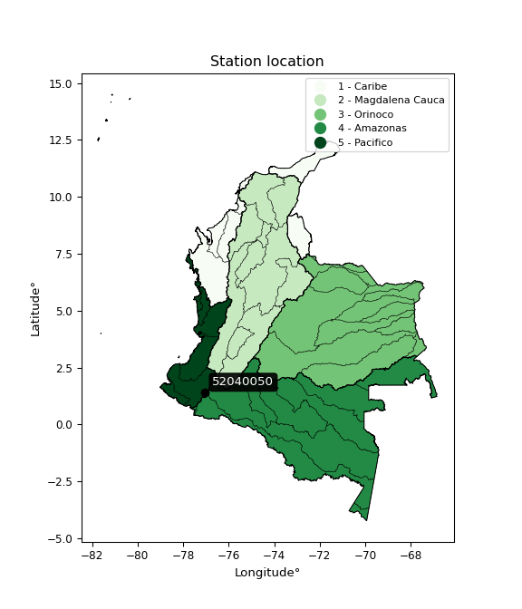

<div align="center">


</div>

# PMP Station (Rain, Pmax24h): 52040050

Probable Maximum Precipitation (PMP) is the greatest amount of rainfall for a specific duration that is meteorologically possible for a given location, acting as a "worst-case" scenario for extreme storms, crucial for designing safety-critical infrastructure like bridges, river deviations, dams, spillways, and nuclear plants to prevent catastrophic failure. PMP is calculated by hydrologists using meteorological data to determine the upper limit of extreme rainfall, often leading to the Probable Maximum Flood (PMF) for flood control design, and is increasingly being studied for climate change impacts. Probable Maximum Precipitation (PMP) is the theoretical upper limit of rainfall, a deterministic estimate for extreme events, while probability distributions (like GEV, Gumbel) describe the likelihood and frequency of various precipitation amounts, including rare ones, showing how often events occur, with PMP representing the extreme end of these distributions, used for critical infrastructure design to ensure safety against the worst conceivable weather, unlike standard statistical forecasts which cover typical probabilities.

The most common probability distributions in hydrology, used for analyzing floods, rainfall, and streamflow, include the Normal, Log-Normal, Gumbel, Gamma (including Log-Pearson Type III), and Generalized Extreme Value (GEV) distributions, often chosen based on the data´s skewness and whether modeling extremes or general conditions, with Gumbel and GEV popular for extreme events like floods, while the Normal distribution serves as a baseline, though often requiring transformations for skewed hydrological data. These distributions help in designing water infrastructure, managing water resources, and forecasting hydrologic events.

> Hydrological data often isn´t perfectly normal (it´s skewed), so different distributions are needed for different applications, such as: **Flood Frequency Analysis**: Using Gumbel, GEV, or Log-Pearson Type III for predicting extreme flood magnitudes and their return periods, **Rainfall Analysis**: Normal for annual totals, but Log-Normal, Weibull, or GEV for intensity or extreme daily rainfall, **Streamflow Modeling**: Gamma and Log-Normal for maximum flows, GEV for minimum flows, and Kappa for daily flows.

<div align="center">

</img>

</div>


## A. General information


### 1. General running parameters

• app_version: _v20260113_. • runtime: _2026-01-13 16:28:34.738620_. • Python version: _3.14.0_. • SciPy version: _1.16.3_. • Pandas version: _2.3.3_. • NumPy version: _2.3.5_. • Stations dataset (station_dataset_file): _dataset/pmax24h_in/automatic_colombia_2003_2025.csv_. • Stations catalog (station_catalog_file): _dataset/CNE.xls_. • Minimum year to eval til year_max (date_min): _1900_. • Maximum year to eval since year_min (date_max): _2025_. • Creates, save and include plots into reports (create_plot): _False_. • Plot only fit distributions with Δo > Δ (plot_only_fit): _True_. • Plot only simple graphs avoiding multiple CDFs and multiple Extreme values plots (plot_only_simple): _True_. • Eval low extreme values, if False, evaluates high extreme values (low_extreme): _False_. • Eval every SciPy distribution as logarithmic (pdist_logarithmic_on): _True_. • Standard deviation normalized (ddof): _1.0_. • Return periods to eval in years (Tr): _[2, 2.33, 5, 10, 15, 20, 25, 50, 75, 100, 200, 250, 500, 750, 1000]_. • Minimum data sample per station, 0 means any (minimum_sample): _5_. • Z-Score maximum threshold to adjust a value, 0 means disable (zscore_max): _3.5_. • Z-Score minimum threshold to adjust a value, 0 means disable (zscore_min): _-2.5_. • Avoid zeros, e.g. rain = 0 (avoid_zeros): _True_. • Avoid null values (avoid_nans): _True_. 

:file_folder:Table: [dataset.csv](../../dataset/pmax24h_in/automatic_colombia_2003_2025.csv)

> Delta Degrees of Freedom (DDOF): is a parameter used in the formulas for calculating variance and standard deviation. When ddof=0, the divisor is $N$ (the total number of observations) and this is used when your data set is the entire population. When ddof=1, the divisor is $N-1$ and this is used when your data set is a sample drawn from a larger population. Using $N-1$ provides an unbiased estimate of the population variance (known as Bessel´s correction).


### 2. Station info and location

|   id |   CODIGO | NOMBRE            | CATEGORIA               | TECNOLOGIA                              | ESTADO   | FECHA_INSTALACION   |   FECHA_SUSPENSION |   ALTITUD |   LATITUD |   LONGITUD | DEPARTAMENTO   | MUNICIPIO   | AREA_OPERATIVA                      | ENTIDAD                                                     | AREA_HIDROGRAFICA   | ZONA_HIDROGRAFICA   | SUBZONA_HIDROGRAFICA   |   CORRIENTE | Catalogo   |   Version |
|-----:|---------:|:------------------|:------------------------|:----------------------------------------|:---------|:--------------------|-------------------:|----------:|----------:|-----------:|:---------------|:------------|:------------------------------------|:------------------------------------------------------------|:--------------------|:--------------------|:-----------------------|------------:|:-----------|----------:|
|    0 | 52040050 | APONTE [52040050] | Climatológica Principal | Automática con Telemetría, Convencional | Activa   | 15/08/1972          |                nan |      1800 |   1.39733 |   -77.0305 | Nariño         | El Tablón   | Area Operativa 07 - Nariño-Putumayo | INSTITUTO DE HIDROLOGIA METEOROLOGIA Y ESTUDIOS AMBIENTALES | Pacifico            | Patía               | Río Juananbú           |         nan | CNE_IDEAM  |  20251226 |

<div align="center">

Dynamic map: [:earth_americas:Google](http://maps.google.com/maps?q=1.397333333,-77.03052778) [:earth_americas:OSM](https://www.openstreetmap.org/#map=18/1.397333333/-77.03052778&layers=P) [:earth_americas:Bing](https://www.bing.com/maps?cp=1.397333333~-77.03052778&lvl=18) [:earth_americas:Apple](https://maps.apple.com/frame?center=1.397333333%2C-77.03052778&span=0.003%2C0.006)

</div>


<div align="center">

```geojson
{
  "type": "Feature",
  "geometry": {
    "type": "Point", 
    "coordinates": [-77.03052778, 1.397333333]
  }, 
  "properties": {
    "Name": "52040050"
  }
}
```

</div>


### 3. Discrete values table and plot

<div align="center">

|               |          0 |          1 |           2 |           3 |           4 |          5 |
|:--------------|-----------:|-----------:|------------:|------------:|------------:|-----------:|
| Date          | 2019       | 2020       | 2021        | 2022        | 2024        | 2025       |
| Value         |   12.4     |    6.6     |   60.8      |   57        |   75.6      |  102.4     |
| Value_initial |   12.4     |    6.6     |   60.8      |   57        |   75.6      |  102.4     |
| count         |    6       |    6       |    6        |    6        |    6        |    6       |
| mean          |   52.4667  |   52.4667  |   52.4667   |   52.4667   |   52.4667   |   52.4667  |
| std           |   36.9529  |   36.9529  |   36.9529   |   36.9529   |   36.9529   |   36.9529  |
| zscore        |   -1.08426 |   -1.24122 |    0.225512 |    0.122679 |    0.626023 |    1.35127 |


</div>


> The initial value (value_initial) correspond to the initial obtained or null completed value, and value (value) is adjusted only when the initial value is outside the valid range (outlier) definite through the Z-Score value. If Z-Score is active, values out of range or outliers are replaced with the station mean value. A Z-Score (or standard score) measures how many standard deviations a data point is from the mean of a dataset, indicating its relative position; positive scores mean above the mean, negative mean below, and a score of zero is exactly at the mean, allowing for comparison of values from different distributions. It´s calculated using the formula $z=(x–μ)/σ$, where $x$ is the data point, $μ$ is the mean, and $σ$ is the standard deviation, helping identify outliers and understand probability.
>
> <sub>**Note**: In this study, "completing" (filling gaps in) and "extending" (forecasting or lengthening the historical record) rainfall data series are avoided for certain critical analyses because they introduce artificial bias and uncertainty, which can distort the statistics of rare events (extremes), alter day-to-day variability, and compromise the integrity and homogeneity of the original data. Some reasons against Completing/Extending rainfall data are: **Distortion of Extremes and Variability**: The primary issue is that most gap-filling or extension methods rely on averaging or regression with nearby stations, which inherently smooths the data. Rainfall is highly variable in space and time, with a large percentage of zero values and occasional large storms. Infilling methods often underestimate the highest values and overestimate the lowest (zero) values, which severely distorts analyses focused on flood frequency, drought severity, and intensity-duration-frequency (IDF) curves, **Loss of Data Homogeneity**: Infilled or extended data are synthetic estimates, not actual measurements. Combining these estimates with observed data can violate the assumption of data homogeneity, which requires that the data properties do not change over time. Inhomogeneity can lead to incorrect conclusions about long-term trends or changes in climate patterns, **Propagation of Errors**: Errors and biases from the original data (e.g., wind-induced undercatch, instrument errors, site changes) or the data used for imputation can propagate through the analysis, leading to unreliable hydrological models and inaccurate predictions, **Compromised Statistical Integrity**: For statistical analyses, especially those involving the frequency of events, using artificial data can introduce time bias or autocorrelation that doesn´t exist in reality, making it difficult to assess the true probability of events, **Difficulty in Validation**: It is difficult to accurately validate the quality of filled or extended data, especially for past periods where ground-truth measurements are unavailable. The reliability of imputation techniques heavily depends on the density of the surrounding station network and the complexity of the local topography.</sub>


### 4. Active continuous probability distributions from SciPy (45 of 104 available)

A Probability Density Function (PDF) describes the relative likelihood of a continuous random variable falling within a specific range, where the total area under its curve equals 1, and the area over any interval gives the actual probability for that range. Unlike discrete probabilities (like rolling a die), a PDF shows density, not direct probability for a single point (which is zero), with higher points indicating higher likelihood, often visualized as a bell curve for normal distributions.

A log of a probability density function (log-PDF) is simply the logarithm of the PDF´s value, denoted as $log(f(x))$, useful for converting multiplication of probabilities into addition, improving numerical stability with tiny numbers, and connecting to information theory concepts like entropy. Instead of dealing with very small probabilities (e.g., 0.000001), log-PDFs use negative numbers (e.g., $log(0.00001) ≈ -11.51$ that are easier for computers to handle, preventing underflow errors and simplifying complex calculations. In this study, each active probability distribution from SciPy is also evaluated in the $log$ form.

[scipy.stats](https://docs.scipy.org/doc/scipy/reference/stats.html) is a Python´s powerful submodule within the SciPy library for comprehensive statistical analysis, offering over 130 probability distributions (like Normal, Poisson), functions for descriptive stats (mean, variance), hypothesis testing (t-tests, chi-square), random variable generation, and statistical tests, making it essential for data science, modeling, and research. It provides tools to explore, model, and draw conclusions from data efficiently, working seamlessly with NumPy.

<div align="center">

|   id | p_dist             |   n_parameter | fit_method   | label                                                                       | active   | ref                                                                                                        |
|-----:|:-------------------|--------------:|:-------------|:----------------------------------------------------------------------------|:---------|:-----------------------------------------------------------------------------------------------------------|
|    0 | alpha              |             3 | MLE          | Alpha                                                                       | True     | [:mortar_board:](https://docs.scipy.org/doc/scipy/reference/generated/scipy.stats.alpha.html)              |
|    1 | betaprime          |             4 | MLE          | Beta prime                                                                  | True     | [:mortar_board:](https://docs.scipy.org/doc/scipy/reference/generated/scipy.stats.betaprime.html)          |
|    2 | chi2               |             3 | MLE          | Chi²                                                                        | True     | [:mortar_board:](https://docs.scipy.org/doc/scipy/reference/generated/scipy.stats.chi2.html)               |
|    3 | crystalball        |             4 | MLE          | Crystalball                                                                 | True     | [:mortar_board:](https://docs.scipy.org/doc/scipy/reference/generated/scipy.stats.crystalball.html)        |
|    4 | dweibull           |             3 | MLE          | Double Weibull                                                              | True     | [:mortar_board:](https://docs.scipy.org/doc/scipy/reference/generated/scipy.stats.dweibull.html)           |
|    5 | erlang             |             3 | MLE          | Erlang                                                                      | True     | [:mortar_board:](https://docs.scipy.org/doc/scipy/reference/generated/scipy.stats.erlang.html)             |
|    6 | expon              |             2 | MLE          | Exponential                                                                 | True     | [:mortar_board:](https://docs.scipy.org/doc/scipy/reference/generated/scipy.stats.expon.html)              |
|    7 | exponnorm          |             3 | MLE          | Exponentially modified Normal                                               | True     | [:mortar_board:](https://docs.scipy.org/doc/scipy/reference/generated/scipy.stats.exponnorm.html)          |
|    8 | f                  |             4 | MLE          | F                                                                           | True     | [:mortar_board:](https://docs.scipy.org/doc/scipy/reference/generated/scipy.stats.f.html)                  |
|    9 | fatiguelife        |             3 | MLE          | Fatigue-life (Birnbaum-Saunders)                                            | True     | [:mortar_board:](https://docs.scipy.org/doc/scipy/reference/generated/scipy.stats.fatiguelife.html)        |
|   10 | fisk               |             3 | MLE          | Fisk                                                                        | True     | [:mortar_board:](https://docs.scipy.org/doc/scipy/reference/generated/scipy.stats.fisk.html)               |
|   11 | gamma              |             3 | MLE          | Gamma                                                                       | True     | [:mortar_board:](https://docs.scipy.org/doc/scipy/reference/generated/scipy.stats.gamma.html)              |
|   12 | genexpon           |             5 | MLE          | Generalized exponential                                                     | True     | [:mortar_board:](https://docs.scipy.org/doc/scipy/reference/generated/scipy.stats.genexpon.html)           |
|   13 | genlogistic        |             3 | MLE          | Generalized logistic                                                        | True     | [:mortar_board:](https://docs.scipy.org/doc/scipy/reference/generated/scipy.stats.genlogistic.html)        |
|   14 | gibrat             |             2 | MM           | Gibrat                                                                      | True     | [:mortar_board:](https://docs.scipy.org/doc/scipy/reference/generated/scipy.stats.gibrat.html)             |
|   15 | gompertz           |             3 | MLE          | Gompertz (or truncated Gumbel)                                              | True     | [:mortar_board:](https://docs.scipy.org/doc/scipy/reference/generated/scipy.stats.gompertz.html)           |
|   16 | gumbel_l           |             2 | MM           | Gumbel Left Skew                                                            | True     | [:mortar_board:](https://docs.scipy.org/doc/scipy/reference/generated/scipy.stats.gumbel_l.html)           |
|   17 | gumbel_r           |             2 | MM           | Gumbel Right Skew                                                           | True     | [:mortar_board:](https://docs.scipy.org/doc/scipy/reference/generated/scipy.stats.gumbel_r.html)           |
|   18 | halflogistic       |             2 | MM           | Half-logistic                                                               | True     | [:mortar_board:](https://docs.scipy.org/doc/scipy/reference/generated/scipy.stats.halflogistic.html)       |
|   19 | halfnorm           |             2 | MM           | Half Normal                                                                 | True     | [:mortar_board:](https://docs.scipy.org/doc/scipy/reference/generated/scipy.stats.halfnorm.html)           |
|   20 | hypsecant          |             2 | MM           | hyperbolic secant                                                           | True     | [:mortar_board:](https://docs.scipy.org/doc/scipy/reference/generated/scipy.stats.hypsecant.html)          |
|   21 | invgamma           |             3 | MLE          | Inverted gamma                                                              | True     | [:mortar_board:](https://docs.scipy.org/doc/scipy/reference/generated/scipy.stats.invgamma.html)           |
|   22 | invgauss           |             3 | MLE          | Inverse Gaussian                                                            | True     | [:mortar_board:](https://docs.scipy.org/doc/scipy/reference/generated/scipy.stats.invgauss.html)           |
|   23 | invweibull         |             3 | MLE          | Inverted Weibull                                                            | True     | [:mortar_board:](https://docs.scipy.org/doc/scipy/reference/generated/scipy.stats.invweibull.html)         |
|   24 | kappa4             |             4 | MLE          | Kappa 4                                                                     | True     | [:mortar_board:](https://docs.scipy.org/doc/scipy/reference/generated/scipy.stats.kappa4.html)             |
|   25 | kstwobign          |             2 | MLE          | Limiting distribution of scaled Kolmogorov-Smirnov two-sided test statistic | True     | [:mortar_board:](https://docs.scipy.org/doc/scipy/reference/generated/scipy.stats.kstwobign.html)          |
|   26 | laplace            |             2 | MM           | Laplace                                                                     | True     | [:mortar_board:](https://docs.scipy.org/doc/scipy/reference/generated/scipy.stats.laplace.html)            |
|   27 | laplace_asymmetric |             3 | MLE          | Asymmetric Laplace                                                          | True     | [:mortar_board:](https://docs.scipy.org/doc/scipy/reference/generated/scipy.stats.laplace_asymmetric.html) |
|   28 | loggamma           |             3 | MLE          | Log gamma                                                                   | True     | [:mortar_board:](https://docs.scipy.org/doc/scipy/reference/generated/scipy.stats.loggamma.html)           |
|   29 | logistic           |             2 | MM           | Logistic (or Sech-squared)                                                  | True     | [:mortar_board:](https://docs.scipy.org/doc/scipy/reference/generated/scipy.stats.logistic.html)           |
|   30 | lognorm            |             3 | MLE          | Log Normal                                                                  | True     | [:mortar_board:](https://docs.scipy.org/doc/scipy/reference/generated/scipy.stats.lognorm.html)            |
|   31 | maxwell            |             2 | MM           | Maxwell                                                                     | True     | [:mortar_board:](https://docs.scipy.org/doc/scipy/reference/generated/scipy.stats.maxwell.html)            |
|   32 | mielke             |             4 | MLE          | Mielke Beta-Kappa / Dagum                                                   | True     | [:mortar_board:](https://docs.scipy.org/doc/scipy/reference/generated/scipy.stats.mielke.html)             |
|   33 | moyal              |             2 | MM           | Moyal                                                                       | True     | [:mortar_board:](https://docs.scipy.org/doc/scipy/reference/generated/scipy.stats.moyal.html)              |
|   34 | nakagami           |             3 | MLE          | Nakagami                                                                    | True     | [:mortar_board:](https://docs.scipy.org/doc/scipy/reference/generated/scipy.stats.nakagami.html)           |
|   35 | ncf                |             5 | MLE          | Non-central F distribution                                                  | True     | [:mortar_board:](https://docs.scipy.org/doc/scipy/reference/generated/scipy.stats.ncf.html)                |
|   36 | nct                |             4 | MLE          | Non-central Student’s t                                                     | True     | [:mortar_board:](https://docs.scipy.org/doc/scipy/reference/generated/scipy.stats.nct.html)                |
|   37 | norm               |             2 | MM           | Normal                                                                      | True     | [:mortar_board:](https://docs.scipy.org/doc/scipy/reference/generated/scipy.stats.norm.html)               |
|   38 | pearson3           |             3 | MM           | Pearson type III                                                            | True     | [:mortar_board:](https://docs.scipy.org/doc/scipy/reference/generated/scipy.stats.pearson3.html)           |
|   39 | rayleigh           |             2 | MM           | Rayleigh                                                                    | True     | [:mortar_board:](https://docs.scipy.org/doc/scipy/reference/generated/scipy.stats.rayleigh.html)           |
|   40 | rice               |             3 | MLE          | Rice                                                                        | True     | [:mortar_board:](https://docs.scipy.org/doc/scipy/reference/generated/scipy.stats.rice.html)               |
|   41 | t                  |             3 | MLE          | Student’s t                                                                 | True     | [:mortar_board:](https://docs.scipy.org/doc/scipy/reference/generated/scipy.stats.t.html)                  |
|   42 | truncnorm          |             4 | MLE          | Truncated normal                                                            | True     | [:mortar_board:](https://docs.scipy.org/doc/scipy/reference/generated/scipy.stats.truncnorm.html)          |
|   43 | wald               |             2 | MM           | Wald                                                                        | True     | [:mortar_board:](https://docs.scipy.org/doc/scipy/reference/generated/scipy.stats.wald.html)               |
|   44 | weibull_min        |             3 | MLE          | Weibull minimum                                                             | True     | [:mortar_board:](https://docs.scipy.org/doc/scipy/reference/generated/scipy.stats.weibull_min.html)        |

</div>

> **n_parameter:** # arguments & localization & scale.
>
> **Fit methods:** (MLE) maximum likelihood, (MM) L-moments.
>
>**Inactive** (With the only purpose of prevent loops, zero divisions, infinite values, over high estimated values or horizontal trending for recurrence intervals estimations, the follow distributions were disabled.)**:** foldnorm, gennorm, norminvgauss, powernorm, powerlognorm, skewnorm, genextreme, anglit, arcsine, argus, beta, bradford, burr, burr12, cauchy, cosine, halfcauchy, foldcauchy, skewcauchy, wrapcauchy, dgamma, gengamma, exponweib, exponpow, truncexpon, gausshyper, genhalflogistic, genhyperbolic, geninvgauss, halfgennorm, johnsonsb, johnsonsu, kappa3, ksone, kstwo, loglaplace, levy, levy_l, levy_stable, ncx2, pareto, genpareto, truncpareto, lomax, powerlaw, rdist, rel_breitwigner, recipinvgauss, semicircular, studentized_range, trapezoid, triang, truncweibull_min, tukeylambda, uniform, loguniform, vonmises, vonmises_line, weibull_max, 


## B. Probability (PDF) vs. Empirical (EDF) distributions functions

A continuous probability distribution (CPD) describes probabilities for variables that can take any value within a range (like rain any time), unlike discrete variables with specific outcomes (like temperature). It uses a Probability Density Function (PDF), a curve where the total area under it equals 1, and the probability of the variable falling within an interval (a to b) is found by calculating the area under the curve between those points. A key feature is that the probability of hitting any single exact value is zero, so probabilities are always expressed for ranges, e.g., $P(a ≤ X ≤ b)$.

<div align="center">

Distributions parameters from station values
|    |   station | p_dist                |   n |            loc |           scale | shape                  | shape1             | shape2             | shape3   |
|---:|----------:|:----------------------|----:|---------------:|----------------:|:-----------------------|:-------------------|:-------------------|:---------|
|  0 |  52040050 | alpha                 |   6 |   -9.73917     |    31.7399      | 0.09602298520591696    |                    |                    |          |
|  1 |  52040050 | betaprime             |   6 |   -9.6395      |   931.253       | 2.615118976715044      | 39.96707958144728  |                    |          |
|  2 |  52040050 | chi2                  |   6 |    6.6         |    28.8688      | 1.6494290342671674     |                    |                    |          |
|  3 |  52040050 | crystalball           |   6 |   52.4667      |    33.7332      | 34392.24102495487      | 83.00194136468645  |                    |          |
|  4 |  52040050 | dweibull              |   6 |   57           |    27.5228      | 0.9211467277334571     |                    |                    |          |
|  5 |  52040050 | erlang                |   6 | -856.463       |     1.26238     | 719.9801091882387      |                    |                    |          |
|  6 |  52040050 | expon                 |   6 |    6.6         |    45.8667      |                        |                    |                    |          |
|  7 |  52040050 | exponnorm             |   6 |   52.4435      |    33.7332      | 0.0006837187805427285  |                    |                    |          |
|  8 |  52040050 | f                     |   6 |    6.6         |    31.9945      | 1.0651887436202694     | 594.665771640062   |                    |          |
|  9 |  52040050 | fatiguelife           |   6 |    6.6         |     6.38879e-06 | 2396.063685468558      |                    |                    |          |
| 10 |  52040050 | fisk                  |   6 |   -3.16502e+09 |     3.16502e+09 | 156722174.686914       |                    |                    |          |
| 11 |  52040050 | gamma                 |   6 | -838.093       |     1.28399     | 693.5233618781756      |                    |                    |          |
| 12 |  52040050 | genexpon              |   6 |   -3.8293      |     2.22838     | 1.9077246833405456e-08 | 0.0412268058504039 | 0.9378649239908927 |          |
| 13 |  52040050 | genlogistic           |   6 |   72.7533      |    14.873       | 0.5086982499614175     |                    |                    |          |
| 14 |  52040050 | gibrat                |   6 |   26.7325      |    15.6086      |                        |                    |                    |          |
| 15 |  52040050 | gompertz              |   6 |    6.6         |    58.2031      | 0.6330486556628068     |                    |                    |          |
| 16 |  52040050 | gumbel_l              |   6 |   67.6484      |    26.3017      |                        |                    |                    |          |
| 17 |  52040050 | gumbel_r              |   6 |   37.2849      |    26.3017      |                        |                    |                    |          |
| 18 |  52040050 | halflogistic          |   6 |   12.485       |    28.8407      |                        |                    |                    |          |
| 19 |  52040050 | halfnorm              |   6 |    7.81713     |    55.9599      |                        |                    |                    |          |
| 20 |  52040050 | hypsecant             |   6 |   52.4667      |    21.4752      |                        |                    |                    |          |
| 21 |  52040050 | invgamma              |   6 | -206.024       | 13888.7         | 54.85965145047413      |                    |                    |          |
| 22 |  52040050 | invgauss              |   6 | -117.799       |  3900.62        | 0.043554754760220166   |                    |                    |          |
| 23 |  52040050 | invweibull            |   6 |   -1.93642e+09 |     1.93642e+09 | 62988749.368166745     |                    |                    |          |
| 24 |  52040050 | kappa4                |   6 |   -5.22141     |   111.755       | 1.1185403500152988     | 1.0340261162273072 |                    |          |
| 25 |  52040050 | kstwobign             |   6 |  -69.2681      |   138.656       |                        |                    |                    |          |
| 26 |  52040050 | laplace               |   6 |   52.4667      |    23.853       |                        |                    |                    |          |
| 27 |  52040050 | laplace_asymmetric    |   6 |   60.8         |    26.1477      | 1.1719676803428127     |                    |                    |          |
| 28 |  52040050 | loggamma              |   6 | -270.34        |   124.202       | 13.947715743923572     |                    |                    |          |
| 29 |  52040050 | logistic              |   6 |   52.4667      |    18.5981      |                        |                    |                    |          |
| 30 |  52040050 | lognorm               |   6 |    6.6         |     0.0673125   | 14.321218705772237     |                    |                    |          |
| 31 |  52040050 | maxwell               |   6 |  -27.4669      |    50.0909      |                        |                    |                    |          |
| 32 |  52040050 | mielke                |   6 |   -2.20194     |   106.291       | 1.027149002230832      | 237.85175260498022 |                    |          |
| 33 |  52040050 | moyal                 |   6 |   33.1759      |    15.1853      |                        |                    |                    |          |
| 34 |  52040050 | nakagami              |   6 |    6.6         |    66.5624      | 0.09899530476611866    |                    |                    |          |
| 35 |  52040050 | ncf                   |   6 |   -0.00431365  |     1.65194e-06 | 2.3785903189085824e-07 | 2.5162009358057724 | 4.83564201007822   |          |
| 36 |  52040050 | nct                   |   6 |   -0.584118    |     0.221816    | 0.745683454831657      | 68.7156777425682   |                    |          |
| 37 |  52040050 | norm                  |   6 |   52.4667      |    33.7332      |                        |                    |                    |          |
| 38 |  52040050 | pearson3              |   6 |   52.4667      |    33.7332      | -0.10099898392693935   |                    |                    |          |
| 39 |  52040050 | rayleigh              |   6 |  -12.0669      |    51.4904      |                        |                    |                    |          |
| 40 |  52040050 | rice                  |   6 |  -13.2297      |    40.2512      | 1.168888691840097      |                    |                    |          |
| 41 |  52040050 | t                     |   6 |   52.4666      |    33.7335      | 26626050.22494378      |                    |                    |          |
| 42 |  52040050 | truncnorm             |   6 |   57.4891      |    42.5814      | -379.3177527044709     | 1.0547084064169043 |                    |          |
| 43 |  52040050 | wald                  |   6 |   18.7334      |    33.7332      |                        |                    |                    |          |
| 44 |  52040050 | weibull_min           |   6 |    6.6         |    52.1652      | 0.84997738704197       |                    |                    |          |
| 45 |  52040050 | logalpha              |   6 |  -16.1521      |   368.061       | 18.690015883666135     |                    |                    |          |
| 46 |  52040050 | logbetaprime          |   6 |  -25.2818      |   341.493       | 864.5386509337623      | 10232.125694072187 |                    |          |
| 47 |  52040050 | logchi2               |   6 |    1.88707     |     1.00789     | 1.1908558797906554     |                    |                    |          |
| 48 |  52040050 | logcrystalball        |   6 |    4.62889     |     3.47327e-05 | 4.543061412575142e-05  | 6.844056942148908  |                    |          |
| 49 |  52040050 | logdweibull           |   6 |    4.10759     |     0.822944    | 0.7153863851049629     |                    |                    |          |
| 50 |  52040050 | logerlang             |   6 |  -12.9557      |     0.0660902   | 250.16278314528677     |                    |                    |          |
| 51 |  52040050 | logexpon              |   6 |    1.88707     |     1.69789     |                        |                    |                    |          |
| 52 |  52040050 | logexponnorm          |   6 |    3.58413     |     1.01184     | 0.0008169196165005835  |                    |                    |          |
| 53 |  52040050 | logf                  |   6 | -706.4         |   709.987       | 2414677.1509458395     | 1652808.0249406276 |                    |          |
| 54 |  52040050 | logfatiguelife        |   6 | -414.613       |   418.197       | 0.0024124432879681756  |                    |                    |          |
| 55 |  52040050 | logfisk               |   6 |   -1.03219e+07 |     1.03219e+07 | 17037857.508432377     |                    |                    |          |
| 56 |  52040050 | loggamma              |   6 |  -10.7938      |     0.0758716   | 189.3593589939867      |                    |                    |          |
| 57 |  52040050 | loggenexpon           |   6 |    1.88707     |     6.08716e+07 | 17956275.861793816     | 133078872.44352779 | 7603685.658396266  |          |
| 58 |  52040050 | loggenlogistic        |   6 |    4.62906     |     2.06231e-06 | 1.963948610531619e-06  |                    |                    |          |
| 59 |  52040050 | loggibrat             |   6 |    2.81304     |     0.468191    |                        |                    |                    |          |
| 60 |  52040050 | loggompertz           |   6 |    1.88707     |     0.912218    | 0.11170510890786886    |                    |                    |          |
| 61 |  52040050 | loggumbel_l           |   6 |    4.04034     |     0.788933    |                        |                    |                    |          |
| 62 |  52040050 | loggumbel_r           |   6 |    3.12957     |     0.788933    |                        |                    |                    |          |
| 63 |  52040050 | loghalflogistic       |   6 |    2.38573     |     0.865065    |                        |                    |                    |          |
| 64 |  52040050 | loghalfnorm           |   6 |    2.24571     |     1.67851     |                        |                    |                    |          |
| 65 |  52040050 | loghypsecant          |   6 |    3.58496     |     0.644161    |                        |                    |                    |          |
| 66 |  52040050 | loginvgamma           |   6 |  -13.6535      |  4607.03        | 268.4205730148533      |                    |                    |          |
| 67 |  52040050 | loginvgauss           |   6 |   -5.00011     |   534.244       | 0.016083611298574323   |                    |                    |          |
| 68 |  52040050 | loginvweibull         |   6 |   -4.92643e+07 |     4.92643e+07 | 47635581.622731075     |                    |                    |          |
| 69 |  52040050 | logkappa4             |   6 |    1.66353     |     3.35998     | 1.0695145571033888     | 1.133078648738425  |                    |          |
| 70 |  52040050 | logkstwobign          |   6 |   -0.501377    |     4.64818     |                        |                    |                    |          |
| 71 |  52040050 | loglaplace            |   6 |    3.58496     |     0.715483    |                        |                    |                    |          |
| 72 |  52040050 | loglaplace_asymmetric |   6 |    4.62889     |     0.00869959  | 120.00094364465804     |                    |                    |          |
| 73 |  52040050 | logloggamma           |   6 |    4.62895     |     6.03825e-07 | 5.78912960660635e-07   |                    |                    |          |
| 74 |  52040050 | loglogistic           |   6 |    3.58496     |     0.55786     |                        |                    |                    |          |
| 75 |  52040050 | loglognorm            |   6 |    1.88707     |     0.00406046  | 13.66546380575895      |                    |                    |          |
| 76 |  52040050 | logmaxwell            |   6 |    1.18731     |     1.5025      |                        |                    |                    |          |
| 77 |  52040050 | logmielke             |   6 |   -1.30405e+07 |     1.30405e+07 | 12300490.658590872     | 2973301752.202113  |                    |          |
| 78 |  52040050 | logmoyal              |   6 |    3.00632     |     0.455491    |                        |                    |                    |          |
| 79 |  52040050 | lognakagami           |   6 |    2.5177      |     1.16321     | 0.10022659322172645    |                    |                    |          |
| 80 |  52040050 | logncf                |   6 |  -64.8982      |    65.4482      | 12350.371998326838     | 32283.331584495056 | 573.0606141321557  |          |
| 81 |  52040050 | lognct                |   6 |   45.2692      |     0.963149    | 9511.916949655482      | -43.27483571429896 |                    |          |
| 82 |  52040050 | lognorm               |   6 |    3.58496     |     1.01185     |                        |                    |                    |          |
| 83 |  52040050 | logpearson3           |   6 |    3.58496     |     1.01184     | -0.6962203804516938    |                    |                    |          |
| 84 |  52040050 | lograyleigh           |   6 |    1.64924     |     1.54448     |                        |                    |                    |          |
| 85 |  52040050 | logrice               |   6 |    1.27775     |     1.13242     | 1.717385273491141      |                    |                    |          |
| 86 |  52040050 | logt                  |   6 |    3.58496     |     1.01185     | 3785425328.2034035     |                    |                    |          |
| 87 |  52040050 | logtruncnorm          |   6 |    1.23266     |     2.26292     | 0.5678630766559037     | 62.16404999176127  |                    |          |
| 88 |  52040050 | logwald               |   6 |    2.57307     |     1.01188     |                        |                    |                    |          |
| 89 |  52040050 | logweibull_min        |   6 |   -8.80555e+07 |     8.80555e+07 | 123396267.4795304      |                    |                    |          |

</div>

> **loc** (Location parameter): This shifts the distribution along the x-axis. For many common distributions, like the normal (Gaussian) distribution, loc represents the mean $μ$. For others, like the uniform distribution, it might represent the minimum value, or for the beta distribution, the left end of the support interval.
>
> **scale** (Scale parameter): This determines the width or spread of the distribution. For the normal distribution, scale represents the standard deviation $σ$. For a uniform distribution, it defines the length of the interval (from $loc$ to $loc + scale$).
>
> **shape** (Shape parameters): Refers to parameters that define the specific form of a probability distribution, distinct from its location (loc) and scale (scale). These parameters are required arguments for most distribution functions. For example, a normal (Gaussian) distribution is fully defined by its location (mean) and scale (standard deviation), so it has no specific shape parameters beyond loc and scale. However, other distributions have intrinsic properties that need specification, as Gamma distribution that takes a shape parameter, often named $a$ or $alpha$.


### 0. Cumulative distribution values - CDF (90 evaluated)

Cumulative Distribution Function (CDF), denoted as $F$<sub>$X$</sub>$(x)$, is a function that gives the probability that a random variable $X$ will take a value less than or equal to a specific value, $x$ (i.e., $(P(X≥x)$. It essentially "accumulates" probabilities from a given point up to the far right (positive infinity), providing a complete picture of the distribution´s probabilities for both discrete (like rain) and continuous (like temperature) variables, helping to find probabilities over ranges or above certain values. Each station is evaluated separately ordering the $x$ values ascending, calculating the CDF and PDF values for the activated distributions and their logarithmic forms.

<div align="center">

CDF ordered by x ascending and calculating $log(f(x))$ separately
|   id |   Station |   date |     x |   count |    mean |     std |    zscore |   Value_initial |   station |   m |     alpha |   alpha_pdf |   betaprime |   betaprime_pdf |        chi2 |    chi2_pdf |   crystalball |   crystalball_pdf |   dweibull |   dweibull_pdf |    erlang |   erlang_pdf |    expon |   expon_pdf |   exponnorm |   exponnorm_pdf |           f |           f_pdf |   fatiguelife |   fatiguelife_pdf |     fisk |   fisk_pdf |     gamma |   gamma_pdf |   genexpon |   genexpon_pdf |   genlogistic |   genlogistic_pdf |   gibrat |   gibrat_pdf |    gompertz |   gompertz_pdf |   gumbel_l |   gumbel_l_pdf |   gumbel_r |   gumbel_r_pdf |   halflogistic |   halflogistic_pdf |   halfnorm |   halfnorm_pdf |   hypsecant |   hypsecant_pdf |   invgamma |   invgamma_pdf |   invgauss |   invgauss_pdf |   invweibull |   invweibull_pdf |      kappa4 |   kappa4_pdf |   kstwobign |   kstwobign_pdf |   laplace |   laplace_pdf |   laplace_asymmetric |   laplace_asymmetric_pdf |   loggamma |   loggamma_pdf |   logistic |   logistic_pdf |   lognorm |   lognorm_pdf |   maxwell |   maxwell_pdf |   mielke |   mielke_pdf |     moyal |   moyal_pdf |    nakagami |   nakagami_pdf |      ncf |    ncf_pdf |       nct |    nct_pdf |      norm |   norm_pdf |   pearson3 |   pearson3_pdf |   rayleigh |   rayleigh_pdf |      rice |   rice_pdf |         t |      t_pdf |   truncnorm |   truncnorm_pdf |     wald |   wald_pdf |   weibull_min |   weibull_min_pdf |   logalpha |   logalpha_pdf |   logbetaprime |   logbetaprime_pdf |     logchi2 |    logchi2_pdf |   logcrystalball |   logcrystalball_pdf |   logdweibull |   logdweibull_pdf |   logerlang |   logerlang_pdf |   logexpon |   logexpon_pdf |   logexponnorm |   logexponnorm_pdf |      logf |   logf_pdf |   logfatiguelife |   logfatiguelife_pdf |   logfisk |   logfisk_pdf |   loggenexpon |   loggenexpon_pdf |   loggenlogistic |   loggenlogistic_pdf |   loggibrat |   loggibrat_pdf |   loggompertz |   loggompertz_pdf |   loggumbel_l |   loggumbel_l_pdf |   loggumbel_r |   loggumbel_r_pdf |   loghalflogistic |   loghalflogistic_pdf |   loghalfnorm |   loghalfnorm_pdf |   loghypsecant |   loghypsecant_pdf |   loginvgamma |   loginvgamma_pdf |   loginvgauss |   loginvgauss_pdf |   loginvweibull |   loginvweibull_pdf |   logkappa4 |   logkappa4_pdf |   logkstwobign |   logkstwobign_pdf |   loglaplace |   loglaplace_pdf |   loglaplace_asymmetric |   loglaplace_asymmetric_pdf |   logloggamma |   logloggamma_pdf |   loglogistic |   loglogistic_pdf |   loglognorm |   loglognorm_pdf |   logmaxwell |   logmaxwell_pdf |   logmielke |   logmielke_pdf |    logmoyal |   logmoyal_pdf |   lognakagami |   lognakagami_pdf |    logncf |   logncf_pdf |    lognct |   lognct_pdf |   logpearson3 |   logpearson3_pdf |   lograyleigh |   lograyleigh_pdf |   logrice |   logrice_pdf |      logt |   logt_pdf |   logtruncnorm |   logtruncnorm_pdf |   logwald |   logwald_pdf |   logweibull_min |   logweibull_min_pdf |
|-----:|----------:|-------:|------:|--------:|--------:|--------:|----------:|----------------:|----------:|----:|----------:|------------:|------------:|----------------:|------------:|------------:|--------------:|------------------:|-----------:|---------------:|----------:|-------------:|---------:|------------:|------------:|----------------:|------------:|----------------:|--------------:|------------------:|---------:|-----------:|----------:|------------:|-----------:|---------------:|--------------:|------------------:|---------:|-------------:|------------:|---------------:|-----------:|---------------:|-----------:|---------------:|---------------:|-------------------:|-----------:|---------------:|------------:|----------------:|-----------:|---------------:|-----------:|---------------:|-------------:|-----------------:|------------:|-------------:|------------:|----------------:|----------:|--------------:|---------------------:|-------------------------:|-----------:|---------------:|-----------:|---------------:|----------:|--------------:|----------:|--------------:|---------:|-------------:|----------:|------------:|------------:|---------------:|---------:|-----------:|----------:|-----------:|----------:|-----------:|-----------:|---------------:|-----------:|---------------:|----------:|-----------:|----------:|-----------:|------------:|----------------:|---------:|-----------:|--------------:|------------------:|-----------:|---------------:|---------------:|-------------------:|------------:|---------------:|-----------------:|---------------------:|--------------:|------------------:|------------:|----------------:|-----------:|---------------:|---------------:|-------------------:|----------:|-----------:|-----------------:|---------------------:|----------:|--------------:|--------------:|------------------:|-----------------:|---------------------:|------------:|----------------:|--------------:|------------------:|--------------:|------------------:|--------------:|------------------:|------------------:|----------------------:|--------------:|------------------:|---------------:|-------------------:|--------------:|------------------:|--------------:|------------------:|----------------:|--------------------:|------------:|----------------:|---------------:|-------------------:|-------------:|-----------------:|------------------------:|----------------------------:|--------------:|------------------:|--------------:|------------------:|-------------:|-----------------:|-------------:|-----------------:|------------:|----------------:|------------:|---------------:|--------------:|------------------:|----------:|-------------:|----------:|-------------:|--------------:|------------------:|--------------:|------------------:|----------:|--------------:|----------:|-----------:|---------------:|-------------------:|----------:|--------------:|-----------------:|---------------------:|
|    0 |  52040050 |   2020 |   6.6 |       6 | 52.4667 | 36.9529 | -1.24122  |             6.6 |  52040050 |   1 | 0.0602075 |  0.0160199  |   0.0643312 |      0.00835721 | 1.45153e-14 | 13.4781     |     0.0869642 |        0.00469246 |  0.0872438 |     0.00278389 | 0.0863119 |   0.00481015 | 0        |  0.0218023  |   0.0869649 |      0.00469249 | 4.79915e-09 | 221369          |     0.0530879 |       2.04962e+11 | 0.08885  | 0.00400868 | 0.0860864 |  0.0048125  |   0.138894 |     0.0157335  |      0.103463 |        0.00349778 | 0        |   0          | 2.34494e-13 |     0.0108765  |  0.0935025 |     0.00338337 |  0.0403071 |     0.00492118 |       0        |         0          |  0         |     0          |   0.07487   |      0.00345428 |  0.0844483 |     0.00571924 |  0.0801117 |     0.00583526 |    0.0773219 |       0.00643827 | 5.44805e-15 |   0.440778   |   0.0743656 |      0.007098   | 0.0730919 |    0.00306427 |            0.0986985 |               0.00322078 |  0.0486161 |       0.105008 |  0.0782617 |     0.00387872 | 0.0466724 |     0.0964649 | 0.0729586 |    0.0058464  | 0.077394 |   0.00903155 | 0.0164398 |  0.00354641 | 0.000381072 |    8.49476e+10 | 0.194606 | 0.0157536  | 0.0445639 | 0.0264436  | 0.0869642 | 0.00469246 |  0.0890705 |     0.00457031 |  0.0636022 |     0.00659297 | 0.0600889 | 0.00593816 | 0.0869664 | 0.00469251 |    0.135824 |      0.00537002 | 0        | 0          |   5.58252e-15 |        5.34241    |  0.0433174 |       0.103966 |      0.0470359 |           0.100351 | 3.52616e-10 | 945565         |        0.0852304 |            0.0624624 |     0.0653931 |         0.0428558 |   0.0489926 |        0.104335 |   0        |       0.588967 |      0.0466712 |          0.0964636 | 0.0465206 |  0.0962867 |         0.045992 |            0.0960045 | 0.0462606 |     0.0728277 |   8.37326e-12 |          0.294986 |         0        |            0.0699422 |    0        |       0         |   2.11306e-10 |          0.122454 |     0.0631778 |         0.0774954 |    0.00798377 |         0.0488817 |         0         |              0        |      0        |          0        |      0.0455427 |          0.0704598 |     0.0469712 |          0.10693  |     0.0456632 |          0.110711 |       0.0460853 |            0.137128 |  0.00294607 |        0.450386 |      0.0456078 |           0.159347 |    0.0465972 |         0.065127 |               0.0723359 |                    0.06929  |     0.0721681 |         0.0691906 |     0.0454956 |         0.0778435 |     0.012721 |       1.0827e+13 |    0.0251847 |         0.103346 |   0.0741669 |       0.0699584 | 0.000634284 |     0.00873671 |    0          |       0           | 0.0469233 |    0.0977948 | 0.0465981 |    0.0958585 |     0.0614507 |         0.0884862 |     0.0117861 |         0.0985268 | 0.0341691 |      0.115264 | 0.0466724 |  0.0964648 |    0           |           0        |  0        |      0        |        0.0474194 |             0.06485  |
|    1 |  52040050 |   2019 |  12.4 |       6 | 52.4667 | 36.9529 | -1.08426  |            12.4 |  52040050 |   2 | 0.168153  |  0.019619   |   0.119606  |      0.0105539  | 0.153144    |  0.0206003  |     0.117466  |        0.00584132 |  0.105073  |     0.0033853  | 0.117619  |   0.00600021 | 0.118785 |  0.0192125  |   0.117467  |      0.00584135 | 0.313625    |      0.0270269  |     0.654558  |       0.0126364   | 0.11501  | 0.00503997 | 0.11742   |  0.00600711 |   0.226124 |     0.0143018  |      0.125812 |        0.00423    | 0        |   0          | 0.0641819   |     0.011245   |  0.115194  |     0.00411718 |  0.0760978 |     0.0074523  |       0        |         0          |  0.0652703 |     0.0142104  |   0.0977636 |      0.00448115 |  0.121932  |     0.00720669 |  0.118519  |     0.00740422 |    0.120073  |       0.00827892 | 0.0788305   |   0.0121636  |   0.121491  |      0.00909289 | 0.0932117 |    0.00390776 |            0.119264  |               0.00389189 |  0.155654  |       0.240816 |  0.103926  |     0.00500726 | 0.145766  |     0.226054  | 0.111264  |    0.00735085 | 0.130169 |   0.00915652 | 0.0474853 |  0.00730468 | 0.515448    |    0.0175835   | 0.281408 | 0.0140618  | 0.228822  | 0.0301407  | 0.117466  | 0.00584132 |  0.118691  |     0.00566036 |  0.106756  |     0.00824323 | 0.0990114 | 0.00745829 | 0.117468  | 0.00584136 |    0.16954  |      0.006261   | 0        | 0          |   0.143228    |        0.0194091  |  0.152862  |       0.249316 |      0.150271  |           0.234611 | 0.500988    |      0.387114  |        0.13794   |            0.109773  |     0.10077   |         0.072628  |   0.154973  |        0.238227 |   0.310245 |       0.406243 |      0.145764  |          0.226054  | 0.145452  |  0.225686  |         0.145057 |            0.226555  | 0.12077   |     0.175275  |   0.21253     |          0.362704 |         0        |            0.127513  |    0        |       0         |   0.105325    |          0.218712 |     0.135105  |         0.159123  |    0.113967   |         0.313739  |         0.0761277 |              0.574642 |      0.128727 |          0.469153 |      0.11999   |          0.181893  |     0.157276  |          0.248633 |     0.160263  |          0.256575 |       0.187795  |            0.303686 |  0.229893   |        0.343064 |      0.20724   |           0.332831 |    0.112499  |         0.157235 |               0.132342  |                    0.12677  |     0.132106  |         0.126656  |     0.128629  |         0.200917  |     0.644014 |       0.0432427  |    0.146714  |         0.281321 |   0.134446  |       0.126817  | 0.0873047   |     0.347191   |    0.00067756 |       3.05837e+11 | 0.147129  |    0.227792  | 0.145075  |    0.224826  |     0.144348  |         0.182189  |     0.146226  |         0.310832  | 0.150431  |      0.25512  | 0.145766  |  0.226053  |    2.86319e-06 |           0.526349 |  0        |      0        |        0.110913  |             0.14647  |
|    2 |  52040050 |   2022 |  57   |       6 | 52.4667 | 36.9529 |  0.122679 |            57   |  52040050 |   3 | 0.654226  |  0.0049146  |   0.628702  |      0.00899388 | 0.663584    |  0.00651336 |     0.553452  |        0.0117201  |  0.5       |     0.283647   | 0.558532  |   0.0116113  | 0.666742 |  0.00726581 |   0.553453  |      0.0117201  | 0.789183    |      0.00468163 |     0.879445  |       0.00233387  | 0.541877 | 0.0122924  | 0.559183  |  0.0116276  |   0.66089  |     0.0062738  |      0.501457 |        0.0127354  | 0.746096 |   0.0105852  | 0.581823    |     0.0108124  |  0.486791  |     0.0130162  |  0.6234    |     0.0112007  |       0.64794  |         0.0100583  |  0.620542  |     0.00969006 |   0.5667    |      0.014498   |  0.593251  |     0.0107826  |  0.595086  |     0.0106813  |    0.608459  |       0.0098333  | 0.549486    |   0.00988124 |   0.621811  |      0.00972828 | 0.586542  |    0.0173336  |            0.511195  |               0.0166816  |  0.680593  |       0.334952 |  0.560638  |     0.0132445  | 0.674628  |     0.355867  | 0.583613  |    0.0109289  | 0.548198 |   0.00951119 | 0.648123  |  0.0108039  | 0.786927    |    0.00293557  | 0.648875 | 0.00446971 | 0.71307   | 0.00364542 | 0.553452  | 0.0117201  |  0.546906  |     0.0117972  |  0.593275  |     0.0105954  | 0.575019  | 0.0111966  | 0.553452  | 0.01172    |    0.579965 |      0.0109671  | 0.716726 | 0.00971074 |   0.621358    |        0.00620152 |  0.678961  |       0.323165 |      0.680261  |           0.345752 | 0.820864    |      0.110463  |        0.537802  |            0.540186  |     0.425286  |         0.762968  |   0.678007  |        0.336674 |   0.719113 |       0.165433 |      0.67463   |          0.35587   | 0.673416  |  0.355531  |         0.675504 |            0.35613   | 0.630107  |     0.384721  |   0.703983    |          0.240111 |         0        |            0.545021  |    0.832954 |       0.203426  |   0.658854    |          0.443963 |     0.633384  |         0.466297  |    0.730405   |         0.29085   |         0.743347  |              0.258614 |      0.715739 |          0.267938 |      0.709391  |          0.391031  |     0.68373   |          0.326078 |     0.679769  |          0.312625 |       0.682059  |            0.252354 |  0.758795   |        0.367042 |      0.705301  |           0.245533 |    0.736422  |         0.368392 |               0.570503  |                    0.54648  |     0.570224  |         0.546698  |     0.694483  |         0.38034   |     0.676942 |       0.0121859  |    0.693537  |         0.315129 |   0.566774  |       0.534612  | 0.748629    |     0.266618   |    0.868154   |       0.0974902   | 0.672376  |    0.350638  | 0.674098  |    0.357626  |     0.640965  |         0.413123  |     0.699142  |         0.301916  | 0.68112   |      0.334597 | 0.674627  |  0.355867  |    0.624185    |           0.286004 |  0.80103  |      0.209831 |        0.630923  |             0.515524 |
|    3 |  52040050 |   2021 |  60.8 |       6 | 52.4667 | 36.9529 |  0.225512 |            60.8 |  52040050 |   4 | 0.67198   |  0.00444089 |   0.661685  |      0.00836676 | 0.687386    |  0.00602127 |     0.59756   |        0.011471   |  0.574523  |     0.0166463  | 0.602143  |   0.0113197  | 0.693239 |  0.00668811 |   0.597561  |      0.011471   | 0.806133    |      0.00424816 |     0.887932  |       0.00213696  | 0.588087 | 0.011995   | 0.602849  |  0.0113322  |   0.683912 |     0.00584788 |      0.550443 |        0.0130048  | 0.782459 |   0.00863535 | 0.622196    |     0.0104275  |  0.537338  |     0.0135581  |  0.664318  |     0.0103302  |       0.684546 |         0.00921263 |  0.65626   |     0.00910763 |   0.62053   |      0.0137722  |  0.633266  |     0.0102646  |  0.634676  |     0.0101437  |    0.644644  |       0.00920673 | 0.586939    |   0.00983225 |   0.657634  |      0.00912268 | 0.647431  |    0.0147809  |            0.578683  |               0.0188839  |  0.701863  |       0.324059 |  0.610181  |     0.0127895  | 0.697252  |     0.345036  | 0.624299  |    0.0104711  | 0.584371 |   0.00952727 | 0.687171  |  0.00975556 | 0.797713    |    0.00274484  | 0.665172 | 0.00411445 | 0.726191  | 0.00327085 | 0.59756   | 0.011471   |  0.591428  |     0.0116105  |  0.632611  |     0.0100973  | 0.616805  | 0.0107809  | 0.59756   | 0.0114709  |    0.621606 |      0.0109347  | 0.750834 | 0.00828718 |   0.644083    |        0.00576609 |  0.699462  |       0.312034 |      0.702221  |           0.334615 | 0.827838    |      0.105713  |        0.574028  |            0.583039  |     0.5       |      7905.24      |   0.699395  |        0.325966 |   0.729589 |       0.159263 |      0.697253  |          0.345038  | 0.69602   |  0.344779  |         0.69814  |            0.345163  | 0.654574  |     0.373224  |   0.719203    |          0.231532 |         0        |            0.57957   |    0.845434 |       0.183729  |   0.68729     |          0.436793 |     0.663439  |         0.46456   |    0.748653   |         0.2747    |         0.759579  |              0.244513 |      0.732676 |          0.25694  |      0.733846  |          0.366689  |     0.704418  |          0.314927 |     0.699602  |          0.301918 |       0.698032  |            0.24264  |  0.782617   |        0.371309 |      0.720847  |           0.236235 |    0.759156  |         0.336617 |               0.606885  |                    0.581331 |     0.606622  |         0.581594  |     0.718463  |         0.362589  |     0.677717 |       0.01182    |    0.7135    |         0.303419 |   0.602349  |       0.568169  | 0.765298    |     0.250073   |    0.874297   |       0.0929188   | 0.694669  |    0.340027  | 0.696836  |    0.346816  |     0.667499  |         0.408814  |     0.718256  |         0.290358  | 0.702375  |      0.323945 | 0.697251  |  0.345036  |    0.642318    |           0.275939 |  0.814031 |      0.193338 |        0.664153  |             0.513513 |
|    4 |  52040050 |   2024 |  75.6 |       6 | 52.4667 | 36.9529 |  0.626023 |            75.6 |  52040050 |   5 | 0.727007  |  0.00310961 |   0.768269  |      0.00609664 | 0.764359    |  0.00446669 |     0.753572  |        0.00934827 |  0.750964  |     0.00859641 | 0.755166  |   0.00912276 | 0.777841 |  0.00484359 |   0.753573  |      0.00934824 | 0.858841    |      0.00296739 |     0.914901  |       0.00154793  | 0.748178 | 0.0093294  | 0.755941  |  0.00911968 |   0.759623 |     0.00444717 |      0.736206 |        0.0113889  | 0.873126 |   0.00425643 | 0.762716    |     0.00844533 |  0.741536  |     0.0132958  |  0.79216   |     0.00701729 |       0.798406 |         0.00628535 |  0.77421   |     0.00684648 |   0.791045  |      0.00904614 |  0.767237  |     0.00775743 |  0.766732  |     0.00763722 |    0.762391  |       0.00672798 | 0.731453    |   0.00971672 |   0.774964  |      0.00675358 | 0.810426  |    0.00794759 |            0.78297   |               0.00972751 |  0.768043  |       0.282419 |  0.776234  |     0.00933938 | 0.767863  |     0.301646  | 0.762691  |    0.00812016 | 0.725794 |   0.00958201 | 0.804625  |  0.00630291 | 0.833815    |    0.00217137  | 0.717648 | 0.00305101 | 0.766416  | 0.00226154 | 0.753572  | 0.00934827 |  0.750788  |     0.00962777 |  0.76529   |     0.00776096 | 0.760407  | 0.00848203 | 0.753571  | 0.00934822 |    0.778136 |      0.0100193  | 0.843872 | 0.00469976 |   0.718709    |        0.004395   |  0.763047  |       0.270962 |      0.770539  |           0.291281 | 0.849262    |      0.0913578 |        0.719289  |            0.759333  |     0.660268  |         0.431102  |   0.76604   |        0.28472  |   0.762153 |       0.140084 |      0.767865  |          0.301647  | 0.766607  |  0.301681  |         0.768733 |            0.301367  | 0.730829  |     0.324713  |   0.766513    |          0.202906 |         0        |            0.7132    |    0.87952  |       0.132638  |   0.77825     |          0.393295 |     0.761962  |         0.433068  |    0.802818   |         0.223493  |         0.807967  |              0.200673 |      0.784671 |          0.22062  |      0.804699  |          0.284519  |     0.768592  |          0.273373 |     0.76119   |          0.262871 |       0.747364  |            0.21044  |  0.865605   |        0.392913 |      0.768945  |           0.205516 |    0.82238   |         0.248252 |               0.747723  |                    0.716238 |     0.747536  |         0.716695  |     0.790409  |         0.296961  |     0.680169 |       0.0107297  |    0.775093  |         0.261564 |   0.73977   |       0.697793  | 0.814185    |     0.200244   |    0.893017   |       0.0793775   | 0.764309  |    0.297847  | 0.767829  |    0.303316  |     0.753723  |         0.378716  |     0.777145  |         0.250023  | 0.768622  |      0.283126 | 0.767862  |  0.301646  |    0.69882     |           0.243041 |  0.850972 |      0.14821  |        0.772514  |             0.472017 |
|    5 |  52040050 |   2025 | 102.4 |       6 | 52.4667 | 36.9529 |  1.35127  |           102.4 |  52040050 |   6 | 0.791127  |  0.00183833 |   0.888444  |      0.00313036 | 0.857485    |  0.00265105 |     0.930596  |        0.00395418 |  0.897599  |     0.00329459 | 0.928065  |   0.00390607 | 0.876147 |  0.00270028 |   0.930596  |      0.00395417 | 0.918437    |      0.00163138 |     0.946966  |       0.000911656 | 0.918037 | 0.0037259  | 0.928527  |  0.00389067 |   0.853593 |     0.00270864 |      0.937092 |        0.00384311 | 0.942778 |   0.00151678 | 0.929344    |     0.00398539 |  0.976439  |     0.00335756 |  0.919336  |     0.00293973 |       0.91523  |         0.00281469 |  0.909008  |     0.00341766 |   0.937956  |      0.00287082 |  0.914647  |     0.00351186 |  0.912468  |     0.00350712 |    0.89274   |       0.00329481 | 0.994947    |   0.0107186  |   0.906767  |      0.00332896 | 0.938365  |    0.00258395 |            0.934711  |               0.00292634 |  0.8441    |       0.218527 |  0.936128  |     0.00321499 | 0.848895  |     0.231558  | 0.918682  |    0.00371589 | 0.983584 |   0.00944932 | 0.918476  |  0.00267496 | 0.882422    |    0.00151208  | 0.782621 | 0.00192075 | 0.813094  | 0.00134531 | 0.930596  | 0.00395419 |  0.933436  |     0.00403257 |  0.915502  |     0.00364815 | 0.923048  | 0.00381155 | 0.930594  | 0.00395422 |    1        |      0.00628874 | 0.926548 | 0.0019466  |   0.812956    |        0.00278206 |  0.836107  |       0.210646 |      0.848732  |           0.223571 | 0.874399    |      0.074949  |        0.999944  |            1.11683   |     0.756954  |         0.240599  |   0.842808  |        0.220812 |   0.801077 |       0.117159 |      0.848897  |          0.231558  | 0.847711  |  0.231987  |         0.849619 |            0.230922  | 0.817528  |     0.246238  |   0.822267    |          0.165112 |         0.999833 |            0.952148  |    0.91236  |       0.0876773 |   0.882895    |          0.289662 |     0.878586  |         0.324498  |    0.861135   |         0.163187  |         0.860826  |              0.149687 |      0.84434  |          0.173489 |      0.875694  |          0.188106  |     0.842178  |          0.211592 |     0.832328  |          0.206123 |       0.804803  |            0.168991 |  1          |       20.5189   |      0.825162  |           0.165728 |    0.883772  |         0.162447 |               0.99993   |                    0.957826 |     0.999939  |         0.958684  |     0.86661   |         0.207216  |     0.683232 |       0.00950365 |    0.8454    |         0.202166 |   0.98481   |       0.905959  | 0.86623     |     0.145458   |    0.914709   |       0.0642044   | 0.844543  |    0.230172  | 0.849296  |    0.232702  |     0.857651  |         0.300005  |     0.844475  |         0.194267  | 0.845015  |      0.219906 | 0.848894  |  0.231559  |    0.766011    |           0.200533 |  0.888895 |      0.10477  |        0.8962    |             0.329508 |


</div>

An Empirical Distribution Function (EDF) is a step-function estimate of a true cumulative distribution function (CDF) based on observed sample data, representing the proportion of data points less than or equal to a given value. It is calculated by ordering your data and jumping up by $1/n$ (where $n$ is sample size) at each unique data point, allowing analysis without assuming an underlying population distribution, and it gets closer to the true CDF as the sample size grows. For the empirical probability calculations, the parameter $m$ correspond to the order number which means the position of the $x$ values in an ascending order list.

The Kolmogorov-Smirnov (K-S) test is a non-parametric statistical test used to determine if a sample data set comes from a specific theoretical distribution (one-sample) or if two different samples come from the same underlying distribution (two-sample), by comparing their cumulative distribution functions (CDFs). It calculates the maximum vertical difference (D statistic) between these functions, with a small p-value indicating a significant difference and rejection of the null hypothesis (that the data/samples match).


### 1. EDF California (1923)

California´s estimates the true probability distribution of water-related data (like rainfall, streamflow) using observed samples, crucial for risk assessment.

<div align="center">


$P=m/n$


</div>


**1.1. Empirical values**

<div align="center">

|                | 0                   | 1                  | 2              | 3                  | 4                  | 5              |
|:---------------|:--------------------|:-------------------|:---------------|:-------------------|:-------------------|:---------------|
| date           | 2020                | 2019               | 2022           | 2021               | 2024               | 2025           |
| x              | 6.6                 | 12.4               | 57.0           | 60.8               | 75.6               | 102.4          |
| m              | 1                   | 2                  | 3              | 4                  | 5                  | 6              |
| empirical_dist | edf_california      | edf_california     | edf_california | edf_california     | edf_california     | edf_california |
| empirical      | 0.16666666666666666 | 0.3333333333333333 | 0.5            | 0.6666666666666666 | 0.8333333333333334 | 1.0            |
| empirical_tr   | 1.2                 | 1.4999999999999998 | 2.0            | 2.9999999999999996 | 6.000000000000002  | inf            |

</div>


**1.2. Kolmogorov-Smirnov fit test (sorted by Δ)**


<div align="center">

|                | 0                  | 1                   | 2                   | 3                   | 4                   | 5                   | 6                   | 7                   | 8                  | 9                   | 10                  | 11                  | 12                  | 13                  | 14                  | 15                 | 16                  | 17                  | 18                  | 19                  | 20                  | 21                  | 22                 | 23                 | 24                  | 25                  | 26                 | 27                    | 28                 | 29                  | 30                  | 31                  | 32                 | 33                  | 34                 | 35                  | 36                  | 37                  | 38                  | 39                | 40                 | 41                  | 42                  | 43                  | 44                 | 45                  | 46                  | 47                  | 48                  | 49                  | 50                  | 51                  | 52                 | 53                  | 54                  | 55                 | 56                  | 57                  | 58                | 59                  | 60                  | 61                  | 62                  | 63                 | 64                | 65                 | 66                 | 67                 | 68                  | 69                 | 70                 | 71                 | 72                 | 73                 | 74                 | 75                 | 76                 | 77                  | 78                 | 79                 | 80                  | 81                  | 82                 | 83                 | 84                 | 85                 | 86                 | 87                 | 88                 | 89                 |
|:---------------|:-------------------|:--------------------|:--------------------|:--------------------|:--------------------|:--------------------|:--------------------|:--------------------|:-------------------|:--------------------|:--------------------|:--------------------|:--------------------|:--------------------|:--------------------|:-------------------|:--------------------|:--------------------|:--------------------|:--------------------|:--------------------|:--------------------|:-------------------|:-------------------|:--------------------|:--------------------|:-------------------|:----------------------|:-------------------|:--------------------|:--------------------|:--------------------|:-------------------|:--------------------|:-------------------|:--------------------|:--------------------|:--------------------|:--------------------|:------------------|:-------------------|:--------------------|:--------------------|:--------------------|:-------------------|:--------------------|:--------------------|:--------------------|:--------------------|:--------------------|:--------------------|:--------------------|:-------------------|:--------------------|:--------------------|:-------------------|:--------------------|:--------------------|:------------------|:--------------------|:--------------------|:--------------------|:--------------------|:-------------------|:------------------|:-------------------|:-------------------|:-------------------|:--------------------|:-------------------|:-------------------|:-------------------|:-------------------|:-------------------|:-------------------|:-------------------|:-------------------|:--------------------|:-------------------|:-------------------|:--------------------|:--------------------|:-------------------|:-------------------|:-------------------|:-------------------|:-------------------|:-------------------|:-------------------|:-------------------|
| station        | 52040050           | 52040050            | 52040050            | 52040050            | 52040050            | 52040050            | 52040050            | 52040050            | 52040050           | 52040050            | 52040050            | 52040050            | 52040050            | 52040050            | 52040050            | 52040050           | 52040050            | 52040050            | 52040050            | 52040050            | 52040050            | 52040050            | 52040050           | 52040050           | 52040050            | 52040050            | 52040050           | 52040050              | 52040050           | 52040050            | 52040050            | 52040050            | 52040050           | 52040050            | 52040050           | 52040050            | 52040050            | 52040050            | 52040050            | 52040050          | 52040050           | 52040050            | 52040050            | 52040050            | 52040050           | 52040050            | 52040050            | 52040050            | 52040050            | 52040050            | 52040050            | 52040050            | 52040050           | 52040050            | 52040050            | 52040050           | 52040050            | 52040050            | 52040050          | 52040050            | 52040050            | 52040050            | 52040050            | 52040050           | 52040050          | 52040050           | 52040050           | 52040050           | 52040050            | 52040050           | 52040050           | 52040050           | 52040050           | 52040050           | 52040050           | 52040050           | 52040050           | 52040050            | 52040050           | 52040050           | 52040050            | 52040050            | 52040050           | 52040050           | 52040050           | 52040050           | 52040050           | 52040050           | 52040050           | 52040050           |
| empirical_dist | edf_california     | edf_california      | edf_california      | edf_california      | edf_california      | edf_california      | edf_california      | edf_california      | edf_california     | edf_california      | edf_california      | edf_california      | edf_california      | edf_california      | edf_california      | edf_california     | edf_california      | edf_california      | edf_california      | edf_california      | edf_california      | edf_california      | edf_california     | edf_california     | edf_california      | edf_california      | edf_california     | edf_california        | edf_california     | edf_california      | edf_california      | edf_california      | edf_california     | edf_california      | edf_california     | edf_california      | edf_california      | edf_california      | edf_california      | edf_california    | edf_california     | edf_california      | edf_california      | edf_california      | edf_california     | edf_california      | edf_california      | edf_california      | edf_california      | edf_california      | edf_california      | edf_california      | edf_california     | edf_california      | edf_california      | edf_california     | edf_california      | edf_california      | edf_california    | edf_california      | edf_california      | edf_california      | edf_california      | edf_california     | edf_california    | edf_california     | edf_california     | edf_california     | edf_california      | edf_california     | edf_california     | edf_california     | edf_california     | edf_california     | edf_california     | edf_california     | edf_california     | edf_california      | edf_california     | edf_california     | edf_california      | edf_california      | edf_california     | edf_california     | edf_california     | edf_california     | edf_california     | edf_california     | edf_california     | edf_california     |
| p_dist         | genexpon           | truncnorm           | logerlang           | loginvgauss         | chi2                | logalpha            | loggamma            | loggamma            | logrice            | logbetaprime        | loginvgamma         | logncf              | lognorm             | lognorm             | logt                | logexponnorm       | logf                | lognct              | logfatiguelife      | logpearson3         | weibull_min         | logmaxwell          | loginvweibull      | logcrystalball     | loggumbel_l         | logmielke           | lograyleigh        | loglaplace_asymmetric | logloggamma        | mielke              | loggenexpon         | loglogistic         | logkstwobign       | genlogistic         | alpha              | invgamma            | kstwobign           | logfisk             | nct                 | invweibull        | loghypsecant       | betaprime           | laplace_asymmetric  | expon               | pearson3           | invgauss            | erlang              | loghalfnorm         | t                   | exponnorm           | norm                | crystalball         | gamma              | ncf                 | gumbel_l            | fisk               | logexpon            | maxwell             | logweibull_min    | rayleigh            | loggompertz         | dweibull            | logistic            | loggumbel_r        | rice              | hypsecant          | loglaplace         | laplace            | logdweibull         | logmoyal           | kappa4             | loghalflogistic    | gumbel_r           | logkappa4          | halfnorm           | gompertz           | moyal              | nakagami            | f                  | loglognorm         | logchi2             | logtruncnorm        | logwald            | gibrat             | halflogistic       | loggibrat          | wald               | lognakagami        | fatiguelife        | loggenlogistic     |
| delta          | 0.1608900567266005 | 0.16379336584168463 | 0.17836044920539798 | 0.17976865358672078 | 0.18018971042537005 | 0.18047161462765143 | 0.18059307381012402 | 0.18059307381012402 | 0.1829024312280263 | 0.18306233850259582 | 0.18372971339895916 | 0.18620482140616143 | 0.18756748183504174 | 0.18756748183504174 | 0.18756770413558532 | 0.1875692645414869 | 0.18788171823066827 | 0.18825812823390964 | 0.18827651052654304 | 0.18898540787423695 | 0.19010582327614906 | 0.19353720940214592 | 0.1951969194906894 | 0.1953929296141696 | 0.19822837692888293 | 0.19888761790834597 | 0.1991419594466295 | 0.20099088447442567   | 0.2012270531258656 | 0.20316436166393792 | 0.20398306621219797 | 0.20470444050637102 | 0.2053011599220418 | 0.20752135197841098 | 0.2088725473687535 | 0.21140118901824678 | 0.21184235183758965 | 0.21256284192212244 | 0.21306999179269603 | 0.213260742207751 | 0.2133434901720201 | 0.21372758738371744 | 0.21406941486641234 | 0.21454846867416433 | 0.2146423429514666 | 0.21481443933933952 | 0.21571446188166218 | 0.21573943239089244 | 0.21586521704737455 | 0.21586678309741844 | 0.21586770404774802 | 0.21586771412305739 | 0.2159134216506742 | 0.21737920274308564 | 0.21813913444578265 | 0.2183235844524033 | 0.21911262492641104 | 0.22206925981700915 | 0.222420363976673 | 0.22657728882211867 | 0.22800784237812283 | 0.22826013624522207 | 0.22940727194468075 | 0.2304048124256578 | 0.234321977747592 | 0.2355697495981578 | 0.2364215123631357 | 0.2401216033937469 | 0.24304642680030597 | 0.2486294141306864 | 0.2545028274235281 | 0.2572056272736579 | 0.2572354852434155 | 0.2587949906242717 | 0.2680630221406948 | 0.2691513835240601 | 0.2858480040691995 | 0.28692700469278876 | 0.2891829019479222 | 0.3167682734138225 | 0.32086390170028845 | 0.33333047014065437 | 0.3333333333333333 | 0.3333333333333333 | 0.3333333333333333 | 0.3333333333333333 | 0.3333333333333333 | 0.3681538954247423 | 0.3794448372465282 | 0.8333333333333334 |
| deltao         | 0.530385761606     | 0.530385761606      | 0.530385761606      | 0.530385761606      | 0.530385761606      | 0.530385761606      | 0.530385761606      | 0.530385761606      | 0.530385761606     | 0.530385761606      | 0.530385761606      | 0.530385761606      | 0.530385761606      | 0.530385761606      | 0.530385761606      | 0.530385761606     | 0.530385761606      | 0.530385761606      | 0.530385761606      | 0.530385761606      | 0.530385761606      | 0.530385761606      | 0.530385761606     | 0.530385761606     | 0.530385761606      | 0.530385761606      | 0.530385761606     | 0.530385761606        | 0.530385761606     | 0.530385761606      | 0.530385761606      | 0.530385761606      | 0.530385761606     | 0.530385761606      | 0.530385761606     | 0.530385761606      | 0.530385761606      | 0.530385761606      | 0.530385761606      | 0.530385761606    | 0.530385761606     | 0.530385761606      | 0.530385761606      | 0.530385761606      | 0.530385761606     | 0.530385761606      | 0.530385761606      | 0.530385761606      | 0.530385761606      | 0.530385761606      | 0.530385761606      | 0.530385761606      | 0.530385761606     | 0.530385761606      | 0.530385761606      | 0.530385761606     | 0.530385761606      | 0.530385761606      | 0.530385761606    | 0.530385761606      | 0.530385761606      | 0.530385761606      | 0.530385761606      | 0.530385761606     | 0.530385761606    | 0.530385761606     | 0.530385761606     | 0.530385761606     | 0.530385761606      | 0.530385761606     | 0.530385761606     | 0.530385761606     | 0.530385761606     | 0.530385761606     | 0.530385761606     | 0.530385761606     | 0.530385761606     | 0.530385761606      | 0.530385761606     | 0.530385761606     | 0.530385761606      | 0.530385761606      | 0.530385761606     | 0.530385761606     | 0.530385761606     | 0.530385761606     | 0.530385761606     | 0.530385761606     | 0.530385761606     | 0.530385761606     |
| eval           | Δo > Δ             | Δo > Δ              | Δo > Δ              | Δo > Δ              | Δo > Δ              | Δo > Δ              | Δo > Δ              | Δo > Δ              | Δo > Δ             | Δo > Δ              | Δo > Δ              | Δo > Δ              | Δo > Δ              | Δo > Δ              | Δo > Δ              | Δo > Δ             | Δo > Δ              | Δo > Δ              | Δo > Δ              | Δo > Δ              | Δo > Δ              | Δo > Δ              | Δo > Δ             | Δo > Δ             | Δo > Δ              | Δo > Δ              | Δo > Δ             | Δo > Δ                | Δo > Δ             | Δo > Δ              | Δo > Δ              | Δo > Δ              | Δo > Δ             | Δo > Δ              | Δo > Δ             | Δo > Δ              | Δo > Δ              | Δo > Δ              | Δo > Δ              | Δo > Δ            | Δo > Δ             | Δo > Δ              | Δo > Δ              | Δo > Δ              | Δo > Δ             | Δo > Δ              | Δo > Δ              | Δo > Δ              | Δo > Δ              | Δo > Δ              | Δo > Δ              | Δo > Δ              | Δo > Δ             | Δo > Δ              | Δo > Δ              | Δo > Δ             | Δo > Δ              | Δo > Δ              | Δo > Δ            | Δo > Δ              | Δo > Δ              | Δo > Δ              | Δo > Δ              | Δo > Δ             | Δo > Δ            | Δo > Δ             | Δo > Δ             | Δo > Δ             | Δo > Δ              | Δo > Δ             | Δo > Δ             | Δo > Δ             | Δo > Δ             | Δo > Δ             | Δo > Δ             | Δo > Δ             | Δo > Δ             | Δo > Δ              | Δo > Δ             | Δo > Δ             | Δo > Δ              | Δo > Δ              | Δo > Δ             | Δo > Δ             | Δo > Δ             | Δo > Δ             | Δo > Δ             | Δo > Δ             | Δo > Δ             | Δo <= Δ            |
| fit            | 1                  | 1                   | 1                   | 1                   | 1                   | 1                   | 1                   | 1                   | 1                  | 1                   | 1                   | 1                   | 1                   | 1                   | 1                   | 1                  | 1                   | 1                   | 1                   | 1                   | 1                   | 1                   | 1                  | 1                  | 1                   | 1                   | 1                  | 1                     | 1                  | 1                   | 1                   | 1                   | 1                  | 1                   | 1                  | 1                   | 1                   | 1                   | 1                   | 1                 | 1                  | 1                   | 1                   | 1                   | 1                  | 1                   | 1                   | 1                   | 1                   | 1                   | 1                   | 1                   | 1                  | 1                   | 1                   | 1                  | 1                   | 1                   | 1                 | 1                   | 1                   | 1                   | 1                   | 1                  | 1                 | 1                  | 1                  | 1                  | 1                   | 1                  | 1                  | 1                  | 1                  | 1                  | 1                  | 1                  | 1                  | 1                   | 1                  | 1                  | 1                   | 1                   | 1                  | 1                  | 1                  | 1                  | 1                  | 1                  | 1                  | 0                  |
| n              | 6                  | 6                   | 6                   | 6                   | 6                   | 6                   | 6                   | 6                   | 6                  | 6                   | 6                   | 6                   | 6                   | 6                   | 6                   | 6                  | 6                   | 6                   | 6                   | 6                   | 6                   | 6                   | 6                  | 6                  | 6                   | 6                   | 6                  | 6                     | 6                  | 6                   | 6                   | 6                   | 6                  | 6                   | 6                  | 6                   | 6                   | 6                   | 6                   | 6                 | 6                  | 6                   | 6                   | 6                   | 6                  | 6                   | 6                   | 6                   | 6                   | 6                   | 6                   | 6                   | 6                  | 6                   | 6                   | 6                  | 6                   | 6                   | 6                 | 6                   | 6                   | 6                   | 6                   | 6                  | 6                 | 6                  | 6                  | 6                  | 6                   | 6                  | 6                  | 6                  | 6                  | 6                  | 6                  | 6                  | 6                  | 6                   | 6                  | 6                  | 6                   | 6                   | 6                  | 6                  | 6                  | 6                  | 6                  | 6                  | 6                  | 6                  |
| best_fit       | 1                  | 0                   | 0                   | 0                   | 0                   | 0                   | 0                   | 0                   | 0                  | 0                   | 0                   | 0                   | 0                   | 0                   | 0                   | 0                  | 0                   | 0                   | 0                   | 0                   | 0                   | 0                   | 0                  | 0                  | 0                   | 0                   | 0                  | 0                     | 0                  | 0                   | 0                   | 0                   | 0                  | 0                   | 0                  | 0                   | 0                   | 0                   | 0                   | 0                 | 0                  | 0                   | 0                   | 0                   | 0                  | 0                   | 0                   | 0                   | 0                   | 0                   | 0                   | 0                   | 0                  | 0                   | 0                   | 0                  | 0                   | 0                   | 0                 | 0                   | 0                   | 0                   | 0                   | 0                  | 0                 | 0                  | 0                  | 0                  | 0                   | 0                  | 0                  | 0                  | 0                  | 0                  | 0                  | 0                  | 0                  | 0                   | 0                  | 0                  | 0                   | 0                   | 0                  | 0                  | 0                  | 0                  | 0                  | 0                  | 0                  | 0                  |
| best_fit_sort  | 1                  | 2                   | 3                   | 4                   | 5                   | 6                   | 7                   | 8                   | 9                  | 10                  | 11                  | 12                  | 13                  | 14                  | 15                  | 16                 | 17                  | 18                  | 19                  | 20                  | 21                  | 22                  | 23                 | 24                 | 25                  | 26                  | 27                 | 28                    | 29                 | 30                  | 31                  | 32                  | 33                 | 34                  | 35                 | 36                  | 37                  | 38                  | 39                  | 40                | 41                 | 42                  | 43                  | 44                  | 45                 | 46                  | 47                  | 48                  | 49                  | 50                  | 51                  | 52                  | 53                 | 54                  | 55                  | 56                 | 57                  | 58                  | 59                | 60                  | 61                  | 62                  | 63                  | 64                 | 65                | 66                 | 67                 | 68                 | 69                  | 70                 | 71                 | 72                 | 73                 | 74                 | 75                 | 76                 | 77                 | 78                  | 79                 | 80                 | 81                  | 82                  | 83                 | 84                 | 85                 | 86                 | 87                 | 88                 | 89                 | 90                 |

</div>


**1.3. Best fit**

<div align="center">

|   id |   station | empirical_dist   | p_dist   |   delta |   deltao | eval   |   fit |   n |   best_fit |   best_fit_sort |
|-----:|----------:|:-----------------|:---------|--------:|---------:|:-------|------:|----:|-----------:|----------------:|
|    0 |  52040050 | edf_california   | genexpon | 0.16089 | 0.530386 | Δo > Δ |     1 |   6 |          1 |               1 |

</div>


### 2. EDF Hazen (1930)

Hazen method for plotting positions is a formula used to estimate the empirical cumulative probability distribution of flood events or other hydrological data. This formula often results in biased estimations, particularly when extrapolating to extreme events (high return periods).

<div align="center">


$P=(m-0.5)/n$


</div>


**2.1. Empirical values**

<div align="center">

|                | 0                   | 1                  | 2                  | 3                  | 4         | 5                  |
|:---------------|:--------------------|:-------------------|:-------------------|:-------------------|:----------|:-------------------|
| date           | 2020                | 2019               | 2022               | 2021               | 2024      | 2025               |
| x              | 6.6                 | 12.4               | 57.0               | 60.8               | 75.6      | 102.4              |
| m              | 1                   | 2                  | 3                  | 4                  | 5         | 6                  |
| empirical_dist | edf_hazen           | edf_hazen          | edf_hazen          | edf_hazen          | edf_hazen | edf_hazen          |
| empirical      | 0.08333333333333333 | 0.25               | 0.4166666666666667 | 0.5833333333333334 | 0.75      | 0.9166666666666666 |
| empirical_tr   | 1.090909090909091   | 1.3333333333333333 | 1.7142857142857144 | 2.4000000000000004 | 4.0       | 11.999999999999995 |

</div>


**2.2. Kolmogorov-Smirnov fit test (sorted by Δ)**


<div align="center">

|                | 0                   | 1                   | 2                   | 3                  | 4                   | 5                   | 6                   | 7                   | 8                  | 9                  | 10                  | 11                  | 12                  | 13                  | 14                  | 15                 | 16                  | 17                  | 18                    | 19                 | 20                 | 21                  | 22                  | 23                  | 24                  | 25                 | 26                 | 27                  | 28                 | 29                 | 30                  | 31                  | 32                 | 33                  | 34                 | 35                  | 36                 | 37                  | 38                  | 39                  | 40                  | 41                  | 42                  | 43                  | 44                  | 45                  | 46             | 47                  | 48                  | 49                 | 50                 | 51                  | 52                 | 53                 | 54                  | 55                  | 56                  | 57                  | 58                 | 59                  | 60                  | 61                  | 62                  | 63                 | 64                 | 65                  | 66                  | 67                 | 68                 | 69                 | 70                  | 71                  | 72                  | 73                  | 74                  | 75                 | 76                | 77                 | 78                  | 79                 | 80                | 81                  | 82                 | 83                  | 84                 | 85                  | 86                  | 87                 | 88                  | 89             |
|:---------------|:--------------------|:--------------------|:--------------------|:-------------------|:--------------------|:--------------------|:--------------------|:--------------------|:-------------------|:-------------------|:--------------------|:--------------------|:--------------------|:--------------------|:--------------------|:-------------------|:--------------------|:--------------------|:----------------------|:-------------------|:-------------------|:--------------------|:--------------------|:--------------------|:--------------------|:-------------------|:-------------------|:--------------------|:-------------------|:-------------------|:--------------------|:--------------------|:-------------------|:--------------------|:-------------------|:--------------------|:-------------------|:--------------------|:--------------------|:--------------------|:--------------------|:--------------------|:--------------------|:--------------------|:--------------------|:--------------------|:---------------|:--------------------|:--------------------|:-------------------|:-------------------|:--------------------|:-------------------|:-------------------|:--------------------|:--------------------|:--------------------|:--------------------|:-------------------|:--------------------|:--------------------|:--------------------|:--------------------|:-------------------|:-------------------|:--------------------|:--------------------|:-------------------|:-------------------|:-------------------|:--------------------|:--------------------|:--------------------|:--------------------|:--------------------|:-------------------|:------------------|:-------------------|:--------------------|:-------------------|:------------------|:--------------------|:-------------------|:--------------------|:-------------------|:--------------------|:--------------------|:-------------------|:--------------------|:---------------|
| station        | 52040050            | 52040050            | 52040050            | 52040050           | 52040050            | 52040050            | 52040050            | 52040050            | 52040050           | 52040050           | 52040050            | 52040050            | 52040050            | 52040050            | 52040050            | 52040050           | 52040050            | 52040050            | 52040050              | 52040050           | 52040050           | 52040050            | 52040050            | 52040050            | 52040050            | 52040050           | 52040050           | 52040050            | 52040050           | 52040050           | 52040050            | 52040050            | 52040050           | 52040050            | 52040050           | 52040050            | 52040050           | 52040050            | 52040050            | 52040050            | 52040050            | 52040050            | 52040050            | 52040050            | 52040050            | 52040050            | 52040050       | 52040050            | 52040050            | 52040050           | 52040050           | 52040050            | 52040050           | 52040050           | 52040050            | 52040050            | 52040050            | 52040050            | 52040050           | 52040050            | 52040050            | 52040050            | 52040050            | 52040050           | 52040050           | 52040050            | 52040050            | 52040050           | 52040050           | 52040050           | 52040050            | 52040050            | 52040050            | 52040050            | 52040050            | 52040050           | 52040050          | 52040050           | 52040050            | 52040050           | 52040050          | 52040050            | 52040050           | 52040050            | 52040050           | 52040050            | 52040050            | 52040050           | 52040050            | 52040050       |
| empirical_dist | edf_hazen           | edf_hazen           | edf_hazen           | edf_hazen          | edf_hazen           | edf_hazen           | edf_hazen           | edf_hazen           | edf_hazen          | edf_hazen          | edf_hazen           | edf_hazen           | edf_hazen           | edf_hazen           | edf_hazen           | edf_hazen          | edf_hazen           | edf_hazen           | edf_hazen             | edf_hazen          | edf_hazen          | edf_hazen           | edf_hazen           | edf_hazen           | edf_hazen           | edf_hazen          | edf_hazen          | edf_hazen           | edf_hazen          | edf_hazen          | edf_hazen           | edf_hazen           | edf_hazen          | edf_hazen           | edf_hazen          | edf_hazen           | edf_hazen          | edf_hazen           | edf_hazen           | edf_hazen           | edf_hazen           | edf_hazen           | edf_hazen           | edf_hazen           | edf_hazen           | edf_hazen           | edf_hazen      | edf_hazen           | edf_hazen           | edf_hazen          | edf_hazen          | edf_hazen           | edf_hazen          | edf_hazen          | edf_hazen           | edf_hazen           | edf_hazen           | edf_hazen           | edf_hazen          | edf_hazen           | edf_hazen           | edf_hazen           | edf_hazen           | edf_hazen          | edf_hazen          | edf_hazen           | edf_hazen           | edf_hazen          | edf_hazen          | edf_hazen          | edf_hazen           | edf_hazen           | edf_hazen           | edf_hazen           | edf_hazen           | edf_hazen          | edf_hazen         | edf_hazen          | edf_hazen           | edf_hazen          | edf_hazen         | edf_hazen           | edf_hazen          | edf_hazen           | edf_hazen          | edf_hazen           | edf_hazen           | edf_hazen          | edf_hazen           | edf_hazen      |
| p_dist         | logcrystalball      | genlogistic         | laplace_asymmetric  | pearson3           | mielke              | gumbel_l            | fisk                | norm                | crystalball        | t                  | exponnorm           | erlang              | gamma               | dweibull            | logistic            | logmielke          | hypsecant           | logloggamma         | loglaplace_asymmetric | rice               | logdweibull        | truncnorm           | maxwell             | laplace             | kappa4              | invgamma           | rayleigh           | invgauss            | gompertz           | invweibull         | halfnorm            | weibull_min         | kstwobign          | gumbel_r            | betaprime          | logfisk             | logweibull_min     | loggumbel_l         | logpearson3         | moyal               | ncf                 | alpha               | loggompertz         | genexpon            | chi2                | logtruncnorm        | halflogistic   | expon               | logncf              | logf               | lognct             | logt                | lognorm            | lognorm            | logexponnorm        | logfatiguelife      | logerlang           | logalpha            | loginvgauss        | logbetaprime        | loggamma            | loggamma            | logrice             | loginvweibull      | loginvgamma        | logmaxwell          | loglogistic         | lograyleigh        | loggenexpon        | logkstwobign       | loghypsecant        | nct                 | loghalfnorm         | wald                | logexpon            | loggumbel_r        | loglaplace        | loghalflogistic    | gibrat              | logmoyal           | logkappa4         | nakagami            | f                  | logwald             | loglognorm         | logchi2             | loggibrat           | lognakagami        | fatiguelife         | loggenlogistic |
| delta          | 0.12113559534198232 | 0.12418801864507767 | 0.13073608153307903 | 0.1313090096181333 | 0.13153140670815083 | 0.13480580111244933 | 0.13499025111906998 | 0.13678539948372598 | 0.1367854127265274 | 0.1367856430569116 | 0.13678679727854165 | 0.14186489865453206 | 0.14251590495288907 | 0.14492680291188875 | 0.14607393861134743 | 0.1501068978624563 | 0.15223641626482448 | 0.15355732916192139 | 0.1538363579803405    | 0.1583521555214759 | 0.1597130934669726 | 0.16329832308104736 | 0.16694605629751352 | 0.16987574543704104 | 0.17116949409019477 | 0.1765840533482656 | 0.1766086036734556 | 0.17841959018074455 | 0.1858180501907268 | 0.1917923918327788 | 0.20387508132871462 | 0.20469104898431795 | 0.2051445856342317 | 0.20673300431614267 | 0.2120356594716724 | 0.21344071327714814 | 0.2142561785212443 | 0.21671686480793012 | 0.22429784164812533 | 0.23145642454950505 | 0.23220792779867222 | 0.23755951387824387 | 0.24218757177107125 | 0.24422339005993382 | 0.24691746888295868 | 0.24999713680732105 | 0.25           | 0.25007496511382216 | 0.25570926136283284 | 0.2567488982308484 | 0.2574315319833543 | 0.25796067528755634 | 0.2579617468504028 | 0.2579617468504028 | 0.25796320782226373 | 0.25883706366173326 | 0.26134058681066047 | 0.26229460925746556 | 0.2631019869200541 | 0.26359434452279246 | 0.26392640714345733 | 0.26392640714345733 | 0.26445343168952123 | 0.2653926504390706 | 0.2670630467322925 | 0.27687054273547923 | 0.27781614865260956 | 0.2824752927799628 | 0.2873163995455313 | 0.2886344932553751 | 0.29272480107672955 | 0.29640332512602935 | 0.29907276572422575 | 0.30005941255699137 | 0.30244595825974435 | 0.3137381457589911 | 0.319754845696469 | 0.3266798530899963 | 0.32942924975188076 | 0.3319627474640197 | 0.342128323957605 | 0.37026033802612207 | 0.3725162352812555 | 0.38436339131334013 | 0.3940141622880029 | 0.40419723503362176 | 0.41628776071280144 | 0.4514872287580756 | 0.46277817057986154 | 0.75           |
| deltao         | 0.530385761606      | 0.530385761606      | 0.530385761606      | 0.530385761606     | 0.530385761606      | 0.530385761606      | 0.530385761606      | 0.530385761606      | 0.530385761606     | 0.530385761606     | 0.530385761606      | 0.530385761606      | 0.530385761606      | 0.530385761606      | 0.530385761606      | 0.530385761606     | 0.530385761606      | 0.530385761606      | 0.530385761606        | 0.530385761606     | 0.530385761606     | 0.530385761606      | 0.530385761606      | 0.530385761606      | 0.530385761606      | 0.530385761606     | 0.530385761606     | 0.530385761606      | 0.530385761606     | 0.530385761606     | 0.530385761606      | 0.530385761606      | 0.530385761606     | 0.530385761606      | 0.530385761606     | 0.530385761606      | 0.530385761606     | 0.530385761606      | 0.530385761606      | 0.530385761606      | 0.530385761606      | 0.530385761606      | 0.530385761606      | 0.530385761606      | 0.530385761606      | 0.530385761606      | 0.530385761606 | 0.530385761606      | 0.530385761606      | 0.530385761606     | 0.530385761606     | 0.530385761606      | 0.530385761606     | 0.530385761606     | 0.530385761606      | 0.530385761606      | 0.530385761606      | 0.530385761606      | 0.530385761606     | 0.530385761606      | 0.530385761606      | 0.530385761606      | 0.530385761606      | 0.530385761606     | 0.530385761606     | 0.530385761606      | 0.530385761606      | 0.530385761606     | 0.530385761606     | 0.530385761606     | 0.530385761606      | 0.530385761606      | 0.530385761606      | 0.530385761606      | 0.530385761606      | 0.530385761606     | 0.530385761606    | 0.530385761606     | 0.530385761606      | 0.530385761606     | 0.530385761606    | 0.530385761606      | 0.530385761606     | 0.530385761606      | 0.530385761606     | 0.530385761606      | 0.530385761606      | 0.530385761606     | 0.530385761606      | 0.530385761606 |
| eval           | Δo > Δ              | Δo > Δ              | Δo > Δ              | Δo > Δ             | Δo > Δ              | Δo > Δ              | Δo > Δ              | Δo > Δ              | Δo > Δ             | Δo > Δ             | Δo > Δ              | Δo > Δ              | Δo > Δ              | Δo > Δ              | Δo > Δ              | Δo > Δ             | Δo > Δ              | Δo > Δ              | Δo > Δ                | Δo > Δ             | Δo > Δ             | Δo > Δ              | Δo > Δ              | Δo > Δ              | Δo > Δ              | Δo > Δ             | Δo > Δ             | Δo > Δ              | Δo > Δ             | Δo > Δ             | Δo > Δ              | Δo > Δ              | Δo > Δ             | Δo > Δ              | Δo > Δ             | Δo > Δ              | Δo > Δ             | Δo > Δ              | Δo > Δ              | Δo > Δ              | Δo > Δ              | Δo > Δ              | Δo > Δ              | Δo > Δ              | Δo > Δ              | Δo > Δ              | Δo > Δ         | Δo > Δ              | Δo > Δ              | Δo > Δ             | Δo > Δ             | Δo > Δ              | Δo > Δ             | Δo > Δ             | Δo > Δ              | Δo > Δ              | Δo > Δ              | Δo > Δ              | Δo > Δ             | Δo > Δ              | Δo > Δ              | Δo > Δ              | Δo > Δ              | Δo > Δ             | Δo > Δ             | Δo > Δ              | Δo > Δ              | Δo > Δ             | Δo > Δ             | Δo > Δ             | Δo > Δ              | Δo > Δ              | Δo > Δ              | Δo > Δ              | Δo > Δ              | Δo > Δ             | Δo > Δ            | Δo > Δ             | Δo > Δ              | Δo > Δ             | Δo > Δ            | Δo > Δ              | Δo > Δ             | Δo > Δ              | Δo > Δ             | Δo > Δ              | Δo > Δ              | Δo > Δ             | Δo > Δ              | Δo <= Δ        |
| fit            | 1                   | 1                   | 1                   | 1                  | 1                   | 1                   | 1                   | 1                   | 1                  | 1                  | 1                   | 1                   | 1                   | 1                   | 1                   | 1                  | 1                   | 1                   | 1                     | 1                  | 1                  | 1                   | 1                   | 1                   | 1                   | 1                  | 1                  | 1                   | 1                  | 1                  | 1                   | 1                   | 1                  | 1                   | 1                  | 1                   | 1                  | 1                   | 1                   | 1                   | 1                   | 1                   | 1                   | 1                   | 1                   | 1                   | 1              | 1                   | 1                   | 1                  | 1                  | 1                   | 1                  | 1                  | 1                   | 1                   | 1                   | 1                   | 1                  | 1                   | 1                   | 1                   | 1                   | 1                  | 1                  | 1                   | 1                   | 1                  | 1                  | 1                  | 1                   | 1                   | 1                   | 1                   | 1                   | 1                  | 1                 | 1                  | 1                   | 1                  | 1                 | 1                   | 1                  | 1                   | 1                  | 1                   | 1                   | 1                  | 1                   | 0              |
| n              | 6                   | 6                   | 6                   | 6                  | 6                   | 6                   | 6                   | 6                   | 6                  | 6                  | 6                   | 6                   | 6                   | 6                   | 6                   | 6                  | 6                   | 6                   | 6                     | 6                  | 6                  | 6                   | 6                   | 6                   | 6                   | 6                  | 6                  | 6                   | 6                  | 6                  | 6                   | 6                   | 6                  | 6                   | 6                  | 6                   | 6                  | 6                   | 6                   | 6                   | 6                   | 6                   | 6                   | 6                   | 6                   | 6                   | 6              | 6                   | 6                   | 6                  | 6                  | 6                   | 6                  | 6                  | 6                   | 6                   | 6                   | 6                   | 6                  | 6                   | 6                   | 6                   | 6                   | 6                  | 6                  | 6                   | 6                   | 6                  | 6                  | 6                  | 6                   | 6                   | 6                   | 6                   | 6                   | 6                  | 6                 | 6                  | 6                   | 6                  | 6                 | 6                   | 6                  | 6                   | 6                  | 6                   | 6                   | 6                  | 6                   | 6              |
| best_fit       | 1                   | 0                   | 0                   | 0                  | 0                   | 0                   | 0                   | 0                   | 0                  | 0                  | 0                   | 0                   | 0                   | 0                   | 0                   | 0                  | 0                   | 0                   | 0                     | 0                  | 0                  | 0                   | 0                   | 0                   | 0                   | 0                  | 0                  | 0                   | 0                  | 0                  | 0                   | 0                   | 0                  | 0                   | 0                  | 0                   | 0                  | 0                   | 0                   | 0                   | 0                   | 0                   | 0                   | 0                   | 0                   | 0                   | 0              | 0                   | 0                   | 0                  | 0                  | 0                   | 0                  | 0                  | 0                   | 0                   | 0                   | 0                   | 0                  | 0                   | 0                   | 0                   | 0                   | 0                  | 0                  | 0                   | 0                   | 0                  | 0                  | 0                  | 0                   | 0                   | 0                   | 0                   | 0                   | 0                  | 0                 | 0                  | 0                   | 0                  | 0                 | 0                   | 0                  | 0                   | 0                  | 0                   | 0                   | 0                  | 0                   | 0              |
| best_fit_sort  | 1                   | 2                   | 3                   | 4                  | 5                   | 6                   | 7                   | 8                   | 9                  | 10                 | 11                  | 12                  | 13                  | 14                  | 15                  | 16                 | 17                  | 18                  | 19                    | 20                 | 21                 | 22                  | 23                  | 24                  | 25                  | 26                 | 27                 | 28                  | 29                 | 30                 | 31                  | 32                  | 33                 | 34                  | 35                 | 36                  | 37                 | 38                  | 39                  | 40                  | 41                  | 42                  | 43                  | 44                  | 45                  | 46                  | 47             | 48                  | 49                  | 50                 | 51                 | 52                  | 53                 | 54                 | 55                  | 56                  | 57                  | 58                  | 59                 | 60                  | 61                  | 62                  | 63                  | 64                 | 65                 | 66                  | 67                  | 68                 | 69                 | 70                 | 71                  | 72                  | 73                  | 74                  | 75                  | 76                 | 77                | 78                 | 79                  | 80                 | 81                | 82                  | 83                 | 84                  | 85                 | 86                  | 87                  | 88                 | 89                  | 90             |

</div>


**2.3. Best fit**

<div align="center">

|   id |   station | empirical_dist   | p_dist         |    delta |   deltao | eval   |   fit |   n |   best_fit |   best_fit_sort |
|-----:|----------:|:-----------------|:---------------|---------:|---------:|:-------|------:|----:|-----------:|----------------:|
|    0 |  52040050 | edf_hazen        | logcrystalball | 0.121136 | 0.530386 | Δo > Δ |     1 |   6 |          1 |               1 |

</div>


### 3. EDF Weibull (1939)

Weibull plotting position formula is an empirical method used to estimate the non-exceedance probability or plotting position for a set of observed data, is often recommended or widely used in practice, particularly in flood frequency analysis.

<div align="center">


$P=m/(n+1)$


</div>


**3.1. Empirical values**

<div align="center">

|                | 0                   | 1                  | 2                   | 3                  | 4                  | 5                  |
|:---------------|:--------------------|:-------------------|:--------------------|:-------------------|:-------------------|:-------------------|
| date           | 2020                | 2019               | 2022                | 2021               | 2024               | 2025               |
| x              | 6.6                 | 12.4               | 57.0                | 60.8               | 75.6               | 102.4              |
| m              | 1                   | 2                  | 3                   | 4                  | 5                  | 6                  |
| empirical_dist | edf_weibull         | edf_weibull        | edf_weibull         | edf_weibull        | edf_weibull        | edf_weibull        |
| empirical      | 0.14285714285714285 | 0.2857142857142857 | 0.42857142857142855 | 0.5714285714285714 | 0.7142857142857143 | 0.8571428571428571 |
| empirical_tr   | 1.1666666666666665  | 1.4                | 1.75                | 2.333333333333333  | 3.5                | 6.999999999999997  |

</div>


**3.2. Kolmogorov-Smirnov fit test (sorted by Δ)**


<div align="center">

|                | 0                   | 1                   | 2                  | 3                     | 4                 | 5                  | 6                   | 7                   | 8                   | 9                 | 10                 | 11                  | 12                  | 13                  | 14                 | 15                  | 16                 | 17                  | 18                  | 19                  | 20                  | 21                  | 22                  | 23                  | 24                  | 25                 | 26                  | 27                 | 28                  | 29                  | 30                  | 31                  | 32                  | 33                  | 34                  | 35                  | 36                  | 37                  | 38                  | 39                 | 40                | 41                 | 42                  | 43                  | 44                 | 45                 | 46                  | 47                  | 48                  | 49                  | 50                  | 51                  | 52                  | 53                 | 54                 | 55                 | 56                  | 57                 | 58                  | 59                  | 60                  | 61                  | 62                 | 63                  | 64                 | 65                  | 66                 | 67                  | 68                 | 69                 | 70                  | 71                 | 72                 | 73                 | 74                 | 75                  | 76                  | 77                  | 78                 | 79                  | 80                  | 81                 | 82                 | 83                  | 84                  | 85                 | 86                 | 87                  | 88                 | 89                 |
|:---------------|:--------------------|:--------------------|:-------------------|:----------------------|:------------------|:-------------------|:--------------------|:--------------------|:--------------------|:------------------|:-------------------|:--------------------|:--------------------|:--------------------|:-------------------|:--------------------|:-------------------|:--------------------|:--------------------|:--------------------|:--------------------|:--------------------|:--------------------|:--------------------|:--------------------|:-------------------|:--------------------|:-------------------|:--------------------|:--------------------|:--------------------|:--------------------|:--------------------|:--------------------|:--------------------|:--------------------|:--------------------|:--------------------|:--------------------|:-------------------|:------------------|:-------------------|:--------------------|:--------------------|:-------------------|:-------------------|:--------------------|:--------------------|:--------------------|:--------------------|:--------------------|:--------------------|:--------------------|:-------------------|:-------------------|:-------------------|:--------------------|:-------------------|:--------------------|:--------------------|:--------------------|:--------------------|:-------------------|:--------------------|:-------------------|:--------------------|:-------------------|:--------------------|:-------------------|:-------------------|:--------------------|:-------------------|:-------------------|:-------------------|:-------------------|:--------------------|:--------------------|:--------------------|:-------------------|:--------------------|:--------------------|:-------------------|:-------------------|:--------------------|:--------------------|:-------------------|:-------------------|:--------------------|:-------------------|:-------------------|
| station        | 52040050            | 52040050            | 52040050           | 52040050              | 52040050          | 52040050           | 52040050            | 52040050            | 52040050            | 52040050          | 52040050           | 52040050            | 52040050            | 52040050            | 52040050           | 52040050            | 52040050           | 52040050            | 52040050            | 52040050            | 52040050            | 52040050            | 52040050            | 52040050            | 52040050            | 52040050           | 52040050            | 52040050           | 52040050            | 52040050            | 52040050            | 52040050            | 52040050            | 52040050            | 52040050            | 52040050            | 52040050            | 52040050            | 52040050            | 52040050           | 52040050          | 52040050           | 52040050            | 52040050            | 52040050           | 52040050           | 52040050            | 52040050            | 52040050            | 52040050            | 52040050            | 52040050            | 52040050            | 52040050           | 52040050           | 52040050           | 52040050            | 52040050           | 52040050            | 52040050            | 52040050            | 52040050            | 52040050           | 52040050            | 52040050           | 52040050            | 52040050           | 52040050            | 52040050           | 52040050           | 52040050            | 52040050           | 52040050           | 52040050           | 52040050           | 52040050            | 52040050            | 52040050            | 52040050           | 52040050            | 52040050            | 52040050           | 52040050           | 52040050            | 52040050            | 52040050           | 52040050           | 52040050            | 52040050           | 52040050           |
| empirical_dist | edf_weibull         | edf_weibull         | edf_weibull        | edf_weibull           | edf_weibull       | edf_weibull        | edf_weibull         | edf_weibull         | edf_weibull         | edf_weibull       | edf_weibull        | edf_weibull         | edf_weibull         | edf_weibull         | edf_weibull        | edf_weibull         | edf_weibull        | edf_weibull         | edf_weibull         | edf_weibull         | edf_weibull         | edf_weibull         | edf_weibull         | edf_weibull         | edf_weibull         | edf_weibull        | edf_weibull         | edf_weibull        | edf_weibull         | edf_weibull         | edf_weibull         | edf_weibull         | edf_weibull         | edf_weibull         | edf_weibull         | edf_weibull         | edf_weibull         | edf_weibull         | edf_weibull         | edf_weibull        | edf_weibull       | edf_weibull        | edf_weibull         | edf_weibull         | edf_weibull        | edf_weibull        | edf_weibull         | edf_weibull         | edf_weibull         | edf_weibull         | edf_weibull         | edf_weibull         | edf_weibull         | edf_weibull        | edf_weibull        | edf_weibull        | edf_weibull         | edf_weibull        | edf_weibull         | edf_weibull         | edf_weibull         | edf_weibull         | edf_weibull        | edf_weibull         | edf_weibull        | edf_weibull         | edf_weibull        | edf_weibull         | edf_weibull        | edf_weibull        | edf_weibull         | edf_weibull        | edf_weibull        | edf_weibull        | edf_weibull        | edf_weibull         | edf_weibull         | edf_weibull         | edf_weibull        | edf_weibull         | edf_weibull         | edf_weibull        | edf_weibull        | edf_weibull         | edf_weibull         | edf_weibull        | edf_weibull        | edf_weibull         | edf_weibull        | edf_weibull        |
| p_dist         | logcrystalball      | logmielke           | truncnorm          | loglaplace_asymmetric | logloggamma       | mielke             | genlogistic         | invgamma            | laplace_asymmetric  | pearson3          | invgauss           | erlang              | t                   | exponnorm           | norm               | crystalball         | gamma              | gumbel_l            | fisk                | maxwell             | rayleigh            | invweibull          | dweibull            | logistic            | logdweibull         | rice               | hypsecant           | laplace            | weibull_min         | kstwobign           | betaprime           | logfisk             | logweibull_min      | loggumbel_l         | kappa4              | gumbel_r            | logpearson3         | ncf                 | halfnorm            | gompertz           | alpha             | loggompertz        | genexpon            | chi2                | expon              | moyal              | logncf              | logf                | lognct              | logt                | lognorm             | lognorm             | logexponnorm        | logfatiguelife     | logerlang          | logalpha           | loginvgauss         | logbetaprime       | loggamma            | loggamma            | logrice             | loginvweibull       | loginvgamma        | logmaxwell          | loglogistic        | lograyleigh         | loggenexpon        | logkstwobign        | loghypsecant       | nct                | logtruncnorm        | halflogistic       | loghalfnorm        | wald               | logexpon           | loggumbel_r         | loglaplace          | loghalflogistic     | gibrat             | logmoyal            | logkappa4           | loglognorm         | nakagami           | f                   | logwald             | logchi2            | loggibrat          | lognakagami         | fatiguelife        | loggenlogistic     |
| delta          | 0.14777388199512198 | 0.15126857028929835 | 0.1513935611762855 | 0.15337183685537806   | 0.153608005506818 | 0.1555453140448903 | 0.15990230435936337 | 0.16467929144350374 | 0.16645036724736473 | 0.167023295332419 | 0.1671953917202919 | 0.16809541426261457 | 0.16824616942832693 | 0.16824773547837082 | 0.1682486564287004 | 0.16824866650400977 | 0.1682943740316266 | 0.17052008682673503 | 0.17070453683335568 | 0.17445021219796153 | 0.17895824120307105 | 0.17988762992801693 | 0.18064108862617445 | 0.18178822432563313 | 0.18494402653717928 | 0.1867029301285444 | 0.18795070197911018 | 0.1925025557746993 | 0.19278628707955608 | 0.19323982372946985 | 0.20013089756691055 | 0.20153595137238628 | 0.20235141661648243 | 0.20481210290316826 | 0.20688377980448047 | 0.20961643762436788 | 0.21239307974336347 | 0.22030316589391036 | 0.22044397452164716 | 0.2215323359050125 | 0.225654751973482 | 0.2302828098663094 | 0.23231862815517196 | 0.23501270697819682 | 0.2381702032090603 | 0.2382289564501519 | 0.24380449945807098 | 0.24484413632608654 | 0.24552677007859242 | 0.24605591338279448 | 0.24605698494564093 | 0.24605698494564093 | 0.24605844591750187 | 0.2469323017569714 | 0.2494358249058986 | 0.2503898473527037 | 0.25119722501529224 | 0.2516895826180306 | 0.25202164523869547 | 0.25202164523869547 | 0.25254866978475937 | 0.25348788853430876 | 0.2551582848275306 | 0.26496578083071737 | 0.2659113867478477 | 0.27057053087520094 | 0.2754116376407694 | 0.27672973135061324 | 0.2808200391719677 | 0.2844985632212675 | 0.28571142252160675 | 0.2857142857142857 | 0.2871680038194639 | 0.2881546506522295 | 0.2905411963549825 | 0.30183338385422925 | 0.30785008379170714 | 0.31477509118523445 | 0.3175244878471189 | 0.32005798555925785 | 0.33022356205284314 | 0.3582998765737172 | 0.3583555761213602 | 0.36061147337649363 | 0.37245862940857827 | 0.3922924731288599 | 0.4043829988080396 | 0.43958246685331376 | 0.4508734086750997 | 0.7142857142857143 |
| deltao         | 0.530385761606      | 0.530385761606      | 0.530385761606     | 0.530385761606        | 0.530385761606    | 0.530385761606     | 0.530385761606      | 0.530385761606      | 0.530385761606      | 0.530385761606    | 0.530385761606     | 0.530385761606      | 0.530385761606      | 0.530385761606      | 0.530385761606     | 0.530385761606      | 0.530385761606     | 0.530385761606      | 0.530385761606      | 0.530385761606      | 0.530385761606      | 0.530385761606      | 0.530385761606      | 0.530385761606      | 0.530385761606      | 0.530385761606     | 0.530385761606      | 0.530385761606     | 0.530385761606      | 0.530385761606      | 0.530385761606      | 0.530385761606      | 0.530385761606      | 0.530385761606      | 0.530385761606      | 0.530385761606      | 0.530385761606      | 0.530385761606      | 0.530385761606      | 0.530385761606     | 0.530385761606    | 0.530385761606     | 0.530385761606      | 0.530385761606      | 0.530385761606     | 0.530385761606     | 0.530385761606      | 0.530385761606      | 0.530385761606      | 0.530385761606      | 0.530385761606      | 0.530385761606      | 0.530385761606      | 0.530385761606     | 0.530385761606     | 0.530385761606     | 0.530385761606      | 0.530385761606     | 0.530385761606      | 0.530385761606      | 0.530385761606      | 0.530385761606      | 0.530385761606     | 0.530385761606      | 0.530385761606     | 0.530385761606      | 0.530385761606     | 0.530385761606      | 0.530385761606     | 0.530385761606     | 0.530385761606      | 0.530385761606     | 0.530385761606     | 0.530385761606     | 0.530385761606     | 0.530385761606      | 0.530385761606      | 0.530385761606      | 0.530385761606     | 0.530385761606      | 0.530385761606      | 0.530385761606     | 0.530385761606     | 0.530385761606      | 0.530385761606      | 0.530385761606     | 0.530385761606     | 0.530385761606      | 0.530385761606     | 0.530385761606     |
| eval           | Δo > Δ              | Δo > Δ              | Δo > Δ             | Δo > Δ                | Δo > Δ            | Δo > Δ             | Δo > Δ              | Δo > Δ              | Δo > Δ              | Δo > Δ            | Δo > Δ             | Δo > Δ              | Δo > Δ              | Δo > Δ              | Δo > Δ             | Δo > Δ              | Δo > Δ             | Δo > Δ              | Δo > Δ              | Δo > Δ              | Δo > Δ              | Δo > Δ              | Δo > Δ              | Δo > Δ              | Δo > Δ              | Δo > Δ             | Δo > Δ              | Δo > Δ             | Δo > Δ              | Δo > Δ              | Δo > Δ              | Δo > Δ              | Δo > Δ              | Δo > Δ              | Δo > Δ              | Δo > Δ              | Δo > Δ              | Δo > Δ              | Δo > Δ              | Δo > Δ             | Δo > Δ            | Δo > Δ             | Δo > Δ              | Δo > Δ              | Δo > Δ             | Δo > Δ             | Δo > Δ              | Δo > Δ              | Δo > Δ              | Δo > Δ              | Δo > Δ              | Δo > Δ              | Δo > Δ              | Δo > Δ             | Δo > Δ             | Δo > Δ             | Δo > Δ              | Δo > Δ             | Δo > Δ              | Δo > Δ              | Δo > Δ              | Δo > Δ              | Δo > Δ             | Δo > Δ              | Δo > Δ             | Δo > Δ              | Δo > Δ             | Δo > Δ              | Δo > Δ             | Δo > Δ             | Δo > Δ              | Δo > Δ             | Δo > Δ             | Δo > Δ             | Δo > Δ             | Δo > Δ              | Δo > Δ              | Δo > Δ              | Δo > Δ             | Δo > Δ              | Δo > Δ              | Δo > Δ             | Δo > Δ             | Δo > Δ              | Δo > Δ              | Δo > Δ             | Δo > Δ             | Δo > Δ              | Δo > Δ             | Δo <= Δ            |
| fit            | 1                   | 1                   | 1                  | 1                     | 1                 | 1                  | 1                   | 1                   | 1                   | 1                 | 1                  | 1                   | 1                   | 1                   | 1                  | 1                   | 1                  | 1                   | 1                   | 1                   | 1                   | 1                   | 1                   | 1                   | 1                   | 1                  | 1                   | 1                  | 1                   | 1                   | 1                   | 1                   | 1                   | 1                   | 1                   | 1                   | 1                   | 1                   | 1                   | 1                  | 1                 | 1                  | 1                   | 1                   | 1                  | 1                  | 1                   | 1                   | 1                   | 1                   | 1                   | 1                   | 1                   | 1                  | 1                  | 1                  | 1                   | 1                  | 1                   | 1                   | 1                   | 1                   | 1                  | 1                   | 1                  | 1                   | 1                  | 1                   | 1                  | 1                  | 1                   | 1                  | 1                  | 1                  | 1                  | 1                   | 1                   | 1                   | 1                  | 1                   | 1                   | 1                  | 1                  | 1                   | 1                   | 1                  | 1                  | 1                   | 1                  | 0                  |
| n              | 6                   | 6                   | 6                  | 6                     | 6                 | 6                  | 6                   | 6                   | 6                   | 6                 | 6                  | 6                   | 6                   | 6                   | 6                  | 6                   | 6                  | 6                   | 6                   | 6                   | 6                   | 6                   | 6                   | 6                   | 6                   | 6                  | 6                   | 6                  | 6                   | 6                   | 6                   | 6                   | 6                   | 6                   | 6                   | 6                   | 6                   | 6                   | 6                   | 6                  | 6                 | 6                  | 6                   | 6                   | 6                  | 6                  | 6                   | 6                   | 6                   | 6                   | 6                   | 6                   | 6                   | 6                  | 6                  | 6                  | 6                   | 6                  | 6                   | 6                   | 6                   | 6                   | 6                  | 6                   | 6                  | 6                   | 6                  | 6                   | 6                  | 6                  | 6                   | 6                  | 6                  | 6                  | 6                  | 6                   | 6                   | 6                   | 6                  | 6                   | 6                   | 6                  | 6                  | 6                   | 6                   | 6                  | 6                  | 6                   | 6                  | 6                  |
| best_fit       | 1                   | 0                   | 0                  | 0                     | 0                 | 0                  | 0                   | 0                   | 0                   | 0                 | 0                  | 0                   | 0                   | 0                   | 0                  | 0                   | 0                  | 0                   | 0                   | 0                   | 0                   | 0                   | 0                   | 0                   | 0                   | 0                  | 0                   | 0                  | 0                   | 0                   | 0                   | 0                   | 0                   | 0                   | 0                   | 0                   | 0                   | 0                   | 0                   | 0                  | 0                 | 0                  | 0                   | 0                   | 0                  | 0                  | 0                   | 0                   | 0                   | 0                   | 0                   | 0                   | 0                   | 0                  | 0                  | 0                  | 0                   | 0                  | 0                   | 0                   | 0                   | 0                   | 0                  | 0                   | 0                  | 0                   | 0                  | 0                   | 0                  | 0                  | 0                   | 0                  | 0                  | 0                  | 0                  | 0                   | 0                   | 0                   | 0                  | 0                   | 0                   | 0                  | 0                  | 0                   | 0                   | 0                  | 0                  | 0                   | 0                  | 0                  |
| best_fit_sort  | 1                   | 2                   | 3                  | 4                     | 5                 | 6                  | 7                   | 8                   | 9                   | 10                | 11                 | 12                  | 13                  | 14                  | 15                 | 16                  | 17                 | 18                  | 19                  | 20                  | 21                  | 22                  | 23                  | 24                  | 25                  | 26                 | 27                  | 28                 | 29                  | 30                  | 31                  | 32                  | 33                  | 34                  | 35                  | 36                  | 37                  | 38                  | 39                  | 40                 | 41                | 42                 | 43                  | 44                  | 45                 | 46                 | 47                  | 48                  | 49                  | 50                  | 51                  | 52                  | 53                  | 54                 | 55                 | 56                 | 57                  | 58                 | 59                  | 60                  | 61                  | 62                  | 63                 | 64                  | 65                 | 66                  | 67                 | 68                  | 69                 | 70                 | 71                  | 72                 | 73                 | 74                 | 75                 | 76                  | 77                  | 78                  | 79                 | 80                  | 81                  | 82                 | 83                 | 84                  | 85                  | 86                 | 87                 | 88                  | 89                 | 90                 |

</div>


**3.3. Best fit**

<div align="center">

|   id |   station | empirical_dist   | p_dist         |    delta |   deltao | eval   |   fit |   n |   best_fit |   best_fit_sort |
|-----:|----------:|:-----------------|:---------------|---------:|---------:|:-------|------:|----:|-----------:|----------------:|
|    0 |  52040050 | edf_weibull      | logcrystalball | 0.147774 | 0.530386 | Δo > Δ |     1 |   6 |          1 |               1 |

</div>


### 4. EDF Beard (1943)

The Beard formula (or Beard´s plotting position formula) in hydrology is used to estimate the empirical non-exceedance probability _(P)_ of a flood event (or other extreme hydrological data point) within a given dataset.

<div align="center">


$P=(m-0.31)/(n+0.38)$


</div>


**4.1. Empirical values**

<div align="center">

|                | 0                   | 1                   | 2                  | 3                  | 4                  | 5                  |
|:---------------|:--------------------|:--------------------|:-------------------|:-------------------|:-------------------|:-------------------|
| date           | 2020                | 2019                | 2022               | 2021               | 2024               | 2025               |
| x              | 6.6                 | 12.4                | 57.0               | 60.8               | 75.6               | 102.4              |
| m              | 1                   | 2                   | 3                  | 4                  | 5                  | 6                  |
| empirical_dist | edf_beard           | edf_beard           | edf_beard          | edf_beard          | edf_beard          | edf_beard          |
| empirical      | 0.10815047021943573 | 0.26489028213166144 | 0.4216300940438871 | 0.5783699059561128 | 0.7351097178683387 | 0.8918495297805643 |
| empirical_tr   | 1.1212653778558874  | 1.3603411513859276  | 1.7289972899728996 | 2.3717472118959106 | 3.7751479289940844 | 9.246376811594207  |

</div>


**4.2. Kolmogorov-Smirnov fit test (sorted by Δ)**


<div align="center">

|                | 0                   | 1                   | 2                  | 3                   | 4                   | 5                   | 6                  | 7                   | 8                   | 9                   | 10                 | 11                  | 12                  | 13                    | 14                  | 15                  | 16                  | 17                 | 18                  | 19                  | 20                  | 21                  | 22                  | 23                  | 24                  | 25                  | 26                 | 27                 | 28                  | 29                 | 30                 | 31                  | 32                  | 33                  | 34                  | 35                 | 36                  | 37                  | 38                 | 39                 | 40                  | 41                  | 42                 | 43                  | 44                  | 45                  | 46                 | 47                  | 48                  | 49                 | 50                  | 51                  | 52                 | 53                 | 54               | 55                 | 56                  | 57                | 58                 | 59                 | 60                 | 61                 | 62                  | 63                 | 64                  | 65                 | 66                 | 67                  | 68                  | 69                  | 70                 | 71                 | 72                 | 73                 | 74                 | 75                 | 76                  | 77                  | 78                 | 79                  | 80                  | 81                  | 82                  | 83                  | 84                 | 85                 | 86                | 87                 | 88                 | 89                 |
|:---------------|:--------------------|:--------------------|:-------------------|:--------------------|:--------------------|:--------------------|:-------------------|:--------------------|:--------------------|:--------------------|:-------------------|:--------------------|:--------------------|:----------------------|:--------------------|:--------------------|:--------------------|:-------------------|:--------------------|:--------------------|:--------------------|:--------------------|:--------------------|:--------------------|:--------------------|:--------------------|:-------------------|:-------------------|:--------------------|:-------------------|:-------------------|:--------------------|:--------------------|:--------------------|:--------------------|:-------------------|:--------------------|:--------------------|:-------------------|:-------------------|:--------------------|:--------------------|:-------------------|:--------------------|:--------------------|:--------------------|:-------------------|:--------------------|:--------------------|:-------------------|:--------------------|:--------------------|:-------------------|:-------------------|:-----------------|:-------------------|:--------------------|:------------------|:-------------------|:-------------------|:-------------------|:-------------------|:--------------------|:-------------------|:--------------------|:-------------------|:-------------------|:--------------------|:--------------------|:--------------------|:-------------------|:-------------------|:-------------------|:-------------------|:-------------------|:-------------------|:--------------------|:--------------------|:-------------------|:--------------------|:--------------------|:--------------------|:--------------------|:--------------------|:-------------------|:-------------------|:------------------|:-------------------|:-------------------|:-------------------|
| station        | 52040050            | 52040050            | 52040050           | 52040050            | 52040050            | 52040050            | 52040050           | 52040050            | 52040050            | 52040050            | 52040050           | 52040050            | 52040050            | 52040050              | 52040050            | 52040050            | 52040050            | 52040050           | 52040050            | 52040050            | 52040050            | 52040050            | 52040050            | 52040050            | 52040050            | 52040050            | 52040050           | 52040050           | 52040050            | 52040050           | 52040050           | 52040050            | 52040050            | 52040050            | 52040050            | 52040050           | 52040050            | 52040050            | 52040050           | 52040050           | 52040050            | 52040050            | 52040050           | 52040050            | 52040050            | 52040050            | 52040050           | 52040050            | 52040050            | 52040050           | 52040050            | 52040050            | 52040050           | 52040050           | 52040050         | 52040050           | 52040050            | 52040050          | 52040050           | 52040050           | 52040050           | 52040050           | 52040050            | 52040050           | 52040050            | 52040050           | 52040050           | 52040050            | 52040050            | 52040050            | 52040050           | 52040050           | 52040050           | 52040050           | 52040050           | 52040050           | 52040050            | 52040050            | 52040050           | 52040050            | 52040050            | 52040050            | 52040050            | 52040050            | 52040050           | 52040050           | 52040050          | 52040050           | 52040050           | 52040050           |
| empirical_dist | edf_beard           | edf_beard           | edf_beard          | edf_beard           | edf_beard           | edf_beard           | edf_beard          | edf_beard           | edf_beard           | edf_beard           | edf_beard          | edf_beard           | edf_beard           | edf_beard             | edf_beard           | edf_beard           | edf_beard           | edf_beard          | edf_beard           | edf_beard           | edf_beard           | edf_beard           | edf_beard           | edf_beard           | edf_beard           | edf_beard           | edf_beard          | edf_beard          | edf_beard           | edf_beard          | edf_beard          | edf_beard           | edf_beard           | edf_beard           | edf_beard           | edf_beard          | edf_beard           | edf_beard           | edf_beard          | edf_beard          | edf_beard           | edf_beard           | edf_beard          | edf_beard           | edf_beard           | edf_beard           | edf_beard          | edf_beard           | edf_beard           | edf_beard          | edf_beard           | edf_beard           | edf_beard          | edf_beard          | edf_beard        | edf_beard          | edf_beard           | edf_beard         | edf_beard          | edf_beard          | edf_beard          | edf_beard          | edf_beard           | edf_beard          | edf_beard           | edf_beard          | edf_beard          | edf_beard           | edf_beard           | edf_beard           | edf_beard          | edf_beard          | edf_beard          | edf_beard          | edf_beard          | edf_beard          | edf_beard           | edf_beard           | edf_beard          | edf_beard           | edf_beard           | edf_beard           | edf_beard           | edf_beard           | edf_beard          | edf_beard          | edf_beard         | edf_beard          | edf_beard          | edf_beard          |
| p_dist         | logcrystalball      | mielke              | genlogistic        | logmielke           | laplace_asymmetric  | pearson3            | erlang             | t                   | exponnorm           | norm                | crystalball        | gamma               | logloggamma         | loglaplace_asymmetric | gumbel_l            | fisk                | truncnorm           | dweibull           | logistic            | maxwell             | logdweibull         | rice                | hypsecant           | invgamma            | rayleigh            | laplace             | invgauss           | kappa4             | invweibull          | halfnorm           | weibull_min        | kstwobign           | gompertz            | gumbel_r            | betaprime           | logfisk            | logweibull_min      | loggumbel_l         | logpearson3        | moyal              | ncf                 | alpha               | loggompertz        | genexpon            | chi2                | expon               | logncf             | logf                | lognct              | logt               | lognorm             | lognorm             | logexponnorm       | logfatiguelife     | logerlang        | logalpha           | loginvgauss         | logbetaprime      | loggamma           | loggamma           | logrice            | loginvweibull      | loginvgamma         | logtruncnorm       | halflogistic        | logmaxwell         | loglogistic        | lograyleigh         | loggenexpon         | logkstwobign        | loghypsecant       | nct                | loghalfnorm        | wald               | logexpon           | loggumbel_r        | loglaplace          | loghalflogistic     | gibrat             | logmoyal            | logkappa4           | nakagami            | f                   | loglognorm          | logwald            | logchi2            | loggibrat         | lognakagami        | fatiguelife        | loggenlogistic     |
| delta          | 0.12694987841249772 | 0.13472131046226604 | 0.1390783007767391 | 0.14514347048523585 | 0.14562636366474047 | 0.14619929174979474 | 0.1472714106799903 | 0.14742216584570267 | 0.14742373189574656 | 0.14742465284607614 | 0.1474246629213855 | 0.14747037044900232 | 0.14859390178470094 | 0.14887293060312007   | 0.14969608324411077 | 0.14988053325073142 | 0.15833489570382692 | 0.1598170850435502 | 0.16096422074300887 | 0.16198262892029308 | 0.16412002295455502 | 0.16587892654592012 | 0.16712669839648592 | 0.17162062597104516 | 0.17164517629623516 | 0.17167855219207503 | 0.1734561628035241 | 0.1860597762218562 | 0.18682896445555836 | 0.1996199709390229 | 0.1997276216070975 | 0.20018115825701127 | 0.20070833232238824 | 0.20176957693892222 | 0.20707223209445197 | 0.2084772858999277 | 0.20929275114402385 | 0.21175343743070968 | 0.2193344142709049 | 0.2264929971722846 | 0.22724450042145178 | 0.23259608650102342 | 0.2372241443938508 | 0.23925996268271338 | 0.24195404150573824 | 0.24511153773660171 | 0.2507458339856124 | 0.25178547085362796 | 0.25246810460613384 | 0.2529972479103359 | 0.25299831947318235 | 0.25299831947318235 | 0.2529997804450433 | 0.2538736362845128 | 0.25637715943344 | 0.2573311818802451 | 0.25813855954283366 | 0.258630917145572 | 0.2589629797662369 | 0.2589629797662369 | 0.2594900043123008 | 0.2604292230618502 | 0.26209961935507203 | 0.2648874189389825 | 0.26489028213166144 | 0.2719071153582588 | 0.2728527212753891 | 0.27751186540274236 | 0.28235297216831085 | 0.28367106587815466 | 0.2877613736995091 | 0.2914398977488089 | 0.2941093383470053 | 0.2950959851797709 | 0.2974825308825239 | 0.3087747183817707 | 0.31479141831924856 | 0.32171642571277587 | 0.3244658223746603 | 0.32699932008679927 | 0.33716489658038457 | 0.36529691064890163 | 0.36755280790403505 | 0.37912388015634146 | 0.3793999639361197 | 0.3992338076564013 | 0.411324333335581 | 0.4465238013808552 | 0.4578147432026411 | 0.7351097178683387 |
| deltao         | 0.530385761606      | 0.530385761606      | 0.530385761606     | 0.530385761606      | 0.530385761606      | 0.530385761606      | 0.530385761606     | 0.530385761606      | 0.530385761606      | 0.530385761606      | 0.530385761606     | 0.530385761606      | 0.530385761606      | 0.530385761606        | 0.530385761606      | 0.530385761606      | 0.530385761606      | 0.530385761606     | 0.530385761606      | 0.530385761606      | 0.530385761606      | 0.530385761606      | 0.530385761606      | 0.530385761606      | 0.530385761606      | 0.530385761606      | 0.530385761606     | 0.530385761606     | 0.530385761606      | 0.530385761606     | 0.530385761606     | 0.530385761606      | 0.530385761606      | 0.530385761606      | 0.530385761606      | 0.530385761606     | 0.530385761606      | 0.530385761606      | 0.530385761606     | 0.530385761606     | 0.530385761606      | 0.530385761606      | 0.530385761606     | 0.530385761606      | 0.530385761606      | 0.530385761606      | 0.530385761606     | 0.530385761606      | 0.530385761606      | 0.530385761606     | 0.530385761606      | 0.530385761606      | 0.530385761606     | 0.530385761606     | 0.530385761606   | 0.530385761606     | 0.530385761606      | 0.530385761606    | 0.530385761606     | 0.530385761606     | 0.530385761606     | 0.530385761606     | 0.530385761606      | 0.530385761606     | 0.530385761606      | 0.530385761606     | 0.530385761606     | 0.530385761606      | 0.530385761606      | 0.530385761606      | 0.530385761606     | 0.530385761606     | 0.530385761606     | 0.530385761606     | 0.530385761606     | 0.530385761606     | 0.530385761606      | 0.530385761606      | 0.530385761606     | 0.530385761606      | 0.530385761606      | 0.530385761606      | 0.530385761606      | 0.530385761606      | 0.530385761606     | 0.530385761606     | 0.530385761606    | 0.530385761606     | 0.530385761606     | 0.530385761606     |
| eval           | Δo > Δ              | Δo > Δ              | Δo > Δ             | Δo > Δ              | Δo > Δ              | Δo > Δ              | Δo > Δ             | Δo > Δ              | Δo > Δ              | Δo > Δ              | Δo > Δ             | Δo > Δ              | Δo > Δ              | Δo > Δ                | Δo > Δ              | Δo > Δ              | Δo > Δ              | Δo > Δ             | Δo > Δ              | Δo > Δ              | Δo > Δ              | Δo > Δ              | Δo > Δ              | Δo > Δ              | Δo > Δ              | Δo > Δ              | Δo > Δ             | Δo > Δ             | Δo > Δ              | Δo > Δ             | Δo > Δ             | Δo > Δ              | Δo > Δ              | Δo > Δ              | Δo > Δ              | Δo > Δ             | Δo > Δ              | Δo > Δ              | Δo > Δ             | Δo > Δ             | Δo > Δ              | Δo > Δ              | Δo > Δ             | Δo > Δ              | Δo > Δ              | Δo > Δ              | Δo > Δ             | Δo > Δ              | Δo > Δ              | Δo > Δ             | Δo > Δ              | Δo > Δ              | Δo > Δ             | Δo > Δ             | Δo > Δ           | Δo > Δ             | Δo > Δ              | Δo > Δ            | Δo > Δ             | Δo > Δ             | Δo > Δ             | Δo > Δ             | Δo > Δ              | Δo > Δ             | Δo > Δ              | Δo > Δ             | Δo > Δ             | Δo > Δ              | Δo > Δ              | Δo > Δ              | Δo > Δ             | Δo > Δ             | Δo > Δ             | Δo > Δ             | Δo > Δ             | Δo > Δ             | Δo > Δ              | Δo > Δ              | Δo > Δ             | Δo > Δ              | Δo > Δ              | Δo > Δ              | Δo > Δ              | Δo > Δ              | Δo > Δ             | Δo > Δ             | Δo > Δ            | Δo > Δ             | Δo > Δ             | Δo <= Δ            |
| fit            | 1                   | 1                   | 1                  | 1                   | 1                   | 1                   | 1                  | 1                   | 1                   | 1                   | 1                  | 1                   | 1                   | 1                     | 1                   | 1                   | 1                   | 1                  | 1                   | 1                   | 1                   | 1                   | 1                   | 1                   | 1                   | 1                   | 1                  | 1                  | 1                   | 1                  | 1                  | 1                   | 1                   | 1                   | 1                   | 1                  | 1                   | 1                   | 1                  | 1                  | 1                   | 1                   | 1                  | 1                   | 1                   | 1                   | 1                  | 1                   | 1                   | 1                  | 1                   | 1                   | 1                  | 1                  | 1                | 1                  | 1                   | 1                 | 1                  | 1                  | 1                  | 1                  | 1                   | 1                  | 1                   | 1                  | 1                  | 1                   | 1                   | 1                   | 1                  | 1                  | 1                  | 1                  | 1                  | 1                  | 1                   | 1                   | 1                  | 1                   | 1                   | 1                   | 1                   | 1                   | 1                  | 1                  | 1                 | 1                  | 1                  | 0                  |
| n              | 6                   | 6                   | 6                  | 6                   | 6                   | 6                   | 6                  | 6                   | 6                   | 6                   | 6                  | 6                   | 6                   | 6                     | 6                   | 6                   | 6                   | 6                  | 6                   | 6                   | 6                   | 6                   | 6                   | 6                   | 6                   | 6                   | 6                  | 6                  | 6                   | 6                  | 6                  | 6                   | 6                   | 6                   | 6                   | 6                  | 6                   | 6                   | 6                  | 6                  | 6                   | 6                   | 6                  | 6                   | 6                   | 6                   | 6                  | 6                   | 6                   | 6                  | 6                   | 6                   | 6                  | 6                  | 6                | 6                  | 6                   | 6                 | 6                  | 6                  | 6                  | 6                  | 6                   | 6                  | 6                   | 6                  | 6                  | 6                   | 6                   | 6                   | 6                  | 6                  | 6                  | 6                  | 6                  | 6                  | 6                   | 6                   | 6                  | 6                   | 6                   | 6                   | 6                   | 6                   | 6                  | 6                  | 6                 | 6                  | 6                  | 6                  |
| best_fit       | 1                   | 0                   | 0                  | 0                   | 0                   | 0                   | 0                  | 0                   | 0                   | 0                   | 0                  | 0                   | 0                   | 0                     | 0                   | 0                   | 0                   | 0                  | 0                   | 0                   | 0                   | 0                   | 0                   | 0                   | 0                   | 0                   | 0                  | 0                  | 0                   | 0                  | 0                  | 0                   | 0                   | 0                   | 0                   | 0                  | 0                   | 0                   | 0                  | 0                  | 0                   | 0                   | 0                  | 0                   | 0                   | 0                   | 0                  | 0                   | 0                   | 0                  | 0                   | 0                   | 0                  | 0                  | 0                | 0                  | 0                   | 0                 | 0                  | 0                  | 0                  | 0                  | 0                   | 0                  | 0                   | 0                  | 0                  | 0                   | 0                   | 0                   | 0                  | 0                  | 0                  | 0                  | 0                  | 0                  | 0                   | 0                   | 0                  | 0                   | 0                   | 0                   | 0                   | 0                   | 0                  | 0                  | 0                 | 0                  | 0                  | 0                  |
| best_fit_sort  | 1                   | 2                   | 3                  | 4                   | 5                   | 6                   | 7                  | 8                   | 9                   | 10                  | 11                 | 12                  | 13                  | 14                    | 15                  | 16                  | 17                  | 18                 | 19                  | 20                  | 21                  | 22                  | 23                  | 24                  | 25                  | 26                  | 27                 | 28                 | 29                  | 30                 | 31                 | 32                  | 33                  | 34                  | 35                  | 36                 | 37                  | 38                  | 39                 | 40                 | 41                  | 42                  | 43                 | 44                  | 45                  | 46                  | 47                 | 48                  | 49                  | 50                 | 51                  | 52                  | 53                 | 54                 | 55               | 56                 | 57                  | 58                | 59                 | 60                 | 61                 | 62                 | 63                  | 64                 | 65                  | 66                 | 67                 | 68                  | 69                  | 70                  | 71                 | 72                 | 73                 | 74                 | 75                 | 76                 | 77                  | 78                  | 79                 | 80                  | 81                  | 82                  | 83                  | 84                  | 85                 | 86                 | 87                | 88                 | 89                 | 90                 |

</div>


**4.3. Best fit**

<div align="center">

|   id |   station | empirical_dist   | p_dist         |   delta |   deltao | eval   |   fit |   n |   best_fit |   best_fit_sort |
|-----:|----------:|:-----------------|:---------------|--------:|---------:|:-------|------:|----:|-----------:|----------------:|
|    0 |  52040050 | edf_beard        | logcrystalball | 0.12695 | 0.530386 | Δo > Δ |     1 |   6 |          1 |               1 |

</div>


### 5. EDF Chegodayev (1955)

The Chegodayev formula is an empirical plotting position formula used in hydrological frequency analysis to estimate the exceedance probability or return period of a specific event from a set of observed data. It is primarily used for plotting observed data points on probability paper to fit a theoretical distribution, particularly for analyzing extreme events like maximum flood flows or rainfall intensities. The constant _b_ value in the generalized plotting position formula is 0.3.

<div align="center">


$P=(m-b)/(n+1-2b)$


</div>


**5.1. Empirical values**

<div align="center">

|                | 0                   | 1                  | 2                  | 3                  | 4                 | 5                 |
|:---------------|:--------------------|:-------------------|:-------------------|:-------------------|:------------------|:------------------|
| date           | 2020                | 2019               | 2022               | 2021               | 2024              | 2025              |
| x              | 6.6                 | 12.4               | 57.0               | 60.8               | 75.6              | 102.4             |
| m              | 1                   | 2                  | 3                  | 4                  | 5                 | 6                 |
| empirical_dist | edf_chegodayev      | edf_chegodayev     | edf_chegodayev     | edf_chegodayev     | edf_chegodayev    | edf_chegodayev    |
| empirical      | 0.10937499999999999 | 0.265625           | 0.421875           | 0.578125           | 0.734375          | 0.890625          |
| empirical_tr   | 1.1228070175438596  | 1.3617021276595744 | 1.7297297297297298 | 2.3703703703703702 | 3.764705882352941 | 9.142857142857142 |

</div>


**5.2. Kolmogorov-Smirnov fit test (sorted by Δ)**


<div align="center">

|                | 0                   | 1                  | 2                   | 3                   | 4                   | 5                  | 6                   | 7                   | 8                   | 9                  | 10                  | 11                 | 12                  | 13                    | 14                  | 15                  | 16                  | 17                  | 18                  | 19                 | 20                 | 21                 | 22                  | 23                 | 24                  | 25                 | 26                  | 27                  | 28                  | 29                  | 30                 | 31                  | 32                 | 33                  | 34                 | 35                  | 36                  | 37                 | 38                  | 39                  | 40                 | 41                  | 42                  | 43                 | 44                  | 45                  | 46                 | 47                 | 48                  | 49                | 50                 | 51                 | 52                 | 53                  | 54                  | 55                  | 56                 | 57                  | 58                | 59                | 60                 | 61                 | 62                  | 63                  | 64             | 65                 | 66                  | 67                 | 68                  | 69                 | 70                  | 71                  | 72                  | 73                  | 74                  | 75                 | 76                 | 77                | 78                  | 79                 | 80                 | 81                  | 82                 | 83                 | 84                 | 85                  | 86                 | 87                 | 88                 | 89             |
|:---------------|:--------------------|:-------------------|:--------------------|:--------------------|:--------------------|:-------------------|:--------------------|:--------------------|:--------------------|:-------------------|:--------------------|:-------------------|:--------------------|:----------------------|:--------------------|:--------------------|:--------------------|:--------------------|:--------------------|:-------------------|:-------------------|:-------------------|:--------------------|:-------------------|:--------------------|:-------------------|:--------------------|:--------------------|:--------------------|:--------------------|:-------------------|:--------------------|:-------------------|:--------------------|:-------------------|:--------------------|:--------------------|:-------------------|:--------------------|:--------------------|:-------------------|:--------------------|:--------------------|:-------------------|:--------------------|:--------------------|:-------------------|:-------------------|:--------------------|:------------------|:-------------------|:-------------------|:-------------------|:--------------------|:--------------------|:--------------------|:-------------------|:--------------------|:------------------|:------------------|:-------------------|:-------------------|:--------------------|:--------------------|:---------------|:-------------------|:--------------------|:-------------------|:--------------------|:-------------------|:--------------------|:--------------------|:--------------------|:--------------------|:--------------------|:-------------------|:-------------------|:------------------|:--------------------|:-------------------|:-------------------|:--------------------|:-------------------|:-------------------|:-------------------|:--------------------|:-------------------|:-------------------|:-------------------|:---------------|
| station        | 52040050            | 52040050           | 52040050            | 52040050            | 52040050            | 52040050           | 52040050            | 52040050            | 52040050            | 52040050           | 52040050            | 52040050           | 52040050            | 52040050              | 52040050            | 52040050            | 52040050            | 52040050            | 52040050            | 52040050           | 52040050           | 52040050           | 52040050            | 52040050           | 52040050            | 52040050           | 52040050            | 52040050            | 52040050            | 52040050            | 52040050           | 52040050            | 52040050           | 52040050            | 52040050           | 52040050            | 52040050            | 52040050           | 52040050            | 52040050            | 52040050           | 52040050            | 52040050            | 52040050           | 52040050            | 52040050            | 52040050           | 52040050           | 52040050            | 52040050          | 52040050           | 52040050           | 52040050           | 52040050            | 52040050            | 52040050            | 52040050           | 52040050            | 52040050          | 52040050          | 52040050           | 52040050           | 52040050            | 52040050            | 52040050       | 52040050           | 52040050            | 52040050           | 52040050            | 52040050           | 52040050            | 52040050            | 52040050            | 52040050            | 52040050            | 52040050           | 52040050           | 52040050          | 52040050            | 52040050           | 52040050           | 52040050            | 52040050           | 52040050           | 52040050           | 52040050            | 52040050           | 52040050           | 52040050           | 52040050       |
| empirical_dist | edf_chegodayev      | edf_chegodayev     | edf_chegodayev      | edf_chegodayev      | edf_chegodayev      | edf_chegodayev     | edf_chegodayev      | edf_chegodayev      | edf_chegodayev      | edf_chegodayev     | edf_chegodayev      | edf_chegodayev     | edf_chegodayev      | edf_chegodayev        | edf_chegodayev      | edf_chegodayev      | edf_chegodayev      | edf_chegodayev      | edf_chegodayev      | edf_chegodayev     | edf_chegodayev     | edf_chegodayev     | edf_chegodayev      | edf_chegodayev     | edf_chegodayev      | edf_chegodayev     | edf_chegodayev      | edf_chegodayev      | edf_chegodayev      | edf_chegodayev      | edf_chegodayev     | edf_chegodayev      | edf_chegodayev     | edf_chegodayev      | edf_chegodayev     | edf_chegodayev      | edf_chegodayev      | edf_chegodayev     | edf_chegodayev      | edf_chegodayev      | edf_chegodayev     | edf_chegodayev      | edf_chegodayev      | edf_chegodayev     | edf_chegodayev      | edf_chegodayev      | edf_chegodayev     | edf_chegodayev     | edf_chegodayev      | edf_chegodayev    | edf_chegodayev     | edf_chegodayev     | edf_chegodayev     | edf_chegodayev      | edf_chegodayev      | edf_chegodayev      | edf_chegodayev     | edf_chegodayev      | edf_chegodayev    | edf_chegodayev    | edf_chegodayev     | edf_chegodayev     | edf_chegodayev      | edf_chegodayev      | edf_chegodayev | edf_chegodayev     | edf_chegodayev      | edf_chegodayev     | edf_chegodayev      | edf_chegodayev     | edf_chegodayev      | edf_chegodayev      | edf_chegodayev      | edf_chegodayev      | edf_chegodayev      | edf_chegodayev     | edf_chegodayev     | edf_chegodayev    | edf_chegodayev      | edf_chegodayev     | edf_chegodayev     | edf_chegodayev      | edf_chegodayev     | edf_chegodayev     | edf_chegodayev     | edf_chegodayev      | edf_chegodayev     | edf_chegodayev     | edf_chegodayev     | edf_chegodayev |
| p_dist         | logcrystalball      | mielke             | genlogistic         | logmielke           | laplace_asymmetric  | pearson3           | erlang              | t                   | exponnorm           | norm               | crystalball         | gamma              | logloggamma         | loglaplace_asymmetric | gumbel_l            | fisk                | truncnorm           | dweibull            | logistic            | maxwell            | logdweibull        | rice               | hypsecant           | invgamma           | rayleigh            | laplace            | invgauss            | invweibull          | kappa4              | weibull_min         | kstwobign          | halfnorm            | gompertz           | gumbel_r            | betaprime          | logfisk             | logweibull_min      | loggumbel_l        | logpearson3         | moyal               | ncf                | alpha               | loggompertz         | genexpon           | chi2                | expon               | logncf             | logf               | lognct              | logt              | lognorm            | lognorm            | logexponnorm       | logfatiguelife      | logerlang           | logalpha            | loginvgauss        | logbetaprime        | loggamma          | loggamma          | logrice            | loginvweibull      | loginvgamma         | logtruncnorm        | halflogistic   | logmaxwell         | loglogistic         | lograyleigh        | loggenexpon         | logkstwobign       | loghypsecant        | nct                 | loghalfnorm         | wald                | logexpon            | loggumbel_r        | loglaplace         | loghalflogistic   | gibrat              | logmoyal           | logkappa4          | nakagami            | f                  | loglognorm         | logwald            | logchi2             | loggibrat          | lognakagami        | fatiguelife        | loggenlogistic |
| delta          | 0.12768459628083628 | 0.1354560283306046 | 0.13981301864507767 | 0.14489856452912298 | 0.14636108153307903 | 0.1469340096181333 | 0.14800612854832887 | 0.14815688371404123 | 0.14815844976408513 | 0.1481593707144147 | 0.14815938078972407 | 0.1482050883173409 | 0.14834899582858807 | 0.1486280246470072    | 0.15043080111244933 | 0.15061525111906998 | 0.15808998974771404 | 0.16055180291188875 | 0.16169893861134743 | 0.1617377229641802 | 0.1648547408228936 | 0.1666136444142587 | 0.16786141626482448 | 0.1713757200149323 | 0.17140027034012228 | 0.1724132700604136 | 0.17321125684741123 | 0.18658405849944548 | 0.18679449409019477 | 0.19948271565098463 | 0.1999362523008984 | 0.20035468880736146 | 0.2014430501907268 | 0.20152467098280935 | 0.2068273261383391 | 0.20823237994381483 | 0.20904784518791097 | 0.2115085314745968 | 0.21908950831479201 | 0.22624809121617173 | 0.2269995944653389 | 0.23235118054491055 | 0.23697923843773794 | 0.2390150567266005 | 0.24170913554962536 | 0.24486663178048884 | 0.2505009280294995 | 0.2515405648975151 | 0.25222319865002096 | 0.252752341954223 | 0.2527534135170695 | 0.2527534135170695 | 0.2527548744889304 | 0.25362873032839994 | 0.25613225347732715 | 0.25708627592413225 | 0.2578936535867208 | 0.25838601118945914 | 0.258718073810124 | 0.258718073810124 | 0.2592450983561879 | 0.2601843171057373 | 0.26185471339895916 | 0.26562213680732105 | 0.265625       | 0.2716622094021459 | 0.27260781531927625 | 0.2772669594466295 | 0.28210806621219797 | 0.2834261599220418 | 0.28751646774339623 | 0.29119499179269603 | 0.29386443239089244 | 0.29485107922365805 | 0.29723762492641104 | 0.3085298124256578 | 0.3145465123631357 | 0.321471519756663 | 0.32422091641854744 | 0.3267544141306864 | 0.3369199906242717 | 0.36505200469278876 | 0.3673079019479222 | 0.3783891622880029 | 0.3791550579800068 | 0.39898890170028845 | 0.4110794273794681 | 0.4462788954247423 | 0.4575698372465282 | 0.734375       |
| deltao         | 0.530385761606      | 0.530385761606     | 0.530385761606      | 0.530385761606      | 0.530385761606      | 0.530385761606     | 0.530385761606      | 0.530385761606      | 0.530385761606      | 0.530385761606     | 0.530385761606      | 0.530385761606     | 0.530385761606      | 0.530385761606        | 0.530385761606      | 0.530385761606      | 0.530385761606      | 0.530385761606      | 0.530385761606      | 0.530385761606     | 0.530385761606     | 0.530385761606     | 0.530385761606      | 0.530385761606     | 0.530385761606      | 0.530385761606     | 0.530385761606      | 0.530385761606      | 0.530385761606      | 0.530385761606      | 0.530385761606     | 0.530385761606      | 0.530385761606     | 0.530385761606      | 0.530385761606     | 0.530385761606      | 0.530385761606      | 0.530385761606     | 0.530385761606      | 0.530385761606      | 0.530385761606     | 0.530385761606      | 0.530385761606      | 0.530385761606     | 0.530385761606      | 0.530385761606      | 0.530385761606     | 0.530385761606     | 0.530385761606      | 0.530385761606    | 0.530385761606     | 0.530385761606     | 0.530385761606     | 0.530385761606      | 0.530385761606      | 0.530385761606      | 0.530385761606     | 0.530385761606      | 0.530385761606    | 0.530385761606    | 0.530385761606     | 0.530385761606     | 0.530385761606      | 0.530385761606      | 0.530385761606 | 0.530385761606     | 0.530385761606      | 0.530385761606     | 0.530385761606      | 0.530385761606     | 0.530385761606      | 0.530385761606      | 0.530385761606      | 0.530385761606      | 0.530385761606      | 0.530385761606     | 0.530385761606     | 0.530385761606    | 0.530385761606      | 0.530385761606     | 0.530385761606     | 0.530385761606      | 0.530385761606     | 0.530385761606     | 0.530385761606     | 0.530385761606      | 0.530385761606     | 0.530385761606     | 0.530385761606     | 0.530385761606 |
| eval           | Δo > Δ              | Δo > Δ             | Δo > Δ              | Δo > Δ              | Δo > Δ              | Δo > Δ             | Δo > Δ              | Δo > Δ              | Δo > Δ              | Δo > Δ             | Δo > Δ              | Δo > Δ             | Δo > Δ              | Δo > Δ                | Δo > Δ              | Δo > Δ              | Δo > Δ              | Δo > Δ              | Δo > Δ              | Δo > Δ             | Δo > Δ             | Δo > Δ             | Δo > Δ              | Δo > Δ             | Δo > Δ              | Δo > Δ             | Δo > Δ              | Δo > Δ              | Δo > Δ              | Δo > Δ              | Δo > Δ             | Δo > Δ              | Δo > Δ             | Δo > Δ              | Δo > Δ             | Δo > Δ              | Δo > Δ              | Δo > Δ             | Δo > Δ              | Δo > Δ              | Δo > Δ             | Δo > Δ              | Δo > Δ              | Δo > Δ             | Δo > Δ              | Δo > Δ              | Δo > Δ             | Δo > Δ             | Δo > Δ              | Δo > Δ            | Δo > Δ             | Δo > Δ             | Δo > Δ             | Δo > Δ              | Δo > Δ              | Δo > Δ              | Δo > Δ             | Δo > Δ              | Δo > Δ            | Δo > Δ            | Δo > Δ             | Δo > Δ             | Δo > Δ              | Δo > Δ              | Δo > Δ         | Δo > Δ             | Δo > Δ              | Δo > Δ             | Δo > Δ              | Δo > Δ             | Δo > Δ              | Δo > Δ              | Δo > Δ              | Δo > Δ              | Δo > Δ              | Δo > Δ             | Δo > Δ             | Δo > Δ            | Δo > Δ              | Δo > Δ             | Δo > Δ             | Δo > Δ              | Δo > Δ             | Δo > Δ             | Δo > Δ             | Δo > Δ              | Δo > Δ             | Δo > Δ             | Δo > Δ             | Δo <= Δ        |
| fit            | 1                   | 1                  | 1                   | 1                   | 1                   | 1                  | 1                   | 1                   | 1                   | 1                  | 1                   | 1                  | 1                   | 1                     | 1                   | 1                   | 1                   | 1                   | 1                   | 1                  | 1                  | 1                  | 1                   | 1                  | 1                   | 1                  | 1                   | 1                   | 1                   | 1                   | 1                  | 1                   | 1                  | 1                   | 1                  | 1                   | 1                   | 1                  | 1                   | 1                   | 1                  | 1                   | 1                   | 1                  | 1                   | 1                   | 1                  | 1                  | 1                   | 1                 | 1                  | 1                  | 1                  | 1                   | 1                   | 1                   | 1                  | 1                   | 1                 | 1                 | 1                  | 1                  | 1                   | 1                   | 1              | 1                  | 1                   | 1                  | 1                   | 1                  | 1                   | 1                   | 1                   | 1                   | 1                   | 1                  | 1                  | 1                 | 1                   | 1                  | 1                  | 1                   | 1                  | 1                  | 1                  | 1                   | 1                  | 1                  | 1                  | 0              |
| n              | 6                   | 6                  | 6                   | 6                   | 6                   | 6                  | 6                   | 6                   | 6                   | 6                  | 6                   | 6                  | 6                   | 6                     | 6                   | 6                   | 6                   | 6                   | 6                   | 6                  | 6                  | 6                  | 6                   | 6                  | 6                   | 6                  | 6                   | 6                   | 6                   | 6                   | 6                  | 6                   | 6                  | 6                   | 6                  | 6                   | 6                   | 6                  | 6                   | 6                   | 6                  | 6                   | 6                   | 6                  | 6                   | 6                   | 6                  | 6                  | 6                   | 6                 | 6                  | 6                  | 6                  | 6                   | 6                   | 6                   | 6                  | 6                   | 6                 | 6                 | 6                  | 6                  | 6                   | 6                   | 6              | 6                  | 6                   | 6                  | 6                   | 6                  | 6                   | 6                   | 6                   | 6                   | 6                   | 6                  | 6                  | 6                 | 6                   | 6                  | 6                  | 6                   | 6                  | 6                  | 6                  | 6                   | 6                  | 6                  | 6                  | 6              |
| best_fit       | 1                   | 0                  | 0                   | 0                   | 0                   | 0                  | 0                   | 0                   | 0                   | 0                  | 0                   | 0                  | 0                   | 0                     | 0                   | 0                   | 0                   | 0                   | 0                   | 0                  | 0                  | 0                  | 0                   | 0                  | 0                   | 0                  | 0                   | 0                   | 0                   | 0                   | 0                  | 0                   | 0                  | 0                   | 0                  | 0                   | 0                   | 0                  | 0                   | 0                   | 0                  | 0                   | 0                   | 0                  | 0                   | 0                   | 0                  | 0                  | 0                   | 0                 | 0                  | 0                  | 0                  | 0                   | 0                   | 0                   | 0                  | 0                   | 0                 | 0                 | 0                  | 0                  | 0                   | 0                   | 0              | 0                  | 0                   | 0                  | 0                   | 0                  | 0                   | 0                   | 0                   | 0                   | 0                   | 0                  | 0                  | 0                 | 0                   | 0                  | 0                  | 0                   | 0                  | 0                  | 0                  | 0                   | 0                  | 0                  | 0                  | 0              |
| best_fit_sort  | 1                   | 2                  | 3                   | 4                   | 5                   | 6                  | 7                   | 8                   | 9                   | 10                 | 11                  | 12                 | 13                  | 14                    | 15                  | 16                  | 17                  | 18                  | 19                  | 20                 | 21                 | 22                 | 23                  | 24                 | 25                  | 26                 | 27                  | 28                  | 29                  | 30                  | 31                 | 32                  | 33                 | 34                  | 35                 | 36                  | 37                  | 38                 | 39                  | 40                  | 41                 | 42                  | 43                  | 44                 | 45                  | 46                  | 47                 | 48                 | 49                  | 50                | 51                 | 52                 | 53                 | 54                  | 55                  | 56                  | 57                 | 58                  | 59                | 60                | 61                 | 62                 | 63                  | 64                  | 65             | 66                 | 67                  | 68                 | 69                  | 70                 | 71                  | 72                  | 73                  | 74                  | 75                  | 76                 | 77                 | 78                | 79                  | 80                 | 81                 | 82                  | 83                 | 84                 | 85                 | 86                  | 87                 | 88                 | 89                 | 90             |

</div>


**5.3. Best fit**

<div align="center">

|   id |   station | empirical_dist   | p_dist         |    delta |   deltao | eval   |   fit |   n |   best_fit |   best_fit_sort |
|-----:|----------:|:-----------------|:---------------|---------:|---------:|:-------|------:|----:|-----------:|----------------:|
|    0 |  52040050 | edf_chegodayev   | logcrystalball | 0.127685 | 0.530386 | Δo > Δ |     1 |   6 |          1 |               1 |

</div>


### 6. EDF Blom (1958)

The Blom formula is a specific "plotting position" formula used in hydrology and statistical analysis to estimate the empirical cumulative probability (or non-exceedance probability) of a data series. It is particularly recommended for data that are approximately normally distributed. The constant _a_ is set to 0.375 (or 3/8).

<div align="center">


$P=(m-a)/(n+1-2a)$


</div>


**6.1. Empirical values**

<div align="center">

|                | 0                  | 1                  | 2                  | 3                 | 4                 | 5                  |
|:---------------|:-------------------|:-------------------|:-------------------|:------------------|:------------------|:-------------------|
| date           | 2020               | 2019               | 2022               | 2021              | 2024              | 2025               |
| x              | 6.6                | 12.4               | 57.0               | 60.8              | 75.6              | 102.4              |
| m              | 1                  | 2                  | 3                  | 4                 | 5                 | 6                  |
| empirical_dist | edf_blom           | edf_blom           | edf_blom           | edf_blom          | edf_blom          | edf_blom           |
| empirical      | 0.1                | 0.26               | 0.42               | 0.58              | 0.74              | 0.9                |
| empirical_tr   | 1.1111111111111112 | 1.3513513513513513 | 1.7241379310344827 | 2.380952380952381 | 3.846153846153846 | 10.000000000000002 |

</div>


**6.2. Kolmogorov-Smirnov fit test (sorted by Δ)**


<div align="center">

|                | 0                   | 1                   | 2                   | 3                   | 4                  | 5                   | 6                   | 7                   | 8                   | 9                   | 10                 | 11                  | 12               | 13                | 14                  | 15                    | 16                  | 17                  | 18                 | 19                  | 20                 | 21                 | 22                  | 23                 | 24                 | 25                 | 26                  | 27                  | 28                 | 29                  | 30                  | 31                  | 32                 | 33                  | 34                 | 35                  | 36                | 37                  | 38                  | 39                  | 40                  | 41                  | 42                  | 43                  | 44                  | 45                  | 46                  | 47                 | 48                | 49                  | 50                 | 51                 | 52                  | 53                  | 54                  | 55                  | 56                 | 57                  | 58             | 59                  | 60                  | 61                  | 62                  | 63                 | 64                 | 65                  | 66                  | 67                 | 68                | 69                 | 70                  | 71                  | 72                  | 73                  | 74                  | 75                 | 76                 | 77                | 78                  | 79                 | 80                 | 81                  | 82                 | 83                  | 84                 | 85                  | 86                  | 87                 | 88                  | 89             |
|:---------------|:--------------------|:--------------------|:--------------------|:--------------------|:-------------------|:--------------------|:--------------------|:--------------------|:--------------------|:--------------------|:-------------------|:--------------------|:-----------------|:------------------|:--------------------|:----------------------|:--------------------|:--------------------|:-------------------|:--------------------|:-------------------|:-------------------|:--------------------|:-------------------|:-------------------|:-------------------|:--------------------|:--------------------|:-------------------|:--------------------|:--------------------|:--------------------|:-------------------|:--------------------|:-------------------|:--------------------|:------------------|:--------------------|:--------------------|:--------------------|:--------------------|:--------------------|:--------------------|:--------------------|:--------------------|:--------------------|:--------------------|:-------------------|:------------------|:--------------------|:-------------------|:-------------------|:--------------------|:--------------------|:--------------------|:--------------------|:-------------------|:--------------------|:---------------|:--------------------|:--------------------|:--------------------|:--------------------|:-------------------|:-------------------|:--------------------|:--------------------|:-------------------|:------------------|:-------------------|:--------------------|:--------------------|:--------------------|:--------------------|:--------------------|:-------------------|:-------------------|:------------------|:--------------------|:-------------------|:-------------------|:--------------------|:-------------------|:--------------------|:-------------------|:--------------------|:--------------------|:-------------------|:--------------------|:---------------|
| station        | 52040050            | 52040050            | 52040050            | 52040050            | 52040050           | 52040050            | 52040050            | 52040050            | 52040050            | 52040050            | 52040050           | 52040050            | 52040050         | 52040050          | 52040050            | 52040050              | 52040050            | 52040050            | 52040050           | 52040050            | 52040050           | 52040050           | 52040050            | 52040050           | 52040050           | 52040050           | 52040050            | 52040050            | 52040050           | 52040050            | 52040050            | 52040050            | 52040050           | 52040050            | 52040050           | 52040050            | 52040050          | 52040050            | 52040050            | 52040050            | 52040050            | 52040050            | 52040050            | 52040050            | 52040050            | 52040050            | 52040050            | 52040050           | 52040050          | 52040050            | 52040050           | 52040050           | 52040050            | 52040050            | 52040050            | 52040050            | 52040050           | 52040050            | 52040050       | 52040050            | 52040050            | 52040050            | 52040050            | 52040050           | 52040050           | 52040050            | 52040050            | 52040050           | 52040050          | 52040050           | 52040050            | 52040050            | 52040050            | 52040050            | 52040050            | 52040050           | 52040050           | 52040050          | 52040050            | 52040050           | 52040050           | 52040050            | 52040050           | 52040050            | 52040050           | 52040050            | 52040050            | 52040050           | 52040050            | 52040050       |
| empirical_dist | edf_blom            | edf_blom            | edf_blom            | edf_blom            | edf_blom           | edf_blom            | edf_blom            | edf_blom            | edf_blom            | edf_blom            | edf_blom           | edf_blom            | edf_blom         | edf_blom          | edf_blom            | edf_blom              | edf_blom            | edf_blom            | edf_blom           | edf_blom            | edf_blom           | edf_blom           | edf_blom            | edf_blom           | edf_blom           | edf_blom           | edf_blom            | edf_blom            | edf_blom           | edf_blom            | edf_blom            | edf_blom            | edf_blom           | edf_blom            | edf_blom           | edf_blom            | edf_blom          | edf_blom            | edf_blom            | edf_blom            | edf_blom            | edf_blom            | edf_blom            | edf_blom            | edf_blom            | edf_blom            | edf_blom            | edf_blom           | edf_blom          | edf_blom            | edf_blom           | edf_blom           | edf_blom            | edf_blom            | edf_blom            | edf_blom            | edf_blom           | edf_blom            | edf_blom       | edf_blom            | edf_blom            | edf_blom            | edf_blom            | edf_blom           | edf_blom           | edf_blom            | edf_blom            | edf_blom           | edf_blom          | edf_blom           | edf_blom            | edf_blom            | edf_blom            | edf_blom            | edf_blom            | edf_blom           | edf_blom           | edf_blom          | edf_blom            | edf_blom           | edf_blom           | edf_blom            | edf_blom           | edf_blom            | edf_blom           | edf_blom            | edf_blom            | edf_blom           | edf_blom            | edf_blom       |
| p_dist         | logcrystalball      | mielke              | genlogistic         | laplace_asymmetric  | pearson3           | erlang              | t                   | exponnorm           | norm                | crystalball         | gamma              | gumbel_l            | fisk             | logmielke         | logloggamma         | loglaplace_asymmetric | dweibull            | logistic            | logdweibull        | truncnorm           | rice               | hypsecant          | maxwell             | laplace            | invgamma           | rayleigh           | invgauss            | kappa4              | invweibull         | gompertz            | halfnorm            | weibull_min         | kstwobign          | gumbel_r            | betaprime          | logfisk             | logweibull_min    | loggumbel_l         | logpearson3         | moyal               | ncf                 | alpha               | loggompertz         | genexpon            | chi2                | expon               | logncf              | logf               | lognct            | logt                | lognorm            | lognorm            | logexponnorm        | logfatiguelife      | logerlang           | logalpha            | loginvgauss        | logtruncnorm        | halflogistic   | logbetaprime        | loggamma            | loggamma            | logrice             | loginvweibull      | loginvgamma        | logmaxwell          | loglogistic         | lograyleigh        | loggenexpon       | logkstwobign       | loghypsecant        | nct                 | loghalfnorm         | wald                | logexpon            | loggumbel_r        | loglaplace         | loghalflogistic   | gibrat              | logmoyal           | logkappa4          | nakagami            | f                  | logwald             | loglognorm         | logchi2             | loggibrat           | lognakagami        | fatiguelife         | loggenlogistic |
| delta          | 0.12205959628083629 | 0.12983102833060461 | 0.13418801864507768 | 0.14073608153307904 | 0.1413090096181333 | 0.14238112854832888 | 0.14253188371404124 | 0.14253344976408514 | 0.14253437071441472 | 0.14253438078972408 | 0.1425800883173409 | 0.14480580111244934 | 0.14499025111907 | 0.146773564529123 | 0.15022399582858809 | 0.1505030246470072    | 0.15492680291188876 | 0.15607393861134744 | 0.1592297408228936 | 0.15996498974771406 | 0.1609886444142587 | 0.1622364162648245 | 0.16361272296418022 | 0.1667882700604136 | 0.1732507200149323 | 0.1732752703401223 | 0.17508625684741125 | 0.18116949409019478 | 0.1884590584994455 | 0.19581805019072682 | 0.20054174799538133 | 0.20135771565098465 | 0.2018112523008984 | 0.20339967098280937 | 0.2087023261383391 | 0.21010737994381484 | 0.210922845187911 | 0.21338353147459682 | 0.22096450831479203 | 0.22812309121617175 | 0.22887459446533892 | 0.23422618054491057 | 0.23885423843773795 | 0.24089005672660052 | 0.24358413554962538 | 0.24674163178048886 | 0.25237592802949954 | 0.2534155648975151 | 0.254098198650021 | 0.25462734195422304 | 0.2546284135170695 | 0.2546284135170695 | 0.25462987448893043 | 0.25550373032839996 | 0.25800725347732717 | 0.25896127592413226 | 0.2597686535867208 | 0.25999713680732106 | 0.26           | 0.26026101118945916 | 0.26059307381012403 | 0.26059307381012403 | 0.26112009835618794 | 0.2620593171057373 | 0.2637297133989592 | 0.27353720940214593 | 0.27448281531927626 | 0.2791419594466295 | 0.283983066212198 | 0.2853011599220418 | 0.28939146774339625 | 0.29306999179269605 | 0.29573943239089245 | 0.29672607922365807 | 0.29911262492641105 | 0.3104048124256578 | 0.3164215123631357 | 0.323346519756663 | 0.32609591641854746 | 0.3286294141306864 | 0.3387949906242717 | 0.36692700469278877 | 0.3691829019479222 | 0.38103005798000683 | 0.3840141622880029 | 0.40086390170028846 | 0.41295442737946814 | 0.4481538954247423 | 0.45944483724652824 | 0.74           |
| deltao         | 0.530385761606      | 0.530385761606      | 0.530385761606      | 0.530385761606      | 0.530385761606     | 0.530385761606      | 0.530385761606      | 0.530385761606      | 0.530385761606      | 0.530385761606      | 0.530385761606     | 0.530385761606      | 0.530385761606   | 0.530385761606    | 0.530385761606      | 0.530385761606        | 0.530385761606      | 0.530385761606      | 0.530385761606     | 0.530385761606      | 0.530385761606     | 0.530385761606     | 0.530385761606      | 0.530385761606     | 0.530385761606     | 0.530385761606     | 0.530385761606      | 0.530385761606      | 0.530385761606     | 0.530385761606      | 0.530385761606      | 0.530385761606      | 0.530385761606     | 0.530385761606      | 0.530385761606     | 0.530385761606      | 0.530385761606    | 0.530385761606      | 0.530385761606      | 0.530385761606      | 0.530385761606      | 0.530385761606      | 0.530385761606      | 0.530385761606      | 0.530385761606      | 0.530385761606      | 0.530385761606      | 0.530385761606     | 0.530385761606    | 0.530385761606      | 0.530385761606     | 0.530385761606     | 0.530385761606      | 0.530385761606      | 0.530385761606      | 0.530385761606      | 0.530385761606     | 0.530385761606      | 0.530385761606 | 0.530385761606      | 0.530385761606      | 0.530385761606      | 0.530385761606      | 0.530385761606     | 0.530385761606     | 0.530385761606      | 0.530385761606      | 0.530385761606     | 0.530385761606    | 0.530385761606     | 0.530385761606      | 0.530385761606      | 0.530385761606      | 0.530385761606      | 0.530385761606      | 0.530385761606     | 0.530385761606     | 0.530385761606    | 0.530385761606      | 0.530385761606     | 0.530385761606     | 0.530385761606      | 0.530385761606     | 0.530385761606      | 0.530385761606     | 0.530385761606      | 0.530385761606      | 0.530385761606     | 0.530385761606      | 0.530385761606 |
| eval           | Δo > Δ              | Δo > Δ              | Δo > Δ              | Δo > Δ              | Δo > Δ             | Δo > Δ              | Δo > Δ              | Δo > Δ              | Δo > Δ              | Δo > Δ              | Δo > Δ             | Δo > Δ              | Δo > Δ           | Δo > Δ            | Δo > Δ              | Δo > Δ                | Δo > Δ              | Δo > Δ              | Δo > Δ             | Δo > Δ              | Δo > Δ             | Δo > Δ             | Δo > Δ              | Δo > Δ             | Δo > Δ             | Δo > Δ             | Δo > Δ              | Δo > Δ              | Δo > Δ             | Δo > Δ              | Δo > Δ              | Δo > Δ              | Δo > Δ             | Δo > Δ              | Δo > Δ             | Δo > Δ              | Δo > Δ            | Δo > Δ              | Δo > Δ              | Δo > Δ              | Δo > Δ              | Δo > Δ              | Δo > Δ              | Δo > Δ              | Δo > Δ              | Δo > Δ              | Δo > Δ              | Δo > Δ             | Δo > Δ            | Δo > Δ              | Δo > Δ             | Δo > Δ             | Δo > Δ              | Δo > Δ              | Δo > Δ              | Δo > Δ              | Δo > Δ             | Δo > Δ              | Δo > Δ         | Δo > Δ              | Δo > Δ              | Δo > Δ              | Δo > Δ              | Δo > Δ             | Δo > Δ             | Δo > Δ              | Δo > Δ              | Δo > Δ             | Δo > Δ            | Δo > Δ             | Δo > Δ              | Δo > Δ              | Δo > Δ              | Δo > Δ              | Δo > Δ              | Δo > Δ             | Δo > Δ             | Δo > Δ            | Δo > Δ              | Δo > Δ             | Δo > Δ             | Δo > Δ              | Δo > Δ             | Δo > Δ              | Δo > Δ             | Δo > Δ              | Δo > Δ              | Δo > Δ             | Δo > Δ              | Δo <= Δ        |
| fit            | 1                   | 1                   | 1                   | 1                   | 1                  | 1                   | 1                   | 1                   | 1                   | 1                   | 1                  | 1                   | 1                | 1                 | 1                   | 1                     | 1                   | 1                   | 1                  | 1                   | 1                  | 1                  | 1                   | 1                  | 1                  | 1                  | 1                   | 1                   | 1                  | 1                   | 1                   | 1                   | 1                  | 1                   | 1                  | 1                   | 1                 | 1                   | 1                   | 1                   | 1                   | 1                   | 1                   | 1                   | 1                   | 1                   | 1                   | 1                  | 1                 | 1                   | 1                  | 1                  | 1                   | 1                   | 1                   | 1                   | 1                  | 1                   | 1              | 1                   | 1                   | 1                   | 1                   | 1                  | 1                  | 1                   | 1                   | 1                  | 1                 | 1                  | 1                   | 1                   | 1                   | 1                   | 1                   | 1                  | 1                  | 1                 | 1                   | 1                  | 1                  | 1                   | 1                  | 1                   | 1                  | 1                   | 1                   | 1                  | 1                   | 0              |
| n              | 6                   | 6                   | 6                   | 6                   | 6                  | 6                   | 6                   | 6                   | 6                   | 6                   | 6                  | 6                   | 6                | 6                 | 6                   | 6                     | 6                   | 6                   | 6                  | 6                   | 6                  | 6                  | 6                   | 6                  | 6                  | 6                  | 6                   | 6                   | 6                  | 6                   | 6                   | 6                   | 6                  | 6                   | 6                  | 6                   | 6                 | 6                   | 6                   | 6                   | 6                   | 6                   | 6                   | 6                   | 6                   | 6                   | 6                   | 6                  | 6                 | 6                   | 6                  | 6                  | 6                   | 6                   | 6                   | 6                   | 6                  | 6                   | 6              | 6                   | 6                   | 6                   | 6                   | 6                  | 6                  | 6                   | 6                   | 6                  | 6                 | 6                  | 6                   | 6                   | 6                   | 6                   | 6                   | 6                  | 6                  | 6                 | 6                   | 6                  | 6                  | 6                   | 6                  | 6                   | 6                  | 6                   | 6                   | 6                  | 6                   | 6              |
| best_fit       | 1                   | 0                   | 0                   | 0                   | 0                  | 0                   | 0                   | 0                   | 0                   | 0                   | 0                  | 0                   | 0                | 0                 | 0                   | 0                     | 0                   | 0                   | 0                  | 0                   | 0                  | 0                  | 0                   | 0                  | 0                  | 0                  | 0                   | 0                   | 0                  | 0                   | 0                   | 0                   | 0                  | 0                   | 0                  | 0                   | 0                 | 0                   | 0                   | 0                   | 0                   | 0                   | 0                   | 0                   | 0                   | 0                   | 0                   | 0                  | 0                 | 0                   | 0                  | 0                  | 0                   | 0                   | 0                   | 0                   | 0                  | 0                   | 0              | 0                   | 0                   | 0                   | 0                   | 0                  | 0                  | 0                   | 0                   | 0                  | 0                 | 0                  | 0                   | 0                   | 0                   | 0                   | 0                   | 0                  | 0                  | 0                 | 0                   | 0                  | 0                  | 0                   | 0                  | 0                   | 0                  | 0                   | 0                   | 0                  | 0                   | 0              |
| best_fit_sort  | 1                   | 2                   | 3                   | 4                   | 5                  | 6                   | 7                   | 8                   | 9                   | 10                  | 11                 | 12                  | 13               | 14                | 15                  | 16                    | 17                  | 18                  | 19                 | 20                  | 21                 | 22                 | 23                  | 24                 | 25                 | 26                 | 27                  | 28                  | 29                 | 30                  | 31                  | 32                  | 33                 | 34                  | 35                 | 36                  | 37                | 38                  | 39                  | 40                  | 41                  | 42                  | 43                  | 44                  | 45                  | 46                  | 47                  | 48                 | 49                | 50                  | 51                 | 52                 | 53                  | 54                  | 55                  | 56                  | 57                 | 58                  | 59             | 60                  | 61                  | 62                  | 63                  | 64                 | 65                 | 66                  | 67                  | 68                 | 69                | 70                 | 71                  | 72                  | 73                  | 74                  | 75                  | 76                 | 77                 | 78                | 79                  | 80                 | 81                 | 82                  | 83                 | 84                  | 85                 | 86                  | 87                  | 88                 | 89                  | 90             |

</div>


**6.3. Best fit**

<div align="center">

|   id |   station | empirical_dist   | p_dist         |   delta |   deltao | eval   |   fit |   n |   best_fit |   best_fit_sort |
|-----:|----------:|:-----------------|:---------------|--------:|---------:|:-------|------:|----:|-----------:|----------------:|
|    0 |  52040050 | edf_blom         | logcrystalball | 0.12206 | 0.530386 | Δo > Δ |     1 |   6 |          1 |               1 |

</div>


### 7. EDF Tukey (1962)

In hydrology, the Tukey formula is used as a plotting position formula to estimate the empirical probability or frequency of a flood event (or other hydrological data). The formula parameter is given as _c=0.333_ (or 1/3).

<div align="center">


$P=(m-c)/(n+1-2c)$


</div>


**7.1. Empirical values**

<div align="center">

|                | 0                   | 1                  | 2                   | 3                  | 4                  | 5                  |
|:---------------|:--------------------|:-------------------|:--------------------|:-------------------|:-------------------|:-------------------|
| date           | 2020                | 2019               | 2022                | 2021               | 2024               | 2025               |
| x              | 6.6                 | 12.4               | 57.0                | 60.8               | 75.6               | 102.4              |
| m              | 1                   | 2                  | 3                   | 4                  | 5                  | 6                  |
| empirical_dist | edf_tukey           | edf_tukey          | edf_tukey           | edf_tukey          | edf_tukey          | edf_tukey          |
| empirical      | 0.10526315789473684 | 0.2631578947368421 | 0.42105263157894735 | 0.5789473684210527 | 0.7368421052631579 | 0.8947368421052632 |
| empirical_tr   | 1.1176470588235294  | 1.357142857142857  | 1.7272727272727273  | 2.375              | 3.7999999999999994 | 9.5                |

</div>


**7.2. Kolmogorov-Smirnov fit test (sorted by Δ)**


<div align="center">

|                | 0                   | 1                  | 2                   | 3                   | 4                  | 5                   | 6                   | 7                   | 8                  | 9                   | 10                  | 11                  | 12                  | 13                  | 14                  | 15                    | 16                  | 17                 | 18                  | 19                  | 20                  | 21                  | 22                  | 23                 | 24                  | 25                  | 26                 | 27                  | 28                  | 29                 | 30                  | 31                 | 32                  | 33                | 34                  | 35                  | 36                  | 37                  | 38                  | 39                 | 40                  | 41                 | 42                 | 43                  | 44                  | 45                 | 46                 | 47                  | 48                 | 49                 | 50                  | 51                  | 52                  | 53                 | 54                 | 55                 | 56                  | 57                 | 58                  | 59                  | 60                 | 61                  | 62                 | 63                  | 64                 | 65                  | 66                 | 67                  | 68                 | 69                  | 70                 | 71                 | 72                 | 73                 | 74                 | 75                  | 76                  | 77                  | 78                 | 79                  | 80                  | 81                 | 82                  | 83                  | 84                 | 85                 | 86                 | 87                  | 88                 | 89                 |
|:---------------|:--------------------|:-------------------|:--------------------|:--------------------|:-------------------|:--------------------|:--------------------|:--------------------|:-------------------|:--------------------|:--------------------|:--------------------|:--------------------|:--------------------|:--------------------|:----------------------|:--------------------|:-------------------|:--------------------|:--------------------|:--------------------|:--------------------|:--------------------|:-------------------|:--------------------|:--------------------|:-------------------|:--------------------|:--------------------|:-------------------|:--------------------|:-------------------|:--------------------|:------------------|:--------------------|:--------------------|:--------------------|:--------------------|:--------------------|:-------------------|:--------------------|:-------------------|:-------------------|:--------------------|:--------------------|:-------------------|:-------------------|:--------------------|:-------------------|:-------------------|:--------------------|:--------------------|:--------------------|:-------------------|:-------------------|:-------------------|:--------------------|:-------------------|:--------------------|:--------------------|:-------------------|:--------------------|:-------------------|:--------------------|:-------------------|:--------------------|:-------------------|:--------------------|:-------------------|:--------------------|:-------------------|:-------------------|:-------------------|:-------------------|:-------------------|:--------------------|:--------------------|:--------------------|:-------------------|:--------------------|:--------------------|:-------------------|:--------------------|:--------------------|:-------------------|:-------------------|:-------------------|:--------------------|:-------------------|:-------------------|
| station        | 52040050            | 52040050           | 52040050            | 52040050            | 52040050           | 52040050            | 52040050            | 52040050            | 52040050           | 52040050            | 52040050            | 52040050            | 52040050            | 52040050            | 52040050            | 52040050              | 52040050            | 52040050           | 52040050            | 52040050            | 52040050            | 52040050            | 52040050            | 52040050           | 52040050            | 52040050            | 52040050           | 52040050            | 52040050            | 52040050           | 52040050            | 52040050           | 52040050            | 52040050          | 52040050            | 52040050            | 52040050            | 52040050            | 52040050            | 52040050           | 52040050            | 52040050           | 52040050           | 52040050            | 52040050            | 52040050           | 52040050           | 52040050            | 52040050           | 52040050           | 52040050            | 52040050            | 52040050            | 52040050           | 52040050           | 52040050           | 52040050            | 52040050           | 52040050            | 52040050            | 52040050           | 52040050            | 52040050           | 52040050            | 52040050           | 52040050            | 52040050           | 52040050            | 52040050           | 52040050            | 52040050           | 52040050           | 52040050           | 52040050           | 52040050           | 52040050            | 52040050            | 52040050            | 52040050           | 52040050            | 52040050            | 52040050           | 52040050            | 52040050            | 52040050           | 52040050           | 52040050           | 52040050            | 52040050           | 52040050           |
| empirical_dist | edf_tukey           | edf_tukey          | edf_tukey           | edf_tukey           | edf_tukey          | edf_tukey           | edf_tukey           | edf_tukey           | edf_tukey          | edf_tukey           | edf_tukey           | edf_tukey           | edf_tukey           | edf_tukey           | edf_tukey           | edf_tukey             | edf_tukey           | edf_tukey          | edf_tukey           | edf_tukey           | edf_tukey           | edf_tukey           | edf_tukey           | edf_tukey          | edf_tukey           | edf_tukey           | edf_tukey          | edf_tukey           | edf_tukey           | edf_tukey          | edf_tukey           | edf_tukey          | edf_tukey           | edf_tukey         | edf_tukey           | edf_tukey           | edf_tukey           | edf_tukey           | edf_tukey           | edf_tukey          | edf_tukey           | edf_tukey          | edf_tukey          | edf_tukey           | edf_tukey           | edf_tukey          | edf_tukey          | edf_tukey           | edf_tukey          | edf_tukey          | edf_tukey           | edf_tukey           | edf_tukey           | edf_tukey          | edf_tukey          | edf_tukey          | edf_tukey           | edf_tukey          | edf_tukey           | edf_tukey           | edf_tukey          | edf_tukey           | edf_tukey          | edf_tukey           | edf_tukey          | edf_tukey           | edf_tukey          | edf_tukey           | edf_tukey          | edf_tukey           | edf_tukey          | edf_tukey          | edf_tukey          | edf_tukey          | edf_tukey          | edf_tukey           | edf_tukey           | edf_tukey           | edf_tukey          | edf_tukey           | edf_tukey           | edf_tukey          | edf_tukey           | edf_tukey           | edf_tukey          | edf_tukey          | edf_tukey          | edf_tukey           | edf_tukey          | edf_tukey          |
| p_dist         | logcrystalball      | mielke             | genlogistic         | laplace_asymmetric  | pearson3           | erlang              | t                   | exponnorm           | norm               | crystalball         | logmielke           | gamma               | gumbel_l            | fisk                | logloggamma         | loglaplace_asymmetric | dweibull            | truncnorm          | logistic            | logdweibull         | maxwell             | rice                | hypsecant           | laplace            | invgamma            | rayleigh            | invgauss           | kappa4              | invweibull          | gompertz           | halfnorm            | weibull_min        | kstwobign           | gumbel_r          | betaprime           | logfisk             | logweibull_min      | loggumbel_l         | logpearson3         | moyal              | ncf                 | alpha              | loggompertz        | genexpon            | chi2                | expon              | logncf             | logf                | lognct             | logt               | lognorm             | lognorm             | logexponnorm        | logfatiguelife     | logerlang          | logalpha           | loginvgauss         | logbetaprime       | loggamma            | loggamma            | logrice            | loginvweibull       | loginvgamma        | logtruncnorm        | halflogistic       | logmaxwell          | loglogistic        | lograyleigh         | loggenexpon        | logkstwobign        | loghypsecant       | nct                | loghalfnorm        | wald               | logexpon           | loggumbel_r         | loglaplace          | loghalflogistic     | gibrat             | logmoyal            | logkappa4           | nakagami           | f                   | logwald             | loglognorm         | logchi2            | loggibrat          | lognakagami         | fatiguelife        | loggenlogistic     |
| delta          | 0.12521749101767837 | 0.1329889230674467 | 0.13734591338191976 | 0.14389397626992112 | 0.1444669043549754 | 0.14553902328517096 | 0.14568977845088332 | 0.14569134450092722 | 0.1456922654512568 | 0.14569227552656616 | 0.14572093295017563 | 0.14573798305418298 | 0.14796369584929142 | 0.14814814585591207 | 0.14917136424964073 | 0.14945039306805985   | 0.15808469764873084 | 0.1589123581687667 | 0.15923183334818952 | 0.16238763555973568 | 0.16256009138523286 | 0.16414653915110078 | 0.16539431100166657 | 0.1699461647972557 | 0.17219808843598494 | 0.17222263876117494 | 0.1740336252684639 | 0.18432738882703686 | 0.18740642692049814 | 0.1989759449275689 | 0.19948911641643396 | 0.2003050840720373 | 0.20075862072195105 | 0.202347039403862 | 0.20764969455939175 | 0.20905474836486748 | 0.20987021360896363 | 0.21233089989564946 | 0.21991187673584467 | 0.2270704596372244 | 0.22782196288639156 | 0.2331735489659632 | 0.2378016068587906 | 0.23983742514765316 | 0.24253150397067802 | 0.2456890002015415 | 0.2513232964505522 | 0.25236293331856774 | 0.2530455670710736 | 0.2535747103752757 | 0.25357578193812214 | 0.25357578193812214 | 0.25357724290998307 | 0.2544510987494526 | 0.2569546218983798 | 0.2579086443451849 | 0.25871602200777344 | 0.2592083796105118 | 0.25954044223117667 | 0.25954044223117667 | 0.2600674667772406 | 0.26100668552678996 | 0.2626770818200118 | 0.26315503154416314 | 0.2631578947368421 | 0.27248457782319857 | 0.2734301837403289 | 0.27808932786768215 | 0.2829304346332506 | 0.28424852834309444 | 0.2883388361644489 | 0.2920173602137487 | 0.2946868008119451 | 0.2956734476447107 | 0.2980599933474637 | 0.30935218084671046 | 0.31536888078418834 | 0.32229388817771565 | 0.3250432848396001 | 0.32757678255173905 | 0.33774235904532435 | 0.3658743731138414 | 0.36813027036897483 | 0.37997742640105947 | 0.3808562675511608 | 0.3998112701213411 | 0.4119017958005208 | 0.44710126384579496 | 0.4583922056675809 | 0.7368421052631579 |
| deltao         | 0.530385761606      | 0.530385761606     | 0.530385761606      | 0.530385761606      | 0.530385761606     | 0.530385761606      | 0.530385761606      | 0.530385761606      | 0.530385761606     | 0.530385761606      | 0.530385761606      | 0.530385761606      | 0.530385761606      | 0.530385761606      | 0.530385761606      | 0.530385761606        | 0.530385761606      | 0.530385761606     | 0.530385761606      | 0.530385761606      | 0.530385761606      | 0.530385761606      | 0.530385761606      | 0.530385761606     | 0.530385761606      | 0.530385761606      | 0.530385761606     | 0.530385761606      | 0.530385761606      | 0.530385761606     | 0.530385761606      | 0.530385761606     | 0.530385761606      | 0.530385761606    | 0.530385761606      | 0.530385761606      | 0.530385761606      | 0.530385761606      | 0.530385761606      | 0.530385761606     | 0.530385761606      | 0.530385761606     | 0.530385761606     | 0.530385761606      | 0.530385761606      | 0.530385761606     | 0.530385761606     | 0.530385761606      | 0.530385761606     | 0.530385761606     | 0.530385761606      | 0.530385761606      | 0.530385761606      | 0.530385761606     | 0.530385761606     | 0.530385761606     | 0.530385761606      | 0.530385761606     | 0.530385761606      | 0.530385761606      | 0.530385761606     | 0.530385761606      | 0.530385761606     | 0.530385761606      | 0.530385761606     | 0.530385761606      | 0.530385761606     | 0.530385761606      | 0.530385761606     | 0.530385761606      | 0.530385761606     | 0.530385761606     | 0.530385761606     | 0.530385761606     | 0.530385761606     | 0.530385761606      | 0.530385761606      | 0.530385761606      | 0.530385761606     | 0.530385761606      | 0.530385761606      | 0.530385761606     | 0.530385761606      | 0.530385761606      | 0.530385761606     | 0.530385761606     | 0.530385761606     | 0.530385761606      | 0.530385761606     | 0.530385761606     |
| eval           | Δo > Δ              | Δo > Δ             | Δo > Δ              | Δo > Δ              | Δo > Δ             | Δo > Δ              | Δo > Δ              | Δo > Δ              | Δo > Δ             | Δo > Δ              | Δo > Δ              | Δo > Δ              | Δo > Δ              | Δo > Δ              | Δo > Δ              | Δo > Δ                | Δo > Δ              | Δo > Δ             | Δo > Δ              | Δo > Δ              | Δo > Δ              | Δo > Δ              | Δo > Δ              | Δo > Δ             | Δo > Δ              | Δo > Δ              | Δo > Δ             | Δo > Δ              | Δo > Δ              | Δo > Δ             | Δo > Δ              | Δo > Δ             | Δo > Δ              | Δo > Δ            | Δo > Δ              | Δo > Δ              | Δo > Δ              | Δo > Δ              | Δo > Δ              | Δo > Δ             | Δo > Δ              | Δo > Δ             | Δo > Δ             | Δo > Δ              | Δo > Δ              | Δo > Δ             | Δo > Δ             | Δo > Δ              | Δo > Δ             | Δo > Δ             | Δo > Δ              | Δo > Δ              | Δo > Δ              | Δo > Δ             | Δo > Δ             | Δo > Δ             | Δo > Δ              | Δo > Δ             | Δo > Δ              | Δo > Δ              | Δo > Δ             | Δo > Δ              | Δo > Δ             | Δo > Δ              | Δo > Δ             | Δo > Δ              | Δo > Δ             | Δo > Δ              | Δo > Δ             | Δo > Δ              | Δo > Δ             | Δo > Δ             | Δo > Δ             | Δo > Δ             | Δo > Δ             | Δo > Δ              | Δo > Δ              | Δo > Δ              | Δo > Δ             | Δo > Δ              | Δo > Δ              | Δo > Δ             | Δo > Δ              | Δo > Δ              | Δo > Δ             | Δo > Δ             | Δo > Δ             | Δo > Δ              | Δo > Δ             | Δo <= Δ            |
| fit            | 1                   | 1                  | 1                   | 1                   | 1                  | 1                   | 1                   | 1                   | 1                  | 1                   | 1                   | 1                   | 1                   | 1                   | 1                   | 1                     | 1                   | 1                  | 1                   | 1                   | 1                   | 1                   | 1                   | 1                  | 1                   | 1                   | 1                  | 1                   | 1                   | 1                  | 1                   | 1                  | 1                   | 1                 | 1                   | 1                   | 1                   | 1                   | 1                   | 1                  | 1                   | 1                  | 1                  | 1                   | 1                   | 1                  | 1                  | 1                   | 1                  | 1                  | 1                   | 1                   | 1                   | 1                  | 1                  | 1                  | 1                   | 1                  | 1                   | 1                   | 1                  | 1                   | 1                  | 1                   | 1                  | 1                   | 1                  | 1                   | 1                  | 1                   | 1                  | 1                  | 1                  | 1                  | 1                  | 1                   | 1                   | 1                   | 1                  | 1                   | 1                   | 1                  | 1                   | 1                   | 1                  | 1                  | 1                  | 1                   | 1                  | 0                  |
| n              | 6                   | 6                  | 6                   | 6                   | 6                  | 6                   | 6                   | 6                   | 6                  | 6                   | 6                   | 6                   | 6                   | 6                   | 6                   | 6                     | 6                   | 6                  | 6                   | 6                   | 6                   | 6                   | 6                   | 6                  | 6                   | 6                   | 6                  | 6                   | 6                   | 6                  | 6                   | 6                  | 6                   | 6                 | 6                   | 6                   | 6                   | 6                   | 6                   | 6                  | 6                   | 6                  | 6                  | 6                   | 6                   | 6                  | 6                  | 6                   | 6                  | 6                  | 6                   | 6                   | 6                   | 6                  | 6                  | 6                  | 6                   | 6                  | 6                   | 6                   | 6                  | 6                   | 6                  | 6                   | 6                  | 6                   | 6                  | 6                   | 6                  | 6                   | 6                  | 6                  | 6                  | 6                  | 6                  | 6                   | 6                   | 6                   | 6                  | 6                   | 6                   | 6                  | 6                   | 6                   | 6                  | 6                  | 6                  | 6                   | 6                  | 6                  |
| best_fit       | 1                   | 0                  | 0                   | 0                   | 0                  | 0                   | 0                   | 0                   | 0                  | 0                   | 0                   | 0                   | 0                   | 0                   | 0                   | 0                     | 0                   | 0                  | 0                   | 0                   | 0                   | 0                   | 0                   | 0                  | 0                   | 0                   | 0                  | 0                   | 0                   | 0                  | 0                   | 0                  | 0                   | 0                 | 0                   | 0                   | 0                   | 0                   | 0                   | 0                  | 0                   | 0                  | 0                  | 0                   | 0                   | 0                  | 0                  | 0                   | 0                  | 0                  | 0                   | 0                   | 0                   | 0                  | 0                  | 0                  | 0                   | 0                  | 0                   | 0                   | 0                  | 0                   | 0                  | 0                   | 0                  | 0                   | 0                  | 0                   | 0                  | 0                   | 0                  | 0                  | 0                  | 0                  | 0                  | 0                   | 0                   | 0                   | 0                  | 0                   | 0                   | 0                  | 0                   | 0                   | 0                  | 0                  | 0                  | 0                   | 0                  | 0                  |
| best_fit_sort  | 1                   | 2                  | 3                   | 4                   | 5                  | 6                   | 7                   | 8                   | 9                  | 10                  | 11                  | 12                  | 13                  | 14                  | 15                  | 16                    | 17                  | 18                 | 19                  | 20                  | 21                  | 22                  | 23                  | 24                 | 25                  | 26                  | 27                 | 28                  | 29                  | 30                 | 31                  | 32                 | 33                  | 34                | 35                  | 36                  | 37                  | 38                  | 39                  | 40                 | 41                  | 42                 | 43                 | 44                  | 45                  | 46                 | 47                 | 48                  | 49                 | 50                 | 51                  | 52                  | 53                  | 54                 | 55                 | 56                 | 57                  | 58                 | 59                  | 60                  | 61                 | 62                  | 63                 | 64                  | 65                 | 66                  | 67                 | 68                  | 69                 | 70                  | 71                 | 72                 | 73                 | 74                 | 75                 | 76                  | 77                  | 78                  | 79                 | 80                  | 81                  | 82                 | 83                  | 84                  | 85                 | 86                 | 87                 | 88                  | 89                 | 90                 |

</div>


**7.3. Best fit**

<div align="center">

|   id |   station | empirical_dist   | p_dist         |    delta |   deltao | eval   |   fit |   n |   best_fit |   best_fit_sort |
|-----:|----------:|:-----------------|:---------------|---------:|---------:|:-------|------:|----:|-----------:|----------------:|
|    0 |  52040050 | edf_tukey        | logcrystalball | 0.125217 | 0.530386 | Δo > Δ |     1 |   6 |          1 |               1 |

</div>


### 8. EDF Gringorten (1963)

Gringorten plotting position formula is essential for estimating the probability and return periods of extreme events like floods and heavy rainfall. The constant _a=0.44_.

<div align="center">


$P=(m-a)/(n+1-2a)$


</div>


**8.1. Empirical values**

<div align="center">

|                | 0                   | 1                  | 2                   | 3                  | 4                  | 5                  |
|:---------------|:--------------------|:-------------------|:--------------------|:-------------------|:-------------------|:-------------------|
| date           | 2020                | 2019               | 2022                | 2021               | 2024               | 2025               |
| x              | 6.6                 | 12.4               | 57.0                | 60.8               | 75.6               | 102.4              |
| m              | 1                   | 2                  | 3                   | 4                  | 5                  | 6                  |
| empirical_dist | edf_gringorten      | edf_gringorten     | edf_gringorten      | edf_gringorten     | edf_gringorten     | edf_gringorten     |
| empirical      | 0.09150326797385622 | 0.2549019607843137 | 0.41830065359477125 | 0.5816993464052288 | 0.7450980392156862 | 0.9084967320261437 |
| empirical_tr   | 1.1007194244604317  | 1.3421052631578947 | 1.7191011235955058  | 2.3906250000000004 | 3.9230769230769216 | 10.928571428571415 |

</div>


**8.2. Kolmogorov-Smirnov fit test (sorted by Δ)**


<div align="center">

|                | 0                   | 1                   | 2                   | 3                   | 4                 | 5                   | 6                   | 7                   | 8                   | 9                   | 10                 | 11                 | 12                 | 13                  | 14                  | 15                  | 16                  | 17                    | 18                 | 19                  | 20                 | 21                 | 22                  | 23                  | 24                  | 25                  | 26                  | 27                  | 28                  | 29                  | 30                  | 31                  | 32                  | 33                 | 34                  | 35                  | 36                  | 37                  | 38                  | 39                  | 40                  | 41                 | 42                  | 43                  | 44                 | 45                 | 46                  | 47                  | 48                 | 49                  | 50                 | 51                  | 52                 | 53                 | 54                  | 55                 | 56                 | 57                | 58                  | 59                 | 60                  | 61                  | 62                  | 63                  | 64                 | 65                  | 66                | 67                  | 68                 | 69                  | 70                | 71                 | 72                 | 73                 | 74                 | 75                  | 76                  | 77                  | 78                 | 79                  | 80                  | 81                 | 82                 | 83                  | 84                 | 85                 | 86                  | 87                  | 88                  | 89                 |
|:---------------|:--------------------|:--------------------|:--------------------|:--------------------|:------------------|:--------------------|:--------------------|:--------------------|:--------------------|:--------------------|:-------------------|:-------------------|:-------------------|:--------------------|:--------------------|:--------------------|:--------------------|:----------------------|:-------------------|:--------------------|:-------------------|:-------------------|:--------------------|:--------------------|:--------------------|:--------------------|:--------------------|:--------------------|:--------------------|:--------------------|:--------------------|:--------------------|:--------------------|:-------------------|:--------------------|:--------------------|:--------------------|:--------------------|:--------------------|:--------------------|:--------------------|:-------------------|:--------------------|:--------------------|:-------------------|:-------------------|:--------------------|:--------------------|:-------------------|:--------------------|:-------------------|:--------------------|:-------------------|:-------------------|:--------------------|:-------------------|:-------------------|:------------------|:--------------------|:-------------------|:--------------------|:--------------------|:--------------------|:--------------------|:-------------------|:--------------------|:------------------|:--------------------|:-------------------|:--------------------|:------------------|:-------------------|:-------------------|:-------------------|:-------------------|:--------------------|:--------------------|:--------------------|:-------------------|:--------------------|:--------------------|:-------------------|:-------------------|:--------------------|:-------------------|:-------------------|:--------------------|:--------------------|:--------------------|:-------------------|
| station        | 52040050            | 52040050            | 52040050            | 52040050            | 52040050          | 52040050            | 52040050            | 52040050            | 52040050            | 52040050            | 52040050           | 52040050           | 52040050           | 52040050            | 52040050            | 52040050            | 52040050            | 52040050              | 52040050           | 52040050            | 52040050           | 52040050           | 52040050            | 52040050            | 52040050            | 52040050            | 52040050            | 52040050            | 52040050            | 52040050            | 52040050            | 52040050            | 52040050            | 52040050           | 52040050            | 52040050            | 52040050            | 52040050            | 52040050            | 52040050            | 52040050            | 52040050           | 52040050            | 52040050            | 52040050           | 52040050           | 52040050            | 52040050            | 52040050           | 52040050            | 52040050           | 52040050            | 52040050           | 52040050           | 52040050            | 52040050           | 52040050           | 52040050          | 52040050            | 52040050           | 52040050            | 52040050            | 52040050            | 52040050            | 52040050           | 52040050            | 52040050          | 52040050            | 52040050           | 52040050            | 52040050          | 52040050           | 52040050           | 52040050           | 52040050           | 52040050            | 52040050            | 52040050            | 52040050           | 52040050            | 52040050            | 52040050           | 52040050           | 52040050            | 52040050           | 52040050           | 52040050            | 52040050            | 52040050            | 52040050           |
| empirical_dist | edf_gringorten      | edf_gringorten      | edf_gringorten      | edf_gringorten      | edf_gringorten    | edf_gringorten      | edf_gringorten      | edf_gringorten      | edf_gringorten      | edf_gringorten      | edf_gringorten     | edf_gringorten     | edf_gringorten     | edf_gringorten      | edf_gringorten      | edf_gringorten      | edf_gringorten      | edf_gringorten        | edf_gringorten     | edf_gringorten      | edf_gringorten     | edf_gringorten     | edf_gringorten      | edf_gringorten      | edf_gringorten      | edf_gringorten      | edf_gringorten      | edf_gringorten      | edf_gringorten      | edf_gringorten      | edf_gringorten      | edf_gringorten      | edf_gringorten      | edf_gringorten     | edf_gringorten      | edf_gringorten      | edf_gringorten      | edf_gringorten      | edf_gringorten      | edf_gringorten      | edf_gringorten      | edf_gringorten     | edf_gringorten      | edf_gringorten      | edf_gringorten     | edf_gringorten     | edf_gringorten      | edf_gringorten      | edf_gringorten     | edf_gringorten      | edf_gringorten     | edf_gringorten      | edf_gringorten     | edf_gringorten     | edf_gringorten      | edf_gringorten     | edf_gringorten     | edf_gringorten    | edf_gringorten      | edf_gringorten     | edf_gringorten      | edf_gringorten      | edf_gringorten      | edf_gringorten      | edf_gringorten     | edf_gringorten      | edf_gringorten    | edf_gringorten      | edf_gringorten     | edf_gringorten      | edf_gringorten    | edf_gringorten     | edf_gringorten     | edf_gringorten     | edf_gringorten     | edf_gringorten      | edf_gringorten      | edf_gringorten      | edf_gringorten     | edf_gringorten      | edf_gringorten      | edf_gringorten     | edf_gringorten     | edf_gringorten      | edf_gringorten     | edf_gringorten     | edf_gringorten      | edf_gringorten      | edf_gringorten      | edf_gringorten     |
| p_dist         | logcrystalball      | genlogistic         | mielke              | laplace_asymmetric  | pearson3          | t                   | exponnorm           | norm                | crystalball         | gumbel_l            | fisk               | erlang             | gamma              | logmielke           | dweibull            | logistic            | logloggamma         | loglaplace_asymmetric | logdweibull        | rice                | hypsecant          | truncnorm          | maxwell             | laplace             | invgamma            | rayleigh            | kappa4              | invgauss            | invweibull          | gompertz            | halfnorm            | weibull_min         | kstwobign           | gumbel_r           | betaprime           | logfisk             | logweibull_min      | loggumbel_l         | logpearson3         | moyal               | ncf                 | alpha              | loggompertz         | genexpon            | chi2               | expon              | logncf              | logtruncnorm        | halflogistic       | logf                | lognct             | logt                | lognorm            | lognorm            | logexponnorm        | logfatiguelife     | logerlang          | logalpha          | loginvgauss         | logbetaprime       | loggamma            | loggamma            | logrice             | loginvweibull       | loginvgamma        | logmaxwell          | loglogistic       | lograyleigh         | loggenexpon        | logkstwobign        | loghypsecant      | nct                | loghalfnorm        | wald               | logexpon           | loggumbel_r         | loglaplace          | loghalflogistic     | gibrat             | logmoyal            | logkappa4           | nakagami           | f                  | logwald             | loglognorm         | logchi2            | loggibrat           | lognakagami         | fatiguelife         | loggenlogistic     |
| delta          | 0.11950160841387775 | 0.12908997942939138 | 0.12989741978004626 | 0.13563804231739274 | 0.136210970402447 | 0.13743384449835494 | 0.13743541054839883 | 0.13743633149872841 | 0.13743634157403778 | 0.13970776189676304 | 0.1398922119033837 | 0.1402309117264275 | 0.1408819180247845 | 0.14847291093435172 | 0.14982876369620246 | 0.15097589939566114 | 0.15192334223381682 | 0.15220237105223594   | 0.1541317016072073 | 0.15671816859337134 | 0.1571383770491382 | 0.1616643361529428 | 0.16531206936940895 | 0.16824175850893647 | 0.17495006642016103 | 0.17497461674535103 | 0.17607145487450848 | 0.17678560325263998 | 0.19015840490467423 | 0.19072001097504052 | 0.20224109440061006 | 0.20305706205621338 | 0.20351059870612714 | 0.2050990173880381 | 0.21040167254356784 | 0.21180672634904357 | 0.21262219159313972 | 0.21508287787982555 | 0.22266385472002076 | 0.22982243762140048 | 0.23057394087056765 | 0.2359255269501393 | 0.24055358484296668 | 0.24258940313182925 | 0.2452834819548541 | 0.2484409781857176 | 0.25407527443472827 | 0.25489909759163476 | 0.2549019607843137 | 0.25511491130274383 | 0.2557975450552497 | 0.25632668835945177 | 0.2563277599222982 | 0.2563277599222982 | 0.25632922089415916 | 0.2572030767336287 | 0.2597065998825559 | 0.260660622329361 | 0.26146799999194953 | 0.2619603575946879 | 0.26229242021535276 | 0.26229242021535276 | 0.26281944476141667 | 0.26375866351096605 | 0.2654290598041879 | 0.27523655580737466 | 0.276182161724505 | 0.28084130585185824 | 0.2856824126174267 | 0.28700050632727053 | 0.291090814148625 | 0.2947693381979248 | 0.2974387787961212 | 0.2984254256288868 | 0.3008119713316398 | 0.31210415883088655 | 0.31812085876836443 | 0.32504586616189174 | 0.3277952628237762 | 0.33032876053591514 | 0.34049433702950044 | 0.3686263510980175 | 0.3708822483531509 | 0.38272940438523556 | 0.3891122015036892 | 0.4025632481055172 | 0.41465377378469687 | 0.44985324182997105 | 0.46114418365175697 | 0.7450980392156862 |
| deltao         | 0.530385761606      | 0.530385761606      | 0.530385761606      | 0.530385761606      | 0.530385761606    | 0.530385761606      | 0.530385761606      | 0.530385761606      | 0.530385761606      | 0.530385761606      | 0.530385761606     | 0.530385761606     | 0.530385761606     | 0.530385761606      | 0.530385761606      | 0.530385761606      | 0.530385761606      | 0.530385761606        | 0.530385761606     | 0.530385761606      | 0.530385761606     | 0.530385761606     | 0.530385761606      | 0.530385761606      | 0.530385761606      | 0.530385761606      | 0.530385761606      | 0.530385761606      | 0.530385761606      | 0.530385761606      | 0.530385761606      | 0.530385761606      | 0.530385761606      | 0.530385761606     | 0.530385761606      | 0.530385761606      | 0.530385761606      | 0.530385761606      | 0.530385761606      | 0.530385761606      | 0.530385761606      | 0.530385761606     | 0.530385761606      | 0.530385761606      | 0.530385761606     | 0.530385761606     | 0.530385761606      | 0.530385761606      | 0.530385761606     | 0.530385761606      | 0.530385761606     | 0.530385761606      | 0.530385761606     | 0.530385761606     | 0.530385761606      | 0.530385761606     | 0.530385761606     | 0.530385761606    | 0.530385761606      | 0.530385761606     | 0.530385761606      | 0.530385761606      | 0.530385761606      | 0.530385761606      | 0.530385761606     | 0.530385761606      | 0.530385761606    | 0.530385761606      | 0.530385761606     | 0.530385761606      | 0.530385761606    | 0.530385761606     | 0.530385761606     | 0.530385761606     | 0.530385761606     | 0.530385761606      | 0.530385761606      | 0.530385761606      | 0.530385761606     | 0.530385761606      | 0.530385761606      | 0.530385761606     | 0.530385761606     | 0.530385761606      | 0.530385761606     | 0.530385761606     | 0.530385761606      | 0.530385761606      | 0.530385761606      | 0.530385761606     |
| eval           | Δo > Δ              | Δo > Δ              | Δo > Δ              | Δo > Δ              | Δo > Δ            | Δo > Δ              | Δo > Δ              | Δo > Δ              | Δo > Δ              | Δo > Δ              | Δo > Δ             | Δo > Δ             | Δo > Δ             | Δo > Δ              | Δo > Δ              | Δo > Δ              | Δo > Δ              | Δo > Δ                | Δo > Δ             | Δo > Δ              | Δo > Δ             | Δo > Δ             | Δo > Δ              | Δo > Δ              | Δo > Δ              | Δo > Δ              | Δo > Δ              | Δo > Δ              | Δo > Δ              | Δo > Δ              | Δo > Δ              | Δo > Δ              | Δo > Δ              | Δo > Δ             | Δo > Δ              | Δo > Δ              | Δo > Δ              | Δo > Δ              | Δo > Δ              | Δo > Δ              | Δo > Δ              | Δo > Δ             | Δo > Δ              | Δo > Δ              | Δo > Δ             | Δo > Δ             | Δo > Δ              | Δo > Δ              | Δo > Δ             | Δo > Δ              | Δo > Δ             | Δo > Δ              | Δo > Δ             | Δo > Δ             | Δo > Δ              | Δo > Δ             | Δo > Δ             | Δo > Δ            | Δo > Δ              | Δo > Δ             | Δo > Δ              | Δo > Δ              | Δo > Δ              | Δo > Δ              | Δo > Δ             | Δo > Δ              | Δo > Δ            | Δo > Δ              | Δo > Δ             | Δo > Δ              | Δo > Δ            | Δo > Δ             | Δo > Δ             | Δo > Δ             | Δo > Δ             | Δo > Δ              | Δo > Δ              | Δo > Δ              | Δo > Δ             | Δo > Δ              | Δo > Δ              | Δo > Δ             | Δo > Δ             | Δo > Δ              | Δo > Δ             | Δo > Δ             | Δo > Δ              | Δo > Δ              | Δo > Δ              | Δo <= Δ            |
| fit            | 1                   | 1                   | 1                   | 1                   | 1                 | 1                   | 1                   | 1                   | 1                   | 1                   | 1                  | 1                  | 1                  | 1                   | 1                   | 1                   | 1                   | 1                     | 1                  | 1                   | 1                  | 1                  | 1                   | 1                   | 1                   | 1                   | 1                   | 1                   | 1                   | 1                   | 1                   | 1                   | 1                   | 1                  | 1                   | 1                   | 1                   | 1                   | 1                   | 1                   | 1                   | 1                  | 1                   | 1                   | 1                  | 1                  | 1                   | 1                   | 1                  | 1                   | 1                  | 1                   | 1                  | 1                  | 1                   | 1                  | 1                  | 1                 | 1                   | 1                  | 1                   | 1                   | 1                   | 1                   | 1                  | 1                   | 1                 | 1                   | 1                  | 1                   | 1                 | 1                  | 1                  | 1                  | 1                  | 1                   | 1                   | 1                   | 1                  | 1                   | 1                   | 1                  | 1                  | 1                   | 1                  | 1                  | 1                   | 1                   | 1                   | 0                  |
| n              | 6                   | 6                   | 6                   | 6                   | 6                 | 6                   | 6                   | 6                   | 6                   | 6                   | 6                  | 6                  | 6                  | 6                   | 6                   | 6                   | 6                   | 6                     | 6                  | 6                   | 6                  | 6                  | 6                   | 6                   | 6                   | 6                   | 6                   | 6                   | 6                   | 6                   | 6                   | 6                   | 6                   | 6                  | 6                   | 6                   | 6                   | 6                   | 6                   | 6                   | 6                   | 6                  | 6                   | 6                   | 6                  | 6                  | 6                   | 6                   | 6                  | 6                   | 6                  | 6                   | 6                  | 6                  | 6                   | 6                  | 6                  | 6                 | 6                   | 6                  | 6                   | 6                   | 6                   | 6                   | 6                  | 6                   | 6                 | 6                   | 6                  | 6                   | 6                 | 6                  | 6                  | 6                  | 6                  | 6                   | 6                   | 6                   | 6                  | 6                   | 6                   | 6                  | 6                  | 6                   | 6                  | 6                  | 6                   | 6                   | 6                   | 6                  |
| best_fit       | 1                   | 0                   | 0                   | 0                   | 0                 | 0                   | 0                   | 0                   | 0                   | 0                   | 0                  | 0                  | 0                  | 0                   | 0                   | 0                   | 0                   | 0                     | 0                  | 0                   | 0                  | 0                  | 0                   | 0                   | 0                   | 0                   | 0                   | 0                   | 0                   | 0                   | 0                   | 0                   | 0                   | 0                  | 0                   | 0                   | 0                   | 0                   | 0                   | 0                   | 0                   | 0                  | 0                   | 0                   | 0                  | 0                  | 0                   | 0                   | 0                  | 0                   | 0                  | 0                   | 0                  | 0                  | 0                   | 0                  | 0                  | 0                 | 0                   | 0                  | 0                   | 0                   | 0                   | 0                   | 0                  | 0                   | 0                 | 0                   | 0                  | 0                   | 0                 | 0                  | 0                  | 0                  | 0                  | 0                   | 0                   | 0                   | 0                  | 0                   | 0                   | 0                  | 0                  | 0                   | 0                  | 0                  | 0                   | 0                   | 0                   | 0                  |
| best_fit_sort  | 1                   | 2                   | 3                   | 4                   | 5                 | 6                   | 7                   | 8                   | 9                   | 10                  | 11                 | 12                 | 13                 | 14                  | 15                  | 16                  | 17                  | 18                    | 19                 | 20                  | 21                 | 22                 | 23                  | 24                  | 25                  | 26                  | 27                  | 28                  | 29                  | 30                  | 31                  | 32                  | 33                  | 34                 | 35                  | 36                  | 37                  | 38                  | 39                  | 40                  | 41                  | 42                 | 43                  | 44                  | 45                 | 46                 | 47                  | 48                  | 49                 | 50                  | 51                 | 52                  | 53                 | 54                 | 55                  | 56                 | 57                 | 58                | 59                  | 60                 | 61                  | 62                  | 63                  | 64                  | 65                 | 66                  | 67                | 68                  | 69                 | 70                  | 71                | 72                 | 73                 | 74                 | 75                 | 76                  | 77                  | 78                  | 79                 | 80                  | 81                  | 82                 | 83                 | 84                  | 85                 | 86                 | 87                  | 88                  | 89                  | 90                 |

</div>


**8.3. Best fit**

<div align="center">

|   id |   station | empirical_dist   | p_dist         |    delta |   deltao | eval   |   fit |   n |   best_fit |   best_fit_sort |
|-----:|----------:|:-----------------|:---------------|---------:|---------:|:-------|------:|----:|-----------:|----------------:|
|    0 |  52040050 | edf_gringorten   | logcrystalball | 0.119502 | 0.530386 | Δo > Δ |     1 |   6 |          1 |               1 |

</div>


### 9. EDF Filliben (1975)

The specific values of the constants (0.3175) (often denoted as $alpha$) and (0.365) are derived from a method proposed by James J. Filliben in a 1975 paper. This particular formula is the mean value of the $i$-th order statistic of the normal distribution and is considered a robust and effective plotting position formula for the normal probability plot correlation coefficient test for normality.

<div align="center">


$P=(m-0.3175)/(n+0.365)$


</div>


**9.1. Empirical values**

<div align="center">

|                | 0                   | 1                   | 2                  | 3                  | 4                  | 5                  |
|:---------------|:--------------------|:--------------------|:-------------------|:-------------------|:-------------------|:-------------------|
| date           | 2020                | 2019                | 2022               | 2021               | 2024               | 2025               |
| x              | 6.6                 | 12.4                | 57.0               | 60.8               | 75.6               | 102.4              |
| m              | 1                   | 2                   | 3                  | 4                  | 5                  | 6                  |
| empirical_dist | edf_filliben        | edf_filliben        | edf_filliben       | edf_filliben       | edf_filliben       | edf_filliben       |
| empirical      | 0.10722702278083267 | 0.26433621366849963 | 0.4214454045561665 | 0.5785545954438335 | 0.7356637863315004 | 0.8927729772191673 |
| empirical_tr   | 1.1201055873295205  | 1.3593166043780034  | 1.7284453496266123 | 2.3727865796831313 | 3.783060921248143  | 9.326007326007321  |

</div>


**9.2. Kolmogorov-Smirnov fit test (sorted by Δ)**


<div align="center">

|                | 0                  | 1                   | 2                  | 3                   | 4                   | 5                   | 6                  | 7                   | 8                   | 9                   | 10                 | 11                  | 12                  | 13                    | 14                  | 15                 | 16                  | 17                  | 18                  | 19                  | 20                  | 21                  | 22                 | 23                  | 24                  | 25                  | 26                 | 27                 | 28                  | 29                  | 30                 | 31                  | 32                  | 33                  | 34                  | 35                 | 36                  | 37                  | 38                 | 39                 | 40                  | 41                  | 42                 | 43                  | 44                  | 45                  | 46                | 47                  | 48                  | 49                 | 50                  | 51                  | 52                 | 53                 | 54                  | 55                 | 56                  | 57                 | 58                 | 59                 | 60                 | 61                 | 62                  | 63                 | 64                  | 65                 | 66                 | 67                  | 68                  | 69                  | 70                 | 71                 | 72                 | 73                 | 74                 | 75                 | 76                  | 77                  | 78                 | 79                 | 80                  | 81                  | 82                  | 83                 | 84                  | 85                 | 86                 | 87                 | 88                 | 89                 |
|:---------------|:-------------------|:--------------------|:-------------------|:--------------------|:--------------------|:--------------------|:-------------------|:--------------------|:--------------------|:--------------------|:-------------------|:--------------------|:--------------------|:----------------------|:--------------------|:-------------------|:--------------------|:--------------------|:--------------------|:--------------------|:--------------------|:--------------------|:-------------------|:--------------------|:--------------------|:--------------------|:-------------------|:-------------------|:--------------------|:--------------------|:-------------------|:--------------------|:--------------------|:--------------------|:--------------------|:-------------------|:--------------------|:--------------------|:-------------------|:-------------------|:--------------------|:--------------------|:-------------------|:--------------------|:--------------------|:--------------------|:------------------|:--------------------|:--------------------|:-------------------|:--------------------|:--------------------|:-------------------|:-------------------|:--------------------|:-------------------|:--------------------|:-------------------|:-------------------|:-------------------|:-------------------|:-------------------|:--------------------|:-------------------|:--------------------|:-------------------|:-------------------|:--------------------|:--------------------|:--------------------|:-------------------|:-------------------|:-------------------|:-------------------|:-------------------|:-------------------|:--------------------|:--------------------|:-------------------|:-------------------|:--------------------|:--------------------|:--------------------|:-------------------|:--------------------|:-------------------|:-------------------|:-------------------|:-------------------|:-------------------|
| station        | 52040050           | 52040050            | 52040050           | 52040050            | 52040050            | 52040050            | 52040050           | 52040050            | 52040050            | 52040050            | 52040050           | 52040050            | 52040050            | 52040050              | 52040050            | 52040050           | 52040050            | 52040050            | 52040050            | 52040050            | 52040050            | 52040050            | 52040050           | 52040050            | 52040050            | 52040050            | 52040050           | 52040050           | 52040050            | 52040050            | 52040050           | 52040050            | 52040050            | 52040050            | 52040050            | 52040050           | 52040050            | 52040050            | 52040050           | 52040050           | 52040050            | 52040050            | 52040050           | 52040050            | 52040050            | 52040050            | 52040050          | 52040050            | 52040050            | 52040050           | 52040050            | 52040050            | 52040050           | 52040050           | 52040050            | 52040050           | 52040050            | 52040050           | 52040050           | 52040050           | 52040050           | 52040050           | 52040050            | 52040050           | 52040050            | 52040050           | 52040050           | 52040050            | 52040050            | 52040050            | 52040050           | 52040050           | 52040050           | 52040050           | 52040050           | 52040050           | 52040050            | 52040050            | 52040050           | 52040050           | 52040050            | 52040050            | 52040050            | 52040050           | 52040050            | 52040050           | 52040050           | 52040050           | 52040050           | 52040050           |
| empirical_dist | edf_filliben       | edf_filliben        | edf_filliben       | edf_filliben        | edf_filliben        | edf_filliben        | edf_filliben       | edf_filliben        | edf_filliben        | edf_filliben        | edf_filliben       | edf_filliben        | edf_filliben        | edf_filliben          | edf_filliben        | edf_filliben       | edf_filliben        | edf_filliben        | edf_filliben        | edf_filliben        | edf_filliben        | edf_filliben        | edf_filliben       | edf_filliben        | edf_filliben        | edf_filliben        | edf_filliben       | edf_filliben       | edf_filliben        | edf_filliben        | edf_filliben       | edf_filliben        | edf_filliben        | edf_filliben        | edf_filliben        | edf_filliben       | edf_filliben        | edf_filliben        | edf_filliben       | edf_filliben       | edf_filliben        | edf_filliben        | edf_filliben       | edf_filliben        | edf_filliben        | edf_filliben        | edf_filliben      | edf_filliben        | edf_filliben        | edf_filliben       | edf_filliben        | edf_filliben        | edf_filliben       | edf_filliben       | edf_filliben        | edf_filliben       | edf_filliben        | edf_filliben       | edf_filliben       | edf_filliben       | edf_filliben       | edf_filliben       | edf_filliben        | edf_filliben       | edf_filliben        | edf_filliben       | edf_filliben       | edf_filliben        | edf_filliben        | edf_filliben        | edf_filliben       | edf_filliben       | edf_filliben       | edf_filliben       | edf_filliben       | edf_filliben       | edf_filliben        | edf_filliben        | edf_filliben       | edf_filliben       | edf_filliben        | edf_filliben        | edf_filliben        | edf_filliben       | edf_filliben        | edf_filliben       | edf_filliben       | edf_filliben       | edf_filliben       | edf_filliben       |
| p_dist         | logcrystalball     | mielke              | genlogistic        | laplace_asymmetric  | logmielke           | pearson3            | erlang             | t                   | exponnorm           | norm                | crystalball        | gamma               | logloggamma         | loglaplace_asymmetric | gumbel_l            | fisk               | truncnorm           | dweibull            | logistic            | maxwell             | logdweibull         | rice                | hypsecant          | laplace             | invgamma            | rayleigh            | invgauss           | kappa4             | invweibull          | halfnorm            | weibull_min        | gompertz            | kstwobign           | gumbel_r            | betaprime           | logfisk            | logweibull_min      | loggumbel_l         | logpearson3        | moyal              | ncf                 | alpha               | loggompertz        | genexpon            | chi2                | expon               | logncf            | logf                | lognct              | logt               | lognorm             | lognorm             | logexponnorm       | logfatiguelife     | logerlang           | logalpha           | loginvgauss         | logbetaprime       | loggamma           | loggamma           | logrice            | loginvweibull      | loginvgamma         | logtruncnorm       | halflogistic        | logmaxwell         | loglogistic        | lograyleigh         | loggenexpon         | logkstwobign        | loghypsecant       | nct                | loghalfnorm        | wald               | logexpon           | loggumbel_r        | loglaplace          | loghalflogistic     | gibrat             | logmoyal           | logkappa4           | nakagami            | f                   | logwald            | loglognorm          | logchi2            | loggibrat          | lognakagami        | fatiguelife        | loggenlogistic     |
| delta          | 0.1263958099493359 | 0.13416724199910424 | 0.1385242323135773 | 0.14507229520157866 | 0.14532815997295645 | 0.14564522328663293 | 0.1467173422168285 | 0.14686809738254086 | 0.14686966343258476 | 0.14687058438291434 | 0.1468705944582237 | 0.14691630198584052 | 0.14877859127242155 | 0.14905762009084067   | 0.14914201478094896 | 0.1493264647875696 | 0.15851958519154752 | 0.15926301658038838 | 0.16041015227984706 | 0.16216731840801368 | 0.16356595449139322 | 0.16532485808275832 | 0.1665726299333241 | 0.17112448372891323 | 0.17180531545876576 | 0.17182986578395576 | 0.1736408522912447 | 0.1855057077586944 | 0.18701365394327896 | 0.19909634343921478 | 0.1999123110948181 | 0.20015426385922644 | 0.20036584774473187 | 0.20195426642664283 | 0.20725692158217257 | 0.2086619753876483 | 0.20947744063174445 | 0.21193812691843028 | 0.2195191037586255 | 0.2266776866600052 | 0.22742918990917238 | 0.23278077598874403 | 0.2374088338815714 | 0.23944465217043398 | 0.24213873099345884 | 0.24529622722432232 | 0.250930523473333 | 0.25197016034134856 | 0.25265279409385444 | 0.2531819373980565 | 0.25318300896090296 | 0.25318300896090296 | 0.2531844699327639 | 0.2540583257722334 | 0.25656184892116063 | 0.2575158713679657 | 0.25832324903055426 | 0.2588156066332926 | 0.2591476692539575 | 0.2591476692539575 | 0.2596746938000214 | 0.2606139125495708 | 0.26228430884279264 | 0.2643333504758207 | 0.26433621366849963 | 0.2720918048459794 | 0.2730374107631097 | 0.27769655489046297 | 0.28253766165603145 | 0.28385575536587526 | 0.2879460631872297 | 0.2916245872365295 | 0.2942940278347259 | 0.2952806746674915 | 0.2976672203702445 | 0.3089594078694913 | 0.31497610780696916 | 0.32190111520049647 | 0.3246505118623809 | 0.3271840095745199 | 0.33734958606810517 | 0.36548160013662223 | 0.36773749739175565 | 0.3795846534238403 | 0.37967794861950327 | 0.3994184971441219 | 0.4115090228233016 | 0.4467084908685758 | 0.4579994326903617 | 0.7356637863315004 |
| deltao         | 0.530385761606     | 0.530385761606      | 0.530385761606     | 0.530385761606      | 0.530385761606      | 0.530385761606      | 0.530385761606     | 0.530385761606      | 0.530385761606      | 0.530385761606      | 0.530385761606     | 0.530385761606      | 0.530385761606      | 0.530385761606        | 0.530385761606      | 0.530385761606     | 0.530385761606      | 0.530385761606      | 0.530385761606      | 0.530385761606      | 0.530385761606      | 0.530385761606      | 0.530385761606     | 0.530385761606      | 0.530385761606      | 0.530385761606      | 0.530385761606     | 0.530385761606     | 0.530385761606      | 0.530385761606      | 0.530385761606     | 0.530385761606      | 0.530385761606      | 0.530385761606      | 0.530385761606      | 0.530385761606     | 0.530385761606      | 0.530385761606      | 0.530385761606     | 0.530385761606     | 0.530385761606      | 0.530385761606      | 0.530385761606     | 0.530385761606      | 0.530385761606      | 0.530385761606      | 0.530385761606    | 0.530385761606      | 0.530385761606      | 0.530385761606     | 0.530385761606      | 0.530385761606      | 0.530385761606     | 0.530385761606     | 0.530385761606      | 0.530385761606     | 0.530385761606      | 0.530385761606     | 0.530385761606     | 0.530385761606     | 0.530385761606     | 0.530385761606     | 0.530385761606      | 0.530385761606     | 0.530385761606      | 0.530385761606     | 0.530385761606     | 0.530385761606      | 0.530385761606      | 0.530385761606      | 0.530385761606     | 0.530385761606     | 0.530385761606     | 0.530385761606     | 0.530385761606     | 0.530385761606     | 0.530385761606      | 0.530385761606      | 0.530385761606     | 0.530385761606     | 0.530385761606      | 0.530385761606      | 0.530385761606      | 0.530385761606     | 0.530385761606      | 0.530385761606     | 0.530385761606     | 0.530385761606     | 0.530385761606     | 0.530385761606     |
| eval           | Δo > Δ             | Δo > Δ              | Δo > Δ             | Δo > Δ              | Δo > Δ              | Δo > Δ              | Δo > Δ             | Δo > Δ              | Δo > Δ              | Δo > Δ              | Δo > Δ             | Δo > Δ              | Δo > Δ              | Δo > Δ                | Δo > Δ              | Δo > Δ             | Δo > Δ              | Δo > Δ              | Δo > Δ              | Δo > Δ              | Δo > Δ              | Δo > Δ              | Δo > Δ             | Δo > Δ              | Δo > Δ              | Δo > Δ              | Δo > Δ             | Δo > Δ             | Δo > Δ              | Δo > Δ              | Δo > Δ             | Δo > Δ              | Δo > Δ              | Δo > Δ              | Δo > Δ              | Δo > Δ             | Δo > Δ              | Δo > Δ              | Δo > Δ             | Δo > Δ             | Δo > Δ              | Δo > Δ              | Δo > Δ             | Δo > Δ              | Δo > Δ              | Δo > Δ              | Δo > Δ            | Δo > Δ              | Δo > Δ              | Δo > Δ             | Δo > Δ              | Δo > Δ              | Δo > Δ             | Δo > Δ             | Δo > Δ              | Δo > Δ             | Δo > Δ              | Δo > Δ             | Δo > Δ             | Δo > Δ             | Δo > Δ             | Δo > Δ             | Δo > Δ              | Δo > Δ             | Δo > Δ              | Δo > Δ             | Δo > Δ             | Δo > Δ              | Δo > Δ              | Δo > Δ              | Δo > Δ             | Δo > Δ             | Δo > Δ             | Δo > Δ             | Δo > Δ             | Δo > Δ             | Δo > Δ              | Δo > Δ              | Δo > Δ             | Δo > Δ             | Δo > Δ              | Δo > Δ              | Δo > Δ              | Δo > Δ             | Δo > Δ              | Δo > Δ             | Δo > Δ             | Δo > Δ             | Δo > Δ             | Δo <= Δ            |
| fit            | 1                  | 1                   | 1                  | 1                   | 1                   | 1                   | 1                  | 1                   | 1                   | 1                   | 1                  | 1                   | 1                   | 1                     | 1                   | 1                  | 1                   | 1                   | 1                   | 1                   | 1                   | 1                   | 1                  | 1                   | 1                   | 1                   | 1                  | 1                  | 1                   | 1                   | 1                  | 1                   | 1                   | 1                   | 1                   | 1                  | 1                   | 1                   | 1                  | 1                  | 1                   | 1                   | 1                  | 1                   | 1                   | 1                   | 1                 | 1                   | 1                   | 1                  | 1                   | 1                   | 1                  | 1                  | 1                   | 1                  | 1                   | 1                  | 1                  | 1                  | 1                  | 1                  | 1                   | 1                  | 1                   | 1                  | 1                  | 1                   | 1                   | 1                   | 1                  | 1                  | 1                  | 1                  | 1                  | 1                  | 1                   | 1                   | 1                  | 1                  | 1                   | 1                   | 1                   | 1                  | 1                   | 1                  | 1                  | 1                  | 1                  | 0                  |
| n              | 6                  | 6                   | 6                  | 6                   | 6                   | 6                   | 6                  | 6                   | 6                   | 6                   | 6                  | 6                   | 6                   | 6                     | 6                   | 6                  | 6                   | 6                   | 6                   | 6                   | 6                   | 6                   | 6                  | 6                   | 6                   | 6                   | 6                  | 6                  | 6                   | 6                   | 6                  | 6                   | 6                   | 6                   | 6                   | 6                  | 6                   | 6                   | 6                  | 6                  | 6                   | 6                   | 6                  | 6                   | 6                   | 6                   | 6                 | 6                   | 6                   | 6                  | 6                   | 6                   | 6                  | 6                  | 6                   | 6                  | 6                   | 6                  | 6                  | 6                  | 6                  | 6                  | 6                   | 6                  | 6                   | 6                  | 6                  | 6                   | 6                   | 6                   | 6                  | 6                  | 6                  | 6                  | 6                  | 6                  | 6                   | 6                   | 6                  | 6                  | 6                   | 6                   | 6                   | 6                  | 6                   | 6                  | 6                  | 6                  | 6                  | 6                  |
| best_fit       | 1                  | 0                   | 0                  | 0                   | 0                   | 0                   | 0                  | 0                   | 0                   | 0                   | 0                  | 0                   | 0                   | 0                     | 0                   | 0                  | 0                   | 0                   | 0                   | 0                   | 0                   | 0                   | 0                  | 0                   | 0                   | 0                   | 0                  | 0                  | 0                   | 0                   | 0                  | 0                   | 0                   | 0                   | 0                   | 0                  | 0                   | 0                   | 0                  | 0                  | 0                   | 0                   | 0                  | 0                   | 0                   | 0                   | 0                 | 0                   | 0                   | 0                  | 0                   | 0                   | 0                  | 0                  | 0                   | 0                  | 0                   | 0                  | 0                  | 0                  | 0                  | 0                  | 0                   | 0                  | 0                   | 0                  | 0                  | 0                   | 0                   | 0                   | 0                  | 0                  | 0                  | 0                  | 0                  | 0                  | 0                   | 0                   | 0                  | 0                  | 0                   | 0                   | 0                   | 0                  | 0                   | 0                  | 0                  | 0                  | 0                  | 0                  |
| best_fit_sort  | 1                  | 2                   | 3                  | 4                   | 5                   | 6                   | 7                  | 8                   | 9                   | 10                  | 11                 | 12                  | 13                  | 14                    | 15                  | 16                 | 17                  | 18                  | 19                  | 20                  | 21                  | 22                  | 23                 | 24                  | 25                  | 26                  | 27                 | 28                 | 29                  | 30                  | 31                 | 32                  | 33                  | 34                  | 35                  | 36                 | 37                  | 38                  | 39                 | 40                 | 41                  | 42                  | 43                 | 44                  | 45                  | 46                  | 47                | 48                  | 49                  | 50                 | 51                  | 52                  | 53                 | 54                 | 55                  | 56                 | 57                  | 58                 | 59                 | 60                 | 61                 | 62                 | 63                  | 64                 | 65                  | 66                 | 67                 | 68                  | 69                  | 70                  | 71                 | 72                 | 73                 | 74                 | 75                 | 76                 | 77                  | 78                  | 79                 | 80                 | 81                  | 82                  | 83                  | 84                 | 85                  | 86                 | 87                 | 88                 | 89                 | 90                 |

</div>


**9.3. Best fit**

<div align="center">

|   id |   station | empirical_dist   | p_dist         |    delta |   deltao | eval   |   fit |   n |   best_fit |   best_fit_sort |
|-----:|----------:|:-----------------|:---------------|---------:|---------:|:-------|------:|----:|-----------:|----------------:|
|    0 |  52040050 | edf_filliben     | logcrystalball | 0.126396 | 0.530386 | Δo > Δ |     1 |   6 |          1 |               1 |

</div>


### 10. EDF Jenkinson (1977)

The Jenkinson formula in hydrology is an empirical plotting position formula used to estimate the non-exceedance probability _(P)_ or return period _(T)_ of a given ordered observation within a sample. It is a widely used method in the frequency analysis of extreme events such as floods and rainfall, as it provides a distribution-free way to plot data. _a≈0.31_ and _b≈0.38_ are constants derived to approximate the median of the probability distribution for the given rank.

<div align="center">


$P=(m-a)/(n+b)$


</div>


**10.1. Empirical values**

<div align="center">

|                | 0                   | 1                   | 2                  | 3                  | 4                  | 5                  |
|:---------------|:--------------------|:--------------------|:-------------------|:-------------------|:-------------------|:-------------------|
| date           | 2020                | 2019                | 2022               | 2021               | 2024               | 2025               |
| x              | 6.6                 | 12.4                | 57.0               | 60.8               | 75.6               | 102.4              |
| m              | 1                   | 2                   | 3                  | 4                  | 5                  | 6                  |
| empirical_dist | edf_jenkinson       | edf_jenkinson       | edf_jenkinson      | edf_jenkinson      | edf_jenkinson      | edf_jenkinson      |
| empirical      | 0.10815047021943573 | 0.26489028213166144 | 0.4216300940438871 | 0.5783699059561128 | 0.7351097178683387 | 0.8918495297805643 |
| empirical_tr   | 1.1212653778558874  | 1.3603411513859276  | 1.7289972899728996 | 2.3717472118959106 | 3.7751479289940844 | 9.246376811594207  |

</div>


**10.2. Kolmogorov-Smirnov fit test (sorted by Δ)**


<div align="center">

|                | 0                   | 1                   | 2                  | 3                   | 4                   | 5                   | 6                  | 7                   | 8                   | 9                   | 10                 | 11                  | 12                  | 13                    | 14                  | 15                  | 16                  | 17                 | 18                  | 19                  | 20                  | 21                  | 22                  | 23                  | 24                  | 25                  | 26                 | 27                 | 28                  | 29                 | 30                 | 31                  | 32                  | 33                  | 34                  | 35                 | 36                  | 37                  | 38                 | 39                 | 40                  | 41                  | 42                 | 43                  | 44                  | 45                  | 46                 | 47                  | 48                  | 49                 | 50                  | 51                  | 52                 | 53                 | 54               | 55                 | 56                  | 57                | 58                 | 59                 | 60                 | 61                 | 62                  | 63                 | 64                  | 65                 | 66                 | 67                  | 68                  | 69                  | 70                 | 71                 | 72                 | 73                 | 74                 | 75                 | 76                  | 77                  | 78                 | 79                  | 80                  | 81                  | 82                  | 83                  | 84                 | 85                 | 86                | 87                 | 88                 | 89                 |
|:---------------|:--------------------|:--------------------|:-------------------|:--------------------|:--------------------|:--------------------|:-------------------|:--------------------|:--------------------|:--------------------|:-------------------|:--------------------|:--------------------|:----------------------|:--------------------|:--------------------|:--------------------|:-------------------|:--------------------|:--------------------|:--------------------|:--------------------|:--------------------|:--------------------|:--------------------|:--------------------|:-------------------|:-------------------|:--------------------|:-------------------|:-------------------|:--------------------|:--------------------|:--------------------|:--------------------|:-------------------|:--------------------|:--------------------|:-------------------|:-------------------|:--------------------|:--------------------|:-------------------|:--------------------|:--------------------|:--------------------|:-------------------|:--------------------|:--------------------|:-------------------|:--------------------|:--------------------|:-------------------|:-------------------|:-----------------|:-------------------|:--------------------|:------------------|:-------------------|:-------------------|:-------------------|:-------------------|:--------------------|:-------------------|:--------------------|:-------------------|:-------------------|:--------------------|:--------------------|:--------------------|:-------------------|:-------------------|:-------------------|:-------------------|:-------------------|:-------------------|:--------------------|:--------------------|:-------------------|:--------------------|:--------------------|:--------------------|:--------------------|:--------------------|:-------------------|:-------------------|:------------------|:-------------------|:-------------------|:-------------------|
| station        | 52040050            | 52040050            | 52040050           | 52040050            | 52040050            | 52040050            | 52040050           | 52040050            | 52040050            | 52040050            | 52040050           | 52040050            | 52040050            | 52040050              | 52040050            | 52040050            | 52040050            | 52040050           | 52040050            | 52040050            | 52040050            | 52040050            | 52040050            | 52040050            | 52040050            | 52040050            | 52040050           | 52040050           | 52040050            | 52040050           | 52040050           | 52040050            | 52040050            | 52040050            | 52040050            | 52040050           | 52040050            | 52040050            | 52040050           | 52040050           | 52040050            | 52040050            | 52040050           | 52040050            | 52040050            | 52040050            | 52040050           | 52040050            | 52040050            | 52040050           | 52040050            | 52040050            | 52040050           | 52040050           | 52040050         | 52040050           | 52040050            | 52040050          | 52040050           | 52040050           | 52040050           | 52040050           | 52040050            | 52040050           | 52040050            | 52040050           | 52040050           | 52040050            | 52040050            | 52040050            | 52040050           | 52040050           | 52040050           | 52040050           | 52040050           | 52040050           | 52040050            | 52040050            | 52040050           | 52040050            | 52040050            | 52040050            | 52040050            | 52040050            | 52040050           | 52040050           | 52040050          | 52040050           | 52040050           | 52040050           |
| empirical_dist | edf_jenkinson       | edf_jenkinson       | edf_jenkinson      | edf_jenkinson       | edf_jenkinson       | edf_jenkinson       | edf_jenkinson      | edf_jenkinson       | edf_jenkinson       | edf_jenkinson       | edf_jenkinson      | edf_jenkinson       | edf_jenkinson       | edf_jenkinson         | edf_jenkinson       | edf_jenkinson       | edf_jenkinson       | edf_jenkinson      | edf_jenkinson       | edf_jenkinson       | edf_jenkinson       | edf_jenkinson       | edf_jenkinson       | edf_jenkinson       | edf_jenkinson       | edf_jenkinson       | edf_jenkinson      | edf_jenkinson      | edf_jenkinson       | edf_jenkinson      | edf_jenkinson      | edf_jenkinson       | edf_jenkinson       | edf_jenkinson       | edf_jenkinson       | edf_jenkinson      | edf_jenkinson       | edf_jenkinson       | edf_jenkinson      | edf_jenkinson      | edf_jenkinson       | edf_jenkinson       | edf_jenkinson      | edf_jenkinson       | edf_jenkinson       | edf_jenkinson       | edf_jenkinson      | edf_jenkinson       | edf_jenkinson       | edf_jenkinson      | edf_jenkinson       | edf_jenkinson       | edf_jenkinson      | edf_jenkinson      | edf_jenkinson    | edf_jenkinson      | edf_jenkinson       | edf_jenkinson     | edf_jenkinson      | edf_jenkinson      | edf_jenkinson      | edf_jenkinson      | edf_jenkinson       | edf_jenkinson      | edf_jenkinson       | edf_jenkinson      | edf_jenkinson      | edf_jenkinson       | edf_jenkinson       | edf_jenkinson       | edf_jenkinson      | edf_jenkinson      | edf_jenkinson      | edf_jenkinson      | edf_jenkinson      | edf_jenkinson      | edf_jenkinson       | edf_jenkinson       | edf_jenkinson      | edf_jenkinson       | edf_jenkinson       | edf_jenkinson       | edf_jenkinson       | edf_jenkinson       | edf_jenkinson      | edf_jenkinson      | edf_jenkinson     | edf_jenkinson      | edf_jenkinson      | edf_jenkinson      |
| p_dist         | logcrystalball      | mielke              | genlogistic        | logmielke           | laplace_asymmetric  | pearson3            | erlang             | t                   | exponnorm           | norm                | crystalball        | gamma               | logloggamma         | loglaplace_asymmetric | gumbel_l            | fisk                | truncnorm           | dweibull           | logistic            | maxwell             | logdweibull         | rice                | hypsecant           | invgamma            | rayleigh            | laplace             | invgauss           | kappa4             | invweibull          | halfnorm           | weibull_min        | kstwobign           | gompertz            | gumbel_r            | betaprime           | logfisk            | logweibull_min      | loggumbel_l         | logpearson3        | moyal              | ncf                 | alpha               | loggompertz        | genexpon            | chi2                | expon               | logncf             | logf                | lognct              | logt               | lognorm             | lognorm             | logexponnorm       | logfatiguelife     | logerlang        | logalpha           | loginvgauss         | logbetaprime      | loggamma           | loggamma           | logrice            | loginvweibull      | loginvgamma         | logtruncnorm       | halflogistic        | logmaxwell         | loglogistic        | lograyleigh         | loggenexpon         | logkstwobign        | loghypsecant       | nct                | loghalfnorm        | wald               | logexpon           | loggumbel_r        | loglaplace          | loghalflogistic     | gibrat             | logmoyal            | logkappa4           | nakagami            | f                   | loglognorm          | logwald            | logchi2            | loggibrat         | lognakagami        | fatiguelife        | loggenlogistic     |
| delta          | 0.12694987841249772 | 0.13472131046226604 | 0.1390783007767391 | 0.14514347048523585 | 0.14562636366474047 | 0.14619929174979474 | 0.1472714106799903 | 0.14742216584570267 | 0.14742373189574656 | 0.14742465284607614 | 0.1474246629213855 | 0.14747037044900232 | 0.14859390178470094 | 0.14887293060312007   | 0.14969608324411077 | 0.14988053325073142 | 0.15833489570382692 | 0.1598170850435502 | 0.16096422074300887 | 0.16198262892029308 | 0.16412002295455502 | 0.16587892654592012 | 0.16712669839648592 | 0.17162062597104516 | 0.17164517629623516 | 0.17167855219207503 | 0.1734561628035241 | 0.1860597762218562 | 0.18682896445555836 | 0.1996199709390229 | 0.1997276216070975 | 0.20018115825701127 | 0.20070833232238824 | 0.20176957693892222 | 0.20707223209445197 | 0.2084772858999277 | 0.20929275114402385 | 0.21175343743070968 | 0.2193344142709049 | 0.2264929971722846 | 0.22724450042145178 | 0.23259608650102342 | 0.2372241443938508 | 0.23925996268271338 | 0.24195404150573824 | 0.24511153773660171 | 0.2507458339856124 | 0.25178547085362796 | 0.25246810460613384 | 0.2529972479103359 | 0.25299831947318235 | 0.25299831947318235 | 0.2529997804450433 | 0.2538736362845128 | 0.25637715943344 | 0.2573311818802451 | 0.25813855954283366 | 0.258630917145572 | 0.2589629797662369 | 0.2589629797662369 | 0.2594900043123008 | 0.2604292230618502 | 0.26209961935507203 | 0.2648874189389825 | 0.26489028213166144 | 0.2719071153582588 | 0.2728527212753891 | 0.27751186540274236 | 0.28235297216831085 | 0.28367106587815466 | 0.2877613736995091 | 0.2914398977488089 | 0.2941093383470053 | 0.2950959851797709 | 0.2974825308825239 | 0.3087747183817707 | 0.31479141831924856 | 0.32171642571277587 | 0.3244658223746603 | 0.32699932008679927 | 0.33716489658038457 | 0.36529691064890163 | 0.36755280790403505 | 0.37912388015634146 | 0.3793999639361197 | 0.3992338076564013 | 0.411324333335581 | 0.4465238013808552 | 0.4578147432026411 | 0.7351097178683387 |
| deltao         | 0.530385761606      | 0.530385761606      | 0.530385761606     | 0.530385761606      | 0.530385761606      | 0.530385761606      | 0.530385761606     | 0.530385761606      | 0.530385761606      | 0.530385761606      | 0.530385761606     | 0.530385761606      | 0.530385761606      | 0.530385761606        | 0.530385761606      | 0.530385761606      | 0.530385761606      | 0.530385761606     | 0.530385761606      | 0.530385761606      | 0.530385761606      | 0.530385761606      | 0.530385761606      | 0.530385761606      | 0.530385761606      | 0.530385761606      | 0.530385761606     | 0.530385761606     | 0.530385761606      | 0.530385761606     | 0.530385761606     | 0.530385761606      | 0.530385761606      | 0.530385761606      | 0.530385761606      | 0.530385761606     | 0.530385761606      | 0.530385761606      | 0.530385761606     | 0.530385761606     | 0.530385761606      | 0.530385761606      | 0.530385761606     | 0.530385761606      | 0.530385761606      | 0.530385761606      | 0.530385761606     | 0.530385761606      | 0.530385761606      | 0.530385761606     | 0.530385761606      | 0.530385761606      | 0.530385761606     | 0.530385761606     | 0.530385761606   | 0.530385761606     | 0.530385761606      | 0.530385761606    | 0.530385761606     | 0.530385761606     | 0.530385761606     | 0.530385761606     | 0.530385761606      | 0.530385761606     | 0.530385761606      | 0.530385761606     | 0.530385761606     | 0.530385761606      | 0.530385761606      | 0.530385761606      | 0.530385761606     | 0.530385761606     | 0.530385761606     | 0.530385761606     | 0.530385761606     | 0.530385761606     | 0.530385761606      | 0.530385761606      | 0.530385761606     | 0.530385761606      | 0.530385761606      | 0.530385761606      | 0.530385761606      | 0.530385761606      | 0.530385761606     | 0.530385761606     | 0.530385761606    | 0.530385761606     | 0.530385761606     | 0.530385761606     |
| eval           | Δo > Δ              | Δo > Δ              | Δo > Δ             | Δo > Δ              | Δo > Δ              | Δo > Δ              | Δo > Δ             | Δo > Δ              | Δo > Δ              | Δo > Δ              | Δo > Δ             | Δo > Δ              | Δo > Δ              | Δo > Δ                | Δo > Δ              | Δo > Δ              | Δo > Δ              | Δo > Δ             | Δo > Δ              | Δo > Δ              | Δo > Δ              | Δo > Δ              | Δo > Δ              | Δo > Δ              | Δo > Δ              | Δo > Δ              | Δo > Δ             | Δo > Δ             | Δo > Δ              | Δo > Δ             | Δo > Δ             | Δo > Δ              | Δo > Δ              | Δo > Δ              | Δo > Δ              | Δo > Δ             | Δo > Δ              | Δo > Δ              | Δo > Δ             | Δo > Δ             | Δo > Δ              | Δo > Δ              | Δo > Δ             | Δo > Δ              | Δo > Δ              | Δo > Δ              | Δo > Δ             | Δo > Δ              | Δo > Δ              | Δo > Δ             | Δo > Δ              | Δo > Δ              | Δo > Δ             | Δo > Δ             | Δo > Δ           | Δo > Δ             | Δo > Δ              | Δo > Δ            | Δo > Δ             | Δo > Δ             | Δo > Δ             | Δo > Δ             | Δo > Δ              | Δo > Δ             | Δo > Δ              | Δo > Δ             | Δo > Δ             | Δo > Δ              | Δo > Δ              | Δo > Δ              | Δo > Δ             | Δo > Δ             | Δo > Δ             | Δo > Δ             | Δo > Δ             | Δo > Δ             | Δo > Δ              | Δo > Δ              | Δo > Δ             | Δo > Δ              | Δo > Δ              | Δo > Δ              | Δo > Δ              | Δo > Δ              | Δo > Δ             | Δo > Δ             | Δo > Δ            | Δo > Δ             | Δo > Δ             | Δo <= Δ            |
| fit            | 1                   | 1                   | 1                  | 1                   | 1                   | 1                   | 1                  | 1                   | 1                   | 1                   | 1                  | 1                   | 1                   | 1                     | 1                   | 1                   | 1                   | 1                  | 1                   | 1                   | 1                   | 1                   | 1                   | 1                   | 1                   | 1                   | 1                  | 1                  | 1                   | 1                  | 1                  | 1                   | 1                   | 1                   | 1                   | 1                  | 1                   | 1                   | 1                  | 1                  | 1                   | 1                   | 1                  | 1                   | 1                   | 1                   | 1                  | 1                   | 1                   | 1                  | 1                   | 1                   | 1                  | 1                  | 1                | 1                  | 1                   | 1                 | 1                  | 1                  | 1                  | 1                  | 1                   | 1                  | 1                   | 1                  | 1                  | 1                   | 1                   | 1                   | 1                  | 1                  | 1                  | 1                  | 1                  | 1                  | 1                   | 1                   | 1                  | 1                   | 1                   | 1                   | 1                   | 1                   | 1                  | 1                  | 1                 | 1                  | 1                  | 0                  |
| n              | 6                   | 6                   | 6                  | 6                   | 6                   | 6                   | 6                  | 6                   | 6                   | 6                   | 6                  | 6                   | 6                   | 6                     | 6                   | 6                   | 6                   | 6                  | 6                   | 6                   | 6                   | 6                   | 6                   | 6                   | 6                   | 6                   | 6                  | 6                  | 6                   | 6                  | 6                  | 6                   | 6                   | 6                   | 6                   | 6                  | 6                   | 6                   | 6                  | 6                  | 6                   | 6                   | 6                  | 6                   | 6                   | 6                   | 6                  | 6                   | 6                   | 6                  | 6                   | 6                   | 6                  | 6                  | 6                | 6                  | 6                   | 6                 | 6                  | 6                  | 6                  | 6                  | 6                   | 6                  | 6                   | 6                  | 6                  | 6                   | 6                   | 6                   | 6                  | 6                  | 6                  | 6                  | 6                  | 6                  | 6                   | 6                   | 6                  | 6                   | 6                   | 6                   | 6                   | 6                   | 6                  | 6                  | 6                 | 6                  | 6                  | 6                  |
| best_fit       | 1                   | 0                   | 0                  | 0                   | 0                   | 0                   | 0                  | 0                   | 0                   | 0                   | 0                  | 0                   | 0                   | 0                     | 0                   | 0                   | 0                   | 0                  | 0                   | 0                   | 0                   | 0                   | 0                   | 0                   | 0                   | 0                   | 0                  | 0                  | 0                   | 0                  | 0                  | 0                   | 0                   | 0                   | 0                   | 0                  | 0                   | 0                   | 0                  | 0                  | 0                   | 0                   | 0                  | 0                   | 0                   | 0                   | 0                  | 0                   | 0                   | 0                  | 0                   | 0                   | 0                  | 0                  | 0                | 0                  | 0                   | 0                 | 0                  | 0                  | 0                  | 0                  | 0                   | 0                  | 0                   | 0                  | 0                  | 0                   | 0                   | 0                   | 0                  | 0                  | 0                  | 0                  | 0                  | 0                  | 0                   | 0                   | 0                  | 0                   | 0                   | 0                   | 0                   | 0                   | 0                  | 0                  | 0                 | 0                  | 0                  | 0                  |
| best_fit_sort  | 1                   | 2                   | 3                  | 4                   | 5                   | 6                   | 7                  | 8                   | 9                   | 10                  | 11                 | 12                  | 13                  | 14                    | 15                  | 16                  | 17                  | 18                 | 19                  | 20                  | 21                  | 22                  | 23                  | 24                  | 25                  | 26                  | 27                 | 28                 | 29                  | 30                 | 31                 | 32                  | 33                  | 34                  | 35                  | 36                 | 37                  | 38                  | 39                 | 40                 | 41                  | 42                  | 43                 | 44                  | 45                  | 46                  | 47                 | 48                  | 49                  | 50                 | 51                  | 52                  | 53                 | 54                 | 55               | 56                 | 57                  | 58                | 59                 | 60                 | 61                 | 62                 | 63                  | 64                 | 65                  | 66                 | 67                 | 68                  | 69                  | 70                  | 71                 | 72                 | 73                 | 74                 | 75                 | 76                 | 77                  | 78                  | 79                 | 80                  | 81                  | 82                  | 83                  | 84                  | 85                 | 86                 | 87                | 88                 | 89                 | 90                 |

</div>


**10.3. Best fit**

<div align="center">

|   id |   station | empirical_dist   | p_dist         |   delta |   deltao | eval   |   fit |   n |   best_fit |   best_fit_sort |
|-----:|----------:|:-----------------|:---------------|--------:|---------:|:-------|------:|----:|-----------:|----------------:|
|    0 |  52040050 | edf_jenkinson    | logcrystalball | 0.12695 | 0.530386 | Δo > Δ |     1 |   6 |          1 |               1 |

</div>


### 11. EDF Cunnane (1978)

Cunnane´s work in statistical hydrology has focused on the performance and evaluation of different probability distributions (such as GEV, Gumbel, Lognormal) for flood frequency estimation. _b_ is a constant, typically set to 0.4.

<div align="center">


$P=(m-b)/(n+1-2b)$


</div>


**11.1. Empirical values**

<div align="center">

|                | 0                  | 1                   | 2                   | 3                  | 4                  | 5                  |
|:---------------|:-------------------|:--------------------|:--------------------|:-------------------|:-------------------|:-------------------|
| date           | 2020               | 2019                | 2022                | 2021               | 2024               | 2025               |
| x              | 6.6                | 12.4                | 57.0                | 60.8               | 75.6               | 102.4              |
| m              | 1                  | 2                   | 3                   | 4                  | 5                  | 6                  |
| empirical_dist | edf_cunnane        | edf_cunnane         | edf_cunnane         | edf_cunnane        | edf_cunnane        | edf_cunnane        |
| empirical      | 0.0967741935483871 | 0.25806451612903225 | 0.41935483870967744 | 0.5806451612903226 | 0.7419354838709676 | 0.9032258064516128 |
| empirical_tr   | 1.1071428571428572 | 1.3478260869565217  | 1.7222222222222225  | 2.384615384615385  | 3.8749999999999982 | 10.333333333333318 |

</div>


**11.2. Kolmogorov-Smirnov fit test (sorted by Δ)**


<div align="center">

|                | 0                   | 1                   | 2                   | 3                   | 4                   | 5                   | 6                   | 7                   | 8                   | 9                   | 10                  | 11                  | 12                  | 13                  | 14                  | 15                    | 16                | 17                  | 18                  | 19                  | 20                  | 21                 | 22                  | 23                 | 24                  | 25                  | 26                 | 27                  | 28                  | 29                  | 30                  | 31                 | 32                  | 33                  | 34                  | 35                 | 36                  | 37                  | 38                  | 39                 | 40                  | 41                  | 42                 | 43                  | 44                  | 45                 | 46                 | 47                  | 48                  | 49                 | 50                  | 51                  | 52                | 53                 | 54                 | 55                  | 56                 | 57                 | 58                  | 59                 | 60                 | 61                 | 62                 | 63                  | 64                 | 65                 | 66                 | 67                  | 68                  | 69                  | 70                 | 71                 | 72                | 73                 | 74                 | 75                  | 76                  | 77                  | 78               | 79                  | 80                  | 81                 | 82                  | 83                 | 84                  | 85                | 86                 | 87                  | 88                 | 89                 |
|:---------------|:--------------------|:--------------------|:--------------------|:--------------------|:--------------------|:--------------------|:--------------------|:--------------------|:--------------------|:--------------------|:--------------------|:--------------------|:--------------------|:--------------------|:--------------------|:----------------------|:------------------|:--------------------|:--------------------|:--------------------|:--------------------|:-------------------|:--------------------|:-------------------|:--------------------|:--------------------|:-------------------|:--------------------|:--------------------|:--------------------|:--------------------|:-------------------|:--------------------|:--------------------|:--------------------|:-------------------|:--------------------|:--------------------|:--------------------|:-------------------|:--------------------|:--------------------|:-------------------|:--------------------|:--------------------|:-------------------|:-------------------|:--------------------|:--------------------|:-------------------|:--------------------|:--------------------|:------------------|:-------------------|:-------------------|:--------------------|:-------------------|:-------------------|:--------------------|:-------------------|:-------------------|:-------------------|:-------------------|:--------------------|:-------------------|:-------------------|:-------------------|:--------------------|:--------------------|:--------------------|:-------------------|:-------------------|:------------------|:-------------------|:-------------------|:--------------------|:--------------------|:--------------------|:-----------------|:--------------------|:--------------------|:-------------------|:--------------------|:-------------------|:--------------------|:------------------|:-------------------|:--------------------|:-------------------|:-------------------|
| station        | 52040050            | 52040050            | 52040050            | 52040050            | 52040050            | 52040050            | 52040050            | 52040050            | 52040050            | 52040050            | 52040050            | 52040050            | 52040050            | 52040050            | 52040050            | 52040050              | 52040050          | 52040050            | 52040050            | 52040050            | 52040050            | 52040050           | 52040050            | 52040050           | 52040050            | 52040050            | 52040050           | 52040050            | 52040050            | 52040050            | 52040050            | 52040050           | 52040050            | 52040050            | 52040050            | 52040050           | 52040050            | 52040050            | 52040050            | 52040050           | 52040050            | 52040050            | 52040050           | 52040050            | 52040050            | 52040050           | 52040050           | 52040050            | 52040050            | 52040050           | 52040050            | 52040050            | 52040050          | 52040050           | 52040050           | 52040050            | 52040050           | 52040050           | 52040050            | 52040050           | 52040050           | 52040050           | 52040050           | 52040050            | 52040050           | 52040050           | 52040050           | 52040050            | 52040050            | 52040050            | 52040050           | 52040050           | 52040050          | 52040050           | 52040050           | 52040050            | 52040050            | 52040050            | 52040050         | 52040050            | 52040050            | 52040050           | 52040050            | 52040050           | 52040050            | 52040050          | 52040050           | 52040050            | 52040050           | 52040050           |
| empirical_dist | edf_cunnane         | edf_cunnane         | edf_cunnane         | edf_cunnane         | edf_cunnane         | edf_cunnane         | edf_cunnane         | edf_cunnane         | edf_cunnane         | edf_cunnane         | edf_cunnane         | edf_cunnane         | edf_cunnane         | edf_cunnane         | edf_cunnane         | edf_cunnane           | edf_cunnane       | edf_cunnane         | edf_cunnane         | edf_cunnane         | edf_cunnane         | edf_cunnane        | edf_cunnane         | edf_cunnane        | edf_cunnane         | edf_cunnane         | edf_cunnane        | edf_cunnane         | edf_cunnane         | edf_cunnane         | edf_cunnane         | edf_cunnane        | edf_cunnane         | edf_cunnane         | edf_cunnane         | edf_cunnane        | edf_cunnane         | edf_cunnane         | edf_cunnane         | edf_cunnane        | edf_cunnane         | edf_cunnane         | edf_cunnane        | edf_cunnane         | edf_cunnane         | edf_cunnane        | edf_cunnane        | edf_cunnane         | edf_cunnane         | edf_cunnane        | edf_cunnane         | edf_cunnane         | edf_cunnane       | edf_cunnane        | edf_cunnane        | edf_cunnane         | edf_cunnane        | edf_cunnane        | edf_cunnane         | edf_cunnane        | edf_cunnane        | edf_cunnane        | edf_cunnane        | edf_cunnane         | edf_cunnane        | edf_cunnane        | edf_cunnane        | edf_cunnane         | edf_cunnane         | edf_cunnane         | edf_cunnane        | edf_cunnane        | edf_cunnane       | edf_cunnane        | edf_cunnane        | edf_cunnane         | edf_cunnane         | edf_cunnane         | edf_cunnane      | edf_cunnane         | edf_cunnane         | edf_cunnane        | edf_cunnane         | edf_cunnane        | edf_cunnane         | edf_cunnane       | edf_cunnane        | edf_cunnane         | edf_cunnane        | edf_cunnane        |
| p_dist         | logcrystalball      | mielke              | genlogistic         | laplace_asymmetric  | pearson3            | erlang              | t                   | exponnorm           | norm                | crystalball         | gamma               | gumbel_l            | fisk                | logmielke           | logloggamma         | loglaplace_asymmetric | dweibull          | logistic            | logdweibull         | rice                | hypsecant           | truncnorm          | maxwell             | laplace            | invgamma            | rayleigh            | invgauss           | kappa4              | invweibull          | gompertz            | halfnorm            | weibull_min        | kstwobign           | gumbel_r            | betaprime           | logfisk            | logweibull_min      | loggumbel_l         | logpearson3         | moyal              | ncf                 | alpha               | loggompertz        | genexpon            | chi2                | expon              | logncf             | logf                | lognct              | logt               | lognorm             | lognorm             | logexponnorm      | logfatiguelife     | logtruncnorm       | halflogistic        | logerlang          | logalpha           | loginvgauss         | logbetaprime       | loggamma           | loggamma           | logrice            | loginvweibull       | loginvgamma        | logmaxwell         | loglogistic        | lograyleigh         | loggenexpon         | logkstwobign        | loghypsecant       | nct                | loghalfnorm       | wald               | logexpon           | loggumbel_r         | loglaplace          | loghalflogistic     | gibrat           | logmoyal            | logkappa4           | nakagami           | f                   | logwald            | loglognorm          | logchi2           | loggibrat          | lognakagami         | fatiguelife        | loggenlogistic     |
| delta          | 0.12012411240986853 | 0.12884323466514008 | 0.13225253477410992 | 0.13880059766211128 | 0.13937352574716555 | 0.14044564467736112 | 0.14059639984307348 | 0.14059796589311738 | 0.14059888684344696 | 0.14059889691875632 | 0.14064460444637314 | 0.14287031724148158 | 0.14305476724810223 | 0.14741872581944554 | 0.15086915711891064 | 0.15114818593732976   | 0.152991319040921 | 0.15413845474037968 | 0.15729425695192584 | 0.15905316054329094 | 0.16030093239385673 | 0.1606101510380366 | 0.16425788425450277 | 0.1671875733940303 | 0.17389588130525485 | 0.17392043163044485 | 0.1757314181377338 | 0.17923401021922702 | 0.18910421978976805 | 0.19388256631975906 | 0.20118690928570387 | 0.2020028769413072 | 0.20245641359122096 | 0.20404483227313192 | 0.20934748742866166 | 0.2107525412341374 | 0.21156800647823354 | 0.21402869276491937 | 0.22160966960511458 | 0.2287682525064943 | 0.22951975575566147 | 0.23487134183523312 | 0.2394993997280605 | 0.24153521801692307 | 0.24422929683994793 | 0.2473867930708114 | 0.2530210893198221 | 0.25406072618783765 | 0.25474335994034353 | 0.2552725032445456 | 0.25527357480739205 | 0.25527357480739205 | 0.255275035779253 | 0.2561488916187225 | 0.2580616529363533 | 0.25806451612903225 | 0.2586524147676497 | 0.2596064372144548 | 0.26041381487704335 | 0.2609061724797817 | 0.2612382351004466 | 0.2612382351004466 | 0.2617652596465105 | 0.26270447839605987 | 0.2643748746892817 | 0.2741823706924685 | 0.2751279766095988 | 0.27978712073695206 | 0.28462822750252054 | 0.28594632121236435 | 0.2900366290337188 | 0.2937151530830186 | 0.296384593681215 | 0.2973712405139806 | 0.2997577862167336 | 0.31104997371598037 | 0.31706667365345825 | 0.32399168104698556 | 0.32674107770887 | 0.32927457542100896 | 0.33944015191459426 | 0.3675721659831113 | 0.36982806323824474 | 0.3816752192703294 | 0.38594964615897065 | 0.401509062990611 | 0.4135995886697907 | 0.44879905671506487 | 0.4600899985368508 | 0.7419354838709676 |
| deltao         | 0.530385761606      | 0.530385761606      | 0.530385761606      | 0.530385761606      | 0.530385761606      | 0.530385761606      | 0.530385761606      | 0.530385761606      | 0.530385761606      | 0.530385761606      | 0.530385761606      | 0.530385761606      | 0.530385761606      | 0.530385761606      | 0.530385761606      | 0.530385761606        | 0.530385761606    | 0.530385761606      | 0.530385761606      | 0.530385761606      | 0.530385761606      | 0.530385761606     | 0.530385761606      | 0.530385761606     | 0.530385761606      | 0.530385761606      | 0.530385761606     | 0.530385761606      | 0.530385761606      | 0.530385761606      | 0.530385761606      | 0.530385761606     | 0.530385761606      | 0.530385761606      | 0.530385761606      | 0.530385761606     | 0.530385761606      | 0.530385761606      | 0.530385761606      | 0.530385761606     | 0.530385761606      | 0.530385761606      | 0.530385761606     | 0.530385761606      | 0.530385761606      | 0.530385761606     | 0.530385761606     | 0.530385761606      | 0.530385761606      | 0.530385761606     | 0.530385761606      | 0.530385761606      | 0.530385761606    | 0.530385761606     | 0.530385761606     | 0.530385761606      | 0.530385761606     | 0.530385761606     | 0.530385761606      | 0.530385761606     | 0.530385761606     | 0.530385761606     | 0.530385761606     | 0.530385761606      | 0.530385761606     | 0.530385761606     | 0.530385761606     | 0.530385761606      | 0.530385761606      | 0.530385761606      | 0.530385761606     | 0.530385761606     | 0.530385761606    | 0.530385761606     | 0.530385761606     | 0.530385761606      | 0.530385761606      | 0.530385761606      | 0.530385761606   | 0.530385761606      | 0.530385761606      | 0.530385761606     | 0.530385761606      | 0.530385761606     | 0.530385761606      | 0.530385761606    | 0.530385761606     | 0.530385761606      | 0.530385761606     | 0.530385761606     |
| eval           | Δo > Δ              | Δo > Δ              | Δo > Δ              | Δo > Δ              | Δo > Δ              | Δo > Δ              | Δo > Δ              | Δo > Δ              | Δo > Δ              | Δo > Δ              | Δo > Δ              | Δo > Δ              | Δo > Δ              | Δo > Δ              | Δo > Δ              | Δo > Δ                | Δo > Δ            | Δo > Δ              | Δo > Δ              | Δo > Δ              | Δo > Δ              | Δo > Δ             | Δo > Δ              | Δo > Δ             | Δo > Δ              | Δo > Δ              | Δo > Δ             | Δo > Δ              | Δo > Δ              | Δo > Δ              | Δo > Δ              | Δo > Δ             | Δo > Δ              | Δo > Δ              | Δo > Δ              | Δo > Δ             | Δo > Δ              | Δo > Δ              | Δo > Δ              | Δo > Δ             | Δo > Δ              | Δo > Δ              | Δo > Δ             | Δo > Δ              | Δo > Δ              | Δo > Δ             | Δo > Δ             | Δo > Δ              | Δo > Δ              | Δo > Δ             | Δo > Δ              | Δo > Δ              | Δo > Δ            | Δo > Δ             | Δo > Δ             | Δo > Δ              | Δo > Δ             | Δo > Δ             | Δo > Δ              | Δo > Δ             | Δo > Δ             | Δo > Δ             | Δo > Δ             | Δo > Δ              | Δo > Δ             | Δo > Δ             | Δo > Δ             | Δo > Δ              | Δo > Δ              | Δo > Δ              | Δo > Δ             | Δo > Δ             | Δo > Δ            | Δo > Δ             | Δo > Δ             | Δo > Δ              | Δo > Δ              | Δo > Δ              | Δo > Δ           | Δo > Δ              | Δo > Δ              | Δo > Δ             | Δo > Δ              | Δo > Δ             | Δo > Δ              | Δo > Δ            | Δo > Δ             | Δo > Δ              | Δo > Δ             | Δo <= Δ            |
| fit            | 1                   | 1                   | 1                   | 1                   | 1                   | 1                   | 1                   | 1                   | 1                   | 1                   | 1                   | 1                   | 1                   | 1                   | 1                   | 1                     | 1                 | 1                   | 1                   | 1                   | 1                   | 1                  | 1                   | 1                  | 1                   | 1                   | 1                  | 1                   | 1                   | 1                   | 1                   | 1                  | 1                   | 1                   | 1                   | 1                  | 1                   | 1                   | 1                   | 1                  | 1                   | 1                   | 1                  | 1                   | 1                   | 1                  | 1                  | 1                   | 1                   | 1                  | 1                   | 1                   | 1                 | 1                  | 1                  | 1                   | 1                  | 1                  | 1                   | 1                  | 1                  | 1                  | 1                  | 1                   | 1                  | 1                  | 1                  | 1                   | 1                   | 1                   | 1                  | 1                  | 1                 | 1                  | 1                  | 1                   | 1                   | 1                   | 1                | 1                   | 1                   | 1                  | 1                   | 1                  | 1                   | 1                 | 1                  | 1                   | 1                  | 0                  |
| n              | 6                   | 6                   | 6                   | 6                   | 6                   | 6                   | 6                   | 6                   | 6                   | 6                   | 6                   | 6                   | 6                   | 6                   | 6                   | 6                     | 6                 | 6                   | 6                   | 6                   | 6                   | 6                  | 6                   | 6                  | 6                   | 6                   | 6                  | 6                   | 6                   | 6                   | 6                   | 6                  | 6                   | 6                   | 6                   | 6                  | 6                   | 6                   | 6                   | 6                  | 6                   | 6                   | 6                  | 6                   | 6                   | 6                  | 6                  | 6                   | 6                   | 6                  | 6                   | 6                   | 6                 | 6                  | 6                  | 6                   | 6                  | 6                  | 6                   | 6                  | 6                  | 6                  | 6                  | 6                   | 6                  | 6                  | 6                  | 6                   | 6                   | 6                   | 6                  | 6                  | 6                 | 6                  | 6                  | 6                   | 6                   | 6                   | 6                | 6                   | 6                   | 6                  | 6                   | 6                  | 6                   | 6                 | 6                  | 6                   | 6                  | 6                  |
| best_fit       | 1                   | 0                   | 0                   | 0                   | 0                   | 0                   | 0                   | 0                   | 0                   | 0                   | 0                   | 0                   | 0                   | 0                   | 0                   | 0                     | 0                 | 0                   | 0                   | 0                   | 0                   | 0                  | 0                   | 0                  | 0                   | 0                   | 0                  | 0                   | 0                   | 0                   | 0                   | 0                  | 0                   | 0                   | 0                   | 0                  | 0                   | 0                   | 0                   | 0                  | 0                   | 0                   | 0                  | 0                   | 0                   | 0                  | 0                  | 0                   | 0                   | 0                  | 0                   | 0                   | 0                 | 0                  | 0                  | 0                   | 0                  | 0                  | 0                   | 0                  | 0                  | 0                  | 0                  | 0                   | 0                  | 0                  | 0                  | 0                   | 0                   | 0                   | 0                  | 0                  | 0                 | 0                  | 0                  | 0                   | 0                   | 0                   | 0                | 0                   | 0                   | 0                  | 0                   | 0                  | 0                   | 0                 | 0                  | 0                   | 0                  | 0                  |
| best_fit_sort  | 1                   | 2                   | 3                   | 4                   | 5                   | 6                   | 7                   | 8                   | 9                   | 10                  | 11                  | 12                  | 13                  | 14                  | 15                  | 16                    | 17                | 18                  | 19                  | 20                  | 21                  | 22                 | 23                  | 24                 | 25                  | 26                  | 27                 | 28                  | 29                  | 30                  | 31                  | 32                 | 33                  | 34                  | 35                  | 36                 | 37                  | 38                  | 39                  | 40                 | 41                  | 42                  | 43                 | 44                  | 45                  | 46                 | 47                 | 48                  | 49                  | 50                 | 51                  | 52                  | 53                | 54                 | 55                 | 56                  | 57                 | 58                 | 59                  | 60                 | 61                 | 62                 | 63                 | 64                  | 65                 | 66                 | 67                 | 68                  | 69                  | 70                  | 71                 | 72                 | 73                | 74                 | 75                 | 76                  | 77                  | 78                  | 79               | 80                  | 81                  | 82                 | 83                  | 84                 | 85                  | 86                | 87                 | 88                  | 89                 | 90                 |

</div>


**11.3. Best fit**

<div align="center">

|   id |   station | empirical_dist   | p_dist         |    delta |   deltao | eval   |   fit |   n |   best_fit |   best_fit_sort |
|-----:|----------:|:-----------------|:---------------|---------:|---------:|:-------|------:|----:|-----------:|----------------:|
|    0 |  52040050 | edf_cunnane      | logcrystalball | 0.120124 | 0.530386 | Δo > Δ |     1 |   6 |          1 |               1 |

</div>


### 12. EDF Adamowski (1981)

The Adamowski formula in hydrology refers to a specific plotting position formula used for estimating the non-parametric empirical distribution of hydrological events (like flood peaks) to calculate their return periods. This formula provides an alternative to traditional parametric methods (like the Gumbel or Log Pearson Type III distributions). 

<div align="center">


$P=(m-0.25)/(n+0.5)$


</div>


**12.1. Empirical values**

<div align="center">

|                | 0                   | 1                  | 2                  | 3                  | 4                  | 5                  |
|:---------------|:--------------------|:-------------------|:-------------------|:-------------------|:-------------------|:-------------------|
| date           | 2020                | 2019               | 2022               | 2021               | 2024               | 2025               |
| x              | 6.6                 | 12.4               | 57.0               | 60.8               | 75.6               | 102.4              |
| m              | 1                   | 2                  | 3                  | 4                  | 5                  | 6                  |
| empirical_dist | edf_adamowski       | edf_adamowski      | edf_adamowski      | edf_adamowski      | edf_adamowski      | edf_adamowski      |
| empirical      | 0.11538461538461539 | 0.2692307692307692 | 0.4230769230769231 | 0.5769230769230769 | 0.7307692307692307 | 0.8846153846153846 |
| empirical_tr   | 1.1304347826086958  | 1.3684210526315788 | 1.7333333333333334 | 2.3636363636363633 | 3.7142857142857135 | 8.666666666666664  |

</div>


**12.2. Kolmogorov-Smirnov fit test (sorted by Δ)**


<div align="center">

|                | 0                  | 1                   | 2                  | 3                  | 4                 | 5                     | 6                   | 7                   | 8                  | 9                   | 10                  | 11                  | 12                 | 13                 | 14                  | 15                 | 16                  | 17                  | 18                  | 19                  | 20                 | 21                  | 22                 | 23                 | 24                 | 25                  | 26                  | 27                 | 28                | 29                  | 30                  | 31                  | 32                  | 33                  | 34                  | 35                  | 36                 | 37                  | 38                  | 39                  | 40                  | 41                  | 42                  | 43                  | 44                 | 45                  | 46                  | 47                | 48                 | 49                  | 50                 | 51                 | 52                  | 53                  | 54                 | 55                 | 56                 | 57                  | 58                  | 59                  | 60                  | 61                  | 62                 | 63                  | 64                 | 65                  | 66                 | 67                 | 68                 | 69                 | 70                  | 71                  | 72                  | 73                | 74                  | 75                  | 76                 | 77                 | 78                  | 79                 | 80                 | 81                 | 82                 | 83                 | 84                  | 85                 | 86                  | 87                  | 88                  | 89                 |
|:---------------|:-------------------|:--------------------|:-------------------|:-------------------|:------------------|:----------------------|:--------------------|:--------------------|:-------------------|:--------------------|:--------------------|:--------------------|:-------------------|:-------------------|:--------------------|:-------------------|:--------------------|:--------------------|:--------------------|:--------------------|:-------------------|:--------------------|:-------------------|:-------------------|:-------------------|:--------------------|:--------------------|:-------------------|:------------------|:--------------------|:--------------------|:--------------------|:--------------------|:--------------------|:--------------------|:--------------------|:-------------------|:--------------------|:--------------------|:--------------------|:--------------------|:--------------------|:--------------------|:--------------------|:-------------------|:--------------------|:--------------------|:------------------|:-------------------|:--------------------|:-------------------|:-------------------|:--------------------|:--------------------|:-------------------|:-------------------|:-------------------|:--------------------|:--------------------|:--------------------|:--------------------|:--------------------|:-------------------|:--------------------|:-------------------|:--------------------|:-------------------|:-------------------|:-------------------|:-------------------|:--------------------|:--------------------|:--------------------|:------------------|:--------------------|:--------------------|:-------------------|:-------------------|:--------------------|:-------------------|:-------------------|:-------------------|:-------------------|:-------------------|:--------------------|:-------------------|:--------------------|:--------------------|:--------------------|:-------------------|
| station        | 52040050           | 52040050            | 52040050           | 52040050           | 52040050          | 52040050              | 52040050            | 52040050            | 52040050           | 52040050            | 52040050            | 52040050            | 52040050           | 52040050           | 52040050            | 52040050           | 52040050            | 52040050            | 52040050            | 52040050            | 52040050           | 52040050            | 52040050           | 52040050           | 52040050           | 52040050            | 52040050            | 52040050           | 52040050          | 52040050            | 52040050            | 52040050            | 52040050            | 52040050            | 52040050            | 52040050            | 52040050           | 52040050            | 52040050            | 52040050            | 52040050            | 52040050            | 52040050            | 52040050            | 52040050           | 52040050            | 52040050            | 52040050          | 52040050           | 52040050            | 52040050           | 52040050           | 52040050            | 52040050            | 52040050           | 52040050           | 52040050           | 52040050            | 52040050            | 52040050            | 52040050            | 52040050            | 52040050           | 52040050            | 52040050           | 52040050            | 52040050           | 52040050           | 52040050           | 52040050           | 52040050            | 52040050            | 52040050            | 52040050          | 52040050            | 52040050            | 52040050           | 52040050           | 52040050            | 52040050           | 52040050           | 52040050           | 52040050           | 52040050           | 52040050            | 52040050           | 52040050            | 52040050            | 52040050            | 52040050           |
| empirical_dist | edf_adamowski      | edf_adamowski       | edf_adamowski      | edf_adamowski      | edf_adamowski     | edf_adamowski         | edf_adamowski       | edf_adamowski       | edf_adamowski      | edf_adamowski       | edf_adamowski       | edf_adamowski       | edf_adamowski      | edf_adamowski      | edf_adamowski       | edf_adamowski      | edf_adamowski       | edf_adamowski       | edf_adamowski       | edf_adamowski       | edf_adamowski      | edf_adamowski       | edf_adamowski      | edf_adamowski      | edf_adamowski      | edf_adamowski       | edf_adamowski       | edf_adamowski      | edf_adamowski     | edf_adamowski       | edf_adamowski       | edf_adamowski       | edf_adamowski       | edf_adamowski       | edf_adamowski       | edf_adamowski       | edf_adamowski      | edf_adamowski       | edf_adamowski       | edf_adamowski       | edf_adamowski       | edf_adamowski       | edf_adamowski       | edf_adamowski       | edf_adamowski      | edf_adamowski       | edf_adamowski       | edf_adamowski     | edf_adamowski      | edf_adamowski       | edf_adamowski      | edf_adamowski      | edf_adamowski       | edf_adamowski       | edf_adamowski      | edf_adamowski      | edf_adamowski      | edf_adamowski       | edf_adamowski       | edf_adamowski       | edf_adamowski       | edf_adamowski       | edf_adamowski      | edf_adamowski       | edf_adamowski      | edf_adamowski       | edf_adamowski      | edf_adamowski      | edf_adamowski      | edf_adamowski      | edf_adamowski       | edf_adamowski       | edf_adamowski       | edf_adamowski     | edf_adamowski       | edf_adamowski       | edf_adamowski      | edf_adamowski      | edf_adamowski       | edf_adamowski      | edf_adamowski      | edf_adamowski      | edf_adamowski      | edf_adamowski      | edf_adamowski       | edf_adamowski      | edf_adamowski       | edf_adamowski       | edf_adamowski       | edf_adamowski      |
| p_dist         | logcrystalball     | mielke              | genlogistic        | logmielke          | logloggamma       | loglaplace_asymmetric | laplace_asymmetric  | pearson3            | erlang             | t                   | exponnorm           | norm                | crystalball        | gamma              | gumbel_l            | fisk               | truncnorm           | maxwell             | dweibull            | logistic            | logdweibull        | invgamma            | rayleigh           | rice               | hypsecant          | invgauss            | laplace             | invweibull         | kappa4            | weibull_min         | kstwobign           | gumbel_r            | halfnorm            | gompertz            | betaprime           | logfisk             | logweibull_min     | loggumbel_l         | logpearson3         | moyal               | ncf                 | alpha               | loggompertz         | genexpon            | chi2               | expon               | logncf              | logf              | lognct             | logt                | lognorm            | lognorm            | logexponnorm        | logfatiguelife      | logerlang          | logalpha           | loginvgauss        | logbetaprime        | loggamma            | loggamma            | logrice             | loginvweibull       | loginvgamma        | logtruncnorm        | halflogistic       | logmaxwell          | loglogistic        | lograyleigh        | loggenexpon        | logkstwobign       | loghypsecant        | nct                 | loghalfnorm         | wald              | logexpon            | loggumbel_r         | loglaplace         | loghalflogistic    | gibrat              | logmoyal           | logkappa4          | nakagami           | f                  | loglognorm         | logwald             | logchi2            | loggibrat           | lognakagami         | fatiguelife         | loggenlogistic     |
| delta          | 0.1312903655116055 | 0.13906179756137382 | 0.1434187878758469 | 0.1436966414521999 | 0.147147072751665 | 0.14742610157008412   | 0.14996685076384825 | 0.15053977884890252 | 0.1516118977790981 | 0.15176265294481045 | 0.15176421899485434 | 0.15176513994518392 | 0.1517651500204933 | 0.1518108575481101 | 0.15403657034321855 | 0.1542210203498392 | 0.15688806667079097 | 0.16053579988725714 | 0.16415757214265797 | 0.16530470784211665 | 0.1684605100536628 | 0.17017379693800921 | 0.1701983472631992 | 0.1702194136450279 | 0.1714671854955937 | 0.17200933377048816 | 0.17601903929118282 | 0.1853821354225224 | 0.190400263320964 | 0.19828079257406156 | 0.19873432922397533 | 0.20032274790588628 | 0.20396045803813068 | 0.20504881942149603 | 0.20562540306141602 | 0.20703045686689175 | 0.2078459221109879 | 0.21030660839767373 | 0.21788758523786894 | 0.22504616813924866 | 0.22579767138841583 | 0.23114925746798748 | 0.23577731536081487 | 0.23781313364967743 | 0.2405072124727023 | 0.24366470870356577 | 0.24929900495257645 | 0.250338641820592 | 0.2510212755730979 | 0.25155041887729995 | 0.2515514904401464 | 0.2515514904401464 | 0.25155295141200734 | 0.25242680725147687 | 0.2549303304004041 | 0.2558843528472092 | 0.2566917305097977 | 0.25718408811253607 | 0.25751615073320094 | 0.25751615073320094 | 0.25804317527926485 | 0.25898239402881423 | 0.2606527903220361 | 0.26922790603809027 | 0.2692307692307692 | 0.27046028632522284 | 0.2714058922423532 | 0.2760650363697064 | 0.2809061431352749 | 0.2822242368451187 | 0.28631454466647316 | 0.28999306871577296 | 0.29266250931396937 | 0.293649156146735 | 0.29603570184948796 | 0.30732788934873473 | 0.3133445892862126 | 0.3202695966797399 | 0.32301899334162437 | 0.3255524910537633 | 0.3357180675473486 | 0.3638500816158657 | 0.3661059788709991 | 0.3747833930572337 | 0.37795313490308374 | 0.3977869786233654 | 0.40987750430254505 | 0.44507697234781923 | 0.45636791416960515 | 0.7307692307692307 |
| deltao         | 0.530385761606     | 0.530385761606      | 0.530385761606     | 0.530385761606     | 0.530385761606    | 0.530385761606        | 0.530385761606      | 0.530385761606      | 0.530385761606     | 0.530385761606      | 0.530385761606      | 0.530385761606      | 0.530385761606     | 0.530385761606     | 0.530385761606      | 0.530385761606     | 0.530385761606      | 0.530385761606      | 0.530385761606      | 0.530385761606      | 0.530385761606     | 0.530385761606      | 0.530385761606     | 0.530385761606     | 0.530385761606     | 0.530385761606      | 0.530385761606      | 0.530385761606     | 0.530385761606    | 0.530385761606      | 0.530385761606      | 0.530385761606      | 0.530385761606      | 0.530385761606      | 0.530385761606      | 0.530385761606      | 0.530385761606     | 0.530385761606      | 0.530385761606      | 0.530385761606      | 0.530385761606      | 0.530385761606      | 0.530385761606      | 0.530385761606      | 0.530385761606     | 0.530385761606      | 0.530385761606      | 0.530385761606    | 0.530385761606     | 0.530385761606      | 0.530385761606     | 0.530385761606     | 0.530385761606      | 0.530385761606      | 0.530385761606     | 0.530385761606     | 0.530385761606     | 0.530385761606      | 0.530385761606      | 0.530385761606      | 0.530385761606      | 0.530385761606      | 0.530385761606     | 0.530385761606      | 0.530385761606     | 0.530385761606      | 0.530385761606     | 0.530385761606     | 0.530385761606     | 0.530385761606     | 0.530385761606      | 0.530385761606      | 0.530385761606      | 0.530385761606    | 0.530385761606      | 0.530385761606      | 0.530385761606     | 0.530385761606     | 0.530385761606      | 0.530385761606     | 0.530385761606     | 0.530385761606     | 0.530385761606     | 0.530385761606     | 0.530385761606      | 0.530385761606     | 0.530385761606      | 0.530385761606      | 0.530385761606      | 0.530385761606     |
| eval           | Δo > Δ             | Δo > Δ              | Δo > Δ             | Δo > Δ             | Δo > Δ            | Δo > Δ                | Δo > Δ              | Δo > Δ              | Δo > Δ             | Δo > Δ              | Δo > Δ              | Δo > Δ              | Δo > Δ             | Δo > Δ             | Δo > Δ              | Δo > Δ             | Δo > Δ              | Δo > Δ              | Δo > Δ              | Δo > Δ              | Δo > Δ             | Δo > Δ              | Δo > Δ             | Δo > Δ             | Δo > Δ             | Δo > Δ              | Δo > Δ              | Δo > Δ             | Δo > Δ            | Δo > Δ              | Δo > Δ              | Δo > Δ              | Δo > Δ              | Δo > Δ              | Δo > Δ              | Δo > Δ              | Δo > Δ             | Δo > Δ              | Δo > Δ              | Δo > Δ              | Δo > Δ              | Δo > Δ              | Δo > Δ              | Δo > Δ              | Δo > Δ             | Δo > Δ              | Δo > Δ              | Δo > Δ            | Δo > Δ             | Δo > Δ              | Δo > Δ             | Δo > Δ             | Δo > Δ              | Δo > Δ              | Δo > Δ             | Δo > Δ             | Δo > Δ             | Δo > Δ              | Δo > Δ              | Δo > Δ              | Δo > Δ              | Δo > Δ              | Δo > Δ             | Δo > Δ              | Δo > Δ             | Δo > Δ              | Δo > Δ             | Δo > Δ             | Δo > Δ             | Δo > Δ             | Δo > Δ              | Δo > Δ              | Δo > Δ              | Δo > Δ            | Δo > Δ              | Δo > Δ              | Δo > Δ             | Δo > Δ             | Δo > Δ              | Δo > Δ             | Δo > Δ             | Δo > Δ             | Δo > Δ             | Δo > Δ             | Δo > Δ              | Δo > Δ             | Δo > Δ              | Δo > Δ              | Δo > Δ              | Δo <= Δ            |
| fit            | 1                  | 1                   | 1                  | 1                  | 1                 | 1                     | 1                   | 1                   | 1                  | 1                   | 1                   | 1                   | 1                  | 1                  | 1                   | 1                  | 1                   | 1                   | 1                   | 1                   | 1                  | 1                   | 1                  | 1                  | 1                  | 1                   | 1                   | 1                  | 1                 | 1                   | 1                   | 1                   | 1                   | 1                   | 1                   | 1                   | 1                  | 1                   | 1                   | 1                   | 1                   | 1                   | 1                   | 1                   | 1                  | 1                   | 1                   | 1                 | 1                  | 1                   | 1                  | 1                  | 1                   | 1                   | 1                  | 1                  | 1                  | 1                   | 1                   | 1                   | 1                   | 1                   | 1                  | 1                   | 1                  | 1                   | 1                  | 1                  | 1                  | 1                  | 1                   | 1                   | 1                   | 1                 | 1                   | 1                   | 1                  | 1                  | 1                   | 1                  | 1                  | 1                  | 1                  | 1                  | 1                   | 1                  | 1                   | 1                   | 1                   | 0                  |
| n              | 6                  | 6                   | 6                  | 6                  | 6                 | 6                     | 6                   | 6                   | 6                  | 6                   | 6                   | 6                   | 6                  | 6                  | 6                   | 6                  | 6                   | 6                   | 6                   | 6                   | 6                  | 6                   | 6                  | 6                  | 6                  | 6                   | 6                   | 6                  | 6                 | 6                   | 6                   | 6                   | 6                   | 6                   | 6                   | 6                   | 6                  | 6                   | 6                   | 6                   | 6                   | 6                   | 6                   | 6                   | 6                  | 6                   | 6                   | 6                 | 6                  | 6                   | 6                  | 6                  | 6                   | 6                   | 6                  | 6                  | 6                  | 6                   | 6                   | 6                   | 6                   | 6                   | 6                  | 6                   | 6                  | 6                   | 6                  | 6                  | 6                  | 6                  | 6                   | 6                   | 6                   | 6                 | 6                   | 6                   | 6                  | 6                  | 6                   | 6                  | 6                  | 6                  | 6                  | 6                  | 6                   | 6                  | 6                   | 6                   | 6                   | 6                  |
| best_fit       | 1                  | 0                   | 0                  | 0                  | 0                 | 0                     | 0                   | 0                   | 0                  | 0                   | 0                   | 0                   | 0                  | 0                  | 0                   | 0                  | 0                   | 0                   | 0                   | 0                   | 0                  | 0                   | 0                  | 0                  | 0                  | 0                   | 0                   | 0                  | 0                 | 0                   | 0                   | 0                   | 0                   | 0                   | 0                   | 0                   | 0                  | 0                   | 0                   | 0                   | 0                   | 0                   | 0                   | 0                   | 0                  | 0                   | 0                   | 0                 | 0                  | 0                   | 0                  | 0                  | 0                   | 0                   | 0                  | 0                  | 0                  | 0                   | 0                   | 0                   | 0                   | 0                   | 0                  | 0                   | 0                  | 0                   | 0                  | 0                  | 0                  | 0                  | 0                   | 0                   | 0                   | 0                 | 0                   | 0                   | 0                  | 0                  | 0                   | 0                  | 0                  | 0                  | 0                  | 0                  | 0                   | 0                  | 0                   | 0                   | 0                   | 0                  |
| best_fit_sort  | 1                  | 2                   | 3                  | 4                  | 5                 | 6                     | 7                   | 8                   | 9                  | 10                  | 11                  | 12                  | 13                 | 14                 | 15                  | 16                 | 17                  | 18                  | 19                  | 20                  | 21                 | 22                  | 23                 | 24                 | 25                 | 26                  | 27                  | 28                 | 29                | 30                  | 31                  | 32                  | 33                  | 34                  | 35                  | 36                  | 37                 | 38                  | 39                  | 40                  | 41                  | 42                  | 43                  | 44                  | 45                 | 46                  | 47                  | 48                | 49                 | 50                  | 51                 | 52                 | 53                  | 54                  | 55                 | 56                 | 57                 | 58                  | 59                  | 60                  | 61                  | 62                  | 63                 | 64                  | 65                 | 66                  | 67                 | 68                 | 69                 | 70                 | 71                  | 72                  | 73                  | 74                | 75                  | 76                  | 77                 | 78                 | 79                  | 80                 | 81                 | 82                 | 83                 | 84                 | 85                  | 86                 | 87                  | 88                  | 89                  | 90                 |

</div>


**12.3. Best fit**

<div align="center">

|   id |   station | empirical_dist   | p_dist         |   delta |   deltao | eval   |   fit |   n |   best_fit |   best_fit_sort |
|-----:|----------:|:-----------------|:---------------|--------:|---------:|:-------|------:|----:|-----------:|----------------:|
|    0 |  52040050 | edf_adamowski    | logcrystalball | 0.13129 | 0.530386 | Δo > Δ |     1 |   6 |          1 |               1 |

</div>


## C. Best fit & Estimate extreme values for specific return periods - Tr

Best fit in probability distribution analysis means finding the theoretical distribution (like Normal, Poisson, Exponential) that most accurately mirrors your real-world data´s patterns (shape, center, spread) for better predictions, using methods like visual checks (Q-Q plots), goodness-of-fit tests (Kolmogorov-Smirnov, Chi-Squared), and information criteria (AIC) to score and select the simplest, most representative model.


### 1. Best fit (ordered by delta Δ)

:file_folder:Table: [bestfit_52040050.csv](table/bestfit_52040050.csv)

<div align="center">

|   id |   station | empirical_dist   | p_dist         |    delta |   deltao | eval   |   fit |   n |   best_fit |   best_fit_sort |
|-----:|----------:|:-----------------|:---------------|---------:|---------:|:-------|------:|----:|-----------:|----------------:|
|    0 |  52040050 | edf_gringorten   | logcrystalball | 0.119502 | 0.530386 | Δo > Δ |     1 |   6 |          1 |               1 |
|    1 |  52040050 | edf_cunnane      | logcrystalball | 0.120124 | 0.530386 | Δo > Δ |     1 |   6 |          1 |               2 |
|    2 |  52040050 | edf_hazen        | logcrystalball | 0.121136 | 0.530386 | Δo > Δ |     1 |   6 |          1 |               3 |
|    3 |  52040050 | edf_blom         | logcrystalball | 0.12206  | 0.530386 | Δo > Δ |     1 |   6 |          1 |               4 |
|    4 |  52040050 | edf_tukey        | logcrystalball | 0.125217 | 0.530386 | Δo > Δ |     1 |   6 |          1 |               5 |
|    5 |  52040050 | edf_filliben     | logcrystalball | 0.126396 | 0.530386 | Δo > Δ |     1 |   6 |          1 |               6 |
|    6 |  52040050 | edf_beard        | logcrystalball | 0.12695  | 0.530386 | Δo > Δ |     1 |   6 |          1 |               7 |
|    7 |  52040050 | edf_jenkinson    | logcrystalball | 0.12695  | 0.530386 | Δo > Δ |     1 |   6 |          1 |               8 |
|    8 |  52040050 | edf_chegodayev   | logcrystalball | 0.127685 | 0.530386 | Δo > Δ |     1 |   6 |          1 |               9 |
|    9 |  52040050 | edf_adamowski    | logcrystalball | 0.13129  | 0.530386 | Δo > Δ |     1 |   6 |          1 |              10 |
|   10 |  52040050 | edf_weibull      | logcrystalball | 0.147774 | 0.530386 | Δo > Δ |     1 |   6 |          1 |              11 |
|   11 |  52040050 | edf_california   | genexpon       | 0.16089  | 0.530386 | Δo > Δ |     1 |   6 |          1 |              12 |

</div>


### 2. Extreme values and % difference analysis

In hydrology, a return period (or recurrence interval $Tr$) is the statistical average time between extreme events like floods or droughts of a specific magnitude, indicating how rare an event is, with a 100-year flood, for example, having a 1% chance of occurring in any given year, not that it happens exactly every century. It is a key tool for infrastructure design (like bridges or dams) and risk assessment, calculated from historical data to determine the probability of future events, although it is important to remember it is statistical average, and events can cluster or be missed.

The extreme value porcentage difference is evaluated as $pdiff = 1 - (ETrBf / ETr) * 100$, where _ETrBf_ correspond to the bestfit extreme value for a specific recurrence interval and _ETr_ correspond to the extreme value for one of the most used PDFsused in hydrology.

> risk_rate: assuming the return period as the project useful life.

:file_folder:Table: [extreme_52040050.csv](table/extreme_52040050.csv), all PDFs.  
:file_folder:Table: [extremepdiff_52040050.csv](table/extremepdiff_52040050.csv), % difference between bestfit and most used PDFs in Hydrology.

<div align="center">

Extreme values table for only best fit PDFs
|   id |      tr |   prob_l |     prob_g |      alpha |   betaprime |     chi2 |   crystalball |   dweibull |   erlang |    expon |   exponnorm |        f |   fatiguelife |     fisk |    gamma |   genexpon |   genlogistic |   gibrat |   gompertz |   gumbel_l |   gumbel_r |   halflogistic |   halfnorm |   hypsecant |   invgamma |   invgauss |   invweibull |   kappa4 |   kstwobign |   laplace |   laplace_asymmetric |   loggamma |   logistic |   lognorm |   maxwell |   mielke |    moyal |   nakagami |        ncf |         nct |     norm |   pearson3 |   rayleigh |     rice |        t |   truncnorm |     wald |   weibull_min |   logalpha |   logbetaprime |     logchi2 |   logcrystalball |      logdweibull |   logerlang |    logexpon |   logexponnorm |     logf |   logfatiguelife |   logfisk |   loggenexpon |   loggenlogistic |   loggibrat |   loggompertz |   loggumbel_l |   loggumbel_r |   loghalflogistic |   loghalfnorm |   loghypsecant |   loginvgamma |   loginvgauss |   loginvweibull |   logkappa4 |   logkstwobign |   loglaplace |   loglaplace_asymmetric |   logloggamma |   loglogistic |     loglognorm |   logmaxwell |   logmielke |   logmoyal |   lognakagami |   logncf |   lognct |   logpearson3 |   lograyleigh |   logrice |     logt |   logtruncnorm |    logwald |   logweibull_min |   station |   n |   risk_rate |
|-----:|--------:|---------:|-----------:|-----------:|------------:|---------:|--------------:|-----------:|---------:|---------:|------------:|---------:|--------------:|---------:|---------:|-----------:|--------------:|---------:|-----------:|-----------:|-----------:|---------------:|-----------:|------------:|-----------:|-----------:|-------------:|---------:|------------:|----------:|---------------------:|-----------:|-----------:|----------:|----------:|---------:|---------:|-----------:|-----------:|------------:|---------:|-----------:|-----------:|---------:|---------:|------------:|---------:|--------------:|-----------:|---------------:|------------:|-----------------:|-----------------:|------------:|------------:|---------------:|---------:|-----------------:|----------:|--------------:|-----------------:|------------:|--------------:|--------------:|--------------:|------------------:|--------------:|---------------:|--------------:|--------------:|----------------:|------------:|---------------:|-------------:|------------------------:|--------------:|--------------:|---------------:|-------------:|------------:|-----------:|--------------:|---------:|---------:|--------------:|--------------:|----------:|---------:|---------------:|-----------:|-----------------:|----------:|----:|------------:|
|    0 |    2    | 0.5      | 0.5        |    34.8716 |     44.1814 |  36.9013 |       52.4667 |    57      |  52.0046 |  38.3924 |     52.4665 |  21.9812 |       6.60001 |  53.6093 |  51.9572 |    36.0126 |       56.8855 |  42.3411 |    49.6425 |    58.0085 |    46.9248 |        44.1697 |    45.5615 |     52.4667 |    48.6903 |    48.4826 |      46.7627 |  52.0108 |     45.4803 |   52.4667 |              56.3215 |    34.7415 |    52.4667 |   36.0519 |   49.5816 |  51.9264 |  45.1357 |    11.5733 |    32.4788 |     25.8203 |  52.4667 |    53.0345 |    48.5583 |  50.4554 |  52.4666 |     49.6653 |  41.5317 |       40.4932 |    34.4954 |        35.2191 |     12.3684 |          52.9864 |     60.8         |     35.01   |     21.4121 |        36.0518 |  36.1399 |          36.0028 |   41.2786 |       27.9191 |          inf     |     26.6084 |       39.9854 |       42.5717 |       30.5306 |           28.1093 |       29.3076 |        36.0519 |       34.1693 |       33.9201 |         30.833  |     27.3578 |        28.37   |      36.0519 |                 49.6671 |       49.6985 |       36.0519 |   6.62685      |      33.0631 |     49.9069 |    28.9353 |       13.5707 |  36.0373 |  36.1601 |       40.5076 |       32.0637 |   34.6578 |  36.0519 |        38.5422 |    25.97   |          43.9842 |  52040050 |   6 |    0.75     |
|    1 |    2.33 | 0.570815 | 0.429185   |    43.1863 |     50.9054 |  44.549  |       58.4864 |    60.5787 |  58.0609 |  45.3972 |     58.4863 |  27.436  |       7.76804 |  59.3685 |  58.0032 |    44.2674 |       62.364  |  45.3904 |    55.9864 |    63.2457 |    52.5028 |        49.9047 |    52.0583 |     57.2842 |    54.943  |    54.7577 |      53.2824 |  59.1618 |     51.9583 |   56.1095 |              60.3805 |    41.8822 |    57.7704 |   43.1863 |   55.8357 |  59.3767 |  50.416  |    16.3163 |    42.3299 |     32.3325 |  58.4864 |    59.0331 |    54.9049 |  56.6252 |  58.4864 |     56.1656 |  45.4789 |       49.4403 |    41.7068 |        42.2806 |     15.1548 |          60.4648 |     64.528       |     42.213  |     27.7507 |        43.1862 |  43.3068 |          43.1063 |   49.0633 |       34.9408 |          inf     |     29.157  |       46.8526 |       49.8133 |       36.0909 |           33.3854 |       35.6132 |        41.6568 |       41.2632 |       41.2118 |         38.3944 |     33.5879 |        35.2511 |      40.2145 |                 57.0326 |       57.0617 |       42.2688 |   6.91429      |      39.8855 |     57.431  |    33.9011 |       14.7688 |  43.2715 |  43.2946 |       48.1376 |       38.7874 |   41.7962 |  43.1864 |        47.7137 |    29.2343 |          50.6999 |  52040050 |   6 |    0.729209 |
|    2 |    5    | 0.8      | 0.2        |   107.438  |     81.1477 |  84.2833 |       80.8572 |    82.0309 |  80.8037 |  80.4196 |     80.8571 |  59.3822 |      32.5806  |  81.6056 |  80.7115 |    85.5397 |       81.6281 |  62.9463 |    80.2149 |    80.165  |    76.7359 |        75.8544 |    79.5326 |     76.6086 |    80.0533 |    80.2001 |      81.6068 |  82.6595 |     79.4755 |   74.3229 |              77.4232 |    85.0918 |    78.2491 |   84.4829 |   80.4512 |  83.3342 |  74.8745 |    61.6394 |   112.142  |     93.4045 |  80.8572 |    81.0102 |    80.3131 |  80.5275 |  80.8574 |     77.8073 |  67.5754 |       97.9133 |    87.3063 |        83.9935 |     47.7269 |          83.5367 |    125.948       |     85.6598 |    101.465  |        84.4823 |  84.8642 |          84.23   |   95.6017 |       90.025  |          inf     |     49.3677 |       79.9882 |       82.7467 |       74.6586 |           72.7095 |       81.191  |        74.3742 |       85.2589 |       88.3935 |         99.5605 |     63.7001 |        88.6729 |      69.446  |                 81.1263 |       81.1423 |       78.1255 |   1.25289e+175 |      83.4601 |     82.141  |    70.6044 |       32.7286 |  85.7124 |  84.4396 |       85.8123 |       83.1151 |   84.8675 |  84.4832 |       122.595  |    56.7217 |          80.2355 |  52040050 |   6 |    0.67232  |
|    3 |   10    | 0.9      | 0.1        |   225.239  |    106.285  | 121.536  |       95.6975 |   103.138  |  96.0963 | 112.212  |     95.6974 |  92.2904 |      66.8403  |  97.9824 |  95.9848 |   123.006  |       94.6035 |  82.9581 |    95.8912 |    89.5848 |    96.4733 |        97.4046 |    99.863  |     92.0397 |    98.5043 |    99.0427 |     104.677  |  92.9259 |    100.426  |   90.8565 |              92.8879 |   137.885  |    93.3308 |  131.853  |   97.7743 |  93.7271 |  96.1694 |   114.962  |   223.344  |    238.242  |  95.6975 |    95.3163 |    98.4296 |  96.9477 |  95.6978 |     88.7819 |  91.0249 |      145.765  |   147.017  |       133.283  |    150.522  |          93.1069 |    301.31        |    138.468  |    329.179  |       131.852  | 132.649  |         131.436  |  156.252  |      183.678  |          inf     |     89.9779 |      108.917  |      109.765  |      134.958  |          138.776  |      149.397  |       118.152  |      141.105  |      151.967  |        216.34   |     82.3931 |       178.982  |     114.033  |                 91.7408 |       91.7489 |      122.818  | inf            |     140.329  |     93.0657 |   133.733  |       82.7879 | 135.315  | 131.388  |      119.474  |      143.114  |  136.753  | 131.854  |       254.547  |   114.613  |         103.6    |  52040050 |   6 |    0.651322 |
|    4 |   15    | 0.933333 | 0.0666667  |   342.561  |    120.51   | 143.622  |      103.103  |   115.883  | 103.789  | 130.809  |    103.103  | 112.554  |      89.2468  | 106.905  | 103.669  |   144.922  |      101.447  |  96.7612 |   103.421  |    93.8509 |   107.609  |       109.6    |   110.443  |    100.846  |   108.303  |   109.068  |     117.692  |  96.3125 |    111.549  |  100.528  |             101.934  |   176.095  |   101.548  |  164.651  |  106.663  |  97.1845 | 108.528  |   145.84   |   322.89   |    410.933  | 103.103  |   102.374  |   107.764  | 105.252  | 103.103  |     92.9133 | 106.083  |      175.023  |   192.593  |       168.141  |    302.829  |          96.2356 |    543.883       |    176.54   |    655.264  |       164.649  | 165.788  |         164.145  |  204.208  |      268.133  |          inf     |    136.129  |      125.487  |      124.749  |      188.479  |          200.068  |      205.193  |       153.873  |      182.711  |      201.365  |        335.195  |     89.245  |       259.86   |     152.412  |                 95.2908 |       95.296  |      157.147  | inf            |     183.203  |     96.7239 |   193.746  |      141.533  | 170.106  | 163.774  |      138.846  |      189.357  |  173.769  | 164.651  |       375.287  |   180.054  |         116.313  |  52040050 |   6 |    0.644736 |
|    5 |   20    | 0.95     | 0.05       |   459.765  |    130.473  | 159.388  |      107.953  |   125.064  | 108.849  | 144.004  |    107.953  | 127.264  |     105.836   | 113.072  | 108.724  |   160.471  |      106.12   | 107.589  |   108.229  |    96.5063 |   115.406  |       118.145  |   117.497  |    107.059  |   114.946  |   115.865  |     126.806  |  97.991  |    119.041  |  107.39   |             108.353  |   206.969  |   107.228  |  190.432  |  112.561  |  98.9119 | 117.281  |   167.009  |   415.649  |    604.73   | 107.953  |   106.968  |   113.968  | 110.722  | 107.953  |     95.1086 | 117.304  |      196.265  |   230.716  |       195.908  |    501.665  |          97.7888 |    852.46        |    207.224  |   1067.94   |       190.43   | 191.864  |         189.871  |  245.709  |      346.14   |          inf     |    188.365  |      137.116  |      135.091  |      238.14   |          258.513  |      253.541  |       185.392  |      216.959  |      243.11   |        455.452  |     92.7183 |       334.056  |     187.245  |                 97.0679 |       97.0717 |      186.334  | inf            |     218.663  |     98.556  |   251.914  |      204.374  | 197.673  | 189.174  |      152.412  |      228.089  |  203.374  | 190.433  |       487.368  |   252.108  |         125.002  |  52040050 |   6 |    0.641514 |
|    6 |   25    | 0.96     | 0.04       |   576.922  |    138.145  | 171.662  |      111.523  |   132.253  | 112.586  | 154.239  |    111.523  | 138.834  |     119.017   | 117.79   | 112.457  |   172.533  |      109.672  | 116.615  |   111.702  |    98.3959 |   121.412  |       124.728  |   122.745  |    111.867  |   119.956  |   120.989  |     133.825  |  98.991  |    124.653  |  112.713  |             113.331  |   233.265  |   111.572  |  211.957  |  116.941  |  99.948  | 124.065  |   182.941  |   503.687  |    815.921  | 111.523  |   110.334  |   118.578  | 114.762  | 111.523  |     96.475  | 126.293  |      212.994  |   264.038  |       219.315  |    745.18   |          98.7173 |   1227.33        |    233.309  |   1559.88   |       211.954  | 213.65   |         211.358  |  283.065  |      419.291  |          inf     |    246.938  |      146.07   |      142.969  |      285.146  |          314.948  |      296.766  |       214.153  |      246.537  |      279.86   |        576.766  |     94.7957 |       403.204  |     219.659  |                 98.1349 |       98.1377 |      212.272  | inf            |     249.359  |     99.6562 |   308.765  |      269.459  | 220.82   | 210.346  |      162.819  |      261.912  |  228.389  | 211.958  |       592.661  |   330.124  |         131.577  |  52040050 |   6 |    0.639603 |
|    7 |   50    | 0.98     | 0.02       |  1162.49   |    161.78   | 209.993  |      121.746  |   154.917  | 123.338  | 186.031  |    121.746  | 175.504  |     161.307   | 132.205  | 123.199  |   209.999  |      120.438  | 148.434  |   121.333  |   103.525  |   139.912  |       145.011  |   137.999  |    126.773  |   134.883  |   136.236  |     155.45   | 100.966  |    141.133  |  129.246  |             128.796  |   329.611  |   124.847  |  288.022  |  129.641  | 102.023  | 145.126  |   229.677  |   901.639  |   2068      | 121.746  |   119.906  |   131.959  | 126.389  | 121.747  |     99.3362 | 155.639  |      266.223  |   392.257  |       303.496  |   2595.51   |         100.566  |   4126.41        |    328.549  |   5060.65   |       288.017  | 290.739  |         287.354  |  436.195  |      738.489  |          inf     |    641.337  |      173.565  |      166.749  |      496.678  |          578.712  |      468.953  |       334.898  |      357.753  |      422.995  |       1193.79   |     98.8572 |       700.571  |     360.686  |                100.27   |      100.271  |      316.097  | inf            |     364.986  |    101.862  |   580.745  |      606.226  | 303.469  | 284.942  |      194.433  |      391.264  |  318.645  | 288.023  |      1051.65   |   796.118  |         151.224  |  52040050 |   6 |    0.63583  |
|    8 |   75    | 0.986667 | 0.0133333  |  1747.96   |    175.525  | 232.532  |      127.232  |   168.377  | 129.14   | 204.629  |    127.232  | 197.376  |     186.776   | 140.53   | 128.997  |   231.915  |      126.618  | 169.924  |   126.307  |   106.119  |   150.666  |       156.802  |   146.303  |    135.485  |   143.265  |   144.775  |     168.019  | 101.613  |    150.2    |  138.918  |             137.842  |   397.584  |   132.514  |  339.534  |  136.547  | 102.73   | 157.442  |   255.195  |  1258.83   |   3562.47   | 127.232  |   125      |   139.239  | 132.658  | 127.232  |    100.333  | 173.697  |      298.163  |   487.996  |       361.656  |   5443.43   |         101.18   |   8830.37        |    395.474  |  10073.7    |       339.528  | 343.022  |         338.87   |  559.944  |     1010.76   |          inf     |   1221.91   |      189.452  |      180.241  |      685.736  |          824.244  |      601.593  |       434.906  |      438.598  |      531.218  |       1822.04   |    100.147  |       949.421  |     482.081  |                100.982  |      100.983  |      397.829  | inf            |     448.982  |    102.611  |   840.281  |      943.804  | 360.098  | 335.291  |      212.374  |      486.748  |  381.161  | 339.536  |      1440.88   |  1368.45   |         162.25   |  52040050 |   6 |    0.634587 |
|    9 |  100    | 0.99     | 0.01       |  2333.41   |    185.264  | 248.565  |      130.942  |   178.006  | 133.076  | 217.824  |    130.942  | 213.052  |     205.102   | 146.408  | 132.931  |   247.464  |      130.971  | 186.572  |   129.594  |   107.816  |   158.277  |       165.148  |   151.96   |    141.664  |   149.088  |   150.696  |     176.914  | 101.933  |    156.412  |  145.78   |             144.261  |   451.695  |   137.927  |  379.503  |  141.25   | 103.1    | 166.179  |   272.559  |  1591.91   |   5239.91   | 130.942  |   128.428  |   144.199  | 136.908  | 130.942  |    100.84   | 186.863  |      321.151  |   567.066  |       407.352  |   9242.02   |         101.487  |  15473.9         |    448.614  |  16418      |       379.496  | 383.625  |         378.868  |  667.917  |     1254.69   |          inf     |   2013.3    |      200.645  |      189.651  |      861.593  |         1058.68   |      712.842  |       523.472  |      504.206  |      621.251  |       2457.68   |    100.769  |      1169.24   |     592.259  |                101.339  |      101.339  |      467.964  | inf            |     517.011  |    103.003  |  1092.07   |     1275.57   | 404.358  | 374.276  |      224.838  |      564.823  |  430.327  | 379.505  |      1787.33   |  2031.18   |         169.893  |  52040050 |   6 |    0.633968 |
|   10 |  200    | 0.995    | 0.005      |  4675.14   |    208.731  | 287.318  |      139.358  |   201.449  | 142.045  | 249.616  |    139.358  | 251.278  |     249.96    | 160.508  | 141.894  |   284.93   |      141.392  | 231.864  |   136.827  |   111.504  |   176.574  |       185.211  |   164.898  |    156.551  |   162.778  |   164.569  |     198.301  | 102.405  |    170.721  |  162.314  |             159.726  |   604.745  |   150.912  |  488.481  |  152.011  | 103.739  | 187.231  |   312.139  |  2789.37   |  13275.5    | 139.358  |   136.157  |   155.547  | 146.578  | 139.358  |    101.613  | 219.659  |      377.563  |   803.284  |       534.207  |  33454.4    |         101.946  |  63934.3         |    598.363  |  53264.4    |       488.471  | 494.474  |         488.029  | 1019.57   |     2072.6    |          inf     |   7832.98   |      227.377  |      211.834  |     1491.61   |         1932.5    |     1050.83   |       818.131  |      695.107  |      892.817  |       5046.36   |    101.653  |      1888.95   |     972.509  |                101.873  |      101.872  |      690.821  | inf            |     713.967  |    103.673  |  2053.48   |     2534.51   | 526.29   | 480.255  |      253.915  |      793.859  |  566.898  | 488.484  |      2933.26   |  5432.31   |         187.771  |  52040050 |   6 |    0.633042 |
|   11 |  250    | 0.996    | 0.004      |  5846      |    216.299  | 299.824  |      141.929  |   209.063  | 144.797  | 259.851  |    141.929  | 263.705  |     264.579   | 165.035  | 144.643  |   296.992  |      144.733  | 248.114  |   138.977  |   112.589  |   182.456  |       191.661  |   168.879  |    161.343  |   167.099  |   168.932  |     205.176  | 102.498  |    175.149  |  167.636  |             164.704  |   661.582  |   155.081  |  527.656  |  155.323  | 103.9    | 194.008  |   324.266  |  3337.97   |  17906.8    | 141.929  |   138.505  |   159.04   | 149.539  | 141.93   |    101.769  | 230.508  |      396.012  |   895.416  |       580.545  |  50763      |         102.038  | 102888           |    653.79   |  77799.9    |       527.644  | 534.367  |         527.305  | 1167.87   |     2423.82   |          inf     |  12753.4    |      235.917  |      218.841  |     1779.44   |         2344.99   |     1184.09   |       944.606  |      767.82   |      999.552  |       6359.55   |    101.819  |      2191.24   |    1140.86   |                101.98   |      101.979  |      782.836  | inf            |     788.549  |    103.84   |  2516.37   |     3127.97   | 570.526  | 518.252  |      262.98   |      881.554  |  616.786  | 527.659  |      3418.4    |  7521.88   |         193.381  |  52040050 |   6 |    0.632858 |
|   12 |  500    | 0.998    | 0.002      | 11700.3    |    239.88   | 338.756  |      149.556  |   232.901  | 152.986  | 291.643  |    149.556  | 302.629  |     310.44    | 179.073  | 152.828  |   334.457  |      155.086  | 304.277  |   145.188  |   115.699  |   200.713  |       211.681  |   180.746  |    176.229  |   180.311  |   182.22   |     226.516  | 102.681  |    188.419  |  184.17   |             180.169  |   865.086  |   168.009  |  663.291  |  165.208  | 104.326  | 215.059  |   360.264  |  5818.55   |  45365.1    | 149.556  |   145.43   |   169.463  | 158.34   | 149.557  |    102.083  | 265.007  |      454.142  |  1243.19   |       743.655  | 186758      |         102.222  | 476680           |    851.558  | 252403      |       663.276  | 672.65   |         663.416  | 1779.47   |     3888.97   |          inf     |  68747.5    |      262.261  |      240.242  |     3076.95   |         4274.91   |     1690.35   |      1476.27   |     1035.29   |     1405.37   |      13037.7    |    102.135  |      3418.93   |    1873.32   |                102.194  |      102.193  |     1153.69   | inf            |    1060.7    |    104.28   |  4731.6    |     5841.12   | 725.134  | 649.455  |      290.195  |     1205.1    |  792.282  | 663.295  |      5404.02   | 21171.3    |         210.409  |  52040050 |   6 |    0.632489 |
|   13 |  750    | 0.998667 | 0.00133333 | 17554.5    |    253.743  | 361.579  |      153.793  |   246.968  | 157.554  | 310.241  |    153.793  | 325.601  |     337.537   | 187.275  | 157.395  |   356.374  |      161.132  | 341.42   |   148.536  |   117.361  |   211.386  |       223.384  |   187.376  |    184.936  |   187.916  |   189.83   |     238.991  | 102.741  |    195.874  |  193.841  |             189.215  |  1005.24   |   175.563  |  753.176  |  170.736  | 104.545  | 227.374  |   380.265  |  8045.45   |  78139.8    | 153.793  |   149.254  |   175.291  | 163.239  | 153.794  |    102.189  | 285.691  |      488.69   |  1497.9    |       853.826  | 401948      |         102.283  |      1.21265e+06 |    987.221  | 502433      |       753.157  | 764.411  |         753.716  | 2275.86   |     5085.03   |          102.275 | 209465      |      277.552  |      252.525  |     4237.98   |         6072.71   |     2062.25   |      1916.89   |     1225.35   |     1704.76   |      19836.3    |    102.232  |      4389.61   |    2503.82   |                102.265  |      102.264  |     1447.06   | inf            |    1252.01   |    104.506  |  6845.8    |     8264.4    | 828.706  | 736.134  |      305.446  |     1435.32   |  910.671  | 753.181  |      6986.31   | 39374.1    |         220.116  |  52040050 |   6 |    0.632366 |
|   14 | 1000    | 0.999    | 0.001      | 23408.7    |    263.618  | 377.792  |      156.71   |   256.998  | 160.707  | 323.436  |    156.71   | 341.982  |     356.866   | 193.092  | 160.546  |   371.923  |      165.418  | 369.843  |   150.8    |   118.48   |   218.957  |       231.686  |   191.955  |    191.114  |   193.266  |   195.165  |     247.84   | 102.771  |    201.039  |  200.704  |             195.634  |  1115.28   |   180.919  |  822.046  |  174.557  | 104.692  | 236.111  |   394.033  | 10122.1    | 114927      | 156.71   |   151.876  |   179.319  | 166.616  | 156.711  |    102.241  | 300.57   |      513.43   |  1705.96   |       939.261  | 693622      |         102.313  |      2.38926e+06 |   1093.45   | 818861      |       822.026  | 834.778  |         822.953  | 2709.72   |     6130.03   |          102.31  | 491340      |      288.352  |      261.143  |     5318.44   |         7789.79   |     2365.83   |      2307.16   |     1377.59   |     1950.32   |      26714.5    |    102.279  |      5219.37   |    3076.06   |                102.301  |      102.3    |     1699.28   | inf            |    1404.06   |    104.657  |  8896.95   |    10494.3    | 908.605  | 802.419  |      315.965  |     1619.63   | 1002.38   | 822.052  |      8345.11   | 61523.8    |         226.9    |  52040050 |   6 |    0.632305 |


</div>


<sub>**APP DISCLAIMER**: NO WARRANTY - This software is provided by [github.com/rcfdtools](https://github.com/rcfdtools) "as is", without any express or implied warranty, including warranties of merchantability, fitness for a particular purpose, or non-infringement. There is no guarantee that the software will be error-free or operate without interruption. LIMITATION OF LIABILITY - Neither the authors nor copyright holders will be liable for claims or damages arising from the software or its use. You are responsible for determining if the software is appropriate for your use and assume all associated risks, including errors, legal compliance, and data loss. NO PROFESSIONAL ADVICE - The software provides general information and does not offer professional advice. It should not replace consultation with professional advisors.</sub>