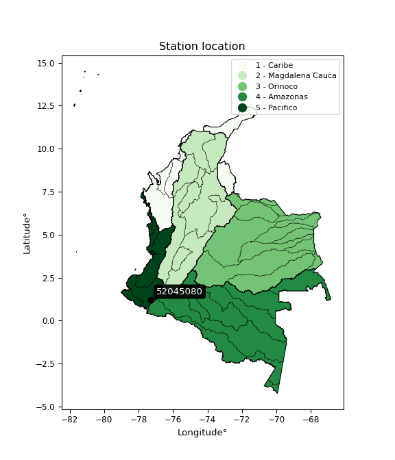

<div align="center">


</div>

# PMax24h Station (Rain): 52045080

Maximum Precipitation in 24 hours (PMax24h) is the greatest amount of rainfall for a specific duration that is meteorologically possible for a given location, acting as a "worst-case" scenario for extreme storms, crucial for designing safety-critical infrastructure like bridges, river deviations, dams, spillways, and nuclear plants to prevent catastrophic failure. The PMax24h is related with the Probable Maximum Precipitation (PMP) and it is calculated by hydrologists using meteorological data to determine the upper limit of extreme rainfall, often leading to the Probable Maximum Flood (PMF) for flood control design, and is increasingly being studied for climate change impacts. Probable Maximum Precipitation (PMP) is the theoretical upper limit of rainfall, a deterministic estimate for extreme events, while probability distributions (like GEV, Gumbel) describe the likelihood and frequency of various precipitation amounts, including rare ones, showing how often events occur, with PMP representing the extreme end of these distributions, used for critical infrastructure design to ensure safety against the worst conceivable weather, unlike standard statistical forecasts which cover typical probabilities.

The most common probability distributions in hydrology, used for analyzing floods, rainfall, and streamflow, include the Normal, Log-Normal, Gumbel, Gamma (including Log-Pearson Type III), and Generalized Extreme Value (GEV) distributions, often chosen based on the data´s skewness and whether modeling extremes or general conditions, with Gumbel and GEV popular for extreme events like floods, while the Normal distribution serves as a baseline, though often requiring transformations for skewed hydrological data. These distributions help in designing water infrastructure, managing water resources, and forecasting hydrologic events.

> Hydrological data often isn´t perfectly normal (it´s skewed), so different distributions are needed for different applications, such as: **Flood Frequency Analysis**: Using Gumbel, GEV, or Log-Pearson Type III for predicting extreme flood magnitudes and their return periods, **Rainfall Analysis**: Normal for annual totals, but Log-Normal, Weibull, or GEV for intensity or extreme daily rainfall, **Streamflow Modeling**: Gamma and Log-Normal for maximum flows, GEV for minimum flows, and Kappa for daily flows.

<div align="center">

</img>

</div>


## A. General information


### 1. General running parameters

• app_version: _v20260225_. • runtime: _2026-02-28 16:54:07.457399_. • Python version: _3.14.0_. • SciPy version: _1.16.3_. • Pandas version: _2.3.3_. • NumPy version: _2.3.5_. • Stations dataset (station_dataset_file): _dataset/pmax24h_in/automatic_colombia_2003_2025.csv_. • Stations catalog (station_catalog_file): _dataset/CNE.xls_. • Minimum year to eval til year_max (date_min): _1900_. • Maximum year to eval since year_min (date_max): _2025_. • Creates, save and include plots into reports (create_plot): _False_. • Plot only fit distributions with Δo > Δ (plot_only_fit): _True_. • Plot only simple graphs avoiding multiple CDFs and multiple Extreme values plots (plot_only_simple): _False_. • Eval low extreme values, if False, evaluates high extreme values (low_extreme): _False_. • Eval every SciPy distribution as logarithmic (pdist_logarithmic_on): _True_. • Standard deviation normalized (ddof): _1.0_. • Return periods to eval in years (Tr): _[2, 2.33, 5, 10, 15, 20, 25, 50, 75, 100, 200, 250, 500, 750, 1000]_. • Minimum data sample per station, 0 means any (minimum_sample): _5_. • Z-Score maximum threshold to adjust a value, 0 means disable (zscore_max): _3.5_. • Z-Score minimum threshold to adjust a value, 0 means disable (zscore_min): _-2.5_. • Avoid zeros, e.g. rain = 0 (avoid_zeros): _True_. • Avoid null values (avoid_nans): _True_. 

:file_folder:Table: [dataset.csv](../../dataset/pmax24h_in/automatic_colombia_2003_2025.csv)

> Delta Degrees of Freedom (DDOF): is a parameter used in the formulas for calculating variance and standard deviation. When ddof=0, the divisor is $N$ (the total number of observations) and this is used when your data set is the entire population. When ddof=1, the divisor is $N-1$ and this is used when your data set is a sample drawn from a larger population. Using $N-1$ provides an unbiased estimate of the population variance (known as Bessel´s correction).


### 2. Station info and location

|   id |   CODIGO | NOMBRE                                  | CATEGORIA               | TECNOLOGIA                              | ESTADO   | FECHA_INSTALACION   |   FECHA_SUSPENSION |   ALTITUD |   LATITUD |   LONGITUD | DEPARTAMENTO   | MUNICIPIO   | AREA_OPERATIVA                      | ENTIDAD                                                     | AREA_HIDROGRAFICA   | ZONA_HIDROGRAFICA   | SUBZONA_HIDROGRAFICA   |   CORRIENTE | Catalogo   |   Version |
|-----:|---------:|:----------------------------------------|:------------------------|:----------------------------------------|:---------|:--------------------|-------------------:|----------:|----------:|-----------:|:---------------|:------------|:------------------------------------|:------------------------------------------------------------|:--------------------|:--------------------|:-----------------------|------------:|:-----------|----------:|
|    0 | 52045080 | UNIVERSIDAD DE NARINO  - AUT [52045080] | Climatológica Ordinaria | Automática con Telemetría, Convencional | Activa   | 13/04/2004          |                nan |      2626 |      1.23 |     -77.28 | Nariño         | Pasto       | Area Operativa 07 - Nariño-Putumayo | INSTITUTO DE HIDROLOGIA METEOROLOGIA Y ESTUDIOS AMBIENTALES | Pacifico            | Patía               | Río Juananbú           |         nan | CNE_IDEAM  |  20251226 |

<div align="center">

Dynamic map: [:earth_americas:Google](http://maps.google.com/maps?q=1.23,-77.28) [:earth_americas:OSM](https://www.openstreetmap.org/#map=18/1.23/-77.28&layers=P) [:earth_americas:Bing](https://www.bing.com/maps?cp=1.23~-77.28&lvl=18) [:earth_americas:Apple](https://maps.apple.com/frame?center=1.23%2C-77.28&span=0.003%2C0.006)

</div>


<div align="center">

```geojson
{
  "type": "Feature",
  "geometry": {
    "type": "Point", 
    "coordinates": [-77.28, 1.23]
  }, 
  "properties": {
    "Name": "52045080"
  }
}
```

</div>


### 3. Discrete values table and plot

<div align="center">

|               |           0 |          1 |           2 |          3 |           4 |            5 |           6 |          7 |          8 |
|:--------------|------------:|-----------:|------------:|-----------:|------------:|-------------:|------------:|-----------:|-----------:|
| Date          | 2017        | 2018       | 2019        | 2020       | 2021        | 2022         | 2023        | 2024       | 2025       |
| Value         |   31.5      |   17       |   27.6      |   20       |   31.7      |   29.7       |   25.4      |   40.8     |   41       |
| Value_initial |   31.5      |   17       |   27.6      |   20       |   31.7      |   29.7       |   25.4      |   40.8     |   41       |
| count         |    9        |    9       |    9        |    9       |    9        |    9         |    9        |    9       |    9       |
| mean          |   29.4111   |   29.4111  |   29.4111   |   29.4111  |   29.4111   |   29.4111    |   29.4111   |   29.4111  |   29.4111  |
| std           |    8.18282  |    8.18282 |    8.18282  |    8.18282 |    8.18282  |    8.18282   |    8.18282  |    8.18282 |    8.18282 |
| zscore        |    0.255277 |   -1.51673 |   -0.221331 |   -1.15011 |    0.279719 |    0.0353043 |   -0.490187 |    1.3918  |    1.41625 |


</div>


> The initial value (value_initial) correspond to the initial obtained or null completed value, and value (value) is adjusted only when the initial value is outside the valid range (outlier) definite through the Z-Score value. If Z-Score is active, values out of range or outliers are replaced with the station mean value. A Z-Score (or standard score) measures how many standard deviations a data point is from the mean of a dataset, indicating its relative position; positive scores mean above the mean, negative mean below, and a score of zero is exactly at the mean, allowing for comparison of values from different distributions. It´s calculated using the formula $z=(x–μ)/σ$, where $x$ is the data point, $μ$ is the mean, and $σ$ is the standard deviation, helping identify outliers and understand probability.
>
> <sub>**Note**: In this study, "completing" (filling gaps in) and "extending" (forecasting or lengthening the historical record) rainfall data series are avoided for certain critical analyses because they introduce artificial bias and uncertainty, which can distort the statistics of rare events (extremes), alter day-to-day variability, and compromise the integrity and homogeneity of the original data. Some reasons against Completing/Extending rainfall data are: **Distortion of Extremes and Variability**: The primary issue is that most gap-filling or extension methods rely on averaging or regression with nearby stations, which inherently smooths the data. Rainfall is highly variable in space and time, with a large percentage of zero values and occasional large storms. Infilling methods often underestimate the highest values and overestimate the lowest (zero) values, which severely distorts analyses focused on flood frequency, drought severity, and intensity-duration-frequency (IDF) curves, **Loss of Data Homogeneity**: Infilled or extended data are synthetic estimates, not actual measurements. Combining these estimates with observed data can violate the assumption of data homogeneity, which requires that the data properties do not change over time. Inhomogeneity can lead to incorrect conclusions about long-term trends or changes in climate patterns, **Propagation of Errors**: Errors and biases from the original data (e.g., wind-induced undercatch, instrument errors, site changes) or the data used for imputation can propagate through the analysis, leading to unreliable hydrological models and inaccurate predictions, **Compromised Statistical Integrity**: For statistical analyses, especially those involving the frequency of events, using artificial data can introduce time bias or autocorrelation that doesn´t exist in reality, making it difficult to assess the true probability of events, **Difficulty in Validation**: It is difficult to accurately validate the quality of filled or extended data, especially for past periods where ground-truth measurements are unavailable. The reliability of imputation techniques heavily depends on the density of the surrounding station network and the complexity of the local topography.</sub>


### 4. Active continuous probability distributions from SciPy (80 of 104 available)

A Probability Density Function (PDF) describes the relative likelihood of a continuous random variable falling within a specific range, where the total area under its curve equals 1, and the area over any interval gives the actual probability for that range. Unlike discrete probabilities (like rolling a die), a PDF shows density, not direct probability for a single point (which is zero), with higher points indicating higher likelihood, often visualized as a bell curve for normal distributions.

A log of a probability density function (log-PDF) is simply the logarithm of the PDF´s value, denoted as $log(f(x))$, useful for converting multiplication of probabilities into addition, improving numerical stability with tiny numbers, and connecting to information theory concepts like entropy. Instead of dealing with very small probabilities (e.g., 0.000001), log-PDFs use negative numbers (e.g., $log(0.00001) ≈ -11.51$ that are easier for computers to handle, preventing underflow errors and simplifying complex calculations. In this study, each active probability distribution from SciPy is also evaluated in the $log$ form.

[scipy.stats](https://docs.scipy.org/doc/scipy/reference/stats.html) is a Python´s powerful submodule within the SciPy library for comprehensive statistical analysis, offering over 130 probability distributions (like Normal, Poisson, etc.), functions for descriptive stats (mean, variance), hypothesis testing (t-tests, chi-square), random variable generation, and statistical tests, making it essential for data science, modeling, and research. It provides tools to explore, model, and draw conclusions from data efficiently, working seamlessly with [NumPy](https://numpy.org/).

<div align="center">

|   id | p_dist           |   n_parameter | fit_method   | label                                                                       | active   | ref                                                                                                      |
|-----:|:-----------------|--------------:|:-------------|:----------------------------------------------------------------------------|:---------|:---------------------------------------------------------------------------------------------------------|
|    0 | alpha            |             3 | MLE          | Alpha                                                                       | True     | [:mortar_board:](https://docs.scipy.org/doc/scipy/reference/generated/scipy.stats.alpha.html)            |
|    1 | anglit           |             2 | MM           | Anglit                                                                      | True     | [:mortar_board:](https://docs.scipy.org/doc/scipy/reference/generated/scipy.stats.anglit.html)           |
|    2 | arcsine          |             2 | MM           | Arcsine                                                                     | True     | [:mortar_board:](https://docs.scipy.org/doc/scipy/reference/generated/scipy.stats.arcsine.html)          |
|    3 | argus            |             3 | MLE          | Argus                                                                       | True     | [:mortar_board:](https://docs.scipy.org/doc/scipy/reference/generated/scipy.stats.argus.html)            |
|    4 | beta             |             4 | MLE          | Beta                                                                        | True     | [:mortar_board:](https://docs.scipy.org/doc/scipy/reference/generated/scipy.stats.beta.html)             |
|    5 | betaprime        |             4 | MLE          | Beta prime                                                                  | True     | [:mortar_board:](https://docs.scipy.org/doc/scipy/reference/generated/scipy.stats.betaprime.html)        |
|    6 | bradford         |             3 | MLE          | Bradford                                                                    | True     | [:mortar_board:](https://docs.scipy.org/doc/scipy/reference/generated/scipy.stats.bradford.html)         |
|    7 | burr             |             4 | MLE          | Burr (Type III)                                                             | True     | [:mortar_board:](https://docs.scipy.org/doc/scipy/reference/generated/scipy.stats.burr.html)             |
|    8 | burr12           |             4 | MLE          | Burr (Type III) 12                                                          | True     | [:mortar_board:](https://docs.scipy.org/doc/scipy/reference/generated/scipy.stats.burr12.html)           |
|    9 | cosine           |             2 | MLE          | Cosine                                                                      | True     | [:mortar_board:](https://docs.scipy.org/doc/scipy/reference/generated/scipy.stats.cosine.html)           |
|   10 | crystalball      |             4 | MLE          | Crystalball                                                                 | True     | [:mortar_board:](https://docs.scipy.org/doc/scipy/reference/generated/scipy.stats.crystalball.html)      |
|   11 | dgamma           |             3 | MLE          | Double gamma                                                                | True     | [:mortar_board:](https://docs.scipy.org/doc/scipy/reference/generated/scipy.stats.dgamma.html)           |
|   12 | dweibull         |             3 | MLE          | Double Weibull                                                              | True     | [:mortar_board:](https://docs.scipy.org/doc/scipy/reference/generated/scipy.stats.dweibull.html)         |
|   13 | erlang           |             3 | MLE          | Erlang                                                                      | True     | [:mortar_board:](https://docs.scipy.org/doc/scipy/reference/generated/scipy.stats.erlang.html)           |
|   14 | exponnorm        |             3 | MLE          | Exponentially modified Normal                                               | True     | [:mortar_board:](https://docs.scipy.org/doc/scipy/reference/generated/scipy.stats.exponnorm.html)        |
|   15 | exponpow         |             3 | MLE          | Exponential power                                                           | True     | [:mortar_board:](https://docs.scipy.org/doc/scipy/reference/generated/scipy.stats.exponpow.html)         |
|   16 | exponweib        |             4 | MLE          | Exponentiated Weibull                                                       | True     | [:mortar_board:](https://docs.scipy.org/doc/scipy/reference/generated/scipy.stats.exponweib.html)        |
|   17 | f                |             4 | MLE          | F                                                                           | True     | [:mortar_board:](https://docs.scipy.org/doc/scipy/reference/generated/scipy.stats.f.html)                |
|   18 | fatiguelife      |             3 | MLE          | Fatigue-life (Birnbaum-Saunders)                                            | True     | [:mortar_board:](https://docs.scipy.org/doc/scipy/reference/generated/scipy.stats.fatiguelife.html)      |
|   19 | foldnorm         |             3 | MM           | Fold Normal                                                                 | True     | [:mortar_board:](https://docs.scipy.org/doc/scipy/reference/generated/scipy.stats.foldnorm.html)         |
|   20 | gamma            |             3 | MLE          | Gamma                                                                       | True     | [:mortar_board:](https://docs.scipy.org/doc/scipy/reference/generated/scipy.stats.gamma.html)            |
|   21 | gausshyper       |             6 | MLE          | Gauss hypergeometric                                                        | True     | [:mortar_board:](https://docs.scipy.org/doc/scipy/reference/generated/scipy.stats.gausshyper.html)       |
|   22 | genexpon         |             5 | MLE          | Generalized exponential                                                     | True     | [:mortar_board:](https://docs.scipy.org/doc/scipy/reference/generated/scipy.stats.genexpon.html)         |
|   23 | genextreme       |             3 | MLE          | Generalized exponential                                                     | True     | [:mortar_board:](https://docs.scipy.org/doc/scipy/reference/generated/scipy.stats.genextreme.html)       |
|   24 | gengamma         |             4 | MLE          | Generalized gamma                                                           | True     | [:mortar_board:](https://docs.scipy.org/doc/scipy/reference/generated/scipy.stats.gengamma.html)         |
|   25 | genhalflogistic  |             3 | MLE          | Generalized half-logistic                                                   | True     | [:mortar_board:](https://docs.scipy.org/doc/scipy/reference/generated/scipy.stats.genhalflogistic.html)  |
|   26 | genlogistic      |             3 | MLE          | Generalized logistic                                                        | True     | [:mortar_board:](https://docs.scipy.org/doc/scipy/reference/generated/scipy.stats.genlogistic.html)      |
|   27 | gennorm          |             3 | MLE          | Generalized Normal                                                          | True     | [:mortar_board:](https://docs.scipy.org/doc/scipy/reference/generated/scipy.stats.gennorm.html)          |
|   28 | genpareto        |             3 | MLE          | Generalized Pareto                                                          | True     | [:mortar_board:](https://docs.scipy.org/doc/scipy/reference/generated/scipy.stats.genpareto.html)        |
|   29 | gompertz         |             3 | MLE          | Gompertz (or truncated Gumbel)                                              | True     | [:mortar_board:](https://docs.scipy.org/doc/scipy/reference/generated/scipy.stats.gompertz.html)         |
|   30 | gumbel_l         |             2 | MM           | Gumbel Left Skew                                                            | True     | [:mortar_board:](https://docs.scipy.org/doc/scipy/reference/generated/scipy.stats.gumbel_l.html)         |
|   31 | gumbel_r         |             2 | MM           | Gumbel Right Skew                                                           | True     | [:mortar_board:](https://docs.scipy.org/doc/scipy/reference/generated/scipy.stats.gumbel_r.html)         |
|   32 | halfgennorm      |             3 | MLE          | Upper half of a generalized normal                                          | True     | [:mortar_board:](https://docs.scipy.org/doc/scipy/reference/generated/scipy.stats.halfgennorm.html)      |
|   33 | halflogistic     |             2 | MM           | Half-logistic                                                               | True     | [:mortar_board:](https://docs.scipy.org/doc/scipy/reference/generated/scipy.stats.halflogistic.html)     |
|   34 | halfnorm         |             2 | MM           | Half Normal                                                                 | True     | [:mortar_board:](https://docs.scipy.org/doc/scipy/reference/generated/scipy.stats.halfnorm.html)         |
|   35 | hypsecant        |             2 | MM           | hyperbolic secant                                                           | True     | [:mortar_board:](https://docs.scipy.org/doc/scipy/reference/generated/scipy.stats.hypsecant.html)        |
|   36 | invgamma         |             3 | MLE          | Inverted gamma                                                              | True     | [:mortar_board:](https://docs.scipy.org/doc/scipy/reference/generated/scipy.stats.invgamma.html)         |
|   37 | invgauss         |             3 | MLE          | Inverse Gaussian                                                            | True     | [:mortar_board:](https://docs.scipy.org/doc/scipy/reference/generated/scipy.stats.invgauss.html)         |
|   38 | invweibull       |             3 | MLE          | Inverted Weibull                                                            | True     | [:mortar_board:](https://docs.scipy.org/doc/scipy/reference/generated/scipy.stats.invweibull.html)       |
|   39 | johnsonsb        |             4 | MLE          | Johnson SB                                                                  | True     | [:mortar_board:](https://docs.scipy.org/doc/scipy/reference/generated/scipy.stats.johnsonsb.html)        |
|   40 | johnsonsu        |             4 | MLE          | Johnson Su                                                                  | True     | [:mortar_board:](https://docs.scipy.org/doc/scipy/reference/generated/scipy.stats.johnsonsu.html)        |
|   41 | kappa3           |             3 | MLE          | Kappa 3                                                                     | True     | [:mortar_board:](https://docs.scipy.org/doc/scipy/reference/generated/scipy.stats.kappa3.html)           |
|   42 | kappa4           |             4 | MLE          | Kappa 4                                                                     | True     | [:mortar_board:](https://docs.scipy.org/doc/scipy/reference/generated/scipy.stats.kappa4.html)           |
|   43 | ksone            |             3 | MLE          | Kolmogorov-Smirnov one-sided test statistic distribution                    | True     | [:mortar_board:](https://docs.scipy.org/doc/scipy/reference/generated/scipy.stats.ksone.html)            |
|   44 | kstwobign        |             2 | MLE          | Limiting distribution of scaled Kolmogorov-Smirnov two-sided test statistic | True     | [:mortar_board:](https://docs.scipy.org/doc/scipy/reference/generated/scipy.stats.kstwobign.html)        |
|   45 | laplace          |             2 | MM           | Laplace                                                                     | True     | [:mortar_board:](https://docs.scipy.org/doc/scipy/reference/generated/scipy.stats.laplace.html)          |
|   46 | levy_l           |             2 | MLE          | Left-skewed Levy                                                            | True     | [:mortar_board:](https://docs.scipy.org/doc/scipy/reference/generated/scipy.stats.levy_l.html)           |
|   47 | loggamma         |             3 | MLE          | Log gamma                                                                   | True     | [:mortar_board:](https://docs.scipy.org/doc/scipy/reference/generated/scipy.stats.loggamma.html)         |
|   48 | logistic         |             2 | MM           | Logistic (or Sech-squared)                                                  | True     | [:mortar_board:](https://docs.scipy.org/doc/scipy/reference/generated/scipy.stats.logistic.html)         |
|   49 | loglaplace       |             3 | MLE          | Log-Laplace                                                                 | True     | [:mortar_board:](https://docs.scipy.org/doc/scipy/reference/generated/scipy.stats.loglaplace.html)       |
|   50 | lomax            |             3 | MLE          | Lomax (Pareto of the second kind)                                           | True     | [:mortar_board:](https://docs.scipy.org/doc/scipy/reference/generated/scipy.stats.lomax.html)            |
|   51 | maxwell          |             2 | MM           | Maxwell                                                                     | True     | [:mortar_board:](https://docs.scipy.org/doc/scipy/reference/generated/scipy.stats.maxwell.html)          |
|   52 | mielke           |             4 | MLE          | Mielke Beta-Kappa / Dagum                                                   | True     | [:mortar_board:](https://docs.scipy.org/doc/scipy/reference/generated/scipy.stats.mielke.html)           |
|   53 | moyal            |             2 | MM           | Moyal                                                                       | True     | [:mortar_board:](https://docs.scipy.org/doc/scipy/reference/generated/scipy.stats.moyal.html)            |
|   54 | nakagami         |             3 | MLE          | Nakagami                                                                    | True     | [:mortar_board:](https://docs.scipy.org/doc/scipy/reference/generated/scipy.stats.nakagami.html)         |
|   55 | ncf              |             5 | MLE          | Non-central F distribution                                                  | True     | [:mortar_board:](https://docs.scipy.org/doc/scipy/reference/generated/scipy.stats.ncf.html)              |
|   56 | nct              |             4 | MLE          | Non-central Student’s t                                                     | True     | [:mortar_board:](https://docs.scipy.org/doc/scipy/reference/generated/scipy.stats.nct.html)              |
|   57 | norm             |             2 | MM           | Normal                                                                      | True     | [:mortar_board:](https://docs.scipy.org/doc/scipy/reference/generated/scipy.stats.norm.html)             |
|   58 | pearson3         |             3 | MM           | Pearson type III                                                            | True     | [:mortar_board:](https://docs.scipy.org/doc/scipy/reference/generated/scipy.stats.pearson3.html)         |
|   59 | powerlaw         |             3 | MLE          | Power-function                                                              | True     | [:mortar_board:](https://docs.scipy.org/doc/scipy/reference/generated/scipy.stats.powerlaw.html)         |
|   60 | rayleigh         |             2 | MM           | Rayleigh                                                                    | True     | [:mortar_board:](https://docs.scipy.org/doc/scipy/reference/generated/scipy.stats.rayleigh.html)         |
|   61 | rdist            |             3 | MLE          | R-distributed (symmetric beta)                                              | True     | [:mortar_board:](https://docs.scipy.org/doc/scipy/reference/generated/scipy.stats.rdist.html)            |
|   62 | rice             |             3 | MLE          | Rice                                                                        | True     | [:mortar_board:](https://docs.scipy.org/doc/scipy/reference/generated/scipy.stats.rice.html)             |
|   63 | semicircular     |             2 | MM           | Semicircular                                                                | True     | [:mortar_board:](https://docs.scipy.org/doc/scipy/reference/generated/scipy.stats.semicircular.html)     |
|   64 | skewnorm         |             3 | MLE          | Skew normal                                                                 | True     | [:mortar_board:](https://docs.scipy.org/doc/scipy/reference/generated/scipy.stats.skewnorm.html)         |
|   65 | t                |             3 | MLE          | Student’s t                                                                 | True     | [:mortar_board:](https://docs.scipy.org/doc/scipy/reference/generated/scipy.stats.t.html)                |
|   66 | trapezoid        |             4 | MLE          | Trapezoid                                                                   | True     | [:mortar_board:](https://docs.scipy.org/doc/scipy/reference/generated/scipy.stats.trapezoid.html)        |
|   67 | triang           |             3 | MLE          | Triangular                                                                  | True     | [:mortar_board:](https://docs.scipy.org/doc/scipy/reference/generated/scipy.stats.triang.html)           |
|   68 | truncexpon       |             3 | MLE          | Truncated exponential                                                       | True     | [:mortar_board:](https://docs.scipy.org/doc/scipy/reference/generated/scipy.stats.truncexpon.html)       |
|   69 | truncnorm        |             4 | MLE          | Truncated normal                                                            | True     | [:mortar_board:](https://docs.scipy.org/doc/scipy/reference/generated/scipy.stats.truncnorm.html)        |
|   70 | truncpareto      |             4 | MLE          | Upper truncated Pareto                                                      | True     | [:mortar_board:](https://docs.scipy.org/doc/scipy/reference/generated/scipy.stats.truncpareto.html)      |
|   71 | truncweibull_min |             5 | MLE          | Doubly truncated Weibull minimum                                            | True     | [:mortar_board:](https://docs.scipy.org/doc/scipy/reference/generated/scipy.stats.truncweibull_min.html) |
|   72 | tukeylambda      |             3 | MLE          | Tukey-Lamdba                                                                | True     | [:mortar_board:](https://docs.scipy.org/doc/scipy/reference/generated/scipy.stats.tukeylambda.html)      |
|   73 | uniform          |             2 | MLE          | Uniform                                                                     | True     | [:mortar_board:](https://docs.scipy.org/doc/scipy/reference/generated/scipy.stats.uniform.html)          |
|   74 | vonmises         |             3 | MLE          | Von Mises                                                                   | True     | [:mortar_board:](https://docs.scipy.org/doc/scipy/reference/generated/scipy.stats.vonmises.html)         |
|   75 | vonmises_line    |             3 | MLE          | Von Mises line                                                              | True     | [:mortar_board:](https://docs.scipy.org/doc/scipy/reference/generated/scipy.stats.vonmises_line.html)    |
|   76 | wald             |             2 | MM           | Wald                                                                        | True     | [:mortar_board:](https://docs.scipy.org/doc/scipy/reference/generated/scipy.stats.wald.html)             |
|   77 | weibull_max      |             3 | MLE          | Weibull maximum                                                             | True     | [:mortar_board:](https://docs.scipy.org/doc/scipy/reference/generated/scipy.stats.weibull_max.html)      |
|   78 | weibull_min      |             3 | MLE          | Weibull minimum                                                             | True     | [:mortar_board:](https://docs.scipy.org/doc/scipy/reference/generated/scipy.stats.weibull_min.html)      |
|   79 | wrapcauchy       |             3 | MLE          | Wrapped  Cauchy                                                             | True     | [:mortar_board:](https://docs.scipy.org/doc/scipy/reference/generated/scipy.stats.wrapcauchy.html)       |

</div>

> **n_parameter:** # arguments & localization & scale.
>
> **Fit methods:** (MLE) maximum likelihood, (MM) L-moments.
>
>**Inactive** (With the only purpose of prevent loops, zero divisions, infinite values, over high estimated values or horizontal trending for recurrence intervals estimations, the follow distributions were disabled.)**:** lognorm, norminvgauss, powernorm, powerlognorm, cauchy, halfcauchy, foldcauchy, skewcauchy, chi2, expon, fisk, genhyperbolic, geninvgauss, gibrat, kstwo, laplace_asymmetric, levy, levy_stable, ncx2, pareto, rel_breitwigner, recipinvgauss, studentized_range, loguniform, 


## B. Probability (PDF) vs. Empirical (EDF) distributions functions

A continuous probability distribution (CPD) describes probabilities for variables that can take any value within a range (like rain any time), unlike discrete variables with specific outcomes (like temperature). It uses a Probability Density Function (PDF), a curve where the total area under it equals 1, and the probability of the variable falling within an interval (a to b) is found by calculating the area under the curve between those points. A key feature is that the probability of hitting any single exact value is zero, so probabilities are always expressed for ranges, e.g., $P(a ≤ X ≤ b)$.

<div align="center">

Distributions parameters from station values
|     |   station | p_dist              |   n |             loc |           scale | shape                  | shape1                 | shape2                 | shape3             |
|----:|----------:|:--------------------|----:|----------------:|----------------:|:-----------------------|:-----------------------|:-----------------------|:-------------------|
|   0 |  52045080 | alpha               |   9 |  -112.326       |  2583.36        | 18.290966087360317     |                        |                        |                    |
|   1 |  52045080 | anglit              |   9 |    29.4111      |    22.569       |                        |                        |                        |                    |
|   2 |  52045080 | arcsine             |   9 |    18.5007      |    21.8208      |                        |                        |                        |                    |
|   3 |  52045080 | argus               |   9 |    11.9135      |    30.8135      | 1.7739224177022283e-05 |                        |                        |                    |
|   4 |  52045080 | beta                |   9 |    16.3951      |    24.6049      | 1.2673424081593612     | 0.6092815489552318     |                        |                    |
|   5 |  52045080 | betaprime           |   9 |   -96.9517      |     2.09819     | 16225.753317909592     | 270.46867850458324     |                        |                    |
|   6 |  52045080 | bradford            |   9 |    17           |    24.0001      | 1.0937256006591536     |                        |                        |                    |
|   7 |  52045080 | burr                |   9 |    -0.184544    |    33.6417      | 8.673774763868106      | 0.4953995982998305     |                        |                    |
|   8 |  52045080 | burr12              |   9 |    -2.81763     |    19.7335      | 889.7679759919129      | 0.0024417102091830326  |                        |                    |
|   9 |  52045080 | cosine              |   9 |    29.4507      |     6.4057      |                        |                        |                        |                    |
|  10 |  52045080 | crystalball         |   9 |    29.4111      |     7.71484     | 2537.691151243365      | 117.79688716177105     |                        |                    |
|  11 |  52045080 | dgamma              |   9 |    28.731       |     4.25893     | 1.4601676499526293     |                        |                        |                    |
|  12 |  52045080 | dweibull            |   9 |    29.7         |     6.07718     | 0.9352697399270333     |                        |                        |                    |
|  13 |  52045080 | erlang              |   9 |  -196.128       |     0.26349     | 855.970924705255       |                        |                        |                    |
|  14 |  52045080 | exponnorm           |   9 |    28.9248      |     7.6995      | 0.0631578667818361     |                        |                        |                    |
|  15 |  52045080 | exponpow            |   9 |    17           |     1.57078     | 0.1511753149565736     |                        |                        |                    |
|  16 |  52045080 | exponweib           |   9 |    17           |     1.19516     | 1.281815774039155      | 0.32494200728081757    |                        |                    |
|  17 |  52045080 | f                   |   9 |   -60.2071      |    89.6107      | 272.0428176860032      | 23875.845093462434     |                        |                    |
|  18 |  52045080 | fatiguelife         |   9 |    17           |     1.80722e-05 | 795.9910285812766      |                        |                        |                    |
|  19 |  52045080 | foldnorm            |   9 |    29.0902      |     2.20598     | 1.5908373135105688e-08 |                        |                        |                    |
|  20 |  52045080 | gamma               |   9 |  -200.751       |     0.258235    | 891.2811312537997      |                        |                        |                    |
|  21 |  52045080 | gausshyper          |   9 |    17           |    24.0547      | 0.8774902863754893     | 0.4289537964392467     | 1.5663431466589852     | 0.9928913497501999 |
|  22 |  52045080 | genexpon            |   9 |    17           |     2.11874     | 0.17062960171222208    | 4.551171677107261e-07  | 1.1963531415251283     |                    |
|  23 |  52045080 | genextreme          |   9 |    27.0286      |     7.87088     | 0.37147067194371464    |                        |                        |                    |
|  24 |  52045080 | gengamma            |   9 |    17           |     1.18315     | 1.3100182562891836     | 0.33935135285743684    |                        |                    |
|  25 |  52045080 | genhalflogistic     |   9 |    15.6323      |    27.1163      | 1.0689311587881127     |                        |                        |                    |
|  26 |  52045080 | genlogistic         |   9 |    24.8018      |     5.38081     | 1.8232586614473        |                        |                        |                    |
|  27 |  52045080 | gennorm             |   9 |    29.7         |     5.78626     | 0.9836426995698239     |                        |                        |                    |
|  28 |  52045080 | genpareto           |   9 |    -0.206527    |    77.8799      | -1.889990521639469     |                        |                        |                    |
|  29 |  52045080 | gompertz            |   9 |    20           |     1.93739     | 8.153438018084794e-05  |                        |                        |                    |
|  30 |  52045080 | gumbel_l            |   9 |    32.8832      |     6.01524     |                        |                        |                        |                    |
|  31 |  52045080 | gumbel_r            |   9 |    25.939       |     6.01524     |                        |                        |                        |                    |
|  32 |  52045080 | halfgennorm         |   9 |    17           |     1.34145     | 0.4329102167522113     |                        |                        |                    |
|  33 |  52045080 | halflogistic        |   9 |    20.2673      |     6.59588     |                        |                        |                        |                    |
|  34 |  52045080 | halfnorm            |   9 |    19.1997      |    12.7981      |                        |                        |                        |                    |
|  35 |  52045080 | hypsecant           |   9 |    29.4111      |     4.91142     |                        |                        |                        |                    |
|  36 |  52045080 | invgamma            |   9 |   -66.1158      | 14204.1         | 149.71173934211254     |                        |                        |                    |
|  37 |  52045080 | invgauss            |   9 |   -17.6257      |  1626.42        | 0.028902197072417507   |                        |                        |                    |
|  38 |  52045080 | invweibull          |   9 |    -8.37038e+08 |     8.37039e+08 | 118616740.86105701     |                        |                        |                    |
|  39 |  52045080 | johnsonsb           |   9 |    16.9723      |    24.0277      | -0.7744291170223061    | 0.12259108173200278    |                        |                    |
|  40 |  52045080 | johnsonsu           |   9 |  -127.078       |    83.4383      | -31.860968603528857    | 22.99305615983409      |                        |                    |
|  41 |  52045080 | kappa3              |   9 |    17           |    22.4307      | 37.486711381576384     |                        |                        |                    |
|  42 |  52045080 | kappa4              |   9 |    17.0239      |    25.6168      | 0.9923607391772771     | 1.0684282336584807     |                        |                    |
|  43 |  52045080 | ksone               |   9 |    16.0486      |    26.725       | 1.0                    |                        |                        |                    |
|  44 |  52045080 | kstwobign           |   9 |     0.820476    |    32.7032      |                        |                        |                        |                    |
|  45 |  52045080 | laplace             |   9 |    29.4111      |     5.45522     |                        |                        |                        |                    |
|  46 |  52045080 | levy_l              |   9 |    41.8923      |     3.55885     |                        |                        |                        |                    |
|  47 |  52045080 | loggamma            |   9 | -1517.32        |   228.574       | 869.0500309311328      |                        |                        |                    |
|  48 |  52045080 | logistic            |   9 |    29.4111      |     4.25341     |                        |                        |                        |                    |
|  49 |  52045080 | loglaplace          |   9 |    -0.0793669   |    29.7794      | 4.642926590776854      |                        |                        |                    |
|  50 |  52045080 | lomax               |   9 |    17           |   726.905       | 58.579356425896506     |                        |                        |                    |
|  51 |  52045080 | maxwell             |   9 |    11.1302      |    11.4559      |                        |                        |                        |                    |
|  52 |  52045080 | mielke              |   9 | -1378.58        |  1351.37        | 528353.7714251481      | 205.68657570979036     |                        |                    |
|  53 |  52045080 | moyal               |   9 |    24.9993      |     3.4729      |                        |                        |                        |                    |
|  54 |  52045080 | nakagami            |   9 |    20           |    11.5076      | 0.40916904449564107    |                        |                        |                    |
|  55 |  52045080 | ncf                 |   9 |     0.0200271   |    31.8752      | 8.642293480317612      | 16.6585956010574       | 2.4344211751815927e-05 |                    |
|  56 |  52045080 | nct                 |   9 |  -309.834       |     7.69154     | 156038.7384370031      | 44.10621803037483      |                        |                    |
|  57 |  52045080 | norm                |   9 |    29.4111      |     7.71484     |                        |                        |                        |                    |
|  58 |  52045080 | pearson3            |   9 |    29.4111      |     7.71485     | 0.05779938937451996    |                        |                        |                    |
|  59 |  52045080 | powerlaw            |   9 |    17           |    24           | 0.2141097690901432     |                        |                        |                    |
|  60 |  52045080 | rayleigh            |   9 |    14.6522      |    11.7759      |                        |                        |                        |                    |
|  61 |  52045080 | rdist               |   9 |    15.9959      |    13.7041      | 1.0437735780951278     |                        |                        |                    |
|  62 |  52045080 | rice                |   9 |    13.4982      |     9.10079     | 1.3326486092288228     |                        |                        |                    |
|  63 |  52045080 | semicircular        |   9 |    29.4111      |    15.4297      |                        |                        |                        |                    |
|  64 |  52045080 | skewnorm            |   9 |    27.0679      |     8.06284     | 0.3910644595900034     |                        |                        |                    |
|  65 |  52045080 | t                   |   9 |    29.411       |     7.71481     | 48638337.07786672      |                        |                        |                    |
|  66 |  52045080 | trapezoid           |   9 |    14.6         |    28.8         | 1.0                    | 1.0                    |                        |                    |
|  67 |  52045080 | triang              |   9 |    10.2718      |    30.7282      | 0.9999999999945435     |                        |                        |                    |
|  68 |  52045080 | truncexpon          |   9 |    17           |    31.1483      | 0.7705083241894903     |                        |                        |                    |
|  69 |  52045080 | truncnorm           |   9 |    29.4111      |     7.71484     | -86.41255958248487     | 345.48345523694616     |                        |                    |
|  70 |  52045080 | truncpareto         |   9 |    16.9985      |     0.00149266  | 0.12517758885423308    | 16079.661138753403     |                        |                    |
|  71 |  52045080 | truncweibull_min    |   9 |    16.9817      |    28.8973      | 0.9619968446474004     | 0.0006159565209322421  | 0.8311605647754097     |                    |
|  72 |  52045080 | tukeylambda         |   9 |    28.9979      |    13.9771      | 1.1645537117407903     |                        |                        |                    |
|  73 |  52045080 | uniform             |   9 |    17           |    24           |                        |                        |                        |                    |
|  74 |  52045080 | vonmises            |   9 |     0.599995    |     1           | 0.038119646488391      |                        |                        |                    |
|  75 |  52045080 | vonmises_line       |   9 |    29           |     3.81972     | 0.07831735357434835    |                        |                        |                    |
|  76 |  52045080 | wald                |   9 |    21.6963      |     7.71483     |                        |                        |                        |                    |
|  77 |  52045080 | weibull_max         |   9 |    41           |     1.28581     | 0.3760688165937248     |                        |                        |                    |
|  78 |  52045080 | weibull_min         |   9 |    12.2621      |    19.3596      | 2.3984187654004607     |                        |                        |                    |
|  79 |  52045080 | wrapcauchy          |   9 |    17           |     3.81972     | 0.5000000000000002     |                        |                        |                    |
|  80 |  52045080 | logalpha            |   9 |    -4.98203     |   243.275       | 29.26445469365835      |                        |                        |                    |
|  81 |  52045080 | loganglit           |   9 |     3.34458     |     0.810276    |                        |                        |                        |                    |
|  82 |  52045080 | logarcsine          |   9 |     2.95289     |     0.783378    |                        |                        |                        |                    |
|  83 |  52045080 | logargus            |   9 |     2.64228     |     1.12083     | 1.23466505950823       |                        |                        |                    |
|  84 |  52045080 | logbeta             |   9 |     2.61931     |     1.09426     | 2.421982272706056      | 0.6626717390667336     |                        |                    |
|  85 |  52045080 | logbetaprime        |   9 |     1.26909     |    19.1042      | 32.54527277704243      | 298.97993744616133     |                        |                    |
|  86 |  52045080 | logbradford         |   9 |     2.82946     |     0.884119    | 0.002061707645538881   |                        |                        |                    |
|  87 |  52045080 | logburr             |   9 |    -0.264378    |     3.81463     | 35.63079526925736      | 0.3892573029087929     |                        |                    |
|  88 |  52045080 | logburr12           |   9 |     1.51307     |     4.27776     | 7.986039781164624      | 535.3921740376429      |                        |                    |
|  89 |  52045080 | logcosine           |   9 |     3.32675     |     0.232867    |                        |                        |                        |                    |
|  90 |  52045080 | logcrystalball      |   9 |     3.34458     |     0.27698     | 7.570982731048938      | 5870.795482047311      |                        |                    |
|  91 |  52045080 | logdgamma           |   9 |     3.35579     |     0.154407    | 1.426524908847429      |                        |                        |                    |
|  92 |  52045080 | logdweibull         |   9 |     3.35446     |     0.237401    | 1.2632242514603418     |                        |                        |                    |
|  93 |  52045080 | logerlang           |   9 |    -1.11269     |     0.017773    | 250.82267805928961     |                        |                        |                    |
|  94 |  52045080 | logexponnorm        |   9 |     3.3444      |     0.27698     | 0.0006346147193502798  |                        |                        |                    |
|  95 |  52045080 | logexponpow         |   9 |     2.60629     |     0.992494    | 2.376140561845172      |                        |                        |                    |
|  96 |  52045080 | logexponweib        |   9 |     2.83321     |     0.728677    | 0.47901143971025545    | 1.4715347181958096     |                        |                    |
|  97 |  52045080 | logf                |   9 |  -183.742       |   187.086       | 2662481.112964087      | 1382628.9154763068     |                        |                    |
|  98 |  52045080 | logfatiguelife      |   9 |   -82.5586      |    85.9027      | 0.0032178171471401026  |                        |                        |                    |
|  99 |  52045080 | logfoldnorm         |   9 |     2.76027     |     0.282623    | 2.053332587688651      |                        |                        |                    |
| 100 |  52045080 | loggamma            |   9 |    -1.16962     |     0.0173238   | 260.4927093580129      |                        |                        |                    |
| 101 |  52045080 | loggausshyper       |   9 |     2.74328     |     0.970296    | 1.2867562227374079     | 0.5134146232516466     | 1.2080388355154956     | 1.0325951373764104 |
| 102 |  52045080 | loggenexpon         |   9 |     2.81859     |     0.00709562  | 0.00397862119140114    | 4.256018261632143      | 4.714043443690828e-05  |                    |
| 103 |  52045080 | loggenextreme       |   9 |     3.39744     |     0.343367    | 1.0861568019983996     |                        |                        |                    |
| 104 |  52045080 | loggengamma         |   9 |     2.83321     |     0.821956    | 0.4546761510582732     | 1.33247999159763       |                        |                    |
| 105 |  52045080 | loggenhalflogistic  |   9 |     2.83297     |     0.898057    | 1.0198181386480574     |                        |                        |                    |
| 106 |  52045080 | loggenlogistic      |   9 |     3.51133     |     0.115675    | 0.4923841182201807     |                        |                        |                    |
| 107 |  52045080 | loggennorm          |   9 |     3.27339     |     0.440189    | 471397.2711374307      |                        |                        |                    |
| 108 |  52045080 | loggenpareto        |   9 |     0.00206838  |     4.099       | -1.104403385396874     |                        |                        |                    |
| 109 |  52045080 | loggompertz         |   9 |     2.83321     |     0.303531    | 0.14990008980068914    |                        |                        |                    |
| 110 |  52045080 | loggumbel_l         |   9 |     3.46924     |     0.21596     |                        |                        |                        |                    |
| 111 |  52045080 | loggumbel_r         |   9 |     3.21992     |     0.21596     |                        |                        |                        |                    |
| 112 |  52045080 | loghalfgennorm      |   9 |     2.83258     |     0.881792    | 7453.231616872788      |                        |                        |                    |
| 113 |  52045080 | loghalflogistic     |   9 |     3.01624     |     0.236842    |                        |                        |                        |                    |
| 114 |  52045080 | loghalfnorm         |   9 |     2.97799     |     0.459457    |                        |                        |                        |                    |
| 115 |  52045080 | loghypsecant        |   9 |     3.34458     |     0.176331    |                        |                        |                        |                    |
| 116 |  52045080 | loginvgamma         |   9 |    -3.74339     |  4494.96        | 635.1053704557708      |                        |                        |                    |
| 117 |  52045080 | loginvgauss         |   9 |     1.0111      |   152.516       | 0.01527369279939966    |                        |                        |                    |
| 118 |  52045080 | loginvweibull       |   9 |    -2.09583e+07 |     2.09583e+07 | 78726170.70738463      |                        |                        |                    |
| 119 |  52045080 | logjohnsonsb        |   9 |     2.83285     |     0.880722    | 0.007226818529005698   | 0.1249793703338958     |                        |                    |
| 120 |  52045080 | logjohnsonsu        |   9 |     4.29094     |     0.0566787   | 11.717853071220283     | 3.38040688044949       |                        |                    |
| 121 |  52045080 | logkappa3           |   9 |     2.83321     |     0.872699    | 229.34993162223648     |                        |                        |                    |
| 122 |  52045080 | logkappa4           |   9 |     2.79087     |     0.97475     | 1.0383210591545233     | 1.0564109112521995     |                        |                    |
| 123 |  52045080 | logksone            |   9 |     2.74518     |     1.05643     | 1.0                    |                        |                        |                    |
| 124 |  52045080 | logkstwobign        |   9 |     2.21397     |     1.292       |                        |                        |                        |                    |
| 125 |  52045080 | loglaplace          |   9 |     3.34458     |     0.195854    |                        |                        |                        |                    |
| 126 |  52045080 | loglevy_l           |   9 |     3.74027     |     0.104993    |                        |                        |                        |                    |
| 127 |  52045080 | logloggamma         |   9 |     3.2538      |     0.32959     | 1.7870737743043463     |                        |                        |                    |
| 128 |  52045080 | loglogistic         |   9 |     3.34458     |     0.152707    |                        |                        |                        |                    |
| 129 |  52045080 | logloglaplace       |   9 |    -0.0367113   |     3.42786     | 15.442789342058454     |                        |                        |                    |
| 130 |  52045080 | loglomax            |   9 |     2.83321     |    20.6636      | 40.649634906947554     |                        |                        |                    |
| 131 |  52045080 | logmaxwell          |   9 |     2.68825     |     0.411291    |                        |                        |                        |                    |
| 132 |  52045080 | logmielke           |   9 |     2.83312     |     0.976192    | 0.8017276030872731     | 12.553292301261362     |                        |                    |
| 133 |  52045080 | logmoyal            |   9 |     3.18618     |     0.124685    |                        |                        |                        |                    |
| 134 |  52045080 | lognakagami         |   9 |   -80.1401      |    83.4851      | 22722.52270835558      |                        |                        |                    |
| 135 |  52045080 | logncf              |   9 |    -3.3344      |     6.66061     | 623.7076004874116      | 509.9001062886541      | 0.9687706267575109     |                    |
| 136 |  52045080 | lognct              |   9 |    -9.65868     |     0.268955    | 17169.094002887403     | 48.344121594988565     |                        |                    |
| 137 |  52045080 | lognorm             |   9 |     3.34458     |     0.27698     |                        |                        |                        |                    |
| 138 |  52045080 | logpearson3         |   9 |     3.34458     |     0.27698     | -0.3991597070079112    |                        |                        |                    |
| 139 |  52045080 | logpowerlaw         |   9 |     2.83321     |     0.880359    | 0.22809206385025882    |                        |                        |                    |
| 140 |  52045080 | lograyleigh         |   9 |     2.8147      |     0.422782    |                        |                        |                        |                    |
| 141 |  52045080 | logrdist            |   9 |     3.69874     |     0.46399     | 1.2495274086790094     |                        |                        |                    |
| 142 |  52045080 | logrice             |   9 |     2.68008     |     0.30482     | 1.891523856080295      |                        |                        |                    |
| 143 |  52045080 | logsemicircular     |   9 |     3.34458     |     0.553959    |                        |                        |                        |                    |
| 144 |  52045080 | logskewnorm         |   9 |     3.71357     |     0.461375    | -24424632.214536786    |                        |                        |                    |
| 145 |  52045080 | logt                |   9 |     3.34458     |     0.27698     | 1341527401.508695      |                        |                        |                    |
| 146 |  52045080 | logtrapezoid        |   9 |     2.56116     |     1.17513     | 1.0                    | 1.0                    |                        |                    |
| 147 |  52045080 | logtriang           |   9 |     2.63907     |     1.0745      | 0.9999998717784271     |                        |                        |                    |
| 148 |  52045080 | logtruncexpon       |   9 |     2.8332      |     1.02898     | 0.8555745597069399     |                        |                        |                    |
| 149 |  52045080 | logtruncnorm        |   9 |    -0.121163    |     1.93156     | 1.5295276434035003     | 1.9853098056426444     |                        |                    |
| 150 |  52045080 | logtruncpareto      |   9 |     2.83315     |     6.47598e-05 | 0.12516394676675327    | 13595.21307632643      |                        |                    |
| 151 |  52045080 | logtruncweibull_min |   9 |     2.8038      |     1.29955     | 1.2936488003133269     | 0.00039783944254804236 | 0.7000666949206764     |                    |
| 152 |  52045080 | logtukeylambda      |   9 |     3.27405     |     0.461408    | 1.046667548588983      |                        |                        |                    |
| 153 |  52045080 | loguniform          |   9 |     2.83321     |     0.880359    |                        |                        |                        |                    |
| 154 |  52045080 | logvonmises         |   9 |    -2.93716     |     1           | 13.49070589551486      |                        |                        |                    |
| 155 |  52045080 | logvonmises_line    |   9 |     3.389       |     0.176913    | 1.0120341768446015     |                        |                        |                    |
| 156 |  52045080 | logwald             |   9 |     3.06757     |     0.277004    |                        |                        |                        |                    |
| 157 |  52045080 | logweibull_max      |   9 |     3.71357     |     0.326043    | 0.7149789566630379     |                        |                        |                    |
| 158 |  52045080 | logweibull_min      |   9 |     1.49076     |     1.97058     | 8.080363716512593      |                        |                        |                    |
| 159 |  52045080 | logwrapcauchy       |   9 |     2.83321     |     0.140113    | 0.037550131423264604   |                        |                        |                    |

</div>

> **loc** (Location parameter): This shifts the distribution along the x-axis. For many common distributions, like the normal (Gaussian) distribution, loc represents the mean $μ$. For others, like the uniform distribution, it might represent the minimum value, or for the beta distribution, the left end of the support interval.
>
> **scale** (Scale parameter): This determines the width or spread of the distribution. For the normal distribution, scale represents the standard deviation $σ$. For a uniform distribution, it defines the length of the interval (from $loc$ to $loc + scale$).
>
> **shape** (Shape parameters): Refers to parameters that define the specific form of a probability distribution, distinct from its location (loc) and scale (scale). These parameters are required arguments for most distribution functions. For example, a normal (Gaussian) distribution is fully defined by its location (mean) and scale (standard deviation), so it has no specific shape parameters beyond loc and scale. However, other distributions have intrinsic properties that need specification, as Gamma distribution that takes a shape parameter, often named $a$ or $alpha$.


### 0. Cumulative distribution values - CDF (160 evaluated)

Cumulative Distribution Function (CDF), denoted as $F$<sub>$X$</sub>$(x)$, is a function that gives the probability that a random variable $X$ will take a value less than or equal to a specific value, $x$ (i.e., $(P(X≥x)$. It essentially "accumulates" probabilities from a given point up to the far right (positive infinity), providing a complete picture of the distribution´s probabilities for both discrete (like rain) and continuous (like temperature) variables, helping to find probabilities over ranges or above certain values. Each station is evaluated separately ordering the $x$ values ascending, calculating the CDF and PDF values for the activated distributions and their logarithmic forms.

<div align="center">

CDF ordered by x ascending and calculating $log(f(x))$ separately
|   id |   Station |   date |    x |   count |    mean |     std |     zscore |   Value_initial |   station |   m |    alpha |   alpha_pdf |    anglit |   anglit_pdf |   arcsine |   arcsine_pdf |     argus |   argus_pdf |       beta |      beta_pdf |   betaprime |   betaprime_pdf |    bradford |   bradford_pdf |      burr |   burr_pdf |     burr12 |   burr12_pdf |    cosine |   cosine_pdf |   crystalball |   crystalball_pdf |    dgamma |   dgamma_pdf |   dweibull |   dweibull_pdf |    erlang |   erlang_pdf |   exponnorm |   exponnorm_pdf |   exponpow |   exponpow_pdf |   exponweib |   exponweib_pdf |         f |     f_pdf |   fatiguelife |   fatiguelife_pdf |   foldnorm |   foldnorm_pdf |     gamma |   gamma_pdf |   gausshyper |   gausshyper_pdf |    genexpon |   genexpon_pdf |   genextreme |   genextreme_pdf |    gengamma |   gengamma_pdf |   genhalflogistic |   genhalflogistic_pdf |   genlogistic |   genlogistic_pdf |   gennorm |   gennorm_pdf |   genpareto |   genpareto_pdf |    gompertz |   gompertz_pdf |   gumbel_l |   gumbel_l_pdf |   gumbel_r |   gumbel_r_pdf |   halfgennorm |   halfgennorm_pdf |   halflogistic |   halflogistic_pdf |   halfnorm |   halfnorm_pdf |   hypsecant |   hypsecant_pdf |   invgamma |   invgamma_pdf |   invgauss |   invgauss_pdf |   invweibull |   invweibull_pdf |   johnsonsb |   johnsonsb_pdf |   johnsonsu |   johnsonsu_pdf |      kappa3 |   kappa3_pdf |     kappa4 |   kappa4_pdf |     ksone |   ksone_pdf |   kstwobign |   kstwobign_pdf |   laplace |   laplace_pdf |   levy_l |   levy_l_pdf |   loggamma |   loggamma_pdf |   logistic |   logistic_pdf |   loglaplace |   loglaplace_pdf |       lomax |   lomax_pdf |   maxwell |   maxwell_pdf |   mielke |   mielke_pdf |      moyal |   moyal_pdf |   nakagami |   nakagami_pdf |      ncf |   ncf_pdf |       nct |   nct_pdf |      norm |   norm_pdf |   pearson3 |   pearson3_pdf |    powerlaw |   powerlaw_pdf |   rayleigh |   rayleigh_pdf |    rdist |      rdist_pdf |      rice |   rice_pdf |   semicircular |   semicircular_pdf |   skewnorm |   skewnorm_pdf |         t |     t_pdf |   trapezoid |   trapezoid_pdf |    triang |   triang_pdf |   truncexpon |   truncexpon_pdf |   truncnorm |   truncnorm_pdf |   truncpareto |   truncpareto_pdf |   truncweibull_min |   truncweibull_min_pdf |   tukeylambda |   tukeylambda_pdf |   uniform |   uniform_pdf |   vonmises |   vonmises_pdf |   vonmises_line |   vonmises_line_pdf |     wald |   wald_pdf |   weibull_max |   weibull_max_pdf |   weibull_min |   weibull_min_pdf |   wrapcauchy |   wrapcauchy_pdf |   logalpha |   logalpha_pdf |   loganglit |   loganglit_pdf |   logarcsine |   logarcsine_pdf |   logargus |   logargus_pdf |   logbeta |   logbeta_pdf |   logbetaprime |   logbetaprime_pdf |   logbradford |   logbradford_pdf |   logburr |   logburr_pdf |   logburr12 |   logburr12_pdf |   logcosine |   logcosine_pdf |   logcrystalball |   logcrystalball_pdf |   logdgamma |   logdgamma_pdf |   logdweibull |   logdweibull_pdf |   logerlang |   logerlang_pdf |   logexponnorm |   logexponnorm_pdf |   logexponpow |   logexponpow_pdf |   logexponweib |   logexponweib_pdf |      logf |   logf_pdf |   logfatiguelife |   logfatiguelife_pdf |   logfoldnorm |   logfoldnorm_pdf |   loggausshyper |   loggausshyper_pdf |   loggenexpon |   loggenexpon_pdf |   loggenextreme |   loggenextreme_pdf |   loggengamma |   loggengamma_pdf |   loggenhalflogistic |   loggenhalflogistic_pdf |   loggenlogistic |   loggenlogistic_pdf |   loggennorm |   loggennorm_pdf |   loggenpareto |   loggenpareto_pdf |   loggompertz |   loggompertz_pdf |   loggumbel_l |   loggumbel_l_pdf |   loggumbel_r |   loggumbel_r_pdf |   loghalfgennorm |   loghalfgennorm_pdf |   loghalflogistic |   loghalflogistic_pdf |   loghalfnorm |   loghalfnorm_pdf |   loghypsecant |   loghypsecant_pdf |   loginvgamma |   loginvgamma_pdf |   loginvgauss |   loginvgauss_pdf |   loginvweibull |   loginvweibull_pdf |   logjohnsonsb |   logjohnsonsb_pdf |   logjohnsonsu |   logjohnsonsu_pdf |   logkappa3 |   logkappa3_pdf |   logkappa4 |   logkappa4_pdf |   logksone |   logksone_pdf |   logkstwobign |   logkstwobign_pdf |   loglevy_l |   loglevy_l_pdf |   logloggamma |   logloggamma_pdf |   loglogistic |   loglogistic_pdf |   logloglaplace |   logloglaplace_pdf |    loglomax |   loglomax_pdf |   logmaxwell |   logmaxwell_pdf |   logmielke |   logmielke_pdf |    logmoyal |   logmoyal_pdf |   lognakagami |   lognakagami_pdf |   logncf |   logncf_pdf |    lognct |   lognct_pdf |   lognorm |   lognorm_pdf |   logpearson3 |   logpearson3_pdf |   logpowerlaw |   logpowerlaw_pdf |   lograyleigh |   lograyleigh_pdf |    logrdist |   logrdist_pdf |   logrice |   logrice_pdf |   logsemicircular |   logsemicircular_pdf |   logskewnorm |   logskewnorm_pdf |      logt |   logt_pdf |   logtrapezoid |   logtrapezoid_pdf |   logtriang |   logtriang_pdf |   logtruncexpon |   logtruncexpon_pdf |   logtruncnorm |   logtruncnorm_pdf |   logtruncpareto |   logtruncpareto_pdf |   logtruncweibull_min |   logtruncweibull_min_pdf |   logtukeylambda |   logtukeylambda_pdf |   loguniform |   loguniform_pdf |   logvonmises |   logvonmises_pdf |   logvonmises_line |   logvonmises_line_pdf |   logwald |   logwald_pdf |   logweibull_max |   logweibull_max_pdf |   logweibull_min |   logweibull_min_pdf |   logwrapcauchy |   logwrapcauchy_pdf |
|-----:|----------:|-------:|-----:|--------:|--------:|--------:|-----------:|----------------:|----------:|----:|---------:|------------:|----------:|-------------:|----------:|--------------:|----------:|------------:|-----------:|--------------:|------------:|----------------:|------------:|---------------:|----------:|-----------:|-----------:|-------------:|----------:|-------------:|--------------:|------------------:|----------:|-------------:|-----------:|---------------:|----------:|-------------:|------------:|----------------:|-----------:|---------------:|------------:|----------------:|----------:|----------:|--------------:|------------------:|-----------:|---------------:|----------:|------------:|-------------:|-----------------:|------------:|---------------:|-------------:|-----------------:|------------:|---------------:|------------------:|----------------------:|--------------:|------------------:|----------:|--------------:|------------:|----------------:|------------:|---------------:|-----------:|---------------:|-----------:|---------------:|--------------:|------------------:|---------------:|-------------------:|-----------:|---------------:|------------:|----------------:|-----------:|---------------:|-----------:|---------------:|-------------:|-----------------:|------------:|----------------:|------------:|----------------:|------------:|-------------:|-----------:|-------------:|----------:|------------:|------------:|----------------:|----------:|--------------:|---------:|-------------:|-----------:|---------------:|-----------:|---------------:|-------------:|-----------------:|------------:|------------:|----------:|--------------:|---------:|-------------:|-----------:|------------:|-----------:|---------------:|---------:|----------:|----------:|----------:|----------:|-----------:|-----------:|---------------:|------------:|---------------:|-----------:|---------------:|---------:|---------------:|----------:|-----------:|---------------:|-------------------:|-----------:|---------------:|----------:|----------:|------------:|----------------:|----------:|-------------:|-------------:|-----------------:|------------:|----------------:|--------------:|------------------:|-------------------:|-----------------------:|--------------:|------------------:|----------:|--------------:|-----------:|---------------:|----------------:|--------------------:|---------:|-----------:|--------------:|------------------:|--------------:|------------------:|-------------:|-----------------:|-----------:|---------------:|------------:|----------------:|-------------:|-----------------:|-----------:|---------------:|----------:|--------------:|---------------:|-------------------:|--------------:|------------------:|----------:|--------------:|------------:|----------------:|------------:|----------------:|-----------------:|---------------------:|------------:|----------------:|--------------:|------------------:|------------:|----------------:|---------------:|-------------------:|--------------:|------------------:|---------------:|-------------------:|----------:|-----------:|-----------------:|---------------------:|--------------:|------------------:|----------------:|--------------------:|--------------:|------------------:|----------------:|--------------------:|--------------:|------------------:|---------------------:|-------------------------:|-----------------:|---------------------:|-------------:|-----------------:|---------------:|-------------------:|--------------:|------------------:|--------------:|------------------:|--------------:|------------------:|-----------------:|---------------------:|------------------:|----------------------:|--------------:|------------------:|---------------:|-------------------:|--------------:|------------------:|--------------:|------------------:|----------------:|--------------------:|---------------:|-------------------:|---------------:|-------------------:|------------:|----------------:|------------:|----------------:|-----------:|---------------:|---------------:|-------------------:|------------:|----------------:|--------------:|------------------:|--------------:|------------------:|----------------:|--------------------:|------------:|---------------:|-------------:|-----------------:|------------:|----------------:|------------:|---------------:|--------------:|------------------:|---------:|-------------:|----------:|-------------:|----------:|--------------:|--------------:|------------------:|--------------:|------------------:|--------------:|------------------:|------------:|---------------:|----------:|--------------:|------------------:|----------------------:|--------------:|------------------:|----------:|-----------:|---------------:|-------------------:|------------:|----------------:|----------------:|--------------------:|---------------:|-------------------:|-----------------:|---------------------:|----------------------:|--------------------------:|-----------------:|---------------------:|-------------:|-----------------:|--------------:|------------------:|-------------------:|-----------------------:|----------:|--------------:|-----------------:|---------------------:|-----------------:|---------------------:|----------------:|--------------------:|
|    0 |  52045080 |   2018 | 17   |       9 | 29.4111 | 8.18282 | -1.51673   |            17   |  52045080 |   1 | 0.046036 |   0.0149111 | 0.0544332 |    0.0201046 |  0        |     0         | 0.0405943 |   0.0158511 | 0.00521051 |     0.0109646 |   0.0475668 |       0.0146493 | 1.26195e-06 |      0.0616714 | 0.0556884 |  0.0138839 | 0.00925013 |   0.106198   | 0.0424354 |    0.0157943 |     0.0538375 |         0.0141776 | 0.0655594 |    0.0134485 |  0.0681824 |      0.0100043 | 0.0516484 |    0.0142575 |   0.0538229 |       0.0141781 | 0.00610873 |    2.59936e+11 | 8.89869e-07 |     1.04326e+08 | 0.0486266 | 0.0144375 |      0.047123 |       8.08008e+09 |   0        |    0           | 0.0517409 |   0.0142656 |  1.19523e-14 |        2.95254   | 5.15934e-08 |      0.0805333 |    0.0585302 |        0.0143255 | 2.98091e-07 |    3.73004e+07 |         0.0259178 |             0.0194768 |     0.0484206 |         0.0132895 | 0.0588905 |     0.0098275 |    0.24874  |       0.0165623 | 0           |    0           |  0.0688417 |      0.0110413 |  0.0120383 |     0.00884507 |   4.24913e-12 |        0.274947   |       0        |          0         |  0         |      0         |   0.0507575 |       0.0102909 |  0.0462117 |      0.0149025 |  0.0420476 |      0.015481  |    0.0341956 |        0.016358  |    0.054372 |      0.48916    |   0.0504011 |       0.0143342 | 1.51755e-07 |    0.0404735 | 0.00646098 |    0.0375595 | 0.0355991 |   0.0374182 |   0.0327893 |       0.0184027 | 0.0513938 |    0.00942104 | 0.294654 |   0.00564184 |  0.0303012 |       0.265873 |  0.0512749 |      0.0114369 |    0.0367322 |         0.187549 | 1.14521e-15 |   0.0805873 | 0.0330872 |     0.016036  |      nan |          nan | 0.00155899 |  0.00243931 | 0          |      0         | 0.174235 | 0.0229981 | 0.0538174 | 0.0141785 | 0.0538375 |  0.0141776 |  0.0521145 |      0.0142626 | 0.000408053 |     2.4592e+10 |  0.019679  |      0.0165976 | 0.524043 |      0.0239863 | 0.0303247 |  0.0172358 |      0.0503845 |          0.0245136 |   0.053485 |      0.0141891 | 0.0538379 | 0.0141777 |  0.00694444 |      0.00578704 | 0.0479434 |    0.0142514 |  3.62349e-07 |        0.0597602 |   0.0538375 |       0.0141776 |      0        |      119.374      |        3.74848e-05 |              0.0777248 |   0.000245831 |         0.057023  |  0        |     0.0416667 |    3.1063  |       0.154495 |     2.91682e-08 |           0.0384689 | 0        | 0          |     0.0494866 |        0.00233099 |     0.0336058 |         0.0167229 |     0        |        0.125     |  0.0311764 |       0.279785 |   0.0236192 |        0.374834 |     0        |         0        |  0.0315625 |       0.331827 | 0.0105208 |      0.121851 |      0.0757643 |           0.457138 |    0.00425343 |           1.13223 | 0.0556808 |      0.249163 |   0.0437866 |        0.258984 |   0.0268866 |        0.32703  |        0.0324299 |             0.262004 |   0.035733  |        0.208361 |     0.0335811 |          0.219786 |   0.0305861 |        0.266532 |      0.0324302 |           0.262005 |     0.0300047 |          0.314087 |    1.88441e-11 |       29910.3      | 0.0325229 |   0.263068 |        0.0319061 |             0.26058  |     0.0259025 |          0.379371 |       0.0393527 |         0.548318    |    0.00859091 |          0.613683 |       0.0767269 |            0.206019 |   6.35415e-10 |     866862        |          0.000137108 |                 0.556913 |        0.0556938 |             0.236396 |  1.11082e-05 |          1.13586 |       0.728242 |           0.279509 |   1.35628e-07 |          0.493855 |     0.0512381 |          0.231072 |    0.00249519 |         0.0692472 |         0        |              1.13414 |          0        |              0        |     0         |          0        |      0.0349922 |           0.198047 |     0.0296533 |          0.264656 |     0.0264973 |          0.275096 |       0.0206003 |            0.30043  |       0.16686  |       86.0034      |      0.0544102 |           0.255582 | 5.14841e-12 |         1.11903 |   0.0082184 |         1.23624 |  0.0833333 |       0.946584 |      0.0243284 |           0.3827   |    0.26631  |        0.141221 |     0.0516663 |          0.252839 |     0.0339385 |          0.214703 |       0.0321753 |            0.173132 | 2.05125e-12 |       1.96721  |    0.0112197 |         0.22647  |  0.00062384 |        5.09437  | 3.81566e-05 |       0.002734 |     0.0323031 |          0.261753 | 0.175496 |     0.496791 | 0.0327573 |     0.264524 | 0.0324299 |      0.262004 |     0.0424282 |          0.265187 |   0.000324215 |       1.66522e+11 |   0.000958159 |          0.103468 | 0           |       0        | 0.0220869 |      0.300786 |          0.012648 |              0.441911 |     0.0563758 |          0.280073 | 0.0324299 |   0.262003 |      0.0535958 |           0.394014 |   0.0326448 |        0.336303 |     1.41315e-05 |            1.69025  |    9.06617e-06 |           1.62281  |         0        |         2776.3       |             0.0157657 |                  0.694645 |      7.10543e-15 |              1.77844 |     0        |           1.1359 |       1.03256 |          0.255919 |         5.2292e-10 |               0.256885 |  0        |      0        |         0.130762 |             0.216046 |        0.0439856 |             0.258845 |     5.56858e-10 |             1.22454 |
|    1 |  52045080 |   2020 | 20   |       9 | 29.4111 | 8.18282 | -1.15011   |            20   |  52045080 |   2 | 0.109031 |   0.027566  | 0.129692  |    0.0297722 |  0.168847 |     0.0576671 | 0.101508  |   0.024655  | 0.051492   |     0.0186167 |   0.108778  |       0.0266386 | 0.173414    |      0.054254  | 0.110695  |  0.0232882 | 0.270565   |   0.0694524  | 0.10676   |    0.0272136 |     0.111257  |         0.0245725 | 0.120076  |    0.0237447 |  0.106278  |      0.0158684 | 0.109945  |    0.0250865 |   0.111248  |       0.0245759 | 0.866342   |    0.0223748   | 0.680259    |     0.0446599   | 0.108513  | 0.0259699 |      0.695623 |       0.029855    |   0        |    0           | 0.110052  |   0.0250875 |  0.142186    |        0.0393703 | 0.21463     |      0.0632486 |    0.115058  |        0.0237357 | 0.635431    |    0.0484527   |         0.0881544 |             0.022101  |     0.105073  |         0.0252566 | 0.0972293 |     0.0162765 |    0.299986 |       0.0176371 | 2.80782e-10 |    4.20848e-05 |  0.110813  |      0.0173614 |  0.0682855 |     0.0304697  |   0.323358    |        0.0666696  |       0        |          0         |  0.0498612 |      0.0622222 |   0.0930234 |       0.0186718 |  0.10899   |      0.0274136 |  0.108886  |      0.0294736 |    0.110072  |        0.0344196 |    0.155804 |      0.0110771  |   0.109372  |       0.0254633 | 0.121421    |    0.0404735 | 0.121439   |    0.0387407 | 0.147854  |   0.0374182 |   0.118329  |       0.038089  | 0.0890724 |    0.0163279  | 0.313191 |   0.00677371 |  0.104741  |       0.684831 |  0.0986246 |      0.0209003 |    0.0842215 |         0.430021 | 0.214366    |   0.0630519 | 0.103448  |     0.0309393 |      nan |          nan | 0.0399825  |  0.0286247  | 1.5871e-13 |     36.5576    | 0.245954 | 0.0245531 | 0.111245  | 0.0245768 | 0.111257  |  0.0245725 |  0.110317  |      0.0250153 | 0.640678    |     0.0457251  |  0.0979795 |      0.0347859 | 0.597151 |      0.0249675 | 0.103116  |  0.0310273 |      0.137342  |          0.0326961 |   0.111043 |      0.0246558 | 0.111258  | 0.0245728 |  0.0351562  |      0.0130208  | 0.100229  |    0.0206058 |  0.170918    |        0.054273  |   0.111257  |       0.0245725 |      0.874127 |        0.0229101  |        0.188557    |              0.057176  |   0.133888    |         0.0422119 |  0.125    |     0.0416667 |    3.59081 |       0.164351 |     0.116314    |           0.0393616 | 0        | 0          |     0.0573361 |        0.00293538 |     0.104935  |         0.0307559 |     0.284306 |        0.057562  |  0.109414  |       0.715995 |   0.120734  |        0.804214 |     0.150267 |         1.78709  |  0.10908   |       0.6242   | 0.0432803 |      0.291587 |      0.175656  |           0.770227 |    0.188227   |           1.1318  | 0.113031  |      0.479094 |   0.106985  |        0.544208 |   0.116375  |        0.785113 |        0.10393   |             0.651643 |   0.0907206 |        0.509242 |     0.0927677 |          0.550282 |   0.104876  |        0.681604 |      0.103931  |           0.651645 |     0.108079  |          0.656748 |    0.338336    |           1.38826  | 0.10429   |   0.653755 |        0.103368  |             0.65305  |     0.109245  |          0.692393 |       0.14105   |         0.682032    |    0.149413   |          1.07702  |       0.119112  |            0.325045 |   0.408189    |          1.40486  |          0.0998617   |                 0.676187 |        0.110761  |             0.466066 |  0.5         |          1.13588 |       0.774093 |           0.284954 |   0.100716    |          0.758629 |     0.105627  |          0.462311 |    0.0593744  |         0.776379  |         0        |              1.13414 |          0        |              0        |     0.0308112 |          1.73529  |      0.0874861 |           0.489925 |     0.104196  |          0.687357 |     0.107737  |          0.759186 |       0.121416  |            0.961656 |       0.429305 |        0.369653    |      0.114243  |           0.503736 | 0.181864    |         1.11903 |   0.193101  |         1.10738 |  0.237171  |       0.946584 |      0.142512  |           1.04626  |    0.292728 |        0.187515 |     0.111719  |          0.510833 |     0.0924212 |          0.549284 |       0.0753266 |            0.383602 | 0.27273     |       1.41953  |    0.0942255 |         0.819896 |  0.237662   |        1.17171  | 0.0318505   |       0.686261 |     0.103821  |          0.652204 | 0.26626  |     0.615012 | 0.104801  |     0.655449 | 0.10393   |      0.651643 |     0.108892  |          0.580544 |   0.680199    |       0.954646    |   0.0875969   |          0.924075 | 0           |       0        | 0.10467   |      0.735795 |          0.127451 |              0.892724 |     0.119739  |          0.515502 | 0.10393   |   0.651641 |      0.136757  |           0.629392 |   0.110177  |        0.617832 |     0.254117    |            1.4433   |    0.247198    |           1.4218   |         0.89724  |            0.415113  |             0.172648  |                  1.11593  |      0.187458    |              1.13162 |     0.184605 |           1.1359 |       1.10248 |          0.639654 |         0.048205   |               0.382395 |  0        |      0        |         0.17236  |             0.301831 |        0.107079  |             0.542978 |     0.195725    |             1.16768 |
|    2 |  52045080 |   2023 | 25.4 |       9 | 29.4111 | 8.18282 | -0.490187  |            25.4 |  52045080 |   3 | 0.320519 |   0.0487368 | 0.325992  |    0.0415388 |  0.380166 |     0.0313719 | 0.273112  |   0.0383143 | 0.174427   |     0.0267077 |   0.313959  |       0.0477192 | 0.438616    |      0.0445988 | 0.295085  |  0.0453414 | 0.540201   |   0.0354013  | 0.30529   |    0.0448874 |     0.301559  |         0.0451736 | 0.32649   |    0.0541558 |  0.242505  |      0.0381662 | 0.304303  |    0.0459372 |   0.301579  |       0.0451791 | 0.927726   |    0.00607917  | 0.809602    |     0.0135509   | 0.309269  | 0.047029  |      0.804138 |       0.0140939   |   0        |    0           | 0.30438   |   0.0459278 |  0.327592    |        0.0309602 | 0.491597    |      0.0409435 |    0.295051  |        0.0424902 | 0.779133    |    0.0154128   |         0.223584  |             0.0284855 |     0.311843  |         0.0498995 | 0.240907  |     0.0406598 |    0.401861 |       0.020287  | 0.00124152  |    0.000682458 |  0.250401  |      0.0359167 |  0.334959  |     0.0609054  |   0.562327    |        0.0300842  |       0.370571 |          0.0653952 |  0.371948  |      0.0554405 |   0.264891  |       0.0479207 |  0.31878   |      0.0483062 |  0.330643  |      0.0497792 |    0.358232  |        0.0521141 |    0.197686 |      0.00622861 |   0.306551  |       0.0464409 | 0.339978    |    0.0404735 | 0.333494   |    0.0397912 | 0.349912  |   0.0374182 |   0.375517  |       0.0514535 | 0.239686  |    0.043937   | 0.357732 |   0.0100875  |  0.355692  |       1.35406  |  0.280288  |      0.047427  |    0.285383  |         1.45712  | 0.489851    |   0.0406419 | 0.329587  |     0.0497469 |      nan |          nan | 0.345201   |  0.0694511  | 0.410455   |      0.0583293 | 0.378885 | 0.0241192 | 0.301575  | 0.0451774 | 0.301559  |  0.0451736 |  0.30401   |      0.0457967 | 0.798694    |     0.0203581  |  0.340653  |      0.0511027 | 0.746863 |      0.0324361 | 0.323264  |  0.0481816 |      0.336387  |          0.0398409 |   0.302033 |      0.045309  | 0.301562  | 0.0451739 |  0.140625   |      0.0260417  | 0.242383  |    0.0320437 |  0.439994    |        0.0456344 |   0.301559  |       0.0451735 |      0.940536 |        0.00719533 |        0.463239    |              0.0454071 |   0.355459    |         0.0403355 |  0.35     |     0.0416667 |    4.44504 |       0.164934 |     0.339807    |           0.0435627 | 0.347207 | 0.117313   |     0.0775788 |        0.00478107 |     0.326061  |         0.0485506 |     0.446449 |        0.0170042 |  0.365946  |       1.35555  |   0.366107  |        1.18907  |     0.409532 |         0.846625 |  0.311726  |       1.07355  | 0.154797  |      0.672509 |      0.400131  |           1.04751  |    0.45867    |           1.13117 | 0.296738  |      1.12431  |   0.311466  |        1.19147  |   0.37586   |        1.31426  |        0.345858  |             1.33143  |   0.319784  |        1.50405  |     0.328163  |          1.4582   |   0.354027  |        1.3435   |      0.345859  |           1.33143  |     0.330775  |          1.19745  |    0.596748    |           0.844714 | 0.346599  |   1.33158  |        0.346204  |             1.33633  |     0.353923  |          1.31731  |       0.318584  |         0.806238    |    0.439041   |          1.24353  |       0.230947  |            0.650805 |   0.652733    |          0.751109 |          0.29014     |                 0.937739 |        0.295105  |             1.15081  |  0.5         |          1.13588 |       0.843433 |           0.296073 |   0.338245    |          1.22692  |     0.286546  |          1.11543  |    0.393114   |         1.69954   |         0        |              1.13414 |          0.431135 |              1.71871  |     0.42373   |          1.48552  |      0.313437  |           1.5039   |     0.355548  |          1.35156  |     0.376241  |          1.38429  |       0.42353   |            1.36681  |       0.494151 |        0.228165    |      0.303111  |           1.11638  | 0.449332    |         1.11903 |   0.45549   |         1.09498 |  0.463421  |       0.946584 |      0.43963   |           1.27171  |    0.351417 |        0.324173 |     0.305313  |          1.14737  |     0.327564  |          1.44241  |       0.243093  |            1.14751  | 0.54266     |       0.882534 |    0.377535  |         1.41673  |  0.490647   |        0.979398 | 0.410484    |       1.87683  |     0.345998  |          1.33252  | 0.426642 |     0.707109 | 0.347203  |     1.33004  | 0.345858  |      1.33143  |     0.325386  |          1.23453  |   0.836056    |       0.474921    |   0.389547    |          1.43456  | 4.92062e-11 |  596784        | 0.360312  |      1.33903  |          0.374613 |              1.1264   |     0.299355  |          1.00926  | 0.345857  |   1.33143  |      0.328563  |           0.975562 |   0.307332  |        1.03188  |     0.561955    |            1.14414  |    0.554508    |           1.15556  |         0.954942 |            0.15007   |             0.455888  |                  1.21121  |      0.456011    |              1.11946 |     0.456105 |           1.1359 |       1.3429  |          1.33508  |         0.23337    |               1.35528  |  0.449017 |      2.69669  |         0.268146 |             0.527011 |        0.311113  |             1.18952  |     0.459246    |             1.05647 |
|    3 |  52045080 |   2019 | 27.6 |       9 | 29.4111 | 8.18282 | -0.221331  |            27.6 |  52045080 |   4 | 0.43198  |   0.0518708 | 0.420096  |    0.0437391 |  0.446915 |     0.0295853 | 0.362346  |   0.0426606 | 0.236805   |     0.0300476 |   0.423798  |       0.0514563 | 0.53334     |      0.0415838 | 0.403228  |  0.0523909 | 0.6094     |   0.0278983  | 0.408675  |    0.0486619 |     0.407199  |         0.0503056 | 0.45223   |    0.055223  |  0.345312  |      0.056927  | 0.411299  |    0.0507368 |   0.407228  |       0.0503089 | 0.939099   |    0.00440319  | 0.835257    |     0.0100575   | 0.418057  | 0.0512229 |      0.83201  |       0.0113972   |   0        |    0           | 0.411357  |   0.0507292 |  0.394074    |        0.0296208 | 0.574145    |      0.0342957 |    0.394929  |        0.0479079 | 0.808448    |    0.0115449   |         0.289969  |             0.0319722 |     0.427132  |         0.0539624 | 0.349559  |     0.0593233 |    0.448086 |       0.0217925 | 0.00403125  |    0.00211848  |  0.339982  |      0.0455891 |  0.468268  |     0.0590637  |   0.621175    |        0.0237974  |       0.504896 |          0.0564807 |  0.488414  |      0.0502623 |   0.385195  |       0.0606403 |  0.429303  |      0.051468  |  0.442915  |      0.0515505 |    0.471606  |        0.0502312 |    0.211032 |      0.00597824 |   0.414405  |       0.0509877 | 0.42902     |    0.0404735 | 0.421533   |    0.0402524 | 0.432232  |   0.0374182 |   0.486226  |       0.0486547 | 0.358745  |    0.0657618  | 0.382223 |   0.0122981  |  0.472111  |       1.42852  |  0.395129  |      0.0561907 |    0.436137  |         2.22685  | 0.571754    |   0.0340152 | 0.441364  |     0.0512165 |      nan |          nan | 0.491655   |  0.0623612  | 0.529679   |      0.0501818 | 0.430953 | 0.0231625 | 0.407219  | 0.0503053 | 0.407199  |  0.0503056 |  0.410737  |      0.0506392 | 0.839482    |     0.0169567  |  0.453635  |      0.051014  | 0.828343 |      0.0437479 | 0.432227  |  0.050326  |      0.425447  |          0.0409742 |   0.40792  |      0.050388  | 0.407202  | 0.0503058 |  0.203752   |      0.0313465  | 0.318005  |    0.0367036 |  0.536926    |        0.0425224 |   0.407199  |       0.0503055 |      0.954393 |        0.00553855 |        0.558975    |              0.0416976 |   0.443935    |         0.0401298 |  0.441667 |     0.0416667 |    4.80297 |       0.157335 |     0.437121    |           0.0447586 | 0.555289 | 0.0745155  |     0.08942   |        0.0060591  |     0.43564   |         0.0504847 |     0.48036  |        0.0143114 |  0.481537  |       1.40735  |   0.466994  |        1.23146  |     0.478233 |         0.814564 |  0.407312  |       1.22658  | 0.21813   |      0.858615 |      0.487554  |           1.0488   |    0.552623   |           1.13095 | 0.401994  |      1.40669  |   0.419351  |        1.39603  |   0.487783  |        1.36641  |        0.461511  |             1.43362  |   0.453626  |        1.57093  |     0.454964  |          1.48038  |   0.469587  |        1.41885  |      0.461512  |           1.43362  |     0.43661   |          1.34275  |    0.661701    |           0.722461 | 0.462199  |   1.43218  |        0.46222   |             1.43721  |     0.467859  |          1.40742  |       0.387848  |         0.86412     |    0.539736   |          1.1722   |       0.292361  |            0.836415 |   0.709695    |          0.625044 |          0.373198    |                 1.06631  |        0.403164  |             1.44491  |  0.5         |          1.13588 |       0.868242 |           0.301454 |   0.445675    |          1.35125  |     0.391049  |          1.39864  |    0.529651   |         1.55868   |         0        |              1.13414 |          0.562616 |              1.44287  |     0.540478  |          1.321    |      0.451871  |           1.78459  |     0.471556  |          1.42123  |     0.492815  |          1.40186  |       0.533204  |            1.25952  |       0.513016 |        0.228674    |      0.405549  |           1.34453  | 0.542287    |         1.11903 |   0.546567  |         1.09848 |  0.54205   |       0.946584 |      0.541295  |           1.16723  |    0.381887 |        0.415765 |     0.410325  |          1.37346  |     0.456296  |          1.62462  |       0.358045  |            1.64829  | 0.610272    |       0.749107 |    0.495673  |         1.4086   |  0.570454   |        0.943426 | 0.555279    |       1.58598  |     0.461722  |          1.43417  | 0.48559  |     0.70957  | 0.462616  |     1.4293   | 0.461511  |      1.43362  |     0.435457  |          1.40192  |   0.872693    |       0.410758    |   0.507402    |          1.38652  | 0.158094    |       1.21532  | 0.474856  |      1.40064  |          0.469255 |              1.14788  |     0.391016  |          1.19705  | 0.46151   |   1.43362  |      0.414596  |           1.09587  |   0.399023  |        1.17577  |     0.653259    |            1.0554   |    0.646971    |           1.07138  |         0.966141 |            0.121458  |             0.556117  |                  1.19957  |      0.54899     |              1.11951 |     0.55046  |           1.1359 |       1.45914 |          1.44348  |         0.365246   |               1.79339  |  0.626594 |      1.66866  |         0.317082 |             0.657967 |        0.418869  |             1.39501  |     0.546862    |             1.05736 |
|    4 |  52045080 |   2022 | 29.7 |       9 | 29.4111 | 8.18282 |  0.0353043 |            29.7 |  52045080 |   5 | 0.540482 |   0.0508294 | 0.512799  |    0.0442941 |  0.508429 |     0.0291851 | 0.4555    |   0.0458912 | 0.303572   |     0.0336262 |   0.532155  |       0.0511025 | 0.617964    |      0.0390631 | 0.516607  |  0.0546983 | 0.662136   |   0.0225733  | 0.512388  |    0.0496728 |     0.514935  |         0.0516748 | 0.538957  |    0.053424  |  0.5       |      0.745161  | 0.519466  |    0.0516434 |   0.514969  |       0.0516749 | 0.947217   |    0.00339674  | 0.853978    |     0.00791083  | 0.526472  | 0.0513895 |      0.853862 |       0.00950002  |   0.217799 |    0.348131    | 0.519513  |   0.0516402 |  0.455621    |        0.029123  | 0.640405    |      0.0289595 |    0.498707  |        0.0504422 | 0.830008    |    0.00914056  |         0.361197  |             0.035994  |     0.539777  |         0.0524809 | 0.499998  |     0.0857981 |    0.495683 |       0.0236138 | 0.0120282   |    0.00621253  |  0.445164  |      0.054336  |  0.585592  |     0.0520959  |   0.666411    |        0.0195     |       0.613831 |          0.0472425 |  0.588044  |      0.0445268 |   0.518712  |       0.0646982 |  0.537074  |      0.0505493 |  0.549488  |      0.0493786 |    0.572267  |        0.0452637 |    0.223674 |      0.00612182 |   0.522759  |       0.0515656 | 0.514014    |    0.0404735 | 0.506575   |    0.0407514 | 0.51081   |   0.0374182 |   0.583489  |       0.043724  | 0.525789  |    0.0869279  | 0.41099  |   0.0152774  |  0.576066  |       1.3908   |  0.516973  |      0.0587086 |    0.605806  |         2.01269  | 0.63746     |   0.0287144 | 0.547328  |     0.0491921 |      nan |          nan | 0.611275   |  0.0513104  | 0.627359   |      0.0429089 | 0.478412 | 0.0220056 | 0.51495   | 0.0516698 | 0.514935  |  0.0516748 |  0.518769  |      0.0516153 | 0.872607    |     0.0147113  |  0.558     |      0.0479629 | 1        | 523713         | 0.53734   |  0.0492891 |      0.511919  |          0.0412522 |   0.515749 |      0.0516771 | 0.514939  | 0.0516749 |  0.274896   |      0.0364101  | 0.399753  |    0.0411517 |  0.62328     |        0.0397501 |   0.514935  |       0.0516748 |      0.964886 |        0.00451942 |        0.643149    |              0.0385217 |   0.528152    |         0.0401036 |  0.529167 |     0.0416667 |    5.12698 |       0.155038 |     0.531481    |           0.0449331 | 0.682631 | 0.0489037  |     0.103882  |        0.00782892 |     0.540779  |         0.0491539 |     0.509746 |        0.013993  |  0.583324  |       1.35398  |   0.557345  |        1.226    |     0.537933 |         0.818465 |  0.501906  |       1.3508   | 0.288232  |      1.06041  |      0.563244  |           1.00975  |    0.63555    |           1.13075 | 0.512725  |      1.59565  |   0.526231  |        1.50391  |   0.587461  |        1.34095  |        0.566758  |             1.42012  |   0.5423    |        1.54991  |     0.545099  |          1.48063  |   0.572926  |        1.38392  |      0.566759  |           1.42012  |     0.538241  |          1.41879  |    0.711183    |           0.629073 | 0.567294  |   1.41751  |        0.567659  |             1.42167  |     0.570977  |          1.38931  |       0.453615  |         0.933314    |    0.622201   |          1.07219  |       0.361202  |            1.0503   |   0.752088    |          0.533856 |          0.456283    |                 1.20403  |        0.516476  |             1.62388  |  0.5         |          1.13588 |       0.890556 |           0.307351 |   0.547154    |          1.40555  |     0.501709  |          1.60722  |    0.636001   |         1.33277   |         0        |              1.13414 |          0.659237 |              1.19364  |     0.631474  |          1.15905  |      0.583103  |           1.74401  |     0.574856  |          1.38055  |     0.593167  |          1.3217   |       0.620369  |            1.11258  |       0.530228 |        0.243245    |      0.510112  |           1.49533  | 0.624347    |         1.11903 |   0.627329  |         1.10472 |  0.611464  |       0.946584 |      0.622449  |           1.04293  |    0.416575 |        0.539154 |     0.516577  |          1.51035  |     0.575651  |          1.59965  |       0.5       |            2.25254  | 0.661427    |       0.648533 |    0.595979  |         1.3154   |  0.638638   |        0.916715 | 0.660237    |       1.27697  |     0.566986  |          1.42003  | 0.537306 |     0.69896  | 0.567473  |     1.41402  | 0.566758  |      1.42012  |     0.541125  |          1.46408  |   0.901198    |       0.368424    |   0.605253    |          1.27305  | 0.237717    |       0.991674 | 0.576698  |      1.36269  |          0.553453 |              1.14515  |     0.484655  |          1.35468  | 0.566757  |   1.42012  |      0.498852  |           1.20208  |   0.489901  |        1.3028   |     0.72796     |            0.982806 |    0.722922    |           1.00063  |         0.974362 |            0.103652  |             0.643369  |                  1.17869  |      0.631132    |              1.12104 |     0.633757 |           1.1359 |       1.56519 |          1.43145  |         0.504169   |               1.94423  |  0.727513 |      1.12704  |         0.370815 |             0.815748 |        0.525723  |             1.50432  |     0.625073    |             1.07873 |
|    5 |  52045080 |   2017 | 31.5 |       9 | 29.4111 | 8.18282 |  0.255277  |            31.5 |  52045080 |   6 | 0.629031 |   0.0471926 | 0.592028  |    0.0435516 |  0.561322 |     0.0297248 | 0.539936  |   0.0477752 | 0.367245   |     0.0372265 |   0.621667  |       0.0479629 | 0.686512    |      0.0371337 | 0.613416  |  0.0521702 | 0.699456   |   0.0190266  | 0.600971  |    0.0484309 |     0.606713  |         0.0498498 | 0.642302  |    0.0567581 |  0.637093  |      0.0604276 | 0.610832  |    0.0494344 |   0.606744  |       0.049847  | 0.95276    |    0.002793    | 0.866981    |     0.006601    | 0.616856  | 0.0486238 |      0.86977  |       0.00821878  |   0.725349 |    0.199159    | 0.610876  |   0.0494352 |  0.508148    |        0.0293503 | 0.68893     |      0.0250516 |    0.589602  |        0.0501605 | 0.845067    |    0.00766108  |         0.429614  |             0.0401499 |     0.630378  |         0.0477603 | 0.632171  |     0.062485  |    0.53992  |       0.0256242 | 0.0302987   |    0.0154404   |  0.548226  |      0.0596764 |  0.672511  |     0.0443557  |   0.698874    |        0.0166787  |       0.691849 |          0.0395205 |  0.663499  |      0.0392836 |   0.631475  |       0.0593599 |  0.625252  |      0.0470639 |  0.634856  |      0.0451816 |    0.648894  |        0.0397692 |    0.235038 |      0.00655924 |   0.613741  |       0.0490962 | 0.586867    |    0.0404735 | 0.580364   |    0.0412497 | 0.578162  |   0.0374182 |   0.65771   |       0.038673  | 0.659065  |    0.0624971  | 0.441581 |   0.0189292  |  0.655381  |       1.29666  |  0.620368  |      0.05537   |    0.7081    |         1.4904   | 0.685577    |   0.024843  | 0.632637  |     0.0453189 |      nan |          nan | 0.694893   |  0.0417202  | 0.69921    |      0.0369752 | 0.517033 | 0.0208923 | 0.606716  | 0.0498417 | 0.606713  |  0.0498498 |  0.610141  |      0.0494687 | 0.897725    |     0.013256   |  0.640648  |      0.043659  | 1        |      0         | 0.62356   |  0.0462044 |      0.585922  |          0.0408796 |   0.607466 |      0.0497817 | 0.606717  | 0.0498498 |  0.344341   |      0.0407504  | 0.477257  |    0.0449644 |  0.692802    |        0.0375181 |   0.606713  |       0.0498498 |      0.972431 |        0.00389332 |        0.710221    |              0.0360363 |   0.600415    |         0.0402084 |  0.604167 |     0.0416667 |    5.41487 |       0.164461 |     0.611868    |           0.0442698 | 0.757359 | 0.0350719  |     0.119857  |        0.0100656  |     0.626555  |         0.0458589 |     0.535865 |        0.0152935 |  0.660252  |       1.25337  |   0.628626  |        1.19261  |     0.58673  |         0.843788 |  0.58396   |       1.43519  | 0.356296  |      1.25998  |      0.621157  |           0.95576  |    0.702079   |           1.1306  | 0.608482  |      1.63799  |   0.615397  |        1.51389  |   0.664573  |        1.27343  |        0.648236  |             1.33972  |   0.638379  |        1.60809  |     0.635706  |          1.52539  |   0.651926  |        1.29294  |      0.648237  |           1.33972  |     0.62224   |          1.42732  |    0.746199    |           0.562236 | 0.648602  |   1.3366   |        0.649175  |             1.33949  |     0.650648  |          1.30975  |       0.510668  |         1.01004     |    0.682492   |          0.975231 |       0.429174  |            1.26805  |   0.781617    |          0.471214 |          0.5309      |                 1.3358   |        0.613266  |             1.64341  |  0.5         |          1.13588 |       0.908809 |           0.313261 |   0.629809    |          1.3948   |     0.599375  |          1.6969   |    0.708488   |         1.13058   |         0        |              1.13414 |          0.723848 |              1.00498  |     0.695723  |          1.02454  |      0.679866  |           1.52458  |     0.65354   |          1.28579  |     0.66775   |          1.20733  |       0.681975  |            0.980531 |       0.545202 |        0.268217    |      0.600052  |           1.54943  | 0.690191    |         1.11903 |   0.692544  |         1.11244 |  0.667162  |       0.946584 |      0.680634  |           0.934165 |    0.452429 |        0.689781 |     0.606853  |          1.54478  |     0.666026  |          1.45662  |       0.615564  |            1.70269  | 0.697468    |       0.577894 |    0.670059  |         1.19746  |  0.691985   |        0.896529 | 0.728448    |       1.0459   |     0.648445  |          1.33917  | 0.577979 |     0.682398 | 0.648574  |     1.33314  | 0.648236  |      1.33972  |     0.626891  |          1.43942  |   0.922045    |       0.340986    |   0.676629    |          1.14931  | 0.293329    |       0.906264 | 0.65451   |      1.27435  |          0.620402 |              1.12822  |     0.567795  |          1.46897  | 0.648235  |   1.33972  |      0.57209   |           1.28729  |   0.569558  |        1.40473  |     0.784166    |            0.928182 |    0.78019     |           0.946273 |         0.980124 |            0.0925954 |             0.712091  |                  1.15648  |      0.69716     |              1.12347 |     0.700594 |           1.1359 |       1.64729 |          1.34929  |         0.616256   |               1.83199  |  0.784958 |      0.84251  |         0.423607 |             0.98697  |        0.614953  |             1.51561  |     0.689347    |             1.10733 |
|    6 |  52045080 |   2021 | 31.7 |       9 | 29.4111 | 8.18282 |  0.279719  |            31.7 |  52045080 |   7 | 0.638417 |   0.0466621 | 0.600723  |    0.0434002 |  0.567278 |     0.0298389 | 0.549507  |   0.047926  | 0.374735   |     0.0376695 |   0.631211  |       0.047477  | 0.693918    |      0.0369311 | 0.623798  |  0.0516402 | 0.703226   |   0.0186791  | 0.610632  |    0.0481755 |     0.616647  |         0.0494845 | 0.653572  |    0.0559205 |  0.648939  |      0.0580578 | 0.620679  |    0.049032  |   0.616677  |       0.0494814 | 0.953313   |    0.00273632  | 0.868289    |     0.00647706  | 0.626536  | 0.048171  |      0.871401 |       0.00809171  |   0.763222 |    0.17964     | 0.620723  |   0.0490332 |  0.514024    |        0.0294189 | 0.6939      |      0.0246513 |    0.599617  |        0.0499842 | 0.846585    |    0.00752054  |         0.437695  |             0.0406608 |     0.639864  |         0.0470943 | 0.644454  |     0.0603585 |    0.545071 |       0.0258822 | 0.0335464   |    0.0170622   |  0.560201  |      0.0600587 |  0.681293  |     0.0434654  |   0.702182    |        0.016403   |       0.699671 |          0.0386954 |  0.671297  |      0.0386933 |   0.643248  |       0.0583574 |  0.634614  |      0.0465513 |  0.643836  |      0.0446168 |    0.656784  |        0.0391279 |    0.236356 |      0.00662974 |   0.623518  |       0.0486693 | 0.594961    |    0.0404735 | 0.58862    |    0.0413104 | 0.585646  |   0.0374182 |   0.665387  |       0.0380919 | 0.671338  |    0.0602473  | 0.445416 |   0.0194237  |  0.663547  |       1.28368  |  0.631377  |      0.0547184 |    0.717382  |         1.443    | 0.690505    |   0.024447  | 0.641649  |     0.0447938 |      nan |          nan | 0.703136   |  0.0407109  | 0.706541   |      0.0363349 | 0.521199 | 0.0207639 | 0.616648  | 0.0494762 | 0.616647  |  0.0494845 |  0.619996  |      0.0490726 | 0.900362    |     0.013114   |  0.649325  |      0.0431106 | 1        |      0         | 0.632756  |  0.0457535 |      0.594091  |          0.0408029 |   0.617386 |      0.0494094 | 0.616651  | 0.0494845 |  0.352539   |      0.0412326  | 0.486293  |    0.045388  |  0.700282    |        0.037278  |   0.616647  |       0.0494845 |      0.973204 |        0.00383378 |        0.717402    |              0.0357724 |   0.608459    |         0.0402277 |  0.6125   |     0.0416667 |    5.44782 |       0.164967 |     0.62071     |           0.0441557 | 0.764251 | 0.0338525  |     0.121901  |        0.0103741  |     0.63568   |         0.0453901 |     0.538948 |        0.0155441 |  0.668142  |       1.24006  |   0.636158  |        1.18751  |     0.592083 |         0.847892 |  0.593069  |       1.44304  | 0.364346  |      1.28413  |      0.627184  |           0.948951 |    0.709235   |           1.13058 | 0.618839  |      1.63451  |   0.624968  |        1.51018  |   0.672602  |        1.26383  |        0.656678  |             1.32777  |   0.648491  |        1.58692  |     0.645315  |          1.51045  |   0.66007   |        1.28032  |      0.656678  |           1.32777  |     0.631266  |          1.42487  |    0.749735    |           0.555434 | 0.657023  |   1.32462  |        0.657615  |             1.32736  |     0.658901  |          1.29811  |       0.517092  |         1.01994     |    0.688629   |          0.964199 |       0.437283  |            1.2945   |   0.784579    |          0.464958 |          0.539403    |                 1.35131  |        0.623648  |             1.63712  |  0.5         |          1.13588 |       0.910793 |           0.313982 |   0.638622    |          1.39028  |     0.610127  |          1.70047  |    0.715575   |         1.10891   |         0        |              1.13414 |          0.730148 |              0.985645 |     0.702161  |          1.01005  |      0.689422  |           1.49488  |     0.661638  |          1.27285  |     0.675346  |          1.19305  |       0.688135  |            0.966144 |       0.546911 |        0.27189     |      0.609863  |           1.55057  | 0.697274    |         1.11903 |   0.699588  |         1.11345 |  0.673153  |       0.946584 |      0.686509  |           0.922314 |    0.456859 |        0.710103 |     0.616627  |          1.54348  |     0.67518   |          1.43616  |       0.626182  |            1.65266  | 0.701103    |       0.570781 |    0.677593  |         1.18309  |  0.697652   |        0.894308 | 0.734994    |       1.02274  |     0.656883  |          1.32718  | 0.582291 |     0.68022  | 0.656974  |     1.3212   | 0.656678  |      1.32777  |     0.63598   |          1.43257  |   0.924195    |       0.338309    |   0.683857    |          1.13482  | 0.299043    |       0.899468 | 0.662537  |      1.2622   |          0.627534 |              1.1256   |     0.577128  |          1.48039  | 0.656677  |   1.32777  |      0.580266  |           1.29646  |   0.578483  |        1.4157   |     0.790023    |            0.922491 |    0.786161    |           0.940553 |         0.980707 |            0.091538  |             0.719402  |                  1.15385  |      0.704272    |              1.12381 |     0.707783 |           1.1359 |       1.65579 |          1.33703  |         0.627778   |               1.80862  |  0.79021  |      0.817487 |         0.429922 |             1.00865  |        0.624534  |             1.51203  |     0.696366    |             1.11086 |
|    7 |  52045080 |   2024 | 40.8 |       9 | 29.4111 | 8.18282 |  1.3918    |            40.8 |  52045080 |   8 | 0.922222 |   0.0160336 | 0.923217  |    0.0235941 |  1        |     0         | 0.957825  |   0.0317702 | 0.937126   |     0.191281  |   0.923617  |       0.01651   | 0.994095    |      0.0295842 | 0.921112  |  0.0147608 | 0.821496   |   0.00889112 | 0.937936  |    0.0198864 |     0.930059  |         0.0173925 | 0.938838  |    0.0125861 |  0.913689  |      0.0127751 | 0.928474  |    0.0171368 |   0.930047  |       0.0173904 | 0.970358   |    0.00128313  | 0.90976     |     0.00322253  | 0.925591  | 0.0167991 |      0.925306 |       0.00427404  |   1        |    2.75253e-07 | 0.928539  |   0.0171344 |  0.907861    |        0.156249  | 0.852908    |      0.0118458 |    0.942457  |        0.0202725 | 0.895057    |    0.00378969  |         0.978682  |             0.0986557 |     0.913077  |         0.0150524 | 0.92307   |     0.0128585 |    0.940339 |       0.157834  | 0.976468    |    0.045542    |  0.975982  |      0.0148893 |  0.918937  |     0.0129147  |   0.810139    |        0.00852995 |       0.914848 |          0.0123602 |  0.908545  |      0.0150049 |   0.937567  |       0.0126305 |  0.920092  |      0.0163388 |  0.914738  |      0.0158469 |    0.890676  |        0.0146128 |    0.425278 |      0.242248   |   0.927266  |       0.0169593 | 0.957637    |    0.0322951 | 0.988666   |    0.0530362 | 0.926151  |   0.0374182 |   0.899337  |       0.015046  | 0.938014  |    0.0113626  | 0.928924 |   0.129289   |  0.902213  |       0.586263 |  0.935691  |      0.014147  |    0.92209   |         0.397798 | 0.848512    |   0.011821  | 0.918178  |     0.0163278 |      nan |          nan | 0.918113   |  0.011748   | 0.921791   |      0.0131239 | 0.68268  | 0.0147662 | 0.930006  | 0.0173938 | 0.930059  |  0.0173925 |  0.928586  |      0.0171883 | 0.99821     |     0.0089801  |  0.915008  |      0.016026  | 1        |      0         | 0.921225  |  0.0170019 |      0.922799  |          0.0278367 |   0.92976  |      0.0173412 | 0.930061  | 0.0173922 |  0.827595   |      0.0631752  | 0.987025  |    0.0646631 |  0.994451    |        0.0278338 |   0.930059  |       0.0173925 |      0.999556 |        0.00222942 |        0.994854    |              0.0258194 |   0.989801    |         0.048719  |  0.991667 |     0.0416667 |    6.90163 |       0.154309 |     0.992306    |           0.0384731 | 0.926284 | 0.00854655 |     0.608544  |        0.568344   |     0.920838  |         0.0168738 |     0.975046 |        0.124319  |  0.898306  |       0.572239 |   0.891263  |        0.768402 |     0.879821 |         2.20444  |  0.956752  |       1.12902  | 0.947327  |      7.11073  |      0.824338  |           0.597979 |    0.994471   |           1.12992 | 0.921246  |      0.611059 |   0.925462  |        0.702228 |   0.919804  |        0.636123 |        0.905669  |             0.607051 |   0.905564  |        0.528859 |     0.904723  |          0.563287 |   0.899524  |        0.593834 |      0.905669  |           0.607049 |     0.926392  |          0.734889 |    0.860173    |           0.335245 | 0.905408  |   0.606174 |        0.905983  |             0.604223 |     0.903613  |          0.604449 |       0.938686  |         6.4446      |    0.874386   |          0.514664 |       0.978699  |            3.96742  |   0.875638    |          0.273588 |          0.98779     |                 2.43354  |        0.921132  |             0.602524 |  0.5         |          1.13588 |       0.997534 |           0.45667  |   0.920494    |          0.70247  |     0.951713  |          0.677621 |    0.901209   |         0.434073  |         0.993628 |              1.13414 |          0.898005 |              0.408685 |     0.888244  |          0.490326 |      0.919684  |           0.450665 |     0.898895  |          0.588095 |     0.89471   |          0.548966 |       0.865155  |            0.470723 |       0.743965 |        8.2703      |      0.932156  |           0.757361 | 0.979641    |         1.10899 |   0.992988  |         1.35752 |  0.912038  |       0.946584 |      0.862483  |           0.49207  |    0.931702 |        4.36975  |     0.928701  |          0.722948 |     0.915624  |          0.505915 |       0.872704  |            0.52486  | 0.814879    |       0.34937  |    0.895717  |         0.550045 |  0.903268   |        0.658925 | 0.902078    |       0.3907   |     0.905652  |          0.606388 | 0.738646 |     0.545581 | 0.904903  |     0.606333 | 0.905669  |      0.607051 |     0.91666   |          0.679072 |   0.99873     |       0.260206    |   0.893072    |          0.534795 | 0.507935    |       0.798193 | 0.900187  |      0.594787 |          0.885967 |              0.866111 |     0.991543  |          1.72926  | 0.905668  |   0.607053 |      0.953568  |           1.66196  |   0.990919  |        1.85286  |     0.996476    |            0.721852 |    0.996425    |           0.732121 |         0.999696 |            0.0624383 |             0.995002  |                  1.02344  |      0.992366    |              1.20662 |     0.994445 |           1.1359 |       1.90521 |          0.603472 |         0.917819   |               0.557716 |  0.914671 |      0.281613 |         0.951564 |             6.90757  |        0.925714  |             0.703618 |     0.994012    |             1.22447 |
|    8 |  52045080 |   2025 | 41   |       9 | 29.4111 | 8.18282 |  1.41625   |            41   |  52045080 |   9 | 0.925375 |   0.015496  | 0.927869  |    0.0229257 |  1        |     0         | 0.964037  |   0.0303353 | 1          | 50092.6       |   0.926862  |       0.0159416 | 0.999999    |      0.0294554 | 0.92401   |  0.0142159 | 0.823261   |   0.00876301 | 0.941837  |    0.0191288 |     0.933472  |         0.0167339 | 0.941306  |    0.0120999 |  0.916205  |      0.0123884 | 0.931838  |    0.0165038 |   0.933459  |       0.0167319 | 0.970613   |    0.00126551  | 0.910401    |     0.00318188  | 0.928891  | 0.0162041 |      0.926156 |       0.00421919  |   1        |    1.6941e-07  | 0.931903  |   0.0165012 |  0.952491    |        0.373413  | 0.855258    |      0.0116566 |    0.946428  |        0.0194378 | 0.895811    |    0.00374252  |         1         |             0.788222  |     0.91604   |         0.0145761 | 0.925598  |     0.0124332 |    1        |  418350         | 0.984348    |    0.0335863   |  0.978827  |      0.0135695 |  0.921481  |     0.0125269  |   0.811834    |        0.00842311 |       0.917286 |          0.0120216 |  0.911507  |      0.0146126 |   0.940043  |       0.0121356 |  0.923305  |      0.0157988 |  0.917858  |      0.0153593 |    0.893562  |        0.0142505 |    0.999904 |      1.7516e+10 |   0.930597  |       0.0163441 | 0.963878    |    0.0300493 | 1          |    0.410486  | 0.933635  |   0.0374182 |   0.902309  |       0.0146753 | 0.940246  |    0.0109536  | 0.95418  |   0.121546   |  0.905049  |       0.573343 |  0.938463  |      0.0135773 |    0.924011  |         0.387989 | 0.850858    |   0.0116349 | 0.921392  |     0.0158147 |      nan |          nan | 0.920429   |  0.0114179  | 0.92438    |      0.0127671 | 0.685621 | 0.0146416 | 0.933419  | 0.0167355 | 0.933472  |  0.0167339 |  0.93196   |      0.0165518 | 1           |     0.00892124 |  0.918165  |      0.0155487 | 1        |      0         | 0.92457   |  0.0164407 |      0.928307  |          0.02724   |   0.933163 |      0.0166874 | 0.933473  | 0.0167336 |  0.840278   |      0.0636574  | 1         |    0.0650867 |  1           |        0.0276557 |   0.933471  |       0.0167339 |      1        |        0.00220853 |        1           |              0.0256386 |   1           |         0.0712112 |  1        |     0.0416667 |    6.93243 |       0.153705 |     1           |           0.0384689 | 0.927971 | 0.00832311 |     0.999996  |        2.3006e+08 |     0.924158  |         0.0163249 |     1        |        0.125     |  0.901075  |       0.560195 |   0.894992  |        0.75669  |     0.891108 |         2.42251  |  0.962179  |       1.09014  | 1         | 219994        |      0.827244  |           0.590802 |    0.999996   |           1.12991 | 0.924184  |      0.590815 |   0.928844  |        0.680812 |   0.92288   |        0.621817 |        0.908603  |             0.593032 |   0.908117  |        0.515389 |     0.907443  |          0.549185 |   0.902396  |        0.580977 |      0.908603  |           0.593031 |     0.929933  |          0.713424 |    0.861804    |           0.331838 | 0.908338  |   0.592223 |        0.908903  |             0.590248 |     0.906535  |          0.590892 |       1         |         2.84298e+07 |    0.876884   |          0.506816 |       1         |           53.6785   |   0.876969    |          0.270785 |          1           |                 4.54749  |        0.924031  |             0.583111 |  0.999989    |          1.13585 |       1        |           7.86266  |   0.923882    |          0.683453 |     0.95495   |          0.646664 |    0.90331    |         0.425344  |         0.999174 |              1.1328  |          0.899985 |              0.40117  |     0.890621  |          0.482069 |      0.921859  |           0.438713 |     0.90174   |          0.575455 |     0.897367  |          0.537943 |       0.867439  |            0.463375 |       0.999998 |        1.30473e+10 |      0.935797  |           0.731762 | 0.985015    |         1.08382 |   1         |         7.29559 |  0.916667  |       0.946584 |      0.864872  |           0.485127 |    0.952627 |        4.14804  |     0.932179  |          0.699545 |     0.918065  |          0.492587 |       0.875243  |            0.51372  | 0.816579    |       0.346082 |    0.89838   |         0.539149 |  0.906464   |        0.648042 | 0.90397     |       0.383225 |     0.908583  |          0.592392 | 0.741306 |     0.542319 | 0.907834  |     0.592448 | 0.908603  |      0.593032 |     0.919937  |          0.661008 |   1           |       0.25909     |   0.895662    |          0.524694 | 0.511839    |       0.798362 | 0.903064  |      0.582042 |          0.89018  |              0.857158 |     1         |          1.72936  | 0.908602  |   0.593035 |      0.961712  |           1.66905  |   1         |        1.86133  |     0.999998    |            0.718429 |    0.999996    |           0.728453 |         1        |            0.0620482 |             1         |                  1.02058  |      0.998335    |              1.24428 |     1        |           1.1359 |       1.90813 |          0.589424 |         0.920509   |               0.542804 |  0.916036 |      0.276427 |         1        |         37851.7      |        0.929102  |             0.682082 |     1           |             1.22454 |


</div>

An Empirical Distribution Function (EDF) is a step-function estimate of a true cumulative distribution function (CDF) based on observed sample data, representing the proportion of data points less than or equal to a given value. It is calculated by ordering your data and jumping up by $1/n$ (where $n$ is sample size) at each unique data point, allowing analysis without assuming an underlying population distribution, and it gets closer to the true CDF as the sample size grows. For the empirical probability calculations, the parameter $m$ correspond to the order number which means the position of the $x$ values in an ascending order list.

The Kolmogorov-Smirnov (K-S) test is a non-parametric statistical test used to determine if a sample data set comes from a specific theoretical distribution (one-sample) or if two different samples come from the same underlying distribution (two-sample), by comparing their cumulative distribution functions (CDFs). It calculates the maximum vertical difference (D statistic) between these functions, with a small p-value indicating a significant difference and rejection of the null hypothesis (that the data/samples match).


### 1. EDF California (1923)

California´s estimates the true probability distribution of water-related data (like rainfall, streamflow) using observed samples, crucial for risk assessment.

<div align="center">


$P=m/n$


</div>


**1.1. Empirical values**

<div align="center">

|                | 0                  | 1                  | 2                  | 3                  | 4                  | 5                  | 6                  | 7                  | 8              |
|:---------------|:-------------------|:-------------------|:-------------------|:-------------------|:-------------------|:-------------------|:-------------------|:-------------------|:---------------|
| date           | 2018               | 2020               | 2023               | 2019               | 2022               | 2017               | 2021               | 2024               | 2025           |
| x              | 17.0               | 20.0               | 25.4               | 27.6               | 29.7               | 31.5               | 31.7               | 40.8               | 41.0           |
| m              | 1                  | 2                  | 3                  | 4                  | 5                  | 6                  | 7                  | 8                  | 9              |
| empirical_dist | edf_california     | edf_california     | edf_california     | edf_california     | edf_california     | edf_california     | edf_california     | edf_california     | edf_california |
| empirical      | 0.1111111111111111 | 0.2222222222222222 | 0.3333333333333333 | 0.4444444444444444 | 0.5555555555555556 | 0.6666666666666666 | 0.7777777777777778 | 0.8888888888888888 | 1.0            |
| empirical_tr   | 1.125              | 1.2857142857142856 | 1.4999999999999998 | 1.7999999999999998 | 2.25               | 2.9999999999999996 | 4.5                | 8.999999999999996  | inf            |

</div>


**1.2. Kolmogorov-Smirnov fit test (sorted by Δ)**


<div align="center">

|                | 0                   | 1                   | 2                   | 3                   | 4                   | 5                   | 6                   | 7                   | 8                   | 9                   | 10                  | 11                  | 12                  | 13                  | 14                  | 15                  | 16                  | 17                  | 18                  | 19                  | 20                  | 21                  | 22                  | 23                  | 24                  | 25                  | 26                  | 27                  | 28                  | 29                  | 30                  | 31                  | 32                  | 33                  | 34                  | 35                  | 36                  | 37                  | 38                  | 39                  | 40                  | 41                  | 42                  | 43                  | 44                  | 45                  | 46                  | 47                  | 48                  | 49                  | 50                  | 51                  | 52                  | 53                  | 54                  | 55                  | 56                  | 57                  | 58                  | 59                  | 60                  | 61                  | 62                  | 63                  | 64                  | 65                  | 66                  | 67                  | 68                  | 69                  | 70                  | 71                  | 72                  | 73                  | 74                  | 75                  | 76                  | 77                  | 78                  | 79                  | 80                  | 81                  | 82                  | 83                  | 84                  | 85                  | 86                  | 87                  | 88                  | 89                  | 90                  | 91                  | 92                  | 93                  | 94                  | 95                  | 96                  | 97                  | 98                  | 99                  | 100                 | 101                 | 102                 | 103                 | 104                 | 105                 | 106                 | 107                 | 108                 | 109                 | 110                 | 111                 | 112                 | 113                 | 114                 | 115                 | 116                 | 117                 | 118                 | 119                 | 120                 | 121                 | 122                 | 123                 | 124                 | 125                 | 126                 | 127                 | 128                 | 129                 | 130                 | 131                 | 132                 | 133                 | 134                 | 135                 | 136                 | 137                 | 138                 | 139                 | 140                 | 141                 | 142                 | 143                 | 144                 | 145                 | 146                 | 147                 | 148                 | 149                 | 150                 | 151                 | 152                 | 153                 | 154                 | 155                 | 156                 | 157                 | 158                 | 159                 |
|:---------------|:--------------------|:--------------------|:--------------------|:--------------------|:--------------------|:--------------------|:--------------------|:--------------------|:--------------------|:--------------------|:--------------------|:--------------------|:--------------------|:--------------------|:--------------------|:--------------------|:--------------------|:--------------------|:--------------------|:--------------------|:--------------------|:--------------------|:--------------------|:--------------------|:--------------------|:--------------------|:--------------------|:--------------------|:--------------------|:--------------------|:--------------------|:--------------------|:--------------------|:--------------------|:--------------------|:--------------------|:--------------------|:--------------------|:--------------------|:--------------------|:--------------------|:--------------------|:--------------------|:--------------------|:--------------------|:--------------------|:--------------------|:--------------------|:--------------------|:--------------------|:--------------------|:--------------------|:--------------------|:--------------------|:--------------------|:--------------------|:--------------------|:--------------------|:--------------------|:--------------------|:--------------------|:--------------------|:--------------------|:--------------------|:--------------------|:--------------------|:--------------------|:--------------------|:--------------------|:--------------------|:--------------------|:--------------------|:--------------------|:--------------------|:--------------------|:--------------------|:--------------------|:--------------------|:--------------------|:--------------------|:--------------------|:--------------------|:--------------------|:--------------------|:--------------------|:--------------------|:--------------------|:--------------------|:--------------------|:--------------------|:--------------------|:--------------------|:--------------------|:--------------------|:--------------------|:--------------------|:--------------------|:--------------------|:--------------------|:--------------------|:--------------------|:--------------------|:--------------------|:--------------------|:--------------------|:--------------------|:--------------------|:--------------------|:--------------------|:--------------------|:--------------------|:--------------------|:--------------------|:--------------------|:--------------------|:--------------------|:--------------------|:--------------------|:--------------------|:--------------------|:--------------------|:--------------------|:--------------------|:--------------------|:--------------------|:--------------------|:--------------------|:--------------------|:--------------------|:--------------------|:--------------------|:--------------------|:--------------------|:--------------------|:--------------------|:--------------------|:--------------------|:--------------------|:--------------------|:--------------------|:--------------------|:--------------------|:--------------------|:--------------------|:--------------------|:--------------------|:--------------------|:--------------------|:--------------------|:--------------------|:--------------------|:--------------------|:--------------------|:--------------------|:--------------------|:--------------------|:--------------------|:--------------------|:--------------------|:--------------------|
| station        | 52045080            | 52045080            | 52045080            | 52045080            | 52045080            | 52045080            | 52045080            | 52045080            | 52045080            | 52045080            | 52045080            | 52045080            | 52045080            | 52045080            | 52045080            | 52045080            | 52045080            | 52045080            | 52045080            | 52045080            | 52045080            | 52045080            | 52045080            | 52045080            | 52045080            | 52045080            | 52045080            | 52045080            | 52045080            | 52045080            | 52045080            | 52045080            | 52045080            | 52045080            | 52045080            | 52045080            | 52045080            | 52045080            | 52045080            | 52045080            | 52045080            | 52045080            | 52045080            | 52045080            | 52045080            | 52045080            | 52045080            | 52045080            | 52045080            | 52045080            | 52045080            | 52045080            | 52045080            | 52045080            | 52045080            | 52045080            | 52045080            | 52045080            | 52045080            | 52045080            | 52045080            | 52045080            | 52045080            | 52045080            | 52045080            | 52045080            | 52045080            | 52045080            | 52045080            | 52045080            | 52045080            | 52045080            | 52045080            | 52045080            | 52045080            | 52045080            | 52045080            | 52045080            | 52045080            | 52045080            | 52045080            | 52045080            | 52045080            | 52045080            | 52045080            | 52045080            | 52045080            | 52045080            | 52045080            | 52045080            | 52045080            | 52045080            | 52045080            | 52045080            | 52045080            | 52045080            | 52045080            | 52045080            | 52045080            | 52045080            | 52045080            | 52045080            | 52045080            | 52045080            | 52045080            | 52045080            | 52045080            | 52045080            | 52045080            | 52045080            | 52045080            | 52045080            | 52045080            | 52045080            | 52045080            | 52045080            | 52045080            | 52045080            | 52045080            | 52045080            | 52045080            | 52045080            | 52045080            | 52045080            | 52045080            | 52045080            | 52045080            | 52045080            | 52045080            | 52045080            | 52045080            | 52045080            | 52045080            | 52045080            | 52045080            | 52045080            | 52045080            | 52045080            | 52045080            | 52045080            | 52045080            | 52045080            | 52045080            | 52045080            | 52045080            | 52045080            | 52045080            | 52045080            | 52045080            | 52045080            | 52045080            | 52045080            | 52045080            | 52045080            | 52045080            | 52045080            | 52045080            | 52045080            | 52045080            | 52045080            |
| empirical_dist | edf_california      | edf_california      | edf_california      | edf_california      | edf_california      | edf_california      | edf_california      | edf_california      | edf_california      | edf_california      | edf_california      | edf_california      | edf_california      | edf_california      | edf_california      | edf_california      | edf_california      | edf_california      | edf_california      | edf_california      | edf_california      | edf_california      | edf_california      | edf_california      | edf_california      | edf_california      | edf_california      | edf_california      | edf_california      | edf_california      | edf_california      | edf_california      | edf_california      | edf_california      | edf_california      | edf_california      | edf_california      | edf_california      | edf_california      | edf_california      | edf_california      | edf_california      | edf_california      | edf_california      | edf_california      | edf_california      | edf_california      | edf_california      | edf_california      | edf_california      | edf_california      | edf_california      | edf_california      | edf_california      | edf_california      | edf_california      | edf_california      | edf_california      | edf_california      | edf_california      | edf_california      | edf_california      | edf_california      | edf_california      | edf_california      | edf_california      | edf_california      | edf_california      | edf_california      | edf_california      | edf_california      | edf_california      | edf_california      | edf_california      | edf_california      | edf_california      | edf_california      | edf_california      | edf_california      | edf_california      | edf_california      | edf_california      | edf_california      | edf_california      | edf_california      | edf_california      | edf_california      | edf_california      | edf_california      | edf_california      | edf_california      | edf_california      | edf_california      | edf_california      | edf_california      | edf_california      | edf_california      | edf_california      | edf_california      | edf_california      | edf_california      | edf_california      | edf_california      | edf_california      | edf_california      | edf_california      | edf_california      | edf_california      | edf_california      | edf_california      | edf_california      | edf_california      | edf_california      | edf_california      | edf_california      | edf_california      | edf_california      | edf_california      | edf_california      | edf_california      | edf_california      | edf_california      | edf_california      | edf_california      | edf_california      | edf_california      | edf_california      | edf_california      | edf_california      | edf_california      | edf_california      | edf_california      | edf_california      | edf_california      | edf_california      | edf_california      | edf_california      | edf_california      | edf_california      | edf_california      | edf_california      | edf_california      | edf_california      | edf_california      | edf_california      | edf_california      | edf_california      | edf_california      | edf_california      | edf_california      | edf_california      | edf_california      | edf_california      | edf_california      | edf_california      | edf_california      | edf_california      | edf_california      | edf_california      | edf_california      |
| p_dist         | logcosine           | bradford            | truncexpon          | kstwobign           | logalpha            | loginvgauss         | logkappa3           | loggamma            | loggamma            | logrice             | logerlang           | loginvgamma         | logfoldnorm         | logfatiguelife      | logf                | lognct              | lognakagami         | invweibull          | logexponnorm        | lognorm             | logcrystalball      | logt                | logkappa4           | logtruncweibull_min | logtukeylambda      | loguniform          | loggenexpon         | dgamma              | logbradford         | logwrapcauchy       | logmaxwell          | rayleigh            | dweibull            | loglogistic         | truncweibull_min    | logksone            | logdgamma           | logdweibull         | loginvweibull       | laplace             | gennorm             | invgauss            | hypsecant           | lograyleigh         | loghypsecant        | logkstwobign        | maxwell             | genlogistic         | loglaplace          | loglaplace          | loggompertz         | alpha               | loganglit           | logpearson3         | weibull_min         | invgamma            | rice                | logistic            | logexponpow         | betaprime           | logsemicircular     | f                   | logloglaplace       | logburr12           | logweibull_min      | gumbel_r            | burr                | loggenlogistic      | johnsonsu           | lomax               | gamma               | vonmises_line       | erlang              | logmielke           | pearson3            | genexpon            | logburr             | skewnorm            | exponnorm           | t                   | nct                 | truncnorm           | crystalball         | norm                | logloggamma         | loggumbel_r         | uniform             | cosine              | loggumbel_l         | logjohnsonsu        | tukeylambda         | halfnorm            | logbetaprime        | logvonmises_line    | anglit              | genextreme          | moyal               | kappa3              | semicircular        | logargus            | logarcsine          | kappa4              | logmoyal            | loghalfnorm         | ksone               | logtrapezoid        | logtriang           | logskewnorm         | burr12              | loglomax            | arcsine             | gumbel_l            | logtruncnorm        | nakagami            | logwald             | halflogistic        | loghalflogistic     | wald                | argus               | logtruncexpon       | halfgennorm         | logjohnsonsb        | genpareto           | loggenhalflogistic  | wrapcauchy          | logncf              | loggausshyper       | logexponweib        | gausshyper          | triang              | ncf                 | loggengamma         | loglevy_l           | levy_l              | genhalflogistic     | loggenextreme       | logweibull_max      | loggennorm          | beta                | logbeta             | trapezoid           | rdist               | foldnorm            | gengamma            | powerlaw            | fatiguelife         | exponweib           | logrdist            | logpowerlaw         | johnsonsb           | loggenpareto        | exponpow            | truncpareto         | weibull_max         | logtruncpareto      | gompertz            | loghalfgennorm      | logvonmises         | vonmises            | mielke              |
| delta          | 0.10584689749289311 | 0.1111098491626216  | 0.11111074876258693 | 0.11239113984033955 | 0.11280797706796758 | 0.11448541968774167 | 0.11599887247121637 | 0.11748147498978459 | 0.11748147498978459 | 0.11755250868844375 | 0.11770819235059693 | 0.11802625194953087 | 0.11887666108682537 | 0.12016298542023707 | 0.12075432123349172 | 0.12080405702962127 | 0.12089501625898158 | 0.1209942106233266  | 0.1210993925092122  | 0.12110007438698278 | 0.12110007730131145 | 0.12110114415841633 | 0.12215648520263328 | 0.12255455170342028 | 0.12267721784371827 | 0.12277145626932684 | 0.12311644807423472 | 0.12420558776631874 | 0.12533657422696254 | 0.12591270682215178 | 0.12799670190000134 | 0.12845298044635423 | 0.1288388120419487  | 0.12980102841230495 | 0.12990593065926714 | 0.13008732466888367 | 0.13150166322634593 | 0.132463080344022   | 0.13256101566290424 | 0.13314979394290466 | 0.13332415543356557 | 0.1339421518654933  | 0.13452991925279234 | 0.1346253015506873  | 0.13473608204098808 | 0.13512798983620222 | 0.1361290421484087  | 0.13791381753704413 | 0.138000745919237   | 0.138000745919237   | 0.13915528392866572 | 0.13936051005888006 | 0.14161930750395335 | 0.14179799038753205 | 0.14209772607360505 | 0.1431634494817584  | 0.1450213756986517  | 0.14640053591961333 | 0.14651182075135694 | 0.14656669529370225 | 0.15024363591008205 | 0.15124216159712223 | 0.15159591385962246 | 0.15281003958569217 | 0.1532435780424165  | 0.15393673049507908 | 0.15397953450034418 | 0.15412942566121723 | 0.15426011229532333 | 0.15651756777927933 | 0.1570549346638006  | 0.15706755470877076 | 0.1570990629131228  | 0.15731381838361225 | 0.1577822756812649  | 0.15826403015446305 | 0.158938880347252   | 0.1603921058041261  | 0.16110036097700065 | 0.1611264894748482  | 0.16112968323621257 | 0.16113067440093087 | 0.16113071327304274 | 0.16113071831835846 | 0.1611511721340798  | 0.1628478178125664  | 0.16527777777777786 | 0.16714593322177385 | 0.16765035974631204 | 0.16791503897382232 | 0.16931922347151762 | 0.17236100879546623 | 0.17275576225510147 | 0.17401722784702056 | 0.1770543325075603  | 0.17816060204880368 | 0.18223969020181516 | 0.1828164819914433  | 0.18368705447240552 | 0.18470886880880955 | 0.1856949216839039  | 0.18915801643051477 | 0.1903717134465061  | 0.19141098731092368 | 0.1921317686616104  | 0.19751171599377015 | 0.19929478547319623 | 0.20064935286954422 | 0.20686737215262746 | 0.2093264827795705  | 0.21050004686278112 | 0.21757714505911008 | 0.22117509437935207 | 0.2222222222220635  | 0.2222222222222222  | 0.2222222222222222  | 0.2222222222222222  | 0.2222222222222222  | 0.2282712330112383  | 0.22862134890546554 | 0.22899369485002913 | 0.23086634259813854 | 0.232706916487727   | 0.23837469842449    | 0.23882974920139077 | 0.2586939008613932  | 0.2606859375680953  | 0.26341452905288104 | 0.2637534511938878  | 0.2914850896229593  | 0.3143794304986862  | 0.31939965840537793 | 0.32091883698735446 | 0.3323616425130157  | 0.3400830423232382  | 0.34049490644061037 | 0.34785610813150175 | 0.38888888888888884 | 0.4030430884442646  | 0.4134314980426705  | 0.4252387152777778  | 0.44444444139088135 | 0.4444444444444444  | 0.4457995608445023  | 0.46536083649475674 | 0.4734004099461504  | 0.4762682033619548  | 0.4881611473907994  | 0.5027226291327178  | 0.5414214598620684  | 0.617130482604171   | 0.644119569136761   | 0.6519046692174908  | 0.6558767484810337  | 0.675017700202151   | 0.7442313927088721  | 0.7777777777777778  | 1.016320440547097   | 6.01273895281285    | nan                 |
| deltao         | 0.41761268023100007 | 0.41761268023100007 | 0.41761268023100007 | 0.41761268023100007 | 0.41761268023100007 | 0.41761268023100007 | 0.41761268023100007 | 0.41761268023100007 | 0.41761268023100007 | 0.41761268023100007 | 0.41761268023100007 | 0.41761268023100007 | 0.41761268023100007 | 0.41761268023100007 | 0.41761268023100007 | 0.41761268023100007 | 0.41761268023100007 | 0.41761268023100007 | 0.41761268023100007 | 0.41761268023100007 | 0.41761268023100007 | 0.41761268023100007 | 0.41761268023100007 | 0.41761268023100007 | 0.41761268023100007 | 0.41761268023100007 | 0.41761268023100007 | 0.41761268023100007 | 0.41761268023100007 | 0.41761268023100007 | 0.41761268023100007 | 0.41761268023100007 | 0.41761268023100007 | 0.41761268023100007 | 0.41761268023100007 | 0.41761268023100007 | 0.41761268023100007 | 0.41761268023100007 | 0.41761268023100007 | 0.41761268023100007 | 0.41761268023100007 | 0.41761268023100007 | 0.41761268023100007 | 0.41761268023100007 | 0.41761268023100007 | 0.41761268023100007 | 0.41761268023100007 | 0.41761268023100007 | 0.41761268023100007 | 0.41761268023100007 | 0.41761268023100007 | 0.41761268023100007 | 0.41761268023100007 | 0.41761268023100007 | 0.41761268023100007 | 0.41761268023100007 | 0.41761268023100007 | 0.41761268023100007 | 0.41761268023100007 | 0.41761268023100007 | 0.41761268023100007 | 0.41761268023100007 | 0.41761268023100007 | 0.41761268023100007 | 0.41761268023100007 | 0.41761268023100007 | 0.41761268023100007 | 0.41761268023100007 | 0.41761268023100007 | 0.41761268023100007 | 0.41761268023100007 | 0.41761268023100007 | 0.41761268023100007 | 0.41761268023100007 | 0.41761268023100007 | 0.41761268023100007 | 0.41761268023100007 | 0.41761268023100007 | 0.41761268023100007 | 0.41761268023100007 | 0.41761268023100007 | 0.41761268023100007 | 0.41761268023100007 | 0.41761268023100007 | 0.41761268023100007 | 0.41761268023100007 | 0.41761268023100007 | 0.41761268023100007 | 0.41761268023100007 | 0.41761268023100007 | 0.41761268023100007 | 0.41761268023100007 | 0.41761268023100007 | 0.41761268023100007 | 0.41761268023100007 | 0.41761268023100007 | 0.41761268023100007 | 0.41761268023100007 | 0.41761268023100007 | 0.41761268023100007 | 0.41761268023100007 | 0.41761268023100007 | 0.41761268023100007 | 0.41761268023100007 | 0.41761268023100007 | 0.41761268023100007 | 0.41761268023100007 | 0.41761268023100007 | 0.41761268023100007 | 0.41761268023100007 | 0.41761268023100007 | 0.41761268023100007 | 0.41761268023100007 | 0.41761268023100007 | 0.41761268023100007 | 0.41761268023100007 | 0.41761268023100007 | 0.41761268023100007 | 0.41761268023100007 | 0.41761268023100007 | 0.41761268023100007 | 0.41761268023100007 | 0.41761268023100007 | 0.41761268023100007 | 0.41761268023100007 | 0.41761268023100007 | 0.41761268023100007 | 0.41761268023100007 | 0.41761268023100007 | 0.41761268023100007 | 0.41761268023100007 | 0.41761268023100007 | 0.41761268023100007 | 0.41761268023100007 | 0.41761268023100007 | 0.41761268023100007 | 0.41761268023100007 | 0.41761268023100007 | 0.41761268023100007 | 0.41761268023100007 | 0.41761268023100007 | 0.41761268023100007 | 0.41761268023100007 | 0.41761268023100007 | 0.41761268023100007 | 0.41761268023100007 | 0.41761268023100007 | 0.41761268023100007 | 0.41761268023100007 | 0.41761268023100007 | 0.41761268023100007 | 0.41761268023100007 | 0.41761268023100007 | 0.41761268023100007 | 0.41761268023100007 | 0.41761268023100007 | 0.41761268023100007 | 0.41761268023100007 | 0.41761268023100007 | 0.41761268023100007 |
| eval           | Δo > Δ              | Δo > Δ              | Δo > Δ              | Δo > Δ              | Δo > Δ              | Δo > Δ              | Δo > Δ              | Δo > Δ              | Δo > Δ              | Δo > Δ              | Δo > Δ              | Δo > Δ              | Δo > Δ              | Δo > Δ              | Δo > Δ              | Δo > Δ              | Δo > Δ              | Δo > Δ              | Δo > Δ              | Δo > Δ              | Δo > Δ              | Δo > Δ              | Δo > Δ              | Δo > Δ              | Δo > Δ              | Δo > Δ              | Δo > Δ              | Δo > Δ              | Δo > Δ              | Δo > Δ              | Δo > Δ              | Δo > Δ              | Δo > Δ              | Δo > Δ              | Δo > Δ              | Δo > Δ              | Δo > Δ              | Δo > Δ              | Δo > Δ              | Δo > Δ              | Δo > Δ              | Δo > Δ              | Δo > Δ              | Δo > Δ              | Δo > Δ              | Δo > Δ              | Δo > Δ              | Δo > Δ              | Δo > Δ              | Δo > Δ              | Δo > Δ              | Δo > Δ              | Δo > Δ              | Δo > Δ              | Δo > Δ              | Δo > Δ              | Δo > Δ              | Δo > Δ              | Δo > Δ              | Δo > Δ              | Δo > Δ              | Δo > Δ              | Δo > Δ              | Δo > Δ              | Δo > Δ              | Δo > Δ              | Δo > Δ              | Δo > Δ              | Δo > Δ              | Δo > Δ              | Δo > Δ              | Δo > Δ              | Δo > Δ              | Δo > Δ              | Δo > Δ              | Δo > Δ              | Δo > Δ              | Δo > Δ              | Δo > Δ              | Δo > Δ              | Δo > Δ              | Δo > Δ              | Δo > Δ              | Δo > Δ              | Δo > Δ              | Δo > Δ              | Δo > Δ              | Δo > Δ              | Δo > Δ              | Δo > Δ              | Δo > Δ              | Δo > Δ              | Δo > Δ              | Δo > Δ              | Δo > Δ              | Δo > Δ              | Δo > Δ              | Δo > Δ              | Δo > Δ              | Δo > Δ              | Δo > Δ              | Δo > Δ              | Δo > Δ              | Δo > Δ              | Δo > Δ              | Δo > Δ              | Δo > Δ              | Δo > Δ              | Δo > Δ              | Δo > Δ              | Δo > Δ              | Δo > Δ              | Δo > Δ              | Δo > Δ              | Δo > Δ              | Δo > Δ              | Δo > Δ              | Δo > Δ              | Δo > Δ              | Δo > Δ              | Δo > Δ              | Δo > Δ              | Δo > Δ              | Δo > Δ              | Δo > Δ              | Δo > Δ              | Δo > Δ              | Δo > Δ              | Δo > Δ              | Δo > Δ              | Δo > Δ              | Δo > Δ              | Δo > Δ              | Δo > Δ              | Δo > Δ              | Δo > Δ              | Δo > Δ              | Δo > Δ              | Δo > Δ              | Δo > Δ              | Δo <= Δ             | Δo <= Δ             | Δo <= Δ             | Δo <= Δ             | Δo <= Δ             | Δo <= Δ             | Δo <= Δ             | Δo <= Δ             | Δo <= Δ             | Δo <= Δ             | Δo <= Δ             | Δo <= Δ             | Δo <= Δ             | Δo <= Δ             | Δo <= Δ             | Δo <= Δ             | Δo <= Δ             | Δo <= Δ             | Δo <= Δ             | Δo <= Δ             |
| fit            | 1                   | 1                   | 1                   | 1                   | 1                   | 1                   | 1                   | 1                   | 1                   | 1                   | 1                   | 1                   | 1                   | 1                   | 1                   | 1                   | 1                   | 1                   | 1                   | 1                   | 1                   | 1                   | 1                   | 1                   | 1                   | 1                   | 1                   | 1                   | 1                   | 1                   | 1                   | 1                   | 1                   | 1                   | 1                   | 1                   | 1                   | 1                   | 1                   | 1                   | 1                   | 1                   | 1                   | 1                   | 1                   | 1                   | 1                   | 1                   | 1                   | 1                   | 1                   | 1                   | 1                   | 1                   | 1                   | 1                   | 1                   | 1                   | 1                   | 1                   | 1                   | 1                   | 1                   | 1                   | 1                   | 1                   | 1                   | 1                   | 1                   | 1                   | 1                   | 1                   | 1                   | 1                   | 1                   | 1                   | 1                   | 1                   | 1                   | 1                   | 1                   | 1                   | 1                   | 1                   | 1                   | 1                   | 1                   | 1                   | 1                   | 1                   | 1                   | 1                   | 1                   | 1                   | 1                   | 1                   | 1                   | 1                   | 1                   | 1                   | 1                   | 1                   | 1                   | 1                   | 1                   | 1                   | 1                   | 1                   | 1                   | 1                   | 1                   | 1                   | 1                   | 1                   | 1                   | 1                   | 1                   | 1                   | 1                   | 1                   | 1                   | 1                   | 1                   | 1                   | 1                   | 1                   | 1                   | 1                   | 1                   | 1                   | 1                   | 1                   | 1                   | 1                   | 1                   | 1                   | 1                   | 1                   | 1                   | 1                   | 0                   | 0                   | 0                   | 0                   | 0                   | 0                   | 0                   | 0                   | 0                   | 0                   | 0                   | 0                   | 0                   | 0                   | 0                   | 0                   | 0                   | 0                   | 0                   | 0                   |
| n              | 9                   | 9                   | 9                   | 9                   | 9                   | 9                   | 9                   | 9                   | 9                   | 9                   | 9                   | 9                   | 9                   | 9                   | 9                   | 9                   | 9                   | 9                   | 9                   | 9                   | 9                   | 9                   | 9                   | 9                   | 9                   | 9                   | 9                   | 9                   | 9                   | 9                   | 9                   | 9                   | 9                   | 9                   | 9                   | 9                   | 9                   | 9                   | 9                   | 9                   | 9                   | 9                   | 9                   | 9                   | 9                   | 9                   | 9                   | 9                   | 9                   | 9                   | 9                   | 9                   | 9                   | 9                   | 9                   | 9                   | 9                   | 9                   | 9                   | 9                   | 9                   | 9                   | 9                   | 9                   | 9                   | 9                   | 9                   | 9                   | 9                   | 9                   | 9                   | 9                   | 9                   | 9                   | 9                   | 9                   | 9                   | 9                   | 9                   | 9                   | 9                   | 9                   | 9                   | 9                   | 9                   | 9                   | 9                   | 9                   | 9                   | 9                   | 9                   | 9                   | 9                   | 9                   | 9                   | 9                   | 9                   | 9                   | 9                   | 9                   | 9                   | 9                   | 9                   | 9                   | 9                   | 9                   | 9                   | 9                   | 9                   | 9                   | 9                   | 9                   | 9                   | 9                   | 9                   | 9                   | 9                   | 9                   | 9                   | 9                   | 9                   | 9                   | 9                   | 9                   | 9                   | 9                   | 9                   | 9                   | 9                   | 9                   | 9                   | 9                   | 9                   | 9                   | 9                   | 9                   | 9                   | 9                   | 9                   | 9                   | 9                   | 9                   | 9                   | 9                   | 9                   | 9                   | 9                   | 9                   | 9                   | 9                   | 9                   | 9                   | 9                   | 9                   | 9                   | 9                   | 9                   | 9                   | 9                   | 9                   |
| best_fit       | 1                   | 0                   | 0                   | 0                   | 0                   | 0                   | 0                   | 0                   | 0                   | 0                   | 0                   | 0                   | 0                   | 0                   | 0                   | 0                   | 0                   | 0                   | 0                   | 0                   | 0                   | 0                   | 0                   | 0                   | 0                   | 0                   | 0                   | 0                   | 0                   | 0                   | 0                   | 0                   | 0                   | 0                   | 0                   | 0                   | 0                   | 0                   | 0                   | 0                   | 0                   | 0                   | 0                   | 0                   | 0                   | 0                   | 0                   | 0                   | 0                   | 0                   | 0                   | 0                   | 0                   | 0                   | 0                   | 0                   | 0                   | 0                   | 0                   | 0                   | 0                   | 0                   | 0                   | 0                   | 0                   | 0                   | 0                   | 0                   | 0                   | 0                   | 0                   | 0                   | 0                   | 0                   | 0                   | 0                   | 0                   | 0                   | 0                   | 0                   | 0                   | 0                   | 0                   | 0                   | 0                   | 0                   | 0                   | 0                   | 0                   | 0                   | 0                   | 0                   | 0                   | 0                   | 0                   | 0                   | 0                   | 0                   | 0                   | 0                   | 0                   | 0                   | 0                   | 0                   | 0                   | 0                   | 0                   | 0                   | 0                   | 0                   | 0                   | 0                   | 0                   | 0                   | 0                   | 0                   | 0                   | 0                   | 0                   | 0                   | 0                   | 0                   | 0                   | 0                   | 0                   | 0                   | 0                   | 0                   | 0                   | 0                   | 0                   | 0                   | 0                   | 0                   | 0                   | 0                   | 0                   | 0                   | 0                   | 0                   | 0                   | 0                   | 0                   | 0                   | 0                   | 0                   | 0                   | 0                   | 0                   | 0                   | 0                   | 0                   | 0                   | 0                   | 0                   | 0                   | 0                   | 0                   | 0                   | 0                   |
| best_fit_sort  | 1                   | 2                   | 3                   | 4                   | 5                   | 6                   | 7                   | 8                   | 9                   | 10                  | 11                  | 12                  | 13                  | 14                  | 15                  | 16                  | 17                  | 18                  | 19                  | 20                  | 21                  | 22                  | 23                  | 24                  | 25                  | 26                  | 27                  | 28                  | 29                  | 30                  | 31                  | 32                  | 33                  | 34                  | 35                  | 36                  | 37                  | 38                  | 39                  | 40                  | 41                  | 42                  | 43                  | 44                  | 45                  | 46                  | 47                  | 48                  | 49                  | 50                  | 51                  | 52                  | 53                  | 54                  | 55                  | 56                  | 57                  | 58                  | 59                  | 60                  | 61                  | 62                  | 63                  | 64                  | 65                  | 66                  | 67                  | 68                  | 69                  | 70                  | 71                  | 72                  | 73                  | 74                  | 75                  | 76                  | 77                  | 78                  | 79                  | 80                  | 81                  | 82                  | 83                  | 84                  | 85                  | 86                  | 87                  | 88                  | 89                  | 90                  | 91                  | 92                  | 93                  | 94                  | 95                  | 96                  | 97                  | 98                  | 99                  | 100                 | 101                 | 102                 | 103                 | 104                 | 105                 | 106                 | 107                 | 108                 | 109                 | 110                 | 111                 | 112                 | 113                 | 114                 | 115                 | 116                 | 117                 | 118                 | 119                 | 120                 | 121                 | 122                 | 123                 | 124                 | 125                 | 126                 | 127                 | 128                 | 129                 | 130                 | 131                 | 132                 | 133                 | 134                 | 135                 | 136                 | 137                 | 138                 | 139                 | 140                 | 141                 | 142                 | 143                 | 144                 | 145                 | 146                 | 147                 | 148                 | 149                 | 150                 | 151                 | 152                 | 153                 | 154                 | 155                 | 156                 | 157                 | 158                 | 159                 | 160                 |

</div>


**1.3. Best fit**

<div align="center">

|   id |   station | empirical_dist   | p_dist    |    delta |   deltao | eval   |   fit |   n |   best_fit |   best_fit_sort |
|-----:|----------:|:-----------------|:----------|---------:|---------:|:-------|------:|----:|-----------:|----------------:|
|    0 |  52045080 | edf_california   | logcosine | 0.105847 | 0.417613 | Δo > Δ |     1 |   9 |          1 |               1 |

</div>


### 2. EDF Hazen (1930)

Hazen method for plotting positions is a formula used to estimate the empirical cumulative probability distribution of flood events or other hydrological data. This formula often results in biased estimations, particularly when extrapolating to extreme events (high return periods).

<div align="center">


$P=(m-0.5)/n$


</div>


**2.1. Empirical values**

<div align="center">

|                | 0                   | 1                   | 2                  | 3                  | 4         | 5                  | 6                  | 7                  | 8                  |
|:---------------|:--------------------|:--------------------|:-------------------|:-------------------|:----------|:-------------------|:-------------------|:-------------------|:-------------------|
| date           | 2018                | 2020                | 2023               | 2019               | 2022      | 2017               | 2021               | 2024               | 2025               |
| x              | 17.0                | 20.0                | 25.4               | 27.6               | 29.7      | 31.5               | 31.7               | 40.8               | 41.0               |
| m              | 1                   | 2                   | 3                  | 4                  | 5         | 6                  | 7                  | 8                  | 9                  |
| empirical_dist | edf_hazen           | edf_hazen           | edf_hazen          | edf_hazen          | edf_hazen | edf_hazen          | edf_hazen          | edf_hazen          | edf_hazen          |
| empirical      | 0.05555555555555555 | 0.16666666666666666 | 0.2777777777777778 | 0.3888888888888889 | 0.5       | 0.6111111111111112 | 0.7222222222222222 | 0.8333333333333334 | 0.9444444444444444 |
| empirical_tr   | 1.0588235294117647  | 1.2                 | 1.3846153846153846 | 1.6363636363636362 | 2.0       | 2.5714285714285716 | 3.5999999999999996 | 6.000000000000002  | 17.999999999999993 |

</div>


**2.2. Kolmogorov-Smirnov fit test (sorted by Δ)**


<div align="center">

|                | 0                   | 1                   | 2                   | 3                   | 4                   | 5                   | 6                   | 7                   | 8                   | 9                   | 10                  | 11                  | 12                  | 13                  | 14                  | 15                  | 16                  | 17                  | 18                  | 19                  | 20                  | 21                  | 22                  | 23                  | 24                  | 25                  | 26                  | 27                  | 28                  | 29                  | 30                  | 31                  | 32                  | 33                  | 34                  | 35                  | 36                  | 37                  | 38                  | 39                  | 40                  | 41                  | 42                  | 43                  | 44                  | 45                  | 46                  | 47                  | 48                  | 49                  | 50                  | 51                  | 52                  | 53                  | 54                  | 55                  | 56                  | 57                  | 58                  | 59                  | 60                  | 61                  | 62                  | 63                  | 64                  | 65                  | 66                  | 67                  | 68                  | 69                  | 70                  | 71                  | 72                  | 73                  | 74                  | 75                  | 76                  | 77                  | 78                  | 79                  | 80                  | 81                  | 82                  | 83                  | 84                  | 85                  | 86                  | 87                  | 88                  | 89                  | 90                  | 91                  | 92                  | 93                  | 94                  | 95                  | 96                  | 97                  | 98                  | 99                  | 100                 | 101                 | 102                 | 103                 | 104                 | 105                 | 106                 | 107                 | 108                 | 109                 | 110                 | 111                 | 112                 | 113                 | 114                 | 115                 | 116                 | 117                 | 118                 | 119                 | 120                 | 121                 | 122                 | 123                 | 124                 | 125                 | 126                 | 127                 | 128                 | 129                 | 130                 | 131                 | 132                 | 133                 | 134                 | 135                 | 136                 | 137                 | 138                 | 139                 | 140                 | 141                 | 142                 | 143                 | 144                 | 145                 | 146                 | 147                 | 148                 | 149                 | 150                 | 151                 | 152                 | 153                 | 154                 | 155                 | 156                 | 157                 | 158                 | 159                 |
|:---------------|:--------------------|:--------------------|:--------------------|:--------------------|:--------------------|:--------------------|:--------------------|:--------------------|:--------------------|:--------------------|:--------------------|:--------------------|:--------------------|:--------------------|:--------------------|:--------------------|:--------------------|:--------------------|:--------------------|:--------------------|:--------------------|:--------------------|:--------------------|:--------------------|:--------------------|:--------------------|:--------------------|:--------------------|:--------------------|:--------------------|:--------------------|:--------------------|:--------------------|:--------------------|:--------------------|:--------------------|:--------------------|:--------------------|:--------------------|:--------------------|:--------------------|:--------------------|:--------------------|:--------------------|:--------------------|:--------------------|:--------------------|:--------------------|:--------------------|:--------------------|:--------------------|:--------------------|:--------------------|:--------------------|:--------------------|:--------------------|:--------------------|:--------------------|:--------------------|:--------------------|:--------------------|:--------------------|:--------------------|:--------------------|:--------------------|:--------------------|:--------------------|:--------------------|:--------------------|:--------------------|:--------------------|:--------------------|:--------------------|:--------------------|:--------------------|:--------------------|:--------------------|:--------------------|:--------------------|:--------------------|:--------------------|:--------------------|:--------------------|:--------------------|:--------------------|:--------------------|:--------------------|:--------------------|:--------------------|:--------------------|:--------------------|:--------------------|:--------------------|:--------------------|:--------------------|:--------------------|:--------------------|:--------------------|:--------------------|:--------------------|:--------------------|:--------------------|:--------------------|:--------------------|:--------------------|:--------------------|:--------------------|:--------------------|:--------------------|:--------------------|:--------------------|:--------------------|:--------------------|:--------------------|:--------------------|:--------------------|:--------------------|:--------------------|:--------------------|:--------------------|:--------------------|:--------------------|:--------------------|:--------------------|:--------------------|:--------------------|:--------------------|:--------------------|:--------------------|:--------------------|:--------------------|:--------------------|:--------------------|:--------------------|:--------------------|:--------------------|:--------------------|:--------------------|:--------------------|:--------------------|:--------------------|:--------------------|:--------------------|:--------------------|:--------------------|:--------------------|:--------------------|:--------------------|:--------------------|:--------------------|:--------------------|:--------------------|:--------------------|:--------------------|:--------------------|:--------------------|:--------------------|:--------------------|:--------------------|:--------------------|
| station        | 52045080            | 52045080            | 52045080            | 52045080            | 52045080            | 52045080            | 52045080            | 52045080            | 52045080            | 52045080            | 52045080            | 52045080            | 52045080            | 52045080            | 52045080            | 52045080            | 52045080            | 52045080            | 52045080            | 52045080            | 52045080            | 52045080            | 52045080            | 52045080            | 52045080            | 52045080            | 52045080            | 52045080            | 52045080            | 52045080            | 52045080            | 52045080            | 52045080            | 52045080            | 52045080            | 52045080            | 52045080            | 52045080            | 52045080            | 52045080            | 52045080            | 52045080            | 52045080            | 52045080            | 52045080            | 52045080            | 52045080            | 52045080            | 52045080            | 52045080            | 52045080            | 52045080            | 52045080            | 52045080            | 52045080            | 52045080            | 52045080            | 52045080            | 52045080            | 52045080            | 52045080            | 52045080            | 52045080            | 52045080            | 52045080            | 52045080            | 52045080            | 52045080            | 52045080            | 52045080            | 52045080            | 52045080            | 52045080            | 52045080            | 52045080            | 52045080            | 52045080            | 52045080            | 52045080            | 52045080            | 52045080            | 52045080            | 52045080            | 52045080            | 52045080            | 52045080            | 52045080            | 52045080            | 52045080            | 52045080            | 52045080            | 52045080            | 52045080            | 52045080            | 52045080            | 52045080            | 52045080            | 52045080            | 52045080            | 52045080            | 52045080            | 52045080            | 52045080            | 52045080            | 52045080            | 52045080            | 52045080            | 52045080            | 52045080            | 52045080            | 52045080            | 52045080            | 52045080            | 52045080            | 52045080            | 52045080            | 52045080            | 52045080            | 52045080            | 52045080            | 52045080            | 52045080            | 52045080            | 52045080            | 52045080            | 52045080            | 52045080            | 52045080            | 52045080            | 52045080            | 52045080            | 52045080            | 52045080            | 52045080            | 52045080            | 52045080            | 52045080            | 52045080            | 52045080            | 52045080            | 52045080            | 52045080            | 52045080            | 52045080            | 52045080            | 52045080            | 52045080            | 52045080            | 52045080            | 52045080            | 52045080            | 52045080            | 52045080            | 52045080            | 52045080            | 52045080            | 52045080            | 52045080            | 52045080            | 52045080            |
| empirical_dist | edf_hazen           | edf_hazen           | edf_hazen           | edf_hazen           | edf_hazen           | edf_hazen           | edf_hazen           | edf_hazen           | edf_hazen           | edf_hazen           | edf_hazen           | edf_hazen           | edf_hazen           | edf_hazen           | edf_hazen           | edf_hazen           | edf_hazen           | edf_hazen           | edf_hazen           | edf_hazen           | edf_hazen           | edf_hazen           | edf_hazen           | edf_hazen           | edf_hazen           | edf_hazen           | edf_hazen           | edf_hazen           | edf_hazen           | edf_hazen           | edf_hazen           | edf_hazen           | edf_hazen           | edf_hazen           | edf_hazen           | edf_hazen           | edf_hazen           | edf_hazen           | edf_hazen           | edf_hazen           | edf_hazen           | edf_hazen           | edf_hazen           | edf_hazen           | edf_hazen           | edf_hazen           | edf_hazen           | edf_hazen           | edf_hazen           | edf_hazen           | edf_hazen           | edf_hazen           | edf_hazen           | edf_hazen           | edf_hazen           | edf_hazen           | edf_hazen           | edf_hazen           | edf_hazen           | edf_hazen           | edf_hazen           | edf_hazen           | edf_hazen           | edf_hazen           | edf_hazen           | edf_hazen           | edf_hazen           | edf_hazen           | edf_hazen           | edf_hazen           | edf_hazen           | edf_hazen           | edf_hazen           | edf_hazen           | edf_hazen           | edf_hazen           | edf_hazen           | edf_hazen           | edf_hazen           | edf_hazen           | edf_hazen           | edf_hazen           | edf_hazen           | edf_hazen           | edf_hazen           | edf_hazen           | edf_hazen           | edf_hazen           | edf_hazen           | edf_hazen           | edf_hazen           | edf_hazen           | edf_hazen           | edf_hazen           | edf_hazen           | edf_hazen           | edf_hazen           | edf_hazen           | edf_hazen           | edf_hazen           | edf_hazen           | edf_hazen           | edf_hazen           | edf_hazen           | edf_hazen           | edf_hazen           | edf_hazen           | edf_hazen           | edf_hazen           | edf_hazen           | edf_hazen           | edf_hazen           | edf_hazen           | edf_hazen           | edf_hazen           | edf_hazen           | edf_hazen           | edf_hazen           | edf_hazen           | edf_hazen           | edf_hazen           | edf_hazen           | edf_hazen           | edf_hazen           | edf_hazen           | edf_hazen           | edf_hazen           | edf_hazen           | edf_hazen           | edf_hazen           | edf_hazen           | edf_hazen           | edf_hazen           | edf_hazen           | edf_hazen           | edf_hazen           | edf_hazen           | edf_hazen           | edf_hazen           | edf_hazen           | edf_hazen           | edf_hazen           | edf_hazen           | edf_hazen           | edf_hazen           | edf_hazen           | edf_hazen           | edf_hazen           | edf_hazen           | edf_hazen           | edf_hazen           | edf_hazen           | edf_hazen           | edf_hazen           | edf_hazen           | edf_hazen           | edf_hazen           | edf_hazen           | edf_hazen           | edf_hazen           |
| p_dist         | logt                | logcrystalball      | lognorm             | logexponnorm        | lognakagami         | logf                | logfatiguelife      | lognct              | logdgamma           | logdweibull         | logfoldnorm         | dweibull            | logerlang           | invgauss            | rayleigh            | loglogistic         | genlogistic         | loginvgamma         | invweibull          | loggamma            | loggamma            | maxwell             | logrice             | logpearson3         | loghypsecant        | loggompertz         | weibull_min         | invgamma            | loganglit           | alpha               | rice                | gennorm             | betaprime           | logalpha            | logexponpow         | f                   | logloglaplace       | logsemicircular     | logburr12           | logweibull_min      | kstwobign           | gumbel_r            | burr                | loggenlogistic      | johnsonsu           | logcosine           | gamma               | erlang              | pearson3            | logistic            | logburr             | loginvgauss         | hypsecant           | laplace             | skewnorm            | dgamma              | exponnorm           | t                   | nct                 | truncnorm           | crystalball         | norm                | logloggamma         | loglaplace          | loglaplace          | logmaxwell          | cosine              | logjohnsonsu        | halfnorm            | loggumbel_l         | logvonmises_line    | lograyleigh         | anglit              | logbetaprime        | genextreme          | moyal               | kappa3              | semicircular        | logargus            | logarcsine          | ksone               | loggumbel_r         | logtrapezoid        | loginvweibull       | loghalfnorm         | kappa4              | tukeylambda         | logtriang           | logskewnorm         | uniform             | vonmises_line       | bradford            | loggenexpon         | logkstwobign        | gumbel_l            | truncexpon          | logmoyal            | nakagami            | arcsine             | halflogistic        | logkappa3           | argus               | loghalflogistic     | logkappa4           | logtruncweibull_min | logtukeylambda      | loguniform          | logbradford         | logwrapcauchy       | wald                | loggenhalflogistic  | wrapcauchy          | truncweibull_min    | logksone            | genpareto           | logncf              | loggausshyper       | gausshyper          | lomax               | logmielke           | genexpon            | triang              | logwald             | ncf                 | burr12              | logjohnsonsb        | loglomax            | loglevy_l           | logtruncnorm        | levy_l              | logtruncexpon       | genhalflogistic     | halfgennorm         | loggenextreme       | logweibull_max      | logexponweib        | loggennorm          | beta                | logbeta             | trapezoid           | loggengamma         | foldnorm            | logrdist            | johnsonsb           | rdist               | gengamma            | powerlaw            | fatiguelife         | exponweib           | logpowerlaw         | weibull_max         | loggenpareto        | gompertz            | exponpow            | truncpareto         | loghalfgennorm      | logtruncpareto      | logvonmises         | vonmises            | mielke              |
| delta          | 0.07262138705592924 | 0.07262231623104931 | 0.07262231944212372 | 0.07262327528220947 | 0.07283290474817172 | 0.07331002102994133 | 0.0733315650840492  | 0.07372668966299378 | 0.0759461076707904  | 0.07690752478846641 | 0.07897007427956987 | 0.08035581205977016 | 0.08069827053883821 | 0.08140462177512497 | 0.08167417055475534 | 0.08229067929832667 | 0.08235826198148855 | 0.08266729449709481 | 0.0827170983761521  | 0.08322201350345576 | 0.08322201350345576 | 0.08484492093851281 | 0.08596716922252629 | 0.08624243483197647 | 0.08635112628549413 | 0.0871604246475216  | 0.08750452135181197 | 0.08760789392620283 | 0.08832952515148129 | 0.088888749364885   | 0.08946582014309612 | 0.08973617385650012 | 0.09101113973814667 | 0.09264829082518455 | 0.0930583042435853  | 0.09568660604156665 | 0.09604035830406688 | 0.09683508052472911 | 0.09725448403013659 | 0.09768802248686093 | 0.09773917481748734 | 0.09838117493952353 | 0.0984239789447886  | 0.09857387010566165 | 0.09870455673976775 | 0.0988940801550049  | 0.10149937910824502 | 0.10154350735756723 | 0.10222672012570932 | 0.10235776447588729 | 0.10338332479169643 | 0.10392636341233563 | 0.10423324154729541 | 0.10468108383267505 | 0.10483655024857053 | 0.10550443123748554 | 0.10554480542144506 | 0.10557093391929262 | 0.10557412768065699 | 0.1055751188453753  | 0.10557515771748716 | 0.10557516276280288 | 0.10559561657852423 | 0.10580647496657458 | 0.10580647496657458 | 0.10678379258383303 | 0.11159037766621827 | 0.11235948341826674 | 0.11680545323991068 | 0.1183792264294542  | 0.11846167229146501 | 0.11851319965150248 | 0.12149877695200473 | 0.12235365432498135 | 0.1226050464932481  | 0.1266841346462596  | 0.1272609264358877  | 0.12813149891684994 | 0.12915331325325397 | 0.13175396351312207 | 0.13657621310605483 | 0.14076258374860334 | 0.14195616043821457 | 0.14575218309187854 | 0.15158930412246924 | 0.15533309130397766 | 0.15646725676890816 | 0.15758534805452784 | 0.15821010736061547 | 0.15833333333333321 | 0.1589726005815847  | 0.16083845643703082 | 0.16126284218513853 | 0.1618523638870733  | 0.1620215895035545  | 0.16221644023267506 | 0.1663898800817824  | 0.16666666666650795 | 0.16666666666666663 | 0.16666666666666666 | 0.1715544280267719  | 0.17271567745568273 | 0.1737272577576428  | 0.1777120407581888  | 0.1781101072589758  | 0.1782327733992738  | 0.17832701182488236 | 0.18089212978251806 | 0.1814682623777073  | 0.1826306351009903  | 0.18281914286893441 | 0.1832741936458352  | 0.18546148621482267 | 0.1856428802244392  | 0.19318403086382227 | 0.20313834530583763 | 0.20513038201253975 | 0.20819789563833224 | 0.21207312333483486 | 0.21286937393916777 | 0.21381958571001858 | 0.23592953406740375 | 0.23770496786013323 | 0.25882387494313064 | 0.262422927708183   | 0.26263796215406654 | 0.264882038335126   | 0.2653632814317989  | 0.2767306499349076  | 0.2768060869574601  | 0.28417690446102106 | 0.28452748676768264 | 0.28454925040558465 | 0.2849393508850548  | 0.29230055257594617 | 0.31897008460843657 | 0.33333333333333337 | 0.34748753288870904 | 0.3578759424871149  | 0.3696831597222222  | 0.37495521396093345 | 0.3888888888888889  | 0.43260559183524383 | 0.4858659043065128  | 0.49999999694643693 | 0.5013551164000578  | 0.5209163920503123  | 0.528955965501706   | 0.5318237589175103  | 0.5582781846882734  | 0.6003211929254781  | 0.6726860381597266  | 0.6886758371533165  | 0.6996751246923166  | 0.7074602247730464  | 0.7222222222222222  | 0.7305732557577066  | 1.0718759961026523  | 6.068294508368406   | nan                 |
| deltao         | 0.41761268023100007 | 0.41761268023100007 | 0.41761268023100007 | 0.41761268023100007 | 0.41761268023100007 | 0.41761268023100007 | 0.41761268023100007 | 0.41761268023100007 | 0.41761268023100007 | 0.41761268023100007 | 0.41761268023100007 | 0.41761268023100007 | 0.41761268023100007 | 0.41761268023100007 | 0.41761268023100007 | 0.41761268023100007 | 0.41761268023100007 | 0.41761268023100007 | 0.41761268023100007 | 0.41761268023100007 | 0.41761268023100007 | 0.41761268023100007 | 0.41761268023100007 | 0.41761268023100007 | 0.41761268023100007 | 0.41761268023100007 | 0.41761268023100007 | 0.41761268023100007 | 0.41761268023100007 | 0.41761268023100007 | 0.41761268023100007 | 0.41761268023100007 | 0.41761268023100007 | 0.41761268023100007 | 0.41761268023100007 | 0.41761268023100007 | 0.41761268023100007 | 0.41761268023100007 | 0.41761268023100007 | 0.41761268023100007 | 0.41761268023100007 | 0.41761268023100007 | 0.41761268023100007 | 0.41761268023100007 | 0.41761268023100007 | 0.41761268023100007 | 0.41761268023100007 | 0.41761268023100007 | 0.41761268023100007 | 0.41761268023100007 | 0.41761268023100007 | 0.41761268023100007 | 0.41761268023100007 | 0.41761268023100007 | 0.41761268023100007 | 0.41761268023100007 | 0.41761268023100007 | 0.41761268023100007 | 0.41761268023100007 | 0.41761268023100007 | 0.41761268023100007 | 0.41761268023100007 | 0.41761268023100007 | 0.41761268023100007 | 0.41761268023100007 | 0.41761268023100007 | 0.41761268023100007 | 0.41761268023100007 | 0.41761268023100007 | 0.41761268023100007 | 0.41761268023100007 | 0.41761268023100007 | 0.41761268023100007 | 0.41761268023100007 | 0.41761268023100007 | 0.41761268023100007 | 0.41761268023100007 | 0.41761268023100007 | 0.41761268023100007 | 0.41761268023100007 | 0.41761268023100007 | 0.41761268023100007 | 0.41761268023100007 | 0.41761268023100007 | 0.41761268023100007 | 0.41761268023100007 | 0.41761268023100007 | 0.41761268023100007 | 0.41761268023100007 | 0.41761268023100007 | 0.41761268023100007 | 0.41761268023100007 | 0.41761268023100007 | 0.41761268023100007 | 0.41761268023100007 | 0.41761268023100007 | 0.41761268023100007 | 0.41761268023100007 | 0.41761268023100007 | 0.41761268023100007 | 0.41761268023100007 | 0.41761268023100007 | 0.41761268023100007 | 0.41761268023100007 | 0.41761268023100007 | 0.41761268023100007 | 0.41761268023100007 | 0.41761268023100007 | 0.41761268023100007 | 0.41761268023100007 | 0.41761268023100007 | 0.41761268023100007 | 0.41761268023100007 | 0.41761268023100007 | 0.41761268023100007 | 0.41761268023100007 | 0.41761268023100007 | 0.41761268023100007 | 0.41761268023100007 | 0.41761268023100007 | 0.41761268023100007 | 0.41761268023100007 | 0.41761268023100007 | 0.41761268023100007 | 0.41761268023100007 | 0.41761268023100007 | 0.41761268023100007 | 0.41761268023100007 | 0.41761268023100007 | 0.41761268023100007 | 0.41761268023100007 | 0.41761268023100007 | 0.41761268023100007 | 0.41761268023100007 | 0.41761268023100007 | 0.41761268023100007 | 0.41761268023100007 | 0.41761268023100007 | 0.41761268023100007 | 0.41761268023100007 | 0.41761268023100007 | 0.41761268023100007 | 0.41761268023100007 | 0.41761268023100007 | 0.41761268023100007 | 0.41761268023100007 | 0.41761268023100007 | 0.41761268023100007 | 0.41761268023100007 | 0.41761268023100007 | 0.41761268023100007 | 0.41761268023100007 | 0.41761268023100007 | 0.41761268023100007 | 0.41761268023100007 | 0.41761268023100007 | 0.41761268023100007 | 0.41761268023100007 | 0.41761268023100007 | 0.41761268023100007 |
| eval           | Δo > Δ              | Δo > Δ              | Δo > Δ              | Δo > Δ              | Δo > Δ              | Δo > Δ              | Δo > Δ              | Δo > Δ              | Δo > Δ              | Δo > Δ              | Δo > Δ              | Δo > Δ              | Δo > Δ              | Δo > Δ              | Δo > Δ              | Δo > Δ              | Δo > Δ              | Δo > Δ              | Δo > Δ              | Δo > Δ              | Δo > Δ              | Δo > Δ              | Δo > Δ              | Δo > Δ              | Δo > Δ              | Δo > Δ              | Δo > Δ              | Δo > Δ              | Δo > Δ              | Δo > Δ              | Δo > Δ              | Δo > Δ              | Δo > Δ              | Δo > Δ              | Δo > Δ              | Δo > Δ              | Δo > Δ              | Δo > Δ              | Δo > Δ              | Δo > Δ              | Δo > Δ              | Δo > Δ              | Δo > Δ              | Δo > Δ              | Δo > Δ              | Δo > Δ              | Δo > Δ              | Δo > Δ              | Δo > Δ              | Δo > Δ              | Δo > Δ              | Δo > Δ              | Δo > Δ              | Δo > Δ              | Δo > Δ              | Δo > Δ              | Δo > Δ              | Δo > Δ              | Δo > Δ              | Δo > Δ              | Δo > Δ              | Δo > Δ              | Δo > Δ              | Δo > Δ              | Δo > Δ              | Δo > Δ              | Δo > Δ              | Δo > Δ              | Δo > Δ              | Δo > Δ              | Δo > Δ              | Δo > Δ              | Δo > Δ              | Δo > Δ              | Δo > Δ              | Δo > Δ              | Δo > Δ              | Δo > Δ              | Δo > Δ              | Δo > Δ              | Δo > Δ              | Δo > Δ              | Δo > Δ              | Δo > Δ              | Δo > Δ              | Δo > Δ              | Δo > Δ              | Δo > Δ              | Δo > Δ              | Δo > Δ              | Δo > Δ              | Δo > Δ              | Δo > Δ              | Δo > Δ              | Δo > Δ              | Δo > Δ              | Δo > Δ              | Δo > Δ              | Δo > Δ              | Δo > Δ              | Δo > Δ              | Δo > Δ              | Δo > Δ              | Δo > Δ              | Δo > Δ              | Δo > Δ              | Δo > Δ              | Δo > Δ              | Δo > Δ              | Δo > Δ              | Δo > Δ              | Δo > Δ              | Δo > Δ              | Δo > Δ              | Δo > Δ              | Δo > Δ              | Δo > Δ              | Δo > Δ              | Δo > Δ              | Δo > Δ              | Δo > Δ              | Δo > Δ              | Δo > Δ              | Δo > Δ              | Δo > Δ              | Δo > Δ              | Δo > Δ              | Δo > Δ              | Δo > Δ              | Δo > Δ              | Δo > Δ              | Δo > Δ              | Δo > Δ              | Δo > Δ              | Δo > Δ              | Δo > Δ              | Δo > Δ              | Δo > Δ              | Δo > Δ              | Δo > Δ              | Δo > Δ              | Δo > Δ              | Δo <= Δ             | Δo <= Δ             | Δo <= Δ             | Δo <= Δ             | Δo <= Δ             | Δo <= Δ             | Δo <= Δ             | Δo <= Δ             | Δo <= Δ             | Δo <= Δ             | Δo <= Δ             | Δo <= Δ             | Δo <= Δ             | Δo <= Δ             | Δo <= Δ             | Δo <= Δ             | Δo <= Δ             | Δo <= Δ             |
| fit            | 1                   | 1                   | 1                   | 1                   | 1                   | 1                   | 1                   | 1                   | 1                   | 1                   | 1                   | 1                   | 1                   | 1                   | 1                   | 1                   | 1                   | 1                   | 1                   | 1                   | 1                   | 1                   | 1                   | 1                   | 1                   | 1                   | 1                   | 1                   | 1                   | 1                   | 1                   | 1                   | 1                   | 1                   | 1                   | 1                   | 1                   | 1                   | 1                   | 1                   | 1                   | 1                   | 1                   | 1                   | 1                   | 1                   | 1                   | 1                   | 1                   | 1                   | 1                   | 1                   | 1                   | 1                   | 1                   | 1                   | 1                   | 1                   | 1                   | 1                   | 1                   | 1                   | 1                   | 1                   | 1                   | 1                   | 1                   | 1                   | 1                   | 1                   | 1                   | 1                   | 1                   | 1                   | 1                   | 1                   | 1                   | 1                   | 1                   | 1                   | 1                   | 1                   | 1                   | 1                   | 1                   | 1                   | 1                   | 1                   | 1                   | 1                   | 1                   | 1                   | 1                   | 1                   | 1                   | 1                   | 1                   | 1                   | 1                   | 1                   | 1                   | 1                   | 1                   | 1                   | 1                   | 1                   | 1                   | 1                   | 1                   | 1                   | 1                   | 1                   | 1                   | 1                   | 1                   | 1                   | 1                   | 1                   | 1                   | 1                   | 1                   | 1                   | 1                   | 1                   | 1                   | 1                   | 1                   | 1                   | 1                   | 1                   | 1                   | 1                   | 1                   | 1                   | 1                   | 1                   | 1                   | 1                   | 1                   | 1                   | 1                   | 1                   | 0                   | 0                   | 0                   | 0                   | 0                   | 0                   | 0                   | 0                   | 0                   | 0                   | 0                   | 0                   | 0                   | 0                   | 0                   | 0                   | 0                   | 0                   |
| n              | 9                   | 9                   | 9                   | 9                   | 9                   | 9                   | 9                   | 9                   | 9                   | 9                   | 9                   | 9                   | 9                   | 9                   | 9                   | 9                   | 9                   | 9                   | 9                   | 9                   | 9                   | 9                   | 9                   | 9                   | 9                   | 9                   | 9                   | 9                   | 9                   | 9                   | 9                   | 9                   | 9                   | 9                   | 9                   | 9                   | 9                   | 9                   | 9                   | 9                   | 9                   | 9                   | 9                   | 9                   | 9                   | 9                   | 9                   | 9                   | 9                   | 9                   | 9                   | 9                   | 9                   | 9                   | 9                   | 9                   | 9                   | 9                   | 9                   | 9                   | 9                   | 9                   | 9                   | 9                   | 9                   | 9                   | 9                   | 9                   | 9                   | 9                   | 9                   | 9                   | 9                   | 9                   | 9                   | 9                   | 9                   | 9                   | 9                   | 9                   | 9                   | 9                   | 9                   | 9                   | 9                   | 9                   | 9                   | 9                   | 9                   | 9                   | 9                   | 9                   | 9                   | 9                   | 9                   | 9                   | 9                   | 9                   | 9                   | 9                   | 9                   | 9                   | 9                   | 9                   | 9                   | 9                   | 9                   | 9                   | 9                   | 9                   | 9                   | 9                   | 9                   | 9                   | 9                   | 9                   | 9                   | 9                   | 9                   | 9                   | 9                   | 9                   | 9                   | 9                   | 9                   | 9                   | 9                   | 9                   | 9                   | 9                   | 9                   | 9                   | 9                   | 9                   | 9                   | 9                   | 9                   | 9                   | 9                   | 9                   | 9                   | 9                   | 9                   | 9                   | 9                   | 9                   | 9                   | 9                   | 9                   | 9                   | 9                   | 9                   | 9                   | 9                   | 9                   | 9                   | 9                   | 9                   | 9                   | 9                   |
| best_fit       | 1                   | 0                   | 0                   | 0                   | 0                   | 0                   | 0                   | 0                   | 0                   | 0                   | 0                   | 0                   | 0                   | 0                   | 0                   | 0                   | 0                   | 0                   | 0                   | 0                   | 0                   | 0                   | 0                   | 0                   | 0                   | 0                   | 0                   | 0                   | 0                   | 0                   | 0                   | 0                   | 0                   | 0                   | 0                   | 0                   | 0                   | 0                   | 0                   | 0                   | 0                   | 0                   | 0                   | 0                   | 0                   | 0                   | 0                   | 0                   | 0                   | 0                   | 0                   | 0                   | 0                   | 0                   | 0                   | 0                   | 0                   | 0                   | 0                   | 0                   | 0                   | 0                   | 0                   | 0                   | 0                   | 0                   | 0                   | 0                   | 0                   | 0                   | 0                   | 0                   | 0                   | 0                   | 0                   | 0                   | 0                   | 0                   | 0                   | 0                   | 0                   | 0                   | 0                   | 0                   | 0                   | 0                   | 0                   | 0                   | 0                   | 0                   | 0                   | 0                   | 0                   | 0                   | 0                   | 0                   | 0                   | 0                   | 0                   | 0                   | 0                   | 0                   | 0                   | 0                   | 0                   | 0                   | 0                   | 0                   | 0                   | 0                   | 0                   | 0                   | 0                   | 0                   | 0                   | 0                   | 0                   | 0                   | 0                   | 0                   | 0                   | 0                   | 0                   | 0                   | 0                   | 0                   | 0                   | 0                   | 0                   | 0                   | 0                   | 0                   | 0                   | 0                   | 0                   | 0                   | 0                   | 0                   | 0                   | 0                   | 0                   | 0                   | 0                   | 0                   | 0                   | 0                   | 0                   | 0                   | 0                   | 0                   | 0                   | 0                   | 0                   | 0                   | 0                   | 0                   | 0                   | 0                   | 0                   | 0                   |
| best_fit_sort  | 1                   | 2                   | 3                   | 4                   | 5                   | 6                   | 7                   | 8                   | 9                   | 10                  | 11                  | 12                  | 13                  | 14                  | 15                  | 16                  | 17                  | 18                  | 19                  | 20                  | 21                  | 22                  | 23                  | 24                  | 25                  | 26                  | 27                  | 28                  | 29                  | 30                  | 31                  | 32                  | 33                  | 34                  | 35                  | 36                  | 37                  | 38                  | 39                  | 40                  | 41                  | 42                  | 43                  | 44                  | 45                  | 46                  | 47                  | 48                  | 49                  | 50                  | 51                  | 52                  | 53                  | 54                  | 55                  | 56                  | 57                  | 58                  | 59                  | 60                  | 61                  | 62                  | 63                  | 64                  | 65                  | 66                  | 67                  | 68                  | 69                  | 70                  | 71                  | 72                  | 73                  | 74                  | 75                  | 76                  | 77                  | 78                  | 79                  | 80                  | 81                  | 82                  | 83                  | 84                  | 85                  | 86                  | 87                  | 88                  | 89                  | 90                  | 91                  | 92                  | 93                  | 94                  | 95                  | 96                  | 97                  | 98                  | 99                  | 100                 | 101                 | 102                 | 103                 | 104                 | 105                 | 106                 | 107                 | 108                 | 109                 | 110                 | 111                 | 112                 | 113                 | 114                 | 115                 | 116                 | 117                 | 118                 | 119                 | 120                 | 121                 | 122                 | 123                 | 124                 | 125                 | 126                 | 127                 | 128                 | 129                 | 130                 | 131                 | 132                 | 133                 | 134                 | 135                 | 136                 | 137                 | 138                 | 139                 | 140                 | 141                 | 142                 | 143                 | 144                 | 145                 | 146                 | 147                 | 148                 | 149                 | 150                 | 151                 | 152                 | 153                 | 154                 | 155                 | 156                 | 157                 | 158                 | 159                 | 160                 |

</div>


**2.3. Best fit**

<div align="center">

|   id |   station | empirical_dist   | p_dist   |     delta |   deltao | eval   |   fit |   n |   best_fit |   best_fit_sort |
|-----:|----------:|:-----------------|:---------|----------:|---------:|:-------|------:|----:|-----------:|----------------:|
|    0 |  52045080 | edf_hazen        | logt     | 0.0726214 | 0.417613 | Δo > Δ |     1 |   9 |          1 |               1 |

</div>


### 3. EDF Weibull (1939)

Weibull plotting position formula is an empirical method used to estimate the non-exceedance probability or plotting position for a set of observed data, is often recommended or widely used in practice, particularly in flood frequency analysis.

<div align="center">


$P=m/(n+1)$


</div>


**3.1. Empirical values**

<div align="center">

|                | 0                  | 1           | 2                  | 3                  | 4           | 5           | 6                 | 7                 | 8                  |
|:---------------|:-------------------|:------------|:-------------------|:-------------------|:------------|:------------|:------------------|:------------------|:-------------------|
| date           | 2018               | 2020        | 2023               | 2019               | 2022        | 2017        | 2021              | 2024              | 2025               |
| x              | 17.0               | 20.0        | 25.4               | 27.6               | 29.7        | 31.5        | 31.7              | 40.8              | 41.0               |
| m              | 1                  | 2           | 3                  | 4                  | 5           | 6           | 7                 | 8                 | 9                  |
| empirical_dist | edf_weibull        | edf_weibull | edf_weibull        | edf_weibull        | edf_weibull | edf_weibull | edf_weibull       | edf_weibull       | edf_weibull        |
| empirical      | 0.1                | 0.2         | 0.3                | 0.4                | 0.5         | 0.6         | 0.7               | 0.8               | 0.9                |
| empirical_tr   | 1.1111111111111112 | 1.25        | 1.4285714285714286 | 1.6666666666666667 | 2.0         | 2.5         | 3.333333333333333 | 5.000000000000001 | 10.000000000000002 |

</div>


**3.2. Kolmogorov-Smirnov fit test (sorted by Δ)**


<div align="center">

|                | 0                   | 1                   | 2                   | 3                   | 4                   | 5                   | 6                   | 7                   | 8                   | 9                   | 10                  | 11                  | 12                  | 13                  | 14                  | 15                  | 16                  | 17                  | 18                  | 19                  | 20                  | 21                  | 22                  | 23                  | 24                  | 25                  | 26                  | 27                  | 28                  | 29                  | 30                  | 31                  | 32                  | 33                  | 34                  | 35                  | 36                  | 37                  | 38                  | 39                  | 40                  | 41                  | 42                  | 43                  | 44                  | 45                  | 46                  | 47                  | 48                  | 49                  | 50                  | 51                  | 52                  | 53                  | 54                  | 55                  | 56                  | 57                  | 58                  | 59                  | 60                  | 61                  | 62                  | 63                  | 64                  | 65                  | 66                  | 67                  | 68                  | 69                  | 70                  | 71                  | 72                  | 73                  | 74                  | 75                  | 76                  | 77                  | 78                  | 79                  | 80                  | 81                  | 82                  | 83                  | 84                  | 85                  | 86                  | 87                  | 88                  | 89                  | 90                  | 91                  | 92                  | 93                  | 94                  | 95                  | 96                  | 97                  | 98                  | 99                  | 100                 | 101                 | 102                 | 103                 | 104                 | 105                 | 106                 | 107                 | 108                 | 109                 | 110                 | 111                 | 112                 | 113                 | 114                 | 115                 | 116                 | 117                 | 118                 | 119                 | 120                 | 121                 | 122                 | 123                 | 124                 | 125                 | 126                 | 127                 | 128                 | 129                 | 130                 | 131                 | 132                 | 133                 | 134                 | 135                 | 136                 | 137                 | 138                 | 139                 | 140                 | 141                 | 142                 | 143                 | 144                 | 145                 | 146                 | 147                 | 148                 | 149                 | 150                 | 151                 | 152                 | 153                 | 154                 | 155                 | 156                 | 157                 | 158                 | 159                 |
|:---------------|:--------------------|:--------------------|:--------------------|:--------------------|:--------------------|:--------------------|:--------------------|:--------------------|:--------------------|:--------------------|:--------------------|:--------------------|:--------------------|:--------------------|:--------------------|:--------------------|:--------------------|:--------------------|:--------------------|:--------------------|:--------------------|:--------------------|:--------------------|:--------------------|:--------------------|:--------------------|:--------------------|:--------------------|:--------------------|:--------------------|:--------------------|:--------------------|:--------------------|:--------------------|:--------------------|:--------------------|:--------------------|:--------------------|:--------------------|:--------------------|:--------------------|:--------------------|:--------------------|:--------------------|:--------------------|:--------------------|:--------------------|:--------------------|:--------------------|:--------------------|:--------------------|:--------------------|:--------------------|:--------------------|:--------------------|:--------------------|:--------------------|:--------------------|:--------------------|:--------------------|:--------------------|:--------------------|:--------------------|:--------------------|:--------------------|:--------------------|:--------------------|:--------------------|:--------------------|:--------------------|:--------------------|:--------------------|:--------------------|:--------------------|:--------------------|:--------------------|:--------------------|:--------------------|:--------------------|:--------------------|:--------------------|:--------------------|:--------------------|:--------------------|:--------------------|:--------------------|:--------------------|:--------------------|:--------------------|:--------------------|:--------------------|:--------------------|:--------------------|:--------------------|:--------------------|:--------------------|:--------------------|:--------------------|:--------------------|:--------------------|:--------------------|:--------------------|:--------------------|:--------------------|:--------------------|:--------------------|:--------------------|:--------------------|:--------------------|:--------------------|:--------------------|:--------------------|:--------------------|:--------------------|:--------------------|:--------------------|:--------------------|:--------------------|:--------------------|:--------------------|:--------------------|:--------------------|:--------------------|:--------------------|:--------------------|:--------------------|:--------------------|:--------------------|:--------------------|:--------------------|:--------------------|:--------------------|:--------------------|:--------------------|:--------------------|:--------------------|:--------------------|:--------------------|:--------------------|:--------------------|:--------------------|:--------------------|:--------------------|:--------------------|:--------------------|:--------------------|:--------------------|:--------------------|:--------------------|:--------------------|:--------------------|:--------------------|:--------------------|:--------------------|:--------------------|:--------------------|:--------------------|:--------------------|:--------------------|:--------------------|
| station        | 52045080            | 52045080            | 52045080            | 52045080            | 52045080            | 52045080            | 52045080            | 52045080            | 52045080            | 52045080            | 52045080            | 52045080            | 52045080            | 52045080            | 52045080            | 52045080            | 52045080            | 52045080            | 52045080            | 52045080            | 52045080            | 52045080            | 52045080            | 52045080            | 52045080            | 52045080            | 52045080            | 52045080            | 52045080            | 52045080            | 52045080            | 52045080            | 52045080            | 52045080            | 52045080            | 52045080            | 52045080            | 52045080            | 52045080            | 52045080            | 52045080            | 52045080            | 52045080            | 52045080            | 52045080            | 52045080            | 52045080            | 52045080            | 52045080            | 52045080            | 52045080            | 52045080            | 52045080            | 52045080            | 52045080            | 52045080            | 52045080            | 52045080            | 52045080            | 52045080            | 52045080            | 52045080            | 52045080            | 52045080            | 52045080            | 52045080            | 52045080            | 52045080            | 52045080            | 52045080            | 52045080            | 52045080            | 52045080            | 52045080            | 52045080            | 52045080            | 52045080            | 52045080            | 52045080            | 52045080            | 52045080            | 52045080            | 52045080            | 52045080            | 52045080            | 52045080            | 52045080            | 52045080            | 52045080            | 52045080            | 52045080            | 52045080            | 52045080            | 52045080            | 52045080            | 52045080            | 52045080            | 52045080            | 52045080            | 52045080            | 52045080            | 52045080            | 52045080            | 52045080            | 52045080            | 52045080            | 52045080            | 52045080            | 52045080            | 52045080            | 52045080            | 52045080            | 52045080            | 52045080            | 52045080            | 52045080            | 52045080            | 52045080            | 52045080            | 52045080            | 52045080            | 52045080            | 52045080            | 52045080            | 52045080            | 52045080            | 52045080            | 52045080            | 52045080            | 52045080            | 52045080            | 52045080            | 52045080            | 52045080            | 52045080            | 52045080            | 52045080            | 52045080            | 52045080            | 52045080            | 52045080            | 52045080            | 52045080            | 52045080            | 52045080            | 52045080            | 52045080            | 52045080            | 52045080            | 52045080            | 52045080            | 52045080            | 52045080            | 52045080            | 52045080            | 52045080            | 52045080            | 52045080            | 52045080            | 52045080            |
| empirical_dist | edf_weibull         | edf_weibull         | edf_weibull         | edf_weibull         | edf_weibull         | edf_weibull         | edf_weibull         | edf_weibull         | edf_weibull         | edf_weibull         | edf_weibull         | edf_weibull         | edf_weibull         | edf_weibull         | edf_weibull         | edf_weibull         | edf_weibull         | edf_weibull         | edf_weibull         | edf_weibull         | edf_weibull         | edf_weibull         | edf_weibull         | edf_weibull         | edf_weibull         | edf_weibull         | edf_weibull         | edf_weibull         | edf_weibull         | edf_weibull         | edf_weibull         | edf_weibull         | edf_weibull         | edf_weibull         | edf_weibull         | edf_weibull         | edf_weibull         | edf_weibull         | edf_weibull         | edf_weibull         | edf_weibull         | edf_weibull         | edf_weibull         | edf_weibull         | edf_weibull         | edf_weibull         | edf_weibull         | edf_weibull         | edf_weibull         | edf_weibull         | edf_weibull         | edf_weibull         | edf_weibull         | edf_weibull         | edf_weibull         | edf_weibull         | edf_weibull         | edf_weibull         | edf_weibull         | edf_weibull         | edf_weibull         | edf_weibull         | edf_weibull         | edf_weibull         | edf_weibull         | edf_weibull         | edf_weibull         | edf_weibull         | edf_weibull         | edf_weibull         | edf_weibull         | edf_weibull         | edf_weibull         | edf_weibull         | edf_weibull         | edf_weibull         | edf_weibull         | edf_weibull         | edf_weibull         | edf_weibull         | edf_weibull         | edf_weibull         | edf_weibull         | edf_weibull         | edf_weibull         | edf_weibull         | edf_weibull         | edf_weibull         | edf_weibull         | edf_weibull         | edf_weibull         | edf_weibull         | edf_weibull         | edf_weibull         | edf_weibull         | edf_weibull         | edf_weibull         | edf_weibull         | edf_weibull         | edf_weibull         | edf_weibull         | edf_weibull         | edf_weibull         | edf_weibull         | edf_weibull         | edf_weibull         | edf_weibull         | edf_weibull         | edf_weibull         | edf_weibull         | edf_weibull         | edf_weibull         | edf_weibull         | edf_weibull         | edf_weibull         | edf_weibull         | edf_weibull         | edf_weibull         | edf_weibull         | edf_weibull         | edf_weibull         | edf_weibull         | edf_weibull         | edf_weibull         | edf_weibull         | edf_weibull         | edf_weibull         | edf_weibull         | edf_weibull         | edf_weibull         | edf_weibull         | edf_weibull         | edf_weibull         | edf_weibull         | edf_weibull         | edf_weibull         | edf_weibull         | edf_weibull         | edf_weibull         | edf_weibull         | edf_weibull         | edf_weibull         | edf_weibull         | edf_weibull         | edf_weibull         | edf_weibull         | edf_weibull         | edf_weibull         | edf_weibull         | edf_weibull         | edf_weibull         | edf_weibull         | edf_weibull         | edf_weibull         | edf_weibull         | edf_weibull         | edf_weibull         | edf_weibull         | edf_weibull         | edf_weibull         |
| p_dist         | logsemicircular     | invweibull          | loganglit           | loginvgauss         | logalpha            | loginvgamma         | kstwobign           | logerlang           | logbetaprime        | logrice             | loggamma            | loggamma            | logfoldnorm         | lognct              | logf                | lognakagami         | logt                | logcrystalball      | lognorm             | logexponnorm        | logmaxwell          | logfatiguelife      | logdweibull         | logdgamma           | logarcsine          | lograyleigh         | genlogistic         | dweibull            | invgauss            | rayleigh            | loglogistic         | logpearson3         | maxwell             | loghypsecant        | logcosine           | invgamma            | loggompertz         | weibull_min         | burr                | loggenlogistic      | rice                | logburr             | loglaplace          | loglaplace          | alpha               | semicircular        | gennorm             | anglit              | betaprime           | logloglaplace       | logburr12           | f                   | logweibull_min      | ksone               | logexponpow         | johnsonsu           | erlang              | gamma               | pearson3            | logloggamma         | skewnorm            | nct                 | exponnorm           | truncnorm           | norm                | crystalball         | t                   | gumbel_r            | logjohnsonsu        | loginvweibull       | logistic            | hypsecant           | cosine              | laplace             | dgamma              | loggenexpon         | loggumbel_r         | logkstwobign        | genextreme          | halfnorm            | loggumbel_l         | logvonmises_line    | logtrapezoid        | genpareto           | logargus            | kappa3              | argus               | logncf              | moyal               | logksone            | logmoyal            | loghalfnorm         | wrapcauchy          | gumbel_l            | logkappa3           | loggausshyper       | gausshyper          | loggenhalflogistic  | kappa4              | tukeylambda         | lomax               | logmielke           | logtriang           | logskewnorm         | genexpon            | uniform             | vonmises_line       | logtukeylambda      | logkappa4           | logwrapcauchy       | bradford            | loguniform          | truncexpon          | logbradford         | truncweibull_min    | logtruncweibull_min | nakagami            | arcsine             | loghalflogistic     | wald                | halflogistic        | triang              | ncf                 | logwald             | logjohnsonsb        | burr12              | loglomax            | loglevy_l           | logtruncnorm        | levy_l              | logtruncexpon       | genhalflogistic     | halfgennorm         | loggenextreme       | logweibull_max      | logexponweib        | loggennorm          | beta                | logbeta             | trapezoid           | loggengamma         | foldnorm            | logrdist            | johnsonsb           | gengamma            | powerlaw            | rdist               | fatiguelife         | exponweib           | logpowerlaw         | weibull_max         | loggenpareto        | exponpow            | gompertz            | truncpareto         | logtruncpareto      | loghalfgennorm      | logvonmises         | vonmises            | mielke              |
| delta          | 0.08735198253292156 | 0.09067574207457874 | 0.09126291667995623 | 0.09470952638315933 | 0.09830641556002395 | 0.09889529276069242 | 0.09933719286868192 | 0.09952402652654735 | 0.10013143210275915 | 0.10018713241306298 | 0.1022134211916198  | 0.1022134211916198  | 0.10361288296698845 | 0.10490339484826883 | 0.1054077144082064  | 0.1056517497050965  | 0.10566809912671427 | 0.10566875880552973 | 0.10566876008824844 | 0.10566890238585014 | 0.10577447967777914 | 0.10598303646997076 | 0.10723228572927884 | 0.10927944100412375 | 0.10953174129089988 | 0.11240307932846512 | 0.11307710568796192 | 0.11368914539310349 | 0.1147379551084583  | 0.11500750388808867 | 0.11562401263166    | 0.11666008304043152 | 0.11817825427184614 | 0.11968445961882745 | 0.11980443033736687 | 0.12009177808589022 | 0.12049375798085493 | 0.1208378546851453  | 0.12111240641979881 | 0.12113222628034304 | 0.12122549346680722 | 0.12124588742705322 | 0.12208962626128195 | 0.12208962626128195 | 0.12222208269821833 | 0.12279850094968525 | 0.12306950718983345 | 0.12321666850424395 | 0.12361686084593548 | 0.1246734305088585  | 0.12546229744267856 | 0.12559138975353779 | 0.12571423382192426 | 0.12615125895180324 | 0.12639163757691863 | 0.12726644464021164 | 0.12847372476028152 | 0.12853942455646583 | 0.12858631215342575 | 0.12870088062141405 | 0.1297602237356249  | 0.13000606727909836 | 0.1300467026347969  | 0.1300590745342961  | 0.13005909040363106 | 0.13005909764749624 | 0.1300611372471867  | 0.13171450827285688 | 0.1321562227920453  | 0.13320353467146473 | 0.13569109780922062 | 0.13756657488062873 | 0.13793566315834416 | 0.13801441716600837 | 0.13883776457081887 | 0.139736279604465   | 0.1406255955903442  | 0.14129456754274738 | 0.14245665807738384 | 0.15013878657324403 | 0.15171255976278752 | 0.15179500562479836 | 0.15356819534617394 | 0.15492913870994918 | 0.15675153221780747 | 0.1576373500093935  | 0.15782467615204887 | 0.15869390086139323 | 0.16001746797959296 | 0.163420658002217   | 0.1681494912242839  | 0.16918876508870148 | 0.1750455366622432  | 0.17598176140741872 | 0.1796408498818789  | 0.1829081597903175  | 0.18597567341611    | 0.1877896670649759  | 0.18866642463731098 | 0.18980059010224148 | 0.18985090111261266 | 0.19064715171694557 | 0.19091868138786117 | 0.1915434406939488  | 0.19159736348779638 | 0.19166666666666654 | 0.19230593391491801 | 0.19236565902771896 | 0.19298822643822555 | 0.1940120043728194  | 0.19409496638473422 | 0.19444546277739705 | 0.19445102703081119 | 0.19447120713338362 | 0.1948542246011663  | 0.19500229053121476 | 0.1999999999998413  | 0.19999999999999996 | 0.2                 | 0.2                 | 0.2                 | 0.2137073118451815  | 0.21437943049868624 | 0.227513483082474   | 0.22930462882073316 | 0.24020070548596079 | 0.24265981611290383 | 0.24314105920957663 | 0.2545084277126854  | 0.25458386473523786 | 0.26195468223879886 | 0.2623052645454604  | 0.26232702818336245 | 0.26271712866283253 | 0.2700783303537239  | 0.29674786238621437 | 0.30000000000000004 | 0.3252653106664868  | 0.33565372026489265 | 0.34746093749999996 | 0.35273299173871125 | 0.4                 | 0.40095688116809686 | 0.4636436820842905  | 0.4791328941778356  | 0.49869416982809006 | 0.49999999694643693 | 0.5041380349559597  | 0.5096015366952882  | 0.5360559624660513  | 0.5780989707032559  | 0.6282415937152822  | 0.6663417913589833  | 0.6664536149310942  | 0.6741268914397129  | 0.6972399224243733  | 0.7                 | 1.1052093294359857  | 6.101627841701739   | nan                 |
| deltao         | 0.41761268023100007 | 0.41761268023100007 | 0.41761268023100007 | 0.41761268023100007 | 0.41761268023100007 | 0.41761268023100007 | 0.41761268023100007 | 0.41761268023100007 | 0.41761268023100007 | 0.41761268023100007 | 0.41761268023100007 | 0.41761268023100007 | 0.41761268023100007 | 0.41761268023100007 | 0.41761268023100007 | 0.41761268023100007 | 0.41761268023100007 | 0.41761268023100007 | 0.41761268023100007 | 0.41761268023100007 | 0.41761268023100007 | 0.41761268023100007 | 0.41761268023100007 | 0.41761268023100007 | 0.41761268023100007 | 0.41761268023100007 | 0.41761268023100007 | 0.41761268023100007 | 0.41761268023100007 | 0.41761268023100007 | 0.41761268023100007 | 0.41761268023100007 | 0.41761268023100007 | 0.41761268023100007 | 0.41761268023100007 | 0.41761268023100007 | 0.41761268023100007 | 0.41761268023100007 | 0.41761268023100007 | 0.41761268023100007 | 0.41761268023100007 | 0.41761268023100007 | 0.41761268023100007 | 0.41761268023100007 | 0.41761268023100007 | 0.41761268023100007 | 0.41761268023100007 | 0.41761268023100007 | 0.41761268023100007 | 0.41761268023100007 | 0.41761268023100007 | 0.41761268023100007 | 0.41761268023100007 | 0.41761268023100007 | 0.41761268023100007 | 0.41761268023100007 | 0.41761268023100007 | 0.41761268023100007 | 0.41761268023100007 | 0.41761268023100007 | 0.41761268023100007 | 0.41761268023100007 | 0.41761268023100007 | 0.41761268023100007 | 0.41761268023100007 | 0.41761268023100007 | 0.41761268023100007 | 0.41761268023100007 | 0.41761268023100007 | 0.41761268023100007 | 0.41761268023100007 | 0.41761268023100007 | 0.41761268023100007 | 0.41761268023100007 | 0.41761268023100007 | 0.41761268023100007 | 0.41761268023100007 | 0.41761268023100007 | 0.41761268023100007 | 0.41761268023100007 | 0.41761268023100007 | 0.41761268023100007 | 0.41761268023100007 | 0.41761268023100007 | 0.41761268023100007 | 0.41761268023100007 | 0.41761268023100007 | 0.41761268023100007 | 0.41761268023100007 | 0.41761268023100007 | 0.41761268023100007 | 0.41761268023100007 | 0.41761268023100007 | 0.41761268023100007 | 0.41761268023100007 | 0.41761268023100007 | 0.41761268023100007 | 0.41761268023100007 | 0.41761268023100007 | 0.41761268023100007 | 0.41761268023100007 | 0.41761268023100007 | 0.41761268023100007 | 0.41761268023100007 | 0.41761268023100007 | 0.41761268023100007 | 0.41761268023100007 | 0.41761268023100007 | 0.41761268023100007 | 0.41761268023100007 | 0.41761268023100007 | 0.41761268023100007 | 0.41761268023100007 | 0.41761268023100007 | 0.41761268023100007 | 0.41761268023100007 | 0.41761268023100007 | 0.41761268023100007 | 0.41761268023100007 | 0.41761268023100007 | 0.41761268023100007 | 0.41761268023100007 | 0.41761268023100007 | 0.41761268023100007 | 0.41761268023100007 | 0.41761268023100007 | 0.41761268023100007 | 0.41761268023100007 | 0.41761268023100007 | 0.41761268023100007 | 0.41761268023100007 | 0.41761268023100007 | 0.41761268023100007 | 0.41761268023100007 | 0.41761268023100007 | 0.41761268023100007 | 0.41761268023100007 | 0.41761268023100007 | 0.41761268023100007 | 0.41761268023100007 | 0.41761268023100007 | 0.41761268023100007 | 0.41761268023100007 | 0.41761268023100007 | 0.41761268023100007 | 0.41761268023100007 | 0.41761268023100007 | 0.41761268023100007 | 0.41761268023100007 | 0.41761268023100007 | 0.41761268023100007 | 0.41761268023100007 | 0.41761268023100007 | 0.41761268023100007 | 0.41761268023100007 | 0.41761268023100007 | 0.41761268023100007 | 0.41761268023100007 | 0.41761268023100007 | 0.41761268023100007 |
| eval           | Δo > Δ              | Δo > Δ              | Δo > Δ              | Δo > Δ              | Δo > Δ              | Δo > Δ              | Δo > Δ              | Δo > Δ              | Δo > Δ              | Δo > Δ              | Δo > Δ              | Δo > Δ              | Δo > Δ              | Δo > Δ              | Δo > Δ              | Δo > Δ              | Δo > Δ              | Δo > Δ              | Δo > Δ              | Δo > Δ              | Δo > Δ              | Δo > Δ              | Δo > Δ              | Δo > Δ              | Δo > Δ              | Δo > Δ              | Δo > Δ              | Δo > Δ              | Δo > Δ              | Δo > Δ              | Δo > Δ              | Δo > Δ              | Δo > Δ              | Δo > Δ              | Δo > Δ              | Δo > Δ              | Δo > Δ              | Δo > Δ              | Δo > Δ              | Δo > Δ              | Δo > Δ              | Δo > Δ              | Δo > Δ              | Δo > Δ              | Δo > Δ              | Δo > Δ              | Δo > Δ              | Δo > Δ              | Δo > Δ              | Δo > Δ              | Δo > Δ              | Δo > Δ              | Δo > Δ              | Δo > Δ              | Δo > Δ              | Δo > Δ              | Δo > Δ              | Δo > Δ              | Δo > Δ              | Δo > Δ              | Δo > Δ              | Δo > Δ              | Δo > Δ              | Δo > Δ              | Δo > Δ              | Δo > Δ              | Δo > Δ              | Δo > Δ              | Δo > Δ              | Δo > Δ              | Δo > Δ              | Δo > Δ              | Δo > Δ              | Δo > Δ              | Δo > Δ              | Δo > Δ              | Δo > Δ              | Δo > Δ              | Δo > Δ              | Δo > Δ              | Δo > Δ              | Δo > Δ              | Δo > Δ              | Δo > Δ              | Δo > Δ              | Δo > Δ              | Δo > Δ              | Δo > Δ              | Δo > Δ              | Δo > Δ              | Δo > Δ              | Δo > Δ              | Δo > Δ              | Δo > Δ              | Δo > Δ              | Δo > Δ              | Δo > Δ              | Δo > Δ              | Δo > Δ              | Δo > Δ              | Δo > Δ              | Δo > Δ              | Δo > Δ              | Δo > Δ              | Δo > Δ              | Δo > Δ              | Δo > Δ              | Δo > Δ              | Δo > Δ              | Δo > Δ              | Δo > Δ              | Δo > Δ              | Δo > Δ              | Δo > Δ              | Δo > Δ              | Δo > Δ              | Δo > Δ              | Δo > Δ              | Δo > Δ              | Δo > Δ              | Δo > Δ              | Δo > Δ              | Δo > Δ              | Δo > Δ              | Δo > Δ              | Δo > Δ              | Δo > Δ              | Δo > Δ              | Δo > Δ              | Δo > Δ              | Δo > Δ              | Δo > Δ              | Δo > Δ              | Δo > Δ              | Δo > Δ              | Δo > Δ              | Δo > Δ              | Δo > Δ              | Δo > Δ              | Δo > Δ              | Δo > Δ              | Δo > Δ              | Δo > Δ              | Δo <= Δ             | Δo <= Δ             | Δo <= Δ             | Δo <= Δ             | Δo <= Δ             | Δo <= Δ             | Δo <= Δ             | Δo <= Δ             | Δo <= Δ             | Δo <= Δ             | Δo <= Δ             | Δo <= Δ             | Δo <= Δ             | Δo <= Δ             | Δo <= Δ             | Δo <= Δ             | Δo <= Δ             |
| fit            | 1                   | 1                   | 1                   | 1                   | 1                   | 1                   | 1                   | 1                   | 1                   | 1                   | 1                   | 1                   | 1                   | 1                   | 1                   | 1                   | 1                   | 1                   | 1                   | 1                   | 1                   | 1                   | 1                   | 1                   | 1                   | 1                   | 1                   | 1                   | 1                   | 1                   | 1                   | 1                   | 1                   | 1                   | 1                   | 1                   | 1                   | 1                   | 1                   | 1                   | 1                   | 1                   | 1                   | 1                   | 1                   | 1                   | 1                   | 1                   | 1                   | 1                   | 1                   | 1                   | 1                   | 1                   | 1                   | 1                   | 1                   | 1                   | 1                   | 1                   | 1                   | 1                   | 1                   | 1                   | 1                   | 1                   | 1                   | 1                   | 1                   | 1                   | 1                   | 1                   | 1                   | 1                   | 1                   | 1                   | 1                   | 1                   | 1                   | 1                   | 1                   | 1                   | 1                   | 1                   | 1                   | 1                   | 1                   | 1                   | 1                   | 1                   | 1                   | 1                   | 1                   | 1                   | 1                   | 1                   | 1                   | 1                   | 1                   | 1                   | 1                   | 1                   | 1                   | 1                   | 1                   | 1                   | 1                   | 1                   | 1                   | 1                   | 1                   | 1                   | 1                   | 1                   | 1                   | 1                   | 1                   | 1                   | 1                   | 1                   | 1                   | 1                   | 1                   | 1                   | 1                   | 1                   | 1                   | 1                   | 1                   | 1                   | 1                   | 1                   | 1                   | 1                   | 1                   | 1                   | 1                   | 1                   | 1                   | 1                   | 1                   | 1                   | 1                   | 0                   | 0                   | 0                   | 0                   | 0                   | 0                   | 0                   | 0                   | 0                   | 0                   | 0                   | 0                   | 0                   | 0                   | 0                   | 0                   | 0                   |
| n              | 9                   | 9                   | 9                   | 9                   | 9                   | 9                   | 9                   | 9                   | 9                   | 9                   | 9                   | 9                   | 9                   | 9                   | 9                   | 9                   | 9                   | 9                   | 9                   | 9                   | 9                   | 9                   | 9                   | 9                   | 9                   | 9                   | 9                   | 9                   | 9                   | 9                   | 9                   | 9                   | 9                   | 9                   | 9                   | 9                   | 9                   | 9                   | 9                   | 9                   | 9                   | 9                   | 9                   | 9                   | 9                   | 9                   | 9                   | 9                   | 9                   | 9                   | 9                   | 9                   | 9                   | 9                   | 9                   | 9                   | 9                   | 9                   | 9                   | 9                   | 9                   | 9                   | 9                   | 9                   | 9                   | 9                   | 9                   | 9                   | 9                   | 9                   | 9                   | 9                   | 9                   | 9                   | 9                   | 9                   | 9                   | 9                   | 9                   | 9                   | 9                   | 9                   | 9                   | 9                   | 9                   | 9                   | 9                   | 9                   | 9                   | 9                   | 9                   | 9                   | 9                   | 9                   | 9                   | 9                   | 9                   | 9                   | 9                   | 9                   | 9                   | 9                   | 9                   | 9                   | 9                   | 9                   | 9                   | 9                   | 9                   | 9                   | 9                   | 9                   | 9                   | 9                   | 9                   | 9                   | 9                   | 9                   | 9                   | 9                   | 9                   | 9                   | 9                   | 9                   | 9                   | 9                   | 9                   | 9                   | 9                   | 9                   | 9                   | 9                   | 9                   | 9                   | 9                   | 9                   | 9                   | 9                   | 9                   | 9                   | 9                   | 9                   | 9                   | 9                   | 9                   | 9                   | 9                   | 9                   | 9                   | 9                   | 9                   | 9                   | 9                   | 9                   | 9                   | 9                   | 9                   | 9                   | 9                   | 9                   |
| best_fit       | 1                   | 0                   | 0                   | 0                   | 0                   | 0                   | 0                   | 0                   | 0                   | 0                   | 0                   | 0                   | 0                   | 0                   | 0                   | 0                   | 0                   | 0                   | 0                   | 0                   | 0                   | 0                   | 0                   | 0                   | 0                   | 0                   | 0                   | 0                   | 0                   | 0                   | 0                   | 0                   | 0                   | 0                   | 0                   | 0                   | 0                   | 0                   | 0                   | 0                   | 0                   | 0                   | 0                   | 0                   | 0                   | 0                   | 0                   | 0                   | 0                   | 0                   | 0                   | 0                   | 0                   | 0                   | 0                   | 0                   | 0                   | 0                   | 0                   | 0                   | 0                   | 0                   | 0                   | 0                   | 0                   | 0                   | 0                   | 0                   | 0                   | 0                   | 0                   | 0                   | 0                   | 0                   | 0                   | 0                   | 0                   | 0                   | 0                   | 0                   | 0                   | 0                   | 0                   | 0                   | 0                   | 0                   | 0                   | 0                   | 0                   | 0                   | 0                   | 0                   | 0                   | 0                   | 0                   | 0                   | 0                   | 0                   | 0                   | 0                   | 0                   | 0                   | 0                   | 0                   | 0                   | 0                   | 0                   | 0                   | 0                   | 0                   | 0                   | 0                   | 0                   | 0                   | 0                   | 0                   | 0                   | 0                   | 0                   | 0                   | 0                   | 0                   | 0                   | 0                   | 0                   | 0                   | 0                   | 0                   | 0                   | 0                   | 0                   | 0                   | 0                   | 0                   | 0                   | 0                   | 0                   | 0                   | 0                   | 0                   | 0                   | 0                   | 0                   | 0                   | 0                   | 0                   | 0                   | 0                   | 0                   | 0                   | 0                   | 0                   | 0                   | 0                   | 0                   | 0                   | 0                   | 0                   | 0                   | 0                   |
| best_fit_sort  | 1                   | 2                   | 3                   | 4                   | 5                   | 6                   | 7                   | 8                   | 9                   | 10                  | 11                  | 12                  | 13                  | 14                  | 15                  | 16                  | 17                  | 18                  | 19                  | 20                  | 21                  | 22                  | 23                  | 24                  | 25                  | 26                  | 27                  | 28                  | 29                  | 30                  | 31                  | 32                  | 33                  | 34                  | 35                  | 36                  | 37                  | 38                  | 39                  | 40                  | 41                  | 42                  | 43                  | 44                  | 45                  | 46                  | 47                  | 48                  | 49                  | 50                  | 51                  | 52                  | 53                  | 54                  | 55                  | 56                  | 57                  | 58                  | 59                  | 60                  | 61                  | 62                  | 63                  | 64                  | 65                  | 66                  | 67                  | 68                  | 69                  | 70                  | 71                  | 72                  | 73                  | 74                  | 75                  | 76                  | 77                  | 78                  | 79                  | 80                  | 81                  | 82                  | 83                  | 84                  | 85                  | 86                  | 87                  | 88                  | 89                  | 90                  | 91                  | 92                  | 93                  | 94                  | 95                  | 96                  | 97                  | 98                  | 99                  | 100                 | 101                 | 102                 | 103                 | 104                 | 105                 | 106                 | 107                 | 108                 | 109                 | 110                 | 111                 | 112                 | 113                 | 114                 | 115                 | 116                 | 117                 | 118                 | 119                 | 120                 | 121                 | 122                 | 123                 | 124                 | 125                 | 126                 | 127                 | 128                 | 129                 | 130                 | 131                 | 132                 | 133                 | 134                 | 135                 | 136                 | 137                 | 138                 | 139                 | 140                 | 141                 | 142                 | 143                 | 144                 | 145                 | 146                 | 147                 | 148                 | 149                 | 150                 | 151                 | 152                 | 153                 | 154                 | 155                 | 156                 | 157                 | 158                 | 159                 | 160                 |

</div>


**3.3. Best fit**

<div align="center">

|   id |   station | empirical_dist   | p_dist          |    delta |   deltao | eval   |   fit |   n |   best_fit |   best_fit_sort |
|-----:|----------:|:-----------------|:----------------|---------:|---------:|:-------|------:|----:|-----------:|----------------:|
|    0 |  52045080 | edf_weibull      | logsemicircular | 0.087352 | 0.417613 | Δo > Δ |     1 |   9 |          1 |               1 |

</div>


### 4. EDF Beard (1943)

The Beard formula (or Beard´s plotting position formula) in hydrology is used to estimate the empirical non-exceedance probability _(P)_ of a flood event (or other extreme hydrological data point) within a given dataset.

<div align="center">


$P=(m-0.31)/(n+0.38)$


</div>


**4.1. Empirical values**

<div align="center">

|                | 0                   | 1                   | 2                  | 3                   | 4         | 5                  | 6                  | 7                  | 8                  |
|:---------------|:--------------------|:--------------------|:-------------------|:--------------------|:----------|:-------------------|:-------------------|:-------------------|:-------------------|
| date           | 2018                | 2020                | 2023               | 2019                | 2022      | 2017               | 2021               | 2024               | 2025               |
| x              | 17.0                | 20.0                | 25.4               | 27.6                | 29.7      | 31.5               | 31.7               | 40.8               | 41.0               |
| m              | 1                   | 2                   | 3                  | 4                   | 5         | 6                  | 7                  | 8                  | 9                  |
| empirical_dist | edf_beard           | edf_beard           | edf_beard          | edf_beard           | edf_beard | edf_beard          | edf_beard          | edf_beard          | edf_beard          |
| empirical      | 0.07356076759061833 | 0.18017057569296374 | 0.2867803837953091 | 0.39339019189765456 | 0.5       | 0.6066098081023454 | 0.7132196162046908 | 0.8198294243070362 | 0.9264392324093815 |
| empirical_tr   | 1.0794016110471807  | 1.2197659297789336  | 1.4020926756352765 | 1.6485061511423549  | 2.0       | 2.542005420054201  | 3.486988847583642  | 5.550295857988164  | 13.5942028985507   |

</div>


**4.2. Kolmogorov-Smirnov fit test (sorted by Δ)**


<div align="center">

|                | 0                   | 1                   | 2                   | 3                   | 4                   | 5                   | 6                   | 7                   | 8                   | 9                   | 10                  | 11                  | 12                  | 13                  | 14                  | 15                  | 16                  | 17                  | 18                  | 19                  | 20                  | 21                  | 22                  | 23                  | 24                  | 25                  | 26                  | 27                  | 28                  | 29                  | 30                  | 31                  | 32                  | 33                  | 34                  | 35                  | 36                  | 37                  | 38                  | 39                  | 40                  | 41                  | 42                  | 43                  | 44                  | 45                  | 46                  | 47                  | 48                  | 49                  | 50                  | 51                  | 52                  | 53                  | 54                  | 55                  | 56                  | 57                  | 58                  | 59                  | 60                  | 61                  | 62                  | 63                  | 64                  | 65                  | 66                  | 67                  | 68                  | 69                  | 70                  | 71                  | 72                  | 73                  | 74                  | 75                  | 76                  | 77                  | 78                  | 79                  | 80                  | 81                  | 82                  | 83                  | 84                  | 85                  | 86                  | 87                  | 88                  | 89                  | 90                  | 91                  | 92                  | 93                  | 94                  | 95                  | 96                  | 97                  | 98                  | 99                  | 100                 | 101                 | 102                 | 103                 | 104                 | 105                 | 106                 | 107                 | 108                 | 109                 | 110                 | 111                 | 112                 | 113                 | 114                 | 115                 | 116                 | 117                 | 118                 | 119                 | 120                 | 121                 | 122                 | 123                 | 124                 | 125                 | 126                 | 127                 | 128                 | 129                 | 130                 | 131                 | 132                 | 133                 | 134                 | 135                 | 136                 | 137                 | 138                 | 139                 | 140                 | 141                 | 142                 | 143                 | 144                 | 145                 | 146                 | 147                 | 148                 | 149                 | 150                 | 151                 | 152                 | 153                 | 154                 | 155                 | 156                 | 157                 | 158                 | 159                 |
|:---------------|:--------------------|:--------------------|:--------------------|:--------------------|:--------------------|:--------------------|:--------------------|:--------------------|:--------------------|:--------------------|:--------------------|:--------------------|:--------------------|:--------------------|:--------------------|:--------------------|:--------------------|:--------------------|:--------------------|:--------------------|:--------------------|:--------------------|:--------------------|:--------------------|:--------------------|:--------------------|:--------------------|:--------------------|:--------------------|:--------------------|:--------------------|:--------------------|:--------------------|:--------------------|:--------------------|:--------------------|:--------------------|:--------------------|:--------------------|:--------------------|:--------------------|:--------------------|:--------------------|:--------------------|:--------------------|:--------------------|:--------------------|:--------------------|:--------------------|:--------------------|:--------------------|:--------------------|:--------------------|:--------------------|:--------------------|:--------------------|:--------------------|:--------------------|:--------------------|:--------------------|:--------------------|:--------------------|:--------------------|:--------------------|:--------------------|:--------------------|:--------------------|:--------------------|:--------------------|:--------------------|:--------------------|:--------------------|:--------------------|:--------------------|:--------------------|:--------------------|:--------------------|:--------------------|:--------------------|:--------------------|:--------------------|:--------------------|:--------------------|:--------------------|:--------------------|:--------------------|:--------------------|:--------------------|:--------------------|:--------------------|:--------------------|:--------------------|:--------------------|:--------------------|:--------------------|:--------------------|:--------------------|:--------------------|:--------------------|:--------------------|:--------------------|:--------------------|:--------------------|:--------------------|:--------------------|:--------------------|:--------------------|:--------------------|:--------------------|:--------------------|:--------------------|:--------------------|:--------------------|:--------------------|:--------------------|:--------------------|:--------------------|:--------------------|:--------------------|:--------------------|:--------------------|:--------------------|:--------------------|:--------------------|:--------------------|:--------------------|:--------------------|:--------------------|:--------------------|:--------------------|:--------------------|:--------------------|:--------------------|:--------------------|:--------------------|:--------------------|:--------------------|:--------------------|:--------------------|:--------------------|:--------------------|:--------------------|:--------------------|:--------------------|:--------------------|:--------------------|:--------------------|:--------------------|:--------------------|:--------------------|:--------------------|:--------------------|:--------------------|:--------------------|:--------------------|:--------------------|:--------------------|:--------------------|:--------------------|:--------------------|
| station        | 52045080            | 52045080            | 52045080            | 52045080            | 52045080            | 52045080            | 52045080            | 52045080            | 52045080            | 52045080            | 52045080            | 52045080            | 52045080            | 52045080            | 52045080            | 52045080            | 52045080            | 52045080            | 52045080            | 52045080            | 52045080            | 52045080            | 52045080            | 52045080            | 52045080            | 52045080            | 52045080            | 52045080            | 52045080            | 52045080            | 52045080            | 52045080            | 52045080            | 52045080            | 52045080            | 52045080            | 52045080            | 52045080            | 52045080            | 52045080            | 52045080            | 52045080            | 52045080            | 52045080            | 52045080            | 52045080            | 52045080            | 52045080            | 52045080            | 52045080            | 52045080            | 52045080            | 52045080            | 52045080            | 52045080            | 52045080            | 52045080            | 52045080            | 52045080            | 52045080            | 52045080            | 52045080            | 52045080            | 52045080            | 52045080            | 52045080            | 52045080            | 52045080            | 52045080            | 52045080            | 52045080            | 52045080            | 52045080            | 52045080            | 52045080            | 52045080            | 52045080            | 52045080            | 52045080            | 52045080            | 52045080            | 52045080            | 52045080            | 52045080            | 52045080            | 52045080            | 52045080            | 52045080            | 52045080            | 52045080            | 52045080            | 52045080            | 52045080            | 52045080            | 52045080            | 52045080            | 52045080            | 52045080            | 52045080            | 52045080            | 52045080            | 52045080            | 52045080            | 52045080            | 52045080            | 52045080            | 52045080            | 52045080            | 52045080            | 52045080            | 52045080            | 52045080            | 52045080            | 52045080            | 52045080            | 52045080            | 52045080            | 52045080            | 52045080            | 52045080            | 52045080            | 52045080            | 52045080            | 52045080            | 52045080            | 52045080            | 52045080            | 52045080            | 52045080            | 52045080            | 52045080            | 52045080            | 52045080            | 52045080            | 52045080            | 52045080            | 52045080            | 52045080            | 52045080            | 52045080            | 52045080            | 52045080            | 52045080            | 52045080            | 52045080            | 52045080            | 52045080            | 52045080            | 52045080            | 52045080            | 52045080            | 52045080            | 52045080            | 52045080            | 52045080            | 52045080            | 52045080            | 52045080            | 52045080            | 52045080            |
| empirical_dist | edf_beard           | edf_beard           | edf_beard           | edf_beard           | edf_beard           | edf_beard           | edf_beard           | edf_beard           | edf_beard           | edf_beard           | edf_beard           | edf_beard           | edf_beard           | edf_beard           | edf_beard           | edf_beard           | edf_beard           | edf_beard           | edf_beard           | edf_beard           | edf_beard           | edf_beard           | edf_beard           | edf_beard           | edf_beard           | edf_beard           | edf_beard           | edf_beard           | edf_beard           | edf_beard           | edf_beard           | edf_beard           | edf_beard           | edf_beard           | edf_beard           | edf_beard           | edf_beard           | edf_beard           | edf_beard           | edf_beard           | edf_beard           | edf_beard           | edf_beard           | edf_beard           | edf_beard           | edf_beard           | edf_beard           | edf_beard           | edf_beard           | edf_beard           | edf_beard           | edf_beard           | edf_beard           | edf_beard           | edf_beard           | edf_beard           | edf_beard           | edf_beard           | edf_beard           | edf_beard           | edf_beard           | edf_beard           | edf_beard           | edf_beard           | edf_beard           | edf_beard           | edf_beard           | edf_beard           | edf_beard           | edf_beard           | edf_beard           | edf_beard           | edf_beard           | edf_beard           | edf_beard           | edf_beard           | edf_beard           | edf_beard           | edf_beard           | edf_beard           | edf_beard           | edf_beard           | edf_beard           | edf_beard           | edf_beard           | edf_beard           | edf_beard           | edf_beard           | edf_beard           | edf_beard           | edf_beard           | edf_beard           | edf_beard           | edf_beard           | edf_beard           | edf_beard           | edf_beard           | edf_beard           | edf_beard           | edf_beard           | edf_beard           | edf_beard           | edf_beard           | edf_beard           | edf_beard           | edf_beard           | edf_beard           | edf_beard           | edf_beard           | edf_beard           | edf_beard           | edf_beard           | edf_beard           | edf_beard           | edf_beard           | edf_beard           | edf_beard           | edf_beard           | edf_beard           | edf_beard           | edf_beard           | edf_beard           | edf_beard           | edf_beard           | edf_beard           | edf_beard           | edf_beard           | edf_beard           | edf_beard           | edf_beard           | edf_beard           | edf_beard           | edf_beard           | edf_beard           | edf_beard           | edf_beard           | edf_beard           | edf_beard           | edf_beard           | edf_beard           | edf_beard           | edf_beard           | edf_beard           | edf_beard           | edf_beard           | edf_beard           | edf_beard           | edf_beard           | edf_beard           | edf_beard           | edf_beard           | edf_beard           | edf_beard           | edf_beard           | edf_beard           | edf_beard           | edf_beard           | edf_beard           | edf_beard           | edf_beard           |
| p_dist         | invweibull          | loginvgamma         | loganglit           | logerlang           | logrice             | loggamma            | loggamma            | logfoldnorm         | lognct              | logf                | lognakagami         | logt                | logcrystalball      | lognorm             | logexponnorm        | logfatiguelife      | logdweibull         | logsemicircular     | logalpha            | logdgamma           | kstwobign           | genlogistic         | dweibull            | invgauss            | rayleigh            | loglogistic         | logpearson3         | maxwell             | loginvgauss         | loghypsecant        | logcosine           | invgamma            | loggompertz         | weibull_min         | burr                | loggenlogistic      | rice                | logburr             | logmaxwell          | alpha               | gennorm             | betaprime           | logloglaplace       | logburr12           | f                   | loglaplace          | loglaplace          | logweibull_min      | logexponpow         | johnsonsu           | erlang              | gamma               | pearson3            | logloggamma         | skewnorm            | nct                 | exponnorm           | truncnorm           | norm                | crystalball         | t                   | gumbel_r            | logjohnsonsu        | anglit              | logbetaprime        | lograyleigh         | logistic            | hypsecant           | cosine              | laplace             | dgamma              | semicircular        | genextreme          | logarcsine          | ksone               | halfnorm            | loggumbel_l         | logvonmises_line    | logtrapezoid        | loggumbel_r         | logargus            | kappa3              | loginvweibull       | moyal               | loghalfnorm         | loggenexpon         | logkstwobign        | gumbel_l            | logmoyal            | logkappa3           | argus               | kappa4              | tukeylambda         | logtriang           | logskewnorm         | uniform             | vonmises_line       | logtukeylambda      | logkappa4           | loggenhalflogistic  | logwrapcauchy       | bradford            | wrapcauchy          | loguniform          | truncexpon          | logbradford         | logtruncweibull_min | genpareto           | truncweibull_min    | logksone            | nakagami            | halflogistic        | loghalflogistic     | arcsine             | wald                | logncf              | loggausshyper       | gausshyper          | lomax               | logmielke           | genexpon            | triang              | logwald             | ncf                 | logjohnsonsb        | burr12              | loglomax            | loglevy_l           | logtruncnorm        | levy_l              | logtruncexpon       | genhalflogistic     | halfgennorm         | loggenextreme       | logweibull_max      | logexponweib        | loggennorm          | beta                | logbeta             | trapezoid           | loggengamma         | foldnorm            | logrdist            | johnsonsb           | gengamma            | rdist               | powerlaw            | fatiguelife         | exponweib           | logpowerlaw         | weibull_max         | loggenpareto        | gompertz            | exponpow            | truncpareto         | loghalfgennorm      | logtruncpareto      | logvonmises         | vonmises            | mielke              |
| delta          | 0.07821579536738643 | 0.07906586845365626 | 0.07932691913394996 | 0.07969460221951119 | 0.08146586621376062 | 0.08238399688458364 | 0.08238399688458364 | 0.08378345865995229 | 0.08507397054123267 | 0.08557829010117024 | 0.08582232539806034 | 0.0858386748196781  | 0.08583933449849357 | 0.08583933578121228 | 0.08583947807881398 | 0.0861536121629346  | 0.08740286142224257 | 0.08783247450719778 | 0.08814698781641889 | 0.08945001669708748 | 0.09283580341898673 | 0.09324768138092576 | 0.09385972108606733 | 0.09490853080142214 | 0.09517807958105251 | 0.09579458832462384 | 0.09683065873339536 | 0.09834882996480998 | 0.09942506040356996 | 0.0998550353117913  | 0.09997500603033072 | 0.10026235377885406 | 0.10066433367381877 | 0.10100843037810914 | 0.10128298211276265 | 0.10130280197330688 | 0.10139606915977106 | 0.10141646312001706 | 0.10228248957506736 | 0.10239265839118217 | 0.10324008288279729 | 0.10378743653889932 | 0.10484400620182223 | 0.1056328731356424  | 0.10576196544650163 | 0.10580647496657458 | 0.10580647496657458 | 0.1058848095148881  | 0.10656221326988247 | 0.10743702033317548 | 0.10864430045324536 | 0.10871000024942967 | 0.1087568878463896  | 0.10887145631437789 | 0.10993079942858874 | 0.1101766429720622  | 0.11021727832776074 | 0.11022965022725995 | 0.1102296660965949  | 0.11022967334046008 | 0.11023171294015055 | 0.11188508396582061 | 0.11232679848500915 | 0.11249617093447328 | 0.11335104830745002 | 0.11401189664273681 | 0.11586167350218446 | 0.11773715057359257 | 0.118106238851308   | 0.11818499285897222 | 0.11900834026378271 | 0.1191288928993185  | 0.12262723377034768 | 0.12275135749559074 | 0.1275736070885234  | 0.13030936226620776 | 0.13188313545575137 | 0.1319655813177621  | 0.13373877103913778 | 0.13626128073983768 | 0.1369221079107713  | 0.13780792570235734 | 0.1398133427738102  | 0.1401880436725567  | 0.1493593407816652  | 0.1522602361676072  | 0.15284975786954197 | 0.15615233710038257 | 0.16188857707301674 | 0.16255182200924057 | 0.16371307143815128 | 0.16883700033027482 | 0.16997116579520533 | 0.171089257080825   | 0.17171401638691264 | 0.17183724235963038 | 0.17247650960788186 | 0.1725362347206828  | 0.1731588021311894  | 0.17381653685140297 | 0.17418258006578324 | 0.17426554207769807 | 0.17427158762830375 | 0.1746160384703609  | 0.17462160272377503 | 0.17464178282634746 | 0.1751728662241786  | 0.1751788188287595  | 0.17645888019729133 | 0.17664027420690787 | 0.18017057569280504 | 0.18017057569296374 | 0.18017057569296374 | 0.1801705756929638  | 0.1826306351009903  | 0.18513313327077474 | 0.1961277759950083  | 0.1991952896208008  | 0.20307051731730352 | 0.20386676792163644 | 0.20481697969248724 | 0.2269269280498723  | 0.23320366485136756 | 0.24081866290806775 | 0.24913405312776943 | 0.25342032169065165 | 0.2558794323175947  | 0.25636067541426744 | 0.26772804391737626 | 0.2678034809399287  | 0.27517429844348973 | 0.2755248807501512  | 0.2755466443880533  | 0.27593674486752334 | 0.2832979465584147  | 0.30996747859090523 | 0.31982942430703626 | 0.3384849268711776  | 0.34887333646958346 | 0.36068055370469077 | 0.3659526079434021  | 0.39339019189765456 | 0.41460037980018094 | 0.47686329828898133 | 0.4923525103825265  | 0.49999999694643693 | 0.5119137860327809  | 0.5173576511606506  | 0.522821152899979   | 0.5492755786707421  | 0.5913185869079467  | 0.6546808261246638  | 0.679673231135785   | 0.6861712156660196  | 0.6939563157467492  | 0.7132196162046908  | 0.7170693467314095  | 1.0853799051289497  | 6.081798417394703   | nan                 |
| deltao         | 0.41761268023100007 | 0.41761268023100007 | 0.41761268023100007 | 0.41761268023100007 | 0.41761268023100007 | 0.41761268023100007 | 0.41761268023100007 | 0.41761268023100007 | 0.41761268023100007 | 0.41761268023100007 | 0.41761268023100007 | 0.41761268023100007 | 0.41761268023100007 | 0.41761268023100007 | 0.41761268023100007 | 0.41761268023100007 | 0.41761268023100007 | 0.41761268023100007 | 0.41761268023100007 | 0.41761268023100007 | 0.41761268023100007 | 0.41761268023100007 | 0.41761268023100007 | 0.41761268023100007 | 0.41761268023100007 | 0.41761268023100007 | 0.41761268023100007 | 0.41761268023100007 | 0.41761268023100007 | 0.41761268023100007 | 0.41761268023100007 | 0.41761268023100007 | 0.41761268023100007 | 0.41761268023100007 | 0.41761268023100007 | 0.41761268023100007 | 0.41761268023100007 | 0.41761268023100007 | 0.41761268023100007 | 0.41761268023100007 | 0.41761268023100007 | 0.41761268023100007 | 0.41761268023100007 | 0.41761268023100007 | 0.41761268023100007 | 0.41761268023100007 | 0.41761268023100007 | 0.41761268023100007 | 0.41761268023100007 | 0.41761268023100007 | 0.41761268023100007 | 0.41761268023100007 | 0.41761268023100007 | 0.41761268023100007 | 0.41761268023100007 | 0.41761268023100007 | 0.41761268023100007 | 0.41761268023100007 | 0.41761268023100007 | 0.41761268023100007 | 0.41761268023100007 | 0.41761268023100007 | 0.41761268023100007 | 0.41761268023100007 | 0.41761268023100007 | 0.41761268023100007 | 0.41761268023100007 | 0.41761268023100007 | 0.41761268023100007 | 0.41761268023100007 | 0.41761268023100007 | 0.41761268023100007 | 0.41761268023100007 | 0.41761268023100007 | 0.41761268023100007 | 0.41761268023100007 | 0.41761268023100007 | 0.41761268023100007 | 0.41761268023100007 | 0.41761268023100007 | 0.41761268023100007 | 0.41761268023100007 | 0.41761268023100007 | 0.41761268023100007 | 0.41761268023100007 | 0.41761268023100007 | 0.41761268023100007 | 0.41761268023100007 | 0.41761268023100007 | 0.41761268023100007 | 0.41761268023100007 | 0.41761268023100007 | 0.41761268023100007 | 0.41761268023100007 | 0.41761268023100007 | 0.41761268023100007 | 0.41761268023100007 | 0.41761268023100007 | 0.41761268023100007 | 0.41761268023100007 | 0.41761268023100007 | 0.41761268023100007 | 0.41761268023100007 | 0.41761268023100007 | 0.41761268023100007 | 0.41761268023100007 | 0.41761268023100007 | 0.41761268023100007 | 0.41761268023100007 | 0.41761268023100007 | 0.41761268023100007 | 0.41761268023100007 | 0.41761268023100007 | 0.41761268023100007 | 0.41761268023100007 | 0.41761268023100007 | 0.41761268023100007 | 0.41761268023100007 | 0.41761268023100007 | 0.41761268023100007 | 0.41761268023100007 | 0.41761268023100007 | 0.41761268023100007 | 0.41761268023100007 | 0.41761268023100007 | 0.41761268023100007 | 0.41761268023100007 | 0.41761268023100007 | 0.41761268023100007 | 0.41761268023100007 | 0.41761268023100007 | 0.41761268023100007 | 0.41761268023100007 | 0.41761268023100007 | 0.41761268023100007 | 0.41761268023100007 | 0.41761268023100007 | 0.41761268023100007 | 0.41761268023100007 | 0.41761268023100007 | 0.41761268023100007 | 0.41761268023100007 | 0.41761268023100007 | 0.41761268023100007 | 0.41761268023100007 | 0.41761268023100007 | 0.41761268023100007 | 0.41761268023100007 | 0.41761268023100007 | 0.41761268023100007 | 0.41761268023100007 | 0.41761268023100007 | 0.41761268023100007 | 0.41761268023100007 | 0.41761268023100007 | 0.41761268023100007 | 0.41761268023100007 | 0.41761268023100007 | 0.41761268023100007 | 0.41761268023100007 |
| eval           | Δo > Δ              | Δo > Δ              | Δo > Δ              | Δo > Δ              | Δo > Δ              | Δo > Δ              | Δo > Δ              | Δo > Δ              | Δo > Δ              | Δo > Δ              | Δo > Δ              | Δo > Δ              | Δo > Δ              | Δo > Δ              | Δo > Δ              | Δo > Δ              | Δo > Δ              | Δo > Δ              | Δo > Δ              | Δo > Δ              | Δo > Δ              | Δo > Δ              | Δo > Δ              | Δo > Δ              | Δo > Δ              | Δo > Δ              | Δo > Δ              | Δo > Δ              | Δo > Δ              | Δo > Δ              | Δo > Δ              | Δo > Δ              | Δo > Δ              | Δo > Δ              | Δo > Δ              | Δo > Δ              | Δo > Δ              | Δo > Δ              | Δo > Δ              | Δo > Δ              | Δo > Δ              | Δo > Δ              | Δo > Δ              | Δo > Δ              | Δo > Δ              | Δo > Δ              | Δo > Δ              | Δo > Δ              | Δo > Δ              | Δo > Δ              | Δo > Δ              | Δo > Δ              | Δo > Δ              | Δo > Δ              | Δo > Δ              | Δo > Δ              | Δo > Δ              | Δo > Δ              | Δo > Δ              | Δo > Δ              | Δo > Δ              | Δo > Δ              | Δo > Δ              | Δo > Δ              | Δo > Δ              | Δo > Δ              | Δo > Δ              | Δo > Δ              | Δo > Δ              | Δo > Δ              | Δo > Δ              | Δo > Δ              | Δo > Δ              | Δo > Δ              | Δo > Δ              | Δo > Δ              | Δo > Δ              | Δo > Δ              | Δo > Δ              | Δo > Δ              | Δo > Δ              | Δo > Δ              | Δo > Δ              | Δo > Δ              | Δo > Δ              | Δo > Δ              | Δo > Δ              | Δo > Δ              | Δo > Δ              | Δo > Δ              | Δo > Δ              | Δo > Δ              | Δo > Δ              | Δo > Δ              | Δo > Δ              | Δo > Δ              | Δo > Δ              | Δo > Δ              | Δo > Δ              | Δo > Δ              | Δo > Δ              | Δo > Δ              | Δo > Δ              | Δo > Δ              | Δo > Δ              | Δo > Δ              | Δo > Δ              | Δo > Δ              | Δo > Δ              | Δo > Δ              | Δo > Δ              | Δo > Δ              | Δo > Δ              | Δo > Δ              | Δo > Δ              | Δo > Δ              | Δo > Δ              | Δo > Δ              | Δo > Δ              | Δo > Δ              | Δo > Δ              | Δo > Δ              | Δo > Δ              | Δo > Δ              | Δo > Δ              | Δo > Δ              | Δo > Δ              | Δo > Δ              | Δo > Δ              | Δo > Δ              | Δo > Δ              | Δo > Δ              | Δo > Δ              | Δo > Δ              | Δo > Δ              | Δo > Δ              | Δo > Δ              | Δo > Δ              | Δo > Δ              | Δo > Δ              | Δo > Δ              | Δo > Δ              | Δo > Δ              | Δo <= Δ             | Δo <= Δ             | Δo <= Δ             | Δo <= Δ             | Δo <= Δ             | Δo <= Δ             | Δo <= Δ             | Δo <= Δ             | Δo <= Δ             | Δo <= Δ             | Δo <= Δ             | Δo <= Δ             | Δo <= Δ             | Δo <= Δ             | Δo <= Δ             | Δo <= Δ             | Δo <= Δ             |
| fit            | 1                   | 1                   | 1                   | 1                   | 1                   | 1                   | 1                   | 1                   | 1                   | 1                   | 1                   | 1                   | 1                   | 1                   | 1                   | 1                   | 1                   | 1                   | 1                   | 1                   | 1                   | 1                   | 1                   | 1                   | 1                   | 1                   | 1                   | 1                   | 1                   | 1                   | 1                   | 1                   | 1                   | 1                   | 1                   | 1                   | 1                   | 1                   | 1                   | 1                   | 1                   | 1                   | 1                   | 1                   | 1                   | 1                   | 1                   | 1                   | 1                   | 1                   | 1                   | 1                   | 1                   | 1                   | 1                   | 1                   | 1                   | 1                   | 1                   | 1                   | 1                   | 1                   | 1                   | 1                   | 1                   | 1                   | 1                   | 1                   | 1                   | 1                   | 1                   | 1                   | 1                   | 1                   | 1                   | 1                   | 1                   | 1                   | 1                   | 1                   | 1                   | 1                   | 1                   | 1                   | 1                   | 1                   | 1                   | 1                   | 1                   | 1                   | 1                   | 1                   | 1                   | 1                   | 1                   | 1                   | 1                   | 1                   | 1                   | 1                   | 1                   | 1                   | 1                   | 1                   | 1                   | 1                   | 1                   | 1                   | 1                   | 1                   | 1                   | 1                   | 1                   | 1                   | 1                   | 1                   | 1                   | 1                   | 1                   | 1                   | 1                   | 1                   | 1                   | 1                   | 1                   | 1                   | 1                   | 1                   | 1                   | 1                   | 1                   | 1                   | 1                   | 1                   | 1                   | 1                   | 1                   | 1                   | 1                   | 1                   | 1                   | 1                   | 1                   | 0                   | 0                   | 0                   | 0                   | 0                   | 0                   | 0                   | 0                   | 0                   | 0                   | 0                   | 0                   | 0                   | 0                   | 0                   | 0                   | 0                   |
| n              | 9                   | 9                   | 9                   | 9                   | 9                   | 9                   | 9                   | 9                   | 9                   | 9                   | 9                   | 9                   | 9                   | 9                   | 9                   | 9                   | 9                   | 9                   | 9                   | 9                   | 9                   | 9                   | 9                   | 9                   | 9                   | 9                   | 9                   | 9                   | 9                   | 9                   | 9                   | 9                   | 9                   | 9                   | 9                   | 9                   | 9                   | 9                   | 9                   | 9                   | 9                   | 9                   | 9                   | 9                   | 9                   | 9                   | 9                   | 9                   | 9                   | 9                   | 9                   | 9                   | 9                   | 9                   | 9                   | 9                   | 9                   | 9                   | 9                   | 9                   | 9                   | 9                   | 9                   | 9                   | 9                   | 9                   | 9                   | 9                   | 9                   | 9                   | 9                   | 9                   | 9                   | 9                   | 9                   | 9                   | 9                   | 9                   | 9                   | 9                   | 9                   | 9                   | 9                   | 9                   | 9                   | 9                   | 9                   | 9                   | 9                   | 9                   | 9                   | 9                   | 9                   | 9                   | 9                   | 9                   | 9                   | 9                   | 9                   | 9                   | 9                   | 9                   | 9                   | 9                   | 9                   | 9                   | 9                   | 9                   | 9                   | 9                   | 9                   | 9                   | 9                   | 9                   | 9                   | 9                   | 9                   | 9                   | 9                   | 9                   | 9                   | 9                   | 9                   | 9                   | 9                   | 9                   | 9                   | 9                   | 9                   | 9                   | 9                   | 9                   | 9                   | 9                   | 9                   | 9                   | 9                   | 9                   | 9                   | 9                   | 9                   | 9                   | 9                   | 9                   | 9                   | 9                   | 9                   | 9                   | 9                   | 9                   | 9                   | 9                   | 9                   | 9                   | 9                   | 9                   | 9                   | 9                   | 9                   | 9                   |
| best_fit       | 1                   | 0                   | 0                   | 0                   | 0                   | 0                   | 0                   | 0                   | 0                   | 0                   | 0                   | 0                   | 0                   | 0                   | 0                   | 0                   | 0                   | 0                   | 0                   | 0                   | 0                   | 0                   | 0                   | 0                   | 0                   | 0                   | 0                   | 0                   | 0                   | 0                   | 0                   | 0                   | 0                   | 0                   | 0                   | 0                   | 0                   | 0                   | 0                   | 0                   | 0                   | 0                   | 0                   | 0                   | 0                   | 0                   | 0                   | 0                   | 0                   | 0                   | 0                   | 0                   | 0                   | 0                   | 0                   | 0                   | 0                   | 0                   | 0                   | 0                   | 0                   | 0                   | 0                   | 0                   | 0                   | 0                   | 0                   | 0                   | 0                   | 0                   | 0                   | 0                   | 0                   | 0                   | 0                   | 0                   | 0                   | 0                   | 0                   | 0                   | 0                   | 0                   | 0                   | 0                   | 0                   | 0                   | 0                   | 0                   | 0                   | 0                   | 0                   | 0                   | 0                   | 0                   | 0                   | 0                   | 0                   | 0                   | 0                   | 0                   | 0                   | 0                   | 0                   | 0                   | 0                   | 0                   | 0                   | 0                   | 0                   | 0                   | 0                   | 0                   | 0                   | 0                   | 0                   | 0                   | 0                   | 0                   | 0                   | 0                   | 0                   | 0                   | 0                   | 0                   | 0                   | 0                   | 0                   | 0                   | 0                   | 0                   | 0                   | 0                   | 0                   | 0                   | 0                   | 0                   | 0                   | 0                   | 0                   | 0                   | 0                   | 0                   | 0                   | 0                   | 0                   | 0                   | 0                   | 0                   | 0                   | 0                   | 0                   | 0                   | 0                   | 0                   | 0                   | 0                   | 0                   | 0                   | 0                   | 0                   |
| best_fit_sort  | 1                   | 2                   | 3                   | 4                   | 5                   | 6                   | 7                   | 8                   | 9                   | 10                  | 11                  | 12                  | 13                  | 14                  | 15                  | 16                  | 17                  | 18                  | 19                  | 20                  | 21                  | 22                  | 23                  | 24                  | 25                  | 26                  | 27                  | 28                  | 29                  | 30                  | 31                  | 32                  | 33                  | 34                  | 35                  | 36                  | 37                  | 38                  | 39                  | 40                  | 41                  | 42                  | 43                  | 44                  | 45                  | 46                  | 47                  | 48                  | 49                  | 50                  | 51                  | 52                  | 53                  | 54                  | 55                  | 56                  | 57                  | 58                  | 59                  | 60                  | 61                  | 62                  | 63                  | 64                  | 65                  | 66                  | 67                  | 68                  | 69                  | 70                  | 71                  | 72                  | 73                  | 74                  | 75                  | 76                  | 77                  | 78                  | 79                  | 80                  | 81                  | 82                  | 83                  | 84                  | 85                  | 86                  | 87                  | 88                  | 89                  | 90                  | 91                  | 92                  | 93                  | 94                  | 95                  | 96                  | 97                  | 98                  | 99                  | 100                 | 101                 | 102                 | 103                 | 104                 | 105                 | 106                 | 107                 | 108                 | 109                 | 110                 | 111                 | 112                 | 113                 | 114                 | 115                 | 116                 | 117                 | 118                 | 119                 | 120                 | 121                 | 122                 | 123                 | 124                 | 125                 | 126                 | 127                 | 128                 | 129                 | 130                 | 131                 | 132                 | 133                 | 134                 | 135                 | 136                 | 137                 | 138                 | 139                 | 140                 | 141                 | 142                 | 143                 | 144                 | 145                 | 146                 | 147                 | 148                 | 149                 | 150                 | 151                 | 152                 | 153                 | 154                 | 155                 | 156                 | 157                 | 158                 | 159                 | 160                 |

</div>


**4.3. Best fit**

<div align="center">

|   id |   station | empirical_dist   | p_dist     |     delta |   deltao | eval   |   fit |   n |   best_fit |   best_fit_sort |
|-----:|----------:|:-----------------|:-----------|----------:|---------:|:-------|------:|----:|-----------:|----------------:|
|    0 |  52045080 | edf_beard        | invweibull | 0.0782158 | 0.417613 | Δo > Δ |     1 |   9 |          1 |               1 |

</div>


### 5. EDF Chegodayev (1955)

The Chegodayev formula is an empirical plotting position formula used in hydrological frequency analysis to estimate the exceedance probability or return period of a specific event from a set of observed data. It is primarily used for plotting observed data points on probability paper to fit a theoretical distribution, particularly for analyzing extreme events like maximum flood flows or rainfall intensities. The constant _b_ value in the generalized plotting position formula is 0.3.

<div align="center">


$P=(m-b)/(n+1-2b)$


</div>


**5.1. Empirical values**

<div align="center">

|                | 0                   | 1                   | 2                  | 3                   | 4              | 5                  | 6                  | 7                  | 8                  |
|:---------------|:--------------------|:--------------------|:-------------------|:--------------------|:---------------|:-------------------|:-------------------|:-------------------|:-------------------|
| date           | 2018                | 2020                | 2023               | 2019                | 2022           | 2017               | 2021               | 2024               | 2025               |
| x              | 17.0                | 20.0                | 25.4               | 27.6                | 29.7           | 31.5               | 31.7               | 40.8               | 41.0               |
| m              | 1                   | 2                   | 3                  | 4                   | 5              | 6                  | 7                  | 8                  | 9                  |
| empirical_dist | edf_chegodayev      | edf_chegodayev      | edf_chegodayev     | edf_chegodayev      | edf_chegodayev | edf_chegodayev     | edf_chegodayev     | edf_chegodayev     | edf_chegodayev     |
| empirical      | 0.07446808510638298 | 0.18085106382978722 | 0.2872340425531915 | 0.39361702127659576 | 0.5            | 0.6063829787234043 | 0.7127659574468085 | 0.8191489361702128 | 0.9255319148936169 |
| empirical_tr   | 1.0804597701149425  | 1.2207792207792207  | 1.4029850746268657 | 1.6491228070175437  | 2.0            | 2.540540540540541  | 3.481481481481481  | 5.529411764705883  | 13.428571428571399 |

</div>


**5.2. Kolmogorov-Smirnov fit test (sorted by Δ)**


<div align="center">

|                | 0                   | 1                   | 2                   | 3                   | 4                   | 5                   | 6                   | 7                   | 8                   | 9                   | 10                  | 11                  | 12                  | 13                  | 14                  | 15                  | 16                  | 17                  | 18                  | 19                  | 20                  | 21                  | 22                  | 23                  | 24                  | 25                  | 26                  | 27                  | 28                  | 29                  | 30                  | 31                  | 32                  | 33                  | 34                  | 35                  | 36                  | 37                  | 38                  | 39                  | 40                  | 41                  | 42                  | 43                  | 44                  | 45                  | 46                  | 47                  | 48                  | 49                  | 50                  | 51                  | 52                  | 53                  | 54                  | 55                  | 56                  | 57                  | 58                  | 59                  | 60                  | 61                  | 62                  | 63                  | 64                  | 65                  | 66                  | 67                  | 68                  | 69                  | 70                  | 71                  | 72                  | 73                  | 74                  | 75                  | 76                  | 77                  | 78                  | 79                  | 80                  | 81                  | 82                  | 83                  | 84                  | 85                  | 86                  | 87                  | 88                  | 89                  | 90                  | 91                  | 92                  | 93                  | 94                  | 95                  | 96                  | 97                  | 98                  | 99                  | 100                 | 101                 | 102                 | 103                 | 104                 | 105                 | 106                 | 107                 | 108                 | 109                 | 110                 | 111                 | 112                 | 113                 | 114                 | 115                 | 116                 | 117                 | 118                 | 119                 | 120                 | 121                 | 122                 | 123                 | 124                 | 125                 | 126                 | 127                 | 128                 | 129                 | 130                 | 131                 | 132                 | 133                 | 134                 | 135                 | 136                 | 137                 | 138                 | 139                 | 140                 | 141                 | 142                 | 143                 | 144                 | 145                 | 146                 | 147                 | 148                 | 149                 | 150                 | 151                 | 152                 | 153                 | 154                 | 155                 | 156                 | 157                 | 158                 | 159                 |
|:---------------|:--------------------|:--------------------|:--------------------|:--------------------|:--------------------|:--------------------|:--------------------|:--------------------|:--------------------|:--------------------|:--------------------|:--------------------|:--------------------|:--------------------|:--------------------|:--------------------|:--------------------|:--------------------|:--------------------|:--------------------|:--------------------|:--------------------|:--------------------|:--------------------|:--------------------|:--------------------|:--------------------|:--------------------|:--------------------|:--------------------|:--------------------|:--------------------|:--------------------|:--------------------|:--------------------|:--------------------|:--------------------|:--------------------|:--------------------|:--------------------|:--------------------|:--------------------|:--------------------|:--------------------|:--------------------|:--------------------|:--------------------|:--------------------|:--------------------|:--------------------|:--------------------|:--------------------|:--------------------|:--------------------|:--------------------|:--------------------|:--------------------|:--------------------|:--------------------|:--------------------|:--------------------|:--------------------|:--------------------|:--------------------|:--------------------|:--------------------|:--------------------|:--------------------|:--------------------|:--------------------|:--------------------|:--------------------|:--------------------|:--------------------|:--------------------|:--------------------|:--------------------|:--------------------|:--------------------|:--------------------|:--------------------|:--------------------|:--------------------|:--------------------|:--------------------|:--------------------|:--------------------|:--------------------|:--------------------|:--------------------|:--------------------|:--------------------|:--------------------|:--------------------|:--------------------|:--------------------|:--------------------|:--------------------|:--------------------|:--------------------|:--------------------|:--------------------|:--------------------|:--------------------|:--------------------|:--------------------|:--------------------|:--------------------|:--------------------|:--------------------|:--------------------|:--------------------|:--------------------|:--------------------|:--------------------|:--------------------|:--------------------|:--------------------|:--------------------|:--------------------|:--------------------|:--------------------|:--------------------|:--------------------|:--------------------|:--------------------|:--------------------|:--------------------|:--------------------|:--------------------|:--------------------|:--------------------|:--------------------|:--------------------|:--------------------|:--------------------|:--------------------|:--------------------|:--------------------|:--------------------|:--------------------|:--------------------|:--------------------|:--------------------|:--------------------|:--------------------|:--------------------|:--------------------|:--------------------|:--------------------|:--------------------|:--------------------|:--------------------|:--------------------|:--------------------|:--------------------|:--------------------|:--------------------|:--------------------|:--------------------|
| station        | 52045080            | 52045080            | 52045080            | 52045080            | 52045080            | 52045080            | 52045080            | 52045080            | 52045080            | 52045080            | 52045080            | 52045080            | 52045080            | 52045080            | 52045080            | 52045080            | 52045080            | 52045080            | 52045080            | 52045080            | 52045080            | 52045080            | 52045080            | 52045080            | 52045080            | 52045080            | 52045080            | 52045080            | 52045080            | 52045080            | 52045080            | 52045080            | 52045080            | 52045080            | 52045080            | 52045080            | 52045080            | 52045080            | 52045080            | 52045080            | 52045080            | 52045080            | 52045080            | 52045080            | 52045080            | 52045080            | 52045080            | 52045080            | 52045080            | 52045080            | 52045080            | 52045080            | 52045080            | 52045080            | 52045080            | 52045080            | 52045080            | 52045080            | 52045080            | 52045080            | 52045080            | 52045080            | 52045080            | 52045080            | 52045080            | 52045080            | 52045080            | 52045080            | 52045080            | 52045080            | 52045080            | 52045080            | 52045080            | 52045080            | 52045080            | 52045080            | 52045080            | 52045080            | 52045080            | 52045080            | 52045080            | 52045080            | 52045080            | 52045080            | 52045080            | 52045080            | 52045080            | 52045080            | 52045080            | 52045080            | 52045080            | 52045080            | 52045080            | 52045080            | 52045080            | 52045080            | 52045080            | 52045080            | 52045080            | 52045080            | 52045080            | 52045080            | 52045080            | 52045080            | 52045080            | 52045080            | 52045080            | 52045080            | 52045080            | 52045080            | 52045080            | 52045080            | 52045080            | 52045080            | 52045080            | 52045080            | 52045080            | 52045080            | 52045080            | 52045080            | 52045080            | 52045080            | 52045080            | 52045080            | 52045080            | 52045080            | 52045080            | 52045080            | 52045080            | 52045080            | 52045080            | 52045080            | 52045080            | 52045080            | 52045080            | 52045080            | 52045080            | 52045080            | 52045080            | 52045080            | 52045080            | 52045080            | 52045080            | 52045080            | 52045080            | 52045080            | 52045080            | 52045080            | 52045080            | 52045080            | 52045080            | 52045080            | 52045080            | 52045080            | 52045080            | 52045080            | 52045080            | 52045080            | 52045080            | 52045080            |
| empirical_dist | edf_chegodayev      | edf_chegodayev      | edf_chegodayev      | edf_chegodayev      | edf_chegodayev      | edf_chegodayev      | edf_chegodayev      | edf_chegodayev      | edf_chegodayev      | edf_chegodayev      | edf_chegodayev      | edf_chegodayev      | edf_chegodayev      | edf_chegodayev      | edf_chegodayev      | edf_chegodayev      | edf_chegodayev      | edf_chegodayev      | edf_chegodayev      | edf_chegodayev      | edf_chegodayev      | edf_chegodayev      | edf_chegodayev      | edf_chegodayev      | edf_chegodayev      | edf_chegodayev      | edf_chegodayev      | edf_chegodayev      | edf_chegodayev      | edf_chegodayev      | edf_chegodayev      | edf_chegodayev      | edf_chegodayev      | edf_chegodayev      | edf_chegodayev      | edf_chegodayev      | edf_chegodayev      | edf_chegodayev      | edf_chegodayev      | edf_chegodayev      | edf_chegodayev      | edf_chegodayev      | edf_chegodayev      | edf_chegodayev      | edf_chegodayev      | edf_chegodayev      | edf_chegodayev      | edf_chegodayev      | edf_chegodayev      | edf_chegodayev      | edf_chegodayev      | edf_chegodayev      | edf_chegodayev      | edf_chegodayev      | edf_chegodayev      | edf_chegodayev      | edf_chegodayev      | edf_chegodayev      | edf_chegodayev      | edf_chegodayev      | edf_chegodayev      | edf_chegodayev      | edf_chegodayev      | edf_chegodayev      | edf_chegodayev      | edf_chegodayev      | edf_chegodayev      | edf_chegodayev      | edf_chegodayev      | edf_chegodayev      | edf_chegodayev      | edf_chegodayev      | edf_chegodayev      | edf_chegodayev      | edf_chegodayev      | edf_chegodayev      | edf_chegodayev      | edf_chegodayev      | edf_chegodayev      | edf_chegodayev      | edf_chegodayev      | edf_chegodayev      | edf_chegodayev      | edf_chegodayev      | edf_chegodayev      | edf_chegodayev      | edf_chegodayev      | edf_chegodayev      | edf_chegodayev      | edf_chegodayev      | edf_chegodayev      | edf_chegodayev      | edf_chegodayev      | edf_chegodayev      | edf_chegodayev      | edf_chegodayev      | edf_chegodayev      | edf_chegodayev      | edf_chegodayev      | edf_chegodayev      | edf_chegodayev      | edf_chegodayev      | edf_chegodayev      | edf_chegodayev      | edf_chegodayev      | edf_chegodayev      | edf_chegodayev      | edf_chegodayev      | edf_chegodayev      | edf_chegodayev      | edf_chegodayev      | edf_chegodayev      | edf_chegodayev      | edf_chegodayev      | edf_chegodayev      | edf_chegodayev      | edf_chegodayev      | edf_chegodayev      | edf_chegodayev      | edf_chegodayev      | edf_chegodayev      | edf_chegodayev      | edf_chegodayev      | edf_chegodayev      | edf_chegodayev      | edf_chegodayev      | edf_chegodayev      | edf_chegodayev      | edf_chegodayev      | edf_chegodayev      | edf_chegodayev      | edf_chegodayev      | edf_chegodayev      | edf_chegodayev      | edf_chegodayev      | edf_chegodayev      | edf_chegodayev      | edf_chegodayev      | edf_chegodayev      | edf_chegodayev      | edf_chegodayev      | edf_chegodayev      | edf_chegodayev      | edf_chegodayev      | edf_chegodayev      | edf_chegodayev      | edf_chegodayev      | edf_chegodayev      | edf_chegodayev      | edf_chegodayev      | edf_chegodayev      | edf_chegodayev      | edf_chegodayev      | edf_chegodayev      | edf_chegodayev      | edf_chegodayev      | edf_chegodayev      | edf_chegodayev      | edf_chegodayev      | edf_chegodayev      |
| p_dist         | invweibull          | loganglit           | loginvgamma         | logerlang           | logrice             | loggamma            | loggamma            | logfoldnorm         | lognct              | logf                | lognakagami         | logt                | logcrystalball      | lognorm             | logexponnorm        | logfatiguelife      | logsemicircular     | logalpha            | logdweibull         | logdgamma           | kstwobign           | genlogistic         | dweibull            | invgauss            | rayleigh            | loglogistic         | logpearson3         | maxwell             | loginvgauss         | loghypsecant        | logcosine           | invgamma            | loggompertz         | weibull_min         | burr                | loggenlogistic      | logmaxwell          | rice                | logburr             | alpha               | gennorm             | betaprime           | logloglaplace       | loglaplace          | loglaplace          | logburr12           | f                   | logweibull_min      | logexponpow         | johnsonsu           | erlang              | gamma               | pearson3            | logloggamma         | skewnorm            | nct                 | exponnorm           | truncnorm           | norm                | crystalball         | t                   | anglit              | gumbel_r            | logbetaprime        | logjohnsonsu        | lograyleigh         | logistic            | hypsecant           | semicircular        | cosine              | laplace             | dgamma              | logarcsine          | genextreme          | ksone               | halfnorm            | loggumbel_l         | logvonmises_line    | logtrapezoid        | loggumbel_r         | logargus            | kappa3              | loginvweibull       | moyal               | loghalfnorm         | loggenexpon         | logkstwobign        | gumbel_l            | logmoyal            | logkappa3           | argus               | kappa4              | tukeylambda         | logtriang           | logskewnorm         | uniform             | vonmises_line       | logtukeylambda      | loggenhalflogistic  | wrapcauchy          | logkappa4           | genpareto           | logwrapcauchy       | bradford            | loguniform          | truncexpon          | logbradford         | logtruncweibull_min | truncweibull_min    | logksone            | nakagami            | halflogistic        | arcsine             | loghalflogistic     | wald                | logncf              | loggausshyper       | gausshyper          | lomax               | logmielke           | genexpon            | triang              | logwald             | ncf                 | logjohnsonsb        | burr12              | loglomax            | loglevy_l           | logtruncnorm        | levy_l              | logtruncexpon       | genhalflogistic     | halfgennorm         | loggenextreme       | logweibull_max      | logexponweib        | loggennorm          | beta                | logbeta             | trapezoid           | loggengamma         | foldnorm            | logrdist            | johnsonsb           | gengamma            | rdist               | powerlaw            | fatiguelife         | exponweib           | logpowerlaw         | weibull_max         | loggenpareto        | gompertz            | exponpow            | truncpareto         | loghalfgennorm      | logtruncpareto      | logvonmises         | vonmises            | mielke              |
| delta          | 0.07798896598844524 | 0.07887326037606757 | 0.07974635659047968 | 0.08037509035633461 | 0.08123903683481942 | 0.08306448502140706 | 0.08306448502140706 | 0.08446394679677571 | 0.08575445867805609 | 0.08625877823799366 | 0.08650281353488376 | 0.08651916295650153 | 0.08651982263531699 | 0.0865198239180357  | 0.0865199662156374  | 0.08683410029975802 | 0.08737881574931539 | 0.08792015843747769 | 0.08808334955906605 | 0.09013050483391095 | 0.09260897404004553 | 0.09392816951774918 | 0.09454020922289075 | 0.09558901893824556 | 0.09585856771787593 | 0.09647507646144726 | 0.09751114687021878 | 0.0990293181016334  | 0.09919823102462877 | 0.10053552344861472 | 0.10065549416715414 | 0.10094284191567748 | 0.1013448218106422  | 0.10168891851493256 | 0.10196347024958607 | 0.1019832901101303  | 0.10205566019612616 | 0.10207655729659448 | 0.10209695125684048 | 0.10307314652800559 | 0.10392057101962071 | 0.10446792467572275 | 0.1055244943386457  | 0.10580647496657458 | 0.10580647496657458 | 0.10631336127246582 | 0.10644245358332505 | 0.10656529765171152 | 0.10724270140670589 | 0.1081175084699989  | 0.10932478859006878 | 0.10939048838625309 | 0.10943737598321301 | 0.10955194445120131 | 0.11061128756541216 | 0.11085713110888562 | 0.11089776646458416 | 0.11091013836408337 | 0.11091015423341832 | 0.1109101614772835  | 0.11091220107697397 | 0.112042512176591   | 0.11256557210264409 | 0.11289738954956763 | 0.11300728662183257 | 0.11378506726379561 | 0.11654216163900788 | 0.118417638710416   | 0.11867523414143621 | 0.11878672698813142 | 0.11886548099579564 | 0.11968882840060613 | 0.12229769873770835 | 0.1233077219071711  | 0.1271199483306411  | 0.13098985040303124 | 0.1325636235925748  | 0.13264606945458557 | 0.1344192591759612  | 0.13603445136089648 | 0.13760259604759473 | 0.13848841383918076 | 0.139586513394869   | 0.14086853180938017 | 0.1500398289184887  | 0.1518065774097248  | 0.15239609911165958 | 0.15683282523720599 | 0.16166174769407554 | 0.16209816325135817 | 0.163259412680269   | 0.16951748846709824 | 0.17065165393202875 | 0.17176974521764843 | 0.17239450452373606 | 0.1725177304964538  | 0.17315699774470528 | 0.17321672285750622 | 0.1733628780935207  | 0.17381792887042147 | 0.1738392902680128  | 0.17427150131299485 | 0.17486306820260666 | 0.1749460302145215  | 0.1752965266071843  | 0.17530209086059845 | 0.17532227096317088 | 0.17585335436100202 | 0.17600522143940894 | 0.17618661544902547 | 0.1808510638296285  | 0.18085106382978722 | 0.18085106382978722 | 0.18085106382978722 | 0.1826306351009903  | 0.18422581575501007 | 0.19567411723712602 | 0.19874163086291852 | 0.20261685855942113 | 0.20341310916375405 | 0.20436332093460485 | 0.22647326929199002 | 0.23297683547242637 | 0.23991134539230308 | 0.24845356499094595 | 0.25296666293276926 | 0.2554257735597123  | 0.25590701665638516 | 0.26727438515949387 | 0.2673498221820464  | 0.27472063968560734 | 0.2750712219922689  | 0.2750929856301709  | 0.27548308610964106 | 0.28284428780053245 | 0.30951381983302284 | 0.3191489361702128  | 0.3380312681132953  | 0.3484196777117012  | 0.3602268949468085  | 0.36549894918551973 | 0.39361702127659576 | 0.4137228386149054  | 0.47640963953109905 | 0.4918988516246441  | 0.49999999694643693 | 0.5114601272748985  | 0.5169039924027682  | 0.5223674941420966  | 0.5488219199128597  | 0.5908649281500644  | 0.6537735086088992  | 0.6792195723779028  | 0.685490727529196   | 0.6932758276099258  | 0.7127659574468085  | 0.716388858594586   | 1.086060393265773   | 6.082478905531526   | nan                 |
| deltao         | 0.41761268023100007 | 0.41761268023100007 | 0.41761268023100007 | 0.41761268023100007 | 0.41761268023100007 | 0.41761268023100007 | 0.41761268023100007 | 0.41761268023100007 | 0.41761268023100007 | 0.41761268023100007 | 0.41761268023100007 | 0.41761268023100007 | 0.41761268023100007 | 0.41761268023100007 | 0.41761268023100007 | 0.41761268023100007 | 0.41761268023100007 | 0.41761268023100007 | 0.41761268023100007 | 0.41761268023100007 | 0.41761268023100007 | 0.41761268023100007 | 0.41761268023100007 | 0.41761268023100007 | 0.41761268023100007 | 0.41761268023100007 | 0.41761268023100007 | 0.41761268023100007 | 0.41761268023100007 | 0.41761268023100007 | 0.41761268023100007 | 0.41761268023100007 | 0.41761268023100007 | 0.41761268023100007 | 0.41761268023100007 | 0.41761268023100007 | 0.41761268023100007 | 0.41761268023100007 | 0.41761268023100007 | 0.41761268023100007 | 0.41761268023100007 | 0.41761268023100007 | 0.41761268023100007 | 0.41761268023100007 | 0.41761268023100007 | 0.41761268023100007 | 0.41761268023100007 | 0.41761268023100007 | 0.41761268023100007 | 0.41761268023100007 | 0.41761268023100007 | 0.41761268023100007 | 0.41761268023100007 | 0.41761268023100007 | 0.41761268023100007 | 0.41761268023100007 | 0.41761268023100007 | 0.41761268023100007 | 0.41761268023100007 | 0.41761268023100007 | 0.41761268023100007 | 0.41761268023100007 | 0.41761268023100007 | 0.41761268023100007 | 0.41761268023100007 | 0.41761268023100007 | 0.41761268023100007 | 0.41761268023100007 | 0.41761268023100007 | 0.41761268023100007 | 0.41761268023100007 | 0.41761268023100007 | 0.41761268023100007 | 0.41761268023100007 | 0.41761268023100007 | 0.41761268023100007 | 0.41761268023100007 | 0.41761268023100007 | 0.41761268023100007 | 0.41761268023100007 | 0.41761268023100007 | 0.41761268023100007 | 0.41761268023100007 | 0.41761268023100007 | 0.41761268023100007 | 0.41761268023100007 | 0.41761268023100007 | 0.41761268023100007 | 0.41761268023100007 | 0.41761268023100007 | 0.41761268023100007 | 0.41761268023100007 | 0.41761268023100007 | 0.41761268023100007 | 0.41761268023100007 | 0.41761268023100007 | 0.41761268023100007 | 0.41761268023100007 | 0.41761268023100007 | 0.41761268023100007 | 0.41761268023100007 | 0.41761268023100007 | 0.41761268023100007 | 0.41761268023100007 | 0.41761268023100007 | 0.41761268023100007 | 0.41761268023100007 | 0.41761268023100007 | 0.41761268023100007 | 0.41761268023100007 | 0.41761268023100007 | 0.41761268023100007 | 0.41761268023100007 | 0.41761268023100007 | 0.41761268023100007 | 0.41761268023100007 | 0.41761268023100007 | 0.41761268023100007 | 0.41761268023100007 | 0.41761268023100007 | 0.41761268023100007 | 0.41761268023100007 | 0.41761268023100007 | 0.41761268023100007 | 0.41761268023100007 | 0.41761268023100007 | 0.41761268023100007 | 0.41761268023100007 | 0.41761268023100007 | 0.41761268023100007 | 0.41761268023100007 | 0.41761268023100007 | 0.41761268023100007 | 0.41761268023100007 | 0.41761268023100007 | 0.41761268023100007 | 0.41761268023100007 | 0.41761268023100007 | 0.41761268023100007 | 0.41761268023100007 | 0.41761268023100007 | 0.41761268023100007 | 0.41761268023100007 | 0.41761268023100007 | 0.41761268023100007 | 0.41761268023100007 | 0.41761268023100007 | 0.41761268023100007 | 0.41761268023100007 | 0.41761268023100007 | 0.41761268023100007 | 0.41761268023100007 | 0.41761268023100007 | 0.41761268023100007 | 0.41761268023100007 | 0.41761268023100007 | 0.41761268023100007 | 0.41761268023100007 | 0.41761268023100007 | 0.41761268023100007 |
| eval           | Δo > Δ              | Δo > Δ              | Δo > Δ              | Δo > Δ              | Δo > Δ              | Δo > Δ              | Δo > Δ              | Δo > Δ              | Δo > Δ              | Δo > Δ              | Δo > Δ              | Δo > Δ              | Δo > Δ              | Δo > Δ              | Δo > Δ              | Δo > Δ              | Δo > Δ              | Δo > Δ              | Δo > Δ              | Δo > Δ              | Δo > Δ              | Δo > Δ              | Δo > Δ              | Δo > Δ              | Δo > Δ              | Δo > Δ              | Δo > Δ              | Δo > Δ              | Δo > Δ              | Δo > Δ              | Δo > Δ              | Δo > Δ              | Δo > Δ              | Δo > Δ              | Δo > Δ              | Δo > Δ              | Δo > Δ              | Δo > Δ              | Δo > Δ              | Δo > Δ              | Δo > Δ              | Δo > Δ              | Δo > Δ              | Δo > Δ              | Δo > Δ              | Δo > Δ              | Δo > Δ              | Δo > Δ              | Δo > Δ              | Δo > Δ              | Δo > Δ              | Δo > Δ              | Δo > Δ              | Δo > Δ              | Δo > Δ              | Δo > Δ              | Δo > Δ              | Δo > Δ              | Δo > Δ              | Δo > Δ              | Δo > Δ              | Δo > Δ              | Δo > Δ              | Δo > Δ              | Δo > Δ              | Δo > Δ              | Δo > Δ              | Δo > Δ              | Δo > Δ              | Δo > Δ              | Δo > Δ              | Δo > Δ              | Δo > Δ              | Δo > Δ              | Δo > Δ              | Δo > Δ              | Δo > Δ              | Δo > Δ              | Δo > Δ              | Δo > Δ              | Δo > Δ              | Δo > Δ              | Δo > Δ              | Δo > Δ              | Δo > Δ              | Δo > Δ              | Δo > Δ              | Δo > Δ              | Δo > Δ              | Δo > Δ              | Δo > Δ              | Δo > Δ              | Δo > Δ              | Δo > Δ              | Δo > Δ              | Δo > Δ              | Δo > Δ              | Δo > Δ              | Δo > Δ              | Δo > Δ              | Δo > Δ              | Δo > Δ              | Δo > Δ              | Δo > Δ              | Δo > Δ              | Δo > Δ              | Δo > Δ              | Δo > Δ              | Δo > Δ              | Δo > Δ              | Δo > Δ              | Δo > Δ              | Δo > Δ              | Δo > Δ              | Δo > Δ              | Δo > Δ              | Δo > Δ              | Δo > Δ              | Δo > Δ              | Δo > Δ              | Δo > Δ              | Δo > Δ              | Δo > Δ              | Δo > Δ              | Δo > Δ              | Δo > Δ              | Δo > Δ              | Δo > Δ              | Δo > Δ              | Δo > Δ              | Δo > Δ              | Δo > Δ              | Δo > Δ              | Δo > Δ              | Δo > Δ              | Δo > Δ              | Δo > Δ              | Δo > Δ              | Δo > Δ              | Δo > Δ              | Δo > Δ              | Δo > Δ              | Δo > Δ              | Δo <= Δ             | Δo <= Δ             | Δo <= Δ             | Δo <= Δ             | Δo <= Δ             | Δo <= Δ             | Δo <= Δ             | Δo <= Δ             | Δo <= Δ             | Δo <= Δ             | Δo <= Δ             | Δo <= Δ             | Δo <= Δ             | Δo <= Δ             | Δo <= Δ             | Δo <= Δ             | Δo <= Δ             |
| fit            | 1                   | 1                   | 1                   | 1                   | 1                   | 1                   | 1                   | 1                   | 1                   | 1                   | 1                   | 1                   | 1                   | 1                   | 1                   | 1                   | 1                   | 1                   | 1                   | 1                   | 1                   | 1                   | 1                   | 1                   | 1                   | 1                   | 1                   | 1                   | 1                   | 1                   | 1                   | 1                   | 1                   | 1                   | 1                   | 1                   | 1                   | 1                   | 1                   | 1                   | 1                   | 1                   | 1                   | 1                   | 1                   | 1                   | 1                   | 1                   | 1                   | 1                   | 1                   | 1                   | 1                   | 1                   | 1                   | 1                   | 1                   | 1                   | 1                   | 1                   | 1                   | 1                   | 1                   | 1                   | 1                   | 1                   | 1                   | 1                   | 1                   | 1                   | 1                   | 1                   | 1                   | 1                   | 1                   | 1                   | 1                   | 1                   | 1                   | 1                   | 1                   | 1                   | 1                   | 1                   | 1                   | 1                   | 1                   | 1                   | 1                   | 1                   | 1                   | 1                   | 1                   | 1                   | 1                   | 1                   | 1                   | 1                   | 1                   | 1                   | 1                   | 1                   | 1                   | 1                   | 1                   | 1                   | 1                   | 1                   | 1                   | 1                   | 1                   | 1                   | 1                   | 1                   | 1                   | 1                   | 1                   | 1                   | 1                   | 1                   | 1                   | 1                   | 1                   | 1                   | 1                   | 1                   | 1                   | 1                   | 1                   | 1                   | 1                   | 1                   | 1                   | 1                   | 1                   | 1                   | 1                   | 1                   | 1                   | 1                   | 1                   | 1                   | 1                   | 0                   | 0                   | 0                   | 0                   | 0                   | 0                   | 0                   | 0                   | 0                   | 0                   | 0                   | 0                   | 0                   | 0                   | 0                   | 0                   | 0                   |
| n              | 9                   | 9                   | 9                   | 9                   | 9                   | 9                   | 9                   | 9                   | 9                   | 9                   | 9                   | 9                   | 9                   | 9                   | 9                   | 9                   | 9                   | 9                   | 9                   | 9                   | 9                   | 9                   | 9                   | 9                   | 9                   | 9                   | 9                   | 9                   | 9                   | 9                   | 9                   | 9                   | 9                   | 9                   | 9                   | 9                   | 9                   | 9                   | 9                   | 9                   | 9                   | 9                   | 9                   | 9                   | 9                   | 9                   | 9                   | 9                   | 9                   | 9                   | 9                   | 9                   | 9                   | 9                   | 9                   | 9                   | 9                   | 9                   | 9                   | 9                   | 9                   | 9                   | 9                   | 9                   | 9                   | 9                   | 9                   | 9                   | 9                   | 9                   | 9                   | 9                   | 9                   | 9                   | 9                   | 9                   | 9                   | 9                   | 9                   | 9                   | 9                   | 9                   | 9                   | 9                   | 9                   | 9                   | 9                   | 9                   | 9                   | 9                   | 9                   | 9                   | 9                   | 9                   | 9                   | 9                   | 9                   | 9                   | 9                   | 9                   | 9                   | 9                   | 9                   | 9                   | 9                   | 9                   | 9                   | 9                   | 9                   | 9                   | 9                   | 9                   | 9                   | 9                   | 9                   | 9                   | 9                   | 9                   | 9                   | 9                   | 9                   | 9                   | 9                   | 9                   | 9                   | 9                   | 9                   | 9                   | 9                   | 9                   | 9                   | 9                   | 9                   | 9                   | 9                   | 9                   | 9                   | 9                   | 9                   | 9                   | 9                   | 9                   | 9                   | 9                   | 9                   | 9                   | 9                   | 9                   | 9                   | 9                   | 9                   | 9                   | 9                   | 9                   | 9                   | 9                   | 9                   | 9                   | 9                   | 9                   |
| best_fit       | 1                   | 0                   | 0                   | 0                   | 0                   | 0                   | 0                   | 0                   | 0                   | 0                   | 0                   | 0                   | 0                   | 0                   | 0                   | 0                   | 0                   | 0                   | 0                   | 0                   | 0                   | 0                   | 0                   | 0                   | 0                   | 0                   | 0                   | 0                   | 0                   | 0                   | 0                   | 0                   | 0                   | 0                   | 0                   | 0                   | 0                   | 0                   | 0                   | 0                   | 0                   | 0                   | 0                   | 0                   | 0                   | 0                   | 0                   | 0                   | 0                   | 0                   | 0                   | 0                   | 0                   | 0                   | 0                   | 0                   | 0                   | 0                   | 0                   | 0                   | 0                   | 0                   | 0                   | 0                   | 0                   | 0                   | 0                   | 0                   | 0                   | 0                   | 0                   | 0                   | 0                   | 0                   | 0                   | 0                   | 0                   | 0                   | 0                   | 0                   | 0                   | 0                   | 0                   | 0                   | 0                   | 0                   | 0                   | 0                   | 0                   | 0                   | 0                   | 0                   | 0                   | 0                   | 0                   | 0                   | 0                   | 0                   | 0                   | 0                   | 0                   | 0                   | 0                   | 0                   | 0                   | 0                   | 0                   | 0                   | 0                   | 0                   | 0                   | 0                   | 0                   | 0                   | 0                   | 0                   | 0                   | 0                   | 0                   | 0                   | 0                   | 0                   | 0                   | 0                   | 0                   | 0                   | 0                   | 0                   | 0                   | 0                   | 0                   | 0                   | 0                   | 0                   | 0                   | 0                   | 0                   | 0                   | 0                   | 0                   | 0                   | 0                   | 0                   | 0                   | 0                   | 0                   | 0                   | 0                   | 0                   | 0                   | 0                   | 0                   | 0                   | 0                   | 0                   | 0                   | 0                   | 0                   | 0                   | 0                   |
| best_fit_sort  | 1                   | 2                   | 3                   | 4                   | 5                   | 6                   | 7                   | 8                   | 9                   | 10                  | 11                  | 12                  | 13                  | 14                  | 15                  | 16                  | 17                  | 18                  | 19                  | 20                  | 21                  | 22                  | 23                  | 24                  | 25                  | 26                  | 27                  | 28                  | 29                  | 30                  | 31                  | 32                  | 33                  | 34                  | 35                  | 36                  | 37                  | 38                  | 39                  | 40                  | 41                  | 42                  | 43                  | 44                  | 45                  | 46                  | 47                  | 48                  | 49                  | 50                  | 51                  | 52                  | 53                  | 54                  | 55                  | 56                  | 57                  | 58                  | 59                  | 60                  | 61                  | 62                  | 63                  | 64                  | 65                  | 66                  | 67                  | 68                  | 69                  | 70                  | 71                  | 72                  | 73                  | 74                  | 75                  | 76                  | 77                  | 78                  | 79                  | 80                  | 81                  | 82                  | 83                  | 84                  | 85                  | 86                  | 87                  | 88                  | 89                  | 90                  | 91                  | 92                  | 93                  | 94                  | 95                  | 96                  | 97                  | 98                  | 99                  | 100                 | 101                 | 102                 | 103                 | 104                 | 105                 | 106                 | 107                 | 108                 | 109                 | 110                 | 111                 | 112                 | 113                 | 114                 | 115                 | 116                 | 117                 | 118                 | 119                 | 120                 | 121                 | 122                 | 123                 | 124                 | 125                 | 126                 | 127                 | 128                 | 129                 | 130                 | 131                 | 132                 | 133                 | 134                 | 135                 | 136                 | 137                 | 138                 | 139                 | 140                 | 141                 | 142                 | 143                 | 144                 | 145                 | 146                 | 147                 | 148                 | 149                 | 150                 | 151                 | 152                 | 153                 | 154                 | 155                 | 156                 | 157                 | 158                 | 159                 | 160                 |

</div>


**5.3. Best fit**

<div align="center">

|   id |   station | empirical_dist   | p_dist     |    delta |   deltao | eval   |   fit |   n |   best_fit |   best_fit_sort |
|-----:|----------:|:-----------------|:-----------|---------:|---------:|:-------|------:|----:|-----------:|----------------:|
|    0 |  52045080 | edf_chegodayev   | invweibull | 0.077989 | 0.417613 | Δo > Δ |     1 |   9 |          1 |               1 |

</div>


### 6. EDF Blom (1958)

The Blom formula is a specific "plotting position" formula used in hydrology and statistical analysis to estimate the empirical cumulative probability (or non-exceedance probability) of a data series. It is particularly recommended for data that are approximately normally distributed. The constant _a_ is set to 0.375 (or 3/8).

<div align="center">


$P=(m-a)/(n+1-2a)$


</div>


**6.1. Empirical values**

<div align="center">

|                | 0                   | 1                   | 2                   | 3                  | 4        | 5                  | 6                  | 7                  | 8                  |
|:---------------|:--------------------|:--------------------|:--------------------|:-------------------|:---------|:-------------------|:-------------------|:-------------------|:-------------------|
| date           | 2018                | 2020                | 2023                | 2019               | 2022     | 2017               | 2021               | 2024               | 2025               |
| x              | 17.0                | 20.0                | 25.4                | 27.6               | 29.7     | 31.5               | 31.7               | 40.8               | 41.0               |
| m              | 1                   | 2                   | 3                   | 4                  | 5        | 6                  | 7                  | 8                  | 9                  |
| empirical_dist | edf_blom            | edf_blom            | edf_blom            | edf_blom           | edf_blom | edf_blom           | edf_blom           | edf_blom           | edf_blom           |
| empirical      | 0.06756756756756757 | 0.17567567567567569 | 0.28378378378378377 | 0.3918918918918919 | 0.5      | 0.6081081081081081 | 0.7162162162162162 | 0.8243243243243243 | 0.9324324324324325 |
| empirical_tr   | 1.072463768115942   | 1.2131147540983607  | 1.3962264150943395  | 1.6444444444444444 | 2.0      | 2.5517241379310347 | 3.523809523809524  | 5.6923076923076925 | 14.800000000000006 |

</div>


**6.2. Kolmogorov-Smirnov fit test (sorted by Δ)**


<div align="center">

|                | 0                   | 1                   | 2                   | 3                   | 4                   | 5                   | 6                   | 7                   | 8                   | 9                   | 10                  | 11                  | 12                  | 13                  | 14                  | 15                  | 16                  | 17                  | 18                  | 19                  | 20                  | 21                  | 22                  | 23                  | 24                  | 25                  | 26                  | 27                  | 28                  | 29                  | 30                  | 31                  | 32                  | 33                  | 34                  | 35                  | 36                  | 37                  | 38                  | 39                  | 40                  | 41                  | 42                  | 43                  | 44                  | 45                  | 46                  | 47                  | 48                  | 49                  | 50                  | 51                  | 52                  | 53                  | 54                  | 55                  | 56                  | 57                  | 58                  | 59                  | 60                  | 61                  | 62                  | 63                  | 64                  | 65                  | 66                  | 67                  | 68                  | 69                  | 70                  | 71                  | 72                  | 73                  | 74                  | 75                  | 76                  | 77                  | 78                  | 79                  | 80                  | 81                  | 82                  | 83                  | 84                  | 85                  | 86                  | 87                  | 88                  | 89                  | 90                  | 91                  | 92                  | 93                  | 94                  | 95                  | 96                  | 97                  | 98                  | 99                  | 100                 | 101                 | 102                 | 103                 | 104                 | 105                 | 106                 | 107                 | 108                 | 109                 | 110                 | 111                 | 112                 | 113                 | 114                 | 115                 | 116                 | 117                 | 118                 | 119                 | 120                 | 121                 | 122                 | 123                 | 124                 | 125                 | 126                 | 127                 | 128                 | 129                 | 130                 | 131                 | 132                 | 133                 | 134                 | 135                 | 136                 | 137                 | 138                 | 139                 | 140                 | 141                 | 142                 | 143                 | 144                 | 145                 | 146                 | 147                 | 148                 | 149                 | 150                 | 151                 | 152                 | 153                 | 154                 | 155                 | 156                 | 157                 | 158                 | 159                 |
|:---------------|:--------------------|:--------------------|:--------------------|:--------------------|:--------------------|:--------------------|:--------------------|:--------------------|:--------------------|:--------------------|:--------------------|:--------------------|:--------------------|:--------------------|:--------------------|:--------------------|:--------------------|:--------------------|:--------------------|:--------------------|:--------------------|:--------------------|:--------------------|:--------------------|:--------------------|:--------------------|:--------------------|:--------------------|:--------------------|:--------------------|:--------------------|:--------------------|:--------------------|:--------------------|:--------------------|:--------------------|:--------------------|:--------------------|:--------------------|:--------------------|:--------------------|:--------------------|:--------------------|:--------------------|:--------------------|:--------------------|:--------------------|:--------------------|:--------------------|:--------------------|:--------------------|:--------------------|:--------------------|:--------------------|:--------------------|:--------------------|:--------------------|:--------------------|:--------------------|:--------------------|:--------------------|:--------------------|:--------------------|:--------------------|:--------------------|:--------------------|:--------------------|:--------------------|:--------------------|:--------------------|:--------------------|:--------------------|:--------------------|:--------------------|:--------------------|:--------------------|:--------------------|:--------------------|:--------------------|:--------------------|:--------------------|:--------------------|:--------------------|:--------------------|:--------------------|:--------------------|:--------------------|:--------------------|:--------------------|:--------------------|:--------------------|:--------------------|:--------------------|:--------------------|:--------------------|:--------------------|:--------------------|:--------------------|:--------------------|:--------------------|:--------------------|:--------------------|:--------------------|:--------------------|:--------------------|:--------------------|:--------------------|:--------------------|:--------------------|:--------------------|:--------------------|:--------------------|:--------------------|:--------------------|:--------------------|:--------------------|:--------------------|:--------------------|:--------------------|:--------------------|:--------------------|:--------------------|:--------------------|:--------------------|:--------------------|:--------------------|:--------------------|:--------------------|:--------------------|:--------------------|:--------------------|:--------------------|:--------------------|:--------------------|:--------------------|:--------------------|:--------------------|:--------------------|:--------------------|:--------------------|:--------------------|:--------------------|:--------------------|:--------------------|:--------------------|:--------------------|:--------------------|:--------------------|:--------------------|:--------------------|:--------------------|:--------------------|:--------------------|:--------------------|:--------------------|:--------------------|:--------------------|:--------------------|:--------------------|:--------------------|
| station        | 52045080            | 52045080            | 52045080            | 52045080            | 52045080            | 52045080            | 52045080            | 52045080            | 52045080            | 52045080            | 52045080            | 52045080            | 52045080            | 52045080            | 52045080            | 52045080            | 52045080            | 52045080            | 52045080            | 52045080            | 52045080            | 52045080            | 52045080            | 52045080            | 52045080            | 52045080            | 52045080            | 52045080            | 52045080            | 52045080            | 52045080            | 52045080            | 52045080            | 52045080            | 52045080            | 52045080            | 52045080            | 52045080            | 52045080            | 52045080            | 52045080            | 52045080            | 52045080            | 52045080            | 52045080            | 52045080            | 52045080            | 52045080            | 52045080            | 52045080            | 52045080            | 52045080            | 52045080            | 52045080            | 52045080            | 52045080            | 52045080            | 52045080            | 52045080            | 52045080            | 52045080            | 52045080            | 52045080            | 52045080            | 52045080            | 52045080            | 52045080            | 52045080            | 52045080            | 52045080            | 52045080            | 52045080            | 52045080            | 52045080            | 52045080            | 52045080            | 52045080            | 52045080            | 52045080            | 52045080            | 52045080            | 52045080            | 52045080            | 52045080            | 52045080            | 52045080            | 52045080            | 52045080            | 52045080            | 52045080            | 52045080            | 52045080            | 52045080            | 52045080            | 52045080            | 52045080            | 52045080            | 52045080            | 52045080            | 52045080            | 52045080            | 52045080            | 52045080            | 52045080            | 52045080            | 52045080            | 52045080            | 52045080            | 52045080            | 52045080            | 52045080            | 52045080            | 52045080            | 52045080            | 52045080            | 52045080            | 52045080            | 52045080            | 52045080            | 52045080            | 52045080            | 52045080            | 52045080            | 52045080            | 52045080            | 52045080            | 52045080            | 52045080            | 52045080            | 52045080            | 52045080            | 52045080            | 52045080            | 52045080            | 52045080            | 52045080            | 52045080            | 52045080            | 52045080            | 52045080            | 52045080            | 52045080            | 52045080            | 52045080            | 52045080            | 52045080            | 52045080            | 52045080            | 52045080            | 52045080            | 52045080            | 52045080            | 52045080            | 52045080            | 52045080            | 52045080            | 52045080            | 52045080            | 52045080            | 52045080            |
| empirical_dist | edf_blom            | edf_blom            | edf_blom            | edf_blom            | edf_blom            | edf_blom            | edf_blom            | edf_blom            | edf_blom            | edf_blom            | edf_blom            | edf_blom            | edf_blom            | edf_blom            | edf_blom            | edf_blom            | edf_blom            | edf_blom            | edf_blom            | edf_blom            | edf_blom            | edf_blom            | edf_blom            | edf_blom            | edf_blom            | edf_blom            | edf_blom            | edf_blom            | edf_blom            | edf_blom            | edf_blom            | edf_blom            | edf_blom            | edf_blom            | edf_blom            | edf_blom            | edf_blom            | edf_blom            | edf_blom            | edf_blom            | edf_blom            | edf_blom            | edf_blom            | edf_blom            | edf_blom            | edf_blom            | edf_blom            | edf_blom            | edf_blom            | edf_blom            | edf_blom            | edf_blom            | edf_blom            | edf_blom            | edf_blom            | edf_blom            | edf_blom            | edf_blom            | edf_blom            | edf_blom            | edf_blom            | edf_blom            | edf_blom            | edf_blom            | edf_blom            | edf_blom            | edf_blom            | edf_blom            | edf_blom            | edf_blom            | edf_blom            | edf_blom            | edf_blom            | edf_blom            | edf_blom            | edf_blom            | edf_blom            | edf_blom            | edf_blom            | edf_blom            | edf_blom            | edf_blom            | edf_blom            | edf_blom            | edf_blom            | edf_blom            | edf_blom            | edf_blom            | edf_blom            | edf_blom            | edf_blom            | edf_blom            | edf_blom            | edf_blom            | edf_blom            | edf_blom            | edf_blom            | edf_blom            | edf_blom            | edf_blom            | edf_blom            | edf_blom            | edf_blom            | edf_blom            | edf_blom            | edf_blom            | edf_blom            | edf_blom            | edf_blom            | edf_blom            | edf_blom            | edf_blom            | edf_blom            | edf_blom            | edf_blom            | edf_blom            | edf_blom            | edf_blom            | edf_blom            | edf_blom            | edf_blom            | edf_blom            | edf_blom            | edf_blom            | edf_blom            | edf_blom            | edf_blom            | edf_blom            | edf_blom            | edf_blom            | edf_blom            | edf_blom            | edf_blom            | edf_blom            | edf_blom            | edf_blom            | edf_blom            | edf_blom            | edf_blom            | edf_blom            | edf_blom            | edf_blom            | edf_blom            | edf_blom            | edf_blom            | edf_blom            | edf_blom            | edf_blom            | edf_blom            | edf_blom            | edf_blom            | edf_blom            | edf_blom            | edf_blom            | edf_blom            | edf_blom            | edf_blom            | edf_blom            | edf_blom            | edf_blom            |
| p_dist         | logerlang           | logfoldnorm         | loginvgamma         | invweibull          | loggamma            | loggamma            | lognct              | logf                | lognakagami         | logt                | logcrystalball      | lognorm             | logexponnorm        | logfatiguelife      | loganglit           | logdweibull         | logrice             | logdgamma           | genlogistic         | dweibull            | logalpha            | invgauss            | rayleigh            | logsemicircular     | loglogistic         | logpearson3         | maxwell             | kstwobign           | loghypsecant        | invgamma            | logcosine           | loggompertz         | weibull_min         | burr                | loggenlogistic      | rice                | logburr             | alpha               | gennorm             | betaprime           | logloglaplace       | loginvgauss         | logburr12           | f                   | logweibull_min      | logexponpow         | johnsonsu           | logmaxwell          | erlang              | gamma               | pearson3            | logloggamma         | skewnorm            | nct                 | exponnorm           | truncnorm           | norm                | crystalball         | t                   | loglaplace          | loglaplace          | gumbel_r            | logjohnsonsu        | logistic            | hypsecant           | cosine              | laplace             | dgamma              | anglit              | lograyleigh         | logbetaprime        | genextreme          | semicircular        | logarcsine          | halfnorm            | loggumbel_l         | logvonmises_line    | ksone               | logargus            | kappa3              | moyal               | logtrapezoid        | loggumbel_r         | loginvweibull       | loghalfnorm         | loggenexpon         | logkstwobign        | gumbel_l            | logmoyal            | kappa4              | tukeylambda         | logkappa3           | logtriang           | argus               | logskewnorm         | uniform             | vonmises_line       | bradford            | truncexpon          | logkappa4           | logtruncweibull_min | logtukeylambda      | loguniform          | logbradford         | logwrapcauchy       | nakagami            | arcsine             | halflogistic        | loghalflogistic     | loggenhalflogistic  | wrapcauchy          | truncweibull_min    | logksone            | genpareto           | wald                | logncf              | loggausshyper       | gausshyper          | lomax               | logmielke           | genexpon            | triang              | logwald             | ncf                 | logjohnsonsb        | burr12              | loglomax            | loglevy_l           | logtruncnorm        | levy_l              | logtruncexpon       | genhalflogistic     | halfgennorm         | loggenextreme       | logweibull_max      | logexponweib        | loggennorm          | beta                | logbeta             | trapezoid           | loggengamma         | foldnorm            | logrdist            | johnsonsb           | gengamma            | rdist               | powerlaw            | fatiguelife         | exponweib           | logpowerlaw         | weibull_max         | loggenpareto        | gompertz            | exponpow            | truncpareto         | loghalfgennorm      | logtruncpareto      | logvonmises         | vonmises            | mielke              |
| delta          | 0.07769526753583522 | 0.07928855864266415 | 0.07966429149409182 | 0.07971409537314911 | 0.08021901050045277 | 0.08021901050045277 | 0.08057907052394453 | 0.0810833900838821  | 0.0813274253807722  | 0.08134377480238997 | 0.08134443448120543 | 0.08134443576392414 | 0.08134457806152584 | 0.08165871214564646 | 0.08232351914547531 | 0.08290796140495452 | 0.0829641662195233  | 0.08495511667979942 | 0.08875278136363762 | 0.08936482106877919 | 0.08964528782218156 | 0.090413630784134   | 0.09068317956376437 | 0.09082907451872313 | 0.0912996883073357  | 0.09233575871610722 | 0.09385392994752184 | 0.0943341034247494  | 0.09536013529450316 | 0.09576745376156592 | 0.0958910771520019  | 0.09616943365653063 | 0.096513530360821   | 0.09678808209547451 | 0.09680790195601874 | 0.09690116914248292 | 0.09737731878569045 | 0.09789775837389403 | 0.09874518286550915 | 0.09929253652161119 | 0.10034910618453417 | 0.10092336040933264 | 0.10113797311835426 | 0.10126706542921349 | 0.10138990949759996 | 0.10206731325259433 | 0.10294212031588734 | 0.10378078958083004 | 0.10414940043595722 | 0.10421510023214153 | 0.10426198782910145 | 0.10437655629708975 | 0.1054358994113006  | 0.10568174295477406 | 0.1057223783104726  | 0.1057347502099718  | 0.10573476607930676 | 0.10573477332317194 | 0.10573681292286241 | 0.10580647496657458 | 0.10580647496657458 | 0.10739018394853256 | 0.10783189846772101 | 0.11136677348489632 | 0.11324225055630444 | 0.11361133883401986 | 0.11369009284168408 | 0.11451344024649457 | 0.11549277094599875 | 0.11551019664849949 | 0.11634764831897537 | 0.11813233375305954 | 0.12212549291084396 | 0.1257479575071161  | 0.1258144622489197  | 0.12738823543846323 | 0.12747068130047404 | 0.13057020710004885 | 0.13242720789348317 | 0.1333130256850692  | 0.13569314365526863 | 0.1359501544322086  | 0.13775958074560035 | 0.14131164277957287 | 0.14858630111946625 | 0.15525683617913255 | 0.15584635788106732 | 0.15601558349754852 | 0.1633868770787794  | 0.16434210031298668 | 0.1654762657779172  | 0.16554842202076592 | 0.16659435706353687 | 0.16670967144967674 | 0.1672191163696245  | 0.16734234234234224 | 0.16798160959059372 | 0.16977064206040993 | 0.1701267027064869  | 0.17170603475218282 | 0.17210410125296982 | 0.1722267673932678  | 0.17232100581887638 | 0.17488612377651208 | 0.17546225637170132 | 0.17567567567551698 | 0.17567567567567566 | 0.17567567567567569 | 0.17567567567567569 | 0.17681313686292843 | 0.1772681876398292  | 0.1794554802088167  | 0.17963687421843322 | 0.18117201885181025 | 0.1826306351009903  | 0.19112633329382567 | 0.19912437600653377 | 0.20219188963232626 | 0.20606711732882887 | 0.2068633679331618  | 0.2078135797040126  | 0.22992352806139776 | 0.23470196485713024 | 0.24681186293111868 | 0.2536289531450575  | 0.256416921702177   | 0.25887603232912004 | 0.2593572754257929  | 0.2707246439289016  | 0.27080008095145414 | 0.2781708984550151  | 0.27852148076167665 | 0.27854324439957867 | 0.2789333448790488  | 0.2862945465699402  | 0.3129640786024306  | 0.32432432432432434 | 0.34148152688270306 | 0.3518699364811089  | 0.36367715371621623 | 0.36894920795492747 | 0.3918918918918919  | 0.42059357982323187 | 0.4798598983005068  | 0.49534911039405183 | 0.49999999694643693 | 0.5149103860443063  | 0.5203542511721759  | 0.5258177529115043  | 0.5522721786822674  | 0.5943151869194722  | 0.6606740261477146  | 0.6826698311473105  | 0.6906661156833076  | 0.6984512157640373  | 0.7162162162162162  | 0.7215642467486976  | 1.0808850051116614  | 6.077303517377414   | nan                 |
| deltao         | 0.41761268023100007 | 0.41761268023100007 | 0.41761268023100007 | 0.41761268023100007 | 0.41761268023100007 | 0.41761268023100007 | 0.41761268023100007 | 0.41761268023100007 | 0.41761268023100007 | 0.41761268023100007 | 0.41761268023100007 | 0.41761268023100007 | 0.41761268023100007 | 0.41761268023100007 | 0.41761268023100007 | 0.41761268023100007 | 0.41761268023100007 | 0.41761268023100007 | 0.41761268023100007 | 0.41761268023100007 | 0.41761268023100007 | 0.41761268023100007 | 0.41761268023100007 | 0.41761268023100007 | 0.41761268023100007 | 0.41761268023100007 | 0.41761268023100007 | 0.41761268023100007 | 0.41761268023100007 | 0.41761268023100007 | 0.41761268023100007 | 0.41761268023100007 | 0.41761268023100007 | 0.41761268023100007 | 0.41761268023100007 | 0.41761268023100007 | 0.41761268023100007 | 0.41761268023100007 | 0.41761268023100007 | 0.41761268023100007 | 0.41761268023100007 | 0.41761268023100007 | 0.41761268023100007 | 0.41761268023100007 | 0.41761268023100007 | 0.41761268023100007 | 0.41761268023100007 | 0.41761268023100007 | 0.41761268023100007 | 0.41761268023100007 | 0.41761268023100007 | 0.41761268023100007 | 0.41761268023100007 | 0.41761268023100007 | 0.41761268023100007 | 0.41761268023100007 | 0.41761268023100007 | 0.41761268023100007 | 0.41761268023100007 | 0.41761268023100007 | 0.41761268023100007 | 0.41761268023100007 | 0.41761268023100007 | 0.41761268023100007 | 0.41761268023100007 | 0.41761268023100007 | 0.41761268023100007 | 0.41761268023100007 | 0.41761268023100007 | 0.41761268023100007 | 0.41761268023100007 | 0.41761268023100007 | 0.41761268023100007 | 0.41761268023100007 | 0.41761268023100007 | 0.41761268023100007 | 0.41761268023100007 | 0.41761268023100007 | 0.41761268023100007 | 0.41761268023100007 | 0.41761268023100007 | 0.41761268023100007 | 0.41761268023100007 | 0.41761268023100007 | 0.41761268023100007 | 0.41761268023100007 | 0.41761268023100007 | 0.41761268023100007 | 0.41761268023100007 | 0.41761268023100007 | 0.41761268023100007 | 0.41761268023100007 | 0.41761268023100007 | 0.41761268023100007 | 0.41761268023100007 | 0.41761268023100007 | 0.41761268023100007 | 0.41761268023100007 | 0.41761268023100007 | 0.41761268023100007 | 0.41761268023100007 | 0.41761268023100007 | 0.41761268023100007 | 0.41761268023100007 | 0.41761268023100007 | 0.41761268023100007 | 0.41761268023100007 | 0.41761268023100007 | 0.41761268023100007 | 0.41761268023100007 | 0.41761268023100007 | 0.41761268023100007 | 0.41761268023100007 | 0.41761268023100007 | 0.41761268023100007 | 0.41761268023100007 | 0.41761268023100007 | 0.41761268023100007 | 0.41761268023100007 | 0.41761268023100007 | 0.41761268023100007 | 0.41761268023100007 | 0.41761268023100007 | 0.41761268023100007 | 0.41761268023100007 | 0.41761268023100007 | 0.41761268023100007 | 0.41761268023100007 | 0.41761268023100007 | 0.41761268023100007 | 0.41761268023100007 | 0.41761268023100007 | 0.41761268023100007 | 0.41761268023100007 | 0.41761268023100007 | 0.41761268023100007 | 0.41761268023100007 | 0.41761268023100007 | 0.41761268023100007 | 0.41761268023100007 | 0.41761268023100007 | 0.41761268023100007 | 0.41761268023100007 | 0.41761268023100007 | 0.41761268023100007 | 0.41761268023100007 | 0.41761268023100007 | 0.41761268023100007 | 0.41761268023100007 | 0.41761268023100007 | 0.41761268023100007 | 0.41761268023100007 | 0.41761268023100007 | 0.41761268023100007 | 0.41761268023100007 | 0.41761268023100007 | 0.41761268023100007 | 0.41761268023100007 | 0.41761268023100007 | 0.41761268023100007 |
| eval           | Δo > Δ              | Δo > Δ              | Δo > Δ              | Δo > Δ              | Δo > Δ              | Δo > Δ              | Δo > Δ              | Δo > Δ              | Δo > Δ              | Δo > Δ              | Δo > Δ              | Δo > Δ              | Δo > Δ              | Δo > Δ              | Δo > Δ              | Δo > Δ              | Δo > Δ              | Δo > Δ              | Δo > Δ              | Δo > Δ              | Δo > Δ              | Δo > Δ              | Δo > Δ              | Δo > Δ              | Δo > Δ              | Δo > Δ              | Δo > Δ              | Δo > Δ              | Δo > Δ              | Δo > Δ              | Δo > Δ              | Δo > Δ              | Δo > Δ              | Δo > Δ              | Δo > Δ              | Δo > Δ              | Δo > Δ              | Δo > Δ              | Δo > Δ              | Δo > Δ              | Δo > Δ              | Δo > Δ              | Δo > Δ              | Δo > Δ              | Δo > Δ              | Δo > Δ              | Δo > Δ              | Δo > Δ              | Δo > Δ              | Δo > Δ              | Δo > Δ              | Δo > Δ              | Δo > Δ              | Δo > Δ              | Δo > Δ              | Δo > Δ              | Δo > Δ              | Δo > Δ              | Δo > Δ              | Δo > Δ              | Δo > Δ              | Δo > Δ              | Δo > Δ              | Δo > Δ              | Δo > Δ              | Δo > Δ              | Δo > Δ              | Δo > Δ              | Δo > Δ              | Δo > Δ              | Δo > Δ              | Δo > Δ              | Δo > Δ              | Δo > Δ              | Δo > Δ              | Δo > Δ              | Δo > Δ              | Δo > Δ              | Δo > Δ              | Δo > Δ              | Δo > Δ              | Δo > Δ              | Δo > Δ              | Δo > Δ              | Δo > Δ              | Δo > Δ              | Δo > Δ              | Δo > Δ              | Δo > Δ              | Δo > Δ              | Δo > Δ              | Δo > Δ              | Δo > Δ              | Δo > Δ              | Δo > Δ              | Δo > Δ              | Δo > Δ              | Δo > Δ              | Δo > Δ              | Δo > Δ              | Δo > Δ              | Δo > Δ              | Δo > Δ              | Δo > Δ              | Δo > Δ              | Δo > Δ              | Δo > Δ              | Δo > Δ              | Δo > Δ              | Δo > Δ              | Δo > Δ              | Δo > Δ              | Δo > Δ              | Δo > Δ              | Δo > Δ              | Δo > Δ              | Δo > Δ              | Δo > Δ              | Δo > Δ              | Δo > Δ              | Δo > Δ              | Δo > Δ              | Δo > Δ              | Δo > Δ              | Δo > Δ              | Δo > Δ              | Δo > Δ              | Δo > Δ              | Δo > Δ              | Δo > Δ              | Δo > Δ              | Δo > Δ              | Δo > Δ              | Δo > Δ              | Δo > Δ              | Δo > Δ              | Δo > Δ              | Δo > Δ              | Δo > Δ              | Δo > Δ              | Δo > Δ              | Δo > Δ              | Δo <= Δ             | Δo <= Δ             | Δo <= Δ             | Δo <= Δ             | Δo <= Δ             | Δo <= Δ             | Δo <= Δ             | Δo <= Δ             | Δo <= Δ             | Δo <= Δ             | Δo <= Δ             | Δo <= Δ             | Δo <= Δ             | Δo <= Δ             | Δo <= Δ             | Δo <= Δ             | Δo <= Δ             | Δo <= Δ             |
| fit            | 1                   | 1                   | 1                   | 1                   | 1                   | 1                   | 1                   | 1                   | 1                   | 1                   | 1                   | 1                   | 1                   | 1                   | 1                   | 1                   | 1                   | 1                   | 1                   | 1                   | 1                   | 1                   | 1                   | 1                   | 1                   | 1                   | 1                   | 1                   | 1                   | 1                   | 1                   | 1                   | 1                   | 1                   | 1                   | 1                   | 1                   | 1                   | 1                   | 1                   | 1                   | 1                   | 1                   | 1                   | 1                   | 1                   | 1                   | 1                   | 1                   | 1                   | 1                   | 1                   | 1                   | 1                   | 1                   | 1                   | 1                   | 1                   | 1                   | 1                   | 1                   | 1                   | 1                   | 1                   | 1                   | 1                   | 1                   | 1                   | 1                   | 1                   | 1                   | 1                   | 1                   | 1                   | 1                   | 1                   | 1                   | 1                   | 1                   | 1                   | 1                   | 1                   | 1                   | 1                   | 1                   | 1                   | 1                   | 1                   | 1                   | 1                   | 1                   | 1                   | 1                   | 1                   | 1                   | 1                   | 1                   | 1                   | 1                   | 1                   | 1                   | 1                   | 1                   | 1                   | 1                   | 1                   | 1                   | 1                   | 1                   | 1                   | 1                   | 1                   | 1                   | 1                   | 1                   | 1                   | 1                   | 1                   | 1                   | 1                   | 1                   | 1                   | 1                   | 1                   | 1                   | 1                   | 1                   | 1                   | 1                   | 1                   | 1                   | 1                   | 1                   | 1                   | 1                   | 1                   | 1                   | 1                   | 1                   | 1                   | 1                   | 1                   | 0                   | 0                   | 0                   | 0                   | 0                   | 0                   | 0                   | 0                   | 0                   | 0                   | 0                   | 0                   | 0                   | 0                   | 0                   | 0                   | 0                   | 0                   |
| n              | 9                   | 9                   | 9                   | 9                   | 9                   | 9                   | 9                   | 9                   | 9                   | 9                   | 9                   | 9                   | 9                   | 9                   | 9                   | 9                   | 9                   | 9                   | 9                   | 9                   | 9                   | 9                   | 9                   | 9                   | 9                   | 9                   | 9                   | 9                   | 9                   | 9                   | 9                   | 9                   | 9                   | 9                   | 9                   | 9                   | 9                   | 9                   | 9                   | 9                   | 9                   | 9                   | 9                   | 9                   | 9                   | 9                   | 9                   | 9                   | 9                   | 9                   | 9                   | 9                   | 9                   | 9                   | 9                   | 9                   | 9                   | 9                   | 9                   | 9                   | 9                   | 9                   | 9                   | 9                   | 9                   | 9                   | 9                   | 9                   | 9                   | 9                   | 9                   | 9                   | 9                   | 9                   | 9                   | 9                   | 9                   | 9                   | 9                   | 9                   | 9                   | 9                   | 9                   | 9                   | 9                   | 9                   | 9                   | 9                   | 9                   | 9                   | 9                   | 9                   | 9                   | 9                   | 9                   | 9                   | 9                   | 9                   | 9                   | 9                   | 9                   | 9                   | 9                   | 9                   | 9                   | 9                   | 9                   | 9                   | 9                   | 9                   | 9                   | 9                   | 9                   | 9                   | 9                   | 9                   | 9                   | 9                   | 9                   | 9                   | 9                   | 9                   | 9                   | 9                   | 9                   | 9                   | 9                   | 9                   | 9                   | 9                   | 9                   | 9                   | 9                   | 9                   | 9                   | 9                   | 9                   | 9                   | 9                   | 9                   | 9                   | 9                   | 9                   | 9                   | 9                   | 9                   | 9                   | 9                   | 9                   | 9                   | 9                   | 9                   | 9                   | 9                   | 9                   | 9                   | 9                   | 9                   | 9                   | 9                   |
| best_fit       | 1                   | 0                   | 0                   | 0                   | 0                   | 0                   | 0                   | 0                   | 0                   | 0                   | 0                   | 0                   | 0                   | 0                   | 0                   | 0                   | 0                   | 0                   | 0                   | 0                   | 0                   | 0                   | 0                   | 0                   | 0                   | 0                   | 0                   | 0                   | 0                   | 0                   | 0                   | 0                   | 0                   | 0                   | 0                   | 0                   | 0                   | 0                   | 0                   | 0                   | 0                   | 0                   | 0                   | 0                   | 0                   | 0                   | 0                   | 0                   | 0                   | 0                   | 0                   | 0                   | 0                   | 0                   | 0                   | 0                   | 0                   | 0                   | 0                   | 0                   | 0                   | 0                   | 0                   | 0                   | 0                   | 0                   | 0                   | 0                   | 0                   | 0                   | 0                   | 0                   | 0                   | 0                   | 0                   | 0                   | 0                   | 0                   | 0                   | 0                   | 0                   | 0                   | 0                   | 0                   | 0                   | 0                   | 0                   | 0                   | 0                   | 0                   | 0                   | 0                   | 0                   | 0                   | 0                   | 0                   | 0                   | 0                   | 0                   | 0                   | 0                   | 0                   | 0                   | 0                   | 0                   | 0                   | 0                   | 0                   | 0                   | 0                   | 0                   | 0                   | 0                   | 0                   | 0                   | 0                   | 0                   | 0                   | 0                   | 0                   | 0                   | 0                   | 0                   | 0                   | 0                   | 0                   | 0                   | 0                   | 0                   | 0                   | 0                   | 0                   | 0                   | 0                   | 0                   | 0                   | 0                   | 0                   | 0                   | 0                   | 0                   | 0                   | 0                   | 0                   | 0                   | 0                   | 0                   | 0                   | 0                   | 0                   | 0                   | 0                   | 0                   | 0                   | 0                   | 0                   | 0                   | 0                   | 0                   | 0                   |
| best_fit_sort  | 1                   | 2                   | 3                   | 4                   | 5                   | 6                   | 7                   | 8                   | 9                   | 10                  | 11                  | 12                  | 13                  | 14                  | 15                  | 16                  | 17                  | 18                  | 19                  | 20                  | 21                  | 22                  | 23                  | 24                  | 25                  | 26                  | 27                  | 28                  | 29                  | 30                  | 31                  | 32                  | 33                  | 34                  | 35                  | 36                  | 37                  | 38                  | 39                  | 40                  | 41                  | 42                  | 43                  | 44                  | 45                  | 46                  | 47                  | 48                  | 49                  | 50                  | 51                  | 52                  | 53                  | 54                  | 55                  | 56                  | 57                  | 58                  | 59                  | 60                  | 61                  | 62                  | 63                  | 64                  | 65                  | 66                  | 67                  | 68                  | 69                  | 70                  | 71                  | 72                  | 73                  | 74                  | 75                  | 76                  | 77                  | 78                  | 79                  | 80                  | 81                  | 82                  | 83                  | 84                  | 85                  | 86                  | 87                  | 88                  | 89                  | 90                  | 91                  | 92                  | 93                  | 94                  | 95                  | 96                  | 97                  | 98                  | 99                  | 100                 | 101                 | 102                 | 103                 | 104                 | 105                 | 106                 | 107                 | 108                 | 109                 | 110                 | 111                 | 112                 | 113                 | 114                 | 115                 | 116                 | 117                 | 118                 | 119                 | 120                 | 121                 | 122                 | 123                 | 124                 | 125                 | 126                 | 127                 | 128                 | 129                 | 130                 | 131                 | 132                 | 133                 | 134                 | 135                 | 136                 | 137                 | 138                 | 139                 | 140                 | 141                 | 142                 | 143                 | 144                 | 145                 | 146                 | 147                 | 148                 | 149                 | 150                 | 151                 | 152                 | 153                 | 154                 | 155                 | 156                 | 157                 | 158                 | 159                 | 160                 |

</div>


**6.3. Best fit**

<div align="center">

|   id |   station | empirical_dist   | p_dist    |     delta |   deltao | eval   |   fit |   n |   best_fit |   best_fit_sort |
|-----:|----------:|:-----------------|:----------|----------:|---------:|:-------|------:|----:|-----------:|----------------:|
|    0 |  52045080 | edf_blom         | logerlang | 0.0776953 | 0.417613 | Δo > Δ |     1 |   9 |          1 |               1 |

</div>


### 7. EDF Tukey (1962)

In hydrology, the Tukey formula is used as a plotting position formula to estimate the empirical probability or frequency of a flood event (or other hydrological data). The formula parameter is given as _c=0.333_ (or 1/3).

<div align="center">


$P=(m-c)/(n+1-2c)$


</div>


**7.1. Empirical values**

<div align="center">

|                | 0                   | 1                   | 2                  | 3                   | 4         | 5                  | 6                  | 7                  | 8                  |
|:---------------|:--------------------|:--------------------|:-------------------|:--------------------|:----------|:-------------------|:-------------------|:-------------------|:-------------------|
| date           | 2018                | 2020                | 2023               | 2019                | 2022      | 2017               | 2021               | 2024               | 2025               |
| x              | 17.0                | 20.0                | 25.4               | 27.6                | 29.7      | 31.5               | 31.7               | 40.8               | 41.0               |
| m              | 1                   | 2                   | 3                  | 4                   | 5         | 6                  | 7                  | 8                  | 9                  |
| empirical_dist | edf_tukey           | edf_tukey           | edf_tukey          | edf_tukey           | edf_tukey | edf_tukey          | edf_tukey          | edf_tukey          | edf_tukey          |
| empirical      | 0.07142857142857142 | 0.17857142857142858 | 0.2857142857142857 | 0.39285714285714285 | 0.5       | 0.6071428571428571 | 0.7142857142857143 | 0.8214285714285714 | 0.9285714285714286 |
| empirical_tr   | 1.0769230769230769  | 1.2173913043478262  | 1.4                | 1.6470588235294117  | 2.0       | 2.545454545454545  | 3.5                | 5.599999999999999  | 14.000000000000007 |

</div>


**7.2. Kolmogorov-Smirnov fit test (sorted by Δ)**


<div align="center">

|                | 0                   | 1                   | 2                   | 3                   | 4                   | 5                   | 6                   | 7                   | 8                   | 9                   | 10                  | 11                  | 12                  | 13                  | 14                  | 15                  | 16                  | 17                  | 18                  | 19                  | 20                  | 21                  | 22                  | 23                  | 24                  | 25                  | 26                  | 27                  | 28                  | 29                  | 30                  | 31                  | 32                  | 33                  | 34                  | 35                  | 36                  | 37                  | 38                  | 39                  | 40                  | 41                  | 42                  | 43                  | 44                  | 45                  | 46                  | 47                  | 48                  | 49                  | 50                  | 51                  | 52                  | 53                  | 54                  | 55                  | 56                  | 57                  | 58                  | 59                  | 60                  | 61                  | 62                  | 63                  | 64                  | 65                  | 66                  | 67                  | 68                  | 69                  | 70                  | 71                  | 72                  | 73                  | 74                  | 75                  | 76                  | 77                  | 78                  | 79                  | 80                  | 81                  | 82                  | 83                  | 84                  | 85                  | 86                  | 87                  | 88                  | 89                  | 90                  | 91                  | 92                  | 93                  | 94                  | 95                  | 96                  | 97                  | 98                  | 99                  | 100                 | 101                 | 102                 | 103                 | 104                 | 105                 | 106                 | 107                 | 108                 | 109                 | 110                 | 111                 | 112                 | 113                 | 114                 | 115                 | 116                 | 117                 | 118                 | 119                 | 120                 | 121                 | 122                 | 123                 | 124                 | 125                 | 126                 | 127                 | 128                 | 129                 | 130                 | 131                 | 132                 | 133                 | 134                 | 135                 | 136                 | 137                 | 138                 | 139                 | 140                 | 141                 | 142                 | 143                 | 144                 | 145                 | 146                 | 147                 | 148                 | 149                 | 150                 | 151                 | 152                 | 153                 | 154                 | 155                 | 156                 | 157                 | 158                 | 159                 |
|:---------------|:--------------------|:--------------------|:--------------------|:--------------------|:--------------------|:--------------------|:--------------------|:--------------------|:--------------------|:--------------------|:--------------------|:--------------------|:--------------------|:--------------------|:--------------------|:--------------------|:--------------------|:--------------------|:--------------------|:--------------------|:--------------------|:--------------------|:--------------------|:--------------------|:--------------------|:--------------------|:--------------------|:--------------------|:--------------------|:--------------------|:--------------------|:--------------------|:--------------------|:--------------------|:--------------------|:--------------------|:--------------------|:--------------------|:--------------------|:--------------------|:--------------------|:--------------------|:--------------------|:--------------------|:--------------------|:--------------------|:--------------------|:--------------------|:--------------------|:--------------------|:--------------------|:--------------------|:--------------------|:--------------------|:--------------------|:--------------------|:--------------------|:--------------------|:--------------------|:--------------------|:--------------------|:--------------------|:--------------------|:--------------------|:--------------------|:--------------------|:--------------------|:--------------------|:--------------------|:--------------------|:--------------------|:--------------------|:--------------------|:--------------------|:--------------------|:--------------------|:--------------------|:--------------------|:--------------------|:--------------------|:--------------------|:--------------------|:--------------------|:--------------------|:--------------------|:--------------------|:--------------------|:--------------------|:--------------------|:--------------------|:--------------------|:--------------------|:--------------------|:--------------------|:--------------------|:--------------------|:--------------------|:--------------------|:--------------------|:--------------------|:--------------------|:--------------------|:--------------------|:--------------------|:--------------------|:--------------------|:--------------------|:--------------------|:--------------------|:--------------------|:--------------------|:--------------------|:--------------------|:--------------------|:--------------------|:--------------------|:--------------------|:--------------------|:--------------------|:--------------------|:--------------------|:--------------------|:--------------------|:--------------------|:--------------------|:--------------------|:--------------------|:--------------------|:--------------------|:--------------------|:--------------------|:--------------------|:--------------------|:--------------------|:--------------------|:--------------------|:--------------------|:--------------------|:--------------------|:--------------------|:--------------------|:--------------------|:--------------------|:--------------------|:--------------------|:--------------------|:--------------------|:--------------------|:--------------------|:--------------------|:--------------------|:--------------------|:--------------------|:--------------------|:--------------------|:--------------------|:--------------------|:--------------------|:--------------------|:--------------------|
| station        | 52045080            | 52045080            | 52045080            | 52045080            | 52045080            | 52045080            | 52045080            | 52045080            | 52045080            | 52045080            | 52045080            | 52045080            | 52045080            | 52045080            | 52045080            | 52045080            | 52045080            | 52045080            | 52045080            | 52045080            | 52045080            | 52045080            | 52045080            | 52045080            | 52045080            | 52045080            | 52045080            | 52045080            | 52045080            | 52045080            | 52045080            | 52045080            | 52045080            | 52045080            | 52045080            | 52045080            | 52045080            | 52045080            | 52045080            | 52045080            | 52045080            | 52045080            | 52045080            | 52045080            | 52045080            | 52045080            | 52045080            | 52045080            | 52045080            | 52045080            | 52045080            | 52045080            | 52045080            | 52045080            | 52045080            | 52045080            | 52045080            | 52045080            | 52045080            | 52045080            | 52045080            | 52045080            | 52045080            | 52045080            | 52045080            | 52045080            | 52045080            | 52045080            | 52045080            | 52045080            | 52045080            | 52045080            | 52045080            | 52045080            | 52045080            | 52045080            | 52045080            | 52045080            | 52045080            | 52045080            | 52045080            | 52045080            | 52045080            | 52045080            | 52045080            | 52045080            | 52045080            | 52045080            | 52045080            | 52045080            | 52045080            | 52045080            | 52045080            | 52045080            | 52045080            | 52045080            | 52045080            | 52045080            | 52045080            | 52045080            | 52045080            | 52045080            | 52045080            | 52045080            | 52045080            | 52045080            | 52045080            | 52045080            | 52045080            | 52045080            | 52045080            | 52045080            | 52045080            | 52045080            | 52045080            | 52045080            | 52045080            | 52045080            | 52045080            | 52045080            | 52045080            | 52045080            | 52045080            | 52045080            | 52045080            | 52045080            | 52045080            | 52045080            | 52045080            | 52045080            | 52045080            | 52045080            | 52045080            | 52045080            | 52045080            | 52045080            | 52045080            | 52045080            | 52045080            | 52045080            | 52045080            | 52045080            | 52045080            | 52045080            | 52045080            | 52045080            | 52045080            | 52045080            | 52045080            | 52045080            | 52045080            | 52045080            | 52045080            | 52045080            | 52045080            | 52045080            | 52045080            | 52045080            | 52045080            | 52045080            |
| empirical_dist | edf_tukey           | edf_tukey           | edf_tukey           | edf_tukey           | edf_tukey           | edf_tukey           | edf_tukey           | edf_tukey           | edf_tukey           | edf_tukey           | edf_tukey           | edf_tukey           | edf_tukey           | edf_tukey           | edf_tukey           | edf_tukey           | edf_tukey           | edf_tukey           | edf_tukey           | edf_tukey           | edf_tukey           | edf_tukey           | edf_tukey           | edf_tukey           | edf_tukey           | edf_tukey           | edf_tukey           | edf_tukey           | edf_tukey           | edf_tukey           | edf_tukey           | edf_tukey           | edf_tukey           | edf_tukey           | edf_tukey           | edf_tukey           | edf_tukey           | edf_tukey           | edf_tukey           | edf_tukey           | edf_tukey           | edf_tukey           | edf_tukey           | edf_tukey           | edf_tukey           | edf_tukey           | edf_tukey           | edf_tukey           | edf_tukey           | edf_tukey           | edf_tukey           | edf_tukey           | edf_tukey           | edf_tukey           | edf_tukey           | edf_tukey           | edf_tukey           | edf_tukey           | edf_tukey           | edf_tukey           | edf_tukey           | edf_tukey           | edf_tukey           | edf_tukey           | edf_tukey           | edf_tukey           | edf_tukey           | edf_tukey           | edf_tukey           | edf_tukey           | edf_tukey           | edf_tukey           | edf_tukey           | edf_tukey           | edf_tukey           | edf_tukey           | edf_tukey           | edf_tukey           | edf_tukey           | edf_tukey           | edf_tukey           | edf_tukey           | edf_tukey           | edf_tukey           | edf_tukey           | edf_tukey           | edf_tukey           | edf_tukey           | edf_tukey           | edf_tukey           | edf_tukey           | edf_tukey           | edf_tukey           | edf_tukey           | edf_tukey           | edf_tukey           | edf_tukey           | edf_tukey           | edf_tukey           | edf_tukey           | edf_tukey           | edf_tukey           | edf_tukey           | edf_tukey           | edf_tukey           | edf_tukey           | edf_tukey           | edf_tukey           | edf_tukey           | edf_tukey           | edf_tukey           | edf_tukey           | edf_tukey           | edf_tukey           | edf_tukey           | edf_tukey           | edf_tukey           | edf_tukey           | edf_tukey           | edf_tukey           | edf_tukey           | edf_tukey           | edf_tukey           | edf_tukey           | edf_tukey           | edf_tukey           | edf_tukey           | edf_tukey           | edf_tukey           | edf_tukey           | edf_tukey           | edf_tukey           | edf_tukey           | edf_tukey           | edf_tukey           | edf_tukey           | edf_tukey           | edf_tukey           | edf_tukey           | edf_tukey           | edf_tukey           | edf_tukey           | edf_tukey           | edf_tukey           | edf_tukey           | edf_tukey           | edf_tukey           | edf_tukey           | edf_tukey           | edf_tukey           | edf_tukey           | edf_tukey           | edf_tukey           | edf_tukey           | edf_tukey           | edf_tukey           | edf_tukey           | edf_tukey           | edf_tukey           | edf_tukey           |
| p_dist         | logerlang           | loginvgamma         | invweibull          | loganglit           | loggamma            | loggamma            | logrice             | logfoldnorm         | lognct              | logf                | lognakagami         | logt                | logcrystalball      | lognorm             | logexponnorm        | logfatiguelife      | logdweibull         | logdgamma           | logalpha            | logsemicircular     | genlogistic         | dweibull            | invgauss            | kstwobign           | rayleigh            | loglogistic         | logpearson3         | maxwell             | loghypsecant        | logcosine           | invgamma            | loggompertz         | weibull_min         | burr                | loggenlogistic      | rice                | logburr             | loginvgauss         | alpha               | gennorm             | betaprime           | logmaxwell          | logloglaplace       | logburr12           | f                   | logweibull_min      | logexponpow         | loglaplace          | loglaplace          | johnsonsu           | erlang              | gamma               | pearson3            | logloggamma         | skewnorm            | nct                 | exponnorm           | truncnorm           | norm                | crystalball         | t                   | gumbel_r            | logjohnsonsu        | anglit              | logistic            | logbetaprime        | lograyleigh         | hypsecant           | cosine              | laplace             | dgamma              | semicircular        | genextreme          | logarcsine          | ksone               | halfnorm            | loggumbel_l         | logvonmises_line    | logtrapezoid        | logargus            | kappa3              | loggumbel_r         | moyal               | loginvweibull       | loghalfnorm         | loggenexpon         | logkstwobign        | gumbel_l            | logmoyal            | logkappa3           | argus               | kappa4              | tukeylambda         | logtriang           | logskewnorm         | uniform             | vonmises_line       | logtukeylambda      | logkappa4           | bradford            | loguniform          | truncexpon          | logbradford         | logwrapcauchy       | logtruncweibull_min | loggenhalflogistic  | wrapcauchy          | genpareto           | truncweibull_min    | logksone            | nakagami            | halflogistic        | loghalflogistic     | arcsine             | wald                | logncf              | loggausshyper       | gausshyper          | lomax               | logmielke           | genexpon            | triang              | logwald             | ncf                 | logjohnsonsb        | burr12              | loglomax            | loglevy_l           | logtruncnorm        | levy_l              | logtruncexpon       | genhalflogistic     | halfgennorm         | loggenextreme       | logweibull_max      | logexponweib        | loggennorm          | beta                | logbeta             | trapezoid           | loggengamma         | foldnorm            | logrdist            | johnsonsb           | gengamma            | rdist               | powerlaw            | fatiguelife         | exponweib           | logpowerlaw         | weibull_max         | loggenpareto        | gompertz            | exponpow            | truncpareto         | loghalfgennorm      | logtruncpareto      | logvonmises         | vonmises            | mielke              |
| delta          | 0.078095455097976   | 0.07869904052884086 | 0.07874884440789814 | 0.08039301721497338 | 0.08078484976304845 | 0.08078484976304845 | 0.08199891525427233 | 0.0821843115384171  | 0.08347482341969747 | 0.08397914297963505 | 0.08422317827652515 | 0.08423952769814291 | 0.08424018737695838 | 0.08424018865967708 | 0.08424033095727879 | 0.08455446504139941 | 0.0858037143007074  | 0.08785086957555231 | 0.0886800368569306  | 0.0888985725882212  | 0.09164853425939057 | 0.09226057396453213 | 0.09330938367988695 | 0.09336885245949844 | 0.09357893245951732 | 0.09419544120308865 | 0.09523151161186016 | 0.09674968284327479 | 0.0982558881902561  | 0.09837585890879552 | 0.09866320665731887 | 0.09906518655228358 | 0.09940928325657394 | 0.09968383499122746 | 0.09970365485177168 | 0.09979692203823587 | 0.09981731599848187 | 0.09995810944408168 | 0.10079351126964697 | 0.1016409357612621  | 0.10218828941736413 | 0.10281553861557907 | 0.10324485908028706 | 0.10403372601410721 | 0.10416281832496643 | 0.10428566239335291 | 0.10496306614834727 | 0.10580647496657458 | 0.10580647496657458 | 0.10583787321164029 | 0.10704515333171016 | 0.10711085312789448 | 0.1071577407248544  | 0.1072723091928427  | 0.10833165230705355 | 0.108577495850527   | 0.10861813120622554 | 0.10863050310572475 | 0.10863051897505971 | 0.10863052621892488 | 0.10863256581861536 | 0.11028593684428545 | 0.11072765136347396 | 0.11356226901549682 | 0.11426252638064927 | 0.11441714638847345 | 0.11454494568324852 | 0.11613800345205738 | 0.1165070917297728  | 0.11658584573743702 | 0.11740919314224751 | 0.12019499098034203 | 0.12102808664881248 | 0.12381745557661417 | 0.12863970516954693 | 0.1287102151446726  | 0.13028398833421617 | 0.13036643419622693 | 0.13401965250170667 | 0.1353229607892361  | 0.13620877858082214 | 0.1367943297803494  | 0.13858889655102152 | 0.1403463918143219  | 0.14776019366013005 | 0.15332633424863062 | 0.1539158559505654  | 0.15455318997884737 | 0.16242162611352845 | 0.163617920090264   | 0.16477916951917482 | 0.16723785320873963 | 0.16837201867367013 | 0.16949010995928981 | 0.17011486926537744 | 0.1702380952380952  | 0.17087736248634666 | 0.1709370875991476  | 0.1715596550096542  | 0.17266639495616287 | 0.1730168913488257  | 0.17302245560223983 | 0.17304263570481226 | 0.1735317544411994  | 0.1735737191026434  | 0.1748826349324265  | 0.17533768570932728 | 0.1773110149908064  | 0.17752497827831476 | 0.1777063722879313  | 0.17857142857126987 | 0.17857142857142858 | 0.17857142857142858 | 0.1785714285714286  | 0.1826306351009903  | 0.18726532943282181 | 0.19719387407603184 | 0.20026138770182433 | 0.20413661539832695 | 0.20493286600265986 | 0.20588307777351067 | 0.22799302613089584 | 0.23373671389187928 | 0.24295085907011482 | 0.25073320024930457 | 0.2544864197716751  | 0.2569455303986181  | 0.257426773495291   | 0.2687941419983997  | 0.2688695790209522  | 0.27624039652451315 | 0.2765909788311747  | 0.27661274246907674 | 0.2770028429485469  | 0.28436404463943826 | 0.31103357667192866 | 0.3214285714285714  | 0.33955102495220113 | 0.349939434550607   | 0.3617466517857143  | 0.36701870602442555 | 0.39285714285714285 | 0.416732575962228   | 0.47792939637000487 | 0.4934186084635499  | 0.49999999694643693 | 0.5129798841138044  | 0.518423749241674   | 0.5238872509810024  | 0.5503416767517655  | 0.5923846849889702  | 0.6568130222867108  | 0.6807393292168086  | 0.6877703627875547  | 0.6955554628682844  | 0.7142857142857143  | 0.7186684938529446  | 1.0837807580074144  | 6.080199270273168   | nan                 |
| deltao         | 0.41761268023100007 | 0.41761268023100007 | 0.41761268023100007 | 0.41761268023100007 | 0.41761268023100007 | 0.41761268023100007 | 0.41761268023100007 | 0.41761268023100007 | 0.41761268023100007 | 0.41761268023100007 | 0.41761268023100007 | 0.41761268023100007 | 0.41761268023100007 | 0.41761268023100007 | 0.41761268023100007 | 0.41761268023100007 | 0.41761268023100007 | 0.41761268023100007 | 0.41761268023100007 | 0.41761268023100007 | 0.41761268023100007 | 0.41761268023100007 | 0.41761268023100007 | 0.41761268023100007 | 0.41761268023100007 | 0.41761268023100007 | 0.41761268023100007 | 0.41761268023100007 | 0.41761268023100007 | 0.41761268023100007 | 0.41761268023100007 | 0.41761268023100007 | 0.41761268023100007 | 0.41761268023100007 | 0.41761268023100007 | 0.41761268023100007 | 0.41761268023100007 | 0.41761268023100007 | 0.41761268023100007 | 0.41761268023100007 | 0.41761268023100007 | 0.41761268023100007 | 0.41761268023100007 | 0.41761268023100007 | 0.41761268023100007 | 0.41761268023100007 | 0.41761268023100007 | 0.41761268023100007 | 0.41761268023100007 | 0.41761268023100007 | 0.41761268023100007 | 0.41761268023100007 | 0.41761268023100007 | 0.41761268023100007 | 0.41761268023100007 | 0.41761268023100007 | 0.41761268023100007 | 0.41761268023100007 | 0.41761268023100007 | 0.41761268023100007 | 0.41761268023100007 | 0.41761268023100007 | 0.41761268023100007 | 0.41761268023100007 | 0.41761268023100007 | 0.41761268023100007 | 0.41761268023100007 | 0.41761268023100007 | 0.41761268023100007 | 0.41761268023100007 | 0.41761268023100007 | 0.41761268023100007 | 0.41761268023100007 | 0.41761268023100007 | 0.41761268023100007 | 0.41761268023100007 | 0.41761268023100007 | 0.41761268023100007 | 0.41761268023100007 | 0.41761268023100007 | 0.41761268023100007 | 0.41761268023100007 | 0.41761268023100007 | 0.41761268023100007 | 0.41761268023100007 | 0.41761268023100007 | 0.41761268023100007 | 0.41761268023100007 | 0.41761268023100007 | 0.41761268023100007 | 0.41761268023100007 | 0.41761268023100007 | 0.41761268023100007 | 0.41761268023100007 | 0.41761268023100007 | 0.41761268023100007 | 0.41761268023100007 | 0.41761268023100007 | 0.41761268023100007 | 0.41761268023100007 | 0.41761268023100007 | 0.41761268023100007 | 0.41761268023100007 | 0.41761268023100007 | 0.41761268023100007 | 0.41761268023100007 | 0.41761268023100007 | 0.41761268023100007 | 0.41761268023100007 | 0.41761268023100007 | 0.41761268023100007 | 0.41761268023100007 | 0.41761268023100007 | 0.41761268023100007 | 0.41761268023100007 | 0.41761268023100007 | 0.41761268023100007 | 0.41761268023100007 | 0.41761268023100007 | 0.41761268023100007 | 0.41761268023100007 | 0.41761268023100007 | 0.41761268023100007 | 0.41761268023100007 | 0.41761268023100007 | 0.41761268023100007 | 0.41761268023100007 | 0.41761268023100007 | 0.41761268023100007 | 0.41761268023100007 | 0.41761268023100007 | 0.41761268023100007 | 0.41761268023100007 | 0.41761268023100007 | 0.41761268023100007 | 0.41761268023100007 | 0.41761268023100007 | 0.41761268023100007 | 0.41761268023100007 | 0.41761268023100007 | 0.41761268023100007 | 0.41761268023100007 | 0.41761268023100007 | 0.41761268023100007 | 0.41761268023100007 | 0.41761268023100007 | 0.41761268023100007 | 0.41761268023100007 | 0.41761268023100007 | 0.41761268023100007 | 0.41761268023100007 | 0.41761268023100007 | 0.41761268023100007 | 0.41761268023100007 | 0.41761268023100007 | 0.41761268023100007 | 0.41761268023100007 | 0.41761268023100007 | 0.41761268023100007 | 0.41761268023100007 |
| eval           | Δo > Δ              | Δo > Δ              | Δo > Δ              | Δo > Δ              | Δo > Δ              | Δo > Δ              | Δo > Δ              | Δo > Δ              | Δo > Δ              | Δo > Δ              | Δo > Δ              | Δo > Δ              | Δo > Δ              | Δo > Δ              | Δo > Δ              | Δo > Δ              | Δo > Δ              | Δo > Δ              | Δo > Δ              | Δo > Δ              | Δo > Δ              | Δo > Δ              | Δo > Δ              | Δo > Δ              | Δo > Δ              | Δo > Δ              | Δo > Δ              | Δo > Δ              | Δo > Δ              | Δo > Δ              | Δo > Δ              | Δo > Δ              | Δo > Δ              | Δo > Δ              | Δo > Δ              | Δo > Δ              | Δo > Δ              | Δo > Δ              | Δo > Δ              | Δo > Δ              | Δo > Δ              | Δo > Δ              | Δo > Δ              | Δo > Δ              | Δo > Δ              | Δo > Δ              | Δo > Δ              | Δo > Δ              | Δo > Δ              | Δo > Δ              | Δo > Δ              | Δo > Δ              | Δo > Δ              | Δo > Δ              | Δo > Δ              | Δo > Δ              | Δo > Δ              | Δo > Δ              | Δo > Δ              | Δo > Δ              | Δo > Δ              | Δo > Δ              | Δo > Δ              | Δo > Δ              | Δo > Δ              | Δo > Δ              | Δo > Δ              | Δo > Δ              | Δo > Δ              | Δo > Δ              | Δo > Δ              | Δo > Δ              | Δo > Δ              | Δo > Δ              | Δo > Δ              | Δo > Δ              | Δo > Δ              | Δo > Δ              | Δo > Δ              | Δo > Δ              | Δo > Δ              | Δo > Δ              | Δo > Δ              | Δo > Δ              | Δo > Δ              | Δo > Δ              | Δo > Δ              | Δo > Δ              | Δo > Δ              | Δo > Δ              | Δo > Δ              | Δo > Δ              | Δo > Δ              | Δo > Δ              | Δo > Δ              | Δo > Δ              | Δo > Δ              | Δo > Δ              | Δo > Δ              | Δo > Δ              | Δo > Δ              | Δo > Δ              | Δo > Δ              | Δo > Δ              | Δo > Δ              | Δo > Δ              | Δo > Δ              | Δo > Δ              | Δo > Δ              | Δo > Δ              | Δo > Δ              | Δo > Δ              | Δo > Δ              | Δo > Δ              | Δo > Δ              | Δo > Δ              | Δo > Δ              | Δo > Δ              | Δo > Δ              | Δo > Δ              | Δo > Δ              | Δo > Δ              | Δo > Δ              | Δo > Δ              | Δo > Δ              | Δo > Δ              | Δo > Δ              | Δo > Δ              | Δo > Δ              | Δo > Δ              | Δo > Δ              | Δo > Δ              | Δo > Δ              | Δo > Δ              | Δo > Δ              | Δo > Δ              | Δo > Δ              | Δo > Δ              | Δo > Δ              | Δo > Δ              | Δo > Δ              | Δo > Δ              | Δo > Δ              | Δo <= Δ             | Δo <= Δ             | Δo <= Δ             | Δo <= Δ             | Δo <= Δ             | Δo <= Δ             | Δo <= Δ             | Δo <= Δ             | Δo <= Δ             | Δo <= Δ             | Δo <= Δ             | Δo <= Δ             | Δo <= Δ             | Δo <= Δ             | Δo <= Δ             | Δo <= Δ             | Δo <= Δ             |
| fit            | 1                   | 1                   | 1                   | 1                   | 1                   | 1                   | 1                   | 1                   | 1                   | 1                   | 1                   | 1                   | 1                   | 1                   | 1                   | 1                   | 1                   | 1                   | 1                   | 1                   | 1                   | 1                   | 1                   | 1                   | 1                   | 1                   | 1                   | 1                   | 1                   | 1                   | 1                   | 1                   | 1                   | 1                   | 1                   | 1                   | 1                   | 1                   | 1                   | 1                   | 1                   | 1                   | 1                   | 1                   | 1                   | 1                   | 1                   | 1                   | 1                   | 1                   | 1                   | 1                   | 1                   | 1                   | 1                   | 1                   | 1                   | 1                   | 1                   | 1                   | 1                   | 1                   | 1                   | 1                   | 1                   | 1                   | 1                   | 1                   | 1                   | 1                   | 1                   | 1                   | 1                   | 1                   | 1                   | 1                   | 1                   | 1                   | 1                   | 1                   | 1                   | 1                   | 1                   | 1                   | 1                   | 1                   | 1                   | 1                   | 1                   | 1                   | 1                   | 1                   | 1                   | 1                   | 1                   | 1                   | 1                   | 1                   | 1                   | 1                   | 1                   | 1                   | 1                   | 1                   | 1                   | 1                   | 1                   | 1                   | 1                   | 1                   | 1                   | 1                   | 1                   | 1                   | 1                   | 1                   | 1                   | 1                   | 1                   | 1                   | 1                   | 1                   | 1                   | 1                   | 1                   | 1                   | 1                   | 1                   | 1                   | 1                   | 1                   | 1                   | 1                   | 1                   | 1                   | 1                   | 1                   | 1                   | 1                   | 1                   | 1                   | 1                   | 1                   | 0                   | 0                   | 0                   | 0                   | 0                   | 0                   | 0                   | 0                   | 0                   | 0                   | 0                   | 0                   | 0                   | 0                   | 0                   | 0                   | 0                   |
| n              | 9                   | 9                   | 9                   | 9                   | 9                   | 9                   | 9                   | 9                   | 9                   | 9                   | 9                   | 9                   | 9                   | 9                   | 9                   | 9                   | 9                   | 9                   | 9                   | 9                   | 9                   | 9                   | 9                   | 9                   | 9                   | 9                   | 9                   | 9                   | 9                   | 9                   | 9                   | 9                   | 9                   | 9                   | 9                   | 9                   | 9                   | 9                   | 9                   | 9                   | 9                   | 9                   | 9                   | 9                   | 9                   | 9                   | 9                   | 9                   | 9                   | 9                   | 9                   | 9                   | 9                   | 9                   | 9                   | 9                   | 9                   | 9                   | 9                   | 9                   | 9                   | 9                   | 9                   | 9                   | 9                   | 9                   | 9                   | 9                   | 9                   | 9                   | 9                   | 9                   | 9                   | 9                   | 9                   | 9                   | 9                   | 9                   | 9                   | 9                   | 9                   | 9                   | 9                   | 9                   | 9                   | 9                   | 9                   | 9                   | 9                   | 9                   | 9                   | 9                   | 9                   | 9                   | 9                   | 9                   | 9                   | 9                   | 9                   | 9                   | 9                   | 9                   | 9                   | 9                   | 9                   | 9                   | 9                   | 9                   | 9                   | 9                   | 9                   | 9                   | 9                   | 9                   | 9                   | 9                   | 9                   | 9                   | 9                   | 9                   | 9                   | 9                   | 9                   | 9                   | 9                   | 9                   | 9                   | 9                   | 9                   | 9                   | 9                   | 9                   | 9                   | 9                   | 9                   | 9                   | 9                   | 9                   | 9                   | 9                   | 9                   | 9                   | 9                   | 9                   | 9                   | 9                   | 9                   | 9                   | 9                   | 9                   | 9                   | 9                   | 9                   | 9                   | 9                   | 9                   | 9                   | 9                   | 9                   | 9                   |
| best_fit       | 1                   | 0                   | 0                   | 0                   | 0                   | 0                   | 0                   | 0                   | 0                   | 0                   | 0                   | 0                   | 0                   | 0                   | 0                   | 0                   | 0                   | 0                   | 0                   | 0                   | 0                   | 0                   | 0                   | 0                   | 0                   | 0                   | 0                   | 0                   | 0                   | 0                   | 0                   | 0                   | 0                   | 0                   | 0                   | 0                   | 0                   | 0                   | 0                   | 0                   | 0                   | 0                   | 0                   | 0                   | 0                   | 0                   | 0                   | 0                   | 0                   | 0                   | 0                   | 0                   | 0                   | 0                   | 0                   | 0                   | 0                   | 0                   | 0                   | 0                   | 0                   | 0                   | 0                   | 0                   | 0                   | 0                   | 0                   | 0                   | 0                   | 0                   | 0                   | 0                   | 0                   | 0                   | 0                   | 0                   | 0                   | 0                   | 0                   | 0                   | 0                   | 0                   | 0                   | 0                   | 0                   | 0                   | 0                   | 0                   | 0                   | 0                   | 0                   | 0                   | 0                   | 0                   | 0                   | 0                   | 0                   | 0                   | 0                   | 0                   | 0                   | 0                   | 0                   | 0                   | 0                   | 0                   | 0                   | 0                   | 0                   | 0                   | 0                   | 0                   | 0                   | 0                   | 0                   | 0                   | 0                   | 0                   | 0                   | 0                   | 0                   | 0                   | 0                   | 0                   | 0                   | 0                   | 0                   | 0                   | 0                   | 0                   | 0                   | 0                   | 0                   | 0                   | 0                   | 0                   | 0                   | 0                   | 0                   | 0                   | 0                   | 0                   | 0                   | 0                   | 0                   | 0                   | 0                   | 0                   | 0                   | 0                   | 0                   | 0                   | 0                   | 0                   | 0                   | 0                   | 0                   | 0                   | 0                   | 0                   |
| best_fit_sort  | 1                   | 2                   | 3                   | 4                   | 5                   | 6                   | 7                   | 8                   | 9                   | 10                  | 11                  | 12                  | 13                  | 14                  | 15                  | 16                  | 17                  | 18                  | 19                  | 20                  | 21                  | 22                  | 23                  | 24                  | 25                  | 26                  | 27                  | 28                  | 29                  | 30                  | 31                  | 32                  | 33                  | 34                  | 35                  | 36                  | 37                  | 38                  | 39                  | 40                  | 41                  | 42                  | 43                  | 44                  | 45                  | 46                  | 47                  | 48                  | 49                  | 50                  | 51                  | 52                  | 53                  | 54                  | 55                  | 56                  | 57                  | 58                  | 59                  | 60                  | 61                  | 62                  | 63                  | 64                  | 65                  | 66                  | 67                  | 68                  | 69                  | 70                  | 71                  | 72                  | 73                  | 74                  | 75                  | 76                  | 77                  | 78                  | 79                  | 80                  | 81                  | 82                  | 83                  | 84                  | 85                  | 86                  | 87                  | 88                  | 89                  | 90                  | 91                  | 92                  | 93                  | 94                  | 95                  | 96                  | 97                  | 98                  | 99                  | 100                 | 101                 | 102                 | 103                 | 104                 | 105                 | 106                 | 107                 | 108                 | 109                 | 110                 | 111                 | 112                 | 113                 | 114                 | 115                 | 116                 | 117                 | 118                 | 119                 | 120                 | 121                 | 122                 | 123                 | 124                 | 125                 | 126                 | 127                 | 128                 | 129                 | 130                 | 131                 | 132                 | 133                 | 134                 | 135                 | 136                 | 137                 | 138                 | 139                 | 140                 | 141                 | 142                 | 143                 | 144                 | 145                 | 146                 | 147                 | 148                 | 149                 | 150                 | 151                 | 152                 | 153                 | 154                 | 155                 | 156                 | 157                 | 158                 | 159                 | 160                 |

</div>


**7.3. Best fit**

<div align="center">

|   id |   station | empirical_dist   | p_dist    |     delta |   deltao | eval   |   fit |   n |   best_fit |   best_fit_sort |
|-----:|----------:|:-----------------|:----------|----------:|---------:|:-------|------:|----:|-----------:|----------------:|
|    0 |  52045080 | edf_tukey        | logerlang | 0.0780955 | 0.417613 | Δo > Δ |     1 |   9 |          1 |               1 |

</div>


### 8. EDF Gringorten (1963)

Gringorten plotting position formula is essential for estimating the probability and return periods of extreme events like floods and heavy rainfall. The constant _a=0.44_.

<div align="center">


$P=(m-a)/(n+1-2a)$


</div>


**8.1. Empirical values**

<div align="center">

|                | 0                    | 1                  | 2                   | 3                  | 4              | 5                  | 6                  | 7                  | 8                  |
|:---------------|:---------------------|:-------------------|:--------------------|:-------------------|:---------------|:-------------------|:-------------------|:-------------------|:-------------------|
| date           | 2018                 | 2020               | 2023                | 2019               | 2022           | 2017               | 2021               | 2024               | 2025               |
| x              | 17.0                 | 20.0               | 25.4                | 27.6               | 29.7           | 31.5               | 31.7               | 40.8               | 41.0               |
| m              | 1                    | 2                  | 3                   | 4                  | 5              | 6                  | 7                  | 8                  | 9                  |
| empirical_dist | edf_gringorten       | edf_gringorten     | edf_gringorten      | edf_gringorten     | edf_gringorten | edf_gringorten     | edf_gringorten     | edf_gringorten     | edf_gringorten     |
| empirical      | 0.061403508771929835 | 0.1710526315789474 | 0.28070175438596495 | 0.3903508771929825 | 0.5            | 0.6096491228070176 | 0.7192982456140351 | 0.8289473684210527 | 0.9385964912280703 |
| empirical_tr   | 1.0654205607476634   | 1.2063492063492063 | 1.3902439024390243  | 1.6402877697841727 | 2.0            | 2.561797752808989  | 3.5625             | 5.846153846153847  | 16.285714285714324 |

</div>


**8.2. Kolmogorov-Smirnov fit test (sorted by Δ)**


<div align="center">

|                | 0                   | 1                   | 2                   | 3                   | 4                   | 5                   | 6                   | 7                   | 8                   | 9                   | 10                  | 11                  | 12                  | 13                  | 14                  | 15                  | 16                  | 17                  | 18                  | 19                  | 20                  | 21                  | 22                  | 23                  | 24                  | 25                  | 26                  | 27                  | 28                  | 29                  | 30                  | 31                  | 32                  | 33                  | 34                  | 35                  | 36                  | 37                  | 38                  | 39                  | 40                  | 41                  | 42                  | 43                  | 44                  | 45                  | 46                  | 47                  | 48                  | 49                  | 50                  | 51                  | 52                  | 53                  | 54                  | 55                  | 56                  | 57                  | 58                  | 59                  | 60                  | 61                  | 62                  | 63                  | 64                  | 65                  | 66                  | 67                  | 68                  | 69                  | 70                  | 71                  | 72                  | 73                  | 74                  | 75                  | 76                  | 77                  | 78                  | 79                  | 80                  | 81                  | 82                  | 83                  | 84                  | 85                  | 86                  | 87                  | 88                  | 89                  | 90                  | 91                  | 92                  | 93                  | 94                  | 95                  | 96                  | 97                  | 98                  | 99                  | 100                 | 101                 | 102                 | 103                 | 104                 | 105                 | 106                 | 107                 | 108                 | 109                 | 110                 | 111                 | 112                 | 113                 | 114                 | 115                 | 116                 | 117                 | 118                 | 119                 | 120                 | 121                 | 122                 | 123                 | 124                 | 125                 | 126                 | 127                 | 128                 | 129                 | 130                 | 131                 | 132                 | 133                 | 134                 | 135                 | 136                 | 137                 | 138                 | 139                 | 140                 | 141                 | 142                 | 143                 | 144                 | 145                 | 146                 | 147                 | 148                 | 149                 | 150                 | 151                 | 152                 | 153                 | 154                 | 155                 | 156                 | 157                 | 158                 | 159                 |
|:---------------|:--------------------|:--------------------|:--------------------|:--------------------|:--------------------|:--------------------|:--------------------|:--------------------|:--------------------|:--------------------|:--------------------|:--------------------|:--------------------|:--------------------|:--------------------|:--------------------|:--------------------|:--------------------|:--------------------|:--------------------|:--------------------|:--------------------|:--------------------|:--------------------|:--------------------|:--------------------|:--------------------|:--------------------|:--------------------|:--------------------|:--------------------|:--------------------|:--------------------|:--------------------|:--------------------|:--------------------|:--------------------|:--------------------|:--------------------|:--------------------|:--------------------|:--------------------|:--------------------|:--------------------|:--------------------|:--------------------|:--------------------|:--------------------|:--------------------|:--------------------|:--------------------|:--------------------|:--------------------|:--------------------|:--------------------|:--------------------|:--------------------|:--------------------|:--------------------|:--------------------|:--------------------|:--------------------|:--------------------|:--------------------|:--------------------|:--------------------|:--------------------|:--------------------|:--------------------|:--------------------|:--------------------|:--------------------|:--------------------|:--------------------|:--------------------|:--------------------|:--------------------|:--------------------|:--------------------|:--------------------|:--------------------|:--------------------|:--------------------|:--------------------|:--------------------|:--------------------|:--------------------|:--------------------|:--------------------|:--------------------|:--------------------|:--------------------|:--------------------|:--------------------|:--------------------|:--------------------|:--------------------|:--------------------|:--------------------|:--------------------|:--------------------|:--------------------|:--------------------|:--------------------|:--------------------|:--------------------|:--------------------|:--------------------|:--------------------|:--------------------|:--------------------|:--------------------|:--------------------|:--------------------|:--------------------|:--------------------|:--------------------|:--------------------|:--------------------|:--------------------|:--------------------|:--------------------|:--------------------|:--------------------|:--------------------|:--------------------|:--------------------|:--------------------|:--------------------|:--------------------|:--------------------|:--------------------|:--------------------|:--------------------|:--------------------|:--------------------|:--------------------|:--------------------|:--------------------|:--------------------|:--------------------|:--------------------|:--------------------|:--------------------|:--------------------|:--------------------|:--------------------|:--------------------|:--------------------|:--------------------|:--------------------|:--------------------|:--------------------|:--------------------|:--------------------|:--------------------|:--------------------|:--------------------|:--------------------|:--------------------|
| station        | 52045080            | 52045080            | 52045080            | 52045080            | 52045080            | 52045080            | 52045080            | 52045080            | 52045080            | 52045080            | 52045080            | 52045080            | 52045080            | 52045080            | 52045080            | 52045080            | 52045080            | 52045080            | 52045080            | 52045080            | 52045080            | 52045080            | 52045080            | 52045080            | 52045080            | 52045080            | 52045080            | 52045080            | 52045080            | 52045080            | 52045080            | 52045080            | 52045080            | 52045080            | 52045080            | 52045080            | 52045080            | 52045080            | 52045080            | 52045080            | 52045080            | 52045080            | 52045080            | 52045080            | 52045080            | 52045080            | 52045080            | 52045080            | 52045080            | 52045080            | 52045080            | 52045080            | 52045080            | 52045080            | 52045080            | 52045080            | 52045080            | 52045080            | 52045080            | 52045080            | 52045080            | 52045080            | 52045080            | 52045080            | 52045080            | 52045080            | 52045080            | 52045080            | 52045080            | 52045080            | 52045080            | 52045080            | 52045080            | 52045080            | 52045080            | 52045080            | 52045080            | 52045080            | 52045080            | 52045080            | 52045080            | 52045080            | 52045080            | 52045080            | 52045080            | 52045080            | 52045080            | 52045080            | 52045080            | 52045080            | 52045080            | 52045080            | 52045080            | 52045080            | 52045080            | 52045080            | 52045080            | 52045080            | 52045080            | 52045080            | 52045080            | 52045080            | 52045080            | 52045080            | 52045080            | 52045080            | 52045080            | 52045080            | 52045080            | 52045080            | 52045080            | 52045080            | 52045080            | 52045080            | 52045080            | 52045080            | 52045080            | 52045080            | 52045080            | 52045080            | 52045080            | 52045080            | 52045080            | 52045080            | 52045080            | 52045080            | 52045080            | 52045080            | 52045080            | 52045080            | 52045080            | 52045080            | 52045080            | 52045080            | 52045080            | 52045080            | 52045080            | 52045080            | 52045080            | 52045080            | 52045080            | 52045080            | 52045080            | 52045080            | 52045080            | 52045080            | 52045080            | 52045080            | 52045080            | 52045080            | 52045080            | 52045080            | 52045080            | 52045080            | 52045080            | 52045080            | 52045080            | 52045080            | 52045080            | 52045080            |
| empirical_dist | edf_gringorten      | edf_gringorten      | edf_gringorten      | edf_gringorten      | edf_gringorten      | edf_gringorten      | edf_gringorten      | edf_gringorten      | edf_gringorten      | edf_gringorten      | edf_gringorten      | edf_gringorten      | edf_gringorten      | edf_gringorten      | edf_gringorten      | edf_gringorten      | edf_gringorten      | edf_gringorten      | edf_gringorten      | edf_gringorten      | edf_gringorten      | edf_gringorten      | edf_gringorten      | edf_gringorten      | edf_gringorten      | edf_gringorten      | edf_gringorten      | edf_gringorten      | edf_gringorten      | edf_gringorten      | edf_gringorten      | edf_gringorten      | edf_gringorten      | edf_gringorten      | edf_gringorten      | edf_gringorten      | edf_gringorten      | edf_gringorten      | edf_gringorten      | edf_gringorten      | edf_gringorten      | edf_gringorten      | edf_gringorten      | edf_gringorten      | edf_gringorten      | edf_gringorten      | edf_gringorten      | edf_gringorten      | edf_gringorten      | edf_gringorten      | edf_gringorten      | edf_gringorten      | edf_gringorten      | edf_gringorten      | edf_gringorten      | edf_gringorten      | edf_gringorten      | edf_gringorten      | edf_gringorten      | edf_gringorten      | edf_gringorten      | edf_gringorten      | edf_gringorten      | edf_gringorten      | edf_gringorten      | edf_gringorten      | edf_gringorten      | edf_gringorten      | edf_gringorten      | edf_gringorten      | edf_gringorten      | edf_gringorten      | edf_gringorten      | edf_gringorten      | edf_gringorten      | edf_gringorten      | edf_gringorten      | edf_gringorten      | edf_gringorten      | edf_gringorten      | edf_gringorten      | edf_gringorten      | edf_gringorten      | edf_gringorten      | edf_gringorten      | edf_gringorten      | edf_gringorten      | edf_gringorten      | edf_gringorten      | edf_gringorten      | edf_gringorten      | edf_gringorten      | edf_gringorten      | edf_gringorten      | edf_gringorten      | edf_gringorten      | edf_gringorten      | edf_gringorten      | edf_gringorten      | edf_gringorten      | edf_gringorten      | edf_gringorten      | edf_gringorten      | edf_gringorten      | edf_gringorten      | edf_gringorten      | edf_gringorten      | edf_gringorten      | edf_gringorten      | edf_gringorten      | edf_gringorten      | edf_gringorten      | edf_gringorten      | edf_gringorten      | edf_gringorten      | edf_gringorten      | edf_gringorten      | edf_gringorten      | edf_gringorten      | edf_gringorten      | edf_gringorten      | edf_gringorten      | edf_gringorten      | edf_gringorten      | edf_gringorten      | edf_gringorten      | edf_gringorten      | edf_gringorten      | edf_gringorten      | edf_gringorten      | edf_gringorten      | edf_gringorten      | edf_gringorten      | edf_gringorten      | edf_gringorten      | edf_gringorten      | edf_gringorten      | edf_gringorten      | edf_gringorten      | edf_gringorten      | edf_gringorten      | edf_gringorten      | edf_gringorten      | edf_gringorten      | edf_gringorten      | edf_gringorten      | edf_gringorten      | edf_gringorten      | edf_gringorten      | edf_gringorten      | edf_gringorten      | edf_gringorten      | edf_gringorten      | edf_gringorten      | edf_gringorten      | edf_gringorten      | edf_gringorten      | edf_gringorten      | edf_gringorten      | edf_gringorten      |
| p_dist         | lognct              | logf                | lognakagami         | logt                | logcrystalball      | lognorm             | logexponnorm        | logfatiguelife      | logfoldnorm         | logdweibull         | logerlang           | logdgamma           | loginvgamma         | invweibull          | loggamma            | loggamma            | genlogistic         | logrice             | dweibull            | loganglit           | invgauss            | rayleigh            | loglogistic         | logpearson3         | maxwell             | loghypsecant        | invgamma            | logalpha            | loggompertz         | weibull_min         | rice                | alpha               | logsemicircular     | gennorm             | betaprime           | burr                | loggenlogistic      | logloglaplace       | kstwobign           | logburr12           | f                   | logweibull_min      | logcosine           | logexponpow         | johnsonsu           | erlang              | gamma               | pearson3            | logburr             | skewnorm            | loginvgauss         | exponnorm           | t                   | nct                 | truncnorm           | crystalball         | norm                | logloggamma         | gumbel_r            | logmaxwell          | loglaplace          | loglaplace          | logistic            | hypsecant           | cosine              | laplace             | logjohnsonsu        | dgamma              | lograyleigh         | anglit              | logbetaprime        | genextreme          | halfnorm            | loggumbel_l         | logvonmises_line    | semicircular        | logargus            | kappa3              | logarcsine          | moyal               | ksone               | logtrapezoid        | loggumbel_r         | loginvweibull       | loghalfnorm         | loggenexpon         | logkstwobign        | gumbel_l            | kappa4              | tukeylambda         | logtriang           | logskewnorm         | uniform             | vonmises_line       | logmoyal            | bradford            | truncexpon          | logkappa3           | argus               | nakagami            | arcsine             | halflogistic        | loghalflogistic     | logkappa4           | logtruncweibull_min | logtukeylambda      | loguniform          | logbradford         | logwrapcauchy       | loggenhalflogistic  | wrapcauchy          | truncweibull_min    | wald                | logksone            | genpareto           | logncf              | loggausshyper       | gausshyper          | lomax               | logmielke           | genexpon            | triang              | logwald             | ncf                 | logjohnsonsb        | burr12              | loglomax            | loglevy_l           | logtruncnorm        | levy_l              | logtruncexpon       | genhalflogistic     | halfgennorm         | loggenextreme       | logweibull_max      | logexponweib        | loggennorm          | beta                | logbeta             | trapezoid           | loggengamma         | foldnorm            | logrdist            | johnsonsb           | gengamma            | rdist               | powerlaw            | fatiguelife         | exponweib           | logpowerlaw         | weibull_max         | loggenpareto        | gompertz            | exponpow            | truncpareto         | loghalfgennorm      | logtruncpareto      | logvonmises         | vonmises            | mielke              |
| delta          | 0.07595602642721622 | 0.07646034598715379 | 0.07670438128404389 | 0.07672073070566165 | 0.07672139038447712 | 0.07672139166719583 | 0.07672153396479753 | 0.07703566804891815 | 0.07750808597547626 | 0.07828491730822623 | 0.0792362822347446  | 0.08033207258307114 | 0.0812053061930012  | 0.08125511007205849 | 0.08176002519936215 | 0.08176002519936215 | 0.08412973726690931 | 0.08450518091843268 | 0.08474177697205088 | 0.08540554854329413 | 0.08579058668740569 | 0.08606013546703606 | 0.08667664421060739 | 0.0877127146193789  | 0.08923088585079353 | 0.09073709119777484 | 0.09114440966483761 | 0.09118630252109095 | 0.09154638955980232 | 0.09189048626409269 | 0.09227812504575461 | 0.09327471427716572 | 0.09391110391654195 | 0.09412213876878084 | 0.09466949242488287 | 0.0955000023366015  | 0.09564989349747455 | 0.09572606208780589 | 0.09587511812365879 | 0.09651492902162595 | 0.09664402133248517 | 0.09676686540087165 | 0.09743209185091128 | 0.09744426915586601 | 0.09831907621915903 | 0.0995263563392289  | 0.09959205613541322 | 0.09963894373237314 | 0.10045934818350932 | 0.10191257364038342 | 0.10246437510824202 | 0.10262082881325796 | 0.10264695731110551 | 0.10265015107246989 | 0.10265114223718819 | 0.10265118110930005 | 0.10265118615461577 | 0.10267163997033713 | 0.10276713985180427 | 0.10532180427973942 | 0.10580647496657458 | 0.10580647496657458 | 0.10674372938816801 | 0.10861920645957612 | 0.10898829473729155 | 0.10906704874495576 | 0.10943550681007963 | 0.10989039614976626 | 0.11705121134740887 | 0.11857480034381762 | 0.11942967771679419 | 0.119681069885061   | 0.12119141815219142 | 0.12276519134173491 | 0.12284763720374575 | 0.12520752230866283 | 0.12780416379675485 | 0.12868998158834088 | 0.1288299869049349  | 0.13107009955854035 | 0.13365223649786773 | 0.13903218383002747 | 0.13930059544450973 | 0.14285265747848225 | 0.15012731581837563 | 0.15833886557695137 | 0.15892838727888614 | 0.1590976128953674  | 0.15971905621625837 | 0.16085322168118887 | 0.16197131296680856 | 0.16259607227289619 | 0.16271929824561393 | 0.1633585654938654  | 0.1649278917776888  | 0.1651475979636816  | 0.16550365860975857 | 0.16863045141858474 | 0.16979170084749562 | 0.1710526315787887  | 0.17105263157894735 | 0.1710526315789474  | 0.1722652694535492  | 0.17478806415000164 | 0.17518613065078864 | 0.17530879679108663 | 0.1754030352166952  | 0.1779681531743309  | 0.17854428576952014 | 0.1798951662607473  | 0.1803502170376481  | 0.1825375096066355  | 0.1826306351009903  | 0.18271890361625204 | 0.18733607764744797 | 0.19729039208946353 | 0.20220640540435264 | 0.20527391903014514 | 0.2091491467266477  | 0.2099453973309806  | 0.21089560910183142 | 0.23300555745921664 | 0.23624297955603962 | 0.25297592172675654 | 0.25825199724178577 | 0.2594989510999958  | 0.26195806172693886 | 0.2624393048236118  | 0.27380667332672043 | 0.273882110349273   | 0.2812529278528339  | 0.28160351015949553 | 0.2816252737973975  | 0.2820153742768677  | 0.28937657596775906 | 0.3160461080002494  | 0.32894736842105265 | 0.34456355628052193 | 0.3549519658789278  | 0.3667591831140351  | 0.3720312373527463  | 0.3903508771929825  | 0.42675763861886973 | 0.48294192769832567 | 0.49843113979187065 | 0.49999999694643693 | 0.5179924154421252  | 0.5245700005894252  | 0.5288997823093231  | 0.5553542080800862  | 0.597397216317291   | 0.6668380849433524  | 0.6857518605451294  | 0.6952891597800359  | 0.7030742598607655  | 0.7192982456140351  | 0.7261872908454259  | 1.076261961014933   | 6.072680473280686   | nan                 |
| deltao         | 0.41761268023100007 | 0.41761268023100007 | 0.41761268023100007 | 0.41761268023100007 | 0.41761268023100007 | 0.41761268023100007 | 0.41761268023100007 | 0.41761268023100007 | 0.41761268023100007 | 0.41761268023100007 | 0.41761268023100007 | 0.41761268023100007 | 0.41761268023100007 | 0.41761268023100007 | 0.41761268023100007 | 0.41761268023100007 | 0.41761268023100007 | 0.41761268023100007 | 0.41761268023100007 | 0.41761268023100007 | 0.41761268023100007 | 0.41761268023100007 | 0.41761268023100007 | 0.41761268023100007 | 0.41761268023100007 | 0.41761268023100007 | 0.41761268023100007 | 0.41761268023100007 | 0.41761268023100007 | 0.41761268023100007 | 0.41761268023100007 | 0.41761268023100007 | 0.41761268023100007 | 0.41761268023100007 | 0.41761268023100007 | 0.41761268023100007 | 0.41761268023100007 | 0.41761268023100007 | 0.41761268023100007 | 0.41761268023100007 | 0.41761268023100007 | 0.41761268023100007 | 0.41761268023100007 | 0.41761268023100007 | 0.41761268023100007 | 0.41761268023100007 | 0.41761268023100007 | 0.41761268023100007 | 0.41761268023100007 | 0.41761268023100007 | 0.41761268023100007 | 0.41761268023100007 | 0.41761268023100007 | 0.41761268023100007 | 0.41761268023100007 | 0.41761268023100007 | 0.41761268023100007 | 0.41761268023100007 | 0.41761268023100007 | 0.41761268023100007 | 0.41761268023100007 | 0.41761268023100007 | 0.41761268023100007 | 0.41761268023100007 | 0.41761268023100007 | 0.41761268023100007 | 0.41761268023100007 | 0.41761268023100007 | 0.41761268023100007 | 0.41761268023100007 | 0.41761268023100007 | 0.41761268023100007 | 0.41761268023100007 | 0.41761268023100007 | 0.41761268023100007 | 0.41761268023100007 | 0.41761268023100007 | 0.41761268023100007 | 0.41761268023100007 | 0.41761268023100007 | 0.41761268023100007 | 0.41761268023100007 | 0.41761268023100007 | 0.41761268023100007 | 0.41761268023100007 | 0.41761268023100007 | 0.41761268023100007 | 0.41761268023100007 | 0.41761268023100007 | 0.41761268023100007 | 0.41761268023100007 | 0.41761268023100007 | 0.41761268023100007 | 0.41761268023100007 | 0.41761268023100007 | 0.41761268023100007 | 0.41761268023100007 | 0.41761268023100007 | 0.41761268023100007 | 0.41761268023100007 | 0.41761268023100007 | 0.41761268023100007 | 0.41761268023100007 | 0.41761268023100007 | 0.41761268023100007 | 0.41761268023100007 | 0.41761268023100007 | 0.41761268023100007 | 0.41761268023100007 | 0.41761268023100007 | 0.41761268023100007 | 0.41761268023100007 | 0.41761268023100007 | 0.41761268023100007 | 0.41761268023100007 | 0.41761268023100007 | 0.41761268023100007 | 0.41761268023100007 | 0.41761268023100007 | 0.41761268023100007 | 0.41761268023100007 | 0.41761268023100007 | 0.41761268023100007 | 0.41761268023100007 | 0.41761268023100007 | 0.41761268023100007 | 0.41761268023100007 | 0.41761268023100007 | 0.41761268023100007 | 0.41761268023100007 | 0.41761268023100007 | 0.41761268023100007 | 0.41761268023100007 | 0.41761268023100007 | 0.41761268023100007 | 0.41761268023100007 | 0.41761268023100007 | 0.41761268023100007 | 0.41761268023100007 | 0.41761268023100007 | 0.41761268023100007 | 0.41761268023100007 | 0.41761268023100007 | 0.41761268023100007 | 0.41761268023100007 | 0.41761268023100007 | 0.41761268023100007 | 0.41761268023100007 | 0.41761268023100007 | 0.41761268023100007 | 0.41761268023100007 | 0.41761268023100007 | 0.41761268023100007 | 0.41761268023100007 | 0.41761268023100007 | 0.41761268023100007 | 0.41761268023100007 | 0.41761268023100007 | 0.41761268023100007 | 0.41761268023100007 |
| eval           | Δo > Δ              | Δo > Δ              | Δo > Δ              | Δo > Δ              | Δo > Δ              | Δo > Δ              | Δo > Δ              | Δo > Δ              | Δo > Δ              | Δo > Δ              | Δo > Δ              | Δo > Δ              | Δo > Δ              | Δo > Δ              | Δo > Δ              | Δo > Δ              | Δo > Δ              | Δo > Δ              | Δo > Δ              | Δo > Δ              | Δo > Δ              | Δo > Δ              | Δo > Δ              | Δo > Δ              | Δo > Δ              | Δo > Δ              | Δo > Δ              | Δo > Δ              | Δo > Δ              | Δo > Δ              | Δo > Δ              | Δo > Δ              | Δo > Δ              | Δo > Δ              | Δo > Δ              | Δo > Δ              | Δo > Δ              | Δo > Δ              | Δo > Δ              | Δo > Δ              | Δo > Δ              | Δo > Δ              | Δo > Δ              | Δo > Δ              | Δo > Δ              | Δo > Δ              | Δo > Δ              | Δo > Δ              | Δo > Δ              | Δo > Δ              | Δo > Δ              | Δo > Δ              | Δo > Δ              | Δo > Δ              | Δo > Δ              | Δo > Δ              | Δo > Δ              | Δo > Δ              | Δo > Δ              | Δo > Δ              | Δo > Δ              | Δo > Δ              | Δo > Δ              | Δo > Δ              | Δo > Δ              | Δo > Δ              | Δo > Δ              | Δo > Δ              | Δo > Δ              | Δo > Δ              | Δo > Δ              | Δo > Δ              | Δo > Δ              | Δo > Δ              | Δo > Δ              | Δo > Δ              | Δo > Δ              | Δo > Δ              | Δo > Δ              | Δo > Δ              | Δo > Δ              | Δo > Δ              | Δo > Δ              | Δo > Δ              | Δo > Δ              | Δo > Δ              | Δo > Δ              | Δo > Δ              | Δo > Δ              | Δo > Δ              | Δo > Δ              | Δo > Δ              | Δo > Δ              | Δo > Δ              | Δo > Δ              | Δo > Δ              | Δo > Δ              | Δo > Δ              | Δo > Δ              | Δo > Δ              | Δo > Δ              | Δo > Δ              | Δo > Δ              | Δo > Δ              | Δo > Δ              | Δo > Δ              | Δo > Δ              | Δo > Δ              | Δo > Δ              | Δo > Δ              | Δo > Δ              | Δo > Δ              | Δo > Δ              | Δo > Δ              | Δo > Δ              | Δo > Δ              | Δo > Δ              | Δo > Δ              | Δo > Δ              | Δo > Δ              | Δo > Δ              | Δo > Δ              | Δo > Δ              | Δo > Δ              | Δo > Δ              | Δo > Δ              | Δo > Δ              | Δo > Δ              | Δo > Δ              | Δo > Δ              | Δo > Δ              | Δo > Δ              | Δo > Δ              | Δo > Δ              | Δo > Δ              | Δo > Δ              | Δo > Δ              | Δo > Δ              | Δo > Δ              | Δo > Δ              | Δo > Δ              | Δo > Δ              | Δo <= Δ             | Δo <= Δ             | Δo <= Δ             | Δo <= Δ             | Δo <= Δ             | Δo <= Δ             | Δo <= Δ             | Δo <= Δ             | Δo <= Δ             | Δo <= Δ             | Δo <= Δ             | Δo <= Δ             | Δo <= Δ             | Δo <= Δ             | Δo <= Δ             | Δo <= Δ             | Δo <= Δ             | Δo <= Δ             |
| fit            | 1                   | 1                   | 1                   | 1                   | 1                   | 1                   | 1                   | 1                   | 1                   | 1                   | 1                   | 1                   | 1                   | 1                   | 1                   | 1                   | 1                   | 1                   | 1                   | 1                   | 1                   | 1                   | 1                   | 1                   | 1                   | 1                   | 1                   | 1                   | 1                   | 1                   | 1                   | 1                   | 1                   | 1                   | 1                   | 1                   | 1                   | 1                   | 1                   | 1                   | 1                   | 1                   | 1                   | 1                   | 1                   | 1                   | 1                   | 1                   | 1                   | 1                   | 1                   | 1                   | 1                   | 1                   | 1                   | 1                   | 1                   | 1                   | 1                   | 1                   | 1                   | 1                   | 1                   | 1                   | 1                   | 1                   | 1                   | 1                   | 1                   | 1                   | 1                   | 1                   | 1                   | 1                   | 1                   | 1                   | 1                   | 1                   | 1                   | 1                   | 1                   | 1                   | 1                   | 1                   | 1                   | 1                   | 1                   | 1                   | 1                   | 1                   | 1                   | 1                   | 1                   | 1                   | 1                   | 1                   | 1                   | 1                   | 1                   | 1                   | 1                   | 1                   | 1                   | 1                   | 1                   | 1                   | 1                   | 1                   | 1                   | 1                   | 1                   | 1                   | 1                   | 1                   | 1                   | 1                   | 1                   | 1                   | 1                   | 1                   | 1                   | 1                   | 1                   | 1                   | 1                   | 1                   | 1                   | 1                   | 1                   | 1                   | 1                   | 1                   | 1                   | 1                   | 1                   | 1                   | 1                   | 1                   | 1                   | 1                   | 1                   | 1                   | 0                   | 0                   | 0                   | 0                   | 0                   | 0                   | 0                   | 0                   | 0                   | 0                   | 0                   | 0                   | 0                   | 0                   | 0                   | 0                   | 0                   | 0                   |
| n              | 9                   | 9                   | 9                   | 9                   | 9                   | 9                   | 9                   | 9                   | 9                   | 9                   | 9                   | 9                   | 9                   | 9                   | 9                   | 9                   | 9                   | 9                   | 9                   | 9                   | 9                   | 9                   | 9                   | 9                   | 9                   | 9                   | 9                   | 9                   | 9                   | 9                   | 9                   | 9                   | 9                   | 9                   | 9                   | 9                   | 9                   | 9                   | 9                   | 9                   | 9                   | 9                   | 9                   | 9                   | 9                   | 9                   | 9                   | 9                   | 9                   | 9                   | 9                   | 9                   | 9                   | 9                   | 9                   | 9                   | 9                   | 9                   | 9                   | 9                   | 9                   | 9                   | 9                   | 9                   | 9                   | 9                   | 9                   | 9                   | 9                   | 9                   | 9                   | 9                   | 9                   | 9                   | 9                   | 9                   | 9                   | 9                   | 9                   | 9                   | 9                   | 9                   | 9                   | 9                   | 9                   | 9                   | 9                   | 9                   | 9                   | 9                   | 9                   | 9                   | 9                   | 9                   | 9                   | 9                   | 9                   | 9                   | 9                   | 9                   | 9                   | 9                   | 9                   | 9                   | 9                   | 9                   | 9                   | 9                   | 9                   | 9                   | 9                   | 9                   | 9                   | 9                   | 9                   | 9                   | 9                   | 9                   | 9                   | 9                   | 9                   | 9                   | 9                   | 9                   | 9                   | 9                   | 9                   | 9                   | 9                   | 9                   | 9                   | 9                   | 9                   | 9                   | 9                   | 9                   | 9                   | 9                   | 9                   | 9                   | 9                   | 9                   | 9                   | 9                   | 9                   | 9                   | 9                   | 9                   | 9                   | 9                   | 9                   | 9                   | 9                   | 9                   | 9                   | 9                   | 9                   | 9                   | 9                   | 9                   |
| best_fit       | 1                   | 0                   | 0                   | 0                   | 0                   | 0                   | 0                   | 0                   | 0                   | 0                   | 0                   | 0                   | 0                   | 0                   | 0                   | 0                   | 0                   | 0                   | 0                   | 0                   | 0                   | 0                   | 0                   | 0                   | 0                   | 0                   | 0                   | 0                   | 0                   | 0                   | 0                   | 0                   | 0                   | 0                   | 0                   | 0                   | 0                   | 0                   | 0                   | 0                   | 0                   | 0                   | 0                   | 0                   | 0                   | 0                   | 0                   | 0                   | 0                   | 0                   | 0                   | 0                   | 0                   | 0                   | 0                   | 0                   | 0                   | 0                   | 0                   | 0                   | 0                   | 0                   | 0                   | 0                   | 0                   | 0                   | 0                   | 0                   | 0                   | 0                   | 0                   | 0                   | 0                   | 0                   | 0                   | 0                   | 0                   | 0                   | 0                   | 0                   | 0                   | 0                   | 0                   | 0                   | 0                   | 0                   | 0                   | 0                   | 0                   | 0                   | 0                   | 0                   | 0                   | 0                   | 0                   | 0                   | 0                   | 0                   | 0                   | 0                   | 0                   | 0                   | 0                   | 0                   | 0                   | 0                   | 0                   | 0                   | 0                   | 0                   | 0                   | 0                   | 0                   | 0                   | 0                   | 0                   | 0                   | 0                   | 0                   | 0                   | 0                   | 0                   | 0                   | 0                   | 0                   | 0                   | 0                   | 0                   | 0                   | 0                   | 0                   | 0                   | 0                   | 0                   | 0                   | 0                   | 0                   | 0                   | 0                   | 0                   | 0                   | 0                   | 0                   | 0                   | 0                   | 0                   | 0                   | 0                   | 0                   | 0                   | 0                   | 0                   | 0                   | 0                   | 0                   | 0                   | 0                   | 0                   | 0                   | 0                   |
| best_fit_sort  | 1                   | 2                   | 3                   | 4                   | 5                   | 6                   | 7                   | 8                   | 9                   | 10                  | 11                  | 12                  | 13                  | 14                  | 15                  | 16                  | 17                  | 18                  | 19                  | 20                  | 21                  | 22                  | 23                  | 24                  | 25                  | 26                  | 27                  | 28                  | 29                  | 30                  | 31                  | 32                  | 33                  | 34                  | 35                  | 36                  | 37                  | 38                  | 39                  | 40                  | 41                  | 42                  | 43                  | 44                  | 45                  | 46                  | 47                  | 48                  | 49                  | 50                  | 51                  | 52                  | 53                  | 54                  | 55                  | 56                  | 57                  | 58                  | 59                  | 60                  | 61                  | 62                  | 63                  | 64                  | 65                  | 66                  | 67                  | 68                  | 69                  | 70                  | 71                  | 72                  | 73                  | 74                  | 75                  | 76                  | 77                  | 78                  | 79                  | 80                  | 81                  | 82                  | 83                  | 84                  | 85                  | 86                  | 87                  | 88                  | 89                  | 90                  | 91                  | 92                  | 93                  | 94                  | 95                  | 96                  | 97                  | 98                  | 99                  | 100                 | 101                 | 102                 | 103                 | 104                 | 105                 | 106                 | 107                 | 108                 | 109                 | 110                 | 111                 | 112                 | 113                 | 114                 | 115                 | 116                 | 117                 | 118                 | 119                 | 120                 | 121                 | 122                 | 123                 | 124                 | 125                 | 126                 | 127                 | 128                 | 129                 | 130                 | 131                 | 132                 | 133                 | 134                 | 135                 | 136                 | 137                 | 138                 | 139                 | 140                 | 141                 | 142                 | 143                 | 144                 | 145                 | 146                 | 147                 | 148                 | 149                 | 150                 | 151                 | 152                 | 153                 | 154                 | 155                 | 156                 | 157                 | 158                 | 159                 | 160                 |

</div>


**8.3. Best fit**

<div align="center">

|   id |   station | empirical_dist   | p_dist   |    delta |   deltao | eval   |   fit |   n |   best_fit |   best_fit_sort |
|-----:|----------:|:-----------------|:---------|---------:|---------:|:-------|------:|----:|-----------:|----------------:|
|    0 |  52045080 | edf_gringorten   | lognct   | 0.075956 | 0.417613 | Δo > Δ |     1 |   9 |          1 |               1 |

</div>


### 9. EDF Filliben (1975)

The specific values of the constants (0.3175) (often denoted as $alpha$) and (0.365) are derived from a method proposed by James J. Filliben in a 1975 paper. This particular formula is the mean value of the $i$-th order statistic of the normal distribution and is considered a robust and effective plotting position formula for the normal probability plot correlation coefficient test for normality.

<div align="center">


$P=(m-0.3175)/(n+0.365)$


</div>


**9.1. Empirical values**

<div align="center">

|                | 0                   | 1                  | 2                   | 3                   | 4            | 5                  | 6                  | 7                  | 8                  |
|:---------------|:--------------------|:-------------------|:--------------------|:--------------------|:-------------|:-------------------|:-------------------|:-------------------|:-------------------|
| date           | 2018                | 2020               | 2023                | 2019                | 2022         | 2017               | 2021               | 2024               | 2025               |
| x              | 17.0                | 20.0               | 25.4                | 27.6                | 29.7         | 31.5               | 31.7               | 40.8               | 41.0               |
| m              | 1                   | 2                  | 3                   | 4                   | 5            | 6                  | 7                  | 8                  | 9                  |
| empirical_dist | edf_filliben        | edf_filliben       | edf_filliben        | edf_filliben        | edf_filliben | edf_filliben       | edf_filliben       | edf_filliben       | edf_filliben       |
| empirical      | 0.07287773625200214 | 0.1796583021890016 | 0.28643886812600106 | 0.39321943406300053 | 0.5          | 0.6067805659369995 | 0.7135611318739989 | 0.8203416978109984 | 0.9271222637479978 |
| empirical_tr   | 1.0786063921681543  | 1.219004230393752  | 1.401421623643846   | 1.6480422349318082  | 2.0          | 2.5431093007467753 | 3.491146318732526  | 5.566121842496286  | 13.721611721611705 |

</div>


**9.2. Kolmogorov-Smirnov fit test (sorted by Δ)**


<div align="center">

|                | 0                   | 1                   | 2                   | 3                   | 4                   | 5                   | 6                   | 7                   | 8                   | 9                   | 10                  | 11                  | 12                  | 13                  | 14                  | 15                  | 16                  | 17                  | 18                  | 19                  | 20                  | 21                  | 22                  | 23                  | 24                  | 25                  | 26                  | 27                  | 28                  | 29                  | 30                  | 31                  | 32                  | 33                  | 34                  | 35                  | 36                  | 37                  | 38                  | 39                  | 40                  | 41                  | 42                  | 43                  | 44                  | 45                  | 46                  | 47                  | 48                  | 49                  | 50                  | 51                  | 52                  | 53                  | 54                  | 55                  | 56                  | 57                  | 58                  | 59                  | 60                  | 61                  | 62                  | 63                  | 64                  | 65                  | 66                  | 67                  | 68                  | 69                  | 70                  | 71                  | 72                  | 73                  | 74                  | 75                  | 76                  | 77                  | 78                  | 79                  | 80                  | 81                  | 82                  | 83                  | 84                  | 85                  | 86                  | 87                  | 88                  | 89                  | 90                  | 91                  | 92                  | 93                  | 94                  | 95                  | 96                  | 97                  | 98                  | 99                  | 100                 | 101                 | 102                 | 103                 | 104                 | 105                 | 106                 | 107                 | 108                 | 109                 | 110                 | 111                 | 112                 | 113                 | 114                 | 115                 | 116                 | 117                 | 118                 | 119                 | 120                 | 121                 | 122                 | 123                 | 124                 | 125                 | 126                 | 127                 | 128                 | 129                 | 130                 | 131                 | 132                 | 133                 | 134                 | 135                 | 136                 | 137                 | 138                 | 139                 | 140                 | 141                 | 142                 | 143                 | 144                 | 145                 | 146                 | 147                 | 148                 | 149                 | 150                 | 151                 | 152                 | 153                 | 154                 | 155                 | 156                 | 157                 | 158                 | 159                 |
|:---------------|:--------------------|:--------------------|:--------------------|:--------------------|:--------------------|:--------------------|:--------------------|:--------------------|:--------------------|:--------------------|:--------------------|:--------------------|:--------------------|:--------------------|:--------------------|:--------------------|:--------------------|:--------------------|:--------------------|:--------------------|:--------------------|:--------------------|:--------------------|:--------------------|:--------------------|:--------------------|:--------------------|:--------------------|:--------------------|:--------------------|:--------------------|:--------------------|:--------------------|:--------------------|:--------------------|:--------------------|:--------------------|:--------------------|:--------------------|:--------------------|:--------------------|:--------------------|:--------------------|:--------------------|:--------------------|:--------------------|:--------------------|:--------------------|:--------------------|:--------------------|:--------------------|:--------------------|:--------------------|:--------------------|:--------------------|:--------------------|:--------------------|:--------------------|:--------------------|:--------------------|:--------------------|:--------------------|:--------------------|:--------------------|:--------------------|:--------------------|:--------------------|:--------------------|:--------------------|:--------------------|:--------------------|:--------------------|:--------------------|:--------------------|:--------------------|:--------------------|:--------------------|:--------------------|:--------------------|:--------------------|:--------------------|:--------------------|:--------------------|:--------------------|:--------------------|:--------------------|:--------------------|:--------------------|:--------------------|:--------------------|:--------------------|:--------------------|:--------------------|:--------------------|:--------------------|:--------------------|:--------------------|:--------------------|:--------------------|:--------------------|:--------------------|:--------------------|:--------------------|:--------------------|:--------------------|:--------------------|:--------------------|:--------------------|:--------------------|:--------------------|:--------------------|:--------------------|:--------------------|:--------------------|:--------------------|:--------------------|:--------------------|:--------------------|:--------------------|:--------------------|:--------------------|:--------------------|:--------------------|:--------------------|:--------------------|:--------------------|:--------------------|:--------------------|:--------------------|:--------------------|:--------------------|:--------------------|:--------------------|:--------------------|:--------------------|:--------------------|:--------------------|:--------------------|:--------------------|:--------------------|:--------------------|:--------------------|:--------------------|:--------------------|:--------------------|:--------------------|:--------------------|:--------------------|:--------------------|:--------------------|:--------------------|:--------------------|:--------------------|:--------------------|:--------------------|:--------------------|:--------------------|:--------------------|:--------------------|:--------------------|
| station        | 52045080            | 52045080            | 52045080            | 52045080            | 52045080            | 52045080            | 52045080            | 52045080            | 52045080            | 52045080            | 52045080            | 52045080            | 52045080            | 52045080            | 52045080            | 52045080            | 52045080            | 52045080            | 52045080            | 52045080            | 52045080            | 52045080            | 52045080            | 52045080            | 52045080            | 52045080            | 52045080            | 52045080            | 52045080            | 52045080            | 52045080            | 52045080            | 52045080            | 52045080            | 52045080            | 52045080            | 52045080            | 52045080            | 52045080            | 52045080            | 52045080            | 52045080            | 52045080            | 52045080            | 52045080            | 52045080            | 52045080            | 52045080            | 52045080            | 52045080            | 52045080            | 52045080            | 52045080            | 52045080            | 52045080            | 52045080            | 52045080            | 52045080            | 52045080            | 52045080            | 52045080            | 52045080            | 52045080            | 52045080            | 52045080            | 52045080            | 52045080            | 52045080            | 52045080            | 52045080            | 52045080            | 52045080            | 52045080            | 52045080            | 52045080            | 52045080            | 52045080            | 52045080            | 52045080            | 52045080            | 52045080            | 52045080            | 52045080            | 52045080            | 52045080            | 52045080            | 52045080            | 52045080            | 52045080            | 52045080            | 52045080            | 52045080            | 52045080            | 52045080            | 52045080            | 52045080            | 52045080            | 52045080            | 52045080            | 52045080            | 52045080            | 52045080            | 52045080            | 52045080            | 52045080            | 52045080            | 52045080            | 52045080            | 52045080            | 52045080            | 52045080            | 52045080            | 52045080            | 52045080            | 52045080            | 52045080            | 52045080            | 52045080            | 52045080            | 52045080            | 52045080            | 52045080            | 52045080            | 52045080            | 52045080            | 52045080            | 52045080            | 52045080            | 52045080            | 52045080            | 52045080            | 52045080            | 52045080            | 52045080            | 52045080            | 52045080            | 52045080            | 52045080            | 52045080            | 52045080            | 52045080            | 52045080            | 52045080            | 52045080            | 52045080            | 52045080            | 52045080            | 52045080            | 52045080            | 52045080            | 52045080            | 52045080            | 52045080            | 52045080            | 52045080            | 52045080            | 52045080            | 52045080            | 52045080            | 52045080            |
| empirical_dist | edf_filliben        | edf_filliben        | edf_filliben        | edf_filliben        | edf_filliben        | edf_filliben        | edf_filliben        | edf_filliben        | edf_filliben        | edf_filliben        | edf_filliben        | edf_filliben        | edf_filliben        | edf_filliben        | edf_filliben        | edf_filliben        | edf_filliben        | edf_filliben        | edf_filliben        | edf_filliben        | edf_filliben        | edf_filliben        | edf_filliben        | edf_filliben        | edf_filliben        | edf_filliben        | edf_filliben        | edf_filliben        | edf_filliben        | edf_filliben        | edf_filliben        | edf_filliben        | edf_filliben        | edf_filliben        | edf_filliben        | edf_filliben        | edf_filliben        | edf_filliben        | edf_filliben        | edf_filliben        | edf_filliben        | edf_filliben        | edf_filliben        | edf_filliben        | edf_filliben        | edf_filliben        | edf_filliben        | edf_filliben        | edf_filliben        | edf_filliben        | edf_filliben        | edf_filliben        | edf_filliben        | edf_filliben        | edf_filliben        | edf_filliben        | edf_filliben        | edf_filliben        | edf_filliben        | edf_filliben        | edf_filliben        | edf_filliben        | edf_filliben        | edf_filliben        | edf_filliben        | edf_filliben        | edf_filliben        | edf_filliben        | edf_filliben        | edf_filliben        | edf_filliben        | edf_filliben        | edf_filliben        | edf_filliben        | edf_filliben        | edf_filliben        | edf_filliben        | edf_filliben        | edf_filliben        | edf_filliben        | edf_filliben        | edf_filliben        | edf_filliben        | edf_filliben        | edf_filliben        | edf_filliben        | edf_filliben        | edf_filliben        | edf_filliben        | edf_filliben        | edf_filliben        | edf_filliben        | edf_filliben        | edf_filliben        | edf_filliben        | edf_filliben        | edf_filliben        | edf_filliben        | edf_filliben        | edf_filliben        | edf_filliben        | edf_filliben        | edf_filliben        | edf_filliben        | edf_filliben        | edf_filliben        | edf_filliben        | edf_filliben        | edf_filliben        | edf_filliben        | edf_filliben        | edf_filliben        | edf_filliben        | edf_filliben        | edf_filliben        | edf_filliben        | edf_filliben        | edf_filliben        | edf_filliben        | edf_filliben        | edf_filliben        | edf_filliben        | edf_filliben        | edf_filliben        | edf_filliben        | edf_filliben        | edf_filliben        | edf_filliben        | edf_filliben        | edf_filliben        | edf_filliben        | edf_filliben        | edf_filliben        | edf_filliben        | edf_filliben        | edf_filliben        | edf_filliben        | edf_filliben        | edf_filliben        | edf_filliben        | edf_filliben        | edf_filliben        | edf_filliben        | edf_filliben        | edf_filliben        | edf_filliben        | edf_filliben        | edf_filliben        | edf_filliben        | edf_filliben        | edf_filliben        | edf_filliben        | edf_filliben        | edf_filliben        | edf_filliben        | edf_filliben        | edf_filliben        | edf_filliben        | edf_filliben        | edf_filliben        |
| p_dist         | invweibull          | loginvgamma         | logerlang           | loganglit           | logrice             | loggamma            | loggamma            | logfoldnorm         | lognct              | logf                | lognakagami         | logt                | logcrystalball      | lognorm             | logexponnorm        | logfatiguelife      | logdweibull         | logsemicircular     | logalpha            | logdgamma           | genlogistic         | kstwobign           | dweibull            | invgauss            | rayleigh            | loglogistic         | logpearson3         | maxwell             | loghypsecant        | logcosine           | loginvgauss         | invgamma            | loggompertz         | weibull_min         | burr                | loggenlogistic      | rice                | logburr             | alpha               | logmaxwell          | gennorm             | betaprime           | logloglaplace       | logburr12           | f                   | logweibull_min      | loglaplace          | loglaplace          | logexponpow         | johnsonsu           | erlang              | gamma               | pearson3            | logloggamma         | skewnorm            | nct                 | exponnorm           | truncnorm           | norm                | crystalball         | t                   | gumbel_r            | logjohnsonsu        | anglit              | logbetaprime        | lograyleigh         | logistic            | hypsecant           | cosine              | laplace             | dgamma              | semicircular        | genextreme          | logarcsine          | ksone               | halfnorm            | loggumbel_l         | logvonmises_line    | logtrapezoid        | logargus            | loggumbel_r         | kappa3              | moyal               | loginvweibull       | loghalfnorm         | loggenexpon         | logkstwobign        | gumbel_l            | logmoyal            | logkappa3           | argus               | kappa4              | tukeylambda         | logtriang           | logskewnorm         | uniform             | vonmises_line       | logtukeylambda      | logkappa4           | logwrapcauchy       | bradford            | loguniform          | truncexpon          | logbradford         | loggenhalflogistic  | wrapcauchy          | logtruncweibull_min | genpareto           | truncweibull_min    | logksone            | nakagami            | arcsine             | halflogistic        | loghalflogistic     | wald                | logncf              | loggausshyper       | gausshyper          | lomax               | logmielke           | genexpon            | triang              | logwald             | ncf                 | logjohnsonsb        | burr12              | loglomax            | loglevy_l           | logtruncnorm        | levy_l              | logtruncexpon       | genhalflogistic     | halfgennorm         | loggenextreme       | logweibull_max      | logexponweib        | loggennorm          | beta                | logbeta             | trapezoid           | loggengamma         | foldnorm            | logrdist            | johnsonsb           | gengamma            | rdist               | powerlaw            | fatiguelife         | exponweib           | logpowerlaw         | weibull_max         | loggenpareto        | gompertz            | exponpow            | truncpareto         | loghalfgennorm      | logtruncpareto      | logvonmises         | vonmises            | mielke              |
| delta          | 0.07838655320204047 | 0.07855359494969405 | 0.07918232871554898 | 0.07966843480325803 | 0.08163662404841465 | 0.08187172338062143 | 0.08187172338062143 | 0.08327118515599008 | 0.08456169703727046 | 0.08506601659720803 | 0.08531005189409813 | 0.0853264013157159  | 0.08532706099453136 | 0.08532706227725007 | 0.08532720457485177 | 0.08564133865897239 | 0.08689058791828044 | 0.08817399017650585 | 0.08831774565107292 | 0.08893774319312535 | 0.09273540787696355 | 0.09300656125364076 | 0.09334744758210511 | 0.09439625729745993 | 0.0946658060770903  | 0.09528231482066163 | 0.09631838522943315 | 0.09783655646084777 | 0.09934276180782908 | 0.0994627325263685  | 0.099595818238224   | 0.09975008027489185 | 0.10015206016985656 | 0.10049615687414692 | 0.10077070860880044 | 0.10079052846934466 | 0.10088379565580885 | 0.10090418961605485 | 0.10188038488721995 | 0.10245324740972139 | 0.10272780937883508 | 0.10327516303493711 | 0.1043317326978601  | 0.10512059963168019 | 0.10524969194253941 | 0.10537253601092589 | 0.10580647496657458 | 0.10580647496657458 | 0.10604993976592025 | 0.10692474682921327 | 0.10813202694928314 | 0.10819772674546746 | 0.10824461434242738 | 0.10835918281041568 | 0.10941852592462653 | 0.10966436946809999 | 0.10970500482379852 | 0.10971737672329773 | 0.10971739259263269 | 0.10971739983649786 | 0.10971943943618834 | 0.11137281046185848 | 0.11181452498104694 | 0.11283768660378146 | 0.11369256397675809 | 0.11418265447739084 | 0.11534939999822225 | 0.11722487706963036 | 0.11759396534734579 | 0.11767271935501    | 0.1184960667598205  | 0.11947040856862667 | 0.12211496026638546 | 0.12309287316489881 | 0.12791512275783157 | 0.12979708876224563 | 0.13137086195178915 | 0.13145330781379996 | 0.1332950700899913  | 0.1364098344068091  | 0.1364320385744917  | 0.13729565219839512 | 0.13967577016859456 | 0.13998410060846422 | 0.14884706727770308 | 0.15260175183691527 | 0.15319127353885004 | 0.15564006359642035 | 0.16205933490767077 | 0.16289333767854863 | 0.16405458710745946 | 0.1683247268263126  | 0.1694588922912431  | 0.1705769835768628  | 0.17120174288295043 | 0.17132496885566817 | 0.17196423610391964 | 0.1720239612167206  | 0.17264652862722718 | 0.17367030656182103 | 0.17375326857373585 | 0.17410376496639868 | 0.17410932921981281 | 0.17412950932238525 | 0.17415805252071115 | 0.17461310329761193 | 0.1746605927202164  | 0.17586185016737568 | 0.1768003958665994  | 0.17698178987621593 | 0.1796583021888429  | 0.17965830218900158 | 0.1796583021890016  | 0.1796583021890016  | 0.1826306351009903  | 0.185816164609391   | 0.19646929166431648 | 0.19953680529010898 | 0.2034120329866116  | 0.2042082835909445  | 0.2051584953617953  | 0.22726844371918048 | 0.2333744226860216  | 0.241501694246684   | 0.24964632663173156 | 0.2537618373599597  | 0.25622094798690276 | 0.2567021910835756  | 0.2680695595866843  | 0.26814499660923685 | 0.2755158141127978  | 0.27586639641945937 | 0.2758881600573614  | 0.2762782605368315  | 0.2836394622277229  | 0.3103089942602133  | 0.3203416978109984  | 0.3388264425404858  | 0.34921485213889164 | 0.36102206937399894 | 0.3662941236127102  | 0.39321943406300053 | 0.4152834111387972  | 0.4772048139582895  | 0.49269402605183454 | 0.49999999694643693 | 0.512255301702089   | 0.5176991668299586  | 0.5231626685692871  | 0.5496170943400501  | 0.5916601025772549  | 0.6553638574632801  | 0.6800147468050932  | 0.6866834891699817  | 0.6944685892507114  | 0.7135611318739989  | 0.7175816202353716  | 1.0848676316249874  | 6.081286143890741   | nan                 |
| deltao         | 0.41761268023100007 | 0.41761268023100007 | 0.41761268023100007 | 0.41761268023100007 | 0.41761268023100007 | 0.41761268023100007 | 0.41761268023100007 | 0.41761268023100007 | 0.41761268023100007 | 0.41761268023100007 | 0.41761268023100007 | 0.41761268023100007 | 0.41761268023100007 | 0.41761268023100007 | 0.41761268023100007 | 0.41761268023100007 | 0.41761268023100007 | 0.41761268023100007 | 0.41761268023100007 | 0.41761268023100007 | 0.41761268023100007 | 0.41761268023100007 | 0.41761268023100007 | 0.41761268023100007 | 0.41761268023100007 | 0.41761268023100007 | 0.41761268023100007 | 0.41761268023100007 | 0.41761268023100007 | 0.41761268023100007 | 0.41761268023100007 | 0.41761268023100007 | 0.41761268023100007 | 0.41761268023100007 | 0.41761268023100007 | 0.41761268023100007 | 0.41761268023100007 | 0.41761268023100007 | 0.41761268023100007 | 0.41761268023100007 | 0.41761268023100007 | 0.41761268023100007 | 0.41761268023100007 | 0.41761268023100007 | 0.41761268023100007 | 0.41761268023100007 | 0.41761268023100007 | 0.41761268023100007 | 0.41761268023100007 | 0.41761268023100007 | 0.41761268023100007 | 0.41761268023100007 | 0.41761268023100007 | 0.41761268023100007 | 0.41761268023100007 | 0.41761268023100007 | 0.41761268023100007 | 0.41761268023100007 | 0.41761268023100007 | 0.41761268023100007 | 0.41761268023100007 | 0.41761268023100007 | 0.41761268023100007 | 0.41761268023100007 | 0.41761268023100007 | 0.41761268023100007 | 0.41761268023100007 | 0.41761268023100007 | 0.41761268023100007 | 0.41761268023100007 | 0.41761268023100007 | 0.41761268023100007 | 0.41761268023100007 | 0.41761268023100007 | 0.41761268023100007 | 0.41761268023100007 | 0.41761268023100007 | 0.41761268023100007 | 0.41761268023100007 | 0.41761268023100007 | 0.41761268023100007 | 0.41761268023100007 | 0.41761268023100007 | 0.41761268023100007 | 0.41761268023100007 | 0.41761268023100007 | 0.41761268023100007 | 0.41761268023100007 | 0.41761268023100007 | 0.41761268023100007 | 0.41761268023100007 | 0.41761268023100007 | 0.41761268023100007 | 0.41761268023100007 | 0.41761268023100007 | 0.41761268023100007 | 0.41761268023100007 | 0.41761268023100007 | 0.41761268023100007 | 0.41761268023100007 | 0.41761268023100007 | 0.41761268023100007 | 0.41761268023100007 | 0.41761268023100007 | 0.41761268023100007 | 0.41761268023100007 | 0.41761268023100007 | 0.41761268023100007 | 0.41761268023100007 | 0.41761268023100007 | 0.41761268023100007 | 0.41761268023100007 | 0.41761268023100007 | 0.41761268023100007 | 0.41761268023100007 | 0.41761268023100007 | 0.41761268023100007 | 0.41761268023100007 | 0.41761268023100007 | 0.41761268023100007 | 0.41761268023100007 | 0.41761268023100007 | 0.41761268023100007 | 0.41761268023100007 | 0.41761268023100007 | 0.41761268023100007 | 0.41761268023100007 | 0.41761268023100007 | 0.41761268023100007 | 0.41761268023100007 | 0.41761268023100007 | 0.41761268023100007 | 0.41761268023100007 | 0.41761268023100007 | 0.41761268023100007 | 0.41761268023100007 | 0.41761268023100007 | 0.41761268023100007 | 0.41761268023100007 | 0.41761268023100007 | 0.41761268023100007 | 0.41761268023100007 | 0.41761268023100007 | 0.41761268023100007 | 0.41761268023100007 | 0.41761268023100007 | 0.41761268023100007 | 0.41761268023100007 | 0.41761268023100007 | 0.41761268023100007 | 0.41761268023100007 | 0.41761268023100007 | 0.41761268023100007 | 0.41761268023100007 | 0.41761268023100007 | 0.41761268023100007 | 0.41761268023100007 | 0.41761268023100007 | 0.41761268023100007 | 0.41761268023100007 |
| eval           | Δo > Δ              | Δo > Δ              | Δo > Δ              | Δo > Δ              | Δo > Δ              | Δo > Δ              | Δo > Δ              | Δo > Δ              | Δo > Δ              | Δo > Δ              | Δo > Δ              | Δo > Δ              | Δo > Δ              | Δo > Δ              | Δo > Δ              | Δo > Δ              | Δo > Δ              | Δo > Δ              | Δo > Δ              | Δo > Δ              | Δo > Δ              | Δo > Δ              | Δo > Δ              | Δo > Δ              | Δo > Δ              | Δo > Δ              | Δo > Δ              | Δo > Δ              | Δo > Δ              | Δo > Δ              | Δo > Δ              | Δo > Δ              | Δo > Δ              | Δo > Δ              | Δo > Δ              | Δo > Δ              | Δo > Δ              | Δo > Δ              | Δo > Δ              | Δo > Δ              | Δo > Δ              | Δo > Δ              | Δo > Δ              | Δo > Δ              | Δo > Δ              | Δo > Δ              | Δo > Δ              | Δo > Δ              | Δo > Δ              | Δo > Δ              | Δo > Δ              | Δo > Δ              | Δo > Δ              | Δo > Δ              | Δo > Δ              | Δo > Δ              | Δo > Δ              | Δo > Δ              | Δo > Δ              | Δo > Δ              | Δo > Δ              | Δo > Δ              | Δo > Δ              | Δo > Δ              | Δo > Δ              | Δo > Δ              | Δo > Δ              | Δo > Δ              | Δo > Δ              | Δo > Δ              | Δo > Δ              | Δo > Δ              | Δo > Δ              | Δo > Δ              | Δo > Δ              | Δo > Δ              | Δo > Δ              | Δo > Δ              | Δo > Δ              | Δo > Δ              | Δo > Δ              | Δo > Δ              | Δo > Δ              | Δo > Δ              | Δo > Δ              | Δo > Δ              | Δo > Δ              | Δo > Δ              | Δo > Δ              | Δo > Δ              | Δo > Δ              | Δo > Δ              | Δo > Δ              | Δo > Δ              | Δo > Δ              | Δo > Δ              | Δo > Δ              | Δo > Δ              | Δo > Δ              | Δo > Δ              | Δo > Δ              | Δo > Δ              | Δo > Δ              | Δo > Δ              | Δo > Δ              | Δo > Δ              | Δo > Δ              | Δo > Δ              | Δo > Δ              | Δo > Δ              | Δo > Δ              | Δo > Δ              | Δo > Δ              | Δo > Δ              | Δo > Δ              | Δo > Δ              | Δo > Δ              | Δo > Δ              | Δo > Δ              | Δo > Δ              | Δo > Δ              | Δo > Δ              | Δo > Δ              | Δo > Δ              | Δo > Δ              | Δo > Δ              | Δo > Δ              | Δo > Δ              | Δo > Δ              | Δo > Δ              | Δo > Δ              | Δo > Δ              | Δo > Δ              | Δo > Δ              | Δo > Δ              | Δo > Δ              | Δo > Δ              | Δo > Δ              | Δo > Δ              | Δo > Δ              | Δo > Δ              | Δo > Δ              | Δo > Δ              | Δo <= Δ             | Δo <= Δ             | Δo <= Δ             | Δo <= Δ             | Δo <= Δ             | Δo <= Δ             | Δo <= Δ             | Δo <= Δ             | Δo <= Δ             | Δo <= Δ             | Δo <= Δ             | Δo <= Δ             | Δo <= Δ             | Δo <= Δ             | Δo <= Δ             | Δo <= Δ             | Δo <= Δ             |
| fit            | 1                   | 1                   | 1                   | 1                   | 1                   | 1                   | 1                   | 1                   | 1                   | 1                   | 1                   | 1                   | 1                   | 1                   | 1                   | 1                   | 1                   | 1                   | 1                   | 1                   | 1                   | 1                   | 1                   | 1                   | 1                   | 1                   | 1                   | 1                   | 1                   | 1                   | 1                   | 1                   | 1                   | 1                   | 1                   | 1                   | 1                   | 1                   | 1                   | 1                   | 1                   | 1                   | 1                   | 1                   | 1                   | 1                   | 1                   | 1                   | 1                   | 1                   | 1                   | 1                   | 1                   | 1                   | 1                   | 1                   | 1                   | 1                   | 1                   | 1                   | 1                   | 1                   | 1                   | 1                   | 1                   | 1                   | 1                   | 1                   | 1                   | 1                   | 1                   | 1                   | 1                   | 1                   | 1                   | 1                   | 1                   | 1                   | 1                   | 1                   | 1                   | 1                   | 1                   | 1                   | 1                   | 1                   | 1                   | 1                   | 1                   | 1                   | 1                   | 1                   | 1                   | 1                   | 1                   | 1                   | 1                   | 1                   | 1                   | 1                   | 1                   | 1                   | 1                   | 1                   | 1                   | 1                   | 1                   | 1                   | 1                   | 1                   | 1                   | 1                   | 1                   | 1                   | 1                   | 1                   | 1                   | 1                   | 1                   | 1                   | 1                   | 1                   | 1                   | 1                   | 1                   | 1                   | 1                   | 1                   | 1                   | 1                   | 1                   | 1                   | 1                   | 1                   | 1                   | 1                   | 1                   | 1                   | 1                   | 1                   | 1                   | 1                   | 1                   | 0                   | 0                   | 0                   | 0                   | 0                   | 0                   | 0                   | 0                   | 0                   | 0                   | 0                   | 0                   | 0                   | 0                   | 0                   | 0                   | 0                   |
| n              | 9                   | 9                   | 9                   | 9                   | 9                   | 9                   | 9                   | 9                   | 9                   | 9                   | 9                   | 9                   | 9                   | 9                   | 9                   | 9                   | 9                   | 9                   | 9                   | 9                   | 9                   | 9                   | 9                   | 9                   | 9                   | 9                   | 9                   | 9                   | 9                   | 9                   | 9                   | 9                   | 9                   | 9                   | 9                   | 9                   | 9                   | 9                   | 9                   | 9                   | 9                   | 9                   | 9                   | 9                   | 9                   | 9                   | 9                   | 9                   | 9                   | 9                   | 9                   | 9                   | 9                   | 9                   | 9                   | 9                   | 9                   | 9                   | 9                   | 9                   | 9                   | 9                   | 9                   | 9                   | 9                   | 9                   | 9                   | 9                   | 9                   | 9                   | 9                   | 9                   | 9                   | 9                   | 9                   | 9                   | 9                   | 9                   | 9                   | 9                   | 9                   | 9                   | 9                   | 9                   | 9                   | 9                   | 9                   | 9                   | 9                   | 9                   | 9                   | 9                   | 9                   | 9                   | 9                   | 9                   | 9                   | 9                   | 9                   | 9                   | 9                   | 9                   | 9                   | 9                   | 9                   | 9                   | 9                   | 9                   | 9                   | 9                   | 9                   | 9                   | 9                   | 9                   | 9                   | 9                   | 9                   | 9                   | 9                   | 9                   | 9                   | 9                   | 9                   | 9                   | 9                   | 9                   | 9                   | 9                   | 9                   | 9                   | 9                   | 9                   | 9                   | 9                   | 9                   | 9                   | 9                   | 9                   | 9                   | 9                   | 9                   | 9                   | 9                   | 9                   | 9                   | 9                   | 9                   | 9                   | 9                   | 9                   | 9                   | 9                   | 9                   | 9                   | 9                   | 9                   | 9                   | 9                   | 9                   | 9                   |
| best_fit       | 1                   | 0                   | 0                   | 0                   | 0                   | 0                   | 0                   | 0                   | 0                   | 0                   | 0                   | 0                   | 0                   | 0                   | 0                   | 0                   | 0                   | 0                   | 0                   | 0                   | 0                   | 0                   | 0                   | 0                   | 0                   | 0                   | 0                   | 0                   | 0                   | 0                   | 0                   | 0                   | 0                   | 0                   | 0                   | 0                   | 0                   | 0                   | 0                   | 0                   | 0                   | 0                   | 0                   | 0                   | 0                   | 0                   | 0                   | 0                   | 0                   | 0                   | 0                   | 0                   | 0                   | 0                   | 0                   | 0                   | 0                   | 0                   | 0                   | 0                   | 0                   | 0                   | 0                   | 0                   | 0                   | 0                   | 0                   | 0                   | 0                   | 0                   | 0                   | 0                   | 0                   | 0                   | 0                   | 0                   | 0                   | 0                   | 0                   | 0                   | 0                   | 0                   | 0                   | 0                   | 0                   | 0                   | 0                   | 0                   | 0                   | 0                   | 0                   | 0                   | 0                   | 0                   | 0                   | 0                   | 0                   | 0                   | 0                   | 0                   | 0                   | 0                   | 0                   | 0                   | 0                   | 0                   | 0                   | 0                   | 0                   | 0                   | 0                   | 0                   | 0                   | 0                   | 0                   | 0                   | 0                   | 0                   | 0                   | 0                   | 0                   | 0                   | 0                   | 0                   | 0                   | 0                   | 0                   | 0                   | 0                   | 0                   | 0                   | 0                   | 0                   | 0                   | 0                   | 0                   | 0                   | 0                   | 0                   | 0                   | 0                   | 0                   | 0                   | 0                   | 0                   | 0                   | 0                   | 0                   | 0                   | 0                   | 0                   | 0                   | 0                   | 0                   | 0                   | 0                   | 0                   | 0                   | 0                   | 0                   |
| best_fit_sort  | 1                   | 2                   | 3                   | 4                   | 5                   | 6                   | 7                   | 8                   | 9                   | 10                  | 11                  | 12                  | 13                  | 14                  | 15                  | 16                  | 17                  | 18                  | 19                  | 20                  | 21                  | 22                  | 23                  | 24                  | 25                  | 26                  | 27                  | 28                  | 29                  | 30                  | 31                  | 32                  | 33                  | 34                  | 35                  | 36                  | 37                  | 38                  | 39                  | 40                  | 41                  | 42                  | 43                  | 44                  | 45                  | 46                  | 47                  | 48                  | 49                  | 50                  | 51                  | 52                  | 53                  | 54                  | 55                  | 56                  | 57                  | 58                  | 59                  | 60                  | 61                  | 62                  | 63                  | 64                  | 65                  | 66                  | 67                  | 68                  | 69                  | 70                  | 71                  | 72                  | 73                  | 74                  | 75                  | 76                  | 77                  | 78                  | 79                  | 80                  | 81                  | 82                  | 83                  | 84                  | 85                  | 86                  | 87                  | 88                  | 89                  | 90                  | 91                  | 92                  | 93                  | 94                  | 95                  | 96                  | 97                  | 98                  | 99                  | 100                 | 101                 | 102                 | 103                 | 104                 | 105                 | 106                 | 107                 | 108                 | 109                 | 110                 | 111                 | 112                 | 113                 | 114                 | 115                 | 116                 | 117                 | 118                 | 119                 | 120                 | 121                 | 122                 | 123                 | 124                 | 125                 | 126                 | 127                 | 128                 | 129                 | 130                 | 131                 | 132                 | 133                 | 134                 | 135                 | 136                 | 137                 | 138                 | 139                 | 140                 | 141                 | 142                 | 143                 | 144                 | 145                 | 146                 | 147                 | 148                 | 149                 | 150                 | 151                 | 152                 | 153                 | 154                 | 155                 | 156                 | 157                 | 158                 | 159                 | 160                 |

</div>


**9.3. Best fit**

<div align="center">

|   id |   station | empirical_dist   | p_dist     |     delta |   deltao | eval   |   fit |   n |   best_fit |   best_fit_sort |
|-----:|----------:|:-----------------|:-----------|----------:|---------:|:-------|------:|----:|-----------:|----------------:|
|    0 |  52045080 | edf_filliben     | invweibull | 0.0783866 | 0.417613 | Δo > Δ |     1 |   9 |          1 |               1 |

</div>


### 10. EDF Jenkinson (1977)

The Jenkinson formula in hydrology is an empirical plotting position formula used to estimate the non-exceedance probability _(P)_ or return period _(T)_ of a given ordered observation within a sample. It is a widely used method in the frequency analysis of extreme events such as floods and rainfall, as it provides a distribution-free way to plot data. _a≈0.31_ and _b≈0.38_ are constants derived to approximate the median of the probability distribution for the given rank.

<div align="center">


$P=(m-a)/(n+b)$


</div>


**10.1. Empirical values**

<div align="center">

|                | 0                   | 1                   | 2                  | 3                   | 4             | 5                  | 6                  | 7                  | 8                  |
|:---------------|:--------------------|:--------------------|:-------------------|:--------------------|:--------------|:-------------------|:-------------------|:-------------------|:-------------------|
| date           | 2018                | 2020                | 2023               | 2019                | 2022          | 2017               | 2021               | 2024               | 2025               |
| x              | 17.0                | 20.0                | 25.4               | 27.6                | 29.7          | 31.5               | 31.7               | 40.8               | 41.0               |
| m              | 1                   | 2                   | 3                  | 4                   | 5             | 6                  | 7                  | 8                  | 9                  |
| empirical_dist | edf_jenkinson       | edf_jenkinson       | edf_jenkinson      | edf_jenkinson       | edf_jenkinson | edf_jenkinson      | edf_jenkinson      | edf_jenkinson      | edf_jenkinson      |
| empirical      | 0.07356076759061833 | 0.18017057569296374 | 0.2867803837953091 | 0.39339019189765456 | 0.5           | 0.6066098081023454 | 0.7132196162046908 | 0.8198294243070362 | 0.9264392324093815 |
| empirical_tr   | 1.0794016110471807  | 1.2197659297789336  | 1.4020926756352765 | 1.6485061511423549  | 2.0           | 2.542005420054201  | 3.486988847583642  | 5.550295857988164  | 13.5942028985507   |

</div>


**10.2. Kolmogorov-Smirnov fit test (sorted by Δ)**


<div align="center">

|                | 0                   | 1                   | 2                   | 3                   | 4                   | 5                   | 6                   | 7                   | 8                   | 9                   | 10                  | 11                  | 12                  | 13                  | 14                  | 15                  | 16                  | 17                  | 18                  | 19                  | 20                  | 21                  | 22                  | 23                  | 24                  | 25                  | 26                  | 27                  | 28                  | 29                  | 30                  | 31                  | 32                  | 33                  | 34                  | 35                  | 36                  | 37                  | 38                  | 39                  | 40                  | 41                  | 42                  | 43                  | 44                  | 45                  | 46                  | 47                  | 48                  | 49                  | 50                  | 51                  | 52                  | 53                  | 54                  | 55                  | 56                  | 57                  | 58                  | 59                  | 60                  | 61                  | 62                  | 63                  | 64                  | 65                  | 66                  | 67                  | 68                  | 69                  | 70                  | 71                  | 72                  | 73                  | 74                  | 75                  | 76                  | 77                  | 78                  | 79                  | 80                  | 81                  | 82                  | 83                  | 84                  | 85                  | 86                  | 87                  | 88                  | 89                  | 90                  | 91                  | 92                  | 93                  | 94                  | 95                  | 96                  | 97                  | 98                  | 99                  | 100                 | 101                 | 102                 | 103                 | 104                 | 105                 | 106                 | 107                 | 108                 | 109                 | 110                 | 111                 | 112                 | 113                 | 114                 | 115                 | 116                 | 117                 | 118                 | 119                 | 120                 | 121                 | 122                 | 123                 | 124                 | 125                 | 126                 | 127                 | 128                 | 129                 | 130                 | 131                 | 132                 | 133                 | 134                 | 135                 | 136                 | 137                 | 138                 | 139                 | 140                 | 141                 | 142                 | 143                 | 144                 | 145                 | 146                 | 147                 | 148                 | 149                 | 150                 | 151                 | 152                 | 153                 | 154                 | 155                 | 156                 | 157                 | 158                 | 159                 |
|:---------------|:--------------------|:--------------------|:--------------------|:--------------------|:--------------------|:--------------------|:--------------------|:--------------------|:--------------------|:--------------------|:--------------------|:--------------------|:--------------------|:--------------------|:--------------------|:--------------------|:--------------------|:--------------------|:--------------------|:--------------------|:--------------------|:--------------------|:--------------------|:--------------------|:--------------------|:--------------------|:--------------------|:--------------------|:--------------------|:--------------------|:--------------------|:--------------------|:--------------------|:--------------------|:--------------------|:--------------------|:--------------------|:--------------------|:--------------------|:--------------------|:--------------------|:--------------------|:--------------------|:--------------------|:--------------------|:--------------------|:--------------------|:--------------------|:--------------------|:--------------------|:--------------------|:--------------------|:--------------------|:--------------------|:--------------------|:--------------------|:--------------------|:--------------------|:--------------------|:--------------------|:--------------------|:--------------------|:--------------------|:--------------------|:--------------------|:--------------------|:--------------------|:--------------------|:--------------------|:--------------------|:--------------------|:--------------------|:--------------------|:--------------------|:--------------------|:--------------------|:--------------------|:--------------------|:--------------------|:--------------------|:--------------------|:--------------------|:--------------------|:--------------------|:--------------------|:--------------------|:--------------------|:--------------------|:--------------------|:--------------------|:--------------------|:--------------------|:--------------------|:--------------------|:--------------------|:--------------------|:--------------------|:--------------------|:--------------------|:--------------------|:--------------------|:--------------------|:--------------------|:--------------------|:--------------------|:--------------------|:--------------------|:--------------------|:--------------------|:--------------------|:--------------------|:--------------------|:--------------------|:--------------------|:--------------------|:--------------------|:--------------------|:--------------------|:--------------------|:--------------------|:--------------------|:--------------------|:--------------------|:--------------------|:--------------------|:--------------------|:--------------------|:--------------------|:--------------------|:--------------------|:--------------------|:--------------------|:--------------------|:--------------------|:--------------------|:--------------------|:--------------------|:--------------------|:--------------------|:--------------------|:--------------------|:--------------------|:--------------------|:--------------------|:--------------------|:--------------------|:--------------------|:--------------------|:--------------------|:--------------------|:--------------------|:--------------------|:--------------------|:--------------------|:--------------------|:--------------------|:--------------------|:--------------------|:--------------------|:--------------------|
| station        | 52045080            | 52045080            | 52045080            | 52045080            | 52045080            | 52045080            | 52045080            | 52045080            | 52045080            | 52045080            | 52045080            | 52045080            | 52045080            | 52045080            | 52045080            | 52045080            | 52045080            | 52045080            | 52045080            | 52045080            | 52045080            | 52045080            | 52045080            | 52045080            | 52045080            | 52045080            | 52045080            | 52045080            | 52045080            | 52045080            | 52045080            | 52045080            | 52045080            | 52045080            | 52045080            | 52045080            | 52045080            | 52045080            | 52045080            | 52045080            | 52045080            | 52045080            | 52045080            | 52045080            | 52045080            | 52045080            | 52045080            | 52045080            | 52045080            | 52045080            | 52045080            | 52045080            | 52045080            | 52045080            | 52045080            | 52045080            | 52045080            | 52045080            | 52045080            | 52045080            | 52045080            | 52045080            | 52045080            | 52045080            | 52045080            | 52045080            | 52045080            | 52045080            | 52045080            | 52045080            | 52045080            | 52045080            | 52045080            | 52045080            | 52045080            | 52045080            | 52045080            | 52045080            | 52045080            | 52045080            | 52045080            | 52045080            | 52045080            | 52045080            | 52045080            | 52045080            | 52045080            | 52045080            | 52045080            | 52045080            | 52045080            | 52045080            | 52045080            | 52045080            | 52045080            | 52045080            | 52045080            | 52045080            | 52045080            | 52045080            | 52045080            | 52045080            | 52045080            | 52045080            | 52045080            | 52045080            | 52045080            | 52045080            | 52045080            | 52045080            | 52045080            | 52045080            | 52045080            | 52045080            | 52045080            | 52045080            | 52045080            | 52045080            | 52045080            | 52045080            | 52045080            | 52045080            | 52045080            | 52045080            | 52045080            | 52045080            | 52045080            | 52045080            | 52045080            | 52045080            | 52045080            | 52045080            | 52045080            | 52045080            | 52045080            | 52045080            | 52045080            | 52045080            | 52045080            | 52045080            | 52045080            | 52045080            | 52045080            | 52045080            | 52045080            | 52045080            | 52045080            | 52045080            | 52045080            | 52045080            | 52045080            | 52045080            | 52045080            | 52045080            | 52045080            | 52045080            | 52045080            | 52045080            | 52045080            | 52045080            |
| empirical_dist | edf_jenkinson       | edf_jenkinson       | edf_jenkinson       | edf_jenkinson       | edf_jenkinson       | edf_jenkinson       | edf_jenkinson       | edf_jenkinson       | edf_jenkinson       | edf_jenkinson       | edf_jenkinson       | edf_jenkinson       | edf_jenkinson       | edf_jenkinson       | edf_jenkinson       | edf_jenkinson       | edf_jenkinson       | edf_jenkinson       | edf_jenkinson       | edf_jenkinson       | edf_jenkinson       | edf_jenkinson       | edf_jenkinson       | edf_jenkinson       | edf_jenkinson       | edf_jenkinson       | edf_jenkinson       | edf_jenkinson       | edf_jenkinson       | edf_jenkinson       | edf_jenkinson       | edf_jenkinson       | edf_jenkinson       | edf_jenkinson       | edf_jenkinson       | edf_jenkinson       | edf_jenkinson       | edf_jenkinson       | edf_jenkinson       | edf_jenkinson       | edf_jenkinson       | edf_jenkinson       | edf_jenkinson       | edf_jenkinson       | edf_jenkinson       | edf_jenkinson       | edf_jenkinson       | edf_jenkinson       | edf_jenkinson       | edf_jenkinson       | edf_jenkinson       | edf_jenkinson       | edf_jenkinson       | edf_jenkinson       | edf_jenkinson       | edf_jenkinson       | edf_jenkinson       | edf_jenkinson       | edf_jenkinson       | edf_jenkinson       | edf_jenkinson       | edf_jenkinson       | edf_jenkinson       | edf_jenkinson       | edf_jenkinson       | edf_jenkinson       | edf_jenkinson       | edf_jenkinson       | edf_jenkinson       | edf_jenkinson       | edf_jenkinson       | edf_jenkinson       | edf_jenkinson       | edf_jenkinson       | edf_jenkinson       | edf_jenkinson       | edf_jenkinson       | edf_jenkinson       | edf_jenkinson       | edf_jenkinson       | edf_jenkinson       | edf_jenkinson       | edf_jenkinson       | edf_jenkinson       | edf_jenkinson       | edf_jenkinson       | edf_jenkinson       | edf_jenkinson       | edf_jenkinson       | edf_jenkinson       | edf_jenkinson       | edf_jenkinson       | edf_jenkinson       | edf_jenkinson       | edf_jenkinson       | edf_jenkinson       | edf_jenkinson       | edf_jenkinson       | edf_jenkinson       | edf_jenkinson       | edf_jenkinson       | edf_jenkinson       | edf_jenkinson       | edf_jenkinson       | edf_jenkinson       | edf_jenkinson       | edf_jenkinson       | edf_jenkinson       | edf_jenkinson       | edf_jenkinson       | edf_jenkinson       | edf_jenkinson       | edf_jenkinson       | edf_jenkinson       | edf_jenkinson       | edf_jenkinson       | edf_jenkinson       | edf_jenkinson       | edf_jenkinson       | edf_jenkinson       | edf_jenkinson       | edf_jenkinson       | edf_jenkinson       | edf_jenkinson       | edf_jenkinson       | edf_jenkinson       | edf_jenkinson       | edf_jenkinson       | edf_jenkinson       | edf_jenkinson       | edf_jenkinson       | edf_jenkinson       | edf_jenkinson       | edf_jenkinson       | edf_jenkinson       | edf_jenkinson       | edf_jenkinson       | edf_jenkinson       | edf_jenkinson       | edf_jenkinson       | edf_jenkinson       | edf_jenkinson       | edf_jenkinson       | edf_jenkinson       | edf_jenkinson       | edf_jenkinson       | edf_jenkinson       | edf_jenkinson       | edf_jenkinson       | edf_jenkinson       | edf_jenkinson       | edf_jenkinson       | edf_jenkinson       | edf_jenkinson       | edf_jenkinson       | edf_jenkinson       | edf_jenkinson       | edf_jenkinson       | edf_jenkinson       | edf_jenkinson       |
| p_dist         | invweibull          | loginvgamma         | loganglit           | logerlang           | logrice             | loggamma            | loggamma            | logfoldnorm         | lognct              | logf                | lognakagami         | logt                | logcrystalball      | lognorm             | logexponnorm        | logfatiguelife      | logdweibull         | logsemicircular     | logalpha            | logdgamma           | kstwobign           | genlogistic         | dweibull            | invgauss            | rayleigh            | loglogistic         | logpearson3         | maxwell             | loginvgauss         | loghypsecant        | logcosine           | invgamma            | loggompertz         | weibull_min         | burr                | loggenlogistic      | rice                | logburr             | logmaxwell          | alpha               | gennorm             | betaprime           | logloglaplace       | logburr12           | f                   | loglaplace          | loglaplace          | logweibull_min      | logexponpow         | johnsonsu           | erlang              | gamma               | pearson3            | logloggamma         | skewnorm            | nct                 | exponnorm           | truncnorm           | norm                | crystalball         | t                   | gumbel_r            | logjohnsonsu        | anglit              | logbetaprime        | lograyleigh         | logistic            | hypsecant           | cosine              | laplace             | dgamma              | semicircular        | genextreme          | logarcsine          | ksone               | halfnorm            | loggumbel_l         | logvonmises_line    | logtrapezoid        | loggumbel_r         | logargus            | kappa3              | loginvweibull       | moyal               | loghalfnorm         | loggenexpon         | logkstwobign        | gumbel_l            | logmoyal            | logkappa3           | argus               | kappa4              | tukeylambda         | logtriang           | logskewnorm         | uniform             | vonmises_line       | logtukeylambda      | logkappa4           | loggenhalflogistic  | logwrapcauchy       | bradford            | wrapcauchy          | loguniform          | truncexpon          | logbradford         | logtruncweibull_min | genpareto           | truncweibull_min    | logksone            | nakagami            | halflogistic        | loghalflogistic     | arcsine             | wald                | logncf              | loggausshyper       | gausshyper          | lomax               | logmielke           | genexpon            | triang              | logwald             | ncf                 | logjohnsonsb        | burr12              | loglomax            | loglevy_l           | logtruncnorm        | levy_l              | logtruncexpon       | genhalflogistic     | halfgennorm         | loggenextreme       | logweibull_max      | logexponweib        | loggennorm          | beta                | logbeta             | trapezoid           | loggengamma         | foldnorm            | logrdist            | johnsonsb           | gengamma            | rdist               | powerlaw            | fatiguelife         | exponweib           | logpowerlaw         | weibull_max         | loggenpareto        | gompertz            | exponpow            | truncpareto         | loghalfgennorm      | logtruncpareto      | logvonmises         | vonmises            | mielke              |
| delta          | 0.07821579536738643 | 0.07906586845365626 | 0.07932691913394996 | 0.07969460221951119 | 0.08146586621376062 | 0.08238399688458364 | 0.08238399688458364 | 0.08378345865995229 | 0.08507397054123267 | 0.08557829010117024 | 0.08582232539806034 | 0.0858386748196781  | 0.08583933449849357 | 0.08583933578121228 | 0.08583947807881398 | 0.0861536121629346  | 0.08740286142224257 | 0.08783247450719778 | 0.08814698781641889 | 0.08945001669708748 | 0.09283580341898673 | 0.09324768138092576 | 0.09385972108606733 | 0.09490853080142214 | 0.09517807958105251 | 0.09579458832462384 | 0.09683065873339536 | 0.09834882996480998 | 0.09942506040356996 | 0.0998550353117913  | 0.09997500603033072 | 0.10026235377885406 | 0.10066433367381877 | 0.10100843037810914 | 0.10128298211276265 | 0.10130280197330688 | 0.10139606915977106 | 0.10141646312001706 | 0.10228248957506736 | 0.10239265839118217 | 0.10324008288279729 | 0.10378743653889932 | 0.10484400620182223 | 0.1056328731356424  | 0.10576196544650163 | 0.10580647496657458 | 0.10580647496657458 | 0.1058848095148881  | 0.10656221326988247 | 0.10743702033317548 | 0.10864430045324536 | 0.10871000024942967 | 0.1087568878463896  | 0.10887145631437789 | 0.10993079942858874 | 0.1101766429720622  | 0.11021727832776074 | 0.11022965022725995 | 0.1102296660965949  | 0.11022967334046008 | 0.11023171294015055 | 0.11188508396582061 | 0.11232679848500915 | 0.11249617093447328 | 0.11335104830745002 | 0.11401189664273681 | 0.11586167350218446 | 0.11773715057359257 | 0.118106238851308   | 0.11818499285897222 | 0.11900834026378271 | 0.1191288928993185  | 0.12262723377034768 | 0.12275135749559074 | 0.1275736070885234  | 0.13030936226620776 | 0.13188313545575137 | 0.1319655813177621  | 0.13373877103913778 | 0.13626128073983768 | 0.1369221079107713  | 0.13780792570235734 | 0.1398133427738102  | 0.1401880436725567  | 0.1493593407816652  | 0.1522602361676072  | 0.15284975786954197 | 0.15615233710038257 | 0.16188857707301674 | 0.16255182200924057 | 0.16371307143815128 | 0.16883700033027482 | 0.16997116579520533 | 0.171089257080825   | 0.17171401638691264 | 0.17183724235963038 | 0.17247650960788186 | 0.1725362347206828  | 0.1731588021311894  | 0.17381653685140297 | 0.17418258006578324 | 0.17426554207769807 | 0.17427158762830375 | 0.1746160384703609  | 0.17462160272377503 | 0.17464178282634746 | 0.1751728662241786  | 0.1751788188287595  | 0.17645888019729133 | 0.17664027420690787 | 0.18017057569280504 | 0.18017057569296374 | 0.18017057569296374 | 0.1801705756929638  | 0.1826306351009903  | 0.18513313327077474 | 0.1961277759950083  | 0.1991952896208008  | 0.20307051731730352 | 0.20386676792163644 | 0.20481697969248724 | 0.2269269280498723  | 0.23320366485136756 | 0.24081866290806775 | 0.24913405312776943 | 0.25342032169065165 | 0.2558794323175947  | 0.25636067541426744 | 0.26772804391737626 | 0.2678034809399287  | 0.27517429844348973 | 0.2755248807501512  | 0.2755466443880533  | 0.27593674486752334 | 0.2832979465584147  | 0.30996747859090523 | 0.31982942430703626 | 0.3384849268711776  | 0.34887333646958346 | 0.36068055370469077 | 0.3659526079434021  | 0.39339019189765456 | 0.41460037980018094 | 0.47686329828898133 | 0.4923525103825265  | 0.49999999694643693 | 0.5119137860327809  | 0.5173576511606506  | 0.522821152899979   | 0.5492755786707421  | 0.5913185869079467  | 0.6546808261246638  | 0.679673231135785   | 0.6861712156660196  | 0.6939563157467492  | 0.7132196162046908  | 0.7170693467314095  | 1.0853799051289497  | 6.081798417394703   | nan                 |
| deltao         | 0.41761268023100007 | 0.41761268023100007 | 0.41761268023100007 | 0.41761268023100007 | 0.41761268023100007 | 0.41761268023100007 | 0.41761268023100007 | 0.41761268023100007 | 0.41761268023100007 | 0.41761268023100007 | 0.41761268023100007 | 0.41761268023100007 | 0.41761268023100007 | 0.41761268023100007 | 0.41761268023100007 | 0.41761268023100007 | 0.41761268023100007 | 0.41761268023100007 | 0.41761268023100007 | 0.41761268023100007 | 0.41761268023100007 | 0.41761268023100007 | 0.41761268023100007 | 0.41761268023100007 | 0.41761268023100007 | 0.41761268023100007 | 0.41761268023100007 | 0.41761268023100007 | 0.41761268023100007 | 0.41761268023100007 | 0.41761268023100007 | 0.41761268023100007 | 0.41761268023100007 | 0.41761268023100007 | 0.41761268023100007 | 0.41761268023100007 | 0.41761268023100007 | 0.41761268023100007 | 0.41761268023100007 | 0.41761268023100007 | 0.41761268023100007 | 0.41761268023100007 | 0.41761268023100007 | 0.41761268023100007 | 0.41761268023100007 | 0.41761268023100007 | 0.41761268023100007 | 0.41761268023100007 | 0.41761268023100007 | 0.41761268023100007 | 0.41761268023100007 | 0.41761268023100007 | 0.41761268023100007 | 0.41761268023100007 | 0.41761268023100007 | 0.41761268023100007 | 0.41761268023100007 | 0.41761268023100007 | 0.41761268023100007 | 0.41761268023100007 | 0.41761268023100007 | 0.41761268023100007 | 0.41761268023100007 | 0.41761268023100007 | 0.41761268023100007 | 0.41761268023100007 | 0.41761268023100007 | 0.41761268023100007 | 0.41761268023100007 | 0.41761268023100007 | 0.41761268023100007 | 0.41761268023100007 | 0.41761268023100007 | 0.41761268023100007 | 0.41761268023100007 | 0.41761268023100007 | 0.41761268023100007 | 0.41761268023100007 | 0.41761268023100007 | 0.41761268023100007 | 0.41761268023100007 | 0.41761268023100007 | 0.41761268023100007 | 0.41761268023100007 | 0.41761268023100007 | 0.41761268023100007 | 0.41761268023100007 | 0.41761268023100007 | 0.41761268023100007 | 0.41761268023100007 | 0.41761268023100007 | 0.41761268023100007 | 0.41761268023100007 | 0.41761268023100007 | 0.41761268023100007 | 0.41761268023100007 | 0.41761268023100007 | 0.41761268023100007 | 0.41761268023100007 | 0.41761268023100007 | 0.41761268023100007 | 0.41761268023100007 | 0.41761268023100007 | 0.41761268023100007 | 0.41761268023100007 | 0.41761268023100007 | 0.41761268023100007 | 0.41761268023100007 | 0.41761268023100007 | 0.41761268023100007 | 0.41761268023100007 | 0.41761268023100007 | 0.41761268023100007 | 0.41761268023100007 | 0.41761268023100007 | 0.41761268023100007 | 0.41761268023100007 | 0.41761268023100007 | 0.41761268023100007 | 0.41761268023100007 | 0.41761268023100007 | 0.41761268023100007 | 0.41761268023100007 | 0.41761268023100007 | 0.41761268023100007 | 0.41761268023100007 | 0.41761268023100007 | 0.41761268023100007 | 0.41761268023100007 | 0.41761268023100007 | 0.41761268023100007 | 0.41761268023100007 | 0.41761268023100007 | 0.41761268023100007 | 0.41761268023100007 | 0.41761268023100007 | 0.41761268023100007 | 0.41761268023100007 | 0.41761268023100007 | 0.41761268023100007 | 0.41761268023100007 | 0.41761268023100007 | 0.41761268023100007 | 0.41761268023100007 | 0.41761268023100007 | 0.41761268023100007 | 0.41761268023100007 | 0.41761268023100007 | 0.41761268023100007 | 0.41761268023100007 | 0.41761268023100007 | 0.41761268023100007 | 0.41761268023100007 | 0.41761268023100007 | 0.41761268023100007 | 0.41761268023100007 | 0.41761268023100007 | 0.41761268023100007 | 0.41761268023100007 | 0.41761268023100007 |
| eval           | Δo > Δ              | Δo > Δ              | Δo > Δ              | Δo > Δ              | Δo > Δ              | Δo > Δ              | Δo > Δ              | Δo > Δ              | Δo > Δ              | Δo > Δ              | Δo > Δ              | Δo > Δ              | Δo > Δ              | Δo > Δ              | Δo > Δ              | Δo > Δ              | Δo > Δ              | Δo > Δ              | Δo > Δ              | Δo > Δ              | Δo > Δ              | Δo > Δ              | Δo > Δ              | Δo > Δ              | Δo > Δ              | Δo > Δ              | Δo > Δ              | Δo > Δ              | Δo > Δ              | Δo > Δ              | Δo > Δ              | Δo > Δ              | Δo > Δ              | Δo > Δ              | Δo > Δ              | Δo > Δ              | Δo > Δ              | Δo > Δ              | Δo > Δ              | Δo > Δ              | Δo > Δ              | Δo > Δ              | Δo > Δ              | Δo > Δ              | Δo > Δ              | Δo > Δ              | Δo > Δ              | Δo > Δ              | Δo > Δ              | Δo > Δ              | Δo > Δ              | Δo > Δ              | Δo > Δ              | Δo > Δ              | Δo > Δ              | Δo > Δ              | Δo > Δ              | Δo > Δ              | Δo > Δ              | Δo > Δ              | Δo > Δ              | Δo > Δ              | Δo > Δ              | Δo > Δ              | Δo > Δ              | Δo > Δ              | Δo > Δ              | Δo > Δ              | Δo > Δ              | Δo > Δ              | Δo > Δ              | Δo > Δ              | Δo > Δ              | Δo > Δ              | Δo > Δ              | Δo > Δ              | Δo > Δ              | Δo > Δ              | Δo > Δ              | Δo > Δ              | Δo > Δ              | Δo > Δ              | Δo > Δ              | Δo > Δ              | Δo > Δ              | Δo > Δ              | Δo > Δ              | Δo > Δ              | Δo > Δ              | Δo > Δ              | Δo > Δ              | Δo > Δ              | Δo > Δ              | Δo > Δ              | Δo > Δ              | Δo > Δ              | Δo > Δ              | Δo > Δ              | Δo > Δ              | Δo > Δ              | Δo > Δ              | Δo > Δ              | Δo > Δ              | Δo > Δ              | Δo > Δ              | Δo > Δ              | Δo > Δ              | Δo > Δ              | Δo > Δ              | Δo > Δ              | Δo > Δ              | Δo > Δ              | Δo > Δ              | Δo > Δ              | Δo > Δ              | Δo > Δ              | Δo > Δ              | Δo > Δ              | Δo > Δ              | Δo > Δ              | Δo > Δ              | Δo > Δ              | Δo > Δ              | Δo > Δ              | Δo > Δ              | Δo > Δ              | Δo > Δ              | Δo > Δ              | Δo > Δ              | Δo > Δ              | Δo > Δ              | Δo > Δ              | Δo > Δ              | Δo > Δ              | Δo > Δ              | Δo > Δ              | Δo > Δ              | Δo > Δ              | Δo > Δ              | Δo > Δ              | Δo > Δ              | Δo > Δ              | Δo > Δ              | Δo <= Δ             | Δo <= Δ             | Δo <= Δ             | Δo <= Δ             | Δo <= Δ             | Δo <= Δ             | Δo <= Δ             | Δo <= Δ             | Δo <= Δ             | Δo <= Δ             | Δo <= Δ             | Δo <= Δ             | Δo <= Δ             | Δo <= Δ             | Δo <= Δ             | Δo <= Δ             | Δo <= Δ             |
| fit            | 1                   | 1                   | 1                   | 1                   | 1                   | 1                   | 1                   | 1                   | 1                   | 1                   | 1                   | 1                   | 1                   | 1                   | 1                   | 1                   | 1                   | 1                   | 1                   | 1                   | 1                   | 1                   | 1                   | 1                   | 1                   | 1                   | 1                   | 1                   | 1                   | 1                   | 1                   | 1                   | 1                   | 1                   | 1                   | 1                   | 1                   | 1                   | 1                   | 1                   | 1                   | 1                   | 1                   | 1                   | 1                   | 1                   | 1                   | 1                   | 1                   | 1                   | 1                   | 1                   | 1                   | 1                   | 1                   | 1                   | 1                   | 1                   | 1                   | 1                   | 1                   | 1                   | 1                   | 1                   | 1                   | 1                   | 1                   | 1                   | 1                   | 1                   | 1                   | 1                   | 1                   | 1                   | 1                   | 1                   | 1                   | 1                   | 1                   | 1                   | 1                   | 1                   | 1                   | 1                   | 1                   | 1                   | 1                   | 1                   | 1                   | 1                   | 1                   | 1                   | 1                   | 1                   | 1                   | 1                   | 1                   | 1                   | 1                   | 1                   | 1                   | 1                   | 1                   | 1                   | 1                   | 1                   | 1                   | 1                   | 1                   | 1                   | 1                   | 1                   | 1                   | 1                   | 1                   | 1                   | 1                   | 1                   | 1                   | 1                   | 1                   | 1                   | 1                   | 1                   | 1                   | 1                   | 1                   | 1                   | 1                   | 1                   | 1                   | 1                   | 1                   | 1                   | 1                   | 1                   | 1                   | 1                   | 1                   | 1                   | 1                   | 1                   | 1                   | 0                   | 0                   | 0                   | 0                   | 0                   | 0                   | 0                   | 0                   | 0                   | 0                   | 0                   | 0                   | 0                   | 0                   | 0                   | 0                   | 0                   |
| n              | 9                   | 9                   | 9                   | 9                   | 9                   | 9                   | 9                   | 9                   | 9                   | 9                   | 9                   | 9                   | 9                   | 9                   | 9                   | 9                   | 9                   | 9                   | 9                   | 9                   | 9                   | 9                   | 9                   | 9                   | 9                   | 9                   | 9                   | 9                   | 9                   | 9                   | 9                   | 9                   | 9                   | 9                   | 9                   | 9                   | 9                   | 9                   | 9                   | 9                   | 9                   | 9                   | 9                   | 9                   | 9                   | 9                   | 9                   | 9                   | 9                   | 9                   | 9                   | 9                   | 9                   | 9                   | 9                   | 9                   | 9                   | 9                   | 9                   | 9                   | 9                   | 9                   | 9                   | 9                   | 9                   | 9                   | 9                   | 9                   | 9                   | 9                   | 9                   | 9                   | 9                   | 9                   | 9                   | 9                   | 9                   | 9                   | 9                   | 9                   | 9                   | 9                   | 9                   | 9                   | 9                   | 9                   | 9                   | 9                   | 9                   | 9                   | 9                   | 9                   | 9                   | 9                   | 9                   | 9                   | 9                   | 9                   | 9                   | 9                   | 9                   | 9                   | 9                   | 9                   | 9                   | 9                   | 9                   | 9                   | 9                   | 9                   | 9                   | 9                   | 9                   | 9                   | 9                   | 9                   | 9                   | 9                   | 9                   | 9                   | 9                   | 9                   | 9                   | 9                   | 9                   | 9                   | 9                   | 9                   | 9                   | 9                   | 9                   | 9                   | 9                   | 9                   | 9                   | 9                   | 9                   | 9                   | 9                   | 9                   | 9                   | 9                   | 9                   | 9                   | 9                   | 9                   | 9                   | 9                   | 9                   | 9                   | 9                   | 9                   | 9                   | 9                   | 9                   | 9                   | 9                   | 9                   | 9                   | 9                   |
| best_fit       | 1                   | 0                   | 0                   | 0                   | 0                   | 0                   | 0                   | 0                   | 0                   | 0                   | 0                   | 0                   | 0                   | 0                   | 0                   | 0                   | 0                   | 0                   | 0                   | 0                   | 0                   | 0                   | 0                   | 0                   | 0                   | 0                   | 0                   | 0                   | 0                   | 0                   | 0                   | 0                   | 0                   | 0                   | 0                   | 0                   | 0                   | 0                   | 0                   | 0                   | 0                   | 0                   | 0                   | 0                   | 0                   | 0                   | 0                   | 0                   | 0                   | 0                   | 0                   | 0                   | 0                   | 0                   | 0                   | 0                   | 0                   | 0                   | 0                   | 0                   | 0                   | 0                   | 0                   | 0                   | 0                   | 0                   | 0                   | 0                   | 0                   | 0                   | 0                   | 0                   | 0                   | 0                   | 0                   | 0                   | 0                   | 0                   | 0                   | 0                   | 0                   | 0                   | 0                   | 0                   | 0                   | 0                   | 0                   | 0                   | 0                   | 0                   | 0                   | 0                   | 0                   | 0                   | 0                   | 0                   | 0                   | 0                   | 0                   | 0                   | 0                   | 0                   | 0                   | 0                   | 0                   | 0                   | 0                   | 0                   | 0                   | 0                   | 0                   | 0                   | 0                   | 0                   | 0                   | 0                   | 0                   | 0                   | 0                   | 0                   | 0                   | 0                   | 0                   | 0                   | 0                   | 0                   | 0                   | 0                   | 0                   | 0                   | 0                   | 0                   | 0                   | 0                   | 0                   | 0                   | 0                   | 0                   | 0                   | 0                   | 0                   | 0                   | 0                   | 0                   | 0                   | 0                   | 0                   | 0                   | 0                   | 0                   | 0                   | 0                   | 0                   | 0                   | 0                   | 0                   | 0                   | 0                   | 0                   | 0                   |
| best_fit_sort  | 1                   | 2                   | 3                   | 4                   | 5                   | 6                   | 7                   | 8                   | 9                   | 10                  | 11                  | 12                  | 13                  | 14                  | 15                  | 16                  | 17                  | 18                  | 19                  | 20                  | 21                  | 22                  | 23                  | 24                  | 25                  | 26                  | 27                  | 28                  | 29                  | 30                  | 31                  | 32                  | 33                  | 34                  | 35                  | 36                  | 37                  | 38                  | 39                  | 40                  | 41                  | 42                  | 43                  | 44                  | 45                  | 46                  | 47                  | 48                  | 49                  | 50                  | 51                  | 52                  | 53                  | 54                  | 55                  | 56                  | 57                  | 58                  | 59                  | 60                  | 61                  | 62                  | 63                  | 64                  | 65                  | 66                  | 67                  | 68                  | 69                  | 70                  | 71                  | 72                  | 73                  | 74                  | 75                  | 76                  | 77                  | 78                  | 79                  | 80                  | 81                  | 82                  | 83                  | 84                  | 85                  | 86                  | 87                  | 88                  | 89                  | 90                  | 91                  | 92                  | 93                  | 94                  | 95                  | 96                  | 97                  | 98                  | 99                  | 100                 | 101                 | 102                 | 103                 | 104                 | 105                 | 106                 | 107                 | 108                 | 109                 | 110                 | 111                 | 112                 | 113                 | 114                 | 115                 | 116                 | 117                 | 118                 | 119                 | 120                 | 121                 | 122                 | 123                 | 124                 | 125                 | 126                 | 127                 | 128                 | 129                 | 130                 | 131                 | 132                 | 133                 | 134                 | 135                 | 136                 | 137                 | 138                 | 139                 | 140                 | 141                 | 142                 | 143                 | 144                 | 145                 | 146                 | 147                 | 148                 | 149                 | 150                 | 151                 | 152                 | 153                 | 154                 | 155                 | 156                 | 157                 | 158                 | 159                 | 160                 |

</div>


**10.3. Best fit**

<div align="center">

|   id |   station | empirical_dist   | p_dist     |     delta |   deltao | eval   |   fit |   n |   best_fit |   best_fit_sort |
|-----:|----------:|:-----------------|:-----------|----------:|---------:|:-------|------:|----:|-----------:|----------------:|
|    0 |  52045080 | edf_jenkinson    | invweibull | 0.0782158 | 0.417613 | Δo > Δ |     1 |   9 |          1 |               1 |

</div>


### 11. EDF Cunnane (1978)

Cunnane´s work in statistical hydrology has focused on the performance and evaluation of different probability distributions (such as GEV, Gumbel, Lognormal) for flood frequency estimation. _b_ is a constant, typically set to 0.4.

<div align="center">


$P=(m-b)/(n+1-2b)$


</div>


**11.1. Empirical values**

<div align="center">

|                | 0                   | 1                  | 2                   | 3                  | 4           | 5                  | 6                 | 7                  | 8                  |
|:---------------|:--------------------|:-------------------|:--------------------|:-------------------|:------------|:-------------------|:------------------|:-------------------|:-------------------|
| date           | 2018                | 2020               | 2023                | 2019               | 2022        | 2017               | 2021              | 2024               | 2025               |
| x              | 17.0                | 20.0               | 25.4                | 27.6               | 29.7        | 31.5               | 31.7              | 40.8               | 41.0               |
| m              | 1                   | 2                  | 3                   | 4                  | 5           | 6                  | 7                 | 8                  | 9                  |
| empirical_dist | edf_cunnane         | edf_cunnane        | edf_cunnane         | edf_cunnane        | edf_cunnane | edf_cunnane        | edf_cunnane       | edf_cunnane        | edf_cunnane        |
| empirical      | 0.06521739130434782 | 0.1739130434782609 | 0.28260869565217395 | 0.391304347826087  | 0.5         | 0.6086956521739131 | 0.717391304347826 | 0.8260869565217391 | 0.9347826086956522 |
| empirical_tr   | 1.069767441860465   | 1.2105263157894737 | 1.393939393939394   | 1.6428571428571428 | 2.0         | 2.555555555555556  | 3.538461538461538 | 5.75               | 15.333333333333343 |

</div>


**11.2. Kolmogorov-Smirnov fit test (sorted by Δ)**


<div align="center">

|                | 0                   | 1                   | 2                   | 3                   | 4                   | 5                   | 6                   | 7                   | 8                   | 9                   | 10                  | 11                  | 12                  | 13                  | 14                  | 15                  | 16                  | 17                  | 18                  | 19                  | 20                  | 21                  | 22                  | 23                  | 24                  | 25                  | 26                  | 27                  | 28                  | 29                  | 30                  | 31                  | 32                  | 33                  | 34                  | 35                  | 36                  | 37                  | 38                  | 39                  | 40                  | 41                  | 42                  | 43                  | 44                  | 45                  | 46                  | 47                  | 48                  | 49                  | 50                  | 51                  | 52                  | 53                  | 54                  | 55                  | 56                  | 57                  | 58                  | 59                  | 60                  | 61                  | 62                  | 63                  | 64                  | 65                  | 66                  | 67                  | 68                  | 69                  | 70                  | 71                  | 72                  | 73                  | 74                  | 75                  | 76                  | 77                  | 78                  | 79                  | 80                  | 81                  | 82                  | 83                  | 84                  | 85                  | 86                  | 87                  | 88                  | 89                  | 90                  | 91                  | 92                  | 93                  | 94                  | 95                  | 96                  | 97                  | 98                  | 99                  | 100                 | 101                 | 102                 | 103                 | 104                 | 105                 | 106                 | 107                 | 108                 | 109                 | 110                 | 111                 | 112                 | 113                 | 114                 | 115                 | 116                 | 117                 | 118                 | 119                 | 120                 | 121                 | 122                 | 123                 | 124                 | 125                 | 126                 | 127                 | 128                 | 129                 | 130                 | 131                 | 132                 | 133                 | 134                 | 135                 | 136                 | 137                 | 138                 | 139                 | 140                 | 141                 | 142                 | 143                 | 144                 | 145                 | 146                 | 147                 | 148                 | 149                 | 150                 | 151                 | 152                 | 153                 | 154                 | 155                 | 156                 | 157                 | 158                 | 159                 |
|:---------------|:--------------------|:--------------------|:--------------------|:--------------------|:--------------------|:--------------------|:--------------------|:--------------------|:--------------------|:--------------------|:--------------------|:--------------------|:--------------------|:--------------------|:--------------------|:--------------------|:--------------------|:--------------------|:--------------------|:--------------------|:--------------------|:--------------------|:--------------------|:--------------------|:--------------------|:--------------------|:--------------------|:--------------------|:--------------------|:--------------------|:--------------------|:--------------------|:--------------------|:--------------------|:--------------------|:--------------------|:--------------------|:--------------------|:--------------------|:--------------------|:--------------------|:--------------------|:--------------------|:--------------------|:--------------------|:--------------------|:--------------------|:--------------------|:--------------------|:--------------------|:--------------------|:--------------------|:--------------------|:--------------------|:--------------------|:--------------------|:--------------------|:--------------------|:--------------------|:--------------------|:--------------------|:--------------------|:--------------------|:--------------------|:--------------------|:--------------------|:--------------------|:--------------------|:--------------------|:--------------------|:--------------------|:--------------------|:--------------------|:--------------------|:--------------------|:--------------------|:--------------------|:--------------------|:--------------------|:--------------------|:--------------------|:--------------------|:--------------------|:--------------------|:--------------------|:--------------------|:--------------------|:--------------------|:--------------------|:--------------------|:--------------------|:--------------------|:--------------------|:--------------------|:--------------------|:--------------------|:--------------------|:--------------------|:--------------------|:--------------------|:--------------------|:--------------------|:--------------------|:--------------------|:--------------------|:--------------------|:--------------------|:--------------------|:--------------------|:--------------------|:--------------------|:--------------------|:--------------------|:--------------------|:--------------------|:--------------------|:--------------------|:--------------------|:--------------------|:--------------------|:--------------------|:--------------------|:--------------------|:--------------------|:--------------------|:--------------------|:--------------------|:--------------------|:--------------------|:--------------------|:--------------------|:--------------------|:--------------------|:--------------------|:--------------------|:--------------------|:--------------------|:--------------------|:--------------------|:--------------------|:--------------------|:--------------------|:--------------------|:--------------------|:--------------------|:--------------------|:--------------------|:--------------------|:--------------------|:--------------------|:--------------------|:--------------------|:--------------------|:--------------------|:--------------------|:--------------------|:--------------------|:--------------------|:--------------------|:--------------------|
| station        | 52045080            | 52045080            | 52045080            | 52045080            | 52045080            | 52045080            | 52045080            | 52045080            | 52045080            | 52045080            | 52045080            | 52045080            | 52045080            | 52045080            | 52045080            | 52045080            | 52045080            | 52045080            | 52045080            | 52045080            | 52045080            | 52045080            | 52045080            | 52045080            | 52045080            | 52045080            | 52045080            | 52045080            | 52045080            | 52045080            | 52045080            | 52045080            | 52045080            | 52045080            | 52045080            | 52045080            | 52045080            | 52045080            | 52045080            | 52045080            | 52045080            | 52045080            | 52045080            | 52045080            | 52045080            | 52045080            | 52045080            | 52045080            | 52045080            | 52045080            | 52045080            | 52045080            | 52045080            | 52045080            | 52045080            | 52045080            | 52045080            | 52045080            | 52045080            | 52045080            | 52045080            | 52045080            | 52045080            | 52045080            | 52045080            | 52045080            | 52045080            | 52045080            | 52045080            | 52045080            | 52045080            | 52045080            | 52045080            | 52045080            | 52045080            | 52045080            | 52045080            | 52045080            | 52045080            | 52045080            | 52045080            | 52045080            | 52045080            | 52045080            | 52045080            | 52045080            | 52045080            | 52045080            | 52045080            | 52045080            | 52045080            | 52045080            | 52045080            | 52045080            | 52045080            | 52045080            | 52045080            | 52045080            | 52045080            | 52045080            | 52045080            | 52045080            | 52045080            | 52045080            | 52045080            | 52045080            | 52045080            | 52045080            | 52045080            | 52045080            | 52045080            | 52045080            | 52045080            | 52045080            | 52045080            | 52045080            | 52045080            | 52045080            | 52045080            | 52045080            | 52045080            | 52045080            | 52045080            | 52045080            | 52045080            | 52045080            | 52045080            | 52045080            | 52045080            | 52045080            | 52045080            | 52045080            | 52045080            | 52045080            | 52045080            | 52045080            | 52045080            | 52045080            | 52045080            | 52045080            | 52045080            | 52045080            | 52045080            | 52045080            | 52045080            | 52045080            | 52045080            | 52045080            | 52045080            | 52045080            | 52045080            | 52045080            | 52045080            | 52045080            | 52045080            | 52045080            | 52045080            | 52045080            | 52045080            | 52045080            |
| empirical_dist | edf_cunnane         | edf_cunnane         | edf_cunnane         | edf_cunnane         | edf_cunnane         | edf_cunnane         | edf_cunnane         | edf_cunnane         | edf_cunnane         | edf_cunnane         | edf_cunnane         | edf_cunnane         | edf_cunnane         | edf_cunnane         | edf_cunnane         | edf_cunnane         | edf_cunnane         | edf_cunnane         | edf_cunnane         | edf_cunnane         | edf_cunnane         | edf_cunnane         | edf_cunnane         | edf_cunnane         | edf_cunnane         | edf_cunnane         | edf_cunnane         | edf_cunnane         | edf_cunnane         | edf_cunnane         | edf_cunnane         | edf_cunnane         | edf_cunnane         | edf_cunnane         | edf_cunnane         | edf_cunnane         | edf_cunnane         | edf_cunnane         | edf_cunnane         | edf_cunnane         | edf_cunnane         | edf_cunnane         | edf_cunnane         | edf_cunnane         | edf_cunnane         | edf_cunnane         | edf_cunnane         | edf_cunnane         | edf_cunnane         | edf_cunnane         | edf_cunnane         | edf_cunnane         | edf_cunnane         | edf_cunnane         | edf_cunnane         | edf_cunnane         | edf_cunnane         | edf_cunnane         | edf_cunnane         | edf_cunnane         | edf_cunnane         | edf_cunnane         | edf_cunnane         | edf_cunnane         | edf_cunnane         | edf_cunnane         | edf_cunnane         | edf_cunnane         | edf_cunnane         | edf_cunnane         | edf_cunnane         | edf_cunnane         | edf_cunnane         | edf_cunnane         | edf_cunnane         | edf_cunnane         | edf_cunnane         | edf_cunnane         | edf_cunnane         | edf_cunnane         | edf_cunnane         | edf_cunnane         | edf_cunnane         | edf_cunnane         | edf_cunnane         | edf_cunnane         | edf_cunnane         | edf_cunnane         | edf_cunnane         | edf_cunnane         | edf_cunnane         | edf_cunnane         | edf_cunnane         | edf_cunnane         | edf_cunnane         | edf_cunnane         | edf_cunnane         | edf_cunnane         | edf_cunnane         | edf_cunnane         | edf_cunnane         | edf_cunnane         | edf_cunnane         | edf_cunnane         | edf_cunnane         | edf_cunnane         | edf_cunnane         | edf_cunnane         | edf_cunnane         | edf_cunnane         | edf_cunnane         | edf_cunnane         | edf_cunnane         | edf_cunnane         | edf_cunnane         | edf_cunnane         | edf_cunnane         | edf_cunnane         | edf_cunnane         | edf_cunnane         | edf_cunnane         | edf_cunnane         | edf_cunnane         | edf_cunnane         | edf_cunnane         | edf_cunnane         | edf_cunnane         | edf_cunnane         | edf_cunnane         | edf_cunnane         | edf_cunnane         | edf_cunnane         | edf_cunnane         | edf_cunnane         | edf_cunnane         | edf_cunnane         | edf_cunnane         | edf_cunnane         | edf_cunnane         | edf_cunnane         | edf_cunnane         | edf_cunnane         | edf_cunnane         | edf_cunnane         | edf_cunnane         | edf_cunnane         | edf_cunnane         | edf_cunnane         | edf_cunnane         | edf_cunnane         | edf_cunnane         | edf_cunnane         | edf_cunnane         | edf_cunnane         | edf_cunnane         | edf_cunnane         | edf_cunnane         | edf_cunnane         | edf_cunnane         | edf_cunnane         |
| p_dist         | logfoldnorm         | logerlang           | lognct              | logf                | lognakagami         | logt                | logcrystalball      | lognorm             | logexponnorm        | logfatiguelife      | loginvgamma         | invweibull          | loggamma            | loggamma            | logdweibull         | logdgamma           | loganglit           | logrice             | genlogistic         | dweibull            | invgauss            | rayleigh            | loglogistic         | logalpha            | logpearson3         | logsemicircular     | maxwell             | loghypsecant        | invgamma            | loggompertz         | weibull_min         | kstwobign           | burr                | loggenlogistic      | rice                | alpha               | logcosine           | gennorm             | betaprime           | logburr             | logloglaplace       | logburr12           | f                   | logweibull_min      | logexponpow         | johnsonsu           | loginvgauss         | erlang              | gamma               | pearson3            | logloggamma         | skewnorm            | nct                 | exponnorm           | truncnorm           | norm                | crystalball         | t                   | logmaxwell          | gumbel_r            | loglaplace          | loglaplace          | logjohnsonsu        | logistic            | hypsecant           | cosine              | laplace             | dgamma              | lograyleigh         | anglit              | logbetaprime        | genextreme          | semicircular        | halfnorm            | loggumbel_l         | logvonmises_line    | logarcsine          | logargus            | kappa3              | ksone               | moyal               | logtrapezoid        | loggumbel_r         | loginvweibull       | loghalfnorm         | loggenexpon         | logkstwobign        | gumbel_l            | kappa4              | tukeylambda         | logmoyal            | logtriang           | logskewnorm         | uniform             | vonmises_line       | logkappa3           | argus               | bradford            | truncexpon          | logkappa4           | logtruncweibull_min | logtukeylambda      | loguniform          | nakagami            | arcsine             | loghalflogistic     | halflogistic        | logbradford         | logwrapcauchy       | loggenhalflogistic  | wrapcauchy          | truncweibull_min    | logksone            | wald                | genpareto           | logncf              | loggausshyper       | gausshyper          | lomax               | logmielke           | genexpon            | triang              | logwald             | ncf                 | logjohnsonsb        | burr12              | loglomax            | loglevy_l           | logtruncnorm        | levy_l              | logtruncexpon       | genhalflogistic     | halfgennorm         | loggenextreme       | logweibull_max      | logexponweib        | loggennorm          | beta                | logbeta             | trapezoid           | loggengamma         | foldnorm            | logrdist            | johnsonsb           | gengamma            | rdist               | powerlaw            | fatiguelife         | exponweib           | logpowerlaw         | weibull_max         | loggenpareto        | gompertz            | exponpow            | truncpareto         | loghalfgennorm      | logtruncpareto      | logvonmises         | vonmises            | mielke              |
| delta          | 0.07752592644524936 | 0.07828281160164013 | 0.07881643832652974 | 0.07932075788646731 | 0.07956479318335741 | 0.07958114260497517 | 0.07958180228379064 | 0.07958180356650935 | 0.07958194586411105 | 0.07989607994823167 | 0.08025183555989673 | 0.08030163943895402 | 0.08080655456625768 | 0.08080655456625768 | 0.08114532920753972 | 0.08319248448238463 | 0.08349860727708514 | 0.0835517102853282  | 0.08699014916622283 | 0.0876021888713644  | 0.08865099858671921 | 0.08892054736634958 | 0.08953705610992091 | 0.09023283188798648 | 0.09057312651869243 | 0.09200416265033295 | 0.09209129775010705 | 0.09359750309708836 | 0.09400482156415113 | 0.09440680145911584 | 0.0947508981634062  | 0.09492164749055432 | 0.09502544989805972 | 0.09504526975860395 | 0.09513853694506813 | 0.09613512617647924 | 0.09647862121780681 | 0.09698255066809436 | 0.09752990432419639 | 0.09855240691730027 | 0.09858647398711938 | 0.09937534092093947 | 0.0995044332317987  | 0.09962727730018517 | 0.10030468105517953 | 0.10117948811847255 | 0.10151090447513755 | 0.10238676823854242 | 0.10245246803472674 | 0.10249935563168666 | 0.10261392409967496 | 0.10367326721388581 | 0.10391911075735927 | 0.1039597461130578  | 0.10397211801255701 | 0.10397213388189197 | 0.10397214112575714 | 0.10397418072544762 | 0.10436833364663495 | 0.10562755175111777 | 0.10580647496657458 | 0.10580647496657458 | 0.10752856554387058 | 0.10960414128748153 | 0.11147961835888964 | 0.11184870663660507 | 0.11192746064426928 | 0.11275080804907978 | 0.1160977407143044  | 0.11666785907760857 | 0.1175227364505852  | 0.11777412861885195 | 0.12330058104245378 | 0.12405183005150491 | 0.12562560324104843 | 0.12570804910305924 | 0.12692304563872592 | 0.13066457569606837 | 0.1315503934876544  | 0.13174529523165868 | 0.13393051145785384 | 0.13712524256381842 | 0.13834712481140526 | 0.14189918684537778 | 0.14917384518527116 | 0.15643192431074238 | 0.15702144601267715 | 0.15719067162915834 | 0.1625794681155719  | 0.1637136335805024  | 0.16397442114458433 | 0.16483172486612208 | 0.1654564841722097  | 0.16557971014492745 | 0.16621897739317892 | 0.16672351015237574 | 0.16788475958128657 | 0.16800800986299513 | 0.1683640705090721  | 0.17288112288379265 | 0.17327918938457965 | 0.17340185552487763 | 0.1734960939504862  | 0.17391304347810219 | 0.17391304347826086 | 0.1739130434782609  | 0.1739130434782609  | 0.1760612119081219  | 0.17663734450331114 | 0.17798822499453826 | 0.17844327577143904 | 0.1806305683404265  | 0.18081196235004304 | 0.1826306351009903  | 0.18352219511502998 | 0.19347650955704543 | 0.2002994641381436  | 0.20336697776393609 | 0.2072422054604387  | 0.20803845606477162 | 0.20898866783562242 | 0.2310986161930076  | 0.23528950892293515 | 0.24916203919433844 | 0.2553915853424723  | 0.25759200983378683 | 0.26005112046072987 | 0.2605323635574027  | 0.27189973206051143 | 0.27197516908306396 | 0.2793459865866249  | 0.2796965688932865  | 0.2797183325311885  | 0.28010843301065863 | 0.28746963470155    | 0.3141391667340404  | 0.32608695652173914 | 0.3426566150143129  | 0.35304502461271875 | 0.36485224184782605 | 0.3701242960865373  | 0.391304347826087   | 0.4229437560864516  | 0.4810349864321166  | 0.49652419852566165 | 0.49999999694643693 | 0.5160854741759161  | 0.5217095886901117  | 0.5269928410431142  | 0.5534472668138772  | 0.595490275051082   | 0.6630242024109344  | 0.6838449192789203  | 0.6924287478807224  | 0.7002138479614521  | 0.717391304347826   | 0.7233268789461124  | 1.0791223729142465  | 6.07554088518       | nan                 |
| deltao         | 0.41761268023100007 | 0.41761268023100007 | 0.41761268023100007 | 0.41761268023100007 | 0.41761268023100007 | 0.41761268023100007 | 0.41761268023100007 | 0.41761268023100007 | 0.41761268023100007 | 0.41761268023100007 | 0.41761268023100007 | 0.41761268023100007 | 0.41761268023100007 | 0.41761268023100007 | 0.41761268023100007 | 0.41761268023100007 | 0.41761268023100007 | 0.41761268023100007 | 0.41761268023100007 | 0.41761268023100007 | 0.41761268023100007 | 0.41761268023100007 | 0.41761268023100007 | 0.41761268023100007 | 0.41761268023100007 | 0.41761268023100007 | 0.41761268023100007 | 0.41761268023100007 | 0.41761268023100007 | 0.41761268023100007 | 0.41761268023100007 | 0.41761268023100007 | 0.41761268023100007 | 0.41761268023100007 | 0.41761268023100007 | 0.41761268023100007 | 0.41761268023100007 | 0.41761268023100007 | 0.41761268023100007 | 0.41761268023100007 | 0.41761268023100007 | 0.41761268023100007 | 0.41761268023100007 | 0.41761268023100007 | 0.41761268023100007 | 0.41761268023100007 | 0.41761268023100007 | 0.41761268023100007 | 0.41761268023100007 | 0.41761268023100007 | 0.41761268023100007 | 0.41761268023100007 | 0.41761268023100007 | 0.41761268023100007 | 0.41761268023100007 | 0.41761268023100007 | 0.41761268023100007 | 0.41761268023100007 | 0.41761268023100007 | 0.41761268023100007 | 0.41761268023100007 | 0.41761268023100007 | 0.41761268023100007 | 0.41761268023100007 | 0.41761268023100007 | 0.41761268023100007 | 0.41761268023100007 | 0.41761268023100007 | 0.41761268023100007 | 0.41761268023100007 | 0.41761268023100007 | 0.41761268023100007 | 0.41761268023100007 | 0.41761268023100007 | 0.41761268023100007 | 0.41761268023100007 | 0.41761268023100007 | 0.41761268023100007 | 0.41761268023100007 | 0.41761268023100007 | 0.41761268023100007 | 0.41761268023100007 | 0.41761268023100007 | 0.41761268023100007 | 0.41761268023100007 | 0.41761268023100007 | 0.41761268023100007 | 0.41761268023100007 | 0.41761268023100007 | 0.41761268023100007 | 0.41761268023100007 | 0.41761268023100007 | 0.41761268023100007 | 0.41761268023100007 | 0.41761268023100007 | 0.41761268023100007 | 0.41761268023100007 | 0.41761268023100007 | 0.41761268023100007 | 0.41761268023100007 | 0.41761268023100007 | 0.41761268023100007 | 0.41761268023100007 | 0.41761268023100007 | 0.41761268023100007 | 0.41761268023100007 | 0.41761268023100007 | 0.41761268023100007 | 0.41761268023100007 | 0.41761268023100007 | 0.41761268023100007 | 0.41761268023100007 | 0.41761268023100007 | 0.41761268023100007 | 0.41761268023100007 | 0.41761268023100007 | 0.41761268023100007 | 0.41761268023100007 | 0.41761268023100007 | 0.41761268023100007 | 0.41761268023100007 | 0.41761268023100007 | 0.41761268023100007 | 0.41761268023100007 | 0.41761268023100007 | 0.41761268023100007 | 0.41761268023100007 | 0.41761268023100007 | 0.41761268023100007 | 0.41761268023100007 | 0.41761268023100007 | 0.41761268023100007 | 0.41761268023100007 | 0.41761268023100007 | 0.41761268023100007 | 0.41761268023100007 | 0.41761268023100007 | 0.41761268023100007 | 0.41761268023100007 | 0.41761268023100007 | 0.41761268023100007 | 0.41761268023100007 | 0.41761268023100007 | 0.41761268023100007 | 0.41761268023100007 | 0.41761268023100007 | 0.41761268023100007 | 0.41761268023100007 | 0.41761268023100007 | 0.41761268023100007 | 0.41761268023100007 | 0.41761268023100007 | 0.41761268023100007 | 0.41761268023100007 | 0.41761268023100007 | 0.41761268023100007 | 0.41761268023100007 | 0.41761268023100007 | 0.41761268023100007 | 0.41761268023100007 |
| eval           | Δo > Δ              | Δo > Δ              | Δo > Δ              | Δo > Δ              | Δo > Δ              | Δo > Δ              | Δo > Δ              | Δo > Δ              | Δo > Δ              | Δo > Δ              | Δo > Δ              | Δo > Δ              | Δo > Δ              | Δo > Δ              | Δo > Δ              | Δo > Δ              | Δo > Δ              | Δo > Δ              | Δo > Δ              | Δo > Δ              | Δo > Δ              | Δo > Δ              | Δo > Δ              | Δo > Δ              | Δo > Δ              | Δo > Δ              | Δo > Δ              | Δo > Δ              | Δo > Δ              | Δo > Δ              | Δo > Δ              | Δo > Δ              | Δo > Δ              | Δo > Δ              | Δo > Δ              | Δo > Δ              | Δo > Δ              | Δo > Δ              | Δo > Δ              | Δo > Δ              | Δo > Δ              | Δo > Δ              | Δo > Δ              | Δo > Δ              | Δo > Δ              | Δo > Δ              | Δo > Δ              | Δo > Δ              | Δo > Δ              | Δo > Δ              | Δo > Δ              | Δo > Δ              | Δo > Δ              | Δo > Δ              | Δo > Δ              | Δo > Δ              | Δo > Δ              | Δo > Δ              | Δo > Δ              | Δo > Δ              | Δo > Δ              | Δo > Δ              | Δo > Δ              | Δo > Δ              | Δo > Δ              | Δo > Δ              | Δo > Δ              | Δo > Δ              | Δo > Δ              | Δo > Δ              | Δo > Δ              | Δo > Δ              | Δo > Δ              | Δo > Δ              | Δo > Δ              | Δo > Δ              | Δo > Δ              | Δo > Δ              | Δo > Δ              | Δo > Δ              | Δo > Δ              | Δo > Δ              | Δo > Δ              | Δo > Δ              | Δo > Δ              | Δo > Δ              | Δo > Δ              | Δo > Δ              | Δo > Δ              | Δo > Δ              | Δo > Δ              | Δo > Δ              | Δo > Δ              | Δo > Δ              | Δo > Δ              | Δo > Δ              | Δo > Δ              | Δo > Δ              | Δo > Δ              | Δo > Δ              | Δo > Δ              | Δo > Δ              | Δo > Δ              | Δo > Δ              | Δo > Δ              | Δo > Δ              | Δo > Δ              | Δo > Δ              | Δo > Δ              | Δo > Δ              | Δo > Δ              | Δo > Δ              | Δo > Δ              | Δo > Δ              | Δo > Δ              | Δo > Δ              | Δo > Δ              | Δo > Δ              | Δo > Δ              | Δo > Δ              | Δo > Δ              | Δo > Δ              | Δo > Δ              | Δo > Δ              | Δo > Δ              | Δo > Δ              | Δo > Δ              | Δo > Δ              | Δo > Δ              | Δo > Δ              | Δo > Δ              | Δo > Δ              | Δo > Δ              | Δo > Δ              | Δo > Δ              | Δo > Δ              | Δo > Δ              | Δo > Δ              | Δo > Δ              | Δo > Δ              | Δo > Δ              | Δo > Δ              | Δo <= Δ             | Δo <= Δ             | Δo <= Δ             | Δo <= Δ             | Δo <= Δ             | Δo <= Δ             | Δo <= Δ             | Δo <= Δ             | Δo <= Δ             | Δo <= Δ             | Δo <= Δ             | Δo <= Δ             | Δo <= Δ             | Δo <= Δ             | Δo <= Δ             | Δo <= Δ             | Δo <= Δ             | Δo <= Δ             |
| fit            | 1                   | 1                   | 1                   | 1                   | 1                   | 1                   | 1                   | 1                   | 1                   | 1                   | 1                   | 1                   | 1                   | 1                   | 1                   | 1                   | 1                   | 1                   | 1                   | 1                   | 1                   | 1                   | 1                   | 1                   | 1                   | 1                   | 1                   | 1                   | 1                   | 1                   | 1                   | 1                   | 1                   | 1                   | 1                   | 1                   | 1                   | 1                   | 1                   | 1                   | 1                   | 1                   | 1                   | 1                   | 1                   | 1                   | 1                   | 1                   | 1                   | 1                   | 1                   | 1                   | 1                   | 1                   | 1                   | 1                   | 1                   | 1                   | 1                   | 1                   | 1                   | 1                   | 1                   | 1                   | 1                   | 1                   | 1                   | 1                   | 1                   | 1                   | 1                   | 1                   | 1                   | 1                   | 1                   | 1                   | 1                   | 1                   | 1                   | 1                   | 1                   | 1                   | 1                   | 1                   | 1                   | 1                   | 1                   | 1                   | 1                   | 1                   | 1                   | 1                   | 1                   | 1                   | 1                   | 1                   | 1                   | 1                   | 1                   | 1                   | 1                   | 1                   | 1                   | 1                   | 1                   | 1                   | 1                   | 1                   | 1                   | 1                   | 1                   | 1                   | 1                   | 1                   | 1                   | 1                   | 1                   | 1                   | 1                   | 1                   | 1                   | 1                   | 1                   | 1                   | 1                   | 1                   | 1                   | 1                   | 1                   | 1                   | 1                   | 1                   | 1                   | 1                   | 1                   | 1                   | 1                   | 1                   | 1                   | 1                   | 1                   | 1                   | 0                   | 0                   | 0                   | 0                   | 0                   | 0                   | 0                   | 0                   | 0                   | 0                   | 0                   | 0                   | 0                   | 0                   | 0                   | 0                   | 0                   | 0                   |
| n              | 9                   | 9                   | 9                   | 9                   | 9                   | 9                   | 9                   | 9                   | 9                   | 9                   | 9                   | 9                   | 9                   | 9                   | 9                   | 9                   | 9                   | 9                   | 9                   | 9                   | 9                   | 9                   | 9                   | 9                   | 9                   | 9                   | 9                   | 9                   | 9                   | 9                   | 9                   | 9                   | 9                   | 9                   | 9                   | 9                   | 9                   | 9                   | 9                   | 9                   | 9                   | 9                   | 9                   | 9                   | 9                   | 9                   | 9                   | 9                   | 9                   | 9                   | 9                   | 9                   | 9                   | 9                   | 9                   | 9                   | 9                   | 9                   | 9                   | 9                   | 9                   | 9                   | 9                   | 9                   | 9                   | 9                   | 9                   | 9                   | 9                   | 9                   | 9                   | 9                   | 9                   | 9                   | 9                   | 9                   | 9                   | 9                   | 9                   | 9                   | 9                   | 9                   | 9                   | 9                   | 9                   | 9                   | 9                   | 9                   | 9                   | 9                   | 9                   | 9                   | 9                   | 9                   | 9                   | 9                   | 9                   | 9                   | 9                   | 9                   | 9                   | 9                   | 9                   | 9                   | 9                   | 9                   | 9                   | 9                   | 9                   | 9                   | 9                   | 9                   | 9                   | 9                   | 9                   | 9                   | 9                   | 9                   | 9                   | 9                   | 9                   | 9                   | 9                   | 9                   | 9                   | 9                   | 9                   | 9                   | 9                   | 9                   | 9                   | 9                   | 9                   | 9                   | 9                   | 9                   | 9                   | 9                   | 9                   | 9                   | 9                   | 9                   | 9                   | 9                   | 9                   | 9                   | 9                   | 9                   | 9                   | 9                   | 9                   | 9                   | 9                   | 9                   | 9                   | 9                   | 9                   | 9                   | 9                   | 9                   |
| best_fit       | 1                   | 0                   | 0                   | 0                   | 0                   | 0                   | 0                   | 0                   | 0                   | 0                   | 0                   | 0                   | 0                   | 0                   | 0                   | 0                   | 0                   | 0                   | 0                   | 0                   | 0                   | 0                   | 0                   | 0                   | 0                   | 0                   | 0                   | 0                   | 0                   | 0                   | 0                   | 0                   | 0                   | 0                   | 0                   | 0                   | 0                   | 0                   | 0                   | 0                   | 0                   | 0                   | 0                   | 0                   | 0                   | 0                   | 0                   | 0                   | 0                   | 0                   | 0                   | 0                   | 0                   | 0                   | 0                   | 0                   | 0                   | 0                   | 0                   | 0                   | 0                   | 0                   | 0                   | 0                   | 0                   | 0                   | 0                   | 0                   | 0                   | 0                   | 0                   | 0                   | 0                   | 0                   | 0                   | 0                   | 0                   | 0                   | 0                   | 0                   | 0                   | 0                   | 0                   | 0                   | 0                   | 0                   | 0                   | 0                   | 0                   | 0                   | 0                   | 0                   | 0                   | 0                   | 0                   | 0                   | 0                   | 0                   | 0                   | 0                   | 0                   | 0                   | 0                   | 0                   | 0                   | 0                   | 0                   | 0                   | 0                   | 0                   | 0                   | 0                   | 0                   | 0                   | 0                   | 0                   | 0                   | 0                   | 0                   | 0                   | 0                   | 0                   | 0                   | 0                   | 0                   | 0                   | 0                   | 0                   | 0                   | 0                   | 0                   | 0                   | 0                   | 0                   | 0                   | 0                   | 0                   | 0                   | 0                   | 0                   | 0                   | 0                   | 0                   | 0                   | 0                   | 0                   | 0                   | 0                   | 0                   | 0                   | 0                   | 0                   | 0                   | 0                   | 0                   | 0                   | 0                   | 0                   | 0                   | 0                   |
| best_fit_sort  | 1                   | 2                   | 3                   | 4                   | 5                   | 6                   | 7                   | 8                   | 9                   | 10                  | 11                  | 12                  | 13                  | 14                  | 15                  | 16                  | 17                  | 18                  | 19                  | 20                  | 21                  | 22                  | 23                  | 24                  | 25                  | 26                  | 27                  | 28                  | 29                  | 30                  | 31                  | 32                  | 33                  | 34                  | 35                  | 36                  | 37                  | 38                  | 39                  | 40                  | 41                  | 42                  | 43                  | 44                  | 45                  | 46                  | 47                  | 48                  | 49                  | 50                  | 51                  | 52                  | 53                  | 54                  | 55                  | 56                  | 57                  | 58                  | 59                  | 60                  | 61                  | 62                  | 63                  | 64                  | 65                  | 66                  | 67                  | 68                  | 69                  | 70                  | 71                  | 72                  | 73                  | 74                  | 75                  | 76                  | 77                  | 78                  | 79                  | 80                  | 81                  | 82                  | 83                  | 84                  | 85                  | 86                  | 87                  | 88                  | 89                  | 90                  | 91                  | 92                  | 93                  | 94                  | 95                  | 96                  | 97                  | 98                  | 99                  | 100                 | 101                 | 102                 | 103                 | 104                 | 105                 | 106                 | 107                 | 108                 | 109                 | 110                 | 111                 | 112                 | 113                 | 114                 | 115                 | 116                 | 117                 | 118                 | 119                 | 120                 | 121                 | 122                 | 123                 | 124                 | 125                 | 126                 | 127                 | 128                 | 129                 | 130                 | 131                 | 132                 | 133                 | 134                 | 135                 | 136                 | 137                 | 138                 | 139                 | 140                 | 141                 | 142                 | 143                 | 144                 | 145                 | 146                 | 147                 | 148                 | 149                 | 150                 | 151                 | 152                 | 153                 | 154                 | 155                 | 156                 | 157                 | 158                 | 159                 | 160                 |

</div>


**11.3. Best fit**

<div align="center">

|   id |   station | empirical_dist   | p_dist      |     delta |   deltao | eval   |   fit |   n |   best_fit |   best_fit_sort |
|-----:|----------:|:-----------------|:------------|----------:|---------:|:-------|------:|----:|-----------:|----------------:|
|    0 |  52045080 | edf_cunnane      | logfoldnorm | 0.0775259 | 0.417613 | Δo > Δ |     1 |   9 |          1 |               1 |

</div>


### 12. EDF Adamowski (1981)

The Adamowski formula in hydrology refers to a specific plotting position formula used for estimating the non-parametric empirical distribution of hydrological events (like flood peaks) to calculate their return periods. This formula provides an alternative to traditional parametric methods (like the Gumbel or Log Pearson Type III distributions). 

<div align="center">


$P=(m-0.25)/(n+0.5)$


</div>


**12.1. Empirical values**

<div align="center">

|                | 0                   | 1                   | 2                  | 3                   | 4             | 5                  | 6                  | 7                  | 8                  |
|:---------------|:--------------------|:--------------------|:-------------------|:--------------------|:--------------|:-------------------|:-------------------|:-------------------|:-------------------|
| date           | 2018                | 2020                | 2023               | 2019                | 2022          | 2017               | 2021               | 2024               | 2025               |
| x              | 17.0                | 20.0                | 25.4               | 27.6                | 29.7          | 31.5               | 31.7               | 40.8               | 41.0               |
| m              | 1                   | 2                   | 3                  | 4                   | 5             | 6                  | 7                  | 8                  | 9                  |
| empirical_dist | edf_adamowski       | edf_adamowski       | edf_adamowski      | edf_adamowski       | edf_adamowski | edf_adamowski      | edf_adamowski      | edf_adamowski      | edf_adamowski      |
| empirical      | 0.07894736842105263 | 0.18421052631578946 | 0.2894736842105263 | 0.39473684210526316 | 0.5           | 0.6052631578947368 | 0.7105263157894737 | 0.8157894736842105 | 0.9210526315789473 |
| empirical_tr   | 1.0857142857142856  | 1.2258064516129032  | 1.4074074074074074 | 1.6521739130434783  | 2.0           | 2.533333333333333  | 3.4545454545454546 | 5.428571428571428  | 12.666666666666663 |

</div>


**12.2. Kolmogorov-Smirnov fit test (sorted by Δ)**


<div align="center">

|                | 0                   | 1                   | 2                   | 3                   | 4                   | 5                   | 6                   | 7                   | 8                   | 9                   | 10                  | 11                  | 12                  | 13                  | 14                  | 15                  | 16                  | 17                  | 18                  | 19                  | 20                  | 21                  | 22                  | 23                  | 24                  | 25                  | 26                  | 27                  | 28                  | 29                  | 30                  | 31                  | 32                  | 33                  | 34                  | 35                  | 36                  | 37                  | 38                  | 39                  | 40                  | 41                  | 42                  | 43                  | 44                  | 45                  | 46                  | 47                  | 48                  | 49                  | 50                  | 51                  | 52                  | 53                  | 54                  | 55                  | 56                  | 57                  | 58                  | 59                  | 60                  | 61                  | 62                  | 63                  | 64                  | 65                  | 66                  | 67                  | 68                  | 69                  | 70                  | 71                  | 72                  | 73                  | 74                  | 75                  | 76                  | 77                  | 78                  | 79                  | 80                  | 81                  | 82                  | 83                  | 84                  | 85                  | 86                  | 87                  | 88                  | 89                  | 90                  | 91                  | 92                  | 93                  | 94                  | 95                  | 96                  | 97                  | 98                  | 99                  | 100                 | 101                 | 102                 | 103                 | 104                 | 105                 | 106                 | 107                 | 108                 | 109                 | 110                 | 111                 | 112                 | 113                 | 114                 | 115                 | 116                 | 117                 | 118                 | 119                 | 120                 | 121                 | 122                 | 123                 | 124                 | 125                 | 126                 | 127                 | 128                 | 129                 | 130                 | 131                 | 132                 | 133                 | 134                 | 135                 | 136                 | 137                 | 138                 | 139                 | 140                 | 141                 | 142                 | 143                 | 144                 | 145                 | 146                 | 147                 | 148                 | 149                 | 150                 | 151                 | 152                 | 153                 | 154                 | 155                 | 156                 | 157                 | 158                 | 159                 |
|:---------------|:--------------------|:--------------------|:--------------------|:--------------------|:--------------------|:--------------------|:--------------------|:--------------------|:--------------------|:--------------------|:--------------------|:--------------------|:--------------------|:--------------------|:--------------------|:--------------------|:--------------------|:--------------------|:--------------------|:--------------------|:--------------------|:--------------------|:--------------------|:--------------------|:--------------------|:--------------------|:--------------------|:--------------------|:--------------------|:--------------------|:--------------------|:--------------------|:--------------------|:--------------------|:--------------------|:--------------------|:--------------------|:--------------------|:--------------------|:--------------------|:--------------------|:--------------------|:--------------------|:--------------------|:--------------------|:--------------------|:--------------------|:--------------------|:--------------------|:--------------------|:--------------------|:--------------------|:--------------------|:--------------------|:--------------------|:--------------------|:--------------------|:--------------------|:--------------------|:--------------------|:--------------------|:--------------------|:--------------------|:--------------------|:--------------------|:--------------------|:--------------------|:--------------------|:--------------------|:--------------------|:--------------------|:--------------------|:--------------------|:--------------------|:--------------------|:--------------------|:--------------------|:--------------------|:--------------------|:--------------------|:--------------------|:--------------------|:--------------------|:--------------------|:--------------------|:--------------------|:--------------------|:--------------------|:--------------------|:--------------------|:--------------------|:--------------------|:--------------------|:--------------------|:--------------------|:--------------------|:--------------------|:--------------------|:--------------------|:--------------------|:--------------------|:--------------------|:--------------------|:--------------------|:--------------------|:--------------------|:--------------------|:--------------------|:--------------------|:--------------------|:--------------------|:--------------------|:--------------------|:--------------------|:--------------------|:--------------------|:--------------------|:--------------------|:--------------------|:--------------------|:--------------------|:--------------------|:--------------------|:--------------------|:--------------------|:--------------------|:--------------------|:--------------------|:--------------------|:--------------------|:--------------------|:--------------------|:--------------------|:--------------------|:--------------------|:--------------------|:--------------------|:--------------------|:--------------------|:--------------------|:--------------------|:--------------------|:--------------------|:--------------------|:--------------------|:--------------------|:--------------------|:--------------------|:--------------------|:--------------------|:--------------------|:--------------------|:--------------------|:--------------------|:--------------------|:--------------------|:--------------------|:--------------------|:--------------------|:--------------------|
| station        | 52045080            | 52045080            | 52045080            | 52045080            | 52045080            | 52045080            | 52045080            | 52045080            | 52045080            | 52045080            | 52045080            | 52045080            | 52045080            | 52045080            | 52045080            | 52045080            | 52045080            | 52045080            | 52045080            | 52045080            | 52045080            | 52045080            | 52045080            | 52045080            | 52045080            | 52045080            | 52045080            | 52045080            | 52045080            | 52045080            | 52045080            | 52045080            | 52045080            | 52045080            | 52045080            | 52045080            | 52045080            | 52045080            | 52045080            | 52045080            | 52045080            | 52045080            | 52045080            | 52045080            | 52045080            | 52045080            | 52045080            | 52045080            | 52045080            | 52045080            | 52045080            | 52045080            | 52045080            | 52045080            | 52045080            | 52045080            | 52045080            | 52045080            | 52045080            | 52045080            | 52045080            | 52045080            | 52045080            | 52045080            | 52045080            | 52045080            | 52045080            | 52045080            | 52045080            | 52045080            | 52045080            | 52045080            | 52045080            | 52045080            | 52045080            | 52045080            | 52045080            | 52045080            | 52045080            | 52045080            | 52045080            | 52045080            | 52045080            | 52045080            | 52045080            | 52045080            | 52045080            | 52045080            | 52045080            | 52045080            | 52045080            | 52045080            | 52045080            | 52045080            | 52045080            | 52045080            | 52045080            | 52045080            | 52045080            | 52045080            | 52045080            | 52045080            | 52045080            | 52045080            | 52045080            | 52045080            | 52045080            | 52045080            | 52045080            | 52045080            | 52045080            | 52045080            | 52045080            | 52045080            | 52045080            | 52045080            | 52045080            | 52045080            | 52045080            | 52045080            | 52045080            | 52045080            | 52045080            | 52045080            | 52045080            | 52045080            | 52045080            | 52045080            | 52045080            | 52045080            | 52045080            | 52045080            | 52045080            | 52045080            | 52045080            | 52045080            | 52045080            | 52045080            | 52045080            | 52045080            | 52045080            | 52045080            | 52045080            | 52045080            | 52045080            | 52045080            | 52045080            | 52045080            | 52045080            | 52045080            | 52045080            | 52045080            | 52045080            | 52045080            | 52045080            | 52045080            | 52045080            | 52045080            | 52045080            | 52045080            |
| empirical_dist | edf_adamowski       | edf_adamowski       | edf_adamowski       | edf_adamowski       | edf_adamowski       | edf_adamowski       | edf_adamowski       | edf_adamowski       | edf_adamowski       | edf_adamowski       | edf_adamowski       | edf_adamowski       | edf_adamowski       | edf_adamowski       | edf_adamowski       | edf_adamowski       | edf_adamowski       | edf_adamowski       | edf_adamowski       | edf_adamowski       | edf_adamowski       | edf_adamowski       | edf_adamowski       | edf_adamowski       | edf_adamowski       | edf_adamowski       | edf_adamowski       | edf_adamowski       | edf_adamowski       | edf_adamowski       | edf_adamowski       | edf_adamowski       | edf_adamowski       | edf_adamowski       | edf_adamowski       | edf_adamowski       | edf_adamowski       | edf_adamowski       | edf_adamowski       | edf_adamowski       | edf_adamowski       | edf_adamowski       | edf_adamowski       | edf_adamowski       | edf_adamowski       | edf_adamowski       | edf_adamowski       | edf_adamowski       | edf_adamowski       | edf_adamowski       | edf_adamowski       | edf_adamowski       | edf_adamowski       | edf_adamowski       | edf_adamowski       | edf_adamowski       | edf_adamowski       | edf_adamowski       | edf_adamowski       | edf_adamowski       | edf_adamowski       | edf_adamowski       | edf_adamowski       | edf_adamowski       | edf_adamowski       | edf_adamowski       | edf_adamowski       | edf_adamowski       | edf_adamowski       | edf_adamowski       | edf_adamowski       | edf_adamowski       | edf_adamowski       | edf_adamowski       | edf_adamowski       | edf_adamowski       | edf_adamowski       | edf_adamowski       | edf_adamowski       | edf_adamowski       | edf_adamowski       | edf_adamowski       | edf_adamowski       | edf_adamowski       | edf_adamowski       | edf_adamowski       | edf_adamowski       | edf_adamowski       | edf_adamowski       | edf_adamowski       | edf_adamowski       | edf_adamowski       | edf_adamowski       | edf_adamowski       | edf_adamowski       | edf_adamowski       | edf_adamowski       | edf_adamowski       | edf_adamowski       | edf_adamowski       | edf_adamowski       | edf_adamowski       | edf_adamowski       | edf_adamowski       | edf_adamowski       | edf_adamowski       | edf_adamowski       | edf_adamowski       | edf_adamowski       | edf_adamowski       | edf_adamowski       | edf_adamowski       | edf_adamowski       | edf_adamowski       | edf_adamowski       | edf_adamowski       | edf_adamowski       | edf_adamowski       | edf_adamowski       | edf_adamowski       | edf_adamowski       | edf_adamowski       | edf_adamowski       | edf_adamowski       | edf_adamowski       | edf_adamowski       | edf_adamowski       | edf_adamowski       | edf_adamowski       | edf_adamowski       | edf_adamowski       | edf_adamowski       | edf_adamowski       | edf_adamowski       | edf_adamowski       | edf_adamowski       | edf_adamowski       | edf_adamowski       | edf_adamowski       | edf_adamowski       | edf_adamowski       | edf_adamowski       | edf_adamowski       | edf_adamowski       | edf_adamowski       | edf_adamowski       | edf_adamowski       | edf_adamowski       | edf_adamowski       | edf_adamowski       | edf_adamowski       | edf_adamowski       | edf_adamowski       | edf_adamowski       | edf_adamowski       | edf_adamowski       | edf_adamowski       | edf_adamowski       | edf_adamowski       | edf_adamowski       |
| p_dist         | loganglit           | invweibull          | loginvgamma         | logerlang           | logrice             | logsemicircular     | loggamma            | loggamma            | logalpha            | logfoldnorm         | lognct              | logf                | lognakagami         | logt                | logcrystalball      | lognorm             | logexponnorm        | logfatiguelife      | logdweibull         | kstwobign           | logdgamma           | genlogistic         | dweibull            | loginvgauss         | invgauss            | rayleigh            | loglogistic         | logpearson3         | logmaxwell          | maxwell             | loghypsecant        | logcosine           | invgamma            | loggompertz         | weibull_min         | burr                | loggenlogistic      | rice                | logburr             | loglaplace          | loglaplace          | alpha               | gennorm             | betaprime           | logloglaplace       | logburr12           | f                   | anglit              | logweibull_min      | logexponpow         | logbetaprime        | johnsonsu           | lograyleigh         | erlang              | gamma               | pearson3            | logloggamma         | skewnorm            | nct                 | exponnorm           | truncnorm           | norm                | crystalball         | t                   | gumbel_r            | logjohnsonsu        | semicircular        | logistic            | logarcsine          | hypsecant           | cosine              | laplace             | dgamma              | ksone               | genextreme          | halfnorm            | loggumbel_l         | loggumbel_r         | logvonmises_line    | logtrapezoid        | loginvweibull       | logargus            | kappa3              | moyal               | loggenexpon         | logkstwobign        | loghalfnorm         | gumbel_l            | logmoyal            | argus               | logkappa3           | genpareto           | wrapcauchy          | loggenhalflogistic  | kappa4              | logksone            | tukeylambda         | logtriang           | logskewnorm         | uniform             | vonmises_line       | logtukeylambda      | logkappa4           | logwrapcauchy       | bradford            | loguniform          | truncexpon          | logbradford         | truncweibull_min    | logtruncweibull_min | logncf              | nakagami            | loghalflogistic     | wald                | halflogistic        | arcsine             | loggausshyper       | gausshyper          | lomax               | logmielke           | genexpon            | triang              | logwald             | ncf                 | logjohnsonsb        | burr12              | loglomax            | loglevy_l           | logtruncnorm        | levy_l              | logtruncexpon       | genhalflogistic     | halfgennorm         | loggenextreme       | logweibull_max      | logexponweib        | loggennorm          | beta                | logbeta             | trapezoid           | loggengamma         | foldnorm            | logrdist            | johnsonsb           | gengamma            | rdist               | powerlaw            | fatiguelife         | exponweib           | logpowerlaw         | weibull_max         | loggenpareto        | gompertz            | exponpow            | truncpareto         | loghalfgennorm      | logtruncpareto      | logvonmises         | vonmises            | mielke              |
| delta          | 0.07663361871873275 | 0.07686914515977783 | 0.08310581907648196 | 0.08373455284233688 | 0.08439765872885252 | 0.08513917409198057 | 0.08642394750740934 | 0.08642394750740934 | 0.08680033760881029 | 0.08782340928277799 | 0.08911392116405836 | 0.08961824072399593 | 0.08986227602088603 | 0.0898786254425038  | 0.08987928512131926 | 0.08987928640403797 | 0.08987942870163967 | 0.0901935627857603  | 0.0914428120450683  | 0.09148915321137813 | 0.0934899673199132  | 0.09728763200375146 | 0.09789967170889302 | 0.09807841019596136 | 0.09894848142424784 | 0.0992180302038782  | 0.09983453894744954 | 0.10087060935622105 | 0.10093583936745876 | 0.10238878058763567 | 0.10389498593461699 | 0.10401495665315641 | 0.10430230440167976 | 0.10470428429664447 | 0.10504838100093483 | 0.10532293273558835 | 0.10534275259613257 | 0.10543601978259676 | 0.10545641374284276 | 0.10630015257707148 | 0.10630015257707148 | 0.10643260901400786 | 0.10728003350562298 | 0.10782738716172502 | 0.10888395682464795 | 0.1096728237584681  | 0.10980191606932732 | 0.10980287051925619 | 0.1099247601377138  | 0.11060216389270816 | 0.11065774789223282 | 0.11147697095600118 | 0.11266524643512821 | 0.11268425107607105 | 0.11274995087225537 | 0.11279683846921529 | 0.11291140693720358 | 0.11397075005141444 | 0.1142165935948879  | 0.11425722895058643 | 0.11426960085008564 | 0.1142696167194206  | 0.11426962396328577 | 0.11427166356297624 | 0.11592503458864634 | 0.11636674910783484 | 0.1164355924841014  | 0.11990162412501015 | 0.12005805708037354 | 0.12177710119641827 | 0.12214618947413369 | 0.12222494348179791 | 0.1230482908866084  | 0.1248803066733063  | 0.12666718439317337 | 0.13434931288903348 | 0.13592308607857706 | 0.13600100935761517 | 0.13600553194058781 | 0.13777872166196348 | 0.1384666925662016  | 0.140962058533597   | 0.14184787632518303 | 0.1442279942953824  | 0.14956693575239    | 0.15015645745432477 | 0.15339929140449093 | 0.16019228772320826 | 0.16054192686540814 | 0.1610197710229342  | 0.16385137619766843 | 0.1697922179983252  | 0.17157828721308666 | 0.17200019338076544 | 0.17287695095310052 | 0.17394697379169066 | 0.17401111641803102 | 0.1751292077036507  | 0.17575396700973833 | 0.17587719298245608 | 0.17651646023070755 | 0.1765761853435085  | 0.1771987527540151  | 0.17822253068860894 | 0.17830549270052376 | 0.17865598909318658 | 0.17866155334660072 | 0.17868173344917315 | 0.17906475091695584 | 0.1792128168470043  | 0.17974653244034056 | 0.18421052631563076 | 0.18421052631578946 | 0.18421052631578946 | 0.18421052631578946 | 0.1842105263157895  | 0.1934344755797912  | 0.1965019892055837  | 0.20037721690208632 | 0.20117346750641923 | 0.20212367927727004 | 0.2242336276346552  | 0.23185701464375896 | 0.23543206207763356 | 0.2450941025049437  | 0.25072702127543445 | 0.2531861319023775  | 0.25366737499905034 | 0.26503474350215905 | 0.2651101805247116  | 0.2724809980282725  | 0.2728315803349341  | 0.2728533439728361  | 0.27324344445230625 | 0.28060464614319763 | 0.30727417817568803 | 0.3157894736842105  | 0.3357916264559605  | 0.34618003605436637 | 0.3579872532894737  | 0.3632593075281849  | 0.39473684210526316 | 0.4114831969575706  | 0.47416999787376424 | 0.4896592099673093  | 0.49999999694643693 | 0.5092204856175637  | 0.5146643507454334  | 0.5201278524847618  | 0.5465822782555249  | 0.5886252864927296  | 0.6492942252942295  | 0.676979930720568   | 0.6821312650431938  | 0.6899163651239235  | 0.7105263157894737  | 0.7130293961085837  | 1.0894198557517751  | 6.085838368017528   | nan                 |
| deltao         | 0.41761268023100007 | 0.41761268023100007 | 0.41761268023100007 | 0.41761268023100007 | 0.41761268023100007 | 0.41761268023100007 | 0.41761268023100007 | 0.41761268023100007 | 0.41761268023100007 | 0.41761268023100007 | 0.41761268023100007 | 0.41761268023100007 | 0.41761268023100007 | 0.41761268023100007 | 0.41761268023100007 | 0.41761268023100007 | 0.41761268023100007 | 0.41761268023100007 | 0.41761268023100007 | 0.41761268023100007 | 0.41761268023100007 | 0.41761268023100007 | 0.41761268023100007 | 0.41761268023100007 | 0.41761268023100007 | 0.41761268023100007 | 0.41761268023100007 | 0.41761268023100007 | 0.41761268023100007 | 0.41761268023100007 | 0.41761268023100007 | 0.41761268023100007 | 0.41761268023100007 | 0.41761268023100007 | 0.41761268023100007 | 0.41761268023100007 | 0.41761268023100007 | 0.41761268023100007 | 0.41761268023100007 | 0.41761268023100007 | 0.41761268023100007 | 0.41761268023100007 | 0.41761268023100007 | 0.41761268023100007 | 0.41761268023100007 | 0.41761268023100007 | 0.41761268023100007 | 0.41761268023100007 | 0.41761268023100007 | 0.41761268023100007 | 0.41761268023100007 | 0.41761268023100007 | 0.41761268023100007 | 0.41761268023100007 | 0.41761268023100007 | 0.41761268023100007 | 0.41761268023100007 | 0.41761268023100007 | 0.41761268023100007 | 0.41761268023100007 | 0.41761268023100007 | 0.41761268023100007 | 0.41761268023100007 | 0.41761268023100007 | 0.41761268023100007 | 0.41761268023100007 | 0.41761268023100007 | 0.41761268023100007 | 0.41761268023100007 | 0.41761268023100007 | 0.41761268023100007 | 0.41761268023100007 | 0.41761268023100007 | 0.41761268023100007 | 0.41761268023100007 | 0.41761268023100007 | 0.41761268023100007 | 0.41761268023100007 | 0.41761268023100007 | 0.41761268023100007 | 0.41761268023100007 | 0.41761268023100007 | 0.41761268023100007 | 0.41761268023100007 | 0.41761268023100007 | 0.41761268023100007 | 0.41761268023100007 | 0.41761268023100007 | 0.41761268023100007 | 0.41761268023100007 | 0.41761268023100007 | 0.41761268023100007 | 0.41761268023100007 | 0.41761268023100007 | 0.41761268023100007 | 0.41761268023100007 | 0.41761268023100007 | 0.41761268023100007 | 0.41761268023100007 | 0.41761268023100007 | 0.41761268023100007 | 0.41761268023100007 | 0.41761268023100007 | 0.41761268023100007 | 0.41761268023100007 | 0.41761268023100007 | 0.41761268023100007 | 0.41761268023100007 | 0.41761268023100007 | 0.41761268023100007 | 0.41761268023100007 | 0.41761268023100007 | 0.41761268023100007 | 0.41761268023100007 | 0.41761268023100007 | 0.41761268023100007 | 0.41761268023100007 | 0.41761268023100007 | 0.41761268023100007 | 0.41761268023100007 | 0.41761268023100007 | 0.41761268023100007 | 0.41761268023100007 | 0.41761268023100007 | 0.41761268023100007 | 0.41761268023100007 | 0.41761268023100007 | 0.41761268023100007 | 0.41761268023100007 | 0.41761268023100007 | 0.41761268023100007 | 0.41761268023100007 | 0.41761268023100007 | 0.41761268023100007 | 0.41761268023100007 | 0.41761268023100007 | 0.41761268023100007 | 0.41761268023100007 | 0.41761268023100007 | 0.41761268023100007 | 0.41761268023100007 | 0.41761268023100007 | 0.41761268023100007 | 0.41761268023100007 | 0.41761268023100007 | 0.41761268023100007 | 0.41761268023100007 | 0.41761268023100007 | 0.41761268023100007 | 0.41761268023100007 | 0.41761268023100007 | 0.41761268023100007 | 0.41761268023100007 | 0.41761268023100007 | 0.41761268023100007 | 0.41761268023100007 | 0.41761268023100007 | 0.41761268023100007 | 0.41761268023100007 | 0.41761268023100007 |
| eval           | Δo > Δ              | Δo > Δ              | Δo > Δ              | Δo > Δ              | Δo > Δ              | Δo > Δ              | Δo > Δ              | Δo > Δ              | Δo > Δ              | Δo > Δ              | Δo > Δ              | Δo > Δ              | Δo > Δ              | Δo > Δ              | Δo > Δ              | Δo > Δ              | Δo > Δ              | Δo > Δ              | Δo > Δ              | Δo > Δ              | Δo > Δ              | Δo > Δ              | Δo > Δ              | Δo > Δ              | Δo > Δ              | Δo > Δ              | Δo > Δ              | Δo > Δ              | Δo > Δ              | Δo > Δ              | Δo > Δ              | Δo > Δ              | Δo > Δ              | Δo > Δ              | Δo > Δ              | Δo > Δ              | Δo > Δ              | Δo > Δ              | Δo > Δ              | Δo > Δ              | Δo > Δ              | Δo > Δ              | Δo > Δ              | Δo > Δ              | Δo > Δ              | Δo > Δ              | Δo > Δ              | Δo > Δ              | Δo > Δ              | Δo > Δ              | Δo > Δ              | Δo > Δ              | Δo > Δ              | Δo > Δ              | Δo > Δ              | Δo > Δ              | Δo > Δ              | Δo > Δ              | Δo > Δ              | Δo > Δ              | Δo > Δ              | Δo > Δ              | Δo > Δ              | Δo > Δ              | Δo > Δ              | Δo > Δ              | Δo > Δ              | Δo > Δ              | Δo > Δ              | Δo > Δ              | Δo > Δ              | Δo > Δ              | Δo > Δ              | Δo > Δ              | Δo > Δ              | Δo > Δ              | Δo > Δ              | Δo > Δ              | Δo > Δ              | Δo > Δ              | Δo > Δ              | Δo > Δ              | Δo > Δ              | Δo > Δ              | Δo > Δ              | Δo > Δ              | Δo > Δ              | Δo > Δ              | Δo > Δ              | Δo > Δ              | Δo > Δ              | Δo > Δ              | Δo > Δ              | Δo > Δ              | Δo > Δ              | Δo > Δ              | Δo > Δ              | Δo > Δ              | Δo > Δ              | Δo > Δ              | Δo > Δ              | Δo > Δ              | Δo > Δ              | Δo > Δ              | Δo > Δ              | Δo > Δ              | Δo > Δ              | Δo > Δ              | Δo > Δ              | Δo > Δ              | Δo > Δ              | Δo > Δ              | Δo > Δ              | Δo > Δ              | Δo > Δ              | Δo > Δ              | Δo > Δ              | Δo > Δ              | Δo > Δ              | Δo > Δ              | Δo > Δ              | Δo > Δ              | Δo > Δ              | Δo > Δ              | Δo > Δ              | Δo > Δ              | Δo > Δ              | Δo > Δ              | Δo > Δ              | Δo > Δ              | Δo > Δ              | Δo > Δ              | Δo > Δ              | Δo > Δ              | Δo > Δ              | Δo > Δ              | Δo > Δ              | Δo > Δ              | Δo > Δ              | Δo > Δ              | Δo > Δ              | Δo > Δ              | Δo > Δ              | Δo <= Δ             | Δo <= Δ             | Δo <= Δ             | Δo <= Δ             | Δo <= Δ             | Δo <= Δ             | Δo <= Δ             | Δo <= Δ             | Δo <= Δ             | Δo <= Δ             | Δo <= Δ             | Δo <= Δ             | Δo <= Δ             | Δo <= Δ             | Δo <= Δ             | Δo <= Δ             | Δo <= Δ             |
| fit            | 1                   | 1                   | 1                   | 1                   | 1                   | 1                   | 1                   | 1                   | 1                   | 1                   | 1                   | 1                   | 1                   | 1                   | 1                   | 1                   | 1                   | 1                   | 1                   | 1                   | 1                   | 1                   | 1                   | 1                   | 1                   | 1                   | 1                   | 1                   | 1                   | 1                   | 1                   | 1                   | 1                   | 1                   | 1                   | 1                   | 1                   | 1                   | 1                   | 1                   | 1                   | 1                   | 1                   | 1                   | 1                   | 1                   | 1                   | 1                   | 1                   | 1                   | 1                   | 1                   | 1                   | 1                   | 1                   | 1                   | 1                   | 1                   | 1                   | 1                   | 1                   | 1                   | 1                   | 1                   | 1                   | 1                   | 1                   | 1                   | 1                   | 1                   | 1                   | 1                   | 1                   | 1                   | 1                   | 1                   | 1                   | 1                   | 1                   | 1                   | 1                   | 1                   | 1                   | 1                   | 1                   | 1                   | 1                   | 1                   | 1                   | 1                   | 1                   | 1                   | 1                   | 1                   | 1                   | 1                   | 1                   | 1                   | 1                   | 1                   | 1                   | 1                   | 1                   | 1                   | 1                   | 1                   | 1                   | 1                   | 1                   | 1                   | 1                   | 1                   | 1                   | 1                   | 1                   | 1                   | 1                   | 1                   | 1                   | 1                   | 1                   | 1                   | 1                   | 1                   | 1                   | 1                   | 1                   | 1                   | 1                   | 1                   | 1                   | 1                   | 1                   | 1                   | 1                   | 1                   | 1                   | 1                   | 1                   | 1                   | 1                   | 1                   | 1                   | 0                   | 0                   | 0                   | 0                   | 0                   | 0                   | 0                   | 0                   | 0                   | 0                   | 0                   | 0                   | 0                   | 0                   | 0                   | 0                   | 0                   |
| n              | 9                   | 9                   | 9                   | 9                   | 9                   | 9                   | 9                   | 9                   | 9                   | 9                   | 9                   | 9                   | 9                   | 9                   | 9                   | 9                   | 9                   | 9                   | 9                   | 9                   | 9                   | 9                   | 9                   | 9                   | 9                   | 9                   | 9                   | 9                   | 9                   | 9                   | 9                   | 9                   | 9                   | 9                   | 9                   | 9                   | 9                   | 9                   | 9                   | 9                   | 9                   | 9                   | 9                   | 9                   | 9                   | 9                   | 9                   | 9                   | 9                   | 9                   | 9                   | 9                   | 9                   | 9                   | 9                   | 9                   | 9                   | 9                   | 9                   | 9                   | 9                   | 9                   | 9                   | 9                   | 9                   | 9                   | 9                   | 9                   | 9                   | 9                   | 9                   | 9                   | 9                   | 9                   | 9                   | 9                   | 9                   | 9                   | 9                   | 9                   | 9                   | 9                   | 9                   | 9                   | 9                   | 9                   | 9                   | 9                   | 9                   | 9                   | 9                   | 9                   | 9                   | 9                   | 9                   | 9                   | 9                   | 9                   | 9                   | 9                   | 9                   | 9                   | 9                   | 9                   | 9                   | 9                   | 9                   | 9                   | 9                   | 9                   | 9                   | 9                   | 9                   | 9                   | 9                   | 9                   | 9                   | 9                   | 9                   | 9                   | 9                   | 9                   | 9                   | 9                   | 9                   | 9                   | 9                   | 9                   | 9                   | 9                   | 9                   | 9                   | 9                   | 9                   | 9                   | 9                   | 9                   | 9                   | 9                   | 9                   | 9                   | 9                   | 9                   | 9                   | 9                   | 9                   | 9                   | 9                   | 9                   | 9                   | 9                   | 9                   | 9                   | 9                   | 9                   | 9                   | 9                   | 9                   | 9                   | 9                   |
| best_fit       | 1                   | 0                   | 0                   | 0                   | 0                   | 0                   | 0                   | 0                   | 0                   | 0                   | 0                   | 0                   | 0                   | 0                   | 0                   | 0                   | 0                   | 0                   | 0                   | 0                   | 0                   | 0                   | 0                   | 0                   | 0                   | 0                   | 0                   | 0                   | 0                   | 0                   | 0                   | 0                   | 0                   | 0                   | 0                   | 0                   | 0                   | 0                   | 0                   | 0                   | 0                   | 0                   | 0                   | 0                   | 0                   | 0                   | 0                   | 0                   | 0                   | 0                   | 0                   | 0                   | 0                   | 0                   | 0                   | 0                   | 0                   | 0                   | 0                   | 0                   | 0                   | 0                   | 0                   | 0                   | 0                   | 0                   | 0                   | 0                   | 0                   | 0                   | 0                   | 0                   | 0                   | 0                   | 0                   | 0                   | 0                   | 0                   | 0                   | 0                   | 0                   | 0                   | 0                   | 0                   | 0                   | 0                   | 0                   | 0                   | 0                   | 0                   | 0                   | 0                   | 0                   | 0                   | 0                   | 0                   | 0                   | 0                   | 0                   | 0                   | 0                   | 0                   | 0                   | 0                   | 0                   | 0                   | 0                   | 0                   | 0                   | 0                   | 0                   | 0                   | 0                   | 0                   | 0                   | 0                   | 0                   | 0                   | 0                   | 0                   | 0                   | 0                   | 0                   | 0                   | 0                   | 0                   | 0                   | 0                   | 0                   | 0                   | 0                   | 0                   | 0                   | 0                   | 0                   | 0                   | 0                   | 0                   | 0                   | 0                   | 0                   | 0                   | 0                   | 0                   | 0                   | 0                   | 0                   | 0                   | 0                   | 0                   | 0                   | 0                   | 0                   | 0                   | 0                   | 0                   | 0                   | 0                   | 0                   | 0                   |
| best_fit_sort  | 1                   | 2                   | 3                   | 4                   | 5                   | 6                   | 7                   | 8                   | 9                   | 10                  | 11                  | 12                  | 13                  | 14                  | 15                  | 16                  | 17                  | 18                  | 19                  | 20                  | 21                  | 22                  | 23                  | 24                  | 25                  | 26                  | 27                  | 28                  | 29                  | 30                  | 31                  | 32                  | 33                  | 34                  | 35                  | 36                  | 37                  | 38                  | 39                  | 40                  | 41                  | 42                  | 43                  | 44                  | 45                  | 46                  | 47                  | 48                  | 49                  | 50                  | 51                  | 52                  | 53                  | 54                  | 55                  | 56                  | 57                  | 58                  | 59                  | 60                  | 61                  | 62                  | 63                  | 64                  | 65                  | 66                  | 67                  | 68                  | 69                  | 70                  | 71                  | 72                  | 73                  | 74                  | 75                  | 76                  | 77                  | 78                  | 79                  | 80                  | 81                  | 82                  | 83                  | 84                  | 85                  | 86                  | 87                  | 88                  | 89                  | 90                  | 91                  | 92                  | 93                  | 94                  | 95                  | 96                  | 97                  | 98                  | 99                  | 100                 | 101                 | 102                 | 103                 | 104                 | 105                 | 106                 | 107                 | 108                 | 109                 | 110                 | 111                 | 112                 | 113                 | 114                 | 115                 | 116                 | 117                 | 118                 | 119                 | 120                 | 121                 | 122                 | 123                 | 124                 | 125                 | 126                 | 127                 | 128                 | 129                 | 130                 | 131                 | 132                 | 133                 | 134                 | 135                 | 136                 | 137                 | 138                 | 139                 | 140                 | 141                 | 142                 | 143                 | 144                 | 145                 | 146                 | 147                 | 148                 | 149                 | 150                 | 151                 | 152                 | 153                 | 154                 | 155                 | 156                 | 157                 | 158                 | 159                 | 160                 |

</div>


**12.3. Best fit**

<div align="center">

|   id |   station | empirical_dist   | p_dist    |     delta |   deltao | eval   |   fit |   n |   best_fit |   best_fit_sort |
|-----:|----------:|:-----------------|:----------|----------:|---------:|:-------|------:|----:|-----------:|----------------:|
|    0 |  52045080 | edf_adamowski    | loganglit | 0.0766336 | 0.417613 | Δo > Δ |     1 |   9 |          1 |               1 |

</div>


## C. Best fit & Estimate extreme values for specific return periods - Tr

Best fit in probability distribution analysis means finding the theoretical distribution (like Normal, Poisson, Exponential, etc.) that most accurately mirrors your real-world data´s patterns (shape, center, spread) for better predictions, using methods like visual checks (Q-Q plots), goodness-of-fit tests (Kolmogorov-Smirnov, Chi-Squared), and information criteria (AIC) to score and select the simplest, most representative model.


### 1. Best fit (ordered by delta Δ)

:file_folder:Table: [bestfit_52045080.csv](table/bestfit_52045080.csv)

<div align="center">

|   id |   station | empirical_dist   | p_dist          |     delta |   deltao | eval   |   fit |   n |   best_fit |   best_fit_sort |
|-----:|----------:|:-----------------|:----------------|----------:|---------:|:-------|------:|----:|-----------:|----------------:|
|    0 |  52045080 | edf_hazen        | logt            | 0.0726214 | 0.417613 | Δo > Δ |     1 |   9 |          1 |               1 |
|    1 |  52045080 | edf_gringorten   | lognct          | 0.075956  | 0.417613 | Δo > Δ |     1 |   9 |          1 |               2 |
|    2 |  52045080 | edf_adamowski    | loganglit       | 0.0766336 | 0.417613 | Δo > Δ |     1 |   9 |          1 |               3 |
|    3 |  52045080 | edf_cunnane      | logfoldnorm     | 0.0775259 | 0.417613 | Δo > Δ |     1 |   9 |          1 |               4 |
|    4 |  52045080 | edf_blom         | logerlang       | 0.0776953 | 0.417613 | Δo > Δ |     1 |   9 |          1 |               5 |
|    5 |  52045080 | edf_chegodayev   | invweibull      | 0.077989  | 0.417613 | Δo > Δ |     1 |   9 |          1 |               6 |
|    6 |  52045080 | edf_tukey        | logerlang       | 0.0780955 | 0.417613 | Δo > Δ |     1 |   9 |          1 |               7 |
|    7 |  52045080 | edf_jenkinson    | invweibull      | 0.0782158 | 0.417613 | Δo > Δ |     1 |   9 |          1 |               8 |
|    8 |  52045080 | edf_beard        | invweibull      | 0.0782158 | 0.417613 | Δo > Δ |     1 |   9 |          1 |               9 |
|    9 |  52045080 | edf_filliben     | invweibull      | 0.0783866 | 0.417613 | Δo > Δ |     1 |   9 |          1 |              10 |
|   10 |  52045080 | edf_weibull      | logsemicircular | 0.087352  | 0.417613 | Δo > Δ |     1 |   9 |          1 |              11 |
|   11 |  52045080 | edf_california   | logcosine       | 0.105847  | 0.417613 | Δo > Δ |     1 |   9 |          1 |              12 |

</div>


### 2. Extreme values and % difference analysis

In hydrology, a return period (or recurrence interval $Tr$) is the statistical average time between extreme events like floods or droughts of a specific magnitude, indicating how rare an event is, with a 100-year flood, for example, having a 1% chance of occurring in any given year, not that it happens exactly every century. It is a key tool for infrastructure design (like bridges or dams) and risk assessment, calculated from historical data to determine the probability of future events, although it is important to remember it is statistical average, and events can cluster or be missed.

The extreme value porcentage difference is evaluated as $pdiff = 1 - (ETrBf / ETr) * 100$, where _ETrBf_ correspond to the bestfit extreme value for a specific recurrence interval and _ETr_ correspond to the extreme value for one of the most used PDFsused in hydrology.

> risk_rate: assuming the return period as the project useful life.

:file_folder:Table: [extreme_52045080.csv](table/extreme_52045080.csv), all PDFs.  
:file_folder:Table: [extremepdiff_52045080.csv](table/extremepdiff_52045080.csv), % difference between bestfit and most used PDFs in Hydrology.

<div align="center">

Extreme values table for only best fit PDFs
|   id |      tr |   prob_l |     prob_g |   alpha |   anglit |   arcsine |   argus |    beta |   betaprime |   bradford |    burr |   burr12 |   cosine |   crystalball |   dgamma |   dweibull |   erlang |   exponnorm |   exponpow |   exponweib |       f |   fatiguelife |   foldnorm |   gamma |   gausshyper |   genexpon |   genextreme |   gengamma |   genhalflogistic |   genlogistic |   gennorm |   genpareto |   gompertz |   gumbel_l |   gumbel_r |   halfgennorm |   halflogistic |   halfnorm |   hypsecant |   invgamma |   invgauss |   invweibull |   johnsonsb |   johnsonsu |   kappa3 |   kappa4 |   ksone |   kstwobign |   laplace |   levy_l |   loggamma |   logistic |   loglaplace |    lomax |   maxwell |   mielke |   moyal |   nakagami |      ncf |     nct |    norm |   pearson3 |   powerlaw |   rayleigh |   rdist |    rice |   semicircular |   skewnorm |       t |   trapezoid |   triang |   truncexpon |   truncnorm |   truncpareto |   truncweibull_min |   tukeylambda |   uniform |   vonmises |   vonmises_line |    wald |   weibull_max |   weibull_min |   wrapcauchy |   logalpha |   loganglit |   logarcsine |   logargus |   logbeta |   logbetaprime |   logbradford |   logburr |   logburr12 |   logcosine |   logcrystalball |   logdgamma |   logdweibull |   logerlang |   logexponnorm |   logexponpow |   logexponweib |    logf |   logfatiguelife |   logfoldnorm |   loggausshyper |   loggenexpon |   loggenextreme |   loggengamma |   loggenhalflogistic |   loggenlogistic |   loggennorm |   loggenpareto |   loggompertz |   loggumbel_l |   loggumbel_r |   loghalfgennorm |   loghalflogistic |   loghalfnorm |   loghypsecant |   loginvgamma |   loginvgauss |   loginvweibull |   logjohnsonsb |   logjohnsonsu |   logkappa3 |   logkappa4 |   logksone |   logkstwobign |   loglevy_l |   logloggamma |   loglogistic |   logloglaplace |   loglomax |   logmaxwell |   logmielke |   logmoyal |   lognakagami |   logncf |   lognct |   lognorm |   logpearson3 |   logpowerlaw |   lograyleigh |   logrdist |   logrice |   logsemicircular |   logskewnorm |    logt |   logtrapezoid |   logtriang |   logtruncexpon |   logtruncnorm |   logtruncpareto |   logtruncweibull_min |   logtukeylambda |   loguniform |   logvonmises |   logvonmises_line |   logwald |   logweibull_max |   logweibull_min |   logwrapcauchy |   station |   n |   risk_rate |
|-----:|--------:|---------:|-----------:|--------:|---------:|----------:|--------:|--------:|------------:|-----------:|--------:|---------:|---------:|--------------:|---------:|-----------:|---------:|------------:|-----------:|------------:|--------:|--------------:|-----------:|--------:|-------------:|-----------:|-------------:|-----------:|------------------:|--------------:|----------:|------------:|-----------:|-----------:|-----------:|--------------:|---------------:|-----------:|------------:|-----------:|-----------:|-------------:|------------:|------------:|---------:|---------:|--------:|------------:|----------:|---------:|-----------:|-----------:|-------------:|---------:|----------:|---------:|--------:|-----------:|---------:|--------:|--------:|-----------:|-----------:|-----------:|--------:|--------:|---------------:|-----------:|--------:|------------:|---------:|-------------:|------------:|--------------:|-------------------:|--------------:|----------:|-----------:|----------------:|--------:|--------------:|--------------:|-------------:|-----------:|------------:|-------------:|-----------:|----------:|---------------:|--------------:|----------:|------------:|------------:|-----------------:|------------:|--------------:|------------:|---------------:|--------------:|---------------:|--------:|-----------------:|--------------:|----------------:|--------------:|----------------:|--------------:|---------------------:|-----------------:|-------------:|---------------:|--------------:|--------------:|--------------:|-----------------:|------------------:|--------------:|---------------:|--------------:|--------------:|----------------:|---------------:|---------------:|------------:|------------:|-----------:|---------------:|------------:|--------------:|--------------:|----------------:|-----------:|-------------:|------------:|-----------:|--------------:|---------:|---------:|----------:|--------------:|--------------:|--------------:|-----------:|----------:|------------------:|--------------:|--------:|---------------:|------------:|----------------:|---------------:|-----------------:|----------------------:|-----------------:|-------------:|--------------:|-------------------:|----------:|-----------------:|-----------------:|----------------:|----------:|----:|------------:|
|    0 |    2    | 0.5      | 0.5        | 28.9107 |  29.4111 |   29.4111 | 30.6576 | 34.715  |     29.0742 |    26.808  | 29.3965 |  24.3321 |  29.4507 |       29.4111 |  28.731  |    29.7    |  29.3236 |     29.4105 |    17.0226 |     17.7869 | 29.1866 |       17      |    30.5781 | 29.3227 |      31.222  |    25.6069 |      29.7256 |    18.1687 |           33.1608 |       28.9506 |   29.7    |     29.8821 |    37.5297 |    30.6785 |    28.1437 |       23.5487 |        27.5136 |    27.8319 |     29.4111 |    28.9724 |    28.7134 |      28.1714 |     40.9567 |     29.2596 |  29.3537 |  29.5386 | 29.4111 |     27.8847 |   29.4111 |  34.0696 |    28.144  |    29.4111 |      28.3487 |  25.6523 |   28.7513 |  27.8774 | 27.7345 |    27.0205 |  30.6946 | 29.4108 | 29.4111 |    29.3368 |    17.9424 |    28.5173 | 15.9959 | 28.9483 |        29.4111 |    29.3954 | 29.411  |     34.9647 |  31.9999 |      26.7435 |     29.4111 |       17.0458 |            26.2227 |       28.9979 |   29      |   0.599995 |         29      | 26.9103 |       40.5148 |       28.8783 |      29      |    27.9648 |     28.3487 |      28.3487 |    29.6581 |   34.7273 |        27.9301 |       26.3453 |   29.463  |     29.1837 |     27.8478 |          28.3487 |     28.6681 |       28.6301 |     28.1978 |        28.3486 |       28.9049 |        22.901  | 28.336  |          28.333  |       28.2362 |         31.1664 |       26.6938 |         33.1571 |       21.5165 |              30.7644 |          29.3987 |      26.4008 |        7.29633 |       28.7152 |       29.6684 |       27.0876 |          16.9892 |           26.4814 |       26.7861 |        28.3487 |       28.158  |       27.742  |         26.8939 |        26.0621 |        29.4991 |     26.5765 |     26.4532 |    26.4008 |        26.6608 |     33.4311 |       29.3743 |       28.3487 |         29.7    |    24.2541 |      27.685  |     25.6443 |    26.6926 |       28.3443 |  28.1669 |  28.3293 |   28.3487 |       28.8746 |       17.732  |       27.4534 |    40.3963 |   28.1    |           28.3487 |       30.0355 | 28.3487 |        29.7284 |     29.9299 |         24.0943 |        24.2532 |          17.0325 |               26.3432 |          26.4181 |      26.4008 |     0.053016  |            29.6364 |   25.914  |          33.7269 |          29.1937 |         26.4008 |  52045080 |   9 |    0.75     |
|    1 |    2.33 | 0.570815 | 0.429185   | 30.3022 |  31.0147 |   31.8184 | 32.1432 | 36.163  |     30.4638 |    28.5138 | 30.6971 |  26.3093 |  30.8817 |       30.7878 |  30.2685 |    30.5149 |  30.7017 |     30.7872 |    17.0617 |     18.339  | 30.5707 |       17.3647 |    30.8342 | 30.7008 |      33.5975 |    27.5033 |      31.1265 |    18.923  |           34.6619 |       30.2984 |   30.5934 |     32.6696 |    37.9154 |    31.8763 |    29.4194 |       25.6868 |        28.8252 |    29.3177 |     30.5129 |    30.3741 |    30.1356 |      29.668  |     40.9899 |     30.6397 |  31.1034 |  31.2683 | 31.3037 |     29.4126 |   30.2442 |  36.1984 |    29.5882 |    30.6241 |      29.2094 |  27.5724 |   30.1816 |  29.3285 | 28.9421 |    28.4448 |  34.1873 | 30.7877 | 30.7878 |    30.7157 |    18.7495 |    29.9687 | 18.9339 | 30.3855 |        31.131  |    30.7723 | 30.7877 |     36.3591 |  33.4877 |      28.4073 |     30.7878 |       17.0881 |            27.8855 |       30.7633 |   30.6996 |   1.02895  |         30.5774 | 27.813  |       40.7239 |       30.3167 |      33.5551 |    29.4281 |     30.0287 |      30.9076 |    31.2116 |   36.0801 |        29.9242 |       28.0476 |   30.7844 |     30.5883 |     29.3349 |          29.7851 |     30.2322 |       30.2076 |     29.6548 |        29.785  |       30.3871 |        24.6533 | 29.7739 |          29.7661 |       29.6965 |         33.3402 |       28.3522 |         34.6376 |       23.0462 |              32.4298 |          30.6998 |      26.4008 |        9.53808 |       30.2037 |       30.9721 |       28.3571 |          16.9892 |           27.7584 |       28.2538 |        29.4925 |       29.6133 |       29.2067 |         28.456  |        34.2992 |        30.9097 |     28.3127 |     28.2156 |    28.4516 |        28.3197 |     35.5981 |       30.7733 |       29.6105 |         30.7292 |    26.251  |      29.1438 |     27.6106 |    27.8753 |       29.7803 |  31.1719 |  29.7703 |   29.7851 |       30.3083 |       18.3305 |       28.9219 |    44.1268 |   29.5723 |           30.1543 |       31.5648 | 29.7851 |        31.4688 |     31.5282 |         25.5982 |        25.7633 |          17.062  |               27.9407 |          28.1433 |      28.099  |     0.0556818 |            30.7438 |   26.7677 |          35.4605 |          30.5981 |         28.2311 |  52045080 |   9 |    0.729209 |
|    2 |    5    | 0.8      | 0.2        | 35.7229 |  36.6727 |   38.2378 | 36.9086 | 39.6532 |     35.8088 |    34.688  | 35.7169 |  38.5759 |  36.0386 |       35.9041 |  34.8172 |    35.2349 |  35.8724 |     35.9038 |    18.1919 |     24.7273 | 35.8408 |       25.1108 |    31.9172 | 35.8708 |      39.5546 |    36.9847 |      36.0799 |    26.8991 |           38.5775 |       35.7719 |   35.1038 |     39.0325 |    39.1616 |    35.7458 |    34.9615 |       39.6543 |        34.7599 |    35.6011 |     34.9324 |    35.8311 |    35.81   |      36.1696 |     41      |     35.8523 |  36.7661 |  36.7011 | 37.4286 |     35.9028 |   34.4097 |  39.7255 |    35.7513 |    35.3076 |      33.9212 |  37.2482 |   35.8112 |  35.6497 | 34.5358 |    34.6379 |  50.5932 | 35.9051 | 35.9041 |    35.8815 |    25.4643 |    35.7796 | 26.9093 | 35.9025 |        37.0004 |    35.898  | 35.904  |     40.3595 |  37.7559 |      34.4969 |     35.9041 |       18.0904 |            34.1123 |       36.4115 |   36.2    |   2.44839  |         35.9109 | 32.8665 |       40.9762 |       35.8706 |      39.1848 |    35.7696 |     36.7922 |      38.9182 |    36.4063 |   39.4881 |        39.2459 |       34.3501 |   35.7936 |     35.9028 |     35.3836 |          35.7908 |     35.541  |       35.7299 |     35.8797 |        35.7908 |       35.9277 |        35.0172 | 35.7917 |          35.7655 |       35.818  |         39.0614 |       36.1667 |         38.5356 |       32.8089 |              37.3337 |          35.7189 |      26.4008 |       21.8912  |       35.8996 |       35.588  |       34.5999 |          16.9892 |           34.3513 |       35.4032 |        34.5638 |       35.864  |       35.722  |         36.3662 |        40.9546 |        36.0394 |     34.7478 |     34.6667 |    36.2457 |        36.5968 |     39.5018 |       35.9634 |       35.0325 |         36.6236 |    39.164  |      35.6717 |     35.6575 |    34.0751 |       35.7873 |  46.0831 |  35.8056 |   35.7908 |       35.9243 |       23.6694 |       35.6313 |    56.9914 |   35.8449 |           37.2276 |       36.4771 | 35.7909 |        37.0485 |     36.6032 |         32.0465 |        32.1732 |          17.7499 |               34.0262 |          34.5109 |      34.3809 |     0.0668524 |            35.4943 |   32.0932 |          39.3919 |          35.9051 |         34.7225 |  52045080 |   9 |    0.67232  |
|    3 |   10    | 0.9      | 0.1        | 39.552  |  39.8752 |   39.7875 | 39.2066 | 40.571  |     39.5188 |    37.7275 | 39.5315 | inf      |  39.1543 |       39.2981 |  38.381  |    39.8084 |  39.3455 |     39.2984 |    22.0955 |     38.0381 | 39.4478 |       35.8062 |    32.7187 | 39.3424 |      40.7469 |    45.5916 |      39.0326 |    42.1599 |           39.9101 |       39.9862 |   39.2322 |     40.4691 |    39.8554 |    37.9001 |    39.4755 |       56.9216 |        39.6885 |    40.2507 |     38.4615 |    39.6793 |    39.9305 |      41.4652 |     41      |     39.3847 |  39.2483 |  38.951  | 40.1011 |     40.8442 |   38.1909 |  40.577  |    40.6475 |    38.7568 |      38.8534 |  46.1415 |   39.773  |  40.8189 | 39.406  |    39.3012 |  65.308  | 39.3004 | 39.2981 |    39.3446 |    31.6724 |    39.9229 | 28.9423 | 39.6629 |        40.0121 |    39.3066 | 39.298  |     41.9221 |  39.4231 |      37.579  |     39.2981 |       21.4113 |            37.3456 |       38.7924 |   38.6    |   3.09034  |         38.4157 | 38.2294 |       40.9968 |       39.6728 |      40.1758 |    40.9217 |     41.2752 |      41.1448 |    39.0066 |   40.4726 |        47.6168 |       37.5278 |   39.5441 |     39.4815 |     39.627  |          40.4288 |     40.3843 |       40.4664 |     40.8328 |        40.4288 |       39.4859 |        46.7852 | 40.445  |          40.407  |       40.5601 |         40.4843 |       43.074  |         39.8904 |       45.0293 |              39.2461 |          39.5311 |      26.4008 |       30.6224  |       39.7078 |       38.4498 |       40.6872 |          16.9892 |           41.0016 |       41.8347 |        39.2327 |       40.877  |       41.2033 |         44.4078 |        40.9987 |        39.2952 |     37.9959 |     37.8152 |    40.2844 |        44.4863 |     40.5067 |       39.3776 |       39.6508 |         43.2794 |    56.6835 |      41.1242 |     40.5997 |    40.5858 |       40.4295 |  60.5024 |  40.4774 |   40.4288 |       39.8695 |       29.6038 |       41.346  |    61.7056 |   40.7872 |           41.4786 |       38.6905 | 40.4289 |        39.4875 |     38.8005 |         35.9822 |        36.0558 |          20.1366 |               37.2685 |          37.685  |      37.5448 |     0.0755498 |            39.6186 |   38.9081 |          40.4297 |          39.4725 |         37.7709 |  52045080 |   9 |    0.651322 |
|    4 |   15    | 0.933333 | 0.0666667  | 41.5379 |  41.2427 |   40.0831 | 40.0802 | 40.7798 |     41.4214 |    38.7916 | 41.7003 | inf      |  40.5735 |       40.9917 |  40.3804 |    42.5533 |  41.0914 |     40.9925 |    26.3963 |     50.3239 | 41.2812 |       42.8012 |    33.1357 | 41.0874 |      40.9345 |    50.6264 |      40.3692 |    55.5755 |           40.3065 |       42.3185 |   41.6571 |     40.7533 |    40.1697 |    38.8758 |    42.0223 |       69.0244 |        42.4776 |    42.6703 |     40.4756 |    41.6719 |    42.0985 |      44.4528 |     41      |     41.1701 |  40.1085 |  39.6716 | 40.9919 |     43.4675 |   40.4028 |  40.8342 |    43.3731 |    40.6361 |      42.0646 |  51.3928 |   41.8058 |  43.7436 | 42.2324 |    41.7381 |  74.1359 | 40.9949 | 40.9917 |    41.0836 |    34.3887 |    42.0577 | 29.3499 | 41.559  |        41.1865 |    41.0102 | 40.9916 |     42.4234 |  39.9581 |      38.6781 |     40.9918 |       24.4629 |            38.512  |       39.561  |   39.4    |   3.30679  |         39.2716 | 41.6733 |       40.9989 |       41.5906 |      40.4596 |    43.8338 |     43.3523 |      41.5838 |    40.0085 |   40.7144 |        52.6588 |       38.6512 |   41.6776 |     41.2773 |     41.7251 |          42.9635 |     43.3923 |       43.286  |     43.5927 |        42.9634 |       41.1989 |        54.807  | 42.9901 |          42.9467 |       43.1564 |         40.7647 |       47.144  |         40.2959 |       53.9541 |              39.8518 |          41.6983 |      26.4008 |       34.0243  |       41.5954 |       39.8205 |       44.5828 |          38.6876 |           45.3205 |       45.6312 |        42.1746 |       43.6858 |       44.3713 |         49.7061 |        40.9998 |        40.8638 |     39.1447 |     38.8942 |    41.7283 |        49.3441 |     40.8153 |       41.0681 |       42.4184 |         47.8891 |    70.5766 |      44.2377 |     42.9013 |    44.9205 |       42.9676 |  69.5858 |  43.0344 |   42.9635 |       41.893  |       32.5828 |       44.6396 |    62.8995 |   43.517  |           43.2649 |       39.4478 | 42.9635 |        40.3036 |     39.5331 |         37.5145 |        37.5653 |          22.5547 |               38.4522 |          38.7943 |      38.6629 |     0.0803438 |            42.0501 |   44.0293 |          40.6836 |          41.2604 |         38.8232 |  52045080 |   9 |    0.644736 |
|    5 |   20    | 0.95     | 0.05       | 42.8668 |  42.0471 |   40.1872 | 40.5598 | 40.8627 |     42.6863 |    39.3335 | 43.2477 | inf      |  41.4463 |       42.1009 |  41.7751 |    44.5247 |  42.2395 |     42.102  |    30.5598 |     61.459  | 42.494  |       47.9801 |    33.4138 | 42.2347 |      40.9931 |    54.1986 |      41.1875 |    67.4094 |           40.4947 |       43.9398 |   43.3812 |     40.8568 |    40.3652 |    39.483  |    43.8054 |       78.5084 |        44.4317 |    44.2835 |     41.8964 |    43.0039 |    43.5597 |      46.5447 |     41      |     42.3477 |  40.5713 |  40.0232 | 41.4374 |     45.2346 |   41.9722 |  40.9659 |    45.2703 |    41.935  |      44.5027 |  55.1407 |   43.1549 |  45.795  | 44.2342 |    43.3647 |  80.5497 | 42.1046 | 42.1009 |    42.2264 |    35.8873 |    43.4767 | 29.4979 | 42.8064 |        41.8379 |    42.1268 | 42.1008 |     42.6708 |  40.2219 |      39.2426 |     42.1009 |       26.8391 |            39.1138 |       39.9375 |   39.8    |   3.41532  |         39.7022 | 44.2396 |       40.9995 |       42.8515 |      40.5971 |    45.8794 |     44.6226 |      41.7394 |    40.5613 |   40.8151 |        56.3331 |       39.2255 |   43.2057 |     42.456  |     43.0702 |          44.7088 |     45.6243 |       45.3266 |     45.5148 |        44.7088 |       42.295  |        61.0526 | 44.7435 |          44.6968 |       44.946  |         40.8654 |       50.0633 |         40.4885 |       61.212  |              40.148  |          43.2446 |      26.4008 |       35.7961  |       42.8241 |       40.6982 |       47.5303 |          39.2603 |           48.6148 |       48.3519 |        44.3817 |       45.6484 |       46.6256 |         53.7878 |        40.9999 |        41.8688 |     39.7321 |     39.4349 |    42.4695 |        52.9121 |     40.9742 |       42.1697 |       44.4434 |         51.5383 |    82.5633 |      46.433  |     44.3975 |    48.2676 |       44.7158 |  76.3751 |  44.7968 |   44.7088 |       43.2351 |       34.3389 |       46.9726 |    63.3916 |   45.4074 |           44.2887 |       39.8308 | 44.7089 |        40.7124 |     39.8996 |         38.3299 |        38.3686 |          24.6132 |               39.0657 |          39.3571 |      39.2344 |     0.0836654 |            43.7123 |   48.2792 |          40.7907 |          42.4332 |         39.3578 |  52045080 |   9 |    0.641514 |
|    6 |   25    | 0.96     | 0.04       | 43.8598 |  42.5923 |   40.2355 | 40.869  | 40.9049 |     43.6272 |    39.6619 | 44.4614 | inf      |  42.0583 |       42.9174 |  42.8461 |    46.0658 |  43.0869 |     42.9187 |    34.4903 |     71.6333 | 43.3929 |       52.0949 |    33.6207 | 43.0816 |      41.018  |    56.9694 |      41.7592 |    78.0253 |           40.6041 |       45.184  |   44.7204 |     40.9061 |    40.5044 |    39.9152 |    45.179  |       86.3789 |        45.9373 |    45.4838 |     42.996  |    43.9984 |    44.6567 |      48.1561 |     41      |     43.2187 |  40.8741 |  40.2304 | 41.7046 |     46.5583 |   43.1895 |  41.0486 |    46.727  |    42.9287 |      46.4908 |  58.0605 |   44.1564 |  47.3772 | 45.7857 |    44.5755 |  85.625  | 42.9216 | 42.9174 |    43.0696 |    36.8339 |    44.5309 | 29.5681 | 43.7272 |        42.2605 |    42.9493 | 42.9172 |     42.8181 |  40.3792 |      39.5862 |     42.9174 |       28.6689 |            39.4812 |       40.1601 |   40.04   |   3.48051  |         39.9612 | 46.2952 |       40.9997 |       43.7816 |      40.6785 |    47.4604 |     45.5046 |      41.8119 |    40.9187 |   40.868  |        59.2476 |       39.5741 |   44.4091 |     43.3249 |     44.0393 |          46.0388 |     47.417  |       46.9366 |     46.9912 |        46.0388 |       43.0884 |        66.2329 | 46.0801 |          46.031  |       46.3107 |         40.9128 |       52.3503 |         40.6003 |       67.4281 |              40.3235 |          44.4575 |      26.4008 |       36.8732  |       43.7243 |       41.3346 |       49.9329 |          39.608  |           51.3153 |       50.4809 |        46.1689 |       47.1596 |       48.3839 |         57.1588 |        41      |        42.5969 |     40.0888 |     39.7583 |    42.9205 |        55.7527 |     41.0742 |       42.9778 |       46.0575 |         54.6112 |    93.3176 |      48.1331 |     45.5121 |    51.0325 |       46.0482 |  81.8554 |  46.1405 |   46.0388 |       44.231  |       35.492  |       48.7845 |    63.6466 |   46.8534 |           44.9658 |       40.0622 | 46.0388 |        40.9579 |     40.1195 |         38.8362 |        38.8673 |          26.314  |               39.441  |          39.6969 |      39.5813 |     0.0862087 |            44.9167 |   51.9773 |          40.8478 |          43.2972 |         39.6814 |  52045080 |   9 |    0.639603 |
|    7 |   50    | 0.98     | 0.02       | 46.7749 |  43.9343 |   40.3    | 41.5701 | 40.9695 |     46.3683 |    40.326  | 48.3504 | inf      |  43.661  |       45.2555 |  46.1266 |    50.9102 |  45.5247 |     45.2576 |    50.9914 |    112.952  | 45.9961 |       65.2973 |    34.222  | 45.5176 |      41.0474 |    65.5763 |      43.2442 |   119.826  |           40.8133 |       48.9994 |   48.8892 |     40.9747 |    40.8823 |    41.0883 |    49.4101 |      113.707  |        50.5762 |    48.9726 |     46.4052 |    46.9135 |    47.9    |      53.1197 |     41      |     45.7332 |  41.6256 |  40.6331 | 42.2391 |     50.4451 |   46.9708 |  41.2347 |    51.2005 |    45.9646 |      53.2506 |  67.2015 |   47.0611 |  52.262  | 50.6024 |    48.0964 | 102.035  | 45.2612 | 45.2555 |    45.4936 |    38.839  |    47.5912 | 29.665  | 46.3742 |        43.2259 |    45.307  | 45.2553 |     43.1105 |  40.6912 |      40.2851 |     45.2555 |       33.5993 |            40.2304 |       40.5948 |   40.52   |   3.61101  |         40.4802 | 53.0067 |       41      |       46.4517 |      40.8398 |    52.3721 |     47.7507 |      41.9088 |    41.732  |   40.9537 |        68.7125 |       40.2808 |   48.3017 |     45.818  |     46.6814 |          50.0702 |     53.3637 |       52.1131 |     51.5282 |        50.0702 |       45.2957 |        84.353  | 50.1339 |          50.079  |       50.4522 |         40.9774 |       59.6056 |         40.8133 |       90.4898 |              40.6684 |          48.3443 |      26.4008 |       39.0261  |       46.2794 |       43.1127 |       58.1245 |          40.3127 |           60.6161 |       57.2165 |        52.1802 |       51.8233 |       53.9319 |         68.9301 |        41      |        44.6244 |     40.8132 |     40.3979 |    43.837  |        65.0063 |     41.3004 |       45.2772 |       51.3614 |         65.7306 |   137.094  |      53.4237 |     48.8765 |    60.6665 |       50.0883 | 100.19   |  50.2182 |   50.0702 |       47.1146 |       38.0519 |       54.4501 |    64.0479 |   51.2636 |           46.5516 |       40.5285 | 50.0703 |        41.4496 |     40.5596 |         39.8892 |        39.905  |          31.4579 |               40.2087 |          40.3792 |      40.2844 |     0.0939904 |            47.9088 |   66.1408 |          40.943  |          45.7742 |         40.3357 |  52045080 |   9 |    0.63583  |
|    8 |   75    | 0.986667 | 0.0133333  | 48.3844 |  44.5249 |   40.312  | 41.8482 | 40.9843 |     47.8681 |    40.5496 | 50.7333 | inf      |  44.4264 |       46.51   |  48.0204 |    53.7788 |  46.8396 |     46.5126 |    63.889  |    144.829  | 47.4107 |       73.2483 |    34.5494 | 46.8313 |      41.0518 |    70.611  |      43.9448 |   151.09   |           40.8794 |       51.2093 |   51.3335 |     40.9882 |    41.0733 |    41.6815 |    51.8694 |      131.725  |        53.2727 |    50.8717 |     48.3975 |    48.5198 |    49.7038 |      56.0048 |     41      |     47.0947 |  41.989  |  40.7621 | 42.4173 |     52.5837 |   49.1827 |  41.3112 |    53.7991 |    47.7181 |      57.6518 |  72.599  |   48.6404 |  55.1089 | 53.419  |    50.0131 | 112.144  | 46.5166 | 46.51   |    46.7999 |    39.5416 |    49.2561 | 29.6839 | 47.8001 |        43.6116 |    46.5735 | 46.5099 |     43.2074 |  40.7945 |      40.5216 |     46.51   |       35.7348 |            40.4846 |       40.7352 |   40.68   |   3.65453  |         40.6534 | 57.1366 |       41      |       47.8868 |      40.8933 |    55.2641 |     48.774  |      41.9268 |    42.0556 |   40.9749 |        74.574  |       40.5192 |   50.7188 |     47.1584 |     47.9985 |          52.377  |     57.1333 |       55.2791 |     54.1657 |        52.377  |       46.4403 |        96.5077 | 52.455  |          52.3976 |       52.825  |         40.9897 |       63.971  |         40.8802 |      107.038  |              40.7811 |          50.7261 |      26.4008 |       39.7274  |       47.6354 |       44.0407 |       63.4899 |          40.5503 |           66.7789 |       61.2536 |        56.0493 |       54.548  |       57.2572 |         76.8561 |        41      |        45.6761 |     41.063  |     40.6066 |    44.1469 |        70.7371 |     41.3938 |       46.5019 |       54.6987 |         73.5447 |   172.213  |      56.5402 |     50.8606 |    67.1223 |       52.401  | 111.922  |  52.5543 |   52.377  |       48.6784 |       38.9882 |       57.8041 |    64.1426 |   53.8041 |           47.2007 |       40.6851 | 52.377  |        41.6136 |     40.7064 |         40.2529 |        40.2634 |          33.9682 |               40.4698 |          40.6065 |      40.5216 |     0.0984969 |            49.0881 |   76.7131 |          40.9678 |          47.1045 |         40.556  |  52045080 |   9 |    0.634587 |
|    9 |  100    | 0.99     | 0.01       | 49.4916 |  44.8761 |   40.3161 | 42.0034 | 40.9902 |     48.8942 |    40.6618 | 52.4813 | inf      |  44.9061 |       47.3585 |  49.3552 |    55.8279 |  47.7315 |     47.3615 |    74.5776 |    171.32   | 48.3746 |       78.9694 |    34.7724 | 47.7224 |      41.0532 |    74.1832 |      44.3802 |   176.611  |           40.9115 |       52.7713 |   53.07   |     40.9932 |    41.1983 |    42.0695 |    53.61   |      145.427  |        55.1813 |    52.1654 |     49.8107 |    49.6234 |    50.9493 |      58.0468 |     41      |     48.0205 |  42.2282 |  40.825  | 42.5064 |     54.0489 |   50.752  |  41.356  |    55.641  |    48.9561 |      60.9934 |  76.4513 |   49.716  |  57.1273 | 55.4174 |    51.3187 | 119.569  | 47.3657 | 47.3585 |    47.6857 |    39.8995 |    50.3904 | 29.6907 | 48.7665 |        43.8276 |    47.4307 | 47.3584 |     43.2556 |  40.846  |      40.6405 |     47.3585 |       36.9172 |            40.6126 |       40.8041 |   40.76   |   3.67629  |         40.7401 | 60.1477 |       41      |       48.8579 |      40.92   |    57.3313 |     49.3928 |      41.9331 |    42.2365 |   40.9837 |        78.8935 |       40.6389 |   52.509  |     48.0659 |     48.8429 |          53.9971 |     59.9502 |       57.5932 |     56.0359 |        53.9971 |       47.1988 |       105.896  | 54.0859 |          54.0271 |       54.4928 |         40.9941 |       67.1284 |         40.9125 |      120.377  |              40.837  |          52.4737 |      26.4008 |       40.0698  |       48.5464 |       44.6585 |       67.5841 |          40.6697 |           71.5159 |       64.1657 |        58.9665 |       56.4862 |       59.6596 |         83.0106 |        41      |        46.3728 |     41.1947 |     40.7093 |    44.3026 |        74.9527 |     41.4484 |       47.3265 |       57.1847 |         79.7901 |   202.743  |      58.7664 |     52.3043 |    72.1149 |       54.0256 | 120.737  |  54.1963 |   53.9971 |       49.7413 |       39.4733 |       60.2066 |    64.181  |   55.5955 |           47.5681 |       40.7636 | 53.9972 |        41.6957 |     40.7798 |         40.4372 |        40.4451 |          35.439  |               40.6013 |          40.7199 |      40.6406 |     0.101688  |            49.7085 |   85.472  |          40.9785 |          48.0046 |         40.6665 |  52045080 |   9 |    0.633968 |
|   10 |  200    | 0.995    | 0.005      | 52.0605 |  45.5396 |   40.3202 | 42.2732 | 40.9969 |     51.2575 |    40.8306 | 56.9128 | inf      |  45.8815 |       49.2832 |  52.5466 |    60.8065 |  49.7629 |     49.2871 |   105.774  |    249.816  | 50.5821 |       92.9735 |    35.2824 | 49.7517 |      41.0544 |    82.7902 |      45.254  |   250.456  |           40.9579 |       56.522  |   57.261  |     40.9982 |    41.4699 |    42.9129 |    57.7946 |      181.594  |        59.7698 |    55.1244 |     53.2154 |    52.1793 |    53.8525 |      62.9558 |     41      |     50.1354 |  42.7687 |  40.9166 | 42.64   |     57.4237 |   54.5333 |  41.4407 |    60.0884 |    51.9257 |      69.862  |  85.8113 |   52.177  |  61.9913 | 60.232  |    54.3039 | 138.4    | 49.292  | 49.2832 |    49.7018 |    40.4447 |    52.9857 | 29.6975 | 50.9636 |        44.2041 |    49.3769 | 49.2831 |     43.3279 |  40.9231 |      40.8197 |     49.2832 |       38.8516 |            40.8056 |       40.905  |   40.88   |   3.70894  |         40.87   | 67.6481 |       41      |       51.0611 |      40.96   |    62.3813 |     50.5835 |      41.9392 |    42.5513 |   40.9943 |        89.8984 |       40.8191 |   57.1156 |     50.1269 |     50.6058 |          57.8603 |     67.2648 |       63.4181 |     60.5545 |        57.8603 |       48.873  |       131.379  | 57.9769 |          57.9159 |       58.4737 |         40.9985 |       74.9566 |         40.9589 |      158.88   |              40.9197 |          56.9045 |      26.4008 |       40.5647  |       50.5935 |       46.0314 |       78.54   |          40.8494 |           84.3252 |       71.3571 |        66.6333 |       61.1893 |       65.6158 |         99.8996 |        41      |        47.9083 |     41.4236 |     40.86   |    44.5372 |        85.6427 |     41.5521 |       49.1855 |       63.6185 |         97.7224 |   301.852  |      64.195  |     55.9766 |    85.7225 |       57.9007 | 143.798  |  58.1157 |   57.8603 |       52.1648 |       40.2229 |       66.0862 |    64.225  |   59.8891 |           48.2155 |       40.8816 | 57.8604 |        41.8188 |     40.8899 |         40.7167 |        40.7207 |          37.9772 |               40.7999 |          40.8888 |      40.8199 |     0.109388  |            50.6717 |  111.887  |          40.9919 |          50.0471 |         40.8329 |  52045080 |   9 |    0.633042 |
|   11 |  250    | 0.996    | 0.004      | 52.8619 |  45.7084 |   40.3207 | 42.3363 | 40.9978 |     51.9897 |    40.8644 | 58.411  | inf      |  46.1489 |       49.8714 |  53.5677 |    62.4208 |  50.3858 |     49.8756 |   117.491  |    279.882  | 51.2627 |       97.5374 |    35.4393 | 50.374  |      41.0545 |    85.561  |      45.4902 |   278.197  |           40.9669 |       57.7269 |   58.6121 |     40.9988 |    41.5498 |    43.1611 |    59.1399 |      194.193  |        61.2449 |    56.0347 |     54.3113 |    52.9752 |    54.7615 |      64.534  |     41      |     50.7858 |  42.9362 |  40.9343 | 42.6667 |     58.4681 |   55.7506 |  41.4627 |    61.5263 |    52.8791 |      72.9829 |  88.8481 |   52.9346 |  63.5585 | 61.7819 |    55.222  | 144.764  | 49.8807 | 49.8714 |    50.3198 |    40.5549 |    53.7846 | 29.6984 | 51.6364 |        44.2924 |    49.9721 | 49.8713 |     43.3423 |  40.9385 |      40.8557 |     49.8714 |       39.2634 |            40.8444 |       40.9248 |   40.904  |   3.71547  |         40.896  | 70.1294 |       41      |       51.7342 |      40.968  |    64.0318 |     50.8911 |      41.9399 |    42.6251 |   40.9959 |        93.6334 |       40.8552 |   58.6959 |     50.7575 |     51.1002 |          59.0952 |     69.7896 |       65.3727 |     62.0161 |        59.0952 |       49.372  |       140.517  | 59.2213 |          59.16   |       59.7473 |         40.999  |       77.5466 |         40.9677 |      173.462  |              40.9361 |          58.4028 |      26.4008 |       40.6594  |       51.2137 |       46.4434 |       82.4265 |          40.8854 |           88.9122 |       73.7276 |        69.3075 |       62.7169 |       67.5884 |        106.028  |        41      |        48.3651 |     41.4813 |     40.8893 |    44.5843 |        89.2504 |     41.5792 |       49.7505 |       65.8337 |        104.518  |   343.613  |      65.9649 |     57.2328 |    90.6278 |       59.1397 | 151.808  |  59.3696 |   59.0952 |       52.908  |       40.3761 |       68.0092 |    64.2315 |   61.2677 |           48.3686 |       40.9053 | 59.0952 |        41.8435 |     40.9119 |         40.7731 |        40.7763 |          38.5395 |               40.8398 |          40.9224 |      40.8559 |     0.111879  |            50.8684 |  122.313  |          40.9941 |          50.6714 |         40.8663 |  52045080 |   9 |    0.632858 |
|   12 |  500    | 0.998    | 0.002      | 55.2851 |  46.1271 |   40.3213 | 42.4814 | 40.9993 |     54.1894 |    40.9322 | 63.3079 | inf      |  46.8605 |       51.6157 |  56.7234 |    67.4671 |  52.2395 |     51.6209 |   159.185  |    389.774  | 53.2971 |      111.855  |    35.9072 | 52.2255 |      41.0546 |    94.1679 |      46.11   |   377.736  |           40.9842 |       61.4649 |   62.8145 |     40.9997 |    41.779  |    43.8725 |    63.3153 |      236.325  |        65.8234 |    58.7488 |     57.7157 |    55.3775 |    57.5184 |      69.4324 |     41      |     52.7263 |  43.448  |  40.9687 | 42.7202 |     61.598  |   59.5319 |  41.5197 |    66.023  |    55.8359 |      83.5948 |  98.3556 |   55.1951 |  68.4336 | 66.5964 |    57.9584 | 165.557  | 51.6265 | 51.6157 |    52.1576 |    40.7766 |    56.1683 | 29.6996 | 53.6346 |        44.4958 |    51.7387 | 51.6155 |     43.3712 |  40.9693 |      40.9278 |     51.6157 |       40.1133 |            40.9221 |       40.9634 |   40.952  |   3.72853  |         40.948  | 78.0193 |       41      |       53.7292 |      40.984  |    69.2489 |     51.6619 |      41.9409 |    42.7947 |   40.9986 |       105.884  |       40.9276 |   63.9438 |     52.6292 |     52.4393 |          62.9142 |     78.21   |       71.7083 |     66.5896 |        62.9142 |       50.8182 |       172.136  | 63.0717 |          63.0103 |       63.6897 |         40.9997 |       85.8224 |         40.9848 |      226.855  |              40.9685 |          63.3006 |      26.4008 |       40.8412  |       53.0379 |       47.6448 |       95.7572 |          40.9576 |          104.8    |       81.2731 |        78.318  |       67.5158 |       73.9047 |        127.549  |        41      |        49.685  |     41.6353 |     40.9467 |    44.6786 |       100.998  |     41.6491 |       51.4169 |       73.2067 |        129.604  |   516.25   |      71.5418 |     61.4219 |   107.728  |       62.9728 | 178.679  |  63.2514 |   62.9142 |       55.1162 |       40.6858 |       74.0857 |    64.2416 |   65.5497 |           48.7231 |       40.9526 | 62.9143 |        41.8927 |     40.956  |         40.8863 |        40.888  |          39.7255 |               40.9198 |          40.9889 |      40.9279 |     0.119677  |            51.2651 |  162.369  |          40.9978 |          52.5233 |         40.9331 |  52045080 |   9 |    0.632489 |
|   13 |  750    | 0.998667 | 0.00133333 | 56.6621 |  46.3125 |   40.3214 | 42.5398 | 40.9996 |     55.4298 |    40.9548 | 66.3542 | inf      |  47.2053 |       52.5846 |  58.5596 |    70.4399 |  53.2731 |     52.5904 |   187.319  |    466.56   | 54.4378 |      120.314  |    36.1685 | 53.258  |      41.0546 |    99.2027 |      46.4048 |   445.932  |           40.9898 |       63.6494 |   65.2763 |     40.9998 |    41.9014 |    44.2526 |    65.7563 |      263.091  |        68.5    |    60.2651 |     59.7072 |    56.7397 |    59.0898 |      72.296  |     41      |     53.8117 |  43.7449 |  40.9797 | 42.738  |     63.3563 |   61.7438 |  41.5467 |    68.6797 |    57.5634 |      90.5039 | 103.969  |   56.4595 |  71.2912 | 69.4126 |    59.4864 | 178.485  | 52.5964 | 52.5846 |    53.1819 |    40.8509 |    57.5013 | 29.6998 | 54.7466 |        44.5777 |    52.721  | 52.5845 |     43.3808 |  40.9795 |      40.9518 |     52.5846 |       40.4047 |            40.948  |       40.976  |   40.968  |   3.73288  |         40.9653 | 82.7498 |       41      |       54.8365 |      40.9893 |    72.3708 |     52.0068 |      41.9411 |    42.863  |   40.9992 |       113.536  |       40.9518 |   67.2736 |     53.6702 |     53.1007 |          65.1414 |     83.5714 |       75.6096 |     69.2933 |        65.1414 |       51.6003 |       193.11   | 65.3185 |          65.2578 |       65.9911 |         40.9999 |       90.8318 |         40.9902 |      264.65   |              40.9792 |          66.348  |      26.4008 |       40.8985  |       54.0415 |       48.2996 |      104.528  |          40.9817 |          115.372  |       85.8197 |        84.1225 |       70.3664 |       77.7414 |        142.1    |        41      |        50.3958 |     41.7147 |     40.9653 |    44.7101 |       108.263  |     41.6823 |       52.3368 |       77.8907 |        147.654  |   657.176  |      74.8642 |     64.1054 |   119.19   |       65.2088 | 195.895  |  65.5176 |   65.1414 |       56.3443 |       40.79   |       77.7173 |    64.244  |   68.0591 |           48.8665 |       40.9684 | 65.1415 |        41.9092 |     40.9706 |         40.9242 |        40.9253 |          40.1401 |               40.9465 |          41.0109 |      40.9519 |     0.124297  |            51.3982 |  192.429  |          40.9987 |          53.5521 |         40.9554 |  52045080 |   9 |    0.632366 |
|   14 | 1000    | 0.999    | 0.001      | 57.6235 |  46.4229 |   40.3215 | 42.5725 | 40.9998 |     56.2916 |    40.9661 | 68.6021 | inf      |  47.4228 |       53.2518 |  59.8586 |    72.5577 |  53.9865 |     53.2579 |   208.962  |    527.077  | 55.2276 |      126.348  |    36.349  | 53.9704 |      41.0546 |   102.775  |      46.5886 |   499.057  |           40.9925 |       65.1988 |   67.0244 |     40.9999 |    41.9838 |    44.5085 |    67.4878 |      283.039  |        70.3986 |    61.3122 |     61.1201 |    57.6893 |    60.1885 |      74.3273 |     41      |     54.5622 |  43.9556 |  40.9851 | 42.7469 |     64.5745 |   63.3131 |  41.5637 |    70.5785 |    58.7884 |      95.7496 | 107.976  |   57.3334 |  73.3217 | 71.4108 |    60.5414 | 188.023  | 53.2642 | 53.2518 |    53.8885 |    40.8881 |    58.4224 | 29.6999 | 55.513  |        44.6236 |    53.3976 | 53.2516 |     43.3856 |  40.9846 |      40.9639 |     53.2518 |       40.552  |            40.961  |       40.9822 |   40.976  |   3.73506  |         40.974  | 86.1526 |       41      |       55.5983 |      40.992  |    74.62   |     52.2135 |      41.9411 |    42.9013 |   40.9995 |       119.196  |       40.9639 |   69.7631 |     54.3873 |     53.5223 |          66.7204 |     87.5856 |       78.4697 |     71.2264 |        66.7204 |       52.1301 |       209.206  | 66.912  |          66.8522 |       67.6237 |         40.9999 |       94.4643 |         40.9928 |      294.871  |              40.9845 |          68.5971 |      26.4008 |       40.9261  |       54.7285 |       48.7453 |      111.232  |          40.9937 |          123.512  |       89.1073 |        88.4999 |       72.4107 |       80.5313 |        153.417  |        41      |        50.8758 |     41.7683 |     40.9744 |    44.7258 |       113.6    |     41.7032 |       52.9678 |       81.3929 |        162.306  |   781.071  |      77.2502 |     66.1286 |   128.055  |       66.7945 | 208.831  |  67.1254 |   66.7204 |       57.1898 |       40.8423 |       80.3304 |    64.245  |   69.8434 |           48.9472 |       40.9763 | 66.7205 |        41.9174 |     40.978  |         40.9431 |        40.944  |          40.3512 |               40.9599 |          41.0218 |      40.9639 |     0.127605  |            51.4649 |  217.436  |          40.9991 |          54.2606 |         40.9665 |  52045080 |   9 |    0.632305 |


</div>


<sub>**APP DISCLAIMER**: NO WARRANTY - This software is provided by [github.com/rcfdtools](https://github.com/rcfdtools) "as is", without any express or implied warranty, including warranties of merchantability, fitness for a particular purpose, or non-infringement. There is no guarantee that the software will be error-free or operate without interruption. LIMITATION OF LIABILITY - Neither the authors nor copyright holders will be liable for claims or damages arising from the software or its use. You are responsible for determining if the software is appropriate for your use and assume all associated risks, including errors, legal compliance, and data loss. NO PROFESSIONAL ADVICE - The software provides general information and does not offer professional advice. It should not replace consultation with professional advisors.</sub>