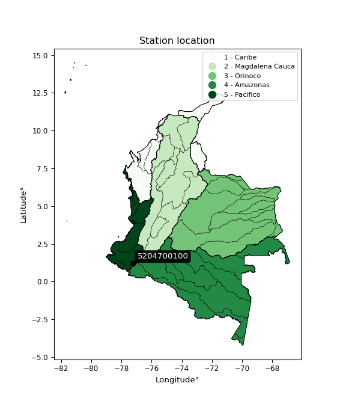

<div align="center">


</div>

# PMP Station (Rain, Pmax24h): 5204700100

Probable Maximum Precipitation (PMP) is the greatest amount of rainfall for a specific duration that is meteorologically possible for a given location, acting as a "worst-case" scenario for extreme storms, crucial for designing safety-critical infrastructure like bridges, river deviations, dams, spillways, and nuclear plants to prevent catastrophic failure. PMP is calculated by hydrologists using meteorological data to determine the upper limit of extreme rainfall, often leading to the Probable Maximum Flood (PMF) for flood control design, and is increasingly being studied for climate change impacts. Probable Maximum Precipitation (PMP) is the theoretical upper limit of rainfall, a deterministic estimate for extreme events, while probability distributions (like GEV, Gumbel) describe the likelihood and frequency of various precipitation amounts, including rare ones, showing how often events occur, with PMP representing the extreme end of these distributions, used for critical infrastructure design to ensure safety against the worst conceivable weather, unlike standard statistical forecasts which cover typical probabilities.

The most common probability distributions in hydrology, used for analyzing floods, rainfall, and streamflow, include the Normal, Log-Normal, Gumbel, Gamma (including Log-Pearson Type III), and Generalized Extreme Value (GEV) distributions, often chosen based on the data´s skewness and whether modeling extremes or general conditions, with Gumbel and GEV popular for extreme events like floods, while the Normal distribution serves as a baseline, though often requiring transformations for skewed hydrological data. These distributions help in designing water infrastructure, managing water resources, and forecasting hydrologic events.

> Hydrological data often isn´t perfectly normal (it´s skewed), so different distributions are needed for different applications, such as: **Flood Frequency Analysis**: Using Gumbel, GEV, or Log-Pearson Type III for predicting extreme flood magnitudes and their return periods, **Rainfall Analysis**: Normal for annual totals, but Log-Normal, Weibull, or GEV for intensity or extreme daily rainfall, **Streamflow Modeling**: Gamma and Log-Normal for maximum flows, GEV for minimum flows, and Kappa for daily flows.

<div align="center">

</img>

</div>


## A. General information


### 1. General running parameters

• app_version: _v20260113_. • runtime: _2026-01-17 18:24:04.630693_. • Python version: _3.14.0_. • SciPy version: _1.16.3_. • Pandas version: _2.3.3_. • NumPy version: _2.3.5_. • Stations dataset (station_dataset_file): _dataset/pmax24h_in/automatic_colombia_2003_2025.csv_. • Stations catalog (station_catalog_file): _dataset/CNE.xls_. • Minimum year to eval til year_max (date_min): _1900_. • Maximum year to eval since year_min (date_max): _2025_. • Creates, save and include plots into reports (create_plot): _False_. • Plot only fit distributions with Δo > Δ (plot_only_fit): _True_. • Plot only simple graphs avoiding multiple CDFs and multiple Extreme values plots (plot_only_simple): _True_. • Eval low extreme values, if False, evaluates high extreme values (low_extreme): _False_. • Eval every SciPy distribution as logarithmic (pdist_logarithmic_on): _True_. • Standard deviation normalized (ddof): _1.0_. • Return periods to eval in years (Tr): _[2, 2.33, 5, 10, 15, 20, 25, 50, 75, 100, 200, 250, 500, 750, 1000]_. • Minimum data sample per station, 0 means any (minimum_sample): _5_. • Z-Score maximum threshold to adjust a value, 0 means disable (zscore_max): _3.5_. • Z-Score minimum threshold to adjust a value, 0 means disable (zscore_min): _-2.5_. • Avoid zeros, e.g. rain = 0 (avoid_zeros): _True_. • Avoid null values (avoid_nans): _True_. 

:file_folder:Table: [dataset.csv](../../dataset/pmax24h_in/automatic_colombia_2003_2025.csv)

> Delta Degrees of Freedom (DDOF): is a parameter used in the formulas for calculating variance and standard deviation. When ddof=0, the divisor is $N$ (the total number of observations) and this is used when your data set is the entire population. When ddof=1, the divisor is $N-1$ and this is used when your data set is a sample drawn from a larger population. Using $N-1$ provides an unbiased estimate of the population variance (known as Bessel´s correction).


### 2. Station info and location

|   id |     CODIGO | NOMBRE                                 | CATEGORIA    | TECNOLOGIA                              | ESTADO   | FECHA_INSTALACION   |   FECHA_SUSPENSION |   ALTITUD |   LATITUD |   LONGITUD | DEPARTAMENTO   | MUNICIPIO   | AREA_OPERATIVA                      | ENTIDAD                                                     | AREA_HIDROGRAFICA   | ZONA_HIDROGRAFICA   | SUBZONA_HIDROGRAFICA   | CORRIENTE   | Catalogo   |   Version |
|-----:|-----------:|:---------------------------------------|:-------------|:----------------------------------------|:---------|:--------------------|-------------------:|----------:|----------:|-----------:|:---------------|:------------|:------------------------------------|:------------------------------------------------------------|:--------------------|:--------------------|:-----------------------|:------------|:-----------|----------:|
|    0 | 5204700100 | PUENTE LOS DOLORES - AUT  [5204700100] | Limnigráfica | Automática con Telemetría, Convencional | Activa   | 26/06/2017          |                nan |      2697 |   1.19981 |   -77.2657 | Nariño         | Pasto       | Area Operativa 07 - Nariño-Putumayo | INSTITUTO DE HIDROLOGIA METEOROLOGIA Y ESTUDIOS AMBIENTALES | Pacifico            | Patía               | Río Juananbú           | Pasto       | CNE_IDEAM  |  20251226 |

<div align="center">

Dynamic map: [:earth_americas:Google](http://maps.google.com/maps?q=1.199805556,-77.265694444) [:earth_americas:OSM](https://www.openstreetmap.org/#map=18/1.199805556/-77.265694444&layers=P) [:earth_americas:Bing](https://www.bing.com/maps?cp=1.199805556~-77.265694444&lvl=18) [:earth_americas:Apple](https://maps.apple.com/frame?center=1.199805556%2C-77.265694444&span=0.003%2C0.006)

</div>


<div align="center">

```geojson
{
  "type": "Feature",
  "geometry": {
    "type": "Point", 
    "coordinates": [-77.265694444, 1.199805556]
  }, 
  "properties": {
    "Name": "5204700100"
  }
}
```

</div>


### 3. Discrete values table and plot

<div align="center">

|               |           0 |           1 |          2 |           3 |          4 |
|:--------------|------------:|------------:|-----------:|------------:|-----------:|
| Date          | 2019        | 2020        | 2021       | 2024        | 2025       |
| Value         |   32.4      |   41.8      |    4       |   62        |   87.6     |
| Value_initial |   32.4      |   41.8      |    4       |   62        |   87.6     |
| count         |    5        |    5        |    5       |    5        |    5       |
| mean          |   45.56     |   45.56     |   45.56    |   45.56     |   45.56    |
| std           |   31.4332   |   31.4332   |   31.4332  |   31.4332   |   31.4332  |
| zscore        |   -0.418665 |   -0.119619 |   -1.32217 |    0.523013 |    1.33744 |


</div>


> The initial value (value_initial) correspond to the initial obtained or null completed value, and value (value) is adjusted only when the initial value is outside the valid range (outlier) definite through the Z-Score value. If Z-Score is active, values out of range or outliers are replaced with the station mean value. A Z-Score (or standard score) measures how many standard deviations a data point is from the mean of a dataset, indicating its relative position; positive scores mean above the mean, negative mean below, and a score of zero is exactly at the mean, allowing for comparison of values from different distributions. It´s calculated using the formula $z=(x–μ)/σ$, where $x$ is the data point, $μ$ is the mean, and $σ$ is the standard deviation, helping identify outliers and understand probability.
>
> <sub>**Note**: In this study, "completing" (filling gaps in) and "extending" (forecasting or lengthening the historical record) rainfall data series are avoided for certain critical analyses because they introduce artificial bias and uncertainty, which can distort the statistics of rare events (extremes), alter day-to-day variability, and compromise the integrity and homogeneity of the original data. Some reasons against Completing/Extending rainfall data are: **Distortion of Extremes and Variability**: The primary issue is that most gap-filling or extension methods rely on averaging or regression with nearby stations, which inherently smooths the data. Rainfall is highly variable in space and time, with a large percentage of zero values and occasional large storms. Infilling methods often underestimate the highest values and overestimate the lowest (zero) values, which severely distorts analyses focused on flood frequency, drought severity, and intensity-duration-frequency (IDF) curves, **Loss of Data Homogeneity**: Infilled or extended data are synthetic estimates, not actual measurements. Combining these estimates with observed data can violate the assumption of data homogeneity, which requires that the data properties do not change over time. Inhomogeneity can lead to incorrect conclusions about long-term trends or changes in climate patterns, **Propagation of Errors**: Errors and biases from the original data (e.g., wind-induced undercatch, instrument errors, site changes) or the data used for imputation can propagate through the analysis, leading to unreliable hydrological models and inaccurate predictions, **Compromised Statistical Integrity**: For statistical analyses, especially those involving the frequency of events, using artificial data can introduce time bias or autocorrelation that doesn´t exist in reality, making it difficult to assess the true probability of events, **Difficulty in Validation**: It is difficult to accurately validate the quality of filled or extended data, especially for past periods where ground-truth measurements are unavailable. The reliability of imputation techniques heavily depends on the density of the surrounding station network and the complexity of the local topography.</sub>


### 4. Active continuous probability distributions from SciPy (80 of 104 available)

A Probability Density Function (PDF) describes the relative likelihood of a continuous random variable falling within a specific range, where the total area under its curve equals 1, and the area over any interval gives the actual probability for that range. Unlike discrete probabilities (like rolling a die), a PDF shows density, not direct probability for a single point (which is zero), with higher points indicating higher likelihood, often visualized as a bell curve for normal distributions.

A log of a probability density function (log-PDF) is simply the logarithm of the PDF´s value, denoted as $log(f(x))$, useful for converting multiplication of probabilities into addition, improving numerical stability with tiny numbers, and connecting to information theory concepts like entropy. Instead of dealing with very small probabilities (e.g., 0.000001), log-PDFs use negative numbers (e.g., $log(0.00001) ≈ -11.51$ that are easier for computers to handle, preventing underflow errors and simplifying complex calculations. In this study, each active probability distribution from SciPy is also evaluated in the $log$ form.

[scipy.stats](https://docs.scipy.org/doc/scipy/reference/stats.html) is a Python´s powerful submodule within the SciPy library for comprehensive statistical analysis, offering over 130 probability distributions (like Normal, Poisson), functions for descriptive stats (mean, variance), hypothesis testing (t-tests, chi-square), random variable generation, and statistical tests, making it essential for data science, modeling, and research. It provides tools to explore, model, and draw conclusions from data efficiently, working seamlessly with NumPy.

<div align="center">

|   id | p_dist           |   n_parameter | fit_method   | label                                                                       | active   | ref                                                                                                      |
|-----:|:-----------------|--------------:|:-------------|:----------------------------------------------------------------------------|:---------|:---------------------------------------------------------------------------------------------------------|
|    0 | alpha            |             3 | MLE          | Alpha                                                                       | True     | [:mortar_board:](https://docs.scipy.org/doc/scipy/reference/generated/scipy.stats.alpha.html)            |
|    1 | anglit           |             2 | MM           | Anglit                                                                      | True     | [:mortar_board:](https://docs.scipy.org/doc/scipy/reference/generated/scipy.stats.anglit.html)           |
|    2 | arcsine          |             2 | MM           | Arcsine                                                                     | True     | [:mortar_board:](https://docs.scipy.org/doc/scipy/reference/generated/scipy.stats.arcsine.html)          |
|    3 | argus            |             3 | MLE          | Argus                                                                       | True     | [:mortar_board:](https://docs.scipy.org/doc/scipy/reference/generated/scipy.stats.argus.html)            |
|    4 | beta             |             4 | MLE          | Beta                                                                        | True     | [:mortar_board:](https://docs.scipy.org/doc/scipy/reference/generated/scipy.stats.beta.html)             |
|    5 | betaprime        |             4 | MLE          | Beta prime                                                                  | True     | [:mortar_board:](https://docs.scipy.org/doc/scipy/reference/generated/scipy.stats.betaprime.html)        |
|    6 | bradford         |             3 | MLE          | Bradford                                                                    | True     | [:mortar_board:](https://docs.scipy.org/doc/scipy/reference/generated/scipy.stats.bradford.html)         |
|    7 | burr             |             4 | MLE          | Burr (Type III)                                                             | True     | [:mortar_board:](https://docs.scipy.org/doc/scipy/reference/generated/scipy.stats.burr.html)             |
|    8 | burr12           |             4 | MLE          | Burr (Type III) 12                                                          | True     | [:mortar_board:](https://docs.scipy.org/doc/scipy/reference/generated/scipy.stats.burr12.html)           |
|    9 | cosine           |             2 | MLE          | Cosine                                                                      | True     | [:mortar_board:](https://docs.scipy.org/doc/scipy/reference/generated/scipy.stats.cosine.html)           |
|   10 | crystalball      |             4 | MLE          | Crystalball                                                                 | True     | [:mortar_board:](https://docs.scipy.org/doc/scipy/reference/generated/scipy.stats.crystalball.html)      |
|   11 | dgamma           |             3 | MLE          | Double gamma                                                                | True     | [:mortar_board:](https://docs.scipy.org/doc/scipy/reference/generated/scipy.stats.dgamma.html)           |
|   12 | dweibull         |             3 | MLE          | Double Weibull                                                              | True     | [:mortar_board:](https://docs.scipy.org/doc/scipy/reference/generated/scipy.stats.dweibull.html)         |
|   13 | erlang           |             3 | MLE          | Erlang                                                                      | True     | [:mortar_board:](https://docs.scipy.org/doc/scipy/reference/generated/scipy.stats.erlang.html)           |
|   14 | exponnorm        |             3 | MLE          | Exponentially modified Normal                                               | True     | [:mortar_board:](https://docs.scipy.org/doc/scipy/reference/generated/scipy.stats.exponnorm.html)        |
|   15 | exponpow         |             3 | MLE          | Exponential power                                                           | True     | [:mortar_board:](https://docs.scipy.org/doc/scipy/reference/generated/scipy.stats.exponpow.html)         |
|   16 | exponweib        |             4 | MLE          | Exponentiated Weibull                                                       | True     | [:mortar_board:](https://docs.scipy.org/doc/scipy/reference/generated/scipy.stats.exponweib.html)        |
|   17 | f                |             4 | MLE          | F                                                                           | True     | [:mortar_board:](https://docs.scipy.org/doc/scipy/reference/generated/scipy.stats.f.html)                |
|   18 | fatiguelife      |             3 | MLE          | Fatigue-life (Birnbaum-Saunders)                                            | True     | [:mortar_board:](https://docs.scipy.org/doc/scipy/reference/generated/scipy.stats.fatiguelife.html)      |
|   19 | foldnorm         |             3 | MM           | Fold Normal                                                                 | True     | [:mortar_board:](https://docs.scipy.org/doc/scipy/reference/generated/scipy.stats.foldnorm.html)         |
|   20 | gamma            |             3 | MLE          | Gamma                                                                       | True     | [:mortar_board:](https://docs.scipy.org/doc/scipy/reference/generated/scipy.stats.gamma.html)            |
|   21 | gausshyper       |             6 | MLE          | Gauss hypergeometric                                                        | True     | [:mortar_board:](https://docs.scipy.org/doc/scipy/reference/generated/scipy.stats.gausshyper.html)       |
|   22 | genexpon         |             5 | MLE          | Generalized exponential                                                     | True     | [:mortar_board:](https://docs.scipy.org/doc/scipy/reference/generated/scipy.stats.genexpon.html)         |
|   23 | genextreme       |             3 | MLE          | Generalized exponential                                                     | True     | [:mortar_board:](https://docs.scipy.org/doc/scipy/reference/generated/scipy.stats.genextreme.html)       |
|   24 | gengamma         |             4 | MLE          | Generalized gamma                                                           | True     | [:mortar_board:](https://docs.scipy.org/doc/scipy/reference/generated/scipy.stats.gengamma.html)         |
|   25 | genhalflogistic  |             3 | MLE          | Generalized half-logistic                                                   | True     | [:mortar_board:](https://docs.scipy.org/doc/scipy/reference/generated/scipy.stats.genhalflogistic.html)  |
|   26 | genlogistic      |             3 | MLE          | Generalized logistic                                                        | True     | [:mortar_board:](https://docs.scipy.org/doc/scipy/reference/generated/scipy.stats.genlogistic.html)      |
|   27 | gennorm          |             3 | MLE          | Generalized Normal                                                          | True     | [:mortar_board:](https://docs.scipy.org/doc/scipy/reference/generated/scipy.stats.gennorm.html)          |
|   28 | genpareto        |             3 | MLE          | Generalized Pareto                                                          | True     | [:mortar_board:](https://docs.scipy.org/doc/scipy/reference/generated/scipy.stats.genpareto.html)        |
|   29 | gompertz         |             3 | MLE          | Gompertz (or truncated Gumbel)                                              | True     | [:mortar_board:](https://docs.scipy.org/doc/scipy/reference/generated/scipy.stats.gompertz.html)         |
|   30 | gumbel_l         |             2 | MM           | Gumbel Left Skew                                                            | True     | [:mortar_board:](https://docs.scipy.org/doc/scipy/reference/generated/scipy.stats.gumbel_l.html)         |
|   31 | gumbel_r         |             2 | MM           | Gumbel Right Skew                                                           | True     | [:mortar_board:](https://docs.scipy.org/doc/scipy/reference/generated/scipy.stats.gumbel_r.html)         |
|   32 | halfgennorm      |             3 | MLE          | Upper half of a generalized normal                                          | True     | [:mortar_board:](https://docs.scipy.org/doc/scipy/reference/generated/scipy.stats.halfgennorm.html)      |
|   33 | halflogistic     |             2 | MM           | Half-logistic                                                               | True     | [:mortar_board:](https://docs.scipy.org/doc/scipy/reference/generated/scipy.stats.halflogistic.html)     |
|   34 | halfnorm         |             2 | MM           | Half Normal                                                                 | True     | [:mortar_board:](https://docs.scipy.org/doc/scipy/reference/generated/scipy.stats.halfnorm.html)         |
|   35 | hypsecant        |             2 | MM           | hyperbolic secant                                                           | True     | [:mortar_board:](https://docs.scipy.org/doc/scipy/reference/generated/scipy.stats.hypsecant.html)        |
|   36 | invgamma         |             3 | MLE          | Inverted gamma                                                              | True     | [:mortar_board:](https://docs.scipy.org/doc/scipy/reference/generated/scipy.stats.invgamma.html)         |
|   37 | invgauss         |             3 | MLE          | Inverse Gaussian                                                            | True     | [:mortar_board:](https://docs.scipy.org/doc/scipy/reference/generated/scipy.stats.invgauss.html)         |
|   38 | invweibull       |             3 | MLE          | Inverted Weibull                                                            | True     | [:mortar_board:](https://docs.scipy.org/doc/scipy/reference/generated/scipy.stats.invweibull.html)       |
|   39 | johnsonsb        |             4 | MLE          | Johnson SB                                                                  | True     | [:mortar_board:](https://docs.scipy.org/doc/scipy/reference/generated/scipy.stats.johnsonsb.html)        |
|   40 | johnsonsu        |             4 | MLE          | Johnson Su                                                                  | True     | [:mortar_board:](https://docs.scipy.org/doc/scipy/reference/generated/scipy.stats.johnsonsu.html)        |
|   41 | kappa3           |             3 | MLE          | Kappa 3                                                                     | True     | [:mortar_board:](https://docs.scipy.org/doc/scipy/reference/generated/scipy.stats.kappa3.html)           |
|   42 | kappa4           |             4 | MLE          | Kappa 4                                                                     | True     | [:mortar_board:](https://docs.scipy.org/doc/scipy/reference/generated/scipy.stats.kappa4.html)           |
|   43 | ksone            |             3 | MLE          | Kolmogorov-Smirnov one-sided test statistic distribution                    | True     | [:mortar_board:](https://docs.scipy.org/doc/scipy/reference/generated/scipy.stats.ksone.html)            |
|   44 | kstwobign        |             2 | MLE          | Limiting distribution of scaled Kolmogorov-Smirnov two-sided test statistic | True     | [:mortar_board:](https://docs.scipy.org/doc/scipy/reference/generated/scipy.stats.kstwobign.html)        |
|   45 | laplace          |             2 | MM           | Laplace                                                                     | True     | [:mortar_board:](https://docs.scipy.org/doc/scipy/reference/generated/scipy.stats.laplace.html)          |
|   46 | levy_l           |             2 | MLE          | Left-skewed Levy                                                            | True     | [:mortar_board:](https://docs.scipy.org/doc/scipy/reference/generated/scipy.stats.levy_l.html)           |
|   47 | loggamma         |             3 | MLE          | Log gamma                                                                   | True     | [:mortar_board:](https://docs.scipy.org/doc/scipy/reference/generated/scipy.stats.loggamma.html)         |
|   48 | logistic         |             2 | MM           | Logistic (or Sech-squared)                                                  | True     | [:mortar_board:](https://docs.scipy.org/doc/scipy/reference/generated/scipy.stats.logistic.html)         |
|   49 | loglaplace       |             3 | MLE          | Log-Laplace                                                                 | True     | [:mortar_board:](https://docs.scipy.org/doc/scipy/reference/generated/scipy.stats.loglaplace.html)       |
|   50 | lomax            |             3 | MLE          | Lomax (Pareto of the second kind)                                           | True     | [:mortar_board:](https://docs.scipy.org/doc/scipy/reference/generated/scipy.stats.lomax.html)            |
|   51 | maxwell          |             2 | MM           | Maxwell                                                                     | True     | [:mortar_board:](https://docs.scipy.org/doc/scipy/reference/generated/scipy.stats.maxwell.html)          |
|   52 | mielke           |             4 | MLE          | Mielke Beta-Kappa / Dagum                                                   | True     | [:mortar_board:](https://docs.scipy.org/doc/scipy/reference/generated/scipy.stats.mielke.html)           |
|   53 | moyal            |             2 | MM           | Moyal                                                                       | True     | [:mortar_board:](https://docs.scipy.org/doc/scipy/reference/generated/scipy.stats.moyal.html)            |
|   54 | nakagami         |             3 | MLE          | Nakagami                                                                    | True     | [:mortar_board:](https://docs.scipy.org/doc/scipy/reference/generated/scipy.stats.nakagami.html)         |
|   55 | ncf              |             5 | MLE          | Non-central F distribution                                                  | True     | [:mortar_board:](https://docs.scipy.org/doc/scipy/reference/generated/scipy.stats.ncf.html)              |
|   56 | nct              |             4 | MLE          | Non-central Student’s t                                                     | True     | [:mortar_board:](https://docs.scipy.org/doc/scipy/reference/generated/scipy.stats.nct.html)              |
|   57 | norm             |             2 | MM           | Normal                                                                      | True     | [:mortar_board:](https://docs.scipy.org/doc/scipy/reference/generated/scipy.stats.norm.html)             |
|   58 | pearson3         |             3 | MM           | Pearson type III                                                            | True     | [:mortar_board:](https://docs.scipy.org/doc/scipy/reference/generated/scipy.stats.pearson3.html)         |
|   59 | powerlaw         |             3 | MLE          | Power-function                                                              | True     | [:mortar_board:](https://docs.scipy.org/doc/scipy/reference/generated/scipy.stats.powerlaw.html)         |
|   60 | rayleigh         |             2 | MM           | Rayleigh                                                                    | True     | [:mortar_board:](https://docs.scipy.org/doc/scipy/reference/generated/scipy.stats.rayleigh.html)         |
|   61 | rdist            |             3 | MLE          | R-distributed (symmetric beta)                                              | True     | [:mortar_board:](https://docs.scipy.org/doc/scipy/reference/generated/scipy.stats.rdist.html)            |
|   62 | rice             |             3 | MLE          | Rice                                                                        | True     | [:mortar_board:](https://docs.scipy.org/doc/scipy/reference/generated/scipy.stats.rice.html)             |
|   63 | semicircular     |             2 | MM           | Semicircular                                                                | True     | [:mortar_board:](https://docs.scipy.org/doc/scipy/reference/generated/scipy.stats.semicircular.html)     |
|   64 | skewnorm         |             3 | MLE          | Skew normal                                                                 | True     | [:mortar_board:](https://docs.scipy.org/doc/scipy/reference/generated/scipy.stats.skewnorm.html)         |
|   65 | t                |             3 | MLE          | Student’s t                                                                 | True     | [:mortar_board:](https://docs.scipy.org/doc/scipy/reference/generated/scipy.stats.t.html)                |
|   66 | trapezoid        |             4 | MLE          | Trapezoid                                                                   | True     | [:mortar_board:](https://docs.scipy.org/doc/scipy/reference/generated/scipy.stats.trapezoid.html)        |
|   67 | triang           |             3 | MLE          | Triangular                                                                  | True     | [:mortar_board:](https://docs.scipy.org/doc/scipy/reference/generated/scipy.stats.triang.html)           |
|   68 | truncexpon       |             3 | MLE          | Truncated exponential                                                       | True     | [:mortar_board:](https://docs.scipy.org/doc/scipy/reference/generated/scipy.stats.truncexpon.html)       |
|   69 | truncnorm        |             4 | MLE          | Truncated normal                                                            | True     | [:mortar_board:](https://docs.scipy.org/doc/scipy/reference/generated/scipy.stats.truncnorm.html)        |
|   70 | truncpareto      |             4 | MLE          | Upper truncated Pareto                                                      | True     | [:mortar_board:](https://docs.scipy.org/doc/scipy/reference/generated/scipy.stats.truncpareto.html)      |
|   71 | truncweibull_min |             5 | MLE          | Doubly truncated Weibull minimum                                            | True     | [:mortar_board:](https://docs.scipy.org/doc/scipy/reference/generated/scipy.stats.truncweibull_min.html) |
|   72 | tukeylambda      |             3 | MLE          | Tukey-Lamdba                                                                | True     | [:mortar_board:](https://docs.scipy.org/doc/scipy/reference/generated/scipy.stats.tukeylambda.html)      |
|   73 | uniform          |             2 | MLE          | Uniform                                                                     | True     | [:mortar_board:](https://docs.scipy.org/doc/scipy/reference/generated/scipy.stats.uniform.html)          |
|   74 | vonmises         |             3 | MLE          | Von Mises                                                                   | True     | [:mortar_board:](https://docs.scipy.org/doc/scipy/reference/generated/scipy.stats.vonmises.html)         |
|   75 | vonmises_line    |             3 | MLE          | Von Mises line                                                              | True     | [:mortar_board:](https://docs.scipy.org/doc/scipy/reference/generated/scipy.stats.vonmises_line.html)    |
|   76 | wald             |             2 | MM           | Wald                                                                        | True     | [:mortar_board:](https://docs.scipy.org/doc/scipy/reference/generated/scipy.stats.wald.html)             |
|   77 | weibull_max      |             3 | MLE          | Weibull maximum                                                             | True     | [:mortar_board:](https://docs.scipy.org/doc/scipy/reference/generated/scipy.stats.weibull_max.html)      |
|   78 | weibull_min      |             3 | MLE          | Weibull minimum                                                             | True     | [:mortar_board:](https://docs.scipy.org/doc/scipy/reference/generated/scipy.stats.weibull_min.html)      |
|   79 | wrapcauchy       |             3 | MLE          | Wrapped  Cauchy                                                             | True     | [:mortar_board:](https://docs.scipy.org/doc/scipy/reference/generated/scipy.stats.wrapcauchy.html)       |

</div>

> **n_parameter:** # arguments & localization & scale.
>
> **Fit methods:** (MLE) maximum likelihood, (MM) L-moments.
>
>**Inactive** (With the only purpose of prevent loops, zero divisions, infinite values, over high estimated values or horizontal trending for recurrence intervals estimations, the follow distributions were disabled.)**:** lognorm, norminvgauss, powernorm, powerlognorm, cauchy, halfcauchy, foldcauchy, skewcauchy, chi2, expon, fisk, genhyperbolic, geninvgauss, gibrat, kstwo, laplace_asymmetric, levy, levy_stable, ncx2, pareto, rel_breitwigner, recipinvgauss, studentized_range, loguniform, 


## B. Probability (PDF) vs. Empirical (EDF) distributions functions

A continuous probability distribution (CPD) describes probabilities for variables that can take any value within a range (like rain any time), unlike discrete variables with specific outcomes (like temperature). It uses a Probability Density Function (PDF), a curve where the total area under it equals 1, and the probability of the variable falling within an interval (a to b) is found by calculating the area under the curve between those points. A key feature is that the probability of hitting any single exact value is zero, so probabilities are always expressed for ranges, e.g., $P(a ≤ X ≤ b)$.

<div align="center">

Distributions parameters from station values
|     |    station | p_dist              |   n |             loc |           scale | shape                  | shape1                | shape2                 | shape3             |
|----:|-----------:|:--------------------|----:|----------------:|----------------:|:-----------------------|:----------------------|:-----------------------|:-------------------|
|   0 | 5204700100 | alpha               |   5 |   -27.2051      |   108.534       | 1.8388082602408802     |                       |                        |                    |
|   1 | 5204700100 | anglit              |   5 |    45.56        |    82.2468      |                        |                       |                        |                    |
|   2 | 5204700100 | arcsine             |   5 |     5.79975     |    79.5205      |                        |                       |                        |                    |
|   3 | 5204700100 | argus               |   5 |   -17.5777      |   111.357       | 7.138457103859871e-06  |                       |                        |                    |
|   4 | 5204700100 | beta                |   5 |    -6.5724      |    94.1724      | 0.23584410727416927    | 0.1807132340288406    |                        |                    |
|   5 | 5204700100 | betaprime           |   5 |  -297.388       | 37898           | 149.63591920439262     | 16536.7513097517      |                        |                    |
|   6 | 5204700100 | bradford            |   5 |     3.99988     |    83.6001      | 0.8808310893555851     |                       |                        |                    |
|   7 | 5204700100 | burr                |   5 |     1.29784     |    87.9238      | 203.81890733501365     | 0.004314166845320596  |                        |                    |
|   8 | 5204700100 | burr12              |   5 |    -0.0156821   |     3.9369      | 228.77279223546947     | 0.0021115825269394945 |                        |                    |
|   9 | 5204700100 | cosine              |   5 |    45.6929      |    23.1828      |                        |                       |                        |                    |
|  10 | 5204700100 | crystalball         |   5 |    45.56        |    28.1147      | 13076.612411463664     | 448.3697410011488     |                        |                    |
|  11 | 5204700100 | dgamma              |   5 |    51.0006      |     9.21054     | 2.657836567398049      |                       |                        |                    |
|  12 | 5204700100 | dweibull            |   5 |    41.8         |    24.5546      | 0.8630193407246689     |                       |                        |                    |
|  13 | 5204700100 | erlang              |   5 | -1178.69        |     0.645132    | 1897.6655161811377     |                       |                        |                    |
|  14 | 5204700100 | exponnorm           |   5 |    44.4075      |    28.0911      | 0.041028916670813445   |                       |                        |                    |
|  15 | 5204700100 | exponpow            |   5 |     4           |     4.06592     | 0.1405774253544218     |                       |                        |                    |
|  16 | 5204700100 | exponweib           |   5 |     4           |     4.12515     | 1.491128625295775      | 0.34546348118313747   |                        |                    |
|  17 | 5204700100 | f                   |   5 |  -287.867       |   333.421       | 280.9741169071938      | 114695.4846435102     |                        |                    |
|  18 | 5204700100 | fatiguelife         |   5 |     4           |     8.66868e-06 | 2009.585343349862      |                       |                        |                    |
|  19 | 5204700100 | foldnorm            |   5 |   -30.8816      |    28.2766      | 2.7012438117047237     |                       |                        |                    |
|  20 | 5204700100 | gamma               |   5 | -1169.85        |     0.650716    | 1867.7887322264542     |                       |                        |                    |
|  21 | 5204700100 | gausshyper          |   5 |     2.24437     |    85.3556      | 1.2520811775222755     | 0.6824426080321842    | 1.1871781303787832     | 0.9478212107501296 |
|  22 | 5204700100 | genexpon            |   5 |     3.99993     |     2.51622     | 0.06340750823182771    | 1.8542955436902864    | 0.00045205902526739743 |                    |
|  23 | 5204700100 | genextreme          |   5 |     5.21911     |     8.47932     | -6.955339389338722     |                       |                        |                    |
|  24 | 5204700100 | gengamma            |   5 |  -220.15        |     4.27093     | 79.25892742116386      | 1.0585265690633503    |                        |                    |
|  25 | 5204700100 | genhalflogistic     |   5 |    -4.49726     |    97.0381      | 1.0536477753515001     |                       |                        |                    |
|  26 | 5204700100 | genlogistic         |   5 |    20.3868      |    20.8828      | 2.4033617413541895     |                       |                        |                    |
|  27 | 5204700100 | gennorm             |   5 |    45.8         |    41.8001      | 5974812.292449869      |                       |                        |                    |
|  28 | 5204700100 | genpareto           |   5 |    -0.348779    |   142.907       | -1.6248905648677556    |                       |                        |                    |
|  29 | 5204700100 | gompertz            |   5 |     0.538404    |     3.14726     | 4.857792897227905e-12  |                       |                        |                    |
|  30 | 5204700100 | gumbel_l            |   5 |    58.2131      |    21.921       |                        |                       |                        |                    |
|  31 | 5204700100 | gumbel_r            |   5 |    32.9069      |    21.921       |                        |                       |                        |                    |
|  32 | 5204700100 | halfgennorm         |   5 |     4           |     0.799559    | 0.3281429463493877     |                       |                        |                    |
|  33 | 5204700100 | halflogistic        |   5 |    12.2375      |    24.0371      |                        |                       |                        |                    |
|  34 | 5204700100 | halfnorm            |   5 |     8.34705     |    46.6395      |                        |                       |                        |                    |
|  35 | 5204700100 | hypsecant           |   5 |    45.56        |    17.8984      |                        |                       |                        |                    |
|  36 | 5204700100 | invgamma            |   5 |  -210.418       | 20316.9         | 80.27908967719316      |                       |                        |                    |
|  37 | 5204700100 | invgauss            |   5 |   -88.7255      |  2786.44        | 0.04827837629351228    |                       |                        |                    |
|  38 | 5204700100 | invweibull          |   5 |     4           |     4.81795     | 0.055455891852098885   |                       |                        |                    |
|  39 | 5204700100 | johnsonsb           |   5 |    -2.09285     |    89.6929      | -0.6148343085713541    | 0.14838695236897606   |                        |                    |
|  40 | 5204700100 | johnsonsu           |   5 |  -694.178       |   248.859       | -50.222120795082645    | 27.760998285788546    |                        |                    |
|  41 | 5204700100 | kappa3              |   5 |     3.90391     |    83.6765      | 7616.367129777504      |                       |                        |                    |
|  42 | 5204700100 | kappa4              |   5 |    -2.90619     |    94.5815      | 1.0788801778256412     | 1.0345417590478547    |                        |                    |
|  43 | 5204700100 | ksone               |   5 |    -3.13615     |    97.3923      | 1.0                    |                       |                        |                    |
|  44 | 5204700100 | kstwobign           |   5 |   -57.6282      |   117.943       |                        |                       |                        |                    |
|  45 | 5204700100 | laplace             |   5 |    45.56        |    19.8801      |                        |                       |                        |                    |
|  46 | 5204700100 | levy_l              |   5 |    91.3337      |    14.2642      |                        |                       |                        |                    |
|  47 | 5204700100 | loggamma            |   5 | -5525.42        |   825.108       | 856.1018651554774      |                       |                        |                    |
|  48 | 5204700100 | logistic            |   5 |    45.56        |    15.5005      |                        |                       |                        |                    |
|  49 | 5204700100 | loglaplace          |   5 |    -0.107716    |    41.9077      | 1.3477832193290944     |                       |                        |                    |
|  50 | 5204700100 | lomax               |   5 |     3.99989     | 18695           | 449.50332761068466     |                       |                        |                    |
|  51 | 5204700100 | maxwell             |   5 |   -21.0601      |    41.748       |                        |                       |                        |                    |
|  52 | 5204700100 | mielke              |   5 |     4           |    85.1022      | 0.4456543130528812     | 556.0107372838795     |                        |                    |
|  53 | 5204700100 | moyal               |   5 |    29.4822      |    12.6561      |                        |                       |                        |                    |
|  54 | 5204700100 | nakagami            |   5 |     4           |    57.0721      | 0.205661739153429      |                       |                        |                    |
|  55 | 5204700100 | ncf                 |   5 |     0.037524    |     8.76919     | 1.4613716462583985     | 50.383153640918664    | 5.8938942311120535     |                    |
|  56 | 5204700100 | nct                 |   5 | -1560.85        |    28.0549      | 367910.91902307625     | 57.259339457105725    |                        |                    |
|  57 | 5204700100 | norm                |   5 |    45.56        |    28.1147      |                        |                       |                        |                    |
|  58 | 5204700100 | pearson3            |   5 |    45.56        |    28.1147      | 0.04163455528512508    |                       |                        |                    |
|  59 | 5204700100 | powerlaw            |   5 |     4           |    83.6         | 0.11900359046591749    |                       |                        |                    |
|  60 | 5204700100 | rayleigh            |   5 |    -8.22513     |    42.9143      |                        |                       |                        |                    |
|  61 | 5204700100 | rdist               |   5 |    -3.39986     |    45.1999      | 1.1591406937069095     |                       |                        |                    |
|  62 | 5204700100 | rice                |   5 |   -11.0981      |    33.5336      | 1.2480538606418745     |                       |                        |                    |
|  63 | 5204700100 | semicircular        |   5 |    45.56        |    56.2295      |                        |                       |                        |                    |
|  64 | 5204700100 | skewnorm            |   5 |    40.1862      |    28.6237      | 0.24209170103356054    |                       |                        |                    |
|  65 | 5204700100 | t                   |   5 |    45.5602      |    28.115       | 305060726.6134044      |                       |                        |                    |
|  66 | 5204700100 | trapezoid           |   5 |    -4.578       |   100.32        | 1.0                    | 1.0                   |                        |                    |
|  67 | 5204700100 | triang              |   5 |   -23.6996      |   111.3         | 0.9999999999955487     |                       |                        |                    |
|  68 | 5204700100 | truncexpon          |   5 |     3.99916     |    82.677       | 1.0111742817657778     |                       |                        |                    |
|  69 | 5204700100 | truncnorm           |   5 |    45.56        |    28.1147      | -107.4123376889909     | 570.1963578484108     |                        |                    |
|  70 | 5204700100 | truncpareto         |   5 | -1515.76        |  1519.76        | 5.254889530029027e-07  | 1.0550088232440085    |                        |                    |
|  71 | 5204700100 | truncweibull_min    |   5 |     3.97841     |    73.8196      | 0.46791677031634327    | 0.0002916194677974401 | 1.1327823782054596     |                    |
|  72 | 5204700100 | tukeylambda         |   5 |    45.6956      |    45.6951      | 1.0904618723399513     |                       |                        |                    |
|  73 | 5204700100 | uniform             |   5 |     4           |    83.6         |                        |                       |                        |                    |
|  74 | 5204700100 | vonmises            |   5 |    -1.10091     |     1           | 0.9068534904481824     |                       |                        |                    |
|  75 | 5204700100 | vonmises_line       |   5 |    45.8001      |    13.3054      | 0.7704260148340394     |                       |                        |                    |
|  76 | 5204700100 | wald                |   5 |    17.4453      |    28.1147      |                        |                       |                        |                    |
|  77 | 5204700100 | weibull_max         |   5 |    87.6         |     1.63005     | 0.2620974839761391     |                       |                        |                    |
|  78 | 5204700100 | weibull_min         |   5 |   -12.4197      |    65.4672      | 2.18977496039855       |                       |                        |                    |
|  79 | 5204700100 | wrapcauchy          |   5 |     3.99997     |    13.3054      | 0.05089677886130016    |                       |                        |                    |
|  80 | 5204700100 | logalpha            |   5 |   -24.402       |   653.831       | 23.520256167818545     |                       |                        |                    |
|  81 | 5204700100 | loganglit           |   5 |     3.43945     |     3.16261     |                        |                       |                        |                    |
|  82 | 5204700100 | logarcsine          |   5 |     1.91055     |     3.05779     |                        |                       |                        |                    |
|  83 | 5204700100 | logargus            |   5 |    -0.0686206   |     4.64194     | 2.551262574369753      |                       |                        |                    |
|  84 | 5204700100 | logbeta             |   5 |     1.10843     |     3.36435     | 0.5418396147103646     | 0.1889230599007086    |                        |                    |
|  85 | 5204700100 | logbetaprime        |   5 |   -19.7296      |   143.471       | 484.9659960180511      | 3006.270860284887     |                        |                    |
|  86 | 5204700100 | logbradford         |   5 |     1.38627     |     3.08652     | 0.9218525619433667     |                       |                        |                    |
|  87 | 5204700100 | logburr             |   5 |    -9.93272e+06 |     9.93272e+06 | 878062355.05037        | 0.010609814386582789  |                        |                    |
|  88 | 5204700100 | logburr12           |   5 | -4699.02        |  4712.98        | 6971.096524493842      | 2882134.454407802     |                        |                    |
|  89 | 5204700100 | logcosine           |   5 |     3.26909     |     0.919093    |                        |                       |                        |                    |
|  90 | 5204700100 | logcrystalball      |   5 |     4.47278     |     3.51403e-07 | 3.403600823991111e-07  | 3578.910526329979     |                        |                    |
|  91 | 5204700100 | logdgamma           |   5 |     3.7329      |     0.825076    | 0.9434218334484383     |                       |                        |                    |
|  92 | 5204700100 | logdweibull         |   5 |     3.7329      |     0.819568    | 0.9453448109860871     |                       |                        |                    |
|  93 | 5204700100 | logerlang           |   5 |   -15.3658      |     0.0658507   | 285.44077960189804     |                       |                        |                    |
|  94 | 5204700100 | logexponnorm        |   5 |     3.43893     |     1.08108     | 0.00047146934225890196 |                       |                        |                    |
|  95 | 5204700100 | logexponpow         |   5 |     1.38629     |     1.32305     | 0.3289314931490688     |                       |                        |                    |
|  96 | 5204700100 | logexponweib        |   5 |     1.38629     |     1.10538     | 1.0277734439435975     | 0.5774822004575482    |                        |                    |
|  97 | 5204700100 | logf                |   5 | -1677.2         |  1680.64        | 18757900.097460404     | 6444366.001503218     |                        |                    |
|  98 | 5204700100 | logfatiguelife      |   5 |  -626.699       |   630.139       | 0.0017121727745320475  |                       |                        |                    |
|  99 | 5204700100 | logfoldnorm         |   5 |    -4.26168     |     0.988615    | 7.8068091645995406     |                       |                        |                    |
| 100 | 5204700100 | loggamma            |   5 |   -15.3977      |     0.069883    | 269.49880484846653     |                       |                        |                    |
| 101 | 5204700100 | loggausshyper       |   5 |     1.17184     |     3.30094     | 1.2199885520633997     | 0.5304954662657136    | 1.083699555102916      | 1.1198371547142918 |
| 102 | 5204700100 | loggenexpon         |   5 |     1.36235     |     0.0381697   | 0.0073411574258540994  | 6.0511130208100194    | 5.257534159053661e-05  |                    |
| 103 | 5204700100 | loggenextreme       |   5 |     3.53235     |     1.15585     | 1.2290645920937702     |                       |                        |                    |
| 104 | 5204700100 | loggengamma         |   5 |     1.38629     |     1.34937     | 1.3467557748163044     | 0.4267355390124947    |                        |                    |
| 105 | 5204700100 | loggenhalflogistic  |   5 |     1.04506     |     3.69114     | 1.0768485307244915     |                       |                        |                    |
| 106 | 5204700100 | loggenlogistic      |   5 |     4.47283     |     4.27959e-06 | 4.130919121045045e-06  |                       |                        |                    |
| 107 | 5204700100 | loggennorm          |   5 |     3.73283     |     1.40766e-09 | 0.11531443441522526    |                       |                        |                    |
| 108 | 5204700100 | loggenpareto        |   5 |    -0.00301966  |     9.20011     | -2.055522356823574     |                       |                        |                    |
| 109 | 5204700100 | loggompertz         |   5 |     1.38629     |     0.788788    | 0.044598151072573505   |                       |                        |                    |
| 110 | 5204700100 | loggumbel_l         |   5 |     3.926       |     0.84292     |                        |                       |                        |                    |
| 111 | 5204700100 | loggumbel_r         |   5 |     2.95291     |     0.84292     |                        |                       |                        |                    |
| 112 | 5204700100 | loghalfgennorm      |   5 |     1.38629     |     1.04901     | 0.6965854588504339     |                       |                        |                    |
| 113 | 5204700100 | loghalflogistic     |   5 |     2.15809     |     0.924308    |                        |                       |                        |                    |
| 114 | 5204700100 | loghalfnorm         |   5 |     2.00851     |     1.79343     |                        |                       |                        |                    |
| 115 | 5204700100 | loghypsecant        |   5 |     3.43945     |     0.688241    |                        |                       |                        |                    |
| 116 | 5204700100 | loginvgamma         |   5 |   -17.6493      |  7126.84        | 338.98218972924644     |                       |                        |                    |
| 117 | 5204700100 | loginvgauss         |   5 |    -7.17839     |   880.071       | 0.012055482220406075   |                       |                        |                    |
| 118 | 5204700100 | loginvweibull       |   5 |    -1.48774e+08 |     1.48774e+08 | 121795785.73763247     |                       |                        |                    |
| 119 | 5204700100 | logjohnsonsb        |   5 |     1.38629     |     3.08649     | -0.018308730738077893  | 0.23373919319811584   |                        |                    |
| 120 | 5204700100 | logjohnsonsu        |   5 |     4.48181     |     5.30837e-05 | 5.334035370821205      | 0.5575636572263132    |                        |                    |
| 121 | 5204700100 | logkappa3           |   5 |     1.34591     |     3.15311     | 1826.9989219191023     |                       |                        |                    |
| 122 | 5204700100 | logkappa4           |   5 |     1.17062     |     3.37874     | 1.0682415524481028     | 1.0231407141990703    |                        |                    |
| 123 | 5204700100 | logksone            |   5 |     1.07765     |     3.70378     | 1.0                    |                       |                        |                    |
| 124 | 5204700100 | logkstwobign        |   5 |    -1.43147     |     5.55233     |                        |                       |                        |                    |
| 125 | 5204700100 | loglaplace          |   5 |     3.43945     |     0.764444    |                        |                       |                        |                    |
| 126 | 5204700100 | loglevy_l           |   5 |     4.53589     |     0.240416    |                        |                       |                        |                    |
| 127 | 5204700100 | logloggamma         |   5 |     4.47284     |     5.16217e-06 | 4.992337059857483e-06  |                       |                        |                    |
| 128 | 5204700100 | loglogistic         |   5 |     3.43945     |     0.596034    |                        |                       |                        |                    |
| 129 | 5204700100 | logloglaplace       |   5 |    -9.18371e+06 |     9.18371e+06 | 11007483.537791371     |                       |                        |                    |
| 130 | 5204700100 | loglomax            |   5 |     1.38629     |    65.0171      | 33.6755594549155       |                       |                        |                    |
| 131 | 5204700100 | logmaxwell          |   5 |     0.877732    |     1.60532     |                        |                       |                        |                    |
| 132 | 5204700100 | logmielke           |   5 |    -3.48621e+07 |     3.48621e+07 | 33124387.200322237     | 9393644106.804453     |                        |                    |
| 133 | 5204700100 | logmoyal            |   5 |     2.82122     |     0.48666     |                        |                       |                        |                    |
| 134 | 5204700100 | lognakagami         |   5 |     3.47816     |     0.452685    | 0.12893351215157567    |                       |                        |                    |
| 135 | 5204700100 | logncf              |   5 |    -0.73492     |     6.02728e-08 | 1.495625886198889e-06  | 46.31890880061637     | 99.57310482981555      |                    |
| 136 | 5204700100 | lognct              |   5 |   -91.1738      |     1.07133     | 197071.05877268733     | 88.3129996120359      |                        |                    |
| 137 | 5204700100 | lognorm             |   5 |     3.43945     |     1.08109     |                        |                       |                        |                    |
| 138 | 5204700100 | logpearson3         |   5 |     3.43945     |     1.08109     | -1.1398880752662681    |                       |                        |                    |
| 139 | 5204700100 | logpowerlaw         |   5 |     1.38629     |     3.08649     | 0.1317436310965597     |                       |                        |                    |
| 140 | 5204700100 | lograyleigh         |   5 |     1.37127     |     1.65017     |                        |                       |                        |                    |
| 141 | 5204700100 | logrdist            |   5 |     2.27809     |     1.45481     | 1.1995168872128386     |                       |                        |                    |
| 142 | 5204700100 | logrice             |   5 |     0.555563    |     1.16577     | 2.2315380719374858     |                       |                        |                    |
| 143 | 5204700100 | logsemicircular     |   5 |     3.43945     |     2.16217     |                        |                       |                        |                    |
| 144 | 5204700100 | logskewnorm         |   5 |     4.47278     |     1.49549     | -10745074.82397271     |                       |                        |                    |
| 145 | 5204700100 | logt                |   5 |     3.43945     |     1.08109     | 1408459323.4021358     |                       |                        |                    |
| 146 | 5204700100 | logtrapezoid        |   5 |     0.381679    |     4.58666     | 1.0                    | 1.0                   |                        |                    |
| 147 | 5204700100 | logtriang           |   5 |     0.442455    |     4.03037     | 0.9999908584916142     |                       |                        |                    |
| 148 | 5204700100 | logtruncexpon       |   5 |     1.38524     |     4.89919     | 0.6302156615679312     |                       |                        |                    |
| 149 | 5204700100 | logtruncnorm        |   5 |     1.66184     |     2.19551     | -0.12550573288013414   | 14.388433434854676    |                        |                    |
| 150 | 5204700100 | logtruncpareto      |   5 |     1.36519     |     0.0211001   | 0.26050225065377797    | 147.27794882375866    |                        |                    |
| 151 | 5204700100 | logtruncweibull_min |   5 |     1.37872     |     5.01928     | 0.87212766459362       | 0.0015086088437888355 | 0.6164345202190034     |                    |
| 152 | 5204700100 | logtukeylambda      |   5 |     2.56316     |     1.25708     | 1.068152293452533      |                       |                        |                    |
| 153 | 5204700100 | loguniform          |   5 |     1.38629     |     3.08649     |                        |                       |                        |                    |
| 154 | 5204700100 | logvonmises         |   5 |    -2.51874     |     1           | 1.4602281379954185     |                       |                        |                    |
| 155 | 5204700100 | logvonmises_line    |   5 |     3.70716     |     0.738755    | 1.0383007836413385     |                       |                        |                    |
| 156 | 5204700100 | logwald             |   5 |     2.35838     |     1.08107     |                        |                       |                        |                    |
| 157 | 5204700100 | logweibull_max      |   5 |     4.47278     |     1.26511     | 0.34811855041189516    |                       |                        |                    |
| 158 | 5204700100 | logweibull_min      |   5 |     1.38629     |     1.45952     | 0.542690750612407      |                       |                        |                    |
| 159 | 5204700100 | logwrapcauchy       |   5 |     1.38629     |     0.49123     | 0.5496268067125083     |                       |                        |                    |

</div>

> **loc** (Location parameter): This shifts the distribution along the x-axis. For many common distributions, like the normal (Gaussian) distribution, loc represents the mean $μ$. For others, like the uniform distribution, it might represent the minimum value, or for the beta distribution, the left end of the support interval.
>
> **scale** (Scale parameter): This determines the width or spread of the distribution. For the normal distribution, scale represents the standard deviation $σ$. For a uniform distribution, it defines the length of the interval (from $loc$ to $loc + scale$).
>
> **shape** (Shape parameters): Refers to parameters that define the specific form of a probability distribution, distinct from its location (loc) and scale (scale). These parameters are required arguments for most distribution functions. For example, a normal (Gaussian) distribution is fully defined by its location (mean) and scale (standard deviation), so it has no specific shape parameters beyond loc and scale. However, other distributions have intrinsic properties that need specification, as Gamma distribution that takes a shape parameter, often named $a$ or $alpha$.


### 0. Cumulative distribution values - CDF (160 evaluated)

Cumulative Distribution Function (CDF), denoted as $F$<sub>$X$</sub>$(x)$, is a function that gives the probability that a random variable $X$ will take a value less than or equal to a specific value, $x$ (i.e., $(P(X≥x)$. It essentially "accumulates" probabilities from a given point up to the far right (positive infinity), providing a complete picture of the distribution´s probabilities for both discrete (like rain) and continuous (like temperature) variables, helping to find probabilities over ranges or above certain values. Each station is evaluated separately ordering the $x$ values ascending, calculating the CDF and PDF values for the activated distributions and their logarithmic forms.

<div align="center">

CDF ordered by x ascending and calculating $log(f(x))$ separately
|   id |    Station |   date |    x |   count |   mean |     std |    zscore |   Value_initial |    station |   m |     alpha |   alpha_pdf |    anglit |   anglit_pdf |   arcsine |   arcsine_pdf |     argus |   argus_pdf |     beta |    beta_pdf |   betaprime |   betaprime_pdf |    bradford |   bradford_pdf |      burr |     burr_pdf |     burr12 |   burr12_pdf |    cosine |   cosine_pdf |   crystalball |   crystalball_pdf |    dgamma |   dgamma_pdf |   dweibull |   dweibull_pdf |    erlang |   erlang_pdf |   exponnorm |   exponnorm_pdf |   exponpow |   exponpow_pdf |   exponweib |   exponweib_pdf |         f |      f_pdf |   fatiguelife |   fatiguelife_pdf |   foldnorm |   foldnorm_pdf |     gamma |   gamma_pdf |   gausshyper |   gausshyper_pdf |    genexpon |   genexpon_pdf |   genextreme |   genextreme_pdf |   gengamma |   gengamma_pdf |   genhalflogistic |   genhalflogistic_pdf |   genlogistic |   genlogistic_pdf |     gennorm |   gennorm_pdf |   genpareto |   genpareto_pdf |    gompertz |   gompertz_pdf |   gumbel_l |   gumbel_l_pdf |   gumbel_r |   gumbel_r_pdf |   halfgennorm |   halfgennorm_pdf |   halflogistic |   halflogistic_pdf |   halfnorm |   halfnorm_pdf |   hypsecant |   hypsecant_pdf |   invgamma |   invgamma_pdf |   invgauss |   invgauss_pdf |   invweibull |   invweibull_pdf |   johnsonsb |   johnsonsb_pdf |   johnsonsu |   johnsonsu_pdf |     kappa3 |   kappa3_pdf |      kappa4 |   kappa4_pdf |     ksone |   ksone_pdf |   kstwobign |   kstwobign_pdf |   laplace |   laplace_pdf |   levy_l |   levy_l_pdf |   loggamma |   loggamma_pdf |   logistic |   logistic_pdf |   loglaplace |   loglaplace_pdf |       lomax |   lomax_pdf |   maxwell |   maxwell_pdf |      mielke |   mielke_pdf |      moyal |   moyal_pdf |    nakagami |   nakagami_pdf |      ncf |    ncf_pdf |       nct |    nct_pdf |      norm |   norm_pdf |   pearson3 |   pearson3_pdf |   powerlaw |   powerlaw_pdf |   rayleigh |   rayleigh_pdf |    rdist |      rdist_pdf |      rice |   rice_pdf |   semicircular |   semicircular_pdf |   skewnorm |   skewnorm_pdf |         t |      t_pdf |   trapezoid |   trapezoid_pdf |    triang |   triang_pdf |   truncexpon |   truncexpon_pdf |   truncnorm |   truncnorm_pdf |   truncpareto |   truncpareto_pdf |   truncweibull_min |   truncweibull_min_pdf |   tukeylambda |   tukeylambda_pdf |   uniform |   uniform_pdf |   vonmises |   vonmises_pdf |   vonmises_line |   vonmises_line_pdf |     wald |   wald_pdf |   weibull_max |   weibull_max_pdf |   weibull_min |   weibull_min_pdf |   wrapcauchy |   wrapcauchy_pdf |   logalpha |   logalpha_pdf |   loganglit |   loganglit_pdf |   logarcsine |   logarcsine_pdf |   logargus |   logargus_pdf |   logbeta |   logbeta_pdf |   logbetaprime |   logbetaprime_pdf |   logbradford |   logbradford_pdf |   logburr |   logburr_pdf |   logburr12 |   logburr12_pdf |   logcosine |   logcosine_pdf |   logcrystalball |   logcrystalball_pdf |   logdgamma |   logdgamma_pdf |   logdweibull |   logdweibull_pdf |   logerlang |   logerlang_pdf |   logexponnorm |   logexponnorm_pdf |   logexponpow |   logexponpow_pdf |   logexponweib |   logexponweib_pdf |     logf |   logf_pdf |   logfatiguelife |   logfatiguelife_pdf |   logfoldnorm |   logfoldnorm_pdf |   loggausshyper |   loggausshyper_pdf |   loggenexpon |   loggenexpon_pdf |   loggenextreme |   loggenextreme_pdf |   loggengamma |   loggengamma_pdf |   loggenhalflogistic |   loggenhalflogistic_pdf |   loggenlogistic |   loggenlogistic_pdf |   loggennorm |   loggennorm_pdf |   loggenpareto |   loggenpareto_pdf |   loggompertz |   loggompertz_pdf |   loggumbel_l |   loggumbel_l_pdf |   loggumbel_r |   loggumbel_r_pdf |   loghalfgennorm |   loghalfgennorm_pdf |   loghalflogistic |   loghalflogistic_pdf |   loghalfnorm |   loghalfnorm_pdf |   loghypsecant |   loghypsecant_pdf |   loginvgamma |   loginvgamma_pdf |   loginvgauss |   loginvgauss_pdf |   loginvweibull |   loginvweibull_pdf |   logjohnsonsb |   logjohnsonsb_pdf |   logjohnsonsu |   logjohnsonsu_pdf |   logkappa3 |   logkappa3_pdf |   logkappa4 |   logkappa4_pdf |   logksone |   logksone_pdf |   logkstwobign |   logkstwobign_pdf |   loglevy_l |   loglevy_l_pdf |   logloggamma |   logloggamma_pdf |   loglogistic |   loglogistic_pdf |   logloglaplace |   logloglaplace_pdf |    loglomax |   loglomax_pdf |   logmaxwell |   logmaxwell_pdf |   logmielke |   logmielke_pdf |   logmoyal |   logmoyal_pdf |   lognakagami |   lognakagami_pdf |    logncf |   logncf_pdf |    lognct |   lognct_pdf |   lognorm |   lognorm_pdf |   logpearson3 |   logpearson3_pdf |   logpowerlaw |   logpowerlaw_pdf |   lograyleigh |   lograyleigh_pdf |   logrdist |   logrdist_pdf |   logrice |   logrice_pdf |   logsemicircular |   logsemicircular_pdf |   logskewnorm |   logskewnorm_pdf |      logt |   logt_pdf |   logtrapezoid |   logtrapezoid_pdf |   logtriang |   logtriang_pdf |   logtruncexpon |   logtruncexpon_pdf |   logtruncnorm |   logtruncnorm_pdf |   logtruncpareto |   logtruncpareto_pdf |   logtruncweibull_min |   logtruncweibull_min_pdf |   logtukeylambda |   logtukeylambda_pdf |   loguniform |   loguniform_pdf |   logvonmises |   logvonmises_pdf |   logvonmises_line |   logvonmises_line_pdf |   logwald |   logwald_pdf |   logweibull_max |   logweibull_max_pdf |   logweibull_min |   logweibull_min_pdf |   logwrapcauchy |   logwrapcauchy_pdf |
|-----:|-----------:|-------:|-----:|--------:|-------:|--------:|----------:|----------------:|-----------:|----:|----------:|------------:|----------:|-------------:|----------:|--------------:|----------:|------------:|---------:|------------:|------------:|----------------:|------------:|---------------:|----------:|-------------:|-----------:|-------------:|----------:|-------------:|--------------:|------------------:|----------:|-------------:|-----------:|---------------:|----------:|-------------:|------------:|----------------:|-----------:|---------------:|------------:|----------------:|----------:|-----------:|--------------:|------------------:|-----------:|---------------:|----------:|------------:|-------------:|-----------------:|------------:|---------------:|-------------:|-----------------:|-----------:|---------------:|------------------:|----------------------:|--------------:|------------------:|------------:|--------------:|------------:|----------------:|------------:|---------------:|-----------:|---------------:|-----------:|---------------:|--------------:|------------------:|---------------:|-------------------:|-----------:|---------------:|------------:|----------------:|-----------:|---------------:|-----------:|---------------:|-------------:|-----------------:|------------:|----------------:|------------:|----------------:|-----------:|-------------:|------------:|-------------:|----------:|------------:|------------:|----------------:|----------:|--------------:|---------:|-------------:|-----------:|---------------:|-----------:|---------------:|-------------:|-----------------:|------------:|------------:|----------:|--------------:|------------:|-------------:|-----------:|------------:|------------:|---------------:|---------:|-----------:|----------:|-----------:|----------:|-----------:|-----------:|---------------:|-----------:|---------------:|-----------:|---------------:|---------:|---------------:|----------:|-----------:|---------------:|-------------------:|-----------:|---------------:|----------:|-----------:|------------:|----------------:|----------:|-------------:|-------------:|-----------------:|------------:|----------------:|--------------:|------------------:|-------------------:|-----------------------:|--------------:|------------------:|----------:|--------------:|-----------:|---------------:|----------------:|--------------------:|---------:|-----------:|--------------:|------------------:|--------------:|------------------:|-------------:|-----------------:|-----------:|---------------:|------------:|----------------:|-------------:|-----------------:|-----------:|---------------:|----------:|--------------:|---------------:|-------------------:|--------------:|------------------:|----------:|--------------:|------------:|----------------:|------------:|----------------:|-----------------:|---------------------:|------------:|----------------:|--------------:|------------------:|------------:|----------------:|---------------:|-------------------:|--------------:|------------------:|---------------:|-------------------:|---------:|-----------:|-----------------:|---------------------:|--------------:|------------------:|----------------:|--------------------:|--------------:|------------------:|----------------:|--------------------:|--------------:|------------------:|---------------------:|-------------------------:|-----------------:|---------------------:|-------------:|-----------------:|---------------:|-------------------:|--------------:|------------------:|--------------:|------------------:|--------------:|------------------:|-----------------:|---------------------:|------------------:|----------------------:|--------------:|------------------:|---------------:|-------------------:|--------------:|------------------:|--------------:|------------------:|----------------:|--------------------:|---------------:|-------------------:|---------------:|-------------------:|------------:|----------------:|------------:|----------------:|-----------:|---------------:|---------------:|-------------------:|------------:|----------------:|--------------:|------------------:|--------------:|------------------:|----------------:|--------------------:|------------:|---------------:|-------------:|-----------------:|------------:|----------------:|-----------:|---------------:|--------------:|------------------:|----------:|-------------:|----------:|-------------:|----------:|--------------:|--------------:|------------------:|--------------:|------------------:|--------------:|------------------:|-----------:|---------------:|----------:|--------------:|------------------:|----------------------:|--------------:|------------------:|----------:|-----------:|---------------:|-------------------:|------------:|----------------:|----------------:|--------------------:|---------------:|-------------------:|-----------------:|---------------------:|----------------------:|--------------------------:|-----------------:|---------------------:|-------------:|-----------------:|--------------:|------------------:|-------------------:|-----------------------:|----------:|--------------:|-----------------:|---------------------:|-----------------:|---------------------:|----------------:|--------------------:|
|    0 | 5204700100 |   2021 |  4   |       5 |  45.56 | 31.4332 | -1.32217  |             4   | 5204700100 |   1 | 0.0523027 |  0.0119967  | 0.0764202 |   0.00646029 |  0        |    0          | 0.0557885 |  0.00512132 | 0.278477 | 0.00672355  |   0.0651871 |      0.00492314 | 2.01998e-06 |     0.0166788  | 0.0467884 | nan          | 0.00954798 |   0.117881   | 0.0587209 |   0.00531587 |     0.0696733 |        0.00475855 | 0.0413801 |   0.00329261 |   0.117157 |     0.00388144 | 0.0683953 |   0.00480241 |   0.0696696 |      0.00475867 | 0.00628727 |    9.95112e+11 | 5.94855e-09 |     6.90014e+06 | 0.0650892 | 0.00492731 |     0.0466418 |       1.07427e+11 |   0.071057 |     0.00481169 | 0.0685197 |  0.00480668 |    0.0083994 |       0.00594727 | 1.81469e-06 |     0.0251994  |  0.000342014 |    604.933       |  0.0640633 |     0.00496605 |         0.0459042 |            0.00566438 |      0.061466 |        0.00485766 | 1.20889e-06 |     0.0119617 |   0.0307269 |      0.00713536 | 9.73404e-12 |    4.63636e-12 |  0.0808644 |     0.00353556 |  0.0237896 |     0.0040572  |   2.13409e-13 |        0.196299   |       0        |         0          |   0        |     0          |   0.0622391 |      0.00345524 |  0.0588929 |     0.00518646 |  0.0542409 |     0.0055289  |  0.000577396 |      2.68834e+11 |    0.157822 |     0.0063007   |   0.0668995 |      0.00485612 | 0.00114704 |    0.0119368 | 1.62891e-15 |    0.155532  | 0.0732722 |   0.0102678 |   0.0523129 |      0.00682224 | 0.0618108 |    0.00310917 | 0.313891 |   0.00170135 |  0.0332442 |      0.0697357 |  0.0640913 |     0.00386979 |    0.0340826 |        0.0445849 | 2.63057e-06 |  0.024044   | 0.0516894 |    0.00575117 | 8.13461e-05 | 639.964      | 0.00620771 |  0.00203989 | 9.61674e-08 |     4.4536e+07 | 0.036354 | 0.00940416 | 0.0696989 | 0.00476052 | 0.0696733 | 0.00475855 |  0.0685454 |     0.00479809 | 0.00879517 |    2.35686e+12 |  0.0397641 |     0.00637422 | 0.557867 |     0.00787997 | 0.0459768 | 0.00601637 |       0.076773 |         0.00762615 |   0.069592 |     0.00476105 | 0.0696744 | 0.00475856 |  0.00731134 |      0.00170467 | 0.0619384 |   0.00447215 |  1.59391e-05 |       0.0190113  |   0.0696733 |      0.00475855 |      0        |         0.0122878 |        4.76595e-05 |             0.745093   |    0.00296316 |         0.0137608 |  0        |     0.0119617 |    1.18094 |      0.184475  |     1.59419e-07 |          0.00479734 | 0        | 0          |     0.0604071 |       0.000531536 |     0.0472315 |        0.00614775 |  3.45298e-07 |        0.0132446 |  0.0333628 |      0.0730342 |   0.0184362 |       0.0850705 |     0        |         0        |   0.03165  |      0.0495759 |  0.076679 |   0.156493    |      0.0327396 |          0.0692215 |   9.05058e-06 |          0.457177 | 0.0536338 |     0.0503041 |   0.0233546 |       0.0342292 |   0.0326297 |       0.0935481 |              nan |                  nan |    0.026065 |       0.0320815 |     0.0334939 |         0.0364756 |   0.0294563 |       0.0650614 |      0.0287713 |           0.060791 |   6.47234e-06 |       9.58796e+09 |    4.82459e-10 |         1.2896e+06 | 0.029139 |  0.0612873 |        0.0282835 |            0.0602495 |     0.0181394 |         0.0450733 |       0.0306825 |         0.171176    |    0.00465721 |          0.196638 |       0.0720841 |           0.0499739 |   7.07252e-10 |       1.83055e+06 |            0.0486508 |                 0.15008  |         0        |            0.0490622 |    0.0789398 |        0.0191969 |       0.165403 |        0.13155     |   2.99371e-08 |         0.0565402 |     0.0479567 |          0.055507 |    0.00163771 |         0.0124626 |      1.53644e-09 |            0.749566  |          0        |              0        |      0        |          0        |       0.032205 |          0.0467134 |     0.0301754 |         0.0683701 |     0.0285781 |         0.0700051 |       0.0366915 |           0.0992817 |    9.63098e-06 |         263.471    |       0.120816 |          0.0362037 |   0.0127563 |        0.315846 | 1.16044e-15 |        3.09829  |  0.0833333 |       0.269994 |      0.0410505 |           0.125002 |    0.217669 |       0.0336848 |     0.0505397 |          0.048877 |     0.0309273 |         0.0502838 |       0.0300241 |           0.0359865 | 2.31166e-14 |       0.517949 |   0.00820594 |        0.0474406 |   0.0525057 |       0.0498886 | 1.2551e-05 |    0.000257809 |   0           |       0           | 0.0157643 |    0.0601515 | 0.0288506 |    0.0609353 | 0.0287716 |      0.060791 |     0.0500832 |         0.0589277 |    0.00746895 |       4.43148e+12 |   4.14398e-05 |        0.00551673 |   0.265795 |       0.29909  | 0.0248335 |     0.0683953 |        0.00674345 |             0.0923118 |     0.0390301 |         0.0634171 | 0.0287717 |  0.0607912 |      0.0479741 |          0.0955073 |   0.0548416 |        0.116209 |     0.000461974 |            0.436495 |    1.14058e-10 |           0.327823 |      1.52585e-16 |           16.9679    |            1.3848e-07 |                  0.832221 |      7.10543e-15 |             0.717581 |     0        |         0.323993 |       1.02028 |         0.0344545 |        2.11257e-10 |              0.0592104 |  0        |      0        |         0.255616 |          0.039327    |      2.60521e-09 |          6.36729e+06 |     2.60295e-07 |            1.11478  |
|    1 | 5204700100 |   2019 | 32.4 |       5 |  45.56 | 31.4332 | -0.418665 |            32.4 | 5204700100 |   2 | 0.524442  |  0.0126008  | 0.342711  |   0.0115413  |  0.392619 |    0.00848391 | 0.286372  |  0.0108049  | 0.402898 | 0.00348603  |   0.327886  |      0.0131664  | 0.414384    |     0.0128375  | 0.401009  |   0.0113372  | 0.638841   |   0.00538215 | 0.322402  |   0.0126324  |     0.319863  |        0.0127174  | 0.293148  |   0.0154614  |   0.323104 |     0.0129525  | 0.322066  |   0.0128511  |   0.319869  |      0.0127178  | 0.934248   |    0.00159198  | 0.794941    |     0.00467177  | 0.328078  | 0.0131757  |     0.816124  |       0.00421676  |   0.321577 |     0.012673   | 0.322193  |  0.012845   |    0.262932  |       0.0100904  | 0.536509    |     0.013418   |  0.529434    |      0.0017045   |  0.329865  |     0.0132659  |         0.238242  |            0.00810883 |      0.342093 |        0.0141744  | 0.5         |     0.0119617 |   0.249233  |      0.00837032 | 1.21074e-07 |    3.84711e-08 |  0.265108  |     0.0103266  |  0.359374  |     0.0167776  |   0.614905    |        0.00779081 |       0.396428 |         0.0175322  |   0.39395  |     0.0149772  |   0.284579  |      0.0138647  |  0.340738  |     0.0137154  |  0.355013  |     0.0140936  |  0.404015    |      0.000714991 |    0.246796 |     0.00220608  |   0.324781  |      0.013006   | 0.340151   |    0.0119368 | 0.354731    |    0.011662  | 0.364876  |   0.0102678 |   0.3952    |      0.0141998  | 0.257918  |    0.0129736  | 0.377262 |   0.00295074 |  0.522853  |      0.346617  |  0.299641  |     0.0135387  |    0.524686  |        0.621778  | 0.494565    |  0.0121343  | 0.349599  |    0.0138044  | 0.613185    |   0.00962212 | 0.372863   |  0.0188848  | 0.586287    |     0.00813945 | 0.415925 | 0.0139315  | 0.319951  | 0.0127186  | 0.319863  | 0.0127174  |  0.321802  |     0.0128329  | 0.879429   |    0.00368504  |  0.361146  |     0.0140926  | 0.814219 |     0.0117974  | 0.342602  | 0.0135533  |       0.352377 |         0.0110074  |   0.319996 |     0.012726   | 0.319862  | 0.0127173  |  0.135866   |      0.00734849 | 0.254058  |   0.00905738 |  0.456969    |       0.0134843  |   0.319863  |      0.0127174  |      0.345753 |         0.0120624 |        0.713488    |             0.00879489 |    0.344893   |         0.0116987 |  0.339713 |     0.0119617 |    5.93387 |      0.0837603 |     0.233301    |          0.0156446  | 0.392355 | 0.0297691  |     0.0806745 |       0.000964275 |     0.353497  |        0.0137773  |  0.353037    |        0.0112876 |  0.527421  |      0.334778  |   0.512237  |       0.3161    |     0.50806  |         0.208262 |   0.38366  |      0.398724  |  0.325346 |   0.146859    |      0.526927  |          0.350675  |   0.742971    |          0.281379 | 0.381525  |     0.35784   |   0.408727  |       0.46059   |   0.572095  |       0.34187   |              nan |                  nan |    0.354104 |       0.459101  |     0.358988  |         0.44139   |   0.524867  |       0.357252  |      0.514285  |           0.368786 |   0.889014    |       0.0648948   |    0.758654    |         0.0959236  | 0.514196 |  0.367368  |        0.514096  |            0.369512  |     0.508841  |         0.403437  |       0.505161  |         0.283349    |    0.591484   |          0.267035 |       0.351116  |           0.300618  |   0.566218    |       0.0881644   |            0.518652  |                 0.341251 |         0        |            0.369548  |    0.208564  |        0.262221  |       0.518922 |        0.235307    |   0.444513    |         0.44543   |     0.444475  |          0.387416 |    0.584931   |         0.37213   |      0.664374    |            0.148732  |          0.613232 |              0.337521 |      0.587479 |          0.318007 |       0.517892 |          0.461767  |     0.528693  |         0.346164  |     0.53783   |         0.339934  |       0.550852  |           0.268903  |    0.561772    |           0.136668 |       0.29359  |          0.191255  |   0.673463  |        0.315846 | 0.686741    |        0.31201  |  0.648124  |       0.269994 |      0.585155  |           0.256935 |    0.366462 |       0.160498  |     0.382146  |          0.369573 |     0.516229  |         0.418997  |       0.368442  |           0.44161   | 0.655759    |       0.172741 |   0.546704   |        0.351194  |   0.383185  |       0.364086  | 0.610624   |    0.366656    |   0.000110121 |       6.39435e+10 | 0.563139  |    0.322069  | 0.514506  |    0.368499  | 0.51428   |      0.368783 |     0.438218  |         0.36644   |    0.950046   |       0.059833    |   0.557392    |        0.342455   |   0.837713 |       0.391022 | 0.522831  |     0.358021  |        0.511396   |             0.294388  |     0.505997  |         0.427667  | 0.51428   |  0.368783  |      0.455767  |          0.294378  |   0.567325  |        0.373768 |     0.743633    |            0.284802 |    0.628981    |           0.234663 |      0.960425    |            0.051034  |            0.774933   |                  0.254856 |      0.884524    |             0.428871 |     0.677749 |         0.323993 |       1.38037 |         0.401576  |        0.393597    |              0.449534  |  0.682009 |      0.349843 |         0.39865  |          0.12832     |      0.703505    |          0.0935129   |     0.557173    |            0.126737 |
|    2 | 5204700100 |   2020 | 41.8 |       5 |  45.56 | 31.4332 | -0.119619 |            41.8 | 5204700100 |   3 | 0.625492  |  0.00907639 | 0.454348  |   0.0121077  |  0.469853 |    0.00804177 | 0.394554  |  0.0121526  | 0.435295 | 0.00344385  |   0.457648  |      0.0141884  | 0.530678    |     0.0119282  | 0.505824  |   0.0109815  | 0.680642   |   0.00368936 | 0.446675  |   0.0136338  |     0.446805  |        0.0140635  | 0.437874  |   0.0133554  |   0.5      |     2.36231    | 0.449903  |   0.0141121  |   0.446814  |      0.0140636  | 0.946495   |    0.00106933  | 0.83131     |     0.00321218  | 0.457891  | 0.0141898  |     0.850624  |       0.00319584  |   0.447943 |     0.0139883  | 0.449957  |  0.0141029  |    0.359627  |       0.0104843  | 0.648981    |     0.0105962  |  0.543169    |      0.00126094  |  0.460181  |     0.0142022  |         0.319865  |            0.00930109 |      0.478731 |        0.0145441  | 0.5         |     0.0119617 |   0.330716  |      0.00899333 | 2.39986e-06 |    7.62524e-07 |  0.376846  |     0.013445   |  0.513494  |     0.015613   |   0.677337    |        0.00567198 |       0.547591 |         0.0145638  |   0.52679  |     0.0132273  |   0.433618  |      0.0173989  |  0.473012  |     0.0141508  |  0.488279  |     0.0139893  |  0.409816    |      0.000536331 |    0.267252 |     0.00217783  |   0.45361   |      0.0141587  | 0.452357   |    0.0119368 | 0.463473    |    0.0114888 | 0.461393  |   0.0102678 |   0.52401   |      0.0130277  | 0.413838  |    0.0208167  | 0.408475 |   0.0037424  |  0.6095    |      0.331055  |  0.439652  |     0.0158936  |    0.659388  |        0.445568  | 0.59665     |  0.0096786  | 0.481156  |    0.013947   | 0.696514    |   0.00821175 | 0.538759   |  0.0160406  | 0.655166    |     0.00661353 | 0.539506 | 0.012254   | 0.446896  | 0.0140629  | 0.446805  | 0.0140635  |  0.449501  |     0.014102   | 0.909867   |    0.00286448  |  0.493092  |     0.0137693  | 1        | 16582.9        | 0.472525  | 0.0138777  |       0.457462 |         0.0112965  |   0.446998 |     0.0140669  | 0.446803  | 0.0140633  |  0.213722   |      0.00921652 | 0.34633   |   0.010575   |  0.576782    |       0.0120352  |   0.446805  |      0.0140635  |      0.458796 |         0.0119896 |        0.786512    |             0.00689377 |    0.45461    |         0.0116541 |  0.452153 |     0.0119617 |    7.20034 |      0.200396  |     0.411436    |          0.021636   | 0.608928 | 0.0174188  |     0.0909788 |       0.00124804  |     0.484082  |        0.0137897  |  0.456728    |        0.0108479 |  0.610691  |      0.316755  |   0.592254  |       0.310766  |     0.561476 |         0.21214  |   0.498356 |      0.504363  |  0.366355 |   0.178158    |      0.614493  |          0.334119  |   0.813022    |          0.268792 | 0.484492  |     0.454414  |   0.535396  |       0.527938  |   0.657264  |       0.324746  |              nan |                  nan |    0.5      |       4.27573   |     0.5       |         3.93865   |   0.614058  |       0.34016   |      0.606977  |           0.355675 |   0.904139    |       0.0542683   |    0.78136     |         0.0828166  | 0.60642  |  0.354377  |        0.606953  |            0.356231  |     0.610198  |         0.388042  |       0.581225  |         0.316502    |    0.656581   |          0.243527 |       0.439237  |           0.397384  |   0.587474    |       0.0790224   |            0.611849  |                 0.392623 |         0        |            0.472561  |    0.506506  |       63.8851    |       0.583415 |        0.273916    |   0.563522    |         0.483418  |     0.548535  |          0.425937 |    0.672741   |         0.316366  |      0.699806    |            0.129978  |          0.692053 |              0.281867 |      0.663701 |          0.280224 |       0.631782 |          0.423424  |     0.614792  |         0.327323  |     0.62189   |         0.317834  |       0.616284  |           0.244215  |    0.599278    |           0.160609 |       0.35209  |          0.276356  |   0.753921  |        0.315846 | 0.766172    |        0.311767 |  0.716902  |       0.269994 |      0.6475    |           0.232238 |    0.41574  |       0.234049  |     0.4889    |          0.472816 |     0.620654  |         0.395015  |       0.5       |           0.599294  | 0.696993    |       0.151475 |   0.632872   |        0.323309  |   0.488119  |       0.463789  | 0.695109   |    0.297535    |   0.70085     |       0.684233    | 0.641037  |    0.288359  | 0.607117  |    0.355333  | 0.606971  |      0.355673 |     0.53711   |         0.407807  |    0.964538   |       0.0541514   |   0.640874    |        0.311459   |   1        |  261895        | 0.61241   |     0.342429  |        0.586134   |             0.291711  |     0.620779  |         0.472069  | 0.606972  |  0.355673  |      0.533841  |          0.318595  |   0.666533  |        0.405133 |     0.814329    |            0.270372 |    0.685854    |           0.211755 |      0.972519    |            0.0442127 |            0.837816   |                  0.239114 |      0.99653     |             0.473637 |     0.760283 |         0.323993 |       1.48656 |         0.425857  |        0.512153    |              0.472042  |  0.757541 |      0.250053 |         0.436197 |          0.170273    |      0.725815    |          0.0820493   |     0.595699    |            0.183669 |
|    3 | 5204700100 |   2024 | 62   |       5 |  45.56 | 31.4332 |  0.523013 |            62   | 5204700100 |   4 | 0.758066  |  0.00463672 | 0.694604  |   0.0111998  |  0.635686 |    0.00879254 | 0.657714  |  0.0134671  | 0.510363 | 0.00424823  |   0.726455  |      0.0114494  | 0.754961    |     0.0103524  | 0.721967  |   0.0104581  | 0.736006   |   0.00205639 | 0.714897  |   0.0121009  |     0.720641  |        0.0119599  | 0.587513  |   0.014771   |   0.785211 |     0.00775377 | 0.722537  |   0.0118193  |   0.720646  |      0.0119595  | 0.962217   |    0.000568948 | 0.879188    |     0.00175508  | 0.726568  | 0.0114381  |     0.90098   |       0.00193339  |   0.720226 |     0.0119     | 0.722412  |  0.0118131  |    0.582608  |       0.0117829  | 0.814276    |     0.00609893 |  0.563325    |      0.000801397 |  0.727559  |     0.0113265  |         0.542389  |            0.0130835  |      0.735539 |        0.0101558  | 0.5         |     0.0119617 |   0.532116  |      0.011248   | 0.00146992  |    0.000466706 |  0.695343  |     0.0165187  |  0.767035  |     0.00928041 |   0.764958    |        0.00332324 |       0.775953 |         0.00827673 |   0.750011 |     0.00882717 |   0.758251  |      0.0122452  |  0.730519  |     0.010599   |  0.735524  |     0.00995254 |  0.418484    |      0.000348558 |    0.316093 |     0.00288578  |   0.724578  |      0.0116447  | 0.693479   |    0.0119368 | 0.693599    |    0.0113416 | 0.668802  |   0.0102678 |   0.744999  |      0.00871679 | 0.781311  |    0.0110004  | 0.514406 |   0.00743687 |  0.730971  |      0.28084   |  0.742808  |     0.0123251  |    0.796631  |        0.266036  | 0.751522    |  0.00595595 | 0.734003  |    0.0104538  | 0.842933    |   0.00647684 | 0.781979   |  0.00839566 | 0.766086    |     0.00454896 | 0.742599 | 0.00788078 | 0.720687  | 0.0119567  | 0.720641  | 0.0119599  |  0.722178  |     0.0118319  | 0.957425   |    0.00196443  |  0.737868  |     0.00999558 | 1        |     0          | 0.729112  | 0.0108249  |       0.683444 |         0.0108271  |   0.72076  |     0.0119508  | 0.720637  | 0.0119599  |  0.44044    |      0.0132308  | 0.592885  |   0.0138364  |  0.792471    |       0.00942634 |   0.720641  |      0.0119599  |      0.699428 |         0.0118361 |        0.900551    |             0.00466829 |    0.690343   |         0.0117252 |  0.69378  |     0.0119617 |   10.5862  |      0.313626  |     0.807523    |          0.0135314  | 0.826822 | 0.00638535 |     0.127689  |       0.00269064  |     0.733935  |        0.0103655  |  0.678853    |        0.0114961 |  0.726499  |      0.267322  |   0.710652  |       0.286763  |     0.648502 |         0.233107 |   0.731117 |      0.668068  |  0.456504 |   0.309773    |      0.736742  |          0.28164   |   0.915483    |          0.251389 | 0.70125   |     0.657715  |   0.747191  |       0.515283  |   0.776504  |       0.276192  |              nan |                  nan |    0.704065 |       0.378224  |     0.696935  |         0.363841  |   0.738298  |       0.285505  |      0.737651  |           0.301429 |   0.922954    |       0.0418672   |    0.810768    |         0.0671612  | 0.736682 |  0.300696  |        0.737777  |            0.301632  |     0.751309  |         0.32054   |       0.724533  |         0.433222    |    0.74469    |          0.202948 |       0.642162  |           0.669511  |   0.616321    |       0.0678244   |            0.787666  |                 0.509904 |         0        |            0.691394  |    0.82031   |        0.165016  |       0.712325 |        0.4049      |   0.752283    |         0.45225   |     0.719026  |          0.423166 |    0.780112   |         0.229815  |      0.746208    |            0.106398  |          0.787625 |              0.205368 |      0.762527 |          0.221421 |       0.775415 |          0.299909  |     0.734107  |         0.274159  |     0.737052  |         0.263343  |       0.704318  |           0.202112  |    0.679275    |           0.272585 |       0.514778 |          0.626723  |   0.878439  |        0.315846 | 0.889368    |        0.313967 |  0.823344  |       0.269994 |      0.73121   |           0.192435 |    0.556869 |       0.557792  |     0.715818  |          0.692268 |     0.760197  |         0.30585   |       0.688288  |           0.373614  | 0.751051    |       0.123727 |   0.748839   |        0.262527  |   0.709916  |       0.67453   | 0.793786   |    0.207085    |   0.870787    |       0.273178    | 0.743039  |    0.228551  | 0.737657  |    0.301116  | 0.737645  |      0.30143  |     0.704538  |         0.430125  |    0.984475   |       0.0473206   |   0.75205     |        0.250936   |   1        |       0        | 0.737901  |     0.289324  |        0.69901    |             0.279146  |     0.817216  |         0.519467  | 0.737645  |  0.30143   |      0.666831  |          0.356075  |   0.83582   |        0.453673 |     0.916744    |            0.249467 |    0.762255    |           0.175901 |      0.988322    |            0.0364112 |            0.927732   |                  0.217552 |      1           |             0        |     0.888013 |         0.323993 |       1.64979 |         0.387548  |        0.687971    |              0.401172  |  0.835755 |      0.155824 |         0.529111 |          0.339218    |      0.755302    |          0.0682054   |     0.713164    |            0.487413 |
|    4 | 5204700100 |   2025 | 87.6 |       5 |  45.56 | 31.4332 |  1.33744  |            87.6 | 5204700100 |   5 | 0.841948  |  0.0022792  | 0.926652  |   0.00633963 |  1        |    0          | 0.964557  |  0.00835838 | 0.999218 | 1.35162e+10 |   0.928219  |      0.00449752 | 1           |     0.00886779 | 0.983669  |   0.00980181 | 0.776594   |   0.00123176 | 0.942411  |   0.00525413 |     0.932582  |        0.00463928 | 0.908183  |   0.00672803 |   0.909799 |     0.00291081 | 0.931507  |   0.00459369 |   0.932578  |      0.00463914 | 0.973122   |    0.000319154 | 0.9131      |     0.00100017  | 0.928121  | 0.0044948  |     0.938866  |       0.00111722  |   0.931737 |     0.00465731 | 0.931363  |  0.00459723 |    1         |     849.901      | 0.923237    |     0.00277769 |  0.580125    |      0.000543255 |  0.927061  |     0.00446988 |         1         |            0.133794   |      0.910021 |        0.00402928 | 0.999998    |     0.0119617 |   1         |   9564.57       | 0.993357    |    0.0105841   |  0.9781    |     0.00381761 |  0.920816  |     0.00346531 |   0.8306      |        0.00197594 |       0.916648 |         0.00332313 |   0.910731 |     0.00403805 |   0.939398  |      0.00336549 |  0.917435  |     0.00433634 |  0.911648  |     0.00419411 |  0.425865    |      0.000241148 |    0.999999 |     4.95267e+07 |   0.930008  |      0.00454285 | 0.99906    |    0.0119275 | 0.988294    |    0.0123403 | 0.931656  |   0.0102678 |   0.90361   |      0.00402393 | 0.939664  |    0.003035   | 0.949367 |   0.0309198  |  0.818101  |      0.222146  |  0.937741  |     0.0037665  |    0.870605  |        0.169267  | 0.865421    |  0.00322141 | 0.920553  |    0.00437659 | 0.992095    |   0.00528839 | 0.919823   |  0.00315683 | 0.860149    |     0.0029177  | 0.886959 | 0.00376948 | 0.932569  | 0.00463843 | 0.932582  | 0.00463928 |  0.93149   |     0.00460224 | 1          |    0.00142349  |  0.917339  |     0.00430104 | 1        |     0          | 0.923646  | 0.00452496 |       0.926862 |         0.00751873 |   0.932504 |     0.00463623 | 0.932579  | 0.00463938 |  0.844266   |      0.0183182  | 1         |   0.0179695  |  1           |       0.00691622 |   0.932582  |      0.00463928 |      1        |         0.0116471 |        1           |             0.00325336 |    1          |         0.0207927 |  1        |     0.0119617 |   14.7208  |      0.256187  |     0.999999    |          0.00479734 | 0.927529 | 0.00229994 |     0.999793  |       3.80866e+09 |     0.92031   |        0.00441337 |  1           |        0.0132446 |  0.809648  |      0.213047  |   0.803971  |       0.251053  |     0.736231 |         0.282482 |   0.960414 |      0.55211   |  0.999198 |   4.05799e+11 |      0.823792  |          0.220938  |   0.999998    |          0.237885 | 0.969209  |     0.861352  |   0.899265  |       0.342684  |   0.862196  |       0.217875  |              nan |                  nan |    0.808922 |       0.240072  |     0.798302  |         0.233957  |   0.826277  |       0.22247   |      0.830424  |           0.2337   |   0.935969    |       0.0337975   |    0.832101    |         0.0566944  | 0.829314 |  0.233613  |        0.830575  |            0.233654  |     0.848082  |         0.237847  |       1         |         4.47849e+06 |    0.808531   |          0.166593 |       1         |         813.962     |   0.638384    |       0.0601033   |            1         |                 7.45518  |         0.999952 |            0.965205  |    0.859844  |        0.0811889 |       1        |        1.69426e+07 |   0.88779     |         0.317514  |     0.852364  |          0.33506  |    0.848075   |         0.165794  |      0.780038    |            0.0899093 |          0.848878 |              0.151144 |      0.830576 |          0.173091 |       0.86043  |          0.196356  |     0.818875  |         0.215552  |     0.818371  |         0.206804  |       0.767869  |           0.166043  |    0.999991    |         308.13     |       0.981409 |          2.81006   |   0.98761   |        0.315846 | 0.999939    |        0.370497 |  0.916667  |       0.269994 |      0.791861  |           0.158909 |    0.949031 |       1.83669   |     0.999946  |          0.967037 |     0.849882  |         0.214053  |       0.794017  |           0.246888  | 0.790254    |       0.103714 |   0.829311   |        0.203064  |   0.985848  |       0.920259  | 0.854592   |    0.147729    |   0.939551    |       0.139187    | 0.813093  |    0.177609  | 0.830341  |    0.233501  | 0.830419  |      0.233703 |     0.8461    |         0.374382  |    1          |       0.042684    |   0.829032    |        0.194729   |   1        |       0        | 0.827217  |     0.226135  |        0.792233   |             0.258634  |     1         |         0.533529  | 0.83042   |  0.233703  |      0.795586  |          0.388935  |   0.999986  |        0.496231 |     1           |            0.232474 |    0.817765    |           0.145584 |      1           |            0.0313824 |            1          |                  0.200923 |      1           |             0        |     1        |         0.323993 |       1.76944 |         0.299936  |        0.806729    |              0.283797  |  0.880501 |      0.106813 |         0.999995 |          2.07953e+09 |      0.777194    |          0.0588202   |     1           |            1.11478  |


</div>

An Empirical Distribution Function (EDF) is a step-function estimate of a true cumulative distribution function (CDF) based on observed sample data, representing the proportion of data points less than or equal to a given value. It is calculated by ordering your data and jumping up by $1/n$ (where $n$ is sample size) at each unique data point, allowing analysis without assuming an underlying population distribution, and it gets closer to the true CDF as the sample size grows. For the empirical probability calculations, the parameter $m$ correspond to the order number which means the position of the $x$ values in an ascending order list.

The Kolmogorov-Smirnov (K-S) test is a non-parametric statistical test used to determine if a sample data set comes from a specific theoretical distribution (one-sample) or if two different samples come from the same underlying distribution (two-sample), by comparing their cumulative distribution functions (CDFs). It calculates the maximum vertical difference (D statistic) between these functions, with a small p-value indicating a significant difference and rejection of the null hypothesis (that the data/samples match).


### 1. EDF California (1923)

California´s estimates the true probability distribution of water-related data (like rainfall, streamflow) using observed samples, crucial for risk assessment.

<div align="center">


$P=m/n$


</div>


**1.1. Empirical values**

<div align="center">

|                | 0              | 1                  | 2              | 3                 | 4              |
|:---------------|:---------------|:-------------------|:---------------|:------------------|:---------------|
| date           | 2021           | 2019               | 2020           | 2024              | 2025           |
| x              | 4.0            | 32.4               | 41.8           | 62.0              | 87.6           |
| m              | 1              | 2                  | 3              | 4                 | 5              |
| empirical_dist | edf_california | edf_california     | edf_california | edf_california    | edf_california |
| empirical      | 0.2            | 0.4                | 0.6            | 0.8               | 1.0            |
| empirical_tr   | 1.25           | 1.6666666666666667 | 2.5            | 5.000000000000001 | inf            |

</div>


**1.2. Kolmogorov-Smirnov fit test (sorted by Δ)**


<div align="center">

|                | 0                  | 1                   | 2                   | 3                   | 4                   | 5                  | 6                   | 7                  | 8                  | 9                   | 10                 | 11                  | 12                  | 13                  | 14                  | 15                 | 16                  | 17                  | 18                  | 19                  | 20                 | 21                  | 22                 | 23                  | 24                  | 25                 | 26                  | 27                  | 28                  | 29                  | 30                 | 31                  | 32                  | 33                 | 34                 | 35                  | 36                  | 37                 | 38                 | 39                  | 40                  | 41                  | 42                  | 43                  | 44                  | 45                  | 46                  | 47                  | 48                  | 49                 | 50                  | 51                  | 52                  | 53                  | 54                  | 55                  | 56                 | 57                  | 58                  | 59                  | 60                  | 61                 | 62                  | 63                  | 64                  | 65                  | 66                  | 67                  | 68                  | 69                 | 70                  | 71                 | 72                  | 73                  | 74                 | 75                  | 76                  | 77                  | 78                  | 79                  | 80                  | 81                  | 82                  | 83                 | 84                 | 85                  | 86                  | 87                  | 88                  | 89                  | 90                  | 91                 | 92                 | 93                 | 94                 | 95                 | 96                 | 97                 | 98                  | 99                  | 100                 | 101                 | 102                 | 103                 | 104                 | 105                | 106                 | 107                 | 108                 | 109                 | 110                 | 111                 | 112                | 113                | 114                | 115                 | 116                | 117                 | 118                 | 119                | 120                 | 121                | 122                | 123                | 124                | 125                | 126                 | 127                 | 128                 | 129                | 130                 | 131                 | 132                | 133                | 134                | 135                | 136                 | 137                | 138                 | 139                | 140                | 141                | 142                | 143                 | 144                 | 145                | 146                | 147                 | 148                | 149                | 150                | 151                | 152                | 153                | 154                | 155                | 156                | 157                | 158                | 159                |
|:---------------|:-------------------|:--------------------|:--------------------|:--------------------|:--------------------|:-------------------|:--------------------|:-------------------|:-------------------|:--------------------|:-------------------|:--------------------|:--------------------|:--------------------|:--------------------|:-------------------|:--------------------|:--------------------|:--------------------|:--------------------|:-------------------|:--------------------|:-------------------|:--------------------|:--------------------|:-------------------|:--------------------|:--------------------|:--------------------|:--------------------|:-------------------|:--------------------|:--------------------|:-------------------|:-------------------|:--------------------|:--------------------|:-------------------|:-------------------|:--------------------|:--------------------|:--------------------|:--------------------|:--------------------|:--------------------|:--------------------|:--------------------|:--------------------|:--------------------|:-------------------|:--------------------|:--------------------|:--------------------|:--------------------|:--------------------|:--------------------|:-------------------|:--------------------|:--------------------|:--------------------|:--------------------|:-------------------|:--------------------|:--------------------|:--------------------|:--------------------|:--------------------|:--------------------|:--------------------|:-------------------|:--------------------|:-------------------|:--------------------|:--------------------|:-------------------|:--------------------|:--------------------|:--------------------|:--------------------|:--------------------|:--------------------|:--------------------|:--------------------|:-------------------|:-------------------|:--------------------|:--------------------|:--------------------|:--------------------|:--------------------|:--------------------|:-------------------|:-------------------|:-------------------|:-------------------|:-------------------|:-------------------|:-------------------|:--------------------|:--------------------|:--------------------|:--------------------|:--------------------|:--------------------|:--------------------|:-------------------|:--------------------|:--------------------|:--------------------|:--------------------|:--------------------|:--------------------|:-------------------|:-------------------|:-------------------|:--------------------|:-------------------|:--------------------|:--------------------|:-------------------|:--------------------|:-------------------|:-------------------|:-------------------|:-------------------|:-------------------|:--------------------|:--------------------|:--------------------|:-------------------|:--------------------|:--------------------|:-------------------|:-------------------|:-------------------|:-------------------|:--------------------|:-------------------|:--------------------|:-------------------|:-------------------|:-------------------|:-------------------|:--------------------|:--------------------|:-------------------|:-------------------|:--------------------|:-------------------|:-------------------|:-------------------|:-------------------|:-------------------|:-------------------|:-------------------|:-------------------|:-------------------|:-------------------|:-------------------|:-------------------|
| station        | 5204700100         | 5204700100          | 5204700100          | 5204700100          | 5204700100          | 5204700100         | 5204700100          | 5204700100         | 5204700100         | 5204700100          | 5204700100         | 5204700100          | 5204700100          | 5204700100          | 5204700100          | 5204700100         | 5204700100          | 5204700100          | 5204700100          | 5204700100          | 5204700100         | 5204700100          | 5204700100         | 5204700100          | 5204700100          | 5204700100         | 5204700100          | 5204700100          | 5204700100          | 5204700100          | 5204700100         | 5204700100          | 5204700100          | 5204700100         | 5204700100         | 5204700100          | 5204700100          | 5204700100         | 5204700100         | 5204700100          | 5204700100          | 5204700100          | 5204700100          | 5204700100          | 5204700100          | 5204700100          | 5204700100          | 5204700100          | 5204700100          | 5204700100         | 5204700100          | 5204700100          | 5204700100          | 5204700100          | 5204700100          | 5204700100          | 5204700100         | 5204700100          | 5204700100          | 5204700100          | 5204700100          | 5204700100         | 5204700100          | 5204700100          | 5204700100          | 5204700100          | 5204700100          | 5204700100          | 5204700100          | 5204700100         | 5204700100          | 5204700100         | 5204700100          | 5204700100          | 5204700100         | 5204700100          | 5204700100          | 5204700100          | 5204700100          | 5204700100          | 5204700100          | 5204700100          | 5204700100          | 5204700100         | 5204700100         | 5204700100          | 5204700100          | 5204700100          | 5204700100          | 5204700100          | 5204700100          | 5204700100         | 5204700100         | 5204700100         | 5204700100         | 5204700100         | 5204700100         | 5204700100         | 5204700100          | 5204700100          | 5204700100          | 5204700100          | 5204700100          | 5204700100          | 5204700100          | 5204700100         | 5204700100          | 5204700100          | 5204700100          | 5204700100          | 5204700100          | 5204700100          | 5204700100         | 5204700100         | 5204700100         | 5204700100          | 5204700100         | 5204700100          | 5204700100          | 5204700100         | 5204700100          | 5204700100         | 5204700100         | 5204700100         | 5204700100         | 5204700100         | 5204700100          | 5204700100          | 5204700100          | 5204700100         | 5204700100          | 5204700100          | 5204700100         | 5204700100         | 5204700100         | 5204700100         | 5204700100          | 5204700100         | 5204700100          | 5204700100         | 5204700100         | 5204700100         | 5204700100         | 5204700100          | 5204700100          | 5204700100         | 5204700100         | 5204700100          | 5204700100         | 5204700100         | 5204700100         | 5204700100         | 5204700100         | 5204700100         | 5204700100         | 5204700100         | 5204700100         | 5204700100         | 5204700100         | 5204700100         |
| empirical_dist | edf_california     | edf_california      | edf_california      | edf_california      | edf_california      | edf_california     | edf_california      | edf_california     | edf_california     | edf_california      | edf_california     | edf_california      | edf_california      | edf_california      | edf_california      | edf_california     | edf_california      | edf_california      | edf_california      | edf_california      | edf_california     | edf_california      | edf_california     | edf_california      | edf_california      | edf_california     | edf_california      | edf_california      | edf_california      | edf_california      | edf_california     | edf_california      | edf_california      | edf_california     | edf_california     | edf_california      | edf_california      | edf_california     | edf_california     | edf_california      | edf_california      | edf_california      | edf_california      | edf_california      | edf_california      | edf_california      | edf_california      | edf_california      | edf_california      | edf_california     | edf_california      | edf_california      | edf_california      | edf_california      | edf_california      | edf_california      | edf_california     | edf_california      | edf_california      | edf_california      | edf_california      | edf_california     | edf_california      | edf_california      | edf_california      | edf_california      | edf_california      | edf_california      | edf_california      | edf_california     | edf_california      | edf_california     | edf_california      | edf_california      | edf_california     | edf_california      | edf_california      | edf_california      | edf_california      | edf_california      | edf_california      | edf_california      | edf_california      | edf_california     | edf_california     | edf_california      | edf_california      | edf_california      | edf_california      | edf_california      | edf_california      | edf_california     | edf_california     | edf_california     | edf_california     | edf_california     | edf_california     | edf_california     | edf_california      | edf_california      | edf_california      | edf_california      | edf_california      | edf_california      | edf_california      | edf_california     | edf_california      | edf_california      | edf_california      | edf_california      | edf_california      | edf_california      | edf_california     | edf_california     | edf_california     | edf_california      | edf_california     | edf_california      | edf_california      | edf_california     | edf_california      | edf_california     | edf_california     | edf_california     | edf_california     | edf_california     | edf_california      | edf_california      | edf_california      | edf_california     | edf_california      | edf_california      | edf_california     | edf_california     | edf_california     | edf_california     | edf_california      | edf_california     | edf_california      | edf_california     | edf_california     | edf_california     | edf_california     | edf_california      | edf_california      | edf_california     | edf_california     | edf_california      | edf_california     | edf_california     | edf_california     | edf_california     | edf_california     | edf_california     | edf_california     | edf_california     | edf_california     | edf_california     | edf_california     | edf_california     |
| p_dist         | dweibull           | loggenpareto        | genlogistic         | ksone               | gengamma            | invgamma           | f                   | betaprime          | semicircular       | anglit              | invgauss           | logburr             | johnsonsu           | logmielke           | kstwobign           | maxwell            | logloggamma         | gamma               | erlang              | pearson3            | loggenhalflogistic | loggumbel_l         | foldnorm           | weibull_min         | skewnorm            | nct                | exponnorm           | crystalball         | norm                | truncnorm           | t                  | burr                | cosine              | logpearson3        | rice               | alpha               | rayleigh            | logistic           | loggenextreme      | logskewnorm         | ncf                 | loglaplace          | loglaplace          | hypsecant           | logtriang           | loghypsecant        | logargus            | loglogistic         | loggausshyper       | logf               | lognct              | logt                | lognorm             | logexponnorm        | logfatiguelife      | logcosine           | logerlang          | logrice             | logbetaprime        | gumbel_r            | logburr12           | loginvgamma        | loginvgauss         | logfoldnorm         | loggamma            | loggamma            | laplace             | logncf              | logalpha            | logdgamma          | loggennorm          | logmaxwell         | moyal               | loggenexpon         | loganglit          | tukeylambda         | loggumbel_r         | kappa3              | lograyleigh         | truncexpon          | logjohnsonsb        | lomax               | bradford            | genexpon           | wrapcauchy         | logwrapcauchy       | vonmises_line       | nakagami            | loggompertz         | logvonmises_line    | kappa4              | halflogistic       | wald               | truncpareto        | loghalfnorm        | uniform            | arcsine            | halfnorm           | logdweibull         | logtrapezoid        | argus               | logloglaplace       | logsemicircular     | logkstwobign        | logmoyal            | dgamma             | mielke              | loghalflogistic     | halfgennorm         | gumbel_l            | logtruncnorm        | loginvweibull       | burr12             | gausshyper         | loglevy_l          | logksone            | triang             | loglomax            | logarcsine          | loghalfgennorm     | genpareto           | logweibull_max     | logkappa3          | loguniform         | genhalflogistic    | logwald            | logjohnsonsu        | levy_l              | logkappa4           | beta               | gennorm             | logweibull_min      | truncweibull_min   | logbradford        | logbeta            | logtruncexpon      | logexponweib        | loggengamma        | logtruncweibull_min | trapezoid          | exponweib          | lognakagami        | rdist              | fatiguelife         | genextreme          | logrdist           | powerlaw           | johnsonsb           | logtukeylambda     | logexponpow        | exponpow           | logpowerlaw        | logtruncpareto     | invweibull         | weibull_max        | gompertz           | loggenlogistic     | logvonmises        | vonmises           | logcrystalball     |
| delta          | 0.1000000000000194 | 0.11892160804303309 | 0.13853397249288288 | 0.13860674674607437 | 0.13981894058707295 | 0.1411071448063579 | 0.14210869036307083 | 0.1423523722012695 | 0.1425382838579619 | 0.14565238025059069 | 0.1457591100876392 | 0.14636618309484914 | 0.14639018869824338 | 0.14749426273887956 | 0.14768712454392882 | 0.1483105712193952 | 0.14946027102724505 | 0.15004278444044905 | 0.15009683040382293 | 0.15049875142754188 | 0.1513492174130478 | 0.15204333543576443 | 0.1520573476336033 | 0.15276853274943333 | 0.15300224130115436 | 0.1531040618424495 | 0.15318621587726222 | 0.15319499332579073 | 0.15319500120916524 | 0.15319501219725662 | 0.1531970382699337 | 0.15321164430212453 | 0.15332539783923732 | 0.153899588349254  | 0.1540231647564719 | 0.15805240657645225 | 0.16023588906732877 | 0.1603477116394973 | 0.1607628384682998 | 0.16096992580045086 | 0.16364596378676807 | 0.16591739219340731 | 0.16591739219340731 | 0.16638236897608155 | 0.16732519307320004 | 0.16779498802230447 | 0.16835001542747902 | 0.16907266303513285 | 0.16931747197423985 | 0.1708610096446858 | 0.17114941662005434 | 0.17122832785462996 | 0.17122842064263802 | 0.17122872752812257 | 0.17171646571630328 | 0.17209480474655614 | 0.1737227375093191 | 0.17516646416172807 | 0.17620841963363476 | 0.17621036153966047 | 0.17664536320194785 | 0.1811253069001897 | 0.18162858377793722 | 0.18186063202445074 | 0.18189882653707512 | 0.18189882653707512 | 0.18616206405766716 | 0.18690712289814115 | 0.19035230525431457 | 0.1910775385216913 | 0.19143645412763743 | 0.1917940631003834 | 0.19379228794598263 | 0.19534278505344596 | 0.1960292017605887 | 0.19703683602333372 | 0.19836229197737254 | 0.19885296178584252 | 0.19995856016504235 | 0.19998406092098678 | 0.19999036901606204 | 0.19999736942893256 | 0.19999798002453023 | 0.1999981853129749 | 0.1999996547021604 | 0.19999973970495602 | 0.19999984058104914 | 0.19999990383260077 | 0.19999997006287154 | 0.19999999978874308 | 0.19999999999999837 | 0.2                | 0.2                | 0.2                | 0.2                | 0.2                | 0.2                | 0.2                | 0.20169825670877273 | 0.20441364480128943 | 0.20544573869301852 | 0.20598252396574068 | 0.20776686206337303 | 0.20813899036450378 | 0.21062400210013277 | 0.2124872605610224 | 0.21318456826809817 | 0.21323229631944218 | 0.21490516726294984 | 0.22315395373617142 | 0.22898070682195015 | 0.23213130802627469 | 0.2388410512163035 | 0.2403729309362852 | 0.2431312210846246 | 0.24812439077763515 | 0.2536699558406328 | 0.25575937708371843 | 0.26376936112317984 | 0.2643741777246672 | 0.26928362947139023 | 0.2708888022043454 | 0.2734629252117782 | 0.2777492689331621 | 0.2801351816782153 | 0.2820087267325525 | 0.28522245713525063 | 0.28559437895473727 | 0.28674121730195123 | 0.289637391807701  | 0.30000000000000004 | 0.30350476500379153 | 0.3134875807920182 | 0.3429713798882037 | 0.3434961587799844 | 0.3436328605698554 | 0.35865445335768176 | 0.3616164972051419 | 0.3749334302491907  | 0.3862781201431337 | 0.3949413366267539 | 0.3998898788712477 | 0.4142189037345888 | 0.41612390197247084 | 0.41987459899948776 | 0.4377128821758306 | 0.4794287350027834 | 0.48390745744878233 | 0.4845242338880652 | 0.4890139571414097 | 0.5342480888846993 | 0.5500455416914304 | 0.5604246631006147 | 0.5741349425876565 | 0.6723111163149034 | 0.7985300754104063 | 0.8                | 0.9803733531719437 | 13.72083888937033  | nan                |
| deltao         | 0.5865427407550001 | 0.5865427407550001  | 0.5865427407550001  | 0.5865427407550001  | 0.5865427407550001  | 0.5865427407550001 | 0.5865427407550001  | 0.5865427407550001 | 0.5865427407550001 | 0.5865427407550001  | 0.5865427407550001 | 0.5865427407550001  | 0.5865427407550001  | 0.5865427407550001  | 0.5865427407550001  | 0.5865427407550001 | 0.5865427407550001  | 0.5865427407550001  | 0.5865427407550001  | 0.5865427407550001  | 0.5865427407550001 | 0.5865427407550001  | 0.5865427407550001 | 0.5865427407550001  | 0.5865427407550001  | 0.5865427407550001 | 0.5865427407550001  | 0.5865427407550001  | 0.5865427407550001  | 0.5865427407550001  | 0.5865427407550001 | 0.5865427407550001  | 0.5865427407550001  | 0.5865427407550001 | 0.5865427407550001 | 0.5865427407550001  | 0.5865427407550001  | 0.5865427407550001 | 0.5865427407550001 | 0.5865427407550001  | 0.5865427407550001  | 0.5865427407550001  | 0.5865427407550001  | 0.5865427407550001  | 0.5865427407550001  | 0.5865427407550001  | 0.5865427407550001  | 0.5865427407550001  | 0.5865427407550001  | 0.5865427407550001 | 0.5865427407550001  | 0.5865427407550001  | 0.5865427407550001  | 0.5865427407550001  | 0.5865427407550001  | 0.5865427407550001  | 0.5865427407550001 | 0.5865427407550001  | 0.5865427407550001  | 0.5865427407550001  | 0.5865427407550001  | 0.5865427407550001 | 0.5865427407550001  | 0.5865427407550001  | 0.5865427407550001  | 0.5865427407550001  | 0.5865427407550001  | 0.5865427407550001  | 0.5865427407550001  | 0.5865427407550001 | 0.5865427407550001  | 0.5865427407550001 | 0.5865427407550001  | 0.5865427407550001  | 0.5865427407550001 | 0.5865427407550001  | 0.5865427407550001  | 0.5865427407550001  | 0.5865427407550001  | 0.5865427407550001  | 0.5865427407550001  | 0.5865427407550001  | 0.5865427407550001  | 0.5865427407550001 | 0.5865427407550001 | 0.5865427407550001  | 0.5865427407550001  | 0.5865427407550001  | 0.5865427407550001  | 0.5865427407550001  | 0.5865427407550001  | 0.5865427407550001 | 0.5865427407550001 | 0.5865427407550001 | 0.5865427407550001 | 0.5865427407550001 | 0.5865427407550001 | 0.5865427407550001 | 0.5865427407550001  | 0.5865427407550001  | 0.5865427407550001  | 0.5865427407550001  | 0.5865427407550001  | 0.5865427407550001  | 0.5865427407550001  | 0.5865427407550001 | 0.5865427407550001  | 0.5865427407550001  | 0.5865427407550001  | 0.5865427407550001  | 0.5865427407550001  | 0.5865427407550001  | 0.5865427407550001 | 0.5865427407550001 | 0.5865427407550001 | 0.5865427407550001  | 0.5865427407550001 | 0.5865427407550001  | 0.5865427407550001  | 0.5865427407550001 | 0.5865427407550001  | 0.5865427407550001 | 0.5865427407550001 | 0.5865427407550001 | 0.5865427407550001 | 0.5865427407550001 | 0.5865427407550001  | 0.5865427407550001  | 0.5865427407550001  | 0.5865427407550001 | 0.5865427407550001  | 0.5865427407550001  | 0.5865427407550001 | 0.5865427407550001 | 0.5865427407550001 | 0.5865427407550001 | 0.5865427407550001  | 0.5865427407550001 | 0.5865427407550001  | 0.5865427407550001 | 0.5865427407550001 | 0.5865427407550001 | 0.5865427407550001 | 0.5865427407550001  | 0.5865427407550001  | 0.5865427407550001 | 0.5865427407550001 | 0.5865427407550001  | 0.5865427407550001 | 0.5865427407550001 | 0.5865427407550001 | 0.5865427407550001 | 0.5865427407550001 | 0.5865427407550001 | 0.5865427407550001 | 0.5865427407550001 | 0.5865427407550001 | 0.5865427407550001 | 0.5865427407550001 | 0.5865427407550001 |
| eval           | Δo > Δ             | Δo > Δ              | Δo > Δ              | Δo > Δ              | Δo > Δ              | Δo > Δ             | Δo > Δ              | Δo > Δ             | Δo > Δ             | Δo > Δ              | Δo > Δ             | Δo > Δ              | Δo > Δ              | Δo > Δ              | Δo > Δ              | Δo > Δ             | Δo > Δ              | Δo > Δ              | Δo > Δ              | Δo > Δ              | Δo > Δ             | Δo > Δ              | Δo > Δ             | Δo > Δ              | Δo > Δ              | Δo > Δ             | Δo > Δ              | Δo > Δ              | Δo > Δ              | Δo > Δ              | Δo > Δ             | Δo > Δ              | Δo > Δ              | Δo > Δ             | Δo > Δ             | Δo > Δ              | Δo > Δ              | Δo > Δ             | Δo > Δ             | Δo > Δ              | Δo > Δ              | Δo > Δ              | Δo > Δ              | Δo > Δ              | Δo > Δ              | Δo > Δ              | Δo > Δ              | Δo > Δ              | Δo > Δ              | Δo > Δ             | Δo > Δ              | Δo > Δ              | Δo > Δ              | Δo > Δ              | Δo > Δ              | Δo > Δ              | Δo > Δ             | Δo > Δ              | Δo > Δ              | Δo > Δ              | Δo > Δ              | Δo > Δ             | Δo > Δ              | Δo > Δ              | Δo > Δ              | Δo > Δ              | Δo > Δ              | Δo > Δ              | Δo > Δ              | Δo > Δ             | Δo > Δ              | Δo > Δ             | Δo > Δ              | Δo > Δ              | Δo > Δ             | Δo > Δ              | Δo > Δ              | Δo > Δ              | Δo > Δ              | Δo > Δ              | Δo > Δ              | Δo > Δ              | Δo > Δ              | Δo > Δ             | Δo > Δ             | Δo > Δ              | Δo > Δ              | Δo > Δ              | Δo > Δ              | Δo > Δ              | Δo > Δ              | Δo > Δ             | Δo > Δ             | Δo > Δ             | Δo > Δ             | Δo > Δ             | Δo > Δ             | Δo > Δ             | Δo > Δ              | Δo > Δ              | Δo > Δ              | Δo > Δ              | Δo > Δ              | Δo > Δ              | Δo > Δ              | Δo > Δ             | Δo > Δ              | Δo > Δ              | Δo > Δ              | Δo > Δ              | Δo > Δ              | Δo > Δ              | Δo > Δ             | Δo > Δ             | Δo > Δ             | Δo > Δ              | Δo > Δ             | Δo > Δ              | Δo > Δ              | Δo > Δ             | Δo > Δ              | Δo > Δ             | Δo > Δ             | Δo > Δ             | Δo > Δ             | Δo > Δ             | Δo > Δ              | Δo > Δ              | Δo > Δ              | Δo > Δ             | Δo > Δ              | Δo > Δ              | Δo > Δ             | Δo > Δ             | Δo > Δ             | Δo > Δ             | Δo > Δ              | Δo > Δ             | Δo > Δ              | Δo > Δ             | Δo > Δ             | Δo > Δ             | Δo > Δ             | Δo > Δ              | Δo > Δ              | Δo > Δ             | Δo > Δ             | Δo > Δ              | Δo > Δ             | Δo > Δ             | Δo > Δ             | Δo > Δ             | Δo > Δ             | Δo > Δ             | Δo <= Δ            | Δo <= Δ            | Δo <= Δ            | Δo <= Δ            | Δo <= Δ            | Δo <= Δ            |
| fit            | 1                  | 1                   | 1                   | 1                   | 1                   | 1                  | 1                   | 1                  | 1                  | 1                   | 1                  | 1                   | 1                   | 1                   | 1                   | 1                  | 1                   | 1                   | 1                   | 1                   | 1                  | 1                   | 1                  | 1                   | 1                   | 1                  | 1                   | 1                   | 1                   | 1                   | 1                  | 1                   | 1                   | 1                  | 1                  | 1                   | 1                   | 1                  | 1                  | 1                   | 1                   | 1                   | 1                   | 1                   | 1                   | 1                   | 1                   | 1                   | 1                   | 1                  | 1                   | 1                   | 1                   | 1                   | 1                   | 1                   | 1                  | 1                   | 1                   | 1                   | 1                   | 1                  | 1                   | 1                   | 1                   | 1                   | 1                   | 1                   | 1                   | 1                  | 1                   | 1                  | 1                   | 1                   | 1                  | 1                   | 1                   | 1                   | 1                   | 1                   | 1                   | 1                   | 1                   | 1                  | 1                  | 1                   | 1                   | 1                   | 1                   | 1                   | 1                   | 1                  | 1                  | 1                  | 1                  | 1                  | 1                  | 1                  | 1                   | 1                   | 1                   | 1                   | 1                   | 1                   | 1                   | 1                  | 1                   | 1                   | 1                   | 1                   | 1                   | 1                   | 1                  | 1                  | 1                  | 1                   | 1                  | 1                   | 1                   | 1                  | 1                   | 1                  | 1                  | 1                  | 1                  | 1                  | 1                   | 1                   | 1                   | 1                  | 1                   | 1                   | 1                  | 1                  | 1                  | 1                  | 1                   | 1                  | 1                   | 1                  | 1                  | 1                  | 1                  | 1                   | 1                   | 1                  | 1                  | 1                   | 1                  | 1                  | 1                  | 1                  | 1                  | 1                  | 0                  | 0                  | 0                  | 0                  | 0                  | 0                  |
| n              | 5                  | 5                   | 5                   | 5                   | 5                   | 5                  | 5                   | 5                  | 5                  | 5                   | 5                  | 5                   | 5                   | 5                   | 5                   | 5                  | 5                   | 5                   | 5                   | 5                   | 5                  | 5                   | 5                  | 5                   | 5                   | 5                  | 5                   | 5                   | 5                   | 5                   | 5                  | 5                   | 5                   | 5                  | 5                  | 5                   | 5                   | 5                  | 5                  | 5                   | 5                   | 5                   | 5                   | 5                   | 5                   | 5                   | 5                   | 5                   | 5                   | 5                  | 5                   | 5                   | 5                   | 5                   | 5                   | 5                   | 5                  | 5                   | 5                   | 5                   | 5                   | 5                  | 5                   | 5                   | 5                   | 5                   | 5                   | 5                   | 5                   | 5                  | 5                   | 5                  | 5                   | 5                   | 5                  | 5                   | 5                   | 5                   | 5                   | 5                   | 5                   | 5                   | 5                   | 5                  | 5                  | 5                   | 5                   | 5                   | 5                   | 5                   | 5                   | 5                  | 5                  | 5                  | 5                  | 5                  | 5                  | 5                  | 5                   | 5                   | 5                   | 5                   | 5                   | 5                   | 5                   | 5                  | 5                   | 5                   | 5                   | 5                   | 5                   | 5                   | 5                  | 5                  | 5                  | 5                   | 5                  | 5                   | 5                   | 5                  | 5                   | 5                  | 5                  | 5                  | 5                  | 5                  | 5                   | 5                   | 5                   | 5                  | 5                   | 5                   | 5                  | 5                  | 5                  | 5                  | 5                   | 5                  | 5                   | 5                  | 5                  | 5                  | 5                  | 5                   | 5                   | 5                  | 5                  | 5                   | 5                  | 5                  | 5                  | 5                  | 5                  | 5                  | 5                  | 5                  | 5                  | 5                  | 5                  | 5                  |
| best_fit       | 1                  | 0                   | 0                   | 0                   | 0                   | 0                  | 0                   | 0                  | 0                  | 0                   | 0                  | 0                   | 0                   | 0                   | 0                   | 0                  | 0                   | 0                   | 0                   | 0                   | 0                  | 0                   | 0                  | 0                   | 0                   | 0                  | 0                   | 0                   | 0                   | 0                   | 0                  | 0                   | 0                   | 0                  | 0                  | 0                   | 0                   | 0                  | 0                  | 0                   | 0                   | 0                   | 0                   | 0                   | 0                   | 0                   | 0                   | 0                   | 0                   | 0                  | 0                   | 0                   | 0                   | 0                   | 0                   | 0                   | 0                  | 0                   | 0                   | 0                   | 0                   | 0                  | 0                   | 0                   | 0                   | 0                   | 0                   | 0                   | 0                   | 0                  | 0                   | 0                  | 0                   | 0                   | 0                  | 0                   | 0                   | 0                   | 0                   | 0                   | 0                   | 0                   | 0                   | 0                  | 0                  | 0                   | 0                   | 0                   | 0                   | 0                   | 0                   | 0                  | 0                  | 0                  | 0                  | 0                  | 0                  | 0                  | 0                   | 0                   | 0                   | 0                   | 0                   | 0                   | 0                   | 0                  | 0                   | 0                   | 0                   | 0                   | 0                   | 0                   | 0                  | 0                  | 0                  | 0                   | 0                  | 0                   | 0                   | 0                  | 0                   | 0                  | 0                  | 0                  | 0                  | 0                  | 0                   | 0                   | 0                   | 0                  | 0                   | 0                   | 0                  | 0                  | 0                  | 0                  | 0                   | 0                  | 0                   | 0                  | 0                  | 0                  | 0                  | 0                   | 0                   | 0                  | 0                  | 0                   | 0                  | 0                  | 0                  | 0                  | 0                  | 0                  | 0                  | 0                  | 0                  | 0                  | 0                  | 0                  |
| best_fit_sort  | 1                  | 2                   | 3                   | 4                   | 5                   | 6                  | 7                   | 8                  | 9                  | 10                  | 11                 | 12                  | 13                  | 14                  | 15                  | 16                 | 17                  | 18                  | 19                  | 20                  | 21                 | 22                  | 23                 | 24                  | 25                  | 26                 | 27                  | 28                  | 29                  | 30                  | 31                 | 32                  | 33                  | 34                 | 35                 | 36                  | 37                  | 38                 | 39                 | 40                  | 41                  | 42                  | 43                  | 44                  | 45                  | 46                  | 47                  | 48                  | 49                  | 50                 | 51                  | 52                  | 53                  | 54                  | 55                  | 56                  | 57                 | 58                  | 59                  | 60                  | 61                  | 62                 | 63                  | 64                  | 65                  | 66                  | 67                  | 68                  | 69                  | 70                 | 71                  | 72                 | 73                  | 74                  | 75                 | 76                  | 77                  | 78                  | 79                  | 80                  | 81                  | 82                  | 83                  | 84                 | 85                 | 86                  | 87                  | 88                  | 89                  | 90                  | 91                  | 92                 | 93                 | 94                 | 95                 | 96                 | 97                 | 98                 | 99                  | 100                 | 101                 | 102                 | 103                 | 104                 | 105                 | 106                | 107                 | 108                 | 109                 | 110                 | 111                 | 112                 | 113                | 114                | 115                | 116                 | 117                | 118                 | 119                 | 120                | 121                 | 122                | 123                | 124                | 125                | 126                | 127                 | 128                 | 129                 | 130                | 131                 | 132                 | 133                | 134                | 135                | 136                | 137                 | 138                | 139                 | 140                | 141                | 142                | 143                | 144                 | 145                 | 146                | 147                | 148                 | 149                | 150                | 151                | 152                | 153                | 154                | 155                | 156                | 157                | 158                | 159                | 160                |

</div>


**1.3. Best fit**

<div align="center">

|   id |    station | empirical_dist   | p_dist   |   delta |   deltao | eval   |   fit |   n |   best_fit |   best_fit_sort |
|-----:|-----------:|:-----------------|:---------|--------:|---------:|:-------|------:|----:|-----------:|----------------:|
|    0 | 5204700100 | edf_california   | dweibull |     0.1 | 0.586543 | Δo > Δ |     1 |   5 |          1 |               1 |

</div>


### 2. EDF Hazen (1930)

Hazen method for plotting positions is a formula used to estimate the empirical cumulative probability distribution of flood events or other hydrological data. This formula often results in biased estimations, particularly when extrapolating to extreme events (high return periods).

<div align="center">


$P=(m-0.5)/n$


</div>


**2.1. Empirical values**

<div align="center">

|                | 0                  | 1                  | 2         | 3                 | 4                  |
|:---------------|:-------------------|:-------------------|:----------|:------------------|:-------------------|
| date           | 2021               | 2019               | 2020      | 2024              | 2025               |
| x              | 4.0                | 32.4               | 41.8      | 62.0              | 87.6               |
| m              | 1                  | 2                  | 3         | 4                 | 5                  |
| empirical_dist | edf_hazen          | edf_hazen          | edf_hazen | edf_hazen         | edf_hazen          |
| empirical      | 0.1                | 0.3                | 0.5       | 0.7               | 0.9                |
| empirical_tr   | 1.1111111111111112 | 1.4285714285714286 | 2.0       | 3.333333333333333 | 10.000000000000002 |

</div>


**2.2. Kolmogorov-Smirnov fit test (sorted by Δ)**


<div align="center">

|                | 0                   | 1                   | 2                   | 3                    | 4                   | 5                   | 6                    | 7                    | 8                   | 9                    | 10                 | 11                  | 12                  | 13                   | 14                   | 15                   | 16                  | 17                  | 18                  | 19                   | 20                  | 21                  | 22                 | 23                  | 24                   | 25                   | 26                 | 27                  | 28                  | 29                 | 30                  | 31                 | 32                  | 33                  | 34                  | 35                  | 36                 | 37                  | 38                  | 39                  | 40                  | 41                 | 42                  | 43                  | 44                 | 45                 | 46                 | 47                 | 48                 | 49                  | 50                  | 51                  | 52                 | 53                  | 54                  | 55                  | 56                  | 57                  | 58                  | 59                  | 60                  | 61                 | 62                  | 63                 | 64                  | 65                  | 66                 | 67                  | 68                  | 69                  | 70                  | 71                 | 72                  | 73                 | 74                 | 75                 | 76                  | 77                 | 78                 | 79                  | 80                 | 81                  | 82                 | 83                 | 84                 | 85                 | 86                 | 87                  | 88                  | 89                 | 90                  | 91                  | 92                  | 93                 | 94                 | 95                 | 96                 | 97                  | 98                  | 99                 | 100                 | 101                 | 102                 | 103                 | 104                 | 105                 | 106                 | 107                | 108                 | 109                | 110                | 111                 | 112                | 113                | 114                | 115                | 116                 | 117                | 118                | 119                | 120                | 121                | 122                | 123                | 124                | 125                 | 126                | 127                | 128                 | 129                | 130                 | 131                 | 132                | 133                 | 134                 | 135                 | 136                 | 137                 | 138                 | 139                 | 140                 | 141                | 142                | 143                 | 144                 | 145                | 146                | 147                | 148                | 149                | 150                | 151                | 152                | 153                | 154                | 155                | 156                | 157                | 158                | 159                |
|:---------------|:--------------------|:--------------------|:--------------------|:---------------------|:--------------------|:--------------------|:---------------------|:---------------------|:--------------------|:---------------------|:-------------------|:--------------------|:--------------------|:---------------------|:---------------------|:---------------------|:--------------------|:--------------------|:--------------------|:---------------------|:--------------------|:--------------------|:-------------------|:--------------------|:---------------------|:---------------------|:-------------------|:--------------------|:--------------------|:-------------------|:--------------------|:-------------------|:--------------------|:--------------------|:--------------------|:--------------------|:-------------------|:--------------------|:--------------------|:--------------------|:--------------------|:-------------------|:--------------------|:--------------------|:-------------------|:-------------------|:-------------------|:-------------------|:-------------------|:--------------------|:--------------------|:--------------------|:-------------------|:--------------------|:--------------------|:--------------------|:--------------------|:--------------------|:--------------------|:--------------------|:--------------------|:-------------------|:--------------------|:-------------------|:--------------------|:--------------------|:-------------------|:--------------------|:--------------------|:--------------------|:--------------------|:-------------------|:--------------------|:-------------------|:-------------------|:-------------------|:--------------------|:-------------------|:-------------------|:--------------------|:-------------------|:--------------------|:-------------------|:-------------------|:-------------------|:-------------------|:-------------------|:--------------------|:--------------------|:-------------------|:--------------------|:--------------------|:--------------------|:-------------------|:-------------------|:-------------------|:-------------------|:--------------------|:--------------------|:-------------------|:--------------------|:--------------------|:--------------------|:--------------------|:--------------------|:--------------------|:--------------------|:-------------------|:--------------------|:-------------------|:-------------------|:--------------------|:-------------------|:-------------------|:-------------------|:-------------------|:--------------------|:-------------------|:-------------------|:-------------------|:-------------------|:-------------------|:-------------------|:-------------------|:-------------------|:--------------------|:-------------------|:-------------------|:--------------------|:-------------------|:--------------------|:--------------------|:-------------------|:--------------------|:--------------------|:--------------------|:--------------------|:--------------------|:--------------------|:--------------------|:--------------------|:-------------------|:-------------------|:--------------------|:--------------------|:-------------------|:-------------------|:-------------------|:-------------------|:-------------------|:-------------------|:-------------------|:-------------------|:-------------------|:-------------------|:-------------------|:-------------------|:-------------------|:-------------------|:-------------------|
| station        | 5204700100          | 5204700100          | 5204700100          | 5204700100           | 5204700100          | 5204700100          | 5204700100           | 5204700100           | 5204700100          | 5204700100           | 5204700100         | 5204700100          | 5204700100          | 5204700100           | 5204700100           | 5204700100           | 5204700100          | 5204700100          | 5204700100          | 5204700100           | 5204700100          | 5204700100          | 5204700100         | 5204700100          | 5204700100           | 5204700100           | 5204700100         | 5204700100          | 5204700100          | 5204700100         | 5204700100          | 5204700100         | 5204700100          | 5204700100          | 5204700100          | 5204700100          | 5204700100         | 5204700100          | 5204700100          | 5204700100          | 5204700100          | 5204700100         | 5204700100          | 5204700100          | 5204700100         | 5204700100         | 5204700100         | 5204700100         | 5204700100         | 5204700100          | 5204700100          | 5204700100          | 5204700100         | 5204700100          | 5204700100          | 5204700100          | 5204700100          | 5204700100          | 5204700100          | 5204700100          | 5204700100          | 5204700100         | 5204700100          | 5204700100         | 5204700100          | 5204700100          | 5204700100         | 5204700100          | 5204700100          | 5204700100          | 5204700100          | 5204700100         | 5204700100          | 5204700100         | 5204700100         | 5204700100         | 5204700100          | 5204700100         | 5204700100         | 5204700100          | 5204700100         | 5204700100          | 5204700100         | 5204700100         | 5204700100         | 5204700100         | 5204700100         | 5204700100          | 5204700100          | 5204700100         | 5204700100          | 5204700100          | 5204700100          | 5204700100         | 5204700100         | 5204700100         | 5204700100         | 5204700100          | 5204700100          | 5204700100         | 5204700100          | 5204700100          | 5204700100          | 5204700100          | 5204700100          | 5204700100          | 5204700100          | 5204700100         | 5204700100          | 5204700100         | 5204700100         | 5204700100          | 5204700100         | 5204700100         | 5204700100         | 5204700100         | 5204700100          | 5204700100         | 5204700100         | 5204700100         | 5204700100         | 5204700100         | 5204700100         | 5204700100         | 5204700100         | 5204700100          | 5204700100         | 5204700100         | 5204700100          | 5204700100         | 5204700100          | 5204700100          | 5204700100         | 5204700100          | 5204700100          | 5204700100          | 5204700100          | 5204700100          | 5204700100          | 5204700100          | 5204700100          | 5204700100         | 5204700100         | 5204700100          | 5204700100          | 5204700100         | 5204700100         | 5204700100         | 5204700100         | 5204700100         | 5204700100         | 5204700100         | 5204700100         | 5204700100         | 5204700100         | 5204700100         | 5204700100         | 5204700100         | 5204700100         | 5204700100         |
| empirical_dist | edf_hazen           | edf_hazen           | edf_hazen           | edf_hazen            | edf_hazen           | edf_hazen           | edf_hazen            | edf_hazen            | edf_hazen           | edf_hazen            | edf_hazen          | edf_hazen           | edf_hazen           | edf_hazen            | edf_hazen            | edf_hazen            | edf_hazen           | edf_hazen           | edf_hazen           | edf_hazen            | edf_hazen           | edf_hazen           | edf_hazen          | edf_hazen           | edf_hazen            | edf_hazen            | edf_hazen          | edf_hazen           | edf_hazen           | edf_hazen          | edf_hazen           | edf_hazen          | edf_hazen           | edf_hazen           | edf_hazen           | edf_hazen           | edf_hazen          | edf_hazen           | edf_hazen           | edf_hazen           | edf_hazen           | edf_hazen          | edf_hazen           | edf_hazen           | edf_hazen          | edf_hazen          | edf_hazen          | edf_hazen          | edf_hazen          | edf_hazen           | edf_hazen           | edf_hazen           | edf_hazen          | edf_hazen           | edf_hazen           | edf_hazen           | edf_hazen           | edf_hazen           | edf_hazen           | edf_hazen           | edf_hazen           | edf_hazen          | edf_hazen           | edf_hazen          | edf_hazen           | edf_hazen           | edf_hazen          | edf_hazen           | edf_hazen           | edf_hazen           | edf_hazen           | edf_hazen          | edf_hazen           | edf_hazen          | edf_hazen          | edf_hazen          | edf_hazen           | edf_hazen          | edf_hazen          | edf_hazen           | edf_hazen          | edf_hazen           | edf_hazen          | edf_hazen          | edf_hazen          | edf_hazen          | edf_hazen          | edf_hazen           | edf_hazen           | edf_hazen          | edf_hazen           | edf_hazen           | edf_hazen           | edf_hazen          | edf_hazen          | edf_hazen          | edf_hazen          | edf_hazen           | edf_hazen           | edf_hazen          | edf_hazen           | edf_hazen           | edf_hazen           | edf_hazen           | edf_hazen           | edf_hazen           | edf_hazen           | edf_hazen          | edf_hazen           | edf_hazen          | edf_hazen          | edf_hazen           | edf_hazen          | edf_hazen          | edf_hazen          | edf_hazen          | edf_hazen           | edf_hazen          | edf_hazen          | edf_hazen          | edf_hazen          | edf_hazen          | edf_hazen          | edf_hazen          | edf_hazen          | edf_hazen           | edf_hazen          | edf_hazen          | edf_hazen           | edf_hazen          | edf_hazen           | edf_hazen           | edf_hazen          | edf_hazen           | edf_hazen           | edf_hazen           | edf_hazen           | edf_hazen           | edf_hazen           | edf_hazen           | edf_hazen           | edf_hazen          | edf_hazen          | edf_hazen           | edf_hazen           | edf_hazen          | edf_hazen          | edf_hazen          | edf_hazen          | edf_hazen          | edf_hazen          | edf_hazen          | edf_hazen          | edf_hazen          | edf_hazen          | edf_hazen          | edf_hazen          | edf_hazen          | edf_hazen          | edf_hazen          |
| p_dist         | gengamma            | invgamma            | genlogistic         | f                    | betaprime           | anglit              | johnsonsu            | maxwell              | gamma               | erlang               | pearson3           | foldnorm            | semicircular        | skewnorm             | nct                  | exponnorm            | crystalball         | norm                | truncnorm           | t                    | cosine              | weibull_min         | rice               | invgauss            | logistic             | rayleigh             | ksone              | hypsecant           | gumbel_r            | logburr            | logargus            | dweibull           | logmielke           | laplace             | logdgamma           | moyal               | kstwobign          | kappa3              | logloggamma         | wrapcauchy          | logvonmises_line    | loggenextreme      | tukeylambda         | kappa4              | uniform            | halfnorm           | halflogistic       | truncpareto        | arcsine            | burr                | logdweibull         | argus               | logloglaplace      | vonmises_line       | logburr12           | dgamma              | bradford            | ncf                 | loggennorm          | gumbel_l            | wald                | logpearson3        | gausshyper          | loglevy_l          | loggumbel_l         | loggompertz         | triang             | logtrapezoid        | truncexpon          | genpareto           | logweibull_max      | genhalflogistic    | logjohnsonsu        | beta               | lomax              | gennorm            | loggausshyper       | logskewnorm        | logarcsine         | logfoldnorm         | logsemicircular    | loganglit           | levy_l             | logfatiguelife     | logf               | lognorm            | logt               | logexponnorm        | lognct              | loglogistic        | loghypsecant        | loggenhalflogistic  | loggenpareto        | logrice            | loggamma           | loggamma           | alpha              | loglaplace          | loglaplace          | logerlang          | logbetaprime        | logalpha            | loginvgamma         | genexpon            | loginvgauss         | logbeta             | logmaxwell          | loginvweibull      | logwrapcauchy       | lograyleigh        | logjohnsonsb       | logncf              | loggengamma        | logtriang          | logcosine          | loggumbel_r        | logkstwobign        | trapezoid          | nakagami           | loghalfnorm        | loggenexpon        | lognakagami        | logmoyal           | mielke             | loghalflogistic    | halfgennorm         | genextreme         | logtruncnorm       | burr12              | logksone           | loglomax            | loghalfgennorm      | logkappa3          | loguniform          | logwald             | johnsonsb           | logkappa4           | logweibull_min      | truncweibull_min    | logbradford         | logtruncexpon       | logexponweib       | invweibull         | logtruncweibull_min | exponweib           | rdist              | fatiguelife        | logrdist           | weibull_max        | powerlaw           | logtukeylambda     | logexponpow        | exponpow           | logpowerlaw        | logtruncpareto     | gompertz           | loggenlogistic     | logvonmises        | vonmises           | logcrystalball     |
| delta          | 0.03981894058707297 | 0.04110714480635788 | 0.04209297444365656 | 0.042108690363070855 | 0.04235237220126953 | 0.04565238025059071 | 0.046390188698243406 | 0.049599049401016226 | 0.05004278444044907 | 0.050096830403822956 | 0.0504987514275419 | 0.05205734763360331 | 0.05237650062742061 | 0.053002241301154385 | 0.053104061842449535 | 0.053186215877262244 | 0.05319499332579075 | 0.05319500120916526 | 0.05319501219725664 | 0.053197038269933716 | 0.05332539783923734 | 0.05349691009775315 | 0.0540231647564719 | 0.05501324040080996 | 0.060347711639497315 | 0.061146040181765005 | 0.0648763863887396 | 0.06638236897608157 | 0.07621036153966046 | 0.0815253942358119 | 0.08365952159014861 | 0.0852109551351079 | 0.08584779946256027 | 0.08616206405766719 | 0.09107753852169131 | 0.09379228794598263 | 0.095199577805203  | 0.09906040390634974 | 0.09994599140674665 | 0.09999998097064033 | 0.09999999978874306 | 0.0999999999998955 | 0.09999999999999287 | 0.09999999999999838 | 0.1                | 0.1                | 0.1                | 0.1                | 0.1                | 0.10100878596903295 | 0.10169825670877275 | 0.10544573869301854 | 0.1059825239657407 | 0.10752267490930045 | 0.10872659472344387 | 0.11248726056102232 | 0.11438417291087066 | 0.11592496647143913 | 0.12030950914822403 | 0.12315395373617144 | 0.12682216350418973 | 0.1382175567387645 | 0.14037293093628522 | 0.1431312210846245 | 0.14447512270971635 | 0.14451269973184805 | 0.1536699558406328 | 0.15576727407492424 | 0.15696907137499333 | 0.16928362947139025 | 0.17088880220434532 | 0.1801351816782153 | 0.18522245713525054 | 0.1896373918077009 | 0.1945651351301429 | 0.2                | 0.20516106970572917 | 0.2059968627528122 | 0.2080598291449957 | 0.20884148612489478 | 0.2113956582305579 | 0.21223725438689217 | 0.2138909002071366 | 0.2140962863621662 | 0.2141961900969303 | 0.2142800516527777 | 0.2142804749736253 | 0.21428490230690883 | 0.21450629656534353 | 0.2162289027816104 | 0.21789178550000593 | 0.21865243905565573 | 0.21892160804303312 | 0.2228308182214755 | 0.2228528066474153 | 0.2228528066474153 | 0.2244423198483711 | 0.22468591430638202 | 0.22468591430638202 | 0.2248666958722077 | 0.22692722314677788 | 0.22742102242484402 | 0.22869322075502413 | 0.23650946932415057 | 0.23783006384953392 | 0.24349615877998432 | 0.24670432866432107 | 0.2508519626552706 | 0.25717317774202814 | 0.2573917976167313 | 0.2617722672013712 | 0.26313888028072613 | 0.2662183161081649 | 0.2673251930732001 | 0.2720948047465562 | 0.2849311536205336 | 0.28515478176407977 | 0.2862781201431337 | 0.2862869350347714 | 0.2874787076306721 | 0.2914842909565311 | 0.2998898788712477 | 0.3106240021001328 | 0.3131845682680982 | 0.3132322963194422 | 0.31490516726294987 | 0.3198745989994878 | 0.3289807068219502 | 0.33884105121630353 | 0.3481243907776352 | 0.35575937708371846 | 0.36437417772466724 | 0.3734629252117782 | 0.37774926893316213 | 0.38200872673255254 | 0.38390745744878224 | 0.38674121730195127 | 0.40350476500379157 | 0.41348758079201825 | 0.44297137988820373 | 0.44363286056985546 | 0.4586544533576818 | 0.4741349425876566 | 0.4749334302491907  | 0.49494133662675394 | 0.5142189037345888 | 0.5161239019724708 | 0.5377128821758306 | 0.5723111163149033 | 0.5794287350027834 | 0.5845242338880652 | 0.5890139571414097 | 0.6342480888846993 | 0.6500455416914304 | 0.6604246631006148 | 0.6985300754104062 | 0.7                | 1.0803733531719437 | 13.82083888937033  | nan                |
| deltao         | 0.5865427407550001  | 0.5865427407550001  | 0.5865427407550001  | 0.5865427407550001   | 0.5865427407550001  | 0.5865427407550001  | 0.5865427407550001   | 0.5865427407550001   | 0.5865427407550001  | 0.5865427407550001   | 0.5865427407550001 | 0.5865427407550001  | 0.5865427407550001  | 0.5865427407550001   | 0.5865427407550001   | 0.5865427407550001   | 0.5865427407550001  | 0.5865427407550001  | 0.5865427407550001  | 0.5865427407550001   | 0.5865427407550001  | 0.5865427407550001  | 0.5865427407550001 | 0.5865427407550001  | 0.5865427407550001   | 0.5865427407550001   | 0.5865427407550001 | 0.5865427407550001  | 0.5865427407550001  | 0.5865427407550001 | 0.5865427407550001  | 0.5865427407550001 | 0.5865427407550001  | 0.5865427407550001  | 0.5865427407550001  | 0.5865427407550001  | 0.5865427407550001 | 0.5865427407550001  | 0.5865427407550001  | 0.5865427407550001  | 0.5865427407550001  | 0.5865427407550001 | 0.5865427407550001  | 0.5865427407550001  | 0.5865427407550001 | 0.5865427407550001 | 0.5865427407550001 | 0.5865427407550001 | 0.5865427407550001 | 0.5865427407550001  | 0.5865427407550001  | 0.5865427407550001  | 0.5865427407550001 | 0.5865427407550001  | 0.5865427407550001  | 0.5865427407550001  | 0.5865427407550001  | 0.5865427407550001  | 0.5865427407550001  | 0.5865427407550001  | 0.5865427407550001  | 0.5865427407550001 | 0.5865427407550001  | 0.5865427407550001 | 0.5865427407550001  | 0.5865427407550001  | 0.5865427407550001 | 0.5865427407550001  | 0.5865427407550001  | 0.5865427407550001  | 0.5865427407550001  | 0.5865427407550001 | 0.5865427407550001  | 0.5865427407550001 | 0.5865427407550001 | 0.5865427407550001 | 0.5865427407550001  | 0.5865427407550001 | 0.5865427407550001 | 0.5865427407550001  | 0.5865427407550001 | 0.5865427407550001  | 0.5865427407550001 | 0.5865427407550001 | 0.5865427407550001 | 0.5865427407550001 | 0.5865427407550001 | 0.5865427407550001  | 0.5865427407550001  | 0.5865427407550001 | 0.5865427407550001  | 0.5865427407550001  | 0.5865427407550001  | 0.5865427407550001 | 0.5865427407550001 | 0.5865427407550001 | 0.5865427407550001 | 0.5865427407550001  | 0.5865427407550001  | 0.5865427407550001 | 0.5865427407550001  | 0.5865427407550001  | 0.5865427407550001  | 0.5865427407550001  | 0.5865427407550001  | 0.5865427407550001  | 0.5865427407550001  | 0.5865427407550001 | 0.5865427407550001  | 0.5865427407550001 | 0.5865427407550001 | 0.5865427407550001  | 0.5865427407550001 | 0.5865427407550001 | 0.5865427407550001 | 0.5865427407550001 | 0.5865427407550001  | 0.5865427407550001 | 0.5865427407550001 | 0.5865427407550001 | 0.5865427407550001 | 0.5865427407550001 | 0.5865427407550001 | 0.5865427407550001 | 0.5865427407550001 | 0.5865427407550001  | 0.5865427407550001 | 0.5865427407550001 | 0.5865427407550001  | 0.5865427407550001 | 0.5865427407550001  | 0.5865427407550001  | 0.5865427407550001 | 0.5865427407550001  | 0.5865427407550001  | 0.5865427407550001  | 0.5865427407550001  | 0.5865427407550001  | 0.5865427407550001  | 0.5865427407550001  | 0.5865427407550001  | 0.5865427407550001 | 0.5865427407550001 | 0.5865427407550001  | 0.5865427407550001  | 0.5865427407550001 | 0.5865427407550001 | 0.5865427407550001 | 0.5865427407550001 | 0.5865427407550001 | 0.5865427407550001 | 0.5865427407550001 | 0.5865427407550001 | 0.5865427407550001 | 0.5865427407550001 | 0.5865427407550001 | 0.5865427407550001 | 0.5865427407550001 | 0.5865427407550001 | 0.5865427407550001 |
| eval           | Δo > Δ              | Δo > Δ              | Δo > Δ              | Δo > Δ               | Δo > Δ              | Δo > Δ              | Δo > Δ               | Δo > Δ               | Δo > Δ              | Δo > Δ               | Δo > Δ             | Δo > Δ              | Δo > Δ              | Δo > Δ               | Δo > Δ               | Δo > Δ               | Δo > Δ              | Δo > Δ              | Δo > Δ              | Δo > Δ               | Δo > Δ              | Δo > Δ              | Δo > Δ             | Δo > Δ              | Δo > Δ               | Δo > Δ               | Δo > Δ             | Δo > Δ              | Δo > Δ              | Δo > Δ             | Δo > Δ              | Δo > Δ             | Δo > Δ              | Δo > Δ              | Δo > Δ              | Δo > Δ              | Δo > Δ             | Δo > Δ              | Δo > Δ              | Δo > Δ              | Δo > Δ              | Δo > Δ             | Δo > Δ              | Δo > Δ              | Δo > Δ             | Δo > Δ             | Δo > Δ             | Δo > Δ             | Δo > Δ             | Δo > Δ              | Δo > Δ              | Δo > Δ              | Δo > Δ             | Δo > Δ              | Δo > Δ              | Δo > Δ              | Δo > Δ              | Δo > Δ              | Δo > Δ              | Δo > Δ              | Δo > Δ              | Δo > Δ             | Δo > Δ              | Δo > Δ             | Δo > Δ              | Δo > Δ              | Δo > Δ             | Δo > Δ              | Δo > Δ              | Δo > Δ              | Δo > Δ              | Δo > Δ             | Δo > Δ              | Δo > Δ             | Δo > Δ             | Δo > Δ             | Δo > Δ              | Δo > Δ             | Δo > Δ             | Δo > Δ              | Δo > Δ             | Δo > Δ              | Δo > Δ             | Δo > Δ             | Δo > Δ             | Δo > Δ             | Δo > Δ             | Δo > Δ              | Δo > Δ              | Δo > Δ             | Δo > Δ              | Δo > Δ              | Δo > Δ              | Δo > Δ             | Δo > Δ             | Δo > Δ             | Δo > Δ             | Δo > Δ              | Δo > Δ              | Δo > Δ             | Δo > Δ              | Δo > Δ              | Δo > Δ              | Δo > Δ              | Δo > Δ              | Δo > Δ              | Δo > Δ              | Δo > Δ             | Δo > Δ              | Δo > Δ             | Δo > Δ             | Δo > Δ              | Δo > Δ             | Δo > Δ             | Δo > Δ             | Δo > Δ             | Δo > Δ              | Δo > Δ             | Δo > Δ             | Δo > Δ             | Δo > Δ             | Δo > Δ             | Δo > Δ             | Δo > Δ             | Δo > Δ             | Δo > Δ              | Δo > Δ             | Δo > Δ             | Δo > Δ              | Δo > Δ             | Δo > Δ              | Δo > Δ              | Δo > Δ             | Δo > Δ              | Δo > Δ              | Δo > Δ              | Δo > Δ              | Δo > Δ              | Δo > Δ              | Δo > Δ              | Δo > Δ              | Δo > Δ             | Δo > Δ             | Δo > Δ              | Δo > Δ              | Δo > Δ             | Δo > Δ             | Δo > Δ             | Δo > Δ             | Δo > Δ             | Δo > Δ             | Δo <= Δ            | Δo <= Δ            | Δo <= Δ            | Δo <= Δ            | Δo <= Δ            | Δo <= Δ            | Δo <= Δ            | Δo <= Δ            | Δo <= Δ            |
| fit            | 1                   | 1                   | 1                   | 1                    | 1                   | 1                   | 1                    | 1                    | 1                   | 1                    | 1                  | 1                   | 1                   | 1                    | 1                    | 1                    | 1                   | 1                   | 1                   | 1                    | 1                   | 1                   | 1                  | 1                   | 1                    | 1                    | 1                  | 1                   | 1                   | 1                  | 1                   | 1                  | 1                   | 1                   | 1                   | 1                   | 1                  | 1                   | 1                   | 1                   | 1                   | 1                  | 1                   | 1                   | 1                  | 1                  | 1                  | 1                  | 1                  | 1                   | 1                   | 1                   | 1                  | 1                   | 1                   | 1                   | 1                   | 1                   | 1                   | 1                   | 1                   | 1                  | 1                   | 1                  | 1                   | 1                   | 1                  | 1                   | 1                   | 1                   | 1                   | 1                  | 1                   | 1                  | 1                  | 1                  | 1                   | 1                  | 1                  | 1                   | 1                  | 1                   | 1                  | 1                  | 1                  | 1                  | 1                  | 1                   | 1                   | 1                  | 1                   | 1                   | 1                   | 1                  | 1                  | 1                  | 1                  | 1                   | 1                   | 1                  | 1                   | 1                   | 1                   | 1                   | 1                   | 1                   | 1                   | 1                  | 1                   | 1                  | 1                  | 1                   | 1                  | 1                  | 1                  | 1                  | 1                   | 1                  | 1                  | 1                  | 1                  | 1                  | 1                  | 1                  | 1                  | 1                   | 1                  | 1                  | 1                   | 1                  | 1                   | 1                   | 1                  | 1                   | 1                   | 1                   | 1                   | 1                   | 1                   | 1                   | 1                   | 1                  | 1                  | 1                   | 1                   | 1                  | 1                  | 1                  | 1                  | 1                  | 1                  | 0                  | 0                  | 0                  | 0                  | 0                  | 0                  | 0                  | 0                  | 0                  |
| n              | 5                   | 5                   | 5                   | 5                    | 5                   | 5                   | 5                    | 5                    | 5                   | 5                    | 5                  | 5                   | 5                   | 5                    | 5                    | 5                    | 5                   | 5                   | 5                   | 5                    | 5                   | 5                   | 5                  | 5                   | 5                    | 5                    | 5                  | 5                   | 5                   | 5                  | 5                   | 5                  | 5                   | 5                   | 5                   | 5                   | 5                  | 5                   | 5                   | 5                   | 5                   | 5                  | 5                   | 5                   | 5                  | 5                  | 5                  | 5                  | 5                  | 5                   | 5                   | 5                   | 5                  | 5                   | 5                   | 5                   | 5                   | 5                   | 5                   | 5                   | 5                   | 5                  | 5                   | 5                  | 5                   | 5                   | 5                  | 5                   | 5                   | 5                   | 5                   | 5                  | 5                   | 5                  | 5                  | 5                  | 5                   | 5                  | 5                  | 5                   | 5                  | 5                   | 5                  | 5                  | 5                  | 5                  | 5                  | 5                   | 5                   | 5                  | 5                   | 5                   | 5                   | 5                  | 5                  | 5                  | 5                  | 5                   | 5                   | 5                  | 5                   | 5                   | 5                   | 5                   | 5                   | 5                   | 5                   | 5                  | 5                   | 5                  | 5                  | 5                   | 5                  | 5                  | 5                  | 5                  | 5                   | 5                  | 5                  | 5                  | 5                  | 5                  | 5                  | 5                  | 5                  | 5                   | 5                  | 5                  | 5                   | 5                  | 5                   | 5                   | 5                  | 5                   | 5                   | 5                   | 5                   | 5                   | 5                   | 5                   | 5                   | 5                  | 5                  | 5                   | 5                   | 5                  | 5                  | 5                  | 5                  | 5                  | 5                  | 5                  | 5                  | 5                  | 5                  | 5                  | 5                  | 5                  | 5                  | 5                  |
| best_fit       | 1                   | 0                   | 0                   | 0                    | 0                   | 0                   | 0                    | 0                    | 0                   | 0                    | 0                  | 0                   | 0                   | 0                    | 0                    | 0                    | 0                   | 0                   | 0                   | 0                    | 0                   | 0                   | 0                  | 0                   | 0                    | 0                    | 0                  | 0                   | 0                   | 0                  | 0                   | 0                  | 0                   | 0                   | 0                   | 0                   | 0                  | 0                   | 0                   | 0                   | 0                   | 0                  | 0                   | 0                   | 0                  | 0                  | 0                  | 0                  | 0                  | 0                   | 0                   | 0                   | 0                  | 0                   | 0                   | 0                   | 0                   | 0                   | 0                   | 0                   | 0                   | 0                  | 0                   | 0                  | 0                   | 0                   | 0                  | 0                   | 0                   | 0                   | 0                   | 0                  | 0                   | 0                  | 0                  | 0                  | 0                   | 0                  | 0                  | 0                   | 0                  | 0                   | 0                  | 0                  | 0                  | 0                  | 0                  | 0                   | 0                   | 0                  | 0                   | 0                   | 0                   | 0                  | 0                  | 0                  | 0                  | 0                   | 0                   | 0                  | 0                   | 0                   | 0                   | 0                   | 0                   | 0                   | 0                   | 0                  | 0                   | 0                  | 0                  | 0                   | 0                  | 0                  | 0                  | 0                  | 0                   | 0                  | 0                  | 0                  | 0                  | 0                  | 0                  | 0                  | 0                  | 0                   | 0                  | 0                  | 0                   | 0                  | 0                   | 0                   | 0                  | 0                   | 0                   | 0                   | 0                   | 0                   | 0                   | 0                   | 0                   | 0                  | 0                  | 0                   | 0                   | 0                  | 0                  | 0                  | 0                  | 0                  | 0                  | 0                  | 0                  | 0                  | 0                  | 0                  | 0                  | 0                  | 0                  | 0                  |
| best_fit_sort  | 1                   | 2                   | 3                   | 4                    | 5                   | 6                   | 7                    | 8                    | 9                   | 10                   | 11                 | 12                  | 13                  | 14                   | 15                   | 16                   | 17                  | 18                  | 19                  | 20                   | 21                  | 22                  | 23                 | 24                  | 25                   | 26                   | 27                 | 28                  | 29                  | 30                 | 31                  | 32                 | 33                  | 34                  | 35                  | 36                  | 37                 | 38                  | 39                  | 40                  | 41                  | 42                 | 43                  | 44                  | 45                 | 46                 | 47                 | 48                 | 49                 | 50                  | 51                  | 52                  | 53                 | 54                  | 55                  | 56                  | 57                  | 58                  | 59                  | 60                  | 61                  | 62                 | 63                  | 64                 | 65                  | 66                  | 67                 | 68                  | 69                  | 70                  | 71                  | 72                 | 73                  | 74                 | 75                 | 76                 | 77                  | 78                 | 79                 | 80                  | 81                 | 82                  | 83                 | 84                 | 85                 | 86                 | 87                 | 88                  | 89                  | 90                 | 91                  | 92                  | 93                  | 94                 | 95                 | 96                 | 97                 | 98                  | 99                  | 100                | 101                 | 102                 | 103                 | 104                 | 105                 | 106                 | 107                 | 108                | 109                 | 110                | 111                | 112                 | 113                | 114                | 115                | 116                | 117                 | 118                | 119                | 120                | 121                | 122                | 123                | 124                | 125                | 126                 | 127                | 128                | 129                 | 130                | 131                 | 132                 | 133                | 134                 | 135                 | 136                 | 137                 | 138                 | 139                 | 140                 | 141                 | 142                | 143                | 144                 | 145                 | 146                | 147                | 148                | 149                | 150                | 151                | 152                | 153                | 154                | 155                | 156                | 157                | 158                | 159                | 160                |

</div>


**2.3. Best fit**

<div align="center">

|   id |    station | empirical_dist   | p_dist   |     delta |   deltao | eval   |   fit |   n |   best_fit |   best_fit_sort |
|-----:|-----------:|:-----------------|:---------|----------:|---------:|:-------|------:|----:|-----------:|----------------:|
|    0 | 5204700100 | edf_hazen        | gengamma | 0.0398189 | 0.586543 | Δo > Δ |     1 |   5 |          1 |               1 |

</div>


### 3. EDF Weibull (1939)

Weibull plotting position formula is an empirical method used to estimate the non-exceedance probability or plotting position for a set of observed data, is often recommended or widely used in practice, particularly in flood frequency analysis.

<div align="center">


$P=m/(n+1)$


</div>


**3.1. Empirical values**

<div align="center">

|                | 0                   | 1                  | 2           | 3                  | 4                  |
|:---------------|:--------------------|:-------------------|:------------|:-------------------|:-------------------|
| date           | 2021                | 2019               | 2020        | 2024               | 2025               |
| x              | 4.0                 | 32.4               | 41.8        | 62.0               | 87.6               |
| m              | 1                   | 2                  | 3           | 4                  | 5                  |
| empirical_dist | edf_weibull         | edf_weibull        | edf_weibull | edf_weibull        | edf_weibull        |
| empirical      | 0.16666666666666666 | 0.3333333333333333 | 0.5         | 0.6666666666666666 | 0.8333333333333334 |
| empirical_tr   | 1.2                 | 1.4999999999999998 | 2.0         | 2.9999999999999996 | 6.000000000000002  |

</div>


**3.2. Kolmogorov-Smirnov fit test (sorted by Δ)**


<div align="center">

|                | 0                   | 1                   | 2                   | 3                   | 4                   | 5                   | 6                  | 7                   | 8                   | 9                   | 10                  | 11                  | 12                  | 13                  | 14                 | 15                  | 16                  | 17                 | 18                  | 19                  | 20                  | 21                  | 22                  | 23                  | 24                  | 25                 | 26                  | 27                 | 28                  | 29                  | 30                  | 31                  | 32                  | 33                  | 34                  | 35                  | 36                  | 37                  | 38                  | 39                  | 40                  | 41                  | 42                 | 43                 | 44                 | 45                  | 46                 | 47                  | 48                  | 49                  | 50                  | 51                  | 52                 | 53                  | 54                 | 55                  | 56                 | 57                  | 58                  | 59                  | 60                 | 61                  | 62                  | 63                 | 64                  | 65                  | 66                  | 67                  | 68                  | 69                  | 70                  | 71                  | 72                  | 73                  | 74                  | 75                  | 76                  | 77                  | 78                  | 79                  | 80                  | 81                  | 82                 | 83                  | 84                  | 85                  | 86                  | 87                 | 88                 | 89                  | 90                 | 91                 | 92                 | 93                  | 94                  | 95                  | 96                  | 97                 | 98                 | 99                  | 100                 | 101                | 102                | 103                 | 104                | 105                | 106                 | 107                 | 108                | 109                 | 110                 | 111                | 112                 | 113                 | 114                 | 115                | 116                 | 117                 | 118                 | 119                | 120                | 121                | 122                | 123                | 124                 | 125                | 126                 | 127                | 128                 | 129                 | 130                | 131                | 132                | 133                | 134                | 135                | 136                 | 137                 | 138                | 139                 | 140                | 141                 | 142                 | 143                 | 144                | 145                 | 146                 | 147                | 148                | 149                | 150                | 151                | 152                | 153                | 154                | 155                | 156                | 157                | 158                | 159                |
|:---------------|:--------------------|:--------------------|:--------------------|:--------------------|:--------------------|:--------------------|:-------------------|:--------------------|:--------------------|:--------------------|:--------------------|:--------------------|:--------------------|:--------------------|:-------------------|:--------------------|:--------------------|:-------------------|:--------------------|:--------------------|:--------------------|:--------------------|:--------------------|:--------------------|:--------------------|:-------------------|:--------------------|:-------------------|:--------------------|:--------------------|:--------------------|:--------------------|:--------------------|:--------------------|:--------------------|:--------------------|:--------------------|:--------------------|:--------------------|:--------------------|:--------------------|:--------------------|:-------------------|:-------------------|:-------------------|:--------------------|:-------------------|:--------------------|:--------------------|:--------------------|:--------------------|:--------------------|:-------------------|:--------------------|:-------------------|:--------------------|:-------------------|:--------------------|:--------------------|:--------------------|:-------------------|:--------------------|:--------------------|:-------------------|:--------------------|:--------------------|:--------------------|:--------------------|:--------------------|:--------------------|:--------------------|:--------------------|:--------------------|:--------------------|:--------------------|:--------------------|:--------------------|:--------------------|:--------------------|:--------------------|:--------------------|:--------------------|:-------------------|:--------------------|:--------------------|:--------------------|:--------------------|:-------------------|:-------------------|:--------------------|:-------------------|:-------------------|:-------------------|:--------------------|:--------------------|:--------------------|:--------------------|:-------------------|:-------------------|:--------------------|:--------------------|:-------------------|:-------------------|:--------------------|:-------------------|:-------------------|:--------------------|:--------------------|:-------------------|:--------------------|:--------------------|:-------------------|:--------------------|:--------------------|:--------------------|:-------------------|:--------------------|:--------------------|:--------------------|:-------------------|:-------------------|:-------------------|:-------------------|:-------------------|:--------------------|:-------------------|:--------------------|:-------------------|:--------------------|:--------------------|:-------------------|:-------------------|:-------------------|:-------------------|:-------------------|:-------------------|:--------------------|:--------------------|:-------------------|:--------------------|:-------------------|:--------------------|:--------------------|:--------------------|:-------------------|:--------------------|:--------------------|:-------------------|:-------------------|:-------------------|:-------------------|:-------------------|:-------------------|:-------------------|:-------------------|:-------------------|:-------------------|:-------------------|:-------------------|:-------------------|
| station        | 5204700100          | 5204700100          | 5204700100          | 5204700100          | 5204700100          | 5204700100          | 5204700100         | 5204700100          | 5204700100          | 5204700100          | 5204700100          | 5204700100          | 5204700100          | 5204700100          | 5204700100         | 5204700100          | 5204700100          | 5204700100         | 5204700100          | 5204700100          | 5204700100          | 5204700100          | 5204700100          | 5204700100          | 5204700100          | 5204700100         | 5204700100          | 5204700100         | 5204700100          | 5204700100          | 5204700100          | 5204700100          | 5204700100          | 5204700100          | 5204700100          | 5204700100          | 5204700100          | 5204700100          | 5204700100          | 5204700100          | 5204700100          | 5204700100          | 5204700100         | 5204700100         | 5204700100         | 5204700100          | 5204700100         | 5204700100          | 5204700100          | 5204700100          | 5204700100          | 5204700100          | 5204700100         | 5204700100          | 5204700100         | 5204700100          | 5204700100         | 5204700100          | 5204700100          | 5204700100          | 5204700100         | 5204700100          | 5204700100          | 5204700100         | 5204700100          | 5204700100          | 5204700100          | 5204700100          | 5204700100          | 5204700100          | 5204700100          | 5204700100          | 5204700100          | 5204700100          | 5204700100          | 5204700100          | 5204700100          | 5204700100          | 5204700100          | 5204700100          | 5204700100          | 5204700100          | 5204700100         | 5204700100          | 5204700100          | 5204700100          | 5204700100          | 5204700100         | 5204700100         | 5204700100          | 5204700100         | 5204700100         | 5204700100         | 5204700100          | 5204700100          | 5204700100          | 5204700100          | 5204700100         | 5204700100         | 5204700100          | 5204700100          | 5204700100         | 5204700100         | 5204700100          | 5204700100         | 5204700100         | 5204700100          | 5204700100          | 5204700100         | 5204700100          | 5204700100          | 5204700100         | 5204700100          | 5204700100          | 5204700100          | 5204700100         | 5204700100          | 5204700100          | 5204700100          | 5204700100         | 5204700100         | 5204700100         | 5204700100         | 5204700100         | 5204700100          | 5204700100         | 5204700100          | 5204700100         | 5204700100          | 5204700100          | 5204700100         | 5204700100         | 5204700100         | 5204700100         | 5204700100         | 5204700100         | 5204700100          | 5204700100          | 5204700100         | 5204700100          | 5204700100         | 5204700100          | 5204700100          | 5204700100          | 5204700100         | 5204700100          | 5204700100          | 5204700100         | 5204700100         | 5204700100         | 5204700100         | 5204700100         | 5204700100         | 5204700100         | 5204700100         | 5204700100         | 5204700100         | 5204700100         | 5204700100         | 5204700100         |
| empirical_dist | edf_weibull         | edf_weibull         | edf_weibull         | edf_weibull         | edf_weibull         | edf_weibull         | edf_weibull        | edf_weibull         | edf_weibull         | edf_weibull         | edf_weibull         | edf_weibull         | edf_weibull         | edf_weibull         | edf_weibull        | edf_weibull         | edf_weibull         | edf_weibull        | edf_weibull         | edf_weibull         | edf_weibull         | edf_weibull         | edf_weibull         | edf_weibull         | edf_weibull         | edf_weibull        | edf_weibull         | edf_weibull        | edf_weibull         | edf_weibull         | edf_weibull         | edf_weibull         | edf_weibull         | edf_weibull         | edf_weibull         | edf_weibull         | edf_weibull         | edf_weibull         | edf_weibull         | edf_weibull         | edf_weibull         | edf_weibull         | edf_weibull        | edf_weibull        | edf_weibull        | edf_weibull         | edf_weibull        | edf_weibull         | edf_weibull         | edf_weibull         | edf_weibull         | edf_weibull         | edf_weibull        | edf_weibull         | edf_weibull        | edf_weibull         | edf_weibull        | edf_weibull         | edf_weibull         | edf_weibull         | edf_weibull        | edf_weibull         | edf_weibull         | edf_weibull        | edf_weibull         | edf_weibull         | edf_weibull         | edf_weibull         | edf_weibull         | edf_weibull         | edf_weibull         | edf_weibull         | edf_weibull         | edf_weibull         | edf_weibull         | edf_weibull         | edf_weibull         | edf_weibull         | edf_weibull         | edf_weibull         | edf_weibull         | edf_weibull         | edf_weibull        | edf_weibull         | edf_weibull         | edf_weibull         | edf_weibull         | edf_weibull        | edf_weibull        | edf_weibull         | edf_weibull        | edf_weibull        | edf_weibull        | edf_weibull         | edf_weibull         | edf_weibull         | edf_weibull         | edf_weibull        | edf_weibull        | edf_weibull         | edf_weibull         | edf_weibull        | edf_weibull        | edf_weibull         | edf_weibull        | edf_weibull        | edf_weibull         | edf_weibull         | edf_weibull        | edf_weibull         | edf_weibull         | edf_weibull        | edf_weibull         | edf_weibull         | edf_weibull         | edf_weibull        | edf_weibull         | edf_weibull         | edf_weibull         | edf_weibull        | edf_weibull        | edf_weibull        | edf_weibull        | edf_weibull        | edf_weibull         | edf_weibull        | edf_weibull         | edf_weibull        | edf_weibull         | edf_weibull         | edf_weibull        | edf_weibull        | edf_weibull        | edf_weibull        | edf_weibull        | edf_weibull        | edf_weibull         | edf_weibull         | edf_weibull        | edf_weibull         | edf_weibull        | edf_weibull         | edf_weibull         | edf_weibull         | edf_weibull        | edf_weibull         | edf_weibull         | edf_weibull        | edf_weibull        | edf_weibull        | edf_weibull        | edf_weibull        | edf_weibull        | edf_weibull        | edf_weibull        | edf_weibull        | edf_weibull        | edf_weibull        | edf_weibull        | edf_weibull        |
| p_dist         | anglit              | semicircular        | gamma               | pearson3            | erlang              | ksone               | foldnorm           | skewnorm            | nct                 | exponnorm           | t                   | truncnorm           | norm                | crystalball         | johnsonsu          | betaprime           | f                   | gengamma           | logistic            | genlogistic         | hypsecant           | invgamma            | cosine              | invgauss            | kstwobign           | laplace            | maxwell             | loglevy_l          | logpearson3         | dweibull            | loggumbel_l         | weibull_min         | rice                | logtrapezoid        | dgamma              | rayleigh            | ncf                 | argus               | logdweibull         | logargus            | logburr             | logloglaplace       | logdgamma          | gumbel_r           | logburr12          | gumbel_l            | burr               | logjohnsonsu        | levy_l              | logmielke           | loggennorm          | moyal               | kappa3             | beta                | logloggamma        | logweibull_max      | lomax              | vonmises_line       | truncexpon          | bradford            | loggompertz        | wrapcauchy          | logvonmises_line    | triang             | loggenextreme       | tukeylambda         | kappa4              | uniform             | truncpareto         | arcsine             | halfnorm            | halflogistic        | wald                | gennorm             | gausshyper          | genpareto           | loggausshyper       | logskewnorm         | logarcsine          | logfoldnorm         | logsemicircular     | loganglit           | genhalflogistic    | logfatiguelife      | logf                | lognorm             | logt                | logexponnorm       | lognct             | loglogistic         | loghypsecant       | loggenhalflogistic | loggenpareto       | logrice             | loggamma            | loggamma            | alpha               | loglaplace         | loglaplace         | logerlang           | logbetaprime        | logalpha           | loginvgamma        | genexpon            | loginvgauss        | logbeta            | logmaxwell          | loginvweibull       | logwrapcauchy      | lograyleigh         | logjohnsonsb        | logncf             | loggengamma         | logtriang           | logcosine           | loggumbel_r        | logkstwobign        | nakagami            | genextreme          | loghalfnorm        | loggenexpon        | logmoyal           | mielke             | loghalflogistic    | halfgennorm         | trapezoid          | logtruncnorm        | burr12             | logksone            | loglomax            | loghalfgennorm     | lognakagami        | logkappa3          | loguniform         | logwald            | johnsonsb          | logkappa4           | logweibull_min      | truncweibull_min   | invweibull          | logbradford        | logtruncexpon       | logexponweib        | logtruncweibull_min | exponweib          | fatiguelife         | rdist               | logrdist           | weibull_max        | powerlaw           | logtukeylambda     | logexponpow        | exponpow           | logpowerlaw        | logtruncpareto     | gompertz           | loggenlogistic     | logvonmises        | vonmises           | logcrystalball     |
| delta          | 0.09331847327793497 | 0.09352858460767088 | 0.09814692416536204 | 0.09815695486240272 | 0.09827138593614762 | 0.09832295209351982 | 0.0984040024355578 | 0.09917082732208315 | 0.09923599213752532 | 0.09924514564895515 | 0.09924604400907977 | 0.09924872936620843 | 0.09924874527024263 | 0.09924874641384418 | 0.0997671674573911 | 0.10147953105580806 | 0.10157743329512806 | 0.1026033240814097 | 0.10440800190451816 | 0.10520063915954952 | 0.10606442619461343 | 0.10777381147302453 | 0.10907799001880003 | 0.11242577675430585 | 0.11435379121059547 | 0.1146441757902058 | 0.11497723788606184 | 0.1156977930338251 | 0.11658350772551122 | 0.11854428846844123 | 0.11871000210243107 | 0.11943519941609998 | 0.12068983142313855 | 0.12243394074159092 | 0.12528652410541646 | 0.12690255573399545 | 0.13031263045343472 | 0.13122345974864025 | 0.13317272522385337 | 0.13501668209414566 | 0.13587569427048218 | 0.13664260193512956 | 0.1406016404863164 | 0.1428770282063271 | 0.1433120298686145 | 0.14476668407406723 | 0.1503361204788889 | 0.15188912380191721 | 0.15226104562140386 | 0.15251446612922692 | 0.15364284248155735 | 0.16045895461264928 | 0.1657270705730164 | 0.16588468185805594 | 0.1666126580734133 | 0.16666136099604967 | 0.1666640360955992 | 0.16666650724771578 | 0.16666658065065765 | 0.16666660200883376 | 0.1666666367295382 | 0.16666664763730699 | 0.16666666645540973 | 0.1666666665854163 | 0.16666666666656216 | 0.16666666666665952 | 0.16666666666666502 | 0.16666666666666666 | 0.16666666666666666 | 0.16666666666666666 | 0.16666666666666666 | 0.16666666666666666 | 0.16666666666666666 | 0.16666666666666669 | 0.16666666667387953 | 0.16928362947139025 | 0.17182773637239585 | 0.17266352941947888 | 0.17472649581166239 | 0.17550815279156146 | 0.17806232489722457 | 0.17890392105355885 | 0.1801351816782153 | 0.18076295302883288 | 0.18086285676359698 | 0.18094671831944437 | 0.18094714164029196 | 0.1809515689735755 | 0.1811729632320102 | 0.18289556944827706 | 0.1845584521666726 | 0.1853191057223224 | 0.1855882747096998 | 0.18949748488814216 | 0.18951947331408198 | 0.18951947331408198 | 0.19110898651503777 | 0.1913525809730487 | 0.1913525809730487 | 0.19153336253887437 | 0.19359388981344455 | 0.1940876890915107 | 0.1953598874216908 | 0.20317613599081724 | 0.2044967305162006 | 0.210162825446651  | 0.21337099533098774 | 0.21751862932193727 | 0.2238398444086948 | 0.22405846428339798 | 0.22843893386803787 | 0.2298055469473928 | 0.23288498277483155 | 0.23399185973986675 | 0.23876147141322285 | 0.2515978202872003 | 0.25182144843074644 | 0.25295360170143805 | 0.25320793233282113 | 0.2541453742973388 | 0.2581509576231978 | 0.2772906687667995 | 0.2798512349347649 | 0.2798989629861089 | 0.28157183392961654 | 0.2862781201431337 | 0.29564737348861686 | 0.3055077178829702 | 0.31479105744430186 | 0.32242604375038514 | 0.3310408443913339 | 0.333223212204581  | 0.3401295918784449 | 0.3444159355998288 | 0.3486753933992192 | 0.3505741241154489 | 0.35340788396861794 | 0.37017143167045824 | 0.3801542474586849 | 0.40746827592098994 | 0.4096380465548704 | 0.41029952723652213 | 0.42532112002434846 | 0.4416000969158574  | 0.4616080032934206 | 0.48279056863913755 | 0.49999999942566975 | 0.5043795488424974 | 0.53897778298157   | 0.5460954016694501 | 0.551190900554732  | 0.5556806238080765 | 0.6009147555513661 | 0.6167122083580971 | 0.6270913297672813 | 0.6651967420770729 | 0.6666666666666666 | 1.0470400198386105 | 13.887505556036997 | nan                |
| deltao         | 0.5865427407550001  | 0.5865427407550001  | 0.5865427407550001  | 0.5865427407550001  | 0.5865427407550001  | 0.5865427407550001  | 0.5865427407550001 | 0.5865427407550001  | 0.5865427407550001  | 0.5865427407550001  | 0.5865427407550001  | 0.5865427407550001  | 0.5865427407550001  | 0.5865427407550001  | 0.5865427407550001 | 0.5865427407550001  | 0.5865427407550001  | 0.5865427407550001 | 0.5865427407550001  | 0.5865427407550001  | 0.5865427407550001  | 0.5865427407550001  | 0.5865427407550001  | 0.5865427407550001  | 0.5865427407550001  | 0.5865427407550001 | 0.5865427407550001  | 0.5865427407550001 | 0.5865427407550001  | 0.5865427407550001  | 0.5865427407550001  | 0.5865427407550001  | 0.5865427407550001  | 0.5865427407550001  | 0.5865427407550001  | 0.5865427407550001  | 0.5865427407550001  | 0.5865427407550001  | 0.5865427407550001  | 0.5865427407550001  | 0.5865427407550001  | 0.5865427407550001  | 0.5865427407550001 | 0.5865427407550001 | 0.5865427407550001 | 0.5865427407550001  | 0.5865427407550001 | 0.5865427407550001  | 0.5865427407550001  | 0.5865427407550001  | 0.5865427407550001  | 0.5865427407550001  | 0.5865427407550001 | 0.5865427407550001  | 0.5865427407550001 | 0.5865427407550001  | 0.5865427407550001 | 0.5865427407550001  | 0.5865427407550001  | 0.5865427407550001  | 0.5865427407550001 | 0.5865427407550001  | 0.5865427407550001  | 0.5865427407550001 | 0.5865427407550001  | 0.5865427407550001  | 0.5865427407550001  | 0.5865427407550001  | 0.5865427407550001  | 0.5865427407550001  | 0.5865427407550001  | 0.5865427407550001  | 0.5865427407550001  | 0.5865427407550001  | 0.5865427407550001  | 0.5865427407550001  | 0.5865427407550001  | 0.5865427407550001  | 0.5865427407550001  | 0.5865427407550001  | 0.5865427407550001  | 0.5865427407550001  | 0.5865427407550001 | 0.5865427407550001  | 0.5865427407550001  | 0.5865427407550001  | 0.5865427407550001  | 0.5865427407550001 | 0.5865427407550001 | 0.5865427407550001  | 0.5865427407550001 | 0.5865427407550001 | 0.5865427407550001 | 0.5865427407550001  | 0.5865427407550001  | 0.5865427407550001  | 0.5865427407550001  | 0.5865427407550001 | 0.5865427407550001 | 0.5865427407550001  | 0.5865427407550001  | 0.5865427407550001 | 0.5865427407550001 | 0.5865427407550001  | 0.5865427407550001 | 0.5865427407550001 | 0.5865427407550001  | 0.5865427407550001  | 0.5865427407550001 | 0.5865427407550001  | 0.5865427407550001  | 0.5865427407550001 | 0.5865427407550001  | 0.5865427407550001  | 0.5865427407550001  | 0.5865427407550001 | 0.5865427407550001  | 0.5865427407550001  | 0.5865427407550001  | 0.5865427407550001 | 0.5865427407550001 | 0.5865427407550001 | 0.5865427407550001 | 0.5865427407550001 | 0.5865427407550001  | 0.5865427407550001 | 0.5865427407550001  | 0.5865427407550001 | 0.5865427407550001  | 0.5865427407550001  | 0.5865427407550001 | 0.5865427407550001 | 0.5865427407550001 | 0.5865427407550001 | 0.5865427407550001 | 0.5865427407550001 | 0.5865427407550001  | 0.5865427407550001  | 0.5865427407550001 | 0.5865427407550001  | 0.5865427407550001 | 0.5865427407550001  | 0.5865427407550001  | 0.5865427407550001  | 0.5865427407550001 | 0.5865427407550001  | 0.5865427407550001  | 0.5865427407550001 | 0.5865427407550001 | 0.5865427407550001 | 0.5865427407550001 | 0.5865427407550001 | 0.5865427407550001 | 0.5865427407550001 | 0.5865427407550001 | 0.5865427407550001 | 0.5865427407550001 | 0.5865427407550001 | 0.5865427407550001 | 0.5865427407550001 |
| eval           | Δo > Δ              | Δo > Δ              | Δo > Δ              | Δo > Δ              | Δo > Δ              | Δo > Δ              | Δo > Δ             | Δo > Δ              | Δo > Δ              | Δo > Δ              | Δo > Δ              | Δo > Δ              | Δo > Δ              | Δo > Δ              | Δo > Δ             | Δo > Δ              | Δo > Δ              | Δo > Δ             | Δo > Δ              | Δo > Δ              | Δo > Δ              | Δo > Δ              | Δo > Δ              | Δo > Δ              | Δo > Δ              | Δo > Δ             | Δo > Δ              | Δo > Δ             | Δo > Δ              | Δo > Δ              | Δo > Δ              | Δo > Δ              | Δo > Δ              | Δo > Δ              | Δo > Δ              | Δo > Δ              | Δo > Δ              | Δo > Δ              | Δo > Δ              | Δo > Δ              | Δo > Δ              | Δo > Δ              | Δo > Δ             | Δo > Δ             | Δo > Δ             | Δo > Δ              | Δo > Δ             | Δo > Δ              | Δo > Δ              | Δo > Δ              | Δo > Δ              | Δo > Δ              | Δo > Δ             | Δo > Δ              | Δo > Δ             | Δo > Δ              | Δo > Δ             | Δo > Δ              | Δo > Δ              | Δo > Δ              | Δo > Δ             | Δo > Δ              | Δo > Δ              | Δo > Δ             | Δo > Δ              | Δo > Δ              | Δo > Δ              | Δo > Δ              | Δo > Δ              | Δo > Δ              | Δo > Δ              | Δo > Δ              | Δo > Δ              | Δo > Δ              | Δo > Δ              | Δo > Δ              | Δo > Δ              | Δo > Δ              | Δo > Δ              | Δo > Δ              | Δo > Δ              | Δo > Δ              | Δo > Δ             | Δo > Δ              | Δo > Δ              | Δo > Δ              | Δo > Δ              | Δo > Δ             | Δo > Δ             | Δo > Δ              | Δo > Δ             | Δo > Δ             | Δo > Δ             | Δo > Δ              | Δo > Δ              | Δo > Δ              | Δo > Δ              | Δo > Δ             | Δo > Δ             | Δo > Δ              | Δo > Δ              | Δo > Δ             | Δo > Δ             | Δo > Δ              | Δo > Δ             | Δo > Δ             | Δo > Δ              | Δo > Δ              | Δo > Δ             | Δo > Δ              | Δo > Δ              | Δo > Δ             | Δo > Δ              | Δo > Δ              | Δo > Δ              | Δo > Δ             | Δo > Δ              | Δo > Δ              | Δo > Δ              | Δo > Δ             | Δo > Δ             | Δo > Δ             | Δo > Δ             | Δo > Δ             | Δo > Δ              | Δo > Δ             | Δo > Δ              | Δo > Δ             | Δo > Δ              | Δo > Δ              | Δo > Δ             | Δo > Δ             | Δo > Δ             | Δo > Δ             | Δo > Δ             | Δo > Δ             | Δo > Δ              | Δo > Δ              | Δo > Δ             | Δo > Δ              | Δo > Δ             | Δo > Δ              | Δo > Δ              | Δo > Δ              | Δo > Δ             | Δo > Δ              | Δo > Δ              | Δo > Δ             | Δo > Δ             | Δo > Δ             | Δo > Δ             | Δo > Δ             | Δo <= Δ            | Δo <= Δ            | Δo <= Δ            | Δo <= Δ            | Δo <= Δ            | Δo <= Δ            | Δo <= Δ            | Δo <= Δ            |
| fit            | 1                   | 1                   | 1                   | 1                   | 1                   | 1                   | 1                  | 1                   | 1                   | 1                   | 1                   | 1                   | 1                   | 1                   | 1                  | 1                   | 1                   | 1                  | 1                   | 1                   | 1                   | 1                   | 1                   | 1                   | 1                   | 1                  | 1                   | 1                  | 1                   | 1                   | 1                   | 1                   | 1                   | 1                   | 1                   | 1                   | 1                   | 1                   | 1                   | 1                   | 1                   | 1                   | 1                  | 1                  | 1                  | 1                   | 1                  | 1                   | 1                   | 1                   | 1                   | 1                   | 1                  | 1                   | 1                  | 1                   | 1                  | 1                   | 1                   | 1                   | 1                  | 1                   | 1                   | 1                  | 1                   | 1                   | 1                   | 1                   | 1                   | 1                   | 1                   | 1                   | 1                   | 1                   | 1                   | 1                   | 1                   | 1                   | 1                   | 1                   | 1                   | 1                   | 1                  | 1                   | 1                   | 1                   | 1                   | 1                  | 1                  | 1                   | 1                  | 1                  | 1                  | 1                   | 1                   | 1                   | 1                   | 1                  | 1                  | 1                   | 1                   | 1                  | 1                  | 1                   | 1                  | 1                  | 1                   | 1                   | 1                  | 1                   | 1                   | 1                  | 1                   | 1                   | 1                   | 1                  | 1                   | 1                   | 1                   | 1                  | 1                  | 1                  | 1                  | 1                  | 1                   | 1                  | 1                   | 1                  | 1                   | 1                   | 1                  | 1                  | 1                  | 1                  | 1                  | 1                  | 1                   | 1                   | 1                  | 1                   | 1                  | 1                   | 1                   | 1                   | 1                  | 1                   | 1                   | 1                  | 1                  | 1                  | 1                  | 1                  | 0                  | 0                  | 0                  | 0                  | 0                  | 0                  | 0                  | 0                  |
| n              | 5                   | 5                   | 5                   | 5                   | 5                   | 5                   | 5                  | 5                   | 5                   | 5                   | 5                   | 5                   | 5                   | 5                   | 5                  | 5                   | 5                   | 5                  | 5                   | 5                   | 5                   | 5                   | 5                   | 5                   | 5                   | 5                  | 5                   | 5                  | 5                   | 5                   | 5                   | 5                   | 5                   | 5                   | 5                   | 5                   | 5                   | 5                   | 5                   | 5                   | 5                   | 5                   | 5                  | 5                  | 5                  | 5                   | 5                  | 5                   | 5                   | 5                   | 5                   | 5                   | 5                  | 5                   | 5                  | 5                   | 5                  | 5                   | 5                   | 5                   | 5                  | 5                   | 5                   | 5                  | 5                   | 5                   | 5                   | 5                   | 5                   | 5                   | 5                   | 5                   | 5                   | 5                   | 5                   | 5                   | 5                   | 5                   | 5                   | 5                   | 5                   | 5                   | 5                  | 5                   | 5                   | 5                   | 5                   | 5                  | 5                  | 5                   | 5                  | 5                  | 5                  | 5                   | 5                   | 5                   | 5                   | 5                  | 5                  | 5                   | 5                   | 5                  | 5                  | 5                   | 5                  | 5                  | 5                   | 5                   | 5                  | 5                   | 5                   | 5                  | 5                   | 5                   | 5                   | 5                  | 5                   | 5                   | 5                   | 5                  | 5                  | 5                  | 5                  | 5                  | 5                   | 5                  | 5                   | 5                  | 5                   | 5                   | 5                  | 5                  | 5                  | 5                  | 5                  | 5                  | 5                   | 5                   | 5                  | 5                   | 5                  | 5                   | 5                   | 5                   | 5                  | 5                   | 5                   | 5                  | 5                  | 5                  | 5                  | 5                  | 5                  | 5                  | 5                  | 5                  | 5                  | 5                  | 5                  | 5                  |
| best_fit       | 1                   | 0                   | 0                   | 0                   | 0                   | 0                   | 0                  | 0                   | 0                   | 0                   | 0                   | 0                   | 0                   | 0                   | 0                  | 0                   | 0                   | 0                  | 0                   | 0                   | 0                   | 0                   | 0                   | 0                   | 0                   | 0                  | 0                   | 0                  | 0                   | 0                   | 0                   | 0                   | 0                   | 0                   | 0                   | 0                   | 0                   | 0                   | 0                   | 0                   | 0                   | 0                   | 0                  | 0                  | 0                  | 0                   | 0                  | 0                   | 0                   | 0                   | 0                   | 0                   | 0                  | 0                   | 0                  | 0                   | 0                  | 0                   | 0                   | 0                   | 0                  | 0                   | 0                   | 0                  | 0                   | 0                   | 0                   | 0                   | 0                   | 0                   | 0                   | 0                   | 0                   | 0                   | 0                   | 0                   | 0                   | 0                   | 0                   | 0                   | 0                   | 0                   | 0                  | 0                   | 0                   | 0                   | 0                   | 0                  | 0                  | 0                   | 0                  | 0                  | 0                  | 0                   | 0                   | 0                   | 0                   | 0                  | 0                  | 0                   | 0                   | 0                  | 0                  | 0                   | 0                  | 0                  | 0                   | 0                   | 0                  | 0                   | 0                   | 0                  | 0                   | 0                   | 0                   | 0                  | 0                   | 0                   | 0                   | 0                  | 0                  | 0                  | 0                  | 0                  | 0                   | 0                  | 0                   | 0                  | 0                   | 0                   | 0                  | 0                  | 0                  | 0                  | 0                  | 0                  | 0                   | 0                   | 0                  | 0                   | 0                  | 0                   | 0                   | 0                   | 0                  | 0                   | 0                   | 0                  | 0                  | 0                  | 0                  | 0                  | 0                  | 0                  | 0                  | 0                  | 0                  | 0                  | 0                  | 0                  |
| best_fit_sort  | 1                   | 2                   | 3                   | 4                   | 5                   | 6                   | 7                  | 8                   | 9                   | 10                  | 11                  | 12                  | 13                  | 14                  | 15                 | 16                  | 17                  | 18                 | 19                  | 20                  | 21                  | 22                  | 23                  | 24                  | 25                  | 26                 | 27                  | 28                 | 29                  | 30                  | 31                  | 32                  | 33                  | 34                  | 35                  | 36                  | 37                  | 38                  | 39                  | 40                  | 41                  | 42                  | 43                 | 44                 | 45                 | 46                  | 47                 | 48                  | 49                  | 50                  | 51                  | 52                  | 53                 | 54                  | 55                 | 56                  | 57                 | 58                  | 59                  | 60                  | 61                 | 62                  | 63                  | 64                 | 65                  | 66                  | 67                  | 68                  | 69                  | 70                  | 71                  | 72                  | 73                  | 74                  | 75                  | 76                  | 77                  | 78                  | 79                  | 80                  | 81                  | 82                  | 83                 | 84                  | 85                  | 86                  | 87                  | 88                 | 89                 | 90                  | 91                 | 92                 | 93                 | 94                  | 95                  | 96                  | 97                  | 98                 | 99                 | 100                 | 101                 | 102                | 103                | 104                 | 105                | 106                | 107                 | 108                 | 109                | 110                 | 111                 | 112                | 113                 | 114                 | 115                 | 116                | 117                 | 118                 | 119                 | 120                | 121                | 122                | 123                | 124                | 125                 | 126                | 127                 | 128                | 129                 | 130                 | 131                | 132                | 133                | 134                | 135                | 136                | 137                 | 138                 | 139                | 140                 | 141                | 142                 | 143                 | 144                 | 145                | 146                 | 147                 | 148                | 149                | 150                | 151                | 152                | 153                | 154                | 155                | 156                | 157                | 158                | 159                | 160                |

</div>


**3.3. Best fit**

<div align="center">

|   id |    station | empirical_dist   | p_dist   |     delta |   deltao | eval   |   fit |   n |   best_fit |   best_fit_sort |
|-----:|-----------:|:-----------------|:---------|----------:|---------:|:-------|------:|----:|-----------:|----------------:|
|    0 | 5204700100 | edf_weibull      | anglit   | 0.0933185 | 0.586543 | Δo > Δ |     1 |   5 |          1 |               1 |

</div>


### 4. EDF Beard (1943)

The Beard formula (or Beard´s plotting position formula) in hydrology is used to estimate the empirical non-exceedance probability _(P)_ of a flood event (or other extreme hydrological data point) within a given dataset.

<div align="center">


$P=(m-0.31)/(n+0.38)$


</div>


**4.1. Empirical values**

<div align="center">

|                | 0                   | 1                  | 2         | 3                  | 4                  |
|:---------------|:--------------------|:-------------------|:----------|:-------------------|:-------------------|
| date           | 2021                | 2019               | 2020      | 2024               | 2025               |
| x              | 4.0                 | 32.4               | 41.8      | 62.0               | 87.6               |
| m              | 1                   | 2                  | 3         | 4                  | 5                  |
| empirical_dist | edf_beard           | edf_beard          | edf_beard | edf_beard          | edf_beard          |
| empirical      | 0.12825278810408922 | 0.3141263940520446 | 0.5       | 0.6858736059479554 | 0.8717472118959109 |
| empirical_tr   | 1.1471215351812367  | 1.4579945799457996 | 2.0       | 3.183431952662722  | 7.797101449275368  |

</div>


**4.2. Kolmogorov-Smirnov fit test (sorted by Δ)**


<div align="center">

|                | 0                   | 1                   | 2                  | 3                    | 4                   | 5                    | 6                    | 7                   | 8                   | 9                   | 10                  | 11                   | 12                   | 13                  | 14                  | 15                  | 16                  | 17                  | 18                  | 19                  | 20                  | 21                  | 22                  | 23                 | 24                 | 25                  | 26                  | 27                  | 28                  | 29                  | 30                 | 31                  | 32                  | 33                  | 34                 | 35                  | 36                 | 37                  | 38                  | 39                  | 40                  | 41                 | 42                  | 43                  | 44                  | 45                  | 46                 | 47                 | 48                  | 49                  | 50                 | 51                 | 52                  | 53                  | 54                  | 55                  | 56                  | 57                  | 58                  | 59                  | 60                  | 61                  | 62                  | 63                  | 64                  | 65                  | 66                 | 67                 | 68                 | 69                 | 70                  | 71                  | 72                  | 73                 | 74                  | 75                 | 76                  | 77                  | 78                  | 79                  | 80                  | 81                  | 82                  | 83                  | 84                  | 85                  | 86                  | 87                 | 88                 | 89                  | 90                 | 91                 | 92                 | 93                  | 94                  | 95                  | 96                  | 97                  | 98                  | 99                  | 100                 | 101                | 102                | 103                 | 104                | 105                | 106                 | 107                 | 108                | 109                 | 110                 | 111                | 112                 | 113                 | 114                 | 115                | 116                 | 117                 | 118                | 119                | 120                | 121                | 122                 | 123                | 124                | 125                 | 126                | 127                 | 128                | 129                 | 130                 | 131                | 132                | 133                | 134                | 135                | 136                 | 137                 | 138                | 139                | 140                | 141                 | 142                 | 143                 | 144                | 145                | 146                | 147                | 148                | 149                | 150                | 151                | 152                | 153                | 154                | 155                | 156                | 157                | 158                | 159                |
|:---------------|:--------------------|:--------------------|:-------------------|:---------------------|:--------------------|:---------------------|:---------------------|:--------------------|:--------------------|:--------------------|:--------------------|:---------------------|:---------------------|:--------------------|:--------------------|:--------------------|:--------------------|:--------------------|:--------------------|:--------------------|:--------------------|:--------------------|:--------------------|:-------------------|:-------------------|:--------------------|:--------------------|:--------------------|:--------------------|:--------------------|:-------------------|:--------------------|:--------------------|:--------------------|:-------------------|:--------------------|:-------------------|:--------------------|:--------------------|:--------------------|:--------------------|:-------------------|:--------------------|:--------------------|:--------------------|:--------------------|:-------------------|:-------------------|:--------------------|:--------------------|:-------------------|:-------------------|:--------------------|:--------------------|:--------------------|:--------------------|:--------------------|:--------------------|:--------------------|:--------------------|:--------------------|:--------------------|:--------------------|:--------------------|:--------------------|:--------------------|:-------------------|:-------------------|:-------------------|:-------------------|:--------------------|:--------------------|:--------------------|:-------------------|:--------------------|:-------------------|:--------------------|:--------------------|:--------------------|:--------------------|:--------------------|:--------------------|:--------------------|:--------------------|:--------------------|:--------------------|:--------------------|:-------------------|:-------------------|:--------------------|:-------------------|:-------------------|:-------------------|:--------------------|:--------------------|:--------------------|:--------------------|:--------------------|:--------------------|:--------------------|:--------------------|:-------------------|:-------------------|:--------------------|:-------------------|:-------------------|:--------------------|:--------------------|:-------------------|:--------------------|:--------------------|:-------------------|:--------------------|:--------------------|:--------------------|:-------------------|:--------------------|:--------------------|:-------------------|:-------------------|:-------------------|:-------------------|:--------------------|:-------------------|:-------------------|:--------------------|:-------------------|:--------------------|:-------------------|:--------------------|:--------------------|:-------------------|:-------------------|:-------------------|:-------------------|:-------------------|:--------------------|:--------------------|:-------------------|:-------------------|:-------------------|:--------------------|:--------------------|:--------------------|:-------------------|:-------------------|:-------------------|:-------------------|:-------------------|:-------------------|:-------------------|:-------------------|:-------------------|:-------------------|:-------------------|:-------------------|:-------------------|:-------------------|:-------------------|:-------------------|
| station        | 5204700100          | 5204700100          | 5204700100         | 5204700100           | 5204700100          | 5204700100           | 5204700100           | 5204700100          | 5204700100          | 5204700100          | 5204700100          | 5204700100           | 5204700100           | 5204700100          | 5204700100          | 5204700100          | 5204700100          | 5204700100          | 5204700100          | 5204700100          | 5204700100          | 5204700100          | 5204700100          | 5204700100         | 5204700100         | 5204700100          | 5204700100          | 5204700100          | 5204700100          | 5204700100          | 5204700100         | 5204700100          | 5204700100          | 5204700100          | 5204700100         | 5204700100          | 5204700100         | 5204700100          | 5204700100          | 5204700100          | 5204700100          | 5204700100         | 5204700100          | 5204700100          | 5204700100          | 5204700100          | 5204700100         | 5204700100         | 5204700100          | 5204700100          | 5204700100         | 5204700100         | 5204700100          | 5204700100          | 5204700100          | 5204700100          | 5204700100          | 5204700100          | 5204700100          | 5204700100          | 5204700100          | 5204700100          | 5204700100          | 5204700100          | 5204700100          | 5204700100          | 5204700100         | 5204700100         | 5204700100         | 5204700100         | 5204700100          | 5204700100          | 5204700100          | 5204700100         | 5204700100          | 5204700100         | 5204700100          | 5204700100          | 5204700100          | 5204700100          | 5204700100          | 5204700100          | 5204700100          | 5204700100          | 5204700100          | 5204700100          | 5204700100          | 5204700100         | 5204700100         | 5204700100          | 5204700100         | 5204700100         | 5204700100         | 5204700100          | 5204700100          | 5204700100          | 5204700100          | 5204700100          | 5204700100          | 5204700100          | 5204700100          | 5204700100         | 5204700100         | 5204700100          | 5204700100         | 5204700100         | 5204700100          | 5204700100          | 5204700100         | 5204700100          | 5204700100          | 5204700100         | 5204700100          | 5204700100          | 5204700100          | 5204700100         | 5204700100          | 5204700100          | 5204700100         | 5204700100         | 5204700100         | 5204700100         | 5204700100          | 5204700100         | 5204700100         | 5204700100          | 5204700100         | 5204700100          | 5204700100         | 5204700100          | 5204700100          | 5204700100         | 5204700100         | 5204700100         | 5204700100         | 5204700100         | 5204700100          | 5204700100          | 5204700100         | 5204700100         | 5204700100         | 5204700100          | 5204700100          | 5204700100          | 5204700100         | 5204700100         | 5204700100         | 5204700100         | 5204700100         | 5204700100         | 5204700100         | 5204700100         | 5204700100         | 5204700100         | 5204700100         | 5204700100         | 5204700100         | 5204700100         | 5204700100         | 5204700100         |
| empirical_dist | edf_beard           | edf_beard           | edf_beard          | edf_beard            | edf_beard           | edf_beard            | edf_beard            | edf_beard           | edf_beard           | edf_beard           | edf_beard           | edf_beard            | edf_beard            | edf_beard           | edf_beard           | edf_beard           | edf_beard           | edf_beard           | edf_beard           | edf_beard           | edf_beard           | edf_beard           | edf_beard           | edf_beard          | edf_beard          | edf_beard           | edf_beard           | edf_beard           | edf_beard           | edf_beard           | edf_beard          | edf_beard           | edf_beard           | edf_beard           | edf_beard          | edf_beard           | edf_beard          | edf_beard           | edf_beard           | edf_beard           | edf_beard           | edf_beard          | edf_beard           | edf_beard           | edf_beard           | edf_beard           | edf_beard          | edf_beard          | edf_beard           | edf_beard           | edf_beard          | edf_beard          | edf_beard           | edf_beard           | edf_beard           | edf_beard           | edf_beard           | edf_beard           | edf_beard           | edf_beard           | edf_beard           | edf_beard           | edf_beard           | edf_beard           | edf_beard           | edf_beard           | edf_beard          | edf_beard          | edf_beard          | edf_beard          | edf_beard           | edf_beard           | edf_beard           | edf_beard          | edf_beard           | edf_beard          | edf_beard           | edf_beard           | edf_beard           | edf_beard           | edf_beard           | edf_beard           | edf_beard           | edf_beard           | edf_beard           | edf_beard           | edf_beard           | edf_beard          | edf_beard          | edf_beard           | edf_beard          | edf_beard          | edf_beard          | edf_beard           | edf_beard           | edf_beard           | edf_beard           | edf_beard           | edf_beard           | edf_beard           | edf_beard           | edf_beard          | edf_beard          | edf_beard           | edf_beard          | edf_beard          | edf_beard           | edf_beard           | edf_beard          | edf_beard           | edf_beard           | edf_beard          | edf_beard           | edf_beard           | edf_beard           | edf_beard          | edf_beard           | edf_beard           | edf_beard          | edf_beard          | edf_beard          | edf_beard          | edf_beard           | edf_beard          | edf_beard          | edf_beard           | edf_beard          | edf_beard           | edf_beard          | edf_beard           | edf_beard           | edf_beard          | edf_beard          | edf_beard          | edf_beard          | edf_beard          | edf_beard           | edf_beard           | edf_beard          | edf_beard          | edf_beard          | edf_beard           | edf_beard           | edf_beard           | edf_beard          | edf_beard          | edf_beard          | edf_beard          | edf_beard          | edf_beard          | edf_beard          | edf_beard          | edf_beard          | edf_beard          | edf_beard          | edf_beard          | edf_beard          | edf_beard          | edf_beard          | edf_beard          |
| p_dist         | anglit              | semicircular        | gamma              | pearson3             | erlang              | ksone                | foldnorm             | skewnorm            | nct                 | exponnorm           | t                   | truncnorm            | norm                 | crystalball         | johnsonsu           | betaprime           | f                   | gengamma            | logistic            | genlogistic         | invgamma            | cosine              | hypsecant           | invgauss           | maxwell            | weibull_min         | kstwobign           | rice                | rayleigh            | logdweibull         | laplace            | logargus            | logburr             | logloglaplace       | dgamma             | dweibull            | ncf                | logdgamma           | gumbel_r            | logburr12           | argus               | burr               | logmielke           | moyal               | gumbel_l            | logpearson3         | kappa3             | logloggamma        | vonmises_line       | bradford            | wrapcauchy         | logvonmises_line   | loggenextreme       | tukeylambda         | kappa4              | uniform             | truncpareto         | arcsine             | halfnorm            | halflogistic        | loglevy_l           | loggumbel_l         | loggompertz         | loggennorm          | gausshyper          | wald                | logtrapezoid       | truncexpon         | triang             | logweibull_max     | genpareto           | logjohnsonsu        | beta                | genhalflogistic    | lomax               | levy_l             | gennorm             | loggausshyper       | logskewnorm         | logarcsine          | logfoldnorm         | logsemicircular     | loganglit           | logfatiguelife      | logf                | lognorm             | logt                | logexponnorm       | lognct             | loglogistic         | loghypsecant       | loggenhalflogistic | loggenpareto       | logrice             | loggamma            | loggamma            | alpha               | loglaplace          | loglaplace          | logerlang           | logbetaprime        | logalpha           | loginvgamma        | genexpon            | loginvgauss        | logbeta            | logmaxwell          | loginvweibull       | logwrapcauchy      | lograyleigh         | logjohnsonsb        | logncf             | loggengamma         | logtriang           | logcosine           | loggumbel_r        | logkstwobign        | nakagami            | loghalfnorm        | loggenexpon        | trapezoid          | genextreme         | logmoyal            | mielke             | loghalflogistic    | halfgennorm         | lognakagami        | logtruncnorm        | burr12             | logksone            | loglomax            | loghalfgennorm     | logkappa3          | loguniform         | logwald            | johnsonsb          | logkappa4           | logweibull_min      | truncweibull_min   | logbradford        | logtruncexpon      | logexponweib        | invweibull          | logtruncweibull_min | exponweib          | rdist              | fatiguelife        | logrdist           | weibull_max        | powerlaw           | logtukeylambda     | logexponpow        | exponpow           | logpowerlaw        | logtruncpareto     | gompertz           | loggenlogistic     | logvonmises        | vonmises           | logcrystalball     |
| delta          | 0.05490459471535747 | 0.05511470604509339 | 0.0597330456027846 | 0.059743076299825226 | 0.05985750737357018 | 0.059909073530942325 | 0.059990123872980305 | 0.06075694875950566 | 0.06082211357494782 | 0.06083126708637765 | 0.06083216544650227 | 0.060834850803630935 | 0.060834866707665136 | 0.06083486785126668 | 0.06135328889481366 | 0.06306565249323062 | 0.06316355473255061 | 0.06418944551883225 | 0.06599412334194066 | 0.06678676059697208 | 0.06935993291044709 | 0.07066411145622253 | 0.07237705717755027 | 0.0740118981917284 | 0.0765633593234844 | 0.08102132085352254 | 0.08107318375315836 | 0.08227595286056111 | 0.08848867717141799 | 0.09475884666127594 | 0.095437236508917  | 0.09660280353156822 | 0.09746181570790469 | 0.09822872337255212 | 0.0983608665089778 | 0.09933734918715242 | 0.1017985724193945 | 0.10218776192373896 | 0.10446314964374967 | 0.10489815130603704 | 0.10544573869301854 | 0.1119222419163114 | 0.11410058756664943 | 0.12204507605007184 | 0.12315395373617144 | 0.12409116268671988 | 0.1273131920104389 | 0.1281987795108358 | 0.12825262868513834 | 0.12825272344625627 | 0.1282527690747295 | 0.1282527878928323 | 0.12825278810398466 | 0.12825278810408203 | 0.12825278810408758 | 0.12825278810408922 | 0.12825278810408922 | 0.12825278810408922 | 0.12825278810408922 | 0.12825278810408922 | 0.12900482703257998 | 0.13034872865767172 | 0.13038630567980342 | 0.13443590320026855 | 0.14037293093628522 | 0.14094855755623426 | 0.1416408800228796 | 0.1428426773229487 | 0.1536699558406328 | 0.1567624081523008 | 0.16928362947139025 | 0.17109606308320602 | 0.17551099775565637 | 0.1801351816782153 | 0.18043874107809826 | 0.1856381121030474 | 0.18587360594795543 | 0.19103467565368454 | 0.19187046870076757 | 0.19393343509295108 | 0.19471509207285015 | 0.19726926417851326 | 0.19811086033484754 | 0.19996989231012158 | 0.20006979604488567 | 0.20015365760073306 | 0.20015408092158066 | 0.2001585082548642 | 0.2003799025132989 | 0.20210250872956576 | 0.2037653914479613 | 0.2045260450036111 | 0.2047952139909885 | 0.20870442416943086 | 0.20872641259537067 | 0.20872641259537067 | 0.21031592579632646 | 0.21055952025433738 | 0.21055952025433738 | 0.21074030182016307 | 0.21280082909473325 | 0.2132946283727994 | 0.2145668267029795 | 0.22238307527210593 | 0.2237036697974893 | 0.2293697647279398 | 0.23257793461227644 | 0.23672556860322597 | 0.2430467836899835 | 0.24326540356468668 | 0.24764587314932657 | 0.2490124862286815 | 0.25209192205612024 | 0.25319879902115544 | 0.25796841069451154 | 0.270804759568489  | 0.27102838771203513 | 0.27216054098272674 | 0.2733523135786275 | 0.2773578969044865 | 0.2862781201431337 | 0.2916218108953986 | 0.29649760804808817 | 0.2990581742160536 | 0.2991059022673976 | 0.30077877321090524 | 0.3140162729232923 | 0.31485431276990555 | 0.3247146571642589 | 0.33399799672559055 | 0.34163298303167383 | 0.3502477836726226 | 0.3593365311597336 | 0.3636228748811175 | 0.3678823326805079 | 0.3697810633967377 | 0.37261482324990663 | 0.38937837095174693 | 0.3993611867399736 | 0.4288449858361591 | 0.4295064665178108 | 0.44452805930563716 | 0.44588215448356744 | 0.4608070361971461  | 0.4808149425747093 | 0.5000925096825442 | 0.5019975079204262 | 0.5235864881237859 | 0.5581847222628588 | 0.5653023409507387 | 0.5703978398360205 | 0.5748875630893651 | 0.6201216948326547 | 0.6359191476393857 | 0.6462982690485701 | 0.6844036813583617 | 0.6858736059479554 | 1.066246959119899  | 13.84909167747442  | nan                |
| deltao         | 0.5865427407550001  | 0.5865427407550001  | 0.5865427407550001 | 0.5865427407550001   | 0.5865427407550001  | 0.5865427407550001   | 0.5865427407550001   | 0.5865427407550001  | 0.5865427407550001  | 0.5865427407550001  | 0.5865427407550001  | 0.5865427407550001   | 0.5865427407550001   | 0.5865427407550001  | 0.5865427407550001  | 0.5865427407550001  | 0.5865427407550001  | 0.5865427407550001  | 0.5865427407550001  | 0.5865427407550001  | 0.5865427407550001  | 0.5865427407550001  | 0.5865427407550001  | 0.5865427407550001 | 0.5865427407550001 | 0.5865427407550001  | 0.5865427407550001  | 0.5865427407550001  | 0.5865427407550001  | 0.5865427407550001  | 0.5865427407550001 | 0.5865427407550001  | 0.5865427407550001  | 0.5865427407550001  | 0.5865427407550001 | 0.5865427407550001  | 0.5865427407550001 | 0.5865427407550001  | 0.5865427407550001  | 0.5865427407550001  | 0.5865427407550001  | 0.5865427407550001 | 0.5865427407550001  | 0.5865427407550001  | 0.5865427407550001  | 0.5865427407550001  | 0.5865427407550001 | 0.5865427407550001 | 0.5865427407550001  | 0.5865427407550001  | 0.5865427407550001 | 0.5865427407550001 | 0.5865427407550001  | 0.5865427407550001  | 0.5865427407550001  | 0.5865427407550001  | 0.5865427407550001  | 0.5865427407550001  | 0.5865427407550001  | 0.5865427407550001  | 0.5865427407550001  | 0.5865427407550001  | 0.5865427407550001  | 0.5865427407550001  | 0.5865427407550001  | 0.5865427407550001  | 0.5865427407550001 | 0.5865427407550001 | 0.5865427407550001 | 0.5865427407550001 | 0.5865427407550001  | 0.5865427407550001  | 0.5865427407550001  | 0.5865427407550001 | 0.5865427407550001  | 0.5865427407550001 | 0.5865427407550001  | 0.5865427407550001  | 0.5865427407550001  | 0.5865427407550001  | 0.5865427407550001  | 0.5865427407550001  | 0.5865427407550001  | 0.5865427407550001  | 0.5865427407550001  | 0.5865427407550001  | 0.5865427407550001  | 0.5865427407550001 | 0.5865427407550001 | 0.5865427407550001  | 0.5865427407550001 | 0.5865427407550001 | 0.5865427407550001 | 0.5865427407550001  | 0.5865427407550001  | 0.5865427407550001  | 0.5865427407550001  | 0.5865427407550001  | 0.5865427407550001  | 0.5865427407550001  | 0.5865427407550001  | 0.5865427407550001 | 0.5865427407550001 | 0.5865427407550001  | 0.5865427407550001 | 0.5865427407550001 | 0.5865427407550001  | 0.5865427407550001  | 0.5865427407550001 | 0.5865427407550001  | 0.5865427407550001  | 0.5865427407550001 | 0.5865427407550001  | 0.5865427407550001  | 0.5865427407550001  | 0.5865427407550001 | 0.5865427407550001  | 0.5865427407550001  | 0.5865427407550001 | 0.5865427407550001 | 0.5865427407550001 | 0.5865427407550001 | 0.5865427407550001  | 0.5865427407550001 | 0.5865427407550001 | 0.5865427407550001  | 0.5865427407550001 | 0.5865427407550001  | 0.5865427407550001 | 0.5865427407550001  | 0.5865427407550001  | 0.5865427407550001 | 0.5865427407550001 | 0.5865427407550001 | 0.5865427407550001 | 0.5865427407550001 | 0.5865427407550001  | 0.5865427407550001  | 0.5865427407550001 | 0.5865427407550001 | 0.5865427407550001 | 0.5865427407550001  | 0.5865427407550001  | 0.5865427407550001  | 0.5865427407550001 | 0.5865427407550001 | 0.5865427407550001 | 0.5865427407550001 | 0.5865427407550001 | 0.5865427407550001 | 0.5865427407550001 | 0.5865427407550001 | 0.5865427407550001 | 0.5865427407550001 | 0.5865427407550001 | 0.5865427407550001 | 0.5865427407550001 | 0.5865427407550001 | 0.5865427407550001 | 0.5865427407550001 |
| eval           | Δo > Δ              | Δo > Δ              | Δo > Δ             | Δo > Δ               | Δo > Δ              | Δo > Δ               | Δo > Δ               | Δo > Δ              | Δo > Δ              | Δo > Δ              | Δo > Δ              | Δo > Δ               | Δo > Δ               | Δo > Δ              | Δo > Δ              | Δo > Δ              | Δo > Δ              | Δo > Δ              | Δo > Δ              | Δo > Δ              | Δo > Δ              | Δo > Δ              | Δo > Δ              | Δo > Δ             | Δo > Δ             | Δo > Δ              | Δo > Δ              | Δo > Δ              | Δo > Δ              | Δo > Δ              | Δo > Δ             | Δo > Δ              | Δo > Δ              | Δo > Δ              | Δo > Δ             | Δo > Δ              | Δo > Δ             | Δo > Δ              | Δo > Δ              | Δo > Δ              | Δo > Δ              | Δo > Δ             | Δo > Δ              | Δo > Δ              | Δo > Δ              | Δo > Δ              | Δo > Δ             | Δo > Δ             | Δo > Δ              | Δo > Δ              | Δo > Δ             | Δo > Δ             | Δo > Δ              | Δo > Δ              | Δo > Δ              | Δo > Δ              | Δo > Δ              | Δo > Δ              | Δo > Δ              | Δo > Δ              | Δo > Δ              | Δo > Δ              | Δo > Δ              | Δo > Δ              | Δo > Δ              | Δo > Δ              | Δo > Δ             | Δo > Δ             | Δo > Δ             | Δo > Δ             | Δo > Δ              | Δo > Δ              | Δo > Δ              | Δo > Δ             | Δo > Δ              | Δo > Δ             | Δo > Δ              | Δo > Δ              | Δo > Δ              | Δo > Δ              | Δo > Δ              | Δo > Δ              | Δo > Δ              | Δo > Δ              | Δo > Δ              | Δo > Δ              | Δo > Δ              | Δo > Δ             | Δo > Δ             | Δo > Δ              | Δo > Δ             | Δo > Δ             | Δo > Δ             | Δo > Δ              | Δo > Δ              | Δo > Δ              | Δo > Δ              | Δo > Δ              | Δo > Δ              | Δo > Δ              | Δo > Δ              | Δo > Δ             | Δo > Δ             | Δo > Δ              | Δo > Δ             | Δo > Δ             | Δo > Δ              | Δo > Δ              | Δo > Δ             | Δo > Δ              | Δo > Δ              | Δo > Δ             | Δo > Δ              | Δo > Δ              | Δo > Δ              | Δo > Δ             | Δo > Δ              | Δo > Δ              | Δo > Δ             | Δo > Δ             | Δo > Δ             | Δo > Δ             | Δo > Δ              | Δo > Δ             | Δo > Δ             | Δo > Δ              | Δo > Δ             | Δo > Δ              | Δo > Δ             | Δo > Δ              | Δo > Δ              | Δo > Δ             | Δo > Δ             | Δo > Δ             | Δo > Δ             | Δo > Δ             | Δo > Δ              | Δo > Δ              | Δo > Δ             | Δo > Δ             | Δo > Δ             | Δo > Δ              | Δo > Δ              | Δo > Δ              | Δo > Δ             | Δo > Δ             | Δo > Δ             | Δo > Δ             | Δo > Δ             | Δo > Δ             | Δo > Δ             | Δo > Δ             | Δo <= Δ            | Δo <= Δ            | Δo <= Δ            | Δo <= Δ            | Δo <= Δ            | Δo <= Δ            | Δo <= Δ            | Δo <= Δ            |
| fit            | 1                   | 1                   | 1                  | 1                    | 1                   | 1                    | 1                    | 1                   | 1                   | 1                   | 1                   | 1                    | 1                    | 1                   | 1                   | 1                   | 1                   | 1                   | 1                   | 1                   | 1                   | 1                   | 1                   | 1                  | 1                  | 1                   | 1                   | 1                   | 1                   | 1                   | 1                  | 1                   | 1                   | 1                   | 1                  | 1                   | 1                  | 1                   | 1                   | 1                   | 1                   | 1                  | 1                   | 1                   | 1                   | 1                   | 1                  | 1                  | 1                   | 1                   | 1                  | 1                  | 1                   | 1                   | 1                   | 1                   | 1                   | 1                   | 1                   | 1                   | 1                   | 1                   | 1                   | 1                   | 1                   | 1                   | 1                  | 1                  | 1                  | 1                  | 1                   | 1                   | 1                   | 1                  | 1                   | 1                  | 1                   | 1                   | 1                   | 1                   | 1                   | 1                   | 1                   | 1                   | 1                   | 1                   | 1                   | 1                  | 1                  | 1                   | 1                  | 1                  | 1                  | 1                   | 1                   | 1                   | 1                   | 1                   | 1                   | 1                   | 1                   | 1                  | 1                  | 1                   | 1                  | 1                  | 1                   | 1                   | 1                  | 1                   | 1                   | 1                  | 1                   | 1                   | 1                   | 1                  | 1                   | 1                   | 1                  | 1                  | 1                  | 1                  | 1                   | 1                  | 1                  | 1                   | 1                  | 1                   | 1                  | 1                   | 1                   | 1                  | 1                  | 1                  | 1                  | 1                  | 1                   | 1                   | 1                  | 1                  | 1                  | 1                   | 1                   | 1                   | 1                  | 1                  | 1                  | 1                  | 1                  | 1                  | 1                  | 1                  | 0                  | 0                  | 0                  | 0                  | 0                  | 0                  | 0                  | 0                  |
| n              | 5                   | 5                   | 5                  | 5                    | 5                   | 5                    | 5                    | 5                   | 5                   | 5                   | 5                   | 5                    | 5                    | 5                   | 5                   | 5                   | 5                   | 5                   | 5                   | 5                   | 5                   | 5                   | 5                   | 5                  | 5                  | 5                   | 5                   | 5                   | 5                   | 5                   | 5                  | 5                   | 5                   | 5                   | 5                  | 5                   | 5                  | 5                   | 5                   | 5                   | 5                   | 5                  | 5                   | 5                   | 5                   | 5                   | 5                  | 5                  | 5                   | 5                   | 5                  | 5                  | 5                   | 5                   | 5                   | 5                   | 5                   | 5                   | 5                   | 5                   | 5                   | 5                   | 5                   | 5                   | 5                   | 5                   | 5                  | 5                  | 5                  | 5                  | 5                   | 5                   | 5                   | 5                  | 5                   | 5                  | 5                   | 5                   | 5                   | 5                   | 5                   | 5                   | 5                   | 5                   | 5                   | 5                   | 5                   | 5                  | 5                  | 5                   | 5                  | 5                  | 5                  | 5                   | 5                   | 5                   | 5                   | 5                   | 5                   | 5                   | 5                   | 5                  | 5                  | 5                   | 5                  | 5                  | 5                   | 5                   | 5                  | 5                   | 5                   | 5                  | 5                   | 5                   | 5                   | 5                  | 5                   | 5                   | 5                  | 5                  | 5                  | 5                  | 5                   | 5                  | 5                  | 5                   | 5                  | 5                   | 5                  | 5                   | 5                   | 5                  | 5                  | 5                  | 5                  | 5                  | 5                   | 5                   | 5                  | 5                  | 5                  | 5                   | 5                   | 5                   | 5                  | 5                  | 5                  | 5                  | 5                  | 5                  | 5                  | 5                  | 5                  | 5                  | 5                  | 5                  | 5                  | 5                  | 5                  | 5                  |
| best_fit       | 1                   | 0                   | 0                  | 0                    | 0                   | 0                    | 0                    | 0                   | 0                   | 0                   | 0                   | 0                    | 0                    | 0                   | 0                   | 0                   | 0                   | 0                   | 0                   | 0                   | 0                   | 0                   | 0                   | 0                  | 0                  | 0                   | 0                   | 0                   | 0                   | 0                   | 0                  | 0                   | 0                   | 0                   | 0                  | 0                   | 0                  | 0                   | 0                   | 0                   | 0                   | 0                  | 0                   | 0                   | 0                   | 0                   | 0                  | 0                  | 0                   | 0                   | 0                  | 0                  | 0                   | 0                   | 0                   | 0                   | 0                   | 0                   | 0                   | 0                   | 0                   | 0                   | 0                   | 0                   | 0                   | 0                   | 0                  | 0                  | 0                  | 0                  | 0                   | 0                   | 0                   | 0                  | 0                   | 0                  | 0                   | 0                   | 0                   | 0                   | 0                   | 0                   | 0                   | 0                   | 0                   | 0                   | 0                   | 0                  | 0                  | 0                   | 0                  | 0                  | 0                  | 0                   | 0                   | 0                   | 0                   | 0                   | 0                   | 0                   | 0                   | 0                  | 0                  | 0                   | 0                  | 0                  | 0                   | 0                   | 0                  | 0                   | 0                   | 0                  | 0                   | 0                   | 0                   | 0                  | 0                   | 0                   | 0                  | 0                  | 0                  | 0                  | 0                   | 0                  | 0                  | 0                   | 0                  | 0                   | 0                  | 0                   | 0                   | 0                  | 0                  | 0                  | 0                  | 0                  | 0                   | 0                   | 0                  | 0                  | 0                  | 0                   | 0                   | 0                   | 0                  | 0                  | 0                  | 0                  | 0                  | 0                  | 0                  | 0                  | 0                  | 0                  | 0                  | 0                  | 0                  | 0                  | 0                  | 0                  |
| best_fit_sort  | 1                   | 2                   | 3                  | 4                    | 5                   | 6                    | 7                    | 8                   | 9                   | 10                  | 11                  | 12                   | 13                   | 14                  | 15                  | 16                  | 17                  | 18                  | 19                  | 20                  | 21                  | 22                  | 23                  | 24                 | 25                 | 26                  | 27                  | 28                  | 29                  | 30                  | 31                 | 32                  | 33                  | 34                  | 35                 | 36                  | 37                 | 38                  | 39                  | 40                  | 41                  | 42                 | 43                  | 44                  | 45                  | 46                  | 47                 | 48                 | 49                  | 50                  | 51                 | 52                 | 53                  | 54                  | 55                  | 56                  | 57                  | 58                  | 59                  | 60                  | 61                  | 62                  | 63                  | 64                  | 65                  | 66                  | 67                 | 68                 | 69                 | 70                 | 71                  | 72                  | 73                  | 74                 | 75                  | 76                 | 77                  | 78                  | 79                  | 80                  | 81                  | 82                  | 83                  | 84                  | 85                  | 86                  | 87                  | 88                 | 89                 | 90                  | 91                 | 92                 | 93                 | 94                  | 95                  | 96                  | 97                  | 98                  | 99                  | 100                 | 101                 | 102                | 103                | 104                 | 105                | 106                | 107                 | 108                 | 109                | 110                 | 111                 | 112                | 113                 | 114                 | 115                 | 116                | 117                 | 118                 | 119                | 120                | 121                | 122                | 123                 | 124                | 125                | 126                 | 127                | 128                 | 129                | 130                 | 131                 | 132                | 133                | 134                | 135                | 136                | 137                 | 138                 | 139                | 140                | 141                | 142                 | 143                 | 144                 | 145                | 146                | 147                | 148                | 149                | 150                | 151                | 152                | 153                | 154                | 155                | 156                | 157                | 158                | 159                | 160                |

</div>


**4.3. Best fit**

<div align="center">

|   id |    station | empirical_dist   | p_dist   |     delta |   deltao | eval   |   fit |   n |   best_fit |   best_fit_sort |
|-----:|-----------:|:-----------------|:---------|----------:|---------:|:-------|------:|----:|-----------:|----------------:|
|    0 | 5204700100 | edf_beard        | anglit   | 0.0549046 | 0.586543 | Δo > Δ |     1 |   5 |          1 |               1 |

</div>


### 5. EDF Chegodayev (1955)

The Chegodayev formula is an empirical plotting position formula used in hydrological frequency analysis to estimate the exceedance probability or return period of a specific event from a set of observed data. It is primarily used for plotting observed data points on probability paper to fit a theoretical distribution, particularly for analyzing extreme events like maximum flood flows or rainfall intensities. The constant _b_ value in the generalized plotting position formula is 0.3.

<div align="center">


$P=(m-b)/(n+1-2b)$


</div>


**5.1. Empirical values**

<div align="center">

|                | 0                   | 1                   | 2              | 3                  | 4                  |
|:---------------|:--------------------|:--------------------|:---------------|:-------------------|:-------------------|
| date           | 2021                | 2019                | 2020           | 2024               | 2025               |
| x              | 4.0                 | 32.4                | 41.8           | 62.0               | 87.6               |
| m              | 1                   | 2                   | 3              | 4                  | 5                  |
| empirical_dist | edf_chegodayev      | edf_chegodayev      | edf_chegodayev | edf_chegodayev     | edf_chegodayev     |
| empirical      | 0.12962962962962962 | 0.31481481481481477 | 0.5            | 0.6851851851851851 | 0.8703703703703703 |
| empirical_tr   | 1.148936170212766   | 1.4594594594594594  | 2.0            | 3.1764705882352935 | 7.714285714285713  |

</div>


**5.2. Kolmogorov-Smirnov fit test (sorted by Δ)**


<div align="center">

|                | 0                    | 1                    | 2                    | 3                    | 4                    | 5                   | 6                   | 7                    | 8                   | 9                   | 10                  | 11                  | 12                   | 13                 | 14                  | 15                  | 16                  | 17                  | 18                  | 19                  | 20                 | 21                  | 22                  | 23                  | 24                  | 25                  | 26                  | 27                  | 28                 | 29                  | 30                  | 31                  | 32                  | 33                 | 34                  | 35                  | 36                  | 37                  | 38                  | 39                  | 40                  | 41                  | 42                  | 43                  | 44                  | 45                  | 46                  | 47                 | 48                  | 49                  | 50                  | 51                 | 52                 | 53                  | 54                  | 55                  | 56                  | 57                  | 58                  | 59                  | 60                  | 61                  | 62                  | 63                  | 64                  | 65                  | 66                  | 67                  | 68                 | 69                 | 70                  | 71                 | 72                  | 73                  | 74                 | 75                 | 76                  | 77                 | 78                  | 79                  | 80                 | 81                 | 82                 | 83                  | 84                  | 85                 | 86                 | 87                  | 88                  | 89                 | 90                  | 91                  | 92                  | 93                 | 94                  | 95                  | 96                  | 97                  | 98                  | 99                  | 100                | 101                 | 102                 | 103                | 104                 | 105                 | 106                | 107                 | 108                 | 109                 | 110                 | 111                 | 112                | 113                | 114                | 115                 | 116                | 117                | 118                 | 119                 | 120                | 121                | 122                | 123                | 124                 | 125                | 126                | 127                 | 128                 | 129                | 130                | 131                 | 132                | 133                 | 134                 | 135                | 136                | 137                | 138                 | 139                 | 140                | 141                | 142                | 143                 | 144                 | 145                 | 146                | 147                | 148                | 149                | 150                | 151                | 152                | 153                | 154                | 155                | 156                | 157                | 158                | 159                |
|:---------------|:---------------------|:---------------------|:---------------------|:---------------------|:---------------------|:--------------------|:--------------------|:---------------------|:--------------------|:--------------------|:--------------------|:--------------------|:---------------------|:-------------------|:--------------------|:--------------------|:--------------------|:--------------------|:--------------------|:--------------------|:-------------------|:--------------------|:--------------------|:--------------------|:--------------------|:--------------------|:--------------------|:--------------------|:-------------------|:--------------------|:--------------------|:--------------------|:--------------------|:-------------------|:--------------------|:--------------------|:--------------------|:--------------------|:--------------------|:--------------------|:--------------------|:--------------------|:--------------------|:--------------------|:--------------------|:--------------------|:--------------------|:-------------------|:--------------------|:--------------------|:--------------------|:-------------------|:-------------------|:--------------------|:--------------------|:--------------------|:--------------------|:--------------------|:--------------------|:--------------------|:--------------------|:--------------------|:--------------------|:--------------------|:--------------------|:--------------------|:--------------------|:--------------------|:-------------------|:-------------------|:--------------------|:-------------------|:--------------------|:--------------------|:-------------------|:-------------------|:--------------------|:-------------------|:--------------------|:--------------------|:-------------------|:-------------------|:-------------------|:--------------------|:--------------------|:-------------------|:-------------------|:--------------------|:--------------------|:-------------------|:--------------------|:--------------------|:--------------------|:-------------------|:--------------------|:--------------------|:--------------------|:--------------------|:--------------------|:--------------------|:-------------------|:--------------------|:--------------------|:-------------------|:--------------------|:--------------------|:-------------------|:--------------------|:--------------------|:--------------------|:--------------------|:--------------------|:-------------------|:-------------------|:-------------------|:--------------------|:-------------------|:-------------------|:--------------------|:--------------------|:-------------------|:-------------------|:-------------------|:-------------------|:--------------------|:-------------------|:-------------------|:--------------------|:--------------------|:-------------------|:-------------------|:--------------------|:-------------------|:--------------------|:--------------------|:-------------------|:-------------------|:-------------------|:--------------------|:--------------------|:-------------------|:-------------------|:-------------------|:--------------------|:--------------------|:--------------------|:-------------------|:-------------------|:-------------------|:-------------------|:-------------------|:-------------------|:-------------------|:-------------------|:-------------------|:-------------------|:-------------------|:-------------------|:-------------------|:-------------------|
| station        | 5204700100           | 5204700100           | 5204700100           | 5204700100           | 5204700100           | 5204700100          | 5204700100          | 5204700100           | 5204700100          | 5204700100          | 5204700100          | 5204700100          | 5204700100           | 5204700100         | 5204700100          | 5204700100          | 5204700100          | 5204700100          | 5204700100          | 5204700100          | 5204700100         | 5204700100          | 5204700100          | 5204700100          | 5204700100          | 5204700100          | 5204700100          | 5204700100          | 5204700100         | 5204700100          | 5204700100          | 5204700100          | 5204700100          | 5204700100         | 5204700100          | 5204700100          | 5204700100          | 5204700100          | 5204700100          | 5204700100          | 5204700100          | 5204700100          | 5204700100          | 5204700100          | 5204700100          | 5204700100          | 5204700100          | 5204700100         | 5204700100          | 5204700100          | 5204700100          | 5204700100         | 5204700100         | 5204700100          | 5204700100          | 5204700100          | 5204700100          | 5204700100          | 5204700100          | 5204700100          | 5204700100          | 5204700100          | 5204700100          | 5204700100          | 5204700100          | 5204700100          | 5204700100          | 5204700100          | 5204700100         | 5204700100         | 5204700100          | 5204700100         | 5204700100          | 5204700100          | 5204700100         | 5204700100         | 5204700100          | 5204700100         | 5204700100          | 5204700100          | 5204700100         | 5204700100         | 5204700100         | 5204700100          | 5204700100          | 5204700100         | 5204700100         | 5204700100          | 5204700100          | 5204700100         | 5204700100          | 5204700100          | 5204700100          | 5204700100         | 5204700100          | 5204700100          | 5204700100          | 5204700100          | 5204700100          | 5204700100          | 5204700100         | 5204700100          | 5204700100          | 5204700100         | 5204700100          | 5204700100          | 5204700100         | 5204700100          | 5204700100          | 5204700100          | 5204700100          | 5204700100          | 5204700100         | 5204700100         | 5204700100         | 5204700100          | 5204700100         | 5204700100         | 5204700100          | 5204700100          | 5204700100         | 5204700100         | 5204700100         | 5204700100         | 5204700100          | 5204700100         | 5204700100         | 5204700100          | 5204700100          | 5204700100         | 5204700100         | 5204700100          | 5204700100         | 5204700100          | 5204700100          | 5204700100         | 5204700100         | 5204700100         | 5204700100          | 5204700100          | 5204700100         | 5204700100         | 5204700100         | 5204700100          | 5204700100          | 5204700100          | 5204700100         | 5204700100         | 5204700100         | 5204700100         | 5204700100         | 5204700100         | 5204700100         | 5204700100         | 5204700100         | 5204700100         | 5204700100         | 5204700100         | 5204700100         | 5204700100         |
| empirical_dist | edf_chegodayev       | edf_chegodayev       | edf_chegodayev       | edf_chegodayev       | edf_chegodayev       | edf_chegodayev      | edf_chegodayev      | edf_chegodayev       | edf_chegodayev      | edf_chegodayev      | edf_chegodayev      | edf_chegodayev      | edf_chegodayev       | edf_chegodayev     | edf_chegodayev      | edf_chegodayev      | edf_chegodayev      | edf_chegodayev      | edf_chegodayev      | edf_chegodayev      | edf_chegodayev     | edf_chegodayev      | edf_chegodayev      | edf_chegodayev      | edf_chegodayev      | edf_chegodayev      | edf_chegodayev      | edf_chegodayev      | edf_chegodayev     | edf_chegodayev      | edf_chegodayev      | edf_chegodayev      | edf_chegodayev      | edf_chegodayev     | edf_chegodayev      | edf_chegodayev      | edf_chegodayev      | edf_chegodayev      | edf_chegodayev      | edf_chegodayev      | edf_chegodayev      | edf_chegodayev      | edf_chegodayev      | edf_chegodayev      | edf_chegodayev      | edf_chegodayev      | edf_chegodayev      | edf_chegodayev     | edf_chegodayev      | edf_chegodayev      | edf_chegodayev      | edf_chegodayev     | edf_chegodayev     | edf_chegodayev      | edf_chegodayev      | edf_chegodayev      | edf_chegodayev      | edf_chegodayev      | edf_chegodayev      | edf_chegodayev      | edf_chegodayev      | edf_chegodayev      | edf_chegodayev      | edf_chegodayev      | edf_chegodayev      | edf_chegodayev      | edf_chegodayev      | edf_chegodayev      | edf_chegodayev     | edf_chegodayev     | edf_chegodayev      | edf_chegodayev     | edf_chegodayev      | edf_chegodayev      | edf_chegodayev     | edf_chegodayev     | edf_chegodayev      | edf_chegodayev     | edf_chegodayev      | edf_chegodayev      | edf_chegodayev     | edf_chegodayev     | edf_chegodayev     | edf_chegodayev      | edf_chegodayev      | edf_chegodayev     | edf_chegodayev     | edf_chegodayev      | edf_chegodayev      | edf_chegodayev     | edf_chegodayev      | edf_chegodayev      | edf_chegodayev      | edf_chegodayev     | edf_chegodayev      | edf_chegodayev      | edf_chegodayev      | edf_chegodayev      | edf_chegodayev      | edf_chegodayev      | edf_chegodayev     | edf_chegodayev      | edf_chegodayev      | edf_chegodayev     | edf_chegodayev      | edf_chegodayev      | edf_chegodayev     | edf_chegodayev      | edf_chegodayev      | edf_chegodayev      | edf_chegodayev      | edf_chegodayev      | edf_chegodayev     | edf_chegodayev     | edf_chegodayev     | edf_chegodayev      | edf_chegodayev     | edf_chegodayev     | edf_chegodayev      | edf_chegodayev      | edf_chegodayev     | edf_chegodayev     | edf_chegodayev     | edf_chegodayev     | edf_chegodayev      | edf_chegodayev     | edf_chegodayev     | edf_chegodayev      | edf_chegodayev      | edf_chegodayev     | edf_chegodayev     | edf_chegodayev      | edf_chegodayev     | edf_chegodayev      | edf_chegodayev      | edf_chegodayev     | edf_chegodayev     | edf_chegodayev     | edf_chegodayev      | edf_chegodayev      | edf_chegodayev     | edf_chegodayev     | edf_chegodayev     | edf_chegodayev      | edf_chegodayev      | edf_chegodayev      | edf_chegodayev     | edf_chegodayev     | edf_chegodayev     | edf_chegodayev     | edf_chegodayev     | edf_chegodayev     | edf_chegodayev     | edf_chegodayev     | edf_chegodayev     | edf_chegodayev     | edf_chegodayev     | edf_chegodayev     | edf_chegodayev     | edf_chegodayev     |
| p_dist         | anglit               | semicircular         | gamma                | pearson3             | erlang               | ksone               | foldnorm            | skewnorm             | nct                 | exponnorm           | t                   | truncnorm           | norm                 | crystalball        | johnsonsu           | betaprime           | f                   | gengamma            | logistic            | genlogistic         | invgamma           | cosine              | hypsecant           | invgauss            | maxwell             | kstwobign           | weibull_min         | rice                | rayleigh           | laplace             | logdweibull         | dgamma              | logargus            | logburr            | logloglaplace       | dweibull            | ncf                 | logdgamma           | argus               | gumbel_r            | logburr12           | burr                | logmielke           | gumbel_l            | logpearson3         | moyal               | loglevy_l           | kappa3             | logloggamma         | vonmises_line       | bradford            | wrapcauchy         | logvonmises_line   | loggenextreme       | tukeylambda         | kappa4              | halfnorm            | halflogistic        | uniform             | arcsine             | truncpareto         | loggumbel_l         | loggompertz         | loggennorm          | gausshyper          | logtrapezoid        | wald                | truncexpon          | triang             | logweibull_max     | genpareto           | logjohnsonsu       | beta                | lomax               | genhalflogistic    | levy_l             | gennorm             | loggausshyper      | logskewnorm         | logarcsine          | logfoldnorm        | logsemicircular    | loganglit          | logfatiguelife      | logf                | lognorm            | logt               | logexponnorm        | lognct              | loglogistic        | loghypsecant        | loggenhalflogistic  | loggenpareto        | logrice            | loggamma            | loggamma            | alpha               | loglaplace          | loglaplace          | logerlang           | logbetaprime       | logalpha            | loginvgamma         | genexpon           | loginvgauss         | logbeta             | logmaxwell         | loginvweibull       | logwrapcauchy       | lograyleigh         | logjohnsonsb        | logncf              | loggengamma        | logtriang          | logcosine          | loggumbel_r         | logkstwobign       | nakagami           | loghalfnorm         | loggenexpon         | trapezoid          | genextreme         | logmoyal           | mielke             | loghalflogistic     | halfgennorm        | logtruncnorm       | lognakagami         | burr12              | logksone           | loglomax           | loghalfgennorm      | logkappa3          | loguniform          | logwald             | johnsonsb          | logkappa4          | logweibull_min     | truncweibull_min    | logbradford         | logtruncexpon      | logexponweib       | invweibull         | logtruncweibull_min | exponweib           | rdist               | fatiguelife        | logrdist           | weibull_max        | powerlaw           | logtukeylambda     | logexponpow        | exponpow           | logpowerlaw        | logtruncpareto     | gompertz           | loggenlogistic     | logvonmises        | vonmises           | logcrystalball     |
| delta          | 0.056281436240897986 | 0.056491547570633904 | 0.061109887128325005 | 0.061119917825365744 | 0.061234348899110586 | 0.06128591505648284 | 0.06136696539852082 | 0.062133790285046175 | 0.06219895510048834 | 0.06220810861191817 | 0.06220900697204279 | 0.06221169232917145 | 0.062211708233205654 | 0.0622117093768072 | 0.06273013042035407 | 0.06444249401877103 | 0.06454039625809102 | 0.06556628704437266 | 0.06737096486748118 | 0.06816360212251249 | 0.0707367744359875 | 0.07204095298176305 | 0.07306547794032059 | 0.07538873971726881 | 0.07794020084902481 | 0.08038476299038821 | 0.08239816237906294 | 0.08365279438610151 | 0.0898655186969584 | 0.09612565727168731 | 0.09613568818681635 | 0.09767244574620748 | 0.09797964505710863 | 0.0988386572334452 | 0.09960556489809252 | 0.10002576994992274 | 0.10111015165662435 | 0.10356460344927937 | 0.10544573869301854 | 0.10583999116929008 | 0.10627499283157744 | 0.11329908344185191 | 0.11547742909218994 | 0.12315395373617144 | 0.12340274192394973 | 0.12342191757561224 | 0.12831640626980967 | 0.1286900335359794 | 0.12957562103637632 | 0.12962947021067875 | 0.12962956497179678 | 0.12962961060027   | 0.1296296294183727 | 0.12962962962952518 | 0.12962962962962254 | 0.12962962962962798 | 0.12962962962962962 | 0.12962962962962962 | 0.12962962962962965 | 0.12962962962962965 | 0.12962962962962965 | 0.12966030789490157 | 0.12969788491703327 | 0.13512432396303886 | 0.14037293093628522 | 0.14095245926010946 | 0.14163697831900457 | 0.14215425656017855 | 0.1536699558406328 | 0.1560739873895305 | 0.16928362947139025 | 0.1704076423204357 | 0.17482257699288606 | 0.17975032031532812 | 0.1801351816782153 | 0.184261270577507  | 0.18518518518518523 | 0.1903462548909144 | 0.19118204793799742 | 0.19324501433018093 | 0.19402667131008   | 0.1965808434157431 | 0.1974224395720774 | 0.19928147154735143 | 0.19938137528211552 | 0.1994652368379629 | 0.1994656601588105 | 0.19947008749209405 | 0.19969148175052875 | 0.2014140879667956 | 0.20307697068519115 | 0.20383762424084095 | 0.20410679322821834 | 0.2080160034066607 | 0.20803799183260052 | 0.20803799183260052 | 0.20962750503355632 | 0.20987109949156724 | 0.20987109949156724 | 0.21005188105739292 | 0.2121124083319631 | 0.21260620761002924 | 0.21387840594020935 | 0.2216946545093358 | 0.22301524903471914 | 0.22868134396516948 | 0.2318895138495063 | 0.23603714784045582 | 0.24235836292721336 | 0.24257698280191653 | 0.24695745238655642 | 0.24832406546591135 | 0.2514035012933501 | 0.2525103782583853 | 0.2572799899317414 | 0.27011633880571884 | 0.270339966949265  | 0.2714721202199566 | 0.27266389281585734 | 0.27666947614171633 | 0.2862781201431337 | 0.2902449693698581 | 0.295809187285318  | 0.2983697534532834 | 0.29841748150462744 | 0.3000903524481351 | 0.3141658920071354 | 0.31470469368606246 | 0.32402623640148875 | 0.3333095759628204 | 0.3409445622689037 | 0.34955936290985246 | 0.3586481103969634 | 0.36293445411834735 | 0.36719391191773776 | 0.3690926426339674 | 0.3719264024871365 | 0.3886899501889768 | 0.39867276597720347 | 0.42815656507338895 | 0.4288180457550407 | 0.443839638542867  | 0.4445053129580269 | 0.46011861543437593 | 0.48012652181193916 | 0.49999999942566975 | 0.5013090871576561 | 0.5228980673610159 | 0.5574963015000884 | 0.5646139201879686 | 0.5697094190732505 | 0.574199142326595  | 0.6194332740698846 | 0.6352307268766156 | 0.6456098482857999 | 0.6837152605955914 | 0.6851851851851851 | 1.0655585383571289 | 13.85046851899996  | nan                |
| deltao         | 0.5865427407550001   | 0.5865427407550001   | 0.5865427407550001   | 0.5865427407550001   | 0.5865427407550001   | 0.5865427407550001  | 0.5865427407550001  | 0.5865427407550001   | 0.5865427407550001  | 0.5865427407550001  | 0.5865427407550001  | 0.5865427407550001  | 0.5865427407550001   | 0.5865427407550001 | 0.5865427407550001  | 0.5865427407550001  | 0.5865427407550001  | 0.5865427407550001  | 0.5865427407550001  | 0.5865427407550001  | 0.5865427407550001 | 0.5865427407550001  | 0.5865427407550001  | 0.5865427407550001  | 0.5865427407550001  | 0.5865427407550001  | 0.5865427407550001  | 0.5865427407550001  | 0.5865427407550001 | 0.5865427407550001  | 0.5865427407550001  | 0.5865427407550001  | 0.5865427407550001  | 0.5865427407550001 | 0.5865427407550001  | 0.5865427407550001  | 0.5865427407550001  | 0.5865427407550001  | 0.5865427407550001  | 0.5865427407550001  | 0.5865427407550001  | 0.5865427407550001  | 0.5865427407550001  | 0.5865427407550001  | 0.5865427407550001  | 0.5865427407550001  | 0.5865427407550001  | 0.5865427407550001 | 0.5865427407550001  | 0.5865427407550001  | 0.5865427407550001  | 0.5865427407550001 | 0.5865427407550001 | 0.5865427407550001  | 0.5865427407550001  | 0.5865427407550001  | 0.5865427407550001  | 0.5865427407550001  | 0.5865427407550001  | 0.5865427407550001  | 0.5865427407550001  | 0.5865427407550001  | 0.5865427407550001  | 0.5865427407550001  | 0.5865427407550001  | 0.5865427407550001  | 0.5865427407550001  | 0.5865427407550001  | 0.5865427407550001 | 0.5865427407550001 | 0.5865427407550001  | 0.5865427407550001 | 0.5865427407550001  | 0.5865427407550001  | 0.5865427407550001 | 0.5865427407550001 | 0.5865427407550001  | 0.5865427407550001 | 0.5865427407550001  | 0.5865427407550001  | 0.5865427407550001 | 0.5865427407550001 | 0.5865427407550001 | 0.5865427407550001  | 0.5865427407550001  | 0.5865427407550001 | 0.5865427407550001 | 0.5865427407550001  | 0.5865427407550001  | 0.5865427407550001 | 0.5865427407550001  | 0.5865427407550001  | 0.5865427407550001  | 0.5865427407550001 | 0.5865427407550001  | 0.5865427407550001  | 0.5865427407550001  | 0.5865427407550001  | 0.5865427407550001  | 0.5865427407550001  | 0.5865427407550001 | 0.5865427407550001  | 0.5865427407550001  | 0.5865427407550001 | 0.5865427407550001  | 0.5865427407550001  | 0.5865427407550001 | 0.5865427407550001  | 0.5865427407550001  | 0.5865427407550001  | 0.5865427407550001  | 0.5865427407550001  | 0.5865427407550001 | 0.5865427407550001 | 0.5865427407550001 | 0.5865427407550001  | 0.5865427407550001 | 0.5865427407550001 | 0.5865427407550001  | 0.5865427407550001  | 0.5865427407550001 | 0.5865427407550001 | 0.5865427407550001 | 0.5865427407550001 | 0.5865427407550001  | 0.5865427407550001 | 0.5865427407550001 | 0.5865427407550001  | 0.5865427407550001  | 0.5865427407550001 | 0.5865427407550001 | 0.5865427407550001  | 0.5865427407550001 | 0.5865427407550001  | 0.5865427407550001  | 0.5865427407550001 | 0.5865427407550001 | 0.5865427407550001 | 0.5865427407550001  | 0.5865427407550001  | 0.5865427407550001 | 0.5865427407550001 | 0.5865427407550001 | 0.5865427407550001  | 0.5865427407550001  | 0.5865427407550001  | 0.5865427407550001 | 0.5865427407550001 | 0.5865427407550001 | 0.5865427407550001 | 0.5865427407550001 | 0.5865427407550001 | 0.5865427407550001 | 0.5865427407550001 | 0.5865427407550001 | 0.5865427407550001 | 0.5865427407550001 | 0.5865427407550001 | 0.5865427407550001 | 0.5865427407550001 |
| eval           | Δo > Δ               | Δo > Δ               | Δo > Δ               | Δo > Δ               | Δo > Δ               | Δo > Δ              | Δo > Δ              | Δo > Δ               | Δo > Δ              | Δo > Δ              | Δo > Δ              | Δo > Δ              | Δo > Δ               | Δo > Δ             | Δo > Δ              | Δo > Δ              | Δo > Δ              | Δo > Δ              | Δo > Δ              | Δo > Δ              | Δo > Δ             | Δo > Δ              | Δo > Δ              | Δo > Δ              | Δo > Δ              | Δo > Δ              | Δo > Δ              | Δo > Δ              | Δo > Δ             | Δo > Δ              | Δo > Δ              | Δo > Δ              | Δo > Δ              | Δo > Δ             | Δo > Δ              | Δo > Δ              | Δo > Δ              | Δo > Δ              | Δo > Δ              | Δo > Δ              | Δo > Δ              | Δo > Δ              | Δo > Δ              | Δo > Δ              | Δo > Δ              | Δo > Δ              | Δo > Δ              | Δo > Δ             | Δo > Δ              | Δo > Δ              | Δo > Δ              | Δo > Δ             | Δo > Δ             | Δo > Δ              | Δo > Δ              | Δo > Δ              | Δo > Δ              | Δo > Δ              | Δo > Δ              | Δo > Δ              | Δo > Δ              | Δo > Δ              | Δo > Δ              | Δo > Δ              | Δo > Δ              | Δo > Δ              | Δo > Δ              | Δo > Δ              | Δo > Δ             | Δo > Δ             | Δo > Δ              | Δo > Δ             | Δo > Δ              | Δo > Δ              | Δo > Δ             | Δo > Δ             | Δo > Δ              | Δo > Δ             | Δo > Δ              | Δo > Δ              | Δo > Δ             | Δo > Δ             | Δo > Δ             | Δo > Δ              | Δo > Δ              | Δo > Δ             | Δo > Δ             | Δo > Δ              | Δo > Δ              | Δo > Δ             | Δo > Δ              | Δo > Δ              | Δo > Δ              | Δo > Δ             | Δo > Δ              | Δo > Δ              | Δo > Δ              | Δo > Δ              | Δo > Δ              | Δo > Δ              | Δo > Δ             | Δo > Δ              | Δo > Δ              | Δo > Δ             | Δo > Δ              | Δo > Δ              | Δo > Δ             | Δo > Δ              | Δo > Δ              | Δo > Δ              | Δo > Δ              | Δo > Δ              | Δo > Δ             | Δo > Δ             | Δo > Δ             | Δo > Δ              | Δo > Δ             | Δo > Δ             | Δo > Δ              | Δo > Δ              | Δo > Δ             | Δo > Δ             | Δo > Δ             | Δo > Δ             | Δo > Δ              | Δo > Δ             | Δo > Δ             | Δo > Δ              | Δo > Δ              | Δo > Δ             | Δo > Δ             | Δo > Δ              | Δo > Δ             | Δo > Δ              | Δo > Δ              | Δo > Δ             | Δo > Δ             | Δo > Δ             | Δo > Δ              | Δo > Δ              | Δo > Δ             | Δo > Δ             | Δo > Δ             | Δo > Δ              | Δo > Δ              | Δo > Δ              | Δo > Δ             | Δo > Δ             | Δo > Δ             | Δo > Δ             | Δo > Δ             | Δo > Δ             | Δo <= Δ            | Δo <= Δ            | Δo <= Δ            | Δo <= Δ            | Δo <= Δ            | Δo <= Δ            | Δo <= Δ            | Δo <= Δ            |
| fit            | 1                    | 1                    | 1                    | 1                    | 1                    | 1                   | 1                   | 1                    | 1                   | 1                   | 1                   | 1                   | 1                    | 1                  | 1                   | 1                   | 1                   | 1                   | 1                   | 1                   | 1                  | 1                   | 1                   | 1                   | 1                   | 1                   | 1                   | 1                   | 1                  | 1                   | 1                   | 1                   | 1                   | 1                  | 1                   | 1                   | 1                   | 1                   | 1                   | 1                   | 1                   | 1                   | 1                   | 1                   | 1                   | 1                   | 1                   | 1                  | 1                   | 1                   | 1                   | 1                  | 1                  | 1                   | 1                   | 1                   | 1                   | 1                   | 1                   | 1                   | 1                   | 1                   | 1                   | 1                   | 1                   | 1                   | 1                   | 1                   | 1                  | 1                  | 1                   | 1                  | 1                   | 1                   | 1                  | 1                  | 1                   | 1                  | 1                   | 1                   | 1                  | 1                  | 1                  | 1                   | 1                   | 1                  | 1                  | 1                   | 1                   | 1                  | 1                   | 1                   | 1                   | 1                  | 1                   | 1                   | 1                   | 1                   | 1                   | 1                   | 1                  | 1                   | 1                   | 1                  | 1                   | 1                   | 1                  | 1                   | 1                   | 1                   | 1                   | 1                   | 1                  | 1                  | 1                  | 1                   | 1                  | 1                  | 1                   | 1                   | 1                  | 1                  | 1                  | 1                  | 1                   | 1                  | 1                  | 1                   | 1                   | 1                  | 1                  | 1                   | 1                  | 1                   | 1                   | 1                  | 1                  | 1                  | 1                   | 1                   | 1                  | 1                  | 1                  | 1                   | 1                   | 1                   | 1                  | 1                  | 1                  | 1                  | 1                  | 1                  | 0                  | 0                  | 0                  | 0                  | 0                  | 0                  | 0                  | 0                  |
| n              | 5                    | 5                    | 5                    | 5                    | 5                    | 5                   | 5                   | 5                    | 5                   | 5                   | 5                   | 5                   | 5                    | 5                  | 5                   | 5                   | 5                   | 5                   | 5                   | 5                   | 5                  | 5                   | 5                   | 5                   | 5                   | 5                   | 5                   | 5                   | 5                  | 5                   | 5                   | 5                   | 5                   | 5                  | 5                   | 5                   | 5                   | 5                   | 5                   | 5                   | 5                   | 5                   | 5                   | 5                   | 5                   | 5                   | 5                   | 5                  | 5                   | 5                   | 5                   | 5                  | 5                  | 5                   | 5                   | 5                   | 5                   | 5                   | 5                   | 5                   | 5                   | 5                   | 5                   | 5                   | 5                   | 5                   | 5                   | 5                   | 5                  | 5                  | 5                   | 5                  | 5                   | 5                   | 5                  | 5                  | 5                   | 5                  | 5                   | 5                   | 5                  | 5                  | 5                  | 5                   | 5                   | 5                  | 5                  | 5                   | 5                   | 5                  | 5                   | 5                   | 5                   | 5                  | 5                   | 5                   | 5                   | 5                   | 5                   | 5                   | 5                  | 5                   | 5                   | 5                  | 5                   | 5                   | 5                  | 5                   | 5                   | 5                   | 5                   | 5                   | 5                  | 5                  | 5                  | 5                   | 5                  | 5                  | 5                   | 5                   | 5                  | 5                  | 5                  | 5                  | 5                   | 5                  | 5                  | 5                   | 5                   | 5                  | 5                  | 5                   | 5                  | 5                   | 5                   | 5                  | 5                  | 5                  | 5                   | 5                   | 5                  | 5                  | 5                  | 5                   | 5                   | 5                   | 5                  | 5                  | 5                  | 5                  | 5                  | 5                  | 5                  | 5                  | 5                  | 5                  | 5                  | 5                  | 5                  | 5                  |
| best_fit       | 1                    | 0                    | 0                    | 0                    | 0                    | 0                   | 0                   | 0                    | 0                   | 0                   | 0                   | 0                   | 0                    | 0                  | 0                   | 0                   | 0                   | 0                   | 0                   | 0                   | 0                  | 0                   | 0                   | 0                   | 0                   | 0                   | 0                   | 0                   | 0                  | 0                   | 0                   | 0                   | 0                   | 0                  | 0                   | 0                   | 0                   | 0                   | 0                   | 0                   | 0                   | 0                   | 0                   | 0                   | 0                   | 0                   | 0                   | 0                  | 0                   | 0                   | 0                   | 0                  | 0                  | 0                   | 0                   | 0                   | 0                   | 0                   | 0                   | 0                   | 0                   | 0                   | 0                   | 0                   | 0                   | 0                   | 0                   | 0                   | 0                  | 0                  | 0                   | 0                  | 0                   | 0                   | 0                  | 0                  | 0                   | 0                  | 0                   | 0                   | 0                  | 0                  | 0                  | 0                   | 0                   | 0                  | 0                  | 0                   | 0                   | 0                  | 0                   | 0                   | 0                   | 0                  | 0                   | 0                   | 0                   | 0                   | 0                   | 0                   | 0                  | 0                   | 0                   | 0                  | 0                   | 0                   | 0                  | 0                   | 0                   | 0                   | 0                   | 0                   | 0                  | 0                  | 0                  | 0                   | 0                  | 0                  | 0                   | 0                   | 0                  | 0                  | 0                  | 0                  | 0                   | 0                  | 0                  | 0                   | 0                   | 0                  | 0                  | 0                   | 0                  | 0                   | 0                   | 0                  | 0                  | 0                  | 0                   | 0                   | 0                  | 0                  | 0                  | 0                   | 0                   | 0                   | 0                  | 0                  | 0                  | 0                  | 0                  | 0                  | 0                  | 0                  | 0                  | 0                  | 0                  | 0                  | 0                  | 0                  |
| best_fit_sort  | 1                    | 2                    | 3                    | 4                    | 5                    | 6                   | 7                   | 8                    | 9                   | 10                  | 11                  | 12                  | 13                   | 14                 | 15                  | 16                  | 17                  | 18                  | 19                  | 20                  | 21                 | 22                  | 23                  | 24                  | 25                  | 26                  | 27                  | 28                  | 29                 | 30                  | 31                  | 32                  | 33                  | 34                 | 35                  | 36                  | 37                  | 38                  | 39                  | 40                  | 41                  | 42                  | 43                  | 44                  | 45                  | 46                  | 47                  | 48                 | 49                  | 50                  | 51                  | 52                 | 53                 | 54                  | 55                  | 56                  | 57                  | 58                  | 59                  | 60                  | 61                  | 62                  | 63                  | 64                  | 65                  | 66                  | 67                  | 68                  | 69                 | 70                 | 71                  | 72                 | 73                  | 74                  | 75                 | 76                 | 77                  | 78                 | 79                  | 80                  | 81                 | 82                 | 83                 | 84                  | 85                  | 86                 | 87                 | 88                  | 89                  | 90                 | 91                  | 92                  | 93                  | 94                 | 95                  | 96                  | 97                  | 98                  | 99                  | 100                 | 101                | 102                 | 103                 | 104                | 105                 | 106                 | 107                | 108                 | 109                 | 110                 | 111                 | 112                 | 113                | 114                | 115                | 116                 | 117                | 118                | 119                 | 120                 | 121                | 122                | 123                | 124                | 125                 | 126                | 127                | 128                 | 129                 | 130                | 131                | 132                 | 133                | 134                 | 135                 | 136                | 137                | 138                | 139                 | 140                 | 141                | 142                | 143                | 144                 | 145                 | 146                 | 147                | 148                | 149                | 150                | 151                | 152                | 153                | 154                | 155                | 156                | 157                | 158                | 159                | 160                |

</div>


**5.3. Best fit**

<div align="center">

|   id |    station | empirical_dist   | p_dist   |     delta |   deltao | eval   |   fit |   n |   best_fit |   best_fit_sort |
|-----:|-----------:|:-----------------|:---------|----------:|---------:|:-------|------:|----:|-----------:|----------------:|
|    0 | 5204700100 | edf_chegodayev   | anglit   | 0.0562814 | 0.586543 | Δo > Δ |     1 |   5 |          1 |               1 |

</div>


### 6. EDF Blom (1958)

The Blom formula is a specific "plotting position" formula used in hydrology and statistical analysis to estimate the empirical cumulative probability (or non-exceedance probability) of a data series. It is particularly recommended for data that are approximately normally distributed. The constant _a_ is set to 0.375 (or 3/8).

<div align="center">


$P=(m-a)/(n+1-2a)$


</div>


**6.1. Empirical values**

<div align="center">

|                | 0                   | 1                   | 2        | 3                  | 4                  |
|:---------------|:--------------------|:--------------------|:---------|:-------------------|:-------------------|
| date           | 2021                | 2019                | 2020     | 2024               | 2025               |
| x              | 4.0                 | 32.4                | 41.8     | 62.0               | 87.6               |
| m              | 1                   | 2                   | 3        | 4                  | 5                  |
| empirical_dist | edf_blom            | edf_blom            | edf_blom | edf_blom           | edf_blom           |
| empirical      | 0.11904761904761904 | 0.30952380952380953 | 0.5      | 0.6904761904761905 | 0.8809523809523809 |
| empirical_tr   | 1.135135135135135   | 1.4482758620689655  | 2.0      | 3.230769230769231  | 8.399999999999999  |

</div>


**6.2. Kolmogorov-Smirnov fit test (sorted by Δ)**


<div align="center">

|                | 0                    | 1                   | 2                    | 3                   | 4                    | 5                   | 6                    | 7                    | 8                    | 9                    | 10                  | 11                  | 12                  | 13                   | 14                  | 15                  | 16                  | 17                  | 18                  | 19                  | 20                   | 21                  | 22                  | 23                  | 24                  | 25                  | 26                  | 27                  | 28                  | 29                  | 30                  | 31                  | 32                  | 33                  | 34                  | 35                  | 36                 | 37                  | 38                  | 39                  | 40                  | 41                  | 42                  | 43                  | 44                  | 45                  | 46                  | 47                 | 48                  | 49                 | 50                 | 51                  | 52                  | 53                  | 54                  | 55                  | 56                  | 57                  | 58                  | 59                  | 60                  | 61                  | 62                 | 63                 | 64                  | 65                  | 66                 | 67                  | 68                 | 69                  | 70                  | 71                  | 72                 | 73                 | 74                  | 75                  | 76                  | 77                  | 78                  | 79                  | 80                  | 81                  | 82                  | 83                  | 84                  | 85                  | 86                  | 87                  | 88                 | 89                  | 90                  | 91                 | 92                  | 93                  | 94                  | 95                  | 96                  | 97                  | 98                  | 99                  | 100                 | 101                 | 102                 | 103                 | 104                 | 105                 | 106                 | 107                 | 108                | 109                 | 110                 | 111                | 112                 | 113                 | 114                 | 115                 | 116                | 117                | 118                | 119                 | 120                | 121                | 122                 | 123                 | 124                 | 125                | 126                 | 127                 | 128                | 129                 | 130                | 131                | 132                 | 133                | 134                | 135                 | 136                | 137                | 138                | 139                | 140                | 141                 | 142                | 143                 | 144                | 145                | 146                | 147                | 148                | 149                | 150                | 151                | 152                | 153                | 154                | 155                | 156                | 157                | 158                | 159                |
|:---------------|:---------------------|:--------------------|:---------------------|:--------------------|:---------------------|:--------------------|:---------------------|:---------------------|:---------------------|:---------------------|:--------------------|:--------------------|:--------------------|:---------------------|:--------------------|:--------------------|:--------------------|:--------------------|:--------------------|:--------------------|:---------------------|:--------------------|:--------------------|:--------------------|:--------------------|:--------------------|:--------------------|:--------------------|:--------------------|:--------------------|:--------------------|:--------------------|:--------------------|:--------------------|:--------------------|:--------------------|:-------------------|:--------------------|:--------------------|:--------------------|:--------------------|:--------------------|:--------------------|:--------------------|:--------------------|:--------------------|:--------------------|:-------------------|:--------------------|:-------------------|:-------------------|:--------------------|:--------------------|:--------------------|:--------------------|:--------------------|:--------------------|:--------------------|:--------------------|:--------------------|:--------------------|:--------------------|:-------------------|:-------------------|:--------------------|:--------------------|:-------------------|:--------------------|:-------------------|:--------------------|:--------------------|:--------------------|:-------------------|:-------------------|:--------------------|:--------------------|:--------------------|:--------------------|:--------------------|:--------------------|:--------------------|:--------------------|:--------------------|:--------------------|:--------------------|:--------------------|:--------------------|:--------------------|:-------------------|:--------------------|:--------------------|:-------------------|:--------------------|:--------------------|:--------------------|:--------------------|:--------------------|:--------------------|:--------------------|:--------------------|:--------------------|:--------------------|:--------------------|:--------------------|:--------------------|:--------------------|:--------------------|:--------------------|:-------------------|:--------------------|:--------------------|:-------------------|:--------------------|:--------------------|:--------------------|:--------------------|:-------------------|:-------------------|:-------------------|:--------------------|:-------------------|:-------------------|:--------------------|:--------------------|:--------------------|:-------------------|:--------------------|:--------------------|:-------------------|:--------------------|:-------------------|:-------------------|:--------------------|:-------------------|:-------------------|:--------------------|:-------------------|:-------------------|:-------------------|:-------------------|:-------------------|:--------------------|:-------------------|:--------------------|:-------------------|:-------------------|:-------------------|:-------------------|:-------------------|:-------------------|:-------------------|:-------------------|:-------------------|:-------------------|:-------------------|:-------------------|:-------------------|:-------------------|:-------------------|:-------------------|
| station        | 5204700100           | 5204700100          | 5204700100           | 5204700100          | 5204700100           | 5204700100          | 5204700100           | 5204700100           | 5204700100           | 5204700100           | 5204700100          | 5204700100          | 5204700100          | 5204700100           | 5204700100          | 5204700100          | 5204700100          | 5204700100          | 5204700100          | 5204700100          | 5204700100           | 5204700100          | 5204700100          | 5204700100          | 5204700100          | 5204700100          | 5204700100          | 5204700100          | 5204700100          | 5204700100          | 5204700100          | 5204700100          | 5204700100          | 5204700100          | 5204700100          | 5204700100          | 5204700100         | 5204700100          | 5204700100          | 5204700100          | 5204700100          | 5204700100          | 5204700100          | 5204700100          | 5204700100          | 5204700100          | 5204700100          | 5204700100         | 5204700100          | 5204700100         | 5204700100         | 5204700100          | 5204700100          | 5204700100          | 5204700100          | 5204700100          | 5204700100          | 5204700100          | 5204700100          | 5204700100          | 5204700100          | 5204700100          | 5204700100         | 5204700100         | 5204700100          | 5204700100          | 5204700100         | 5204700100          | 5204700100         | 5204700100          | 5204700100          | 5204700100          | 5204700100         | 5204700100         | 5204700100          | 5204700100          | 5204700100          | 5204700100          | 5204700100          | 5204700100          | 5204700100          | 5204700100          | 5204700100          | 5204700100          | 5204700100          | 5204700100          | 5204700100          | 5204700100          | 5204700100         | 5204700100          | 5204700100          | 5204700100         | 5204700100          | 5204700100          | 5204700100          | 5204700100          | 5204700100          | 5204700100          | 5204700100          | 5204700100          | 5204700100          | 5204700100          | 5204700100          | 5204700100          | 5204700100          | 5204700100          | 5204700100          | 5204700100          | 5204700100         | 5204700100          | 5204700100          | 5204700100         | 5204700100          | 5204700100          | 5204700100          | 5204700100          | 5204700100         | 5204700100         | 5204700100         | 5204700100          | 5204700100         | 5204700100         | 5204700100          | 5204700100          | 5204700100          | 5204700100         | 5204700100          | 5204700100          | 5204700100         | 5204700100          | 5204700100         | 5204700100         | 5204700100          | 5204700100         | 5204700100         | 5204700100          | 5204700100         | 5204700100         | 5204700100         | 5204700100         | 5204700100         | 5204700100          | 5204700100         | 5204700100          | 5204700100         | 5204700100         | 5204700100         | 5204700100         | 5204700100         | 5204700100         | 5204700100         | 5204700100         | 5204700100         | 5204700100         | 5204700100         | 5204700100         | 5204700100         | 5204700100         | 5204700100         | 5204700100         |
| empirical_dist | edf_blom             | edf_blom            | edf_blom             | edf_blom            | edf_blom             | edf_blom            | edf_blom             | edf_blom             | edf_blom             | edf_blom             | edf_blom            | edf_blom            | edf_blom            | edf_blom             | edf_blom            | edf_blom            | edf_blom            | edf_blom            | edf_blom            | edf_blom            | edf_blom             | edf_blom            | edf_blom            | edf_blom            | edf_blom            | edf_blom            | edf_blom            | edf_blom            | edf_blom            | edf_blom            | edf_blom            | edf_blom            | edf_blom            | edf_blom            | edf_blom            | edf_blom            | edf_blom           | edf_blom            | edf_blom            | edf_blom            | edf_blom            | edf_blom            | edf_blom            | edf_blom            | edf_blom            | edf_blom            | edf_blom            | edf_blom           | edf_blom            | edf_blom           | edf_blom           | edf_blom            | edf_blom            | edf_blom            | edf_blom            | edf_blom            | edf_blom            | edf_blom            | edf_blom            | edf_blom            | edf_blom            | edf_blom            | edf_blom           | edf_blom           | edf_blom            | edf_blom            | edf_blom           | edf_blom            | edf_blom           | edf_blom            | edf_blom            | edf_blom            | edf_blom           | edf_blom           | edf_blom            | edf_blom            | edf_blom            | edf_blom            | edf_blom            | edf_blom            | edf_blom            | edf_blom            | edf_blom            | edf_blom            | edf_blom            | edf_blom            | edf_blom            | edf_blom            | edf_blom           | edf_blom            | edf_blom            | edf_blom           | edf_blom            | edf_blom            | edf_blom            | edf_blom            | edf_blom            | edf_blom            | edf_blom            | edf_blom            | edf_blom            | edf_blom            | edf_blom            | edf_blom            | edf_blom            | edf_blom            | edf_blom            | edf_blom            | edf_blom           | edf_blom            | edf_blom            | edf_blom           | edf_blom            | edf_blom            | edf_blom            | edf_blom            | edf_blom           | edf_blom           | edf_blom           | edf_blom            | edf_blom           | edf_blom           | edf_blom            | edf_blom            | edf_blom            | edf_blom           | edf_blom            | edf_blom            | edf_blom           | edf_blom            | edf_blom           | edf_blom           | edf_blom            | edf_blom           | edf_blom           | edf_blom            | edf_blom           | edf_blom           | edf_blom           | edf_blom           | edf_blom           | edf_blom            | edf_blom           | edf_blom            | edf_blom           | edf_blom           | edf_blom           | edf_blom           | edf_blom           | edf_blom           | edf_blom           | edf_blom           | edf_blom           | edf_blom           | edf_blom           | edf_blom           | edf_blom           | edf_blom           | edf_blom           | edf_blom           |
| p_dist         | anglit               | semicircular        | gamma                | pearson3            | erlang               | foldnorm            | johnsonsu            | skewnorm             | nct                  | exponnorm            | crystalball         | norm                | truncnorm           | t                    | betaprime           | f                   | gengamma            | ksone               | genlogistic         | invgamma            | logistic             | cosine              | invgauss            | maxwell             | hypsecant           | weibull_min         | rice                | rayleigh            | logdweibull         | kstwobign           | logargus            | logburr             | logloglaplace       | laplace             | logdgamma           | dweibull            | gumbel_r           | logburr12           | burr                | dgamma              | logmielke           | argus               | ncf                 | moyal               | kappa3              | logloggamma         | vonmises_line       | bradford           | wrapcauchy          | logvonmises_line   | loggenextreme      | tukeylambda         | kappa4              | halfnorm            | halflogistic        | truncpareto         | arcsine             | uniform             | gumbel_l            | logpearson3         | loggennorm          | loglevy_l           | loggumbel_l        | loggompertz        | wald                | gausshyper          | logtrapezoid       | truncexpon          | triang             | logweibull_max      | genpareto           | logjohnsonsu        | beta               | genhalflogistic    | lomax               | gennorm             | levy_l              | loggausshyper       | logskewnorm         | logarcsine          | logfoldnorm         | logsemicircular     | loganglit           | logfatiguelife      | logf                | lognorm             | logt                | logexponnorm        | lognct             | loglogistic         | loghypsecant        | loggenhalflogistic | loggenpareto        | logrice             | loggamma            | loggamma            | alpha               | loglaplace          | loglaplace          | logerlang           | logbetaprime        | logalpha            | loginvgamma         | genexpon            | loginvgauss         | logbeta             | logmaxwell          | loginvweibull       | logwrapcauchy      | lograyleigh         | logjohnsonsb        | logncf             | loggengamma         | logtriang           | logcosine           | loggumbel_r         | logkstwobign       | nakagami           | loghalfnorm        | loggenexpon         | trapezoid          | genextreme         | logmoyal            | mielke              | loghalflogistic     | halfgennorm        | lognakagami         | logtruncnorm        | burr12             | logksone            | loglomax           | loghalfgennorm     | logkappa3           | loguniform         | logwald            | johnsonsb           | logkappa4          | logweibull_min     | truncweibull_min   | logbradford        | logtruncexpon      | logexponweib        | invweibull         | logtruncweibull_min | exponweib          | rdist              | fatiguelife        | logrdist           | weibull_max        | powerlaw           | logtukeylambda     | logexponpow        | exponpow           | logpowerlaw        | logtruncpareto     | gompertz           | loggenlogistic     | logvonmises        | vonmises           | logcrystalball     |
| delta          | 0.045699425658887405 | 0.04590953698862332 | 0.050527876546314424 | 0.05053790724335516 | 0.050652338317100004 | 0.05205734763360331 | 0.052148119838343485 | 0.053002241301154385 | 0.053104061842449535 | 0.053186215877262244 | 0.05319499332579075 | 0.05319500120916526 | 0.05319501219725664 | 0.053197038269933716 | 0.05386048343676045 | 0.05395838567608044 | 0.05498427646236208 | 0.05535257686493006 | 0.05758159154050191 | 0.06015476385397692 | 0.060347711639497315 | 0.06145894239975247 | 0.06480672913525823 | 0.06735819026701423 | 0.06777447264931524 | 0.07181615179705236 | 0.07307078380409093 | 0.07928350811494782 | 0.08555367760480577 | 0.08567576828139345 | 0.08739763447509805 | 0.08825664665143462 | 0.08902355431608194 | 0.09083465198068197 | 0.09298259286726879 | 0.09473476465891739 | 0.0952579805872795 | 0.09920278519963432 | 0.10271707285984133 | 0.10296345103721283 | 0.10489541851017936 | 0.10544573869301854 | 0.10640115694762958 | 0.11283990699360166 | 0.11810802295396883 | 0.11899361045436574 | 0.11904745962866817 | 0.1190475543897862 | 0.11904760001825943 | 0.1190476188363621 | 0.1190476190475146 | 0.11904761904761196 | 0.11904761904761742 | 0.11904761904761904 | 0.11904761904761904 | 0.11904761904761907 | 0.11904761904761907 | 0.11904761904761907 | 0.12315395373617144 | 0.12869374721495497 | 0.12983331867203352 | 0.13360741156081501 | 0.1349513131859068 | 0.1349888902080385 | 0.13634597302799922 | 0.14037293093628522 | 0.1462434645511147 | 0.14744526185118378 | 0.1536699558406328 | 0.16136499268053583 | 0.16928362947139025 | 0.17569864761144105 | 0.1801135822838914 | 0.1801351816782153 | 0.18504132560633335 | 0.19047619047619047 | 0.19484328115951757 | 0.19563726018191963 | 0.19647305322900266 | 0.19853601962118617 | 0.19931767660108524 | 0.20187184870674835 | 0.20271344486308263 | 0.20457247683835666 | 0.20467238057312076 | 0.20475624212896815 | 0.20475666544981574 | 0.20476109278309929 | 0.204982487041534  | 0.20670509325780084 | 0.20836797597619638 | 0.2091286295318462 | 0.20939779851922358 | 0.21330700869766595 | 0.21332899712360576 | 0.21332899712360576 | 0.21491851032456155 | 0.21516210478257247 | 0.21516210478257247 | 0.21534288634839815 | 0.21740341362296833 | 0.21789721290103448 | 0.21916941123121458 | 0.22698565980034102 | 0.22830625432572438 | 0.23397234925617483 | 0.23718051914051153 | 0.24132815313146105 | 0.2476493682182186 | 0.24786798809292176 | 0.25224845767756165 | 0.2536150707569166 | 0.25669450658435533 | 0.25780138354939053 | 0.26257099522274663 | 0.27540734409672407 | 0.2756309722402702 | 0.2767631255109618 | 0.2779548981068626 | 0.28196048143272157 | 0.2862781201431337 | 0.3008269799518687 | 0.30110019257632326 | 0.30366075874428866 | 0.30370848679563267 | 0.3053813577391403 | 0.30941368839505723 | 0.31945689729814064 | 0.329317241692494  | 0.33860058125382564 | 0.3462355675599089 | 0.3548503682008577 | 0.36393911568796866 | 0.3682254594093526 | 0.372484917208743  | 0.37438364792497275 | 0.3772174077781417 | 0.393980955479982  | 0.4039637712682087 | 0.4334475703643942 | 0.4341090510460459 | 0.44913064383387225 | 0.4550873235400375 | 0.46540962072538117 | 0.4854175271029444 | 0.5046950942107793 | 0.5066000924486613 | 0.5281890726520211 | 0.5627873067910938 | 0.5699049254789739 | 0.5750004243642557 | 0.5794901476176002 | 0.6247242793608898 | 0.6405217321676209 | 0.6509008535768052 | 0.6890062658865967 | 0.6904761904761905 | 1.0708495436481342 | 13.83988650841795  | nan                |
| deltao         | 0.5865427407550001   | 0.5865427407550001  | 0.5865427407550001   | 0.5865427407550001  | 0.5865427407550001   | 0.5865427407550001  | 0.5865427407550001   | 0.5865427407550001   | 0.5865427407550001   | 0.5865427407550001   | 0.5865427407550001  | 0.5865427407550001  | 0.5865427407550001  | 0.5865427407550001   | 0.5865427407550001  | 0.5865427407550001  | 0.5865427407550001  | 0.5865427407550001  | 0.5865427407550001  | 0.5865427407550001  | 0.5865427407550001   | 0.5865427407550001  | 0.5865427407550001  | 0.5865427407550001  | 0.5865427407550001  | 0.5865427407550001  | 0.5865427407550001  | 0.5865427407550001  | 0.5865427407550001  | 0.5865427407550001  | 0.5865427407550001  | 0.5865427407550001  | 0.5865427407550001  | 0.5865427407550001  | 0.5865427407550001  | 0.5865427407550001  | 0.5865427407550001 | 0.5865427407550001  | 0.5865427407550001  | 0.5865427407550001  | 0.5865427407550001  | 0.5865427407550001  | 0.5865427407550001  | 0.5865427407550001  | 0.5865427407550001  | 0.5865427407550001  | 0.5865427407550001  | 0.5865427407550001 | 0.5865427407550001  | 0.5865427407550001 | 0.5865427407550001 | 0.5865427407550001  | 0.5865427407550001  | 0.5865427407550001  | 0.5865427407550001  | 0.5865427407550001  | 0.5865427407550001  | 0.5865427407550001  | 0.5865427407550001  | 0.5865427407550001  | 0.5865427407550001  | 0.5865427407550001  | 0.5865427407550001 | 0.5865427407550001 | 0.5865427407550001  | 0.5865427407550001  | 0.5865427407550001 | 0.5865427407550001  | 0.5865427407550001 | 0.5865427407550001  | 0.5865427407550001  | 0.5865427407550001  | 0.5865427407550001 | 0.5865427407550001 | 0.5865427407550001  | 0.5865427407550001  | 0.5865427407550001  | 0.5865427407550001  | 0.5865427407550001  | 0.5865427407550001  | 0.5865427407550001  | 0.5865427407550001  | 0.5865427407550001  | 0.5865427407550001  | 0.5865427407550001  | 0.5865427407550001  | 0.5865427407550001  | 0.5865427407550001  | 0.5865427407550001 | 0.5865427407550001  | 0.5865427407550001  | 0.5865427407550001 | 0.5865427407550001  | 0.5865427407550001  | 0.5865427407550001  | 0.5865427407550001  | 0.5865427407550001  | 0.5865427407550001  | 0.5865427407550001  | 0.5865427407550001  | 0.5865427407550001  | 0.5865427407550001  | 0.5865427407550001  | 0.5865427407550001  | 0.5865427407550001  | 0.5865427407550001  | 0.5865427407550001  | 0.5865427407550001  | 0.5865427407550001 | 0.5865427407550001  | 0.5865427407550001  | 0.5865427407550001 | 0.5865427407550001  | 0.5865427407550001  | 0.5865427407550001  | 0.5865427407550001  | 0.5865427407550001 | 0.5865427407550001 | 0.5865427407550001 | 0.5865427407550001  | 0.5865427407550001 | 0.5865427407550001 | 0.5865427407550001  | 0.5865427407550001  | 0.5865427407550001  | 0.5865427407550001 | 0.5865427407550001  | 0.5865427407550001  | 0.5865427407550001 | 0.5865427407550001  | 0.5865427407550001 | 0.5865427407550001 | 0.5865427407550001  | 0.5865427407550001 | 0.5865427407550001 | 0.5865427407550001  | 0.5865427407550001 | 0.5865427407550001 | 0.5865427407550001 | 0.5865427407550001 | 0.5865427407550001 | 0.5865427407550001  | 0.5865427407550001 | 0.5865427407550001  | 0.5865427407550001 | 0.5865427407550001 | 0.5865427407550001 | 0.5865427407550001 | 0.5865427407550001 | 0.5865427407550001 | 0.5865427407550001 | 0.5865427407550001 | 0.5865427407550001 | 0.5865427407550001 | 0.5865427407550001 | 0.5865427407550001 | 0.5865427407550001 | 0.5865427407550001 | 0.5865427407550001 | 0.5865427407550001 |
| eval           | Δo > Δ               | Δo > Δ              | Δo > Δ               | Δo > Δ              | Δo > Δ               | Δo > Δ              | Δo > Δ               | Δo > Δ               | Δo > Δ               | Δo > Δ               | Δo > Δ              | Δo > Δ              | Δo > Δ              | Δo > Δ               | Δo > Δ              | Δo > Δ              | Δo > Δ              | Δo > Δ              | Δo > Δ              | Δo > Δ              | Δo > Δ               | Δo > Δ              | Δo > Δ              | Δo > Δ              | Δo > Δ              | Δo > Δ              | Δo > Δ              | Δo > Δ              | Δo > Δ              | Δo > Δ              | Δo > Δ              | Δo > Δ              | Δo > Δ              | Δo > Δ              | Δo > Δ              | Δo > Δ              | Δo > Δ             | Δo > Δ              | Δo > Δ              | Δo > Δ              | Δo > Δ              | Δo > Δ              | Δo > Δ              | Δo > Δ              | Δo > Δ              | Δo > Δ              | Δo > Δ              | Δo > Δ             | Δo > Δ              | Δo > Δ             | Δo > Δ             | Δo > Δ              | Δo > Δ              | Δo > Δ              | Δo > Δ              | Δo > Δ              | Δo > Δ              | Δo > Δ              | Δo > Δ              | Δo > Δ              | Δo > Δ              | Δo > Δ              | Δo > Δ             | Δo > Δ             | Δo > Δ              | Δo > Δ              | Δo > Δ             | Δo > Δ              | Δo > Δ             | Δo > Δ              | Δo > Δ              | Δo > Δ              | Δo > Δ             | Δo > Δ             | Δo > Δ              | Δo > Δ              | Δo > Δ              | Δo > Δ              | Δo > Δ              | Δo > Δ              | Δo > Δ              | Δo > Δ              | Δo > Δ              | Δo > Δ              | Δo > Δ              | Δo > Δ              | Δo > Δ              | Δo > Δ              | Δo > Δ             | Δo > Δ              | Δo > Δ              | Δo > Δ             | Δo > Δ              | Δo > Δ              | Δo > Δ              | Δo > Δ              | Δo > Δ              | Δo > Δ              | Δo > Δ              | Δo > Δ              | Δo > Δ              | Δo > Δ              | Δo > Δ              | Δo > Δ              | Δo > Δ              | Δo > Δ              | Δo > Δ              | Δo > Δ              | Δo > Δ             | Δo > Δ              | Δo > Δ              | Δo > Δ             | Δo > Δ              | Δo > Δ              | Δo > Δ              | Δo > Δ              | Δo > Δ             | Δo > Δ             | Δo > Δ             | Δo > Δ              | Δo > Δ             | Δo > Δ             | Δo > Δ              | Δo > Δ              | Δo > Δ              | Δo > Δ             | Δo > Δ              | Δo > Δ              | Δo > Δ             | Δo > Δ              | Δo > Δ             | Δo > Δ             | Δo > Δ              | Δo > Δ             | Δo > Δ             | Δo > Δ              | Δo > Δ             | Δo > Δ             | Δo > Δ             | Δo > Δ             | Δo > Δ             | Δo > Δ              | Δo > Δ             | Δo > Δ              | Δo > Δ             | Δo > Δ             | Δo > Δ             | Δo > Δ             | Δo > Δ             | Δo > Δ             | Δo > Δ             | Δo > Δ             | Δo <= Δ            | Δo <= Δ            | Δo <= Δ            | Δo <= Δ            | Δo <= Δ            | Δo <= Δ            | Δo <= Δ            | Δo <= Δ            |
| fit            | 1                    | 1                   | 1                    | 1                   | 1                    | 1                   | 1                    | 1                    | 1                    | 1                    | 1                   | 1                   | 1                   | 1                    | 1                   | 1                   | 1                   | 1                   | 1                   | 1                   | 1                    | 1                   | 1                   | 1                   | 1                   | 1                   | 1                   | 1                   | 1                   | 1                   | 1                   | 1                   | 1                   | 1                   | 1                   | 1                   | 1                  | 1                   | 1                   | 1                   | 1                   | 1                   | 1                   | 1                   | 1                   | 1                   | 1                   | 1                  | 1                   | 1                  | 1                  | 1                   | 1                   | 1                   | 1                   | 1                   | 1                   | 1                   | 1                   | 1                   | 1                   | 1                   | 1                  | 1                  | 1                   | 1                   | 1                  | 1                   | 1                  | 1                   | 1                   | 1                   | 1                  | 1                  | 1                   | 1                   | 1                   | 1                   | 1                   | 1                   | 1                   | 1                   | 1                   | 1                   | 1                   | 1                   | 1                   | 1                   | 1                  | 1                   | 1                   | 1                  | 1                   | 1                   | 1                   | 1                   | 1                   | 1                   | 1                   | 1                   | 1                   | 1                   | 1                   | 1                   | 1                   | 1                   | 1                   | 1                   | 1                  | 1                   | 1                   | 1                  | 1                   | 1                   | 1                   | 1                   | 1                  | 1                  | 1                  | 1                   | 1                  | 1                  | 1                   | 1                   | 1                   | 1                  | 1                   | 1                   | 1                  | 1                   | 1                  | 1                  | 1                   | 1                  | 1                  | 1                   | 1                  | 1                  | 1                  | 1                  | 1                  | 1                   | 1                  | 1                   | 1                  | 1                  | 1                  | 1                  | 1                  | 1                  | 1                  | 1                  | 0                  | 0                  | 0                  | 0                  | 0                  | 0                  | 0                  | 0                  |
| n              | 5                    | 5                   | 5                    | 5                   | 5                    | 5                   | 5                    | 5                    | 5                    | 5                    | 5                   | 5                   | 5                   | 5                    | 5                   | 5                   | 5                   | 5                   | 5                   | 5                   | 5                    | 5                   | 5                   | 5                   | 5                   | 5                   | 5                   | 5                   | 5                   | 5                   | 5                   | 5                   | 5                   | 5                   | 5                   | 5                   | 5                  | 5                   | 5                   | 5                   | 5                   | 5                   | 5                   | 5                   | 5                   | 5                   | 5                   | 5                  | 5                   | 5                  | 5                  | 5                   | 5                   | 5                   | 5                   | 5                   | 5                   | 5                   | 5                   | 5                   | 5                   | 5                   | 5                  | 5                  | 5                   | 5                   | 5                  | 5                   | 5                  | 5                   | 5                   | 5                   | 5                  | 5                  | 5                   | 5                   | 5                   | 5                   | 5                   | 5                   | 5                   | 5                   | 5                   | 5                   | 5                   | 5                   | 5                   | 5                   | 5                  | 5                   | 5                   | 5                  | 5                   | 5                   | 5                   | 5                   | 5                   | 5                   | 5                   | 5                   | 5                   | 5                   | 5                   | 5                   | 5                   | 5                   | 5                   | 5                   | 5                  | 5                   | 5                   | 5                  | 5                   | 5                   | 5                   | 5                   | 5                  | 5                  | 5                  | 5                   | 5                  | 5                  | 5                   | 5                   | 5                   | 5                  | 5                   | 5                   | 5                  | 5                   | 5                  | 5                  | 5                   | 5                  | 5                  | 5                   | 5                  | 5                  | 5                  | 5                  | 5                  | 5                   | 5                  | 5                   | 5                  | 5                  | 5                  | 5                  | 5                  | 5                  | 5                  | 5                  | 5                  | 5                  | 5                  | 5                  | 5                  | 5                  | 5                  | 5                  |
| best_fit       | 1                    | 0                   | 0                    | 0                   | 0                    | 0                   | 0                    | 0                    | 0                    | 0                    | 0                   | 0                   | 0                   | 0                    | 0                   | 0                   | 0                   | 0                   | 0                   | 0                   | 0                    | 0                   | 0                   | 0                   | 0                   | 0                   | 0                   | 0                   | 0                   | 0                   | 0                   | 0                   | 0                   | 0                   | 0                   | 0                   | 0                  | 0                   | 0                   | 0                   | 0                   | 0                   | 0                   | 0                   | 0                   | 0                   | 0                   | 0                  | 0                   | 0                  | 0                  | 0                   | 0                   | 0                   | 0                   | 0                   | 0                   | 0                   | 0                   | 0                   | 0                   | 0                   | 0                  | 0                  | 0                   | 0                   | 0                  | 0                   | 0                  | 0                   | 0                   | 0                   | 0                  | 0                  | 0                   | 0                   | 0                   | 0                   | 0                   | 0                   | 0                   | 0                   | 0                   | 0                   | 0                   | 0                   | 0                   | 0                   | 0                  | 0                   | 0                   | 0                  | 0                   | 0                   | 0                   | 0                   | 0                   | 0                   | 0                   | 0                   | 0                   | 0                   | 0                   | 0                   | 0                   | 0                   | 0                   | 0                   | 0                  | 0                   | 0                   | 0                  | 0                   | 0                   | 0                   | 0                   | 0                  | 0                  | 0                  | 0                   | 0                  | 0                  | 0                   | 0                   | 0                   | 0                  | 0                   | 0                   | 0                  | 0                   | 0                  | 0                  | 0                   | 0                  | 0                  | 0                   | 0                  | 0                  | 0                  | 0                  | 0                  | 0                   | 0                  | 0                   | 0                  | 0                  | 0                  | 0                  | 0                  | 0                  | 0                  | 0                  | 0                  | 0                  | 0                  | 0                  | 0                  | 0                  | 0                  | 0                  |
| best_fit_sort  | 1                    | 2                   | 3                    | 4                   | 5                    | 6                   | 7                    | 8                    | 9                    | 10                   | 11                  | 12                  | 13                  | 14                   | 15                  | 16                  | 17                  | 18                  | 19                  | 20                  | 21                   | 22                  | 23                  | 24                  | 25                  | 26                  | 27                  | 28                  | 29                  | 30                  | 31                  | 32                  | 33                  | 34                  | 35                  | 36                  | 37                 | 38                  | 39                  | 40                  | 41                  | 42                  | 43                  | 44                  | 45                  | 46                  | 47                  | 48                 | 49                  | 50                 | 51                 | 52                  | 53                  | 54                  | 55                  | 56                  | 57                  | 58                  | 59                  | 60                  | 61                  | 62                  | 63                 | 64                 | 65                  | 66                  | 67                 | 68                  | 69                 | 70                  | 71                  | 72                  | 73                 | 74                 | 75                  | 76                  | 77                  | 78                  | 79                  | 80                  | 81                  | 82                  | 83                  | 84                  | 85                  | 86                  | 87                  | 88                  | 89                 | 90                  | 91                  | 92                 | 93                  | 94                  | 95                  | 96                  | 97                  | 98                  | 99                  | 100                 | 101                 | 102                 | 103                 | 104                 | 105                 | 106                 | 107                 | 108                 | 109                | 110                 | 111                 | 112                | 113                 | 114                 | 115                 | 116                 | 117                | 118                | 119                | 120                 | 121                | 122                | 123                 | 124                 | 125                 | 126                | 127                 | 128                 | 129                | 130                 | 131                | 132                | 133                 | 134                | 135                | 136                 | 137                | 138                | 139                | 140                | 141                | 142                 | 143                | 144                 | 145                | 146                | 147                | 148                | 149                | 150                | 151                | 152                | 153                | 154                | 155                | 156                | 157                | 158                | 159                | 160                |

</div>


**6.3. Best fit**

<div align="center">

|   id |    station | empirical_dist   | p_dist   |     delta |   deltao | eval   |   fit |   n |   best_fit |   best_fit_sort |
|-----:|-----------:|:-----------------|:---------|----------:|---------:|:-------|------:|----:|-----------:|----------------:|
|    0 | 5204700100 | edf_blom         | anglit   | 0.0456994 | 0.586543 | Δo > Δ |     1 |   5 |          1 |               1 |

</div>


### 7. EDF Tukey (1962)

In hydrology, the Tukey formula is used as a plotting position formula to estimate the empirical probability or frequency of a flood event (or other hydrological data). The formula parameter is given as _c=0.333_ (or 1/3).

<div align="center">


$P=(m-c)/(n+1-2c)$


</div>


**7.1. Empirical values**

<div align="center">

|                | 0                  | 1                  | 2         | 3         | 4         |
|:---------------|:-------------------|:-------------------|:----------|:----------|:----------|
| date           | 2021               | 2019               | 2020      | 2024      | 2025      |
| x              | 4.0                | 32.4               | 41.8      | 62.0      | 87.6      |
| m              | 1                  | 2                  | 3         | 4         | 5         |
| empirical_dist | edf_tukey          | edf_tukey          | edf_tukey | edf_tukey | edf_tukey |
| empirical      | 0.125              | 0.3125             | 0.5       | 0.6875    | 0.875     |
| empirical_tr   | 1.1428571428571428 | 1.4545454545454546 | 2.0       | 3.2       | 8.0       |

</div>


**7.2. Kolmogorov-Smirnov fit test (sorted by Δ)**


<div align="center">

|                | 0                    | 1                    | 2                   | 3                    | 4                   | 5                   | 6                   | 7                    | 8                   | 9                   | 10                  | 11                 | 12                   | 13                  | 14                   | 15                  | 16                 | 17                  | 18                  | 19                  | 20                  | 21                 | 22                  | 23                  | 24                  | 25                  | 26                  | 27                  | 28                  | 29                  | 30                 | 31                  | 32                  | 33                 | 34                  | 35                  | 36                  | 37                  | 38                  | 39                  | 40                  | 41                  | 42                  | 43                  | 44                  | 45                  | 46                  | 47                  | 48                  | 49                  | 50                  | 51                  | 52                 | 53                  | 54                 | 55                 | 56                 | 57                 | 58                 | 59                 | 60                  | 61                  | 62                  | 63                  | 64                 | 65                  | 66                  | 67                  | 68                 | 69                  | 70                  | 71                  | 72                  | 73                 | 74                  | 75                 | 76                  | 77                  | 78                 | 79                 | 80                  | 81                  | 82                  | 83                 | 84                 | 85                  | 86                  | 87                  | 88                  | 89                  | 90                  | 91                  | 92                 | 93                  | 94                 | 95                 | 96                  | 97                 | 98                 | 99                 | 100                 | 101                | 102                 | 103                 | 104                | 105                 | 106                 | 107                | 108                 | 109                | 110                | 111                | 112                 | 113                 | 114                 | 115                | 116                 | 117                 | 118                | 119                | 120                | 121                 | 122                | 123                | 124                | 125                 | 126                | 127                | 128                | 129                | 130                 | 131                | 132                | 133                | 134                 | 135                | 136                 | 137                 | 138                 | 139                | 140                 | 141                | 142                 | 143                 | 144                | 145                | 146                | 147                | 148                | 149                | 150                | 151                | 152                | 153                | 154                | 155                | 156                | 157                | 158                | 159                |
|:---------------|:---------------------|:---------------------|:--------------------|:---------------------|:--------------------|:--------------------|:--------------------|:---------------------|:--------------------|:--------------------|:--------------------|:-------------------|:---------------------|:--------------------|:---------------------|:--------------------|:-------------------|:--------------------|:--------------------|:--------------------|:--------------------|:-------------------|:--------------------|:--------------------|:--------------------|:--------------------|:--------------------|:--------------------|:--------------------|:--------------------|:-------------------|:--------------------|:--------------------|:-------------------|:--------------------|:--------------------|:--------------------|:--------------------|:--------------------|:--------------------|:--------------------|:--------------------|:--------------------|:--------------------|:--------------------|:--------------------|:--------------------|:--------------------|:--------------------|:--------------------|:--------------------|:--------------------|:-------------------|:--------------------|:-------------------|:-------------------|:-------------------|:-------------------|:-------------------|:-------------------|:--------------------|:--------------------|:--------------------|:--------------------|:-------------------|:--------------------|:--------------------|:--------------------|:-------------------|:--------------------|:--------------------|:--------------------|:--------------------|:-------------------|:--------------------|:-------------------|:--------------------|:--------------------|:-------------------|:-------------------|:--------------------|:--------------------|:--------------------|:-------------------|:-------------------|:--------------------|:--------------------|:--------------------|:--------------------|:--------------------|:--------------------|:--------------------|:-------------------|:--------------------|:-------------------|:-------------------|:--------------------|:-------------------|:-------------------|:-------------------|:--------------------|:-------------------|:--------------------|:--------------------|:-------------------|:--------------------|:--------------------|:-------------------|:--------------------|:-------------------|:-------------------|:-------------------|:--------------------|:--------------------|:--------------------|:-------------------|:--------------------|:--------------------|:-------------------|:-------------------|:-------------------|:--------------------|:-------------------|:-------------------|:-------------------|:--------------------|:-------------------|:-------------------|:-------------------|:-------------------|:--------------------|:-------------------|:-------------------|:-------------------|:--------------------|:-------------------|:--------------------|:--------------------|:--------------------|:-------------------|:--------------------|:-------------------|:--------------------|:--------------------|:-------------------|:-------------------|:-------------------|:-------------------|:-------------------|:-------------------|:-------------------|:-------------------|:-------------------|:-------------------|:-------------------|:-------------------|:-------------------|:-------------------|:-------------------|:-------------------|
| station        | 5204700100           | 5204700100           | 5204700100          | 5204700100           | 5204700100          | 5204700100          | 5204700100          | 5204700100           | 5204700100          | 5204700100          | 5204700100          | 5204700100         | 5204700100           | 5204700100          | 5204700100           | 5204700100          | 5204700100         | 5204700100          | 5204700100          | 5204700100          | 5204700100          | 5204700100         | 5204700100          | 5204700100          | 5204700100          | 5204700100          | 5204700100          | 5204700100          | 5204700100          | 5204700100          | 5204700100         | 5204700100          | 5204700100          | 5204700100         | 5204700100          | 5204700100          | 5204700100          | 5204700100          | 5204700100          | 5204700100          | 5204700100          | 5204700100          | 5204700100          | 5204700100          | 5204700100          | 5204700100          | 5204700100          | 5204700100          | 5204700100          | 5204700100          | 5204700100          | 5204700100          | 5204700100         | 5204700100          | 5204700100         | 5204700100         | 5204700100         | 5204700100         | 5204700100         | 5204700100         | 5204700100          | 5204700100          | 5204700100          | 5204700100          | 5204700100         | 5204700100          | 5204700100          | 5204700100          | 5204700100         | 5204700100          | 5204700100          | 5204700100          | 5204700100          | 5204700100         | 5204700100          | 5204700100         | 5204700100          | 5204700100          | 5204700100         | 5204700100         | 5204700100          | 5204700100          | 5204700100          | 5204700100         | 5204700100         | 5204700100          | 5204700100          | 5204700100          | 5204700100          | 5204700100          | 5204700100          | 5204700100          | 5204700100         | 5204700100          | 5204700100         | 5204700100         | 5204700100          | 5204700100         | 5204700100         | 5204700100         | 5204700100          | 5204700100         | 5204700100          | 5204700100          | 5204700100         | 5204700100          | 5204700100          | 5204700100         | 5204700100          | 5204700100         | 5204700100         | 5204700100         | 5204700100          | 5204700100          | 5204700100          | 5204700100         | 5204700100          | 5204700100          | 5204700100         | 5204700100         | 5204700100         | 5204700100          | 5204700100         | 5204700100         | 5204700100         | 5204700100          | 5204700100         | 5204700100         | 5204700100         | 5204700100         | 5204700100          | 5204700100         | 5204700100         | 5204700100         | 5204700100          | 5204700100         | 5204700100          | 5204700100          | 5204700100          | 5204700100         | 5204700100          | 5204700100         | 5204700100          | 5204700100          | 5204700100         | 5204700100         | 5204700100         | 5204700100         | 5204700100         | 5204700100         | 5204700100         | 5204700100         | 5204700100         | 5204700100         | 5204700100         | 5204700100         | 5204700100         | 5204700100         | 5204700100         | 5204700100         |
| empirical_dist | edf_tukey            | edf_tukey            | edf_tukey           | edf_tukey            | edf_tukey           | edf_tukey           | edf_tukey           | edf_tukey            | edf_tukey           | edf_tukey           | edf_tukey           | edf_tukey          | edf_tukey            | edf_tukey           | edf_tukey            | edf_tukey           | edf_tukey          | edf_tukey           | edf_tukey           | edf_tukey           | edf_tukey           | edf_tukey          | edf_tukey           | edf_tukey           | edf_tukey           | edf_tukey           | edf_tukey           | edf_tukey           | edf_tukey           | edf_tukey           | edf_tukey          | edf_tukey           | edf_tukey           | edf_tukey          | edf_tukey           | edf_tukey           | edf_tukey           | edf_tukey           | edf_tukey           | edf_tukey           | edf_tukey           | edf_tukey           | edf_tukey           | edf_tukey           | edf_tukey           | edf_tukey           | edf_tukey           | edf_tukey           | edf_tukey           | edf_tukey           | edf_tukey           | edf_tukey           | edf_tukey          | edf_tukey           | edf_tukey          | edf_tukey          | edf_tukey          | edf_tukey          | edf_tukey          | edf_tukey          | edf_tukey           | edf_tukey           | edf_tukey           | edf_tukey           | edf_tukey          | edf_tukey           | edf_tukey           | edf_tukey           | edf_tukey          | edf_tukey           | edf_tukey           | edf_tukey           | edf_tukey           | edf_tukey          | edf_tukey           | edf_tukey          | edf_tukey           | edf_tukey           | edf_tukey          | edf_tukey          | edf_tukey           | edf_tukey           | edf_tukey           | edf_tukey          | edf_tukey          | edf_tukey           | edf_tukey           | edf_tukey           | edf_tukey           | edf_tukey           | edf_tukey           | edf_tukey           | edf_tukey          | edf_tukey           | edf_tukey          | edf_tukey          | edf_tukey           | edf_tukey          | edf_tukey          | edf_tukey          | edf_tukey           | edf_tukey          | edf_tukey           | edf_tukey           | edf_tukey          | edf_tukey           | edf_tukey           | edf_tukey          | edf_tukey           | edf_tukey          | edf_tukey          | edf_tukey          | edf_tukey           | edf_tukey           | edf_tukey           | edf_tukey          | edf_tukey           | edf_tukey           | edf_tukey          | edf_tukey          | edf_tukey          | edf_tukey           | edf_tukey          | edf_tukey          | edf_tukey          | edf_tukey           | edf_tukey          | edf_tukey          | edf_tukey          | edf_tukey          | edf_tukey           | edf_tukey          | edf_tukey          | edf_tukey          | edf_tukey           | edf_tukey          | edf_tukey           | edf_tukey           | edf_tukey           | edf_tukey          | edf_tukey           | edf_tukey          | edf_tukey           | edf_tukey           | edf_tukey          | edf_tukey          | edf_tukey          | edf_tukey          | edf_tukey          | edf_tukey          | edf_tukey          | edf_tukey          | edf_tukey          | edf_tukey          | edf_tukey          | edf_tukey          | edf_tukey          | edf_tukey          | edf_tukey          | edf_tukey          |
| p_dist         | anglit               | semicircular         | gamma               | pearson3             | erlang              | ksone               | foldnorm            | skewnorm             | nct                 | exponnorm           | t                   | truncnorm          | norm                 | crystalball         | johnsonsu            | betaprime           | f                  | gengamma            | logistic            | genlogistic         | invgamma            | cosine             | hypsecant           | invgauss            | maxwell             | weibull_min         | rice                | kstwobign           | rayleigh            | logdweibull         | logargus           | laplace             | logburr             | logloglaplace      | dweibull            | logdgamma           | dgamma              | gumbel_r            | logburr12           | ncf                 | argus               | burr                | logmielke           | moyal               | gumbel_l            | kappa3              | logloggamma         | vonmises_line       | bradford            | wrapcauchy          | logvonmises_line    | loggenextreme       | tukeylambda        | kappa4              | truncpareto        | uniform            | halfnorm           | arcsine            | halflogistic       | logpearson3        | loglevy_l           | loggumbel_l         | loggompertz         | loggennorm          | wald               | gausshyper          | logtrapezoid        | truncexpon          | triang             | logweibull_max      | genpareto           | logjohnsonsu        | beta                | genhalflogistic    | lomax               | gennorm            | levy_l              | loggausshyper       | logskewnorm        | logarcsine         | logfoldnorm         | logsemicircular     | loganglit           | logfatiguelife     | logf               | lognorm             | logt                | logexponnorm        | lognct              | loglogistic         | loghypsecant        | loggenhalflogistic  | loggenpareto       | logrice             | loggamma           | loggamma           | alpha               | loglaplace         | loglaplace         | logerlang          | logbetaprime        | logalpha           | loginvgamma         | genexpon            | loginvgauss        | logbeta             | logmaxwell          | loginvweibull      | logwrapcauchy       | lograyleigh        | logjohnsonsb       | logncf             | loggengamma         | logtriang           | logcosine           | loggumbel_r        | logkstwobign        | nakagami            | loghalfnorm        | loggenexpon        | trapezoid          | genextreme          | logmoyal           | mielke             | loghalflogistic    | halfgennorm         | lognakagami        | logtruncnorm       | burr12             | logksone           | loglomax            | loghalfgennorm     | logkappa3          | loguniform         | logwald             | johnsonsb          | logkappa4           | logweibull_min      | truncweibull_min    | logbradford        | logtruncexpon       | logexponweib       | invweibull          | logtruncweibull_min | exponweib          | rdist              | fatiguelife        | logrdist           | weibull_max        | powerlaw           | logtukeylambda     | logexponpow        | exponpow           | logpowerlaw        | logtruncpareto     | gompertz           | loggenlogistic     | logvonmises        | vonmises           | logcrystalball     |
| delta          | 0.051651806611268336 | 0.051861917941004254 | 0.05648025749869538 | 0.056490288195736094 | 0.05660471926948096 | 0.05665628542685319 | 0.05673733576889117 | 0.057504160655416525 | 0.05756932547085869 | 0.05757847898228852 | 0.05757937734241314 | 0.0575820626995418 | 0.057582078603576003 | 0.05758207974717755 | 0.058100500790724444 | 0.05981286438914141 | 0.0599107666284614 | 0.06093665741474304 | 0.06274133523785153 | 0.06353397249288287 | 0.06610714480635788 | 0.0674113233521334 | 0.07075066312550571 | 0.07075911008763919 | 0.07331057121939519 | 0.07776853274943332 | 0.07902316475647189 | 0.08269957780520298 | 0.08523588906732878 | 0.09150605855718673 | 0.093350015427479  | 0.09381084245687243 | 0.09420902760381555 | 0.0949759352684629 | 0.09771095513510786 | 0.09893497381964975 | 0.09998726056102236 | 0.10121036153966045 | 0.10164536320194782 | 0.10342496647143912 | 0.10544573869301854 | 0.10866945381222226 | 0.11084779946256029 | 0.11879228794598262 | 0.12315395373617144 | 0.12406040390634976 | 0.12494599140674667 | 0.12499984058104913 | 0.12499993534216713 | 0.12499998097064036 | 0.12499999978874306 | 0.12499999999989553 | 0.1249999999999929 | 0.12499999999999838 | 0.125              | 0.125              | 0.125              | 0.125              | 0.125              | 0.1257175567387645 | 0.13063122108462455 | 0.13197512270971634 | 0.13201269973184804 | 0.13280950914822398 | 0.1393221635041897 | 0.14037293093628522 | 0.14326727407492423 | 0.14446907137499332 | 0.1536699558406328 | 0.15838880220434537 | 0.16928362947139025 | 0.17272245713525058 | 0.17713739180770094 | 0.1801351816782153 | 0.18206513513014289 | 0.1875             | 0.18889090020713661 | 0.19266106970572916 | 0.1934968627528122 | 0.1955598291449957 | 0.19634148612489477 | 0.19889565823055788 | 0.19973725438689216 | 0.2015962863621662 | 0.2016961900969303 | 0.20178005165277768 | 0.20178047497362528 | 0.20178490230690882 | 0.20200629656534352 | 0.20372890278161038 | 0.20539178550000592 | 0.20615243905565572 | 0.2064216080430331 | 0.21033081822147548 | 0.2103528066474153 | 0.2103528066474153 | 0.21194231984837109 | 0.212185914306382  | 0.212185914306382  | 0.2123666958722077 | 0.21442722314677787 | 0.214921022424844  | 0.21619322075502412 | 0.22400946932415056 | 0.2253300638495339 | 0.23099615877998436 | 0.23420432866432106 | 0.2383519626552706 | 0.24467317774202813 | 0.2448917976167313 | 0.2492722672013712 | 0.2506388802807261 | 0.25371831610816487 | 0.25482519307320006 | 0.25959480474655616 | 0.2724311536205336 | 0.27265478176407976 | 0.27378693503477136 | 0.2749787076306721 | 0.2789842909565311 | 0.2862781201431337 | 0.29487459899948776 | 0.2981240021001328 | 0.3006845682680982 | 0.3007322963194422 | 0.30240516726294986 | 0.3123898788712477 | 0.3164807068219502 | 0.3263410512163035 | 0.3356243907776352 | 0.34325937708371845 | 0.3518741777246672 | 0.3609629252117782 | 0.3652492689331621 | 0.36950872673255253 | 0.3714074574487823 | 0.37424121730195126 | 0.39100476500379155 | 0.40098758079201824 | 0.4304713798882037 | 0.43113286056985545 | 0.4461544533576818 | 0.44913494258765657 | 0.4624334302491907  | 0.4824413366267539 | 0.5017189037345888 | 0.5036239019724709 | 0.5252128821758306 | 0.5598111163149033 | 0.5669287350027834 | 0.5720242338880652 | 0.5765139571414097 | 0.6217480888846993 | 0.6375455416914304 | 0.6479246631006147 | 0.6860300754104063 | 0.6875             | 1.0678733531719438 | 13.84583888937033  | nan                |
| deltao         | 0.5865427407550001   | 0.5865427407550001   | 0.5865427407550001  | 0.5865427407550001   | 0.5865427407550001  | 0.5865427407550001  | 0.5865427407550001  | 0.5865427407550001   | 0.5865427407550001  | 0.5865427407550001  | 0.5865427407550001  | 0.5865427407550001 | 0.5865427407550001   | 0.5865427407550001  | 0.5865427407550001   | 0.5865427407550001  | 0.5865427407550001 | 0.5865427407550001  | 0.5865427407550001  | 0.5865427407550001  | 0.5865427407550001  | 0.5865427407550001 | 0.5865427407550001  | 0.5865427407550001  | 0.5865427407550001  | 0.5865427407550001  | 0.5865427407550001  | 0.5865427407550001  | 0.5865427407550001  | 0.5865427407550001  | 0.5865427407550001 | 0.5865427407550001  | 0.5865427407550001  | 0.5865427407550001 | 0.5865427407550001  | 0.5865427407550001  | 0.5865427407550001  | 0.5865427407550001  | 0.5865427407550001  | 0.5865427407550001  | 0.5865427407550001  | 0.5865427407550001  | 0.5865427407550001  | 0.5865427407550001  | 0.5865427407550001  | 0.5865427407550001  | 0.5865427407550001  | 0.5865427407550001  | 0.5865427407550001  | 0.5865427407550001  | 0.5865427407550001  | 0.5865427407550001  | 0.5865427407550001 | 0.5865427407550001  | 0.5865427407550001 | 0.5865427407550001 | 0.5865427407550001 | 0.5865427407550001 | 0.5865427407550001 | 0.5865427407550001 | 0.5865427407550001  | 0.5865427407550001  | 0.5865427407550001  | 0.5865427407550001  | 0.5865427407550001 | 0.5865427407550001  | 0.5865427407550001  | 0.5865427407550001  | 0.5865427407550001 | 0.5865427407550001  | 0.5865427407550001  | 0.5865427407550001  | 0.5865427407550001  | 0.5865427407550001 | 0.5865427407550001  | 0.5865427407550001 | 0.5865427407550001  | 0.5865427407550001  | 0.5865427407550001 | 0.5865427407550001 | 0.5865427407550001  | 0.5865427407550001  | 0.5865427407550001  | 0.5865427407550001 | 0.5865427407550001 | 0.5865427407550001  | 0.5865427407550001  | 0.5865427407550001  | 0.5865427407550001  | 0.5865427407550001  | 0.5865427407550001  | 0.5865427407550001  | 0.5865427407550001 | 0.5865427407550001  | 0.5865427407550001 | 0.5865427407550001 | 0.5865427407550001  | 0.5865427407550001 | 0.5865427407550001 | 0.5865427407550001 | 0.5865427407550001  | 0.5865427407550001 | 0.5865427407550001  | 0.5865427407550001  | 0.5865427407550001 | 0.5865427407550001  | 0.5865427407550001  | 0.5865427407550001 | 0.5865427407550001  | 0.5865427407550001 | 0.5865427407550001 | 0.5865427407550001 | 0.5865427407550001  | 0.5865427407550001  | 0.5865427407550001  | 0.5865427407550001 | 0.5865427407550001  | 0.5865427407550001  | 0.5865427407550001 | 0.5865427407550001 | 0.5865427407550001 | 0.5865427407550001  | 0.5865427407550001 | 0.5865427407550001 | 0.5865427407550001 | 0.5865427407550001  | 0.5865427407550001 | 0.5865427407550001 | 0.5865427407550001 | 0.5865427407550001 | 0.5865427407550001  | 0.5865427407550001 | 0.5865427407550001 | 0.5865427407550001 | 0.5865427407550001  | 0.5865427407550001 | 0.5865427407550001  | 0.5865427407550001  | 0.5865427407550001  | 0.5865427407550001 | 0.5865427407550001  | 0.5865427407550001 | 0.5865427407550001  | 0.5865427407550001  | 0.5865427407550001 | 0.5865427407550001 | 0.5865427407550001 | 0.5865427407550001 | 0.5865427407550001 | 0.5865427407550001 | 0.5865427407550001 | 0.5865427407550001 | 0.5865427407550001 | 0.5865427407550001 | 0.5865427407550001 | 0.5865427407550001 | 0.5865427407550001 | 0.5865427407550001 | 0.5865427407550001 | 0.5865427407550001 |
| eval           | Δo > Δ               | Δo > Δ               | Δo > Δ              | Δo > Δ               | Δo > Δ              | Δo > Δ              | Δo > Δ              | Δo > Δ               | Δo > Δ              | Δo > Δ              | Δo > Δ              | Δo > Δ             | Δo > Δ               | Δo > Δ              | Δo > Δ               | Δo > Δ              | Δo > Δ             | Δo > Δ              | Δo > Δ              | Δo > Δ              | Δo > Δ              | Δo > Δ             | Δo > Δ              | Δo > Δ              | Δo > Δ              | Δo > Δ              | Δo > Δ              | Δo > Δ              | Δo > Δ              | Δo > Δ              | Δo > Δ             | Δo > Δ              | Δo > Δ              | Δo > Δ             | Δo > Δ              | Δo > Δ              | Δo > Δ              | Δo > Δ              | Δo > Δ              | Δo > Δ              | Δo > Δ              | Δo > Δ              | Δo > Δ              | Δo > Δ              | Δo > Δ              | Δo > Δ              | Δo > Δ              | Δo > Δ              | Δo > Δ              | Δo > Δ              | Δo > Δ              | Δo > Δ              | Δo > Δ             | Δo > Δ              | Δo > Δ             | Δo > Δ             | Δo > Δ             | Δo > Δ             | Δo > Δ             | Δo > Δ             | Δo > Δ              | Δo > Δ              | Δo > Δ              | Δo > Δ              | Δo > Δ             | Δo > Δ              | Δo > Δ              | Δo > Δ              | Δo > Δ             | Δo > Δ              | Δo > Δ              | Δo > Δ              | Δo > Δ              | Δo > Δ             | Δo > Δ              | Δo > Δ             | Δo > Δ              | Δo > Δ              | Δo > Δ             | Δo > Δ             | Δo > Δ              | Δo > Δ              | Δo > Δ              | Δo > Δ             | Δo > Δ             | Δo > Δ              | Δo > Δ              | Δo > Δ              | Δo > Δ              | Δo > Δ              | Δo > Δ              | Δo > Δ              | Δo > Δ             | Δo > Δ              | Δo > Δ             | Δo > Δ             | Δo > Δ              | Δo > Δ             | Δo > Δ             | Δo > Δ             | Δo > Δ              | Δo > Δ             | Δo > Δ              | Δo > Δ              | Δo > Δ             | Δo > Δ              | Δo > Δ              | Δo > Δ             | Δo > Δ              | Δo > Δ             | Δo > Δ             | Δo > Δ             | Δo > Δ              | Δo > Δ              | Δo > Δ              | Δo > Δ             | Δo > Δ              | Δo > Δ              | Δo > Δ             | Δo > Δ             | Δo > Δ             | Δo > Δ              | Δo > Δ             | Δo > Δ             | Δo > Δ             | Δo > Δ              | Δo > Δ             | Δo > Δ             | Δo > Δ             | Δo > Δ             | Δo > Δ              | Δo > Δ             | Δo > Δ             | Δo > Δ             | Δo > Δ              | Δo > Δ             | Δo > Δ              | Δo > Δ              | Δo > Δ              | Δo > Δ             | Δo > Δ              | Δo > Δ             | Δo > Δ              | Δo > Δ              | Δo > Δ             | Δo > Δ             | Δo > Δ             | Δo > Δ             | Δo > Δ             | Δo > Δ             | Δo > Δ             | Δo > Δ             | Δo <= Δ            | Δo <= Δ            | Δo <= Δ            | Δo <= Δ            | Δo <= Δ            | Δo <= Δ            | Δo <= Δ            | Δo <= Δ            |
| fit            | 1                    | 1                    | 1                   | 1                    | 1                   | 1                   | 1                   | 1                    | 1                   | 1                   | 1                   | 1                  | 1                    | 1                   | 1                    | 1                   | 1                  | 1                   | 1                   | 1                   | 1                   | 1                  | 1                   | 1                   | 1                   | 1                   | 1                   | 1                   | 1                   | 1                   | 1                  | 1                   | 1                   | 1                  | 1                   | 1                   | 1                   | 1                   | 1                   | 1                   | 1                   | 1                   | 1                   | 1                   | 1                   | 1                   | 1                   | 1                   | 1                   | 1                   | 1                   | 1                   | 1                  | 1                   | 1                  | 1                  | 1                  | 1                  | 1                  | 1                  | 1                   | 1                   | 1                   | 1                   | 1                  | 1                   | 1                   | 1                   | 1                  | 1                   | 1                   | 1                   | 1                   | 1                  | 1                   | 1                  | 1                   | 1                   | 1                  | 1                  | 1                   | 1                   | 1                   | 1                  | 1                  | 1                   | 1                   | 1                   | 1                   | 1                   | 1                   | 1                   | 1                  | 1                   | 1                  | 1                  | 1                   | 1                  | 1                  | 1                  | 1                   | 1                  | 1                   | 1                   | 1                  | 1                   | 1                   | 1                  | 1                   | 1                  | 1                  | 1                  | 1                   | 1                   | 1                   | 1                  | 1                   | 1                   | 1                  | 1                  | 1                  | 1                   | 1                  | 1                  | 1                  | 1                   | 1                  | 1                  | 1                  | 1                  | 1                   | 1                  | 1                  | 1                  | 1                   | 1                  | 1                   | 1                   | 1                   | 1                  | 1                   | 1                  | 1                   | 1                   | 1                  | 1                  | 1                  | 1                  | 1                  | 1                  | 1                  | 1                  | 0                  | 0                  | 0                  | 0                  | 0                  | 0                  | 0                  | 0                  |
| n              | 5                    | 5                    | 5                   | 5                    | 5                   | 5                   | 5                   | 5                    | 5                   | 5                   | 5                   | 5                  | 5                    | 5                   | 5                    | 5                   | 5                  | 5                   | 5                   | 5                   | 5                   | 5                  | 5                   | 5                   | 5                   | 5                   | 5                   | 5                   | 5                   | 5                   | 5                  | 5                   | 5                   | 5                  | 5                   | 5                   | 5                   | 5                   | 5                   | 5                   | 5                   | 5                   | 5                   | 5                   | 5                   | 5                   | 5                   | 5                   | 5                   | 5                   | 5                   | 5                   | 5                  | 5                   | 5                  | 5                  | 5                  | 5                  | 5                  | 5                  | 5                   | 5                   | 5                   | 5                   | 5                  | 5                   | 5                   | 5                   | 5                  | 5                   | 5                   | 5                   | 5                   | 5                  | 5                   | 5                  | 5                   | 5                   | 5                  | 5                  | 5                   | 5                   | 5                   | 5                  | 5                  | 5                   | 5                   | 5                   | 5                   | 5                   | 5                   | 5                   | 5                  | 5                   | 5                  | 5                  | 5                   | 5                  | 5                  | 5                  | 5                   | 5                  | 5                   | 5                   | 5                  | 5                   | 5                   | 5                  | 5                   | 5                  | 5                  | 5                  | 5                   | 5                   | 5                   | 5                  | 5                   | 5                   | 5                  | 5                  | 5                  | 5                   | 5                  | 5                  | 5                  | 5                   | 5                  | 5                  | 5                  | 5                  | 5                   | 5                  | 5                  | 5                  | 5                   | 5                  | 5                   | 5                   | 5                   | 5                  | 5                   | 5                  | 5                   | 5                   | 5                  | 5                  | 5                  | 5                  | 5                  | 5                  | 5                  | 5                  | 5                  | 5                  | 5                  | 5                  | 5                  | 5                  | 5                  | 5                  |
| best_fit       | 1                    | 0                    | 0                   | 0                    | 0                   | 0                   | 0                   | 0                    | 0                   | 0                   | 0                   | 0                  | 0                    | 0                   | 0                    | 0                   | 0                  | 0                   | 0                   | 0                   | 0                   | 0                  | 0                   | 0                   | 0                   | 0                   | 0                   | 0                   | 0                   | 0                   | 0                  | 0                   | 0                   | 0                  | 0                   | 0                   | 0                   | 0                   | 0                   | 0                   | 0                   | 0                   | 0                   | 0                   | 0                   | 0                   | 0                   | 0                   | 0                   | 0                   | 0                   | 0                   | 0                  | 0                   | 0                  | 0                  | 0                  | 0                  | 0                  | 0                  | 0                   | 0                   | 0                   | 0                   | 0                  | 0                   | 0                   | 0                   | 0                  | 0                   | 0                   | 0                   | 0                   | 0                  | 0                   | 0                  | 0                   | 0                   | 0                  | 0                  | 0                   | 0                   | 0                   | 0                  | 0                  | 0                   | 0                   | 0                   | 0                   | 0                   | 0                   | 0                   | 0                  | 0                   | 0                  | 0                  | 0                   | 0                  | 0                  | 0                  | 0                   | 0                  | 0                   | 0                   | 0                  | 0                   | 0                   | 0                  | 0                   | 0                  | 0                  | 0                  | 0                   | 0                   | 0                   | 0                  | 0                   | 0                   | 0                  | 0                  | 0                  | 0                   | 0                  | 0                  | 0                  | 0                   | 0                  | 0                  | 0                  | 0                  | 0                   | 0                  | 0                  | 0                  | 0                   | 0                  | 0                   | 0                   | 0                   | 0                  | 0                   | 0                  | 0                   | 0                   | 0                  | 0                  | 0                  | 0                  | 0                  | 0                  | 0                  | 0                  | 0                  | 0                  | 0                  | 0                  | 0                  | 0                  | 0                  | 0                  |
| best_fit_sort  | 1                    | 2                    | 3                   | 4                    | 5                   | 6                   | 7                   | 8                    | 9                   | 10                  | 11                  | 12                 | 13                   | 14                  | 15                   | 16                  | 17                 | 18                  | 19                  | 20                  | 21                  | 22                 | 23                  | 24                  | 25                  | 26                  | 27                  | 28                  | 29                  | 30                  | 31                 | 32                  | 33                  | 34                 | 35                  | 36                  | 37                  | 38                  | 39                  | 40                  | 41                  | 42                  | 43                  | 44                  | 45                  | 46                  | 47                  | 48                  | 49                  | 50                  | 51                  | 52                  | 53                 | 54                  | 55                 | 56                 | 57                 | 58                 | 59                 | 60                 | 61                  | 62                  | 63                  | 64                  | 65                 | 66                  | 67                  | 68                  | 69                 | 70                  | 71                  | 72                  | 73                  | 74                 | 75                  | 76                 | 77                  | 78                  | 79                 | 80                 | 81                  | 82                  | 83                  | 84                 | 85                 | 86                  | 87                  | 88                  | 89                  | 90                  | 91                  | 92                  | 93                 | 94                  | 95                 | 96                 | 97                  | 98                 | 99                 | 100                | 101                 | 102                | 103                 | 104                 | 105                | 106                 | 107                 | 108                | 109                 | 110                | 111                | 112                | 113                 | 114                 | 115                 | 116                | 117                 | 118                 | 119                | 120                | 121                | 122                 | 123                | 124                | 125                | 126                 | 127                | 128                | 129                | 130                | 131                 | 132                | 133                | 134                | 135                 | 136                | 137                 | 138                 | 139                 | 140                | 141                 | 142                | 143                 | 144                 | 145                | 146                | 147                | 148                | 149                | 150                | 151                | 152                | 153                | 154                | 155                | 156                | 157                | 158                | 159                | 160                |

</div>


**7.3. Best fit**

<div align="center">

|   id |    station | empirical_dist   | p_dist   |     delta |   deltao | eval   |   fit |   n |   best_fit |   best_fit_sort |
|-----:|-----------:|:-----------------|:---------|----------:|---------:|:-------|------:|----:|-----------:|----------------:|
|    0 | 5204700100 | edf_tukey        | anglit   | 0.0516518 | 0.586543 | Δo > Δ |     1 |   5 |          1 |               1 |

</div>


### 8. EDF Gringorten (1963)

Gringorten plotting position formula is essential for estimating the probability and return periods of extreme events like floods and heavy rainfall. The constant _a=0.44_.

<div align="center">


$P=(m-a)/(n+1-2a)$


</div>


**8.1. Empirical values**

<div align="center">

|                | 0                   | 1                  | 2              | 3                 | 4                  |
|:---------------|:--------------------|:-------------------|:---------------|:------------------|:-------------------|
| date           | 2021                | 2019               | 2020           | 2024              | 2025               |
| x              | 4.0                 | 32.4               | 41.8           | 62.0              | 87.6               |
| m              | 1                   | 2                  | 3              | 4                 | 5                  |
| empirical_dist | edf_gringorten      | edf_gringorten     | edf_gringorten | edf_gringorten    | edf_gringorten     |
| empirical      | 0.10937500000000001 | 0.3046875          | 0.5            | 0.6953125         | 0.8906249999999999 |
| empirical_tr   | 1.1228070175438596  | 1.4382022471910112 | 2.0            | 3.282051282051282 | 9.142857142857133  |

</div>


**8.2. Kolmogorov-Smirnov fit test (sorted by Δ)**


<div align="center">

|                | 0                   | 1                   | 2                   | 3                   | 4                    | 5                  | 6                   | 7                   | 8                    | 9                   | 10                 | 11                  | 12                   | 13                   | 14                   | 15                  | 16                  | 17                  | 18                   | 19                  | 20                   | 21                 | 22                  | 23                   | 24                  | 25                 | 26                  | 27                  | 28                  | 29                 | 30                  | 31                  | 32                  | 33                  | 34                  | 35                  | 36                 | 37                  | 38                  | 39                  | 40                  | 41                  | 42                  | 43                  | 44                  | 45                  | 46                  | 47                  | 48                 | 49                  | 50                  | 51                  | 52                  | 53                  | 54                  | 55                  | 56                  | 57                  | 58                  | 59                  | 60                 | 61                 | 62                  | 63                  | 64                  | 65                  | 66                  | 67                  | 68                 | 69                  | 70                  | 71                 | 72                  | 73                  | 74                  | 75                 | 76                  | 77                 | 78                 | 79                  | 80                  | 81                  | 82                  | 83                 | 84                 | 85                  | 86                  | 87                  | 88                  | 89                  | 90                  | 91                  | 92                 | 93                  | 94                 | 95                 | 96                  | 97                 | 98                 | 99                 | 100                 | 101                | 102                 | 103                 | 104                | 105                 | 106                 | 107                | 108                | 109                | 110                | 111                | 112                 | 113                 | 114                 | 115                | 116                 | 117                 | 118                | 119                | 120                | 121                | 122                | 123                | 124                | 125                 | 126                 | 127                | 128                | 129                | 130                 | 131                | 132                | 133                | 134                 | 135                | 136                 | 137                 | 138                 | 139                | 140                 | 141                | 142                 | 143                 | 144                | 145                | 146                | 147                | 148                | 149                | 150                | 151                | 152                | 153                | 154                | 155                | 156                | 157                | 158                | 159                |
|:---------------|:--------------------|:--------------------|:--------------------|:--------------------|:---------------------|:-------------------|:--------------------|:--------------------|:---------------------|:--------------------|:-------------------|:--------------------|:---------------------|:---------------------|:---------------------|:--------------------|:--------------------|:--------------------|:---------------------|:--------------------|:---------------------|:-------------------|:--------------------|:---------------------|:--------------------|:-------------------|:--------------------|:--------------------|:--------------------|:-------------------|:--------------------|:--------------------|:--------------------|:--------------------|:--------------------|:--------------------|:-------------------|:--------------------|:--------------------|:--------------------|:--------------------|:--------------------|:--------------------|:--------------------|:--------------------|:--------------------|:--------------------|:--------------------|:-------------------|:--------------------|:--------------------|:--------------------|:--------------------|:--------------------|:--------------------|:--------------------|:--------------------|:--------------------|:--------------------|:--------------------|:-------------------|:-------------------|:--------------------|:--------------------|:--------------------|:--------------------|:--------------------|:--------------------|:-------------------|:--------------------|:--------------------|:-------------------|:--------------------|:--------------------|:--------------------|:-------------------|:--------------------|:-------------------|:-------------------|:--------------------|:--------------------|:--------------------|:--------------------|:-------------------|:-------------------|:--------------------|:--------------------|:--------------------|:--------------------|:--------------------|:--------------------|:--------------------|:-------------------|:--------------------|:-------------------|:-------------------|:--------------------|:-------------------|:-------------------|:-------------------|:--------------------|:-------------------|:--------------------|:--------------------|:-------------------|:--------------------|:--------------------|:-------------------|:-------------------|:-------------------|:-------------------|:-------------------|:--------------------|:--------------------|:--------------------|:-------------------|:--------------------|:--------------------|:-------------------|:-------------------|:-------------------|:-------------------|:-------------------|:-------------------|:-------------------|:--------------------|:--------------------|:-------------------|:-------------------|:-------------------|:--------------------|:-------------------|:-------------------|:-------------------|:--------------------|:-------------------|:--------------------|:--------------------|:--------------------|:-------------------|:--------------------|:-------------------|:--------------------|:--------------------|:-------------------|:-------------------|:-------------------|:-------------------|:-------------------|:-------------------|:-------------------|:-------------------|:-------------------|:-------------------|:-------------------|:-------------------|:-------------------|:-------------------|:-------------------|:-------------------|
| station        | 5204700100          | 5204700100          | 5204700100          | 5204700100          | 5204700100           | 5204700100         | 5204700100          | 5204700100          | 5204700100           | 5204700100          | 5204700100         | 5204700100          | 5204700100           | 5204700100           | 5204700100           | 5204700100          | 5204700100          | 5204700100          | 5204700100           | 5204700100          | 5204700100           | 5204700100         | 5204700100          | 5204700100           | 5204700100          | 5204700100         | 5204700100          | 5204700100          | 5204700100          | 5204700100         | 5204700100          | 5204700100          | 5204700100          | 5204700100          | 5204700100          | 5204700100          | 5204700100         | 5204700100          | 5204700100          | 5204700100          | 5204700100          | 5204700100          | 5204700100          | 5204700100          | 5204700100          | 5204700100          | 5204700100          | 5204700100          | 5204700100         | 5204700100          | 5204700100          | 5204700100          | 5204700100          | 5204700100          | 5204700100          | 5204700100          | 5204700100          | 5204700100          | 5204700100          | 5204700100          | 5204700100         | 5204700100         | 5204700100          | 5204700100          | 5204700100          | 5204700100          | 5204700100          | 5204700100          | 5204700100         | 5204700100          | 5204700100          | 5204700100         | 5204700100          | 5204700100          | 5204700100          | 5204700100         | 5204700100          | 5204700100         | 5204700100         | 5204700100          | 5204700100          | 5204700100          | 5204700100          | 5204700100         | 5204700100         | 5204700100          | 5204700100          | 5204700100          | 5204700100          | 5204700100          | 5204700100          | 5204700100          | 5204700100         | 5204700100          | 5204700100         | 5204700100         | 5204700100          | 5204700100         | 5204700100         | 5204700100         | 5204700100          | 5204700100         | 5204700100          | 5204700100          | 5204700100         | 5204700100          | 5204700100          | 5204700100         | 5204700100         | 5204700100         | 5204700100         | 5204700100         | 5204700100          | 5204700100          | 5204700100          | 5204700100         | 5204700100          | 5204700100          | 5204700100         | 5204700100         | 5204700100         | 5204700100         | 5204700100         | 5204700100         | 5204700100         | 5204700100          | 5204700100          | 5204700100         | 5204700100         | 5204700100         | 5204700100          | 5204700100         | 5204700100         | 5204700100         | 5204700100          | 5204700100         | 5204700100          | 5204700100          | 5204700100          | 5204700100         | 5204700100          | 5204700100         | 5204700100          | 5204700100          | 5204700100         | 5204700100         | 5204700100         | 5204700100         | 5204700100         | 5204700100         | 5204700100         | 5204700100         | 5204700100         | 5204700100         | 5204700100         | 5204700100         | 5204700100         | 5204700100         | 5204700100         | 5204700100         |
| empirical_dist | edf_gringorten      | edf_gringorten      | edf_gringorten      | edf_gringorten      | edf_gringorten       | edf_gringorten     | edf_gringorten      | edf_gringorten      | edf_gringorten       | edf_gringorten      | edf_gringorten     | edf_gringorten      | edf_gringorten       | edf_gringorten       | edf_gringorten       | edf_gringorten      | edf_gringorten      | edf_gringorten      | edf_gringorten       | edf_gringorten      | edf_gringorten       | edf_gringorten     | edf_gringorten      | edf_gringorten       | edf_gringorten      | edf_gringorten     | edf_gringorten      | edf_gringorten      | edf_gringorten      | edf_gringorten     | edf_gringorten      | edf_gringorten      | edf_gringorten      | edf_gringorten      | edf_gringorten      | edf_gringorten      | edf_gringorten     | edf_gringorten      | edf_gringorten      | edf_gringorten      | edf_gringorten      | edf_gringorten      | edf_gringorten      | edf_gringorten      | edf_gringorten      | edf_gringorten      | edf_gringorten      | edf_gringorten      | edf_gringorten     | edf_gringorten      | edf_gringorten      | edf_gringorten      | edf_gringorten      | edf_gringorten      | edf_gringorten      | edf_gringorten      | edf_gringorten      | edf_gringorten      | edf_gringorten      | edf_gringorten      | edf_gringorten     | edf_gringorten     | edf_gringorten      | edf_gringorten      | edf_gringorten      | edf_gringorten      | edf_gringorten      | edf_gringorten      | edf_gringorten     | edf_gringorten      | edf_gringorten      | edf_gringorten     | edf_gringorten      | edf_gringorten      | edf_gringorten      | edf_gringorten     | edf_gringorten      | edf_gringorten     | edf_gringorten     | edf_gringorten      | edf_gringorten      | edf_gringorten      | edf_gringorten      | edf_gringorten     | edf_gringorten     | edf_gringorten      | edf_gringorten      | edf_gringorten      | edf_gringorten      | edf_gringorten      | edf_gringorten      | edf_gringorten      | edf_gringorten     | edf_gringorten      | edf_gringorten     | edf_gringorten     | edf_gringorten      | edf_gringorten     | edf_gringorten     | edf_gringorten     | edf_gringorten      | edf_gringorten     | edf_gringorten      | edf_gringorten      | edf_gringorten     | edf_gringorten      | edf_gringorten      | edf_gringorten     | edf_gringorten     | edf_gringorten     | edf_gringorten     | edf_gringorten     | edf_gringorten      | edf_gringorten      | edf_gringorten      | edf_gringorten     | edf_gringorten      | edf_gringorten      | edf_gringorten     | edf_gringorten     | edf_gringorten     | edf_gringorten     | edf_gringorten     | edf_gringorten     | edf_gringorten     | edf_gringorten      | edf_gringorten      | edf_gringorten     | edf_gringorten     | edf_gringorten     | edf_gringorten      | edf_gringorten     | edf_gringorten     | edf_gringorten     | edf_gringorten      | edf_gringorten     | edf_gringorten      | edf_gringorten      | edf_gringorten      | edf_gringorten     | edf_gringorten      | edf_gringorten     | edf_gringorten      | edf_gringorten      | edf_gringorten     | edf_gringorten     | edf_gringorten     | edf_gringorten     | edf_gringorten     | edf_gringorten     | edf_gringorten     | edf_gringorten     | edf_gringorten     | edf_gringorten     | edf_gringorten     | edf_gringorten     | edf_gringorten     | edf_gringorten     | edf_gringorten     | edf_gringorten     |
| p_dist         | betaprime           | f                   | gengamma            | anglit              | johnsonsu            | semicircular       | genlogistic         | gamma               | erlang               | invgamma            | pearson3           | foldnorm            | skewnorm             | nct                  | exponnorm            | crystalball         | norm                | truncnorm           | t                    | cosine              | invgauss             | maxwell            | ksone               | logistic             | weibull_min         | rice               | hypsecant           | rayleigh            | logburr             | logargus           | logdgamma           | gumbel_r            | laplace             | dweibull            | kstwobign           | logdweibull         | logmielke          | burr                | logloglaplace       | moyal               | logburr12           | argus               | dgamma              | kappa3              | logloggamma         | wrapcauchy          | logvonmises_line    | loggenextreme       | tukeylambda        | kappa4              | halfnorm            | halflogistic        | uniform             | arcsine             | truncpareto         | bradford            | ncf                 | vonmises_line       | gumbel_l            | loggennorm          | wald               | logpearson3        | loglevy_l           | loggumbel_l         | loggompertz         | gausshyper          | logtrapezoid        | truncexpon          | triang             | logweibull_max      | genpareto           | genhalflogistic    | logjohnsonsu        | beta                | lomax               | gennorm            | loggausshyper       | logskewnorm        | logarcsine         | logfoldnorm         | levy_l              | logsemicircular     | loganglit           | logfatiguelife     | logf               | lognorm             | logt                | logexponnorm        | lognct              | loglogistic         | loghypsecant        | loggenhalflogistic  | loggenpareto       | logrice             | loggamma           | loggamma           | alpha               | loglaplace         | loglaplace         | logerlang          | logbetaprime        | logalpha           | loginvgamma         | genexpon            | loginvgauss        | logbeta             | logmaxwell          | loginvweibull      | logwrapcauchy      | lograyleigh        | logjohnsonsb       | logncf             | loggengamma         | logtriang           | logcosine           | loggumbel_r        | logkstwobign        | nakagami            | loghalfnorm        | trapezoid          | loggenexpon        | lognakagami        | logmoyal           | mielke             | loghalflogistic    | halfgennorm         | genextreme          | logtruncnorm       | burr12             | logksone           | loglomax            | loghalfgennorm     | logkappa3          | loguniform         | logwald             | johnsonsb          | logkappa4           | logweibull_min      | truncweibull_min    | logbradford        | logtruncexpon       | logexponweib       | invweibull          | logtruncweibull_min | exponweib          | rdist              | fatiguelife        | logrdist           | weibull_max        | powerlaw           | logtukeylambda     | logexponpow        | exponpow           | logpowerlaw        | logtruncpareto     | gompertz           | loggenlogistic     | logvonmises        | vonmises           | logcrystalball     |
| delta          | 0.04418786438914142 | 0.04428576662846141 | 0.04531165741474305 | 0.04565238025059071 | 0.046390188698243406 | 0.0476890006274206 | 0.04790897249288288 | 0.05004278444044907 | 0.050096830403822956 | 0.05048214480635789 | 0.0504987514275419 | 0.05205734763360331 | 0.053002241301154385 | 0.053104061842449535 | 0.053186215877262244 | 0.05319499332579075 | 0.05319500120916526 | 0.05319501219725664 | 0.053197038269933716 | 0.05332539783923734 | 0.055134110087639195 | 0.0576855712193952 | 0.06018888638873959 | 0.060347711639497315 | 0.06214353274943333 | 0.0633981647564719 | 0.06638236897608157 | 0.06961088906732879 | 0.07858402760381566 | 0.0789720215901486 | 0.08330997381964976 | 0.08558536153966048 | 0.08616206405766719 | 0.08989845513510786 | 0.09051207780520298 | 0.09232325670877262 | 0.0952227994625604 | 0.09632128596903294 | 0.09660752396574057 | 0.10316728794598264 | 0.10403909472344386 | 0.10544573869301854 | 0.10779976056102236 | 0.10843540390634987 | 0.10932099140674678 | 0.10937498097064047 | 0.10937499978874307 | 0.10937499999989564 | 0.109374999999993  | 0.10937499999999839 | 0.10937500000000001 | 0.10937500000000001 | 0.10937500000000011 | 0.10937500000000011 | 0.10937500000000011 | 0.10969667291087065 | 0.11123746647143912 | 0.11221017490930041 | 0.12315395373617144 | 0.12499700914822398 | 0.1315096635041897 | 0.1335300567387645 | 0.13844372108462455 | 0.13978762270971634 | 0.13982519973184804 | 0.14037293093628522 | 0.15107977407492423 | 0.15228157137499332 | 0.1536699558406328 | 0.16620130220434537 | 0.16928362947139025 | 0.1801351816782153 | 0.18053495713525058 | 0.18494989180770094 | 0.18987763513014289 | 0.1953125          | 0.20047356970572916 | 0.2013093627528122 | 0.2033723291449957 | 0.20415398612489477 | 0.20451590020713661 | 0.20670815823055788 | 0.20754975438689216 | 0.2094087863621662 | 0.2095086900969303 | 0.20959255165277768 | 0.20959297497362528 | 0.20959740230690882 | 0.20981879656534352 | 0.21154140278161038 | 0.21320428550000592 | 0.21396493905565572 | 0.2142341080430331 | 0.21814331822147548 | 0.2181653066474153 | 0.2181653066474153 | 0.21975481984837109 | 0.219998414306382  | 0.219998414306382  | 0.2201791958722077 | 0.22223972314677787 | 0.222733522424844  | 0.22400572075502412 | 0.23182196932415056 | 0.2331425638495339 | 0.23880865877998436 | 0.24201682866432106 | 0.2461644626552706 | 0.2524856777420281 | 0.2527042976167313 | 0.2570847672013712 | 0.2584513802807261 | 0.26153081610816487 | 0.26263769307320006 | 0.26740730474655616 | 0.2802436536205336 | 0.28046728176407976 | 0.28159943503477136 | 0.2827912076306721 | 0.2862781201431337 | 0.2867967909565311 | 0.3045773788712477 | 0.3059365021001328 | 0.3084970682680982 | 0.3085447963194422 | 0.31021766726294986 | 0.31049959899948765 | 0.3242932068219502 | 0.3341535512163035 | 0.3434368907776352 | 0.35107187708371845 | 0.3596866777246672 | 0.3687754252117782 | 0.3730617689331621 | 0.37732122673255253 | 0.3792199574487823 | 0.38205371730195126 | 0.39881726500379155 | 0.40880008079201824 | 0.4382838798882037 | 0.43894536056985545 | 0.4539669533576818 | 0.46475994258765646 | 0.4702459302491907  | 0.4902538366267539 | 0.5095314037345888 | 0.5114364019724709 | 0.5330253821758306 | 0.5676236163149033 | 0.5747412350027834 | 0.5798367338880652 | 0.5843264571414097 | 0.6295605888846993 | 0.6453580416914304 | 0.6557371631006147 | 0.6938425754104063 | 0.6953125          | 1.0756858531719438 | 13.83021388937033  | nan                |
| deltao         | 0.5865427407550001  | 0.5865427407550001  | 0.5865427407550001  | 0.5865427407550001  | 0.5865427407550001   | 0.5865427407550001 | 0.5865427407550001  | 0.5865427407550001  | 0.5865427407550001   | 0.5865427407550001  | 0.5865427407550001 | 0.5865427407550001  | 0.5865427407550001   | 0.5865427407550001   | 0.5865427407550001   | 0.5865427407550001  | 0.5865427407550001  | 0.5865427407550001  | 0.5865427407550001   | 0.5865427407550001  | 0.5865427407550001   | 0.5865427407550001 | 0.5865427407550001  | 0.5865427407550001   | 0.5865427407550001  | 0.5865427407550001 | 0.5865427407550001  | 0.5865427407550001  | 0.5865427407550001  | 0.5865427407550001 | 0.5865427407550001  | 0.5865427407550001  | 0.5865427407550001  | 0.5865427407550001  | 0.5865427407550001  | 0.5865427407550001  | 0.5865427407550001 | 0.5865427407550001  | 0.5865427407550001  | 0.5865427407550001  | 0.5865427407550001  | 0.5865427407550001  | 0.5865427407550001  | 0.5865427407550001  | 0.5865427407550001  | 0.5865427407550001  | 0.5865427407550001  | 0.5865427407550001  | 0.5865427407550001 | 0.5865427407550001  | 0.5865427407550001  | 0.5865427407550001  | 0.5865427407550001  | 0.5865427407550001  | 0.5865427407550001  | 0.5865427407550001  | 0.5865427407550001  | 0.5865427407550001  | 0.5865427407550001  | 0.5865427407550001  | 0.5865427407550001 | 0.5865427407550001 | 0.5865427407550001  | 0.5865427407550001  | 0.5865427407550001  | 0.5865427407550001  | 0.5865427407550001  | 0.5865427407550001  | 0.5865427407550001 | 0.5865427407550001  | 0.5865427407550001  | 0.5865427407550001 | 0.5865427407550001  | 0.5865427407550001  | 0.5865427407550001  | 0.5865427407550001 | 0.5865427407550001  | 0.5865427407550001 | 0.5865427407550001 | 0.5865427407550001  | 0.5865427407550001  | 0.5865427407550001  | 0.5865427407550001  | 0.5865427407550001 | 0.5865427407550001 | 0.5865427407550001  | 0.5865427407550001  | 0.5865427407550001  | 0.5865427407550001  | 0.5865427407550001  | 0.5865427407550001  | 0.5865427407550001  | 0.5865427407550001 | 0.5865427407550001  | 0.5865427407550001 | 0.5865427407550001 | 0.5865427407550001  | 0.5865427407550001 | 0.5865427407550001 | 0.5865427407550001 | 0.5865427407550001  | 0.5865427407550001 | 0.5865427407550001  | 0.5865427407550001  | 0.5865427407550001 | 0.5865427407550001  | 0.5865427407550001  | 0.5865427407550001 | 0.5865427407550001 | 0.5865427407550001 | 0.5865427407550001 | 0.5865427407550001 | 0.5865427407550001  | 0.5865427407550001  | 0.5865427407550001  | 0.5865427407550001 | 0.5865427407550001  | 0.5865427407550001  | 0.5865427407550001 | 0.5865427407550001 | 0.5865427407550001 | 0.5865427407550001 | 0.5865427407550001 | 0.5865427407550001 | 0.5865427407550001 | 0.5865427407550001  | 0.5865427407550001  | 0.5865427407550001 | 0.5865427407550001 | 0.5865427407550001 | 0.5865427407550001  | 0.5865427407550001 | 0.5865427407550001 | 0.5865427407550001 | 0.5865427407550001  | 0.5865427407550001 | 0.5865427407550001  | 0.5865427407550001  | 0.5865427407550001  | 0.5865427407550001 | 0.5865427407550001  | 0.5865427407550001 | 0.5865427407550001  | 0.5865427407550001  | 0.5865427407550001 | 0.5865427407550001 | 0.5865427407550001 | 0.5865427407550001 | 0.5865427407550001 | 0.5865427407550001 | 0.5865427407550001 | 0.5865427407550001 | 0.5865427407550001 | 0.5865427407550001 | 0.5865427407550001 | 0.5865427407550001 | 0.5865427407550001 | 0.5865427407550001 | 0.5865427407550001 | 0.5865427407550001 |
| eval           | Δo > Δ              | Δo > Δ              | Δo > Δ              | Δo > Δ              | Δo > Δ               | Δo > Δ             | Δo > Δ              | Δo > Δ              | Δo > Δ               | Δo > Δ              | Δo > Δ             | Δo > Δ              | Δo > Δ               | Δo > Δ               | Δo > Δ               | Δo > Δ              | Δo > Δ              | Δo > Δ              | Δo > Δ               | Δo > Δ              | Δo > Δ               | Δo > Δ             | Δo > Δ              | Δo > Δ               | Δo > Δ              | Δo > Δ             | Δo > Δ              | Δo > Δ              | Δo > Δ              | Δo > Δ             | Δo > Δ              | Δo > Δ              | Δo > Δ              | Δo > Δ              | Δo > Δ              | Δo > Δ              | Δo > Δ             | Δo > Δ              | Δo > Δ              | Δo > Δ              | Δo > Δ              | Δo > Δ              | Δo > Δ              | Δo > Δ              | Δo > Δ              | Δo > Δ              | Δo > Δ              | Δo > Δ              | Δo > Δ             | Δo > Δ              | Δo > Δ              | Δo > Δ              | Δo > Δ              | Δo > Δ              | Δo > Δ              | Δo > Δ              | Δo > Δ              | Δo > Δ              | Δo > Δ              | Δo > Δ              | Δo > Δ             | Δo > Δ             | Δo > Δ              | Δo > Δ              | Δo > Δ              | Δo > Δ              | Δo > Δ              | Δo > Δ              | Δo > Δ             | Δo > Δ              | Δo > Δ              | Δo > Δ             | Δo > Δ              | Δo > Δ              | Δo > Δ              | Δo > Δ             | Δo > Δ              | Δo > Δ             | Δo > Δ             | Δo > Δ              | Δo > Δ              | Δo > Δ              | Δo > Δ              | Δo > Δ             | Δo > Δ             | Δo > Δ              | Δo > Δ              | Δo > Δ              | Δo > Δ              | Δo > Δ              | Δo > Δ              | Δo > Δ              | Δo > Δ             | Δo > Δ              | Δo > Δ             | Δo > Δ             | Δo > Δ              | Δo > Δ             | Δo > Δ             | Δo > Δ             | Δo > Δ              | Δo > Δ             | Δo > Δ              | Δo > Δ              | Δo > Δ             | Δo > Δ              | Δo > Δ              | Δo > Δ             | Δo > Δ             | Δo > Δ             | Δo > Δ             | Δo > Δ             | Δo > Δ              | Δo > Δ              | Δo > Δ              | Δo > Δ             | Δo > Δ              | Δo > Δ              | Δo > Δ             | Δo > Δ             | Δo > Δ             | Δo > Δ             | Δo > Δ             | Δo > Δ             | Δo > Δ             | Δo > Δ              | Δo > Δ              | Δo > Δ             | Δo > Δ             | Δo > Δ             | Δo > Δ              | Δo > Δ             | Δo > Δ             | Δo > Δ             | Δo > Δ              | Δo > Δ             | Δo > Δ              | Δo > Δ              | Δo > Δ              | Δo > Δ             | Δo > Δ              | Δo > Δ             | Δo > Δ              | Δo > Δ              | Δo > Δ             | Δo > Δ             | Δo > Δ             | Δo > Δ             | Δo > Δ             | Δo > Δ             | Δo > Δ             | Δo > Δ             | Δo <= Δ            | Δo <= Δ            | Δo <= Δ            | Δo <= Δ            | Δo <= Δ            | Δo <= Δ            | Δo <= Δ            | Δo <= Δ            |
| fit            | 1                   | 1                   | 1                   | 1                   | 1                    | 1                  | 1                   | 1                   | 1                    | 1                   | 1                  | 1                   | 1                    | 1                    | 1                    | 1                   | 1                   | 1                   | 1                    | 1                   | 1                    | 1                  | 1                   | 1                    | 1                   | 1                  | 1                   | 1                   | 1                   | 1                  | 1                   | 1                   | 1                   | 1                   | 1                   | 1                   | 1                  | 1                   | 1                   | 1                   | 1                   | 1                   | 1                   | 1                   | 1                   | 1                   | 1                   | 1                   | 1                  | 1                   | 1                   | 1                   | 1                   | 1                   | 1                   | 1                   | 1                   | 1                   | 1                   | 1                   | 1                  | 1                  | 1                   | 1                   | 1                   | 1                   | 1                   | 1                   | 1                  | 1                   | 1                   | 1                  | 1                   | 1                   | 1                   | 1                  | 1                   | 1                  | 1                  | 1                   | 1                   | 1                   | 1                   | 1                  | 1                  | 1                   | 1                   | 1                   | 1                   | 1                   | 1                   | 1                   | 1                  | 1                   | 1                  | 1                  | 1                   | 1                  | 1                  | 1                  | 1                   | 1                  | 1                   | 1                   | 1                  | 1                   | 1                   | 1                  | 1                  | 1                  | 1                  | 1                  | 1                   | 1                   | 1                   | 1                  | 1                   | 1                   | 1                  | 1                  | 1                  | 1                  | 1                  | 1                  | 1                  | 1                   | 1                   | 1                  | 1                  | 1                  | 1                   | 1                  | 1                  | 1                  | 1                   | 1                  | 1                   | 1                   | 1                   | 1                  | 1                   | 1                  | 1                   | 1                   | 1                  | 1                  | 1                  | 1                  | 1                  | 1                  | 1                  | 1                  | 0                  | 0                  | 0                  | 0                  | 0                  | 0                  | 0                  | 0                  |
| n              | 5                   | 5                   | 5                   | 5                   | 5                    | 5                  | 5                   | 5                   | 5                    | 5                   | 5                  | 5                   | 5                    | 5                    | 5                    | 5                   | 5                   | 5                   | 5                    | 5                   | 5                    | 5                  | 5                   | 5                    | 5                   | 5                  | 5                   | 5                   | 5                   | 5                  | 5                   | 5                   | 5                   | 5                   | 5                   | 5                   | 5                  | 5                   | 5                   | 5                   | 5                   | 5                   | 5                   | 5                   | 5                   | 5                   | 5                   | 5                   | 5                  | 5                   | 5                   | 5                   | 5                   | 5                   | 5                   | 5                   | 5                   | 5                   | 5                   | 5                   | 5                  | 5                  | 5                   | 5                   | 5                   | 5                   | 5                   | 5                   | 5                  | 5                   | 5                   | 5                  | 5                   | 5                   | 5                   | 5                  | 5                   | 5                  | 5                  | 5                   | 5                   | 5                   | 5                   | 5                  | 5                  | 5                   | 5                   | 5                   | 5                   | 5                   | 5                   | 5                   | 5                  | 5                   | 5                  | 5                  | 5                   | 5                  | 5                  | 5                  | 5                   | 5                  | 5                   | 5                   | 5                  | 5                   | 5                   | 5                  | 5                  | 5                  | 5                  | 5                  | 5                   | 5                   | 5                   | 5                  | 5                   | 5                   | 5                  | 5                  | 5                  | 5                  | 5                  | 5                  | 5                  | 5                   | 5                   | 5                  | 5                  | 5                  | 5                   | 5                  | 5                  | 5                  | 5                   | 5                  | 5                   | 5                   | 5                   | 5                  | 5                   | 5                  | 5                   | 5                   | 5                  | 5                  | 5                  | 5                  | 5                  | 5                  | 5                  | 5                  | 5                  | 5                  | 5                  | 5                  | 5                  | 5                  | 5                  | 5                  |
| best_fit       | 1                   | 0                   | 0                   | 0                   | 0                    | 0                  | 0                   | 0                   | 0                    | 0                   | 0                  | 0                   | 0                    | 0                    | 0                    | 0                   | 0                   | 0                   | 0                    | 0                   | 0                    | 0                  | 0                   | 0                    | 0                   | 0                  | 0                   | 0                   | 0                   | 0                  | 0                   | 0                   | 0                   | 0                   | 0                   | 0                   | 0                  | 0                   | 0                   | 0                   | 0                   | 0                   | 0                   | 0                   | 0                   | 0                   | 0                   | 0                   | 0                  | 0                   | 0                   | 0                   | 0                   | 0                   | 0                   | 0                   | 0                   | 0                   | 0                   | 0                   | 0                  | 0                  | 0                   | 0                   | 0                   | 0                   | 0                   | 0                   | 0                  | 0                   | 0                   | 0                  | 0                   | 0                   | 0                   | 0                  | 0                   | 0                  | 0                  | 0                   | 0                   | 0                   | 0                   | 0                  | 0                  | 0                   | 0                   | 0                   | 0                   | 0                   | 0                   | 0                   | 0                  | 0                   | 0                  | 0                  | 0                   | 0                  | 0                  | 0                  | 0                   | 0                  | 0                   | 0                   | 0                  | 0                   | 0                   | 0                  | 0                  | 0                  | 0                  | 0                  | 0                   | 0                   | 0                   | 0                  | 0                   | 0                   | 0                  | 0                  | 0                  | 0                  | 0                  | 0                  | 0                  | 0                   | 0                   | 0                  | 0                  | 0                  | 0                   | 0                  | 0                  | 0                  | 0                   | 0                  | 0                   | 0                   | 0                   | 0                  | 0                   | 0                  | 0                   | 0                   | 0                  | 0                  | 0                  | 0                  | 0                  | 0                  | 0                  | 0                  | 0                  | 0                  | 0                  | 0                  | 0                  | 0                  | 0                  | 0                  |
| best_fit_sort  | 1                   | 2                   | 3                   | 4                   | 5                    | 6                  | 7                   | 8                   | 9                    | 10                  | 11                 | 12                  | 13                   | 14                   | 15                   | 16                  | 17                  | 18                  | 19                   | 20                  | 21                   | 22                 | 23                  | 24                   | 25                  | 26                 | 27                  | 28                  | 29                  | 30                 | 31                  | 32                  | 33                  | 34                  | 35                  | 36                  | 37                 | 38                  | 39                  | 40                  | 41                  | 42                  | 43                  | 44                  | 45                  | 46                  | 47                  | 48                  | 49                 | 50                  | 51                  | 52                  | 53                  | 54                  | 55                  | 56                  | 57                  | 58                  | 59                  | 60                  | 61                 | 62                 | 63                  | 64                  | 65                  | 66                  | 67                  | 68                  | 69                 | 70                  | 71                  | 72                 | 73                  | 74                  | 75                  | 76                 | 77                  | 78                 | 79                 | 80                  | 81                  | 82                  | 83                  | 84                 | 85                 | 86                  | 87                  | 88                  | 89                  | 90                  | 91                  | 92                  | 93                 | 94                  | 95                 | 96                 | 97                  | 98                 | 99                 | 100                | 101                 | 102                | 103                 | 104                 | 105                | 106                 | 107                 | 108                | 109                | 110                | 111                | 112                | 113                 | 114                 | 115                 | 116                | 117                 | 118                 | 119                | 120                | 121                | 122                | 123                | 124                | 125                | 126                 | 127                 | 128                | 129                | 130                | 131                 | 132                | 133                | 134                | 135                 | 136                | 137                 | 138                 | 139                 | 140                | 141                 | 142                | 143                 | 144                 | 145                | 146                | 147                | 148                | 149                | 150                | 151                | 152                | 153                | 154                | 155                | 156                | 157                | 158                | 159                | 160                |

</div>


**8.3. Best fit**

<div align="center">

|   id |    station | empirical_dist   | p_dist    |     delta |   deltao | eval   |   fit |   n |   best_fit |   best_fit_sort |
|-----:|-----------:|:-----------------|:----------|----------:|---------:|:-------|------:|----:|-----------:|----------------:|
|    0 | 5204700100 | edf_gringorten   | betaprime | 0.0441879 | 0.586543 | Δo > Δ |     1 |   5 |          1 |               1 |

</div>


### 9. EDF Filliben (1975)

The specific values of the constants (0.3175) (often denoted as $alpha$) and (0.365) are derived from a method proposed by James J. Filliben in a 1975 paper. This particular formula is the mean value of the $i$-th order statistic of the normal distribution and is considered a robust and effective plotting position formula for the normal probability plot correlation coefficient test for normality.

<div align="center">


$P=(m-0.3175)/(n+0.365)$


</div>


**9.1. Empirical values**

<div align="center">

|                | 0                   | 1                  | 2            | 3                  | 4                  |
|:---------------|:--------------------|:-------------------|:-------------|:-------------------|:-------------------|
| date           | 2021                | 2019               | 2020         | 2024               | 2025               |
| x              | 4.0                 | 32.4               | 41.8         | 62.0               | 87.6               |
| m              | 1                   | 2                  | 3            | 4                  | 5                  |
| empirical_dist | edf_filliben        | edf_filliben       | edf_filliben | edf_filliben       | edf_filliben       |
| empirical      | 0.12721342031686858 | 0.3136067101584343 | 0.5          | 0.6863932898415657 | 0.8727865796831314 |
| empirical_tr   | 1.1457554725040042  | 1.456890699253225  | 2.0          | 3.188707280832095  | 7.860805860805863  |

</div>


**9.2. Kolmogorov-Smirnov fit test (sorted by Δ)**


<div align="center">

|                | 0                   | 1                   | 2                   | 3                    | 4                    | 5                    | 6                    | 7                   | 8                   | 9                   | 10                  | 11                   | 12                   | 13                 | 14                   | 15                  | 16                  | 17                  | 18                  | 19                  | 20                  | 21                  | 22                  | 23                  | 24                  | 25                 | 26                  | 27                  | 28                  | 29                  | 30                  | 31                  | 32                 | 33                  | 34                  | 35                  | 36                  | 37                  | 38                  | 39                 | 40                  | 41                  | 42                  | 43                 | 44                  | 45                  | 46                 | 47                  | 48                 | 49                 | 50                 | 51                  | 52                  | 53                  | 54                  | 55                  | 56                  | 57                  | 58                  | 59                  | 60                  | 61                  | 62                  | 63                 | 64                  | 65                  | 66                  | 67                  | 68                 | 69                  | 70                  | 71                  | 72                 | 73                 | 74                 | 75                  | 76                  | 77                  | 78                  | 79                  | 80                 | 81                 | 82                  | 83                  | 84                  | 85                 | 86                 | 87                  | 88                  | 89                 | 90                  | 91                  | 92                  | 93                 | 94                  | 95                  | 96                 | 97                  | 98                  | 99                 | 100                | 101                 | 102                 | 103                 | 104                 | 105                 | 106                 | 107                | 108                 | 109                 | 110                | 111                 | 112                | 113                | 114                | 115                 | 116                | 117                | 118                 | 119                | 120                | 121                | 122                | 123                | 124                 | 125                | 126                 | 127                | 128                 | 129                | 130                | 131                 | 132                | 133                 | 134                 | 135                 | 136                | 137                | 138                 | 139                 | 140                 | 141                | 142                | 143                 | 144                 | 145                | 146                | 147                | 148                | 149                | 150                | 151                | 152                | 153                | 154                | 155                | 156                | 157                | 158                | 159                |
|:---------------|:--------------------|:--------------------|:--------------------|:---------------------|:---------------------|:---------------------|:---------------------|:--------------------|:--------------------|:--------------------|:--------------------|:---------------------|:---------------------|:-------------------|:---------------------|:--------------------|:--------------------|:--------------------|:--------------------|:--------------------|:--------------------|:--------------------|:--------------------|:--------------------|:--------------------|:-------------------|:--------------------|:--------------------|:--------------------|:--------------------|:--------------------|:--------------------|:-------------------|:--------------------|:--------------------|:--------------------|:--------------------|:--------------------|:--------------------|:-------------------|:--------------------|:--------------------|:--------------------|:-------------------|:--------------------|:--------------------|:-------------------|:--------------------|:-------------------|:-------------------|:-------------------|:--------------------|:--------------------|:--------------------|:--------------------|:--------------------|:--------------------|:--------------------|:--------------------|:--------------------|:--------------------|:--------------------|:--------------------|:-------------------|:--------------------|:--------------------|:--------------------|:--------------------|:-------------------|:--------------------|:--------------------|:--------------------|:-------------------|:-------------------|:-------------------|:--------------------|:--------------------|:--------------------|:--------------------|:--------------------|:-------------------|:-------------------|:--------------------|:--------------------|:--------------------|:-------------------|:-------------------|:--------------------|:--------------------|:-------------------|:--------------------|:--------------------|:--------------------|:-------------------|:--------------------|:--------------------|:-------------------|:--------------------|:--------------------|:-------------------|:-------------------|:--------------------|:--------------------|:--------------------|:--------------------|:--------------------|:--------------------|:-------------------|:--------------------|:--------------------|:-------------------|:--------------------|:-------------------|:-------------------|:-------------------|:--------------------|:-------------------|:-------------------|:--------------------|:-------------------|:-------------------|:-------------------|:-------------------|:-------------------|:--------------------|:-------------------|:--------------------|:-------------------|:--------------------|:-------------------|:-------------------|:--------------------|:-------------------|:--------------------|:--------------------|:--------------------|:-------------------|:-------------------|:--------------------|:--------------------|:--------------------|:-------------------|:-------------------|:--------------------|:--------------------|:-------------------|:-------------------|:-------------------|:-------------------|:-------------------|:-------------------|:-------------------|:-------------------|:-------------------|:-------------------|:-------------------|:-------------------|:-------------------|:-------------------|:-------------------|
| station        | 5204700100          | 5204700100          | 5204700100          | 5204700100           | 5204700100           | 5204700100           | 5204700100           | 5204700100          | 5204700100          | 5204700100          | 5204700100          | 5204700100           | 5204700100           | 5204700100         | 5204700100           | 5204700100          | 5204700100          | 5204700100          | 5204700100          | 5204700100          | 5204700100          | 5204700100          | 5204700100          | 5204700100          | 5204700100          | 5204700100         | 5204700100          | 5204700100          | 5204700100          | 5204700100          | 5204700100          | 5204700100          | 5204700100         | 5204700100          | 5204700100          | 5204700100          | 5204700100          | 5204700100          | 5204700100          | 5204700100         | 5204700100          | 5204700100          | 5204700100          | 5204700100         | 5204700100          | 5204700100          | 5204700100         | 5204700100          | 5204700100         | 5204700100         | 5204700100         | 5204700100          | 5204700100          | 5204700100          | 5204700100          | 5204700100          | 5204700100          | 5204700100          | 5204700100          | 5204700100          | 5204700100          | 5204700100          | 5204700100          | 5204700100         | 5204700100          | 5204700100          | 5204700100          | 5204700100          | 5204700100         | 5204700100          | 5204700100          | 5204700100          | 5204700100         | 5204700100         | 5204700100         | 5204700100          | 5204700100          | 5204700100          | 5204700100          | 5204700100          | 5204700100         | 5204700100         | 5204700100          | 5204700100          | 5204700100          | 5204700100         | 5204700100         | 5204700100          | 5204700100          | 5204700100         | 5204700100          | 5204700100          | 5204700100          | 5204700100         | 5204700100          | 5204700100          | 5204700100         | 5204700100          | 5204700100          | 5204700100         | 5204700100         | 5204700100          | 5204700100          | 5204700100          | 5204700100          | 5204700100          | 5204700100          | 5204700100         | 5204700100          | 5204700100          | 5204700100         | 5204700100          | 5204700100         | 5204700100         | 5204700100         | 5204700100          | 5204700100         | 5204700100         | 5204700100          | 5204700100         | 5204700100         | 5204700100         | 5204700100         | 5204700100         | 5204700100          | 5204700100         | 5204700100          | 5204700100         | 5204700100          | 5204700100         | 5204700100         | 5204700100          | 5204700100         | 5204700100          | 5204700100          | 5204700100          | 5204700100         | 5204700100         | 5204700100          | 5204700100          | 5204700100          | 5204700100         | 5204700100         | 5204700100          | 5204700100          | 5204700100         | 5204700100         | 5204700100         | 5204700100         | 5204700100         | 5204700100         | 5204700100         | 5204700100         | 5204700100         | 5204700100         | 5204700100         | 5204700100         | 5204700100         | 5204700100         | 5204700100         |
| empirical_dist | edf_filliben        | edf_filliben        | edf_filliben        | edf_filliben         | edf_filliben         | edf_filliben         | edf_filliben         | edf_filliben        | edf_filliben        | edf_filliben        | edf_filliben        | edf_filliben         | edf_filliben         | edf_filliben       | edf_filliben         | edf_filliben        | edf_filliben        | edf_filliben        | edf_filliben        | edf_filliben        | edf_filliben        | edf_filliben        | edf_filliben        | edf_filliben        | edf_filliben        | edf_filliben       | edf_filliben        | edf_filliben        | edf_filliben        | edf_filliben        | edf_filliben        | edf_filliben        | edf_filliben       | edf_filliben        | edf_filliben        | edf_filliben        | edf_filliben        | edf_filliben        | edf_filliben        | edf_filliben       | edf_filliben        | edf_filliben        | edf_filliben        | edf_filliben       | edf_filliben        | edf_filliben        | edf_filliben       | edf_filliben        | edf_filliben       | edf_filliben       | edf_filliben       | edf_filliben        | edf_filliben        | edf_filliben        | edf_filliben        | edf_filliben        | edf_filliben        | edf_filliben        | edf_filliben        | edf_filliben        | edf_filliben        | edf_filliben        | edf_filliben        | edf_filliben       | edf_filliben        | edf_filliben        | edf_filliben        | edf_filliben        | edf_filliben       | edf_filliben        | edf_filliben        | edf_filliben        | edf_filliben       | edf_filliben       | edf_filliben       | edf_filliben        | edf_filliben        | edf_filliben        | edf_filliben        | edf_filliben        | edf_filliben       | edf_filliben       | edf_filliben        | edf_filliben        | edf_filliben        | edf_filliben       | edf_filliben       | edf_filliben        | edf_filliben        | edf_filliben       | edf_filliben        | edf_filliben        | edf_filliben        | edf_filliben       | edf_filliben        | edf_filliben        | edf_filliben       | edf_filliben        | edf_filliben        | edf_filliben       | edf_filliben       | edf_filliben        | edf_filliben        | edf_filliben        | edf_filliben        | edf_filliben        | edf_filliben        | edf_filliben       | edf_filliben        | edf_filliben        | edf_filliben       | edf_filliben        | edf_filliben       | edf_filliben       | edf_filliben       | edf_filliben        | edf_filliben       | edf_filliben       | edf_filliben        | edf_filliben       | edf_filliben       | edf_filliben       | edf_filliben       | edf_filliben       | edf_filliben        | edf_filliben       | edf_filliben        | edf_filliben       | edf_filliben        | edf_filliben       | edf_filliben       | edf_filliben        | edf_filliben       | edf_filliben        | edf_filliben        | edf_filliben        | edf_filliben       | edf_filliben       | edf_filliben        | edf_filliben        | edf_filliben        | edf_filliben       | edf_filliben       | edf_filliben        | edf_filliben        | edf_filliben       | edf_filliben       | edf_filliben       | edf_filliben       | edf_filliben       | edf_filliben       | edf_filliben       | edf_filliben       | edf_filliben       | edf_filliben       | edf_filliben       | edf_filliben       | edf_filliben       | edf_filliben       | edf_filliben       |
| p_dist         | anglit              | semicircular        | gamma               | pearson3             | erlang               | ksone                | foldnorm             | skewnorm            | nct                 | exponnorm           | t                   | truncnorm            | norm                 | crystalball        | johnsonsu            | betaprime           | f                   | gengamma            | logistic            | genlogistic         | invgamma            | cosine              | hypsecant           | invgauss            | maxwell             | weibull_min        | rice                | kstwobign           | rayleigh            | logdweibull         | laplace             | logargus            | logburr            | logloglaplace       | dweibull            | dgamma              | logdgamma           | ncf                 | gumbel_r            | logburr12          | argus               | burr                | logmielke           | moyal              | gumbel_l            | logpearson3         | kappa3             | logloggamma         | vonmises_line      | bradford           | wrapcauchy         | logvonmises_line    | loggenextreme       | tukeylambda         | kappa4              | uniform             | truncpareto         | arcsine             | halfnorm            | halflogistic        | loglevy_l           | loggumbel_l         | loggompertz         | loggennorm         | gausshyper          | wald                | logtrapezoid        | truncexpon          | triang             | logweibull_max      | genpareto           | logjohnsonsu        | beta               | genhalflogistic    | lomax              | gennorm             | levy_l              | loggausshyper       | logskewnorm         | logarcsine          | logfoldnorm        | logsemicircular    | loganglit           | logfatiguelife      | logf                | lognorm            | logt               | logexponnorm        | lognct              | loglogistic        | loghypsecant        | loggenhalflogistic  | loggenpareto        | logrice            | loggamma            | loggamma            | alpha              | loglaplace          | loglaplace          | logerlang          | logbetaprime       | logalpha            | loginvgamma         | genexpon            | loginvgauss         | logbeta             | logmaxwell          | loginvweibull      | logwrapcauchy       | lograyleigh         | logjohnsonsb       | logncf              | loggengamma        | logtriang          | logcosine          | loggumbel_r         | logkstwobign       | nakagami           | loghalfnorm         | loggenexpon        | trapezoid          | genextreme         | logmoyal           | mielke             | loghalflogistic     | halfgennorm        | lognakagami         | logtruncnorm       | burr12              | logksone           | loglomax           | loghalfgennorm      | logkappa3          | loguniform          | logwald             | johnsonsb           | logkappa4          | logweibull_min     | truncweibull_min    | logbradford         | logtruncexpon       | logexponweib       | invweibull         | logtruncweibull_min | exponweib           | rdist              | fatiguelife        | logrdist           | weibull_max        | powerlaw           | logtukeylambda     | logexponpow        | exponpow           | logpowerlaw        | logtruncpareto     | gompertz           | loggenlogistic     | logvonmises        | vonmises           | logcrystalball     |
| delta          | 0.05386522692813689 | 0.05407533825787281 | 0.05869367781556396 | 0.058703708512604647 | 0.058818139586349544 | 0.058869705743721745 | 0.058950756085759726 | 0.05971758097228508 | 0.05978274578772724 | 0.05979189929915707 | 0.05979279765928169 | 0.059795483016410356 | 0.059795498920444556 | 0.0597955000640461 | 0.060313921107593024 | 0.06202628470600999 | 0.06212418694532998 | 0.06315007773161162 | 0.06495475555472008 | 0.06574739280975145 | 0.06832056512322646 | 0.06962474366900195 | 0.07185737328394004 | 0.07297253040450777 | 0.07552399153626377 | 0.0799819530663019 | 0.08123658507334047 | 0.08159286764676871 | 0.08744930938419736 | 0.09371947887405531 | 0.09491755261530677 | 0.09556343574434759 | 0.0964224479206841 | 0.09718935558533148 | 0.09881766529354219 | 0.09888055040258803 | 0.10114839413651833 | 0.10231825631300484 | 0.10342378185652903 | 0.1038587835188164 | 0.10544573869301854 | 0.11088287412909081 | 0.11306121977942885 | 0.1210057082628512 | 0.12315395373617144 | 0.12461084658033023 | 0.1262738242232183 | 0.12715941172361522 | 0.1272132608979177 | 0.1272133556590357 | 0.1272134012875089 | 0.12721342010561165 | 0.12721342031676408 | 0.12721342031686145 | 0.12721342031686694 | 0.12721342031686858 | 0.12721342031686858 | 0.12721342031686858 | 0.12721342031686858 | 0.12721342031686858 | 0.12952451092619022 | 0.13086841255128207 | 0.13090598957341376 | 0.1339162193066583 | 0.14037293093628522 | 0.14042887366262402 | 0.14216056391648996 | 0.14336236121655904 | 0.1536699558406328 | 0.15728209204591104 | 0.16928362947139025 | 0.17161574697681625 | 0.1760306816492666 | 0.1801351816782153 | 0.1809584249717086 | 0.18639328984156572 | 0.18667747989026803 | 0.19155435954729488 | 0.19239015259437792 | 0.19445311898656142 | 0.1952347759664605 | 0.1977889480721236 | 0.19863054422845788 | 0.20048957620373192 | 0.20058947993849602 | 0.2006733414943434 | 0.200673764815191  | 0.20067819214847454 | 0.20089958640690925 | 0.2026221926231761 | 0.20428507534157164 | 0.20504572889722145 | 0.20531489788459883 | 0.2092241080630412 | 0.20924609648898101 | 0.20924609648898101 | 0.2108356096899368 | 0.21107920414794773 | 0.21107920414794773 | 0.2112599857137734 | 0.2133205129883436 | 0.21381431226640973 | 0.21508651059658984 | 0.22290275916571628 | 0.22422335369109964 | 0.22988944862155003 | 0.23309761850588678 | 0.2372452524968363 | 0.24356646758359385 | 0.24378508745829702 | 0.2481655570429369 | 0.24953217012229184 | 0.2526116059497306 | 0.2537184829147658 | 0.2584880945881219 | 0.27132444346209933 | 0.2715480716056455 | 0.2726802248763371 | 0.27387199747223784 | 0.2778775807980968 | 0.2862781201431337 | 0.2926611786826192 | 0.2970172919416985 | 0.2995778581096639 | 0.29962558616100793 | 0.3012984571045156 | 0.31349658902968197 | 0.3153739966635159 | 0.32523434105786925 | 0.3345176806192009 | 0.3421526669252842 | 0.35076746756623295 | 0.3598562150533439 | 0.36414255877472784 | 0.36840201657411825 | 0.37030074729034795 | 0.373134507143517  | 0.3898980548453573 | 0.39988087063358396 | 0.42936466972976944 | 0.43002615041142117 | 0.4450477431992475 | 0.446921522270788  | 0.4613267200907564  | 0.48133462646831965 | 0.5006121935761545 | 0.5025171918140365 | 0.5241061720173963 | 0.558704406156469  | 0.5658220248443491 | 0.5709175237296309 | 0.5754072469829754 | 0.620641378726265  | 0.6364388315329961 | 0.6468179529421805 | 0.684923365251972  | 0.6863932898415657 | 1.0667666430135094 | 13.8480523096872   | nan                |
| deltao         | 0.5865427407550001  | 0.5865427407550001  | 0.5865427407550001  | 0.5865427407550001   | 0.5865427407550001   | 0.5865427407550001   | 0.5865427407550001   | 0.5865427407550001  | 0.5865427407550001  | 0.5865427407550001  | 0.5865427407550001  | 0.5865427407550001   | 0.5865427407550001   | 0.5865427407550001 | 0.5865427407550001   | 0.5865427407550001  | 0.5865427407550001  | 0.5865427407550001  | 0.5865427407550001  | 0.5865427407550001  | 0.5865427407550001  | 0.5865427407550001  | 0.5865427407550001  | 0.5865427407550001  | 0.5865427407550001  | 0.5865427407550001 | 0.5865427407550001  | 0.5865427407550001  | 0.5865427407550001  | 0.5865427407550001  | 0.5865427407550001  | 0.5865427407550001  | 0.5865427407550001 | 0.5865427407550001  | 0.5865427407550001  | 0.5865427407550001  | 0.5865427407550001  | 0.5865427407550001  | 0.5865427407550001  | 0.5865427407550001 | 0.5865427407550001  | 0.5865427407550001  | 0.5865427407550001  | 0.5865427407550001 | 0.5865427407550001  | 0.5865427407550001  | 0.5865427407550001 | 0.5865427407550001  | 0.5865427407550001 | 0.5865427407550001 | 0.5865427407550001 | 0.5865427407550001  | 0.5865427407550001  | 0.5865427407550001  | 0.5865427407550001  | 0.5865427407550001  | 0.5865427407550001  | 0.5865427407550001  | 0.5865427407550001  | 0.5865427407550001  | 0.5865427407550001  | 0.5865427407550001  | 0.5865427407550001  | 0.5865427407550001 | 0.5865427407550001  | 0.5865427407550001  | 0.5865427407550001  | 0.5865427407550001  | 0.5865427407550001 | 0.5865427407550001  | 0.5865427407550001  | 0.5865427407550001  | 0.5865427407550001 | 0.5865427407550001 | 0.5865427407550001 | 0.5865427407550001  | 0.5865427407550001  | 0.5865427407550001  | 0.5865427407550001  | 0.5865427407550001  | 0.5865427407550001 | 0.5865427407550001 | 0.5865427407550001  | 0.5865427407550001  | 0.5865427407550001  | 0.5865427407550001 | 0.5865427407550001 | 0.5865427407550001  | 0.5865427407550001  | 0.5865427407550001 | 0.5865427407550001  | 0.5865427407550001  | 0.5865427407550001  | 0.5865427407550001 | 0.5865427407550001  | 0.5865427407550001  | 0.5865427407550001 | 0.5865427407550001  | 0.5865427407550001  | 0.5865427407550001 | 0.5865427407550001 | 0.5865427407550001  | 0.5865427407550001  | 0.5865427407550001  | 0.5865427407550001  | 0.5865427407550001  | 0.5865427407550001  | 0.5865427407550001 | 0.5865427407550001  | 0.5865427407550001  | 0.5865427407550001 | 0.5865427407550001  | 0.5865427407550001 | 0.5865427407550001 | 0.5865427407550001 | 0.5865427407550001  | 0.5865427407550001 | 0.5865427407550001 | 0.5865427407550001  | 0.5865427407550001 | 0.5865427407550001 | 0.5865427407550001 | 0.5865427407550001 | 0.5865427407550001 | 0.5865427407550001  | 0.5865427407550001 | 0.5865427407550001  | 0.5865427407550001 | 0.5865427407550001  | 0.5865427407550001 | 0.5865427407550001 | 0.5865427407550001  | 0.5865427407550001 | 0.5865427407550001  | 0.5865427407550001  | 0.5865427407550001  | 0.5865427407550001 | 0.5865427407550001 | 0.5865427407550001  | 0.5865427407550001  | 0.5865427407550001  | 0.5865427407550001 | 0.5865427407550001 | 0.5865427407550001  | 0.5865427407550001  | 0.5865427407550001 | 0.5865427407550001 | 0.5865427407550001 | 0.5865427407550001 | 0.5865427407550001 | 0.5865427407550001 | 0.5865427407550001 | 0.5865427407550001 | 0.5865427407550001 | 0.5865427407550001 | 0.5865427407550001 | 0.5865427407550001 | 0.5865427407550001 | 0.5865427407550001 | 0.5865427407550001 |
| eval           | Δo > Δ              | Δo > Δ              | Δo > Δ              | Δo > Δ               | Δo > Δ               | Δo > Δ               | Δo > Δ               | Δo > Δ              | Δo > Δ              | Δo > Δ              | Δo > Δ              | Δo > Δ               | Δo > Δ               | Δo > Δ             | Δo > Δ               | Δo > Δ              | Δo > Δ              | Δo > Δ              | Δo > Δ              | Δo > Δ              | Δo > Δ              | Δo > Δ              | Δo > Δ              | Δo > Δ              | Δo > Δ              | Δo > Δ             | Δo > Δ              | Δo > Δ              | Δo > Δ              | Δo > Δ              | Δo > Δ              | Δo > Δ              | Δo > Δ             | Δo > Δ              | Δo > Δ              | Δo > Δ              | Δo > Δ              | Δo > Δ              | Δo > Δ              | Δo > Δ             | Δo > Δ              | Δo > Δ              | Δo > Δ              | Δo > Δ             | Δo > Δ              | Δo > Δ              | Δo > Δ             | Δo > Δ              | Δo > Δ             | Δo > Δ             | Δo > Δ             | Δo > Δ              | Δo > Δ              | Δo > Δ              | Δo > Δ              | Δo > Δ              | Δo > Δ              | Δo > Δ              | Δo > Δ              | Δo > Δ              | Δo > Δ              | Δo > Δ              | Δo > Δ              | Δo > Δ             | Δo > Δ              | Δo > Δ              | Δo > Δ              | Δo > Δ              | Δo > Δ             | Δo > Δ              | Δo > Δ              | Δo > Δ              | Δo > Δ             | Δo > Δ             | Δo > Δ             | Δo > Δ              | Δo > Δ              | Δo > Δ              | Δo > Δ              | Δo > Δ              | Δo > Δ             | Δo > Δ             | Δo > Δ              | Δo > Δ              | Δo > Δ              | Δo > Δ             | Δo > Δ             | Δo > Δ              | Δo > Δ              | Δo > Δ             | Δo > Δ              | Δo > Δ              | Δo > Δ              | Δo > Δ             | Δo > Δ              | Δo > Δ              | Δo > Δ             | Δo > Δ              | Δo > Δ              | Δo > Δ             | Δo > Δ             | Δo > Δ              | Δo > Δ              | Δo > Δ              | Δo > Δ              | Δo > Δ              | Δo > Δ              | Δo > Δ             | Δo > Δ              | Δo > Δ              | Δo > Δ             | Δo > Δ              | Δo > Δ             | Δo > Δ             | Δo > Δ             | Δo > Δ              | Δo > Δ             | Δo > Δ             | Δo > Δ              | Δo > Δ             | Δo > Δ             | Δo > Δ             | Δo > Δ             | Δo > Δ             | Δo > Δ              | Δo > Δ             | Δo > Δ              | Δo > Δ             | Δo > Δ              | Δo > Δ             | Δo > Δ             | Δo > Δ              | Δo > Δ             | Δo > Δ              | Δo > Δ              | Δo > Δ              | Δo > Δ             | Δo > Δ             | Δo > Δ              | Δo > Δ              | Δo > Δ              | Δo > Δ             | Δo > Δ             | Δo > Δ              | Δo > Δ              | Δo > Δ             | Δo > Δ             | Δo > Δ             | Δo > Δ             | Δo > Δ             | Δo > Δ             | Δo > Δ             | Δo <= Δ            | Δo <= Δ            | Δo <= Δ            | Δo <= Δ            | Δo <= Δ            | Δo <= Δ            | Δo <= Δ            | Δo <= Δ            |
| fit            | 1                   | 1                   | 1                   | 1                    | 1                    | 1                    | 1                    | 1                   | 1                   | 1                   | 1                   | 1                    | 1                    | 1                  | 1                    | 1                   | 1                   | 1                   | 1                   | 1                   | 1                   | 1                   | 1                   | 1                   | 1                   | 1                  | 1                   | 1                   | 1                   | 1                   | 1                   | 1                   | 1                  | 1                   | 1                   | 1                   | 1                   | 1                   | 1                   | 1                  | 1                   | 1                   | 1                   | 1                  | 1                   | 1                   | 1                  | 1                   | 1                  | 1                  | 1                  | 1                   | 1                   | 1                   | 1                   | 1                   | 1                   | 1                   | 1                   | 1                   | 1                   | 1                   | 1                   | 1                  | 1                   | 1                   | 1                   | 1                   | 1                  | 1                   | 1                   | 1                   | 1                  | 1                  | 1                  | 1                   | 1                   | 1                   | 1                   | 1                   | 1                  | 1                  | 1                   | 1                   | 1                   | 1                  | 1                  | 1                   | 1                   | 1                  | 1                   | 1                   | 1                   | 1                  | 1                   | 1                   | 1                  | 1                   | 1                   | 1                  | 1                  | 1                   | 1                   | 1                   | 1                   | 1                   | 1                   | 1                  | 1                   | 1                   | 1                  | 1                   | 1                  | 1                  | 1                  | 1                   | 1                  | 1                  | 1                   | 1                  | 1                  | 1                  | 1                  | 1                  | 1                   | 1                  | 1                   | 1                  | 1                   | 1                  | 1                  | 1                   | 1                  | 1                   | 1                   | 1                   | 1                  | 1                  | 1                   | 1                   | 1                   | 1                  | 1                  | 1                   | 1                   | 1                  | 1                  | 1                  | 1                  | 1                  | 1                  | 1                  | 0                  | 0                  | 0                  | 0                  | 0                  | 0                  | 0                  | 0                  |
| n              | 5                   | 5                   | 5                   | 5                    | 5                    | 5                    | 5                    | 5                   | 5                   | 5                   | 5                   | 5                    | 5                    | 5                  | 5                    | 5                   | 5                   | 5                   | 5                   | 5                   | 5                   | 5                   | 5                   | 5                   | 5                   | 5                  | 5                   | 5                   | 5                   | 5                   | 5                   | 5                   | 5                  | 5                   | 5                   | 5                   | 5                   | 5                   | 5                   | 5                  | 5                   | 5                   | 5                   | 5                  | 5                   | 5                   | 5                  | 5                   | 5                  | 5                  | 5                  | 5                   | 5                   | 5                   | 5                   | 5                   | 5                   | 5                   | 5                   | 5                   | 5                   | 5                   | 5                   | 5                  | 5                   | 5                   | 5                   | 5                   | 5                  | 5                   | 5                   | 5                   | 5                  | 5                  | 5                  | 5                   | 5                   | 5                   | 5                   | 5                   | 5                  | 5                  | 5                   | 5                   | 5                   | 5                  | 5                  | 5                   | 5                   | 5                  | 5                   | 5                   | 5                   | 5                  | 5                   | 5                   | 5                  | 5                   | 5                   | 5                  | 5                  | 5                   | 5                   | 5                   | 5                   | 5                   | 5                   | 5                  | 5                   | 5                   | 5                  | 5                   | 5                  | 5                  | 5                  | 5                   | 5                  | 5                  | 5                   | 5                  | 5                  | 5                  | 5                  | 5                  | 5                   | 5                  | 5                   | 5                  | 5                   | 5                  | 5                  | 5                   | 5                  | 5                   | 5                   | 5                   | 5                  | 5                  | 5                   | 5                   | 5                   | 5                  | 5                  | 5                   | 5                   | 5                  | 5                  | 5                  | 5                  | 5                  | 5                  | 5                  | 5                  | 5                  | 5                  | 5                  | 5                  | 5                  | 5                  | 5                  |
| best_fit       | 1                   | 0                   | 0                   | 0                    | 0                    | 0                    | 0                    | 0                   | 0                   | 0                   | 0                   | 0                    | 0                    | 0                  | 0                    | 0                   | 0                   | 0                   | 0                   | 0                   | 0                   | 0                   | 0                   | 0                   | 0                   | 0                  | 0                   | 0                   | 0                   | 0                   | 0                   | 0                   | 0                  | 0                   | 0                   | 0                   | 0                   | 0                   | 0                   | 0                  | 0                   | 0                   | 0                   | 0                  | 0                   | 0                   | 0                  | 0                   | 0                  | 0                  | 0                  | 0                   | 0                   | 0                   | 0                   | 0                   | 0                   | 0                   | 0                   | 0                   | 0                   | 0                   | 0                   | 0                  | 0                   | 0                   | 0                   | 0                   | 0                  | 0                   | 0                   | 0                   | 0                  | 0                  | 0                  | 0                   | 0                   | 0                   | 0                   | 0                   | 0                  | 0                  | 0                   | 0                   | 0                   | 0                  | 0                  | 0                   | 0                   | 0                  | 0                   | 0                   | 0                   | 0                  | 0                   | 0                   | 0                  | 0                   | 0                   | 0                  | 0                  | 0                   | 0                   | 0                   | 0                   | 0                   | 0                   | 0                  | 0                   | 0                   | 0                  | 0                   | 0                  | 0                  | 0                  | 0                   | 0                  | 0                  | 0                   | 0                  | 0                  | 0                  | 0                  | 0                  | 0                   | 0                  | 0                   | 0                  | 0                   | 0                  | 0                  | 0                   | 0                  | 0                   | 0                   | 0                   | 0                  | 0                  | 0                   | 0                   | 0                   | 0                  | 0                  | 0                   | 0                   | 0                  | 0                  | 0                  | 0                  | 0                  | 0                  | 0                  | 0                  | 0                  | 0                  | 0                  | 0                  | 0                  | 0                  | 0                  |
| best_fit_sort  | 1                   | 2                   | 3                   | 4                    | 5                    | 6                    | 7                    | 8                   | 9                   | 10                  | 11                  | 12                   | 13                   | 14                 | 15                   | 16                  | 17                  | 18                  | 19                  | 20                  | 21                  | 22                  | 23                  | 24                  | 25                  | 26                 | 27                  | 28                  | 29                  | 30                  | 31                  | 32                  | 33                 | 34                  | 35                  | 36                  | 37                  | 38                  | 39                  | 40                 | 41                  | 42                  | 43                  | 44                 | 45                  | 46                  | 47                 | 48                  | 49                 | 50                 | 51                 | 52                  | 53                  | 54                  | 55                  | 56                  | 57                  | 58                  | 59                  | 60                  | 61                  | 62                  | 63                  | 64                 | 65                  | 66                  | 67                  | 68                  | 69                 | 70                  | 71                  | 72                  | 73                 | 74                 | 75                 | 76                  | 77                  | 78                  | 79                  | 80                  | 81                 | 82                 | 83                  | 84                  | 85                  | 86                 | 87                 | 88                  | 89                  | 90                 | 91                  | 92                  | 93                  | 94                 | 95                  | 96                  | 97                 | 98                  | 99                  | 100                | 101                | 102                 | 103                 | 104                 | 105                 | 106                 | 107                 | 108                | 109                 | 110                 | 111                | 112                 | 113                | 114                | 115                | 116                 | 117                | 118                | 119                 | 120                | 121                | 122                | 123                | 124                | 125                 | 126                | 127                 | 128                | 129                 | 130                | 131                | 132                 | 133                | 134                 | 135                 | 136                 | 137                | 138                | 139                 | 140                 | 141                 | 142                | 143                | 144                 | 145                 | 146                | 147                | 148                | 149                | 150                | 151                | 152                | 153                | 154                | 155                | 156                | 157                | 158                | 159                | 160                |

</div>


**9.3. Best fit**

<div align="center">

|   id |    station | empirical_dist   | p_dist   |     delta |   deltao | eval   |   fit |   n |   best_fit |   best_fit_sort |
|-----:|-----------:|:-----------------|:---------|----------:|---------:|:-------|------:|----:|-----------:|----------------:|
|    0 | 5204700100 | edf_filliben     | anglit   | 0.0538652 | 0.586543 | Δo > Δ |     1 |   5 |          1 |               1 |

</div>


### 10. EDF Jenkinson (1977)

The Jenkinson formula in hydrology is an empirical plotting position formula used to estimate the non-exceedance probability _(P)_ or return period _(T)_ of a given ordered observation within a sample. It is a widely used method in the frequency analysis of extreme events such as floods and rainfall, as it provides a distribution-free way to plot data. _a≈0.31_ and _b≈0.38_ are constants derived to approximate the median of the probability distribution for the given rank.

<div align="center">


$P=(m-a)/(n+b)$


</div>


**10.1. Empirical values**

<div align="center">

|                | 0                   | 1                  | 2             | 3                  | 4                  |
|:---------------|:--------------------|:-------------------|:--------------|:-------------------|:-------------------|
| date           | 2021                | 2019               | 2020          | 2024               | 2025               |
| x              | 4.0                 | 32.4               | 41.8          | 62.0               | 87.6               |
| m              | 1                   | 2                  | 3             | 4                  | 5                  |
| empirical_dist | edf_jenkinson       | edf_jenkinson      | edf_jenkinson | edf_jenkinson      | edf_jenkinson      |
| empirical      | 0.12825278810408922 | 0.3141263940520446 | 0.5           | 0.6858736059479554 | 0.8717472118959109 |
| empirical_tr   | 1.1471215351812367  | 1.4579945799457996 | 2.0           | 3.183431952662722  | 7.797101449275368  |

</div>


**10.2. Kolmogorov-Smirnov fit test (sorted by Δ)**


<div align="center">

|                | 0                   | 1                   | 2                  | 3                    | 4                   | 5                    | 6                    | 7                   | 8                   | 9                   | 10                  | 11                   | 12                   | 13                  | 14                  | 15                  | 16                  | 17                  | 18                  | 19                  | 20                  | 21                  | 22                  | 23                 | 24                 | 25                  | 26                  | 27                  | 28                  | 29                  | 30                 | 31                  | 32                  | 33                  | 34                 | 35                  | 36                 | 37                  | 38                  | 39                  | 40                  | 41                 | 42                  | 43                  | 44                  | 45                  | 46                 | 47                 | 48                  | 49                  | 50                 | 51                 | 52                  | 53                  | 54                  | 55                  | 56                  | 57                  | 58                  | 59                  | 60                  | 61                  | 62                  | 63                  | 64                  | 65                  | 66                 | 67                 | 68                 | 69                 | 70                  | 71                  | 72                  | 73                 | 74                  | 75                 | 76                  | 77                  | 78                  | 79                  | 80                  | 81                  | 82                  | 83                  | 84                  | 85                  | 86                  | 87                 | 88                 | 89                  | 90                 | 91                 | 92                 | 93                  | 94                  | 95                  | 96                  | 97                  | 98                  | 99                  | 100                 | 101                | 102                | 103                 | 104                | 105                | 106                 | 107                 | 108                | 109                 | 110                 | 111                | 112                 | 113                 | 114                 | 115                | 116                 | 117                 | 118                | 119                | 120                | 121                | 122                 | 123                | 124                | 125                 | 126                | 127                 | 128                | 129                 | 130                 | 131                | 132                | 133                | 134                | 135                | 136                 | 137                 | 138                | 139                | 140                | 141                 | 142                 | 143                 | 144                | 145                | 146                | 147                | 148                | 149                | 150                | 151                | 152                | 153                | 154                | 155                | 156                | 157                | 158                | 159                |
|:---------------|:--------------------|:--------------------|:-------------------|:---------------------|:--------------------|:---------------------|:---------------------|:--------------------|:--------------------|:--------------------|:--------------------|:---------------------|:---------------------|:--------------------|:--------------------|:--------------------|:--------------------|:--------------------|:--------------------|:--------------------|:--------------------|:--------------------|:--------------------|:-------------------|:-------------------|:--------------------|:--------------------|:--------------------|:--------------------|:--------------------|:-------------------|:--------------------|:--------------------|:--------------------|:-------------------|:--------------------|:-------------------|:--------------------|:--------------------|:--------------------|:--------------------|:-------------------|:--------------------|:--------------------|:--------------------|:--------------------|:-------------------|:-------------------|:--------------------|:--------------------|:-------------------|:-------------------|:--------------------|:--------------------|:--------------------|:--------------------|:--------------------|:--------------------|:--------------------|:--------------------|:--------------------|:--------------------|:--------------------|:--------------------|:--------------------|:--------------------|:-------------------|:-------------------|:-------------------|:-------------------|:--------------------|:--------------------|:--------------------|:-------------------|:--------------------|:-------------------|:--------------------|:--------------------|:--------------------|:--------------------|:--------------------|:--------------------|:--------------------|:--------------------|:--------------------|:--------------------|:--------------------|:-------------------|:-------------------|:--------------------|:-------------------|:-------------------|:-------------------|:--------------------|:--------------------|:--------------------|:--------------------|:--------------------|:--------------------|:--------------------|:--------------------|:-------------------|:-------------------|:--------------------|:-------------------|:-------------------|:--------------------|:--------------------|:-------------------|:--------------------|:--------------------|:-------------------|:--------------------|:--------------------|:--------------------|:-------------------|:--------------------|:--------------------|:-------------------|:-------------------|:-------------------|:-------------------|:--------------------|:-------------------|:-------------------|:--------------------|:-------------------|:--------------------|:-------------------|:--------------------|:--------------------|:-------------------|:-------------------|:-------------------|:-------------------|:-------------------|:--------------------|:--------------------|:-------------------|:-------------------|:-------------------|:--------------------|:--------------------|:--------------------|:-------------------|:-------------------|:-------------------|:-------------------|:-------------------|:-------------------|:-------------------|:-------------------|:-------------------|:-------------------|:-------------------|:-------------------|:-------------------|:-------------------|:-------------------|:-------------------|
| station        | 5204700100          | 5204700100          | 5204700100         | 5204700100           | 5204700100          | 5204700100           | 5204700100           | 5204700100          | 5204700100          | 5204700100          | 5204700100          | 5204700100           | 5204700100           | 5204700100          | 5204700100          | 5204700100          | 5204700100          | 5204700100          | 5204700100          | 5204700100          | 5204700100          | 5204700100          | 5204700100          | 5204700100         | 5204700100         | 5204700100          | 5204700100          | 5204700100          | 5204700100          | 5204700100          | 5204700100         | 5204700100          | 5204700100          | 5204700100          | 5204700100         | 5204700100          | 5204700100         | 5204700100          | 5204700100          | 5204700100          | 5204700100          | 5204700100         | 5204700100          | 5204700100          | 5204700100          | 5204700100          | 5204700100         | 5204700100         | 5204700100          | 5204700100          | 5204700100         | 5204700100         | 5204700100          | 5204700100          | 5204700100          | 5204700100          | 5204700100          | 5204700100          | 5204700100          | 5204700100          | 5204700100          | 5204700100          | 5204700100          | 5204700100          | 5204700100          | 5204700100          | 5204700100         | 5204700100         | 5204700100         | 5204700100         | 5204700100          | 5204700100          | 5204700100          | 5204700100         | 5204700100          | 5204700100         | 5204700100          | 5204700100          | 5204700100          | 5204700100          | 5204700100          | 5204700100          | 5204700100          | 5204700100          | 5204700100          | 5204700100          | 5204700100          | 5204700100         | 5204700100         | 5204700100          | 5204700100         | 5204700100         | 5204700100         | 5204700100          | 5204700100          | 5204700100          | 5204700100          | 5204700100          | 5204700100          | 5204700100          | 5204700100          | 5204700100         | 5204700100         | 5204700100          | 5204700100         | 5204700100         | 5204700100          | 5204700100          | 5204700100         | 5204700100          | 5204700100          | 5204700100         | 5204700100          | 5204700100          | 5204700100          | 5204700100         | 5204700100          | 5204700100          | 5204700100         | 5204700100         | 5204700100         | 5204700100         | 5204700100          | 5204700100         | 5204700100         | 5204700100          | 5204700100         | 5204700100          | 5204700100         | 5204700100          | 5204700100          | 5204700100         | 5204700100         | 5204700100         | 5204700100         | 5204700100         | 5204700100          | 5204700100          | 5204700100         | 5204700100         | 5204700100         | 5204700100          | 5204700100          | 5204700100          | 5204700100         | 5204700100         | 5204700100         | 5204700100         | 5204700100         | 5204700100         | 5204700100         | 5204700100         | 5204700100         | 5204700100         | 5204700100         | 5204700100         | 5204700100         | 5204700100         | 5204700100         | 5204700100         |
| empirical_dist | edf_jenkinson       | edf_jenkinson       | edf_jenkinson      | edf_jenkinson        | edf_jenkinson       | edf_jenkinson        | edf_jenkinson        | edf_jenkinson       | edf_jenkinson       | edf_jenkinson       | edf_jenkinson       | edf_jenkinson        | edf_jenkinson        | edf_jenkinson       | edf_jenkinson       | edf_jenkinson       | edf_jenkinson       | edf_jenkinson       | edf_jenkinson       | edf_jenkinson       | edf_jenkinson       | edf_jenkinson       | edf_jenkinson       | edf_jenkinson      | edf_jenkinson      | edf_jenkinson       | edf_jenkinson       | edf_jenkinson       | edf_jenkinson       | edf_jenkinson       | edf_jenkinson      | edf_jenkinson       | edf_jenkinson       | edf_jenkinson       | edf_jenkinson      | edf_jenkinson       | edf_jenkinson      | edf_jenkinson       | edf_jenkinson       | edf_jenkinson       | edf_jenkinson       | edf_jenkinson      | edf_jenkinson       | edf_jenkinson       | edf_jenkinson       | edf_jenkinson       | edf_jenkinson      | edf_jenkinson      | edf_jenkinson       | edf_jenkinson       | edf_jenkinson      | edf_jenkinson      | edf_jenkinson       | edf_jenkinson       | edf_jenkinson       | edf_jenkinson       | edf_jenkinson       | edf_jenkinson       | edf_jenkinson       | edf_jenkinson       | edf_jenkinson       | edf_jenkinson       | edf_jenkinson       | edf_jenkinson       | edf_jenkinson       | edf_jenkinson       | edf_jenkinson      | edf_jenkinson      | edf_jenkinson      | edf_jenkinson      | edf_jenkinson       | edf_jenkinson       | edf_jenkinson       | edf_jenkinson      | edf_jenkinson       | edf_jenkinson      | edf_jenkinson       | edf_jenkinson       | edf_jenkinson       | edf_jenkinson       | edf_jenkinson       | edf_jenkinson       | edf_jenkinson       | edf_jenkinson       | edf_jenkinson       | edf_jenkinson       | edf_jenkinson       | edf_jenkinson      | edf_jenkinson      | edf_jenkinson       | edf_jenkinson      | edf_jenkinson      | edf_jenkinson      | edf_jenkinson       | edf_jenkinson       | edf_jenkinson       | edf_jenkinson       | edf_jenkinson       | edf_jenkinson       | edf_jenkinson       | edf_jenkinson       | edf_jenkinson      | edf_jenkinson      | edf_jenkinson       | edf_jenkinson      | edf_jenkinson      | edf_jenkinson       | edf_jenkinson       | edf_jenkinson      | edf_jenkinson       | edf_jenkinson       | edf_jenkinson      | edf_jenkinson       | edf_jenkinson       | edf_jenkinson       | edf_jenkinson      | edf_jenkinson       | edf_jenkinson       | edf_jenkinson      | edf_jenkinson      | edf_jenkinson      | edf_jenkinson      | edf_jenkinson       | edf_jenkinson      | edf_jenkinson      | edf_jenkinson       | edf_jenkinson      | edf_jenkinson       | edf_jenkinson      | edf_jenkinson       | edf_jenkinson       | edf_jenkinson      | edf_jenkinson      | edf_jenkinson      | edf_jenkinson      | edf_jenkinson      | edf_jenkinson       | edf_jenkinson       | edf_jenkinson      | edf_jenkinson      | edf_jenkinson      | edf_jenkinson       | edf_jenkinson       | edf_jenkinson       | edf_jenkinson      | edf_jenkinson      | edf_jenkinson      | edf_jenkinson      | edf_jenkinson      | edf_jenkinson      | edf_jenkinson      | edf_jenkinson      | edf_jenkinson      | edf_jenkinson      | edf_jenkinson      | edf_jenkinson      | edf_jenkinson      | edf_jenkinson      | edf_jenkinson      | edf_jenkinson      |
| p_dist         | anglit              | semicircular        | gamma              | pearson3             | erlang              | ksone                | foldnorm             | skewnorm            | nct                 | exponnorm           | t                   | truncnorm            | norm                 | crystalball         | johnsonsu           | betaprime           | f                   | gengamma            | logistic            | genlogistic         | invgamma            | cosine              | hypsecant           | invgauss           | maxwell            | weibull_min         | kstwobign           | rice                | rayleigh            | logdweibull         | laplace            | logargus            | logburr             | logloglaplace       | dgamma             | dweibull            | ncf                | logdgamma           | gumbel_r            | logburr12           | argus               | burr               | logmielke           | moyal               | gumbel_l            | logpearson3         | kappa3             | logloggamma        | vonmises_line       | bradford            | wrapcauchy         | logvonmises_line   | loggenextreme       | tukeylambda         | kappa4              | uniform             | truncpareto         | arcsine             | halfnorm            | halflogistic        | loglevy_l           | loggumbel_l         | loggompertz         | loggennorm          | gausshyper          | wald                | logtrapezoid       | truncexpon         | triang             | logweibull_max     | genpareto           | logjohnsonsu        | beta                | genhalflogistic    | lomax               | levy_l             | gennorm             | loggausshyper       | logskewnorm         | logarcsine          | logfoldnorm         | logsemicircular     | loganglit           | logfatiguelife      | logf                | lognorm             | logt                | logexponnorm       | lognct             | loglogistic         | loghypsecant       | loggenhalflogistic | loggenpareto       | logrice             | loggamma            | loggamma            | alpha               | loglaplace          | loglaplace          | logerlang           | logbetaprime        | logalpha           | loginvgamma        | genexpon            | loginvgauss        | logbeta            | logmaxwell          | loginvweibull       | logwrapcauchy      | lograyleigh         | logjohnsonsb        | logncf             | loggengamma         | logtriang           | logcosine           | loggumbel_r        | logkstwobign        | nakagami            | loghalfnorm        | loggenexpon        | trapezoid          | genextreme         | logmoyal            | mielke             | loghalflogistic    | halfgennorm         | lognakagami        | logtruncnorm        | burr12             | logksone            | loglomax            | loghalfgennorm     | logkappa3          | loguniform         | logwald            | johnsonsb          | logkappa4           | logweibull_min      | truncweibull_min   | logbradford        | logtruncexpon      | logexponweib        | invweibull          | logtruncweibull_min | exponweib          | rdist              | fatiguelife        | logrdist           | weibull_max        | powerlaw           | logtukeylambda     | logexponpow        | exponpow           | logpowerlaw        | logtruncpareto     | gompertz           | loggenlogistic     | logvonmises        | vonmises           | logcrystalball     |
| delta          | 0.05490459471535747 | 0.05511470604509339 | 0.0597330456027846 | 0.059743076299825226 | 0.05985750737357018 | 0.059909073530942325 | 0.059990123872980305 | 0.06075694875950566 | 0.06082211357494782 | 0.06083126708637765 | 0.06083216544650227 | 0.060834850803630935 | 0.060834866707665136 | 0.06083486785126668 | 0.06135328889481366 | 0.06306565249323062 | 0.06316355473255061 | 0.06418944551883225 | 0.06599412334194066 | 0.06678676059697208 | 0.06935993291044709 | 0.07066411145622253 | 0.07237705717755027 | 0.0740118981917284 | 0.0765633593234844 | 0.08102132085352254 | 0.08107318375315836 | 0.08227595286056111 | 0.08848867717141799 | 0.09475884666127594 | 0.095437236508917  | 0.09660280353156822 | 0.09746181570790469 | 0.09822872337255212 | 0.0983608665089778 | 0.09933734918715242 | 0.1017985724193945 | 0.10218776192373896 | 0.10446314964374967 | 0.10489815130603704 | 0.10544573869301854 | 0.1119222419163114 | 0.11410058756664943 | 0.12204507605007184 | 0.12315395373617144 | 0.12409116268671988 | 0.1273131920104389 | 0.1281987795108358 | 0.12825262868513834 | 0.12825272344625627 | 0.1282527690747295 | 0.1282527878928323 | 0.12825278810398466 | 0.12825278810408203 | 0.12825278810408758 | 0.12825278810408922 | 0.12825278810408922 | 0.12825278810408922 | 0.12825278810408922 | 0.12825278810408922 | 0.12900482703257998 | 0.13034872865767172 | 0.13038630567980342 | 0.13443590320026855 | 0.14037293093628522 | 0.14094855755623426 | 0.1416408800228796 | 0.1428426773229487 | 0.1536699558406328 | 0.1567624081523008 | 0.16928362947139025 | 0.17109606308320602 | 0.17551099775565637 | 0.1801351816782153 | 0.18043874107809826 | 0.1856381121030474 | 0.18587360594795543 | 0.19103467565368454 | 0.19187046870076757 | 0.19393343509295108 | 0.19471509207285015 | 0.19726926417851326 | 0.19811086033484754 | 0.19996989231012158 | 0.20006979604488567 | 0.20015365760073306 | 0.20015408092158066 | 0.2001585082548642 | 0.2003799025132989 | 0.20210250872956576 | 0.2037653914479613 | 0.2045260450036111 | 0.2047952139909885 | 0.20870442416943086 | 0.20872641259537067 | 0.20872641259537067 | 0.21031592579632646 | 0.21055952025433738 | 0.21055952025433738 | 0.21074030182016307 | 0.21280082909473325 | 0.2132946283727994 | 0.2145668267029795 | 0.22238307527210593 | 0.2237036697974893 | 0.2293697647279398 | 0.23257793461227644 | 0.23672556860322597 | 0.2430467836899835 | 0.24326540356468668 | 0.24764587314932657 | 0.2490124862286815 | 0.25209192205612024 | 0.25319879902115544 | 0.25796841069451154 | 0.270804759568489  | 0.27102838771203513 | 0.27216054098272674 | 0.2733523135786275 | 0.2773578969044865 | 0.2862781201431337 | 0.2916218108953986 | 0.29649760804808817 | 0.2990581742160536 | 0.2991059022673976 | 0.30077877321090524 | 0.3140162729232923 | 0.31485431276990555 | 0.3247146571642589 | 0.33399799672559055 | 0.34163298303167383 | 0.3502477836726226 | 0.3593365311597336 | 0.3636228748811175 | 0.3678823326805079 | 0.3697810633967377 | 0.37261482324990663 | 0.38937837095174693 | 0.3993611867399736 | 0.4288449858361591 | 0.4295064665178108 | 0.44452805930563716 | 0.44588215448356744 | 0.4608070361971461  | 0.4808149425747093 | 0.5000925096825442 | 0.5019975079204262 | 0.5235864881237859 | 0.5581847222628588 | 0.5653023409507387 | 0.5703978398360205 | 0.5748875630893651 | 0.6201216948326547 | 0.6359191476393857 | 0.6462982690485701 | 0.6844036813583617 | 0.6858736059479554 | 1.066246959119899  | 13.84909167747442  | nan                |
| deltao         | 0.5865427407550001  | 0.5865427407550001  | 0.5865427407550001 | 0.5865427407550001   | 0.5865427407550001  | 0.5865427407550001   | 0.5865427407550001   | 0.5865427407550001  | 0.5865427407550001  | 0.5865427407550001  | 0.5865427407550001  | 0.5865427407550001   | 0.5865427407550001   | 0.5865427407550001  | 0.5865427407550001  | 0.5865427407550001  | 0.5865427407550001  | 0.5865427407550001  | 0.5865427407550001  | 0.5865427407550001  | 0.5865427407550001  | 0.5865427407550001  | 0.5865427407550001  | 0.5865427407550001 | 0.5865427407550001 | 0.5865427407550001  | 0.5865427407550001  | 0.5865427407550001  | 0.5865427407550001  | 0.5865427407550001  | 0.5865427407550001 | 0.5865427407550001  | 0.5865427407550001  | 0.5865427407550001  | 0.5865427407550001 | 0.5865427407550001  | 0.5865427407550001 | 0.5865427407550001  | 0.5865427407550001  | 0.5865427407550001  | 0.5865427407550001  | 0.5865427407550001 | 0.5865427407550001  | 0.5865427407550001  | 0.5865427407550001  | 0.5865427407550001  | 0.5865427407550001 | 0.5865427407550001 | 0.5865427407550001  | 0.5865427407550001  | 0.5865427407550001 | 0.5865427407550001 | 0.5865427407550001  | 0.5865427407550001  | 0.5865427407550001  | 0.5865427407550001  | 0.5865427407550001  | 0.5865427407550001  | 0.5865427407550001  | 0.5865427407550001  | 0.5865427407550001  | 0.5865427407550001  | 0.5865427407550001  | 0.5865427407550001  | 0.5865427407550001  | 0.5865427407550001  | 0.5865427407550001 | 0.5865427407550001 | 0.5865427407550001 | 0.5865427407550001 | 0.5865427407550001  | 0.5865427407550001  | 0.5865427407550001  | 0.5865427407550001 | 0.5865427407550001  | 0.5865427407550001 | 0.5865427407550001  | 0.5865427407550001  | 0.5865427407550001  | 0.5865427407550001  | 0.5865427407550001  | 0.5865427407550001  | 0.5865427407550001  | 0.5865427407550001  | 0.5865427407550001  | 0.5865427407550001  | 0.5865427407550001  | 0.5865427407550001 | 0.5865427407550001 | 0.5865427407550001  | 0.5865427407550001 | 0.5865427407550001 | 0.5865427407550001 | 0.5865427407550001  | 0.5865427407550001  | 0.5865427407550001  | 0.5865427407550001  | 0.5865427407550001  | 0.5865427407550001  | 0.5865427407550001  | 0.5865427407550001  | 0.5865427407550001 | 0.5865427407550001 | 0.5865427407550001  | 0.5865427407550001 | 0.5865427407550001 | 0.5865427407550001  | 0.5865427407550001  | 0.5865427407550001 | 0.5865427407550001  | 0.5865427407550001  | 0.5865427407550001 | 0.5865427407550001  | 0.5865427407550001  | 0.5865427407550001  | 0.5865427407550001 | 0.5865427407550001  | 0.5865427407550001  | 0.5865427407550001 | 0.5865427407550001 | 0.5865427407550001 | 0.5865427407550001 | 0.5865427407550001  | 0.5865427407550001 | 0.5865427407550001 | 0.5865427407550001  | 0.5865427407550001 | 0.5865427407550001  | 0.5865427407550001 | 0.5865427407550001  | 0.5865427407550001  | 0.5865427407550001 | 0.5865427407550001 | 0.5865427407550001 | 0.5865427407550001 | 0.5865427407550001 | 0.5865427407550001  | 0.5865427407550001  | 0.5865427407550001 | 0.5865427407550001 | 0.5865427407550001 | 0.5865427407550001  | 0.5865427407550001  | 0.5865427407550001  | 0.5865427407550001 | 0.5865427407550001 | 0.5865427407550001 | 0.5865427407550001 | 0.5865427407550001 | 0.5865427407550001 | 0.5865427407550001 | 0.5865427407550001 | 0.5865427407550001 | 0.5865427407550001 | 0.5865427407550001 | 0.5865427407550001 | 0.5865427407550001 | 0.5865427407550001 | 0.5865427407550001 | 0.5865427407550001 |
| eval           | Δo > Δ              | Δo > Δ              | Δo > Δ             | Δo > Δ               | Δo > Δ              | Δo > Δ               | Δo > Δ               | Δo > Δ              | Δo > Δ              | Δo > Δ              | Δo > Δ              | Δo > Δ               | Δo > Δ               | Δo > Δ              | Δo > Δ              | Δo > Δ              | Δo > Δ              | Δo > Δ              | Δo > Δ              | Δo > Δ              | Δo > Δ              | Δo > Δ              | Δo > Δ              | Δo > Δ             | Δo > Δ             | Δo > Δ              | Δo > Δ              | Δo > Δ              | Δo > Δ              | Δo > Δ              | Δo > Δ             | Δo > Δ              | Δo > Δ              | Δo > Δ              | Δo > Δ             | Δo > Δ              | Δo > Δ             | Δo > Δ              | Δo > Δ              | Δo > Δ              | Δo > Δ              | Δo > Δ             | Δo > Δ              | Δo > Δ              | Δo > Δ              | Δo > Δ              | Δo > Δ             | Δo > Δ             | Δo > Δ              | Δo > Δ              | Δo > Δ             | Δo > Δ             | Δo > Δ              | Δo > Δ              | Δo > Δ              | Δo > Δ              | Δo > Δ              | Δo > Δ              | Δo > Δ              | Δo > Δ              | Δo > Δ              | Δo > Δ              | Δo > Δ              | Δo > Δ              | Δo > Δ              | Δo > Δ              | Δo > Δ             | Δo > Δ             | Δo > Δ             | Δo > Δ             | Δo > Δ              | Δo > Δ              | Δo > Δ              | Δo > Δ             | Δo > Δ              | Δo > Δ             | Δo > Δ              | Δo > Δ              | Δo > Δ              | Δo > Δ              | Δo > Δ              | Δo > Δ              | Δo > Δ              | Δo > Δ              | Δo > Δ              | Δo > Δ              | Δo > Δ              | Δo > Δ             | Δo > Δ             | Δo > Δ              | Δo > Δ             | Δo > Δ             | Δo > Δ             | Δo > Δ              | Δo > Δ              | Δo > Δ              | Δo > Δ              | Δo > Δ              | Δo > Δ              | Δo > Δ              | Δo > Δ              | Δo > Δ             | Δo > Δ             | Δo > Δ              | Δo > Δ             | Δo > Δ             | Δo > Δ              | Δo > Δ              | Δo > Δ             | Δo > Δ              | Δo > Δ              | Δo > Δ             | Δo > Δ              | Δo > Δ              | Δo > Δ              | Δo > Δ             | Δo > Δ              | Δo > Δ              | Δo > Δ             | Δo > Δ             | Δo > Δ             | Δo > Δ             | Δo > Δ              | Δo > Δ             | Δo > Δ             | Δo > Δ              | Δo > Δ             | Δo > Δ              | Δo > Δ             | Δo > Δ              | Δo > Δ              | Δo > Δ             | Δo > Δ             | Δo > Δ             | Δo > Δ             | Δo > Δ             | Δo > Δ              | Δo > Δ              | Δo > Δ             | Δo > Δ             | Δo > Δ             | Δo > Δ              | Δo > Δ              | Δo > Δ              | Δo > Δ             | Δo > Δ             | Δo > Δ             | Δo > Δ             | Δo > Δ             | Δo > Δ             | Δo > Δ             | Δo > Δ             | Δo <= Δ            | Δo <= Δ            | Δo <= Δ            | Δo <= Δ            | Δo <= Δ            | Δo <= Δ            | Δo <= Δ            | Δo <= Δ            |
| fit            | 1                   | 1                   | 1                  | 1                    | 1                   | 1                    | 1                    | 1                   | 1                   | 1                   | 1                   | 1                    | 1                    | 1                   | 1                   | 1                   | 1                   | 1                   | 1                   | 1                   | 1                   | 1                   | 1                   | 1                  | 1                  | 1                   | 1                   | 1                   | 1                   | 1                   | 1                  | 1                   | 1                   | 1                   | 1                  | 1                   | 1                  | 1                   | 1                   | 1                   | 1                   | 1                  | 1                   | 1                   | 1                   | 1                   | 1                  | 1                  | 1                   | 1                   | 1                  | 1                  | 1                   | 1                   | 1                   | 1                   | 1                   | 1                   | 1                   | 1                   | 1                   | 1                   | 1                   | 1                   | 1                   | 1                   | 1                  | 1                  | 1                  | 1                  | 1                   | 1                   | 1                   | 1                  | 1                   | 1                  | 1                   | 1                   | 1                   | 1                   | 1                   | 1                   | 1                   | 1                   | 1                   | 1                   | 1                   | 1                  | 1                  | 1                   | 1                  | 1                  | 1                  | 1                   | 1                   | 1                   | 1                   | 1                   | 1                   | 1                   | 1                   | 1                  | 1                  | 1                   | 1                  | 1                  | 1                   | 1                   | 1                  | 1                   | 1                   | 1                  | 1                   | 1                   | 1                   | 1                  | 1                   | 1                   | 1                  | 1                  | 1                  | 1                  | 1                   | 1                  | 1                  | 1                   | 1                  | 1                   | 1                  | 1                   | 1                   | 1                  | 1                  | 1                  | 1                  | 1                  | 1                   | 1                   | 1                  | 1                  | 1                  | 1                   | 1                   | 1                   | 1                  | 1                  | 1                  | 1                  | 1                  | 1                  | 1                  | 1                  | 0                  | 0                  | 0                  | 0                  | 0                  | 0                  | 0                  | 0                  |
| n              | 5                   | 5                   | 5                  | 5                    | 5                   | 5                    | 5                    | 5                   | 5                   | 5                   | 5                   | 5                    | 5                    | 5                   | 5                   | 5                   | 5                   | 5                   | 5                   | 5                   | 5                   | 5                   | 5                   | 5                  | 5                  | 5                   | 5                   | 5                   | 5                   | 5                   | 5                  | 5                   | 5                   | 5                   | 5                  | 5                   | 5                  | 5                   | 5                   | 5                   | 5                   | 5                  | 5                   | 5                   | 5                   | 5                   | 5                  | 5                  | 5                   | 5                   | 5                  | 5                  | 5                   | 5                   | 5                   | 5                   | 5                   | 5                   | 5                   | 5                   | 5                   | 5                   | 5                   | 5                   | 5                   | 5                   | 5                  | 5                  | 5                  | 5                  | 5                   | 5                   | 5                   | 5                  | 5                   | 5                  | 5                   | 5                   | 5                   | 5                   | 5                   | 5                   | 5                   | 5                   | 5                   | 5                   | 5                   | 5                  | 5                  | 5                   | 5                  | 5                  | 5                  | 5                   | 5                   | 5                   | 5                   | 5                   | 5                   | 5                   | 5                   | 5                  | 5                  | 5                   | 5                  | 5                  | 5                   | 5                   | 5                  | 5                   | 5                   | 5                  | 5                   | 5                   | 5                   | 5                  | 5                   | 5                   | 5                  | 5                  | 5                  | 5                  | 5                   | 5                  | 5                  | 5                   | 5                  | 5                   | 5                  | 5                   | 5                   | 5                  | 5                  | 5                  | 5                  | 5                  | 5                   | 5                   | 5                  | 5                  | 5                  | 5                   | 5                   | 5                   | 5                  | 5                  | 5                  | 5                  | 5                  | 5                  | 5                  | 5                  | 5                  | 5                  | 5                  | 5                  | 5                  | 5                  | 5                  | 5                  |
| best_fit       | 1                   | 0                   | 0                  | 0                    | 0                   | 0                    | 0                    | 0                   | 0                   | 0                   | 0                   | 0                    | 0                    | 0                   | 0                   | 0                   | 0                   | 0                   | 0                   | 0                   | 0                   | 0                   | 0                   | 0                  | 0                  | 0                   | 0                   | 0                   | 0                   | 0                   | 0                  | 0                   | 0                   | 0                   | 0                  | 0                   | 0                  | 0                   | 0                   | 0                   | 0                   | 0                  | 0                   | 0                   | 0                   | 0                   | 0                  | 0                  | 0                   | 0                   | 0                  | 0                  | 0                   | 0                   | 0                   | 0                   | 0                   | 0                   | 0                   | 0                   | 0                   | 0                   | 0                   | 0                   | 0                   | 0                   | 0                  | 0                  | 0                  | 0                  | 0                   | 0                   | 0                   | 0                  | 0                   | 0                  | 0                   | 0                   | 0                   | 0                   | 0                   | 0                   | 0                   | 0                   | 0                   | 0                   | 0                   | 0                  | 0                  | 0                   | 0                  | 0                  | 0                  | 0                   | 0                   | 0                   | 0                   | 0                   | 0                   | 0                   | 0                   | 0                  | 0                  | 0                   | 0                  | 0                  | 0                   | 0                   | 0                  | 0                   | 0                   | 0                  | 0                   | 0                   | 0                   | 0                  | 0                   | 0                   | 0                  | 0                  | 0                  | 0                  | 0                   | 0                  | 0                  | 0                   | 0                  | 0                   | 0                  | 0                   | 0                   | 0                  | 0                  | 0                  | 0                  | 0                  | 0                   | 0                   | 0                  | 0                  | 0                  | 0                   | 0                   | 0                   | 0                  | 0                  | 0                  | 0                  | 0                  | 0                  | 0                  | 0                  | 0                  | 0                  | 0                  | 0                  | 0                  | 0                  | 0                  | 0                  |
| best_fit_sort  | 1                   | 2                   | 3                  | 4                    | 5                   | 6                    | 7                    | 8                   | 9                   | 10                  | 11                  | 12                   | 13                   | 14                  | 15                  | 16                  | 17                  | 18                  | 19                  | 20                  | 21                  | 22                  | 23                  | 24                 | 25                 | 26                  | 27                  | 28                  | 29                  | 30                  | 31                 | 32                  | 33                  | 34                  | 35                 | 36                  | 37                 | 38                  | 39                  | 40                  | 41                  | 42                 | 43                  | 44                  | 45                  | 46                  | 47                 | 48                 | 49                  | 50                  | 51                 | 52                 | 53                  | 54                  | 55                  | 56                  | 57                  | 58                  | 59                  | 60                  | 61                  | 62                  | 63                  | 64                  | 65                  | 66                  | 67                 | 68                 | 69                 | 70                 | 71                  | 72                  | 73                  | 74                 | 75                  | 76                 | 77                  | 78                  | 79                  | 80                  | 81                  | 82                  | 83                  | 84                  | 85                  | 86                  | 87                  | 88                 | 89                 | 90                  | 91                 | 92                 | 93                 | 94                  | 95                  | 96                  | 97                  | 98                  | 99                  | 100                 | 101                 | 102                | 103                | 104                 | 105                | 106                | 107                 | 108                 | 109                | 110                 | 111                 | 112                | 113                 | 114                 | 115                 | 116                | 117                 | 118                 | 119                | 120                | 121                | 122                | 123                 | 124                | 125                | 126                 | 127                | 128                 | 129                | 130                 | 131                 | 132                | 133                | 134                | 135                | 136                | 137                 | 138                 | 139                | 140                | 141                | 142                 | 143                 | 144                 | 145                | 146                | 147                | 148                | 149                | 150                | 151                | 152                | 153                | 154                | 155                | 156                | 157                | 158                | 159                | 160                |

</div>


**10.3. Best fit**

<div align="center">

|   id |    station | empirical_dist   | p_dist   |     delta |   deltao | eval   |   fit |   n |   best_fit |   best_fit_sort |
|-----:|-----------:|:-----------------|:---------|----------:|---------:|:-------|------:|----:|-----------:|----------------:|
|    0 | 5204700100 | edf_jenkinson    | anglit   | 0.0549046 | 0.586543 | Δo > Δ |     1 |   5 |          1 |               1 |

</div>


### 11. EDF Cunnane (1978)

Cunnane´s work in statistical hydrology has focused on the performance and evaluation of different probability distributions (such as GEV, Gumbel, Lognormal) for flood frequency estimation. _b_ is a constant, typically set to 0.4.

<div align="center">


$P=(m-b)/(n+1-2b)$


</div>


**11.1. Empirical values**

<div align="center">

|                | 0                   | 1                  | 2           | 3                  | 4                  |
|:---------------|:--------------------|:-------------------|:------------|:-------------------|:-------------------|
| date           | 2021                | 2019               | 2020        | 2024               | 2025               |
| x              | 4.0                 | 32.4               | 41.8        | 62.0               | 87.6               |
| m              | 1                   | 2                  | 3           | 4                  | 5                  |
| empirical_dist | edf_cunnane         | edf_cunnane        | edf_cunnane | edf_cunnane        | edf_cunnane        |
| empirical      | 0.11538461538461538 | 0.3076923076923077 | 0.5         | 0.6923076923076923 | 0.8846153846153845 |
| empirical_tr   | 1.1304347826086958  | 1.4444444444444444 | 2.0         | 3.25               | 8.666666666666655  |

</div>


**11.2. Kolmogorov-Smirnov fit test (sorted by Δ)**


<div align="center">

|                | 0                   | 1                   | 2                   | 3                   | 4                    | 5                    | 6                    | 7                  | 8                    | 9                   | 10                   | 11                   | 12                   | 13                  | 14                  | 15                  | 16                   | 17                   | 18                  | 19                   | 20                  | 21                   | 22                  | 23                  | 24                  | 25                  | 26                  | 27                  | 28                  | 29                  | 30                 | 31                  | 32                  | 33                  | 34                  | 35                  | 36                  | 37                  | 38                  | 39                  | 40                  | 41                  | 42                  | 43                 | 44                  | 45                 | 46                 | 47                  | 48                  | 49                  | 50                  | 51                  | 52                  | 53                  | 54                  | 55                  | 56                  | 57                  | 58                  | 59                 | 60                 | 61                 | 62                  | 63                  | 64                  | 65                  | 66                  | 67                 | 68                 | 69                  | 70                  | 71                  | 72                 | 73                  | 74                  | 75                 | 76                  | 77                  | 78                  | 79                 | 80                  | 81                  | 82                  | 83                 | 84                  | 85                  | 86                  | 87                 | 88                  | 89                  | 90                 | 91                 | 92                 | 93                  | 94                  | 95                  | 96                  | 97                 | 98                 | 99                  | 100                 | 101                | 102                | 103                 | 104                | 105                 | 106                 | 107                 | 108                 | 109                | 110                | 111                | 112                 | 113                 | 114                 | 115                | 116                 | 117                 | 118                | 119                | 120                | 121                | 122                 | 123                | 124                | 125                 | 126                | 127                 | 128                | 129                 | 130                 | 131                | 132                | 133                | 134                | 135                | 136                 | 137                 | 138                 | 139                | 140                 | 141                 | 142                 | 143                 | 144                | 145                | 146                | 147                | 148                | 149                | 150                | 151                | 152                | 153                | 154                | 155                | 156                | 157                | 158                | 159                |
|:---------------|:--------------------|:--------------------|:--------------------|:--------------------|:---------------------|:---------------------|:---------------------|:-------------------|:---------------------|:--------------------|:---------------------|:---------------------|:---------------------|:--------------------|:--------------------|:--------------------|:---------------------|:---------------------|:--------------------|:---------------------|:--------------------|:---------------------|:--------------------|:--------------------|:--------------------|:--------------------|:--------------------|:--------------------|:--------------------|:--------------------|:-------------------|:--------------------|:--------------------|:--------------------|:--------------------|:--------------------|:--------------------|:--------------------|:--------------------|:--------------------|:--------------------|:--------------------|:--------------------|:-------------------|:--------------------|:-------------------|:-------------------|:--------------------|:--------------------|:--------------------|:--------------------|:--------------------|:--------------------|:--------------------|:--------------------|:--------------------|:--------------------|:--------------------|:--------------------|:-------------------|:-------------------|:-------------------|:--------------------|:--------------------|:--------------------|:--------------------|:--------------------|:-------------------|:-------------------|:--------------------|:--------------------|:--------------------|:-------------------|:--------------------|:--------------------|:-------------------|:--------------------|:--------------------|:--------------------|:-------------------|:--------------------|:--------------------|:--------------------|:-------------------|:--------------------|:--------------------|:--------------------|:-------------------|:--------------------|:--------------------|:-------------------|:-------------------|:-------------------|:--------------------|:--------------------|:--------------------|:--------------------|:-------------------|:-------------------|:--------------------|:--------------------|:-------------------|:-------------------|:--------------------|:-------------------|:--------------------|:--------------------|:--------------------|:--------------------|:-------------------|:-------------------|:-------------------|:--------------------|:--------------------|:--------------------|:-------------------|:--------------------|:--------------------|:-------------------|:-------------------|:-------------------|:-------------------|:--------------------|:-------------------|:-------------------|:--------------------|:-------------------|:--------------------|:-------------------|:--------------------|:--------------------|:-------------------|:-------------------|:-------------------|:-------------------|:-------------------|:--------------------|:--------------------|:--------------------|:-------------------|:--------------------|:--------------------|:--------------------|:--------------------|:-------------------|:-------------------|:-------------------|:-------------------|:-------------------|:-------------------|:-------------------|:-------------------|:-------------------|:-------------------|:-------------------|:-------------------|:-------------------|:-------------------|:-------------------|:-------------------|
| station        | 5204700100          | 5204700100          | 5204700100          | 5204700100          | 5204700100           | 5204700100           | 5204700100           | 5204700100         | 5204700100           | 5204700100          | 5204700100           | 5204700100           | 5204700100           | 5204700100          | 5204700100          | 5204700100          | 5204700100           | 5204700100           | 5204700100          | 5204700100           | 5204700100          | 5204700100           | 5204700100          | 5204700100          | 5204700100          | 5204700100          | 5204700100          | 5204700100          | 5204700100          | 5204700100          | 5204700100         | 5204700100          | 5204700100          | 5204700100          | 5204700100          | 5204700100          | 5204700100          | 5204700100          | 5204700100          | 5204700100          | 5204700100          | 5204700100          | 5204700100          | 5204700100         | 5204700100          | 5204700100         | 5204700100         | 5204700100          | 5204700100          | 5204700100          | 5204700100          | 5204700100          | 5204700100          | 5204700100          | 5204700100          | 5204700100          | 5204700100          | 5204700100          | 5204700100          | 5204700100         | 5204700100         | 5204700100         | 5204700100          | 5204700100          | 5204700100          | 5204700100          | 5204700100          | 5204700100         | 5204700100         | 5204700100          | 5204700100          | 5204700100          | 5204700100         | 5204700100          | 5204700100          | 5204700100         | 5204700100          | 5204700100          | 5204700100          | 5204700100         | 5204700100          | 5204700100          | 5204700100          | 5204700100         | 5204700100          | 5204700100          | 5204700100          | 5204700100         | 5204700100          | 5204700100          | 5204700100         | 5204700100         | 5204700100         | 5204700100          | 5204700100          | 5204700100          | 5204700100          | 5204700100         | 5204700100         | 5204700100          | 5204700100          | 5204700100         | 5204700100         | 5204700100          | 5204700100         | 5204700100          | 5204700100          | 5204700100          | 5204700100          | 5204700100         | 5204700100         | 5204700100         | 5204700100          | 5204700100          | 5204700100          | 5204700100         | 5204700100          | 5204700100          | 5204700100         | 5204700100         | 5204700100         | 5204700100         | 5204700100          | 5204700100         | 5204700100         | 5204700100          | 5204700100         | 5204700100          | 5204700100         | 5204700100          | 5204700100          | 5204700100         | 5204700100         | 5204700100         | 5204700100         | 5204700100         | 5204700100          | 5204700100          | 5204700100          | 5204700100         | 5204700100          | 5204700100          | 5204700100          | 5204700100          | 5204700100         | 5204700100         | 5204700100         | 5204700100         | 5204700100         | 5204700100         | 5204700100         | 5204700100         | 5204700100         | 5204700100         | 5204700100         | 5204700100         | 5204700100         | 5204700100         | 5204700100         | 5204700100         |
| empirical_dist | edf_cunnane         | edf_cunnane         | edf_cunnane         | edf_cunnane         | edf_cunnane          | edf_cunnane          | edf_cunnane          | edf_cunnane        | edf_cunnane          | edf_cunnane         | edf_cunnane          | edf_cunnane          | edf_cunnane          | edf_cunnane         | edf_cunnane         | edf_cunnane         | edf_cunnane          | edf_cunnane          | edf_cunnane         | edf_cunnane          | edf_cunnane         | edf_cunnane          | edf_cunnane         | edf_cunnane         | edf_cunnane         | edf_cunnane         | edf_cunnane         | edf_cunnane         | edf_cunnane         | edf_cunnane         | edf_cunnane        | edf_cunnane         | edf_cunnane         | edf_cunnane         | edf_cunnane         | edf_cunnane         | edf_cunnane         | edf_cunnane         | edf_cunnane         | edf_cunnane         | edf_cunnane         | edf_cunnane         | edf_cunnane         | edf_cunnane        | edf_cunnane         | edf_cunnane        | edf_cunnane        | edf_cunnane         | edf_cunnane         | edf_cunnane         | edf_cunnane         | edf_cunnane         | edf_cunnane         | edf_cunnane         | edf_cunnane         | edf_cunnane         | edf_cunnane         | edf_cunnane         | edf_cunnane         | edf_cunnane        | edf_cunnane        | edf_cunnane        | edf_cunnane         | edf_cunnane         | edf_cunnane         | edf_cunnane         | edf_cunnane         | edf_cunnane        | edf_cunnane        | edf_cunnane         | edf_cunnane         | edf_cunnane         | edf_cunnane        | edf_cunnane         | edf_cunnane         | edf_cunnane        | edf_cunnane         | edf_cunnane         | edf_cunnane         | edf_cunnane        | edf_cunnane         | edf_cunnane         | edf_cunnane         | edf_cunnane        | edf_cunnane         | edf_cunnane         | edf_cunnane         | edf_cunnane        | edf_cunnane         | edf_cunnane         | edf_cunnane        | edf_cunnane        | edf_cunnane        | edf_cunnane         | edf_cunnane         | edf_cunnane         | edf_cunnane         | edf_cunnane        | edf_cunnane        | edf_cunnane         | edf_cunnane         | edf_cunnane        | edf_cunnane        | edf_cunnane         | edf_cunnane        | edf_cunnane         | edf_cunnane         | edf_cunnane         | edf_cunnane         | edf_cunnane        | edf_cunnane        | edf_cunnane        | edf_cunnane         | edf_cunnane         | edf_cunnane         | edf_cunnane        | edf_cunnane         | edf_cunnane         | edf_cunnane        | edf_cunnane        | edf_cunnane        | edf_cunnane        | edf_cunnane         | edf_cunnane        | edf_cunnane        | edf_cunnane         | edf_cunnane        | edf_cunnane         | edf_cunnane        | edf_cunnane         | edf_cunnane         | edf_cunnane        | edf_cunnane        | edf_cunnane        | edf_cunnane        | edf_cunnane        | edf_cunnane         | edf_cunnane         | edf_cunnane         | edf_cunnane        | edf_cunnane         | edf_cunnane         | edf_cunnane         | edf_cunnane         | edf_cunnane        | edf_cunnane        | edf_cunnane        | edf_cunnane        | edf_cunnane        | edf_cunnane        | edf_cunnane        | edf_cunnane        | edf_cunnane        | edf_cunnane        | edf_cunnane        | edf_cunnane        | edf_cunnane        | edf_cunnane        | edf_cunnane        | edf_cunnane        |
| p_dist         | semicircular        | anglit              | johnsonsu           | gamma               | erlang               | betaprime            | f                    | pearson3           | gengamma             | foldnorm            | skewnorm             | nct                  | exponnorm            | crystalball         | norm                | truncnorm           | t                    | genlogistic          | invgamma            | ksone                | cosine              | logistic             | invgauss            | maxwell             | hypsecant           | weibull_min         | rice                | rayleigh            | logargus            | logburr             | logdweibull        | kstwobign           | laplace             | logdgamma           | logloglaplace       | gumbel_r            | dweibull            | burr                | logburr12           | logmielke           | dgamma              | argus               | ncf                 | moyal              | kappa3              | logloggamma        | vonmises_line      | bradford            | wrapcauchy          | logvonmises_line    | loggenextreme       | tukeylambda         | kappa4              | halfnorm            | halflogistic        | truncpareto         | arcsine             | uniform             | gumbel_l            | loggennorm         | logpearson3        | wald               | loglevy_l           | loggumbel_l         | loggompertz         | gausshyper          | logtrapezoid        | truncexpon         | triang             | logweibull_max      | genpareto           | logjohnsonsu        | genhalflogistic    | beta                | lomax               | gennorm            | loggausshyper       | logskewnorm         | levy_l              | logarcsine         | logfoldnorm         | logsemicircular     | loganglit           | logfatiguelife     | logf                | lognorm             | logt                | logexponnorm       | lognct              | loglogistic         | loghypsecant       | loggenhalflogistic | loggenpareto       | logrice             | loggamma            | loggamma            | alpha               | loglaplace         | loglaplace         | logerlang           | logbetaprime        | logalpha           | loginvgamma        | genexpon            | loginvgauss        | logbeta             | logmaxwell          | loginvweibull       | logwrapcauchy       | lograyleigh        | logjohnsonsb       | logncf             | loggengamma         | logtriang           | logcosine           | loggumbel_r        | logkstwobign        | nakagami            | loghalfnorm        | loggenexpon        | trapezoid          | logmoyal           | genextreme          | mielke             | loghalflogistic    | halfgennorm         | lognakagami        | logtruncnorm        | burr12             | logksone            | loglomax            | loghalfgennorm     | logkappa3          | loguniform         | logwald            | johnsonsb          | logkappa4           | logweibull_min      | truncweibull_min    | logbradford        | logtruncexpon       | logexponweib        | invweibull          | logtruncweibull_min | exponweib          | rdist              | fatiguelife        | logrdist           | weibull_max        | powerlaw           | logtukeylambda     | logexponpow        | exponpow           | logpowerlaw        | logtruncpareto     | gompertz           | loggenlogistic     | logvonmises        | vonmises           | logcrystalball     |
| delta          | 0.04468419293511289 | 0.04565238025059071 | 0.04848511617533982 | 0.05004278444044907 | 0.050096830403822956 | 0.050197479773756784 | 0.050295382013076775 | 0.0504987514275419 | 0.051321272799358414 | 0.05205734763360331 | 0.053002241301154385 | 0.053104061842449535 | 0.053186215877262244 | 0.05319499332579075 | 0.05319500120916526 | 0.05319501219725664 | 0.053197038269933716 | 0.053918587877498245 | 0.05649176019097325 | 0.057184078696431884 | 0.05779593873674893 | 0.060347711639497315 | 0.06114372547225456 | 0.06369518660401056 | 0.06638236897608157 | 0.06815314813404869 | 0.06940778014108727 | 0.07562050445194415 | 0.08373463081209438 | 0.08459364298843108 | 0.0863136413241572 | 0.08750727011289527 | 0.08900315014918014 | 0.08931958920426512 | 0.09059790858112515 | 0.09159497692427584 | 0.09290326282741557 | 0.09905406919683779 | 0.10103428703113615 | 0.10123241484717582 | 0.10479495286871465 | 0.10544573869301854 | 0.10823265877913141 | 0.109176903330598  | 0.11444501929096529 | 0.1153306067913622 | 0.1153844559656645 | 0.11538455072678266 | 0.11538459635525589 | 0.11538461517335843 | 0.11538461538451106 | 0.11538461538460842 | 0.11538461538461375 | 0.11538461538461538 | 0.11538461538461538 | 0.11538461538461553 | 0.11538461538461553 | 0.11538461538461553 | 0.12315395373617144 | 0.1280018168405317 | 0.1305252490464568 | 0.1345144711964974 | 0.13543891339231684 | 0.13678281501740863 | 0.13682039203954033 | 0.14037293093628522 | 0.14807496638261652 | 0.1492767636826856 | 0.1536699558406328 | 0.16319649451203766 | 0.16928362947139025 | 0.17753014944294288 | 0.1801351816782153 | 0.18194508411539323 | 0.18687282743783518 | 0.1923076923076923 | 0.19746876201342145 | 0.19830455506050448 | 0.19850628482252125 | 0.200367521452688  | 0.20114917843258706 | 0.20370335053825017 | 0.20454494669458445 | 0.2064039786698585 | 0.20650388240462259 | 0.20658774396046997 | 0.20658816728131757 | 0.2065925946146011 | 0.20681398887303581 | 0.20853659508930267 | 0.2101994778076982 | 0.210960131363348  | 0.2112293003507254 | 0.21513851052916777 | 0.21516049895510758 | 0.21516049895510758 | 0.21675001215606338 | 0.2169936066140743 | 0.2169936066140743 | 0.21717438817989998 | 0.21923491545447016 | 0.2197287147325363 | 0.2210009130627164 | 0.22881716163184285 | 0.2301377561572262 | 0.23580385108767665 | 0.23901202097201335 | 0.24315965496296288 | 0.24948087004972042 | 0.2496994899244236 | 0.2540799595090635 | 0.2554465725884184 | 0.25852600841585716 | 0.25963288538089235 | 0.26440249705424845 | 0.2772388459282259 | 0.27746247407177205 | 0.27859462734246365 | 0.2797863999383644 | 0.2837919832642234 | 0.2862781201431337 | 0.3029316944078251 | 0.30448998361487223 | 0.3054922605757905 | 0.3055399886271345 | 0.30721285957064215 | 0.3075821865635554 | 0.32128839912964247 | 0.3311487435239958 | 0.34043208308532746 | 0.34806706939141074 | 0.3566818700323595 | 0.3657706175194705 | 0.3700569612408544 | 0.3743164190402448 | 0.3762151497564746 | 0.37904890960964355 | 0.39581245731148385 | 0.40579527309971053 | 0.435279072195896  | 0.43594055287754774 | 0.45096214566537407 | 0.45875032720304104 | 0.467241122556883   | 0.4872490289344462 | 0.5065265960422811 | 0.5084315942801632 | 0.5300205744835229 | 0.5646188086225956 | 0.5717364273104757 | 0.5768319261957575 | 0.581321649449102  | 0.6265557811923916 | 0.6423532339991227 | 0.652732355408307  | 0.6908377677180986 | 0.6923076923076923 | 1.072681045479636  | 13.836223504754946 | nan                |
| deltao         | 0.5865427407550001  | 0.5865427407550001  | 0.5865427407550001  | 0.5865427407550001  | 0.5865427407550001   | 0.5865427407550001   | 0.5865427407550001   | 0.5865427407550001 | 0.5865427407550001   | 0.5865427407550001  | 0.5865427407550001   | 0.5865427407550001   | 0.5865427407550001   | 0.5865427407550001  | 0.5865427407550001  | 0.5865427407550001  | 0.5865427407550001   | 0.5865427407550001   | 0.5865427407550001  | 0.5865427407550001   | 0.5865427407550001  | 0.5865427407550001   | 0.5865427407550001  | 0.5865427407550001  | 0.5865427407550001  | 0.5865427407550001  | 0.5865427407550001  | 0.5865427407550001  | 0.5865427407550001  | 0.5865427407550001  | 0.5865427407550001 | 0.5865427407550001  | 0.5865427407550001  | 0.5865427407550001  | 0.5865427407550001  | 0.5865427407550001  | 0.5865427407550001  | 0.5865427407550001  | 0.5865427407550001  | 0.5865427407550001  | 0.5865427407550001  | 0.5865427407550001  | 0.5865427407550001  | 0.5865427407550001 | 0.5865427407550001  | 0.5865427407550001 | 0.5865427407550001 | 0.5865427407550001  | 0.5865427407550001  | 0.5865427407550001  | 0.5865427407550001  | 0.5865427407550001  | 0.5865427407550001  | 0.5865427407550001  | 0.5865427407550001  | 0.5865427407550001  | 0.5865427407550001  | 0.5865427407550001  | 0.5865427407550001  | 0.5865427407550001 | 0.5865427407550001 | 0.5865427407550001 | 0.5865427407550001  | 0.5865427407550001  | 0.5865427407550001  | 0.5865427407550001  | 0.5865427407550001  | 0.5865427407550001 | 0.5865427407550001 | 0.5865427407550001  | 0.5865427407550001  | 0.5865427407550001  | 0.5865427407550001 | 0.5865427407550001  | 0.5865427407550001  | 0.5865427407550001 | 0.5865427407550001  | 0.5865427407550001  | 0.5865427407550001  | 0.5865427407550001 | 0.5865427407550001  | 0.5865427407550001  | 0.5865427407550001  | 0.5865427407550001 | 0.5865427407550001  | 0.5865427407550001  | 0.5865427407550001  | 0.5865427407550001 | 0.5865427407550001  | 0.5865427407550001  | 0.5865427407550001 | 0.5865427407550001 | 0.5865427407550001 | 0.5865427407550001  | 0.5865427407550001  | 0.5865427407550001  | 0.5865427407550001  | 0.5865427407550001 | 0.5865427407550001 | 0.5865427407550001  | 0.5865427407550001  | 0.5865427407550001 | 0.5865427407550001 | 0.5865427407550001  | 0.5865427407550001 | 0.5865427407550001  | 0.5865427407550001  | 0.5865427407550001  | 0.5865427407550001  | 0.5865427407550001 | 0.5865427407550001 | 0.5865427407550001 | 0.5865427407550001  | 0.5865427407550001  | 0.5865427407550001  | 0.5865427407550001 | 0.5865427407550001  | 0.5865427407550001  | 0.5865427407550001 | 0.5865427407550001 | 0.5865427407550001 | 0.5865427407550001 | 0.5865427407550001  | 0.5865427407550001 | 0.5865427407550001 | 0.5865427407550001  | 0.5865427407550001 | 0.5865427407550001  | 0.5865427407550001 | 0.5865427407550001  | 0.5865427407550001  | 0.5865427407550001 | 0.5865427407550001 | 0.5865427407550001 | 0.5865427407550001 | 0.5865427407550001 | 0.5865427407550001  | 0.5865427407550001  | 0.5865427407550001  | 0.5865427407550001 | 0.5865427407550001  | 0.5865427407550001  | 0.5865427407550001  | 0.5865427407550001  | 0.5865427407550001 | 0.5865427407550001 | 0.5865427407550001 | 0.5865427407550001 | 0.5865427407550001 | 0.5865427407550001 | 0.5865427407550001 | 0.5865427407550001 | 0.5865427407550001 | 0.5865427407550001 | 0.5865427407550001 | 0.5865427407550001 | 0.5865427407550001 | 0.5865427407550001 | 0.5865427407550001 | 0.5865427407550001 |
| eval           | Δo > Δ              | Δo > Δ              | Δo > Δ              | Δo > Δ              | Δo > Δ               | Δo > Δ               | Δo > Δ               | Δo > Δ             | Δo > Δ               | Δo > Δ              | Δo > Δ               | Δo > Δ               | Δo > Δ               | Δo > Δ              | Δo > Δ              | Δo > Δ              | Δo > Δ               | Δo > Δ               | Δo > Δ              | Δo > Δ               | Δo > Δ              | Δo > Δ               | Δo > Δ              | Δo > Δ              | Δo > Δ              | Δo > Δ              | Δo > Δ              | Δo > Δ              | Δo > Δ              | Δo > Δ              | Δo > Δ             | Δo > Δ              | Δo > Δ              | Δo > Δ              | Δo > Δ              | Δo > Δ              | Δo > Δ              | Δo > Δ              | Δo > Δ              | Δo > Δ              | Δo > Δ              | Δo > Δ              | Δo > Δ              | Δo > Δ             | Δo > Δ              | Δo > Δ             | Δo > Δ             | Δo > Δ              | Δo > Δ              | Δo > Δ              | Δo > Δ              | Δo > Δ              | Δo > Δ              | Δo > Δ              | Δo > Δ              | Δo > Δ              | Δo > Δ              | Δo > Δ              | Δo > Δ              | Δo > Δ             | Δo > Δ             | Δo > Δ             | Δo > Δ              | Δo > Δ              | Δo > Δ              | Δo > Δ              | Δo > Δ              | Δo > Δ             | Δo > Δ             | Δo > Δ              | Δo > Δ              | Δo > Δ              | Δo > Δ             | Δo > Δ              | Δo > Δ              | Δo > Δ             | Δo > Δ              | Δo > Δ              | Δo > Δ              | Δo > Δ             | Δo > Δ              | Δo > Δ              | Δo > Δ              | Δo > Δ             | Δo > Δ              | Δo > Δ              | Δo > Δ              | Δo > Δ             | Δo > Δ              | Δo > Δ              | Δo > Δ             | Δo > Δ             | Δo > Δ             | Δo > Δ              | Δo > Δ              | Δo > Δ              | Δo > Δ              | Δo > Δ             | Δo > Δ             | Δo > Δ              | Δo > Δ              | Δo > Δ             | Δo > Δ             | Δo > Δ              | Δo > Δ             | Δo > Δ              | Δo > Δ              | Δo > Δ              | Δo > Δ              | Δo > Δ             | Δo > Δ             | Δo > Δ             | Δo > Δ              | Δo > Δ              | Δo > Δ              | Δo > Δ             | Δo > Δ              | Δo > Δ              | Δo > Δ             | Δo > Δ             | Δo > Δ             | Δo > Δ             | Δo > Δ              | Δo > Δ             | Δo > Δ             | Δo > Δ              | Δo > Δ             | Δo > Δ              | Δo > Δ             | Δo > Δ              | Δo > Δ              | Δo > Δ             | Δo > Δ             | Δo > Δ             | Δo > Δ             | Δo > Δ             | Δo > Δ              | Δo > Δ              | Δo > Δ              | Δo > Δ             | Δo > Δ              | Δo > Δ              | Δo > Δ              | Δo > Δ              | Δo > Δ             | Δo > Δ             | Δo > Δ             | Δo > Δ             | Δo > Δ             | Δo > Δ             | Δo > Δ             | Δo > Δ             | Δo <= Δ            | Δo <= Δ            | Δo <= Δ            | Δo <= Δ            | Δo <= Δ            | Δo <= Δ            | Δo <= Δ            | Δo <= Δ            |
| fit            | 1                   | 1                   | 1                   | 1                   | 1                    | 1                    | 1                    | 1                  | 1                    | 1                   | 1                    | 1                    | 1                    | 1                   | 1                   | 1                   | 1                    | 1                    | 1                   | 1                    | 1                   | 1                    | 1                   | 1                   | 1                   | 1                   | 1                   | 1                   | 1                   | 1                   | 1                  | 1                   | 1                   | 1                   | 1                   | 1                   | 1                   | 1                   | 1                   | 1                   | 1                   | 1                   | 1                   | 1                  | 1                   | 1                  | 1                  | 1                   | 1                   | 1                   | 1                   | 1                   | 1                   | 1                   | 1                   | 1                   | 1                   | 1                   | 1                   | 1                  | 1                  | 1                  | 1                   | 1                   | 1                   | 1                   | 1                   | 1                  | 1                  | 1                   | 1                   | 1                   | 1                  | 1                   | 1                   | 1                  | 1                   | 1                   | 1                   | 1                  | 1                   | 1                   | 1                   | 1                  | 1                   | 1                   | 1                   | 1                  | 1                   | 1                   | 1                  | 1                  | 1                  | 1                   | 1                   | 1                   | 1                   | 1                  | 1                  | 1                   | 1                   | 1                  | 1                  | 1                   | 1                  | 1                   | 1                   | 1                   | 1                   | 1                  | 1                  | 1                  | 1                   | 1                   | 1                   | 1                  | 1                   | 1                   | 1                  | 1                  | 1                  | 1                  | 1                   | 1                  | 1                  | 1                   | 1                  | 1                   | 1                  | 1                   | 1                   | 1                  | 1                  | 1                  | 1                  | 1                  | 1                   | 1                   | 1                   | 1                  | 1                   | 1                   | 1                   | 1                   | 1                  | 1                  | 1                  | 1                  | 1                  | 1                  | 1                  | 1                  | 0                  | 0                  | 0                  | 0                  | 0                  | 0                  | 0                  | 0                  |
| n              | 5                   | 5                   | 5                   | 5                   | 5                    | 5                    | 5                    | 5                  | 5                    | 5                   | 5                    | 5                    | 5                    | 5                   | 5                   | 5                   | 5                    | 5                    | 5                   | 5                    | 5                   | 5                    | 5                   | 5                   | 5                   | 5                   | 5                   | 5                   | 5                   | 5                   | 5                  | 5                   | 5                   | 5                   | 5                   | 5                   | 5                   | 5                   | 5                   | 5                   | 5                   | 5                   | 5                   | 5                  | 5                   | 5                  | 5                  | 5                   | 5                   | 5                   | 5                   | 5                   | 5                   | 5                   | 5                   | 5                   | 5                   | 5                   | 5                   | 5                  | 5                  | 5                  | 5                   | 5                   | 5                   | 5                   | 5                   | 5                  | 5                  | 5                   | 5                   | 5                   | 5                  | 5                   | 5                   | 5                  | 5                   | 5                   | 5                   | 5                  | 5                   | 5                   | 5                   | 5                  | 5                   | 5                   | 5                   | 5                  | 5                   | 5                   | 5                  | 5                  | 5                  | 5                   | 5                   | 5                   | 5                   | 5                  | 5                  | 5                   | 5                   | 5                  | 5                  | 5                   | 5                  | 5                   | 5                   | 5                   | 5                   | 5                  | 5                  | 5                  | 5                   | 5                   | 5                   | 5                  | 5                   | 5                   | 5                  | 5                  | 5                  | 5                  | 5                   | 5                  | 5                  | 5                   | 5                  | 5                   | 5                  | 5                   | 5                   | 5                  | 5                  | 5                  | 5                  | 5                  | 5                   | 5                   | 5                   | 5                  | 5                   | 5                   | 5                   | 5                   | 5                  | 5                  | 5                  | 5                  | 5                  | 5                  | 5                  | 5                  | 5                  | 5                  | 5                  | 5                  | 5                  | 5                  | 5                  | 5                  |
| best_fit       | 1                   | 0                   | 0                   | 0                   | 0                    | 0                    | 0                    | 0                  | 0                    | 0                   | 0                    | 0                    | 0                    | 0                   | 0                   | 0                   | 0                    | 0                    | 0                   | 0                    | 0                   | 0                    | 0                   | 0                   | 0                   | 0                   | 0                   | 0                   | 0                   | 0                   | 0                  | 0                   | 0                   | 0                   | 0                   | 0                   | 0                   | 0                   | 0                   | 0                   | 0                   | 0                   | 0                   | 0                  | 0                   | 0                  | 0                  | 0                   | 0                   | 0                   | 0                   | 0                   | 0                   | 0                   | 0                   | 0                   | 0                   | 0                   | 0                   | 0                  | 0                  | 0                  | 0                   | 0                   | 0                   | 0                   | 0                   | 0                  | 0                  | 0                   | 0                   | 0                   | 0                  | 0                   | 0                   | 0                  | 0                   | 0                   | 0                   | 0                  | 0                   | 0                   | 0                   | 0                  | 0                   | 0                   | 0                   | 0                  | 0                   | 0                   | 0                  | 0                  | 0                  | 0                   | 0                   | 0                   | 0                   | 0                  | 0                  | 0                   | 0                   | 0                  | 0                  | 0                   | 0                  | 0                   | 0                   | 0                   | 0                   | 0                  | 0                  | 0                  | 0                   | 0                   | 0                   | 0                  | 0                   | 0                   | 0                  | 0                  | 0                  | 0                  | 0                   | 0                  | 0                  | 0                   | 0                  | 0                   | 0                  | 0                   | 0                   | 0                  | 0                  | 0                  | 0                  | 0                  | 0                   | 0                   | 0                   | 0                  | 0                   | 0                   | 0                   | 0                   | 0                  | 0                  | 0                  | 0                  | 0                  | 0                  | 0                  | 0                  | 0                  | 0                  | 0                  | 0                  | 0                  | 0                  | 0                  | 0                  |
| best_fit_sort  | 1                   | 2                   | 3                   | 4                   | 5                    | 6                    | 7                    | 8                  | 9                    | 10                  | 11                   | 12                   | 13                   | 14                  | 15                  | 16                  | 17                   | 18                   | 19                  | 20                   | 21                  | 22                   | 23                  | 24                  | 25                  | 26                  | 27                  | 28                  | 29                  | 30                  | 31                 | 32                  | 33                  | 34                  | 35                  | 36                  | 37                  | 38                  | 39                  | 40                  | 41                  | 42                  | 43                  | 44                 | 45                  | 46                 | 47                 | 48                  | 49                  | 50                  | 51                  | 52                  | 53                  | 54                  | 55                  | 56                  | 57                  | 58                  | 59                  | 60                 | 61                 | 62                 | 63                  | 64                  | 65                  | 66                  | 67                  | 68                 | 69                 | 70                  | 71                  | 72                  | 73                 | 74                  | 75                  | 76                 | 77                  | 78                  | 79                  | 80                 | 81                  | 82                  | 83                  | 84                 | 85                  | 86                  | 87                  | 88                 | 89                  | 90                  | 91                 | 92                 | 93                 | 94                  | 95                  | 96                  | 97                  | 98                 | 99                 | 100                 | 101                 | 102                | 103                | 104                 | 105                | 106                 | 107                 | 108                 | 109                 | 110                | 111                | 112                | 113                 | 114                 | 115                 | 116                | 117                 | 118                 | 119                | 120                | 121                | 122                | 123                 | 124                | 125                | 126                 | 127                | 128                 | 129                | 130                 | 131                 | 132                | 133                | 134                | 135                | 136                | 137                 | 138                 | 139                 | 140                | 141                 | 142                 | 143                 | 144                 | 145                | 146                | 147                | 148                | 149                | 150                | 151                | 152                | 153                | 154                | 155                | 156                | 157                | 158                | 159                | 160                |

</div>


**11.3. Best fit**

<div align="center">

|   id |    station | empirical_dist   | p_dist       |     delta |   deltao | eval   |   fit |   n |   best_fit |   best_fit_sort |
|-----:|-----------:|:-----------------|:-------------|----------:|---------:|:-------|------:|----:|-----------:|----------------:|
|    0 | 5204700100 | edf_cunnane      | semicircular | 0.0446842 | 0.586543 | Δo > Δ |     1 |   5 |          1 |               1 |

</div>


### 12. EDF Adamowski (1981)

The Adamowski formula in hydrology refers to a specific plotting position formula used for estimating the non-parametric empirical distribution of hydrological events (like flood peaks) to calculate their return periods. This formula provides an alternative to traditional parametric methods (like the Gumbel or Log Pearson Type III distributions). 

<div align="center">


$P=(m-0.25)/(n+0.5)$


</div>


**12.1. Empirical values**

<div align="center">

|                | 0                   | 1                  | 2             | 3                  | 4                  |
|:---------------|:--------------------|:-------------------|:--------------|:-------------------|:-------------------|
| date           | 2021                | 2019               | 2020          | 2024               | 2025               |
| x              | 4.0                 | 32.4               | 41.8          | 62.0               | 87.6               |
| m              | 1                   | 2                  | 3             | 4                  | 5                  |
| empirical_dist | edf_adamowski       | edf_adamowski      | edf_adamowski | edf_adamowski      | edf_adamowski      |
| empirical      | 0.13636363636363635 | 0.3181818181818182 | 0.5           | 0.6818181818181818 | 0.8636363636363636 |
| empirical_tr   | 1.1578947368421053  | 1.4666666666666666 | 2.0           | 3.1428571428571423 | 7.333333333333334  |

</div>


**12.2. Kolmogorov-Smirnov fit test (sorted by Δ)**


<div align="center">

|                | 0                   | 1                   | 2                   | 3                   | 4                   | 5                   | 6                   | 7                   | 8                   | 9                   | 10                 | 11                  | 12                  | 13                 | 14                 | 15                  | 16                  | 17                  | 18                  | 19                  | 20                  | 21                  | 22                  | 23                  | 24                  | 25                  | 26                  | 27                  | 28                  | 29                  | 30                  | 31                  | 32                  | 33                  | 34                  | 35                  | 36                  | 37                  | 38                 | 39                  | 40                  | 41                  | 42                  | 43                  | 44                  | 45                  | 46                  | 47                  | 48                 | 49                  | 50                  | 51                 | 52                  | 53                 | 54                  | 55                  | 56                  | 57                  | 58                  | 59                  | 60                  | 61                  | 62                  | 63                  | 64                 | 65                  | 66                  | 67                  | 68                  | 69                 | 70                  | 71                  | 72                 | 73                 | 74                  | 75                 | 76                  | 77                  | 78                  | 79                  | 80                 | 81                 | 82                  | 83                  | 84                  | 85                 | 86                 | 87                  | 88                  | 89                 | 90                  | 91                  | 92                  | 93                 | 94                  | 95                  | 96                 | 97                  | 98                  | 99                 | 100                | 101                 | 102                 | 103                 | 104                 | 105                 | 106                 | 107                | 108                 | 109                 | 110                | 111                 | 112                | 113                 | 114                | 115                 | 116                | 117                | 118                 | 119                | 120                | 121                | 122                | 123                | 124                 | 125                | 126                | 127                 | 128                 | 129                | 130                | 131                 | 132                | 133                 | 134                 | 135                 | 136                | 137                | 138                 | 139                 | 140                 | 141                | 142                | 143                 | 144                 | 145                | 146                 | 147                | 148                | 149                | 150                | 151                | 152                | 153                | 154                | 155                | 156                | 157                | 158                | 159                |
|:---------------|:--------------------|:--------------------|:--------------------|:--------------------|:--------------------|:--------------------|:--------------------|:--------------------|:--------------------|:--------------------|:-------------------|:--------------------|:--------------------|:-------------------|:-------------------|:--------------------|:--------------------|:--------------------|:--------------------|:--------------------|:--------------------|:--------------------|:--------------------|:--------------------|:--------------------|:--------------------|:--------------------|:--------------------|:--------------------|:--------------------|:--------------------|:--------------------|:--------------------|:--------------------|:--------------------|:--------------------|:--------------------|:--------------------|:-------------------|:--------------------|:--------------------|:--------------------|:--------------------|:--------------------|:--------------------|:--------------------|:--------------------|:--------------------|:-------------------|:--------------------|:--------------------|:-------------------|:--------------------|:-------------------|:--------------------|:--------------------|:--------------------|:--------------------|:--------------------|:--------------------|:--------------------|:--------------------|:--------------------|:--------------------|:-------------------|:--------------------|:--------------------|:--------------------|:--------------------|:-------------------|:--------------------|:--------------------|:-------------------|:-------------------|:--------------------|:-------------------|:--------------------|:--------------------|:--------------------|:--------------------|:-------------------|:-------------------|:--------------------|:--------------------|:--------------------|:-------------------|:-------------------|:--------------------|:--------------------|:-------------------|:--------------------|:--------------------|:--------------------|:-------------------|:--------------------|:--------------------|:-------------------|:--------------------|:--------------------|:-------------------|:-------------------|:--------------------|:--------------------|:--------------------|:--------------------|:--------------------|:--------------------|:-------------------|:--------------------|:--------------------|:-------------------|:--------------------|:-------------------|:--------------------|:-------------------|:--------------------|:-------------------|:-------------------|:--------------------|:-------------------|:-------------------|:-------------------|:-------------------|:-------------------|:--------------------|:-------------------|:-------------------|:--------------------|:--------------------|:-------------------|:-------------------|:--------------------|:-------------------|:--------------------|:--------------------|:--------------------|:-------------------|:-------------------|:--------------------|:--------------------|:--------------------|:-------------------|:-------------------|:--------------------|:--------------------|:-------------------|:--------------------|:-------------------|:-------------------|:-------------------|:-------------------|:-------------------|:-------------------|:-------------------|:-------------------|:-------------------|:-------------------|:-------------------|:-------------------|:-------------------|
| station        | 5204700100          | 5204700100          | 5204700100          | 5204700100          | 5204700100          | 5204700100          | 5204700100          | 5204700100          | 5204700100          | 5204700100          | 5204700100         | 5204700100          | 5204700100          | 5204700100         | 5204700100         | 5204700100          | 5204700100          | 5204700100          | 5204700100          | 5204700100          | 5204700100          | 5204700100          | 5204700100          | 5204700100          | 5204700100          | 5204700100          | 5204700100          | 5204700100          | 5204700100          | 5204700100          | 5204700100          | 5204700100          | 5204700100          | 5204700100          | 5204700100          | 5204700100          | 5204700100          | 5204700100          | 5204700100         | 5204700100          | 5204700100          | 5204700100          | 5204700100          | 5204700100          | 5204700100          | 5204700100          | 5204700100          | 5204700100          | 5204700100         | 5204700100          | 5204700100          | 5204700100         | 5204700100          | 5204700100         | 5204700100          | 5204700100          | 5204700100          | 5204700100          | 5204700100          | 5204700100          | 5204700100          | 5204700100          | 5204700100          | 5204700100          | 5204700100         | 5204700100          | 5204700100          | 5204700100          | 5204700100          | 5204700100         | 5204700100          | 5204700100          | 5204700100         | 5204700100         | 5204700100          | 5204700100         | 5204700100          | 5204700100          | 5204700100          | 5204700100          | 5204700100         | 5204700100         | 5204700100          | 5204700100          | 5204700100          | 5204700100         | 5204700100         | 5204700100          | 5204700100          | 5204700100         | 5204700100          | 5204700100          | 5204700100          | 5204700100         | 5204700100          | 5204700100          | 5204700100         | 5204700100          | 5204700100          | 5204700100         | 5204700100         | 5204700100          | 5204700100          | 5204700100          | 5204700100          | 5204700100          | 5204700100          | 5204700100         | 5204700100          | 5204700100          | 5204700100         | 5204700100          | 5204700100         | 5204700100          | 5204700100         | 5204700100          | 5204700100         | 5204700100         | 5204700100          | 5204700100         | 5204700100         | 5204700100         | 5204700100         | 5204700100         | 5204700100          | 5204700100         | 5204700100         | 5204700100          | 5204700100          | 5204700100         | 5204700100         | 5204700100          | 5204700100         | 5204700100          | 5204700100          | 5204700100          | 5204700100         | 5204700100         | 5204700100          | 5204700100          | 5204700100          | 5204700100         | 5204700100         | 5204700100          | 5204700100          | 5204700100         | 5204700100          | 5204700100         | 5204700100         | 5204700100         | 5204700100         | 5204700100         | 5204700100         | 5204700100         | 5204700100         | 5204700100         | 5204700100         | 5204700100         | 5204700100         | 5204700100         |
| empirical_dist | edf_adamowski       | edf_adamowski       | edf_adamowski       | edf_adamowski       | edf_adamowski       | edf_adamowski       | edf_adamowski       | edf_adamowski       | edf_adamowski       | edf_adamowski       | edf_adamowski      | edf_adamowski       | edf_adamowski       | edf_adamowski      | edf_adamowski      | edf_adamowski       | edf_adamowski       | edf_adamowski       | edf_adamowski       | edf_adamowski       | edf_adamowski       | edf_adamowski       | edf_adamowski       | edf_adamowski       | edf_adamowski       | edf_adamowski       | edf_adamowski       | edf_adamowski       | edf_adamowski       | edf_adamowski       | edf_adamowski       | edf_adamowski       | edf_adamowski       | edf_adamowski       | edf_adamowski       | edf_adamowski       | edf_adamowski       | edf_adamowski       | edf_adamowski      | edf_adamowski       | edf_adamowski       | edf_adamowski       | edf_adamowski       | edf_adamowski       | edf_adamowski       | edf_adamowski       | edf_adamowski       | edf_adamowski       | edf_adamowski      | edf_adamowski       | edf_adamowski       | edf_adamowski      | edf_adamowski       | edf_adamowski      | edf_adamowski       | edf_adamowski       | edf_adamowski       | edf_adamowski       | edf_adamowski       | edf_adamowski       | edf_adamowski       | edf_adamowski       | edf_adamowski       | edf_adamowski       | edf_adamowski      | edf_adamowski       | edf_adamowski       | edf_adamowski       | edf_adamowski       | edf_adamowski      | edf_adamowski       | edf_adamowski       | edf_adamowski      | edf_adamowski      | edf_adamowski       | edf_adamowski      | edf_adamowski       | edf_adamowski       | edf_adamowski       | edf_adamowski       | edf_adamowski      | edf_adamowski      | edf_adamowski       | edf_adamowski       | edf_adamowski       | edf_adamowski      | edf_adamowski      | edf_adamowski       | edf_adamowski       | edf_adamowski      | edf_adamowski       | edf_adamowski       | edf_adamowski       | edf_adamowski      | edf_adamowski       | edf_adamowski       | edf_adamowski      | edf_adamowski       | edf_adamowski       | edf_adamowski      | edf_adamowski      | edf_adamowski       | edf_adamowski       | edf_adamowski       | edf_adamowski       | edf_adamowski       | edf_adamowski       | edf_adamowski      | edf_adamowski       | edf_adamowski       | edf_adamowski      | edf_adamowski       | edf_adamowski      | edf_adamowski       | edf_adamowski      | edf_adamowski       | edf_adamowski      | edf_adamowski      | edf_adamowski       | edf_adamowski      | edf_adamowski      | edf_adamowski      | edf_adamowski      | edf_adamowski      | edf_adamowski       | edf_adamowski      | edf_adamowski      | edf_adamowski       | edf_adamowski       | edf_adamowski      | edf_adamowski      | edf_adamowski       | edf_adamowski      | edf_adamowski       | edf_adamowski       | edf_adamowski       | edf_adamowski      | edf_adamowski      | edf_adamowski       | edf_adamowski       | edf_adamowski       | edf_adamowski      | edf_adamowski      | edf_adamowski       | edf_adamowski       | edf_adamowski      | edf_adamowski       | edf_adamowski      | edf_adamowski      | edf_adamowski      | edf_adamowski      | edf_adamowski      | edf_adamowski      | edf_adamowski      | edf_adamowski      | edf_adamowski      | edf_adamowski      | edf_adamowski      | edf_adamowski      | edf_adamowski      |
| p_dist         | anglit              | semicircular        | gamma               | pearson3            | erlang              | ksone               | foldnorm            | skewnorm            | nct                 | exponnorm           | t                  | truncnorm           | norm                | crystalball        | johnsonsu          | betaprime           | f                   | gengamma            | logistic            | genlogistic         | hypsecant           | invgamma            | cosine              | invgauss            | kstwobign           | maxwell             | weibull_min         | rice                | dgamma              | rayleigh            | laplace             | ncf                 | logdweibull         | dweibull            | logargus            | argus               | logburr             | logloglaplace       | logdgamma          | gumbel_r            | logburr12           | burr                | logpearson3         | logmielke           | gumbel_l            | loglevy_l           | loggumbel_l         | moyal               | kappa3             | logloggamma         | vonmises_line       | bradford           | loggompertz         | wrapcauchy         | logvonmises_line    | loggenextreme       | tukeylambda         | kappa4              | halflogistic        | arcsine             | uniform             | truncpareto         | halfnorm            | logtrapezoid        | loggennorm         | truncexpon          | gausshyper          | wald                | logweibull_max      | triang             | logjohnsonsu        | genpareto           | beta               | lomax              | levy_l              | genhalflogistic    | gennorm             | loggausshyper       | logskewnorm         | logarcsine          | logfoldnorm        | logsemicircular    | loganglit           | logfatiguelife      | logf                | lognorm            | logt               | logexponnorm        | lognct              | loglogistic        | loghypsecant        | loggenhalflogistic  | loggenpareto        | logrice            | loggamma            | loggamma            | alpha              | loglaplace          | loglaplace          | logerlang          | logbetaprime       | logalpha            | loginvgamma         | genexpon            | loginvgauss         | logbeta             | logmaxwell          | loginvweibull      | logwrapcauchy       | lograyleigh         | logjohnsonsb       | logncf              | loggengamma        | logtriang           | logcosine          | loggumbel_r         | logkstwobign       | nakagami           | loghalfnorm         | loggenexpon        | genextreme         | trapezoid          | logmoyal           | mielke             | loghalflogistic     | halfgennorm        | logtruncnorm       | lognakagami         | burr12              | logksone           | loglomax           | loghalfgennorm      | logkappa3          | loguniform          | logwald             | johnsonsb           | logkappa4          | logweibull_min     | truncweibull_min    | logbradford         | logtruncexpon       | invweibull         | logexponweib       | logtruncweibull_min | exponweib           | fatiguelife        | rdist               | logrdist           | weibull_max        | powerlaw           | logtukeylambda     | logexponpow        | exponpow           | logpowerlaw        | logtruncpareto     | gompertz           | loggenlogistic     | logvonmises        | vonmises           | logcrystalball     |
| delta          | 0.06301544297490469 | 0.06322555430464061 | 0.06784389386233174 | 0.06785392455937245 | 0.06796835563311732 | 0.06801992179048955 | 0.06810097213252753 | 0.06886779701905288 | 0.06893296183449504 | 0.06894211534592487 | 0.0689430137060495 | 0.06894569906317816 | 0.06894571496721236 | 0.0689457161108139 | 0.0694641371543608 | 0.07117650075277776 | 0.07127440299209775 | 0.07230029377837939 | 0.07410497160148788 | 0.07489760885651922 | 0.07643248130732394 | 0.07747078116999423 | 0.07877495971576975 | 0.08212274645127554 | 0.08405076090756516 | 0.08467420758303154 | 0.08913216911306968 | 0.09038680112010825 | 0.09498349380238616 | 0.09659952543096513 | 0.09949266063869067 | 0.10000960015040442 | 0.10286969492082308 | 0.10339277331692609 | 0.10471365179111536 | 0.10544573869301854 | 0.10557266396745191 | 0.10633957163209926 | 0.1102986101832861 | 0.11257399790329681 | 0.11300899956558418 | 0.12003309017585861 | 0.12003573855694633 | 0.12221143582619665 | 0.12315395373617144 | 0.12494940290280632 | 0.12629330452789816 | 0.13015592430961898 | 0.1354240402699861 | 0.13630962777038302 | 0.13636347694468548 | 0.1363635717058035 | 0.13636360642650788 | 0.1363636173342767 | 0.13636363615237942 | 0.13636363636353188 | 0.13636363636362925 | 0.13636363636363472 | 0.13636363636363635 | 0.13636363636363635 | 0.13636363636363635 | 0.13636363636363635 | 0.13636363636363635 | 0.13758545589310606 | 0.1384913273300422 | 0.13878725319317514 | 0.14037293093628522 | 0.14500398168600792 | 0.15270698402252714 | 0.1536699558406328 | 0.16704063895343235 | 0.16928362947139025 | 0.1714555736258827 | 0.1763833169483247 | 0.17752726384350026 | 0.1801351816782153 | 0.18181818181818182 | 0.18697925152391098 | 0.18781504457099402 | 0.18987801096317752 | 0.1906596679430766 | 0.1932138400487397 | 0.19405543620507398 | 0.19591446818034802 | 0.19601437191511212 | 0.1960982334709595 | 0.1960986567918071 | 0.19610308412509064 | 0.19632447838352535 | 0.1980470845997922 | 0.19970996731818774 | 0.20047062087383755 | 0.20073978986121493 | 0.2046490000396573 | 0.20467098846559711 | 0.20467098846559711 | 0.2062605016665529 | 0.20650409612456383 | 0.20650409612456383 | 0.2066848776903895 | 0.2087454049649597 | 0.20923920424302583 | 0.21051140257320594 | 0.21832765114233238 | 0.21964824566771574 | 0.22531434059816613 | 0.22852251048250288 | 0.2326701444734524 | 0.23899135956020995 | 0.23920997943491312 | 0.243590449019553  | 0.24495706209890794 | 0.2480364979263467 | 0.24914337489138189 | 0.253912986564738  | 0.26674933543871543 | 0.2669729635822616 | 0.2681051168529532 | 0.26929688944885394 | 0.2733024727747129 | 0.2835109626358514 | 0.2862781201431337 | 0.2924421839183146 | 0.29500275008628   | 0.29505047813762403 | 0.2967233490811317 | 0.310798888640132  | 0.31807169705306587 | 0.32065923303448535 | 0.329942572595817  | 0.3375775589019003 | 0.34619235954284905 | 0.35528110702996   | 0.35956745075134394 | 0.36382690855073435 | 0.36572563926696405 | 0.3685593991201331 | 0.3853229468219734 | 0.39530576261020006 | 0.42478956170638554 | 0.42545104238803727 | 0.4377713062240202 | 0.4404726351758636 | 0.4567516120673725  | 0.47675951844493575 | 0.4979420837906527 | 0.49999999942566975 | 0.5195310639940125 | 0.5541292981330851 | 0.5612469168209653 | 0.5663424157062471 | 0.5708321389595916 | 0.6160662707028812 | 0.6318637235096123 | 0.6422428449187965 | 0.680348257228588  | 0.6818181818181818 | 1.0621915349901256 | 13.857202525733967 | nan                |
| deltao         | 0.5865427407550001  | 0.5865427407550001  | 0.5865427407550001  | 0.5865427407550001  | 0.5865427407550001  | 0.5865427407550001  | 0.5865427407550001  | 0.5865427407550001  | 0.5865427407550001  | 0.5865427407550001  | 0.5865427407550001 | 0.5865427407550001  | 0.5865427407550001  | 0.5865427407550001 | 0.5865427407550001 | 0.5865427407550001  | 0.5865427407550001  | 0.5865427407550001  | 0.5865427407550001  | 0.5865427407550001  | 0.5865427407550001  | 0.5865427407550001  | 0.5865427407550001  | 0.5865427407550001  | 0.5865427407550001  | 0.5865427407550001  | 0.5865427407550001  | 0.5865427407550001  | 0.5865427407550001  | 0.5865427407550001  | 0.5865427407550001  | 0.5865427407550001  | 0.5865427407550001  | 0.5865427407550001  | 0.5865427407550001  | 0.5865427407550001  | 0.5865427407550001  | 0.5865427407550001  | 0.5865427407550001 | 0.5865427407550001  | 0.5865427407550001  | 0.5865427407550001  | 0.5865427407550001  | 0.5865427407550001  | 0.5865427407550001  | 0.5865427407550001  | 0.5865427407550001  | 0.5865427407550001  | 0.5865427407550001 | 0.5865427407550001  | 0.5865427407550001  | 0.5865427407550001 | 0.5865427407550001  | 0.5865427407550001 | 0.5865427407550001  | 0.5865427407550001  | 0.5865427407550001  | 0.5865427407550001  | 0.5865427407550001  | 0.5865427407550001  | 0.5865427407550001  | 0.5865427407550001  | 0.5865427407550001  | 0.5865427407550001  | 0.5865427407550001 | 0.5865427407550001  | 0.5865427407550001  | 0.5865427407550001  | 0.5865427407550001  | 0.5865427407550001 | 0.5865427407550001  | 0.5865427407550001  | 0.5865427407550001 | 0.5865427407550001 | 0.5865427407550001  | 0.5865427407550001 | 0.5865427407550001  | 0.5865427407550001  | 0.5865427407550001  | 0.5865427407550001  | 0.5865427407550001 | 0.5865427407550001 | 0.5865427407550001  | 0.5865427407550001  | 0.5865427407550001  | 0.5865427407550001 | 0.5865427407550001 | 0.5865427407550001  | 0.5865427407550001  | 0.5865427407550001 | 0.5865427407550001  | 0.5865427407550001  | 0.5865427407550001  | 0.5865427407550001 | 0.5865427407550001  | 0.5865427407550001  | 0.5865427407550001 | 0.5865427407550001  | 0.5865427407550001  | 0.5865427407550001 | 0.5865427407550001 | 0.5865427407550001  | 0.5865427407550001  | 0.5865427407550001  | 0.5865427407550001  | 0.5865427407550001  | 0.5865427407550001  | 0.5865427407550001 | 0.5865427407550001  | 0.5865427407550001  | 0.5865427407550001 | 0.5865427407550001  | 0.5865427407550001 | 0.5865427407550001  | 0.5865427407550001 | 0.5865427407550001  | 0.5865427407550001 | 0.5865427407550001 | 0.5865427407550001  | 0.5865427407550001 | 0.5865427407550001 | 0.5865427407550001 | 0.5865427407550001 | 0.5865427407550001 | 0.5865427407550001  | 0.5865427407550001 | 0.5865427407550001 | 0.5865427407550001  | 0.5865427407550001  | 0.5865427407550001 | 0.5865427407550001 | 0.5865427407550001  | 0.5865427407550001 | 0.5865427407550001  | 0.5865427407550001  | 0.5865427407550001  | 0.5865427407550001 | 0.5865427407550001 | 0.5865427407550001  | 0.5865427407550001  | 0.5865427407550001  | 0.5865427407550001 | 0.5865427407550001 | 0.5865427407550001  | 0.5865427407550001  | 0.5865427407550001 | 0.5865427407550001  | 0.5865427407550001 | 0.5865427407550001 | 0.5865427407550001 | 0.5865427407550001 | 0.5865427407550001 | 0.5865427407550001 | 0.5865427407550001 | 0.5865427407550001 | 0.5865427407550001 | 0.5865427407550001 | 0.5865427407550001 | 0.5865427407550001 | 0.5865427407550001 |
| eval           | Δo > Δ              | Δo > Δ              | Δo > Δ              | Δo > Δ              | Δo > Δ              | Δo > Δ              | Δo > Δ              | Δo > Δ              | Δo > Δ              | Δo > Δ              | Δo > Δ             | Δo > Δ              | Δo > Δ              | Δo > Δ             | Δo > Δ             | Δo > Δ              | Δo > Δ              | Δo > Δ              | Δo > Δ              | Δo > Δ              | Δo > Δ              | Δo > Δ              | Δo > Δ              | Δo > Δ              | Δo > Δ              | Δo > Δ              | Δo > Δ              | Δo > Δ              | Δo > Δ              | Δo > Δ              | Δo > Δ              | Δo > Δ              | Δo > Δ              | Δo > Δ              | Δo > Δ              | Δo > Δ              | Δo > Δ              | Δo > Δ              | Δo > Δ             | Δo > Δ              | Δo > Δ              | Δo > Δ              | Δo > Δ              | Δo > Δ              | Δo > Δ              | Δo > Δ              | Δo > Δ              | Δo > Δ              | Δo > Δ             | Δo > Δ              | Δo > Δ              | Δo > Δ             | Δo > Δ              | Δo > Δ             | Δo > Δ              | Δo > Δ              | Δo > Δ              | Δo > Δ              | Δo > Δ              | Δo > Δ              | Δo > Δ              | Δo > Δ              | Δo > Δ              | Δo > Δ              | Δo > Δ             | Δo > Δ              | Δo > Δ              | Δo > Δ              | Δo > Δ              | Δo > Δ             | Δo > Δ              | Δo > Δ              | Δo > Δ             | Δo > Δ             | Δo > Δ              | Δo > Δ             | Δo > Δ              | Δo > Δ              | Δo > Δ              | Δo > Δ              | Δo > Δ             | Δo > Δ             | Δo > Δ              | Δo > Δ              | Δo > Δ              | Δo > Δ             | Δo > Δ             | Δo > Δ              | Δo > Δ              | Δo > Δ             | Δo > Δ              | Δo > Δ              | Δo > Δ              | Δo > Δ             | Δo > Δ              | Δo > Δ              | Δo > Δ             | Δo > Δ              | Δo > Δ              | Δo > Δ             | Δo > Δ             | Δo > Δ              | Δo > Δ              | Δo > Δ              | Δo > Δ              | Δo > Δ              | Δo > Δ              | Δo > Δ             | Δo > Δ              | Δo > Δ              | Δo > Δ             | Δo > Δ              | Δo > Δ             | Δo > Δ              | Δo > Δ             | Δo > Δ              | Δo > Δ             | Δo > Δ             | Δo > Δ              | Δo > Δ             | Δo > Δ             | Δo > Δ             | Δo > Δ             | Δo > Δ             | Δo > Δ              | Δo > Δ             | Δo > Δ             | Δo > Δ              | Δo > Δ              | Δo > Δ             | Δo > Δ             | Δo > Δ              | Δo > Δ             | Δo > Δ              | Δo > Δ              | Δo > Δ              | Δo > Δ             | Δo > Δ             | Δo > Δ              | Δo > Δ              | Δo > Δ              | Δo > Δ             | Δo > Δ             | Δo > Δ              | Δo > Δ              | Δo > Δ             | Δo > Δ              | Δo > Δ             | Δo > Δ             | Δo > Δ             | Δo > Δ             | Δo > Δ             | Δo <= Δ            | Δo <= Δ            | Δo <= Δ            | Δo <= Δ            | Δo <= Δ            | Δo <= Δ            | Δo <= Δ            | Δo <= Δ            |
| fit            | 1                   | 1                   | 1                   | 1                   | 1                   | 1                   | 1                   | 1                   | 1                   | 1                   | 1                  | 1                   | 1                   | 1                  | 1                  | 1                   | 1                   | 1                   | 1                   | 1                   | 1                   | 1                   | 1                   | 1                   | 1                   | 1                   | 1                   | 1                   | 1                   | 1                   | 1                   | 1                   | 1                   | 1                   | 1                   | 1                   | 1                   | 1                   | 1                  | 1                   | 1                   | 1                   | 1                   | 1                   | 1                   | 1                   | 1                   | 1                   | 1                  | 1                   | 1                   | 1                  | 1                   | 1                  | 1                   | 1                   | 1                   | 1                   | 1                   | 1                   | 1                   | 1                   | 1                   | 1                   | 1                  | 1                   | 1                   | 1                   | 1                   | 1                  | 1                   | 1                   | 1                  | 1                  | 1                   | 1                  | 1                   | 1                   | 1                   | 1                   | 1                  | 1                  | 1                   | 1                   | 1                   | 1                  | 1                  | 1                   | 1                   | 1                  | 1                   | 1                   | 1                   | 1                  | 1                   | 1                   | 1                  | 1                   | 1                   | 1                  | 1                  | 1                   | 1                   | 1                   | 1                   | 1                   | 1                   | 1                  | 1                   | 1                   | 1                  | 1                   | 1                  | 1                   | 1                  | 1                   | 1                  | 1                  | 1                   | 1                  | 1                  | 1                  | 1                  | 1                  | 1                   | 1                  | 1                  | 1                   | 1                   | 1                  | 1                  | 1                   | 1                  | 1                   | 1                   | 1                   | 1                  | 1                  | 1                   | 1                   | 1                   | 1                  | 1                  | 1                   | 1                   | 1                  | 1                   | 1                  | 1                  | 1                  | 1                  | 1                  | 0                  | 0                  | 0                  | 0                  | 0                  | 0                  | 0                  | 0                  |
| n              | 5                   | 5                   | 5                   | 5                   | 5                   | 5                   | 5                   | 5                   | 5                   | 5                   | 5                  | 5                   | 5                   | 5                  | 5                  | 5                   | 5                   | 5                   | 5                   | 5                   | 5                   | 5                   | 5                   | 5                   | 5                   | 5                   | 5                   | 5                   | 5                   | 5                   | 5                   | 5                   | 5                   | 5                   | 5                   | 5                   | 5                   | 5                   | 5                  | 5                   | 5                   | 5                   | 5                   | 5                   | 5                   | 5                   | 5                   | 5                   | 5                  | 5                   | 5                   | 5                  | 5                   | 5                  | 5                   | 5                   | 5                   | 5                   | 5                   | 5                   | 5                   | 5                   | 5                   | 5                   | 5                  | 5                   | 5                   | 5                   | 5                   | 5                  | 5                   | 5                   | 5                  | 5                  | 5                   | 5                  | 5                   | 5                   | 5                   | 5                   | 5                  | 5                  | 5                   | 5                   | 5                   | 5                  | 5                  | 5                   | 5                   | 5                  | 5                   | 5                   | 5                   | 5                  | 5                   | 5                   | 5                  | 5                   | 5                   | 5                  | 5                  | 5                   | 5                   | 5                   | 5                   | 5                   | 5                   | 5                  | 5                   | 5                   | 5                  | 5                   | 5                  | 5                   | 5                  | 5                   | 5                  | 5                  | 5                   | 5                  | 5                  | 5                  | 5                  | 5                  | 5                   | 5                  | 5                  | 5                   | 5                   | 5                  | 5                  | 5                   | 5                  | 5                   | 5                   | 5                   | 5                  | 5                  | 5                   | 5                   | 5                   | 5                  | 5                  | 5                   | 5                   | 5                  | 5                   | 5                  | 5                  | 5                  | 5                  | 5                  | 5                  | 5                  | 5                  | 5                  | 5                  | 5                  | 5                  | 5                  |
| best_fit       | 1                   | 0                   | 0                   | 0                   | 0                   | 0                   | 0                   | 0                   | 0                   | 0                   | 0                  | 0                   | 0                   | 0                  | 0                  | 0                   | 0                   | 0                   | 0                   | 0                   | 0                   | 0                   | 0                   | 0                   | 0                   | 0                   | 0                   | 0                   | 0                   | 0                   | 0                   | 0                   | 0                   | 0                   | 0                   | 0                   | 0                   | 0                   | 0                  | 0                   | 0                   | 0                   | 0                   | 0                   | 0                   | 0                   | 0                   | 0                   | 0                  | 0                   | 0                   | 0                  | 0                   | 0                  | 0                   | 0                   | 0                   | 0                   | 0                   | 0                   | 0                   | 0                   | 0                   | 0                   | 0                  | 0                   | 0                   | 0                   | 0                   | 0                  | 0                   | 0                   | 0                  | 0                  | 0                   | 0                  | 0                   | 0                   | 0                   | 0                   | 0                  | 0                  | 0                   | 0                   | 0                   | 0                  | 0                  | 0                   | 0                   | 0                  | 0                   | 0                   | 0                   | 0                  | 0                   | 0                   | 0                  | 0                   | 0                   | 0                  | 0                  | 0                   | 0                   | 0                   | 0                   | 0                   | 0                   | 0                  | 0                   | 0                   | 0                  | 0                   | 0                  | 0                   | 0                  | 0                   | 0                  | 0                  | 0                   | 0                  | 0                  | 0                  | 0                  | 0                  | 0                   | 0                  | 0                  | 0                   | 0                   | 0                  | 0                  | 0                   | 0                  | 0                   | 0                   | 0                   | 0                  | 0                  | 0                   | 0                   | 0                   | 0                  | 0                  | 0                   | 0                   | 0                  | 0                   | 0                  | 0                  | 0                  | 0                  | 0                  | 0                  | 0                  | 0                  | 0                  | 0                  | 0                  | 0                  | 0                  |
| best_fit_sort  | 1                   | 2                   | 3                   | 4                   | 5                   | 6                   | 7                   | 8                   | 9                   | 10                  | 11                 | 12                  | 13                  | 14                 | 15                 | 16                  | 17                  | 18                  | 19                  | 20                  | 21                  | 22                  | 23                  | 24                  | 25                  | 26                  | 27                  | 28                  | 29                  | 30                  | 31                  | 32                  | 33                  | 34                  | 35                  | 36                  | 37                  | 38                  | 39                 | 40                  | 41                  | 42                  | 43                  | 44                  | 45                  | 46                  | 47                  | 48                  | 49                 | 50                  | 51                  | 52                 | 53                  | 54                 | 55                  | 56                  | 57                  | 58                  | 59                  | 60                  | 61                  | 62                  | 63                  | 64                  | 65                 | 66                  | 67                  | 68                  | 69                  | 70                 | 71                  | 72                  | 73                 | 74                 | 75                  | 76                 | 77                  | 78                  | 79                  | 80                  | 81                 | 82                 | 83                  | 84                  | 85                  | 86                 | 87                 | 88                  | 89                  | 90                 | 91                  | 92                  | 93                  | 94                 | 95                  | 96                  | 97                 | 98                  | 99                  | 100                | 101                | 102                 | 103                 | 104                 | 105                 | 106                 | 107                 | 108                | 109                 | 110                 | 111                | 112                 | 113                | 114                 | 115                | 116                 | 117                | 118                | 119                 | 120                | 121                | 122                | 123                | 124                | 125                 | 126                | 127                | 128                 | 129                 | 130                | 131                | 132                 | 133                | 134                 | 135                 | 136                 | 137                | 138                | 139                 | 140                 | 141                 | 142                | 143                | 144                 | 145                 | 146                | 147                 | 148                | 149                | 150                | 151                | 152                | 153                | 154                | 155                | 156                | 157                | 158                | 159                | 160                |

</div>


**12.3. Best fit**

<div align="center">

|   id |    station | empirical_dist   | p_dist   |     delta |   deltao | eval   |   fit |   n |   best_fit |   best_fit_sort |
|-----:|-----------:|:-----------------|:---------|----------:|---------:|:-------|------:|----:|-----------:|----------------:|
|    0 | 5204700100 | edf_adamowski    | anglit   | 0.0630154 | 0.586543 | Δo > Δ |     1 |   5 |          1 |               1 |

</div>


## C. Best fit & Estimate extreme values for specific return periods - Tr

Best fit in probability distribution analysis means finding the theoretical distribution (like Normal, Poisson, Exponential) that most accurately mirrors your real-world data´s patterns (shape, center, spread) for better predictions, using methods like visual checks (Q-Q plots), goodness-of-fit tests (Kolmogorov-Smirnov, Chi-Squared), and information criteria (AIC) to score and select the simplest, most representative model.


### 1. Best fit (ordered by delta Δ)

:file_folder:Table: [bestfit_5204700100.csv](table/bestfit_5204700100.csv)

<div align="center">

|   id |    station | empirical_dist   | p_dist       |     delta |   deltao | eval   |   fit |   n |   best_fit |   best_fit_sort |
|-----:|-----------:|:-----------------|:-------------|----------:|---------:|:-------|------:|----:|-----------:|----------------:|
|    0 | 5204700100 | edf_hazen        | gengamma     | 0.0398189 | 0.586543 | Δo > Δ |     1 |   5 |          1 |               1 |
|    1 | 5204700100 | edf_gringorten   | betaprime    | 0.0441879 | 0.586543 | Δo > Δ |     1 |   5 |          1 |               2 |
|    2 | 5204700100 | edf_cunnane      | semicircular | 0.0446842 | 0.586543 | Δo > Δ |     1 |   5 |          1 |               3 |
|    3 | 5204700100 | edf_blom         | anglit       | 0.0456994 | 0.586543 | Δo > Δ |     1 |   5 |          1 |               4 |
|    4 | 5204700100 | edf_tukey        | anglit       | 0.0516518 | 0.586543 | Δo > Δ |     1 |   5 |          1 |               5 |
|    5 | 5204700100 | edf_filliben     | anglit       | 0.0538652 | 0.586543 | Δo > Δ |     1 |   5 |          1 |               6 |
|    6 | 5204700100 | edf_beard        | anglit       | 0.0549046 | 0.586543 | Δo > Δ |     1 |   5 |          1 |               7 |
|    7 | 5204700100 | edf_jenkinson    | anglit       | 0.0549046 | 0.586543 | Δo > Δ |     1 |   5 |          1 |               8 |
|    8 | 5204700100 | edf_chegodayev   | anglit       | 0.0562814 | 0.586543 | Δo > Δ |     1 |   5 |          1 |               9 |
|    9 | 5204700100 | edf_adamowski    | anglit       | 0.0630154 | 0.586543 | Δo > Δ |     1 |   5 |          1 |              10 |
|   10 | 5204700100 | edf_weibull      | anglit       | 0.0933185 | 0.586543 | Δo > Δ |     1 |   5 |          1 |              11 |
|   11 | 5204700100 | edf_california   | dweibull     | 0.1       | 0.586543 | Δo > Δ |     1 |   5 |          1 |              12 |

</div>


### 2. Extreme values and % difference analysis

In hydrology, a return period (or recurrence interval $Tr$) is the statistical average time between extreme events like floods or droughts of a specific magnitude, indicating how rare an event is, with a 100-year flood, for example, having a 1% chance of occurring in any given year, not that it happens exactly every century. It is a key tool for infrastructure design (like bridges or dams) and risk assessment, calculated from historical data to determine the probability of future events, although it is important to remember it is statistical average, and events can cluster or be missed.

The extreme value porcentage difference is evaluated as $pdiff = 1 - (ETrBf / ETr) * 100$, where _ETrBf_ correspond to the bestfit extreme value for a specific recurrence interval and _ETr_ correspond to the extreme value for one of the most used PDFsused in hydrology.

> risk_rate: assuming the return period as the project useful life.

:file_folder:Table: [extreme_5204700100.csv](table/extreme_5204700100.csv), all PDFs.  
:file_folder:Table: [extremepdiff_5204700100.csv](table/extremepdiff_5204700100.csv), % difference between bestfit and most used PDFs in Hydrology.

<div align="center">

Extreme values table for only best fit PDFs
|   id |      tr |   prob_l |     prob_g |     alpha |   anglit |   arcsine |   argus |    beta |   betaprime |   bradford |    burr |   burr12 |   cosine |   crystalball |   dgamma |   dweibull |   erlang |   exponnorm |   exponpow |   exponweib |        f |   fatiguelife |   foldnorm |    gamma |   gausshyper |   genexpon |      genextreme |   gengamma |   genhalflogistic |   genlogistic |   gennorm |   genpareto |   gompertz |   gumbel_l |   gumbel_r |   halfgennorm |   halflogistic |   halfnorm |   hypsecant |   invgamma |   invgauss |       invweibull |   johnsonsb |   johnsonsu |   kappa3 |   kappa4 |   ksone |   kstwobign |   laplace |   levy_l |   loggamma |   logistic |   loglaplace |    lomax |   maxwell |   mielke |    moyal |   nakagami |      ncf |      nct |     norm |   pearson3 |   powerlaw |   rayleigh |    rdist |     rice |   semicircular |   skewnorm |        t |   trapezoid |   triang |   truncexpon |   truncnorm |   truncpareto |   truncweibull_min |   tukeylambda |   uniform |   vonmises |   vonmises_line |     wald |   weibull_max |   weibull_min |   wrapcauchy |   logalpha |   loganglit |   logarcsine |   logargus |   logbeta |   logbetaprime |   logbradford |   logburr |   logburr12 |   logcosine |   logcrystalball |   logdgamma |   logdweibull |   logerlang |   logexponnorm |   logexponpow |     logexponweib |     logf |   logfatiguelife |   logfoldnorm |   loggausshyper |   loggenexpon |   loggenextreme |    loggengamma |   loggenhalflogistic |   loggenlogistic |      loggennorm |   loggenpareto |   loggompertz |   loggumbel_l |   loggumbel_r |   loghalfgennorm |   loghalflogistic |   loghalfnorm |   loghypsecant |   loginvgamma |   loginvgauss |   loginvweibull |   logjohnsonsb |   logjohnsonsu |   logkappa3 |   logkappa4 |   logksone |   logkstwobign |   loglevy_l |   logloggamma |   loglogistic |   logloglaplace |         loglomax |   logmaxwell |   logmielke |   logmoyal |   lognakagami |     logncf |   lognct |   lognorm |   logpearson3 |   logpowerlaw |   lograyleigh |   logrdist |   logrice |   logsemicircular |   logskewnorm |     logt |   logtrapezoid |   logtriang |   logtruncexpon |   logtruncnorm |   logtruncpareto |   logtruncweibull_min |   logtukeylambda |   loguniform |   logvonmises |   logvonmises_line |    logwald |   logweibull_max |   logweibull_min |   logwrapcauchy |    station |   n |   risk_rate |
|-----:|--------:|---------:|-----------:|----------:|---------:|----------:|--------:|--------:|------------:|-----------:|--------:|---------:|---------:|--------------:|---------:|-----------:|---------:|------------:|-----------:|------------:|---------:|--------------:|-----------:|---------:|-------------:|-----------:|----------------:|-----------:|------------------:|--------------:|----------:|------------:|-----------:|-----------:|-----------:|--------------:|---------------:|-----------:|------------:|-----------:|-----------:|-----------------:|------------:|------------:|---------:|---------:|--------:|------------:|----------:|---------:|-----------:|-----------:|-------------:|---------:|----------:|---------:|---------:|-----------:|---------:|---------:|---------:|-----------:|-----------:|-----------:|---------:|---------:|---------------:|-----------:|---------:|------------:|---------:|-------------:|------------:|--------------:|-------------------:|--------------:|----------:|-----------:|----------------:|---------:|--------------:|--------------:|-------------:|-----------:|------------:|-------------:|-----------:|----------:|---------------:|--------------:|----------:|------------:|------------:|-----------------:|------------:|--------------:|------------:|---------------:|--------------:|-----------------:|---------:|-----------------:|--------------:|----------------:|--------------:|----------------:|---------------:|---------------------:|-----------------:|----------------:|---------------:|--------------:|--------------:|--------------:|-----------------:|------------------:|--------------:|---------------:|--------------:|--------------:|----------------:|---------------:|---------------:|------------:|------------:|-----------:|---------------:|------------:|--------------:|--------------:|----------------:|-----------------:|-------------:|------------:|-----------:|--------------:|-----------:|---------:|----------:|--------------:|--------------:|--------------:|-----------:|----------:|------------------:|--------------:|---------:|---------------:|------------:|----------------:|---------------:|-----------------:|----------------------:|-----------------:|-------------:|--------------:|-------------------:|-----------:|-----------------:|-----------------:|----------------:|-----------:|----:|------------:|
|    0 |    2    | 0.5      | 0.5        |   30.5213 |  45.56   |   45.56   | 50.1617 | 59.5001 |     44.7825 |    39.2529 | 41.27   |  16.5158 |  45.6929 |       45.56   |  51.0006 |    41.8    |  45.3346 |     45.5594 |    4.04245 |     8.00081 |  44.7654 |       4.00001 |    45.5003 |  45.3332 |      54.7921 |    29.7651 |    19.6011      |    44.604  |           58.658  |       43.2684 |      45.8 |     59.084  |    81.3723 |    50.1788 |    40.9412 |       20.8987 |        38.645  |    39.8049 |     45.56   |    43.7139 |    42.6403 |   3577.99        |     86.199  |     45.0681 |  3.90391 |  44.9853 | 45.56   |     39.9786 |   45.56   |  59.9794 |    30.3372 |    45.56   |      31.1699 |  32.8503 |   43.1554 |   4      |  39.4501 |    23.0659 |  38.6578 |  45.5538 |  45.56   |    45.3649 |    4.24696 |    42.3026 | -3.39986 |  43.7858 |        45.56   |    45.5459 |  45.5602 |     66.359  |  55.0011 |      35.6544 |     45.56   |       45.2404 |            15.0806 |       45.6956 |   45.8    | -1.10091   |         45.8001 |  36.4464 |       87.1974 |       42.9578 |      45.8    |    29.863  |     31.1699 |      31.1698 |    41.9363 |   69.9114 |        30.0116 |       14.5807 |   43.228  |     39.0552 |     26.2875 |                0 |     41.8    |       41.8    |     30.2268 |        31.1695 |       4.8287  |      7.39267     |  31.1789 |          31.1878 |       31.6978 |         31.8133 |       23.3643 |         48.1064 |   17.097       |              30.6524 |         inf      |    41.7972      |        29.8467 |       36.5821 |       37.2279 |       26.0977 |     13.7321      |           23.892  |       24.982  |        31.1699 |       29.8334 |       29.0141 |         26.9586 |        19.8846 |        60.5074 |     3.84167 |     17.8561 |    18.719  |        23.653  |     55.0055 |       42.7817 |       31.1699 |         41.8    |     15.4625      |      28.4171 |     42.8715 |    24.6434 |       34.667  |    26.7915 |  31.1499 |   31.1699 |       38.1075 |       4.06457 |       27.5003 |     9.758  |   30.402  |           31.1699 |       31.9474 |  31.1699 |        37.5224 |     26.9059 |         14.7273 |        19.5786 |          4.41469 |               12.5808 |          12.9768 |      18.719  |     0.0805614 |            40.738  |    21.9555 |          56.3357 |      8.40772     |         18.719  | 5204700100 |   5 |    0.75     |
|    1 |    2.33 | 0.570815 | 0.429185   |   36.3354 |  51.404  |   54.3328 | 55.5305 | 73.955  |     49.8261 |    45.2079 | 47.7686 |  22.6627 |  50.8719 |       50.5771 |  60.838  |    44.5829 |  50.356  |     50.5765 |    4.12503 |    10.3429  |  49.8098 |       5.11483 |    50.5463 |  50.358  |      60.9949 |    35.0404 |    72.1969      |    49.6572 |           64.1288 |       48.2976 |      45.8 |     65.3507 |    81.999  |    54.5437 |    45.5901 |       27.2857 |        43.4248 |    45.2197 |     49.5752 |    48.8523 |    47.8617 | 163682           |     87.1745 |     50.0974 |  3.90391 |  51.1892 | 52.4569 |     45.4889 |   48.5961 |  68.512  |    37.2516 |    49.9804 |      35.0298 |  39.2129 |   48.3679 |  28.1849 |  43.8509 |    30.5425 |  44.4137 |  50.5715 |  50.5771 |    50.3878 |    4.75165 |    47.5921 |  5.63861 |  49.0048 |        51.8278 |    50.5632 |  50.5773 |     71.2161 |  60.3898 |      41.3058 |     50.5771 |       51.1711 |            19.4981 |       51.7725 |   51.7202 | -0.880766  |         48.9852 |  39.7361 |       87.4207 |       48.2295 |      52.3311 |    36.9344 |     39.0237 |      43.6756 |    47.8675 |   79.1064 |        36.7559 |       18.1647 |   49.785  |     44.6701 |     32.279  |                0 |     46.5884 |       46.7669 |     36.8858 |        37.8019 |       5.39272 |      9.47417     |  37.846  |          37.8105 |       37.8135 |         40.4362 |       30.0144 |         55.1988 |   34.1553      |              37.5293 |         inf      |    41.9851      |        39.8916 |       42.4347 |       44.0313 |       31.206  |     18.888       |           28.7128 |       30.7648 |        36.3737 |       36.6353 |       35.7353 |         34.9302 |        34.5795 |        67.1267 |     3.84167 |     22.3646 |    24.3327 |        30.658  |     63.5131 |       49.0614 |       36.945  |         47.4802 |     20.9071      |      34.7237 |     49.2847 |    29.1872 |       36.2868 |    33.185  |  37.7838 |   37.8024 |       45.3552 |       4.17895 |       33.7033 |    12.9686 |   37.084  |           39.6649 |       37.5271 |  37.8024 |        46.8527 |     32.7035 |         18.2853 |        25.5526 |          4.62183 |               15.6798 |          15.3783 |      23.292  |     0.0952323 |            47.3785 |    24.9161 |          68.9048 |     11.6866      |         35.85   | 5204700100 |   5 |    0.729209 |
|    2 |    5    | 0.8      | 0.2        |   72.5524 |  72.023  |   77.7267 | 72.7522 | 87.3798 |     69.0067 |    66.4131 | 69.5152 | inf      |  69.5354 |       69.222  |  76.2064 |    63.9891 |  69.1371 |     69.2217 |    7.02175 |    33.5097  |  69.0031 |      28.797   |    69.2984 |  69.1532 |      78.5508 |    59.7347 | 41390.6         |    68.9802 |           78.5048 |       69.0443 |      45.8 |     81.166  |    84.0235 |    68.645  |    65.787  |       74.006  |        65.0524 |    68.118  |     65.681  |    69.2062 |    69.1291 |      2.68792e+12 |     87.5951 |     69.0588 |  3.90391 |  71.3722 | 74.7777 |     68.8955 |   63.776  |  82.6486 |    80.9458 |    67.0482 |      62.7969 |  71.0569 |   68.8835 |  55.5804 |  64.2356 |    69.9844 |  70.093  |  69.2196 |  69.222  |    69.1633 |   16.8192  |    68.7684 | 31.1665  |  69.1313 |        73.2171 |    69.217  |  69.2224 |     85.1509 |  75.8498 |      62.8026 |     69.222  |       70.52   |            43.8015 |       71.3039 |   70.88   | -0.0178047 |         61.4522 |  58.1522 |       87.5947 |       68.9392 |      72.1472 |    83.7844 |     86.2305 |     107.378  |    68.6079 |   87.4414 |        79.0031 |       39.8315 |   71.3504 |     68.9437 |     67.6492 |                0 |     84.4769 |       88.2411 |     78.2606 |        77.4241 |      12.8292  |     53.147       |  77.7504 |          77.3788 |       72.8415 |         72.3605 |       83.293  |         75.4862 | 9238.4         |              63.5036 |         inf      |    55.8369      |        74.37   |       69.1588 |       75.7268 |       67.8457 |    110.765       |           65.9569 |       74.2085 |        67.5696 |       80.4878 |       80.3901 |        107.64   |        81.1884 |        81.2905 |    48.3655  |     46.5893 |    56.8646 |        92.2763 |     80.601  |       69.5539 |       71.217  |         89.7808 |     96.4546      |      76.4246 |     70.3067 |    63.9167 |       50.3389 |    81.5403 |  77.4409 |   77.4257 |       77.8304 |       7.05451 |       76.0871 |    29.2366 |   78.0987 |           90.2825 |       59.9736 |  77.4256 |        88.5984 |     57.2435 |         39.6537 |        77.8548 |          7.14303 |               35.7934 |          26.5633 |      47.2515 |     0.182136  |            85.5756 |    50.585  |          86.1219 |    133.508       |         71.4024 | 5204700100 |   5 |    0.67232  |
|    3 |   10    | 0.9      | 0.1        |  125.471  |  83.6935 |   83.3742 | 81.0568 | 87.5952 |     82.1143 |    76.672  | 79.2932 | inf      |  80.8112 |       81.5905 |  86.4279 |    84.4198 |  81.7009 |     81.5909 |   18.413   |    75.9612  |  82.1274 |      61.496   |    81.7381 |  81.7271 |      84.2796 |    80.193  |     7.6498e+06  |    82.2759 |           83.461  |       85.2329 |      45.8 |     85.5139 |    85.1507 |    76.4959 |    82.2371 |      139.48   |        83.0133 |    85.0622 |     78.5419 |    83.8927 |    84.9674 |      2.0243e+18  |     87.5997 |     81.877  |  3.90391 |  80.1096 | 84.5169 |     86.7166 |   77.5558 |  86.0615 |   137.009  |    79.618  |     106.674  | 100.011  |   83.3214 |  71.184  |  81.9838 |   103.255  |  91.2619 |  81.5913 |  81.5905 |    81.7135 |   38.4906  |    83.8676 | 38.5098  |  82.902  |        84.1924 |    81.5987 |  81.591  |     90.5939 |  81.8885 |      74.2751 |     81.5905 |       79.0371 |            61.8822 |       79.6493 |   79.24   |  0.635667  |         70.643  |  77.6961 |       87.5997 |       83.3958 |      80.0044 |   148.202  |    135.069  |     133.422  |    79.4226 |   87.5959 |       132.624  |       58.3148 |   80.8975 |     87.7885 |    105.781  |                0 |    147.141  |      162.185  |    130.297  |       124.574  |      38.8056  |    475.156       | 125.376  |         124.489  |      112.529  |         83.1403 |      174.215  |         82.5667 |    3.97638e+07 |              75.8613 |         inf      |   190.476       |        84.2168 |       91.1475 |      102.414  |      127.713  |    680.169       |          131.586  |      142.371  |       110.797  |      138.624  |      142.237  |        269.196  |        86.5707 |        85.0934 |    66.3801  |     64.1339 |    82.356  |       213.522  |     85.3733 |       78.5623 |      115.477  |        160.08   |    398.371       |     133.15   |     79.5852 |   126.475  |       69.8976 |   164.378  | 124.673  |  124.577  |      102.255  |      16.0147  |      135.976  |    37.2567 |  128.522  |          137.685  |       72.5922 | 124.577  |       113.632  |     71.2351 |         58.0017 |       176.059  |         13.7025  |               54.6819 |          33.5882 |      64.3368 |     0.297748  |           134.612  |   107.25   |          87.4275 |   3543.71        |         79.8603 | 5204700100 |   5 |    0.651322 |
|    4 |   15    | 0.933333 | 0.0666667  |  172.846  |  88.6771 |   84.4514 | 84.214  | 87.5995 |     88.7708 |    80.2383 | 82.5866 | inf      |  85.9474 |       87.7626 |  91.8815 |    97.0941 |  88.0018 |     87.7634 |   31.8332  |   112.712   |  88.7947 |      82.8818  |    87.9458 |  88.0334 |      85.7608 |    91.4703 |     1.45396e+08 |    89.0544 |           84.9491 |       94.2333 |      45.8 |     86.5205 |    85.6612 |    80.0514 |    91.5181 |      188.909  |        93.1775 |    93.8799 |     85.8816 |    91.605  |    93.4206 |      4.18745e+21 |     87.5999 |     88.3462 | 82.0937  |  82.9822 | 87.7633 |     96.1774 |   85.6165 |  87.0925 |   178.77   |    86.4666 |     145.435  | 116.968  |   90.7293 |  76.8965 |  92.284  |   121.091  | 103.209  |  87.7654 |  87.7626 |    88.0047 |   50.819   |    91.6473 | 40.1574  |  89.8557 |        88.4724 |    87.7797 |  87.7632 |     92.3403 |  83.826  |      78.4826 |     87.7626 |       81.8863 |            69.445  |       82.3764 |   82.0267 |  0.977741  |         75.1728 |  90.2462 |       87.5999 |       90.7623 |      82.553  |   198.681  |    163.6    |     139.064  |    83.6567 |   87.5995 |       172.29   |       66.5902 |   84.0973 |     97.9413 |    129.671  |                0 |    204.056  |      233.342  |    168.585  |       157.942  |      81.1727  |   2200.51        | 159.144  |         157.849  |      139.804  |         85.4902 |      255.302  |         84.5729 |    2.47584e+10 |              79.9605 |         inf      |   950.724       |        86.1134 |      103.355  |      117.418  |      182.484  |   2126.84        |          194.515  |      199.837  |       146.925  |      183.047  |      191.015  |        451.514  |        87.1952 |        86.154  |    73.7687  |     71.2825 |    93.1779 |       333.325  |     86.8698 |       81.5729 |      150.268  |        224.519  |    925.818       |     177.032  |     82.6904 |   187.939  |       83.9301 |   241.89   | 158.119  |  157.947  |      114.533  |      24.8912  |      183.393  |    39.4124 |  164.937  |          162.316  |       77.2991 | 157.946  |       123.078  |     76.4126 |         66.2933 |       268.693  |         20.5271  |               63.6219 |          36.2772 |      71.3085 |     0.393784  |           172.353  |   173.771  |          87.5488 |  37683.9         |         82.4478 | 5204700100 |   5 |    0.644736 |
|    5 |   20    | 0.95     | 0.05       |  218.024  |  91.6087 |   84.8307 | 85.947  | 87.5999 |     93.172  |    82.0497 | 84.2395 | inf      |  89.1061 |       91.8046 |  95.6047 |   106.342  |  92.1394 |     91.8057 |   45.2924  |   144.939   |  93.2038 |      98.7153  |    92.0111 |  92.1746 |      86.3917 |    99.205  |     1.1429e+09  |    93.5455 |           85.6599 |      100.501  |      45.8 |     86.9236 |    85.9789 |    82.2646 |    98.0164 |      229.289  |       100.299  |    99.7588 |     91.0593 |    96.801  |    99.1618 |      8.78011e+23 |     87.6    |     92.6092 | 83.49    |  84.4041 | 89.3865 |    102.551  |   91.3357 |  87.6205 |   213.06   |    91.2002 |     181.209  | 129.009  |   95.6456 |  79.8499 |  99.5788 |   133.075  | 111.572  |  91.8088 |  91.8046 |    92.135  |   58.327   |    96.8183 | 40.7982  |  94.4328 |        90.8463 |    91.8283 |  91.8052 |     93.2018 |  84.7818 |      80.6694 |     91.8046 |       83.3128 |            73.5776 |       83.7226 |   83.42   |  1.19227   |         77.8691 |  99.5986 |       87.6    |       95.6309 |      83.8192 |   241.496  |    183.121  |     141.108  |    86.0081 |   87.5999 |       204.727  |       71.2361 |   85.7056 |    104.846  |    146.97   |                0 |    257.517  |      302.853  |    199.8    |       184.501  |     141.08    |   7265.22        | 186.051  |         184.412  |      161.156  |         86.3662 |      329.312  |         85.4859 |    4.86916e+12 |              81.9785 |         inf      |  5554.58        |        86.7739 |      111.785  |      127.848  |      234.286  |   4930.72        |          255.788  |      250.526  |       179.293  |      220.137  |      232.565  |        648.534  |        87.3808 |        86.6582 |    77.7659  |     75.1253 |    99.111  |       449.953  |     87.6463 |       83.0796 |      180.267  |        285.425  |   1694.58        |     213.872  |     84.2452 |   248.792  |       95.0275 |   316.068  | 184.749  |  184.506  |      122.427  |      32.3754  |      223.737  |    40.3027 |  194.261  |          177.831  |       79.7586 | 184.506  |       128.022  |     79.1037 |         70.9723 |       355.977  |         26.729   |               68.7675 |          37.6869 |      75.0727 |     0.480243  |           202.712  |   248.977  |          87.5782 | 244749           |         83.7293 | 5204700100 |   5 |    0.641514 |
|    6 |   25    | 0.96     | 0.04       |  262.052  |  93.5955 |   85.0067 | 87.0645 | 87.6    |     96.4331 |    83.1458 | 85.2331 | inf      |  91.3212 |       94.7801 |  98.427  |   113.643  |  95.191  |     94.7814 |   58.2934  |   173.76    |  96.4712 |     111.296   |    95.0037 |  95.2289 |      86.728  |   105.065  |     5.59429e+09 |    96.8779 |           86.0746 |      105.315  |      45.8 |     87.1293 |    86.205  |    83.8394 |   103.022  |      263.768  |       105.786  |   104.133  |     95.0665 |   100.702  |   103.494  |      5.39141e+25 |     87.6    |     95.7608 | 84.3277  |  85.2507 | 90.3605 |    107.324  |   95.7718 |  87.9519 |   242.591  |    94.8213 |     214.912  | 138.354  |   99.2955 |  81.6532 | 105.233  |   142.021  | 118.013  |  94.7854 |  94.7801 |    95.1806 |   63.3239  |   100.66   | 41.1177  |  97.8127 |        92.3864 |    94.8091 |  94.7807 |     93.7151 |  85.3513 |      82.0098 |     94.7801 |       84.1693 |            76.1794 |       84.5228 |   84.256  |  1.33818   |         79.637  | 107.09   |       87.6    |       99.2347 |      84.577  |   279.264  |    197.659  |     142.066  |    87.5344 |   87.6    |       232.581  |       74.2041 |   86.6811 |    110.053  |    160.46   |                0 |    308.549  |      371.226  |    226.55   |       206.865  |     219.533   |  19470.6         | 208.726  |         206.786  |      178.931  |         86.7876 |      397.973  |         85.9985 |    4.45359e+14 |              83.172  |         inf      | 34855.7         |        87.0769 |      118.208  |      135.829  |      284.011  |   9631.49        |          315.869  |      296.415  |       209.162  |      252.481  |      269.334  |        857.166  |        87.4605 |        86.9559 |    80.2674  |     77.5175 |   102.851  |       563.334  |     88.1372 |       83.984  |      207.199  |        343.831  |   2718.02        |     246.097  |     85.1788 |   309.216  |      104.297  |   387.848  | 207.179  |  206.871  |      128.114  |      38.4896  |      259.356  |    40.7611 |  219.157  |          188.68   |       81.2701 | 206.871  |       131.062  |     80.7518 |         73.9708 |       438.741  |         32.1322  |               72.1017 |          38.5524 |      77.4259 |     0.559821  |           227.33   |   332.09   |          87.5887 |      1.16481e+06 |         84.4978 | 5204700100 |   5 |    0.639603 |
|    7 |   50    | 0.98     | 0.02       |  475.331  |  98.4859 |   85.2418 | 89.5982 | 87.6    |    105.872  |    85.3588 | 87.2285 | inf      |  97.1215 |      103.301  | 106.912  |   136.953  | 103.956  |    103.303  |  114.936   |   286.828   | 105.93   |     151.659   |   103.573  | 104.002  |      87.2838 |   122.571  |     7.4558e+11  |   106.545  |           86.873  |      120.094  |      45.8 |     87.4474 |    86.8188 |    88.1145 |   118.441  |      389.376  |       122.691  |   116.847  |    107.49   |   112.24   |   116.409  |      1.73903e+31 |     87.6    |    104.85   | 86.0032  |  86.9213 | 92.3083 |    121.342  |  109.552  |  88.698  |   352.852  |   105.885  |     365.075  | 167.412  |  109.881  |  85.3304 | 122.786  |   168.085  | 137.874  | 103.309  | 103.301  |   103.926  |   74.5469  |   111.813  | 41.5934  | 107.534  |        95.9046 |   103.347  | 103.301  |     94.7337 |  86.4814 |      84.7577 |    103.301  |       85.8838 |            81.6778 |       86.0986 |   85.928  |  1.66992   |         83.4822 | 131.548  |       87.6    |      109.635  |      86.0896 |   426.741  |    238.554  |     143.356  |    91.0235 |   87.6    |       336.053  |       80.581  |   88.748  |    125.532  |    201.946  |                0 |    541.751  |      703.064  |    325.565  |       287.063  |     917.769   | 573091           | 290.147  |         287.071  |      241.438  |         87.3792 |      690.3    |         86.9218 |    6.08999e+21 |              85.4951 |         inf      |     3.96605e+08 |        87.4739 |      137.602  |      160.098  |      513.848  |  84420.5         |          605.1    |      483.305  |       337.256  |      376.133  |      413.78   |       2024.03   |        87.5618 |        87.5563 |    85.5145  |     82.4881 |   110.759  |      1089.84   |     89.2526 |       85.7938 |      317.066  |        613.054  |  12032.9         |     369.726  |     87.0485 |   607.285  |      136.909  |   724.635  | 287.65   |  287.072  |      143.58   |      56.4851  |      398.236  |    41.4696 |  309.705  |          216.012  |       84.3767 | 287.072  |       137.31   |     84.1249 |         80.4388 |       804.699  |         49.8994  |               79.3881 |          40.3214 |      82.356  |     0.876056  |           299.321  |   850.546  |          87.5985 |      2.68569e+08 |         86.0406 | 5204700100 |   5 |    0.63583  |
|    8 |   75    | 0.986667 | 0.0133333  |  684.63   | 100.638  |   85.2854 | 90.6031 | 87.6    |    110.998  |    86.1028 | 87.909  | inf      |  99.8915 |      107.872  | 111.722  |   150.975  | 108.676  |    107.875  |  160.786   |   371.191   | 111.068  |     175.968   |   108.171  | 108.727  |      87.4254 |   132.372  |     1.2808e+13  |   111.808  |           87.1274 |      128.661  |      45.8 |     87.521  |    87.1292 |    90.2764 |   127.403  |      476.526  |       132.518  |   123.768  |    114.751  |   118.665  |   123.657  |      2.76771e+34 |     87.6    |    109.765  | 86.5617  |  87.4679 | 92.9576 |    129.055  |  117.612  |  89.0046 |   432.205  |   112.275  |     497.73   | 184.431  |  115.636  |  86.5771 | 133.051  |   182.278  | 149.45   | 107.883  | 107.872  |   108.634  |   78.6827  |   117.88   | 41.6973  | 112.773  |        97.31   |   107.929  | 107.873  |     95.071  |  86.8555 |      85.6943 |    107.872  |       86.4556 |            83.6028 |       86.613  |   86.4853 |  1.79068   |         84.8363 | 146.598  |       87.6    |      115.257  |      86.5932 |   538.435  |    259.137  |     143.596  |    92.418  |   87.6    |       410.11   |       82.846  |   89.5642 |    134.169  |    225.387  |                0 |    753.563  |     1025.43   |    396.165  |       342.235  |    2181.99    |      5.14985e+06 | 346.245  |         342.344  |      283.547  |         87.4971 |      931.957  |         87.189  |    5.15251e+26 |              86.2388 |         inf      |     3.22791e+12 |        87.5452 |      148.609  |      173.976  |      725.275  | 319172           |          882.956  |      630.667  |       445.87   |      467.583  |      523.915  |       3335.08   |        87.581  |        87.7676 |    87.3387  |     84.1933 |   113.528  |      1566.92   |     89.715  |       86.3974 |      405.379  |        859.834  |  29143.1         |     461.306  |     87.6781 |   901.178  |      158.799  |  1039.67   | 343.038  |  342.247  |      151.25   |      64.9616  |      502.88   |    41.6316 |  372.961  |          228.007  |       85.4379 | 342.247  |       139.444  |     85.2724 |         82.7447 |      1118.89   |         59.2718  |               82.0161 |          40.9188 |      84.0682 |     1.08629   |           332.397  |  1517.17   |          87.5995 |      9.7461e+09  |         86.558  | 5204700100 |   5 |    0.634587 |
|    9 |  100    | 0.99     | 0.01       |  892.646  | 101.918  |   85.3006 | 91.1641 | 87.6    |    114.489  |    86.4759 | 88.2661 | inf      | 101.628  |      110.965  | 115.081  |   161.078  | 111.875  |    110.968  |  199.53    |   440.002   | 114.568  |     193.459   |   111.281  | 111.928  |      87.4854 |   139.151  |     9.58418e+13 |   115.398  |           87.2516 |      134.719  |      45.8 |     87.5505 |    87.3322 |    91.6904 |   133.747  |      544.807  |       139.473  |   128.482  |    119.901  |   123.106  |   128.687  |      5.10787e+36 |     87.6    |    113.106  | 86.841   |  87.7379 | 93.2822 |    134.339  |  123.331  |  89.1838 |   496.121  |   116.787  |     620.158  | 196.515  |  119.556  |  87.2044 | 140.333  |   191.94   | 157.666  | 110.977  | 110.965  |   111.824  |   80.8296  |   122.014  | 41.7375  | 116.324  |        98.0971 |   111.029  | 110.965  |     95.2391 |  87.0421 |      86.1666 |    110.965  |       86.7416 |            84.5834 |       86.867  |   86.764  |  1.85241   |         85.5222 | 157.572  |       87.6    |      119.074  |      86.8449 |   631.397  |    272.209  |     143.681  |    93.1991 |   87.6    |       469.56   |       84.0062 |   90.0488 |    140.138  |    241.446  |                0 |    952.612  |     1342.31   |    452.713  |       385.446  |    4071.26    |      2.68737e+07 | 390.22   |         385.655  |      316.116  |         87.5402 |     1143.63   |         87.3118 |    3.58644e+30 |              86.6011 |         inf      |     1.6628e+16  |        87.5696 |      156.287  |      183.697  |      925.619  | 841125           |         1153.7    |      756.026  |       543.52   |      542.554  |      615.967  |       4749.11   |        87.5881 |        87.8795 |    88.2653  |     85.0524 |   114.938  |      2009.49   |     89.9864 |       86.6992 |      482.172  |       1093.08   |  54944.6         |     536.355  |     88.002  |  1192.41   |      175.664  |  1341.73   | 386.431  |  385.46   |      156.147  |      69.8311  |      589.513  |    41.6956 |  422.961  |          235.013  |       85.9734 | 385.459  |       140.52   |     85.8505 |         83.9275 |      1400.32   |         64.9554  |               83.3701 |          41.2178 |      84.9375 |     1.22847   |           350.947  |  2313.57   |          87.5998 |      1.49138e+11 |         86.8175 | 5204700100 |   5 |    0.633968 |
|   10 |  200    | 0.995    | 0.005      | 1720.97   | 104.336  |   85.3153 | 92.139  | 87.6    |    122.482  |    87.0371 | 88.883  | inf      | 105.158  |      117.979  | 123.022  |   185.896  | 119.15   |    117.983  |  315.472   |   639.017   | 122.582  |     236.274   |   118.336  | 119.211  |      87.5585 |   154.941  |     1.21038e+16 |   123.633  |           87.4326 |      149.268  |      45.8 |     87.584  |    87.7735 |    94.7639 |   148.996  |      732.404  |       156.195  |   139.266  |    132.308  |   133.477  |   140.49   |      1.43291e+42 |     87.6    |    120.73   | 87.2598  |  88.1368 | 93.7692 |    146.51   |  137.111  |  89.5234 |   679.822  |   127.609  |    1053.47   | 225.662  |  128.524  |  88.1506 | 157.879  |   214      | 177.527  | 117.994  | 117.979  |   119.078  |   84.1518  |   131.472  | 41.7811  | 124.4    |        99.4692 |   118.062  | 117.98   |     95.4909 |  87.3214 |      86.8802 |    117.979  |       87.1708 |            86.0775 |       87.2418 |   87.182  |  1.94617   |         86.5588 | 184.905  |       87.6    |      127.769  |      87.2225 |   911.787  |    298.731  |     143.762  |    94.561  |   87.6    |       639.62   |       85.7817 |   91.033  |    154.045  |    277.716  |                0 |   1676.84   |     2579.99   |    613.971  |       504.774  |   18702.7     |      1.96834e+09 | 511.812  |         505.345  |      404.54   |         87.5838 |     1827.65   |         87.4773 |    1.05976e+41 |              87.1263 |         inf      |     2.81494e+29 |        87.5927 |      174.391  |      206.743  |     1663.79   |      9.43229e+06 |         2194.55   |     1144.5    |       875.82   |      763.726  |      895.295  |      11108.5    |        87.5959 |        88.0649 |    89.6737  |     86.3439 |   117.086  |      3563.89   |     90.5029 |       87.152  |      731.022  |       1948.98   | 258938           |     757.221  |     88.541  |  2341.16   |      221.134  |  2477.83   | 506.317  |  504.792  |      166.317  |      78.0659  |      848.087  |    41.7671 |  562.808  |          247.746  |       86.7829 | 504.792  |       142.147  |     86.7232 |         85.7401 |      2338.08   |         75.0739  |               85.453  |          41.6645 |      86.2585 |     1.50331   |           381.371  |  6618.13   |          87.6    |      1.95042e+14 |         87.208  | 5204700100 |   5 |    0.633042 |
|   11 |  250    | 0.996    | 0.004      | 2134.37   | 104.951  |   85.3171 | 92.3672 | 87.6    |    124.945  |    87.1495 | 89.0378 | inf      | 106.125  |      120.122  | 125.539  |   194.017  | 121.379  |    120.126  |  359.893   |   713.775   | 125.052  |     250.227   |   120.492  | 121.442  |      87.5701 |   159.875  |     5.73427e+16 |   126.174  |           87.4677 |      153.943  |      45.8 |     87.5888 |    87.9033 |    95.6682 |   153.899  |      800.026  |       161.57   |   142.583  |    136.302  |   136.731  |   144.208  |      8.08471e+43 |     87.6    |    123.074  | 87.3436  |  88.2152 | 93.8666 |    150.277  |  141.547  |  89.6118 |   748.968  |   131.083  |    1249.41   | 235.055  |  131.285  |  88.3413 | 163.527  |   220.775  | 183.953  | 120.139  | 120.122  |   121.299  |   84.8313  |   134.383  | 41.7871  | 126.873  |        99.791  |   120.211  | 120.123  |     95.5412 |  87.3772 |      87.0237 |    120.122  |       87.2566 |            86.3797 |       87.3155 |   87.2656 |  1.96504   |         86.7668 | 193.947  |       87.6    |      130.435  |      87.298  |  1021.94   |    305.884  |     143.772  |    94.8806 |   87.6    |       703.373  |       86.142  |   91.3159 |    158.393  |    288.578  |                0 |   2011.99   |     3187.99   |    674.265  |       548.141  |   30695.8     |      8.59868e+09 | 556.05   |         548.873  |      436.21   |         87.5894 |     2111.66   |         87.5068 |    5.86198e+44 |              87.2275 |         inf      |     2.17718e+35 |        87.5954 |      180.111  |      214.058  |     2008.95   |      2.10329e+07 |         2698.5    |     1300.22   |      1021.21   |      848.94   |     1005.6    |      14598.2    |        87.597  |        88.107  |    89.9582  |     86.6016 |   117.521  |      4255.34   |     90.6378 |       87.2426 |      835.511  |       2347.8    | 429444           |     842.027  |     88.6711 |  2909.09   |      237.308  |  3019.39   | 549.903  |  548.161  |      169.154  |      79.8616  |      948.549  |    41.7773 |  614.192  |          250.831  |       86.9458 | 548.161  |       142.474  |     86.8986 |         86.1082 |      2737.12   |         77.3661  |               85.8772 |          41.7532 |      86.5251 |     1.56833   |           387.831  |  9370.06   |          87.6    |      2.35077e+15 |         87.2862 | 5204700100 |   5 |    0.632858 |
|   12 |  500    | 0.998    | 0.002      | 4199.77   | 106.477  |   85.3195 | 92.8918 | 87.6    |    132.305  |    87.3746 | 89.4492 | inf      | 108.701  |      126.479  | 133.261  |   219.615  | 128.003  |    126.484  |  520.907   |   982.07    | 132.433  |     293.999   |   126.885  | 128.073  |      87.5892 |   174.778  |     7.16592e+18 |   133.781  |           87.5364 |      168.447  |      45.8 |     87.5964 |    88.2755 |    98.2606 |   169.115  |     1033.72   |       178.256  |   152.474  |    148.709  |   146.622  |   155.541  |      2.20696e+49 |     87.6    |    130.058  | 87.5112  |  88.3699 | 94.0614 |    161.565  |  155.327  |  89.84   |   999.852  |   141.858  |    2122.39   | 264.262  |  139.523  |  88.7338 | 181.072  |   240.932  | 204.053  | 126.499  | 126.479  |   127.901  |   86.2054  |   143.07   | 41.7961  | 134.221  |       100.532  |   126.587  | 126.48   |     95.6416 |  87.4886 |      87.3113 |    126.479  |       87.4283 |            86.9876 |       87.4609 |   87.4328 |  2.00283   |         87.1834 | 222.7    |       87.6    |      138.363  |      87.449  |  1440.33   |    324.368  |     143.785  |    95.6164 |   87.6    |       933.74   |       86.8679 |   92.1389 |    171.551  |    319.597  |                0 |   3545.16   |     6173.1    |    891.565  |       699.912  |  144192       |      1.10794e+12 | 711.044  |         701.314  |      545.466  |         87.5971 |     3250.31   |         87.5603 |    3.8031e+57  |              87.4234 |          87.4229 |     2.67371e+60 |        87.5989 |      197.582  |      236.496  |     3606.45   |      2.7247e+08  |         5125.88   |     1901.92   |      1645.5    |     1165.95   |     1426.78   |      34083.2    |        87.5989 |        88.2027 |    90.5336  |     87.1144 |   118.394  |      7239.61   |     90.9872 |       87.4237 |     1264.43   |       4186.15   |      2.11227e+06 |    1155.85   |     89.0069 |  5711.58   |      292.684  |  5592.73   | 702.506  |  699.94   |      176.807  |      83.6158  |     1324.73   |    41.7929 |  795.993  |          258.083  |       87.2723 | 699.94   |       143.13   |     87.25   |         86.8503 |      4377.22   |         82.2585  |               86.7333 |          41.9291 |      87.0609 |     1.70909   |           401.121  | 28307.2    |          87.6    |      9.27284e+18 |         87.443  | 5204700100 |   5 |    0.632489 |
|   13 |  750    | 0.998667 | 0.00133333 | 6264.39   | 107.153  |   85.3199 | 93.1026 | 87.6    |    136.43   |    87.4497 | 89.6606 | inf      | 109.949  |      130.01   | 137.717  |   234.831  | 131.693  |    130.015  |  631.672   |  1165.96    | 136.571  |     319.861   |   130.436  | 131.766  |      87.594  |   183.224  |     1.20519e+20 |   138.052  |           87.5585 |      176.924  |      45.8 |     87.5981 |    88.4745 |    99.6461 |   178.011  |     1187.68   |       188.01   |   158      |    155.966  |   152.276  |   162.039  |      3.32466e+52 |     87.6    |    133.962  | 87.567   |  88.4204 | 94.1263 |    167.906  |  163.388  |  89.9483 |  1175.18   |   148.154  |    2893.59   | 281.368  |  144.131  |  88.8798 | 191.335  |   252.165  | 215.929  | 130.032  | 130.01   |   131.577  |   86.6679  |   147.927  | 41.7981  | 138.311  |       100.831  |   130.13   | 130.011  |     95.6751 |  87.5258 |      87.4075 |    130.01   |       87.4855 |            87.1912 |       87.5084 |   87.4885 |  2.01545   |         87.3223 | 239.939  |       87.6    |      142.778  |      87.4993 |  1748.54   |    332.904  |     143.787  |    95.9125 |   87.6    |      1093.99   |       87.1114 |   92.5966 |    179.026  |    335.807  |                0 |   4939.26   |     9106.81   |   1042.29   |       801.7    |  357427       |      2.30174e+13 | 815.123  |         803.636  |      617.58   |         87.5987 |     4137.55   |         87.5759 |    8.37277e+65 |              87.4859 |          87.4834 |     1.24459e+81 |        87.5995 |      207.61   |      249.437  |     5077.3    |      1.27846e+09 |         7458.72   |     2352.18   |      2175.17   |     1393.98   |     1738.83   |      55951.8    |        87.5993 |        88.2414 |    90.7351  |     87.2837 |   118.687  |      9758.04   |     91.1533 |       87.4841 |     1610.74   |       5871.24   |      5.4463e+06  |    1379.89   |     89.1748 |  8475.19   |      328.903  |  8040.98   | 804.898  |  801.733  |      180.57   |      84.9175  |     1596.78   |    41.7964 |  919.415  |          261.06   |       87.3814 | 801.733  |       143.349  |     87.3674 |         87.0993 |      5688.93   |         83.9867  |               87.0211 |          41.987  |      87.2402 |     1.75922   |           405.659  | 54926.9    |          87.6    |      1.72035e+21 |         87.4953 | 5204700100 |   5 |    0.632366 |
|   14 | 1000    | 0.999    | 0.001      | 8328.81   | 107.555  |   85.3201 | 93.221  | 87.6    |    139.286  |    87.4873 | 89.803  | inf      | 110.736  |      132.441  | 140.856  |   245.729  | 134.237  |    132.447  |  717.838   |  1309.25    | 139.435  |     338.309   |   132.881  | 134.313  |      87.5961 |   189.104  |     8.92381e+20 |   141.011  |           87.5694 |      182.937  |      45.8 |     87.5988 |    88.6083 |   100.579  |   184.321  |     1304.96   |       194.929  |   161.816  |    161.115  |   156.238  |   166.598  |      5.97024e+54 |     87.6    |    136.66   | 87.5949  |  88.4454 | 94.1588 |    172.299  |  169.107  |  90.0163 |  1314.03   |   152.618  |    3605.34   | 293.514  |  147.315  |  88.963  | 198.617  |   259.912  | 224.415  | 132.464  | 132.441  |   134.112  |   86.9001  |   151.284  | 41.7988  | 141.13   |       100.998  |   132.57   | 132.442  |     95.6918 |  87.5443 |      87.4556 |    132.441  |       87.5141 |            87.2932 |       87.5319 |   87.5164 |  2.02175   |         87.3918 | 252.34   |       87.6    |      145.822  |      87.5245 |  2001.04   |    338.097  |     143.788  |    96.0789 |   87.6    |      1220.55   |       87.2334 |   92.9155 |    184.24   |    346.453  |                0 |   6250.22   |    12011.2    |   1161.11   |       880.262  |  680778       |      2.15476e+14 | 895.514  |         882.652  |      672.699  |         87.5992 |     4888.88   |         87.5831 |    1.6954e+72  |              87.5163 |          87.5136 |     1.29301e+99 |        87.5997 |      214.647  |      258.543  |     6471.53   |      3.90783e+09 |         9732.25   |     2723.94   |      2651.43   |     1577.98   |     1995.39   |      79527.2    |        87.5995 |        88.2634 |    90.8441  |     87.3679 |   118.834  |     12000      |     91.2579 |       87.5143 |     1912.4    |       7463.95   |      1.07394e+07 |    1559.65   |     89.2867 | 11213.9    |      356.426  | 10418.9    | 883.949  |  880.299  |      182.963  |      85.5782  |     1816.79   |    41.7978 | 1015.39   |          262.748  |       87.436  | 880.298  |       143.459  |     87.4262 |         87.2242 |      6817.34   |         84.87    |               87.1654 |          42.0157 |      87.33   |     1.78488   |           407.948  | 88485.5    |          87.6    |      8.28007e+22 |         87.5215 | 5204700100 |   5 |    0.632305 |


</div>


<sub>**APP DISCLAIMER**: NO WARRANTY - This software is provided by [github.com/rcfdtools](https://github.com/rcfdtools) "as is", without any express or implied warranty, including warranties of merchantability, fitness for a particular purpose, or non-infringement. There is no guarantee that the software will be error-free or operate without interruption. LIMITATION OF LIABILITY - Neither the authors nor copyright holders will be liable for claims or damages arising from the software or its use. You are responsible for determining if the software is appropriate for your use and assume all associated risks, including errors, legal compliance, and data loss. NO PROFESSIONAL ADVICE - The software provides general information and does not offer professional advice. It should not replace consultation with professional advisors.</sub>