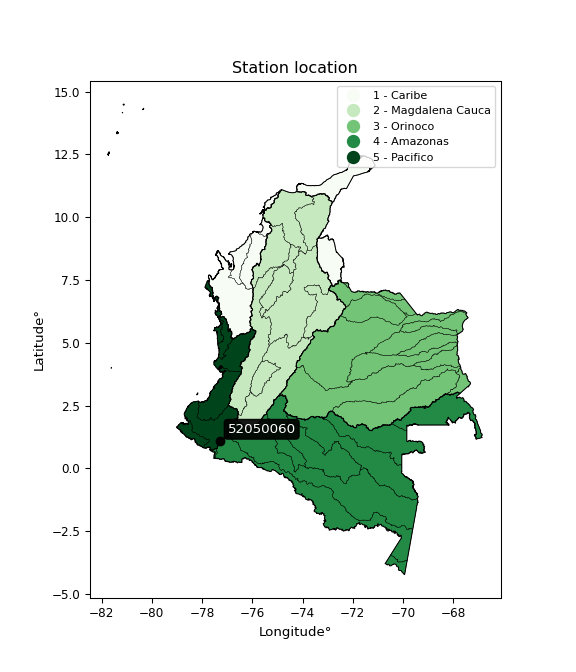

<div align="center">


</div>

# PMP Station (Rain, Pmax24h): 52050060

Probable Maximum Precipitation (PMP) is the greatest amount of rainfall for a specific duration that is meteorologically possible for a given location, acting as a "worst-case" scenario for extreme storms, crucial for designing safety-critical infrastructure like bridges, river deviations, dams, spillways, and nuclear plants to prevent catastrophic failure. PMP is calculated by hydrologists using meteorological data to determine the upper limit of extreme rainfall, often leading to the Probable Maximum Flood (PMF) for flood control design, and is increasingly being studied for climate change impacts. Probable Maximum Precipitation (PMP) is the theoretical upper limit of rainfall, a deterministic estimate for extreme events, while probability distributions (like GEV, Gumbel) describe the likelihood and frequency of various precipitation amounts, including rare ones, showing how often events occur, with PMP representing the extreme end of these distributions, used for critical infrastructure design to ensure safety against the worst conceivable weather, unlike standard statistical forecasts which cover typical probabilities.

The most common probability distributions in hydrology, used for analyzing floods, rainfall, and streamflow, include the Normal, Log-Normal, Gumbel, Gamma (including Log-Pearson Type III), and Generalized Extreme Value (GEV) distributions, often chosen based on the data´s skewness and whether modeling extremes or general conditions, with Gumbel and GEV popular for extreme events like floods, while the Normal distribution serves as a baseline, though often requiring transformations for skewed hydrological data. These distributions help in designing water infrastructure, managing water resources, and forecasting hydrologic events.

> Hydrological data often isn´t perfectly normal (it´s skewed), so different distributions are needed for different applications, such as: **Flood Frequency Analysis**: Using Gumbel, GEV, or Log-Pearson Type III for predicting extreme flood magnitudes and their return periods, **Rainfall Analysis**: Normal for annual totals, but Log-Normal, Weibull, or GEV for intensity or extreme daily rainfall, **Streamflow Modeling**: Gamma and Log-Normal for maximum flows, GEV for minimum flows, and Kappa for daily flows.

<div align="center">

</img>

</div>


## A. General information


### 1. General running parameters

• app_version: _v20260113_. • runtime: _2026-01-13 16:28:34.738620_. • Python version: _3.14.0_. • SciPy version: _1.16.3_. • Pandas version: _2.3.3_. • NumPy version: _2.3.5_. • Stations dataset (station_dataset_file): _dataset/pmax24h_in/automatic_colombia_2003_2025.csv_. • Stations catalog (station_catalog_file): _dataset/CNE.xls_. • Minimum year to eval til year_max (date_min): _1900_. • Maximum year to eval since year_min (date_max): _2025_. • Creates, save and include plots into reports (create_plot): _False_. • Plot only fit distributions with Δo > Δ (plot_only_fit): _True_. • Plot only simple graphs avoiding multiple CDFs and multiple Extreme values plots (plot_only_simple): _True_. • Eval low extreme values, if False, evaluates high extreme values (low_extreme): _False_. • Eval every SciPy distribution as logarithmic (pdist_logarithmic_on): _True_. • Standard deviation normalized (ddof): _1.0_. • Return periods to eval in years (Tr): _[2, 2.33, 5, 10, 15, 20, 25, 50, 75, 100, 200, 250, 500, 750, 1000]_. • Minimum data sample per station, 0 means any (minimum_sample): _5_. • Z-Score maximum threshold to adjust a value, 0 means disable (zscore_max): _3.5_. • Z-Score minimum threshold to adjust a value, 0 means disable (zscore_min): _-2.5_. • Avoid zeros, e.g. rain = 0 (avoid_zeros): _True_. • Avoid null values (avoid_nans): _True_. 

:file_folder:Table: [dataset.csv](../../dataset/pmax24h_in/automatic_colombia_2003_2025.csv)

> Delta Degrees of Freedom (DDOF): is a parameter used in the formulas for calculating variance and standard deviation. When ddof=0, the divisor is $N$ (the total number of observations) and this is used when your data set is the entire population. When ddof=1, the divisor is $N-1$ and this is used when your data set is a sample drawn from a larger population. Using $N-1$ provides an unbiased estimate of the population variance (known as Bessel´s correction).


### 2. Station info and location

|   id |   CODIGO | NOMBRE              | CATEGORIA               | TECNOLOGIA                | ESTADO   | FECHA_INSTALACION   |   FECHA_SUSPENSION |   ALTITUD |   LATITUD |   LONGITUD | DEPARTAMENTO   | MUNICIPIO   | AREA_OPERATIVA                      | ENTIDAD                                                     | AREA_HIDROGRAFICA   | ZONA_HIDROGRAFICA   | SUBZONA_HIDROGRAFICA   |   CORRIENTE | Catalogo   |   Version |
|-----:|---------:|:--------------------|:------------------------|:--------------------------|:---------|:--------------------|-------------------:|----------:|----------:|-----------:|:---------------|:------------|:------------------------------------|:------------------------------------------------------------|:--------------------|:--------------------|:-----------------------|------------:|:-----------|----------:|
|    0 | 52050060 | RIO BOBO [52050060] | Climatológica Principal | Automática con Telemetría | Activa   | 15/01/1965          |                nan |       364 |    1.0995 |   -77.2997 | Nariño         | Pasto       | Area Operativa 07 - Nariño-Putumayo | INSTITUTO DE HIDROLOGIA METEOROLOGIA Y ESTUDIOS AMBIENTALES | Pacifico            | Patía               | Río Guáitara           |         nan | CNE_IDEAM  |  20251226 |

<div align="center">

Dynamic map: [:earth_americas:Google](http://maps.google.com/maps?q=1.0995,-77.29972222) [:earth_americas:OSM](https://www.openstreetmap.org/#map=18/1.0995/-77.29972222&layers=P) [:earth_americas:Bing](https://www.bing.com/maps?cp=1.0995~-77.29972222&lvl=18) [:earth_americas:Apple](https://maps.apple.com/frame?center=1.0995%2C-77.29972222&span=0.003%2C0.006)

</div>


<div align="center">

```geojson
{
  "type": "Feature",
  "geometry": {
    "type": "Point", 
    "coordinates": [-77.29972222, 1.0995]
  }, 
  "properties": {
    "Name": "52050060"
  }
}
```

</div>


### 3. Discrete values table and plot

<div align="center">

|               |          0 |           1 |           2 |           3 |          4 |
|:--------------|-----------:|------------:|------------:|------------:|-----------:|
| Date          | 2021       | 2022        | 2023        | 2024        | 2025       |
| Value         |   35       |   39.2      |   61.2      |   46.2      |   71.4     |
| Value_initial |   35       |   39.2      |   61.2      |   46.2      |   71.4     |
| count         |    5       |    5        |    5        |    5        |    5       |
| mean          |   50.6     |   50.6      |   50.6      |   50.6      |   50.6     |
| std           |   15.3108  |   15.3108   |   15.3108   |   15.3108   |   15.3108  |
| zscore        |   -1.01889 |   -0.744573 |    0.692323 |   -0.287379 |    1.35852 |


</div>


> The initial value (value_initial) correspond to the initial obtained or null completed value, and value (value) is adjusted only when the initial value is outside the valid range (outlier) definite through the Z-Score value. If Z-Score is active, values out of range or outliers are replaced with the station mean value. A Z-Score (or standard score) measures how many standard deviations a data point is from the mean of a dataset, indicating its relative position; positive scores mean above the mean, negative mean below, and a score of zero is exactly at the mean, allowing for comparison of values from different distributions. It´s calculated using the formula $z=(x–μ)/σ$, where $x$ is the data point, $μ$ is the mean, and $σ$ is the standard deviation, helping identify outliers and understand probability.
>
> <sub>**Note**: In this study, "completing" (filling gaps in) and "extending" (forecasting or lengthening the historical record) rainfall data series are avoided for certain critical analyses because they introduce artificial bias and uncertainty, which can distort the statistics of rare events (extremes), alter day-to-day variability, and compromise the integrity and homogeneity of the original data. Some reasons against Completing/Extending rainfall data are: **Distortion of Extremes and Variability**: The primary issue is that most gap-filling or extension methods rely on averaging or regression with nearby stations, which inherently smooths the data. Rainfall is highly variable in space and time, with a large percentage of zero values and occasional large storms. Infilling methods often underestimate the highest values and overestimate the lowest (zero) values, which severely distorts analyses focused on flood frequency, drought severity, and intensity-duration-frequency (IDF) curves, **Loss of Data Homogeneity**: Infilled or extended data are synthetic estimates, not actual measurements. Combining these estimates with observed data can violate the assumption of data homogeneity, which requires that the data properties do not change over time. Inhomogeneity can lead to incorrect conclusions about long-term trends or changes in climate patterns, **Propagation of Errors**: Errors and biases from the original data (e.g., wind-induced undercatch, instrument errors, site changes) or the data used for imputation can propagate through the analysis, leading to unreliable hydrological models and inaccurate predictions, **Compromised Statistical Integrity**: For statistical analyses, especially those involving the frequency of events, using artificial data can introduce time bias or autocorrelation that doesn´t exist in reality, making it difficult to assess the true probability of events, **Difficulty in Validation**: It is difficult to accurately validate the quality of filled or extended data, especially for past periods where ground-truth measurements are unavailable. The reliability of imputation techniques heavily depends on the density of the surrounding station network and the complexity of the local topography.</sub>


### 4. Active continuous probability distributions from SciPy (45 of 104 available)

A Probability Density Function (PDF) describes the relative likelihood of a continuous random variable falling within a specific range, where the total area under its curve equals 1, and the area over any interval gives the actual probability for that range. Unlike discrete probabilities (like rolling a die), a PDF shows density, not direct probability for a single point (which is zero), with higher points indicating higher likelihood, often visualized as a bell curve for normal distributions.

A log of a probability density function (log-PDF) is simply the logarithm of the PDF´s value, denoted as $log(f(x))$, useful for converting multiplication of probabilities into addition, improving numerical stability with tiny numbers, and connecting to information theory concepts like entropy. Instead of dealing with very small probabilities (e.g., 0.000001), log-PDFs use negative numbers (e.g., $log(0.00001) ≈ -11.51$ that are easier for computers to handle, preventing underflow errors and simplifying complex calculations. In this study, each active probability distribution from SciPy is also evaluated in the $log$ form.

[scipy.stats](https://docs.scipy.org/doc/scipy/reference/stats.html) is a Python´s powerful submodule within the SciPy library for comprehensive statistical analysis, offering over 130 probability distributions (like Normal, Poisson), functions for descriptive stats (mean, variance), hypothesis testing (t-tests, chi-square), random variable generation, and statistical tests, making it essential for data science, modeling, and research. It provides tools to explore, model, and draw conclusions from data efficiently, working seamlessly with NumPy.

<div align="center">

|   id | p_dist             |   n_parameter | fit_method   | label                                                                       | active   | ref                                                                                                        |
|-----:|:-------------------|--------------:|:-------------|:----------------------------------------------------------------------------|:---------|:-----------------------------------------------------------------------------------------------------------|
|    0 | alpha              |             3 | MLE          | Alpha                                                                       | True     | [:mortar_board:](https://docs.scipy.org/doc/scipy/reference/generated/scipy.stats.alpha.html)              |
|    1 | betaprime          |             4 | MLE          | Beta prime                                                                  | True     | [:mortar_board:](https://docs.scipy.org/doc/scipy/reference/generated/scipy.stats.betaprime.html)          |
|    2 | chi2               |             3 | MLE          | Chi²                                                                        | True     | [:mortar_board:](https://docs.scipy.org/doc/scipy/reference/generated/scipy.stats.chi2.html)               |
|    3 | crystalball        |             4 | MLE          | Crystalball                                                                 | True     | [:mortar_board:](https://docs.scipy.org/doc/scipy/reference/generated/scipy.stats.crystalball.html)        |
|    4 | dweibull           |             3 | MLE          | Double Weibull                                                              | True     | [:mortar_board:](https://docs.scipy.org/doc/scipy/reference/generated/scipy.stats.dweibull.html)           |
|    5 | erlang             |             3 | MLE          | Erlang                                                                      | True     | [:mortar_board:](https://docs.scipy.org/doc/scipy/reference/generated/scipy.stats.erlang.html)             |
|    6 | expon              |             2 | MLE          | Exponential                                                                 | True     | [:mortar_board:](https://docs.scipy.org/doc/scipy/reference/generated/scipy.stats.expon.html)              |
|    7 | exponnorm          |             3 | MLE          | Exponentially modified Normal                                               | True     | [:mortar_board:](https://docs.scipy.org/doc/scipy/reference/generated/scipy.stats.exponnorm.html)          |
|    8 | f                  |             4 | MLE          | F                                                                           | True     | [:mortar_board:](https://docs.scipy.org/doc/scipy/reference/generated/scipy.stats.f.html)                  |
|    9 | fatiguelife        |             3 | MLE          | Fatigue-life (Birnbaum-Saunders)                                            | True     | [:mortar_board:](https://docs.scipy.org/doc/scipy/reference/generated/scipy.stats.fatiguelife.html)        |
|   10 | fisk               |             3 | MLE          | Fisk                                                                        | True     | [:mortar_board:](https://docs.scipy.org/doc/scipy/reference/generated/scipy.stats.fisk.html)               |
|   11 | gamma              |             3 | MLE          | Gamma                                                                       | True     | [:mortar_board:](https://docs.scipy.org/doc/scipy/reference/generated/scipy.stats.gamma.html)              |
|   12 | genexpon           |             5 | MLE          | Generalized exponential                                                     | True     | [:mortar_board:](https://docs.scipy.org/doc/scipy/reference/generated/scipy.stats.genexpon.html)           |
|   13 | genlogistic        |             3 | MLE          | Generalized logistic                                                        | True     | [:mortar_board:](https://docs.scipy.org/doc/scipy/reference/generated/scipy.stats.genlogistic.html)        |
|   14 | gibrat             |             2 | MM           | Gibrat                                                                      | True     | [:mortar_board:](https://docs.scipy.org/doc/scipy/reference/generated/scipy.stats.gibrat.html)             |
|   15 | gompertz           |             3 | MLE          | Gompertz (or truncated Gumbel)                                              | True     | [:mortar_board:](https://docs.scipy.org/doc/scipy/reference/generated/scipy.stats.gompertz.html)           |
|   16 | gumbel_l           |             2 | MM           | Gumbel Left Skew                                                            | True     | [:mortar_board:](https://docs.scipy.org/doc/scipy/reference/generated/scipy.stats.gumbel_l.html)           |
|   17 | gumbel_r           |             2 | MM           | Gumbel Right Skew                                                           | True     | [:mortar_board:](https://docs.scipy.org/doc/scipy/reference/generated/scipy.stats.gumbel_r.html)           |
|   18 | halflogistic       |             2 | MM           | Half-logistic                                                               | True     | [:mortar_board:](https://docs.scipy.org/doc/scipy/reference/generated/scipy.stats.halflogistic.html)       |
|   19 | halfnorm           |             2 | MM           | Half Normal                                                                 | True     | [:mortar_board:](https://docs.scipy.org/doc/scipy/reference/generated/scipy.stats.halfnorm.html)           |
|   20 | hypsecant          |             2 | MM           | hyperbolic secant                                                           | True     | [:mortar_board:](https://docs.scipy.org/doc/scipy/reference/generated/scipy.stats.hypsecant.html)          |
|   21 | invgamma           |             3 | MLE          | Inverted gamma                                                              | True     | [:mortar_board:](https://docs.scipy.org/doc/scipy/reference/generated/scipy.stats.invgamma.html)           |
|   22 | invgauss           |             3 | MLE          | Inverse Gaussian                                                            | True     | [:mortar_board:](https://docs.scipy.org/doc/scipy/reference/generated/scipy.stats.invgauss.html)           |
|   23 | invweibull         |             3 | MLE          | Inverted Weibull                                                            | True     | [:mortar_board:](https://docs.scipy.org/doc/scipy/reference/generated/scipy.stats.invweibull.html)         |
|   24 | kappa4             |             4 | MLE          | Kappa 4                                                                     | True     | [:mortar_board:](https://docs.scipy.org/doc/scipy/reference/generated/scipy.stats.kappa4.html)             |
|   25 | kstwobign          |             2 | MLE          | Limiting distribution of scaled Kolmogorov-Smirnov two-sided test statistic | True     | [:mortar_board:](https://docs.scipy.org/doc/scipy/reference/generated/scipy.stats.kstwobign.html)          |
|   26 | laplace            |             2 | MM           | Laplace                                                                     | True     | [:mortar_board:](https://docs.scipy.org/doc/scipy/reference/generated/scipy.stats.laplace.html)            |
|   27 | laplace_asymmetric |             3 | MLE          | Asymmetric Laplace                                                          | True     | [:mortar_board:](https://docs.scipy.org/doc/scipy/reference/generated/scipy.stats.laplace_asymmetric.html) |
|   28 | loggamma           |             3 | MLE          | Log gamma                                                                   | True     | [:mortar_board:](https://docs.scipy.org/doc/scipy/reference/generated/scipy.stats.loggamma.html)           |
|   29 | logistic           |             2 | MM           | Logistic (or Sech-squared)                                                  | True     | [:mortar_board:](https://docs.scipy.org/doc/scipy/reference/generated/scipy.stats.logistic.html)           |
|   30 | lognorm            |             3 | MLE          | Log Normal                                                                  | True     | [:mortar_board:](https://docs.scipy.org/doc/scipy/reference/generated/scipy.stats.lognorm.html)            |
|   31 | maxwell            |             2 | MM           | Maxwell                                                                     | True     | [:mortar_board:](https://docs.scipy.org/doc/scipy/reference/generated/scipy.stats.maxwell.html)            |
|   32 | mielke             |             4 | MLE          | Mielke Beta-Kappa / Dagum                                                   | True     | [:mortar_board:](https://docs.scipy.org/doc/scipy/reference/generated/scipy.stats.mielke.html)             |
|   33 | moyal              |             2 | MM           | Moyal                                                                       | True     | [:mortar_board:](https://docs.scipy.org/doc/scipy/reference/generated/scipy.stats.moyal.html)              |
|   34 | nakagami           |             3 | MLE          | Nakagami                                                                    | True     | [:mortar_board:](https://docs.scipy.org/doc/scipy/reference/generated/scipy.stats.nakagami.html)           |
|   35 | ncf                |             5 | MLE          | Non-central F distribution                                                  | True     | [:mortar_board:](https://docs.scipy.org/doc/scipy/reference/generated/scipy.stats.ncf.html)                |
|   36 | nct                |             4 | MLE          | Non-central Student’s t                                                     | True     | [:mortar_board:](https://docs.scipy.org/doc/scipy/reference/generated/scipy.stats.nct.html)                |
|   37 | norm               |             2 | MM           | Normal                                                                      | True     | [:mortar_board:](https://docs.scipy.org/doc/scipy/reference/generated/scipy.stats.norm.html)               |
|   38 | pearson3           |             3 | MM           | Pearson type III                                                            | True     | [:mortar_board:](https://docs.scipy.org/doc/scipy/reference/generated/scipy.stats.pearson3.html)           |
|   39 | rayleigh           |             2 | MM           | Rayleigh                                                                    | True     | [:mortar_board:](https://docs.scipy.org/doc/scipy/reference/generated/scipy.stats.rayleigh.html)           |
|   40 | rice               |             3 | MLE          | Rice                                                                        | True     | [:mortar_board:](https://docs.scipy.org/doc/scipy/reference/generated/scipy.stats.rice.html)               |
|   41 | t                  |             3 | MLE          | Student’s t                                                                 | True     | [:mortar_board:](https://docs.scipy.org/doc/scipy/reference/generated/scipy.stats.t.html)                  |
|   42 | truncnorm          |             4 | MLE          | Truncated normal                                                            | True     | [:mortar_board:](https://docs.scipy.org/doc/scipy/reference/generated/scipy.stats.truncnorm.html)          |
|   43 | wald               |             2 | MM           | Wald                                                                        | True     | [:mortar_board:](https://docs.scipy.org/doc/scipy/reference/generated/scipy.stats.wald.html)               |
|   44 | weibull_min        |             3 | MLE          | Weibull minimum                                                             | True     | [:mortar_board:](https://docs.scipy.org/doc/scipy/reference/generated/scipy.stats.weibull_min.html)        |

</div>

> **n_parameter:** # arguments & localization & scale.
>
> **Fit methods:** (MLE) maximum likelihood, (MM) L-moments.
>
>**Inactive** (With the only purpose of prevent loops, zero divisions, infinite values, over high estimated values or horizontal trending for recurrence intervals estimations, the follow distributions were disabled.)**:** foldnorm, gennorm, norminvgauss, powernorm, powerlognorm, skewnorm, genextreme, anglit, arcsine, argus, beta, bradford, burr, burr12, cauchy, cosine, halfcauchy, foldcauchy, skewcauchy, wrapcauchy, dgamma, gengamma, exponweib, exponpow, truncexpon, gausshyper, genhalflogistic, genhyperbolic, geninvgauss, halfgennorm, johnsonsb, johnsonsu, kappa3, ksone, kstwo, loglaplace, levy, levy_l, levy_stable, ncx2, pareto, genpareto, truncpareto, lomax, powerlaw, rdist, rel_breitwigner, recipinvgauss, semicircular, studentized_range, trapezoid, triang, truncweibull_min, tukeylambda, uniform, loguniform, vonmises, vonmises_line, weibull_max, 


## B. Probability (PDF) vs. Empirical (EDF) distributions functions

A continuous probability distribution (CPD) describes probabilities for variables that can take any value within a range (like rain any time), unlike discrete variables with specific outcomes (like temperature). It uses a Probability Density Function (PDF), a curve where the total area under it equals 1, and the probability of the variable falling within an interval (a to b) is found by calculating the area under the curve between those points. A key feature is that the probability of hitting any single exact value is zero, so probabilities are always expressed for ranges, e.g., $P(a ≤ X ≤ b)$.

<div align="center">

Distributions parameters from station values
|    |   station | p_dist                |   n |             loc |         scale | shape                  | shape1             | shape2                 | shape3   |
|---:|----------:|:----------------------|----:|----------------:|--------------:|:-----------------------|:-------------------|:-----------------------|:---------|
|  0 |  52050060 | alpha                 |   5 |     2.56577     | 163.91        | 3.691757836737105      |                    |                        |          |
|  1 |  52050060 | betaprime             |   5 |    -0.580085    |   1.76335     | 416.3391746190971      | 15.337612241744253 |                        |          |
|  2 |  52050060 | chi2                  |   5 |    35           |   6.35321     | 1.1698634043260028     |                    |                        |          |
|  3 |  52050060 | crystalball           |   5 |    50.6         |  13.6944      | 6308.494225078703      | 2772.1670183021297 |                        |          |
|  4 |  52050060 | dweibull              |   5 |    53.2568      |  14.7183      | 3.132061527220961      |                    |                        |          |
|  5 |  52050060 | erlang                |   5 |    35           |  13.3174      | 0.7725606179443161     |                    |                        |          |
|  6 |  52050060 | expon                 |   5 |    35           |  15.6         |                        |                    |                        |          |
|  7 |  52050060 | exponnorm             |   5 |    34.9845      |   0.00460575  | 3391.599715221496      |                    |                        |          |
|  8 |  52050060 | f                     |   5 |    27.0923      |  16.5694      | 49.22562169725032      | 5.931513128395574  |                        |          |
|  9 |  52050060 | fatiguelife           |   5 |    35           |   6.7256e-05  | 399.3279354075803      |                    |                        |          |
| 10 |  52050060 | fisk                  |   5 |    35           |  13.8097      | 0.5713832654117486     |                    |                        |          |
| 11 |  52050060 | gamma                 |   5 |    35           |  17.3173      | 0.5999424292761274     |                    |                        |          |
| 12 |  52050060 | genexpon              |   5 |    34.9979      |   0.146344    | 0.008073466325945758   | 0.9640138704788974 | 1.4306055674196517e-05 |          |
| 13 |  52050060 | genlogistic           |   5 |   -34.4523      |  10.7852      | 1451.6796544494273     |                    |                        |          |
| 14 |  52050060 | gibrat                |   5 |    40.1529      |   6.33647     |                        |                    |                        |          |
| 15 |  52050060 | gompertz              |   5 |    35           |  58.3207      | 2.8437388953778573     |                    |                        |          |
| 16 |  52050060 | gumbel_l              |   5 |    56.7632      |  10.6775      |                        |                    |                        |          |
| 17 |  52050060 | gumbel_r              |   5 |    44.4368      |  10.6775      |                        |                    |                        |          |
| 18 |  52050060 | halflogistic          |   5 |    34.369       |  11.7082      |                        |                    |                        |          |
| 19 |  52050060 | halfnorm              |   5 |    32.474       |  22.7176      |                        |                    |                        |          |
| 20 |  52050060 | hypsecant             |   5 |    50.6         |   8.71811     |                        |                    |                        |          |
| 21 |  52050060 | invgamma              |   5 |    26.768       |  45.9277      | 2.799972591068278      |                    |                        |          |
| 22 |  52050060 | invgauss              |   5 |    31.5371      |  17.607       | 1.0826923011329226     |                    |                        |          |
| 23 |  52050060 | invweibull            |   5 |    35           |   1.83628     | 0.06787161872801853    |                    |                        |          |
| 24 |  52050060 | kappa4                |   5 |    29.1421      |  42.7276      | 1.158977304188182      | 1.007356134994587  |                        |          |
| 25 |  52050060 | kstwobign             |   5 |     7.08618     |  49.7363      |                        |                    |                        |          |
| 26 |  52050060 | laplace               |   5 |    50.6         |   9.68339     |                        |                    |                        |          |
| 27 |  52050060 | laplace_asymmetric    |   5 |    35           |   0.000156721 | 1.0046085436007165e-05 |                    |                        |          |
| 28 |  52050060 | loggamma              |   5 | -4447.14        | 597.056       | 1869.7382576274526     |                    |                        |          |
| 29 |  52050060 | logistic              |   5 |    50.6         |   7.55011     |                        |                    |                        |          |
| 30 |  52050060 | lognorm               |   5 |    35           |   0.0126093   | 14.122134141552932     |                    |                        |          |
| 31 |  52050060 | maxwell               |   5 |    18.1501      |  20.335       |                        |                    |                        |          |
| 32 |  52050060 | mielke                |   5 |    -1.70999     |  13.0446      | 1457.7607412387842     | 4.669135599243354  |                        |          |
| 33 |  52050060 | moyal                 |   5 |    42.7687      |   6.16464     |                        |                    |                        |          |
| 34 |  52050060 | nakagami              |   5 |    35           |  28.08        | 0.21775266880040772    |                    |                        |          |
| 35 |  52050060 | ncf                   |   5 |    26.784       |   2.80434     | 893.3378353747055      | 5.599949792364186  | 4328.616773359259      |          |
| 36 |  52050060 | nct                   |   5 |    -0.326279    |   1.26064     | 7.956024878036057      | 36.54155906243227  |                        |          |
| 37 |  52050060 | norm                  |   5 |    50.6         |  13.6944      |                        |                    |                        |          |
| 38 |  52050060 | pearson3              |   5 |    50.6         |  13.6944      | 0.3758680811679531     |                    |                        |          |
| 39 |  52050060 | rayleigh              |   5 |    24.4019      |  20.9031      |                        |                    |                        |          |
| 40 |  52050060 | rice                  |   5 |    27.296       |  18.7637      | 0.274133339311644      |                    |                        |          |
| 41 |  52050060 | t                     |   5 |    50.6008      |  13.694       | 18122840.900757186     |                    |                        |          |
| 42 |  52050060 | truncnorm             |   5 |    59.165       |  39.27        | -1108.6427700231666    | 0.3115616913643958 |                        |          |
| 43 |  52050060 | wald                  |   5 |    36.9056      |  13.6944      |                        |                    |                        |          |
| 44 |  52050060 | weibull_min           |   5 |    35           |  18.3095      | 0.8242896117425424     |                    |                        |          |
| 45 |  52050060 | logalpha              |   5 |     1.55146     |  20.4478      | 8.875785522971071      |                    |                        |          |
| 46 |  52050060 | logbetaprime          |   5 |    -3.78258     |   2.48951     | 1943.3530361035232     | 631.3184662355052  |                        |          |
| 47 |  52050060 | logchi2               |   5 |     3.55535     |   0.960696    | 0.97164616367424       |                    |                        |          |
| 48 |  52050060 | logcrystalball        |   5 |     3.88789     |   0.267416    | 35.98239455708847      | 262.44820622243867 |                        |          |
| 49 |  52050060 | logdweibull           |   5 |     3.94287     |   0.285916    | 2.835481211968905      |                    |                        |          |
| 50 |  52050060 | logerlang             |   5 |     3.55535     |   0.387949    | 0.5104186236807157     |                    |                        |          |
| 51 |  52050060 | logexpon              |   5 |     3.55535     |   0.332542    |                        |                    |                        |          |
| 52 |  52050060 | logexponnorm          |   5 |     3.8514      |   0.264916    | 0.13774790453219626    |                    |                        |          |
| 53 |  52050060 | logf                  |   5 |     3.06708     |   0.736557    | 900.3461148216253      | 18.710223865577532 |                        |          |
| 54 |  52050060 | logfatiguelife        |   5 |     3.55535     |   1.68111e-07 | 1163.906311221832      |                    |                        |          |
| 55 |  52050060 | logfisk               |   5 |     3.55535     |   0.271612    | 0.5295213846078038     |                    |                        |          |
| 56 |  52050060 | loggamma              |   5 |     3.55155     |   0.270466    | 0.9905930138180183     |                    |                        |          |
| 57 |  52050060 | loggenexpon           |   5 |     3.55535     |   0.539876    | 1.4190020011714877     | 0.9819576636234276 | 0.49788655281520033    |          |
| 58 |  52050060 | loggenlogistic        |   5 |     2.27939     |   0.222057    | 778.4002091669931      |                    |                        |          |
| 59 |  52050060 | loggibrat             |   5 |     3.68388     |   0.123741    |                        |                    |                        |          |
| 60 |  52050060 | loggompertz           |   5 |     3.55535     |   0.667005    | 1.2739440162115954     |                    |                        |          |
| 61 |  52050060 | loggumbel_l           |   5 |     4.00824     |   0.208503    |                        |                    |                        |          |
| 62 |  52050060 | loggumbel_r           |   5 |     3.76754     |   0.208503    |                        |                    |                        |          |
| 63 |  52050060 | loghalflogistic       |   5 |     3.57092     |   0.228646    |                        |                    |                        |          |
| 64 |  52050060 | loghalfnorm           |   5 |     3.53394     |   0.443615    |                        |                    |                        |          |
| 65 |  52050060 | loghypsecant          |   5 |     3.88789     |   0.170242    |                        |                    |                        |          |
| 66 |  52050060 | loginvgamma           |   5 |     3.05753     |   7.01168     | 9.40664140506168       |                    |                        |          |
| 67 |  52050060 | loginvgauss           |   5 |     3.40643     |   0.987999    | 0.48731312824566364    |                    |                        |          |
| 68 |  52050060 | loginvweibull         |   5 |    -4.11828e+06 |   4.11828e+06 | 18579334.508148767     |                    |                        |          |
| 69 |  52050060 | logkappa4             |   5 |     3.55623     |   0.802249    | 0.9952082723519144     | 1.126649327073216  |                        |          |
| 70 |  52050060 | logkstwobign          |   5 |     2.9976      |   1.01615     |                        |                    |                        |          |
| 71 |  52050060 | loglaplace            |   5 |     3.88789     |   0.189092    |                        |                    |                        |          |
| 72 |  52050060 | loglaplace_asymmetric |   5 |     3.83298     |   0.226741    | 0.886266018960008      |                    |                        |          |
| 73 |  52050060 | logloggamma           |   5 |   -49.3877      |   7.89206     | 854.9452807517496      |                    |                        |          |
| 74 |  52050060 | loglogistic           |   5 |     3.88789     |   0.147434    |                        |                    |                        |          |
| 75 |  52050060 | loglognorm            |   5 |     3.55535     |   0.000354094 | 13.717175447737878     |                    |                        |          |
| 76 |  52050060 | logmaxwell            |   5 |     3.25423     |   0.39709     |                        |                    |                        |          |
| 77 |  52050060 | logmielke             |   5 |   -12.6793      |  15.2688      | 19072.57696519477      | 75.17672643631414  |                        |          |
| 78 |  52050060 | logmoyal              |   5 |     3.73496     |   0.120379    |                        |                    |                        |          |
| 79 |  52050060 | lognakagami           |   5 |     3.55535     |   0.619113    | 0.05977361817757259    |                    |                        |          |
| 80 |  52050060 | logncf                |   5 |    -1.44305     |   5.3383      | 501.0176499304134      | 719.517219645305   | 0.0005081463186477077  |          |
| 81 |  52050060 | lognct                |   5 |    -1.19205     |   0.0994054   | 211.12707528028704     | 50.911866994203734 |                        |          |
| 82 |  52050060 | lognorm               |   5 |     3.88789     |   0.267416    |                        |                    |                        |          |
| 83 |  52050060 | logpearson3           |   5 |     3.88789     |   0.267416    | 0.20036254404457643    |                    |                        |          |
| 84 |  52050060 | lograyleigh           |   5 |     3.37631     |   0.408183    |                        |                    |                        |          |
| 85 |  52050060 | logrice               |   5 |     3.41187     |   0.348445    | 0.6747432054157764     |                    |                        |          |
| 86 |  52050060 | logt                  |   5 |     3.88789     |   0.267419    | 301875514.5897254      |                    |                        |          |
| 87 |  52050060 | logtruncnorm          |   5 |    -0.0727446   |   1.02557     | 3.6481283163386173     | 4.2328347283334615 |                        |          |
| 88 |  52050060 | logwald               |   5 |     3.62047     |   0.267418    |                        |                    |                        |          |
| 89 |  52050060 | logweibull_min        |   5 |     3.55535     |   0.43117     | 0.20829976056377886    |                    |                        |          |

</div>

> **loc** (Location parameter): This shifts the distribution along the x-axis. For many common distributions, like the normal (Gaussian) distribution, loc represents the mean $μ$. For others, like the uniform distribution, it might represent the minimum value, or for the beta distribution, the left end of the support interval.
>
> **scale** (Scale parameter): This determines the width or spread of the distribution. For the normal distribution, scale represents the standard deviation $σ$. For a uniform distribution, it defines the length of the interval (from $loc$ to $loc + scale$).
>
> **shape** (Shape parameters): Refers to parameters that define the specific form of a probability distribution, distinct from its location (loc) and scale (scale). These parameters are required arguments for most distribution functions. For example, a normal (Gaussian) distribution is fully defined by its location (mean) and scale (standard deviation), so it has no specific shape parameters beyond loc and scale. However, other distributions have intrinsic properties that need specification, as Gamma distribution that takes a shape parameter, often named $a$ or $alpha$.


### 0. Cumulative distribution values - CDF (90 evaluated)

Cumulative Distribution Function (CDF), denoted as $F$<sub>$X$</sub>$(x)$, is a function that gives the probability that a random variable $X$ will take a value less than or equal to a specific value, $x$ (i.e., $(P(X≥x)$. It essentially "accumulates" probabilities from a given point up to the far right (positive infinity), providing a complete picture of the distribution´s probabilities for both discrete (like rain) and continuous (like temperature) variables, helping to find probabilities over ranges or above certain values. Each station is evaluated separately ordering the $x$ values ascending, calculating the CDF and PDF values for the activated distributions and their logarithmic forms.

<div align="center">

CDF ordered by x ascending and calculating $log(f(x))$ separately
|   id |   Station |   date |    x |   count |   mean |     std |    zscore |   Value_initial |   station |   m |     alpha |   alpha_pdf |   betaprime |   betaprime_pdf |        chi2 |        chi2_pdf |   crystalball |   crystalball_pdf |   dweibull |   dweibull_pdf |      erlang |   erlang_pdf |    expon |   expon_pdf |   exponnorm |   exponnorm_pdf |        f |      f_pdf |   fatiguelife |   fatiguelife_pdf |        fisk |       fisk_pdf |       gamma |      gamma_pdf |    genexpon |   genexpon_pdf |   genlogistic |   genlogistic_pdf |   gibrat |   gibrat_pdf |    gompertz |   gompertz_pdf |   gumbel_l |   gumbel_l_pdf |   gumbel_r |   gumbel_r_pdf |   halflogistic |   halflogistic_pdf |   halfnorm |   halfnorm_pdf |   hypsecant |   hypsecant_pdf |   invgamma |   invgamma_pdf |   invgauss |   invgauss_pdf |   invweibull |   invweibull_pdf |      kappa4 |   kappa4_pdf |   kstwobign |   kstwobign_pdf |   laplace |   laplace_pdf |   laplace_asymmetric |   laplace_asymmetric_pdf |   loggamma |   loggamma_pdf |   logistic |   logistic_pdf |   lognorm |   lognorm_pdf |   maxwell |   maxwell_pdf |   mielke |   mielke_pdf |     moyal |   moyal_pdf |    nakagami |   nakagami_pdf |       ncf |    ncf_pdf |       nct |    nct_pdf |     norm |   norm_pdf |   pearson3 |   pearson3_pdf |   rayleigh |   rayleigh_pdf |      rice |   rice_pdf |        t |      t_pdf |   truncnorm |   truncnorm_pdf |      wald |   wald_pdf |   weibull_min |   weibull_min_pdf |   logalpha |   logalpha_pdf |   logbetaprime |   logbetaprime_pdf |     logchi2 |   logchi2_pdf |   logcrystalball |   logcrystalball_pdf |   logdweibull |   logdweibull_pdf |   logerlang |   logerlang_pdf |   logexpon |   logexpon_pdf |   logexponnorm |   logexponnorm_pdf |      logf |   logf_pdf |   logfatiguelife |   logfatiguelife_pdf |     logfisk |   logfisk_pdf |   loggenexpon |   loggenexpon_pdf |   loggenlogistic |   loggenlogistic_pdf |   loggibrat |   loggibrat_pdf |   loggompertz |   loggompertz_pdf |   loggumbel_l |   loggumbel_l_pdf |   loggumbel_r |   loggumbel_r_pdf |   loghalflogistic |   loghalflogistic_pdf |   loghalfnorm |   loghalfnorm_pdf |   loghypsecant |   loghypsecant_pdf |   loginvgamma |   loginvgamma_pdf |   loginvgauss |   loginvgauss_pdf |   loginvweibull |   loginvweibull_pdf |   logkappa4 |   logkappa4_pdf |   logkstwobign |   logkstwobign_pdf |   loglaplace |   loglaplace_pdf |   loglaplace_asymmetric |   loglaplace_asymmetric_pdf |   logloggamma |   logloggamma_pdf |   loglogistic |   loglogistic_pdf |   loglognorm |   loglognorm_pdf |   logmaxwell |   logmaxwell_pdf |   logmielke |   logmielke_pdf |   logmoyal |   logmoyal_pdf |   lognakagami |   lognakagami_pdf |   logncf |   logncf_pdf |   lognct |   lognct_pdf |   logpearson3 |   logpearson3_pdf |   lograyleigh |   lograyleigh_pdf |   logrice |   logrice_pdf |     logt |   logt_pdf |   logtruncnorm |   logtruncnorm_pdf |   logwald |   logwald_pdf |   logweibull_min |   logweibull_min_pdf |
|-----:|----------:|-------:|-----:|--------:|-------:|--------:|----------:|----------------:|----------:|----:|----------:|------------:|------------:|----------------:|------------:|----------------:|--------------:|------------------:|-----------:|---------------:|------------:|-------------:|---------:|------------:|------------:|----------------:|---------:|-----------:|--------------:|------------------:|------------:|---------------:|------------:|---------------:|------------:|---------------:|--------------:|------------------:|---------:|-------------:|------------:|---------------:|-----------:|---------------:|-----------:|---------------:|---------------:|-------------------:|-----------:|---------------:|------------:|----------------:|-----------:|---------------:|-----------:|---------------:|-------------:|-----------------:|------------:|-------------:|------------:|----------------:|----------:|--------------:|---------------------:|-------------------------:|-----------:|---------------:|-----------:|---------------:|----------:|--------------:|----------:|--------------:|---------:|-------------:|----------:|------------:|------------:|---------------:|----------:|-----------:|----------:|-----------:|---------:|-----------:|-----------:|---------------:|-----------:|---------------:|----------:|-----------:|---------:|-----------:|------------:|----------------:|----------:|-----------:|--------------:|------------------:|-----------:|---------------:|---------------:|-------------------:|------------:|--------------:|-----------------:|---------------------:|--------------:|------------------:|------------:|----------------:|-----------:|---------------:|---------------:|-------------------:|----------:|-----------:|-----------------:|---------------------:|------------:|--------------:|--------------:|------------------:|-----------------:|---------------------:|------------:|----------------:|--------------:|------------------:|--------------:|------------------:|--------------:|------------------:|------------------:|----------------------:|--------------:|------------------:|---------------:|-------------------:|--------------:|------------------:|--------------:|------------------:|----------------:|--------------------:|------------:|----------------:|---------------:|-------------------:|-------------:|-----------------:|------------------------:|----------------------------:|--------------:|------------------:|--------------:|------------------:|-------------:|-----------------:|-------------:|-----------------:|------------:|----------------:|-----------:|---------------:|--------------:|------------------:|---------:|-------------:|---------:|-------------:|--------------:|------------------:|--------------:|------------------:|----------:|--------------:|---------:|-----------:|---------------:|-------------------:|----------:|--------------:|-----------------:|---------------------:|
|    0 |  52050060 |   2021 | 35   |       5 |   50.6 | 15.3108 | -1.01889  |            35   |  52050060 |   1 | 0.0866322 |  0.0245939  |    0.101438 |      0.0209928  | 1.34292e-09 | 110551          |      0.12732  |        0.0152259  |  0.0701738 |      0.0236396 | 1.71775e-12 | 186.768      | 0        |  0.0641026  | 0.000993127 |      0.0639293  | 0.071267 | 0.033185   |     0.0458915 |       5.47174e+08 | 5.11653e-09 | 68574.3        | 6.57132e-10 | 55484.6        | 0.000114743 |     0.0551629  |     0.0986085 |        0.0211636  | 0        |   0          | 1.45515e-14 |     0.0487604  |   0.122131 |     0.0107094  |  0.0889134 |     0.0201526  |      0.0269413 |         0.0426741  |  0.0885352 |      0.0349055 |    0.105383 |      0.0118682  |  0.0679737 |     0.0336882  |  0.0569532 |     0.0473383  |  7.40925e-05 |      6.73072e+09 | 1.71359e-14 |    3.61626   |   0.0889098 |      0.0217653  | 0.0998433 |    0.0103108  |          2.06122e-10 |               0.0641015  |  0.0145661 |       3.77425  |   0.112426 |     0.0132166  |  0.106835 |       0.68854 |  0.123651 |    0.0191122  |      nan |          nan | 0.0604087 |  0.0208431  | 1.26639e-07 |    7.76194e+06 | 0.0679737 | 0.0336882  | 0.0951086 | 0.0225509  | 0.12732  | 0.0152259  |   0.1213   |     0.0172944  |   0.120614 |     0.0213299  | 0.0779749 | 0.0194326  | 0.127302 | 0.0152248  |    0.432516 |       0.0135087 | 0         | 0          |   1.98062e-13 |       22.9769     |  0.0920391 |       0.840774 |       0.168964 |           0.755256 | 2.85916e-08 |   3.12785e+07 |         0.106835 |             0.68854  |     0.0468185 |          0.811321 | 0.000192321 |     6106.97     |   0        |       3.00714  |       0.106728 |           0.689364 | 0.0759177 |   1.01018  |        0.0464717 |          1.85855e+12 | 6.20881e-08 |   4.93549e+06 |   1.00241e-10 |          2.62838  |        0.0834675 |             0.931941 |    0        |        0        |   6.50667e-10 |          1.90995  |      0.107685 |          0.487604 |     0.0628641 |          0.834189 |          0        |              0        |     0.0384964 |          1.7965   |      0.0896741 |           0.519804 |     0.0760145 |          1.00956  |     0.0601905 |          1.41773  |       0.0826962 |            0.929927 |  0.00359778 |         1.21316 |      0.0760639 |           0.980549 |    0.0861405 |         0.455549 |                0.110501 |                    0.549884 |      0.110004 |          0.686858 |     0.0948736 |          0.582447 |    0.0228676 |      8.90167e+12 |    0.0978806 |         0.866737 |         nan |             nan |  0.0349758 |       0.756565 |     0.0134944 |       3.63263e+12 | 0.213998 |     0.705205 | 0.102823 |     0.74038  |      0.102841 |          0.73209  |     0.0917147 |          0.976028 | 0.0653516 |      0.88141  | 0.106836 |   0.688537 |    0           |           0        | 0         |      0        |       0.00075511 |           3.5405e+11 |
|    1 |  52050060 |   2022 | 39.2 |       5 |   50.6 | 15.3108 | -0.744573 |            39.2 |  52050060 |   2 | 0.216993  |  0.0358789  |    0.2085   |      0.0293333  | 0.521894    |      0.058717   |      0.202575 |        0.020601   |  0.210343  |      0.040581  | 0.388299    |   0.0595222  | 0.236033 |  0.0489722  | 0.236517    |      0.0488758  | 0.246369 | 0.045237   |     0.734271  |       0.0244361   | 0.336237    |     0.0303624  | 0.437965    |     0.0536201  | 0.211407    |     0.0456385  |     0.208091  |        0.0302711  | 0        |   0          | 0.191317    |     0.0423762  |   0.175547 |     0.0149051  |  0.195332  |     0.0298748  |      0.203431  |         0.0409378  |  0.232823  |      0.0336158 |    0.168158 |      0.0184037  |  0.247545  |     0.0463155  |  0.288813  |     0.0523272  |  0.388526    |      0.00593571  | 0.15367     |    0.0315837 |   0.201331  |      0.0308348  | 0.154059  |    0.0159096  |          0.23603     |               0.0489717  |  0.356022  |       2.40351  |   0.180952 |     0.01963    |  0.20618  |       1.06611 |  0.216055 |    0.0246051  |      nan |          nan | 0.181651  |  0.0354245  | 0.343025    |    0.0354268   | 0.247545  | 0.0463155  | 0.211593  | 0.0319256  | 0.202575 | 0.020601   |   0.20703  |     0.023372   |   0.221658 |     0.0263607  | 0.176206  | 0.0268298  | 0.202553 | 0.0206002  |    0.491048 |       0.0143454 | 0.0370197 | 0.0537062  |   0.257042    |        0.0433233  |  0.217076  |       1.3403   |       0.267061 |           0.967811 | 0.279975    |   1.15332     |         0.206181 |             1.06611  |     0.205728  |          1.88932  | 0.547307    |        2.02396  |   0.288795 |       2.13869  |       0.206216 |           1.06772  | 0.230576  |   1.62833  |        0.759728  |          0.968134    | 0.386311    |   1.10772     |   0.265288    |          2.06372  |        0.225006  |             1.50999  |    0        |        0        |   0.210162    |          1.78792  |      0.178159 |          0.773377 |     0.200559  |          1.54543  |          0.210578 |              2.08982  |     0.238669  |          1.71752  |      0.17139   |           0.958797 |     0.230558  |          1.62734  |     0.27069   |          1.99813  |       0.224276  |            1.51252  |  0.144256   |         1.25908 |      0.224282  |           1.55655  |    0.156853  |         0.82951  |                0.194218 |                    0.966483 |      0.208521 |          1.05334  |     0.184394  |          1.02007  |    0.662951  |      0.234911    |    0.220354  |         1.26961  |         nan |             nan |  0.187851  |       1.83364  |     0.711876  |       0.74952     | 0.301106 |     0.825379 | 0.210367 |     1.15218  |      0.209059 |          1.13799  |     0.226261  |          1.35774  | 0.195061  |      1.36449  | 0.206181 |   1.0661   |    2.25156e-07 |           4.1575   | 0.0468419 |      3.02254  |       0.53095    |           0.652665   |
|    2 |  52050060 |   2024 | 46.2 |       5 |   50.6 | 15.3108 | -0.287379 |            46.2 |  52050060 |   3 | 0.474262  |  0.0342768  |    0.432885 |      0.0324942  | 0.777701    |      0.022527   |      0.373992 |        0.0276663  |  0.452409  |      0.0200839 | 0.676302    |   0.0281526  | 0.512248 |  0.0312661  | 0.512265    |      0.0312233  | 0.52467  | 0.0321736  |     0.846587  |       0.0107972   | 0.470115    |     0.0127085  | 0.688571    |     0.0241749  | 0.482313    |     0.0322921  |     0.440212  |        0.0334802  | 0.481357 |   0.0659008  | 0.452328    |     0.0323586  |   0.310534 |     0.0240103  |  0.428364  |     0.0340118  |      0.466232  |         0.0334222  |  0.454291  |      0.0292622 |    0.345766 |      0.0323085  |  0.528927  |     0.0321057  |  0.566778  |     0.0288755  |  0.412917    |      0.00221327  | 0.358456    |    0.027654  |   0.433619  |      0.0331427  | 0.317419  |    0.0327797  |          0.512243    |               0.031266   |  0.650712  |       1.29849  |   0.358295 |     0.0304525  |  0.418655 |       1.46072 |  0.40716  |    0.0288337  |      nan |          nan | 0.449011  |  0.0367856  | 0.523049    |    0.0197672   | 0.528927  | 0.0321057  | 0.449271  | 0.0332745  | 0.373992 | 0.0276663  |   0.39551  |     0.0292938  |   0.419425 |     0.0289639  | 0.386685  | 0.0317273  | 0.373967 | 0.0276664  |    0.59559  |       0.0154586 | 0.501896  | 0.0482858  |   0.486693    |        0.0251934  |  0.465497  |       1.56128  |       0.442639 |           1.13276  | 0.421071    |   0.667931    |         0.418655 |             1.46072  |     0.467857  |          0.80214  | 0.762991    |        0.854595 |   0.566072 |       1.30488  |       0.418942 |           1.46175  | 0.504489  |   1.55212  |        0.86523   |          0.431228    | 0.502902    |   0.476804    |   0.545786    |          1.38047  |        0.490615  |             1.57259  |    0.573954 |        2.6295   |   0.481941    |          1.50027  |      0.350443 |          1.34416  |     0.48161   |          1.68762  |          0.517612 |              1.6009   |     0.499756  |          1.43304  |      0.399067  |           1.77653  |     0.504438  |          1.55268  |     0.555349  |          1.40212  |       0.490494  |            1.57629  |  0.355214   |         1.31087 |      0.49136   |           1.55919  |    0.373986  |         1.9778   |                0.439923 |                    2.18918  |      0.418216 |          1.44324  |     0.407952  |          1.6382   |    0.686463  |      0.0930933   |    0.452982  |         1.47565  |         nan |             nan |  0.505686  |       1.7675   |     0.791916  |       0.33715     | 0.445288 |     0.909204 | 0.434549 |     1.49686  |      0.431207 |          1.48972  |     0.465192  |          1.46586  | 0.443683  |      1.56138  | 0.418652 |   1.4607   |    0.515394    |           2.28789  | 0.571808  |      2.05081  |       0.598434   |           0.274887   |
|    3 |  52050060 |   2023 | 61.2 |       5 |   50.6 | 15.3108 |  0.692323 |            61.2 |  52050060 |   4 | 0.815043  |  0.0127297  |    0.805463 |      0.0158206  | 0.946297    |      0.00486208 |      0.780547 |        0.0215907  |  0.56744   |      0.0247124 | 0.907618    |   0.00752332 | 0.81353  |  0.0119532  | 0.813297    |      0.0119521  | 0.81387  | 0.0104357  |     0.940972  |       0.00350803  | 0.590469    |     0.00527363 | 0.894228    |     0.00723654 | 0.81107     |     0.0136066  |     0.81526   |        0.0154381  | 0.885016 |   0.00922141 | 0.80066     |     0.0152322  |   0.78023  |     0.0311862  |  0.812164  |     0.0158252  |      0.816365  |         0.0142442  |  0.793944  |      0.0157898 |    0.816525 |      0.0198991  |  0.814371  |     0.0102251  |  0.820961  |     0.00945319 |  0.433904    |      0.000938495 | 0.747815    |    0.0247643 |   0.812734  |      0.0163458  | 0.832673  |    0.0172798  |          0.813525    |               0.0119533  |  0.877026  |       0.456175 |   0.802811 |     0.0209674  |  0.801248 |       1.04298 |  0.786085 |    0.0187039  |      nan |          nan | 0.822551  |  0.0141529  | 0.737454    |    0.0104789   | 0.814371  | 0.0102251  | 0.809218  | 0.0145488  | 0.780547 | 0.0215907  |   0.788543 |     0.0192925  |   0.787653 |     0.0178835  | 0.792599  | 0.0192566  | 0.780536 | 0.0215919  |    0.83666  |       0.0163026 | 0.857147  | 0.0104132  |   0.739103    |        0.0110288  |  0.815066  |       0.830915 |       0.740681 |           0.890761 | 0.565403    |   0.402698    |         0.801247 |             1.04298  |     0.604275  |          1.53224  | 0.90779     |        0.293952 |   0.813698 |       0.560236 |       0.801358 |           1.04128  | 0.815644  |   0.6878   |        0.941376  |          0.163953    | 0.594356    |   0.228465    |   0.815644    |          0.619591 |        0.81807   |             0.739689 |    0.893659 |        0.426503 |   0.811831    |          0.830634 |      0.810213 |          1.51268  |     0.827216  |          0.752575 |          0.829934 |              0.680548 |     0.809098  |          0.764667 |      0.835245  |           0.925133 |     0.815802  |          0.688282 |     0.817253  |          0.570887 |       0.81844   |            0.739779 |  0.743057   |         1.47836 |      0.821342  |           0.771098 |    0.848882  |         0.799178 |                0.81338  |                    0.729443 |      0.799215 |          1.04948  |     0.822683  |          0.989429 |    0.704312  |      0.0450617   |    0.804014  |         0.903334 |         nan |             nan |  0.835996  |       0.671522 |     0.859231  |       0.17556     | 0.689215 |     0.773781 | 0.805766 |     0.965325 |      0.804131 |          0.979125 |     0.804802  |          0.864424 | 0.808206  |      0.917813 | 0.801243 |   1.04298  |    0.910905    |           0.775667 | 0.866995  |      0.48994  |       0.65198    |           0.136928   |
|    4 |  52050060 |   2025 | 71.4 |       5 |   50.6 | 15.3108 |  1.35852  |            71.4 |  52050060 |   5 | 0.905093  |  0.00584798 |    0.917977 |      0.00713955 | 0.978338    |      0.00190074 |      0.935603 |        0.00919212 |  0.927105  |      0.0242314 | 0.959413    |   0.00324562 | 0.903028 |  0.00621615 | 0.902822    |      0.00622104 | 0.890378 | 0.00526453 |     0.967283  |       0.00184987  | 0.635013    |     0.0036382  | 0.946644    |     0.00352047 | 0.912348    |     0.00688663 |     0.923733  |        0.00679442 | 0.944711 |   0.00357482 | 0.914947    |     0.00774138 |   0.980524 |     0.00718419 |  0.923081  |     0.00691946 |      0.918822  |         0.00665198 |  0.913375  |      0.0080916 |    0.941588 |      0.00666255 |  0.889398  |     0.00517439 |  0.892485  |     0.00511342 |  0.441973    |      0.000672887 | 0.996125    |    0.024395  |   0.929426  |      0.00733849 | 0.941642  |    0.00602663 |          0.903024    |               0.00621629 |  0.93057   |       0.257406 |   0.940191 |     0.00744782 |  0.922564 |       0.54238 |  0.923411 |    0.00872593 |      nan |          nan | 0.921888  |  0.00631518 | 0.827104    |    0.00729664  | 0.889398  | 0.00517439 | 0.912759  | 0.00666508 | 0.935603 | 0.00919212 |   0.927278 |     0.00854621 |   0.92015  |     0.00858879 | 0.930261  | 0.00842909 | 0.9356   | 0.00919259 |    1        |       0.0155511 | 0.929035  | 0.00460977 |   0.828287    |        0.00685127 |  0.911403  |       0.444636 |       0.856462 |           0.608538 | 0.621374    |   0.327895    |         0.922564 |             0.542382 |     0.881947  |          1.48476  | 0.943093    |        0.175352 |   0.882808 |       0.352413 |       0.922461 |           0.541523 | 0.896643  |   0.388278 |        0.961582  |          0.103475    | 0.625042    |   0.174067    |   0.891426    |          0.380532 |        0.904561  |             0.408572 |    0.939721 |        0.204573 |   0.912484    |          0.486762 |      0.969216 |          0.513905 |     0.913415  |          0.39675  |          0.909568 |              0.377626 |     0.902157  |          0.456954 |      0.932112  |           0.395758 |     0.89684   |          0.388335 |     0.886477  |          0.346522 |       0.904884  |            0.408021 |  1          |        77.479   |      0.912352  |           0.431336 |    0.933124  |         0.353671 |                0.89784  |                    0.399315 |      0.921789 |          0.550136 |     0.929576  |          0.444027 |    0.710417  |      0.034978    |    0.911189  |         0.502626 |         nan |             nan |  0.9131    |       0.359513 |     0.883143  |       0.137402    | 0.795881 |     0.605015 | 0.918045 |     0.50928  |      0.918204 |          0.517393 |     0.908159  |          0.491683 | 0.915882  |      0.49738  | 0.92256  |   0.542394 |    0.999984    |           0.415217 | 0.922643  |      0.260576 |       0.670586   |           0.106873   |


</div>

An Empirical Distribution Function (EDF) is a step-function estimate of a true cumulative distribution function (CDF) based on observed sample data, representing the proportion of data points less than or equal to a given value. It is calculated by ordering your data and jumping up by $1/n$ (where $n$ is sample size) at each unique data point, allowing analysis without assuming an underlying population distribution, and it gets closer to the true CDF as the sample size grows. For the empirical probability calculations, the parameter $m$ correspond to the order number which means the position of the $x$ values in an ascending order list.

The Kolmogorov-Smirnov (K-S) test is a non-parametric statistical test used to determine if a sample data set comes from a specific theoretical distribution (one-sample) or if two different samples come from the same underlying distribution (two-sample), by comparing their cumulative distribution functions (CDFs). It calculates the maximum vertical difference (D statistic) between these functions, with a small p-value indicating a significant difference and rejection of the null hypothesis (that the data/samples match).


### 1. EDF California (1923)

California´s estimates the true probability distribution of water-related data (like rainfall, streamflow) using observed samples, crucial for risk assessment.

<div align="center">


$P=m/n$


</div>


**1.1. Empirical values**

<div align="center">

|                | 0              | 1                  | 2              | 3                 | 4              |
|:---------------|:---------------|:-------------------|:---------------|:------------------|:---------------|
| date           | 2021           | 2022               | 2024           | 2023              | 2025           |
| x              | 35.0           | 39.2               | 46.2           | 61.2              | 71.4           |
| m              | 1              | 2                  | 3              | 4                 | 5              |
| empirical_dist | edf_california | edf_california     | edf_california | edf_california    | edf_california |
| empirical      | 0.2            | 0.4                | 0.6            | 0.8               | 1.0            |
| empirical_tr   | 1.25           | 1.6666666666666667 | 2.5            | 5.000000000000001 | inf            |

</div>


**1.2. Kolmogorov-Smirnov fit test (sorted by Δ)**


<div align="center">

|                | 0                   | 1                   | 2                  | 3                  | 4                   | 5                   | 6                  | 7                   | 8                  | 9                   | 10                  | 11                 | 12                 | 13                  | 14                  | 15                 | 16                  | 17                 | 18                  | 19                  | 20                  | 21                  | 22                  | 23                  | 24                 | 25                  | 26                  | 27                 | 28                  | 29                 | 30                  | 31                  | 32                  | 33                  | 34                 | 35                 | 36                 | 37                  | 38                  | 39                  | 40                  | 41                  | 42                  | 43                  | 44                  | 45                  | 46                  | 47                 | 48                 | 49                 | 50                 | 51                  | 52                  | 53                  | 54                    | 55                  | 56                  | 57                  | 58                  | 59                 | 60                  | 61                  | 62                 | 63                  | 64                  | 65                  | 66                  | 67                  | 68                  | 69                 | 70                 | 71                 | 72                  | 73                 | 74                 | 75                 | 76                 | 77                  | 78                 | 79                  | 80                  | 81                  | 82                  | 83                 | 84                  | 85                 | 86                 | 87                 | 88                 | 89                 |
|:---------------|:--------------------|:--------------------|:-------------------|:-------------------|:--------------------|:--------------------|:-------------------|:--------------------|:-------------------|:--------------------|:--------------------|:-------------------|:-------------------|:--------------------|:--------------------|:-------------------|:--------------------|:-------------------|:--------------------|:--------------------|:--------------------|:--------------------|:--------------------|:--------------------|:-------------------|:--------------------|:--------------------|:-------------------|:--------------------|:-------------------|:--------------------|:--------------------|:--------------------|:--------------------|:-------------------|:-------------------|:-------------------|:--------------------|:--------------------|:--------------------|:--------------------|:--------------------|:--------------------|:--------------------|:--------------------|:--------------------|:--------------------|:-------------------|:-------------------|:-------------------|:-------------------|:--------------------|:--------------------|:--------------------|:----------------------|:--------------------|:--------------------|:--------------------|:--------------------|:-------------------|:--------------------|:--------------------|:-------------------|:--------------------|:--------------------|:--------------------|:--------------------|:--------------------|:--------------------|:-------------------|:-------------------|:-------------------|:--------------------|:-------------------|:-------------------|:-------------------|:-------------------|:--------------------|:-------------------|:--------------------|:--------------------|:--------------------|:--------------------|:-------------------|:--------------------|:-------------------|:-------------------|:-------------------|:-------------------|:-------------------|
| station        | 52050060            | 52050060            | 52050060           | 52050060           | 52050060            | 52050060            | 52050060           | 52050060            | 52050060           | 52050060            | 52050060            | 52050060           | 52050060           | 52050060            | 52050060            | 52050060           | 52050060            | 52050060           | 52050060            | 52050060            | 52050060            | 52050060            | 52050060            | 52050060            | 52050060           | 52050060            | 52050060            | 52050060           | 52050060            | 52050060           | 52050060            | 52050060            | 52050060            | 52050060            | 52050060           | 52050060           | 52050060           | 52050060            | 52050060            | 52050060            | 52050060            | 52050060            | 52050060            | 52050060            | 52050060            | 52050060            | 52050060            | 52050060           | 52050060           | 52050060           | 52050060           | 52050060            | 52050060            | 52050060            | 52050060              | 52050060            | 52050060            | 52050060            | 52050060            | 52050060           | 52050060            | 52050060            | 52050060           | 52050060            | 52050060            | 52050060            | 52050060            | 52050060            | 52050060            | 52050060           | 52050060           | 52050060           | 52050060            | 52050060           | 52050060           | 52050060           | 52050060           | 52050060            | 52050060           | 52050060            | 52050060            | 52050060            | 52050060            | 52050060           | 52050060            | 52050060           | 52050060           | 52050060           | 52050060           | 52050060           |
| empirical_dist | edf_california      | edf_california      | edf_california     | edf_california     | edf_california      | edf_california      | edf_california     | edf_california      | edf_california     | edf_california      | edf_california      | edf_california     | edf_california     | edf_california      | edf_california      | edf_california     | edf_california      | edf_california     | edf_california      | edf_california      | edf_california      | edf_california      | edf_california      | edf_california      | edf_california     | edf_california      | edf_california      | edf_california     | edf_california      | edf_california     | edf_california      | edf_california      | edf_california      | edf_california      | edf_california     | edf_california     | edf_california     | edf_california      | edf_california      | edf_california      | edf_california      | edf_california      | edf_california      | edf_california      | edf_california      | edf_california      | edf_california      | edf_california     | edf_california     | edf_california     | edf_california     | edf_california      | edf_california      | edf_california      | edf_california        | edf_california      | edf_california      | edf_california      | edf_california      | edf_california     | edf_california      | edf_california      | edf_california     | edf_california      | edf_california      | edf_california      | edf_california      | edf_california      | edf_california      | edf_california     | edf_california     | edf_california     | edf_california      | edf_california     | edf_california     | edf_california     | edf_california     | edf_california      | edf_california     | edf_california      | edf_california      | edf_california      | edf_california      | edf_california     | edf_california      | edf_california     | edf_california     | edf_california     | edf_california     | edf_california     |
| p_dist         | loginvgauss         | invgauss            | invgamma           | ncf                | f                   | logbetaprime        | loghalfnorm        | halfnorm            | logf               | loginvgamma         | lograyleigh         | loggenlogistic     | logkstwobign       | loginvweibull       | logmaxwell          | rayleigh           | logalpha            | alpha              | loggamma            | loggamma            | nct                 | lognct              | logpearson3         | logloggamma         | betaprime          | genlogistic         | maxwell             | logexponnorm       | logt                | logcrystalball     | lognorm             | lognorm             | logdweibull         | halflogistic        | kstwobign          | exponnorm          | loggumbel_r        | logerlang           | genexpon            | nakagami            | chi2                | gamma               | loggompertz         | laplace_asymmetric  | loggenexpon         | erlang              | weibull_min         | logexpon           | loghalflogistic    | expon              | logncf             | pearson3            | gumbel_r            | logrice             | loglaplace_asymmetric | gompertz            | logmoyal            | loglogistic         | moyal               | rice               | norm                | crystalball         | t                  | loghypsecant        | truncnorm           | dweibull            | logistic            | loglaplace          | kappa4              | loggumbel_l        | hypsecant          | logkappa4          | laplace             | gumbel_l           | loglognorm         | lognakagami        | logweibull_min     | fatiguelife         | logwald            | logfatiguelife      | wald                | fisk                | logfisk             | logchi2            | logtruncnorm        | gibrat             | loggibrat          | invweibull         | mielke             | logmielke          |
| delta          | 0.13980950345356688 | 0.14304684766497658 | 0.1524550720282108 | 0.1524551342711907 | 0.15363075132628895 | 0.15736126028245234 | 0.1615035726140044 | 0.16717654859179576 | 0.1694237513887428 | 0.16944243259256428 | 0.17373933685531923 | 0.1749936075956636 | 0.1757177760800433 | 0.17572412658676842 | 0.17964558853721138 | 0.1805753214451452 | 0.18292372792452904 | 0.1830066179943177 | 0.18543385444229288 | 0.18543385444229288 | 0.18840696197888646 | 0.18963276403248525 | 0.19094110529667102 | 0.19147860000862332 | 0.1914997229699811 | 0.19190899715740095 | 0.19283973416477634 | 0.193783669890277  | 0.19381910491291104 | 0.1938194344946252 | 0.19381965990254374 | 0.19381965990254374 | 0.19572460939016056 | 0.19656892012990565 | 0.1986689972185904 | 0.1990068730991778 | 0.1994412217127065 | 0.19980767866286933 | 0.19988525728722947 | 0.19999987336113173 | 0.19999999865708398 | 0.19999999934286755 | 0.19999999934933288 | 0.19999999979387845 | 0.19999999989975892 | 0.19999999999828227 | 0.19999999999980195 | 0.2                | 0.2                | 0.2                | 0.2041190617280424 | 0.20449043999561528 | 0.20466845665745526 | 0.20493941009392713 | 0.20578227477873917   | 0.20868310127970865 | 0.21214879485749716 | 0.21560583699904118 | 0.21834909379699396 | 0.2237935467075889 | 0.22600836713946615 | 0.22600837119323558 | 0.2260329104431108 | 0.22861007128713218 | 0.23251572213198385 | 0.23255964790808836 | 0.24170527765386562 | 0.24314660316908054 | 0.24632959337979637 | 0.2495569635474807 | 0.254234327453629  | 0.2557444615493726 | 0.28258131621385196 | 0.2894663288506683 | 0.2895827002719653 | 0.311876215332051  | 0.3294142671968041 | 0.33427069778255303 | 0.3531580920887925 | 0.35972800176926645 | 0.36298027545013517 | 0.36498723835656444 | 0.37495756016037873 | 0.3786264458581229 | 0.39999977484383137 | 0.4                | 0.4                | 0.558026901117774  | nan                | nan                |
| deltao         | 0.5865427407550001  | 0.5865427407550001  | 0.5865427407550001 | 0.5865427407550001 | 0.5865427407550001  | 0.5865427407550001  | 0.5865427407550001 | 0.5865427407550001  | 0.5865427407550001 | 0.5865427407550001  | 0.5865427407550001  | 0.5865427407550001 | 0.5865427407550001 | 0.5865427407550001  | 0.5865427407550001  | 0.5865427407550001 | 0.5865427407550001  | 0.5865427407550001 | 0.5865427407550001  | 0.5865427407550001  | 0.5865427407550001  | 0.5865427407550001  | 0.5865427407550001  | 0.5865427407550001  | 0.5865427407550001 | 0.5865427407550001  | 0.5865427407550001  | 0.5865427407550001 | 0.5865427407550001  | 0.5865427407550001 | 0.5865427407550001  | 0.5865427407550001  | 0.5865427407550001  | 0.5865427407550001  | 0.5865427407550001 | 0.5865427407550001 | 0.5865427407550001 | 0.5865427407550001  | 0.5865427407550001  | 0.5865427407550001  | 0.5865427407550001  | 0.5865427407550001  | 0.5865427407550001  | 0.5865427407550001  | 0.5865427407550001  | 0.5865427407550001  | 0.5865427407550001  | 0.5865427407550001 | 0.5865427407550001 | 0.5865427407550001 | 0.5865427407550001 | 0.5865427407550001  | 0.5865427407550001  | 0.5865427407550001  | 0.5865427407550001    | 0.5865427407550001  | 0.5865427407550001  | 0.5865427407550001  | 0.5865427407550001  | 0.5865427407550001 | 0.5865427407550001  | 0.5865427407550001  | 0.5865427407550001 | 0.5865427407550001  | 0.5865427407550001  | 0.5865427407550001  | 0.5865427407550001  | 0.5865427407550001  | 0.5865427407550001  | 0.5865427407550001 | 0.5865427407550001 | 0.5865427407550001 | 0.5865427407550001  | 0.5865427407550001 | 0.5865427407550001 | 0.5865427407550001 | 0.5865427407550001 | 0.5865427407550001  | 0.5865427407550001 | 0.5865427407550001  | 0.5865427407550001  | 0.5865427407550001  | 0.5865427407550001  | 0.5865427407550001 | 0.5865427407550001  | 0.5865427407550001 | 0.5865427407550001 | 0.5865427407550001 | 0.5865427407550001 | 0.5865427407550001 |
| eval           | Δo > Δ              | Δo > Δ              | Δo > Δ             | Δo > Δ             | Δo > Δ              | Δo > Δ              | Δo > Δ             | Δo > Δ              | Δo > Δ             | Δo > Δ              | Δo > Δ              | Δo > Δ             | Δo > Δ             | Δo > Δ              | Δo > Δ              | Δo > Δ             | Δo > Δ              | Δo > Δ             | Δo > Δ              | Δo > Δ              | Δo > Δ              | Δo > Δ              | Δo > Δ              | Δo > Δ              | Δo > Δ             | Δo > Δ              | Δo > Δ              | Δo > Δ             | Δo > Δ              | Δo > Δ             | Δo > Δ              | Δo > Δ              | Δo > Δ              | Δo > Δ              | Δo > Δ             | Δo > Δ             | Δo > Δ             | Δo > Δ              | Δo > Δ              | Δo > Δ              | Δo > Δ              | Δo > Δ              | Δo > Δ              | Δo > Δ              | Δo > Δ              | Δo > Δ              | Δo > Δ              | Δo > Δ             | Δo > Δ             | Δo > Δ             | Δo > Δ             | Δo > Δ              | Δo > Δ              | Δo > Δ              | Δo > Δ                | Δo > Δ              | Δo > Δ              | Δo > Δ              | Δo > Δ              | Δo > Δ             | Δo > Δ              | Δo > Δ              | Δo > Δ             | Δo > Δ              | Δo > Δ              | Δo > Δ              | Δo > Δ              | Δo > Δ              | Δo > Δ              | Δo > Δ             | Δo > Δ             | Δo > Δ             | Δo > Δ              | Δo > Δ             | Δo > Δ             | Δo > Δ             | Δo > Δ             | Δo > Δ              | Δo > Δ             | Δo > Δ              | Δo > Δ              | Δo > Δ              | Δo > Δ              | Δo > Δ             | Δo > Δ              | Δo > Δ             | Δo > Δ             | Δo > Δ             | Δo <= Δ            | Δo <= Δ            |
| fit            | 1                   | 1                   | 1                  | 1                  | 1                   | 1                   | 1                  | 1                   | 1                  | 1                   | 1                   | 1                  | 1                  | 1                   | 1                   | 1                  | 1                   | 1                  | 1                   | 1                   | 1                   | 1                   | 1                   | 1                   | 1                  | 1                   | 1                   | 1                  | 1                   | 1                  | 1                   | 1                   | 1                   | 1                   | 1                  | 1                  | 1                  | 1                   | 1                   | 1                   | 1                   | 1                   | 1                   | 1                   | 1                   | 1                   | 1                   | 1                  | 1                  | 1                  | 1                  | 1                   | 1                   | 1                   | 1                     | 1                   | 1                   | 1                   | 1                   | 1                  | 1                   | 1                   | 1                  | 1                   | 1                   | 1                   | 1                   | 1                   | 1                   | 1                  | 1                  | 1                  | 1                   | 1                  | 1                  | 1                  | 1                  | 1                   | 1                  | 1                   | 1                   | 1                   | 1                   | 1                  | 1                   | 1                  | 1                  | 1                  | 0                  | 0                  |
| n              | 5                   | 5                   | 5                  | 5                  | 5                   | 5                   | 5                  | 5                   | 5                  | 5                   | 5                   | 5                  | 5                  | 5                   | 5                   | 5                  | 5                   | 5                  | 5                   | 5                   | 5                   | 5                   | 5                   | 5                   | 5                  | 5                   | 5                   | 5                  | 5                   | 5                  | 5                   | 5                   | 5                   | 5                   | 5                  | 5                  | 5                  | 5                   | 5                   | 5                   | 5                   | 5                   | 5                   | 5                   | 5                   | 5                   | 5                   | 5                  | 5                  | 5                  | 5                  | 5                   | 5                   | 5                   | 5                     | 5                   | 5                   | 5                   | 5                   | 5                  | 5                   | 5                   | 5                  | 5                   | 5                   | 5                   | 5                   | 5                   | 5                   | 5                  | 5                  | 5                  | 5                   | 5                  | 5                  | 5                  | 5                  | 5                   | 5                  | 5                   | 5                   | 5                   | 5                   | 5                  | 5                   | 5                  | 5                  | 5                  | 5                  | 5                  |
| best_fit       | 1                   | 0                   | 0                  | 0                  | 0                   | 0                   | 0                  | 0                   | 0                  | 0                   | 0                   | 0                  | 0                  | 0                   | 0                   | 0                  | 0                   | 0                  | 0                   | 0                   | 0                   | 0                   | 0                   | 0                   | 0                  | 0                   | 0                   | 0                  | 0                   | 0                  | 0                   | 0                   | 0                   | 0                   | 0                  | 0                  | 0                  | 0                   | 0                   | 0                   | 0                   | 0                   | 0                   | 0                   | 0                   | 0                   | 0                   | 0                  | 0                  | 0                  | 0                  | 0                   | 0                   | 0                   | 0                     | 0                   | 0                   | 0                   | 0                   | 0                  | 0                   | 0                   | 0                  | 0                   | 0                   | 0                   | 0                   | 0                   | 0                   | 0                  | 0                  | 0                  | 0                   | 0                  | 0                  | 0                  | 0                  | 0                   | 0                  | 0                   | 0                   | 0                   | 0                   | 0                  | 0                   | 0                  | 0                  | 0                  | 0                  | 0                  |
| best_fit_sort  | 1                   | 2                   | 3                  | 4                  | 5                   | 6                   | 7                  | 8                   | 9                  | 10                  | 11                  | 12                 | 13                 | 14                  | 15                  | 16                 | 17                  | 18                 | 19                  | 20                  | 21                  | 22                  | 23                  | 24                  | 25                 | 26                  | 27                  | 28                 | 29                  | 30                 | 31                  | 32                  | 33                  | 34                  | 35                 | 36                 | 37                 | 38                  | 39                  | 40                  | 41                  | 42                  | 43                  | 44                  | 45                  | 46                  | 47                  | 48                 | 49                 | 50                 | 51                 | 52                  | 53                  | 54                  | 55                    | 56                  | 57                  | 58                  | 59                  | 60                 | 61                  | 62                  | 63                 | 64                  | 65                  | 66                  | 67                  | 68                  | 69                  | 70                 | 71                 | 72                 | 73                  | 74                 | 75                 | 76                 | 77                 | 78                  | 79                 | 80                  | 81                  | 82                  | 83                  | 84                 | 85                  | 86                 | 87                 | 88                 | 89                 | 90                 |

</div>


**1.3. Best fit**

<div align="center">

|   id |   station | empirical_dist   | p_dist      |   delta |   deltao | eval   |   fit |   n |   best_fit |   best_fit_sort |
|-----:|----------:|:-----------------|:------------|--------:|---------:|:-------|------:|----:|-----------:|----------------:|
|    0 |  52050060 | edf_california   | loginvgauss | 0.13981 | 0.586543 | Δo > Δ |     1 |   5 |          1 |               1 |

</div>


### 2. EDF Hazen (1930)

Hazen method for plotting positions is a formula used to estimate the empirical cumulative probability distribution of flood events or other hydrological data. This formula often results in biased estimations, particularly when extrapolating to extreme events (high return periods).

<div align="center">


$P=(m-0.5)/n$


</div>


**2.1. Empirical values**

<div align="center">

|                | 0                  | 1                  | 2         | 3                 | 4                  |
|:---------------|:-------------------|:-------------------|:----------|:------------------|:-------------------|
| date           | 2021               | 2022               | 2024      | 2023              | 2025               |
| x              | 35.0               | 39.2               | 46.2      | 61.2              | 71.4               |
| m              | 1                  | 2                  | 3         | 4                 | 5                  |
| empirical_dist | edf_hazen          | edf_hazen          | edf_hazen | edf_hazen         | edf_hazen          |
| empirical      | 0.1                | 0.3                | 0.5       | 0.7               | 0.9                |
| empirical_tr   | 1.1111111111111112 | 1.4285714285714286 | 2.0       | 3.333333333333333 | 10.000000000000002 |

</div>


**2.2. Kolmogorov-Smirnov fit test (sorted by Δ)**


<div align="center">

|                | 0                   | 1                   | 2                   | 3                  | 4                   | 5                   | 6                   | 7                   | 8                  | 9                   | 10                  | 11                  | 12                  | 13                  | 14                  | 15                 | 16                  | 17                  | 18                 | 19                  | 20                  | 21                  | 22                  | 23                  | 24                  | 25                  | 26                  | 27                  | 28                    | 29                  | 30                  | 31                  | 32                  | 33                  | 34                  | 35                 | 36                  | 37                  | 38                  | 39                  | 40                  | 41                 | 42                  | 43                  | 44                  | 45                  | 46                  | 47                  | 48                  | 49                 | 50                  | 51                  | 52                 | 53                  | 54                 | 55                 | 56                  | 57                 | 58                  | 59                  | 60                  | 61                  | 62                  | 63                  | 64                  | 65                  | 66                  | 67                  | 68                  | 69                  | 70                 | 71                  | 72                 | 73                  | 74                 | 75                  | 76                  | 77                  | 78                 | 79                  | 80                 | 81                 | 82                 | 83                  | 84                  | 85                  | 86                 | 87                 | 88                 | 89                 |
|:---------------|:--------------------|:--------------------|:--------------------|:-------------------|:--------------------|:--------------------|:--------------------|:--------------------|:-------------------|:--------------------|:--------------------|:--------------------|:--------------------|:--------------------|:--------------------|:-------------------|:--------------------|:--------------------|:-------------------|:--------------------|:--------------------|:--------------------|:--------------------|:--------------------|:--------------------|:--------------------|:--------------------|:--------------------|:----------------------|:--------------------|:--------------------|:--------------------|:--------------------|:--------------------|:--------------------|:-------------------|:--------------------|:--------------------|:--------------------|:--------------------|:--------------------|:-------------------|:--------------------|:--------------------|:--------------------|:--------------------|:--------------------|:--------------------|:--------------------|:-------------------|:--------------------|:--------------------|:-------------------|:--------------------|:-------------------|:-------------------|:--------------------|:-------------------|:--------------------|:--------------------|:--------------------|:--------------------|:--------------------|:--------------------|:--------------------|:--------------------|:--------------------|:--------------------|:--------------------|:--------------------|:-------------------|:--------------------|:-------------------|:--------------------|:-------------------|:--------------------|:--------------------|:--------------------|:-------------------|:--------------------|:-------------------|:-------------------|:-------------------|:--------------------|:--------------------|:--------------------|:-------------------|:-------------------|:-------------------|:-------------------|
| station        | 52050060            | 52050060            | 52050060            | 52050060           | 52050060            | 52050060            | 52050060            | 52050060            | 52050060           | 52050060            | 52050060            | 52050060            | 52050060            | 52050060            | 52050060            | 52050060           | 52050060            | 52050060            | 52050060           | 52050060            | 52050060            | 52050060            | 52050060            | 52050060            | 52050060            | 52050060            | 52050060            | 52050060            | 52050060              | 52050060            | 52050060            | 52050060            | 52050060            | 52050060            | 52050060            | 52050060           | 52050060            | 52050060            | 52050060            | 52050060            | 52050060            | 52050060           | 52050060            | 52050060            | 52050060            | 52050060            | 52050060            | 52050060            | 52050060            | 52050060           | 52050060            | 52050060            | 52050060           | 52050060            | 52050060           | 52050060           | 52050060            | 52050060           | 52050060            | 52050060            | 52050060            | 52050060            | 52050060            | 52050060            | 52050060            | 52050060            | 52050060            | 52050060            | 52050060            | 52050060            | 52050060           | 52050060            | 52050060           | 52050060            | 52050060           | 52050060            | 52050060            | 52050060            | 52050060           | 52050060            | 52050060           | 52050060           | 52050060           | 52050060            | 52050060            | 52050060            | 52050060           | 52050060           | 52050060           | 52050060           |
| empirical_dist | edf_hazen           | edf_hazen           | edf_hazen           | edf_hazen          | edf_hazen           | edf_hazen           | edf_hazen           | edf_hazen           | edf_hazen          | edf_hazen           | edf_hazen           | edf_hazen           | edf_hazen           | edf_hazen           | edf_hazen           | edf_hazen          | edf_hazen           | edf_hazen           | edf_hazen          | edf_hazen           | edf_hazen           | edf_hazen           | edf_hazen           | edf_hazen           | edf_hazen           | edf_hazen           | edf_hazen           | edf_hazen           | edf_hazen             | edf_hazen           | edf_hazen           | edf_hazen           | edf_hazen           | edf_hazen           | edf_hazen           | edf_hazen          | edf_hazen           | edf_hazen           | edf_hazen           | edf_hazen           | edf_hazen           | edf_hazen          | edf_hazen           | edf_hazen           | edf_hazen           | edf_hazen           | edf_hazen           | edf_hazen           | edf_hazen           | edf_hazen          | edf_hazen           | edf_hazen           | edf_hazen          | edf_hazen           | edf_hazen          | edf_hazen          | edf_hazen           | edf_hazen          | edf_hazen           | edf_hazen           | edf_hazen           | edf_hazen           | edf_hazen           | edf_hazen           | edf_hazen           | edf_hazen           | edf_hazen           | edf_hazen           | edf_hazen           | edf_hazen           | edf_hazen          | edf_hazen           | edf_hazen          | edf_hazen           | edf_hazen          | edf_hazen           | edf_hazen           | edf_hazen           | edf_hazen          | edf_hazen           | edf_hazen          | edf_hazen          | edf_hazen          | edf_hazen           | edf_hazen           | edf_hazen           | edf_hazen          | edf_hazen          | edf_hazen          | edf_hazen          |
| p_dist         | logbetaprime        | rayleigh            | maxwell             | halfnorm           | logdweibull         | logloggamma         | nakagami            | weibull_min         | logt               | logcrystalball      | lognorm             | lognorm             | logexponnorm        | logmaxwell          | logpearson3         | pearson3           | lograyleigh         | betaprime           | lognct             | logrice             | gompertz            | loghalfnorm         | nct                 | genexpon            | loggompertz         | gumbel_r            | kstwobign           | exponnorm           | loglaplace_asymmetric | laplace_asymmetric  | expon               | logexpon            | f                   | logncf              | invgamma            | ncf                | alpha               | logalpha            | genlogistic         | loggenexpon         | logf                | loginvgamma        | halflogistic        | loginvgauss         | loggenlogistic      | loginvweibull       | invgauss            | logkstwobign        | moyal               | loglogistic        | rice                | norm                | crystalball        | t                   | loggumbel_r        | loghalflogistic    | dweibull            | loghypsecant       | logmoyal            | logistic            | kappa4              | loglaplace          | loggumbel_l         | hypsecant           | logkappa4           | loggamma            | loggamma            | laplace             | gumbel_l            | gamma               | erlang             | logweibull_min      | logwald            | wald                | logerlang          | fisk                | logfisk             | chi2                | logchi2            | logtruncnorm        | loggibrat          | gibrat             | truncnorm          | loglognorm          | lognakagami         | fatiguelife         | invweibull         | logfatiguelife     | mielke             | logmielke          |
| delta          | 0.06896429987350744 | 0.08765274513832755 | 0.09283973416477637 | 0.0939436303317589 | 0.09572460939016048 | 0.09921545807124543 | 0.09999987336113172 | 0.09999999999980194 | 0.1012426052951485 | 0.10124740661082887 | 0.10124808377440064 | 0.10124808377440064 | 0.10135849189040169 | 0.10401430372470133 | 0.10413137573507536 | 0.1044904399956153 | 0.10480174203096237 | 0.10546258647342643 | 0.1057655119223877 | 0.10820551943725776 | 0.10868310127970862 | 0.10909782773373489 | 0.10921842363375056 | 0.11107003767549006 | 0.11183117251512031 | 0.11216372455736401 | 0.11273391579698244 | 0.11329724685687481 | 0.11338027274062878   | 0.11352532065835219 | 0.11353042305166261 | 0.11369818721577996 | 0.11386963854370802 | 0.11399784193932708 | 0.11437124796678333 | 0.1143712557860499 | 0.11504278196069417 | 0.11506625240791757 | 0.11526046296757775 | 0.11564381877589824 | 0.11564403874287399 | 0.1158020474741519 | 0.11636496779258743 | 0.11725268103338293 | 0.11806985911088097 | 0.11843982116276808 | 0.12096124600253522 | 0.12134161453385073 | 0.12255059904036048 | 0.1226832098871492 | 0.12379354670758885 | 0.12600836713946617 | 0.1260083711932356 | 0.12603291044311082 | 0.127215712762338  | 0.129934180020438  | 0.13255964790808827 | 0.1352448719516357 | 0.13599564263611175 | 0.14170527765386565 | 0.14632959337979634 | 0.14888223629296193 | 0.14955696354748071 | 0.15423432745362903 | 0.15574446154937255 | 0.17702591646723242 | 0.17702591646723242 | 0.18258131621385199 | 0.18946632885066833 | 0.19422821729618722 | 0.2076184119919059 | 0.23094963282068642 | 0.2531580920887925 | 0.26298027545013514 | 0.262990839008689  | 0.26498723835656446 | 0.27495756016037876 | 0.27770097400823657 | 0.2786264458581229 | 0.29999977484383133 | 0.3                | 0.3                | 0.3325157221319839 | 0.36295086532064685 | 0.41187621533205104 | 0.43427069778255306 | 0.458026901117774  | 0.4597280017692665 | nan                | nan                |
| deltao         | 0.5865427407550001  | 0.5865427407550001  | 0.5865427407550001  | 0.5865427407550001 | 0.5865427407550001  | 0.5865427407550001  | 0.5865427407550001  | 0.5865427407550001  | 0.5865427407550001 | 0.5865427407550001  | 0.5865427407550001  | 0.5865427407550001  | 0.5865427407550001  | 0.5865427407550001  | 0.5865427407550001  | 0.5865427407550001 | 0.5865427407550001  | 0.5865427407550001  | 0.5865427407550001 | 0.5865427407550001  | 0.5865427407550001  | 0.5865427407550001  | 0.5865427407550001  | 0.5865427407550001  | 0.5865427407550001  | 0.5865427407550001  | 0.5865427407550001  | 0.5865427407550001  | 0.5865427407550001    | 0.5865427407550001  | 0.5865427407550001  | 0.5865427407550001  | 0.5865427407550001  | 0.5865427407550001  | 0.5865427407550001  | 0.5865427407550001 | 0.5865427407550001  | 0.5865427407550001  | 0.5865427407550001  | 0.5865427407550001  | 0.5865427407550001  | 0.5865427407550001 | 0.5865427407550001  | 0.5865427407550001  | 0.5865427407550001  | 0.5865427407550001  | 0.5865427407550001  | 0.5865427407550001  | 0.5865427407550001  | 0.5865427407550001 | 0.5865427407550001  | 0.5865427407550001  | 0.5865427407550001 | 0.5865427407550001  | 0.5865427407550001 | 0.5865427407550001 | 0.5865427407550001  | 0.5865427407550001 | 0.5865427407550001  | 0.5865427407550001  | 0.5865427407550001  | 0.5865427407550001  | 0.5865427407550001  | 0.5865427407550001  | 0.5865427407550001  | 0.5865427407550001  | 0.5865427407550001  | 0.5865427407550001  | 0.5865427407550001  | 0.5865427407550001  | 0.5865427407550001 | 0.5865427407550001  | 0.5865427407550001 | 0.5865427407550001  | 0.5865427407550001 | 0.5865427407550001  | 0.5865427407550001  | 0.5865427407550001  | 0.5865427407550001 | 0.5865427407550001  | 0.5865427407550001 | 0.5865427407550001 | 0.5865427407550001 | 0.5865427407550001  | 0.5865427407550001  | 0.5865427407550001  | 0.5865427407550001 | 0.5865427407550001 | 0.5865427407550001 | 0.5865427407550001 |
| eval           | Δo > Δ              | Δo > Δ              | Δo > Δ              | Δo > Δ             | Δo > Δ              | Δo > Δ              | Δo > Δ              | Δo > Δ              | Δo > Δ             | Δo > Δ              | Δo > Δ              | Δo > Δ              | Δo > Δ              | Δo > Δ              | Δo > Δ              | Δo > Δ             | Δo > Δ              | Δo > Δ              | Δo > Δ             | Δo > Δ              | Δo > Δ              | Δo > Δ              | Δo > Δ              | Δo > Δ              | Δo > Δ              | Δo > Δ              | Δo > Δ              | Δo > Δ              | Δo > Δ                | Δo > Δ              | Δo > Δ              | Δo > Δ              | Δo > Δ              | Δo > Δ              | Δo > Δ              | Δo > Δ             | Δo > Δ              | Δo > Δ              | Δo > Δ              | Δo > Δ              | Δo > Δ              | Δo > Δ             | Δo > Δ              | Δo > Δ              | Δo > Δ              | Δo > Δ              | Δo > Δ              | Δo > Δ              | Δo > Δ              | Δo > Δ             | Δo > Δ              | Δo > Δ              | Δo > Δ             | Δo > Δ              | Δo > Δ             | Δo > Δ             | Δo > Δ              | Δo > Δ             | Δo > Δ              | Δo > Δ              | Δo > Δ              | Δo > Δ              | Δo > Δ              | Δo > Δ              | Δo > Δ              | Δo > Δ              | Δo > Δ              | Δo > Δ              | Δo > Δ              | Δo > Δ              | Δo > Δ             | Δo > Δ              | Δo > Δ             | Δo > Δ              | Δo > Δ             | Δo > Δ              | Δo > Δ              | Δo > Δ              | Δo > Δ             | Δo > Δ              | Δo > Δ             | Δo > Δ             | Δo > Δ             | Δo > Δ              | Δo > Δ              | Δo > Δ              | Δo > Δ             | Δo > Δ             | Δo <= Δ            | Δo <= Δ            |
| fit            | 1                   | 1                   | 1                   | 1                  | 1                   | 1                   | 1                   | 1                   | 1                  | 1                   | 1                   | 1                   | 1                   | 1                   | 1                   | 1                  | 1                   | 1                   | 1                  | 1                   | 1                   | 1                   | 1                   | 1                   | 1                   | 1                   | 1                   | 1                   | 1                     | 1                   | 1                   | 1                   | 1                   | 1                   | 1                   | 1                  | 1                   | 1                   | 1                   | 1                   | 1                   | 1                  | 1                   | 1                   | 1                   | 1                   | 1                   | 1                   | 1                   | 1                  | 1                   | 1                   | 1                  | 1                   | 1                  | 1                  | 1                   | 1                  | 1                   | 1                   | 1                   | 1                   | 1                   | 1                   | 1                   | 1                   | 1                   | 1                   | 1                   | 1                   | 1                  | 1                   | 1                  | 1                   | 1                  | 1                   | 1                   | 1                   | 1                  | 1                   | 1                  | 1                  | 1                  | 1                   | 1                   | 1                   | 1                  | 1                  | 0                  | 0                  |
| n              | 5                   | 5                   | 5                   | 5                  | 5                   | 5                   | 5                   | 5                   | 5                  | 5                   | 5                   | 5                   | 5                   | 5                   | 5                   | 5                  | 5                   | 5                   | 5                  | 5                   | 5                   | 5                   | 5                   | 5                   | 5                   | 5                   | 5                   | 5                   | 5                     | 5                   | 5                   | 5                   | 5                   | 5                   | 5                   | 5                  | 5                   | 5                   | 5                   | 5                   | 5                   | 5                  | 5                   | 5                   | 5                   | 5                   | 5                   | 5                   | 5                   | 5                  | 5                   | 5                   | 5                  | 5                   | 5                  | 5                  | 5                   | 5                  | 5                   | 5                   | 5                   | 5                   | 5                   | 5                   | 5                   | 5                   | 5                   | 5                   | 5                   | 5                   | 5                  | 5                   | 5                  | 5                   | 5                  | 5                   | 5                   | 5                   | 5                  | 5                   | 5                  | 5                  | 5                  | 5                   | 5                   | 5                   | 5                  | 5                  | 5                  | 5                  |
| best_fit       | 1                   | 0                   | 0                   | 0                  | 0                   | 0                   | 0                   | 0                   | 0                  | 0                   | 0                   | 0                   | 0                   | 0                   | 0                   | 0                  | 0                   | 0                   | 0                  | 0                   | 0                   | 0                   | 0                   | 0                   | 0                   | 0                   | 0                   | 0                   | 0                     | 0                   | 0                   | 0                   | 0                   | 0                   | 0                   | 0                  | 0                   | 0                   | 0                   | 0                   | 0                   | 0                  | 0                   | 0                   | 0                   | 0                   | 0                   | 0                   | 0                   | 0                  | 0                   | 0                   | 0                  | 0                   | 0                  | 0                  | 0                   | 0                  | 0                   | 0                   | 0                   | 0                   | 0                   | 0                   | 0                   | 0                   | 0                   | 0                   | 0                   | 0                   | 0                  | 0                   | 0                  | 0                   | 0                  | 0                   | 0                   | 0                   | 0                  | 0                   | 0                  | 0                  | 0                  | 0                   | 0                   | 0                   | 0                  | 0                  | 0                  | 0                  |
| best_fit_sort  | 1                   | 2                   | 3                   | 4                  | 5                   | 6                   | 7                   | 8                   | 9                  | 10                  | 11                  | 12                  | 13                  | 14                  | 15                  | 16                 | 17                  | 18                  | 19                 | 20                  | 21                  | 22                  | 23                  | 24                  | 25                  | 26                  | 27                  | 28                  | 29                    | 30                  | 31                  | 32                  | 33                  | 34                  | 35                  | 36                 | 37                  | 38                  | 39                  | 40                  | 41                  | 42                 | 43                  | 44                  | 45                  | 46                  | 47                  | 48                  | 49                  | 50                 | 51                  | 52                  | 53                 | 54                  | 55                 | 56                 | 57                  | 58                 | 59                  | 60                  | 61                  | 62                  | 63                  | 64                  | 65                  | 66                  | 67                  | 68                  | 69                  | 70                  | 71                 | 72                  | 73                 | 74                  | 75                 | 76                  | 77                  | 78                  | 79                 | 80                  | 81                 | 82                 | 83                 | 84                  | 85                  | 86                  | 87                 | 88                 | 89                 | 90                 |

</div>


**2.3. Best fit**

<div align="center">

|   id |   station | empirical_dist   | p_dist       |     delta |   deltao | eval   |   fit |   n |   best_fit |   best_fit_sort |
|-----:|----------:|:-----------------|:-------------|----------:|---------:|:-------|------:|----:|-----------:|----------------:|
|    0 |  52050060 | edf_hazen        | logbetaprime | 0.0689643 | 0.586543 | Δo > Δ |     1 |   5 |          1 |               1 |

</div>


### 3. EDF Weibull (1939)

Weibull plotting position formula is an empirical method used to estimate the non-exceedance probability or plotting position for a set of observed data, is often recommended or widely used in practice, particularly in flood frequency analysis.

<div align="center">


$P=m/(n+1)$


</div>


**3.1. Empirical values**

<div align="center">

|                | 0                   | 1                  | 2           | 3                  | 4                  |
|:---------------|:--------------------|:-------------------|:------------|:-------------------|:-------------------|
| date           | 2021                | 2022               | 2024        | 2023               | 2025               |
| x              | 35.0                | 39.2               | 46.2        | 61.2               | 71.4               |
| m              | 1                   | 2                  | 3           | 4                  | 5                  |
| empirical_dist | edf_weibull         | edf_weibull        | edf_weibull | edf_weibull        | edf_weibull        |
| empirical      | 0.16666666666666666 | 0.3333333333333333 | 0.5         | 0.6666666666666666 | 0.8333333333333334 |
| empirical_tr   | 1.2                 | 1.4999999999999998 | 2.0         | 2.9999999999999996 | 6.000000000000002  |

</div>


**3.2. Kolmogorov-Smirnov fit test (sorted by Δ)**


<div align="center">

|                | 0                   | 1                   | 2                  | 3                   | 4                   | 5                   | 6                   | 7                  | 8                  | 9                   | 10                 | 11                  | 12                  | 13                 | 14                  | 15                  | 16                  | 17                  | 18                  | 19                 | 20                  | 21                  | 22                  | 23                 | 24                 | 25                  | 26                  | 27                    | 28                  | 29                  | 30                  | 31                 | 32                 | 33                  | 34                  | 35                  | 36                  | 37                  | 38                 | 39                 | 40                  | 41                  | 42                  | 43                  | 44                 | 45                  | 46                  | 47                  | 48                  | 49                  | 50                  | 51                  | 52                  | 53                 | 54                  | 55                 | 56                 | 57                  | 58                  | 59                  | 60                  | 61                  | 62                  | 63                  | 64                  | 65                  | 66                  | 67                 | 68                 | 69                 | 70                  | 71                  | 72                  | 73                  | 74                  | 75                 | 76                  | 77                  | 78                 | 79                  | 80                  | 81                  | 82                 | 83                 | 84                 | 85                  | 86                  | 87                  | 88                 | 89                 |
|:---------------|:--------------------|:--------------------|:-------------------|:--------------------|:--------------------|:--------------------|:--------------------|:-------------------|:-------------------|:--------------------|:-------------------|:--------------------|:--------------------|:-------------------|:--------------------|:--------------------|:--------------------|:--------------------|:--------------------|:-------------------|:--------------------|:--------------------|:--------------------|:-------------------|:-------------------|:--------------------|:--------------------|:----------------------|:--------------------|:--------------------|:--------------------|:-------------------|:-------------------|:--------------------|:--------------------|:--------------------|:--------------------|:--------------------|:-------------------|:-------------------|:--------------------|:--------------------|:--------------------|:--------------------|:-------------------|:--------------------|:--------------------|:--------------------|:--------------------|:--------------------|:--------------------|:--------------------|:--------------------|:-------------------|:--------------------|:-------------------|:-------------------|:--------------------|:--------------------|:--------------------|:--------------------|:--------------------|:--------------------|:--------------------|:--------------------|:--------------------|:--------------------|:-------------------|:-------------------|:-------------------|:--------------------|:--------------------|:--------------------|:--------------------|:--------------------|:-------------------|:--------------------|:--------------------|:-------------------|:--------------------|:--------------------|:--------------------|:-------------------|:-------------------|:-------------------|:--------------------|:--------------------|:--------------------|:-------------------|:-------------------|
| station        | 52050060            | 52050060            | 52050060           | 52050060            | 52050060            | 52050060            | 52050060            | 52050060           | 52050060           | 52050060            | 52050060           | 52050060            | 52050060            | 52050060           | 52050060            | 52050060            | 52050060            | 52050060            | 52050060            | 52050060           | 52050060            | 52050060            | 52050060            | 52050060           | 52050060           | 52050060            | 52050060            | 52050060              | 52050060            | 52050060            | 52050060            | 52050060           | 52050060           | 52050060            | 52050060            | 52050060            | 52050060            | 52050060            | 52050060           | 52050060           | 52050060            | 52050060            | 52050060            | 52050060            | 52050060           | 52050060            | 52050060            | 52050060            | 52050060            | 52050060            | 52050060            | 52050060            | 52050060            | 52050060           | 52050060            | 52050060           | 52050060           | 52050060            | 52050060            | 52050060            | 52050060            | 52050060            | 52050060            | 52050060            | 52050060            | 52050060            | 52050060            | 52050060           | 52050060           | 52050060           | 52050060            | 52050060            | 52050060            | 52050060            | 52050060            | 52050060           | 52050060            | 52050060            | 52050060           | 52050060            | 52050060            | 52050060            | 52050060           | 52050060           | 52050060           | 52050060            | 52050060            | 52050060            | 52050060           | 52050060           |
| empirical_dist | edf_weibull         | edf_weibull         | edf_weibull        | edf_weibull         | edf_weibull         | edf_weibull         | edf_weibull         | edf_weibull        | edf_weibull        | edf_weibull         | edf_weibull        | edf_weibull         | edf_weibull         | edf_weibull        | edf_weibull         | edf_weibull         | edf_weibull         | edf_weibull         | edf_weibull         | edf_weibull        | edf_weibull         | edf_weibull         | edf_weibull         | edf_weibull        | edf_weibull        | edf_weibull         | edf_weibull         | edf_weibull           | edf_weibull         | edf_weibull         | edf_weibull         | edf_weibull        | edf_weibull        | edf_weibull         | edf_weibull         | edf_weibull         | edf_weibull         | edf_weibull         | edf_weibull        | edf_weibull        | edf_weibull         | edf_weibull         | edf_weibull         | edf_weibull         | edf_weibull        | edf_weibull         | edf_weibull         | edf_weibull         | edf_weibull         | edf_weibull         | edf_weibull         | edf_weibull         | edf_weibull         | edf_weibull        | edf_weibull         | edf_weibull        | edf_weibull        | edf_weibull         | edf_weibull         | edf_weibull         | edf_weibull         | edf_weibull         | edf_weibull         | edf_weibull         | edf_weibull         | edf_weibull         | edf_weibull         | edf_weibull        | edf_weibull        | edf_weibull        | edf_weibull         | edf_weibull         | edf_weibull         | edf_weibull         | edf_weibull         | edf_weibull        | edf_weibull         | edf_weibull         | edf_weibull        | edf_weibull         | edf_weibull         | edf_weibull         | edf_weibull        | edf_weibull        | edf_weibull        | edf_weibull         | edf_weibull         | edf_weibull         | edf_weibull        | edf_weibull        |
| p_dist         | logncf              | logbetaprime        | maxwell            | rayleigh            | dweibull            | pearson3            | halfnorm            | logdweibull        | norm               | crystalball         | t                  | logloggamma         | logt                | logcrystalball     | lognorm             | lognorm             | logexponnorm        | logmaxwell          | logpearson3         | lograyleigh        | betaprime           | lognct              | logrice             | loghalfnorm        | nct                | gumbel_r            | kstwobign           | loglaplace_asymmetric | f                   | invgamma            | ncf                 | alpha              | logalpha           | genlogistic         | logf                | loginvgamma         | halflogistic        | loginvgauss         | loggenlogistic     | loginvweibull      | logistic            | invgauss            | logkstwobign        | loggumbel_l         | moyal              | loglogistic         | rice                | loggumbel_r         | hypsecant           | exponnorm           | genexpon            | nakagami            | loggompertz         | laplace_asymmetric | loggenexpon         | weibull_min        | gompertz           | logexpon            | loghalflogistic     | expon               | loghypsecant        | logmoyal            | kappa4              | loglaplace          | laplace             | logkappa4           | gumbel_l            | logweibull_min     | fisk               | logfisk            | loggamma            | loggamma            | logchi2             | gamma               | erlang              | logerlang          | truncnorm           | chi2                | logwald            | wald                | loglognorm          | logtruncnorm        | gibrat             | loggibrat          | lognakagami        | invweibull          | fatiguelife         | logfatiguelife      | mielke             | logmielke          |
| delta          | 0.05471242287279676 | 0.07401389888653742 | 0.1194185566643281 | 0.12098607847166087 | 0.12299066511679652 | 0.12630296809142658 | 0.12727696366509222 | 0.1276049122656435 | 0.1307582013779514 | 0.13075820491618137 | 0.1307802483822329 | 0.13254879140457876 | 0.13457593862848183 | 0.1345807399441622 | 0.13458141710773397 | 0.13458141710773397 | 0.13469182522373502 | 0.13734763705803466 | 0.13746470906840869 | 0.1381350753642957 | 0.13879591980675976 | 0.13909884525572103 | 0.14153885277059108 | 0.1424311610670682 | 0.1425517569670839 | 0.14549705789069733 | 0.14606724913031577 | 0.1467136060739621    | 0.14720297187704134 | 0.14770458130011666 | 0.14770458911938322 | 0.1483761152940275 | 0.1483995857412509 | 0.14859379630091107 | 0.14897737207620732 | 0.14913538080748523 | 0.14969830112592075 | 0.15058601436671626 | 0.1514031924442143 | 0.1517731544961014 | 0.15238156813857254 | 0.15429457933586854 | 0.15467494786718405 | 0.15517482349180103 | 0.1558839323736938 | 0.15601654322048253 | 0.15712688004092218 | 0.16054904609567133 | 0.16517488462950988 | 0.16567353976584445 | 0.16655192395389612 | 0.16666654002779838 | 0.16666666601599953 | 0.1666666664605451 | 0.16666666656642556 | 0.1666666666664686 | 0.1666666666666521 | 0.16666666666666666 | 0.16666666666666666 | 0.16666666666666666 | 0.16857820528496903 | 0.16932897596944507 | 0.17966292671312967 | 0.18221556962629526 | 0.18258131621385199 | 0.18907779488270587 | 0.18946632885066833 | 0.1976162994873531 | 0.1983205716898978 | 0.2082908934937121 | 0.21035924980056575 | 0.21035924980056575 | 0.21195977919145625 | 0.22756155062952055 | 0.24095174532523922 | 0.262990839008689  | 0.26584905546531723 | 0.27963014528626917 | 0.2864914254221258 | 0.29631360878346846 | 0.32961753198731353 | 0.33333310817716466 | 0.3333333333333333 | 0.3333333333333333 | 0.3785428819987177 | 0.39136023445110735 | 0.40093736444921974 | 0.42639466843593316 | nan                | nan                |
| deltao         | 0.5865427407550001  | 0.5865427407550001  | 0.5865427407550001 | 0.5865427407550001  | 0.5865427407550001  | 0.5865427407550001  | 0.5865427407550001  | 0.5865427407550001 | 0.5865427407550001 | 0.5865427407550001  | 0.5865427407550001 | 0.5865427407550001  | 0.5865427407550001  | 0.5865427407550001 | 0.5865427407550001  | 0.5865427407550001  | 0.5865427407550001  | 0.5865427407550001  | 0.5865427407550001  | 0.5865427407550001 | 0.5865427407550001  | 0.5865427407550001  | 0.5865427407550001  | 0.5865427407550001 | 0.5865427407550001 | 0.5865427407550001  | 0.5865427407550001  | 0.5865427407550001    | 0.5865427407550001  | 0.5865427407550001  | 0.5865427407550001  | 0.5865427407550001 | 0.5865427407550001 | 0.5865427407550001  | 0.5865427407550001  | 0.5865427407550001  | 0.5865427407550001  | 0.5865427407550001  | 0.5865427407550001 | 0.5865427407550001 | 0.5865427407550001  | 0.5865427407550001  | 0.5865427407550001  | 0.5865427407550001  | 0.5865427407550001 | 0.5865427407550001  | 0.5865427407550001  | 0.5865427407550001  | 0.5865427407550001  | 0.5865427407550001  | 0.5865427407550001  | 0.5865427407550001  | 0.5865427407550001  | 0.5865427407550001 | 0.5865427407550001  | 0.5865427407550001 | 0.5865427407550001 | 0.5865427407550001  | 0.5865427407550001  | 0.5865427407550001  | 0.5865427407550001  | 0.5865427407550001  | 0.5865427407550001  | 0.5865427407550001  | 0.5865427407550001  | 0.5865427407550001  | 0.5865427407550001  | 0.5865427407550001 | 0.5865427407550001 | 0.5865427407550001 | 0.5865427407550001  | 0.5865427407550001  | 0.5865427407550001  | 0.5865427407550001  | 0.5865427407550001  | 0.5865427407550001 | 0.5865427407550001  | 0.5865427407550001  | 0.5865427407550001 | 0.5865427407550001  | 0.5865427407550001  | 0.5865427407550001  | 0.5865427407550001 | 0.5865427407550001 | 0.5865427407550001 | 0.5865427407550001  | 0.5865427407550001  | 0.5865427407550001  | 0.5865427407550001 | 0.5865427407550001 |
| eval           | Δo > Δ              | Δo > Δ              | Δo > Δ             | Δo > Δ              | Δo > Δ              | Δo > Δ              | Δo > Δ              | Δo > Δ             | Δo > Δ             | Δo > Δ              | Δo > Δ             | Δo > Δ              | Δo > Δ              | Δo > Δ             | Δo > Δ              | Δo > Δ              | Δo > Δ              | Δo > Δ              | Δo > Δ              | Δo > Δ             | Δo > Δ              | Δo > Δ              | Δo > Δ              | Δo > Δ             | Δo > Δ             | Δo > Δ              | Δo > Δ              | Δo > Δ                | Δo > Δ              | Δo > Δ              | Δo > Δ              | Δo > Δ             | Δo > Δ             | Δo > Δ              | Δo > Δ              | Δo > Δ              | Δo > Δ              | Δo > Δ              | Δo > Δ             | Δo > Δ             | Δo > Δ              | Δo > Δ              | Δo > Δ              | Δo > Δ              | Δo > Δ             | Δo > Δ              | Δo > Δ              | Δo > Δ              | Δo > Δ              | Δo > Δ              | Δo > Δ              | Δo > Δ              | Δo > Δ              | Δo > Δ             | Δo > Δ              | Δo > Δ             | Δo > Δ             | Δo > Δ              | Δo > Δ              | Δo > Δ              | Δo > Δ              | Δo > Δ              | Δo > Δ              | Δo > Δ              | Δo > Δ              | Δo > Δ              | Δo > Δ              | Δo > Δ             | Δo > Δ             | Δo > Δ             | Δo > Δ              | Δo > Δ              | Δo > Δ              | Δo > Δ              | Δo > Δ              | Δo > Δ             | Δo > Δ              | Δo > Δ              | Δo > Δ             | Δo > Δ              | Δo > Δ              | Δo > Δ              | Δo > Δ             | Δo > Δ             | Δo > Δ             | Δo > Δ              | Δo > Δ              | Δo > Δ              | Δo <= Δ            | Δo <= Δ            |
| fit            | 1                   | 1                   | 1                  | 1                   | 1                   | 1                   | 1                   | 1                  | 1                  | 1                   | 1                  | 1                   | 1                   | 1                  | 1                   | 1                   | 1                   | 1                   | 1                   | 1                  | 1                   | 1                   | 1                   | 1                  | 1                  | 1                   | 1                   | 1                     | 1                   | 1                   | 1                   | 1                  | 1                  | 1                   | 1                   | 1                   | 1                   | 1                   | 1                  | 1                  | 1                   | 1                   | 1                   | 1                   | 1                  | 1                   | 1                   | 1                   | 1                   | 1                   | 1                   | 1                   | 1                   | 1                  | 1                   | 1                  | 1                  | 1                   | 1                   | 1                   | 1                   | 1                   | 1                   | 1                   | 1                   | 1                   | 1                   | 1                  | 1                  | 1                  | 1                   | 1                   | 1                   | 1                   | 1                   | 1                  | 1                   | 1                   | 1                  | 1                   | 1                   | 1                   | 1                  | 1                  | 1                  | 1                   | 1                   | 1                   | 0                  | 0                  |
| n              | 5                   | 5                   | 5                  | 5                   | 5                   | 5                   | 5                   | 5                  | 5                  | 5                   | 5                  | 5                   | 5                   | 5                  | 5                   | 5                   | 5                   | 5                   | 5                   | 5                  | 5                   | 5                   | 5                   | 5                  | 5                  | 5                   | 5                   | 5                     | 5                   | 5                   | 5                   | 5                  | 5                  | 5                   | 5                   | 5                   | 5                   | 5                   | 5                  | 5                  | 5                   | 5                   | 5                   | 5                   | 5                  | 5                   | 5                   | 5                   | 5                   | 5                   | 5                   | 5                   | 5                   | 5                  | 5                   | 5                  | 5                  | 5                   | 5                   | 5                   | 5                   | 5                   | 5                   | 5                   | 5                   | 5                   | 5                   | 5                  | 5                  | 5                  | 5                   | 5                   | 5                   | 5                   | 5                   | 5                  | 5                   | 5                   | 5                  | 5                   | 5                   | 5                   | 5                  | 5                  | 5                  | 5                   | 5                   | 5                   | 5                  | 5                  |
| best_fit       | 1                   | 0                   | 0                  | 0                   | 0                   | 0                   | 0                   | 0                  | 0                  | 0                   | 0                  | 0                   | 0                   | 0                  | 0                   | 0                   | 0                   | 0                   | 0                   | 0                  | 0                   | 0                   | 0                   | 0                  | 0                  | 0                   | 0                   | 0                     | 0                   | 0                   | 0                   | 0                  | 0                  | 0                   | 0                   | 0                   | 0                   | 0                   | 0                  | 0                  | 0                   | 0                   | 0                   | 0                   | 0                  | 0                   | 0                   | 0                   | 0                   | 0                   | 0                   | 0                   | 0                   | 0                  | 0                   | 0                  | 0                  | 0                   | 0                   | 0                   | 0                   | 0                   | 0                   | 0                   | 0                   | 0                   | 0                   | 0                  | 0                  | 0                  | 0                   | 0                   | 0                   | 0                   | 0                   | 0                  | 0                   | 0                   | 0                  | 0                   | 0                   | 0                   | 0                  | 0                  | 0                  | 0                   | 0                   | 0                   | 0                  | 0                  |
| best_fit_sort  | 1                   | 2                   | 3                  | 4                   | 5                   | 6                   | 7                   | 8                  | 9                  | 10                  | 11                 | 12                  | 13                  | 14                 | 15                  | 16                  | 17                  | 18                  | 19                  | 20                 | 21                  | 22                  | 23                  | 24                 | 25                 | 26                  | 27                  | 28                    | 29                  | 30                  | 31                  | 32                 | 33                 | 34                  | 35                  | 36                  | 37                  | 38                  | 39                 | 40                 | 41                  | 42                  | 43                  | 44                  | 45                 | 46                  | 47                  | 48                  | 49                  | 50                  | 51                  | 52                  | 53                  | 54                 | 55                  | 56                 | 57                 | 58                  | 59                  | 60                  | 61                  | 62                  | 63                  | 64                  | 65                  | 66                  | 67                  | 68                 | 69                 | 70                 | 71                  | 72                  | 73                  | 74                  | 75                  | 76                 | 77                  | 78                  | 79                 | 80                  | 81                  | 82                  | 83                 | 84                 | 85                 | 86                  | 87                  | 88                  | 89                 | 90                 |

</div>


**3.3. Best fit**

<div align="center">

|   id |   station | empirical_dist   | p_dist   |     delta |   deltao | eval   |   fit |   n |   best_fit |   best_fit_sort |
|-----:|----------:|:-----------------|:---------|----------:|---------:|:-------|------:|----:|-----------:|----------------:|
|    0 |  52050060 | edf_weibull      | logncf   | 0.0547124 | 0.586543 | Δo > Δ |     1 |   5 |          1 |               1 |

</div>


### 4. EDF Beard (1943)

The Beard formula (or Beard´s plotting position formula) in hydrology is used to estimate the empirical non-exceedance probability _(P)_ of a flood event (or other extreme hydrological data point) within a given dataset.

<div align="center">


$P=(m-0.31)/(n+0.38)$


</div>


**4.1. Empirical values**

<div align="center">

|                | 0                   | 1                  | 2         | 3                  | 4                  |
|:---------------|:--------------------|:-------------------|:----------|:-------------------|:-------------------|
| date           | 2021                | 2022               | 2024      | 2023               | 2025               |
| x              | 35.0                | 39.2               | 46.2      | 61.2               | 71.4               |
| m              | 1                   | 2                  | 3         | 4                  | 5                  |
| empirical_dist | edf_beard           | edf_beard          | edf_beard | edf_beard          | edf_beard          |
| empirical      | 0.12825278810408922 | 0.3141263940520446 | 0.5       | 0.6858736059479554 | 0.8717472118959109 |
| empirical_tr   | 1.1471215351812367  | 1.4579945799457996 | 2.0       | 3.183431952662722  | 7.797101449275368  |

</div>


**4.2. Kolmogorov-Smirnov fit test (sorted by Δ)**


<div align="center">

|                | 0                    | 1                   | 2                  | 3                   | 4                   | 5                   | 6                  | 7                   | 8                   | 9                  | 10                  | 11                  | 12                  | 13                  | 14                  | 15                  | 16                 | 17                  | 18                  | 19                  | 20                  | 21                  | 22                  | 23                 | 24                  | 25                  | 26                  | 27                  | 28                    | 29                  | 30                  | 31                  | 32                  | 33                  | 34                  | 35                  | 36                  | 37                  | 38                  | 39                  | 40                 | 41                 | 42                  | 43                  | 44                 | 45                  | 46                  | 47                  | 48                 | 49                 | 50                  | 51                  | 52                 | 53                  | 54                  | 55                  | 56                  | 57                  | 58                  | 59                  | 60                  | 61                  | 62                  | 63                  | 64                  | 65                  | 66                  | 67                  | 68                  | 69                  | 70                 | 71                  | 72                 | 73                 | 74                  | 75                 | 76                 | 77                  | 78                  | 79                 | 80                  | 81                 | 82                 | 83                 | 84                 | 85                  | 86                  | 87                  | 88                 | 89                 |
|:---------------|:---------------------|:--------------------|:-------------------|:--------------------|:--------------------|:--------------------|:-------------------|:--------------------|:--------------------|:-------------------|:--------------------|:--------------------|:--------------------|:--------------------|:--------------------|:--------------------|:-------------------|:--------------------|:--------------------|:--------------------|:--------------------|:--------------------|:--------------------|:-------------------|:--------------------|:--------------------|:--------------------|:--------------------|:----------------------|:--------------------|:--------------------|:--------------------|:--------------------|:--------------------|:--------------------|:--------------------|:--------------------|:--------------------|:--------------------|:--------------------|:-------------------|:-------------------|:--------------------|:--------------------|:-------------------|:--------------------|:--------------------|:--------------------|:-------------------|:-------------------|:--------------------|:--------------------|:-------------------|:--------------------|:--------------------|:--------------------|:--------------------|:--------------------|:--------------------|:--------------------|:--------------------|:--------------------|:--------------------|:--------------------|:--------------------|:--------------------|:--------------------|:--------------------|:--------------------|:--------------------|:-------------------|:--------------------|:-------------------|:-------------------|:--------------------|:-------------------|:-------------------|:--------------------|:--------------------|:-------------------|:--------------------|:-------------------|:-------------------|:-------------------|:-------------------|:--------------------|:--------------------|:--------------------|:-------------------|:-------------------|
| station        | 52050060             | 52050060            | 52050060           | 52050060            | 52050060            | 52050060            | 52050060           | 52050060            | 52050060            | 52050060           | 52050060            | 52050060            | 52050060            | 52050060            | 52050060            | 52050060            | 52050060           | 52050060            | 52050060            | 52050060            | 52050060            | 52050060            | 52050060            | 52050060           | 52050060            | 52050060            | 52050060            | 52050060            | 52050060              | 52050060            | 52050060            | 52050060            | 52050060            | 52050060            | 52050060            | 52050060            | 52050060            | 52050060            | 52050060            | 52050060            | 52050060           | 52050060           | 52050060            | 52050060            | 52050060           | 52050060            | 52050060            | 52050060            | 52050060           | 52050060           | 52050060            | 52050060            | 52050060           | 52050060            | 52050060            | 52050060            | 52050060            | 52050060            | 52050060            | 52050060            | 52050060            | 52050060            | 52050060            | 52050060            | 52050060            | 52050060            | 52050060            | 52050060            | 52050060            | 52050060            | 52050060           | 52050060            | 52050060           | 52050060           | 52050060            | 52050060           | 52050060           | 52050060            | 52050060            | 52050060           | 52050060            | 52050060           | 52050060           | 52050060           | 52050060           | 52050060            | 52050060            | 52050060            | 52050060           | 52050060           |
| empirical_dist | edf_beard            | edf_beard           | edf_beard          | edf_beard           | edf_beard           | edf_beard           | edf_beard          | edf_beard           | edf_beard           | edf_beard          | edf_beard           | edf_beard           | edf_beard           | edf_beard           | edf_beard           | edf_beard           | edf_beard          | edf_beard           | edf_beard           | edf_beard           | edf_beard           | edf_beard           | edf_beard           | edf_beard          | edf_beard           | edf_beard           | edf_beard           | edf_beard           | edf_beard             | edf_beard           | edf_beard           | edf_beard           | edf_beard           | edf_beard           | edf_beard           | edf_beard           | edf_beard           | edf_beard           | edf_beard           | edf_beard           | edf_beard          | edf_beard          | edf_beard           | edf_beard           | edf_beard          | edf_beard           | edf_beard           | edf_beard           | edf_beard          | edf_beard          | edf_beard           | edf_beard           | edf_beard          | edf_beard           | edf_beard           | edf_beard           | edf_beard           | edf_beard           | edf_beard           | edf_beard           | edf_beard           | edf_beard           | edf_beard           | edf_beard           | edf_beard           | edf_beard           | edf_beard           | edf_beard           | edf_beard           | edf_beard           | edf_beard          | edf_beard           | edf_beard          | edf_beard          | edf_beard           | edf_beard          | edf_beard          | edf_beard           | edf_beard           | edf_beard          | edf_beard           | edf_beard          | edf_beard          | edf_beard          | edf_beard          | edf_beard           | edf_beard           | edf_beard           | edf_beard          | edf_beard          |
| p_dist         | logbetaprime         | logncf              | maxwell            | rayleigh            | pearson3            | halfnorm            | logdweibull        | logloggamma         | logt                | logcrystalball     | lognorm             | lognorm             | logexponnorm        | logmaxwell          | logpearson3         | dweibull            | lograyleigh        | betaprime           | lognct              | logrice             | loghalfnorm         | nct                 | norm                | crystalball        | t                   | gumbel_r            | kstwobign           | exponnorm           | loglaplace_asymmetric | f                   | genexpon            | nakagami            | loggompertz         | laplace_asymmetric  | weibull_min         | gompertz            | logexpon            | expon               | invgamma            | ncf                 | alpha              | logalpha           | genlogistic         | loggenexpon         | logf               | loginvgamma         | halflogistic        | loginvgauss         | loggenlogistic     | loginvweibull      | invgauss            | logkstwobign        | moyal              | loglogistic         | rice                | loggumbel_r         | logistic            | loghalflogistic     | loghypsecant        | loggumbel_l         | logmoyal            | hypsecant           | kappa4              | loglaplace          | logkappa4           | laplace             | gumbel_l            | loggamma            | loggamma            | gamma               | logweibull_min     | erlang              | fisk               | logfisk            | logchi2             | logerlang          | logwald            | wald                | chi2                | truncnorm          | logtruncnorm        | gibrat             | loggibrat          | loglognorm         | lognakagami        | fatiguelife         | invweibull          | logfatiguelife      | mielke             | logmielke          |
| delta          | 0.057361260282452364 | 0.08574505383523787 | 0.1002116173830393 | 0.10177913919037207 | 0.10709602881013788 | 0.10807002438380342 | 0.1083979729843548 | 0.11334185212328995 | 0.11536899934719302 | 0.1153738006628734 | 0.11537447782644517 | 0.11537447782644517 | 0.11548488594244621 | 0.11814069777674585 | 0.11825776978711988 | 0.11843325385604375 | 0.1189281360830069 | 0.11958898052547096 | 0.11989190597443222 | 0.12233191348930228 | 0.12322422178577941 | 0.12334481768579508 | 0.12600836713946617 | 0.1260083711932356 | 0.12603291044311082 | 0.12629011860940853 | 0.12686030984902696 | 0.12742364090891933 | 0.1275066667926733    | 0.12799603259575254 | 0.12813804539131868 | 0.12825266146522094 | 0.12825278745342208 | 0.12825278789796765 | 0.12825278810389115 | 0.12825278810407467 | 0.12825278810408922 | 0.12825278810408922 | 0.12849764201882785 | 0.12849764983809442 | 0.1291691760127387 | 0.1291926464599621 | 0.12938685701962227 | 0.12977021282794277 | 0.1297704327949185 | 0.12992844152619643 | 0.13049136184463195 | 0.13137907508542745 | 0.1321962531629255 | 0.1325662152148126 | 0.13508764005457974 | 0.13546800858589525 | 0.136676993092405  | 0.13680960393919372 | 0.13791994075963349 | 0.14134210681438253 | 0.14170527765386565 | 0.14406057407248252 | 0.14937126600368023 | 0.14955696354748071 | 0.15012203668815627 | 0.15423432745362903 | 0.16045598743184097 | 0.16300863034500646 | 0.16987085560141718 | 0.18258131621385199 | 0.18946632885066833 | 0.19115231051927695 | 0.19115231051927695 | 0.20835461134823174 | 0.2168232387686418 | 0.22174480604395042 | 0.2367344502524753 | 0.2467047720562896 | 0.25037365775403375 | 0.262990839008689  | 0.2672844861408371 | 0.27710666950217977 | 0.27770097400823657 | 0.3042629340278946 | 0.31412616889587597 | 0.3141263940520446 | 0.3141263940520446 | 0.3488244712686022 | 0.3977498212800064 | 0.42014430373050843 | 0.42977411301368484 | 0.44560160771722185 | nan                | nan                |
| deltao         | 0.5865427407550001   | 0.5865427407550001  | 0.5865427407550001 | 0.5865427407550001  | 0.5865427407550001  | 0.5865427407550001  | 0.5865427407550001 | 0.5865427407550001  | 0.5865427407550001  | 0.5865427407550001 | 0.5865427407550001  | 0.5865427407550001  | 0.5865427407550001  | 0.5865427407550001  | 0.5865427407550001  | 0.5865427407550001  | 0.5865427407550001 | 0.5865427407550001  | 0.5865427407550001  | 0.5865427407550001  | 0.5865427407550001  | 0.5865427407550001  | 0.5865427407550001  | 0.5865427407550001 | 0.5865427407550001  | 0.5865427407550001  | 0.5865427407550001  | 0.5865427407550001  | 0.5865427407550001    | 0.5865427407550001  | 0.5865427407550001  | 0.5865427407550001  | 0.5865427407550001  | 0.5865427407550001  | 0.5865427407550001  | 0.5865427407550001  | 0.5865427407550001  | 0.5865427407550001  | 0.5865427407550001  | 0.5865427407550001  | 0.5865427407550001 | 0.5865427407550001 | 0.5865427407550001  | 0.5865427407550001  | 0.5865427407550001 | 0.5865427407550001  | 0.5865427407550001  | 0.5865427407550001  | 0.5865427407550001 | 0.5865427407550001 | 0.5865427407550001  | 0.5865427407550001  | 0.5865427407550001 | 0.5865427407550001  | 0.5865427407550001  | 0.5865427407550001  | 0.5865427407550001  | 0.5865427407550001  | 0.5865427407550001  | 0.5865427407550001  | 0.5865427407550001  | 0.5865427407550001  | 0.5865427407550001  | 0.5865427407550001  | 0.5865427407550001  | 0.5865427407550001  | 0.5865427407550001  | 0.5865427407550001  | 0.5865427407550001  | 0.5865427407550001  | 0.5865427407550001 | 0.5865427407550001  | 0.5865427407550001 | 0.5865427407550001 | 0.5865427407550001  | 0.5865427407550001 | 0.5865427407550001 | 0.5865427407550001  | 0.5865427407550001  | 0.5865427407550001 | 0.5865427407550001  | 0.5865427407550001 | 0.5865427407550001 | 0.5865427407550001 | 0.5865427407550001 | 0.5865427407550001  | 0.5865427407550001  | 0.5865427407550001  | 0.5865427407550001 | 0.5865427407550001 |
| eval           | Δo > Δ               | Δo > Δ              | Δo > Δ             | Δo > Δ              | Δo > Δ              | Δo > Δ              | Δo > Δ             | Δo > Δ              | Δo > Δ              | Δo > Δ             | Δo > Δ              | Δo > Δ              | Δo > Δ              | Δo > Δ              | Δo > Δ              | Δo > Δ              | Δo > Δ             | Δo > Δ              | Δo > Δ              | Δo > Δ              | Δo > Δ              | Δo > Δ              | Δo > Δ              | Δo > Δ             | Δo > Δ              | Δo > Δ              | Δo > Δ              | Δo > Δ              | Δo > Δ                | Δo > Δ              | Δo > Δ              | Δo > Δ              | Δo > Δ              | Δo > Δ              | Δo > Δ              | Δo > Δ              | Δo > Δ              | Δo > Δ              | Δo > Δ              | Δo > Δ              | Δo > Δ             | Δo > Δ             | Δo > Δ              | Δo > Δ              | Δo > Δ             | Δo > Δ              | Δo > Δ              | Δo > Δ              | Δo > Δ             | Δo > Δ             | Δo > Δ              | Δo > Δ              | Δo > Δ             | Δo > Δ              | Δo > Δ              | Δo > Δ              | Δo > Δ              | Δo > Δ              | Δo > Δ              | Δo > Δ              | Δo > Δ              | Δo > Δ              | Δo > Δ              | Δo > Δ              | Δo > Δ              | Δo > Δ              | Δo > Δ              | Δo > Δ              | Δo > Δ              | Δo > Δ              | Δo > Δ             | Δo > Δ              | Δo > Δ             | Δo > Δ             | Δo > Δ              | Δo > Δ             | Δo > Δ             | Δo > Δ              | Δo > Δ              | Δo > Δ             | Δo > Δ              | Δo > Δ             | Δo > Δ             | Δo > Δ             | Δo > Δ             | Δo > Δ              | Δo > Δ              | Δo > Δ              | Δo <= Δ            | Δo <= Δ            |
| fit            | 1                    | 1                   | 1                  | 1                   | 1                   | 1                   | 1                  | 1                   | 1                   | 1                  | 1                   | 1                   | 1                   | 1                   | 1                   | 1                   | 1                  | 1                   | 1                   | 1                   | 1                   | 1                   | 1                   | 1                  | 1                   | 1                   | 1                   | 1                   | 1                     | 1                   | 1                   | 1                   | 1                   | 1                   | 1                   | 1                   | 1                   | 1                   | 1                   | 1                   | 1                  | 1                  | 1                   | 1                   | 1                  | 1                   | 1                   | 1                   | 1                  | 1                  | 1                   | 1                   | 1                  | 1                   | 1                   | 1                   | 1                   | 1                   | 1                   | 1                   | 1                   | 1                   | 1                   | 1                   | 1                   | 1                   | 1                   | 1                   | 1                   | 1                   | 1                  | 1                   | 1                  | 1                  | 1                   | 1                  | 1                  | 1                   | 1                   | 1                  | 1                   | 1                  | 1                  | 1                  | 1                  | 1                   | 1                   | 1                   | 0                  | 0                  |
| n              | 5                    | 5                   | 5                  | 5                   | 5                   | 5                   | 5                  | 5                   | 5                   | 5                  | 5                   | 5                   | 5                   | 5                   | 5                   | 5                   | 5                  | 5                   | 5                   | 5                   | 5                   | 5                   | 5                   | 5                  | 5                   | 5                   | 5                   | 5                   | 5                     | 5                   | 5                   | 5                   | 5                   | 5                   | 5                   | 5                   | 5                   | 5                   | 5                   | 5                   | 5                  | 5                  | 5                   | 5                   | 5                  | 5                   | 5                   | 5                   | 5                  | 5                  | 5                   | 5                   | 5                  | 5                   | 5                   | 5                   | 5                   | 5                   | 5                   | 5                   | 5                   | 5                   | 5                   | 5                   | 5                   | 5                   | 5                   | 5                   | 5                   | 5                   | 5                  | 5                   | 5                  | 5                  | 5                   | 5                  | 5                  | 5                   | 5                   | 5                  | 5                   | 5                  | 5                  | 5                  | 5                  | 5                   | 5                   | 5                   | 5                  | 5                  |
| best_fit       | 1                    | 0                   | 0                  | 0                   | 0                   | 0                   | 0                  | 0                   | 0                   | 0                  | 0                   | 0                   | 0                   | 0                   | 0                   | 0                   | 0                  | 0                   | 0                   | 0                   | 0                   | 0                   | 0                   | 0                  | 0                   | 0                   | 0                   | 0                   | 0                     | 0                   | 0                   | 0                   | 0                   | 0                   | 0                   | 0                   | 0                   | 0                   | 0                   | 0                   | 0                  | 0                  | 0                   | 0                   | 0                  | 0                   | 0                   | 0                   | 0                  | 0                  | 0                   | 0                   | 0                  | 0                   | 0                   | 0                   | 0                   | 0                   | 0                   | 0                   | 0                   | 0                   | 0                   | 0                   | 0                   | 0                   | 0                   | 0                   | 0                   | 0                   | 0                  | 0                   | 0                  | 0                  | 0                   | 0                  | 0                  | 0                   | 0                   | 0                  | 0                   | 0                  | 0                  | 0                  | 0                  | 0                   | 0                   | 0                   | 0                  | 0                  |
| best_fit_sort  | 1                    | 2                   | 3                  | 4                   | 5                   | 6                   | 7                  | 8                   | 9                   | 10                 | 11                  | 12                  | 13                  | 14                  | 15                  | 16                  | 17                 | 18                  | 19                  | 20                  | 21                  | 22                  | 23                  | 24                 | 25                  | 26                  | 27                  | 28                  | 29                    | 30                  | 31                  | 32                  | 33                  | 34                  | 35                  | 36                  | 37                  | 38                  | 39                  | 40                  | 41                 | 42                 | 43                  | 44                  | 45                 | 46                  | 47                  | 48                  | 49                 | 50                 | 51                  | 52                  | 53                 | 54                  | 55                  | 56                  | 57                  | 58                  | 59                  | 60                  | 61                  | 62                  | 63                  | 64                  | 65                  | 66                  | 67                  | 68                  | 69                  | 70                  | 71                 | 72                  | 73                 | 74                 | 75                  | 76                 | 77                 | 78                  | 79                  | 80                 | 81                  | 82                 | 83                 | 84                 | 85                 | 86                  | 87                  | 88                  | 89                 | 90                 |

</div>


**4.3. Best fit**

<div align="center">

|   id |   station | empirical_dist   | p_dist       |     delta |   deltao | eval   |   fit |   n |   best_fit |   best_fit_sort |
|-----:|----------:|:-----------------|:-------------|----------:|---------:|:-------|------:|----:|-----------:|----------------:|
|    0 |  52050060 | edf_beard        | logbetaprime | 0.0573613 | 0.586543 | Δo > Δ |     1 |   5 |          1 |               1 |

</div>


### 5. EDF Chegodayev (1955)

The Chegodayev formula is an empirical plotting position formula used in hydrological frequency analysis to estimate the exceedance probability or return period of a specific event from a set of observed data. It is primarily used for plotting observed data points on probability paper to fit a theoretical distribution, particularly for analyzing extreme events like maximum flood flows or rainfall intensities. The constant _b_ value in the generalized plotting position formula is 0.3.

<div align="center">


$P=(m-b)/(n+1-2b)$


</div>


**5.1. Empirical values**

<div align="center">

|                | 0                   | 1                   | 2              | 3                  | 4                  |
|:---------------|:--------------------|:--------------------|:---------------|:-------------------|:-------------------|
| date           | 2021                | 2022                | 2024           | 2023               | 2025               |
| x              | 35.0                | 39.2                | 46.2           | 61.2               | 71.4               |
| m              | 1                   | 2                   | 3              | 4                  | 5                  |
| empirical_dist | edf_chegodayev      | edf_chegodayev      | edf_chegodayev | edf_chegodayev     | edf_chegodayev     |
| empirical      | 0.12962962962962962 | 0.31481481481481477 | 0.5            | 0.6851851851851851 | 0.8703703703703703 |
| empirical_tr   | 1.148936170212766   | 1.4594594594594594  | 2.0            | 3.1764705882352935 | 7.714285714285713  |

</div>


**5.2. Kolmogorov-Smirnov fit test (sorted by Δ)**


<div align="center">

|                | 0                    | 1                   | 2                   | 3                   | 4                   | 5                   | 6                   | 7                   | 8                   | 9                   | 10                  | 11                  | 12                  | 13                  | 14                  | 15                 | 16                  | 17                  | 18                  | 19                 | 20                  | 21                 | 22                  | 23                 | 24                  | 25                  | 26                  | 27                    | 28                  | 29                  | 30                  | 31                  | 32                  | 33                  | 34                 | 35                  | 36                  | 37                  | 38                  | 39                  | 40                 | 41                 | 42                  | 43                  | 44                  | 45                  | 46                  | 47                  | 48                 | 49                 | 50                  | 51                  | 52                 | 53                  | 54                  | 55                  | 56                  | 57                  | 58                  | 59                  | 60                  | 61                  | 62                  | 63                  | 64                  | 65                  | 66                  | 67                  | 68                  | 69                  | 70                  | 71                  | 72                  | 73                  | 74                  | 75                 | 76                  | 77                  | 78                 | 79                 | 80                 | 81                  | 82                  | 83                 | 84                  | 85                 | 86                 | 87                 | 88                 | 89                 |
|:---------------|:---------------------|:--------------------|:--------------------|:--------------------|:--------------------|:--------------------|:--------------------|:--------------------|:--------------------|:--------------------|:--------------------|:--------------------|:--------------------|:--------------------|:--------------------|:-------------------|:--------------------|:--------------------|:--------------------|:-------------------|:--------------------|:-------------------|:--------------------|:-------------------|:--------------------|:--------------------|:--------------------|:----------------------|:--------------------|:--------------------|:--------------------|:--------------------|:--------------------|:--------------------|:-------------------|:--------------------|:--------------------|:--------------------|:--------------------|:--------------------|:-------------------|:-------------------|:--------------------|:--------------------|:--------------------|:--------------------|:--------------------|:--------------------|:-------------------|:-------------------|:--------------------|:--------------------|:-------------------|:--------------------|:--------------------|:--------------------|:--------------------|:--------------------|:--------------------|:--------------------|:--------------------|:--------------------|:--------------------|:--------------------|:--------------------|:--------------------|:--------------------|:--------------------|:--------------------|:--------------------|:--------------------|:--------------------|:--------------------|:--------------------|:--------------------|:-------------------|:--------------------|:--------------------|:-------------------|:-------------------|:-------------------|:--------------------|:--------------------|:-------------------|:--------------------|:-------------------|:-------------------|:-------------------|:-------------------|:-------------------|
| station        | 52050060             | 52050060            | 52050060            | 52050060            | 52050060            | 52050060            | 52050060            | 52050060            | 52050060            | 52050060            | 52050060            | 52050060            | 52050060            | 52050060            | 52050060            | 52050060           | 52050060            | 52050060            | 52050060            | 52050060           | 52050060            | 52050060           | 52050060            | 52050060           | 52050060            | 52050060            | 52050060            | 52050060              | 52050060            | 52050060            | 52050060            | 52050060            | 52050060            | 52050060            | 52050060           | 52050060            | 52050060            | 52050060            | 52050060            | 52050060            | 52050060           | 52050060           | 52050060            | 52050060            | 52050060            | 52050060            | 52050060            | 52050060            | 52050060           | 52050060           | 52050060            | 52050060            | 52050060           | 52050060            | 52050060            | 52050060            | 52050060            | 52050060            | 52050060            | 52050060            | 52050060            | 52050060            | 52050060            | 52050060            | 52050060            | 52050060            | 52050060            | 52050060            | 52050060            | 52050060            | 52050060            | 52050060            | 52050060            | 52050060            | 52050060            | 52050060           | 52050060            | 52050060            | 52050060           | 52050060           | 52050060           | 52050060            | 52050060            | 52050060           | 52050060            | 52050060           | 52050060           | 52050060           | 52050060           | 52050060           |
| empirical_dist | edf_chegodayev       | edf_chegodayev      | edf_chegodayev      | edf_chegodayev      | edf_chegodayev      | edf_chegodayev      | edf_chegodayev      | edf_chegodayev      | edf_chegodayev      | edf_chegodayev      | edf_chegodayev      | edf_chegodayev      | edf_chegodayev      | edf_chegodayev      | edf_chegodayev      | edf_chegodayev     | edf_chegodayev      | edf_chegodayev      | edf_chegodayev      | edf_chegodayev     | edf_chegodayev      | edf_chegodayev     | edf_chegodayev      | edf_chegodayev     | edf_chegodayev      | edf_chegodayev      | edf_chegodayev      | edf_chegodayev        | edf_chegodayev      | edf_chegodayev      | edf_chegodayev      | edf_chegodayev      | edf_chegodayev      | edf_chegodayev      | edf_chegodayev     | edf_chegodayev      | edf_chegodayev      | edf_chegodayev      | edf_chegodayev      | edf_chegodayev      | edf_chegodayev     | edf_chegodayev     | edf_chegodayev      | edf_chegodayev      | edf_chegodayev      | edf_chegodayev      | edf_chegodayev      | edf_chegodayev      | edf_chegodayev     | edf_chegodayev     | edf_chegodayev      | edf_chegodayev      | edf_chegodayev     | edf_chegodayev      | edf_chegodayev      | edf_chegodayev      | edf_chegodayev      | edf_chegodayev      | edf_chegodayev      | edf_chegodayev      | edf_chegodayev      | edf_chegodayev      | edf_chegodayev      | edf_chegodayev      | edf_chegodayev      | edf_chegodayev      | edf_chegodayev      | edf_chegodayev      | edf_chegodayev      | edf_chegodayev      | edf_chegodayev      | edf_chegodayev      | edf_chegodayev      | edf_chegodayev      | edf_chegodayev      | edf_chegodayev     | edf_chegodayev      | edf_chegodayev      | edf_chegodayev     | edf_chegodayev     | edf_chegodayev     | edf_chegodayev      | edf_chegodayev      | edf_chegodayev     | edf_chegodayev      | edf_chegodayev     | edf_chegodayev     | edf_chegodayev     | edf_chegodayev     | edf_chegodayev     |
| p_dist         | logbetaprime         | logncf              | maxwell             | rayleigh            | pearson3            | halfnorm            | logdweibull         | logloggamma         | logt                | logcrystalball      | lognorm             | lognorm             | logexponnorm        | dweibull            | logmaxwell          | logpearson3        | lograyleigh         | betaprime           | lognct              | logrice            | loghalfnorm         | nct                | norm                | crystalball        | t                   | gumbel_r            | kstwobign           | loglaplace_asymmetric | exponnorm           | f                   | invgamma            | ncf                 | genexpon            | nakagami            | loggompertz        | laplace_asymmetric  | weibull_min         | gompertz            | expon               | logexpon            | alpha              | logalpha           | genlogistic         | loggenexpon         | logf                | loginvgamma         | halflogistic        | loginvgauss         | loggenlogistic     | loginvweibull      | invgauss            | logkstwobign        | moyal              | loglogistic         | rice                | logistic            | loggumbel_r         | loghalflogistic     | loggumbel_l         | loghypsecant        | logmoyal            | hypsecant           | kappa4              | loglaplace          | logkappa4           | laplace             | gumbel_l            | loggamma            | loggamma            | gamma               | logweibull_min      | erlang              | fisk                | logfisk             | logchi2             | logerlang          | logwald             | chi2                | wald               | truncnorm          | logtruncnorm       | gibrat              | loggibrat           | loglognorm         | lognakagami         | fatiguelife        | invweibull         | logfatiguelife     | mielke             | logmielke          |
| delta          | 0.057361260282452364 | 0.08436821230969746 | 0.10090003814580961 | 0.10246755995314238 | 0.10778444957290803 | 0.10875844514657373 | 0.10908639374712495 | 0.11403027288606027 | 0.11605742010996334 | 0.11606222142564371 | 0.11606289858921548 | 0.11606289858921548 | 0.11617330670521653 | 0.11774483309327344 | 0.11882911853951617 | 0.1189461905498902 | 0.11961655684577721 | 0.12027740128824127 | 0.12058032673720254 | 0.1230203342520726 | 0.12391264254854972 | 0.1240332384485654 | 0.12600836713946617 | 0.1260083711932356 | 0.12603291044311082 | 0.12697853937217884 | 0.12754873061179728 | 0.12819508755544362   | 0.12863650272880742 | 0.12868445335852285 | 0.12918606278159817 | 0.12918607060086473 | 0.12951488691685908 | 0.12962950299076134 | 0.1296296289789625 | 0.12962962942350806 | 0.12962962962943156 | 0.12962962962961508 | 0.12962962962962962 | 0.12962962962962962 | 0.129857596775509  | 0.1298810672227324 | 0.13007527778239258 | 0.13045863359071308 | 0.13045885355768883 | 0.13061686228896674 | 0.13117978260740226 | 0.13206749584819777 | 0.1328846739256958 | 0.1332546359775829 | 0.13577606081735005 | 0.13615642934866556 | 0.1373654138551753 | 0.13749802470196404 | 0.13860836152240363 | 0.14170527765386565 | 0.14203052757715284 | 0.14474899483525283 | 0.14955696354748071 | 0.15005968676645054 | 0.15081045745092658 | 0.15423432745362903 | 0.16114440819461112 | 0.16369705110777677 | 0.17055927636418733 | 0.18258131621385199 | 0.18946632885066833 | 0.19184073128204726 | 0.19184073128204726 | 0.20904303211100206 | 0.21613481800587164 | 0.22243322680672073 | 0.23535760872693479 | 0.24532793053074908 | 0.24899681622849323 | 0.262990839008689  | 0.26797290690360726 | 0.27770097400823657 | 0.2777950902649499 | 0.3028860925023542 | 0.3148145896586461 | 0.31481481481481477 | 0.31481481481481477 | 0.3481360505058321 | 0.39706140051723626 | 0.4194558829677383 | 0.4283972714881443 | 0.4449131869544517 | nan                | nan                |
| deltao         | 0.5865427407550001   | 0.5865427407550001  | 0.5865427407550001  | 0.5865427407550001  | 0.5865427407550001  | 0.5865427407550001  | 0.5865427407550001  | 0.5865427407550001  | 0.5865427407550001  | 0.5865427407550001  | 0.5865427407550001  | 0.5865427407550001  | 0.5865427407550001  | 0.5865427407550001  | 0.5865427407550001  | 0.5865427407550001 | 0.5865427407550001  | 0.5865427407550001  | 0.5865427407550001  | 0.5865427407550001 | 0.5865427407550001  | 0.5865427407550001 | 0.5865427407550001  | 0.5865427407550001 | 0.5865427407550001  | 0.5865427407550001  | 0.5865427407550001  | 0.5865427407550001    | 0.5865427407550001  | 0.5865427407550001  | 0.5865427407550001  | 0.5865427407550001  | 0.5865427407550001  | 0.5865427407550001  | 0.5865427407550001 | 0.5865427407550001  | 0.5865427407550001  | 0.5865427407550001  | 0.5865427407550001  | 0.5865427407550001  | 0.5865427407550001 | 0.5865427407550001 | 0.5865427407550001  | 0.5865427407550001  | 0.5865427407550001  | 0.5865427407550001  | 0.5865427407550001  | 0.5865427407550001  | 0.5865427407550001 | 0.5865427407550001 | 0.5865427407550001  | 0.5865427407550001  | 0.5865427407550001 | 0.5865427407550001  | 0.5865427407550001  | 0.5865427407550001  | 0.5865427407550001  | 0.5865427407550001  | 0.5865427407550001  | 0.5865427407550001  | 0.5865427407550001  | 0.5865427407550001  | 0.5865427407550001  | 0.5865427407550001  | 0.5865427407550001  | 0.5865427407550001  | 0.5865427407550001  | 0.5865427407550001  | 0.5865427407550001  | 0.5865427407550001  | 0.5865427407550001  | 0.5865427407550001  | 0.5865427407550001  | 0.5865427407550001  | 0.5865427407550001  | 0.5865427407550001 | 0.5865427407550001  | 0.5865427407550001  | 0.5865427407550001 | 0.5865427407550001 | 0.5865427407550001 | 0.5865427407550001  | 0.5865427407550001  | 0.5865427407550001 | 0.5865427407550001  | 0.5865427407550001 | 0.5865427407550001 | 0.5865427407550001 | 0.5865427407550001 | 0.5865427407550001 |
| eval           | Δo > Δ               | Δo > Δ              | Δo > Δ              | Δo > Δ              | Δo > Δ              | Δo > Δ              | Δo > Δ              | Δo > Δ              | Δo > Δ              | Δo > Δ              | Δo > Δ              | Δo > Δ              | Δo > Δ              | Δo > Δ              | Δo > Δ              | Δo > Δ             | Δo > Δ              | Δo > Δ              | Δo > Δ              | Δo > Δ             | Δo > Δ              | Δo > Δ             | Δo > Δ              | Δo > Δ             | Δo > Δ              | Δo > Δ              | Δo > Δ              | Δo > Δ                | Δo > Δ              | Δo > Δ              | Δo > Δ              | Δo > Δ              | Δo > Δ              | Δo > Δ              | Δo > Δ             | Δo > Δ              | Δo > Δ              | Δo > Δ              | Δo > Δ              | Δo > Δ              | Δo > Δ             | Δo > Δ             | Δo > Δ              | Δo > Δ              | Δo > Δ              | Δo > Δ              | Δo > Δ              | Δo > Δ              | Δo > Δ             | Δo > Δ             | Δo > Δ              | Δo > Δ              | Δo > Δ             | Δo > Δ              | Δo > Δ              | Δo > Δ              | Δo > Δ              | Δo > Δ              | Δo > Δ              | Δo > Δ              | Δo > Δ              | Δo > Δ              | Δo > Δ              | Δo > Δ              | Δo > Δ              | Δo > Δ              | Δo > Δ              | Δo > Δ              | Δo > Δ              | Δo > Δ              | Δo > Δ              | Δo > Δ              | Δo > Δ              | Δo > Δ              | Δo > Δ              | Δo > Δ             | Δo > Δ              | Δo > Δ              | Δo > Δ             | Δo > Δ             | Δo > Δ             | Δo > Δ              | Δo > Δ              | Δo > Δ             | Δo > Δ              | Δo > Δ             | Δo > Δ             | Δo > Δ             | Δo <= Δ            | Δo <= Δ            |
| fit            | 1                    | 1                   | 1                   | 1                   | 1                   | 1                   | 1                   | 1                   | 1                   | 1                   | 1                   | 1                   | 1                   | 1                   | 1                   | 1                  | 1                   | 1                   | 1                   | 1                  | 1                   | 1                  | 1                   | 1                  | 1                   | 1                   | 1                   | 1                     | 1                   | 1                   | 1                   | 1                   | 1                   | 1                   | 1                  | 1                   | 1                   | 1                   | 1                   | 1                   | 1                  | 1                  | 1                   | 1                   | 1                   | 1                   | 1                   | 1                   | 1                  | 1                  | 1                   | 1                   | 1                  | 1                   | 1                   | 1                   | 1                   | 1                   | 1                   | 1                   | 1                   | 1                   | 1                   | 1                   | 1                   | 1                   | 1                   | 1                   | 1                   | 1                   | 1                   | 1                   | 1                   | 1                   | 1                   | 1                  | 1                   | 1                   | 1                  | 1                  | 1                  | 1                   | 1                   | 1                  | 1                   | 1                  | 1                  | 1                  | 0                  | 0                  |
| n              | 5                    | 5                   | 5                   | 5                   | 5                   | 5                   | 5                   | 5                   | 5                   | 5                   | 5                   | 5                   | 5                   | 5                   | 5                   | 5                  | 5                   | 5                   | 5                   | 5                  | 5                   | 5                  | 5                   | 5                  | 5                   | 5                   | 5                   | 5                     | 5                   | 5                   | 5                   | 5                   | 5                   | 5                   | 5                  | 5                   | 5                   | 5                   | 5                   | 5                   | 5                  | 5                  | 5                   | 5                   | 5                   | 5                   | 5                   | 5                   | 5                  | 5                  | 5                   | 5                   | 5                  | 5                   | 5                   | 5                   | 5                   | 5                   | 5                   | 5                   | 5                   | 5                   | 5                   | 5                   | 5                   | 5                   | 5                   | 5                   | 5                   | 5                   | 5                   | 5                   | 5                   | 5                   | 5                   | 5                  | 5                   | 5                   | 5                  | 5                  | 5                  | 5                   | 5                   | 5                  | 5                   | 5                  | 5                  | 5                  | 5                  | 5                  |
| best_fit       | 1                    | 0                   | 0                   | 0                   | 0                   | 0                   | 0                   | 0                   | 0                   | 0                   | 0                   | 0                   | 0                   | 0                   | 0                   | 0                  | 0                   | 0                   | 0                   | 0                  | 0                   | 0                  | 0                   | 0                  | 0                   | 0                   | 0                   | 0                     | 0                   | 0                   | 0                   | 0                   | 0                   | 0                   | 0                  | 0                   | 0                   | 0                   | 0                   | 0                   | 0                  | 0                  | 0                   | 0                   | 0                   | 0                   | 0                   | 0                   | 0                  | 0                  | 0                   | 0                   | 0                  | 0                   | 0                   | 0                   | 0                   | 0                   | 0                   | 0                   | 0                   | 0                   | 0                   | 0                   | 0                   | 0                   | 0                   | 0                   | 0                   | 0                   | 0                   | 0                   | 0                   | 0                   | 0                   | 0                  | 0                   | 0                   | 0                  | 0                  | 0                  | 0                   | 0                   | 0                  | 0                   | 0                  | 0                  | 0                  | 0                  | 0                  |
| best_fit_sort  | 1                    | 2                   | 3                   | 4                   | 5                   | 6                   | 7                   | 8                   | 9                   | 10                  | 11                  | 12                  | 13                  | 14                  | 15                  | 16                 | 17                  | 18                  | 19                  | 20                 | 21                  | 22                 | 23                  | 24                 | 25                  | 26                  | 27                  | 28                    | 29                  | 30                  | 31                  | 32                  | 33                  | 34                  | 35                 | 36                  | 37                  | 38                  | 39                  | 40                  | 41                 | 42                 | 43                  | 44                  | 45                  | 46                  | 47                  | 48                  | 49                 | 50                 | 51                  | 52                  | 53                 | 54                  | 55                  | 56                  | 57                  | 58                  | 59                  | 60                  | 61                  | 62                  | 63                  | 64                  | 65                  | 66                  | 67                  | 68                  | 69                  | 70                  | 71                  | 72                  | 73                  | 74                  | 75                  | 76                 | 77                  | 78                  | 79                 | 80                 | 81                 | 82                  | 83                  | 84                 | 85                  | 86                 | 87                 | 88                 | 89                 | 90                 |

</div>


**5.3. Best fit**

<div align="center">

|   id |   station | empirical_dist   | p_dist       |     delta |   deltao | eval   |   fit |   n |   best_fit |   best_fit_sort |
|-----:|----------:|:-----------------|:-------------|----------:|---------:|:-------|------:|----:|-----------:|----------------:|
|    0 |  52050060 | edf_chegodayev   | logbetaprime | 0.0573613 | 0.586543 | Δo > Δ |     1 |   5 |          1 |               1 |

</div>


### 6. EDF Blom (1958)

The Blom formula is a specific "plotting position" formula used in hydrology and statistical analysis to estimate the empirical cumulative probability (or non-exceedance probability) of a data series. It is particularly recommended for data that are approximately normally distributed. The constant _a_ is set to 0.375 (or 3/8).

<div align="center">


$P=(m-a)/(n+1-2a)$


</div>


**6.1. Empirical values**

<div align="center">

|                | 0                   | 1                   | 2        | 3                  | 4                  |
|:---------------|:--------------------|:--------------------|:---------|:-------------------|:-------------------|
| date           | 2021                | 2022                | 2024     | 2023               | 2025               |
| x              | 35.0                | 39.2                | 46.2     | 61.2               | 71.4               |
| m              | 1                   | 2                   | 3        | 4                  | 5                  |
| empirical_dist | edf_blom            | edf_blom            | edf_blom | edf_blom           | edf_blom           |
| empirical      | 0.11904761904761904 | 0.30952380952380953 | 0.5      | 0.6904761904761905 | 0.8809523809523809 |
| empirical_tr   | 1.135135135135135   | 1.4482758620689655  | 2.0      | 3.230769230769231  | 8.399999999999999  |

</div>


**6.2. Kolmogorov-Smirnov fit test (sorted by Δ)**


<div align="center">

|                | 0                    | 1                   | 2                   | 3                   | 4                   | 5                   | 6                  | 7                   | 8                   | 9                   | 10                  | 11                  | 12                  | 13                  | 14                  | 15                  | 16                  | 17                  | 18                  | 19                  | 20                  | 21                  | 22                  | 23                  | 24                  | 25                 | 26                 | 27                  | 28                 | 29                    | 30                  | 31                  | 32                 | 33                  | 34                  | 35                  | 36                  | 37                  | 38                  | 39                  | 40                  | 41                  | 42                 | 43                  | 44                  | 45                 | 46                  | 47                  | 48                  | 49                  | 50                 | 51                  | 52                  | 53                 | 54                 | 55                 | 56                  | 57                  | 58                 | 59                  | 60                  | 61                  | 62                 | 63                  | 64                 | 65                  | 66                  | 67                  | 68                  | 69                 | 70                  | 71                  | 72                  | 73                  | 74                 | 75                 | 76                 | 77                 | 78                  | 79                 | 80                  | 81                  | 82                 | 83                 | 84                 | 85                 | 86                 | 87                  | 88                 | 89                 |
|:---------------|:---------------------|:--------------------|:--------------------|:--------------------|:--------------------|:--------------------|:-------------------|:--------------------|:--------------------|:--------------------|:--------------------|:--------------------|:--------------------|:--------------------|:--------------------|:--------------------|:--------------------|:--------------------|:--------------------|:--------------------|:--------------------|:--------------------|:--------------------|:--------------------|:--------------------|:-------------------|:-------------------|:--------------------|:-------------------|:----------------------|:--------------------|:--------------------|:-------------------|:--------------------|:--------------------|:--------------------|:--------------------|:--------------------|:--------------------|:--------------------|:--------------------|:--------------------|:-------------------|:--------------------|:--------------------|:-------------------|:--------------------|:--------------------|:--------------------|:--------------------|:-------------------|:--------------------|:--------------------|:-------------------|:-------------------|:-------------------|:--------------------|:--------------------|:-------------------|:--------------------|:--------------------|:--------------------|:-------------------|:--------------------|:-------------------|:--------------------|:--------------------|:--------------------|:--------------------|:-------------------|:--------------------|:--------------------|:--------------------|:--------------------|:-------------------|:-------------------|:-------------------|:-------------------|:--------------------|:-------------------|:--------------------|:--------------------|:-------------------|:-------------------|:-------------------|:-------------------|:-------------------|:--------------------|:-------------------|:-------------------|
| station        | 52050060             | 52050060            | 52050060            | 52050060            | 52050060            | 52050060            | 52050060           | 52050060            | 52050060            | 52050060            | 52050060            | 52050060            | 52050060            | 52050060            | 52050060            | 52050060            | 52050060            | 52050060            | 52050060            | 52050060            | 52050060            | 52050060            | 52050060            | 52050060            | 52050060            | 52050060           | 52050060           | 52050060            | 52050060           | 52050060              | 52050060            | 52050060            | 52050060           | 52050060            | 52050060            | 52050060            | 52050060            | 52050060            | 52050060            | 52050060            | 52050060            | 52050060            | 52050060           | 52050060            | 52050060            | 52050060           | 52050060            | 52050060            | 52050060            | 52050060            | 52050060           | 52050060            | 52050060            | 52050060           | 52050060           | 52050060           | 52050060            | 52050060            | 52050060           | 52050060            | 52050060            | 52050060            | 52050060           | 52050060            | 52050060           | 52050060            | 52050060            | 52050060            | 52050060            | 52050060           | 52050060            | 52050060            | 52050060            | 52050060            | 52050060           | 52050060           | 52050060           | 52050060           | 52050060            | 52050060           | 52050060            | 52050060            | 52050060           | 52050060           | 52050060           | 52050060           | 52050060           | 52050060            | 52050060           | 52050060           |
| empirical_dist | edf_blom             | edf_blom            | edf_blom            | edf_blom            | edf_blom            | edf_blom            | edf_blom           | edf_blom            | edf_blom            | edf_blom            | edf_blom            | edf_blom            | edf_blom            | edf_blom            | edf_blom            | edf_blom            | edf_blom            | edf_blom            | edf_blom            | edf_blom            | edf_blom            | edf_blom            | edf_blom            | edf_blom            | edf_blom            | edf_blom           | edf_blom           | edf_blom            | edf_blom           | edf_blom              | edf_blom            | edf_blom            | edf_blom           | edf_blom            | edf_blom            | edf_blom            | edf_blom            | edf_blom            | edf_blom            | edf_blom            | edf_blom            | edf_blom            | edf_blom           | edf_blom            | edf_blom            | edf_blom           | edf_blom            | edf_blom            | edf_blom            | edf_blom            | edf_blom           | edf_blom            | edf_blom            | edf_blom           | edf_blom           | edf_blom           | edf_blom            | edf_blom            | edf_blom           | edf_blom            | edf_blom            | edf_blom            | edf_blom           | edf_blom            | edf_blom           | edf_blom            | edf_blom            | edf_blom            | edf_blom            | edf_blom           | edf_blom            | edf_blom            | edf_blom            | edf_blom            | edf_blom           | edf_blom           | edf_blom           | edf_blom           | edf_blom            | edf_blom           | edf_blom            | edf_blom            | edf_blom           | edf_blom           | edf_blom           | edf_blom           | edf_blom           | edf_blom            | edf_blom           | edf_blom           |
| p_dist         | logbetaprime         | logncf              | maxwell             | rayleigh            | halfnorm            | logdweibull         | pearson3           | logloggamma         | logt                | logcrystalball      | lognorm             | lognorm             | logexponnorm        | logmaxwell          | logpearson3         | lograyleigh         | betaprime           | lognct              | logrice             | loghalfnorm         | nct                 | nakagami            | weibull_min         | gompertz            | genexpon            | loggompertz        | gumbel_r           | kstwobign           | exponnorm          | loglaplace_asymmetric | dweibull            | laplace_asymmetric  | expon              | logexpon            | f                   | invgamma            | ncf                 | alpha               | logalpha            | genlogistic         | loggenexpon         | logf                | loginvgamma        | halflogistic        | norm                | crystalball        | t                   | loginvgauss         | loggenlogistic      | loginvweibull       | invgauss           | logkstwobign        | moyal               | loglogistic        | rice               | loggumbel_r        | loghalflogistic     | logistic            | loghypsecant       | logmoyal            | loggumbel_l         | hypsecant           | kappa4             | loglaplace          | logkappa4          | laplace             | loggamma            | loggamma            | gumbel_l            | gamma              | erlang              | logweibull_min      | fisk                | logfisk             | logchi2            | logwald            | logerlang          | wald               | chi2                | logtruncnorm       | loggibrat           | gibrat              | truncnorm          | loglognorm         | lognakagami        | fatiguelife        | invweibull         | logfatiguelife      | mielke             | logmielke          |
| delta          | 0.057361260282452364 | 0.09495022289170804 | 0.09560903285480427 | 0.09717655466213704 | 0.10346743985556839 | 0.10379538845611971 | 0.1044904399956153 | 0.10873926759505492 | 0.11076641481895799 | 0.11077121613463836 | 0.11077189329821013 | 0.11077189329821013 | 0.11088230141421118 | 0.11353811324851082 | 0.11365518525888485 | 0.11432555155477186 | 0.11498639599723592 | 0.11528932144619719 | 0.11772932896106725 | 0.11862163725754438 | 0.11874223315756005 | 0.11904749240875076 | 0.11904761904742098 | 0.11904761904760448 | 0.12059384719929955 | 0.1213549820389298 | 0.1216875340811735 | 0.12225772532079193 | 0.1228210563806843 | 0.12290408226443827   | 0.12303583838427878 | 0.12304913018216168 | 0.1230542325754721 | 0.12322199673958945 | 0.12339344806751751 | 0.12389505749059282 | 0.12389506530985939 | 0.12456659148450366 | 0.12459006193172706 | 0.12478427249138724 | 0.12516762829970773 | 0.12516784826668348 | 0.1253258569979614 | 0.12588877731639692 | 0.12600836713946617 | 0.1260083711932356 | 0.12603291044311082 | 0.12677649055719242 | 0.12759366863469046 | 0.12796363068657757 | 0.1304850555263447 | 0.13086542405766022 | 0.13207440856416996 | 0.1322070194109587 | 0.1333173562313984 | 0.1367395222861475 | 0.13945798954424748 | 0.14170527765386565 | 0.1447686814754452 | 0.14551945215992124 | 0.14955696354748071 | 0.15423432745362903 | 0.1558534029036059 | 0.15840604581677142 | 0.1652682710731821 | 0.18258131621385199 | 0.18654972599104191 | 0.18654972599104191 | 0.18946632885066833 | 0.2037520268199967 | 0.21714222151571538 | 0.22142582329687688 | 0.24593961930894537 | 0.25590994111275966 | 0.2595788268105038 | 0.262681901612602  | 0.262990839008689  | 0.2725040849739447 | 0.27770097400823657 | 0.3095235843676409 | 0.30952380952380953 | 0.30952380952380953 | 0.3134681030843648 | 0.3534270557968373 | 0.4023524058082415 | 0.4247468882587435 | 0.4389792820701549 | 0.45020419224545694 | nan                | nan                |
| deltao         | 0.5865427407550001   | 0.5865427407550001  | 0.5865427407550001  | 0.5865427407550001  | 0.5865427407550001  | 0.5865427407550001  | 0.5865427407550001 | 0.5865427407550001  | 0.5865427407550001  | 0.5865427407550001  | 0.5865427407550001  | 0.5865427407550001  | 0.5865427407550001  | 0.5865427407550001  | 0.5865427407550001  | 0.5865427407550001  | 0.5865427407550001  | 0.5865427407550001  | 0.5865427407550001  | 0.5865427407550001  | 0.5865427407550001  | 0.5865427407550001  | 0.5865427407550001  | 0.5865427407550001  | 0.5865427407550001  | 0.5865427407550001 | 0.5865427407550001 | 0.5865427407550001  | 0.5865427407550001 | 0.5865427407550001    | 0.5865427407550001  | 0.5865427407550001  | 0.5865427407550001 | 0.5865427407550001  | 0.5865427407550001  | 0.5865427407550001  | 0.5865427407550001  | 0.5865427407550001  | 0.5865427407550001  | 0.5865427407550001  | 0.5865427407550001  | 0.5865427407550001  | 0.5865427407550001 | 0.5865427407550001  | 0.5865427407550001  | 0.5865427407550001 | 0.5865427407550001  | 0.5865427407550001  | 0.5865427407550001  | 0.5865427407550001  | 0.5865427407550001 | 0.5865427407550001  | 0.5865427407550001  | 0.5865427407550001 | 0.5865427407550001 | 0.5865427407550001 | 0.5865427407550001  | 0.5865427407550001  | 0.5865427407550001 | 0.5865427407550001  | 0.5865427407550001  | 0.5865427407550001  | 0.5865427407550001 | 0.5865427407550001  | 0.5865427407550001 | 0.5865427407550001  | 0.5865427407550001  | 0.5865427407550001  | 0.5865427407550001  | 0.5865427407550001 | 0.5865427407550001  | 0.5865427407550001  | 0.5865427407550001  | 0.5865427407550001  | 0.5865427407550001 | 0.5865427407550001 | 0.5865427407550001 | 0.5865427407550001 | 0.5865427407550001  | 0.5865427407550001 | 0.5865427407550001  | 0.5865427407550001  | 0.5865427407550001 | 0.5865427407550001 | 0.5865427407550001 | 0.5865427407550001 | 0.5865427407550001 | 0.5865427407550001  | 0.5865427407550001 | 0.5865427407550001 |
| eval           | Δo > Δ               | Δo > Δ              | Δo > Δ              | Δo > Δ              | Δo > Δ              | Δo > Δ              | Δo > Δ             | Δo > Δ              | Δo > Δ              | Δo > Δ              | Δo > Δ              | Δo > Δ              | Δo > Δ              | Δo > Δ              | Δo > Δ              | Δo > Δ              | Δo > Δ              | Δo > Δ              | Δo > Δ              | Δo > Δ              | Δo > Δ              | Δo > Δ              | Δo > Δ              | Δo > Δ              | Δo > Δ              | Δo > Δ             | Δo > Δ             | Δo > Δ              | Δo > Δ             | Δo > Δ                | Δo > Δ              | Δo > Δ              | Δo > Δ             | Δo > Δ              | Δo > Δ              | Δo > Δ              | Δo > Δ              | Δo > Δ              | Δo > Δ              | Δo > Δ              | Δo > Δ              | Δo > Δ              | Δo > Δ             | Δo > Δ              | Δo > Δ              | Δo > Δ             | Δo > Δ              | Δo > Δ              | Δo > Δ              | Δo > Δ              | Δo > Δ             | Δo > Δ              | Δo > Δ              | Δo > Δ             | Δo > Δ             | Δo > Δ             | Δo > Δ              | Δo > Δ              | Δo > Δ             | Δo > Δ              | Δo > Δ              | Δo > Δ              | Δo > Δ             | Δo > Δ              | Δo > Δ             | Δo > Δ              | Δo > Δ              | Δo > Δ              | Δo > Δ              | Δo > Δ             | Δo > Δ              | Δo > Δ              | Δo > Δ              | Δo > Δ              | Δo > Δ             | Δo > Δ             | Δo > Δ             | Δo > Δ             | Δo > Δ              | Δo > Δ             | Δo > Δ              | Δo > Δ              | Δo > Δ             | Δo > Δ             | Δo > Δ             | Δo > Δ             | Δo > Δ             | Δo > Δ              | Δo <= Δ            | Δo <= Δ            |
| fit            | 1                    | 1                   | 1                   | 1                   | 1                   | 1                   | 1                  | 1                   | 1                   | 1                   | 1                   | 1                   | 1                   | 1                   | 1                   | 1                   | 1                   | 1                   | 1                   | 1                   | 1                   | 1                   | 1                   | 1                   | 1                   | 1                  | 1                  | 1                   | 1                  | 1                     | 1                   | 1                   | 1                  | 1                   | 1                   | 1                   | 1                   | 1                   | 1                   | 1                   | 1                   | 1                   | 1                  | 1                   | 1                   | 1                  | 1                   | 1                   | 1                   | 1                   | 1                  | 1                   | 1                   | 1                  | 1                  | 1                  | 1                   | 1                   | 1                  | 1                   | 1                   | 1                   | 1                  | 1                   | 1                  | 1                   | 1                   | 1                   | 1                   | 1                  | 1                   | 1                   | 1                   | 1                   | 1                  | 1                  | 1                  | 1                  | 1                   | 1                  | 1                   | 1                   | 1                  | 1                  | 1                  | 1                  | 1                  | 1                   | 0                  | 0                  |
| n              | 5                    | 5                   | 5                   | 5                   | 5                   | 5                   | 5                  | 5                   | 5                   | 5                   | 5                   | 5                   | 5                   | 5                   | 5                   | 5                   | 5                   | 5                   | 5                   | 5                   | 5                   | 5                   | 5                   | 5                   | 5                   | 5                  | 5                  | 5                   | 5                  | 5                     | 5                   | 5                   | 5                  | 5                   | 5                   | 5                   | 5                   | 5                   | 5                   | 5                   | 5                   | 5                   | 5                  | 5                   | 5                   | 5                  | 5                   | 5                   | 5                   | 5                   | 5                  | 5                   | 5                   | 5                  | 5                  | 5                  | 5                   | 5                   | 5                  | 5                   | 5                   | 5                   | 5                  | 5                   | 5                  | 5                   | 5                   | 5                   | 5                   | 5                  | 5                   | 5                   | 5                   | 5                   | 5                  | 5                  | 5                  | 5                  | 5                   | 5                  | 5                   | 5                   | 5                  | 5                  | 5                  | 5                  | 5                  | 5                   | 5                  | 5                  |
| best_fit       | 1                    | 0                   | 0                   | 0                   | 0                   | 0                   | 0                  | 0                   | 0                   | 0                   | 0                   | 0                   | 0                   | 0                   | 0                   | 0                   | 0                   | 0                   | 0                   | 0                   | 0                   | 0                   | 0                   | 0                   | 0                   | 0                  | 0                  | 0                   | 0                  | 0                     | 0                   | 0                   | 0                  | 0                   | 0                   | 0                   | 0                   | 0                   | 0                   | 0                   | 0                   | 0                   | 0                  | 0                   | 0                   | 0                  | 0                   | 0                   | 0                   | 0                   | 0                  | 0                   | 0                   | 0                  | 0                  | 0                  | 0                   | 0                   | 0                  | 0                   | 0                   | 0                   | 0                  | 0                   | 0                  | 0                   | 0                   | 0                   | 0                   | 0                  | 0                   | 0                   | 0                   | 0                   | 0                  | 0                  | 0                  | 0                  | 0                   | 0                  | 0                   | 0                   | 0                  | 0                  | 0                  | 0                  | 0                  | 0                   | 0                  | 0                  |
| best_fit_sort  | 1                    | 2                   | 3                   | 4                   | 5                   | 6                   | 7                  | 8                   | 9                   | 10                  | 11                  | 12                  | 13                  | 14                  | 15                  | 16                  | 17                  | 18                  | 19                  | 20                  | 21                  | 22                  | 23                  | 24                  | 25                  | 26                 | 27                 | 28                  | 29                 | 30                    | 31                  | 32                  | 33                 | 34                  | 35                  | 36                  | 37                  | 38                  | 39                  | 40                  | 41                  | 42                  | 43                 | 44                  | 45                  | 46                 | 47                  | 48                  | 49                  | 50                  | 51                 | 52                  | 53                  | 54                 | 55                 | 56                 | 57                  | 58                  | 59                 | 60                  | 61                  | 62                  | 63                 | 64                  | 65                 | 66                  | 67                  | 68                  | 69                  | 70                 | 71                  | 72                  | 73                  | 74                  | 75                 | 76                 | 77                 | 78                 | 79                  | 80                 | 81                  | 82                  | 83                 | 84                 | 85                 | 86                 | 87                 | 88                  | 89                 | 90                 |

</div>


**6.3. Best fit**

<div align="center">

|   id |   station | empirical_dist   | p_dist       |     delta |   deltao | eval   |   fit |   n |   best_fit |   best_fit_sort |
|-----:|----------:|:-----------------|:-------------|----------:|---------:|:-------|------:|----:|-----------:|----------------:|
|    0 |  52050060 | edf_blom         | logbetaprime | 0.0573613 | 0.586543 | Δo > Δ |     1 |   5 |          1 |               1 |

</div>


### 7. EDF Tukey (1962)

In hydrology, the Tukey formula is used as a plotting position formula to estimate the empirical probability or frequency of a flood event (or other hydrological data). The formula parameter is given as _c=0.333_ (or 1/3).

<div align="center">


$P=(m-c)/(n+1-2c)$


</div>


**7.1. Empirical values**

<div align="center">

|                | 0                  | 1                  | 2         | 3         | 4         |
|:---------------|:-------------------|:-------------------|:----------|:----------|:----------|
| date           | 2021               | 2022               | 2024      | 2023      | 2025      |
| x              | 35.0               | 39.2               | 46.2      | 61.2      | 71.4      |
| m              | 1                  | 2                  | 3         | 4         | 5         |
| empirical_dist | edf_tukey          | edf_tukey          | edf_tukey | edf_tukey | edf_tukey |
| empirical      | 0.125              | 0.3125             | 0.5       | 0.6875    | 0.875     |
| empirical_tr   | 1.1428571428571428 | 1.4545454545454546 | 2.0       | 3.2       | 8.0       |

</div>


**7.2. Kolmogorov-Smirnov fit test (sorted by Δ)**


<div align="center">

|                | 0                    | 1                   | 2                   | 3                  | 4                   | 5                   | 6                   | 7                   | 8                   | 9                   | 10                 | 11                 | 12                  | 13                  | 14                  | 15                  | 16                  | 17                  | 18                  | 19                  | 20                  | 21                  | 22                  | 23                  | 24                  | 25                  | 26                  | 27                  | 28                 | 29                  | 30                    | 31                  | 32                 | 33                  | 34                  | 35                  | 36                 | 37                  | 38                  | 39                  | 40                  | 41                  | 42                 | 43                 | 44                  | 45                  | 46                  | 47                 | 48                  | 49                  | 50                  | 51                  | 52                  | 53                  | 54                  | 55                  | 56                  | 57                  | 58                  | 59                 | 60                  | 61                  | 62                  | 63                 | 64                  | 65                  | 66                  | 67                  | 68                  | 69                  | 70                 | 71                  | 72                  | 73                  | 74                 | 75                 | 76                 | 77                  | 78                  | 79                  | 80                  | 81                 | 82                 | 83                  | 84                  | 85                  | 86                 | 87                  | 88                 | 89                 |
|:---------------|:---------------------|:--------------------|:--------------------|:-------------------|:--------------------|:--------------------|:--------------------|:--------------------|:--------------------|:--------------------|:-------------------|:-------------------|:--------------------|:--------------------|:--------------------|:--------------------|:--------------------|:--------------------|:--------------------|:--------------------|:--------------------|:--------------------|:--------------------|:--------------------|:--------------------|:--------------------|:--------------------|:--------------------|:-------------------|:--------------------|:----------------------|:--------------------|:-------------------|:--------------------|:--------------------|:--------------------|:-------------------|:--------------------|:--------------------|:--------------------|:--------------------|:--------------------|:-------------------|:-------------------|:--------------------|:--------------------|:--------------------|:-------------------|:--------------------|:--------------------|:--------------------|:--------------------|:--------------------|:--------------------|:--------------------|:--------------------|:--------------------|:--------------------|:--------------------|:-------------------|:--------------------|:--------------------|:--------------------|:-------------------|:--------------------|:--------------------|:--------------------|:--------------------|:--------------------|:--------------------|:-------------------|:--------------------|:--------------------|:--------------------|:-------------------|:-------------------|:-------------------|:--------------------|:--------------------|:--------------------|:--------------------|:-------------------|:-------------------|:--------------------|:--------------------|:--------------------|:-------------------|:--------------------|:-------------------|:-------------------|
| station        | 52050060             | 52050060            | 52050060            | 52050060           | 52050060            | 52050060            | 52050060            | 52050060            | 52050060            | 52050060            | 52050060           | 52050060           | 52050060            | 52050060            | 52050060            | 52050060            | 52050060            | 52050060            | 52050060            | 52050060            | 52050060            | 52050060            | 52050060            | 52050060            | 52050060            | 52050060            | 52050060            | 52050060            | 52050060           | 52050060            | 52050060              | 52050060            | 52050060           | 52050060            | 52050060            | 52050060            | 52050060           | 52050060            | 52050060            | 52050060            | 52050060            | 52050060            | 52050060           | 52050060           | 52050060            | 52050060            | 52050060            | 52050060           | 52050060            | 52050060            | 52050060            | 52050060            | 52050060            | 52050060            | 52050060            | 52050060            | 52050060            | 52050060            | 52050060            | 52050060           | 52050060            | 52050060            | 52050060            | 52050060           | 52050060            | 52050060            | 52050060            | 52050060            | 52050060            | 52050060            | 52050060           | 52050060            | 52050060            | 52050060            | 52050060           | 52050060           | 52050060           | 52050060            | 52050060            | 52050060            | 52050060            | 52050060           | 52050060           | 52050060            | 52050060            | 52050060            | 52050060           | 52050060            | 52050060           | 52050060           |
| empirical_dist | edf_tukey            | edf_tukey           | edf_tukey           | edf_tukey          | edf_tukey           | edf_tukey           | edf_tukey           | edf_tukey           | edf_tukey           | edf_tukey           | edf_tukey          | edf_tukey          | edf_tukey           | edf_tukey           | edf_tukey           | edf_tukey           | edf_tukey           | edf_tukey           | edf_tukey           | edf_tukey           | edf_tukey           | edf_tukey           | edf_tukey           | edf_tukey           | edf_tukey           | edf_tukey           | edf_tukey           | edf_tukey           | edf_tukey          | edf_tukey           | edf_tukey             | edf_tukey           | edf_tukey          | edf_tukey           | edf_tukey           | edf_tukey           | edf_tukey          | edf_tukey           | edf_tukey           | edf_tukey           | edf_tukey           | edf_tukey           | edf_tukey          | edf_tukey          | edf_tukey           | edf_tukey           | edf_tukey           | edf_tukey          | edf_tukey           | edf_tukey           | edf_tukey           | edf_tukey           | edf_tukey           | edf_tukey           | edf_tukey           | edf_tukey           | edf_tukey           | edf_tukey           | edf_tukey           | edf_tukey          | edf_tukey           | edf_tukey           | edf_tukey           | edf_tukey          | edf_tukey           | edf_tukey           | edf_tukey           | edf_tukey           | edf_tukey           | edf_tukey           | edf_tukey          | edf_tukey           | edf_tukey           | edf_tukey           | edf_tukey          | edf_tukey          | edf_tukey          | edf_tukey           | edf_tukey           | edf_tukey           | edf_tukey           | edf_tukey          | edf_tukey          | edf_tukey           | edf_tukey           | edf_tukey           | edf_tukey          | edf_tukey           | edf_tukey          | edf_tukey          |
| p_dist         | logbetaprime         | logncf              | maxwell             | rayleigh           | pearson3            | halfnorm            | logdweibull         | logloggamma         | logt                | logcrystalball      | lognorm            | lognorm            | logexponnorm        | logmaxwell          | logpearson3         | lograyleigh         | betaprime           | lognct              | dweibull            | logrice             | loghalfnorm         | nct                 | gumbel_r            | genexpon            | nakagami            | loggompertz         | weibull_min         | gompertz            | kstwobign          | exponnorm           | loglaplace_asymmetric | norm                | crystalball        | laplace_asymmetric  | expon               | t                   | logexpon           | f                   | invgamma            | ncf                 | alpha               | logalpha            | genlogistic        | loggenexpon        | logf                | loginvgamma         | halflogistic        | loginvgauss        | loggenlogistic      | loginvweibull       | invgauss            | logkstwobign        | moyal               | loglogistic         | rice                | loggumbel_r         | logistic            | loghalflogistic     | loghypsecant        | logmoyal           | loggumbel_l         | hypsecant           | kappa4              | loglaplace         | logkappa4           | laplace             | gumbel_l            | loggamma            | loggamma            | gamma               | logweibull_min     | erlang              | fisk                | logfisk             | logchi2            | logerlang          | logwald            | wald                | chi2                | truncnorm           | logtruncnorm        | gibrat             | loggibrat          | loglognorm          | lognakagami         | fatiguelife         | invweibull         | logfatiguelife      | mielke             | logmielke          |
| delta          | 0.057361260282452364 | 0.08899784193932708 | 0.09858522333099473 | 0.1001527451383275 | 0.10546963475809326 | 0.10644363033175885 | 0.10677157893231018 | 0.11171545807124539 | 0.11374260529514846 | 0.11374740661082883 | 0.1137480837744006 | 0.1137480837744006 | 0.11385849189040165 | 0.11651430372470128 | 0.11663137573507532 | 0.11730174203096233 | 0.11796258647342639 | 0.11826551192238766 | 0.12005964790808832 | 0.12070551943725771 | 0.12159782773373484 | 0.12171842363375052 | 0.12466372455736396 | 0.12488525728722946 | 0.12499987336113172 | 0.12499999934933287 | 0.12499999999980194 | 0.12499999999998544 | 0.1252339157969824 | 0.12579724685687477 | 0.12588027274062874   | 0.12600836713946617 | 0.1260083711932356 | 0.12602532065835215 | 0.12603042305166257 | 0.12603291044311082 | 0.1261981872157799 | 0.12636963854370797 | 0.12687124796678328 | 0.12687125578604985 | 0.12754278196069413 | 0.12756625240791752 | 0.1277604629675777 | 0.1281438187758982 | 0.12814403874287394 | 0.12830204747415186 | 0.12886496779258738 | 0.1297526810333829 | 0.13056985911088093 | 0.13093982116276803 | 0.13346124600253517 | 0.13384161453385068 | 0.13505059904036043 | 0.13518320988714916 | 0.13629354670758886 | 0.13971571276233796 | 0.14170527765386565 | 0.14243418002043795 | 0.14774487195163566 | 0.1484956426361117 | 0.14955696354748071 | 0.15423432745362903 | 0.15882959337979635 | 0.1613822362929619 | 0.16824446154937256 | 0.18258131621385199 | 0.18946632885066833 | 0.18952591646723238 | 0.18952591646723238 | 0.20672821729618718 | 0.2184496328206864 | 0.22011841199190585 | 0.23998723835656444 | 0.24995756016037873 | 0.2536264458581229 | 0.262990839008689  | 0.2656580920887925 | 0.27548027545013515 | 0.27770097400823657 | 0.30751572213198386 | 0.31249977484383135 | 0.3125             | 0.3125             | 0.35045086532064684 | 0.39937621533205103 | 0.42177069778255305 | 0.433026901117774  | 0.44722800176926647 | nan                | nan                |
| deltao         | 0.5865427407550001   | 0.5865427407550001  | 0.5865427407550001  | 0.5865427407550001 | 0.5865427407550001  | 0.5865427407550001  | 0.5865427407550001  | 0.5865427407550001  | 0.5865427407550001  | 0.5865427407550001  | 0.5865427407550001 | 0.5865427407550001 | 0.5865427407550001  | 0.5865427407550001  | 0.5865427407550001  | 0.5865427407550001  | 0.5865427407550001  | 0.5865427407550001  | 0.5865427407550001  | 0.5865427407550001  | 0.5865427407550001  | 0.5865427407550001  | 0.5865427407550001  | 0.5865427407550001  | 0.5865427407550001  | 0.5865427407550001  | 0.5865427407550001  | 0.5865427407550001  | 0.5865427407550001 | 0.5865427407550001  | 0.5865427407550001    | 0.5865427407550001  | 0.5865427407550001 | 0.5865427407550001  | 0.5865427407550001  | 0.5865427407550001  | 0.5865427407550001 | 0.5865427407550001  | 0.5865427407550001  | 0.5865427407550001  | 0.5865427407550001  | 0.5865427407550001  | 0.5865427407550001 | 0.5865427407550001 | 0.5865427407550001  | 0.5865427407550001  | 0.5865427407550001  | 0.5865427407550001 | 0.5865427407550001  | 0.5865427407550001  | 0.5865427407550001  | 0.5865427407550001  | 0.5865427407550001  | 0.5865427407550001  | 0.5865427407550001  | 0.5865427407550001  | 0.5865427407550001  | 0.5865427407550001  | 0.5865427407550001  | 0.5865427407550001 | 0.5865427407550001  | 0.5865427407550001  | 0.5865427407550001  | 0.5865427407550001 | 0.5865427407550001  | 0.5865427407550001  | 0.5865427407550001  | 0.5865427407550001  | 0.5865427407550001  | 0.5865427407550001  | 0.5865427407550001 | 0.5865427407550001  | 0.5865427407550001  | 0.5865427407550001  | 0.5865427407550001 | 0.5865427407550001 | 0.5865427407550001 | 0.5865427407550001  | 0.5865427407550001  | 0.5865427407550001  | 0.5865427407550001  | 0.5865427407550001 | 0.5865427407550001 | 0.5865427407550001  | 0.5865427407550001  | 0.5865427407550001  | 0.5865427407550001 | 0.5865427407550001  | 0.5865427407550001 | 0.5865427407550001 |
| eval           | Δo > Δ               | Δo > Δ              | Δo > Δ              | Δo > Δ             | Δo > Δ              | Δo > Δ              | Δo > Δ              | Δo > Δ              | Δo > Δ              | Δo > Δ              | Δo > Δ             | Δo > Δ             | Δo > Δ              | Δo > Δ              | Δo > Δ              | Δo > Δ              | Δo > Δ              | Δo > Δ              | Δo > Δ              | Δo > Δ              | Δo > Δ              | Δo > Δ              | Δo > Δ              | Δo > Δ              | Δo > Δ              | Δo > Δ              | Δo > Δ              | Δo > Δ              | Δo > Δ             | Δo > Δ              | Δo > Δ                | Δo > Δ              | Δo > Δ             | Δo > Δ              | Δo > Δ              | Δo > Δ              | Δo > Δ             | Δo > Δ              | Δo > Δ              | Δo > Δ              | Δo > Δ              | Δo > Δ              | Δo > Δ             | Δo > Δ             | Δo > Δ              | Δo > Δ              | Δo > Δ              | Δo > Δ             | Δo > Δ              | Δo > Δ              | Δo > Δ              | Δo > Δ              | Δo > Δ              | Δo > Δ              | Δo > Δ              | Δo > Δ              | Δo > Δ              | Δo > Δ              | Δo > Δ              | Δo > Δ             | Δo > Δ              | Δo > Δ              | Δo > Δ              | Δo > Δ             | Δo > Δ              | Δo > Δ              | Δo > Δ              | Δo > Δ              | Δo > Δ              | Δo > Δ              | Δo > Δ             | Δo > Δ              | Δo > Δ              | Δo > Δ              | Δo > Δ             | Δo > Δ             | Δo > Δ             | Δo > Δ              | Δo > Δ              | Δo > Δ              | Δo > Δ              | Δo > Δ             | Δo > Δ             | Δo > Δ              | Δo > Δ              | Δo > Δ              | Δo > Δ             | Δo > Δ              | Δo <= Δ            | Δo <= Δ            |
| fit            | 1                    | 1                   | 1                   | 1                  | 1                   | 1                   | 1                   | 1                   | 1                   | 1                   | 1                  | 1                  | 1                   | 1                   | 1                   | 1                   | 1                   | 1                   | 1                   | 1                   | 1                   | 1                   | 1                   | 1                   | 1                   | 1                   | 1                   | 1                   | 1                  | 1                   | 1                     | 1                   | 1                  | 1                   | 1                   | 1                   | 1                  | 1                   | 1                   | 1                   | 1                   | 1                   | 1                  | 1                  | 1                   | 1                   | 1                   | 1                  | 1                   | 1                   | 1                   | 1                   | 1                   | 1                   | 1                   | 1                   | 1                   | 1                   | 1                   | 1                  | 1                   | 1                   | 1                   | 1                  | 1                   | 1                   | 1                   | 1                   | 1                   | 1                   | 1                  | 1                   | 1                   | 1                   | 1                  | 1                  | 1                  | 1                   | 1                   | 1                   | 1                   | 1                  | 1                  | 1                   | 1                   | 1                   | 1                  | 1                   | 0                  | 0                  |
| n              | 5                    | 5                   | 5                   | 5                  | 5                   | 5                   | 5                   | 5                   | 5                   | 5                   | 5                  | 5                  | 5                   | 5                   | 5                   | 5                   | 5                   | 5                   | 5                   | 5                   | 5                   | 5                   | 5                   | 5                   | 5                   | 5                   | 5                   | 5                   | 5                  | 5                   | 5                     | 5                   | 5                  | 5                   | 5                   | 5                   | 5                  | 5                   | 5                   | 5                   | 5                   | 5                   | 5                  | 5                  | 5                   | 5                   | 5                   | 5                  | 5                   | 5                   | 5                   | 5                   | 5                   | 5                   | 5                   | 5                   | 5                   | 5                   | 5                   | 5                  | 5                   | 5                   | 5                   | 5                  | 5                   | 5                   | 5                   | 5                   | 5                   | 5                   | 5                  | 5                   | 5                   | 5                   | 5                  | 5                  | 5                  | 5                   | 5                   | 5                   | 5                   | 5                  | 5                  | 5                   | 5                   | 5                   | 5                  | 5                   | 5                  | 5                  |
| best_fit       | 1                    | 0                   | 0                   | 0                  | 0                   | 0                   | 0                   | 0                   | 0                   | 0                   | 0                  | 0                  | 0                   | 0                   | 0                   | 0                   | 0                   | 0                   | 0                   | 0                   | 0                   | 0                   | 0                   | 0                   | 0                   | 0                   | 0                   | 0                   | 0                  | 0                   | 0                     | 0                   | 0                  | 0                   | 0                   | 0                   | 0                  | 0                   | 0                   | 0                   | 0                   | 0                   | 0                  | 0                  | 0                   | 0                   | 0                   | 0                  | 0                   | 0                   | 0                   | 0                   | 0                   | 0                   | 0                   | 0                   | 0                   | 0                   | 0                   | 0                  | 0                   | 0                   | 0                   | 0                  | 0                   | 0                   | 0                   | 0                   | 0                   | 0                   | 0                  | 0                   | 0                   | 0                   | 0                  | 0                  | 0                  | 0                   | 0                   | 0                   | 0                   | 0                  | 0                  | 0                   | 0                   | 0                   | 0                  | 0                   | 0                  | 0                  |
| best_fit_sort  | 1                    | 2                   | 3                   | 4                  | 5                   | 6                   | 7                   | 8                   | 9                   | 10                  | 11                 | 12                 | 13                  | 14                  | 15                  | 16                  | 17                  | 18                  | 19                  | 20                  | 21                  | 22                  | 23                  | 24                  | 25                  | 26                  | 27                  | 28                  | 29                 | 30                  | 31                    | 32                  | 33                 | 34                  | 35                  | 36                  | 37                 | 38                  | 39                  | 40                  | 41                  | 42                  | 43                 | 44                 | 45                  | 46                  | 47                  | 48                 | 49                  | 50                  | 51                  | 52                  | 53                  | 54                  | 55                  | 56                  | 57                  | 58                  | 59                  | 60                 | 61                  | 62                  | 63                  | 64                 | 65                  | 66                  | 67                  | 68                  | 69                  | 70                  | 71                 | 72                  | 73                  | 74                  | 75                 | 76                 | 77                 | 78                  | 79                  | 80                  | 81                  | 82                 | 83                 | 84                  | 85                  | 86                  | 87                 | 88                  | 89                 | 90                 |

</div>


**7.3. Best fit**

<div align="center">

|   id |   station | empirical_dist   | p_dist       |     delta |   deltao | eval   |   fit |   n |   best_fit |   best_fit_sort |
|-----:|----------:|:-----------------|:-------------|----------:|---------:|:-------|------:|----:|-----------:|----------------:|
|    0 |  52050060 | edf_tukey        | logbetaprime | 0.0573613 | 0.586543 | Δo > Δ |     1 |   5 |          1 |               1 |

</div>


### 8. EDF Gringorten (1963)

Gringorten plotting position formula is essential for estimating the probability and return periods of extreme events like floods and heavy rainfall. The constant _a=0.44_.

<div align="center">


$P=(m-a)/(n+1-2a)$


</div>


**8.1. Empirical values**

<div align="center">

|                | 0                   | 1                  | 2              | 3                 | 4                  |
|:---------------|:--------------------|:-------------------|:---------------|:------------------|:-------------------|
| date           | 2021                | 2022               | 2024           | 2023              | 2025               |
| x              | 35.0                | 39.2               | 46.2           | 61.2              | 71.4               |
| m              | 1                   | 2                  | 3              | 4                 | 5                  |
| empirical_dist | edf_gringorten      | edf_gringorten     | edf_gringorten | edf_gringorten    | edf_gringorten     |
| empirical      | 0.10937500000000001 | 0.3046875          | 0.5            | 0.6953125         | 0.8906249999999999 |
| empirical_tr   | 1.1228070175438596  | 1.4382022471910112 | 2.0            | 3.282051282051282 | 9.142857142857133  |

</div>


**8.2. Kolmogorov-Smirnov fit test (sorted by Δ)**


<div align="center">

|                | 0                   | 1                  | 2                   | 3                   | 4                   | 5                   | 6                  | 7                   | 8                   | 9                   | 10                 | 11                 | 12                  | 13                  | 14                  | 15                  | 16                  | 17                  | 18                  | 19                  | 20                  | 21                  | 22                  | 23                  | 24                  | 25                  | 26                  | 27                 | 28                  | 29                    | 30                  | 31                  | 32                  | 33                  | 34                  | 35                  | 36                  | 37                  | 38                 | 39                 | 40                  | 41                  | 42                  | 43                  | 44                  | 45                  | 46                  | 47                  | 48                 | 49                  | 50                  | 51                  | 52                  | 53                  | 54                  | 55                  | 56                  | 57                  | 58                 | 59                  | 60                  | 61                  | 62                 | 63                  | 64                  | 65                  | 66                  | 67                  | 68                  | 69                  | 70                  | 71                 | 72                 | 73                 | 74                 | 75                 | 76                  | 77                 | 78                  | 79                  | 80                 | 81                 | 82                  | 83                  | 84                  | 85                  | 86                  | 87                  | 88                 | 89                 |
|:---------------|:--------------------|:-------------------|:--------------------|:--------------------|:--------------------|:--------------------|:-------------------|:--------------------|:--------------------|:--------------------|:-------------------|:-------------------|:--------------------|:--------------------|:--------------------|:--------------------|:--------------------|:--------------------|:--------------------|:--------------------|:--------------------|:--------------------|:--------------------|:--------------------|:--------------------|:--------------------|:--------------------|:-------------------|:--------------------|:----------------------|:--------------------|:--------------------|:--------------------|:--------------------|:--------------------|:--------------------|:--------------------|:--------------------|:-------------------|:-------------------|:--------------------|:--------------------|:--------------------|:--------------------|:--------------------|:--------------------|:--------------------|:--------------------|:-------------------|:--------------------|:--------------------|:--------------------|:--------------------|:--------------------|:--------------------|:--------------------|:--------------------|:--------------------|:-------------------|:--------------------|:--------------------|:--------------------|:-------------------|:--------------------|:--------------------|:--------------------|:--------------------|:--------------------|:--------------------|:--------------------|:--------------------|:-------------------|:-------------------|:-------------------|:-------------------|:-------------------|:--------------------|:-------------------|:--------------------|:--------------------|:-------------------|:-------------------|:--------------------|:--------------------|:--------------------|:--------------------|:--------------------|:--------------------|:-------------------|:-------------------|
| station        | 52050060            | 52050060           | 52050060            | 52050060            | 52050060            | 52050060            | 52050060           | 52050060            | 52050060            | 52050060            | 52050060           | 52050060           | 52050060            | 52050060            | 52050060            | 52050060            | 52050060            | 52050060            | 52050060            | 52050060            | 52050060            | 52050060            | 52050060            | 52050060            | 52050060            | 52050060            | 52050060            | 52050060           | 52050060            | 52050060              | 52050060            | 52050060            | 52050060            | 52050060            | 52050060            | 52050060            | 52050060            | 52050060            | 52050060           | 52050060           | 52050060            | 52050060            | 52050060            | 52050060            | 52050060            | 52050060            | 52050060            | 52050060            | 52050060           | 52050060            | 52050060            | 52050060            | 52050060            | 52050060            | 52050060            | 52050060            | 52050060            | 52050060            | 52050060           | 52050060            | 52050060            | 52050060            | 52050060           | 52050060            | 52050060            | 52050060            | 52050060            | 52050060            | 52050060            | 52050060            | 52050060            | 52050060           | 52050060           | 52050060           | 52050060           | 52050060           | 52050060            | 52050060           | 52050060            | 52050060            | 52050060           | 52050060           | 52050060            | 52050060            | 52050060            | 52050060            | 52050060            | 52050060            | 52050060           | 52050060           |
| empirical_dist | edf_gringorten      | edf_gringorten     | edf_gringorten      | edf_gringorten      | edf_gringorten      | edf_gringorten      | edf_gringorten     | edf_gringorten      | edf_gringorten      | edf_gringorten      | edf_gringorten     | edf_gringorten     | edf_gringorten      | edf_gringorten      | edf_gringorten      | edf_gringorten      | edf_gringorten      | edf_gringorten      | edf_gringorten      | edf_gringorten      | edf_gringorten      | edf_gringorten      | edf_gringorten      | edf_gringorten      | edf_gringorten      | edf_gringorten      | edf_gringorten      | edf_gringorten     | edf_gringorten      | edf_gringorten        | edf_gringorten      | edf_gringorten      | edf_gringorten      | edf_gringorten      | edf_gringorten      | edf_gringorten      | edf_gringorten      | edf_gringorten      | edf_gringorten     | edf_gringorten     | edf_gringorten      | edf_gringorten      | edf_gringorten      | edf_gringorten      | edf_gringorten      | edf_gringorten      | edf_gringorten      | edf_gringorten      | edf_gringorten     | edf_gringorten      | edf_gringorten      | edf_gringorten      | edf_gringorten      | edf_gringorten      | edf_gringorten      | edf_gringorten      | edf_gringorten      | edf_gringorten      | edf_gringorten     | edf_gringorten      | edf_gringorten      | edf_gringorten      | edf_gringorten     | edf_gringorten      | edf_gringorten      | edf_gringorten      | edf_gringorten      | edf_gringorten      | edf_gringorten      | edf_gringorten      | edf_gringorten      | edf_gringorten     | edf_gringorten     | edf_gringorten     | edf_gringorten     | edf_gringorten     | edf_gringorten      | edf_gringorten     | edf_gringorten      | edf_gringorten      | edf_gringorten     | edf_gringorten     | edf_gringorten      | edf_gringorten      | edf_gringorten      | edf_gringorten      | edf_gringorten      | edf_gringorten      | edf_gringorten     | edf_gringorten     |
| p_dist         | logbetaprime        | rayleigh           | maxwell             | halfnorm            | logdweibull         | logloggamma         | pearson3           | logncf              | logt                | logcrystalball      | lognorm            | lognorm            | logexponnorm        | logmaxwell          | logpearson3         | nakagami            | weibull_min         | lograyleigh         | betaprime           | lognct              | logrice             | gompertz            | loghalfnorm         | nct                 | genexpon            | loggompertz         | gumbel_r            | kstwobign          | exponnorm           | loglaplace_asymmetric | laplace_asymmetric  | expon               | logexpon            | f                   | invgamma            | ncf                 | alpha               | logalpha            | genlogistic        | loggenexpon        | logf                | loginvgamma         | halflogistic        | loginvgauss         | loggenlogistic      | loginvweibull       | invgauss            | norm                | crystalball        | logkstwobign        | t                   | moyal               | loglogistic         | dweibull            | rice                | loggumbel_r         | loghalflogistic     | loghypsecant        | logmoyal           | logistic            | loggumbel_l         | kappa4              | loglaplace         | hypsecant           | logkappa4           | loggamma            | loggamma            | laplace             | gumbel_l            | gamma               | erlang              | logweibull_min     | fisk               | logwald            | logerlang          | logfisk            | wald                | logchi2            | chi2                | logtruncnorm        | loggibrat          | gibrat             | truncnorm           | loglognorm          | lognakagami         | fatiguelife         | invweibull          | logfatiguelife      | mielke             | logmielke          |
| delta          | 0.05958929987350743 | 0.0923402451383275 | 0.09283973416477637 | 0.09863113033175885 | 0.09895907893231018 | 0.10390295807124539 | 0.1044904399956153 | 0.10462284193932707 | 0.10593010529514846 | 0.10593490661082883 | 0.1059355837744006 | 0.1059355837744006 | 0.10604599189040165 | 0.10870180372470128 | 0.10881887573507532 | 0.10937487336113173 | 0.10937499999980195 | 0.10948924203096233 | 0.11015008647342639 | 0.11045301192238766 | 0.11289301943725771 | 0.11337060127970863 | 0.11378532773373484 | 0.11390592363375052 | 0.11575753767549002 | 0.11651867251512027 | 0.11685122455736396 | 0.1174214157969824 | 0.11798474685687477 | 0.11806777274062874   | 0.11821282065835215 | 0.11821792305166257 | 0.11838568721577991 | 0.11855713854370797 | 0.11905874796678328 | 0.11905875578604985 | 0.11973028196069413 | 0.11975375240791752 | 0.1199479629675777 | 0.1203313187758982 | 0.12033153874287394 | 0.12048954747415186 | 0.12105246779258738 | 0.12194018103338289 | 0.12275735911088093 | 0.12312732116276803 | 0.12564874600253517 | 0.12600836713946617 | 0.1260083711932356 | 0.12602911453385068 | 0.12603291044311082 | 0.12723809904036043 | 0.12737070988714916 | 0.12787214790808832 | 0.12848104670758886 | 0.13190321276233796 | 0.13462168002043795 | 0.13993237195163566 | 0.1406831426361117 | 0.14170527765386565 | 0.14955696354748071 | 0.15101709337979635 | 0.1535697362929619 | 0.15423432745362903 | 0.16043196154937256 | 0.18171341646723238 | 0.18171341646723238 | 0.18258131621385199 | 0.18946632885066833 | 0.19891571729618718 | 0.21230591199190585 | 0.2262621328206864 | 0.2556122383565643 | 0.2578455920887925 | 0.262990839008689  | 0.2655825601603786 | 0.26766777545013515 | 0.2692514458581228 | 0.27770097400823657 | 0.30468727484383135 | 0.3046875          | 0.3046875          | 0.32314072213198386 | 0.35826336532064684 | 0.40718871533205103 | 0.42958319778255305 | 0.44865190111777387 | 0.45504050176926647 | nan                | nan                |
| deltao         | 0.5865427407550001  | 0.5865427407550001 | 0.5865427407550001  | 0.5865427407550001  | 0.5865427407550001  | 0.5865427407550001  | 0.5865427407550001 | 0.5865427407550001  | 0.5865427407550001  | 0.5865427407550001  | 0.5865427407550001 | 0.5865427407550001 | 0.5865427407550001  | 0.5865427407550001  | 0.5865427407550001  | 0.5865427407550001  | 0.5865427407550001  | 0.5865427407550001  | 0.5865427407550001  | 0.5865427407550001  | 0.5865427407550001  | 0.5865427407550001  | 0.5865427407550001  | 0.5865427407550001  | 0.5865427407550001  | 0.5865427407550001  | 0.5865427407550001  | 0.5865427407550001 | 0.5865427407550001  | 0.5865427407550001    | 0.5865427407550001  | 0.5865427407550001  | 0.5865427407550001  | 0.5865427407550001  | 0.5865427407550001  | 0.5865427407550001  | 0.5865427407550001  | 0.5865427407550001  | 0.5865427407550001 | 0.5865427407550001 | 0.5865427407550001  | 0.5865427407550001  | 0.5865427407550001  | 0.5865427407550001  | 0.5865427407550001  | 0.5865427407550001  | 0.5865427407550001  | 0.5865427407550001  | 0.5865427407550001 | 0.5865427407550001  | 0.5865427407550001  | 0.5865427407550001  | 0.5865427407550001  | 0.5865427407550001  | 0.5865427407550001  | 0.5865427407550001  | 0.5865427407550001  | 0.5865427407550001  | 0.5865427407550001 | 0.5865427407550001  | 0.5865427407550001  | 0.5865427407550001  | 0.5865427407550001 | 0.5865427407550001  | 0.5865427407550001  | 0.5865427407550001  | 0.5865427407550001  | 0.5865427407550001  | 0.5865427407550001  | 0.5865427407550001  | 0.5865427407550001  | 0.5865427407550001 | 0.5865427407550001 | 0.5865427407550001 | 0.5865427407550001 | 0.5865427407550001 | 0.5865427407550001  | 0.5865427407550001 | 0.5865427407550001  | 0.5865427407550001  | 0.5865427407550001 | 0.5865427407550001 | 0.5865427407550001  | 0.5865427407550001  | 0.5865427407550001  | 0.5865427407550001  | 0.5865427407550001  | 0.5865427407550001  | 0.5865427407550001 | 0.5865427407550001 |
| eval           | Δo > Δ              | Δo > Δ             | Δo > Δ              | Δo > Δ              | Δo > Δ              | Δo > Δ              | Δo > Δ             | Δo > Δ              | Δo > Δ              | Δo > Δ              | Δo > Δ             | Δo > Δ             | Δo > Δ              | Δo > Δ              | Δo > Δ              | Δo > Δ              | Δo > Δ              | Δo > Δ              | Δo > Δ              | Δo > Δ              | Δo > Δ              | Δo > Δ              | Δo > Δ              | Δo > Δ              | Δo > Δ              | Δo > Δ              | Δo > Δ              | Δo > Δ             | Δo > Δ              | Δo > Δ                | Δo > Δ              | Δo > Δ              | Δo > Δ              | Δo > Δ              | Δo > Δ              | Δo > Δ              | Δo > Δ              | Δo > Δ              | Δo > Δ             | Δo > Δ             | Δo > Δ              | Δo > Δ              | Δo > Δ              | Δo > Δ              | Δo > Δ              | Δo > Δ              | Δo > Δ              | Δo > Δ              | Δo > Δ             | Δo > Δ              | Δo > Δ              | Δo > Δ              | Δo > Δ              | Δo > Δ              | Δo > Δ              | Δo > Δ              | Δo > Δ              | Δo > Δ              | Δo > Δ             | Δo > Δ              | Δo > Δ              | Δo > Δ              | Δo > Δ             | Δo > Δ              | Δo > Δ              | Δo > Δ              | Δo > Δ              | Δo > Δ              | Δo > Δ              | Δo > Δ              | Δo > Δ              | Δo > Δ             | Δo > Δ             | Δo > Δ             | Δo > Δ             | Δo > Δ             | Δo > Δ              | Δo > Δ             | Δo > Δ              | Δo > Δ              | Δo > Δ             | Δo > Δ             | Δo > Δ              | Δo > Δ              | Δo > Δ              | Δo > Δ              | Δo > Δ              | Δo > Δ              | Δo <= Δ            | Δo <= Δ            |
| fit            | 1                   | 1                  | 1                   | 1                   | 1                   | 1                   | 1                  | 1                   | 1                   | 1                   | 1                  | 1                  | 1                   | 1                   | 1                   | 1                   | 1                   | 1                   | 1                   | 1                   | 1                   | 1                   | 1                   | 1                   | 1                   | 1                   | 1                   | 1                  | 1                   | 1                     | 1                   | 1                   | 1                   | 1                   | 1                   | 1                   | 1                   | 1                   | 1                  | 1                  | 1                   | 1                   | 1                   | 1                   | 1                   | 1                   | 1                   | 1                   | 1                  | 1                   | 1                   | 1                   | 1                   | 1                   | 1                   | 1                   | 1                   | 1                   | 1                  | 1                   | 1                   | 1                   | 1                  | 1                   | 1                   | 1                   | 1                   | 1                   | 1                   | 1                   | 1                   | 1                  | 1                  | 1                  | 1                  | 1                  | 1                   | 1                  | 1                   | 1                   | 1                  | 1                  | 1                   | 1                   | 1                   | 1                   | 1                   | 1                   | 0                  | 0                  |
| n              | 5                   | 5                  | 5                   | 5                   | 5                   | 5                   | 5                  | 5                   | 5                   | 5                   | 5                  | 5                  | 5                   | 5                   | 5                   | 5                   | 5                   | 5                   | 5                   | 5                   | 5                   | 5                   | 5                   | 5                   | 5                   | 5                   | 5                   | 5                  | 5                   | 5                     | 5                   | 5                   | 5                   | 5                   | 5                   | 5                   | 5                   | 5                   | 5                  | 5                  | 5                   | 5                   | 5                   | 5                   | 5                   | 5                   | 5                   | 5                   | 5                  | 5                   | 5                   | 5                   | 5                   | 5                   | 5                   | 5                   | 5                   | 5                   | 5                  | 5                   | 5                   | 5                   | 5                  | 5                   | 5                   | 5                   | 5                   | 5                   | 5                   | 5                   | 5                   | 5                  | 5                  | 5                  | 5                  | 5                  | 5                   | 5                  | 5                   | 5                   | 5                  | 5                  | 5                   | 5                   | 5                   | 5                   | 5                   | 5                   | 5                  | 5                  |
| best_fit       | 1                   | 0                  | 0                   | 0                   | 0                   | 0                   | 0                  | 0                   | 0                   | 0                   | 0                  | 0                  | 0                   | 0                   | 0                   | 0                   | 0                   | 0                   | 0                   | 0                   | 0                   | 0                   | 0                   | 0                   | 0                   | 0                   | 0                   | 0                  | 0                   | 0                     | 0                   | 0                   | 0                   | 0                   | 0                   | 0                   | 0                   | 0                   | 0                  | 0                  | 0                   | 0                   | 0                   | 0                   | 0                   | 0                   | 0                   | 0                   | 0                  | 0                   | 0                   | 0                   | 0                   | 0                   | 0                   | 0                   | 0                   | 0                   | 0                  | 0                   | 0                   | 0                   | 0                  | 0                   | 0                   | 0                   | 0                   | 0                   | 0                   | 0                   | 0                   | 0                  | 0                  | 0                  | 0                  | 0                  | 0                   | 0                  | 0                   | 0                   | 0                  | 0                  | 0                   | 0                   | 0                   | 0                   | 0                   | 0                   | 0                  | 0                  |
| best_fit_sort  | 1                   | 2                  | 3                   | 4                   | 5                   | 6                   | 7                  | 8                   | 9                   | 10                  | 11                 | 12                 | 13                  | 14                  | 15                  | 16                  | 17                  | 18                  | 19                  | 20                  | 21                  | 22                  | 23                  | 24                  | 25                  | 26                  | 27                  | 28                 | 29                  | 30                    | 31                  | 32                  | 33                  | 34                  | 35                  | 36                  | 37                  | 38                  | 39                 | 40                 | 41                  | 42                  | 43                  | 44                  | 45                  | 46                  | 47                  | 48                  | 49                 | 50                  | 51                  | 52                  | 53                  | 54                  | 55                  | 56                  | 57                  | 58                  | 59                 | 60                  | 61                  | 62                  | 63                 | 64                  | 65                  | 66                  | 67                  | 68                  | 69                  | 70                  | 71                  | 72                 | 73                 | 74                 | 75                 | 76                 | 77                  | 78                 | 79                  | 80                  | 81                 | 82                 | 83                  | 84                  | 85                  | 86                  | 87                  | 88                  | 89                 | 90                 |

</div>


**8.3. Best fit**

<div align="center">

|   id |   station | empirical_dist   | p_dist       |     delta |   deltao | eval   |   fit |   n |   best_fit |   best_fit_sort |
|-----:|----------:|:-----------------|:-------------|----------:|---------:|:-------|------:|----:|-----------:|----------------:|
|    0 |  52050060 | edf_gringorten   | logbetaprime | 0.0595893 | 0.586543 | Δo > Δ |     1 |   5 |          1 |               1 |

</div>


### 9. EDF Filliben (1975)

The specific values of the constants (0.3175) (often denoted as $alpha$) and (0.365) are derived from a method proposed by James J. Filliben in a 1975 paper. This particular formula is the mean value of the $i$-th order statistic of the normal distribution and is considered a robust and effective plotting position formula for the normal probability plot correlation coefficient test for normality.

<div align="center">


$P=(m-0.3175)/(n+0.365)$


</div>


**9.1. Empirical values**

<div align="center">

|                | 0                   | 1                  | 2            | 3                  | 4                  |
|:---------------|:--------------------|:-------------------|:-------------|:-------------------|:-------------------|
| date           | 2021                | 2022               | 2024         | 2023               | 2025               |
| x              | 35.0                | 39.2               | 46.2         | 61.2               | 71.4               |
| m              | 1                   | 2                  | 3            | 4                  | 5                  |
| empirical_dist | edf_filliben        | edf_filliben       | edf_filliben | edf_filliben       | edf_filliben       |
| empirical      | 0.12721342031686858 | 0.3136067101584343 | 0.5          | 0.6863932898415657 | 0.8727865796831314 |
| empirical_tr   | 1.1457554725040042  | 1.456890699253225  | 2.0          | 3.188707280832095  | 7.860805860805863  |

</div>


**9.2. Kolmogorov-Smirnov fit test (sorted by Δ)**


<div align="center">

|                | 0                    | 1                  | 2                   | 3                   | 4                   | 5                   | 6                   | 7                   | 8                   | 9                   | 10                  | 11                  | 12                  | 13                  | 14                  | 15                  | 16                  | 17                  | 18                  | 19                  | 20                  | 21                  | 22                 | 23                  | 24                 | 25                  | 26                  | 27                 | 28                    | 29                  | 30                 | 31                  | 32                  | 33                  | 34                  | 35                  | 36                  | 37                 | 38                  | 39                  | 40                  | 41                  | 42                  | 43                  | 44                  | 45                 | 46                 | 47                  | 48                  | 49                  | 50                 | 51                  | 52                  | 53                 | 54                  | 55                 | 56                  | 57                  | 58                 | 59                  | 60                  | 61                  | 62                  | 63                  | 64                  | 65                  | 66                  | 67                 | 68                 | 69                 | 70                  | 71                  | 72                  | 73                  | 74                  | 75                 | 76                  | 77                 | 78                  | 79                 | 80                 | 81                 | 82                 | 83                  | 84                  | 85                 | 86                 | 87                 | 88                 | 89                 |
|:---------------|:---------------------|:-------------------|:--------------------|:--------------------|:--------------------|:--------------------|:--------------------|:--------------------|:--------------------|:--------------------|:--------------------|:--------------------|:--------------------|:--------------------|:--------------------|:--------------------|:--------------------|:--------------------|:--------------------|:--------------------|:--------------------|:--------------------|:-------------------|:--------------------|:-------------------|:--------------------|:--------------------|:-------------------|:----------------------|:--------------------|:-------------------|:--------------------|:--------------------|:--------------------|:--------------------|:--------------------|:--------------------|:-------------------|:--------------------|:--------------------|:--------------------|:--------------------|:--------------------|:--------------------|:--------------------|:-------------------|:-------------------|:--------------------|:--------------------|:--------------------|:-------------------|:--------------------|:--------------------|:-------------------|:--------------------|:-------------------|:--------------------|:--------------------|:-------------------|:--------------------|:--------------------|:--------------------|:--------------------|:--------------------|:--------------------|:--------------------|:--------------------|:-------------------|:-------------------|:-------------------|:--------------------|:--------------------|:--------------------|:--------------------|:--------------------|:-------------------|:--------------------|:-------------------|:--------------------|:-------------------|:-------------------|:-------------------|:-------------------|:--------------------|:--------------------|:-------------------|:-------------------|:-------------------|:-------------------|:-------------------|
| station        | 52050060             | 52050060           | 52050060            | 52050060            | 52050060            | 52050060            | 52050060            | 52050060            | 52050060            | 52050060            | 52050060            | 52050060            | 52050060            | 52050060            | 52050060            | 52050060            | 52050060            | 52050060            | 52050060            | 52050060            | 52050060            | 52050060            | 52050060           | 52050060            | 52050060           | 52050060            | 52050060            | 52050060           | 52050060              | 52050060            | 52050060           | 52050060            | 52050060            | 52050060            | 52050060            | 52050060            | 52050060            | 52050060           | 52050060            | 52050060            | 52050060            | 52050060            | 52050060            | 52050060            | 52050060            | 52050060           | 52050060           | 52050060            | 52050060            | 52050060            | 52050060           | 52050060            | 52050060            | 52050060           | 52050060            | 52050060           | 52050060            | 52050060            | 52050060           | 52050060            | 52050060            | 52050060            | 52050060            | 52050060            | 52050060            | 52050060            | 52050060            | 52050060           | 52050060           | 52050060           | 52050060            | 52050060            | 52050060            | 52050060            | 52050060            | 52050060           | 52050060            | 52050060           | 52050060            | 52050060           | 52050060           | 52050060           | 52050060           | 52050060            | 52050060            | 52050060           | 52050060           | 52050060           | 52050060           | 52050060           |
| empirical_dist | edf_filliben         | edf_filliben       | edf_filliben        | edf_filliben        | edf_filliben        | edf_filliben        | edf_filliben        | edf_filliben        | edf_filliben        | edf_filliben        | edf_filliben        | edf_filliben        | edf_filliben        | edf_filliben        | edf_filliben        | edf_filliben        | edf_filliben        | edf_filliben        | edf_filliben        | edf_filliben        | edf_filliben        | edf_filliben        | edf_filliben       | edf_filliben        | edf_filliben       | edf_filliben        | edf_filliben        | edf_filliben       | edf_filliben          | edf_filliben        | edf_filliben       | edf_filliben        | edf_filliben        | edf_filliben        | edf_filliben        | edf_filliben        | edf_filliben        | edf_filliben       | edf_filliben        | edf_filliben        | edf_filliben        | edf_filliben        | edf_filliben        | edf_filliben        | edf_filliben        | edf_filliben       | edf_filliben       | edf_filliben        | edf_filliben        | edf_filliben        | edf_filliben       | edf_filliben        | edf_filliben        | edf_filliben       | edf_filliben        | edf_filliben       | edf_filliben        | edf_filliben        | edf_filliben       | edf_filliben        | edf_filliben        | edf_filliben        | edf_filliben        | edf_filliben        | edf_filliben        | edf_filliben        | edf_filliben        | edf_filliben       | edf_filliben       | edf_filliben       | edf_filliben        | edf_filliben        | edf_filliben        | edf_filliben        | edf_filliben        | edf_filliben       | edf_filliben        | edf_filliben       | edf_filliben        | edf_filliben       | edf_filliben       | edf_filliben       | edf_filliben       | edf_filliben        | edf_filliben        | edf_filliben       | edf_filliben       | edf_filliben       | edf_filliben       | edf_filliben       |
| p_dist         | logbetaprime         | logncf             | maxwell             | rayleigh            | pearson3            | halfnorm            | logdweibull         | logloggamma         | logt                | logcrystalball      | lognorm             | lognorm             | logexponnorm        | logmaxwell          | logpearson3         | lograyleigh         | dweibull            | betaprime           | lognct              | logrice             | loghalfnorm         | nct                 | gumbel_r           | norm                | crystalball        | t                   | kstwobign           | exponnorm          | loglaplace_asymmetric | genexpon            | nakagami           | loggompertz         | laplace_asymmetric  | weibull_min         | gompertz            | expon               | logexpon            | f                  | invgamma            | ncf                 | alpha               | logalpha            | genlogistic         | loggenexpon         | logf                | loginvgamma        | halflogistic       | loginvgauss         | loggenlogistic      | loginvweibull       | invgauss           | logkstwobign        | moyal               | loglogistic        | rice                | loggumbel_r        | logistic            | loghalflogistic     | loghypsecant       | loggumbel_l         | logmoyal            | hypsecant           | kappa4              | loglaplace          | logkappa4           | laplace             | gumbel_l            | loggamma           | loggamma           | gamma              | logweibull_min      | erlang              | fisk                | logfisk             | logchi2             | logerlang          | logwald             | wald               | chi2                | truncnorm          | logtruncnorm       | gibrat             | loggibrat          | loglognorm          | lognakagami         | fatiguelife        | invweibull         | logfatiguelife     | mielke             | logmielke          |
| delta          | 0.057361260282452364 | 0.0867844216224585 | 0.09969193348942906 | 0.10125945529676184 | 0.10657634491652754 | 0.10755034049019319 | 0.10787828909074446 | 0.11282216822967972 | 0.11484931545358279 | 0.11485411676926316 | 0.11485479393283493 | 0.11485479393283493 | 0.11496520204883598 | 0.11762101388313562 | 0.11773808589350965 | 0.11840845218939666 | 0.11895293774965399 | 0.11906929663186072 | 0.11937222208082199 | 0.12181222959569205 | 0.12270453789216917 | 0.12282513379218485 | 0.1257704347157983 | 0.12600836713946617 | 0.1260083711932356 | 0.12603291044311082 | 0.12634062595541673 | 0.1269039570153091 | 0.12698698289906307   | 0.12709867760409804 | 0.1272132936780003 | 0.12721341966620145 | 0.12721342011074702 | 0.12721342031667052 | 0.12721342031685404 | 0.12721342031686858 | 0.12730489737421424 | 0.1274763487021423 | 0.12797795812521762 | 0.12797796594448418 | 0.12864949211912846 | 0.12867296256635186 | 0.12886717312601204 | 0.12925052893433253 | 0.12925074890130828 | 0.1294087576325862 | 0.1299716779510217 | 0.13085939119181722 | 0.13167656926931526 | 0.13204653132120237 | 0.1345679561609695 | 0.13494832469228502 | 0.13615730919879476 | 0.1362899200455835 | 0.13740025686602314 | 0.1408224229207723 | 0.14170527765386565 | 0.14354089017887228 | 0.14885158211007   | 0.14955696354748071 | 0.14960235279454603 | 0.15423432745362903 | 0.15993630353823063 | 0.16248894645139622 | 0.16935117170780684 | 0.18258131621385199 | 0.18946632885066833 | 0.1906326266256667 | 0.1906326266256667 | 0.2078349274546215 | 0.21734292266225214 | 0.22122512215034018 | 0.23777381803969588 | 0.24774413984351018 | 0.25141302554125433 | 0.262990839008689  | 0.26676480224722676 | 0.2765869856085694 | 0.27770097400823657 | 0.3053023018151153 | 0.3136064850022656 | 0.3136067101584343 | 0.3136067101584343 | 0.34934415516221257 | 0.39826950517361676 | 0.4206639876241188 | 0.4308134808009054 | 0.4461212916108322 | nan                | nan                |
| deltao         | 0.5865427407550001   | 0.5865427407550001 | 0.5865427407550001  | 0.5865427407550001  | 0.5865427407550001  | 0.5865427407550001  | 0.5865427407550001  | 0.5865427407550001  | 0.5865427407550001  | 0.5865427407550001  | 0.5865427407550001  | 0.5865427407550001  | 0.5865427407550001  | 0.5865427407550001  | 0.5865427407550001  | 0.5865427407550001  | 0.5865427407550001  | 0.5865427407550001  | 0.5865427407550001  | 0.5865427407550001  | 0.5865427407550001  | 0.5865427407550001  | 0.5865427407550001 | 0.5865427407550001  | 0.5865427407550001 | 0.5865427407550001  | 0.5865427407550001  | 0.5865427407550001 | 0.5865427407550001    | 0.5865427407550001  | 0.5865427407550001 | 0.5865427407550001  | 0.5865427407550001  | 0.5865427407550001  | 0.5865427407550001  | 0.5865427407550001  | 0.5865427407550001  | 0.5865427407550001 | 0.5865427407550001  | 0.5865427407550001  | 0.5865427407550001  | 0.5865427407550001  | 0.5865427407550001  | 0.5865427407550001  | 0.5865427407550001  | 0.5865427407550001 | 0.5865427407550001 | 0.5865427407550001  | 0.5865427407550001  | 0.5865427407550001  | 0.5865427407550001 | 0.5865427407550001  | 0.5865427407550001  | 0.5865427407550001 | 0.5865427407550001  | 0.5865427407550001 | 0.5865427407550001  | 0.5865427407550001  | 0.5865427407550001 | 0.5865427407550001  | 0.5865427407550001  | 0.5865427407550001  | 0.5865427407550001  | 0.5865427407550001  | 0.5865427407550001  | 0.5865427407550001  | 0.5865427407550001  | 0.5865427407550001 | 0.5865427407550001 | 0.5865427407550001 | 0.5865427407550001  | 0.5865427407550001  | 0.5865427407550001  | 0.5865427407550001  | 0.5865427407550001  | 0.5865427407550001 | 0.5865427407550001  | 0.5865427407550001 | 0.5865427407550001  | 0.5865427407550001 | 0.5865427407550001 | 0.5865427407550001 | 0.5865427407550001 | 0.5865427407550001  | 0.5865427407550001  | 0.5865427407550001 | 0.5865427407550001 | 0.5865427407550001 | 0.5865427407550001 | 0.5865427407550001 |
| eval           | Δo > Δ               | Δo > Δ             | Δo > Δ              | Δo > Δ              | Δo > Δ              | Δo > Δ              | Δo > Δ              | Δo > Δ              | Δo > Δ              | Δo > Δ              | Δo > Δ              | Δo > Δ              | Δo > Δ              | Δo > Δ              | Δo > Δ              | Δo > Δ              | Δo > Δ              | Δo > Δ              | Δo > Δ              | Δo > Δ              | Δo > Δ              | Δo > Δ              | Δo > Δ             | Δo > Δ              | Δo > Δ             | Δo > Δ              | Δo > Δ              | Δo > Δ             | Δo > Δ                | Δo > Δ              | Δo > Δ             | Δo > Δ              | Δo > Δ              | Δo > Δ              | Δo > Δ              | Δo > Δ              | Δo > Δ              | Δo > Δ             | Δo > Δ              | Δo > Δ              | Δo > Δ              | Δo > Δ              | Δo > Δ              | Δo > Δ              | Δo > Δ              | Δo > Δ             | Δo > Δ             | Δo > Δ              | Δo > Δ              | Δo > Δ              | Δo > Δ             | Δo > Δ              | Δo > Δ              | Δo > Δ             | Δo > Δ              | Δo > Δ             | Δo > Δ              | Δo > Δ              | Δo > Δ             | Δo > Δ              | Δo > Δ              | Δo > Δ              | Δo > Δ              | Δo > Δ              | Δo > Δ              | Δo > Δ              | Δo > Δ              | Δo > Δ             | Δo > Δ             | Δo > Δ             | Δo > Δ              | Δo > Δ              | Δo > Δ              | Δo > Δ              | Δo > Δ              | Δo > Δ             | Δo > Δ              | Δo > Δ             | Δo > Δ              | Δo > Δ             | Δo > Δ             | Δo > Δ             | Δo > Δ             | Δo > Δ              | Δo > Δ              | Δo > Δ             | Δo > Δ             | Δo > Δ             | Δo <= Δ            | Δo <= Δ            |
| fit            | 1                    | 1                  | 1                   | 1                   | 1                   | 1                   | 1                   | 1                   | 1                   | 1                   | 1                   | 1                   | 1                   | 1                   | 1                   | 1                   | 1                   | 1                   | 1                   | 1                   | 1                   | 1                   | 1                  | 1                   | 1                  | 1                   | 1                   | 1                  | 1                     | 1                   | 1                  | 1                   | 1                   | 1                   | 1                   | 1                   | 1                   | 1                  | 1                   | 1                   | 1                   | 1                   | 1                   | 1                   | 1                   | 1                  | 1                  | 1                   | 1                   | 1                   | 1                  | 1                   | 1                   | 1                  | 1                   | 1                  | 1                   | 1                   | 1                  | 1                   | 1                   | 1                   | 1                   | 1                   | 1                   | 1                   | 1                   | 1                  | 1                  | 1                  | 1                   | 1                   | 1                   | 1                   | 1                   | 1                  | 1                   | 1                  | 1                   | 1                  | 1                  | 1                  | 1                  | 1                   | 1                   | 1                  | 1                  | 1                  | 0                  | 0                  |
| n              | 5                    | 5                  | 5                   | 5                   | 5                   | 5                   | 5                   | 5                   | 5                   | 5                   | 5                   | 5                   | 5                   | 5                   | 5                   | 5                   | 5                   | 5                   | 5                   | 5                   | 5                   | 5                   | 5                  | 5                   | 5                  | 5                   | 5                   | 5                  | 5                     | 5                   | 5                  | 5                   | 5                   | 5                   | 5                   | 5                   | 5                   | 5                  | 5                   | 5                   | 5                   | 5                   | 5                   | 5                   | 5                   | 5                  | 5                  | 5                   | 5                   | 5                   | 5                  | 5                   | 5                   | 5                  | 5                   | 5                  | 5                   | 5                   | 5                  | 5                   | 5                   | 5                   | 5                   | 5                   | 5                   | 5                   | 5                   | 5                  | 5                  | 5                  | 5                   | 5                   | 5                   | 5                   | 5                   | 5                  | 5                   | 5                  | 5                   | 5                  | 5                  | 5                  | 5                  | 5                   | 5                   | 5                  | 5                  | 5                  | 5                  | 5                  |
| best_fit       | 1                    | 0                  | 0                   | 0                   | 0                   | 0                   | 0                   | 0                   | 0                   | 0                   | 0                   | 0                   | 0                   | 0                   | 0                   | 0                   | 0                   | 0                   | 0                   | 0                   | 0                   | 0                   | 0                  | 0                   | 0                  | 0                   | 0                   | 0                  | 0                     | 0                   | 0                  | 0                   | 0                   | 0                   | 0                   | 0                   | 0                   | 0                  | 0                   | 0                   | 0                   | 0                   | 0                   | 0                   | 0                   | 0                  | 0                  | 0                   | 0                   | 0                   | 0                  | 0                   | 0                   | 0                  | 0                   | 0                  | 0                   | 0                   | 0                  | 0                   | 0                   | 0                   | 0                   | 0                   | 0                   | 0                   | 0                   | 0                  | 0                  | 0                  | 0                   | 0                   | 0                   | 0                   | 0                   | 0                  | 0                   | 0                  | 0                   | 0                  | 0                  | 0                  | 0                  | 0                   | 0                   | 0                  | 0                  | 0                  | 0                  | 0                  |
| best_fit_sort  | 1                    | 2                  | 3                   | 4                   | 5                   | 6                   | 7                   | 8                   | 9                   | 10                  | 11                  | 12                  | 13                  | 14                  | 15                  | 16                  | 17                  | 18                  | 19                  | 20                  | 21                  | 22                  | 23                 | 24                  | 25                 | 26                  | 27                  | 28                 | 29                    | 30                  | 31                 | 32                  | 33                  | 34                  | 35                  | 36                  | 37                  | 38                 | 39                  | 40                  | 41                  | 42                  | 43                  | 44                  | 45                  | 46                 | 47                 | 48                  | 49                  | 50                  | 51                 | 52                  | 53                  | 54                 | 55                  | 56                 | 57                  | 58                  | 59                 | 60                  | 61                  | 62                  | 63                  | 64                  | 65                  | 66                  | 67                  | 68                 | 69                 | 70                 | 71                  | 72                  | 73                  | 74                  | 75                  | 76                 | 77                  | 78                 | 79                  | 80                 | 81                 | 82                 | 83                 | 84                  | 85                  | 86                 | 87                 | 88                 | 89                 | 90                 |

</div>


**9.3. Best fit**

<div align="center">

|   id |   station | empirical_dist   | p_dist       |     delta |   deltao | eval   |   fit |   n |   best_fit |   best_fit_sort |
|-----:|----------:|:-----------------|:-------------|----------:|---------:|:-------|------:|----:|-----------:|----------------:|
|    0 |  52050060 | edf_filliben     | logbetaprime | 0.0573613 | 0.586543 | Δo > Δ |     1 |   5 |          1 |               1 |

</div>


### 10. EDF Jenkinson (1977)

The Jenkinson formula in hydrology is an empirical plotting position formula used to estimate the non-exceedance probability _(P)_ or return period _(T)_ of a given ordered observation within a sample. It is a widely used method in the frequency analysis of extreme events such as floods and rainfall, as it provides a distribution-free way to plot data. _a≈0.31_ and _b≈0.38_ are constants derived to approximate the median of the probability distribution for the given rank.

<div align="center">


$P=(m-a)/(n+b)$


</div>


**10.1. Empirical values**

<div align="center">

|                | 0                   | 1                  | 2             | 3                  | 4                  |
|:---------------|:--------------------|:-------------------|:--------------|:-------------------|:-------------------|
| date           | 2021                | 2022               | 2024          | 2023               | 2025               |
| x              | 35.0                | 39.2               | 46.2          | 61.2               | 71.4               |
| m              | 1                   | 2                  | 3             | 4                  | 5                  |
| empirical_dist | edf_jenkinson       | edf_jenkinson      | edf_jenkinson | edf_jenkinson      | edf_jenkinson      |
| empirical      | 0.12825278810408922 | 0.3141263940520446 | 0.5           | 0.6858736059479554 | 0.8717472118959109 |
| empirical_tr   | 1.1471215351812367  | 1.4579945799457996 | 2.0           | 3.183431952662722  | 7.797101449275368  |

</div>


**10.2. Kolmogorov-Smirnov fit test (sorted by Δ)**


<div align="center">

|                | 0                    | 1                   | 2                  | 3                   | 4                   | 5                   | 6                  | 7                   | 8                   | 9                  | 10                  | 11                  | 12                  | 13                  | 14                  | 15                  | 16                 | 17                  | 18                  | 19                  | 20                  | 21                  | 22                  | 23                 | 24                  | 25                  | 26                  | 27                  | 28                    | 29                  | 30                  | 31                  | 32                  | 33                  | 34                  | 35                  | 36                  | 37                  | 38                  | 39                  | 40                 | 41                 | 42                  | 43                  | 44                 | 45                  | 46                  | 47                  | 48                 | 49                 | 50                  | 51                  | 52                 | 53                  | 54                  | 55                  | 56                  | 57                  | 58                  | 59                  | 60                  | 61                  | 62                  | 63                  | 64                  | 65                  | 66                  | 67                  | 68                  | 69                  | 70                 | 71                  | 72                 | 73                 | 74                  | 75                 | 76                 | 77                  | 78                  | 79                 | 80                  | 81                 | 82                 | 83                 | 84                 | 85                  | 86                  | 87                  | 88                 | 89                 |
|:---------------|:---------------------|:--------------------|:-------------------|:--------------------|:--------------------|:--------------------|:-------------------|:--------------------|:--------------------|:-------------------|:--------------------|:--------------------|:--------------------|:--------------------|:--------------------|:--------------------|:-------------------|:--------------------|:--------------------|:--------------------|:--------------------|:--------------------|:--------------------|:-------------------|:--------------------|:--------------------|:--------------------|:--------------------|:----------------------|:--------------------|:--------------------|:--------------------|:--------------------|:--------------------|:--------------------|:--------------------|:--------------------|:--------------------|:--------------------|:--------------------|:-------------------|:-------------------|:--------------------|:--------------------|:-------------------|:--------------------|:--------------------|:--------------------|:-------------------|:-------------------|:--------------------|:--------------------|:-------------------|:--------------------|:--------------------|:--------------------|:--------------------|:--------------------|:--------------------|:--------------------|:--------------------|:--------------------|:--------------------|:--------------------|:--------------------|:--------------------|:--------------------|:--------------------|:--------------------|:--------------------|:-------------------|:--------------------|:-------------------|:-------------------|:--------------------|:-------------------|:-------------------|:--------------------|:--------------------|:-------------------|:--------------------|:-------------------|:-------------------|:-------------------|:-------------------|:--------------------|:--------------------|:--------------------|:-------------------|:-------------------|
| station        | 52050060             | 52050060            | 52050060           | 52050060            | 52050060            | 52050060            | 52050060           | 52050060            | 52050060            | 52050060           | 52050060            | 52050060            | 52050060            | 52050060            | 52050060            | 52050060            | 52050060           | 52050060            | 52050060            | 52050060            | 52050060            | 52050060            | 52050060            | 52050060           | 52050060            | 52050060            | 52050060            | 52050060            | 52050060              | 52050060            | 52050060            | 52050060            | 52050060            | 52050060            | 52050060            | 52050060            | 52050060            | 52050060            | 52050060            | 52050060            | 52050060           | 52050060           | 52050060            | 52050060            | 52050060           | 52050060            | 52050060            | 52050060            | 52050060           | 52050060           | 52050060            | 52050060            | 52050060           | 52050060            | 52050060            | 52050060            | 52050060            | 52050060            | 52050060            | 52050060            | 52050060            | 52050060            | 52050060            | 52050060            | 52050060            | 52050060            | 52050060            | 52050060            | 52050060            | 52050060            | 52050060           | 52050060            | 52050060           | 52050060           | 52050060            | 52050060           | 52050060           | 52050060            | 52050060            | 52050060           | 52050060            | 52050060           | 52050060           | 52050060           | 52050060           | 52050060            | 52050060            | 52050060            | 52050060           | 52050060           |
| empirical_dist | edf_jenkinson        | edf_jenkinson       | edf_jenkinson      | edf_jenkinson       | edf_jenkinson       | edf_jenkinson       | edf_jenkinson      | edf_jenkinson       | edf_jenkinson       | edf_jenkinson      | edf_jenkinson       | edf_jenkinson       | edf_jenkinson       | edf_jenkinson       | edf_jenkinson       | edf_jenkinson       | edf_jenkinson      | edf_jenkinson       | edf_jenkinson       | edf_jenkinson       | edf_jenkinson       | edf_jenkinson       | edf_jenkinson       | edf_jenkinson      | edf_jenkinson       | edf_jenkinson       | edf_jenkinson       | edf_jenkinson       | edf_jenkinson         | edf_jenkinson       | edf_jenkinson       | edf_jenkinson       | edf_jenkinson       | edf_jenkinson       | edf_jenkinson       | edf_jenkinson       | edf_jenkinson       | edf_jenkinson       | edf_jenkinson       | edf_jenkinson       | edf_jenkinson      | edf_jenkinson      | edf_jenkinson       | edf_jenkinson       | edf_jenkinson      | edf_jenkinson       | edf_jenkinson       | edf_jenkinson       | edf_jenkinson      | edf_jenkinson      | edf_jenkinson       | edf_jenkinson       | edf_jenkinson      | edf_jenkinson       | edf_jenkinson       | edf_jenkinson       | edf_jenkinson       | edf_jenkinson       | edf_jenkinson       | edf_jenkinson       | edf_jenkinson       | edf_jenkinson       | edf_jenkinson       | edf_jenkinson       | edf_jenkinson       | edf_jenkinson       | edf_jenkinson       | edf_jenkinson       | edf_jenkinson       | edf_jenkinson       | edf_jenkinson      | edf_jenkinson       | edf_jenkinson      | edf_jenkinson      | edf_jenkinson       | edf_jenkinson      | edf_jenkinson      | edf_jenkinson       | edf_jenkinson       | edf_jenkinson      | edf_jenkinson       | edf_jenkinson      | edf_jenkinson      | edf_jenkinson      | edf_jenkinson      | edf_jenkinson       | edf_jenkinson       | edf_jenkinson       | edf_jenkinson      | edf_jenkinson      |
| p_dist         | logbetaprime         | logncf              | maxwell            | rayleigh            | pearson3            | halfnorm            | logdweibull        | logloggamma         | logt                | logcrystalball     | lognorm             | lognorm             | logexponnorm        | logmaxwell          | logpearson3         | dweibull            | lograyleigh        | betaprime           | lognct              | logrice             | loghalfnorm         | nct                 | norm                | crystalball        | t                   | gumbel_r            | kstwobign           | exponnorm           | loglaplace_asymmetric | f                   | genexpon            | nakagami            | loggompertz         | laplace_asymmetric  | weibull_min         | gompertz            | logexpon            | expon               | invgamma            | ncf                 | alpha              | logalpha           | genlogistic         | loggenexpon         | logf               | loginvgamma         | halflogistic        | loginvgauss         | loggenlogistic     | loginvweibull      | invgauss            | logkstwobign        | moyal              | loglogistic         | rice                | loggumbel_r         | logistic            | loghalflogistic     | loghypsecant        | loggumbel_l         | logmoyal            | hypsecant           | kappa4              | loglaplace          | logkappa4           | laplace             | gumbel_l            | loggamma            | loggamma            | gamma               | logweibull_min     | erlang              | fisk               | logfisk            | logchi2             | logerlang          | logwald            | wald                | chi2                | truncnorm          | logtruncnorm        | gibrat             | loggibrat          | loglognorm         | lognakagami        | fatiguelife         | invweibull          | logfatiguelife      | mielke             | logmielke          |
| delta          | 0.057361260282452364 | 0.08574505383523787 | 0.1002116173830393 | 0.10177913919037207 | 0.10709602881013788 | 0.10807002438380342 | 0.1083979729843548 | 0.11334185212328995 | 0.11536899934719302 | 0.1153738006628734 | 0.11537447782644517 | 0.11537447782644517 | 0.11548488594244621 | 0.11814069777674585 | 0.11825776978711988 | 0.11843325385604375 | 0.1189281360830069 | 0.11958898052547096 | 0.11989190597443222 | 0.12233191348930228 | 0.12322422178577941 | 0.12334481768579508 | 0.12600836713946617 | 0.1260083711932356 | 0.12603291044311082 | 0.12629011860940853 | 0.12686030984902696 | 0.12742364090891933 | 0.1275066667926733    | 0.12799603259575254 | 0.12813804539131868 | 0.12825266146522094 | 0.12825278745342208 | 0.12825278789796765 | 0.12825278810389115 | 0.12825278810407467 | 0.12825278810408922 | 0.12825278810408922 | 0.12849764201882785 | 0.12849764983809442 | 0.1291691760127387 | 0.1291926464599621 | 0.12938685701962227 | 0.12977021282794277 | 0.1297704327949185 | 0.12992844152619643 | 0.13049136184463195 | 0.13137907508542745 | 0.1321962531629255 | 0.1325662152148126 | 0.13508764005457974 | 0.13546800858589525 | 0.136676993092405  | 0.13680960393919372 | 0.13791994075963349 | 0.14134210681438253 | 0.14170527765386565 | 0.14406057407248252 | 0.14937126600368023 | 0.14955696354748071 | 0.15012203668815627 | 0.15423432745362903 | 0.16045598743184097 | 0.16300863034500646 | 0.16987085560141718 | 0.18258131621385199 | 0.18946632885066833 | 0.19115231051927695 | 0.19115231051927695 | 0.20835461134823174 | 0.2168232387686418 | 0.22174480604395042 | 0.2367344502524753 | 0.2467047720562896 | 0.25037365775403375 | 0.262990839008689  | 0.2672844861408371 | 0.27710666950217977 | 0.27770097400823657 | 0.3042629340278946 | 0.31412616889587597 | 0.3141263940520446 | 0.3141263940520446 | 0.3488244712686022 | 0.3977498212800064 | 0.42014430373050843 | 0.42977411301368484 | 0.44560160771722185 | nan                | nan                |
| deltao         | 0.5865427407550001   | 0.5865427407550001  | 0.5865427407550001 | 0.5865427407550001  | 0.5865427407550001  | 0.5865427407550001  | 0.5865427407550001 | 0.5865427407550001  | 0.5865427407550001  | 0.5865427407550001 | 0.5865427407550001  | 0.5865427407550001  | 0.5865427407550001  | 0.5865427407550001  | 0.5865427407550001  | 0.5865427407550001  | 0.5865427407550001 | 0.5865427407550001  | 0.5865427407550001  | 0.5865427407550001  | 0.5865427407550001  | 0.5865427407550001  | 0.5865427407550001  | 0.5865427407550001 | 0.5865427407550001  | 0.5865427407550001  | 0.5865427407550001  | 0.5865427407550001  | 0.5865427407550001    | 0.5865427407550001  | 0.5865427407550001  | 0.5865427407550001  | 0.5865427407550001  | 0.5865427407550001  | 0.5865427407550001  | 0.5865427407550001  | 0.5865427407550001  | 0.5865427407550001  | 0.5865427407550001  | 0.5865427407550001  | 0.5865427407550001 | 0.5865427407550001 | 0.5865427407550001  | 0.5865427407550001  | 0.5865427407550001 | 0.5865427407550001  | 0.5865427407550001  | 0.5865427407550001  | 0.5865427407550001 | 0.5865427407550001 | 0.5865427407550001  | 0.5865427407550001  | 0.5865427407550001 | 0.5865427407550001  | 0.5865427407550001  | 0.5865427407550001  | 0.5865427407550001  | 0.5865427407550001  | 0.5865427407550001  | 0.5865427407550001  | 0.5865427407550001  | 0.5865427407550001  | 0.5865427407550001  | 0.5865427407550001  | 0.5865427407550001  | 0.5865427407550001  | 0.5865427407550001  | 0.5865427407550001  | 0.5865427407550001  | 0.5865427407550001  | 0.5865427407550001 | 0.5865427407550001  | 0.5865427407550001 | 0.5865427407550001 | 0.5865427407550001  | 0.5865427407550001 | 0.5865427407550001 | 0.5865427407550001  | 0.5865427407550001  | 0.5865427407550001 | 0.5865427407550001  | 0.5865427407550001 | 0.5865427407550001 | 0.5865427407550001 | 0.5865427407550001 | 0.5865427407550001  | 0.5865427407550001  | 0.5865427407550001  | 0.5865427407550001 | 0.5865427407550001 |
| eval           | Δo > Δ               | Δo > Δ              | Δo > Δ             | Δo > Δ              | Δo > Δ              | Δo > Δ              | Δo > Δ             | Δo > Δ              | Δo > Δ              | Δo > Δ             | Δo > Δ              | Δo > Δ              | Δo > Δ              | Δo > Δ              | Δo > Δ              | Δo > Δ              | Δo > Δ             | Δo > Δ              | Δo > Δ              | Δo > Δ              | Δo > Δ              | Δo > Δ              | Δo > Δ              | Δo > Δ             | Δo > Δ              | Δo > Δ              | Δo > Δ              | Δo > Δ              | Δo > Δ                | Δo > Δ              | Δo > Δ              | Δo > Δ              | Δo > Δ              | Δo > Δ              | Δo > Δ              | Δo > Δ              | Δo > Δ              | Δo > Δ              | Δo > Δ              | Δo > Δ              | Δo > Δ             | Δo > Δ             | Δo > Δ              | Δo > Δ              | Δo > Δ             | Δo > Δ              | Δo > Δ              | Δo > Δ              | Δo > Δ             | Δo > Δ             | Δo > Δ              | Δo > Δ              | Δo > Δ             | Δo > Δ              | Δo > Δ              | Δo > Δ              | Δo > Δ              | Δo > Δ              | Δo > Δ              | Δo > Δ              | Δo > Δ              | Δo > Δ              | Δo > Δ              | Δo > Δ              | Δo > Δ              | Δo > Δ              | Δo > Δ              | Δo > Δ              | Δo > Δ              | Δo > Δ              | Δo > Δ             | Δo > Δ              | Δo > Δ             | Δo > Δ             | Δo > Δ              | Δo > Δ             | Δo > Δ             | Δo > Δ              | Δo > Δ              | Δo > Δ             | Δo > Δ              | Δo > Δ             | Δo > Δ             | Δo > Δ             | Δo > Δ             | Δo > Δ              | Δo > Δ              | Δo > Δ              | Δo <= Δ            | Δo <= Δ            |
| fit            | 1                    | 1                   | 1                  | 1                   | 1                   | 1                   | 1                  | 1                   | 1                   | 1                  | 1                   | 1                   | 1                   | 1                   | 1                   | 1                   | 1                  | 1                   | 1                   | 1                   | 1                   | 1                   | 1                   | 1                  | 1                   | 1                   | 1                   | 1                   | 1                     | 1                   | 1                   | 1                   | 1                   | 1                   | 1                   | 1                   | 1                   | 1                   | 1                   | 1                   | 1                  | 1                  | 1                   | 1                   | 1                  | 1                   | 1                   | 1                   | 1                  | 1                  | 1                   | 1                   | 1                  | 1                   | 1                   | 1                   | 1                   | 1                   | 1                   | 1                   | 1                   | 1                   | 1                   | 1                   | 1                   | 1                   | 1                   | 1                   | 1                   | 1                   | 1                  | 1                   | 1                  | 1                  | 1                   | 1                  | 1                  | 1                   | 1                   | 1                  | 1                   | 1                  | 1                  | 1                  | 1                  | 1                   | 1                   | 1                   | 0                  | 0                  |
| n              | 5                    | 5                   | 5                  | 5                   | 5                   | 5                   | 5                  | 5                   | 5                   | 5                  | 5                   | 5                   | 5                   | 5                   | 5                   | 5                   | 5                  | 5                   | 5                   | 5                   | 5                   | 5                   | 5                   | 5                  | 5                   | 5                   | 5                   | 5                   | 5                     | 5                   | 5                   | 5                   | 5                   | 5                   | 5                   | 5                   | 5                   | 5                   | 5                   | 5                   | 5                  | 5                  | 5                   | 5                   | 5                  | 5                   | 5                   | 5                   | 5                  | 5                  | 5                   | 5                   | 5                  | 5                   | 5                   | 5                   | 5                   | 5                   | 5                   | 5                   | 5                   | 5                   | 5                   | 5                   | 5                   | 5                   | 5                   | 5                   | 5                   | 5                   | 5                  | 5                   | 5                  | 5                  | 5                   | 5                  | 5                  | 5                   | 5                   | 5                  | 5                   | 5                  | 5                  | 5                  | 5                  | 5                   | 5                   | 5                   | 5                  | 5                  |
| best_fit       | 1                    | 0                   | 0                  | 0                   | 0                   | 0                   | 0                  | 0                   | 0                   | 0                  | 0                   | 0                   | 0                   | 0                   | 0                   | 0                   | 0                  | 0                   | 0                   | 0                   | 0                   | 0                   | 0                   | 0                  | 0                   | 0                   | 0                   | 0                   | 0                     | 0                   | 0                   | 0                   | 0                   | 0                   | 0                   | 0                   | 0                   | 0                   | 0                   | 0                   | 0                  | 0                  | 0                   | 0                   | 0                  | 0                   | 0                   | 0                   | 0                  | 0                  | 0                   | 0                   | 0                  | 0                   | 0                   | 0                   | 0                   | 0                   | 0                   | 0                   | 0                   | 0                   | 0                   | 0                   | 0                   | 0                   | 0                   | 0                   | 0                   | 0                   | 0                  | 0                   | 0                  | 0                  | 0                   | 0                  | 0                  | 0                   | 0                   | 0                  | 0                   | 0                  | 0                  | 0                  | 0                  | 0                   | 0                   | 0                   | 0                  | 0                  |
| best_fit_sort  | 1                    | 2                   | 3                  | 4                   | 5                   | 6                   | 7                  | 8                   | 9                   | 10                 | 11                  | 12                  | 13                  | 14                  | 15                  | 16                  | 17                 | 18                  | 19                  | 20                  | 21                  | 22                  | 23                  | 24                 | 25                  | 26                  | 27                  | 28                  | 29                    | 30                  | 31                  | 32                  | 33                  | 34                  | 35                  | 36                  | 37                  | 38                  | 39                  | 40                  | 41                 | 42                 | 43                  | 44                  | 45                 | 46                  | 47                  | 48                  | 49                 | 50                 | 51                  | 52                  | 53                 | 54                  | 55                  | 56                  | 57                  | 58                  | 59                  | 60                  | 61                  | 62                  | 63                  | 64                  | 65                  | 66                  | 67                  | 68                  | 69                  | 70                  | 71                 | 72                  | 73                 | 74                 | 75                  | 76                 | 77                 | 78                  | 79                  | 80                 | 81                  | 82                 | 83                 | 84                 | 85                 | 86                  | 87                  | 88                  | 89                 | 90                 |

</div>


**10.3. Best fit**

<div align="center">

|   id |   station | empirical_dist   | p_dist       |     delta |   deltao | eval   |   fit |   n |   best_fit |   best_fit_sort |
|-----:|----------:|:-----------------|:-------------|----------:|---------:|:-------|------:|----:|-----------:|----------------:|
|    0 |  52050060 | edf_jenkinson    | logbetaprime | 0.0573613 | 0.586543 | Δo > Δ |     1 |   5 |          1 |               1 |

</div>


### 11. EDF Cunnane (1978)

Cunnane´s work in statistical hydrology has focused on the performance and evaluation of different probability distributions (such as GEV, Gumbel, Lognormal) for flood frequency estimation. _b_ is a constant, typically set to 0.4.

<div align="center">


$P=(m-b)/(n+1-2b)$


</div>


**11.1. Empirical values**

<div align="center">

|                | 0                   | 1                  | 2           | 3                  | 4                  |
|:---------------|:--------------------|:-------------------|:------------|:-------------------|:-------------------|
| date           | 2021                | 2022               | 2024        | 2023               | 2025               |
| x              | 35.0                | 39.2               | 46.2        | 61.2               | 71.4               |
| m              | 1                   | 2                  | 3           | 4                  | 5                  |
| empirical_dist | edf_cunnane         | edf_cunnane        | edf_cunnane | edf_cunnane        | edf_cunnane        |
| empirical      | 0.11538461538461538 | 0.3076923076923077 | 0.5         | 0.6923076923076923 | 0.8846153846153845 |
| empirical_tr   | 1.1304347826086958  | 1.4444444444444444 | 2.0         | 3.25               | 8.666666666666655  |

</div>


**11.2. Kolmogorov-Smirnov fit test (sorted by Δ)**


<div align="center">

|                | 0                    | 1                   | 2                   | 3                  | 4                   | 5                   | 6                  | 7                  | 8                   | 9                   | 10                  | 11                  | 12                  | 13                 | 14                  | 15                  | 16                 | 17                  | 18                 | 19                  | 20                  | 21                  | 22                  | 23                  | 24                  | 25                  | 26                  | 27                  | 28                  | 29                    | 30                  | 31                  | 32                  | 33                  | 34                 | 35                  | 36                  | 37                  | 38                  | 39                  | 40                  | 41                  | 42                  | 43                  | 44                 | 45                  | 46                  | 47                 | 48                  | 49                  | 50                  | 51                 | 52                  | 53                  | 54                  | 55                  | 56                  | 57                  | 58                  | 59                 | 60                  | 61                  | 62                  | 63                 | 64                  | 65                  | 66                 | 67                 | 68                  | 69                 | 70                  | 71                 | 72                 | 73                 | 74                 | 75                 | 76                  | 77                  | 78                  | 79                  | 80                 | 81                 | 82                 | 83                  | 84                 | 85                  | 86                  | 87                  | 88                 | 89                 |
|:---------------|:---------------------|:--------------------|:--------------------|:-------------------|:--------------------|:--------------------|:-------------------|:-------------------|:--------------------|:--------------------|:--------------------|:--------------------|:--------------------|:-------------------|:--------------------|:--------------------|:-------------------|:--------------------|:-------------------|:--------------------|:--------------------|:--------------------|:--------------------|:--------------------|:--------------------|:--------------------|:--------------------|:--------------------|:--------------------|:----------------------|:--------------------|:--------------------|:--------------------|:--------------------|:-------------------|:--------------------|:--------------------|:--------------------|:--------------------|:--------------------|:--------------------|:--------------------|:--------------------|:--------------------|:-------------------|:--------------------|:--------------------|:-------------------|:--------------------|:--------------------|:--------------------|:-------------------|:--------------------|:--------------------|:--------------------|:--------------------|:--------------------|:--------------------|:--------------------|:-------------------|:--------------------|:--------------------|:--------------------|:-------------------|:--------------------|:--------------------|:-------------------|:-------------------|:--------------------|:-------------------|:--------------------|:-------------------|:-------------------|:-------------------|:-------------------|:-------------------|:--------------------|:--------------------|:--------------------|:--------------------|:-------------------|:-------------------|:-------------------|:--------------------|:-------------------|:--------------------|:--------------------|:--------------------|:-------------------|:-------------------|
| station        | 52050060             | 52050060            | 52050060            | 52050060           | 52050060            | 52050060            | 52050060           | 52050060           | 52050060            | 52050060            | 52050060            | 52050060            | 52050060            | 52050060           | 52050060            | 52050060            | 52050060           | 52050060            | 52050060           | 52050060            | 52050060            | 52050060            | 52050060            | 52050060            | 52050060            | 52050060            | 52050060            | 52050060            | 52050060            | 52050060              | 52050060            | 52050060            | 52050060            | 52050060            | 52050060           | 52050060            | 52050060            | 52050060            | 52050060            | 52050060            | 52050060            | 52050060            | 52050060            | 52050060            | 52050060           | 52050060            | 52050060            | 52050060           | 52050060            | 52050060            | 52050060            | 52050060           | 52050060            | 52050060            | 52050060            | 52050060            | 52050060            | 52050060            | 52050060            | 52050060           | 52050060            | 52050060            | 52050060            | 52050060           | 52050060            | 52050060            | 52050060           | 52050060           | 52050060            | 52050060           | 52050060            | 52050060           | 52050060           | 52050060           | 52050060           | 52050060           | 52050060            | 52050060            | 52050060            | 52050060            | 52050060           | 52050060           | 52050060           | 52050060            | 52050060           | 52050060            | 52050060            | 52050060            | 52050060           | 52050060           |
| empirical_dist | edf_cunnane          | edf_cunnane         | edf_cunnane         | edf_cunnane        | edf_cunnane         | edf_cunnane         | edf_cunnane        | edf_cunnane        | edf_cunnane         | edf_cunnane         | edf_cunnane         | edf_cunnane         | edf_cunnane         | edf_cunnane        | edf_cunnane         | edf_cunnane         | edf_cunnane        | edf_cunnane         | edf_cunnane        | edf_cunnane         | edf_cunnane         | edf_cunnane         | edf_cunnane         | edf_cunnane         | edf_cunnane         | edf_cunnane         | edf_cunnane         | edf_cunnane         | edf_cunnane         | edf_cunnane           | edf_cunnane         | edf_cunnane         | edf_cunnane         | edf_cunnane         | edf_cunnane        | edf_cunnane         | edf_cunnane         | edf_cunnane         | edf_cunnane         | edf_cunnane         | edf_cunnane         | edf_cunnane         | edf_cunnane         | edf_cunnane         | edf_cunnane        | edf_cunnane         | edf_cunnane         | edf_cunnane        | edf_cunnane         | edf_cunnane         | edf_cunnane         | edf_cunnane        | edf_cunnane         | edf_cunnane         | edf_cunnane         | edf_cunnane         | edf_cunnane         | edf_cunnane         | edf_cunnane         | edf_cunnane        | edf_cunnane         | edf_cunnane         | edf_cunnane         | edf_cunnane        | edf_cunnane         | edf_cunnane         | edf_cunnane        | edf_cunnane        | edf_cunnane         | edf_cunnane        | edf_cunnane         | edf_cunnane        | edf_cunnane        | edf_cunnane        | edf_cunnane        | edf_cunnane        | edf_cunnane         | edf_cunnane         | edf_cunnane         | edf_cunnane         | edf_cunnane        | edf_cunnane        | edf_cunnane        | edf_cunnane         | edf_cunnane        | edf_cunnane         | edf_cunnane         | edf_cunnane         | edf_cunnane        | edf_cunnane        |
| p_dist         | logbetaprime         | maxwell             | rayleigh            | logncf             | halfnorm            | logdweibull         | pearson3           | logloggamma        | logt                | logcrystalball      | lognorm             | lognorm             | logexponnorm        | logmaxwell         | logpearson3         | lograyleigh         | betaprime          | lognct              | nakagami           | weibull_min         | logrice             | gompertz            | loghalfnorm         | nct                 | genexpon            | loggompertz         | gumbel_r            | kstwobign           | exponnorm           | loglaplace_asymmetric | laplace_asymmetric  | expon               | logexpon            | f                   | invgamma           | ncf                 | alpha               | logalpha            | genlogistic         | loggenexpon         | logf                | loginvgamma         | halflogistic        | dweibull            | loginvgauss        | loggenlogistic      | norm                | crystalball        | t                   | loginvweibull       | invgauss            | logkstwobign       | moyal               | loglogistic         | rice                | loggumbel_r         | loghalflogistic     | logistic            | loghypsecant        | logmoyal           | loggumbel_l         | kappa4              | hypsecant           | loglaplace         | logkappa4           | laplace             | loggamma           | loggamma           | gumbel_l            | gamma              | erlang              | logweibull_min     | fisk               | logfisk            | logwald            | logerlang          | logchi2             | wald                | chi2                | logtruncnorm        | loggibrat          | gibrat             | truncnorm          | loglognorm          | lognakagami        | fatiguelife         | invweibull          | logfatiguelife      | mielke             | logmielke          |
| delta          | 0.057361260282452364 | 0.09377753102330244 | 0.09534505283063521 | 0.0986132265547117 | 0.10163593802406656 | 0.10196388662461789 | 0.1044904399956153 | 0.1069077657635531 | 0.10893491298745617 | 0.10893971430313654 | 0.10894039146670831 | 0.10894039146670831 | 0.10905079958270936 | 0.111706611417009  | 0.11182368342738302 | 0.11249404972327004 | 0.1131548941657341 | 0.11345781961469537 | 0.1153844887457471 | 0.11538461538441731 | 0.11589782712956542 | 0.11637540897201634 | 0.11679013542604255 | 0.11691073132605823 | 0.11876234536779773 | 0.11952348020742798 | 0.11985603224967167 | 0.12042622348929011 | 0.12098955454918248 | 0.12107258043293645   | 0.12121762835065986 | 0.12122273074397028 | 0.12139049490808762 | 0.12156194623601568 | 0.122063555659091  | 0.12206356347835756 | 0.12273508965300184 | 0.12275856010022523 | 0.12295277065988541 | 0.12333612646820591 | 0.12333634643518165 | 0.12349435516645957 | 0.12405727548489509 | 0.12486734021578061 | 0.1249449887256906 | 0.12576216680318864 | 0.12600836713946617 | 0.1260083711932356 | 0.12603291044311082 | 0.12613212885507574 | 0.12865355369484288 | 0.1290339222261584 | 0.13024290673266814 | 0.13037551757945687 | 0.13148585439989657 | 0.13490802045464567 | 0.13762648771274566 | 0.14170527765386565 | 0.14293717964394337 | 0.1436879503284194 | 0.14955696354748071 | 0.15402190107210406 | 0.15423432745362903 | 0.1565745439852696 | 0.16343676924168027 | 0.18258131621385199 | 0.1847182241595401 | 0.1847182241595401 | 0.18946632885066833 | 0.2019205249884949 | 0.21531071968421356 | 0.2232573251283787 | 0.2496026229719489 | 0.2595729447757632 | 0.2608503997811002 | 0.262990839008689  | 0.26324183047350735 | 0.27067258314244286 | 0.27770097400823657 | 0.30769208253613906 | 0.3076923076923077 | 0.3076923076923077 | 0.3171311067473685 | 0.35525855762833913 | 0.4041839076397433 | 0.42657839009024534 | 0.44264228573315845 | 0.45203569407695876 | nan                | nan                |
| deltao         | 0.5865427407550001   | 0.5865427407550001  | 0.5865427407550001  | 0.5865427407550001 | 0.5865427407550001  | 0.5865427407550001  | 0.5865427407550001 | 0.5865427407550001 | 0.5865427407550001  | 0.5865427407550001  | 0.5865427407550001  | 0.5865427407550001  | 0.5865427407550001  | 0.5865427407550001 | 0.5865427407550001  | 0.5865427407550001  | 0.5865427407550001 | 0.5865427407550001  | 0.5865427407550001 | 0.5865427407550001  | 0.5865427407550001  | 0.5865427407550001  | 0.5865427407550001  | 0.5865427407550001  | 0.5865427407550001  | 0.5865427407550001  | 0.5865427407550001  | 0.5865427407550001  | 0.5865427407550001  | 0.5865427407550001    | 0.5865427407550001  | 0.5865427407550001  | 0.5865427407550001  | 0.5865427407550001  | 0.5865427407550001 | 0.5865427407550001  | 0.5865427407550001  | 0.5865427407550001  | 0.5865427407550001  | 0.5865427407550001  | 0.5865427407550001  | 0.5865427407550001  | 0.5865427407550001  | 0.5865427407550001  | 0.5865427407550001 | 0.5865427407550001  | 0.5865427407550001  | 0.5865427407550001 | 0.5865427407550001  | 0.5865427407550001  | 0.5865427407550001  | 0.5865427407550001 | 0.5865427407550001  | 0.5865427407550001  | 0.5865427407550001  | 0.5865427407550001  | 0.5865427407550001  | 0.5865427407550001  | 0.5865427407550001  | 0.5865427407550001 | 0.5865427407550001  | 0.5865427407550001  | 0.5865427407550001  | 0.5865427407550001 | 0.5865427407550001  | 0.5865427407550001  | 0.5865427407550001 | 0.5865427407550001 | 0.5865427407550001  | 0.5865427407550001 | 0.5865427407550001  | 0.5865427407550001 | 0.5865427407550001 | 0.5865427407550001 | 0.5865427407550001 | 0.5865427407550001 | 0.5865427407550001  | 0.5865427407550001  | 0.5865427407550001  | 0.5865427407550001  | 0.5865427407550001 | 0.5865427407550001 | 0.5865427407550001 | 0.5865427407550001  | 0.5865427407550001 | 0.5865427407550001  | 0.5865427407550001  | 0.5865427407550001  | 0.5865427407550001 | 0.5865427407550001 |
| eval           | Δo > Δ               | Δo > Δ              | Δo > Δ              | Δo > Δ             | Δo > Δ              | Δo > Δ              | Δo > Δ             | Δo > Δ             | Δo > Δ              | Δo > Δ              | Δo > Δ              | Δo > Δ              | Δo > Δ              | Δo > Δ             | Δo > Δ              | Δo > Δ              | Δo > Δ             | Δo > Δ              | Δo > Δ             | Δo > Δ              | Δo > Δ              | Δo > Δ              | Δo > Δ              | Δo > Δ              | Δo > Δ              | Δo > Δ              | Δo > Δ              | Δo > Δ              | Δo > Δ              | Δo > Δ                | Δo > Δ              | Δo > Δ              | Δo > Δ              | Δo > Δ              | Δo > Δ             | Δo > Δ              | Δo > Δ              | Δo > Δ              | Δo > Δ              | Δo > Δ              | Δo > Δ              | Δo > Δ              | Δo > Δ              | Δo > Δ              | Δo > Δ             | Δo > Δ              | Δo > Δ              | Δo > Δ             | Δo > Δ              | Δo > Δ              | Δo > Δ              | Δo > Δ             | Δo > Δ              | Δo > Δ              | Δo > Δ              | Δo > Δ              | Δo > Δ              | Δo > Δ              | Δo > Δ              | Δo > Δ             | Δo > Δ              | Δo > Δ              | Δo > Δ              | Δo > Δ             | Δo > Δ              | Δo > Δ              | Δo > Δ             | Δo > Δ             | Δo > Δ              | Δo > Δ             | Δo > Δ              | Δo > Δ             | Δo > Δ             | Δo > Δ             | Δo > Δ             | Δo > Δ             | Δo > Δ              | Δo > Δ              | Δo > Δ              | Δo > Δ              | Δo > Δ             | Δo > Δ             | Δo > Δ             | Δo > Δ              | Δo > Δ             | Δo > Δ              | Δo > Δ              | Δo > Δ              | Δo <= Δ            | Δo <= Δ            |
| fit            | 1                    | 1                   | 1                   | 1                  | 1                   | 1                   | 1                  | 1                  | 1                   | 1                   | 1                   | 1                   | 1                   | 1                  | 1                   | 1                   | 1                  | 1                   | 1                  | 1                   | 1                   | 1                   | 1                   | 1                   | 1                   | 1                   | 1                   | 1                   | 1                   | 1                     | 1                   | 1                   | 1                   | 1                   | 1                  | 1                   | 1                   | 1                   | 1                   | 1                   | 1                   | 1                   | 1                   | 1                   | 1                  | 1                   | 1                   | 1                  | 1                   | 1                   | 1                   | 1                  | 1                   | 1                   | 1                   | 1                   | 1                   | 1                   | 1                   | 1                  | 1                   | 1                   | 1                   | 1                  | 1                   | 1                   | 1                  | 1                  | 1                   | 1                  | 1                   | 1                  | 1                  | 1                  | 1                  | 1                  | 1                   | 1                   | 1                   | 1                   | 1                  | 1                  | 1                  | 1                   | 1                  | 1                   | 1                   | 1                   | 0                  | 0                  |
| n              | 5                    | 5                   | 5                   | 5                  | 5                   | 5                   | 5                  | 5                  | 5                   | 5                   | 5                   | 5                   | 5                   | 5                  | 5                   | 5                   | 5                  | 5                   | 5                  | 5                   | 5                   | 5                   | 5                   | 5                   | 5                   | 5                   | 5                   | 5                   | 5                   | 5                     | 5                   | 5                   | 5                   | 5                   | 5                  | 5                   | 5                   | 5                   | 5                   | 5                   | 5                   | 5                   | 5                   | 5                   | 5                  | 5                   | 5                   | 5                  | 5                   | 5                   | 5                   | 5                  | 5                   | 5                   | 5                   | 5                   | 5                   | 5                   | 5                   | 5                  | 5                   | 5                   | 5                   | 5                  | 5                   | 5                   | 5                  | 5                  | 5                   | 5                  | 5                   | 5                  | 5                  | 5                  | 5                  | 5                  | 5                   | 5                   | 5                   | 5                   | 5                  | 5                  | 5                  | 5                   | 5                  | 5                   | 5                   | 5                   | 5                  | 5                  |
| best_fit       | 1                    | 0                   | 0                   | 0                  | 0                   | 0                   | 0                  | 0                  | 0                   | 0                   | 0                   | 0                   | 0                   | 0                  | 0                   | 0                   | 0                  | 0                   | 0                  | 0                   | 0                   | 0                   | 0                   | 0                   | 0                   | 0                   | 0                   | 0                   | 0                   | 0                     | 0                   | 0                   | 0                   | 0                   | 0                  | 0                   | 0                   | 0                   | 0                   | 0                   | 0                   | 0                   | 0                   | 0                   | 0                  | 0                   | 0                   | 0                  | 0                   | 0                   | 0                   | 0                  | 0                   | 0                   | 0                   | 0                   | 0                   | 0                   | 0                   | 0                  | 0                   | 0                   | 0                   | 0                  | 0                   | 0                   | 0                  | 0                  | 0                   | 0                  | 0                   | 0                  | 0                  | 0                  | 0                  | 0                  | 0                   | 0                   | 0                   | 0                   | 0                  | 0                  | 0                  | 0                   | 0                  | 0                   | 0                   | 0                   | 0                  | 0                  |
| best_fit_sort  | 1                    | 2                   | 3                   | 4                  | 5                   | 6                   | 7                  | 8                  | 9                   | 10                  | 11                  | 12                  | 13                  | 14                 | 15                  | 16                  | 17                 | 18                  | 19                 | 20                  | 21                  | 22                  | 23                  | 24                  | 25                  | 26                  | 27                  | 28                  | 29                  | 30                    | 31                  | 32                  | 33                  | 34                  | 35                 | 36                  | 37                  | 38                  | 39                  | 40                  | 41                  | 42                  | 43                  | 44                  | 45                 | 46                  | 47                  | 48                 | 49                  | 50                  | 51                  | 52                 | 53                  | 54                  | 55                  | 56                  | 57                  | 58                  | 59                  | 60                 | 61                  | 62                  | 63                  | 64                 | 65                  | 66                  | 67                 | 68                 | 69                  | 70                 | 71                  | 72                 | 73                 | 74                 | 75                 | 76                 | 77                  | 78                  | 79                  | 80                  | 81                 | 82                 | 83                 | 84                  | 85                 | 86                  | 87                  | 88                  | 89                 | 90                 |

</div>


**11.3. Best fit**

<div align="center">

|   id |   station | empirical_dist   | p_dist       |     delta |   deltao | eval   |   fit |   n |   best_fit |   best_fit_sort |
|-----:|----------:|:-----------------|:-------------|----------:|---------:|:-------|------:|----:|-----------:|----------------:|
|    0 |  52050060 | edf_cunnane      | logbetaprime | 0.0573613 | 0.586543 | Δo > Δ |     1 |   5 |          1 |               1 |

</div>


### 12. EDF Adamowski (1981)

The Adamowski formula in hydrology refers to a specific plotting position formula used for estimating the non-parametric empirical distribution of hydrological events (like flood peaks) to calculate their return periods. This formula provides an alternative to traditional parametric methods (like the Gumbel or Log Pearson Type III distributions). 

<div align="center">


$P=(m-0.25)/(n+0.5)$


</div>


**12.1. Empirical values**

<div align="center">

|                | 0                   | 1                  | 2             | 3                  | 4                  |
|:---------------|:--------------------|:-------------------|:--------------|:-------------------|:-------------------|
| date           | 2021                | 2022               | 2024          | 2023               | 2025               |
| x              | 35.0                | 39.2               | 46.2          | 61.2               | 71.4               |
| m              | 1                   | 2                  | 3             | 4                  | 5                  |
| empirical_dist | edf_adamowski       | edf_adamowski      | edf_adamowski | edf_adamowski      | edf_adamowski      |
| empirical      | 0.13636363636363635 | 0.3181818181818182 | 0.5           | 0.6818181818181818 | 0.8636363636363636 |
| empirical_tr   | 1.1578947368421053  | 1.4666666666666666 | 2.0           | 3.1428571428571423 | 7.333333333333334  |

</div>


**12.2. Kolmogorov-Smirnov fit test (sorted by Δ)**


<div align="center">

|                | 0                   | 1                   | 2                   | 3                   | 4                   | 5                   | 6                   | 7                   | 8                   | 9                   | 10                  | 11                  | 12                  | 13                  | 14                  | 15                  | 16                  | 17                  | 18                  | 19                  | 20                 | 21                  | 22                  | 23                  | 24                  | 25                 | 26                  | 27                    | 28                 | 29                  | 30                  | 31                  | 32                  | 33                  | 34                  | 35                 | 36                 | 37                  | 38                  | 39                  | 40                  | 41                  | 42                  | 43                 | 44                  | 45                 | 46                 | 47                  | 48                  | 49                  | 50                 | 51                  | 52                  | 53                 | 54                  | 55                  | 56                 | 57                  | 58                  | 59                 | 60                  | 61                  | 62                  | 63                  | 64                  | 65                  | 66                  | 67                 | 68                 | 69                 | 70                  | 71                  | 72                  | 73                  | 74                  | 75                 | 76                  | 77                  | 78                 | 79                 | 80                 | 81                 | 82                 | 83                  | 84                  | 85                 | 86                 | 87                 | 88                 | 89                 |
|:---------------|:--------------------|:--------------------|:--------------------|:--------------------|:--------------------|:--------------------|:--------------------|:--------------------|:--------------------|:--------------------|:--------------------|:--------------------|:--------------------|:--------------------|:--------------------|:--------------------|:--------------------|:--------------------|:--------------------|:--------------------|:-------------------|:--------------------|:--------------------|:--------------------|:--------------------|:-------------------|:--------------------|:----------------------|:-------------------|:--------------------|:--------------------|:--------------------|:--------------------|:--------------------|:--------------------|:-------------------|:-------------------|:--------------------|:--------------------|:--------------------|:--------------------|:--------------------|:--------------------|:-------------------|:--------------------|:-------------------|:-------------------|:--------------------|:--------------------|:--------------------|:-------------------|:--------------------|:--------------------|:-------------------|:--------------------|:--------------------|:-------------------|:--------------------|:--------------------|:-------------------|:--------------------|:--------------------|:--------------------|:--------------------|:--------------------|:--------------------|:--------------------|:-------------------|:-------------------|:-------------------|:--------------------|:--------------------|:--------------------|:--------------------|:--------------------|:-------------------|:--------------------|:--------------------|:-------------------|:-------------------|:-------------------|:-------------------|:-------------------|:--------------------|:--------------------|:-------------------|:-------------------|:-------------------|:-------------------|:-------------------|
| station        | 52050060            | 52050060            | 52050060            | 52050060            | 52050060            | 52050060            | 52050060            | 52050060            | 52050060            | 52050060            | 52050060            | 52050060            | 52050060            | 52050060            | 52050060            | 52050060            | 52050060            | 52050060            | 52050060            | 52050060            | 52050060           | 52050060            | 52050060            | 52050060            | 52050060            | 52050060           | 52050060            | 52050060              | 52050060           | 52050060            | 52050060            | 52050060            | 52050060            | 52050060            | 52050060            | 52050060           | 52050060           | 52050060            | 52050060            | 52050060            | 52050060            | 52050060            | 52050060            | 52050060           | 52050060            | 52050060           | 52050060           | 52050060            | 52050060            | 52050060            | 52050060           | 52050060            | 52050060            | 52050060           | 52050060            | 52050060            | 52050060           | 52050060            | 52050060            | 52050060           | 52050060            | 52050060            | 52050060            | 52050060            | 52050060            | 52050060            | 52050060            | 52050060           | 52050060           | 52050060           | 52050060            | 52050060            | 52050060            | 52050060            | 52050060            | 52050060           | 52050060            | 52050060            | 52050060           | 52050060           | 52050060           | 52050060           | 52050060           | 52050060            | 52050060            | 52050060           | 52050060           | 52050060           | 52050060           | 52050060           |
| empirical_dist | edf_adamowski       | edf_adamowski       | edf_adamowski       | edf_adamowski       | edf_adamowski       | edf_adamowski       | edf_adamowski       | edf_adamowski       | edf_adamowski       | edf_adamowski       | edf_adamowski       | edf_adamowski       | edf_adamowski       | edf_adamowski       | edf_adamowski       | edf_adamowski       | edf_adamowski       | edf_adamowski       | edf_adamowski       | edf_adamowski       | edf_adamowski      | edf_adamowski       | edf_adamowski       | edf_adamowski       | edf_adamowski       | edf_adamowski      | edf_adamowski       | edf_adamowski         | edf_adamowski      | edf_adamowski       | edf_adamowski       | edf_adamowski       | edf_adamowski       | edf_adamowski       | edf_adamowski       | edf_adamowski      | edf_adamowski      | edf_adamowski       | edf_adamowski       | edf_adamowski       | edf_adamowski       | edf_adamowski       | edf_adamowski       | edf_adamowski      | edf_adamowski       | edf_adamowski      | edf_adamowski      | edf_adamowski       | edf_adamowski       | edf_adamowski       | edf_adamowski      | edf_adamowski       | edf_adamowski       | edf_adamowski      | edf_adamowski       | edf_adamowski       | edf_adamowski      | edf_adamowski       | edf_adamowski       | edf_adamowski      | edf_adamowski       | edf_adamowski       | edf_adamowski       | edf_adamowski       | edf_adamowski       | edf_adamowski       | edf_adamowski       | edf_adamowski      | edf_adamowski      | edf_adamowski      | edf_adamowski       | edf_adamowski       | edf_adamowski       | edf_adamowski       | edf_adamowski       | edf_adamowski      | edf_adamowski       | edf_adamowski       | edf_adamowski      | edf_adamowski      | edf_adamowski      | edf_adamowski      | edf_adamowski      | edf_adamowski       | edf_adamowski       | edf_adamowski      | edf_adamowski      | edf_adamowski      | edf_adamowski      | edf_adamowski      |
| p_dist         | logbetaprime        | logncf              | maxwell             | rayleigh            | pearson3            | halfnorm            | logdweibull         | dweibull            | logloggamma         | logt                | logcrystalball      | lognorm             | lognorm             | logexponnorm        | logmaxwell          | logpearson3         | lograyleigh         | betaprime           | lognct              | norm                | crystalball        | t                   | logrice             | loghalfnorm         | nct                 | gumbel_r           | kstwobign           | loglaplace_asymmetric | f                  | invgamma            | ncf                 | alpha               | logalpha            | genlogistic         | logf                | loginvgamma        | halflogistic       | exponnorm           | loginvgauss         | genexpon            | loggenlogistic      | nakagami            | loggompertz         | laplace_asymmetric | loggenexpon         | weibull_min        | gompertz           | logexpon            | expon               | loginvweibull       | invgauss           | logkstwobign        | moyal               | loglogistic        | logistic            | rice                | loggumbel_r        | loghalflogistic     | loggumbel_l         | loghypsecant       | logmoyal            | hypsecant           | kappa4              | loglaplace          | logkappa4           | laplace             | gumbel_l            | loggamma           | loggamma           | gamma              | logweibull_min      | erlang              | fisk                | logfisk             | logchi2             | logerlang          | logwald             | chi2                | wald               | truncnorm          | logtruncnorm       | gibrat             | loggibrat          | loglognorm          | lognakagami         | fatiguelife        | invweibull         | logfatiguelife     | mielke             | logmielke          |
| delta          | 0.05886238373502228 | 0.07763420557569073 | 0.10426704151281296 | 0.10583456332014574 | 0.11115145293991144 | 0.11212544851357709 | 0.11245339711412836 | 0.11437782972627009 | 0.11739727625306362 | 0.11942442347696669 | 0.11942922479264706 | 0.11942990195621883 | 0.11942990195621883 | 0.11954031007221988 | 0.12219612190651952 | 0.12231319391689355 | 0.12298356021278056 | 0.12364440465524462 | 0.12394733010420589 | 0.12600836713946617 | 0.1260083711932356 | 0.12603291044311082 | 0.12638733761907595 | 0.12727964591555307 | 0.12740024181556875 | 0.1303455427391822 | 0.13091573397880063 | 0.13156209092244697   | 0.1320514567255262 | 0.13255306614860152 | 0.13255307396786808 | 0.13322460014251236 | 0.13324807058973576 | 0.13344228114939594 | 0.13382585692469218 | 0.1339838656559701 | 0.1345467859744056 | 0.13537050946281415 | 0.13543449921520112 | 0.13624889365086582 | 0.13625167729269916 | 0.13636350972476807 | 0.13636363571296922 | 0.1363636361575148 | 0.13636363626339526 | 0.1363636363634383 | 0.1363636363636218 | 0.13636363636363635 | 0.13636363636363635 | 0.13662163934458627 | 0.1391430641843534 | 0.13952343271566892 | 0.14073241722217866 | 0.1408650280689674 | 0.14170527765386565 | 0.14197536488940704 | 0.1453975309441562 | 0.14811599820225618 | 0.14955696354748071 | 0.1534266901334539 | 0.15417746081792993 | 0.15423432745362903 | 0.16451141156161453 | 0.16706405447478012 | 0.17392627973119074 | 0.18258131621385199 | 0.18946632885066833 | 0.1952077346490506 | 0.1952077346490506 | 0.2124100354780054 | 0.21276781463886824 | 0.22580023017372408 | 0.22862360199292808 | 0.23859392379674238 | 0.24226280949448653 | 0.262990839008689  | 0.27133991027061066 | 0.27770097400823657 | 0.2811620936319533 | 0.2961520857683475 | 0.3181815930256495 | 0.3181818181818182 | 0.3181818181818182 | 0.34476904713882867 | 0.39369439715023286 | 0.4160888796007349 | 0.4216632647541376 | 0.4415461835874483 | nan                | nan                |
| deltao         | 0.5865427407550001  | 0.5865427407550001  | 0.5865427407550001  | 0.5865427407550001  | 0.5865427407550001  | 0.5865427407550001  | 0.5865427407550001  | 0.5865427407550001  | 0.5865427407550001  | 0.5865427407550001  | 0.5865427407550001  | 0.5865427407550001  | 0.5865427407550001  | 0.5865427407550001  | 0.5865427407550001  | 0.5865427407550001  | 0.5865427407550001  | 0.5865427407550001  | 0.5865427407550001  | 0.5865427407550001  | 0.5865427407550001 | 0.5865427407550001  | 0.5865427407550001  | 0.5865427407550001  | 0.5865427407550001  | 0.5865427407550001 | 0.5865427407550001  | 0.5865427407550001    | 0.5865427407550001 | 0.5865427407550001  | 0.5865427407550001  | 0.5865427407550001  | 0.5865427407550001  | 0.5865427407550001  | 0.5865427407550001  | 0.5865427407550001 | 0.5865427407550001 | 0.5865427407550001  | 0.5865427407550001  | 0.5865427407550001  | 0.5865427407550001  | 0.5865427407550001  | 0.5865427407550001  | 0.5865427407550001 | 0.5865427407550001  | 0.5865427407550001 | 0.5865427407550001 | 0.5865427407550001  | 0.5865427407550001  | 0.5865427407550001  | 0.5865427407550001 | 0.5865427407550001  | 0.5865427407550001  | 0.5865427407550001 | 0.5865427407550001  | 0.5865427407550001  | 0.5865427407550001 | 0.5865427407550001  | 0.5865427407550001  | 0.5865427407550001 | 0.5865427407550001  | 0.5865427407550001  | 0.5865427407550001  | 0.5865427407550001  | 0.5865427407550001  | 0.5865427407550001  | 0.5865427407550001  | 0.5865427407550001 | 0.5865427407550001 | 0.5865427407550001 | 0.5865427407550001  | 0.5865427407550001  | 0.5865427407550001  | 0.5865427407550001  | 0.5865427407550001  | 0.5865427407550001 | 0.5865427407550001  | 0.5865427407550001  | 0.5865427407550001 | 0.5865427407550001 | 0.5865427407550001 | 0.5865427407550001 | 0.5865427407550001 | 0.5865427407550001  | 0.5865427407550001  | 0.5865427407550001 | 0.5865427407550001 | 0.5865427407550001 | 0.5865427407550001 | 0.5865427407550001 |
| eval           | Δo > Δ              | Δo > Δ              | Δo > Δ              | Δo > Δ              | Δo > Δ              | Δo > Δ              | Δo > Δ              | Δo > Δ              | Δo > Δ              | Δo > Δ              | Δo > Δ              | Δo > Δ              | Δo > Δ              | Δo > Δ              | Δo > Δ              | Δo > Δ              | Δo > Δ              | Δo > Δ              | Δo > Δ              | Δo > Δ              | Δo > Δ             | Δo > Δ              | Δo > Δ              | Δo > Δ              | Δo > Δ              | Δo > Δ             | Δo > Δ              | Δo > Δ                | Δo > Δ             | Δo > Δ              | Δo > Δ              | Δo > Δ              | Δo > Δ              | Δo > Δ              | Δo > Δ              | Δo > Δ             | Δo > Δ             | Δo > Δ              | Δo > Δ              | Δo > Δ              | Δo > Δ              | Δo > Δ              | Δo > Δ              | Δo > Δ             | Δo > Δ              | Δo > Δ             | Δo > Δ             | Δo > Δ              | Δo > Δ              | Δo > Δ              | Δo > Δ             | Δo > Δ              | Δo > Δ              | Δo > Δ             | Δo > Δ              | Δo > Δ              | Δo > Δ             | Δo > Δ              | Δo > Δ              | Δo > Δ             | Δo > Δ              | Δo > Δ              | Δo > Δ              | Δo > Δ              | Δo > Δ              | Δo > Δ              | Δo > Δ              | Δo > Δ             | Δo > Δ             | Δo > Δ             | Δo > Δ              | Δo > Δ              | Δo > Δ              | Δo > Δ              | Δo > Δ              | Δo > Δ             | Δo > Δ              | Δo > Δ              | Δo > Δ             | Δo > Δ             | Δo > Δ             | Δo > Δ             | Δo > Δ             | Δo > Δ              | Δo > Δ              | Δo > Δ             | Δo > Δ             | Δo > Δ             | Δo <= Δ            | Δo <= Δ            |
| fit            | 1                   | 1                   | 1                   | 1                   | 1                   | 1                   | 1                   | 1                   | 1                   | 1                   | 1                   | 1                   | 1                   | 1                   | 1                   | 1                   | 1                   | 1                   | 1                   | 1                   | 1                  | 1                   | 1                   | 1                   | 1                   | 1                  | 1                   | 1                     | 1                  | 1                   | 1                   | 1                   | 1                   | 1                   | 1                   | 1                  | 1                  | 1                   | 1                   | 1                   | 1                   | 1                   | 1                   | 1                  | 1                   | 1                  | 1                  | 1                   | 1                   | 1                   | 1                  | 1                   | 1                   | 1                  | 1                   | 1                   | 1                  | 1                   | 1                   | 1                  | 1                   | 1                   | 1                   | 1                   | 1                   | 1                   | 1                   | 1                  | 1                  | 1                  | 1                   | 1                   | 1                   | 1                   | 1                   | 1                  | 1                   | 1                   | 1                  | 1                  | 1                  | 1                  | 1                  | 1                   | 1                   | 1                  | 1                  | 1                  | 0                  | 0                  |
| n              | 5                   | 5                   | 5                   | 5                   | 5                   | 5                   | 5                   | 5                   | 5                   | 5                   | 5                   | 5                   | 5                   | 5                   | 5                   | 5                   | 5                   | 5                   | 5                   | 5                   | 5                  | 5                   | 5                   | 5                   | 5                   | 5                  | 5                   | 5                     | 5                  | 5                   | 5                   | 5                   | 5                   | 5                   | 5                   | 5                  | 5                  | 5                   | 5                   | 5                   | 5                   | 5                   | 5                   | 5                  | 5                   | 5                  | 5                  | 5                   | 5                   | 5                   | 5                  | 5                   | 5                   | 5                  | 5                   | 5                   | 5                  | 5                   | 5                   | 5                  | 5                   | 5                   | 5                   | 5                   | 5                   | 5                   | 5                   | 5                  | 5                  | 5                  | 5                   | 5                   | 5                   | 5                   | 5                   | 5                  | 5                   | 5                   | 5                  | 5                  | 5                  | 5                  | 5                  | 5                   | 5                   | 5                  | 5                  | 5                  | 5                  | 5                  |
| best_fit       | 1                   | 0                   | 0                   | 0                   | 0                   | 0                   | 0                   | 0                   | 0                   | 0                   | 0                   | 0                   | 0                   | 0                   | 0                   | 0                   | 0                   | 0                   | 0                   | 0                   | 0                  | 0                   | 0                   | 0                   | 0                   | 0                  | 0                   | 0                     | 0                  | 0                   | 0                   | 0                   | 0                   | 0                   | 0                   | 0                  | 0                  | 0                   | 0                   | 0                   | 0                   | 0                   | 0                   | 0                  | 0                   | 0                  | 0                  | 0                   | 0                   | 0                   | 0                  | 0                   | 0                   | 0                  | 0                   | 0                   | 0                  | 0                   | 0                   | 0                  | 0                   | 0                   | 0                   | 0                   | 0                   | 0                   | 0                   | 0                  | 0                  | 0                  | 0                   | 0                   | 0                   | 0                   | 0                   | 0                  | 0                   | 0                   | 0                  | 0                  | 0                  | 0                  | 0                  | 0                   | 0                   | 0                  | 0                  | 0                  | 0                  | 0                  |
| best_fit_sort  | 1                   | 2                   | 3                   | 4                   | 5                   | 6                   | 7                   | 8                   | 9                   | 10                  | 11                  | 12                  | 13                  | 14                  | 15                  | 16                  | 17                  | 18                  | 19                  | 20                  | 21                 | 22                  | 23                  | 24                  | 25                  | 26                 | 27                  | 28                    | 29                 | 30                  | 31                  | 32                  | 33                  | 34                  | 35                  | 36                 | 37                 | 38                  | 39                  | 40                  | 41                  | 42                  | 43                  | 44                 | 45                  | 46                 | 47                 | 48                  | 49                  | 50                  | 51                 | 52                  | 53                  | 54                 | 55                  | 56                  | 57                 | 58                  | 59                  | 60                 | 61                  | 62                  | 63                  | 64                  | 65                  | 66                  | 67                  | 68                 | 69                 | 70                 | 71                  | 72                  | 73                  | 74                  | 75                  | 76                 | 77                  | 78                  | 79                 | 80                 | 81                 | 82                 | 83                 | 84                  | 85                  | 86                 | 87                 | 88                 | 89                 | 90                 |

</div>


**12.3. Best fit**

<div align="center">

|   id |   station | empirical_dist   | p_dist       |     delta |   deltao | eval   |   fit |   n |   best_fit |   best_fit_sort |
|-----:|----------:|:-----------------|:-------------|----------:|---------:|:-------|------:|----:|-----------:|----------------:|
|    0 |  52050060 | edf_adamowski    | logbetaprime | 0.0588624 | 0.586543 | Δo > Δ |     1 |   5 |          1 |               1 |

</div>


## C. Best fit & Estimate extreme values for specific return periods - Tr

Best fit in probability distribution analysis means finding the theoretical distribution (like Normal, Poisson, Exponential) that most accurately mirrors your real-world data´s patterns (shape, center, spread) for better predictions, using methods like visual checks (Q-Q plots), goodness-of-fit tests (Kolmogorov-Smirnov, Chi-Squared), and information criteria (AIC) to score and select the simplest, most representative model.


### 1. Best fit (ordered by delta Δ)

:file_folder:Table: [bestfit_52050060.csv](table/bestfit_52050060.csv)

<div align="center">

|   id |   station | empirical_dist   | p_dist       |     delta |   deltao | eval   |   fit |   n |   best_fit |   best_fit_sort |
|-----:|----------:|:-----------------|:-------------|----------:|---------:|:-------|------:|----:|-----------:|----------------:|
|    0 |  52050060 | edf_weibull      | logncf       | 0.0547124 | 0.586543 | Δo > Δ |     1 |   5 |          1 |               1 |
|    1 |  52050060 | edf_cunnane      | logbetaprime | 0.0573613 | 0.586543 | Δo > Δ |     1 |   5 |          1 |               2 |
|    2 |  52050060 | edf_filliben     | logbetaprime | 0.0573613 | 0.586543 | Δo > Δ |     1 |   5 |          1 |               3 |
|    3 |  52050060 | edf_jenkinson    | logbetaprime | 0.0573613 | 0.586543 | Δo > Δ |     1 |   5 |          1 |               4 |
|    4 |  52050060 | edf_chegodayev   | logbetaprime | 0.0573613 | 0.586543 | Δo > Δ |     1 |   5 |          1 |               5 |
|    5 |  52050060 | edf_blom         | logbetaprime | 0.0573613 | 0.586543 | Δo > Δ |     1 |   5 |          1 |               6 |
|    6 |  52050060 | edf_beard        | logbetaprime | 0.0573613 | 0.586543 | Δo > Δ |     1 |   5 |          1 |               7 |
|    7 |  52050060 | edf_tukey        | logbetaprime | 0.0573613 | 0.586543 | Δo > Δ |     1 |   5 |          1 |               8 |
|    8 |  52050060 | edf_adamowski    | logbetaprime | 0.0588624 | 0.586543 | Δo > Δ |     1 |   5 |          1 |               9 |
|    9 |  52050060 | edf_gringorten   | logbetaprime | 0.0595893 | 0.586543 | Δo > Δ |     1 |   5 |          1 |              10 |
|   10 |  52050060 | edf_hazen        | logbetaprime | 0.0689643 | 0.586543 | Δo > Δ |     1 |   5 |          1 |              11 |
|   11 |  52050060 | edf_california   | loginvgauss  | 0.13981   | 0.586543 | Δo > Δ |     1 |   5 |          1 |              12 |

</div>


### 2. Extreme values and % difference analysis

In hydrology, a return period (or recurrence interval $Tr$) is the statistical average time between extreme events like floods or droughts of a specific magnitude, indicating how rare an event is, with a 100-year flood, for example, having a 1% chance of occurring in any given year, not that it happens exactly every century. It is a key tool for infrastructure design (like bridges or dams) and risk assessment, calculated from historical data to determine the probability of future events, although it is important to remember it is statistical average, and events can cluster or be missed.

The extreme value porcentage difference is evaluated as $pdiff = 1 - (ETrBf / ETr) * 100$, where _ETrBf_ correspond to the bestfit extreme value for a specific recurrence interval and _ETr_ correspond to the extreme value for one of the most used PDFsused in hydrology.

> risk_rate: assuming the return period as the project useful life.

:file_folder:Table: [extreme_52050060.csv](table/extreme_52050060.csv), all PDFs.  
:file_folder:Table: [extremepdiff_52050060.csv](table/extremepdiff_52050060.csv), % difference between bestfit and most used PDFs in Hydrology.

<div align="center">

Extreme values table for only best fit PDFs
|   id |      tr |   prob_l |     prob_g |    alpha |   betaprime |     chi2 |   crystalball |   dweibull |   erlang |    expon |   exponnorm |        f |   fatiguelife |             fisk |    gamma |   genexpon |   genlogistic |   gibrat |   gompertz |   gumbel_l |   gumbel_r |   halflogistic |   halfnorm |   hypsecant |   invgamma |   invgauss |     invweibull |   kappa4 |   kstwobign |   laplace |   laplace_asymmetric |   loggamma |   logistic |   lognorm |   maxwell |   mielke |    moyal |   nakagami |      ncf |      nct |    norm |   pearson3 |   rayleigh |    rice |       t |   truncnorm |     wald |   weibull_min |   logalpha |   logbetaprime |          logchi2 |   logcrystalball |   logdweibull |   logerlang |   logexpon |   logexponnorm |     logf |   logfatiguelife |         logfisk |   loggenexpon |   loggenlogistic |   loggibrat |   loggompertz |   loggumbel_l |   loggumbel_r |   loghalflogistic |   loghalfnorm |   loghypsecant |   loginvgamma |   loginvgauss |   loginvweibull |   logkappa4 |   logkstwobign |   loglaplace |   loglaplace_asymmetric |   logloggamma |   loglogistic |    loglognorm |   logmaxwell |   logmielke |   logmoyal |   lognakagami |   logncf |   lognct |   logpearson3 |   lograyleigh |   logrice |     logt |   logtruncnorm |   logwald |   logweibull_min |   station |   n |   risk_rate |
|-----:|--------:|---------:|-----------:|---------:|------------:|---------:|--------------:|-----------:|---------:|---------:|------------:|---------:|--------------:|-----------------:|---------:|-----------:|--------------:|---------:|-----------:|-----------:|-----------:|---------------:|-----------:|------------:|-----------:|-----------:|---------------:|---------:|------------:|----------:|---------------------:|-----------:|-----------:|----------:|----------:|---------:|---------:|-----------:|---------:|---------:|--------:|-----------:|-----------:|--------:|--------:|------------:|---------:|--------------:|-----------:|---------------:|-----------------:|-----------------:|--------------:|------------:|-----------:|---------------:|---------:|-----------------:|----------------:|--------------:|-----------------:|------------:|--------------:|--------------:|--------------:|------------------:|--------------:|---------------:|--------------:|--------------:|----------------:|------------:|---------------:|-------------:|------------------------:|--------------:|--------------:|--------------:|-------------:|------------:|-----------:|--------------:|---------:|---------:|--------------:|--------------:|----------:|---------:|---------------:|----------:|-----------------:|----------:|----:|------------:|
|    0 |    2    | 0.5      | 0.5        |  46.963  |     48.3059 |  38.8391 |       50.6    |    53.2568 |  41.3312 |  45.8131 |     45.812  |  45.4532 |       35.0001 |     48.8097      |  40.4662 |    46.7557 |       48.0196 |  46.4894 |    47.7213 |    52.8498 |    48.3502 |        47.2318 |    47.7968 |     50.6    |    45.3275 |    44.0918 |  441.602       |  51.4596 |     48.2466 |   50.6    |              45.8133 |    41.9535 |    50.6    |   48.8078 |   49.4288 |  46.5582 |  47.6239 |    45.0718 |  45.3275 |  47.758  | 50.6    |    49.7439 |    49.0134 | 49.8048 | 50.6008 |     39.8216 |  46.1608 |       46.7374 |    47.2399 |        48.5922 |     52.9387      |          48.8078 |       51.5663 |     38.3623 |    44.0731 |        48.7971 |  46.0669 |          35      |   45.9227       |       44.7531 |          46.4776 |     45.043  |       46.7643 |       50.9998 |       46.71   |           45.7006 |       46.2079 |        48.8078 |       46.0685 |       44.5042 |         46.4806 |     51.5033 |        46.4577 |      48.8078 |                 47.5608 |       48.8513 |       48.8078 |  35.0124      |      47.7042 |     46.3592 |    46.0522 |       35.2069 |  49.0626 |  48.2593 |       48.3741 |       47.3188 |   47.9129 |  48.8079 |        45.894  |   44.7551 |    37.6963       |  52050060 |   5 |    0.75     |
|    1 |    2.33 | 0.570815 | 0.429185   |  49.2176 |     50.6657 |  40.0989 |       53.0438 |    61.3347 |  43.0072 |  48.1955 |     48.1977 |  47.7141 |       35.3417 |     57.7479      |  42.2237 |    49.1604 |       50.3074 |  47.7273 |    50.1867 |    54.9759 |    50.6147 |        49.5599 |    50.4342 |     52.5557 |    47.573  |    46.3407 | 9286.02        |  54.1828 |     50.5703 |   52.0789 |              48.1958 |    43.7107 |    52.7531 |   51.1934 |   51.9677 |  48.8035 |  49.7675 |    48.788  |  47.573  |  50.087  | 53.0438 |    52.1983 |    51.5898 | 52.1604 | 53.0445 |     44.586  |  47.7632 |       49.9446 |    49.5265 |        51.751  |     62.0363      |          51.1934 |       59.7543 |     39.677  |    46.3692 |        51.182  |  48.3076 |          35.2548 |   55.7438       |       47.0663 |          48.7197 |     46.1451 |       49.1557 |       53.1618 |       48.8218 |           47.8264 |       48.6501 |        50.7078 |       48.3084 |       46.721  |         48.7177 |     54.2368 |        48.7164 |      50.2378 |                 49.4559 |       51.2597 |       50.9037 |  35.1436      |      50.1289 |     48.5763 |    48.0208 |       35.6304 |  53.0924 |  50.6246 |       50.7483 |       49.7604 |   50.2392 |  51.1935 |        47.3879 |   46.1777 |    42.4526       |  52050060 |   5 |    0.729209 |
|    2 |    5    | 0.8      | 0.2        |  60.0688 |     60.8588 |  47.2507 |       62.1255 |    67.57   |  51.8438 |  60.1072 |     60.1253 |  59.9307 |       42.5968 |    191.269       |  52.125  |    60.4066 |       60.2456 |  54.8543 |    61.1567 |    61.8444 |    60.4524 |        60.0945 |    61.5877 |     60.4007 |    59.8612 |    59.1296 |    7.2728e+09  |  63.317  |     60.4408 |   59.4728 |              60.1076 |    53.6824 |    61.0667 |   61.1269 |   61.9606 |  59.8298 |  59.6967 |    67.9106 |  59.8612 |  60.5805 | 62.1255 |    61.8051 |    61.9046 | 61.5891 | 62.126  |     58.9534 |  56.7336 |       67.6142 |    60.1338 |        65.7504 |    161.795       |          61.127  |       68.0405 |     48.4648 |    59.773  |        61.1204 |  59.8758 |          41.1268 | 1449.16         |       59.7294 |          59.7832 |     53.036  |       60.3517 |       60.7924 |       59.1621 |           58.7508 |       60.4884 |        59.1024 |       59.864  |       59.4613 |         59.756  |     63.566  |        59.6013 |      58.0412 |                 60.1254 |       61.2458 |       59.8761 |   2.61892e+17 |      60.9305 |     59.5918 |    58.2955 |       47.3666 |  71.891  |  60.8391 |       60.9441 |       60.8638 |   60.663  |  61.1273 |        54.6396 |   55.0182 |  2416.96         |  52050060 |   5 |    0.67232  |
|    3 |   10    | 0.9      | 0.1        |  70.5562 |     69.1133 |  54.4407 |       68.1501 |    70.3903 |  60.2281 |  70.9203 |     70.9528 |  73.3402 |       52.6143 |    681.013       |  62.0217 |    69.7109 |       68.3396 |  62.9783 |    69.5937 |    65.6685 |    68.465  |        68.8431 |    69.8411 |     66.6651 |    73.5899 |    72.9337 |    4.60797e+14 |  67.4218 |     67.9559 |   66.1848 |              70.9209 |    64.7092 |    67.1893 |   68.7583 |   68.9932 |  70.5626 |  68.3416 |    83.8131 |  73.5899 |  69.6167 | 68.1501 |    68.6085 |    69.2592 | 68.3095 | 68.1504 |     65.1017 |  66.2532 |       85.3622 |    69.6866 |        77.4393 |    444.005       |          68.7583 |       72.315  |     59.6678 |    75.2679 |        68.7651 |  72.0304 |          50.8753 |    1.05352e+09  |       73.0908 |          70.6246 |     62.1542 |       69.6777 |       65.5059 |       69.1825 |           69.6967 |       71.0667 |        66.7931 |       71.9926 |       74.4391 |         70.5703 |     67.7001 |        69.4924 |      66.1696 |                 71.7915 |       68.8708 |       67.4803 | inf           |      69.8997 |     70.5117 |    69.016  |       81.6882 |  88.6796 |  69.1029 |       69.1184 |       70.2637 |   69.3033 |  68.7587 |        60.3685 |   66.2582 |     6.43912e+11  |  52050060 |   5 |    0.651322 |
|    4 |   15    | 0.933333 | 0.0666667  |  77.3601 |     73.7728 |  58.8236 |       71.1564 |    71.6645 |  65.2232 |  77.2456 |     77.2866 |  82.5971 |       59.166  |   1434.81        |  68.041  |    74.8351 |       72.906  |  68.5819 |    74.0165 |    67.4004 |    72.9857 |        73.794  |    74.1361 |     70.2402 |    83.1833 |    81.8746 |    2.35857e+17 |  68.8009 |     71.9455 |   70.1111 |              77.2463 |    72.1866 |    70.5252 |   72.9157 |   72.6015 |  77.4234 |  73.3587 |    92.311  |  83.1833 |  74.9377 | 71.1564 |    72.1343 |    73.0486 | 71.7712 | 71.1567 |     67.1763 |  72.3662 |       96.3142 |    75.5022 |        84.1519 |    830.587       |          72.9158 |       74.36   |     67.8417 |    86.1326 |        72.9338 |  80.2862 |          58.4691 |    5.89461e+18  |       81.8778 |          77.587  |     69.3417 |       74.8518 |       67.7591 |       75.5674 |           76.7718 |       77.2841 |        71.6227 |       80.224  |       85.2029 |         77.5138 |     69.0343 |        75.394  |      71.4424 |                 79.6386 |       73.0079 |       72.0224 | inf           |      75.0025 |     77.5901 |    76.1199 |      117.196  |  98.7398 |  73.7631 |       73.6968 |       75.6603 |   74.1949 |  72.9163 |        63.1095 |   74.6591 |     8.06411e+23  |  52050060 |   5 |    0.644736 |
|    5 |   20    | 0.95     | 0.05       |  82.6027 |     77.0442 |  61.9904 |       73.1252 |    72.4659 |  68.7966 |  81.7334 |     81.7804 |  89.9255 |       64.0166 |   2423.81        |  72.386  |    78.3478 |       76.1033 |  72.9774 |    76.9629 |    68.4784 |    76.151  |        77.2627 |    76.9996 |     72.7622 |    90.8352 |    88.5652 |    1.86002e+19 |  69.4916 |     74.633  |   72.8968 |              81.7342 |    78.0119 |    72.8308 |   75.7736 |   74.9962 |  82.611  |  76.912  |    98.0167 |  90.8352 |  78.7702 | 73.1252 |    74.4909 |    75.5673 | 74.0717 | 73.1254 |     68.2217 |  76.9217 |      104.303  |    79.7813 |        88.9081 |   1310.37        |          75.7737 |       75.6834 |     74.4738 |    94.7796 |        75.8011 |  86.7946 |          64.8126 |    1.62211e+32  |       88.5998 |          82.8664 |     75.5568 |       78.4167 |       69.2005 |       80.3855 |           82.1525 |       81.7288 |        75.2383 |       86.71   |       93.9249 |         82.7783 |     69.6813 |        79.6496 |      75.4364 |                 85.7212 |       75.845  |       75.3392 | inf           |      78.5931 |     82.9914 |    81.589  |      151.477  | 106.045  |  77.0327 |       76.8954 |       79.4746 |   77.6243 |  75.7742 |        64.7435 |   81.6048 |     7.13232e+37  |  52050060 |   5 |    0.641514 |
|    6 |   25    | 0.96     | 0.04       |  86.9549 |     79.572  |  64.474  |       74.5746 |    73.0416 |  71.5823 |  85.2145 |     85.2661 |  96.0968 |       67.8707 |   3630.39        |  75.7915 |    81.0082 |       78.566  |  76.6418 |    79.15   |    69.2455 |    78.589  |        79.9352 |    79.1302 |     74.7141 |    97.3142 |    93.9381 |    5.37782e+20 |  69.9062 |     76.6461 |   75.0576 |              85.2153 |    82.8531 |    74.5946 |   77.9487 |   76.774  |  86.8374 |  79.6661 |   102.274  |  97.3142 |  81.7867 | 74.5746 |    76.25   |    77.4387 | 75.7808 | 74.5747 |     68.852  |  80.5705 |      110.615  |    83.2038 |        92.6058 |   1876.58        |          77.9488 |       76.6525 |     80.1441 |   102.08   |        77.9843 |  92.2736 |          70.3399 |    1.64316e+49  |       94.1137 |          87.1766 |     81.1618 |       81.127  |       70.2449 |       84.3052 |           86.5539 |       85.2008 |        78.1614 |       92.1678 |      101.393  |         87.0758 |     70.0598 |        82.9937 |      78.6875 |                 90.7573 |       78.0007 |       77.9793 | inf           |      81.3695 |     87.4226 |    86.097  |      184.29   | 111.824  |  79.5577 |       79.3578 |       82.4326 |   80.2687 |  77.9494 |        65.8341 |   87.6315 |     6.417e+52    |  52050060 |   5 |    0.639603 |
|    7 |   50    | 0.98     | 0.02       | 102.495  |     87.4231 |  72.3108 |       78.7248 |    74.6343 |  80.298  |  96.0276 |     96.0937 | 118.407  |       80.2363 |  12574           |  86.5291 |    88.9503 |       86.1525 |  89.5589 |    85.4635 |    71.3278 |    86.0996 |        88.1696 |    85.323  |     80.7656 |   120.97   |   111.547  |    1.70422e+25 |  70.7348 |     82.5574 |   81.7696 |              96.0286 |    99.897  |    79.9837 |   84.529  |   81.93   | 101.235  |  88.2159 |   114.675  | 120.97   |  91.4651 | 78.7248 |    81.4018 |    82.8709 | 80.7408 | 78.7249 |     70.1202 |  92.4839 |      130.798  |    94.5172 |       104.204  |   5869.46        |          84.5291 |       79.4142 |    101.131  |   128.542  |        84.5944 | 112.197  |          91.4613 |    1.13899e+185 |      113.081  |         101.915  |    104.448  |       89.2744 |       73.1602 |       97.6223 |          101.654  |       96.1529 |        87.9657 |      111.999  |      129.211  |        101.768  |     70.7831 |        93.6476 |      89.7073 |                108.367  |       84.5028 |       86.6327 | inf           |      89.9887 |    102.718  |   101.741  |      330.146  | 130.493  |  87.3919 |       86.9544 |       91.6574 |   88.4356 |  84.5298 |        68.3324 |  110.584  |     1.93643e+132 |  52050060 |   5 |    0.63583  |
|    8 |   75    | 0.986667 | 0.0133333  | 113.421  |     92.0456 |  76.9645 |       80.9517 |    75.4596 |  85.432  | 102.353  |    102.427  | 134.031  |       87.6834 |  25833.8         |  92.9004 |    93.3941 |       90.562  |  98.2831 |    88.8627 |    72.3808 |    90.465  |        92.9562 |    88.6941 |     84.3021 |   137.723  |   122.422  |    7.04094e+27 |  71.0105 |     85.8098 |   85.6959 |             102.354  |   111.452  |    83.0961 |   88.2859 |   84.7332 | 110.656  |  93.2157 |   121.428  | 137.723  |  97.3846 | 80.9517 |    84.2365 |    85.8263 | 83.4386 | 80.9517 |     70.5454 |  99.8148 |      142.974  |   101.694  |       111.106  |  11597.4         |          88.286  |       80.8931 |    116.177  |   147.097  |        88.3719 | 126.354  |         107.131  |  inf            |      125.608  |         111.6    |    123.849  |       93.8715 |       74.6801 |      106.309  |          111.614  |      102.696  |        94.2551 |      126.078  |      149.366  |        111.421  |     71.0087 |       100.082  |      96.8557 |                120.212  |       88.2024 |       92.0614 | inf           |      95.052  |    112.887  |   112.176  |      454.893  | 141.98   |  91.9984 |       91.3907 |       97.1026 |   93.2034 |  88.2868 |        69.2811 |  127.604  |     2.84819e+211 |  52050060 |   5 |    0.634587 |
|    9 |  100    | 0.99     | 0.01       | 122.249  |     95.3499 |  80.2914 |       82.4579 |    76.0078 |  89.0877 | 106.841  |    106.921  | 146.466  |       93.0418 |  42971.2         |  97.4536 |    96.466  |       93.6829 | 105.041  |    91.1597 |    73.0696 |    93.5547 |        96.3441 |    90.9906 |     86.8107 |   151.152  |   130.365  |    5.00276e+29 |  71.148  |     88.0382 |   88.4816 |             106.842  |   120.454  |    85.2936 |   90.9211 |   86.6426 | 117.84   |  96.7629 |   126.025  | 151.152  | 101.717  | 82.4579 |    86.1819 |    87.8397 | 85.2763 | 82.4578 |     70.7586 | 105.16   |      151.763  |   107.076  |       116.069  |  18897.8         |          90.9212 |       81.8937 |    128.314  |   161.865  |        91.0233 | 137.787  |         120.041  |  inf            |      135.208  |         119.007  |    141.322  |       97.066  |       75.6913 |      112.921  |          119.249  |      107.406  |        98.9873 |      137.44   |      165.758  |        118.802  |     71.1168 |       104.744  |     102.27   |                129.393  |       90.792  |       96.0979 | inf           |      98.6629 |    120.725  |   120.221  |      565.889  | 150.409  |  95.2885 |       94.5454 |      100.996  |   96.5903 |  90.9221 |        69.7816 |  141.643  |     4.45828e+287 |  52050060 |   5 |    0.633968 |
|   10 |  200    | 0.995    | 0.005      | 148.456  |    103.425  |  88.3791 |       85.8744 |    77.2241 |  97.9327 | 117.654  |    117.749  | 181.823  |      106.158  | 145747           | 108.517  |   103.618  |      101.186  | 123.428  |    96.3488 |    74.5667 |   100.983  |       104.489  |    96.243  |     92.8542 |   189.728  |   150.192  |    1.41447e+34 |  71.3538 |     93.1707 |   95.1936 |             117.655  |   145.247  |    90.565  |   97.1939 |   91.0111 | 137.048  | 105.309  |   136.523  | 189.728  | 112.663  | 85.8744 |    90.6793 |    92.4466 | 89.4802 | 85.8742 |     71.0789 | 118.474  |      173.413  |   121.167  |       128.29   |  62167.9         |          97.194  |       84.1679 |    163.464  |   203.825  |        97.34   | 171.251  |         158.596  |  inf            |      161.042  |         138.886  |    202.372  |      104.557  |       77.9367 |      130.547  |          139.808  |      119.007  |       111.386  |      170.664  |      213.894  |        138.609  |     71.2702 |       116.324  |     116.593  |                154.499  |       96.9385 |      106.517  | inf           |     107.449  |    142.019  |   142.056  |      930.552  | 171.752  | 103.318  |      102.197  |      110.503  |  104.786  |  97.195  |        70.5683 |  183.698  |   inf            |  52050060 |   5 |    0.633042 |
|   11 |  250    | 0.996    | 0.004      | 158.829  |    106.065  |  91.0013 |       86.9184 |    77.5889 | 100.79   | 121.135  |    121.234  | 195.066  |      110.433  | 215743           | 112.103  |   105.851  |      103.598  | 130.025  |    97.9257 |    75.0072 |   103.371  |       107.107  |    97.8588 |     94.7997 |   204.309  |   156.762  |    3.81634e+35 |  71.3949 |     94.7591 |   97.3544 |             121.136  |   154.269  |    92.2574 |   99.1958 |   92.3558 | 143.856  | 108.06   |   139.748  | 204.309  | 116.352  | 86.9184 |    92.0772 |    93.8647 | 90.7741 | 86.9183 |     71.143  | 122.878  |      180.516  |   126.082  |       132.312  |  91552           |          99.1959 |       84.8647 |    176.839  |   219.525  |        99.3577 | 184.19   |         173.665  |  inf            |      170.25   |         145.958  |    230.198  |      106.911  |       78.61   |      136.779  |          147.143  |      122.822  |       115.699  |      183.498  |      232.452  |        145.654  |     71.299  |       120.161  |     121.618  |                163.576  |       98.895  |      110.096  | inf           |     110.308  |    149.68   |   149.896  |     1083.51   | 178.953  | 105.941  |      104.682  |      113.606  |  107.44   |  99.1969 |        70.7312 |  200.197  |   inf            |  52050060 |   5 |    0.632858 |
|   12 |  500    | 0.998    | 0.002      | 199.882  |    114.414  |  99.1945 |       90.0146 |    78.6537 | 109.69   | 131.948  |    132.062  | 243.138  |      123.843  | 728209           | 123.305  |   112.594  |      111.084  | 152.825  |   102.568  |    76.2699 |   110.782  |       115.235  |   102.677  |    100.843  |   257.741  |   177.68   |    1.05523e+40 |  71.4767 |     99.5192 |  104.066  |             131.949  |   186.03   |    97.5058 |  105.378  |   96.3684 | 167.188  | 116.606  |   149.343  | 257.741  | 128.381  | 90.0146 |    96.2878 |    98.0959 | 94.6337 | 90.0144 |     71.2715 | 136.883  |      202.965  |   142.706  |       145.107  | 307612           |         105.378  |       86.9378 |    226.184  |   276.432  |       105.594  | 233.194  |         230.875  |  inf            |      201.978  |         170.283  |    359.309  |      114.067  |       80.5724 |      158.079  |          172.452  |      134.937  |       130.191  |      232.053  |      301.969  |        169.881  |     71.3537 |       132.434  |     138.65   |                195.315  |      104.922  |      121.978  | inf           |     119.299  |    176.369  |   177.12   |     1700.83   | 202.428  | 114.223  |      112.483  |      123.392  |  115.745  | 105.38   |        71.0629 |  263.166  |   inf            |  52050060 |   5 |    0.632489 |
|   13 |  750    | 0.998667 | 0.00133333 | 232.628  |    119.413  | 104.017  |       91.7346 |    79.2348 | 114.911  | 138.273  |    138.396  | 276.91   |      131.766  |      1.4823e+06  | 129.895  |   116.413  |      115.461  | 167.904  |   105.122  |    76.9447 |   115.115  |       119.986  |   105.368  |    104.378  |   295.69   |   190.237  |    4.16829e+42 |  71.5039 |    102.193  |  107.993  |             138.275  |   207.562  |   100.572  |  108.978  |   98.6127 | 182.524  | 121.606  |   154.691  | 295.69   | 135.847  | 91.7346 |    98.6691 |   100.462  | 96.7916 | 91.7343 |     71.3143 | 145.28   |      216.351  |   153.501  |       152.819  | 628683           |         108.978  |       88.0946 |    261.496  |   316.334  |       109.229  | 269.649  |         273.177  |  inf            |      222.963  |         186.34   |    482.335  |      118.15   |       81.6413 |      172.036  |          189.219  |      142.219  |       139.495  |      268.127  |      352.635  |        185.87   |     71.3707 |       139.87   |     149.698  |                216.664  |      108.42   |      129.505  | inf           |     124.643  |    194.261  |   195.282  |     2183.78   | 216.982  | 119.176  |      117.114  |      129.226  |  120.654  | 108.979  |        71.1752 |  310.058  |   inf            |  52050060 |   5 |    0.632366 |
|   14 | 1000    | 0.999    | 0.001      | 261.512  |    123.017  | 107.449  |       92.9188 |    79.6309 | 118.622  | 142.761  |    142.89   | 303.823  |      137.417  |      2.45384e+06 | 134.586  |   119.071  |      118.566  | 179.442  |   106.869  |    77.3989 |   118.189  |       123.356  |   107.227  |    106.886  |   326.143  |   199.277  |    2.89625e+44 |  71.5174 |    104.046  |  110.778  |             142.763  |   224.336  |   102.747  |  111.527  |  100.164  | 194.24   | 125.152  |   158.38   | 326.143  | 141.352  | 92.9188 |   100.326  |   102.097  | 98.2825 | 92.9185 |     71.3357 | 151.321  |      225.955  |   161.702  |       158.398  |      1.04634e+06 |         111.527  |       88.8935 |    289.97   |   348.092  |       111.806  | 299.959  |         308.009  |  inf            |      239.056  |         198.639  |    604.24   |      121.005  |       82.3686 |      182.678  |          202.091  |      147.476  |       146.497  |      298.093  |      393.993  |        198.116  |     71.3788 |       145.266  |     158.067  |                233.212  |      110.893  |      135.122  | inf           |     128.476  |    208.109  |   209.287  |     2593.03   | 227.698  | 122.742  |      120.434  |      133.419  |  124.162  | 111.528  |        71.2318 |  348.875  |   inf            |  52050060 |   5 |    0.632305 |


</div>


<sub>**APP DISCLAIMER**: NO WARRANTY - This software is provided by [github.com/rcfdtools](https://github.com/rcfdtools) "as is", without any express or implied warranty, including warranties of merchantability, fitness for a particular purpose, or non-infringement. There is no guarantee that the software will be error-free or operate without interruption. LIMITATION OF LIABILITY - Neither the authors nor copyright holders will be liable for claims or damages arising from the software or its use. You are responsible for determining if the software is appropriate for your use and assume all associated risks, including errors, legal compliance, and data loss. NO PROFESSIONAL ADVICE - The software provides general information and does not offer professional advice. It should not replace consultation with professional advisors.</sub>