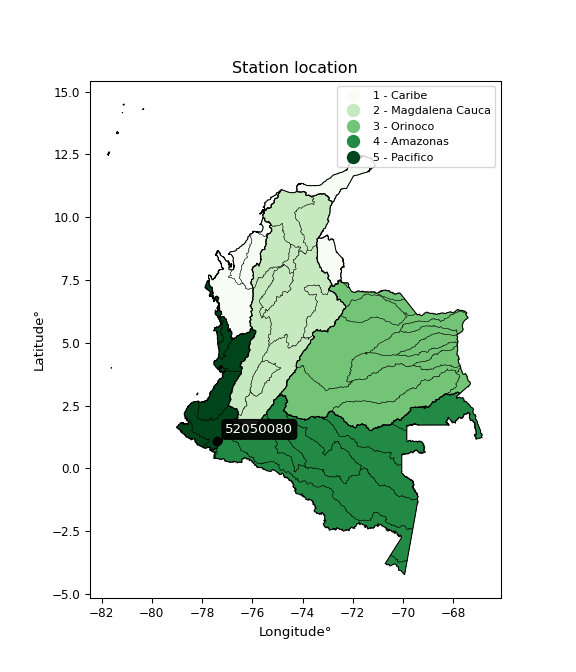

<div align="center">


</div>

# PMP Station (Rain, Pmax24h): 52050080

Probable Maximum Precipitation (PMP) is the greatest amount of rainfall for a specific duration that is meteorologically possible for a given location, acting as a "worst-case" scenario for extreme storms, crucial for designing safety-critical infrastructure like bridges, river deviations, dams, spillways, and nuclear plants to prevent catastrophic failure. PMP is calculated by hydrologists using meteorological data to determine the upper limit of extreme rainfall, often leading to the Probable Maximum Flood (PMF) for flood control design, and is increasingly being studied for climate change impacts. Probable Maximum Precipitation (PMP) is the theoretical upper limit of rainfall, a deterministic estimate for extreme events, while probability distributions (like GEV, Gumbel) describe the likelihood and frequency of various precipitation amounts, including rare ones, showing how often events occur, with PMP representing the extreme end of these distributions, used for critical infrastructure design to ensure safety against the worst conceivable weather, unlike standard statistical forecasts which cover typical probabilities.

The most common probability distributions in hydrology, used for analyzing floods, rainfall, and streamflow, include the Normal, Log-Normal, Gumbel, Gamma (including Log-Pearson Type III), and Generalized Extreme Value (GEV) distributions, often chosen based on the data´s skewness and whether modeling extremes or general conditions, with Gumbel and GEV popular for extreme events like floods, while the Normal distribution serves as a baseline, though often requiring transformations for skewed hydrological data. These distributions help in designing water infrastructure, managing water resources, and forecasting hydrologic events.

> Hydrological data often isn´t perfectly normal (it´s skewed), so different distributions are needed for different applications, such as: **Flood Frequency Analysis**: Using Gumbel, GEV, or Log-Pearson Type III for predicting extreme flood magnitudes and their return periods, **Rainfall Analysis**: Normal for annual totals, but Log-Normal, Weibull, or GEV for intensity or extreme daily rainfall, **Streamflow Modeling**: Gamma and Log-Normal for maximum flows, GEV for minimum flows, and Kappa for daily flows.

<div align="center">

</img>

</div>


## A. General information


### 1. General running parameters

• app_version: _v20260113_. • runtime: _2026-01-13 16:28:34.738620_. • Python version: _3.14.0_. • SciPy version: _1.16.3_. • Pandas version: _2.3.3_. • NumPy version: _2.3.5_. • Stations dataset (station_dataset_file): _dataset/pmax24h_in/automatic_colombia_2003_2025.csv_. • Stations catalog (station_catalog_file): _dataset/CNE.xls_. • Minimum year to eval til year_max (date_min): _1900_. • Maximum year to eval since year_min (date_max): _2025_. • Creates, save and include plots into reports (create_plot): _False_. • Plot only fit distributions with Δo > Δ (plot_only_fit): _True_. • Plot only simple graphs avoiding multiple CDFs and multiple Extreme values plots (plot_only_simple): _True_. • Eval low extreme values, if False, evaluates high extreme values (low_extreme): _False_. • Eval every SciPy distribution as logarithmic (pdist_logarithmic_on): _True_. • Standard deviation normalized (ddof): _1.0_. • Return periods to eval in years (Tr): _[2, 2.33, 5, 10, 15, 20, 25, 50, 75, 100, 200, 250, 500, 750, 1000]_. • Minimum data sample per station, 0 means any (minimum_sample): _5_. • Z-Score maximum threshold to adjust a value, 0 means disable (zscore_max): _3.5_. • Z-Score minimum threshold to adjust a value, 0 means disable (zscore_min): _-2.5_. • Avoid zeros, e.g. rain = 0 (avoid_zeros): _True_. • Avoid null values (avoid_nans): _True_. 

:file_folder:Table: [dataset.csv](../../dataset/pmax24h_in/automatic_colombia_2003_2025.csv)

> Delta Degrees of Freedom (DDOF): is a parameter used in the formulas for calculating variance and standard deviation. When ddof=0, the divisor is $N$ (the total number of observations) and this is used when your data set is the entire population. When ddof=1, the divisor is $N-1$ and this is used when your data set is a sample drawn from a larger population. Using $N-1$ provides an unbiased estimate of the population variance (known as Bessel´s correction).


### 2. Station info and location

|   id |   CODIGO | NOMBRE            | CATEGORIA               | TECNOLOGIA                | ESTADO   | FECHA_INSTALACION   |   FECHA_SUSPENSION |   ALTITUD |   LATITUD |   LONGITUD | DEPARTAMENTO   | MUNICIPIO   | AREA_OPERATIVA                      | ENTIDAD                                                     | AREA_HIDROGRAFICA   | ZONA_HIDROGRAFICA   | SUBZONA_HIDROGRAFICA   |   CORRIENTE | Catalogo   |   Version |
|-----:|---------:|:------------------|:------------------------|:--------------------------|:---------|:--------------------|-------------------:|----------:|----------:|-----------:|:---------------|:------------|:------------------------------------|:------------------------------------------------------------|:--------------------|:--------------------|:-----------------------|------------:|:-----------|----------:|
|    0 | 52050080 | TANGUA [52050080] | Climatológica Principal | Automática con Telemetría | Activa   | 15/01/1957          |                nan |      2420 |   1.09417 |    -77.392 | Nariño         | Tangua      | Area Operativa 07 - Nariño-Putumayo | INSTITUTO DE HIDROLOGIA METEOROLOGIA Y ESTUDIOS AMBIENTALES | Pacifico            | Patía               | Río Guáitara           |         nan | CNE_IDEAM  |  20251226 |

<div align="center">

Dynamic map: [:earth_americas:Google](http://maps.google.com/maps?q=1.094166667,-77.39197222) [:earth_americas:OSM](https://www.openstreetmap.org/#map=18/1.094166667/-77.39197222&layers=P) [:earth_americas:Bing](https://www.bing.com/maps?cp=1.094166667~-77.39197222&lvl=18) [:earth_americas:Apple](https://maps.apple.com/frame?center=1.094166667%2C-77.39197222&span=0.003%2C0.006)

</div>


<div align="center">

```geojson
{
  "type": "Feature",
  "geometry": {
    "type": "Point", 
    "coordinates": [-77.39197222, 1.094166667]
  }, 
  "properties": {
    "Name": "52050080"
  }
}
```

</div>


### 3. Discrete values table and plot

<div align="center">

|               |          0 |           1 |            2 |           3 |             4 |          5 |
|:--------------|-----------:|------------:|-------------:|------------:|--------------:|-----------:|
| Date          | 2020       | 2021        | 2022         | 2023        | 2024          | 2025       |
| Value         |    0.2     |   38.4      |   46.7       |   35.9      |   44          |   97.2     |
| Value_initial |    0.2     |   38.4      |   46.7       |   35.9      |   44          |   97.2     |
| count         |    6       |    6        |    6         |    6        |    6          |    6       |
| mean          |   43.7333  |   43.7333   |   43.7333    |   43.7333   |   43.7333     |   43.7333  |
| std           |   31.1529  |   31.1529   |   31.1529    |   31.1529   |   31.1529     |   31.1529  |
| zscore        |   -1.39741 |   -0.171199 |    0.0952293 |   -0.251448 |    0.00855993 |    1.71627 |


</div>


> The initial value (value_initial) correspond to the initial obtained or null completed value, and value (value) is adjusted only when the initial value is outside the valid range (outlier) definite through the Z-Score value. If Z-Score is active, values out of range or outliers are replaced with the station mean value. A Z-Score (or standard score) measures how many standard deviations a data point is from the mean of a dataset, indicating its relative position; positive scores mean above the mean, negative mean below, and a score of zero is exactly at the mean, allowing for comparison of values from different distributions. It´s calculated using the formula $z=(x–μ)/σ$, where $x$ is the data point, $μ$ is the mean, and $σ$ is the standard deviation, helping identify outliers and understand probability.
>
> <sub>**Note**: In this study, "completing" (filling gaps in) and "extending" (forecasting or lengthening the historical record) rainfall data series are avoided for certain critical analyses because they introduce artificial bias and uncertainty, which can distort the statistics of rare events (extremes), alter day-to-day variability, and compromise the integrity and homogeneity of the original data. Some reasons against Completing/Extending rainfall data are: **Distortion of Extremes and Variability**: The primary issue is that most gap-filling or extension methods rely on averaging or regression with nearby stations, which inherently smooths the data. Rainfall is highly variable in space and time, with a large percentage of zero values and occasional large storms. Infilling methods often underestimate the highest values and overestimate the lowest (zero) values, which severely distorts analyses focused on flood frequency, drought severity, and intensity-duration-frequency (IDF) curves, **Loss of Data Homogeneity**: Infilled or extended data are synthetic estimates, not actual measurements. Combining these estimates with observed data can violate the assumption of data homogeneity, which requires that the data properties do not change over time. Inhomogeneity can lead to incorrect conclusions about long-term trends or changes in climate patterns, **Propagation of Errors**: Errors and biases from the original data (e.g., wind-induced undercatch, instrument errors, site changes) or the data used for imputation can propagate through the analysis, leading to unreliable hydrological models and inaccurate predictions, **Compromised Statistical Integrity**: For statistical analyses, especially those involving the frequency of events, using artificial data can introduce time bias or autocorrelation that doesn´t exist in reality, making it difficult to assess the true probability of events, **Difficulty in Validation**: It is difficult to accurately validate the quality of filled or extended data, especially for past periods where ground-truth measurements are unavailable. The reliability of imputation techniques heavily depends on the density of the surrounding station network and the complexity of the local topography.</sub>


### 4. Active continuous probability distributions from SciPy (45 of 104 available)

A Probability Density Function (PDF) describes the relative likelihood of a continuous random variable falling within a specific range, where the total area under its curve equals 1, and the area over any interval gives the actual probability for that range. Unlike discrete probabilities (like rolling a die), a PDF shows density, not direct probability for a single point (which is zero), with higher points indicating higher likelihood, often visualized as a bell curve for normal distributions.

A log of a probability density function (log-PDF) is simply the logarithm of the PDF´s value, denoted as $log(f(x))$, useful for converting multiplication of probabilities into addition, improving numerical stability with tiny numbers, and connecting to information theory concepts like entropy. Instead of dealing with very small probabilities (e.g., 0.000001), log-PDFs use negative numbers (e.g., $log(0.00001) ≈ -11.51$ that are easier for computers to handle, preventing underflow errors and simplifying complex calculations. In this study, each active probability distribution from SciPy is also evaluated in the $log$ form.

[scipy.stats](https://docs.scipy.org/doc/scipy/reference/stats.html) is a Python´s powerful submodule within the SciPy library for comprehensive statistical analysis, offering over 130 probability distributions (like Normal, Poisson), functions for descriptive stats (mean, variance), hypothesis testing (t-tests, chi-square), random variable generation, and statistical tests, making it essential for data science, modeling, and research. It provides tools to explore, model, and draw conclusions from data efficiently, working seamlessly with NumPy.

<div align="center">

|   id | p_dist             |   n_parameter | fit_method   | label                                                                       | active   | ref                                                                                                        |
|-----:|:-------------------|--------------:|:-------------|:----------------------------------------------------------------------------|:---------|:-----------------------------------------------------------------------------------------------------------|
|    0 | alpha              |             3 | MLE          | Alpha                                                                       | True     | [:mortar_board:](https://docs.scipy.org/doc/scipy/reference/generated/scipy.stats.alpha.html)              |
|    1 | betaprime          |             4 | MLE          | Beta prime                                                                  | True     | [:mortar_board:](https://docs.scipy.org/doc/scipy/reference/generated/scipy.stats.betaprime.html)          |
|    2 | chi2               |             3 | MLE          | Chi²                                                                        | True     | [:mortar_board:](https://docs.scipy.org/doc/scipy/reference/generated/scipy.stats.chi2.html)               |
|    3 | crystalball        |             4 | MLE          | Crystalball                                                                 | True     | [:mortar_board:](https://docs.scipy.org/doc/scipy/reference/generated/scipy.stats.crystalball.html)        |
|    4 | dweibull           |             3 | MLE          | Double Weibull                                                              | True     | [:mortar_board:](https://docs.scipy.org/doc/scipy/reference/generated/scipy.stats.dweibull.html)           |
|    5 | erlang             |             3 | MLE          | Erlang                                                                      | True     | [:mortar_board:](https://docs.scipy.org/doc/scipy/reference/generated/scipy.stats.erlang.html)             |
|    6 | expon              |             2 | MLE          | Exponential                                                                 | True     | [:mortar_board:](https://docs.scipy.org/doc/scipy/reference/generated/scipy.stats.expon.html)              |
|    7 | exponnorm          |             3 | MLE          | Exponentially modified Normal                                               | True     | [:mortar_board:](https://docs.scipy.org/doc/scipy/reference/generated/scipy.stats.exponnorm.html)          |
|    8 | f                  |             4 | MLE          | F                                                                           | True     | [:mortar_board:](https://docs.scipy.org/doc/scipy/reference/generated/scipy.stats.f.html)                  |
|    9 | fatiguelife        |             3 | MLE          | Fatigue-life (Birnbaum-Saunders)                                            | True     | [:mortar_board:](https://docs.scipy.org/doc/scipy/reference/generated/scipy.stats.fatiguelife.html)        |
|   10 | fisk               |             3 | MLE          | Fisk                                                                        | True     | [:mortar_board:](https://docs.scipy.org/doc/scipy/reference/generated/scipy.stats.fisk.html)               |
|   11 | gamma              |             3 | MLE          | Gamma                                                                       | True     | [:mortar_board:](https://docs.scipy.org/doc/scipy/reference/generated/scipy.stats.gamma.html)              |
|   12 | genexpon           |             5 | MLE          | Generalized exponential                                                     | True     | [:mortar_board:](https://docs.scipy.org/doc/scipy/reference/generated/scipy.stats.genexpon.html)           |
|   13 | genlogistic        |             3 | MLE          | Generalized logistic                                                        | True     | [:mortar_board:](https://docs.scipy.org/doc/scipy/reference/generated/scipy.stats.genlogistic.html)        |
|   14 | gibrat             |             2 | MM           | Gibrat                                                                      | True     | [:mortar_board:](https://docs.scipy.org/doc/scipy/reference/generated/scipy.stats.gibrat.html)             |
|   15 | gompertz           |             3 | MLE          | Gompertz (or truncated Gumbel)                                              | True     | [:mortar_board:](https://docs.scipy.org/doc/scipy/reference/generated/scipy.stats.gompertz.html)           |
|   16 | gumbel_l           |             2 | MM           | Gumbel Left Skew                                                            | True     | [:mortar_board:](https://docs.scipy.org/doc/scipy/reference/generated/scipy.stats.gumbel_l.html)           |
|   17 | gumbel_r           |             2 | MM           | Gumbel Right Skew                                                           | True     | [:mortar_board:](https://docs.scipy.org/doc/scipy/reference/generated/scipy.stats.gumbel_r.html)           |
|   18 | halflogistic       |             2 | MM           | Half-logistic                                                               | True     | [:mortar_board:](https://docs.scipy.org/doc/scipy/reference/generated/scipy.stats.halflogistic.html)       |
|   19 | halfnorm           |             2 | MM           | Half Normal                                                                 | True     | [:mortar_board:](https://docs.scipy.org/doc/scipy/reference/generated/scipy.stats.halfnorm.html)           |
|   20 | hypsecant          |             2 | MM           | hyperbolic secant                                                           | True     | [:mortar_board:](https://docs.scipy.org/doc/scipy/reference/generated/scipy.stats.hypsecant.html)          |
|   21 | invgamma           |             3 | MLE          | Inverted gamma                                                              | True     | [:mortar_board:](https://docs.scipy.org/doc/scipy/reference/generated/scipy.stats.invgamma.html)           |
|   22 | invgauss           |             3 | MLE          | Inverse Gaussian                                                            | True     | [:mortar_board:](https://docs.scipy.org/doc/scipy/reference/generated/scipy.stats.invgauss.html)           |
|   23 | invweibull         |             3 | MLE          | Inverted Weibull                                                            | True     | [:mortar_board:](https://docs.scipy.org/doc/scipy/reference/generated/scipy.stats.invweibull.html)         |
|   24 | kappa4             |             4 | MLE          | Kappa 4                                                                     | True     | [:mortar_board:](https://docs.scipy.org/doc/scipy/reference/generated/scipy.stats.kappa4.html)             |
|   25 | kstwobign          |             2 | MLE          | Limiting distribution of scaled Kolmogorov-Smirnov two-sided test statistic | True     | [:mortar_board:](https://docs.scipy.org/doc/scipy/reference/generated/scipy.stats.kstwobign.html)          |
|   26 | laplace            |             2 | MM           | Laplace                                                                     | True     | [:mortar_board:](https://docs.scipy.org/doc/scipy/reference/generated/scipy.stats.laplace.html)            |
|   27 | laplace_asymmetric |             3 | MLE          | Asymmetric Laplace                                                          | True     | [:mortar_board:](https://docs.scipy.org/doc/scipy/reference/generated/scipy.stats.laplace_asymmetric.html) |
|   28 | loggamma           |             3 | MLE          | Log gamma                                                                   | True     | [:mortar_board:](https://docs.scipy.org/doc/scipy/reference/generated/scipy.stats.loggamma.html)           |
|   29 | logistic           |             2 | MM           | Logistic (or Sech-squared)                                                  | True     | [:mortar_board:](https://docs.scipy.org/doc/scipy/reference/generated/scipy.stats.logistic.html)           |
|   30 | lognorm            |             3 | MLE          | Log Normal                                                                  | True     | [:mortar_board:](https://docs.scipy.org/doc/scipy/reference/generated/scipy.stats.lognorm.html)            |
|   31 | maxwell            |             2 | MM           | Maxwell                                                                     | True     | [:mortar_board:](https://docs.scipy.org/doc/scipy/reference/generated/scipy.stats.maxwell.html)            |
|   32 | mielke             |             4 | MLE          | Mielke Beta-Kappa / Dagum                                                   | True     | [:mortar_board:](https://docs.scipy.org/doc/scipy/reference/generated/scipy.stats.mielke.html)             |
|   33 | moyal              |             2 | MM           | Moyal                                                                       | True     | [:mortar_board:](https://docs.scipy.org/doc/scipy/reference/generated/scipy.stats.moyal.html)              |
|   34 | nakagami           |             3 | MLE          | Nakagami                                                                    | True     | [:mortar_board:](https://docs.scipy.org/doc/scipy/reference/generated/scipy.stats.nakagami.html)           |
|   35 | ncf                |             5 | MLE          | Non-central F distribution                                                  | True     | [:mortar_board:](https://docs.scipy.org/doc/scipy/reference/generated/scipy.stats.ncf.html)                |
|   36 | nct                |             4 | MLE          | Non-central Student’s t                                                     | True     | [:mortar_board:](https://docs.scipy.org/doc/scipy/reference/generated/scipy.stats.nct.html)                |
|   37 | norm               |             2 | MM           | Normal                                                                      | True     | [:mortar_board:](https://docs.scipy.org/doc/scipy/reference/generated/scipy.stats.norm.html)               |
|   38 | pearson3           |             3 | MM           | Pearson type III                                                            | True     | [:mortar_board:](https://docs.scipy.org/doc/scipy/reference/generated/scipy.stats.pearson3.html)           |
|   39 | rayleigh           |             2 | MM           | Rayleigh                                                                    | True     | [:mortar_board:](https://docs.scipy.org/doc/scipy/reference/generated/scipy.stats.rayleigh.html)           |
|   40 | rice               |             3 | MLE          | Rice                                                                        | True     | [:mortar_board:](https://docs.scipy.org/doc/scipy/reference/generated/scipy.stats.rice.html)               |
|   41 | t                  |             3 | MLE          | Student’s t                                                                 | True     | [:mortar_board:](https://docs.scipy.org/doc/scipy/reference/generated/scipy.stats.t.html)                  |
|   42 | truncnorm          |             4 | MLE          | Truncated normal                                                            | True     | [:mortar_board:](https://docs.scipy.org/doc/scipy/reference/generated/scipy.stats.truncnorm.html)          |
|   43 | wald               |             2 | MM           | Wald                                                                        | True     | [:mortar_board:](https://docs.scipy.org/doc/scipy/reference/generated/scipy.stats.wald.html)               |
|   44 | weibull_min        |             3 | MLE          | Weibull minimum                                                             | True     | [:mortar_board:](https://docs.scipy.org/doc/scipy/reference/generated/scipy.stats.weibull_min.html)        |

</div>

> **n_parameter:** # arguments & localization & scale.
>
> **Fit methods:** (MLE) maximum likelihood, (MM) L-moments.
>
>**Inactive** (With the only purpose of prevent loops, zero divisions, infinite values, over high estimated values or horizontal trending for recurrence intervals estimations, the follow distributions were disabled.)**:** foldnorm, gennorm, norminvgauss, powernorm, powerlognorm, skewnorm, genextreme, anglit, arcsine, argus, beta, bradford, burr, burr12, cauchy, cosine, halfcauchy, foldcauchy, skewcauchy, wrapcauchy, dgamma, gengamma, exponweib, exponpow, truncexpon, gausshyper, genhalflogistic, genhyperbolic, geninvgauss, halfgennorm, johnsonsb, johnsonsu, kappa3, ksone, kstwo, loglaplace, levy, levy_l, levy_stable, ncx2, pareto, genpareto, truncpareto, lomax, powerlaw, rdist, rel_breitwigner, recipinvgauss, semicircular, studentized_range, trapezoid, triang, truncweibull_min, tukeylambda, uniform, loguniform, vonmises, vonmises_line, weibull_max, 


## B. Probability (PDF) vs. Empirical (EDF) distributions functions

A continuous probability distribution (CPD) describes probabilities for variables that can take any value within a range (like rain any time), unlike discrete variables with specific outcomes (like temperature). It uses a Probability Density Function (PDF), a curve where the total area under it equals 1, and the probability of the variable falling within an interval (a to b) is found by calculating the area under the curve between those points. A key feature is that the probability of hitting any single exact value is zero, so probabilities are always expressed for ranges, e.g., $P(a ≤ X ≤ b)$.

<div align="center">

Distributions parameters from station values
|    |   station | p_dist                |   n |            loc |           scale | shape                 | shape1                | shape2                | shape3   |
|---:|----------:|:----------------------|----:|---------------:|----------------:|:----------------------|:----------------------|:----------------------|:---------|
|  0 |  52050080 | alpha                 |   6 |     0.00531448 |     0.47644     | 3.62618810883597e-08  |                       |                       |          |
|  1 |  52050080 | betaprime             |   6 |   -58.2453     | 13587           | 12.889364115488874    | 1718.2986014765534    |                       |          |
|  2 |  52050080 | chi2                  |   6 |   -57.4112     |     4.02134     | 25.15193318317924     |                       |                       |          |
|  3 |  52050080 | crystalball           |   6 |    43.7333     |    28.4386      | 3496.3657080657945    | 2703.996689484936     |                       |          |
|  4 |  52050080 | dweibull              |   6 |    44          |    18.3011      | 0.6989125013189257    |                       |                       |          |
|  5 |  52050080 | erlang                |   6 |   -57.4112     |     8.04269     | 12.575962449093993    |                       |                       |          |
|  6 |  52050080 | expon                 |   6 |     0.2        |    43.5333      |                       |                       |                       |          |
|  7 |  52050080 | exponnorm             |   6 |    21.2876     |    18.4335      | 1.2176569643109971    |                       |                       |          |
|  8 |  52050080 | f                     |   6 |     0.2        |    44.7051      | 1.3103068401076539    | 39.83486945925306     |                       |          |
|  9 |  52050080 | fatiguelife           |   6 |  -109.163      |   150.309       | 0.18554568487102185   |                       |                       |          |
| 10 |  52050080 | fisk                  |   6 |  -108.527      |   149.704       | 9.954100367624072     |                       |                       |          |
| 11 |  52050080 | gamma                 |   6 |   -57.4112     |     8.04268     | 12.575982652616943    |                       |                       |          |
| 12 |  52050080 | genexpon              |   6 |     0.199908   |     1.92336     | 0.04417523053311547   | 3.375183866079411e-08 | 2.8764557572328346    |          |
| 13 |  52050080 | genlogistic           |   6 |    27.2139     |    18.2029      | 1.8437396046399557    |                       |                       |          |
| 14 |  52050080 | gibrat                |   6 |    22.0383     |    13.1587      |                       |                       |                       |          |
| 15 |  52050080 | gompertz              |   6 |     0.158799   |    55.0862      | 0.6485013907384807    |                       |                       |          |
| 16 |  52050080 | gumbel_l              |   6 |    56.5322     |    22.1735      |                       |                       |                       |          |
| 17 |  52050080 | gumbel_r              |   6 |    30.9345     |    22.1735      |                       |                       |                       |          |
| 18 |  52050080 | halflogistic          |   6 |    10.027      |    24.314       |                       |                       |                       |          |
| 19 |  52050080 | halfnorm              |   6 |     6.09181    |    47.1767      |                       |                       |                       |          |
| 20 |  52050080 | hypsecant             |   6 |    43.7333     |    18.1046      |                       |                       |                       |          |
| 21 |  52050080 | invgamma              |   6 |  -150.377      |  9084.93        | 47.81488619900456     |                       |                       |          |
| 22 |  52050080 | invgauss              |   6 |   -96.3726     |  3353.25        | 0.04169217545526337   |                       |                       |          |
| 23 |  52050080 | invweibull            |   6 |     0.2        |     3.36207     | 0.06354904956298082   |                       |                       |          |
| 24 |  52050080 | kappa4                |   6 |    -9.34804    |   108.871       | 1.096136930691827     | 1.001276707605276     |                       |          |
| 25 |  52050080 | kstwobign             |   6 |   -59.4228     |   118.576       |                       |                       |                       |          |
| 26 |  52050080 | laplace               |   6 |    43.7333     |    20.1091      |                       |                       |                       |          |
| 27 |  52050080 | laplace_asymmetric    |   6 |    38.4        |    18.3242      | 0.8649984100827524    |                       |                       |          |
| 28 |  52050080 | loggamma              |   6 | -8550.38       |  1163.35        | 1615.858514479477     |                       |                       |          |
| 29 |  52050080 | logistic              |   6 |    43.7333     |    15.679       |                       |                       |                       |          |
| 30 |  52050080 | lognorm               |   6 |     0.2        |     0.0442212   | 15.657932651203565    |                       |                       |          |
| 31 |  52050080 | maxwell               |   6 |   -23.6541     |    42.2288      |                       |                       |                       |          |
| 32 |  52050080 | mielke                |   6 |     0.2        |    85.834       | 0.5249666505016628    | 5.726922121906715     |                       |          |
| 33 |  52050080 | moyal                 |   6 |    27.4703     |    12.8019      |                       |                       |                       |          |
| 34 |  52050080 | nakagami              |   6 |     0.2        |    51.0164      | 0.20951026584721158   |                       |                       |          |
| 35 |  52050080 | ncf                   |   6 |     0.2        |     6.74032     | 0.88699455555449      | 50.97271667681893     | 2.615147414542289     |          |
| 36 |  52050080 | nct                   |   6 |    -0.00712568 |     0.0092703   | 0.21954898960176006   | 54.73606267982464     |                       |          |
| 37 |  52050080 | norm                  |   6 |    43.7333     |    28.4386      |                       |                       |                       |          |
| 38 |  52050080 | pearson3              |   6 |    43.7334     |    28.4385      | 0.5053441690332912    |                       |                       |          |
| 39 |  52050080 | rayleigh              |   6 |   -10.6713     |    43.4086      |                       |                       |                       |          |
| 40 |  52050080 | rice                  |   6 |   -12.4464     |    36.33        | 1.00201100002618      |                       |                       |          |
| 41 |  52050080 | t                     |   6 |    43.7315     |    28.435       | 8086.530137838428     |                       |                       |          |
| 42 |  52050080 | truncnorm             |   6 |    33.3859     |    34.6817      | -0.9568853356850271   | 4988.570088367089     |                       |          |
| 43 |  52050080 | wald                  |   6 |    15.2948     |    28.4386      |                       |                       |                       |          |
| 44 |  52050080 | weibull_min           |   6 |   -11.4938     |    62.156       | 2.0058900396191346    |                       |                       |          |
| 45 |  52050080 | logalpha              |   6 |   -89.368      |  3898.92        | 42.25074463937872     |                       |                       |          |
| 46 |  52050080 | logbetaprime          |   6 |    -1.60944    |     1.76631     | 0.43949291514519173   | 0.1361388218533145    |                       |          |
| 47 |  52050080 | logchi2               |   6 |    -1.60944    |     1.1971      | 1.0440385499766363    |                       |                       |          |
| 48 |  52050080 | logcrystalball        |   6 |     2.97068    |     2.07413     | 1520.4891300085656    | 119.24785754801022    |                       |          |
| 49 |  52050080 | logdweibull           |   6 |     3.64806    |     1.64054     | 0.6488514228443178    |                       |                       |          |
| 50 |  52050080 | logerlang             |   6 |    -1.60944    |     3.42298     | 0.15966801533701275   |                       |                       |          |
| 51 |  52050080 | logexpon              |   6 |    -1.60944    |     4.58011     |                       |                       |                       |          |
| 52 |  52050080 | logexponnorm          |   6 |     2.96898    |     2.07414     | 0.0008137797241028835 |                       |                       |          |
| 53 |  52050080 | logf                  |   6 |    -1.60944    |     1.14873     | 1.017531159875237     | 1.1325682631845837    |                       |          |
| 54 |  52050080 | logfatiguelife        |   6 | -1233.8        |  1236.76        | 0.0016746875001223693 |                       |                       |          |
| 55 |  52050080 | logfisk               |   6 |    -1.60944    |     1.55619     | 0.5605245741091093    |                       |                       |          |
| 56 |  52050080 | loggamma              |   6 |    -1.60944    |    14.8037      | 0.14057980209372384   |                       |                       |          |
| 57 |  52050080 | loggenexpon           |   6 |    -1.74553    |     0.122811    | 0.007542672156958811  | 9.005487914680359     | 8.983392597300703e-05 |          |
| 58 |  52050080 | loggenlogistic        |   6 |     4.5768     |     1.11848e-06 | 6.989417462822744e-07 |                       |                       |          |
| 59 |  52050080 | loggibrat             |   6 |     1.38835    |     0.959725    |                       |                       |                       |          |
| 60 |  52050080 | loggompertz           |   6 |    -1.60944    |     2.54444e+13 | 10119220245559.871    |                       |                       |          |
| 61 |  52050080 | loggumbel_l           |   6 |     3.90415    |     1.61719     |                       |                       |                       |          |
| 62 |  52050080 | loggumbel_r           |   6 |     2.03721    |     1.61719     |                       |                       |                       |          |
| 63 |  52050080 | loghalflogistic       |   6 |     0.512317   |     1.77333     |                       |                       |                       |          |
| 64 |  52050080 | loghalfnorm           |   6 |     0.225325   |     3.44079     |                       |                       |                       |          |
| 65 |  52050080 | loghypsecant          |   6 |     2.97068    |     1.32043     |                       |                       |                       |          |
| 66 |  52050080 | loginvgamma           |   6 |   -47.2309     | 26412.8         | 527.6713019281237     |                       |                       |          |
| 67 |  52050080 | loginvgauss           |   6 |   -20.0058     |  2228.54        | 0.01031462825515378   |                       |                       |          |
| 68 |  52050080 | loginvweibull         |   6 |    -4.6507e+08 |     4.6507e+08  | 181724244.09658152    |                       |                       |          |
| 69 |  52050080 | logkappa4             |   6 |    -2.02772    |     7.29565     | 1.0610137326242666    | 1.1024803781876455    |                       |          |
| 70 |  52050080 | logkstwobign          |   6 |    -7.33423    |    11.7694      |                       |                       |                       |          |
| 71 |  52050080 | loglaplace            |   6 |     2.97068    |     1.46663     |                       |                       |                       |          |
| 72 |  52050080 | loglaplace_asymmetric |   6 |     3.84374    |     0.796065    | 1.6886091232921696    |                       |                       |          |
| 73 |  52050080 | logloggamma           |   6 |     4.57743    |     5.87995e-05 | 3.682590905430724e-05 |                       |                       |          |
| 74 |  52050080 | loglogistic           |   6 |     2.97068    |     1.14353     |                       |                       |                       |          |
| 75 |  52050080 | loglognorm            |   6 | -1114.52       |  1117.51        | 0.0018512334595587277 |                       |                       |          |
| 76 |  52050080 | logmaxwell            |   6 |    -1.94414    |     3.0799      |                       |                       |                       |          |
| 77 |  52050080 | logmielke             |   6 |    -1.60944    |     1.88335     | 0.1578600348119939    | 1.0107537570737266    |                       |          |
| 78 |  52050080 | logmoyal              |   6 |     1.78456    |     0.933686    |                       |                       |                       |          |
| 79 |  52050080 | lognakagami           |   6 | -2509.16       |  2512.14        | 365070.5101403177     |                       |                       |          |
| 80 |  52050080 | logncf                |   6 |    -1.60944    |     1.07686     | 1.0564045612830855    | 1.1169140942455593    | 1.0696897768129463    |          |
| 81 |  52050080 | lognct                |   6 |  -107.571      |     2.03688     | 33750.870673104175    | 54.2690726536196      |                       |          |
| 82 |  52050080 | lognorm               |   6 |     2.97068    |     2.07413     |                       |                       |                       |          |
| 83 |  52050080 | logpearson3           |   6 |     2.97066    |     2.07414     | -1.6846215564881057   |                       |                       |          |
| 84 |  52050080 | lograyleigh           |   6 |    -0.99721    |     3.16592     |                       |                       |                       |          |
| 85 |  52050080 | logrice               |   6 |    -2.4914     |     4.13123     | 0.012103159857543705  |                       |                       |          |
| 86 |  52050080 | logt                  |   6 |     3.73857    |     0.139246    | 0.6357427253394662    |                       |                       |          |
| 87 |  52050080 | logtruncnorm          |   6 |     2.81495    |     7.31138     | -0.6051437058778241   | 0.2409702293964321    |                       |          |
| 88 |  52050080 | logwald               |   6 |     0.896529   |     2.07414     |                       |                       |                       |          |
| 89 |  52050080 | logweibull_min        |   6 |    -1.60944    |     1.71363     | 0.15932899270601136   |                       |                       |          |

</div>

> **loc** (Location parameter): This shifts the distribution along the x-axis. For many common distributions, like the normal (Gaussian) distribution, loc represents the mean $μ$. For others, like the uniform distribution, it might represent the minimum value, or for the beta distribution, the left end of the support interval.
>
> **scale** (Scale parameter): This determines the width or spread of the distribution. For the normal distribution, scale represents the standard deviation $σ$. For a uniform distribution, it defines the length of the interval (from $loc$ to $loc + scale$).
>
> **shape** (Shape parameters): Refers to parameters that define the specific form of a probability distribution, distinct from its location (loc) and scale (scale). These parameters are required arguments for most distribution functions. For example, a normal (Gaussian) distribution is fully defined by its location (mean) and scale (standard deviation), so it has no specific shape parameters beyond loc and scale. However, other distributions have intrinsic properties that need specification, as Gamma distribution that takes a shape parameter, often named $a$ or $alpha$.


### 0. Cumulative distribution values - CDF (90 evaluated)

Cumulative Distribution Function (CDF), denoted as $F$<sub>$X$</sub>$(x)$, is a function that gives the probability that a random variable $X$ will take a value less than or equal to a specific value, $x$ (i.e., $(P(X≥x)$. It essentially "accumulates" probabilities from a given point up to the far right (positive infinity), providing a complete picture of the distribution´s probabilities for both discrete (like rain) and continuous (like temperature) variables, helping to find probabilities over ranges or above certain values. Each station is evaluated separately ordering the $x$ values ascending, calculating the CDF and PDF values for the activated distributions and their logarithmic forms.

<div align="center">

CDF ordered by x ascending and calculating $log(f(x))$ separately
|   id |   Station |   date |    x |   count |    mean |     std |      zscore |   Value_initial |   station |   m |    alpha |   alpha_pdf |   betaprime |   betaprime_pdf |      chi2 |   chi2_pdf |   crystalball |   crystalball_pdf |   dweibull |   dweibull_pdf |    erlang |   erlang_pdf |    expon |   expon_pdf |   exponnorm |   exponnorm_pdf |           f |         f_pdf |   fatiguelife |   fatiguelife_pdf |      fisk |   fisk_pdf |     gamma |   gamma_pdf |    genexpon |   genexpon_pdf |   genlogistic |   genlogistic_pdf |   gibrat |   gibrat_pdf |    gompertz |   gompertz_pdf |   gumbel_l |   gumbel_l_pdf |   gumbel_r |   gumbel_r_pdf |   halflogistic |   halflogistic_pdf |   halfnorm |   halfnorm_pdf |   hypsecant |   hypsecant_pdf |   invgamma |   invgamma_pdf |   invgauss |   invgauss_pdf |   invweibull |   invweibull_pdf |      kappa4 |   kappa4_pdf |   kstwobign |   kstwobign_pdf |   laplace |   laplace_pdf |   laplace_asymmetric |   laplace_asymmetric_pdf |   loggamma |   loggamma_pdf |   logistic |   logistic_pdf |   lognorm |   lognorm_pdf |   maxwell |   maxwell_pdf |      mielke |   mielke_pdf |      moyal |   moyal_pdf |    nakagami |   nakagami_pdf |         ncf |     ncf_pdf |       nct |     nct_pdf |      norm |   norm_pdf |   pearson3 |   pearson3_pdf |   rayleigh |   rayleigh_pdf |     rice |   rice_pdf |         t |      t_pdf |   truncnorm |   truncnorm_pdf |     wald |   wald_pdf |   weibull_min |   weibull_min_pdf |   logalpha |   logalpha_pdf |   logbetaprime |   logbetaprime_pdf |     logchi2 |   logchi2_pdf |   logcrystalball |   logcrystalball_pdf |   logdweibull |   logdweibull_pdf |   logerlang |   logerlang_pdf |   logexpon |   logexpon_pdf |   logexponnorm |   logexponnorm_pdf |        logf |    logf_pdf |   logfatiguelife |   logfatiguelife_pdf |     logfisk |   logfisk_pdf |   loggenexpon |   loggenexpon_pdf |   loggenlogistic |   loggenlogistic_pdf |   loggibrat |   loggibrat_pdf |   loggompertz |   loggompertz_pdf |   loggumbel_l |   loggumbel_l_pdf |   loggumbel_r |   loggumbel_r_pdf |   loghalflogistic |   loghalflogistic_pdf |   loghalfnorm |   loghalfnorm_pdf |   loghypsecant |   loghypsecant_pdf |   loginvgamma |   loginvgamma_pdf |   loginvgauss |   loginvgauss_pdf |   loginvweibull |   loginvweibull_pdf |   logkappa4 |   logkappa4_pdf |   logkstwobign |   logkstwobign_pdf |   loglaplace |   loglaplace_pdf |   loglaplace_asymmetric |   loglaplace_asymmetric_pdf |   logloggamma |   logloggamma_pdf |   loglogistic |   loglogistic_pdf |   loglognorm |   loglognorm_pdf |   logmaxwell |   logmaxwell_pdf |   logmielke |   logmielke_pdf |    logmoyal |   logmoyal_pdf |   lognakagami |   lognakagami_pdf |     logncf |   logncf_pdf |    lognct |   lognct_pdf |   logpearson3 |   logpearson3_pdf |   lograyleigh |   lograyleigh_pdf |   logrice |   logrice_pdf |      logt |   logt_pdf |   logtruncnorm |   logtruncnorm_pdf |   logwald |   logwald_pdf |   logweibull_min |   logweibull_min_pdf |
|-----:|----------:|-------:|-----:|--------:|--------:|--------:|------------:|----------------:|----------:|----:|---------:|------------:|------------:|----------------:|----------:|-----------:|--------------:|------------------:|-----------:|---------------:|----------:|-------------:|---------:|------------:|------------:|----------------:|------------:|--------------:|--------------:|------------------:|----------:|-----------:|----------:|------------:|------------:|---------------:|--------------:|------------------:|---------:|-------------:|------------:|---------------:|-----------:|---------------:|-----------:|---------------:|---------------:|-------------------:|-----------:|---------------:|------------:|----------------:|-----------:|---------------:|-----------:|---------------:|-------------:|-----------------:|------------:|-------------:|------------:|----------------:|----------:|--------------:|---------------------:|-------------------------:|-----------:|---------------:|-----------:|---------------:|----------:|--------------:|----------:|--------------:|------------:|-------------:|-----------:|------------:|------------:|---------------:|------------:|------------:|----------:|------------:|----------:|-----------:|-----------:|---------------:|-----------:|---------------:|---------:|-----------:|----------:|-----------:|------------:|----------------:|---------:|-----------:|--------------:|------------------:|-----------:|---------------:|---------------:|-------------------:|------------:|--------------:|-----------------:|---------------------:|--------------:|------------------:|------------:|----------------:|-----------:|---------------:|---------------:|-------------------:|------------:|------------:|-----------------:|---------------------:|------------:|--------------:|--------------:|------------------:|-----------------:|---------------------:|------------:|----------------:|--------------:|------------------:|--------------:|------------------:|--------------:|------------------:|------------------:|----------------------:|--------------:|------------------:|---------------:|-------------------:|--------------:|------------------:|--------------:|------------------:|----------------:|--------------------:|------------:|----------------:|---------------:|-------------------:|-------------:|-----------------:|------------------------:|----------------------------:|--------------:|------------------:|--------------:|------------------:|-------------:|-----------------:|-------------:|-----------------:|------------:|----------------:|------------:|---------------:|--------------:|------------------:|-----------:|-------------:|----------:|-------------:|--------------:|------------------:|--------------:|------------------:|----------:|--------------:|----------:|-----------:|---------------:|-------------------:|----------:|--------------:|-----------------:|---------------------:|
|    0 |  52050080 |   2020 |  0.2 |       6 | 43.7333 | 31.1529 | -1.39741    |             0.2 |  52050080 |   1 | 0.014396 | 0.502113    |   0.0421153 |      0.0046081  | 0.0420855 | 0.00461346 |     0.0629113 |        0.00434671 |  0.0793858 |     0.00233119 | 0.0420855 |   0.00461346 | 0        |  0.0229709  |   0.0377917 |      0.00394389 | 6.73217e-11 | 2522.36       |     0.0426062 |        0.00452631 | 0.0397912 | 0.00349799 | 0.0420855 |  0.00461346 | 2.10793e-06 |     0.0229677  |     0.0444697 |        0.00367179 | 0        |    0         | 0.000485104 |     0.0117756  |  0.0757985 |     0.00328547 |  0.0183304 |     0.00330607 |       0        |         0          |   0        |     0          |   0.0573351 |      0.00314979 |   0.0427   |     0.00451286 |  0.0417528 |     0.00462775 |  5.13532e-06 |      1.43203e+11 | 2.78427e-15 |   0.230376   |   0.0378887 |      0.00556619 | 0.0573832 |    0.00285359 |            0.0384389 |               0.0024251  | 0.00460807 |    2.91744e+12 |  0.0586053 |     0.00351877 | 0.0136148 |     0.0167966 | 0.0436004 |    0.00513986 | 1.96428e-10 |  3.71523e+06 | 0.00371844 |  0.00134461 | 1.74941e-08 |    2.64104e+08 | 4.68359e-08 | 3.13128e+06 | 0.0476912 | 0.552948    | 0.0629113 | 0.00434671 |  0.0443443 |     0.00458651 |  0.0308738 |     0.00559127 | 0.036123 | 0.00562617 | 0.0629153 | 0.00434639 | 5.10607e-06 |      0.00876097 | 0        |  0         |     0.0344418 |        0.00580501 |  0.0147402 |       0.018886 |    2.60658e-08 |        5.15921e+07 | 4.81525e-09 |   1.13205e+07 |        0.0136148 |            0.0167966 |     0.0594756 |         0.0156275 |  0.00279808 |     2.01204e+12 |   0        |      0.218335  |      0.0136153 |          0.0167971 | 6.61755e-09 | 1.51626e+07 |        0.0134773 |            0.0167356 | 1.31262e-09 |   3.31355e+06 |    0.00881607 |         0.0681105 |         0        |            0.0130892 |    0        |       0         |   1.10384e-14 |         0.397699  |     0.0325219 |         0.0197795 |   7.23073e-05 |       0.000426307 |          0        |             0         |      0        |          0        |       0.01983  |          0.0150081 |     0.0146853 |         0.0193153 |     0.0157734 |         0.0213238 |       0.0229319 |           0.0338281 | 9.18081e-16 |        1.14036  |      0.0280234 |          0.0461544 |     0.022015 |        0.0150106 |               0.0128126 |                  0.00953149 |     0.0207587 |         0.0130011 |     0.0178937 |         0.0153678 |     0.01291  |        0.0161508 |  0.000340121 |        0.0030414 |  0.00305864 |      2.1745e+12 | 7.43224e-10 |    1.54652e-08 |     0.0137283 |         0.0168891 | 1.9964e-09 |  4.74906e+06 | 0.0137645 |    0.0169576 |     0.0386387 |         0.0202816 |      0        |          0        | 0.0225287 |     0.0505082 | 0.0307236 | 0.00365128 |    7.05834e-06 |           0.140811 |  0        |     0         |       0.00293782 |          2.10495e+12 |
|    1 |  52050080 |   2023 | 35.9 |       6 | 43.7333 | 31.1529 | -0.251448   |            35.9 |  52050080 |   2 | 0.98941  | 0.000295019 |   0.425616  |      0.0144795  | 0.425716  | 0.0144741  |     0.391486  |        0.013506   |  0.28398   |     0.0138617  | 0.425716  |   0.0144741  | 0.559595 |  0.0101165  |   0.429006  |      0.0159059  | 0.591356    |    0.00777237 |     0.424078  |        0.014555   | 0.411639  | 0.0166922  | 0.425716  |  0.0144741  | 0.559547    |     0.0101162  |     0.410626  |        0.0159262  | 0.520755 |    0.0287412 | 0.446928    |     0.0124575  |  0.325889  |     0.0119892  |  0.449615  |     0.0162088  |       0.486954 |         0.015688   |   0.47251  |     0.0138523  |   0.366383  |      0.0160553  |   0.426416 |     0.0146446  |  0.431945  |     0.0146373  |  0.422914    |      0.000647869 | 0.393318    |   0.0100541  |   0.462181  |      0.0136636  | 0.338684  |    0.0168423  |            0.36554   |               0.0230619  | 0.885403   |    0.0175837   |  0.377633  |     0.0149899  | 0.61567   |     0.1842    | 0.425279  |    0.0139014  | 0.630567    |  0.00921186  | 0.471849   |  0.017308   | 0.666031    |    0.00717922  | 0.711919    | 0.00988652  | 0.674941  | 0.00198749  | 0.391486  | 0.013506   |  0.42181   |     0.0144125  |  0.437584  |     0.0139003  | 0.427906 | 0.0136872  | 0.391501  | 0.0135073  | 0.432873    |      0.0138112  | 0.531114 |  0.0215854 |     0.440368  |        0.013749   |  0.619361  |       0.171919 |    0.307445    |        0.0156711   | 0.960136    |   0.0194293   |        0.61567   |            0.1842    |     0.440836  |         0.535086  |  0.981039   |     0.0077616   |   0.677998 |      0.0703043 |      0.61567   |          0.184198  | 0.742812    | 0.0241522   |        0.617046  |            0.184172  | 0.662659    |   0.0241419   |    0.662763   |         0.11687   |         0        |            0.335344  |    0.795626 |       0.129361  |   0.873071    |         0.0504795 |     0.559016  |         0.22326   |   0.680434    |       0.161999    |          0.698905 |             0.144229  |      0.670533 |          0.144138 |       0.642095 |          0.217442  |     0.628942  |         0.169991  |     0.619705  |         0.159201  |       0.608478  |           0.118118  | 0.817309    |        0.165274 |      0.643974  |          0.110274  |     0.670147 |        0.224905  |               0.60879   |                  0.452888   |     0.535687  |         0.335499  |     0.630297  |         0.203775  |     0.611959 |        0.185098  |  0.640764    |        0.166809  |  0.953228   |      0.0076578  | 0.702331    |    0.151794    |     0.614987  |         0.183862  | 0.633806   |  0.0310589   | 0.615608  |    0.183528  |     0.513237  |         0.228985  |      0.648473 |          0.160557 | 0.660437  |     0.120801  | 0.265842  | 0.836524   |    0.834189    |           0.168179 |  0.763583 |     0.126354  |       0.696723   |          0.0111079   |
|    2 |  52050080 |   2021 | 38.4 |       6 | 43.7333 | 31.1529 | -0.171199   |            38.4 |  52050080 |   3 | 0.990099 | 0.000257853 |   0.461754  |      0.0144114  | 0.461839  | 0.0144051  |     0.425619  |        0.0137837  |  0.322961  |     0.0176174  | 0.461839  |   0.0144051  | 0.584174 |  0.0095519  |   0.46868   |      0.0158027  | 0.610211    |    0.00731841 |     0.460421  |        0.0144996  | 0.453543  | 0.016791   | 0.46184   |  0.0144051  | 0.584125    |     0.00955172 |     0.450602  |        0.0160212  | 0.586231 |    0.0238108 | 0.477889    |     0.0123061  |  0.356882  |     0.0128031  |  0.489617  |     0.0157689  |       0.525183 |         0.0148923  |   0.506551 |     0.0133774  |   0.407558  |      0.0168455  |   0.462964 |     0.014573   |  0.468428  |     0.0145292  |  0.424479    |      0.000605102 | 0.418379    |   0.0099951  |   0.495911  |      0.0133095  | 0.383519  |    0.0190719  |            0.42799   |               0.0270018  | 0.886577   |    0.0173111   |  0.415771  |     0.0154924  | 0.628009  |     0.182353  | 0.460001  |    0.0138598  | 0.65319     |  0.00889035  | 0.514051   |  0.0164355  | 0.683499    |    0.0068005   | 0.735684    | 0.00913328  | 0.679709  | 0.00183087  | 0.425619  | 0.0137837  |  0.45783   |     0.0143843  |  0.472159  |     0.0137461  | 0.462059 | 0.0136218  | 0.425638  | 0.013785   | 0.467281    |      0.0137035  | 0.581433 |  0.0187456 |     0.474563  |        0.013594   |  0.630871  |       0.170016 |    0.308493    |        0.0154723   | 0.961422    |   0.0187746   |        0.628009  |            0.182353  |     0.5       |     57894.9       |  0.981554   |     0.00752847  |   0.682696 |      0.0692785 |      0.628009  |          0.182352  | 0.744424    | 0.0237342   |        0.629382  |            0.182293  | 0.664272    |   0.0237766   |    0.670579   |         0.115346  |         0        |            0.349752  |    0.804096 |       0.122354  |   0.876424    |         0.0491459 |     0.574099  |         0.224789  |   0.691201    |       0.157853    |          0.708486 |             0.140427  |      0.680144 |          0.141386 |       0.656569 |          0.212487  |     0.640317  |         0.167933  |     0.63036   |         0.157335  |       0.616377  |           0.116545  | 0.828466    |        0.166201 |      0.651347  |          0.108775  |     0.684945 |        0.214815  |               0.640055  |                  0.476146   |     0.558756  |         0.349947  |     0.643907  |         0.200512  |     0.62436  |        0.183286  |  0.651909    |        0.164288  |  0.953738   |      0.00749151 | 0.712394    |    0.147165    |     0.627304  |         0.182033  | 0.63588    |  0.0305688   | 0.627902  |    0.181688  |     0.528834  |         0.234401  |      0.659194 |          0.157949 | 0.668517  |     0.119234  | 0.338278  | 1.36195    |    0.845505    |           0.16801  |  0.771904 |     0.120923  |       0.697465   |          0.0109613   |
|    3 |  52050080 |   2024 | 44   |       6 | 43.7333 | 31.1529 |  0.00855993 |            44   |  52050080 |   4 | 0.991359 | 0.000196391 |   0.541166  |      0.0138651  | 0.541213  | 0.0138579  |     0.503741  |        0.0140276  |  0.5       |   676.558      | 0.541213  |   0.0138579  | 0.634367 |  0.00839892 |   0.555186  |      0.0149633  | 0.64863     |    0.00642974 |     0.540374  |        0.0139667  | 0.546361  | 0.0161751  | 0.541213  |  0.0138579  | 0.634318    |     0.00839891 |     0.53941   |        0.0155448  | 0.695751 |    0.015932  | 0.545614    |     0.0118558  |  0.433485  |     0.0145184  |  0.574217  |     0.0143661  |       0.603498 |         0.0130746  |   0.578336 |     0.0122464  |   0.504688  |      0.0175798  |   0.543204 |     0.0139942  |  0.548234  |     0.0138878  |  0.427639    |      0.000527064 | 0.474013    |   0.00987707 |   0.567771  |      0.0123163  | 0.506587  |    0.0245368  |            0.560865  |               0.0207295  | 0.888897   |    0.01678     |  0.504252  |     0.0159437  | 0.652552  |     0.178102  | 0.536638  |    0.0134386  | 0.701095    |  0.00822842  | 0.600035   |  0.0142415  | 0.719431    |    0.006053    | 0.782475    | 0.00761621  | 0.689139  | 0.00155085  | 0.503741  | 0.0140276  |  0.537327  |     0.0139202  |  0.547567  |     0.0131269  | 0.537318 | 0.0131945  | 0.503767  | 0.0140289  | 0.542806    |      0.013214   | 0.671817 |  0.0138326 |     0.549135  |        0.012982   |  0.653733  |       0.165774 |    0.310573    |        0.0150846   | 0.963892    |   0.0175214   |        0.652552  |            0.178102  |     0.590173  |         0.388472  |  0.982548   |     0.00708118  |   0.691989 |      0.0672497 |      0.652552  |          0.178101  | 0.747599    | 0.0229243   |        0.653912  |            0.177978  | 0.66746     |   0.0230666   |    0.686069   |         0.112206  |         0        |            0.380808  |    0.819863 |       0.109576  |   0.882937    |         0.0465559 |     0.604858  |         0.226871  |   0.71212     |       0.1495      |          0.727088 |             0.132898  |      0.699012 |          0.135824 |       0.684764 |          0.201582  |     0.662876  |         0.163403  |     0.651506  |         0.153278  |       0.632023  |           0.113313  | 0.851233    |        0.168352 |      0.665948  |          0.105725  |     0.712872 |        0.195774  |               0.70827   |                  0.526892   |     0.608485  |         0.381092  |     0.670712  |         0.193137  |     0.649034 |        0.179095  |  0.673914    |        0.158935  |  0.954736   |      0.00717146 | 0.731805    |    0.138086    |     0.651805  |         0.177818  | 0.639976   |  0.0296159   | 0.652355  |    0.177454  |     0.561487  |         0.245297  |      0.680327 |          0.152496 | 0.684529  |     0.115991  | 0.590277  | 1.81871    |    0.868351    |           0.167624 |  0.787664 |     0.110794  |       0.698938   |          0.010676    |
|    4 |  52050080 |   2022 | 46.7 |       6 | 43.7333 | 31.1529 |  0.0952293  |            46.7 |  52050080 |   5 | 0.991859 | 0.000174337 |   0.578042  |      0.0134348  | 0.57807   | 0.0134277  |     0.541542  |        0.0139521  |  0.615436  |     0.0261308  | 0.57807   |   0.0134277  | 0.656355 |  0.00789383 |   0.594739  |      0.0143124  | 0.665477    |    0.00605418 |     0.577525  |        0.0135358  | 0.589196  | 0.0155214  | 0.57807   |  0.0134277  | 0.656306    |     0.00789389 |     0.580707  |        0.015017   | 0.735053 |    0.0132801 | 0.577266    |     0.0115841  |  0.473675  |     0.0152351  |  0.611923  |     0.0135543  |       0.637621 |         0.0122037  |   0.610635 |     0.0116768  |   0.551927  |      0.0173483  |   0.580397 |     0.013539   |  0.585111  |     0.013413   |  0.429019    |      0.000496173 | 0.500611    |   0.00982599 |   0.600294  |      0.011769   | 0.568581  |    0.0214539  |            0.613415  |               0.0182488  | 0.88989    |    0.0165556   |  0.547163  |     0.015803   | 0.663098  |     0.176035  | 0.572472  |    0.013091   | 0.7229      |  0.00792443  | 0.637019   |  0.0131556  | 0.735337    |    0.00573263  | 0.802148    | 0.00696491  | 0.693176  | 0.00144222  | 0.541542  | 0.0139521  |  0.574398  |     0.0135229  |  0.582466  |     0.0127126  | 0.572512 | 0.0128629  | 0.541571  | 0.0139533  | 0.578026    |      0.0128638  | 0.70666  |  0.0120288 |     0.583652  |        0.012575   |  0.663546  |       0.163762 |    0.311466    |        0.0149207   | 0.96492     |   0.0170015   |        0.663098  |            0.176035  |     0.61125   |         0.324406  |  0.982964   |     0.00689512  |   0.695968 |      0.0663809 |      0.663098  |          0.176034  | 0.748954    | 0.0225842   |        0.664449  |            0.175884  | 0.668825    |   0.0227675   |    0.69271    |         0.11081   |         0        |            0.395247  |    0.826236 |       0.104512  |   0.885677    |         0.0454662 |     0.618384  |         0.227324  |   0.720916    |       0.145875    |          0.734907 |             0.129675  |      0.707029 |          0.133394 |       0.69662  |          0.19652   |     0.672544  |         0.161277  |     0.660579  |         0.151391  |       0.638729  |           0.111881  | 0.861291    |        0.169437 |      0.672204  |          0.104385  |     0.724298 |        0.187983  |               0.740354  |                  0.55076    |     0.631609  |         0.395575  |     0.68211   |         0.18962   |     0.65964  |        0.177052  |  0.683307    |        0.156496  |  0.955159   |      0.00703789 | 0.739914    |    0.134238    |     0.662335  |         0.175768  | 0.641728   |  0.0292144   | 0.662863  |    0.175398  |     0.576236  |         0.250009  |      0.689336 |          0.150045 | 0.691394  |     0.114544  | 0.680658  | 1.22373    |    0.878328    |           0.167438 |  0.794139 |     0.106692  |       0.69957    |          0.0105557   |
|    5 |  52050080 |   2025 | 97.2 |       6 | 43.7333 | 31.1529 |  1.71627    |            97.2 |  52050080 |   6 | 0.996089 | 4.024e-05   |   0.956388  |      0.00244797 | 0.95636   | 0.00244999 |     0.969951  |        0.00239583 |  0.939268  |     0.001682   | 0.95636   |   0.00244999 | 0.892275 |  0.00247453 |   0.952399  |      0.00211985 | 0.856988    |    0.00227285 |     0.956858  |        0.00242288 | 0.95947   | 0.00188158 | 0.95636   |  0.00244999 | 0.892243    |     0.00247494 |     0.961728  |        0.00204011 | 0.959295 |    0.0011629 | 0.956151    |     0.00300534 |  0.998087  |     0.00053988 |  0.950885  |     0.00215974 |       0.94604  |         0.00215943 |   0.946543 |     0.00262026 |   0.966817  |      0.00182956 |   0.955785 |     0.00239305 |  0.956334  |     0.0023822  |  0.445917    |      0.000235939 | 0.979788    |   0.00924916 |   0.93896   |      0.00271954 | 0.964985  |    0.00174126 |            0.964359  |               0.00168243 | 0.901103   |    0.0141373   |  0.968018  |     0.00197456 | 0.780637  |     0.142518  | 0.957764  |    0.002577   | 0.963727    |  0.0017302   | 0.947657   |  0.00204143 | 0.918907    |    0.00208685  | 0.968019    | 0.00116373  | 0.738781  | 0.000589979 | 0.969951  | 0.00239583 |  0.957845  |     0.00244596 |  0.954392  |     0.00261095 | 0.957881 | 0.00263327 | 0.969954  | 0.00239511 | 0.960413    |      0.00254803 | 0.948181 |  0.0015538 |     0.953492  |        0.00263332 |  0.772932  |       0.13318  |    0.321729    |        0.0131496   | 0.975347    |   0.0117853   |        0.780637  |            0.142518  |     0.749537  |         0.120968  |  0.987285   |     0.00500622  |   0.740933 |      0.0565635 |      0.780636  |          0.142518  | 0.764131    | 0.018995    |        0.781773  |            0.142109  | 0.684292    |   0.0195748   |    0.767448   |         0.0929625 |         0.999983 |            0.624894  |    0.885053 |       0.0608572 |   0.914587    |         0.0339689 |     0.780361  |         0.205865  |   0.81223     |       0.104453    |          0.816423 |             0.0940191 |      0.794009 |          0.104227 |       0.816609 |          0.13133   |     0.77974   |         0.129874  |     0.761952  |         0.124188  |       0.714174  |           0.0939398 | 0.996493    |        0.2447   |      0.742673  |          0.0879379 |     0.832745 |        0.11404   |               0.94516   |                  0.116327   |     0.999608  |         0.626042  |     0.802898  |         0.13839   |     0.77799  |        0.143669  |  0.786164    |        0.123462  |  0.959786   |      0.0056603  | 0.82261     |    0.0934137   |     0.779764  |         0.142488  | 0.661501   |  0.0249235   | 0.780011  |    0.142117  |     0.778237  |         0.295256  |      0.787728 |          0.118048 | 0.768576  |     0.0958353 | 0.90053   | 0.0746345  |    1           |           0.164265 |  0.857191 |     0.0687278 |       0.706815   |          0.00926487  |


</div>

An Empirical Distribution Function (EDF) is a step-function estimate of a true cumulative distribution function (CDF) based on observed sample data, representing the proportion of data points less than or equal to a given value. It is calculated by ordering your data and jumping up by $1/n$ (where $n$ is sample size) at each unique data point, allowing analysis without assuming an underlying population distribution, and it gets closer to the true CDF as the sample size grows. For the empirical probability calculations, the parameter $m$ correspond to the order number which means the position of the $x$ values in an ascending order list.

The Kolmogorov-Smirnov (K-S) test is a non-parametric statistical test used to determine if a sample data set comes from a specific theoretical distribution (one-sample) or if two different samples come from the same underlying distribution (two-sample), by comparing their cumulative distribution functions (CDFs). It calculates the maximum vertical difference (D statistic) between these functions, with a small p-value indicating a significant difference and rejection of the null hypothesis (that the data/samples match).


### 1. EDF California (1923)

California´s estimates the true probability distribution of water-related data (like rainfall, streamflow) using observed samples, crucial for risk assessment.

<div align="center">


$P=m/n$


</div>


**1.1. Empirical values**

<div align="center">

|                | 0                   | 1                  | 2              | 3                  | 4                  | 5              |
|:---------------|:--------------------|:-------------------|:---------------|:-------------------|:-------------------|:---------------|
| date           | 2020                | 2023               | 2021           | 2024               | 2022               | 2025           |
| x              | 0.2                 | 35.9               | 38.4           | 44.0               | 46.7               | 97.2           |
| m              | 1                   | 2                  | 3              | 4                  | 5                  | 6              |
| empirical_dist | edf_california      | edf_california     | edf_california | edf_california     | edf_california     | edf_california |
| empirical      | 0.16666666666666666 | 0.3333333333333333 | 0.5            | 0.6666666666666666 | 0.8333333333333334 | 1.0            |
| empirical_tr   | 1.2                 | 1.4999999999999998 | 2.0            | 2.9999999999999996 | 6.000000000000002  | inf            |

</div>


**1.2. Kolmogorov-Smirnov fit test (sorted by Δ)**


<div align="center">

|                | 0                   | 1                   | 2                   | 3                   | 4                   | 5                   | 6                   | 7                   | 8                   | 9                   | 10                 | 11                  | 12                  | 13                  | 14                  | 15                  | 16                  | 17                  | 18                  | 19                 | 20                  | 21                 | 22                  | 23                  | 24                  | 25                | 26                 | 27                 | 28                  | 29                  | 30                  | 31                 | 32                  | 33                  | 34                 | 35                    | 36                 | 37                  | 38                 | 39                  | 40                 | 41                 | 42                 | 43                  | 44                 | 45                 | 46                  | 47                  | 48                  | 49                  | 50                 | 51                  | 52                  | 53                  | 54                | 55                  | 56                 | 57                  | 58                 | 59                  | 60                  | 61                 | 62                 | 63                  | 64                  | 65                 | 66                  | 67                  | 68                 | 69                 | 70                  | 71                  | 72                  | 73                  | 74                  | 75                 | 76                 | 77                  | 78                  | 79                 | 80                 | 81                 | 82                 | 83                 | 84                 | 85                 | 86                 | 87                | 88                 | 89                 |
|:---------------|:--------------------|:--------------------|:--------------------|:--------------------|:--------------------|:--------------------|:--------------------|:--------------------|:--------------------|:--------------------|:-------------------|:--------------------|:--------------------|:--------------------|:--------------------|:--------------------|:--------------------|:--------------------|:--------------------|:-------------------|:--------------------|:-------------------|:--------------------|:--------------------|:--------------------|:------------------|:-------------------|:-------------------|:--------------------|:--------------------|:--------------------|:-------------------|:--------------------|:--------------------|:-------------------|:----------------------|:-------------------|:--------------------|:-------------------|:--------------------|:-------------------|:-------------------|:-------------------|:--------------------|:-------------------|:-------------------|:--------------------|:--------------------|:--------------------|:--------------------|:-------------------|:--------------------|:--------------------|:--------------------|:------------------|:--------------------|:-------------------|:--------------------|:-------------------|:--------------------|:--------------------|:-------------------|:-------------------|:--------------------|:--------------------|:-------------------|:--------------------|:--------------------|:-------------------|:-------------------|:--------------------|:--------------------|:--------------------|:--------------------|:--------------------|:-------------------|:-------------------|:--------------------|:--------------------|:-------------------|:-------------------|:-------------------|:-------------------|:-------------------|:-------------------|:-------------------|:-------------------|:------------------|:-------------------|:-------------------|
| station        | 52050080            | 52050080            | 52050080            | 52050080            | 52050080            | 52050080            | 52050080            | 52050080            | 52050080            | 52050080            | 52050080           | 52050080            | 52050080            | 52050080            | 52050080            | 52050080            | 52050080            | 52050080            | 52050080            | 52050080           | 52050080            | 52050080           | 52050080            | 52050080            | 52050080            | 52050080          | 52050080           | 52050080           | 52050080            | 52050080            | 52050080            | 52050080           | 52050080            | 52050080            | 52050080           | 52050080              | 52050080           | 52050080            | 52050080           | 52050080            | 52050080           | 52050080           | 52050080           | 52050080            | 52050080           | 52050080           | 52050080            | 52050080            | 52050080            | 52050080            | 52050080           | 52050080            | 52050080            | 52050080            | 52050080          | 52050080            | 52050080           | 52050080            | 52050080           | 52050080            | 52050080            | 52050080           | 52050080           | 52050080            | 52050080            | 52050080           | 52050080            | 52050080            | 52050080           | 52050080           | 52050080            | 52050080            | 52050080            | 52050080            | 52050080            | 52050080           | 52050080           | 52050080            | 52050080            | 52050080           | 52050080           | 52050080           | 52050080           | 52050080           | 52050080           | 52050080           | 52050080           | 52050080          | 52050080           | 52050080           |
| empirical_dist | edf_california      | edf_california      | edf_california      | edf_california      | edf_california      | edf_california      | edf_california      | edf_california      | edf_california      | edf_california      | edf_california     | edf_california      | edf_california      | edf_california      | edf_california      | edf_california      | edf_california      | edf_california      | edf_california      | edf_california     | edf_california      | edf_california     | edf_california      | edf_california      | edf_california      | edf_california    | edf_california     | edf_california     | edf_california      | edf_california      | edf_california      | edf_california     | edf_california      | edf_california      | edf_california     | edf_california        | edf_california     | edf_california      | edf_california     | edf_california      | edf_california     | edf_california     | edf_california     | edf_california      | edf_california     | edf_california     | edf_california      | edf_california      | edf_california      | edf_california      | edf_california     | edf_california      | edf_california      | edf_california      | edf_california    | edf_california      | edf_california     | edf_california      | edf_california     | edf_california      | edf_california      | edf_california     | edf_california     | edf_california      | edf_california      | edf_california     | edf_california      | edf_california      | edf_california     | edf_california     | edf_california      | edf_california      | edf_california      | edf_california      | edf_california      | edf_california     | edf_california     | edf_california      | edf_california      | edf_california     | edf_california     | edf_california     | edf_california     | edf_california     | edf_california     | edf_california     | edf_california     | edf_california    | edf_california     | edf_california     |
| p_dist         | logt                | gibrat              | halflogistic        | moyal               | wald                | logloggamma         | dweibull            | laplace_asymmetric  | gumbel_r            | halfnorm            | loggumbel_l        | genexpon            | expon               | kstwobign           | exponnorm           | fisk                | invgauss            | weibull_min         | logdweibull         | rayleigh           | genlogistic         | invgamma           | gamma               | erlang              | chi2                | betaprime         | truncnorm          | fatiguelife        | gompertz            | logpearson3         | f                   | pearson3           | rice                | maxwell             | laplace            | loglaplace_asymmetric | loglognorm         | hypsecant           | lognakagami        | lognct              | logcrystalball     | lognorm            | lognorm            | logexponnorm        | logfatiguelife     | loginvweibull      | logalpha            | logistic            | loginvgauss         | t                   | norm               | crystalball         | loginvgamma         | loglogistic         | mielke            | logmaxwell          | loghypsecant       | logkstwobign        | lograyleigh        | logrice             | logfisk             | loggenexpon        | nakagami           | kappa4              | loglaplace          | loghalfnorm        | logncf              | nct                 | logexpon           | loggumbel_r        | gumbel_l            | logweibull_min      | loghalflogistic     | logmoyal            | ncf                 | logf               | logwald            | loggibrat           | logkappa4           | logtruncnorm       | loggompertz        | loggamma           | loggamma           | invweibull         | logmielke          | logchi2            | logerlang          | alpha             | logbetaprime       | loggenlogistic     |
| delta          | 0.16172171202887836 | 0.18742136879556942 | 0.19571235579386315 | 0.19631432275840355 | 0.19778051606333164 | 0.20235408278317174 | 0.21789760455248175 | 0.21991867447636404 | 0.22140999053982202 | 0.22269878117963615 | 0.2256824418232028 | 0.22621358068267322 | 0.22626199030249267 | 0.23303932109011838 | 0.23859470938523275 | 0.24413766667944792 | 0.24822199246621346 | 0.24968165507550333 | 0.25046251154117394 | 0.2508676590657021 | 0.25262639682450916 | 0.2529367271615197 | 0.25526330690327703 | 0.25526337189101833 | 0.25526338521667713 | 0.255291090978662 | 0.2553069956718883 | 0.2558080096190003 | 0.25606711046883934 | 0.25709751343128284 | 0.25802236432382436 | 0.2589352660537495 | 0.26082101830059157 | 0.26086122812285273 | 0.2647522452251643 | 0.27545709413119773   | 0.2786260773558033 | 0.28140598947393014 | 0.2816534155755744 | 0.28227459778303926 | 0.2823368124102849 | 0.2823368229048206 | 0.2823368229048206 | 0.28233700927212285 | 0.2837123199007094 | 0.2858260376425178 | 0.28602746142145247 | 0.28617078489604464 | 0.28637152857781495 | 0.29176206051291187 | 0.2917916629006726 | 0.29179167258436434 | 0.29560884588018504 | 0.29696343183896506 | 0.297233830307786 | 0.30743091617005364 | 0.3087618886916446 | 0.31064082803281473 | 0.3151393973582172 | 0.32710377450685796 | 0.32932562968109497 | 0.3294295719559583 | 0.3326980476774522 | 0.33272213255843297 | 0.33681352303021833 | 0.3371996162563085 | 0.33849865799808465 | 0.34160774763304674 | 0.3446646989831265 | 0.3471011183459382 | 0.35965841201614235 | 0.36338920017448556 | 0.36557187287806175 | 0.36899806754813474 | 0.37858560845831707 | 0.4094786593996929 | 0.4302493104114526 | 0.46229266180479184 | 0.48397592545768425 | 0.5008556064994625 | 0.5397379504866089 | 0.5520694811588336 | 0.5520694811588336 | 0.5540826305694337 | 0.6198950927081339 | 0.6268030352375655 | 0.6477061306532499 | 0.656076438304932 | 0.6782713186055045 | 0.8333333333333334 |
| deltao         | 0.530385761606      | 0.530385761606      | 0.530385761606      | 0.530385761606      | 0.530385761606      | 0.530385761606      | 0.530385761606      | 0.530385761606      | 0.530385761606      | 0.530385761606      | 0.530385761606     | 0.530385761606      | 0.530385761606      | 0.530385761606      | 0.530385761606      | 0.530385761606      | 0.530385761606      | 0.530385761606      | 0.530385761606      | 0.530385761606     | 0.530385761606      | 0.530385761606     | 0.530385761606      | 0.530385761606      | 0.530385761606      | 0.530385761606    | 0.530385761606     | 0.530385761606     | 0.530385761606      | 0.530385761606      | 0.530385761606      | 0.530385761606     | 0.530385761606      | 0.530385761606      | 0.530385761606     | 0.530385761606        | 0.530385761606     | 0.530385761606      | 0.530385761606     | 0.530385761606      | 0.530385761606     | 0.530385761606     | 0.530385761606     | 0.530385761606      | 0.530385761606     | 0.530385761606     | 0.530385761606      | 0.530385761606      | 0.530385761606      | 0.530385761606      | 0.530385761606     | 0.530385761606      | 0.530385761606      | 0.530385761606      | 0.530385761606    | 0.530385761606      | 0.530385761606     | 0.530385761606      | 0.530385761606     | 0.530385761606      | 0.530385761606      | 0.530385761606     | 0.530385761606     | 0.530385761606      | 0.530385761606      | 0.530385761606     | 0.530385761606      | 0.530385761606      | 0.530385761606     | 0.530385761606     | 0.530385761606      | 0.530385761606      | 0.530385761606      | 0.530385761606      | 0.530385761606      | 0.530385761606     | 0.530385761606     | 0.530385761606      | 0.530385761606      | 0.530385761606     | 0.530385761606     | 0.530385761606     | 0.530385761606     | 0.530385761606     | 0.530385761606     | 0.530385761606     | 0.530385761606     | 0.530385761606    | 0.530385761606     | 0.530385761606     |
| eval           | Δo > Δ              | Δo > Δ              | Δo > Δ              | Δo > Δ              | Δo > Δ              | Δo > Δ              | Δo > Δ              | Δo > Δ              | Δo > Δ              | Δo > Δ              | Δo > Δ             | Δo > Δ              | Δo > Δ              | Δo > Δ              | Δo > Δ              | Δo > Δ              | Δo > Δ              | Δo > Δ              | Δo > Δ              | Δo > Δ             | Δo > Δ              | Δo > Δ             | Δo > Δ              | Δo > Δ              | Δo > Δ              | Δo > Δ            | Δo > Δ             | Δo > Δ             | Δo > Δ              | Δo > Δ              | Δo > Δ              | Δo > Δ             | Δo > Δ              | Δo > Δ              | Δo > Δ             | Δo > Δ                | Δo > Δ             | Δo > Δ              | Δo > Δ             | Δo > Δ              | Δo > Δ             | Δo > Δ             | Δo > Δ             | Δo > Δ              | Δo > Δ             | Δo > Δ             | Δo > Δ              | Δo > Δ              | Δo > Δ              | Δo > Δ              | Δo > Δ             | Δo > Δ              | Δo > Δ              | Δo > Δ              | Δo > Δ            | Δo > Δ              | Δo > Δ             | Δo > Δ              | Δo > Δ             | Δo > Δ              | Δo > Δ              | Δo > Δ             | Δo > Δ             | Δo > Δ              | Δo > Δ              | Δo > Δ             | Δo > Δ              | Δo > Δ              | Δo > Δ             | Δo > Δ             | Δo > Δ              | Δo > Δ              | Δo > Δ              | Δo > Δ              | Δo > Δ              | Δo > Δ             | Δo > Δ             | Δo > Δ              | Δo > Δ              | Δo > Δ             | Δo <= Δ            | Δo <= Δ            | Δo <= Δ            | Δo <= Δ            | Δo <= Δ            | Δo <= Δ            | Δo <= Δ            | Δo <= Δ           | Δo <= Δ            | Δo <= Δ            |
| fit            | 1                   | 1                   | 1                   | 1                   | 1                   | 1                   | 1                   | 1                   | 1                   | 1                   | 1                  | 1                   | 1                   | 1                   | 1                   | 1                   | 1                   | 1                   | 1                   | 1                  | 1                   | 1                  | 1                   | 1                   | 1                   | 1                 | 1                  | 1                  | 1                   | 1                   | 1                   | 1                  | 1                   | 1                   | 1                  | 1                     | 1                  | 1                   | 1                  | 1                   | 1                  | 1                  | 1                  | 1                   | 1                  | 1                  | 1                   | 1                   | 1                   | 1                   | 1                  | 1                   | 1                   | 1                   | 1                 | 1                   | 1                  | 1                   | 1                  | 1                   | 1                   | 1                  | 1                  | 1                   | 1                   | 1                  | 1                   | 1                   | 1                  | 1                  | 1                   | 1                   | 1                   | 1                   | 1                   | 1                  | 1                  | 1                   | 1                   | 1                  | 0                  | 0                  | 0                  | 0                  | 0                  | 0                  | 0                  | 0                 | 0                  | 0                  |
| n              | 6                   | 6                   | 6                   | 6                   | 6                   | 6                   | 6                   | 6                   | 6                   | 6                   | 6                  | 6                   | 6                   | 6                   | 6                   | 6                   | 6                   | 6                   | 6                   | 6                  | 6                   | 6                  | 6                   | 6                   | 6                   | 6                 | 6                  | 6                  | 6                   | 6                   | 6                   | 6                  | 6                   | 6                   | 6                  | 6                     | 6                  | 6                   | 6                  | 6                   | 6                  | 6                  | 6                  | 6                   | 6                  | 6                  | 6                   | 6                   | 6                   | 6                   | 6                  | 6                   | 6                   | 6                   | 6                 | 6                   | 6                  | 6                   | 6                  | 6                   | 6                   | 6                  | 6                  | 6                   | 6                   | 6                  | 6                   | 6                   | 6                  | 6                  | 6                   | 6                   | 6                   | 6                   | 6                   | 6                  | 6                  | 6                   | 6                   | 6                  | 6                  | 6                  | 6                  | 6                  | 6                  | 6                  | 6                  | 6                 | 6                  | 6                  |
| best_fit       | 1                   | 0                   | 0                   | 0                   | 0                   | 0                   | 0                   | 0                   | 0                   | 0                   | 0                  | 0                   | 0                   | 0                   | 0                   | 0                   | 0                   | 0                   | 0                   | 0                  | 0                   | 0                  | 0                   | 0                   | 0                   | 0                 | 0                  | 0                  | 0                   | 0                   | 0                   | 0                  | 0                   | 0                   | 0                  | 0                     | 0                  | 0                   | 0                  | 0                   | 0                  | 0                  | 0                  | 0                   | 0                  | 0                  | 0                   | 0                   | 0                   | 0                   | 0                  | 0                   | 0                   | 0                   | 0                 | 0                   | 0                  | 0                   | 0                  | 0                   | 0                   | 0                  | 0                  | 0                   | 0                   | 0                  | 0                   | 0                   | 0                  | 0                  | 0                   | 0                   | 0                   | 0                   | 0                   | 0                  | 0                  | 0                   | 0                   | 0                  | 0                  | 0                  | 0                  | 0                  | 0                  | 0                  | 0                  | 0                 | 0                  | 0                  |
| best_fit_sort  | 1                   | 2                   | 3                   | 4                   | 5                   | 6                   | 7                   | 8                   | 9                   | 10                  | 11                 | 12                  | 13                  | 14                  | 15                  | 16                  | 17                  | 18                  | 19                  | 20                 | 21                  | 22                 | 23                  | 24                  | 25                  | 26                | 27                 | 28                 | 29                  | 30                  | 31                  | 32                 | 33                  | 34                  | 35                 | 36                    | 37                 | 38                  | 39                 | 40                  | 41                 | 42                 | 43                 | 44                  | 45                 | 46                 | 47                  | 48                  | 49                  | 50                  | 51                 | 52                  | 53                  | 54                  | 55                | 56                  | 57                 | 58                  | 59                 | 60                  | 61                  | 62                 | 63                 | 64                  | 65                  | 66                 | 67                  | 68                  | 69                 | 70                 | 71                  | 72                  | 73                  | 74                  | 75                  | 76                 | 77                 | 78                  | 79                  | 80                 | 81                 | 82                 | 83                 | 84                 | 85                 | 86                 | 87                 | 88                | 89                 | 90                 |

</div>


**1.3. Best fit**

<div align="center">

|   id |   station | empirical_dist   | p_dist   |    delta |   deltao | eval   |   fit |   n |   best_fit |   best_fit_sort |
|-----:|----------:|:-----------------|:---------|---------:|---------:|:-------|------:|----:|-----------:|----------------:|
|    0 |  52050080 | edf_california   | logt     | 0.161722 | 0.530386 | Δo > Δ |     1 |   6 |          1 |               1 |

</div>


### 2. EDF Hazen (1930)

Hazen method for plotting positions is a formula used to estimate the empirical cumulative probability distribution of flood events or other hydrological data. This formula often results in biased estimations, particularly when extrapolating to extreme events (high return periods).

<div align="center">


$P=(m-0.5)/n$


</div>


**2.1. Empirical values**

<div align="center">

|                | 0                   | 1                  | 2                  | 3                  | 4         | 5                  |
|:---------------|:--------------------|:-------------------|:-------------------|:-------------------|:----------|:-------------------|
| date           | 2020                | 2023               | 2021               | 2024               | 2022      | 2025               |
| x              | 0.2                 | 35.9               | 38.4               | 44.0               | 46.7      | 97.2               |
| m              | 1                   | 2                  | 3                  | 4                  | 5         | 6                  |
| empirical_dist | edf_hazen           | edf_hazen          | edf_hazen          | edf_hazen          | edf_hazen | edf_hazen          |
| empirical      | 0.08333333333333333 | 0.25               | 0.4166666666666667 | 0.5833333333333334 | 0.75      | 0.9166666666666666 |
| empirical_tr   | 1.090909090909091   | 1.3333333333333333 | 1.7142857142857144 | 2.4000000000000004 | 4.0       | 11.999999999999995 |

</div>


**2.2. Kolmogorov-Smirnov fit test (sorted by Δ)**


<div align="center">

|                | 0                   | 1                   | 2                   | 3                   | 4                  | 5                   | 6                   | 7                  | 8                  | 9                   | 10                 | 11                  | 12                  | 13                  | 14                  | 15                 | 16                  | 17                  | 18                  | 19                  | 20                  | 21                 | 22                  | 23                  | 24                  | 25                 | 26                  | 27                  | 28                  | 29                 | 30                  | 31                  | 32                 | 33                 | 34                  | 35                | 36                  | 37                  | 38                 | 39                  | 40                | 41                 | 42                 | 43                    | 44                 | 45                 | 46                 | 47                 | 48                 | 49                 | 50                  | 51                 | 52                 | 53                  | 54                  | 55                 | 56                 | 57                  | 58                  | 59                  | 60                  | 61                  | 62                 | 63                 | 64                 | 65                 | 66                  | 67                 | 68                  | 69                  | 70                 | 71                 | 72                  | 73                  | 74                 | 75                 | 76                 | 77                 | 78                 | 79                 | 80                 | 81                 | 82                 | 83                 | 84                 | 85                 | 86                 | 87                 | 88                 | 89             |
|:---------------|:--------------------|:--------------------|:--------------------|:--------------------|:-------------------|:--------------------|:--------------------|:-------------------|:-------------------|:--------------------|:-------------------|:--------------------|:--------------------|:--------------------|:--------------------|:-------------------|:--------------------|:--------------------|:--------------------|:--------------------|:--------------------|:-------------------|:--------------------|:--------------------|:--------------------|:-------------------|:--------------------|:--------------------|:--------------------|:-------------------|:--------------------|:--------------------|:-------------------|:-------------------|:--------------------|:------------------|:--------------------|:--------------------|:-------------------|:--------------------|:------------------|:-------------------|:-------------------|:----------------------|:-------------------|:-------------------|:-------------------|:-------------------|:-------------------|:-------------------|:--------------------|:-------------------|:-------------------|:--------------------|:--------------------|:-------------------|:-------------------|:--------------------|:--------------------|:--------------------|:--------------------|:--------------------|:-------------------|:-------------------|:-------------------|:-------------------|:--------------------|:-------------------|:--------------------|:--------------------|:-------------------|:-------------------|:--------------------|:--------------------|:-------------------|:-------------------|:-------------------|:-------------------|:-------------------|:-------------------|:-------------------|:-------------------|:-------------------|:-------------------|:-------------------|:-------------------|:-------------------|:-------------------|:-------------------|:---------------|
| station        | 52050080            | 52050080            | 52050080            | 52050080            | 52050080           | 52050080            | 52050080            | 52050080           | 52050080           | 52050080            | 52050080           | 52050080            | 52050080            | 52050080            | 52050080            | 52050080           | 52050080            | 52050080            | 52050080            | 52050080            | 52050080            | 52050080           | 52050080            | 52050080            | 52050080            | 52050080           | 52050080            | 52050080            | 52050080            | 52050080           | 52050080            | 52050080            | 52050080           | 52050080           | 52050080            | 52050080          | 52050080            | 52050080            | 52050080           | 52050080            | 52050080          | 52050080           | 52050080           | 52050080              | 52050080           | 52050080           | 52050080           | 52050080           | 52050080           | 52050080           | 52050080            | 52050080           | 52050080           | 52050080            | 52050080            | 52050080           | 52050080           | 52050080            | 52050080            | 52050080            | 52050080            | 52050080            | 52050080           | 52050080           | 52050080           | 52050080           | 52050080            | 52050080           | 52050080            | 52050080            | 52050080           | 52050080           | 52050080            | 52050080            | 52050080           | 52050080           | 52050080           | 52050080           | 52050080           | 52050080           | 52050080           | 52050080           | 52050080           | 52050080           | 52050080           | 52050080           | 52050080           | 52050080           | 52050080           | 52050080       |
| empirical_dist | edf_hazen           | edf_hazen           | edf_hazen           | edf_hazen           | edf_hazen          | edf_hazen           | edf_hazen           | edf_hazen          | edf_hazen          | edf_hazen           | edf_hazen          | edf_hazen           | edf_hazen           | edf_hazen           | edf_hazen           | edf_hazen          | edf_hazen           | edf_hazen           | edf_hazen           | edf_hazen           | edf_hazen           | edf_hazen          | edf_hazen           | edf_hazen           | edf_hazen           | edf_hazen          | edf_hazen           | edf_hazen           | edf_hazen           | edf_hazen          | edf_hazen           | edf_hazen           | edf_hazen          | edf_hazen          | edf_hazen           | edf_hazen         | edf_hazen           | edf_hazen           | edf_hazen          | edf_hazen           | edf_hazen         | edf_hazen          | edf_hazen          | edf_hazen             | edf_hazen          | edf_hazen          | edf_hazen          | edf_hazen          | edf_hazen          | edf_hazen          | edf_hazen           | edf_hazen          | edf_hazen          | edf_hazen           | edf_hazen           | edf_hazen          | edf_hazen          | edf_hazen           | edf_hazen           | edf_hazen           | edf_hazen           | edf_hazen           | edf_hazen          | edf_hazen          | edf_hazen          | edf_hazen          | edf_hazen           | edf_hazen          | edf_hazen           | edf_hazen           | edf_hazen          | edf_hazen          | edf_hazen           | edf_hazen           | edf_hazen          | edf_hazen          | edf_hazen          | edf_hazen          | edf_hazen          | edf_hazen          | edf_hazen          | edf_hazen          | edf_hazen          | edf_hazen          | edf_hazen          | edf_hazen          | edf_hazen          | edf_hazen          | edf_hazen          | edf_hazen      |
| p_dist         | logt                | dweibull            | laplace_asymmetric  | fisk                | genlogistic        | fatiguelife         | pearson3            | betaprime          | chi2               | erlang              | gamma              | invgamma            | maxwell             | rice                | exponnorm           | laplace            | invgauss            | truncnorm           | rayleigh            | weibull_min         | logdweibull         | gompertz           | hypsecant           | gumbel_r            | logistic            | t                  | norm                | crystalball         | kstwobign           | moyal              | halfnorm            | halflogistic        | kappa4             | logpearson3        | gibrat              | gumbel_l          | wald                | logloggamma         | loggumbel_l        | genexpon            | expon             | f                  | loginvweibull      | loglaplace_asymmetric | loglognorm         | lognakagami        | lognct             | logcrystalball     | lognorm            | lognorm            | logexponnorm        | logfatiguelife     | logalpha           | loginvgauss         | loginvgamma         | loglogistic        | mielke             | logncf              | logmaxwell          | loghypsecant        | logkstwobign        | lograyleigh         | logrice            | logfisk            | loggenexpon        | nakagami           | loglaplace          | loghalfnorm        | nct                 | logexpon            | loggumbel_r        | logweibull_min     | loghalflogistic     | logmoyal            | ncf                | invweibull         | logf               | logwald            | loggibrat          | logkappa4          | logtruncnorm       | logbetaprime       | loggompertz        | loggamma           | loggamma           | logmielke          | logchi2            | logerlang          | alpha              | loggenlogistic |
| delta          | 0.07838837869554505 | 0.13456427121914838 | 0.13658534114303067 | 0.16163920553410427 | 0.1692930634911758 | 0.17407789510625005 | 0.17560193272041613 | 0.1756158226759163 | 0.1757161314496048 | 0.17571613910918643 | 0.1757161831729248 | 0.17641618441308587 | 0.17752789478951936 | 0.17790583973380364 | 0.17900638898940663 | 0.1814189118918309 | 0.18194501439006666 | 0.18287295362615985 | 0.18758351363085768 | 0.19036803346133702 | 0.19083610884285923 | 0.1969284316050759 | 0.19807265614059677 | 0.19961541386313247 | 0.20283745156271127 | 0.2084287271795785 | 0.20845832956733923 | 0.20845833925103097 | 0.21218073158206002 | 0.2218494762031319 | 0.22250982136505626 | 0.23695411218921247 | 0.2493887992250996 | 0.2632365456694008 | 0.27075470212890274 | 0.276325078682809 | 0.28111384939666495 | 0.28568741611650506 | 0.3090157751565361 | 0.30954691401600654 | 0.309595323635826 | 0.3413556976571577 | 0.3584780067794331 | 0.35879042746453105   | 0.3619594106891366 | 0.3649867489089077 | 0.3656079311163726 | 0.3656701457436182 | 0.3656701562381539 | 0.3656701562381539 | 0.36567034260545617 | 0.3670456532340427 | 0.3693607947547858 | 0.36970486191114826 | 0.37894217921351836 | 0.3802967651722984 | 0.3805671636411193 | 0.38380555302651054 | 0.39076424950338695 | 0.39209522202497793 | 0.39397416136614805 | 0.39847273069155054 | 0.4104371078401913 | 0.4126589630144283 | 0.4127629052892916 | 0.4160313810107855 | 0.42014685636355165 | 0.4205329495896418 | 0.42494108096638006 | 0.42799803231645983 | 0.4304344516792715 | 0.4467225335078189 | 0.44890520621139507 | 0.45233140088146806 | 0.4619189417916504 | 0.4707492972361004 | 0.4928119927330262 | 0.5135826437447859 | 0.5456259951381252 | 0.5673092587910176 | 0.5841889398327957 | 0.5949379852721712 | 0.6230712838199421 | 0.6354028144921668 | 0.6354028144921668 | 0.7032284260414672 | 0.7101363685708989 | 0.7310394639865833 | 0.7394097716382653 | 0.75           |
| deltao         | 0.530385761606      | 0.530385761606      | 0.530385761606      | 0.530385761606      | 0.530385761606     | 0.530385761606      | 0.530385761606      | 0.530385761606     | 0.530385761606     | 0.530385761606      | 0.530385761606     | 0.530385761606      | 0.530385761606      | 0.530385761606      | 0.530385761606      | 0.530385761606     | 0.530385761606      | 0.530385761606      | 0.530385761606      | 0.530385761606      | 0.530385761606      | 0.530385761606     | 0.530385761606      | 0.530385761606      | 0.530385761606      | 0.530385761606     | 0.530385761606      | 0.530385761606      | 0.530385761606      | 0.530385761606     | 0.530385761606      | 0.530385761606      | 0.530385761606     | 0.530385761606     | 0.530385761606      | 0.530385761606    | 0.530385761606      | 0.530385761606      | 0.530385761606     | 0.530385761606      | 0.530385761606    | 0.530385761606     | 0.530385761606     | 0.530385761606        | 0.530385761606     | 0.530385761606     | 0.530385761606     | 0.530385761606     | 0.530385761606     | 0.530385761606     | 0.530385761606      | 0.530385761606     | 0.530385761606     | 0.530385761606      | 0.530385761606      | 0.530385761606     | 0.530385761606     | 0.530385761606      | 0.530385761606      | 0.530385761606      | 0.530385761606      | 0.530385761606      | 0.530385761606     | 0.530385761606     | 0.530385761606     | 0.530385761606     | 0.530385761606      | 0.530385761606     | 0.530385761606      | 0.530385761606      | 0.530385761606     | 0.530385761606     | 0.530385761606      | 0.530385761606      | 0.530385761606     | 0.530385761606     | 0.530385761606     | 0.530385761606     | 0.530385761606     | 0.530385761606     | 0.530385761606     | 0.530385761606     | 0.530385761606     | 0.530385761606     | 0.530385761606     | 0.530385761606     | 0.530385761606     | 0.530385761606     | 0.530385761606     | 0.530385761606 |
| eval           | Δo > Δ              | Δo > Δ              | Δo > Δ              | Δo > Δ              | Δo > Δ             | Δo > Δ              | Δo > Δ              | Δo > Δ             | Δo > Δ             | Δo > Δ              | Δo > Δ             | Δo > Δ              | Δo > Δ              | Δo > Δ              | Δo > Δ              | Δo > Δ             | Δo > Δ              | Δo > Δ              | Δo > Δ              | Δo > Δ              | Δo > Δ              | Δo > Δ             | Δo > Δ              | Δo > Δ              | Δo > Δ              | Δo > Δ             | Δo > Δ              | Δo > Δ              | Δo > Δ              | Δo > Δ             | Δo > Δ              | Δo > Δ              | Δo > Δ             | Δo > Δ             | Δo > Δ              | Δo > Δ            | Δo > Δ              | Δo > Δ              | Δo > Δ             | Δo > Δ              | Δo > Δ            | Δo > Δ             | Δo > Δ             | Δo > Δ                | Δo > Δ             | Δo > Δ             | Δo > Δ             | Δo > Δ             | Δo > Δ             | Δo > Δ             | Δo > Δ              | Δo > Δ             | Δo > Δ             | Δo > Δ              | Δo > Δ              | Δo > Δ             | Δo > Δ             | Δo > Δ              | Δo > Δ              | Δo > Δ              | Δo > Δ              | Δo > Δ              | Δo > Δ             | Δo > Δ             | Δo > Δ             | Δo > Δ             | Δo > Δ              | Δo > Δ             | Δo > Δ              | Δo > Δ              | Δo > Δ             | Δo > Δ             | Δo > Δ              | Δo > Δ              | Δo > Δ             | Δo > Δ             | Δo > Δ             | Δo > Δ             | Δo <= Δ            | Δo <= Δ            | Δo <= Δ            | Δo <= Δ            | Δo <= Δ            | Δo <= Δ            | Δo <= Δ            | Δo <= Δ            | Δo <= Δ            | Δo <= Δ            | Δo <= Δ            | Δo <= Δ        |
| fit            | 1                   | 1                   | 1                   | 1                   | 1                  | 1                   | 1                   | 1                  | 1                  | 1                   | 1                  | 1                   | 1                   | 1                   | 1                   | 1                  | 1                   | 1                   | 1                   | 1                   | 1                   | 1                  | 1                   | 1                   | 1                   | 1                  | 1                   | 1                   | 1                   | 1                  | 1                   | 1                   | 1                  | 1                  | 1                   | 1                 | 1                   | 1                   | 1                  | 1                   | 1                 | 1                  | 1                  | 1                     | 1                  | 1                  | 1                  | 1                  | 1                  | 1                  | 1                   | 1                  | 1                  | 1                   | 1                   | 1                  | 1                  | 1                   | 1                   | 1                   | 1                   | 1                   | 1                  | 1                  | 1                  | 1                  | 1                   | 1                  | 1                   | 1                   | 1                  | 1                  | 1                   | 1                   | 1                  | 1                  | 1                  | 1                  | 0                  | 0                  | 0                  | 0                  | 0                  | 0                  | 0                  | 0                  | 0                  | 0                  | 0                  | 0              |
| n              | 6                   | 6                   | 6                   | 6                   | 6                  | 6                   | 6                   | 6                  | 6                  | 6                   | 6                  | 6                   | 6                   | 6                   | 6                   | 6                  | 6                   | 6                   | 6                   | 6                   | 6                   | 6                  | 6                   | 6                   | 6                   | 6                  | 6                   | 6                   | 6                   | 6                  | 6                   | 6                   | 6                  | 6                  | 6                   | 6                 | 6                   | 6                   | 6                  | 6                   | 6                 | 6                  | 6                  | 6                     | 6                  | 6                  | 6                  | 6                  | 6                  | 6                  | 6                   | 6                  | 6                  | 6                   | 6                   | 6                  | 6                  | 6                   | 6                   | 6                   | 6                   | 6                   | 6                  | 6                  | 6                  | 6                  | 6                   | 6                  | 6                   | 6                   | 6                  | 6                  | 6                   | 6                   | 6                  | 6                  | 6                  | 6                  | 6                  | 6                  | 6                  | 6                  | 6                  | 6                  | 6                  | 6                  | 6                  | 6                  | 6                  | 6              |
| best_fit       | 1                   | 0                   | 0                   | 0                   | 0                  | 0                   | 0                   | 0                  | 0                  | 0                   | 0                  | 0                   | 0                   | 0                   | 0                   | 0                  | 0                   | 0                   | 0                   | 0                   | 0                   | 0                  | 0                   | 0                   | 0                   | 0                  | 0                   | 0                   | 0                   | 0                  | 0                   | 0                   | 0                  | 0                  | 0                   | 0                 | 0                   | 0                   | 0                  | 0                   | 0                 | 0                  | 0                  | 0                     | 0                  | 0                  | 0                  | 0                  | 0                  | 0                  | 0                   | 0                  | 0                  | 0                   | 0                   | 0                  | 0                  | 0                   | 0                   | 0                   | 0                   | 0                   | 0                  | 0                  | 0                  | 0                  | 0                   | 0                  | 0                   | 0                   | 0                  | 0                  | 0                   | 0                   | 0                  | 0                  | 0                  | 0                  | 0                  | 0                  | 0                  | 0                  | 0                  | 0                  | 0                  | 0                  | 0                  | 0                  | 0                  | 0              |
| best_fit_sort  | 1                   | 2                   | 3                   | 4                   | 5                  | 6                   | 7                   | 8                  | 9                  | 10                  | 11                 | 12                  | 13                  | 14                  | 15                  | 16                 | 17                  | 18                  | 19                  | 20                  | 21                  | 22                 | 23                  | 24                  | 25                  | 26                 | 27                  | 28                  | 29                  | 30                 | 31                  | 32                  | 33                 | 34                 | 35                  | 36                | 37                  | 38                  | 39                 | 40                  | 41                | 42                 | 43                 | 44                    | 45                 | 46                 | 47                 | 48                 | 49                 | 50                 | 51                  | 52                 | 53                 | 54                  | 55                  | 56                 | 57                 | 58                  | 59                  | 60                  | 61                  | 62                  | 63                 | 64                 | 65                 | 66                 | 67                  | 68                 | 69                  | 70                  | 71                 | 72                 | 73                  | 74                  | 75                 | 76                 | 77                 | 78                 | 79                 | 80                 | 81                 | 82                 | 83                 | 84                 | 85                 | 86                 | 87                 | 88                 | 89                 | 90             |

</div>


**2.3. Best fit**

<div align="center">

|   id |   station | empirical_dist   | p_dist   |     delta |   deltao | eval   |   fit |   n |   best_fit |   best_fit_sort |
|-----:|----------:|:-----------------|:---------|----------:|---------:|:-------|------:|----:|-----------:|----------------:|
|    0 |  52050080 | edf_hazen        | logt     | 0.0783884 | 0.530386 | Δo > Δ |     1 |   6 |          1 |               1 |

</div>


### 3. EDF Weibull (1939)

Weibull plotting position formula is an empirical method used to estimate the non-exceedance probability or plotting position for a set of observed data, is often recommended or widely used in practice, particularly in flood frequency analysis.

<div align="center">


$P=m/(n+1)$


</div>


**3.1. Empirical values**

<div align="center">

|                | 0                   | 1                  | 2                   | 3                  | 4                  | 5                  |
|:---------------|:--------------------|:-------------------|:--------------------|:-------------------|:-------------------|:-------------------|
| date           | 2020                | 2023               | 2021                | 2024               | 2022               | 2025               |
| x              | 0.2                 | 35.9               | 38.4                | 44.0               | 46.7               | 97.2               |
| m              | 1                   | 2                  | 3                   | 4                  | 5                  | 6                  |
| empirical_dist | edf_weibull         | edf_weibull        | edf_weibull         | edf_weibull        | edf_weibull        | edf_weibull        |
| empirical      | 0.14285714285714285 | 0.2857142857142857 | 0.42857142857142855 | 0.5714285714285714 | 0.7142857142857143 | 0.8571428571428571 |
| empirical_tr   | 1.1666666666666665  | 1.4                | 1.75                | 2.333333333333333  | 3.5                | 6.999999999999997  |

</div>


**3.2. Kolmogorov-Smirnov fit test (sorted by Δ)**


<div align="center">

|                | 0                   | 1                   | 2                   | 3                   | 4                  | 5                   | 6                   | 7                  | 8                  | 9                   | 10                 | 11                  | 12                  | 13                  | 14                  | 15                 | 16                  | 17                  | 18                  | 19                  | 20                  | 21                 | 22                  | 23                  | 24                  | 25                 | 26                  | 27                  | 28                  | 29                 | 30                  | 31                  | 32                 | 33                 | 34                  | 35                  | 36                  | 37                  | 38                 | 39                  | 40                 | 41                | 42                 | 43                    | 44                 | 45                | 46                 | 47                 | 48                 | 49                 | 50                  | 51                | 52                 | 53                  | 54                  | 55                 | 56                 | 57                  | 58                  | 59                  | 60                  | 61                  | 62                 | 63                 | 64                 | 65                 | 66                  | 67                 | 68                  | 69                  | 70                 | 71                 | 72                  | 73                  | 74                  | 75                 | 76                  | 77                 | 78                 | 79                 | 80                 | 81               | 82                 | 83                 | 84                 | 85                 | 86                 | 87                 | 88                 | 89                 |
|:---------------|:--------------------|:--------------------|:--------------------|:--------------------|:-------------------|:--------------------|:--------------------|:-------------------|:-------------------|:--------------------|:-------------------|:--------------------|:--------------------|:--------------------|:--------------------|:-------------------|:--------------------|:--------------------|:--------------------|:--------------------|:--------------------|:-------------------|:--------------------|:--------------------|:--------------------|:-------------------|:--------------------|:--------------------|:--------------------|:-------------------|:--------------------|:--------------------|:-------------------|:-------------------|:--------------------|:--------------------|:--------------------|:--------------------|:-------------------|:--------------------|:-------------------|:------------------|:-------------------|:----------------------|:-------------------|:------------------|:-------------------|:-------------------|:-------------------|:-------------------|:--------------------|:------------------|:-------------------|:--------------------|:--------------------|:-------------------|:-------------------|:--------------------|:--------------------|:--------------------|:--------------------|:--------------------|:-------------------|:-------------------|:-------------------|:-------------------|:--------------------|:-------------------|:--------------------|:--------------------|:-------------------|:-------------------|:--------------------|:--------------------|:--------------------|:-------------------|:--------------------|:-------------------|:-------------------|:-------------------|:-------------------|:-----------------|:-------------------|:-------------------|:-------------------|:-------------------|:-------------------|:-------------------|:-------------------|:-------------------|
| station        | 52050080            | 52050080            | 52050080            | 52050080            | 52050080           | 52050080            | 52050080            | 52050080           | 52050080           | 52050080            | 52050080           | 52050080            | 52050080            | 52050080            | 52050080            | 52050080           | 52050080            | 52050080            | 52050080            | 52050080            | 52050080            | 52050080           | 52050080            | 52050080            | 52050080            | 52050080           | 52050080            | 52050080            | 52050080            | 52050080           | 52050080            | 52050080            | 52050080           | 52050080           | 52050080            | 52050080            | 52050080            | 52050080            | 52050080           | 52050080            | 52050080           | 52050080          | 52050080           | 52050080              | 52050080           | 52050080          | 52050080           | 52050080           | 52050080           | 52050080           | 52050080            | 52050080          | 52050080           | 52050080            | 52050080            | 52050080           | 52050080           | 52050080            | 52050080            | 52050080            | 52050080            | 52050080            | 52050080           | 52050080           | 52050080           | 52050080           | 52050080            | 52050080           | 52050080            | 52050080            | 52050080           | 52050080           | 52050080            | 52050080            | 52050080            | 52050080           | 52050080            | 52050080           | 52050080           | 52050080           | 52050080           | 52050080         | 52050080           | 52050080           | 52050080           | 52050080           | 52050080           | 52050080           | 52050080           | 52050080           |
| empirical_dist | edf_weibull         | edf_weibull         | edf_weibull         | edf_weibull         | edf_weibull        | edf_weibull         | edf_weibull         | edf_weibull        | edf_weibull        | edf_weibull         | edf_weibull        | edf_weibull         | edf_weibull         | edf_weibull         | edf_weibull         | edf_weibull        | edf_weibull         | edf_weibull         | edf_weibull         | edf_weibull         | edf_weibull         | edf_weibull        | edf_weibull         | edf_weibull         | edf_weibull         | edf_weibull        | edf_weibull         | edf_weibull         | edf_weibull         | edf_weibull        | edf_weibull         | edf_weibull         | edf_weibull        | edf_weibull        | edf_weibull         | edf_weibull         | edf_weibull         | edf_weibull         | edf_weibull        | edf_weibull         | edf_weibull        | edf_weibull       | edf_weibull        | edf_weibull           | edf_weibull        | edf_weibull       | edf_weibull        | edf_weibull        | edf_weibull        | edf_weibull        | edf_weibull         | edf_weibull       | edf_weibull        | edf_weibull         | edf_weibull         | edf_weibull        | edf_weibull        | edf_weibull         | edf_weibull         | edf_weibull         | edf_weibull         | edf_weibull         | edf_weibull        | edf_weibull        | edf_weibull        | edf_weibull        | edf_weibull         | edf_weibull        | edf_weibull         | edf_weibull         | edf_weibull        | edf_weibull        | edf_weibull         | edf_weibull         | edf_weibull         | edf_weibull        | edf_weibull         | edf_weibull        | edf_weibull        | edf_weibull        | edf_weibull        | edf_weibull      | edf_weibull        | edf_weibull        | edf_weibull        | edf_weibull        | edf_weibull        | edf_weibull        | edf_weibull        | edf_weibull        |
| p_dist         | dweibull            | laplace_asymmetric  | logt                | fisk                | genlogistic        | fatiguelife         | pearson3            | betaprime          | chi2               | erlang              | gamma              | invgamma            | maxwell             | rice                | exponnorm           | laplace            | invgauss            | truncnorm           | rayleigh            | weibull_min         | logdweibull         | gompertz           | hypsecant           | gumbel_r            | logistic            | t                  | norm                | crystalball         | kstwobign           | moyal              | halfnorm            | halflogistic        | kappa4             | logpearson3        | gibrat              | gumbel_l            | wald                | logloggamma         | loggumbel_l        | genexpon            | expon              | f                 | loginvweibull      | loglaplace_asymmetric | loglognorm         | lognakagami       | lognct             | logcrystalball     | lognorm            | lognorm            | logexponnorm        | logfatiguelife    | logalpha           | loginvgauss         | loginvgamma         | loglogistic        | mielke             | logncf              | logmaxwell          | loghypsecant        | logkstwobign        | lograyleigh         | logrice            | logfisk            | loggenexpon        | nakagami           | loglaplace          | loghalfnorm        | nct                 | logexpon            | loggumbel_r        | logweibull_min     | invweibull          | loghalflogistic     | logmoyal            | ncf                | logf                | logwald            | loggibrat          | logkappa4          | logbetaprime       | logtruncnorm     | loggompertz        | loggamma           | loggamma           | logmielke          | logchi2            | logerlang          | alpha              | loggenlogistic     |
| delta          | 0.10561029156512208 | 0.10721639026421259 | 0.11213352957136719 | 0.12592491981981857 | 0.1335787777768901 | 0.13836360939196435 | 0.13988764700613043 | 0.1399015369616306 | 0.1400018457353191 | 0.14000185339490073 | 0.1400018974586391 | 0.14070189869880018 | 0.14181360907523366 | 0.14219155401951794 | 0.14329210327512093 | 0.1457046261775452 | 0.14623072867578096 | 0.14715866791187415 | 0.15186922791657198 | 0.15465374774705132 | 0.15512182312857353 | 0.1612141458907902 | 0.16235837042631107 | 0.16390112814884678 | 0.16712316584842557 | 0.1727144414652928 | 0.17274404385305353 | 0.17274405353674527 | 0.17646644586777432 | 0.1861351904888462 | 0.18679553565077056 | 0.20123982647492678 | 0.2136745135108139 | 0.2275222599551151 | 0.23504041641461704 | 0.24061079296852328 | 0.24539956368237925 | 0.24997313040221936 | 0.2733014894422504 | 0.27383262830172084 | 0.2738810379215403 | 0.305641411942872 | 0.3227637210651474 | 0.32307614175024535   | 0.3262451249748509 | 0.329272463194622 | 0.3298936454020869 | 0.3299558600293325 | 0.3299558705238682 | 0.3299558705238682 | 0.32995605689117047 | 0.331331367519757 | 0.3336465090405001 | 0.33399057619686257 | 0.34322789349923266 | 0.3445824794580127 | 0.3448528779268336 | 0.34809126731222484 | 0.35504996378910125 | 0.35638093631069223 | 0.35825987565186235 | 0.36275844497726484 | 0.3747228221259056 | 0.3769446773001426 | 0.3770486195750059 | 0.3803170952964998 | 0.38443257064926595 | 0.3848186638753561 | 0.38922679525209436 | 0.39228374660217413 | 0.3947201659649858 | 0.4110082477935332 | 0.41122548771229084 | 0.41319092049710937 | 0.41661711516718236 | 0.4262046560773647 | 0.45709770701874053 | 0.4778683580305002 | 0.5099117094238395 | 0.5315949730767319 | 0.5354141757483617 | 0.54847465411851 | 0.5873569981056564 | 0.5996885287778811 | 0.5996885287778811 | 0.6675141403271815 | 0.6744220828566132 | 0.6953251782722976 | 0.7036954859239796 | 0.7142857142857143 |
| deltao         | 0.530385761606      | 0.530385761606      | 0.530385761606      | 0.530385761606      | 0.530385761606     | 0.530385761606      | 0.530385761606      | 0.530385761606     | 0.530385761606     | 0.530385761606      | 0.530385761606     | 0.530385761606      | 0.530385761606      | 0.530385761606      | 0.530385761606      | 0.530385761606     | 0.530385761606      | 0.530385761606      | 0.530385761606      | 0.530385761606      | 0.530385761606      | 0.530385761606     | 0.530385761606      | 0.530385761606      | 0.530385761606      | 0.530385761606     | 0.530385761606      | 0.530385761606      | 0.530385761606      | 0.530385761606     | 0.530385761606      | 0.530385761606      | 0.530385761606     | 0.530385761606     | 0.530385761606      | 0.530385761606      | 0.530385761606      | 0.530385761606      | 0.530385761606     | 0.530385761606      | 0.530385761606     | 0.530385761606    | 0.530385761606     | 0.530385761606        | 0.530385761606     | 0.530385761606    | 0.530385761606     | 0.530385761606     | 0.530385761606     | 0.530385761606     | 0.530385761606      | 0.530385761606    | 0.530385761606     | 0.530385761606      | 0.530385761606      | 0.530385761606     | 0.530385761606     | 0.530385761606      | 0.530385761606      | 0.530385761606      | 0.530385761606      | 0.530385761606      | 0.530385761606     | 0.530385761606     | 0.530385761606     | 0.530385761606     | 0.530385761606      | 0.530385761606     | 0.530385761606      | 0.530385761606      | 0.530385761606     | 0.530385761606     | 0.530385761606      | 0.530385761606      | 0.530385761606      | 0.530385761606     | 0.530385761606      | 0.530385761606     | 0.530385761606     | 0.530385761606     | 0.530385761606     | 0.530385761606   | 0.530385761606     | 0.530385761606     | 0.530385761606     | 0.530385761606     | 0.530385761606     | 0.530385761606     | 0.530385761606     | 0.530385761606     |
| eval           | Δo > Δ              | Δo > Δ              | Δo > Δ              | Δo > Δ              | Δo > Δ             | Δo > Δ              | Δo > Δ              | Δo > Δ             | Δo > Δ             | Δo > Δ              | Δo > Δ             | Δo > Δ              | Δo > Δ              | Δo > Δ              | Δo > Δ              | Δo > Δ             | Δo > Δ              | Δo > Δ              | Δo > Δ              | Δo > Δ              | Δo > Δ              | Δo > Δ             | Δo > Δ              | Δo > Δ              | Δo > Δ              | Δo > Δ             | Δo > Δ              | Δo > Δ              | Δo > Δ              | Δo > Δ             | Δo > Δ              | Δo > Δ              | Δo > Δ             | Δo > Δ             | Δo > Δ              | Δo > Δ              | Δo > Δ              | Δo > Δ              | Δo > Δ             | Δo > Δ              | Δo > Δ             | Δo > Δ            | Δo > Δ             | Δo > Δ                | Δo > Δ             | Δo > Δ            | Δo > Δ             | Δo > Δ             | Δo > Δ             | Δo > Δ             | Δo > Δ              | Δo > Δ            | Δo > Δ             | Δo > Δ              | Δo > Δ              | Δo > Δ             | Δo > Δ             | Δo > Δ              | Δo > Δ              | Δo > Δ              | Δo > Δ              | Δo > Δ              | Δo > Δ             | Δo > Δ             | Δo > Δ             | Δo > Δ             | Δo > Δ              | Δo > Δ             | Δo > Δ              | Δo > Δ              | Δo > Δ             | Δo > Δ             | Δo > Δ              | Δo > Δ              | Δo > Δ              | Δo > Δ             | Δo > Δ              | Δo > Δ             | Δo > Δ             | Δo <= Δ            | Δo <= Δ            | Δo <= Δ          | Δo <= Δ            | Δo <= Δ            | Δo <= Δ            | Δo <= Δ            | Δo <= Δ            | Δo <= Δ            | Δo <= Δ            | Δo <= Δ            |
| fit            | 1                   | 1                   | 1                   | 1                   | 1                  | 1                   | 1                   | 1                  | 1                  | 1                   | 1                  | 1                   | 1                   | 1                   | 1                   | 1                  | 1                   | 1                   | 1                   | 1                   | 1                   | 1                  | 1                   | 1                   | 1                   | 1                  | 1                   | 1                   | 1                   | 1                  | 1                   | 1                   | 1                  | 1                  | 1                   | 1                   | 1                   | 1                   | 1                  | 1                   | 1                  | 1                 | 1                  | 1                     | 1                  | 1                 | 1                  | 1                  | 1                  | 1                  | 1                   | 1                 | 1                  | 1                   | 1                   | 1                  | 1                  | 1                   | 1                   | 1                   | 1                   | 1                   | 1                  | 1                  | 1                  | 1                  | 1                   | 1                  | 1                   | 1                   | 1                  | 1                  | 1                   | 1                   | 1                   | 1                  | 1                   | 1                  | 1                  | 0                  | 0                  | 0                | 0                  | 0                  | 0                  | 0                  | 0                  | 0                  | 0                  | 0                  |
| n              | 6                   | 6                   | 6                   | 6                   | 6                  | 6                   | 6                   | 6                  | 6                  | 6                   | 6                  | 6                   | 6                   | 6                   | 6                   | 6                  | 6                   | 6                   | 6                   | 6                   | 6                   | 6                  | 6                   | 6                   | 6                   | 6                  | 6                   | 6                   | 6                   | 6                  | 6                   | 6                   | 6                  | 6                  | 6                   | 6                   | 6                   | 6                   | 6                  | 6                   | 6                  | 6                 | 6                  | 6                     | 6                  | 6                 | 6                  | 6                  | 6                  | 6                  | 6                   | 6                 | 6                  | 6                   | 6                   | 6                  | 6                  | 6                   | 6                   | 6                   | 6                   | 6                   | 6                  | 6                  | 6                  | 6                  | 6                   | 6                  | 6                   | 6                   | 6                  | 6                  | 6                   | 6                   | 6                   | 6                  | 6                   | 6                  | 6                  | 6                  | 6                  | 6                | 6                  | 6                  | 6                  | 6                  | 6                  | 6                  | 6                  | 6                  |
| best_fit       | 1                   | 0                   | 0                   | 0                   | 0                  | 0                   | 0                   | 0                  | 0                  | 0                   | 0                  | 0                   | 0                   | 0                   | 0                   | 0                  | 0                   | 0                   | 0                   | 0                   | 0                   | 0                  | 0                   | 0                   | 0                   | 0                  | 0                   | 0                   | 0                   | 0                  | 0                   | 0                   | 0                  | 0                  | 0                   | 0                   | 0                   | 0                   | 0                  | 0                   | 0                  | 0                 | 0                  | 0                     | 0                  | 0                 | 0                  | 0                  | 0                  | 0                  | 0                   | 0                 | 0                  | 0                   | 0                   | 0                  | 0                  | 0                   | 0                   | 0                   | 0                   | 0                   | 0                  | 0                  | 0                  | 0                  | 0                   | 0                  | 0                   | 0                   | 0                  | 0                  | 0                   | 0                   | 0                   | 0                  | 0                   | 0                  | 0                  | 0                  | 0                  | 0                | 0                  | 0                  | 0                  | 0                  | 0                  | 0                  | 0                  | 0                  |
| best_fit_sort  | 1                   | 2                   | 3                   | 4                   | 5                  | 6                   | 7                   | 8                  | 9                  | 10                  | 11                 | 12                  | 13                  | 14                  | 15                  | 16                 | 17                  | 18                  | 19                  | 20                  | 21                  | 22                 | 23                  | 24                  | 25                  | 26                 | 27                  | 28                  | 29                  | 30                 | 31                  | 32                  | 33                 | 34                 | 35                  | 36                  | 37                  | 38                  | 39                 | 40                  | 41                 | 42                | 43                 | 44                    | 45                 | 46                | 47                 | 48                 | 49                 | 50                 | 51                  | 52                | 53                 | 54                  | 55                  | 56                 | 57                 | 58                  | 59                  | 60                  | 61                  | 62                  | 63                 | 64                 | 65                 | 66                 | 67                  | 68                 | 69                  | 70                  | 71                 | 72                 | 73                  | 74                  | 75                  | 76                 | 77                  | 78                 | 79                 | 80                 | 81                 | 82               | 83                 | 84                 | 85                 | 86                 | 87                 | 88                 | 89                 | 90                 |

</div>


**3.3. Best fit**

<div align="center">

|   id |   station | empirical_dist   | p_dist   |   delta |   deltao | eval   |   fit |   n |   best_fit |   best_fit_sort |
|-----:|----------:|:-----------------|:---------|--------:|---------:|:-------|------:|----:|-----------:|----------------:|
|    0 |  52050080 | edf_weibull      | dweibull | 0.10561 | 0.530386 | Δo > Δ |     1 |   6 |          1 |               1 |

</div>


### 4. EDF Beard (1943)

The Beard formula (or Beard´s plotting position formula) in hydrology is used to estimate the empirical non-exceedance probability _(P)_ of a flood event (or other extreme hydrological data point) within a given dataset.

<div align="center">


$P=(m-0.31)/(n+0.38)$


</div>


**4.1. Empirical values**

<div align="center">

|                | 0                   | 1                   | 2                  | 3                  | 4                  | 5                  |
|:---------------|:--------------------|:--------------------|:-------------------|:-------------------|:-------------------|:-------------------|
| date           | 2020                | 2023                | 2021               | 2024               | 2022               | 2025               |
| x              | 0.2                 | 35.9                | 38.4               | 44.0               | 46.7               | 97.2               |
| m              | 1                   | 2                   | 3                  | 4                  | 5                  | 6                  |
| empirical_dist | edf_beard           | edf_beard           | edf_beard          | edf_beard          | edf_beard          | edf_beard          |
| empirical      | 0.10815047021943573 | 0.26489028213166144 | 0.4216300940438871 | 0.5783699059561128 | 0.7351097178683387 | 0.8918495297805643 |
| empirical_tr   | 1.1212653778558874  | 1.3603411513859276  | 1.7289972899728996 | 2.3717472118959106 | 3.7751479289940844 | 9.246376811594207  |

</div>


**4.2. Kolmogorov-Smirnov fit test (sorted by Δ)**


<div align="center">

|                | 0                   | 1                   | 2                   | 3                   | 4                   | 5                  | 6                  | 7                   | 8                   | 9                 | 10                  | 11                  | 12                  | 13                 | 14                 | 15                  | 16                  | 17                  | 18                  | 19                  | 20                 | 21                  | 22                  | 23                  | 24                  | 25                  | 26                 | 27                  | 28                 | 29                  | 30                  | 31                  | 32                  | 33                  | 34                 | 35                  | 36                 | 37                 | 38                 | 39                 | 40                  | 41                  | 42                  | 43                    | 44                 | 45                  | 46                  | 47                 | 48                 | 49                 | 50                  | 51                  | 52                  | 53                 | 54                 | 55                  | 56                 | 57                 | 58                 | 59                 | 60                 | 61                 | 62                  | 63                  | 64                  | 65                 | 66                 | 67                 | 68                 | 69                 | 70                 | 71                  | 72                  | 73                 | 74                  | 75                  | 76                 | 77                  | 78                 | 79                 | 80                 | 81                 | 82                 | 83                 | 84                 | 85                 | 86                 | 87                 | 88                 | 89                 |
|:---------------|:--------------------|:--------------------|:--------------------|:--------------------|:--------------------|:-------------------|:-------------------|:--------------------|:--------------------|:------------------|:--------------------|:--------------------|:--------------------|:-------------------|:-------------------|:--------------------|:--------------------|:--------------------|:--------------------|:--------------------|:-------------------|:--------------------|:--------------------|:--------------------|:--------------------|:--------------------|:-------------------|:--------------------|:-------------------|:--------------------|:--------------------|:--------------------|:--------------------|:--------------------|:-------------------|:--------------------|:-------------------|:-------------------|:-------------------|:-------------------|:--------------------|:--------------------|:--------------------|:----------------------|:-------------------|:--------------------|:--------------------|:-------------------|:-------------------|:-------------------|:--------------------|:--------------------|:--------------------|:-------------------|:-------------------|:--------------------|:-------------------|:-------------------|:-------------------|:-------------------|:-------------------|:-------------------|:--------------------|:--------------------|:--------------------|:-------------------|:-------------------|:-------------------|:-------------------|:-------------------|:-------------------|:--------------------|:--------------------|:-------------------|:--------------------|:--------------------|:-------------------|:--------------------|:-------------------|:-------------------|:-------------------|:-------------------|:-------------------|:-------------------|:-------------------|:-------------------|:-------------------|:-------------------|:-------------------|:-------------------|
| station        | 52050080            | 52050080            | 52050080            | 52050080            | 52050080            | 52050080           | 52050080           | 52050080            | 52050080            | 52050080          | 52050080            | 52050080            | 52050080            | 52050080           | 52050080           | 52050080            | 52050080            | 52050080            | 52050080            | 52050080            | 52050080           | 52050080            | 52050080            | 52050080            | 52050080            | 52050080            | 52050080           | 52050080            | 52050080           | 52050080            | 52050080            | 52050080            | 52050080            | 52050080            | 52050080           | 52050080            | 52050080           | 52050080           | 52050080           | 52050080           | 52050080            | 52050080            | 52050080            | 52050080              | 52050080           | 52050080            | 52050080            | 52050080           | 52050080           | 52050080           | 52050080            | 52050080            | 52050080            | 52050080           | 52050080           | 52050080            | 52050080           | 52050080           | 52050080           | 52050080           | 52050080           | 52050080           | 52050080            | 52050080            | 52050080            | 52050080           | 52050080           | 52050080           | 52050080           | 52050080           | 52050080           | 52050080            | 52050080            | 52050080           | 52050080            | 52050080            | 52050080           | 52050080            | 52050080           | 52050080           | 52050080           | 52050080           | 52050080           | 52050080           | 52050080           | 52050080           | 52050080           | 52050080           | 52050080           | 52050080           |
| empirical_dist | edf_beard           | edf_beard           | edf_beard           | edf_beard           | edf_beard           | edf_beard          | edf_beard          | edf_beard           | edf_beard           | edf_beard         | edf_beard           | edf_beard           | edf_beard           | edf_beard          | edf_beard          | edf_beard           | edf_beard           | edf_beard           | edf_beard           | edf_beard           | edf_beard          | edf_beard           | edf_beard           | edf_beard           | edf_beard           | edf_beard           | edf_beard          | edf_beard           | edf_beard          | edf_beard           | edf_beard           | edf_beard           | edf_beard           | edf_beard           | edf_beard          | edf_beard           | edf_beard          | edf_beard          | edf_beard          | edf_beard          | edf_beard           | edf_beard           | edf_beard           | edf_beard             | edf_beard          | edf_beard           | edf_beard           | edf_beard          | edf_beard          | edf_beard          | edf_beard           | edf_beard           | edf_beard           | edf_beard          | edf_beard          | edf_beard           | edf_beard          | edf_beard          | edf_beard          | edf_beard          | edf_beard          | edf_beard          | edf_beard           | edf_beard           | edf_beard           | edf_beard          | edf_beard          | edf_beard          | edf_beard          | edf_beard          | edf_beard          | edf_beard           | edf_beard           | edf_beard          | edf_beard           | edf_beard           | edf_beard          | edf_beard           | edf_beard          | edf_beard          | edf_beard          | edf_beard          | edf_beard          | edf_beard          | edf_beard          | edf_beard          | edf_beard          | edf_beard          | edf_beard          | edf_beard          |
| p_dist         | logt                | dweibull            | laplace_asymmetric  | fisk                | genlogistic         | fatiguelife        | pearson3           | betaprime           | chi2                | erlang            | gamma               | invgamma            | maxwell             | rice               | exponnorm          | laplace             | invgauss            | truncnorm           | rayleigh            | weibull_min         | logdweibull        | gompertz            | hypsecant           | gumbel_r            | logistic            | t                   | norm               | crystalball         | kstwobign          | moyal               | halfnorm            | halflogistic        | kappa4              | logpearson3         | gibrat             | gumbel_l            | wald               | logloggamma        | loggumbel_l        | genexpon           | expon               | f                   | loginvweibull       | loglaplace_asymmetric | loglognorm         | lognakagami         | lognct              | logcrystalball     | lognorm            | lognorm            | logexponnorm        | logfatiguelife      | logalpha            | loginvgauss        | loginvgamma        | loglogistic         | mielke             | logncf             | logmaxwell         | loghypsecant       | logkstwobign       | lograyleigh        | logrice             | logfisk             | loggenexpon         | nakagami           | loglaplace         | loghalfnorm        | nct                | logexpon           | loggumbel_r        | logweibull_min      | loghalflogistic     | logmoyal           | invweibull          | ncf                 | logf               | logwald             | loggibrat          | logkappa4          | logtruncnorm       | logbetaprime       | loggompertz        | loggamma           | loggamma           | logmielke          | logchi2            | logerlang          | alpha              | loggenlogistic     |
| delta          | 0.08335180607276549 | 0.11967398908748705 | 0.12169505901136934 | 0.14674892340244283 | 0.15440278135951446 | 0.1591876129745886 | 0.1607116505887548 | 0.16072554054425486 | 0.16082584931794336 | 0.160825856977525 | 0.16082590104126337 | 0.16152590228142444 | 0.16263761265785803 | 0.1630155576021422 | 0.1641161068577452 | 0.16652862976016958 | 0.16705473225840523 | 0.16798267149449841 | 0.17269323149919624 | 0.17547775132967558 | 0.1759458267111978 | 0.18203814947341446 | 0.18318237400893544 | 0.18472513173147104 | 0.18794716943104994 | 0.19353844504791717 | 0.1935680474356779 | 0.19356805711936964 | 0.1972904494503986 | 0.20695919407147045 | 0.20761953923339482 | 0.22206383005755104 | 0.23449851709343827 | 0.24834626353773936 | 0.2558644199972413 | 0.26143479655114765 | 0.2662235672650035 | 0.2707971339848436 | 0.2941254930248747 | 0.2946566318843451 | 0.29470504150416454 | 0.32646541552549624 | 0.34358772464777165 | 0.3439001453328696    | 0.3470691285574752 | 0.35009646677724626 | 0.35071764898471114 | 0.3507798636119568 | 0.3507798741064925 | 0.3507798741064925 | 0.35078006047379473 | 0.35215537110238126 | 0.35447051262312435 | 0.3548145797794868 | 0.3640518970818569 | 0.36540648304063694 | 0.3656768815094579 | 0.3689152708948491 | 0.3758739673717255 | 0.3772049398933165 | 0.3790838792344866 | 0.3835824485598891 | 0.39554682570852984 | 0.39776868088276685 | 0.39787262315763017 | 0.4011410988791241 | 0.4052565742318902 | 0.4056426674579804 | 0.4100507988347186 | 0.4131077501847984 | 0.4155441695476101 | 0.43183225137615744 | 0.43401492407973363 | 0.4374411187498066 | 0.44593216034999805 | 0.44702865965998895 | 0.4779217106013648 | 0.49869236161312447 | 0.5307357130064637 | 0.5524189766593561 | 0.5692986577011343 | 0.5701208483860689 | 0.6081810016882807 | 0.6205125323605054 | 0.6205125323605054 | 0.6883381439098057 | 0.6952460864392375 | 0.7161491818549218 | 0.7245194895066038 | 0.7351097178683387 |
| deltao         | 0.530385761606      | 0.530385761606      | 0.530385761606      | 0.530385761606      | 0.530385761606      | 0.530385761606     | 0.530385761606     | 0.530385761606      | 0.530385761606      | 0.530385761606    | 0.530385761606      | 0.530385761606      | 0.530385761606      | 0.530385761606     | 0.530385761606     | 0.530385761606      | 0.530385761606      | 0.530385761606      | 0.530385761606      | 0.530385761606      | 0.530385761606     | 0.530385761606      | 0.530385761606      | 0.530385761606      | 0.530385761606      | 0.530385761606      | 0.530385761606     | 0.530385761606      | 0.530385761606     | 0.530385761606      | 0.530385761606      | 0.530385761606      | 0.530385761606      | 0.530385761606      | 0.530385761606     | 0.530385761606      | 0.530385761606     | 0.530385761606     | 0.530385761606     | 0.530385761606     | 0.530385761606      | 0.530385761606      | 0.530385761606      | 0.530385761606        | 0.530385761606     | 0.530385761606      | 0.530385761606      | 0.530385761606     | 0.530385761606     | 0.530385761606     | 0.530385761606      | 0.530385761606      | 0.530385761606      | 0.530385761606     | 0.530385761606     | 0.530385761606      | 0.530385761606     | 0.530385761606     | 0.530385761606     | 0.530385761606     | 0.530385761606     | 0.530385761606     | 0.530385761606      | 0.530385761606      | 0.530385761606      | 0.530385761606     | 0.530385761606     | 0.530385761606     | 0.530385761606     | 0.530385761606     | 0.530385761606     | 0.530385761606      | 0.530385761606      | 0.530385761606     | 0.530385761606      | 0.530385761606      | 0.530385761606     | 0.530385761606      | 0.530385761606     | 0.530385761606     | 0.530385761606     | 0.530385761606     | 0.530385761606     | 0.530385761606     | 0.530385761606     | 0.530385761606     | 0.530385761606     | 0.530385761606     | 0.530385761606     | 0.530385761606     |
| eval           | Δo > Δ              | Δo > Δ              | Δo > Δ              | Δo > Δ              | Δo > Δ              | Δo > Δ             | Δo > Δ             | Δo > Δ              | Δo > Δ              | Δo > Δ            | Δo > Δ              | Δo > Δ              | Δo > Δ              | Δo > Δ             | Δo > Δ             | Δo > Δ              | Δo > Δ              | Δo > Δ              | Δo > Δ              | Δo > Δ              | Δo > Δ             | Δo > Δ              | Δo > Δ              | Δo > Δ              | Δo > Δ              | Δo > Δ              | Δo > Δ             | Δo > Δ              | Δo > Δ             | Δo > Δ              | Δo > Δ              | Δo > Δ              | Δo > Δ              | Δo > Δ              | Δo > Δ             | Δo > Δ              | Δo > Δ             | Δo > Δ             | Δo > Δ             | Δo > Δ             | Δo > Δ              | Δo > Δ              | Δo > Δ              | Δo > Δ                | Δo > Δ             | Δo > Δ              | Δo > Δ              | Δo > Δ             | Δo > Δ             | Δo > Δ             | Δo > Δ              | Δo > Δ              | Δo > Δ              | Δo > Δ             | Δo > Δ             | Δo > Δ              | Δo > Δ             | Δo > Δ             | Δo > Δ             | Δo > Δ             | Δo > Δ             | Δo > Δ             | Δo > Δ              | Δo > Δ              | Δo > Δ              | Δo > Δ             | Δo > Δ             | Δo > Δ             | Δo > Δ             | Δo > Δ             | Δo > Δ             | Δo > Δ              | Δo > Δ              | Δo > Δ             | Δo > Δ              | Δo > Δ              | Δo > Δ             | Δo > Δ              | Δo <= Δ            | Δo <= Δ            | Δo <= Δ            | Δo <= Δ            | Δo <= Δ            | Δo <= Δ            | Δo <= Δ            | Δo <= Δ            | Δo <= Δ            | Δo <= Δ            | Δo <= Δ            | Δo <= Δ            |
| fit            | 1                   | 1                   | 1                   | 1                   | 1                   | 1                  | 1                  | 1                   | 1                   | 1                 | 1                   | 1                   | 1                   | 1                  | 1                  | 1                   | 1                   | 1                   | 1                   | 1                   | 1                  | 1                   | 1                   | 1                   | 1                   | 1                   | 1                  | 1                   | 1                  | 1                   | 1                   | 1                   | 1                   | 1                   | 1                  | 1                   | 1                  | 1                  | 1                  | 1                  | 1                   | 1                   | 1                   | 1                     | 1                  | 1                   | 1                   | 1                  | 1                  | 1                  | 1                   | 1                   | 1                   | 1                  | 1                  | 1                   | 1                  | 1                  | 1                  | 1                  | 1                  | 1                  | 1                   | 1                   | 1                   | 1                  | 1                  | 1                  | 1                  | 1                  | 1                  | 1                   | 1                   | 1                  | 1                   | 1                   | 1                  | 1                   | 0                  | 0                  | 0                  | 0                  | 0                  | 0                  | 0                  | 0                  | 0                  | 0                  | 0                  | 0                  |
| n              | 6                   | 6                   | 6                   | 6                   | 6                   | 6                  | 6                  | 6                   | 6                   | 6                 | 6                   | 6                   | 6                   | 6                  | 6                  | 6                   | 6                   | 6                   | 6                   | 6                   | 6                  | 6                   | 6                   | 6                   | 6                   | 6                   | 6                  | 6                   | 6                  | 6                   | 6                   | 6                   | 6                   | 6                   | 6                  | 6                   | 6                  | 6                  | 6                  | 6                  | 6                   | 6                   | 6                   | 6                     | 6                  | 6                   | 6                   | 6                  | 6                  | 6                  | 6                   | 6                   | 6                   | 6                  | 6                  | 6                   | 6                  | 6                  | 6                  | 6                  | 6                  | 6                  | 6                   | 6                   | 6                   | 6                  | 6                  | 6                  | 6                  | 6                  | 6                  | 6                   | 6                   | 6                  | 6                   | 6                   | 6                  | 6                   | 6                  | 6                  | 6                  | 6                  | 6                  | 6                  | 6                  | 6                  | 6                  | 6                  | 6                  | 6                  |
| best_fit       | 1                   | 0                   | 0                   | 0                   | 0                   | 0                  | 0                  | 0                   | 0                   | 0                 | 0                   | 0                   | 0                   | 0                  | 0                  | 0                   | 0                   | 0                   | 0                   | 0                   | 0                  | 0                   | 0                   | 0                   | 0                   | 0                   | 0                  | 0                   | 0                  | 0                   | 0                   | 0                   | 0                   | 0                   | 0                  | 0                   | 0                  | 0                  | 0                  | 0                  | 0                   | 0                   | 0                   | 0                     | 0                  | 0                   | 0                   | 0                  | 0                  | 0                  | 0                   | 0                   | 0                   | 0                  | 0                  | 0                   | 0                  | 0                  | 0                  | 0                  | 0                  | 0                  | 0                   | 0                   | 0                   | 0                  | 0                  | 0                  | 0                  | 0                  | 0                  | 0                   | 0                   | 0                  | 0                   | 0                   | 0                  | 0                   | 0                  | 0                  | 0                  | 0                  | 0                  | 0                  | 0                  | 0                  | 0                  | 0                  | 0                  | 0                  |
| best_fit_sort  | 1                   | 2                   | 3                   | 4                   | 5                   | 6                  | 7                  | 8                   | 9                   | 10                | 11                  | 12                  | 13                  | 14                 | 15                 | 16                  | 17                  | 18                  | 19                  | 20                  | 21                 | 22                  | 23                  | 24                  | 25                  | 26                  | 27                 | 28                  | 29                 | 30                  | 31                  | 32                  | 33                  | 34                  | 35                 | 36                  | 37                 | 38                 | 39                 | 40                 | 41                  | 42                  | 43                  | 44                    | 45                 | 46                  | 47                  | 48                 | 49                 | 50                 | 51                  | 52                  | 53                  | 54                 | 55                 | 56                  | 57                 | 58                 | 59                 | 60                 | 61                 | 62                 | 63                  | 64                  | 65                  | 66                 | 67                 | 68                 | 69                 | 70                 | 71                 | 72                  | 73                  | 74                 | 75                  | 76                  | 77                 | 78                  | 79                 | 80                 | 81                 | 82                 | 83                 | 84                 | 85                 | 86                 | 87                 | 88                 | 89                 | 90                 |

</div>


**4.3. Best fit**

<div align="center">

|   id |   station | empirical_dist   | p_dist   |     delta |   deltao | eval   |   fit |   n |   best_fit |   best_fit_sort |
|-----:|----------:|:-----------------|:---------|----------:|---------:|:-------|------:|----:|-----------:|----------------:|
|    0 |  52050080 | edf_beard        | logt     | 0.0833518 | 0.530386 | Δo > Δ |     1 |   6 |          1 |               1 |

</div>


### 5. EDF Chegodayev (1955)

The Chegodayev formula is an empirical plotting position formula used in hydrological frequency analysis to estimate the exceedance probability or return period of a specific event from a set of observed data. It is primarily used for plotting observed data points on probability paper to fit a theoretical distribution, particularly for analyzing extreme events like maximum flood flows or rainfall intensities. The constant _b_ value in the generalized plotting position formula is 0.3.

<div align="center">


$P=(m-b)/(n+1-2b)$


</div>


**5.1. Empirical values**

<div align="center">

|                | 0                   | 1                  | 2                  | 3                  | 4                 | 5                 |
|:---------------|:--------------------|:-------------------|:-------------------|:-------------------|:------------------|:------------------|
| date           | 2020                | 2023               | 2021               | 2024               | 2022              | 2025              |
| x              | 0.2                 | 35.9               | 38.4               | 44.0               | 46.7              | 97.2              |
| m              | 1                   | 2                  | 3                  | 4                  | 5                 | 6                 |
| empirical_dist | edf_chegodayev      | edf_chegodayev     | edf_chegodayev     | edf_chegodayev     | edf_chegodayev    | edf_chegodayev    |
| empirical      | 0.10937499999999999 | 0.265625           | 0.421875           | 0.578125           | 0.734375          | 0.890625          |
| empirical_tr   | 1.1228070175438596  | 1.3617021276595744 | 1.7297297297297298 | 2.3703703703703702 | 3.764705882352941 | 9.142857142857142 |

</div>


**5.2. Kolmogorov-Smirnov fit test (sorted by Δ)**


<div align="center">

|                | 0                   | 1                   | 2                   | 3                   | 4                  | 5                   | 6                   | 7                  | 8                  | 9                   | 10                 | 11                  | 12                  | 13                  | 14                  | 15                 | 16                  | 17                  | 18                  | 19                  | 20                  | 21                 | 22                  | 23                  | 24                  | 25                 | 26                  | 27                  | 28                  | 29                 | 30                  | 31                  | 32                 | 33                 | 34                  | 35                | 36                  | 37                  | 38                 | 39                  | 40                | 41                 | 42                 | 43                    | 44                 | 45                 | 46                 | 47                 | 48                 | 49                 | 50                  | 51                 | 52                 | 53                  | 54                  | 55                 | 56                 | 57                  | 58                  | 59                  | 60                  | 61                  | 62                 | 63                 | 64                 | 65                 | 66                  | 67                 | 68                  | 69                  | 70                 | 71                 | 72                  | 73                  | 74                  | 75                 | 76                 | 77                 | 78                 | 79                 | 80                 | 81                 | 82                 | 83                 | 84                 | 85                 | 86                 | 87                 | 88                 | 89             |
|:---------------|:--------------------|:--------------------|:--------------------|:--------------------|:-------------------|:--------------------|:--------------------|:-------------------|:-------------------|:--------------------|:-------------------|:--------------------|:--------------------|:--------------------|:--------------------|:-------------------|:--------------------|:--------------------|:--------------------|:--------------------|:--------------------|:-------------------|:--------------------|:--------------------|:--------------------|:-------------------|:--------------------|:--------------------|:--------------------|:-------------------|:--------------------|:--------------------|:-------------------|:-------------------|:--------------------|:------------------|:--------------------|:--------------------|:-------------------|:--------------------|:------------------|:-------------------|:-------------------|:----------------------|:-------------------|:-------------------|:-------------------|:-------------------|:-------------------|:-------------------|:--------------------|:-------------------|:-------------------|:--------------------|:--------------------|:-------------------|:-------------------|:--------------------|:--------------------|:--------------------|:--------------------|:--------------------|:-------------------|:-------------------|:-------------------|:-------------------|:--------------------|:-------------------|:--------------------|:--------------------|:-------------------|:-------------------|:--------------------|:--------------------|:--------------------|:-------------------|:-------------------|:-------------------|:-------------------|:-------------------|:-------------------|:-------------------|:-------------------|:-------------------|:-------------------|:-------------------|:-------------------|:-------------------|:-------------------|:---------------|
| station        | 52050080            | 52050080            | 52050080            | 52050080            | 52050080           | 52050080            | 52050080            | 52050080           | 52050080           | 52050080            | 52050080           | 52050080            | 52050080            | 52050080            | 52050080            | 52050080           | 52050080            | 52050080            | 52050080            | 52050080            | 52050080            | 52050080           | 52050080            | 52050080            | 52050080            | 52050080           | 52050080            | 52050080            | 52050080            | 52050080           | 52050080            | 52050080            | 52050080           | 52050080           | 52050080            | 52050080          | 52050080            | 52050080            | 52050080           | 52050080            | 52050080          | 52050080           | 52050080           | 52050080              | 52050080           | 52050080           | 52050080           | 52050080           | 52050080           | 52050080           | 52050080            | 52050080           | 52050080           | 52050080            | 52050080            | 52050080           | 52050080           | 52050080            | 52050080            | 52050080            | 52050080            | 52050080            | 52050080           | 52050080           | 52050080           | 52050080           | 52050080            | 52050080           | 52050080            | 52050080            | 52050080           | 52050080           | 52050080            | 52050080            | 52050080            | 52050080           | 52050080           | 52050080           | 52050080           | 52050080           | 52050080           | 52050080           | 52050080           | 52050080           | 52050080           | 52050080           | 52050080           | 52050080           | 52050080           | 52050080       |
| empirical_dist | edf_chegodayev      | edf_chegodayev      | edf_chegodayev      | edf_chegodayev      | edf_chegodayev     | edf_chegodayev      | edf_chegodayev      | edf_chegodayev     | edf_chegodayev     | edf_chegodayev      | edf_chegodayev     | edf_chegodayev      | edf_chegodayev      | edf_chegodayev      | edf_chegodayev      | edf_chegodayev     | edf_chegodayev      | edf_chegodayev      | edf_chegodayev      | edf_chegodayev      | edf_chegodayev      | edf_chegodayev     | edf_chegodayev      | edf_chegodayev      | edf_chegodayev      | edf_chegodayev     | edf_chegodayev      | edf_chegodayev      | edf_chegodayev      | edf_chegodayev     | edf_chegodayev      | edf_chegodayev      | edf_chegodayev     | edf_chegodayev     | edf_chegodayev      | edf_chegodayev    | edf_chegodayev      | edf_chegodayev      | edf_chegodayev     | edf_chegodayev      | edf_chegodayev    | edf_chegodayev     | edf_chegodayev     | edf_chegodayev        | edf_chegodayev     | edf_chegodayev     | edf_chegodayev     | edf_chegodayev     | edf_chegodayev     | edf_chegodayev     | edf_chegodayev      | edf_chegodayev     | edf_chegodayev     | edf_chegodayev      | edf_chegodayev      | edf_chegodayev     | edf_chegodayev     | edf_chegodayev      | edf_chegodayev      | edf_chegodayev      | edf_chegodayev      | edf_chegodayev      | edf_chegodayev     | edf_chegodayev     | edf_chegodayev     | edf_chegodayev     | edf_chegodayev      | edf_chegodayev     | edf_chegodayev      | edf_chegodayev      | edf_chegodayev     | edf_chegodayev     | edf_chegodayev      | edf_chegodayev      | edf_chegodayev      | edf_chegodayev     | edf_chegodayev     | edf_chegodayev     | edf_chegodayev     | edf_chegodayev     | edf_chegodayev     | edf_chegodayev     | edf_chegodayev     | edf_chegodayev     | edf_chegodayev     | edf_chegodayev     | edf_chegodayev     | edf_chegodayev     | edf_chegodayev     | edf_chegodayev |
| p_dist         | logt                | dweibull            | laplace_asymmetric  | fisk                | genlogistic        | fatiguelife         | pearson3            | betaprime          | chi2               | erlang              | gamma              | invgamma            | maxwell             | rice                | exponnorm           | laplace            | invgauss            | truncnorm           | rayleigh            | weibull_min         | logdweibull         | gompertz           | hypsecant           | gumbel_r            | logistic            | t                  | norm                | crystalball         | kstwobign           | moyal              | halfnorm            | halflogistic        | kappa4             | logpearson3        | gibrat              | gumbel_l          | wald                | logloggamma         | loggumbel_l        | genexpon            | expon             | f                  | loginvweibull      | loglaplace_asymmetric | loglognorm         | lognakagami        | lognct             | logcrystalball     | lognorm            | lognorm            | logexponnorm        | logfatiguelife     | logalpha           | loginvgauss         | loginvgamma         | loglogistic        | mielke             | logncf              | logmaxwell          | loghypsecant        | logkstwobign        | lograyleigh         | logrice            | logfisk            | loggenexpon        | nakagami           | loglaplace          | loghalfnorm        | nct                 | logexpon            | loggumbel_r        | logweibull_min     | loghalflogistic     | logmoyal            | invweibull          | ncf                | logf               | logwald            | loggibrat          | logkappa4          | logtruncnorm       | logbetaprime       | loggompertz        | loggamma           | loggamma           | logmielke          | logchi2            | logerlang          | alpha              | loggenlogistic |
| delta          | 0.08359671202887836 | 0.11893927121914838 | 0.12096034114303067 | 0.14601420553410427 | 0.1536680634911758 | 0.15845289510625005 | 0.15997693272041613 | 0.1599908226759163 | 0.1600911314496048 | 0.16009113910918643 | 0.1600911831729248 | 0.16079118441308587 | 0.16190289478951936 | 0.16228083973380364 | 0.16338138898940663 | 0.1657939118918309 | 0.16632001439006666 | 0.16724795362615985 | 0.17195851363085768 | 0.17474303346133702 | 0.17521110884285923 | 0.1813034316050759 | 0.18244765614059677 | 0.18399041386313247 | 0.18721245156271127 | 0.1928037271795785 | 0.19283332956733923 | 0.19283333925103097 | 0.19655573158206002 | 0.2062244762031319 | 0.20688482136505626 | 0.22132911218921247 | 0.2337637992250996 | 0.2476115456694008 | 0.25512970212890274 | 0.260700078682809 | 0.26548884939666495 | 0.27006241611650506 | 0.2933907751565361 | 0.29392191401600654 | 0.293970323635826 | 0.3257306976571577 | 0.3428530067794331 | 0.34316542746453105   | 0.3463344106891366 | 0.3493617489089077 | 0.3499829311163726 | 0.3500451457436182 | 0.3500451562381539 | 0.3500451562381539 | 0.35004534260545617 | 0.3514206532340427 | 0.3537357947547858 | 0.35407986191114826 | 0.36331717921351836 | 0.3646717651722984 | 0.3649421636411193 | 0.36818055302651054 | 0.37513924950338695 | 0.37647022202497793 | 0.37834916136614805 | 0.38284773069155054 | 0.3948121078401913 | 0.3970339630144283 | 0.3971379052892916 | 0.4004063810107855 | 0.40452185636355165 | 0.4049079495896418 | 0.40931608096638006 | 0.41237303231645983 | 0.4148094516792715 | 0.4310975335078189 | 0.43328020621139507 | 0.43670640088146806 | 0.44470763056943374 | 0.4462939417916504 | 0.4771869927330262 | 0.4979576437447859 | 0.5300009951381252 | 0.5516842587910176 | 0.5685639398327957 | 0.5688963186055045 | 0.6074462838199421 | 0.6197778144921668 | 0.6197778144921668 | 0.6876034260414672 | 0.6945113685708989 | 0.7154144639865833 | 0.7237847716382653 | 0.734375       |
| deltao         | 0.530385761606      | 0.530385761606      | 0.530385761606      | 0.530385761606      | 0.530385761606     | 0.530385761606      | 0.530385761606      | 0.530385761606     | 0.530385761606     | 0.530385761606      | 0.530385761606     | 0.530385761606      | 0.530385761606      | 0.530385761606      | 0.530385761606      | 0.530385761606     | 0.530385761606      | 0.530385761606      | 0.530385761606      | 0.530385761606      | 0.530385761606      | 0.530385761606     | 0.530385761606      | 0.530385761606      | 0.530385761606      | 0.530385761606     | 0.530385761606      | 0.530385761606      | 0.530385761606      | 0.530385761606     | 0.530385761606      | 0.530385761606      | 0.530385761606     | 0.530385761606     | 0.530385761606      | 0.530385761606    | 0.530385761606      | 0.530385761606      | 0.530385761606     | 0.530385761606      | 0.530385761606    | 0.530385761606     | 0.530385761606     | 0.530385761606        | 0.530385761606     | 0.530385761606     | 0.530385761606     | 0.530385761606     | 0.530385761606     | 0.530385761606     | 0.530385761606      | 0.530385761606     | 0.530385761606     | 0.530385761606      | 0.530385761606      | 0.530385761606     | 0.530385761606     | 0.530385761606      | 0.530385761606      | 0.530385761606      | 0.530385761606      | 0.530385761606      | 0.530385761606     | 0.530385761606     | 0.530385761606     | 0.530385761606     | 0.530385761606      | 0.530385761606     | 0.530385761606      | 0.530385761606      | 0.530385761606     | 0.530385761606     | 0.530385761606      | 0.530385761606      | 0.530385761606      | 0.530385761606     | 0.530385761606     | 0.530385761606     | 0.530385761606     | 0.530385761606     | 0.530385761606     | 0.530385761606     | 0.530385761606     | 0.530385761606     | 0.530385761606     | 0.530385761606     | 0.530385761606     | 0.530385761606     | 0.530385761606     | 0.530385761606 |
| eval           | Δo > Δ              | Δo > Δ              | Δo > Δ              | Δo > Δ              | Δo > Δ             | Δo > Δ              | Δo > Δ              | Δo > Δ             | Δo > Δ             | Δo > Δ              | Δo > Δ             | Δo > Δ              | Δo > Δ              | Δo > Δ              | Δo > Δ              | Δo > Δ             | Δo > Δ              | Δo > Δ              | Δo > Δ              | Δo > Δ              | Δo > Δ              | Δo > Δ             | Δo > Δ              | Δo > Δ              | Δo > Δ              | Δo > Δ             | Δo > Δ              | Δo > Δ              | Δo > Δ              | Δo > Δ             | Δo > Δ              | Δo > Δ              | Δo > Δ             | Δo > Δ             | Δo > Δ              | Δo > Δ            | Δo > Δ              | Δo > Δ              | Δo > Δ             | Δo > Δ              | Δo > Δ            | Δo > Δ             | Δo > Δ             | Δo > Δ                | Δo > Δ             | Δo > Δ             | Δo > Δ             | Δo > Δ             | Δo > Δ             | Δo > Δ             | Δo > Δ              | Δo > Δ             | Δo > Δ             | Δo > Δ              | Δo > Δ              | Δo > Δ             | Δo > Δ             | Δo > Δ              | Δo > Δ              | Δo > Δ              | Δo > Δ              | Δo > Δ              | Δo > Δ             | Δo > Δ             | Δo > Δ             | Δo > Δ             | Δo > Δ              | Δo > Δ             | Δo > Δ              | Δo > Δ              | Δo > Δ             | Δo > Δ             | Δo > Δ              | Δo > Δ              | Δo > Δ              | Δo > Δ             | Δo > Δ             | Δo > Δ             | Δo > Δ             | Δo <= Δ            | Δo <= Δ            | Δo <= Δ            | Δo <= Δ            | Δo <= Δ            | Δo <= Δ            | Δo <= Δ            | Δo <= Δ            | Δo <= Δ            | Δo <= Δ            | Δo <= Δ        |
| fit            | 1                   | 1                   | 1                   | 1                   | 1                  | 1                   | 1                   | 1                  | 1                  | 1                   | 1                  | 1                   | 1                   | 1                   | 1                   | 1                  | 1                   | 1                   | 1                   | 1                   | 1                   | 1                  | 1                   | 1                   | 1                   | 1                  | 1                   | 1                   | 1                   | 1                  | 1                   | 1                   | 1                  | 1                  | 1                   | 1                 | 1                   | 1                   | 1                  | 1                   | 1                 | 1                  | 1                  | 1                     | 1                  | 1                  | 1                  | 1                  | 1                  | 1                  | 1                   | 1                  | 1                  | 1                   | 1                   | 1                  | 1                  | 1                   | 1                   | 1                   | 1                   | 1                   | 1                  | 1                  | 1                  | 1                  | 1                   | 1                  | 1                   | 1                   | 1                  | 1                  | 1                   | 1                   | 1                   | 1                  | 1                  | 1                  | 1                  | 0                  | 0                  | 0                  | 0                  | 0                  | 0                  | 0                  | 0                  | 0                  | 0                  | 0              |
| n              | 6                   | 6                   | 6                   | 6                   | 6                  | 6                   | 6                   | 6                  | 6                  | 6                   | 6                  | 6                   | 6                   | 6                   | 6                   | 6                  | 6                   | 6                   | 6                   | 6                   | 6                   | 6                  | 6                   | 6                   | 6                   | 6                  | 6                   | 6                   | 6                   | 6                  | 6                   | 6                   | 6                  | 6                  | 6                   | 6                 | 6                   | 6                   | 6                  | 6                   | 6                 | 6                  | 6                  | 6                     | 6                  | 6                  | 6                  | 6                  | 6                  | 6                  | 6                   | 6                  | 6                  | 6                   | 6                   | 6                  | 6                  | 6                   | 6                   | 6                   | 6                   | 6                   | 6                  | 6                  | 6                  | 6                  | 6                   | 6                  | 6                   | 6                   | 6                  | 6                  | 6                   | 6                   | 6                   | 6                  | 6                  | 6                  | 6                  | 6                  | 6                  | 6                  | 6                  | 6                  | 6                  | 6                  | 6                  | 6                  | 6                  | 6              |
| best_fit       | 1                   | 0                   | 0                   | 0                   | 0                  | 0                   | 0                   | 0                  | 0                  | 0                   | 0                  | 0                   | 0                   | 0                   | 0                   | 0                  | 0                   | 0                   | 0                   | 0                   | 0                   | 0                  | 0                   | 0                   | 0                   | 0                  | 0                   | 0                   | 0                   | 0                  | 0                   | 0                   | 0                  | 0                  | 0                   | 0                 | 0                   | 0                   | 0                  | 0                   | 0                 | 0                  | 0                  | 0                     | 0                  | 0                  | 0                  | 0                  | 0                  | 0                  | 0                   | 0                  | 0                  | 0                   | 0                   | 0                  | 0                  | 0                   | 0                   | 0                   | 0                   | 0                   | 0                  | 0                  | 0                  | 0                  | 0                   | 0                  | 0                   | 0                   | 0                  | 0                  | 0                   | 0                   | 0                   | 0                  | 0                  | 0                  | 0                  | 0                  | 0                  | 0                  | 0                  | 0                  | 0                  | 0                  | 0                  | 0                  | 0                  | 0              |
| best_fit_sort  | 1                   | 2                   | 3                   | 4                   | 5                  | 6                   | 7                   | 8                  | 9                  | 10                  | 11                 | 12                  | 13                  | 14                  | 15                  | 16                 | 17                  | 18                  | 19                  | 20                  | 21                  | 22                 | 23                  | 24                  | 25                  | 26                 | 27                  | 28                  | 29                  | 30                 | 31                  | 32                  | 33                 | 34                 | 35                  | 36                | 37                  | 38                  | 39                 | 40                  | 41                | 42                 | 43                 | 44                    | 45                 | 46                 | 47                 | 48                 | 49                 | 50                 | 51                  | 52                 | 53                 | 54                  | 55                  | 56                 | 57                 | 58                  | 59                  | 60                  | 61                  | 62                  | 63                 | 64                 | 65                 | 66                 | 67                  | 68                 | 69                  | 70                  | 71                 | 72                 | 73                  | 74                  | 75                  | 76                 | 77                 | 78                 | 79                 | 80                 | 81                 | 82                 | 83                 | 84                 | 85                 | 86                 | 87                 | 88                 | 89                 | 90             |

</div>


**5.3. Best fit**

<div align="center">

|   id |   station | empirical_dist   | p_dist   |     delta |   deltao | eval   |   fit |   n |   best_fit |   best_fit_sort |
|-----:|----------:|:-----------------|:---------|----------:|---------:|:-------|------:|----:|-----------:|----------------:|
|    0 |  52050080 | edf_chegodayev   | logt     | 0.0835967 | 0.530386 | Δo > Δ |     1 |   6 |          1 |               1 |

</div>


### 6. EDF Blom (1958)

The Blom formula is a specific "plotting position" formula used in hydrology and statistical analysis to estimate the empirical cumulative probability (or non-exceedance probability) of a data series. It is particularly recommended for data that are approximately normally distributed. The constant _a_ is set to 0.375 (or 3/8).

<div align="center">


$P=(m-a)/(n+1-2a)$


</div>


**6.1. Empirical values**

<div align="center">

|                | 0                  | 1                  | 2                  | 3                 | 4                 | 5                  |
|:---------------|:-------------------|:-------------------|:-------------------|:------------------|:------------------|:-------------------|
| date           | 2020               | 2023               | 2021               | 2024              | 2022              | 2025               |
| x              | 0.2                | 35.9               | 38.4               | 44.0              | 46.7              | 97.2               |
| m              | 1                  | 2                  | 3                  | 4                 | 5                 | 6                  |
| empirical_dist | edf_blom           | edf_blom           | edf_blom           | edf_blom          | edf_blom          | edf_blom           |
| empirical      | 0.1                | 0.26               | 0.42               | 0.58              | 0.74              | 0.9                |
| empirical_tr   | 1.1111111111111112 | 1.3513513513513513 | 1.7241379310344827 | 2.380952380952381 | 3.846153846153846 | 10.000000000000002 |

</div>


**6.2. Kolmogorov-Smirnov fit test (sorted by Δ)**


<div align="center">

|                | 0                   | 1                   | 2                   | 3                   | 4                   | 5                   | 6                   | 7                  | 8                  | 9                   | 10                 | 11                  | 12                  | 13                  | 14                  | 15                 | 16                  | 17                  | 18                  | 19                | 20                  | 21                  | 22                  | 23                  | 24                  | 25                 | 26                  | 27                  | 28               | 29                  | 30                  | 31                  | 32                 | 33                 | 34                 | 35                  | 36                  | 37                  | 38                 | 39                 | 40                  | 41                  | 42                 | 43                    | 44                 | 45                 | 46                  | 47                 | 48                 | 49                 | 50                  | 51                 | 52                 | 53                  | 54                  | 55                  | 56                 | 57                  | 58                  | 59                 | 60                  | 61                 | 62                  | 63                 | 64                 | 65                 | 66                  | 67                 | 68                  | 69                 | 70                 | 71                  | 72                  | 73                  | 74                 | 75                  | 76                 | 77                 | 78                 | 79                 | 80                 | 81                 | 82                 | 83                 | 84                 | 85                 | 86                 | 87                 | 88                 | 89             |
|:---------------|:--------------------|:--------------------|:--------------------|:--------------------|:--------------------|:--------------------|:--------------------|:-------------------|:-------------------|:--------------------|:-------------------|:--------------------|:--------------------|:--------------------|:--------------------|:-------------------|:--------------------|:--------------------|:--------------------|:------------------|:--------------------|:--------------------|:--------------------|:--------------------|:--------------------|:-------------------|:--------------------|:--------------------|:-----------------|:--------------------|:--------------------|:--------------------|:-------------------|:-------------------|:-------------------|:--------------------|:--------------------|:--------------------|:-------------------|:-------------------|:--------------------|:--------------------|:-------------------|:----------------------|:-------------------|:-------------------|:--------------------|:-------------------|:-------------------|:-------------------|:--------------------|:-------------------|:-------------------|:--------------------|:--------------------|:--------------------|:-------------------|:--------------------|:--------------------|:-------------------|:--------------------|:-------------------|:--------------------|:-------------------|:-------------------|:-------------------|:--------------------|:-------------------|:--------------------|:-------------------|:-------------------|:--------------------|:--------------------|:--------------------|:-------------------|:--------------------|:-------------------|:-------------------|:-------------------|:-------------------|:-------------------|:-------------------|:-------------------|:-------------------|:-------------------|:-------------------|:-------------------|:-------------------|:-------------------|:---------------|
| station        | 52050080            | 52050080            | 52050080            | 52050080            | 52050080            | 52050080            | 52050080            | 52050080           | 52050080           | 52050080            | 52050080           | 52050080            | 52050080            | 52050080            | 52050080            | 52050080           | 52050080            | 52050080            | 52050080            | 52050080          | 52050080            | 52050080            | 52050080            | 52050080            | 52050080            | 52050080           | 52050080            | 52050080            | 52050080         | 52050080            | 52050080            | 52050080            | 52050080           | 52050080           | 52050080           | 52050080            | 52050080            | 52050080            | 52050080           | 52050080           | 52050080            | 52050080            | 52050080           | 52050080              | 52050080           | 52050080           | 52050080            | 52050080           | 52050080           | 52050080           | 52050080            | 52050080           | 52050080           | 52050080            | 52050080            | 52050080            | 52050080           | 52050080            | 52050080            | 52050080           | 52050080            | 52050080           | 52050080            | 52050080           | 52050080           | 52050080           | 52050080            | 52050080           | 52050080            | 52050080           | 52050080           | 52050080            | 52050080            | 52050080            | 52050080           | 52050080            | 52050080           | 52050080           | 52050080           | 52050080           | 52050080           | 52050080           | 52050080           | 52050080           | 52050080           | 52050080           | 52050080           | 52050080           | 52050080           | 52050080       |
| empirical_dist | edf_blom            | edf_blom            | edf_blom            | edf_blom            | edf_blom            | edf_blom            | edf_blom            | edf_blom           | edf_blom           | edf_blom            | edf_blom           | edf_blom            | edf_blom            | edf_blom            | edf_blom            | edf_blom           | edf_blom            | edf_blom            | edf_blom            | edf_blom          | edf_blom            | edf_blom            | edf_blom            | edf_blom            | edf_blom            | edf_blom           | edf_blom            | edf_blom            | edf_blom         | edf_blom            | edf_blom            | edf_blom            | edf_blom           | edf_blom           | edf_blom           | edf_blom            | edf_blom            | edf_blom            | edf_blom           | edf_blom           | edf_blom            | edf_blom            | edf_blom           | edf_blom              | edf_blom           | edf_blom           | edf_blom            | edf_blom           | edf_blom           | edf_blom           | edf_blom            | edf_blom           | edf_blom           | edf_blom            | edf_blom            | edf_blom            | edf_blom           | edf_blom            | edf_blom            | edf_blom           | edf_blom            | edf_blom           | edf_blom            | edf_blom           | edf_blom           | edf_blom           | edf_blom            | edf_blom           | edf_blom            | edf_blom           | edf_blom           | edf_blom            | edf_blom            | edf_blom            | edf_blom           | edf_blom            | edf_blom           | edf_blom           | edf_blom           | edf_blom           | edf_blom           | edf_blom           | edf_blom           | edf_blom           | edf_blom           | edf_blom           | edf_blom           | edf_blom           | edf_blom           | edf_blom       |
| p_dist         | logt                | dweibull            | laplace_asymmetric  | fisk                | genlogistic         | fatiguelife         | pearson3            | betaprime          | chi2               | erlang              | gamma              | invgamma            | maxwell             | rice                | exponnorm           | laplace            | invgauss            | truncnorm           | rayleigh            | weibull_min       | logdweibull         | gompertz            | hypsecant           | gumbel_r            | logistic            | t                  | norm                | crystalball         | kstwobign        | moyal               | halfnorm            | halflogistic        | kappa4             | logpearson3        | gibrat             | gumbel_l            | wald                | logloggamma         | loggumbel_l        | genexpon           | expon               | f                   | loginvweibull      | loglaplace_asymmetric | loglognorm         | lognakagami        | lognct              | logcrystalball     | lognorm            | lognorm            | logexponnorm        | logfatiguelife     | logalpha           | loginvgauss         | loginvgamma         | loglogistic         | mielke             | logncf              | logmaxwell          | loghypsecant       | logkstwobign        | lograyleigh        | logrice             | logfisk            | loggenexpon        | nakagami           | loglaplace          | loghalfnorm        | nct                 | logexpon           | loggumbel_r        | logweibull_min      | loghalflogistic     | logmoyal            | ncf                | invweibull          | logf               | logwald            | loggibrat          | logkappa4          | logtruncnorm       | logbetaprime       | loggompertz        | loggamma           | loggamma           | logmielke          | logchi2            | logerlang          | alpha              | loggenlogistic |
| delta          | 0.08172171202887835 | 0.12456427121914837 | 0.12658534114303066 | 0.15163920553410426 | 0.15929306349117578 | 0.16407789510625004 | 0.16560193272041612 | 0.1656158226759163 | 0.1657161314496048 | 0.16571613910918642 | 0.1657161831729248 | 0.16641618441308587 | 0.16752789478951935 | 0.16790583973380363 | 0.16900638898940662 | 0.1714189118918309 | 0.17194501439006665 | 0.17287295362615984 | 0.17758351363085767 | 0.180368033461337 | 0.18083610884285922 | 0.18692843160507588 | 0.18807265614059676 | 0.18961541386313246 | 0.19283745156271126 | 0.1984287271795785 | 0.19845832956733922 | 0.19845833925103096 | 0.20218073158206 | 0.21184947620313188 | 0.21250982136505625 | 0.22695411218921246 | 0.2393887992250996 | 0.2532365456694008 | 0.2607547021289027 | 0.26632507868280897 | 0.27111384939666494 | 0.27568741611650505 | 0.2990157751565361 | 0.2995469140160065 | 0.29959532363582597 | 0.33135569765715767 | 0.3484780067794331 | 0.34879042746453104   | 0.3519594106891366 | 0.3549867489089077 | 0.35560793111637257 | 0.3556701457436182 | 0.3556701562381539 | 0.3556701562381539 | 0.35567034260545616 | 0.3570456532340427 | 0.3593607947547858 | 0.35970486191114825 | 0.36894217921351835 | 0.37029676517229837 | 0.3705671636411193 | 0.37380555302651053 | 0.38076424950338694 | 0.3820952220249779 | 0.38397416136614804 | 0.3884727306915505 | 0.40043710784019126 | 0.4026589630144283 | 0.4027629052892916 | 0.4060313810107855 | 0.41014685636355164 | 0.4105329495896418 | 0.41494108096638005 | 0.4179980323164598 | 0.4204344516792715 | 0.43672253350781887 | 0.43890520621139506 | 0.44233140088146805 | 0.4519189417916504 | 0.45408263056943377 | 0.4828119927330262 | 0.5035826437447859 | 0.5356259951381251 | 0.5573092587910176 | 0.5741889398327957 | 0.5782713186055046 | 0.6130712838199421 | 0.6254028144921668 | 0.6254028144921668 | 0.6932284260414672 | 0.7001363685708989 | 0.7210394639865833 | 0.7294097716382653 | 0.74           |
| deltao         | 0.530385761606      | 0.530385761606      | 0.530385761606      | 0.530385761606      | 0.530385761606      | 0.530385761606      | 0.530385761606      | 0.530385761606     | 0.530385761606     | 0.530385761606      | 0.530385761606     | 0.530385761606      | 0.530385761606      | 0.530385761606      | 0.530385761606      | 0.530385761606     | 0.530385761606      | 0.530385761606      | 0.530385761606      | 0.530385761606    | 0.530385761606      | 0.530385761606      | 0.530385761606      | 0.530385761606      | 0.530385761606      | 0.530385761606     | 0.530385761606      | 0.530385761606      | 0.530385761606   | 0.530385761606      | 0.530385761606      | 0.530385761606      | 0.530385761606     | 0.530385761606     | 0.530385761606     | 0.530385761606      | 0.530385761606      | 0.530385761606      | 0.530385761606     | 0.530385761606     | 0.530385761606      | 0.530385761606      | 0.530385761606     | 0.530385761606        | 0.530385761606     | 0.530385761606     | 0.530385761606      | 0.530385761606     | 0.530385761606     | 0.530385761606     | 0.530385761606      | 0.530385761606     | 0.530385761606     | 0.530385761606      | 0.530385761606      | 0.530385761606      | 0.530385761606     | 0.530385761606      | 0.530385761606      | 0.530385761606     | 0.530385761606      | 0.530385761606     | 0.530385761606      | 0.530385761606     | 0.530385761606     | 0.530385761606     | 0.530385761606      | 0.530385761606     | 0.530385761606      | 0.530385761606     | 0.530385761606     | 0.530385761606      | 0.530385761606      | 0.530385761606      | 0.530385761606     | 0.530385761606      | 0.530385761606     | 0.530385761606     | 0.530385761606     | 0.530385761606     | 0.530385761606     | 0.530385761606     | 0.530385761606     | 0.530385761606     | 0.530385761606     | 0.530385761606     | 0.530385761606     | 0.530385761606     | 0.530385761606     | 0.530385761606 |
| eval           | Δo > Δ              | Δo > Δ              | Δo > Δ              | Δo > Δ              | Δo > Δ              | Δo > Δ              | Δo > Δ              | Δo > Δ             | Δo > Δ             | Δo > Δ              | Δo > Δ             | Δo > Δ              | Δo > Δ              | Δo > Δ              | Δo > Δ              | Δo > Δ             | Δo > Δ              | Δo > Δ              | Δo > Δ              | Δo > Δ            | Δo > Δ              | Δo > Δ              | Δo > Δ              | Δo > Δ              | Δo > Δ              | Δo > Δ             | Δo > Δ              | Δo > Δ              | Δo > Δ           | Δo > Δ              | Δo > Δ              | Δo > Δ              | Δo > Δ             | Δo > Δ             | Δo > Δ             | Δo > Δ              | Δo > Δ              | Δo > Δ              | Δo > Δ             | Δo > Δ             | Δo > Δ              | Δo > Δ              | Δo > Δ             | Δo > Δ                | Δo > Δ             | Δo > Δ             | Δo > Δ              | Δo > Δ             | Δo > Δ             | Δo > Δ             | Δo > Δ              | Δo > Δ             | Δo > Δ             | Δo > Δ              | Δo > Δ              | Δo > Δ              | Δo > Δ             | Δo > Δ              | Δo > Δ              | Δo > Δ             | Δo > Δ              | Δo > Δ             | Δo > Δ              | Δo > Δ             | Δo > Δ             | Δo > Δ             | Δo > Δ              | Δo > Δ             | Δo > Δ              | Δo > Δ             | Δo > Δ             | Δo > Δ              | Δo > Δ              | Δo > Δ              | Δo > Δ             | Δo > Δ              | Δo > Δ             | Δo > Δ             | Δo <= Δ            | Δo <= Δ            | Δo <= Δ            | Δo <= Δ            | Δo <= Δ            | Δo <= Δ            | Δo <= Δ            | Δo <= Δ            | Δo <= Δ            | Δo <= Δ            | Δo <= Δ            | Δo <= Δ        |
| fit            | 1                   | 1                   | 1                   | 1                   | 1                   | 1                   | 1                   | 1                  | 1                  | 1                   | 1                  | 1                   | 1                   | 1                   | 1                   | 1                  | 1                   | 1                   | 1                   | 1                 | 1                   | 1                   | 1                   | 1                   | 1                   | 1                  | 1                   | 1                   | 1                | 1                   | 1                   | 1                   | 1                  | 1                  | 1                  | 1                   | 1                   | 1                   | 1                  | 1                  | 1                   | 1                   | 1                  | 1                     | 1                  | 1                  | 1                   | 1                  | 1                  | 1                  | 1                   | 1                  | 1                  | 1                   | 1                   | 1                   | 1                  | 1                   | 1                   | 1                  | 1                   | 1                  | 1                   | 1                  | 1                  | 1                  | 1                   | 1                  | 1                   | 1                  | 1                  | 1                   | 1                   | 1                   | 1                  | 1                   | 1                  | 1                  | 0                  | 0                  | 0                  | 0                  | 0                  | 0                  | 0                  | 0                  | 0                  | 0                  | 0                  | 0              |
| n              | 6                   | 6                   | 6                   | 6                   | 6                   | 6                   | 6                   | 6                  | 6                  | 6                   | 6                  | 6                   | 6                   | 6                   | 6                   | 6                  | 6                   | 6                   | 6                   | 6                 | 6                   | 6                   | 6                   | 6                   | 6                   | 6                  | 6                   | 6                   | 6                | 6                   | 6                   | 6                   | 6                  | 6                  | 6                  | 6                   | 6                   | 6                   | 6                  | 6                  | 6                   | 6                   | 6                  | 6                     | 6                  | 6                  | 6                   | 6                  | 6                  | 6                  | 6                   | 6                  | 6                  | 6                   | 6                   | 6                   | 6                  | 6                   | 6                   | 6                  | 6                   | 6                  | 6                   | 6                  | 6                  | 6                  | 6                   | 6                  | 6                   | 6                  | 6                  | 6                   | 6                   | 6                   | 6                  | 6                   | 6                  | 6                  | 6                  | 6                  | 6                  | 6                  | 6                  | 6                  | 6                  | 6                  | 6                  | 6                  | 6                  | 6              |
| best_fit       | 1                   | 0                   | 0                   | 0                   | 0                   | 0                   | 0                   | 0                  | 0                  | 0                   | 0                  | 0                   | 0                   | 0                   | 0                   | 0                  | 0                   | 0                   | 0                   | 0                 | 0                   | 0                   | 0                   | 0                   | 0                   | 0                  | 0                   | 0                   | 0                | 0                   | 0                   | 0                   | 0                  | 0                  | 0                  | 0                   | 0                   | 0                   | 0                  | 0                  | 0                   | 0                   | 0                  | 0                     | 0                  | 0                  | 0                   | 0                  | 0                  | 0                  | 0                   | 0                  | 0                  | 0                   | 0                   | 0                   | 0                  | 0                   | 0                   | 0                  | 0                   | 0                  | 0                   | 0                  | 0                  | 0                  | 0                   | 0                  | 0                   | 0                  | 0                  | 0                   | 0                   | 0                   | 0                  | 0                   | 0                  | 0                  | 0                  | 0                  | 0                  | 0                  | 0                  | 0                  | 0                  | 0                  | 0                  | 0                  | 0                  | 0              |
| best_fit_sort  | 1                   | 2                   | 3                   | 4                   | 5                   | 6                   | 7                   | 8                  | 9                  | 10                  | 11                 | 12                  | 13                  | 14                  | 15                  | 16                 | 17                  | 18                  | 19                  | 20                | 21                  | 22                  | 23                  | 24                  | 25                  | 26                 | 27                  | 28                  | 29               | 30                  | 31                  | 32                  | 33                 | 34                 | 35                 | 36                  | 37                  | 38                  | 39                 | 40                 | 41                  | 42                  | 43                 | 44                    | 45                 | 46                 | 47                  | 48                 | 49                 | 50                 | 51                  | 52                 | 53                 | 54                  | 55                  | 56                  | 57                 | 58                  | 59                  | 60                 | 61                  | 62                 | 63                  | 64                 | 65                 | 66                 | 67                  | 68                 | 69                  | 70                 | 71                 | 72                  | 73                  | 74                  | 75                 | 76                  | 77                 | 78                 | 79                 | 80                 | 81                 | 82                 | 83                 | 84                 | 85                 | 86                 | 87                 | 88                 | 89                 | 90             |

</div>


**6.3. Best fit**

<div align="center">

|   id |   station | empirical_dist   | p_dist   |     delta |   deltao | eval   |   fit |   n |   best_fit |   best_fit_sort |
|-----:|----------:|:-----------------|:---------|----------:|---------:|:-------|------:|----:|-----------:|----------------:|
|    0 |  52050080 | edf_blom         | logt     | 0.0817217 | 0.530386 | Δo > Δ |     1 |   6 |          1 |               1 |

</div>


### 7. EDF Tukey (1962)

In hydrology, the Tukey formula is used as a plotting position formula to estimate the empirical probability or frequency of a flood event (or other hydrological data). The formula parameter is given as _c=0.333_ (or 1/3).

<div align="center">


$P=(m-c)/(n+1-2c)$


</div>


**7.1. Empirical values**

<div align="center">

|                | 0                   | 1                  | 2                   | 3                  | 4                  | 5                  |
|:---------------|:--------------------|:-------------------|:--------------------|:-------------------|:-------------------|:-------------------|
| date           | 2020                | 2023               | 2021                | 2024               | 2022               | 2025               |
| x              | 0.2                 | 35.9               | 38.4                | 44.0               | 46.7               | 97.2               |
| m              | 1                   | 2                  | 3                   | 4                  | 5                  | 6                  |
| empirical_dist | edf_tukey           | edf_tukey          | edf_tukey           | edf_tukey          | edf_tukey          | edf_tukey          |
| empirical      | 0.10526315789473684 | 0.2631578947368421 | 0.42105263157894735 | 0.5789473684210527 | 0.7368421052631579 | 0.8947368421052632 |
| empirical_tr   | 1.1176470588235294  | 1.357142857142857  | 1.7272727272727273  | 2.375              | 3.7999999999999994 | 9.5                |

</div>


**7.2. Kolmogorov-Smirnov fit test (sorted by Δ)**


<div align="center">

|                | 0                  | 1                   | 2                   | 3                   | 4                   | 5                   | 6                   | 7                  | 8                  | 9                   | 10                  | 11                  | 12                 | 13                  | 14                  | 15                  | 16                  | 17                  | 18                 | 19                  | 20                  | 21                 | 22                  | 23                  | 24                  | 25                  | 26                  | 27                  | 28                  | 29                 | 30                  | 31                  | 32                  | 33                 | 34                  | 35                  | 36                  | 37                  | 38                | 39                  | 40                 | 41                 | 42                | 43                    | 44                 | 45                 | 46                 | 47                  | 48                 | 49                 | 50                 | 51                 | 52                 | 53                 | 54                  | 55                 | 56                 | 57                  | 58                  | 59                  | 60                  | 61                  | 62                 | 63                 | 64                 | 65                 | 66                  | 67                  | 68                  | 69                  | 70                  | 71                 | 72                | 73                  | 74                 | 75                 | 76                  | 77                 | 78                | 79                 | 80                 | 81                 | 82                 | 83                 | 84                 | 85                 | 86                 | 87                 | 88                 | 89                 |
|:---------------|:-------------------|:--------------------|:--------------------|:--------------------|:--------------------|:--------------------|:--------------------|:-------------------|:-------------------|:--------------------|:--------------------|:--------------------|:-------------------|:--------------------|:--------------------|:--------------------|:--------------------|:--------------------|:-------------------|:--------------------|:--------------------|:-------------------|:--------------------|:--------------------|:--------------------|:--------------------|:--------------------|:--------------------|:--------------------|:-------------------|:--------------------|:--------------------|:--------------------|:-------------------|:--------------------|:--------------------|:--------------------|:--------------------|:------------------|:--------------------|:-------------------|:-------------------|:------------------|:----------------------|:-------------------|:-------------------|:-------------------|:--------------------|:-------------------|:-------------------|:-------------------|:-------------------|:-------------------|:-------------------|:--------------------|:-------------------|:-------------------|:--------------------|:--------------------|:--------------------|:--------------------|:--------------------|:-------------------|:-------------------|:-------------------|:-------------------|:--------------------|:--------------------|:--------------------|:--------------------|:--------------------|:-------------------|:------------------|:--------------------|:-------------------|:-------------------|:--------------------|:-------------------|:------------------|:-------------------|:-------------------|:-------------------|:-------------------|:-------------------|:-------------------|:-------------------|:-------------------|:-------------------|:-------------------|:-------------------|
| station        | 52050080           | 52050080            | 52050080            | 52050080            | 52050080            | 52050080            | 52050080            | 52050080           | 52050080           | 52050080            | 52050080            | 52050080            | 52050080           | 52050080            | 52050080            | 52050080            | 52050080            | 52050080            | 52050080           | 52050080            | 52050080            | 52050080           | 52050080            | 52050080            | 52050080            | 52050080            | 52050080            | 52050080            | 52050080            | 52050080           | 52050080            | 52050080            | 52050080            | 52050080           | 52050080            | 52050080            | 52050080            | 52050080            | 52050080          | 52050080            | 52050080           | 52050080           | 52050080          | 52050080              | 52050080           | 52050080           | 52050080           | 52050080            | 52050080           | 52050080           | 52050080           | 52050080           | 52050080           | 52050080           | 52050080            | 52050080           | 52050080           | 52050080            | 52050080            | 52050080            | 52050080            | 52050080            | 52050080           | 52050080           | 52050080           | 52050080           | 52050080            | 52050080            | 52050080            | 52050080            | 52050080            | 52050080           | 52050080          | 52050080            | 52050080           | 52050080           | 52050080            | 52050080           | 52050080          | 52050080           | 52050080           | 52050080           | 52050080           | 52050080           | 52050080           | 52050080           | 52050080           | 52050080           | 52050080           | 52050080           |
| empirical_dist | edf_tukey          | edf_tukey           | edf_tukey           | edf_tukey           | edf_tukey           | edf_tukey           | edf_tukey           | edf_tukey          | edf_tukey          | edf_tukey           | edf_tukey           | edf_tukey           | edf_tukey          | edf_tukey           | edf_tukey           | edf_tukey           | edf_tukey           | edf_tukey           | edf_tukey          | edf_tukey           | edf_tukey           | edf_tukey          | edf_tukey           | edf_tukey           | edf_tukey           | edf_tukey           | edf_tukey           | edf_tukey           | edf_tukey           | edf_tukey          | edf_tukey           | edf_tukey           | edf_tukey           | edf_tukey          | edf_tukey           | edf_tukey           | edf_tukey           | edf_tukey           | edf_tukey         | edf_tukey           | edf_tukey          | edf_tukey          | edf_tukey         | edf_tukey             | edf_tukey          | edf_tukey          | edf_tukey          | edf_tukey           | edf_tukey          | edf_tukey          | edf_tukey          | edf_tukey          | edf_tukey          | edf_tukey          | edf_tukey           | edf_tukey          | edf_tukey          | edf_tukey           | edf_tukey           | edf_tukey           | edf_tukey           | edf_tukey           | edf_tukey          | edf_tukey          | edf_tukey          | edf_tukey          | edf_tukey           | edf_tukey           | edf_tukey           | edf_tukey           | edf_tukey           | edf_tukey          | edf_tukey         | edf_tukey           | edf_tukey          | edf_tukey          | edf_tukey           | edf_tukey          | edf_tukey         | edf_tukey          | edf_tukey          | edf_tukey          | edf_tukey          | edf_tukey          | edf_tukey          | edf_tukey          | edf_tukey          | edf_tukey          | edf_tukey          | edf_tukey          |
| p_dist         | logt               | dweibull            | laplace_asymmetric  | fisk                | genlogistic         | fatiguelife         | pearson3            | betaprime          | chi2               | erlang              | gamma               | invgamma            | maxwell            | rice                | exponnorm           | laplace             | invgauss            | truncnorm           | rayleigh           | weibull_min         | logdweibull         | gompertz           | hypsecant           | gumbel_r            | logistic            | t                   | norm                | crystalball         | kstwobign           | moyal              | halfnorm            | halflogistic        | kappa4              | logpearson3        | gibrat              | gumbel_l            | wald                | logloggamma         | loggumbel_l       | genexpon            | expon              | f                  | loginvweibull     | loglaplace_asymmetric | loglognorm         | lognakagami        | lognct             | logcrystalball      | lognorm            | lognorm            | logexponnorm       | logfatiguelife     | logalpha           | loginvgauss        | loginvgamma         | loglogistic        | mielke             | logncf              | logmaxwell          | loghypsecant        | logkstwobign        | lograyleigh         | logrice            | logfisk            | loggenexpon        | nakagami           | loglaplace          | loghalfnorm         | nct                 | logexpon            | loggumbel_r         | logweibull_min     | loghalflogistic   | logmoyal            | ncf                | invweibull         | logf                | logwald            | loggibrat         | logkappa4          | logtruncnorm       | logbetaprime       | loggompertz        | loggamma           | loggamma           | logmielke          | logchi2            | logerlang          | alpha              | loggenlogistic     |
| delta          | 0.0827743436078257 | 0.12140637648230623 | 0.12342744640618852 | 0.14848131079726218 | 0.15613516875433364 | 0.16092000036940796 | 0.16244403798357399 | 0.1624579279390742 | 0.1625582367127627 | 0.16255824437234434 | 0.16255828843608272 | 0.16325828967624378 | 0.1643700000526772 | 0.16474794499696155 | 0.16584849425256454 | 0.16826101715498876 | 0.16878711965322457 | 0.16971505888931776 | 0.1744256188940156 | 0.17721013872449493 | 0.17767821410601714 | 0.1837705368682338 | 0.18491476140375462 | 0.18645751912629038 | 0.18967955682586912 | 0.19527083244273635 | 0.19530043483049708 | 0.19530044451418882 | 0.19902283684521793 | 0.2086915814662898 | 0.20935192662821417 | 0.22379621745237038 | 0.23623090448825745 | 0.2500786509325587 | 0.25759680739206064 | 0.26316718394596683 | 0.26795595465982286 | 0.27252952137966296 | 0.295857880419694 | 0.29638901927916445 | 0.2964374288989839 | 0.3281978029203156 | 0.345320112042591 | 0.34563253272768896   | 0.3488015159522945 | 0.3518288541720656 | 0.3524500363795305 | 0.35251225100677613 | 0.3525122615013118 | 0.3525122615013118 | 0.3525124478686141 | 0.3538877584972006 | 0.3562029000179437 | 0.3565469671743062 | 0.36578428447667627 | 0.3671388704354563 | 0.3674092689042772 | 0.37064765828966845 | 0.37760635476654486 | 0.37893732728813584 | 0.38081626662930596 | 0.38531483595470845 | 0.3972792131033492 | 0.3995010682775862 | 0.3996050105524495 | 0.4028734862739434 | 0.40698896162670956 | 0.40737505485279973 | 0.41178318622953797 | 0.41484013757961774 | 0.41727655694242943 | 0.4335646387709768 | 0.435747311474553 | 0.43917350614462597 | 0.4487610470548083 | 0.4488194726746969 | 0.47965409799618414 | 0.5004247490079439 | 0.532468100401283 | 0.5541513640541755 | 0.5710310450959537 | 0.5730081607107678 | 0.6099133890831001 | 0.6222449197553248 | 0.6222449197553248 | 0.6900705313046251 | 0.6969784738340568 | 0.7178815692497411 | 0.7262518769014232 | 0.7368421052631579 |
| deltao         | 0.530385761606     | 0.530385761606      | 0.530385761606      | 0.530385761606      | 0.530385761606      | 0.530385761606      | 0.530385761606      | 0.530385761606     | 0.530385761606     | 0.530385761606      | 0.530385761606      | 0.530385761606      | 0.530385761606     | 0.530385761606      | 0.530385761606      | 0.530385761606      | 0.530385761606      | 0.530385761606      | 0.530385761606     | 0.530385761606      | 0.530385761606      | 0.530385761606     | 0.530385761606      | 0.530385761606      | 0.530385761606      | 0.530385761606      | 0.530385761606      | 0.530385761606      | 0.530385761606      | 0.530385761606     | 0.530385761606      | 0.530385761606      | 0.530385761606      | 0.530385761606     | 0.530385761606      | 0.530385761606      | 0.530385761606      | 0.530385761606      | 0.530385761606    | 0.530385761606      | 0.530385761606     | 0.530385761606     | 0.530385761606    | 0.530385761606        | 0.530385761606     | 0.530385761606     | 0.530385761606     | 0.530385761606      | 0.530385761606     | 0.530385761606     | 0.530385761606     | 0.530385761606     | 0.530385761606     | 0.530385761606     | 0.530385761606      | 0.530385761606     | 0.530385761606     | 0.530385761606      | 0.530385761606      | 0.530385761606      | 0.530385761606      | 0.530385761606      | 0.530385761606     | 0.530385761606     | 0.530385761606     | 0.530385761606     | 0.530385761606      | 0.530385761606      | 0.530385761606      | 0.530385761606      | 0.530385761606      | 0.530385761606     | 0.530385761606    | 0.530385761606      | 0.530385761606     | 0.530385761606     | 0.530385761606      | 0.530385761606     | 0.530385761606    | 0.530385761606     | 0.530385761606     | 0.530385761606     | 0.530385761606     | 0.530385761606     | 0.530385761606     | 0.530385761606     | 0.530385761606     | 0.530385761606     | 0.530385761606     | 0.530385761606     |
| eval           | Δo > Δ             | Δo > Δ              | Δo > Δ              | Δo > Δ              | Δo > Δ              | Δo > Δ              | Δo > Δ              | Δo > Δ             | Δo > Δ             | Δo > Δ              | Δo > Δ              | Δo > Δ              | Δo > Δ             | Δo > Δ              | Δo > Δ              | Δo > Δ              | Δo > Δ              | Δo > Δ              | Δo > Δ             | Δo > Δ              | Δo > Δ              | Δo > Δ             | Δo > Δ              | Δo > Δ              | Δo > Δ              | Δo > Δ              | Δo > Δ              | Δo > Δ              | Δo > Δ              | Δo > Δ             | Δo > Δ              | Δo > Δ              | Δo > Δ              | Δo > Δ             | Δo > Δ              | Δo > Δ              | Δo > Δ              | Δo > Δ              | Δo > Δ            | Δo > Δ              | Δo > Δ             | Δo > Δ             | Δo > Δ            | Δo > Δ                | Δo > Δ             | Δo > Δ             | Δo > Δ             | Δo > Δ              | Δo > Δ             | Δo > Δ             | Δo > Δ             | Δo > Δ             | Δo > Δ             | Δo > Δ             | Δo > Δ              | Δo > Δ             | Δo > Δ             | Δo > Δ              | Δo > Δ              | Δo > Δ              | Δo > Δ              | Δo > Δ              | Δo > Δ             | Δo > Δ             | Δo > Δ             | Δo > Δ             | Δo > Δ              | Δo > Δ              | Δo > Δ              | Δo > Δ              | Δo > Δ              | Δo > Δ             | Δo > Δ            | Δo > Δ              | Δo > Δ             | Δo > Δ             | Δo > Δ              | Δo > Δ             | Δo <= Δ           | Δo <= Δ            | Δo <= Δ            | Δo <= Δ            | Δo <= Δ            | Δo <= Δ            | Δo <= Δ            | Δo <= Δ            | Δo <= Δ            | Δo <= Δ            | Δo <= Δ            | Δo <= Δ            |
| fit            | 1                  | 1                   | 1                   | 1                   | 1                   | 1                   | 1                   | 1                  | 1                  | 1                   | 1                   | 1                   | 1                  | 1                   | 1                   | 1                   | 1                   | 1                   | 1                  | 1                   | 1                   | 1                  | 1                   | 1                   | 1                   | 1                   | 1                   | 1                   | 1                   | 1                  | 1                   | 1                   | 1                   | 1                  | 1                   | 1                   | 1                   | 1                   | 1                 | 1                   | 1                  | 1                  | 1                 | 1                     | 1                  | 1                  | 1                  | 1                   | 1                  | 1                  | 1                  | 1                  | 1                  | 1                  | 1                   | 1                  | 1                  | 1                   | 1                   | 1                   | 1                   | 1                   | 1                  | 1                  | 1                  | 1                  | 1                   | 1                   | 1                   | 1                   | 1                   | 1                  | 1                 | 1                   | 1                  | 1                  | 1                   | 1                  | 0                 | 0                  | 0                  | 0                  | 0                  | 0                  | 0                  | 0                  | 0                  | 0                  | 0                  | 0                  |
| n              | 6                  | 6                   | 6                   | 6                   | 6                   | 6                   | 6                   | 6                  | 6                  | 6                   | 6                   | 6                   | 6                  | 6                   | 6                   | 6                   | 6                   | 6                   | 6                  | 6                   | 6                   | 6                  | 6                   | 6                   | 6                   | 6                   | 6                   | 6                   | 6                   | 6                  | 6                   | 6                   | 6                   | 6                  | 6                   | 6                   | 6                   | 6                   | 6                 | 6                   | 6                  | 6                  | 6                 | 6                     | 6                  | 6                  | 6                  | 6                   | 6                  | 6                  | 6                  | 6                  | 6                  | 6                  | 6                   | 6                  | 6                  | 6                   | 6                   | 6                   | 6                   | 6                   | 6                  | 6                  | 6                  | 6                  | 6                   | 6                   | 6                   | 6                   | 6                   | 6                  | 6                 | 6                   | 6                  | 6                  | 6                   | 6                  | 6                 | 6                  | 6                  | 6                  | 6                  | 6                  | 6                  | 6                  | 6                  | 6                  | 6                  | 6                  |
| best_fit       | 1                  | 0                   | 0                   | 0                   | 0                   | 0                   | 0                   | 0                  | 0                  | 0                   | 0                   | 0                   | 0                  | 0                   | 0                   | 0                   | 0                   | 0                   | 0                  | 0                   | 0                   | 0                  | 0                   | 0                   | 0                   | 0                   | 0                   | 0                   | 0                   | 0                  | 0                   | 0                   | 0                   | 0                  | 0                   | 0                   | 0                   | 0                   | 0                 | 0                   | 0                  | 0                  | 0                 | 0                     | 0                  | 0                  | 0                  | 0                   | 0                  | 0                  | 0                  | 0                  | 0                  | 0                  | 0                   | 0                  | 0                  | 0                   | 0                   | 0                   | 0                   | 0                   | 0                  | 0                  | 0                  | 0                  | 0                   | 0                   | 0                   | 0                   | 0                   | 0                  | 0                 | 0                   | 0                  | 0                  | 0                   | 0                  | 0                 | 0                  | 0                  | 0                  | 0                  | 0                  | 0                  | 0                  | 0                  | 0                  | 0                  | 0                  |
| best_fit_sort  | 1                  | 2                   | 3                   | 4                   | 5                   | 6                   | 7                   | 8                  | 9                  | 10                  | 11                  | 12                  | 13                 | 14                  | 15                  | 16                  | 17                  | 18                  | 19                 | 20                  | 21                  | 22                 | 23                  | 24                  | 25                  | 26                  | 27                  | 28                  | 29                  | 30                 | 31                  | 32                  | 33                  | 34                 | 35                  | 36                  | 37                  | 38                  | 39                | 40                  | 41                 | 42                 | 43                | 44                    | 45                 | 46                 | 47                 | 48                  | 49                 | 50                 | 51                 | 52                 | 53                 | 54                 | 55                  | 56                 | 57                 | 58                  | 59                  | 60                  | 61                  | 62                  | 63                 | 64                 | 65                 | 66                 | 67                  | 68                  | 69                  | 70                  | 71                  | 72                 | 73                | 74                  | 75                 | 76                 | 77                  | 78                 | 79                | 80                 | 81                 | 82                 | 83                 | 84                 | 85                 | 86                 | 87                 | 88                 | 89                 | 90                 |

</div>


**7.3. Best fit**

<div align="center">

|   id |   station | empirical_dist   | p_dist   |     delta |   deltao | eval   |   fit |   n |   best_fit |   best_fit_sort |
|-----:|----------:|:-----------------|:---------|----------:|---------:|:-------|------:|----:|-----------:|----------------:|
|    0 |  52050080 | edf_tukey        | logt     | 0.0827743 | 0.530386 | Δo > Δ |     1 |   6 |          1 |               1 |

</div>


### 8. EDF Gringorten (1963)

Gringorten plotting position formula is essential for estimating the probability and return periods of extreme events like floods and heavy rainfall. The constant _a=0.44_.

<div align="center">


$P=(m-a)/(n+1-2a)$


</div>


**8.1. Empirical values**

<div align="center">

|                | 0                   | 1                  | 2                   | 3                  | 4                  | 5                  |
|:---------------|:--------------------|:-------------------|:--------------------|:-------------------|:-------------------|:-------------------|
| date           | 2020                | 2023               | 2021                | 2024               | 2022               | 2025               |
| x              | 0.2                 | 35.9               | 38.4                | 44.0               | 46.7               | 97.2               |
| m              | 1                   | 2                  | 3                   | 4                  | 5                  | 6                  |
| empirical_dist | edf_gringorten      | edf_gringorten     | edf_gringorten      | edf_gringorten     | edf_gringorten     | edf_gringorten     |
| empirical      | 0.09150326797385622 | 0.2549019607843137 | 0.41830065359477125 | 0.5816993464052288 | 0.7450980392156862 | 0.9084967320261437 |
| empirical_tr   | 1.1007194244604317  | 1.3421052631578947 | 1.7191011235955058  | 2.3906250000000004 | 3.9230769230769216 | 10.928571428571415 |

</div>


**8.2. Kolmogorov-Smirnov fit test (sorted by Δ)**


<div align="center">

|                | 0                   | 1                   | 2                   | 3                   | 4                   | 5                   | 6                  | 7                  | 8                  | 9                   | 10                 | 11                  | 12                  | 13                  | 14                  | 15                  | 16                  | 17                  | 18                  | 19                 | 20                  | 21                  | 22                  | 23                  | 24                  | 25                  | 26                 | 27                  | 28                  | 29                  | 30                  | 31                  | 32                  | 33                 | 34                | 35                  | 36                  | 37                  | 38                 | 39                 | 40                 | 41                  | 42                 | 43                    | 44                 | 45                | 46                  | 47                 | 48                 | 49                 | 50                  | 51                | 52                 | 53                  | 54                  | 55                  | 56                 | 57                  | 58                  | 59                 | 60                  | 61                  | 62                  | 63                 | 64                 | 65                 | 66                  | 67                 | 68                  | 69                 | 70                 | 71                  | 72                  | 73                  | 74                 | 75                 | 76                 | 77                 | 78                 | 79                 | 80                | 81                 | 82                 | 83                 | 84                 | 85                 | 86                 | 87                 | 88                 | 89                 |
|:---------------|:--------------------|:--------------------|:--------------------|:--------------------|:--------------------|:--------------------|:-------------------|:-------------------|:-------------------|:--------------------|:-------------------|:--------------------|:--------------------|:--------------------|:--------------------|:--------------------|:--------------------|:--------------------|:--------------------|:-------------------|:--------------------|:--------------------|:--------------------|:--------------------|:--------------------|:--------------------|:-------------------|:--------------------|:--------------------|:--------------------|:--------------------|:--------------------|:--------------------|:-------------------|:------------------|:--------------------|:--------------------|:--------------------|:-------------------|:-------------------|:-------------------|:--------------------|:-------------------|:----------------------|:-------------------|:------------------|:--------------------|:-------------------|:-------------------|:-------------------|:--------------------|:------------------|:-------------------|:--------------------|:--------------------|:--------------------|:-------------------|:--------------------|:--------------------|:-------------------|:--------------------|:--------------------|:--------------------|:-------------------|:-------------------|:-------------------|:--------------------|:-------------------|:--------------------|:-------------------|:-------------------|:--------------------|:--------------------|:--------------------|:-------------------|:-------------------|:-------------------|:-------------------|:-------------------|:-------------------|:------------------|:-------------------|:-------------------|:-------------------|:-------------------|:-------------------|:-------------------|:-------------------|:-------------------|:-------------------|
| station        | 52050080            | 52050080            | 52050080            | 52050080            | 52050080            | 52050080            | 52050080           | 52050080           | 52050080           | 52050080            | 52050080           | 52050080            | 52050080            | 52050080            | 52050080            | 52050080            | 52050080            | 52050080            | 52050080            | 52050080           | 52050080            | 52050080            | 52050080            | 52050080            | 52050080            | 52050080            | 52050080           | 52050080            | 52050080            | 52050080            | 52050080            | 52050080            | 52050080            | 52050080           | 52050080          | 52050080            | 52050080            | 52050080            | 52050080           | 52050080           | 52050080           | 52050080            | 52050080           | 52050080              | 52050080           | 52050080          | 52050080            | 52050080           | 52050080           | 52050080           | 52050080            | 52050080          | 52050080           | 52050080            | 52050080            | 52050080            | 52050080           | 52050080            | 52050080            | 52050080           | 52050080            | 52050080            | 52050080            | 52050080           | 52050080           | 52050080           | 52050080            | 52050080           | 52050080            | 52050080           | 52050080           | 52050080            | 52050080            | 52050080            | 52050080           | 52050080           | 52050080           | 52050080           | 52050080           | 52050080           | 52050080          | 52050080           | 52050080           | 52050080           | 52050080           | 52050080           | 52050080           | 52050080           | 52050080           | 52050080           |
| empirical_dist | edf_gringorten      | edf_gringorten      | edf_gringorten      | edf_gringorten      | edf_gringorten      | edf_gringorten      | edf_gringorten     | edf_gringorten     | edf_gringorten     | edf_gringorten      | edf_gringorten     | edf_gringorten      | edf_gringorten      | edf_gringorten      | edf_gringorten      | edf_gringorten      | edf_gringorten      | edf_gringorten      | edf_gringorten      | edf_gringorten     | edf_gringorten      | edf_gringorten      | edf_gringorten      | edf_gringorten      | edf_gringorten      | edf_gringorten      | edf_gringorten     | edf_gringorten      | edf_gringorten      | edf_gringorten      | edf_gringorten      | edf_gringorten      | edf_gringorten      | edf_gringorten     | edf_gringorten    | edf_gringorten      | edf_gringorten      | edf_gringorten      | edf_gringorten     | edf_gringorten     | edf_gringorten     | edf_gringorten      | edf_gringorten     | edf_gringorten        | edf_gringorten     | edf_gringorten    | edf_gringorten      | edf_gringorten     | edf_gringorten     | edf_gringorten     | edf_gringorten      | edf_gringorten    | edf_gringorten     | edf_gringorten      | edf_gringorten      | edf_gringorten      | edf_gringorten     | edf_gringorten      | edf_gringorten      | edf_gringorten     | edf_gringorten      | edf_gringorten      | edf_gringorten      | edf_gringorten     | edf_gringorten     | edf_gringorten     | edf_gringorten      | edf_gringorten     | edf_gringorten      | edf_gringorten     | edf_gringorten     | edf_gringorten      | edf_gringorten      | edf_gringorten      | edf_gringorten     | edf_gringorten     | edf_gringorten     | edf_gringorten     | edf_gringorten     | edf_gringorten     | edf_gringorten    | edf_gringorten     | edf_gringorten     | edf_gringorten     | edf_gringorten     | edf_gringorten     | edf_gringorten     | edf_gringorten     | edf_gringorten     | edf_gringorten     |
| p_dist         | logt                | dweibull            | laplace_asymmetric  | fisk                | genlogistic         | fatiguelife         | pearson3           | betaprime          | chi2               | erlang              | gamma              | invgamma            | maxwell             | rice                | exponnorm           | laplace             | invgauss            | truncnorm           | rayleigh            | weibull_min        | logdweibull         | gompertz            | hypsecant           | gumbel_r            | logistic            | t                   | norm               | crystalball         | kstwobign           | moyal               | halfnorm            | halflogistic        | kappa4              | logpearson3        | gibrat            | gumbel_l            | wald                | logloggamma         | loggumbel_l        | genexpon           | expon              | f                   | loginvweibull      | loglaplace_asymmetric | loglognorm         | lognakagami       | lognct              | logcrystalball     | lognorm            | lognorm            | logexponnorm        | logfatiguelife    | logalpha           | loginvgauss         | loginvgamma         | loglogistic         | mielke             | logncf              | logmaxwell          | loghypsecant       | logkstwobign        | lograyleigh         | logrice             | logfisk            | loggenexpon        | nakagami           | loglaplace          | loghalfnorm        | nct                 | logexpon           | loggumbel_r        | logweibull_min      | loghalflogistic     | logmoyal            | ncf                | invweibull         | logf               | logwald            | loggibrat          | logkappa4          | logtruncnorm      | logbetaprime       | loggompertz        | loggamma           | loggamma           | logmielke          | logchi2            | logerlang          | alpha              | loggenlogistic     |
| delta          | 0.08002236562364962 | 0.12966231043483456 | 0.13168338035871685 | 0.15673724474979056 | 0.16439110270686197 | 0.16917593432193634 | 0.1706999719361023 | 0.1707138618916026 | 0.1708141706652911 | 0.17081417832487272 | 0.1708142223886111 | 0.17151422362877217 | 0.17262593400520554 | 0.17300387894948993 | 0.17410442820509292 | 0.17651695110751708 | 0.17704305360575295 | 0.17797099284184614 | 0.18268155284654397 | 0.1854660726770233 | 0.18593414805854552 | 0.19202647082076219 | 0.19317069535628295 | 0.19471345307881877 | 0.19793549077839745 | 0.20352676639526468 | 0.2035563687830254 | 0.20355637846671715 | 0.20727877079774631 | 0.21694751541881818 | 0.21760786058074255 | 0.23205215140489877 | 0.24448683844078578 | 0.2583345848850871 | 0.265852741344589 | 0.27142311789849516 | 0.27621188861235124 | 0.28078545533219135 | 0.3041138143722224 | 0.3046449532316928 | 0.3046933628515123 | 0.33645373687284397 | 0.3535760459951194 | 0.35388846668021734   | 0.3570574499048229 | 0.360084788124594 | 0.36070597033205887 | 0.3607681849593045 | 0.3607681954538402 | 0.3607681954538402 | 0.36076838182114246 | 0.362143692449729 | 0.3644588339704721 | 0.36480290112683456 | 0.37404021842920465 | 0.37539480438798467 | 0.3756652028568056 | 0.37890359224219683 | 0.38586228871907324 | 0.3871932612406642 | 0.38907220058183434 | 0.39357076990723683 | 0.40553514705587757 | 0.4077570022301146 | 0.4078609445049779 | 0.4111294202264718 | 0.41524489557923794 | 0.4156309888053281 | 0.42003912018206635 | 0.4230960715321461 | 0.4255324908949578 | 0.44182057272350517 | 0.44400324542708136 | 0.44742944009715435 | 0.4570169810073367 | 0.4625793625955774 | 0.4879100319487125 | 0.5086806829604722 | 0.5407240343538114 | 0.5624072980067039 | 0.579286979048482 | 0.5867680506316482 | 0.6181693230356284 | 0.6305008537078531 | 0.6305008537078531 | 0.6983264652571535 | 0.7052344077865852 | 0.7261375032022696 | 0.7345078108539516 | 0.7450980392156862 |
| deltao         | 0.530385761606      | 0.530385761606      | 0.530385761606      | 0.530385761606      | 0.530385761606      | 0.530385761606      | 0.530385761606     | 0.530385761606     | 0.530385761606     | 0.530385761606      | 0.530385761606     | 0.530385761606      | 0.530385761606      | 0.530385761606      | 0.530385761606      | 0.530385761606      | 0.530385761606      | 0.530385761606      | 0.530385761606      | 0.530385761606     | 0.530385761606      | 0.530385761606      | 0.530385761606      | 0.530385761606      | 0.530385761606      | 0.530385761606      | 0.530385761606     | 0.530385761606      | 0.530385761606      | 0.530385761606      | 0.530385761606      | 0.530385761606      | 0.530385761606      | 0.530385761606     | 0.530385761606    | 0.530385761606      | 0.530385761606      | 0.530385761606      | 0.530385761606     | 0.530385761606     | 0.530385761606     | 0.530385761606      | 0.530385761606     | 0.530385761606        | 0.530385761606     | 0.530385761606    | 0.530385761606      | 0.530385761606     | 0.530385761606     | 0.530385761606     | 0.530385761606      | 0.530385761606    | 0.530385761606     | 0.530385761606      | 0.530385761606      | 0.530385761606      | 0.530385761606     | 0.530385761606      | 0.530385761606      | 0.530385761606     | 0.530385761606      | 0.530385761606      | 0.530385761606      | 0.530385761606     | 0.530385761606     | 0.530385761606     | 0.530385761606      | 0.530385761606     | 0.530385761606      | 0.530385761606     | 0.530385761606     | 0.530385761606      | 0.530385761606      | 0.530385761606      | 0.530385761606     | 0.530385761606     | 0.530385761606     | 0.530385761606     | 0.530385761606     | 0.530385761606     | 0.530385761606    | 0.530385761606     | 0.530385761606     | 0.530385761606     | 0.530385761606     | 0.530385761606     | 0.530385761606     | 0.530385761606     | 0.530385761606     | 0.530385761606     |
| eval           | Δo > Δ              | Δo > Δ              | Δo > Δ              | Δo > Δ              | Δo > Δ              | Δo > Δ              | Δo > Δ             | Δo > Δ             | Δo > Δ             | Δo > Δ              | Δo > Δ             | Δo > Δ              | Δo > Δ              | Δo > Δ              | Δo > Δ              | Δo > Δ              | Δo > Δ              | Δo > Δ              | Δo > Δ              | Δo > Δ             | Δo > Δ              | Δo > Δ              | Δo > Δ              | Δo > Δ              | Δo > Δ              | Δo > Δ              | Δo > Δ             | Δo > Δ              | Δo > Δ              | Δo > Δ              | Δo > Δ              | Δo > Δ              | Δo > Δ              | Δo > Δ             | Δo > Δ            | Δo > Δ              | Δo > Δ              | Δo > Δ              | Δo > Δ             | Δo > Δ             | Δo > Δ             | Δo > Δ              | Δo > Δ             | Δo > Δ                | Δo > Δ             | Δo > Δ            | Δo > Δ              | Δo > Δ             | Δo > Δ             | Δo > Δ             | Δo > Δ              | Δo > Δ            | Δo > Δ             | Δo > Δ              | Δo > Δ              | Δo > Δ              | Δo > Δ             | Δo > Δ              | Δo > Δ              | Δo > Δ             | Δo > Δ              | Δo > Δ              | Δo > Δ              | Δo > Δ             | Δo > Δ             | Δo > Δ             | Δo > Δ              | Δo > Δ             | Δo > Δ              | Δo > Δ             | Δo > Δ             | Δo > Δ              | Δo > Δ              | Δo > Δ              | Δo > Δ             | Δo > Δ             | Δo > Δ             | Δo > Δ             | Δo <= Δ            | Δo <= Δ            | Δo <= Δ           | Δo <= Δ            | Δo <= Δ            | Δo <= Δ            | Δo <= Δ            | Δo <= Δ            | Δo <= Δ            | Δo <= Δ            | Δo <= Δ            | Δo <= Δ            |
| fit            | 1                   | 1                   | 1                   | 1                   | 1                   | 1                   | 1                  | 1                  | 1                  | 1                   | 1                  | 1                   | 1                   | 1                   | 1                   | 1                   | 1                   | 1                   | 1                   | 1                  | 1                   | 1                   | 1                   | 1                   | 1                   | 1                   | 1                  | 1                   | 1                   | 1                   | 1                   | 1                   | 1                   | 1                  | 1                 | 1                   | 1                   | 1                   | 1                  | 1                  | 1                  | 1                   | 1                  | 1                     | 1                  | 1                 | 1                   | 1                  | 1                  | 1                  | 1                   | 1                 | 1                  | 1                   | 1                   | 1                   | 1                  | 1                   | 1                   | 1                  | 1                   | 1                   | 1                   | 1                  | 1                  | 1                  | 1                   | 1                  | 1                   | 1                  | 1                  | 1                   | 1                   | 1                   | 1                  | 1                  | 1                  | 1                  | 0                  | 0                  | 0                 | 0                  | 0                  | 0                  | 0                  | 0                  | 0                  | 0                  | 0                  | 0                  |
| n              | 6                   | 6                   | 6                   | 6                   | 6                   | 6                   | 6                  | 6                  | 6                  | 6                   | 6                  | 6                   | 6                   | 6                   | 6                   | 6                   | 6                   | 6                   | 6                   | 6                  | 6                   | 6                   | 6                   | 6                   | 6                   | 6                   | 6                  | 6                   | 6                   | 6                   | 6                   | 6                   | 6                   | 6                  | 6                 | 6                   | 6                   | 6                   | 6                  | 6                  | 6                  | 6                   | 6                  | 6                     | 6                  | 6                 | 6                   | 6                  | 6                  | 6                  | 6                   | 6                 | 6                  | 6                   | 6                   | 6                   | 6                  | 6                   | 6                   | 6                  | 6                   | 6                   | 6                   | 6                  | 6                  | 6                  | 6                   | 6                  | 6                   | 6                  | 6                  | 6                   | 6                   | 6                   | 6                  | 6                  | 6                  | 6                  | 6                  | 6                  | 6                 | 6                  | 6                  | 6                  | 6                  | 6                  | 6                  | 6                  | 6                  | 6                  |
| best_fit       | 1                   | 0                   | 0                   | 0                   | 0                   | 0                   | 0                  | 0                  | 0                  | 0                   | 0                  | 0                   | 0                   | 0                   | 0                   | 0                   | 0                   | 0                   | 0                   | 0                  | 0                   | 0                   | 0                   | 0                   | 0                   | 0                   | 0                  | 0                   | 0                   | 0                   | 0                   | 0                   | 0                   | 0                  | 0                 | 0                   | 0                   | 0                   | 0                  | 0                  | 0                  | 0                   | 0                  | 0                     | 0                  | 0                 | 0                   | 0                  | 0                  | 0                  | 0                   | 0                 | 0                  | 0                   | 0                   | 0                   | 0                  | 0                   | 0                   | 0                  | 0                   | 0                   | 0                   | 0                  | 0                  | 0                  | 0                   | 0                  | 0                   | 0                  | 0                  | 0                   | 0                   | 0                   | 0                  | 0                  | 0                  | 0                  | 0                  | 0                  | 0                 | 0                  | 0                  | 0                  | 0                  | 0                  | 0                  | 0                  | 0                  | 0                  |
| best_fit_sort  | 1                   | 2                   | 3                   | 4                   | 5                   | 6                   | 7                  | 8                  | 9                  | 10                  | 11                 | 12                  | 13                  | 14                  | 15                  | 16                  | 17                  | 18                  | 19                  | 20                 | 21                  | 22                  | 23                  | 24                  | 25                  | 26                  | 27                 | 28                  | 29                  | 30                  | 31                  | 32                  | 33                  | 34                 | 35                | 36                  | 37                  | 38                  | 39                 | 40                 | 41                 | 42                  | 43                 | 44                    | 45                 | 46                | 47                  | 48                 | 49                 | 50                 | 51                  | 52                | 53                 | 54                  | 55                  | 56                  | 57                 | 58                  | 59                  | 60                 | 61                  | 62                  | 63                  | 64                 | 65                 | 66                 | 67                  | 68                 | 69                  | 70                 | 71                 | 72                  | 73                  | 74                  | 75                 | 76                 | 77                 | 78                 | 79                 | 80                 | 81                | 82                 | 83                 | 84                 | 85                 | 86                 | 87                 | 88                 | 89                 | 90                 |

</div>


**8.3. Best fit**

<div align="center">

|   id |   station | empirical_dist   | p_dist   |     delta |   deltao | eval   |   fit |   n |   best_fit |   best_fit_sort |
|-----:|----------:|:-----------------|:---------|----------:|---------:|:-------|------:|----:|-----------:|----------------:|
|    0 |  52050080 | edf_gringorten   | logt     | 0.0800224 | 0.530386 | Δo > Δ |     1 |   6 |          1 |               1 |

</div>


### 9. EDF Filliben (1975)

The specific values of the constants (0.3175) (often denoted as $alpha$) and (0.365) are derived from a method proposed by James J. Filliben in a 1975 paper. This particular formula is the mean value of the $i$-th order statistic of the normal distribution and is considered a robust and effective plotting position formula for the normal probability plot correlation coefficient test for normality.

<div align="center">


$P=(m-0.3175)/(n+0.365)$


</div>


**9.1. Empirical values**

<div align="center">

|                | 0                   | 1                   | 2                  | 3                  | 4                  | 5                  |
|:---------------|:--------------------|:--------------------|:-------------------|:-------------------|:-------------------|:-------------------|
| date           | 2020                | 2023                | 2021               | 2024               | 2022               | 2025               |
| x              | 0.2                 | 35.9                | 38.4               | 44.0               | 46.7               | 97.2               |
| m              | 1                   | 2                   | 3                  | 4                  | 5                  | 6                  |
| empirical_dist | edf_filliben        | edf_filliben        | edf_filliben       | edf_filliben       | edf_filliben       | edf_filliben       |
| empirical      | 0.10722702278083267 | 0.26433621366849963 | 0.4214454045561665 | 0.5785545954438335 | 0.7356637863315004 | 0.8927729772191673 |
| empirical_tr   | 1.1201055873295205  | 1.3593166043780034  | 1.7284453496266123 | 2.3727865796831313 | 3.783060921248143  | 9.326007326007321  |

</div>


**9.2. Kolmogorov-Smirnov fit test (sorted by Δ)**


<div align="center">

|                | 0                   | 1                  | 2                  | 3                   | 4                  | 5                   | 6                   | 7                   | 8                   | 9                  | 10                  | 11                  | 12                  | 13                | 14                | 15                  | 16                  | 17                  | 18                  | 19                  | 20                 | 21                  | 22                 | 23                  | 24                 | 25                  | 26                  | 27                 | 28                 | 29                  | 30                  | 31                  | 32                  | 33                  | 34                 | 35                 | 36                 | 37                 | 38                 | 39                 | 40                  | 41                  | 42                  | 43                    | 44                | 45                  | 46                  | 47                 | 48                 | 49                 | 50                  | 51                  | 52                  | 53                  | 54                  | 55                  | 56                 | 57                 | 58                 | 59                 | 60                 | 61                 | 62                  | 63                  | 64                | 65                 | 66                | 67                 | 68                 | 69                 | 70                 | 71                  | 72                  | 73                  | 74                | 75                  | 76                 | 77                 | 78                 | 79                 | 80                | 81                 | 82                 | 83                 | 84                 | 85                 | 86                 | 87                 | 88                 | 89                 |
|:---------------|:--------------------|:-------------------|:-------------------|:--------------------|:-------------------|:--------------------|:--------------------|:--------------------|:--------------------|:-------------------|:--------------------|:--------------------|:--------------------|:------------------|:------------------|:--------------------|:--------------------|:--------------------|:--------------------|:--------------------|:-------------------|:--------------------|:-------------------|:--------------------|:-------------------|:--------------------|:--------------------|:-------------------|:-------------------|:--------------------|:--------------------|:--------------------|:--------------------|:--------------------|:-------------------|:-------------------|:-------------------|:-------------------|:-------------------|:-------------------|:--------------------|:--------------------|:--------------------|:----------------------|:------------------|:--------------------|:--------------------|:-------------------|:-------------------|:-------------------|:--------------------|:--------------------|:--------------------|:--------------------|:--------------------|:--------------------|:-------------------|:-------------------|:-------------------|:-------------------|:-------------------|:-------------------|:--------------------|:--------------------|:------------------|:-------------------|:------------------|:-------------------|:-------------------|:-------------------|:-------------------|:--------------------|:--------------------|:--------------------|:------------------|:--------------------|:-------------------|:-------------------|:-------------------|:-------------------|:------------------|:-------------------|:-------------------|:-------------------|:-------------------|:-------------------|:-------------------|:-------------------|:-------------------|:-------------------|
| station        | 52050080            | 52050080           | 52050080           | 52050080            | 52050080           | 52050080            | 52050080            | 52050080            | 52050080            | 52050080           | 52050080            | 52050080            | 52050080            | 52050080          | 52050080          | 52050080            | 52050080            | 52050080            | 52050080            | 52050080            | 52050080           | 52050080            | 52050080           | 52050080            | 52050080           | 52050080            | 52050080            | 52050080           | 52050080           | 52050080            | 52050080            | 52050080            | 52050080            | 52050080            | 52050080           | 52050080           | 52050080           | 52050080           | 52050080           | 52050080           | 52050080            | 52050080            | 52050080            | 52050080              | 52050080          | 52050080            | 52050080            | 52050080           | 52050080           | 52050080           | 52050080            | 52050080            | 52050080            | 52050080            | 52050080            | 52050080            | 52050080           | 52050080           | 52050080           | 52050080           | 52050080           | 52050080           | 52050080            | 52050080            | 52050080          | 52050080           | 52050080          | 52050080           | 52050080           | 52050080           | 52050080           | 52050080            | 52050080            | 52050080            | 52050080          | 52050080            | 52050080           | 52050080           | 52050080           | 52050080           | 52050080          | 52050080           | 52050080           | 52050080           | 52050080           | 52050080           | 52050080           | 52050080           | 52050080           | 52050080           |
| empirical_dist | edf_filliben        | edf_filliben       | edf_filliben       | edf_filliben        | edf_filliben       | edf_filliben        | edf_filliben        | edf_filliben        | edf_filliben        | edf_filliben       | edf_filliben        | edf_filliben        | edf_filliben        | edf_filliben      | edf_filliben      | edf_filliben        | edf_filliben        | edf_filliben        | edf_filliben        | edf_filliben        | edf_filliben       | edf_filliben        | edf_filliben       | edf_filliben        | edf_filliben       | edf_filliben        | edf_filliben        | edf_filliben       | edf_filliben       | edf_filliben        | edf_filliben        | edf_filliben        | edf_filliben        | edf_filliben        | edf_filliben       | edf_filliben       | edf_filliben       | edf_filliben       | edf_filliben       | edf_filliben       | edf_filliben        | edf_filliben        | edf_filliben        | edf_filliben          | edf_filliben      | edf_filliben        | edf_filliben        | edf_filliben       | edf_filliben       | edf_filliben       | edf_filliben        | edf_filliben        | edf_filliben        | edf_filliben        | edf_filliben        | edf_filliben        | edf_filliben       | edf_filliben       | edf_filliben       | edf_filliben       | edf_filliben       | edf_filliben       | edf_filliben        | edf_filliben        | edf_filliben      | edf_filliben       | edf_filliben      | edf_filliben       | edf_filliben       | edf_filliben       | edf_filliben       | edf_filliben        | edf_filliben        | edf_filliben        | edf_filliben      | edf_filliben        | edf_filliben       | edf_filliben       | edf_filliben       | edf_filliben       | edf_filliben      | edf_filliben       | edf_filliben       | edf_filliben       | edf_filliben       | edf_filliben       | edf_filliben       | edf_filliben       | edf_filliben       | edf_filliben       |
| p_dist         | logt                | dweibull           | laplace_asymmetric | fisk                | genlogistic        | fatiguelife         | pearson3            | betaprime           | chi2                | erlang             | gamma               | invgamma            | maxwell             | rice              | exponnorm         | laplace             | invgauss            | truncnorm           | rayleigh            | weibull_min         | logdweibull        | gompertz            | hypsecant          | gumbel_r            | logistic           | t                   | norm                | crystalball        | kstwobign          | moyal               | halfnorm            | halflogistic        | kappa4              | logpearson3         | gibrat             | gumbel_l           | wald               | logloggamma        | loggumbel_l        | genexpon           | expon               | f                   | loginvweibull       | loglaplace_asymmetric | loglognorm        | lognakagami         | lognct              | logcrystalball     | lognorm            | lognorm            | logexponnorm        | logfatiguelife      | logalpha            | loginvgauss         | loginvgamma         | loglogistic         | mielke             | logncf             | logmaxwell         | loghypsecant       | logkstwobign       | lograyleigh        | logrice             | logfisk             | loggenexpon       | nakagami           | loglaplace        | loghalfnorm        | nct                | logexpon           | loggumbel_r        | logweibull_min      | loghalflogistic     | logmoyal            | invweibull        | ncf                 | logf               | logwald            | loggibrat          | logkappa4          | logtruncnorm      | logbetaprime       | loggompertz        | loggamma           | loggamma           | logmielke          | logchi2            | logerlang          | alpha              | loggenlogistic     |
| delta          | 0.08316711658504489 | 0.1202280575506488 | 0.1222491274745311 | 0.14730299186560464 | 0.1549568498226762 | 0.15974168143775042 | 0.16126571905191656 | 0.16127960900741667 | 0.16137991778110516 | 0.1613799254406868 | 0.16137996950442518 | 0.16207997074458624 | 0.16319168112101978 | 0.163569626065304 | 0.164670175320907 | 0.16708269822333133 | 0.16760880072156703 | 0.16853673995766022 | 0.17324729996235805 | 0.17603181979283739 | 0.1764998951743596 | 0.18259221793657626 | 0.1837364424720972 | 0.18527920019463284 | 0.1885012378942117 | 0.19409251351107892 | 0.19412211589883965 | 0.1941221255825314 | 0.1978445179135604 | 0.20751326253463226 | 0.20817360769655663 | 0.22261789852071284 | 0.23505258555660002 | 0.24890033200090117 | 0.2564184884604031 | 0.2619888650143094 | 0.2667776357281653 | 0.2713512024480054 | 0.2946795614880365 | 0.2952107003475069 | 0.29525910996732635 | 0.32701948398865804 | 0.34414179311093346 | 0.3444542137960314    | 0.347623197020637 | 0.35065053524040807 | 0.35127171744787294 | 0.3513339320751186 | 0.3513339425696543 | 0.3513339425696543 | 0.35133412893695654 | 0.35270943956554307 | 0.35502458108628615 | 0.35536864824264863 | 0.36460596554501873 | 0.36596055150379875 | 0.3662309499726197 | 0.3694693393580109 | 0.3764280358348873 | 0.3777590083564783 | 0.3796379476976484 | 0.3841365170230509 | 0.39610089417169164 | 0.39832274934592865 | 0.398426691620792 | 0.4016951673422859 | 0.405810642695052 | 0.4061967359211422 | 0.4106048672978804 | 0.4136618186479602 | 0.4160982380107719 | 0.43238631983931924 | 0.43456899254289544 | 0.43799518721296843 | 0.446855607788601 | 0.44758272812315075 | 0.4784757790645266 | 0.4992464300762863 | 0.5312897814696256 | 0.5529730451225179 | 0.569852726164296 | 0.5710442958246718 | 0.6087350701514425 | 0.6210666008236672 | 0.6210666008236672 | 0.6888922123729675 | 0.6958001549023993 | 0.7167032503180837 | 0.7250735579697656 | 0.7356637863315004 |
| deltao         | 0.530385761606      | 0.530385761606     | 0.530385761606     | 0.530385761606      | 0.530385761606     | 0.530385761606      | 0.530385761606      | 0.530385761606      | 0.530385761606      | 0.530385761606     | 0.530385761606      | 0.530385761606      | 0.530385761606      | 0.530385761606    | 0.530385761606    | 0.530385761606      | 0.530385761606      | 0.530385761606      | 0.530385761606      | 0.530385761606      | 0.530385761606     | 0.530385761606      | 0.530385761606     | 0.530385761606      | 0.530385761606     | 0.530385761606      | 0.530385761606      | 0.530385761606     | 0.530385761606     | 0.530385761606      | 0.530385761606      | 0.530385761606      | 0.530385761606      | 0.530385761606      | 0.530385761606     | 0.530385761606     | 0.530385761606     | 0.530385761606     | 0.530385761606     | 0.530385761606     | 0.530385761606      | 0.530385761606      | 0.530385761606      | 0.530385761606        | 0.530385761606    | 0.530385761606      | 0.530385761606      | 0.530385761606     | 0.530385761606     | 0.530385761606     | 0.530385761606      | 0.530385761606      | 0.530385761606      | 0.530385761606      | 0.530385761606      | 0.530385761606      | 0.530385761606     | 0.530385761606     | 0.530385761606     | 0.530385761606     | 0.530385761606     | 0.530385761606     | 0.530385761606      | 0.530385761606      | 0.530385761606    | 0.530385761606     | 0.530385761606    | 0.530385761606     | 0.530385761606     | 0.530385761606     | 0.530385761606     | 0.530385761606      | 0.530385761606      | 0.530385761606      | 0.530385761606    | 0.530385761606      | 0.530385761606     | 0.530385761606     | 0.530385761606     | 0.530385761606     | 0.530385761606    | 0.530385761606     | 0.530385761606     | 0.530385761606     | 0.530385761606     | 0.530385761606     | 0.530385761606     | 0.530385761606     | 0.530385761606     | 0.530385761606     |
| eval           | Δo > Δ              | Δo > Δ             | Δo > Δ             | Δo > Δ              | Δo > Δ             | Δo > Δ              | Δo > Δ              | Δo > Δ              | Δo > Δ              | Δo > Δ             | Δo > Δ              | Δo > Δ              | Δo > Δ              | Δo > Δ            | Δo > Δ            | Δo > Δ              | Δo > Δ              | Δo > Δ              | Δo > Δ              | Δo > Δ              | Δo > Δ             | Δo > Δ              | Δo > Δ             | Δo > Δ              | Δo > Δ             | Δo > Δ              | Δo > Δ              | Δo > Δ             | Δo > Δ             | Δo > Δ              | Δo > Δ              | Δo > Δ              | Δo > Δ              | Δo > Δ              | Δo > Δ             | Δo > Δ             | Δo > Δ             | Δo > Δ             | Δo > Δ             | Δo > Δ             | Δo > Δ              | Δo > Δ              | Δo > Δ              | Δo > Δ                | Δo > Δ            | Δo > Δ              | Δo > Δ              | Δo > Δ             | Δo > Δ             | Δo > Δ             | Δo > Δ              | Δo > Δ              | Δo > Δ              | Δo > Δ              | Δo > Δ              | Δo > Δ              | Δo > Δ             | Δo > Δ             | Δo > Δ             | Δo > Δ             | Δo > Δ             | Δo > Δ             | Δo > Δ              | Δo > Δ              | Δo > Δ            | Δo > Δ             | Δo > Δ            | Δo > Δ             | Δo > Δ             | Δo > Δ             | Δo > Δ             | Δo > Δ              | Δo > Δ              | Δo > Δ              | Δo > Δ            | Δo > Δ              | Δo > Δ             | Δo > Δ             | Δo <= Δ            | Δo <= Δ            | Δo <= Δ           | Δo <= Δ            | Δo <= Δ            | Δo <= Δ            | Δo <= Δ            | Δo <= Δ            | Δo <= Δ            | Δo <= Δ            | Δo <= Δ            | Δo <= Δ            |
| fit            | 1                   | 1                  | 1                  | 1                   | 1                  | 1                   | 1                   | 1                   | 1                   | 1                  | 1                   | 1                   | 1                   | 1                 | 1                 | 1                   | 1                   | 1                   | 1                   | 1                   | 1                  | 1                   | 1                  | 1                   | 1                  | 1                   | 1                   | 1                  | 1                  | 1                   | 1                   | 1                   | 1                   | 1                   | 1                  | 1                  | 1                  | 1                  | 1                  | 1                  | 1                   | 1                   | 1                   | 1                     | 1                 | 1                   | 1                   | 1                  | 1                  | 1                  | 1                   | 1                   | 1                   | 1                   | 1                   | 1                   | 1                  | 1                  | 1                  | 1                  | 1                  | 1                  | 1                   | 1                   | 1                 | 1                  | 1                 | 1                  | 1                  | 1                  | 1                  | 1                   | 1                   | 1                   | 1                 | 1                   | 1                  | 1                  | 0                  | 0                  | 0                 | 0                  | 0                  | 0                  | 0                  | 0                  | 0                  | 0                  | 0                  | 0                  |
| n              | 6                   | 6                  | 6                  | 6                   | 6                  | 6                   | 6                   | 6                   | 6                   | 6                  | 6                   | 6                   | 6                   | 6                 | 6                 | 6                   | 6                   | 6                   | 6                   | 6                   | 6                  | 6                   | 6                  | 6                   | 6                  | 6                   | 6                   | 6                  | 6                  | 6                   | 6                   | 6                   | 6                   | 6                   | 6                  | 6                  | 6                  | 6                  | 6                  | 6                  | 6                   | 6                   | 6                   | 6                     | 6                 | 6                   | 6                   | 6                  | 6                  | 6                  | 6                   | 6                   | 6                   | 6                   | 6                   | 6                   | 6                  | 6                  | 6                  | 6                  | 6                  | 6                  | 6                   | 6                   | 6                 | 6                  | 6                 | 6                  | 6                  | 6                  | 6                  | 6                   | 6                   | 6                   | 6                 | 6                   | 6                  | 6                  | 6                  | 6                  | 6                 | 6                  | 6                  | 6                  | 6                  | 6                  | 6                  | 6                  | 6                  | 6                  |
| best_fit       | 1                   | 0                  | 0                  | 0                   | 0                  | 0                   | 0                   | 0                   | 0                   | 0                  | 0                   | 0                   | 0                   | 0                 | 0                 | 0                   | 0                   | 0                   | 0                   | 0                   | 0                  | 0                   | 0                  | 0                   | 0                  | 0                   | 0                   | 0                  | 0                  | 0                   | 0                   | 0                   | 0                   | 0                   | 0                  | 0                  | 0                  | 0                  | 0                  | 0                  | 0                   | 0                   | 0                   | 0                     | 0                 | 0                   | 0                   | 0                  | 0                  | 0                  | 0                   | 0                   | 0                   | 0                   | 0                   | 0                   | 0                  | 0                  | 0                  | 0                  | 0                  | 0                  | 0                   | 0                   | 0                 | 0                  | 0                 | 0                  | 0                  | 0                  | 0                  | 0                   | 0                   | 0                   | 0                 | 0                   | 0                  | 0                  | 0                  | 0                  | 0                 | 0                  | 0                  | 0                  | 0                  | 0                  | 0                  | 0                  | 0                  | 0                  |
| best_fit_sort  | 1                   | 2                  | 3                  | 4                   | 5                  | 6                   | 7                   | 8                   | 9                   | 10                 | 11                  | 12                  | 13                  | 14                | 15                | 16                  | 17                  | 18                  | 19                  | 20                  | 21                 | 22                  | 23                 | 24                  | 25                 | 26                  | 27                  | 28                 | 29                 | 30                  | 31                  | 32                  | 33                  | 34                  | 35                 | 36                 | 37                 | 38                 | 39                 | 40                 | 41                  | 42                  | 43                  | 44                    | 45                | 46                  | 47                  | 48                 | 49                 | 50                 | 51                  | 52                  | 53                  | 54                  | 55                  | 56                  | 57                 | 58                 | 59                 | 60                 | 61                 | 62                 | 63                  | 64                  | 65                | 66                 | 67                | 68                 | 69                 | 70                 | 71                 | 72                  | 73                  | 74                  | 75                | 76                  | 77                 | 78                 | 79                 | 80                 | 81                | 82                 | 83                 | 84                 | 85                 | 86                 | 87                 | 88                 | 89                 | 90                 |

</div>


**9.3. Best fit**

<div align="center">

|   id |   station | empirical_dist   | p_dist   |     delta |   deltao | eval   |   fit |   n |   best_fit |   best_fit_sort |
|-----:|----------:|:-----------------|:---------|----------:|---------:|:-------|------:|----:|-----------:|----------------:|
|    0 |  52050080 | edf_filliben     | logt     | 0.0831671 | 0.530386 | Δo > Δ |     1 |   6 |          1 |               1 |

</div>


### 10. EDF Jenkinson (1977)

The Jenkinson formula in hydrology is an empirical plotting position formula used to estimate the non-exceedance probability _(P)_ or return period _(T)_ of a given ordered observation within a sample. It is a widely used method in the frequency analysis of extreme events such as floods and rainfall, as it provides a distribution-free way to plot data. _a≈0.31_ and _b≈0.38_ are constants derived to approximate the median of the probability distribution for the given rank.

<div align="center">


$P=(m-a)/(n+b)$


</div>


**10.1. Empirical values**

<div align="center">

|                | 0                   | 1                   | 2                  | 3                  | 4                  | 5                  |
|:---------------|:--------------------|:--------------------|:-------------------|:-------------------|:-------------------|:-------------------|
| date           | 2020                | 2023                | 2021               | 2024               | 2022               | 2025               |
| x              | 0.2                 | 35.9                | 38.4               | 44.0               | 46.7               | 97.2               |
| m              | 1                   | 2                   | 3                  | 4                  | 5                  | 6                  |
| empirical_dist | edf_jenkinson       | edf_jenkinson       | edf_jenkinson      | edf_jenkinson      | edf_jenkinson      | edf_jenkinson      |
| empirical      | 0.10815047021943573 | 0.26489028213166144 | 0.4216300940438871 | 0.5783699059561128 | 0.7351097178683387 | 0.8918495297805643 |
| empirical_tr   | 1.1212653778558874  | 1.3603411513859276  | 1.7289972899728996 | 2.3717472118959106 | 3.7751479289940844 | 9.246376811594207  |

</div>


**10.2. Kolmogorov-Smirnov fit test (sorted by Δ)**


<div align="center">

|                | 0                   | 1                   | 2                   | 3                   | 4                   | 5                  | 6                  | 7                   | 8                   | 9                 | 10                  | 11                  | 12                  | 13                 | 14                 | 15                  | 16                  | 17                  | 18                  | 19                  | 20                 | 21                  | 22                  | 23                  | 24                  | 25                  | 26                 | 27                  | 28                 | 29                  | 30                  | 31                  | 32                  | 33                  | 34                 | 35                  | 36                 | 37                 | 38                 | 39                 | 40                  | 41                  | 42                  | 43                    | 44                 | 45                  | 46                  | 47                 | 48                 | 49                 | 50                  | 51                  | 52                  | 53                 | 54                 | 55                  | 56                 | 57                 | 58                 | 59                 | 60                 | 61                 | 62                  | 63                  | 64                  | 65                 | 66                 | 67                 | 68                 | 69                 | 70                 | 71                  | 72                  | 73                 | 74                  | 75                  | 76                 | 77                  | 78                 | 79                 | 80                 | 81                 | 82                 | 83                 | 84                 | 85                 | 86                 | 87                 | 88                 | 89                 |
|:---------------|:--------------------|:--------------------|:--------------------|:--------------------|:--------------------|:-------------------|:-------------------|:--------------------|:--------------------|:------------------|:--------------------|:--------------------|:--------------------|:-------------------|:-------------------|:--------------------|:--------------------|:--------------------|:--------------------|:--------------------|:-------------------|:--------------------|:--------------------|:--------------------|:--------------------|:--------------------|:-------------------|:--------------------|:-------------------|:--------------------|:--------------------|:--------------------|:--------------------|:--------------------|:-------------------|:--------------------|:-------------------|:-------------------|:-------------------|:-------------------|:--------------------|:--------------------|:--------------------|:----------------------|:-------------------|:--------------------|:--------------------|:-------------------|:-------------------|:-------------------|:--------------------|:--------------------|:--------------------|:-------------------|:-------------------|:--------------------|:-------------------|:-------------------|:-------------------|:-------------------|:-------------------|:-------------------|:--------------------|:--------------------|:--------------------|:-------------------|:-------------------|:-------------------|:-------------------|:-------------------|:-------------------|:--------------------|:--------------------|:-------------------|:--------------------|:--------------------|:-------------------|:--------------------|:-------------------|:-------------------|:-------------------|:-------------------|:-------------------|:-------------------|:-------------------|:-------------------|:-------------------|:-------------------|:-------------------|:-------------------|
| station        | 52050080            | 52050080            | 52050080            | 52050080            | 52050080            | 52050080           | 52050080           | 52050080            | 52050080            | 52050080          | 52050080            | 52050080            | 52050080            | 52050080           | 52050080           | 52050080            | 52050080            | 52050080            | 52050080            | 52050080            | 52050080           | 52050080            | 52050080            | 52050080            | 52050080            | 52050080            | 52050080           | 52050080            | 52050080           | 52050080            | 52050080            | 52050080            | 52050080            | 52050080            | 52050080           | 52050080            | 52050080           | 52050080           | 52050080           | 52050080           | 52050080            | 52050080            | 52050080            | 52050080              | 52050080           | 52050080            | 52050080            | 52050080           | 52050080           | 52050080           | 52050080            | 52050080            | 52050080            | 52050080           | 52050080           | 52050080            | 52050080           | 52050080           | 52050080           | 52050080           | 52050080           | 52050080           | 52050080            | 52050080            | 52050080            | 52050080           | 52050080           | 52050080           | 52050080           | 52050080           | 52050080           | 52050080            | 52050080            | 52050080           | 52050080            | 52050080            | 52050080           | 52050080            | 52050080           | 52050080           | 52050080           | 52050080           | 52050080           | 52050080           | 52050080           | 52050080           | 52050080           | 52050080           | 52050080           | 52050080           |
| empirical_dist | edf_jenkinson       | edf_jenkinson       | edf_jenkinson       | edf_jenkinson       | edf_jenkinson       | edf_jenkinson      | edf_jenkinson      | edf_jenkinson       | edf_jenkinson       | edf_jenkinson     | edf_jenkinson       | edf_jenkinson       | edf_jenkinson       | edf_jenkinson      | edf_jenkinson      | edf_jenkinson       | edf_jenkinson       | edf_jenkinson       | edf_jenkinson       | edf_jenkinson       | edf_jenkinson      | edf_jenkinson       | edf_jenkinson       | edf_jenkinson       | edf_jenkinson       | edf_jenkinson       | edf_jenkinson      | edf_jenkinson       | edf_jenkinson      | edf_jenkinson       | edf_jenkinson       | edf_jenkinson       | edf_jenkinson       | edf_jenkinson       | edf_jenkinson      | edf_jenkinson       | edf_jenkinson      | edf_jenkinson      | edf_jenkinson      | edf_jenkinson      | edf_jenkinson       | edf_jenkinson       | edf_jenkinson       | edf_jenkinson         | edf_jenkinson      | edf_jenkinson       | edf_jenkinson       | edf_jenkinson      | edf_jenkinson      | edf_jenkinson      | edf_jenkinson       | edf_jenkinson       | edf_jenkinson       | edf_jenkinson      | edf_jenkinson      | edf_jenkinson       | edf_jenkinson      | edf_jenkinson      | edf_jenkinson      | edf_jenkinson      | edf_jenkinson      | edf_jenkinson      | edf_jenkinson       | edf_jenkinson       | edf_jenkinson       | edf_jenkinson      | edf_jenkinson      | edf_jenkinson      | edf_jenkinson      | edf_jenkinson      | edf_jenkinson      | edf_jenkinson       | edf_jenkinson       | edf_jenkinson      | edf_jenkinson       | edf_jenkinson       | edf_jenkinson      | edf_jenkinson       | edf_jenkinson      | edf_jenkinson      | edf_jenkinson      | edf_jenkinson      | edf_jenkinson      | edf_jenkinson      | edf_jenkinson      | edf_jenkinson      | edf_jenkinson      | edf_jenkinson      | edf_jenkinson      | edf_jenkinson      |
| p_dist         | logt                | dweibull            | laplace_asymmetric  | fisk                | genlogistic         | fatiguelife        | pearson3           | betaprime           | chi2                | erlang            | gamma               | invgamma            | maxwell             | rice               | exponnorm          | laplace             | invgauss            | truncnorm           | rayleigh            | weibull_min         | logdweibull        | gompertz            | hypsecant           | gumbel_r            | logistic            | t                   | norm               | crystalball         | kstwobign          | moyal               | halfnorm            | halflogistic        | kappa4              | logpearson3         | gibrat             | gumbel_l            | wald               | logloggamma        | loggumbel_l        | genexpon           | expon               | f                   | loginvweibull       | loglaplace_asymmetric | loglognorm         | lognakagami         | lognct              | logcrystalball     | lognorm            | lognorm            | logexponnorm        | logfatiguelife      | logalpha            | loginvgauss        | loginvgamma        | loglogistic         | mielke             | logncf             | logmaxwell         | loghypsecant       | logkstwobign       | lograyleigh        | logrice             | logfisk             | loggenexpon         | nakagami           | loglaplace         | loghalfnorm        | nct                | logexpon           | loggumbel_r        | logweibull_min      | loghalflogistic     | logmoyal           | invweibull          | ncf                 | logf               | logwald             | loggibrat          | logkappa4          | logtruncnorm       | logbetaprime       | loggompertz        | loggamma           | loggamma           | logmielke          | logchi2            | logerlang          | alpha              | loggenlogistic     |
| delta          | 0.08335180607276549 | 0.11967398908748705 | 0.12169505901136934 | 0.14674892340244283 | 0.15440278135951446 | 0.1591876129745886 | 0.1607116505887548 | 0.16072554054425486 | 0.16082584931794336 | 0.160825856977525 | 0.16082590104126337 | 0.16152590228142444 | 0.16263761265785803 | 0.1630155576021422 | 0.1641161068577452 | 0.16652862976016958 | 0.16705473225840523 | 0.16798267149449841 | 0.17269323149919624 | 0.17547775132967558 | 0.1759458267111978 | 0.18203814947341446 | 0.18318237400893544 | 0.18472513173147104 | 0.18794716943104994 | 0.19353844504791717 | 0.1935680474356779 | 0.19356805711936964 | 0.1972904494503986 | 0.20695919407147045 | 0.20761953923339482 | 0.22206383005755104 | 0.23449851709343827 | 0.24834626353773936 | 0.2558644199972413 | 0.26143479655114765 | 0.2662235672650035 | 0.2707971339848436 | 0.2941254930248747 | 0.2946566318843451 | 0.29470504150416454 | 0.32646541552549624 | 0.34358772464777165 | 0.3439001453328696    | 0.3470691285574752 | 0.35009646677724626 | 0.35071764898471114 | 0.3507798636119568 | 0.3507798741064925 | 0.3507798741064925 | 0.35078006047379473 | 0.35215537110238126 | 0.35447051262312435 | 0.3548145797794868 | 0.3640518970818569 | 0.36540648304063694 | 0.3656768815094579 | 0.3689152708948491 | 0.3758739673717255 | 0.3772049398933165 | 0.3790838792344866 | 0.3835824485598891 | 0.39554682570852984 | 0.39776868088276685 | 0.39787262315763017 | 0.4011410988791241 | 0.4052565742318902 | 0.4056426674579804 | 0.4100507988347186 | 0.4131077501847984 | 0.4155441695476101 | 0.43183225137615744 | 0.43401492407973363 | 0.4374411187498066 | 0.44593216034999805 | 0.44702865965998895 | 0.4779217106013648 | 0.49869236161312447 | 0.5307357130064637 | 0.5524189766593561 | 0.5692986577011343 | 0.5701208483860689 | 0.6081810016882807 | 0.6205125323605054 | 0.6205125323605054 | 0.6883381439098057 | 0.6952460864392375 | 0.7161491818549218 | 0.7245194895066038 | 0.7351097178683387 |
| deltao         | 0.530385761606      | 0.530385761606      | 0.530385761606      | 0.530385761606      | 0.530385761606      | 0.530385761606     | 0.530385761606     | 0.530385761606      | 0.530385761606      | 0.530385761606    | 0.530385761606      | 0.530385761606      | 0.530385761606      | 0.530385761606     | 0.530385761606     | 0.530385761606      | 0.530385761606      | 0.530385761606      | 0.530385761606      | 0.530385761606      | 0.530385761606     | 0.530385761606      | 0.530385761606      | 0.530385761606      | 0.530385761606      | 0.530385761606      | 0.530385761606     | 0.530385761606      | 0.530385761606     | 0.530385761606      | 0.530385761606      | 0.530385761606      | 0.530385761606      | 0.530385761606      | 0.530385761606     | 0.530385761606      | 0.530385761606     | 0.530385761606     | 0.530385761606     | 0.530385761606     | 0.530385761606      | 0.530385761606      | 0.530385761606      | 0.530385761606        | 0.530385761606     | 0.530385761606      | 0.530385761606      | 0.530385761606     | 0.530385761606     | 0.530385761606     | 0.530385761606      | 0.530385761606      | 0.530385761606      | 0.530385761606     | 0.530385761606     | 0.530385761606      | 0.530385761606     | 0.530385761606     | 0.530385761606     | 0.530385761606     | 0.530385761606     | 0.530385761606     | 0.530385761606      | 0.530385761606      | 0.530385761606      | 0.530385761606     | 0.530385761606     | 0.530385761606     | 0.530385761606     | 0.530385761606     | 0.530385761606     | 0.530385761606      | 0.530385761606      | 0.530385761606     | 0.530385761606      | 0.530385761606      | 0.530385761606     | 0.530385761606      | 0.530385761606     | 0.530385761606     | 0.530385761606     | 0.530385761606     | 0.530385761606     | 0.530385761606     | 0.530385761606     | 0.530385761606     | 0.530385761606     | 0.530385761606     | 0.530385761606     | 0.530385761606     |
| eval           | Δo > Δ              | Δo > Δ              | Δo > Δ              | Δo > Δ              | Δo > Δ              | Δo > Δ             | Δo > Δ             | Δo > Δ              | Δo > Δ              | Δo > Δ            | Δo > Δ              | Δo > Δ              | Δo > Δ              | Δo > Δ             | Δo > Δ             | Δo > Δ              | Δo > Δ              | Δo > Δ              | Δo > Δ              | Δo > Δ              | Δo > Δ             | Δo > Δ              | Δo > Δ              | Δo > Δ              | Δo > Δ              | Δo > Δ              | Δo > Δ             | Δo > Δ              | Δo > Δ             | Δo > Δ              | Δo > Δ              | Δo > Δ              | Δo > Δ              | Δo > Δ              | Δo > Δ             | Δo > Δ              | Δo > Δ             | Δo > Δ             | Δo > Δ             | Δo > Δ             | Δo > Δ              | Δo > Δ              | Δo > Δ              | Δo > Δ                | Δo > Δ             | Δo > Δ              | Δo > Δ              | Δo > Δ             | Δo > Δ             | Δo > Δ             | Δo > Δ              | Δo > Δ              | Δo > Δ              | Δo > Δ             | Δo > Δ             | Δo > Δ              | Δo > Δ             | Δo > Δ             | Δo > Δ             | Δo > Δ             | Δo > Δ             | Δo > Δ             | Δo > Δ              | Δo > Δ              | Δo > Δ              | Δo > Δ             | Δo > Δ             | Δo > Δ             | Δo > Δ             | Δo > Δ             | Δo > Δ             | Δo > Δ              | Δo > Δ              | Δo > Δ             | Δo > Δ              | Δo > Δ              | Δo > Δ             | Δo > Δ              | Δo <= Δ            | Δo <= Δ            | Δo <= Δ            | Δo <= Δ            | Δo <= Δ            | Δo <= Δ            | Δo <= Δ            | Δo <= Δ            | Δo <= Δ            | Δo <= Δ            | Δo <= Δ            | Δo <= Δ            |
| fit            | 1                   | 1                   | 1                   | 1                   | 1                   | 1                  | 1                  | 1                   | 1                   | 1                 | 1                   | 1                   | 1                   | 1                  | 1                  | 1                   | 1                   | 1                   | 1                   | 1                   | 1                  | 1                   | 1                   | 1                   | 1                   | 1                   | 1                  | 1                   | 1                  | 1                   | 1                   | 1                   | 1                   | 1                   | 1                  | 1                   | 1                  | 1                  | 1                  | 1                  | 1                   | 1                   | 1                   | 1                     | 1                  | 1                   | 1                   | 1                  | 1                  | 1                  | 1                   | 1                   | 1                   | 1                  | 1                  | 1                   | 1                  | 1                  | 1                  | 1                  | 1                  | 1                  | 1                   | 1                   | 1                   | 1                  | 1                  | 1                  | 1                  | 1                  | 1                  | 1                   | 1                   | 1                  | 1                   | 1                   | 1                  | 1                   | 0                  | 0                  | 0                  | 0                  | 0                  | 0                  | 0                  | 0                  | 0                  | 0                  | 0                  | 0                  |
| n              | 6                   | 6                   | 6                   | 6                   | 6                   | 6                  | 6                  | 6                   | 6                   | 6                 | 6                   | 6                   | 6                   | 6                  | 6                  | 6                   | 6                   | 6                   | 6                   | 6                   | 6                  | 6                   | 6                   | 6                   | 6                   | 6                   | 6                  | 6                   | 6                  | 6                   | 6                   | 6                   | 6                   | 6                   | 6                  | 6                   | 6                  | 6                  | 6                  | 6                  | 6                   | 6                   | 6                   | 6                     | 6                  | 6                   | 6                   | 6                  | 6                  | 6                  | 6                   | 6                   | 6                   | 6                  | 6                  | 6                   | 6                  | 6                  | 6                  | 6                  | 6                  | 6                  | 6                   | 6                   | 6                   | 6                  | 6                  | 6                  | 6                  | 6                  | 6                  | 6                   | 6                   | 6                  | 6                   | 6                   | 6                  | 6                   | 6                  | 6                  | 6                  | 6                  | 6                  | 6                  | 6                  | 6                  | 6                  | 6                  | 6                  | 6                  |
| best_fit       | 1                   | 0                   | 0                   | 0                   | 0                   | 0                  | 0                  | 0                   | 0                   | 0                 | 0                   | 0                   | 0                   | 0                  | 0                  | 0                   | 0                   | 0                   | 0                   | 0                   | 0                  | 0                   | 0                   | 0                   | 0                   | 0                   | 0                  | 0                   | 0                  | 0                   | 0                   | 0                   | 0                   | 0                   | 0                  | 0                   | 0                  | 0                  | 0                  | 0                  | 0                   | 0                   | 0                   | 0                     | 0                  | 0                   | 0                   | 0                  | 0                  | 0                  | 0                   | 0                   | 0                   | 0                  | 0                  | 0                   | 0                  | 0                  | 0                  | 0                  | 0                  | 0                  | 0                   | 0                   | 0                   | 0                  | 0                  | 0                  | 0                  | 0                  | 0                  | 0                   | 0                   | 0                  | 0                   | 0                   | 0                  | 0                   | 0                  | 0                  | 0                  | 0                  | 0                  | 0                  | 0                  | 0                  | 0                  | 0                  | 0                  | 0                  |
| best_fit_sort  | 1                   | 2                   | 3                   | 4                   | 5                   | 6                  | 7                  | 8                   | 9                   | 10                | 11                  | 12                  | 13                  | 14                 | 15                 | 16                  | 17                  | 18                  | 19                  | 20                  | 21                 | 22                  | 23                  | 24                  | 25                  | 26                  | 27                 | 28                  | 29                 | 30                  | 31                  | 32                  | 33                  | 34                  | 35                 | 36                  | 37                 | 38                 | 39                 | 40                 | 41                  | 42                  | 43                  | 44                    | 45                 | 46                  | 47                  | 48                 | 49                 | 50                 | 51                  | 52                  | 53                  | 54                 | 55                 | 56                  | 57                 | 58                 | 59                 | 60                 | 61                 | 62                 | 63                  | 64                  | 65                  | 66                 | 67                 | 68                 | 69                 | 70                 | 71                 | 72                  | 73                  | 74                 | 75                  | 76                  | 77                 | 78                  | 79                 | 80                 | 81                 | 82                 | 83                 | 84                 | 85                 | 86                 | 87                 | 88                 | 89                 | 90                 |

</div>


**10.3. Best fit**

<div align="center">

|   id |   station | empirical_dist   | p_dist   |     delta |   deltao | eval   |   fit |   n |   best_fit |   best_fit_sort |
|-----:|----------:|:-----------------|:---------|----------:|---------:|:-------|------:|----:|-----------:|----------------:|
|    0 |  52050080 | edf_jenkinson    | logt     | 0.0833518 | 0.530386 | Δo > Δ |     1 |   6 |          1 |               1 |

</div>


### 11. EDF Cunnane (1978)

Cunnane´s work in statistical hydrology has focused on the performance and evaluation of different probability distributions (such as GEV, Gumbel, Lognormal) for flood frequency estimation. _b_ is a constant, typically set to 0.4.

<div align="center">


$P=(m-b)/(n+1-2b)$


</div>


**11.1. Empirical values**

<div align="center">

|                | 0                  | 1                   | 2                   | 3                  | 4                  | 5                  |
|:---------------|:-------------------|:--------------------|:--------------------|:-------------------|:-------------------|:-------------------|
| date           | 2020               | 2023                | 2021                | 2024               | 2022               | 2025               |
| x              | 0.2                | 35.9                | 38.4                | 44.0               | 46.7               | 97.2               |
| m              | 1                  | 2                   | 3                   | 4                  | 5                  | 6                  |
| empirical_dist | edf_cunnane        | edf_cunnane         | edf_cunnane         | edf_cunnane        | edf_cunnane        | edf_cunnane        |
| empirical      | 0.0967741935483871 | 0.25806451612903225 | 0.41935483870967744 | 0.5806451612903226 | 0.7419354838709676 | 0.9032258064516128 |
| empirical_tr   | 1.1071428571428572 | 1.3478260869565217  | 1.7222222222222225  | 2.384615384615385  | 3.8749999999999982 | 10.333333333333318 |

</div>


**11.2. Kolmogorov-Smirnov fit test (sorted by Δ)**


<div align="center">

|                | 0                  | 1                   | 2                  | 3                   | 4                   | 5                  | 6                   | 7                   | 8                   | 9                   | 10                  | 11                  | 12                | 13                 | 14                  | 15                  | 16                 | 17                 | 18                  | 19                  | 20                  | 21                  | 22                 | 23                  | 24                 | 25                  | 26                  | 27                 | 28                  | 29                  | 30                | 31                  | 32                  | 33                  | 34                 | 35                 | 36                 | 37                 | 38                  | 39                 | 40                  | 41                 | 42                  | 43                    | 44                  | 45                  | 46                 | 47                | 48                  | 49                  | 50                 | 51                  | 52                  | 53                | 54                 | 55                  | 56                  | 57                 | 58                 | 59                 | 60                 | 61                 | 62                | 63                  | 64                  | 65                  | 66                 | 67                 | 68                 | 69                 | 70                 | 71                 | 72                 | 73                 | 74                  | 75                 | 76                | 77                 | 78                 | 79                 | 80                 | 81                 | 82                 | 83                 | 84                 | 85                 | 86                 | 87                | 88                | 89                 |
|:---------------|:-------------------|:--------------------|:-------------------|:--------------------|:--------------------|:-------------------|:--------------------|:--------------------|:--------------------|:--------------------|:--------------------|:--------------------|:------------------|:-------------------|:--------------------|:--------------------|:-------------------|:-------------------|:--------------------|:--------------------|:--------------------|:--------------------|:-------------------|:--------------------|:-------------------|:--------------------|:--------------------|:-------------------|:--------------------|:--------------------|:------------------|:--------------------|:--------------------|:--------------------|:-------------------|:-------------------|:-------------------|:-------------------|:--------------------|:-------------------|:--------------------|:-------------------|:--------------------|:----------------------|:--------------------|:--------------------|:-------------------|:------------------|:--------------------|:--------------------|:-------------------|:--------------------|:--------------------|:------------------|:-------------------|:--------------------|:--------------------|:-------------------|:-------------------|:-------------------|:-------------------|:-------------------|:------------------|:--------------------|:--------------------|:--------------------|:-------------------|:-------------------|:-------------------|:-------------------|:-------------------|:-------------------|:-------------------|:-------------------|:--------------------|:-------------------|:------------------|:-------------------|:-------------------|:-------------------|:-------------------|:-------------------|:-------------------|:-------------------|:-------------------|:-------------------|:-------------------|:------------------|:------------------|:-------------------|
| station        | 52050080           | 52050080            | 52050080           | 52050080            | 52050080            | 52050080           | 52050080            | 52050080            | 52050080            | 52050080            | 52050080            | 52050080            | 52050080          | 52050080           | 52050080            | 52050080            | 52050080           | 52050080           | 52050080            | 52050080            | 52050080            | 52050080            | 52050080           | 52050080            | 52050080           | 52050080            | 52050080            | 52050080           | 52050080            | 52050080            | 52050080          | 52050080            | 52050080            | 52050080            | 52050080           | 52050080           | 52050080           | 52050080           | 52050080            | 52050080           | 52050080            | 52050080           | 52050080            | 52050080              | 52050080            | 52050080            | 52050080           | 52050080          | 52050080            | 52050080            | 52050080           | 52050080            | 52050080            | 52050080          | 52050080           | 52050080            | 52050080            | 52050080           | 52050080           | 52050080           | 52050080           | 52050080           | 52050080          | 52050080            | 52050080            | 52050080            | 52050080           | 52050080           | 52050080           | 52050080           | 52050080           | 52050080           | 52050080           | 52050080           | 52050080            | 52050080           | 52050080          | 52050080           | 52050080           | 52050080           | 52050080           | 52050080           | 52050080           | 52050080           | 52050080           | 52050080           | 52050080           | 52050080          | 52050080          | 52050080           |
| empirical_dist | edf_cunnane        | edf_cunnane         | edf_cunnane        | edf_cunnane         | edf_cunnane         | edf_cunnane        | edf_cunnane         | edf_cunnane         | edf_cunnane         | edf_cunnane         | edf_cunnane         | edf_cunnane         | edf_cunnane       | edf_cunnane        | edf_cunnane         | edf_cunnane         | edf_cunnane        | edf_cunnane        | edf_cunnane         | edf_cunnane         | edf_cunnane         | edf_cunnane         | edf_cunnane        | edf_cunnane         | edf_cunnane        | edf_cunnane         | edf_cunnane         | edf_cunnane        | edf_cunnane         | edf_cunnane         | edf_cunnane       | edf_cunnane         | edf_cunnane         | edf_cunnane         | edf_cunnane        | edf_cunnane        | edf_cunnane        | edf_cunnane        | edf_cunnane         | edf_cunnane        | edf_cunnane         | edf_cunnane        | edf_cunnane         | edf_cunnane           | edf_cunnane         | edf_cunnane         | edf_cunnane        | edf_cunnane       | edf_cunnane         | edf_cunnane         | edf_cunnane        | edf_cunnane         | edf_cunnane         | edf_cunnane       | edf_cunnane        | edf_cunnane         | edf_cunnane         | edf_cunnane        | edf_cunnane        | edf_cunnane        | edf_cunnane        | edf_cunnane        | edf_cunnane       | edf_cunnane         | edf_cunnane         | edf_cunnane         | edf_cunnane        | edf_cunnane        | edf_cunnane        | edf_cunnane        | edf_cunnane        | edf_cunnane        | edf_cunnane        | edf_cunnane        | edf_cunnane         | edf_cunnane        | edf_cunnane       | edf_cunnane        | edf_cunnane        | edf_cunnane        | edf_cunnane        | edf_cunnane        | edf_cunnane        | edf_cunnane        | edf_cunnane        | edf_cunnane        | edf_cunnane        | edf_cunnane       | edf_cunnane       | edf_cunnane        |
| p_dist         | logt               | dweibull            | laplace_asymmetric | fisk                | genlogistic         | fatiguelife        | pearson3            | betaprime           | chi2                | erlang              | gamma               | invgamma            | maxwell           | rice               | exponnorm           | laplace             | invgauss           | truncnorm          | rayleigh            | weibull_min         | logdweibull         | gompertz            | hypsecant          | gumbel_r            | logistic           | t                   | norm                | crystalball        | kstwobign           | moyal               | halfnorm          | halflogistic        | kappa4              | logpearson3         | gibrat             | gumbel_l           | wald               | logloggamma        | loggumbel_l         | genexpon           | expon               | f                  | loginvweibull       | loglaplace_asymmetric | loglognorm          | lognakagami         | lognct             | logcrystalball    | lognorm             | lognorm             | logexponnorm       | logfatiguelife      | logalpha            | loginvgauss       | loginvgamma        | loglogistic         | mielke              | logncf             | logmaxwell         | loghypsecant       | logkstwobign       | lograyleigh        | logrice           | logfisk             | loggenexpon         | nakagami            | loglaplace         | loghalfnorm        | nct                | logexpon           | loggumbel_r        | logweibull_min     | loghalflogistic    | logmoyal           | ncf                 | invweibull         | logf              | logwald            | loggibrat          | logkappa4          | logtruncnorm       | logbetaprime       | loggompertz        | loggamma           | loggamma           | logmielke          | logchi2            | logerlang         | alpha             | loggenlogistic     |
| delta          | 0.0810765507385558 | 0.12649975509011602 | 0.1285208250139983 | 0.15357468940507202 | 0.16122854736214343 | 0.1660133789772178 | 0.16753741659138377 | 0.16755130654688405 | 0.16765161532057254 | 0.16765162298015418 | 0.16765166704389256 | 0.16835166828405362 | 0.169463378660487 | 0.1698413236047714 | 0.17094187286037438 | 0.17335439576279854 | 0.1738804982610344 | 0.1748084374971276 | 0.17951899750182543 | 0.18230351733230477 | 0.18277159271382698 | 0.18886391547604364 | 0.1900081400115644 | 0.19155089773410022 | 0.1947729354336789 | 0.20036421105054614 | 0.20039381343830687 | 0.2003938231219986 | 0.20411621545302777 | 0.21378496007409964 | 0.214445305236024 | 0.22888959606018022 | 0.24132428309606724 | 0.25517202954036855 | 0.2626901859998705 | 0.2682605625537766 | 0.2730493332676327 | 0.2776228999874728 | 0.30095125902750386 | 0.3014823978869743 | 0.30153080750679373 | 0.3332911815281254 | 0.35041349065040084 | 0.3507259113354988    | 0.35389489456010437 | 0.35692223277987545 | 0.3575434149873403 | 0.357605629614586 | 0.35760564010912166 | 0.35760564010912166 | 0.3576058264764239 | 0.35898113710501045 | 0.36129627862575353 | 0.361640345782116 | 0.3708776630844861 | 0.37223224904326613 | 0.37250264751208706 | 0.3757410368974783 | 0.3826997333743547 | 0.3840307058959457 | 0.3859096452371158 | 0.3904082145625183 | 0.402372591711159 | 0.40459444688539603 | 0.40469838916025935 | 0.40796686488175327 | 0.4120823402345194 | 0.4124684334606096 | 0.4168765648373478 | 0.4199335161874276 | 0.4223699355502393 | 0.4386580173787866 | 0.4408406900823628 | 0.4442668847524358 | 0.45385442566261813 | 0.4573084370210465 | 0.484747476603994 | 0.5055181276157537 | 0.5375614790090929 | 0.5592447426619853 | 0.5761244237037635 | 0.5814971250571173 | 0.6150067676909099 | 0.6273382983631346 | 0.6273382983631346 | 0.6951639099124349 | 0.7020718524418667 | 0.722974947857551 | 0.731345255509233 | 0.7419354838709676 |
| deltao         | 0.530385761606     | 0.530385761606      | 0.530385761606     | 0.530385761606      | 0.530385761606      | 0.530385761606     | 0.530385761606      | 0.530385761606      | 0.530385761606      | 0.530385761606      | 0.530385761606      | 0.530385761606      | 0.530385761606    | 0.530385761606     | 0.530385761606      | 0.530385761606      | 0.530385761606     | 0.530385761606     | 0.530385761606      | 0.530385761606      | 0.530385761606      | 0.530385761606      | 0.530385761606     | 0.530385761606      | 0.530385761606     | 0.530385761606      | 0.530385761606      | 0.530385761606     | 0.530385761606      | 0.530385761606      | 0.530385761606    | 0.530385761606      | 0.530385761606      | 0.530385761606      | 0.530385761606     | 0.530385761606     | 0.530385761606     | 0.530385761606     | 0.530385761606      | 0.530385761606     | 0.530385761606      | 0.530385761606     | 0.530385761606      | 0.530385761606        | 0.530385761606      | 0.530385761606      | 0.530385761606     | 0.530385761606    | 0.530385761606      | 0.530385761606      | 0.530385761606     | 0.530385761606      | 0.530385761606      | 0.530385761606    | 0.530385761606     | 0.530385761606      | 0.530385761606      | 0.530385761606     | 0.530385761606     | 0.530385761606     | 0.530385761606     | 0.530385761606     | 0.530385761606    | 0.530385761606      | 0.530385761606      | 0.530385761606      | 0.530385761606     | 0.530385761606     | 0.530385761606     | 0.530385761606     | 0.530385761606     | 0.530385761606     | 0.530385761606     | 0.530385761606     | 0.530385761606      | 0.530385761606     | 0.530385761606    | 0.530385761606     | 0.530385761606     | 0.530385761606     | 0.530385761606     | 0.530385761606     | 0.530385761606     | 0.530385761606     | 0.530385761606     | 0.530385761606     | 0.530385761606     | 0.530385761606    | 0.530385761606    | 0.530385761606     |
| eval           | Δo > Δ             | Δo > Δ              | Δo > Δ             | Δo > Δ              | Δo > Δ              | Δo > Δ             | Δo > Δ              | Δo > Δ              | Δo > Δ              | Δo > Δ              | Δo > Δ              | Δo > Δ              | Δo > Δ            | Δo > Δ             | Δo > Δ              | Δo > Δ              | Δo > Δ             | Δo > Δ             | Δo > Δ              | Δo > Δ              | Δo > Δ              | Δo > Δ              | Δo > Δ             | Δo > Δ              | Δo > Δ             | Δo > Δ              | Δo > Δ              | Δo > Δ             | Δo > Δ              | Δo > Δ              | Δo > Δ            | Δo > Δ              | Δo > Δ              | Δo > Δ              | Δo > Δ             | Δo > Δ             | Δo > Δ             | Δo > Δ             | Δo > Δ              | Δo > Δ             | Δo > Δ              | Δo > Δ             | Δo > Δ              | Δo > Δ                | Δo > Δ              | Δo > Δ              | Δo > Δ             | Δo > Δ            | Δo > Δ              | Δo > Δ              | Δo > Δ             | Δo > Δ              | Δo > Δ              | Δo > Δ            | Δo > Δ             | Δo > Δ              | Δo > Δ              | Δo > Δ             | Δo > Δ             | Δo > Δ             | Δo > Δ             | Δo > Δ             | Δo > Δ            | Δo > Δ              | Δo > Δ              | Δo > Δ              | Δo > Δ             | Δo > Δ             | Δo > Δ             | Δo > Δ             | Δo > Δ             | Δo > Δ             | Δo > Δ             | Δo > Δ             | Δo > Δ              | Δo > Δ             | Δo > Δ            | Δo > Δ             | Δo <= Δ            | Δo <= Δ            | Δo <= Δ            | Δo <= Δ            | Δo <= Δ            | Δo <= Δ            | Δo <= Δ            | Δo <= Δ            | Δo <= Δ            | Δo <= Δ           | Δo <= Δ           | Δo <= Δ            |
| fit            | 1                  | 1                   | 1                  | 1                   | 1                   | 1                  | 1                   | 1                   | 1                   | 1                   | 1                   | 1                   | 1                 | 1                  | 1                   | 1                   | 1                  | 1                  | 1                   | 1                   | 1                   | 1                   | 1                  | 1                   | 1                  | 1                   | 1                   | 1                  | 1                   | 1                   | 1                 | 1                   | 1                   | 1                   | 1                  | 1                  | 1                  | 1                  | 1                   | 1                  | 1                   | 1                  | 1                   | 1                     | 1                   | 1                   | 1                  | 1                 | 1                   | 1                   | 1                  | 1                   | 1                   | 1                 | 1                  | 1                   | 1                   | 1                  | 1                  | 1                  | 1                  | 1                  | 1                 | 1                   | 1                   | 1                   | 1                  | 1                  | 1                  | 1                  | 1                  | 1                  | 1                  | 1                  | 1                   | 1                  | 1                 | 1                  | 0                  | 0                  | 0                  | 0                  | 0                  | 0                  | 0                  | 0                  | 0                  | 0                 | 0                 | 0                  |
| n              | 6                  | 6                   | 6                  | 6                   | 6                   | 6                  | 6                   | 6                   | 6                   | 6                   | 6                   | 6                   | 6                 | 6                  | 6                   | 6                   | 6                  | 6                  | 6                   | 6                   | 6                   | 6                   | 6                  | 6                   | 6                  | 6                   | 6                   | 6                  | 6                   | 6                   | 6                 | 6                   | 6                   | 6                   | 6                  | 6                  | 6                  | 6                  | 6                   | 6                  | 6                   | 6                  | 6                   | 6                     | 6                   | 6                   | 6                  | 6                 | 6                   | 6                   | 6                  | 6                   | 6                   | 6                 | 6                  | 6                   | 6                   | 6                  | 6                  | 6                  | 6                  | 6                  | 6                 | 6                   | 6                   | 6                   | 6                  | 6                  | 6                  | 6                  | 6                  | 6                  | 6                  | 6                  | 6                   | 6                  | 6                 | 6                  | 6                  | 6                  | 6                  | 6                  | 6                  | 6                  | 6                  | 6                  | 6                  | 6                 | 6                 | 6                  |
| best_fit       | 1                  | 0                   | 0                  | 0                   | 0                   | 0                  | 0                   | 0                   | 0                   | 0                   | 0                   | 0                   | 0                 | 0                  | 0                   | 0                   | 0                  | 0                  | 0                   | 0                   | 0                   | 0                   | 0                  | 0                   | 0                  | 0                   | 0                   | 0                  | 0                   | 0                   | 0                 | 0                   | 0                   | 0                   | 0                  | 0                  | 0                  | 0                  | 0                   | 0                  | 0                   | 0                  | 0                   | 0                     | 0                   | 0                   | 0                  | 0                 | 0                   | 0                   | 0                  | 0                   | 0                   | 0                 | 0                  | 0                   | 0                   | 0                  | 0                  | 0                  | 0                  | 0                  | 0                 | 0                   | 0                   | 0                   | 0                  | 0                  | 0                  | 0                  | 0                  | 0                  | 0                  | 0                  | 0                   | 0                  | 0                 | 0                  | 0                  | 0                  | 0                  | 0                  | 0                  | 0                  | 0                  | 0                  | 0                  | 0                 | 0                 | 0                  |
| best_fit_sort  | 1                  | 2                   | 3                  | 4                   | 5                   | 6                  | 7                   | 8                   | 9                   | 10                  | 11                  | 12                  | 13                | 14                 | 15                  | 16                  | 17                 | 18                 | 19                  | 20                  | 21                  | 22                  | 23                 | 24                  | 25                 | 26                  | 27                  | 28                 | 29                  | 30                  | 31                | 32                  | 33                  | 34                  | 35                 | 36                 | 37                 | 38                 | 39                  | 40                 | 41                  | 42                 | 43                  | 44                    | 45                  | 46                  | 47                 | 48                | 49                  | 50                  | 51                 | 52                  | 53                  | 54                | 55                 | 56                  | 57                  | 58                 | 59                 | 60                 | 61                 | 62                 | 63                | 64                  | 65                  | 66                  | 67                 | 68                 | 69                 | 70                 | 71                 | 72                 | 73                 | 74                 | 75                  | 76                 | 77                | 78                 | 79                 | 80                 | 81                 | 82                 | 83                 | 84                 | 85                 | 86                 | 87                 | 88                | 89                | 90                 |

</div>


**11.3. Best fit**

<div align="center">

|   id |   station | empirical_dist   | p_dist   |     delta |   deltao | eval   |   fit |   n |   best_fit |   best_fit_sort |
|-----:|----------:|:-----------------|:---------|----------:|---------:|:-------|------:|----:|-----------:|----------------:|
|    0 |  52050080 | edf_cunnane      | logt     | 0.0810766 | 0.530386 | Δo > Δ |     1 |   6 |          1 |               1 |

</div>


### 12. EDF Adamowski (1981)

The Adamowski formula in hydrology refers to a specific plotting position formula used for estimating the non-parametric empirical distribution of hydrological events (like flood peaks) to calculate their return periods. This formula provides an alternative to traditional parametric methods (like the Gumbel or Log Pearson Type III distributions). 

<div align="center">


$P=(m-0.25)/(n+0.5)$


</div>


**12.1. Empirical values**

<div align="center">

|                | 0                   | 1                  | 2                  | 3                  | 4                  | 5                  |
|:---------------|:--------------------|:-------------------|:-------------------|:-------------------|:-------------------|:-------------------|
| date           | 2020                | 2023               | 2021               | 2024               | 2022               | 2025               |
| x              | 0.2                 | 35.9               | 38.4               | 44.0               | 46.7               | 97.2               |
| m              | 1                   | 2                  | 3                  | 4                  | 5                  | 6                  |
| empirical_dist | edf_adamowski       | edf_adamowski      | edf_adamowski      | edf_adamowski      | edf_adamowski      | edf_adamowski      |
| empirical      | 0.11538461538461539 | 0.2692307692307692 | 0.4230769230769231 | 0.5769230769230769 | 0.7307692307692307 | 0.8846153846153846 |
| empirical_tr   | 1.1304347826086958  | 1.3684210526315788 | 1.7333333333333334 | 2.3636363636363633 | 3.7142857142857135 | 8.666666666666664  |

</div>


**12.2. Kolmogorov-Smirnov fit test (sorted by Δ)**


<div align="center">

|                | 0                   | 1                  | 2                  | 3                   | 4                   | 5                   | 6                   | 7                   | 8                   | 9                  | 10                 | 11                  | 12                  | 13                  | 14                 | 15                  | 16                  | 17                  | 18                  | 19                 | 20               | 21                  | 22                 | 23                  | 24                | 25                  | 26                  | 27                 | 28                 | 29                  | 30                  | 31                  | 32                  | 33                  | 34                 | 35                 | 36                  | 37                  | 38                 | 39                 | 40                  | 41                  | 42                  | 43                    | 44                 | 45                 | 46                  | 47                | 48                 | 49                 | 50                  | 51                 | 52                  | 53                  | 54                  | 55                  | 56                 | 57                 | 58                  | 59                 | 60                  | 61                 | 62                  | 63                  | 64                 | 65                 | 66                  | 67                 | 68                  | 69                 | 70                 | 71                  | 72                  | 73                  | 74                 | 75                  | 76                | 77                 | 78                 | 79                 | 80                 | 81                 | 82                | 83                 | 84                 | 85                | 86                 | 87                | 88                 | 89                 |
|:---------------|:--------------------|:-------------------|:-------------------|:--------------------|:--------------------|:--------------------|:--------------------|:--------------------|:--------------------|:-------------------|:-------------------|:--------------------|:--------------------|:--------------------|:-------------------|:--------------------|:--------------------|:--------------------|:--------------------|:-------------------|:-----------------|:--------------------|:-------------------|:--------------------|:------------------|:--------------------|:--------------------|:-------------------|:-------------------|:--------------------|:--------------------|:--------------------|:--------------------|:--------------------|:-------------------|:-------------------|:--------------------|:--------------------|:-------------------|:-------------------|:--------------------|:--------------------|:--------------------|:----------------------|:-------------------|:-------------------|:--------------------|:------------------|:-------------------|:-------------------|:--------------------|:-------------------|:--------------------|:--------------------|:--------------------|:--------------------|:-------------------|:-------------------|:--------------------|:-------------------|:--------------------|:-------------------|:--------------------|:--------------------|:-------------------|:-------------------|:--------------------|:-------------------|:--------------------|:-------------------|:-------------------|:--------------------|:--------------------|:--------------------|:-------------------|:--------------------|:------------------|:-------------------|:-------------------|:-------------------|:-------------------|:-------------------|:------------------|:-------------------|:-------------------|:------------------|:-------------------|:------------------|:-------------------|:-------------------|
| station        | 52050080            | 52050080           | 52050080           | 52050080            | 52050080            | 52050080            | 52050080            | 52050080            | 52050080            | 52050080           | 52050080           | 52050080            | 52050080            | 52050080            | 52050080           | 52050080            | 52050080            | 52050080            | 52050080            | 52050080           | 52050080         | 52050080            | 52050080           | 52050080            | 52050080          | 52050080            | 52050080            | 52050080           | 52050080           | 52050080            | 52050080            | 52050080            | 52050080            | 52050080            | 52050080           | 52050080           | 52050080            | 52050080            | 52050080           | 52050080           | 52050080            | 52050080            | 52050080            | 52050080              | 52050080           | 52050080           | 52050080            | 52050080          | 52050080           | 52050080           | 52050080            | 52050080           | 52050080            | 52050080            | 52050080            | 52050080            | 52050080           | 52050080           | 52050080            | 52050080           | 52050080            | 52050080           | 52050080            | 52050080            | 52050080           | 52050080           | 52050080            | 52050080           | 52050080            | 52050080           | 52050080           | 52050080            | 52050080            | 52050080            | 52050080           | 52050080            | 52050080          | 52050080           | 52050080           | 52050080           | 52050080           | 52050080           | 52050080          | 52050080           | 52050080           | 52050080          | 52050080           | 52050080          | 52050080           | 52050080           |
| empirical_dist | edf_adamowski       | edf_adamowski      | edf_adamowski      | edf_adamowski       | edf_adamowski       | edf_adamowski       | edf_adamowski       | edf_adamowski       | edf_adamowski       | edf_adamowski      | edf_adamowski      | edf_adamowski       | edf_adamowski       | edf_adamowski       | edf_adamowski      | edf_adamowski       | edf_adamowski       | edf_adamowski       | edf_adamowski       | edf_adamowski      | edf_adamowski    | edf_adamowski       | edf_adamowski      | edf_adamowski       | edf_adamowski     | edf_adamowski       | edf_adamowski       | edf_adamowski      | edf_adamowski      | edf_adamowski       | edf_adamowski       | edf_adamowski       | edf_adamowski       | edf_adamowski       | edf_adamowski      | edf_adamowski      | edf_adamowski       | edf_adamowski       | edf_adamowski      | edf_adamowski      | edf_adamowski       | edf_adamowski       | edf_adamowski       | edf_adamowski         | edf_adamowski      | edf_adamowski      | edf_adamowski       | edf_adamowski     | edf_adamowski      | edf_adamowski      | edf_adamowski       | edf_adamowski      | edf_adamowski       | edf_adamowski       | edf_adamowski       | edf_adamowski       | edf_adamowski      | edf_adamowski      | edf_adamowski       | edf_adamowski      | edf_adamowski       | edf_adamowski      | edf_adamowski       | edf_adamowski       | edf_adamowski      | edf_adamowski      | edf_adamowski       | edf_adamowski      | edf_adamowski       | edf_adamowski      | edf_adamowski      | edf_adamowski       | edf_adamowski       | edf_adamowski       | edf_adamowski      | edf_adamowski       | edf_adamowski     | edf_adamowski      | edf_adamowski      | edf_adamowski      | edf_adamowski      | edf_adamowski      | edf_adamowski     | edf_adamowski      | edf_adamowski      | edf_adamowski     | edf_adamowski      | edf_adamowski     | edf_adamowski      | edf_adamowski      |
| p_dist         | logt                | dweibull           | laplace_asymmetric | fisk                | genlogistic         | fatiguelife         | pearson3            | betaprime           | chi2                | erlang             | gamma              | invgamma            | maxwell             | rice                | exponnorm          | laplace             | invgauss            | truncnorm           | rayleigh            | weibull_min        | logdweibull      | gompertz            | hypsecant          | gumbel_r            | logistic          | t                   | norm                | crystalball        | kstwobign          | moyal               | halfnorm            | halflogistic        | kappa4              | logpearson3         | gibrat             | gumbel_l           | wald                | logloggamma         | loggumbel_l        | genexpon           | expon               | f                   | loginvweibull       | loglaplace_asymmetric | loglognorm         | lognakagami        | lognct              | logcrystalball    | lognorm            | lognorm            | logexponnorm        | logfatiguelife     | logalpha            | loginvgauss         | loginvgamma         | loglogistic         | mielke             | logncf             | logmaxwell          | loghypsecant       | logkstwobign        | lograyleigh        | logrice             | logfisk             | loggenexpon        | nakagami           | loglaplace          | loghalfnorm        | nct                 | logexpon           | loggumbel_r        | logweibull_min      | loghalflogistic     | logmoyal            | invweibull         | ncf                 | logf              | logwald            | loggibrat          | logkappa4          | logbetaprime       | logtruncnorm       | loggompertz       | loggamma           | loggamma           | logmielke         | logchi2            | logerlang         | alpha              | loggenlogistic     |
| delta          | 0.08479863510580143 | 0.1153335019883791 | 0.1173545719122614 | 0.14240843630333505 | 0.15006229426040651 | 0.15484712587548083 | 0.15637116348964686 | 0.15638505344514708 | 0.15648536221883558 | 0.1564853698784172 | 0.1564854139421556 | 0.15718541518231666 | 0.15829712555875008 | 0.15867507050303442 | 0.1597756197586374 | 0.16218814266106163 | 0.16271424515929744 | 0.16364218439539063 | 0.16835274440008846 | 0.1711372642305678 | 0.17160533961209 | 0.17769766237430668 | 0.1788418869098275 | 0.18038464463236326 | 0.183606682331942 | 0.18919795794880923 | 0.18922756033656996 | 0.1892275700202617 | 0.1929499623512908 | 0.20261870697236267 | 0.20327905213428704 | 0.21772334295844326 | 0.23015802999433033 | 0.24400577643863158 | 0.2515239328981335 | 0.2570943094520397 | 0.26188308016589573 | 0.26645664688573584 | 0.2897850059257669 | 0.2903161447852373 | 0.29036455440505676 | 0.32212492842638846 | 0.33924723754866387 | 0.33955965823376183   | 0.3427286414583674 | 0.3457559796781385 | 0.34637716188560336 | 0.346439376512849 | 0.3464393870073847 | 0.3464393870073847 | 0.34643957337468695 | 0.3478148840032735 | 0.35013002552401656 | 0.35047409268037905 | 0.35971140998274914 | 0.36106599594152916 | 0.3613363944103501 | 0.3645747837957413 | 0.37153348027261773 | 0.3728644527942087 | 0.37474339213537883 | 0.3792419614607813 | 0.39120633860942206 | 0.39342819378365906 | 0.3935321360585224 | 0.3968006117800163 | 0.40091608713278243 | 0.4013021803588726 | 0.40571031173561084 | 0.4087672630856906 | 0.4112036824485023 | 0.42749176427704966 | 0.42967443698062585 | 0.43310063165069884 | 0.4386980151848183 | 0.44268817256088117 | 0.473581223502257 | 0.4943518745140167 | 0.5263952259073559 | 0.5480784895602484 | 0.5628867032208891 | 0.5649581706020266 | 0.603840514589173 | 0.6161720452613977 | 0.6161720452613977 | 0.683997656810698 | 0.6909055993401296 | 0.711808694755814 | 0.7201790024074961 | 0.7307692307692307 |
| deltao         | 0.530385761606      | 0.530385761606     | 0.530385761606     | 0.530385761606      | 0.530385761606      | 0.530385761606      | 0.530385761606      | 0.530385761606      | 0.530385761606      | 0.530385761606     | 0.530385761606     | 0.530385761606      | 0.530385761606      | 0.530385761606      | 0.530385761606     | 0.530385761606      | 0.530385761606      | 0.530385761606      | 0.530385761606      | 0.530385761606     | 0.530385761606   | 0.530385761606      | 0.530385761606     | 0.530385761606      | 0.530385761606    | 0.530385761606      | 0.530385761606      | 0.530385761606     | 0.530385761606     | 0.530385761606      | 0.530385761606      | 0.530385761606      | 0.530385761606      | 0.530385761606      | 0.530385761606     | 0.530385761606     | 0.530385761606      | 0.530385761606      | 0.530385761606     | 0.530385761606     | 0.530385761606      | 0.530385761606      | 0.530385761606      | 0.530385761606        | 0.530385761606     | 0.530385761606     | 0.530385761606      | 0.530385761606    | 0.530385761606     | 0.530385761606     | 0.530385761606      | 0.530385761606     | 0.530385761606      | 0.530385761606      | 0.530385761606      | 0.530385761606      | 0.530385761606     | 0.530385761606     | 0.530385761606      | 0.530385761606     | 0.530385761606      | 0.530385761606     | 0.530385761606      | 0.530385761606      | 0.530385761606     | 0.530385761606     | 0.530385761606      | 0.530385761606     | 0.530385761606      | 0.530385761606     | 0.530385761606     | 0.530385761606      | 0.530385761606      | 0.530385761606      | 0.530385761606     | 0.530385761606      | 0.530385761606    | 0.530385761606     | 0.530385761606     | 0.530385761606     | 0.530385761606     | 0.530385761606     | 0.530385761606    | 0.530385761606     | 0.530385761606     | 0.530385761606    | 0.530385761606     | 0.530385761606    | 0.530385761606     | 0.530385761606     |
| eval           | Δo > Δ              | Δo > Δ             | Δo > Δ             | Δo > Δ              | Δo > Δ              | Δo > Δ              | Δo > Δ              | Δo > Δ              | Δo > Δ              | Δo > Δ             | Δo > Δ             | Δo > Δ              | Δo > Δ              | Δo > Δ              | Δo > Δ             | Δo > Δ              | Δo > Δ              | Δo > Δ              | Δo > Δ              | Δo > Δ             | Δo > Δ           | Δo > Δ              | Δo > Δ             | Δo > Δ              | Δo > Δ            | Δo > Δ              | Δo > Δ              | Δo > Δ             | Δo > Δ             | Δo > Δ              | Δo > Δ              | Δo > Δ              | Δo > Δ              | Δo > Δ              | Δo > Δ             | Δo > Δ             | Δo > Δ              | Δo > Δ              | Δo > Δ             | Δo > Δ             | Δo > Δ              | Δo > Δ              | Δo > Δ              | Δo > Δ                | Δo > Δ             | Δo > Δ             | Δo > Δ              | Δo > Δ            | Δo > Δ             | Δo > Δ             | Δo > Δ              | Δo > Δ             | Δo > Δ              | Δo > Δ              | Δo > Δ              | Δo > Δ              | Δo > Δ             | Δo > Δ             | Δo > Δ              | Δo > Δ             | Δo > Δ              | Δo > Δ             | Δo > Δ              | Δo > Δ              | Δo > Δ             | Δo > Δ             | Δo > Δ              | Δo > Δ             | Δo > Δ              | Δo > Δ             | Δo > Δ             | Δo > Δ              | Δo > Δ              | Δo > Δ              | Δo > Δ             | Δo > Δ              | Δo > Δ            | Δo > Δ             | Δo > Δ             | Δo <= Δ            | Δo <= Δ            | Δo <= Δ            | Δo <= Δ           | Δo <= Δ            | Δo <= Δ            | Δo <= Δ           | Δo <= Δ            | Δo <= Δ           | Δo <= Δ            | Δo <= Δ            |
| fit            | 1                   | 1                  | 1                  | 1                   | 1                   | 1                   | 1                   | 1                   | 1                   | 1                  | 1                  | 1                   | 1                   | 1                   | 1                  | 1                   | 1                   | 1                   | 1                   | 1                  | 1                | 1                   | 1                  | 1                   | 1                 | 1                   | 1                   | 1                  | 1                  | 1                   | 1                   | 1                   | 1                   | 1                   | 1                  | 1                  | 1                   | 1                   | 1                  | 1                  | 1                   | 1                   | 1                   | 1                     | 1                  | 1                  | 1                   | 1                 | 1                  | 1                  | 1                   | 1                  | 1                   | 1                   | 1                   | 1                   | 1                  | 1                  | 1                   | 1                  | 1                   | 1                  | 1                   | 1                   | 1                  | 1                  | 1                   | 1                  | 1                   | 1                  | 1                  | 1                   | 1                   | 1                   | 1                  | 1                   | 1                 | 1                  | 1                  | 0                  | 0                  | 0                  | 0                 | 0                  | 0                  | 0                 | 0                  | 0                 | 0                  | 0                  |
| n              | 6                   | 6                  | 6                  | 6                   | 6                   | 6                   | 6                   | 6                   | 6                   | 6                  | 6                  | 6                   | 6                   | 6                   | 6                  | 6                   | 6                   | 6                   | 6                   | 6                  | 6                | 6                   | 6                  | 6                   | 6                 | 6                   | 6                   | 6                  | 6                  | 6                   | 6                   | 6                   | 6                   | 6                   | 6                  | 6                  | 6                   | 6                   | 6                  | 6                  | 6                   | 6                   | 6                   | 6                     | 6                  | 6                  | 6                   | 6                 | 6                  | 6                  | 6                   | 6                  | 6                   | 6                   | 6                   | 6                   | 6                  | 6                  | 6                   | 6                  | 6                   | 6                  | 6                   | 6                   | 6                  | 6                  | 6                   | 6                  | 6                   | 6                  | 6                  | 6                   | 6                   | 6                   | 6                  | 6                   | 6                 | 6                  | 6                  | 6                  | 6                  | 6                  | 6                 | 6                  | 6                  | 6                 | 6                  | 6                 | 6                  | 6                  |
| best_fit       | 1                   | 0                  | 0                  | 0                   | 0                   | 0                   | 0                   | 0                   | 0                   | 0                  | 0                  | 0                   | 0                   | 0                   | 0                  | 0                   | 0                   | 0                   | 0                   | 0                  | 0                | 0                   | 0                  | 0                   | 0                 | 0                   | 0                   | 0                  | 0                  | 0                   | 0                   | 0                   | 0                   | 0                   | 0                  | 0                  | 0                   | 0                   | 0                  | 0                  | 0                   | 0                   | 0                   | 0                     | 0                  | 0                  | 0                   | 0                 | 0                  | 0                  | 0                   | 0                  | 0                   | 0                   | 0                   | 0                   | 0                  | 0                  | 0                   | 0                  | 0                   | 0                  | 0                   | 0                   | 0                  | 0                  | 0                   | 0                  | 0                   | 0                  | 0                  | 0                   | 0                   | 0                   | 0                  | 0                   | 0                 | 0                  | 0                  | 0                  | 0                  | 0                  | 0                 | 0                  | 0                  | 0                 | 0                  | 0                 | 0                  | 0                  |
| best_fit_sort  | 1                   | 2                  | 3                  | 4                   | 5                   | 6                   | 7                   | 8                   | 9                   | 10                 | 11                 | 12                  | 13                  | 14                  | 15                 | 16                  | 17                  | 18                  | 19                  | 20                 | 21               | 22                  | 23                 | 24                  | 25                | 26                  | 27                  | 28                 | 29                 | 30                  | 31                  | 32                  | 33                  | 34                  | 35                 | 36                 | 37                  | 38                  | 39                 | 40                 | 41                  | 42                  | 43                  | 44                    | 45                 | 46                 | 47                  | 48                | 49                 | 50                 | 51                  | 52                 | 53                  | 54                  | 55                  | 56                  | 57                 | 58                 | 59                  | 60                 | 61                  | 62                 | 63                  | 64                  | 65                 | 66                 | 67                  | 68                 | 69                  | 70                 | 71                 | 72                  | 73                  | 74                  | 75                 | 76                  | 77                | 78                 | 79                 | 80                 | 81                 | 82                 | 83                | 84                 | 85                 | 86                | 87                 | 88                | 89                 | 90                 |

</div>


**12.3. Best fit**

<div align="center">

|   id |   station | empirical_dist   | p_dist   |     delta |   deltao | eval   |   fit |   n |   best_fit |   best_fit_sort |
|-----:|----------:|:-----------------|:---------|----------:|---------:|:-------|------:|----:|-----------:|----------------:|
|    0 |  52050080 | edf_adamowski    | logt     | 0.0847986 | 0.530386 | Δo > Δ |     1 |   6 |          1 |               1 |

</div>


## C. Best fit & Estimate extreme values for specific return periods - Tr

Best fit in probability distribution analysis means finding the theoretical distribution (like Normal, Poisson, Exponential) that most accurately mirrors your real-world data´s patterns (shape, center, spread) for better predictions, using methods like visual checks (Q-Q plots), goodness-of-fit tests (Kolmogorov-Smirnov, Chi-Squared), and information criteria (AIC) to score and select the simplest, most representative model.


### 1. Best fit (ordered by delta Δ)

:file_folder:Table: [bestfit_52050080.csv](table/bestfit_52050080.csv)

<div align="center">

|   id |   station | empirical_dist   | p_dist   |     delta |   deltao | eval   |   fit |   n |   best_fit |   best_fit_sort |
|-----:|----------:|:-----------------|:---------|----------:|---------:|:-------|------:|----:|-----------:|----------------:|
|    0 |  52050080 | edf_hazen        | logt     | 0.0783884 | 0.530386 | Δo > Δ |     1 |   6 |          1 |               1 |
|    1 |  52050080 | edf_gringorten   | logt     | 0.0800224 | 0.530386 | Δo > Δ |     1 |   6 |          1 |               2 |
|    2 |  52050080 | edf_cunnane      | logt     | 0.0810766 | 0.530386 | Δo > Δ |     1 |   6 |          1 |               3 |
|    3 |  52050080 | edf_blom         | logt     | 0.0817217 | 0.530386 | Δo > Δ |     1 |   6 |          1 |               4 |
|    4 |  52050080 | edf_tukey        | logt     | 0.0827743 | 0.530386 | Δo > Δ |     1 |   6 |          1 |               5 |
|    5 |  52050080 | edf_filliben     | logt     | 0.0831671 | 0.530386 | Δo > Δ |     1 |   6 |          1 |               6 |
|    6 |  52050080 | edf_beard        | logt     | 0.0833518 | 0.530386 | Δo > Δ |     1 |   6 |          1 |               7 |
|    7 |  52050080 | edf_jenkinson    | logt     | 0.0833518 | 0.530386 | Δo > Δ |     1 |   6 |          1 |               8 |
|    8 |  52050080 | edf_chegodayev   | logt     | 0.0835967 | 0.530386 | Δo > Δ |     1 |   6 |          1 |               9 |
|    9 |  52050080 | edf_adamowski    | logt     | 0.0847986 | 0.530386 | Δo > Δ |     1 |   6 |          1 |              10 |
|   10 |  52050080 | edf_weibull      | dweibull | 0.10561   | 0.530386 | Δo > Δ |     1 |   6 |          1 |              11 |
|   11 |  52050080 | edf_california   | logt     | 0.161722  | 0.530386 | Δo > Δ |     1 |   6 |          1 |              12 |

</div>


### 2. Extreme values and % difference analysis

In hydrology, a return period (or recurrence interval $Tr$) is the statistical average time between extreme events like floods or droughts of a specific magnitude, indicating how rare an event is, with a 100-year flood, for example, having a 1% chance of occurring in any given year, not that it happens exactly every century. It is a key tool for infrastructure design (like bridges or dams) and risk assessment, calculated from historical data to determine the probability of future events, although it is important to remember it is statistical average, and events can cluster or be missed.

The extreme value porcentage difference is evaluated as $pdiff = 1 - (ETrBf / ETr) * 100$, where _ETrBf_ correspond to the bestfit extreme value for a specific recurrence interval and _ETr_ correspond to the extreme value for one of the most used PDFsused in hydrology.

> risk_rate: assuming the return period as the project useful life.

:file_folder:Table: [extreme_52050080.csv](table/extreme_52050080.csv), all PDFs.  
:file_folder:Table: [extremepdiff_52050080.csv](table/extremepdiff_52050080.csv), % difference between bestfit and most used PDFs in Hydrology.

<div align="center">

Extreme values table for only best fit PDFs
|   id |      tr |   prob_l |     prob_g |      alpha |   betaprime |     chi2 |   crystalball |   dweibull |   erlang |    expon |   exponnorm |        f |   fatiguelife |     fisk |    gamma |   genexpon |   genlogistic |   gibrat |   gompertz |   gumbel_l |   gumbel_r |   halflogistic |   halfnorm |   hypsecant |   invgamma |   invgauss |      invweibull |   kappa4 |   kstwobign |   laplace |   laplace_asymmetric |         loggamma |   logistic |    lognorm |   maxwell |   mielke |    moyal |   nakagami |      ncf |              nct |     norm |   pearson3 |   rayleigh |     rice |        t |   truncnorm |     wald |   weibull_min |   logalpha |   logbetaprime |       logchi2 |   logcrystalball |      logdweibull |     logerlang |         logexpon |   logexponnorm |            logf |   logfatiguelife |        logfisk |   loggenexpon |   loggenlogistic |       loggibrat |      loggompertz |   loggumbel_l |   loggumbel_r |   loghalflogistic |   loghalfnorm |   loghypsecant |   loginvgamma |   loginvgauss |    loginvweibull |   logkappa4 |     logkstwobign |   loglaplace |   loglaplace_asymmetric |   logloggamma |   loglogistic |   loglognorm |   logmaxwell |        logmielke |         logmoyal |   lognakagami |        logncf |     lognct |   logpearson3 |   lograyleigh |     logrice |            logt |   logtruncnorm |          logwald |   logweibull_min |   station |   n |   risk_rate |
|-----:|--------:|---------:|-----------:|-----------:|------------:|---------:|--------------:|-----------:|---------:|---------:|------------:|---------:|--------------:|---------:|---------:|-----------:|--------------:|---------:|-----------:|-----------:|-----------:|---------------:|-----------:|------------:|-----------:|-----------:|----------------:|---------:|------------:|----------:|---------------------:|-----------------:|-----------:|-----------:|----------:|---------:|---------:|-----------:|---------:|-----------------:|---------:|-----------:|-----------:|---------:|---------:|------------:|---------:|--------------:|-----------:|---------------:|--------------:|-----------------:|-----------------:|--------------:|-----------------:|---------------:|----------------:|-----------------:|---------------:|--------------:|-----------------:|----------------:|-----------------:|--------------:|--------------:|------------------:|--------------:|---------------:|--------------:|--------------:|-----------------:|------------:|-----------------:|-------------:|------------------------:|--------------:|--------------:|-------------:|-------------:|-----------------:|-----------------:|--------------:|--------------:|-----------:|--------------:|--------------:|------------:|----------------:|---------------:|-----------------:|-----------------:|----------:|----:|------------:|
|    0 |    2    | 0.5      | 0.5        |   0.711685 |     41.0702 |  41.0654 |       43.7333 |    44      |  41.0654 |  30.375  |     40.394  |  25.6225 |       41.146  |  41.1767 |  41.0654 |    30.379  |       41.4932 |  35.197  |    40.206  |    48.4053 |    39.0613 |        36.7386 |    37.912  |     43.7333 |    40.9569 |    40.5862 |  1075.08        |  46.6378 |     38.7078 |   43.7333 |              41.2503 |      0.213894    |    43.7333 |    19.5051 |   41.3011 |  23.123  |  37.553  |    17.6501 |  19.3661 |      5.04165     |  43.7333 |    41.3474 |    40.4384 |  41.2009 |  43.7315 |     40.8015 |  34.5147 |       40.2823 |    18.4008 |    4.7683e+27  |      0.360861 |          19.5051 |     38.4         |      0.205777 |      4.7839      |        19.505  |    0.57602      |          19.3739 |   0.948147     |       10.1981 |              inf |    10.4654      |      1.14277     |       27.4241 |       13.8728 |      11.7109      |       12.7572 |        19.5051 |       17.3946 |       17.5126 |     15.3076      |     4.80965 |     11.0876      |      19.5051 |                 27.5527 |       32.1579 |       19.5051 |      19.9287 |      16.3346 |      0.204778    |     12.4277      |       19.5501 |   2.16518     |    19.4704 |       33.8633 |       15.3387 |     10.7288 |   42.0379       |        4.94067 |      9.9574      |     0.237475     |  52050080 |   6 |    0.75     |
|    1 |    2.33 | 0.570815 | 0.429185   |   0.845818 |     46.164  |  46.1616 |       48.8082 |    45.244  |  46.1616 |  37.0235 |     45.0527 |  33.3398 |       46.2059 |  45.5277 |  46.1616 |    37.0284 |       46.0445 |  37.7677 |    46.1445 |    52.8206 |    43.7638 |        41.5735 |    43.3891 |     47.7948 |    45.9957 |    45.642  | 30247.2         |  53.8903 |     44.2476 |   46.8044 |              44.4855 |      0.23787     |    48.2047 |    28.2419 |   46.5735 |  29.7107 |  42.0045 |    24.3582 |  24.0549 |     10.1191      |  48.8082 |    46.4355 |    45.7889 |  46.5682 |  48.8059 |     46.1412 |  37.8424 |       45.6858 |    27.2159 |    1.70373e+87 |      0.446402 |          28.2419 |     42.0423      |      0.213623 |      9.62858     |        28.2418 |    1.01032      |          28.0387 |   2.66151      |       17.1684 |              inf |    12.6236      |      1.67777     |       37.8428 |       19.5485 |      16.6623      |       19.0215 |        26.2297 |       25.723  |       26.5923 |     26.3402      |     7.61032 |     19.2151      |      24.4019 |                 32.9225 |       39.7318 |       27.0257 |      28.8294 |      23.9945 |      0.211417    |     17.1945      |       28.3311 |   7.05166     |    28.227  |       45.695  |       22.6601 |     17.8527 |   43.5434       |        7.54067 |     12.6926      |     0.364169     |  52050080 |   6 |    0.729209 |
|    2 |    5    | 0.8      | 0.2        |   1.8859   |     66.6211 |  66.6288 |       67.6678 |    60.1493 |  66.6288 |  70.2642 |     64.5963 |  76.5156 |       66.5222 |  63.5474 |  66.6288 |    70.2737 |       64.541  |  52.5681 |    68.8813 |    67.0842 |    64.1933 |        63.4503 |    66.5511 |     64.0861 |    66.3457 |    66.103  |     5.98692e+10 |  77.9055 |     67.7798 |   62.1591 |              60.6611 |      1.70405     |    65.469  |   111.755  |   67.3255 |  57.2183 |  62.6241 |    59.4532 |  46.3932 |    328.04        |  67.6678 |    66.707  |    67.2091 |  67.5718 |  67.6643 |     67.0113 |  56.4706 |       67.3044 |   120.055  |  inf           |      1.56294  |         111.755  |    161.064       |      0.37357  |    317.975       |       111.755  | 1049.54         |         110.865  |   2.07425e+07  |      140.463  |              inf |    37.1526      |     11.4436      |      107.098  |       86.7386 |      82.1646      |      103.014  |        86.0627 |      114.148  |      134.342  |    278.391       |    32.3167  |    198.622       |      74.779  |                 52.8147 |       68.1088 |       95.1964 |     113.823  |     108.999  |      0.364715    |     77.3584      |      112.482  |   1.41313e+07 |   112.32   |      104.613  |      108.077  |    137.113  |   54.9132       |       29.3038  |     49.385       |     1.13027e+14  |  52050080 |   6 |    0.67232  |
|    3 |   10    | 0.9      | 0.1        |   3.79677  |     81.5597 |  81.5718 |       80.1788 |    80.1564 |  81.5718 | 100.439  |     80.4989 | 120.145  |       81.3884 |  78.1526 |  81.5718 |   100.453  |       78.791  |  69.4389 |    83.629  |    75.0256 |    80.8329 |        81.618  |    83.6905 |     77.0951 |    81.4119 |    81.2218 |     8.04688e+15 |  88.5971 |     85.6965 |   76.0977 |              75.3448 |     89.9585      |    78.1836 |   278.322  |   81.9297 |  75.2568 |  80.5766 |    88.917  |  65.812  |   7710.2         |  80.1788 |    81.3691 |    82.4821 |  82.139  |  80.1754 |     81.4104 |  76.2396 |       82.7079 |   329.97   |  inf           |      5.70647  |         278.322  |   1169.1         |      1.02393  |   7605.8         |       278.325  |    7.102e+12    |         276.198  |   2.30159e+33  |      634.588  |              inf |   127.166       |     65.3871      |      191.126  |      291.921  |     309.136       |      359.571  |       222.266  |      316.857  |      417.983  |   1899.85        |    58.4946  |   1175.85        |     206.671  |                 73.2267 |       82.2012 |      240.631  |     283.311  |     316.232  |      1.41194     |    286.516       |      280.792  |   9.29576e+27 |   280.991  |      146.927  |      329.229  |    586.636  |   96.5166       |       53.162   |    208.821       |     9.22023e+138 |  52050080 |   6 |    0.651322 |
|    4 |   15    | 0.933333 | 0.0666667  |   5.70083  |     89.4341 |  89.4466 |       86.4221 |    93.8657 |  89.4466 | 118.09   |     89.6324 | 147.12   |       89.2439 |  86.6254 |  89.4466 |   118.106  |       86.6788 |  81.0756 |    90.7209 |    78.622  |    90.2208 |        91.8993 |    92.6098 |     84.5193 |    89.4502 |    89.2554 |     6.29565e+18 |  92.1844 |     95.2081 |   84.2512 |              83.9342 |   1919.21        |    85.1111 |   438.834  |   89.4229 |  84.3178 |  90.9955 |   104.695  |  77.0092 |  48879.3         |  86.4221 |    89.0567 |    90.3515 |  89.5346 |  86.4192 |     88.6961 |  88.9343 |       90.6415 |   550.984  |  inf           |     12.6718   |         438.834  |   4805.48        |      2.16886  |  48715           |       438.84   |    2.66039e+27  |         435.666  |   1.65802e+74  |     1382.71   |              inf |   297.143       |    181.245       |      248.449  |      578.928  |     654.354       |      689.131  |       381.972  |      532.679  |      750.313  |   5614.22        |    70.5473  |   3022.47        |     374.576  |                 88.6512 |       87.1157 |      398.82   |     446.698  |     546.198  |      5.81376     |    612.581       |      443.266  |   1.62202e+59 |   444.147  |      165.639  |      584.461  |   1240.62   |  203.889        |       64.9364  |    527.081       |   inf            |  52050080 |   6 |    0.644736 |
|    5 |   20    | 0.95     | 0.05       |   7.60322  |     94.7447 |  94.7567 |       90.5106 |   104.358  |  94.7567 | 130.614  |     96.0957 | 166.832  |       94.5507 |  92.7052 |  94.7566 |   130.632  |       92.1627 |  90.2037 |    95.2507 |    80.8607 |    96.794  |        99.1027 |    98.5564 |     89.7568 |    94.9146 |    94.6989 |     6.68243e+20 |  93.9819 |    101.615  |   90.0363 |              90.0285 |  21664.7         |    89.8992 |   591.295  |   94.3959 |  90.4577 |  98.3743 |   115.294  |  84.9222 | 181215           |  90.5106 |    94.2266 |    95.582  |  94.414  |  90.5083 |     93.4946 |  98.3944 |       95.9137 |   773.144  |  inf           |     22.6106   |         591.295  |  14478.5         |      3.89948  | 181927           |       591.304  |    1.96933e+46  |         587.239  |   3.03515e+128 |     2321.54   |              inf |   578.229       |    373.612       |      292.513  |      935.034  |    1106.58        |     1063.31   |       559.662  |      751.28   |     1108.18   |  11988.7         |    77.2293  |   5709           |     571.188  |                101.528  |       89.6128 |      565.507  |     601.949  |     784.998  |     24.2016      |   1049.26        |      597.75   |   9.90796e+99 |   599.483  |      176.508  |      855.913  |   2040.96   |  504.435        |       71.795   |   1050.81        |   inf            |  52050080 |   6 |    0.641514 |
|    6 |   25    | 0.96     | 0.04       |   9.50493  |     98.7326 |  98.7436 |       93.5203 |   112.898  |  98.7436 | 140.328  |    101.106  | 182.431  |       98.5408 |  97.4838 |  98.7435 |   140.347  |       96.3711 |  97.8134 |    98.5245 |    82.4537 |   101.857  |       104.653  |   102.981  |     93.8101 |    99.0426 |    98.8001 |     2.42887e+22 |  95.0616 |    106.415  |   94.5235 |              94.7556 | 160190           |    93.5621 |   736.438  |   98.0878 |  95.1495 | 104.094  |   123.205  |  91.0529 | 500726           |  93.5203 |    98.1015 |    99.4682 |  98.0219 |  93.5186 |     97.0387 | 105.972  |       99.8304 |   993.64   |  inf           |     35.6494   |         736.438  |  35931           |      6.30711  | 505540           |       736.45   |    1.49462e+69  |         731.616  |   1.89456e+195 |     3412.59   |              inf |  1007.25        |    654.782       |      328.552  |     1352.69   |    1658.72        |     1468.26   |       752.167  |      969.505  |     1481.86   |  21505.9         |    81.427   |   9192.68        |     792.337  |                112.79   |       91.1236 |      738.682  |     749.799  |    1027.56   |    100.971       |   1592.37        |      744.927  |   5.7352e+149 |   747.616  |      183.729  |     1136.38   |   2954.37   | 1435.67         |       76.2631  |   1826.14        |   inf            |  52050080 |   6 |    0.639603 |
|    7 |   50    | 0.98     | 0.02       |  19.0105   |    110.525  | 110.53   |      102.139  |   141.476  | 110.53   | 170.503  |    116.665  | 232.524  |      110.367  | 112.798  | 110.53   |   170.527  |      109.277  | 124.638  |   107.606  |    86.778  |   117.454  |       121.753  |   115.841  |    106.377  |   111.381  |   110.995  |     1.55766e+27 |  97.2229 |    120.508  |  108.462  |             109.439  |      1.37488e+08 |   104.753  |  1380.8    |  108.795  | 109.806  | 121.849  |   146.251  | 110.117  |      1.17687e+07 | 102.139  |   109.525  |   110.749  | 108.419  | 102.139  |    107.235  | 130.712  |      111.197  |  2053.28   |  inf           |    150.785    |        1380.8    | 797763           |     31.5237   |      1.20923e+07 |      1380.83   |    6.99679e+237 |        1373.28   | inf            |    10451.5    |              inf |  7125.28        |   3741.32        |      450.376  |     4219.16   |    5773.23        |     3751.04   |      1880.92   |     2030.34   |     3462.61   | 130124           |    90.1247  |  37234.8         |    2189.83   |                156.382  |       94.1736 |     1670.83   |    1406.68   |    2243.67   | 126057           |   5813.43        |     1399.18   | inf           |  1407.32   |      200.644  |     2587.25   |   8644.6    |    1.53822e+06  |       86.078   |  11096.1         |   inf            |  52050080 |   6 |    0.63583  |
|    8 |   75    | 0.986667 | 0.0133333  |  28.5148   |    117.082  | 117.082  |      106.764  |   159.51   | 117.082  | 188.155  |    125.766  | 262.933  |      116.961  | 122.157  | 117.081  |   188.18   |      116.753  | 142.755  |   112.298  |    88.9647 |   126.519  |       131.693  |   122.842  |    113.721  |   118.334  |   117.82   |     9.69448e+29 |  97.9437 |    128.262  |  116.616  |             118.029  |      9.66711e+09 |   111.217  |  1934.68   |  114.616  | 118.703  | 132.232  |   158.801  | 121.319  |      7.46084e+07 | 106.764  |   115.855  |   116.886  | 114.032  | 106.765  |    112.729  | 145.936  |      117.38   |  3044.75   |  inf           |    356.091    |        1934.68   |      5.86278e+06 |     86.1847   |      7.74508e+07 |      1934.73   |  inf            |        1925.56   | inf            |    19224.9    |              inf | 26709.6         |  10370.5         |      528.249  |     8172.84   |   11920           |     6250.22   |      3213.6    |     3035.44   |     5516.3    | 370483           |    93.0475  |  80388.9         |    3968.9    |                189.322  |       95.1986 |     2677.11   |    1971.85   |    3430.44   |      1.52747e+08 |  12396.7         |     1962.34   | inf           |  1976.31   |      207.515  |     4047.93   |  15503.2    |    1.81568e+10  |       89.6316  |  33680.9         |   inf            |  52050080 |   6 |    0.634587 |
|    9 |  100    | 0.99     | 0.01       |  38.0187   |    121.609  | 121.604  |      109.891  |   172.849  | 121.604  | 200.678  |    132.223  | 284.991  |      121.522  | 129.002  | 121.604  |   200.706  |      122.037  | 156.79   |   115.4    |    90.3951 |   132.936  |       138.728  |   127.611  |    118.931  |   123.175  |   122.549  |     9.20549e+31 |  98.3042 |    133.575  |  122.401  |             124.123  |      2.19983e+11 |   115.78   |  2430.43   |  118.582  | 125.254  | 139.598  |   167.344  | 129.304  |      2.76604e+08 | 109.891  |   120.217  |   121.068  | 117.84   | 109.894  |    116.454  | 157.035  |      121.592  |  3981.7    |  inf           |    658.919    |        2430.43   |      2.60436e+07 |    180.023    |      2.89241e+08 |      2430.48   |  inf            |        2420.28   | inf            |    29125.4    |              inf | 74339.2         |  21377.3         |      586.332  |    13049.8    |   19912.4         |     8850.24   |      4698.95   |     3993.14   |     7589.75   | 776933           |    94.491   | 136210           |    6052.15   |                216.821  |       95.7126 |     3734.32   |    2478.03   |    4580.83   |      1.80741e+11 |  21214.4         |     2466.8    | inf           |  2486.64   |      211.373  |     5491.22   |  23080.4    |    1.58782e+15  |       91.4648  |  75676.8         |   inf            |  52050080 |   6 |    0.633968 |
|   10 |  200    | 0.995    | 0.005      |  76.0336   |    132.155  | 132.136  |      116.986  |   206.722  | 132.136  | 230.853  |    147.781  | 339.762  |      132.173  | 146.26   | 132.136  |   230.885  |      134.725  | 194.973  |   122.227  |    93.504  |   148.361  |       155.642  |   138.518  |    131.481  |   134.587  |   133.624  |     5.22649e+36 |  98.8447 |    145.811  |  136.339  |             138.807  |      5.51708e+14 |   126.727  |  4077.66   |  127.653  | 142.095  | 157.346  |   186.851  | 148.702  |      6.5011e+09  | 116.986  |   130.355  |   130.634  | 126.51   | 116.993  |    124.923  | 184.683  |      131.227  |  7358.03   |  inf           |   2950.1      |        4077.66   |      1.20918e+09 |   1132.21     |      6.91849e+09 |      4077.77   |  inf            |        4066.3    | inf            |    75385.5    |              inf |     1.20413e+06 | 122147           |      735.56   |    40197.1    |   68372.7         |    19608.6    |     11736.2    |     7488.22   |    15848.4    |      4.6087e+06  |    96.5971  | 458856           |   16726.7    |                300.619  |       96.4856 |     8297.54   |    4161.73   |    8877.45   |      3.03658e+23 |  77407.3         |     4145.03   | inf           |  4187.59   |      218.079  |    11033.1    |  57369.4    |    1.04206e+42  |       94.2874  | 568471           |   inf            |  52050080 |   6 |    0.633042 |
|   11 |  250    | 0.996    | 0.004      |  95.0409   |    135.455  | 135.431  |      119.154  |   218.12   | 135.431  | 240.568  |    152.79   | 357.88   |      135.514  | 152.063  | 135.431  |   240.6    |      138.801  | 208.673  |   124.256  |    94.4187 |   153.32   |       161.08   |   141.874  |    135.521  |   138.198  |   137.106  |     1.76443e+38 |  98.9528 |    149.598  |  140.826  |             143.534  |      7.39561e+15 |   130.242  |  4776.25   |  130.446  | 147.888  | 163.059  |   192.842  | 155.002  |      1.79635e+10 | 119.154  |   133.52   |   133.579  | 129.167  | 119.162  |    127.516  | 193.83   |      134.193  |  8890.63   |  inf           |   4799.94     |        4776.25   |      4.46405e+09 |   2080.21     |      1.92252e+10 |      4776.38   |  inf            |        4765.17   | inf            |   101037      |              inf |     3.27061e+06 | 214071           |      786.307  |    57712.4    |  101654           |    25045.8    |     15757.7    |     9091.68   |    19916.6    |      8.16862e+06 |    97.0029  | 668214           |   23202.8    |                333.967  |       96.6405 |    10721.8    |    4876.47   |   10882.8    |      3.69514e+29 | 117422           |     4857.47   | inf           |  4910.83   |      219.64   |    13676.5    |  75928.4    |    1.00689e+59  |       94.8626  |      1.10772e+06 |   inf            |  52050080 |   6 |    0.632858 |
|   12 |  500    | 0.998    | 0.002      | 190.077    |    145.457  | 145.414  |      125.584  |   254.962  | 145.414  | 270.743  |    168.348  | 415.671  |      145.661  | 170.912  | 145.414  |   270.779  |      151.446  | 256.021  |   130.121  |    97.041  |   168.712  |       177.958  |   151.879  |    148.07   |   149.267  |   147.704  |     9.78197e+42 |  99.1689 |    160.947  |  154.765  |             158.217  |      2.8423e+19  |   141.141  |  7633.9    |  138.779  | 167.239  | 180.806  |   210.668  | 174.775  |      4.22203e+11 | 125.584  |   143.094  |   142.366  | 137.066  | 125.596  |    135.218  | 222.914  |      143.04   | 15648.8    |  inf           |  22009.3      |        7633.9    |      3.17743e+11 |  14343.8      |      4.59857e+11 |      7634.14   |  inf            |        7627.7    | inf            |   242181      |              inf |     1.03363e+08 |      1.22317e+06 |      952.03   |   177336      |  348112           |    51955.9    |     39353.9    |    16248.6    |    39599.9    |      4.82682e+07 |    97.7849  |      2.06114e+06 |   64126.9    |                463.04   |       96.9505 |    23741      |    7803.35   |   19984.1    |      6.81884e+59 | 428439           |     7774.81   | inf           |  7877.58   |      223.197  |    25959.2    | 175224      |    2.16735e+172 |       96.024   |      9.23954e+06 |   inf            |  52050080 |   6 |    0.632489 |
|   13 |  750    | 0.998667 | 0.00133333 | 285.113    |    151.153  | 151.097  |      129.156  |   277.473  | 151.097  | 288.394  |    177.449  | 450.542  |      151.455  | 182.549  | 151.097  |   288.433  |      158.836  | 287.333  |   133.283  |    98.4424 |   177.71   |       187.824  |   157.468  |    155.411  |   155.657  |   153.77   |     5.80307e+45 |  99.2408 |    167.322  |  162.919  |             166.807  |      3.98476e+21 |   147.509  |  9905.63   |  143.439  | 179.619  | 191.188  |   220.603  | 186.497  |      2.67658e+12 | 129.156  |   148.534  |   147.28   | 141.466  | 129.17   |    139.504  | 240.352  |      147.987  | 21483.7    |  inf           |  53995.2      |        9905.63   |      4.43187e+12 |  45495.5      |      2.94538e+12 |      9905.95   |  inf            |        9906.65   | inf            |   394940      |              inf |     1.01438e+09 |      3.39048e+06 |     1054.49   |   341825      |  714899           |    78104      |     67221.1    |    22510.8    |    58377.9    |      1.3636e+08  |    98.032   |      3.88083e+06 |  116225      |                560.575  |       97.0539 |    37774.3    |   10133.1    |   28074.3    |      8.52883e+89 | 913518           |    10096.6    | inf           | 10243.3    |      224.605  |    37147.1    | 279696      |  inf            |       96.4143  |      3.29604e+07 |   inf            |  52050080 |   6 |    0.632366 |
|   14 | 1000    | 0.999    | 0.001      | 380.149    |    155.133  | 155.068  |      131.615  |   293.855  | 155.068  | 300.918  |    183.906  | 475.764  |      155.51   | 191.094  | 155.068  |   300.959  |      164.077  | 311.296  |   135.421  |    99.3856 |   184.092  |       194.823  |   161.328  |    160.619  |   160.16   |   158.022  |     5.38045e+47 |  99.2768 |    171.739  |  168.704  |             172.901  |      1.38862e+23 |   152.024  | 11851.6    |  146.661  | 188.928  | 198.553  |   227.454  | 194.889  |      9.92316e+12 | 131.615  |   152.33   |   150.675  | 144.499  | 131.631  |    142.457  | 252.895  |      151.405  | 26753.5    |  inf           | 102331        |       11851.6    |      3.05424e+13 | 104179        |      1.09995e+13 |     11852      |  inf            |       11860.6    | inf            |   553782      |              inf |     5.82376e+09 |      6.98901e+06 |     1129.58   |   544467      |       1.19105e+06 |   103499      |     98283.2    |    28215.7    |    76462.3    |      2.8485e+08  |    98.1513  |      6.01609e+06 |  177231      |                641.998  |       97.1057 |    52508.9    |   12130.3    |   35509.3    |      8.2989e+119 |      1.56323e+06 |    12086.8    | inf           | 12273.7    |      225.387  |    47585.4    | 386397      |  inf            |       96.6101  |      8.22824e+07 |   inf            |  52050080 |   6 |    0.632305 |


</div>


<sub>**APP DISCLAIMER**: NO WARRANTY - This software is provided by [github.com/rcfdtools](https://github.com/rcfdtools) "as is", without any express or implied warranty, including warranties of merchantability, fitness for a particular purpose, or non-infringement. There is no guarantee that the software will be error-free or operate without interruption. LIMITATION OF LIABILITY - Neither the authors nor copyright holders will be liable for claims or damages arising from the software or its use. You are responsible for determining if the software is appropriate for your use and assume all associated risks, including errors, legal compliance, and data loss. NO PROFESSIONAL ADVICE - The software provides general information and does not offer professional advice. It should not replace consultation with professional advisors.</sub>