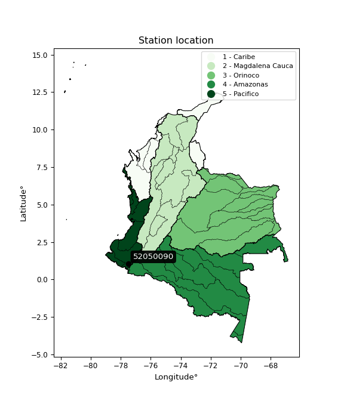

<div align="center">


</div>

# PMP Station (Rain, Pmax24h): 52050090

Probable Maximum Precipitation (PMP) is the greatest amount of rainfall for a specific duration that is meteorologically possible for a given location, acting as a "worst-case" scenario for extreme storms, crucial for designing safety-critical infrastructure like bridges, river deviations, dams, spillways, and nuclear plants to prevent catastrophic failure. PMP is calculated by hydrologists using meteorological data to determine the upper limit of extreme rainfall, often leading to the Probable Maximum Flood (PMF) for flood control design, and is increasingly being studied for climate change impacts. Probable Maximum Precipitation (PMP) is the theoretical upper limit of rainfall, a deterministic estimate for extreme events, while probability distributions (like GEV, Gumbel) describe the likelihood and frequency of various precipitation amounts, including rare ones, showing how often events occur, with PMP representing the extreme end of these distributions, used for critical infrastructure design to ensure safety against the worst conceivable weather, unlike standard statistical forecasts which cover typical probabilities.

The most common probability distributions in hydrology, used for analyzing floods, rainfall, and streamflow, include the Normal, Log-Normal, Gumbel, Gamma (including Log-Pearson Type III), and Generalized Extreme Value (GEV) distributions, often chosen based on the data´s skewness and whether modeling extremes or general conditions, with Gumbel and GEV popular for extreme events like floods, while the Normal distribution serves as a baseline, though often requiring transformations for skewed hydrological data. These distributions help in designing water infrastructure, managing water resources, and forecasting hydrologic events.

> Hydrological data often isn´t perfectly normal (it´s skewed), so different distributions are needed for different applications, such as: **Flood Frequency Analysis**: Using Gumbel, GEV, or Log-Pearson Type III for predicting extreme flood magnitudes and their return periods, **Rainfall Analysis**: Normal for annual totals, but Log-Normal, Weibull, or GEV for intensity or extreme daily rainfall, **Streamflow Modeling**: Gamma and Log-Normal for maximum flows, GEV for minimum flows, and Kappa for daily flows.

<div align="center">

</img>

</div>


## A. General information


### 1. General running parameters

• app_version: _v20260113_. • runtime: _2026-01-17 18:24:04.630693_. • Python version: _3.14.0_. • SciPy version: _1.16.3_. • Pandas version: _2.3.3_. • NumPy version: _2.3.5_. • Stations dataset (station_dataset_file): _dataset/pmax24h_in/automatic_colombia_2003_2025.csv_. • Stations catalog (station_catalog_file): _dataset/CNE.xls_. • Minimum year to eval til year_max (date_min): _1900_. • Maximum year to eval since year_min (date_max): _2025_. • Creates, save and include plots into reports (create_plot): _False_. • Plot only fit distributions with Δo > Δ (plot_only_fit): _True_. • Plot only simple graphs avoiding multiple CDFs and multiple Extreme values plots (plot_only_simple): _True_. • Eval low extreme values, if False, evaluates high extreme values (low_extreme): _False_. • Eval every SciPy distribution as logarithmic (pdist_logarithmic_on): _True_. • Standard deviation normalized (ddof): _1.0_. • Return periods to eval in years (Tr): _[2, 2.33, 5, 10, 15, 20, 25, 50, 75, 100, 200, 250, 500, 750, 1000]_. • Minimum data sample per station, 0 means any (minimum_sample): _5_. • Z-Score maximum threshold to adjust a value, 0 means disable (zscore_max): _3.5_. • Z-Score minimum threshold to adjust a value, 0 means disable (zscore_min): _-2.5_. • Avoid zeros, e.g. rain = 0 (avoid_zeros): _True_. • Avoid null values (avoid_nans): _True_. 

:file_folder:Table: [dataset.csv](../../dataset/pmax24h_in/automatic_colombia_2003_2025.csv)

> Delta Degrees of Freedom (DDOF): is a parameter used in the formulas for calculating variance and standard deviation. When ddof=0, the divisor is $N$ (the total number of observations) and this is used when your data set is the entire population. When ddof=1, the divisor is $N-1$ and this is used when your data set is a sample drawn from a larger population. Using $N-1$ provides an unbiased estimate of the population variance (known as Bessel´s correction).


### 2. Station info and location

|   id |   CODIGO | NOMBRE           | CATEGORIA               | TECNOLOGIA                | ESTADO   | FECHA_INSTALACION   |   FECHA_SUSPENSION |   ALTITUD |   LATITUD |   LONGITUD | DEPARTAMENTO   | MUNICIPIO   | AREA_OPERATIVA                      | ENTIDAD                                                     | AREA_HIDROGRAFICA   | ZONA_HIDROGRAFICA   | SUBZONA_HIDROGRAFICA   |   CORRIENTE | Catalogo   |   Version |
|-----:|---------:|:-----------------|:------------------------|:--------------------------|:---------|:--------------------|-------------------:|----------:|----------:|-----------:|:---------------|:------------|:------------------------------------|:------------------------------------------------------------|:--------------------|:--------------------|:-----------------------|------------:|:-----------|----------:|
|    0 | 52050090 | IMUES [52050090] | Climatológica Principal | Automática con Telemetría | Activa   | 15/01/1957          |                nan |      2550 |   1.05525 |   -77.4996 | Nariño         | Imués       | Area Operativa 07 - Nariño-Putumayo | INSTITUTO DE HIDROLOGIA METEOROLOGIA Y ESTUDIOS AMBIENTALES | Pacifico            | Patía               | Río Guáitara           |         nan | CNE_IDEAM  |  20251226 |

<div align="center">

Dynamic map: [:earth_americas:Google](http://maps.google.com/maps?q=1.05525,-77.49955556) [:earth_americas:OSM](https://www.openstreetmap.org/#map=18/1.05525/-77.49955556&layers=P) [:earth_americas:Bing](https://www.bing.com/maps?cp=1.05525~-77.49955556&lvl=18) [:earth_americas:Apple](https://maps.apple.com/frame?center=1.05525%2C-77.49955556&span=0.003%2C0.006)

</div>


<div align="center">

```geojson
{
  "type": "Feature",
  "geometry": {
    "type": "Point", 
    "coordinates": [-77.49955556, 1.05525]
  }, 
  "properties": {
    "Name": "52050090"
  }
}
```

</div>


### 3. Discrete values table and plot

<div align="center">

|               |           0 |           1 |          2 |          3 |           4 |
|:--------------|------------:|------------:|-----------:|-----------:|------------:|
| Date          | 2021        | 2022        | 2023       | 2024       | 2025        |
| Value         |   64        |   57.4      |   32       |   86.6     |   65.8      |
| Value_initial |   64        |   57.4      |   32       |   86.6     |   65.8      |
| count         |    5        |    5        |    5       |    5       |    5        |
| mean          |   61.16     |   61.16     |   61.16    |   61.16    |   61.16     |
| std           |   19.6293   |   19.6293   |   19.6293  |   19.6293  |   19.6293   |
| zscore        |    0.144682 |   -0.191551 |   -1.48554 |    1.29602 |    0.236382 |


</div>


> The initial value (value_initial) correspond to the initial obtained or null completed value, and value (value) is adjusted only when the initial value is outside the valid range (outlier) definite through the Z-Score value. If Z-Score is active, values out of range or outliers are replaced with the station mean value. A Z-Score (or standard score) measures how many standard deviations a data point is from the mean of a dataset, indicating its relative position; positive scores mean above the mean, negative mean below, and a score of zero is exactly at the mean, allowing for comparison of values from different distributions. It´s calculated using the formula $z=(x–μ)/σ$, where $x$ is the data point, $μ$ is the mean, and $σ$ is the standard deviation, helping identify outliers and understand probability.
>
> <sub>**Note**: In this study, "completing" (filling gaps in) and "extending" (forecasting or lengthening the historical record) rainfall data series are avoided for certain critical analyses because they introduce artificial bias and uncertainty, which can distort the statistics of rare events (extremes), alter day-to-day variability, and compromise the integrity and homogeneity of the original data. Some reasons against Completing/Extending rainfall data are: **Distortion of Extremes and Variability**: The primary issue is that most gap-filling or extension methods rely on averaging or regression with nearby stations, which inherently smooths the data. Rainfall is highly variable in space and time, with a large percentage of zero values and occasional large storms. Infilling methods often underestimate the highest values and overestimate the lowest (zero) values, which severely distorts analyses focused on flood frequency, drought severity, and intensity-duration-frequency (IDF) curves, **Loss of Data Homogeneity**: Infilled or extended data are synthetic estimates, not actual measurements. Combining these estimates with observed data can violate the assumption of data homogeneity, which requires that the data properties do not change over time. Inhomogeneity can lead to incorrect conclusions about long-term trends or changes in climate patterns, **Propagation of Errors**: Errors and biases from the original data (e.g., wind-induced undercatch, instrument errors, site changes) or the data used for imputation can propagate through the analysis, leading to unreliable hydrological models and inaccurate predictions, **Compromised Statistical Integrity**: For statistical analyses, especially those involving the frequency of events, using artificial data can introduce time bias or autocorrelation that doesn´t exist in reality, making it difficult to assess the true probability of events, **Difficulty in Validation**: It is difficult to accurately validate the quality of filled or extended data, especially for past periods where ground-truth measurements are unavailable. The reliability of imputation techniques heavily depends on the density of the surrounding station network and the complexity of the local topography.</sub>


### 4. Active continuous probability distributions from SciPy (80 of 104 available)

A Probability Density Function (PDF) describes the relative likelihood of a continuous random variable falling within a specific range, where the total area under its curve equals 1, and the area over any interval gives the actual probability for that range. Unlike discrete probabilities (like rolling a die), a PDF shows density, not direct probability for a single point (which is zero), with higher points indicating higher likelihood, often visualized as a bell curve for normal distributions.

A log of a probability density function (log-PDF) is simply the logarithm of the PDF´s value, denoted as $log(f(x))$, useful for converting multiplication of probabilities into addition, improving numerical stability with tiny numbers, and connecting to information theory concepts like entropy. Instead of dealing with very small probabilities (e.g., 0.000001), log-PDFs use negative numbers (e.g., $log(0.00001) ≈ -11.51$ that are easier for computers to handle, preventing underflow errors and simplifying complex calculations. In this study, each active probability distribution from SciPy is also evaluated in the $log$ form.

[scipy.stats](https://docs.scipy.org/doc/scipy/reference/stats.html) is a Python´s powerful submodule within the SciPy library for comprehensive statistical analysis, offering over 130 probability distributions (like Normal, Poisson), functions for descriptive stats (mean, variance), hypothesis testing (t-tests, chi-square), random variable generation, and statistical tests, making it essential for data science, modeling, and research. It provides tools to explore, model, and draw conclusions from data efficiently, working seamlessly with NumPy.

<div align="center">

|   id | p_dist           |   n_parameter | fit_method   | label                                                                       | active   | ref                                                                                                      |
|-----:|:-----------------|--------------:|:-------------|:----------------------------------------------------------------------------|:---------|:---------------------------------------------------------------------------------------------------------|
|    0 | alpha            |             3 | MLE          | Alpha                                                                       | True     | [:mortar_board:](https://docs.scipy.org/doc/scipy/reference/generated/scipy.stats.alpha.html)            |
|    1 | anglit           |             2 | MM           | Anglit                                                                      | True     | [:mortar_board:](https://docs.scipy.org/doc/scipy/reference/generated/scipy.stats.anglit.html)           |
|    2 | arcsine          |             2 | MM           | Arcsine                                                                     | True     | [:mortar_board:](https://docs.scipy.org/doc/scipy/reference/generated/scipy.stats.arcsine.html)          |
|    3 | argus            |             3 | MLE          | Argus                                                                       | True     | [:mortar_board:](https://docs.scipy.org/doc/scipy/reference/generated/scipy.stats.argus.html)            |
|    4 | beta             |             4 | MLE          | Beta                                                                        | True     | [:mortar_board:](https://docs.scipy.org/doc/scipy/reference/generated/scipy.stats.beta.html)             |
|    5 | betaprime        |             4 | MLE          | Beta prime                                                                  | True     | [:mortar_board:](https://docs.scipy.org/doc/scipy/reference/generated/scipy.stats.betaprime.html)        |
|    6 | bradford         |             3 | MLE          | Bradford                                                                    | True     | [:mortar_board:](https://docs.scipy.org/doc/scipy/reference/generated/scipy.stats.bradford.html)         |
|    7 | burr             |             4 | MLE          | Burr (Type III)                                                             | True     | [:mortar_board:](https://docs.scipy.org/doc/scipy/reference/generated/scipy.stats.burr.html)             |
|    8 | burr12           |             4 | MLE          | Burr (Type III) 12                                                          | True     | [:mortar_board:](https://docs.scipy.org/doc/scipy/reference/generated/scipy.stats.burr12.html)           |
|    9 | cosine           |             2 | MLE          | Cosine                                                                      | True     | [:mortar_board:](https://docs.scipy.org/doc/scipy/reference/generated/scipy.stats.cosine.html)           |
|   10 | crystalball      |             4 | MLE          | Crystalball                                                                 | True     | [:mortar_board:](https://docs.scipy.org/doc/scipy/reference/generated/scipy.stats.crystalball.html)      |
|   11 | dgamma           |             3 | MLE          | Double gamma                                                                | True     | [:mortar_board:](https://docs.scipy.org/doc/scipy/reference/generated/scipy.stats.dgamma.html)           |
|   12 | dweibull         |             3 | MLE          | Double Weibull                                                              | True     | [:mortar_board:](https://docs.scipy.org/doc/scipy/reference/generated/scipy.stats.dweibull.html)         |
|   13 | erlang           |             3 | MLE          | Erlang                                                                      | True     | [:mortar_board:](https://docs.scipy.org/doc/scipy/reference/generated/scipy.stats.erlang.html)           |
|   14 | exponnorm        |             3 | MLE          | Exponentially modified Normal                                               | True     | [:mortar_board:](https://docs.scipy.org/doc/scipy/reference/generated/scipy.stats.exponnorm.html)        |
|   15 | exponpow         |             3 | MLE          | Exponential power                                                           | True     | [:mortar_board:](https://docs.scipy.org/doc/scipy/reference/generated/scipy.stats.exponpow.html)         |
|   16 | exponweib        |             4 | MLE          | Exponentiated Weibull                                                       | True     | [:mortar_board:](https://docs.scipy.org/doc/scipy/reference/generated/scipy.stats.exponweib.html)        |
|   17 | f                |             4 | MLE          | F                                                                           | True     | [:mortar_board:](https://docs.scipy.org/doc/scipy/reference/generated/scipy.stats.f.html)                |
|   18 | fatiguelife      |             3 | MLE          | Fatigue-life (Birnbaum-Saunders)                                            | True     | [:mortar_board:](https://docs.scipy.org/doc/scipy/reference/generated/scipy.stats.fatiguelife.html)      |
|   19 | foldnorm         |             3 | MM           | Fold Normal                                                                 | True     | [:mortar_board:](https://docs.scipy.org/doc/scipy/reference/generated/scipy.stats.foldnorm.html)         |
|   20 | gamma            |             3 | MLE          | Gamma                                                                       | True     | [:mortar_board:](https://docs.scipy.org/doc/scipy/reference/generated/scipy.stats.gamma.html)            |
|   21 | gausshyper       |             6 | MLE          | Gauss hypergeometric                                                        | True     | [:mortar_board:](https://docs.scipy.org/doc/scipy/reference/generated/scipy.stats.gausshyper.html)       |
|   22 | genexpon         |             5 | MLE          | Generalized exponential                                                     | True     | [:mortar_board:](https://docs.scipy.org/doc/scipy/reference/generated/scipy.stats.genexpon.html)         |
|   23 | genextreme       |             3 | MLE          | Generalized exponential                                                     | True     | [:mortar_board:](https://docs.scipy.org/doc/scipy/reference/generated/scipy.stats.genextreme.html)       |
|   24 | gengamma         |             4 | MLE          | Generalized gamma                                                           | True     | [:mortar_board:](https://docs.scipy.org/doc/scipy/reference/generated/scipy.stats.gengamma.html)         |
|   25 | genhalflogistic  |             3 | MLE          | Generalized half-logistic                                                   | True     | [:mortar_board:](https://docs.scipy.org/doc/scipy/reference/generated/scipy.stats.genhalflogistic.html)  |
|   26 | genlogistic      |             3 | MLE          | Generalized logistic                                                        | True     | [:mortar_board:](https://docs.scipy.org/doc/scipy/reference/generated/scipy.stats.genlogistic.html)      |
|   27 | gennorm          |             3 | MLE          | Generalized Normal                                                          | True     | [:mortar_board:](https://docs.scipy.org/doc/scipy/reference/generated/scipy.stats.gennorm.html)          |
|   28 | genpareto        |             3 | MLE          | Generalized Pareto                                                          | True     | [:mortar_board:](https://docs.scipy.org/doc/scipy/reference/generated/scipy.stats.genpareto.html)        |
|   29 | gompertz         |             3 | MLE          | Gompertz (or truncated Gumbel)                                              | True     | [:mortar_board:](https://docs.scipy.org/doc/scipy/reference/generated/scipy.stats.gompertz.html)         |
|   30 | gumbel_l         |             2 | MM           | Gumbel Left Skew                                                            | True     | [:mortar_board:](https://docs.scipy.org/doc/scipy/reference/generated/scipy.stats.gumbel_l.html)         |
|   31 | gumbel_r         |             2 | MM           | Gumbel Right Skew                                                           | True     | [:mortar_board:](https://docs.scipy.org/doc/scipy/reference/generated/scipy.stats.gumbel_r.html)         |
|   32 | halfgennorm      |             3 | MLE          | Upper half of a generalized normal                                          | True     | [:mortar_board:](https://docs.scipy.org/doc/scipy/reference/generated/scipy.stats.halfgennorm.html)      |
|   33 | halflogistic     |             2 | MM           | Half-logistic                                                               | True     | [:mortar_board:](https://docs.scipy.org/doc/scipy/reference/generated/scipy.stats.halflogistic.html)     |
|   34 | halfnorm         |             2 | MM           | Half Normal                                                                 | True     | [:mortar_board:](https://docs.scipy.org/doc/scipy/reference/generated/scipy.stats.halfnorm.html)         |
|   35 | hypsecant        |             2 | MM           | hyperbolic secant                                                           | True     | [:mortar_board:](https://docs.scipy.org/doc/scipy/reference/generated/scipy.stats.hypsecant.html)        |
|   36 | invgamma         |             3 | MLE          | Inverted gamma                                                              | True     | [:mortar_board:](https://docs.scipy.org/doc/scipy/reference/generated/scipy.stats.invgamma.html)         |
|   37 | invgauss         |             3 | MLE          | Inverse Gaussian                                                            | True     | [:mortar_board:](https://docs.scipy.org/doc/scipy/reference/generated/scipy.stats.invgauss.html)         |
|   38 | invweibull       |             3 | MLE          | Inverted Weibull                                                            | True     | [:mortar_board:](https://docs.scipy.org/doc/scipy/reference/generated/scipy.stats.invweibull.html)       |
|   39 | johnsonsb        |             4 | MLE          | Johnson SB                                                                  | True     | [:mortar_board:](https://docs.scipy.org/doc/scipy/reference/generated/scipy.stats.johnsonsb.html)        |
|   40 | johnsonsu        |             4 | MLE          | Johnson Su                                                                  | True     | [:mortar_board:](https://docs.scipy.org/doc/scipy/reference/generated/scipy.stats.johnsonsu.html)        |
|   41 | kappa3           |             3 | MLE          | Kappa 3                                                                     | True     | [:mortar_board:](https://docs.scipy.org/doc/scipy/reference/generated/scipy.stats.kappa3.html)           |
|   42 | kappa4           |             4 | MLE          | Kappa 4                                                                     | True     | [:mortar_board:](https://docs.scipy.org/doc/scipy/reference/generated/scipy.stats.kappa4.html)           |
|   43 | ksone            |             3 | MLE          | Kolmogorov-Smirnov one-sided test statistic distribution                    | True     | [:mortar_board:](https://docs.scipy.org/doc/scipy/reference/generated/scipy.stats.ksone.html)            |
|   44 | kstwobign        |             2 | MLE          | Limiting distribution of scaled Kolmogorov-Smirnov two-sided test statistic | True     | [:mortar_board:](https://docs.scipy.org/doc/scipy/reference/generated/scipy.stats.kstwobign.html)        |
|   45 | laplace          |             2 | MM           | Laplace                                                                     | True     | [:mortar_board:](https://docs.scipy.org/doc/scipy/reference/generated/scipy.stats.laplace.html)          |
|   46 | levy_l           |             2 | MLE          | Left-skewed Levy                                                            | True     | [:mortar_board:](https://docs.scipy.org/doc/scipy/reference/generated/scipy.stats.levy_l.html)           |
|   47 | loggamma         |             3 | MLE          | Log gamma                                                                   | True     | [:mortar_board:](https://docs.scipy.org/doc/scipy/reference/generated/scipy.stats.loggamma.html)         |
|   48 | logistic         |             2 | MM           | Logistic (or Sech-squared)                                                  | True     | [:mortar_board:](https://docs.scipy.org/doc/scipy/reference/generated/scipy.stats.logistic.html)         |
|   49 | loglaplace       |             3 | MLE          | Log-Laplace                                                                 | True     | [:mortar_board:](https://docs.scipy.org/doc/scipy/reference/generated/scipy.stats.loglaplace.html)       |
|   50 | lomax            |             3 | MLE          | Lomax (Pareto of the second kind)                                           | True     | [:mortar_board:](https://docs.scipy.org/doc/scipy/reference/generated/scipy.stats.lomax.html)            |
|   51 | maxwell          |             2 | MM           | Maxwell                                                                     | True     | [:mortar_board:](https://docs.scipy.org/doc/scipy/reference/generated/scipy.stats.maxwell.html)          |
|   52 | mielke           |             4 | MLE          | Mielke Beta-Kappa / Dagum                                                   | True     | [:mortar_board:](https://docs.scipy.org/doc/scipy/reference/generated/scipy.stats.mielke.html)           |
|   53 | moyal            |             2 | MM           | Moyal                                                                       | True     | [:mortar_board:](https://docs.scipy.org/doc/scipy/reference/generated/scipy.stats.moyal.html)            |
|   54 | nakagami         |             3 | MLE          | Nakagami                                                                    | True     | [:mortar_board:](https://docs.scipy.org/doc/scipy/reference/generated/scipy.stats.nakagami.html)         |
|   55 | ncf              |             5 | MLE          | Non-central F distribution                                                  | True     | [:mortar_board:](https://docs.scipy.org/doc/scipy/reference/generated/scipy.stats.ncf.html)              |
|   56 | nct              |             4 | MLE          | Non-central Student’s t                                                     | True     | [:mortar_board:](https://docs.scipy.org/doc/scipy/reference/generated/scipy.stats.nct.html)              |
|   57 | norm             |             2 | MM           | Normal                                                                      | True     | [:mortar_board:](https://docs.scipy.org/doc/scipy/reference/generated/scipy.stats.norm.html)             |
|   58 | pearson3         |             3 | MM           | Pearson type III                                                            | True     | [:mortar_board:](https://docs.scipy.org/doc/scipy/reference/generated/scipy.stats.pearson3.html)         |
|   59 | powerlaw         |             3 | MLE          | Power-function                                                              | True     | [:mortar_board:](https://docs.scipy.org/doc/scipy/reference/generated/scipy.stats.powerlaw.html)         |
|   60 | rayleigh         |             2 | MM           | Rayleigh                                                                    | True     | [:mortar_board:](https://docs.scipy.org/doc/scipy/reference/generated/scipy.stats.rayleigh.html)         |
|   61 | rdist            |             3 | MLE          | R-distributed (symmetric beta)                                              | True     | [:mortar_board:](https://docs.scipy.org/doc/scipy/reference/generated/scipy.stats.rdist.html)            |
|   62 | rice             |             3 | MLE          | Rice                                                                        | True     | [:mortar_board:](https://docs.scipy.org/doc/scipy/reference/generated/scipy.stats.rice.html)             |
|   63 | semicircular     |             2 | MM           | Semicircular                                                                | True     | [:mortar_board:](https://docs.scipy.org/doc/scipy/reference/generated/scipy.stats.semicircular.html)     |
|   64 | skewnorm         |             3 | MLE          | Skew normal                                                                 | True     | [:mortar_board:](https://docs.scipy.org/doc/scipy/reference/generated/scipy.stats.skewnorm.html)         |
|   65 | t                |             3 | MLE          | Student’s t                                                                 | True     | [:mortar_board:](https://docs.scipy.org/doc/scipy/reference/generated/scipy.stats.t.html)                |
|   66 | trapezoid        |             4 | MLE          | Trapezoid                                                                   | True     | [:mortar_board:](https://docs.scipy.org/doc/scipy/reference/generated/scipy.stats.trapezoid.html)        |
|   67 | triang           |             3 | MLE          | Triangular                                                                  | True     | [:mortar_board:](https://docs.scipy.org/doc/scipy/reference/generated/scipy.stats.triang.html)           |
|   68 | truncexpon       |             3 | MLE          | Truncated exponential                                                       | True     | [:mortar_board:](https://docs.scipy.org/doc/scipy/reference/generated/scipy.stats.truncexpon.html)       |
|   69 | truncnorm        |             4 | MLE          | Truncated normal                                                            | True     | [:mortar_board:](https://docs.scipy.org/doc/scipy/reference/generated/scipy.stats.truncnorm.html)        |
|   70 | truncpareto      |             4 | MLE          | Upper truncated Pareto                                                      | True     | [:mortar_board:](https://docs.scipy.org/doc/scipy/reference/generated/scipy.stats.truncpareto.html)      |
|   71 | truncweibull_min |             5 | MLE          | Doubly truncated Weibull minimum                                            | True     | [:mortar_board:](https://docs.scipy.org/doc/scipy/reference/generated/scipy.stats.truncweibull_min.html) |
|   72 | tukeylambda      |             3 | MLE          | Tukey-Lamdba                                                                | True     | [:mortar_board:](https://docs.scipy.org/doc/scipy/reference/generated/scipy.stats.tukeylambda.html)      |
|   73 | uniform          |             2 | MLE          | Uniform                                                                     | True     | [:mortar_board:](https://docs.scipy.org/doc/scipy/reference/generated/scipy.stats.uniform.html)          |
|   74 | vonmises         |             3 | MLE          | Von Mises                                                                   | True     | [:mortar_board:](https://docs.scipy.org/doc/scipy/reference/generated/scipy.stats.vonmises.html)         |
|   75 | vonmises_line    |             3 | MLE          | Von Mises line                                                              | True     | [:mortar_board:](https://docs.scipy.org/doc/scipy/reference/generated/scipy.stats.vonmises_line.html)    |
|   76 | wald             |             2 | MM           | Wald                                                                        | True     | [:mortar_board:](https://docs.scipy.org/doc/scipy/reference/generated/scipy.stats.wald.html)             |
|   77 | weibull_max      |             3 | MLE          | Weibull maximum                                                             | True     | [:mortar_board:](https://docs.scipy.org/doc/scipy/reference/generated/scipy.stats.weibull_max.html)      |
|   78 | weibull_min      |             3 | MLE          | Weibull minimum                                                             | True     | [:mortar_board:](https://docs.scipy.org/doc/scipy/reference/generated/scipy.stats.weibull_min.html)      |
|   79 | wrapcauchy       |             3 | MLE          | Wrapped  Cauchy                                                             | True     | [:mortar_board:](https://docs.scipy.org/doc/scipy/reference/generated/scipy.stats.wrapcauchy.html)       |

</div>

> **n_parameter:** # arguments & localization & scale.
>
> **Fit methods:** (MLE) maximum likelihood, (MM) L-moments.
>
>**Inactive** (With the only purpose of prevent loops, zero divisions, infinite values, over high estimated values or horizontal trending for recurrence intervals estimations, the follow distributions were disabled.)**:** lognorm, norminvgauss, powernorm, powerlognorm, cauchy, halfcauchy, foldcauchy, skewcauchy, chi2, expon, fisk, genhyperbolic, geninvgauss, gibrat, kstwo, laplace_asymmetric, levy, levy_stable, ncx2, pareto, rel_breitwigner, recipinvgauss, studentized_range, loguniform, 


## B. Probability (PDF) vs. Empirical (EDF) distributions functions

A continuous probability distribution (CPD) describes probabilities for variables that can take any value within a range (like rain any time), unlike discrete variables with specific outcomes (like temperature). It uses a Probability Density Function (PDF), a curve where the total area under it equals 1, and the probability of the variable falling within an interval (a to b) is found by calculating the area under the curve between those points. A key feature is that the probability of hitting any single exact value is zero, so probabilities are always expressed for ranges, e.g., $P(a ≤ X ≤ b)$.

<div align="center">

Distributions parameters from station values
|     |   station | p_dist              |   n |             loc |            scale | shape                  | shape1                 | shape2                 | shape3             |
|----:|----------:|:--------------------|----:|----------------:|-----------------:|:-----------------------|:-----------------------|:-----------------------|:-------------------|
|   0 |  52050090 | alpha               |   5 |  -316.185       |   7916.57        | 21.03262253286998      |                        |                        |                    |
|   1 |  52050090 | anglit              |   5 |    61.16        |     51.3611      |                        |                        |                        |                    |
|   2 |  52050090 | arcsine             |   5 |    36.3307      |     49.6586      |                        |                        |                        |                    |
|   3 |  52050090 | argus               |   5 |    19.0372      |     71.3445      | 0.5150954173257883     |                        |                        |                    |
|   4 |  52050090 | beta                |   5 |     9.86778     |     76.7322      | 2.1902711391355654     | 0.7752609630578375     |                        |                    |
|   5 |  52050090 | betaprime           |   5 |    -9.5885      |   7503.06        | 13.668218033886113     | 1442.8230029252463     |                        |                    |
|   6 |  52050090 | bradford            |   5 |    31.9664      |     54.6882      | 1.8478560905168986e-05 |                        |                        |                    |
|   7 |  52050090 | burr                |   5 |    -0.547587    |     76.0424      | 10.719314471397645     | 0.31531272726146853    |                        |                    |
|   8 |  52050090 | burr12              |   5 |    -3.19281     |     34.9867      | 753.0559422756243      | 0.0023467525099198773  |                        |                    |
|   9 |  52050090 | cosine              |   5 |    60.4046      |     14.8198      |                        |                        |                        |                    |
|  10 |  52050090 | crystalball         |   5 |    61.16        |     17.5569      | 100023.01917352909     | 7720.448075081101      |                        |                    |
|  11 |  52050090 | dgamma              |   5 |    64           |     14.9194      | 0.7764212329266105     |                        |                        |                    |
|  12 |  52050090 | dweibull            |   5 |    64           |     11.499       | 0.5405994937119414     |                        |                        |                    |
|  13 |  52050090 | erlang              |   5 |  -242.095       |      1.04156     | 291.18262561976724     |                        |                        |                    |
|  14 |  52050090 | exponnorm           |   5 |    61.1492      |     17.557       | 0.0006172298118156431  |                        |                        |                    |
|  15 |  52050090 | exponpow            |   5 |    32           |      1.4784      | 0.11142273740831021    |                        |                        |                    |
|  16 |  52050090 | exponweib           |   5 |    32           |      1.2167      | 1.32817884465158       | 0.20783937150610488    |                        |                    |
|  17 |  52050090 | f                   |   5 | -2077.59        |   2138.78        | 31346.981243952163     | 491786.61978346785     |                        |                    |
|  18 |  52050090 | fatiguelife         |   5 |    32           |      0.000144697 | 499.9254196083014      |                        |                        |                    |
|  19 |  52050090 | foldnorm            |   5 |    63.4423      |      1.55263     | 2.3991894534755713e-07 |                        |                        |                    |
|  20 |  52050090 | gamma               |   5 |  -231.493       |      1.07563     | 271.93440613543567     |                        |                        |                    |
|  21 |  52050090 | gausshyper          |   5 |    31.9444      |     54.6556      | 0.9728569645964595     | 0.8785636901609561     | 1.0059545722144487     | 1.0149706159057155 |
|  22 |  52050090 | genexpon            |   5 |    31.9999      |      1.5847      | 0.05433625535819801    | 1.9365123962524858e-07 | 2.0459093865830713     |                    |
|  23 |  52050090 | genextreme          |   5 |    57.2852      |     19.4212      | 0.5441099219828829     |                        |                        |                    |
|  24 |  52050090 | gengamma            |   5 |    32           |      1.27419     | 1.2648741537544579     | 0.2293113709570449     |                        |                    |
|  25 |  52050090 | genhalflogistic     |   5 |    27.858       |     62.4036      | 1.062334481987015      |                        |                        |                    |
|  26 |  52050090 | genlogistic         |   5 |    68.1142      |      8.15047     | 0.6316365881063618     |                        |                        |                    |
|  27 |  52050090 | gennorm             |   5 |    64           |      0.109115    | 0.3079711787597438     |                        |                        |                    |
|  28 |  52050090 | genpareto           |   5 |    -1.30335     |    176.388       | -2.0066080173663785    |                        |                        |                    |
|  29 |  52050090 | gompertz            |   5 |    57.4         |     17.8608      | 0.7726442148616491     |                        |                        |                    |
|  30 |  52050090 | gumbel_l            |   5 |    69.0616      |     13.6891      |                        |                        |                        |                    |
|  31 |  52050090 | gumbel_r            |   5 |    53.2584      |     13.6891      |                        |                        |                        |                    |
|  32 |  52050090 | halfgennorm         |   5 |    32           |      1.29762     | 0.36387981623592836    |                        |                        |                    |
|  33 |  52050090 | halflogistic        |   5 |    40.351       |     15.0105      |                        |                        |                        |                    |
|  34 |  52050090 | halfnorm            |   5 |    37.9215      |     29.1252      |                        |                        |                        |                    |
|  35 |  52050090 | hypsecant           |   5 |    61.16        |     11.1771      |                        |                        |                        |                    |
|  36 |  52050090 | invgamma            |   5 |  -149.133       |  27787           | 132.94500941643594     |                        |                        |                    |
|  37 |  52050090 | invgauss            |   5 |   -12.0969      |    964.799       | 0.07557313049005301    |                        |                        |                    |
|  38 |  52050090 | invweibull          |   5 |    32           |      1.58116     | 0.051432693606560526   |                        |                        |                    |
|  39 |  52050090 | johnsonsb           |   5 |    31.7197      |     54.8803      | 0.01241046379023576    | 0.14321958866384482    |                        |                    |
|  40 |  52050090 | johnsonsu           |   5 |    64.7691      |      1.70127     | 0.20662574858845745    | 0.4231483611292597     |                        |                    |
|  41 |  52050090 | kappa3              |   5 |    32           |     54.5966      | 25561.629596272316     |                        |                        |                    |
|  42 |  52050090 | kappa4              |   5 |    29.5024      |     61.4087      | 1.0376555188792485     | 1.0755033398504836     |                        |                    |
|  43 |  52050090 | ksone               |   5 |    30.7505      |     60.819       | 1.0                    |                        |                        |                    |
|  44 |  52050090 | kstwobign           |   5 |    -9.35581     |     80.5609      |                        |                        |                        |                    |
|  45 |  52050090 | laplace             |   5 |    61.16        |     12.4146      |                        |                        |                        |                    |
|  46 |  52050090 | levy_l              |   5 |    88.9177      |      8.86278     |                        |                        |                        |                    |
|  47 |  52050090 | loggamma            |   5 |     6.12923     |     37.1135      | 4.8957167038075085     |                        |                        |                    |
|  48 |  52050090 | logistic            |   5 |    61.16        |      9.67965     |                        |                        |                        |                    |
|  49 |  52050090 | loglaplace          |   5 |    -0.165564    |     64.1656      | 4.43066791826514       |                        |                        |                    |
|  50 |  52050090 | lomax               |   5 |    31.9999      | 986894           | 34131.411192142594     |                        |                        |                    |
|  51 |  52050090 | maxwell             |   5 |    19.5574      |     26.0706      |                        |                        |                        |                    |
|  52 |  52050090 | mielke              |   5 |    -0.490516    |     75.9923      | 3.3756657730066246     | 10.71189301592386      |                        |                    |
|  53 |  52050090 | moyal               |   5 |    51.1198      |      7.9034      |                        |                        |                        |                    |
|  54 |  52050090 | nakagami            |   5 |    57.4         |     11.878       | 0.19381008164104624    |                        |                        |                    |
|  55 |  52050090 | ncf                 |   5 |    -0.00667744  |      3.19572e-06 | 2.7857563419767535e-07 | 4.71196658451933       | 4.27392048347358       |                    |
|  56 |  52050090 | nct                 |   5 |  -797.293       |     17.4346      | 81621.37228415214      | 49.237503047086136     |                        |                    |
|  57 |  52050090 | norm                |   5 |    61.16        |     17.5569      |                        |                        |                        |                    |
|  58 |  52050090 | pearson3            |   5 |    61.16        |     17.557       | -0.3052826430136132    |                        |                        |                    |
|  59 |  52050090 | powerlaw            |   5 |    32           |     54.6         | 0.1280401392321432     |                        |                        |                    |
|  60 |  52050090 | rayleigh            |   5 |    27.5725      |     26.7989      |                        |                        |                        |                    |
|  61 |  52050090 | rdist               |   5 |    29.5397      |     27.8603      | 1.0742668954916264     |                        |                        |                    |
|  62 |  52050090 | rice                |   5 |    20.8895      |     19.5299      | 1.7492747595883178     |                        |                        |                    |
|  63 |  52050090 | semicircular        |   5 |    61.16        |     35.1139      |                        |                        |                        |                    |
|  64 |  52050090 | skewnorm            |   5 |    78.9544      |     24.9978      | -1.954179312072735     |                        |                        |                    |
|  65 |  52050090 | t                   |   5 |    61.1602      |     17.5577      | 2071907.4079190148     |                        |                        |                    |
|  66 |  52050090 | trapezoid           |   5 |    26.54        |     65.52        | 1.0                    | 1.0                    |                        |                    |
|  67 |  52050090 | triang              |   5 |    15.8966      |     70.7034      | 0.999999970946313      |                        |                        |                    |
|  68 |  52050090 | truncexpon          |   5 |    32           |     65.5747      | 0.8326388280462971     |                        |                        |                    |
|  69 |  52050090 | truncnorm           |   5 |    61.16        |     17.5569      | -312.65760810031765    | 588.558619588792       |                        |                    |
|  70 |  52050090 | truncpareto         |   5 |    31.7072      |      0.292768    | 0.2608374664135834     | 187.496093460043       |                        |                    |
|  71 |  52050090 | truncweibull_min    |   5 |    31.9385      |     49.5062      | 0.7274201159281202     | 0.001241669166241569   | 1.1041331636769702     |                    |
|  72 |  52050090 | tukeylambda         |   5 |    59.3132      |     28.4094      | 1.0401371751373303     |                        |                        |                    |
|  73 |  52050090 | uniform             |   5 |    32           |     54.6         |                        |                        |                        |                    |
|  74 |  52050090 | vonmises            |   5 |     0.908695    |      1           | 0.7709723444833038     |                        |                        |                    |
|  75 |  52050090 | vonmises_line       |   5 |    59.3         |      8.68987     | 0.22863574358590327    |                        |                        |                    |
|  76 |  52050090 | wald                |   5 |    43.6031      |     17.5569      |                        |                        |                        |                    |
|  77 |  52050090 | weibull_max         |   5 |    86.6         |      1.42343     | 0.25201361156762203    |                        |                        |                    |
|  78 |  52050090 | weibull_min         |   5 |   -12.9028      |     80.8574      | 4.943180626874685      |                        |                        |                    |
|  79 |  52050090 | wrapcauchy          |   5 |    31.6766      |      8.74134     | 3.7725717936682376e-05 |                        |                        |                    |
|  80 |  52050090 | logalpha            |   5 |    -5.48105     |    263.971       | 27.6925198978754       |                        |                        |                    |
|  81 |  52050090 | loganglit           |   5 |     4.06452     |      0.961383    |                        |                        |                        |                    |
|  82 |  52050090 | logarcsine          |   5 |     3.59977     |      0.929499    |                        |                        |                        |                    |
|  83 |  52050090 | logargus            |   5 |     3.13127     |      1.37343     | 1.8270537821275576     |                        |                        |                    |
|  84 |  52050090 | logbeta             |   5 |     3.30178     |      1.15952     | 1.3933990963776262     | 0.5756073950915035     |                        |                    |
|  85 |  52050090 | logbetaprime        |   5 |   -72.7607      |     26.5794      | 210907.46240169008     | 72969.86240341983      |                        |                    |
|  86 |  52050090 | logbradford         |   5 |     3.46574     |      0.995594    | 1.0948685396948168     |                        |                        |                    |
|  87 |  52050090 | logburr             |   5 |    -0.0480281   |      4.39804     | 48.97909856283991      | 0.26278830781240803    |                        |                    |
|  88 |  52050090 | logburr12           |   5 |   -60.0266      |     66.6454      | 260.3296120287022      | 14323.166897355331     |                        |                    |
|  89 |  52050090 | logcosine           |   5 |     4.02593     |      0.278799    |                        |                        |                        |                    |
|  90 |  52050090 | logcrystalball      |   5 |     4.06451     |      0.32863     | 13.103604568824755     | 4.015040527291034      |                        |                    |
|  91 |  52050090 | logdgamma           |   5 |     4.15888     |      0.455164    | 0.41360306730336405    |                        |                        |                    |
|  92 |  52050090 | logdweibull         |   5 |     4.15888     |      0.288765    | 0.8049272713748861     |                        |                        |                    |
|  93 |  52050090 | logerlang           |   5 |    -0.772285    |      0.0243288   | 198.87100597723656     |                        |                        |                    |
|  94 |  52050090 | logexponnorm        |   5 |     4.06427     |      0.328635    | 0.00075078378899311    |                        |                        |                    |
|  95 |  52050090 | logexponpow         |   5 |     1.5994      |      2.75307     | 7.608064029105416      |                        |                        |                    |
|  96 |  52050090 | logexponweib        |   5 |     3.46574     |      0.856307    | 0.21446129981205497    | 1.695914732198407      |                        |                    |
|  97 |  52050090 | logf                |   5 |  -141.888       |    145.952       | 423911.6904678568      | 5221933.08795549       |                        |                    |
|  98 |  52050090 | logfatiguelife      |   5 |  -164.233       |    168.297       | 0.0019504187853679085  |                        |                        |                    |
|  99 |  52050090 | logfoldnorm         |   5 |     3.54573     |      0.365642    | 1.3356791615336085     |                        |                        |                    |
| 100 |  52050090 | loggamma            |   5 |    -0.803334    |      0.0239926   | 202.77146968784814     |                        |                        |                    |
| 101 |  52050090 | loggausshyper       |   5 |     3.46544     |      0.995864    | 0.9775433458242135     | 0.7978362905314338     | 1.1239600533870138     | 1.2294245889339486 |
| 102 |  52050090 | loggenexpon         |   5 |     3.46404     |      0.0207757   | 0.014782953771702176   | 10.193699966057213     | 0.00010342361921135174 |                    |
| 103 |  52050090 | loggenextreme       |   5 |     4.18265     |      0.326629    | 1.1721802189683954     |                        |                        |                    |
| 104 |  52050090 | loggengamma         |   5 |     3.46574     |      0.897534    | 0.3949010334770958     | 1.253570012398786      |                        |                    |
| 105 |  52050090 | loggenhalflogistic  |   5 |     3.34439     |      1.17069     | 1.0481499924594084     |                        |                        |                    |
| 106 |  52050090 | loggenlogistic      |   5 |     4.32507     |      0.0938077   | 0.31316330813012355    |                        |                        |                    |
| 107 |  52050090 | loggennorm          |   5 |     4.1589      |      0.239763    | 0.9890628993353472     |                        |                        |                    |
| 108 |  52050090 | loggenpareto        |   5 |    -0.0122841   |     13.9873      | -3.126634422148631     |                        |                        |                    |
| 109 |  52050090 | loggompertz         |   5 |     3.46574     |      0.96835     | 0.9866860162372397     |                        |                        |                    |
| 110 |  52050090 | loggumbel_l         |   5 |     4.21242     |      0.256234    |                        |                        |                        |                    |
| 111 |  52050090 | loggumbel_r         |   5 |     3.91661     |      0.256234    |                        |                        |                        |                    |
| 112 |  52050090 | loghalfgennorm      |   5 |     3.46574     |      0.671933    | 1.183675211715347      |                        |                        |                    |
| 113 |  52050090 | loghalflogistic     |   5 |     3.67501     |      0.280967    |                        |                        |                        |                    |
| 114 |  52050090 | loghalfnorm         |   5 |     3.62955     |      0.545154    |                        |                        |                        |                    |
| 115 |  52050090 | loghypsecant        |   5 |     4.06452     |      0.209214    |                        |                        |                        |                    |
| 116 |  52050090 | loginvgamma         |   5 |    -3.51547     |   3727.91        | 493.4382246551553      |                        |                        |                    |
| 117 |  52050090 | loginvgauss         |   5 |     0.863004    |    261.08        | 0.01223553022260307    |                        |                        |                    |
| 118 |  52050090 | loginvweibull       |   5 |    -6.69865e+07 |      6.69866e+07 | 187304960.254708       |                        |                        |                    |
| 119 |  52050090 | logjohnsonsb        |   5 |     3.4648      |      0.996501    | 0.3324190364755263     | 0.1402904587674742     |                        |                    |
| 120 |  52050090 | logjohnsonsu        |   5 |     4.17352     |      0.0236395   | 0.26616214010364597    | 0.4020555068251835     |                        |                    |
| 121 |  52050090 | logkappa3           |   5 |     3.46574     |      0.995447    | 13760.185710748243     |                        |                        |                    |
| 122 |  52050090 | logkappa4           |   5 |     3.35633     |      1.16658     | 1.0310695316390326     | 1.055760148770421      |                        |                    |
| 123 |  52050090 | logksone            |   5 |     3.36618     |      1.19468     | 1.0                    |                        |                        |                    |
| 124 |  52050090 | logkstwobign        |   5 |     2.63656     |      1.62879     |                        |                        |                        |                    |
| 125 |  52050090 | loglaplace          |   5 |     4.06452     |      0.232379    |                        |                        |                        |                    |
| 126 |  52050090 | loglevy_l           |   5 |     4.49389     |      0.124511    |                        |                        |                        |                    |
| 127 |  52050090 | logloggamma         |   5 |     4.38052     |      0.147453    | 0.46575472081687996    |                        |                        |                    |
| 128 |  52050090 | loglogistic         |   5 |     4.06452     |      0.181185    |                        |                        |                        |                    |
| 129 |  52050090 | logloglaplace       |   5 |    -0.000534236 |      4.15942     | 17.505311622582564     |                        |                        |                    |
| 130 |  52050090 | loglomax            |   5 |     3.46574     |     29.4206      | 49.384772609115416     |                        |                        |                    |
| 131 |  52050090 | logmaxwell          |   5 |     3.28579     |      0.487992    |                        |                        |                        |                    |
| 132 |  52050090 | logmielke           |   5 |     0.0975787   |      4.25348     | 12.382643342462014     | 47.46515939448415      |                        |                    |
| 133 |  52050090 | logmoyal            |   5 |     3.87658     |      0.147937    |                        |                        |                        |                    |
| 134 |  52050090 | lognakagami         |   5 |     4.05004     |      0.192131    | 0.081598400721729      |                        |                        |                    |
| 135 |  52050090 | logncf              |   5 |   -10.3865      |     14.4495      | 5402.536122440646      | 10969.757370833056     | 0.3574112817973254     |                    |
| 136 |  52050090 | lognct              |   5 |    -8.07041     |      0.224831    | 1086.6161369916992     | 53.93924206231465      |                        |                    |
| 137 |  52050090 | lognorm             |   5 |     4.06452     |      0.328633    |                        |                        |                        |                    |
| 138 |  52050090 | logpearson3         |   5 |     4.06452     |      0.328633    | -0.8427780292603888    |                        |                        |                    |
| 139 |  52050090 | logpowerlaw         |   5 |     3.46574     |      0.995564    | 0.13674712955429744    |                        |                        |                    |
| 140 |  52050090 | lograyleigh         |   5 |     3.43582     |      0.501626    |                        |                        |                        |                    |
| 141 |  52050090 | logrdist            |   5 |     4.61953     |      0.56949     | 1.037211744898832      |                        |                        |                    |
| 142 |  52050090 | logrice             |   5 |     3.23174     |      0.357407    | 2.067522891283824      |                        |                        |                    |
| 143 |  52050090 | logsemicircular     |   5 |     4.06452     |      0.657266    |                        |                        |                        |                    |
| 144 |  52050090 | logskewnorm         |   5 |     4.4613      |      0.515211    | -37065676.720333196    |                        |                        |                    |
| 145 |  52050090 | logt                |   5 |     4.06452     |      0.328626    | 39767849.61210163      |                        |                        |                    |
| 146 |  52050090 | logtrapezoid        |   5 |     3.135       |      1.39427     | 1.0                    | 1.0                    |                        |                    |
| 147 |  52050090 | logtriang           |   5 |     3.2116      |      1.2497      | 0.9999999365564016     |                        |                        |                    |
| 148 |  52050090 | logtruncexpon       |   5 |     3.46572     |      1.12777     | 0.8827876117332666     |                        |                        |                    |
| 149 |  52050090 | logtruncnorm        |   5 |    -0.10218     |      1.10011     | 3.774366172610687      | 4.148198928570586      |                        |                    |
| 150 |  52050090 | logtruncpareto      |   5 |     3.45962     |      0.00611377  | 0.2605925173468461     | 163.8396639520392      |                        |                    |
| 151 |  52050090 | logtruncweibull_min |   5 |     3.43557     |      1.27687     | 1.1961673721857684     | 0.00037551724960598374 | 0.8033108360419203     |                    |
| 152 |  52050090 | logtukeylambda      |   5 |     4.25566     |      0.31612     | 1.5372422582277654     |                        |                        |                    |
| 153 |  52050090 | loguniform          |   5 |     3.46574     |      0.995564    |                        |                        |                        |                    |
| 154 |  52050090 | logvonmises         |   5 |    -2.21352     |      1           | 9.757006744702313      |                        |                        |                    |
| 155 |  52050090 | logvonmises_line    |   5 |     3.95474     |      0.161244    | 9.070441161215066e-05  |                        |                        |                    |
| 156 |  52050090 | logwald             |   5 |     3.73586     |      0.328658    |                        |                        |                        |                    |
| 157 |  52050090 | logweibull_max      |   5 |     4.4613      |      0.465351    | 0.21883456028488563    |                        |                        |                    |
| 158 |  52050090 | logweibull_min      |   5 |    -7.89234e+06 |      7.89234e+06 | 32225886.7110504       |                        |                        |                    |
| 159 |  52050090 | logwrapcauchy       |   5 |     3.46574     |      0.158449    | 0.5                    |                        |                        |                    |

</div>

> **loc** (Location parameter): This shifts the distribution along the x-axis. For many common distributions, like the normal (Gaussian) distribution, loc represents the mean $μ$. For others, like the uniform distribution, it might represent the minimum value, or for the beta distribution, the left end of the support interval.
>
> **scale** (Scale parameter): This determines the width or spread of the distribution. For the normal distribution, scale represents the standard deviation $σ$. For a uniform distribution, it defines the length of the interval (from $loc$ to $loc + scale$).
>
> **shape** (Shape parameters): Refers to parameters that define the specific form of a probability distribution, distinct from its location (loc) and scale (scale). These parameters are required arguments for most distribution functions. For example, a normal (Gaussian) distribution is fully defined by its location (mean) and scale (standard deviation), so it has no specific shape parameters beyond loc and scale. However, other distributions have intrinsic properties that need specification, as Gamma distribution that takes a shape parameter, often named $a$ or $alpha$.


### 0. Cumulative distribution values - CDF (160 evaluated)

Cumulative Distribution Function (CDF), denoted as $F$<sub>$X$</sub>$(x)$, is a function that gives the probability that a random variable $X$ will take a value less than or equal to a specific value, $x$ (i.e., $(P(X≥x)$. It essentially "accumulates" probabilities from a given point up to the far right (positive infinity), providing a complete picture of the distribution´s probabilities for both discrete (like rain) and continuous (like temperature) variables, helping to find probabilities over ranges or above certain values. Each station is evaluated separately ordering the $x$ values ascending, calculating the CDF and PDF values for the activated distributions and their logarithmic forms.

<div align="center">

CDF ordered by x ascending and calculating $log(f(x))$ separately
|   id |   Station |   date |    x |   count |   mean |     std |    zscore |   Value_initial |   station |   m |     alpha |   alpha_pdf |    anglit |   anglit_pdf |   arcsine |   arcsine_pdf |     argus |   argus_pdf |      beta |    beta_pdf |   betaprime |   betaprime_pdf |    bradford |   bradford_pdf |      burr |   burr_pdf |    burr12 |   burr12_pdf |   cosine |   cosine_pdf |   crystalball |   crystalball_pdf |    dgamma |   dgamma_pdf |   dweibull |    dweibull_pdf |    erlang |   erlang_pdf |   exponnorm |   exponnorm_pdf |   exponpow |   exponpow_pdf |   exponweib |   exponweib_pdf |         f |      f_pdf |   fatiguelife |   fatiguelife_pdf |   foldnorm |   foldnorm_pdf |     gamma |   gamma_pdf |   gausshyper |   gausshyper_pdf |    genexpon |   genexpon_pdf |   genextreme |   genextreme_pdf |    gengamma |   gengamma_pdf |   genhalflogistic |   genhalflogistic_pdf |   genlogistic |   genlogistic_pdf |   gennorm |   gennorm_pdf |   genpareto |   genpareto_pdf |    gompertz |   gompertz_pdf |   gumbel_l |   gumbel_l_pdf |   gumbel_r |   gumbel_r_pdf |   halfgennorm |   halfgennorm_pdf |   halflogistic |   halflogistic_pdf |   halfnorm |   halfnorm_pdf |   hypsecant |   hypsecant_pdf |   invgamma |   invgamma_pdf |   invgauss |   invgauss_pdf |   invweibull |   invweibull_pdf |   johnsonsb |   johnsonsb_pdf |   johnsonsu |   johnsonsu_pdf |      kappa3 |   kappa3_pdf |     kappa4 |   kappa4_pdf |    ksone |   ksone_pdf |   kstwobign |   kstwobign_pdf |   laplace |   laplace_pdf |   levy_l |   levy_l_pdf |   loggamma |   loggamma_pdf |   logistic |   logistic_pdf |   loglaplace |   loglaplace_pdf |      lomax |   lomax_pdf |   maxwell |   maxwell_pdf |    mielke |   mielke_pdf |       moyal |   moyal_pdf |    nakagami |   nakagami_pdf |      ncf |    ncf_pdf |       nct |    nct_pdf |      norm |   norm_pdf |   pearson3 |   pearson3_pdf |   powerlaw |   powerlaw_pdf |   rayleigh |   rayleigh_pdf |    rdist |      rdist_pdf |      rice |   rice_pdf |   semicircular |   semicircular_pdf |   skewnorm |   skewnorm_pdf |         t |      t_pdf |   trapezoid |   trapezoid_pdf |    triang |   triang_pdf |   truncexpon |   truncexpon_pdf |   truncnorm |   truncnorm_pdf |   truncpareto |   truncpareto_pdf |   truncweibull_min |   truncweibull_min_pdf |   tukeylambda |   tukeylambda_pdf |   uniform |   uniform_pdf |   vonmises |   vonmises_pdf |   vonmises_line |   vonmises_line_pdf |     wald |   wald_pdf |   weibull_max |   weibull_max_pdf |   weibull_min |   weibull_min_pdf |   wrapcauchy |   wrapcauchy_pdf |   logalpha |   logalpha_pdf |   loganglit |   loganglit_pdf |   logarcsine |   logarcsine_pdf |   logargus |   logargus_pdf |   logbeta |   logbeta_pdf |   logbetaprime |   logbetaprime_pdf |   logbradford |   logbradford_pdf |   logburr |   logburr_pdf |   logburr12 |   logburr12_pdf |   logcosine |   logcosine_pdf |   logcrystalball |   logcrystalball_pdf |   logdgamma |   logdgamma_pdf |   logdweibull |   logdweibull_pdf |   logerlang |   logerlang_pdf |   logexponnorm |   logexponnorm_pdf |   logexponpow |   logexponpow_pdf |   logexponweib |   logexponweib_pdf |      logf |   logf_pdf |   logfatiguelife |   logfatiguelife_pdf |   logfoldnorm |   logfoldnorm_pdf |   loggausshyper |   loggausshyper_pdf |   loggenexpon |   loggenexpon_pdf |   loggenextreme |   loggenextreme_pdf |   loggengamma |   loggengamma_pdf |   loggenhalflogistic |   loggenhalflogistic_pdf |   loggenlogistic |   loggenlogistic_pdf |   loggennorm |   loggennorm_pdf |   loggenpareto |   loggenpareto_pdf |   loggompertz |   loggompertz_pdf |   loggumbel_l |   loggumbel_l_pdf |   loggumbel_r |   loggumbel_r_pdf |   loghalfgennorm |   loghalfgennorm_pdf |   loghalflogistic |   loghalflogistic_pdf |   loghalfnorm |   loghalfnorm_pdf |   loghypsecant |   loghypsecant_pdf |   loginvgamma |   loginvgamma_pdf |   loginvgauss |   loginvgauss_pdf |   loginvweibull |   loginvweibull_pdf |   logjohnsonsb |   logjohnsonsb_pdf |   logjohnsonsu |   logjohnsonsu_pdf |   logkappa3 |   logkappa3_pdf |   logkappa4 |   logkappa4_pdf |   logksone |   logksone_pdf |   logkstwobign |   logkstwobign_pdf |   loglevy_l |   loglevy_l_pdf |   logloggamma |   logloggamma_pdf |   loglogistic |   loglogistic_pdf |   logloglaplace |   logloglaplace_pdf |    loglomax |   loglomax_pdf |   logmaxwell |   logmaxwell_pdf |   logmielke |   logmielke_pdf |    logmoyal |   logmoyal_pdf |   lognakagami |   lognakagami_pdf |    logncf |   logncf_pdf |    lognct |   lognct_pdf |   lognorm |   lognorm_pdf |   logpearson3 |   logpearson3_pdf |   logpowerlaw |   logpowerlaw_pdf |   lograyleigh |   lograyleigh_pdf |    logrdist |   logrdist_pdf |   logrice |   logrice_pdf |   logsemicircular |   logsemicircular_pdf |   logskewnorm |   logskewnorm_pdf |      logt |   logt_pdf |   logtrapezoid |   logtrapezoid_pdf |   logtriang |   logtriang_pdf |   logtruncexpon |   logtruncexpon_pdf |   logtruncnorm |   logtruncnorm_pdf |   logtruncpareto |   logtruncpareto_pdf |   logtruncweibull_min |   logtruncweibull_min_pdf |   logtukeylambda |   logtukeylambda_pdf |   loguniform |   loguniform_pdf |   logvonmises |   logvonmises_pdf |   logvonmises_line |   logvonmises_line_pdf |   logwald |   logwald_pdf |   logweibull_max |   logweibull_max_pdf |   logweibull_min |   logweibull_min_pdf |   logwrapcauchy |   logwrapcauchy_pdf |
|-----:|----------:|-------:|-----:|--------:|-------:|--------:|----------:|----------------:|----------:|----:|----------:|------------:|----------:|-------------:|----------:|--------------:|----------:|------------:|----------:|------------:|------------:|----------------:|------------:|---------------:|----------:|-----------:|----------:|-------------:|---------:|-------------:|--------------:|------------------:|----------:|-------------:|-----------:|----------------:|----------:|-------------:|------------:|----------------:|-----------:|---------------:|------------:|----------------:|----------:|-----------:|--------------:|------------------:|-----------:|---------------:|----------:|------------:|-------------:|-----------------:|------------:|---------------:|-------------:|-----------------:|------------:|---------------:|------------------:|----------------------:|--------------:|------------------:|----------:|--------------:|------------:|----------------:|------------:|---------------:|-----------:|---------------:|-----------:|---------------:|--------------:|------------------:|---------------:|-------------------:|-----------:|---------------:|------------:|----------------:|-----------:|---------------:|-----------:|---------------:|-------------:|-----------------:|------------:|----------------:|------------:|----------------:|------------:|-------------:|-----------:|-------------:|---------:|------------:|------------:|----------------:|----------:|--------------:|---------:|-------------:|-----------:|---------------:|-----------:|---------------:|-------------:|-----------------:|-----------:|------------:|----------:|--------------:|----------:|-------------:|------------:|------------:|------------:|---------------:|---------:|-----------:|----------:|-----------:|----------:|-----------:|-----------:|---------------:|-----------:|---------------:|-----------:|---------------:|---------:|---------------:|----------:|-----------:|---------------:|-------------------:|-----------:|---------------:|----------:|-----------:|------------:|----------------:|----------:|-------------:|-------------:|-----------------:|------------:|----------------:|--------------:|------------------:|-------------------:|-----------------------:|--------------:|------------------:|----------:|--------------:|-----------:|---------------:|----------------:|--------------------:|---------:|-----------:|--------------:|------------------:|--------------:|------------------:|-------------:|-----------------:|-----------:|---------------:|------------:|----------------:|-------------:|-----------------:|-----------:|---------------:|----------:|--------------:|---------------:|-------------------:|--------------:|------------------:|----------:|--------------:|------------:|----------------:|------------:|----------------:|-----------------:|---------------------:|------------:|----------------:|--------------:|------------------:|------------:|----------------:|---------------:|-------------------:|--------------:|------------------:|---------------:|-------------------:|----------:|-----------:|-----------------:|---------------------:|--------------:|------------------:|----------------:|--------------------:|--------------:|------------------:|----------------:|--------------------:|--------------:|------------------:|---------------------:|-------------------------:|-----------------:|---------------------:|-------------:|-----------------:|---------------:|-------------------:|--------------:|------------------:|--------------:|------------------:|--------------:|------------------:|-----------------:|---------------------:|------------------:|----------------------:|--------------:|------------------:|---------------:|-------------------:|--------------:|------------------:|--------------:|------------------:|----------------:|--------------------:|---------------:|-------------------:|---------------:|-------------------:|------------:|----------------:|------------:|----------------:|-----------:|---------------:|---------------:|-------------------:|------------:|----------------:|--------------:|------------------:|--------------:|------------------:|----------------:|--------------------:|------------:|---------------:|-------------:|-----------------:|------------:|----------------:|------------:|---------------:|--------------:|------------------:|----------:|-------------:|----------:|-------------:|----------:|--------------:|--------------:|------------------:|--------------:|------------------:|--------------:|------------------:|------------:|---------------:|----------:|--------------:|------------------:|----------------------:|--------------:|------------------:|----------:|-----------:|---------------:|-------------------:|------------:|----------------:|----------------:|--------------------:|---------------:|-------------------:|-----------------:|---------------------:|----------------------:|--------------------------:|-----------------:|---------------------:|-------------:|-----------------:|--------------:|------------------:|-------------------:|-----------------------:|----------:|--------------:|-----------------:|---------------------:|-----------------:|---------------------:|----------------:|--------------------:|
|    0 |  52050090 |   2023 | 32   |       5 |  61.16 | 19.6293 | -1.48554  |            32   |  52050090 |   1 | 0.0441853 |   0.0060992 | 0.0466295 |   0.00821026 |  0        |     0         | 0.0466436 |  0.00715162 | 0.0467271 |  0.00474604 |   0.0426881 |      0.00678028 | 0.000614745 |      0.0182856 | 0.0568006 | 0.00589786 | 0.0103536 |   0.0491067  | 0.045223 |   0.00709853 |     0.0483687 |        0.00572077 | 0.0384339 |   0.00277602 |  0.0878512 |      0.00258086 | 0.0466355 |   0.0058725  |   0.0483687 |      0.00572077 |  0.0234988 |    7.36848e+11 |  9.7157e-05 |     7.54556e+09 | 0.0482179 | 0.00574163 |     0.0537885 |       3.93327e+08 |   0        |    0           | 0.0472166 |  0.00595596 |   0.00159108 |        0.0278438 | 2.63907e-06 |     0.034288   |    0.0688458 |       0.00555239 | 5.25228e-05 |    4.28719e+09 |         0.0344015 |            0.00860997 |     0.0604334 |        0.00462831 | 0.0470867 |    0.00176303 |    0.21126  |      0.00719911 | 0           |     0          |  0.0645349 |     0.00455883 | 0.00886739 |     0.00306096 |   2.82115e-12 |        0.174596   |       0        |         0          |   0        |     0          |   0.0467804 |      0.00417033 |  0.0427582 |     0.00607527 |   0.04172  |     0.00766389 |   0.00421456 |      1.6685e+11  |    0.228849 |     0.155519    |   0.0903369 |      0.00209995 | 2.86074e-13 |    0.0183089 | 0.00560817 |    0.0198565 | 0.020545 |   0.0164422 |   0.0452406 |      0.00914858 | 0.0477399 |    0.00384545 | 0.306865 |   0.00255866 |  0.0361331 |       0.25337  |  0.0468641 |     0.00461462 |    0.0380105 |         0.163572 | 3.1273e-06 |  0.0345846  | 0.0270157 |    0.00622083 | 0.0567963 |   0.00590031 | 0.000801947 | 0.000614317 | 0           |    0           | 0.434343 | 0.00798763 | 0.0484234 | 0.00572929 | 0.0483687 | 0.00572077 |  0.0561296 |      0.0055424 | 0.00846177 |    3.04963e+11 |  0.0135546 |     0.00608126 | 0.529566 |      0.0120465 | 0.0364114 | 0.00677815 |      0.0408245 |          0.0101004 |  0.0603323 |     0.00546829 | 0.0483751 | 0.00572112 |  0.00694444 |      0.00254375 | 0.0518744 |   0.00644268 |  3.44057e-10 |        0.026986  |   0.0483687 |      0.00572077 |   1.49091e-16 |        1.19643    |        7.39293e-12 |             0.13879    |   7.10543e-15 |         0.0277059 |  0        |      0.018315 |    5.40452 |      0.286336  |     5.11668e-10 |           0.0143832 | 0        | 0          |     0.0815128 |       0.000943215 |     0.0531467 |        0.00569243 |   0.00588774 |        0.0182085 |  0.0349921 |       0.254773 |   0.0261956 |        0.332264 |     0        |         0        |  0.0427968 |       0.264727 | 0.0350478 |   0.306239    |      0.0345069 |           0.233585 |   4.69256e-08 |          1.48712  | 0.0556198 |      0.203736 |   0.0463536 |        0.185583 |   0.0361135 |        0.328484 |        0.0342238 |             0.230837 |   0.0312104 |     0.0873331   |     0.0660975 |          0.155315 |   0.0356285 |        0.249718 |      0.0342257 |           0.230843 |     0.0519215 |          0.211463 |    2.75844e-06 |        2.25916e+09 | 0.0346015 |   0.2329   |        0.0338004 |             0.229567 |      0        |          0        |     0.000484557 |            1.58024  |    0.00121191 |          0.714833 |       0.0516475 |            0.131149 |   2.98532e-08 |        3.3278e+07 |            0.0548085 |                 0.477717 |        0.0567682 |             0.189492 |    0.0293083 |         0.119146 |       0.381583 |        0.198671    |   1.27287e-09 |          1.01894  |     0.0528092 |          0.200557 |    0.00299652 |         0.0679483 |      5.27575e-09 |             1.57645  |          0        |              0        |      0        |          0        |      0.0363445 |           0.173342 |     0.0364995 |          0.261284 |     0.0356975 |          0.274643 |       0.0384292 |            0.350186 |       0.259431 |       48.5284      |      0.0838997 |          0.0874844 |  4.5874e-13 |         1.00388 |   0.0715149 |        0.935557 |  0.0833333 |       0.837047 |      0.0421578 |           0.433226 |    0.272157 |        0.127096 |     0.0627465 |          0.197921 |     0.0354068 |          0.188499 |       0.0205624 |            0.103844 | 1.99256e-12 |       1.67858  |    0.0128036 |         0.207702 |   0.0555892 |        0.204364 | 6.09277e-05 |     0.00349586 |    0          |       0           | 0.0365994 |     0.244954 | 0.0381341 |     0.25359  |  0.034225 |      0.23084  |     0.0518334 |          0.221791 |    0.00795884 |       2.45074e+12 |    0.00177651 |          0.11867  | 0           |     0          | 0.0281753 |      0.263935 |         0.0157175 |              0.399416 |     0.0533175 |          0.239409 | 0.0342218 |   0.230828 |      0.0562682 |           0.340262 |   0.0413536 |        0.325448 |     2.47313e-05 |            1.51217  |    0           |            0       |       1.2836e-14 |           57.9769    |             0.0208415 |                  0.827747 |      0           |              0       |     0        |          1.00446 |       1.0335  |          0.218845 |          0.0173317 |               0.986954 |  0        |      0        |         0.306948 |          0.0796874   |        0.0460447 |             0.183612 |        0        |            3.01337  |
|    1 |  52050090 |   2022 | 57.4 |       5 |  61.16 | 19.6293 | -0.191551 |            57.4 |  52050090 |   2 | 0.437152  |   0.0223478 | 0.427054  |   0.0192617  |  0.451611 |     0.0129695 | 0.38688   |  0.0187739  | 0.270521  |  0.0135689  |   0.449681  |      0.0212786  | 0.465068    |      0.0182855 | 0.392515  | 0.021715   | 0.621137  |   0.0110498  | 0.435685 |   0.0212587  |     0.415211  |        0.0222076  | 0.261544  |   0.0216814  |  0.238386  |      0.0144632  | 0.422911  |   0.0222092  |   0.41521   |      0.0222076  |  0.947474  |    0.00124835  |  0.802691   |     0.0029522   | 0.415698  | 0.022162   |     0.799004  |       0.0046325   |   0        |    0           | 0.426987  |  0.0222951  |   0.522662   |        0.017252  | 0.581435    |     0.0143518  |    0.370057  |       0.019003   | 0.798858    |    0.0032663   |         0.317609  |            0.0144926  |     0.37509   |        0.0229138  | 0.183186  |    0.0161493  |    0.4226   |      0.00985443 | 4.90049e-11 |     0.0432592  |  0.347281  |     0.0203414  | 0.477622   |     0.025782   |   0.625904    |        0.0091271  |       0.513817 |         0.0245159  |   0.496368 |     0.0219052  |   0.394884  |      0.02694    |  0.433802  |     0.0220476  |   0.483736 |     0.0210651  |   0.420244   |      0.000737711 |    0.497612 |     0.00418156  |   0.238074  |      0.0173169  | 0.465046    |    0.0183089 | 0.457037   |    0.0175801 | 0.438177 |   0.0164422 |   0.501673  |      0.0194899  | 0.369348  |    0.029751   | 0.404085 |   0.0058318  |  0.495747  |       1.16933  |  0.404092  |     0.0248771  |    0.46981   |         2.02174  | 0.584571   |  0.0143671  | 0.449499  |    0.0224867  | 0.392551  |   0.0217126  | 0.501503    | 0.0270676   | 9.93973e-07 |    5.42239e+07 | 0.59987  | 0.00522046 | 0.415518  | 0.0222057  | 0.415211  | 0.0222076  |  0.396414  |      0.0214734 | 0.906661   |    0.00457043  |  0.46173   |     0.0223554  | 1        | 153271         | 0.430998  | 0.0219932  |      0.431961  |          0.0180259 |  0.384076  |     0.0209964  | 0.415211  | 0.0222066  |  0.221842   |      0.0143773  | 0.344577  |   0.0166048  |  0.568294    |        0.0183196 |   0.415211  |      0.0222076  |   0.92491     |        0.00424345 |        0.695161    |             0.0146067  |   0.465378    |         0.018098  |  0.465201 |      0.018315 |    9.48291 |      0.297723  |     0.456906    |           0.0225986 | 0.566936 | 0.0316802  |     0.117516  |       0.00217166  |     0.39399   |        0.0213417  |   0.468351   |        0.0182058 |  0.498715  |       1.15925  |   0.484949  |        1.0397   |     0.490086 |         0.685239 |  0.399885  |       1.06535  | 0.350334  |   0.809823    |      0.484368  |           1.20842  |   0.671088    |          0.905362 | 0.39956   |      1.21669  |   0.402673  |        1.25049  |   0.52752   |        1.13958  |        0.482439  |             1.21278  |   0.20833   |     0.93365     |     0.316927  |          1.06865  |   0.49084   |        1.16489  |      0.482436  |           1.21276  |     0.39993   |          1.16114  |    0.824769    |        0.390784    | 0.483312  |   1.20927  |        0.482319  |             1.21427  |      0.514065 |          1.11741  |     0.623712    |            0.865821 |    0.566539   |          0.927954 |       0.248116  |            0.71741  |   0.782879    |        0.430472   |            0.44352   |                 0.931767 |        0.392829  |             1.24504  |    0.318963  |         1.31299  |       0.5339   |        0.362485    |   0.558381    |          0.822717 |     0.411764  |          1.21816  |    0.552068   |         1.27998   |      0.644343    |             0.675443 |          0.583261 |              1.17417  |      0.559494 |          1.08699  |      0.477999  |           1.51782  |     0.506362  |          1.17059  |     0.513611  |          1.13271  |       0.529359  |            0.94152  |       0.648738 |        0.215423    |      0.247996  |          1.01192   |  0.586574   |         1.00388 |   0.605056  |        0.91735  |  0.572427  |       0.837047 |      0.56133   |           0.90401  |    0.403645 |        0.413764 |     0.384552  |          1.12912  |     0.480042  |          1.37761  |       0.314332  |            1.35844  | 0.62137     |       0.623184 |    0.516101  |         1.17645  |   0.399817  |        1.21529  | 0.577937    |     1.28527    |    0.00388973 |       7.14712e+11 | 0.484726  |     1.17461  | 0.488313  |     1.16029  |  0.482437 |      1.21277  |     0.426784  |          1.17322  |    0.929722   |       0.217585    |    0.527471   |          1.15344  | 3.43583e-09 |     1.4091e+07 | 0.493278  |      1.18118  |         0.485983  |              0.968352 |     0.424739  |          1.12615  | 0.482435  |   1.21279  |      0.430712  |           0.941404 |   0.450128  |        1.07373  |     0.689602    |            0.900716 |    5.51694e-07 |            4.60872 |       0.946804   |            0.182458  |             0.635078  |                  0.996664 |      8.14344e-05 |              3.14352 |     0.586912 |          1.00446 |       1.4759  |          1.22706  |          0.594079  |               0.987118 |  0.64994  |      1.29736  |         0.377827 |          0.195683    |        0.400889  |             1.25325  |        0.529627 |            0.357956 |
|    2 |  52050090 |   2021 | 64   |       5 |  61.16 | 19.6293 |  0.144682 |            64   |  52050090 |   3 | 0.583041  |   0.0213752 | 0.555182  |   0.0193511  |  0.536488 |     0.0129046 | 0.517114  |  0.0205553  | 0.370339  |  0.0167789  |   0.585976  |      0.0196643  | 0.585752    |      0.0182854 | 0.546546  | 0.0244064  | 0.684405  |   0.00830046 | 0.576846 |   0.0211642  |     0.564252  |        0.0224274  | 0.5       |  64.1833     |  0.5       | 165938          | 0.57035   |   0.0219588  |   0.564251  |      0.0224274  |  0.954509  |    0.000912612 |  0.819682   |     0.00225301  | 0.56424   | 0.0223267  |     0.826563  |       0.00376727  |   0.280543 |    0.481789    | 0.574668  |  0.0219446  |   0.633274   |        0.0163196 | 0.666204    |     0.0114453  |    0.505707  |       0.021867   | 0.817642    |    0.00248838  |         0.421552  |            0.0171249  |     0.539483  |        0.0260709  | 0.5       |    0.554984   |    0.491814 |      0.011206   | 0.292068    |     0.0443152  |  0.498878  |     0.0252923  | 0.633645   |     0.0211198  |   0.678811    |        0.00704601 |       0.657131 |         0.018926   |   0.629424 |     0.0183475  |   0.580023  |      0.0275835  |  0.577484  |     0.0210323  |   0.614977 |     0.0184429  |   0.424568   |      0.000584597 |    0.525304 |     0.00428952  |   0.508499  |      0.0903957  | 0.585885    |    0.0183089 | 0.573552   |    0.0177467 | 0.546696 |   0.0164422 |   0.621689  |      0.0167471  | 0.602241  |    0.0320395  | 0.449086 |   0.0079928  |  0.620205  |       1.09954  |  0.572828  |     0.0252794  |    0.666875  |         1.43354  | 0.66935    |  0.0114351  | 0.593656  |    0.0207996  | 0.546558  |   0.024402   | 0.657979    | 0.0202606   | 0.623856    |    0.0348442   | 0.632482 | 0.0046729  | 0.564508  | 0.0224143  | 0.564252  | 0.0224274  |  0.544626  |      0.0229455 | 0.933876   |    0.00373668  |  0.603005  |     0.0201363  | 1        |      0         | 0.575935  | 0.0214765  |      0.551433  |          0.0180707 |  0.532282  |     0.0234542  | 0.564246  | 0.0224265  |  0.32688    |      0.0174522  | 0.462882  |   0.0192453  |  0.683318    |        0.0165656 |   0.564252  |      0.0224274  |   0.949109    |        0.00318071 |        0.783427    |             0.0122573  |   0.58483     |         0.0181065 |  0.586081 |      0.018315 |   10.5767  |      0.290507  |     0.605631    |           0.0219924 | 0.725519 | 0.0179431  |     0.134352  |       0.00300725  |     0.541803  |        0.0229861  |   0.58851    |        0.018206  |  0.62152   |       1.08024  |   0.597528  |        1.02019  |     0.565084 |         0.699477 |  0.527626  |       1.28285  | 0.446834  |   0.97331     |      0.61427   |           1.15749  |   0.766202    |          0.843871 | 0.548743  |      1.5078   |   0.551362  |        1.45846  |   0.648956  |        1.07802  |        0.613004  |             1.16492  |   0.5       |     2.16451e+08 |     0.5       |        944.248    |   0.615073  |        1.09991  |      0.612999  |           1.16491  |     0.539649  |          1.39535  |    0.862894    |        0.312867    | 0.613429  |   1.16045  |        0.613005  |             1.16562  |      0.632244 |          1.04103  |     0.716524    |            0.843475 |    0.66155    |          0.814243 |       0.342214  |            1.03519  |   0.824791    |        0.343508   |            0.553385  |                 1.09434  |        0.546641  |             1.55963  |    0.499972  |         2.07545  |       0.577546 |        0.446783    |   0.643672    |          0.742789 |     0.555786  |          1.40675  |    0.678083   |         1.02807   |      0.711332    |             0.558609 |          0.696812 |              0.915503 |      0.668445 |          0.913463 |      0.63894   |           1.3788   |     0.630176  |          1.08696  |     0.632384  |          1.03514  |       0.625509  |            0.820623 |       0.673274 |        0.24023     |      0.512309  |          5.76591   |  0.695835   |         1.00388 |   0.705427  |        0.92793  |  0.66353   |       0.837047 |      0.653281  |           0.783117 |    0.457904 |        0.60288  |     0.523542  |          1.4178   |     0.627342  |          1.29031  |       0.5       |            2.1043   | 0.683366    |       0.519262 |    0.638345  |         1.05614  |   0.548784  |        1.50547  | 0.700126    |     0.964387   |    0.773089   |       1.13146     | 0.61077   |     1.12236  | 0.612531  |     1.104    |  0.613001 |      1.16491  |     0.562445  |          1.30106  |    0.951694   |       0.187754    |    0.646145   |          1.01681  | 0.194272    |     0.955847   | 0.619365  |      1.11726  |         0.591087  |              0.958552 |     0.55722   |          1.30358  | 0.613001  |   1.16494  |      0.539267  |           1.05338  |   0.574576  |        1.21311  |     0.783053    |            0.817853 |    0.41798     |            3.15706 |       0.964634   |            0.147414  |             0.740549  |                  0.940682 |      0.27593     |              2.35817 |     0.696236 |          1.00446 |       1.60828 |          1.18257  |          0.701513  |               0.98707  |  0.761739 |      0.805052 |         0.402526 |          0.265059    |        0.550213  |             1.46738  |        0.573834 |            0.47637  |
|    3 |  52050090 |   2025 | 65.8 |       5 |  61.16 | 19.6293 |  0.236382 |            65.8 |  52050090 |   4 | 0.620883  |   0.0206434 | 0.58985   |   0.0191531  |  0.559836 |     0.0130498 | 0.554422  |  0.0208847  | 0.401426  |  0.0177735  |   0.620697  |      0.0188963  | 0.618666    |      0.0182854 | 0.590551  | 0.0244233  | 0.69881   |   0.00771492 | 0.614614 |   0.0207748  |     0.604219  |        0.0219429  | 0.599294  |   0.0399919  |  0.653578  |      0.0381782  | 0.609384  |   0.0213791  |   0.604218  |      0.0219429  |  0.956091  |    0.000846328 |  0.823608   |     0.00211177  | 0.604017  | 0.0218344  |     0.83317   |       0.00357548  |   0.871113 |    0.162241    | 0.613652  |  0.0213378  |   0.662467   |        0.0161207 | 0.686183    |     0.0107602  |    0.54553   |       0.022355   | 0.821977    |    0.00233108  |         0.453138  |            0.0179817  |     0.586353  |        0.0259243  | 0.681971  |    0.0518555  |    0.512405 |      0.0116824  | 0.37121     |     0.0435346  |  0.545246  |     0.0261774  | 0.670288   |     0.0195884  |   0.691091    |        0.00660546 |       0.689869 |         0.0174571  |   0.661532 |     0.0173267  |   0.628502  |      0.0261895  |  0.614721  |     0.0203165  |   0.647343 |     0.0175098  |   0.425592   |      0.00055324  |    0.533125 |     0.00440821  |   0.673456  |      0.0767095  | 0.618841    |    0.0183089 | 0.605555   |    0.017814  | 0.576292 |   0.0164422 |   0.651074  |      0.0158995  | 0.655926  |    0.0277152  | 0.464199 |   0.00882125 |  0.650245  |       1.06558  |  0.617596  |     0.0243987  |    0.704355  |         1.27225  | 0.689305   |  0.0107449  | 0.630369  |    0.0199705  | 0.590555  |   0.0244189  | 0.692801    | 0.0184444   | 0.680994    |    0.0289658   | 0.640768 | 0.00453482 | 0.604449  | 0.0219276  | 0.604219  | 0.0219429  |  0.585834  |      0.0227988 | 0.940443   |    0.00356256  |  0.638462  |     0.019244   | 1        |      0         | 0.614087  | 0.0208847  |      0.583878  |          0.0179712 |  0.574646  |     0.0235699  | 0.604211  | 0.0219421  |  0.359048   |      0.0182908  | 0.498172  |   0.0199655  |  0.712731    |        0.016117  |   0.604219  |      0.0219429  |   0.954641    |        0.00297046 |        0.805005    |             0.0117245  |   0.61743     |         0.0181161 |  0.619048 |      0.018315 |   10.9198  |      0.096018  |     0.644686    |           0.0213766 | 0.755598 | 0.0155489  |     0.140052  |       0.00333561  |     0.583146  |        0.0229096  |   0.621281   |        0.0182062 |  0.651006  |       1.04502  |   0.625646  |        1.00679  |     0.584622 |         0.709843 |  0.563969  |       1.33746  | 0.474555  |   1.02665     |      0.645943  |           1.12517  |   0.789408    |          0.829513 | 0.591248  |      1.55383  |   0.592189  |        1.48291  |   0.678472  |        1.04949  |        0.644889  |             1.13299  |   0.674177  |     2.4873      |     0.570378  |          1.8914   |   0.64514   |        1.06717  |      0.644884  |           1.13297  |     0.578983  |          1.43926  |    0.871332    |        0.295705    | 0.64519   |   1.1285   |        0.644906  |             1.13346  |      0.660691 |          1.00944  |     0.739892    |            0.841807 |    0.683694   |          0.782323 |       0.372384  |            1.14249  |   0.834055    |        0.32471    |            0.584412  |                 1.14354  |        0.590581  |             1.60475  |    0.554248  |         1.84385  |       0.590346 |        0.476995    |   0.663971    |          0.720828 |     0.595141  |          1.42869  |    0.705655   |         0.960106  |      0.72645     |             0.531727 |          0.721342 |              0.853598 |      0.693155 |          0.868308 |      0.676046  |           1.29463  |     0.659826  |          1.05014  |     0.660586  |          0.99769  |       0.647798  |            0.786444 |       0.680095 |        0.252119    |      0.683985  |          5.29204   |  0.723679   |         1.00388 |   0.731214  |        0.931617 |  0.686747  |       0.837047 |      0.674552  |           0.750603 |    0.475594 |        0.67491  |     0.563725  |          1.47799  |     0.662379  |          1.23428  |       0.554916  |            1.86077  | 0.697439    |       0.495725 |    0.667063  |         1.01396  |   0.591225  |        1.55158  | 0.725825    |     0.889294   |    0.80137    |       0.92173     | 0.641489  |     1.09159  | 0.642737  |     1.07311  |  0.644886 |      1.13298  |     0.598719  |          1.31281  |    0.956814   |       0.181502    |    0.673753   |          0.973443 | 0.219496    |     0.868229   | 0.64991   |      1.08423  |         0.617584  |              0.951726 |     0.593936  |          1.34349  | 0.644887  |   1.133    |      0.56888   |           1.08191  |   0.608716  |        1.24863  |     0.805461    |            0.797984 |    0.501398    |            2.86242 |       0.968623   |            0.14036   |             0.766434  |                  0.9258   |      0.340851    |              2.32556 |     0.724096 |          1.00446 |       1.64065 |          1.1501   |          0.728891  |               0.987055 |  0.782842 |      0.718634 |         0.410229 |          0.291214    |        0.591307  |             1.4932   |        0.587804 |            0.533513 |
|    4 |  52050090 |   2024 | 86.6 |       5 |  61.16 | 19.6293 |  1.29602  |            86.6 |  52050090 |   5 | 0.915905  |   0.0075325 | 0.918187  |   0.0106727  |  1        |     0         | 0.964415  |  0.0136556  | 1         | 63.6464     |   0.895723  |      0.0076415  | 0.999001    |      0.0182853 | 0.936339  | 0.00683769 | 0.810939  |   0.00372096 | 0.937404 |   0.00863951 |     0.926331  |        0.00795315 | 0.923696  |   0.00563405 |  0.881644  |      0.00407938 | 0.920896  |   0.00786115 |   0.92633   |      0.00795319 |  0.968551  |    0.000427868 |  0.856245   |     0.00118302  | 0.924844  | 0.00797971 |     0.890415  |       0.00211009  |   1        |    2.53565e-49 | 0.922601  |  0.00773023 |   1          |        0.989183  | 0.846206    |     0.00527333 |    0.958657  |       0.0116624  | 0.857885    |    0.00129608  |         1         |            0.276685   |     0.939681  |        0.00683093 | 0.930662  |    0.00316233 |    1        | 571607          | 0.958831    |     0.00913402 |  0.972702  |     0.00718074 | 0.91618    |     0.00585903 |   0.791682    |        0.00353795 |       0.912213 |         0.00559165 |   0.905349 |     0.00677776 |   0.934857  |      0.00578769 |  0.908363  |     0.00773491 |   0.894463 |     0.00685845 |   0.434543   |      0.000341165 |    1        |     8.56023e+06 |   0.942995  |      0.00221126 | 0.999666    |    0.0183053 | 1          |    0.214698  | 0.91829  |   0.0164422 |   0.882871  |      0.00692287 | 0.935581  |    0.00518898 | 0.949478 |   0.0497444  |  0.877457  |       0.563769 |  0.932654  |     0.00648891 |    0.909339  |         0.390142 | 0.848667   |  0.00523351 | 0.91469   |    0.00741631 | 0.936321  |   0.00683877 | 0.915607    | 0.00531905  | 0.960937    |    0.00461263  | 0.72072  | 0.00323785 | 0.926265  | 0.00794852 | 0.926331  | 0.00795315 |  0.935775  |      0.0084617 | 1          |    0.00234506  |  0.911587  |     0.00726667 | 1        |      0         | 0.920302  | 0.00786781 |      0.916887  |          0.0124967 |  0.941972  |     0.00837718 | 0.926321  | 0.00795365 |  0.840278   |      0.0279813  | 1         |   0.0282872  |  1           |        0.0117362 |   0.926331  |      0.00795315 |   1           |        0.00162935 |        1           |             0.00750088 |   0.999459    |         0.0202367 |  1        |      0.018315 |   14.061   |      0.0837903 |     0.999999    |           0.0143832 | 0.924463 | 0.00386199 |     0.999704  |       5.25175e+09 |     0.938521  |        0.00851839 |   0.999998   |        0.0182085 |  0.873353  |       0.554755 |   0.867424  |        0.705475 |     0.825681 |         1.31542  |  0.964034  |       1.17293  | 1         |   2.72541e+06 |      0.885631  |           0.582474 |   0.999979    |          0.7099   | 0.934497  |      0.606162 |   0.934442  |        0.721055 |   0.907686  |        0.576105 |        0.88636   |             0.585661 |   0.899153  |     0.33514     |     0.822898  |          0.48924  |   0.87403   |        0.572493 |      0.886354  |           0.585672 |     0.941031  |          0.806534 |    0.933371    |        0.166958    | 0.885818  |   0.584712 |        0.886307  |             0.585154 |      0.878601 |          0.552066 |     1           |          899.249    |    0.853713   |          0.459541 |       1         |          675.299    |   0.902784    |        0.188843   |            1         |                 9.2366   |        0.936266  |             0.592773 |    0.855828  |         0.589891 |       1        |        5.08226e+09 |   0.829982    |          0.48433  |     0.928737  |          0.73461  |    0.887501   |         0.413369  |      0.841367    |             0.320645 |          0.885189 |              0.38517  |      0.872921 |          0.457024 |      0.905159  |           0.44664  |     0.881177  |          0.543292 |     0.871521  |          0.528874 |       0.817567  |            0.46046  |       1        |        1.47288e+08 |      0.939473  |          0.167007  |  0.999425   |         1.00351 |   1         |        5.96664  |  0.916667  |       0.837047 |      0.837577  |           0.446148 |    0.949379 |        3.54208  |     0.943149  |          0.816508 |     0.899342  |          0.499633 |       0.85365   |            0.574181 | 0.806694    |       0.313859 |    0.878382  |         0.521349 |   0.934435  |        0.606957 | 0.889774    |     0.370164   |    0.937566   |       0.262745    | 0.876651  |     0.586122 | 0.874229  |     0.580876 |  0.886356 |      0.585668 |     0.913188  |          0.780299 |    1          |       0.137356    |    0.876263   |          0.504273 | 0.408132    |     0.595831   | 0.881565  |      0.572025 |         0.859496  |              0.772178 |     1         |          1.54865  | 0.88636   |   0.585666 |      0.904872  |           1.36451  |   1         |        1.60039  |     0.999999    |            0.625485 |    0.999998    |            1.04823 |       1          |            0.0937076 |             1         |                  0.774571 |      1           |              3.16273 |     1        |          1.00446 |       1.8847  |          0.587284 |          0.999998  |               0.986954 |  0.905818 |      0.266066 |         0.999399 |          1.48002e+11 |        0.935861  |             0.719334 |        1        |            3.01337  |


</div>

An Empirical Distribution Function (EDF) is a step-function estimate of a true cumulative distribution function (CDF) based on observed sample data, representing the proportion of data points less than or equal to a given value. It is calculated by ordering your data and jumping up by $1/n$ (where $n$ is sample size) at each unique data point, allowing analysis without assuming an underlying population distribution, and it gets closer to the true CDF as the sample size grows. For the empirical probability calculations, the parameter $m$ correspond to the order number which means the position of the $x$ values in an ascending order list.

The Kolmogorov-Smirnov (K-S) test is a non-parametric statistical test used to determine if a sample data set comes from a specific theoretical distribution (one-sample) or if two different samples come from the same underlying distribution (two-sample), by comparing their cumulative distribution functions (CDFs). It calculates the maximum vertical difference (D statistic) between these functions, with a small p-value indicating a significant difference and rejection of the null hypothesis (that the data/samples match).


### 1. EDF California (1923)

California´s estimates the true probability distribution of water-related data (like rainfall, streamflow) using observed samples, crucial for risk assessment.

<div align="center">


$P=m/n$


</div>


**1.1. Empirical values**

<div align="center">

|                | 0              | 1                  | 2              | 3                 | 4              |
|:---------------|:---------------|:-------------------|:---------------|:------------------|:---------------|
| date           | 2023           | 2022               | 2021           | 2025              | 2024           |
| x              | 32.0           | 57.4               | 64.0           | 65.8              | 86.6           |
| m              | 1              | 2                  | 3              | 4                 | 5              |
| empirical_dist | edf_california | edf_california     | edf_california | edf_california    | edf_california |
| empirical      | 0.2            | 0.4                | 0.6            | 0.8               | 1.0            |
| empirical_tr   | 1.25           | 1.6666666666666667 | 2.5            | 5.000000000000001 | inf            |

</div>


**1.2. Kolmogorov-Smirnov fit test (sorted by Δ)**


<div align="center">

|                | 0                   | 1                   | 2                   | 3                   | 4                   | 5                  | 6                   | 7                   | 8                   | 9                   | 10                 | 11                  | 12                  | 13                  | 14                  | 15                 | 16                 | 17                  | 18                  | 19                  | 20                  | 21                  | 22                  | 23                 | 24                  | 25                  | 26                 | 27                  | 28                 | 29                  | 30                  | 31                 | 32                 | 33                  | 34                 | 35                  | 36                  | 37                  | 38                 | 39                  | 40                  | 41                  | 42                  | 43                  | 44                 | 45                  | 46                 | 47                  | 48                  | 49                 | 50                 | 51                  | 52                  | 53                  | 54                 | 55                  | 56                  | 57                  | 58                  | 59                 | 60                 | 61                  | 62                  | 63                  | 64                  | 65                  | 66                 | 67                 | 68                 | 69                  | 70                  | 71                 | 72                 | 73                 | 74                 | 75                 | 76                 | 77                 | 78                 | 79                 | 80                  | 81                 | 82                  | 83                 | 84                 | 85                  | 86                  | 87                 | 88                 | 89                  | 90                  | 91                  | 92                  | 93                  | 94                  | 95                 | 96                  | 97                  | 98                  | 99                  | 100                 | 101                 | 102                 | 103                 | 104                 | 105                 | 106                 | 107                 | 108                 | 109                 | 110                 | 111                 | 112                | 113                 | 114                 | 115                 | 116                | 117                 | 118                | 119                 | 120                 | 121                 | 122                 | 123                | 124                 | 125                | 126                | 127                | 128                 | 129                | 130                | 131                | 132                | 133                 | 134                | 135                | 136                | 137                | 138                 | 139                | 140                | 141                | 142                | 143                 | 144                | 145                 | 146                 | 147                 | 148                | 149                | 150                | 151                | 152                | 153                | 154                | 155                | 156                | 157                | 158                | 159                |
|:---------------|:--------------------|:--------------------|:--------------------|:--------------------|:--------------------|:-------------------|:--------------------|:--------------------|:--------------------|:--------------------|:-------------------|:--------------------|:--------------------|:--------------------|:--------------------|:-------------------|:-------------------|:--------------------|:--------------------|:--------------------|:--------------------|:--------------------|:--------------------|:-------------------|:--------------------|:--------------------|:-------------------|:--------------------|:-------------------|:--------------------|:--------------------|:-------------------|:-------------------|:--------------------|:-------------------|:--------------------|:--------------------|:--------------------|:-------------------|:--------------------|:--------------------|:--------------------|:--------------------|:--------------------|:-------------------|:--------------------|:-------------------|:--------------------|:--------------------|:-------------------|:-------------------|:--------------------|:--------------------|:--------------------|:-------------------|:--------------------|:--------------------|:--------------------|:--------------------|:-------------------|:-------------------|:--------------------|:--------------------|:--------------------|:--------------------|:--------------------|:-------------------|:-------------------|:-------------------|:--------------------|:--------------------|:-------------------|:-------------------|:-------------------|:-------------------|:-------------------|:-------------------|:-------------------|:-------------------|:-------------------|:--------------------|:-------------------|:--------------------|:-------------------|:-------------------|:--------------------|:--------------------|:-------------------|:-------------------|:--------------------|:--------------------|:--------------------|:--------------------|:--------------------|:--------------------|:-------------------|:--------------------|:--------------------|:--------------------|:--------------------|:--------------------|:--------------------|:--------------------|:--------------------|:--------------------|:--------------------|:--------------------|:--------------------|:--------------------|:--------------------|:--------------------|:--------------------|:-------------------|:--------------------|:--------------------|:--------------------|:-------------------|:--------------------|:-------------------|:--------------------|:--------------------|:--------------------|:--------------------|:-------------------|:--------------------|:-------------------|:-------------------|:-------------------|:--------------------|:-------------------|:-------------------|:-------------------|:-------------------|:--------------------|:-------------------|:-------------------|:-------------------|:-------------------|:--------------------|:-------------------|:-------------------|:-------------------|:-------------------|:--------------------|:-------------------|:--------------------|:--------------------|:--------------------|:-------------------|:-------------------|:-------------------|:-------------------|:-------------------|:-------------------|:-------------------|:-------------------|:-------------------|:-------------------|:-------------------|:-------------------|
| station        | 52050090            | 52050090            | 52050090            | 52050090            | 52050090            | 52050090           | 52050090            | 52050090            | 52050090            | 52050090            | 52050090           | 52050090            | 52050090            | 52050090            | 52050090            | 52050090           | 52050090           | 52050090            | 52050090            | 52050090            | 52050090            | 52050090            | 52050090            | 52050090           | 52050090            | 52050090            | 52050090           | 52050090            | 52050090           | 52050090            | 52050090            | 52050090           | 52050090           | 52050090            | 52050090           | 52050090            | 52050090            | 52050090            | 52050090           | 52050090            | 52050090            | 52050090            | 52050090            | 52050090            | 52050090           | 52050090            | 52050090           | 52050090            | 52050090            | 52050090           | 52050090           | 52050090            | 52050090            | 52050090            | 52050090           | 52050090            | 52050090            | 52050090            | 52050090            | 52050090           | 52050090           | 52050090            | 52050090            | 52050090            | 52050090            | 52050090            | 52050090           | 52050090           | 52050090           | 52050090            | 52050090            | 52050090           | 52050090           | 52050090           | 52050090           | 52050090           | 52050090           | 52050090           | 52050090           | 52050090           | 52050090            | 52050090           | 52050090            | 52050090           | 52050090           | 52050090            | 52050090            | 52050090           | 52050090           | 52050090            | 52050090            | 52050090            | 52050090            | 52050090            | 52050090            | 52050090           | 52050090            | 52050090            | 52050090            | 52050090            | 52050090            | 52050090            | 52050090            | 52050090            | 52050090            | 52050090            | 52050090            | 52050090            | 52050090            | 52050090            | 52050090            | 52050090            | 52050090           | 52050090            | 52050090            | 52050090            | 52050090           | 52050090            | 52050090           | 52050090            | 52050090            | 52050090            | 52050090            | 52050090           | 52050090            | 52050090           | 52050090           | 52050090           | 52050090            | 52050090           | 52050090           | 52050090           | 52050090           | 52050090            | 52050090           | 52050090           | 52050090           | 52050090           | 52050090            | 52050090           | 52050090           | 52050090           | 52050090           | 52050090            | 52050090           | 52050090            | 52050090            | 52050090            | 52050090           | 52050090           | 52050090           | 52050090           | 52050090           | 52050090           | 52050090           | 52050090           | 52050090           | 52050090           | 52050090           | 52050090           |
| empirical_dist | edf_california      | edf_california      | edf_california      | edf_california      | edf_california      | edf_california     | edf_california      | edf_california      | edf_california      | edf_california      | edf_california     | edf_california      | edf_california      | edf_california      | edf_california      | edf_california     | edf_california     | edf_california      | edf_california      | edf_california      | edf_california      | edf_california      | edf_california      | edf_california     | edf_california      | edf_california      | edf_california     | edf_california      | edf_california     | edf_california      | edf_california      | edf_california     | edf_california     | edf_california      | edf_california     | edf_california      | edf_california      | edf_california      | edf_california     | edf_california      | edf_california      | edf_california      | edf_california      | edf_california      | edf_california     | edf_california      | edf_california     | edf_california      | edf_california      | edf_california     | edf_california     | edf_california      | edf_california      | edf_california      | edf_california     | edf_california      | edf_california      | edf_california      | edf_california      | edf_california     | edf_california     | edf_california      | edf_california      | edf_california      | edf_california      | edf_california      | edf_california     | edf_california     | edf_california     | edf_california      | edf_california      | edf_california     | edf_california     | edf_california     | edf_california     | edf_california     | edf_california     | edf_california     | edf_california     | edf_california     | edf_california      | edf_california     | edf_california      | edf_california     | edf_california     | edf_california      | edf_california      | edf_california     | edf_california     | edf_california      | edf_california      | edf_california      | edf_california      | edf_california      | edf_california      | edf_california     | edf_california      | edf_california      | edf_california      | edf_california      | edf_california      | edf_california      | edf_california      | edf_california      | edf_california      | edf_california      | edf_california      | edf_california      | edf_california      | edf_california      | edf_california      | edf_california      | edf_california     | edf_california      | edf_california      | edf_california      | edf_california     | edf_california      | edf_california     | edf_california      | edf_california      | edf_california      | edf_california      | edf_california     | edf_california      | edf_california     | edf_california     | edf_california     | edf_california      | edf_california     | edf_california     | edf_california     | edf_california     | edf_california      | edf_california     | edf_california     | edf_california     | edf_california     | edf_california      | edf_california     | edf_california     | edf_california     | edf_california     | edf_california      | edf_california     | edf_california      | edf_california      | edf_california      | edf_california     | edf_california     | edf_california     | edf_california     | edf_california     | edf_california     | edf_california     | edf_california     | edf_california     | edf_california     | edf_california     | edf_california     |
| p_dist         | logjohnsonsu        | laplace             | kstwobign           | invgauss            | dweibull            | lognct             | johnsonsu           | loglaplace          | loglaplace          | logkstwobign        | logncf             | loginvgamma         | loghypsecant        | loggamma            | loggamma            | logcosine          | loginvgauss        | logerlang           | loglogistic         | logalpha            | logf                | logbetaprime        | logexponnorm        | lognorm            | logcrystalball      | logt                | logfatiguelife     | hypsecant           | logrice            | logksone            | maxwell             | loganglit          | alpha              | betaprime           | logistic           | loginvweibull       | logsemicircular     | invgamma            | cosine             | rice                | gamma               | rayleigh            | logmaxwell          | erlang              | gumbel_r           | logtriang           | logdgamma          | logvonmises_line    | wrapcauchy          | kappa4             | nct                | crystalball         | norm                | truncnorm           | exponnorm          | t                   | f                   | loggumbel_r         | lograyleigh         | gausshyper         | loggenexpon        | moyal               | bradford            | logmoyal            | lomax               | genexpon            | loggompertz        | vonmises_line      | truncexpon         | logkappa3           | kappa3              | tukeylambda        | loghalfnorm        | loghalflogistic    | wald               | loguniform         | halfnorm           | uniform            | logfoldnorm        | halflogistic       | dgamma              | logpearson3        | loggumbel_l         | logkappa4          | logskewnorm        | logburr12           | logweibull_min      | logburr            | logmielke          | loggenlogistic      | mielke              | burr                | loggenpareto        | anglit              | logwrapcauchy       | genlogistic        | pearson3            | logarcsine          | loggenhalflogistic  | semicircular        | gennorm             | weibull_min         | logexponpow         | burr12              | loglomax            | ksone               | loggausshyper       | skewnorm            | halfgennorm         | logdweibull         | logtrapezoid        | logtruncweibull_min | logargus           | logloggamma         | arcsine             | loghalfgennorm      | logloglaplace      | argus               | loggennorm         | logjohnsonsb        | logwald             | genextreme          | gumbel_l            | johnsonsb          | logbradford         | ncf                | genpareto          | logtruncexpon      | truncweibull_min    | triang             | loglevy_l          | logbeta            | levy_l             | genhalflogistic     | loggengamma        | logweibull_max     | lognakagami        | beta               | gengamma            | fatiguelife        | nakagami           | logtruncnorm       | foldnorm           | exponweib           | logexponweib       | loggenextreme       | gompertz            | trapezoid           | logtukeylambda     | powerlaw           | truncpareto        | logpowerlaw        | logtruncpareto     | exponpow           | invweibull         | logrdist           | rdist              | weibull_max        | logvonmises        | vonmises           |
| delta          | 0.15200389681588178 | 0.15226009248435446 | 0.15475943562324593 | 0.15827996550547418 | 0.16161400252433708 | 0.1618658875026417 | 0.16192571303942926 | 0.16198945092845293 | 0.16198945092845293 | 0.16242317287090158 | 0.1634005815771712 | 0.16350045885041248 | 0.16365553459280924 | 0.16386692300147312 | 0.16386692300147312 | 0.1638864749261666 | 0.1643024916233291 | 0.16437146858979484 | 0.16459321667504917 | 0.16500788857056609 | 0.16539845001683728 | 0.16549314681820082 | 0.16577432732311492 | 0.1657750423624323 | 0.16577615308368363 | 0.16577821850178098 | 0.1661996486581674 | 0.17149828665511235 | 0.1718246660598833 | 0.17242666110441962 | 0.17298426250382803 | 0.1743535689189053 | 0.1791167032794866 | 0.17930294354919096 | 0.1824041945341014 | 0.18243273956098238 | 0.18428250698455106 | 0.18527865957709377 | 0.1853862690985949 | 0.18591304463870706 | 0.18634788076101616 | 0.18644543306815947 | 0.18719640005576504 | 0.19061563235753587 | 0.1911326135645145 | 0.19128377924395934 | 0.191669824801866  | 0.19407901020221852 | 0.19411225529762896 | 0.1944454127305647 | 0.1955513894505847 | 0.19578098762496632 | 0.19578098895066387 | 0.19578099728563503 | 0.1957820452974961 | 0.19578939641444149 | 0.19598261169312192 | 0.19700348261218045 | 0.19822348694240674 | 0.1984089153911301 | 0.1987880894358745 | 0.19919805277812175 | 0.19938525548772892 | 0.19993907225507396 | 0.19999687269818447 | 0.19999736093246367 | 0.1999999987271286 | 0.1999999994883324 | 0.1999999996559429 | 0.19999999999954127 | 0.19999999999971393 | 0.1999999999999929 | 0.2                | 0.2                | 0.2                | 0.2                | 0.2                | 0.2                | 0.2                | 0.2                | 0.20070630627756103 | 0.2012808045428356 | 0.20485876755302057 | 0.2050561748083527 | 0.2060636218039794 | 0.20781050939843704 | 0.20869298301142303 | 0.2087520188186336 | 0.2087748203730272 | 0.20941932676721176 | 0.20944494169041505 | 0.20944935412514132 | 0.20965434326642474 | 0.21014995830187078 | 0.21219599763942654 | 0.2136466582551132 | 0.21416608989213537 | 0.21537795038407026 | 0.21558777495561454 | 0.21612162221863263 | 0.21681424327631912 | 0.21685369699737167 | 0.22101683160514085 | 0.22113668512171147 | 0.22136962355548973 | 0.22370811403814062 | 0.22371243672037044 | 0.22535383558803468 | 0.22590355557141384 | 0.22962156025837688 | 0.23111969732556414 | 0.23507779175833532 | 0.2360306937079627 | 0.23627509634616428 | 0.24016369946898342 | 0.24434331673172738 | 0.2450838820611385 | 0.24557799806463598 | 0.2457519245445161 | 0.24873814823199358 | 0.24993972445045132 | 0.25446973292586716 | 0.25475430957132095 | 0.2668751131847059 | 0.27108793906808826 | 0.2792803160045587 | 0.2875954070160298 | 0.289601906135477  | 0.29516080675163847 | 0.3018278217529821 | 0.3244057877127786 | 0.325444848521672  | 0.335801318763455  | 0.34686239752458065 | 0.3828793457739573 | 0.3897709941368067 | 0.3961102679392427 | 0.3985735082796091 | 0.39885765774360993 | 0.3990037895889543 | 0.3999990060271026 | 0.3999994483063308 | 0.4                | 0.40269082699253156 | 0.424769119284668  | 0.42761580135192145 | 0.42879010183686694 | 0.44095175107079876 | 0.4591486094082271 | 0.5066605446044045 | 0.5249104594422694 | 0.529721811846617  | 0.5468039015707084 | 0.547473635015375  | 0.5654573097022558 | 0.5918679347653908 | 0.5999999982347644 | 0.6599484576545521 | 1.0758971670398503 | 13.061006978378014 |
| deltao         | 0.5865427407550001  | 0.5865427407550001  | 0.5865427407550001  | 0.5865427407550001  | 0.5865427407550001  | 0.5865427407550001 | 0.5865427407550001  | 0.5865427407550001  | 0.5865427407550001  | 0.5865427407550001  | 0.5865427407550001 | 0.5865427407550001  | 0.5865427407550001  | 0.5865427407550001  | 0.5865427407550001  | 0.5865427407550001 | 0.5865427407550001 | 0.5865427407550001  | 0.5865427407550001  | 0.5865427407550001  | 0.5865427407550001  | 0.5865427407550001  | 0.5865427407550001  | 0.5865427407550001 | 0.5865427407550001  | 0.5865427407550001  | 0.5865427407550001 | 0.5865427407550001  | 0.5865427407550001 | 0.5865427407550001  | 0.5865427407550001  | 0.5865427407550001 | 0.5865427407550001 | 0.5865427407550001  | 0.5865427407550001 | 0.5865427407550001  | 0.5865427407550001  | 0.5865427407550001  | 0.5865427407550001 | 0.5865427407550001  | 0.5865427407550001  | 0.5865427407550001  | 0.5865427407550001  | 0.5865427407550001  | 0.5865427407550001 | 0.5865427407550001  | 0.5865427407550001 | 0.5865427407550001  | 0.5865427407550001  | 0.5865427407550001 | 0.5865427407550001 | 0.5865427407550001  | 0.5865427407550001  | 0.5865427407550001  | 0.5865427407550001 | 0.5865427407550001  | 0.5865427407550001  | 0.5865427407550001  | 0.5865427407550001  | 0.5865427407550001 | 0.5865427407550001 | 0.5865427407550001  | 0.5865427407550001  | 0.5865427407550001  | 0.5865427407550001  | 0.5865427407550001  | 0.5865427407550001 | 0.5865427407550001 | 0.5865427407550001 | 0.5865427407550001  | 0.5865427407550001  | 0.5865427407550001 | 0.5865427407550001 | 0.5865427407550001 | 0.5865427407550001 | 0.5865427407550001 | 0.5865427407550001 | 0.5865427407550001 | 0.5865427407550001 | 0.5865427407550001 | 0.5865427407550001  | 0.5865427407550001 | 0.5865427407550001  | 0.5865427407550001 | 0.5865427407550001 | 0.5865427407550001  | 0.5865427407550001  | 0.5865427407550001 | 0.5865427407550001 | 0.5865427407550001  | 0.5865427407550001  | 0.5865427407550001  | 0.5865427407550001  | 0.5865427407550001  | 0.5865427407550001  | 0.5865427407550001 | 0.5865427407550001  | 0.5865427407550001  | 0.5865427407550001  | 0.5865427407550001  | 0.5865427407550001  | 0.5865427407550001  | 0.5865427407550001  | 0.5865427407550001  | 0.5865427407550001  | 0.5865427407550001  | 0.5865427407550001  | 0.5865427407550001  | 0.5865427407550001  | 0.5865427407550001  | 0.5865427407550001  | 0.5865427407550001  | 0.5865427407550001 | 0.5865427407550001  | 0.5865427407550001  | 0.5865427407550001  | 0.5865427407550001 | 0.5865427407550001  | 0.5865427407550001 | 0.5865427407550001  | 0.5865427407550001  | 0.5865427407550001  | 0.5865427407550001  | 0.5865427407550001 | 0.5865427407550001  | 0.5865427407550001 | 0.5865427407550001 | 0.5865427407550001 | 0.5865427407550001  | 0.5865427407550001 | 0.5865427407550001 | 0.5865427407550001 | 0.5865427407550001 | 0.5865427407550001  | 0.5865427407550001 | 0.5865427407550001 | 0.5865427407550001 | 0.5865427407550001 | 0.5865427407550001  | 0.5865427407550001 | 0.5865427407550001 | 0.5865427407550001 | 0.5865427407550001 | 0.5865427407550001  | 0.5865427407550001 | 0.5865427407550001  | 0.5865427407550001  | 0.5865427407550001  | 0.5865427407550001 | 0.5865427407550001 | 0.5865427407550001 | 0.5865427407550001 | 0.5865427407550001 | 0.5865427407550001 | 0.5865427407550001 | 0.5865427407550001 | 0.5865427407550001 | 0.5865427407550001 | 0.5865427407550001 | 0.5865427407550001 |
| eval           | Δo > Δ              | Δo > Δ              | Δo > Δ              | Δo > Δ              | Δo > Δ              | Δo > Δ             | Δo > Δ              | Δo > Δ              | Δo > Δ              | Δo > Δ              | Δo > Δ             | Δo > Δ              | Δo > Δ              | Δo > Δ              | Δo > Δ              | Δo > Δ             | Δo > Δ             | Δo > Δ              | Δo > Δ              | Δo > Δ              | Δo > Δ              | Δo > Δ              | Δo > Δ              | Δo > Δ             | Δo > Δ              | Δo > Δ              | Δo > Δ             | Δo > Δ              | Δo > Δ             | Δo > Δ              | Δo > Δ              | Δo > Δ             | Δo > Δ             | Δo > Δ              | Δo > Δ             | Δo > Δ              | Δo > Δ              | Δo > Δ              | Δo > Δ             | Δo > Δ              | Δo > Δ              | Δo > Δ              | Δo > Δ              | Δo > Δ              | Δo > Δ             | Δo > Δ              | Δo > Δ             | Δo > Δ              | Δo > Δ              | Δo > Δ             | Δo > Δ             | Δo > Δ              | Δo > Δ              | Δo > Δ              | Δo > Δ             | Δo > Δ              | Δo > Δ              | Δo > Δ              | Δo > Δ              | Δo > Δ             | Δo > Δ             | Δo > Δ              | Δo > Δ              | Δo > Δ              | Δo > Δ              | Δo > Δ              | Δo > Δ             | Δo > Δ             | Δo > Δ             | Δo > Δ              | Δo > Δ              | Δo > Δ             | Δo > Δ             | Δo > Δ             | Δo > Δ             | Δo > Δ             | Δo > Δ             | Δo > Δ             | Δo > Δ             | Δo > Δ             | Δo > Δ              | Δo > Δ             | Δo > Δ              | Δo > Δ             | Δo > Δ             | Δo > Δ              | Δo > Δ              | Δo > Δ             | Δo > Δ             | Δo > Δ              | Δo > Δ              | Δo > Δ              | Δo > Δ              | Δo > Δ              | Δo > Δ              | Δo > Δ             | Δo > Δ              | Δo > Δ              | Δo > Δ              | Δo > Δ              | Δo > Δ              | Δo > Δ              | Δo > Δ              | Δo > Δ              | Δo > Δ              | Δo > Δ              | Δo > Δ              | Δo > Δ              | Δo > Δ              | Δo > Δ              | Δo > Δ              | Δo > Δ              | Δo > Δ             | Δo > Δ              | Δo > Δ              | Δo > Δ              | Δo > Δ             | Δo > Δ              | Δo > Δ             | Δo > Δ              | Δo > Δ              | Δo > Δ              | Δo > Δ              | Δo > Δ             | Δo > Δ              | Δo > Δ             | Δo > Δ             | Δo > Δ             | Δo > Δ              | Δo > Δ             | Δo > Δ             | Δo > Δ             | Δo > Δ             | Δo > Δ              | Δo > Δ             | Δo > Δ             | Δo > Δ             | Δo > Δ             | Δo > Δ              | Δo > Δ             | Δo > Δ             | Δo > Δ             | Δo > Δ             | Δo > Δ              | Δo > Δ             | Δo > Δ              | Δo > Δ              | Δo > Δ              | Δo > Δ             | Δo > Δ             | Δo > Δ             | Δo > Δ             | Δo > Δ             | Δo > Δ             | Δo > Δ             | Δo <= Δ            | Δo <= Δ            | Δo <= Δ            | Δo <= Δ            | Δo <= Δ            |
| fit            | 1                   | 1                   | 1                   | 1                   | 1                   | 1                  | 1                   | 1                   | 1                   | 1                   | 1                  | 1                   | 1                   | 1                   | 1                   | 1                  | 1                  | 1                   | 1                   | 1                   | 1                   | 1                   | 1                   | 1                  | 1                   | 1                   | 1                  | 1                   | 1                  | 1                   | 1                   | 1                  | 1                  | 1                   | 1                  | 1                   | 1                   | 1                   | 1                  | 1                   | 1                   | 1                   | 1                   | 1                   | 1                  | 1                   | 1                  | 1                   | 1                   | 1                  | 1                  | 1                   | 1                   | 1                   | 1                  | 1                   | 1                   | 1                   | 1                   | 1                  | 1                  | 1                   | 1                   | 1                   | 1                   | 1                   | 1                  | 1                  | 1                  | 1                   | 1                   | 1                  | 1                  | 1                  | 1                  | 1                  | 1                  | 1                  | 1                  | 1                  | 1                   | 1                  | 1                   | 1                  | 1                  | 1                   | 1                   | 1                  | 1                  | 1                   | 1                   | 1                   | 1                   | 1                   | 1                   | 1                  | 1                   | 1                   | 1                   | 1                   | 1                   | 1                   | 1                   | 1                   | 1                   | 1                   | 1                   | 1                   | 1                   | 1                   | 1                   | 1                   | 1                  | 1                   | 1                   | 1                   | 1                  | 1                   | 1                  | 1                   | 1                   | 1                   | 1                   | 1                  | 1                   | 1                  | 1                  | 1                  | 1                   | 1                  | 1                  | 1                  | 1                  | 1                   | 1                  | 1                  | 1                  | 1                  | 1                   | 1                  | 1                  | 1                  | 1                  | 1                   | 1                  | 1                   | 1                   | 1                   | 1                  | 1                  | 1                  | 1                  | 1                  | 1                  | 1                  | 0                  | 0                  | 0                  | 0                  | 0                  |
| n              | 5                   | 5                   | 5                   | 5                   | 5                   | 5                  | 5                   | 5                   | 5                   | 5                   | 5                  | 5                   | 5                   | 5                   | 5                   | 5                  | 5                  | 5                   | 5                   | 5                   | 5                   | 5                   | 5                   | 5                  | 5                   | 5                   | 5                  | 5                   | 5                  | 5                   | 5                   | 5                  | 5                  | 5                   | 5                  | 5                   | 5                   | 5                   | 5                  | 5                   | 5                   | 5                   | 5                   | 5                   | 5                  | 5                   | 5                  | 5                   | 5                   | 5                  | 5                  | 5                   | 5                   | 5                   | 5                  | 5                   | 5                   | 5                   | 5                   | 5                  | 5                  | 5                   | 5                   | 5                   | 5                   | 5                   | 5                  | 5                  | 5                  | 5                   | 5                   | 5                  | 5                  | 5                  | 5                  | 5                  | 5                  | 5                  | 5                  | 5                  | 5                   | 5                  | 5                   | 5                  | 5                  | 5                   | 5                   | 5                  | 5                  | 5                   | 5                   | 5                   | 5                   | 5                   | 5                   | 5                  | 5                   | 5                   | 5                   | 5                   | 5                   | 5                   | 5                   | 5                   | 5                   | 5                   | 5                   | 5                   | 5                   | 5                   | 5                   | 5                   | 5                  | 5                   | 5                   | 5                   | 5                  | 5                   | 5                  | 5                   | 5                   | 5                   | 5                   | 5                  | 5                   | 5                  | 5                  | 5                  | 5                   | 5                  | 5                  | 5                  | 5                  | 5                   | 5                  | 5                  | 5                  | 5                  | 5                   | 5                  | 5                  | 5                  | 5                  | 5                   | 5                  | 5                   | 5                   | 5                   | 5                  | 5                  | 5                  | 5                  | 5                  | 5                  | 5                  | 5                  | 5                  | 5                  | 5                  | 5                  |
| best_fit       | 1                   | 0                   | 0                   | 0                   | 0                   | 0                  | 0                   | 0                   | 0                   | 0                   | 0                  | 0                   | 0                   | 0                   | 0                   | 0                  | 0                  | 0                   | 0                   | 0                   | 0                   | 0                   | 0                   | 0                  | 0                   | 0                   | 0                  | 0                   | 0                  | 0                   | 0                   | 0                  | 0                  | 0                   | 0                  | 0                   | 0                   | 0                   | 0                  | 0                   | 0                   | 0                   | 0                   | 0                   | 0                  | 0                   | 0                  | 0                   | 0                   | 0                  | 0                  | 0                   | 0                   | 0                   | 0                  | 0                   | 0                   | 0                   | 0                   | 0                  | 0                  | 0                   | 0                   | 0                   | 0                   | 0                   | 0                  | 0                  | 0                  | 0                   | 0                   | 0                  | 0                  | 0                  | 0                  | 0                  | 0                  | 0                  | 0                  | 0                  | 0                   | 0                  | 0                   | 0                  | 0                  | 0                   | 0                   | 0                  | 0                  | 0                   | 0                   | 0                   | 0                   | 0                   | 0                   | 0                  | 0                   | 0                   | 0                   | 0                   | 0                   | 0                   | 0                   | 0                   | 0                   | 0                   | 0                   | 0                   | 0                   | 0                   | 0                   | 0                   | 0                  | 0                   | 0                   | 0                   | 0                  | 0                   | 0                  | 0                   | 0                   | 0                   | 0                   | 0                  | 0                   | 0                  | 0                  | 0                  | 0                   | 0                  | 0                  | 0                  | 0                  | 0                   | 0                  | 0                  | 0                  | 0                  | 0                   | 0                  | 0                  | 0                  | 0                  | 0                   | 0                  | 0                   | 0                   | 0                   | 0                  | 0                  | 0                  | 0                  | 0                  | 0                  | 0                  | 0                  | 0                  | 0                  | 0                  | 0                  |
| best_fit_sort  | 1                   | 2                   | 3                   | 4                   | 5                   | 6                  | 7                   | 8                   | 9                   | 10                  | 11                 | 12                  | 13                  | 14                  | 15                  | 16                 | 17                 | 18                  | 19                  | 20                  | 21                  | 22                  | 23                  | 24                 | 25                  | 26                  | 27                 | 28                  | 29                 | 30                  | 31                  | 32                 | 33                 | 34                  | 35                 | 36                  | 37                  | 38                  | 39                 | 40                  | 41                  | 42                  | 43                  | 44                  | 45                 | 46                  | 47                 | 48                  | 49                  | 50                 | 51                 | 52                  | 53                  | 54                  | 55                 | 56                  | 57                  | 58                  | 59                  | 60                 | 61                 | 62                  | 63                  | 64                  | 65                  | 66                  | 67                 | 68                 | 69                 | 70                  | 71                  | 72                 | 73                 | 74                 | 75                 | 76                 | 77                 | 78                 | 79                 | 80                 | 81                  | 82                 | 83                  | 84                 | 85                 | 86                  | 87                  | 88                 | 89                 | 90                  | 91                  | 92                  | 93                  | 94                  | 95                  | 96                 | 97                  | 98                  | 99                  | 100                 | 101                 | 102                 | 103                 | 104                 | 105                 | 106                 | 107                 | 108                 | 109                 | 110                 | 111                 | 112                 | 113                | 114                 | 115                 | 116                 | 117                | 118                 | 119                | 120                 | 121                 | 122                 | 123                 | 124                | 125                 | 126                | 127                | 128                | 129                 | 130                | 131                | 132                | 133                | 134                 | 135                | 136                | 137                | 138                | 139                 | 140                | 141                | 142                | 143                | 144                 | 145                | 146                 | 147                 | 148                 | 149                | 150                | 151                | 152                | 153                | 154                | 155                | 156                | 157                | 158                | 159                | 160                |

</div>


**1.3. Best fit**

<div align="center">

|   id |   station | empirical_dist   | p_dist       |    delta |   deltao | eval   |   fit |   n |   best_fit |   best_fit_sort |
|-----:|----------:|:-----------------|:-------------|---------:|---------:|:-------|------:|----:|-----------:|----------------:|
|    0 |  52050090 | edf_california   | logjohnsonsu | 0.152004 | 0.586543 | Δo > Δ |     1 |   5 |          1 |               1 |

</div>


### 2. EDF Hazen (1930)

Hazen method for plotting positions is a formula used to estimate the empirical cumulative probability distribution of flood events or other hydrological data. This formula often results in biased estimations, particularly when extrapolating to extreme events (high return periods).

<div align="center">


$P=(m-0.5)/n$


</div>


**2.1. Empirical values**

<div align="center">

|                | 0                  | 1                  | 2         | 3                 | 4                  |
|:---------------|:-------------------|:-------------------|:----------|:------------------|:-------------------|
| date           | 2023               | 2022               | 2021      | 2025              | 2024               |
| x              | 32.0               | 57.4               | 64.0      | 65.8              | 86.6               |
| m              | 1                  | 2                  | 3         | 4                 | 5                  |
| empirical_dist | edf_hazen          | edf_hazen          | edf_hazen | edf_hazen         | edf_hazen          |
| empirical      | 0.1                | 0.3                | 0.5       | 0.7               | 0.9                |
| empirical_tr   | 1.1111111111111112 | 1.4285714285714286 | 2.0       | 3.333333333333333 | 10.000000000000002 |

</div>


**2.2. Kolmogorov-Smirnov fit test (sorted by Δ)**


<div align="center">

|                | 0                    | 1                   | 2                   | 3                   | 4                   | 5                   | 6                  | 7                   | 8                   | 9                   | 10                 | 11                 | 12                  | 13                  | 14                  | 15                  | 16                  | 17                  | 18                  | 19                  | 20                  | 21                  | 22                  | 23                  | 24                  | 25                  | 26                  | 27                  | 28                  | 29                  | 30                 | 31                  | 32                  | 33                  | 34                 | 35                  | 36                  | 37                 | 38                 | 39                  | 40                 | 41                 | 42                  | 43                  | 44                 | 45                  | 46                 | 47                  | 48                  | 49                 | 50                 | 51                  | 52                  | 53                  | 54                 | 55                 | 56                 | 57                  | 58                  | 59                  | 60                  | 61                  | 62                  | 63                  | 64                 | 65                  | 66                  | 67                 | 68                  | 69                  | 70                  | 71                 | 72                 | 73                  | 74                 | 75                  | 76                 | 77                 | 78                  | 79                 | 80                  | 81                  | 82                  | 83                  | 84                  | 85                  | 86                  | 87                  | 88                  | 89                  | 90                  | 91                 | 92                  | 93                  | 94                 | 95                  | 96                  | 97                  | 98                 | 99                  | 100                | 101                 | 102                | 103                | 104                 | 105                 | 106                | 107                | 108                 | 109                | 110                 | 111                | 112                 | 113                 | 114                | 115                | 116                | 117                | 118                | 119                 | 120                | 121                 | 122                 | 123                | 124                 | 125                 | 126                | 127                 | 128                | 129                 | 130                | 131                 | 132                 | 133                 | 134                 | 135                 | 136                 | 137                | 138                | 139                 | 140                | 141                | 142                | 143                | 144                 | 145                 | 146                 | 147                 | 148                 | 149                | 150                | 151                | 152                | 153                | 154                | 155                | 156                | 157                | 158                | 159                |
|:---------------|:---------------------|:--------------------|:--------------------|:--------------------|:--------------------|:--------------------|:-------------------|:--------------------|:--------------------|:--------------------|:-------------------|:-------------------|:--------------------|:--------------------|:--------------------|:--------------------|:--------------------|:--------------------|:--------------------|:--------------------|:--------------------|:--------------------|:--------------------|:--------------------|:--------------------|:--------------------|:--------------------|:--------------------|:--------------------|:--------------------|:-------------------|:--------------------|:--------------------|:--------------------|:-------------------|:--------------------|:--------------------|:-------------------|:-------------------|:--------------------|:-------------------|:-------------------|:--------------------|:--------------------|:-------------------|:--------------------|:-------------------|:--------------------|:--------------------|:-------------------|:-------------------|:--------------------|:--------------------|:--------------------|:-------------------|:-------------------|:-------------------|:--------------------|:--------------------|:--------------------|:--------------------|:--------------------|:--------------------|:--------------------|:-------------------|:--------------------|:--------------------|:-------------------|:--------------------|:--------------------|:--------------------|:-------------------|:-------------------|:--------------------|:-------------------|:--------------------|:-------------------|:-------------------|:--------------------|:-------------------|:--------------------|:--------------------|:--------------------|:--------------------|:--------------------|:--------------------|:--------------------|:--------------------|:--------------------|:--------------------|:--------------------|:-------------------|:--------------------|:--------------------|:-------------------|:--------------------|:--------------------|:--------------------|:-------------------|:--------------------|:-------------------|:--------------------|:-------------------|:-------------------|:--------------------|:--------------------|:-------------------|:-------------------|:--------------------|:-------------------|:--------------------|:-------------------|:--------------------|:--------------------|:-------------------|:-------------------|:-------------------|:-------------------|:-------------------|:--------------------|:-------------------|:--------------------|:--------------------|:-------------------|:--------------------|:--------------------|:-------------------|:--------------------|:-------------------|:--------------------|:-------------------|:--------------------|:--------------------|:--------------------|:--------------------|:--------------------|:--------------------|:-------------------|:-------------------|:--------------------|:-------------------|:-------------------|:-------------------|:-------------------|:--------------------|:--------------------|:--------------------|:--------------------|:--------------------|:-------------------|:-------------------|:-------------------|:-------------------|:-------------------|:-------------------|:-------------------|:-------------------|:-------------------|:-------------------|:-------------------|
| station        | 52050090             | 52050090            | 52050090            | 52050090            | 52050090            | 52050090            | 52050090           | 52050090            | 52050090            | 52050090            | 52050090           | 52050090           | 52050090            | 52050090            | 52050090            | 52050090            | 52050090            | 52050090            | 52050090            | 52050090            | 52050090            | 52050090            | 52050090            | 52050090            | 52050090            | 52050090            | 52050090            | 52050090            | 52050090            | 52050090            | 52050090           | 52050090            | 52050090            | 52050090            | 52050090           | 52050090            | 52050090            | 52050090           | 52050090           | 52050090            | 52050090           | 52050090           | 52050090            | 52050090            | 52050090           | 52050090            | 52050090           | 52050090            | 52050090            | 52050090           | 52050090           | 52050090            | 52050090            | 52050090            | 52050090           | 52050090           | 52050090           | 52050090            | 52050090            | 52050090            | 52050090            | 52050090            | 52050090            | 52050090            | 52050090           | 52050090            | 52050090            | 52050090           | 52050090            | 52050090            | 52050090            | 52050090           | 52050090           | 52050090            | 52050090           | 52050090            | 52050090           | 52050090           | 52050090            | 52050090           | 52050090            | 52050090            | 52050090            | 52050090            | 52050090            | 52050090            | 52050090            | 52050090            | 52050090            | 52050090            | 52050090            | 52050090           | 52050090            | 52050090            | 52050090           | 52050090            | 52050090            | 52050090            | 52050090           | 52050090            | 52050090           | 52050090            | 52050090           | 52050090           | 52050090            | 52050090            | 52050090           | 52050090           | 52050090            | 52050090           | 52050090            | 52050090           | 52050090            | 52050090            | 52050090           | 52050090           | 52050090           | 52050090           | 52050090           | 52050090            | 52050090           | 52050090            | 52050090            | 52050090           | 52050090            | 52050090            | 52050090           | 52050090            | 52050090           | 52050090            | 52050090           | 52050090            | 52050090            | 52050090            | 52050090            | 52050090            | 52050090            | 52050090           | 52050090           | 52050090            | 52050090           | 52050090           | 52050090           | 52050090           | 52050090            | 52050090            | 52050090            | 52050090            | 52050090            | 52050090           | 52050090           | 52050090           | 52050090           | 52050090           | 52050090           | 52050090           | 52050090           | 52050090           | 52050090           | 52050090           |
| empirical_dist | edf_hazen            | edf_hazen           | edf_hazen           | edf_hazen           | edf_hazen           | edf_hazen           | edf_hazen          | edf_hazen           | edf_hazen           | edf_hazen           | edf_hazen          | edf_hazen          | edf_hazen           | edf_hazen           | edf_hazen           | edf_hazen           | edf_hazen           | edf_hazen           | edf_hazen           | edf_hazen           | edf_hazen           | edf_hazen           | edf_hazen           | edf_hazen           | edf_hazen           | edf_hazen           | edf_hazen           | edf_hazen           | edf_hazen           | edf_hazen           | edf_hazen          | edf_hazen           | edf_hazen           | edf_hazen           | edf_hazen          | edf_hazen           | edf_hazen           | edf_hazen          | edf_hazen          | edf_hazen           | edf_hazen          | edf_hazen          | edf_hazen           | edf_hazen           | edf_hazen          | edf_hazen           | edf_hazen          | edf_hazen           | edf_hazen           | edf_hazen          | edf_hazen          | edf_hazen           | edf_hazen           | edf_hazen           | edf_hazen          | edf_hazen          | edf_hazen          | edf_hazen           | edf_hazen           | edf_hazen           | edf_hazen           | edf_hazen           | edf_hazen           | edf_hazen           | edf_hazen          | edf_hazen           | edf_hazen           | edf_hazen          | edf_hazen           | edf_hazen           | edf_hazen           | edf_hazen          | edf_hazen          | edf_hazen           | edf_hazen          | edf_hazen           | edf_hazen          | edf_hazen          | edf_hazen           | edf_hazen          | edf_hazen           | edf_hazen           | edf_hazen           | edf_hazen           | edf_hazen           | edf_hazen           | edf_hazen           | edf_hazen           | edf_hazen           | edf_hazen           | edf_hazen           | edf_hazen          | edf_hazen           | edf_hazen           | edf_hazen          | edf_hazen           | edf_hazen           | edf_hazen           | edf_hazen          | edf_hazen           | edf_hazen          | edf_hazen           | edf_hazen          | edf_hazen          | edf_hazen           | edf_hazen           | edf_hazen          | edf_hazen          | edf_hazen           | edf_hazen          | edf_hazen           | edf_hazen          | edf_hazen           | edf_hazen           | edf_hazen          | edf_hazen          | edf_hazen          | edf_hazen          | edf_hazen          | edf_hazen           | edf_hazen          | edf_hazen           | edf_hazen           | edf_hazen          | edf_hazen           | edf_hazen           | edf_hazen          | edf_hazen           | edf_hazen          | edf_hazen           | edf_hazen          | edf_hazen           | edf_hazen           | edf_hazen           | edf_hazen           | edf_hazen           | edf_hazen           | edf_hazen          | edf_hazen          | edf_hazen           | edf_hazen          | edf_hazen          | edf_hazen          | edf_hazen          | edf_hazen           | edf_hazen           | edf_hazen           | edf_hazen           | edf_hazen           | edf_hazen          | edf_hazen          | edf_hazen          | edf_hazen          | edf_hazen          | edf_hazen          | edf_hazen          | edf_hazen          | edf_hazen          | edf_hazen          | edf_hazen          |
| p_dist         | logjohnsonsu         | dweibull            | johnsonsu           | logdgamma           | hypsecant           | dgamma              | laplace            | logistic            | logburr12           | logweibull_min      | logburr            | logmielke          | loggenlogistic      | mielke              | burr                | loggumbel_l         | genlogistic         | pearson3            | exponnorm           | t                   | truncnorm           | crystalball         | norm                | nct                 | f                   | gennorm             | weibull_min         | logexponpow         | erlang              | logskewnorm         | skewnorm           | logpearson3         | gamma               | anglit              | logdweibull        | rice                | logtrapezoid        | semicircular       | invgamma           | cosine              | logargus           | logloggamma        | alpha               | ksone               | loggenhalflogistic | logloglaplace       | argus              | loggennorm          | maxwell             | betaprime          | logtriang          | arcsine             | genextreme          | gumbel_l            | vonmises_line      | kappa4             | rayleigh           | kappa3              | bradford            | uniform             | tukeylambda         | wrapcauchy          | loglaplace          | loglaplace          | gumbel_r           | loghypsecant        | loglogistic         | logfatiguelife     | logt                | logexponnorm        | lognorm             | logcrystalball     | logf               | invgauss            | logbetaprime       | logncf              | loganglit          | logsemicircular    | genpareto           | lognct             | logarcsine          | logerlang           | logrice             | loggamma            | loggamma            | halfnorm            | johnsonsb           | logalpha            | moyal               | kstwobign           | triang              | loginvgamma        | loginvgauss         | halflogistic        | logfoldnorm        | logmaxwell          | gausshyper          | loglevy_l           | logbeta            | lograyleigh         | logcosine          | loginvweibull       | logwrapcauchy      | levy_l             | genhalflogistic     | loggumbel_r         | loggompertz        | loghalfnorm        | logkstwobign        | loggenexpon        | wald                | truncexpon         | logksone            | logmoyal            | genexpon           | loggenpareto       | loghalflogistic    | lomax              | logkappa3          | loguniform          | logweibull_max     | logvonmises_line    | lognakagami         | beta               | nakagami            | logtruncnorm        | foldnorm           | logkappa4           | burr12             | loglomax            | loggausshyper      | halfgennorm         | loggenextreme       | gompertz            | ncf                 | logtruncweibull_min | trapezoid           | loghalfgennorm     | logjohnsonsb       | logwald             | logtukeylambda     | logbradford        | logtruncexpon      | truncweibull_min   | invweibull          | loggengamma         | logrdist            | gengamma            | fatiguelife         | exponweib          | logexponweib       | weibull_max        | powerlaw           | truncpareto        | logpowerlaw        | logtruncpareto     | exponpow           | rdist              | logvonmises        | vonmises           |
| delta          | 0.052003896815881745 | 0.06161400252433705 | 0.06192571303942923 | 0.09166982480186597 | 0.09488420123467411 | 0.10070630627756094 | 0.1022411714344702 | 0.10409200400168422 | 0.10781050939843695 | 0.10869298301142294 | 0.1087520188186335 | 0.1087748203730271 | 0.10941932676721167 | 0.10944494169041497 | 0.10944935412514123 | 0.11176384747667162 | 0.11364665825511311 | 0.11416608989213528 | 0.11521025151516429 | 0.11521079430831854 | 0.11521103963721596 | 0.11521105098531609 | 0.11521105156532879 | 0.11551772580011527 | 0.11569810653781631 | 0.11681424327631909 | 0.11685369699737158 | 0.12101683160514076 | 0.12291102369481688 | 0.12473888972307529 | 0.1253538355880346 | 0.12678380998976485 | 0.12698668625312715 | 0.12705409383829086 | 0.1296215602583768 | 0.13099802380522285 | 0.13111969732556406 | 0.1319611776854422 | 0.133801523856877  | 0.13568493338662246 | 0.1360306937079626 | 0.1362750963461642 | 0.13715246201503134 | 0.13817726482401077 | 0.1435197128333105 | 0.14508388206113843 | 0.1455779980646359 | 0.14575192454451602 | 0.14949870906571255 | 0.1496811352861795 | 0.1501279848240591 | 0.15161085599429175 | 0.15446973292586708 | 0.15475430957132086 | 0.1569061845523252 | 0.1570366844137182 | 0.161730332055053  | 0.16504607692463624 | 0.16506783224996474 | 0.16520146520146523 | 0.16537787746840565 | 0.16835128064836052 | 0.16981041277896453 | 0.16981041277896453 | 0.1776220199329111 | 0.17799863658739706 | 0.18004167424970724 | 0.1823188759004148 | 0.18243509335172253 | 0.18243620511149256 | 0.18243713422361296 | 0.182439266937449  | 0.1833120107581574 | 0.18373561408189326 | 0.1843675875691293 | 0.18472581717794445 | 0.1849486682413658 | 0.1859834638458402 | 0.18759540701602972 | 0.1883131168567332 | 0.19008568508721396 | 0.19084047128182935 | 0.19327752246193042 | 0.19574742770528814 | 0.19574742770528814 | 0.19636830164060876 | 0.19761217525961583 | 0.19871456324349124 | 0.20150337922504918 | 0.20167276650864246 | 0.20182782175298203 | 0.2063617270695967 | 0.21361054098437354 | 0.21381674110131538 | 0.2140646592015933 | 0.21610149926698036 | 0.22266230236017998 | 0.22440578771277853 | 0.2254448485216719 | 0.22747058061363906 | 0.2275200462020432 | 0.22935888661779963 | 0.2296268909652051 | 0.2358013187634549 | 0.24686239752458056 | 0.25206816938779336 | 0.2583808302431306 | 0.2594935678188162 | 0.26132995510141416 | 0.2665391510456821 | 0.26693608608238034 | 0.2682942217772449 | 0.27242666110441965 | 0.27793740081238255 | 0.2814349597997093 | 0.2815828841273884 | 0.2832612619777782 | 0.2845705344549236 | 0.2865743118704854 | 0.28691199332530354 | 0.2897709941368066 | 0.29407901020221855 | 0.29611026793924267 | 0.298573508279609  | 0.29999900602710255 | 0.29999944830633074 | 0.3                | 0.30505617480835273 | 0.3211366851217115 | 0.32136962355548976 | 0.3237124367203705 | 0.32590355557141387 | 0.32761580135192137 | 0.32879010183686685 | 0.33434301311865033 | 0.33507779175833535 | 0.34095175107079867 | 0.3443433167317274 | 0.3487381482319936 | 0.34993972445045135 | 0.359148609408227  | 0.3710879390680883 | 0.389601906135477  | 0.3951608067516385 | 0.46545730970225585 | 0.48287934577395736 | 0.49186793476539076 | 0.49885765774360996 | 0.49900378958895436 | 0.5026908269925316 | 0.524769119284668  | 0.559948457654552  | 0.6066605446044044 | 0.6249104594422694 | 0.629721811846617  | 0.6468039015707083 | 0.6474736350153751 | 0.6999999982347644 | 1.1758971670398501 | 13.161006978378014 |
| deltao         | 0.5865427407550001   | 0.5865427407550001  | 0.5865427407550001  | 0.5865427407550001  | 0.5865427407550001  | 0.5865427407550001  | 0.5865427407550001 | 0.5865427407550001  | 0.5865427407550001  | 0.5865427407550001  | 0.5865427407550001 | 0.5865427407550001 | 0.5865427407550001  | 0.5865427407550001  | 0.5865427407550001  | 0.5865427407550001  | 0.5865427407550001  | 0.5865427407550001  | 0.5865427407550001  | 0.5865427407550001  | 0.5865427407550001  | 0.5865427407550001  | 0.5865427407550001  | 0.5865427407550001  | 0.5865427407550001  | 0.5865427407550001  | 0.5865427407550001  | 0.5865427407550001  | 0.5865427407550001  | 0.5865427407550001  | 0.5865427407550001 | 0.5865427407550001  | 0.5865427407550001  | 0.5865427407550001  | 0.5865427407550001 | 0.5865427407550001  | 0.5865427407550001  | 0.5865427407550001 | 0.5865427407550001 | 0.5865427407550001  | 0.5865427407550001 | 0.5865427407550001 | 0.5865427407550001  | 0.5865427407550001  | 0.5865427407550001 | 0.5865427407550001  | 0.5865427407550001 | 0.5865427407550001  | 0.5865427407550001  | 0.5865427407550001 | 0.5865427407550001 | 0.5865427407550001  | 0.5865427407550001  | 0.5865427407550001  | 0.5865427407550001 | 0.5865427407550001 | 0.5865427407550001 | 0.5865427407550001  | 0.5865427407550001  | 0.5865427407550001  | 0.5865427407550001  | 0.5865427407550001  | 0.5865427407550001  | 0.5865427407550001  | 0.5865427407550001 | 0.5865427407550001  | 0.5865427407550001  | 0.5865427407550001 | 0.5865427407550001  | 0.5865427407550001  | 0.5865427407550001  | 0.5865427407550001 | 0.5865427407550001 | 0.5865427407550001  | 0.5865427407550001 | 0.5865427407550001  | 0.5865427407550001 | 0.5865427407550001 | 0.5865427407550001  | 0.5865427407550001 | 0.5865427407550001  | 0.5865427407550001  | 0.5865427407550001  | 0.5865427407550001  | 0.5865427407550001  | 0.5865427407550001  | 0.5865427407550001  | 0.5865427407550001  | 0.5865427407550001  | 0.5865427407550001  | 0.5865427407550001  | 0.5865427407550001 | 0.5865427407550001  | 0.5865427407550001  | 0.5865427407550001 | 0.5865427407550001  | 0.5865427407550001  | 0.5865427407550001  | 0.5865427407550001 | 0.5865427407550001  | 0.5865427407550001 | 0.5865427407550001  | 0.5865427407550001 | 0.5865427407550001 | 0.5865427407550001  | 0.5865427407550001  | 0.5865427407550001 | 0.5865427407550001 | 0.5865427407550001  | 0.5865427407550001 | 0.5865427407550001  | 0.5865427407550001 | 0.5865427407550001  | 0.5865427407550001  | 0.5865427407550001 | 0.5865427407550001 | 0.5865427407550001 | 0.5865427407550001 | 0.5865427407550001 | 0.5865427407550001  | 0.5865427407550001 | 0.5865427407550001  | 0.5865427407550001  | 0.5865427407550001 | 0.5865427407550001  | 0.5865427407550001  | 0.5865427407550001 | 0.5865427407550001  | 0.5865427407550001 | 0.5865427407550001  | 0.5865427407550001 | 0.5865427407550001  | 0.5865427407550001  | 0.5865427407550001  | 0.5865427407550001  | 0.5865427407550001  | 0.5865427407550001  | 0.5865427407550001 | 0.5865427407550001 | 0.5865427407550001  | 0.5865427407550001 | 0.5865427407550001 | 0.5865427407550001 | 0.5865427407550001 | 0.5865427407550001  | 0.5865427407550001  | 0.5865427407550001  | 0.5865427407550001  | 0.5865427407550001  | 0.5865427407550001 | 0.5865427407550001 | 0.5865427407550001 | 0.5865427407550001 | 0.5865427407550001 | 0.5865427407550001 | 0.5865427407550001 | 0.5865427407550001 | 0.5865427407550001 | 0.5865427407550001 | 0.5865427407550001 |
| eval           | Δo > Δ               | Δo > Δ              | Δo > Δ              | Δo > Δ              | Δo > Δ              | Δo > Δ              | Δo > Δ             | Δo > Δ              | Δo > Δ              | Δo > Δ              | Δo > Δ             | Δo > Δ             | Δo > Δ              | Δo > Δ              | Δo > Δ              | Δo > Δ              | Δo > Δ              | Δo > Δ              | Δo > Δ              | Δo > Δ              | Δo > Δ              | Δo > Δ              | Δo > Δ              | Δo > Δ              | Δo > Δ              | Δo > Δ              | Δo > Δ              | Δo > Δ              | Δo > Δ              | Δo > Δ              | Δo > Δ             | Δo > Δ              | Δo > Δ              | Δo > Δ              | Δo > Δ             | Δo > Δ              | Δo > Δ              | Δo > Δ             | Δo > Δ             | Δo > Δ              | Δo > Δ             | Δo > Δ             | Δo > Δ              | Δo > Δ              | Δo > Δ             | Δo > Δ              | Δo > Δ             | Δo > Δ              | Δo > Δ              | Δo > Δ             | Δo > Δ             | Δo > Δ              | Δo > Δ              | Δo > Δ              | Δo > Δ             | Δo > Δ             | Δo > Δ             | Δo > Δ              | Δo > Δ              | Δo > Δ              | Δo > Δ              | Δo > Δ              | Δo > Δ              | Δo > Δ              | Δo > Δ             | Δo > Δ              | Δo > Δ              | Δo > Δ             | Δo > Δ              | Δo > Δ              | Δo > Δ              | Δo > Δ             | Δo > Δ             | Δo > Δ              | Δo > Δ             | Δo > Δ              | Δo > Δ             | Δo > Δ             | Δo > Δ              | Δo > Δ             | Δo > Δ              | Δo > Δ              | Δo > Δ              | Δo > Δ              | Δo > Δ              | Δo > Δ              | Δo > Δ              | Δo > Δ              | Δo > Δ              | Δo > Δ              | Δo > Δ              | Δo > Δ             | Δo > Δ              | Δo > Δ              | Δo > Δ             | Δo > Δ              | Δo > Δ              | Δo > Δ              | Δo > Δ             | Δo > Δ              | Δo > Δ             | Δo > Δ              | Δo > Δ             | Δo > Δ             | Δo > Δ              | Δo > Δ              | Δo > Δ             | Δo > Δ             | Δo > Δ              | Δo > Δ             | Δo > Δ              | Δo > Δ             | Δo > Δ              | Δo > Δ              | Δo > Δ             | Δo > Δ             | Δo > Δ             | Δo > Δ             | Δo > Δ             | Δo > Δ              | Δo > Δ             | Δo > Δ              | Δo > Δ              | Δo > Δ             | Δo > Δ              | Δo > Δ              | Δo > Δ             | Δo > Δ              | Δo > Δ             | Δo > Δ              | Δo > Δ             | Δo > Δ              | Δo > Δ              | Δo > Δ              | Δo > Δ              | Δo > Δ              | Δo > Δ              | Δo > Δ             | Δo > Δ             | Δo > Δ              | Δo > Δ             | Δo > Δ             | Δo > Δ             | Δo > Δ             | Δo > Δ              | Δo > Δ              | Δo > Δ              | Δo > Δ              | Δo > Δ              | Δo > Δ             | Δo > Δ             | Δo > Δ             | Δo <= Δ            | Δo <= Δ            | Δo <= Δ            | Δo <= Δ            | Δo <= Δ            | Δo <= Δ            | Δo <= Δ            | Δo <= Δ            |
| fit            | 1                    | 1                   | 1                   | 1                   | 1                   | 1                   | 1                  | 1                   | 1                   | 1                   | 1                  | 1                  | 1                   | 1                   | 1                   | 1                   | 1                   | 1                   | 1                   | 1                   | 1                   | 1                   | 1                   | 1                   | 1                   | 1                   | 1                   | 1                   | 1                   | 1                   | 1                  | 1                   | 1                   | 1                   | 1                  | 1                   | 1                   | 1                  | 1                  | 1                   | 1                  | 1                  | 1                   | 1                   | 1                  | 1                   | 1                  | 1                   | 1                   | 1                  | 1                  | 1                   | 1                   | 1                   | 1                  | 1                  | 1                  | 1                   | 1                   | 1                   | 1                   | 1                   | 1                   | 1                   | 1                  | 1                   | 1                   | 1                  | 1                   | 1                   | 1                   | 1                  | 1                  | 1                   | 1                  | 1                   | 1                  | 1                  | 1                   | 1                  | 1                   | 1                   | 1                   | 1                   | 1                   | 1                   | 1                   | 1                   | 1                   | 1                   | 1                   | 1                  | 1                   | 1                   | 1                  | 1                   | 1                   | 1                   | 1                  | 1                   | 1                  | 1                   | 1                  | 1                  | 1                   | 1                   | 1                  | 1                  | 1                   | 1                  | 1                   | 1                  | 1                   | 1                   | 1                  | 1                  | 1                  | 1                  | 1                  | 1                   | 1                  | 1                   | 1                   | 1                  | 1                   | 1                   | 1                  | 1                   | 1                  | 1                   | 1                  | 1                   | 1                   | 1                   | 1                   | 1                   | 1                   | 1                  | 1                  | 1                   | 1                  | 1                  | 1                  | 1                  | 1                   | 1                   | 1                   | 1                   | 1                   | 1                  | 1                  | 1                  | 0                  | 0                  | 0                  | 0                  | 0                  | 0                  | 0                  | 0                  |
| n              | 5                    | 5                   | 5                   | 5                   | 5                   | 5                   | 5                  | 5                   | 5                   | 5                   | 5                  | 5                  | 5                   | 5                   | 5                   | 5                   | 5                   | 5                   | 5                   | 5                   | 5                   | 5                   | 5                   | 5                   | 5                   | 5                   | 5                   | 5                   | 5                   | 5                   | 5                  | 5                   | 5                   | 5                   | 5                  | 5                   | 5                   | 5                  | 5                  | 5                   | 5                  | 5                  | 5                   | 5                   | 5                  | 5                   | 5                  | 5                   | 5                   | 5                  | 5                  | 5                   | 5                   | 5                   | 5                  | 5                  | 5                  | 5                   | 5                   | 5                   | 5                   | 5                   | 5                   | 5                   | 5                  | 5                   | 5                   | 5                  | 5                   | 5                   | 5                   | 5                  | 5                  | 5                   | 5                  | 5                   | 5                  | 5                  | 5                   | 5                  | 5                   | 5                   | 5                   | 5                   | 5                   | 5                   | 5                   | 5                   | 5                   | 5                   | 5                   | 5                  | 5                   | 5                   | 5                  | 5                   | 5                   | 5                   | 5                  | 5                   | 5                  | 5                   | 5                  | 5                  | 5                   | 5                   | 5                  | 5                  | 5                   | 5                  | 5                   | 5                  | 5                   | 5                   | 5                  | 5                  | 5                  | 5                  | 5                  | 5                   | 5                  | 5                   | 5                   | 5                  | 5                   | 5                   | 5                  | 5                   | 5                  | 5                   | 5                  | 5                   | 5                   | 5                   | 5                   | 5                   | 5                   | 5                  | 5                  | 5                   | 5                  | 5                  | 5                  | 5                  | 5                   | 5                   | 5                   | 5                   | 5                   | 5                  | 5                  | 5                  | 5                  | 5                  | 5                  | 5                  | 5                  | 5                  | 5                  | 5                  |
| best_fit       | 1                    | 0                   | 0                   | 0                   | 0                   | 0                   | 0                  | 0                   | 0                   | 0                   | 0                  | 0                  | 0                   | 0                   | 0                   | 0                   | 0                   | 0                   | 0                   | 0                   | 0                   | 0                   | 0                   | 0                   | 0                   | 0                   | 0                   | 0                   | 0                   | 0                   | 0                  | 0                   | 0                   | 0                   | 0                  | 0                   | 0                   | 0                  | 0                  | 0                   | 0                  | 0                  | 0                   | 0                   | 0                  | 0                   | 0                  | 0                   | 0                   | 0                  | 0                  | 0                   | 0                   | 0                   | 0                  | 0                  | 0                  | 0                   | 0                   | 0                   | 0                   | 0                   | 0                   | 0                   | 0                  | 0                   | 0                   | 0                  | 0                   | 0                   | 0                   | 0                  | 0                  | 0                   | 0                  | 0                   | 0                  | 0                  | 0                   | 0                  | 0                   | 0                   | 0                   | 0                   | 0                   | 0                   | 0                   | 0                   | 0                   | 0                   | 0                   | 0                  | 0                   | 0                   | 0                  | 0                   | 0                   | 0                   | 0                  | 0                   | 0                  | 0                   | 0                  | 0                  | 0                   | 0                   | 0                  | 0                  | 0                   | 0                  | 0                   | 0                  | 0                   | 0                   | 0                  | 0                  | 0                  | 0                  | 0                  | 0                   | 0                  | 0                   | 0                   | 0                  | 0                   | 0                   | 0                  | 0                   | 0                  | 0                   | 0                  | 0                   | 0                   | 0                   | 0                   | 0                   | 0                   | 0                  | 0                  | 0                   | 0                  | 0                  | 0                  | 0                  | 0                   | 0                   | 0                   | 0                   | 0                   | 0                  | 0                  | 0                  | 0                  | 0                  | 0                  | 0                  | 0                  | 0                  | 0                  | 0                  |
| best_fit_sort  | 1                    | 2                   | 3                   | 4                   | 5                   | 6                   | 7                  | 8                   | 9                   | 10                  | 11                 | 12                 | 13                  | 14                  | 15                  | 16                  | 17                  | 18                  | 19                  | 20                  | 21                  | 22                  | 23                  | 24                  | 25                  | 26                  | 27                  | 28                  | 29                  | 30                  | 31                 | 32                  | 33                  | 34                  | 35                 | 36                  | 37                  | 38                 | 39                 | 40                  | 41                 | 42                 | 43                  | 44                  | 45                 | 46                  | 47                 | 48                  | 49                  | 50                 | 51                 | 52                  | 53                  | 54                  | 55                 | 56                 | 57                 | 58                  | 59                  | 60                  | 61                  | 62                  | 63                  | 64                  | 65                 | 66                  | 67                  | 68                 | 69                  | 70                  | 71                  | 72                 | 73                 | 74                  | 75                 | 76                  | 77                 | 78                 | 79                  | 80                 | 81                  | 82                  | 83                  | 84                  | 85                  | 86                  | 87                  | 88                  | 89                  | 90                  | 91                  | 92                 | 93                  | 94                  | 95                 | 96                  | 97                  | 98                  | 99                 | 100                 | 101                | 102                 | 103                | 104                | 105                 | 106                 | 107                | 108                | 109                 | 110                | 111                 | 112                | 113                 | 114                 | 115                | 116                | 117                | 118                | 119                | 120                 | 121                | 122                 | 123                 | 124                | 125                 | 126                 | 127                | 128                 | 129                | 130                 | 131                | 132                 | 133                 | 134                 | 135                 | 136                 | 137                 | 138                | 139                | 140                 | 141                | 142                | 143                | 144                | 145                 | 146                 | 147                 | 148                 | 149                 | 150                | 151                | 152                | 153                | 154                | 155                | 156                | 157                | 158                | 159                | 160                |

</div>


**2.3. Best fit**

<div align="center">

|   id |   station | empirical_dist   | p_dist       |     delta |   deltao | eval   |   fit |   n |   best_fit |   best_fit_sort |
|-----:|----------:|:-----------------|:-------------|----------:|---------:|:-------|------:|----:|-----------:|----------------:|
|    0 |  52050090 | edf_hazen        | logjohnsonsu | 0.0520039 | 0.586543 | Δo > Δ |     1 |   5 |          1 |               1 |

</div>


### 3. EDF Weibull (1939)

Weibull plotting position formula is an empirical method used to estimate the non-exceedance probability or plotting position for a set of observed data, is often recommended or widely used in practice, particularly in flood frequency analysis.

<div align="center">


$P=m/(n+1)$


</div>


**3.1. Empirical values**

<div align="center">

|                | 0                   | 1                  | 2           | 3                  | 4                  |
|:---------------|:--------------------|:-------------------|:------------|:-------------------|:-------------------|
| date           | 2023                | 2022               | 2021        | 2025               | 2024               |
| x              | 32.0                | 57.4               | 64.0        | 65.8               | 86.6               |
| m              | 1                   | 2                  | 3           | 4                  | 5                  |
| empirical_dist | edf_weibull         | edf_weibull        | edf_weibull | edf_weibull        | edf_weibull        |
| empirical      | 0.16666666666666666 | 0.3333333333333333 | 0.5         | 0.6666666666666666 | 0.8333333333333334 |
| empirical_tr   | 1.2                 | 1.4999999999999998 | 2.0         | 2.9999999999999996 | 6.000000000000002  |

</div>


**3.2. Kolmogorov-Smirnov fit test (sorted by Δ)**


<div align="center">

|                | 0                   | 1                   | 2                   | 3                   | 4                   | 5                   | 6                   | 7                   | 8                   | 9                  | 10                  | 11                  | 12                  | 13                  | 14                  | 15                  | 16                  | 17                  | 18                  | 19                  | 20                  | 21                  | 22                  | 23                  | 24                  | 25                 | 26                 | 27                  | 28                  | 29                  | 30                  | 31                 | 32                  | 33                 | 34                  | 35                  | 36                  | 37                 | 38                  | 39                  | 40                  | 41                 | 42                  | 43                  | 44                  | 45                  | 46                  | 47                  | 48                  | 49                  | 50                 | 51                  | 52                 | 53                  | 54                  | 55                  | 56                  | 57                  | 58                  | 59                  | 60                  | 61                  | 62                  | 63                  | 64                  | 65                  | 66                  | 67                 | 68                 | 69                 | 70                 | 71                  | 72                  | 73                  | 74                  | 75                 | 76                 | 77                  | 78                  | 79                  | 80                 | 81                 | 82                  | 83                  | 84                  | 85                  | 86                 | 87                 | 88                  | 89                  | 90                 | 91                 | 92                  | 93                  | 94                  | 95                  | 96                  | 97                 | 98                  | 99                  | 100                 | 101                | 102                 | 103                 | 104                 | 105                 | 106                 | 107                 | 108                | 109                 | 110                 | 111                 | 112                 | 113                 | 114                 | 115                 | 116                 | 117                 | 118                 | 119                | 120                | 121                | 122                 | 123                | 124                | 125                | 126                 | 127                 | 128                 | 129                 | 130                 | 131                 | 132                | 133                | 134                | 135                | 136                | 137                | 138                 | 139                 | 140                | 141                 | 142                | 143                | 144                | 145                 | 146                 | 147                 | 148                 | 149                 | 150                | 151                | 152                | 153                | 154                | 155                | 156                | 157                | 158                | 159                |
|:---------------|:--------------------|:--------------------|:--------------------|:--------------------|:--------------------|:--------------------|:--------------------|:--------------------|:--------------------|:-------------------|:--------------------|:--------------------|:--------------------|:--------------------|:--------------------|:--------------------|:--------------------|:--------------------|:--------------------|:--------------------|:--------------------|:--------------------|:--------------------|:--------------------|:--------------------|:-------------------|:-------------------|:--------------------|:--------------------|:--------------------|:--------------------|:-------------------|:--------------------|:-------------------|:--------------------|:--------------------|:--------------------|:-------------------|:--------------------|:--------------------|:--------------------|:-------------------|:--------------------|:--------------------|:--------------------|:--------------------|:--------------------|:--------------------|:--------------------|:--------------------|:-------------------|:--------------------|:-------------------|:--------------------|:--------------------|:--------------------|:--------------------|:--------------------|:--------------------|:--------------------|:--------------------|:--------------------|:--------------------|:--------------------|:--------------------|:--------------------|:--------------------|:-------------------|:-------------------|:-------------------|:-------------------|:--------------------|:--------------------|:--------------------|:--------------------|:-------------------|:-------------------|:--------------------|:--------------------|:--------------------|:-------------------|:-------------------|:--------------------|:--------------------|:--------------------|:--------------------|:-------------------|:-------------------|:--------------------|:--------------------|:-------------------|:-------------------|:--------------------|:--------------------|:--------------------|:--------------------|:--------------------|:-------------------|:--------------------|:--------------------|:--------------------|:-------------------|:--------------------|:--------------------|:--------------------|:--------------------|:--------------------|:--------------------|:-------------------|:--------------------|:--------------------|:--------------------|:--------------------|:--------------------|:--------------------|:--------------------|:--------------------|:--------------------|:--------------------|:-------------------|:-------------------|:-------------------|:--------------------|:-------------------|:-------------------|:-------------------|:--------------------|:--------------------|:--------------------|:--------------------|:--------------------|:--------------------|:-------------------|:-------------------|:-------------------|:-------------------|:-------------------|:-------------------|:--------------------|:--------------------|:-------------------|:--------------------|:-------------------|:-------------------|:-------------------|:--------------------|:--------------------|:--------------------|:--------------------|:--------------------|:-------------------|:-------------------|:-------------------|:-------------------|:-------------------|:-------------------|:-------------------|:-------------------|:-------------------|:-------------------|
| station        | 52050090            | 52050090            | 52050090            | 52050090            | 52050090            | 52050090            | 52050090            | 52050090            | 52050090            | 52050090           | 52050090            | 52050090            | 52050090            | 52050090            | 52050090            | 52050090            | 52050090            | 52050090            | 52050090            | 52050090            | 52050090            | 52050090            | 52050090            | 52050090            | 52050090            | 52050090           | 52050090           | 52050090            | 52050090            | 52050090            | 52050090            | 52050090           | 52050090            | 52050090           | 52050090            | 52050090            | 52050090            | 52050090           | 52050090            | 52050090            | 52050090            | 52050090           | 52050090            | 52050090            | 52050090            | 52050090            | 52050090            | 52050090            | 52050090            | 52050090            | 52050090           | 52050090            | 52050090           | 52050090            | 52050090            | 52050090            | 52050090            | 52050090            | 52050090            | 52050090            | 52050090            | 52050090            | 52050090            | 52050090            | 52050090            | 52050090            | 52050090            | 52050090           | 52050090           | 52050090           | 52050090           | 52050090            | 52050090            | 52050090            | 52050090            | 52050090           | 52050090           | 52050090            | 52050090            | 52050090            | 52050090           | 52050090           | 52050090            | 52050090            | 52050090            | 52050090            | 52050090           | 52050090           | 52050090            | 52050090            | 52050090           | 52050090           | 52050090            | 52050090            | 52050090            | 52050090            | 52050090            | 52050090           | 52050090            | 52050090            | 52050090            | 52050090           | 52050090            | 52050090            | 52050090            | 52050090            | 52050090            | 52050090            | 52050090           | 52050090            | 52050090            | 52050090            | 52050090            | 52050090            | 52050090            | 52050090            | 52050090            | 52050090            | 52050090            | 52050090           | 52050090           | 52050090           | 52050090            | 52050090           | 52050090           | 52050090           | 52050090            | 52050090            | 52050090            | 52050090            | 52050090            | 52050090            | 52050090           | 52050090           | 52050090           | 52050090           | 52050090           | 52050090           | 52050090            | 52050090            | 52050090           | 52050090            | 52050090           | 52050090           | 52050090           | 52050090            | 52050090            | 52050090            | 52050090            | 52050090            | 52050090           | 52050090           | 52050090           | 52050090           | 52050090           | 52050090           | 52050090           | 52050090           | 52050090           | 52050090           |
| empirical_dist | edf_weibull         | edf_weibull         | edf_weibull         | edf_weibull         | edf_weibull         | edf_weibull         | edf_weibull         | edf_weibull         | edf_weibull         | edf_weibull        | edf_weibull         | edf_weibull         | edf_weibull         | edf_weibull         | edf_weibull         | edf_weibull         | edf_weibull         | edf_weibull         | edf_weibull         | edf_weibull         | edf_weibull         | edf_weibull         | edf_weibull         | edf_weibull         | edf_weibull         | edf_weibull        | edf_weibull        | edf_weibull         | edf_weibull         | edf_weibull         | edf_weibull         | edf_weibull        | edf_weibull         | edf_weibull        | edf_weibull         | edf_weibull         | edf_weibull         | edf_weibull        | edf_weibull         | edf_weibull         | edf_weibull         | edf_weibull        | edf_weibull         | edf_weibull         | edf_weibull         | edf_weibull         | edf_weibull         | edf_weibull         | edf_weibull         | edf_weibull         | edf_weibull        | edf_weibull         | edf_weibull        | edf_weibull         | edf_weibull         | edf_weibull         | edf_weibull         | edf_weibull         | edf_weibull         | edf_weibull         | edf_weibull         | edf_weibull         | edf_weibull         | edf_weibull         | edf_weibull         | edf_weibull         | edf_weibull         | edf_weibull        | edf_weibull        | edf_weibull        | edf_weibull        | edf_weibull         | edf_weibull         | edf_weibull         | edf_weibull         | edf_weibull        | edf_weibull        | edf_weibull         | edf_weibull         | edf_weibull         | edf_weibull        | edf_weibull        | edf_weibull         | edf_weibull         | edf_weibull         | edf_weibull         | edf_weibull        | edf_weibull        | edf_weibull         | edf_weibull         | edf_weibull        | edf_weibull        | edf_weibull         | edf_weibull         | edf_weibull         | edf_weibull         | edf_weibull         | edf_weibull        | edf_weibull         | edf_weibull         | edf_weibull         | edf_weibull        | edf_weibull         | edf_weibull         | edf_weibull         | edf_weibull         | edf_weibull         | edf_weibull         | edf_weibull        | edf_weibull         | edf_weibull         | edf_weibull         | edf_weibull         | edf_weibull         | edf_weibull         | edf_weibull         | edf_weibull         | edf_weibull         | edf_weibull         | edf_weibull        | edf_weibull        | edf_weibull        | edf_weibull         | edf_weibull        | edf_weibull        | edf_weibull        | edf_weibull         | edf_weibull         | edf_weibull         | edf_weibull         | edf_weibull         | edf_weibull         | edf_weibull        | edf_weibull        | edf_weibull        | edf_weibull        | edf_weibull        | edf_weibull        | edf_weibull         | edf_weibull         | edf_weibull        | edf_weibull         | edf_weibull        | edf_weibull        | edf_weibull        | edf_weibull         | edf_weibull         | edf_weibull         | edf_weibull         | edf_weibull         | edf_weibull        | edf_weibull        | edf_weibull        | edf_weibull        | edf_weibull        | edf_weibull        | edf_weibull        | edf_weibull        | edf_weibull        | edf_weibull        |
| p_dist         | dweibull            | logdweibull         | logjohnsonsu        | genlogistic         | skewnorm            | johnsonsu           | logloggamma         | burr                | mielke              | loggenlogistic     | logtrapezoid        | pearson3            | logburr             | logmielke           | weibull_min         | loggumbel_l         | logexponpow         | logpearson3         | nct                 | t                   | exponnorm           | norm                | crystalball         | truncnorm           | f                   | laplace            | gamma              | logistic            | hypsecant           | erlang              | anglit              | logburr12          | logweibull_min      | cosine             | alpha               | invgamma            | betaprime           | genextreme         | semicircular        | dgamma              | rice                | logargus           | argus               | logdgamma           | loggennorm          | gumbel_l            | maxwell             | loghypsecant        | logloglaplace       | ksone               | loglogistic        | logfatiguelife      | logt               | logexponnorm        | lognorm             | logcrystalball      | logf                | gennorm             | invgauss            | logbetaprime        | logncf              | loganglit           | logsemicircular     | rayleigh            | lognct              | logerlang           | gumbel_r            | logrice            | loggamma           | loggamma           | logalpha           | bradford            | wrapcauchy          | logtriang           | logskewnorm         | johnsonsb          | genpareto          | vonmises_line       | kappa3              | tukeylambda         | kappa4             | loggenhalflogistic | halfnorm            | uniform             | logarcsine          | arcsine             | loglaplace         | loglaplace         | moyal               | kstwobign           | triang             | loginvgamma        | loginvgauss         | halflogistic        | logfoldnorm         | logmaxwell          | gausshyper          | loglevy_l          | logbeta             | lograyleigh         | logcosine           | loginvweibull      | logwrapcauchy       | levy_l              | genhalflogistic     | loggenpareto        | loggumbel_r         | loggompertz         | loghalfnorm        | logkstwobign        | loggenexpon         | wald                | truncexpon          | logksone            | logmoyal            | genexpon            | loghalflogistic     | lomax               | logkappa3           | loguniform         | logweibull_max     | logvonmises_line   | beta                | ncf                | logkappa4          | burr12             | loglomax            | loggausshyper       | halfgennorm         | loggenextreme       | logtruncweibull_min | trapezoid           | loghalfgennorm     | logjohnsonsb       | logwald            | lognakagami        | logtukeylambda     | nakagami           | logtruncnorm        | gompertz            | foldnorm           | logbradford         | logtruncexpon      | truncweibull_min   | invweibull         | logrdist            | loggengamma         | gengamma            | fatiguelife         | exponweib           | logexponweib       | weibull_max        | powerlaw           | truncpareto        | logpowerlaw        | logtruncpareto     | exponpow           | rdist              | logvonmises        | vonmises           |
| delta          | 0.09494733585767037 | 0.10056915372535602 | 0.10614004099222485 | 0.10634747896059504 | 0.10863891318157948 | 0.10966178572130691 | 0.10981615138021861 | 0.10986604996509985 | 0.10987035320134089 | 0.1098984765155    | 0.11039842810801104 | 0.11053706206452993 | 0.11104681802633429 | 0.11107742146292957 | 0.11351993019301197 | 0.11385742411066672 | 0.11474518138080482 | 0.11483329583786393 | 0.11824331595375959 | 0.11829157473988558 | 0.11829798727737004 | 0.11829799072552497 | 0.11829799237184123 | 0.11829799651880663 | 0.11844873452689691 | 0.1189267591510211 | 0.119450022486221  | 0.11980253554005675 | 0.11988625043231622 | 0.12003113937995832 | 0.12003715740143656 | 0.1203130366122408 | 0.12062201349414653 | 0.1214436331809183 | 0.12248139072915072 | 0.12390845589022605 | 0.12397859534949673 | 0.1253232342853804 | 0.12584217097302378 | 0.12823279073122498 | 0.13025526849254723 | 0.1307007115375134 | 0.13108179609032677 | 0.13545630314212592 | 0.13735836210873845 | 0.13936890117929168 | 0.13965092917049468 | 0.14466530325406374 | 0.14610430910035485 | 0.14612170861662674 | 0.1467083409163739 | 0.14898554256708146 | 0.1491017600183892 | 0.14910287177815923 | 0.14910380089027964 | 0.14910593360411567 | 0.14997867742482407 | 0.15014757660965242 | 0.15040228074855994 | 0.15103425423579597 | 0.15139248384461113 | 0.15161533490803247 | 0.15265013051250687 | 0.15311209973482612 | 0.15497978352339986 | 0.15750713794849602 | 0.15779928023118114 | 0.1599441891285971 | 0.1624140943719548 | 0.1624140943719548 | 0.1653812299101579 | 0.16605192215439557 | 0.16666435222502118 | 0.16666646366830207 | 0.16666655103383177 | 0.1666665998674446 | 0.1666666554729227 | 0.16666666615499903 | 0.16666666666638058 | 0.16666666666665955 | 0.1666666666666652 | 0.1666666666666654 | 0.16666666666666666 | 0.16666666666666666 | 0.16666666666666666 | 0.16666666666666666 | 0.1668746124755045 | 0.1668746124755045 | 0.16817004589171586 | 0.16833943317530914 | 0.1684944884196487 | 0.1730283937362634 | 0.18027720765104022 | 0.18048340776798205 | 0.18073132586825996 | 0.18276816593364703 | 0.18932896902684665 | 0.1910724543794452 | 0.19211151518833858 | 0.19413724728030574 | 0.19418671286870987 | 0.1960255532844663 | 0.19629355763187178 | 0.20246798543012157 | 0.21352906419124723 | 0.21491621746072173 | 0.21873483605446004 | 0.22504749690979725 | 0.2261602344854829 | 0.22799662176808083 | 0.23320581771234877 | 0.23360275274904702 | 0.23496088844391155 | 0.23909332777108633 | 0.24460406747904923 | 0.24810162646637596 | 0.24992792864444485 | 0.25123720112159026 | 0.25324097853715205 | 0.2535786599919702 | 0.2564376608034733 | 0.2607456768688852 | 0.26524017494627566 | 0.2676763464519837 | 0.2717228414750194 | 0.2878033517883782 | 0.28803629022215643 | 0.29037910338703715 | 0.29257022223808055 | 0.29428246801858804 | 0.301744458425002   | 0.30761841773746534 | 0.3110099833983941 | 0.3154048148986603 | 0.316606391117118  | 0.329443601272576  | 0.3332518988854834 | 0.3333323393604359 | 0.33333278163966407 | 0.33333333328432846 | 0.3333333333333333 | 0.33775460573475496 | 0.3562685728021437 | 0.3618274734183052 | 0.3987906430355892 | 0.44717023422584967 | 0.44954601244062403 | 0.46552432441027664 | 0.46567045625562103 | 0.46935749365919827 | 0.4914357859513347 | 0.5266151243212187 | 0.5733272112710712 | 0.5915771261089362 | 0.5963884785132838 | 0.6134705682373751 | 0.6141403016820417 | 0.666666664901431  | 1.142563833706517  | 13.22767364504468  |
| deltao         | 0.5865427407550001  | 0.5865427407550001  | 0.5865427407550001  | 0.5865427407550001  | 0.5865427407550001  | 0.5865427407550001  | 0.5865427407550001  | 0.5865427407550001  | 0.5865427407550001  | 0.5865427407550001 | 0.5865427407550001  | 0.5865427407550001  | 0.5865427407550001  | 0.5865427407550001  | 0.5865427407550001  | 0.5865427407550001  | 0.5865427407550001  | 0.5865427407550001  | 0.5865427407550001  | 0.5865427407550001  | 0.5865427407550001  | 0.5865427407550001  | 0.5865427407550001  | 0.5865427407550001  | 0.5865427407550001  | 0.5865427407550001 | 0.5865427407550001 | 0.5865427407550001  | 0.5865427407550001  | 0.5865427407550001  | 0.5865427407550001  | 0.5865427407550001 | 0.5865427407550001  | 0.5865427407550001 | 0.5865427407550001  | 0.5865427407550001  | 0.5865427407550001  | 0.5865427407550001 | 0.5865427407550001  | 0.5865427407550001  | 0.5865427407550001  | 0.5865427407550001 | 0.5865427407550001  | 0.5865427407550001  | 0.5865427407550001  | 0.5865427407550001  | 0.5865427407550001  | 0.5865427407550001  | 0.5865427407550001  | 0.5865427407550001  | 0.5865427407550001 | 0.5865427407550001  | 0.5865427407550001 | 0.5865427407550001  | 0.5865427407550001  | 0.5865427407550001  | 0.5865427407550001  | 0.5865427407550001  | 0.5865427407550001  | 0.5865427407550001  | 0.5865427407550001  | 0.5865427407550001  | 0.5865427407550001  | 0.5865427407550001  | 0.5865427407550001  | 0.5865427407550001  | 0.5865427407550001  | 0.5865427407550001 | 0.5865427407550001 | 0.5865427407550001 | 0.5865427407550001 | 0.5865427407550001  | 0.5865427407550001  | 0.5865427407550001  | 0.5865427407550001  | 0.5865427407550001 | 0.5865427407550001 | 0.5865427407550001  | 0.5865427407550001  | 0.5865427407550001  | 0.5865427407550001 | 0.5865427407550001 | 0.5865427407550001  | 0.5865427407550001  | 0.5865427407550001  | 0.5865427407550001  | 0.5865427407550001 | 0.5865427407550001 | 0.5865427407550001  | 0.5865427407550001  | 0.5865427407550001 | 0.5865427407550001 | 0.5865427407550001  | 0.5865427407550001  | 0.5865427407550001  | 0.5865427407550001  | 0.5865427407550001  | 0.5865427407550001 | 0.5865427407550001  | 0.5865427407550001  | 0.5865427407550001  | 0.5865427407550001 | 0.5865427407550001  | 0.5865427407550001  | 0.5865427407550001  | 0.5865427407550001  | 0.5865427407550001  | 0.5865427407550001  | 0.5865427407550001 | 0.5865427407550001  | 0.5865427407550001  | 0.5865427407550001  | 0.5865427407550001  | 0.5865427407550001  | 0.5865427407550001  | 0.5865427407550001  | 0.5865427407550001  | 0.5865427407550001  | 0.5865427407550001  | 0.5865427407550001 | 0.5865427407550001 | 0.5865427407550001 | 0.5865427407550001  | 0.5865427407550001 | 0.5865427407550001 | 0.5865427407550001 | 0.5865427407550001  | 0.5865427407550001  | 0.5865427407550001  | 0.5865427407550001  | 0.5865427407550001  | 0.5865427407550001  | 0.5865427407550001 | 0.5865427407550001 | 0.5865427407550001 | 0.5865427407550001 | 0.5865427407550001 | 0.5865427407550001 | 0.5865427407550001  | 0.5865427407550001  | 0.5865427407550001 | 0.5865427407550001  | 0.5865427407550001 | 0.5865427407550001 | 0.5865427407550001 | 0.5865427407550001  | 0.5865427407550001  | 0.5865427407550001  | 0.5865427407550001  | 0.5865427407550001  | 0.5865427407550001 | 0.5865427407550001 | 0.5865427407550001 | 0.5865427407550001 | 0.5865427407550001 | 0.5865427407550001 | 0.5865427407550001 | 0.5865427407550001 | 0.5865427407550001 | 0.5865427407550001 |
| eval           | Δo > Δ              | Δo > Δ              | Δo > Δ              | Δo > Δ              | Δo > Δ              | Δo > Δ              | Δo > Δ              | Δo > Δ              | Δo > Δ              | Δo > Δ             | Δo > Δ              | Δo > Δ              | Δo > Δ              | Δo > Δ              | Δo > Δ              | Δo > Δ              | Δo > Δ              | Δo > Δ              | Δo > Δ              | Δo > Δ              | Δo > Δ              | Δo > Δ              | Δo > Δ              | Δo > Δ              | Δo > Δ              | Δo > Δ             | Δo > Δ             | Δo > Δ              | Δo > Δ              | Δo > Δ              | Δo > Δ              | Δo > Δ             | Δo > Δ              | Δo > Δ             | Δo > Δ              | Δo > Δ              | Δo > Δ              | Δo > Δ             | Δo > Δ              | Δo > Δ              | Δo > Δ              | Δo > Δ             | Δo > Δ              | Δo > Δ              | Δo > Δ              | Δo > Δ              | Δo > Δ              | Δo > Δ              | Δo > Δ              | Δo > Δ              | Δo > Δ             | Δo > Δ              | Δo > Δ             | Δo > Δ              | Δo > Δ              | Δo > Δ              | Δo > Δ              | Δo > Δ              | Δo > Δ              | Δo > Δ              | Δo > Δ              | Δo > Δ              | Δo > Δ              | Δo > Δ              | Δo > Δ              | Δo > Δ              | Δo > Δ              | Δo > Δ             | Δo > Δ             | Δo > Δ             | Δo > Δ             | Δo > Δ              | Δo > Δ              | Δo > Δ              | Δo > Δ              | Δo > Δ             | Δo > Δ             | Δo > Δ              | Δo > Δ              | Δo > Δ              | Δo > Δ             | Δo > Δ             | Δo > Δ              | Δo > Δ              | Δo > Δ              | Δo > Δ              | Δo > Δ             | Δo > Δ             | Δo > Δ              | Δo > Δ              | Δo > Δ             | Δo > Δ             | Δo > Δ              | Δo > Δ              | Δo > Δ              | Δo > Δ              | Δo > Δ              | Δo > Δ             | Δo > Δ              | Δo > Δ              | Δo > Δ              | Δo > Δ             | Δo > Δ              | Δo > Δ              | Δo > Δ              | Δo > Δ              | Δo > Δ              | Δo > Δ              | Δo > Δ             | Δo > Δ              | Δo > Δ              | Δo > Δ              | Δo > Δ              | Δo > Δ              | Δo > Δ              | Δo > Δ              | Δo > Δ              | Δo > Δ              | Δo > Δ              | Δo > Δ             | Δo > Δ             | Δo > Δ             | Δo > Δ              | Δo > Δ             | Δo > Δ             | Δo > Δ             | Δo > Δ              | Δo > Δ              | Δo > Δ              | Δo > Δ              | Δo > Δ              | Δo > Δ              | Δo > Δ             | Δo > Δ             | Δo > Δ             | Δo > Δ             | Δo > Δ             | Δo > Δ             | Δo > Δ              | Δo > Δ              | Δo > Δ             | Δo > Δ              | Δo > Δ             | Δo > Δ             | Δo > Δ             | Δo > Δ              | Δo > Δ              | Δo > Δ              | Δo > Δ              | Δo > Δ              | Δo > Δ             | Δo > Δ             | Δo > Δ             | Δo <= Δ            | Δo <= Δ            | Δo <= Δ            | Δo <= Δ            | Δo <= Δ            | Δo <= Δ            | Δo <= Δ            |
| fit            | 1                   | 1                   | 1                   | 1                   | 1                   | 1                   | 1                   | 1                   | 1                   | 1                  | 1                   | 1                   | 1                   | 1                   | 1                   | 1                   | 1                   | 1                   | 1                   | 1                   | 1                   | 1                   | 1                   | 1                   | 1                   | 1                  | 1                  | 1                   | 1                   | 1                   | 1                   | 1                  | 1                   | 1                  | 1                   | 1                   | 1                   | 1                  | 1                   | 1                   | 1                   | 1                  | 1                   | 1                   | 1                   | 1                   | 1                   | 1                   | 1                   | 1                   | 1                  | 1                   | 1                  | 1                   | 1                   | 1                   | 1                   | 1                   | 1                   | 1                   | 1                   | 1                   | 1                   | 1                   | 1                   | 1                   | 1                   | 1                  | 1                  | 1                  | 1                  | 1                   | 1                   | 1                   | 1                   | 1                  | 1                  | 1                   | 1                   | 1                   | 1                  | 1                  | 1                   | 1                   | 1                   | 1                   | 1                  | 1                  | 1                   | 1                   | 1                  | 1                  | 1                   | 1                   | 1                   | 1                   | 1                   | 1                  | 1                   | 1                   | 1                   | 1                  | 1                   | 1                   | 1                   | 1                   | 1                   | 1                   | 1                  | 1                   | 1                   | 1                   | 1                   | 1                   | 1                   | 1                   | 1                   | 1                   | 1                   | 1                  | 1                  | 1                  | 1                   | 1                  | 1                  | 1                  | 1                   | 1                   | 1                   | 1                   | 1                   | 1                   | 1                  | 1                  | 1                  | 1                  | 1                  | 1                  | 1                   | 1                   | 1                  | 1                   | 1                  | 1                  | 1                  | 1                   | 1                   | 1                   | 1                   | 1                   | 1                  | 1                  | 1                  | 0                  | 0                  | 0                  | 0                  | 0                  | 0                  | 0                  |
| n              | 5                   | 5                   | 5                   | 5                   | 5                   | 5                   | 5                   | 5                   | 5                   | 5                  | 5                   | 5                   | 5                   | 5                   | 5                   | 5                   | 5                   | 5                   | 5                   | 5                   | 5                   | 5                   | 5                   | 5                   | 5                   | 5                  | 5                  | 5                   | 5                   | 5                   | 5                   | 5                  | 5                   | 5                  | 5                   | 5                   | 5                   | 5                  | 5                   | 5                   | 5                   | 5                  | 5                   | 5                   | 5                   | 5                   | 5                   | 5                   | 5                   | 5                   | 5                  | 5                   | 5                  | 5                   | 5                   | 5                   | 5                   | 5                   | 5                   | 5                   | 5                   | 5                   | 5                   | 5                   | 5                   | 5                   | 5                   | 5                  | 5                  | 5                  | 5                  | 5                   | 5                   | 5                   | 5                   | 5                  | 5                  | 5                   | 5                   | 5                   | 5                  | 5                  | 5                   | 5                   | 5                   | 5                   | 5                  | 5                  | 5                   | 5                   | 5                  | 5                  | 5                   | 5                   | 5                   | 5                   | 5                   | 5                  | 5                   | 5                   | 5                   | 5                  | 5                   | 5                   | 5                   | 5                   | 5                   | 5                   | 5                  | 5                   | 5                   | 5                   | 5                   | 5                   | 5                   | 5                   | 5                   | 5                   | 5                   | 5                  | 5                  | 5                  | 5                   | 5                  | 5                  | 5                  | 5                   | 5                   | 5                   | 5                   | 5                   | 5                   | 5                  | 5                  | 5                  | 5                  | 5                  | 5                  | 5                   | 5                   | 5                  | 5                   | 5                  | 5                  | 5                  | 5                   | 5                   | 5                   | 5                   | 5                   | 5                  | 5                  | 5                  | 5                  | 5                  | 5                  | 5                  | 5                  | 5                  | 5                  |
| best_fit       | 1                   | 0                   | 0                   | 0                   | 0                   | 0                   | 0                   | 0                   | 0                   | 0                  | 0                   | 0                   | 0                   | 0                   | 0                   | 0                   | 0                   | 0                   | 0                   | 0                   | 0                   | 0                   | 0                   | 0                   | 0                   | 0                  | 0                  | 0                   | 0                   | 0                   | 0                   | 0                  | 0                   | 0                  | 0                   | 0                   | 0                   | 0                  | 0                   | 0                   | 0                   | 0                  | 0                   | 0                   | 0                   | 0                   | 0                   | 0                   | 0                   | 0                   | 0                  | 0                   | 0                  | 0                   | 0                   | 0                   | 0                   | 0                   | 0                   | 0                   | 0                   | 0                   | 0                   | 0                   | 0                   | 0                   | 0                   | 0                  | 0                  | 0                  | 0                  | 0                   | 0                   | 0                   | 0                   | 0                  | 0                  | 0                   | 0                   | 0                   | 0                  | 0                  | 0                   | 0                   | 0                   | 0                   | 0                  | 0                  | 0                   | 0                   | 0                  | 0                  | 0                   | 0                   | 0                   | 0                   | 0                   | 0                  | 0                   | 0                   | 0                   | 0                  | 0                   | 0                   | 0                   | 0                   | 0                   | 0                   | 0                  | 0                   | 0                   | 0                   | 0                   | 0                   | 0                   | 0                   | 0                   | 0                   | 0                   | 0                  | 0                  | 0                  | 0                   | 0                  | 0                  | 0                  | 0                   | 0                   | 0                   | 0                   | 0                   | 0                   | 0                  | 0                  | 0                  | 0                  | 0                  | 0                  | 0                   | 0                   | 0                  | 0                   | 0                  | 0                  | 0                  | 0                   | 0                   | 0                   | 0                   | 0                   | 0                  | 0                  | 0                  | 0                  | 0                  | 0                  | 0                  | 0                  | 0                  | 0                  |
| best_fit_sort  | 1                   | 2                   | 3                   | 4                   | 5                   | 6                   | 7                   | 8                   | 9                   | 10                 | 11                  | 12                  | 13                  | 14                  | 15                  | 16                  | 17                  | 18                  | 19                  | 20                  | 21                  | 22                  | 23                  | 24                  | 25                  | 26                 | 27                 | 28                  | 29                  | 30                  | 31                  | 32                 | 33                  | 34                 | 35                  | 36                  | 37                  | 38                 | 39                  | 40                  | 41                  | 42                 | 43                  | 44                  | 45                  | 46                  | 47                  | 48                  | 49                  | 50                  | 51                 | 52                  | 53                 | 54                  | 55                  | 56                  | 57                  | 58                  | 59                  | 60                  | 61                  | 62                  | 63                  | 64                  | 65                  | 66                  | 67                  | 68                 | 69                 | 70                 | 71                 | 72                  | 73                  | 74                  | 75                  | 76                 | 77                 | 78                  | 79                  | 80                  | 81                 | 82                 | 83                  | 84                  | 85                  | 86                  | 87                 | 88                 | 89                  | 90                  | 91                 | 92                 | 93                  | 94                  | 95                  | 96                  | 97                  | 98                 | 99                  | 100                 | 101                 | 102                | 103                 | 104                 | 105                 | 106                 | 107                 | 108                 | 109                | 110                 | 111                 | 112                 | 113                 | 114                 | 115                 | 116                 | 117                 | 118                 | 119                 | 120                | 121                | 122                | 123                 | 124                | 125                | 126                | 127                 | 128                 | 129                 | 130                 | 131                 | 132                 | 133                | 134                | 135                | 136                | 137                | 138                | 139                 | 140                 | 141                | 142                 | 143                | 144                | 145                | 146                 | 147                 | 148                 | 149                 | 150                 | 151                | 152                | 153                | 154                | 155                | 156                | 157                | 158                | 159                | 160                |

</div>


**3.3. Best fit**

<div align="center">

|   id |   station | empirical_dist   | p_dist   |     delta |   deltao | eval   |   fit |   n |   best_fit |   best_fit_sort |
|-----:|----------:|:-----------------|:---------|----------:|---------:|:-------|------:|----:|-----------:|----------------:|
|    0 |  52050090 | edf_weibull      | dweibull | 0.0949473 | 0.586543 | Δo > Δ |     1 |   5 |          1 |               1 |

</div>


### 4. EDF Beard (1943)

The Beard formula (or Beard´s plotting position formula) in hydrology is used to estimate the empirical non-exceedance probability _(P)_ of a flood event (or other extreme hydrological data point) within a given dataset.

<div align="center">


$P=(m-0.31)/(n+0.38)$


</div>


**4.1. Empirical values**

<div align="center">

|                | 0                   | 1                  | 2         | 3                  | 4                  |
|:---------------|:--------------------|:-------------------|:----------|:-------------------|:-------------------|
| date           | 2023                | 2022               | 2021      | 2025               | 2024               |
| x              | 32.0                | 57.4               | 64.0      | 65.8               | 86.6               |
| m              | 1                   | 2                  | 3         | 4                  | 5                  |
| empirical_dist | edf_beard           | edf_beard          | edf_beard | edf_beard          | edf_beard          |
| empirical      | 0.12825278810408922 | 0.3141263940520446 | 0.5       | 0.6858736059479554 | 0.8717472118959109 |
| empirical_tr   | 1.1471215351812367  | 1.4579945799457996 | 2.0       | 3.183431952662722  | 7.797101449275368  |

</div>


**4.2. Kolmogorov-Smirnov fit test (sorted by Δ)**


<div align="center">

|                | 0                   | 1                   | 2                   | 3                   | 4                   | 5                   | 6                   | 7                   | 8                   | 9                   | 10                  | 11                  | 12                  | 13                  | 14                  | 15                  | 16                  | 17                  | 18                  | 19                  | 20                  | 21                  | 22                  | 23                 | 24                  | 25                 | 26                  | 27                  | 28                  | 29                  | 30                  | 31                  | 32                  | 33                  | 34                  | 35                  | 36                  | 37                  | 38                  | 39                  | 40                  | 41                  | 42                  | 43                  | 44                  | 45                 | 46                  | 47                 | 48                  | 49                  | 50                  | 51                  | 52                  | 53                  | 54                  | 55                  | 56                  | 57                 | 58                 | 59                 | 60                  | 61                 | 62                  | 63                  | 64                 | 65                 | 66                 | 67                  | 68                 | 69                  | 70                  | 71                  | 72                  | 73                  | 74                  | 75                  | 76                  | 77                  | 78                 | 79                  | 80                  | 81                  | 82                  | 83                 | 84                 | 85                  | 86                 | 87                 | 88                  | 89                  | 90                 | 91                  | 92                 | 93                  | 94                  | 95                  | 96                  | 97                 | 98                  | 99                  | 100                 | 101                | 102                 | 103                 | 104                 | 105                 | 106                 | 107                 | 108                 | 109                 | 110                | 111                 | 112                 | 113                | 114                | 115                 | 116                 | 117                 | 118                 | 119                | 120                | 121                | 122                 | 123                | 124                | 125                | 126                | 127                 | 128                | 129                 | 130                 | 131                | 132                | 133                | 134                 | 135                 | 136                 | 137                | 138                | 139                | 140                | 141                 | 142                | 143                 | 144                | 145                | 146                | 147                 | 148                | 149                 | 150                | 151                | 152                | 153                | 154                | 155                | 156                | 157                | 158                | 159                |
|:---------------|:--------------------|:--------------------|:--------------------|:--------------------|:--------------------|:--------------------|:--------------------|:--------------------|:--------------------|:--------------------|:--------------------|:--------------------|:--------------------|:--------------------|:--------------------|:--------------------|:--------------------|:--------------------|:--------------------|:--------------------|:--------------------|:--------------------|:--------------------|:-------------------|:--------------------|:-------------------|:--------------------|:--------------------|:--------------------|:--------------------|:--------------------|:--------------------|:--------------------|:--------------------|:--------------------|:--------------------|:--------------------|:--------------------|:--------------------|:--------------------|:--------------------|:--------------------|:--------------------|:--------------------|:--------------------|:-------------------|:--------------------|:-------------------|:--------------------|:--------------------|:--------------------|:--------------------|:--------------------|:--------------------|:--------------------|:--------------------|:--------------------|:-------------------|:-------------------|:-------------------|:--------------------|:-------------------|:--------------------|:--------------------|:-------------------|:-------------------|:-------------------|:--------------------|:-------------------|:--------------------|:--------------------|:--------------------|:--------------------|:--------------------|:--------------------|:--------------------|:--------------------|:--------------------|:-------------------|:--------------------|:--------------------|:--------------------|:--------------------|:-------------------|:-------------------|:--------------------|:-------------------|:-------------------|:--------------------|:--------------------|:-------------------|:--------------------|:-------------------|:--------------------|:--------------------|:--------------------|:--------------------|:-------------------|:--------------------|:--------------------|:--------------------|:-------------------|:--------------------|:--------------------|:--------------------|:--------------------|:--------------------|:--------------------|:--------------------|:--------------------|:-------------------|:--------------------|:--------------------|:-------------------|:-------------------|:--------------------|:--------------------|:--------------------|:--------------------|:-------------------|:-------------------|:-------------------|:--------------------|:-------------------|:-------------------|:-------------------|:-------------------|:--------------------|:-------------------|:--------------------|:--------------------|:-------------------|:-------------------|:-------------------|:--------------------|:--------------------|:--------------------|:-------------------|:-------------------|:-------------------|:-------------------|:--------------------|:-------------------|:--------------------|:-------------------|:-------------------|:-------------------|:--------------------|:-------------------|:--------------------|:-------------------|:-------------------|:-------------------|:-------------------|:-------------------|:-------------------|:-------------------|:-------------------|:-------------------|:-------------------|
| station        | 52050090            | 52050090            | 52050090            | 52050090            | 52050090            | 52050090            | 52050090            | 52050090            | 52050090            | 52050090            | 52050090            | 52050090            | 52050090            | 52050090            | 52050090            | 52050090            | 52050090            | 52050090            | 52050090            | 52050090            | 52050090            | 52050090            | 52050090            | 52050090           | 52050090            | 52050090           | 52050090            | 52050090            | 52050090            | 52050090            | 52050090            | 52050090            | 52050090            | 52050090            | 52050090            | 52050090            | 52050090            | 52050090            | 52050090            | 52050090            | 52050090            | 52050090            | 52050090            | 52050090            | 52050090            | 52050090           | 52050090            | 52050090           | 52050090            | 52050090            | 52050090            | 52050090            | 52050090            | 52050090            | 52050090            | 52050090            | 52050090            | 52050090           | 52050090           | 52050090           | 52050090            | 52050090           | 52050090            | 52050090            | 52050090           | 52050090           | 52050090           | 52050090            | 52050090           | 52050090            | 52050090            | 52050090            | 52050090            | 52050090            | 52050090            | 52050090            | 52050090            | 52050090            | 52050090           | 52050090            | 52050090            | 52050090            | 52050090            | 52050090           | 52050090           | 52050090            | 52050090           | 52050090           | 52050090            | 52050090            | 52050090           | 52050090            | 52050090           | 52050090            | 52050090            | 52050090            | 52050090            | 52050090           | 52050090            | 52050090            | 52050090            | 52050090           | 52050090            | 52050090            | 52050090            | 52050090            | 52050090            | 52050090            | 52050090            | 52050090            | 52050090           | 52050090            | 52050090            | 52050090           | 52050090           | 52050090            | 52050090            | 52050090            | 52050090            | 52050090           | 52050090           | 52050090           | 52050090            | 52050090           | 52050090           | 52050090           | 52050090           | 52050090            | 52050090           | 52050090            | 52050090            | 52050090           | 52050090           | 52050090           | 52050090            | 52050090            | 52050090            | 52050090           | 52050090           | 52050090           | 52050090           | 52050090            | 52050090           | 52050090            | 52050090           | 52050090           | 52050090           | 52050090            | 52050090           | 52050090            | 52050090           | 52050090           | 52050090           | 52050090           | 52050090           | 52050090           | 52050090           | 52050090           | 52050090           | 52050090           |
| empirical_dist | edf_beard           | edf_beard           | edf_beard           | edf_beard           | edf_beard           | edf_beard           | edf_beard           | edf_beard           | edf_beard           | edf_beard           | edf_beard           | edf_beard           | edf_beard           | edf_beard           | edf_beard           | edf_beard           | edf_beard           | edf_beard           | edf_beard           | edf_beard           | edf_beard           | edf_beard           | edf_beard           | edf_beard          | edf_beard           | edf_beard          | edf_beard           | edf_beard           | edf_beard           | edf_beard           | edf_beard           | edf_beard           | edf_beard           | edf_beard           | edf_beard           | edf_beard           | edf_beard           | edf_beard           | edf_beard           | edf_beard           | edf_beard           | edf_beard           | edf_beard           | edf_beard           | edf_beard           | edf_beard          | edf_beard           | edf_beard          | edf_beard           | edf_beard           | edf_beard           | edf_beard           | edf_beard           | edf_beard           | edf_beard           | edf_beard           | edf_beard           | edf_beard          | edf_beard          | edf_beard          | edf_beard           | edf_beard          | edf_beard           | edf_beard           | edf_beard          | edf_beard          | edf_beard          | edf_beard           | edf_beard          | edf_beard           | edf_beard           | edf_beard           | edf_beard           | edf_beard           | edf_beard           | edf_beard           | edf_beard           | edf_beard           | edf_beard          | edf_beard           | edf_beard           | edf_beard           | edf_beard           | edf_beard          | edf_beard          | edf_beard           | edf_beard          | edf_beard          | edf_beard           | edf_beard           | edf_beard          | edf_beard           | edf_beard          | edf_beard           | edf_beard           | edf_beard           | edf_beard           | edf_beard          | edf_beard           | edf_beard           | edf_beard           | edf_beard          | edf_beard           | edf_beard           | edf_beard           | edf_beard           | edf_beard           | edf_beard           | edf_beard           | edf_beard           | edf_beard          | edf_beard           | edf_beard           | edf_beard          | edf_beard          | edf_beard           | edf_beard           | edf_beard           | edf_beard           | edf_beard          | edf_beard          | edf_beard          | edf_beard           | edf_beard          | edf_beard          | edf_beard          | edf_beard          | edf_beard           | edf_beard          | edf_beard           | edf_beard           | edf_beard          | edf_beard          | edf_beard          | edf_beard           | edf_beard           | edf_beard           | edf_beard          | edf_beard          | edf_beard          | edf_beard          | edf_beard           | edf_beard          | edf_beard           | edf_beard          | edf_beard          | edf_beard          | edf_beard           | edf_beard          | edf_beard           | edf_beard          | edf_beard          | edf_beard          | edf_beard          | edf_beard          | edf_beard          | edf_beard          | edf_beard          | edf_beard          | edf_beard          |
| p_dist         | logjohnsonsu        | dweibull            | johnsonsu           | hypsecant           | dgamma              | logistic            | logburr12           | logweibull_min      | logburr             | logmielke           | loggenlogistic      | mielke              | burr                | loggumbel_l         | genlogistic         | pearson3            | exponnorm           | t                   | truncnorm           | crystalball         | norm                | nct                 | f                   | laplace            | weibull_min         | logdgamma          | logexponpow         | erlang              | skewnorm            | logpearson3         | gamma               | anglit              | logdweibull         | rice                | logtrapezoid        | semicircular        | invgamma            | cosine              | logargus            | logloggamma         | alpha               | ksone               | logskewnorm         | loggenhalflogistic  | gennorm             | logloglaplace      | argus               | loggennorm         | maxwell             | betaprime           | logtriang           | arcsine             | genextreme          | gumbel_l            | vonmises_line       | kappa4              | rayleigh            | kappa3             | bradford           | uniform            | tukeylambda         | wrapcauchy         | gumbel_r            | loghypsecant        | loglogistic        | loglaplace         | loglaplace         | logfatiguelife      | logt               | logexponnorm        | lognorm             | logcrystalball      | logf                | invgauss            | logbetaprime        | logncf              | loganglit           | logsemicircular     | genpareto          | lognct              | logarcsine          | logerlang           | logrice             | loggamma           | loggamma           | halfnorm            | johnsonsb          | logalpha           | moyal               | kstwobign           | triang             | loginvgamma         | loginvgauss        | halflogistic        | logfoldnorm         | logmaxwell          | gausshyper          | loglevy_l          | logbeta             | lograyleigh         | logcosine           | loginvweibull      | logwrapcauchy       | levy_l              | genhalflogistic     | loggumbel_r         | loggompertz         | loghalfnorm         | logkstwobign        | loggenexpon         | wald               | loggenpareto        | truncexpon          | logksone           | logmoyal           | genexpon            | loghalflogistic     | lomax               | logkappa3           | loguniform         | logweibull_max     | logvonmises_line   | beta                | logkappa4          | ncf                | burr12             | loglomax           | loggausshyper       | lognakagami        | halfgennorm         | loggenextreme       | nakagami           | logtruncnorm       | foldnorm           | gompertz            | logtruncweibull_min | trapezoid           | loghalfgennorm     | logjohnsonsb       | logwald            | logtukeylambda     | logbradford         | logtruncexpon      | truncweibull_min    | invweibull         | logrdist           | loggengamma        | gengamma            | fatiguelife        | exponweib           | logexponweib       | weibull_max        | powerlaw           | truncpareto        | logpowerlaw        | logtruncpareto     | exponpow           | rdist              | logvonmises        | vonmises           |
| delta          | 0.06772616242964735 | 0.07574039657638168 | 0.07605210709147386 | 0.08147237186973878 | 0.08981891216864754 | 0.08996560994963959 | 0.09368411534639243 | 0.09456658895937842 | 0.09462562476658898 | 0.09464842632098258 | 0.09529293271516714 | 0.09531854763837044 | 0.09532296007309671 | 0.09763745342462699 | 0.09952026420306859 | 0.10003969584009076 | 0.10108385746311965 | 0.10108440025627391 | 0.10108464558517133 | 0.10108465693327146 | 0.10108465751328416 | 0.10139133174807063 | 0.10157171248577168 | 0.1022411714344702 | 0.10272730294532706 | 0.1057962188539106 | 0.10689043755309624 | 0.10878462964277225 | 0.11122744153599007 | 0.11265741593772022 | 0.11286029220108251 | 0.11292769978624623 | 0.11549516620633227 | 0.11687162975317822 | 0.11699330327351953 | 0.11783478363339756 | 0.11967512980483236 | 0.12155853933457783 | 0.12190429965591809 | 0.12214870229411967 | 0.12302606796298671 | 0.12405087077196614 | 0.12825267247125427 | 0.12939331878126586 | 0.13094063732836372 | 0.1309574880090939 | 0.13145160401259137 | 0.1316255304924715 | 0.13537231501366792 | 0.13555474123413486 | 0.13600159077201446 | 0.13748446194224712 | 0.14034333887382255 | 0.14062791551927634 | 0.14277979050028056 | 0.14291029036167358 | 0.14760393800300836 | 0.1509196828725916 | 0.1509414381979201 | 0.1510750711494206 | 0.15125148341636102 | 0.1542248865963159 | 0.16349562588086647 | 0.16387224253535243 | 0.1659152801976626 | 0.1668746124755045 | 0.1668746124755045 | 0.16819248184837016 | 0.1683086992996779 | 0.16830981105944792 | 0.16831074017156833 | 0.16831287288540436 | 0.16918561670611276 | 0.16960922002984863 | 0.17024119351708467 | 0.17059942312589982 | 0.17082227418932117 | 0.17185706979379556 | 0.1734690129639852 | 0.17418672280468855 | 0.17595929103516933 | 0.17671407722978472 | 0.17915112840988578 | 0.1816210336532435 | 0.1816210336532435 | 0.18224190758856412 | 0.1834857812075712 | 0.1845881691914466 | 0.18737698517300455 | 0.18754637245659783 | 0.1877014277009375 | 0.19223533301755208 | 0.1994841469323289 | 0.19969034704927074 | 0.19993826514954866 | 0.20197510521493572 | 0.20853590830813534 | 0.210279393660734  | 0.21131845446962738 | 0.21334418656159443 | 0.21339365214999856 | 0.215232492565755  | 0.21550049691316048 | 0.22167492471141037 | 0.23273600347253603 | 0.23794177533574873 | 0.24425443619108594 | 0.24536717376677158 | 0.24720356104936952 | 0.25241275699363747 | 0.2528096920303357 | 0.25333009602329915 | 0.25416782772520025 | 0.258300267052375  | 0.2638110067603379 | 0.26730856574766465 | 0.26913486792573355 | 0.27044414040287895 | 0.27244791781844074 | 0.2727855992732589 | 0.2756446000847621 | 0.2799526161501739 | 0.28444711422756447 | 0.2909297807563081 | 0.3060902250145612 | 0.3070102910696669 | 0.3072432295034451 | 0.30958604266832584 | 0.3102366619912873 | 0.31177716151936924 | 0.31348940729987684 | 0.3141254000791472 | 0.3141258423583754 | 0.3141263940520446 | 0.31466370778482233 | 0.3209513977062907  | 0.32682535701875415 | 0.3302169226796828 | 0.334611754179949  | 0.3358133303984067 | 0.3450222153561825 | 0.35696154501604366 | 0.3754755120834324 | 0.38103441269959387 | 0.4372045215981667 | 0.4663771735071385 | 0.4687529517219127 | 0.48473126369156533 | 0.4848773955369097 | 0.48856443294048696 | 0.5106427252326233 | 0.5458220636025075 | 0.5925341505523598 | 0.6107840653902248 | 0.6155954177945724 | 0.6326775075186637 | 0.6333472409633305 | 0.6858736041827198 | 1.1617707729878055 | 13.189259766482103 |
| deltao         | 0.5865427407550001  | 0.5865427407550001  | 0.5865427407550001  | 0.5865427407550001  | 0.5865427407550001  | 0.5865427407550001  | 0.5865427407550001  | 0.5865427407550001  | 0.5865427407550001  | 0.5865427407550001  | 0.5865427407550001  | 0.5865427407550001  | 0.5865427407550001  | 0.5865427407550001  | 0.5865427407550001  | 0.5865427407550001  | 0.5865427407550001  | 0.5865427407550001  | 0.5865427407550001  | 0.5865427407550001  | 0.5865427407550001  | 0.5865427407550001  | 0.5865427407550001  | 0.5865427407550001 | 0.5865427407550001  | 0.5865427407550001 | 0.5865427407550001  | 0.5865427407550001  | 0.5865427407550001  | 0.5865427407550001  | 0.5865427407550001  | 0.5865427407550001  | 0.5865427407550001  | 0.5865427407550001  | 0.5865427407550001  | 0.5865427407550001  | 0.5865427407550001  | 0.5865427407550001  | 0.5865427407550001  | 0.5865427407550001  | 0.5865427407550001  | 0.5865427407550001  | 0.5865427407550001  | 0.5865427407550001  | 0.5865427407550001  | 0.5865427407550001 | 0.5865427407550001  | 0.5865427407550001 | 0.5865427407550001  | 0.5865427407550001  | 0.5865427407550001  | 0.5865427407550001  | 0.5865427407550001  | 0.5865427407550001  | 0.5865427407550001  | 0.5865427407550001  | 0.5865427407550001  | 0.5865427407550001 | 0.5865427407550001 | 0.5865427407550001 | 0.5865427407550001  | 0.5865427407550001 | 0.5865427407550001  | 0.5865427407550001  | 0.5865427407550001 | 0.5865427407550001 | 0.5865427407550001 | 0.5865427407550001  | 0.5865427407550001 | 0.5865427407550001  | 0.5865427407550001  | 0.5865427407550001  | 0.5865427407550001  | 0.5865427407550001  | 0.5865427407550001  | 0.5865427407550001  | 0.5865427407550001  | 0.5865427407550001  | 0.5865427407550001 | 0.5865427407550001  | 0.5865427407550001  | 0.5865427407550001  | 0.5865427407550001  | 0.5865427407550001 | 0.5865427407550001 | 0.5865427407550001  | 0.5865427407550001 | 0.5865427407550001 | 0.5865427407550001  | 0.5865427407550001  | 0.5865427407550001 | 0.5865427407550001  | 0.5865427407550001 | 0.5865427407550001  | 0.5865427407550001  | 0.5865427407550001  | 0.5865427407550001  | 0.5865427407550001 | 0.5865427407550001  | 0.5865427407550001  | 0.5865427407550001  | 0.5865427407550001 | 0.5865427407550001  | 0.5865427407550001  | 0.5865427407550001  | 0.5865427407550001  | 0.5865427407550001  | 0.5865427407550001  | 0.5865427407550001  | 0.5865427407550001  | 0.5865427407550001 | 0.5865427407550001  | 0.5865427407550001  | 0.5865427407550001 | 0.5865427407550001 | 0.5865427407550001  | 0.5865427407550001  | 0.5865427407550001  | 0.5865427407550001  | 0.5865427407550001 | 0.5865427407550001 | 0.5865427407550001 | 0.5865427407550001  | 0.5865427407550001 | 0.5865427407550001 | 0.5865427407550001 | 0.5865427407550001 | 0.5865427407550001  | 0.5865427407550001 | 0.5865427407550001  | 0.5865427407550001  | 0.5865427407550001 | 0.5865427407550001 | 0.5865427407550001 | 0.5865427407550001  | 0.5865427407550001  | 0.5865427407550001  | 0.5865427407550001 | 0.5865427407550001 | 0.5865427407550001 | 0.5865427407550001 | 0.5865427407550001  | 0.5865427407550001 | 0.5865427407550001  | 0.5865427407550001 | 0.5865427407550001 | 0.5865427407550001 | 0.5865427407550001  | 0.5865427407550001 | 0.5865427407550001  | 0.5865427407550001 | 0.5865427407550001 | 0.5865427407550001 | 0.5865427407550001 | 0.5865427407550001 | 0.5865427407550001 | 0.5865427407550001 | 0.5865427407550001 | 0.5865427407550001 | 0.5865427407550001 |
| eval           | Δo > Δ              | Δo > Δ              | Δo > Δ              | Δo > Δ              | Δo > Δ              | Δo > Δ              | Δo > Δ              | Δo > Δ              | Δo > Δ              | Δo > Δ              | Δo > Δ              | Δo > Δ              | Δo > Δ              | Δo > Δ              | Δo > Δ              | Δo > Δ              | Δo > Δ              | Δo > Δ              | Δo > Δ              | Δo > Δ              | Δo > Δ              | Δo > Δ              | Δo > Δ              | Δo > Δ             | Δo > Δ              | Δo > Δ             | Δo > Δ              | Δo > Δ              | Δo > Δ              | Δo > Δ              | Δo > Δ              | Δo > Δ              | Δo > Δ              | Δo > Δ              | Δo > Δ              | Δo > Δ              | Δo > Δ              | Δo > Δ              | Δo > Δ              | Δo > Δ              | Δo > Δ              | Δo > Δ              | Δo > Δ              | Δo > Δ              | Δo > Δ              | Δo > Δ             | Δo > Δ              | Δo > Δ             | Δo > Δ              | Δo > Δ              | Δo > Δ              | Δo > Δ              | Δo > Δ              | Δo > Δ              | Δo > Δ              | Δo > Δ              | Δo > Δ              | Δo > Δ             | Δo > Δ             | Δo > Δ             | Δo > Δ              | Δo > Δ             | Δo > Δ              | Δo > Δ              | Δo > Δ             | Δo > Δ             | Δo > Δ             | Δo > Δ              | Δo > Δ             | Δo > Δ              | Δo > Δ              | Δo > Δ              | Δo > Δ              | Δo > Δ              | Δo > Δ              | Δo > Δ              | Δo > Δ              | Δo > Δ              | Δo > Δ             | Δo > Δ              | Δo > Δ              | Δo > Δ              | Δo > Δ              | Δo > Δ             | Δo > Δ             | Δo > Δ              | Δo > Δ             | Δo > Δ             | Δo > Δ              | Δo > Δ              | Δo > Δ             | Δo > Δ              | Δo > Δ             | Δo > Δ              | Δo > Δ              | Δo > Δ              | Δo > Δ              | Δo > Δ             | Δo > Δ              | Δo > Δ              | Δo > Δ              | Δo > Δ             | Δo > Δ              | Δo > Δ              | Δo > Δ              | Δo > Δ              | Δo > Δ              | Δo > Δ              | Δo > Δ              | Δo > Δ              | Δo > Δ             | Δo > Δ              | Δo > Δ              | Δo > Δ             | Δo > Δ             | Δo > Δ              | Δo > Δ              | Δo > Δ              | Δo > Δ              | Δo > Δ             | Δo > Δ             | Δo > Δ             | Δo > Δ              | Δo > Δ             | Δo > Δ             | Δo > Δ             | Δo > Δ             | Δo > Δ              | Δo > Δ             | Δo > Δ              | Δo > Δ              | Δo > Δ             | Δo > Δ             | Δo > Δ             | Δo > Δ              | Δo > Δ              | Δo > Δ              | Δo > Δ             | Δo > Δ             | Δo > Δ             | Δo > Δ             | Δo > Δ              | Δo > Δ             | Δo > Δ              | Δo > Δ             | Δo > Δ             | Δo > Δ             | Δo > Δ              | Δo > Δ             | Δo > Δ              | Δo > Δ             | Δo > Δ             | Δo <= Δ            | Δo <= Δ            | Δo <= Δ            | Δo <= Δ            | Δo <= Δ            | Δo <= Δ            | Δo <= Δ            | Δo <= Δ            |
| fit            | 1                   | 1                   | 1                   | 1                   | 1                   | 1                   | 1                   | 1                   | 1                   | 1                   | 1                   | 1                   | 1                   | 1                   | 1                   | 1                   | 1                   | 1                   | 1                   | 1                   | 1                   | 1                   | 1                   | 1                  | 1                   | 1                  | 1                   | 1                   | 1                   | 1                   | 1                   | 1                   | 1                   | 1                   | 1                   | 1                   | 1                   | 1                   | 1                   | 1                   | 1                   | 1                   | 1                   | 1                   | 1                   | 1                  | 1                   | 1                  | 1                   | 1                   | 1                   | 1                   | 1                   | 1                   | 1                   | 1                   | 1                   | 1                  | 1                  | 1                  | 1                   | 1                  | 1                   | 1                   | 1                  | 1                  | 1                  | 1                   | 1                  | 1                   | 1                   | 1                   | 1                   | 1                   | 1                   | 1                   | 1                   | 1                   | 1                  | 1                   | 1                   | 1                   | 1                   | 1                  | 1                  | 1                   | 1                  | 1                  | 1                   | 1                   | 1                  | 1                   | 1                  | 1                   | 1                   | 1                   | 1                   | 1                  | 1                   | 1                   | 1                   | 1                  | 1                   | 1                   | 1                   | 1                   | 1                   | 1                   | 1                   | 1                   | 1                  | 1                   | 1                   | 1                  | 1                  | 1                   | 1                   | 1                   | 1                   | 1                  | 1                  | 1                  | 1                   | 1                  | 1                  | 1                  | 1                  | 1                   | 1                  | 1                   | 1                   | 1                  | 1                  | 1                  | 1                   | 1                   | 1                   | 1                  | 1                  | 1                  | 1                  | 1                   | 1                  | 1                   | 1                  | 1                  | 1                  | 1                   | 1                  | 1                   | 1                  | 1                  | 0                  | 0                  | 0                  | 0                  | 0                  | 0                  | 0                  | 0                  |
| n              | 5                   | 5                   | 5                   | 5                   | 5                   | 5                   | 5                   | 5                   | 5                   | 5                   | 5                   | 5                   | 5                   | 5                   | 5                   | 5                   | 5                   | 5                   | 5                   | 5                   | 5                   | 5                   | 5                   | 5                  | 5                   | 5                  | 5                   | 5                   | 5                   | 5                   | 5                   | 5                   | 5                   | 5                   | 5                   | 5                   | 5                   | 5                   | 5                   | 5                   | 5                   | 5                   | 5                   | 5                   | 5                   | 5                  | 5                   | 5                  | 5                   | 5                   | 5                   | 5                   | 5                   | 5                   | 5                   | 5                   | 5                   | 5                  | 5                  | 5                  | 5                   | 5                  | 5                   | 5                   | 5                  | 5                  | 5                  | 5                   | 5                  | 5                   | 5                   | 5                   | 5                   | 5                   | 5                   | 5                   | 5                   | 5                   | 5                  | 5                   | 5                   | 5                   | 5                   | 5                  | 5                  | 5                   | 5                  | 5                  | 5                   | 5                   | 5                  | 5                   | 5                  | 5                   | 5                   | 5                   | 5                   | 5                  | 5                   | 5                   | 5                   | 5                  | 5                   | 5                   | 5                   | 5                   | 5                   | 5                   | 5                   | 5                   | 5                  | 5                   | 5                   | 5                  | 5                  | 5                   | 5                   | 5                   | 5                   | 5                  | 5                  | 5                  | 5                   | 5                  | 5                  | 5                  | 5                  | 5                   | 5                  | 5                   | 5                   | 5                  | 5                  | 5                  | 5                   | 5                   | 5                   | 5                  | 5                  | 5                  | 5                  | 5                   | 5                  | 5                   | 5                  | 5                  | 5                  | 5                   | 5                  | 5                   | 5                  | 5                  | 5                  | 5                  | 5                  | 5                  | 5                  | 5                  | 5                  | 5                  |
| best_fit       | 1                   | 0                   | 0                   | 0                   | 0                   | 0                   | 0                   | 0                   | 0                   | 0                   | 0                   | 0                   | 0                   | 0                   | 0                   | 0                   | 0                   | 0                   | 0                   | 0                   | 0                   | 0                   | 0                   | 0                  | 0                   | 0                  | 0                   | 0                   | 0                   | 0                   | 0                   | 0                   | 0                   | 0                   | 0                   | 0                   | 0                   | 0                   | 0                   | 0                   | 0                   | 0                   | 0                   | 0                   | 0                   | 0                  | 0                   | 0                  | 0                   | 0                   | 0                   | 0                   | 0                   | 0                   | 0                   | 0                   | 0                   | 0                  | 0                  | 0                  | 0                   | 0                  | 0                   | 0                   | 0                  | 0                  | 0                  | 0                   | 0                  | 0                   | 0                   | 0                   | 0                   | 0                   | 0                   | 0                   | 0                   | 0                   | 0                  | 0                   | 0                   | 0                   | 0                   | 0                  | 0                  | 0                   | 0                  | 0                  | 0                   | 0                   | 0                  | 0                   | 0                  | 0                   | 0                   | 0                   | 0                   | 0                  | 0                   | 0                   | 0                   | 0                  | 0                   | 0                   | 0                   | 0                   | 0                   | 0                   | 0                   | 0                   | 0                  | 0                   | 0                   | 0                  | 0                  | 0                   | 0                   | 0                   | 0                   | 0                  | 0                  | 0                  | 0                   | 0                  | 0                  | 0                  | 0                  | 0                   | 0                  | 0                   | 0                   | 0                  | 0                  | 0                  | 0                   | 0                   | 0                   | 0                  | 0                  | 0                  | 0                  | 0                   | 0                  | 0                   | 0                  | 0                  | 0                  | 0                   | 0                  | 0                   | 0                  | 0                  | 0                  | 0                  | 0                  | 0                  | 0                  | 0                  | 0                  | 0                  |
| best_fit_sort  | 1                   | 2                   | 3                   | 4                   | 5                   | 6                   | 7                   | 8                   | 9                   | 10                  | 11                  | 12                  | 13                  | 14                  | 15                  | 16                  | 17                  | 18                  | 19                  | 20                  | 21                  | 22                  | 23                  | 24                 | 25                  | 26                 | 27                  | 28                  | 29                  | 30                  | 31                  | 32                  | 33                  | 34                  | 35                  | 36                  | 37                  | 38                  | 39                  | 40                  | 41                  | 42                  | 43                  | 44                  | 45                  | 46                 | 47                  | 48                 | 49                  | 50                  | 51                  | 52                  | 53                  | 54                  | 55                  | 56                  | 57                  | 58                 | 59                 | 60                 | 61                  | 62                 | 63                  | 64                  | 65                 | 66                 | 67                 | 68                  | 69                 | 70                  | 71                  | 72                  | 73                  | 74                  | 75                  | 76                  | 77                  | 78                  | 79                 | 80                  | 81                  | 82                  | 83                  | 84                 | 85                 | 86                  | 87                 | 88                 | 89                  | 90                  | 91                 | 92                  | 93                 | 94                  | 95                  | 96                  | 97                  | 98                 | 99                  | 100                 | 101                 | 102                | 103                 | 104                 | 105                 | 106                 | 107                 | 108                 | 109                 | 110                 | 111                | 112                 | 113                 | 114                | 115                | 116                 | 117                 | 118                 | 119                 | 120                | 121                | 122                | 123                 | 124                | 125                | 126                | 127                | 128                 | 129                | 130                 | 131                 | 132                | 133                | 134                | 135                 | 136                 | 137                 | 138                | 139                | 140                | 141                | 142                 | 143                | 144                 | 145                | 146                | 147                | 148                 | 149                | 150                 | 151                | 152                | 153                | 154                | 155                | 156                | 157                | 158                | 159                | 160                |

</div>


**4.3. Best fit**

<div align="center">

|   id |   station | empirical_dist   | p_dist       |     delta |   deltao | eval   |   fit |   n |   best_fit |   best_fit_sort |
|-----:|----------:|:-----------------|:-------------|----------:|---------:|:-------|------:|----:|-----------:|----------------:|
|    0 |  52050090 | edf_beard        | logjohnsonsu | 0.0677262 | 0.586543 | Δo > Δ |     1 |   5 |          1 |               1 |

</div>


### 5. EDF Chegodayev (1955)

The Chegodayev formula is an empirical plotting position formula used in hydrological frequency analysis to estimate the exceedance probability or return period of a specific event from a set of observed data. It is primarily used for plotting observed data points on probability paper to fit a theoretical distribution, particularly for analyzing extreme events like maximum flood flows or rainfall intensities. The constant _b_ value in the generalized plotting position formula is 0.3.

<div align="center">


$P=(m-b)/(n+1-2b)$


</div>


**5.1. Empirical values**

<div align="center">

|                | 0                   | 1                   | 2              | 3                  | 4                  |
|:---------------|:--------------------|:--------------------|:---------------|:-------------------|:-------------------|
| date           | 2023                | 2022                | 2021           | 2025               | 2024               |
| x              | 32.0                | 57.4                | 64.0           | 65.8               | 86.6               |
| m              | 1                   | 2                   | 3              | 4                  | 5                  |
| empirical_dist | edf_chegodayev      | edf_chegodayev      | edf_chegodayev | edf_chegodayev     | edf_chegodayev     |
| empirical      | 0.12962962962962962 | 0.31481481481481477 | 0.5            | 0.6851851851851851 | 0.8703703703703703 |
| empirical_tr   | 1.148936170212766   | 1.4594594594594594  | 2.0            | 3.1764705882352935 | 7.714285714285713  |

</div>


**5.2. Kolmogorov-Smirnov fit test (sorted by Δ)**


<div align="center">

|                | 0                   | 1                   | 2                   | 3                   | 4                   | 5                   | 6                   | 7                  | 8                   | 9                   | 10                  | 11                  | 12                 | 13                  | 14                  | 15                  | 16                 | 17                  | 18                  | 19                  | 20                  | 21                  | 22                  | 23                  | 24                 | 25                  | 26                  | 27                 | 28                  | 29                  | 30                  | 31                  | 32                  | 33                  | 34                  | 35                  | 36                  | 37                  | 38                  | 39                  | 40                  | 41                  | 42                 | 43                  | 44                 | 45                  | 46                  | 47                  | 48                  | 49                 | 50                 | 51                  | 52                  | 53                  | 54                 | 55                  | 56                 | 57                  | 58                  | 59                  | 60                  | 61                  | 62                  | 63                  | 64                  | 65                 | 66                 | 67                 | 68                  | 69                  | 70                  | 71                  | 72                  | 73                  | 74                  | 75                  | 76                  | 77                 | 78                 | 79                 | 80                  | 81                  | 82                  | 83                  | 84                  | 85                  | 86                  | 87                  | 88                 | 89                  | 90                 | 91                  | 92                  | 93                 | 94                 | 95                  | 96                 | 97                 | 98                  | 99                  | 100                | 101                 | 102                 | 103                 | 104                 | 105                 | 106                | 107                 | 108                 | 109                | 110                 | 111                 | 112                | 113                | 114                 | 115                | 116                | 117                | 118                | 119                 | 120                | 121                 | 122                 | 123                 | 124                | 125                | 126                | 127                | 128                 | 129                | 130                 | 131                 | 132                | 133                | 134                 | 135                 | 136                 | 137                 | 138                 | 139                 | 140                | 141                | 142                 | 143                | 144                | 145                 | 146                | 147                | 148                | 149                | 150                | 151                | 152                | 153                | 154                | 155                | 156                | 157                | 158                | 159                |
|:---------------|:--------------------|:--------------------|:--------------------|:--------------------|:--------------------|:--------------------|:--------------------|:-------------------|:--------------------|:--------------------|:--------------------|:--------------------|:-------------------|:--------------------|:--------------------|:--------------------|:-------------------|:--------------------|:--------------------|:--------------------|:--------------------|:--------------------|:--------------------|:--------------------|:-------------------|:--------------------|:--------------------|:-------------------|:--------------------|:--------------------|:--------------------|:--------------------|:--------------------|:--------------------|:--------------------|:--------------------|:--------------------|:--------------------|:--------------------|:--------------------|:--------------------|:--------------------|:-------------------|:--------------------|:-------------------|:--------------------|:--------------------|:--------------------|:--------------------|:-------------------|:-------------------|:--------------------|:--------------------|:--------------------|:-------------------|:--------------------|:-------------------|:--------------------|:--------------------|:--------------------|:--------------------|:--------------------|:--------------------|:--------------------|:--------------------|:-------------------|:-------------------|:-------------------|:--------------------|:--------------------|:--------------------|:--------------------|:--------------------|:--------------------|:--------------------|:--------------------|:--------------------|:-------------------|:-------------------|:-------------------|:--------------------|:--------------------|:--------------------|:--------------------|:--------------------|:--------------------|:--------------------|:--------------------|:-------------------|:--------------------|:-------------------|:--------------------|:--------------------|:-------------------|:-------------------|:--------------------|:-------------------|:-------------------|:--------------------|:--------------------|:-------------------|:--------------------|:--------------------|:--------------------|:--------------------|:--------------------|:-------------------|:--------------------|:--------------------|:-------------------|:--------------------|:--------------------|:-------------------|:-------------------|:--------------------|:-------------------|:-------------------|:-------------------|:-------------------|:--------------------|:-------------------|:--------------------|:--------------------|:--------------------|:-------------------|:-------------------|:-------------------|:-------------------|:--------------------|:-------------------|:--------------------|:--------------------|:-------------------|:-------------------|:--------------------|:--------------------|:--------------------|:--------------------|:--------------------|:--------------------|:-------------------|:-------------------|:--------------------|:-------------------|:-------------------|:--------------------|:-------------------|:-------------------|:-------------------|:-------------------|:-------------------|:-------------------|:-------------------|:-------------------|:-------------------|:-------------------|:-------------------|:-------------------|:-------------------|:-------------------|
| station        | 52050090            | 52050090            | 52050090            | 52050090            | 52050090            | 52050090            | 52050090            | 52050090           | 52050090            | 52050090            | 52050090            | 52050090            | 52050090           | 52050090            | 52050090            | 52050090            | 52050090           | 52050090            | 52050090            | 52050090            | 52050090            | 52050090            | 52050090            | 52050090            | 52050090           | 52050090            | 52050090            | 52050090           | 52050090            | 52050090            | 52050090            | 52050090            | 52050090            | 52050090            | 52050090            | 52050090            | 52050090            | 52050090            | 52050090            | 52050090            | 52050090            | 52050090            | 52050090           | 52050090            | 52050090           | 52050090            | 52050090            | 52050090            | 52050090            | 52050090           | 52050090           | 52050090            | 52050090            | 52050090            | 52050090           | 52050090            | 52050090           | 52050090            | 52050090            | 52050090            | 52050090            | 52050090            | 52050090            | 52050090            | 52050090            | 52050090           | 52050090           | 52050090           | 52050090            | 52050090            | 52050090            | 52050090            | 52050090            | 52050090            | 52050090            | 52050090            | 52050090            | 52050090           | 52050090           | 52050090           | 52050090            | 52050090            | 52050090            | 52050090            | 52050090            | 52050090            | 52050090            | 52050090            | 52050090           | 52050090            | 52050090           | 52050090            | 52050090            | 52050090           | 52050090           | 52050090            | 52050090           | 52050090           | 52050090            | 52050090            | 52050090           | 52050090            | 52050090            | 52050090            | 52050090            | 52050090            | 52050090           | 52050090            | 52050090            | 52050090           | 52050090            | 52050090            | 52050090           | 52050090           | 52050090            | 52050090           | 52050090           | 52050090           | 52050090           | 52050090            | 52050090           | 52050090            | 52050090            | 52050090            | 52050090           | 52050090           | 52050090           | 52050090           | 52050090            | 52050090           | 52050090            | 52050090            | 52050090           | 52050090           | 52050090            | 52050090            | 52050090            | 52050090            | 52050090            | 52050090            | 52050090           | 52050090           | 52050090            | 52050090           | 52050090           | 52050090            | 52050090           | 52050090           | 52050090           | 52050090           | 52050090           | 52050090           | 52050090           | 52050090           | 52050090           | 52050090           | 52050090           | 52050090           | 52050090           | 52050090           |
| empirical_dist | edf_chegodayev      | edf_chegodayev      | edf_chegodayev      | edf_chegodayev      | edf_chegodayev      | edf_chegodayev      | edf_chegodayev      | edf_chegodayev     | edf_chegodayev      | edf_chegodayev      | edf_chegodayev      | edf_chegodayev      | edf_chegodayev     | edf_chegodayev      | edf_chegodayev      | edf_chegodayev      | edf_chegodayev     | edf_chegodayev      | edf_chegodayev      | edf_chegodayev      | edf_chegodayev      | edf_chegodayev      | edf_chegodayev      | edf_chegodayev      | edf_chegodayev     | edf_chegodayev      | edf_chegodayev      | edf_chegodayev     | edf_chegodayev      | edf_chegodayev      | edf_chegodayev      | edf_chegodayev      | edf_chegodayev      | edf_chegodayev      | edf_chegodayev      | edf_chegodayev      | edf_chegodayev      | edf_chegodayev      | edf_chegodayev      | edf_chegodayev      | edf_chegodayev      | edf_chegodayev      | edf_chegodayev     | edf_chegodayev      | edf_chegodayev     | edf_chegodayev      | edf_chegodayev      | edf_chegodayev      | edf_chegodayev      | edf_chegodayev     | edf_chegodayev     | edf_chegodayev      | edf_chegodayev      | edf_chegodayev      | edf_chegodayev     | edf_chegodayev      | edf_chegodayev     | edf_chegodayev      | edf_chegodayev      | edf_chegodayev      | edf_chegodayev      | edf_chegodayev      | edf_chegodayev      | edf_chegodayev      | edf_chegodayev      | edf_chegodayev     | edf_chegodayev     | edf_chegodayev     | edf_chegodayev      | edf_chegodayev      | edf_chegodayev      | edf_chegodayev      | edf_chegodayev      | edf_chegodayev      | edf_chegodayev      | edf_chegodayev      | edf_chegodayev      | edf_chegodayev     | edf_chegodayev     | edf_chegodayev     | edf_chegodayev      | edf_chegodayev      | edf_chegodayev      | edf_chegodayev      | edf_chegodayev      | edf_chegodayev      | edf_chegodayev      | edf_chegodayev      | edf_chegodayev     | edf_chegodayev      | edf_chegodayev     | edf_chegodayev      | edf_chegodayev      | edf_chegodayev     | edf_chegodayev     | edf_chegodayev      | edf_chegodayev     | edf_chegodayev     | edf_chegodayev      | edf_chegodayev      | edf_chegodayev     | edf_chegodayev      | edf_chegodayev      | edf_chegodayev      | edf_chegodayev      | edf_chegodayev      | edf_chegodayev     | edf_chegodayev      | edf_chegodayev      | edf_chegodayev     | edf_chegodayev      | edf_chegodayev      | edf_chegodayev     | edf_chegodayev     | edf_chegodayev      | edf_chegodayev     | edf_chegodayev     | edf_chegodayev     | edf_chegodayev     | edf_chegodayev      | edf_chegodayev     | edf_chegodayev      | edf_chegodayev      | edf_chegodayev      | edf_chegodayev     | edf_chegodayev     | edf_chegodayev     | edf_chegodayev     | edf_chegodayev      | edf_chegodayev     | edf_chegodayev      | edf_chegodayev      | edf_chegodayev     | edf_chegodayev     | edf_chegodayev      | edf_chegodayev      | edf_chegodayev      | edf_chegodayev      | edf_chegodayev      | edf_chegodayev      | edf_chegodayev     | edf_chegodayev     | edf_chegodayev      | edf_chegodayev     | edf_chegodayev     | edf_chegodayev      | edf_chegodayev     | edf_chegodayev     | edf_chegodayev     | edf_chegodayev     | edf_chegodayev     | edf_chegodayev     | edf_chegodayev     | edf_chegodayev     | edf_chegodayev     | edf_chegodayev     | edf_chegodayev     | edf_chegodayev     | edf_chegodayev     | edf_chegodayev     |
| p_dist         | logjohnsonsu        | dweibull            | johnsonsu           | hypsecant           | logistic            | dgamma              | logburr12           | logweibull_min     | logburr             | logmielke           | loggenlogistic      | mielke              | burr               | loggumbel_l         | genlogistic         | pearson3            | exponnorm          | t                   | truncnorm           | crystalball         | norm                | nct                 | f                   | weibull_min         | laplace            | logexponpow         | logdgamma           | erlang             | skewnorm            | logpearson3         | gamma               | anglit              | logdweibull         | rice                | logtrapezoid        | semicircular        | invgamma            | cosine              | logargus            | logloggamma         | alpha               | ksone               | logskewnorm        | loggenhalflogistic  | logloglaplace      | argus               | loggennorm          | gennorm             | maxwell             | betaprime          | logtriang          | arcsine             | genextreme          | gumbel_l            | vonmises_line      | kappa4              | rayleigh           | kappa3              | bradford            | uniform             | tukeylambda         | wrapcauchy          | gumbel_r            | loghypsecant        | loglogistic         | loglaplace         | loglaplace         | logfatiguelife     | logt                | logexponnorm        | lognorm             | logcrystalball      | logf                | invgauss            | logbetaprime        | logncf              | loganglit           | logsemicircular    | genpareto          | lognct             | logarcsine          | logerlang           | logrice             | loggamma            | loggamma            | halfnorm            | johnsonsb           | logalpha            | moyal              | kstwobign           | triang             | loginvgamma         | loginvgauss         | halflogistic       | logfoldnorm        | logmaxwell          | gausshyper         | loglevy_l          | logbeta             | lograyleigh         | logcosine          | loginvweibull       | logwrapcauchy       | levy_l              | genhalflogistic     | loggumbel_r         | loggompertz        | loghalfnorm         | logkstwobign        | loggenexpon        | loggenpareto        | wald                | truncexpon         | logksone           | logmoyal            | genexpon           | loghalflogistic    | lomax              | logkappa3          | loguniform          | logweibull_max     | logvonmises_line    | beta                | logkappa4           | ncf                | burr12             | loglomax           | loggausshyper      | lognakagami         | halfgennorm        | loggenextreme       | nakagami            | logtruncnorm       | gompertz           | foldnorm            | logtruncweibull_min | trapezoid           | loghalfgennorm      | logjohnsonsb        | logwald             | logtukeylambda     | logbradford        | logtruncexpon       | truncweibull_min   | invweibull         | logrdist            | loggengamma        | gengamma           | fatiguelife        | exponweib          | logexponweib       | weibull_max        | powerlaw           | truncpareto        | logpowerlaw        | logtruncpareto     | exponpow           | rdist              | logvonmises        | vonmises           |
| delta          | 0.06910300395518787 | 0.07642881733915183 | 0.07674052785424401 | 0.08284921339527919 | 0.08927718918686944 | 0.09119575369418795 | 0.09299569458362211 | 0.0938781681966081 | 0.09393720400381866 | 0.09396000555821227 | 0.09460451195239683 | 0.09463012687560013 | 0.0946345393103264 | 0.09694903266185684 | 0.09883184344029827 | 0.09935127507732044 | 0.1003954367003495 | 0.10039597949350376 | 0.10039622482240118 | 0.10039623617050131 | 0.10039623675051401 | 0.10070291098530049 | 0.10088329172300153 | 0.10203888218255674 | 0.1022411714344702 | 0.10620201679032593 | 0.10648463961668075 | 0.1080962088800021 | 0.11053902077321975 | 0.11196899517495007 | 0.11217187143831236 | 0.11223927902347608 | 0.11480674544356195 | 0.11618320899040807 | 0.11630488251074922 | 0.11714636287062741 | 0.11898670904206221 | 0.12087011857180768 | 0.12121587889314778 | 0.12146028153134936 | 0.12233764720021656 | 0.12336245000919599 | 0.1296295139967948 | 0.12962962962962843 | 0.1302690672463236 | 0.13076318324982106 | 0.13093710972970118 | 0.13162905809113387 | 0.13468389425089777 | 0.1348663204713647 | 0.1353131700092443 | 0.13679604117947697 | 0.13965491811105224 | 0.13993949475650602 | 0.1420913697375104 | 0.14222186959890343 | 0.1469155172402382 | 0.15023126210982146 | 0.15025301743514996 | 0.15038665038665044 | 0.15056306265359087 | 0.15353646583354574 | 0.16280720511809632 | 0.16318382177258228 | 0.16522685943489246 | 0.1668746124755045 | 0.1668746124755045 | 0.1675040610856    | 0.16762027853690775 | 0.16762139029667777 | 0.16762231940879818 | 0.16762445212263422 | 0.16849719594334261 | 0.16892079926707848 | 0.16955277275431452 | 0.16991100236312967 | 0.17013385342655102 | 0.1711686490310254 | 0.1727805922012149 | 0.1734983020419184 | 0.17527087027239918 | 0.17602565646701457 | 0.17846270764711564 | 0.18093261289047335 | 0.18093261289047335 | 0.18155348682579397 | 0.18279736044480105 | 0.18389974842867646 | 0.1866885644102344 | 0.18685795169382768 | 0.1870130069381672 | 0.19154691225478193 | 0.19879572616955876 | 0.1990019262865006 | 0.1992498443867785 | 0.20128668445216558 | 0.2078474875453652 | 0.2095909728979637 | 0.21063003370685707 | 0.21265576579882428 | 0.2127052313872284 | 0.21454407180298485 | 0.21481207615039033 | 0.22098650394864006 | 0.23204758270976572 | 0.23725335457297858 | 0.2435660154283158 | 0.24467875300400144 | 0.24651514028659938 | 0.2517243362308673 | 0.25195325449775874 | 0.25212127126756556 | 0.2534794069624301 | 0.2576118462896049 | 0.26312258599756777 | 0.2666201449848945 | 0.2684464471629634 | 0.2697557196401088 | 0.2717594970556706 | 0.27209717851048876 | 0.2749561793219918 | 0.27926419538740377 | 0.28375869346479415 | 0.29024135999353795 | 0.3047133834890208 | 0.3063218703068967 | 0.306554808740675  | 0.3088976219055557 | 0.31092508275405745 | 0.3110887407565991 | 0.31280098653710653 | 0.31481382084191734 | 0.3148142631211455 | 0.3148148147658099 | 0.31481481481481477 | 0.32026297694352057 | 0.32613693625598383 | 0.32952850191691263 | 0.33392333341717884 | 0.33512490963563657 | 0.3443337945934122 | 0.3562731242532735 | 0.37478709132066224 | 0.3803459919368237 | 0.4358276800726262 | 0.46568875274436816 | 0.4680645309591426 | 0.4840428429287952 | 0.4841889747741396 | 0.4878760121777168 | 0.5099543044698532 | 0.5451336428397372 | 0.5918457297895897 | 0.6100956446274547 | 0.6149069970318023 | 0.6319890867558936 | 0.6326588202005603 | 0.6851851834199496 | 1.1610823522250353 | 13.190636608007644 |
| deltao         | 0.5865427407550001  | 0.5865427407550001  | 0.5865427407550001  | 0.5865427407550001  | 0.5865427407550001  | 0.5865427407550001  | 0.5865427407550001  | 0.5865427407550001 | 0.5865427407550001  | 0.5865427407550001  | 0.5865427407550001  | 0.5865427407550001  | 0.5865427407550001 | 0.5865427407550001  | 0.5865427407550001  | 0.5865427407550001  | 0.5865427407550001 | 0.5865427407550001  | 0.5865427407550001  | 0.5865427407550001  | 0.5865427407550001  | 0.5865427407550001  | 0.5865427407550001  | 0.5865427407550001  | 0.5865427407550001 | 0.5865427407550001  | 0.5865427407550001  | 0.5865427407550001 | 0.5865427407550001  | 0.5865427407550001  | 0.5865427407550001  | 0.5865427407550001  | 0.5865427407550001  | 0.5865427407550001  | 0.5865427407550001  | 0.5865427407550001  | 0.5865427407550001  | 0.5865427407550001  | 0.5865427407550001  | 0.5865427407550001  | 0.5865427407550001  | 0.5865427407550001  | 0.5865427407550001 | 0.5865427407550001  | 0.5865427407550001 | 0.5865427407550001  | 0.5865427407550001  | 0.5865427407550001  | 0.5865427407550001  | 0.5865427407550001 | 0.5865427407550001 | 0.5865427407550001  | 0.5865427407550001  | 0.5865427407550001  | 0.5865427407550001 | 0.5865427407550001  | 0.5865427407550001 | 0.5865427407550001  | 0.5865427407550001  | 0.5865427407550001  | 0.5865427407550001  | 0.5865427407550001  | 0.5865427407550001  | 0.5865427407550001  | 0.5865427407550001  | 0.5865427407550001 | 0.5865427407550001 | 0.5865427407550001 | 0.5865427407550001  | 0.5865427407550001  | 0.5865427407550001  | 0.5865427407550001  | 0.5865427407550001  | 0.5865427407550001  | 0.5865427407550001  | 0.5865427407550001  | 0.5865427407550001  | 0.5865427407550001 | 0.5865427407550001 | 0.5865427407550001 | 0.5865427407550001  | 0.5865427407550001  | 0.5865427407550001  | 0.5865427407550001  | 0.5865427407550001  | 0.5865427407550001  | 0.5865427407550001  | 0.5865427407550001  | 0.5865427407550001 | 0.5865427407550001  | 0.5865427407550001 | 0.5865427407550001  | 0.5865427407550001  | 0.5865427407550001 | 0.5865427407550001 | 0.5865427407550001  | 0.5865427407550001 | 0.5865427407550001 | 0.5865427407550001  | 0.5865427407550001  | 0.5865427407550001 | 0.5865427407550001  | 0.5865427407550001  | 0.5865427407550001  | 0.5865427407550001  | 0.5865427407550001  | 0.5865427407550001 | 0.5865427407550001  | 0.5865427407550001  | 0.5865427407550001 | 0.5865427407550001  | 0.5865427407550001  | 0.5865427407550001 | 0.5865427407550001 | 0.5865427407550001  | 0.5865427407550001 | 0.5865427407550001 | 0.5865427407550001 | 0.5865427407550001 | 0.5865427407550001  | 0.5865427407550001 | 0.5865427407550001  | 0.5865427407550001  | 0.5865427407550001  | 0.5865427407550001 | 0.5865427407550001 | 0.5865427407550001 | 0.5865427407550001 | 0.5865427407550001  | 0.5865427407550001 | 0.5865427407550001  | 0.5865427407550001  | 0.5865427407550001 | 0.5865427407550001 | 0.5865427407550001  | 0.5865427407550001  | 0.5865427407550001  | 0.5865427407550001  | 0.5865427407550001  | 0.5865427407550001  | 0.5865427407550001 | 0.5865427407550001 | 0.5865427407550001  | 0.5865427407550001 | 0.5865427407550001 | 0.5865427407550001  | 0.5865427407550001 | 0.5865427407550001 | 0.5865427407550001 | 0.5865427407550001 | 0.5865427407550001 | 0.5865427407550001 | 0.5865427407550001 | 0.5865427407550001 | 0.5865427407550001 | 0.5865427407550001 | 0.5865427407550001 | 0.5865427407550001 | 0.5865427407550001 | 0.5865427407550001 |
| eval           | Δo > Δ              | Δo > Δ              | Δo > Δ              | Δo > Δ              | Δo > Δ              | Δo > Δ              | Δo > Δ              | Δo > Δ             | Δo > Δ              | Δo > Δ              | Δo > Δ              | Δo > Δ              | Δo > Δ             | Δo > Δ              | Δo > Δ              | Δo > Δ              | Δo > Δ             | Δo > Δ              | Δo > Δ              | Δo > Δ              | Δo > Δ              | Δo > Δ              | Δo > Δ              | Δo > Δ              | Δo > Δ             | Δo > Δ              | Δo > Δ              | Δo > Δ             | Δo > Δ              | Δo > Δ              | Δo > Δ              | Δo > Δ              | Δo > Δ              | Δo > Δ              | Δo > Δ              | Δo > Δ              | Δo > Δ              | Δo > Δ              | Δo > Δ              | Δo > Δ              | Δo > Δ              | Δo > Δ              | Δo > Δ             | Δo > Δ              | Δo > Δ             | Δo > Δ              | Δo > Δ              | Δo > Δ              | Δo > Δ              | Δo > Δ             | Δo > Δ             | Δo > Δ              | Δo > Δ              | Δo > Δ              | Δo > Δ             | Δo > Δ              | Δo > Δ             | Δo > Δ              | Δo > Δ              | Δo > Δ              | Δo > Δ              | Δo > Δ              | Δo > Δ              | Δo > Δ              | Δo > Δ              | Δo > Δ             | Δo > Δ             | Δo > Δ             | Δo > Δ              | Δo > Δ              | Δo > Δ              | Δo > Δ              | Δo > Δ              | Δo > Δ              | Δo > Δ              | Δo > Δ              | Δo > Δ              | Δo > Δ             | Δo > Δ             | Δo > Δ             | Δo > Δ              | Δo > Δ              | Δo > Δ              | Δo > Δ              | Δo > Δ              | Δo > Δ              | Δo > Δ              | Δo > Δ              | Δo > Δ             | Δo > Δ              | Δo > Δ             | Δo > Δ              | Δo > Δ              | Δo > Δ             | Δo > Δ             | Δo > Δ              | Δo > Δ             | Δo > Δ             | Δo > Δ              | Δo > Δ              | Δo > Δ             | Δo > Δ              | Δo > Δ              | Δo > Δ              | Δo > Δ              | Δo > Δ              | Δo > Δ             | Δo > Δ              | Δo > Δ              | Δo > Δ             | Δo > Δ              | Δo > Δ              | Δo > Δ             | Δo > Δ             | Δo > Δ              | Δo > Δ             | Δo > Δ             | Δo > Δ             | Δo > Δ             | Δo > Δ              | Δo > Δ             | Δo > Δ              | Δo > Δ              | Δo > Δ              | Δo > Δ             | Δo > Δ             | Δo > Δ             | Δo > Δ             | Δo > Δ              | Δo > Δ             | Δo > Δ              | Δo > Δ              | Δo > Δ             | Δo > Δ             | Δo > Δ              | Δo > Δ              | Δo > Δ              | Δo > Δ              | Δo > Δ              | Δo > Δ              | Δo > Δ             | Δo > Δ             | Δo > Δ              | Δo > Δ             | Δo > Δ             | Δo > Δ              | Δo > Δ             | Δo > Δ             | Δo > Δ             | Δo > Δ             | Δo > Δ             | Δo > Δ             | Δo <= Δ            | Δo <= Δ            | Δo <= Δ            | Δo <= Δ            | Δo <= Δ            | Δo <= Δ            | Δo <= Δ            | Δo <= Δ            |
| fit            | 1                   | 1                   | 1                   | 1                   | 1                   | 1                   | 1                   | 1                  | 1                   | 1                   | 1                   | 1                   | 1                  | 1                   | 1                   | 1                   | 1                  | 1                   | 1                   | 1                   | 1                   | 1                   | 1                   | 1                   | 1                  | 1                   | 1                   | 1                  | 1                   | 1                   | 1                   | 1                   | 1                   | 1                   | 1                   | 1                   | 1                   | 1                   | 1                   | 1                   | 1                   | 1                   | 1                  | 1                   | 1                  | 1                   | 1                   | 1                   | 1                   | 1                  | 1                  | 1                   | 1                   | 1                   | 1                  | 1                   | 1                  | 1                   | 1                   | 1                   | 1                   | 1                   | 1                   | 1                   | 1                   | 1                  | 1                  | 1                  | 1                   | 1                   | 1                   | 1                   | 1                   | 1                   | 1                   | 1                   | 1                   | 1                  | 1                  | 1                  | 1                   | 1                   | 1                   | 1                   | 1                   | 1                   | 1                   | 1                   | 1                  | 1                   | 1                  | 1                   | 1                   | 1                  | 1                  | 1                   | 1                  | 1                  | 1                   | 1                   | 1                  | 1                   | 1                   | 1                   | 1                   | 1                   | 1                  | 1                   | 1                   | 1                  | 1                   | 1                   | 1                  | 1                  | 1                   | 1                  | 1                  | 1                  | 1                  | 1                   | 1                  | 1                   | 1                   | 1                   | 1                  | 1                  | 1                  | 1                  | 1                   | 1                  | 1                   | 1                   | 1                  | 1                  | 1                   | 1                   | 1                   | 1                   | 1                   | 1                   | 1                  | 1                  | 1                   | 1                  | 1                  | 1                   | 1                  | 1                  | 1                  | 1                  | 1                  | 1                  | 0                  | 0                  | 0                  | 0                  | 0                  | 0                  | 0                  | 0                  |
| n              | 5                   | 5                   | 5                   | 5                   | 5                   | 5                   | 5                   | 5                  | 5                   | 5                   | 5                   | 5                   | 5                  | 5                   | 5                   | 5                   | 5                  | 5                   | 5                   | 5                   | 5                   | 5                   | 5                   | 5                   | 5                  | 5                   | 5                   | 5                  | 5                   | 5                   | 5                   | 5                   | 5                   | 5                   | 5                   | 5                   | 5                   | 5                   | 5                   | 5                   | 5                   | 5                   | 5                  | 5                   | 5                  | 5                   | 5                   | 5                   | 5                   | 5                  | 5                  | 5                   | 5                   | 5                   | 5                  | 5                   | 5                  | 5                   | 5                   | 5                   | 5                   | 5                   | 5                   | 5                   | 5                   | 5                  | 5                  | 5                  | 5                   | 5                   | 5                   | 5                   | 5                   | 5                   | 5                   | 5                   | 5                   | 5                  | 5                  | 5                  | 5                   | 5                   | 5                   | 5                   | 5                   | 5                   | 5                   | 5                   | 5                  | 5                   | 5                  | 5                   | 5                   | 5                  | 5                  | 5                   | 5                  | 5                  | 5                   | 5                   | 5                  | 5                   | 5                   | 5                   | 5                   | 5                   | 5                  | 5                   | 5                   | 5                  | 5                   | 5                   | 5                  | 5                  | 5                   | 5                  | 5                  | 5                  | 5                  | 5                   | 5                  | 5                   | 5                   | 5                   | 5                  | 5                  | 5                  | 5                  | 5                   | 5                  | 5                   | 5                   | 5                  | 5                  | 5                   | 5                   | 5                   | 5                   | 5                   | 5                   | 5                  | 5                  | 5                   | 5                  | 5                  | 5                   | 5                  | 5                  | 5                  | 5                  | 5                  | 5                  | 5                  | 5                  | 5                  | 5                  | 5                  | 5                  | 5                  | 5                  |
| best_fit       | 1                   | 0                   | 0                   | 0                   | 0                   | 0                   | 0                   | 0                  | 0                   | 0                   | 0                   | 0                   | 0                  | 0                   | 0                   | 0                   | 0                  | 0                   | 0                   | 0                   | 0                   | 0                   | 0                   | 0                   | 0                  | 0                   | 0                   | 0                  | 0                   | 0                   | 0                   | 0                   | 0                   | 0                   | 0                   | 0                   | 0                   | 0                   | 0                   | 0                   | 0                   | 0                   | 0                  | 0                   | 0                  | 0                   | 0                   | 0                   | 0                   | 0                  | 0                  | 0                   | 0                   | 0                   | 0                  | 0                   | 0                  | 0                   | 0                   | 0                   | 0                   | 0                   | 0                   | 0                   | 0                   | 0                  | 0                  | 0                  | 0                   | 0                   | 0                   | 0                   | 0                   | 0                   | 0                   | 0                   | 0                   | 0                  | 0                  | 0                  | 0                   | 0                   | 0                   | 0                   | 0                   | 0                   | 0                   | 0                   | 0                  | 0                   | 0                  | 0                   | 0                   | 0                  | 0                  | 0                   | 0                  | 0                  | 0                   | 0                   | 0                  | 0                   | 0                   | 0                   | 0                   | 0                   | 0                  | 0                   | 0                   | 0                  | 0                   | 0                   | 0                  | 0                  | 0                   | 0                  | 0                  | 0                  | 0                  | 0                   | 0                  | 0                   | 0                   | 0                   | 0                  | 0                  | 0                  | 0                  | 0                   | 0                  | 0                   | 0                   | 0                  | 0                  | 0                   | 0                   | 0                   | 0                   | 0                   | 0                   | 0                  | 0                  | 0                   | 0                  | 0                  | 0                   | 0                  | 0                  | 0                  | 0                  | 0                  | 0                  | 0                  | 0                  | 0                  | 0                  | 0                  | 0                  | 0                  | 0                  |
| best_fit_sort  | 1                   | 2                   | 3                   | 4                   | 5                   | 6                   | 7                   | 8                  | 9                   | 10                  | 11                  | 12                  | 13                 | 14                  | 15                  | 16                  | 17                 | 18                  | 19                  | 20                  | 21                  | 22                  | 23                  | 24                  | 25                 | 26                  | 27                  | 28                 | 29                  | 30                  | 31                  | 32                  | 33                  | 34                  | 35                  | 36                  | 37                  | 38                  | 39                  | 40                  | 41                  | 42                  | 43                 | 44                  | 45                 | 46                  | 47                  | 48                  | 49                  | 50                 | 51                 | 52                  | 53                  | 54                  | 55                 | 56                  | 57                 | 58                  | 59                  | 60                  | 61                  | 62                  | 63                  | 64                  | 65                  | 66                 | 67                 | 68                 | 69                  | 70                  | 71                  | 72                  | 73                  | 74                  | 75                  | 76                  | 77                  | 78                 | 79                 | 80                 | 81                  | 82                  | 83                  | 84                  | 85                  | 86                  | 87                  | 88                  | 89                 | 90                  | 91                 | 92                  | 93                  | 94                 | 95                 | 96                  | 97                 | 98                 | 99                  | 100                 | 101                | 102                 | 103                 | 104                 | 105                 | 106                 | 107                | 108                 | 109                 | 110                | 111                 | 112                 | 113                | 114                | 115                 | 116                | 117                | 118                | 119                | 120                 | 121                | 122                 | 123                 | 124                 | 125                | 126                | 127                | 128                | 129                 | 130                | 131                 | 132                 | 133                | 134                | 135                 | 136                 | 137                 | 138                 | 139                 | 140                 | 141                | 142                | 143                 | 144                | 145                | 146                 | 147                | 148                | 149                | 150                | 151                | 152                | 153                | 154                | 155                | 156                | 157                | 158                | 159                | 160                |

</div>


**5.3. Best fit**

<div align="center">

|   id |   station | empirical_dist   | p_dist       |    delta |   deltao | eval   |   fit |   n |   best_fit |   best_fit_sort |
|-----:|----------:|:-----------------|:-------------|---------:|---------:|:-------|------:|----:|-----------:|----------------:|
|    0 |  52050090 | edf_chegodayev   | logjohnsonsu | 0.069103 | 0.586543 | Δo > Δ |     1 |   5 |          1 |               1 |

</div>


### 6. EDF Blom (1958)

The Blom formula is a specific "plotting position" formula used in hydrology and statistical analysis to estimate the empirical cumulative probability (or non-exceedance probability) of a data series. It is particularly recommended for data that are approximately normally distributed. The constant _a_ is set to 0.375 (or 3/8).

<div align="center">


$P=(m-a)/(n+1-2a)$


</div>


**6.1. Empirical values**

<div align="center">

|                | 0                   | 1                   | 2        | 3                  | 4                  |
|:---------------|:--------------------|:--------------------|:---------|:-------------------|:-------------------|
| date           | 2023                | 2022                | 2021     | 2025               | 2024               |
| x              | 32.0                | 57.4                | 64.0     | 65.8               | 86.6               |
| m              | 1                   | 2                   | 3        | 4                  | 5                  |
| empirical_dist | edf_blom            | edf_blom            | edf_blom | edf_blom           | edf_blom           |
| empirical      | 0.11904761904761904 | 0.30952380952380953 | 0.5      | 0.6904761904761905 | 0.8809523809523809 |
| empirical_tr   | 1.135135135135135   | 1.4482758620689655  | 2.0      | 3.230769230769231  | 8.399999999999999  |

</div>


**6.2. Kolmogorov-Smirnov fit test (sorted by Δ)**


<div align="center">

|                | 0                   | 1                   | 2                   | 3                   | 4                   | 5                   | 6                   | 7                   | 8                   | 9                   | 10                  | 11                  | 12                  | 13                  | 14                  | 15                 | 16                  | 17                  | 18                  | 19                 | 20                  | 21                  | 22                  | 23                  | 24                  | 25                  | 26                  | 27                  | 28                 | 29                 | 30                 | 31                  | 32                 | 33                 | 34                 | 35                  | 36                  | 37                  | 38                  | 39                  | 40                  | 41                 | 42                 | 43                  | 44                  | 45                  | 46                 | 47                  | 48                 | 49                  | 50                  | 51                 | 52                  | 53                  | 54                  | 55                  | 56                  | 57                 | 58                 | 59                  | 60                 | 61                  | 62                 | 63                 | 64                  | 65                  | 66                 | 67                  | 68                 | 69                 | 70                  | 71                  | 72                  | 73                  | 74                  | 75                 | 76                  | 77                  | 78                  | 79                  | 80                  | 81                 | 82                  | 83                 | 84                 | 85                 | 86                  | 87                 | 88                  | 89                  | 90                  | 91                  | 92                 | 93                  | 94                  | 95                 | 96                  | 97                  | 98                 | 99                  | 100                 | 101                 | 102                 | 103                | 104                 | 105                 | 106                 | 107                 | 108                | 109                 | 110                | 111                 | 112                | 113                | 114                | 115                 | 116                 | 117                 | 118                 | 119                | 120                 | 121                | 122                | 123                | 124                | 125                | 126                | 127                 | 128                 | 129                | 130                 | 131                 | 132                | 133                | 134                 | 135                 | 136                | 137                 | 138                 | 139                | 140                | 141                 | 142                 | 143                 | 144                 | 145                 | 146                | 147                | 148                | 149                 | 150                | 151                | 152                | 153                | 154                | 155                | 156                | 157                | 158                | 159                |
|:---------------|:--------------------|:--------------------|:--------------------|:--------------------|:--------------------|:--------------------|:--------------------|:--------------------|:--------------------|:--------------------|:--------------------|:--------------------|:--------------------|:--------------------|:--------------------|:-------------------|:--------------------|:--------------------|:--------------------|:-------------------|:--------------------|:--------------------|:--------------------|:--------------------|:--------------------|:--------------------|:--------------------|:--------------------|:-------------------|:-------------------|:-------------------|:--------------------|:-------------------|:-------------------|:-------------------|:--------------------|:--------------------|:--------------------|:--------------------|:--------------------|:--------------------|:-------------------|:-------------------|:--------------------|:--------------------|:--------------------|:-------------------|:--------------------|:-------------------|:--------------------|:--------------------|:-------------------|:--------------------|:--------------------|:--------------------|:--------------------|:--------------------|:-------------------|:-------------------|:--------------------|:-------------------|:--------------------|:-------------------|:-------------------|:--------------------|:--------------------|:-------------------|:--------------------|:-------------------|:-------------------|:--------------------|:--------------------|:--------------------|:--------------------|:--------------------|:-------------------|:--------------------|:--------------------|:--------------------|:--------------------|:--------------------|:-------------------|:--------------------|:-------------------|:-------------------|:-------------------|:--------------------|:-------------------|:--------------------|:--------------------|:--------------------|:--------------------|:-------------------|:--------------------|:--------------------|:-------------------|:--------------------|:--------------------|:-------------------|:--------------------|:--------------------|:--------------------|:--------------------|:-------------------|:--------------------|:--------------------|:--------------------|:--------------------|:-------------------|:--------------------|:-------------------|:--------------------|:-------------------|:-------------------|:-------------------|:--------------------|:--------------------|:--------------------|:--------------------|:-------------------|:--------------------|:-------------------|:-------------------|:-------------------|:-------------------|:-------------------|:-------------------|:--------------------|:--------------------|:-------------------|:--------------------|:--------------------|:-------------------|:-------------------|:--------------------|:--------------------|:-------------------|:--------------------|:--------------------|:-------------------|:-------------------|:--------------------|:--------------------|:--------------------|:--------------------|:--------------------|:-------------------|:-------------------|:-------------------|:--------------------|:-------------------|:-------------------|:-------------------|:-------------------|:-------------------|:-------------------|:-------------------|:-------------------|:-------------------|:-------------------|
| station        | 52050090            | 52050090            | 52050090            | 52050090            | 52050090            | 52050090            | 52050090            | 52050090            | 52050090            | 52050090            | 52050090            | 52050090            | 52050090            | 52050090            | 52050090            | 52050090           | 52050090            | 52050090            | 52050090            | 52050090           | 52050090            | 52050090            | 52050090            | 52050090            | 52050090            | 52050090            | 52050090            | 52050090            | 52050090           | 52050090           | 52050090           | 52050090            | 52050090           | 52050090           | 52050090           | 52050090            | 52050090            | 52050090            | 52050090            | 52050090            | 52050090            | 52050090           | 52050090           | 52050090            | 52050090            | 52050090            | 52050090           | 52050090            | 52050090           | 52050090            | 52050090            | 52050090           | 52050090            | 52050090            | 52050090            | 52050090            | 52050090            | 52050090           | 52050090           | 52050090            | 52050090           | 52050090            | 52050090           | 52050090           | 52050090            | 52050090            | 52050090           | 52050090            | 52050090           | 52050090           | 52050090            | 52050090            | 52050090            | 52050090            | 52050090            | 52050090           | 52050090            | 52050090            | 52050090            | 52050090            | 52050090            | 52050090           | 52050090            | 52050090           | 52050090           | 52050090           | 52050090            | 52050090           | 52050090            | 52050090            | 52050090            | 52050090            | 52050090           | 52050090            | 52050090            | 52050090           | 52050090            | 52050090            | 52050090           | 52050090            | 52050090            | 52050090            | 52050090            | 52050090           | 52050090            | 52050090            | 52050090            | 52050090            | 52050090           | 52050090            | 52050090           | 52050090            | 52050090           | 52050090           | 52050090           | 52050090            | 52050090            | 52050090            | 52050090            | 52050090           | 52050090            | 52050090           | 52050090           | 52050090           | 52050090           | 52050090           | 52050090           | 52050090            | 52050090            | 52050090           | 52050090            | 52050090            | 52050090           | 52050090           | 52050090            | 52050090            | 52050090           | 52050090            | 52050090            | 52050090           | 52050090           | 52050090            | 52050090            | 52050090            | 52050090            | 52050090            | 52050090           | 52050090           | 52050090           | 52050090            | 52050090           | 52050090           | 52050090           | 52050090           | 52050090           | 52050090           | 52050090           | 52050090           | 52050090           | 52050090           |
| empirical_dist | edf_blom            | edf_blom            | edf_blom            | edf_blom            | edf_blom            | edf_blom            | edf_blom            | edf_blom            | edf_blom            | edf_blom            | edf_blom            | edf_blom            | edf_blom            | edf_blom            | edf_blom            | edf_blom           | edf_blom            | edf_blom            | edf_blom            | edf_blom           | edf_blom            | edf_blom            | edf_blom            | edf_blom            | edf_blom            | edf_blom            | edf_blom            | edf_blom            | edf_blom           | edf_blom           | edf_blom           | edf_blom            | edf_blom           | edf_blom           | edf_blom           | edf_blom            | edf_blom            | edf_blom            | edf_blom            | edf_blom            | edf_blom            | edf_blom           | edf_blom           | edf_blom            | edf_blom            | edf_blom            | edf_blom           | edf_blom            | edf_blom           | edf_blom            | edf_blom            | edf_blom           | edf_blom            | edf_blom            | edf_blom            | edf_blom            | edf_blom            | edf_blom           | edf_blom           | edf_blom            | edf_blom           | edf_blom            | edf_blom           | edf_blom           | edf_blom            | edf_blom            | edf_blom           | edf_blom            | edf_blom           | edf_blom           | edf_blom            | edf_blom            | edf_blom            | edf_blom            | edf_blom            | edf_blom           | edf_blom            | edf_blom            | edf_blom            | edf_blom            | edf_blom            | edf_blom           | edf_blom            | edf_blom           | edf_blom           | edf_blom           | edf_blom            | edf_blom           | edf_blom            | edf_blom            | edf_blom            | edf_blom            | edf_blom           | edf_blom            | edf_blom            | edf_blom           | edf_blom            | edf_blom            | edf_blom           | edf_blom            | edf_blom            | edf_blom            | edf_blom            | edf_blom           | edf_blom            | edf_blom            | edf_blom            | edf_blom            | edf_blom           | edf_blom            | edf_blom           | edf_blom            | edf_blom           | edf_blom           | edf_blom           | edf_blom            | edf_blom            | edf_blom            | edf_blom            | edf_blom           | edf_blom            | edf_blom           | edf_blom           | edf_blom           | edf_blom           | edf_blom           | edf_blom           | edf_blom            | edf_blom            | edf_blom           | edf_blom            | edf_blom            | edf_blom           | edf_blom           | edf_blom            | edf_blom            | edf_blom           | edf_blom            | edf_blom            | edf_blom           | edf_blom           | edf_blom            | edf_blom            | edf_blom            | edf_blom            | edf_blom            | edf_blom           | edf_blom           | edf_blom           | edf_blom            | edf_blom           | edf_blom           | edf_blom           | edf_blom           | edf_blom           | edf_blom           | edf_blom           | edf_blom           | edf_blom           | edf_blom           |
| p_dist         | logjohnsonsu        | dweibull            | johnsonsu           | hypsecant           | dgamma              | logistic            | logburr12           | logweibull_min      | logburr             | logmielke           | loggenlogistic      | mielke              | burr                | logdgamma           | loggumbel_l         | laplace            | genlogistic         | pearson3            | exponnorm           | t                  | truncnorm           | crystalball         | norm                | nct                 | f                   | weibull_min         | logexponpow         | erlang              | skewnorm           | logpearson3        | gamma              | anglit              | logskewnorm        | logdweibull        | rice               | logtrapezoid        | semicircular        | invgamma            | cosine              | gennorm             | logargus            | logloggamma        | alpha              | ksone               | loggenhalflogistic  | logloglaplace       | argus              | loggennorm          | maxwell            | betaprime           | logtriang           | arcsine            | genextreme          | gumbel_l            | vonmises_line       | kappa4              | rayleigh            | kappa3             | bradford           | uniform             | tukeylambda        | wrapcauchy          | loglaplace         | loglaplace         | gumbel_r            | loghypsecant        | loglogistic        | logfatiguelife      | logt               | logexponnorm       | lognorm             | logcrystalball      | logf                | invgauss            | logbetaprime        | logncf             | loganglit           | logsemicircular     | genpareto           | lognct              | logarcsine          | logerlang          | logrice             | loggamma           | loggamma           | halfnorm           | johnsonsb           | logalpha           | moyal               | kstwobign           | triang              | loginvgamma         | loginvgauss        | halflogistic        | logfoldnorm         | logmaxwell         | gausshyper          | loglevy_l           | logbeta            | lograyleigh         | logcosine           | loginvweibull       | logwrapcauchy       | levy_l             | genhalflogistic     | loggumbel_r         | loggompertz         | loghalfnorm         | logkstwobign       | loggenexpon         | wald               | truncexpon          | loggenpareto       | logksone           | logmoyal           | genexpon            | loghalflogistic     | lomax               | logkappa3           | loguniform         | logweibull_max      | logvonmises_line   | beta               | logkappa4          | lognakagami        | nakagami           | logtruncnorm       | foldnorm            | burr12              | loglomax           | loggausshyper       | ncf                 | halfgennorm        | loggenextreme      | gompertz            | logtruncweibull_min | trapezoid          | loghalfgennorm      | logjohnsonsb        | logwald            | logtukeylambda     | logbradford         | logtruncexpon       | truncweibull_min    | invweibull          | logrdist            | loggengamma        | gengamma           | fatiguelife        | exponweib           | logexponweib       | weibull_max        | powerlaw           | truncpareto        | logpowerlaw        | logtruncpareto     | exponpow           | rdist              | logvonmises        | vonmises           |
| delta          | 0.06152770633969129 | 0.07113781204814659 | 0.07144952256323878 | 0.08536039171086457 | 0.09118249675375145 | 0.09456819447787468 | 0.09828669987462746 | 0.09916917348761345 | 0.09922820929482401 | 0.09925101084921761 | 0.09989551724340218 | 0.09992113216660548 | 0.09992554460133174 | 0.10119363432567552 | 0.10224003795286207 | 0.1022411714344702 | 0.10412284873130362 | 0.10464228036832579 | 0.10568644199135474 | 0.105686984784509  | 0.10568723011340642 | 0.10568724146150654 | 0.10568724204151925 | 0.10599391627630572 | 0.10617429701400677 | 0.10732988747356209 | 0.11149302208133127 | 0.11338721417100733 | 0.1158300260642251 | 0.1172600004659553 | 0.1174628767293176 | 0.11753028431448131 | 0.1190475034147842 | 0.1200977507345673 | 0.1214742142814133 | 0.12159588780175457 | 0.12243736816163264 | 0.12427771433306745 | 0.12616112386281292 | 0.12633805280012864 | 0.12650688418415312 | 0.1267512868223547 | 0.1276286524912218 | 0.12865345530020122 | 0.13399590330950095 | 0.13556007253732894 | 0.1360541885408264 | 0.13622811502070653 | 0.139974899541903  | 0.14015732576236994 | 0.14060417530024955 | 0.1420870464704822 | 0.14494592340205759 | 0.14523050004751137 | 0.14738237502851564 | 0.14751287488990866 | 0.15220652253124345 | 0.1555222674008267 | 0.1555440227261552 | 0.15567765567765568 | 0.1558540679445961 | 0.15882747112455098 | 0.1668746124755045 | 0.1668746124755045 | 0.16809821040910156 | 0.16847482706358752 | 0.1705178647258977 | 0.17279506637660524 | 0.172911283827913  | 0.172912395587683  | 0.17291332469980342 | 0.17291545741363945 | 0.17378820123434785 | 0.17421180455808372 | 0.17484377804531975 | 0.1752020076541349 | 0.17542485871755625 | 0.17645965432203065 | 0.17807159749222023 | 0.17878930733292364 | 0.18056187556340442 | 0.1813166617580198 | 0.18375371293812087 | 0.1862236181814786 | 0.1862236181814786 | 0.1868444921167992 | 0.18808836573580628 | 0.1891907537196817 | 0.19197956970123964 | 0.19214895698483292 | 0.19230401222917254 | 0.19683791754578717 | 0.204086731460564  | 0.20429293157750583 | 0.20454084967778374 | 0.2065776897431708 | 0.21313849283637043 | 0.21488197818896904 | 0.2159210389978624 | 0.21794677108982952 | 0.21799623667823365 | 0.21983507709399008 | 0.22010308144139556 | 0.2262775092396454 | 0.23733858800077107 | 0.24254435986398382 | 0.24885702071932103 | 0.24996975829500667 | 0.2518061455776046 | 0.25701534152187255 | 0.2574122765585708 | 0.25877041225343533 | 0.2625352650797693 | 0.2629028515806101 | 0.268413591288573  | 0.27191115027589974 | 0.27373745245396863 | 0.27504672493111404 | 0.27705050234667583 | 0.277388183801494  | 0.28024718461299714 | 0.284555200678409  | 0.2890496987557995 | 0.2955323652845432 | 0.3056340774630522 | 0.3095228155509121 | 0.3095232578301403 | 0.30952380952380953 | 0.31161287559790196 | 0.3118458140316802 | 0.31418862719656093 | 0.31529539407103135 | 0.3163797460476043 | 0.3180919918281119 | 0.31926629231305736 | 0.3255539822345258  | 0.3314279415469892 | 0.33481950720791787 | 0.33921433870818407 | 0.3404159149266418 | 0.3496247998844175 | 0.36156412954427875 | 0.38007809661166747 | 0.38563699722782896 | 0.44640969065463676 | 0.47282031571777167 | 0.4733555362501478 | 0.4893338482198004 | 0.4894799800651448 | 0.49316701746872205 | 0.5152453097608585 | 0.5504246481307425 | 0.597136735080595  | 0.6153866499184599 | 0.6201980023228075 | 0.6372800920468988 | 0.6379498254915655 | 0.6904761887109548 | 1.1663733575160407 | 13.180054597425633 |
| deltao         | 0.5865427407550001  | 0.5865427407550001  | 0.5865427407550001  | 0.5865427407550001  | 0.5865427407550001  | 0.5865427407550001  | 0.5865427407550001  | 0.5865427407550001  | 0.5865427407550001  | 0.5865427407550001  | 0.5865427407550001  | 0.5865427407550001  | 0.5865427407550001  | 0.5865427407550001  | 0.5865427407550001  | 0.5865427407550001 | 0.5865427407550001  | 0.5865427407550001  | 0.5865427407550001  | 0.5865427407550001 | 0.5865427407550001  | 0.5865427407550001  | 0.5865427407550001  | 0.5865427407550001  | 0.5865427407550001  | 0.5865427407550001  | 0.5865427407550001  | 0.5865427407550001  | 0.5865427407550001 | 0.5865427407550001 | 0.5865427407550001 | 0.5865427407550001  | 0.5865427407550001 | 0.5865427407550001 | 0.5865427407550001 | 0.5865427407550001  | 0.5865427407550001  | 0.5865427407550001  | 0.5865427407550001  | 0.5865427407550001  | 0.5865427407550001  | 0.5865427407550001 | 0.5865427407550001 | 0.5865427407550001  | 0.5865427407550001  | 0.5865427407550001  | 0.5865427407550001 | 0.5865427407550001  | 0.5865427407550001 | 0.5865427407550001  | 0.5865427407550001  | 0.5865427407550001 | 0.5865427407550001  | 0.5865427407550001  | 0.5865427407550001  | 0.5865427407550001  | 0.5865427407550001  | 0.5865427407550001 | 0.5865427407550001 | 0.5865427407550001  | 0.5865427407550001 | 0.5865427407550001  | 0.5865427407550001 | 0.5865427407550001 | 0.5865427407550001  | 0.5865427407550001  | 0.5865427407550001 | 0.5865427407550001  | 0.5865427407550001 | 0.5865427407550001 | 0.5865427407550001  | 0.5865427407550001  | 0.5865427407550001  | 0.5865427407550001  | 0.5865427407550001  | 0.5865427407550001 | 0.5865427407550001  | 0.5865427407550001  | 0.5865427407550001  | 0.5865427407550001  | 0.5865427407550001  | 0.5865427407550001 | 0.5865427407550001  | 0.5865427407550001 | 0.5865427407550001 | 0.5865427407550001 | 0.5865427407550001  | 0.5865427407550001 | 0.5865427407550001  | 0.5865427407550001  | 0.5865427407550001  | 0.5865427407550001  | 0.5865427407550001 | 0.5865427407550001  | 0.5865427407550001  | 0.5865427407550001 | 0.5865427407550001  | 0.5865427407550001  | 0.5865427407550001 | 0.5865427407550001  | 0.5865427407550001  | 0.5865427407550001  | 0.5865427407550001  | 0.5865427407550001 | 0.5865427407550001  | 0.5865427407550001  | 0.5865427407550001  | 0.5865427407550001  | 0.5865427407550001 | 0.5865427407550001  | 0.5865427407550001 | 0.5865427407550001  | 0.5865427407550001 | 0.5865427407550001 | 0.5865427407550001 | 0.5865427407550001  | 0.5865427407550001  | 0.5865427407550001  | 0.5865427407550001  | 0.5865427407550001 | 0.5865427407550001  | 0.5865427407550001 | 0.5865427407550001 | 0.5865427407550001 | 0.5865427407550001 | 0.5865427407550001 | 0.5865427407550001 | 0.5865427407550001  | 0.5865427407550001  | 0.5865427407550001 | 0.5865427407550001  | 0.5865427407550001  | 0.5865427407550001 | 0.5865427407550001 | 0.5865427407550001  | 0.5865427407550001  | 0.5865427407550001 | 0.5865427407550001  | 0.5865427407550001  | 0.5865427407550001 | 0.5865427407550001 | 0.5865427407550001  | 0.5865427407550001  | 0.5865427407550001  | 0.5865427407550001  | 0.5865427407550001  | 0.5865427407550001 | 0.5865427407550001 | 0.5865427407550001 | 0.5865427407550001  | 0.5865427407550001 | 0.5865427407550001 | 0.5865427407550001 | 0.5865427407550001 | 0.5865427407550001 | 0.5865427407550001 | 0.5865427407550001 | 0.5865427407550001 | 0.5865427407550001 | 0.5865427407550001 |
| eval           | Δo > Δ              | Δo > Δ              | Δo > Δ              | Δo > Δ              | Δo > Δ              | Δo > Δ              | Δo > Δ              | Δo > Δ              | Δo > Δ              | Δo > Δ              | Δo > Δ              | Δo > Δ              | Δo > Δ              | Δo > Δ              | Δo > Δ              | Δo > Δ             | Δo > Δ              | Δo > Δ              | Δo > Δ              | Δo > Δ             | Δo > Δ              | Δo > Δ              | Δo > Δ              | Δo > Δ              | Δo > Δ              | Δo > Δ              | Δo > Δ              | Δo > Δ              | Δo > Δ             | Δo > Δ             | Δo > Δ             | Δo > Δ              | Δo > Δ             | Δo > Δ             | Δo > Δ             | Δo > Δ              | Δo > Δ              | Δo > Δ              | Δo > Δ              | Δo > Δ              | Δo > Δ              | Δo > Δ             | Δo > Δ             | Δo > Δ              | Δo > Δ              | Δo > Δ              | Δo > Δ             | Δo > Δ              | Δo > Δ             | Δo > Δ              | Δo > Δ              | Δo > Δ             | Δo > Δ              | Δo > Δ              | Δo > Δ              | Δo > Δ              | Δo > Δ              | Δo > Δ             | Δo > Δ             | Δo > Δ              | Δo > Δ             | Δo > Δ              | Δo > Δ             | Δo > Δ             | Δo > Δ              | Δo > Δ              | Δo > Δ             | Δo > Δ              | Δo > Δ             | Δo > Δ             | Δo > Δ              | Δo > Δ              | Δo > Δ              | Δo > Δ              | Δo > Δ              | Δo > Δ             | Δo > Δ              | Δo > Δ              | Δo > Δ              | Δo > Δ              | Δo > Δ              | Δo > Δ             | Δo > Δ              | Δo > Δ             | Δo > Δ             | Δo > Δ             | Δo > Δ              | Δo > Δ             | Δo > Δ              | Δo > Δ              | Δo > Δ              | Δo > Δ              | Δo > Δ             | Δo > Δ              | Δo > Δ              | Δo > Δ             | Δo > Δ              | Δo > Δ              | Δo > Δ             | Δo > Δ              | Δo > Δ              | Δo > Δ              | Δo > Δ              | Δo > Δ             | Δo > Δ              | Δo > Δ              | Δo > Δ              | Δo > Δ              | Δo > Δ             | Δo > Δ              | Δo > Δ             | Δo > Δ              | Δo > Δ             | Δo > Δ             | Δo > Δ             | Δo > Δ              | Δo > Δ              | Δo > Δ              | Δo > Δ              | Δo > Δ             | Δo > Δ              | Δo > Δ             | Δo > Δ             | Δo > Δ             | Δo > Δ             | Δo > Δ             | Δo > Δ             | Δo > Δ              | Δo > Δ              | Δo > Δ             | Δo > Δ              | Δo > Δ              | Δo > Δ             | Δo > Δ             | Δo > Δ              | Δo > Δ              | Δo > Δ             | Δo > Δ              | Δo > Δ              | Δo > Δ             | Δo > Δ             | Δo > Δ              | Δo > Δ              | Δo > Δ              | Δo > Δ              | Δo > Δ              | Δo > Δ             | Δo > Δ             | Δo > Δ             | Δo > Δ              | Δo > Δ             | Δo > Δ             | Δo <= Δ            | Δo <= Δ            | Δo <= Δ            | Δo <= Δ            | Δo <= Δ            | Δo <= Δ            | Δo <= Δ            | Δo <= Δ            |
| fit            | 1                   | 1                   | 1                   | 1                   | 1                   | 1                   | 1                   | 1                   | 1                   | 1                   | 1                   | 1                   | 1                   | 1                   | 1                   | 1                  | 1                   | 1                   | 1                   | 1                  | 1                   | 1                   | 1                   | 1                   | 1                   | 1                   | 1                   | 1                   | 1                  | 1                  | 1                  | 1                   | 1                  | 1                  | 1                  | 1                   | 1                   | 1                   | 1                   | 1                   | 1                   | 1                  | 1                  | 1                   | 1                   | 1                   | 1                  | 1                   | 1                  | 1                   | 1                   | 1                  | 1                   | 1                   | 1                   | 1                   | 1                   | 1                  | 1                  | 1                   | 1                  | 1                   | 1                  | 1                  | 1                   | 1                   | 1                  | 1                   | 1                  | 1                  | 1                   | 1                   | 1                   | 1                   | 1                   | 1                  | 1                   | 1                   | 1                   | 1                   | 1                   | 1                  | 1                   | 1                  | 1                  | 1                  | 1                   | 1                  | 1                   | 1                   | 1                   | 1                   | 1                  | 1                   | 1                   | 1                  | 1                   | 1                   | 1                  | 1                   | 1                   | 1                   | 1                   | 1                  | 1                   | 1                   | 1                   | 1                   | 1                  | 1                   | 1                  | 1                   | 1                  | 1                  | 1                  | 1                   | 1                   | 1                   | 1                   | 1                  | 1                   | 1                  | 1                  | 1                  | 1                  | 1                  | 1                  | 1                   | 1                   | 1                  | 1                   | 1                   | 1                  | 1                  | 1                   | 1                   | 1                  | 1                   | 1                   | 1                  | 1                  | 1                   | 1                   | 1                   | 1                   | 1                   | 1                  | 1                  | 1                  | 1                   | 1                  | 1                  | 0                  | 0                  | 0                  | 0                  | 0                  | 0                  | 0                  | 0                  |
| n              | 5                   | 5                   | 5                   | 5                   | 5                   | 5                   | 5                   | 5                   | 5                   | 5                   | 5                   | 5                   | 5                   | 5                   | 5                   | 5                  | 5                   | 5                   | 5                   | 5                  | 5                   | 5                   | 5                   | 5                   | 5                   | 5                   | 5                   | 5                   | 5                  | 5                  | 5                  | 5                   | 5                  | 5                  | 5                  | 5                   | 5                   | 5                   | 5                   | 5                   | 5                   | 5                  | 5                  | 5                   | 5                   | 5                   | 5                  | 5                   | 5                  | 5                   | 5                   | 5                  | 5                   | 5                   | 5                   | 5                   | 5                   | 5                  | 5                  | 5                   | 5                  | 5                   | 5                  | 5                  | 5                   | 5                   | 5                  | 5                   | 5                  | 5                  | 5                   | 5                   | 5                   | 5                   | 5                   | 5                  | 5                   | 5                   | 5                   | 5                   | 5                   | 5                  | 5                   | 5                  | 5                  | 5                  | 5                   | 5                  | 5                   | 5                   | 5                   | 5                   | 5                  | 5                   | 5                   | 5                  | 5                   | 5                   | 5                  | 5                   | 5                   | 5                   | 5                   | 5                  | 5                   | 5                   | 5                   | 5                   | 5                  | 5                   | 5                  | 5                   | 5                  | 5                  | 5                  | 5                   | 5                   | 5                   | 5                   | 5                  | 5                   | 5                  | 5                  | 5                  | 5                  | 5                  | 5                  | 5                   | 5                   | 5                  | 5                   | 5                   | 5                  | 5                  | 5                   | 5                   | 5                  | 5                   | 5                   | 5                  | 5                  | 5                   | 5                   | 5                   | 5                   | 5                   | 5                  | 5                  | 5                  | 5                   | 5                  | 5                  | 5                  | 5                  | 5                  | 5                  | 5                  | 5                  | 5                  | 5                  |
| best_fit       | 1                   | 0                   | 0                   | 0                   | 0                   | 0                   | 0                   | 0                   | 0                   | 0                   | 0                   | 0                   | 0                   | 0                   | 0                   | 0                  | 0                   | 0                   | 0                   | 0                  | 0                   | 0                   | 0                   | 0                   | 0                   | 0                   | 0                   | 0                   | 0                  | 0                  | 0                  | 0                   | 0                  | 0                  | 0                  | 0                   | 0                   | 0                   | 0                   | 0                   | 0                   | 0                  | 0                  | 0                   | 0                   | 0                   | 0                  | 0                   | 0                  | 0                   | 0                   | 0                  | 0                   | 0                   | 0                   | 0                   | 0                   | 0                  | 0                  | 0                   | 0                  | 0                   | 0                  | 0                  | 0                   | 0                   | 0                  | 0                   | 0                  | 0                  | 0                   | 0                   | 0                   | 0                   | 0                   | 0                  | 0                   | 0                   | 0                   | 0                   | 0                   | 0                  | 0                   | 0                  | 0                  | 0                  | 0                   | 0                  | 0                   | 0                   | 0                   | 0                   | 0                  | 0                   | 0                   | 0                  | 0                   | 0                   | 0                  | 0                   | 0                   | 0                   | 0                   | 0                  | 0                   | 0                   | 0                   | 0                   | 0                  | 0                   | 0                  | 0                   | 0                  | 0                  | 0                  | 0                   | 0                   | 0                   | 0                   | 0                  | 0                   | 0                  | 0                  | 0                  | 0                  | 0                  | 0                  | 0                   | 0                   | 0                  | 0                   | 0                   | 0                  | 0                  | 0                   | 0                   | 0                  | 0                   | 0                   | 0                  | 0                  | 0                   | 0                   | 0                   | 0                   | 0                   | 0                  | 0                  | 0                  | 0                   | 0                  | 0                  | 0                  | 0                  | 0                  | 0                  | 0                  | 0                  | 0                  | 0                  |
| best_fit_sort  | 1                   | 2                   | 3                   | 4                   | 5                   | 6                   | 7                   | 8                   | 9                   | 10                  | 11                  | 12                  | 13                  | 14                  | 15                  | 16                 | 17                  | 18                  | 19                  | 20                 | 21                  | 22                  | 23                  | 24                  | 25                  | 26                  | 27                  | 28                  | 29                 | 30                 | 31                 | 32                  | 33                 | 34                 | 35                 | 36                  | 37                  | 38                  | 39                  | 40                  | 41                  | 42                 | 43                 | 44                  | 45                  | 46                  | 47                 | 48                  | 49                 | 50                  | 51                  | 52                 | 53                  | 54                  | 55                  | 56                  | 57                  | 58                 | 59                 | 60                  | 61                 | 62                  | 63                 | 64                 | 65                  | 66                  | 67                 | 68                  | 69                 | 70                 | 71                  | 72                  | 73                  | 74                  | 75                  | 76                 | 77                  | 78                  | 79                  | 80                  | 81                  | 82                 | 83                  | 84                 | 85                 | 86                 | 87                  | 88                 | 89                  | 90                  | 91                  | 92                  | 93                 | 94                  | 95                  | 96                 | 97                  | 98                  | 99                 | 100                 | 101                 | 102                 | 103                 | 104                | 105                 | 106                 | 107                 | 108                 | 109                | 110                 | 111                | 112                 | 113                | 114                | 115                | 116                 | 117                 | 118                 | 119                 | 120                | 121                 | 122                | 123                | 124                | 125                | 126                | 127                | 128                 | 129                 | 130                | 131                 | 132                 | 133                | 134                | 135                 | 136                 | 137                | 138                 | 139                 | 140                | 141                | 142                 | 143                 | 144                 | 145                 | 146                 | 147                | 148                | 149                | 150                 | 151                | 152                | 153                | 154                | 155                | 156                | 157                | 158                | 159                | 160                |

</div>


**6.3. Best fit**

<div align="center">

|   id |   station | empirical_dist   | p_dist       |     delta |   deltao | eval   |   fit |   n |   best_fit |   best_fit_sort |
|-----:|----------:|:-----------------|:-------------|----------:|---------:|:-------|------:|----:|-----------:|----------------:|
|    0 |  52050090 | edf_blom         | logjohnsonsu | 0.0615277 | 0.586543 | Δo > Δ |     1 |   5 |          1 |               1 |

</div>


### 7. EDF Tukey (1962)

In hydrology, the Tukey formula is used as a plotting position formula to estimate the empirical probability or frequency of a flood event (or other hydrological data). The formula parameter is given as _c=0.333_ (or 1/3).

<div align="center">


$P=(m-c)/(n+1-2c)$


</div>


**7.1. Empirical values**

<div align="center">

|                | 0                  | 1                  | 2         | 3         | 4         |
|:---------------|:-------------------|:-------------------|:----------|:----------|:----------|
| date           | 2023               | 2022               | 2021      | 2025      | 2024      |
| x              | 32.0               | 57.4               | 64.0      | 65.8      | 86.6      |
| m              | 1                  | 2                  | 3         | 4         | 5         |
| empirical_dist | edf_tukey          | edf_tukey          | edf_tukey | edf_tukey | edf_tukey |
| empirical      | 0.125              | 0.3125             | 0.5       | 0.6875    | 0.875     |
| empirical_tr   | 1.1428571428571428 | 1.4545454545454546 | 2.0       | 3.2       | 8.0       |

</div>


**7.2. Kolmogorov-Smirnov fit test (sorted by Δ)**


<div align="center">

|                | 0                   | 1                   | 2                   | 3                  | 4                   | 5                   | 6                  | 7                   | 8                   | 9                   | 10                  | 11                  | 12                  | 13                  | 14                  | 15                  | 16                 | 17                  | 18                  | 19                  | 20                  | 21                  | 22                  | 23                 | 24                  | 25                  | 26                 | 27                  | 28                  | 29                  | 30                  | 31                  | 32                  | 33                  | 34                 | 35                  | 36                  | 37                  | 38                  | 39                  | 40                  | 41                  | 42                  | 43                 | 44                 | 45                  | 46                  | 47                  | 48                  | 49                  | 50                  | 51                  | 52                  | 53                 | 54                  | 55                 | 56                  | 57                  | 58                  | 59                  | 60                  | 61                 | 62                 | 63                  | 64                 | 65                 | 66                  | 67                  | 68                  | 69                  | 70                  | 71                  | 72                  | 73                  | 74                 | 75                  | 76                 | 77                  | 78                  | 79                  | 80                  | 81                  | 82                 | 83                  | 84                  | 85                  | 86                  | 87                  | 88                  | 89                  | 90                  | 91                 | 92                  | 93                  | 94                  | 95                  | 96                  | 97                  | 98                  | 99                  | 100                 | 101                 | 102                | 103                 | 104                | 105                 | 106                 | 107                | 108                 | 109                | 110                 | 111                 | 112                | 113                 | 114                 | 115                 | 116                 | 117                | 118                 | 119                | 120                 | 121                 | 122                 | 123                | 124                | 125                | 126                 | 127                 | 128                 | 129                 | 130                 | 131                | 132                 | 133                | 134                | 135                 | 136                | 137                | 138                | 139                 | 140                 | 141                | 142                | 143                | 144                 | 145                 | 146                 | 147                 | 148                 | 149                | 150                | 151                | 152                | 153                | 154                | 155                | 156                | 157                | 158                | 159                |
|:---------------|:--------------------|:--------------------|:--------------------|:-------------------|:--------------------|:--------------------|:-------------------|:--------------------|:--------------------|:--------------------|:--------------------|:--------------------|:--------------------|:--------------------|:--------------------|:--------------------|:-------------------|:--------------------|:--------------------|:--------------------|:--------------------|:--------------------|:--------------------|:-------------------|:--------------------|:--------------------|:-------------------|:--------------------|:--------------------|:--------------------|:--------------------|:--------------------|:--------------------|:--------------------|:-------------------|:--------------------|:--------------------|:--------------------|:--------------------|:--------------------|:--------------------|:--------------------|:--------------------|:-------------------|:-------------------|:--------------------|:--------------------|:--------------------|:--------------------|:--------------------|:--------------------|:--------------------|:--------------------|:-------------------|:--------------------|:-------------------|:--------------------|:--------------------|:--------------------|:--------------------|:--------------------|:-------------------|:-------------------|:--------------------|:-------------------|:-------------------|:--------------------|:--------------------|:--------------------|:--------------------|:--------------------|:--------------------|:--------------------|:--------------------|:-------------------|:--------------------|:-------------------|:--------------------|:--------------------|:--------------------|:--------------------|:--------------------|:-------------------|:--------------------|:--------------------|:--------------------|:--------------------|:--------------------|:--------------------|:--------------------|:--------------------|:-------------------|:--------------------|:--------------------|:--------------------|:--------------------|:--------------------|:--------------------|:--------------------|:--------------------|:--------------------|:--------------------|:-------------------|:--------------------|:-------------------|:--------------------|:--------------------|:-------------------|:--------------------|:-------------------|:--------------------|:--------------------|:-------------------|:--------------------|:--------------------|:--------------------|:--------------------|:-------------------|:--------------------|:-------------------|:--------------------|:--------------------|:--------------------|:-------------------|:-------------------|:-------------------|:--------------------|:--------------------|:--------------------|:--------------------|:--------------------|:-------------------|:--------------------|:-------------------|:-------------------|:--------------------|:-------------------|:-------------------|:-------------------|:--------------------|:--------------------|:-------------------|:-------------------|:-------------------|:--------------------|:--------------------|:--------------------|:--------------------|:--------------------|:-------------------|:-------------------|:-------------------|:-------------------|:-------------------|:-------------------|:-------------------|:-------------------|:-------------------|:-------------------|:-------------------|
| station        | 52050090            | 52050090            | 52050090            | 52050090           | 52050090            | 52050090            | 52050090           | 52050090            | 52050090            | 52050090            | 52050090            | 52050090            | 52050090            | 52050090            | 52050090            | 52050090            | 52050090           | 52050090            | 52050090            | 52050090            | 52050090            | 52050090            | 52050090            | 52050090           | 52050090            | 52050090            | 52050090           | 52050090            | 52050090            | 52050090            | 52050090            | 52050090            | 52050090            | 52050090            | 52050090           | 52050090            | 52050090            | 52050090            | 52050090            | 52050090            | 52050090            | 52050090            | 52050090            | 52050090           | 52050090           | 52050090            | 52050090            | 52050090            | 52050090            | 52050090            | 52050090            | 52050090            | 52050090            | 52050090           | 52050090            | 52050090           | 52050090            | 52050090            | 52050090            | 52050090            | 52050090            | 52050090           | 52050090           | 52050090            | 52050090           | 52050090           | 52050090            | 52050090            | 52050090            | 52050090            | 52050090            | 52050090            | 52050090            | 52050090            | 52050090           | 52050090            | 52050090           | 52050090            | 52050090            | 52050090            | 52050090            | 52050090            | 52050090           | 52050090            | 52050090            | 52050090            | 52050090            | 52050090            | 52050090            | 52050090            | 52050090            | 52050090           | 52050090            | 52050090            | 52050090            | 52050090            | 52050090            | 52050090            | 52050090            | 52050090            | 52050090            | 52050090            | 52050090           | 52050090            | 52050090           | 52050090            | 52050090            | 52050090           | 52050090            | 52050090           | 52050090            | 52050090            | 52050090           | 52050090            | 52050090            | 52050090            | 52050090            | 52050090           | 52050090            | 52050090           | 52050090            | 52050090            | 52050090            | 52050090           | 52050090           | 52050090           | 52050090            | 52050090            | 52050090            | 52050090            | 52050090            | 52050090           | 52050090            | 52050090           | 52050090           | 52050090            | 52050090           | 52050090           | 52050090           | 52050090            | 52050090            | 52050090           | 52050090           | 52050090           | 52050090            | 52050090            | 52050090            | 52050090            | 52050090            | 52050090           | 52050090           | 52050090           | 52050090           | 52050090           | 52050090           | 52050090           | 52050090           | 52050090           | 52050090           | 52050090           |
| empirical_dist | edf_tukey           | edf_tukey           | edf_tukey           | edf_tukey          | edf_tukey           | edf_tukey           | edf_tukey          | edf_tukey           | edf_tukey           | edf_tukey           | edf_tukey           | edf_tukey           | edf_tukey           | edf_tukey           | edf_tukey           | edf_tukey           | edf_tukey          | edf_tukey           | edf_tukey           | edf_tukey           | edf_tukey           | edf_tukey           | edf_tukey           | edf_tukey          | edf_tukey           | edf_tukey           | edf_tukey          | edf_tukey           | edf_tukey           | edf_tukey           | edf_tukey           | edf_tukey           | edf_tukey           | edf_tukey           | edf_tukey          | edf_tukey           | edf_tukey           | edf_tukey           | edf_tukey           | edf_tukey           | edf_tukey           | edf_tukey           | edf_tukey           | edf_tukey          | edf_tukey          | edf_tukey           | edf_tukey           | edf_tukey           | edf_tukey           | edf_tukey           | edf_tukey           | edf_tukey           | edf_tukey           | edf_tukey          | edf_tukey           | edf_tukey          | edf_tukey           | edf_tukey           | edf_tukey           | edf_tukey           | edf_tukey           | edf_tukey          | edf_tukey          | edf_tukey           | edf_tukey          | edf_tukey          | edf_tukey           | edf_tukey           | edf_tukey           | edf_tukey           | edf_tukey           | edf_tukey           | edf_tukey           | edf_tukey           | edf_tukey          | edf_tukey           | edf_tukey          | edf_tukey           | edf_tukey           | edf_tukey           | edf_tukey           | edf_tukey           | edf_tukey          | edf_tukey           | edf_tukey           | edf_tukey           | edf_tukey           | edf_tukey           | edf_tukey           | edf_tukey           | edf_tukey           | edf_tukey          | edf_tukey           | edf_tukey           | edf_tukey           | edf_tukey           | edf_tukey           | edf_tukey           | edf_tukey           | edf_tukey           | edf_tukey           | edf_tukey           | edf_tukey          | edf_tukey           | edf_tukey          | edf_tukey           | edf_tukey           | edf_tukey          | edf_tukey           | edf_tukey          | edf_tukey           | edf_tukey           | edf_tukey          | edf_tukey           | edf_tukey           | edf_tukey           | edf_tukey           | edf_tukey          | edf_tukey           | edf_tukey          | edf_tukey           | edf_tukey           | edf_tukey           | edf_tukey          | edf_tukey          | edf_tukey          | edf_tukey           | edf_tukey           | edf_tukey           | edf_tukey           | edf_tukey           | edf_tukey          | edf_tukey           | edf_tukey          | edf_tukey          | edf_tukey           | edf_tukey          | edf_tukey          | edf_tukey          | edf_tukey           | edf_tukey           | edf_tukey          | edf_tukey          | edf_tukey          | edf_tukey           | edf_tukey           | edf_tukey           | edf_tukey           | edf_tukey           | edf_tukey          | edf_tukey          | edf_tukey          | edf_tukey          | edf_tukey          | edf_tukey          | edf_tukey          | edf_tukey          | edf_tukey          | edf_tukey          | edf_tukey          |
| p_dist         | logjohnsonsu        | dweibull            | johnsonsu           | hypsecant          | dgamma              | logistic            | logburr12          | logweibull_min      | logburr             | logmielke           | loggenlogistic      | mielke              | burr                | loggumbel_l         | genlogistic         | pearson3            | laplace            | exponnorm           | t                   | truncnorm           | crystalball         | norm                | nct                 | f                  | logdgamma           | weibull_min         | logexponpow        | erlang              | skewnorm            | logpearson3         | gamma               | anglit              | logdweibull         | rice                | logtrapezoid       | semicircular        | invgamma            | cosine              | logargus            | logloggamma         | alpha               | logskewnorm         | ksone               | gennorm            | loggenhalflogistic | logloglaplace       | argus               | loggennorm          | maxwell             | betaprime           | logtriang           | arcsine             | genextreme          | gumbel_l           | vonmises_line       | kappa4             | rayleigh            | kappa3              | bradford            | uniform             | tukeylambda         | wrapcauchy         | gumbel_r           | loghypsecant        | loglaplace         | loglaplace         | loglogistic         | logfatiguelife      | logt                | logexponnorm        | lognorm             | logcrystalball      | logf                | invgauss            | logbetaprime       | logncf              | loganglit          | logsemicircular     | genpareto           | lognct              | logarcsine          | logerlang           | logrice            | loggamma            | loggamma            | halfnorm            | johnsonsb           | logalpha            | moyal               | kstwobign           | triang              | loginvgamma        | loginvgauss         | halflogistic        | logfoldnorm         | logmaxwell          | gausshyper          | loglevy_l           | logbeta             | lograyleigh         | logcosine           | loginvweibull       | logwrapcauchy      | levy_l              | genhalflogistic    | loggumbel_r         | loggompertz         | loghalfnorm        | logkstwobign        | loggenexpon        | wald                | truncexpon          | loggenpareto       | logksone            | logmoyal            | genexpon            | loghalflogistic     | lomax              | logkappa3           | loguniform         | logweibull_max      | logvonmises_line    | beta                | logkappa4          | lognakagami        | burr12             | loglomax            | ncf                 | loggausshyper       | nakagami            | logtruncnorm        | foldnorm           | halfgennorm         | loggenextreme      | gompertz           | logtruncweibull_min | trapezoid          | loghalfgennorm     | logjohnsonsb       | logwald             | logtukeylambda      | logbradford        | logtruncexpon      | truncweibull_min   | invweibull          | logrdist            | loggengamma         | gengamma            | fatiguelife         | exponweib          | logexponweib       | weibull_max        | powerlaw           | truncpareto        | logpowerlaw        | logtruncpareto     | exponpow           | rdist              | logvonmises        | vonmises           |
| delta          | 0.06450389681588176 | 0.07411400252433706 | 0.07442571303942924 | 0.0823842012346741 | 0.08820630627756099 | 0.09159200400168421 | 0.095310509398437  | 0.09619298301142298 | 0.09625201881863354 | 0.09627482037302715 | 0.09691932676721171 | 0.09694494169041501 | 0.09694935412514127 | 0.09926384747667161 | 0.10114665825511315 | 0.10166608989213533 | 0.1022411714344702 | 0.10271025151516427 | 0.10271079430831853 | 0.10271103963721595 | 0.10271105098531608 | 0.10271105156532878 | 0.10301772580011526 | 0.1031981065378163 | 0.10416982480186598 | 0.10435369699737163 | 0.1085168316051408 | 0.11041102369481687 | 0.11285383558803463 | 0.11428380998976484 | 0.11448668625312713 | 0.11455409383829085 | 0.11712156025837683 | 0.11849802380522284 | 0.1186196973255641 | 0.11946117768544218 | 0.12130152385687698 | 0.12318493338662245 | 0.12353069370796266 | 0.12377509634616424 | 0.12465246201503133 | 0.12499988436716514 | 0.12567726482401076 | 0.1293142432763191 | 0.1310197128333105 | 0.13258388206113847 | 0.13307799806463594 | 0.13325192454451606 | 0.13699870906571254 | 0.13718113528617948 | 0.13762798482405908 | 0.13911085599429174 | 0.14196973292586712 | 0.1422543095713209 | 0.14440618455232518 | 0.1445366844137182 | 0.14923033205505298 | 0.15254607692463623 | 0.15256783224996473 | 0.15270146520146521 | 0.15287787746840564 | 0.1558512806483605 | 0.1651220199329111 | 0.16549863658739705 | 0.1668746124755045 | 0.1668746124755045 | 0.16754167424970723 | 0.16981887590041478 | 0.16993509335172252 | 0.16993620511149254 | 0.16993713422361295 | 0.16993926693744899 | 0.17081201075815738 | 0.17123561408189325 | 0.1718675875691293 | 0.17222581717794444 | 0.1724486682413658 | 0.17348346384584018 | 0.17509540701602977 | 0.17581311685673318 | 0.17758568508721395 | 0.17834047128182934 | 0.1807775224619304 | 0.18324742770528812 | 0.18324742770528812 | 0.18386830164060874 | 0.18511217525961582 | 0.18621456324349123 | 0.18900337922504917 | 0.18917276650864245 | 0.18932782175298207 | 0.1938617270695967 | 0.20111054098437353 | 0.20131674110131537 | 0.20156465920159328 | 0.20360149926698035 | 0.21016230236017996 | 0.21190578771277857 | 0.21294484852167195 | 0.21497058061363905 | 0.21502004620204318 | 0.21685888661779962 | 0.2171268909652051 | 0.22330131876345494 | 0.2343623975245806 | 0.23956816938779335 | 0.24588083024313057 | 0.2469935678188162 | 0.24882995510141415 | 0.2540391510456821 | 0.25443608608238033 | 0.25579422177724487 | 0.2565828841273884 | 0.25992666110441964 | 0.26543740081238254 | 0.26893495979970927 | 0.27076126197777817 | 0.2720705344549236 | 0.27407431187048537 | 0.2744119933253035 | 0.27727099413680667 | 0.28157901020221854 | 0.28607350827960903 | 0.2925561748083527 | 0.3086102679392427 | 0.3086366851217115 | 0.30886962355548975 | 0.30934301311865037 | 0.31121243672037047 | 0.31249900602710257 | 0.31249944830633075 | 0.3125             | 0.31340355557141386 | 0.3151158013519214 | 0.3162901018368669 | 0.32257779175833534 | 0.3284517510707987 | 0.3318433167317274 | 0.3362381482319936 | 0.33743972445045134 | 0.34664860940822706 | 0.3585879390680883 | 0.377101906135477  | 0.3826608067516385 | 0.44045730970225583 | 0.46800356755918304 | 0.47037934577395735 | 0.48635765774360995 | 0.48650378958895435 | 0.4901908269925316 | 0.512269119284668  | 0.5474484576545521 | 0.5941605446044045 | 0.6124104594422695 | 0.6172218118466171 | 0.6343039015707084 | 0.6349736350153751 | 0.6874999982347644 | 1.1633971670398502 | 13.186006978378014 |
| deltao         | 0.5865427407550001  | 0.5865427407550001  | 0.5865427407550001  | 0.5865427407550001 | 0.5865427407550001  | 0.5865427407550001  | 0.5865427407550001 | 0.5865427407550001  | 0.5865427407550001  | 0.5865427407550001  | 0.5865427407550001  | 0.5865427407550001  | 0.5865427407550001  | 0.5865427407550001  | 0.5865427407550001  | 0.5865427407550001  | 0.5865427407550001 | 0.5865427407550001  | 0.5865427407550001  | 0.5865427407550001  | 0.5865427407550001  | 0.5865427407550001  | 0.5865427407550001  | 0.5865427407550001 | 0.5865427407550001  | 0.5865427407550001  | 0.5865427407550001 | 0.5865427407550001  | 0.5865427407550001  | 0.5865427407550001  | 0.5865427407550001  | 0.5865427407550001  | 0.5865427407550001  | 0.5865427407550001  | 0.5865427407550001 | 0.5865427407550001  | 0.5865427407550001  | 0.5865427407550001  | 0.5865427407550001  | 0.5865427407550001  | 0.5865427407550001  | 0.5865427407550001  | 0.5865427407550001  | 0.5865427407550001 | 0.5865427407550001 | 0.5865427407550001  | 0.5865427407550001  | 0.5865427407550001  | 0.5865427407550001  | 0.5865427407550001  | 0.5865427407550001  | 0.5865427407550001  | 0.5865427407550001  | 0.5865427407550001 | 0.5865427407550001  | 0.5865427407550001 | 0.5865427407550001  | 0.5865427407550001  | 0.5865427407550001  | 0.5865427407550001  | 0.5865427407550001  | 0.5865427407550001 | 0.5865427407550001 | 0.5865427407550001  | 0.5865427407550001 | 0.5865427407550001 | 0.5865427407550001  | 0.5865427407550001  | 0.5865427407550001  | 0.5865427407550001  | 0.5865427407550001  | 0.5865427407550001  | 0.5865427407550001  | 0.5865427407550001  | 0.5865427407550001 | 0.5865427407550001  | 0.5865427407550001 | 0.5865427407550001  | 0.5865427407550001  | 0.5865427407550001  | 0.5865427407550001  | 0.5865427407550001  | 0.5865427407550001 | 0.5865427407550001  | 0.5865427407550001  | 0.5865427407550001  | 0.5865427407550001  | 0.5865427407550001  | 0.5865427407550001  | 0.5865427407550001  | 0.5865427407550001  | 0.5865427407550001 | 0.5865427407550001  | 0.5865427407550001  | 0.5865427407550001  | 0.5865427407550001  | 0.5865427407550001  | 0.5865427407550001  | 0.5865427407550001  | 0.5865427407550001  | 0.5865427407550001  | 0.5865427407550001  | 0.5865427407550001 | 0.5865427407550001  | 0.5865427407550001 | 0.5865427407550001  | 0.5865427407550001  | 0.5865427407550001 | 0.5865427407550001  | 0.5865427407550001 | 0.5865427407550001  | 0.5865427407550001  | 0.5865427407550001 | 0.5865427407550001  | 0.5865427407550001  | 0.5865427407550001  | 0.5865427407550001  | 0.5865427407550001 | 0.5865427407550001  | 0.5865427407550001 | 0.5865427407550001  | 0.5865427407550001  | 0.5865427407550001  | 0.5865427407550001 | 0.5865427407550001 | 0.5865427407550001 | 0.5865427407550001  | 0.5865427407550001  | 0.5865427407550001  | 0.5865427407550001  | 0.5865427407550001  | 0.5865427407550001 | 0.5865427407550001  | 0.5865427407550001 | 0.5865427407550001 | 0.5865427407550001  | 0.5865427407550001 | 0.5865427407550001 | 0.5865427407550001 | 0.5865427407550001  | 0.5865427407550001  | 0.5865427407550001 | 0.5865427407550001 | 0.5865427407550001 | 0.5865427407550001  | 0.5865427407550001  | 0.5865427407550001  | 0.5865427407550001  | 0.5865427407550001  | 0.5865427407550001 | 0.5865427407550001 | 0.5865427407550001 | 0.5865427407550001 | 0.5865427407550001 | 0.5865427407550001 | 0.5865427407550001 | 0.5865427407550001 | 0.5865427407550001 | 0.5865427407550001 | 0.5865427407550001 |
| eval           | Δo > Δ              | Δo > Δ              | Δo > Δ              | Δo > Δ             | Δo > Δ              | Δo > Δ              | Δo > Δ             | Δo > Δ              | Δo > Δ              | Δo > Δ              | Δo > Δ              | Δo > Δ              | Δo > Δ              | Δo > Δ              | Δo > Δ              | Δo > Δ              | Δo > Δ             | Δo > Δ              | Δo > Δ              | Δo > Δ              | Δo > Δ              | Δo > Δ              | Δo > Δ              | Δo > Δ             | Δo > Δ              | Δo > Δ              | Δo > Δ             | Δo > Δ              | Δo > Δ              | Δo > Δ              | Δo > Δ              | Δo > Δ              | Δo > Δ              | Δo > Δ              | Δo > Δ             | Δo > Δ              | Δo > Δ              | Δo > Δ              | Δo > Δ              | Δo > Δ              | Δo > Δ              | Δo > Δ              | Δo > Δ              | Δo > Δ             | Δo > Δ             | Δo > Δ              | Δo > Δ              | Δo > Δ              | Δo > Δ              | Δo > Δ              | Δo > Δ              | Δo > Δ              | Δo > Δ              | Δo > Δ             | Δo > Δ              | Δo > Δ             | Δo > Δ              | Δo > Δ              | Δo > Δ              | Δo > Δ              | Δo > Δ              | Δo > Δ             | Δo > Δ             | Δo > Δ              | Δo > Δ             | Δo > Δ             | Δo > Δ              | Δo > Δ              | Δo > Δ              | Δo > Δ              | Δo > Δ              | Δo > Δ              | Δo > Δ              | Δo > Δ              | Δo > Δ             | Δo > Δ              | Δo > Δ             | Δo > Δ              | Δo > Δ              | Δo > Δ              | Δo > Δ              | Δo > Δ              | Δo > Δ             | Δo > Δ              | Δo > Δ              | Δo > Δ              | Δo > Δ              | Δo > Δ              | Δo > Δ              | Δo > Δ              | Δo > Δ              | Δo > Δ             | Δo > Δ              | Δo > Δ              | Δo > Δ              | Δo > Δ              | Δo > Δ              | Δo > Δ              | Δo > Δ              | Δo > Δ              | Δo > Δ              | Δo > Δ              | Δo > Δ             | Δo > Δ              | Δo > Δ             | Δo > Δ              | Δo > Δ              | Δo > Δ             | Δo > Δ              | Δo > Δ             | Δo > Δ              | Δo > Δ              | Δo > Δ             | Δo > Δ              | Δo > Δ              | Δo > Δ              | Δo > Δ              | Δo > Δ             | Δo > Δ              | Δo > Δ             | Δo > Δ              | Δo > Δ              | Δo > Δ              | Δo > Δ             | Δo > Δ             | Δo > Δ             | Δo > Δ              | Δo > Δ              | Δo > Δ              | Δo > Δ              | Δo > Δ              | Δo > Δ             | Δo > Δ              | Δo > Δ             | Δo > Δ             | Δo > Δ              | Δo > Δ             | Δo > Δ             | Δo > Δ             | Δo > Δ              | Δo > Δ              | Δo > Δ             | Δo > Δ             | Δo > Δ             | Δo > Δ              | Δo > Δ              | Δo > Δ              | Δo > Δ              | Δo > Δ              | Δo > Δ             | Δo > Δ             | Δo > Δ             | Δo <= Δ            | Δo <= Δ            | Δo <= Δ            | Δo <= Δ            | Δo <= Δ            | Δo <= Δ            | Δo <= Δ            | Δo <= Δ            |
| fit            | 1                   | 1                   | 1                   | 1                  | 1                   | 1                   | 1                  | 1                   | 1                   | 1                   | 1                   | 1                   | 1                   | 1                   | 1                   | 1                   | 1                  | 1                   | 1                   | 1                   | 1                   | 1                   | 1                   | 1                  | 1                   | 1                   | 1                  | 1                   | 1                   | 1                   | 1                   | 1                   | 1                   | 1                   | 1                  | 1                   | 1                   | 1                   | 1                   | 1                   | 1                   | 1                   | 1                   | 1                  | 1                  | 1                   | 1                   | 1                   | 1                   | 1                   | 1                   | 1                   | 1                   | 1                  | 1                   | 1                  | 1                   | 1                   | 1                   | 1                   | 1                   | 1                  | 1                  | 1                   | 1                  | 1                  | 1                   | 1                   | 1                   | 1                   | 1                   | 1                   | 1                   | 1                   | 1                  | 1                   | 1                  | 1                   | 1                   | 1                   | 1                   | 1                   | 1                  | 1                   | 1                   | 1                   | 1                   | 1                   | 1                   | 1                   | 1                   | 1                  | 1                   | 1                   | 1                   | 1                   | 1                   | 1                   | 1                   | 1                   | 1                   | 1                   | 1                  | 1                   | 1                  | 1                   | 1                   | 1                  | 1                   | 1                  | 1                   | 1                   | 1                  | 1                   | 1                   | 1                   | 1                   | 1                  | 1                   | 1                  | 1                   | 1                   | 1                   | 1                  | 1                  | 1                  | 1                   | 1                   | 1                   | 1                   | 1                   | 1                  | 1                   | 1                  | 1                  | 1                   | 1                  | 1                  | 1                  | 1                   | 1                   | 1                  | 1                  | 1                  | 1                   | 1                   | 1                   | 1                   | 1                   | 1                  | 1                  | 1                  | 0                  | 0                  | 0                  | 0                  | 0                  | 0                  | 0                  | 0                  |
| n              | 5                   | 5                   | 5                   | 5                  | 5                   | 5                   | 5                  | 5                   | 5                   | 5                   | 5                   | 5                   | 5                   | 5                   | 5                   | 5                   | 5                  | 5                   | 5                   | 5                   | 5                   | 5                   | 5                   | 5                  | 5                   | 5                   | 5                  | 5                   | 5                   | 5                   | 5                   | 5                   | 5                   | 5                   | 5                  | 5                   | 5                   | 5                   | 5                   | 5                   | 5                   | 5                   | 5                   | 5                  | 5                  | 5                   | 5                   | 5                   | 5                   | 5                   | 5                   | 5                   | 5                   | 5                  | 5                   | 5                  | 5                   | 5                   | 5                   | 5                   | 5                   | 5                  | 5                  | 5                   | 5                  | 5                  | 5                   | 5                   | 5                   | 5                   | 5                   | 5                   | 5                   | 5                   | 5                  | 5                   | 5                  | 5                   | 5                   | 5                   | 5                   | 5                   | 5                  | 5                   | 5                   | 5                   | 5                   | 5                   | 5                   | 5                   | 5                   | 5                  | 5                   | 5                   | 5                   | 5                   | 5                   | 5                   | 5                   | 5                   | 5                   | 5                   | 5                  | 5                   | 5                  | 5                   | 5                   | 5                  | 5                   | 5                  | 5                   | 5                   | 5                  | 5                   | 5                   | 5                   | 5                   | 5                  | 5                   | 5                  | 5                   | 5                   | 5                   | 5                  | 5                  | 5                  | 5                   | 5                   | 5                   | 5                   | 5                   | 5                  | 5                   | 5                  | 5                  | 5                   | 5                  | 5                  | 5                  | 5                   | 5                   | 5                  | 5                  | 5                  | 5                   | 5                   | 5                   | 5                   | 5                   | 5                  | 5                  | 5                  | 5                  | 5                  | 5                  | 5                  | 5                  | 5                  | 5                  | 5                  |
| best_fit       | 1                   | 0                   | 0                   | 0                  | 0                   | 0                   | 0                  | 0                   | 0                   | 0                   | 0                   | 0                   | 0                   | 0                   | 0                   | 0                   | 0                  | 0                   | 0                   | 0                   | 0                   | 0                   | 0                   | 0                  | 0                   | 0                   | 0                  | 0                   | 0                   | 0                   | 0                   | 0                   | 0                   | 0                   | 0                  | 0                   | 0                   | 0                   | 0                   | 0                   | 0                   | 0                   | 0                   | 0                  | 0                  | 0                   | 0                   | 0                   | 0                   | 0                   | 0                   | 0                   | 0                   | 0                  | 0                   | 0                  | 0                   | 0                   | 0                   | 0                   | 0                   | 0                  | 0                  | 0                   | 0                  | 0                  | 0                   | 0                   | 0                   | 0                   | 0                   | 0                   | 0                   | 0                   | 0                  | 0                   | 0                  | 0                   | 0                   | 0                   | 0                   | 0                   | 0                  | 0                   | 0                   | 0                   | 0                   | 0                   | 0                   | 0                   | 0                   | 0                  | 0                   | 0                   | 0                   | 0                   | 0                   | 0                   | 0                   | 0                   | 0                   | 0                   | 0                  | 0                   | 0                  | 0                   | 0                   | 0                  | 0                   | 0                  | 0                   | 0                   | 0                  | 0                   | 0                   | 0                   | 0                   | 0                  | 0                   | 0                  | 0                   | 0                   | 0                   | 0                  | 0                  | 0                  | 0                   | 0                   | 0                   | 0                   | 0                   | 0                  | 0                   | 0                  | 0                  | 0                   | 0                  | 0                  | 0                  | 0                   | 0                   | 0                  | 0                  | 0                  | 0                   | 0                   | 0                   | 0                   | 0                   | 0                  | 0                  | 0                  | 0                  | 0                  | 0                  | 0                  | 0                  | 0                  | 0                  | 0                  |
| best_fit_sort  | 1                   | 2                   | 3                   | 4                  | 5                   | 6                   | 7                  | 8                   | 9                   | 10                  | 11                  | 12                  | 13                  | 14                  | 15                  | 16                  | 17                 | 18                  | 19                  | 20                  | 21                  | 22                  | 23                  | 24                 | 25                  | 26                  | 27                 | 28                  | 29                  | 30                  | 31                  | 32                  | 33                  | 34                  | 35                 | 36                  | 37                  | 38                  | 39                  | 40                  | 41                  | 42                  | 43                  | 44                 | 45                 | 46                  | 47                  | 48                  | 49                  | 50                  | 51                  | 52                  | 53                  | 54                 | 55                  | 56                 | 57                  | 58                  | 59                  | 60                  | 61                  | 62                 | 63                 | 64                  | 65                 | 66                 | 67                  | 68                  | 69                  | 70                  | 71                  | 72                  | 73                  | 74                  | 75                 | 76                  | 77                 | 78                  | 79                  | 80                  | 81                  | 82                  | 83                 | 84                  | 85                  | 86                  | 87                  | 88                  | 89                  | 90                  | 91                  | 92                 | 93                  | 94                  | 95                  | 96                  | 97                  | 98                  | 99                  | 100                 | 101                 | 102                 | 103                | 104                 | 105                | 106                 | 107                 | 108                | 109                 | 110                | 111                 | 112                 | 113                | 114                 | 115                 | 116                 | 117                 | 118                | 119                 | 120                | 121                 | 122                 | 123                 | 124                | 125                | 126                | 127                 | 128                 | 129                 | 130                 | 131                 | 132                | 133                 | 134                | 135                | 136                 | 137                | 138                | 139                | 140                 | 141                 | 142                | 143                | 144                | 145                 | 146                 | 147                 | 148                 | 149                 | 150                | 151                | 152                | 153                | 154                | 155                | 156                | 157                | 158                | 159                | 160                |

</div>


**7.3. Best fit**

<div align="center">

|   id |   station | empirical_dist   | p_dist       |     delta |   deltao | eval   |   fit |   n |   best_fit |   best_fit_sort |
|-----:|----------:|:-----------------|:-------------|----------:|---------:|:-------|------:|----:|-----------:|----------------:|
|    0 |  52050090 | edf_tukey        | logjohnsonsu | 0.0645039 | 0.586543 | Δo > Δ |     1 |   5 |          1 |               1 |

</div>


### 8. EDF Gringorten (1963)

Gringorten plotting position formula is essential for estimating the probability and return periods of extreme events like floods and heavy rainfall. The constant _a=0.44_.

<div align="center">


$P=(m-a)/(n+1-2a)$


</div>


**8.1. Empirical values**

<div align="center">

|                | 0                   | 1                  | 2              | 3                 | 4                  |
|:---------------|:--------------------|:-------------------|:---------------|:------------------|:-------------------|
| date           | 2023                | 2022               | 2021           | 2025              | 2024               |
| x              | 32.0                | 57.4               | 64.0           | 65.8              | 86.6               |
| m              | 1                   | 2                  | 3              | 4                 | 5                  |
| empirical_dist | edf_gringorten      | edf_gringorten     | edf_gringorten | edf_gringorten    | edf_gringorten     |
| empirical      | 0.10937500000000001 | 0.3046875          | 0.5            | 0.6953125         | 0.8906249999999999 |
| empirical_tr   | 1.1228070175438596  | 1.4382022471910112 | 2.0            | 3.282051282051282 | 9.142857142857133  |

</div>


**8.2. Kolmogorov-Smirnov fit test (sorted by Δ)**


<div align="center">

|                | 0                    | 1                   | 2                   | 3                  | 4                   | 5                   | 6                   | 7                  | 8                  | 9                   | 10                  | 11                  | 12                  | 13                  | 14                  | 15                  | 16                  | 17                  | 18                  | 19                  | 20                  | 21                  | 22                  | 23                  | 24                 | 25                  | 26                 | 27                  | 28                  | 29                  | 30                 | 31                  | 32                  | 33                  | 34                  | 35                  | 36                 | 37                  | 38                  | 39                  | 40                  | 41                  | 42                  | 43                  | 44                 | 45                  | 46                  | 47                  | 48                  | 49                  | 50                  | 51                  | 52                  | 53                 | 54                  | 55                 | 56                  | 57                  | 58                  | 59                  | 60                  | 61                 | 62                 | 63                 | 64                 | 65                  | 66                  | 67                  | 68                  | 69                  | 70                  | 71                  | 72                  | 73                  | 74                 | 75                  | 76                 | 77                  | 78                  | 79                  | 80                  | 81                  | 82                 | 83                  | 84                  | 85                  | 86                  | 87                  | 88                  | 89                  | 90                  | 91                 | 92                  | 93                  | 94                  | 95                  | 96                  | 97                  | 98                  | 99                  | 100                 | 101                 | 102                | 103                 | 104                | 105                 | 106                 | 107                | 108                 | 109                | 110                 | 111                 | 112                 | 113                | 114                 | 115                 | 116                 | 117                | 118                 | 119                | 120                 | 121                 | 122                 | 123                | 124                | 125                 | 126                 | 127                | 128                | 129                 | 130                 | 131                 | 132                | 133                | 134                 | 135                 | 136                | 137                | 138                | 139                 | 140                 | 141                | 142                | 143                | 144                | 145                 | 146                | 147                 | 148                 | 149                | 150                | 151                | 152                | 153                | 154                | 155                | 156                | 157                | 158                | 159                |
|:---------------|:---------------------|:--------------------|:--------------------|:-------------------|:--------------------|:--------------------|:--------------------|:-------------------|:-------------------|:--------------------|:--------------------|:--------------------|:--------------------|:--------------------|:--------------------|:--------------------|:--------------------|:--------------------|:--------------------|:--------------------|:--------------------|:--------------------|:--------------------|:--------------------|:-------------------|:--------------------|:-------------------|:--------------------|:--------------------|:--------------------|:-------------------|:--------------------|:--------------------|:--------------------|:--------------------|:--------------------|:-------------------|:--------------------|:--------------------|:--------------------|:--------------------|:--------------------|:--------------------|:--------------------|:-------------------|:--------------------|:--------------------|:--------------------|:--------------------|:--------------------|:--------------------|:--------------------|:--------------------|:-------------------|:--------------------|:-------------------|:--------------------|:--------------------|:--------------------|:--------------------|:--------------------|:-------------------|:-------------------|:-------------------|:-------------------|:--------------------|:--------------------|:--------------------|:--------------------|:--------------------|:--------------------|:--------------------|:--------------------|:--------------------|:-------------------|:--------------------|:-------------------|:--------------------|:--------------------|:--------------------|:--------------------|:--------------------|:-------------------|:--------------------|:--------------------|:--------------------|:--------------------|:--------------------|:--------------------|:--------------------|:--------------------|:-------------------|:--------------------|:--------------------|:--------------------|:--------------------|:--------------------|:--------------------|:--------------------|:--------------------|:--------------------|:--------------------|:-------------------|:--------------------|:-------------------|:--------------------|:--------------------|:-------------------|:--------------------|:-------------------|:--------------------|:--------------------|:--------------------|:-------------------|:--------------------|:--------------------|:--------------------|:-------------------|:--------------------|:-------------------|:--------------------|:--------------------|:--------------------|:-------------------|:-------------------|:--------------------|:--------------------|:-------------------|:-------------------|:--------------------|:--------------------|:--------------------|:-------------------|:-------------------|:--------------------|:--------------------|:-------------------|:-------------------|:-------------------|:--------------------|:--------------------|:-------------------|:-------------------|:-------------------|:-------------------|:--------------------|:-------------------|:--------------------|:--------------------|:-------------------|:-------------------|:-------------------|:-------------------|:-------------------|:-------------------|:-------------------|:-------------------|:-------------------|:-------------------|:-------------------|
| station        | 52050090             | 52050090            | 52050090            | 52050090           | 52050090            | 52050090            | 52050090            | 52050090           | 52050090           | 52050090            | 52050090            | 52050090            | 52050090            | 52050090            | 52050090            | 52050090            | 52050090            | 52050090            | 52050090            | 52050090            | 52050090            | 52050090            | 52050090            | 52050090            | 52050090           | 52050090            | 52050090           | 52050090            | 52050090            | 52050090            | 52050090           | 52050090            | 52050090            | 52050090            | 52050090            | 52050090            | 52050090           | 52050090            | 52050090            | 52050090            | 52050090            | 52050090            | 52050090            | 52050090            | 52050090           | 52050090            | 52050090            | 52050090            | 52050090            | 52050090            | 52050090            | 52050090            | 52050090            | 52050090           | 52050090            | 52050090           | 52050090            | 52050090            | 52050090            | 52050090            | 52050090            | 52050090           | 52050090           | 52050090           | 52050090           | 52050090            | 52050090            | 52050090            | 52050090            | 52050090            | 52050090            | 52050090            | 52050090            | 52050090            | 52050090           | 52050090            | 52050090           | 52050090            | 52050090            | 52050090            | 52050090            | 52050090            | 52050090           | 52050090            | 52050090            | 52050090            | 52050090            | 52050090            | 52050090            | 52050090            | 52050090            | 52050090           | 52050090            | 52050090            | 52050090            | 52050090            | 52050090            | 52050090            | 52050090            | 52050090            | 52050090            | 52050090            | 52050090           | 52050090            | 52050090           | 52050090            | 52050090            | 52050090           | 52050090            | 52050090           | 52050090            | 52050090            | 52050090            | 52050090           | 52050090            | 52050090            | 52050090            | 52050090           | 52050090            | 52050090           | 52050090            | 52050090            | 52050090            | 52050090           | 52050090           | 52050090            | 52050090            | 52050090           | 52050090           | 52050090            | 52050090            | 52050090            | 52050090           | 52050090           | 52050090            | 52050090            | 52050090           | 52050090           | 52050090           | 52050090            | 52050090            | 52050090           | 52050090           | 52050090           | 52050090           | 52050090            | 52050090           | 52050090            | 52050090            | 52050090           | 52050090           | 52050090           | 52050090           | 52050090           | 52050090           | 52050090           | 52050090           | 52050090           | 52050090           | 52050090           |
| empirical_dist | edf_gringorten       | edf_gringorten      | edf_gringorten      | edf_gringorten     | edf_gringorten      | edf_gringorten      | edf_gringorten      | edf_gringorten     | edf_gringorten     | edf_gringorten      | edf_gringorten      | edf_gringorten      | edf_gringorten      | edf_gringorten      | edf_gringorten      | edf_gringorten      | edf_gringorten      | edf_gringorten      | edf_gringorten      | edf_gringorten      | edf_gringorten      | edf_gringorten      | edf_gringorten      | edf_gringorten      | edf_gringorten     | edf_gringorten      | edf_gringorten     | edf_gringorten      | edf_gringorten      | edf_gringorten      | edf_gringorten     | edf_gringorten      | edf_gringorten      | edf_gringorten      | edf_gringorten      | edf_gringorten      | edf_gringorten     | edf_gringorten      | edf_gringorten      | edf_gringorten      | edf_gringorten      | edf_gringorten      | edf_gringorten      | edf_gringorten      | edf_gringorten     | edf_gringorten      | edf_gringorten      | edf_gringorten      | edf_gringorten      | edf_gringorten      | edf_gringorten      | edf_gringorten      | edf_gringorten      | edf_gringorten     | edf_gringorten      | edf_gringorten     | edf_gringorten      | edf_gringorten      | edf_gringorten      | edf_gringorten      | edf_gringorten      | edf_gringorten     | edf_gringorten     | edf_gringorten     | edf_gringorten     | edf_gringorten      | edf_gringorten      | edf_gringorten      | edf_gringorten      | edf_gringorten      | edf_gringorten      | edf_gringorten      | edf_gringorten      | edf_gringorten      | edf_gringorten     | edf_gringorten      | edf_gringorten     | edf_gringorten      | edf_gringorten      | edf_gringorten      | edf_gringorten      | edf_gringorten      | edf_gringorten     | edf_gringorten      | edf_gringorten      | edf_gringorten      | edf_gringorten      | edf_gringorten      | edf_gringorten      | edf_gringorten      | edf_gringorten      | edf_gringorten     | edf_gringorten      | edf_gringorten      | edf_gringorten      | edf_gringorten      | edf_gringorten      | edf_gringorten      | edf_gringorten      | edf_gringorten      | edf_gringorten      | edf_gringorten      | edf_gringorten     | edf_gringorten      | edf_gringorten     | edf_gringorten      | edf_gringorten      | edf_gringorten     | edf_gringorten      | edf_gringorten     | edf_gringorten      | edf_gringorten      | edf_gringorten      | edf_gringorten     | edf_gringorten      | edf_gringorten      | edf_gringorten      | edf_gringorten     | edf_gringorten      | edf_gringorten     | edf_gringorten      | edf_gringorten      | edf_gringorten      | edf_gringorten     | edf_gringorten     | edf_gringorten      | edf_gringorten      | edf_gringorten     | edf_gringorten     | edf_gringorten      | edf_gringorten      | edf_gringorten      | edf_gringorten     | edf_gringorten     | edf_gringorten      | edf_gringorten      | edf_gringorten     | edf_gringorten     | edf_gringorten     | edf_gringorten      | edf_gringorten      | edf_gringorten     | edf_gringorten     | edf_gringorten     | edf_gringorten     | edf_gringorten      | edf_gringorten     | edf_gringorten      | edf_gringorten      | edf_gringorten     | edf_gringorten     | edf_gringorten     | edf_gringorten     | edf_gringorten     | edf_gringorten     | edf_gringorten     | edf_gringorten     | edf_gringorten     | edf_gringorten     | edf_gringorten     |
| p_dist         | logjohnsonsu         | dweibull            | johnsonsu           | hypsecant          | dgamma              | logdgamma           | logistic            | laplace            | logburr12          | logweibull_min      | logburr             | logmielke           | loggenlogistic      | mielke              | burr                | loggumbel_l         | genlogistic         | pearson3            | exponnorm           | t                   | truncnorm           | crystalball         | norm                | nct                 | f                  | weibull_min         | logexponpow        | erlang              | logskewnorm         | skewnorm            | gennorm            | logpearson3         | gamma               | anglit              | logdweibull         | rice                | logtrapezoid       | semicircular        | invgamma            | cosine              | logargus            | logloggamma         | alpha               | ksone               | loggenhalflogistic | logloglaplace       | argus               | loggennorm          | maxwell             | betaprime           | logtriang           | arcsine             | genextreme          | gumbel_l           | vonmises_line       | kappa4             | rayleigh            | kappa3              | bradford            | uniform             | tukeylambda         | wrapcauchy         | loglaplace         | loglaplace         | gumbel_r           | loghypsecant        | loglogistic         | logfatiguelife      | logt                | logexponnorm        | lognorm             | logcrystalball      | logf                | invgauss            | logbetaprime       | logncf              | loganglit          | logsemicircular     | genpareto           | lognct              | logarcsine          | logerlang           | logrice            | loggamma            | loggamma            | halfnorm            | johnsonsb           | logalpha            | moyal               | kstwobign           | triang              | loginvgamma        | loginvgauss         | halflogistic        | logfoldnorm         | logmaxwell          | gausshyper          | loglevy_l           | logbeta             | lograyleigh         | logcosine           | loginvweibull       | logwrapcauchy      | levy_l              | genhalflogistic    | loggumbel_r         | loggompertz         | loghalfnorm        | logkstwobign        | loggenexpon        | wald                | truncexpon          | logksone            | loggenpareto       | logmoyal            | genexpon            | loghalflogistic     | lomax              | logkappa3           | loguniform         | logweibull_max      | logvonmises_line    | beta                | logkappa4          | lognakagami        | nakagami            | logtruncnorm        | foldnorm           | burr12             | loglomax            | loggausshyper       | halfgennorm         | loggenextreme      | gompertz           | ncf                 | logtruncweibull_min | trapezoid          | loghalfgennorm     | logjohnsonsb       | logwald             | logtukeylambda      | logbradford        | logtruncexpon      | truncweibull_min   | invweibull         | loggengamma         | logrdist           | gengamma            | fatiguelife         | exponweib          | logexponweib       | weibull_max        | powerlaw           | truncpareto        | logpowerlaw        | logtruncpareto     | exponpow           | rdist              | logvonmises        | vonmises           |
| delta          | 0.056691396815881756 | 0.06630150252433706 | 0.06661321303942924 | 0.0901967012346741 | 0.09601880627756099 | 0.09635732480186598 | 0.09940450400168421 | 0.1022411714344702 | 0.103123009398437  | 0.10400548301142298 | 0.10406451881863354 | 0.10408732037302715 | 0.10473182676721171 | 0.10475744169041501 | 0.10476185412514127 | 0.10707634747667161 | 0.10895915825511315 | 0.10947858989213533 | 0.11052275151516427 | 0.11052329430831853 | 0.11052353963721595 | 0.11052355098531608 | 0.11052355156532878 | 0.11083022580011526 | 0.1110106065378163 | 0.11216619699737163 | 0.1163293316051408 | 0.11822352369481687 | 0.12005138972307527 | 0.12066633558803463 | 0.1215017432763191 | 0.12209630998976484 | 0.12229918625312713 | 0.12236659383829085 | 0.12493406025837683 | 0.12631052380522284 | 0.1264321973255641 | 0.12727367768544218 | 0.12911402385687698 | 0.13099743338662245 | 0.13134319370796266 | 0.13158759634616424 | 0.13246496201503133 | 0.13348976482401076 | 0.1388322128333105 | 0.14039638206113847 | 0.14089049806463594 | 0.14106442454451606 | 0.14481120906571254 | 0.14499363528617948 | 0.14544048482405908 | 0.14692335599429174 | 0.14978223292586712 | 0.1500668095713209 | 0.15221868455232518 | 0.1523491844137182 | 0.15704283205505298 | 0.16035857692463623 | 0.16038033224996473 | 0.16051396520146521 | 0.16069037746840564 | 0.1636637806483605 | 0.1668746124755045 | 0.1668746124755045 | 0.1729345199329111 | 0.17331113658739705 | 0.17535417424970723 | 0.17763137590041478 | 0.17774759335172252 | 0.17774870511149254 | 0.17774963422361295 | 0.17775176693744899 | 0.17862451075815738 | 0.17904811408189325 | 0.1796800875691293 | 0.18003831717794444 | 0.1802611682413658 | 0.18129596384584018 | 0.18290790701602977 | 0.18362561685673318 | 0.18539818508721395 | 0.18615297128182934 | 0.1885900224619304 | 0.19105992770528812 | 0.19105992770528812 | 0.19168080164060874 | 0.19292467525961582 | 0.19402706324349123 | 0.19681587922504917 | 0.19698526650864245 | 0.19714032175298207 | 0.2016742270695967 | 0.20892304098437353 | 0.20912924110131537 | 0.20937715920159328 | 0.21141399926698035 | 0.21797480236017996 | 0.21971828771277857 | 0.22075734852167195 | 0.22278308061363905 | 0.22283254620204318 | 0.22467138661779962 | 0.2249393909652051 | 0.23111381876345494 | 0.2421748975245806 | 0.24738066938779335 | 0.25369333024313057 | 0.2548060678188162 | 0.25664245510141415 | 0.2618516510456821 | 0.26224858608238033 | 0.26360672177724487 | 0.26773916110441964 | 0.2722078841273884 | 0.27324990081238254 | 0.27674745979970927 | 0.27857376197777817 | 0.2798830344549236 | 0.28188681187048537 | 0.2822244933253035 | 0.28508349413680667 | 0.28939151020221854 | 0.29388600827960903 | 0.3003686748083527 | 0.3007977679392427 | 0.30468650602710257 | 0.30468694830633075 | 0.3046875          | 0.3164491851217115 | 0.31668212355548975 | 0.31902493672037047 | 0.32121605557141386 | 0.3229283013519214 | 0.3241026018368669 | 0.32496801311865037 | 0.33039029175833534 | 0.3362642510707987 | 0.3396558167317274 | 0.3440506482319936 | 0.34525222445045134 | 0.35446110940822706 | 0.3664004390680883 | 0.384914406135477  | 0.3904733067516385 | 0.4560823097022557 | 0.47819184577395735 | 0.4824929347653906 | 0.49417015774360995 | 0.49431628958895435 | 0.4980033269925316 | 0.520081619284668  | 0.5552609576545521 | 0.6019730446044045 | 0.6202229594422695 | 0.6250343118466171 | 0.6421164015707084 | 0.6427861350153751 | 0.6953124982347644 | 1.1712096670398502 | 13.170381978378014 |
| deltao         | 0.5865427407550001   | 0.5865427407550001  | 0.5865427407550001  | 0.5865427407550001 | 0.5865427407550001  | 0.5865427407550001  | 0.5865427407550001  | 0.5865427407550001 | 0.5865427407550001 | 0.5865427407550001  | 0.5865427407550001  | 0.5865427407550001  | 0.5865427407550001  | 0.5865427407550001  | 0.5865427407550001  | 0.5865427407550001  | 0.5865427407550001  | 0.5865427407550001  | 0.5865427407550001  | 0.5865427407550001  | 0.5865427407550001  | 0.5865427407550001  | 0.5865427407550001  | 0.5865427407550001  | 0.5865427407550001 | 0.5865427407550001  | 0.5865427407550001 | 0.5865427407550001  | 0.5865427407550001  | 0.5865427407550001  | 0.5865427407550001 | 0.5865427407550001  | 0.5865427407550001  | 0.5865427407550001  | 0.5865427407550001  | 0.5865427407550001  | 0.5865427407550001 | 0.5865427407550001  | 0.5865427407550001  | 0.5865427407550001  | 0.5865427407550001  | 0.5865427407550001  | 0.5865427407550001  | 0.5865427407550001  | 0.5865427407550001 | 0.5865427407550001  | 0.5865427407550001  | 0.5865427407550001  | 0.5865427407550001  | 0.5865427407550001  | 0.5865427407550001  | 0.5865427407550001  | 0.5865427407550001  | 0.5865427407550001 | 0.5865427407550001  | 0.5865427407550001 | 0.5865427407550001  | 0.5865427407550001  | 0.5865427407550001  | 0.5865427407550001  | 0.5865427407550001  | 0.5865427407550001 | 0.5865427407550001 | 0.5865427407550001 | 0.5865427407550001 | 0.5865427407550001  | 0.5865427407550001  | 0.5865427407550001  | 0.5865427407550001  | 0.5865427407550001  | 0.5865427407550001  | 0.5865427407550001  | 0.5865427407550001  | 0.5865427407550001  | 0.5865427407550001 | 0.5865427407550001  | 0.5865427407550001 | 0.5865427407550001  | 0.5865427407550001  | 0.5865427407550001  | 0.5865427407550001  | 0.5865427407550001  | 0.5865427407550001 | 0.5865427407550001  | 0.5865427407550001  | 0.5865427407550001  | 0.5865427407550001  | 0.5865427407550001  | 0.5865427407550001  | 0.5865427407550001  | 0.5865427407550001  | 0.5865427407550001 | 0.5865427407550001  | 0.5865427407550001  | 0.5865427407550001  | 0.5865427407550001  | 0.5865427407550001  | 0.5865427407550001  | 0.5865427407550001  | 0.5865427407550001  | 0.5865427407550001  | 0.5865427407550001  | 0.5865427407550001 | 0.5865427407550001  | 0.5865427407550001 | 0.5865427407550001  | 0.5865427407550001  | 0.5865427407550001 | 0.5865427407550001  | 0.5865427407550001 | 0.5865427407550001  | 0.5865427407550001  | 0.5865427407550001  | 0.5865427407550001 | 0.5865427407550001  | 0.5865427407550001  | 0.5865427407550001  | 0.5865427407550001 | 0.5865427407550001  | 0.5865427407550001 | 0.5865427407550001  | 0.5865427407550001  | 0.5865427407550001  | 0.5865427407550001 | 0.5865427407550001 | 0.5865427407550001  | 0.5865427407550001  | 0.5865427407550001 | 0.5865427407550001 | 0.5865427407550001  | 0.5865427407550001  | 0.5865427407550001  | 0.5865427407550001 | 0.5865427407550001 | 0.5865427407550001  | 0.5865427407550001  | 0.5865427407550001 | 0.5865427407550001 | 0.5865427407550001 | 0.5865427407550001  | 0.5865427407550001  | 0.5865427407550001 | 0.5865427407550001 | 0.5865427407550001 | 0.5865427407550001 | 0.5865427407550001  | 0.5865427407550001 | 0.5865427407550001  | 0.5865427407550001  | 0.5865427407550001 | 0.5865427407550001 | 0.5865427407550001 | 0.5865427407550001 | 0.5865427407550001 | 0.5865427407550001 | 0.5865427407550001 | 0.5865427407550001 | 0.5865427407550001 | 0.5865427407550001 | 0.5865427407550001 |
| eval           | Δo > Δ               | Δo > Δ              | Δo > Δ              | Δo > Δ             | Δo > Δ              | Δo > Δ              | Δo > Δ              | Δo > Δ             | Δo > Δ             | Δo > Δ              | Δo > Δ              | Δo > Δ              | Δo > Δ              | Δo > Δ              | Δo > Δ              | Δo > Δ              | Δo > Δ              | Δo > Δ              | Δo > Δ              | Δo > Δ              | Δo > Δ              | Δo > Δ              | Δo > Δ              | Δo > Δ              | Δo > Δ             | Δo > Δ              | Δo > Δ             | Δo > Δ              | Δo > Δ              | Δo > Δ              | Δo > Δ             | Δo > Δ              | Δo > Δ              | Δo > Δ              | Δo > Δ              | Δo > Δ              | Δo > Δ             | Δo > Δ              | Δo > Δ              | Δo > Δ              | Δo > Δ              | Δo > Δ              | Δo > Δ              | Δo > Δ              | Δo > Δ             | Δo > Δ              | Δo > Δ              | Δo > Δ              | Δo > Δ              | Δo > Δ              | Δo > Δ              | Δo > Δ              | Δo > Δ              | Δo > Δ             | Δo > Δ              | Δo > Δ             | Δo > Δ              | Δo > Δ              | Δo > Δ              | Δo > Δ              | Δo > Δ              | Δo > Δ             | Δo > Δ             | Δo > Δ             | Δo > Δ             | Δo > Δ              | Δo > Δ              | Δo > Δ              | Δo > Δ              | Δo > Δ              | Δo > Δ              | Δo > Δ              | Δo > Δ              | Δo > Δ              | Δo > Δ             | Δo > Δ              | Δo > Δ             | Δo > Δ              | Δo > Δ              | Δo > Δ              | Δo > Δ              | Δo > Δ              | Δo > Δ             | Δo > Δ              | Δo > Δ              | Δo > Δ              | Δo > Δ              | Δo > Δ              | Δo > Δ              | Δo > Δ              | Δo > Δ              | Δo > Δ             | Δo > Δ              | Δo > Δ              | Δo > Δ              | Δo > Δ              | Δo > Δ              | Δo > Δ              | Δo > Δ              | Δo > Δ              | Δo > Δ              | Δo > Δ              | Δo > Δ             | Δo > Δ              | Δo > Δ             | Δo > Δ              | Δo > Δ              | Δo > Δ             | Δo > Δ              | Δo > Δ             | Δo > Δ              | Δo > Δ              | Δo > Δ              | Δo > Δ             | Δo > Δ              | Δo > Δ              | Δo > Δ              | Δo > Δ             | Δo > Δ              | Δo > Δ             | Δo > Δ              | Δo > Δ              | Δo > Δ              | Δo > Δ             | Δo > Δ             | Δo > Δ              | Δo > Δ              | Δo > Δ             | Δo > Δ             | Δo > Δ              | Δo > Δ              | Δo > Δ              | Δo > Δ             | Δo > Δ             | Δo > Δ              | Δo > Δ              | Δo > Δ             | Δo > Δ             | Δo > Δ             | Δo > Δ              | Δo > Δ              | Δo > Δ             | Δo > Δ             | Δo > Δ             | Δo > Δ             | Δo > Δ              | Δo > Δ             | Δo > Δ              | Δo > Δ              | Δo > Δ             | Δo > Δ             | Δo > Δ             | Δo <= Δ            | Δo <= Δ            | Δo <= Δ            | Δo <= Δ            | Δo <= Δ            | Δo <= Δ            | Δo <= Δ            | Δo <= Δ            |
| fit            | 1                    | 1                   | 1                   | 1                  | 1                   | 1                   | 1                   | 1                  | 1                  | 1                   | 1                   | 1                   | 1                   | 1                   | 1                   | 1                   | 1                   | 1                   | 1                   | 1                   | 1                   | 1                   | 1                   | 1                   | 1                  | 1                   | 1                  | 1                   | 1                   | 1                   | 1                  | 1                   | 1                   | 1                   | 1                   | 1                   | 1                  | 1                   | 1                   | 1                   | 1                   | 1                   | 1                   | 1                   | 1                  | 1                   | 1                   | 1                   | 1                   | 1                   | 1                   | 1                   | 1                   | 1                  | 1                   | 1                  | 1                   | 1                   | 1                   | 1                   | 1                   | 1                  | 1                  | 1                  | 1                  | 1                   | 1                   | 1                   | 1                   | 1                   | 1                   | 1                   | 1                   | 1                   | 1                  | 1                   | 1                  | 1                   | 1                   | 1                   | 1                   | 1                   | 1                  | 1                   | 1                   | 1                   | 1                   | 1                   | 1                   | 1                   | 1                   | 1                  | 1                   | 1                   | 1                   | 1                   | 1                   | 1                   | 1                   | 1                   | 1                   | 1                   | 1                  | 1                   | 1                  | 1                   | 1                   | 1                  | 1                   | 1                  | 1                   | 1                   | 1                   | 1                  | 1                   | 1                   | 1                   | 1                  | 1                   | 1                  | 1                   | 1                   | 1                   | 1                  | 1                  | 1                   | 1                   | 1                  | 1                  | 1                   | 1                   | 1                   | 1                  | 1                  | 1                   | 1                   | 1                  | 1                  | 1                  | 1                   | 1                   | 1                  | 1                  | 1                  | 1                  | 1                   | 1                  | 1                   | 1                   | 1                  | 1                  | 1                  | 0                  | 0                  | 0                  | 0                  | 0                  | 0                  | 0                  | 0                  |
| n              | 5                    | 5                   | 5                   | 5                  | 5                   | 5                   | 5                   | 5                  | 5                  | 5                   | 5                   | 5                   | 5                   | 5                   | 5                   | 5                   | 5                   | 5                   | 5                   | 5                   | 5                   | 5                   | 5                   | 5                   | 5                  | 5                   | 5                  | 5                   | 5                   | 5                   | 5                  | 5                   | 5                   | 5                   | 5                   | 5                   | 5                  | 5                   | 5                   | 5                   | 5                   | 5                   | 5                   | 5                   | 5                  | 5                   | 5                   | 5                   | 5                   | 5                   | 5                   | 5                   | 5                   | 5                  | 5                   | 5                  | 5                   | 5                   | 5                   | 5                   | 5                   | 5                  | 5                  | 5                  | 5                  | 5                   | 5                   | 5                   | 5                   | 5                   | 5                   | 5                   | 5                   | 5                   | 5                  | 5                   | 5                  | 5                   | 5                   | 5                   | 5                   | 5                   | 5                  | 5                   | 5                   | 5                   | 5                   | 5                   | 5                   | 5                   | 5                   | 5                  | 5                   | 5                   | 5                   | 5                   | 5                   | 5                   | 5                   | 5                   | 5                   | 5                   | 5                  | 5                   | 5                  | 5                   | 5                   | 5                  | 5                   | 5                  | 5                   | 5                   | 5                   | 5                  | 5                   | 5                   | 5                   | 5                  | 5                   | 5                  | 5                   | 5                   | 5                   | 5                  | 5                  | 5                   | 5                   | 5                  | 5                  | 5                   | 5                   | 5                   | 5                  | 5                  | 5                   | 5                   | 5                  | 5                  | 5                  | 5                   | 5                   | 5                  | 5                  | 5                  | 5                  | 5                   | 5                  | 5                   | 5                   | 5                  | 5                  | 5                  | 5                  | 5                  | 5                  | 5                  | 5                  | 5                  | 5                  | 5                  |
| best_fit       | 1                    | 0                   | 0                   | 0                  | 0                   | 0                   | 0                   | 0                  | 0                  | 0                   | 0                   | 0                   | 0                   | 0                   | 0                   | 0                   | 0                   | 0                   | 0                   | 0                   | 0                   | 0                   | 0                   | 0                   | 0                  | 0                   | 0                  | 0                   | 0                   | 0                   | 0                  | 0                   | 0                   | 0                   | 0                   | 0                   | 0                  | 0                   | 0                   | 0                   | 0                   | 0                   | 0                   | 0                   | 0                  | 0                   | 0                   | 0                   | 0                   | 0                   | 0                   | 0                   | 0                   | 0                  | 0                   | 0                  | 0                   | 0                   | 0                   | 0                   | 0                   | 0                  | 0                  | 0                  | 0                  | 0                   | 0                   | 0                   | 0                   | 0                   | 0                   | 0                   | 0                   | 0                   | 0                  | 0                   | 0                  | 0                   | 0                   | 0                   | 0                   | 0                   | 0                  | 0                   | 0                   | 0                   | 0                   | 0                   | 0                   | 0                   | 0                   | 0                  | 0                   | 0                   | 0                   | 0                   | 0                   | 0                   | 0                   | 0                   | 0                   | 0                   | 0                  | 0                   | 0                  | 0                   | 0                   | 0                  | 0                   | 0                  | 0                   | 0                   | 0                   | 0                  | 0                   | 0                   | 0                   | 0                  | 0                   | 0                  | 0                   | 0                   | 0                   | 0                  | 0                  | 0                   | 0                   | 0                  | 0                  | 0                   | 0                   | 0                   | 0                  | 0                  | 0                   | 0                   | 0                  | 0                  | 0                  | 0                   | 0                   | 0                  | 0                  | 0                  | 0                  | 0                   | 0                  | 0                   | 0                   | 0                  | 0                  | 0                  | 0                  | 0                  | 0                  | 0                  | 0                  | 0                  | 0                  | 0                  |
| best_fit_sort  | 1                    | 2                   | 3                   | 4                  | 5                   | 6                   | 7                   | 8                  | 9                  | 10                  | 11                  | 12                  | 13                  | 14                  | 15                  | 16                  | 17                  | 18                  | 19                  | 20                  | 21                  | 22                  | 23                  | 24                  | 25                 | 26                  | 27                 | 28                  | 29                  | 30                  | 31                 | 32                  | 33                  | 34                  | 35                  | 36                  | 37                 | 38                  | 39                  | 40                  | 41                  | 42                  | 43                  | 44                  | 45                 | 46                  | 47                  | 48                  | 49                  | 50                  | 51                  | 52                  | 53                  | 54                 | 55                  | 56                 | 57                  | 58                  | 59                  | 60                  | 61                  | 62                 | 63                 | 64                 | 65                 | 66                  | 67                  | 68                  | 69                  | 70                  | 71                  | 72                  | 73                  | 74                  | 75                 | 76                  | 77                 | 78                  | 79                  | 80                  | 81                  | 82                  | 83                 | 84                  | 85                  | 86                  | 87                  | 88                  | 89                  | 90                  | 91                  | 92                 | 93                  | 94                  | 95                  | 96                  | 97                  | 98                  | 99                  | 100                 | 101                 | 102                 | 103                | 104                 | 105                | 106                 | 107                 | 108                | 109                 | 110                | 111                 | 112                 | 113                 | 114                | 115                 | 116                 | 117                 | 118                | 119                 | 120                | 121                 | 122                 | 123                 | 124                | 125                | 126                 | 127                 | 128                | 129                | 130                 | 131                 | 132                 | 133                | 134                | 135                 | 136                 | 137                | 138                | 139                | 140                 | 141                 | 142                | 143                | 144                | 145                | 146                 | 147                | 148                 | 149                 | 150                | 151                | 152                | 153                | 154                | 155                | 156                | 157                | 158                | 159                | 160                |

</div>


**8.3. Best fit**

<div align="center">

|   id |   station | empirical_dist   | p_dist       |     delta |   deltao | eval   |   fit |   n |   best_fit |   best_fit_sort |
|-----:|----------:|:-----------------|:-------------|----------:|---------:|:-------|------:|----:|-----------:|----------------:|
|    0 |  52050090 | edf_gringorten   | logjohnsonsu | 0.0566914 | 0.586543 | Δo > Δ |     1 |   5 |          1 |               1 |

</div>


### 9. EDF Filliben (1975)

The specific values of the constants (0.3175) (often denoted as $alpha$) and (0.365) are derived from a method proposed by James J. Filliben in a 1975 paper. This particular formula is the mean value of the $i$-th order statistic of the normal distribution and is considered a robust and effective plotting position formula for the normal probability plot correlation coefficient test for normality.

<div align="center">


$P=(m-0.3175)/(n+0.365)$


</div>


**9.1. Empirical values**

<div align="center">

|                | 0                   | 1                  | 2            | 3                  | 4                  |
|:---------------|:--------------------|:-------------------|:-------------|:-------------------|:-------------------|
| date           | 2023                | 2022               | 2021         | 2025               | 2024               |
| x              | 32.0                | 57.4               | 64.0         | 65.8               | 86.6               |
| m              | 1                   | 2                  | 3            | 4                  | 5                  |
| empirical_dist | edf_filliben        | edf_filliben       | edf_filliben | edf_filliben       | edf_filliben       |
| empirical      | 0.12721342031686858 | 0.3136067101584343 | 0.5          | 0.6863932898415657 | 0.8727865796831314 |
| empirical_tr   | 1.1457554725040042  | 1.456890699253225  | 2.0          | 3.188707280832095  | 7.860805860805863  |

</div>


**9.2. Kolmogorov-Smirnov fit test (sorted by Δ)**


<div align="center">

|                | 0                   | 1                   | 2                   | 3                   | 4                  | 5                   | 6                   | 7                   | 8                   | 9                   | 10                  | 11                  | 12                  | 13                  | 14                  | 15                 | 16                 | 17                  | 18                  | 19                 | 20                 | 21                  | 22                  | 23                 | 24                 | 25                  | 26                  | 27                  | 28                 | 29                  | 30                  | 31                  | 32                 | 33                  | 34                  | 35                 | 36                 | 37                  | 38                  | 39                 | 40                  | 41                  | 42                 | 43                 | 44                  | 45                  | 46                 | 47                  | 48                  | 49                 | 50                 | 51                  | 52                 | 53                  | 54                 | 55                  | 56                 | 57                  | 58                  | 59                  | 60                  | 61                  | 62                  | 63                  | 64                  | 65                 | 66                 | 67                 | 68                  | 69                  | 70                  | 71                 | 72                 | 73                  | 74                 | 75                  | 76                 | 77                 | 78                  | 79                 | 80                  | 81                  | 82                  | 83                  | 84                  | 85                  | 86                  | 87                  | 88                 | 89                  | 90                  | 91                  | 92                  | 93                 | 94                 | 95                  | 96                 | 97                  | 98                  | 99                  | 100                | 101                 | 102                 | 103                | 104                 | 105                 | 106                | 107                 | 108                 | 109                | 110                 | 111                 | 112                | 113                 | 114                 | 115                | 116                | 117                | 118                | 119                 | 120                 | 121                 | 122                | 123                 | 124                 | 125                | 126                 | 127                 | 128                | 129                | 130                 | 131                 | 132                | 133                | 134                 | 135                 | 136                | 137                | 138                 | 139                 | 140                | 141                | 142                 | 143                | 144                | 145                | 146                 | 147                | 148                | 149                | 150                | 151                | 152                | 153                | 154                | 155                | 156                | 157                | 158                | 159                |
|:---------------|:--------------------|:--------------------|:--------------------|:--------------------|:-------------------|:--------------------|:--------------------|:--------------------|:--------------------|:--------------------|:--------------------|:--------------------|:--------------------|:--------------------|:--------------------|:-------------------|:-------------------|:--------------------|:--------------------|:-------------------|:-------------------|:--------------------|:--------------------|:-------------------|:-------------------|:--------------------|:--------------------|:--------------------|:-------------------|:--------------------|:--------------------|:--------------------|:-------------------|:--------------------|:--------------------|:-------------------|:-------------------|:--------------------|:--------------------|:-------------------|:--------------------|:--------------------|:-------------------|:-------------------|:--------------------|:--------------------|:-------------------|:--------------------|:--------------------|:-------------------|:-------------------|:--------------------|:-------------------|:--------------------|:-------------------|:--------------------|:-------------------|:--------------------|:--------------------|:--------------------|:--------------------|:--------------------|:--------------------|:--------------------|:--------------------|:-------------------|:-------------------|:-------------------|:--------------------|:--------------------|:--------------------|:-------------------|:-------------------|:--------------------|:-------------------|:--------------------|:-------------------|:-------------------|:--------------------|:-------------------|:--------------------|:--------------------|:--------------------|:--------------------|:--------------------|:--------------------|:--------------------|:--------------------|:-------------------|:--------------------|:--------------------|:--------------------|:--------------------|:-------------------|:-------------------|:--------------------|:-------------------|:--------------------|:--------------------|:--------------------|:-------------------|:--------------------|:--------------------|:-------------------|:--------------------|:--------------------|:-------------------|:--------------------|:--------------------|:-------------------|:--------------------|:--------------------|:-------------------|:--------------------|:--------------------|:-------------------|:-------------------|:-------------------|:-------------------|:--------------------|:--------------------|:--------------------|:-------------------|:--------------------|:--------------------|:-------------------|:--------------------|:--------------------|:-------------------|:-------------------|:--------------------|:--------------------|:-------------------|:-------------------|:--------------------|:--------------------|:-------------------|:-------------------|:--------------------|:--------------------|:-------------------|:-------------------|:--------------------|:-------------------|:-------------------|:-------------------|:--------------------|:-------------------|:-------------------|:-------------------|:-------------------|:-------------------|:-------------------|:-------------------|:-------------------|:-------------------|:-------------------|:-------------------|:-------------------|:-------------------|
| station        | 52050090            | 52050090            | 52050090            | 52050090            | 52050090           | 52050090            | 52050090            | 52050090            | 52050090            | 52050090            | 52050090            | 52050090            | 52050090            | 52050090            | 52050090            | 52050090           | 52050090           | 52050090            | 52050090            | 52050090           | 52050090           | 52050090            | 52050090            | 52050090           | 52050090           | 52050090            | 52050090            | 52050090            | 52050090           | 52050090            | 52050090            | 52050090            | 52050090           | 52050090            | 52050090            | 52050090           | 52050090           | 52050090            | 52050090            | 52050090           | 52050090            | 52050090            | 52050090           | 52050090           | 52050090            | 52050090            | 52050090           | 52050090            | 52050090            | 52050090           | 52050090           | 52050090            | 52050090           | 52050090            | 52050090           | 52050090            | 52050090           | 52050090            | 52050090            | 52050090            | 52050090            | 52050090            | 52050090            | 52050090            | 52050090            | 52050090           | 52050090           | 52050090           | 52050090            | 52050090            | 52050090            | 52050090           | 52050090           | 52050090            | 52050090           | 52050090            | 52050090           | 52050090           | 52050090            | 52050090           | 52050090            | 52050090            | 52050090            | 52050090            | 52050090            | 52050090            | 52050090            | 52050090            | 52050090           | 52050090            | 52050090            | 52050090            | 52050090            | 52050090           | 52050090           | 52050090            | 52050090           | 52050090            | 52050090            | 52050090            | 52050090           | 52050090            | 52050090            | 52050090           | 52050090            | 52050090            | 52050090           | 52050090            | 52050090            | 52050090           | 52050090            | 52050090            | 52050090           | 52050090            | 52050090            | 52050090           | 52050090           | 52050090           | 52050090           | 52050090            | 52050090            | 52050090            | 52050090           | 52050090            | 52050090            | 52050090           | 52050090            | 52050090            | 52050090           | 52050090           | 52050090            | 52050090            | 52050090           | 52050090           | 52050090            | 52050090            | 52050090           | 52050090           | 52050090            | 52050090            | 52050090           | 52050090           | 52050090            | 52050090           | 52050090           | 52050090           | 52050090            | 52050090           | 52050090           | 52050090           | 52050090           | 52050090           | 52050090           | 52050090           | 52050090           | 52050090           | 52050090           | 52050090           | 52050090           | 52050090           |
| empirical_dist | edf_filliben        | edf_filliben        | edf_filliben        | edf_filliben        | edf_filliben       | edf_filliben        | edf_filliben        | edf_filliben        | edf_filliben        | edf_filliben        | edf_filliben        | edf_filliben        | edf_filliben        | edf_filliben        | edf_filliben        | edf_filliben       | edf_filliben       | edf_filliben        | edf_filliben        | edf_filliben       | edf_filliben       | edf_filliben        | edf_filliben        | edf_filliben       | edf_filliben       | edf_filliben        | edf_filliben        | edf_filliben        | edf_filliben       | edf_filliben        | edf_filliben        | edf_filliben        | edf_filliben       | edf_filliben        | edf_filliben        | edf_filliben       | edf_filliben       | edf_filliben        | edf_filliben        | edf_filliben       | edf_filliben        | edf_filliben        | edf_filliben       | edf_filliben       | edf_filliben        | edf_filliben        | edf_filliben       | edf_filliben        | edf_filliben        | edf_filliben       | edf_filliben       | edf_filliben        | edf_filliben       | edf_filliben        | edf_filliben       | edf_filliben        | edf_filliben       | edf_filliben        | edf_filliben        | edf_filliben        | edf_filliben        | edf_filliben        | edf_filliben        | edf_filliben        | edf_filliben        | edf_filliben       | edf_filliben       | edf_filliben       | edf_filliben        | edf_filliben        | edf_filliben        | edf_filliben       | edf_filliben       | edf_filliben        | edf_filliben       | edf_filliben        | edf_filliben       | edf_filliben       | edf_filliben        | edf_filliben       | edf_filliben        | edf_filliben        | edf_filliben        | edf_filliben        | edf_filliben        | edf_filliben        | edf_filliben        | edf_filliben        | edf_filliben       | edf_filliben        | edf_filliben        | edf_filliben        | edf_filliben        | edf_filliben       | edf_filliben       | edf_filliben        | edf_filliben       | edf_filliben        | edf_filliben        | edf_filliben        | edf_filliben       | edf_filliben        | edf_filliben        | edf_filliben       | edf_filliben        | edf_filliben        | edf_filliben       | edf_filliben        | edf_filliben        | edf_filliben       | edf_filliben        | edf_filliben        | edf_filliben       | edf_filliben        | edf_filliben        | edf_filliben       | edf_filliben       | edf_filliben       | edf_filliben       | edf_filliben        | edf_filliben        | edf_filliben        | edf_filliben       | edf_filliben        | edf_filliben        | edf_filliben       | edf_filliben        | edf_filliben        | edf_filliben       | edf_filliben       | edf_filliben        | edf_filliben        | edf_filliben       | edf_filliben       | edf_filliben        | edf_filliben        | edf_filliben       | edf_filliben       | edf_filliben        | edf_filliben        | edf_filliben       | edf_filliben       | edf_filliben        | edf_filliben       | edf_filliben       | edf_filliben       | edf_filliben        | edf_filliben       | edf_filliben       | edf_filliben       | edf_filliben       | edf_filliben       | edf_filliben       | edf_filliben       | edf_filliben       | edf_filliben       | edf_filliben       | edf_filliben       | edf_filliben       | edf_filliben       |
| p_dist         | logjohnsonsu        | dweibull            | johnsonsu           | hypsecant           | dgamma             | logistic            | logburr12           | logweibull_min      | logburr             | logmielke           | loggenlogistic      | mielke              | burr                | loggumbel_l         | genlogistic         | pearson3           | exponnorm          | t                   | truncnorm           | crystalball        | norm               | nct                 | f                   | laplace            | weibull_min        | logdgamma           | logexponpow         | erlang              | skewnorm           | logpearson3         | gamma               | anglit              | logdweibull        | rice                | logtrapezoid        | semicircular       | invgamma           | cosine              | logargus            | logloggamma        | alpha               | ksone               | logskewnorm        | loggenhalflogistic | gennorm             | logloglaplace       | argus              | loggennorm          | maxwell             | betaprime          | logtriang          | arcsine             | genextreme         | gumbel_l            | vonmises_line      | kappa4              | rayleigh           | kappa3              | bradford            | uniform             | tukeylambda         | wrapcauchy          | gumbel_r            | loghypsecant        | loglogistic         | loglaplace         | loglaplace         | logfatiguelife     | logt                | logexponnorm        | lognorm             | logcrystalball     | logf               | invgauss            | logbetaprime       | logncf              | loganglit          | logsemicircular    | genpareto           | lognct             | logarcsine          | logerlang           | logrice             | loggamma            | loggamma            | halfnorm            | johnsonsb           | logalpha            | moyal              | kstwobign           | triang              | loginvgamma         | loginvgauss         | halflogistic       | logfoldnorm        | logmaxwell          | gausshyper         | loglevy_l           | logbeta             | lograyleigh         | logcosine          | loginvweibull       | logwrapcauchy       | levy_l             | genhalflogistic     | loggumbel_r         | loggompertz        | loghalfnorm         | logkstwobign        | loggenexpon        | wald                | loggenpareto        | truncexpon         | logksone            | logmoyal            | genexpon           | loghalflogistic    | lomax              | logkappa3          | loguniform          | logweibull_max      | logvonmises_line    | beta               | logkappa4           | ncf                 | burr12             | loglomax            | lognakagami         | loggausshyper      | halfgennorm        | nakagami            | logtruncnorm        | foldnorm           | loggenextreme      | gompertz            | logtruncweibull_min | trapezoid          | loghalfgennorm     | logjohnsonsb        | logwald             | logtukeylambda     | logbradford        | logtruncexpon       | truncweibull_min   | invweibull         | logrdist           | loggengamma         | gengamma           | fatiguelife        | exponweib          | logexponweib       | weibull_max        | powerlaw           | truncpareto        | logpowerlaw        | logtruncpareto     | exponpow           | rdist              | logvonmises        | vonmises           |
| delta          | 0.06668679464242677 | 0.07522071268277133 | 0.07553242319786352 | 0.08127749107623983 | 0.0887795443814269 | 0.09048529384324994 | 0.09420379924000266 | 0.09508627285298865 | 0.09514530866019921 | 0.09516811021459282 | 0.09581261660877738 | 0.09583823153198068 | 0.09584264396670694 | 0.09815713731823733 | 0.10003994809667882 | 0.100559379733701  | 0.10160354135673   | 0.10160408414988426 | 0.10160432947878167 | 0.1016043408268818 | 0.1016043414068945 | 0.10191101564168098 | 0.10209139637938203 | 0.1022411714344702 | 0.1032469868389373 | 0.10527653496030026 | 0.10741012144670647 | 0.10930431353638259 | 0.1117471254296003 | 0.11317709983133056 | 0.11337997609469286 | 0.11344738367985657 | 0.1160148500999425 | 0.11739131364678856 | 0.11751298716712977 | 0.1183544675270079 | 0.1201948136984427 | 0.12207822322818818 | 0.12242398354952833 | 0.1226683861877299 | 0.12354575185659705 | 0.12457055466557648 | 0.1272133046840337 | 0.1299130026748762 | 0.13042095343475338 | 0.13147717190270414 | 0.1319712879062016 | 0.13214521438608173 | 0.13589199890727827 | 0.1360744251277452 | 0.1365212746656248 | 0.13800414583585746 | 0.1408630227674328 | 0.14114759941288657 | 0.1432994743938909 | 0.14342997425528392 | 0.1481236218966187 | 0.15143936676620195 | 0.15146112209153045 | 0.15159475504303094 | 0.15177116730997137 | 0.15474457048992624 | 0.16401530977447681 | 0.16439192642896278 | 0.16643496409127295 | 0.1668746124755045 | 0.1668746124755045 | 0.1687121657419805 | 0.16882838319328825 | 0.16882949495305827 | 0.16883042406517867 | 0.1688325567790147 | 0.1697053005997231 | 0.17012890392345897 | 0.170760877410695  | 0.17111910701951016 | 0.1713419580829315 | 0.1723767536874059 | 0.17398869685759544 | 0.1747064066982989 | 0.17647897492877967 | 0.17723376112339506 | 0.17967081230349613 | 0.18214071754685385 | 0.18214071754685385 | 0.18276159148217447 | 0.18400546510118154 | 0.18510785308505695 | 0.1878966690666149 | 0.18806605635020818 | 0.18822111159454774 | 0.19275501691116242 | 0.20000383082593925 | 0.2002100309428811 | 0.200457949043159  | 0.20249478910854607 | 0.2090555922017457 | 0.21079907755434424 | 0.21183813836323762 | 0.21386387045520477 | 0.2139133360436089 | 0.21575217645936534 | 0.21602018080677082 | 0.2221946086050206 | 0.23325568736614627 | 0.23846145922935907 | 0.2447741200846963 | 0.24588685766038193 | 0.24772324494297987 | 0.2529324408872478 | 0.25332937592394605 | 0.25436946381051984 | 0.2546875116188106 | 0.25881995094598537 | 0.26433069065394826 | 0.267828249641275  | 0.2696545518193439 | 0.2709638242964893 | 0.2729676017120511 | 0.27330528316686925 | 0.27616428397837234 | 0.28047230004378426 | 0.2849667981211747 | 0.29144946464991844 | 0.30712959280178176 | 0.3075299749632772 | 0.30776291339705547 | 0.30971697809767695 | 0.3101057265619362 | 0.3122968454129796 | 0.31360571618553684 | 0.31360615846476503 | 0.3136067101584343 | 0.3140090911934871 | 0.31518339167843257 | 0.32147108159990107 | 0.3273450409123644 | 0.3307366065732931 | 0.33513143807355933 | 0.33633301429201706 | 0.3455418992497927 | 0.357481228909654  | 0.37599519597704273 | 0.3815540965932042 | 0.4382438893853873 | 0.4668968574007487 | 0.46927263561552307 | 0.4852509475851757 | 0.4853970794305201 | 0.4890841168340973 | 0.5111624091262337 | 0.5463417474961177 | 0.5930538344459702 | 0.6113037492838351 | 0.6161151016881827 | 0.633197191412274  | 0.6338669248569408 | 0.6863932880763302 | 1.1622904568814159 | 13.188220398694883 |
| deltao         | 0.5865427407550001  | 0.5865427407550001  | 0.5865427407550001  | 0.5865427407550001  | 0.5865427407550001 | 0.5865427407550001  | 0.5865427407550001  | 0.5865427407550001  | 0.5865427407550001  | 0.5865427407550001  | 0.5865427407550001  | 0.5865427407550001  | 0.5865427407550001  | 0.5865427407550001  | 0.5865427407550001  | 0.5865427407550001 | 0.5865427407550001 | 0.5865427407550001  | 0.5865427407550001  | 0.5865427407550001 | 0.5865427407550001 | 0.5865427407550001  | 0.5865427407550001  | 0.5865427407550001 | 0.5865427407550001 | 0.5865427407550001  | 0.5865427407550001  | 0.5865427407550001  | 0.5865427407550001 | 0.5865427407550001  | 0.5865427407550001  | 0.5865427407550001  | 0.5865427407550001 | 0.5865427407550001  | 0.5865427407550001  | 0.5865427407550001 | 0.5865427407550001 | 0.5865427407550001  | 0.5865427407550001  | 0.5865427407550001 | 0.5865427407550001  | 0.5865427407550001  | 0.5865427407550001 | 0.5865427407550001 | 0.5865427407550001  | 0.5865427407550001  | 0.5865427407550001 | 0.5865427407550001  | 0.5865427407550001  | 0.5865427407550001 | 0.5865427407550001 | 0.5865427407550001  | 0.5865427407550001 | 0.5865427407550001  | 0.5865427407550001 | 0.5865427407550001  | 0.5865427407550001 | 0.5865427407550001  | 0.5865427407550001  | 0.5865427407550001  | 0.5865427407550001  | 0.5865427407550001  | 0.5865427407550001  | 0.5865427407550001  | 0.5865427407550001  | 0.5865427407550001 | 0.5865427407550001 | 0.5865427407550001 | 0.5865427407550001  | 0.5865427407550001  | 0.5865427407550001  | 0.5865427407550001 | 0.5865427407550001 | 0.5865427407550001  | 0.5865427407550001 | 0.5865427407550001  | 0.5865427407550001 | 0.5865427407550001 | 0.5865427407550001  | 0.5865427407550001 | 0.5865427407550001  | 0.5865427407550001  | 0.5865427407550001  | 0.5865427407550001  | 0.5865427407550001  | 0.5865427407550001  | 0.5865427407550001  | 0.5865427407550001  | 0.5865427407550001 | 0.5865427407550001  | 0.5865427407550001  | 0.5865427407550001  | 0.5865427407550001  | 0.5865427407550001 | 0.5865427407550001 | 0.5865427407550001  | 0.5865427407550001 | 0.5865427407550001  | 0.5865427407550001  | 0.5865427407550001  | 0.5865427407550001 | 0.5865427407550001  | 0.5865427407550001  | 0.5865427407550001 | 0.5865427407550001  | 0.5865427407550001  | 0.5865427407550001 | 0.5865427407550001  | 0.5865427407550001  | 0.5865427407550001 | 0.5865427407550001  | 0.5865427407550001  | 0.5865427407550001 | 0.5865427407550001  | 0.5865427407550001  | 0.5865427407550001 | 0.5865427407550001 | 0.5865427407550001 | 0.5865427407550001 | 0.5865427407550001  | 0.5865427407550001  | 0.5865427407550001  | 0.5865427407550001 | 0.5865427407550001  | 0.5865427407550001  | 0.5865427407550001 | 0.5865427407550001  | 0.5865427407550001  | 0.5865427407550001 | 0.5865427407550001 | 0.5865427407550001  | 0.5865427407550001  | 0.5865427407550001 | 0.5865427407550001 | 0.5865427407550001  | 0.5865427407550001  | 0.5865427407550001 | 0.5865427407550001 | 0.5865427407550001  | 0.5865427407550001  | 0.5865427407550001 | 0.5865427407550001 | 0.5865427407550001  | 0.5865427407550001 | 0.5865427407550001 | 0.5865427407550001 | 0.5865427407550001  | 0.5865427407550001 | 0.5865427407550001 | 0.5865427407550001 | 0.5865427407550001 | 0.5865427407550001 | 0.5865427407550001 | 0.5865427407550001 | 0.5865427407550001 | 0.5865427407550001 | 0.5865427407550001 | 0.5865427407550001 | 0.5865427407550001 | 0.5865427407550001 |
| eval           | Δo > Δ              | Δo > Δ              | Δo > Δ              | Δo > Δ              | Δo > Δ             | Δo > Δ              | Δo > Δ              | Δo > Δ              | Δo > Δ              | Δo > Δ              | Δo > Δ              | Δo > Δ              | Δo > Δ              | Δo > Δ              | Δo > Δ              | Δo > Δ             | Δo > Δ             | Δo > Δ              | Δo > Δ              | Δo > Δ             | Δo > Δ             | Δo > Δ              | Δo > Δ              | Δo > Δ             | Δo > Δ             | Δo > Δ              | Δo > Δ              | Δo > Δ              | Δo > Δ             | Δo > Δ              | Δo > Δ              | Δo > Δ              | Δo > Δ             | Δo > Δ              | Δo > Δ              | Δo > Δ             | Δo > Δ             | Δo > Δ              | Δo > Δ              | Δo > Δ             | Δo > Δ              | Δo > Δ              | Δo > Δ             | Δo > Δ             | Δo > Δ              | Δo > Δ              | Δo > Δ             | Δo > Δ              | Δo > Δ              | Δo > Δ             | Δo > Δ             | Δo > Δ              | Δo > Δ             | Δo > Δ              | Δo > Δ             | Δo > Δ              | Δo > Δ             | Δo > Δ              | Δo > Δ              | Δo > Δ              | Δo > Δ              | Δo > Δ              | Δo > Δ              | Δo > Δ              | Δo > Δ              | Δo > Δ             | Δo > Δ             | Δo > Δ             | Δo > Δ              | Δo > Δ              | Δo > Δ              | Δo > Δ             | Δo > Δ             | Δo > Δ              | Δo > Δ             | Δo > Δ              | Δo > Δ             | Δo > Δ             | Δo > Δ              | Δo > Δ             | Δo > Δ              | Δo > Δ              | Δo > Δ              | Δo > Δ              | Δo > Δ              | Δo > Δ              | Δo > Δ              | Δo > Δ              | Δo > Δ             | Δo > Δ              | Δo > Δ              | Δo > Δ              | Δo > Δ              | Δo > Δ             | Δo > Δ             | Δo > Δ              | Δo > Δ             | Δo > Δ              | Δo > Δ              | Δo > Δ              | Δo > Δ             | Δo > Δ              | Δo > Δ              | Δo > Δ             | Δo > Δ              | Δo > Δ              | Δo > Δ             | Δo > Δ              | Δo > Δ              | Δo > Δ             | Δo > Δ              | Δo > Δ              | Δo > Δ             | Δo > Δ              | Δo > Δ              | Δo > Δ             | Δo > Δ             | Δo > Δ             | Δo > Δ             | Δo > Δ              | Δo > Δ              | Δo > Δ              | Δo > Δ             | Δo > Δ              | Δo > Δ              | Δo > Δ             | Δo > Δ              | Δo > Δ              | Δo > Δ             | Δo > Δ             | Δo > Δ              | Δo > Δ              | Δo > Δ             | Δo > Δ             | Δo > Δ              | Δo > Δ              | Δo > Δ             | Δo > Δ             | Δo > Δ              | Δo > Δ              | Δo > Δ             | Δo > Δ             | Δo > Δ              | Δo > Δ             | Δo > Δ             | Δo > Δ             | Δo > Δ              | Δo > Δ             | Δo > Δ             | Δo > Δ             | Δo > Δ             | Δo > Δ             | Δo <= Δ            | Δo <= Δ            | Δo <= Δ            | Δo <= Δ            | Δo <= Δ            | Δo <= Δ            | Δo <= Δ            | Δo <= Δ            |
| fit            | 1                   | 1                   | 1                   | 1                   | 1                  | 1                   | 1                   | 1                   | 1                   | 1                   | 1                   | 1                   | 1                   | 1                   | 1                   | 1                  | 1                  | 1                   | 1                   | 1                  | 1                  | 1                   | 1                   | 1                  | 1                  | 1                   | 1                   | 1                   | 1                  | 1                   | 1                   | 1                   | 1                  | 1                   | 1                   | 1                  | 1                  | 1                   | 1                   | 1                  | 1                   | 1                   | 1                  | 1                  | 1                   | 1                   | 1                  | 1                   | 1                   | 1                  | 1                  | 1                   | 1                  | 1                   | 1                  | 1                   | 1                  | 1                   | 1                   | 1                   | 1                   | 1                   | 1                   | 1                   | 1                   | 1                  | 1                  | 1                  | 1                   | 1                   | 1                   | 1                  | 1                  | 1                   | 1                  | 1                   | 1                  | 1                  | 1                   | 1                  | 1                   | 1                   | 1                   | 1                   | 1                   | 1                   | 1                   | 1                   | 1                  | 1                   | 1                   | 1                   | 1                   | 1                  | 1                  | 1                   | 1                  | 1                   | 1                   | 1                   | 1                  | 1                   | 1                   | 1                  | 1                   | 1                   | 1                  | 1                   | 1                   | 1                  | 1                   | 1                   | 1                  | 1                   | 1                   | 1                  | 1                  | 1                  | 1                  | 1                   | 1                   | 1                   | 1                  | 1                   | 1                   | 1                  | 1                   | 1                   | 1                  | 1                  | 1                   | 1                   | 1                  | 1                  | 1                   | 1                   | 1                  | 1                  | 1                   | 1                   | 1                  | 1                  | 1                   | 1                  | 1                  | 1                  | 1                   | 1                  | 1                  | 1                  | 1                  | 1                  | 0                  | 0                  | 0                  | 0                  | 0                  | 0                  | 0                  | 0                  |
| n              | 5                   | 5                   | 5                   | 5                   | 5                  | 5                   | 5                   | 5                   | 5                   | 5                   | 5                   | 5                   | 5                   | 5                   | 5                   | 5                  | 5                  | 5                   | 5                   | 5                  | 5                  | 5                   | 5                   | 5                  | 5                  | 5                   | 5                   | 5                   | 5                  | 5                   | 5                   | 5                   | 5                  | 5                   | 5                   | 5                  | 5                  | 5                   | 5                   | 5                  | 5                   | 5                   | 5                  | 5                  | 5                   | 5                   | 5                  | 5                   | 5                   | 5                  | 5                  | 5                   | 5                  | 5                   | 5                  | 5                   | 5                  | 5                   | 5                   | 5                   | 5                   | 5                   | 5                   | 5                   | 5                   | 5                  | 5                  | 5                  | 5                   | 5                   | 5                   | 5                  | 5                  | 5                   | 5                  | 5                   | 5                  | 5                  | 5                   | 5                  | 5                   | 5                   | 5                   | 5                   | 5                   | 5                   | 5                   | 5                   | 5                  | 5                   | 5                   | 5                   | 5                   | 5                  | 5                  | 5                   | 5                  | 5                   | 5                   | 5                   | 5                  | 5                   | 5                   | 5                  | 5                   | 5                   | 5                  | 5                   | 5                   | 5                  | 5                   | 5                   | 5                  | 5                   | 5                   | 5                  | 5                  | 5                  | 5                  | 5                   | 5                   | 5                   | 5                  | 5                   | 5                   | 5                  | 5                   | 5                   | 5                  | 5                  | 5                   | 5                   | 5                  | 5                  | 5                   | 5                   | 5                  | 5                  | 5                   | 5                   | 5                  | 5                  | 5                   | 5                  | 5                  | 5                  | 5                   | 5                  | 5                  | 5                  | 5                  | 5                  | 5                  | 5                  | 5                  | 5                  | 5                  | 5                  | 5                  | 5                  |
| best_fit       | 1                   | 0                   | 0                   | 0                   | 0                  | 0                   | 0                   | 0                   | 0                   | 0                   | 0                   | 0                   | 0                   | 0                   | 0                   | 0                  | 0                  | 0                   | 0                   | 0                  | 0                  | 0                   | 0                   | 0                  | 0                  | 0                   | 0                   | 0                   | 0                  | 0                   | 0                   | 0                   | 0                  | 0                   | 0                   | 0                  | 0                  | 0                   | 0                   | 0                  | 0                   | 0                   | 0                  | 0                  | 0                   | 0                   | 0                  | 0                   | 0                   | 0                  | 0                  | 0                   | 0                  | 0                   | 0                  | 0                   | 0                  | 0                   | 0                   | 0                   | 0                   | 0                   | 0                   | 0                   | 0                   | 0                  | 0                  | 0                  | 0                   | 0                   | 0                   | 0                  | 0                  | 0                   | 0                  | 0                   | 0                  | 0                  | 0                   | 0                  | 0                   | 0                   | 0                   | 0                   | 0                   | 0                   | 0                   | 0                   | 0                  | 0                   | 0                   | 0                   | 0                   | 0                  | 0                  | 0                   | 0                  | 0                   | 0                   | 0                   | 0                  | 0                   | 0                   | 0                  | 0                   | 0                   | 0                  | 0                   | 0                   | 0                  | 0                   | 0                   | 0                  | 0                   | 0                   | 0                  | 0                  | 0                  | 0                  | 0                   | 0                   | 0                   | 0                  | 0                   | 0                   | 0                  | 0                   | 0                   | 0                  | 0                  | 0                   | 0                   | 0                  | 0                  | 0                   | 0                   | 0                  | 0                  | 0                   | 0                   | 0                  | 0                  | 0                   | 0                  | 0                  | 0                  | 0                   | 0                  | 0                  | 0                  | 0                  | 0                  | 0                  | 0                  | 0                  | 0                  | 0                  | 0                  | 0                  | 0                  |
| best_fit_sort  | 1                   | 2                   | 3                   | 4                   | 5                  | 6                   | 7                   | 8                   | 9                   | 10                  | 11                  | 12                  | 13                  | 14                  | 15                  | 16                 | 17                 | 18                  | 19                  | 20                 | 21                 | 22                  | 23                  | 24                 | 25                 | 26                  | 27                  | 28                  | 29                 | 30                  | 31                  | 32                  | 33                 | 34                  | 35                  | 36                 | 37                 | 38                  | 39                  | 40                 | 41                  | 42                  | 43                 | 44                 | 45                  | 46                  | 47                 | 48                  | 49                  | 50                 | 51                 | 52                  | 53                 | 54                  | 55                 | 56                  | 57                 | 58                  | 59                  | 60                  | 61                  | 62                  | 63                  | 64                  | 65                  | 66                 | 67                 | 68                 | 69                  | 70                  | 71                  | 72                 | 73                 | 74                  | 75                 | 76                  | 77                 | 78                 | 79                  | 80                 | 81                  | 82                  | 83                  | 84                  | 85                  | 86                  | 87                  | 88                  | 89                 | 90                  | 91                  | 92                  | 93                  | 94                 | 95                 | 96                  | 97                 | 98                  | 99                  | 100                 | 101                | 102                 | 103                 | 104                | 105                 | 106                 | 107                | 108                 | 109                 | 110                | 111                 | 112                 | 113                | 114                 | 115                 | 116                | 117                | 118                | 119                | 120                 | 121                 | 122                 | 123                | 124                 | 125                 | 126                | 127                 | 128                 | 129                | 130                | 131                 | 132                 | 133                | 134                | 135                 | 136                 | 137                | 138                | 139                 | 140                 | 141                | 142                | 143                 | 144                | 145                | 146                | 147                 | 148                | 149                | 150                | 151                | 152                | 153                | 154                | 155                | 156                | 157                | 158                | 159                | 160                |

</div>


**9.3. Best fit**

<div align="center">

|   id |   station | empirical_dist   | p_dist       |     delta |   deltao | eval   |   fit |   n |   best_fit |   best_fit_sort |
|-----:|----------:|:-----------------|:-------------|----------:|---------:|:-------|------:|----:|-----------:|----------------:|
|    0 |  52050090 | edf_filliben     | logjohnsonsu | 0.0666868 | 0.586543 | Δo > Δ |     1 |   5 |          1 |               1 |

</div>


### 10. EDF Jenkinson (1977)

The Jenkinson formula in hydrology is an empirical plotting position formula used to estimate the non-exceedance probability _(P)_ or return period _(T)_ of a given ordered observation within a sample. It is a widely used method in the frequency analysis of extreme events such as floods and rainfall, as it provides a distribution-free way to plot data. _a≈0.31_ and _b≈0.38_ are constants derived to approximate the median of the probability distribution for the given rank.

<div align="center">


$P=(m-a)/(n+b)$


</div>


**10.1. Empirical values**

<div align="center">

|                | 0                   | 1                  | 2             | 3                  | 4                  |
|:---------------|:--------------------|:-------------------|:--------------|:-------------------|:-------------------|
| date           | 2023                | 2022               | 2021          | 2025               | 2024               |
| x              | 32.0                | 57.4               | 64.0          | 65.8               | 86.6               |
| m              | 1                   | 2                  | 3             | 4                  | 5                  |
| empirical_dist | edf_jenkinson       | edf_jenkinson      | edf_jenkinson | edf_jenkinson      | edf_jenkinson      |
| empirical      | 0.12825278810408922 | 0.3141263940520446 | 0.5           | 0.6858736059479554 | 0.8717472118959109 |
| empirical_tr   | 1.1471215351812367  | 1.4579945799457996 | 2.0           | 3.183431952662722  | 7.797101449275368  |

</div>


**10.2. Kolmogorov-Smirnov fit test (sorted by Δ)**


<div align="center">

|                | 0                   | 1                   | 2                   | 3                   | 4                   | 5                   | 6                   | 7                   | 8                   | 9                   | 10                  | 11                  | 12                  | 13                  | 14                  | 15                  | 16                  | 17                  | 18                  | 19                  | 20                  | 21                  | 22                  | 23                 | 24                  | 25                 | 26                  | 27                  | 28                  | 29                  | 30                  | 31                  | 32                  | 33                  | 34                  | 35                  | 36                  | 37                  | 38                  | 39                  | 40                  | 41                  | 42                  | 43                  | 44                  | 45                 | 46                  | 47                 | 48                  | 49                  | 50                  | 51                  | 52                  | 53                  | 54                  | 55                  | 56                  | 57                 | 58                 | 59                 | 60                  | 61                 | 62                  | 63                  | 64                 | 65                 | 66                 | 67                  | 68                 | 69                  | 70                  | 71                  | 72                  | 73                  | 74                  | 75                  | 76                  | 77                  | 78                 | 79                  | 80                  | 81                  | 82                  | 83                 | 84                 | 85                  | 86                 | 87                 | 88                  | 89                  | 90                 | 91                  | 92                 | 93                  | 94                  | 95                  | 96                  | 97                 | 98                  | 99                  | 100                 | 101                | 102                 | 103                 | 104                 | 105                 | 106                 | 107                 | 108                 | 109                 | 110                | 111                 | 112                 | 113                | 114                | 115                 | 116                 | 117                 | 118                 | 119                | 120                | 121                | 122                 | 123                | 124                | 125                | 126                | 127                 | 128                | 129                 | 130                 | 131                | 132                | 133                | 134                 | 135                 | 136                 | 137                | 138                | 139                | 140                | 141                 | 142                | 143                 | 144                | 145                | 146                | 147                 | 148                | 149                 | 150                | 151                | 152                | 153                | 154                | 155                | 156                | 157                | 158                | 159                |
|:---------------|:--------------------|:--------------------|:--------------------|:--------------------|:--------------------|:--------------------|:--------------------|:--------------------|:--------------------|:--------------------|:--------------------|:--------------------|:--------------------|:--------------------|:--------------------|:--------------------|:--------------------|:--------------------|:--------------------|:--------------------|:--------------------|:--------------------|:--------------------|:-------------------|:--------------------|:-------------------|:--------------------|:--------------------|:--------------------|:--------------------|:--------------------|:--------------------|:--------------------|:--------------------|:--------------------|:--------------------|:--------------------|:--------------------|:--------------------|:--------------------|:--------------------|:--------------------|:--------------------|:--------------------|:--------------------|:-------------------|:--------------------|:-------------------|:--------------------|:--------------------|:--------------------|:--------------------|:--------------------|:--------------------|:--------------------|:--------------------|:--------------------|:-------------------|:-------------------|:-------------------|:--------------------|:-------------------|:--------------------|:--------------------|:-------------------|:-------------------|:-------------------|:--------------------|:-------------------|:--------------------|:--------------------|:--------------------|:--------------------|:--------------------|:--------------------|:--------------------|:--------------------|:--------------------|:-------------------|:--------------------|:--------------------|:--------------------|:--------------------|:-------------------|:-------------------|:--------------------|:-------------------|:-------------------|:--------------------|:--------------------|:-------------------|:--------------------|:-------------------|:--------------------|:--------------------|:--------------------|:--------------------|:-------------------|:--------------------|:--------------------|:--------------------|:-------------------|:--------------------|:--------------------|:--------------------|:--------------------|:--------------------|:--------------------|:--------------------|:--------------------|:-------------------|:--------------------|:--------------------|:-------------------|:-------------------|:--------------------|:--------------------|:--------------------|:--------------------|:-------------------|:-------------------|:-------------------|:--------------------|:-------------------|:-------------------|:-------------------|:-------------------|:--------------------|:-------------------|:--------------------|:--------------------|:-------------------|:-------------------|:-------------------|:--------------------|:--------------------|:--------------------|:-------------------|:-------------------|:-------------------|:-------------------|:--------------------|:-------------------|:--------------------|:-------------------|:-------------------|:-------------------|:--------------------|:-------------------|:--------------------|:-------------------|:-------------------|:-------------------|:-------------------|:-------------------|:-------------------|:-------------------|:-------------------|:-------------------|:-------------------|
| station        | 52050090            | 52050090            | 52050090            | 52050090            | 52050090            | 52050090            | 52050090            | 52050090            | 52050090            | 52050090            | 52050090            | 52050090            | 52050090            | 52050090            | 52050090            | 52050090            | 52050090            | 52050090            | 52050090            | 52050090            | 52050090            | 52050090            | 52050090            | 52050090           | 52050090            | 52050090           | 52050090            | 52050090            | 52050090            | 52050090            | 52050090            | 52050090            | 52050090            | 52050090            | 52050090            | 52050090            | 52050090            | 52050090            | 52050090            | 52050090            | 52050090            | 52050090            | 52050090            | 52050090            | 52050090            | 52050090           | 52050090            | 52050090           | 52050090            | 52050090            | 52050090            | 52050090            | 52050090            | 52050090            | 52050090            | 52050090            | 52050090            | 52050090           | 52050090           | 52050090           | 52050090            | 52050090           | 52050090            | 52050090            | 52050090           | 52050090           | 52050090           | 52050090            | 52050090           | 52050090            | 52050090            | 52050090            | 52050090            | 52050090            | 52050090            | 52050090            | 52050090            | 52050090            | 52050090           | 52050090            | 52050090            | 52050090            | 52050090            | 52050090           | 52050090           | 52050090            | 52050090           | 52050090           | 52050090            | 52050090            | 52050090           | 52050090            | 52050090           | 52050090            | 52050090            | 52050090            | 52050090            | 52050090           | 52050090            | 52050090            | 52050090            | 52050090           | 52050090            | 52050090            | 52050090            | 52050090            | 52050090            | 52050090            | 52050090            | 52050090            | 52050090           | 52050090            | 52050090            | 52050090           | 52050090           | 52050090            | 52050090            | 52050090            | 52050090            | 52050090           | 52050090           | 52050090           | 52050090            | 52050090           | 52050090           | 52050090           | 52050090           | 52050090            | 52050090           | 52050090            | 52050090            | 52050090           | 52050090           | 52050090           | 52050090            | 52050090            | 52050090            | 52050090           | 52050090           | 52050090           | 52050090           | 52050090            | 52050090           | 52050090            | 52050090           | 52050090           | 52050090           | 52050090            | 52050090           | 52050090            | 52050090           | 52050090           | 52050090           | 52050090           | 52050090           | 52050090           | 52050090           | 52050090           | 52050090           | 52050090           |
| empirical_dist | edf_jenkinson       | edf_jenkinson       | edf_jenkinson       | edf_jenkinson       | edf_jenkinson       | edf_jenkinson       | edf_jenkinson       | edf_jenkinson       | edf_jenkinson       | edf_jenkinson       | edf_jenkinson       | edf_jenkinson       | edf_jenkinson       | edf_jenkinson       | edf_jenkinson       | edf_jenkinson       | edf_jenkinson       | edf_jenkinson       | edf_jenkinson       | edf_jenkinson       | edf_jenkinson       | edf_jenkinson       | edf_jenkinson       | edf_jenkinson      | edf_jenkinson       | edf_jenkinson      | edf_jenkinson       | edf_jenkinson       | edf_jenkinson       | edf_jenkinson       | edf_jenkinson       | edf_jenkinson       | edf_jenkinson       | edf_jenkinson       | edf_jenkinson       | edf_jenkinson       | edf_jenkinson       | edf_jenkinson       | edf_jenkinson       | edf_jenkinson       | edf_jenkinson       | edf_jenkinson       | edf_jenkinson       | edf_jenkinson       | edf_jenkinson       | edf_jenkinson      | edf_jenkinson       | edf_jenkinson      | edf_jenkinson       | edf_jenkinson       | edf_jenkinson       | edf_jenkinson       | edf_jenkinson       | edf_jenkinson       | edf_jenkinson       | edf_jenkinson       | edf_jenkinson       | edf_jenkinson      | edf_jenkinson      | edf_jenkinson      | edf_jenkinson       | edf_jenkinson      | edf_jenkinson       | edf_jenkinson       | edf_jenkinson      | edf_jenkinson      | edf_jenkinson      | edf_jenkinson       | edf_jenkinson      | edf_jenkinson       | edf_jenkinson       | edf_jenkinson       | edf_jenkinson       | edf_jenkinson       | edf_jenkinson       | edf_jenkinson       | edf_jenkinson       | edf_jenkinson       | edf_jenkinson      | edf_jenkinson       | edf_jenkinson       | edf_jenkinson       | edf_jenkinson       | edf_jenkinson      | edf_jenkinson      | edf_jenkinson       | edf_jenkinson      | edf_jenkinson      | edf_jenkinson       | edf_jenkinson       | edf_jenkinson      | edf_jenkinson       | edf_jenkinson      | edf_jenkinson       | edf_jenkinson       | edf_jenkinson       | edf_jenkinson       | edf_jenkinson      | edf_jenkinson       | edf_jenkinson       | edf_jenkinson       | edf_jenkinson      | edf_jenkinson       | edf_jenkinson       | edf_jenkinson       | edf_jenkinson       | edf_jenkinson       | edf_jenkinson       | edf_jenkinson       | edf_jenkinson       | edf_jenkinson      | edf_jenkinson       | edf_jenkinson       | edf_jenkinson      | edf_jenkinson      | edf_jenkinson       | edf_jenkinson       | edf_jenkinson       | edf_jenkinson       | edf_jenkinson      | edf_jenkinson      | edf_jenkinson      | edf_jenkinson       | edf_jenkinson      | edf_jenkinson      | edf_jenkinson      | edf_jenkinson      | edf_jenkinson       | edf_jenkinson      | edf_jenkinson       | edf_jenkinson       | edf_jenkinson      | edf_jenkinson      | edf_jenkinson      | edf_jenkinson       | edf_jenkinson       | edf_jenkinson       | edf_jenkinson      | edf_jenkinson      | edf_jenkinson      | edf_jenkinson      | edf_jenkinson       | edf_jenkinson      | edf_jenkinson       | edf_jenkinson      | edf_jenkinson      | edf_jenkinson      | edf_jenkinson       | edf_jenkinson      | edf_jenkinson       | edf_jenkinson      | edf_jenkinson      | edf_jenkinson      | edf_jenkinson      | edf_jenkinson      | edf_jenkinson      | edf_jenkinson      | edf_jenkinson      | edf_jenkinson      | edf_jenkinson      |
| p_dist         | logjohnsonsu        | dweibull            | johnsonsu           | hypsecant           | dgamma              | logistic            | logburr12           | logweibull_min      | logburr             | logmielke           | loggenlogistic      | mielke              | burr                | loggumbel_l         | genlogistic         | pearson3            | exponnorm           | t                   | truncnorm           | crystalball         | norm                | nct                 | f                   | laplace            | weibull_min         | logdgamma          | logexponpow         | erlang              | skewnorm            | logpearson3         | gamma               | anglit              | logdweibull         | rice                | logtrapezoid        | semicircular        | invgamma            | cosine              | logargus            | logloggamma         | alpha               | ksone               | logskewnorm         | loggenhalflogistic  | gennorm             | logloglaplace      | argus               | loggennorm         | maxwell             | betaprime           | logtriang           | arcsine             | genextreme          | gumbel_l            | vonmises_line       | kappa4              | rayleigh            | kappa3             | bradford           | uniform            | tukeylambda         | wrapcauchy         | gumbel_r            | loghypsecant        | loglogistic        | loglaplace         | loglaplace         | logfatiguelife      | logt               | logexponnorm        | lognorm             | logcrystalball      | logf                | invgauss            | logbetaprime        | logncf              | loganglit           | logsemicircular     | genpareto          | lognct              | logarcsine          | logerlang           | logrice             | loggamma           | loggamma           | halfnorm            | johnsonsb          | logalpha           | moyal               | kstwobign           | triang             | loginvgamma         | loginvgauss        | halflogistic        | logfoldnorm         | logmaxwell          | gausshyper          | loglevy_l          | logbeta             | lograyleigh         | logcosine           | loginvweibull      | logwrapcauchy       | levy_l              | genhalflogistic     | loggumbel_r         | loggompertz         | loghalfnorm         | logkstwobign        | loggenexpon         | wald               | loggenpareto        | truncexpon          | logksone           | logmoyal           | genexpon            | loghalflogistic     | lomax               | logkappa3           | loguniform         | logweibull_max     | logvonmises_line   | beta                | logkappa4          | ncf                | burr12             | loglomax           | loggausshyper       | lognakagami        | halfgennorm         | loggenextreme       | nakagami           | logtruncnorm       | foldnorm           | gompertz            | logtruncweibull_min | trapezoid           | loghalfgennorm     | logjohnsonsb       | logwald            | logtukeylambda     | logbradford         | logtruncexpon      | truncweibull_min    | invweibull         | logrdist           | loggengamma        | gengamma            | fatiguelife        | exponweib           | logexponweib       | weibull_max        | powerlaw           | truncpareto        | logpowerlaw        | logtruncpareto     | exponpow           | rdist              | logvonmises        | vonmises           |
| delta          | 0.06772616242964735 | 0.07574039657638168 | 0.07605210709147386 | 0.08147237186973878 | 0.08981891216864754 | 0.08996560994963959 | 0.09368411534639243 | 0.09456658895937842 | 0.09462562476658898 | 0.09464842632098258 | 0.09529293271516714 | 0.09531854763837044 | 0.09532296007309671 | 0.09763745342462699 | 0.09952026420306859 | 0.10003969584009076 | 0.10108385746311965 | 0.10108440025627391 | 0.10108464558517133 | 0.10108465693327146 | 0.10108465751328416 | 0.10139133174807063 | 0.10157171248577168 | 0.1022411714344702 | 0.10272730294532706 | 0.1057962188539106 | 0.10689043755309624 | 0.10878462964277225 | 0.11122744153599007 | 0.11265741593772022 | 0.11286029220108251 | 0.11292769978624623 | 0.11549516620633227 | 0.11687162975317822 | 0.11699330327351953 | 0.11783478363339756 | 0.11967512980483236 | 0.12155853933457783 | 0.12190429965591809 | 0.12214870229411967 | 0.12302606796298671 | 0.12405087077196614 | 0.12825267247125427 | 0.12939331878126586 | 0.13094063732836372 | 0.1309574880090939 | 0.13145160401259137 | 0.1316255304924715 | 0.13537231501366792 | 0.13555474123413486 | 0.13600159077201446 | 0.13748446194224712 | 0.14034333887382255 | 0.14062791551927634 | 0.14277979050028056 | 0.14291029036167358 | 0.14760393800300836 | 0.1509196828725916 | 0.1509414381979201 | 0.1510750711494206 | 0.15125148341636102 | 0.1542248865963159 | 0.16349562588086647 | 0.16387224253535243 | 0.1659152801976626 | 0.1668746124755045 | 0.1668746124755045 | 0.16819248184837016 | 0.1683086992996779 | 0.16830981105944792 | 0.16831074017156833 | 0.16831287288540436 | 0.16918561670611276 | 0.16960922002984863 | 0.17024119351708467 | 0.17059942312589982 | 0.17082227418932117 | 0.17185706979379556 | 0.1734690129639852 | 0.17418672280468855 | 0.17595929103516933 | 0.17671407722978472 | 0.17915112840988578 | 0.1816210336532435 | 0.1816210336532435 | 0.18224190758856412 | 0.1834857812075712 | 0.1845881691914466 | 0.18737698517300455 | 0.18754637245659783 | 0.1877014277009375 | 0.19223533301755208 | 0.1994841469323289 | 0.19969034704927074 | 0.19993826514954866 | 0.20197510521493572 | 0.20853590830813534 | 0.210279393660734  | 0.21131845446962738 | 0.21334418656159443 | 0.21339365214999856 | 0.215232492565755  | 0.21550049691316048 | 0.22167492471141037 | 0.23273600347253603 | 0.23794177533574873 | 0.24425443619108594 | 0.24536717376677158 | 0.24720356104936952 | 0.25241275699363747 | 0.2528096920303357 | 0.25333009602329915 | 0.25416782772520025 | 0.258300267052375  | 0.2638110067603379 | 0.26730856574766465 | 0.26913486792573355 | 0.27044414040287895 | 0.27244791781844074 | 0.2727855992732589 | 0.2756446000847621 | 0.2799526161501739 | 0.28444711422756447 | 0.2909297807563081 | 0.3060902250145612 | 0.3070102910696669 | 0.3072432295034451 | 0.30958604266832584 | 0.3102366619912873 | 0.31177716151936924 | 0.31348940729987684 | 0.3141254000791472 | 0.3141258423583754 | 0.3141263940520446 | 0.31466370778482233 | 0.3209513977062907  | 0.32682535701875415 | 0.3302169226796828 | 0.334611754179949  | 0.3358133303984067 | 0.3450222153561825 | 0.35696154501604366 | 0.3754755120834324 | 0.38103441269959387 | 0.4372045215981667 | 0.4663771735071385 | 0.4687529517219127 | 0.48473126369156533 | 0.4848773955369097 | 0.48856443294048696 | 0.5106427252326233 | 0.5458220636025075 | 0.5925341505523598 | 0.6107840653902248 | 0.6155954177945724 | 0.6326775075186637 | 0.6333472409633305 | 0.6858736041827198 | 1.1617707729878055 | 13.189259766482103 |
| deltao         | 0.5865427407550001  | 0.5865427407550001  | 0.5865427407550001  | 0.5865427407550001  | 0.5865427407550001  | 0.5865427407550001  | 0.5865427407550001  | 0.5865427407550001  | 0.5865427407550001  | 0.5865427407550001  | 0.5865427407550001  | 0.5865427407550001  | 0.5865427407550001  | 0.5865427407550001  | 0.5865427407550001  | 0.5865427407550001  | 0.5865427407550001  | 0.5865427407550001  | 0.5865427407550001  | 0.5865427407550001  | 0.5865427407550001  | 0.5865427407550001  | 0.5865427407550001  | 0.5865427407550001 | 0.5865427407550001  | 0.5865427407550001 | 0.5865427407550001  | 0.5865427407550001  | 0.5865427407550001  | 0.5865427407550001  | 0.5865427407550001  | 0.5865427407550001  | 0.5865427407550001  | 0.5865427407550001  | 0.5865427407550001  | 0.5865427407550001  | 0.5865427407550001  | 0.5865427407550001  | 0.5865427407550001  | 0.5865427407550001  | 0.5865427407550001  | 0.5865427407550001  | 0.5865427407550001  | 0.5865427407550001  | 0.5865427407550001  | 0.5865427407550001 | 0.5865427407550001  | 0.5865427407550001 | 0.5865427407550001  | 0.5865427407550001  | 0.5865427407550001  | 0.5865427407550001  | 0.5865427407550001  | 0.5865427407550001  | 0.5865427407550001  | 0.5865427407550001  | 0.5865427407550001  | 0.5865427407550001 | 0.5865427407550001 | 0.5865427407550001 | 0.5865427407550001  | 0.5865427407550001 | 0.5865427407550001  | 0.5865427407550001  | 0.5865427407550001 | 0.5865427407550001 | 0.5865427407550001 | 0.5865427407550001  | 0.5865427407550001 | 0.5865427407550001  | 0.5865427407550001  | 0.5865427407550001  | 0.5865427407550001  | 0.5865427407550001  | 0.5865427407550001  | 0.5865427407550001  | 0.5865427407550001  | 0.5865427407550001  | 0.5865427407550001 | 0.5865427407550001  | 0.5865427407550001  | 0.5865427407550001  | 0.5865427407550001  | 0.5865427407550001 | 0.5865427407550001 | 0.5865427407550001  | 0.5865427407550001 | 0.5865427407550001 | 0.5865427407550001  | 0.5865427407550001  | 0.5865427407550001 | 0.5865427407550001  | 0.5865427407550001 | 0.5865427407550001  | 0.5865427407550001  | 0.5865427407550001  | 0.5865427407550001  | 0.5865427407550001 | 0.5865427407550001  | 0.5865427407550001  | 0.5865427407550001  | 0.5865427407550001 | 0.5865427407550001  | 0.5865427407550001  | 0.5865427407550001  | 0.5865427407550001  | 0.5865427407550001  | 0.5865427407550001  | 0.5865427407550001  | 0.5865427407550001  | 0.5865427407550001 | 0.5865427407550001  | 0.5865427407550001  | 0.5865427407550001 | 0.5865427407550001 | 0.5865427407550001  | 0.5865427407550001  | 0.5865427407550001  | 0.5865427407550001  | 0.5865427407550001 | 0.5865427407550001 | 0.5865427407550001 | 0.5865427407550001  | 0.5865427407550001 | 0.5865427407550001 | 0.5865427407550001 | 0.5865427407550001 | 0.5865427407550001  | 0.5865427407550001 | 0.5865427407550001  | 0.5865427407550001  | 0.5865427407550001 | 0.5865427407550001 | 0.5865427407550001 | 0.5865427407550001  | 0.5865427407550001  | 0.5865427407550001  | 0.5865427407550001 | 0.5865427407550001 | 0.5865427407550001 | 0.5865427407550001 | 0.5865427407550001  | 0.5865427407550001 | 0.5865427407550001  | 0.5865427407550001 | 0.5865427407550001 | 0.5865427407550001 | 0.5865427407550001  | 0.5865427407550001 | 0.5865427407550001  | 0.5865427407550001 | 0.5865427407550001 | 0.5865427407550001 | 0.5865427407550001 | 0.5865427407550001 | 0.5865427407550001 | 0.5865427407550001 | 0.5865427407550001 | 0.5865427407550001 | 0.5865427407550001 |
| eval           | Δo > Δ              | Δo > Δ              | Δo > Δ              | Δo > Δ              | Δo > Δ              | Δo > Δ              | Δo > Δ              | Δo > Δ              | Δo > Δ              | Δo > Δ              | Δo > Δ              | Δo > Δ              | Δo > Δ              | Δo > Δ              | Δo > Δ              | Δo > Δ              | Δo > Δ              | Δo > Δ              | Δo > Δ              | Δo > Δ              | Δo > Δ              | Δo > Δ              | Δo > Δ              | Δo > Δ             | Δo > Δ              | Δo > Δ             | Δo > Δ              | Δo > Δ              | Δo > Δ              | Δo > Δ              | Δo > Δ              | Δo > Δ              | Δo > Δ              | Δo > Δ              | Δo > Δ              | Δo > Δ              | Δo > Δ              | Δo > Δ              | Δo > Δ              | Δo > Δ              | Δo > Δ              | Δo > Δ              | Δo > Δ              | Δo > Δ              | Δo > Δ              | Δo > Δ             | Δo > Δ              | Δo > Δ             | Δo > Δ              | Δo > Δ              | Δo > Δ              | Δo > Δ              | Δo > Δ              | Δo > Δ              | Δo > Δ              | Δo > Δ              | Δo > Δ              | Δo > Δ             | Δo > Δ             | Δo > Δ             | Δo > Δ              | Δo > Δ             | Δo > Δ              | Δo > Δ              | Δo > Δ             | Δo > Δ             | Δo > Δ             | Δo > Δ              | Δo > Δ             | Δo > Δ              | Δo > Δ              | Δo > Δ              | Δo > Δ              | Δo > Δ              | Δo > Δ              | Δo > Δ              | Δo > Δ              | Δo > Δ              | Δo > Δ             | Δo > Δ              | Δo > Δ              | Δo > Δ              | Δo > Δ              | Δo > Δ             | Δo > Δ             | Δo > Δ              | Δo > Δ             | Δo > Δ             | Δo > Δ              | Δo > Δ              | Δo > Δ             | Δo > Δ              | Δo > Δ             | Δo > Δ              | Δo > Δ              | Δo > Δ              | Δo > Δ              | Δo > Δ             | Δo > Δ              | Δo > Δ              | Δo > Δ              | Δo > Δ             | Δo > Δ              | Δo > Δ              | Δo > Δ              | Δo > Δ              | Δo > Δ              | Δo > Δ              | Δo > Δ              | Δo > Δ              | Δo > Δ             | Δo > Δ              | Δo > Δ              | Δo > Δ             | Δo > Δ             | Δo > Δ              | Δo > Δ              | Δo > Δ              | Δo > Δ              | Δo > Δ             | Δo > Δ             | Δo > Δ             | Δo > Δ              | Δo > Δ             | Δo > Δ             | Δo > Δ             | Δo > Δ             | Δo > Δ              | Δo > Δ             | Δo > Δ              | Δo > Δ              | Δo > Δ             | Δo > Δ             | Δo > Δ             | Δo > Δ              | Δo > Δ              | Δo > Δ              | Δo > Δ             | Δo > Δ             | Δo > Δ             | Δo > Δ             | Δo > Δ              | Δo > Δ             | Δo > Δ              | Δo > Δ             | Δo > Δ             | Δo > Δ             | Δo > Δ              | Δo > Δ             | Δo > Δ              | Δo > Δ             | Δo > Δ             | Δo <= Δ            | Δo <= Δ            | Δo <= Δ            | Δo <= Δ            | Δo <= Δ            | Δo <= Δ            | Δo <= Δ            | Δo <= Δ            |
| fit            | 1                   | 1                   | 1                   | 1                   | 1                   | 1                   | 1                   | 1                   | 1                   | 1                   | 1                   | 1                   | 1                   | 1                   | 1                   | 1                   | 1                   | 1                   | 1                   | 1                   | 1                   | 1                   | 1                   | 1                  | 1                   | 1                  | 1                   | 1                   | 1                   | 1                   | 1                   | 1                   | 1                   | 1                   | 1                   | 1                   | 1                   | 1                   | 1                   | 1                   | 1                   | 1                   | 1                   | 1                   | 1                   | 1                  | 1                   | 1                  | 1                   | 1                   | 1                   | 1                   | 1                   | 1                   | 1                   | 1                   | 1                   | 1                  | 1                  | 1                  | 1                   | 1                  | 1                   | 1                   | 1                  | 1                  | 1                  | 1                   | 1                  | 1                   | 1                   | 1                   | 1                   | 1                   | 1                   | 1                   | 1                   | 1                   | 1                  | 1                   | 1                   | 1                   | 1                   | 1                  | 1                  | 1                   | 1                  | 1                  | 1                   | 1                   | 1                  | 1                   | 1                  | 1                   | 1                   | 1                   | 1                   | 1                  | 1                   | 1                   | 1                   | 1                  | 1                   | 1                   | 1                   | 1                   | 1                   | 1                   | 1                   | 1                   | 1                  | 1                   | 1                   | 1                  | 1                  | 1                   | 1                   | 1                   | 1                   | 1                  | 1                  | 1                  | 1                   | 1                  | 1                  | 1                  | 1                  | 1                   | 1                  | 1                   | 1                   | 1                  | 1                  | 1                  | 1                   | 1                   | 1                   | 1                  | 1                  | 1                  | 1                  | 1                   | 1                  | 1                   | 1                  | 1                  | 1                  | 1                   | 1                  | 1                   | 1                  | 1                  | 0                  | 0                  | 0                  | 0                  | 0                  | 0                  | 0                  | 0                  |
| n              | 5                   | 5                   | 5                   | 5                   | 5                   | 5                   | 5                   | 5                   | 5                   | 5                   | 5                   | 5                   | 5                   | 5                   | 5                   | 5                   | 5                   | 5                   | 5                   | 5                   | 5                   | 5                   | 5                   | 5                  | 5                   | 5                  | 5                   | 5                   | 5                   | 5                   | 5                   | 5                   | 5                   | 5                   | 5                   | 5                   | 5                   | 5                   | 5                   | 5                   | 5                   | 5                   | 5                   | 5                   | 5                   | 5                  | 5                   | 5                  | 5                   | 5                   | 5                   | 5                   | 5                   | 5                   | 5                   | 5                   | 5                   | 5                  | 5                  | 5                  | 5                   | 5                  | 5                   | 5                   | 5                  | 5                  | 5                  | 5                   | 5                  | 5                   | 5                   | 5                   | 5                   | 5                   | 5                   | 5                   | 5                   | 5                   | 5                  | 5                   | 5                   | 5                   | 5                   | 5                  | 5                  | 5                   | 5                  | 5                  | 5                   | 5                   | 5                  | 5                   | 5                  | 5                   | 5                   | 5                   | 5                   | 5                  | 5                   | 5                   | 5                   | 5                  | 5                   | 5                   | 5                   | 5                   | 5                   | 5                   | 5                   | 5                   | 5                  | 5                   | 5                   | 5                  | 5                  | 5                   | 5                   | 5                   | 5                   | 5                  | 5                  | 5                  | 5                   | 5                  | 5                  | 5                  | 5                  | 5                   | 5                  | 5                   | 5                   | 5                  | 5                  | 5                  | 5                   | 5                   | 5                   | 5                  | 5                  | 5                  | 5                  | 5                   | 5                  | 5                   | 5                  | 5                  | 5                  | 5                   | 5                  | 5                   | 5                  | 5                  | 5                  | 5                  | 5                  | 5                  | 5                  | 5                  | 5                  | 5                  |
| best_fit       | 1                   | 0                   | 0                   | 0                   | 0                   | 0                   | 0                   | 0                   | 0                   | 0                   | 0                   | 0                   | 0                   | 0                   | 0                   | 0                   | 0                   | 0                   | 0                   | 0                   | 0                   | 0                   | 0                   | 0                  | 0                   | 0                  | 0                   | 0                   | 0                   | 0                   | 0                   | 0                   | 0                   | 0                   | 0                   | 0                   | 0                   | 0                   | 0                   | 0                   | 0                   | 0                   | 0                   | 0                   | 0                   | 0                  | 0                   | 0                  | 0                   | 0                   | 0                   | 0                   | 0                   | 0                   | 0                   | 0                   | 0                   | 0                  | 0                  | 0                  | 0                   | 0                  | 0                   | 0                   | 0                  | 0                  | 0                  | 0                   | 0                  | 0                   | 0                   | 0                   | 0                   | 0                   | 0                   | 0                   | 0                   | 0                   | 0                  | 0                   | 0                   | 0                   | 0                   | 0                  | 0                  | 0                   | 0                  | 0                  | 0                   | 0                   | 0                  | 0                   | 0                  | 0                   | 0                   | 0                   | 0                   | 0                  | 0                   | 0                   | 0                   | 0                  | 0                   | 0                   | 0                   | 0                   | 0                   | 0                   | 0                   | 0                   | 0                  | 0                   | 0                   | 0                  | 0                  | 0                   | 0                   | 0                   | 0                   | 0                  | 0                  | 0                  | 0                   | 0                  | 0                  | 0                  | 0                  | 0                   | 0                  | 0                   | 0                   | 0                  | 0                  | 0                  | 0                   | 0                   | 0                   | 0                  | 0                  | 0                  | 0                  | 0                   | 0                  | 0                   | 0                  | 0                  | 0                  | 0                   | 0                  | 0                   | 0                  | 0                  | 0                  | 0                  | 0                  | 0                  | 0                  | 0                  | 0                  | 0                  |
| best_fit_sort  | 1                   | 2                   | 3                   | 4                   | 5                   | 6                   | 7                   | 8                   | 9                   | 10                  | 11                  | 12                  | 13                  | 14                  | 15                  | 16                  | 17                  | 18                  | 19                  | 20                  | 21                  | 22                  | 23                  | 24                 | 25                  | 26                 | 27                  | 28                  | 29                  | 30                  | 31                  | 32                  | 33                  | 34                  | 35                  | 36                  | 37                  | 38                  | 39                  | 40                  | 41                  | 42                  | 43                  | 44                  | 45                  | 46                 | 47                  | 48                 | 49                  | 50                  | 51                  | 52                  | 53                  | 54                  | 55                  | 56                  | 57                  | 58                 | 59                 | 60                 | 61                  | 62                 | 63                  | 64                  | 65                 | 66                 | 67                 | 68                  | 69                 | 70                  | 71                  | 72                  | 73                  | 74                  | 75                  | 76                  | 77                  | 78                  | 79                 | 80                  | 81                  | 82                  | 83                  | 84                 | 85                 | 86                  | 87                 | 88                 | 89                  | 90                  | 91                 | 92                  | 93                 | 94                  | 95                  | 96                  | 97                  | 98                 | 99                  | 100                 | 101                 | 102                | 103                 | 104                 | 105                 | 106                 | 107                 | 108                 | 109                 | 110                 | 111                | 112                 | 113                 | 114                | 115                | 116                 | 117                 | 118                 | 119                 | 120                | 121                | 122                | 123                 | 124                | 125                | 126                | 127                | 128                 | 129                | 130                 | 131                 | 132                | 133                | 134                | 135                 | 136                 | 137                 | 138                | 139                | 140                | 141                | 142                 | 143                | 144                 | 145                | 146                | 147                | 148                 | 149                | 150                 | 151                | 152                | 153                | 154                | 155                | 156                | 157                | 158                | 159                | 160                |

</div>


**10.3. Best fit**

<div align="center">

|   id |   station | empirical_dist   | p_dist       |     delta |   deltao | eval   |   fit |   n |   best_fit |   best_fit_sort |
|-----:|----------:|:-----------------|:-------------|----------:|---------:|:-------|------:|----:|-----------:|----------------:|
|    0 |  52050090 | edf_jenkinson    | logjohnsonsu | 0.0677262 | 0.586543 | Δo > Δ |     1 |   5 |          1 |               1 |

</div>


### 11. EDF Cunnane (1978)

Cunnane´s work in statistical hydrology has focused on the performance and evaluation of different probability distributions (such as GEV, Gumbel, Lognormal) for flood frequency estimation. _b_ is a constant, typically set to 0.4.

<div align="center">


$P=(m-b)/(n+1-2b)$


</div>


**11.1. Empirical values**

<div align="center">

|                | 0                   | 1                  | 2           | 3                  | 4                  |
|:---------------|:--------------------|:-------------------|:------------|:-------------------|:-------------------|
| date           | 2023                | 2022               | 2021        | 2025               | 2024               |
| x              | 32.0                | 57.4               | 64.0        | 65.8               | 86.6               |
| m              | 1                   | 2                  | 3           | 4                  | 5                  |
| empirical_dist | edf_cunnane         | edf_cunnane        | edf_cunnane | edf_cunnane        | edf_cunnane        |
| empirical      | 0.11538461538461538 | 0.3076923076923077 | 0.5         | 0.6923076923076923 | 0.8846153846153845 |
| empirical_tr   | 1.1304347826086958  | 1.4444444444444444 | 2.0         | 3.25               | 8.666666666666655  |

</div>


**11.2. Kolmogorov-Smirnov fit test (sorted by Δ)**


<div align="center">

|                | 0                    | 1                   | 2                   | 3                  | 4                   | 5                  | 6                  | 7                   | 8                   | 9                   | 10                  | 11                 | 12                 | 13                  | 14                 | 15                 | 16                  | 17                  | 18                  | 19                  | 20                  | 21                  | 22                  | 23                  | 24                 | 25                  | 26                 | 27                  | 28                  | 29                  | 30                  | 31                  | 32                  | 33                  | 34                  | 35                  | 36                  | 37                  | 38                  | 39                  | 40                  | 41                  | 42                  | 43                  | 44                  | 45                  | 46                  | 47                  | 48                  | 49                  | 50                  | 51                  | 52                 | 53                 | 54                  | 55                 | 56                  | 57                  | 58                  | 59                 | 60                  | 61                 | 62                 | 63                 | 64                  | 65                  | 66                  | 67                  | 68                 | 69                  | 70                  | 71                  | 72                  | 73                  | 74                  | 75                  | 76                  | 77                  | 78                  | 79                  | 80                  | 81                  | 82                 | 83                  | 84                  | 85                  | 86                 | 87                  | 88                  | 89                  | 90                  | 91                 | 92                  | 93                  | 94                  | 95                  | 96                  | 97                  | 98                  | 99                  | 100                 | 101                | 102                | 103                 | 104                | 105                 | 106                 | 107                | 108                 | 109                | 110                | 111                 | 112                 | 113                | 114                 | 115                 | 116                 | 117                 | 118                 | 119                | 120                 | 121                 | 122                | 123                | 124                | 125                | 126                 | 127                | 128                | 129                 | 130                 | 131                 | 132                | 133                | 134                | 135                 | 136                | 137                | 138                | 139                 | 140                 | 141                 | 142                | 143                | 144                | 145                 | 146                | 147                 | 148                 | 149                 | 150                | 151                | 152                | 153                | 154                | 155                | 156                | 157                | 158                | 159                |
|:---------------|:---------------------|:--------------------|:--------------------|:-------------------|:--------------------|:-------------------|:-------------------|:--------------------|:--------------------|:--------------------|:--------------------|:-------------------|:-------------------|:--------------------|:-------------------|:-------------------|:--------------------|:--------------------|:--------------------|:--------------------|:--------------------|:--------------------|:--------------------|:--------------------|:-------------------|:--------------------|:-------------------|:--------------------|:--------------------|:--------------------|:--------------------|:--------------------|:--------------------|:--------------------|:--------------------|:--------------------|:--------------------|:--------------------|:--------------------|:--------------------|:--------------------|:--------------------|:--------------------|:--------------------|:--------------------|:--------------------|:--------------------|:--------------------|:--------------------|:--------------------|:--------------------|:--------------------|:-------------------|:-------------------|:--------------------|:-------------------|:--------------------|:--------------------|:--------------------|:-------------------|:--------------------|:-------------------|:-------------------|:-------------------|:--------------------|:--------------------|:--------------------|:--------------------|:-------------------|:--------------------|:--------------------|:--------------------|:--------------------|:--------------------|:--------------------|:--------------------|:--------------------|:--------------------|:--------------------|:--------------------|:--------------------|:--------------------|:-------------------|:--------------------|:--------------------|:--------------------|:-------------------|:--------------------|:--------------------|:--------------------|:--------------------|:-------------------|:--------------------|:--------------------|:--------------------|:--------------------|:--------------------|:--------------------|:--------------------|:--------------------|:--------------------|:-------------------|:-------------------|:--------------------|:-------------------|:--------------------|:--------------------|:-------------------|:--------------------|:-------------------|:-------------------|:--------------------|:--------------------|:-------------------|:--------------------|:--------------------|:--------------------|:--------------------|:--------------------|:-------------------|:--------------------|:--------------------|:-------------------|:-------------------|:-------------------|:-------------------|:--------------------|:-------------------|:-------------------|:--------------------|:--------------------|:--------------------|:-------------------|:-------------------|:-------------------|:--------------------|:-------------------|:-------------------|:-------------------|:--------------------|:--------------------|:--------------------|:-------------------|:-------------------|:-------------------|:--------------------|:-------------------|:--------------------|:--------------------|:--------------------|:-------------------|:-------------------|:-------------------|:-------------------|:-------------------|:-------------------|:-------------------|:-------------------|:-------------------|:-------------------|
| station        | 52050090             | 52050090            | 52050090            | 52050090           | 52050090            | 52050090           | 52050090           | 52050090            | 52050090            | 52050090            | 52050090            | 52050090           | 52050090           | 52050090            | 52050090           | 52050090           | 52050090            | 52050090            | 52050090            | 52050090            | 52050090            | 52050090            | 52050090            | 52050090            | 52050090           | 52050090            | 52050090           | 52050090            | 52050090            | 52050090            | 52050090            | 52050090            | 52050090            | 52050090            | 52050090            | 52050090            | 52050090            | 52050090            | 52050090            | 52050090            | 52050090            | 52050090            | 52050090            | 52050090            | 52050090            | 52050090            | 52050090            | 52050090            | 52050090            | 52050090            | 52050090            | 52050090            | 52050090           | 52050090           | 52050090            | 52050090           | 52050090            | 52050090            | 52050090            | 52050090           | 52050090            | 52050090           | 52050090           | 52050090           | 52050090            | 52050090            | 52050090            | 52050090            | 52050090           | 52050090            | 52050090            | 52050090            | 52050090            | 52050090            | 52050090            | 52050090            | 52050090            | 52050090            | 52050090            | 52050090            | 52050090            | 52050090            | 52050090           | 52050090            | 52050090            | 52050090            | 52050090           | 52050090            | 52050090            | 52050090            | 52050090            | 52050090           | 52050090            | 52050090            | 52050090            | 52050090            | 52050090            | 52050090            | 52050090            | 52050090            | 52050090            | 52050090           | 52050090           | 52050090            | 52050090           | 52050090            | 52050090            | 52050090           | 52050090            | 52050090           | 52050090           | 52050090            | 52050090            | 52050090           | 52050090            | 52050090            | 52050090            | 52050090            | 52050090            | 52050090           | 52050090            | 52050090            | 52050090           | 52050090           | 52050090           | 52050090           | 52050090            | 52050090           | 52050090           | 52050090            | 52050090            | 52050090            | 52050090           | 52050090           | 52050090           | 52050090            | 52050090           | 52050090           | 52050090           | 52050090            | 52050090            | 52050090            | 52050090           | 52050090           | 52050090           | 52050090            | 52050090           | 52050090            | 52050090            | 52050090            | 52050090           | 52050090           | 52050090           | 52050090           | 52050090           | 52050090           | 52050090           | 52050090           | 52050090           | 52050090           |
| empirical_dist | edf_cunnane          | edf_cunnane         | edf_cunnane         | edf_cunnane        | edf_cunnane         | edf_cunnane        | edf_cunnane        | edf_cunnane         | edf_cunnane         | edf_cunnane         | edf_cunnane         | edf_cunnane        | edf_cunnane        | edf_cunnane         | edf_cunnane        | edf_cunnane        | edf_cunnane         | edf_cunnane         | edf_cunnane         | edf_cunnane         | edf_cunnane         | edf_cunnane         | edf_cunnane         | edf_cunnane         | edf_cunnane        | edf_cunnane         | edf_cunnane        | edf_cunnane         | edf_cunnane         | edf_cunnane         | edf_cunnane         | edf_cunnane         | edf_cunnane         | edf_cunnane         | edf_cunnane         | edf_cunnane         | edf_cunnane         | edf_cunnane         | edf_cunnane         | edf_cunnane         | edf_cunnane         | edf_cunnane         | edf_cunnane         | edf_cunnane         | edf_cunnane         | edf_cunnane         | edf_cunnane         | edf_cunnane         | edf_cunnane         | edf_cunnane         | edf_cunnane         | edf_cunnane         | edf_cunnane        | edf_cunnane        | edf_cunnane         | edf_cunnane        | edf_cunnane         | edf_cunnane         | edf_cunnane         | edf_cunnane        | edf_cunnane         | edf_cunnane        | edf_cunnane        | edf_cunnane        | edf_cunnane         | edf_cunnane         | edf_cunnane         | edf_cunnane         | edf_cunnane        | edf_cunnane         | edf_cunnane         | edf_cunnane         | edf_cunnane         | edf_cunnane         | edf_cunnane         | edf_cunnane         | edf_cunnane         | edf_cunnane         | edf_cunnane         | edf_cunnane         | edf_cunnane         | edf_cunnane         | edf_cunnane        | edf_cunnane         | edf_cunnane         | edf_cunnane         | edf_cunnane        | edf_cunnane         | edf_cunnane         | edf_cunnane         | edf_cunnane         | edf_cunnane        | edf_cunnane         | edf_cunnane         | edf_cunnane         | edf_cunnane         | edf_cunnane         | edf_cunnane         | edf_cunnane         | edf_cunnane         | edf_cunnane         | edf_cunnane        | edf_cunnane        | edf_cunnane         | edf_cunnane        | edf_cunnane         | edf_cunnane         | edf_cunnane        | edf_cunnane         | edf_cunnane        | edf_cunnane        | edf_cunnane         | edf_cunnane         | edf_cunnane        | edf_cunnane         | edf_cunnane         | edf_cunnane         | edf_cunnane         | edf_cunnane         | edf_cunnane        | edf_cunnane         | edf_cunnane         | edf_cunnane        | edf_cunnane        | edf_cunnane        | edf_cunnane        | edf_cunnane         | edf_cunnane        | edf_cunnane        | edf_cunnane         | edf_cunnane         | edf_cunnane         | edf_cunnane        | edf_cunnane        | edf_cunnane        | edf_cunnane         | edf_cunnane        | edf_cunnane        | edf_cunnane        | edf_cunnane         | edf_cunnane         | edf_cunnane         | edf_cunnane        | edf_cunnane        | edf_cunnane        | edf_cunnane         | edf_cunnane        | edf_cunnane         | edf_cunnane         | edf_cunnane         | edf_cunnane        | edf_cunnane        | edf_cunnane        | edf_cunnane        | edf_cunnane        | edf_cunnane        | edf_cunnane        | edf_cunnane        | edf_cunnane        | edf_cunnane        |
| p_dist         | logjohnsonsu         | dweibull            | johnsonsu           | hypsecant          | dgamma              | logistic           | logdgamma          | logburr12           | logweibull_min      | logburr             | logmielke           | loggenlogistic     | mielke             | burr                | laplace            | loggumbel_l        | genlogistic         | pearson3            | exponnorm           | t                   | truncnorm           | crystalball         | norm                | nct                 | f                  | weibull_min         | logexponpow        | erlang              | logskewnorm         | skewnorm            | logpearson3         | gamma               | anglit              | logdweibull         | rice                | logtrapezoid        | semicircular        | gennorm             | invgamma            | cosine              | logargus            | logloggamma         | alpha               | ksone               | loggenhalflogistic  | logloglaplace       | argus               | loggennorm          | maxwell             | betaprime           | logtriang           | arcsine             | genextreme         | gumbel_l           | vonmises_line       | kappa4             | rayleigh            | kappa3              | bradford            | uniform            | tukeylambda         | wrapcauchy         | loglaplace         | loglaplace         | gumbel_r            | loghypsecant        | loglogistic         | logfatiguelife      | logt               | logexponnorm        | lognorm             | logcrystalball      | logf                | invgauss            | logbetaprime        | logncf              | loganglit           | logsemicircular     | genpareto           | lognct              | logarcsine          | logerlang           | logrice            | loggamma            | loggamma            | halfnorm            | johnsonsb          | logalpha            | moyal               | kstwobign           | triang              | loginvgamma        | loginvgauss         | halflogistic        | logfoldnorm         | logmaxwell          | gausshyper          | loglevy_l           | logbeta             | lograyleigh         | logcosine           | loginvweibull      | logwrapcauchy      | levy_l              | genhalflogistic    | loggumbel_r         | loggompertz         | loghalfnorm        | logkstwobign        | loggenexpon        | wald               | truncexpon          | logksone            | loggenpareto       | logmoyal            | genexpon            | loghalflogistic     | lomax               | logkappa3           | loguniform         | logweibull_max      | logvonmises_line    | beta               | logkappa4          | lognakagami        | nakagami           | logtruncnorm        | foldnorm           | burr12             | loglomax            | loggausshyper       | halfgennorm         | ncf                | loggenextreme      | gompertz           | logtruncweibull_min | trapezoid          | loghalfgennorm     | logjohnsonsb       | logwald             | logtukeylambda      | logbradford         | logtruncexpon      | truncweibull_min   | invweibull         | loggengamma         | logrdist           | gengamma            | fatiguelife         | exponweib           | logexponweib       | weibull_max        | powerlaw           | truncpareto        | logpowerlaw        | logtruncpareto     | exponpow           | rdist              | logvonmises        | vonmises           |
| delta          | 0.059696204508189465 | 0.06930631021664477 | 0.06961802073173695 | 0.0871918935423664 | 0.09301399858525328 | 0.0963996963093765 | 0.0993621324941737 | 0.10011820170612928 | 0.10100067531911527 | 0.10105971112632584 | 0.10108251268071944 | 0.101727019074904  | 0.1017526339981073 | 0.10175704643283356 | 0.1022411714344702 | 0.1040715397843639 | 0.10595435056280544 | 0.10647378219982762 | 0.10751794382285657 | 0.10751848661601082 | 0.10751873194490824 | 0.10751874329300837 | 0.10751874387302107 | 0.10782541810780755 | 0.1080057988455086 | 0.10916138930506392 | 0.1133245239128331 | 0.11521871600250916 | 0.11704658203076757 | 0.11766152789572693 | 0.11909150229745713 | 0.11929437856081943 | 0.11936178614598314 | 0.12192925256606912 | 0.12330571611291513 | 0.12342738963325639 | 0.12426886999313447 | 0.12450655096862681 | 0.12610921616456927 | 0.12799262569431474 | 0.12833838601565495 | 0.12858278865385653 | 0.12946015432272362 | 0.13048495713170305 | 0.13582740514100278 | 0.13739157436883076 | 0.13788569037232823 | 0.13805961685220836 | 0.14180640137340483 | 0.14198882759387177 | 0.14243567713175137 | 0.14391854830198403 | 0.1467774252335594 | 0.1470620018790132 | 0.14921387686001747 | 0.1493443767214105 | 0.15403802436274527 | 0.15735376923232852 | 0.15737552455765702 | 0.1575091575091575 | 0.15768556977609793 | 0.1606589729560528 | 0.1668746124755045 | 0.1668746124755045 | 0.16992971224060338 | 0.17030632889508934 | 0.17234936655739952 | 0.17462656820810707 | 0.1747427856594148 | 0.17474389741918483 | 0.17474482653130524 | 0.17474695924514128 | 0.17561970306584967 | 0.17604330638958554 | 0.17667527987682158 | 0.17703350948563673 | 0.17725636054905808 | 0.17829115615353247 | 0.17990309932372206 | 0.18062080916442547 | 0.18239337739490624 | 0.18314816358952163 | 0.1855852147696227 | 0.18805512001298041 | 0.18805512001298041 | 0.18867599394830104 | 0.1899198675673081 | 0.19102225555118352 | 0.19381107153274146 | 0.19398045881633474 | 0.19413551406067436 | 0.198669419377289  | 0.20591823329206582 | 0.20612443340900766 | 0.20637235150928557 | 0.20840919157467264 | 0.21496999466787226 | 0.21671348002047086 | 0.21775254082936424 | 0.21977827292133134 | 0.21982773850973547 | 0.2216665789254919 | 0.2219345832728974 | 0.22810901107114723 | 0.2391700898322729 | 0.24437586169548564 | 0.25068852255082286 | 0.2518012601265085 | 0.25363764740910644 | 0.2588468433533744 | 0.2592437783900726 | 0.26060191408493716 | 0.26473435341211193 | 0.266198268742773  | 0.27024509312007483 | 0.27374265210740156 | 0.27556895428547046 | 0.27687822676261586 | 0.27888200417817766 | 0.2792196856329958 | 0.28207868644449896 | 0.28638670250991083 | 0.2908812005873013 | 0.297363867116045  | 0.3038025756315504 | 0.3076913137194103 | 0.30769175599863846 | 0.3076923076923077 | 0.3134443774294038 | 0.31367731586318204 | 0.31602012902806276 | 0.31821124787910615 | 0.318958397734035  | 0.3199234936596137 | 0.3210977941445592 | 0.32738548406602763 | 0.333259443378491  | 0.3366510090394197 | 0.3410458405396859 | 0.34224741675814363 | 0.35145630171591935 | 0.36339563137578057 | 0.3819095984431693 | 0.3874684990593308 | 0.4500726943176403 | 0.47518703808164964 | 0.4764833193807752 | 0.49116535005130224 | 0.49131148189664664 | 0.49499851930022387 | 0.5170768115923603 | 0.5522561499622444 | 0.5989682369120968 | 0.6172181517499618 | 0.6220295041543094 | 0.6391115938784007 | 0.6397813273230674 | 0.6923076905424567 | 1.1682048593475425 | 13.176391593762629 |
| deltao         | 0.5865427407550001   | 0.5865427407550001  | 0.5865427407550001  | 0.5865427407550001 | 0.5865427407550001  | 0.5865427407550001 | 0.5865427407550001 | 0.5865427407550001  | 0.5865427407550001  | 0.5865427407550001  | 0.5865427407550001  | 0.5865427407550001 | 0.5865427407550001 | 0.5865427407550001  | 0.5865427407550001 | 0.5865427407550001 | 0.5865427407550001  | 0.5865427407550001  | 0.5865427407550001  | 0.5865427407550001  | 0.5865427407550001  | 0.5865427407550001  | 0.5865427407550001  | 0.5865427407550001  | 0.5865427407550001 | 0.5865427407550001  | 0.5865427407550001 | 0.5865427407550001  | 0.5865427407550001  | 0.5865427407550001  | 0.5865427407550001  | 0.5865427407550001  | 0.5865427407550001  | 0.5865427407550001  | 0.5865427407550001  | 0.5865427407550001  | 0.5865427407550001  | 0.5865427407550001  | 0.5865427407550001  | 0.5865427407550001  | 0.5865427407550001  | 0.5865427407550001  | 0.5865427407550001  | 0.5865427407550001  | 0.5865427407550001  | 0.5865427407550001  | 0.5865427407550001  | 0.5865427407550001  | 0.5865427407550001  | 0.5865427407550001  | 0.5865427407550001  | 0.5865427407550001  | 0.5865427407550001 | 0.5865427407550001 | 0.5865427407550001  | 0.5865427407550001 | 0.5865427407550001  | 0.5865427407550001  | 0.5865427407550001  | 0.5865427407550001 | 0.5865427407550001  | 0.5865427407550001 | 0.5865427407550001 | 0.5865427407550001 | 0.5865427407550001  | 0.5865427407550001  | 0.5865427407550001  | 0.5865427407550001  | 0.5865427407550001 | 0.5865427407550001  | 0.5865427407550001  | 0.5865427407550001  | 0.5865427407550001  | 0.5865427407550001  | 0.5865427407550001  | 0.5865427407550001  | 0.5865427407550001  | 0.5865427407550001  | 0.5865427407550001  | 0.5865427407550001  | 0.5865427407550001  | 0.5865427407550001  | 0.5865427407550001 | 0.5865427407550001  | 0.5865427407550001  | 0.5865427407550001  | 0.5865427407550001 | 0.5865427407550001  | 0.5865427407550001  | 0.5865427407550001  | 0.5865427407550001  | 0.5865427407550001 | 0.5865427407550001  | 0.5865427407550001  | 0.5865427407550001  | 0.5865427407550001  | 0.5865427407550001  | 0.5865427407550001  | 0.5865427407550001  | 0.5865427407550001  | 0.5865427407550001  | 0.5865427407550001 | 0.5865427407550001 | 0.5865427407550001  | 0.5865427407550001 | 0.5865427407550001  | 0.5865427407550001  | 0.5865427407550001 | 0.5865427407550001  | 0.5865427407550001 | 0.5865427407550001 | 0.5865427407550001  | 0.5865427407550001  | 0.5865427407550001 | 0.5865427407550001  | 0.5865427407550001  | 0.5865427407550001  | 0.5865427407550001  | 0.5865427407550001  | 0.5865427407550001 | 0.5865427407550001  | 0.5865427407550001  | 0.5865427407550001 | 0.5865427407550001 | 0.5865427407550001 | 0.5865427407550001 | 0.5865427407550001  | 0.5865427407550001 | 0.5865427407550001 | 0.5865427407550001  | 0.5865427407550001  | 0.5865427407550001  | 0.5865427407550001 | 0.5865427407550001 | 0.5865427407550001 | 0.5865427407550001  | 0.5865427407550001 | 0.5865427407550001 | 0.5865427407550001 | 0.5865427407550001  | 0.5865427407550001  | 0.5865427407550001  | 0.5865427407550001 | 0.5865427407550001 | 0.5865427407550001 | 0.5865427407550001  | 0.5865427407550001 | 0.5865427407550001  | 0.5865427407550001  | 0.5865427407550001  | 0.5865427407550001 | 0.5865427407550001 | 0.5865427407550001 | 0.5865427407550001 | 0.5865427407550001 | 0.5865427407550001 | 0.5865427407550001 | 0.5865427407550001 | 0.5865427407550001 | 0.5865427407550001 |
| eval           | Δo > Δ               | Δo > Δ              | Δo > Δ              | Δo > Δ             | Δo > Δ              | Δo > Δ             | Δo > Δ             | Δo > Δ              | Δo > Δ              | Δo > Δ              | Δo > Δ              | Δo > Δ             | Δo > Δ             | Δo > Δ              | Δo > Δ             | Δo > Δ             | Δo > Δ              | Δo > Δ              | Δo > Δ              | Δo > Δ              | Δo > Δ              | Δo > Δ              | Δo > Δ              | Δo > Δ              | Δo > Δ             | Δo > Δ              | Δo > Δ             | Δo > Δ              | Δo > Δ              | Δo > Δ              | Δo > Δ              | Δo > Δ              | Δo > Δ              | Δo > Δ              | Δo > Δ              | Δo > Δ              | Δo > Δ              | Δo > Δ              | Δo > Δ              | Δo > Δ              | Δo > Δ              | Δo > Δ              | Δo > Δ              | Δo > Δ              | Δo > Δ              | Δo > Δ              | Δo > Δ              | Δo > Δ              | Δo > Δ              | Δo > Δ              | Δo > Δ              | Δo > Δ              | Δo > Δ             | Δo > Δ             | Δo > Δ              | Δo > Δ             | Δo > Δ              | Δo > Δ              | Δo > Δ              | Δo > Δ             | Δo > Δ              | Δo > Δ             | Δo > Δ             | Δo > Δ             | Δo > Δ              | Δo > Δ              | Δo > Δ              | Δo > Δ              | Δo > Δ             | Δo > Δ              | Δo > Δ              | Δo > Δ              | Δo > Δ              | Δo > Δ              | Δo > Δ              | Δo > Δ              | Δo > Δ              | Δo > Δ              | Δo > Δ              | Δo > Δ              | Δo > Δ              | Δo > Δ              | Δo > Δ             | Δo > Δ              | Δo > Δ              | Δo > Δ              | Δo > Δ             | Δo > Δ              | Δo > Δ              | Δo > Δ              | Δo > Δ              | Δo > Δ             | Δo > Δ              | Δo > Δ              | Δo > Δ              | Δo > Δ              | Δo > Δ              | Δo > Δ              | Δo > Δ              | Δo > Δ              | Δo > Δ              | Δo > Δ             | Δo > Δ             | Δo > Δ              | Δo > Δ             | Δo > Δ              | Δo > Δ              | Δo > Δ             | Δo > Δ              | Δo > Δ             | Δo > Δ             | Δo > Δ              | Δo > Δ              | Δo > Δ             | Δo > Δ              | Δo > Δ              | Δo > Δ              | Δo > Δ              | Δo > Δ              | Δo > Δ             | Δo > Δ              | Δo > Δ              | Δo > Δ             | Δo > Δ             | Δo > Δ             | Δo > Δ             | Δo > Δ              | Δo > Δ             | Δo > Δ             | Δo > Δ              | Δo > Δ              | Δo > Δ              | Δo > Δ             | Δo > Δ             | Δo > Δ             | Δo > Δ              | Δo > Δ             | Δo > Δ             | Δo > Δ             | Δo > Δ              | Δo > Δ              | Δo > Δ              | Δo > Δ             | Δo > Δ             | Δo > Δ             | Δo > Δ              | Δo > Δ             | Δo > Δ              | Δo > Δ              | Δo > Δ              | Δo > Δ             | Δo > Δ             | Δo <= Δ            | Δo <= Δ            | Δo <= Δ            | Δo <= Δ            | Δo <= Δ            | Δo <= Δ            | Δo <= Δ            | Δo <= Δ            |
| fit            | 1                    | 1                   | 1                   | 1                  | 1                   | 1                  | 1                  | 1                   | 1                   | 1                   | 1                   | 1                  | 1                  | 1                   | 1                  | 1                  | 1                   | 1                   | 1                   | 1                   | 1                   | 1                   | 1                   | 1                   | 1                  | 1                   | 1                  | 1                   | 1                   | 1                   | 1                   | 1                   | 1                   | 1                   | 1                   | 1                   | 1                   | 1                   | 1                   | 1                   | 1                   | 1                   | 1                   | 1                   | 1                   | 1                   | 1                   | 1                   | 1                   | 1                   | 1                   | 1                   | 1                  | 1                  | 1                   | 1                  | 1                   | 1                   | 1                   | 1                  | 1                   | 1                  | 1                  | 1                  | 1                   | 1                   | 1                   | 1                   | 1                  | 1                   | 1                   | 1                   | 1                   | 1                   | 1                   | 1                   | 1                   | 1                   | 1                   | 1                   | 1                   | 1                   | 1                  | 1                   | 1                   | 1                   | 1                  | 1                   | 1                   | 1                   | 1                   | 1                  | 1                   | 1                   | 1                   | 1                   | 1                   | 1                   | 1                   | 1                   | 1                   | 1                  | 1                  | 1                   | 1                  | 1                   | 1                   | 1                  | 1                   | 1                  | 1                  | 1                   | 1                   | 1                  | 1                   | 1                   | 1                   | 1                   | 1                   | 1                  | 1                   | 1                   | 1                  | 1                  | 1                  | 1                  | 1                   | 1                  | 1                  | 1                   | 1                   | 1                   | 1                  | 1                  | 1                  | 1                   | 1                  | 1                  | 1                  | 1                   | 1                   | 1                   | 1                  | 1                  | 1                  | 1                   | 1                  | 1                   | 1                   | 1                   | 1                  | 1                  | 0                  | 0                  | 0                  | 0                  | 0                  | 0                  | 0                  | 0                  |
| n              | 5                    | 5                   | 5                   | 5                  | 5                   | 5                  | 5                  | 5                   | 5                   | 5                   | 5                   | 5                  | 5                  | 5                   | 5                  | 5                  | 5                   | 5                   | 5                   | 5                   | 5                   | 5                   | 5                   | 5                   | 5                  | 5                   | 5                  | 5                   | 5                   | 5                   | 5                   | 5                   | 5                   | 5                   | 5                   | 5                   | 5                   | 5                   | 5                   | 5                   | 5                   | 5                   | 5                   | 5                   | 5                   | 5                   | 5                   | 5                   | 5                   | 5                   | 5                   | 5                   | 5                  | 5                  | 5                   | 5                  | 5                   | 5                   | 5                   | 5                  | 5                   | 5                  | 5                  | 5                  | 5                   | 5                   | 5                   | 5                   | 5                  | 5                   | 5                   | 5                   | 5                   | 5                   | 5                   | 5                   | 5                   | 5                   | 5                   | 5                   | 5                   | 5                   | 5                  | 5                   | 5                   | 5                   | 5                  | 5                   | 5                   | 5                   | 5                   | 5                  | 5                   | 5                   | 5                   | 5                   | 5                   | 5                   | 5                   | 5                   | 5                   | 5                  | 5                  | 5                   | 5                  | 5                   | 5                   | 5                  | 5                   | 5                  | 5                  | 5                   | 5                   | 5                  | 5                   | 5                   | 5                   | 5                   | 5                   | 5                  | 5                   | 5                   | 5                  | 5                  | 5                  | 5                  | 5                   | 5                  | 5                  | 5                   | 5                   | 5                   | 5                  | 5                  | 5                  | 5                   | 5                  | 5                  | 5                  | 5                   | 5                   | 5                   | 5                  | 5                  | 5                  | 5                   | 5                  | 5                   | 5                   | 5                   | 5                  | 5                  | 5                  | 5                  | 5                  | 5                  | 5                  | 5                  | 5                  | 5                  |
| best_fit       | 1                    | 0                   | 0                   | 0                  | 0                   | 0                  | 0                  | 0                   | 0                   | 0                   | 0                   | 0                  | 0                  | 0                   | 0                  | 0                  | 0                   | 0                   | 0                   | 0                   | 0                   | 0                   | 0                   | 0                   | 0                  | 0                   | 0                  | 0                   | 0                   | 0                   | 0                   | 0                   | 0                   | 0                   | 0                   | 0                   | 0                   | 0                   | 0                   | 0                   | 0                   | 0                   | 0                   | 0                   | 0                   | 0                   | 0                   | 0                   | 0                   | 0                   | 0                   | 0                   | 0                  | 0                  | 0                   | 0                  | 0                   | 0                   | 0                   | 0                  | 0                   | 0                  | 0                  | 0                  | 0                   | 0                   | 0                   | 0                   | 0                  | 0                   | 0                   | 0                   | 0                   | 0                   | 0                   | 0                   | 0                   | 0                   | 0                   | 0                   | 0                   | 0                   | 0                  | 0                   | 0                   | 0                   | 0                  | 0                   | 0                   | 0                   | 0                   | 0                  | 0                   | 0                   | 0                   | 0                   | 0                   | 0                   | 0                   | 0                   | 0                   | 0                  | 0                  | 0                   | 0                  | 0                   | 0                   | 0                  | 0                   | 0                  | 0                  | 0                   | 0                   | 0                  | 0                   | 0                   | 0                   | 0                   | 0                   | 0                  | 0                   | 0                   | 0                  | 0                  | 0                  | 0                  | 0                   | 0                  | 0                  | 0                   | 0                   | 0                   | 0                  | 0                  | 0                  | 0                   | 0                  | 0                  | 0                  | 0                   | 0                   | 0                   | 0                  | 0                  | 0                  | 0                   | 0                  | 0                   | 0                   | 0                   | 0                  | 0                  | 0                  | 0                  | 0                  | 0                  | 0                  | 0                  | 0                  | 0                  |
| best_fit_sort  | 1                    | 2                   | 3                   | 4                  | 5                   | 6                  | 7                  | 8                   | 9                   | 10                  | 11                  | 12                 | 13                 | 14                  | 15                 | 16                 | 17                  | 18                  | 19                  | 20                  | 21                  | 22                  | 23                  | 24                  | 25                 | 26                  | 27                 | 28                  | 29                  | 30                  | 31                  | 32                  | 33                  | 34                  | 35                  | 36                  | 37                  | 38                  | 39                  | 40                  | 41                  | 42                  | 43                  | 44                  | 45                  | 46                  | 47                  | 48                  | 49                  | 50                  | 51                  | 52                  | 53                 | 54                 | 55                  | 56                 | 57                  | 58                  | 59                  | 60                 | 61                  | 62                 | 63                 | 64                 | 65                  | 66                  | 67                  | 68                  | 69                 | 70                  | 71                  | 72                  | 73                  | 74                  | 75                  | 76                  | 77                  | 78                  | 79                  | 80                  | 81                  | 82                  | 83                 | 84                  | 85                  | 86                  | 87                 | 88                  | 89                  | 90                  | 91                  | 92                 | 93                  | 94                  | 95                  | 96                  | 97                  | 98                  | 99                  | 100                 | 101                 | 102                | 103                | 104                 | 105                | 106                 | 107                 | 108                | 109                 | 110                | 111                | 112                 | 113                 | 114                | 115                 | 116                 | 117                 | 118                 | 119                 | 120                | 121                 | 122                 | 123                | 124                | 125                | 126                | 127                 | 128                | 129                | 130                 | 131                 | 132                 | 133                | 134                | 135                | 136                 | 137                | 138                | 139                | 140                 | 141                 | 142                 | 143                | 144                | 145                | 146                 | 147                | 148                 | 149                 | 150                 | 151                | 152                | 153                | 154                | 155                | 156                | 157                | 158                | 159                | 160                |

</div>


**11.3. Best fit**

<div align="center">

|   id |   station | empirical_dist   | p_dist       |     delta |   deltao | eval   |   fit |   n |   best_fit |   best_fit_sort |
|-----:|----------:|:-----------------|:-------------|----------:|---------:|:-------|------:|----:|-----------:|----------------:|
|    0 |  52050090 | edf_cunnane      | logjohnsonsu | 0.0596962 | 0.586543 | Δo > Δ |     1 |   5 |          1 |               1 |

</div>


### 12. EDF Adamowski (1981)

The Adamowski formula in hydrology refers to a specific plotting position formula used for estimating the non-parametric empirical distribution of hydrological events (like flood peaks) to calculate their return periods. This formula provides an alternative to traditional parametric methods (like the Gumbel or Log Pearson Type III distributions). 

<div align="center">


$P=(m-0.25)/(n+0.5)$


</div>


**12.1. Empirical values**

<div align="center">

|                | 0                   | 1                  | 2             | 3                  | 4                  |
|:---------------|:--------------------|:-------------------|:--------------|:-------------------|:-------------------|
| date           | 2023                | 2022               | 2021          | 2025               | 2024               |
| x              | 32.0                | 57.4               | 64.0          | 65.8               | 86.6               |
| m              | 1                   | 2                  | 3             | 4                  | 5                  |
| empirical_dist | edf_adamowski       | edf_adamowski      | edf_adamowski | edf_adamowski      | edf_adamowski      |
| empirical      | 0.13636363636363635 | 0.3181818181818182 | 0.5           | 0.6818181818181818 | 0.8636363636363636 |
| empirical_tr   | 1.1578947368421053  | 1.4666666666666666 | 2.0           | 3.1428571428571423 | 7.333333333333334  |

</div>


**12.2. Kolmogorov-Smirnov fit test (sorted by Δ)**


<div align="center">

|                | 0                   | 1                   | 2                   | 3                   | 4                   | 5                  | 6                   | 7                   | 8                   | 9                   | 10                  | 11                  | 12                  | 13                  | 14                  | 15                 | 16                  | 17                  | 18                 | 19                 | 20                  | 21                  | 22                  | 23                 | 24                 | 25                  | 26                  | 27                 | 28                  | 29                  | 30                  | 31                  | 32                 | 33                  | 34                  | 35                 | 36                 | 37                  | 38                  | 39                 | 40                  | 41                  | 42                  | 43                 | 44                  | 45                  | 46                 | 47                  | 48                 | 49                 | 50                 | 51                  | 52                  | 53                  | 54                 | 55                  | 56                 | 57                  | 58                  | 59                  | 60                  | 61                  | 62                 | 63                  | 64                  | 65                 | 66                  | 67                  | 68                  | 69                 | 70                 | 71                  | 72                 | 73                  | 74                 | 75                 | 76                 | 77                 | 78                  | 79                 | 80                  | 81                  | 82                  | 83                  | 84                  | 85                  | 86                  | 87                  | 88                 | 89                  | 90                  | 91                  | 92                  | 93                 | 94                 | 95                  | 96                 | 97                  | 98                  | 99                  | 100                | 101                 | 102                 | 103                | 104                 | 105                 | 106                | 107                 | 108                 | 109                 | 110                | 111                 | 112                | 113                 | 114                 | 115                | 116                | 117                | 118                | 119                 | 120                 | 121                 | 122                | 123                 | 124                | 125                | 126                 | 127                | 128                | 129                | 130                 | 131                 | 132                 | 133                 | 134                | 135                | 136                | 137                | 138                 | 139                 | 140                | 141                | 142                 | 143                | 144                | 145                | 146                 | 147                | 148                | 149                | 150                | 151                | 152                | 153                | 154                | 155                | 156                | 157                | 158                | 159                |
|:---------------|:--------------------|:--------------------|:--------------------|:--------------------|:--------------------|:-------------------|:--------------------|:--------------------|:--------------------|:--------------------|:--------------------|:--------------------|:--------------------|:--------------------|:--------------------|:-------------------|:--------------------|:--------------------|:-------------------|:-------------------|:--------------------|:--------------------|:--------------------|:-------------------|:-------------------|:--------------------|:--------------------|:-------------------|:--------------------|:--------------------|:--------------------|:--------------------|:-------------------|:--------------------|:--------------------|:-------------------|:-------------------|:--------------------|:--------------------|:-------------------|:--------------------|:--------------------|:--------------------|:-------------------|:--------------------|:--------------------|:-------------------|:--------------------|:-------------------|:-------------------|:-------------------|:--------------------|:--------------------|:--------------------|:-------------------|:--------------------|:-------------------|:--------------------|:--------------------|:--------------------|:--------------------|:--------------------|:-------------------|:--------------------|:--------------------|:-------------------|:--------------------|:--------------------|:--------------------|:-------------------|:-------------------|:--------------------|:-------------------|:--------------------|:-------------------|:-------------------|:-------------------|:-------------------|:--------------------|:-------------------|:--------------------|:--------------------|:--------------------|:--------------------|:--------------------|:--------------------|:--------------------|:--------------------|:-------------------|:--------------------|:--------------------|:--------------------|:--------------------|:-------------------|:-------------------|:--------------------|:-------------------|:--------------------|:--------------------|:--------------------|:-------------------|:--------------------|:--------------------|:-------------------|:--------------------|:--------------------|:-------------------|:--------------------|:--------------------|:--------------------|:-------------------|:--------------------|:-------------------|:--------------------|:--------------------|:-------------------|:-------------------|:-------------------|:-------------------|:--------------------|:--------------------|:--------------------|:-------------------|:--------------------|:-------------------|:-------------------|:--------------------|:-------------------|:-------------------|:-------------------|:--------------------|:--------------------|:--------------------|:--------------------|:-------------------|:-------------------|:-------------------|:-------------------|:--------------------|:--------------------|:-------------------|:-------------------|:--------------------|:-------------------|:-------------------|:-------------------|:--------------------|:-------------------|:-------------------|:-------------------|:-------------------|:-------------------|:-------------------|:-------------------|:-------------------|:-------------------|:-------------------|:-------------------|:-------------------|:-------------------|
| station        | 52050090            | 52050090            | 52050090            | 52050090            | 52050090            | 52050090           | 52050090            | 52050090            | 52050090            | 52050090            | 52050090            | 52050090            | 52050090            | 52050090            | 52050090            | 52050090           | 52050090            | 52050090            | 52050090           | 52050090           | 52050090            | 52050090            | 52050090            | 52050090           | 52050090           | 52050090            | 52050090            | 52050090           | 52050090            | 52050090            | 52050090            | 52050090            | 52050090           | 52050090            | 52050090            | 52050090           | 52050090           | 52050090            | 52050090            | 52050090           | 52050090            | 52050090            | 52050090            | 52050090           | 52050090            | 52050090            | 52050090           | 52050090            | 52050090           | 52050090           | 52050090           | 52050090            | 52050090            | 52050090            | 52050090           | 52050090            | 52050090           | 52050090            | 52050090            | 52050090            | 52050090            | 52050090            | 52050090           | 52050090            | 52050090            | 52050090           | 52050090            | 52050090            | 52050090            | 52050090           | 52050090           | 52050090            | 52050090           | 52050090            | 52050090           | 52050090           | 52050090           | 52050090           | 52050090            | 52050090           | 52050090            | 52050090            | 52050090            | 52050090            | 52050090            | 52050090            | 52050090            | 52050090            | 52050090           | 52050090            | 52050090            | 52050090            | 52050090            | 52050090           | 52050090           | 52050090            | 52050090           | 52050090            | 52050090            | 52050090            | 52050090           | 52050090            | 52050090            | 52050090           | 52050090            | 52050090            | 52050090           | 52050090            | 52050090            | 52050090            | 52050090           | 52050090            | 52050090           | 52050090            | 52050090            | 52050090           | 52050090           | 52050090           | 52050090           | 52050090            | 52050090            | 52050090            | 52050090           | 52050090            | 52050090           | 52050090           | 52050090            | 52050090           | 52050090           | 52050090           | 52050090            | 52050090            | 52050090            | 52050090            | 52050090           | 52050090           | 52050090           | 52050090           | 52050090            | 52050090            | 52050090           | 52050090           | 52050090            | 52050090           | 52050090           | 52050090           | 52050090            | 52050090           | 52050090           | 52050090           | 52050090           | 52050090           | 52050090           | 52050090           | 52050090           | 52050090           | 52050090           | 52050090           | 52050090           | 52050090           |
| empirical_dist | edf_adamowski       | edf_adamowski       | edf_adamowski       | edf_adamowski       | edf_adamowski       | edf_adamowski      | edf_adamowski       | edf_adamowski       | edf_adamowski       | edf_adamowski       | edf_adamowski       | edf_adamowski       | edf_adamowski       | edf_adamowski       | edf_adamowski       | edf_adamowski      | edf_adamowski       | edf_adamowski       | edf_adamowski      | edf_adamowski      | edf_adamowski       | edf_adamowski       | edf_adamowski       | edf_adamowski      | edf_adamowski      | edf_adamowski       | edf_adamowski       | edf_adamowski      | edf_adamowski       | edf_adamowski       | edf_adamowski       | edf_adamowski       | edf_adamowski      | edf_adamowski       | edf_adamowski       | edf_adamowski      | edf_adamowski      | edf_adamowski       | edf_adamowski       | edf_adamowski      | edf_adamowski       | edf_adamowski       | edf_adamowski       | edf_adamowski      | edf_adamowski       | edf_adamowski       | edf_adamowski      | edf_adamowski       | edf_adamowski      | edf_adamowski      | edf_adamowski      | edf_adamowski       | edf_adamowski       | edf_adamowski       | edf_adamowski      | edf_adamowski       | edf_adamowski      | edf_adamowski       | edf_adamowski       | edf_adamowski       | edf_adamowski       | edf_adamowski       | edf_adamowski      | edf_adamowski       | edf_adamowski       | edf_adamowski      | edf_adamowski       | edf_adamowski       | edf_adamowski       | edf_adamowski      | edf_adamowski      | edf_adamowski       | edf_adamowski      | edf_adamowski       | edf_adamowski      | edf_adamowski      | edf_adamowski      | edf_adamowski      | edf_adamowski       | edf_adamowski      | edf_adamowski       | edf_adamowski       | edf_adamowski       | edf_adamowski       | edf_adamowski       | edf_adamowski       | edf_adamowski       | edf_adamowski       | edf_adamowski      | edf_adamowski       | edf_adamowski       | edf_adamowski       | edf_adamowski       | edf_adamowski      | edf_adamowski      | edf_adamowski       | edf_adamowski      | edf_adamowski       | edf_adamowski       | edf_adamowski       | edf_adamowski      | edf_adamowski       | edf_adamowski       | edf_adamowski      | edf_adamowski       | edf_adamowski       | edf_adamowski      | edf_adamowski       | edf_adamowski       | edf_adamowski       | edf_adamowski      | edf_adamowski       | edf_adamowski      | edf_adamowski       | edf_adamowski       | edf_adamowski      | edf_adamowski      | edf_adamowski      | edf_adamowski      | edf_adamowski       | edf_adamowski       | edf_adamowski       | edf_adamowski      | edf_adamowski       | edf_adamowski      | edf_adamowski      | edf_adamowski       | edf_adamowski      | edf_adamowski      | edf_adamowski      | edf_adamowski       | edf_adamowski       | edf_adamowski       | edf_adamowski       | edf_adamowski      | edf_adamowski      | edf_adamowski      | edf_adamowski      | edf_adamowski       | edf_adamowski       | edf_adamowski      | edf_adamowski      | edf_adamowski       | edf_adamowski      | edf_adamowski      | edf_adamowski      | edf_adamowski       | edf_adamowski      | edf_adamowski      | edf_adamowski      | edf_adamowski      | edf_adamowski      | edf_adamowski      | edf_adamowski      | edf_adamowski      | edf_adamowski      | edf_adamowski      | edf_adamowski      | edf_adamowski      | edf_adamowski      |
| p_dist         | logjohnsonsu        | dweibull            | johnsonsu           | logistic            | hypsecant           | logburr12          | logweibull_min      | logburr             | logmielke           | loggenlogistic      | mielke              | burr                | loggumbel_l         | genlogistic         | pearson3            | exponnorm          | t                   | truncnorm           | crystalball        | norm               | nct                 | f                   | dgamma              | weibull_min        | laplace            | logexponpow         | erlang              | skewnorm           | logpearson3         | gamma               | anglit              | logdgamma           | logdweibull        | rice                | logtrapezoid        | semicircular       | invgamma           | cosine              | logargus            | logloggamma        | alpha               | ksone               | logloglaplace       | argus              | loggennorm          | maxwell             | betaprime          | gennorm             | genextreme         | logtriang          | logskewnorm        | loggenhalflogistic  | arcsine             | gumbel_l            | vonmises_line      | kappa4              | rayleigh           | kappa3              | bradford            | uniform             | tukeylambda         | wrapcauchy          | gumbel_r           | loghypsecant        | loglogistic         | logfatiguelife     | logt                | logexponnorm        | lognorm             | logcrystalball     | logf               | invgauss            | logbetaprime       | logncf              | loganglit          | loglaplace         | loglaplace         | logsemicircular    | genpareto           | lognct             | logarcsine          | logerlang           | logrice             | loggamma            | loggamma            | halfnorm            | johnsonsb           | logalpha            | moyal              | kstwobign           | triang              | loginvgamma         | loginvgauss         | halflogistic       | logfoldnorm        | logmaxwell          | gausshyper         | loglevy_l           | logbeta             | lograyleigh         | logcosine          | loginvweibull       | logwrapcauchy       | levy_l             | genhalflogistic     | loggumbel_r         | loggompertz        | loghalfnorm         | logkstwobign        | loggenpareto        | loggenexpon        | wald                | truncexpon         | logksone            | logmoyal            | genexpon           | loghalflogistic    | lomax              | logkappa3          | loguniform          | logweibull_max      | logvonmises_line    | beta               | logkappa4           | ncf                | burr12             | loglomax            | loggausshyper      | halfgennorm        | loggenextreme      | lognakagami         | logtruncweibull_min | nakagami            | logtruncnorm        | gompertz           | foldnorm           | trapezoid          | loghalfgennorm     | logjohnsonsb        | logwald             | logtukeylambda     | logbradford        | logtruncexpon       | truncweibull_min   | invweibull         | logrdist           | loggengamma         | gengamma           | fatiguelife        | exponweib          | logexponweib       | weibull_max        | powerlaw           | truncpareto        | logpowerlaw        | logtruncpareto     | exponpow           | rdist              | logvonmises        | vonmises           |
| delta          | 0.07583701068919457 | 0.07979582070615523 | 0.08010753122124742 | 0.08949950523702645 | 0.08958322012928592 | 0.0900100063092105 | 0.09051116482960475 | 0.09057020063681531 | 0.09059300219120892 | 0.09123750858539348 | 0.09126312350859678 | 0.09126753594332304 | 0.09358202929485343 | 0.09546484007329492 | 0.09598427171031709 | 0.0970284333333461 | 0.09702897612650035 | 0.09702922145539777 | 0.0970292328034979 | 0.0970292333835106 | 0.09733590761829708 | 0.09751628835599813 | 0.09792976042819468 | 0.0986718788155534 | 0.1022411714344702 | 0.10283501342332257 | 0.10472920551299869 | 0.1071720174062164 | 0.10860199180794666 | 0.10880486807130896 | 0.10887227565647267 | 0.10985164298368416 | 0.1114397420765586 | 0.11281620562340466 | 0.11293787914374587 | 0.113779359503624  | 0.1156197056750588 | 0.11750311520480428 | 0.11784887552614443 | 0.118093278164346  | 0.11897064383321315 | 0.11999544664219258 | 0.12690206387932024 | 0.1273961798828177 | 0.12757010636269783 | 0.13131689088389437 | 0.1314993171043613 | 0.13499606145813728 | 0.1362879147440489 | 0.1363634333652718 | 0.1363635207308015 | 0.13636363636363513 | 0.13636363636363635 | 0.13657249138950267 | 0.138724366370507  | 0.13885486623190002 | 0.1435485138732348 | 0.14686425874281805 | 0.14688601406814655 | 0.14701964701964704 | 0.14719605928658747 | 0.15016946246654234 | 0.1594402017510929 | 0.15981681840557888 | 0.16185985606788905 | 0.1641370577185966 | 0.16425327516990434 | 0.16425438692967437 | 0.16425531604179477 | 0.1642574487556308 | 0.1651301925763392 | 0.16555379590007507 | 0.1661857693873111 | 0.16654399899612626 | 0.1667668500595476 | 0.1668746124755045 | 0.1668746124755045 | 0.167801645664022  | 0.16941358883421154 | 0.170131298674915  | 0.17190386690539577 | 0.17265865310001116 | 0.17509570428011223 | 0.17756560952346995 | 0.17756560952346995 | 0.17818648345879057 | 0.17943035707779764 | 0.18053274506167305 | 0.183321561043231  | 0.18349094832682428 | 0.18364600357116384 | 0.18817990888777852 | 0.19542872280255535 | 0.1956349229194972 | 0.1958828410197751 | 0.19791968108516217 | 0.2044804841783618 | 0.20622396953096034 | 0.20726303033985372 | 0.20928876243182087 | 0.209338228020225  | 0.21117706843598144 | 0.21144507278338692 | 0.2176195005816367 | 0.22868057934276237 | 0.23388635120597517 | 0.2401990120613124 | 0.24131174963699803 | 0.24314813691959597 | 0.24521924776375204 | 0.2483573328638639 | 0.24875426790056215 | 0.2501124035954267 | 0.25424484292260147 | 0.25975558263056436 | 0.2632531416178911 | 0.26507944379596   | 0.2663887162731054 | 0.2683924936886672 | 0.26873017514348535 | 0.27158917595498844 | 0.27589719202040036 | 0.2803916900977908 | 0.28687435662653454 | 0.297979376755014  | 0.3029548669398933 | 0.30318780537367157 | 0.3055306185385523 | 0.3077217373895957 | 0.3094339831701032 | 0.31429208612106085 | 0.31689597357651716 | 0.31818082420892074 | 0.31818126648814893 | 0.3181818181328133 | 0.3181818181818182 | 0.3227699328889805 | 0.3261614985499092 | 0.33055633005017543 | 0.33175790626863316 | 0.3409667912264088 | 0.3529061208862701 | 0.37142008795365883 | 0.3769789885698203 | 0.4290936733386195 | 0.4623217493773648 | 0.46469752759213917 | 0.4806758395617918 | 0.4808219714071362 | 0.4845090088107134 | 0.5065873011028499 | 0.5417666394727338 | 0.5884787264225864 | 0.6067286412604513 | 0.6115399936647989 | 0.6286220833888903 | 0.6292918168335568 | 0.6818181800529461 | 1.157715348858032  | 13.19737061474165  |
| deltao         | 0.5865427407550001  | 0.5865427407550001  | 0.5865427407550001  | 0.5865427407550001  | 0.5865427407550001  | 0.5865427407550001 | 0.5865427407550001  | 0.5865427407550001  | 0.5865427407550001  | 0.5865427407550001  | 0.5865427407550001  | 0.5865427407550001  | 0.5865427407550001  | 0.5865427407550001  | 0.5865427407550001  | 0.5865427407550001 | 0.5865427407550001  | 0.5865427407550001  | 0.5865427407550001 | 0.5865427407550001 | 0.5865427407550001  | 0.5865427407550001  | 0.5865427407550001  | 0.5865427407550001 | 0.5865427407550001 | 0.5865427407550001  | 0.5865427407550001  | 0.5865427407550001 | 0.5865427407550001  | 0.5865427407550001  | 0.5865427407550001  | 0.5865427407550001  | 0.5865427407550001 | 0.5865427407550001  | 0.5865427407550001  | 0.5865427407550001 | 0.5865427407550001 | 0.5865427407550001  | 0.5865427407550001  | 0.5865427407550001 | 0.5865427407550001  | 0.5865427407550001  | 0.5865427407550001  | 0.5865427407550001 | 0.5865427407550001  | 0.5865427407550001  | 0.5865427407550001 | 0.5865427407550001  | 0.5865427407550001 | 0.5865427407550001 | 0.5865427407550001 | 0.5865427407550001  | 0.5865427407550001  | 0.5865427407550001  | 0.5865427407550001 | 0.5865427407550001  | 0.5865427407550001 | 0.5865427407550001  | 0.5865427407550001  | 0.5865427407550001  | 0.5865427407550001  | 0.5865427407550001  | 0.5865427407550001 | 0.5865427407550001  | 0.5865427407550001  | 0.5865427407550001 | 0.5865427407550001  | 0.5865427407550001  | 0.5865427407550001  | 0.5865427407550001 | 0.5865427407550001 | 0.5865427407550001  | 0.5865427407550001 | 0.5865427407550001  | 0.5865427407550001 | 0.5865427407550001 | 0.5865427407550001 | 0.5865427407550001 | 0.5865427407550001  | 0.5865427407550001 | 0.5865427407550001  | 0.5865427407550001  | 0.5865427407550001  | 0.5865427407550001  | 0.5865427407550001  | 0.5865427407550001  | 0.5865427407550001  | 0.5865427407550001  | 0.5865427407550001 | 0.5865427407550001  | 0.5865427407550001  | 0.5865427407550001  | 0.5865427407550001  | 0.5865427407550001 | 0.5865427407550001 | 0.5865427407550001  | 0.5865427407550001 | 0.5865427407550001  | 0.5865427407550001  | 0.5865427407550001  | 0.5865427407550001 | 0.5865427407550001  | 0.5865427407550001  | 0.5865427407550001 | 0.5865427407550001  | 0.5865427407550001  | 0.5865427407550001 | 0.5865427407550001  | 0.5865427407550001  | 0.5865427407550001  | 0.5865427407550001 | 0.5865427407550001  | 0.5865427407550001 | 0.5865427407550001  | 0.5865427407550001  | 0.5865427407550001 | 0.5865427407550001 | 0.5865427407550001 | 0.5865427407550001 | 0.5865427407550001  | 0.5865427407550001  | 0.5865427407550001  | 0.5865427407550001 | 0.5865427407550001  | 0.5865427407550001 | 0.5865427407550001 | 0.5865427407550001  | 0.5865427407550001 | 0.5865427407550001 | 0.5865427407550001 | 0.5865427407550001  | 0.5865427407550001  | 0.5865427407550001  | 0.5865427407550001  | 0.5865427407550001 | 0.5865427407550001 | 0.5865427407550001 | 0.5865427407550001 | 0.5865427407550001  | 0.5865427407550001  | 0.5865427407550001 | 0.5865427407550001 | 0.5865427407550001  | 0.5865427407550001 | 0.5865427407550001 | 0.5865427407550001 | 0.5865427407550001  | 0.5865427407550001 | 0.5865427407550001 | 0.5865427407550001 | 0.5865427407550001 | 0.5865427407550001 | 0.5865427407550001 | 0.5865427407550001 | 0.5865427407550001 | 0.5865427407550001 | 0.5865427407550001 | 0.5865427407550001 | 0.5865427407550001 | 0.5865427407550001 |
| eval           | Δo > Δ              | Δo > Δ              | Δo > Δ              | Δo > Δ              | Δo > Δ              | Δo > Δ             | Δo > Δ              | Δo > Δ              | Δo > Δ              | Δo > Δ              | Δo > Δ              | Δo > Δ              | Δo > Δ              | Δo > Δ              | Δo > Δ              | Δo > Δ             | Δo > Δ              | Δo > Δ              | Δo > Δ             | Δo > Δ             | Δo > Δ              | Δo > Δ              | Δo > Δ              | Δo > Δ             | Δo > Δ             | Δo > Δ              | Δo > Δ              | Δo > Δ             | Δo > Δ              | Δo > Δ              | Δo > Δ              | Δo > Δ              | Δo > Δ             | Δo > Δ              | Δo > Δ              | Δo > Δ             | Δo > Δ             | Δo > Δ              | Δo > Δ              | Δo > Δ             | Δo > Δ              | Δo > Δ              | Δo > Δ              | Δo > Δ             | Δo > Δ              | Δo > Δ              | Δo > Δ             | Δo > Δ              | Δo > Δ             | Δo > Δ             | Δo > Δ             | Δo > Δ              | Δo > Δ              | Δo > Δ              | Δo > Δ             | Δo > Δ              | Δo > Δ             | Δo > Δ              | Δo > Δ              | Δo > Δ              | Δo > Δ              | Δo > Δ              | Δo > Δ             | Δo > Δ              | Δo > Δ              | Δo > Δ             | Δo > Δ              | Δo > Δ              | Δo > Δ              | Δo > Δ             | Δo > Δ             | Δo > Δ              | Δo > Δ             | Δo > Δ              | Δo > Δ             | Δo > Δ             | Δo > Δ             | Δo > Δ             | Δo > Δ              | Δo > Δ             | Δo > Δ              | Δo > Δ              | Δo > Δ              | Δo > Δ              | Δo > Δ              | Δo > Δ              | Δo > Δ              | Δo > Δ              | Δo > Δ             | Δo > Δ              | Δo > Δ              | Δo > Δ              | Δo > Δ              | Δo > Δ             | Δo > Δ             | Δo > Δ              | Δo > Δ             | Δo > Δ              | Δo > Δ              | Δo > Δ              | Δo > Δ             | Δo > Δ              | Δo > Δ              | Δo > Δ             | Δo > Δ              | Δo > Δ              | Δo > Δ             | Δo > Δ              | Δo > Δ              | Δo > Δ              | Δo > Δ             | Δo > Δ              | Δo > Δ             | Δo > Δ              | Δo > Δ              | Δo > Δ             | Δo > Δ             | Δo > Δ             | Δo > Δ             | Δo > Δ              | Δo > Δ              | Δo > Δ              | Δo > Δ             | Δo > Δ              | Δo > Δ             | Δo > Δ             | Δo > Δ              | Δo > Δ             | Δo > Δ             | Δo > Δ             | Δo > Δ              | Δo > Δ              | Δo > Δ              | Δo > Δ              | Δo > Δ             | Δo > Δ             | Δo > Δ             | Δo > Δ             | Δo > Δ              | Δo > Δ              | Δo > Δ             | Δo > Δ             | Δo > Δ              | Δo > Δ             | Δo > Δ             | Δo > Δ             | Δo > Δ              | Δo > Δ             | Δo > Δ             | Δo > Δ             | Δo > Δ             | Δo > Δ             | Δo <= Δ            | Δo <= Δ            | Δo <= Δ            | Δo <= Δ            | Δo <= Δ            | Δo <= Δ            | Δo <= Δ            | Δo <= Δ            |
| fit            | 1                   | 1                   | 1                   | 1                   | 1                   | 1                  | 1                   | 1                   | 1                   | 1                   | 1                   | 1                   | 1                   | 1                   | 1                   | 1                  | 1                   | 1                   | 1                  | 1                  | 1                   | 1                   | 1                   | 1                  | 1                  | 1                   | 1                   | 1                  | 1                   | 1                   | 1                   | 1                   | 1                  | 1                   | 1                   | 1                  | 1                  | 1                   | 1                   | 1                  | 1                   | 1                   | 1                   | 1                  | 1                   | 1                   | 1                  | 1                   | 1                  | 1                  | 1                  | 1                   | 1                   | 1                   | 1                  | 1                   | 1                  | 1                   | 1                   | 1                   | 1                   | 1                   | 1                  | 1                   | 1                   | 1                  | 1                   | 1                   | 1                   | 1                  | 1                  | 1                   | 1                  | 1                   | 1                  | 1                  | 1                  | 1                  | 1                   | 1                  | 1                   | 1                   | 1                   | 1                   | 1                   | 1                   | 1                   | 1                   | 1                  | 1                   | 1                   | 1                   | 1                   | 1                  | 1                  | 1                   | 1                  | 1                   | 1                   | 1                   | 1                  | 1                   | 1                   | 1                  | 1                   | 1                   | 1                  | 1                   | 1                   | 1                   | 1                  | 1                   | 1                  | 1                   | 1                   | 1                  | 1                  | 1                  | 1                  | 1                   | 1                   | 1                   | 1                  | 1                   | 1                  | 1                  | 1                   | 1                  | 1                  | 1                  | 1                   | 1                   | 1                   | 1                   | 1                  | 1                  | 1                  | 1                  | 1                   | 1                   | 1                  | 1                  | 1                   | 1                  | 1                  | 1                  | 1                   | 1                  | 1                  | 1                  | 1                  | 1                  | 0                  | 0                  | 0                  | 0                  | 0                  | 0                  | 0                  | 0                  |
| n              | 5                   | 5                   | 5                   | 5                   | 5                   | 5                  | 5                   | 5                   | 5                   | 5                   | 5                   | 5                   | 5                   | 5                   | 5                   | 5                  | 5                   | 5                   | 5                  | 5                  | 5                   | 5                   | 5                   | 5                  | 5                  | 5                   | 5                   | 5                  | 5                   | 5                   | 5                   | 5                   | 5                  | 5                   | 5                   | 5                  | 5                  | 5                   | 5                   | 5                  | 5                   | 5                   | 5                   | 5                  | 5                   | 5                   | 5                  | 5                   | 5                  | 5                  | 5                  | 5                   | 5                   | 5                   | 5                  | 5                   | 5                  | 5                   | 5                   | 5                   | 5                   | 5                   | 5                  | 5                   | 5                   | 5                  | 5                   | 5                   | 5                   | 5                  | 5                  | 5                   | 5                  | 5                   | 5                  | 5                  | 5                  | 5                  | 5                   | 5                  | 5                   | 5                   | 5                   | 5                   | 5                   | 5                   | 5                   | 5                   | 5                  | 5                   | 5                   | 5                   | 5                   | 5                  | 5                  | 5                   | 5                  | 5                   | 5                   | 5                   | 5                  | 5                   | 5                   | 5                  | 5                   | 5                   | 5                  | 5                   | 5                   | 5                   | 5                  | 5                   | 5                  | 5                   | 5                   | 5                  | 5                  | 5                  | 5                  | 5                   | 5                   | 5                   | 5                  | 5                   | 5                  | 5                  | 5                   | 5                  | 5                  | 5                  | 5                   | 5                   | 5                   | 5                   | 5                  | 5                  | 5                  | 5                  | 5                   | 5                   | 5                  | 5                  | 5                   | 5                  | 5                  | 5                  | 5                   | 5                  | 5                  | 5                  | 5                  | 5                  | 5                  | 5                  | 5                  | 5                  | 5                  | 5                  | 5                  | 5                  |
| best_fit       | 1                   | 0                   | 0                   | 0                   | 0                   | 0                  | 0                   | 0                   | 0                   | 0                   | 0                   | 0                   | 0                   | 0                   | 0                   | 0                  | 0                   | 0                   | 0                  | 0                  | 0                   | 0                   | 0                   | 0                  | 0                  | 0                   | 0                   | 0                  | 0                   | 0                   | 0                   | 0                   | 0                  | 0                   | 0                   | 0                  | 0                  | 0                   | 0                   | 0                  | 0                   | 0                   | 0                   | 0                  | 0                   | 0                   | 0                  | 0                   | 0                  | 0                  | 0                  | 0                   | 0                   | 0                   | 0                  | 0                   | 0                  | 0                   | 0                   | 0                   | 0                   | 0                   | 0                  | 0                   | 0                   | 0                  | 0                   | 0                   | 0                   | 0                  | 0                  | 0                   | 0                  | 0                   | 0                  | 0                  | 0                  | 0                  | 0                   | 0                  | 0                   | 0                   | 0                   | 0                   | 0                   | 0                   | 0                   | 0                   | 0                  | 0                   | 0                   | 0                   | 0                   | 0                  | 0                  | 0                   | 0                  | 0                   | 0                   | 0                   | 0                  | 0                   | 0                   | 0                  | 0                   | 0                   | 0                  | 0                   | 0                   | 0                   | 0                  | 0                   | 0                  | 0                   | 0                   | 0                  | 0                  | 0                  | 0                  | 0                   | 0                   | 0                   | 0                  | 0                   | 0                  | 0                  | 0                   | 0                  | 0                  | 0                  | 0                   | 0                   | 0                   | 0                   | 0                  | 0                  | 0                  | 0                  | 0                   | 0                   | 0                  | 0                  | 0                   | 0                  | 0                  | 0                  | 0                   | 0                  | 0                  | 0                  | 0                  | 0                  | 0                  | 0                  | 0                  | 0                  | 0                  | 0                  | 0                  | 0                  |
| best_fit_sort  | 1                   | 2                   | 3                   | 4                   | 5                   | 6                  | 7                   | 8                   | 9                   | 10                  | 11                  | 12                  | 13                  | 14                  | 15                  | 16                 | 17                  | 18                  | 19                 | 20                 | 21                  | 22                  | 23                  | 24                 | 25                 | 26                  | 27                  | 28                 | 29                  | 30                  | 31                  | 32                  | 33                 | 34                  | 35                  | 36                 | 37                 | 38                  | 39                  | 40                 | 41                  | 42                  | 43                  | 44                 | 45                  | 46                  | 47                 | 48                  | 49                 | 50                 | 51                 | 52                  | 53                  | 54                  | 55                 | 56                  | 57                 | 58                  | 59                  | 60                  | 61                  | 62                  | 63                 | 64                  | 65                  | 66                 | 67                  | 68                  | 69                  | 70                 | 71                 | 72                  | 73                 | 74                  | 75                 | 76                 | 77                 | 78                 | 79                  | 80                 | 81                  | 82                  | 83                  | 84                  | 85                  | 86                  | 87                  | 88                  | 89                 | 90                  | 91                  | 92                  | 93                  | 94                 | 95                 | 96                  | 97                 | 98                  | 99                  | 100                 | 101                | 102                 | 103                 | 104                | 105                 | 106                 | 107                | 108                 | 109                 | 110                 | 111                | 112                 | 113                | 114                 | 115                 | 116                | 117                | 118                | 119                | 120                 | 121                 | 122                 | 123                | 124                 | 125                | 126                | 127                 | 128                | 129                | 130                | 131                 | 132                 | 133                 | 134                 | 135                | 136                | 137                | 138                | 139                 | 140                 | 141                | 142                | 143                 | 144                | 145                | 146                | 147                 | 148                | 149                | 150                | 151                | 152                | 153                | 154                | 155                | 156                | 157                | 158                | 159                | 160                |

</div>


**12.3. Best fit**

<div align="center">

|   id |   station | empirical_dist   | p_dist       |    delta |   deltao | eval   |   fit |   n |   best_fit |   best_fit_sort |
|-----:|----------:|:-----------------|:-------------|---------:|---------:|:-------|------:|----:|-----------:|----------------:|
|    0 |  52050090 | edf_adamowski    | logjohnsonsu | 0.075837 | 0.586543 | Δo > Δ |     1 |   5 |          1 |               1 |

</div>


## C. Best fit & Estimate extreme values for specific return periods - Tr

Best fit in probability distribution analysis means finding the theoretical distribution (like Normal, Poisson, Exponential) that most accurately mirrors your real-world data´s patterns (shape, center, spread) for better predictions, using methods like visual checks (Q-Q plots), goodness-of-fit tests (Kolmogorov-Smirnov, Chi-Squared), and information criteria (AIC) to score and select the simplest, most representative model.


### 1. Best fit (ordered by delta Δ)

:file_folder:Table: [bestfit_52050090.csv](table/bestfit_52050090.csv)

<div align="center">

|   id |   station | empirical_dist   | p_dist       |     delta |   deltao | eval   |   fit |   n |   best_fit |   best_fit_sort |
|-----:|----------:|:-----------------|:-------------|----------:|---------:|:-------|------:|----:|-----------:|----------------:|
|    0 |  52050090 | edf_hazen        | logjohnsonsu | 0.0520039 | 0.586543 | Δo > Δ |     1 |   5 |          1 |               1 |
|    1 |  52050090 | edf_gringorten   | logjohnsonsu | 0.0566914 | 0.586543 | Δo > Δ |     1 |   5 |          1 |               2 |
|    2 |  52050090 | edf_cunnane      | logjohnsonsu | 0.0596962 | 0.586543 | Δo > Δ |     1 |   5 |          1 |               3 |
|    3 |  52050090 | edf_blom         | logjohnsonsu | 0.0615277 | 0.586543 | Δo > Δ |     1 |   5 |          1 |               4 |
|    4 |  52050090 | edf_tukey        | logjohnsonsu | 0.0645039 | 0.586543 | Δo > Δ |     1 |   5 |          1 |               5 |
|    5 |  52050090 | edf_filliben     | logjohnsonsu | 0.0666868 | 0.586543 | Δo > Δ |     1 |   5 |          1 |               6 |
|    6 |  52050090 | edf_beard        | logjohnsonsu | 0.0677262 | 0.586543 | Δo > Δ |     1 |   5 |          1 |               7 |
|    7 |  52050090 | edf_jenkinson    | logjohnsonsu | 0.0677262 | 0.586543 | Δo > Δ |     1 |   5 |          1 |               8 |
|    8 |  52050090 | edf_chegodayev   | logjohnsonsu | 0.069103  | 0.586543 | Δo > Δ |     1 |   5 |          1 |               9 |
|    9 |  52050090 | edf_adamowski    | logjohnsonsu | 0.075837  | 0.586543 | Δo > Δ |     1 |   5 |          1 |              10 |
|   10 |  52050090 | edf_weibull      | dweibull     | 0.0949473 | 0.586543 | Δo > Δ |     1 |   5 |          1 |              11 |
|   11 |  52050090 | edf_california   | logjohnsonsu | 0.152004  | 0.586543 | Δo > Δ |     1 |   5 |          1 |              12 |

</div>


### 2. Extreme values and % difference analysis

In hydrology, a return period (or recurrence interval $Tr$) is the statistical average time between extreme events like floods or droughts of a specific magnitude, indicating how rare an event is, with a 100-year flood, for example, having a 1% chance of occurring in any given year, not that it happens exactly every century. It is a key tool for infrastructure design (like bridges or dams) and risk assessment, calculated from historical data to determine the probability of future events, although it is important to remember it is statistical average, and events can cluster or be missed.

The extreme value porcentage difference is evaluated as $pdiff = 1 - (ETrBf / ETr) * 100$, where _ETrBf_ correspond to the bestfit extreme value for a specific recurrence interval and _ETr_ correspond to the extreme value for one of the most used PDFsused in hydrology.

> risk_rate: assuming the return period as the project useful life.

:file_folder:Table: [extreme_52050090.csv](table/extreme_52050090.csv), all PDFs.  
:file_folder:Table: [extremepdiff_52050090.csv](table/extremepdiff_52050090.csv), % difference between bestfit and most used PDFs in Hydrology.

<div align="center">

Extreme values table for only best fit PDFs
|   id |      tr |   prob_l |     prob_g |    alpha |   anglit |   arcsine |   argus |    beta |   betaprime |   bradford |     burr |   burr12 |   cosine |   crystalball |   dgamma |   dweibull |   erlang |   exponnorm |   exponpow |   exponweib |        f |   fatiguelife |   foldnorm |    gamma |   gausshyper |   genexpon |   genextreme |   gengamma |   genhalflogistic |   genlogistic |   gennorm |   genpareto |   gompertz |   gumbel_l |   gumbel_r |   halfgennorm |   halflogistic |   halfnorm |   hypsecant |   invgamma |   invgauss |       invweibull |   johnsonsb |   johnsonsu |   kappa3 |   kappa4 |   ksone |   kstwobign |   laplace |   levy_l |   loggamma |   logistic |   loglaplace |    lomax |   maxwell |   mielke |    moyal |   nakagami |       ncf |      nct |     norm |   pearson3 |   powerlaw |   rayleigh |   rdist |     rice |   semicircular |   skewnorm |        t |   trapezoid |   triang |   truncexpon |   truncnorm |   truncpareto |   truncweibull_min |   tukeylambda |   uniform |   vonmises |   vonmises_line |     wald |   weibull_max |   weibull_min |   wrapcauchy |   logalpha |   loganglit |   logarcsine |   logargus |   logbeta |   logbetaprime |   logbradford |   logburr |   logburr12 |   logcosine |   logcrystalball |   logdgamma |   logdweibull |   logerlang |   logexponnorm |   logexponpow |   logexponweib |     logf |   logfatiguelife |   logfoldnorm |   loggausshyper |   loggenexpon |   loggenextreme |   loggengamma |   loggenhalflogistic |   loggenlogistic |   loggennorm |   loggenpareto |   loggompertz |   loggumbel_l |   loggumbel_r |   loghalfgennorm |   loghalflogistic |   loghalfnorm |   loghypsecant |   loginvgamma |   loginvgauss |   loginvweibull |   logjohnsonsb |     logjohnsonsu |   logkappa3 |   logkappa4 |   logksone |   logkstwobign |   loglevy_l |   logloggamma |   loglogistic |   logloglaplace |   loglomax |   logmaxwell |   logmielke |   logmoyal |   lognakagami |   logncf |   lognct |   lognorm |   logpearson3 |   logpowerlaw |   lograyleigh |   logrdist |   logrice |   logsemicircular |   logskewnorm |     logt |   logtrapezoid |   logtriang |   logtruncexpon |   logtruncnorm |   logtruncpareto |   logtruncweibull_min |   logtukeylambda |   loguniform |   logvonmises |   logvonmises_line |   logwald |   logweibull_max |   logweibull_min |   logwrapcauchy |   station |   n |   risk_rate |
|-----:|--------:|---------:|-----------:|---------:|---------:|----------:|--------:|--------:|------------:|-----------:|---------:|---------:|---------:|--------------:|---------:|-----------:|---------:|------------:|-----------:|------------:|---------:|--------------:|-----------:|---------:|-------------:|-----------:|-------------:|-----------:|------------------:|--------------:|----------:|------------:|-----------:|-----------:|-----------:|--------------:|---------------:|-----------:|------------:|-----------:|-----------:|-----------------:|------------:|------------:|---------:|---------:|--------:|------------:|----------:|---------:|-----------:|-----------:|-------------:|---------:|----------:|---------:|---------:|-----------:|----------:|---------:|---------:|-----------:|-----------:|-----------:|--------:|---------:|---------------:|-----------:|---------:|------------:|---------:|-------------:|------------:|--------------:|-------------------:|--------------:|----------:|-----------:|----------------:|---------:|--------------:|--------------:|-------------:|-----------:|------------:|-------------:|-----------:|----------:|---------------:|--------------:|----------:|------------:|------------:|-----------------:|------------:|--------------:|------------:|---------------:|--------------:|---------------:|---------:|-----------------:|--------------:|----------------:|--------------:|----------------:|--------------:|---------------------:|-----------------:|-------------:|---------------:|--------------:|--------------:|--------------:|-----------------:|------------------:|--------------:|---------------:|--------------:|--------------:|----------------:|---------------:|-----------------:|------------:|------------:|-----------:|---------------:|------------:|--------------:|--------------:|----------------:|-----------:|-------------:|------------:|-----------:|--------------:|---------:|---------:|----------:|--------------:|--------------:|--------------:|-----------:|----------:|------------------:|--------------:|---------:|---------------:|------------:|----------------:|---------------:|-----------------:|----------------------:|-----------------:|-------------:|--------------:|-------------------:|----------:|-----------------:|-----------------:|----------------:|----------:|----:|------------:|
|    0 |    2    | 0.5      | 0.5        |  60.2098 |  61.16   |   61.16   | 63.1638 | 70.8994 |     59.7802 |    59.3104 |  62.079  |  48.5968 |  60.4046 |       61.16   |  64      |    64      |  60.8406 |     61.16   |    32.0047 |     32.7326 |  61.1491 |       32.0001 |    64.4896 |  60.6502 |      56.0947 |    52.2152 |      63.7385 |    33.0259 |           68.3154 |       62.4798 |   64      |     64.7246 |    68.8368 |    64.0443 |    58.2757 |       46.7707 |        56.8417 |    57.5661 |     61.16   |    60.4036 |    58.176  |   1998.92        |     57.9717 |     63.905  |  32      |  59.8407 | 61.16   |     57.3142 |   61.16   |  69.4363 |    57.6092 |    61.16   |      58.2367 |  52.0421 |   59.6584 |  62.0781 |  57.3445 |    61.0658 |   40.8264 |  61.1474 |  61.16   |    62.0521 |    32.2433 |    59.1259 | 29.5397 |  60.5235 |        61.16   |    62.6163 |  61.1602 |     72.8696 |  65.8915 |      53.7742 |     61.16   |       33.453  |            46.2363 |       59.3132 |   59.3    |   0.908695 |         59.3    |  55.4688 |       86.2676 |       62.1763 |      59.1384 |    57.4637 |     58.2367 |      58.2368 |    62.613  |   67.4104 |        58.1471 |       48.0642 |   61.9144 |     61.7485 |     56.0321 |          58.2366 |     64      |       64      |     57.8533 |        58.2368 |       62.1724 |        36.4008 |  58.1972 |          58.2414 |       56.6833 |         49.9688 |       53.5488 |         72.238  |       38.6264 |              60.8359 |          62.072  |      64.0009 |        51.8883 |       53.5702 |       61.4673 |       55.176  |          47.8208 |           53.7148 |       54.448  |        58.2367 |       57.0891 |       56.716  |         55.6634 |        34.8143 |     63.8607      |     32      |     51.166  |    52.6422 |        53.7586 |     68.047  |       62.931  |       58.2367 |         64      |    48.501  |      56.6227 |     61.9094 |    54.2226 |       57.829  |  58.1512 |  57.9812 |   58.2367 |       60.9565 |       32.201  |       56.061  |    101.447 |   57.7277 |           58.2367 |       61.1785 |  58.2368 |        61.6147 |     60.0557 |         47.3251 |        65.7679 |          32.9536 |               50.3262 |          70.5033 |      52.6422 |      0.109315 |            52.182  |   52.3514 |          79.3701 |          61.8111 |         52.6422 |  52050090 |   5 |    0.75     |
|    1 |    2.33 | 0.570815 | 0.429185   |  63.4307 |  64.8094 |   66.6384 | 66.5827 | 74.0883 |     63.2348 |    63.1832 |  64.9928 |  53.2714 |  63.7154 |       64.293  |  65.1365 |    64.3557 |  64.0212 |     64.2931 |    32.0183 |     33.6552 |  64.295  |       33.1519 |    64.6698 |  63.8246 |      60.2279 |    56.6693 |      66.9252 |    34.1773 |           71.7972 |       65.2019 |   64.375  |     70.4985 |    70.6071 |    66.7701 |    61.1788 |       52.0525 |        59.8266 |    60.9475 |     63.6674 |    63.6838 |    61.6761 | 121522           |     73.4953 |     64.6558 |  32      |  63.8458 | 65.4669 |     61.078  |   63.056  |  74.7379 |    61.2428 |    63.9204 |      60.3406 |  56.4581 |   62.9134 |  64.9925 |  60.0927 |    62.5992 |   52.0809 |  64.2818 |  64.293  |    65.1425 |    32.6846 |    62.429  | 35.3988 |  63.762  |        65.0741 |    65.6375 |  64.2934 |     76.0419 |  69.3147 |      57.5378 |     64.293  |       34.1512 |            49.8223 |       63.2259 |   63.1665 |   1.14799  |         62.432  |  57.5231 |       86.4567 |       65.2624 |      63.0281 |    61.1284 |     62.354  |      64.5255 |    66.1364 |   71.6625 |        61.6751 |       51.5884 |   64.9352 |     64.8552 |     59.633  |          61.754  |     64.1943 |       65.8152 |     61.5182 |        61.7542 |       65.4266 |        38.596  |  61.7238 |          61.7555 |       60.4226 |         54.0367 |       57.6657 |         75.1794 |       41.2863 |              65.0148 |          64.9904 |      66.4055 |        63.027  |       58.2798 |       64.6849 |       58.2572 |          51.9435 |           56.8013 |       58.0055 |        61.0352 |       60.6846 |       60.416  |         60.0494 |        41.023  |     64.607       |     32      |     55.294  |    57.2896 |        58.0091 |     73.3087 |       66.1154 |       61.3249 |         66.3756 |    53.1967 |      60.1799 |     64.9349 |    57.0848 |       58.3706 |  61.7919 |  61.6617 |   61.7542 |       64.4125 |       32.5323 |       59.6367 |    114.68  |   61.3264 |           62.6636 |       64.667  |  61.7542 |        65.9177 |     63.8016 |         50.6694 |        67.49   |          33.4134 |               53.8679 |          72.7105 |      56.4875 |      0.115833 |            56.0631 |   54.4039 |          83.7824 |          64.9001 |         63.5909 |  52050090 |   5 |    0.729209 |
|    2 |    5    | 0.8      | 0.2        |  75.8991 |  77.6855 |   81.2473 | 77.4276 | 82.2636 |     77.0812 |    75.7169 |  75.2902 |  83.7871 |  75.6461 |       75.9363 |  73.9167 |    73.7821 |  76.0358 |     75.9364 |    33.0166 |     56.5072 |  76.0145 |       57.6158 |    65.4321 |  75.8229 |      74.5176 |    78.9385 |      77.1973 |    57.7526 |           80.9085 |       75.1127 |   69.6418 |     83.1211 |    77.5097 |    75.576  |    73.7913 |       89.0254 |        73.3325 |    75.2469 |     73.725  |    76.4906 |    76.2617 |      7.31772e+12 |     86.4327 |     68.3942 |  32      |  76.531  | 79.4057 |     77.0658 |   72.5354 |  83.5213 |    77.2183 |    74.5788 |      72.056  |  78.5372 |   75.725  |  75.2916 |  72.8225 |    70.9202 |  117.234  |  75.9331 |  75.9363 |    76.1359 |    41.557  |    75.6531 | 51.4869 |  75.9993 |        78.4312 |    76.1019 |  75.9371 |     85.1429 |  79.1356 |      71.4514 |     75.9363 |       41.1361 |            65.3754 |       75.8479 |   75.68   |   2.08467  |         73.7253 |  69.0235 |       86.5963 |       76.1259 |      75.6161 |    77.4733 |     79.3479 |      84.818  |    77.2913 |   82.4866 |        76.8034 |       66.6489 |   75.4879 |     76.0199 |     74.6385 |          76.7917 |     72.0207 |       82.9244 |     77.6453 |        76.7923 |       76.5096 |        54.0818 |  76.8193 |          76.7908 |       76.8712 |         70.66   |       78.068  |         82.5392 |       59.8343 |              77.4519 |          75.2985 |      79.9485 |        84.1087 |       81.658  |       76.2759 |       73.7699 |          77.1527 |           73.139  |       75.8069 |        73.6785 |       76.594  |       77.2659 |         83.4856 |        84.3985 |     68.0438      |     32      |     70.8089 |    75.3332 |        80.1455 |     82.9366 |       76.7417 |       74.8654 |         80.0299 |    84.8038 |      76.4889 |     75.498  |    72.4442 |       65.7027 |  77.5897 |  77.7304 |   76.7921 |       77.1405 |       38.8787 |       76.386  |    159.832 |   76.9651 |           80.4633 |       76.003  |  76.7917 |        80.004  |     75.8961 |         65.3526 |        74.9784 |          38.2283 |               68.2563 |          80.1791 |      70.965  |      0.143774 |            70.7153 |   67.4723 |          86.5575 |          75.9741 |         80.3187 |  52050090 |   5 |    0.67232  |
|    3 |   10    | 0.9      | 0.1        |  84.6323 |  84.9734 |   84.774  | 82.5842 | 84.867  |     87.1694 |    81.1858 |  82.344  | inf      |  82.8543 |       83.6601 |  82.9597 |    91.7311 |  84.1763 |     83.6602 |    39.2979 |    146.933  |  83.8139 |       91.3942 |    65.9962 |  83.9582 |      80.9103 |    99.1538 |      82.4877 |   136.703  |           84.0267 |       82.0219 |   79.3532 |     85.7342 |    82.0714 |    80.4787 |    84.0639 |      138.39   |        84.5486 |    85.8281 |     81.7564 |    85.5565 |    87.4263 |      1.58832e+19 |     86.5922 |     75.4911 |  32      |  81.8114 | 85.4876 |     89.2384 |   81.1406 |  85.6419 |    90.4081 |    82.4284 |      84.6492 |  98.5804 |   84.741  |  82.3462 |  83.9057 |    78.0533 |  195.019  |  83.6649 |  83.6601 |    83.0086 |    55.9786 |    85.0821 | 55.7333 |  84.2368 |        85.285  |    82.528  |  83.6613 |     88.6977 |  82.9717 |      78.5892 |     83.6601 |       52.2863 |            74.7824 |       81.3011 |   81.14   |   2.7753   |         79.8042 |  81.2282 |       86.5998 |       82.8157 |      81.1082 |    91.2578 |     90.9454 |      90.606  |    82.5549 |   85.3544 |        88.87   |       75.6067 |   82.5945 |     83.0632 |     85.4782 |          88.7364 |     86.8202 |      107.818  |     90.9749 |        88.7373 |       82.8977 |        73.3062 |  88.8298 |          88.7472 |       90.2677 |         79.2111 |       97.2417 |         84.8913 |       85.3504 |              82.293  |          82.3543 |      94.7079 |        86.3111 |      102.688  |       83.607  |       89.4103 |         108.47   |           90.2249 |       92.4109 |        85.6306 |       89.857  |       91.8779 |        109.186  |        86.5007 |     75.2103      |     32      |     78.5929 |    84.8927 |       102.509  |     85.4445 |       82.8256 |       86.7145 |         95.5291 |   130.316  |      90.5507 |     82.6047 |    89.1459 |       77.3012 |  90.3964 |  90.8694 |   88.737  |       85.203  |       50.7279 |       91.1306 |    173.831 |   89.6147 |           91.4773 |       81.171  |  88.7364 |        86.2909 |     81.2207 |         74.5738 |        79.8173 |          47.0324 |               76.526  |          83.4779 |      78.3937 |      0.166218 |            78.2556 |   84.7904 |          86.5986 |          82.939  |         83.6893 |  52050090 |   5 |    0.651322 |
|    4 |   15    | 0.933333 | 0.0666667  |  89.1375 |  88.0856 |   85.4467 | 84.531  | 85.5792 |     92.4806 |    83.0087 |  86.1701 | inf      |  86.1377 |       87.5145 |  88.4337 |   106.021  |  88.2898 |     87.5146 |    48.7413 |    266.006  |  87.7134 |      113.486  |    66.2897 |  88.0708 |      82.9734 |   110.979  |      84.6463 |   230.903  |           84.9579 |       85.7127 |   87.4706 |     86.2162 |    84.2835 |    82.699  |    89.8597 |      174.603  |        90.8959 |    91.3345 |     86.3398 |    90.2618 |    93.4771 |      5.96997e+22 |     86.5983 |     82.8552 |  32      |  83.5017 | 87.5149 |     95.7006 |   86.1743 |  86.2825 |    97.9257 |    86.7052 |      93.0128 | 110.305  |   89.3671 |  86.1728 |  90.338  |    81.8908 |  251.729  |  87.524  |  87.5145 |    86.3153 |    63.8551 |    89.9404 | 56.6127 |  88.372  |        87.9577 |    85.6209 |  87.5158 |     89.8383 |  84.2026 |      81.1523 |     87.5145 |       59.4855 |            78.4121 |       83.1016 |   82.96   |   3.11577  |         82.0135 |  89.0654 |       86.6    |       86.0085 |      82.9388 |    99.2323 |     96.4006 |      91.754  |    84.5326 |   85.9829 |        95.5944 |       79.0196 |   86.4352 |     86.4677 |     90.9246 |          95.3749 |     98.6391 |      127.534  |     98.5776 |        95.376  |       85.8057 |        86.5806 |  95.512  |          95.3972 |       97.8086 |         82.0189 |      108.968  |         85.5557 |      105.142  |              83.8098 |          86.1808 |     104.603  |        86.5186 |      114.923  |       87.1549 |       99.6557 |         131.603  |          101.607  |      102.444  |        93.3014 |       97.4687 |      100.483  |        127.036  |        86.5792 |     83.7623      |     32      |     81.2906 |    88.3416 |       116.817  |     86.2169 |       85.6131 |       93.9417 |        106.302  |   168.021  |      98.741  |     86.4441 |   100.552  |       85.2571 |  97.6087 |  98.311  |   95.3756 |       89.0332 |       58.3726 |       99.8063 |    176.761 |   96.7155 |           96.1702 |       82.947  |  95.3748 |        88.411  |     83.007  |         78.2147 |        81.7993 |          53.6073 |               79.6554 |          84.5554 |      81.0389 |      0.178846 |            80.9437 |   98.1889 |          86.5998 |          86.2999 |         84.6804 |  52050090 |   5 |    0.644736 |
|    5 |   20    | 0.95     | 0.05       |  92.1431 |  89.9163 |   85.6836 | 85.5964 | 85.8976 |     96.0604 |    83.9202 |  88.8429 | inf      |  88.1569 |       90.0386 |  92.3702 |   117.788  |  91.0021 |     90.0387 |    59.5371 |    397.559  |  90.2698 |      129.842  |    66.4854 |  90.7831 |      83.9721 |   119.369  |      85.8875 |   329.16   |           85.4013 |       88.2449 |   94.4196 |     86.3845 |    85.7019 |    84.0811 |    93.9177 |      203.712  |        95.343  |    95.0058 |     89.5732 |    93.4111 |    97.6201 |      1.9016e+25  |     86.5994 |     90.2005 |  32      |  84.3254 | 88.5286 |    100.054  |   89.7458 |  86.6105 |   103.229  |    89.6611 |      99.4434 | 118.624  |   92.4372 |  88.846  |  94.8934 |    84.4718 |  298.134  |  90.0515 |  90.0386 |    88.4369 |    68.5774 |    93.1695 | 56.9384 |  91.0874 |        89.4402 |    87.6122 |  90.0401 |     90.401  |  84.8098 |      82.4724 |     90.0386 |       64.2817 |            80.3359 |       83.9963 |   83.87   |   3.31848  |         83.1445 |  94.9057 |       86.6    |       88.0494 |      83.8542 |   104.909  |     99.7613 |      92.1617 |    85.6125 |   86.2253 |       100.276  |       80.8166 |   89.1211 |     88.6581 |     94.4449 |          99.9892 |    108.576  |      144.421  |    103.943  |        99.9904 |       87.615  |        96.8933 | 100.16   |         100.022  |      103.086  |         83.3607 |      117.558  |         85.8609 |      121.845  |              84.5457 |          88.8537 |     112.255  |        86.5669 |      123.577  |       89.439  |      107.52   |         150.614  |          110.427  |      109.731  |        99.1227 |      102.861  |      106.671  |        141.244  |        86.5925 |     93.4818      |     82.4396 |     82.6479 |    90.1182 |       127.564  |     86.6152 |       87.3581 |       99.286  |        114.848  |   201.474  |     104.582  |     89.1289 |   109.502  |       91.2443 | 102.66   | 103.541  |   99.99   |       91.4569 |       63.4283 |      106.025  |    177.833 |  101.678  |           98.8762 |       83.8469 |  99.989  |        89.476  |     83.9026 |         80.1636 |        82.8827 |          58.4338 |               81.3012 |          85.0851 |      82.3947 |      0.187702 |            82.3222 |  109.532  |          86.5999 |          88.4603 |         85.1645 |  52050090 |   5 |    0.641514 |
|    6 |   25    | 0.96     | 0.04       |  94.3843 |  91.1569 |   85.7935 | 86.2821 | 86.0741 |     98.7474 |    84.4671 |  90.9125 | inf      |  89.5729 |       91.8967 |  95.4473 |   127.826  |  93.0081 |     91.8968 |    70.8957 |    534.949  |  92.153  |      142.838  |    66.631  |  92.7895 |      84.5552 |   125.877  |      86.716  |   427.792  |           85.6594 |       90.1743 |  100.528  |     86.4623 |    86.7294 |    85.0646 |    97.0435 |      228.295  |        98.7693 |    97.7373 |     92.0756 |    95.7646 |   100.763  |      1.61139e+27 |     86.5997 |     97.4416 |  32      |  84.8103 | 89.1368 |    103.314  |   92.516  |  86.8164 |   107.338  |    91.9225 |     104.736  | 125.077  |   94.7165 |  90.9158 |  98.4243 |    86.399  |  338.161  |  91.9122 |  91.8967 |    89.9767 |    71.6945 |    95.5687 | 57.095  |  93.0896 |        90.4019 |    89.0626 |  91.8983 |     90.7362 |  85.1715 |      83.2774 |     91.8967 |       67.666  |            81.5277 |       84.5307 |   84.416  |   3.4514   |         83.8297 |  99.5837 |       86.6    |       89.5274 |      84.4034 |   109.337  |    102.105  |      92.3515 |    86.3067 |   86.3456 |       103.87   |       81.9253 |   91.2051 |     90.251  |     96.9946 |         103.528  |    117.257  |      159.467  |    108.101  |       103.529  |       88.901  |       105.408  | 103.725  |         103.569  |      107.153  |         84.1315 |      124.386  |         86.0339 |      136.541  |              84.9787 |          90.9235 |     118.58   |        86.5835 |      130.277  |       91.1007 |      113.999  |         167.04   |          117.741  |      115.487  |       103.876  |      107.052  |      111.534  |        153.262  |        86.5965 |    104.34        |     83.2649 |     83.4617 |    91.2013 |       136.257  |     86.8661 |       88.6045 |      103.579  |        122.055  |   232.115  |     109.14   |     91.2121 |   116.984  |       96.0478 | 106.556  | 107.584  |  103.529  |       93.1943 |       66.9776 |      110.895  |    178.341 |  105.497  |          100.672  |       84.391  | 103.528  |        90.1166 |     84.4408 |         81.3774 |        83.5666 |          62.0735 |               82.3164 |          85.3988 |      83.2191 |      0.194542 |            83.1606 |  119.557  |          86.6    |          90.0305 |         85.4527 |  52050090 |   5 |    0.639603 |
|    7 |   50    | 0.98     | 0.02       | 100.94   |  94.2109 |   85.9403 | 87.8333 | 86.3855 |    106.688  |    85.5609 |  97.4186 | inf      |  93.2808 |       97.2176 | 105.108  |   163.957  |  98.7966 |     97.2177 |   127.814  |   1235.85   |  97.5521 |      184.534  |    67.0543 |  98.5805 |      85.6656 |   146.092  |      88.7076 |   897.083  |           86.1544 |       96.0415 |  123.786  |     86.5657 |    89.5893 |    87.7342 |   106.672  |      316.187  |       109.326  |   105.677  |     99.834  |   102.674  |   110.214  |      1.40186e+33 |     86.6    |    131.673  |  85.5259 |  85.7504 | 90.3531 |    112.889  |  101.121  |  87.28   |   120.157  |    98.8315 |     123.041  | 145.121  |  101.327  |  97.423  | 109.386  |    92.0157 |  489.296  |  97.2413 |  97.2176 |    94.2837 |    78.6303 |   102.533  | 57.316  |  98.837  |        92.5989 |    93.1515 |  97.2194 |     91.4015 |  85.8894 |      84.9176 |     97.2176 |       75.8772 |            84.0004 |       85.5915 |   85.508  |   3.74057  |         85.2109 | 114.857  |       86.6    |       93.6493 |      85.5017 |   123.311  |    108.112  |      92.6056 |    87.8742 |   86.5237 |       114.903  |       84.2142 |   97.7944 |     94.7233 |    104.002  |         114.37   |    150.492  |      219.821  |    121.08   |       114.372  |       92.3798 |       134.804  | 114.658  |         114.445  |      119.708  |         85.5495 |      146.592  |         86.3513 |      193.851  |              85.8204 |          97.4307 |     140.627  |        86.5981 |      151.018  |       95.7688 |      136.514  |         229.088  |          143.465  |      133.99   |       120.112  |      120.198  |      127.072  |        197.1    |        86.5996 |    177.959       |     84.9404 |     85.0754 |    93.4067 |       165.361  |     87.4337 |       92.0083 |      117.879  |        148.198  |   361.798  |     123.515  |     97.7992 |   143.626  |      111.712  | 118.602  | 120.137  |  114.371  |       97.9318 |       75.5328 |      126.336  |    179.042 |  117.268  |          104.899  |       85.4887 | 114.369  |        91.4014 |     85.5191 |         83.9122 |        85.0191 |          71.7872 |               84.4121 |          86.0139 |      84.8927 |      0.215791 |            84.8629 |  159.127  |          86.6    |          94.435  |         86.0265 |  52050090 |   5 |    0.63583  |
|    8 |   75    | 0.986667 | 0.0133333  | 104.545  |  95.555  |   85.9675 | 88.4471 | 86.473  |    111.1    |    85.9254 | 101.33   | inf      |  95.0515 |      100.073  | 110.814  |   188.486  | 101.93   |    100.073  |   180.242  |   1910.53   | 100.453  |      209.645  |    67.2847 | 101.716  |      86.0099 |   157.918  |      89.5594 |  1319.39   |           86.3114 |       99.4177 |  140.614  |     86.5848 |    91.0719 |    89.0842 |   112.269  |      375.974  |       115.463  |   109.999  |    104.368  |   106.487  |   115.568  |      3.97164e+36 |     86.6    |    163.031  |  85.89   |  86.0506 | 90.7586 |    118.158  |  106.155  |  87.4705 |   127.735  |   102.822  |     135.197  | 156.846  |  104.921  | 101.335  | 115.796  |    95.0746 |  600.454  | 100.101  | 100.073  |    96.5328 |    81.1659 |   106.322  | 57.3605 | 101.928  |        93.4766 |    95.3107 | 100.074  |     91.6217 |  86.1271 |      85.4737 |    100.073  |       79.1313 |            84.8524 |       85.9414 |   85.872  |   3.8424   |         85.6734 | 124.256  |       86.6    |       95.7964 |      85.8679 |   131.687  |    110.866  |      92.6528 |    88.4934 |   86.5623 |       121.306  |       84.999  |  101.792  |     97.0699 |    107.525  |         120.648  |    175.149  |      267.407  |    128.756  |       120.65   |       94.1297 |       154.151  | 120.994  |         120.746  |      127.041  |         85.9654 |      160.326  |         86.4459 |      237.352  |              86.0913 |         101.344  |     155.402  |        86.5995 |      163.106  |       98.2196 |      151.591  |         274.61   |          160.928  |      145.28   |       130.75   |      128.02   |      136.516  |        228.132  |        86.5999 |    294.17        |     85.5064 |     85.6031 |    94.1536 |       183.946  |     87.668  |       93.7413 |      127.021  |        166.616  |   470.422  |     132.11   |    101.796  |   161.935  |      121.337  | 125.652  | 127.52   |  120.649  |      100.319  |       78.903  |      135.621  |    179.179 |  124.13   |          106.636  |       85.8576 | 120.648  |        91.8308 |     85.8791 |         84.7905 |        85.5309 |          76.0119 |               85.1308 |          86.2138 |      85.4581 |      0.22832  |            85.4381 |  189.738  |          86.6    |          96.7436 |         86.2175 |  52050090 |   5 |    0.634587 |
|    9 |  100    | 0.99     | 0.01       | 107.019  |  96.3542 |   85.977  | 88.7894 | 86.5124 |    114.145  |    86.1077 | 104.171  | inf      |  96.1614 |      102.004  | 114.883  |   207.379  | 104.059  |    102.004  |   227.872  |   2548.29   | 102.417  |      227.713  |    67.4416 | 103.847  |      86.1743 |   166.308  |      90.0576 |  1702.99   |           86.3878 |      101.798  |  154.099  |     86.5915 |    92.0538 |    89.9673 |   116.23   |      422.274  |       119.806  |   112.943  |    107.584  |   109.11   |   119.303  |      1.10243e+39 |     86.6    |    192.202  |  86.0721 |  86.1968 | 90.9613 |    121.767  |  109.726  |  87.5819 |   133.162  |   105.639  |     144.545  | 165.165  |  107.369  | 104.176  | 120.343  |    97.1567 |  691.698  | 102.036  | 102.004  |    98.0297 |    82.4781 |   108.903  | 57.3769 | 104.022  |        93.9681 |    96.759  | 102.006  |     91.7316 |  86.2456 |      85.7534 |    102.004  |       80.8718 |            85.2837 |       86.1152 |   86.054  |   3.894    |         85.905  | 131.108  |       86.6    |       97.2242 |      86.0509 |   137.739  |    112.537  |      92.6693 |    88.8384 |   86.5771 |       125.841  |       85.3956 |  104.713  |     98.6367 |    109.794  |         125.088  |    195.448  |      308.31   |    134.256  |       125.091  |       95.2701 |       168.89   | 125.478  |         125.205  |      132.254  |         86.1567 |      170.424  |         86.4902 |      273.692  |              86.2241 |         104.185  |     166.827  |        86.5998 |      171.665  |       99.8566 |      163.258  |         311.857  |          174.558  |      153.511  |       138.863  |      133.645  |      143.398  |        253.006  |        86.5999 |    473.194       |     85.7908 |     85.8631 |    94.5293 |       197.871  |     87.8053 |       94.8793 |      133.899  |        181.357  |   567.487  |     138.304  |    104.718  |   176.323  |      128.357  | 130.672  | 132.792  |  125.09   |      101.869  |       80.7013 |      142.335  |    179.227 |  129.002  |          107.622  |       86.0426 | 125.088  |        92.0457 |     86.0592 |         85.2362 |        85.7923 |          78.3653 |               85.4941 |          86.3125 |      85.7421 |      0.23729  |            85.7272 |  215.707  |          86.6    |          98.2841 |         86.313  |  52050090 |   5 |    0.633968 |
|   10 |  200    | 0.995    | 0.005      | 112.74   |  97.8641 |   85.9862 | 89.3836 | 86.5642 |    121.236  |    86.3812 | 111.276  | inf      |  98.418  |      106.384  | 124.739  |   257.879  | 108.922  |    106.384  |   384.44   |   4797.49   | 106.875  |      271.941  |    67.8006 | 108.716  |      86.4064 |   186.523  |      90.9781 |  2983.54   |           86.4986 |      107.501  |  192.21   |     86.5979 |    94.2192 |    91.8866 |   125.753  |      547.509  |       130.249  |   119.677  |    115.332  |   115.193  |   128.126  |      8.25059e+44 |     86.6    |    294.568  |  86.3452 |  86.4087 | 91.2654 |    130.08   |  118.332  |  87.7929 |   146.453  |   112.397  |     169.807  | 185.21   |  112.969  | 111.283  | 131.3    |   101.91   |  963.039  | 106.424  | 106.384  |   101.353  |    84.5038 |   114.81   | 57.3936 | 108.778  |        94.8249 |   100.012  | 106.386  |     91.896  |  86.423  |      86.1754 |    106.384  |       83.6365 |            85.9377 |       86.3739 |   86.327  |   3.97196  |         86.2524 | 148.177  |       86.6    |      100.393  |      86.3255 |   152.738  |    115.763  |      92.6852 |    89.4371 |   86.5931 |       136.777  |       85.9959 |  112.099  |    102.131  |    114.555  |         135.776  |    255.961  |      438.917  |    147.73   |       135.779  |       97.7358 |       208.058  | 136.278  |         135.943  |      144.885  |         86.4136 |      196.021  |         86.5514 |      384.224  |              86.4185 |         111.295  |     197.962  |        86.6    |      192.232  |      103.509  |      195.114  |         421.864  |          212.24   |      174.132  |       160.536  |      147.499  |      160.654  |        324.474  |        86.6    |   2610.55        |     86.2191 |     86.2447 |    95.0956 |       234.089  |     88.0659 |       97.366  |      151.955  |        223.752  |   895.793  |     153.59   |    112.106  |   216.461  |      145.908  | 142.86   | 145.647  |  135.778  |      105.185  |       83.5519 |      158.974  |    179.276 |  140.787  |          109.362  |       86.3209 | 135.776  |        92.3683 |     86.3295 |         85.913  |        86.1917 |          82.2437 |               86.044  |          86.4583 |      86.17   |      0.259286 |            86.1626 |  296.914  |          86.6    |         101.718  |         86.4564 |  52050090 |   5 |    0.633042 |
|   11 |  250    | 0.996    | 0.004      | 114.519  |  98.2484 |   85.9873 | 89.5226 | 86.5731 |    123.454  |    86.4359 | 113.65   | inf      |  99.0366 |      107.722  | 127.925  |   275.614  | 110.418  |    107.722  |   449.001  |   5787.26   | 108.239  |      286.355  |    67.911  | 110.213  |      86.4498 |   193.031  |      91.2073 |  3523.18   |           86.5201 |      109.33   |  206.262  |     86.5986 |    94.8639 |    92.4513 |   128.815  |      592.054  |       133.606  |   121.748  |    117.826  |   117.089  |   130.921  |      6.38165e+46 |     86.6    |    339.938  |  86.3998 |  86.4495 | 91.3262 |    132.653  |  121.102  |  87.8478 |   150.805  |   114.567  |     178.844  | 191.663  |  114.693  | 113.658  | 134.827  |   103.37   | 1068.76   | 107.765  | 107.722  |   102.349  |    84.9173 |   116.628  | 57.3958 | 110.233  |        95.0259 |   100.997  | 107.725  |     91.9288 |  86.4585 |      86.2601 |    107.722  |       84.2127 |            86.0695 |       86.4251 |   86.3816 |   3.98761  |         86.322  | 153.824  |       86.6    |      101.342  |      86.3804 |   157.704  |    116.599  |      92.6872 |    89.577  |   86.5953 |       140.308  |       86.1167 |  114.593  |    103.184  |    115.896  |         139.221  |    279.57   |      493.187  |    152.143  |       139.224  |       98.4575 |       221.826  | 139.761  |         139.406  |      148.981  |         86.459  |      204.658  |         86.5626 |      428.05   |              86.4564 |         113.672  |     209.185  |        86.6    |      198.837  |      104.609  |      206.621  |         464.404  |          226.004  |      181.017  |       168.209  |      152.059  |      166.428  |        351.492  |        86.6    |   5645.36        |     86.3051 |     86.3191 |    95.2093 |       246.588  |     88.1339 |       98.1012 |      158.253  |        239.837  |  1039.02   |     158.627  |    114.602  |   231.234  |      151.748  | 146.821  | 149.839  |  139.223  |      106.142  |       84.1452 |      164.477  |    179.282 |  144.603  |          109.774  |       86.3766 | 139.22   |        92.4329 |     86.3836 |         86.0496 |        86.2727 |          83.0744 |               86.1547 |          86.487  |      86.2558 |      0.266507 |            86.2499 |  330.018  |          86.6    |         102.75   |         86.4851 |  52050090 |   5 |    0.632858 |
|   12 |  500    | 0.998    | 0.002      | 119.883  |  99.2012 |   85.9888 | 89.8419 | 86.589  |    130.173  |    86.5453 | 121.326  | inf      | 100.683  |      111.692  | 137.859  |   335.213  | 114.876  |    111.692  |   699.794  |   9936.92   | 112.287  |      331.572  |    68.2403 | 114.678  |      86.5317 |   213.246  |      91.7645 |  5689      |           86.5618 |      115      |  255.829  |     86.5997 |    96.7299 |    94.0702 |   138.317  |      744.033  |       144.025  |   127.925  |    125.574  |   122.82   |   139.487  |      4.63757e+52 |     86.6    |    534.283  |  86.509  |  86.5286 | 91.4479 |    140.363  |  129.707  |  87.9896 |   164.579  |   121.296  |     210.101  | 211.709  |  119.838  | 121.336  | 145.784  |   107.712  | 1468.82   | 111.743  | 111.692  |   105.248  |    85.7529 |   122.052  | 57.3988 | 114.554  |        95.4888 |   103.9    | 111.694  |     91.9944 |  86.5293 |      86.4298 |    111.692  |       85.3896 |            86.334  |       86.5269 |   86.4908 |   4.01894  |         86.461  | 171.779  |       86.6    |      104.108  |      86.4903 |   173.603  |    118.697  |      92.6897 |    89.8984 |   86.5986 |       151.332  |       86.3591 |  122.748  |    106.261  |    119.541  |         149.959  |    369.009  |      714.226  |    166.117  |       149.962  |      100.516  |       268.469  | 150.626  |         150.206  |      161.82   |         86.5408 |      232.784  |         86.5834 |      596.576  |              86.5306 |         121.357  |     248.303  |        86.6    |      219.311  |      107.828  |      246.843  |         623.799  |          274.674  |      203.202  |       194.459  |      166.571  |      185.098  |        450.537  |        86.6    | 164184           |     86.4772 |     86.4648 |    95.437  |       288.185  |     88.3096 |      100.218  |      179.495  |        299.262  |  1654.21   |     174.662  |    122.763  |   283.87   |      170.483  | 159.264  | 163.061  |  149.961  |      108.823  |       85.356  |      182.055  |    179.29  |  156.547  |          110.729  |       86.4882 | 149.958  |        92.562  |     86.4918 |         86.324  |        86.4357 |          84.7953 |               86.3769 |          86.544  |      86.4277 |      0.289461 |            86.4249 |  461.86   |          86.6    |         105.77   |         86.5425 |  52050090 |   5 |    0.632489 |
|   13 |  750    | 0.998667 | 0.00133333 | 122.92   |  99.623  |   85.9891 | 89.9702 | 86.5935 |    133.998  |    86.5817 | 126.041  | inf      | 101.481  |      113.897  | 143.69   |   373.2    | 117.368  |    113.897  |   885.15   |  13286.2    | 114.538  |      358.288  |    68.4243 | 117.174  |      86.557  |   225.071  |      92.0051 |  7359.39   |           86.5752 |      118.312  |  289.196  |     86.5999 |    97.7374 |    94.9354 |   143.872  |      842.747  |       150.116  |   131.376  |    130.106  |   126.074  |   144.427  |      1.23832e+56 |     86.6    |    696.533  |  86.5454 |  86.5538 | 91.4884 |    144.695  |  134.741  |  88.0568 |   172.831  |   125.227  |     230.859  | 223.435  |  122.715  | 126.052  | 152.193  |   110.131  | 1763.52   | 113.953  | 113.897  |   106.824  |    86.034  |   125.086  | 57.3995 | 116.956  |        95.6751 |   105.501  | 113.899  |     92.0163 |  86.5529 |      86.4865 |    113.897  |       85.7893 |            86.4225 |       86.5605 |   86.5272 |   4.02938  |         86.5073 | 182.545  |       86.6    |      105.614  |      86.5269 |   183.257  |    119.638  |      92.6902 |    90.0274 |   86.5993 |       157.831  |       86.4402 |  127.827  |    107.944  |    121.349  |         156.278  |    434.974  |      891.764  |    174.493  |       156.281  |      101.61   |       298.644  | 157.024  |         156.565  |      169.425  |         86.5644 |      250.18   |         86.5897 |      722.696  |              86.5546 |         126.078  |     274.521  |        86.6    |      231.258  |      109.588  |      273.892  |         739.711  |          307.847  |      216.759  |       211.675  |      175.32   |      196.568  |        520.905  |        86.6    |      2.90459e+06 |     86.5346 |     86.5118 |    95.5131 |       314.56   |     88.3931 |      101.356  |      193.201  |        342.041  |  2177.97   |     184.327  |    127.849  |   320.052  |      181.865  | 166.655  | 170.947  |  156.28   |      110.211  |       85.7669 |      192.691  |    179.292 |  163.61   |          111.116  |       86.5255 | 156.277  |        92.6051 |     86.5279 |         86.4159 |        86.4904 |          85.3873 |               86.4511 |          86.5628 |      86.4851 |      0.303308 |            86.4833 |  564.978  |          86.6    |         107.42   |         86.5617 |  52050090 |   5 |    0.632366 |
|   14 | 1000    | 0.999    | 0.001      | 125.037  |  99.8744 |   85.9892 | 90.0422 | 86.5955 |    136.671  |    86.5999 | 129.493  | inf      | 101.984  |      115.415  | 147.836  |   401.533  | 119.091  |    115.415  |  1035.48   |  16163.4    | 116.089  |      377.345  |    68.5513 | 118.9    |      86.569  |   233.461  |      92.1462 |  8755.76   |           86.5817 |      120.66   |  314.931  |     86.5999 |    98.4192 |    95.5177 |   147.813  |      917.304  |       154.437  |   133.759  |    133.321  |   128.344  |   147.904  |      3.33741e+58 |     86.6    |    839.777  |  86.5636 |  86.5661 | 91.5087 |    147.696  |  138.312  |  88.0991 |   178.779  |   128.015  |     246.82   | 231.755  |  124.704  | 129.505  | 156.74   |   111.799  | 2005.59   | 115.475  | 115.415  |   107.895  |    86.175  |   127.182  | 57.3997 | 118.612  |        95.7797 |   106.598  | 115.418  |     92.0272 |  86.5646 |      86.5149 |    115.415  |       85.9906 |            86.4669 |       86.5772 |   86.5454 |   4.03461  |         86.5305 | 190.289  |       86.6    |      106.638  |      86.5452 |   190.275  |    120.203  |      92.6903 |    90.0999 |   86.5996 |       162.471  |       86.4807 |  131.58   |    109.091  |    122.503  |         160.783  |    489.203  |     1046.26   |    180.532  |       160.786  |      102.343  |       321.434  | 161.587  |         161.1    |      174.868  |         86.5752 |      262.963  |         86.5927 |      827.184  |              86.5664 |         129.536  |     294.797  |        86.6    |      239.722  |      110.789  |      294.857  |         834.039  |          333.779  |      226.646  |       224.807  |      181.652  |      204.966  |        577.386  |        86.6    |      3.79341e+07 |     86.5634 |     86.5349 |    95.5511 |       334.235  |     88.4456 |      102.124  |      203.551  |        376.765  |  2651      |     191.318  |    131.608  |   348.487  |      190.132  | 171.953  | 176.616  |  160.785  |      111.124  |       85.9738 |      200.402  |    179.293 |  168.66   |          111.334  |       86.5441 | 160.782  |        92.6266 |     86.5459 |         86.4619 |        86.5178 |          85.6869 |               86.4883 |          86.5722 |      86.5138 |      0.313343 |            86.5125 |  653.113  |          86.6    |         108.545  |         86.5713 |  52050090 |   5 |    0.632305 |


</div>


<sub>**APP DISCLAIMER**: NO WARRANTY - This software is provided by [github.com/rcfdtools](https://github.com/rcfdtools) "as is", without any express or implied warranty, including warranties of merchantability, fitness for a particular purpose, or non-infringement. There is no guarantee that the software will be error-free or operate without interruption. LIMITATION OF LIABILITY - Neither the authors nor copyright holders will be liable for claims or damages arising from the software or its use. You are responsible for determining if the software is appropriate for your use and assume all associated risks, including errors, legal compliance, and data loss. NO PROFESSIONAL ADVICE - The software provides general information and does not offer professional advice. It should not replace consultation with professional advisors.</sub>