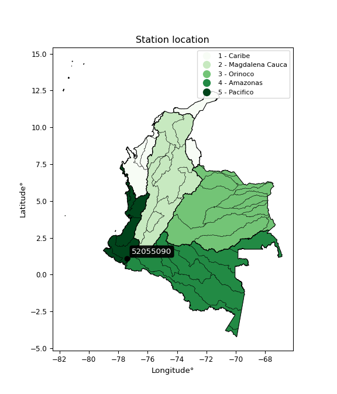

<div align="center">


</div>

# PMP Station (Rain, Pmax24h): 52055090

Probable Maximum Precipitation (PMP) is the greatest amount of rainfall for a specific duration that is meteorologically possible for a given location, acting as a "worst-case" scenario for extreme storms, crucial for designing safety-critical infrastructure like bridges, river deviations, dams, spillways, and nuclear plants to prevent catastrophic failure. PMP is calculated by hydrologists using meteorological data to determine the upper limit of extreme rainfall, often leading to the Probable Maximum Flood (PMF) for flood control design, and is increasingly being studied for climate change impacts. Probable Maximum Precipitation (PMP) is the theoretical upper limit of rainfall, a deterministic estimate for extreme events, while probability distributions (like GEV, Gumbel) describe the likelihood and frequency of various precipitation amounts, including rare ones, showing how often events occur, with PMP representing the extreme end of these distributions, used for critical infrastructure design to ensure safety against the worst conceivable weather, unlike standard statistical forecasts which cover typical probabilities.

The most common probability distributions in hydrology, used for analyzing floods, rainfall, and streamflow, include the Normal, Log-Normal, Gumbel, Gamma (including Log-Pearson Type III), and Generalized Extreme Value (GEV) distributions, often chosen based on the data´s skewness and whether modeling extremes or general conditions, with Gumbel and GEV popular for extreme events like floods, while the Normal distribution serves as a baseline, though often requiring transformations for skewed hydrological data. These distributions help in designing water infrastructure, managing water resources, and forecasting hydrologic events.

> Hydrological data often isn´t perfectly normal (it´s skewed), so different distributions are needed for different applications, such as: **Flood Frequency Analysis**: Using Gumbel, GEV, or Log-Pearson Type III for predicting extreme flood magnitudes and their return periods, **Rainfall Analysis**: Normal for annual totals, but Log-Normal, Weibull, or GEV for intensity or extreme daily rainfall, **Streamflow Modeling**: Gamma and Log-Normal for maximum flows, GEV for minimum flows, and Kappa for daily flows.

<div align="center">

</img>

</div>


## A. General information


### 1. General running parameters

• app_version: _v20260108_. • runtime: _2026-01-08 18:05:13.093906_. • Python version: _3.14.0_. • SciPy version: _1.16.3_. • Pandas version: _2.3.3_. • NumPy version: _2.3.5_. • Stations dataset (station_dataset_file): _dataset/pmax24h_in/automatic_colombia_2003_2024.csv_. • Stations catalog (station_catalog_file): _dataset/CNE.xls_. • Minimum year to eval til year_max (date_min): _1900_. • Maximum year to eval since year_min (date_max): _2024_. • Creates, save and include plots into reports (create_plot): _False_. • Plot only fit distributions with Δo > Δ (plot_only_fit): _True_. • Plot only simple graphs avoiding multiple CDFs and multiple Extreme values plots (plot_only_simple): _False_. • Eval low extreme values, if False, evaluates high extreme values (low_extreme): _False_. • Eval every SciPy distribution as logarithmic (pdist_logarithmic_on): _True_. • Standard deviation normalized (ddof): _1.0_. • Return periods to eval in years (Tr): _[2, 2.33, 5, 10, 15, 20, 25, 50, 75, 100, 200, 250, 500, 750, 1000]_. • Minimum data sample per station, 0 means any (minimum_sample): _5_. • Z-Score maximum threshold to adjust a value, 0 means disable (zscore_max): _3.5_. • Z-Score minimum threshold to adjust a value, 0 means disable (zscore_min): _-2.5_. • Avoid zeros, e.g. rain = 0 (avoid_zeros): _True_. • Avoid null values (avoid_nans): _True_. 

:file_folder:Table: [dataset.csv](../../dataset/pmax24h_in/automatic_colombia_2003_2024.csv)

> Delta Degrees of Freedom (DDOF): is a parameter used in the formulas for calculating variance and standard deviation. When ddof=0, the divisor is $N$ (the total number of observations) and this is used when your data set is the entire population. When ddof=1, the divisor is $N-1$ and this is used when your data set is a sample drawn from a larger population. Using $N-1$ provides an unbiased estimate of the population variance (known as Bessel´s correction).


### 2. Station info and location

|   id |   CODIGO | NOMBRE              | CATEGORIA               | TECNOLOGIA                | ESTADO   | FECHA_INSTALACION   |   FECHA_SUSPENSION |   ALTITUD |   LATITUD |   LONGITUD | DEPARTAMENTO   | MUNICIPIO   | AREA_OPERATIVA                      | ENTIDAD                                                     | AREA_HIDROGRAFICA   | ZONA_HIDROGRAFICA   | SUBZONA_HIDROGRAFICA   |   CORRIENTE | Catalogo   |   Version |
|-----:|---------:|:--------------------|:------------------------|:--------------------------|:---------|:--------------------|-------------------:|----------:|----------:|-----------:|:---------------|:------------|:------------------------------------|:------------------------------------------------------------|:--------------------|:--------------------|:-----------------------|------------:|:-----------|----------:|
|    0 | 52055090 | SINDAGUA [52055090] | Climatológica Principal | Automática con Telemetría | Activa   | 15/07/1987          |                nan |      2800 |   1.10758 |   -77.3894 | Nariño         | Tangua      | Area Operativa 07 - Nariño-Putumayo | INSTITUTO DE HIDROLOGIA METEOROLOGIA Y ESTUDIOS AMBIENTALES | Pacifico            | Patía               | Río Guáitara           |         nan | CNE_IDEAM  |  20251226 |

<div align="center">

Dynamic map: [:earth_americas:Google](http://maps.google.com/maps?q=1.107583333,-77.38936111) [:earth_americas:OSM](https://www.openstreetmap.org/#map=18/1.107583333/-77.38936111&layers=P) [:earth_americas:Bing](https://www.bing.com/maps?cp=1.107583333~-77.38936111&lvl=18) [:earth_americas:Apple](https://maps.apple.com/frame?center=1.107583333%2C-77.38936111&span=0.003%2C0.006)

</div>


<div align="center">

```geojson
{
  "type": "Feature",
  "geometry": {
    "type": "Point", 
    "coordinates": [-77.38936111, 1.107583333]
  }, 
  "properties": {
    "Name": "52055090"
  }
}
```

</div>


### 3. Discrete values table and plot

<div align="center">

|               |          0 |          1 |           2 |           3 |          4 |
|:--------------|-----------:|-----------:|------------:|------------:|-----------:|
| Date          | 2020       | 2021       | 2022        | 2023        | 2024       |
| Value         |    0.6     |   25.8     |   48.4      |   42.8      |   58.4     |
| Value_initial |    0.6     |   25.8     |   48.4      |   42.8      |   58.4     |
| count         |    5       |    5       |    5        |    5        |    5       |
| mean          |   35.2     |   35.2     |   35.2      |   35.2      |   35.2     |
| std           |   22.6702  |   22.6702  |   22.6702   |   22.6702   |   22.6702  |
| zscore        |   -1.52623 |   -0.41464 |    0.582261 |    0.335241 |    1.02337 |


</div>


> The initial value (value_initial) correspond to the initial obtained or null completed value, and value (value) is adjusted only when the initial value is outside the valid range (outlier) definite through the Z-Score value. If Z-Score is active, values out of range or outliers are replaced with the station mean value. A Z-Score (or standard score) measures how many standard deviations a data point is from the mean of a dataset, indicating its relative position; positive scores mean above the mean, negative mean below, and a score of zero is exactly at the mean, allowing for comparison of values from different distributions. It´s calculated using the formula $z=(x–μ)/σ$, where $x$ is the data point, $μ$ is the mean, and $σ$ is the standard deviation, helping identify outliers and understand probability.
>
> <sub>**Note**: In this study, "completing" (filling gaps in) and "extending" (forecasting or lengthening the historical record) rainfall data series are avoided for certain critical analyses because they introduce artificial bias and uncertainty, which can distort the statistics of rare events (extremes), alter day-to-day variability, and compromise the integrity and homogeneity of the original data. Some reasons against Completing/Extending rainfall data are: **Distortion of Extremes and Variability**: The primary issue is that most gap-filling or extension methods rely on averaging or regression with nearby stations, which inherently smooths the data. Rainfall is highly variable in space and time, with a large percentage of zero values and occasional large storms. Infilling methods often underestimate the highest values and overestimate the lowest (zero) values, which severely distorts analyses focused on flood frequency, drought severity, and intensity-duration-frequency (IDF) curves, **Loss of Data Homogeneity**: Infilled or extended data are synthetic estimates, not actual measurements. Combining these estimates with observed data can violate the assumption of data homogeneity, which requires that the data properties do not change over time. Inhomogeneity can lead to incorrect conclusions about long-term trends or changes in climate patterns, **Propagation of Errors**: Errors and biases from the original data (e.g., wind-induced undercatch, instrument errors, site changes) or the data used for imputation can propagate through the analysis, leading to unreliable hydrological models and inaccurate predictions, **Compromised Statistical Integrity**: For statistical analyses, especially those involving the frequency of events, using artificial data can introduce time bias or autocorrelation that doesn´t exist in reality, making it difficult to assess the true probability of events, **Difficulty in Validation**: It is difficult to accurately validate the quality of filled or extended data, especially for past periods where ground-truth measurements are unavailable. The reliability of imputation techniques heavily depends on the density of the surrounding station network and the complexity of the local topography.</sub>


### 4. Active continuous probability distributions from SciPy (43 of 104 available)

A Probability Density Function (PDF) describes the relative likelihood of a continuous random variable falling within a specific range, where the total area under its curve equals 1, and the area over any interval gives the actual probability for that range. Unlike discrete probabilities (like rolling a die), a PDF shows density, not direct probability for a single point (which is zero), with higher points indicating higher likelihood, often visualized as a bell curve for normal distributions.

A log of a probability density function (log-PDF) is simply the logarithm of the PDF´s value, denoted as $log(f(x))$, useful for converting multiplication of probabilities into addition, improving numerical stability with tiny numbers, and connecting to information theory concepts like entropy. Instead of dealing with very small probabilities (e.g., 0.000001), log-PDFs use negative numbers (e.g., $log(0.00001) ≈ -11.51$ that are easier for computers to handle, preventing underflow errors and simplifying complex calculations. In this study, each active probability distribution from SciPy is also evaluated in the $log$ form.

[scipy.stats](https://docs.scipy.org/doc/scipy/reference/stats.html) is a Python´s powerful submodule within the SciPy library for comprehensive statistical analysis, offering over 130 probability distributions (like Normal, Poisson), functions for descriptive stats (mean, variance), hypothesis testing (t-tests, chi-square), random variable generation, and statistical tests, making it essential for data science, modeling, and research. It provides tools to explore, model, and draw conclusions from data efficiently, working seamlessly with NumPy.

<div align="center">

|   id | p_dist             |   n_parameter | fit_method   | label                                                                       | active   | ref                                                                                                        |
|-----:|:-------------------|--------------:|:-------------|:----------------------------------------------------------------------------|:---------|:-----------------------------------------------------------------------------------------------------------|
|    0 | alpha              |             3 | MLE          | Alpha                                                                       | True     | [:mortar_board:](https://docs.scipy.org/doc/scipy/reference/generated/scipy.stats.alpha.html)              |
|    1 | betaprime          |             4 | MLE          | Beta prime                                                                  | True     | [:mortar_board:](https://docs.scipy.org/doc/scipy/reference/generated/scipy.stats.betaprime.html)          |
|    2 | chi2               |             3 | MLE          | Chi²                                                                        | True     | [:mortar_board:](https://docs.scipy.org/doc/scipy/reference/generated/scipy.stats.chi2.html)               |
|    3 | crystalball        |             4 | MLE          | Crystalball                                                                 | True     | [:mortar_board:](https://docs.scipy.org/doc/scipy/reference/generated/scipy.stats.crystalball.html)        |
|    4 | erlang             |             3 | MLE          | Erlang                                                                      | True     | [:mortar_board:](https://docs.scipy.org/doc/scipy/reference/generated/scipy.stats.erlang.html)             |
|    5 | expon              |             2 | MLE          | Exponential                                                                 | True     | [:mortar_board:](https://docs.scipy.org/doc/scipy/reference/generated/scipy.stats.expon.html)              |
|    6 | exponnorm          |             3 | MLE          | Exponentially modified Normal                                               | True     | [:mortar_board:](https://docs.scipy.org/doc/scipy/reference/generated/scipy.stats.exponnorm.html)          |
|    7 | f                  |             4 | MLE          | F                                                                           | True     | [:mortar_board:](https://docs.scipy.org/doc/scipy/reference/generated/scipy.stats.f.html)                  |
|    8 | fatiguelife        |             3 | MLE          | Fatigue-life (Birnbaum-Saunders)                                            | True     | [:mortar_board:](https://docs.scipy.org/doc/scipy/reference/generated/scipy.stats.fatiguelife.html)        |
|    9 | fisk               |             3 | MLE          | Fisk                                                                        | True     | [:mortar_board:](https://docs.scipy.org/doc/scipy/reference/generated/scipy.stats.fisk.html)               |
|   10 | gamma              |             3 | MLE          | Gamma                                                                       | True     | [:mortar_board:](https://docs.scipy.org/doc/scipy/reference/generated/scipy.stats.gamma.html)              |
|   11 | genexpon           |             5 | MLE          | Generalized exponential                                                     | True     | [:mortar_board:](https://docs.scipy.org/doc/scipy/reference/generated/scipy.stats.genexpon.html)           |
|   12 | genlogistic        |             3 | MLE          | Generalized logistic                                                        | True     | [:mortar_board:](https://docs.scipy.org/doc/scipy/reference/generated/scipy.stats.genlogistic.html)        |
|   13 | gibrat             |             2 | MM           | Gibrat                                                                      | True     | [:mortar_board:](https://docs.scipy.org/doc/scipy/reference/generated/scipy.stats.gibrat.html)             |
|   14 | gompertz           |             3 | MLE          | Gompertz (or truncated Gumbel)                                              | True     | [:mortar_board:](https://docs.scipy.org/doc/scipy/reference/generated/scipy.stats.gompertz.html)           |
|   15 | gumbel_l           |             2 | MM           | Gumbel Left Skew                                                            | True     | [:mortar_board:](https://docs.scipy.org/doc/scipy/reference/generated/scipy.stats.gumbel_l.html)           |
|   16 | gumbel_r           |             2 | MM           | Gumbel Right Skew                                                           | True     | [:mortar_board:](https://docs.scipy.org/doc/scipy/reference/generated/scipy.stats.gumbel_r.html)           |
|   17 | halflogistic       |             2 | MM           | Half-logistic                                                               | True     | [:mortar_board:](https://docs.scipy.org/doc/scipy/reference/generated/scipy.stats.halflogistic.html)       |
|   18 | halfnorm           |             2 | MM           | Half Normal                                                                 | True     | [:mortar_board:](https://docs.scipy.org/doc/scipy/reference/generated/scipy.stats.halfnorm.html)           |
|   19 | hypsecant          |             2 | MM           | hyperbolic secant                                                           | True     | [:mortar_board:](https://docs.scipy.org/doc/scipy/reference/generated/scipy.stats.hypsecant.html)          |
|   20 | invgamma           |             3 | MLE          | Inverted gamma                                                              | True     | [:mortar_board:](https://docs.scipy.org/doc/scipy/reference/generated/scipy.stats.invgamma.html)           |
|   21 | invgauss           |             3 | MLE          | Inverse Gaussian                                                            | True     | [:mortar_board:](https://docs.scipy.org/doc/scipy/reference/generated/scipy.stats.invgauss.html)           |
|   22 | invweibull         |             3 | MLE          | Inverted Weibull                                                            | True     | [:mortar_board:](https://docs.scipy.org/doc/scipy/reference/generated/scipy.stats.invweibull.html)         |
|   23 | kstwobign          |             2 | MLE          | Limiting distribution of scaled Kolmogorov-Smirnov two-sided test statistic | True     | [:mortar_board:](https://docs.scipy.org/doc/scipy/reference/generated/scipy.stats.kstwobign.html)          |
|   24 | laplace            |             2 | MM           | Laplace                                                                     | True     | [:mortar_board:](https://docs.scipy.org/doc/scipy/reference/generated/scipy.stats.laplace.html)            |
|   25 | laplace_asymmetric |             3 | MLE          | Asymmetric Laplace                                                          | True     | [:mortar_board:](https://docs.scipy.org/doc/scipy/reference/generated/scipy.stats.laplace_asymmetric.html) |
|   26 | loggamma           |             3 | MLE          | Log gamma                                                                   | True     | [:mortar_board:](https://docs.scipy.org/doc/scipy/reference/generated/scipy.stats.loggamma.html)           |
|   27 | logistic           |             2 | MM           | Logistic (or Sech-squared)                                                  | True     | [:mortar_board:](https://docs.scipy.org/doc/scipy/reference/generated/scipy.stats.logistic.html)           |
|   28 | lognorm            |             3 | MLE          | Log Normal                                                                  | True     | [:mortar_board:](https://docs.scipy.org/doc/scipy/reference/generated/scipy.stats.lognorm.html)            |
|   29 | maxwell            |             2 | MM           | Maxwell                                                                     | True     | [:mortar_board:](https://docs.scipy.org/doc/scipy/reference/generated/scipy.stats.maxwell.html)            |
|   30 | mielke             |             4 | MLE          | Mielke Beta-Kappa / Dagum                                                   | True     | [:mortar_board:](https://docs.scipy.org/doc/scipy/reference/generated/scipy.stats.mielke.html)             |
|   31 | moyal              |             2 | MM           | Moyal                                                                       | True     | [:mortar_board:](https://docs.scipy.org/doc/scipy/reference/generated/scipy.stats.moyal.html)              |
|   32 | nakagami           |             3 | MLE          | Nakagami                                                                    | True     | [:mortar_board:](https://docs.scipy.org/doc/scipy/reference/generated/scipy.stats.nakagami.html)           |
|   33 | ncf                |             5 | MLE          | Non-central F distribution                                                  | True     | [:mortar_board:](https://docs.scipy.org/doc/scipy/reference/generated/scipy.stats.ncf.html)                |
|   34 | nct                |             4 | MLE          | Non-central Student’s t                                                     | True     | [:mortar_board:](https://docs.scipy.org/doc/scipy/reference/generated/scipy.stats.nct.html)                |
|   35 | norm               |             2 | MM           | Normal                                                                      | True     | [:mortar_board:](https://docs.scipy.org/doc/scipy/reference/generated/scipy.stats.norm.html)               |
|   36 | pearson3           |             3 | MM           | Pearson type III                                                            | True     | [:mortar_board:](https://docs.scipy.org/doc/scipy/reference/generated/scipy.stats.pearson3.html)           |
|   37 | rayleigh           |             2 | MM           | Rayleigh                                                                    | True     | [:mortar_board:](https://docs.scipy.org/doc/scipy/reference/generated/scipy.stats.rayleigh.html)           |
|   38 | rice               |             3 | MLE          | Rice                                                                        | True     | [:mortar_board:](https://docs.scipy.org/doc/scipy/reference/generated/scipy.stats.rice.html)               |
|   39 | t                  |             3 | MLE          | Student’s t                                                                 | True     | [:mortar_board:](https://docs.scipy.org/doc/scipy/reference/generated/scipy.stats.t.html)                  |
|   40 | truncnorm          |             4 | MLE          | Truncated normal                                                            | True     | [:mortar_board:](https://docs.scipy.org/doc/scipy/reference/generated/scipy.stats.truncnorm.html)          |
|   41 | wald               |             2 | MM           | Wald                                                                        | True     | [:mortar_board:](https://docs.scipy.org/doc/scipy/reference/generated/scipy.stats.wald.html)               |
|   42 | weibull_min        |             3 | MLE          | Weibull minimum                                                             | True     | [:mortar_board:](https://docs.scipy.org/doc/scipy/reference/generated/scipy.stats.weibull_min.html)        |

</div>

> **n_parameter:** # arguments & localization & scale.
>
> **Fit methods:** (MLE) maximum likelihood, (MM) L-moments.
>
>**Inactive** (With the only purpose of prevent loops, zero divisions, infinite values, over high estimated values or horizontal trending for recurrence intervals estimations, the follow distributions were disabled.)**:** foldnorm, gennorm, norminvgauss, powernorm, powerlognorm, skewnorm, genextreme, anglit, arcsine, argus, beta, bradford, burr, burr12, cauchy, cosine, halfcauchy, foldcauchy, skewcauchy, wrapcauchy, dgamma, gengamma, exponweib, exponpow, truncexpon, gausshyper, genhalflogistic, genhyperbolic, geninvgauss, halfgennorm, johnsonsb, johnsonsu, kappa4, kappa3, ksone, kstwo, loglaplace, levy, levy_l, levy_stable, ncx2, pareto, genpareto, truncpareto, lomax, powerlaw, rdist, rel_breitwigner, recipinvgauss, semicircular, studentized_range, trapezoid, triang, truncweibull_min, tukeylambda, uniform, loguniform, vonmises, vonmises_line, weibull_max, dweibull, 


## B. Probability (PDF) vs. Empirical (EDF) distributions functions

A continuous probability distribution (CPD) describes probabilities for variables that can take any value within a range (like rain any time), unlike discrete variables with specific outcomes (like temperature). It uses a Probability Density Function (PDF), a curve where the total area under it equals 1, and the probability of the variable falling within an interval (a to b) is found by calculating the area under the curve between those points. A key feature is that the probability of hitting any single exact value is zero, so probabilities are always expressed for ranges, e.g., $P(a ≤ X ≤ b)$.

<div align="center">

Distributions parameters from station values
|    |   station | p_dist                |   n |             loc |           scale | shape                  | shape1               | shape2              | shape3   |
|---:|----------:|:----------------------|----:|----------------:|----------------:|:-----------------------|:---------------------|:--------------------|:---------|
|  0 |  52055090 | alpha                 |   5 |     0.00179137  |     1.33726     | 2.1619056483823096e-09 |                      |                     |          |
|  1 |  52055090 | betaprime             |   5 |  -751.036       | 55816.5         | 1488.4816738861555     | 105654.3233639794    |                     |          |
|  2 |  52055090 | chi2                  |   5 |  -215.184       |     0.87507     | 285.6657182649408      |                      |                     |          |
|  3 |  52055090 | crystalball           |   5 |    35.2         |    20.2769      | 3012.3523213514723     | 2620.2815982772267   |                     |          |
|  4 |  52055090 | erlang                |   5 |  -308.006       |     1.24746     | 275.18200906591176     |                      |                     |          |
|  5 |  52055090 | expon                 |   5 |     0.6         |    34.6         |                        |                      |                     |          |
|  6 |  52055090 | exponnorm             |   5 |    35.1812      |    20.2768      | 0.0009310096750778288  |                      |                     |          |
|  7 |  52055090 | f                     |   5 |     0.6         |    16.5961      | 1.2035795368071398     | 482.8514383200636    |                     |          |
|  8 |  52055090 | fatiguelife           |   5 |     0.6         |     8.47161e-05 | 826.8154533226382      |                      |                     |          |
|  9 |  52055090 | fisk                  |   5 |    -3.37405e+06 |     3.37409e+06 | 282896.40815727215     |                      |                     |          |
| 10 |  52055090 | gamma                 |   5 |  -273.014       |     1.39328     | 221.2597434104257      |                      |                     |          |
| 11 |  52055090 | genexpon              |   5 |     0.599996    |     2.49622     | 0.07238022153046776    | 6.33790740498761e-07 | 1.1850575475553664  |          |
| 12 |  52055090 | genlogistic           |   5 |    58.4014      |     0.000142794 | 6.1963541598033006e-06 |                      |                     |          |
| 13 |  52055090 | gibrat                |   5 |    19.7313      |     9.38225     |                        |                      |                     |          |
| 14 |  52055090 | gompertz              |   5 |    25.8         |     9.85742     | 0.10045599134662636    |                      |                     |          |
| 15 |  52055090 | gumbel_l              |   5 |    44.3257      |    15.8098      |                        |                      |                     |          |
| 16 |  52055090 | gumbel_r              |   5 |    26.0743      |    15.8098      |                        |                      |                     |          |
| 17 |  52055090 | halflogistic          |   5 |    11.1672      |    17.336       |                        |                      |                     |          |
| 18 |  52055090 | halfnorm              |   5 |     8.36134     |    33.6373      |                        |                      |                     |          |
| 19 |  52055090 | hypsecant             |   5 |    35.2         |    12.9087      |                        |                      |                     |          |
| 20 |  52055090 | invgamma              |   5 |  -280.337       | 70630.8         | 224.79663409842956     |                      |                     |          |
| 21 |  52055090 | invgauss              |   5 |  -133.857       | 10287.5         | 0.01637150634509256    |                      |                     |          |
| 22 |  52055090 | invweibull            |   5 |     0.6         |     4.3789      | 0.07183433280544993    |                      |                     |          |
| 23 |  52055090 | kstwobign             |   5 |   -48.4317      |    95.3158      |                        |                      |                     |          |
| 24 |  52055090 | laplace               |   5 |    35.2         |    14.3379      |                        |                      |                     |          |
| 25 |  52055090 | laplace_asymmetric    |   5 |    48.4         |    12.4753      | 1.6603773117764096     |                      |                     |          |
| 26 |  52055090 | loggamma              |   5 |    58.4492      |     1.57074e-05 | 6.752236797952521e-07  |                      |                     |          |
| 27 |  52055090 | logistic              |   5 |    35.2         |    11.1792      |                        |                      |                     |          |
| 28 |  52055090 | lognorm               |   5 |     0.6         |     0.0126676   | 16.186388741502203     |                      |                     |          |
| 29 |  52055090 | maxwell               |   5 |   -12.8477      |    30.1094      |                        |                      |                     |          |
| 30 |  52055090 | mielke                |   5 |     0.6         |    60.5014      | 0.5768641922521245     | 32.81229157994818    |                     |          |
| 31 |  52055090 | moyal                 |   5 |    23.6044      |     9.1278      |                        |                      |                     |          |
| 32 |  52055090 | nakagami              |   5 |     0.6         |    42.2138      | 0.34573607950552654    |                      |                     |          |
| 33 |  52055090 | ncf                   |   5 |     0.6         |     9.96885     | 1.011371924806032      | 12.069588996581203   | 1.2975286913197452  |          |
| 34 |  52055090 | nct                   |   5 |    -0.369016    |     0.0395426   | 0.33996963267698266    | 54.73610702845775    |                     |          |
| 35 |  52055090 | norm                  |   5 |    35.2         |    20.2769      |                        |                      |                     |          |
| 36 |  52055090 | pearson3              |   5 |    35.2         |    20.2769      | -0.648354609011752     |                      |                     |          |
| 37 |  52055090 | rayleigh              |   5 |    -3.59086     |    30.9506      |                        |                      |                     |          |
| 38 |  52055090 | rice                  |   5 |   -12.7005      |    22.4085      | 1.840689809616206      |                      |                     |          |
| 39 |  52055090 | t                     |   5 |    35.2001      |    20.2777      | 1241431.4502247048     |                      |                     |          |
| 40 |  52055090 | truncnorm             |   5 |    -0.897664    |     6.64676     | -0.6589968021920214    | 8.92129256070444     |                     |          |
| 41 |  52055090 | wald                  |   5 |    14.9231      |    20.2769      |                        |                      |                     |          |
| 42 |  52055090 | weibull_min           |   5 |    -4.97258e+08 |     4.97258e+08 | 32529699.29999096      |                      |                     |          |
| 43 |  52055090 | logalpha              |   5 |   -39.6823      |  1013.03        | 23.84301745265158      |                      |                     |          |
| 44 |  52055090 | logbetaprime          |   5 |    -0.510826    |     2.22182     | 0.4403423666952043     | 0.8311673214921107   |                     |          |
| 45 |  52055090 | logchi2               |   5 |    -0.510826    |     1.368       | 1.2920424762108944     |                      |                     |          |
| 46 |  52055090 | logcrystalball        |   5 |     2.88858     |     1.72114     | 5.67473524937304       | 237.68834766182974   |                     |          |
| 47 |  52055090 | logerlang             |   5 |   -23.9253      |     0.123423    | 217.29301634794479     |                      |                     |          |
| 48 |  52055090 | logexpon              |   5 |    -0.510826    |     3.39941     |                        |                      |                     |          |
| 49 |  52055090 | logexponnorm          |   5 |     2.8875      |     1.72113     | 0.0006202981000489175  |                      |                     |          |
| 50 |  52055090 | logf                  |   5 |    -0.510826    |     1.07878     | 1.2612109007037537     | 1.1332914609770133   |                     |          |
| 51 |  52055090 | logfatiguelife        |   5 | -1000.53        |  1003.42        | 0.0017088753194842207  |                      |                     |          |
| 52 |  52055090 | logfisk               |   5 |    -0.510826    |     1.58153     | 0.47444671483288425    |                      |                     |          |
| 53 |  52055090 | loggamma              |   5 |   -24.5708      |     0.11568     | 237.10375514042562     |                      |                     |          |
| 54 |  52055090 | loggenexpon           |   5 |    -0.510875    |     7.52493     | 0.9270784616700538     | 109.82147379111117   | 0.04144010311434916 |          |
| 55 |  52055090 | loggenlogistic        |   5 |     4.06743     |     3.91519e-06 | 3.3388988887273554e-06 |                      |                     |          |
| 56 |  52055090 | loggibrat             |   5 |     1.57554     |     0.796393    |                        |                      |                     |          |
| 57 |  52055090 | loggompertz           |   5 |    -0.510826    |     0.988907    | 0.016508750996970877   |                      |                     |          |
| 58 |  52055090 | loggumbel_l           |   5 |     3.66318     |     1.34196     |                        |                      |                     |          |
| 59 |  52055090 | loggumbel_r           |   5 |     2.11398     |     1.34196     |                        |                      |                     |          |
| 60 |  52055090 | loghalflogistic       |   5 |     0.848639    |     1.47151     |                        |                      |                     |          |
| 61 |  52055090 | loghalfnorm           |   5 |     0.610499    |     2.85516     |                        |                      |                     |          |
| 62 |  52055090 | loghypsecant          |   5 |     2.88858     |     1.09571     |                        |                      |                     |          |
| 63 |  52055090 | loginvgamma           |   5 |   -38.5498      | 21954.8         | 531.3345167064849      |                      |                     |          |
| 64 |  52055090 | loginvgauss           |   5 |   -16.6344      |  2074.21        | 0.00938431654207688    |                      |                     |          |
| 65 |  52055090 | loginvweibull         |   5 |    -1.20793e+08 |     1.20793e+08 | 59941578.564314954     |                      |                     |          |
| 66 |  52055090 | logkstwobign          |   5 |    -5.13782     |     9.14658     |                        |                      |                     |          |
| 67 |  52055090 | loglaplace            |   5 |     2.88858     |     1.21703     |                        |                      |                     |          |
| 68 |  52055090 | loglaplace_asymmetric |   5 |     4.06732     |     0.00972708  | 121.10121032938906     |                      |                     |          |
| 69 |  52055090 | logloggamma           |   5 |     4.06742     |     1.12236e-05 | 9.473104517529569e-06  |                      |                     |          |
| 70 |  52055090 | loglogistic           |   5 |     2.88858     |     0.948912    |                        |                      |                     |          |
| 71 |  52055090 | loglognorm            |   5 |  -782.047       |   784.938       | 0.0021915869929474713  |                      |                     |          |
| 72 |  52055090 | logmaxwell            |   5 |    -1.18979     |     2.55574     |                        |                      |                     |          |
| 73 |  52055090 | logmielke             |   5 |    -0.510826    |     1.58956     | 0.6524224550825543     | 0.9322453484331072   |                     |          |
| 74 |  52055090 | logmoyal              |   5 |     1.90432     |     0.774783    |                        |                      |                     |          |
| 75 |  52055090 | lognakagami           |   5 | -1562.01        |  1564.9         | 206061.23638031416     |                      |                     |          |
| 76 |  52055090 | logncf                |   5 |    -0.510826    |     1.03083     | 0.9925346653776834     | 1.2498892188257753   | 1.1599139641063987  |          |
| 77 |  52055090 | lognct                |   5 |  -110.49        |     1.69391     | 62986.99400112347      | 66.9324610948079     |                     |          |
| 78 |  52055090 | lognorm               |   5 |     2.88858     |     1.72114     |                        |                      |                     |          |
| 79 |  52055090 | logpearson3           |   5 |     2.88859     |     1.72112     | -1.4110032389849199    |                      |                     |          |
| 80 |  52055090 | lograyleigh           |   5 |    -0.40401     |     2.62712     |                        |                      |                     |          |
| 81 |  52055090 | logrice               |   5 |  -788.61        |     1.72006     | 460.15614262352756     |                      |                     |          |
| 82 |  52055090 | logt                  |   5 |     3.84185     |     0.168317    | 0.6427935249327632     |                      |                     |          |
| 83 |  52055090 | logtruncnorm          |   5 |     1.49639     |     6.72096     | -0.35891194504629376   | 0.3825231912633187   |                     |          |
| 84 |  52055090 | logwald               |   5 |     1.16741     |     1.72116     |                        |                      |                     |          |
| 85 |  52055090 | logweibull_min        |   5 |    -0.510826    |     2.24496     | 0.2714232614411111     |                      |                     |          |

</div>

> **loc** (Location parameter): This shifts the distribution along the x-axis. For many common distributions, like the normal (Gaussian) distribution, loc represents the mean $μ$. For others, like the uniform distribution, it might represent the minimum value, or for the beta distribution, the left end of the support interval.
>
> **scale** (Scale parameter): This determines the width or spread of the distribution. For the normal distribution, scale represents the standard deviation $σ$. For a uniform distribution, it defines the length of the interval (from $loc$ to $loc + scale$).
>
> **shape** (Shape parameters): Refers to parameters that define the specific form of a probability distribution, distinct from its location (loc) and scale (scale). These parameters are required arguments for most distribution functions. For example, a normal (Gaussian) distribution is fully defined by its location (mean) and scale (standard deviation), so it has no specific shape parameters beyond loc and scale. However, other distributions have intrinsic properties that need specification, as Gamma distribution that takes a shape parameter, often named $a$ or $alpha$.


### 0. Cumulative distribution values - CDF (86 evaluated)

Cumulative Distribution Function (CDF), denoted as $F$<sub>$X$</sub>$(x)$, is a function that gives the probability that a random variable $X$ will take a value less than or equal to a specific value, $x$ (i.e., $(P(X≥x)$. It essentially "accumulates" probabilities from a given point up to the far right (positive infinity), providing a complete picture of the distribution´s probabilities for both discrete (like rain) and continuous (like temperature) variables, helping to find probabilities over ranges or above certain values. Each station is evaluated separately ordering the $x$ values ascending, calculating the CDF and PDF values for the activated distributions and their logarithmic forms.

<div align="center">

CDF ordered by x ascending and calculating $log(f(x))$ separately
|   id |   Station |   date |    x |   count |   mean |     std |    zscore |   Value_initial |   station |   m |     alpha |   alpha_pdf |   betaprime |   betaprime_pdf |      chi2 |   chi2_pdf |   crystalball |   crystalball_pdf |    erlang |   erlang_pdf |    expon |   expon_pdf |   exponnorm |   exponnorm_pdf |           f |           f_pdf |   fatiguelife |   fatiguelife_pdf |      fisk |   fisk_pdf |     gamma |   gamma_pdf |    genexpon |   genexpon_pdf |   genlogistic |   genlogistic_pdf |   gibrat |   gibrat_pdf |    gompertz |   gompertz_pdf |   gumbel_l |   gumbel_l_pdf |   gumbel_r |   gumbel_r_pdf |   halflogistic |   halflogistic_pdf |   halfnorm |   halfnorm_pdf |   hypsecant |   hypsecant_pdf |   invgamma |   invgamma_pdf |   invgauss |   invgauss_pdf |   invweibull |   invweibull_pdf |   kstwobign |   kstwobign_pdf |   laplace |   laplace_pdf |   laplace_asymmetric |   laplace_asymmetric_pdf |   loggamma |   loggamma_pdf |   logistic |   logistic_pdf |   lognorm |   lognorm_pdf |   maxwell |   maxwell_pdf |      mielke |      mielke_pdf |       moyal |   moyal_pdf |    nakagami |   nakagami_pdf |         ncf |         ncf_pdf |       nct |    nct_pdf |     norm |   norm_pdf |   pearson3 |   pearson3_pdf |   rayleigh |   rayleigh_pdf |      rice |   rice_pdf |         t |      t_pdf |   truncnorm |   truncnorm_pdf |     wald |   wald_pdf |   weibull_min |   weibull_min_pdf |   logalpha |   logalpha_pdf |   logbetaprime |   logbetaprime_pdf |     logchi2 |    logchi2_pdf |   logcrystalball |   logcrystalball_pdf |   logerlang |   logerlang_pdf |   logexpon |   logexpon_pdf |   logexponnorm |   logexponnorm_pdf |        logf |       logf_pdf |   logfatiguelife |   logfatiguelife_pdf |     logfisk |   logfisk_pdf |   loggenexpon |   loggenexpon_pdf |   loggenlogistic |   loggenlogistic_pdf |   loggibrat |   loggibrat_pdf |   loggompertz |   loggompertz_pdf |   loggumbel_l |   loggumbel_l_pdf |   loggumbel_r |   loggumbel_r_pdf |   loghalflogistic |   loghalflogistic_pdf |   loghalfnorm |   loghalfnorm_pdf |   loghypsecant |   loghypsecant_pdf |   loginvgamma |   loginvgamma_pdf |   loginvgauss |   loginvgauss_pdf |   loginvweibull |   loginvweibull_pdf |   logkstwobign |   logkstwobign_pdf |   loglaplace |   loglaplace_pdf |   loglaplace_asymmetric |   loglaplace_asymmetric_pdf |   logloggamma |   logloggamma_pdf |   loglogistic |   loglogistic_pdf |   loglognorm |   loglognorm_pdf |   logmaxwell |   logmaxwell_pdf |   logmielke |   logmielke_pdf |    logmoyal |   logmoyal_pdf |   lognakagami |   lognakagami_pdf |      logncf |   logncf_pdf |   lognct |   lognct_pdf |   logpearson3 |   logpearson3_pdf |   lograyleigh |   lograyleigh_pdf |   logrice |   logrice_pdf |      logt |   logt_pdf |   logtruncnorm |   logtruncnorm_pdf |   logwald |   logwald_pdf |   logweibull_min |   logweibull_min_pdf |
|-----:|----------:|-------:|-----:|--------:|-------:|--------:|----------:|----------------:|----------:|----:|----------:|------------:|------------:|----------------:|----------:|-----------:|--------------:|------------------:|----------:|-------------:|---------:|------------:|------------:|----------------:|------------:|----------------:|--------------:|------------------:|----------:|-----------:|----------:|------------:|------------:|---------------:|--------------:|------------------:|---------:|-------------:|------------:|---------------:|-----------:|---------------:|-----------:|---------------:|---------------:|-------------------:|-----------:|---------------:|------------:|----------------:|-----------:|---------------:|-----------:|---------------:|-------------:|-----------------:|------------:|----------------:|----------:|--------------:|---------------------:|-------------------------:|-----------:|---------------:|-----------:|---------------:|----------:|--------------:|----------:|--------------:|------------:|----------------:|------------:|------------:|------------:|---------------:|------------:|----------------:|----------:|-----------:|---------:|-----------:|-----------:|---------------:|-----------:|---------------:|----------:|-----------:|----------:|-----------:|------------:|----------------:|---------:|-----------:|--------------:|------------------:|-----------:|---------------:|---------------:|-------------------:|------------:|---------------:|-----------------:|---------------------:|------------:|----------------:|-----------:|---------------:|---------------:|-------------------:|------------:|---------------:|-----------------:|---------------------:|------------:|--------------:|--------------:|------------------:|-----------------:|---------------------:|------------:|----------------:|--------------:|------------------:|--------------:|------------------:|--------------:|------------------:|------------------:|----------------------:|--------------:|------------------:|---------------:|-------------------:|--------------:|------------------:|--------------:|------------------:|----------------:|--------------------:|---------------:|-------------------:|-------------:|-----------------:|------------------------:|----------------------------:|--------------:|------------------:|--------------:|------------------:|-------------:|-----------------:|-------------:|-----------------:|------------:|----------------:|------------:|---------------:|--------------:|------------------:|------------:|-------------:|---------:|-------------:|--------------:|------------------:|--------------:|------------------:|----------:|--------------:|----------:|-----------:|---------------:|-------------------:|----------:|--------------:|-----------------:|---------------------:|
|    0 |  52055090 |   2020 |  0.6 |       5 |   35.2 | 22.6702 | -1.52623  |             0.6 |  52055090 |   1 | 0.0253883 | 0.245088    |   0.0437282 |      0.00465261 | 0.0457378 | 0.0050665  |      0.043969 |        0.00458814 | 0.0431455 |   0.0047544  | 0        |  0.0289017  |   0.0439682 |      0.00458808 | 3.80504e-11 | 206250          |     0.0353704 |       1.85592e+09 | 0.0439017 | 0.00351932 | 0.0429898 |  0.00477426 | 1.07703e-07 |     0.0289959  |      0        |        0.00353284 | 0        |   0          | 0           |      0         |   0.060991 |     0.00373768 | 0.00667553 |     0.00211513 |       0        |         0          |   0        |     0          |   0.0435644 |      0.00336429 |  0.0416742 |     0.00493633 |  0.0441929 |     0.00547607 |  3.70165e-07 |      1.77346e+09 |   0.0460297 |      0.0078146  |  0.044765 |    0.00312214 |            0.0730108 |               0.00352477 |  0.0254375 |      0.0363434 |  0.0433129 |     0.0037066  | 0.0241287 |     0.0329613 | 0.0223262 |    0.00478424 | 5.86856e-11 | 304926          | 0.000422098 | 0.000307816 | 5.42313e-13 |  3377.65       | 1.54896e-08 | 373293          | 0.0554157 | 0.157645   | 0.043969 | 0.00458814 |  0.0582422 |     0.00428982 | 0.00912533 |     0.00433494 | 0.0341943 | 0.00539333 | 0.0439751 | 0.00458846 |    0.448542 |     0.0785398   | 0        | 0          |     0.0548225 |        0.00348623 |  0.0217736 |      0.0343501 |    5.97553e-08 |        2.37004e+08 | 2.86153e-11 | 166508         |        0.0241287 |            0.0329613 |   0.0265546 |       0.0370023 |   0        |      0.294169  |      0.0241291 |          0.0329617 | 5.77585e-11 | 328067         |        0.0233067 |            0.0322437 | 2.16744e-08 |    9.2624e+07 |   6.14217e-06 |          0.123204 |         0        |            0.0171873 |    0        |       0         |   2.34978e-09 |         0.0166939 |     0.0436051 |         0.0317745 |   0.000849747 |        0.00447717 |          0        |              0        |      0        |          0        |      0.0285892 |          0.0260569 |      0.025692 |         0.0372542 |     0.0286485 |         0.0421642 |       0.0349872 |           0.0582104 |      0.0399348 |          0.0745863 |    0.0306123 |        0.0251534 |               0.0205157 |                   0.0174163 |     0.0209798 |         0.0177077 |     0.0270558 |          0.027741 |    0.0237406 |        0.0326733 |   0.00488238 |        0.0212695 | 2.88105e-11 |  169305         | 2.01266e-06 |    3.05352e-05 |     0.0242185 |         0.0330392 | 4.41061e-09 |  1.97153e+07 | 0.024221 |    0.0330829 |     0.0479752 |         0.0326479 |      0        |          0        | 0.0240585 |     0.0329012 | 0.0385776 | 0.00569365 |      0.0787629 |           0.196342 |  0        |     0         |      3.75162e-05 |          9.17165e+10 |
|    1 |  52055090 |   2021 | 25.8 |       5 |   35.2 | 22.6702 | -0.41464  |            25.8 |  52055090 |   2 | 0.95866   | 0.00160101  |   0.323752  |      0.0176521  | 0.341906  | 0.0179865  |      0.321474 |        0.0176702  | 0.329263  |   0.0178126  | 0.517283 |  0.0139514  |   0.321471  |      0.0176702  | 0.778603    |      0.0101386  |     0.745258  |       0.00420052  | 0.275273  | 0.0167267  | 0.330393  |  0.0178479  | 0.51843     |     0.0139637  |      0        |        0.0105446  | 0.331537 |   0.0597856  | 1.46187e-10 |      0.0101909 |   0.266417 |     0.0143755  | 0.361497   |     0.0232655  |       0.398644 |         0.0242582  |   0.395844 |     0.0207375  |   0.286337  |      0.0193089  |  0.339581  |     0.0180909  |  0.361337  |     0.0183816  |  0.414009    |      0.00104075  |   0.421009  |      0.0174008  |  0.259564 |    0.0181033  |            0.246459  |               0.0118984  |  0.595289  |      0.215469  |  0.301357  |     0.0188332  | 0.583247  |     0.226725  | 0.351346  |    0.0191565  | 0.603366    |      0.0138119  | 0.375251    | 0.0261571   | 0.527171    |     0.0131917  | 0.650825    |      0.0109857  | 0.657902  | 0.00443989 | 0.321474 | 0.0176702  |  0.291419  |     0.0153759  | 0.362929   |     0.0195461  | 0.336259  | 0.0179465  | 0.321479  | 0.0176696  |    0.99996  |     2.52803e-05 | 0.396109 | 0.0409879  |     0.254092  |        0.0143047  |  0.59763   |      0.21266   |    0.765921    |        0.0377263   | 0.861909    |      0.0593156 |        0.583247  |            0.226725  |   0.586193  |       0.212233  |   0.669262 |      0.0972929 |      0.58325   |          0.226725  | 0.695665    |      0.0385197 |        0.582003  |            0.227644  | 0.601336    |    0.0302402  |   0.642276    |          0.151099 |         0        |            0.424854  |    0.771373 |       0.180693  |   0.515171    |         0.363027  |     0.520589  |         0.262646  |   0.651304    |        0.208102   |          0.67293  |              0.18592  |      0.644825 |          0.182253 |      0.603244  |          0.275358  |      0.599177 |         0.212334  |     0.605974  |         0.199996  |       0.595362  |           0.153211  |      0.630423  |          0.145346  |    0.628581  |        0.305186  |               0.499779  |                   0.424274  |     0.501772  |         0.423513  |     0.59418   |          0.254112 |    0.582652  |        0.226809  |   0.61119    |        0.208338  | 0.771764    |       0.0414197 | 0.674842    |    0.197815    |     0.582875  |         0.226417  | 0.59366     |  0.0471669   | 0.583346 |    0.226317  |     0.492611  |         0.254845  |      0.619959 |          0.201227 | 0.583296  |     0.226861  | 0.137779  | 0.14509    |      0.840833  |           0.198423 |  0.74027  |     0.170951  |      0.683475    |          0.026276    |
|    2 |  52055090 |   2023 | 42.8 |       5 |   35.2 | 22.6702 |  0.335241 |            42.8 |  52055090 |   3 | 0.975074  | 0.000582228 |   0.644961  |      0.018023   | 0.657846  | 0.0171919  |      0.6461   |        0.0183402  | 0.648446  |   0.017669   | 0.704667 |  0.00853562 |   0.646098  |      0.0183402  | 0.895164    |      0.00446459 |     0.803342  |       0.00280289  | 0.612377  | 0.0199021  | 0.649206  |  0.0175993  | 0.705842    |     0.00852946 |      0        |        0.0220499  | 0.815849 |   0.011538   | 0.370685    |      0.0359799 |   0.596673 |     0.0231643  | 0.706682   |     0.0155183  |       0.722256 |         0.0137963  |   0.694082 |     0.0140444  |   0.677432  |      0.0209259  |  0.654066  |     0.0169514  |  0.669161  |     0.0160748  |  0.427499    |      0.000618405 |   0.681216  |      0.0126467  |  0.705716 |    0.0205249  |            0.559985  |               0.0270346  |  0.698793  |      0.191372  |  0.663701  |     0.0199658  | 0.692972  |     0.204114  | 0.668149  |    0.0164059  | 0.812359    |      0.0111047  | 0.726777    | 0.0143673   | 0.714087    |     0.0090089  | 0.790724    |      0.00605256 | 0.711402  | 0.00227197 | 0.6461   | 0.0183402  |  0.610923  |     0.0205656  | 0.674795   |     0.0157489  | 0.652942  | 0.0174109  | 0.646092  | 0.0183396  |    1        |     3.31703e-11 | 0.783616 | 0.0115973  |     0.589922  |        0.0239134  |  0.699222  |      0.186883  |    0.783423    |        0.0317038   | 0.888721    |      0.0471427 |        0.692972  |            0.204113  |   0.688572  |       0.19022   |   0.715017 |      0.0838331 |      0.692975  |          0.204113  | 0.713583    |      0.0325516 |        0.692176  |            0.204935  | 0.615606    |    0.0263092  |   0.71403     |          0.13217  |         0        |            0.654194  |    0.843139 |       0.110119  |   0.704432    |         0.36923   |     0.657691  |         0.273457  |   0.745237    |        0.163297   |          0.756537 |              0.145311 |      0.729485 |          0.152287 |      0.729283  |          0.218344  |      0.700914 |         0.187691  |     0.701478  |         0.175873  |       0.668045  |           0.13373   |      0.699261  |          0.126571  |    0.754958  |        0.201345  |               0.768054  |                   0.65202   |     0.769211  |         0.649241  |     0.713958  |          0.215217 |    0.692408  |        0.204157  |   0.709734   |        0.179717  | 0.790879    |       0.0344401 | 0.762187    |    0.148843    |     0.692471  |         0.20392   | 0.615838    |  0.0407236   | 0.692866 |    0.203726  |     0.631633  |         0.291712  |      0.714651 |          0.172016 | 0.693082  |     0.204209  | 0.366998  | 1.30046    |      0.940193  |           0.19401  |  0.811622 |     0.115447  |      0.695918    |          0.0230246   |
|    3 |  52055090 |   2022 | 48.4 |       5 |   35.2 | 22.6702 |  0.582261 |            48.4 |  52055090 |   4 | 0.977957  | 0.000455336 |   0.739628  |      0.0156394  | 0.747564  | 0.0147389  |      0.742473 |        0.0159179  | 0.741     |   0.015256   | 0.748799 |  0.00726014 |   0.742471  |      0.0159179  | 0.917255    |      0.00347071 |     0.818191  |       0.00250929  | 0.716434  | 0.0170333  | 0.741342  |  0.0151798  | 0.749931    |     0.00725106 |      0        |        0.0281153  | 0.868    |   0.0074572  | 0.59107     |      0.0412633 |   0.725818 |     0.0224406  | 0.783784   |     0.0120777  |       0.79091  |         0.0108001  |   0.766074 |     0.0116804  |   0.780199  |      0.0157061  |  0.742406  |     0.0145015  |  0.752415  |     0.0135939  |  0.430748    |      0.000545204 |   0.74666   |      0.0107343  |  0.800867 |    0.0138885  |            0.73382   |               0.0354269  |  0.721865  |      0.183813  |  0.765085  |     0.0160771  | 0.717603  |     0.196389  | 0.753041  |    0.0138513  | 0.872894    |      0.0105297  | 0.797093    | 0.010872    | 0.76128     |     0.00786156 | 0.821667    |      0.00503429 | 0.723121  | 0.00192958 | 0.742473 | 0.0159179  |  0.723435  |     0.0193023  | 0.756067   |     0.0132391  | 0.744184  | 0.0150531  | 0.742463  | 0.0159175  |    1        |     9.14282e-14 | 0.838238 | 0.00815745 |     0.723574  |        0.0232517  |  0.721731  |      0.179162  |    0.787245    |        0.0304678   | 0.894361    |      0.0446199 |        0.717603  |            0.196389  |   0.711535  |       0.183196  |   0.725141 |      0.0808549 |      0.717606  |          0.196388  | 0.717509    |      0.0313291 |        0.716905  |            0.197164  | 0.61879     |    0.0254917  |   0.729989    |          0.1274   |         0        |            0.72652   |    0.855948 |       0.0984904 |   0.74903     |         0.355028  |     0.691154  |         0.2704    |   0.764673    |        0.152885   |          0.773847 |              0.136309 |      0.747768 |          0.145095 |      0.755132  |          0.20208   |      0.723534 |         0.180146  |     0.722676  |         0.168854  |       0.684189  |           0.128854  |      0.714542  |          0.121987  |    0.778506  |        0.181996  |               0.852562  |                   0.723761  |     0.853332  |         0.720243  |     0.739673  |          0.202924 |    0.717044  |        0.196428  |   0.731347   |        0.171781  | 0.795025    |       0.0330173 | 0.779842    |    0.138415    |     0.71708   |         0.196231  | 0.620762    |  0.0393732   | 0.71745  |    0.196022  |     0.667867  |         0.297323  |      0.735328 |          0.164267 | 0.717723  |     0.196471  | 0.563216  | 1.61176    |      0.963975  |           0.192788 |  0.825194 |     0.105484  |      0.698707    |          0.0223461   |
|    4 |  52055090 |   2024 | 58.4 |       5 |   35.2 | 22.6702 |  1.02337  |            58.4 |  52055090 |   5 | 0.981731  | 0.000312783 |   0.869064  |      0.0101573  | 0.869196  | 0.00956432 |      0.873721 |        0.0102245  | 0.867227  |   0.00993172 | 0.811851 |  0.00543784 |   0.873721  |      0.0102245  | 0.945346    |      0.00224355 |     0.841106  |       0.00209318  | 0.853869  | 0.0104617  | 0.866923  |  0.0098851  | 0.812875    |     0.00542591 |      0.999937 |        0.043389   | 0.921643 |   0.00378467 | 0.928833    |      0.0198048 |   0.912462 |     0.0134862  | 0.878601   |     0.00719252 |       0.87692  |         0.00666278 |   0.863143 |     0.00784486 |   0.895428  |      0.00795601 |  0.862393  |     0.00949603 |  0.864549  |     0.00888284 |  0.435693    |      0.000449873 |   0.837951  |      0.00760996 |  0.900861 |    0.00691445 |            0.929667  |               0.00936084 |  0.755235  |      0.171378  |  0.888477  |     0.00886337 | 0.753284  |     0.183335  | 0.867184  |    0.00902596 | 0.970548    |      0.00791762 | 0.881814    | 0.00642641  | 0.830551    |     0.00604055 | 0.864745    |      0.00366327 | 0.740129  | 0.00150302 | 0.873721 | 0.0102245  |  0.887862  |     0.0128481  | 0.865447   |     0.0087073  | 0.869046  | 0.00985445 | 0.873711  | 0.0102247  |    1        |     4.20225e-19 | 0.900105 | 0.00461791 |     0.915697  |        0.0136403  |  0.754218  |      0.166668  |    0.792801    |        0.0287205   | 0.902401    |      0.0410465 |        0.753284  |            0.183335  |   0.744865  |       0.171561  |   0.739915 |      0.0765089 |      0.753286  |          0.183334  | 0.723229    |      0.0296018 |        0.752724  |            0.184029  | 0.623467    |    0.0243285  |   0.753229    |          0.120069 |         0.999905 |            0.852725  |    0.872994 |       0.0835357 |   0.812695    |         0.320385  |     0.741126  |         0.260697  |   0.791944    |        0.137658   |          0.798212 |              0.123294 |      0.774    |          0.134277 |      0.790765  |          0.177501  |      0.756225 |         0.167832  |     0.75334   |         0.157581  |       0.707691  |           0.12142   |      0.736799  |          0.115041  |    0.810181  |        0.155969  |               0.999932  |                   0.848867  |     0.999917  |         0.84389   |     0.775946  |          0.183214 |    0.752732  |        0.183373  |   0.76244    |        0.159257  | 0.801035    |       0.0310123 | 0.80443     |    0.123651    |     0.752736  |         0.183235  | 0.627973    |  0.0374464   | 0.753065 |    0.183011  |     0.724209  |         0.301682  |      0.765051 |          0.152213 | 0.753417  |     0.183397  | 0.756994  | 0.5736     |      1         |           0.190813 |  0.843726 |     0.0922141 |      0.702812    |          0.0213791   |


</div>

An Empirical Distribution Function (EDF) is a step-function estimate of a true cumulative distribution function (CDF) based on observed sample data, representing the proportion of data points less than or equal to a given value. It is calculated by ordering your data and jumping up by $1/n$ (where $n$ is sample size) at each unique data point, allowing analysis without assuming an underlying population distribution, and it gets closer to the true CDF as the sample size grows. For the empirical probability calculations, the parameter $m$ correspond to the order number which means the position of the $x$ values in an ascending order list.

The Kolmogorov-Smirnov (K-S) test is a non-parametric statistical test used to determine if a sample data set comes from a specific theoretical distribution (one-sample) or if two different samples come from the same underlying distribution (two-sample), by comparing their cumulative distribution functions (CDFs). It calculates the maximum vertical difference (D statistic) between these functions, with a small p-value indicating a significant difference and rejection of the null hypothesis (that the data/samples match).


### 1. EDF California (1923)

California´s estimates the true probability distribution of water-related data (like rainfall, streamflow) using observed samples, crucial for risk assessment.

<div align="center">


$P=m/n$


</div>


**1.1. Empirical values**

<div align="center">

|                | 0              | 1                  | 2              | 3                 | 4              |
|:---------------|:---------------|:-------------------|:---------------|:------------------|:---------------|
| date           | 2020           | 2021               | 2023           | 2022              | 2024           |
| x              | 0.6            | 25.8               | 42.8           | 48.4              | 58.4           |
| m              | 1              | 2                  | 3              | 4                 | 5              |
| empirical_dist | edf_california | edf_california     | edf_california | edf_california    | edf_california |
| empirical      | 0.2            | 0.4                | 0.6            | 0.8               | 1.0            |
| empirical_tr   | 1.25           | 1.6666666666666667 | 2.5            | 5.000000000000001 | inf            |

</div>


**1.2. Kolmogorov-Smirnov fit test (sorted by Δ)**


<div align="center">

|                | 0                  | 1                   | 2                   | 3                   | 4                  | 5                   | 6                   | 7                   | 8                   | 9                  | 10                 | 11                  | 12                  | 13                  | 14                  | 15                 | 16                  | 17                  | 18                  | 19                  | 20                  | 21                  | 22                    | 23                  | 24                  | 25                  | 26                 | 27                 | 28                 | 29                 | 30                 | 31                 | 32                 | 33                  | 34                 | 35                  | 36                  | 37                  | 38                 | 39                  | 40                 | 41                  | 42                  | 43                 | 44                  | 45                  | 46                  | 47                  | 48                  | 49                  | 50                 | 51                 | 52                  | 53                  | 54                  | 55                  | 56                 | 57                 | 58                  | 59                  | 60                  | 61                 | 62                 | 63                 | 64                  | 65                  | 66                 | 67                 | 68                  | 69                 | 70                  | 71                 | 72                 | 73                  | 74                 | 75                 | 76                 | 77                  | 78                 | 79                  | 80                 | 81                 | 82                 | 83                 | 84                 | 85                 |
|:---------------|:-------------------|:--------------------|:--------------------|:--------------------|:-------------------|:--------------------|:--------------------|:--------------------|:--------------------|:-------------------|:-------------------|:--------------------|:--------------------|:--------------------|:--------------------|:-------------------|:--------------------|:--------------------|:--------------------|:--------------------|:--------------------|:--------------------|:----------------------|:--------------------|:--------------------|:--------------------|:-------------------|:-------------------|:-------------------|:-------------------|:-------------------|:-------------------|:-------------------|:--------------------|:-------------------|:--------------------|:--------------------|:--------------------|:-------------------|:--------------------|:-------------------|:--------------------|:--------------------|:-------------------|:--------------------|:--------------------|:--------------------|:--------------------|:--------------------|:--------------------|:-------------------|:-------------------|:--------------------|:--------------------|:--------------------|:--------------------|:-------------------|:-------------------|:--------------------|:--------------------|:--------------------|:-------------------|:-------------------|:-------------------|:--------------------|:--------------------|:-------------------|:-------------------|:--------------------|:-------------------|:--------------------|:-------------------|:-------------------|:--------------------|:-------------------|:-------------------|:-------------------|:--------------------|:-------------------|:--------------------|:-------------------|:-------------------|:-------------------|:-------------------|:-------------------|:-------------------|
| station        | 52055090           | 52055090            | 52055090            | 52055090            | 52055090           | 52055090            | 52055090            | 52055090            | 52055090            | 52055090           | 52055090           | 52055090            | 52055090            | 52055090            | 52055090            | 52055090           | 52055090            | 52055090            | 52055090            | 52055090            | 52055090            | 52055090            | 52055090              | 52055090            | 52055090            | 52055090            | 52055090           | 52055090           | 52055090           | 52055090           | 52055090           | 52055090           | 52055090           | 52055090            | 52055090           | 52055090            | 52055090            | 52055090            | 52055090           | 52055090            | 52055090           | 52055090            | 52055090            | 52055090           | 52055090            | 52055090            | 52055090            | 52055090            | 52055090            | 52055090            | 52055090           | 52055090           | 52055090            | 52055090            | 52055090            | 52055090            | 52055090           | 52055090           | 52055090            | 52055090            | 52055090            | 52055090           | 52055090           | 52055090           | 52055090            | 52055090            | 52055090           | 52055090           | 52055090            | 52055090           | 52055090            | 52055090           | 52055090           | 52055090            | 52055090           | 52055090           | 52055090           | 52055090            | 52055090           | 52055090            | 52055090           | 52055090           | 52055090           | 52055090           | 52055090           | 52055090           |
| empirical_dist | edf_california     | edf_california      | edf_california      | edf_california      | edf_california     | edf_california      | edf_california      | edf_california      | edf_california      | edf_california     | edf_california     | edf_california      | edf_california      | edf_california      | edf_california      | edf_california     | edf_california      | edf_california      | edf_california      | edf_california      | edf_california      | edf_california      | edf_california        | edf_california      | edf_california      | edf_california      | edf_california     | edf_california     | edf_california     | edf_california     | edf_california     | edf_california     | edf_california     | edf_california      | edf_california     | edf_california      | edf_california      | edf_california      | edf_california     | edf_california      | edf_california     | edf_california      | edf_california      | edf_california     | edf_california      | edf_california      | edf_california      | edf_california      | edf_california      | edf_california      | edf_california     | edf_california     | edf_california      | edf_california      | edf_california      | edf_california      | edf_california     | edf_california     | edf_california      | edf_california      | edf_california      | edf_california     | edf_california     | edf_california     | edf_california      | edf_california      | edf_california     | edf_california     | edf_california      | edf_california     | edf_california      | edf_california     | edf_california     | edf_california      | edf_california     | edf_california     | edf_california     | edf_california      | edf_california     | edf_california      | edf_california     | edf_california     | edf_california     | edf_california     | edf_california     | edf_california     |
| p_dist         | gumbel_l           | pearson3            | weibull_min         | laplace_asymmetric  | chi2               | laplace             | invgauss            | t                   | crystalball         | norm               | exponnorm          | fisk                | betaprime           | hypsecant           | logistic            | erlang             | gamma               | invgamma            | kstwobign           | rice                | maxwell             | logloggamma         | loglaplace_asymmetric | rayleigh            | gumbel_r            | moyal               | genexpon           | loggompertz        | nakagami           | halfnorm           | expon              | halflogistic       | wald               | loghypsecant        | mielke             | gibrat              | loglogistic         | loglaplace          | lograyleigh        | logmaxwell          | loginvgamma        | loggamma            | loggamma            | loghalfnorm        | logalpha            | logrice             | loginvgauss         | logexponnorm        | lognorm             | lognorm             | logcrystalball     | loggenexpon        | lognct              | lognakagami         | loglognorm          | logfatiguelife      | ncf                | loggumbel_r        | logerlang           | loggumbel_l         | nct                 | logt               | logkstwobign       | logexpon           | loghalflogistic     | logmoyal            | logpearson3        | loginvweibull      | logf                | logweibull_min     | logwald             | fatiguelife        | logbetaprime       | loggibrat           | logmielke          | logncf             | logfisk            | f                   | gompertz           | logtruncnorm        | logchi2            | alpha              | invweibull         | truncnorm          | loggenlogistic     | genlogistic        |
| delta          | 0.1390089918963483 | 0.14175781104914448 | 0.14590785560144642 | 0.15354097747223946 | 0.1542621857190567 | 0.15523497592231789 | 0.15580714629059117 | 0.15602487256563435 | 0.15603100966941463 | 0.1560310107996964 | 0.1560317717888161 | 0.15609831675710634 | 0.15627179253734194 | 0.15643562209181255 | 0.15668705793709176 | 0.1568545281165563 | 0.15701015707886368 | 0.15832576820801894 | 0.16204911208243622 | 0.16580567314898426 | 0.17767382429244186 | 0.17902022942631296 | 0.17948431745405458   | 0.19087467021666718 | 0.19332446591474325 | 0.19957790178896392 | 0.1999998922967447 | 0.1999999976502218 | 0.1999999999994577 | 0.2                | 0.2                | 0.2                | 0.2                | 0.20923452773728635 | 0.212358605434408  | 0.21584895441381025 | 0.22405385082824236 | 0.22858084303143078 | 0.2349492972344399 | 0.23755986755016922 | 0.2437749771576141 | 0.24476471653790477 | 0.24476471653790477 | 0.2448249437853114 | 0.24578178521057092 | 0.24658270230663837 | 0.24666038485119512 | 0.24671386774022275 | 0.24671647188299506 | 0.24671647188299506 | 0.2467164869323275 | 0.2467714446897984 | 0.24693463171885466 | 0.24726356705906793 | 0.24726817649742316 | 0.24727623058385118 | 0.2508250724050576 | 0.2513044992882827 | 0.25513484431630484 | 0.25887444750718425 | 0.25987093004511275 | 0.2622210317042694 | 0.26320061743819   | 0.2692619398985937 | 0.27292984504646134 | 0.27484167477909194 | 0.2757914837351818 | 0.2923092533925711 | 0.29566540408954456 | 0.2971881323906189 | 0.34027030003772385 | 0.3452577428767566 | 0.3659213205582058 | 0.37137253286574345 | 0.3717638748553773 | 0.3720267058397082 | 0.3765328609268025 | 0.37860251409969337 | 0.3999999998538133 | 0.44083298598428333 | 0.4619086462582178 | 0.5586598332167448 | 0.5643065807473093 | 0.5999603835769018 | 0.8                | 0.8                |
| deltao         | 0.5865427407550001 | 0.5865427407550001  | 0.5865427407550001  | 0.5865427407550001  | 0.5865427407550001 | 0.5865427407550001  | 0.5865427407550001  | 0.5865427407550001  | 0.5865427407550001  | 0.5865427407550001 | 0.5865427407550001 | 0.5865427407550001  | 0.5865427407550001  | 0.5865427407550001  | 0.5865427407550001  | 0.5865427407550001 | 0.5865427407550001  | 0.5865427407550001  | 0.5865427407550001  | 0.5865427407550001  | 0.5865427407550001  | 0.5865427407550001  | 0.5865427407550001    | 0.5865427407550001  | 0.5865427407550001  | 0.5865427407550001  | 0.5865427407550001 | 0.5865427407550001 | 0.5865427407550001 | 0.5865427407550001 | 0.5865427407550001 | 0.5865427407550001 | 0.5865427407550001 | 0.5865427407550001  | 0.5865427407550001 | 0.5865427407550001  | 0.5865427407550001  | 0.5865427407550001  | 0.5865427407550001 | 0.5865427407550001  | 0.5865427407550001 | 0.5865427407550001  | 0.5865427407550001  | 0.5865427407550001 | 0.5865427407550001  | 0.5865427407550001  | 0.5865427407550001  | 0.5865427407550001  | 0.5865427407550001  | 0.5865427407550001  | 0.5865427407550001 | 0.5865427407550001 | 0.5865427407550001  | 0.5865427407550001  | 0.5865427407550001  | 0.5865427407550001  | 0.5865427407550001 | 0.5865427407550001 | 0.5865427407550001  | 0.5865427407550001  | 0.5865427407550001  | 0.5865427407550001 | 0.5865427407550001 | 0.5865427407550001 | 0.5865427407550001  | 0.5865427407550001  | 0.5865427407550001 | 0.5865427407550001 | 0.5865427407550001  | 0.5865427407550001 | 0.5865427407550001  | 0.5865427407550001 | 0.5865427407550001 | 0.5865427407550001  | 0.5865427407550001 | 0.5865427407550001 | 0.5865427407550001 | 0.5865427407550001  | 0.5865427407550001 | 0.5865427407550001  | 0.5865427407550001 | 0.5865427407550001 | 0.5865427407550001 | 0.5865427407550001 | 0.5865427407550001 | 0.5865427407550001 |
| eval           | Δo > Δ             | Δo > Δ              | Δo > Δ              | Δo > Δ              | Δo > Δ             | Δo > Δ              | Δo > Δ              | Δo > Δ              | Δo > Δ              | Δo > Δ             | Δo > Δ             | Δo > Δ              | Δo > Δ              | Δo > Δ              | Δo > Δ              | Δo > Δ             | Δo > Δ              | Δo > Δ              | Δo > Δ              | Δo > Δ              | Δo > Δ              | Δo > Δ              | Δo > Δ                | Δo > Δ              | Δo > Δ              | Δo > Δ              | Δo > Δ             | Δo > Δ             | Δo > Δ             | Δo > Δ             | Δo > Δ             | Δo > Δ             | Δo > Δ             | Δo > Δ              | Δo > Δ             | Δo > Δ              | Δo > Δ              | Δo > Δ              | Δo > Δ             | Δo > Δ              | Δo > Δ             | Δo > Δ              | Δo > Δ              | Δo > Δ             | Δo > Δ              | Δo > Δ              | Δo > Δ              | Δo > Δ              | Δo > Δ              | Δo > Δ              | Δo > Δ             | Δo > Δ             | Δo > Δ              | Δo > Δ              | Δo > Δ              | Δo > Δ              | Δo > Δ             | Δo > Δ             | Δo > Δ              | Δo > Δ              | Δo > Δ              | Δo > Δ             | Δo > Δ             | Δo > Δ             | Δo > Δ              | Δo > Δ              | Δo > Δ             | Δo > Δ             | Δo > Δ              | Δo > Δ             | Δo > Δ              | Δo > Δ             | Δo > Δ             | Δo > Δ              | Δo > Δ             | Δo > Δ             | Δo > Δ             | Δo > Δ              | Δo > Δ             | Δo > Δ              | Δo > Δ             | Δo > Δ             | Δo > Δ             | Δo <= Δ            | Δo <= Δ            | Δo <= Δ            |
| fit            | 1                  | 1                   | 1                   | 1                   | 1                  | 1                   | 1                   | 1                   | 1                   | 1                  | 1                  | 1                   | 1                   | 1                   | 1                   | 1                  | 1                   | 1                   | 1                   | 1                   | 1                   | 1                   | 1                     | 1                   | 1                   | 1                   | 1                  | 1                  | 1                  | 1                  | 1                  | 1                  | 1                  | 1                   | 1                  | 1                   | 1                   | 1                   | 1                  | 1                   | 1                  | 1                   | 1                   | 1                  | 1                   | 1                   | 1                   | 1                   | 1                   | 1                   | 1                  | 1                  | 1                   | 1                   | 1                   | 1                   | 1                  | 1                  | 1                   | 1                   | 1                   | 1                  | 1                  | 1                  | 1                   | 1                   | 1                  | 1                  | 1                   | 1                  | 1                   | 1                  | 1                  | 1                   | 1                  | 1                  | 1                  | 1                   | 1                  | 1                   | 1                  | 1                  | 1                  | 0                  | 0                  | 0                  |
| n              | 5                  | 5                   | 5                   | 5                   | 5                  | 5                   | 5                   | 5                   | 5                   | 5                  | 5                  | 5                   | 5                   | 5                   | 5                   | 5                  | 5                   | 5                   | 5                   | 5                   | 5                   | 5                   | 5                     | 5                   | 5                   | 5                   | 5                  | 5                  | 5                  | 5                  | 5                  | 5                  | 5                  | 5                   | 5                  | 5                   | 5                   | 5                   | 5                  | 5                   | 5                  | 5                   | 5                   | 5                  | 5                   | 5                   | 5                   | 5                   | 5                   | 5                   | 5                  | 5                  | 5                   | 5                   | 5                   | 5                   | 5                  | 5                  | 5                   | 5                   | 5                   | 5                  | 5                  | 5                  | 5                   | 5                   | 5                  | 5                  | 5                   | 5                  | 5                   | 5                  | 5                  | 5                   | 5                  | 5                  | 5                  | 5                   | 5                  | 5                   | 5                  | 5                  | 5                  | 5                  | 5                  | 5                  |
| best_fit       | 1                  | 0                   | 0                   | 0                   | 0                  | 0                   | 0                   | 0                   | 0                   | 0                  | 0                  | 0                   | 0                   | 0                   | 0                   | 0                  | 0                   | 0                   | 0                   | 0                   | 0                   | 0                   | 0                     | 0                   | 0                   | 0                   | 0                  | 0                  | 0                  | 0                  | 0                  | 0                  | 0                  | 0                   | 0                  | 0                   | 0                   | 0                   | 0                  | 0                   | 0                  | 0                   | 0                   | 0                  | 0                   | 0                   | 0                   | 0                   | 0                   | 0                   | 0                  | 0                  | 0                   | 0                   | 0                   | 0                   | 0                  | 0                  | 0                   | 0                   | 0                   | 0                  | 0                  | 0                  | 0                   | 0                   | 0                  | 0                  | 0                   | 0                  | 0                   | 0                  | 0                  | 0                   | 0                  | 0                  | 0                  | 0                   | 0                  | 0                   | 0                  | 0                  | 0                  | 0                  | 0                  | 0                  |
| best_fit_sort  | 1                  | 2                   | 3                   | 4                   | 5                  | 6                   | 7                   | 8                   | 9                   | 10                 | 11                 | 12                  | 13                  | 14                  | 15                  | 16                 | 17                  | 18                  | 19                  | 20                  | 21                  | 22                  | 23                    | 24                  | 25                  | 26                  | 27                 | 28                 | 29                 | 30                 | 31                 | 32                 | 33                 | 34                  | 35                 | 36                  | 37                  | 38                  | 39                 | 40                  | 41                 | 42                  | 43                  | 44                 | 45                  | 46                  | 47                  | 48                  | 49                  | 50                  | 51                 | 52                 | 53                  | 54                  | 55                  | 56                  | 57                 | 58                 | 59                  | 60                  | 61                  | 62                 | 63                 | 64                 | 65                  | 66                  | 67                 | 68                 | 69                  | 70                 | 71                  | 72                 | 73                 | 74                  | 75                 | 76                 | 77                 | 78                  | 79                 | 80                  | 81                 | 82                 | 83                 | 84                 | 85                 | 86                 |

</div>


**1.3. Best fit**

<div align="center">

|   id |   station | empirical_dist   | p_dist   |    delta |   deltao | eval   |   fit |   n |   best_fit |   best_fit_sort |
|-----:|----------:|:-----------------|:---------|---------:|---------:|:-------|------:|----:|-----------:|----------------:|
|    0 |  52055090 | edf_california   | gumbel_l | 0.139009 | 0.586543 | Δo > Δ |     1 |   5 |          1 |               1 |

</div>


### 2. EDF Hazen (1930)

Hazen method for plotting positions is a formula used to estimate the empirical cumulative probability distribution of flood events or other hydrological data. This formula often results in biased estimations, particularly when extrapolating to extreme events (high return periods).

<div align="center">


$P=(m-0.5)/n$


</div>


**2.1. Empirical values**

<div align="center">

|                | 0                  | 1                  | 2         | 3                 | 4                  |
|:---------------|:-------------------|:-------------------|:----------|:------------------|:-------------------|
| date           | 2020               | 2021               | 2023      | 2022              | 2024               |
| x              | 0.6                | 25.8               | 42.8      | 48.4              | 58.4               |
| m              | 1                  | 2                  | 3         | 4                 | 5                  |
| empirical_dist | edf_hazen          | edf_hazen          | edf_hazen | edf_hazen         | edf_hazen          |
| empirical      | 0.1                | 0.3                | 0.5       | 0.7               | 0.9                |
| empirical_tr   | 1.1111111111111112 | 1.4285714285714286 | 2.0       | 3.333333333333333 | 10.000000000000002 |

</div>


**2.2. Kolmogorov-Smirnov fit test (sorted by Δ)**


<div align="center">

|                | 0                    | 1                   | 2                   | 3                   | 4                   | 5                  | 6                  | 7                   | 8                  | 9                   | 10                  | 11                  | 12                 | 13                 | 14                  | 15                  | 16                 | 17                 | 18                 | 19                  | 20                  | 21                 | 22                  | 23                  | 24                  | 25                 | 26                 | 27                  | 28                 | 29                 | 30                  | 31                 | 32                  | 33                    | 34                 | 35                  | 36                  | 37                  | 38                  | 39                  | 40                 | 41                 | 42                  | 43                  | 44                  | 45                  | 46                  | 47                  | 48                  | 49                  | 50                  | 51                  | 52                  | 53                  | 54                 | 55                 | 56                 | 57                  | 58                  | 59                 | 60                 | 61                 | 62                 | 63                 | 64                 | 65                 | 66                 | 67                 | 68                  | 69                 | 70                  | 71                 | 72                 | 73                 | 74                 | 75                 | 76                  | 77                 | 78                  | 79                 | 80                 | 81                 | 82                 | 83                 | 84                 | 85                 |
|:---------------|:---------------------|:--------------------|:--------------------|:--------------------|:--------------------|:-------------------|:-------------------|:--------------------|:-------------------|:--------------------|:--------------------|:--------------------|:-------------------|:-------------------|:--------------------|:--------------------|:-------------------|:-------------------|:-------------------|:--------------------|:--------------------|:-------------------|:--------------------|:--------------------|:--------------------|:-------------------|:-------------------|:--------------------|:-------------------|:-------------------|:--------------------|:-------------------|:--------------------|:----------------------|:-------------------|:--------------------|:--------------------|:--------------------|:--------------------|:--------------------|:-------------------|:-------------------|:--------------------|:--------------------|:--------------------|:--------------------|:--------------------|:--------------------|:--------------------|:--------------------|:--------------------|:--------------------|:--------------------|:--------------------|:-------------------|:-------------------|:-------------------|:--------------------|:--------------------|:-------------------|:-------------------|:-------------------|:-------------------|:-------------------|:-------------------|:-------------------|:-------------------|:-------------------|:--------------------|:-------------------|:--------------------|:-------------------|:-------------------|:-------------------|:-------------------|:-------------------|:--------------------|:-------------------|:--------------------|:-------------------|:-------------------|:-------------------|:-------------------|:-------------------|:-------------------|:-------------------|
| station        | 52055090             | 52055090            | 52055090            | 52055090            | 52055090            | 52055090           | 52055090           | 52055090            | 52055090           | 52055090            | 52055090            | 52055090            | 52055090           | 52055090           | 52055090            | 52055090            | 52055090           | 52055090           | 52055090           | 52055090            | 52055090            | 52055090           | 52055090            | 52055090            | 52055090            | 52055090           | 52055090           | 52055090            | 52055090           | 52055090           | 52055090            | 52055090           | 52055090            | 52055090              | 52055090           | 52055090            | 52055090            | 52055090            | 52055090            | 52055090            | 52055090           | 52055090           | 52055090            | 52055090            | 52055090            | 52055090            | 52055090            | 52055090            | 52055090            | 52055090            | 52055090            | 52055090            | 52055090            | 52055090            | 52055090           | 52055090           | 52055090           | 52055090            | 52055090            | 52055090           | 52055090           | 52055090           | 52055090           | 52055090           | 52055090           | 52055090           | 52055090           | 52055090           | 52055090            | 52055090           | 52055090            | 52055090           | 52055090           | 52055090           | 52055090           | 52055090           | 52055090            | 52055090           | 52055090            | 52055090           | 52055090           | 52055090           | 52055090           | 52055090           | 52055090           | 52055090           |
| empirical_dist | edf_hazen            | edf_hazen           | edf_hazen           | edf_hazen           | edf_hazen           | edf_hazen          | edf_hazen          | edf_hazen           | edf_hazen          | edf_hazen           | edf_hazen           | edf_hazen           | edf_hazen          | edf_hazen          | edf_hazen           | edf_hazen           | edf_hazen          | edf_hazen          | edf_hazen          | edf_hazen           | edf_hazen           | edf_hazen          | edf_hazen           | edf_hazen           | edf_hazen           | edf_hazen          | edf_hazen          | edf_hazen           | edf_hazen          | edf_hazen          | edf_hazen           | edf_hazen          | edf_hazen           | edf_hazen             | edf_hazen          | edf_hazen           | edf_hazen           | edf_hazen           | edf_hazen           | edf_hazen           | edf_hazen          | edf_hazen          | edf_hazen           | edf_hazen           | edf_hazen           | edf_hazen           | edf_hazen           | edf_hazen           | edf_hazen           | edf_hazen           | edf_hazen           | edf_hazen           | edf_hazen           | edf_hazen           | edf_hazen          | edf_hazen          | edf_hazen          | edf_hazen           | edf_hazen           | edf_hazen          | edf_hazen          | edf_hazen          | edf_hazen          | edf_hazen          | edf_hazen          | edf_hazen          | edf_hazen          | edf_hazen          | edf_hazen           | edf_hazen          | edf_hazen           | edf_hazen          | edf_hazen          | edf_hazen          | edf_hazen          | edf_hazen          | edf_hazen           | edf_hazen          | edf_hazen           | edf_hazen          | edf_hazen          | edf_hazen          | edf_hazen          | edf_hazen          | edf_hazen          | edf_hazen          |
| p_dist         | laplace_asymmetric   | weibull_min         | gumbel_l            | pearson3            | fisk                | betaprime          | t                  | exponnorm           | norm               | crystalball         | erlang              | gamma               | rice               | invgamma           | chi2                | logt                | logistic           | maxwell            | invgauss           | rayleigh            | hypsecant           | kstwobign          | logpearson3         | halfnorm            | laplace             | gumbel_r           | loggompertz        | expon               | genexpon           | loggumbel_l        | halflogistic        | moyal              | nakagami            | loglaplace_asymmetric | logloggamma        | logfatiguelife      | loglognorm          | lognakagami         | lognorm             | lognorm             | logcrystalball     | logexponnorm       | logrice             | lognct              | wald                | logerlang           | logncf              | loglogistic         | loggamma            | loggamma            | loginvweibull       | logalpha            | loginvgamma         | gompertz            | logfisk            | loghypsecant       | loginvgauss        | logmaxwell          | mielke              | gibrat             | lograyleigh        | loglaplace         | logkstwobign       | loggenexpon        | loghalfnorm        | ncf                | loggumbel_r        | nct                | logexpon            | loghalflogistic    | logmoyal            | logweibull_min     | logf               | logwald            | fatiguelife        | invweibull         | logbetaprime        | loggibrat          | logmielke           | f                  | logtruncnorm       | logchi2            | alpha              | truncnorm          | loggenlogistic     | genlogistic        |
| delta          | 0.059985212908379104 | 0.08992248043929241 | 0.09667324977527858 | 0.11092295757907689 | 0.11237716815837218 | 0.144960910521998  | 0.146091946157064  | 0.14609760377102865 | 0.1460995030070209 | 0.14609950572128438 | 0.14844645643145882 | 0.14920603415718336 | 0.1529422762416477 | 0.1540663060631331 | 0.15784589989826592 | 0.16222103170426938 | 0.1637012112966062 | 0.1681488657799608 | 0.1691605045148037 | 0.17479527795228367 | 0.17743184598474027 | 0.1812161827695714 | 0.19261121982578716 | 0.19408195586637278 | 0.20571601838987075 | 0.2066824364148787 | 0.2151706101174768 | 0.21728250813447564 | 0.218429683808596  | 0.2205894957956394 | 0.22225550310683184 | 0.2267769550754194 | 0.22717144120324434 | 0.26805407587496155   | 0.2692107148458244 | 0.28200311466936484 | 0.28265156660452967 | 0.28287540802725725 | 0.28324674315407733 | 0.28324674315407733 | 0.2832467581737617 | 0.2832498849355976 | 0.28329634331876036 | 0.28334625017996257 | 0.28361637555123986 | 0.28619317479259127 | 0.29365964400083294 | 0.29417995356713494 | 0.29528941870890163 | 0.29528941870890163 | 0.29536204761630674 | 0.29762998464927454 | 0.29917658208362236 | 0.29999999985381326 | 0.3013362278688086 | 0.3032438678517055 | 0.3059739885680863 | 0.31119037246560305 | 0.31235860543440797 | 0.3158489544138102 | 0.3199588037092525 | 0.3285808430314308 | 0.3304227108655989 | 0.3422762637381392 | 0.3448249437853114 | 0.3508250724050576 | 0.3513044992882827 | 0.3579016811238091 | 0.36926193989859374 | 0.3729298450464614 | 0.37484167477909197 | 0.3834748190273452 | 0.3956654040895446 | 0.4402703000377239 | 0.4452577428767566 | 0.4643065807473093 | 0.46592132055820584 | 0.4713725328657435 | 0.47176387485537735 | 0.4786025140996934 | 0.5408329859842833 | 0.5619086462582179 | 0.6586598332167448 | 0.6999603835769019 | 0.7                | 0.7                |
| deltao         | 0.5865427407550001   | 0.5865427407550001  | 0.5865427407550001  | 0.5865427407550001  | 0.5865427407550001  | 0.5865427407550001 | 0.5865427407550001 | 0.5865427407550001  | 0.5865427407550001 | 0.5865427407550001  | 0.5865427407550001  | 0.5865427407550001  | 0.5865427407550001 | 0.5865427407550001 | 0.5865427407550001  | 0.5865427407550001  | 0.5865427407550001 | 0.5865427407550001 | 0.5865427407550001 | 0.5865427407550001  | 0.5865427407550001  | 0.5865427407550001 | 0.5865427407550001  | 0.5865427407550001  | 0.5865427407550001  | 0.5865427407550001 | 0.5865427407550001 | 0.5865427407550001  | 0.5865427407550001 | 0.5865427407550001 | 0.5865427407550001  | 0.5865427407550001 | 0.5865427407550001  | 0.5865427407550001    | 0.5865427407550001 | 0.5865427407550001  | 0.5865427407550001  | 0.5865427407550001  | 0.5865427407550001  | 0.5865427407550001  | 0.5865427407550001 | 0.5865427407550001 | 0.5865427407550001  | 0.5865427407550001  | 0.5865427407550001  | 0.5865427407550001  | 0.5865427407550001  | 0.5865427407550001  | 0.5865427407550001  | 0.5865427407550001  | 0.5865427407550001  | 0.5865427407550001  | 0.5865427407550001  | 0.5865427407550001  | 0.5865427407550001 | 0.5865427407550001 | 0.5865427407550001 | 0.5865427407550001  | 0.5865427407550001  | 0.5865427407550001 | 0.5865427407550001 | 0.5865427407550001 | 0.5865427407550001 | 0.5865427407550001 | 0.5865427407550001 | 0.5865427407550001 | 0.5865427407550001 | 0.5865427407550001 | 0.5865427407550001  | 0.5865427407550001 | 0.5865427407550001  | 0.5865427407550001 | 0.5865427407550001 | 0.5865427407550001 | 0.5865427407550001 | 0.5865427407550001 | 0.5865427407550001  | 0.5865427407550001 | 0.5865427407550001  | 0.5865427407550001 | 0.5865427407550001 | 0.5865427407550001 | 0.5865427407550001 | 0.5865427407550001 | 0.5865427407550001 | 0.5865427407550001 |
| eval           | Δo > Δ               | Δo > Δ              | Δo > Δ              | Δo > Δ              | Δo > Δ              | Δo > Δ             | Δo > Δ             | Δo > Δ              | Δo > Δ             | Δo > Δ              | Δo > Δ              | Δo > Δ              | Δo > Δ             | Δo > Δ             | Δo > Δ              | Δo > Δ              | Δo > Δ             | Δo > Δ             | Δo > Δ             | Δo > Δ              | Δo > Δ              | Δo > Δ             | Δo > Δ              | Δo > Δ              | Δo > Δ              | Δo > Δ             | Δo > Δ             | Δo > Δ              | Δo > Δ             | Δo > Δ             | Δo > Δ              | Δo > Δ             | Δo > Δ              | Δo > Δ                | Δo > Δ             | Δo > Δ              | Δo > Δ              | Δo > Δ              | Δo > Δ              | Δo > Δ              | Δo > Δ             | Δo > Δ             | Δo > Δ              | Δo > Δ              | Δo > Δ              | Δo > Δ              | Δo > Δ              | Δo > Δ              | Δo > Δ              | Δo > Δ              | Δo > Δ              | Δo > Δ              | Δo > Δ              | Δo > Δ              | Δo > Δ             | Δo > Δ             | Δo > Δ             | Δo > Δ              | Δo > Δ              | Δo > Δ             | Δo > Δ             | Δo > Δ             | Δo > Δ             | Δo > Δ             | Δo > Δ             | Δo > Δ             | Δo > Δ             | Δo > Δ             | Δo > Δ              | Δo > Δ             | Δo > Δ              | Δo > Δ             | Δo > Δ             | Δo > Δ             | Δo > Δ             | Δo > Δ             | Δo > Δ              | Δo > Δ             | Δo > Δ              | Δo > Δ             | Δo > Δ             | Δo > Δ             | Δo <= Δ            | Δo <= Δ            | Δo <= Δ            | Δo <= Δ            |
| fit            | 1                    | 1                   | 1                   | 1                   | 1                   | 1                  | 1                  | 1                   | 1                  | 1                   | 1                   | 1                   | 1                  | 1                  | 1                   | 1                   | 1                  | 1                  | 1                  | 1                   | 1                   | 1                  | 1                   | 1                   | 1                   | 1                  | 1                  | 1                   | 1                  | 1                  | 1                   | 1                  | 1                   | 1                     | 1                  | 1                   | 1                   | 1                   | 1                   | 1                   | 1                  | 1                  | 1                   | 1                   | 1                   | 1                   | 1                   | 1                   | 1                   | 1                   | 1                   | 1                   | 1                   | 1                   | 1                  | 1                  | 1                  | 1                   | 1                   | 1                  | 1                  | 1                  | 1                  | 1                  | 1                  | 1                  | 1                  | 1                  | 1                   | 1                  | 1                   | 1                  | 1                  | 1                  | 1                  | 1                  | 1                   | 1                  | 1                   | 1                  | 1                  | 1                  | 0                  | 0                  | 0                  | 0                  |
| n              | 5                    | 5                   | 5                   | 5                   | 5                   | 5                  | 5                  | 5                   | 5                  | 5                   | 5                   | 5                   | 5                  | 5                  | 5                   | 5                   | 5                  | 5                  | 5                  | 5                   | 5                   | 5                  | 5                   | 5                   | 5                   | 5                  | 5                  | 5                   | 5                  | 5                  | 5                   | 5                  | 5                   | 5                     | 5                  | 5                   | 5                   | 5                   | 5                   | 5                   | 5                  | 5                  | 5                   | 5                   | 5                   | 5                   | 5                   | 5                   | 5                   | 5                   | 5                   | 5                   | 5                   | 5                   | 5                  | 5                  | 5                  | 5                   | 5                   | 5                  | 5                  | 5                  | 5                  | 5                  | 5                  | 5                  | 5                  | 5                  | 5                   | 5                  | 5                   | 5                  | 5                  | 5                  | 5                  | 5                  | 5                   | 5                  | 5                   | 5                  | 5                  | 5                  | 5                  | 5                  | 5                  | 5                  |
| best_fit       | 1                    | 0                   | 0                   | 0                   | 0                   | 0                  | 0                  | 0                   | 0                  | 0                   | 0                   | 0                   | 0                  | 0                  | 0                   | 0                   | 0                  | 0                  | 0                  | 0                   | 0                   | 0                  | 0                   | 0                   | 0                   | 0                  | 0                  | 0                   | 0                  | 0                  | 0                   | 0                  | 0                   | 0                     | 0                  | 0                   | 0                   | 0                   | 0                   | 0                   | 0                  | 0                  | 0                   | 0                   | 0                   | 0                   | 0                   | 0                   | 0                   | 0                   | 0                   | 0                   | 0                   | 0                   | 0                  | 0                  | 0                  | 0                   | 0                   | 0                  | 0                  | 0                  | 0                  | 0                  | 0                  | 0                  | 0                  | 0                  | 0                   | 0                  | 0                   | 0                  | 0                  | 0                  | 0                  | 0                  | 0                   | 0                  | 0                   | 0                  | 0                  | 0                  | 0                  | 0                  | 0                  | 0                  |
| best_fit_sort  | 1                    | 2                   | 3                   | 4                   | 5                   | 6                  | 7                  | 8                   | 9                  | 10                  | 11                  | 12                  | 13                 | 14                 | 15                  | 16                  | 17                 | 18                 | 19                 | 20                  | 21                  | 22                 | 23                  | 24                  | 25                  | 26                 | 27                 | 28                  | 29                 | 30                 | 31                  | 32                 | 33                  | 34                    | 35                 | 36                  | 37                  | 38                  | 39                  | 40                  | 41                 | 42                 | 43                  | 44                  | 45                  | 46                  | 47                  | 48                  | 49                  | 50                  | 51                  | 52                  | 53                  | 54                  | 55                 | 56                 | 57                 | 58                  | 59                  | 60                 | 61                 | 62                 | 63                 | 64                 | 65                 | 66                 | 67                 | 68                 | 69                  | 70                 | 71                  | 72                 | 73                 | 74                 | 75                 | 76                 | 77                  | 78                 | 79                  | 80                 | 81                 | 82                 | 83                 | 84                 | 85                 | 86                 |

</div>


**2.3. Best fit**

<div align="center">

|   id |   station | empirical_dist   | p_dist             |     delta |   deltao | eval   |   fit |   n |   best_fit |   best_fit_sort |
|-----:|----------:|:-----------------|:-------------------|----------:|---------:|:-------|------:|----:|-----------:|----------------:|
|    0 |  52055090 | edf_hazen        | laplace_asymmetric | 0.0599852 | 0.586543 | Δo > Δ |     1 |   5 |          1 |               1 |

</div>


### 3. EDF Weibull (1939)

Weibull plotting position formula is an empirical method used to estimate the non-exceedance probability or plotting position for a set of observed data, is often recommended or widely used in practice, particularly in flood frequency analysis.

<div align="center">


$P=m/(n+1)$


</div>


**3.1. Empirical values**

<div align="center">

|                | 0                   | 1                  | 2           | 3                  | 4                  |
|:---------------|:--------------------|:-------------------|:------------|:-------------------|:-------------------|
| date           | 2020                | 2021               | 2023        | 2022               | 2024               |
| x              | 0.6                 | 25.8               | 42.8        | 48.4               | 58.4               |
| m              | 1                   | 2                  | 3           | 4                  | 5                  |
| empirical_dist | edf_weibull         | edf_weibull        | edf_weibull | edf_weibull        | edf_weibull        |
| empirical      | 0.16666666666666666 | 0.3333333333333333 | 0.5         | 0.6666666666666666 | 0.8333333333333334 |
| empirical_tr   | 1.2                 | 1.4999999999999998 | 2.0         | 2.9999999999999996 | 6.000000000000002  |

</div>


**3.2. Kolmogorov-Smirnov fit test (sorted by Δ)**


<div align="center">

|                | 0                   | 1                   | 2                   | 3                   | 4                  | 5                  | 6                  | 7                   | 8                  | 9                   | 10                  | 11                  | 12                 | 13                 | 14                  | 15                  | 16                 | 17                 | 18                 | 19                  | 20                  | 21                 | 22                  | 23                  | 24                 | 25                 | 26                 | 27                  | 28                 | 29                 | 30                 | 31                  | 32                 | 33                  | 34                  | 35                  | 36                 | 37                 | 38                 | 39                  | 40                  | 41                  | 42                  | 43                 | 44                 | 45                 | 46                 | 47                 | 48                 | 49                  | 50                  | 51                    | 52                 | 53                  | 54                  | 55                 | 56                  | 57                 | 58                 | 59                  | 60                  | 61                 | 62                  | 63                 | 64                 | 65                 | 66                 | 67                 | 68                 | 69                  | 70                  | 71                 | 72                  | 73                  | 74                  | 75                 | 76                 | 77                  | 78                 | 79                 | 80                 | 81                 | 82                 | 83                 | 84                 | 85                 |
|:---------------|:--------------------|:--------------------|:--------------------|:--------------------|:-------------------|:-------------------|:-------------------|:--------------------|:-------------------|:--------------------|:--------------------|:--------------------|:-------------------|:-------------------|:--------------------|:--------------------|:-------------------|:-------------------|:-------------------|:--------------------|:--------------------|:-------------------|:--------------------|:--------------------|:-------------------|:-------------------|:-------------------|:--------------------|:-------------------|:-------------------|:-------------------|:--------------------|:-------------------|:--------------------|:--------------------|:--------------------|:-------------------|:-------------------|:-------------------|:--------------------|:--------------------|:--------------------|:--------------------|:-------------------|:-------------------|:-------------------|:-------------------|:-------------------|:-------------------|:--------------------|:--------------------|:----------------------|:-------------------|:--------------------|:--------------------|:-------------------|:--------------------|:-------------------|:-------------------|:--------------------|:--------------------|:-------------------|:--------------------|:-------------------|:-------------------|:-------------------|:-------------------|:-------------------|:-------------------|:--------------------|:--------------------|:-------------------|:--------------------|:--------------------|:--------------------|:-------------------|:-------------------|:--------------------|:-------------------|:-------------------|:-------------------|:-------------------|:-------------------|:-------------------|:-------------------|:-------------------|
| station        | 52055090            | 52055090            | 52055090            | 52055090            | 52055090           | 52055090           | 52055090           | 52055090            | 52055090           | 52055090            | 52055090            | 52055090            | 52055090           | 52055090           | 52055090            | 52055090            | 52055090           | 52055090           | 52055090           | 52055090            | 52055090            | 52055090           | 52055090            | 52055090            | 52055090           | 52055090           | 52055090           | 52055090            | 52055090           | 52055090           | 52055090           | 52055090            | 52055090           | 52055090            | 52055090            | 52055090            | 52055090           | 52055090           | 52055090           | 52055090            | 52055090            | 52055090            | 52055090            | 52055090           | 52055090           | 52055090           | 52055090           | 52055090           | 52055090           | 52055090            | 52055090            | 52055090              | 52055090           | 52055090            | 52055090            | 52055090           | 52055090            | 52055090           | 52055090           | 52055090            | 52055090            | 52055090           | 52055090            | 52055090           | 52055090           | 52055090           | 52055090           | 52055090           | 52055090           | 52055090            | 52055090            | 52055090           | 52055090            | 52055090            | 52055090            | 52055090           | 52055090           | 52055090            | 52055090           | 52055090           | 52055090           | 52055090           | 52055090           | 52055090           | 52055090           | 52055090           |
| empirical_dist | edf_weibull         | edf_weibull         | edf_weibull         | edf_weibull         | edf_weibull        | edf_weibull        | edf_weibull        | edf_weibull         | edf_weibull        | edf_weibull         | edf_weibull         | edf_weibull         | edf_weibull        | edf_weibull        | edf_weibull         | edf_weibull         | edf_weibull        | edf_weibull        | edf_weibull        | edf_weibull         | edf_weibull         | edf_weibull        | edf_weibull         | edf_weibull         | edf_weibull        | edf_weibull        | edf_weibull        | edf_weibull         | edf_weibull        | edf_weibull        | edf_weibull        | edf_weibull         | edf_weibull        | edf_weibull         | edf_weibull         | edf_weibull         | edf_weibull        | edf_weibull        | edf_weibull        | edf_weibull         | edf_weibull         | edf_weibull         | edf_weibull         | edf_weibull        | edf_weibull        | edf_weibull        | edf_weibull        | edf_weibull        | edf_weibull        | edf_weibull         | edf_weibull         | edf_weibull           | edf_weibull        | edf_weibull         | edf_weibull         | edf_weibull        | edf_weibull         | edf_weibull        | edf_weibull        | edf_weibull         | edf_weibull         | edf_weibull        | edf_weibull         | edf_weibull        | edf_weibull        | edf_weibull        | edf_weibull        | edf_weibull        | edf_weibull        | edf_weibull         | edf_weibull         | edf_weibull        | edf_weibull         | edf_weibull         | edf_weibull         | edf_weibull        | edf_weibull        | edf_weibull         | edf_weibull        | edf_weibull        | edf_weibull        | edf_weibull        | edf_weibull        | edf_weibull        | edf_weibull        | edf_weibull        |
| p_dist         | laplace_asymmetric  | gumbel_l            | pearson3            | weibull_min         | fisk               | betaprime          | t                  | exponnorm           | norm               | crystalball         | erlang              | gamma               | rice               | invgamma           | chi2                | logpearson3         | logistic           | maxwell            | invgauss           | rayleigh            | hypsecant           | kstwobign          | loggumbel_l         | halfnorm            | logt               | loggompertz        | expon              | laplace             | genexpon           | gumbel_r           | nakagami           | halflogistic        | moyal              | logfatiguelife      | loglognorm          | lognakagami         | lognorm            | lognorm            | logcrystalball     | logexponnorm        | logrice             | lognct              | logerlang           | logncf             | loglogistic        | loggamma           | loggamma           | loginvweibull      | logalpha           | loginvgamma         | logfisk             | loglaplace_asymmetric | logloggamma        | loghypsecant        | loginvgauss         | logmaxwell         | wald                | lograyleigh        | loglaplace         | logkstwobign        | loggenexpon         | loghalfnorm        | mielke              | gibrat             | ncf                | loggumbel_r        | nct                | gompertz           | logexpon           | loghalflogistic     | logmoyal            | logweibull_min     | logf                | invweibull          | logwald             | fatiguelife        | logbetaprime       | loggibrat           | logmielke          | f                  | logtruncnorm       | logchi2            | alpha              | truncnorm          | loggenlogistic     | genlogistic        |
| delta          | 0.09633383476839541 | 0.10567565856301495 | 0.11092295757907689 | 0.11184421482687534 | 0.122764983423773  | 0.144960910521998  | 0.146091946157064  | 0.14609760377102865 | 0.1460995030070209 | 0.14609950572128438 | 0.14844645643145882 | 0.14920603415718336 | 0.1529422762416477 | 0.1540663060631331 | 0.15784589989826592 | 0.15927788649245384 | 0.1637012112966062 | 0.1681488657799608 | 0.1691605045148037 | 0.17479527795228367 | 0.17743184598474027 | 0.1812161827695714 | 0.18725616246230609 | 0.19408195586637278 | 0.1955543650376027 | 0.2044322022772418 | 0.2046674233526935 | 0.20571601838987075 | 0.2058418966337956 | 0.2066824364148787 | 0.2140868437161807 | 0.22225550310683184 | 0.2267769550754194 | 0.24866978133603151 | 0.24931823327119634 | 0.24954207469392392 | 0.249913409820744  | 0.249913409820744  | 0.2499134248404284 | 0.24991655160226428 | 0.24996300998542703 | 0.25001291684662924 | 0.25285984145925794 | 0.2603263106674996 | 0.2608466202338016 | 0.2619560853755683 | 0.2619560853755683 | 0.2620287142829734 | 0.2642966513159412 | 0.26584324875028903 | 0.26800289453547527 | 0.26805407587496155   | 0.2692107148458244 | 0.26991053451837216 | 0.27264065523475295 | 0.2778570391322697 | 0.28361637555123986 | 0.2866254703759192 | 0.2952475096980975 | 0.29708937753226555 | 0.30894293040480586 | 0.3114916104519781 | 0.31235860543440797 | 0.3158489544138102 | 0.3174917390717243 | 0.3179711659549494 | 0.3245683477904758 | 0.3333333331871466 | 0.3359286065652604 | 0.33959651171312805 | 0.34150834144575865 | 0.3501414856940119 | 0.36233207075621127 | 0.39763991408064264 | 0.40693696670439056 | 0.4119244095434233 | 0.4325879872248725 | 0.43803919953241016 | 0.438430541522044  | 0.4452691807663601 | 0.5074996526509501 | 0.5285753129248845 | 0.6253264998834116 | 0.6666270502435685 | 0.6666666666666666 | 0.6666666666666666 |
| deltao         | 0.5865427407550001  | 0.5865427407550001  | 0.5865427407550001  | 0.5865427407550001  | 0.5865427407550001 | 0.5865427407550001 | 0.5865427407550001 | 0.5865427407550001  | 0.5865427407550001 | 0.5865427407550001  | 0.5865427407550001  | 0.5865427407550001  | 0.5865427407550001 | 0.5865427407550001 | 0.5865427407550001  | 0.5865427407550001  | 0.5865427407550001 | 0.5865427407550001 | 0.5865427407550001 | 0.5865427407550001  | 0.5865427407550001  | 0.5865427407550001 | 0.5865427407550001  | 0.5865427407550001  | 0.5865427407550001 | 0.5865427407550001 | 0.5865427407550001 | 0.5865427407550001  | 0.5865427407550001 | 0.5865427407550001 | 0.5865427407550001 | 0.5865427407550001  | 0.5865427407550001 | 0.5865427407550001  | 0.5865427407550001  | 0.5865427407550001  | 0.5865427407550001 | 0.5865427407550001 | 0.5865427407550001 | 0.5865427407550001  | 0.5865427407550001  | 0.5865427407550001  | 0.5865427407550001  | 0.5865427407550001 | 0.5865427407550001 | 0.5865427407550001 | 0.5865427407550001 | 0.5865427407550001 | 0.5865427407550001 | 0.5865427407550001  | 0.5865427407550001  | 0.5865427407550001    | 0.5865427407550001 | 0.5865427407550001  | 0.5865427407550001  | 0.5865427407550001 | 0.5865427407550001  | 0.5865427407550001 | 0.5865427407550001 | 0.5865427407550001  | 0.5865427407550001  | 0.5865427407550001 | 0.5865427407550001  | 0.5865427407550001 | 0.5865427407550001 | 0.5865427407550001 | 0.5865427407550001 | 0.5865427407550001 | 0.5865427407550001 | 0.5865427407550001  | 0.5865427407550001  | 0.5865427407550001 | 0.5865427407550001  | 0.5865427407550001  | 0.5865427407550001  | 0.5865427407550001 | 0.5865427407550001 | 0.5865427407550001  | 0.5865427407550001 | 0.5865427407550001 | 0.5865427407550001 | 0.5865427407550001 | 0.5865427407550001 | 0.5865427407550001 | 0.5865427407550001 | 0.5865427407550001 |
| eval           | Δo > Δ              | Δo > Δ              | Δo > Δ              | Δo > Δ              | Δo > Δ             | Δo > Δ             | Δo > Δ             | Δo > Δ              | Δo > Δ             | Δo > Δ              | Δo > Δ              | Δo > Δ              | Δo > Δ             | Δo > Δ             | Δo > Δ              | Δo > Δ              | Δo > Δ             | Δo > Δ             | Δo > Δ             | Δo > Δ              | Δo > Δ              | Δo > Δ             | Δo > Δ              | Δo > Δ              | Δo > Δ             | Δo > Δ             | Δo > Δ             | Δo > Δ              | Δo > Δ             | Δo > Δ             | Δo > Δ             | Δo > Δ              | Δo > Δ             | Δo > Δ              | Δo > Δ              | Δo > Δ              | Δo > Δ             | Δo > Δ             | Δo > Δ             | Δo > Δ              | Δo > Δ              | Δo > Δ              | Δo > Δ              | Δo > Δ             | Δo > Δ             | Δo > Δ             | Δo > Δ             | Δo > Δ             | Δo > Δ             | Δo > Δ              | Δo > Δ              | Δo > Δ                | Δo > Δ             | Δo > Δ              | Δo > Δ              | Δo > Δ             | Δo > Δ              | Δo > Δ             | Δo > Δ             | Δo > Δ              | Δo > Δ              | Δo > Δ             | Δo > Δ              | Δo > Δ             | Δo > Δ             | Δo > Δ             | Δo > Δ             | Δo > Δ             | Δo > Δ             | Δo > Δ              | Δo > Δ              | Δo > Δ             | Δo > Δ              | Δo > Δ              | Δo > Δ              | Δo > Δ             | Δo > Δ             | Δo > Δ              | Δo > Δ             | Δo > Δ             | Δo > Δ             | Δo > Δ             | Δo <= Δ            | Δo <= Δ            | Δo <= Δ            | Δo <= Δ            |
| fit            | 1                   | 1                   | 1                   | 1                   | 1                  | 1                  | 1                  | 1                   | 1                  | 1                   | 1                   | 1                   | 1                  | 1                  | 1                   | 1                   | 1                  | 1                  | 1                  | 1                   | 1                   | 1                  | 1                   | 1                   | 1                  | 1                  | 1                  | 1                   | 1                  | 1                  | 1                  | 1                   | 1                  | 1                   | 1                   | 1                   | 1                  | 1                  | 1                  | 1                   | 1                   | 1                   | 1                   | 1                  | 1                  | 1                  | 1                  | 1                  | 1                  | 1                   | 1                   | 1                     | 1                  | 1                   | 1                   | 1                  | 1                   | 1                  | 1                  | 1                   | 1                   | 1                  | 1                   | 1                  | 1                  | 1                  | 1                  | 1                  | 1                  | 1                   | 1                   | 1                  | 1                   | 1                   | 1                   | 1                  | 1                  | 1                   | 1                  | 1                  | 1                  | 1                  | 0                  | 0                  | 0                  | 0                  |
| n              | 5                   | 5                   | 5                   | 5                   | 5                  | 5                  | 5                  | 5                   | 5                  | 5                   | 5                   | 5                   | 5                  | 5                  | 5                   | 5                   | 5                  | 5                  | 5                  | 5                   | 5                   | 5                  | 5                   | 5                   | 5                  | 5                  | 5                  | 5                   | 5                  | 5                  | 5                  | 5                   | 5                  | 5                   | 5                   | 5                   | 5                  | 5                  | 5                  | 5                   | 5                   | 5                   | 5                   | 5                  | 5                  | 5                  | 5                  | 5                  | 5                  | 5                   | 5                   | 5                     | 5                  | 5                   | 5                   | 5                  | 5                   | 5                  | 5                  | 5                   | 5                   | 5                  | 5                   | 5                  | 5                  | 5                  | 5                  | 5                  | 5                  | 5                   | 5                   | 5                  | 5                   | 5                   | 5                   | 5                  | 5                  | 5                   | 5                  | 5                  | 5                  | 5                  | 5                  | 5                  | 5                  | 5                  |
| best_fit       | 1                   | 0                   | 0                   | 0                   | 0                  | 0                  | 0                  | 0                   | 0                  | 0                   | 0                   | 0                   | 0                  | 0                  | 0                   | 0                   | 0                  | 0                  | 0                  | 0                   | 0                   | 0                  | 0                   | 0                   | 0                  | 0                  | 0                  | 0                   | 0                  | 0                  | 0                  | 0                   | 0                  | 0                   | 0                   | 0                   | 0                  | 0                  | 0                  | 0                   | 0                   | 0                   | 0                   | 0                  | 0                  | 0                  | 0                  | 0                  | 0                  | 0                   | 0                   | 0                     | 0                  | 0                   | 0                   | 0                  | 0                   | 0                  | 0                  | 0                   | 0                   | 0                  | 0                   | 0                  | 0                  | 0                  | 0                  | 0                  | 0                  | 0                   | 0                   | 0                  | 0                   | 0                   | 0                   | 0                  | 0                  | 0                   | 0                  | 0                  | 0                  | 0                  | 0                  | 0                  | 0                  | 0                  |
| best_fit_sort  | 1                   | 2                   | 3                   | 4                   | 5                  | 6                  | 7                  | 8                   | 9                  | 10                  | 11                  | 12                  | 13                 | 14                 | 15                  | 16                  | 17                 | 18                 | 19                 | 20                  | 21                  | 22                 | 23                  | 24                  | 25                 | 26                 | 27                 | 28                  | 29                 | 30                 | 31                 | 32                  | 33                 | 34                  | 35                  | 36                  | 37                 | 38                 | 39                 | 40                  | 41                  | 42                  | 43                  | 44                 | 45                 | 46                 | 47                 | 48                 | 49                 | 50                  | 51                  | 52                    | 53                 | 54                  | 55                  | 56                 | 57                  | 58                 | 59                 | 60                  | 61                  | 62                 | 63                  | 64                 | 65                 | 66                 | 67                 | 68                 | 69                 | 70                  | 71                  | 72                 | 73                  | 74                  | 75                  | 76                 | 77                 | 78                  | 79                 | 80                 | 81                 | 82                 | 83                 | 84                 | 85                 | 86                 |

</div>


**3.3. Best fit**

<div align="center">

|   id |   station | empirical_dist   | p_dist             |     delta |   deltao | eval   |   fit |   n |   best_fit |   best_fit_sort |
|-----:|----------:|:-----------------|:-------------------|----------:|---------:|:-------|------:|----:|-----------:|----------------:|
|    0 |  52055090 | edf_weibull      | laplace_asymmetric | 0.0963338 | 0.586543 | Δo > Δ |     1 |   5 |          1 |               1 |

</div>


### 4. EDF Beard (1943)

The Beard formula (or Beard´s plotting position formula) in hydrology is used to estimate the empirical non-exceedance probability _(P)_ of a flood event (or other extreme hydrological data point) within a given dataset.

<div align="center">


$P=(m-0.31)/(n+0.38)$


</div>


**4.1. Empirical values**

<div align="center">

|                | 0                   | 1                  | 2         | 3                  | 4                  |
|:---------------|:--------------------|:-------------------|:----------|:-------------------|:-------------------|
| date           | 2020                | 2021               | 2023      | 2022               | 2024               |
| x              | 0.6                 | 25.8               | 42.8      | 48.4               | 58.4               |
| m              | 1                   | 2                  | 3         | 4                  | 5                  |
| empirical_dist | edf_beard           | edf_beard          | edf_beard | edf_beard          | edf_beard          |
| empirical      | 0.12825278810408922 | 0.3141263940520446 | 0.5       | 0.6858736059479554 | 0.8717472118959109 |
| empirical_tr   | 1.1471215351812367  | 1.4579945799457996 | 2.0       | 3.183431952662722  | 7.797101449275368  |

</div>


**4.2. Kolmogorov-Smirnov fit test (sorted by Δ)**


<div align="center">

|                | 0                   | 1                   | 2                   | 3                   | 4                   | 5                  | 6                  | 7                   | 8                  | 9                   | 10                  | 11                  | 12                 | 13                 | 14                  | 15                 | 16                 | 17                 | 18                  | 19                 | 20                  | 21                  | 22                 | 23                  | 24                 | 25                 | 26                  | 27                 | 28                  | 29                 | 30                 | 31                  | 32                 | 33                 | 34                    | 35                  | 36                 | 37                 | 38                 | 39                 | 40                 | 41                 | 42                 | 43                  | 44                  | 45                 | 46                 | 47                 | 48                 | 49                 | 50                 | 51                  | 52                 | 53                  | 54                  | 55                  | 56                 | 57                  | 58                  | 59                 | 60                 | 61                 | 62                  | 63                  | 64                 | 65                 | 66                 | 67                  | 68                 | 69                  | 70                  | 71                  | 72                  | 73                  | 74                 | 75                  | 76                 | 77                  | 78                 | 79                  | 80                 | 81                 | 82                 | 83                 | 84                 | 85                 |
|:---------------|:--------------------|:--------------------|:--------------------|:--------------------|:--------------------|:-------------------|:-------------------|:--------------------|:-------------------|:--------------------|:--------------------|:--------------------|:-------------------|:-------------------|:--------------------|:-------------------|:-------------------|:-------------------|:--------------------|:-------------------|:--------------------|:--------------------|:-------------------|:--------------------|:-------------------|:-------------------|:--------------------|:-------------------|:--------------------|:-------------------|:-------------------|:--------------------|:-------------------|:-------------------|:----------------------|:--------------------|:-------------------|:-------------------|:-------------------|:-------------------|:-------------------|:-------------------|:-------------------|:--------------------|:--------------------|:-------------------|:-------------------|:-------------------|:-------------------|:-------------------|:-------------------|:--------------------|:-------------------|:--------------------|:--------------------|:--------------------|:-------------------|:--------------------|:--------------------|:-------------------|:-------------------|:-------------------|:--------------------|:--------------------|:-------------------|:-------------------|:-------------------|:--------------------|:-------------------|:--------------------|:--------------------|:--------------------|:--------------------|:--------------------|:-------------------|:--------------------|:-------------------|:--------------------|:-------------------|:--------------------|:-------------------|:-------------------|:-------------------|:-------------------|:-------------------|:-------------------|
| station        | 52055090            | 52055090            | 52055090            | 52055090            | 52055090            | 52055090           | 52055090           | 52055090            | 52055090           | 52055090            | 52055090            | 52055090            | 52055090           | 52055090           | 52055090            | 52055090           | 52055090           | 52055090           | 52055090            | 52055090           | 52055090            | 52055090            | 52055090           | 52055090            | 52055090           | 52055090           | 52055090            | 52055090           | 52055090            | 52055090           | 52055090           | 52055090            | 52055090           | 52055090           | 52055090              | 52055090            | 52055090           | 52055090           | 52055090           | 52055090           | 52055090           | 52055090           | 52055090           | 52055090            | 52055090            | 52055090           | 52055090           | 52055090           | 52055090           | 52055090           | 52055090           | 52055090            | 52055090           | 52055090            | 52055090            | 52055090            | 52055090           | 52055090            | 52055090            | 52055090           | 52055090           | 52055090           | 52055090            | 52055090            | 52055090           | 52055090           | 52055090           | 52055090            | 52055090           | 52055090            | 52055090            | 52055090            | 52055090            | 52055090            | 52055090           | 52055090            | 52055090           | 52055090            | 52055090           | 52055090            | 52055090           | 52055090           | 52055090           | 52055090           | 52055090           | 52055090           |
| empirical_dist | edf_beard           | edf_beard           | edf_beard           | edf_beard           | edf_beard           | edf_beard          | edf_beard          | edf_beard           | edf_beard          | edf_beard           | edf_beard           | edf_beard           | edf_beard          | edf_beard          | edf_beard           | edf_beard          | edf_beard          | edf_beard          | edf_beard           | edf_beard          | edf_beard           | edf_beard           | edf_beard          | edf_beard           | edf_beard          | edf_beard          | edf_beard           | edf_beard          | edf_beard           | edf_beard          | edf_beard          | edf_beard           | edf_beard          | edf_beard          | edf_beard             | edf_beard           | edf_beard          | edf_beard          | edf_beard          | edf_beard          | edf_beard          | edf_beard          | edf_beard          | edf_beard           | edf_beard           | edf_beard          | edf_beard          | edf_beard          | edf_beard          | edf_beard          | edf_beard          | edf_beard           | edf_beard          | edf_beard           | edf_beard           | edf_beard           | edf_beard          | edf_beard           | edf_beard           | edf_beard          | edf_beard          | edf_beard          | edf_beard           | edf_beard           | edf_beard          | edf_beard          | edf_beard          | edf_beard           | edf_beard          | edf_beard           | edf_beard           | edf_beard           | edf_beard           | edf_beard           | edf_beard          | edf_beard           | edf_beard          | edf_beard           | edf_beard          | edf_beard           | edf_beard          | edf_beard          | edf_beard          | edf_beard          | edf_beard          | edf_beard          |
| p_dist         | laplace_asymmetric  | weibull_min         | gumbel_l            | pearson3            | fisk                | betaprime          | t                  | exponnorm           | norm               | crystalball         | erlang              | gamma               | rice               | invgamma           | chi2                | logistic           | maxwell            | invgauss           | rayleigh            | logt               | hypsecant           | logpearson3         | kstwobign          | halfnorm            | loggompertz        | expon              | laplace             | genexpon           | loggumbel_l         | gumbel_r           | nakagami           | halflogistic        | moyal              | logfatiguelife     | loglaplace_asymmetric | loglognorm          | lognakagami        | lognorm            | lognorm            | logcrystalball     | logexponnorm       | logrice            | logloggamma        | lognct              | logerlang           | logncf             | loglogistic        | loggamma           | loggamma           | loginvweibull      | logalpha           | wald                | loginvgamma        | logfisk             | loghypsecant        | loginvgauss         | logmaxwell         | lograyleigh         | mielke              | gompertz           | loglaplace         | gibrat             | logkstwobign        | loggenexpon         | loghalfnorm        | ncf                | loggumbel_r        | nct                 | logexpon           | loghalflogistic     | logmoyal            | logweibull_min      | logf                | logwald             | fatiguelife        | invweibull          | logbetaprime       | loggibrat           | logmielke          | f                   | logtruncnorm       | logchi2            | alpha              | truncnorm          | loggenlogistic     | genlogistic        |
| delta          | 0.06766737152428406 | 0.08992248043929241 | 0.09667324977527858 | 0.11092295757907689 | 0.11237716815837218 | 0.144960910521998  | 0.146091946157064  | 0.14609760377102865 | 0.1460995030070209 | 0.14609950572128438 | 0.14844645643145882 | 0.14920603415718336 | 0.1529422762416477 | 0.1540663060631331 | 0.15784589989826592 | 0.1637012112966062 | 0.1681488657799608 | 0.1691605045148037 | 0.17479527795228367 | 0.176347425756314  | 0.17743184598474027 | 0.17848482577374253 | 0.1812161827695714 | 0.19408195586637278 | 0.2044322022772418 | 0.2046674233526935 | 0.20571601838987075 | 0.2058418966337956 | 0.20646310174359478 | 0.2066824364148787 | 0.2140868437161807 | 0.22225550310683184 | 0.2267769550754194 | 0.2678767206173202 | 0.26805407587496155   | 0.26852517255248504 | 0.2687490139752126 | 0.2691203491020327 | 0.2691203491020327 | 0.2691203641217171 | 0.269123490883553  | 0.2691699492667157 | 0.2692107148458244 | 0.26921985612791793 | 0.27206678074054663 | 0.2795332499487883 | 0.2800535595150903 | 0.281163024656857  | 0.281163024656857  | 0.2812356535642621 | 0.2835035905972299 | 0.28361637555123986 | 0.2850501880315777 | 0.28720983381676396 | 0.28911747379966085 | 0.29184759451604164 | 0.2970639784135584 | 0.30583240965720787 | 0.31235860543440797 | 0.3141263939058579 | 0.3144544489793862 | 0.3158489544138102 | 0.31629631681355425 | 0.32814986968609455 | 0.3306985497332668 | 0.336698678353013  | 0.3371781052362381 | 0.34377528707176447 | 0.3551355458465491 | 0.35880345099441674 | 0.36071528072704734 | 0.36934842497530057 | 0.38153901003749996 | 0.42614390598567925 | 0.431131348824712  | 0.43605379264322014 | 0.4517949265061612 | 0.45724613881369885 | 0.4576374808033327 | 0.46447612004764877 | 0.5267065919322387 | 0.5477822522061733 | 0.6445334391647002 | 0.6858339895248573 | 0.6858736059479554 | 0.6858736059479554 |
| deltao         | 0.5865427407550001  | 0.5865427407550001  | 0.5865427407550001  | 0.5865427407550001  | 0.5865427407550001  | 0.5865427407550001 | 0.5865427407550001 | 0.5865427407550001  | 0.5865427407550001 | 0.5865427407550001  | 0.5865427407550001  | 0.5865427407550001  | 0.5865427407550001 | 0.5865427407550001 | 0.5865427407550001  | 0.5865427407550001 | 0.5865427407550001 | 0.5865427407550001 | 0.5865427407550001  | 0.5865427407550001 | 0.5865427407550001  | 0.5865427407550001  | 0.5865427407550001 | 0.5865427407550001  | 0.5865427407550001 | 0.5865427407550001 | 0.5865427407550001  | 0.5865427407550001 | 0.5865427407550001  | 0.5865427407550001 | 0.5865427407550001 | 0.5865427407550001  | 0.5865427407550001 | 0.5865427407550001 | 0.5865427407550001    | 0.5865427407550001  | 0.5865427407550001 | 0.5865427407550001 | 0.5865427407550001 | 0.5865427407550001 | 0.5865427407550001 | 0.5865427407550001 | 0.5865427407550001 | 0.5865427407550001  | 0.5865427407550001  | 0.5865427407550001 | 0.5865427407550001 | 0.5865427407550001 | 0.5865427407550001 | 0.5865427407550001 | 0.5865427407550001 | 0.5865427407550001  | 0.5865427407550001 | 0.5865427407550001  | 0.5865427407550001  | 0.5865427407550001  | 0.5865427407550001 | 0.5865427407550001  | 0.5865427407550001  | 0.5865427407550001 | 0.5865427407550001 | 0.5865427407550001 | 0.5865427407550001  | 0.5865427407550001  | 0.5865427407550001 | 0.5865427407550001 | 0.5865427407550001 | 0.5865427407550001  | 0.5865427407550001 | 0.5865427407550001  | 0.5865427407550001  | 0.5865427407550001  | 0.5865427407550001  | 0.5865427407550001  | 0.5865427407550001 | 0.5865427407550001  | 0.5865427407550001 | 0.5865427407550001  | 0.5865427407550001 | 0.5865427407550001  | 0.5865427407550001 | 0.5865427407550001 | 0.5865427407550001 | 0.5865427407550001 | 0.5865427407550001 | 0.5865427407550001 |
| eval           | Δo > Δ              | Δo > Δ              | Δo > Δ              | Δo > Δ              | Δo > Δ              | Δo > Δ             | Δo > Δ             | Δo > Δ              | Δo > Δ             | Δo > Δ              | Δo > Δ              | Δo > Δ              | Δo > Δ             | Δo > Δ             | Δo > Δ              | Δo > Δ             | Δo > Δ             | Δo > Δ             | Δo > Δ              | Δo > Δ             | Δo > Δ              | Δo > Δ              | Δo > Δ             | Δo > Δ              | Δo > Δ             | Δo > Δ             | Δo > Δ              | Δo > Δ             | Δo > Δ              | Δo > Δ             | Δo > Δ             | Δo > Δ              | Δo > Δ             | Δo > Δ             | Δo > Δ                | Δo > Δ              | Δo > Δ             | Δo > Δ             | Δo > Δ             | Δo > Δ             | Δo > Δ             | Δo > Δ             | Δo > Δ             | Δo > Δ              | Δo > Δ              | Δo > Δ             | Δo > Δ             | Δo > Δ             | Δo > Δ             | Δo > Δ             | Δo > Δ             | Δo > Δ              | Δo > Δ             | Δo > Δ              | Δo > Δ              | Δo > Δ              | Δo > Δ             | Δo > Δ              | Δo > Δ              | Δo > Δ             | Δo > Δ             | Δo > Δ             | Δo > Δ              | Δo > Δ              | Δo > Δ             | Δo > Δ             | Δo > Δ             | Δo > Δ              | Δo > Δ             | Δo > Δ              | Δo > Δ              | Δo > Δ              | Δo > Δ              | Δo > Δ              | Δo > Δ             | Δo > Δ              | Δo > Δ             | Δo > Δ              | Δo > Δ             | Δo > Δ              | Δo > Δ             | Δo > Δ             | Δo <= Δ            | Δo <= Δ            | Δo <= Δ            | Δo <= Δ            |
| fit            | 1                   | 1                   | 1                   | 1                   | 1                   | 1                  | 1                  | 1                   | 1                  | 1                   | 1                   | 1                   | 1                  | 1                  | 1                   | 1                  | 1                  | 1                  | 1                   | 1                  | 1                   | 1                   | 1                  | 1                   | 1                  | 1                  | 1                   | 1                  | 1                   | 1                  | 1                  | 1                   | 1                  | 1                  | 1                     | 1                   | 1                  | 1                  | 1                  | 1                  | 1                  | 1                  | 1                  | 1                   | 1                   | 1                  | 1                  | 1                  | 1                  | 1                  | 1                  | 1                   | 1                  | 1                   | 1                   | 1                   | 1                  | 1                   | 1                   | 1                  | 1                  | 1                  | 1                   | 1                   | 1                  | 1                  | 1                  | 1                   | 1                  | 1                   | 1                   | 1                   | 1                   | 1                   | 1                  | 1                   | 1                  | 1                   | 1                  | 1                   | 1                  | 1                  | 0                  | 0                  | 0                  | 0                  |
| n              | 5                   | 5                   | 5                   | 5                   | 5                   | 5                  | 5                  | 5                   | 5                  | 5                   | 5                   | 5                   | 5                  | 5                  | 5                   | 5                  | 5                  | 5                  | 5                   | 5                  | 5                   | 5                   | 5                  | 5                   | 5                  | 5                  | 5                   | 5                  | 5                   | 5                  | 5                  | 5                   | 5                  | 5                  | 5                     | 5                   | 5                  | 5                  | 5                  | 5                  | 5                  | 5                  | 5                  | 5                   | 5                   | 5                  | 5                  | 5                  | 5                  | 5                  | 5                  | 5                   | 5                  | 5                   | 5                   | 5                   | 5                  | 5                   | 5                   | 5                  | 5                  | 5                  | 5                   | 5                   | 5                  | 5                  | 5                  | 5                   | 5                  | 5                   | 5                   | 5                   | 5                   | 5                   | 5                  | 5                   | 5                  | 5                   | 5                  | 5                   | 5                  | 5                  | 5                  | 5                  | 5                  | 5                  |
| best_fit       | 1                   | 0                   | 0                   | 0                   | 0                   | 0                  | 0                  | 0                   | 0                  | 0                   | 0                   | 0                   | 0                  | 0                  | 0                   | 0                  | 0                  | 0                  | 0                   | 0                  | 0                   | 0                   | 0                  | 0                   | 0                  | 0                  | 0                   | 0                  | 0                   | 0                  | 0                  | 0                   | 0                  | 0                  | 0                     | 0                   | 0                  | 0                  | 0                  | 0                  | 0                  | 0                  | 0                  | 0                   | 0                   | 0                  | 0                  | 0                  | 0                  | 0                  | 0                  | 0                   | 0                  | 0                   | 0                   | 0                   | 0                  | 0                   | 0                   | 0                  | 0                  | 0                  | 0                   | 0                   | 0                  | 0                  | 0                  | 0                   | 0                  | 0                   | 0                   | 0                   | 0                   | 0                   | 0                  | 0                   | 0                  | 0                   | 0                  | 0                   | 0                  | 0                  | 0                  | 0                  | 0                  | 0                  |
| best_fit_sort  | 1                   | 2                   | 3                   | 4                   | 5                   | 6                  | 7                  | 8                   | 9                  | 10                  | 11                  | 12                  | 13                 | 14                 | 15                  | 16                 | 17                 | 18                 | 19                  | 20                 | 21                  | 22                  | 23                 | 24                  | 25                 | 26                 | 27                  | 28                 | 29                  | 30                 | 31                 | 32                  | 33                 | 34                 | 35                    | 36                  | 37                 | 38                 | 39                 | 40                 | 41                 | 42                 | 43                 | 44                  | 45                  | 46                 | 47                 | 48                 | 49                 | 50                 | 51                 | 52                  | 53                 | 54                  | 55                  | 56                  | 57                 | 58                  | 59                  | 60                 | 61                 | 62                 | 63                  | 64                  | 65                 | 66                 | 67                 | 68                  | 69                 | 70                  | 71                  | 72                  | 73                  | 74                  | 75                 | 76                  | 77                 | 78                  | 79                 | 80                  | 81                 | 82                 | 83                 | 84                 | 85                 | 86                 |

</div>


**4.3. Best fit**

<div align="center">

|   id |   station | empirical_dist   | p_dist             |     delta |   deltao | eval   |   fit |   n |   best_fit |   best_fit_sort |
|-----:|----------:|:-----------------|:-------------------|----------:|---------:|:-------|------:|----:|-----------:|----------------:|
|    0 |  52055090 | edf_beard        | laplace_asymmetric | 0.0676674 | 0.586543 | Δo > Δ |     1 |   5 |          1 |               1 |

</div>


### 5. EDF Chegodayev (1955)

The Chegodayev formula is an empirical plotting position formula used in hydrological frequency analysis to estimate the exceedance probability or return period of a specific event from a set of observed data. It is primarily used for plotting observed data points on probability paper to fit a theoretical distribution, particularly for analyzing extreme events like maximum flood flows or rainfall intensities. The constant _b_ value in the generalized plotting position formula is 0.3.

<div align="center">


$P=(m-b)/(n+1-2b)$


</div>


**5.1. Empirical values**

<div align="center">

|                | 0                   | 1                   | 2              | 3                  | 4                  |
|:---------------|:--------------------|:--------------------|:---------------|:-------------------|:-------------------|
| date           | 2020                | 2021                | 2023           | 2022               | 2024               |
| x              | 0.6                 | 25.8                | 42.8           | 48.4               | 58.4               |
| m              | 1                   | 2                   | 3              | 4                  | 5                  |
| empirical_dist | edf_chegodayev      | edf_chegodayev      | edf_chegodayev | edf_chegodayev     | edf_chegodayev     |
| empirical      | 0.12962962962962962 | 0.31481481481481477 | 0.5            | 0.6851851851851851 | 0.8703703703703703 |
| empirical_tr   | 1.148936170212766   | 1.4594594594594594  | 2.0            | 3.1764705882352935 | 7.714285714285713  |

</div>


**5.2. Kolmogorov-Smirnov fit test (sorted by Δ)**


<div align="center">

|                | 0                   | 1                   | 2                   | 3                   | 4                   | 5                  | 6                  | 7                   | 8                  | 9                   | 10                  | 11                  | 12                 | 13                 | 14                  | 15                 | 16                 | 17                 | 18                  | 19                  | 20                  | 21                  | 22                 | 23                  | 24                 | 25                 | 26                  | 27                  | 28                 | 29                 | 30                 | 31                  | 32                 | 33                  | 34                 | 35                    | 36                  | 37                  | 38                  | 39                  | 40                 | 41                 | 42                 | 43                 | 44                 | 45                  | 46                  | 47                  | 48                  | 49                  | 50                  | 51                  | 52                 | 53                 | 54                 | 55                 | 56                  | 57                 | 58                  | 59                  | 60                  | 61                 | 62                 | 63                 | 64                  | 65                  | 66                  | 67                 | 68                  | 69                 | 70                 | 71                 | 72                 | 73                 | 74                  | 75                 | 76                  | 77                 | 78                  | 79                 | 80                 | 81                 | 82                 | 83                 | 84                 | 85                 |
|:---------------|:--------------------|:--------------------|:--------------------|:--------------------|:--------------------|:-------------------|:-------------------|:--------------------|:-------------------|:--------------------|:--------------------|:--------------------|:-------------------|:-------------------|:--------------------|:-------------------|:-------------------|:-------------------|:--------------------|:--------------------|:--------------------|:--------------------|:-------------------|:--------------------|:-------------------|:-------------------|:--------------------|:--------------------|:-------------------|:-------------------|:-------------------|:--------------------|:-------------------|:--------------------|:-------------------|:----------------------|:--------------------|:--------------------|:--------------------|:--------------------|:-------------------|:-------------------|:-------------------|:-------------------|:-------------------|:--------------------|:--------------------|:--------------------|:--------------------|:--------------------|:--------------------|:--------------------|:-------------------|:-------------------|:-------------------|:-------------------|:--------------------|:-------------------|:--------------------|:--------------------|:--------------------|:-------------------|:-------------------|:-------------------|:--------------------|:--------------------|:--------------------|:-------------------|:--------------------|:-------------------|:-------------------|:-------------------|:-------------------|:-------------------|:--------------------|:-------------------|:--------------------|:-------------------|:--------------------|:-------------------|:-------------------|:-------------------|:-------------------|:-------------------|:-------------------|:-------------------|
| station        | 52055090            | 52055090            | 52055090            | 52055090            | 52055090            | 52055090           | 52055090           | 52055090            | 52055090           | 52055090            | 52055090            | 52055090            | 52055090           | 52055090           | 52055090            | 52055090           | 52055090           | 52055090           | 52055090            | 52055090            | 52055090            | 52055090            | 52055090           | 52055090            | 52055090           | 52055090           | 52055090            | 52055090            | 52055090           | 52055090           | 52055090           | 52055090            | 52055090           | 52055090            | 52055090           | 52055090              | 52055090            | 52055090            | 52055090            | 52055090            | 52055090           | 52055090           | 52055090           | 52055090           | 52055090           | 52055090            | 52055090            | 52055090            | 52055090            | 52055090            | 52055090            | 52055090            | 52055090           | 52055090           | 52055090           | 52055090           | 52055090            | 52055090           | 52055090            | 52055090            | 52055090            | 52055090           | 52055090           | 52055090           | 52055090            | 52055090            | 52055090            | 52055090           | 52055090            | 52055090           | 52055090           | 52055090           | 52055090           | 52055090           | 52055090            | 52055090           | 52055090            | 52055090           | 52055090            | 52055090           | 52055090           | 52055090           | 52055090           | 52055090           | 52055090           | 52055090           |
| empirical_dist | edf_chegodayev      | edf_chegodayev      | edf_chegodayev      | edf_chegodayev      | edf_chegodayev      | edf_chegodayev     | edf_chegodayev     | edf_chegodayev      | edf_chegodayev     | edf_chegodayev      | edf_chegodayev      | edf_chegodayev      | edf_chegodayev     | edf_chegodayev     | edf_chegodayev      | edf_chegodayev     | edf_chegodayev     | edf_chegodayev     | edf_chegodayev      | edf_chegodayev      | edf_chegodayev      | edf_chegodayev      | edf_chegodayev     | edf_chegodayev      | edf_chegodayev     | edf_chegodayev     | edf_chegodayev      | edf_chegodayev      | edf_chegodayev     | edf_chegodayev     | edf_chegodayev     | edf_chegodayev      | edf_chegodayev     | edf_chegodayev      | edf_chegodayev     | edf_chegodayev        | edf_chegodayev      | edf_chegodayev      | edf_chegodayev      | edf_chegodayev      | edf_chegodayev     | edf_chegodayev     | edf_chegodayev     | edf_chegodayev     | edf_chegodayev     | edf_chegodayev      | edf_chegodayev      | edf_chegodayev      | edf_chegodayev      | edf_chegodayev      | edf_chegodayev      | edf_chegodayev      | edf_chegodayev     | edf_chegodayev     | edf_chegodayev     | edf_chegodayev     | edf_chegodayev      | edf_chegodayev     | edf_chegodayev      | edf_chegodayev      | edf_chegodayev      | edf_chegodayev     | edf_chegodayev     | edf_chegodayev     | edf_chegodayev      | edf_chegodayev      | edf_chegodayev      | edf_chegodayev     | edf_chegodayev      | edf_chegodayev     | edf_chegodayev     | edf_chegodayev     | edf_chegodayev     | edf_chegodayev     | edf_chegodayev      | edf_chegodayev     | edf_chegodayev      | edf_chegodayev     | edf_chegodayev      | edf_chegodayev     | edf_chegodayev     | edf_chegodayev     | edf_chegodayev     | edf_chegodayev     | edf_chegodayev     | edf_chegodayev     |
| p_dist         | laplace_asymmetric  | weibull_min         | gumbel_l            | pearson3            | fisk                | betaprime          | t                  | exponnorm           | norm               | crystalball         | erlang              | gamma               | rice               | invgamma           | chi2                | logistic           | maxwell            | invgauss           | rayleigh            | logt                | hypsecant           | logpearson3         | kstwobign          | halfnorm            | loggompertz        | expon              | laplace             | loggumbel_l         | genexpon           | gumbel_r           | nakagami           | halflogistic        | moyal              | logfatiguelife      | loglognorm         | loglaplace_asymmetric | lognakagami         | lognorm             | lognorm             | logcrystalball      | logexponnorm       | logrice            | lognct             | logloggamma        | logerlang          | logncf              | loglogistic         | loggamma            | loggamma            | loginvweibull       | logalpha            | wald                | loginvgamma        | logfisk            | loghypsecant       | loginvgauss        | logmaxwell          | lograyleigh        | mielke              | loglaplace          | gompertz            | logkstwobign       | gibrat             | loggenexpon        | loghalfnorm         | ncf                 | loggumbel_r         | nct                | logexpon            | loghalflogistic    | logmoyal           | logweibull_min     | logf               | logwald            | fatiguelife         | invweibull         | logbetaprime        | loggibrat          | logmielke           | f                  | logtruncnorm       | logchi2            | alpha              | truncnorm          | loggenlogistic     | genlogistic        |
| delta          | 0.06835579228705421 | 0.08992248043929241 | 0.09667324977527858 | 0.11092295757907689 | 0.11237716815837218 | 0.144960910521998  | 0.146091946157064  | 0.14609760377102865 | 0.1460995030070209 | 0.14609950572128438 | 0.14844645643145882 | 0.14920603415718336 | 0.1529422762416477 | 0.1540663060631331 | 0.15784589989826592 | 0.1637012112966062 | 0.1681488657799608 | 0.1691605045148037 | 0.17479527795228367 | 0.17703584651908416 | 0.17743184598474027 | 0.17779640501097238 | 0.1812161827695714 | 0.19408195586637278 | 0.2044322022772418 | 0.2046674233526935 | 0.20571601838987075 | 0.20577468098082463 | 0.2058418966337956 | 0.2066824364148787 | 0.2140868437161807 | 0.22225550310683184 | 0.2267769550754194 | 0.26718829985455006 | 0.2678367517897149 | 0.26805407587496155   | 0.26806059321244247 | 0.26843192833926255 | 0.26843192833926255 | 0.26843194335894693 | 0.2684350701207828 | 0.2684815285039456 | 0.2685314353651478 | 0.2692107148458244 | 0.2713783599777765 | 0.27884482918601816 | 0.27936513875232016 | 0.28047460389408685 | 0.28047460389408685 | 0.28054723280149196 | 0.28281516983445976 | 0.28361637555123986 | 0.2843617672688076 | 0.2865214130539938 | 0.2884290530368907 | 0.2911591737532715 | 0.29637555765078827 | 0.3051439888944377 | 0.31235860543440797 | 0.31376602821661603 | 0.31481481466862804 | 0.3156078960507841 | 0.3158489544138102 | 0.3274614489233244 | 0.33001012897049664 | 0.33601025759024283 | 0.33648968447346794 | 0.3430868663089943 | 0.35444712508377896 | 0.3581150302316466 | 0.3600268599642772 | 0.3686600042125304 | 0.3808505892747298 | 0.4254554852229091 | 0.43044292806194184 | 0.4346769511176796 | 0.45110650574339106 | 0.4565577180509287 | 0.45694906004056257 | 0.4637876992848786 | 0.5260181711694686 | 0.5470938314434031 | 0.6438450184019301 | 0.6851455687620871 | 0.6851851851851851 | 0.6851851851851851 |
| deltao         | 0.5865427407550001  | 0.5865427407550001  | 0.5865427407550001  | 0.5865427407550001  | 0.5865427407550001  | 0.5865427407550001 | 0.5865427407550001 | 0.5865427407550001  | 0.5865427407550001 | 0.5865427407550001  | 0.5865427407550001  | 0.5865427407550001  | 0.5865427407550001 | 0.5865427407550001 | 0.5865427407550001  | 0.5865427407550001 | 0.5865427407550001 | 0.5865427407550001 | 0.5865427407550001  | 0.5865427407550001  | 0.5865427407550001  | 0.5865427407550001  | 0.5865427407550001 | 0.5865427407550001  | 0.5865427407550001 | 0.5865427407550001 | 0.5865427407550001  | 0.5865427407550001  | 0.5865427407550001 | 0.5865427407550001 | 0.5865427407550001 | 0.5865427407550001  | 0.5865427407550001 | 0.5865427407550001  | 0.5865427407550001 | 0.5865427407550001    | 0.5865427407550001  | 0.5865427407550001  | 0.5865427407550001  | 0.5865427407550001  | 0.5865427407550001 | 0.5865427407550001 | 0.5865427407550001 | 0.5865427407550001 | 0.5865427407550001 | 0.5865427407550001  | 0.5865427407550001  | 0.5865427407550001  | 0.5865427407550001  | 0.5865427407550001  | 0.5865427407550001  | 0.5865427407550001  | 0.5865427407550001 | 0.5865427407550001 | 0.5865427407550001 | 0.5865427407550001 | 0.5865427407550001  | 0.5865427407550001 | 0.5865427407550001  | 0.5865427407550001  | 0.5865427407550001  | 0.5865427407550001 | 0.5865427407550001 | 0.5865427407550001 | 0.5865427407550001  | 0.5865427407550001  | 0.5865427407550001  | 0.5865427407550001 | 0.5865427407550001  | 0.5865427407550001 | 0.5865427407550001 | 0.5865427407550001 | 0.5865427407550001 | 0.5865427407550001 | 0.5865427407550001  | 0.5865427407550001 | 0.5865427407550001  | 0.5865427407550001 | 0.5865427407550001  | 0.5865427407550001 | 0.5865427407550001 | 0.5865427407550001 | 0.5865427407550001 | 0.5865427407550001 | 0.5865427407550001 | 0.5865427407550001 |
| eval           | Δo > Δ              | Δo > Δ              | Δo > Δ              | Δo > Δ              | Δo > Δ              | Δo > Δ             | Δo > Δ             | Δo > Δ              | Δo > Δ             | Δo > Δ              | Δo > Δ              | Δo > Δ              | Δo > Δ             | Δo > Δ             | Δo > Δ              | Δo > Δ             | Δo > Δ             | Δo > Δ             | Δo > Δ              | Δo > Δ              | Δo > Δ              | Δo > Δ              | Δo > Δ             | Δo > Δ              | Δo > Δ             | Δo > Δ             | Δo > Δ              | Δo > Δ              | Δo > Δ             | Δo > Δ             | Δo > Δ             | Δo > Δ              | Δo > Δ             | Δo > Δ              | Δo > Δ             | Δo > Δ                | Δo > Δ              | Δo > Δ              | Δo > Δ              | Δo > Δ              | Δo > Δ             | Δo > Δ             | Δo > Δ             | Δo > Δ             | Δo > Δ             | Δo > Δ              | Δo > Δ              | Δo > Δ              | Δo > Δ              | Δo > Δ              | Δo > Δ              | Δo > Δ              | Δo > Δ             | Δo > Δ             | Δo > Δ             | Δo > Δ             | Δo > Δ              | Δo > Δ             | Δo > Δ              | Δo > Δ              | Δo > Δ              | Δo > Δ             | Δo > Δ             | Δo > Δ             | Δo > Δ              | Δo > Δ              | Δo > Δ              | Δo > Δ             | Δo > Δ              | Δo > Δ             | Δo > Δ             | Δo > Δ             | Δo > Δ             | Δo > Δ             | Δo > Δ              | Δo > Δ             | Δo > Δ              | Δo > Δ             | Δo > Δ              | Δo > Δ             | Δo > Δ             | Δo > Δ             | Δo <= Δ            | Δo <= Δ            | Δo <= Δ            | Δo <= Δ            |
| fit            | 1                   | 1                   | 1                   | 1                   | 1                   | 1                  | 1                  | 1                   | 1                  | 1                   | 1                   | 1                   | 1                  | 1                  | 1                   | 1                  | 1                  | 1                  | 1                   | 1                   | 1                   | 1                   | 1                  | 1                   | 1                  | 1                  | 1                   | 1                   | 1                  | 1                  | 1                  | 1                   | 1                  | 1                   | 1                  | 1                     | 1                   | 1                   | 1                   | 1                   | 1                  | 1                  | 1                  | 1                  | 1                  | 1                   | 1                   | 1                   | 1                   | 1                   | 1                   | 1                   | 1                  | 1                  | 1                  | 1                  | 1                   | 1                  | 1                   | 1                   | 1                   | 1                  | 1                  | 1                  | 1                   | 1                   | 1                   | 1                  | 1                   | 1                  | 1                  | 1                  | 1                  | 1                  | 1                   | 1                  | 1                   | 1                  | 1                   | 1                  | 1                  | 1                  | 0                  | 0                  | 0                  | 0                  |
| n              | 5                   | 5                   | 5                   | 5                   | 5                   | 5                  | 5                  | 5                   | 5                  | 5                   | 5                   | 5                   | 5                  | 5                  | 5                   | 5                  | 5                  | 5                  | 5                   | 5                   | 5                   | 5                   | 5                  | 5                   | 5                  | 5                  | 5                   | 5                   | 5                  | 5                  | 5                  | 5                   | 5                  | 5                   | 5                  | 5                     | 5                   | 5                   | 5                   | 5                   | 5                  | 5                  | 5                  | 5                  | 5                  | 5                   | 5                   | 5                   | 5                   | 5                   | 5                   | 5                   | 5                  | 5                  | 5                  | 5                  | 5                   | 5                  | 5                   | 5                   | 5                   | 5                  | 5                  | 5                  | 5                   | 5                   | 5                   | 5                  | 5                   | 5                  | 5                  | 5                  | 5                  | 5                  | 5                   | 5                  | 5                   | 5                  | 5                   | 5                  | 5                  | 5                  | 5                  | 5                  | 5                  | 5                  |
| best_fit       | 1                   | 0                   | 0                   | 0                   | 0                   | 0                  | 0                  | 0                   | 0                  | 0                   | 0                   | 0                   | 0                  | 0                  | 0                   | 0                  | 0                  | 0                  | 0                   | 0                   | 0                   | 0                   | 0                  | 0                   | 0                  | 0                  | 0                   | 0                   | 0                  | 0                  | 0                  | 0                   | 0                  | 0                   | 0                  | 0                     | 0                   | 0                   | 0                   | 0                   | 0                  | 0                  | 0                  | 0                  | 0                  | 0                   | 0                   | 0                   | 0                   | 0                   | 0                   | 0                   | 0                  | 0                  | 0                  | 0                  | 0                   | 0                  | 0                   | 0                   | 0                   | 0                  | 0                  | 0                  | 0                   | 0                   | 0                   | 0                  | 0                   | 0                  | 0                  | 0                  | 0                  | 0                  | 0                   | 0                  | 0                   | 0                  | 0                   | 0                  | 0                  | 0                  | 0                  | 0                  | 0                  | 0                  |
| best_fit_sort  | 1                   | 2                   | 3                   | 4                   | 5                   | 6                  | 7                  | 8                   | 9                  | 10                  | 11                  | 12                  | 13                 | 14                 | 15                  | 16                 | 17                 | 18                 | 19                  | 20                  | 21                  | 22                  | 23                 | 24                  | 25                 | 26                 | 27                  | 28                  | 29                 | 30                 | 31                 | 32                  | 33                 | 34                  | 35                 | 36                    | 37                  | 38                  | 39                  | 40                  | 41                 | 42                 | 43                 | 44                 | 45                 | 46                  | 47                  | 48                  | 49                  | 50                  | 51                  | 52                  | 53                 | 54                 | 55                 | 56                 | 57                  | 58                 | 59                  | 60                  | 61                  | 62                 | 63                 | 64                 | 65                  | 66                  | 67                  | 68                 | 69                  | 70                 | 71                 | 72                 | 73                 | 74                 | 75                  | 76                 | 77                  | 78                 | 79                  | 80                 | 81                 | 82                 | 83                 | 84                 | 85                 | 86                 |

</div>


**5.3. Best fit**

<div align="center">

|   id |   station | empirical_dist   | p_dist             |     delta |   deltao | eval   |   fit |   n |   best_fit |   best_fit_sort |
|-----:|----------:|:-----------------|:-------------------|----------:|---------:|:-------|------:|----:|-----------:|----------------:|
|    0 |  52055090 | edf_chegodayev   | laplace_asymmetric | 0.0683558 | 0.586543 | Δo > Δ |     1 |   5 |          1 |               1 |

</div>


### 6. EDF Blom (1958)

The Blom formula is a specific "plotting position" formula used in hydrology and statistical analysis to estimate the empirical cumulative probability (or non-exceedance probability) of a data series. It is particularly recommended for data that are approximately normally distributed. The constant _a_ is set to 0.375 (or 3/8).

<div align="center">


$P=(m-a)/(n+1-2a)$


</div>


**6.1. Empirical values**

<div align="center">

|                | 0                   | 1                   | 2        | 3                  | 4                  |
|:---------------|:--------------------|:--------------------|:---------|:-------------------|:-------------------|
| date           | 2020                | 2021                | 2023     | 2022               | 2024               |
| x              | 0.6                 | 25.8                | 42.8     | 48.4               | 58.4               |
| m              | 1                   | 2                   | 3        | 4                  | 5                  |
| empirical_dist | edf_blom            | edf_blom            | edf_blom | edf_blom           | edf_blom           |
| empirical      | 0.11904761904761904 | 0.30952380952380953 | 0.5      | 0.6904761904761905 | 0.8809523809523809 |
| empirical_tr   | 1.135135135135135   | 1.4482758620689655  | 2.0      | 3.230769230769231  | 8.399999999999999  |

</div>


**6.2. Kolmogorov-Smirnov fit test (sorted by Δ)**


<div align="center">

|                | 0                   | 1                   | 2                   | 3                   | 4                   | 5                  | 6                  | 7                   | 8                  | 9                   | 10                  | 11                  | 12                 | 13                 | 14                  | 15                 | 16                 | 17                 | 18                  | 19                  | 20                  | 21                 | 22                  | 23                  | 24                  | 25                  | 26                 | 27                 | 28                  | 29                  | 30                 | 31                  | 32                 | 33                    | 34                 | 35                 | 36                 | 37                 | 38                 | 39                 | 40                  | 41                  | 42                 | 43                 | 44                 | 45                  | 46                 | 47                 | 48                 | 49                 | 50                 | 51                 | 52                 | 53                  | 54                  | 55                  | 56                 | 57                 | 58                  | 59                  | 60                 | 61                  | 62                  | 63                  | 64                 | 65                  | 66                 | 67                  | 68                 | 69                 | 70                 | 71                  | 72                  | 73                  | 74                 | 75                 | 76                 | 77                  | 78                 | 79                  | 80                 | 81                 | 82                 | 83                 | 84                 | 85                 |
|:---------------|:--------------------|:--------------------|:--------------------|:--------------------|:--------------------|:-------------------|:-------------------|:--------------------|:-------------------|:--------------------|:--------------------|:--------------------|:-------------------|:-------------------|:--------------------|:-------------------|:-------------------|:-------------------|:--------------------|:--------------------|:--------------------|:-------------------|:--------------------|:--------------------|:--------------------|:--------------------|:-------------------|:-------------------|:--------------------|:--------------------|:-------------------|:--------------------|:-------------------|:----------------------|:-------------------|:-------------------|:-------------------|:-------------------|:-------------------|:-------------------|:--------------------|:--------------------|:-------------------|:-------------------|:-------------------|:--------------------|:-------------------|:-------------------|:-------------------|:-------------------|:-------------------|:-------------------|:-------------------|:--------------------|:--------------------|:--------------------|:-------------------|:-------------------|:--------------------|:--------------------|:-------------------|:--------------------|:--------------------|:--------------------|:-------------------|:--------------------|:-------------------|:--------------------|:-------------------|:-------------------|:-------------------|:--------------------|:--------------------|:--------------------|:-------------------|:-------------------|:-------------------|:--------------------|:-------------------|:--------------------|:-------------------|:-------------------|:-------------------|:-------------------|:-------------------|:-------------------|
| station        | 52055090            | 52055090            | 52055090            | 52055090            | 52055090            | 52055090           | 52055090           | 52055090            | 52055090           | 52055090            | 52055090            | 52055090            | 52055090           | 52055090           | 52055090            | 52055090           | 52055090           | 52055090           | 52055090            | 52055090            | 52055090            | 52055090           | 52055090            | 52055090            | 52055090            | 52055090            | 52055090           | 52055090           | 52055090            | 52055090            | 52055090           | 52055090            | 52055090           | 52055090              | 52055090           | 52055090           | 52055090           | 52055090           | 52055090           | 52055090           | 52055090            | 52055090            | 52055090           | 52055090           | 52055090           | 52055090            | 52055090           | 52055090           | 52055090           | 52055090           | 52055090           | 52055090           | 52055090           | 52055090            | 52055090            | 52055090            | 52055090           | 52055090           | 52055090            | 52055090            | 52055090           | 52055090            | 52055090            | 52055090            | 52055090           | 52055090            | 52055090           | 52055090            | 52055090           | 52055090           | 52055090           | 52055090            | 52055090            | 52055090            | 52055090           | 52055090           | 52055090           | 52055090            | 52055090           | 52055090            | 52055090           | 52055090           | 52055090           | 52055090           | 52055090           | 52055090           |
| empirical_dist | edf_blom            | edf_blom            | edf_blom            | edf_blom            | edf_blom            | edf_blom           | edf_blom           | edf_blom            | edf_blom           | edf_blom            | edf_blom            | edf_blom            | edf_blom           | edf_blom           | edf_blom            | edf_blom           | edf_blom           | edf_blom           | edf_blom            | edf_blom            | edf_blom            | edf_blom           | edf_blom            | edf_blom            | edf_blom            | edf_blom            | edf_blom           | edf_blom           | edf_blom            | edf_blom            | edf_blom           | edf_blom            | edf_blom           | edf_blom              | edf_blom           | edf_blom           | edf_blom           | edf_blom           | edf_blom           | edf_blom           | edf_blom            | edf_blom            | edf_blom           | edf_blom           | edf_blom           | edf_blom            | edf_blom           | edf_blom           | edf_blom           | edf_blom           | edf_blom           | edf_blom           | edf_blom           | edf_blom            | edf_blom            | edf_blom            | edf_blom           | edf_blom           | edf_blom            | edf_blom            | edf_blom           | edf_blom            | edf_blom            | edf_blom            | edf_blom           | edf_blom            | edf_blom           | edf_blom            | edf_blom           | edf_blom           | edf_blom           | edf_blom            | edf_blom            | edf_blom            | edf_blom           | edf_blom           | edf_blom           | edf_blom            | edf_blom           | edf_blom            | edf_blom           | edf_blom           | edf_blom           | edf_blom           | edf_blom           | edf_blom           |
| p_dist         | laplace_asymmetric  | weibull_min         | gumbel_l            | pearson3            | fisk                | betaprime          | t                  | exponnorm           | norm               | crystalball         | erlang              | gamma               | rice               | invgamma           | chi2                | logistic           | maxwell            | invgauss           | logt                | rayleigh            | hypsecant           | kstwobign          | logpearson3         | halfnorm            | loggompertz         | laplace             | gumbel_r           | expon              | genexpon            | loggumbel_l         | nakagami           | halflogistic        | moyal              | loglaplace_asymmetric | logloggamma        | logfatiguelife     | loglognorm         | lognakagami        | lognorm            | lognorm            | logcrystalball      | logexponnorm        | logrice            | lognct             | logerlang          | wald                | logncf             | loglogistic        | loggamma           | loggamma           | loginvweibull      | logalpha           | loginvgamma        | logfisk             | loghypsecant        | loginvgauss         | logmaxwell         | gompertz           | lograyleigh         | mielke              | gibrat             | loglaplace          | logkstwobign        | loggenexpon         | loghalfnorm        | ncf                 | loggumbel_r        | nct                 | logexpon           | loghalflogistic    | logmoyal           | logweibull_min      | logf                | logwald             | fatiguelife        | invweibull         | logbetaprime       | loggibrat           | logmielke          | f                   | logtruncnorm       | logchi2            | alpha              | truncnorm          | loggenlogistic     | genlogistic        |
| delta          | 0.06306478699604898 | 0.08992248043929241 | 0.09667324977527858 | 0.11092295757907689 | 0.11237716815837218 | 0.144960910521998  | 0.146091946157064  | 0.14609760377102865 | 0.1460995030070209 | 0.14609950572128438 | 0.14844645643145882 | 0.14920603415718336 | 0.1529422762416477 | 0.1540663060631331 | 0.15784589989826592 | 0.1637012112966062 | 0.1681488657799608 | 0.1691605045148037 | 0.17174484122807893 | 0.17479527795228367 | 0.17743184598474027 | 0.1812161827695714 | 0.18308741030197762 | 0.19408195586637278 | 0.20564680059366724 | 0.20571601838987075 | 0.2066824364148787 | 0.2077586986106661 | 0.20890587428478646 | 0.21106568627182987 | 0.2176476316794348 | 0.22225550310683184 | 0.2267769550754194 | 0.26805407587496155   | 0.2692107148458244 | 0.2724793051455553 | 0.2731277570807201 | 0.2733515985034477 | 0.2737229336302678 | 0.2737229336302678 | 0.27372294864995217 | 0.27372607541178806 | 0.2737725337949508 | 0.273822440656153  | 0.2766693652687817 | 0.28361637555123986 | 0.2841358344770234 | 0.2846561440433254 | 0.2857656091850921 | 0.2857656091850921 | 0.2858382380924972 | 0.288106175125465  | 0.2896527725598128 | 0.29181241834499905 | 0.29372005832789594 | 0.29645017904427673 | 0.3016665629417935 | 0.3095238093776228 | 0.31043499418544296 | 0.31235860543440797 | 0.3158489544138102 | 0.31905703350762127 | 0.32089890134178933 | 0.33275245421432964 | 0.3353011342615019 | 0.34130126288124807 | 0.3417806897644732 | 0.34837787159999956 | 0.3597381303747842 | 0.3634060355226518 | 0.3653178652552824 | 0.37395100950353566 | 0.38614159456573505 | 0.43074649051391434 | 0.4357339333529471 | 0.4452589616996902 | 0.4563975110343963 | 0.46184872334193394 | 0.4622400653315678 | 0.46907870457588385 | 0.5313091764604738 | 0.5523848367344083 | 0.6491360236929353 | 0.6904365740530923 | 0.6904761904761905 | 0.6904761904761905 |
| deltao         | 0.5865427407550001  | 0.5865427407550001  | 0.5865427407550001  | 0.5865427407550001  | 0.5865427407550001  | 0.5865427407550001 | 0.5865427407550001 | 0.5865427407550001  | 0.5865427407550001 | 0.5865427407550001  | 0.5865427407550001  | 0.5865427407550001  | 0.5865427407550001 | 0.5865427407550001 | 0.5865427407550001  | 0.5865427407550001 | 0.5865427407550001 | 0.5865427407550001 | 0.5865427407550001  | 0.5865427407550001  | 0.5865427407550001  | 0.5865427407550001 | 0.5865427407550001  | 0.5865427407550001  | 0.5865427407550001  | 0.5865427407550001  | 0.5865427407550001 | 0.5865427407550001 | 0.5865427407550001  | 0.5865427407550001  | 0.5865427407550001 | 0.5865427407550001  | 0.5865427407550001 | 0.5865427407550001    | 0.5865427407550001 | 0.5865427407550001 | 0.5865427407550001 | 0.5865427407550001 | 0.5865427407550001 | 0.5865427407550001 | 0.5865427407550001  | 0.5865427407550001  | 0.5865427407550001 | 0.5865427407550001 | 0.5865427407550001 | 0.5865427407550001  | 0.5865427407550001 | 0.5865427407550001 | 0.5865427407550001 | 0.5865427407550001 | 0.5865427407550001 | 0.5865427407550001 | 0.5865427407550001 | 0.5865427407550001  | 0.5865427407550001  | 0.5865427407550001  | 0.5865427407550001 | 0.5865427407550001 | 0.5865427407550001  | 0.5865427407550001  | 0.5865427407550001 | 0.5865427407550001  | 0.5865427407550001  | 0.5865427407550001  | 0.5865427407550001 | 0.5865427407550001  | 0.5865427407550001 | 0.5865427407550001  | 0.5865427407550001 | 0.5865427407550001 | 0.5865427407550001 | 0.5865427407550001  | 0.5865427407550001  | 0.5865427407550001  | 0.5865427407550001 | 0.5865427407550001 | 0.5865427407550001 | 0.5865427407550001  | 0.5865427407550001 | 0.5865427407550001  | 0.5865427407550001 | 0.5865427407550001 | 0.5865427407550001 | 0.5865427407550001 | 0.5865427407550001 | 0.5865427407550001 |
| eval           | Δo > Δ              | Δo > Δ              | Δo > Δ              | Δo > Δ              | Δo > Δ              | Δo > Δ             | Δo > Δ             | Δo > Δ              | Δo > Δ             | Δo > Δ              | Δo > Δ              | Δo > Δ              | Δo > Δ             | Δo > Δ             | Δo > Δ              | Δo > Δ             | Δo > Δ             | Δo > Δ             | Δo > Δ              | Δo > Δ              | Δo > Δ              | Δo > Δ             | Δo > Δ              | Δo > Δ              | Δo > Δ              | Δo > Δ              | Δo > Δ             | Δo > Δ             | Δo > Δ              | Δo > Δ              | Δo > Δ             | Δo > Δ              | Δo > Δ             | Δo > Δ                | Δo > Δ             | Δo > Δ             | Δo > Δ             | Δo > Δ             | Δo > Δ             | Δo > Δ             | Δo > Δ              | Δo > Δ              | Δo > Δ             | Δo > Δ             | Δo > Δ             | Δo > Δ              | Δo > Δ             | Δo > Δ             | Δo > Δ             | Δo > Δ             | Δo > Δ             | Δo > Δ             | Δo > Δ             | Δo > Δ              | Δo > Δ              | Δo > Δ              | Δo > Δ             | Δo > Δ             | Δo > Δ              | Δo > Δ              | Δo > Δ             | Δo > Δ              | Δo > Δ              | Δo > Δ              | Δo > Δ             | Δo > Δ              | Δo > Δ             | Δo > Δ              | Δo > Δ             | Δo > Δ             | Δo > Δ             | Δo > Δ              | Δo > Δ              | Δo > Δ              | Δo > Δ             | Δo > Δ             | Δo > Δ             | Δo > Δ              | Δo > Δ             | Δo > Δ              | Δo > Δ             | Δo > Δ             | Δo <= Δ            | Δo <= Δ            | Δo <= Δ            | Δo <= Δ            |
| fit            | 1                   | 1                   | 1                   | 1                   | 1                   | 1                  | 1                  | 1                   | 1                  | 1                   | 1                   | 1                   | 1                  | 1                  | 1                   | 1                  | 1                  | 1                  | 1                   | 1                   | 1                   | 1                  | 1                   | 1                   | 1                   | 1                   | 1                  | 1                  | 1                   | 1                   | 1                  | 1                   | 1                  | 1                     | 1                  | 1                  | 1                  | 1                  | 1                  | 1                  | 1                   | 1                   | 1                  | 1                  | 1                  | 1                   | 1                  | 1                  | 1                  | 1                  | 1                  | 1                  | 1                  | 1                   | 1                   | 1                   | 1                  | 1                  | 1                   | 1                   | 1                  | 1                   | 1                   | 1                   | 1                  | 1                   | 1                  | 1                   | 1                  | 1                  | 1                  | 1                   | 1                   | 1                   | 1                  | 1                  | 1                  | 1                   | 1                  | 1                   | 1                  | 1                  | 0                  | 0                  | 0                  | 0                  |
| n              | 5                   | 5                   | 5                   | 5                   | 5                   | 5                  | 5                  | 5                   | 5                  | 5                   | 5                   | 5                   | 5                  | 5                  | 5                   | 5                  | 5                  | 5                  | 5                   | 5                   | 5                   | 5                  | 5                   | 5                   | 5                   | 5                   | 5                  | 5                  | 5                   | 5                   | 5                  | 5                   | 5                  | 5                     | 5                  | 5                  | 5                  | 5                  | 5                  | 5                  | 5                   | 5                   | 5                  | 5                  | 5                  | 5                   | 5                  | 5                  | 5                  | 5                  | 5                  | 5                  | 5                  | 5                   | 5                   | 5                   | 5                  | 5                  | 5                   | 5                   | 5                  | 5                   | 5                   | 5                   | 5                  | 5                   | 5                  | 5                   | 5                  | 5                  | 5                  | 5                   | 5                   | 5                   | 5                  | 5                  | 5                  | 5                   | 5                  | 5                   | 5                  | 5                  | 5                  | 5                  | 5                  | 5                  |
| best_fit       | 1                   | 0                   | 0                   | 0                   | 0                   | 0                  | 0                  | 0                   | 0                  | 0                   | 0                   | 0                   | 0                  | 0                  | 0                   | 0                  | 0                  | 0                  | 0                   | 0                   | 0                   | 0                  | 0                   | 0                   | 0                   | 0                   | 0                  | 0                  | 0                   | 0                   | 0                  | 0                   | 0                  | 0                     | 0                  | 0                  | 0                  | 0                  | 0                  | 0                  | 0                   | 0                   | 0                  | 0                  | 0                  | 0                   | 0                  | 0                  | 0                  | 0                  | 0                  | 0                  | 0                  | 0                   | 0                   | 0                   | 0                  | 0                  | 0                   | 0                   | 0                  | 0                   | 0                   | 0                   | 0                  | 0                   | 0                  | 0                   | 0                  | 0                  | 0                  | 0                   | 0                   | 0                   | 0                  | 0                  | 0                  | 0                   | 0                  | 0                   | 0                  | 0                  | 0                  | 0                  | 0                  | 0                  |
| best_fit_sort  | 1                   | 2                   | 3                   | 4                   | 5                   | 6                  | 7                  | 8                   | 9                  | 10                  | 11                  | 12                  | 13                 | 14                 | 15                  | 16                 | 17                 | 18                 | 19                  | 20                  | 21                  | 22                 | 23                  | 24                  | 25                  | 26                  | 27                 | 28                 | 29                  | 30                  | 31                 | 32                  | 33                 | 34                    | 35                 | 36                 | 37                 | 38                 | 39                 | 40                 | 41                  | 42                  | 43                 | 44                 | 45                 | 46                  | 47                 | 48                 | 49                 | 50                 | 51                 | 52                 | 53                 | 54                  | 55                  | 56                  | 57                 | 58                 | 59                  | 60                  | 61                 | 62                  | 63                  | 64                  | 65                 | 66                  | 67                 | 68                  | 69                 | 70                 | 71                 | 72                  | 73                  | 74                  | 75                 | 76                 | 77                 | 78                  | 79                 | 80                  | 81                 | 82                 | 83                 | 84                 | 85                 | 86                 |

</div>


**6.3. Best fit**

<div align="center">

|   id |   station | empirical_dist   | p_dist             |     delta |   deltao | eval   |   fit |   n |   best_fit |   best_fit_sort |
|-----:|----------:|:-----------------|:-------------------|----------:|---------:|:-------|------:|----:|-----------:|----------------:|
|    0 |  52055090 | edf_blom         | laplace_asymmetric | 0.0630648 | 0.586543 | Δo > Δ |     1 |   5 |          1 |               1 |

</div>


### 7. EDF Tukey (1962)

In hydrology, the Tukey formula is used as a plotting position formula to estimate the empirical probability or frequency of a flood event (or other hydrological data). The formula parameter is given as _c=0.333_ (or 1/3).

<div align="center">


$P=(m-c)/(n+1-2c)$


</div>


**7.1. Empirical values**

<div align="center">

|                | 0                  | 1                  | 2         | 3         | 4         |
|:---------------|:-------------------|:-------------------|:----------|:----------|:----------|
| date           | 2020               | 2021               | 2023      | 2022      | 2024      |
| x              | 0.6                | 25.8               | 42.8      | 48.4      | 58.4      |
| m              | 1                  | 2                  | 3         | 4         | 5         |
| empirical_dist | edf_tukey          | edf_tukey          | edf_tukey | edf_tukey | edf_tukey |
| empirical      | 0.125              | 0.3125             | 0.5       | 0.6875    | 0.875     |
| empirical_tr   | 1.1428571428571428 | 1.4545454545454546 | 2.0       | 3.2       | 8.0       |

</div>


**7.2. Kolmogorov-Smirnov fit test (sorted by Δ)**


<div align="center">

|                | 0                   | 1                   | 2                   | 3                   | 4                   | 5                  | 6                  | 7                   | 8                  | 9                   | 10                  | 11                  | 12                 | 13                 | 14                  | 15                 | 16                 | 17                 | 18                 | 19                  | 20                  | 21                  | 22                 | 23                  | 24                 | 25                  | 26                  | 27                 | 28                 | 29                 | 30                  | 31                  | 32                 | 33                    | 34                 | 35                  | 36                  | 37                  | 38                 | 39                 | 40                 | 41                 | 42                  | 43                  | 44                  | 45                  | 46                  | 47                 | 48                 | 49                  | 50                  | 51                 | 52                  | 53                 | 54                 | 55                  | 56                  | 57                 | 58                  | 59                  | 60                 | 61                 | 62                  | 63                 | 64                 | 65                 | 66                 | 67                 | 68                 | 69                  | 70                  | 71                 | 72                 | 73                  | 74                 | 75                  | 76                  | 77                 | 78                  | 79                 | 80                 | 81                 | 82                 | 83                 | 84                 | 85                 |
|:---------------|:--------------------|:--------------------|:--------------------|:--------------------|:--------------------|:-------------------|:-------------------|:--------------------|:-------------------|:--------------------|:--------------------|:--------------------|:-------------------|:-------------------|:--------------------|:-------------------|:-------------------|:-------------------|:-------------------|:--------------------|:--------------------|:--------------------|:-------------------|:--------------------|:-------------------|:--------------------|:--------------------|:-------------------|:-------------------|:-------------------|:--------------------|:--------------------|:-------------------|:----------------------|:-------------------|:--------------------|:--------------------|:--------------------|:-------------------|:-------------------|:-------------------|:-------------------|:--------------------|:--------------------|:--------------------|:--------------------|:--------------------|:-------------------|:-------------------|:--------------------|:--------------------|:-------------------|:--------------------|:-------------------|:-------------------|:--------------------|:--------------------|:-------------------|:--------------------|:--------------------|:-------------------|:-------------------|:--------------------|:-------------------|:-------------------|:-------------------|:-------------------|:-------------------|:-------------------|:--------------------|:--------------------|:-------------------|:-------------------|:--------------------|:-------------------|:--------------------|:--------------------|:-------------------|:--------------------|:-------------------|:-------------------|:-------------------|:-------------------|:-------------------|:-------------------|:-------------------|
| station        | 52055090            | 52055090            | 52055090            | 52055090            | 52055090            | 52055090           | 52055090           | 52055090            | 52055090           | 52055090            | 52055090            | 52055090            | 52055090           | 52055090           | 52055090            | 52055090           | 52055090           | 52055090           | 52055090           | 52055090            | 52055090            | 52055090            | 52055090           | 52055090            | 52055090           | 52055090            | 52055090            | 52055090           | 52055090           | 52055090           | 52055090            | 52055090            | 52055090           | 52055090              | 52055090           | 52055090            | 52055090            | 52055090            | 52055090           | 52055090           | 52055090           | 52055090           | 52055090            | 52055090            | 52055090            | 52055090            | 52055090            | 52055090           | 52055090           | 52055090            | 52055090            | 52055090           | 52055090            | 52055090           | 52055090           | 52055090            | 52055090            | 52055090           | 52055090            | 52055090            | 52055090           | 52055090           | 52055090            | 52055090           | 52055090           | 52055090           | 52055090           | 52055090           | 52055090           | 52055090            | 52055090            | 52055090           | 52055090           | 52055090            | 52055090           | 52055090            | 52055090            | 52055090           | 52055090            | 52055090           | 52055090           | 52055090           | 52055090           | 52055090           | 52055090           | 52055090           |
| empirical_dist | edf_tukey           | edf_tukey           | edf_tukey           | edf_tukey           | edf_tukey           | edf_tukey          | edf_tukey          | edf_tukey           | edf_tukey          | edf_tukey           | edf_tukey           | edf_tukey           | edf_tukey          | edf_tukey          | edf_tukey           | edf_tukey          | edf_tukey          | edf_tukey          | edf_tukey          | edf_tukey           | edf_tukey           | edf_tukey           | edf_tukey          | edf_tukey           | edf_tukey          | edf_tukey           | edf_tukey           | edf_tukey          | edf_tukey          | edf_tukey          | edf_tukey           | edf_tukey           | edf_tukey          | edf_tukey             | edf_tukey          | edf_tukey           | edf_tukey           | edf_tukey           | edf_tukey          | edf_tukey          | edf_tukey          | edf_tukey          | edf_tukey           | edf_tukey           | edf_tukey           | edf_tukey           | edf_tukey           | edf_tukey          | edf_tukey          | edf_tukey           | edf_tukey           | edf_tukey          | edf_tukey           | edf_tukey          | edf_tukey          | edf_tukey           | edf_tukey           | edf_tukey          | edf_tukey           | edf_tukey           | edf_tukey          | edf_tukey          | edf_tukey           | edf_tukey          | edf_tukey          | edf_tukey          | edf_tukey          | edf_tukey          | edf_tukey          | edf_tukey           | edf_tukey           | edf_tukey          | edf_tukey          | edf_tukey           | edf_tukey          | edf_tukey           | edf_tukey           | edf_tukey          | edf_tukey           | edf_tukey          | edf_tukey          | edf_tukey          | edf_tukey          | edf_tukey          | edf_tukey          | edf_tukey          |
| p_dist         | laplace_asymmetric  | weibull_min         | gumbel_l            | pearson3            | fisk                | betaprime          | t                  | exponnorm           | norm               | crystalball         | erlang              | gamma               | rice               | invgamma           | chi2                | logistic           | maxwell            | invgauss           | logt               | rayleigh            | hypsecant           | logpearson3         | kstwobign          | halfnorm            | loggompertz        | expon               | laplace             | genexpon           | gumbel_r           | loggumbel_l        | nakagami            | halflogistic        | moyal              | loglaplace_asymmetric | logloggamma        | logfatiguelife      | loglognorm          | lognakagami         | lognorm            | lognorm            | logcrystalball     | logexponnorm       | logrice             | lognct              | logerlang           | logncf              | loglogistic         | loggamma           | loggamma           | loginvweibull       | wald                | logalpha           | loginvgamma         | logfisk            | loghypsecant       | loginvgauss         | logmaxwell          | lograyleigh        | mielke              | gompertz            | gibrat             | loglaplace         | logkstwobign        | loggenexpon        | loghalfnorm        | ncf                | loggumbel_r        | nct                | logexpon           | loghalflogistic     | logmoyal            | logweibull_min     | logf               | logwald             | fatiguelife        | invweibull          | logbetaprime        | loggibrat          | logmielke           | f                  | logtruncnorm       | logchi2            | alpha              | truncnorm          | loggenlogistic     | genlogistic        |
| delta          | 0.06604097747223944 | 0.08992248043929241 | 0.09667324977527858 | 0.11092295757907689 | 0.11237716815837218 | 0.144960910521998  | 0.146091946157064  | 0.14609760377102865 | 0.1460995030070209 | 0.14609950572128438 | 0.14844645643145882 | 0.14920603415718336 | 0.1529422762416477 | 0.1540663060631331 | 0.15784589989826592 | 0.1637012112966062 | 0.1681488657799608 | 0.1691605045148037 | 0.1747210317042694 | 0.17479527795228367 | 0.17743184598474027 | 0.18011121982578715 | 0.1812161827695714 | 0.19408195586637278 | 0.2044322022772418 | 0.20478250813447563 | 0.20571601838987075 | 0.205929683808596  | 0.2066824364148787 | 0.2080894957956394 | 0.21467144120324433 | 0.22225550310683184 | 0.2267769550754194 | 0.26805407587496155   | 0.2692107148458244 | 0.26950311466936483 | 0.27015156660452966 | 0.27037540802725724 | 0.2707467431540773 | 0.2707467431540773 | 0.2707467581737617 | 0.2707498849355976 | 0.27079634331876035 | 0.27084625017996256 | 0.27369317479259125 | 0.28115964400083293 | 0.28167995356713493 | 0.2827894187089016 | 0.2827894187089016 | 0.28286204761630673 | 0.28361637555123986 | 0.2851299846492745 | 0.28667658208362234 | 0.2888362278688086 | 0.2907438678517055 | 0.29347398856808626 | 0.29869037246560304 | 0.3074588037092525 | 0.31235860543440797 | 0.31249999985381327 | 0.3158489544138102 | 0.3160808430314308 | 0.31792271086559887 | 0.3297762637381392 | 0.3323249437853114 | 0.3383250724050576 | 0.3388044992882827 | 0.3454016811238091 | 0.3567619398985937 | 0.36042984504646136 | 0.36234167477909196 | 0.3709748190273452 | 0.3831654040895446 | 0.42777030003772387 | 0.4327577428767566 | 0.43930658074730927 | 0.45342132055820583 | 0.4588725328657435 | 0.45926387485537734 | 0.4661025140996934 | 0.5283329859842834 | 0.5494086462582178 | 0.6461598332167449 | 0.6874603835769019 | 0.6875             | 0.6875             |
| deltao         | 0.5865427407550001  | 0.5865427407550001  | 0.5865427407550001  | 0.5865427407550001  | 0.5865427407550001  | 0.5865427407550001 | 0.5865427407550001 | 0.5865427407550001  | 0.5865427407550001 | 0.5865427407550001  | 0.5865427407550001  | 0.5865427407550001  | 0.5865427407550001 | 0.5865427407550001 | 0.5865427407550001  | 0.5865427407550001 | 0.5865427407550001 | 0.5865427407550001 | 0.5865427407550001 | 0.5865427407550001  | 0.5865427407550001  | 0.5865427407550001  | 0.5865427407550001 | 0.5865427407550001  | 0.5865427407550001 | 0.5865427407550001  | 0.5865427407550001  | 0.5865427407550001 | 0.5865427407550001 | 0.5865427407550001 | 0.5865427407550001  | 0.5865427407550001  | 0.5865427407550001 | 0.5865427407550001    | 0.5865427407550001 | 0.5865427407550001  | 0.5865427407550001  | 0.5865427407550001  | 0.5865427407550001 | 0.5865427407550001 | 0.5865427407550001 | 0.5865427407550001 | 0.5865427407550001  | 0.5865427407550001  | 0.5865427407550001  | 0.5865427407550001  | 0.5865427407550001  | 0.5865427407550001 | 0.5865427407550001 | 0.5865427407550001  | 0.5865427407550001  | 0.5865427407550001 | 0.5865427407550001  | 0.5865427407550001 | 0.5865427407550001 | 0.5865427407550001  | 0.5865427407550001  | 0.5865427407550001 | 0.5865427407550001  | 0.5865427407550001  | 0.5865427407550001 | 0.5865427407550001 | 0.5865427407550001  | 0.5865427407550001 | 0.5865427407550001 | 0.5865427407550001 | 0.5865427407550001 | 0.5865427407550001 | 0.5865427407550001 | 0.5865427407550001  | 0.5865427407550001  | 0.5865427407550001 | 0.5865427407550001 | 0.5865427407550001  | 0.5865427407550001 | 0.5865427407550001  | 0.5865427407550001  | 0.5865427407550001 | 0.5865427407550001  | 0.5865427407550001 | 0.5865427407550001 | 0.5865427407550001 | 0.5865427407550001 | 0.5865427407550001 | 0.5865427407550001 | 0.5865427407550001 |
| eval           | Δo > Δ              | Δo > Δ              | Δo > Δ              | Δo > Δ              | Δo > Δ              | Δo > Δ             | Δo > Δ             | Δo > Δ              | Δo > Δ             | Δo > Δ              | Δo > Δ              | Δo > Δ              | Δo > Δ             | Δo > Δ             | Δo > Δ              | Δo > Δ             | Δo > Δ             | Δo > Δ             | Δo > Δ             | Δo > Δ              | Δo > Δ              | Δo > Δ              | Δo > Δ             | Δo > Δ              | Δo > Δ             | Δo > Δ              | Δo > Δ              | Δo > Δ             | Δo > Δ             | Δo > Δ             | Δo > Δ              | Δo > Δ              | Δo > Δ             | Δo > Δ                | Δo > Δ             | Δo > Δ              | Δo > Δ              | Δo > Δ              | Δo > Δ             | Δo > Δ             | Δo > Δ             | Δo > Δ             | Δo > Δ              | Δo > Δ              | Δo > Δ              | Δo > Δ              | Δo > Δ              | Δo > Δ             | Δo > Δ             | Δo > Δ              | Δo > Δ              | Δo > Δ             | Δo > Δ              | Δo > Δ             | Δo > Δ             | Δo > Δ              | Δo > Δ              | Δo > Δ             | Δo > Δ              | Δo > Δ              | Δo > Δ             | Δo > Δ             | Δo > Δ              | Δo > Δ             | Δo > Δ             | Δo > Δ             | Δo > Δ             | Δo > Δ             | Δo > Δ             | Δo > Δ              | Δo > Δ              | Δo > Δ             | Δo > Δ             | Δo > Δ              | Δo > Δ             | Δo > Δ              | Δo > Δ              | Δo > Δ             | Δo > Δ              | Δo > Δ             | Δo > Δ             | Δo > Δ             | Δo <= Δ            | Δo <= Δ            | Δo <= Δ            | Δo <= Δ            |
| fit            | 1                   | 1                   | 1                   | 1                   | 1                   | 1                  | 1                  | 1                   | 1                  | 1                   | 1                   | 1                   | 1                  | 1                  | 1                   | 1                  | 1                  | 1                  | 1                  | 1                   | 1                   | 1                   | 1                  | 1                   | 1                  | 1                   | 1                   | 1                  | 1                  | 1                  | 1                   | 1                   | 1                  | 1                     | 1                  | 1                   | 1                   | 1                   | 1                  | 1                  | 1                  | 1                  | 1                   | 1                   | 1                   | 1                   | 1                   | 1                  | 1                  | 1                   | 1                   | 1                  | 1                   | 1                  | 1                  | 1                   | 1                   | 1                  | 1                   | 1                   | 1                  | 1                  | 1                   | 1                  | 1                  | 1                  | 1                  | 1                  | 1                  | 1                   | 1                   | 1                  | 1                  | 1                   | 1                  | 1                   | 1                   | 1                  | 1                   | 1                  | 1                  | 1                  | 0                  | 0                  | 0                  | 0                  |
| n              | 5                   | 5                   | 5                   | 5                   | 5                   | 5                  | 5                  | 5                   | 5                  | 5                   | 5                   | 5                   | 5                  | 5                  | 5                   | 5                  | 5                  | 5                  | 5                  | 5                   | 5                   | 5                   | 5                  | 5                   | 5                  | 5                   | 5                   | 5                  | 5                  | 5                  | 5                   | 5                   | 5                  | 5                     | 5                  | 5                   | 5                   | 5                   | 5                  | 5                  | 5                  | 5                  | 5                   | 5                   | 5                   | 5                   | 5                   | 5                  | 5                  | 5                   | 5                   | 5                  | 5                   | 5                  | 5                  | 5                   | 5                   | 5                  | 5                   | 5                   | 5                  | 5                  | 5                   | 5                  | 5                  | 5                  | 5                  | 5                  | 5                  | 5                   | 5                   | 5                  | 5                  | 5                   | 5                  | 5                   | 5                   | 5                  | 5                   | 5                  | 5                  | 5                  | 5                  | 5                  | 5                  | 5                  |
| best_fit       | 1                   | 0                   | 0                   | 0                   | 0                   | 0                  | 0                  | 0                   | 0                  | 0                   | 0                   | 0                   | 0                  | 0                  | 0                   | 0                  | 0                  | 0                  | 0                  | 0                   | 0                   | 0                   | 0                  | 0                   | 0                  | 0                   | 0                   | 0                  | 0                  | 0                  | 0                   | 0                   | 0                  | 0                     | 0                  | 0                   | 0                   | 0                   | 0                  | 0                  | 0                  | 0                  | 0                   | 0                   | 0                   | 0                   | 0                   | 0                  | 0                  | 0                   | 0                   | 0                  | 0                   | 0                  | 0                  | 0                   | 0                   | 0                  | 0                   | 0                   | 0                  | 0                  | 0                   | 0                  | 0                  | 0                  | 0                  | 0                  | 0                  | 0                   | 0                   | 0                  | 0                  | 0                   | 0                  | 0                   | 0                   | 0                  | 0                   | 0                  | 0                  | 0                  | 0                  | 0                  | 0                  | 0                  |
| best_fit_sort  | 1                   | 2                   | 3                   | 4                   | 5                   | 6                  | 7                  | 8                   | 9                  | 10                  | 11                  | 12                  | 13                 | 14                 | 15                  | 16                 | 17                 | 18                 | 19                 | 20                  | 21                  | 22                  | 23                 | 24                  | 25                 | 26                  | 27                  | 28                 | 29                 | 30                 | 31                  | 32                  | 33                 | 34                    | 35                 | 36                  | 37                  | 38                  | 39                 | 40                 | 41                 | 42                 | 43                  | 44                  | 45                  | 46                  | 47                  | 48                 | 49                 | 50                  | 51                  | 52                 | 53                  | 54                 | 55                 | 56                  | 57                  | 58                 | 59                  | 60                  | 61                 | 62                 | 63                  | 64                 | 65                 | 66                 | 67                 | 68                 | 69                 | 70                  | 71                  | 72                 | 73                 | 74                  | 75                 | 76                  | 77                  | 78                 | 79                  | 80                 | 81                 | 82                 | 83                 | 84                 | 85                 | 86                 |

</div>


**7.3. Best fit**

<div align="center">

|   id |   station | empirical_dist   | p_dist             |    delta |   deltao | eval   |   fit |   n |   best_fit |   best_fit_sort |
|-----:|----------:|:-----------------|:-------------------|---------:|---------:|:-------|------:|----:|-----------:|----------------:|
|    0 |  52055090 | edf_tukey        | laplace_asymmetric | 0.066041 | 0.586543 | Δo > Δ |     1 |   5 |          1 |               1 |

</div>


### 8. EDF Gringorten (1963)

Gringorten plotting position formula is essential for estimating the probability and return periods of extreme events like floods and heavy rainfall. The constant _a=0.44_.

<div align="center">


$P=(m-a)/(n+1-2a)$


</div>


**8.1. Empirical values**

<div align="center">

|                | 0                   | 1                  | 2              | 3                 | 4                  |
|:---------------|:--------------------|:-------------------|:---------------|:------------------|:-------------------|
| date           | 2020                | 2021               | 2023           | 2022              | 2024               |
| x              | 0.6                 | 25.8               | 42.8           | 48.4              | 58.4               |
| m              | 1                   | 2                  | 3              | 4                 | 5                  |
| empirical_dist | edf_gringorten      | edf_gringorten     | edf_gringorten | edf_gringorten    | edf_gringorten     |
| empirical      | 0.10937500000000001 | 0.3046875          | 0.5            | 0.6953125         | 0.8906249999999999 |
| empirical_tr   | 1.1228070175438596  | 1.4382022471910112 | 2.0            | 3.282051282051282 | 9.142857142857133  |

</div>


**8.2. Kolmogorov-Smirnov fit test (sorted by Δ)**


<div align="center">

|                | 0                    | 1                   | 2                   | 3                   | 4                   | 5                  | 6                  | 7                   | 8                  | 9                   | 10                  | 11                  | 12                 | 13                 | 14                  | 15                 | 16                 | 17                 | 18                 | 19                  | 20                  | 21                 | 22                  | 23                  | 24                  | 25                 | 26                  | 27                  | 28                 | 29                 | 30                  | 31                  | 32                 | 33                    | 34                 | 35                  | 36                  | 37                  | 38                 | 39                 | 40                 | 41                 | 42                  | 43                  | 44                  | 45                  | 46                  | 47                  | 48                 | 49                 | 50                  | 51                 | 52                  | 53                 | 54                 | 55                  | 56                  | 57                  | 58                  | 59                 | 60                 | 61                 | 62                  | 63                 | 64                 | 65                 | 66                 | 67                 | 68                 | 69                  | 70                  | 71                 | 72                 | 73                  | 74                 | 75                  | 76                  | 77                 | 78                  | 79                 | 80                 | 81                 | 82                 | 83                 | 84                 | 85                 |
|:---------------|:---------------------|:--------------------|:--------------------|:--------------------|:--------------------|:-------------------|:-------------------|:--------------------|:-------------------|:--------------------|:--------------------|:--------------------|:-------------------|:-------------------|:--------------------|:-------------------|:-------------------|:-------------------|:-------------------|:--------------------|:--------------------|:-------------------|:--------------------|:--------------------|:--------------------|:-------------------|:--------------------|:--------------------|:-------------------|:-------------------|:--------------------|:--------------------|:-------------------|:----------------------|:-------------------|:--------------------|:--------------------|:--------------------|:-------------------|:-------------------|:-------------------|:-------------------|:--------------------|:--------------------|:--------------------|:--------------------|:--------------------|:--------------------|:-------------------|:-------------------|:--------------------|:-------------------|:--------------------|:-------------------|:-------------------|:--------------------|:--------------------|:--------------------|:--------------------|:-------------------|:-------------------|:-------------------|:--------------------|:-------------------|:-------------------|:-------------------|:-------------------|:-------------------|:-------------------|:--------------------|:--------------------|:-------------------|:-------------------|:--------------------|:-------------------|:--------------------|:--------------------|:-------------------|:--------------------|:-------------------|:-------------------|:-------------------|:-------------------|:-------------------|:-------------------|:-------------------|
| station        | 52055090             | 52055090            | 52055090            | 52055090            | 52055090            | 52055090           | 52055090           | 52055090            | 52055090           | 52055090            | 52055090            | 52055090            | 52055090           | 52055090           | 52055090            | 52055090           | 52055090           | 52055090           | 52055090           | 52055090            | 52055090            | 52055090           | 52055090            | 52055090            | 52055090            | 52055090           | 52055090            | 52055090            | 52055090           | 52055090           | 52055090            | 52055090            | 52055090           | 52055090              | 52055090           | 52055090            | 52055090            | 52055090            | 52055090           | 52055090           | 52055090           | 52055090           | 52055090            | 52055090            | 52055090            | 52055090            | 52055090            | 52055090            | 52055090           | 52055090           | 52055090            | 52055090           | 52055090            | 52055090           | 52055090           | 52055090            | 52055090            | 52055090            | 52055090            | 52055090           | 52055090           | 52055090           | 52055090            | 52055090           | 52055090           | 52055090           | 52055090           | 52055090           | 52055090           | 52055090            | 52055090            | 52055090           | 52055090           | 52055090            | 52055090           | 52055090            | 52055090            | 52055090           | 52055090            | 52055090           | 52055090           | 52055090           | 52055090           | 52055090           | 52055090           | 52055090           |
| empirical_dist | edf_gringorten       | edf_gringorten      | edf_gringorten      | edf_gringorten      | edf_gringorten      | edf_gringorten     | edf_gringorten     | edf_gringorten      | edf_gringorten     | edf_gringorten      | edf_gringorten      | edf_gringorten      | edf_gringorten     | edf_gringorten     | edf_gringorten      | edf_gringorten     | edf_gringorten     | edf_gringorten     | edf_gringorten     | edf_gringorten      | edf_gringorten      | edf_gringorten     | edf_gringorten      | edf_gringorten      | edf_gringorten      | edf_gringorten     | edf_gringorten      | edf_gringorten      | edf_gringorten     | edf_gringorten     | edf_gringorten      | edf_gringorten      | edf_gringorten     | edf_gringorten        | edf_gringorten     | edf_gringorten      | edf_gringorten      | edf_gringorten      | edf_gringorten     | edf_gringorten     | edf_gringorten     | edf_gringorten     | edf_gringorten      | edf_gringorten      | edf_gringorten      | edf_gringorten      | edf_gringorten      | edf_gringorten      | edf_gringorten     | edf_gringorten     | edf_gringorten      | edf_gringorten     | edf_gringorten      | edf_gringorten     | edf_gringorten     | edf_gringorten      | edf_gringorten      | edf_gringorten      | edf_gringorten      | edf_gringorten     | edf_gringorten     | edf_gringorten     | edf_gringorten      | edf_gringorten     | edf_gringorten     | edf_gringorten     | edf_gringorten     | edf_gringorten     | edf_gringorten     | edf_gringorten      | edf_gringorten      | edf_gringorten     | edf_gringorten     | edf_gringorten      | edf_gringorten     | edf_gringorten      | edf_gringorten      | edf_gringorten     | edf_gringorten      | edf_gringorten     | edf_gringorten     | edf_gringorten     | edf_gringorten     | edf_gringorten     | edf_gringorten     | edf_gringorten     |
| p_dist         | laplace_asymmetric   | weibull_min         | gumbel_l            | pearson3            | fisk                | betaprime          | t                  | exponnorm           | norm               | crystalball         | erlang              | gamma               | rice               | invgamma           | chi2                | logistic           | logt               | maxwell            | invgauss           | rayleigh            | hypsecant           | kstwobign          | logpearson3         | halfnorm            | laplace             | gumbel_r           | loggompertz         | expon               | genexpon           | loggumbel_l        | halflogistic        | nakagami            | moyal              | loglaplace_asymmetric | logloggamma        | logfatiguelife      | loglognorm          | lognakagami         | lognorm            | lognorm            | logcrystalball     | logexponnorm       | logrice             | lognct              | logerlang           | wald                | logncf              | loglogistic         | loggamma           | loggamma           | loginvweibull       | logalpha           | loginvgamma         | logfisk            | loghypsecant       | loginvgauss         | gompertz            | logmaxwell          | mielke              | lograyleigh        | gibrat             | loglaplace         | logkstwobign        | loggenexpon        | loghalfnorm        | ncf                | loggumbel_r        | nct                | logexpon           | loghalflogistic     | logmoyal            | logweibull_min     | logf               | logwald             | fatiguelife        | invweibull          | logbetaprime        | loggibrat          | logmielke           | f                  | logtruncnorm       | logchi2            | alpha              | truncnorm          | loggenlogistic     | genlogistic        |
| delta          | 0.059985212908379104 | 0.08992248043929241 | 0.09667324977527858 | 0.11092295757907689 | 0.11237716815837218 | 0.144960910521998  | 0.146091946157064  | 0.14609760377102865 | 0.1460995030070209 | 0.14609950572128438 | 0.14844645643145882 | 0.14920603415718336 | 0.1529422762416477 | 0.1540663060631331 | 0.15784589989826592 | 0.1637012112966062 | 0.1669085317042694 | 0.1681488657799608 | 0.1691605045148037 | 0.17479527795228367 | 0.17743184598474027 | 0.1812161827695714 | 0.18792371982578715 | 0.19408195586637278 | 0.20571601838987075 | 0.2066824364148787 | 0.21048311011747678 | 0.21259500813447563 | 0.213742183808596  | 0.2159019957956394 | 0.22225550310683184 | 0.22248394120324433 | 0.2267769550754194 | 0.26805407587496155   | 0.2692107148458244 | 0.27731561466936483 | 0.27796406660452966 | 0.27818790802725724 | 0.2785592431540773 | 0.2785592431540773 | 0.2785592581737617 | 0.2785623849355976 | 0.27860884331876035 | 0.27865875017996256 | 0.28150567479259125 | 0.28361637555123986 | 0.28897214400083293 | 0.28949245356713493 | 0.2906019187089016 | 0.2906019187089016 | 0.29067454761630673 | 0.2929424846492745 | 0.29448908208362234 | 0.2966487278688086 | 0.2985563678517055 | 0.30128648856808626 | 0.30468749985381327 | 0.30650287246560304 | 0.31235860543440797 | 0.3152713037092525 | 0.3158489544138102 | 0.3238933430314308 | 0.32573521086559887 | 0.3375887637381392 | 0.3401374437853114 | 0.3461375724050576 | 0.3466169992882827 | 0.3532141811238091 | 0.3645744398985937 | 0.36824234504646136 | 0.37015417477909196 | 0.3787873190273452 | 0.3909779040895446 | 0.43558280003772387 | 0.4405702428767566 | 0.45493158074730916 | 0.46123382055820583 | 0.4666850328657435 | 0.46707637485537734 | 0.4739150140996934 | 0.5361454859842834 | 0.5572211462582178 | 0.6539723332167449 | 0.6952728835769019 | 0.6953125          | 0.6953125          |
| deltao         | 0.5865427407550001   | 0.5865427407550001  | 0.5865427407550001  | 0.5865427407550001  | 0.5865427407550001  | 0.5865427407550001 | 0.5865427407550001 | 0.5865427407550001  | 0.5865427407550001 | 0.5865427407550001  | 0.5865427407550001  | 0.5865427407550001  | 0.5865427407550001 | 0.5865427407550001 | 0.5865427407550001  | 0.5865427407550001 | 0.5865427407550001 | 0.5865427407550001 | 0.5865427407550001 | 0.5865427407550001  | 0.5865427407550001  | 0.5865427407550001 | 0.5865427407550001  | 0.5865427407550001  | 0.5865427407550001  | 0.5865427407550001 | 0.5865427407550001  | 0.5865427407550001  | 0.5865427407550001 | 0.5865427407550001 | 0.5865427407550001  | 0.5865427407550001  | 0.5865427407550001 | 0.5865427407550001    | 0.5865427407550001 | 0.5865427407550001  | 0.5865427407550001  | 0.5865427407550001  | 0.5865427407550001 | 0.5865427407550001 | 0.5865427407550001 | 0.5865427407550001 | 0.5865427407550001  | 0.5865427407550001  | 0.5865427407550001  | 0.5865427407550001  | 0.5865427407550001  | 0.5865427407550001  | 0.5865427407550001 | 0.5865427407550001 | 0.5865427407550001  | 0.5865427407550001 | 0.5865427407550001  | 0.5865427407550001 | 0.5865427407550001 | 0.5865427407550001  | 0.5865427407550001  | 0.5865427407550001  | 0.5865427407550001  | 0.5865427407550001 | 0.5865427407550001 | 0.5865427407550001 | 0.5865427407550001  | 0.5865427407550001 | 0.5865427407550001 | 0.5865427407550001 | 0.5865427407550001 | 0.5865427407550001 | 0.5865427407550001 | 0.5865427407550001  | 0.5865427407550001  | 0.5865427407550001 | 0.5865427407550001 | 0.5865427407550001  | 0.5865427407550001 | 0.5865427407550001  | 0.5865427407550001  | 0.5865427407550001 | 0.5865427407550001  | 0.5865427407550001 | 0.5865427407550001 | 0.5865427407550001 | 0.5865427407550001 | 0.5865427407550001 | 0.5865427407550001 | 0.5865427407550001 |
| eval           | Δo > Δ               | Δo > Δ              | Δo > Δ              | Δo > Δ              | Δo > Δ              | Δo > Δ             | Δo > Δ             | Δo > Δ              | Δo > Δ             | Δo > Δ              | Δo > Δ              | Δo > Δ              | Δo > Δ             | Δo > Δ             | Δo > Δ              | Δo > Δ             | Δo > Δ             | Δo > Δ             | Δo > Δ             | Δo > Δ              | Δo > Δ              | Δo > Δ             | Δo > Δ              | Δo > Δ              | Δo > Δ              | Δo > Δ             | Δo > Δ              | Δo > Δ              | Δo > Δ             | Δo > Δ             | Δo > Δ              | Δo > Δ              | Δo > Δ             | Δo > Δ                | Δo > Δ             | Δo > Δ              | Δo > Δ              | Δo > Δ              | Δo > Δ             | Δo > Δ             | Δo > Δ             | Δo > Δ             | Δo > Δ              | Δo > Δ              | Δo > Δ              | Δo > Δ              | Δo > Δ              | Δo > Δ              | Δo > Δ             | Δo > Δ             | Δo > Δ              | Δo > Δ             | Δo > Δ              | Δo > Δ             | Δo > Δ             | Δo > Δ              | Δo > Δ              | Δo > Δ              | Δo > Δ              | Δo > Δ             | Δo > Δ             | Δo > Δ             | Δo > Δ              | Δo > Δ             | Δo > Δ             | Δo > Δ             | Δo > Δ             | Δo > Δ             | Δo > Δ             | Δo > Δ              | Δo > Δ              | Δo > Δ             | Δo > Δ             | Δo > Δ              | Δo > Δ             | Δo > Δ              | Δo > Δ              | Δo > Δ             | Δo > Δ              | Δo > Δ             | Δo > Δ             | Δo > Δ             | Δo <= Δ            | Δo <= Δ            | Δo <= Δ            | Δo <= Δ            |
| fit            | 1                    | 1                   | 1                   | 1                   | 1                   | 1                  | 1                  | 1                   | 1                  | 1                   | 1                   | 1                   | 1                  | 1                  | 1                   | 1                  | 1                  | 1                  | 1                  | 1                   | 1                   | 1                  | 1                   | 1                   | 1                   | 1                  | 1                   | 1                   | 1                  | 1                  | 1                   | 1                   | 1                  | 1                     | 1                  | 1                   | 1                   | 1                   | 1                  | 1                  | 1                  | 1                  | 1                   | 1                   | 1                   | 1                   | 1                   | 1                   | 1                  | 1                  | 1                   | 1                  | 1                   | 1                  | 1                  | 1                   | 1                   | 1                   | 1                   | 1                  | 1                  | 1                  | 1                   | 1                  | 1                  | 1                  | 1                  | 1                  | 1                  | 1                   | 1                   | 1                  | 1                  | 1                   | 1                  | 1                   | 1                   | 1                  | 1                   | 1                  | 1                  | 1                  | 0                  | 0                  | 0                  | 0                  |
| n              | 5                    | 5                   | 5                   | 5                   | 5                   | 5                  | 5                  | 5                   | 5                  | 5                   | 5                   | 5                   | 5                  | 5                  | 5                   | 5                  | 5                  | 5                  | 5                  | 5                   | 5                   | 5                  | 5                   | 5                   | 5                   | 5                  | 5                   | 5                   | 5                  | 5                  | 5                   | 5                   | 5                  | 5                     | 5                  | 5                   | 5                   | 5                   | 5                  | 5                  | 5                  | 5                  | 5                   | 5                   | 5                   | 5                   | 5                   | 5                   | 5                  | 5                  | 5                   | 5                  | 5                   | 5                  | 5                  | 5                   | 5                   | 5                   | 5                   | 5                  | 5                  | 5                  | 5                   | 5                  | 5                  | 5                  | 5                  | 5                  | 5                  | 5                   | 5                   | 5                  | 5                  | 5                   | 5                  | 5                   | 5                   | 5                  | 5                   | 5                  | 5                  | 5                  | 5                  | 5                  | 5                  | 5                  |
| best_fit       | 1                    | 0                   | 0                   | 0                   | 0                   | 0                  | 0                  | 0                   | 0                  | 0                   | 0                   | 0                   | 0                  | 0                  | 0                   | 0                  | 0                  | 0                  | 0                  | 0                   | 0                   | 0                  | 0                   | 0                   | 0                   | 0                  | 0                   | 0                   | 0                  | 0                  | 0                   | 0                   | 0                  | 0                     | 0                  | 0                   | 0                   | 0                   | 0                  | 0                  | 0                  | 0                  | 0                   | 0                   | 0                   | 0                   | 0                   | 0                   | 0                  | 0                  | 0                   | 0                  | 0                   | 0                  | 0                  | 0                   | 0                   | 0                   | 0                   | 0                  | 0                  | 0                  | 0                   | 0                  | 0                  | 0                  | 0                  | 0                  | 0                  | 0                   | 0                   | 0                  | 0                  | 0                   | 0                  | 0                   | 0                   | 0                  | 0                   | 0                  | 0                  | 0                  | 0                  | 0                  | 0                  | 0                  |
| best_fit_sort  | 1                    | 2                   | 3                   | 4                   | 5                   | 6                  | 7                  | 8                   | 9                  | 10                  | 11                  | 12                  | 13                 | 14                 | 15                  | 16                 | 17                 | 18                 | 19                 | 20                  | 21                  | 22                 | 23                  | 24                  | 25                  | 26                 | 27                  | 28                  | 29                 | 30                 | 31                  | 32                  | 33                 | 34                    | 35                 | 36                  | 37                  | 38                  | 39                 | 40                 | 41                 | 42                 | 43                  | 44                  | 45                  | 46                  | 47                  | 48                  | 49                 | 50                 | 51                  | 52                 | 53                  | 54                 | 55                 | 56                  | 57                  | 58                  | 59                  | 60                 | 61                 | 62                 | 63                  | 64                 | 65                 | 66                 | 67                 | 68                 | 69                 | 70                  | 71                  | 72                 | 73                 | 74                  | 75                 | 76                  | 77                  | 78                 | 79                  | 80                 | 81                 | 82                 | 83                 | 84                 | 85                 | 86                 |

</div>


**8.3. Best fit**

<div align="center">

|   id |   station | empirical_dist   | p_dist             |     delta |   deltao | eval   |   fit |   n |   best_fit |   best_fit_sort |
|-----:|----------:|:-----------------|:-------------------|----------:|---------:|:-------|------:|----:|-----------:|----------------:|
|    0 |  52055090 | edf_gringorten   | laplace_asymmetric | 0.0599852 | 0.586543 | Δo > Δ |     1 |   5 |          1 |               1 |

</div>


### 9. EDF Filliben (1975)

The specific values of the constants (0.3175) (often denoted as $alpha$) and (0.365) are derived from a method proposed by James J. Filliben in a 1975 paper. This particular formula is the mean value of the $i$-th order statistic of the normal distribution and is considered a robust and effective plotting position formula for the normal probability plot correlation coefficient test for normality.

<div align="center">


$P=(m-0.3175)/(n+0.365)$


</div>


**9.1. Empirical values**

<div align="center">

|                | 0                   | 1                  | 2            | 3                  | 4                  |
|:---------------|:--------------------|:-------------------|:-------------|:-------------------|:-------------------|
| date           | 2020                | 2021               | 2023         | 2022               | 2024               |
| x              | 0.6                 | 25.8               | 42.8         | 48.4               | 58.4               |
| m              | 1                   | 2                  | 3            | 4                  | 5                  |
| empirical_dist | edf_filliben        | edf_filliben       | edf_filliben | edf_filliben       | edf_filliben       |
| empirical      | 0.12721342031686858 | 0.3136067101584343 | 0.5          | 0.6863932898415657 | 0.8727865796831314 |
| empirical_tr   | 1.1457554725040042  | 1.456890699253225  | 2.0          | 3.188707280832095  | 7.860805860805863  |

</div>


**9.2. Kolmogorov-Smirnov fit test (sorted by Δ)**


<div align="center">

|                | 0                   | 1                   | 2                   | 3                   | 4                   | 5                  | 6                  | 7                   | 8                  | 9                   | 10                  | 11                  | 12                 | 13                 | 14                  | 15                 | 16                 | 17                 | 18                  | 19                  | 20                  | 21                  | 22                 | 23                  | 24                 | 25                 | 26                  | 27                 | 28                 | 29                  | 30                 | 31                  | 32                 | 33                    | 34                  | 35                 | 36                 | 37                  | 38                  | 39                  | 40                 | 41                 | 42                  | 43                 | 44                 | 45                  | 46                  | 47                  | 48                  | 49                  | 50                  | 51                  | 52                  | 53                 | 54                 | 55                 | 56                  | 57                 | 58                  | 59                  | 60                 | 61                 | 62                 | 63                 | 64                  | 65                 | 66                  | 67                 | 68                  | 69                 | 70                 | 71                 | 72                 | 73                 | 74                  | 75                 | 76                  | 77                 | 78                  | 79                 | 80                 | 81                 | 82                 | 83                 | 84                 | 85                 |
|:---------------|:--------------------|:--------------------|:--------------------|:--------------------|:--------------------|:-------------------|:-------------------|:--------------------|:-------------------|:--------------------|:--------------------|:--------------------|:-------------------|:-------------------|:--------------------|:-------------------|:-------------------|:-------------------|:--------------------|:--------------------|:--------------------|:--------------------|:-------------------|:--------------------|:-------------------|:-------------------|:--------------------|:-------------------|:-------------------|:--------------------|:-------------------|:--------------------|:-------------------|:----------------------|:--------------------|:-------------------|:-------------------|:--------------------|:--------------------|:--------------------|:-------------------|:-------------------|:--------------------|:-------------------|:-------------------|:--------------------|:--------------------|:--------------------|:--------------------|:--------------------|:--------------------|:--------------------|:--------------------|:-------------------|:-------------------|:-------------------|:--------------------|:-------------------|:--------------------|:--------------------|:-------------------|:-------------------|:-------------------|:-------------------|:--------------------|:-------------------|:--------------------|:-------------------|:--------------------|:-------------------|:-------------------|:-------------------|:-------------------|:-------------------|:--------------------|:-------------------|:--------------------|:-------------------|:--------------------|:-------------------|:-------------------|:-------------------|:-------------------|:-------------------|:-------------------|:-------------------|
| station        | 52055090            | 52055090            | 52055090            | 52055090            | 52055090            | 52055090           | 52055090           | 52055090            | 52055090           | 52055090            | 52055090            | 52055090            | 52055090           | 52055090           | 52055090            | 52055090           | 52055090           | 52055090           | 52055090            | 52055090            | 52055090            | 52055090            | 52055090           | 52055090            | 52055090           | 52055090           | 52055090            | 52055090           | 52055090           | 52055090            | 52055090           | 52055090            | 52055090           | 52055090              | 52055090            | 52055090           | 52055090           | 52055090            | 52055090            | 52055090            | 52055090           | 52055090           | 52055090            | 52055090           | 52055090           | 52055090            | 52055090            | 52055090            | 52055090            | 52055090            | 52055090            | 52055090            | 52055090            | 52055090           | 52055090           | 52055090           | 52055090            | 52055090           | 52055090            | 52055090            | 52055090           | 52055090           | 52055090           | 52055090           | 52055090            | 52055090           | 52055090            | 52055090           | 52055090            | 52055090           | 52055090           | 52055090           | 52055090           | 52055090           | 52055090            | 52055090           | 52055090            | 52055090           | 52055090            | 52055090           | 52055090           | 52055090           | 52055090           | 52055090           | 52055090           | 52055090           |
| empirical_dist | edf_filliben        | edf_filliben        | edf_filliben        | edf_filliben        | edf_filliben        | edf_filliben       | edf_filliben       | edf_filliben        | edf_filliben       | edf_filliben        | edf_filliben        | edf_filliben        | edf_filliben       | edf_filliben       | edf_filliben        | edf_filliben       | edf_filliben       | edf_filliben       | edf_filliben        | edf_filliben        | edf_filliben        | edf_filliben        | edf_filliben       | edf_filliben        | edf_filliben       | edf_filliben       | edf_filliben        | edf_filliben       | edf_filliben       | edf_filliben        | edf_filliben       | edf_filliben        | edf_filliben       | edf_filliben          | edf_filliben        | edf_filliben       | edf_filliben       | edf_filliben        | edf_filliben        | edf_filliben        | edf_filliben       | edf_filliben       | edf_filliben        | edf_filliben       | edf_filliben       | edf_filliben        | edf_filliben        | edf_filliben        | edf_filliben        | edf_filliben        | edf_filliben        | edf_filliben        | edf_filliben        | edf_filliben       | edf_filliben       | edf_filliben       | edf_filliben        | edf_filliben       | edf_filliben        | edf_filliben        | edf_filliben       | edf_filliben       | edf_filliben       | edf_filliben       | edf_filliben        | edf_filliben       | edf_filliben        | edf_filliben       | edf_filliben        | edf_filliben       | edf_filliben       | edf_filliben       | edf_filliben       | edf_filliben       | edf_filliben        | edf_filliben       | edf_filliben        | edf_filliben       | edf_filliben        | edf_filliben       | edf_filliben       | edf_filliben       | edf_filliben       | edf_filliben       | edf_filliben       | edf_filliben       |
| p_dist         | laplace_asymmetric  | weibull_min         | gumbel_l            | pearson3            | fisk                | betaprime          | t                  | exponnorm           | norm               | crystalball         | erlang              | gamma               | rice               | invgamma           | chi2                | logistic           | maxwell            | invgauss           | rayleigh            | logt                | hypsecant           | logpearson3         | kstwobign          | halfnorm            | loggompertz        | expon              | laplace             | genexpon           | gumbel_r           | loggumbel_l         | nakagami           | halflogistic        | moyal              | loglaplace_asymmetric | logfatiguelife      | loglognorm         | logloggamma        | lognakagami         | lognorm             | lognorm             | logcrystalball     | logexponnorm       | logrice             | lognct             | logerlang          | logncf              | loglogistic         | loggamma            | loggamma            | loginvweibull       | wald                | logalpha            | loginvgamma         | logfisk            | loghypsecant       | loginvgauss        | logmaxwell          | lograyleigh        | mielke              | gompertz            | loglaplace         | gibrat             | logkstwobign       | loggenexpon        | loghalfnorm         | ncf                | loggumbel_r         | nct                | logexpon            | loghalflogistic    | logmoyal           | logweibull_min     | logf               | logwald            | fatiguelife         | invweibull         | logbetaprime        | loggibrat          | logmielke           | f                  | logtruncnorm       | logchi2            | alpha              | truncnorm          | loggenlogistic     | genlogistic        |
| delta          | 0.06714768763067372 | 0.08992248043929241 | 0.09667324977527858 | 0.11092295757907689 | 0.11237716815837218 | 0.144960910521998  | 0.146091946157064  | 0.14609760377102865 | 0.1460995030070209 | 0.14609950572128438 | 0.14844645643145882 | 0.14920603415718336 | 0.1529422762416477 | 0.1540663060631331 | 0.15784589989826592 | 0.1637012112966062 | 0.1681488657799608 | 0.1691605045148037 | 0.17479527795228367 | 0.17582774186270367 | 0.17743184598474027 | 0.17900450966735287 | 0.1812161827695714 | 0.19408195586637278 | 0.2044322022772418 | 0.2046674233526935 | 0.20571601838987075 | 0.2058418966337956 | 0.2066824364148787 | 0.20698278563720512 | 0.2140868437161807 | 0.22225550310683184 | 0.2267769550754194 | 0.26805407587496155   | 0.26839640451093055 | 0.2690448564460954 | 0.2692107148458244 | 0.26926869786882296 | 0.26964003299564304 | 0.26964003299564304 | 0.2696400480153274 | 0.2696431747771633 | 0.26968963316032607 | 0.2697395400215283 | 0.272586464634157  | 0.28005293384239865 | 0.28057324340870066 | 0.28168270855046734 | 0.28168270855046734 | 0.28175533745787246 | 0.28361637555123986 | 0.28402327449084025 | 0.28556987192518807 | 0.2877295177103743 | 0.2896371576932712 | 0.292367278409652  | 0.29758366230716876 | 0.3063520935508182 | 0.31235860543440797 | 0.31360671001224755 | 0.3149741328729965 | 0.3158489544138102 | 0.3168160007071646 | 0.3286695535797049 | 0.33121823362687713 | 0.3372183622466233 | 0.33769778912984844 | 0.3442949709653748 | 0.35565522974015945 | 0.3593231348880271 | 0.3612349646206577 | 0.3698681088689109 | 0.3820586939311103 | 0.4266635898792896 | 0.43165103271832234 | 0.4370931604304407 | 0.45231461039977156 | 0.4577658227073092 | 0.45815716469694306 | 0.4649958039412591 | 0.527226275825849  | 0.5483019360997836 | 0.6450531230583105 | 0.6863536734184676 | 0.6863932898415657 | 0.6863932898415657 |
| deltao         | 0.5865427407550001  | 0.5865427407550001  | 0.5865427407550001  | 0.5865427407550001  | 0.5865427407550001  | 0.5865427407550001 | 0.5865427407550001 | 0.5865427407550001  | 0.5865427407550001 | 0.5865427407550001  | 0.5865427407550001  | 0.5865427407550001  | 0.5865427407550001 | 0.5865427407550001 | 0.5865427407550001  | 0.5865427407550001 | 0.5865427407550001 | 0.5865427407550001 | 0.5865427407550001  | 0.5865427407550001  | 0.5865427407550001  | 0.5865427407550001  | 0.5865427407550001 | 0.5865427407550001  | 0.5865427407550001 | 0.5865427407550001 | 0.5865427407550001  | 0.5865427407550001 | 0.5865427407550001 | 0.5865427407550001  | 0.5865427407550001 | 0.5865427407550001  | 0.5865427407550001 | 0.5865427407550001    | 0.5865427407550001  | 0.5865427407550001 | 0.5865427407550001 | 0.5865427407550001  | 0.5865427407550001  | 0.5865427407550001  | 0.5865427407550001 | 0.5865427407550001 | 0.5865427407550001  | 0.5865427407550001 | 0.5865427407550001 | 0.5865427407550001  | 0.5865427407550001  | 0.5865427407550001  | 0.5865427407550001  | 0.5865427407550001  | 0.5865427407550001  | 0.5865427407550001  | 0.5865427407550001  | 0.5865427407550001 | 0.5865427407550001 | 0.5865427407550001 | 0.5865427407550001  | 0.5865427407550001 | 0.5865427407550001  | 0.5865427407550001  | 0.5865427407550001 | 0.5865427407550001 | 0.5865427407550001 | 0.5865427407550001 | 0.5865427407550001  | 0.5865427407550001 | 0.5865427407550001  | 0.5865427407550001 | 0.5865427407550001  | 0.5865427407550001 | 0.5865427407550001 | 0.5865427407550001 | 0.5865427407550001 | 0.5865427407550001 | 0.5865427407550001  | 0.5865427407550001 | 0.5865427407550001  | 0.5865427407550001 | 0.5865427407550001  | 0.5865427407550001 | 0.5865427407550001 | 0.5865427407550001 | 0.5865427407550001 | 0.5865427407550001 | 0.5865427407550001 | 0.5865427407550001 |
| eval           | Δo > Δ              | Δo > Δ              | Δo > Δ              | Δo > Δ              | Δo > Δ              | Δo > Δ             | Δo > Δ             | Δo > Δ              | Δo > Δ             | Δo > Δ              | Δo > Δ              | Δo > Δ              | Δo > Δ             | Δo > Δ             | Δo > Δ              | Δo > Δ             | Δo > Δ             | Δo > Δ             | Δo > Δ              | Δo > Δ              | Δo > Δ              | Δo > Δ              | Δo > Δ             | Δo > Δ              | Δo > Δ             | Δo > Δ             | Δo > Δ              | Δo > Δ             | Δo > Δ             | Δo > Δ              | Δo > Δ             | Δo > Δ              | Δo > Δ             | Δo > Δ                | Δo > Δ              | Δo > Δ             | Δo > Δ             | Δo > Δ              | Δo > Δ              | Δo > Δ              | Δo > Δ             | Δo > Δ             | Δo > Δ              | Δo > Δ             | Δo > Δ             | Δo > Δ              | Δo > Δ              | Δo > Δ              | Δo > Δ              | Δo > Δ              | Δo > Δ              | Δo > Δ              | Δo > Δ              | Δo > Δ             | Δo > Δ             | Δo > Δ             | Δo > Δ              | Δo > Δ             | Δo > Δ              | Δo > Δ              | Δo > Δ             | Δo > Δ             | Δo > Δ             | Δo > Δ             | Δo > Δ              | Δo > Δ             | Δo > Δ              | Δo > Δ             | Δo > Δ              | Δo > Δ             | Δo > Δ             | Δo > Δ             | Δo > Δ             | Δo > Δ             | Δo > Δ              | Δo > Δ             | Δo > Δ              | Δo > Δ             | Δo > Δ              | Δo > Δ             | Δo > Δ             | Δo > Δ             | Δo <= Δ            | Δo <= Δ            | Δo <= Δ            | Δo <= Δ            |
| fit            | 1                   | 1                   | 1                   | 1                   | 1                   | 1                  | 1                  | 1                   | 1                  | 1                   | 1                   | 1                   | 1                  | 1                  | 1                   | 1                  | 1                  | 1                  | 1                   | 1                   | 1                   | 1                   | 1                  | 1                   | 1                  | 1                  | 1                   | 1                  | 1                  | 1                   | 1                  | 1                   | 1                  | 1                     | 1                   | 1                  | 1                  | 1                   | 1                   | 1                   | 1                  | 1                  | 1                   | 1                  | 1                  | 1                   | 1                   | 1                   | 1                   | 1                   | 1                   | 1                   | 1                   | 1                  | 1                  | 1                  | 1                   | 1                  | 1                   | 1                   | 1                  | 1                  | 1                  | 1                  | 1                   | 1                  | 1                   | 1                  | 1                   | 1                  | 1                  | 1                  | 1                  | 1                  | 1                   | 1                  | 1                   | 1                  | 1                   | 1                  | 1                  | 1                  | 0                  | 0                  | 0                  | 0                  |
| n              | 5                   | 5                   | 5                   | 5                   | 5                   | 5                  | 5                  | 5                   | 5                  | 5                   | 5                   | 5                   | 5                  | 5                  | 5                   | 5                  | 5                  | 5                  | 5                   | 5                   | 5                   | 5                   | 5                  | 5                   | 5                  | 5                  | 5                   | 5                  | 5                  | 5                   | 5                  | 5                   | 5                  | 5                     | 5                   | 5                  | 5                  | 5                   | 5                   | 5                   | 5                  | 5                  | 5                   | 5                  | 5                  | 5                   | 5                   | 5                   | 5                   | 5                   | 5                   | 5                   | 5                   | 5                  | 5                  | 5                  | 5                   | 5                  | 5                   | 5                   | 5                  | 5                  | 5                  | 5                  | 5                   | 5                  | 5                   | 5                  | 5                   | 5                  | 5                  | 5                  | 5                  | 5                  | 5                   | 5                  | 5                   | 5                  | 5                   | 5                  | 5                  | 5                  | 5                  | 5                  | 5                  | 5                  |
| best_fit       | 1                   | 0                   | 0                   | 0                   | 0                   | 0                  | 0                  | 0                   | 0                  | 0                   | 0                   | 0                   | 0                  | 0                  | 0                   | 0                  | 0                  | 0                  | 0                   | 0                   | 0                   | 0                   | 0                  | 0                   | 0                  | 0                  | 0                   | 0                  | 0                  | 0                   | 0                  | 0                   | 0                  | 0                     | 0                   | 0                  | 0                  | 0                   | 0                   | 0                   | 0                  | 0                  | 0                   | 0                  | 0                  | 0                   | 0                   | 0                   | 0                   | 0                   | 0                   | 0                   | 0                   | 0                  | 0                  | 0                  | 0                   | 0                  | 0                   | 0                   | 0                  | 0                  | 0                  | 0                  | 0                   | 0                  | 0                   | 0                  | 0                   | 0                  | 0                  | 0                  | 0                  | 0                  | 0                   | 0                  | 0                   | 0                  | 0                   | 0                  | 0                  | 0                  | 0                  | 0                  | 0                  | 0                  |
| best_fit_sort  | 1                   | 2                   | 3                   | 4                   | 5                   | 6                  | 7                  | 8                   | 9                  | 10                  | 11                  | 12                  | 13                 | 14                 | 15                  | 16                 | 17                 | 18                 | 19                  | 20                  | 21                  | 22                  | 23                 | 24                  | 25                 | 26                 | 27                  | 28                 | 29                 | 30                  | 31                 | 32                  | 33                 | 34                    | 35                  | 36                 | 37                 | 38                  | 39                  | 40                  | 41                 | 42                 | 43                  | 44                 | 45                 | 46                  | 47                  | 48                  | 49                  | 50                  | 51                  | 52                  | 53                  | 54                 | 55                 | 56                 | 57                  | 58                 | 59                  | 60                  | 61                 | 62                 | 63                 | 64                 | 65                  | 66                 | 67                  | 68                 | 69                  | 70                 | 71                 | 72                 | 73                 | 74                 | 75                  | 76                 | 77                  | 78                 | 79                  | 80                 | 81                 | 82                 | 83                 | 84                 | 85                 | 86                 |

</div>


**9.3. Best fit**

<div align="center">

|   id |   station | empirical_dist   | p_dist             |     delta |   deltao | eval   |   fit |   n |   best_fit |   best_fit_sort |
|-----:|----------:|:-----------------|:-------------------|----------:|---------:|:-------|------:|----:|-----------:|----------------:|
|    0 |  52055090 | edf_filliben     | laplace_asymmetric | 0.0671477 | 0.586543 | Δo > Δ |     1 |   5 |          1 |               1 |

</div>


### 10. EDF Jenkinson (1977)

The Jenkinson formula in hydrology is an empirical plotting position formula used to estimate the non-exceedance probability _(P)_ or return period _(T)_ of a given ordered observation within a sample. It is a widely used method in the frequency analysis of extreme events such as floods and rainfall, as it provides a distribution-free way to plot data. _a≈0.31_ and _b≈0.38_ are constants derived to approximate the median of the probability distribution for the given rank.

<div align="center">


$P=(m-a)/(n+b)$


</div>


**10.1. Empirical values**

<div align="center">

|                | 0                   | 1                  | 2             | 3                  | 4                  |
|:---------------|:--------------------|:-------------------|:--------------|:-------------------|:-------------------|
| date           | 2020                | 2021               | 2023          | 2022               | 2024               |
| x              | 0.6                 | 25.8               | 42.8          | 48.4               | 58.4               |
| m              | 1                   | 2                  | 3             | 4                  | 5                  |
| empirical_dist | edf_jenkinson       | edf_jenkinson      | edf_jenkinson | edf_jenkinson      | edf_jenkinson      |
| empirical      | 0.12825278810408922 | 0.3141263940520446 | 0.5           | 0.6858736059479554 | 0.8717472118959109 |
| empirical_tr   | 1.1471215351812367  | 1.4579945799457996 | 2.0           | 3.183431952662722  | 7.797101449275368  |

</div>


**10.2. Kolmogorov-Smirnov fit test (sorted by Δ)**


<div align="center">

|                | 0                   | 1                   | 2                   | 3                   | 4                   | 5                  | 6                  | 7                   | 8                  | 9                   | 10                  | 11                  | 12                 | 13                 | 14                  | 15                 | 16                 | 17                 | 18                  | 19                 | 20                  | 21                  | 22                 | 23                  | 24                 | 25                 | 26                  | 27                 | 28                  | 29                 | 30                 | 31                  | 32                 | 33                 | 34                    | 35                  | 36                 | 37                 | 38                 | 39                 | 40                 | 41                 | 42                 | 43                  | 44                  | 45                 | 46                 | 47                 | 48                 | 49                 | 50                 | 51                  | 52                 | 53                  | 54                  | 55                  | 56                 | 57                  | 58                  | 59                 | 60                 | 61                 | 62                  | 63                  | 64                 | 65                 | 66                 | 67                  | 68                 | 69                  | 70                  | 71                  | 72                  | 73                  | 74                 | 75                  | 76                 | 77                  | 78                 | 79                  | 80                 | 81                 | 82                 | 83                 | 84                 | 85                 |
|:---------------|:--------------------|:--------------------|:--------------------|:--------------------|:--------------------|:-------------------|:-------------------|:--------------------|:-------------------|:--------------------|:--------------------|:--------------------|:-------------------|:-------------------|:--------------------|:-------------------|:-------------------|:-------------------|:--------------------|:-------------------|:--------------------|:--------------------|:-------------------|:--------------------|:-------------------|:-------------------|:--------------------|:-------------------|:--------------------|:-------------------|:-------------------|:--------------------|:-------------------|:-------------------|:----------------------|:--------------------|:-------------------|:-------------------|:-------------------|:-------------------|:-------------------|:-------------------|:-------------------|:--------------------|:--------------------|:-------------------|:-------------------|:-------------------|:-------------------|:-------------------|:-------------------|:--------------------|:-------------------|:--------------------|:--------------------|:--------------------|:-------------------|:--------------------|:--------------------|:-------------------|:-------------------|:-------------------|:--------------------|:--------------------|:-------------------|:-------------------|:-------------------|:--------------------|:-------------------|:--------------------|:--------------------|:--------------------|:--------------------|:--------------------|:-------------------|:--------------------|:-------------------|:--------------------|:-------------------|:--------------------|:-------------------|:-------------------|:-------------------|:-------------------|:-------------------|:-------------------|
| station        | 52055090            | 52055090            | 52055090            | 52055090            | 52055090            | 52055090           | 52055090           | 52055090            | 52055090           | 52055090            | 52055090            | 52055090            | 52055090           | 52055090           | 52055090            | 52055090           | 52055090           | 52055090           | 52055090            | 52055090           | 52055090            | 52055090            | 52055090           | 52055090            | 52055090           | 52055090           | 52055090            | 52055090           | 52055090            | 52055090           | 52055090           | 52055090            | 52055090           | 52055090           | 52055090              | 52055090            | 52055090           | 52055090           | 52055090           | 52055090           | 52055090           | 52055090           | 52055090           | 52055090            | 52055090            | 52055090           | 52055090           | 52055090           | 52055090           | 52055090           | 52055090           | 52055090            | 52055090           | 52055090            | 52055090            | 52055090            | 52055090           | 52055090            | 52055090            | 52055090           | 52055090           | 52055090           | 52055090            | 52055090            | 52055090           | 52055090           | 52055090           | 52055090            | 52055090           | 52055090            | 52055090            | 52055090            | 52055090            | 52055090            | 52055090           | 52055090            | 52055090           | 52055090            | 52055090           | 52055090            | 52055090           | 52055090           | 52055090           | 52055090           | 52055090           | 52055090           |
| empirical_dist | edf_jenkinson       | edf_jenkinson       | edf_jenkinson       | edf_jenkinson       | edf_jenkinson       | edf_jenkinson      | edf_jenkinson      | edf_jenkinson       | edf_jenkinson      | edf_jenkinson       | edf_jenkinson       | edf_jenkinson       | edf_jenkinson      | edf_jenkinson      | edf_jenkinson       | edf_jenkinson      | edf_jenkinson      | edf_jenkinson      | edf_jenkinson       | edf_jenkinson      | edf_jenkinson       | edf_jenkinson       | edf_jenkinson      | edf_jenkinson       | edf_jenkinson      | edf_jenkinson      | edf_jenkinson       | edf_jenkinson      | edf_jenkinson       | edf_jenkinson      | edf_jenkinson      | edf_jenkinson       | edf_jenkinson      | edf_jenkinson      | edf_jenkinson         | edf_jenkinson       | edf_jenkinson      | edf_jenkinson      | edf_jenkinson      | edf_jenkinson      | edf_jenkinson      | edf_jenkinson      | edf_jenkinson      | edf_jenkinson       | edf_jenkinson       | edf_jenkinson      | edf_jenkinson      | edf_jenkinson      | edf_jenkinson      | edf_jenkinson      | edf_jenkinson      | edf_jenkinson       | edf_jenkinson      | edf_jenkinson       | edf_jenkinson       | edf_jenkinson       | edf_jenkinson      | edf_jenkinson       | edf_jenkinson       | edf_jenkinson      | edf_jenkinson      | edf_jenkinson      | edf_jenkinson       | edf_jenkinson       | edf_jenkinson      | edf_jenkinson      | edf_jenkinson      | edf_jenkinson       | edf_jenkinson      | edf_jenkinson       | edf_jenkinson       | edf_jenkinson       | edf_jenkinson       | edf_jenkinson       | edf_jenkinson      | edf_jenkinson       | edf_jenkinson      | edf_jenkinson       | edf_jenkinson      | edf_jenkinson       | edf_jenkinson      | edf_jenkinson      | edf_jenkinson      | edf_jenkinson      | edf_jenkinson      | edf_jenkinson      |
| p_dist         | laplace_asymmetric  | weibull_min         | gumbel_l            | pearson3            | fisk                | betaprime          | t                  | exponnorm           | norm               | crystalball         | erlang              | gamma               | rice               | invgamma           | chi2                | logistic           | maxwell            | invgauss           | rayleigh            | logt               | hypsecant           | logpearson3         | kstwobign          | halfnorm            | loggompertz        | expon              | laplace             | genexpon           | loggumbel_l         | gumbel_r           | nakagami           | halflogistic        | moyal              | logfatiguelife     | loglaplace_asymmetric | loglognorm          | lognakagami        | lognorm            | lognorm            | logcrystalball     | logexponnorm       | logrice            | logloggamma        | lognct              | logerlang           | logncf             | loglogistic        | loggamma           | loggamma           | loginvweibull      | logalpha           | wald                | loginvgamma        | logfisk             | loghypsecant        | loginvgauss         | logmaxwell         | lograyleigh         | mielke              | gompertz           | loglaplace         | gibrat             | logkstwobign        | loggenexpon         | loghalfnorm        | ncf                | loggumbel_r        | nct                 | logexpon           | loghalflogistic     | logmoyal            | logweibull_min      | logf                | logwald             | fatiguelife        | invweibull          | logbetaprime       | loggibrat           | logmielke          | f                   | logtruncnorm       | logchi2            | alpha              | truncnorm          | loggenlogistic     | genlogistic        |
| delta          | 0.06766737152428406 | 0.08992248043929241 | 0.09667324977527858 | 0.11092295757907689 | 0.11237716815837218 | 0.144960910521998  | 0.146091946157064  | 0.14609760377102865 | 0.1460995030070209 | 0.14609950572128438 | 0.14844645643145882 | 0.14920603415718336 | 0.1529422762416477 | 0.1540663060631331 | 0.15784589989826592 | 0.1637012112966062 | 0.1681488657799608 | 0.1691605045148037 | 0.17479527795228367 | 0.176347425756314  | 0.17743184598474027 | 0.17848482577374253 | 0.1812161827695714 | 0.19408195586637278 | 0.2044322022772418 | 0.2046674233526935 | 0.20571601838987075 | 0.2058418966337956 | 0.20646310174359478 | 0.2066824364148787 | 0.2140868437161807 | 0.22225550310683184 | 0.2267769550754194 | 0.2678767206173202 | 0.26805407587496155   | 0.26852517255248504 | 0.2687490139752126 | 0.2691203491020327 | 0.2691203491020327 | 0.2691203641217171 | 0.269123490883553  | 0.2691699492667157 | 0.2692107148458244 | 0.26921985612791793 | 0.27206678074054663 | 0.2795332499487883 | 0.2800535595150903 | 0.281163024656857  | 0.281163024656857  | 0.2812356535642621 | 0.2835035905972299 | 0.28361637555123986 | 0.2850501880315777 | 0.28720983381676396 | 0.28911747379966085 | 0.29184759451604164 | 0.2970639784135584 | 0.30583240965720787 | 0.31235860543440797 | 0.3141263939058579 | 0.3144544489793862 | 0.3158489544138102 | 0.31629631681355425 | 0.32814986968609455 | 0.3306985497332668 | 0.336698678353013  | 0.3371781052362381 | 0.34377528707176447 | 0.3551355458465491 | 0.35880345099441674 | 0.36071528072704734 | 0.36934842497530057 | 0.38153901003749996 | 0.42614390598567925 | 0.431131348824712  | 0.43605379264322014 | 0.4517949265061612 | 0.45724613881369885 | 0.4576374808033327 | 0.46447612004764877 | 0.5267065919322387 | 0.5477822522061733 | 0.6445334391647002 | 0.6858339895248573 | 0.6858736059479554 | 0.6858736059479554 |
| deltao         | 0.5865427407550001  | 0.5865427407550001  | 0.5865427407550001  | 0.5865427407550001  | 0.5865427407550001  | 0.5865427407550001 | 0.5865427407550001 | 0.5865427407550001  | 0.5865427407550001 | 0.5865427407550001  | 0.5865427407550001  | 0.5865427407550001  | 0.5865427407550001 | 0.5865427407550001 | 0.5865427407550001  | 0.5865427407550001 | 0.5865427407550001 | 0.5865427407550001 | 0.5865427407550001  | 0.5865427407550001 | 0.5865427407550001  | 0.5865427407550001  | 0.5865427407550001 | 0.5865427407550001  | 0.5865427407550001 | 0.5865427407550001 | 0.5865427407550001  | 0.5865427407550001 | 0.5865427407550001  | 0.5865427407550001 | 0.5865427407550001 | 0.5865427407550001  | 0.5865427407550001 | 0.5865427407550001 | 0.5865427407550001    | 0.5865427407550001  | 0.5865427407550001 | 0.5865427407550001 | 0.5865427407550001 | 0.5865427407550001 | 0.5865427407550001 | 0.5865427407550001 | 0.5865427407550001 | 0.5865427407550001  | 0.5865427407550001  | 0.5865427407550001 | 0.5865427407550001 | 0.5865427407550001 | 0.5865427407550001 | 0.5865427407550001 | 0.5865427407550001 | 0.5865427407550001  | 0.5865427407550001 | 0.5865427407550001  | 0.5865427407550001  | 0.5865427407550001  | 0.5865427407550001 | 0.5865427407550001  | 0.5865427407550001  | 0.5865427407550001 | 0.5865427407550001 | 0.5865427407550001 | 0.5865427407550001  | 0.5865427407550001  | 0.5865427407550001 | 0.5865427407550001 | 0.5865427407550001 | 0.5865427407550001  | 0.5865427407550001 | 0.5865427407550001  | 0.5865427407550001  | 0.5865427407550001  | 0.5865427407550001  | 0.5865427407550001  | 0.5865427407550001 | 0.5865427407550001  | 0.5865427407550001 | 0.5865427407550001  | 0.5865427407550001 | 0.5865427407550001  | 0.5865427407550001 | 0.5865427407550001 | 0.5865427407550001 | 0.5865427407550001 | 0.5865427407550001 | 0.5865427407550001 |
| eval           | Δo > Δ              | Δo > Δ              | Δo > Δ              | Δo > Δ              | Δo > Δ              | Δo > Δ             | Δo > Δ             | Δo > Δ              | Δo > Δ             | Δo > Δ              | Δo > Δ              | Δo > Δ              | Δo > Δ             | Δo > Δ             | Δo > Δ              | Δo > Δ             | Δo > Δ             | Δo > Δ             | Δo > Δ              | Δo > Δ             | Δo > Δ              | Δo > Δ              | Δo > Δ             | Δo > Δ              | Δo > Δ             | Δo > Δ             | Δo > Δ              | Δo > Δ             | Δo > Δ              | Δo > Δ             | Δo > Δ             | Δo > Δ              | Δo > Δ             | Δo > Δ             | Δo > Δ                | Δo > Δ              | Δo > Δ             | Δo > Δ             | Δo > Δ             | Δo > Δ             | Δo > Δ             | Δo > Δ             | Δo > Δ             | Δo > Δ              | Δo > Δ              | Δo > Δ             | Δo > Δ             | Δo > Δ             | Δo > Δ             | Δo > Δ             | Δo > Δ             | Δo > Δ              | Δo > Δ             | Δo > Δ              | Δo > Δ              | Δo > Δ              | Δo > Δ             | Δo > Δ              | Δo > Δ              | Δo > Δ             | Δo > Δ             | Δo > Δ             | Δo > Δ              | Δo > Δ              | Δo > Δ             | Δo > Δ             | Δo > Δ             | Δo > Δ              | Δo > Δ             | Δo > Δ              | Δo > Δ              | Δo > Δ              | Δo > Δ              | Δo > Δ              | Δo > Δ             | Δo > Δ              | Δo > Δ             | Δo > Δ              | Δo > Δ             | Δo > Δ              | Δo > Δ             | Δo > Δ             | Δo <= Δ            | Δo <= Δ            | Δo <= Δ            | Δo <= Δ            |
| fit            | 1                   | 1                   | 1                   | 1                   | 1                   | 1                  | 1                  | 1                   | 1                  | 1                   | 1                   | 1                   | 1                  | 1                  | 1                   | 1                  | 1                  | 1                  | 1                   | 1                  | 1                   | 1                   | 1                  | 1                   | 1                  | 1                  | 1                   | 1                  | 1                   | 1                  | 1                  | 1                   | 1                  | 1                  | 1                     | 1                   | 1                  | 1                  | 1                  | 1                  | 1                  | 1                  | 1                  | 1                   | 1                   | 1                  | 1                  | 1                  | 1                  | 1                  | 1                  | 1                   | 1                  | 1                   | 1                   | 1                   | 1                  | 1                   | 1                   | 1                  | 1                  | 1                  | 1                   | 1                   | 1                  | 1                  | 1                  | 1                   | 1                  | 1                   | 1                   | 1                   | 1                   | 1                   | 1                  | 1                   | 1                  | 1                   | 1                  | 1                   | 1                  | 1                  | 0                  | 0                  | 0                  | 0                  |
| n              | 5                   | 5                   | 5                   | 5                   | 5                   | 5                  | 5                  | 5                   | 5                  | 5                   | 5                   | 5                   | 5                  | 5                  | 5                   | 5                  | 5                  | 5                  | 5                   | 5                  | 5                   | 5                   | 5                  | 5                   | 5                  | 5                  | 5                   | 5                  | 5                   | 5                  | 5                  | 5                   | 5                  | 5                  | 5                     | 5                   | 5                  | 5                  | 5                  | 5                  | 5                  | 5                  | 5                  | 5                   | 5                   | 5                  | 5                  | 5                  | 5                  | 5                  | 5                  | 5                   | 5                  | 5                   | 5                   | 5                   | 5                  | 5                   | 5                   | 5                  | 5                  | 5                  | 5                   | 5                   | 5                  | 5                  | 5                  | 5                   | 5                  | 5                   | 5                   | 5                   | 5                   | 5                   | 5                  | 5                   | 5                  | 5                   | 5                  | 5                   | 5                  | 5                  | 5                  | 5                  | 5                  | 5                  |
| best_fit       | 1                   | 0                   | 0                   | 0                   | 0                   | 0                  | 0                  | 0                   | 0                  | 0                   | 0                   | 0                   | 0                  | 0                  | 0                   | 0                  | 0                  | 0                  | 0                   | 0                  | 0                   | 0                   | 0                  | 0                   | 0                  | 0                  | 0                   | 0                  | 0                   | 0                  | 0                  | 0                   | 0                  | 0                  | 0                     | 0                   | 0                  | 0                  | 0                  | 0                  | 0                  | 0                  | 0                  | 0                   | 0                   | 0                  | 0                  | 0                  | 0                  | 0                  | 0                  | 0                   | 0                  | 0                   | 0                   | 0                   | 0                  | 0                   | 0                   | 0                  | 0                  | 0                  | 0                   | 0                   | 0                  | 0                  | 0                  | 0                   | 0                  | 0                   | 0                   | 0                   | 0                   | 0                   | 0                  | 0                   | 0                  | 0                   | 0                  | 0                   | 0                  | 0                  | 0                  | 0                  | 0                  | 0                  |
| best_fit_sort  | 1                   | 2                   | 3                   | 4                   | 5                   | 6                  | 7                  | 8                   | 9                  | 10                  | 11                  | 12                  | 13                 | 14                 | 15                  | 16                 | 17                 | 18                 | 19                  | 20                 | 21                  | 22                  | 23                 | 24                  | 25                 | 26                 | 27                  | 28                 | 29                  | 30                 | 31                 | 32                  | 33                 | 34                 | 35                    | 36                  | 37                 | 38                 | 39                 | 40                 | 41                 | 42                 | 43                 | 44                  | 45                  | 46                 | 47                 | 48                 | 49                 | 50                 | 51                 | 52                  | 53                 | 54                  | 55                  | 56                  | 57                 | 58                  | 59                  | 60                 | 61                 | 62                 | 63                  | 64                  | 65                 | 66                 | 67                 | 68                  | 69                 | 70                  | 71                  | 72                  | 73                  | 74                  | 75                 | 76                  | 77                 | 78                  | 79                 | 80                  | 81                 | 82                 | 83                 | 84                 | 85                 | 86                 |

</div>


**10.3. Best fit**

<div align="center">

|   id |   station | empirical_dist   | p_dist             |     delta |   deltao | eval   |   fit |   n |   best_fit |   best_fit_sort |
|-----:|----------:|:-----------------|:-------------------|----------:|---------:|:-------|------:|----:|-----------:|----------------:|
|    0 |  52055090 | edf_jenkinson    | laplace_asymmetric | 0.0676674 | 0.586543 | Δo > Δ |     1 |   5 |          1 |               1 |

</div>


### 11. EDF Cunnane (1978)

Cunnane´s work in statistical hydrology has focused on the performance and evaluation of different probability distributions (such as GEV, Gumbel, Lognormal) for flood frequency estimation. _b_ is a constant, typically set to 0.4.

<div align="center">


$P=(m-b)/(n+1-2b)$


</div>


**11.1. Empirical values**

<div align="center">

|                | 0                   | 1                  | 2           | 3                  | 4                  |
|:---------------|:--------------------|:-------------------|:------------|:-------------------|:-------------------|
| date           | 2020                | 2021               | 2023        | 2022               | 2024               |
| x              | 0.6                 | 25.8               | 42.8        | 48.4               | 58.4               |
| m              | 1                   | 2                  | 3           | 4                  | 5                  |
| empirical_dist | edf_cunnane         | edf_cunnane        | edf_cunnane | edf_cunnane        | edf_cunnane        |
| empirical      | 0.11538461538461538 | 0.3076923076923077 | 0.5         | 0.6923076923076923 | 0.8846153846153845 |
| empirical_tr   | 1.1304347826086958  | 1.4444444444444444 | 2.0         | 3.25               | 8.666666666666655  |

</div>


**11.2. Kolmogorov-Smirnov fit test (sorted by Δ)**


<div align="center">

|                | 0                   | 1                   | 2                   | 3                   | 4                   | 5                  | 6                  | 7                   | 8                  | 9                   | 10                  | 11                  | 12                 | 13                 | 14                  | 15                 | 16                 | 17                 | 18                 | 19                  | 20                  | 21                 | 22                  | 23                  | 24                  | 25                 | 26                  | 27                  | 28                 | 29                 | 30                  | 31                  | 32                 | 33                    | 34                 | 35                 | 36                  | 37                 | 38                 | 39                 | 40                 | 41                 | 42                  | 43                  | 44                  | 45                  | 46                 | 47                 | 48                 | 49                 | 50                 | 51                 | 52                  | 53                  | 54                  | 55                  | 56                  | 57                 | 58                 | 59                  | 60                 | 61                 | 62                  | 63                  | 64                 | 65                 | 66                 | 67                 | 68                 | 69                  | 70                  | 71                 | 72                  | 73                  | 74                 | 75                  | 76                 | 77                  | 78                  | 79                 | 80                 | 81                 | 82                 | 83                 | 84                 | 85                 |
|:---------------|:--------------------|:--------------------|:--------------------|:--------------------|:--------------------|:-------------------|:-------------------|:--------------------|:-------------------|:--------------------|:--------------------|:--------------------|:-------------------|:-------------------|:--------------------|:-------------------|:-------------------|:-------------------|:-------------------|:--------------------|:--------------------|:-------------------|:--------------------|:--------------------|:--------------------|:-------------------|:--------------------|:--------------------|:-------------------|:-------------------|:--------------------|:--------------------|:-------------------|:----------------------|:-------------------|:-------------------|:--------------------|:-------------------|:-------------------|:-------------------|:-------------------|:-------------------|:--------------------|:--------------------|:--------------------|:--------------------|:-------------------|:-------------------|:-------------------|:-------------------|:-------------------|:-------------------|:--------------------|:--------------------|:--------------------|:--------------------|:--------------------|:-------------------|:-------------------|:--------------------|:-------------------|:-------------------|:--------------------|:--------------------|:-------------------|:-------------------|:-------------------|:-------------------|:-------------------|:--------------------|:--------------------|:-------------------|:--------------------|:--------------------|:-------------------|:--------------------|:-------------------|:--------------------|:--------------------|:-------------------|:-------------------|:-------------------|:-------------------|:-------------------|:-------------------|:-------------------|
| station        | 52055090            | 52055090            | 52055090            | 52055090            | 52055090            | 52055090           | 52055090           | 52055090            | 52055090           | 52055090            | 52055090            | 52055090            | 52055090           | 52055090           | 52055090            | 52055090           | 52055090           | 52055090           | 52055090           | 52055090            | 52055090            | 52055090           | 52055090            | 52055090            | 52055090            | 52055090           | 52055090            | 52055090            | 52055090           | 52055090           | 52055090            | 52055090            | 52055090           | 52055090              | 52055090           | 52055090           | 52055090            | 52055090           | 52055090           | 52055090           | 52055090           | 52055090           | 52055090            | 52055090            | 52055090            | 52055090            | 52055090           | 52055090           | 52055090           | 52055090           | 52055090           | 52055090           | 52055090            | 52055090            | 52055090            | 52055090            | 52055090            | 52055090           | 52055090           | 52055090            | 52055090           | 52055090           | 52055090            | 52055090            | 52055090           | 52055090           | 52055090           | 52055090           | 52055090           | 52055090            | 52055090            | 52055090           | 52055090            | 52055090            | 52055090           | 52055090            | 52055090           | 52055090            | 52055090            | 52055090           | 52055090           | 52055090           | 52055090           | 52055090           | 52055090           | 52055090           |
| empirical_dist | edf_cunnane         | edf_cunnane         | edf_cunnane         | edf_cunnane         | edf_cunnane         | edf_cunnane        | edf_cunnane        | edf_cunnane         | edf_cunnane        | edf_cunnane         | edf_cunnane         | edf_cunnane         | edf_cunnane        | edf_cunnane        | edf_cunnane         | edf_cunnane        | edf_cunnane        | edf_cunnane        | edf_cunnane        | edf_cunnane         | edf_cunnane         | edf_cunnane        | edf_cunnane         | edf_cunnane         | edf_cunnane         | edf_cunnane        | edf_cunnane         | edf_cunnane         | edf_cunnane        | edf_cunnane        | edf_cunnane         | edf_cunnane         | edf_cunnane        | edf_cunnane           | edf_cunnane        | edf_cunnane        | edf_cunnane         | edf_cunnane        | edf_cunnane        | edf_cunnane        | edf_cunnane        | edf_cunnane        | edf_cunnane         | edf_cunnane         | edf_cunnane         | edf_cunnane         | edf_cunnane        | edf_cunnane        | edf_cunnane        | edf_cunnane        | edf_cunnane        | edf_cunnane        | edf_cunnane         | edf_cunnane         | edf_cunnane         | edf_cunnane         | edf_cunnane         | edf_cunnane        | edf_cunnane        | edf_cunnane         | edf_cunnane        | edf_cunnane        | edf_cunnane         | edf_cunnane         | edf_cunnane        | edf_cunnane        | edf_cunnane        | edf_cunnane        | edf_cunnane        | edf_cunnane         | edf_cunnane         | edf_cunnane        | edf_cunnane         | edf_cunnane         | edf_cunnane        | edf_cunnane         | edf_cunnane        | edf_cunnane         | edf_cunnane         | edf_cunnane        | edf_cunnane        | edf_cunnane        | edf_cunnane        | edf_cunnane        | edf_cunnane        | edf_cunnane        |
| p_dist         | laplace_asymmetric  | weibull_min         | gumbel_l            | pearson3            | fisk                | betaprime          | t                  | exponnorm           | norm               | crystalball         | erlang              | gamma               | rice               | invgamma           | chi2                | logistic           | maxwell            | invgauss           | logt               | rayleigh            | hypsecant           | kstwobign          | logpearson3         | halfnorm            | laplace             | gumbel_r           | loggompertz         | expon               | genexpon           | loggumbel_l        | nakagami            | halflogistic        | moyal              | loglaplace_asymmetric | logloggamma        | logfatiguelife     | loglognorm          | lognakagami        | lognorm            | lognorm            | logcrystalball     | logexponnorm       | logrice             | lognct              | logerlang           | wald                | logncf             | loglogistic        | loggamma           | loggamma           | loginvweibull      | logalpha           | loginvgamma         | logfisk             | loghypsecant        | loginvgauss         | logmaxwell          | gompertz           | lograyleigh        | mielke              | gibrat             | loglaplace         | logkstwobign        | loggenexpon         | loghalfnorm        | ncf                | loggumbel_r        | nct                | logexpon           | loghalflogistic     | logmoyal            | logweibull_min     | logf                | logwald             | fatiguelife        | invweibull          | logbetaprime       | loggibrat           | logmielke           | f                  | logtruncnorm       | logchi2            | alpha              | truncnorm          | loggenlogistic     | genlogistic        |
| delta          | 0.06123328516454715 | 0.08992248043929241 | 0.09667324977527858 | 0.11092295757907689 | 0.11237716815837218 | 0.144960910521998  | 0.146091946157064  | 0.14609760377102865 | 0.1460995030070209 | 0.14609950572128438 | 0.14844645643145882 | 0.14920603415718336 | 0.1529422762416477 | 0.1540663060631331 | 0.15784589989826592 | 0.1637012112966062 | 0.1681488657799608 | 0.1691605045148037 | 0.1699133393965771 | 0.17479527795228367 | 0.17743184598474027 | 0.1812161827695714 | 0.18491891213347944 | 0.19408195586637278 | 0.20571601838987075 | 0.2066824364148787 | 0.20747830242516907 | 0.20959020044216792 | 0.2107373761162883 | 0.2128971881033317 | 0.21947913351093662 | 0.22225550310683184 | 0.2267769550754194 | 0.26805407587496155   | 0.2692107148458244 | 0.2743108069770571 | 0.27495925891222195 | 0.2751831003349495 | 0.2755544354617696 | 0.2755544354617696 | 0.275554450481454  | 0.2755575772432899 | 0.27560403562645264 | 0.27565394248765485 | 0.27850086710028354 | 0.28361637555123986 | 0.2859673363085252 | 0.2864876458748272 | 0.2875971110165939 | 0.2875971110165939 | 0.287669739923999  | 0.2899376769569668 | 0.29148427439131464 | 0.29364392017650087 | 0.29555156015939776 | 0.29828168087577855 | 0.30349806477329533 | 0.307692307546121  | 0.3122664960169448 | 0.31235860543440797 | 0.3158489544138102 | 0.3208885353391231 | 0.32273040317329116 | 0.33458395604583147 | 0.3371326360930037 | 0.3431327647127499 | 0.343612191595975  | 0.3502093734315014 | 0.361569632206286  | 0.36523753735415365 | 0.36714936708678425 | 0.3757825113350375 | 0.38797309639723687 | 0.43257799234541616 | 0.4375654351844489 | 0.44892196536269374 | 0.4582290128658981 | 0.46368022517343577 | 0.46407156716306963 | 0.4709102064073857 | 0.5331406782919756 | 0.5542163385659101 | 0.6509675255244372 | 0.6922680758845942 | 0.6923076923076923 | 0.6923076923076923 |
| deltao         | 0.5865427407550001  | 0.5865427407550001  | 0.5865427407550001  | 0.5865427407550001  | 0.5865427407550001  | 0.5865427407550001 | 0.5865427407550001 | 0.5865427407550001  | 0.5865427407550001 | 0.5865427407550001  | 0.5865427407550001  | 0.5865427407550001  | 0.5865427407550001 | 0.5865427407550001 | 0.5865427407550001  | 0.5865427407550001 | 0.5865427407550001 | 0.5865427407550001 | 0.5865427407550001 | 0.5865427407550001  | 0.5865427407550001  | 0.5865427407550001 | 0.5865427407550001  | 0.5865427407550001  | 0.5865427407550001  | 0.5865427407550001 | 0.5865427407550001  | 0.5865427407550001  | 0.5865427407550001 | 0.5865427407550001 | 0.5865427407550001  | 0.5865427407550001  | 0.5865427407550001 | 0.5865427407550001    | 0.5865427407550001 | 0.5865427407550001 | 0.5865427407550001  | 0.5865427407550001 | 0.5865427407550001 | 0.5865427407550001 | 0.5865427407550001 | 0.5865427407550001 | 0.5865427407550001  | 0.5865427407550001  | 0.5865427407550001  | 0.5865427407550001  | 0.5865427407550001 | 0.5865427407550001 | 0.5865427407550001 | 0.5865427407550001 | 0.5865427407550001 | 0.5865427407550001 | 0.5865427407550001  | 0.5865427407550001  | 0.5865427407550001  | 0.5865427407550001  | 0.5865427407550001  | 0.5865427407550001 | 0.5865427407550001 | 0.5865427407550001  | 0.5865427407550001 | 0.5865427407550001 | 0.5865427407550001  | 0.5865427407550001  | 0.5865427407550001 | 0.5865427407550001 | 0.5865427407550001 | 0.5865427407550001 | 0.5865427407550001 | 0.5865427407550001  | 0.5865427407550001  | 0.5865427407550001 | 0.5865427407550001  | 0.5865427407550001  | 0.5865427407550001 | 0.5865427407550001  | 0.5865427407550001 | 0.5865427407550001  | 0.5865427407550001  | 0.5865427407550001 | 0.5865427407550001 | 0.5865427407550001 | 0.5865427407550001 | 0.5865427407550001 | 0.5865427407550001 | 0.5865427407550001 |
| eval           | Δo > Δ              | Δo > Δ              | Δo > Δ              | Δo > Δ              | Δo > Δ              | Δo > Δ             | Δo > Δ             | Δo > Δ              | Δo > Δ             | Δo > Δ              | Δo > Δ              | Δo > Δ              | Δo > Δ             | Δo > Δ             | Δo > Δ              | Δo > Δ             | Δo > Δ             | Δo > Δ             | Δo > Δ             | Δo > Δ              | Δo > Δ              | Δo > Δ             | Δo > Δ              | Δo > Δ              | Δo > Δ              | Δo > Δ             | Δo > Δ              | Δo > Δ              | Δo > Δ             | Δo > Δ             | Δo > Δ              | Δo > Δ              | Δo > Δ             | Δo > Δ                | Δo > Δ             | Δo > Δ             | Δo > Δ              | Δo > Δ             | Δo > Δ             | Δo > Δ             | Δo > Δ             | Δo > Δ             | Δo > Δ              | Δo > Δ              | Δo > Δ              | Δo > Δ              | Δo > Δ             | Δo > Δ             | Δo > Δ             | Δo > Δ             | Δo > Δ             | Δo > Δ             | Δo > Δ              | Δo > Δ              | Δo > Δ              | Δo > Δ              | Δo > Δ              | Δo > Δ             | Δo > Δ             | Δo > Δ              | Δo > Δ             | Δo > Δ             | Δo > Δ              | Δo > Δ              | Δo > Δ             | Δo > Δ             | Δo > Δ             | Δo > Δ             | Δo > Δ             | Δo > Δ              | Δo > Δ              | Δo > Δ             | Δo > Δ              | Δo > Δ              | Δo > Δ             | Δo > Δ              | Δo > Δ             | Δo > Δ              | Δo > Δ              | Δo > Δ             | Δo > Δ             | Δo > Δ             | Δo <= Δ            | Δo <= Δ            | Δo <= Δ            | Δo <= Δ            |
| fit            | 1                   | 1                   | 1                   | 1                   | 1                   | 1                  | 1                  | 1                   | 1                  | 1                   | 1                   | 1                   | 1                  | 1                  | 1                   | 1                  | 1                  | 1                  | 1                  | 1                   | 1                   | 1                  | 1                   | 1                   | 1                   | 1                  | 1                   | 1                   | 1                  | 1                  | 1                   | 1                   | 1                  | 1                     | 1                  | 1                  | 1                   | 1                  | 1                  | 1                  | 1                  | 1                  | 1                   | 1                   | 1                   | 1                   | 1                  | 1                  | 1                  | 1                  | 1                  | 1                  | 1                   | 1                   | 1                   | 1                   | 1                   | 1                  | 1                  | 1                   | 1                  | 1                  | 1                   | 1                   | 1                  | 1                  | 1                  | 1                  | 1                  | 1                   | 1                   | 1                  | 1                   | 1                   | 1                  | 1                   | 1                  | 1                   | 1                   | 1                  | 1                  | 1                  | 0                  | 0                  | 0                  | 0                  |
| n              | 5                   | 5                   | 5                   | 5                   | 5                   | 5                  | 5                  | 5                   | 5                  | 5                   | 5                   | 5                   | 5                  | 5                  | 5                   | 5                  | 5                  | 5                  | 5                  | 5                   | 5                   | 5                  | 5                   | 5                   | 5                   | 5                  | 5                   | 5                   | 5                  | 5                  | 5                   | 5                   | 5                  | 5                     | 5                  | 5                  | 5                   | 5                  | 5                  | 5                  | 5                  | 5                  | 5                   | 5                   | 5                   | 5                   | 5                  | 5                  | 5                  | 5                  | 5                  | 5                  | 5                   | 5                   | 5                   | 5                   | 5                   | 5                  | 5                  | 5                   | 5                  | 5                  | 5                   | 5                   | 5                  | 5                  | 5                  | 5                  | 5                  | 5                   | 5                   | 5                  | 5                   | 5                   | 5                  | 5                   | 5                  | 5                   | 5                   | 5                  | 5                  | 5                  | 5                  | 5                  | 5                  | 5                  |
| best_fit       | 1                   | 0                   | 0                   | 0                   | 0                   | 0                  | 0                  | 0                   | 0                  | 0                   | 0                   | 0                   | 0                  | 0                  | 0                   | 0                  | 0                  | 0                  | 0                  | 0                   | 0                   | 0                  | 0                   | 0                   | 0                   | 0                  | 0                   | 0                   | 0                  | 0                  | 0                   | 0                   | 0                  | 0                     | 0                  | 0                  | 0                   | 0                  | 0                  | 0                  | 0                  | 0                  | 0                   | 0                   | 0                   | 0                   | 0                  | 0                  | 0                  | 0                  | 0                  | 0                  | 0                   | 0                   | 0                   | 0                   | 0                   | 0                  | 0                  | 0                   | 0                  | 0                  | 0                   | 0                   | 0                  | 0                  | 0                  | 0                  | 0                  | 0                   | 0                   | 0                  | 0                   | 0                   | 0                  | 0                   | 0                  | 0                   | 0                   | 0                  | 0                  | 0                  | 0                  | 0                  | 0                  | 0                  |
| best_fit_sort  | 1                   | 2                   | 3                   | 4                   | 5                   | 6                  | 7                  | 8                   | 9                  | 10                  | 11                  | 12                  | 13                 | 14                 | 15                  | 16                 | 17                 | 18                 | 19                 | 20                  | 21                  | 22                 | 23                  | 24                  | 25                  | 26                 | 27                  | 28                  | 29                 | 30                 | 31                  | 32                  | 33                 | 34                    | 35                 | 36                 | 37                  | 38                 | 39                 | 40                 | 41                 | 42                 | 43                  | 44                  | 45                  | 46                  | 47                 | 48                 | 49                 | 50                 | 51                 | 52                 | 53                  | 54                  | 55                  | 56                  | 57                  | 58                 | 59                 | 60                  | 61                 | 62                 | 63                  | 64                  | 65                 | 66                 | 67                 | 68                 | 69                 | 70                  | 71                  | 72                 | 73                  | 74                  | 75                 | 76                  | 77                 | 78                  | 79                  | 80                 | 81                 | 82                 | 83                 | 84                 | 85                 | 86                 |

</div>


**11.3. Best fit**

<div align="center">

|   id |   station | empirical_dist   | p_dist             |     delta |   deltao | eval   |   fit |   n |   best_fit |   best_fit_sort |
|-----:|----------:|:-----------------|:-------------------|----------:|---------:|:-------|------:|----:|-----------:|----------------:|
|    0 |  52055090 | edf_cunnane      | laplace_asymmetric | 0.0612333 | 0.586543 | Δo > Δ |     1 |   5 |          1 |               1 |

</div>


### 12. EDF Adamowski (1981)

The Adamowski formula in hydrology refers to a specific plotting position formula used for estimating the non-parametric empirical distribution of hydrological events (like flood peaks) to calculate their return periods. This formula provides an alternative to traditional parametric methods (like the Gumbel or Log Pearson Type III distributions). 

<div align="center">


$P=(m-0.25)/(n+0.5)$


</div>


**12.1. Empirical values**

<div align="center">

|                | 0                   | 1                  | 2             | 3                  | 4                  |
|:---------------|:--------------------|:-------------------|:--------------|:-------------------|:-------------------|
| date           | 2020                | 2021               | 2023          | 2022               | 2024               |
| x              | 0.6                 | 25.8               | 42.8          | 48.4               | 58.4               |
| m              | 1                   | 2                  | 3             | 4                  | 5                  |
| empirical_dist | edf_adamowski       | edf_adamowski      | edf_adamowski | edf_adamowski      | edf_adamowski      |
| empirical      | 0.13636363636363635 | 0.3181818181818182 | 0.5           | 0.6818181818181818 | 0.8636363636363636 |
| empirical_tr   | 1.1578947368421053  | 1.4666666666666666 | 2.0           | 3.1428571428571423 | 7.333333333333334  |

</div>


**12.2. Kolmogorov-Smirnov fit test (sorted by Δ)**


<div align="center">

|                | 0                   | 1                   | 2                   | 3                   | 4                   | 5                  | 6                  | 7                   | 8                  | 9                   | 10                  | 11                  | 12                 | 13                 | 14                  | 15                 | 16                 | 17                 | 18                  | 19                  | 20                  | 21                  | 22                 | 23                  | 24                  | 25                 | 26                 | 27                  | 28                 | 29                 | 30                 | 31                  | 32                 | 33                  | 34                 | 35                  | 36                  | 37                  | 38                 | 39                 | 40                  | 41                 | 42                 | 43                    | 44                 | 45                  | 46                  | 47                  | 48                  | 49                  | 50                  | 51                  | 52                 | 53                  | 54                 | 55                 | 56                  | 57                 | 58                 | 59                 | 60                  | 61                 | 62                  | 63                 | 64                  | 65                 | 66                  | 67                 | 68                  | 69                 | 70                 | 71                 | 72                 | 73                 | 74                  | 75                 | 76                  | 77                 | 78                  | 79                 | 80                 | 81                 | 82                 | 83                 | 84                 | 85                 |
|:---------------|:--------------------|:--------------------|:--------------------|:--------------------|:--------------------|:-------------------|:-------------------|:--------------------|:-------------------|:--------------------|:--------------------|:--------------------|:-------------------|:-------------------|:--------------------|:-------------------|:-------------------|:-------------------|:--------------------|:--------------------|:--------------------|:--------------------|:-------------------|:--------------------|:--------------------|:-------------------|:-------------------|:--------------------|:-------------------|:-------------------|:-------------------|:--------------------|:-------------------|:--------------------|:-------------------|:--------------------|:--------------------|:--------------------|:-------------------|:-------------------|:--------------------|:-------------------|:-------------------|:----------------------|:-------------------|:--------------------|:--------------------|:--------------------|:--------------------|:--------------------|:--------------------|:--------------------|:-------------------|:--------------------|:-------------------|:-------------------|:--------------------|:-------------------|:-------------------|:-------------------|:--------------------|:-------------------|:--------------------|:-------------------|:--------------------|:-------------------|:--------------------|:-------------------|:--------------------|:-------------------|:-------------------|:-------------------|:-------------------|:-------------------|:--------------------|:-------------------|:--------------------|:-------------------|:--------------------|:-------------------|:-------------------|:-------------------|:-------------------|:-------------------|:-------------------|:-------------------|
| station        | 52055090            | 52055090            | 52055090            | 52055090            | 52055090            | 52055090           | 52055090           | 52055090            | 52055090           | 52055090            | 52055090            | 52055090            | 52055090           | 52055090           | 52055090            | 52055090           | 52055090           | 52055090           | 52055090            | 52055090            | 52055090            | 52055090            | 52055090           | 52055090            | 52055090            | 52055090           | 52055090           | 52055090            | 52055090           | 52055090           | 52055090           | 52055090            | 52055090           | 52055090            | 52055090           | 52055090            | 52055090            | 52055090            | 52055090           | 52055090           | 52055090            | 52055090           | 52055090           | 52055090              | 52055090           | 52055090            | 52055090            | 52055090            | 52055090            | 52055090            | 52055090            | 52055090            | 52055090           | 52055090            | 52055090           | 52055090           | 52055090            | 52055090           | 52055090           | 52055090           | 52055090            | 52055090           | 52055090            | 52055090           | 52055090            | 52055090           | 52055090            | 52055090           | 52055090            | 52055090           | 52055090           | 52055090           | 52055090           | 52055090           | 52055090            | 52055090           | 52055090            | 52055090           | 52055090            | 52055090           | 52055090           | 52055090           | 52055090           | 52055090           | 52055090           | 52055090           |
| empirical_dist | edf_adamowski       | edf_adamowski       | edf_adamowski       | edf_adamowski       | edf_adamowski       | edf_adamowski      | edf_adamowski      | edf_adamowski       | edf_adamowski      | edf_adamowski       | edf_adamowski       | edf_adamowski       | edf_adamowski      | edf_adamowski      | edf_adamowski       | edf_adamowski      | edf_adamowski      | edf_adamowski      | edf_adamowski       | edf_adamowski       | edf_adamowski       | edf_adamowski       | edf_adamowski      | edf_adamowski       | edf_adamowski       | edf_adamowski      | edf_adamowski      | edf_adamowski       | edf_adamowski      | edf_adamowski      | edf_adamowski      | edf_adamowski       | edf_adamowski      | edf_adamowski       | edf_adamowski      | edf_adamowski       | edf_adamowski       | edf_adamowski       | edf_adamowski      | edf_adamowski      | edf_adamowski       | edf_adamowski      | edf_adamowski      | edf_adamowski         | edf_adamowski      | edf_adamowski       | edf_adamowski       | edf_adamowski       | edf_adamowski       | edf_adamowski       | edf_adamowski       | edf_adamowski       | edf_adamowski      | edf_adamowski       | edf_adamowski      | edf_adamowski      | edf_adamowski       | edf_adamowski      | edf_adamowski      | edf_adamowski      | edf_adamowski       | edf_adamowski      | edf_adamowski       | edf_adamowski      | edf_adamowski       | edf_adamowski      | edf_adamowski       | edf_adamowski      | edf_adamowski       | edf_adamowski      | edf_adamowski      | edf_adamowski      | edf_adamowski      | edf_adamowski      | edf_adamowski       | edf_adamowski      | edf_adamowski       | edf_adamowski      | edf_adamowski       | edf_adamowski      | edf_adamowski      | edf_adamowski      | edf_adamowski      | edf_adamowski      | edf_adamowski      | edf_adamowski      |
| p_dist         | laplace_asymmetric  | weibull_min         | gumbel_l            | pearson3            | fisk                | betaprime          | t                  | exponnorm           | norm               | crystalball         | erlang              | gamma               | rice               | invgamma           | chi2                | logistic           | maxwell            | invgauss           | logpearson3         | rayleigh            | hypsecant           | logt                | kstwobign          | halfnorm            | loggumbel_l         | loggompertz        | expon              | laplace             | genexpon           | gumbel_r           | nakagami           | halflogistic        | moyal              | logfatiguelife      | loglognorm         | lognakagami         | lognorm             | lognorm             | logcrystalball     | logexponnorm       | logrice             | lognct             | logerlang          | loglaplace_asymmetric | logloggamma        | logncf              | loglogistic         | loggamma            | loggamma            | loginvweibull       | logalpha            | loginvgamma         | logfisk            | wald                | loghypsecant       | loginvgauss        | logmaxwell          | lograyleigh        | loglaplace         | logkstwobign       | mielke              | gibrat             | gompertz            | loggenexpon        | loghalfnorm         | ncf                | loggumbel_r         | nct                | logexpon            | loghalflogistic    | logmoyal           | logweibull_min     | logf               | logwald            | fatiguelife         | invweibull         | logbetaprime        | loggibrat          | logmielke           | f                  | logtruncnorm       | logchi2            | alpha              | truncnorm          | loggenlogistic     | genlogistic        |
| delta          | 0.07172279565405762 | 0.08992248043929241 | 0.09667324977527858 | 0.11092295757907689 | 0.11237716815837218 | 0.144960910521998  | 0.146091946157064  | 0.14609760377102865 | 0.1460995030070209 | 0.14609950572128438 | 0.14844645643145882 | 0.14920603415718336 | 0.1529422762416477 | 0.1540663060631331 | 0.15784589989826592 | 0.1637012112966062 | 0.1681488657799608 | 0.1691605045148037 | 0.17442940164396897 | 0.17479527795228367 | 0.17743184598474027 | 0.18040284988608757 | 0.1812161827695714 | 0.19408195586637278 | 0.20240767761382122 | 0.2044322022772418 | 0.2046674233526935 | 0.20571601838987075 | 0.2058418966337956 | 0.2066824364148787 | 0.2140868437161807 | 0.22225550310683184 | 0.2267769550754194 | 0.26382129648754665 | 0.2644697484227115 | 0.26469358984543906 | 0.26506492497225914 | 0.26506492497225914 | 0.2650649399919435 | 0.2650680667537794 | 0.26511452513694217 | 0.2651644319981444 | 0.2680113566107731 | 0.26805407587496155   | 0.2692107148458244 | 0.27547782581901475 | 0.27599813538531676 | 0.27710760052708344 | 0.27710760052708344 | 0.27718022943448856 | 0.27944816646745635 | 0.28099476390180417 | 0.2831544096869904 | 0.28361637555123986 | 0.2850620496698873 | 0.2877921703862681 | 0.29300855428378486 | 0.3017769855274343 | 0.3103990248496126 | 0.3122408926837807 | 0.31235860543440797 | 0.3158489544138102 | 0.31818181803563145 | 0.324094445556321  | 0.32664312560349323 | 0.3326432542232394 | 0.33312268110646454 | 0.3397198629419909 | 0.35108012171677555 | 0.3547480268646432 | 0.3566598565972738 | 0.365293000845527  | 0.3774835859077264 | 0.4220884818559057 | 0.42707592469493844 | 0.4279429443836729 | 0.44773950237638765 | 0.4531907146839253 | 0.45358205667355916 | 0.4604206959178752 | 0.5226511678024652 | 0.5437268280763996 | 0.6404780150349267 | 0.6817785653950836 | 0.6818181818181818 | 0.6818181818181818 |
| deltao         | 0.5865427407550001  | 0.5865427407550001  | 0.5865427407550001  | 0.5865427407550001  | 0.5865427407550001  | 0.5865427407550001 | 0.5865427407550001 | 0.5865427407550001  | 0.5865427407550001 | 0.5865427407550001  | 0.5865427407550001  | 0.5865427407550001  | 0.5865427407550001 | 0.5865427407550001 | 0.5865427407550001  | 0.5865427407550001 | 0.5865427407550001 | 0.5865427407550001 | 0.5865427407550001  | 0.5865427407550001  | 0.5865427407550001  | 0.5865427407550001  | 0.5865427407550001 | 0.5865427407550001  | 0.5865427407550001  | 0.5865427407550001 | 0.5865427407550001 | 0.5865427407550001  | 0.5865427407550001 | 0.5865427407550001 | 0.5865427407550001 | 0.5865427407550001  | 0.5865427407550001 | 0.5865427407550001  | 0.5865427407550001 | 0.5865427407550001  | 0.5865427407550001  | 0.5865427407550001  | 0.5865427407550001 | 0.5865427407550001 | 0.5865427407550001  | 0.5865427407550001 | 0.5865427407550001 | 0.5865427407550001    | 0.5865427407550001 | 0.5865427407550001  | 0.5865427407550001  | 0.5865427407550001  | 0.5865427407550001  | 0.5865427407550001  | 0.5865427407550001  | 0.5865427407550001  | 0.5865427407550001 | 0.5865427407550001  | 0.5865427407550001 | 0.5865427407550001 | 0.5865427407550001  | 0.5865427407550001 | 0.5865427407550001 | 0.5865427407550001 | 0.5865427407550001  | 0.5865427407550001 | 0.5865427407550001  | 0.5865427407550001 | 0.5865427407550001  | 0.5865427407550001 | 0.5865427407550001  | 0.5865427407550001 | 0.5865427407550001  | 0.5865427407550001 | 0.5865427407550001 | 0.5865427407550001 | 0.5865427407550001 | 0.5865427407550001 | 0.5865427407550001  | 0.5865427407550001 | 0.5865427407550001  | 0.5865427407550001 | 0.5865427407550001  | 0.5865427407550001 | 0.5865427407550001 | 0.5865427407550001 | 0.5865427407550001 | 0.5865427407550001 | 0.5865427407550001 | 0.5865427407550001 |
| eval           | Δo > Δ              | Δo > Δ              | Δo > Δ              | Δo > Δ              | Δo > Δ              | Δo > Δ             | Δo > Δ             | Δo > Δ              | Δo > Δ             | Δo > Δ              | Δo > Δ              | Δo > Δ              | Δo > Δ             | Δo > Δ             | Δo > Δ              | Δo > Δ             | Δo > Δ             | Δo > Δ             | Δo > Δ              | Δo > Δ              | Δo > Δ              | Δo > Δ              | Δo > Δ             | Δo > Δ              | Δo > Δ              | Δo > Δ             | Δo > Δ             | Δo > Δ              | Δo > Δ             | Δo > Δ             | Δo > Δ             | Δo > Δ              | Δo > Δ             | Δo > Δ              | Δo > Δ             | Δo > Δ              | Δo > Δ              | Δo > Δ              | Δo > Δ             | Δo > Δ             | Δo > Δ              | Δo > Δ             | Δo > Δ             | Δo > Δ                | Δo > Δ             | Δo > Δ              | Δo > Δ              | Δo > Δ              | Δo > Δ              | Δo > Δ              | Δo > Δ              | Δo > Δ              | Δo > Δ             | Δo > Δ              | Δo > Δ             | Δo > Δ             | Δo > Δ              | Δo > Δ             | Δo > Δ             | Δo > Δ             | Δo > Δ              | Δo > Δ             | Δo > Δ              | Δo > Δ             | Δo > Δ              | Δo > Δ             | Δo > Δ              | Δo > Δ             | Δo > Δ              | Δo > Δ             | Δo > Δ             | Δo > Δ             | Δo > Δ             | Δo > Δ             | Δo > Δ              | Δo > Δ             | Δo > Δ              | Δo > Δ             | Δo > Δ              | Δo > Δ             | Δo > Δ             | Δo > Δ             | Δo <= Δ            | Δo <= Δ            | Δo <= Δ            | Δo <= Δ            |
| fit            | 1                   | 1                   | 1                   | 1                   | 1                   | 1                  | 1                  | 1                   | 1                  | 1                   | 1                   | 1                   | 1                  | 1                  | 1                   | 1                  | 1                  | 1                  | 1                   | 1                   | 1                   | 1                   | 1                  | 1                   | 1                   | 1                  | 1                  | 1                   | 1                  | 1                  | 1                  | 1                   | 1                  | 1                   | 1                  | 1                   | 1                   | 1                   | 1                  | 1                  | 1                   | 1                  | 1                  | 1                     | 1                  | 1                   | 1                   | 1                   | 1                   | 1                   | 1                   | 1                   | 1                  | 1                   | 1                  | 1                  | 1                   | 1                  | 1                  | 1                  | 1                   | 1                  | 1                   | 1                  | 1                   | 1                  | 1                   | 1                  | 1                   | 1                  | 1                  | 1                  | 1                  | 1                  | 1                   | 1                  | 1                   | 1                  | 1                   | 1                  | 1                  | 1                  | 0                  | 0                  | 0                  | 0                  |
| n              | 5                   | 5                   | 5                   | 5                   | 5                   | 5                  | 5                  | 5                   | 5                  | 5                   | 5                   | 5                   | 5                  | 5                  | 5                   | 5                  | 5                  | 5                  | 5                   | 5                   | 5                   | 5                   | 5                  | 5                   | 5                   | 5                  | 5                  | 5                   | 5                  | 5                  | 5                  | 5                   | 5                  | 5                   | 5                  | 5                   | 5                   | 5                   | 5                  | 5                  | 5                   | 5                  | 5                  | 5                     | 5                  | 5                   | 5                   | 5                   | 5                   | 5                   | 5                   | 5                   | 5                  | 5                   | 5                  | 5                  | 5                   | 5                  | 5                  | 5                  | 5                   | 5                  | 5                   | 5                  | 5                   | 5                  | 5                   | 5                  | 5                   | 5                  | 5                  | 5                  | 5                  | 5                  | 5                   | 5                  | 5                   | 5                  | 5                   | 5                  | 5                  | 5                  | 5                  | 5                  | 5                  | 5                  |
| best_fit       | 1                   | 0                   | 0                   | 0                   | 0                   | 0                  | 0                  | 0                   | 0                  | 0                   | 0                   | 0                   | 0                  | 0                  | 0                   | 0                  | 0                  | 0                  | 0                   | 0                   | 0                   | 0                   | 0                  | 0                   | 0                   | 0                  | 0                  | 0                   | 0                  | 0                  | 0                  | 0                   | 0                  | 0                   | 0                  | 0                   | 0                   | 0                   | 0                  | 0                  | 0                   | 0                  | 0                  | 0                     | 0                  | 0                   | 0                   | 0                   | 0                   | 0                   | 0                   | 0                   | 0                  | 0                   | 0                  | 0                  | 0                   | 0                  | 0                  | 0                  | 0                   | 0                  | 0                   | 0                  | 0                   | 0                  | 0                   | 0                  | 0                   | 0                  | 0                  | 0                  | 0                  | 0                  | 0                   | 0                  | 0                   | 0                  | 0                   | 0                  | 0                  | 0                  | 0                  | 0                  | 0                  | 0                  |
| best_fit_sort  | 1                   | 2                   | 3                   | 4                   | 5                   | 6                  | 7                  | 8                   | 9                  | 10                  | 11                  | 12                  | 13                 | 14                 | 15                  | 16                 | 17                 | 18                 | 19                  | 20                  | 21                  | 22                  | 23                 | 24                  | 25                  | 26                 | 27                 | 28                  | 29                 | 30                 | 31                 | 32                  | 33                 | 34                  | 35                 | 36                  | 37                  | 38                  | 39                 | 40                 | 41                  | 42                 | 43                 | 44                    | 45                 | 46                  | 47                  | 48                  | 49                  | 50                  | 51                  | 52                  | 53                 | 54                  | 55                 | 56                 | 57                  | 58                 | 59                 | 60                 | 61                  | 62                 | 63                  | 64                 | 65                  | 66                 | 67                  | 68                 | 69                  | 70                 | 71                 | 72                 | 73                 | 74                 | 75                  | 76                 | 77                  | 78                 | 79                  | 80                 | 81                 | 82                 | 83                 | 84                 | 85                 | 86                 |

</div>


**12.3. Best fit**

<div align="center">

|   id |   station | empirical_dist   | p_dist             |     delta |   deltao | eval   |   fit |   n |   best_fit |   best_fit_sort |
|-----:|----------:|:-----------------|:-------------------|----------:|---------:|:-------|------:|----:|-----------:|----------------:|
|    0 |  52055090 | edf_adamowski    | laplace_asymmetric | 0.0717228 | 0.586543 | Δo > Δ |     1 |   5 |          1 |               1 |

</div>


## C. Best fit & Estimate extreme values for specific return periods - Tr

Best fit in probability distribution analysis means finding the theoretical distribution (like Normal, Poisson, Exponential) that most accurately mirrors your real-world data´s patterns (shape, center, spread) for better predictions, using methods like visual checks (Q-Q plots), goodness-of-fit tests (Kolmogorov-Smirnov, Chi-Squared), and information criteria (AIC) to score and select the simplest, most representative model.


### 1. Best fit (ordered by delta Δ)

:file_folder:Table: [bestfit_52055090.csv](table/bestfit_52055090.csv)

<div align="center">

|   id |   station | empirical_dist   | p_dist             |     delta |   deltao | eval   |   fit |   n |   best_fit |   best_fit_sort |
|-----:|----------:|:-----------------|:-------------------|----------:|---------:|:-------|------:|----:|-----------:|----------------:|
|    0 |  52055090 | edf_gringorten   | laplace_asymmetric | 0.0599852 | 0.586543 | Δo > Δ |     1 |   5 |          1 |               1 |
|    1 |  52055090 | edf_hazen        | laplace_asymmetric | 0.0599852 | 0.586543 | Δo > Δ |     1 |   5 |          1 |               2 |
|    2 |  52055090 | edf_cunnane      | laplace_asymmetric | 0.0612333 | 0.586543 | Δo > Δ |     1 |   5 |          1 |               3 |
|    3 |  52055090 | edf_blom         | laplace_asymmetric | 0.0630648 | 0.586543 | Δo > Δ |     1 |   5 |          1 |               4 |
|    4 |  52055090 | edf_tukey        | laplace_asymmetric | 0.066041  | 0.586543 | Δo > Δ |     1 |   5 |          1 |               5 |
|    5 |  52055090 | edf_filliben     | laplace_asymmetric | 0.0671477 | 0.586543 | Δo > Δ |     1 |   5 |          1 |               6 |
|    6 |  52055090 | edf_beard        | laplace_asymmetric | 0.0676674 | 0.586543 | Δo > Δ |     1 |   5 |          1 |               7 |
|    7 |  52055090 | edf_jenkinson    | laplace_asymmetric | 0.0676674 | 0.586543 | Δo > Δ |     1 |   5 |          1 |               8 |
|    8 |  52055090 | edf_chegodayev   | laplace_asymmetric | 0.0683558 | 0.586543 | Δo > Δ |     1 |   5 |          1 |               9 |
|    9 |  52055090 | edf_adamowski    | laplace_asymmetric | 0.0717228 | 0.586543 | Δo > Δ |     1 |   5 |          1 |              10 |
|   10 |  52055090 | edf_weibull      | laplace_asymmetric | 0.0963338 | 0.586543 | Δo > Δ |     1 |   5 |          1 |              11 |
|   11 |  52055090 | edf_california   | gumbel_l           | 0.139009  | 0.586543 | Δo > Δ |     1 |   5 |          1 |              12 |

</div>


### 2. Extreme values and % difference analysis

In hydrology, a return period (or recurrence interval $Tr$) is the statistical average time between extreme events like floods or droughts of a specific magnitude, indicating how rare an event is, with a 100-year flood, for example, having a 1% chance of occurring in any given year, not that it happens exactly every century. It is a key tool for infrastructure design (like bridges or dams) and risk assessment, calculated from historical data to determine the probability of future events, although it is important to remember it is statistical average, and events can cluster or be missed.

> risk_rate: assuming the return period as the project useful life.

:file_folder:Table: [extreme_52055090.csv](table/extreme_52055090.csv), all PDFs.  
:file_folder:Table: [extremepdiff_52055090.csv](table/extremepdiff_52055090.csv), % difference between bestfit and most used PDFs in Hydrology.

<div align="center">

Extreme values table for only best fit PDFs
|   id |      tr |   prob_l |     prob_g |      alpha |   betaprime |     chi2 |   crystalball |   erlang |    expon |   exponnorm |         f |   fatiguelife |     fisk |    gamma |   genexpon |   genlogistic |   gibrat |   gompertz |   gumbel_l |   gumbel_r |   halflogistic |   halfnorm |   hypsecant |   invgamma |   invgauss |      invweibull |   kstwobign |   laplace |   laplace_asymmetric |   loggamma |   logistic |   lognorm |   maxwell |   mielke |    moyal |   nakagami |      ncf |              nct |    norm |   pearson3 |   rayleigh |     rice |       t |   truncnorm |     wald |   weibull_min |   logalpha |      logbetaprime |          logchi2 |   logcrystalball |   logerlang |         logexpon |   logexponnorm |            logf |   logfatiguelife |        logfisk |   loggenexpon |   loggenlogistic |        loggibrat |   loggompertz |   loggumbel_l |   loggumbel_r |   loghalflogistic |   loghalfnorm |   loghypsecant |   loginvgamma |   loginvgauss |    loginvweibull |   logkstwobign |   loglaplace |   loglaplace_asymmetric |   logloggamma |   loglogistic |   loglognorm |   logmaxwell |        logmielke |    logmoyal |   lognakagami |         logncf |    lognct |   logpearson3 |   lograyleigh |   logrice |            logt |   logtruncnorm |          logwald |    logweibull_min |   station |   n |   risk_rate |
|-----:|--------:|---------:|-----------:|-----------:|------------:|---------:|--------------:|---------:|---------:|------------:|----------:|--------------:|---------:|---------:|-----------:|--------------:|---------:|-----------:|-----------:|-----------:|---------------:|-----------:|------------:|-----------:|-----------:|----------------:|------------:|----------:|---------------------:|-----------:|-----------:|----------:|----------:|---------:|---------:|-----------:|---------:|-----------------:|--------:|-----------:|-----------:|---------:|--------:|------------:|---------:|--------------:|-----------:|------------------:|-----------------:|-----------------:|------------:|-----------------:|---------------:|----------------:|-----------------:|---------------:|--------------:|-----------------:|-----------------:|--------------:|--------------:|--------------:|------------------:|--------------:|---------------:|--------------:|--------------:|-----------------:|---------------:|-------------:|------------------------:|--------------:|--------------:|-------------:|-------------:|-----------------:|------------:|--------------:|---------------:|----------:|--------------:|--------------:|----------:|----------------:|---------------:|-----------------:|------------------:|----------:|----:|------------:|
|    0 |    2    | 0.5      | 0.5        |    1.98442 |     35.1457 |  34.2105 |       35.2    |  34.8581 |  24.5829 |     35.2001 |   9.36395 |      0.600085 |  37.3456 |  34.7974 |    24.5048 |      inf      |  29.1135 |    46.1739 |    38.5312 |    31.8688 |        30.2127 |    31.0493 |     35.2    |    34.3283 |    33.2003 |   720.415       |     30.4491 |   35.2    |              40.4531 |    16.7582 |    35.2    |   17.9678 |   33.4658 |  18.7939 |  30.7934 |    23.7858 |  14.8265 |      8.16537     | 35.2    |    37.3769 |    32.8507 |  34.5194 | 35.2001 |     1.26367 |  28.6271 |       38.9546 |    16.5308 |      1.2804       |      1.596       |          17.9678 |     17.3325 |      6.33103     |        17.9675 |    1.915        |          18.0894 |   2.91742      |       10.8945 |         inf      |     10.7181      |       24.7381 |       23.8393 |       13.5424 |           11.7665 |       12.6325 |        17.9678 |       16.3848 |       15.4837 |     14.378       |        11.3776 |      17.9678 |                 25.8135 |       25.6921 |       17.9678 |      18.0168 |      15.5083 |     1.48166      |     12.3609 |       17.9874 |   5.66279      |   17.9492 |       26.5553 |       14.7196 |   17.9679 |   46.6116       |        4.8089  |     10.2846      |      1.07354      |  52055090 |   5 |    0.75     |
|    1 |    2.33 | 0.570815 | 0.429185   |    2.3609  |     38.8137 |  37.9565 |       38.8184 |  38.5615 |  29.867  |     38.8185 |  12.1773  |      2.44442  |  40.7469 |  38.5073 |    29.7717 |      inf      |  30.9465 |    47.9089 |    41.6792 |    35.2217 |        33.66   |    34.9545 |     38.0958 |    38.1057 |    37.0506 | 13784.8         |     34.9022 |   37.3897 |              43.1968 |    23.0514 |    38.3881 |   24.4277 |   37.2251 |  23.4901 |  33.9673 |    29.2347 |  19.3779 |     13.0423      | 38.8184 |    40.8518 |    36.6656 |  38.2608 | 38.8187 |     2.2154  |  30.9997 |       41.9984 |    22.7739 |      1.87898      |      2.1472      |          24.4277 |     24.0053 |     10.64        |        24.4274 |    3.3858       |          24.5661 |  10.7404       |       16.4496 |         inf      |     12.5225      |       29.9969 |       31.1418 |       18.0009 |           15.7662 |       17.5974 |        22.9744 |       22.6053 |       21.6981 |     22.0446      |        17.4437 |      21.6379 |                 30.1724 |       30.0577 |       23.5515 |      24.492  |      21.3377 |     2.14742      |     16.1828 |       24.4657 |  16.4358       |   24.4147 |       34.5837 |       20.3482 |   24.4232 |   48.6305       |        6.79156 |     12.5792      |      2.01538      |  52055090 |   5 |    0.729209 |
|    2 |    5    | 0.8      | 0.2        |    5.28017 |     52.5464 |  52.2057 |       52.2655 |  52.5578 |  56.2866 |     52.2655 |  28.0344  |     41.6221   |  53.8799 |  52.5549 |    56.1052 |      inf      |  41.4993 |    53.7405 |    51.8493 |    49.7881 |        49.2583 |    51.4692 |     49.7116 |    52.6849 |    52.1468 |     5.12472e+09 |     53.8182 |   48.3377 |              50.5478 |    77.0336 |    50.6977 |   76.4873 |   52.0214 |  41.6933 |  48.6692 |    53.6624 |  44.373  |    126.602       | 52.2655 |    52.5816 |    51.9384 |  52.3686 | 52.2663 |     6.01954 |  44.2818 |       51.8317 |    78.245  |     75.798        |     11.0284      |          76.4873 |     82.4101 |    142.638       |        76.4862 | 3542.42         |          76.6703 |   3.44864e+12  |       88.6917 |         inf      |     30.6697      |       56.1605 |       73.8329 |       61.982  |           59.2566 |       71.4883 |        61.5809 |       77.0051 |       80.0919 |    141.14        |       107.144  |      54.8022 |                 44.9047 |       44.8372 |       66.9571 |      76.7421 |      74.919  |    56.4929       |     56.3663 |       76.7527 |   2.28496e+06  |   76.6267 |       75.1657 |       74.3927 |   76.4187 |   64.1635       |       21.0179  |     38.8405      | 255416            |  52055090 |   5 |    0.67232  |
|    3 |   10    | 0.9      | 0.1        |   10.6436  |     61.7446 |  61.9458 |       61.1859 |  62.0466 |  80.2694 |     61.1859 |  43.9108  |     95.7165   |  63.5519 |  62.1019 |    80.01   |      inf      |  53.5282 |    57.0951 |    57.5116 |    61.6522 |        62.212  |    63.6897 |     58.9872 |    62.8495 |    62.873  |     1.76436e+14 |     68.2203 |   58.276  |              55.7558 |   174.785  |    59.7633 |  163.09   |   62.4342 |  51.0054 |  61.4695 |    72.4017 |  69.8066 |    975.015       | 61.1859 |    59.3755 |    62.8281 |  61.8494 | 61.187  |     8.69385 |  58.3772 |       57.3064 |   184.681  | 276857            |     55.1235      |         163.091  |    190.596  |   1505.07        |       163.088  |    2.27628e+13  |         163.243  |   1.85942e+70  |      301.189  |         inf      |     85.1428      |       79.787  |      119.394  |      169.676  |          177.934  |      201.708  |       135.325  |      178.316  |      199.548  |    640.337       |       426.753  |     127.397  |                 51.5878 |       51.5517 |      144.54   |     163.859  |     181.321  | 42365.1          |    167.065  |      163.889  |   1.55359e+21  |  163.716  |      107.412  |      187.484  |  162.867  |  124.644        |       34.8273  |    128.499       |      6.91899e+20  |  52055090 |   5 |    0.651322 |
|    4 |   15    | 0.933333 | 0.0666667  |   15.9878  |     66.3611 |  66.8928 |       65.6373 |  66.843  |  94.2985 |     65.6374 |  53.5827  |    131.095    |  68.8217 |  66.9347 |    93.9934 |      inf      |  61.8253 |    58.632  |    60.0759 |    68.3459 |        69.5427 |    70.0492 |     64.2807 |    68.0763 |    68.4463 |     6.40145e+16 |     75.8661 |   64.0895 |              58.8022 |   264.568  |    64.7026 |  237.972  |   67.7769 |  54.3141 |  68.8982 |    82.2368 |  85.9624 |   3214.31        | 65.6373 |    62.4848 |    68.439  |  66.6059 | 65.6387 |    10.0566  |  67.4286 |       59.7858 |   287.101  |      2.59617e+09  |    145.772       |         237.972  |    291.382  |   5972.6         |       237.969  |    7.70684e+27  |         238.073  |   4.61187e+178 |      568.001  |         inf      |    172.192       |       93.5694 |      148.426  |      299.483  |          331.507  |      346.063  |       212.087  |      273.354  |      319.23   |   1502.96        |       888.824  |     208.674  |                 53.8458 |       53.8215 |      219.821  |     239.324  |     285.364  |     4.31231e+07  |    313.859  |      239.318  |   2.54385e+41  |  239.155  |      123.306  |      301.856  |  237.59   |  298.225        |       41.3143  |    277.06        |      1.15495e+38  |  52055090 |   5 |    0.644736 |
|    5 |   20    | 0.95     | 0.05       |   21.3274  |     69.394  |  70.1639 |       68.5525 |  70.0062 | 104.252  |     68.5526 |  60.5723  |    157.289    |  72.464  |  70.1244 |   103.915  |      inf      |  68.3337 |    59.5933 |    61.672  |    73.0326 |        74.6787 |    74.2892 |     68.015  |    71.5566 |    72.1776 |     3.96742e+18 |     81.0165 |   68.2143 |              60.9637 |   347.802  |    68.1166 |  304.782  |   71.3227 |  56.0479 |  74.1594 |    88.8093 |  98.0471 |   7492.31        | 68.5525 |    64.4229 |    72.1684 |  69.7285 | 68.554  |    10.9568  |  74.1737 |       61.3291 |   385.097  |      4.70088e+13  |    293.563       |         304.782  |    385.606  |  15881.1         |       304.778  |    4.91973e+46  |         304.833  | inf            |      867.083  |         inf      |    299.184       |      103.334  |      169.961  |      445.801  |          512.657  |      495.968  |       291.189  |      362.69   |      436.532  |   2731.41        |      1457.01   |     296.157  |                 54.9803 |       54.962  |      293.71   |     306.737  |     385.576  |     5.31475e+10  |    490.545  |      306.662  |   1.45435e+66  |  306.54   |      133.248  |      414.265  |  304.246  |  852.635        |       45.0219  |    491.164       |      2.05499e+55  |  52055090 |   5 |    0.641514 |
|    6 |   25    | 0.96     | 0.04       |   26.6651  |     71.6314 |  72.5878 |       70.6985 |  72.346  | 111.973  |     70.6985 |  66.0553  |    178.101    |  75.2503 |  72.485  |   111.61   |      inf      |  73.7594 |    60.2793 |    62.8079 |    76.6426 |        78.6358 |    77.4438 |     70.9051 |    74.1481 |    74.9661 |     9.52785e+19 |     84.8744 |   71.4137 |              62.6403 |   425.829  |    70.7282 |  365.677  |   73.9551 |  57.1456 |  78.2373 |    93.7041 | 107.797  |  14443.8         | 70.6985 |    65.8008 |    74.9393 |  72.0305 | 70.7    |    11.6229  |  79.5764 |       62.4273 |   479.197  |      1.42864e+18  |    507.694       |         365.677  |    474.463  |  33909.2         |       365.671  |    3.0735e+69   |         365.682  | inf            |     1188.03   |         inf      |    474.193       |      110.901  |      187.164  |      605.646  |          717.298  |      648.253  |       372.146  |      447.31   |      551.102  |   4327.38        |      2109.8    |     388.565  |                 55.6627 |       55.6481 |      366.601  |     368.237  |     482.112  |     7.5458e+13   |    693.436  |      368.073  |   9.11029e+94  |  368.008  |      140.232  |      524.109  |  364.991  | 2852.55         |       47.4129  |    776.948       |      1.38494e+72  |  52055090 |   5 |    0.639603 |
|    7 |   50    | 0.98     | 0.02       |   53.3452  |     78.0612 |  79.6037 |       76.8436 |  79.0992 | 135.956  |     76.8437 |  83.3708  |    244.874    |  83.7635 |  79.3042 |   135.515  |      inf      |  92.8854 |    62.1487 |    65.8911 |    87.7633 |        90.8283 |    86.6133 |     79.8654 |    81.7106 |    83.1498 |     1.7046e+24  |     96.203  |   81.352  |              67.8483 |   763.992  |    78.7076 |  616.071  |   81.5895 |  59.7017 |  90.8969 |   107.942  | 140.345  | 110956           | 76.8436 |    69.5237 |    82.9827 |  78.6373 | 76.8455 |    13.5438  |  97.2162 |       65.4085 |   906.772  |      9.01111e+42  |   2844.17        |         616.071  |    863.723  | 357800           |       616.061  |    2.72956e+237 |         615.924  | inf            |     2971.78   |         inf      |   2404.46        |      134.371  |      243.154  |     1556.57   |         2019.09   |     1411.76   |       796.205  |      821.461  |     1087.95   |  17857.9         |      6256.97   |     903.286  |                 57.0312 |       57.0243 |      721.675  |     621.572  |     921.678  |     1.75153e+30  |   2030.88   |      620.815  |   6.44339e+289 |  621.148  |      158.265  |     1037.35   |  614.716  |    8.36899e+06  |       52.6048  |   3472.71        |      1.67299e+148 |  52055090 |   5 |    0.63583  |
|    8 |   75    | 0.986667 | 0.0133333  |   80.0216  |     81.5252 |  83.4141 |       80.1409 |  82.7552 | 149.985  |     80.141  |  93.6652  |    285.089    |  88.6804 |  82.9994 |   149.499  |      inf      | 105.803  |    63.0976 |    67.4503 |    94.227  |        97.9157 |    91.6048 |     85.1018 |    85.8567 |    87.6643 |     5.0514e+26  |    102.436  |   87.1655 |              70.8948 |  1048.59   |    83.3161 |  815.044  |   85.7401 |  60.851  |  98.2999 |   115.694  | 161.104  | 365691           | 80.1409 |    71.3886 |    87.3586 |  82.1902 | 80.1429 |    14.5815  | 108.071  |       66.916  |  1286.23   |      3.33283e+70  |   7889.16        |         815.045  |   1195.01   |      1.41986e+06 |       815.032  |  inf            |         814.831  | inf            |     4901.29   |         inf      |   7198.12        |      148.078  |      277.561  |     2694.31   |         3684.89   |     2156.58   |      1241.81   |     1143.4    |     1579.49   |  40704.6         |     11379.5    |    1479.56   |                 57.4885 |       57.4842 |     1067.16   |     823.285  |    1310.96   |     1.82293e+47  |   3807.05   |      821.842  | inf            |  822.637  |      166.575  |     1503.96   |  813.109  |    3.48198e+11  |       54.466   |   8726.08        |      1.82491e+213 |  52055090 |   5 |    0.634587 |
|    9 |  100    | 0.99     | 0.01       |  106.697   |     83.8735 |  86.0096 |       82.3711 |  85.2408 | 159.939  |     82.3711 | 101.031   |    314.024    |  92.1518 |  85.5132 |   159.42   |      inf      | 115.81   |    63.7195 |    68.4701 |    98.8019 |       102.932  |    95.0052 |     88.8162 |    88.6966 |    90.7672 |     2.83693e+28 |    106.706  |   91.2903 |              73.0563 |  1300.58   |    86.5699 |  984.901  |   88.5673 |  61.5823 | 103.552  |   120.973  | 176.669  | 852344           | 82.3711 |    72.5988 |    90.3398 |  84.596  | 82.3732 |    15.2857  | 115.985  |       67.9021 |  1634.2    |      1.14056e+100 |  16342.9         |         984.902  |   1490.36   |      3.77541e+06 |       984.886  |  inf            |         984.671  | inf            |     6895.9    |         inf      |  16831.1         |      157.794  |      302.658  |     3972.75   |         5640.85   |     2878.16   |      1702.09   |     1432.59   |     2038.91   |  72927.3         |     17143.5    |    2099.84   |                 57.7173 |       57.7144 |     1406.62   |     995.704  |    1666.51   |     5.13886e+64  |   5945.7    |      993.552  | inf            |  994.821  |      171.624  |     1937.02   |  982.447  |    1.30367e+17  |       55.4225  |  17083.1         |      3.41534e+270 |  52055090 |   5 |    0.633968 |
|   10 |  200    | 0.995    | 0.005      |  213.396   |     89.2169 |  91.9518 |       87.4298 |  90.9175 | 183.922  |     87.4298 | 118.963   |    384.853    | 100.479  |  91.2584 |   183.325  |      inf      | 143.035  |    65.074  |    70.6868 |   109.8    |       114.992  |   102.782  |     97.7646 |    95.2475 |    97.9557 |     4.55694e+32 |    116.543  |  101.229  |              78.2642 |  2127.41   |    94.3751 | 1513.13   |   95.0355 |  63.181  | 116.206  |   133.04   | 217.264  |      6.54751e+06 | 87.4298 |    75.1951 |    97.1611 |  90.0608 | 87.4321 |    16.8891  | 135.698  |       70.0454 |  2839.01   |      3.38895e+231 |  95703.5         |        1513.13   |   2469.06   |      3.9837e+07  |      1513.1    |  inf            |        1513.07   | inf            |    15085.5    |         inf      | 169720           |      181.179  |      365.315  |    10104.8    |        15700.6    |     5569.33   |      3637.93   |     2402.37   |     3673.3    | 296292           |     44057.6    |    4881.45   |                 58.0609 |       58.0599 |     2728.37   |    1532.93   |    2885.69   |     1.79138e+137 |  17405.3    |     1527.98   | inf            | 1531.09   |      181.377  |     3456.12   | 1508.95   |    1.19821e+47  |       56.8907  |  91049.7         |    inf            |  52055090 |   5 |    0.633042 |
|   11 |  250    | 0.996    | 0.004      |  266.746   |     90.8544 |  93.7829 |       88.9757 |  92.663  | 191.643  |     88.9757 | 124.785   |    407.936    | 103.153  |  93.0261 |   191.02   |       58.3091 | 152.803  |    65.4732 |    71.339  |   113.336  |       118.869  |   105.175  |    100.645  |    97.2801 |   100.194  |     1.02514e+34 |    119.587  |  104.428  |              79.9408 |  2475.11   |    96.8809 | 1725.3    |   97.0266 |  63.6663 | 120.28   |   136.751  | 231.33   |      1.26221e+07 | 88.9757 |    75.9482 |    99.2608 |  91.7328 | 88.9781 |    17.3806  | 142.22   |       70.676  |  3369.73   |      1.27938e+303 | 169616           |        1725.3    |   2883.98   |      8.50596e+07 |      1725.27   |  inf            |        1725.39   | inf            |    19204.1    |         inf      | 388899           |      188.7    |      386.109  |    13641.8    |        21819.3    |     6823.4    |      4645.61   |     2817.87   |     4409.02   | 464997           |     59004      |    6404.58   |                 58.1296 |       58.129  |     3375.02   |    1749.07   |    3417.03   |     4.57487e+174 |  24595.3    |     1742.79   | inf            | 1746.77   |      183.905  |     4130.41   | 1720.39   |    8.41022e+65  |       57.1892  | 158378           |    inf            |  52055090 |   5 |    0.632858 |
|   12 |  500    | 0.998    | 0.002      |  533.491   |     95.7231 |  99.2551 |       93.5601 |  97.8687 | 215.625  |     93.5602 | 143.002   |    480.348    | 111.444  |  98.3014 |   214.925  |       58.3553 | 186.562  |    66.6193 |    73.2087 |   124.31   |       130.903  |   112.308  |    109.593  |   103.394  |   106.951  |     1.61235e+38 |    128.709  |  114.366  |              85.1488 |  3888.17   |   104.652  | 2546.02   |  102.968  |  65.13   | 132.934  |   147.805  | 278.421  |      9.696e+07   | 93.5601 |    78.0741 |   105.526  |  96.696  | 93.5627 |    18.8417  | 162.957  |       72.4837 |  5642.77   |    inf            |      1.01202e+06 |        2546.03   |   4584.82   |      8.97525e+08 |      2545.98   |  inf            |        2547.15   | inf            |    39506      |          58.2695 |      6.82872e+06 |      212.04   |      452.515  |    34627.9    |        60596.8    |    12501.6    |      9928.62   |     4542      |     7632.85   |      1.88346e+06 |    141598      |   14888.5    |                 58.2671 |       58.2674 |     6527.62   |    2586.71   |    5658.12   |   inf            |  71998.1    |     2574.35   | inf            | 2582.23   |      190.251  |     7029.79   | 2538.17   |    3.69942e+190 |       57.7913  | 920752           |    inf            |  52055090 |   5 |    0.632489 |
|   13 |  750    | 0.998667 | 0.00133333 |  800.236   |     98.4359 | 102.322  |       96.1069 | 100.78   | 229.655  |     96.1069 | 153.743   |    523.132    | 116.288  | 101.253  |   228.909  |       58.3707 | 208.888  |    67.2327 |    74.2079 |   130.726  |       137.938  |   116.293  |    114.827  |   106.847  |   110.781  |     4.57962e+40 |    133.834  |  120.18   |              88.1953 |  5005.91   |   109.192  | 3160.41   |  106.291  |  65.9714 | 140.336  |   153.975  | 308.537  |      3.19562e+08 | 96.1069 |    79.1873 |   109.029  |  99.4561 | 96.1096 |    19.6554  | 175.39   |       73.4499 |  7550.4    |    inf            |      2.89216e+06 |        3160.42   |   5942.77   |      3.56166e+09 |      3160.36   |  inf            |        3162.69   | inf            |    59175.3    |          58.3152 |      4.54335e+07 |      225.68   |      492.571  |    59693.8    |       110099      |    17533.6    |     15482.3    |     5938      |    10403.7    |      4.2668e+06  |    231542      |   24387.1    |                 58.313  |       58.3135 |     9596.77   |    3215.05   |    7501.93   |   inf            | 134954      |     3197.34   | inf            | 3208.61   |      193.097  |     9464.28   | 3150.24   |  inf            |       57.9934  |      2.64537e+06 |    inf            |  52055090 |   5 |    0.632366 |
|   14 | 1000    | 0.999    | 0.001      | 1066.98    |    100.307  | 104.445  |       97.8603 | 102.792  | 239.608  |     97.8603 | 161.398   |    553.651    | 119.723  | 103.295  |   238.83   |       58.3784 | 225.974  |    67.6459 |    74.8804 |   135.277  |       142.928  |   119.046  |    118.541  |   109.248  |   113.45   |     2.51826e+42 |    137.384  |  124.305  |              90.3568 |  5961.53   |   112.412  | 3667.59   |  108.588  |  66.5667 | 145.588  |   158.234  | 331.148  |      7.44825e+08 | 97.8603 |    79.9264 |   111.45   | 101.358  | 97.8631 |    20.2165  | 184.334  |       74.1001 |  9245.69   |    inf            |      6.10469e+06 |        3667.59   |   7110.55   |      9.47043e+09 |      3667.53   |  inf            |        3671.04   | inf            |    78257.2    |          58.338  |      1.93734e+08 |      235.352  |      521.507  |    87839.5    |       168166      |    22147.5    |     21219.3    |     7149.71   |    12902.5    |      7.62118e+06 |    325530      |   34611      |                 58.3359 |       58.3365 |    12613      |    3734.44   |    9116.77   |   inf            | 210760      |     3711.88   | inf            | 3726.19   |      194.804  |    11623.4    | 3655.45   |  inf            |       58.0948  |      5.6518e+06  |    inf            |  52055090 |   5 |    0.632305 |


</div>


<sub>**APP DISCLAIMER**: NO WARRANTY - This software is provided by [github.com/rcfdtools](https://github.com/rcfdtools) "as is", without any express or implied warranty, including warranties of merchantability, fitness for a particular purpose, or non-infringement. There is no guarantee that the software will be error-free or operate without interruption. LIMITATION OF LIABILITY - Neither the authors nor copyright holders will be liable for claims or damages arising from the software or its use. You are responsible for determining if the software is appropriate for your use and assume all associated risks, including errors, legal compliance, and data loss. NO PROFESSIONAL ADVICE - The software provides general information and does not offer professional advice. It should not replace consultation with professional advisors.</sub>