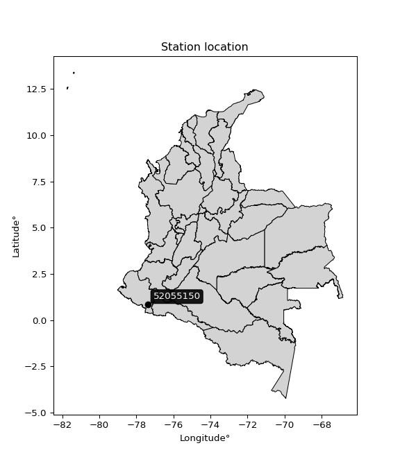

<div align="center">


</div>

# PMP Station (Rain, Pmax24h): 52055150

Probable Maximum Precipitation (PMP) is the greatest amount of rainfall for a specific duration that is meteorologically possible for a given location, acting as a "worst-case" scenario for extreme storms, crucial for designing safety-critical infrastructure like bridges, river deviations, dams, spillways, and nuclear plants to prevent catastrophic failure. PMP is calculated by hydrologists using meteorological data to determine the upper limit of extreme rainfall, often leading to the Probable Maximum Flood (PMF) for flood control design, and is increasingly being studied for climate change impacts.

<div align="center">

</img>

</div>


## A. General information


### 1. General running parameters

• app_version: _v20260103_. • runtime: _2026-01-03 07:24:50.581521_. • Python version: _3.14.0_. • SciPy version: _1.16.3_. • Pandas version: _2.3.3_. • NumPy version: _2.3.5_. • Stations dataset (station_dataset_file): _dataset/pmax24h_in/automatic_colombia_2003_2024.csv_. • Stations catalog (station_catalog_file): _dataset/CNE.xls_. • Minimum year to eval til year_max (date_min): _1900_. • Maximum year to eval since year_min (date_max): _2024_. • Creates, save and include plots into reports (create_plot): _False_. • Plot only fit distributions with Δo > Δ (plot_only_fit): _True_. • Eval low extreme values, if False, evaluates high extreme values (low_extreme): _False_. • Eval every SciPy distribution as logarithmic (pdist_logarithmic_on): _True_. • Standard deviation normalized (ddof): _1.0_. • Return periods to eval in years (Tr): _[2, 2.33, 5, 10, 15, 20, 25, 50, 75, 100, 200, 250, 500, 750, 1000]_. • Minimum data sample per station, 0 means any (minimum_sample): _5_. • Z-Score maximum threshold to adjust a value, 0 means disable (zscore_max): _3.5_. • Z-Score minimum threshold to adjust a value, 0 means disable (zscore_min): _-2.5_. • Avoid zeros, e.g. rain = 0 (avoid_zeros): _True_. • Avoid null values (avoid_nans): _True_. [:file_folder:Dataset file.](../../dataset/pmax24h_in/automatic_colombia_2003_2024.csv)

> Delta Degrees of Freedom (DDOF): is a parameter used in the formulas for calculating variance and standard deviation. When ddof=0, the divisor is $N$ (the total number of observations) and this is used when your data set is the entire population. When ddof=1, the divisor is $N-1$ and this is used when your data set is a sample drawn from a larger population. Using $N-1$ provides an unbiased estimate of the population variance (known as Bessel´s correction).


### 2. Station info and location

|   id |   CODIGO | NOMBRE                         | CATEGORIA               | TECNOLOGIA                | ESTADO           | FECHA_INSTALACION   |   FECHA_SUSPENSION |   ALTITUD |   LATITUD |   LONGITUD | DEPARTAMENTO   | MUNICIPIO   | AREA_OPERATIVA                      | ENTIDAD                                                     | AREA_HIDROGRAFICA   | ZONA_HIDROGRAFICA   | SUBZONA_HIDROGRAFICA   |   CORRIENTE | Catalogo   |   Version |
|-----:|---------:|:-------------------------------|:------------------------|:--------------------------|:-----------------|:--------------------|-------------------:|----------:|----------:|-----------:|:---------------|:------------|:------------------------------------|:------------------------------------------------------------|:--------------------|:--------------------|:-----------------------|------------:|:-----------|----------:|
|    0 | 52055150 | CERRO PARAMO  - AUT [52055150] | Climatológica Principal | Automática con Telemetría | En Mantenimiento | 09/12/2005          |                nan |      3585 |  0.843111 |   -77.3888 | Nariño         | Puerres     | Area Operativa 07 - Nariño-Putumayo | INSTITUTO DE HIDROLOGIA METEOROLOGIA Y ESTUDIOS AMBIENTALES | Pacifico            | Patía               | Río Guáitara           |         nan | CNE_IDEAM  |  20251226 |

<div align="center">

Dynamic map: [:earth_americas:Google](http://maps.google.com/maps?q=0.843111111,-77.38880556) [:earth_americas:OSM](https://www.openstreetmap.org/#map=18/0.843111111/-77.38880556&layers=P) [:earth_americas:Bing](https://www.bing.com/maps?cp=0.843111111~-77.38880556&lvl=18) [:earth_americas:Apple](https://maps.apple.com/frame?center=0.843111111%2C-77.38880556&span=0.003%2C0.006)

</div>


<div align="center">

```geojson
{
  "type": "Feature",
  "geometry": {
    "type": "Point", 
    "coordinates": [-77.38880556, 0.843111111]
  }, 
  "properties": {
    "Name": "52055150"
  }
}
```

</div>


### 3. Discrete values table and plot

<div align="center">

|               |          0 |           1 |          2 |          3 |           4 |          5 |         6 |           7 |
|:--------------|-----------:|------------:|-----------:|-----------:|------------:|-----------:|----------:|------------:|
| Date          | 2016       | 2017        | 2018       | 2019       | 2020        | 2021       | 2022      | 2023        |
| Value         |    0.8     |   73.4      |   87.5     |   88.5     |   22.4      |    6.3     |   43.7    |   27        |
| Value_initial |    0.8     |   73.4      |   87.5     |   88.5     |   22.4      |    6.3     |   43.7    |   27        |
| count         |    8       |    8        |    8       |    8       |    8        |    8       |    8      |    8        |
| mean          |   43.7     |   43.7      |   43.7     |   43.7     |   43.7      |   43.7     |   43.7    |   43.7      |
| std           |   35.4145  |   35.4145   |   35.4145  |   35.4145  |   35.4145   |   35.4145  |   35.4145 |   35.4145   |
| zscore        |   -1.21137 |    0.838639 |    1.23678 |    1.26502 |   -0.601448 |   -1.05606 |    0      |   -0.471558 |


</div>


> The initial value (value_initial) correspond to the initial obtained or null completed value, and value (value) is adjusted only when the initial value is outside the valid range definite through the Z-Score value. If Z-Score is active, values out of range or outliers are replaced with the station mean value


### 4. Active continuous probability distributions from SciPy (44 of 104 available)

A Probability Density Function (PDF) describes the relative likelihood of a continuous random variable falling within a specific range, where the total area under its curve equals 1, and the area over any interval gives the actual probability for that range. Unlike discrete probabilities (like rolling a die), a PDF shows density, not direct probability for a single point (which is zero), with higher points indicating higher likelihood, often visualized as a bell curve for normal distributions.

A log of a probability density function (log-PDF) is simply the logarithm of the PDF´s value, denoted as $log(f(x))$, useful for converting multiplication of probabilities into addition, improving numerical stability with tiny numbers, and connecting to information theory concepts like entropy. Instead of dealing with very small probabilities (e.g., 0.000001), log-PDFs use negative numbers (e.g., $log(0.00001) ≈ -11.51$ that are easier for computers to handle, preventing underflow errors and simplifying complex calculations. In this study, each active probability distribution from SciPy is also evaluated in the $log$ form.

[scipy.stats](https://docs.scipy.org/doc/scipy/reference/stats.html) is a Python´s powerful submodule within the SciPy library for comprehensive statistical analysis, offering over 130 probability distributions (like Normal, Poisson), functions for descriptive stats (mean, variance), hypothesis testing (t-tests, chi-square), random variable generation, and statistical tests, making it essential for data science, modeling, and research. It provides tools to explore, model, and draw conclusions from data efficiently, working seamlessly with NumPy.

<div align="center">

|   id | p_dist             |   n_parameter | fit_method   | label                                                                       | active   | ref                                                                                                        |
|-----:|:-------------------|--------------:|:-------------|:----------------------------------------------------------------------------|:---------|:-----------------------------------------------------------------------------------------------------------|
|    0 | alpha              |             3 | MLE          | Alpha                                                                       | True     | [:mortar_board:](https://docs.scipy.org/doc/scipy/reference/generated/scipy.stats.alpha.html)              |
|    1 | betaprime          |             4 | MLE          | Beta prime                                                                  | True     | [:mortar_board:](https://docs.scipy.org/doc/scipy/reference/generated/scipy.stats.betaprime.html)          |
|    2 | chi2               |             3 | MLE          | Chi²                                                                        | True     | [:mortar_board:](https://docs.scipy.org/doc/scipy/reference/generated/scipy.stats.chi2.html)               |
|    3 | crystalball        |             4 | MLE          | Crystalball                                                                 | True     | [:mortar_board:](https://docs.scipy.org/doc/scipy/reference/generated/scipy.stats.crystalball.html)        |
|    4 | erlang             |             3 | MLE          | Erlang                                                                      | True     | [:mortar_board:](https://docs.scipy.org/doc/scipy/reference/generated/scipy.stats.erlang.html)             |
|    5 | expon              |             2 | MLE          | Exponential                                                                 | True     | [:mortar_board:](https://docs.scipy.org/doc/scipy/reference/generated/scipy.stats.expon.html)              |
|    6 | exponnorm          |             3 | MLE          | Exponentially modified Normal                                               | True     | [:mortar_board:](https://docs.scipy.org/doc/scipy/reference/generated/scipy.stats.exponnorm.html)          |
|    7 | f                  |             4 | MLE          | F                                                                           | True     | [:mortar_board:](https://docs.scipy.org/doc/scipy/reference/generated/scipy.stats.f.html)                  |
|    8 | fatiguelife        |             3 | MLE          | Fatigue-life (Birnbaum-Saunders)                                            | True     | [:mortar_board:](https://docs.scipy.org/doc/scipy/reference/generated/scipy.stats.fatiguelife.html)        |
|    9 | fisk               |             3 | MLE          | Fisk                                                                        | True     | [:mortar_board:](https://docs.scipy.org/doc/scipy/reference/generated/scipy.stats.fisk.html)               |
|   10 | gamma              |             3 | MLE          | Gamma                                                                       | True     | [:mortar_board:](https://docs.scipy.org/doc/scipy/reference/generated/scipy.stats.gamma.html)              |
|   11 | genexpon           |             5 | MLE          | Generalized exponential                                                     | True     | [:mortar_board:](https://docs.scipy.org/doc/scipy/reference/generated/scipy.stats.genexpon.html)           |
|   12 | genlogistic        |             3 | MLE          | Generalized logistic                                                        | True     | [:mortar_board:](https://docs.scipy.org/doc/scipy/reference/generated/scipy.stats.genlogistic.html)        |
|   13 | gibrat             |             2 | MM           | Gibrat                                                                      | True     | [:mortar_board:](https://docs.scipy.org/doc/scipy/reference/generated/scipy.stats.gibrat.html)             |
|   14 | gompertz           |             3 | MLE          | Gompertz (or truncated Gumbel)                                              | True     | [:mortar_board:](https://docs.scipy.org/doc/scipy/reference/generated/scipy.stats.gompertz.html)           |
|   15 | gumbel_l           |             2 | MM           | Gumbel Left Skew                                                            | True     | [:mortar_board:](https://docs.scipy.org/doc/scipy/reference/generated/scipy.stats.gumbel_l.html)           |
|   16 | gumbel_r           |             2 | MM           | Gumbel Right Skew                                                           | True     | [:mortar_board:](https://docs.scipy.org/doc/scipy/reference/generated/scipy.stats.gumbel_r.html)           |
|   17 | halflogistic       |             2 | MM           | Half-logistic                                                               | True     | [:mortar_board:](https://docs.scipy.org/doc/scipy/reference/generated/scipy.stats.halflogistic.html)       |
|   18 | halfnorm           |             2 | MM           | Half Normal                                                                 | True     | [:mortar_board:](https://docs.scipy.org/doc/scipy/reference/generated/scipy.stats.halfnorm.html)           |
|   19 | hypsecant          |             2 | MM           | hyperbolic secant                                                           | True     | [:mortar_board:](https://docs.scipy.org/doc/scipy/reference/generated/scipy.stats.hypsecant.html)          |
|   20 | invgamma           |             3 | MLE          | Inverted gamma                                                              | True     | [:mortar_board:](https://docs.scipy.org/doc/scipy/reference/generated/scipy.stats.invgamma.html)           |
|   21 | invgauss           |             3 | MLE          | Inverse Gaussian                                                            | True     | [:mortar_board:](https://docs.scipy.org/doc/scipy/reference/generated/scipy.stats.invgauss.html)           |
|   22 | invweibull         |             3 | MLE          | Inverted Weibull                                                            | True     | [:mortar_board:](https://docs.scipy.org/doc/scipy/reference/generated/scipy.stats.invweibull.html)         |
|   23 | johnsonsu          |             4 | MLE          | Johnson Su                                                                  | True     | [:mortar_board:](https://docs.scipy.org/doc/scipy/reference/generated/scipy.stats.johnsonsu.html)          |
|   24 | kstwobign          |             2 | MLE          | Limiting distribution of scaled Kolmogorov-Smirnov two-sided test statistic | True     | [:mortar_board:](https://docs.scipy.org/doc/scipy/reference/generated/scipy.stats.kstwobign.html)          |
|   25 | laplace            |             2 | MM           | Laplace                                                                     | True     | [:mortar_board:](https://docs.scipy.org/doc/scipy/reference/generated/scipy.stats.laplace.html)            |
|   26 | laplace_asymmetric |             3 | MLE          | Asymmetric Laplace                                                          | True     | [:mortar_board:](https://docs.scipy.org/doc/scipy/reference/generated/scipy.stats.laplace_asymmetric.html) |
|   27 | loggamma           |             3 | MLE          | Log gamma                                                                   | True     | [:mortar_board:](https://docs.scipy.org/doc/scipy/reference/generated/scipy.stats.loggamma.html)           |
|   28 | logistic           |             2 | MM           | Logistic (or Sech-squared)                                                  | True     | [:mortar_board:](https://docs.scipy.org/doc/scipy/reference/generated/scipy.stats.logistic.html)           |
|   29 | lognorm            |             3 | MLE          | Log Normal                                                                  | True     | [:mortar_board:](https://docs.scipy.org/doc/scipy/reference/generated/scipy.stats.lognorm.html)            |
|   30 | maxwell            |             2 | MM           | Maxwell                                                                     | True     | [:mortar_board:](https://docs.scipy.org/doc/scipy/reference/generated/scipy.stats.maxwell.html)            |
|   31 | mielke             |             4 | MLE          | Mielke Beta-Kappa / Dagum                                                   | True     | [:mortar_board:](https://docs.scipy.org/doc/scipy/reference/generated/scipy.stats.mielke.html)             |
|   32 | moyal              |             2 | MM           | Moyal                                                                       | True     | [:mortar_board:](https://docs.scipy.org/doc/scipy/reference/generated/scipy.stats.moyal.html)              |
|   33 | nakagami           |             3 | MLE          | Nakagami                                                                    | True     | [:mortar_board:](https://docs.scipy.org/doc/scipy/reference/generated/scipy.stats.nakagami.html)           |
|   34 | ncf                |             5 | MLE          | Non-central F distribution                                                  | True     | [:mortar_board:](https://docs.scipy.org/doc/scipy/reference/generated/scipy.stats.ncf.html)                |
|   35 | nct                |             4 | MLE          | Non-central Student’s t                                                     | True     | [:mortar_board:](https://docs.scipy.org/doc/scipy/reference/generated/scipy.stats.nct.html)                |
|   36 | norm               |             2 | MM           | Normal                                                                      | True     | [:mortar_board:](https://docs.scipy.org/doc/scipy/reference/generated/scipy.stats.norm.html)               |
|   37 | pearson3           |             3 | MM           | Pearson type III                                                            | True     | [:mortar_board:](https://docs.scipy.org/doc/scipy/reference/generated/scipy.stats.pearson3.html)           |
|   38 | rayleigh           |             2 | MM           | Rayleigh                                                                    | True     | [:mortar_board:](https://docs.scipy.org/doc/scipy/reference/generated/scipy.stats.rayleigh.html)           |
|   39 | rice               |             3 | MLE          | Rice                                                                        | True     | [:mortar_board:](https://docs.scipy.org/doc/scipy/reference/generated/scipy.stats.rice.html)               |
|   40 | t                  |             3 | MLE          | Student’s t                                                                 | True     | [:mortar_board:](https://docs.scipy.org/doc/scipy/reference/generated/scipy.stats.t.html)                  |
|   41 | truncnorm          |             4 | MLE          | Truncated normal                                                            | True     | [:mortar_board:](https://docs.scipy.org/doc/scipy/reference/generated/scipy.stats.truncnorm.html)          |
|   42 | wald               |             2 | MM           | Wald                                                                        | True     | [:mortar_board:](https://docs.scipy.org/doc/scipy/reference/generated/scipy.stats.wald.html)               |
|   43 | weibull_min        |             3 | MLE          | Weibull minimum                                                             | True     | [:mortar_board:](https://docs.scipy.org/doc/scipy/reference/generated/scipy.stats.weibull_min.html)        |

</div>

> **n_parameter:** # arguments & localization & scale.
>
> **Fit methods:** (MLE) maximum likelihood, (MM) L-moments.
>
>**Inactive** (With the only purpose of prevent loops, zero divisions, infinite values, over high estimated values or horizontal trending for recurrence intervals estimations, the follow distributions were disabled.)**:** foldnorm, gennorm, norminvgauss, powernorm, powerlognorm, skewnorm, genextreme, anglit, arcsine, argus, beta, bradford, burr, burr12, cauchy, cosine, halfcauchy, foldcauchy, skewcauchy, wrapcauchy, dgamma, gengamma, exponweib, exponpow, truncexpon, gausshyper, genhalflogistic, genhyperbolic, geninvgauss, halfgennorm, johnsonsb, kappa4, kappa3, ksone, kstwo, loglaplace, levy, levy_l, levy_stable, ncx2, pareto, genpareto, truncpareto, lomax, powerlaw, rdist, rel_breitwigner, recipinvgauss, semicircular, studentized_range, trapezoid, triang, truncweibull_min, tukeylambda, uniform, loguniform, vonmises, vonmises_line, weibull_max, dweibull, 


## B. Probability distributions vs. Empirical distributions

A continuous probability distribution (CPD) describes probabilities for variables that can take any value within a range (like rain any time), unlike discrete variables with specific outcomes (like temperature). It uses a Probability Density Function (PDF), a curve where the total area under it equals 1, and the probability of the variable falling within an interval (a to b) is found by calculating the area under the curve between those points. A key feature is that the probability of hitting any single exact value is zero, so probabilities are always expressed for ranges, e.g., $P(a ≤ X ≤ b)$.

<div align="center">

Distributions parameters from station values
|    |   station | p_dist                |   n |             loc |           scale | shape                  | shape1                | shape2             | shape3   |
|---:|----------:|:----------------------|----:|----------------:|----------------:|:-----------------------|:----------------------|:-------------------|:---------|
|  0 |  52055150 | alpha                 |   8 |  -190.568       |  1640.19        | 7.141427224687217      |                       |                    |          |
|  1 |  52055150 | betaprime             |   8 |     0.8         |   187.364       | 0.709006432469697      | 3.755410986363653     |                    |          |
|  2 |  52055150 | chi2                  |   8 |     0.8         |    20.5602      | 1.175647487808323      |                       |                    |          |
|  3 |  52055150 | crystalball           |   8 |    43.7         |    33.1273      | 20478.227238310323     | 726.5705609733399     |                    |          |
|  4 |  52055150 | erlang                |   8 |     0.799637    |    36.8065      | 0.8366980509921953     |                       |                    |          |
|  5 |  52055150 | expon                 |   8 |     0.8         |    42.9         |                        |                       |                    |          |
|  6 |  52055150 | exponnorm             |   8 |    39.5856      |    32.8709      | 0.1251684602789913     |                       |                    |          |
|  7 |  52055150 | f                     |   8 |     0.8         |    49.3339      | 1.2714057866553654     | 54.46832668713225     |                    |          |
|  8 |  52055150 | fatiguelife           |   8 |     0.8         |     0.00180202  | 139.25544237709263     |                       |                    |          |
|  9 |  52055150 | fisk                  |   8 |    -8.67624     |    42.3845      | 2.057400167056786      |                       |                    |          |
| 10 |  52055150 | gamma                 |   8 |     0.759617    |    44.5508      | 0.6700141481804458     |                       |                    |          |
| 11 |  52055150 | genexpon              |   8 |     0.8         |     2.81431     | 0.06559507538397928    | 8.291183189336001e-10 | 5.5891681612201305 |          |
| 12 |  52055150 | genlogistic           |   8 |  -159.159       |    27.6826      | 851.651958932096       |                       |                    |          |
| 13 |  52055150 | gibrat                |   8 |    18.4281      |    15.3282      |                        |                       |                    |          |
| 14 |  52055150 | gompertz              |   8 |     0.8         |    72.0742      | 0.9846020379743483     |                       |                    |          |
| 15 |  52055150 | gumbel_l              |   8 |    58.609       |    25.8292      |                        |                       |                    |          |
| 16 |  52055150 | gumbel_r              |   8 |    28.791       |    25.8292      |                        |                       |                    |          |
| 17 |  52055150 | halflogistic          |   8 |     4.43646     |    28.3226      |                        |                       |                    |          |
| 18 |  52055150 | halfnorm              |   8 |    -0.147502    |    54.9547      |                        |                       |                    |          |
| 19 |  52055150 | hypsecant             |   8 |    43.7         |    21.0895      |                        |                       |                    |          |
| 20 |  52055150 | invgamma              |   8 |   -70.0175      |  1206.03        | 11.574177343620624     |                       |                    |          |
| 21 |  52055150 | invgauss              |   8 |   -21.1747      |   171.659       | 0.37792698153086257    |                       |                    |          |
| 22 |  52055150 | invweibull            |   8 |    -2.78383e+08 |     2.78383e+08 | 10046365.221438311     |                       |                    |          |
| 23 |  52055150 | johnsonsu             |   8 |    88.5         |     1.6828e-15  | 2.3796240093636225     | 0.09776330635076708   |                    |          |
| 24 |  52055150 | kstwobign             |   8 |   -67.1525      |   126.542       |                        |                       |                    |          |
| 25 |  52055150 | laplace               |   8 |    43.7         |    23.4245      |                        |                       |                    |          |
| 26 |  52055150 | laplace_asymmetric    |   8 |    22.4         |    24.1944      | 0.6524008858902113     |                       |                    |          |
| 27 |  52055150 | loggamma              |   8 | -6756.76        |  1000.44        | 896.0342152429677      |                       |                    |          |
| 28 |  52055150 | logistic              |   8 |    43.7         |    18.264       |                        |                       |                    |          |
| 29 |  52055150 | lognorm               |   8 |     0.8         |     0.231269    | 13.359801619398029     |                       |                    |          |
| 30 |  52055150 | maxwell               |   8 |   -34.7977      |    49.1911      |                        |                       |                    |          |
| 31 |  52055150 | mielke                |   8 |     0.8         |    89.0463      | 0.47946578538583373    | 1183.139535806863     |                    |          |
| 32 |  52055150 | moyal                 |   8 |    24.7557      |    14.9125      |                        |                       |                    |          |
| 33 |  52055150 | nakagami              |   8 |     0.8         |    74.8079      | 0.24044351671703806    |                       |                    |          |
| 34 |  52055150 | ncf                   |   8 |     0.00282228  |     6.28355e-07 | 1.4778357422813912e-07 | 3.6379398287320672    | 7.078933174858024  |          |
| 35 |  52055150 | nct                   |   8 | -1673.7         |    33.0735      | 394132.17304277373     | 51.92660171487674     |                    |          |
| 36 |  52055150 | norm                  |   8 |    43.7         |    33.1273      |                        |                       |                    |          |
| 37 |  52055150 | pearson3              |   8 |    43.7         |    33.1272      | 0.18758608142686037    |                       |                    |          |
| 38 |  52055150 | rayleigh              |   8 |   -19.6744      |    50.5654      |                        |                       |                    |          |
| 39 |  52055150 | rice                  |   8 |   -15.6426      |    43.0476      | 0.7018277692839117     |                       |                    |          |
| 40 |  52055150 | t                     |   8 |    43.6998      |    33.1277      | 106214872.62521364     |                       |                    |          |
| 41 |  52055150 | truncnorm             |   8 |    -0.689203    |     3.9875      | 0.3734671089083635     | 22.367174615320497    |                    |          |
| 42 |  52055150 | wald                  |   8 |    10.5728      |    33.1272      |                        |                       |                    |          |
| 43 |  52055150 | weibull_min           |   8 |     0.8         |    34.5373      | 0.7410568334893985     |                       |                    |          |
| 44 |  52055150 | logalpha              |   8 |    -0.868205    |     1.51584     | 5.305457736112073e-07  |                       |                    |          |
| 45 |  52055150 | logbetaprime          |   8 |    -5.72064     |     2.95044e+11 | 24.379547046703006     | 810130568713.7505     |                    |          |
| 46 |  52055150 | logchi2               |   8 |    -0.223144    |     1.3004      | 1.5252371594700826     |                       |                    |          |
| 47 |  52055150 | logcrystalball        |   8 |     3.13128     |     1.51423     | 1220.0665412404387     | 35.81445928177322     |                    |          |
| 48 |  52055150 | logerlang             |   8 |   -23.3981      |     0.0932972   | 284.4842736887208      |                       |                    |          |
| 49 |  52055150 | logexpon              |   8 |    -0.223144    |     3.35442     |                        |                       |                    |          |
| 50 |  52055150 | logexponnorm          |   8 |     3.1303      |     1.51424     | 0.0006555805941271225  |                       |                    |          |
| 51 |  52055150 | logf                  |   8 |    -0.223144    |     1.15822     | 1.2711296547647288     | 1.2429696137313304    |                    |          |
| 52 |  52055150 | logfatiguelife        |   8 |  -890.344       |   893.47        | 0.0016971703609990401  |                       |                    |          |
| 53 |  52055150 | logfisk               |   8 |    -0.223144    |     1.91743     | 0.7529454356244987     |                       |                    |          |
| 54 |  52055150 | loggamma              |   8 |   -24.8311      |     0.0895446   | 312.2235033706729      |                       |                    |          |
| 55 |  52055150 | loggenexpon           |   8 |    -0.223666    |   441.464       | 37.47159441049718      | 1826.7608714744401    | 11.440957928428446 |          |
| 56 |  52055150 | loggenlogistic        |   8 |     4.4833      |     3.54888e-05 | 2.6286012379880807e-05 |                       |                    |          |
| 57 |  52055150 | loggibrat             |   8 |     1.97609     |     0.700653    |                        |                       |                    |          |
| 58 |  52055150 | loggompertz           |   8 |    -0.223144    |     1.06714     | 0.02462744079500559    |                       |                    |          |
| 59 |  52055150 | loggumbel_l           |   8 |     3.81276     |     1.18064     |                        |                       |                    |          |
| 60 |  52055150 | loggumbel_r           |   8 |     2.44979     |     1.18064     |                        |                       |                    |          |
| 61 |  52055150 | loghalflogistic       |   8 |     1.33656     |     1.29462     |                        |                       |                    |          |
| 62 |  52055150 | loghalfnorm           |   8 |     1.12702     |     2.51197     |                        |                       |                    |          |
| 63 |  52055150 | loghypsecant          |   8 |     3.13128     |     0.963991    |                        |                       |                    |          |
| 64 |  52055150 | loginvgamma           |   8 |   -30.1596      | 14613.7         | 439.83742202974827     |                       |                    |          |
| 65 |  52055150 | loginvgauss           |   8 |   -13.0739      |  1547.72        | 0.010441485804044328   |                       |                    |          |
| 66 |  52055150 | loginvweibull         |   8 |    -1.59036e+08 |     1.59036e+08 | 90047034.44216338      |                       |                    |          |
| 67 |  52055150 | logjohnsonsu          |   8 |     4.483       |     9.74169e-16 | 2.7157524355649754     | 0.10978289368922925   |                    |          |
| 68 |  52055150 | logkstwobign          |   8 |    -4.05703     |     8.22335     |                        |                       |                    |          |
| 69 |  52055150 | loglaplace            |   8 |     3.13128     |     1.07072     |                        |                       |                    |          |
| 70 |  52055150 | loglaplace_asymmetric |   8 |     4.483       |     0.0285791   | 47.0377262462479       |                       |                    |          |
| 71 |  52055150 | logloggamma           |   8 |     4.48338     |     1.8634e-05  | 1.3772366236400223e-05 |                       |                    |          |
| 72 |  52055150 | loglogistic           |   8 |     3.13128     |     0.834841    |                        |                       |                    |          |
| 73 |  52055150 | loglognorm            |   8 |  -799.318       |   802.435       | 0.0018918400679490896  |                       |                    |          |
| 74 |  52055150 | logmaxwell            |   8 |    -0.456821    |     2.24851     |                        |                       |                    |          |
| 75 |  52055150 | logmielke             |   8 |    -2.56881e+08 |     2.56881e+08 | 597511799.8932416      | 277388530.72068554    |                    |          |
| 76 |  52055150 | logmoyal              |   8 |     2.26534     |     0.681645    |                        |                       |                    |          |
| 77 |  52055150 | lognakagami           |   8 | -1190.32        |  1193.46        | 155565.5391552241      |                       |                    |          |
| 78 |  52055150 | logncf                |   8 |    -0.223144    |     1.12608     | 1.1215771527909677     | 1.427375711600873     | 0.9999397882189675 |          |
| 79 |  52055150 | lognct                |   8 |   -84.6088      |     1.44241     | 16765.978378104446     | 60.82528965454891     |                    |          |
| 80 |  52055150 | lognorm               |   8 |     3.13128     |     1.51423     |                        |                       |                    |          |
| 81 |  52055150 | logpearson3           |   8 |     3.13128     |     1.51424     | -1.1939274104874928    |                       |                    |          |
| 82 |  52055150 | lograyleigh           |   8 |     0.234481    |     2.31131     |                        |                       |                    |          |
| 83 |  52055150 | logrice               |   8 |  -291.675       |     1.51424     | 194.68636532711616     |                       |                    |          |
| 84 |  52055150 | logt                  |   8 |     3.64122     |     0.913287    | 2.2867348775246583     |                       |                    |          |
| 85 |  52055150 | logtruncnorm          |   8 |     1.34083     |     5.69976     | -0.27439362872469913   | 0.5512819726334865    |                    |          |
| 86 |  52055150 | logwald               |   8 |     1.61702     |     1.51425     |                        |                       |                    |          |
| 87 |  52055150 | logweibull_min        |   8 |    -0.223144    |     1.68999     | 0.6703740129966009     |                       |                    |          |

</div>

> **loc** (Location parameter): This shifts the distribution along the x-axis. For many common distributions, like the normal (Gaussian) distribution, loc represents the mean $μ$. For others, like the uniform distribution, it might represent the minimum value, or for the beta distribution, the left end of the support interval.
>
> **scale** (Scale parameter): This determines the width or spread of the distribution. For the normal distribution, scale represents the standard deviation $σ$. For a uniform distribution, it defines the length of the interval (from $loc$ to $loc + scale$).
>
> **shape** (Shape parameters): Refers to parameters that define the specific form of a probability distribution, distinct from its location (loc) and scale (scale). These parameters are required arguments for most distribution functions. For example, a normal (Gaussian) distribution is fully defined by its location (mean) and scale (standard deviation), so it has no specific shape parameters beyond loc and scale. However, other distributions have intrinsic properties that need specification, as Gamma distribution that takes a shape parameter, often named $a$ or $alpha$.


### 0. Cumulative distribution values - CDF (88 evaluated)

Cumulative Distribution Function (CDF), denoted as $F$<sub>$X$</sub>$(x)$, is a function that gives the probability that a random variable $X$ will take a value less than or equal to a specific value, $x$ (i.e., $(P(X≥x)$. It essentially "accumulates" probabilities from a given point up to the far right (positive infinity), providing a complete picture of the distribution´s probabilities for both discrete (like rain) and continuous (like temperature) variables, helping to find probabilities over ranges or above certain values. Each station is evaluated separately ordering the $x$ values ascending, calculating the CDF and PDF values for the activated distributions and their logarithmic forms.

<div align="center">

CDF ordered by x ascending and calculating $log(f(x))$ separately
|   id |   Station |   date |    x |   count |   mean |     std |    zscore |   Value_initial |   station |   m |     alpha |   alpha_pdf |   betaprime |   betaprime_pdf |        chi2 |       chi2_pdf |   crystalball |   crystalball_pdf |      erlang |   erlang_pdf |    expon |   expon_pdf |   exponnorm |   exponnorm_pdf |           f |         f_pdf |   fatiguelife |   fatiguelife_pdf |      fisk |   fisk_pdf |     gamma |   gamma_pdf |    genexpon |   genexpon_pdf |   genlogistic |   genlogistic_pdf |    gibrat |   gibrat_pdf |    gompertz |   gompertz_pdf |   gumbel_l |   gumbel_l_pdf |   gumbel_r |   gumbel_r_pdf |   halflogistic |   halflogistic_pdf |   halfnorm |   halfnorm_pdf |   hypsecant |   hypsecant_pdf |   invgamma |   invgamma_pdf |   invgauss |   invgauss_pdf |   invweibull |   invweibull_pdf |   johnsonsu |   johnsonsu_pdf |   kstwobign |   kstwobign_pdf |   laplace |   laplace_pdf |   laplace_asymmetric |   laplace_asymmetric_pdf |   loggamma |   loggamma_pdf |   logistic |   logistic_pdf |   lognorm |   lognorm_pdf |   maxwell |   maxwell_pdf |     mielke |   mielke_pdf |     moyal |   moyal_pdf |    nakagami |   nakagami_pdf |       ncf |    ncf_pdf |       nct |    nct_pdf |     norm |   norm_pdf |   pearson3 |   pearson3_pdf |   rayleigh |   rayleigh_pdf |      rice |   rice_pdf |         t |      t_pdf |   truncnorm |   truncnorm_pdf |     wald |   wald_pdf |   weibull_min |   weibull_min_pdf |   logalpha |   logalpha_pdf |   logbetaprime |   logbetaprime_pdf |     logchi2 |   logchi2_pdf |   logcrystalball |   logcrystalball_pdf |   logerlang |   logerlang_pdf |   logexpon |   logexpon_pdf |   logexponnorm |   logexponnorm_pdf |        logf |       logf_pdf |   logfatiguelife |   logfatiguelife_pdf |     logfisk |   logfisk_pdf |   loggenexpon |   loggenexpon_pdf |   loggenlogistic |   loggenlogistic_pdf |   loggibrat |   loggibrat_pdf |   loggompertz |   loggompertz_pdf |   loggumbel_l |   loggumbel_l_pdf |   loggumbel_r |   loggumbel_r_pdf |   loghalflogistic |   loghalflogistic_pdf |   loghalfnorm |   loghalfnorm_pdf |   loghypsecant |   loghypsecant_pdf |   loginvgamma |   loginvgamma_pdf |   loginvgauss |   loginvgauss_pdf |   loginvweibull |   loginvweibull_pdf |   logjohnsonsu |   logjohnsonsu_pdf |   logkstwobign |   logkstwobign_pdf |   loglaplace |   loglaplace_pdf |   loglaplace_asymmetric |   loglaplace_asymmetric_pdf |   logloggamma |   logloggamma_pdf |   loglogistic |   loglogistic_pdf |   loglognorm |   loglognorm_pdf |   logmaxwell |   logmaxwell_pdf |   logmielke |   logmielke_pdf |    logmoyal |   logmoyal_pdf |   lognakagami |   lognakagami_pdf |      logncf |   logncf_pdf |    lognct |   lognct_pdf |   logpearson3 |   logpearson3_pdf |   lograyleigh |   lograyleigh_pdf |   logrice |   logrice_pdf |      logt |   logt_pdf |   logtruncnorm |   logtruncnorm_pdf |   logwald |   logwald_pdf |   logweibull_min |   logweibull_min_pdf |
|-----:|----------:|-------:|-----:|--------:|-------:|--------:|----------:|----------------:|----------:|----:|----------:|------------:|------------:|----------------:|------------:|---------------:|--------------:|------------------:|------------:|-------------:|---------:|------------:|------------:|----------------:|------------:|--------------:|--------------:|------------------:|----------:|-----------:|----------:|------------:|------------:|---------------:|--------------:|------------------:|----------:|-------------:|------------:|---------------:|-----------:|---------------:|-----------:|---------------:|---------------:|-------------------:|-----------:|---------------:|------------:|----------------:|-----------:|---------------:|-----------:|---------------:|-------------:|-----------------:|------------:|----------------:|------------:|----------------:|----------:|--------------:|---------------------:|-------------------------:|-----------:|---------------:|-----------:|---------------:|----------:|--------------:|----------:|--------------:|-----------:|-------------:|----------:|------------:|------------:|---------------:|----------:|-----------:|----------:|-----------:|---------:|-----------:|-----------:|---------------:|-----------:|---------------:|----------:|-----------:|----------:|-----------:|------------:|----------------:|---------:|-----------:|--------------:|------------------:|-----------:|---------------:|---------------:|-------------------:|------------:|--------------:|-----------------:|---------------------:|------------:|----------------:|-----------:|---------------:|---------------:|-------------------:|------------:|---------------:|-----------------:|---------------------:|------------:|--------------:|--------------:|------------------:|-----------------:|---------------------:|------------:|----------------:|--------------:|------------------:|--------------:|------------------:|--------------:|------------------:|------------------:|----------------------:|--------------:|------------------:|---------------:|-------------------:|--------------:|------------------:|--------------:|------------------:|----------------:|--------------------:|---------------:|-------------------:|---------------:|-------------------:|-------------:|-----------------:|------------------------:|----------------------------:|--------------:|------------------:|--------------:|------------------:|-------------:|-----------------:|-------------:|-----------------:|------------:|----------------:|------------:|---------------:|--------------:|------------------:|------------:|-------------:|----------:|-------------:|--------------:|------------------:|--------------:|------------------:|----------:|--------------:|----------:|-----------:|---------------:|-------------------:|----------:|--------------:|-----------------:|---------------------:|
|    0 |  52055150 |   2016 |  0.8 |       8 |   43.7 | 35.4145 | -1.21137  |             0.8 |  52055150 |   1 | 0.0764337 |  0.00643204 | 4.76975e-12 |    692.281      | 3.77615e-09 | 13981.4        |      0.097659 |        0.00520667 | 6.87502e-05 |   0.158602   | 0        |  0.02331    |   0.0975722 |      0.0052111  | 1.76067e-10 | 3747.73       |     0.0594606 |       2.41322e+06 | 0.0438569 | 0.00910423 | 0.0101248 |  0.167895   | 3.58256e-09 |     0.0233077  |     0.0720161 |        0.00683363 | 0         |   0          | 8.40418e-14 |     0.013661   |   0.101167 |     0.00371161 |  0.0520486 |     0.0059558  |      0         |         0          |  0.0137561 |     0.0145168  |   0.0827912 |      0.0038816  |  0.0669305 |     0.00709914 |  0.0504516 |     0.00919603 |    0.0718767 |       0.00682925 |   0.0733525 |     0.000155144 |   0.0647285 |      0.007198   | 0.0800933 |    0.00341921 |            0.0759833 |               0.00481382 |  0.0142906 |      0.0250056 |  0.0871547 |     0.00435604 | 0.0133711 |     0.0226514 |  0.086342 |    0.00653742 | 5.6322e-09 |   4.8647e+06 | 0.0255691 |  0.00494    | 2.08626e-09 |     9.0365e+06 | 0.0391783 | 0.0133546  | 0.0976685 | 0.00520746 | 0.097659 | 0.00520667 |  0.0934342 |     0.00549561 |  0.0787054 |     0.00737737 | 0.0554828 | 0.00656448 | 0.0976633 | 0.00520676 | 2.95695e-07 |    0.263286     | 0        | 0          |   1.08839e-13 |      726.482      |  0.0187779 |      0.183774  |      0.0169174 |          0.0323121 | 1.23679e-13 |  3398.23      |        0.0133711 |            0.0226514 |    0.013303 |       0.0237644 |   0        |      0.298114  |      0.0133712 |          0.0226513 | 1.93749e-11 | 443658         |         0.013451 |            0.0228216 | 3.52804e-13 |  4785.39      |   4.43638e-05 |         0.0849325 |         0        |            0.0226823 |    0        |       0         |   2.48846e-09 |         0.0230779 |      0.032234 |         0.0268572 |   6.63105e-05 |        0.00054037 |          0        |              0        |      0        |          0        |      0.0196119 |          0.0203316 |     0.0125342 |         0.0235316 |     0.0139153 |         0.0272502 |       0.0154912 |           0.0365538 |      0.0925818 |        0.00386845  |      0.0184296 |          0.0497607 |    0.0217967 |        0.0203569 |               0.0301588 |                   0.0224346 |     0.0308516 |         0.0228023 |     0.0176704 |         0.0207922 |    0.0137324 |        0.0232166 |  0.000297563 |       0.00381193 |   0.0025534 |      0.00556772 | 5.47015e-10 |    1.58314e-08 |     0.0131728 |         0.0224011 | 2.04223e-10 |  4.12623e+06 | 0.0134595 |    0.0228616 |     0.0339456 |         0.0286544 |      0        |          0        | 0.0133711 |     0.0226514 | 0.0202895 |  0.0109544 |     1.0754e-06 |           0.212379 | 0         |     0         |      5.59867e-12 |       135223         |
|    1 |  52055150 |   2021 |  6.3 |       8 |   43.7 | 35.4145 | -1.05606  |             6.3 |  52055150 |   2 | 0.117018  |  0.0083165  | 0.212341    |      0.0253687  | 0.327191    |     0.0321184  |      0.129453 |        0.00636722 | 0.202419    |   0.0283576  | 0.120327 |  0.0205052  |   0.129397  |      0.00637394 | 0.200437    |    0.0221585  |     0.654167  |       0.0133044   | 0.105236  | 0.0129357  | 0.260751  |  0.0292502  | 0.120316    |     0.0205034  |     0.115624  |        0.00899963 | 0         |   0          | 0.0751062   |     0.0136369  |   0.123632 |     0.00447762 |  0.0917472 |     0.00848489 |      0.0328866 |         0.0176346  |  0.0933967 |     0.0144194  |   0.107049  |      0.00498081 |  0.112579  |     0.00945735 |  0.111904  |     0.0128512  |    0.115461  |       0.00899536 |   0.0742377 |     0.000167049 |   0.11095   |      0.00955105 | 0.10129   |    0.00432411 |            0.107658  |               0.00682052 |  0.209878  |      0.187889  |  0.114281  |     0.00554208 | 0.196997  |     0.183207  |  0.126328 |    0.00798626 | 0.263151   |   0.0229403  | 0.0633541 |  0.00886182 | 0.222661    |     0.0194478  | 0.128608  | 0.0180813  | 0.129467  | 0.00636809 | 0.129453 | 0.00636722 |  0.127157  |     0.00677651 |  0.1236    |     0.00890307 | 0.0967308 | 0.00839068 | 0.129458  | 0.00636729 | 0.887641    |    0.0607561    | 0        | 0          |   0.226064    |        0.026723   |  0.575748  |      0.140946  |      0.240696  |          0.192646  | 0.66285     |     0.151955  |        0.196997  |            0.183207  |    0.205512 |       0.18699   |   0.459476 |      0.161138  |      0.196995  |          0.183205  | 0.602843    |      0.0855369 |         0.198093 |            0.183828  | 0.513834    |     0.0911435 |   0.329454    |         0.201451  |         0        |            0.104599  |    0        |       0         |   0.135581    |         0.137968  |      0.171519 |         0.132036  |   0.187242    |        0.265699   |          0.192227 |              0.371943 |      0.223629 |          0.305074 |      0.163201  |          0.161977  |     0.209352  |         0.19091   |     0.231009  |         0.200158  |       0.273782  |           0.200813  |      0.103536  |        0.007478    |      0.317512  |          0.204434  |    0.149775  |        0.139882  |               0.139998  |                   0.104142  |     0.141806  |         0.104808  |     0.175654  |         0.173446  |    0.20003   |        0.184729  |  0.209377    |       0.219802   |   0.126228  |      0.18128    | 0.172065    |    0.314576    |     0.195956  |         0.182843  | 0.5014      |  0.094473    | 0.198215  |    0.183724  |     0.175396  |         0.128945  |      0.214492 |          0.236155 | 0.196997  |     0.183207  | 0.0855975 |  0.0767747 |     0.450681   |           0.219681 | 0.0236697 |     0.396492  |      0.681237    |            0.118387  |
|    2 |  52055150 |   2020 | 22.4 |       8 |   43.7 | 35.4145 | -0.601448 |            22.4 |  52055150 |   3 | 0.287677  |  0.0123321  | 0.485699    |      0.0119116  | 0.639697    |     0.012355   |      0.26012  |        0.00979382 | 0.528209    |   0.0146449  | 0.395586 |  0.0140889  |   0.260211  |      0.00980423 | 0.44198     |    0.0109019  |     0.784106  |       0.00533086  | 0.345587  | 0.0149727  | 0.56747   |  0.0129993  | 0.395556    |     0.0140882  |     0.299188  |        0.0130324  | 0.0884362 |   0.040355   | 0.291115    |     0.0130681  |   0.218186 |     0.00745025 |  0.277834  |     0.0137763  |      0.306904  |         0.0159909  |  0.318409  |     0.0133469  |   0.222366  |      0.009707   |  0.30371   |     0.0133688  |  0.347426  |     0.0146953  |    0.298947  |       0.013027   |   0.0772773 |     0.000214185 |   0.301604  |      0.0132246  | 0.201402  |    0.00859793 |            0.298554  |               0.0189145  |  0.503037  |      0.252215  |  0.237537  |     0.00991641 | 0.494147  |     0.263433  |  0.283181 |    0.0111545  | 0.50705    |   0.0112552  | 0.279169  |  0.0161196  | 0.428315    |     0.0093827  | 0.402499  | 0.014242   | 0.260146  | 0.00979432 | 0.26012  | 0.00979382 |  0.266004  |     0.0103245  |  0.292613  |     0.0116404  | 0.264246  | 0.0119297  | 0.260125  | 0.00979379 | 1           |    1.47934e-08  | 0.226436 | 0.0316397  |   0.5065      |        0.0119573  |  0.70311   |      0.0711019 |      0.516041  |          0.222244  | 0.807047    |     0.0832715 |        0.494147  |            0.263433  |    0.499155 |       0.253714  |   0.629676 |      0.110399  |      0.494143  |          0.263432  | 0.68312     |      0.0471899 |         0.495492 |            0.263078  | 0.602553    |     0.0541136 |   0.577538    |         0.180509  |         0        |            0.267655  |    0.684596 |       0.313716  |   0.414047    |         0.307017  |      0.423623 |         0.268989  |   0.564325    |        0.273465   |          0.594479 |              0.249724 |      0.569911 |          0.232666 |      0.492665  |          0.330112  |     0.504603  |         0.251348  |     0.525745  |         0.241063  |       0.531708  |           0.190166  |      0.117051  |        0.0157053   |      0.566641  |          0.177853  |    0.489733  |        0.457384  |               0.359693  |                   0.26757   |     0.362133  |         0.267651  |     0.493348  |         0.299405  |    0.49791   |        0.262793  |  0.527421    |       0.25378    |   0.476929  |      0.322677   | 0.590201    |    0.272643    |     0.492996  |         0.263649  | 0.594334    |  0.0571041   | 0.495126  |    0.262466  |     0.414929  |         0.253535  |      0.538556 |          0.2483   | 0.494147  |     0.263433  | 0.306226  |  0.312821  |     0.724397   |           0.210166 | 0.662186  |     0.269333  |      0.793276    |            0.0655594 |
|    3 |  52055150 |   2023 | 27   |       8 |   43.7 | 35.4145 | -0.471558 |            27   |  52055150 |   4 | 0.345555  |  0.0127741  | 0.536442    |      0.0102177  | 0.691355    |     0.0102024  |      0.30709  |        0.0106057  | 0.590537    |   0.0125233  | 0.457042 |  0.0126564  |   0.307228  |      0.0106156  | 0.488945    |    0.00956987 |     0.806706  |       0.00453193  | 0.412295  | 0.0139736  | 0.622488  |  0.0110016  | 0.457009    |     0.0126559  |     0.359855  |        0.0132781  | 0.280552  |   0.039308   | 0.350547    |     0.0127615  |   0.254812 |     0.00848551 |  0.342392  |     0.0142078  |      0.37852   |         0.0151243  |  0.378692  |     0.0128512  |   0.270783  |      0.0113462  |  0.365608  |     0.0134756  |  0.413282  |     0.0138913  |    0.35959   |       0.0132727  |   0.0783037 |     0.000232523 |   0.362797  |      0.0133209  | 0.245103  |    0.0104635  |            0.380381  |               0.016708   |  0.549911  |      0.249137  |  0.286107  |     0.0111832  | 0.54327   |     0.26191   |  0.335664 |    0.0116283  | 0.556228   |   0.0101791  | 0.35366   |  0.0161388  | 0.469133    |     0.00840811 | 0.463813  | 0.012441   | 0.307118  | 0.0106059  | 0.30709  | 0.0106057  |  0.315296  |     0.0110778  |  0.34689   |     0.0119222  | 0.320265  | 0.0123845  | 0.307095  | 0.0106056  | 1           |    9.55174e-12  | 0.361346 | 0.0266914  |   0.557299    |        0.0102034  |  0.715835  |      0.065281  |      0.557103  |          0.217092  | 0.821958    |     0.0765042 |        0.54327   |            0.26191   |    0.546327 |       0.250826  |   0.649732 |      0.10442   |      0.543266  |          0.261909  | 0.691624    |      0.0439384 |         0.544534 |            0.2614    | 0.612345    |     0.0507912 |   0.610611    |         0.173515  |         0        |            0.307367  |    0.736694 |       0.247377  |   0.47348     |         0.328645  |      0.475564 |         0.286698  |   0.6136      |        0.253836   |          0.639129 |              0.228451 |      0.612079 |          0.218803 |      0.554076  |          0.325447  |     0.551236  |         0.247435  |     0.570256  |         0.235101  |       0.566504  |           0.182278  |      0.120234  |        0.0185241   |      0.599133  |          0.169999  |    0.571231  |        0.400447  |               0.413307  |                   0.307452  |     0.415738  |         0.307271  |     0.54912   |         0.296568  |    0.54688   |        0.26092   |  0.574093    |       0.245522   |   0.536443  |      0.313295   | 0.638646    |    0.246144    |     0.542167  |         0.262202  | 0.60467     |  0.0536417   | 0.544051  |    0.260775  |     0.464016  |         0.271845  |      0.584039 |          0.238369 | 0.54327   |     0.26191   | 0.368784  |  0.355468  |     0.763445   |           0.207929 | 0.708147  |     0.224487  |      0.805061    |            0.0607204 |
|    4 |  52055150 |   2022 | 43.7 |       8 |   43.7 | 35.4145 |  0        |            43.7 |  52055150 |   5 | 0.555694  |  0.0118065  | 0.670905    |      0.00632493 | 0.817878    |     0.00554694 |      0.5      |        0.0120427  | 0.752024    |   0.00734    | 0.632121 |  0.00857528 |   0.500248  |      0.0120447  | 0.619905    |    0.00643857 |     0.866057  |       0.00278882  | 0.607184  | 0.00936902 | 0.763677  |  0.00642803 | 0.632084    |     0.00857528 |     0.571645  |        0.0115445  | 0.691462  |   0.0139311  | 0.551078    |     0.0111212  |   0.429624 |     0.0123985  |  0.570376  |     0.0123985  |      0.6       |         0.0112984  |  0.575063  |     0.0105608  |   0.5       |      0.0150933  |  0.576994  |     0.0113514  |  0.613352  |     0.010003   |    0.571312  |       0.0115422  |   0.0829345 |     0.000333357 |   0.573316  |      0.0114574  | 0.5       |    0.0213452  |            0.605038  |               0.0106501  |  0.665238  |      0.226669  |  0.5       |     0.0136881  | 0.665188  |     0.24054   |  0.53305  |    0.011562   | 0.704585   |   0.0078747  | 0.596223  |  0.0123181  | 0.589098    |     0.00619434 | 0.626902  | 0.00752822 | 0.500021  | 0.0120417  | 0.5      | 0.0120427  |  0.512473  |     0.0120339  |  0.544062  |     0.0113009  | 0.528508  | 0.0120806  | 0.500003  | 0.0120426  | 1           |    3.47655e-28  | 0.668102 | 0.0120427  |   0.69097     |        0.00626874 |  0.744198  |      0.0531371 |      0.656821  |          0.1953    | 0.855085    |     0.0616678 |        0.665188  |            0.24054   |    0.662527 |       0.228535  |   0.69657  |      0.0904569 |      0.665184  |          0.24054   | 0.711045    |      0.0370486 |         0.666133 |            0.23976   | 0.635003    |     0.043623  |   0.689335    |         0.152987  |         0        |            0.439083  |    0.827474 |       0.141818  |   0.639868    |         0.352967  |      0.621087 |         0.311454  |   0.722646    |        0.198825   |          0.736445 |              0.17675  |      0.708611 |          0.182053 |      0.69895   |          0.267776  |     0.665333  |         0.223455  |     0.677647  |         0.208629  |       0.648778  |           0.158936  |      0.132059  |        0.0332706   |      0.675816  |          0.148278  |    0.726524  |        0.255412  |               0.591332  |                   0.439883  |     0.593442  |         0.438611  |     0.684361  |         0.258745  |    0.668147  |        0.238895  |  0.685165    |       0.213685   |   0.676024  |      0.261342   | 0.741506    |    0.182833    |     0.664261  |         0.240964  | 0.628615    |  0.0461159   | 0.665367  |    0.239241  |     0.604378  |         0.307387  |      0.691118 |          0.204847 | 0.665188  |     0.24054   | 0.553178  |  0.386543  |     0.862012   |           0.201271 | 0.795402  |     0.145051  |      0.831675    |            0.0502603 |
|    5 |  52055150 |   2017 | 73.4 |       8 |   43.7 | 35.4145 |  0.838639 |            73.4 |  52055150 |   6 | 0.823247  |  0.00610628 | 0.804684    |      0.00315756 | 0.92371     |     0.00216872 |      0.815019 |        0.0080572  | 0.895664    |   0.00300568 | 0.815906 |  0.00429124 |   0.815082  |      0.00804687 | 0.764195    |    0.0036307  |     0.925255  |       0.00140158  | 0.795705  | 0.00407484 | 0.891854  |  0.00277469 | 0.815875    |     0.00429153 |     0.825874  |        0.00570694 | 0.899222  |   0.00321063 | 0.819391    |     0.0067559  |   0.830169 |     0.0116574  |  0.837107  |     0.00576249 |      0.838904  |         0.00522973 |  0.819211  |     0.00592921 |   0.847304  |      0.00696587 |  0.824144  |     0.0055172  |  0.823602  |     0.00469868 |    0.825576  |       0.00571065 |   0.100399  |     0.00113955  |   0.830493  |      0.00594049 | 0.859289  |    0.00600698 |            0.822685  |               0.0047813  |  0.772653  |      0.18552   |  0.835641  |     0.00751997 | 0.779093  |     0.196002  |  0.815946 |    0.00698499 | 0.906737   |   0.00598828 | 0.844817  |  0.00513701 | 0.738438    |     0.00406798 | 0.779805  | 0.00343985 | 0.814998  | 0.0080561  | 0.815019 | 0.0080572  |  0.816906  |     0.0075859  |  0.816224  |     0.00668978 | 0.819919  | 0.00707797 | 0.815017  | 0.00805713 | 1           |    3.05594e-76  | 0.873417 | 0.00373035 |   0.82346     |        0.00312507 |  0.769116  |      0.0434399 |      0.749971  |          0.162958  | 0.883668    |     0.0490793 |        0.779093  |            0.196002  |    0.770868 |       0.187166  |   0.740032 |      0.0775001 |      0.779089  |          0.196003  | 0.728728    |      0.0314006 |         0.779616 |            0.195205  | 0.656       |     0.0375991 |   0.762445    |         0.128814  |         0        |            0.644704  |    0.884394 |       0.0839841 |   0.812828    |         0.298234  |      0.778131 |         0.282949  |   0.811098    |        0.143834   |          0.815404 |              0.129426 |      0.792879 |          0.143334 |      0.815184  |          0.181128  |     0.770974  |         0.182159  |     0.77585   |         0.168935  |       0.72428   |           0.132286  |      0.165784  |        0.146117    |      0.746512  |          0.124473  |    0.831508  |        0.157363  |               0.869691  |                   0.646949  |     0.87063   |         0.64348   |     0.801398  |         0.190646  |    0.781129  |        0.194184  |  0.784826    |       0.169809   |   0.792726  |      0.188487   | 0.821597    |    0.128659    |     0.778399  |         0.196459  | 0.65081     |  0.0397386   | 0.778651  |    0.194979  |     0.76583   |         0.305729  |      0.786449 |          0.162355 | 0.779093  |     0.196002  | 0.730196  |  0.281461  |     0.964243   |           0.192794 | 0.856445  |     0.0947248 |      0.855369    |            0.0414848 |
|    6 |  52055150 |   2018 | 87.5 |       8 |   43.7 | 35.4145 |  1.23678  |            87.5 |  52055150 |   7 | 0.893045  |  0.00390898 | 0.843308    |      0.00236872 | 0.948698    |     0.00143059 |      0.906945 |        0.00502481 | 0.930383    |   0.0019906  | 0.867474 |  0.00308918 |   0.906884  |      0.00501832 | 0.809576    |    0.00284507 |     0.942383  |       0.00104823  | 0.843675  | 0.00282133 | 0.924449  |  0.00190695 | 0.867448    |     0.00308949 |     0.891399  |        0.00370164 | 0.933896  |   0.00185981 | 0.899135    |     0.00458823 |   0.95313  |     0.00555339 |  0.902122  |     0.00359762 |      0.898885  |         0.00338962 |  0.889266  |     0.0040698  |   0.920631  |      0.00372456 |  0.887638  |     0.00360186 |  0.878782  |     0.00321887 |    0.891159  |       0.00370591 |   0.155319  |     0.0233274   |   0.899164  |      0.00389401 | 0.922926  |    0.00329033 |            0.878766  |               0.00326907 |  0.80385   |      0.169479  |  0.916687  |     0.00418156 | 0.811969  |     0.178063  |  0.896874 |    0.00455949 | 0.987279   |   0.00545982 | 0.9029    |  0.00323953 | 0.790714    |     0.00336862 | 0.821269  | 0.00250639 | 0.906916  | 0.00502466 | 0.906945 | 0.00502481 |  0.903563  |     0.00477263 |  0.894197  |     0.00443486 | 0.901311  | 0.00454242 | 0.906943  | 0.00502482 | 1           |    1.72366e-107 | 0.915272 | 0.00233568 |   0.861653    |        0.00233898 |  0.776508  |      0.0407415 |      0.777562  |          0.151047  | 0.89197     |     0.0454594 |        0.811969  |            0.178063  |    0.802342 |       0.170988  |   0.7533   |      0.0735449 |      0.811965  |          0.178065  | 0.734103    |      0.0297979 |         0.812356 |            0.177319  | 0.662452    |     0.0358623 |   0.784352    |         0.120541  |         0.991402 |            0.734316  |    0.898003 |       0.0713456 |   0.861941    |         0.259353  |      0.825754 |         0.257874  |   0.834924    |        0.127585   |          0.836923 |              0.115694 |      0.816967 |          0.130907 |      0.84466   |          0.154822  |     0.801604  |         0.166404  |     0.804265  |         0.154458  |       0.746747  |           0.123474  |      0.253521  |        3.09273     |      0.767693  |          0.11664   |    0.857009  |        0.133546  |               0.991134  |                   0.737289  |     0.99137   |         0.732719  |     0.83279   |         0.166799  |    0.81369   |        0.176308  |  0.813302    |       0.154323   |   0.823755  |      0.164928   | 0.842871    |    0.113756    |     0.811354  |         0.178509  | 0.657629    |  0.037892    | 0.811362  |    0.177213  |     0.818297  |         0.289903  |      0.813693 |          0.14777  | 0.811969  |     0.178063  | 0.775675  |  0.236502  |     0.997846   |           0.189647 | 0.872003  |     0.0826865 |      0.862435    |            0.0389652 |
|    7 |  52055150 |   2019 | 88.5 |       8 |   43.7 | 35.4145 |  1.26502  |            88.5 |  52055150 |   8 | 0.896889  |  0.00377954 | 0.845654    |      0.00232275 | 0.950108    |     0.00138963 |      0.91187  |        0.00482601 | 0.932345    |   0.00193362 | 0.870528 |  0.003018   |   0.911803  |      0.00481992 | 0.812398    |    0.00279756 |     0.943421  |       0.00102743  | 0.846461  | 0.00275159 | 0.926332  |  0.00185758 | 0.870502    |     0.00301831 |     0.895042  |        0.00358492 | 0.935723  |   0.00179384 | 0.903651    |     0.00444403 |   0.958464 |     0.00511571 |  0.905658  |     0.00347456 |      0.902221  |         0.00328354 |  0.893278  |     0.00395273 |   0.924271  |      0.00355705 |  0.891184  |     0.00349096 |  0.881958  |     0.00313334 |    0.894807  |       0.00358919 |   0.991335  |     1.36595e+12 |   0.902996  |      0.00377041 | 0.926147  |    0.00315282 |            0.881991  |               0.0031821  |  0.80577   |      0.168425  |  0.920774  |     0.00399415 | 0.813986  |     0.17688   |  0.901356 |    0.00440504 | 0.992722   |   0.00542733 | 0.906087  |  0.00313422 | 0.79406     |     0.00332363 | 0.823749  | 0.00245362 | 0.911841  | 0.00482592 | 0.91187  | 0.00482601 |  0.908245  |     0.00459291 |  0.89856   |     0.00429165 | 0.905773  | 0.00438245 | 0.911868  | 0.00482602 | 1           |    6.51648e-110 | 0.917571 | 0.00226279 |   0.863969    |        0.00229301 |  0.77697   |      0.0405756 |      0.779274  |          0.150272  | 0.892485    |     0.0452353 |        0.813986  |            0.17688   |    0.804279 |       0.169925  |   0.754134 |      0.0732961 |      0.813982  |          0.176881  | 0.734441    |      0.0296988 |         0.814364 |            0.17614   | 0.662859    |     0.0357545 |   0.785718    |         0.120008  |         0.999782 |            0.740338  |    0.898809 |       0.0706127 |   0.864873    |         0.256564  |      0.828674 |         0.256005  |   0.836368    |        0.126582   |          0.838232 |              0.114847 |      0.81845  |          0.130119 |      0.84641   |          0.153216  |     0.803489  |         0.165374  |     0.806014  |         0.15352   |       0.748147  |           0.122912  |      0.99568   |        1.05686e+12 |      0.769015  |          0.11614   |    0.858519  |        0.132136  |               0.999548  |                   0.743548  |     0.999731  |         0.738898  |     0.834677  |         0.165291  |    0.815687  |        0.17513   |  0.81505     |       0.153325   |   0.825621  |      0.163457   | 0.844158    |    0.112848    |     0.813376  |         0.177324  | 0.658059    |  0.0377773   | 0.813369  |    0.176041  |     0.821583  |         0.288553  |      0.815367 |          0.146835 | 0.813986  |     0.17688   | 0.778347  |  0.233686  |     0.999999   |           0.189439 | 0.872938  |     0.0819736 |      0.862876    |            0.0388091 |


</div>

An Empirical Distribution Function (EDF) is a step-function estimate of a true cumulative distribution function (CDF) based on observed sample data, representing the proportion of data points less than or equal to a given value. It is calculated by ordering your data and jumping up by $1/n$ (where $n$ is sample size) at each unique data point, allowing analysis without assuming an underlying population distribution, and it gets closer to the true CDF as the sample size grows. For the empirical probability calculations, the parameter $m$ correspond to the order number which means the position of the $x$ values in an ascending order list.


### 1. Empirical - EDF California (1923)

California´s estimates the true probability distribution of water-related data (like rainfall, streamflow) using observed samples, crucial for risk assessment.

<div align="center">


$P=m/n$


</div>


**1.1. Empirical values**

<div align="center">

|                | 0                  | 1                  | 2              | 3              | 4                  | 5              | 6              | 7              |
|:---------------|:-------------------|:-------------------|:---------------|:---------------|:-------------------|:---------------|:---------------|:---------------|
| date           | 2016               | 2021               | 2020           | 2023           | 2022               | 2017           | 2018           | 2019           |
| x              | 0.8                | 6.3                | 22.4           | 27.0           | 43.7               | 73.4           | 87.5           | 88.5           |
| m              | 1                  | 2                  | 3              | 4              | 5                  | 6              | 7              | 8              |
| empirical_dist | edf_california     | edf_california     | edf_california | edf_california | edf_california     | edf_california | edf_california | edf_california |
| empirical      | 0.125              | 0.25               | 0.375          | 0.5            | 0.625              | 0.75           | 0.875          | 1.0            |
| empirical_tr   | 1.1428571428571428 | 1.3333333333333333 | 1.6            | 2.0            | 2.6666666666666665 | 4.0            | 8.0            | inf            |

</div>


**1.2. Kolmogorov-Smirnov fit test (sorted by Δ)**


<div align="center">

|                | 0                     | 1                   | 2                  | 3                   | 4                  | 5                   | 6                  | 7                   | 8                   | 9                   | 10                 | 11                  | 12                  | 13                  | 14                  | 15                  | 16                 | 17                  | 18                  | 19                  | 20                  | 21                  | 22                 | 23                  | 24                 | 25                  | 26                  | 27                  | 28                  | 29                  | 30                 | 31                  | 32                  | 33                  | 34                  | 35                  | 36                  | 37                  | 38                 | 39                 | 40                 | 41                  | 42                  | 43                  | 44                  | 45                 | 46                 | 47                  | 48                  | 49                 | 50                 | 51                  | 52                  | 53                  | 54                  | 55                  | 56                  | 57                  | 58                  | 59                  | 60                  | 61                 | 62                  | 63                  | 64                  | 65                 | 66                  | 67                  | 68                 | 69                  | 70                 | 71                  | 72                  | 73                 | 74                 | 75                  | 76                  | 77                 | 78                 | 79                  | 80                 | 81                  | 82                  | 83                 | 84                 | 85                 | 86                 | 87                 |
|:---------------|:----------------------|:--------------------|:-------------------|:--------------------|:-------------------|:--------------------|:-------------------|:--------------------|:--------------------|:--------------------|:-------------------|:--------------------|:--------------------|:--------------------|:--------------------|:--------------------|:-------------------|:--------------------|:--------------------|:--------------------|:--------------------|:--------------------|:-------------------|:--------------------|:-------------------|:--------------------|:--------------------|:--------------------|:--------------------|:--------------------|:-------------------|:--------------------|:--------------------|:--------------------|:--------------------|:--------------------|:--------------------|:--------------------|:-------------------|:-------------------|:-------------------|:--------------------|:--------------------|:--------------------|:--------------------|:-------------------|:-------------------|:--------------------|:--------------------|:-------------------|:-------------------|:--------------------|:--------------------|:--------------------|:--------------------|:--------------------|:--------------------|:--------------------|:--------------------|:--------------------|:--------------------|:-------------------|:--------------------|:--------------------|:--------------------|:-------------------|:--------------------|:--------------------|:-------------------|:--------------------|:-------------------|:--------------------|:--------------------|:-------------------|:-------------------|:--------------------|:--------------------|:-------------------|:-------------------|:--------------------|:-------------------|:--------------------|:--------------------|:-------------------|:-------------------|:-------------------|:-------------------|:-------------------|
| station        | 52055150              | 52055150            | 52055150           | 52055150            | 52055150           | 52055150            | 52055150           | 52055150            | 52055150            | 52055150            | 52055150           | 52055150            | 52055150            | 52055150            | 52055150            | 52055150            | 52055150           | 52055150            | 52055150            | 52055150            | 52055150            | 52055150            | 52055150           | 52055150            | 52055150           | 52055150            | 52055150            | 52055150            | 52055150            | 52055150            | 52055150           | 52055150            | 52055150            | 52055150            | 52055150            | 52055150            | 52055150            | 52055150            | 52055150           | 52055150           | 52055150           | 52055150            | 52055150            | 52055150            | 52055150            | 52055150           | 52055150           | 52055150            | 52055150            | 52055150           | 52055150           | 52055150            | 52055150            | 52055150            | 52055150            | 52055150            | 52055150            | 52055150            | 52055150            | 52055150            | 52055150            | 52055150           | 52055150            | 52055150            | 52055150            | 52055150           | 52055150            | 52055150            | 52055150           | 52055150            | 52055150           | 52055150            | 52055150            | 52055150           | 52055150           | 52055150            | 52055150            | 52055150           | 52055150           | 52055150            | 52055150           | 52055150            | 52055150            | 52055150           | 52055150           | 52055150           | 52055150           | 52055150           |
| empirical_dist | edf_california        | edf_california      | edf_california     | edf_california      | edf_california     | edf_california      | edf_california     | edf_california      | edf_california      | edf_california      | edf_california     | edf_california      | edf_california      | edf_california      | edf_california      | edf_california      | edf_california     | edf_california      | edf_california      | edf_california      | edf_california      | edf_california      | edf_california     | edf_california      | edf_california     | edf_california      | edf_california      | edf_california      | edf_california      | edf_california      | edf_california     | edf_california      | edf_california      | edf_california      | edf_california      | edf_california      | edf_california      | edf_california      | edf_california     | edf_california     | edf_california     | edf_california      | edf_california      | edf_california      | edf_california      | edf_california     | edf_california     | edf_california      | edf_california      | edf_california     | edf_california     | edf_california      | edf_california      | edf_california      | edf_california      | edf_california      | edf_california      | edf_california      | edf_california      | edf_california      | edf_california      | edf_california     | edf_california      | edf_california      | edf_california      | edf_california     | edf_california      | edf_california      | edf_california     | edf_california      | edf_california     | edf_california      | edf_california      | edf_california     | edf_california     | edf_california      | edf_california      | edf_california     | edf_california     | edf_california      | edf_california     | edf_california      | edf_california      | edf_california     | edf_california     | edf_california     | edf_california     | edf_california     |
| p_dist         | loglaplace_asymmetric | logloggamma         | expon              | genexpon            | loggompertz        | weibull_min         | invgamma           | invgauss            | kstwobign           | genlogistic         | invweibull         | loglaplace          | laplace_asymmetric  | rayleigh            | erlang              | fisk                | loghypsecant       | betaprime           | alpha               | halfnorm            | mielke              | gumbel_r            | maxwell            | loglogistic         | loggumbel_l        | logmielke           | gompertz            | ncf                 | logpearson3         | rice                | loglognorm         | lograyleigh         | pearson3            | logmaxwell          | logfatiguelife      | lognorm             | lognorm             | logcrystalball      | logrice            | logexponnorm       | lognakagami        | lognct              | moyal               | f                   | loggumbel_r         | gamma              | exponnorm          | nct                 | t                   | norm               | crystalball        | loginvgauss         | loggamma            | loggamma            | loghalfnorm         | logerlang           | loginvgamma         | nakagami            | logistic            | loggenexpon         | logmoyal            | halflogistic       | loghalflogistic     | logbetaprime        | logt                | hypsecant          | logkstwobign        | gumbel_l            | wald               | loginvweibull       | logexpon           | laplace             | chi2                | gibrat             | logwald            | loggibrat           | logalpha            | logfisk            | logncf             | logtruncnorm        | logf               | fatiguelife         | logweibull_min      | logchi2            | logjohnsonsu       | truncnorm          | johnsonsu          | loggenlogistic     |
| delta          | 0.11969142588765358   | 0.12063022282945168 | 0.129672914909989  | 0.12968399743120268 | 0.1351272017125329 | 0.13603145384337012 | 0.1374207837924038 | 0.13809615946131576 | 0.13904969838100906 | 0.14014463193340088 | 0.1404101690644574 | 0.14148145473436335 | 0.14234210953026183 | 0.15310999219247895 | 0.15320854859199773 | 0.15353857003825488 | 0.1535897612817031 | 0.15434618621299712 | 0.15444488130758155 | 0.15660333794422904 | 0.15673721986664058 | 0.15825284045222238 | 0.1643355923144778 | 0.16532330123107764 | 0.1713259237324527 | 0.17437927885814664 | 0.17489376652934488 | 0.17625137134728452 | 0.17841661381962715 | 0.17973526281649377 | 0.1843132502027084 | 0.18463308918334664 | 0.18470379573356777 | 0.18494973873416043 | 0.18563583544215034 | 0.18601441652972728 | 0.18601441652972728 | 0.18601444210654983 | 0.1860144583278679 | 0.1860183641286507 | 0.186623700644868  | 0.18663087211572305 | 0.18664591127133695 | 0.18760231049808362 | 0.18932524795601835 | 0.192469769119898  | 0.1927723237507048 | 0.19288226154056143 | 0.19290548908776162 | 0.1929102896284553 | 0.1929102940648506 | 0.19398552993921114 | 0.19422987565616634 | 0.19422987565616634 | 0.19491072090234351 | 0.19572061747941905 | 0.19651134947115345 | 0.20593982704149227 | 0.21389283663603248 | 0.21428151349944224 | 0.21520128283856788 | 0.2171133842848647 | 0.21947888894995315 | 0.22072583618054864 | 0.22165340332274486 | 0.2292167082052266 | 0.23098451801839226 | 0.24518770637635495 | 0.25               | 0.25185315840214595 | 0.2546760210007941 | 0.25489675694758707 | 0.26469743144755153 | 0.286563827130403  | 0.2871857766934137 | 0.30959582976035227 | 0.32811015993976644 | 0.3371414013675128 | 0.3419414624105377 | 0.34939720810478825 | 0.3528428523831165 | 0.40910644489957426 | 0.43123661399542335 | 0.4320470328384556 | 0.6214786115916157 | 0.6376406264756004 | 0.7196809014461278 | 0.75               |
| deltao         | 0.4472608134160001    | 0.4472608134160001  | 0.4472608134160001 | 0.4472608134160001  | 0.4472608134160001 | 0.4472608134160001  | 0.4472608134160001 | 0.4472608134160001  | 0.4472608134160001  | 0.4472608134160001  | 0.4472608134160001 | 0.4472608134160001  | 0.4472608134160001  | 0.4472608134160001  | 0.4472608134160001  | 0.4472608134160001  | 0.4472608134160001 | 0.4472608134160001  | 0.4472608134160001  | 0.4472608134160001  | 0.4472608134160001  | 0.4472608134160001  | 0.4472608134160001 | 0.4472608134160001  | 0.4472608134160001 | 0.4472608134160001  | 0.4472608134160001  | 0.4472608134160001  | 0.4472608134160001  | 0.4472608134160001  | 0.4472608134160001 | 0.4472608134160001  | 0.4472608134160001  | 0.4472608134160001  | 0.4472608134160001  | 0.4472608134160001  | 0.4472608134160001  | 0.4472608134160001  | 0.4472608134160001 | 0.4472608134160001 | 0.4472608134160001 | 0.4472608134160001  | 0.4472608134160001  | 0.4472608134160001  | 0.4472608134160001  | 0.4472608134160001 | 0.4472608134160001 | 0.4472608134160001  | 0.4472608134160001  | 0.4472608134160001 | 0.4472608134160001 | 0.4472608134160001  | 0.4472608134160001  | 0.4472608134160001  | 0.4472608134160001  | 0.4472608134160001  | 0.4472608134160001  | 0.4472608134160001  | 0.4472608134160001  | 0.4472608134160001  | 0.4472608134160001  | 0.4472608134160001 | 0.4472608134160001  | 0.4472608134160001  | 0.4472608134160001  | 0.4472608134160001 | 0.4472608134160001  | 0.4472608134160001  | 0.4472608134160001 | 0.4472608134160001  | 0.4472608134160001 | 0.4472608134160001  | 0.4472608134160001  | 0.4472608134160001 | 0.4472608134160001 | 0.4472608134160001  | 0.4472608134160001  | 0.4472608134160001 | 0.4472608134160001 | 0.4472608134160001  | 0.4472608134160001 | 0.4472608134160001  | 0.4472608134160001  | 0.4472608134160001 | 0.4472608134160001 | 0.4472608134160001 | 0.4472608134160001 | 0.4472608134160001 |
| eval           | Δo > Δ                | Δo > Δ              | Δo > Δ             | Δo > Δ              | Δo > Δ             | Δo > Δ              | Δo > Δ             | Δo > Δ              | Δo > Δ              | Δo > Δ              | Δo > Δ             | Δo > Δ              | Δo > Δ              | Δo > Δ              | Δo > Δ              | Δo > Δ              | Δo > Δ             | Δo > Δ              | Δo > Δ              | Δo > Δ              | Δo > Δ              | Δo > Δ              | Δo > Δ             | Δo > Δ              | Δo > Δ             | Δo > Δ              | Δo > Δ              | Δo > Δ              | Δo > Δ              | Δo > Δ              | Δo > Δ             | Δo > Δ              | Δo > Δ              | Δo > Δ              | Δo > Δ              | Δo > Δ              | Δo > Δ              | Δo > Δ              | Δo > Δ             | Δo > Δ             | Δo > Δ             | Δo > Δ              | Δo > Δ              | Δo > Δ              | Δo > Δ              | Δo > Δ             | Δo > Δ             | Δo > Δ              | Δo > Δ              | Δo > Δ             | Δo > Δ             | Δo > Δ              | Δo > Δ              | Δo > Δ              | Δo > Δ              | Δo > Δ              | Δo > Δ              | Δo > Δ              | Δo > Δ              | Δo > Δ              | Δo > Δ              | Δo > Δ             | Δo > Δ              | Δo > Δ              | Δo > Δ              | Δo > Δ             | Δo > Δ              | Δo > Δ              | Δo > Δ             | Δo > Δ              | Δo > Δ             | Δo > Δ              | Δo > Δ              | Δo > Δ             | Δo > Δ             | Δo > Δ              | Δo > Δ              | Δo > Δ             | Δo > Δ             | Δo > Δ              | Δo > Δ             | Δo > Δ              | Δo > Δ              | Δo > Δ             | Δo <= Δ            | Δo <= Δ            | Δo <= Δ            | Δo <= Δ            |
| fit            | 1                     | 1                   | 1                  | 1                   | 1                  | 1                   | 1                  | 1                   | 1                   | 1                   | 1                  | 1                   | 1                   | 1                   | 1                   | 1                   | 1                  | 1                   | 1                   | 1                   | 1                   | 1                   | 1                  | 1                   | 1                  | 1                   | 1                   | 1                   | 1                   | 1                   | 1                  | 1                   | 1                   | 1                   | 1                   | 1                   | 1                   | 1                   | 1                  | 1                  | 1                  | 1                   | 1                   | 1                   | 1                   | 1                  | 1                  | 1                   | 1                   | 1                  | 1                  | 1                   | 1                   | 1                   | 1                   | 1                   | 1                   | 1                   | 1                   | 1                   | 1                   | 1                  | 1                   | 1                   | 1                   | 1                  | 1                   | 1                   | 1                  | 1                   | 1                  | 1                   | 1                   | 1                  | 1                  | 1                   | 1                   | 1                  | 1                  | 1                   | 1                  | 1                   | 1                   | 1                  | 0                  | 0                  | 0                  | 0                  |
| n              | 8                     | 8                   | 8                  | 8                   | 8                  | 8                   | 8                  | 8                   | 8                   | 8                   | 8                  | 8                   | 8                   | 8                   | 8                   | 8                   | 8                  | 8                   | 8                   | 8                   | 8                   | 8                   | 8                  | 8                   | 8                  | 8                   | 8                   | 8                   | 8                   | 8                   | 8                  | 8                   | 8                   | 8                   | 8                   | 8                   | 8                   | 8                   | 8                  | 8                  | 8                  | 8                   | 8                   | 8                   | 8                   | 8                  | 8                  | 8                   | 8                   | 8                  | 8                  | 8                   | 8                   | 8                   | 8                   | 8                   | 8                   | 8                   | 8                   | 8                   | 8                   | 8                  | 8                   | 8                   | 8                   | 8                  | 8                   | 8                   | 8                  | 8                   | 8                  | 8                   | 8                   | 8                  | 8                  | 8                   | 8                   | 8                  | 8                  | 8                   | 8                  | 8                   | 8                   | 8                  | 8                  | 8                  | 8                  | 8                  |
| best_fit       | 1                     | 0                   | 0                  | 0                   | 0                  | 0                   | 0                  | 0                   | 0                   | 0                   | 0                  | 0                   | 0                   | 0                   | 0                   | 0                   | 0                  | 0                   | 0                   | 0                   | 0                   | 0                   | 0                  | 0                   | 0                  | 0                   | 0                   | 0                   | 0                   | 0                   | 0                  | 0                   | 0                   | 0                   | 0                   | 0                   | 0                   | 0                   | 0                  | 0                  | 0                  | 0                   | 0                   | 0                   | 0                   | 0                  | 0                  | 0                   | 0                   | 0                  | 0                  | 0                   | 0                   | 0                   | 0                   | 0                   | 0                   | 0                   | 0                   | 0                   | 0                   | 0                  | 0                   | 0                   | 0                   | 0                  | 0                   | 0                   | 0                  | 0                   | 0                  | 0                   | 0                   | 0                  | 0                  | 0                   | 0                   | 0                  | 0                  | 0                   | 0                  | 0                   | 0                   | 0                  | 0                  | 0                  | 0                  | 0                  |
| best_fit_sort  | 1                     | 2                   | 3                  | 4                   | 5                  | 6                   | 7                  | 8                   | 9                   | 10                  | 11                 | 12                  | 13                  | 14                  | 15                  | 16                  | 17                 | 18                  | 19                  | 20                  | 21                  | 22                  | 23                 | 24                  | 25                 | 26                  | 27                  | 28                  | 29                  | 30                  | 31                 | 32                  | 33                  | 34                  | 35                  | 36                  | 37                  | 38                  | 39                 | 40                 | 41                 | 42                  | 43                  | 44                  | 45                  | 46                 | 47                 | 48                  | 49                  | 50                 | 51                 | 52                  | 53                  | 54                  | 55                  | 56                  | 57                  | 58                  | 59                  | 60                  | 61                  | 62                 | 63                  | 64                  | 65                  | 66                 | 67                  | 68                  | 69                 | 70                  | 71                 | 72                  | 73                  | 74                 | 75                 | 76                  | 77                  | 78                 | 79                 | 80                  | 81                 | 82                  | 83                  | 84                 | 85                 | 86                 | 87                 | 88                 |

</div>


**1.3. Best fit**

<div align="center">

|   id |   station | empirical_dist   | p_dist                |    delta |   deltao | eval   |   fit |   n |   best_fit |   best_fit_sort |
|-----:|----------:|:-----------------|:----------------------|---------:|---------:|:-------|------:|----:|-----------:|----------------:|
|    0 |  52055150 | edf_california   | loglaplace_asymmetric | 0.119691 | 0.447261 | Δo > Δ |     1 |   8 |          1 |               1 |

</div>


### 2. Empirical - EDF Hazen (1930)

Hazen method for plotting positions is a formula used to estimate the empirical cumulative probability distribution of flood events or other hydrological data. This formula often results in biased estimations, particularly when extrapolating to extreme events (high return periods).

<div align="center">


$P=(m-0.5)/n$


</div>


**2.1. Empirical values**

<div align="center">

|                | 0                  | 1                  | 2                  | 3                  | 4                  | 5         | 6                 | 7         |
|:---------------|:-------------------|:-------------------|:-------------------|:-------------------|:-------------------|:----------|:------------------|:----------|
| date           | 2016               | 2021               | 2020               | 2023               | 2022               | 2017      | 2018              | 2019      |
| x              | 0.8                | 6.3                | 22.4               | 27.0               | 43.7               | 73.4      | 87.5              | 88.5      |
| m              | 1                  | 2                  | 3                  | 4                  | 5                  | 6         | 7                 | 8         |
| empirical_dist | edf_hazen          | edf_hazen          | edf_hazen          | edf_hazen          | edf_hazen          | edf_hazen | edf_hazen         | edf_hazen |
| empirical      | 0.0625             | 0.1875             | 0.3125             | 0.4375             | 0.5625             | 0.6875    | 0.8125            | 0.9375    |
| empirical_tr   | 1.0666666666666667 | 1.2307692307692308 | 1.4545454545454546 | 1.7777777777777777 | 2.2857142857142856 | 3.2       | 5.333333333333333 | 16.0      |

</div>


**2.2. Kolmogorov-Smirnov fit test (sorted by Δ)**


<div align="center">

|                | 0                   | 1                  | 2                   | 3                   | 4                   | 5                   | 6                   | 7                   | 8                   | 9                  | 10                 | 11                 | 12                  | 13                  | 14                 | 15                 | 16                  | 17                  | 18                  | 19                 | 20                  | 21                  | 22                  | 23                  | 24                  | 25                  | 26                  | 27                  | 28                  | 29                 | 30                 | 31                  | 32                  | 33                 | 34                 | 35                  | 36                  | 37                  | 38                 | 39                  | 40                  | 41                  | 42                 | 43                 | 44                    | 45                 | 46                  | 47                  | 48                  | 49                  | 50                 | 51                 | 52                  | 53                  | 54                  | 55                 | 56                  | 57                  | 58                  | 59                  | 60                  | 61                  | 62                  | 63                  | 64                  | 65                  | 66                 | 67                 | 68                 | 69                  | 70                 | 71                  | 72                 | 73                 | 74                 | 75                  | 76                 | 77                  | 78                  | 79                  | 80                 | 81                  | 82                  | 83                 | 84                 | 85                 | 86                 | 87                 |
|:---------------|:--------------------|:-------------------|:--------------------|:--------------------|:--------------------|:--------------------|:--------------------|:--------------------|:--------------------|:-------------------|:-------------------|:-------------------|:--------------------|:--------------------|:-------------------|:-------------------|:--------------------|:--------------------|:--------------------|:-------------------|:--------------------|:--------------------|:--------------------|:--------------------|:--------------------|:--------------------|:--------------------|:--------------------|:--------------------|:-------------------|:-------------------|:--------------------|:--------------------|:-------------------|:-------------------|:--------------------|:--------------------|:--------------------|:-------------------|:--------------------|:--------------------|:--------------------|:-------------------|:-------------------|:----------------------|:-------------------|:--------------------|:--------------------|:--------------------|:--------------------|:-------------------|:-------------------|:--------------------|:--------------------|:--------------------|:-------------------|:--------------------|:--------------------|:--------------------|:--------------------|:--------------------|:--------------------|:--------------------|:--------------------|:--------------------|:--------------------|:-------------------|:-------------------|:-------------------|:--------------------|:-------------------|:--------------------|:-------------------|:-------------------|:-------------------|:--------------------|:-------------------|:--------------------|:--------------------|:--------------------|:-------------------|:--------------------|:--------------------|:-------------------|:-------------------|:-------------------|:-------------------|:-------------------|
| station        | 52055150            | 52055150           | 52055150            | 52055150            | 52055150            | 52055150            | 52055150            | 52055150            | 52055150            | 52055150           | 52055150           | 52055150           | 52055150            | 52055150            | 52055150           | 52055150           | 52055150            | 52055150            | 52055150            | 52055150           | 52055150            | 52055150            | 52055150            | 52055150            | 52055150            | 52055150            | 52055150            | 52055150            | 52055150            | 52055150           | 52055150           | 52055150            | 52055150            | 52055150           | 52055150           | 52055150            | 52055150            | 52055150            | 52055150           | 52055150            | 52055150            | 52055150            | 52055150           | 52055150           | 52055150              | 52055150           | 52055150            | 52055150            | 52055150            | 52055150            | 52055150           | 52055150           | 52055150            | 52055150            | 52055150            | 52055150           | 52055150            | 52055150            | 52055150            | 52055150            | 52055150            | 52055150            | 52055150            | 52055150            | 52055150            | 52055150            | 52055150           | 52055150           | 52055150           | 52055150            | 52055150           | 52055150            | 52055150           | 52055150           | 52055150           | 52055150            | 52055150           | 52055150            | 52055150            | 52055150            | 52055150           | 52055150            | 52055150            | 52055150           | 52055150           | 52055150           | 52055150           | 52055150           |
| empirical_dist | edf_hazen           | edf_hazen          | edf_hazen           | edf_hazen           | edf_hazen           | edf_hazen           | edf_hazen           | edf_hazen           | edf_hazen           | edf_hazen          | edf_hazen          | edf_hazen          | edf_hazen           | edf_hazen           | edf_hazen          | edf_hazen          | edf_hazen           | edf_hazen           | edf_hazen           | edf_hazen          | edf_hazen           | edf_hazen           | edf_hazen           | edf_hazen           | edf_hazen           | edf_hazen           | edf_hazen           | edf_hazen           | edf_hazen           | edf_hazen          | edf_hazen          | edf_hazen           | edf_hazen           | edf_hazen          | edf_hazen          | edf_hazen           | edf_hazen           | edf_hazen           | edf_hazen          | edf_hazen           | edf_hazen           | edf_hazen           | edf_hazen          | edf_hazen          | edf_hazen             | edf_hazen          | edf_hazen           | edf_hazen           | edf_hazen           | edf_hazen           | edf_hazen          | edf_hazen          | edf_hazen           | edf_hazen           | edf_hazen           | edf_hazen          | edf_hazen           | edf_hazen           | edf_hazen           | edf_hazen           | edf_hazen           | edf_hazen           | edf_hazen           | edf_hazen           | edf_hazen           | edf_hazen           | edf_hazen          | edf_hazen          | edf_hazen          | edf_hazen           | edf_hazen          | edf_hazen           | edf_hazen          | edf_hazen          | edf_hazen          | edf_hazen           | edf_hazen          | edf_hazen           | edf_hazen           | edf_hazen           | edf_hazen          | edf_hazen           | edf_hazen           | edf_hazen          | edf_hazen          | edf_hazen          | edf_hazen          | edf_hazen          |
| p_dist         | fisk                | loggumbel_l        | ncf                 | logpearson3         | loggompertz         | genexpon            | expon               | maxwell             | rayleigh            | pearson3           | f                  | exponnorm          | nct                 | t                   | norm               | crystalball        | halfnorm            | gompertz            | rice                | laplace_asymmetric | alpha               | invgauss            | invgamma            | invweibull          | genlogistic         | kstwobign           | nakagami            | gumbel_r            | logistic            | halflogistic       | moyal              | logt                | logmielke           | hypsecant          | betaprime          | loglaplace          | loghypsecant        | lognakagami         | loglogistic        | logexponnorm        | logrice             | logcrystalball      | lognorm            | lognorm            | loglaplace_asymmetric | lognct             | gumbel_l            | logfatiguelife      | logloggamma         | loglognorm          | logerlang          | wald               | loggamma            | loggamma            | loginvgamma         | laplace            | weibull_min         | logbetaprime        | loginvgauss         | logmaxwell          | erlang              | loginvweibull       | mielke              | gibrat              | lograyleigh         | loggumbel_r         | logkstwobign       | gamma              | loghalfnorm        | loggenexpon         | logmoyal           | loghalflogistic     | logncf             | logexpon           | logfisk            | chi2                | logwald            | loggibrat           | logalpha            | logtruncnorm        | logf               | fatiguelife         | logweibull_min      | logchi2            | logjohnsonsu       | johnsonsu          | loggenlogistic     | truncnorm          |
| delta          | 0.10820506726122625 | 0.1111229674751869 | 0.11375137134728452 | 0.11591661381962715 | 0.12532823135515347 | 0.12837517448205638 | 0.12840579934669583 | 0.12844569375745007 | 0.12872379435344627 | 0.129405841988671  | 0.1294802220899498 | 0.1302723237507048 | 0.13038226154056143 | 0.13040548908776162 | 0.1304102896284553 | 0.1304102940648506 | 0.13171102973169524 | 0.13189118208041317 | 0.13241923893813612 | 0.1351848425465394 | 0.13574690236914655 | 0.13610206442786854 | 0.13664373233232252 | 0.13807632536504222 | 0.13837400046608683 | 0.14299318545414041 | 0.14343982704149227 | 0.14960692064724324 | 0.15139283663603248 | 0.1546133842848647 | 0.1573170473818163 | 0.15915340332274486 | 0.16442945236871698 | 0.1667167082052266 | 0.173199193995544  | 0.17723251278411117 | 0.18016485884417138 | 0.18049630672194134 | 0.1808475665647411 | 0.18164302576691427 | 0.18164705727405916 | 0.18164706695470983 | 0.1816470960493331 | 0.1816470960493331 | 0.18219142588765358   | 0.1826255293864335 | 0.18268770637635495 | 0.18299224131667358 | 0.18313022282945168 | 0.18540979419470144 | 0.1866545725173464 | 0.1875             | 0.19053737314586072 | 0.19053737314586072 | 0.19210331287014026 | 0.1923967569475871 | 0.19399976503105254 | 0.20354084847770693 | 0.21324475509866525 | 0.21492138345262501 | 0.21570854859199773 | 0.21920781512045218 | 0.21923721986664058 | 0.22406382713040301 | 0.22605646300011695 | 0.25182524795601835 | 0.2541406976756829 | 0.254969769119898  | 0.2574107209023435 | 0.26503838213640774 | 0.2777012828385679 | 0.28197888894995315 | 0.3139004642785166 | 0.3171760210007941 | 0.3263344713592481 | 0.32719743144755153 | 0.3496857766934137 | 0.37209582976035227 | 0.39061015993976644 | 0.41189720810478825 | 0.4153428523831165 | 0.47160644489957426 | 0.49373661399542335 | 0.4945470328384556 | 0.5589786115916157 | 0.6571809014461278 | 0.6875             | 0.7001406264756004 |
| deltao         | 0.4472608134160001  | 0.4472608134160001 | 0.4472608134160001  | 0.4472608134160001  | 0.4472608134160001  | 0.4472608134160001  | 0.4472608134160001  | 0.4472608134160001  | 0.4472608134160001  | 0.4472608134160001 | 0.4472608134160001 | 0.4472608134160001 | 0.4472608134160001  | 0.4472608134160001  | 0.4472608134160001 | 0.4472608134160001 | 0.4472608134160001  | 0.4472608134160001  | 0.4472608134160001  | 0.4472608134160001 | 0.4472608134160001  | 0.4472608134160001  | 0.4472608134160001  | 0.4472608134160001  | 0.4472608134160001  | 0.4472608134160001  | 0.4472608134160001  | 0.4472608134160001  | 0.4472608134160001  | 0.4472608134160001 | 0.4472608134160001 | 0.4472608134160001  | 0.4472608134160001  | 0.4472608134160001 | 0.4472608134160001 | 0.4472608134160001  | 0.4472608134160001  | 0.4472608134160001  | 0.4472608134160001 | 0.4472608134160001  | 0.4472608134160001  | 0.4472608134160001  | 0.4472608134160001 | 0.4472608134160001 | 0.4472608134160001    | 0.4472608134160001 | 0.4472608134160001  | 0.4472608134160001  | 0.4472608134160001  | 0.4472608134160001  | 0.4472608134160001 | 0.4472608134160001 | 0.4472608134160001  | 0.4472608134160001  | 0.4472608134160001  | 0.4472608134160001 | 0.4472608134160001  | 0.4472608134160001  | 0.4472608134160001  | 0.4472608134160001  | 0.4472608134160001  | 0.4472608134160001  | 0.4472608134160001  | 0.4472608134160001  | 0.4472608134160001  | 0.4472608134160001  | 0.4472608134160001 | 0.4472608134160001 | 0.4472608134160001 | 0.4472608134160001  | 0.4472608134160001 | 0.4472608134160001  | 0.4472608134160001 | 0.4472608134160001 | 0.4472608134160001 | 0.4472608134160001  | 0.4472608134160001 | 0.4472608134160001  | 0.4472608134160001  | 0.4472608134160001  | 0.4472608134160001 | 0.4472608134160001  | 0.4472608134160001  | 0.4472608134160001 | 0.4472608134160001 | 0.4472608134160001 | 0.4472608134160001 | 0.4472608134160001 |
| eval           | Δo > Δ              | Δo > Δ             | Δo > Δ              | Δo > Δ              | Δo > Δ              | Δo > Δ              | Δo > Δ              | Δo > Δ              | Δo > Δ              | Δo > Δ             | Δo > Δ             | Δo > Δ             | Δo > Δ              | Δo > Δ              | Δo > Δ             | Δo > Δ             | Δo > Δ              | Δo > Δ              | Δo > Δ              | Δo > Δ             | Δo > Δ              | Δo > Δ              | Δo > Δ              | Δo > Δ              | Δo > Δ              | Δo > Δ              | Δo > Δ              | Δo > Δ              | Δo > Δ              | Δo > Δ             | Δo > Δ             | Δo > Δ              | Δo > Δ              | Δo > Δ             | Δo > Δ             | Δo > Δ              | Δo > Δ              | Δo > Δ              | Δo > Δ             | Δo > Δ              | Δo > Δ              | Δo > Δ              | Δo > Δ             | Δo > Δ             | Δo > Δ                | Δo > Δ             | Δo > Δ              | Δo > Δ              | Δo > Δ              | Δo > Δ              | Δo > Δ             | Δo > Δ             | Δo > Δ              | Δo > Δ              | Δo > Δ              | Δo > Δ             | Δo > Δ              | Δo > Δ              | Δo > Δ              | Δo > Δ              | Δo > Δ              | Δo > Δ              | Δo > Δ              | Δo > Δ              | Δo > Δ              | Δo > Δ              | Δo > Δ             | Δo > Δ             | Δo > Δ             | Δo > Δ              | Δo > Δ             | Δo > Δ              | Δo > Δ             | Δo > Δ             | Δo > Δ             | Δo > Δ              | Δo > Δ             | Δo > Δ              | Δo > Δ              | Δo > Δ              | Δo > Δ             | Δo <= Δ             | Δo <= Δ             | Δo <= Δ            | Δo <= Δ            | Δo <= Δ            | Δo <= Δ            | Δo <= Δ            |
| fit            | 1                   | 1                  | 1                   | 1                   | 1                   | 1                   | 1                   | 1                   | 1                   | 1                  | 1                  | 1                  | 1                   | 1                   | 1                  | 1                  | 1                   | 1                   | 1                   | 1                  | 1                   | 1                   | 1                   | 1                   | 1                   | 1                   | 1                   | 1                   | 1                   | 1                  | 1                  | 1                   | 1                   | 1                  | 1                  | 1                   | 1                   | 1                   | 1                  | 1                   | 1                   | 1                   | 1                  | 1                  | 1                     | 1                  | 1                   | 1                   | 1                   | 1                   | 1                  | 1                  | 1                   | 1                   | 1                   | 1                  | 1                   | 1                   | 1                   | 1                   | 1                   | 1                   | 1                   | 1                   | 1                   | 1                   | 1                  | 1                  | 1                  | 1                   | 1                  | 1                   | 1                  | 1                  | 1                  | 1                   | 1                  | 1                   | 1                   | 1                   | 1                  | 0                   | 0                   | 0                  | 0                  | 0                  | 0                  | 0                  |
| n              | 8                   | 8                  | 8                   | 8                   | 8                   | 8                   | 8                   | 8                   | 8                   | 8                  | 8                  | 8                  | 8                   | 8                   | 8                  | 8                  | 8                   | 8                   | 8                   | 8                  | 8                   | 8                   | 8                   | 8                   | 8                   | 8                   | 8                   | 8                   | 8                   | 8                  | 8                  | 8                   | 8                   | 8                  | 8                  | 8                   | 8                   | 8                   | 8                  | 8                   | 8                   | 8                   | 8                  | 8                  | 8                     | 8                  | 8                   | 8                   | 8                   | 8                   | 8                  | 8                  | 8                   | 8                   | 8                   | 8                  | 8                   | 8                   | 8                   | 8                   | 8                   | 8                   | 8                   | 8                   | 8                   | 8                   | 8                  | 8                  | 8                  | 8                   | 8                  | 8                   | 8                  | 8                  | 8                  | 8                   | 8                  | 8                   | 8                   | 8                   | 8                  | 8                   | 8                   | 8                  | 8                  | 8                  | 8                  | 8                  |
| best_fit       | 1                   | 0                  | 0                   | 0                   | 0                   | 0                   | 0                   | 0                   | 0                   | 0                  | 0                  | 0                  | 0                   | 0                   | 0                  | 0                  | 0                   | 0                   | 0                   | 0                  | 0                   | 0                   | 0                   | 0                   | 0                   | 0                   | 0                   | 0                   | 0                   | 0                  | 0                  | 0                   | 0                   | 0                  | 0                  | 0                   | 0                   | 0                   | 0                  | 0                   | 0                   | 0                   | 0                  | 0                  | 0                     | 0                  | 0                   | 0                   | 0                   | 0                   | 0                  | 0                  | 0                   | 0                   | 0                   | 0                  | 0                   | 0                   | 0                   | 0                   | 0                   | 0                   | 0                   | 0                   | 0                   | 0                   | 0                  | 0                  | 0                  | 0                   | 0                  | 0                   | 0                  | 0                  | 0                  | 0                   | 0                  | 0                   | 0                   | 0                   | 0                  | 0                   | 0                   | 0                  | 0                  | 0                  | 0                  | 0                  |
| best_fit_sort  | 1                   | 2                  | 3                   | 4                   | 5                   | 6                   | 7                   | 8                   | 9                   | 10                 | 11                 | 12                 | 13                  | 14                  | 15                 | 16                 | 17                  | 18                  | 19                  | 20                 | 21                  | 22                  | 23                  | 24                  | 25                  | 26                  | 27                  | 28                  | 29                  | 30                 | 31                 | 32                  | 33                  | 34                 | 35                 | 36                  | 37                  | 38                  | 39                 | 40                  | 41                  | 42                  | 43                 | 44                 | 45                    | 46                 | 47                  | 48                  | 49                  | 50                  | 51                 | 52                 | 53                  | 54                  | 55                  | 56                 | 57                  | 58                  | 59                  | 60                  | 61                  | 62                  | 63                  | 64                  | 65                  | 66                  | 67                 | 68                 | 69                 | 70                  | 71                 | 72                  | 73                 | 74                 | 75                 | 76                  | 77                 | 78                  | 79                  | 80                  | 81                 | 82                  | 83                  | 84                 | 85                 | 86                 | 87                 | 88                 |

</div>


**2.3. Best fit**

<div align="center">

|   id |   station | empirical_dist   | p_dist   |    delta |   deltao | eval   |   fit |   n |   best_fit |   best_fit_sort |
|-----:|----------:|:-----------------|:---------|---------:|---------:|:-------|------:|----:|-----------:|----------------:|
|    0 |  52055150 | edf_hazen        | fisk     | 0.108205 | 0.447261 | Δo > Δ |     1 |   8 |          1 |               1 |

</div>


### 3. Empirical - EDF Weibull (1939)

Weibull plotting position formula is an empirical method used to estimate the non-exceedance probability or plotting position for a set of observed data, is often recommended or widely used in practice, particularly in flood frequency analysis.

<div align="center">


$P=m/(n+1)$


</div>


**3.1. Empirical values**

<div align="center">

|                | 0                  | 1                  | 2                  | 3                  | 4                  | 5                  | 6                  | 7                  |
|:---------------|:-------------------|:-------------------|:-------------------|:-------------------|:-------------------|:-------------------|:-------------------|:-------------------|
| date           | 2016               | 2021               | 2020               | 2023               | 2022               | 2017               | 2018               | 2019               |
| x              | 0.8                | 6.3                | 22.4               | 27.0               | 43.7               | 73.4               | 87.5               | 88.5               |
| m              | 1                  | 2                  | 3                  | 4                  | 5                  | 6                  | 7                  | 8                  |
| empirical_dist | edf_weibull        | edf_weibull        | edf_weibull        | edf_weibull        | edf_weibull        | edf_weibull        | edf_weibull        | edf_weibull        |
| empirical      | 0.1111111111111111 | 0.2222222222222222 | 0.3333333333333333 | 0.4444444444444444 | 0.5555555555555556 | 0.6666666666666666 | 0.7777777777777778 | 0.8888888888888888 |
| empirical_tr   | 1.125              | 1.2857142857142856 | 1.4999999999999998 | 1.7999999999999998 | 2.25               | 2.9999999999999996 | 4.5                | 8.999999999999996  |

</div>


**3.2. Kolmogorov-Smirnov fit test (sorted by Δ)**


<div align="center">

|                | 0                   | 1                   | 2                   | 3                  | 4                   | 5                   | 6                   | 7                   | 8                   | 9                   | 10                  | 11                  | 12                  | 13                 | 14                  | 15                 | 16                  | 17                  | 18                  | 19                 | 20                 | 21                  | 22                 | 23                  | 24                  | 25                 | 26                 | 27                 | 28                 | 29                  | 30                  | 31                 | 32                  | 33                  | 34                  | 35                 | 36                 | 37                 | 38                  | 39                  | 40                  | 41                 | 42                  | 43                 | 44                 | 45                 | 46                  | 47                  | 48                  | 49                  | 50                 | 51                 | 52                  | 53                  | 54                  | 55                 | 56                  | 57                  | 58                  | 59                    | 60                  | 61                 | 62                  | 63                  | 64                 | 65                  | 66                 | 67                  | 68                  | 69                  | 70                  | 71                  | 72                 | 73                 | 74                 | 75                 | 76                 | 77                  | 78                  | 79                 | 80                  | 81                  | 82                  | 83                  | 84                 | 85                 | 86                 | 87                 |
|:---------------|:--------------------|:--------------------|:--------------------|:-------------------|:--------------------|:--------------------|:--------------------|:--------------------|:--------------------|:--------------------|:--------------------|:--------------------|:--------------------|:-------------------|:--------------------|:-------------------|:--------------------|:--------------------|:--------------------|:-------------------|:-------------------|:--------------------|:-------------------|:--------------------|:--------------------|:-------------------|:-------------------|:-------------------|:-------------------|:--------------------|:--------------------|:-------------------|:--------------------|:--------------------|:--------------------|:-------------------|:-------------------|:-------------------|:--------------------|:--------------------|:--------------------|:-------------------|:--------------------|:-------------------|:-------------------|:-------------------|:--------------------|:--------------------|:--------------------|:--------------------|:-------------------|:-------------------|:--------------------|:--------------------|:--------------------|:-------------------|:--------------------|:--------------------|:--------------------|:----------------------|:--------------------|:-------------------|:--------------------|:--------------------|:-------------------|:--------------------|:-------------------|:--------------------|:--------------------|:--------------------|:--------------------|:--------------------|:-------------------|:-------------------|:-------------------|:-------------------|:-------------------|:--------------------|:--------------------|:-------------------|:--------------------|:--------------------|:--------------------|:--------------------|:-------------------|:-------------------|:-------------------|:-------------------|
| station        | 52055150            | 52055150            | 52055150            | 52055150           | 52055150            | 52055150            | 52055150            | 52055150            | 52055150            | 52055150            | 52055150            | 52055150            | 52055150            | 52055150           | 52055150            | 52055150           | 52055150            | 52055150            | 52055150            | 52055150           | 52055150           | 52055150            | 52055150           | 52055150            | 52055150            | 52055150           | 52055150           | 52055150           | 52055150           | 52055150            | 52055150            | 52055150           | 52055150            | 52055150            | 52055150            | 52055150           | 52055150           | 52055150           | 52055150            | 52055150            | 52055150            | 52055150           | 52055150            | 52055150           | 52055150           | 52055150           | 52055150            | 52055150            | 52055150            | 52055150            | 52055150           | 52055150           | 52055150            | 52055150            | 52055150            | 52055150           | 52055150            | 52055150            | 52055150            | 52055150              | 52055150            | 52055150           | 52055150            | 52055150            | 52055150           | 52055150            | 52055150           | 52055150            | 52055150            | 52055150            | 52055150            | 52055150            | 52055150           | 52055150           | 52055150           | 52055150           | 52055150           | 52055150            | 52055150            | 52055150           | 52055150            | 52055150            | 52055150            | 52055150            | 52055150           | 52055150           | 52055150           | 52055150           |
| empirical_dist | edf_weibull         | edf_weibull         | edf_weibull         | edf_weibull        | edf_weibull         | edf_weibull         | edf_weibull         | edf_weibull         | edf_weibull         | edf_weibull         | edf_weibull         | edf_weibull         | edf_weibull         | edf_weibull        | edf_weibull         | edf_weibull        | edf_weibull         | edf_weibull         | edf_weibull         | edf_weibull        | edf_weibull        | edf_weibull         | edf_weibull        | edf_weibull         | edf_weibull         | edf_weibull        | edf_weibull        | edf_weibull        | edf_weibull        | edf_weibull         | edf_weibull         | edf_weibull        | edf_weibull         | edf_weibull         | edf_weibull         | edf_weibull        | edf_weibull        | edf_weibull        | edf_weibull         | edf_weibull         | edf_weibull         | edf_weibull        | edf_weibull         | edf_weibull        | edf_weibull        | edf_weibull        | edf_weibull         | edf_weibull         | edf_weibull         | edf_weibull         | edf_weibull        | edf_weibull        | edf_weibull         | edf_weibull         | edf_weibull         | edf_weibull        | edf_weibull         | edf_weibull         | edf_weibull         | edf_weibull           | edf_weibull         | edf_weibull        | edf_weibull         | edf_weibull         | edf_weibull        | edf_weibull         | edf_weibull        | edf_weibull         | edf_weibull         | edf_weibull         | edf_weibull         | edf_weibull         | edf_weibull        | edf_weibull        | edf_weibull        | edf_weibull        | edf_weibull        | edf_weibull         | edf_weibull         | edf_weibull        | edf_weibull         | edf_weibull         | edf_weibull         | edf_weibull         | edf_weibull        | edf_weibull        | edf_weibull        | edf_weibull        |
| p_dist         | logpearson3         | nakagami            | f                   | loggumbel_l        | ncf                 | fisk                | logt                | logmielke           | loggompertz         | nct                 | t                   | crystalball         | norm                | exponnorm          | genexpon            | expon              | maxwell             | rayleigh            | pearson3            | betaprime          | halfnorm           | gompertz            | rice               | laplace_asymmetric  | alpha               | invgauss           | invgamma           | invweibull         | genlogistic        | loghypsecant        | lognakagami         | loglogistic        | logexponnorm        | logrice             | logcrystalball      | lognorm            | lognorm            | lognct             | logfatiguelife      | kstwobign           | loglognorm          | logerlang          | logistic            | loggamma           | loggamma           | gumbel_r           | loglaplace          | loginvgamma         | weibull_min         | moyal               | hypsecant          | logbetaprime       | halflogistic        | gumbel_l            | loginvgauss         | logmaxwell         | loginvweibull       | laplace             | lograyleigh         | loglaplace_asymmetric | logloggamma         | wald               | erlang              | loggumbel_r         | logkstwobign       | gamma               | loghalfnorm        | mielke              | loggenexpon         | gibrat              | logmoyal            | loghalflogistic     | logncf             | logfisk            | logexpon           | chi2               | logwald            | loggibrat           | logalpha            | logf               | logtruncnorm        | fatiguelife         | logweibull_min      | logchi2             | logjohnsonsu       | johnsonsu          | truncnorm          | loggenlogistic     |
| delta          | 0.09916346221895034 | 0.11111110902485599 | 0.11111111093504453 | 0.1114638926098902 | 0.11313789922630646 | 0.12903840059455962 | 0.13662473368284206 | 0.14359611903538366 | 0.14616156468848684 | 0.14833155718782154 | 0.14835037208482438 | 0.14835184646475807 | 0.14835185412606888 | 0.1484155173118974 | 0.14920850781538975 | 0.1492391326800292 | 0.14927902709078344 | 0.14955712768677965 | 0.15023917532200437 | 0.1523658606622107 | 0.1525443630650286 | 0.15272451541374654 | 0.1532525722714695 | 0.15601817587987277 | 0.15658023570247992 | 0.1569353977612019 | 0.1574770656656559 | 0.1589096586983756 | 0.1592073337994202 | 0.15933152551083807 | 0.15966297338860802 | 0.1600142332314078 | 0.16080969243358095 | 0.16081372394072585 | 0.16081373362137652 | 0.1608137627159998 | 0.1608137627159998 | 0.1617921960531002 | 0.16215890798334026 | 0.16382651878747378 | 0.16457646086136812 | 0.1658212391840131 | 0.16897469538774124 | 0.1697040398125274 | 0.1697040398125274 | 0.1704402539805766 | 0.17096887754209478 | 0.17126997953680695 | 0.17316643169771923 | 0.17815038071514966 | 0.180637459893355  | 0.1827075151443736 | 0.18933560650708692 | 0.18963215082079937 | 0.19241142176533194 | 0.1940880501192917 | 0.19837448178711886 | 0.19934120139203151 | 0.20522312966678363 | 0.21335640766749997   | 0.21359207092824872 | 0.2222222222222222 | 0.22899730753654635 | 0.23099191462268504 | 0.2333073643423496 | 0.23413643578656468 | 0.2365773875690102 | 0.24007055319997395 | 0.24420504880307442 | 0.24489716046373633 | 0.25686794950523456 | 0.26114555561661984 | 0.2791782420562944 | 0.2916122491370259 | 0.2963426876674608 | 0.3063640981142182 | 0.3288524433600804 | 0.35126249642701896 | 0.36977682660643313 | 0.3806206301608943 | 0.39106387477145493 | 0.45077311156624095 | 0.45994266046575033 | 0.47371369950512227 | 0.5242563893693934 | 0.6224586792239055 | 0.66666665675932   | 0.6666666666666666 |
| deltao         | 0.4472608134160001  | 0.4472608134160001  | 0.4472608134160001  | 0.4472608134160001 | 0.4472608134160001  | 0.4472608134160001  | 0.4472608134160001  | 0.4472608134160001  | 0.4472608134160001  | 0.4472608134160001  | 0.4472608134160001  | 0.4472608134160001  | 0.4472608134160001  | 0.4472608134160001 | 0.4472608134160001  | 0.4472608134160001 | 0.4472608134160001  | 0.4472608134160001  | 0.4472608134160001  | 0.4472608134160001 | 0.4472608134160001 | 0.4472608134160001  | 0.4472608134160001 | 0.4472608134160001  | 0.4472608134160001  | 0.4472608134160001 | 0.4472608134160001 | 0.4472608134160001 | 0.4472608134160001 | 0.4472608134160001  | 0.4472608134160001  | 0.4472608134160001 | 0.4472608134160001  | 0.4472608134160001  | 0.4472608134160001  | 0.4472608134160001 | 0.4472608134160001 | 0.4472608134160001 | 0.4472608134160001  | 0.4472608134160001  | 0.4472608134160001  | 0.4472608134160001 | 0.4472608134160001  | 0.4472608134160001 | 0.4472608134160001 | 0.4472608134160001 | 0.4472608134160001  | 0.4472608134160001  | 0.4472608134160001  | 0.4472608134160001  | 0.4472608134160001 | 0.4472608134160001 | 0.4472608134160001  | 0.4472608134160001  | 0.4472608134160001  | 0.4472608134160001 | 0.4472608134160001  | 0.4472608134160001  | 0.4472608134160001  | 0.4472608134160001    | 0.4472608134160001  | 0.4472608134160001 | 0.4472608134160001  | 0.4472608134160001  | 0.4472608134160001 | 0.4472608134160001  | 0.4472608134160001 | 0.4472608134160001  | 0.4472608134160001  | 0.4472608134160001  | 0.4472608134160001  | 0.4472608134160001  | 0.4472608134160001 | 0.4472608134160001 | 0.4472608134160001 | 0.4472608134160001 | 0.4472608134160001 | 0.4472608134160001  | 0.4472608134160001  | 0.4472608134160001 | 0.4472608134160001  | 0.4472608134160001  | 0.4472608134160001  | 0.4472608134160001  | 0.4472608134160001 | 0.4472608134160001 | 0.4472608134160001 | 0.4472608134160001 |
| eval           | Δo > Δ              | Δo > Δ              | Δo > Δ              | Δo > Δ             | Δo > Δ              | Δo > Δ              | Δo > Δ              | Δo > Δ              | Δo > Δ              | Δo > Δ              | Δo > Δ              | Δo > Δ              | Δo > Δ              | Δo > Δ             | Δo > Δ              | Δo > Δ             | Δo > Δ              | Δo > Δ              | Δo > Δ              | Δo > Δ             | Δo > Δ             | Δo > Δ              | Δo > Δ             | Δo > Δ              | Δo > Δ              | Δo > Δ             | Δo > Δ             | Δo > Δ             | Δo > Δ             | Δo > Δ              | Δo > Δ              | Δo > Δ             | Δo > Δ              | Δo > Δ              | Δo > Δ              | Δo > Δ             | Δo > Δ             | Δo > Δ             | Δo > Δ              | Δo > Δ              | Δo > Δ              | Δo > Δ             | Δo > Δ              | Δo > Δ             | Δo > Δ             | Δo > Δ             | Δo > Δ              | Δo > Δ              | Δo > Δ              | Δo > Δ              | Δo > Δ             | Δo > Δ             | Δo > Δ              | Δo > Δ              | Δo > Δ              | Δo > Δ             | Δo > Δ              | Δo > Δ              | Δo > Δ              | Δo > Δ                | Δo > Δ              | Δo > Δ             | Δo > Δ              | Δo > Δ              | Δo > Δ             | Δo > Δ              | Δo > Δ             | Δo > Δ              | Δo > Δ              | Δo > Δ              | Δo > Δ              | Δo > Δ              | Δo > Δ             | Δo > Δ             | Δo > Δ             | Δo > Δ             | Δo > Δ             | Δo > Δ              | Δo > Δ              | Δo > Δ             | Δo > Δ              | Δo <= Δ             | Δo <= Δ             | Δo <= Δ             | Δo <= Δ            | Δo <= Δ            | Δo <= Δ            | Δo <= Δ            |
| fit            | 1                   | 1                   | 1                   | 1                  | 1                   | 1                   | 1                   | 1                   | 1                   | 1                   | 1                   | 1                   | 1                   | 1                  | 1                   | 1                  | 1                   | 1                   | 1                   | 1                  | 1                  | 1                   | 1                  | 1                   | 1                   | 1                  | 1                  | 1                  | 1                  | 1                   | 1                   | 1                  | 1                   | 1                   | 1                   | 1                  | 1                  | 1                  | 1                   | 1                   | 1                   | 1                  | 1                   | 1                  | 1                  | 1                  | 1                   | 1                   | 1                   | 1                   | 1                  | 1                  | 1                   | 1                   | 1                   | 1                  | 1                   | 1                   | 1                   | 1                     | 1                   | 1                  | 1                   | 1                   | 1                  | 1                   | 1                  | 1                   | 1                   | 1                   | 1                   | 1                   | 1                  | 1                  | 1                  | 1                  | 1                  | 1                   | 1                   | 1                  | 1                   | 0                   | 0                   | 0                   | 0                  | 0                  | 0                  | 0                  |
| n              | 8                   | 8                   | 8                   | 8                  | 8                   | 8                   | 8                   | 8                   | 8                   | 8                   | 8                   | 8                   | 8                   | 8                  | 8                   | 8                  | 8                   | 8                   | 8                   | 8                  | 8                  | 8                   | 8                  | 8                   | 8                   | 8                  | 8                  | 8                  | 8                  | 8                   | 8                   | 8                  | 8                   | 8                   | 8                   | 8                  | 8                  | 8                  | 8                   | 8                   | 8                   | 8                  | 8                   | 8                  | 8                  | 8                  | 8                   | 8                   | 8                   | 8                   | 8                  | 8                  | 8                   | 8                   | 8                   | 8                  | 8                   | 8                   | 8                   | 8                     | 8                   | 8                  | 8                   | 8                   | 8                  | 8                   | 8                  | 8                   | 8                   | 8                   | 8                   | 8                   | 8                  | 8                  | 8                  | 8                  | 8                  | 8                   | 8                   | 8                  | 8                   | 8                   | 8                   | 8                   | 8                  | 8                  | 8                  | 8                  |
| best_fit       | 1                   | 0                   | 0                   | 0                  | 0                   | 0                   | 0                   | 0                   | 0                   | 0                   | 0                   | 0                   | 0                   | 0                  | 0                   | 0                  | 0                   | 0                   | 0                   | 0                  | 0                  | 0                   | 0                  | 0                   | 0                   | 0                  | 0                  | 0                  | 0                  | 0                   | 0                   | 0                  | 0                   | 0                   | 0                   | 0                  | 0                  | 0                  | 0                   | 0                   | 0                   | 0                  | 0                   | 0                  | 0                  | 0                  | 0                   | 0                   | 0                   | 0                   | 0                  | 0                  | 0                   | 0                   | 0                   | 0                  | 0                   | 0                   | 0                   | 0                     | 0                   | 0                  | 0                   | 0                   | 0                  | 0                   | 0                  | 0                   | 0                   | 0                   | 0                   | 0                   | 0                  | 0                  | 0                  | 0                  | 0                  | 0                   | 0                   | 0                  | 0                   | 0                   | 0                   | 0                   | 0                  | 0                  | 0                  | 0                  |
| best_fit_sort  | 1                   | 2                   | 3                   | 4                  | 5                   | 6                   | 7                   | 8                   | 9                   | 10                  | 11                  | 12                  | 13                  | 14                 | 15                  | 16                 | 17                  | 18                  | 19                  | 20                 | 21                 | 22                  | 23                 | 24                  | 25                  | 26                 | 27                 | 28                 | 29                 | 30                  | 31                  | 32                 | 33                  | 34                  | 35                  | 36                 | 37                 | 38                 | 39                  | 40                  | 41                  | 42                 | 43                  | 44                 | 45                 | 46                 | 47                  | 48                  | 49                  | 50                  | 51                 | 52                 | 53                  | 54                  | 55                  | 56                 | 57                  | 58                  | 59                  | 60                    | 61                  | 62                 | 63                  | 64                  | 65                 | 66                  | 67                 | 68                  | 69                  | 70                  | 71                  | 72                  | 73                 | 74                 | 75                 | 76                 | 77                 | 78                  | 79                  | 80                 | 81                  | 82                  | 83                  | 84                  | 85                 | 86                 | 87                 | 88                 |

</div>


**3.3. Best fit**

<div align="center">

|   id |   station | empirical_dist   | p_dist      |     delta |   deltao | eval   |   fit |   n |   best_fit |   best_fit_sort |
|-----:|----------:|:-----------------|:------------|----------:|---------:|:-------|------:|----:|-----------:|----------------:|
|    0 |  52055150 | edf_weibull      | logpearson3 | 0.0991635 | 0.447261 | Δo > Δ |     1 |   8 |          1 |               1 |

</div>


### 4. Empirical - EDF Beard (1943)

The Beard formula (or Beard´s plotting position formula) in hydrology is used to estimate the empirical non-exceedance probability _(P)_ of a flood event (or other extreme hydrological data point) within a given dataset.

<div align="center">


$P=(m-0.31)/(n+0.38)$


</div>


**4.1. Empirical values**

<div align="center">

|                | 0                   | 1                   | 2                  | 3                   | 4                  | 5                  | 6                  | 7                  |
|:---------------|:--------------------|:--------------------|:-------------------|:--------------------|:-------------------|:-------------------|:-------------------|:-------------------|
| date           | 2016                | 2021                | 2020               | 2023                | 2022               | 2017               | 2018               | 2019               |
| x              | 0.8                 | 6.3                 | 22.4               | 27.0                | 43.7               | 73.4               | 87.5               | 88.5               |
| m              | 1                   | 2                   | 3                  | 4                   | 5                  | 6                  | 7                  | 8                  |
| empirical_dist | edf_beard           | edf_beard           | edf_beard          | edf_beard           | edf_beard          | edf_beard          | edf_beard          | edf_beard          |
| empirical      | 0.08233890214797135 | 0.20167064439140808 | 0.3210023866348448 | 0.44033412887828155 | 0.5596658711217184 | 0.6789976133651551 | 0.7983293556085919 | 0.9176610978520287 |
| empirical_tr   | 1.0897269180754225  | 1.2526158445440956  | 1.4727592267135323 | 1.7867803837953091  | 2.2710027100271004 | 3.115241635687732  | 4.958579881656804  | 12.144927536231886 |

</div>


**4.2. Kolmogorov-Smirnov fit test (sorted by Δ)**


<div align="center">

|                | 0                  | 1                   | 2                   | 3                   | 4                   | 5                   | 6                  | 7                  | 8                   | 9                   | 10                  | 11                  | 12                 | 13                  | 14                 | 15                 | 16                  | 17                 | 18                  | 19                 | 20                  | 21                  | 22                  | 23                  | 24                  | 25                  | 26                  | 27                  | 28                  | 29                 | 30                  | 31                 | 32                  | 33                  | 34                 | 35                  | 36                  | 37                  | 38                  | 39                  | 40                  | 41                  | 42                  | 43                  | 44                 | 45                  | 46                  | 47                 | 48                 | 49                 | 50                  | 51                  | 52                 | 53                    | 54                  | 55                 | 56                  | 57                  | 58                  | 59                 | 60                  | 61                 | 62                  | 63                 | 64                  | 65                  | 66                 | 67                  | 68                 | 69                 | 70                  | 71                  | 72                 | 73                 | 74                 | 75                 | 76                 | 77                  | 78                 | 79                  | 80                  | 81                  | 82                  | 83                  | 84                 | 85                 | 86                 | 87                 |
|:---------------|:-------------------|:--------------------|:--------------------|:--------------------|:--------------------|:--------------------|:-------------------|:-------------------|:--------------------|:--------------------|:--------------------|:--------------------|:-------------------|:--------------------|:-------------------|:-------------------|:--------------------|:-------------------|:--------------------|:-------------------|:--------------------|:--------------------|:--------------------|:--------------------|:--------------------|:--------------------|:--------------------|:--------------------|:--------------------|:-------------------|:--------------------|:-------------------|:--------------------|:--------------------|:-------------------|:--------------------|:--------------------|:--------------------|:--------------------|:--------------------|:--------------------|:--------------------|:--------------------|:--------------------|:-------------------|:--------------------|:--------------------|:-------------------|:-------------------|:-------------------|:--------------------|:--------------------|:-------------------|:----------------------|:--------------------|:-------------------|:--------------------|:--------------------|:--------------------|:-------------------|:--------------------|:-------------------|:--------------------|:-------------------|:--------------------|:--------------------|:-------------------|:--------------------|:-------------------|:-------------------|:--------------------|:--------------------|:-------------------|:-------------------|:-------------------|:-------------------|:-------------------|:--------------------|:-------------------|:--------------------|:--------------------|:--------------------|:--------------------|:--------------------|:-------------------|:-------------------|:-------------------|:-------------------|
| station        | 52055150           | 52055150            | 52055150            | 52055150            | 52055150            | 52055150            | 52055150           | 52055150           | 52055150            | 52055150            | 52055150            | 52055150            | 52055150           | 52055150            | 52055150           | 52055150           | 52055150            | 52055150           | 52055150            | 52055150           | 52055150            | 52055150            | 52055150            | 52055150            | 52055150            | 52055150            | 52055150            | 52055150            | 52055150            | 52055150           | 52055150            | 52055150           | 52055150            | 52055150            | 52055150           | 52055150            | 52055150            | 52055150            | 52055150            | 52055150            | 52055150            | 52055150            | 52055150            | 52055150            | 52055150           | 52055150            | 52055150            | 52055150           | 52055150           | 52055150           | 52055150            | 52055150            | 52055150           | 52055150              | 52055150            | 52055150           | 52055150            | 52055150            | 52055150            | 52055150           | 52055150            | 52055150           | 52055150            | 52055150           | 52055150            | 52055150            | 52055150           | 52055150            | 52055150           | 52055150           | 52055150            | 52055150            | 52055150           | 52055150           | 52055150           | 52055150           | 52055150           | 52055150            | 52055150           | 52055150            | 52055150            | 52055150            | 52055150            | 52055150            | 52055150           | 52055150           | 52055150           | 52055150           |
| empirical_dist | edf_beard          | edf_beard           | edf_beard           | edf_beard           | edf_beard           | edf_beard           | edf_beard          | edf_beard          | edf_beard           | edf_beard           | edf_beard           | edf_beard           | edf_beard          | edf_beard           | edf_beard          | edf_beard          | edf_beard           | edf_beard          | edf_beard           | edf_beard          | edf_beard           | edf_beard           | edf_beard           | edf_beard           | edf_beard           | edf_beard           | edf_beard           | edf_beard           | edf_beard           | edf_beard          | edf_beard           | edf_beard          | edf_beard           | edf_beard           | edf_beard          | edf_beard           | edf_beard           | edf_beard           | edf_beard           | edf_beard           | edf_beard           | edf_beard           | edf_beard           | edf_beard           | edf_beard          | edf_beard           | edf_beard           | edf_beard          | edf_beard          | edf_beard          | edf_beard           | edf_beard           | edf_beard          | edf_beard             | edf_beard           | edf_beard          | edf_beard           | edf_beard           | edf_beard           | edf_beard          | edf_beard           | edf_beard          | edf_beard           | edf_beard          | edf_beard           | edf_beard           | edf_beard          | edf_beard           | edf_beard          | edf_beard          | edf_beard           | edf_beard           | edf_beard          | edf_beard          | edf_beard          | edf_beard          | edf_beard          | edf_beard           | edf_beard          | edf_beard           | edf_beard           | edf_beard           | edf_beard           | edf_beard           | edf_beard          | edf_beard          | edf_beard          | edf_beard          |
| p_dist         | logpearson3        | ncf                 | loggumbel_l         | fisk                | f                   | nakagami            | loggompertz        | nct                | t                   | crystalball         | norm                | exponnorm           | genexpon           | expon               | maxwell            | rayleigh           | pearson3            | logt               | halfnorm            | gompertz           | rice                | laplace_asymmetric  | alpha               | invgauss            | invgamma            | invweibull          | genlogistic         | kstwobign           | logmielke           | logistic           | gumbel_r            | betaprime          | moyal               | loglaplace          | halflogistic       | hypsecant           | loghypsecant        | lognakagami         | loglogistic         | logexponnorm        | logrice             | logcrystalball      | lognorm             | lognorm             | lognct             | logfatiguelife      | loglognorm          | logerlang          | loggamma           | loggamma           | loginvgamma         | weibull_min         | gumbel_l           | loglaplace_asymmetric | logloggamma         | logbetaprime       | laplace             | wald                | loginvgauss         | logmaxwell         | loginvweibull       | erlang             | lograyleigh         | mielke             | gibrat              | loggumbel_r         | logkstwobign       | gamma               | loghalfnorm        | loggenexpon        | logmoyal            | loghalflogistic     | logncf             | logexpon           | logfisk            | chi2               | logwald            | loggibrat           | logalpha           | logf                | logtruncnorm        | fatiguelife         | logweibull_min      | logchi2             | logjohnsonsu       | johnsonsu          | loggenlogistic     | truncnorm          |
| delta          | 0.0960777116716558 | 0.10080695252781802 | 0.10262058084034209 | 0.11670745389607118 | 0.12097783545510499 | 0.12360092489352092 | 0.1338306179899984 | 0.1360006104893331 | 0.13601942538633593 | 0.13602089976626963 | 0.13602090742758044 | 0.13608457061340895 | 0.1368775611169013 | 0.13690818598154075 | 0.136948080392295  | 0.1372261809882912 | 0.13790822862351593 | 0.1393145011747735 | 0.14021341636654017 | 0.1403935687152581 | 0.14092162557298105 | 0.14368722918138432 | 0.14424928900399148 | 0.14460445106271347 | 0.14514611896716745 | 0.14657871199988715 | 0.14687638710093176 | 0.15149557208898534 | 0.15592706573387216 | 0.1566437486892528 | 0.15810930728208816 | 0.1646968073606992 | 0.16581943401666122 | 0.16873012614926636 | 0.1687840286762728 | 0.16955083708350815 | 0.17166247220932657 | 0.17199392008709652 | 0.17234517992989629 | 0.17314063913206945 | 0.17314467063921435 | 0.17314468031986502 | 0.17314470941448828 | 0.17314470941448828 | 0.1741231427515887 | 0.17448985468182876 | 0.17690740755985662 | 0.1781521858825016 | 0.1820349865110159 | 0.1820349865110159 | 0.18360092623529545 | 0.18549737839620772 | 0.1855218352546365 | 0.1928048298366859    | 0.19304049309743465 | 0.1950384618428621 | 0.19523088582586864 | 0.20167064439140808 | 0.20474236846382043 | 0.2064189968177802 | 0.21070542848560736 | 0.2166663608380579 | 0.21755407636527213 | 0.2277396065014855 | 0.23256621376524783 | 0.24332286132117353 | 0.2456383110408381 | 0.24646738248505318 | 0.2489083342674987 | 0.2565359955015629 | 0.26919889620372306 | 0.27347650231510834 | 0.2997298198871085 | 0.3086736343659493 | 0.31216382696784   | 0.3186950448127067 | 0.3411833900585689 | 0.36359344312550745 | 0.3821077733049216 | 0.40117220799170844 | 0.40339482146994343 | 0.46310405826472945 | 0.47956596960401526 | 0.48604464620361076 | 0.5448079672002075 | 0.6430102570547196 | 0.6789976133651551 | 0.6859699820841922 |
| deltao         | 0.4472608134160001 | 0.4472608134160001  | 0.4472608134160001  | 0.4472608134160001  | 0.4472608134160001  | 0.4472608134160001  | 0.4472608134160001 | 0.4472608134160001 | 0.4472608134160001  | 0.4472608134160001  | 0.4472608134160001  | 0.4472608134160001  | 0.4472608134160001 | 0.4472608134160001  | 0.4472608134160001 | 0.4472608134160001 | 0.4472608134160001  | 0.4472608134160001 | 0.4472608134160001  | 0.4472608134160001 | 0.4472608134160001  | 0.4472608134160001  | 0.4472608134160001  | 0.4472608134160001  | 0.4472608134160001  | 0.4472608134160001  | 0.4472608134160001  | 0.4472608134160001  | 0.4472608134160001  | 0.4472608134160001 | 0.4472608134160001  | 0.4472608134160001 | 0.4472608134160001  | 0.4472608134160001  | 0.4472608134160001 | 0.4472608134160001  | 0.4472608134160001  | 0.4472608134160001  | 0.4472608134160001  | 0.4472608134160001  | 0.4472608134160001  | 0.4472608134160001  | 0.4472608134160001  | 0.4472608134160001  | 0.4472608134160001 | 0.4472608134160001  | 0.4472608134160001  | 0.4472608134160001 | 0.4472608134160001 | 0.4472608134160001 | 0.4472608134160001  | 0.4472608134160001  | 0.4472608134160001 | 0.4472608134160001    | 0.4472608134160001  | 0.4472608134160001 | 0.4472608134160001  | 0.4472608134160001  | 0.4472608134160001  | 0.4472608134160001 | 0.4472608134160001  | 0.4472608134160001 | 0.4472608134160001  | 0.4472608134160001 | 0.4472608134160001  | 0.4472608134160001  | 0.4472608134160001 | 0.4472608134160001  | 0.4472608134160001 | 0.4472608134160001 | 0.4472608134160001  | 0.4472608134160001  | 0.4472608134160001 | 0.4472608134160001 | 0.4472608134160001 | 0.4472608134160001 | 0.4472608134160001 | 0.4472608134160001  | 0.4472608134160001 | 0.4472608134160001  | 0.4472608134160001  | 0.4472608134160001  | 0.4472608134160001  | 0.4472608134160001  | 0.4472608134160001 | 0.4472608134160001 | 0.4472608134160001 | 0.4472608134160001 |
| eval           | Δo > Δ             | Δo > Δ              | Δo > Δ              | Δo > Δ              | Δo > Δ              | Δo > Δ              | Δo > Δ             | Δo > Δ             | Δo > Δ              | Δo > Δ              | Δo > Δ              | Δo > Δ              | Δo > Δ             | Δo > Δ              | Δo > Δ             | Δo > Δ             | Δo > Δ              | Δo > Δ             | Δo > Δ              | Δo > Δ             | Δo > Δ              | Δo > Δ              | Δo > Δ              | Δo > Δ              | Δo > Δ              | Δo > Δ              | Δo > Δ              | Δo > Δ              | Δo > Δ              | Δo > Δ             | Δo > Δ              | Δo > Δ             | Δo > Δ              | Δo > Δ              | Δo > Δ             | Δo > Δ              | Δo > Δ              | Δo > Δ              | Δo > Δ              | Δo > Δ              | Δo > Δ              | Δo > Δ              | Δo > Δ              | Δo > Δ              | Δo > Δ             | Δo > Δ              | Δo > Δ              | Δo > Δ             | Δo > Δ             | Δo > Δ             | Δo > Δ              | Δo > Δ              | Δo > Δ             | Δo > Δ                | Δo > Δ              | Δo > Δ             | Δo > Δ              | Δo > Δ              | Δo > Δ              | Δo > Δ             | Δo > Δ              | Δo > Δ             | Δo > Δ              | Δo > Δ             | Δo > Δ              | Δo > Δ              | Δo > Δ             | Δo > Δ              | Δo > Δ             | Δo > Δ             | Δo > Δ              | Δo > Δ              | Δo > Δ             | Δo > Δ             | Δo > Δ             | Δo > Δ             | Δo > Δ             | Δo > Δ              | Δo > Δ             | Δo > Δ              | Δo > Δ              | Δo <= Δ             | Δo <= Δ             | Δo <= Δ             | Δo <= Δ            | Δo <= Δ            | Δo <= Δ            | Δo <= Δ            |
| fit            | 1                  | 1                   | 1                   | 1                   | 1                   | 1                   | 1                  | 1                  | 1                   | 1                   | 1                   | 1                   | 1                  | 1                   | 1                  | 1                  | 1                   | 1                  | 1                   | 1                  | 1                   | 1                   | 1                   | 1                   | 1                   | 1                   | 1                   | 1                   | 1                   | 1                  | 1                   | 1                  | 1                   | 1                   | 1                  | 1                   | 1                   | 1                   | 1                   | 1                   | 1                   | 1                   | 1                   | 1                   | 1                  | 1                   | 1                   | 1                  | 1                  | 1                  | 1                   | 1                   | 1                  | 1                     | 1                   | 1                  | 1                   | 1                   | 1                   | 1                  | 1                   | 1                  | 1                   | 1                  | 1                   | 1                   | 1                  | 1                   | 1                  | 1                  | 1                   | 1                   | 1                  | 1                  | 1                  | 1                  | 1                  | 1                   | 1                  | 1                   | 1                   | 0                   | 0                   | 0                   | 0                  | 0                  | 0                  | 0                  |
| n              | 8                  | 8                   | 8                   | 8                   | 8                   | 8                   | 8                  | 8                  | 8                   | 8                   | 8                   | 8                   | 8                  | 8                   | 8                  | 8                  | 8                   | 8                  | 8                   | 8                  | 8                   | 8                   | 8                   | 8                   | 8                   | 8                   | 8                   | 8                   | 8                   | 8                  | 8                   | 8                  | 8                   | 8                   | 8                  | 8                   | 8                   | 8                   | 8                   | 8                   | 8                   | 8                   | 8                   | 8                   | 8                  | 8                   | 8                   | 8                  | 8                  | 8                  | 8                   | 8                   | 8                  | 8                     | 8                   | 8                  | 8                   | 8                   | 8                   | 8                  | 8                   | 8                  | 8                   | 8                  | 8                   | 8                   | 8                  | 8                   | 8                  | 8                  | 8                   | 8                   | 8                  | 8                  | 8                  | 8                  | 8                  | 8                   | 8                  | 8                   | 8                   | 8                   | 8                   | 8                   | 8                  | 8                  | 8                  | 8                  |
| best_fit       | 1                  | 0                   | 0                   | 0                   | 0                   | 0                   | 0                  | 0                  | 0                   | 0                   | 0                   | 0                   | 0                  | 0                   | 0                  | 0                  | 0                   | 0                  | 0                   | 0                  | 0                   | 0                   | 0                   | 0                   | 0                   | 0                   | 0                   | 0                   | 0                   | 0                  | 0                   | 0                  | 0                   | 0                   | 0                  | 0                   | 0                   | 0                   | 0                   | 0                   | 0                   | 0                   | 0                   | 0                   | 0                  | 0                   | 0                   | 0                  | 0                  | 0                  | 0                   | 0                   | 0                  | 0                     | 0                   | 0                  | 0                   | 0                   | 0                   | 0                  | 0                   | 0                  | 0                   | 0                  | 0                   | 0                   | 0                  | 0                   | 0                  | 0                  | 0                   | 0                   | 0                  | 0                  | 0                  | 0                  | 0                  | 0                   | 0                  | 0                   | 0                   | 0                   | 0                   | 0                   | 0                  | 0                  | 0                  | 0                  |
| best_fit_sort  | 1                  | 2                   | 3                   | 4                   | 5                   | 6                   | 7                  | 8                  | 9                   | 10                  | 11                  | 12                  | 13                 | 14                  | 15                 | 16                 | 17                  | 18                 | 19                  | 20                 | 21                  | 22                  | 23                  | 24                  | 25                  | 26                  | 27                  | 28                  | 29                  | 30                 | 31                  | 32                 | 33                  | 34                  | 35                 | 36                  | 37                  | 38                  | 39                  | 40                  | 41                  | 42                  | 43                  | 44                  | 45                 | 46                  | 47                  | 48                 | 49                 | 50                 | 51                  | 52                  | 53                 | 54                    | 55                  | 56                 | 57                  | 58                  | 59                  | 60                 | 61                  | 62                 | 63                  | 64                 | 65                  | 66                  | 67                 | 68                  | 69                 | 70                 | 71                  | 72                  | 73                 | 74                 | 75                 | 76                 | 77                 | 78                  | 79                 | 80                  | 81                  | 82                  | 83                  | 84                  | 85                 | 86                 | 87                 | 88                 |

</div>


**4.3. Best fit**

<div align="center">

|   id |   station | empirical_dist   | p_dist      |     delta |   deltao | eval   |   fit |   n |   best_fit |   best_fit_sort |
|-----:|----------:|:-----------------|:------------|----------:|---------:|:-------|------:|----:|-----------:|----------------:|
|    0 |  52055150 | edf_beard        | logpearson3 | 0.0960777 | 0.447261 | Δo > Δ |     1 |   8 |          1 |               1 |

</div>


### 5. Empirical - EDF Chegodayev (1955)

The Chegodayev formula is an empirical plotting position formula used in hydrological frequency analysis to estimate the exceedance probability or return period of a specific event from a set of observed data. It is primarily used for plotting observed data points on probability paper to fit a theoretical distribution, particularly for analyzing extreme events like maximum flood flows or rainfall intensities. The constant _b_ value in the generalized plotting position formula is 0.3.

<div align="center">


$P=(m-b)/(n+1-2b)$


</div>


**5.1. Empirical values**

<div align="center">

|                | 0                   | 1                   | 2                   | 3                   | 4                  | 5                  | 6                  | 7                  |
|:---------------|:--------------------|:--------------------|:--------------------|:--------------------|:-------------------|:-------------------|:-------------------|:-------------------|
| date           | 2016                | 2021                | 2020                | 2023                | 2022               | 2017               | 2018               | 2019               |
| x              | 0.8                 | 6.3                 | 22.4                | 27.0                | 43.7               | 73.4               | 87.5               | 88.5               |
| m              | 1                   | 2                   | 3                   | 4                   | 5                  | 6                  | 7                  | 8                  |
| empirical_dist | edf_chegodayev      | edf_chegodayev      | edf_chegodayev      | edf_chegodayev      | edf_chegodayev     | edf_chegodayev     | edf_chegodayev     | edf_chegodayev     |
| empirical      | 0.08333333333333333 | 0.20238095238095236 | 0.32142857142857145 | 0.44047619047619047 | 0.5595238095238095 | 0.6785714285714286 | 0.7976190476190476 | 0.9166666666666666 |
| empirical_tr   | 1.090909090909091   | 1.253731343283582   | 1.4736842105263157  | 1.7872340425531914  | 2.27027027027027   | 3.1111111111111116 | 4.941176470588234  | 11.999999999999995 |

</div>


**5.2. Kolmogorov-Smirnov fit test (sorted by Δ)**


<div align="center">

|                | 0                   | 1                   | 2                   | 3                   | 4                   | 5                  | 6                   | 7                   | 8                  | 9                  | 10                 | 11                  | 12                  | 13                  | 14                  | 15                  | 16                 | 17                 | 18                  | 19                  | 20                  | 21                 | 22                  | 23                  | 24                  | 25                  | 26                  | 27                 | 28                  | 29                  | 30                  | 31                  | 32                  | 33                  | 34                  | 35                  | 36                  | 37                  | 38                  | 39                  | 40                 | 41                  | 42                  | 43                  | 44                  | 45                  | 46                  | 47                  | 48                  | 49                  | 50                 | 51                 | 52                  | 53                    | 54                  | 55                  | 56                  | 57                  | 58                 | 59                  | 60                  | 61                  | 62                 | 63                  | 64                  | 65                 | 66                  | 67                  | 68                  | 69                 | 70                 | 71                 | 72                  | 73                  | 74                  | 75                 | 76                  | 77                 | 78                 | 79                 | 80                 | 81                 | 82                 | 83                  | 84                 | 85                 | 86                 | 87                 |
|:---------------|:--------------------|:--------------------|:--------------------|:--------------------|:--------------------|:-------------------|:--------------------|:--------------------|:-------------------|:-------------------|:-------------------|:--------------------|:--------------------|:--------------------|:--------------------|:--------------------|:-------------------|:-------------------|:--------------------|:--------------------|:--------------------|:-------------------|:--------------------|:--------------------|:--------------------|:--------------------|:--------------------|:-------------------|:--------------------|:--------------------|:--------------------|:--------------------|:--------------------|:--------------------|:--------------------|:--------------------|:--------------------|:--------------------|:--------------------|:--------------------|:-------------------|:--------------------|:--------------------|:--------------------|:--------------------|:--------------------|:--------------------|:--------------------|:--------------------|:--------------------|:-------------------|:-------------------|:--------------------|:----------------------|:--------------------|:--------------------|:--------------------|:--------------------|:-------------------|:--------------------|:--------------------|:--------------------|:-------------------|:--------------------|:--------------------|:-------------------|:--------------------|:--------------------|:--------------------|:-------------------|:-------------------|:-------------------|:--------------------|:--------------------|:--------------------|:-------------------|:--------------------|:-------------------|:-------------------|:-------------------|:-------------------|:-------------------|:-------------------|:--------------------|:-------------------|:-------------------|:-------------------|:-------------------|
| station        | 52055150            | 52055150            | 52055150            | 52055150            | 52055150            | 52055150           | 52055150            | 52055150            | 52055150           | 52055150           | 52055150           | 52055150            | 52055150            | 52055150            | 52055150            | 52055150            | 52055150           | 52055150           | 52055150            | 52055150            | 52055150            | 52055150           | 52055150            | 52055150            | 52055150            | 52055150            | 52055150            | 52055150           | 52055150            | 52055150            | 52055150            | 52055150            | 52055150            | 52055150            | 52055150            | 52055150            | 52055150            | 52055150            | 52055150            | 52055150            | 52055150           | 52055150            | 52055150            | 52055150            | 52055150            | 52055150            | 52055150            | 52055150            | 52055150            | 52055150            | 52055150           | 52055150           | 52055150            | 52055150              | 52055150            | 52055150            | 52055150            | 52055150            | 52055150           | 52055150            | 52055150            | 52055150            | 52055150           | 52055150            | 52055150            | 52055150           | 52055150            | 52055150            | 52055150            | 52055150           | 52055150           | 52055150           | 52055150            | 52055150            | 52055150            | 52055150           | 52055150            | 52055150           | 52055150           | 52055150           | 52055150           | 52055150           | 52055150           | 52055150            | 52055150           | 52055150           | 52055150           | 52055150           |
| empirical_dist | edf_chegodayev      | edf_chegodayev      | edf_chegodayev      | edf_chegodayev      | edf_chegodayev      | edf_chegodayev     | edf_chegodayev      | edf_chegodayev      | edf_chegodayev     | edf_chegodayev     | edf_chegodayev     | edf_chegodayev      | edf_chegodayev      | edf_chegodayev      | edf_chegodayev      | edf_chegodayev      | edf_chegodayev     | edf_chegodayev     | edf_chegodayev      | edf_chegodayev      | edf_chegodayev      | edf_chegodayev     | edf_chegodayev      | edf_chegodayev      | edf_chegodayev      | edf_chegodayev      | edf_chegodayev      | edf_chegodayev     | edf_chegodayev      | edf_chegodayev      | edf_chegodayev      | edf_chegodayev      | edf_chegodayev      | edf_chegodayev      | edf_chegodayev      | edf_chegodayev      | edf_chegodayev      | edf_chegodayev      | edf_chegodayev      | edf_chegodayev      | edf_chegodayev     | edf_chegodayev      | edf_chegodayev      | edf_chegodayev      | edf_chegodayev      | edf_chegodayev      | edf_chegodayev      | edf_chegodayev      | edf_chegodayev      | edf_chegodayev      | edf_chegodayev     | edf_chegodayev     | edf_chegodayev      | edf_chegodayev        | edf_chegodayev      | edf_chegodayev      | edf_chegodayev      | edf_chegodayev      | edf_chegodayev     | edf_chegodayev      | edf_chegodayev      | edf_chegodayev      | edf_chegodayev     | edf_chegodayev      | edf_chegodayev      | edf_chegodayev     | edf_chegodayev      | edf_chegodayev      | edf_chegodayev      | edf_chegodayev     | edf_chegodayev     | edf_chegodayev     | edf_chegodayev      | edf_chegodayev      | edf_chegodayev      | edf_chegodayev     | edf_chegodayev      | edf_chegodayev     | edf_chegodayev     | edf_chegodayev     | edf_chegodayev     | edf_chegodayev     | edf_chegodayev     | edf_chegodayev      | edf_chegodayev     | edf_chegodayev     | edf_chegodayev     | edf_chegodayev     |
| p_dist         | logpearson3         | ncf                 | loggumbel_l         | fisk                | f                   | nakagami           | loggompertz         | nct                 | t                  | crystalball        | norm               | exponnorm           | genexpon            | expon               | maxwell             | rayleigh            | logt               | pearson3           | halfnorm            | gompertz            | rice                | laplace_asymmetric | alpha               | invgauss            | invgamma            | invweibull          | genlogistic         | kstwobign          | logmielke           | logistic            | gumbel_r            | betaprime           | moyal               | loglaplace          | halflogistic        | hypsecant           | loghypsecant        | lognakagami         | loglogistic         | logexponnorm        | logrice            | logcrystalball      | lognorm             | lognorm             | lognct              | logfatiguelife      | loglognorm          | logerlang           | loggamma            | loggamma            | loginvgamma        | weibull_min        | gumbel_l            | loglaplace_asymmetric | logloggamma         | logbetaprime        | laplace             | wald                | loginvgauss        | logmaxwell          | loginvweibull       | erlang              | lograyleigh        | mielke              | gibrat              | loggumbel_r        | logkstwobign        | gamma               | loghalfnorm         | loggenexpon        | logmoyal           | loghalflogistic    | logncf              | logexpon            | logfisk             | chi2               | logwald             | loggibrat          | logalpha           | logf               | logtruncnorm       | fatiguelife        | logweibull_min     | logchi2             | logjohnsonsu       | johnsonsu          | loggenlogistic     | truncnorm          |
| delta          | 0.09508328048629378 | 0.10123313732154449 | 0.10219439604661545 | 0.11713363868979765 | 0.12055165066137835 | 0.1226064937081589 | 0.13425680278372487 | 0.13642679528305957 | 0.1364456101800624 | 0.1364470845599961 | 0.1364470922213069 | 0.13651075540713542 | 0.13730374591062777 | 0.13733437077526722 | 0.13737426518602147 | 0.13765236578201767 | 0.1383200699894115 | 0.1383344134172424 | 0.14063960116026664 | 0.14081975350898457 | 0.14134781036670752 | 0.1441134139751108 | 0.14467547379771795 | 0.14503063585643994 | 0.14557230376089392 | 0.14700489679361362 | 0.14730257189465823 | 0.1519217568827118 | 0.15550088094014552 | 0.15706993348297926 | 0.15853549207581463 | 0.16427062256697256 | 0.16624561881038769 | 0.16830394135553972 | 0.16949433666581706 | 0.16969289868141707 | 0.17123628741559993 | 0.17156773529336988 | 0.17191899513616965 | 0.17271445433834282 | 0.1727184858454877 | 0.17271849552613838 | 0.17271852462076165 | 0.17271852462076165 | 0.17369695795786205 | 0.17406366988810212 | 0.17648122276612999 | 0.17772600108877495 | 0.18160880171728927 | 0.18160880171728927 | 0.1831747414415688 | 0.1850711936024811 | 0.18566389685254542 | 0.1935151378262302    | 0.19375080108697895 | 0.19461227704913547 | 0.19537294742377756 | 0.20238095238095236 | 0.2043161836700938 | 0.20599281202405356 | 0.21027924369188072 | 0.21709254563178437 | 0.2171278915715455 | 0.22816579129521197 | 0.23299239855897447 | 0.2428966765274469 | 0.24521212624711147 | 0.24604119769132654 | 0.24848214947377206 | 0.2561098107078363 | 0.2687727114099964 | 0.2730503175213817 | 0.29901951189756426 | 0.30824744957222266 | 0.31145351897829576 | 0.3182688600189801 | 0.34075720526484227 | 0.3631672583317808 | 0.381681588511195  | 0.4004619000021642 | 0.4029686366762168 | 0.4626778734710028 | 0.478855661614471  | 0.48561846140988413 | 0.5440976592106632 | 0.6422999490651753 | 0.6785714285714286 | 0.685259674094648  |
| deltao         | 0.4472608134160001  | 0.4472608134160001  | 0.4472608134160001  | 0.4472608134160001  | 0.4472608134160001  | 0.4472608134160001 | 0.4472608134160001  | 0.4472608134160001  | 0.4472608134160001 | 0.4472608134160001 | 0.4472608134160001 | 0.4472608134160001  | 0.4472608134160001  | 0.4472608134160001  | 0.4472608134160001  | 0.4472608134160001  | 0.4472608134160001 | 0.4472608134160001 | 0.4472608134160001  | 0.4472608134160001  | 0.4472608134160001  | 0.4472608134160001 | 0.4472608134160001  | 0.4472608134160001  | 0.4472608134160001  | 0.4472608134160001  | 0.4472608134160001  | 0.4472608134160001 | 0.4472608134160001  | 0.4472608134160001  | 0.4472608134160001  | 0.4472608134160001  | 0.4472608134160001  | 0.4472608134160001  | 0.4472608134160001  | 0.4472608134160001  | 0.4472608134160001  | 0.4472608134160001  | 0.4472608134160001  | 0.4472608134160001  | 0.4472608134160001 | 0.4472608134160001  | 0.4472608134160001  | 0.4472608134160001  | 0.4472608134160001  | 0.4472608134160001  | 0.4472608134160001  | 0.4472608134160001  | 0.4472608134160001  | 0.4472608134160001  | 0.4472608134160001 | 0.4472608134160001 | 0.4472608134160001  | 0.4472608134160001    | 0.4472608134160001  | 0.4472608134160001  | 0.4472608134160001  | 0.4472608134160001  | 0.4472608134160001 | 0.4472608134160001  | 0.4472608134160001  | 0.4472608134160001  | 0.4472608134160001 | 0.4472608134160001  | 0.4472608134160001  | 0.4472608134160001 | 0.4472608134160001  | 0.4472608134160001  | 0.4472608134160001  | 0.4472608134160001 | 0.4472608134160001 | 0.4472608134160001 | 0.4472608134160001  | 0.4472608134160001  | 0.4472608134160001  | 0.4472608134160001 | 0.4472608134160001  | 0.4472608134160001 | 0.4472608134160001 | 0.4472608134160001 | 0.4472608134160001 | 0.4472608134160001 | 0.4472608134160001 | 0.4472608134160001  | 0.4472608134160001 | 0.4472608134160001 | 0.4472608134160001 | 0.4472608134160001 |
| eval           | Δo > Δ              | Δo > Δ              | Δo > Δ              | Δo > Δ              | Δo > Δ              | Δo > Δ             | Δo > Δ              | Δo > Δ              | Δo > Δ             | Δo > Δ             | Δo > Δ             | Δo > Δ              | Δo > Δ              | Δo > Δ              | Δo > Δ              | Δo > Δ              | Δo > Δ             | Δo > Δ             | Δo > Δ              | Δo > Δ              | Δo > Δ              | Δo > Δ             | Δo > Δ              | Δo > Δ              | Δo > Δ              | Δo > Δ              | Δo > Δ              | Δo > Δ             | Δo > Δ              | Δo > Δ              | Δo > Δ              | Δo > Δ              | Δo > Δ              | Δo > Δ              | Δo > Δ              | Δo > Δ              | Δo > Δ              | Δo > Δ              | Δo > Δ              | Δo > Δ              | Δo > Δ             | Δo > Δ              | Δo > Δ              | Δo > Δ              | Δo > Δ              | Δo > Δ              | Δo > Δ              | Δo > Δ              | Δo > Δ              | Δo > Δ              | Δo > Δ             | Δo > Δ             | Δo > Δ              | Δo > Δ                | Δo > Δ              | Δo > Δ              | Δo > Δ              | Δo > Δ              | Δo > Δ             | Δo > Δ              | Δo > Δ              | Δo > Δ              | Δo > Δ             | Δo > Δ              | Δo > Δ              | Δo > Δ             | Δo > Δ              | Δo > Δ              | Δo > Δ              | Δo > Δ             | Δo > Δ             | Δo > Δ             | Δo > Δ              | Δo > Δ              | Δo > Δ              | Δo > Δ             | Δo > Δ              | Δo > Δ             | Δo > Δ             | Δo > Δ             | Δo > Δ             | Δo <= Δ            | Δo <= Δ            | Δo <= Δ             | Δo <= Δ            | Δo <= Δ            | Δo <= Δ            | Δo <= Δ            |
| fit            | 1                   | 1                   | 1                   | 1                   | 1                   | 1                  | 1                   | 1                   | 1                  | 1                  | 1                  | 1                   | 1                   | 1                   | 1                   | 1                   | 1                  | 1                  | 1                   | 1                   | 1                   | 1                  | 1                   | 1                   | 1                   | 1                   | 1                   | 1                  | 1                   | 1                   | 1                   | 1                   | 1                   | 1                   | 1                   | 1                   | 1                   | 1                   | 1                   | 1                   | 1                  | 1                   | 1                   | 1                   | 1                   | 1                   | 1                   | 1                   | 1                   | 1                   | 1                  | 1                  | 1                   | 1                     | 1                   | 1                   | 1                   | 1                   | 1                  | 1                   | 1                   | 1                   | 1                  | 1                   | 1                   | 1                  | 1                   | 1                   | 1                   | 1                  | 1                  | 1                  | 1                   | 1                   | 1                   | 1                  | 1                   | 1                  | 1                  | 1                  | 1                  | 0                  | 0                  | 0                   | 0                  | 0                  | 0                  | 0                  |
| n              | 8                   | 8                   | 8                   | 8                   | 8                   | 8                  | 8                   | 8                   | 8                  | 8                  | 8                  | 8                   | 8                   | 8                   | 8                   | 8                   | 8                  | 8                  | 8                   | 8                   | 8                   | 8                  | 8                   | 8                   | 8                   | 8                   | 8                   | 8                  | 8                   | 8                   | 8                   | 8                   | 8                   | 8                   | 8                   | 8                   | 8                   | 8                   | 8                   | 8                   | 8                  | 8                   | 8                   | 8                   | 8                   | 8                   | 8                   | 8                   | 8                   | 8                   | 8                  | 8                  | 8                   | 8                     | 8                   | 8                   | 8                   | 8                   | 8                  | 8                   | 8                   | 8                   | 8                  | 8                   | 8                   | 8                  | 8                   | 8                   | 8                   | 8                  | 8                  | 8                  | 8                   | 8                   | 8                   | 8                  | 8                   | 8                  | 8                  | 8                  | 8                  | 8                  | 8                  | 8                   | 8                  | 8                  | 8                  | 8                  |
| best_fit       | 1                   | 0                   | 0                   | 0                   | 0                   | 0                  | 0                   | 0                   | 0                  | 0                  | 0                  | 0                   | 0                   | 0                   | 0                   | 0                   | 0                  | 0                  | 0                   | 0                   | 0                   | 0                  | 0                   | 0                   | 0                   | 0                   | 0                   | 0                  | 0                   | 0                   | 0                   | 0                   | 0                   | 0                   | 0                   | 0                   | 0                   | 0                   | 0                   | 0                   | 0                  | 0                   | 0                   | 0                   | 0                   | 0                   | 0                   | 0                   | 0                   | 0                   | 0                  | 0                  | 0                   | 0                     | 0                   | 0                   | 0                   | 0                   | 0                  | 0                   | 0                   | 0                   | 0                  | 0                   | 0                   | 0                  | 0                   | 0                   | 0                   | 0                  | 0                  | 0                  | 0                   | 0                   | 0                   | 0                  | 0                   | 0                  | 0                  | 0                  | 0                  | 0                  | 0                  | 0                   | 0                  | 0                  | 0                  | 0                  |
| best_fit_sort  | 1                   | 2                   | 3                   | 4                   | 5                   | 6                  | 7                   | 8                   | 9                  | 10                 | 11                 | 12                  | 13                  | 14                  | 15                  | 16                  | 17                 | 18                 | 19                  | 20                  | 21                  | 22                 | 23                  | 24                  | 25                  | 26                  | 27                  | 28                 | 29                  | 30                  | 31                  | 32                  | 33                  | 34                  | 35                  | 36                  | 37                  | 38                  | 39                  | 40                  | 41                 | 42                  | 43                  | 44                  | 45                  | 46                  | 47                  | 48                  | 49                  | 50                  | 51                 | 52                 | 53                  | 54                    | 55                  | 56                  | 57                  | 58                  | 59                 | 60                  | 61                  | 62                  | 63                 | 64                  | 65                  | 66                 | 67                  | 68                  | 69                  | 70                 | 71                 | 72                 | 73                  | 74                  | 75                  | 76                 | 77                  | 78                 | 79                 | 80                 | 81                 | 82                 | 83                 | 84                  | 85                 | 86                 | 87                 | 88                 |

</div>


**5.3. Best fit**

<div align="center">

|   id |   station | empirical_dist   | p_dist      |     delta |   deltao | eval   |   fit |   n |   best_fit |   best_fit_sort |
|-----:|----------:|:-----------------|:------------|----------:|---------:|:-------|------:|----:|-----------:|----------------:|
|    0 |  52055150 | edf_chegodayev   | logpearson3 | 0.0950833 | 0.447261 | Δo > Δ |     1 |   8 |          1 |               1 |

</div>


### 6. Empirical - EDF Blom (1958)

The Blom formula is a specific "plotting position" formula used in hydrology and statistical analysis to estimate the empirical cumulative probability (or non-exceedance probability) of a data series. It is particularly recommended for data that are approximately normally distributed. The constant _a_ is set to 0.375 (or 3/8).

<div align="center">


$P=(m-a)/(n+1-2a)$


</div>


**6.1. Empirical values**

<div align="center">

|                | 0                   | 1                   | 2                  | 3                  | 4                  | 5                  | 6                 | 7                  |
|:---------------|:--------------------|:--------------------|:-------------------|:-------------------|:-------------------|:-------------------|:------------------|:-------------------|
| date           | 2016                | 2021                | 2020               | 2023               | 2022               | 2017               | 2018              | 2019               |
| x              | 0.8                 | 6.3                 | 22.4               | 27.0               | 43.7               | 73.4               | 87.5              | 88.5               |
| m              | 1                   | 2                   | 3                  | 4                  | 5                  | 6                  | 7                 | 8                  |
| empirical_dist | edf_blom            | edf_blom            | edf_blom           | edf_blom           | edf_blom           | edf_blom           | edf_blom          | edf_blom           |
| empirical      | 0.07575757575757576 | 0.19696969696969696 | 0.3181818181818182 | 0.4393939393939394 | 0.5606060606060606 | 0.6818181818181818 | 0.803030303030303 | 0.9242424242424242 |
| empirical_tr   | 1.0819672131147542  | 1.2452830188679247  | 1.4666666666666666 | 1.783783783783784  | 2.275862068965517  | 3.1428571428571423 | 5.076923076923076 | 13.199999999999992 |

</div>


**6.2. Kolmogorov-Smirnov fit test (sorted by Δ)**


<div align="center">

|                | 0                   | 1                   | 2                   | 3                   | 4                   | 5                   | 6                  | 7                  | 8                   | 9                   | 10                  | 11                  | 12                 | 13                  | 14                 | 15                 | 16                  | 17                  | 18                 | 19                  | 20                  | 21                  | 22                  | 23                  | 24                  | 25                  | 26                  | 27                  | 28                 | 29                  | 30                 | 31                  | 32                  | 33                  | 34                 | 35                 | 36                 | 37                  | 38                  | 39                 | 40                 | 41                  | 42                  | 43                  | 44                  | 45                 | 46                  | 47                  | 48                  | 49                  | 50                  | 51                 | 52                    | 53                  | 54                  | 55                 | 56                  | 57                  | 58                  | 59                  | 60                 | 61                 | 62                  | 63                 | 64                 | 65                  | 66                  | 67                  | 68                  | 69                  | 70                 | 71                 | 72                 | 73                  | 74                  | 75                  | 76                  | 77                 | 78                  | 79                  | 80                  | 81                 | 82                 | 83                 | 84                 | 85                 | 86                 | 87                 |
|:---------------|:--------------------|:--------------------|:--------------------|:--------------------|:--------------------|:--------------------|:-------------------|:-------------------|:--------------------|:--------------------|:--------------------|:--------------------|:-------------------|:--------------------|:-------------------|:-------------------|:--------------------|:--------------------|:-------------------|:--------------------|:--------------------|:--------------------|:--------------------|:--------------------|:--------------------|:--------------------|:--------------------|:--------------------|:-------------------|:--------------------|:-------------------|:--------------------|:--------------------|:--------------------|:-------------------|:-------------------|:-------------------|:--------------------|:--------------------|:-------------------|:-------------------|:--------------------|:--------------------|:--------------------|:--------------------|:-------------------|:--------------------|:--------------------|:--------------------|:--------------------|:--------------------|:-------------------|:----------------------|:--------------------|:--------------------|:-------------------|:--------------------|:--------------------|:--------------------|:--------------------|:-------------------|:-------------------|:--------------------|:-------------------|:-------------------|:--------------------|:--------------------|:--------------------|:--------------------|:--------------------|:-------------------|:-------------------|:-------------------|:--------------------|:--------------------|:--------------------|:--------------------|:-------------------|:--------------------|:--------------------|:--------------------|:-------------------|:-------------------|:-------------------|:-------------------|:-------------------|:-------------------|:-------------------|
| station        | 52055150            | 52055150            | 52055150            | 52055150            | 52055150            | 52055150            | 52055150           | 52055150           | 52055150            | 52055150            | 52055150            | 52055150            | 52055150           | 52055150            | 52055150           | 52055150           | 52055150            | 52055150            | 52055150           | 52055150            | 52055150            | 52055150            | 52055150            | 52055150            | 52055150            | 52055150            | 52055150            | 52055150            | 52055150           | 52055150            | 52055150           | 52055150            | 52055150            | 52055150            | 52055150           | 52055150           | 52055150           | 52055150            | 52055150            | 52055150           | 52055150           | 52055150            | 52055150            | 52055150            | 52055150            | 52055150           | 52055150            | 52055150            | 52055150            | 52055150            | 52055150            | 52055150           | 52055150              | 52055150            | 52055150            | 52055150           | 52055150            | 52055150            | 52055150            | 52055150            | 52055150           | 52055150           | 52055150            | 52055150           | 52055150           | 52055150            | 52055150            | 52055150            | 52055150            | 52055150            | 52055150           | 52055150           | 52055150           | 52055150            | 52055150            | 52055150            | 52055150            | 52055150           | 52055150            | 52055150            | 52055150            | 52055150           | 52055150           | 52055150           | 52055150           | 52055150           | 52055150           | 52055150           |
| empirical_dist | edf_blom            | edf_blom            | edf_blom            | edf_blom            | edf_blom            | edf_blom            | edf_blom           | edf_blom           | edf_blom            | edf_blom            | edf_blom            | edf_blom            | edf_blom           | edf_blom            | edf_blom           | edf_blom           | edf_blom            | edf_blom            | edf_blom           | edf_blom            | edf_blom            | edf_blom            | edf_blom            | edf_blom            | edf_blom            | edf_blom            | edf_blom            | edf_blom            | edf_blom           | edf_blom            | edf_blom           | edf_blom            | edf_blom            | edf_blom            | edf_blom           | edf_blom           | edf_blom           | edf_blom            | edf_blom            | edf_blom           | edf_blom           | edf_blom            | edf_blom            | edf_blom            | edf_blom            | edf_blom           | edf_blom            | edf_blom            | edf_blom            | edf_blom            | edf_blom            | edf_blom           | edf_blom              | edf_blom            | edf_blom            | edf_blom           | edf_blom            | edf_blom            | edf_blom            | edf_blom            | edf_blom           | edf_blom           | edf_blom            | edf_blom           | edf_blom           | edf_blom            | edf_blom            | edf_blom            | edf_blom            | edf_blom            | edf_blom           | edf_blom           | edf_blom           | edf_blom            | edf_blom            | edf_blom            | edf_blom            | edf_blom           | edf_blom            | edf_blom            | edf_blom            | edf_blom           | edf_blom           | edf_blom           | edf_blom           | edf_blom           | edf_blom           | edf_blom           |
| p_dist         | ncf                 | logpearson3         | loggumbel_l         | fisk                | f                   | nakagami            | loggompertz        | nct                | t                   | crystalball         | norm                | exponnorm           | genexpon           | expon               | maxwell            | rayleigh           | pearson3            | halfnorm            | gompertz           | rice                | laplace_asymmetric  | alpha               | invgauss            | invgamma            | invweibull          | genlogistic         | logt                | kstwobign           | logistic           | gumbel_r            | logmielke          | moyal               | halflogistic        | betaprime           | hypsecant          | loglaplace         | loghypsecant       | lognakagami         | loglogistic         | logexponnorm       | logrice            | logcrystalball      | lognorm             | lognorm             | lognct              | logfatiguelife     | loglognorm          | logerlang           | gumbel_l            | loggamma            | loggamma            | loginvgamma        | loglaplace_asymmetric | weibull_min         | logloggamma         | laplace            | wald                | logbetaprime        | loginvgauss         | logmaxwell          | loginvweibull      | erlang             | lograyleigh         | mielke             | gibrat             | loggumbel_r         | logkstwobign        | gamma               | loghalfnorm         | loggenexpon         | logmoyal           | loghalflogistic    | logncf             | logexpon            | logfisk             | chi2                | logwald             | loggibrat          | logalpha            | logf                | logtruncnorm        | fatiguelife        | logweibull_min     | logchi2            | logjohnsonsu       | johnsonsu          | loggenlogistic     | truncnorm          |
| delta          | 0.10049379558970872 | 0.10265903806205134 | 0.10544114929336873 | 0.11388688544304448 | 0.12379840390813163 | 0.13018225128391647 | 0.1310100495369717 | 0.1331800420363064 | 0.13319885693330924 | 0.13320033131324294 | 0.13320033897455374 | 0.13326400216038226 | 0.1340569926638746 | 0.13408761752851406 | 0.1341275119392683 | 0.1344056125352645 | 0.13508766017048923 | 0.13739284791351347 | 0.1375730002622314 | 0.13810105711995435 | 0.14086666072835763 | 0.14142872055096478 | 0.14178388260968677 | 0.14232555051414075 | 0.14375814354686045 | 0.14405581864790507 | 0.14589582756516906 | 0.14867500363595865 | 0.1538231802362261 | 0.15528873882906147 | 0.1587476341868988 | 0.16299886556363452 | 0.16408308125456167 | 0.16751737581372583 | 0.168610647599166  | 0.171550694602293  | 0.1744830406623532 | 0.17481448854012316 | 0.17516574838292293 | 0.1759612075850961 | 0.175965239092241  | 0.17596524877289166 | 0.17596527786751492 | 0.17596527786751492 | 0.17694371120461533 | 0.1773104231348554 | 0.17972797601288326 | 0.18097275433552823 | 0.18458164577029434 | 0.18485555496404255 | 0.18485555496404255 | 0.1864214946883221 | 0.18810388241497478   | 0.18831794684923436 | 0.18881204101126992 | 0.1942906963415265 | 0.19696969696969696 | 0.19785903029588875 | 0.20756293691684707 | 0.20923956527080684 | 0.213525996938634  | 0.2138457923850312 | 0.22037464481829877 | 0.2249190380484588 | 0.2297456453122212 | 0.24614342977420017 | 0.24845887949386475 | 0.24928795093807982 | 0.25172890272052534 | 0.25935656395458956 | 0.2720194646567497 | 0.276297070768135  | 0.3044307673088196 | 0.31149420281897594 | 0.31686477438955113 | 0.32151561326573336 | 0.34400395851159554 | 0.3664140115785341 | 0.38492834175794827 | 0.40587315541341956 | 0.40621538992297007 | 0.4659246267177561 | 0.4842669170257264 | 0.4888652146566374 | 0.5495089146219186 | 0.6477112044764308 | 0.6818181818181818 | 0.6906709295059035 |
| deltao         | 0.4472608134160001  | 0.4472608134160001  | 0.4472608134160001  | 0.4472608134160001  | 0.4472608134160001  | 0.4472608134160001  | 0.4472608134160001 | 0.4472608134160001 | 0.4472608134160001  | 0.4472608134160001  | 0.4472608134160001  | 0.4472608134160001  | 0.4472608134160001 | 0.4472608134160001  | 0.4472608134160001 | 0.4472608134160001 | 0.4472608134160001  | 0.4472608134160001  | 0.4472608134160001 | 0.4472608134160001  | 0.4472608134160001  | 0.4472608134160001  | 0.4472608134160001  | 0.4472608134160001  | 0.4472608134160001  | 0.4472608134160001  | 0.4472608134160001  | 0.4472608134160001  | 0.4472608134160001 | 0.4472608134160001  | 0.4472608134160001 | 0.4472608134160001  | 0.4472608134160001  | 0.4472608134160001  | 0.4472608134160001 | 0.4472608134160001 | 0.4472608134160001 | 0.4472608134160001  | 0.4472608134160001  | 0.4472608134160001 | 0.4472608134160001 | 0.4472608134160001  | 0.4472608134160001  | 0.4472608134160001  | 0.4472608134160001  | 0.4472608134160001 | 0.4472608134160001  | 0.4472608134160001  | 0.4472608134160001  | 0.4472608134160001  | 0.4472608134160001  | 0.4472608134160001 | 0.4472608134160001    | 0.4472608134160001  | 0.4472608134160001  | 0.4472608134160001 | 0.4472608134160001  | 0.4472608134160001  | 0.4472608134160001  | 0.4472608134160001  | 0.4472608134160001 | 0.4472608134160001 | 0.4472608134160001  | 0.4472608134160001 | 0.4472608134160001 | 0.4472608134160001  | 0.4472608134160001  | 0.4472608134160001  | 0.4472608134160001  | 0.4472608134160001  | 0.4472608134160001 | 0.4472608134160001 | 0.4472608134160001 | 0.4472608134160001  | 0.4472608134160001  | 0.4472608134160001  | 0.4472608134160001  | 0.4472608134160001 | 0.4472608134160001  | 0.4472608134160001  | 0.4472608134160001  | 0.4472608134160001 | 0.4472608134160001 | 0.4472608134160001 | 0.4472608134160001 | 0.4472608134160001 | 0.4472608134160001 | 0.4472608134160001 |
| eval           | Δo > Δ              | Δo > Δ              | Δo > Δ              | Δo > Δ              | Δo > Δ              | Δo > Δ              | Δo > Δ             | Δo > Δ             | Δo > Δ              | Δo > Δ              | Δo > Δ              | Δo > Δ              | Δo > Δ             | Δo > Δ              | Δo > Δ             | Δo > Δ             | Δo > Δ              | Δo > Δ              | Δo > Δ             | Δo > Δ              | Δo > Δ              | Δo > Δ              | Δo > Δ              | Δo > Δ              | Δo > Δ              | Δo > Δ              | Δo > Δ              | Δo > Δ              | Δo > Δ             | Δo > Δ              | Δo > Δ             | Δo > Δ              | Δo > Δ              | Δo > Δ              | Δo > Δ             | Δo > Δ             | Δo > Δ             | Δo > Δ              | Δo > Δ              | Δo > Δ             | Δo > Δ             | Δo > Δ              | Δo > Δ              | Δo > Δ              | Δo > Δ              | Δo > Δ             | Δo > Δ              | Δo > Δ              | Δo > Δ              | Δo > Δ              | Δo > Δ              | Δo > Δ             | Δo > Δ                | Δo > Δ              | Δo > Δ              | Δo > Δ             | Δo > Δ              | Δo > Δ              | Δo > Δ              | Δo > Δ              | Δo > Δ             | Δo > Δ             | Δo > Δ              | Δo > Δ             | Δo > Δ             | Δo > Δ              | Δo > Δ              | Δo > Δ              | Δo > Δ              | Δo > Δ              | Δo > Δ             | Δo > Δ             | Δo > Δ             | Δo > Δ              | Δo > Δ              | Δo > Δ              | Δo > Δ              | Δo > Δ             | Δo > Δ              | Δo > Δ              | Δo > Δ              | Δo <= Δ            | Δo <= Δ            | Δo <= Δ            | Δo <= Δ            | Δo <= Δ            | Δo <= Δ            | Δo <= Δ            |
| fit            | 1                   | 1                   | 1                   | 1                   | 1                   | 1                   | 1                  | 1                  | 1                   | 1                   | 1                   | 1                   | 1                  | 1                   | 1                  | 1                  | 1                   | 1                   | 1                  | 1                   | 1                   | 1                   | 1                   | 1                   | 1                   | 1                   | 1                   | 1                   | 1                  | 1                   | 1                  | 1                   | 1                   | 1                   | 1                  | 1                  | 1                  | 1                   | 1                   | 1                  | 1                  | 1                   | 1                   | 1                   | 1                   | 1                  | 1                   | 1                   | 1                   | 1                   | 1                   | 1                  | 1                     | 1                   | 1                   | 1                  | 1                   | 1                   | 1                   | 1                   | 1                  | 1                  | 1                   | 1                  | 1                  | 1                   | 1                   | 1                   | 1                   | 1                   | 1                  | 1                  | 1                  | 1                   | 1                   | 1                   | 1                   | 1                  | 1                   | 1                   | 1                   | 0                  | 0                  | 0                  | 0                  | 0                  | 0                  | 0                  |
| n              | 8                   | 8                   | 8                   | 8                   | 8                   | 8                   | 8                  | 8                  | 8                   | 8                   | 8                   | 8                   | 8                  | 8                   | 8                  | 8                  | 8                   | 8                   | 8                  | 8                   | 8                   | 8                   | 8                   | 8                   | 8                   | 8                   | 8                   | 8                   | 8                  | 8                   | 8                  | 8                   | 8                   | 8                   | 8                  | 8                  | 8                  | 8                   | 8                   | 8                  | 8                  | 8                   | 8                   | 8                   | 8                   | 8                  | 8                   | 8                   | 8                   | 8                   | 8                   | 8                  | 8                     | 8                   | 8                   | 8                  | 8                   | 8                   | 8                   | 8                   | 8                  | 8                  | 8                   | 8                  | 8                  | 8                   | 8                   | 8                   | 8                   | 8                   | 8                  | 8                  | 8                  | 8                   | 8                   | 8                   | 8                   | 8                  | 8                   | 8                   | 8                   | 8                  | 8                  | 8                  | 8                  | 8                  | 8                  | 8                  |
| best_fit       | 1                   | 0                   | 0                   | 0                   | 0                   | 0                   | 0                  | 0                  | 0                   | 0                   | 0                   | 0                   | 0                  | 0                   | 0                  | 0                  | 0                   | 0                   | 0                  | 0                   | 0                   | 0                   | 0                   | 0                   | 0                   | 0                   | 0                   | 0                   | 0                  | 0                   | 0                  | 0                   | 0                   | 0                   | 0                  | 0                  | 0                  | 0                   | 0                   | 0                  | 0                  | 0                   | 0                   | 0                   | 0                   | 0                  | 0                   | 0                   | 0                   | 0                   | 0                   | 0                  | 0                     | 0                   | 0                   | 0                  | 0                   | 0                   | 0                   | 0                   | 0                  | 0                  | 0                   | 0                  | 0                  | 0                   | 0                   | 0                   | 0                   | 0                   | 0                  | 0                  | 0                  | 0                   | 0                   | 0                   | 0                   | 0                  | 0                   | 0                   | 0                   | 0                  | 0                  | 0                  | 0                  | 0                  | 0                  | 0                  |
| best_fit_sort  | 1                   | 2                   | 3                   | 4                   | 5                   | 6                   | 7                  | 8                  | 9                   | 10                  | 11                  | 12                  | 13                 | 14                  | 15                 | 16                 | 17                  | 18                  | 19                 | 20                  | 21                  | 22                  | 23                  | 24                  | 25                  | 26                  | 27                  | 28                  | 29                 | 30                  | 31                 | 32                  | 33                  | 34                  | 35                 | 36                 | 37                 | 38                  | 39                  | 40                 | 41                 | 42                  | 43                  | 44                  | 45                  | 46                 | 47                  | 48                  | 49                  | 50                  | 51                  | 52                 | 53                    | 54                  | 55                  | 56                 | 57                  | 58                  | 59                  | 60                  | 61                 | 62                 | 63                  | 64                 | 65                 | 66                  | 67                  | 68                  | 69                  | 70                  | 71                 | 72                 | 73                 | 74                  | 75                  | 76                  | 77                  | 78                 | 79                  | 80                  | 81                  | 82                 | 83                 | 84                 | 85                 | 86                 | 87                 | 88                 |

</div>


**6.3. Best fit**

<div align="center">

|   id |   station | empirical_dist   | p_dist   |    delta |   deltao | eval   |   fit |   n |   best_fit |   best_fit_sort |
|-----:|----------:|:-----------------|:---------|---------:|---------:|:-------|------:|----:|-----------:|----------------:|
|    0 |  52055150 | edf_blom         | ncf      | 0.100494 | 0.447261 | Δo > Δ |     1 |   8 |          1 |               1 |

</div>


### 7. Empirical - EDF Tukey (1962)

In hydrology, the Tukey formula is used as a plotting position formula to estimate the empirical probability or frequency of a flood event (or other hydrological data). The formula parameter is given as _c=0.333_ (or 1/3).

<div align="center">


$P=(m-c)/(n+1-2c)$


</div>


**7.1. Empirical values**

<div align="center">

|                | 0                  | 1         | 2                  | 3                  | 4                 | 5                  | 6                 | 7                  |
|:---------------|:-------------------|:----------|:-------------------|:-------------------|:------------------|:-------------------|:------------------|:-------------------|
| date           | 2016               | 2021      | 2020               | 2023               | 2022              | 2017               | 2018              | 2019               |
| x              | 0.8                | 6.3       | 22.4               | 27.0               | 43.7              | 73.4               | 87.5              | 88.5               |
| m              | 1                  | 2         | 3                  | 4                  | 5                 | 6                  | 7                 | 8                  |
| empirical_dist | edf_tukey          | edf_tukey | edf_tukey          | edf_tukey          | edf_tukey         | edf_tukey          | edf_tukey         | edf_tukey          |
| empirical      | 0.08               | 0.2       | 0.32               | 0.44               | 0.56              | 0.68               | 0.8               | 0.92               |
| empirical_tr   | 1.0869565217391304 | 1.25      | 1.4705882352941178 | 1.7857142857142856 | 2.272727272727273 | 3.1250000000000004 | 5.000000000000001 | 12.500000000000007 |

</div>


**7.2. Kolmogorov-Smirnov fit test (sorted by Δ)**


<div align="center">

|                | 0                   | 1                   | 2                  | 3                  | 4                  | 5                  | 6                   | 7                   | 8                   | 9                   | 10                  | 11                  | 12                  | 13                  | 14                  | 15                  | 16                  | 17                 | 18                  | 19                  | 20                 | 21                  | 22                 | 23                 | 24                  | 25                  | 26                  | 27                  | 28                  | 29                  | 30                 | 31                  | 32                 | 33                  | 34                 | 35                  | 36                  | 37                  | 38                 | 39                  | 40                  | 41                  | 42                 | 43                 | 44                 | 45                  | 46                  | 47                 | 48                  | 49                  | 50                  | 51                  | 52                  | 53                    | 54                  | 55                 | 56                  | 57                 | 58                  | 59                 | 60                  | 61                  | 62                  | 63                  | 64                  | 65                  | 66                  | 67                 | 68                 | 69                  | 70                  | 71                  | 72                 | 73                 | 74                 | 75                 | 76                 | 77                  | 78                  | 79                 | 80                  | 81                  | 82                  | 83                 | 84                 | 85                 | 86                 | 87                 |
|:---------------|:--------------------|:--------------------|:-------------------|:-------------------|:-------------------|:-------------------|:--------------------|:--------------------|:--------------------|:--------------------|:--------------------|:--------------------|:--------------------|:--------------------|:--------------------|:--------------------|:--------------------|:-------------------|:--------------------|:--------------------|:-------------------|:--------------------|:-------------------|:-------------------|:--------------------|:--------------------|:--------------------|:--------------------|:--------------------|:--------------------|:-------------------|:--------------------|:-------------------|:--------------------|:-------------------|:--------------------|:--------------------|:--------------------|:-------------------|:--------------------|:--------------------|:--------------------|:-------------------|:-------------------|:-------------------|:--------------------|:--------------------|:-------------------|:--------------------|:--------------------|:--------------------|:--------------------|:--------------------|:----------------------|:--------------------|:-------------------|:--------------------|:-------------------|:--------------------|:-------------------|:--------------------|:--------------------|:--------------------|:--------------------|:--------------------|:--------------------|:--------------------|:-------------------|:-------------------|:--------------------|:--------------------|:--------------------|:-------------------|:-------------------|:-------------------|:-------------------|:-------------------|:--------------------|:--------------------|:-------------------|:--------------------|:--------------------|:--------------------|:-------------------|:-------------------|:-------------------|:-------------------|:-------------------|
| station        | 52055150            | 52055150            | 52055150           | 52055150           | 52055150           | 52055150           | 52055150            | 52055150            | 52055150            | 52055150            | 52055150            | 52055150            | 52055150            | 52055150            | 52055150            | 52055150            | 52055150            | 52055150           | 52055150            | 52055150            | 52055150           | 52055150            | 52055150           | 52055150           | 52055150            | 52055150            | 52055150            | 52055150            | 52055150            | 52055150            | 52055150           | 52055150            | 52055150           | 52055150            | 52055150           | 52055150            | 52055150            | 52055150            | 52055150           | 52055150            | 52055150            | 52055150            | 52055150           | 52055150           | 52055150           | 52055150            | 52055150            | 52055150           | 52055150            | 52055150            | 52055150            | 52055150            | 52055150            | 52055150              | 52055150            | 52055150           | 52055150            | 52055150           | 52055150            | 52055150           | 52055150            | 52055150            | 52055150            | 52055150            | 52055150            | 52055150            | 52055150            | 52055150           | 52055150           | 52055150            | 52055150            | 52055150            | 52055150           | 52055150           | 52055150           | 52055150           | 52055150           | 52055150            | 52055150            | 52055150           | 52055150            | 52055150            | 52055150            | 52055150           | 52055150           | 52055150           | 52055150           | 52055150           |
| empirical_dist | edf_tukey           | edf_tukey           | edf_tukey          | edf_tukey          | edf_tukey          | edf_tukey          | edf_tukey           | edf_tukey           | edf_tukey           | edf_tukey           | edf_tukey           | edf_tukey           | edf_tukey           | edf_tukey           | edf_tukey           | edf_tukey           | edf_tukey           | edf_tukey          | edf_tukey           | edf_tukey           | edf_tukey          | edf_tukey           | edf_tukey          | edf_tukey          | edf_tukey           | edf_tukey           | edf_tukey           | edf_tukey           | edf_tukey           | edf_tukey           | edf_tukey          | edf_tukey           | edf_tukey          | edf_tukey           | edf_tukey          | edf_tukey           | edf_tukey           | edf_tukey           | edf_tukey          | edf_tukey           | edf_tukey           | edf_tukey           | edf_tukey          | edf_tukey          | edf_tukey          | edf_tukey           | edf_tukey           | edf_tukey          | edf_tukey           | edf_tukey           | edf_tukey           | edf_tukey           | edf_tukey           | edf_tukey             | edf_tukey           | edf_tukey          | edf_tukey           | edf_tukey          | edf_tukey           | edf_tukey          | edf_tukey           | edf_tukey           | edf_tukey           | edf_tukey           | edf_tukey           | edf_tukey           | edf_tukey           | edf_tukey          | edf_tukey          | edf_tukey           | edf_tukey           | edf_tukey           | edf_tukey          | edf_tukey          | edf_tukey          | edf_tukey          | edf_tukey          | edf_tukey           | edf_tukey           | edf_tukey          | edf_tukey           | edf_tukey           | edf_tukey           | edf_tukey          | edf_tukey          | edf_tukey          | edf_tukey          | edf_tukey          |
| p_dist         | logpearson3         | ncf                 | loggumbel_l        | fisk               | f                  | nakagami           | loggompertz         | nct                 | t                   | crystalball         | norm                | exponnorm           | genexpon            | expon               | maxwell             | rayleigh            | pearson3            | halfnorm           | gompertz            | rice                | logt               | laplace_asymmetric  | alpha              | invgauss           | invgamma            | invweibull          | genlogistic         | kstwobign           | logistic            | logmielke           | gumbel_r           | moyal               | betaprime          | halflogistic        | hypsecant          | loglaplace          | loghypsecant        | lognakagami         | loglogistic        | logexponnorm        | logrice             | logcrystalball      | lognorm            | lognorm            | lognct             | logfatiguelife      | loglognorm          | logerlang          | loggamma            | loggamma            | loginvgamma         | gumbel_l            | weibull_min         | loglaplace_asymmetric | logloggamma         | laplace            | logbetaprime        | wald               | loginvgauss         | logmaxwell         | loginvweibull       | erlang              | lograyleigh         | mielke              | gibrat              | loggumbel_r         | logkstwobign        | gamma              | loghalfnorm        | loggenexpon         | logmoyal            | loghalflogistic     | logncf             | logexpon           | logfisk            | chi2               | logwald            | loggibrat           | logalpha            | logf               | logtruncnorm        | fatiguelife         | logweibull_min      | logchi2            | logjohnsonsu       | johnsonsu          | loggenlogistic     | truncnorm          |
| delta          | 0.09841661381962719 | 0.09980456589297304 | 0.1036229674751869 | 0.1157050672612262 | 0.1219802220899498 | 0.1259398270414923 | 0.13282823135515343 | 0.13499822385448812 | 0.13501703875149096 | 0.13501851313142466 | 0.13501852079273546 | 0.13508218397856397 | 0.13587517448205633 | 0.13590579934669578 | 0.13594569375745003 | 0.13622379435344623 | 0.13690584198867095 | 0.1392110297316952 | 0.13939118208041312 | 0.13991923893813607 | 0.1416534033227449 | 0.14268484254653935 | 0.1432469023691465 | 0.1436020644278685 | 0.14414373233232247 | 0.14557632536504217 | 0.14587400046608678 | 0.15049318545414037 | 0.15564136205440782 | 0.15692945236871697 | 0.1571069206472432 | 0.16481704738181624 | 0.165699193995544  | 0.16711338428486472 | 0.1692167082052266 | 0.16973251278411117 | 0.17266485884417138 | 0.17299630672194133 | 0.1733475665647411 | 0.17414302576691426 | 0.17414705727405916 | 0.17414706695470983 | 0.1741470960493331 | 0.1741470960493331 | 0.1751255293864335 | 0.17549224131667357 | 0.17790979419470143 | 0.1791545725173464 | 0.18303737314586072 | 0.18303737314586072 | 0.18460331287014026 | 0.18518770637635495 | 0.18649976503105253 | 0.19113418544527772   | 0.19136984870602647 | 0.1948967569475871 | 0.19604084847770692 | 0.2                | 0.20574475509866524 | 0.207421383452625  | 0.21170781512045217 | 0.21566397420321293 | 0.21855646300011694 | 0.22673721986664053 | 0.23156382713040302 | 0.24432524795601834 | 0.24664069767568292 | 0.247469769119898  | 0.2499107209023435 | 0.25753838213640773 | 0.27020128283856787 | 0.27447888894995315 | 0.3014004642785166 | 0.3096760210007941 | 0.3138344713592481 | 0.3196974314475515 | 0.3421857766934137 | 0.36459582976035226 | 0.38311015993976644 | 0.4028428523831165 | 0.40439720810478824 | 0.46410644489957426 | 0.48123661399542333 | 0.4870470328384556 | 0.5464786115916157 | 0.6446809014461279 | 0.68               | 0.6876406264756003 |
| deltao         | 0.4472608134160001  | 0.4472608134160001  | 0.4472608134160001 | 0.4472608134160001 | 0.4472608134160001 | 0.4472608134160001 | 0.4472608134160001  | 0.4472608134160001  | 0.4472608134160001  | 0.4472608134160001  | 0.4472608134160001  | 0.4472608134160001  | 0.4472608134160001  | 0.4472608134160001  | 0.4472608134160001  | 0.4472608134160001  | 0.4472608134160001  | 0.4472608134160001 | 0.4472608134160001  | 0.4472608134160001  | 0.4472608134160001 | 0.4472608134160001  | 0.4472608134160001 | 0.4472608134160001 | 0.4472608134160001  | 0.4472608134160001  | 0.4472608134160001  | 0.4472608134160001  | 0.4472608134160001  | 0.4472608134160001  | 0.4472608134160001 | 0.4472608134160001  | 0.4472608134160001 | 0.4472608134160001  | 0.4472608134160001 | 0.4472608134160001  | 0.4472608134160001  | 0.4472608134160001  | 0.4472608134160001 | 0.4472608134160001  | 0.4472608134160001  | 0.4472608134160001  | 0.4472608134160001 | 0.4472608134160001 | 0.4472608134160001 | 0.4472608134160001  | 0.4472608134160001  | 0.4472608134160001 | 0.4472608134160001  | 0.4472608134160001  | 0.4472608134160001  | 0.4472608134160001  | 0.4472608134160001  | 0.4472608134160001    | 0.4472608134160001  | 0.4472608134160001 | 0.4472608134160001  | 0.4472608134160001 | 0.4472608134160001  | 0.4472608134160001 | 0.4472608134160001  | 0.4472608134160001  | 0.4472608134160001  | 0.4472608134160001  | 0.4472608134160001  | 0.4472608134160001  | 0.4472608134160001  | 0.4472608134160001 | 0.4472608134160001 | 0.4472608134160001  | 0.4472608134160001  | 0.4472608134160001  | 0.4472608134160001 | 0.4472608134160001 | 0.4472608134160001 | 0.4472608134160001 | 0.4472608134160001 | 0.4472608134160001  | 0.4472608134160001  | 0.4472608134160001 | 0.4472608134160001  | 0.4472608134160001  | 0.4472608134160001  | 0.4472608134160001 | 0.4472608134160001 | 0.4472608134160001 | 0.4472608134160001 | 0.4472608134160001 |
| eval           | Δo > Δ              | Δo > Δ              | Δo > Δ             | Δo > Δ             | Δo > Δ             | Δo > Δ             | Δo > Δ              | Δo > Δ              | Δo > Δ              | Δo > Δ              | Δo > Δ              | Δo > Δ              | Δo > Δ              | Δo > Δ              | Δo > Δ              | Δo > Δ              | Δo > Δ              | Δo > Δ             | Δo > Δ              | Δo > Δ              | Δo > Δ             | Δo > Δ              | Δo > Δ             | Δo > Δ             | Δo > Δ              | Δo > Δ              | Δo > Δ              | Δo > Δ              | Δo > Δ              | Δo > Δ              | Δo > Δ             | Δo > Δ              | Δo > Δ             | Δo > Δ              | Δo > Δ             | Δo > Δ              | Δo > Δ              | Δo > Δ              | Δo > Δ             | Δo > Δ              | Δo > Δ              | Δo > Δ              | Δo > Δ             | Δo > Δ             | Δo > Δ             | Δo > Δ              | Δo > Δ              | Δo > Δ             | Δo > Δ              | Δo > Δ              | Δo > Δ              | Δo > Δ              | Δo > Δ              | Δo > Δ                | Δo > Δ              | Δo > Δ             | Δo > Δ              | Δo > Δ             | Δo > Δ              | Δo > Δ             | Δo > Δ              | Δo > Δ              | Δo > Δ              | Δo > Δ              | Δo > Δ              | Δo > Δ              | Δo > Δ              | Δo > Δ             | Δo > Δ             | Δo > Δ              | Δo > Δ              | Δo > Δ              | Δo > Δ             | Δo > Δ             | Δo > Δ             | Δo > Δ             | Δo > Δ             | Δo > Δ              | Δo > Δ              | Δo > Δ             | Δo > Δ              | Δo <= Δ             | Δo <= Δ             | Δo <= Δ            | Δo <= Δ            | Δo <= Δ            | Δo <= Δ            | Δo <= Δ            |
| fit            | 1                   | 1                   | 1                  | 1                  | 1                  | 1                  | 1                   | 1                   | 1                   | 1                   | 1                   | 1                   | 1                   | 1                   | 1                   | 1                   | 1                   | 1                  | 1                   | 1                   | 1                  | 1                   | 1                  | 1                  | 1                   | 1                   | 1                   | 1                   | 1                   | 1                   | 1                  | 1                   | 1                  | 1                   | 1                  | 1                   | 1                   | 1                   | 1                  | 1                   | 1                   | 1                   | 1                  | 1                  | 1                  | 1                   | 1                   | 1                  | 1                   | 1                   | 1                   | 1                   | 1                   | 1                     | 1                   | 1                  | 1                   | 1                  | 1                   | 1                  | 1                   | 1                   | 1                   | 1                   | 1                   | 1                   | 1                   | 1                  | 1                  | 1                   | 1                   | 1                   | 1                  | 1                  | 1                  | 1                  | 1                  | 1                   | 1                   | 1                  | 1                   | 0                   | 0                   | 0                  | 0                  | 0                  | 0                  | 0                  |
| n              | 8                   | 8                   | 8                  | 8                  | 8                  | 8                  | 8                   | 8                   | 8                   | 8                   | 8                   | 8                   | 8                   | 8                   | 8                   | 8                   | 8                   | 8                  | 8                   | 8                   | 8                  | 8                   | 8                  | 8                  | 8                   | 8                   | 8                   | 8                   | 8                   | 8                   | 8                  | 8                   | 8                  | 8                   | 8                  | 8                   | 8                   | 8                   | 8                  | 8                   | 8                   | 8                   | 8                  | 8                  | 8                  | 8                   | 8                   | 8                  | 8                   | 8                   | 8                   | 8                   | 8                   | 8                     | 8                   | 8                  | 8                   | 8                  | 8                   | 8                  | 8                   | 8                   | 8                   | 8                   | 8                   | 8                   | 8                   | 8                  | 8                  | 8                   | 8                   | 8                   | 8                  | 8                  | 8                  | 8                  | 8                  | 8                   | 8                   | 8                  | 8                   | 8                   | 8                   | 8                  | 8                  | 8                  | 8                  | 8                  |
| best_fit       | 1                   | 0                   | 0                  | 0                  | 0                  | 0                  | 0                   | 0                   | 0                   | 0                   | 0                   | 0                   | 0                   | 0                   | 0                   | 0                   | 0                   | 0                  | 0                   | 0                   | 0                  | 0                   | 0                  | 0                  | 0                   | 0                   | 0                   | 0                   | 0                   | 0                   | 0                  | 0                   | 0                  | 0                   | 0                  | 0                   | 0                   | 0                   | 0                  | 0                   | 0                   | 0                   | 0                  | 0                  | 0                  | 0                   | 0                   | 0                  | 0                   | 0                   | 0                   | 0                   | 0                   | 0                     | 0                   | 0                  | 0                   | 0                  | 0                   | 0                  | 0                   | 0                   | 0                   | 0                   | 0                   | 0                   | 0                   | 0                  | 0                  | 0                   | 0                   | 0                   | 0                  | 0                  | 0                  | 0                  | 0                  | 0                   | 0                   | 0                  | 0                   | 0                   | 0                   | 0                  | 0                  | 0                  | 0                  | 0                  |
| best_fit_sort  | 1                   | 2                   | 3                  | 4                  | 5                  | 6                  | 7                   | 8                   | 9                   | 10                  | 11                  | 12                  | 13                  | 14                  | 15                  | 16                  | 17                  | 18                 | 19                  | 20                  | 21                 | 22                  | 23                 | 24                 | 25                  | 26                  | 27                  | 28                  | 29                  | 30                  | 31                 | 32                  | 33                 | 34                  | 35                 | 36                  | 37                  | 38                  | 39                 | 40                  | 41                  | 42                  | 43                 | 44                 | 45                 | 46                  | 47                  | 48                 | 49                  | 50                  | 51                  | 52                  | 53                  | 54                    | 55                  | 56                 | 57                  | 58                 | 59                  | 60                 | 61                  | 62                  | 63                  | 64                  | 65                  | 66                  | 67                  | 68                 | 69                 | 70                  | 71                  | 72                  | 73                 | 74                 | 75                 | 76                 | 77                 | 78                  | 79                  | 80                 | 81                  | 82                  | 83                  | 84                 | 85                 | 86                 | 87                 | 88                 |

</div>


**7.3. Best fit**

<div align="center">

|   id |   station | empirical_dist   | p_dist      |     delta |   deltao | eval   |   fit |   n |   best_fit |   best_fit_sort |
|-----:|----------:|:-----------------|:------------|----------:|---------:|:-------|------:|----:|-----------:|----------------:|
|    0 |  52055150 | edf_tukey        | logpearson3 | 0.0984166 | 0.447261 | Δo > Δ |     1 |   8 |          1 |               1 |

</div>


### 8. Empirical - EDF Gringorten (1963)

Gringorten plotting position formula is essential for estimating the probability and return periods of extreme events like floods and heavy rainfall. The constant _a=0.44_.

<div align="center">


$P=(m-a)/(n+1-2a)$


</div>


**8.1. Empirical values**

<div align="center">

|                | 0                   | 1                   | 2                  | 3                  | 4                  | 5                  | 6                  | 7                  |
|:---------------|:--------------------|:--------------------|:-------------------|:-------------------|:-------------------|:-------------------|:-------------------|:-------------------|
| date           | 2016                | 2021                | 2020               | 2023               | 2022               | 2017               | 2018               | 2019               |
| x              | 0.8                 | 6.3                 | 22.4               | 27.0               | 43.7               | 73.4               | 87.5               | 88.5               |
| m              | 1                   | 2                   | 3                  | 4                  | 5                  | 6                  | 7                  | 8                  |
| empirical_dist | edf_gringorten      | edf_gringorten      | edf_gringorten     | edf_gringorten     | edf_gringorten     | edf_gringorten     | edf_gringorten     | edf_gringorten     |
| empirical      | 0.06896551724137932 | 0.19211822660098524 | 0.3152709359605912 | 0.4384236453201971 | 0.5615763546798029 | 0.6847290640394089 | 0.8078817733990148 | 0.9310344827586208 |
| empirical_tr   | 1.0740740740740742  | 1.2378048780487805  | 1.460431654676259  | 1.780701754385965  | 2.2808988764044944 | 3.1718750000000004 | 5.205128205128205  | 14.500000000000018 |

</div>


**8.2. Kolmogorov-Smirnov fit test (sorted by Δ)**


<div align="center">

|                | 0                  | 1                   | 2                   | 3                   | 4                  | 5                   | 6                   | 7                  | 8                   | 9                   | 10                  | 11                  | 12                  | 13                  | 14                  | 15                  | 16                  | 17                  | 18                 | 19                  | 20                  | 21                  | 22                  | 23                 | 24                 | 25                 | 26                 | 27                 | 28                  | 29                  | 30                  | 31                  | 32                  | 33                  | 34                  | 35                  | 36                 | 37                  | 38                 | 39                  | 40                  | 41                  | 42                 | 43                 | 44                 | 45                  | 46                  | 47                  | 48                  | 49                    | 50                  | 51                  | 52                  | 53                  | 54                  | 55                  | 56                 | 57                  | 58                  | 59                  | 60                  | 61                  | 62                  | 63                  | 64                 | 65                  | 66                  | 67                 | 68                 | 69                  | 70                 | 71                  | 72                 | 73                 | 74                 | 75                  | 76                 | 77                 | 78                  | 79                  | 80                 | 81                  | 82                  | 83                 | 84                 | 85                 | 86                 | 87                 |
|:---------------|:-------------------|:--------------------|:--------------------|:--------------------|:-------------------|:--------------------|:--------------------|:-------------------|:--------------------|:--------------------|:--------------------|:--------------------|:--------------------|:--------------------|:--------------------|:--------------------|:--------------------|:--------------------|:-------------------|:--------------------|:--------------------|:--------------------|:--------------------|:-------------------|:-------------------|:-------------------|:-------------------|:-------------------|:--------------------|:--------------------|:--------------------|:--------------------|:--------------------|:--------------------|:--------------------|:--------------------|:-------------------|:--------------------|:-------------------|:--------------------|:--------------------|:--------------------|:-------------------|:-------------------|:-------------------|:--------------------|:--------------------|:--------------------|:--------------------|:----------------------|:--------------------|:--------------------|:--------------------|:--------------------|:--------------------|:--------------------|:-------------------|:--------------------|:--------------------|:--------------------|:--------------------|:--------------------|:--------------------|:--------------------|:-------------------|:--------------------|:--------------------|:-------------------|:-------------------|:--------------------|:-------------------|:--------------------|:-------------------|:-------------------|:-------------------|:--------------------|:-------------------|:-------------------|:--------------------|:--------------------|:-------------------|:--------------------|:--------------------|:-------------------|:-------------------|:-------------------|:-------------------|:-------------------|
| station        | 52055150           | 52055150            | 52055150            | 52055150            | 52055150           | 52055150            | 52055150            | 52055150           | 52055150            | 52055150            | 52055150            | 52055150            | 52055150            | 52055150            | 52055150            | 52055150            | 52055150            | 52055150            | 52055150           | 52055150            | 52055150            | 52055150            | 52055150            | 52055150           | 52055150           | 52055150           | 52055150           | 52055150           | 52055150            | 52055150            | 52055150            | 52055150            | 52055150            | 52055150            | 52055150            | 52055150            | 52055150           | 52055150            | 52055150           | 52055150            | 52055150            | 52055150            | 52055150           | 52055150           | 52055150           | 52055150            | 52055150            | 52055150            | 52055150            | 52055150              | 52055150            | 52055150            | 52055150            | 52055150            | 52055150            | 52055150            | 52055150           | 52055150            | 52055150            | 52055150            | 52055150            | 52055150            | 52055150            | 52055150            | 52055150           | 52055150            | 52055150            | 52055150           | 52055150           | 52055150            | 52055150           | 52055150            | 52055150           | 52055150           | 52055150           | 52055150            | 52055150           | 52055150           | 52055150            | 52055150            | 52055150           | 52055150            | 52055150            | 52055150           | 52055150           | 52055150           | 52055150           | 52055150           |
| empirical_dist | edf_gringorten     | edf_gringorten      | edf_gringorten      | edf_gringorten      | edf_gringorten     | edf_gringorten      | edf_gringorten      | edf_gringorten     | edf_gringorten      | edf_gringorten      | edf_gringorten      | edf_gringorten      | edf_gringorten      | edf_gringorten      | edf_gringorten      | edf_gringorten      | edf_gringorten      | edf_gringorten      | edf_gringorten     | edf_gringorten      | edf_gringorten      | edf_gringorten      | edf_gringorten      | edf_gringorten     | edf_gringorten     | edf_gringorten     | edf_gringorten     | edf_gringorten     | edf_gringorten      | edf_gringorten      | edf_gringorten      | edf_gringorten      | edf_gringorten      | edf_gringorten      | edf_gringorten      | edf_gringorten      | edf_gringorten     | edf_gringorten      | edf_gringorten     | edf_gringorten      | edf_gringorten      | edf_gringorten      | edf_gringorten     | edf_gringorten     | edf_gringorten     | edf_gringorten      | edf_gringorten      | edf_gringorten      | edf_gringorten      | edf_gringorten        | edf_gringorten      | edf_gringorten      | edf_gringorten      | edf_gringorten      | edf_gringorten      | edf_gringorten      | edf_gringorten     | edf_gringorten      | edf_gringorten      | edf_gringorten      | edf_gringorten      | edf_gringorten      | edf_gringorten      | edf_gringorten      | edf_gringorten     | edf_gringorten      | edf_gringorten      | edf_gringorten     | edf_gringorten     | edf_gringorten      | edf_gringorten     | edf_gringorten      | edf_gringorten     | edf_gringorten     | edf_gringorten     | edf_gringorten      | edf_gringorten     | edf_gringorten     | edf_gringorten      | edf_gringorten      | edf_gringorten     | edf_gringorten      | edf_gringorten      | edf_gringorten     | edf_gringorten     | edf_gringorten     | edf_gringorten     | edf_gringorten     |
| p_dist         | ncf                | loggumbel_l         | logpearson3         | fisk                | f                  | loggompertz         | genexpon            | expon              | exponnorm           | maxwell             | nct                 | t                   | norm                | crystalball         | rayleigh            | pearson3            | halfnorm            | gompertz            | rice               | nakagami            | laplace_asymmetric  | alpha               | invgauss            | invgamma           | invweibull         | genlogistic        | kstwobign          | logistic           | gumbel_r            | logt                | halflogistic        | moyal               | logmielke           | hypsecant           | betaprime           | loglaplace          | loghypsecant       | lognakagami         | loglogistic        | logexponnorm        | logrice             | logcrystalball      | lognorm            | lognorm            | lognct             | logfatiguelife      | loglognorm          | gumbel_l            | logerlang           | loglaplace_asymmetric | logloggamma         | loggamma            | loggamma            | loginvgamma         | weibull_min         | wald                | laplace            | logbetaprime        | loginvgauss         | logmaxwell          | erlang              | loginvweibull       | mielke              | lograyleigh         | gibrat             | loggumbel_r         | logkstwobign        | gamma              | loghalfnorm        | loggenexpon         | logmoyal           | loghalflogistic     | logncf             | logexpon           | logfisk            | chi2                | logwald            | loggibrat          | logalpha            | logtruncnorm        | logf               | fatiguelife         | logweibull_min      | logchi2            | logjohnsonsu       | johnsonsu          | loggenlogistic     | truncnorm          |
| delta          | 0.1072858541059053 | 0.10835203151459571 | 0.10945109657824792 | 0.11097600322181733 | 0.1267092861293586 | 0.12809916731574456 | 0.13114611044264746 | 0.1311767353072869 | 0.13119596907090192 | 0.13121662971804116 | 0.13130590686075855 | 0.13132913440795874 | 0.13133393494865242 | 0.13133393938504773 | 0.13149473031403736 | 0.13217677794926208 | 0.13448196569228632 | 0.13466211804100425 | 0.1351901748987272 | 0.13697430980011305 | 0.13795577850713048 | 0.13851783832973763 | 0.13887300038845962 | 0.1394146682929136 | 0.1408472613256333 | 0.1411449364266779 | 0.1457641214147315 | 0.1523164819562296 | 0.15237785660783432 | 0.15268788608136563 | 0.15923161088584994 | 0.16008798334240737 | 0.16165851640812579 | 0.16764035352542372 | 0.17042825803495282 | 0.17446157682351998 | 0.1773939228835802 | 0.17772537076135014 | 0.1780766306041499 | 0.17887208980632308 | 0.17887612131346797 | 0.17887613099411864 | 0.1788761600887419 | 0.1788761600887419 | 0.1798545934258423 | 0.18022130535608238 | 0.18263885823411025 | 0.18361135169655207 | 0.18388363655675521 | 0.18496236184824466   | 0.18590115879004276 | 0.18776643718526953 | 0.18776643718526953 | 0.18933237690954907 | 0.19122882907046135 | 0.19211822660098524 | 0.1933204022677842 | 0.20076991251711573 | 0.21047381913807406 | 0.21215044749203382 | 0.21293761263140654 | 0.21643687915986098 | 0.22200815582723166 | 0.22328552703952576 | 0.2268347630909942 | 0.24905431199542716 | 0.25136976171509173 | 0.2521988331593068 | 0.2546397849417523 | 0.26226744617581654 | 0.2749303468779767 | 0.27920795298936196 | 0.3092822376775314 | 0.3144050850402029 | 0.3217162447582629 | 0.32442649548696034 | 0.3469148407328225 | 0.3693248937997611 | 0.38783922397917525 | 0.40912627214419706 | 0.4107246257821313 | 0.46883550893898307 | 0.48911838739443814 | 0.4917760968778644 | 0.5543603849906305 | 0.6525626748451425 | 0.6847290640394089 | 0.6955223998746152 |
| deltao         | 0.4472608134160001 | 0.4472608134160001  | 0.4472608134160001  | 0.4472608134160001  | 0.4472608134160001 | 0.4472608134160001  | 0.4472608134160001  | 0.4472608134160001 | 0.4472608134160001  | 0.4472608134160001  | 0.4472608134160001  | 0.4472608134160001  | 0.4472608134160001  | 0.4472608134160001  | 0.4472608134160001  | 0.4472608134160001  | 0.4472608134160001  | 0.4472608134160001  | 0.4472608134160001 | 0.4472608134160001  | 0.4472608134160001  | 0.4472608134160001  | 0.4472608134160001  | 0.4472608134160001 | 0.4472608134160001 | 0.4472608134160001 | 0.4472608134160001 | 0.4472608134160001 | 0.4472608134160001  | 0.4472608134160001  | 0.4472608134160001  | 0.4472608134160001  | 0.4472608134160001  | 0.4472608134160001  | 0.4472608134160001  | 0.4472608134160001  | 0.4472608134160001 | 0.4472608134160001  | 0.4472608134160001 | 0.4472608134160001  | 0.4472608134160001  | 0.4472608134160001  | 0.4472608134160001 | 0.4472608134160001 | 0.4472608134160001 | 0.4472608134160001  | 0.4472608134160001  | 0.4472608134160001  | 0.4472608134160001  | 0.4472608134160001    | 0.4472608134160001  | 0.4472608134160001  | 0.4472608134160001  | 0.4472608134160001  | 0.4472608134160001  | 0.4472608134160001  | 0.4472608134160001 | 0.4472608134160001  | 0.4472608134160001  | 0.4472608134160001  | 0.4472608134160001  | 0.4472608134160001  | 0.4472608134160001  | 0.4472608134160001  | 0.4472608134160001 | 0.4472608134160001  | 0.4472608134160001  | 0.4472608134160001 | 0.4472608134160001 | 0.4472608134160001  | 0.4472608134160001 | 0.4472608134160001  | 0.4472608134160001 | 0.4472608134160001 | 0.4472608134160001 | 0.4472608134160001  | 0.4472608134160001 | 0.4472608134160001 | 0.4472608134160001  | 0.4472608134160001  | 0.4472608134160001 | 0.4472608134160001  | 0.4472608134160001  | 0.4472608134160001 | 0.4472608134160001 | 0.4472608134160001 | 0.4472608134160001 | 0.4472608134160001 |
| eval           | Δo > Δ             | Δo > Δ              | Δo > Δ              | Δo > Δ              | Δo > Δ             | Δo > Δ              | Δo > Δ              | Δo > Δ             | Δo > Δ              | Δo > Δ              | Δo > Δ              | Δo > Δ              | Δo > Δ              | Δo > Δ              | Δo > Δ              | Δo > Δ              | Δo > Δ              | Δo > Δ              | Δo > Δ             | Δo > Δ              | Δo > Δ              | Δo > Δ              | Δo > Δ              | Δo > Δ             | Δo > Δ             | Δo > Δ             | Δo > Δ             | Δo > Δ             | Δo > Δ              | Δo > Δ              | Δo > Δ              | Δo > Δ              | Δo > Δ              | Δo > Δ              | Δo > Δ              | Δo > Δ              | Δo > Δ             | Δo > Δ              | Δo > Δ             | Δo > Δ              | Δo > Δ              | Δo > Δ              | Δo > Δ             | Δo > Δ             | Δo > Δ             | Δo > Δ              | Δo > Δ              | Δo > Δ              | Δo > Δ              | Δo > Δ                | Δo > Δ              | Δo > Δ              | Δo > Δ              | Δo > Δ              | Δo > Δ              | Δo > Δ              | Δo > Δ             | Δo > Δ              | Δo > Δ              | Δo > Δ              | Δo > Δ              | Δo > Δ              | Δo > Δ              | Δo > Δ              | Δo > Δ             | Δo > Δ              | Δo > Δ              | Δo > Δ             | Δo > Δ             | Δo > Δ              | Δo > Δ             | Δo > Δ              | Δo > Δ             | Δo > Δ             | Δo > Δ             | Δo > Δ              | Δo > Δ             | Δo > Δ             | Δo > Δ              | Δo > Δ              | Δo > Δ             | Δo <= Δ             | Δo <= Δ             | Δo <= Δ            | Δo <= Δ            | Δo <= Δ            | Δo <= Δ            | Δo <= Δ            |
| fit            | 1                  | 1                   | 1                   | 1                   | 1                  | 1                   | 1                   | 1                  | 1                   | 1                   | 1                   | 1                   | 1                   | 1                   | 1                   | 1                   | 1                   | 1                   | 1                  | 1                   | 1                   | 1                   | 1                   | 1                  | 1                  | 1                  | 1                  | 1                  | 1                   | 1                   | 1                   | 1                   | 1                   | 1                   | 1                   | 1                   | 1                  | 1                   | 1                  | 1                   | 1                   | 1                   | 1                  | 1                  | 1                  | 1                   | 1                   | 1                   | 1                   | 1                     | 1                   | 1                   | 1                   | 1                   | 1                   | 1                   | 1                  | 1                   | 1                   | 1                   | 1                   | 1                   | 1                   | 1                   | 1                  | 1                   | 1                   | 1                  | 1                  | 1                   | 1                  | 1                   | 1                  | 1                  | 1                  | 1                   | 1                  | 1                  | 1                   | 1                   | 1                  | 0                   | 0                   | 0                  | 0                  | 0                  | 0                  | 0                  |
| n              | 8                  | 8                   | 8                   | 8                   | 8                  | 8                   | 8                   | 8                  | 8                   | 8                   | 8                   | 8                   | 8                   | 8                   | 8                   | 8                   | 8                   | 8                   | 8                  | 8                   | 8                   | 8                   | 8                   | 8                  | 8                  | 8                  | 8                  | 8                  | 8                   | 8                   | 8                   | 8                   | 8                   | 8                   | 8                   | 8                   | 8                  | 8                   | 8                  | 8                   | 8                   | 8                   | 8                  | 8                  | 8                  | 8                   | 8                   | 8                   | 8                   | 8                     | 8                   | 8                   | 8                   | 8                   | 8                   | 8                   | 8                  | 8                   | 8                   | 8                   | 8                   | 8                   | 8                   | 8                   | 8                  | 8                   | 8                   | 8                  | 8                  | 8                   | 8                  | 8                   | 8                  | 8                  | 8                  | 8                   | 8                  | 8                  | 8                   | 8                   | 8                  | 8                   | 8                   | 8                  | 8                  | 8                  | 8                  | 8                  |
| best_fit       | 1                  | 0                   | 0                   | 0                   | 0                  | 0                   | 0                   | 0                  | 0                   | 0                   | 0                   | 0                   | 0                   | 0                   | 0                   | 0                   | 0                   | 0                   | 0                  | 0                   | 0                   | 0                   | 0                   | 0                  | 0                  | 0                  | 0                  | 0                  | 0                   | 0                   | 0                   | 0                   | 0                   | 0                   | 0                   | 0                   | 0                  | 0                   | 0                  | 0                   | 0                   | 0                   | 0                  | 0                  | 0                  | 0                   | 0                   | 0                   | 0                   | 0                     | 0                   | 0                   | 0                   | 0                   | 0                   | 0                   | 0                  | 0                   | 0                   | 0                   | 0                   | 0                   | 0                   | 0                   | 0                  | 0                   | 0                   | 0                  | 0                  | 0                   | 0                  | 0                   | 0                  | 0                  | 0                  | 0                   | 0                  | 0                  | 0                   | 0                   | 0                  | 0                   | 0                   | 0                  | 0                  | 0                  | 0                  | 0                  |
| best_fit_sort  | 1                  | 2                   | 3                   | 4                   | 5                  | 6                   | 7                   | 8                  | 9                   | 10                  | 11                  | 12                  | 13                  | 14                  | 15                  | 16                  | 17                  | 18                  | 19                 | 20                  | 21                  | 22                  | 23                  | 24                 | 25                 | 26                 | 27                 | 28                 | 29                  | 30                  | 31                  | 32                  | 33                  | 34                  | 35                  | 36                  | 37                 | 38                  | 39                 | 40                  | 41                  | 42                  | 43                 | 44                 | 45                 | 46                  | 47                  | 48                  | 49                  | 50                    | 51                  | 52                  | 53                  | 54                  | 55                  | 56                  | 57                 | 58                  | 59                  | 60                  | 61                  | 62                  | 63                  | 64                  | 65                 | 66                  | 67                  | 68                 | 69                 | 70                  | 71                 | 72                  | 73                 | 74                 | 75                 | 76                  | 77                 | 78                 | 79                  | 80                  | 81                 | 82                  | 83                  | 84                 | 85                 | 86                 | 87                 | 88                 |

</div>


**8.3. Best fit**

<div align="center">

|   id |   station | empirical_dist   | p_dist   |    delta |   deltao | eval   |   fit |   n |   best_fit |   best_fit_sort |
|-----:|----------:|:-----------------|:---------|---------:|---------:|:-------|------:|----:|-----------:|----------------:|
|    0 |  52055150 | edf_gringorten   | ncf      | 0.107286 | 0.447261 | Δo > Δ |     1 |   8 |          1 |               1 |

</div>


### 9. Empirical - EDF Filliben (1975)

The specific values of the constants (0.3175) (often denoted as $alpha$) and (0.365) are derived from a method proposed by James J. Filliben in a 1975 paper. This particular formula is the mean value of the $i$-th order statistic of the normal distribution and is considered a robust and effective plotting position formula for the normal probability plot correlation coefficient test for normality.

<div align="center">


$P=(m-0.3175)/(n+0.365)$


</div>


**9.1. Empirical values**

<div align="center">

|                | 0                  | 1                   | 2                  | 3                   | 4                  | 5                  | 6                  | 7                  |
|:---------------|:-------------------|:--------------------|:-------------------|:--------------------|:-------------------|:-------------------|:-------------------|:-------------------|
| date           | 2016               | 2021                | 2020               | 2023                | 2022               | 2017               | 2018               | 2019               |
| x              | 0.8                | 6.3                 | 22.4               | 27.0                | 43.7               | 73.4               | 87.5               | 88.5               |
| m              | 1                  | 2                   | 3                  | 4                   | 5                  | 6                  | 7                  | 8                  |
| empirical_dist | edf_filliben       | edf_filliben        | edf_filliben       | edf_filliben        | edf_filliben       | edf_filliben       | edf_filliben       | edf_filliben       |
| empirical      | 0.0815899581589958 | 0.20113568439928273 | 0.3206814106395696 | 0.44022713687985654 | 0.5597728631201434 | 0.6793185893604303 | 0.7988643156007172 | 0.9184100418410042 |
| empirical_tr   | 1.0888382687927107 | 1.2517770295548074  | 1.4720633523977125 | 1.7864388681260008  | 2.271554650373387  | 3.118359739049394  | 4.971768202080237  | 12.256410256410254 |

</div>


**9.2. Kolmogorov-Smirnov fit test (sorted by Δ)**


<div align="center">

|                | 0                   | 1                   | 2                   | 3                   | 4                   | 5                   | 6                   | 7                   | 8                   | 9                   | 10                 | 11                 | 12                  | 13                 | 14                  | 15                  | 16                  | 17                  | 18                  | 19                  | 20                 | 21                  | 22                  | 23                  | 24                 | 25                 | 26                 | 27                 | 28                  | 29                  | 30                 | 31                 | 32                  | 33                  | 34                  | 35                  | 36                  | 37                  | 38                  | 39                  | 40                  | 41                  | 42                  | 43                  | 44                  | 45                  | 46                  | 47                 | 48                 | 49                 | 50                  | 51                 | 52                  | 53                    | 54                  | 55                  | 56                 | 57                  | 58                  | 59                 | 60                  | 61                  | 62                  | 63                  | 64                  | 65                  | 66                 | 67                  | 68                 | 69                 | 70                  | 71                  | 72                  | 73                 | 74                  | 75                 | 76                 | 77                  | 78                 | 79                  | 80                  | 81                  | 82                 | 83                  | 84                 | 85                 | 86                 | 87                 |
|:---------------|:--------------------|:--------------------|:--------------------|:--------------------|:--------------------|:--------------------|:--------------------|:--------------------|:--------------------|:--------------------|:-------------------|:-------------------|:--------------------|:-------------------|:--------------------|:--------------------|:--------------------|:--------------------|:--------------------|:--------------------|:-------------------|:--------------------|:--------------------|:--------------------|:-------------------|:-------------------|:-------------------|:-------------------|:--------------------|:--------------------|:-------------------|:-------------------|:--------------------|:--------------------|:--------------------|:--------------------|:--------------------|:--------------------|:--------------------|:--------------------|:--------------------|:--------------------|:--------------------|:--------------------|:--------------------|:--------------------|:--------------------|:-------------------|:-------------------|:-------------------|:--------------------|:-------------------|:--------------------|:----------------------|:--------------------|:--------------------|:-------------------|:--------------------|:--------------------|:-------------------|:--------------------|:--------------------|:--------------------|:--------------------|:--------------------|:--------------------|:-------------------|:--------------------|:-------------------|:-------------------|:--------------------|:--------------------|:--------------------|:-------------------|:--------------------|:-------------------|:-------------------|:--------------------|:-------------------|:--------------------|:--------------------|:--------------------|:-------------------|:--------------------|:-------------------|:-------------------|:-------------------|:-------------------|
| station        | 52055150            | 52055150            | 52055150            | 52055150            | 52055150            | 52055150            | 52055150            | 52055150            | 52055150            | 52055150            | 52055150           | 52055150           | 52055150            | 52055150           | 52055150            | 52055150            | 52055150            | 52055150            | 52055150            | 52055150            | 52055150           | 52055150            | 52055150            | 52055150            | 52055150           | 52055150           | 52055150           | 52055150           | 52055150            | 52055150            | 52055150           | 52055150           | 52055150            | 52055150            | 52055150            | 52055150            | 52055150            | 52055150            | 52055150            | 52055150            | 52055150            | 52055150            | 52055150            | 52055150            | 52055150            | 52055150            | 52055150            | 52055150           | 52055150           | 52055150           | 52055150            | 52055150           | 52055150            | 52055150              | 52055150            | 52055150            | 52055150           | 52055150            | 52055150            | 52055150           | 52055150            | 52055150            | 52055150            | 52055150            | 52055150            | 52055150            | 52055150           | 52055150            | 52055150           | 52055150           | 52055150            | 52055150            | 52055150            | 52055150           | 52055150            | 52055150           | 52055150           | 52055150            | 52055150           | 52055150            | 52055150            | 52055150            | 52055150           | 52055150            | 52055150           | 52055150           | 52055150           | 52055150           |
| empirical_dist | edf_filliben        | edf_filliben        | edf_filliben        | edf_filliben        | edf_filliben        | edf_filliben        | edf_filliben        | edf_filliben        | edf_filliben        | edf_filliben        | edf_filliben       | edf_filliben       | edf_filliben        | edf_filliben       | edf_filliben        | edf_filliben        | edf_filliben        | edf_filliben        | edf_filliben        | edf_filliben        | edf_filliben       | edf_filliben        | edf_filliben        | edf_filliben        | edf_filliben       | edf_filliben       | edf_filliben       | edf_filliben       | edf_filliben        | edf_filliben        | edf_filliben       | edf_filliben       | edf_filliben        | edf_filliben        | edf_filliben        | edf_filliben        | edf_filliben        | edf_filliben        | edf_filliben        | edf_filliben        | edf_filliben        | edf_filliben        | edf_filliben        | edf_filliben        | edf_filliben        | edf_filliben        | edf_filliben        | edf_filliben       | edf_filliben       | edf_filliben       | edf_filliben        | edf_filliben       | edf_filliben        | edf_filliben          | edf_filliben        | edf_filliben        | edf_filliben       | edf_filliben        | edf_filliben        | edf_filliben       | edf_filliben        | edf_filliben        | edf_filliben        | edf_filliben        | edf_filliben        | edf_filliben        | edf_filliben       | edf_filliben        | edf_filliben       | edf_filliben       | edf_filliben        | edf_filliben        | edf_filliben        | edf_filliben       | edf_filliben        | edf_filliben       | edf_filliben       | edf_filliben        | edf_filliben       | edf_filliben        | edf_filliben        | edf_filliben        | edf_filliben       | edf_filliben        | edf_filliben       | edf_filliben       | edf_filliben       | edf_filliben       |
| p_dist         | logpearson3         | ncf                 | loggumbel_l         | fisk                | f                   | nakagami            | loggompertz         | nct                 | t                   | crystalball         | norm               | exponnorm          | genexpon            | expon              | maxwell             | rayleigh            | pearson3            | halfnorm            | logt                | gompertz            | rice               | laplace_asymmetric  | alpha               | invgauss            | invgamma           | invweibull         | genlogistic        | kstwobign          | logmielke           | logistic            | gumbel_r           | betaprime          | moyal               | halflogistic        | loglaplace          | hypsecant           | loghypsecant        | lognakagami         | loglogistic         | logexponnorm        | logrice             | logcrystalball      | lognorm             | lognorm             | lognct              | logfatiguelife      | loglognorm          | logerlang          | loggamma           | loggamma           | loginvgamma         | gumbel_l           | weibull_min         | loglaplace_asymmetric | logloggamma         | laplace             | logbetaprime       | wald                | loginvgauss         | logmaxwell         | loginvweibull       | erlang              | lograyleigh         | mielke              | gibrat              | loggumbel_r         | logkstwobign       | gamma               | loghalfnorm        | loggenexpon        | logmoyal            | loghalflogistic     | logncf              | logexpon           | logfisk             | chi2               | logwald            | loggibrat           | logalpha           | logf                | logtruncnorm        | fatiguelife         | logweibull_min     | logchi2             | logjohnsonsu       | johnsonsu          | loggenlogistic     | truncnorm          |
| delta          | 0.09682665566063131 | 0.10048597653254276 | 0.10294155683561729 | 0.11638647790079593 | 0.12129881145038018 | 0.12434986888249644 | 0.13350964199472315 | 0.13567963449405784 | 0.13569844939106068 | 0.13569992377099438 | 0.1356999314323052 | 0.1357635946181337 | 0.13655658512162605 | 0.1365872099862655 | 0.13662710439701975 | 0.13690520499301595 | 0.13758725262824067 | 0.13989244037126491 | 0.14006344516374902 | 0.14007259271998285 | 0.1406006495777058 | 0.14336625318610907 | 0.14392831300871622 | 0.14428347506743822 | 0.1448251429718922 | 0.1462577360046119 | 0.1465554111056565 | 0.1511745960937101 | 0.15624804172914736 | 0.15632277269397754 | 0.1577883312868129 | 0.1650177833559744 | 0.16549845802138596 | 0.16824906868414743 | 0.16905110214454155 | 0.16944384508508314 | 0.17198344820460176 | 0.17231489608237172 | 0.17266615592517148 | 0.17346161512734465 | 0.17346564663448955 | 0.17346565631514022 | 0.17346568540976348 | 0.17346568540976348 | 0.17444411874686389 | 0.17481083067710396 | 0.17722838355513182 | 0.1784731618777768 | 0.1823559625062911 | 0.1823559625062911 | 0.18392190223057064 | 0.1854148432562115 | 0.18581835439148292 | 0.19226986984456051   | 0.19250553310530927 | 0.19512389382744363 | 0.1953594378381373 | 0.20113568439928273 | 0.20506334445909563 | 0.2067399728130554 | 0.21102640448088256 | 0.21634538484278265 | 0.21787505236054733 | 0.22741863050621025 | 0.23224523776997263 | 0.24364383731644873 | 0.2459592870361133 | 0.24678835848032837 | 0.2492293102627739 | 0.2568569714968381 | 0.26951987219899826 | 0.27379747831038354 | 0.30026477987923383 | 0.3089946103612245 | 0.31269878695996534 | 0.3190160208079819 | 0.3415043660538441 | 0.36391441912078265 | 0.3824287493001968 | 0.40170716798383377 | 0.40371579746521863 | 0.46342503426000464 | 0.4801009295961406 | 0.48636562219888596 | 0.5453429271923329 | 0.643545217046845  | 0.6793185893604303 | 0.6865049420763176 |
| deltao         | 0.4472608134160001  | 0.4472608134160001  | 0.4472608134160001  | 0.4472608134160001  | 0.4472608134160001  | 0.4472608134160001  | 0.4472608134160001  | 0.4472608134160001  | 0.4472608134160001  | 0.4472608134160001  | 0.4472608134160001 | 0.4472608134160001 | 0.4472608134160001  | 0.4472608134160001 | 0.4472608134160001  | 0.4472608134160001  | 0.4472608134160001  | 0.4472608134160001  | 0.4472608134160001  | 0.4472608134160001  | 0.4472608134160001 | 0.4472608134160001  | 0.4472608134160001  | 0.4472608134160001  | 0.4472608134160001 | 0.4472608134160001 | 0.4472608134160001 | 0.4472608134160001 | 0.4472608134160001  | 0.4472608134160001  | 0.4472608134160001 | 0.4472608134160001 | 0.4472608134160001  | 0.4472608134160001  | 0.4472608134160001  | 0.4472608134160001  | 0.4472608134160001  | 0.4472608134160001  | 0.4472608134160001  | 0.4472608134160001  | 0.4472608134160001  | 0.4472608134160001  | 0.4472608134160001  | 0.4472608134160001  | 0.4472608134160001  | 0.4472608134160001  | 0.4472608134160001  | 0.4472608134160001 | 0.4472608134160001 | 0.4472608134160001 | 0.4472608134160001  | 0.4472608134160001 | 0.4472608134160001  | 0.4472608134160001    | 0.4472608134160001  | 0.4472608134160001  | 0.4472608134160001 | 0.4472608134160001  | 0.4472608134160001  | 0.4472608134160001 | 0.4472608134160001  | 0.4472608134160001  | 0.4472608134160001  | 0.4472608134160001  | 0.4472608134160001  | 0.4472608134160001  | 0.4472608134160001 | 0.4472608134160001  | 0.4472608134160001 | 0.4472608134160001 | 0.4472608134160001  | 0.4472608134160001  | 0.4472608134160001  | 0.4472608134160001 | 0.4472608134160001  | 0.4472608134160001 | 0.4472608134160001 | 0.4472608134160001  | 0.4472608134160001 | 0.4472608134160001  | 0.4472608134160001  | 0.4472608134160001  | 0.4472608134160001 | 0.4472608134160001  | 0.4472608134160001 | 0.4472608134160001 | 0.4472608134160001 | 0.4472608134160001 |
| eval           | Δo > Δ              | Δo > Δ              | Δo > Δ              | Δo > Δ              | Δo > Δ              | Δo > Δ              | Δo > Δ              | Δo > Δ              | Δo > Δ              | Δo > Δ              | Δo > Δ             | Δo > Δ             | Δo > Δ              | Δo > Δ             | Δo > Δ              | Δo > Δ              | Δo > Δ              | Δo > Δ              | Δo > Δ              | Δo > Δ              | Δo > Δ             | Δo > Δ              | Δo > Δ              | Δo > Δ              | Δo > Δ             | Δo > Δ             | Δo > Δ             | Δo > Δ             | Δo > Δ              | Δo > Δ              | Δo > Δ             | Δo > Δ             | Δo > Δ              | Δo > Δ              | Δo > Δ              | Δo > Δ              | Δo > Δ              | Δo > Δ              | Δo > Δ              | Δo > Δ              | Δo > Δ              | Δo > Δ              | Δo > Δ              | Δo > Δ              | Δo > Δ              | Δo > Δ              | Δo > Δ              | Δo > Δ             | Δo > Δ             | Δo > Δ             | Δo > Δ              | Δo > Δ             | Δo > Δ              | Δo > Δ                | Δo > Δ              | Δo > Δ              | Δo > Δ             | Δo > Δ              | Δo > Δ              | Δo > Δ             | Δo > Δ              | Δo > Δ              | Δo > Δ              | Δo > Δ              | Δo > Δ              | Δo > Δ              | Δo > Δ             | Δo > Δ              | Δo > Δ             | Δo > Δ             | Δo > Δ              | Δo > Δ              | Δo > Δ              | Δo > Δ             | Δo > Δ              | Δo > Δ             | Δo > Δ             | Δo > Δ              | Δo > Δ             | Δo > Δ              | Δo > Δ              | Δo <= Δ             | Δo <= Δ            | Δo <= Δ             | Δo <= Δ            | Δo <= Δ            | Δo <= Δ            | Δo <= Δ            |
| fit            | 1                   | 1                   | 1                   | 1                   | 1                   | 1                   | 1                   | 1                   | 1                   | 1                   | 1                  | 1                  | 1                   | 1                  | 1                   | 1                   | 1                   | 1                   | 1                   | 1                   | 1                  | 1                   | 1                   | 1                   | 1                  | 1                  | 1                  | 1                  | 1                   | 1                   | 1                  | 1                  | 1                   | 1                   | 1                   | 1                   | 1                   | 1                   | 1                   | 1                   | 1                   | 1                   | 1                   | 1                   | 1                   | 1                   | 1                   | 1                  | 1                  | 1                  | 1                   | 1                  | 1                   | 1                     | 1                   | 1                   | 1                  | 1                   | 1                   | 1                  | 1                   | 1                   | 1                   | 1                   | 1                   | 1                   | 1                  | 1                   | 1                  | 1                  | 1                   | 1                   | 1                   | 1                  | 1                   | 1                  | 1                  | 1                   | 1                  | 1                   | 1                   | 0                   | 0                  | 0                   | 0                  | 0                  | 0                  | 0                  |
| n              | 8                   | 8                   | 8                   | 8                   | 8                   | 8                   | 8                   | 8                   | 8                   | 8                   | 8                  | 8                  | 8                   | 8                  | 8                   | 8                   | 8                   | 8                   | 8                   | 8                   | 8                  | 8                   | 8                   | 8                   | 8                  | 8                  | 8                  | 8                  | 8                   | 8                   | 8                  | 8                  | 8                   | 8                   | 8                   | 8                   | 8                   | 8                   | 8                   | 8                   | 8                   | 8                   | 8                   | 8                   | 8                   | 8                   | 8                   | 8                  | 8                  | 8                  | 8                   | 8                  | 8                   | 8                     | 8                   | 8                   | 8                  | 8                   | 8                   | 8                  | 8                   | 8                   | 8                   | 8                   | 8                   | 8                   | 8                  | 8                   | 8                  | 8                  | 8                   | 8                   | 8                   | 8                  | 8                   | 8                  | 8                  | 8                   | 8                  | 8                   | 8                   | 8                   | 8                  | 8                   | 8                  | 8                  | 8                  | 8                  |
| best_fit       | 1                   | 0                   | 0                   | 0                   | 0                   | 0                   | 0                   | 0                   | 0                   | 0                   | 0                  | 0                  | 0                   | 0                  | 0                   | 0                   | 0                   | 0                   | 0                   | 0                   | 0                  | 0                   | 0                   | 0                   | 0                  | 0                  | 0                  | 0                  | 0                   | 0                   | 0                  | 0                  | 0                   | 0                   | 0                   | 0                   | 0                   | 0                   | 0                   | 0                   | 0                   | 0                   | 0                   | 0                   | 0                   | 0                   | 0                   | 0                  | 0                  | 0                  | 0                   | 0                  | 0                   | 0                     | 0                   | 0                   | 0                  | 0                   | 0                   | 0                  | 0                   | 0                   | 0                   | 0                   | 0                   | 0                   | 0                  | 0                   | 0                  | 0                  | 0                   | 0                   | 0                   | 0                  | 0                   | 0                  | 0                  | 0                   | 0                  | 0                   | 0                   | 0                   | 0                  | 0                   | 0                  | 0                  | 0                  | 0                  |
| best_fit_sort  | 1                   | 2                   | 3                   | 4                   | 5                   | 6                   | 7                   | 8                   | 9                   | 10                  | 11                 | 12                 | 13                  | 14                 | 15                  | 16                  | 17                  | 18                  | 19                  | 20                  | 21                 | 22                  | 23                  | 24                  | 25                 | 26                 | 27                 | 28                 | 29                  | 30                  | 31                 | 32                 | 33                  | 34                  | 35                  | 36                  | 37                  | 38                  | 39                  | 40                  | 41                  | 42                  | 43                  | 44                  | 45                  | 46                  | 47                  | 48                 | 49                 | 50                 | 51                  | 52                 | 53                  | 54                    | 55                  | 56                  | 57                 | 58                  | 59                  | 60                 | 61                  | 62                  | 63                  | 64                  | 65                  | 66                  | 67                 | 68                  | 69                 | 70                 | 71                  | 72                  | 73                  | 74                 | 75                  | 76                 | 77                 | 78                  | 79                 | 80                  | 81                  | 82                  | 83                 | 84                  | 85                 | 86                 | 87                 | 88                 |

</div>


**9.3. Best fit**

<div align="center">

|   id |   station | empirical_dist   | p_dist      |     delta |   deltao | eval   |   fit |   n |   best_fit |   best_fit_sort |
|-----:|----------:|:-----------------|:------------|----------:|---------:|:-------|------:|----:|-----------:|----------------:|
|    0 |  52055150 | edf_filliben     | logpearson3 | 0.0968267 | 0.447261 | Δo > Δ |     1 |   8 |          1 |               1 |

</div>


### 10. Empirical - EDF Jenkinson (1977)

The Jenkinson formula in hydrology is an empirical plotting position formula used to estimate the non-exceedance probability _(P)_ or return period _(T)_ of a given ordered observation within a sample. It is a widely used method in the frequency analysis of extreme events such as floods and rainfall, as it provides a distribution-free way to plot data. _a≈0.31_ and _b≈0.38_ are constants derived to approximate the median of the probability distribution for the given rank.

<div align="center">


$P=(m-a)/(n+b)$


</div>


**10.1. Empirical values**

<div align="center">

|                | 0                   | 1                   | 2                  | 3                   | 4                  | 5                  | 6                  | 7                  |
|:---------------|:--------------------|:--------------------|:-------------------|:--------------------|:-------------------|:-------------------|:-------------------|:-------------------|
| date           | 2016                | 2021                | 2020               | 2023                | 2022               | 2017               | 2018               | 2019               |
| x              | 0.8                 | 6.3                 | 22.4               | 27.0                | 43.7               | 73.4               | 87.5               | 88.5               |
| m              | 1                   | 2                   | 3                  | 4                   | 5                  | 6                  | 7                  | 8                  |
| empirical_dist | edf_jenkinson       | edf_jenkinson       | edf_jenkinson      | edf_jenkinson       | edf_jenkinson      | edf_jenkinson      | edf_jenkinson      | edf_jenkinson      |
| empirical      | 0.08233890214797135 | 0.20167064439140808 | 0.3210023866348448 | 0.44033412887828155 | 0.5596658711217184 | 0.6789976133651551 | 0.7983293556085919 | 0.9176610978520287 |
| empirical_tr   | 1.0897269180754225  | 1.2526158445440956  | 1.4727592267135323 | 1.7867803837953091  | 2.2710027100271004 | 3.115241635687732  | 4.958579881656804  | 12.144927536231886 |

</div>


**10.2. Kolmogorov-Smirnov fit test (sorted by Δ)**


<div align="center">

|                | 0                  | 1                   | 2                   | 3                   | 4                   | 5                   | 6                  | 7                  | 8                   | 9                   | 10                  | 11                  | 12                 | 13                  | 14                 | 15                 | 16                  | 17                 | 18                  | 19                 | 20                  | 21                  | 22                  | 23                  | 24                  | 25                  | 26                  | 27                  | 28                  | 29                 | 30                  | 31                 | 32                  | 33                  | 34                 | 35                  | 36                  | 37                  | 38                  | 39                  | 40                  | 41                  | 42                  | 43                  | 44                 | 45                  | 46                  | 47                 | 48                 | 49                 | 50                  | 51                  | 52                 | 53                    | 54                  | 55                 | 56                  | 57                  | 58                  | 59                 | 60                  | 61                 | 62                  | 63                 | 64                  | 65                  | 66                 | 67                  | 68                 | 69                 | 70                  | 71                  | 72                 | 73                 | 74                 | 75                 | 76                 | 77                  | 78                 | 79                  | 80                  | 81                  | 82                  | 83                  | 84                 | 85                 | 86                 | 87                 |
|:---------------|:-------------------|:--------------------|:--------------------|:--------------------|:--------------------|:--------------------|:-------------------|:-------------------|:--------------------|:--------------------|:--------------------|:--------------------|:-------------------|:--------------------|:-------------------|:-------------------|:--------------------|:-------------------|:--------------------|:-------------------|:--------------------|:--------------------|:--------------------|:--------------------|:--------------------|:--------------------|:--------------------|:--------------------|:--------------------|:-------------------|:--------------------|:-------------------|:--------------------|:--------------------|:-------------------|:--------------------|:--------------------|:--------------------|:--------------------|:--------------------|:--------------------|:--------------------|:--------------------|:--------------------|:-------------------|:--------------------|:--------------------|:-------------------|:-------------------|:-------------------|:--------------------|:--------------------|:-------------------|:----------------------|:--------------------|:-------------------|:--------------------|:--------------------|:--------------------|:-------------------|:--------------------|:-------------------|:--------------------|:-------------------|:--------------------|:--------------------|:-------------------|:--------------------|:-------------------|:-------------------|:--------------------|:--------------------|:-------------------|:-------------------|:-------------------|:-------------------|:-------------------|:--------------------|:-------------------|:--------------------|:--------------------|:--------------------|:--------------------|:--------------------|:-------------------|:-------------------|:-------------------|:-------------------|
| station        | 52055150           | 52055150            | 52055150            | 52055150            | 52055150            | 52055150            | 52055150           | 52055150           | 52055150            | 52055150            | 52055150            | 52055150            | 52055150           | 52055150            | 52055150           | 52055150           | 52055150            | 52055150           | 52055150            | 52055150           | 52055150            | 52055150            | 52055150            | 52055150            | 52055150            | 52055150            | 52055150            | 52055150            | 52055150            | 52055150           | 52055150            | 52055150           | 52055150            | 52055150            | 52055150           | 52055150            | 52055150            | 52055150            | 52055150            | 52055150            | 52055150            | 52055150            | 52055150            | 52055150            | 52055150           | 52055150            | 52055150            | 52055150           | 52055150           | 52055150           | 52055150            | 52055150            | 52055150           | 52055150              | 52055150            | 52055150           | 52055150            | 52055150            | 52055150            | 52055150           | 52055150            | 52055150           | 52055150            | 52055150           | 52055150            | 52055150            | 52055150           | 52055150            | 52055150           | 52055150           | 52055150            | 52055150            | 52055150           | 52055150           | 52055150           | 52055150           | 52055150           | 52055150            | 52055150           | 52055150            | 52055150            | 52055150            | 52055150            | 52055150            | 52055150           | 52055150           | 52055150           | 52055150           |
| empirical_dist | edf_jenkinson      | edf_jenkinson       | edf_jenkinson       | edf_jenkinson       | edf_jenkinson       | edf_jenkinson       | edf_jenkinson      | edf_jenkinson      | edf_jenkinson       | edf_jenkinson       | edf_jenkinson       | edf_jenkinson       | edf_jenkinson      | edf_jenkinson       | edf_jenkinson      | edf_jenkinson      | edf_jenkinson       | edf_jenkinson      | edf_jenkinson       | edf_jenkinson      | edf_jenkinson       | edf_jenkinson       | edf_jenkinson       | edf_jenkinson       | edf_jenkinson       | edf_jenkinson       | edf_jenkinson       | edf_jenkinson       | edf_jenkinson       | edf_jenkinson      | edf_jenkinson       | edf_jenkinson      | edf_jenkinson       | edf_jenkinson       | edf_jenkinson      | edf_jenkinson       | edf_jenkinson       | edf_jenkinson       | edf_jenkinson       | edf_jenkinson       | edf_jenkinson       | edf_jenkinson       | edf_jenkinson       | edf_jenkinson       | edf_jenkinson      | edf_jenkinson       | edf_jenkinson       | edf_jenkinson      | edf_jenkinson      | edf_jenkinson      | edf_jenkinson       | edf_jenkinson       | edf_jenkinson      | edf_jenkinson         | edf_jenkinson       | edf_jenkinson      | edf_jenkinson       | edf_jenkinson       | edf_jenkinson       | edf_jenkinson      | edf_jenkinson       | edf_jenkinson      | edf_jenkinson       | edf_jenkinson      | edf_jenkinson       | edf_jenkinson       | edf_jenkinson      | edf_jenkinson       | edf_jenkinson      | edf_jenkinson      | edf_jenkinson       | edf_jenkinson       | edf_jenkinson      | edf_jenkinson      | edf_jenkinson      | edf_jenkinson      | edf_jenkinson      | edf_jenkinson       | edf_jenkinson      | edf_jenkinson       | edf_jenkinson       | edf_jenkinson       | edf_jenkinson       | edf_jenkinson       | edf_jenkinson      | edf_jenkinson      | edf_jenkinson      | edf_jenkinson      |
| p_dist         | logpearson3        | ncf                 | loggumbel_l         | fisk                | f                   | nakagami            | loggompertz        | nct                | t                   | crystalball         | norm                | exponnorm           | genexpon           | expon               | maxwell            | rayleigh           | pearson3            | logt               | halfnorm            | gompertz           | rice                | laplace_asymmetric  | alpha               | invgauss            | invgamma            | invweibull          | genlogistic         | kstwobign           | logmielke           | logistic           | gumbel_r            | betaprime          | moyal               | loglaplace          | halflogistic       | hypsecant           | loghypsecant        | lognakagami         | loglogistic         | logexponnorm        | logrice             | logcrystalball      | lognorm             | lognorm             | lognct             | logfatiguelife      | loglognorm          | logerlang          | loggamma           | loggamma           | loginvgamma         | weibull_min         | gumbel_l           | loglaplace_asymmetric | logloggamma         | logbetaprime       | laplace             | wald                | loginvgauss         | logmaxwell         | loginvweibull       | erlang             | lograyleigh         | mielke             | gibrat              | loggumbel_r         | logkstwobign       | gamma               | loghalfnorm        | loggenexpon        | logmoyal            | loghalflogistic     | logncf             | logexpon           | logfisk            | chi2               | logwald            | loggibrat           | logalpha           | logf                | logtruncnorm        | fatiguelife         | logweibull_min      | logchi2             | logjohnsonsu       | johnsonsu          | loggenlogistic     | truncnorm          |
| delta          | 0.0960777116716558 | 0.10080695252781802 | 0.10262058084034209 | 0.11670745389607118 | 0.12097783545510499 | 0.12360092489352092 | 0.1338306179899984 | 0.1360006104893331 | 0.13601942538633593 | 0.13602089976626963 | 0.13602090742758044 | 0.13608457061340895 | 0.1368775611169013 | 0.13690818598154075 | 0.136948080392295  | 0.1372261809882912 | 0.13790822862351593 | 0.1393145011747735 | 0.14021341636654017 | 0.1403935687152581 | 0.14092162557298105 | 0.14368722918138432 | 0.14424928900399148 | 0.14460445106271347 | 0.14514611896716745 | 0.14657871199988715 | 0.14687638710093176 | 0.15149557208898534 | 0.15592706573387216 | 0.1566437486892528 | 0.15810930728208816 | 0.1646968073606992 | 0.16581943401666122 | 0.16873012614926636 | 0.1687840286762728 | 0.16955083708350815 | 0.17166247220932657 | 0.17199392008709652 | 0.17234517992989629 | 0.17314063913206945 | 0.17314467063921435 | 0.17314468031986502 | 0.17314470941448828 | 0.17314470941448828 | 0.1741231427515887 | 0.17448985468182876 | 0.17690740755985662 | 0.1781521858825016 | 0.1820349865110159 | 0.1820349865110159 | 0.18360092623529545 | 0.18549737839620772 | 0.1855218352546365 | 0.1928048298366859    | 0.19304049309743465 | 0.1950384618428621 | 0.19523088582586864 | 0.20167064439140808 | 0.20474236846382043 | 0.2064189968177802 | 0.21070542848560736 | 0.2166663608380579 | 0.21755407636527213 | 0.2277396065014855 | 0.23256621376524783 | 0.24332286132117353 | 0.2456383110408381 | 0.24646738248505318 | 0.2489083342674987 | 0.2565359955015629 | 0.26919889620372306 | 0.27347650231510834 | 0.2997298198871085 | 0.3086736343659493 | 0.31216382696784   | 0.3186950448127067 | 0.3411833900585689 | 0.36359344312550745 | 0.3821077733049216 | 0.40117220799170844 | 0.40339482146994343 | 0.46310405826472945 | 0.47956596960401526 | 0.48604464620361076 | 0.5448079672002075 | 0.6430102570547196 | 0.6789976133651551 | 0.6859699820841922 |
| deltao         | 0.4472608134160001 | 0.4472608134160001  | 0.4472608134160001  | 0.4472608134160001  | 0.4472608134160001  | 0.4472608134160001  | 0.4472608134160001 | 0.4472608134160001 | 0.4472608134160001  | 0.4472608134160001  | 0.4472608134160001  | 0.4472608134160001  | 0.4472608134160001 | 0.4472608134160001  | 0.4472608134160001 | 0.4472608134160001 | 0.4472608134160001  | 0.4472608134160001 | 0.4472608134160001  | 0.4472608134160001 | 0.4472608134160001  | 0.4472608134160001  | 0.4472608134160001  | 0.4472608134160001  | 0.4472608134160001  | 0.4472608134160001  | 0.4472608134160001  | 0.4472608134160001  | 0.4472608134160001  | 0.4472608134160001 | 0.4472608134160001  | 0.4472608134160001 | 0.4472608134160001  | 0.4472608134160001  | 0.4472608134160001 | 0.4472608134160001  | 0.4472608134160001  | 0.4472608134160001  | 0.4472608134160001  | 0.4472608134160001  | 0.4472608134160001  | 0.4472608134160001  | 0.4472608134160001  | 0.4472608134160001  | 0.4472608134160001 | 0.4472608134160001  | 0.4472608134160001  | 0.4472608134160001 | 0.4472608134160001 | 0.4472608134160001 | 0.4472608134160001  | 0.4472608134160001  | 0.4472608134160001 | 0.4472608134160001    | 0.4472608134160001  | 0.4472608134160001 | 0.4472608134160001  | 0.4472608134160001  | 0.4472608134160001  | 0.4472608134160001 | 0.4472608134160001  | 0.4472608134160001 | 0.4472608134160001  | 0.4472608134160001 | 0.4472608134160001  | 0.4472608134160001  | 0.4472608134160001 | 0.4472608134160001  | 0.4472608134160001 | 0.4472608134160001 | 0.4472608134160001  | 0.4472608134160001  | 0.4472608134160001 | 0.4472608134160001 | 0.4472608134160001 | 0.4472608134160001 | 0.4472608134160001 | 0.4472608134160001  | 0.4472608134160001 | 0.4472608134160001  | 0.4472608134160001  | 0.4472608134160001  | 0.4472608134160001  | 0.4472608134160001  | 0.4472608134160001 | 0.4472608134160001 | 0.4472608134160001 | 0.4472608134160001 |
| eval           | Δo > Δ             | Δo > Δ              | Δo > Δ              | Δo > Δ              | Δo > Δ              | Δo > Δ              | Δo > Δ             | Δo > Δ             | Δo > Δ              | Δo > Δ              | Δo > Δ              | Δo > Δ              | Δo > Δ             | Δo > Δ              | Δo > Δ             | Δo > Δ             | Δo > Δ              | Δo > Δ             | Δo > Δ              | Δo > Δ             | Δo > Δ              | Δo > Δ              | Δo > Δ              | Δo > Δ              | Δo > Δ              | Δo > Δ              | Δo > Δ              | Δo > Δ              | Δo > Δ              | Δo > Δ             | Δo > Δ              | Δo > Δ             | Δo > Δ              | Δo > Δ              | Δo > Δ             | Δo > Δ              | Δo > Δ              | Δo > Δ              | Δo > Δ              | Δo > Δ              | Δo > Δ              | Δo > Δ              | Δo > Δ              | Δo > Δ              | Δo > Δ             | Δo > Δ              | Δo > Δ              | Δo > Δ             | Δo > Δ             | Δo > Δ             | Δo > Δ              | Δo > Δ              | Δo > Δ             | Δo > Δ                | Δo > Δ              | Δo > Δ             | Δo > Δ              | Δo > Δ              | Δo > Δ              | Δo > Δ             | Δo > Δ              | Δo > Δ             | Δo > Δ              | Δo > Δ             | Δo > Δ              | Δo > Δ              | Δo > Δ             | Δo > Δ              | Δo > Δ             | Δo > Δ             | Δo > Δ              | Δo > Δ              | Δo > Δ             | Δo > Δ             | Δo > Δ             | Δo > Δ             | Δo > Δ             | Δo > Δ              | Δo > Δ             | Δo > Δ              | Δo > Δ              | Δo <= Δ             | Δo <= Δ             | Δo <= Δ             | Δo <= Δ            | Δo <= Δ            | Δo <= Δ            | Δo <= Δ            |
| fit            | 1                  | 1                   | 1                   | 1                   | 1                   | 1                   | 1                  | 1                  | 1                   | 1                   | 1                   | 1                   | 1                  | 1                   | 1                  | 1                  | 1                   | 1                  | 1                   | 1                  | 1                   | 1                   | 1                   | 1                   | 1                   | 1                   | 1                   | 1                   | 1                   | 1                  | 1                   | 1                  | 1                   | 1                   | 1                  | 1                   | 1                   | 1                   | 1                   | 1                   | 1                   | 1                   | 1                   | 1                   | 1                  | 1                   | 1                   | 1                  | 1                  | 1                  | 1                   | 1                   | 1                  | 1                     | 1                   | 1                  | 1                   | 1                   | 1                   | 1                  | 1                   | 1                  | 1                   | 1                  | 1                   | 1                   | 1                  | 1                   | 1                  | 1                  | 1                   | 1                   | 1                  | 1                  | 1                  | 1                  | 1                  | 1                   | 1                  | 1                   | 1                   | 0                   | 0                   | 0                   | 0                  | 0                  | 0                  | 0                  |
| n              | 8                  | 8                   | 8                   | 8                   | 8                   | 8                   | 8                  | 8                  | 8                   | 8                   | 8                   | 8                   | 8                  | 8                   | 8                  | 8                  | 8                   | 8                  | 8                   | 8                  | 8                   | 8                   | 8                   | 8                   | 8                   | 8                   | 8                   | 8                   | 8                   | 8                  | 8                   | 8                  | 8                   | 8                   | 8                  | 8                   | 8                   | 8                   | 8                   | 8                   | 8                   | 8                   | 8                   | 8                   | 8                  | 8                   | 8                   | 8                  | 8                  | 8                  | 8                   | 8                   | 8                  | 8                     | 8                   | 8                  | 8                   | 8                   | 8                   | 8                  | 8                   | 8                  | 8                   | 8                  | 8                   | 8                   | 8                  | 8                   | 8                  | 8                  | 8                   | 8                   | 8                  | 8                  | 8                  | 8                  | 8                  | 8                   | 8                  | 8                   | 8                   | 8                   | 8                   | 8                   | 8                  | 8                  | 8                  | 8                  |
| best_fit       | 1                  | 0                   | 0                   | 0                   | 0                   | 0                   | 0                  | 0                  | 0                   | 0                   | 0                   | 0                   | 0                  | 0                   | 0                  | 0                  | 0                   | 0                  | 0                   | 0                  | 0                   | 0                   | 0                   | 0                   | 0                   | 0                   | 0                   | 0                   | 0                   | 0                  | 0                   | 0                  | 0                   | 0                   | 0                  | 0                   | 0                   | 0                   | 0                   | 0                   | 0                   | 0                   | 0                   | 0                   | 0                  | 0                   | 0                   | 0                  | 0                  | 0                  | 0                   | 0                   | 0                  | 0                     | 0                   | 0                  | 0                   | 0                   | 0                   | 0                  | 0                   | 0                  | 0                   | 0                  | 0                   | 0                   | 0                  | 0                   | 0                  | 0                  | 0                   | 0                   | 0                  | 0                  | 0                  | 0                  | 0                  | 0                   | 0                  | 0                   | 0                   | 0                   | 0                   | 0                   | 0                  | 0                  | 0                  | 0                  |
| best_fit_sort  | 1                  | 2                   | 3                   | 4                   | 5                   | 6                   | 7                  | 8                  | 9                   | 10                  | 11                  | 12                  | 13                 | 14                  | 15                 | 16                 | 17                  | 18                 | 19                  | 20                 | 21                  | 22                  | 23                  | 24                  | 25                  | 26                  | 27                  | 28                  | 29                  | 30                 | 31                  | 32                 | 33                  | 34                  | 35                 | 36                  | 37                  | 38                  | 39                  | 40                  | 41                  | 42                  | 43                  | 44                  | 45                 | 46                  | 47                  | 48                 | 49                 | 50                 | 51                  | 52                  | 53                 | 54                    | 55                  | 56                 | 57                  | 58                  | 59                  | 60                 | 61                  | 62                 | 63                  | 64                 | 65                  | 66                  | 67                 | 68                  | 69                 | 70                 | 71                  | 72                  | 73                 | 74                 | 75                 | 76                 | 77                 | 78                  | 79                 | 80                  | 81                  | 82                  | 83                  | 84                  | 85                 | 86                 | 87                 | 88                 |

</div>


**10.3. Best fit**

<div align="center">

|   id |   station | empirical_dist   | p_dist      |     delta |   deltao | eval   |   fit |   n |   best_fit |   best_fit_sort |
|-----:|----------:|:-----------------|:------------|----------:|---------:|:-------|------:|----:|-----------:|----------------:|
|    0 |  52055150 | edf_jenkinson    | logpearson3 | 0.0960777 | 0.447261 | Δo > Δ |     1 |   8 |          1 |               1 |

</div>


### 11. Empirical - EDF Cunnane (1978)

Cunnane´s work in statistical hydrology has focused on the performance and evaluation of different probability distributions (such as GEV, Gumbel, Lognormal) for flood frequency estimation. _b_ is a constant, typically set to 0.4.

<div align="center">


$P=(m-b)/(n+1-2b)$


</div>


**11.1. Empirical values**

<div align="center">

|                | 0                   | 1                   | 2                  | 3                  | 4                  | 5                  | 6                  | 7                  |
|:---------------|:--------------------|:--------------------|:-------------------|:-------------------|:-------------------|:-------------------|:-------------------|:-------------------|
| date           | 2016                | 2021                | 2020               | 2023               | 2022               | 2017               | 2018               | 2019               |
| x              | 0.8                 | 6.3                 | 22.4               | 27.0               | 43.7               | 73.4               | 87.5               | 88.5               |
| m              | 1                   | 2                   | 3                  | 4                  | 5                  | 6                  | 7                  | 8                  |
| empirical_dist | edf_cunnane         | edf_cunnane         | edf_cunnane        | edf_cunnane        | edf_cunnane        | edf_cunnane        | edf_cunnane        | edf_cunnane        |
| empirical      | 0.07317073170731708 | 0.19512195121951223 | 0.3170731707317074 | 0.4390243902439025 | 0.5609756097560976 | 0.6829268292682927 | 0.8048780487804879 | 0.926829268292683  |
| empirical_tr   | 1.0789473684210527  | 1.2424242424242424  | 1.4642857142857144 | 1.782608695652174  | 2.277777777777778  | 3.153846153846154  | 5.125000000000001  | 13.666666666666675 |

</div>


**11.2. Kolmogorov-Smirnov fit test (sorted by Δ)**


<div align="center">

|                | 0                  | 1                   | 2                   | 3                   | 4                   | 5                   | 6                   | 7                   | 8                   | 9                   | 10                 | 11                  | 12                  | 13                 | 14                  | 15                  | 16                  | 17                 | 18                  | 19                  | 20                  | 21                  | 22                 | 23                 | 24                  | 25                 | 26                  | 27                  | 28                  | 29                 | 30                 | 31                  | 32                  | 33                 | 34                  | 35                 | 36                 | 37                  | 38                  | 39                 | 40                 | 41                  | 42                  | 43                  | 44                  | 45                 | 46                  | 47                  | 48                  | 49                  | 50                  | 51                    | 52                 | 53                  | 54                  | 55                 | 56                  | 57                  | 58                  | 59                  | 60                  | 61                 | 62                  | 63                  | 64                 | 65                  | 66                  | 67                 | 68                  | 69                  | 70                 | 71                 | 72                  | 73                  | 74                  | 75                  | 76                  | 77                 | 78                  | 79                  | 80                  | 81                 | 82                 | 83                 | 84                 | 85                 | 86                 | 87                 |
|:---------------|:-------------------|:--------------------|:--------------------|:--------------------|:--------------------|:--------------------|:--------------------|:--------------------|:--------------------|:--------------------|:-------------------|:--------------------|:--------------------|:-------------------|:--------------------|:--------------------|:--------------------|:-------------------|:--------------------|:--------------------|:--------------------|:--------------------|:-------------------|:-------------------|:--------------------|:-------------------|:--------------------|:--------------------|:--------------------|:-------------------|:-------------------|:--------------------|:--------------------|:-------------------|:--------------------|:-------------------|:-------------------|:--------------------|:--------------------|:-------------------|:-------------------|:--------------------|:--------------------|:--------------------|:--------------------|:-------------------|:--------------------|:--------------------|:--------------------|:--------------------|:--------------------|:----------------------|:-------------------|:--------------------|:--------------------|:-------------------|:--------------------|:--------------------|:--------------------|:--------------------|:--------------------|:-------------------|:--------------------|:--------------------|:-------------------|:--------------------|:--------------------|:-------------------|:--------------------|:--------------------|:-------------------|:-------------------|:--------------------|:--------------------|:--------------------|:--------------------|:--------------------|:-------------------|:--------------------|:--------------------|:--------------------|:-------------------|:-------------------|:-------------------|:-------------------|:-------------------|:-------------------|:-------------------|
| station        | 52055150           | 52055150            | 52055150            | 52055150            | 52055150            | 52055150            | 52055150            | 52055150            | 52055150            | 52055150            | 52055150           | 52055150            | 52055150            | 52055150           | 52055150            | 52055150            | 52055150            | 52055150           | 52055150            | 52055150            | 52055150            | 52055150            | 52055150           | 52055150           | 52055150            | 52055150           | 52055150            | 52055150            | 52055150            | 52055150           | 52055150           | 52055150            | 52055150            | 52055150           | 52055150            | 52055150           | 52055150           | 52055150            | 52055150            | 52055150           | 52055150           | 52055150            | 52055150            | 52055150            | 52055150            | 52055150           | 52055150            | 52055150            | 52055150            | 52055150            | 52055150            | 52055150              | 52055150           | 52055150            | 52055150            | 52055150           | 52055150            | 52055150            | 52055150            | 52055150            | 52055150            | 52055150           | 52055150            | 52055150            | 52055150           | 52055150            | 52055150            | 52055150           | 52055150            | 52055150            | 52055150           | 52055150           | 52055150            | 52055150            | 52055150            | 52055150            | 52055150            | 52055150           | 52055150            | 52055150            | 52055150            | 52055150           | 52055150           | 52055150           | 52055150           | 52055150           | 52055150           | 52055150           |
| empirical_dist | edf_cunnane        | edf_cunnane         | edf_cunnane         | edf_cunnane         | edf_cunnane         | edf_cunnane         | edf_cunnane         | edf_cunnane         | edf_cunnane         | edf_cunnane         | edf_cunnane        | edf_cunnane         | edf_cunnane         | edf_cunnane        | edf_cunnane         | edf_cunnane         | edf_cunnane         | edf_cunnane        | edf_cunnane         | edf_cunnane         | edf_cunnane         | edf_cunnane         | edf_cunnane        | edf_cunnane        | edf_cunnane         | edf_cunnane        | edf_cunnane         | edf_cunnane         | edf_cunnane         | edf_cunnane        | edf_cunnane        | edf_cunnane         | edf_cunnane         | edf_cunnane        | edf_cunnane         | edf_cunnane        | edf_cunnane        | edf_cunnane         | edf_cunnane         | edf_cunnane        | edf_cunnane        | edf_cunnane         | edf_cunnane         | edf_cunnane         | edf_cunnane         | edf_cunnane        | edf_cunnane         | edf_cunnane         | edf_cunnane         | edf_cunnane         | edf_cunnane         | edf_cunnane           | edf_cunnane        | edf_cunnane         | edf_cunnane         | edf_cunnane        | edf_cunnane         | edf_cunnane         | edf_cunnane         | edf_cunnane         | edf_cunnane         | edf_cunnane        | edf_cunnane         | edf_cunnane         | edf_cunnane        | edf_cunnane         | edf_cunnane         | edf_cunnane        | edf_cunnane         | edf_cunnane         | edf_cunnane        | edf_cunnane        | edf_cunnane         | edf_cunnane         | edf_cunnane         | edf_cunnane         | edf_cunnane         | edf_cunnane        | edf_cunnane         | edf_cunnane         | edf_cunnane         | edf_cunnane        | edf_cunnane        | edf_cunnane        | edf_cunnane        | edf_cunnane        | edf_cunnane        | edf_cunnane        |
| p_dist         | ncf                | logpearson3         | loggumbel_l         | fisk                | f                   | loggompertz         | nct                 | t                   | crystalball         | norm                | exponnorm          | nakagami            | genexpon            | expon              | maxwell             | rayleigh            | pearson3            | halfnorm           | gompertz            | rice                | laplace_asymmetric  | alpha               | invgauss           | invgamma           | invweibull          | genlogistic        | kstwobign           | logt                | logistic            | gumbel_r           | logmielke          | moyal               | halflogistic        | hypsecant          | betaprime           | loglaplace         | loghypsecant       | lognakagami         | loglogistic         | logexponnorm       | logrice            | logcrystalball      | lognorm             | lognorm             | lognct              | logfatiguelife     | loglognorm          | logerlang           | gumbel_l            | loggamma            | loggamma            | loglaplace_asymmetric | loginvgamma        | logloggamma         | weibull_min         | laplace            | wald                | logbetaprime        | loginvgauss         | logmaxwell          | erlang              | loginvweibull      | lograyleigh         | mielke              | gibrat             | loggumbel_r         | logkstwobign        | gamma              | loghalfnorm         | loggenexpon         | logmoyal           | loghalflogistic    | logncf              | logexpon            | logfisk             | chi2                | logwald             | loggibrat          | logalpha            | logtruncnorm        | logf                | fatiguelife        | logweibull_min     | logchi2            | logjohnsonsu       | johnsonsu          | loggenlogistic     | truncnorm          |
| delta          | 0.1030806396399675 | 0.10524588211231012 | 0.10654979674347953 | 0.11277823799293352 | 0.12490705135824243 | 0.12990140208686074 | 0.13207139458619543 | 0.13209020948319827 | 0.13209168386313197 | 0.13209169152444278 | 0.1321553547102713 | 0.13276909533417525 | 0.13294834521376364 | 0.1329789700784031 | 0.13301886448915734 | 0.13329696508515354 | 0.13397901272037827 | 0.1362842004634025 | 0.13646435281212044 | 0.13699240966984338 | 0.13975801327824666 | 0.14032007310085381 | 0.1406752351595758 | 0.1412169030640298 | 0.14264949609674948 | 0.1429471711977941 | 0.14756635618584768 | 0.14848267161542783 | 0.15291722687993498 | 0.1541800913789505 | 0.1598562816370096 | 0.16189021811352355 | 0.16223533550437694 | 0.1682410984491291 | 0.16862602326383663 | 0.1726593420524038 | 0.175591688112464  | 0.17592313599023396 | 0.17627439583303373 | 0.1770698550352069 | 0.1770738865423518 | 0.17707389622300246 | 0.17707392531762572 | 0.17707392531762572 | 0.17805235865472613 | 0.1784190705849662 | 0.18083662346299406 | 0.18208140178563903 | 0.18421209662025745 | 0.18596420241415335 | 0.18596420241415335 | 0.18676459661936085   | 0.1875301421384329 | 0.18770339356115895 | 0.18942659429934516 | 0.1939211471914896 | 0.19512195121951223 | 0.19896767774599955 | 0.20867158436695787 | 0.21034821272091764 | 0.21273714493492024 | 0.2146346443887448 | 0.22148329226840957 | 0.22381039059834784 | 0.2286369978621104 | 0.24725207722431097 | 0.24956752694397555 | 0.2503965983881906 | 0.25283755017063614 | 0.26046521140470036 | 0.2731281121068605 | 0.2774057182182458 | 0.30627851305900433 | 0.31260285026908674 | 0.31871252013973583 | 0.32262426071584416 | 0.34511260596170634 | 0.3675226590286449 | 0.38603698920805907 | 0.40732403737308087 | 0.40772090116360427 | 0.4670332741678669 | 0.4861146627759111 | 0.4899738621067482 | 0.5513566603721035 | 0.6495589502266157 | 0.6829268292682927 | 0.6925186752560881 |
| deltao         | 0.4472608134160001 | 0.4472608134160001  | 0.4472608134160001  | 0.4472608134160001  | 0.4472608134160001  | 0.4472608134160001  | 0.4472608134160001  | 0.4472608134160001  | 0.4472608134160001  | 0.4472608134160001  | 0.4472608134160001 | 0.4472608134160001  | 0.4472608134160001  | 0.4472608134160001 | 0.4472608134160001  | 0.4472608134160001  | 0.4472608134160001  | 0.4472608134160001 | 0.4472608134160001  | 0.4472608134160001  | 0.4472608134160001  | 0.4472608134160001  | 0.4472608134160001 | 0.4472608134160001 | 0.4472608134160001  | 0.4472608134160001 | 0.4472608134160001  | 0.4472608134160001  | 0.4472608134160001  | 0.4472608134160001 | 0.4472608134160001 | 0.4472608134160001  | 0.4472608134160001  | 0.4472608134160001 | 0.4472608134160001  | 0.4472608134160001 | 0.4472608134160001 | 0.4472608134160001  | 0.4472608134160001  | 0.4472608134160001 | 0.4472608134160001 | 0.4472608134160001  | 0.4472608134160001  | 0.4472608134160001  | 0.4472608134160001  | 0.4472608134160001 | 0.4472608134160001  | 0.4472608134160001  | 0.4472608134160001  | 0.4472608134160001  | 0.4472608134160001  | 0.4472608134160001    | 0.4472608134160001 | 0.4472608134160001  | 0.4472608134160001  | 0.4472608134160001 | 0.4472608134160001  | 0.4472608134160001  | 0.4472608134160001  | 0.4472608134160001  | 0.4472608134160001  | 0.4472608134160001 | 0.4472608134160001  | 0.4472608134160001  | 0.4472608134160001 | 0.4472608134160001  | 0.4472608134160001  | 0.4472608134160001 | 0.4472608134160001  | 0.4472608134160001  | 0.4472608134160001 | 0.4472608134160001 | 0.4472608134160001  | 0.4472608134160001  | 0.4472608134160001  | 0.4472608134160001  | 0.4472608134160001  | 0.4472608134160001 | 0.4472608134160001  | 0.4472608134160001  | 0.4472608134160001  | 0.4472608134160001 | 0.4472608134160001 | 0.4472608134160001 | 0.4472608134160001 | 0.4472608134160001 | 0.4472608134160001 | 0.4472608134160001 |
| eval           | Δo > Δ             | Δo > Δ              | Δo > Δ              | Δo > Δ              | Δo > Δ              | Δo > Δ              | Δo > Δ              | Δo > Δ              | Δo > Δ              | Δo > Δ              | Δo > Δ             | Δo > Δ              | Δo > Δ              | Δo > Δ             | Δo > Δ              | Δo > Δ              | Δo > Δ              | Δo > Δ             | Δo > Δ              | Δo > Δ              | Δo > Δ              | Δo > Δ              | Δo > Δ             | Δo > Δ             | Δo > Δ              | Δo > Δ             | Δo > Δ              | Δo > Δ              | Δo > Δ              | Δo > Δ             | Δo > Δ             | Δo > Δ              | Δo > Δ              | Δo > Δ             | Δo > Δ              | Δo > Δ             | Δo > Δ             | Δo > Δ              | Δo > Δ              | Δo > Δ             | Δo > Δ             | Δo > Δ              | Δo > Δ              | Δo > Δ              | Δo > Δ              | Δo > Δ             | Δo > Δ              | Δo > Δ              | Δo > Δ              | Δo > Δ              | Δo > Δ              | Δo > Δ                | Δo > Δ             | Δo > Δ              | Δo > Δ              | Δo > Δ             | Δo > Δ              | Δo > Δ              | Δo > Δ              | Δo > Δ              | Δo > Δ              | Δo > Δ             | Δo > Δ              | Δo > Δ              | Δo > Δ             | Δo > Δ              | Δo > Δ              | Δo > Δ             | Δo > Δ              | Δo > Δ              | Δo > Δ             | Δo > Δ             | Δo > Δ              | Δo > Δ              | Δo > Δ              | Δo > Δ              | Δo > Δ              | Δo > Δ             | Δo > Δ              | Δo > Δ              | Δo > Δ              | Δo <= Δ            | Δo <= Δ            | Δo <= Δ            | Δo <= Δ            | Δo <= Δ            | Δo <= Δ            | Δo <= Δ            |
| fit            | 1                  | 1                   | 1                   | 1                   | 1                   | 1                   | 1                   | 1                   | 1                   | 1                   | 1                  | 1                   | 1                   | 1                  | 1                   | 1                   | 1                   | 1                  | 1                   | 1                   | 1                   | 1                   | 1                  | 1                  | 1                   | 1                  | 1                   | 1                   | 1                   | 1                  | 1                  | 1                   | 1                   | 1                  | 1                   | 1                  | 1                  | 1                   | 1                   | 1                  | 1                  | 1                   | 1                   | 1                   | 1                   | 1                  | 1                   | 1                   | 1                   | 1                   | 1                   | 1                     | 1                  | 1                   | 1                   | 1                  | 1                   | 1                   | 1                   | 1                   | 1                   | 1                  | 1                   | 1                   | 1                  | 1                   | 1                   | 1                  | 1                   | 1                   | 1                  | 1                  | 1                   | 1                   | 1                   | 1                   | 1                   | 1                  | 1                   | 1                   | 1                   | 0                  | 0                  | 0                  | 0                  | 0                  | 0                  | 0                  |
| n              | 8                  | 8                   | 8                   | 8                   | 8                   | 8                   | 8                   | 8                   | 8                   | 8                   | 8                  | 8                   | 8                   | 8                  | 8                   | 8                   | 8                   | 8                  | 8                   | 8                   | 8                   | 8                   | 8                  | 8                  | 8                   | 8                  | 8                   | 8                   | 8                   | 8                  | 8                  | 8                   | 8                   | 8                  | 8                   | 8                  | 8                  | 8                   | 8                   | 8                  | 8                  | 8                   | 8                   | 8                   | 8                   | 8                  | 8                   | 8                   | 8                   | 8                   | 8                   | 8                     | 8                  | 8                   | 8                   | 8                  | 8                   | 8                   | 8                   | 8                   | 8                   | 8                  | 8                   | 8                   | 8                  | 8                   | 8                   | 8                  | 8                   | 8                   | 8                  | 8                  | 8                   | 8                   | 8                   | 8                   | 8                   | 8                  | 8                   | 8                   | 8                   | 8                  | 8                  | 8                  | 8                  | 8                  | 8                  | 8                  |
| best_fit       | 1                  | 0                   | 0                   | 0                   | 0                   | 0                   | 0                   | 0                   | 0                   | 0                   | 0                  | 0                   | 0                   | 0                  | 0                   | 0                   | 0                   | 0                  | 0                   | 0                   | 0                   | 0                   | 0                  | 0                  | 0                   | 0                  | 0                   | 0                   | 0                   | 0                  | 0                  | 0                   | 0                   | 0                  | 0                   | 0                  | 0                  | 0                   | 0                   | 0                  | 0                  | 0                   | 0                   | 0                   | 0                   | 0                  | 0                   | 0                   | 0                   | 0                   | 0                   | 0                     | 0                  | 0                   | 0                   | 0                  | 0                   | 0                   | 0                   | 0                   | 0                   | 0                  | 0                   | 0                   | 0                  | 0                   | 0                   | 0                  | 0                   | 0                   | 0                  | 0                  | 0                   | 0                   | 0                   | 0                   | 0                   | 0                  | 0                   | 0                   | 0                   | 0                  | 0                  | 0                  | 0                  | 0                  | 0                  | 0                  |
| best_fit_sort  | 1                  | 2                   | 3                   | 4                   | 5                   | 6                   | 7                   | 8                   | 9                   | 10                  | 11                 | 12                  | 13                  | 14                 | 15                  | 16                  | 17                  | 18                 | 19                  | 20                  | 21                  | 22                  | 23                 | 24                 | 25                  | 26                 | 27                  | 28                  | 29                  | 30                 | 31                 | 32                  | 33                  | 34                 | 35                  | 36                 | 37                 | 38                  | 39                  | 40                 | 41                 | 42                  | 43                  | 44                  | 45                  | 46                 | 47                  | 48                  | 49                  | 50                  | 51                  | 52                    | 53                 | 54                  | 55                  | 56                 | 57                  | 58                  | 59                  | 60                  | 61                  | 62                 | 63                  | 64                  | 65                 | 66                  | 67                  | 68                 | 69                  | 70                  | 71                 | 72                 | 73                  | 74                  | 75                  | 76                  | 77                  | 78                 | 79                  | 80                  | 81                  | 82                 | 83                 | 84                 | 85                 | 86                 | 87                 | 88                 |

</div>


**11.3. Best fit**

<div align="center">

|   id |   station | empirical_dist   | p_dist   |    delta |   deltao | eval   |   fit |   n |   best_fit |   best_fit_sort |
|-----:|----------:|:-----------------|:---------|---------:|---------:|:-------|------:|----:|-----------:|----------------:|
|    0 |  52055150 | edf_cunnane      | ncf      | 0.103081 | 0.447261 | Δo > Δ |     1 |   8 |          1 |               1 |

</div>


### 12. Empirical - EDF Adamowski (1981)

The Adamowski formula in hydrology refers to a specific plotting position formula used for estimating the non-parametric empirical distribution of hydrological events (like flood peaks) to calculate their return periods. This formula provides an alternative to traditional parametric methods (like the Gumbel or Log Pearson Type III distributions). 

<div align="center">


$P=(m-0.25)/(n+0.5)$


</div>


**12.1. Empirical values**

<div align="center">

|                | 0                   | 1                   | 2                  | 3                  | 4                  | 5                  | 6                  | 7                  |
|:---------------|:--------------------|:--------------------|:-------------------|:-------------------|:-------------------|:-------------------|:-------------------|:-------------------|
| date           | 2016                | 2021                | 2020               | 2023               | 2022               | 2017               | 2018               | 2019               |
| x              | 0.8                 | 6.3                 | 22.4               | 27.0               | 43.7               | 73.4               | 87.5               | 88.5               |
| m              | 1                   | 2                   | 3                  | 4                  | 5                  | 6                  | 7                  | 8                  |
| empirical_dist | edf_adamowski       | edf_adamowski       | edf_adamowski      | edf_adamowski      | edf_adamowski      | edf_adamowski      | edf_adamowski      | edf_adamowski      |
| empirical      | 0.08823529411764706 | 0.20588235294117646 | 0.3235294117647059 | 0.4411764705882353 | 0.5588235294117647 | 0.6764705882352942 | 0.7941176470588235 | 0.9117647058823529 |
| empirical_tr   | 1.096774193548387   | 1.259259259259259   | 1.4782608695652173 | 1.7894736842105263 | 2.2666666666666666 | 3.0909090909090913 | 4.857142857142856  | 11.33333333333333  |

</div>


**12.2. Kolmogorov-Smirnov fit test (sorted by Δ)**


<div align="center">

|                | 0                   | 1                   | 2                   | 3                  | 4                  | 5                  | 6                   | 7                   | 8                  | 9                   | 10                  | 11                  | 12                  | 13                  | 14                  | 15                  | 16                  | 17                  | 18                  | 19                  | 20                  | 21                  | 22                 | 23                  | 24                  | 25                  | 26                  | 27                  | 28                  | 29                 | 30                  | 31                 | 32                  | 33                  | 34                  | 35                  | 36                 | 37                  | 38                  | 39                  | 40                 | 41                 | 42                  | 43                 | 44                  | 45                  | 46                  | 47                 | 48                  | 49                  | 50                  | 51                  | 52                  | 53                  | 54                  | 55                    | 56                  | 57                  | 58                  | 59                  | 60                  | 61                  | 62                  | 63                  | 64                 | 65                  | 66                  | 67                 | 68                  | 69                  | 70                 | 71                  | 72                  | 73                 | 74                  | 75                  | 76                 | 77                  | 78                  | 79                  | 80                  | 81                  | 82                 | 83                 | 84                 | 85                 | 86                 | 87                 |
|:---------------|:--------------------|:--------------------|:--------------------|:-------------------|:-------------------|:-------------------|:--------------------|:--------------------|:-------------------|:--------------------|:--------------------|:--------------------|:--------------------|:--------------------|:--------------------|:--------------------|:--------------------|:--------------------|:--------------------|:--------------------|:--------------------|:--------------------|:-------------------|:--------------------|:--------------------|:--------------------|:--------------------|:--------------------|:--------------------|:-------------------|:--------------------|:-------------------|:--------------------|:--------------------|:--------------------|:--------------------|:-------------------|:--------------------|:--------------------|:--------------------|:-------------------|:-------------------|:--------------------|:-------------------|:--------------------|:--------------------|:--------------------|:-------------------|:--------------------|:--------------------|:--------------------|:--------------------|:--------------------|:--------------------|:--------------------|:----------------------|:--------------------|:--------------------|:--------------------|:--------------------|:--------------------|:--------------------|:--------------------|:--------------------|:-------------------|:--------------------|:--------------------|:-------------------|:--------------------|:--------------------|:-------------------|:--------------------|:--------------------|:-------------------|:--------------------|:--------------------|:-------------------|:--------------------|:--------------------|:--------------------|:--------------------|:--------------------|:-------------------|:-------------------|:-------------------|:-------------------|:-------------------|:-------------------|
| station        | 52055150            | 52055150            | 52055150            | 52055150           | 52055150           | 52055150           | 52055150            | 52055150            | 52055150           | 52055150            | 52055150            | 52055150            | 52055150            | 52055150            | 52055150            | 52055150            | 52055150            | 52055150            | 52055150            | 52055150            | 52055150            | 52055150            | 52055150           | 52055150            | 52055150            | 52055150            | 52055150            | 52055150            | 52055150            | 52055150           | 52055150            | 52055150           | 52055150            | 52055150            | 52055150            | 52055150            | 52055150           | 52055150            | 52055150            | 52055150            | 52055150           | 52055150           | 52055150            | 52055150           | 52055150            | 52055150            | 52055150            | 52055150           | 52055150            | 52055150            | 52055150            | 52055150            | 52055150            | 52055150            | 52055150            | 52055150              | 52055150            | 52055150            | 52055150            | 52055150            | 52055150            | 52055150            | 52055150            | 52055150            | 52055150           | 52055150            | 52055150            | 52055150           | 52055150            | 52055150            | 52055150           | 52055150            | 52055150            | 52055150           | 52055150            | 52055150            | 52055150           | 52055150            | 52055150            | 52055150            | 52055150            | 52055150            | 52055150           | 52055150           | 52055150           | 52055150           | 52055150           | 52055150           |
| empirical_dist | edf_adamowski       | edf_adamowski       | edf_adamowski       | edf_adamowski      | edf_adamowski      | edf_adamowski      | edf_adamowski       | edf_adamowski       | edf_adamowski      | edf_adamowski       | edf_adamowski       | edf_adamowski       | edf_adamowski       | edf_adamowski       | edf_adamowski       | edf_adamowski       | edf_adamowski       | edf_adamowski       | edf_adamowski       | edf_adamowski       | edf_adamowski       | edf_adamowski       | edf_adamowski      | edf_adamowski       | edf_adamowski       | edf_adamowski       | edf_adamowski       | edf_adamowski       | edf_adamowski       | edf_adamowski      | edf_adamowski       | edf_adamowski      | edf_adamowski       | edf_adamowski       | edf_adamowski       | edf_adamowski       | edf_adamowski      | edf_adamowski       | edf_adamowski       | edf_adamowski       | edf_adamowski      | edf_adamowski      | edf_adamowski       | edf_adamowski      | edf_adamowski       | edf_adamowski       | edf_adamowski       | edf_adamowski      | edf_adamowski       | edf_adamowski       | edf_adamowski       | edf_adamowski       | edf_adamowski       | edf_adamowski       | edf_adamowski       | edf_adamowski         | edf_adamowski       | edf_adamowski       | edf_adamowski       | edf_adamowski       | edf_adamowski       | edf_adamowski       | edf_adamowski       | edf_adamowski       | edf_adamowski      | edf_adamowski       | edf_adamowski       | edf_adamowski      | edf_adamowski       | edf_adamowski       | edf_adamowski      | edf_adamowski       | edf_adamowski       | edf_adamowski      | edf_adamowski       | edf_adamowski       | edf_adamowski      | edf_adamowski       | edf_adamowski       | edf_adamowski       | edf_adamowski       | edf_adamowski       | edf_adamowski      | edf_adamowski      | edf_adamowski      | edf_adamowski      | edf_adamowski      | edf_adamowski      |
| p_dist         | logpearson3         | loggumbel_l         | ncf                 | nakagami           | f                  | fisk               | logt                | loggompertz         | nct                | t                   | crystalball         | norm                | exponnorm           | genexpon            | expon               | maxwell             | rayleigh            | pearson3            | halfnorm            | gompertz            | rice                | laplace_asymmetric  | alpha              | invgauss            | invgamma            | invweibull          | genlogistic         | logmielke           | kstwobign           | logistic           | gumbel_r            | betaprime          | loglaplace          | moyal               | loghypsecant        | lognakagami         | loglogistic        | logexponnorm        | logrice             | logcrystalball      | lognorm            | lognorm            | hypsecant           | lognct             | logfatiguelife      | halflogistic        | loglognorm          | logerlang          | loggamma            | loggamma            | loginvgamma         | weibull_min         | gumbel_l            | logbetaprime        | laplace             | loglaplace_asymmetric | logloggamma         | loginvgauss         | logmaxwell          | wald                | loginvweibull       | lograyleigh         | erlang              | mielke              | gibrat             | loggumbel_r         | logkstwobign        | gamma              | loghalfnorm         | loggenexpon         | logmoyal           | loghalflogistic     | logncf              | logexpon           | logfisk             | chi2                | logwald            | loggibrat           | logalpha            | logf                | logtruncnorm        | fatiguelife         | logweibull_min     | logchi2            | logjohnsonsu       | johnsonsu          | loggenlogistic     | truncnorm          |
| delta          | 0.09139987212671902 | 0.10165997104126268 | 0.10333397765767893 | 0.1177045329238452 | 0.1184508103252439 | 0.1192344790259321 | 0.13341810920509778 | 0.13635764311985932 | 0.138527635619194  | 0.13854645051619685 | 0.13854792489613055 | 0.13854793255744136 | 0.13861159574326987 | 0.13940458624676222 | 0.13943521111140167 | 0.13947510552215592 | 0.13975320611815212 | 0.14043525375337684 | 0.14274044149640108 | 0.14292059384511901 | 0.14344865070284196 | 0.14621425431124524 | 0.1467763141338524 | 0.14713147619257438 | 0.14767314409702836 | 0.14910573712974806 | 0.14940341223079268 | 0.15340004060401108 | 0.15402259721884626 | 0.1591707738191137 | 0.16063633241194908 | 0.1621697822308381 | 0.16770090368588564 | 0.16834645914652213 | 0.16913544707946548 | 0.16946689495723544 | 0.1698181548000352 | 0.17061361400220837 | 0.17061764550935327 | 0.17061765519000394 | 0.1706176842846272 | 0.1706176842846272 | 0.17083353832472747 | 0.1715961176217276 | 0.17196282955196768 | 0.17299573722604117 | 0.17438038242999554 | 0.1756251607526405 | 0.17950796138115482 | 0.17950796138115482 | 0.18107390110543437 | 0.18297035326634664 | 0.18636417696459023 | 0.19251143671300103 | 0.19607322753582238 | 0.19701653838645428   | 0.19725220164720303 | 0.20221534333395935 | 0.20389197168791912 | 0.20588235294117646 | 0.20817840335574628 | 0.21502705123541105 | 0.21919338596791882 | 0.23026663163134642 | 0.2350932388951089 | 0.24079583619131245 | 0.24311128591097703 | 0.2439403573551921 | 0.24638130913763762 | 0.25400897037170184 | 0.266671871073862  | 0.27094947718524726 | 0.29551811133734013 | 0.3061466092360882 | 0.30795211841807163 | 0.31616801968284564 | 0.3386563649287078 | 0.36106641799564637 | 0.37958074817506054 | 0.39696049944194006 | 0.40086779634008235 | 0.46057703313486836 | 0.4753542610542469 | 0.4835176210737497 | 0.5405962586504391 | 0.6387985485049512 | 0.6764705882352942 | 0.6817582735344239 |
| deltao         | 0.4472608134160001  | 0.4472608134160001  | 0.4472608134160001  | 0.4472608134160001 | 0.4472608134160001 | 0.4472608134160001 | 0.4472608134160001  | 0.4472608134160001  | 0.4472608134160001 | 0.4472608134160001  | 0.4472608134160001  | 0.4472608134160001  | 0.4472608134160001  | 0.4472608134160001  | 0.4472608134160001  | 0.4472608134160001  | 0.4472608134160001  | 0.4472608134160001  | 0.4472608134160001  | 0.4472608134160001  | 0.4472608134160001  | 0.4472608134160001  | 0.4472608134160001 | 0.4472608134160001  | 0.4472608134160001  | 0.4472608134160001  | 0.4472608134160001  | 0.4472608134160001  | 0.4472608134160001  | 0.4472608134160001 | 0.4472608134160001  | 0.4472608134160001 | 0.4472608134160001  | 0.4472608134160001  | 0.4472608134160001  | 0.4472608134160001  | 0.4472608134160001 | 0.4472608134160001  | 0.4472608134160001  | 0.4472608134160001  | 0.4472608134160001 | 0.4472608134160001 | 0.4472608134160001  | 0.4472608134160001 | 0.4472608134160001  | 0.4472608134160001  | 0.4472608134160001  | 0.4472608134160001 | 0.4472608134160001  | 0.4472608134160001  | 0.4472608134160001  | 0.4472608134160001  | 0.4472608134160001  | 0.4472608134160001  | 0.4472608134160001  | 0.4472608134160001    | 0.4472608134160001  | 0.4472608134160001  | 0.4472608134160001  | 0.4472608134160001  | 0.4472608134160001  | 0.4472608134160001  | 0.4472608134160001  | 0.4472608134160001  | 0.4472608134160001 | 0.4472608134160001  | 0.4472608134160001  | 0.4472608134160001 | 0.4472608134160001  | 0.4472608134160001  | 0.4472608134160001 | 0.4472608134160001  | 0.4472608134160001  | 0.4472608134160001 | 0.4472608134160001  | 0.4472608134160001  | 0.4472608134160001 | 0.4472608134160001  | 0.4472608134160001  | 0.4472608134160001  | 0.4472608134160001  | 0.4472608134160001  | 0.4472608134160001 | 0.4472608134160001 | 0.4472608134160001 | 0.4472608134160001 | 0.4472608134160001 | 0.4472608134160001 |
| eval           | Δo > Δ              | Δo > Δ              | Δo > Δ              | Δo > Δ             | Δo > Δ             | Δo > Δ             | Δo > Δ              | Δo > Δ              | Δo > Δ             | Δo > Δ              | Δo > Δ              | Δo > Δ              | Δo > Δ              | Δo > Δ              | Δo > Δ              | Δo > Δ              | Δo > Δ              | Δo > Δ              | Δo > Δ              | Δo > Δ              | Δo > Δ              | Δo > Δ              | Δo > Δ             | Δo > Δ              | Δo > Δ              | Δo > Δ              | Δo > Δ              | Δo > Δ              | Δo > Δ              | Δo > Δ             | Δo > Δ              | Δo > Δ             | Δo > Δ              | Δo > Δ              | Δo > Δ              | Δo > Δ              | Δo > Δ             | Δo > Δ              | Δo > Δ              | Δo > Δ              | Δo > Δ             | Δo > Δ             | Δo > Δ              | Δo > Δ             | Δo > Δ              | Δo > Δ              | Δo > Δ              | Δo > Δ             | Δo > Δ              | Δo > Δ              | Δo > Δ              | Δo > Δ              | Δo > Δ              | Δo > Δ              | Δo > Δ              | Δo > Δ                | Δo > Δ              | Δo > Δ              | Δo > Δ              | Δo > Δ              | Δo > Δ              | Δo > Δ              | Δo > Δ              | Δo > Δ              | Δo > Δ             | Δo > Δ              | Δo > Δ              | Δo > Δ             | Δo > Δ              | Δo > Δ              | Δo > Δ             | Δo > Δ              | Δo > Δ              | Δo > Δ             | Δo > Δ              | Δo > Δ              | Δo > Δ             | Δo > Δ              | Δo > Δ              | Δo > Δ              | Δo > Δ              | Δo <= Δ             | Δo <= Δ            | Δo <= Δ            | Δo <= Δ            | Δo <= Δ            | Δo <= Δ            | Δo <= Δ            |
| fit            | 1                   | 1                   | 1                   | 1                  | 1                  | 1                  | 1                   | 1                   | 1                  | 1                   | 1                   | 1                   | 1                   | 1                   | 1                   | 1                   | 1                   | 1                   | 1                   | 1                   | 1                   | 1                   | 1                  | 1                   | 1                   | 1                   | 1                   | 1                   | 1                   | 1                  | 1                   | 1                  | 1                   | 1                   | 1                   | 1                   | 1                  | 1                   | 1                   | 1                   | 1                  | 1                  | 1                   | 1                  | 1                   | 1                   | 1                   | 1                  | 1                   | 1                   | 1                   | 1                   | 1                   | 1                   | 1                   | 1                     | 1                   | 1                   | 1                   | 1                   | 1                   | 1                   | 1                   | 1                   | 1                  | 1                   | 1                   | 1                  | 1                   | 1                   | 1                  | 1                   | 1                   | 1                  | 1                   | 1                   | 1                  | 1                   | 1                   | 1                   | 1                   | 0                   | 0                  | 0                  | 0                  | 0                  | 0                  | 0                  |
| n              | 8                   | 8                   | 8                   | 8                  | 8                  | 8                  | 8                   | 8                   | 8                  | 8                   | 8                   | 8                   | 8                   | 8                   | 8                   | 8                   | 8                   | 8                   | 8                   | 8                   | 8                   | 8                   | 8                  | 8                   | 8                   | 8                   | 8                   | 8                   | 8                   | 8                  | 8                   | 8                  | 8                   | 8                   | 8                   | 8                   | 8                  | 8                   | 8                   | 8                   | 8                  | 8                  | 8                   | 8                  | 8                   | 8                   | 8                   | 8                  | 8                   | 8                   | 8                   | 8                   | 8                   | 8                   | 8                   | 8                     | 8                   | 8                   | 8                   | 8                   | 8                   | 8                   | 8                   | 8                   | 8                  | 8                   | 8                   | 8                  | 8                   | 8                   | 8                  | 8                   | 8                   | 8                  | 8                   | 8                   | 8                  | 8                   | 8                   | 8                   | 8                   | 8                   | 8                  | 8                  | 8                  | 8                  | 8                  | 8                  |
| best_fit       | 1                   | 0                   | 0                   | 0                  | 0                  | 0                  | 0                   | 0                   | 0                  | 0                   | 0                   | 0                   | 0                   | 0                   | 0                   | 0                   | 0                   | 0                   | 0                   | 0                   | 0                   | 0                   | 0                  | 0                   | 0                   | 0                   | 0                   | 0                   | 0                   | 0                  | 0                   | 0                  | 0                   | 0                   | 0                   | 0                   | 0                  | 0                   | 0                   | 0                   | 0                  | 0                  | 0                   | 0                  | 0                   | 0                   | 0                   | 0                  | 0                   | 0                   | 0                   | 0                   | 0                   | 0                   | 0                   | 0                     | 0                   | 0                   | 0                   | 0                   | 0                   | 0                   | 0                   | 0                   | 0                  | 0                   | 0                   | 0                  | 0                   | 0                   | 0                  | 0                   | 0                   | 0                  | 0                   | 0                   | 0                  | 0                   | 0                   | 0                   | 0                   | 0                   | 0                  | 0                  | 0                  | 0                  | 0                  | 0                  |
| best_fit_sort  | 1                   | 2                   | 3                   | 4                  | 5                  | 6                  | 7                   | 8                   | 9                  | 10                  | 11                  | 12                  | 13                  | 14                  | 15                  | 16                  | 17                  | 18                  | 19                  | 20                  | 21                  | 22                  | 23                 | 24                  | 25                  | 26                  | 27                  | 28                  | 29                  | 30                 | 31                  | 32                 | 33                  | 34                  | 35                  | 36                  | 37                 | 38                  | 39                  | 40                  | 41                 | 42                 | 43                  | 44                 | 45                  | 46                  | 47                  | 48                 | 49                  | 50                  | 51                  | 52                  | 53                  | 54                  | 55                  | 56                    | 57                  | 58                  | 59                  | 60                  | 61                  | 62                  | 63                  | 64                  | 65                 | 66                  | 67                  | 68                 | 69                  | 70                  | 71                 | 72                  | 73                  | 74                 | 75                  | 76                  | 77                 | 78                  | 79                  | 80                  | 81                  | 82                  | 83                 | 84                 | 85                 | 86                 | 87                 | 88                 |

</div>


**12.3. Best fit**

<div align="center">

|   id |   station | empirical_dist   | p_dist      |     delta |   deltao | eval   |   fit |   n |   best_fit |   best_fit_sort |
|-----:|----------:|:-----------------|:------------|----------:|---------:|:-------|------:|----:|-----------:|----------------:|
|    0 |  52055150 | edf_adamowski    | logpearson3 | 0.0913999 | 0.447261 | Δo > Δ |     1 |   8 |          1 |               1 |

</div>


## C. Best fit & Estimate extreme values for specific return periods - Tr

Best fit in probability distribution analysis means finding the theoretical distribution (like Normal, Poisson, Exponential) that most accurately mirrors your real-world data´s patterns (shape, center, spread) for better predictions, using methods like visual checks (Q-Q plots), goodness-of-fit tests (Kolmogorov-Smirnov, Chi-Squared), and information criteria (AIC) to score and select the simplest, most representative model.


### 1. Best fit (ordered by delta Δ)

<div align="center">

|   id |   station | empirical_dist   | p_dist                |     delta |   deltao | eval   |   fit |   n |   best_fit |   best_fit_sort |
|-----:|----------:|:-----------------|:----------------------|----------:|---------:|:-------|------:|----:|-----------:|----------------:|
|    0 |  52055150 | edf_adamowski    | logpearson3           | 0.0913999 | 0.447261 | Δo > Δ |     1 |   8 |          1 |               1 |
|    1 |  52055150 | edf_chegodayev   | logpearson3           | 0.0950833 | 0.447261 | Δo > Δ |     1 |   8 |          1 |               2 |
|    2 |  52055150 | edf_jenkinson    | logpearson3           | 0.0960777 | 0.447261 | Δo > Δ |     1 |   8 |          1 |               3 |
|    3 |  52055150 | edf_beard        | logpearson3           | 0.0960777 | 0.447261 | Δo > Δ |     1 |   8 |          1 |               4 |
|    4 |  52055150 | edf_filliben     | logpearson3           | 0.0968267 | 0.447261 | Δo > Δ |     1 |   8 |          1 |               5 |
|    5 |  52055150 | edf_tukey        | logpearson3           | 0.0984166 | 0.447261 | Δo > Δ |     1 |   8 |          1 |               6 |
|    6 |  52055150 | edf_weibull      | logpearson3           | 0.0991635 | 0.447261 | Δo > Δ |     1 |   8 |          1 |               7 |
|    7 |  52055150 | edf_blom         | ncf                   | 0.100494  | 0.447261 | Δo > Δ |     1 |   8 |          1 |               8 |
|    8 |  52055150 | edf_cunnane      | ncf                   | 0.103081  | 0.447261 | Δo > Δ |     1 |   8 |          1 |               9 |
|    9 |  52055150 | edf_gringorten   | ncf                   | 0.107286  | 0.447261 | Δo > Δ |     1 |   8 |          1 |              10 |
|   10 |  52055150 | edf_hazen        | fisk                  | 0.108205  | 0.447261 | Δo > Δ |     1 |   8 |          1 |              11 |
|   11 |  52055150 | edf_california   | loglaplace_asymmetric | 0.119691  | 0.447261 | Δo > Δ |     1 |   8 |          1 |              12 |

</div>

:file_folder:Tables: [bestfit_52055150.csv](table/bestfit_52055150.csv) | [extreme_52055150.csv](table/extreme_52055150.csv)


### 2. Extreme values

In hydrology, a return period (or recurrence interval $Tr$) is the statistical average time between extreme events like floods or droughts of a specific magnitude, indicating how rare an event is, with a 100-year flood, for example, having a 1% chance of occurring in any given year, not that it happens exactly every century. It is a key tool for infrastructure design (like bridges or dams) and risk assessment, calculated from historical data to determine the probability of future events, although it is important to remember it is statistical average, and events can cluster or be missed.

> risk_rate: assuming the return period as the project useful life.

|   id |      tr |   prob_l |     prob_g |    alpha |   betaprime |     chi2 |   crystalball |   erlang |    expon |   exponnorm |        f |   fatiguelife |      fisk |    gamma |   genexpon |   genlogistic |   gibrat |   gompertz |   gumbel_l |   gumbel_r |   halflogistic |   halfnorm |   hypsecant |   invgamma |   invgauss |   invweibull |   johnsonsu |   kstwobign |   laplace |   laplace_asymmetric |   loggamma |   logistic |   lognorm |   maxwell |   mielke |    moyal |   nakagami |       ncf |      nct |     norm |   pearson3 |   rayleigh |     rice |        t |   truncnorm |     wald |   weibull_min |         logalpha |   logbetaprime |          logchi2 |   logcrystalball |   logerlang |         logexpon |   logexponnorm |            logf |   logfatiguelife |           logfisk |   loggenexpon |   loggenlogistic |        loggibrat |   loggompertz |   loggumbel_l |   loggumbel_r |   loghalflogistic |   loghalfnorm |   loghypsecant |   loginvgamma |   loginvgauss |    loginvweibull |   logjohnsonsu |   logkstwobign |   loglaplace |   loglaplace_asymmetric |   logloggamma |   loglogistic |   loglognorm |   logmaxwell |   logmielke |   logmoyal |   lognakagami |            logncf |    lognct |   logpearson3 |   lograyleigh |   logrice |             logt |   logtruncnorm |          logwald |   logweibull_min |   station |   n |   risk_rate |
|-----:|--------:|---------:|-----------:|---------:|------------:|---------:|--------------:|---------:|---------:|------------:|---------:|--------------:|----------:|---------:|-----------:|--------------:|---------:|-----------:|-----------:|-----------:|---------------:|-----------:|------------:|-----------:|-----------:|-------------:|------------:|------------:|----------:|---------------------:|-----------:|-----------:|----------:|----------:|---------:|---------:|-----------:|----------:|---------:|---------:|-----------:|-----------:|---------:|---------:|------------:|---------:|--------------:|-----------------:|---------------:|-----------------:|-----------------:|------------:|-----------------:|---------------:|----------------:|-----------------:|------------------:|--------------:|-----------------:|-----------------:|--------------:|--------------:|--------------:|------------------:|--------------:|---------------:|--------------:|--------------:|-----------------:|---------------:|---------------:|-------------:|------------------------:|--------------:|--------------:|-------------:|-------------:|------------:|-----------:|--------------:|------------------:|----------:|--------------:|--------------:|----------:|-----------------:|---------------:|-----------------:|-----------------:|----------:|----:|------------:|
|    0 |    2    | 0.5      | 0.5        |  39.1055 |     23.6262 |  13.331  |       43.7    |  20.5359 |  30.536  |     43.6794 |  28.1734 |      0.801802 |   33.7083 |  17.6731 |    30.5389 |       37.7552 |  33.7563 |    39.2134 |    49.1423 |    38.2577 |        35.5521 |    36.9189 |     43.7    |    37.256  |    33.5827 |      37.7805 |        88.5 |     37.5701 |   43.7    |              34.9546 |    22.1319 |    43.7    |   22.9032 |   40.8667 |   0.8    |  36.5008 |    30.8225 |   30.0445 |  43.6982 |  43.7    |    42.6648 |    39.8619 |  41.3609 |  43.6998 |     3.00358 |  32.9615 |       21.8617 |     3.97164      |        20.8451 |      2.68834     |          22.9032 |     22.4748 |      8.18222     |        22.9036 |    2.59076      |          22.7871 |      5.44273      |       14.8035 |         inf      |     14.5376      |       29.2412 |       29.372  |       17.8591 |           15.7816 |       16.799  |        22.9032 |       21.9937 |       20.1411 |     19.0108      |        88.4976 |        15.6177 |      22.9032 |                 34.8766 |       34.6583 |       22.9032 |      22.5789 |      20.1211 |     24.0668 |    16.4809 |       23.003  |      6.20762      |   22.8199 |       30.7347 |       19.2179 |   22.9032 |     38.1385      |        7.88925 |     14.019       |      2.1278      |  52055150 |   8 |    0.75     |
|    1 |    2.33 | 0.570815 | 0.429185   |  44.9916 |     30.5556 |  17.4266 |       49.6116 |  25.4654 |  37.0877 |     49.5907 |  36.6503 |      1.91641  |   40.0099 |  22.6586 |    37.0913 |       43.6282 |  36.7509 |    45.4925 |    54.2854 |    43.7355 |        41.184  |    43.299  |     48.431  |    43.1582 |    39.6407 |      43.657  |        88.5 |     43.4821 |   47.2774 |              40.6183 |    29.3751 |    48.9085 |   30.0089 |   47.0085 |   0.8    |  41.6861 |    40.816  |   36.9662 |  49.6104 |  49.6116 |    48.5993 |    46.0945 |  47.2581 |  49.6114 |     3.40778 |  36.8378 |       28.3542 |     6.08564      |        28.7697 |      3.71687     |          30.0089 |     29.785  |     13.657       |        30.0094 |    4.49309      |          29.8694 |     13.16         |       21.584  |         inf      |     16.6702      |       35.9252 |       37.1563 |       22.9404 |           20.4152 |       22.4873 |        28.4324 |       29.2354 |       27.0643 |     27.6482      |        88.4995 |        22.9335 |      26.972  |                 41.674  |       41.461  |       29.0598 |      29.6056 |      26.6425 |     30.1771 |    20.889  |       30.1329 |     15.247        |   29.9325 |       39.1398 |       25.5524 |   30.0089 |     45.7525      |       10.9198  |     16.7366      |      2.98446     |  52055150 |   8 |    0.729209 |
|    2 |    5    | 0.8      | 0.2        |  69.7886 |     71.9396 |  40.6424 |       71.5806 |  50.9978 |  69.8449 |     71.5708 |  84.2264 |     25.556    |   74.4693 |  49.8875 |    69.8517 |       69.139  |  53.9914 |    70.6207 |    70.9008 |    67.5332 |        66.6677 |    70.2798 |     67.4083 |    69.278  |    68.6852 |      69.1875 |        88.5 |     68.5951 |   65.1637 |              68.9354 |    85.5465 |    69.0193 |   81.9155 |   71.1818 |  56.7107 |  65.7053 |    90.309  |   79.7126 |  71.5828 |  71.5806 |    71.2359 |    71.0462 |  70.6867 |  71.5808 |     5.16951 |  58.5373 |       66.4416 |   166.507        |       102.059  |     20.6152      |          81.9155 |     86.3139 |    176.901       |        81.9173 | 2204.91         |          81.7215 | 142064            |       99.973  |         inf      |     36.6601      |       70.3503 |       79.4091 |       68.0801 |           65.4398 |       77.1875 |        67.6924 |       86.6631 |       85.1343 |    140.724       |        88.5    |       117.281  |      61.0915 |                 65.6042 |       65.4609 |       72.8653 |      81.0997 |      80.4359 |     76.3307 |    62.6229 |       82.2009 | 124515            |   82.1603 |       82.2092 |       79.9385 |   81.9155 |     97.5738      |       32.2206  |     45.1272      |     24.8751      |  52055150 |   8 |    0.67232  |
|    3 |   10    | 0.9      | 0.1        |  89.3349 |    119.263  |  63.9556 |       86.1543 |  74.8741 |  99.5809 |     86.164  | 132.205  |     58.1963   |  114.639  |  76.4586 |    99.5906 |       89.9147 |  73.6437 |    87.689  |    80.1514 |    86.9162 |        87.8308 |    90.2449 |     82.5622 |    91.1311 |    94.7571 |      89.9817 |        88.5 |     87.7154 |   81.4003 |              94.6408 |   176.406  |    83.8301 |  159.468  |   88.1938 |  72.2795 |  86.6177 |   130.569  |  135.981  |  86.1597 |  86.1543 |    86.7638 |    88.8373 |  87.2129 |  86.1546 |     6.51321 |  81.5656 |      107.232  | 72741.8          |       251.284  |    105.155       |         159.468  |    177.518  |   1809.3         |       159.472  |    1.47909e+11  |         159.432  |      2.0641e+15   |      303.772  |         inf      |     90.0166      |      102.599  |      121.202  |      165.12   |          172.171  |      192.258  |       135.321  |      182.886  |      190.102  |    529.619       |        88.5    |       406.306  |     128.322  |                 76.8592 |       76.7699 |      143.396  |     158.36   |     175.05   |    156.909  |   162.882  |      159.98   |      7.67189e+14  |  160.738  |      118.847  |      180.274  |  159.468  |    194.833       |       52.8507  |    129.297       |    281.737       |  52055150 |   8 |    0.651322 |
|    4 |   15    | 0.933333 | 0.0666667  | 100.229  |    151.677  |  78.1606 |       93.4269 |  89.0151 | 116.975  |     93.4504 | 161.748  |     79.5437   |  144.18   |  92.4683 |   116.987  |      101.636  |  87.1989 |    96.0721 |    84.3408 |    97.8519 |        99.8072 |   100.635  |     91.2104 |   103.727  |   110.135  |     101.714  |        88.5 |     97.8659 |   90.8981 |             109.678  |   254.255  |    91.8998 |  222.354  |   96.9224 |  77.9121 |  98.7543 |   151.978  |  180.002  |  93.4343 |  93.4269 |    94.6666 |    98.0041 |  95.6719 |  93.4273 |     7.22209 |  96.3533 |      133.272  |     3.10965e+07  |       401.334  |    277.873       |         222.354  |    255.568  |   7050.09        |       222.36   |    7.70454e+21  |         222.583  |      4.13854e+27  |      541.374  |         inf      |    167.269       |      121.781  |      146.783  |      272.2    |          297.653  |      309.128  |       200.93   |      267.622  |      287.64   |   1118.69        |        88.5    |       785.833  |     198.083  |                 80.7101 |       80.6419 |      207.363  |     221.189  |     260.878  |    234.069  |   283.664  |      223.048  |      8.67423e+26  |  224.764  |      138.237  |      274.098  |  222.354  |    308.292       |       62.598   |    254.184       |   1402.7         |  52055150 |   8 |    0.644736 |
|    5 |   20    | 0.95     | 0.05       | 107.835  |    177.014  |  88.4225 |       98.1895 |  99.1044 | 129.317  |     98.2237 | 183.267  |     95.3487   |  168.639  | 103.978  |   129.33   |      109.842  |  97.832  |   101.479  |    86.9485 |   105.509  |       108.198  |   107.562  |     97.3113 |   112.679  |   121.129  |     109.928  |        88.5 |    104.704  |   97.6369 |             120.346  |   323.538  |    97.4773 |  276.433  |  102.715  |  80.8119 | 107.35   |   166.334  |  217.662  |  98.1983 |  98.1895 |    99.8979 |   104.097  | 101.274  |  98.19   |     7.69769 | 107.373  |      152.607  |     1.32229e+10  |       549.049  |    557.026       |         276.433  |    324.99   |  18505.1         |       276.441  |    1.12638e+35  |         276.964  |      3.01034e+41  |      796.355  |         inf      |    271.957       |      135.509  |      165.364  |      386.268  |          436.802  |      424.278  |       265.557  |      344.416  |      379.101  |   1888.38        |        88.5    |      1225.49   |     269.539  |                 82.6535 |       82.5964 |      267.579  |     275.316  |     339.965  |    309.193  |   420.178  |      277.284  |      5.5556e+40   |  279.99   |      150.97   |      362.124  |  276.434  |    442.921       |       68.1895  |    420.64        |   4722.86        |  52055150 |   8 |    0.641514 |
|    6 |   25    | 0.96     | 0.04       | 113.694  |    198.106  |  96.4693 |      101.695  | 106.957  | 138.89   |    101.738  | 200.254  |    107.906    |  189.96   | 112.977  |   138.903  |      116.163  | 106.696  |   105.411  |    88.8042 |   111.407  |       114.663  |   112.716  |    102.033  |   119.655  |   129.707  |     116.255  |        88.5 |    109.825  |  102.864  |             128.622  |   386.649  |   101.744  |  324.48   |  107.016  |  82.5786 | 114.012  |   177.041  |  251.224  | 101.705  | 101.695  |   103.777  |   108.624  | 105.426  | 101.696  |     8.05292 | 116.2    |      168.062  |     5.61073e+12  |       693.906  |    958.043       |         324.48   |    388.204  |  39117.3         |       324.49   |    2.50708e+50  |         325.327  |      4.01234e+56  |     1061.81   |         inf      |    407.822       |      146.219  |      180.003  |      505.789  |          586.978  |      536.986  |       329.525  |      415.33   |      465.697  |   2826.38        |        88.5    |      1709.47   |     342.283  |                 83.8252 |       83.7749 |      325.202  |     323.467  |     413.817  |    382.865  |   569.757  |      325.471  |      1.0492e+56   |  329.165  |      160.253  |      445.372  |  324.48   |    601.889       |       71.8037  |    629.699       |  12612.6         |  52055150 |   8 |    0.639603 |
|    7 |   50    | 0.98     | 0.02       | 131.818  |    272.476  | 121.857  |      111.735  | 131.47   | 168.626  |    111.807  | 254.539  |    148.197    |  272.338  | 141.254  |   168.642  |      135.636  | 137.943  |   116.412  |    93.8415 |   129.575  |       134.582  |   127.696  |    116.672  |   141.643  |   156.649  |     135.746  |        88.5 |    124.865  |  119.101  |             154.327  |   646.52   |   114.78   |  513.44   |  119.489  |  86.1722 | 134.694  |   208.217  |  385.883  | 111.748  | 111.735  |   115.019  |   121.765  | 117.433  | 111.736  |     9.09124 | 145.019  |      218.415  |     7.64452e+25  |      1379.03   |   5230.33        |         513.44   |    648.369  | 400083           |       513.456  |    5.28448e+154 |         515.88   |      1.64316e+146 |     2458.55   |         inf      |   1701.27        |      179.789  |      226.609  |     1160.48   |         1458.98   |     1065      |       643.417  |      715.091  |      849.384  |   9789.49        |        88.5    |      4542.86   |     718.961  |                 86.1812 |       86.145  |      590.121  |     513.284  |     731.825  |    737.692  |  1466.45   |      514.994  |      2.47087e+149 |  523.342  |      185.856  |      812.053  |  513.44   |   1867.37        |       79.6753  |   2350.91        | 329739           |  52055150 |   8 |    0.63583  |
|    8 |   75    | 0.986667 | 0.0133333  | 142.462  |    322.927  | 136.931  |      117.122  | 145.878  | 186.02   |    117.212  | 287.293  |    172.462    |  334.682  | 157.977  |   186.038  |      146.954  | 159.047  |   122.145  |    96.3887 |   140.135  |       146.161  |   135.851  |    125.227  |   154.809  |   172.613  |     147.075  |        88.5 |    133.14   |  128.598  |             169.364  |   853.861  |   122.309  |  656.793  |  126.27   |  87.3879 | 146.789  |   225.191  |  491.908  | 117.137  | 117.122  |   121.133  |   128.914  | 123.937  | 117.123  |     9.65959 | 162.752  |      249.39   |     1.03716e+39  |      2013.61   |  14220.1         |         656.793  |    855.856  |      1.55896e+06 |       656.814  |    3.42253e+297 |         660.734  |      7.39667e+252 |     3892.73   |          86.9362 |   4464.02        |      199.616  |      254.591  |     1880.49   |         2476.91   |     1546.1    |       951.305  |      961.426  |     1181.22   |  20153.7         |        88.5    |      7778.03   |    1109.82   |                 86.9702 |       86.9388 |      832.544  |     657.661  |     997.752  |   1078.8    |  2548.97   |      658.787  |      2.18761e+264 |  671.312  |      198.687  |     1125.91   |  656.793  |   4241.24        |       82.505   |   5287.89        |      2.55894e+06 |  52055150 |   8 |    0.634587 |
|    9 |  100    | 0.99     | 0.01       | 150.069  |    362.224  | 147.706  |      120.766  | 156.125  | 198.362  |    120.87   | 310.957  |    189.922    |  386.86   | 169.91   |   198.381  |      154.964  | 175.396  |   125.954  |    98.0549 |   147.609  |       154.357  |   141.406  |    131.295  |   164.317  |   184.029  |     155.094  |        88.5 |    138.81   |  135.337  |             180.032  |  1031.56   |   127.625  |  775.813  |  130.889  |  87.9991 | 155.37   |   236.748  |  582.801  | 120.782  | 120.766  |   125.301  |   133.784  | 128.358  | 120.766  |    10.0479  | 175.682  |      271.999  |     1.40567e+52  |      2611.58   |  28990.3         |         775.813  |   1033.65   |      4.09196e+06 |       775.839  |  inf            |         781.155  |    inf            |     5329.67   |          87.333  |   9424.81        |      213.76   |      274.738  |     2646.32   |         3602.48   |     1993.05   |      1255.41   |     1176.64   |     1480.73   |  33597.4         |        88.5    |     11243      |    1510.17   |                 87.3654 |       87.3365 |     1061.53   |     777.726  |    1232.29   |   1411.35   |  3773.15   |      778.182  |    inf            |  794.512  |      206.907  |     1406.66   |  775.813  |   8289.77        |       83.9609  |   9549           |      1.16171e+07 |  52055150 |   8 |    0.633968 |
|   10 |  200    | 0.995    | 0.005      | 168.683  |    470.382  | 173.898  |      129.03   | 180.887  | 228.098  |    129.169  | 369.375  |    232.66     |  546.672  | 198.85   |   228.12   |      174.222  | 219.874  |   134.379  |   101.676  |   165.578  |       174.06   |   154.112  |    145.915  |   187.881  |   211.822  |     174.37   |        88.5 |    151.868  |  151.574  |             205.738  |  1588.34   |   140.377  | 1131.94   |  141.456  |  88.9202 | 176.044  |   263.146  |  870.929  | 129.05   | 129.03   |   134.853  |   144.929  | 138.442  | 129.031  |    10.9389  | 207.888  |      328.485  |     4.73025e+104 |      4767.51   | 162518           |        1131.94   |   1590.61   |      4.18517e+07 |      1131.98   |  inf            |        1142.14   |    inf            |    10973.8    |          87.929  |  71984.9         |      248.076  |      324.198  |     6016.47   |         8866.09   |     3562.44   |      2449.08   |     1870.72   |     2494.38   | 114788           |        88.5    |     26268      |    3172.1    |                 87.9591 |       87.9338 |     1901.4    |    1137.82   |    1997.52   |   2690.87   |  9707.49   |     1135.47   |    inf            | 1164.65   |      223.985  |     2341.09   | 1131.94   |  60521.2         |       86.1979  |  41620.5         |      5.38525e+08 |  52055150 |   8 |    0.633042 |
|   11 |  250    | 0.996    | 0.004      | 174.784  |    509.703  | 182.39   |      131.556  | 188.877  | 237.671  |    131.706  | 388.594  |    246.588    |  610.595  | 208.215  |   237.694  |      180.413  | 235.833  |   136.894  |   102.742  |   171.354  |       180.394  |   158.021  |    150.621  |   195.684  |   220.852  |     180.568  |        88.5 |    155.91   |  156.801  |             214.013  |  1813.67   |   144.471  | 1270.46   |  144.709  |  89.105  | 182.699  |   271.256  |  989.591  | 131.577  | 131.556  |   137.799  |   148.359  | 141.539  | 131.557  |    11.2137  | 218.543  |      347.244  |     8.67319e+130 |      5749.43   | 283640           |        1270.46   |   1816      |      8.84687e+07 |      1270.5    |  inf            |        1282.77   |    inf            |    13718.7    |          88.0483 | 149298           |      259.19   |      340.379  |     7834.57   |        11843.4    |     4259.35   |      3036.87   |     2158.78   |     2932.6    | 170388           |        88.5    |     34157.2    |    4028.19   |                 88.078  |       88.0534 |     2292.67   |    1278.16   |    2317.75   |   3310.8    | 13159.1    |     1274.45   |    inf            | 1309.12   |      228.74   |     2738.53   | 1270.46   | 131323           |       86.653   |  67736.4         |      1.95673e+09 |  52055150 |   8 |    0.632858 |
|   12 |  500    | 0.998    | 0.002      | 194.16   |    647.958  | 208.921  |      139.046  | 213.745  | 267.407  |    139.234  | 449.551  |    290.281    |  859.524  | 237.435  |   267.433  |      199.629  | 290.987  |   144.191  |   105.796  |   189.284  |       200.054  |   169.675  |    165.239  |   220.672  |   249.14   |     199.802  |        88.5 |    168.02   |  173.037  |             239.719  |  2693.63   |   157.167  | 1789.13   |  154.416  |  89.4758 | 203.372  |   295.396  | 1466.3    | 139.07   | 139.046  |   146.611  |   158.595  | 150.755  | 139.047  |    12.0351  | 252.422  |      407.187  |     1.79572e+262 |     10112.3    |      1.60803e+06 |        1789.13   |   2696.17   |      9.04838e+08 |      1789.2    |  inf            |        1810.27   |    inf            |    26775.4    |          88.2871 |      1.85757e+06 |      293.898  |      391.382  |    17780.3    |        29091      |     7256.02   |      5924.07   |     3315.24   |     4772.01   | 580588           |        88.5    |     75038.5    |    8461.17   |                 88.3158 |       88.2927 |     4096.2    |    1804.8    |    3612.11   |   6299.39   | 33854.6    |     1794.95   |    inf            | 1852.13   |      241.512  |     4372.25   | 1789.13   |      2.48052e+06 |       87.5713  | 318692           |      1.26709e+11 |  52055150 |   8 |    0.632489 |
|   13 |  750    | 0.998667 | 0.00133333 | 205.838  |    741.535  | 224.535  |      143.206  | 228.321  | 284.801  |    143.417  | 486.084  |    316.097    | 1048.99   | 254.606  |   284.829  |      210.863  | 327.462  |   148.14   |   107.429  |   199.765  |       211.547  |   176.186  |    173.79   |   235.854  |   265.846  |     211.047  |        88.5 |    174.824  |  182.535  |             254.755  |  3360.15   |   164.585  | 2163.91   |  159.845  |  89.6016 | 215.465  |   308.856  | 1841.95   | 143.233  | 143.206  |   151.555  |   164.318  | 155.895  | 143.207  |    12.495   | 272.735  |      443.368  |   inf            |     13921.7    |      4.45083e+06 |        2163.91   |   3362.87   |      3.52578e+09 |      2163.99   |  inf            |        2192.14   |    inf            |    38983.1    |          88.3667 |      9.841e+06   |      314.323  |      421.704  |    28708.5    |        49194.6    |     9771.17   |      8757.33   |     4219.11   |     6282.31   |      1.18885e+06 |        88.5    |    116762      |   13061      |                 88.3951 |       88.3725 |     5749.51   |    2186.23   |    4629.52   |   9174.19   | 58841.1    |     2171.1    |    inf            | 2246.14   |      247.746  |     5679.7    | 2163.91   |      2.18022e+07 |       87.8798  | 806521           |      1.62222e+12 |  52055150 |   8 |    0.632366 |
|   14 | 1000    | 0.999    | 0.001      | 214.299  |    814.35   | 235.65   |      146.071  | 238.675  | 297.143  |    146.299  | 512.394  |    334.512    | 1207.92   | 266.819  |   297.172  |      218.831  | 355.375  |   150.816  |   108.528  |   207.2    |       219.7    |   180.682  |    179.857  |   246.897  |   277.764  |     219.023  |        88.5 |    179.537  |  189.274  |             265.424  |  3914.85   |   169.845  | 2466.64   |  163.597  |  89.6673 | 224.045  |   318.141  | 2164.08   | 146.099  | 146.071  |   154.979  |   168.273  | 159.442  | 146.072  |    12.8131  | 287.346  |      469.516  |   inf            |     17393.1    |      9.1766e+06  |        2466.64   |   3917.78   |      9.25448e+09 |      2466.73   |  inf            |        2500.98   |    inf            |    50573.7    |          88.4066 |      3.52495e+07 |      328.866  |      443.424  |    40327.7    |        71410      |    12000.7    |     11556.1    |     4986.77   |     7606.03   |      1.97658e+06 |        88.5    |    158608      |   17772.6    |                 88.4348 |       88.4124 |     7312.33   |    2494.81   |    5495.74   |  11977.6    | 87098.1    |     2474.98   |    inf            | 2565.25   |      251.687  |     6805.23   | 2466.64   |      1.30719e+08 |       88.0344  |      1.57283e+06 |      1.03838e+13 |  52055150 |   8 |    0.632305 |

<sub>**APP DISCLAIMER**: NO WARRANTY - This software is provided by [github.com/rcfdtools](https://github.com/rcfdtools) "as is", without any express or implied warranty, including warranties of merchantability, fitness for a particular purpose, or non-infringement. There is no guarantee that the software will be error-free or operate without interruption. LIMITATION OF LIABILITY - Neither the authors nor copyright holders will be liable for claims or damages arising from the software or its use. You are responsible for determining if the software is appropriate for your use and assume all associated risks, including errors, legal compliance, and data loss. NO PROFESSIONAL ADVICE - The software provides general information and does not offer professional advice. It should not replace consultation with professional advisors.</sub>