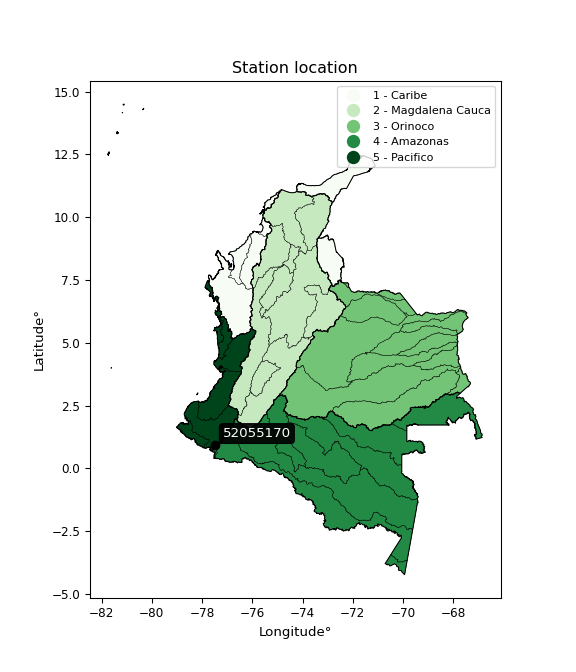

<div align="center">


</div>

# PMP Station (Rain, Pmax24h): 52055170

Probable Maximum Precipitation (PMP) is the greatest amount of rainfall for a specific duration that is meteorologically possible for a given location, acting as a "worst-case" scenario for extreme storms, crucial for designing safety-critical infrastructure like bridges, river deviations, dams, spillways, and nuclear plants to prevent catastrophic failure. PMP is calculated by hydrologists using meteorological data to determine the upper limit of extreme rainfall, often leading to the Probable Maximum Flood (PMF) for flood control design, and is increasingly being studied for climate change impacts. Probable Maximum Precipitation (PMP) is the theoretical upper limit of rainfall, a deterministic estimate for extreme events, while probability distributions (like GEV, Gumbel) describe the likelihood and frequency of various precipitation amounts, including rare ones, showing how often events occur, with PMP representing the extreme end of these distributions, used for critical infrastructure design to ensure safety against the worst conceivable weather, unlike standard statistical forecasts which cover typical probabilities.

The most common probability distributions in hydrology, used for analyzing floods, rainfall, and streamflow, include the Normal, Log-Normal, Gumbel, Gamma (including Log-Pearson Type III), and Generalized Extreme Value (GEV) distributions, often chosen based on the data´s skewness and whether modeling extremes or general conditions, with Gumbel and GEV popular for extreme events like floods, while the Normal distribution serves as a baseline, though often requiring transformations for skewed hydrological data. These distributions help in designing water infrastructure, managing water resources, and forecasting hydrologic events.

> Hydrological data often isn´t perfectly normal (it´s skewed), so different distributions are needed for different applications, such as: **Flood Frequency Analysis**: Using Gumbel, GEV, or Log-Pearson Type III for predicting extreme flood magnitudes and their return periods, **Rainfall Analysis**: Normal for annual totals, but Log-Normal, Weibull, or GEV for intensity or extreme daily rainfall, **Streamflow Modeling**: Gamma and Log-Normal for maximum flows, GEV for minimum flows, and Kappa for daily flows.

<div align="center">

</img>

</div>


## A. General information


### 1. General running parameters

• app_version: _v20260113_. • runtime: _2026-01-13 16:28:34.738620_. • Python version: _3.14.0_. • SciPy version: _1.16.3_. • Pandas version: _2.3.3_. • NumPy version: _2.3.5_. • Stations dataset (station_dataset_file): _dataset/pmax24h_in/automatic_colombia_2003_2025.csv_. • Stations catalog (station_catalog_file): _dataset/CNE.xls_. • Minimum year to eval til year_max (date_min): _1900_. • Maximum year to eval since year_min (date_max): _2025_. • Creates, save and include plots into reports (create_plot): _False_. • Plot only fit distributions with Δo > Δ (plot_only_fit): _True_. • Plot only simple graphs avoiding multiple CDFs and multiple Extreme values plots (plot_only_simple): _True_. • Eval low extreme values, if False, evaluates high extreme values (low_extreme): _False_. • Eval every SciPy distribution as logarithmic (pdist_logarithmic_on): _True_. • Standard deviation normalized (ddof): _1.0_. • Return periods to eval in years (Tr): _[2, 2.33, 5, 10, 15, 20, 25, 50, 75, 100, 200, 250, 500, 750, 1000]_. • Minimum data sample per station, 0 means any (minimum_sample): _5_. • Z-Score maximum threshold to adjust a value, 0 means disable (zscore_max): _3.5_. • Z-Score minimum threshold to adjust a value, 0 means disable (zscore_min): _-2.5_. • Avoid zeros, e.g. rain = 0 (avoid_zeros): _True_. • Avoid null values (avoid_nans): _True_. 

:file_folder:Table: [dataset.csv](../../dataset/pmax24h_in/automatic_colombia_2003_2025.csv)

> Delta Degrees of Freedom (DDOF): is a parameter used in the formulas for calculating variance and standard deviation. When ddof=0, the divisor is $N$ (the total number of observations) and this is used when your data set is the entire population. When ddof=1, the divisor is $N-1$ and this is used when your data set is a sample drawn from a larger population. Using $N-1$ provides an unbiased estimate of the population variance (known as Bessel´s correction).


### 2. Station info and location

|   id |   CODIGO | NOMBRE                       | CATEGORIA               | TECNOLOGIA                | ESTADO   | FECHA_INSTALACION   |   FECHA_SUSPENSION |   ALTITUD |   LATITUD |   LONGITUD | DEPARTAMENTO   | MUNICIPIO   | AREA_OPERATIVA                      | ENTIDAD                                                     | AREA_HIDROGRAFICA   | ZONA_HIDROGRAFICA   | SUBZONA_HIDROGRAFICA   |   CORRIENTE | Catalogo   |   Version |
|-----:|---------:|:-----------------------------|:------------------------|:--------------------------|:---------|:--------------------|-------------------:|----------:|----------:|-----------:|:---------------|:------------|:------------------------------------|:------------------------------------------------------------|:--------------------|:--------------------|:-----------------------|------------:|:-----------|----------:|
|    0 | 52055170 | LA JOSEFINA - AUT [52055170] | Climatológica Principal | Automática con Telemetría | Activa   | 10/12/2005          |                nan |      2450 |  0.930306 |   -77.4912 | Nariño         | Contadero   | Area Operativa 07 - Nariño-Putumayo | INSTITUTO DE HIDROLOGIA METEOROLOGIA Y ESTUDIOS AMBIENTALES | Pacifico            | Patía               | Río Guáitara           |         nan | CNE_IDEAM  |  20251226 |

<div align="center">

Dynamic map: [:earth_americas:Google](http://maps.google.com/maps?q=0.930305556,-77.49119444) [:earth_americas:OSM](https://www.openstreetmap.org/#map=18/0.930305556/-77.49119444&layers=P) [:earth_americas:Bing](https://www.bing.com/maps?cp=0.930305556~-77.49119444&lvl=18) [:earth_americas:Apple](https://maps.apple.com/frame?center=0.930305556%2C-77.49119444&span=0.003%2C0.006)

</div>


<div align="center">

```geojson
{
  "type": "Feature",
  "geometry": {
    "type": "Point", 
    "coordinates": [-77.49119444, 0.930305556]
  }, 
  "properties": {
    "Name": "52055170"
  }
}
```

</div>


### 3. Discrete values table and plot

<div align="center">

|               |          0 |           1 |           2 |          3 |           4 |           5 |          6 |           7 |           8 |          9 |
|:--------------|-----------:|------------:|------------:|-----------:|------------:|------------:|-----------:|------------:|------------:|-----------:|
| Date          | 2016       | 2017        | 2018        | 2019       | 2020        | 2021        | 2022       | 2023        | 2024        | 2025       |
| Value         |    0.7     |   61.2      |   54.5      |   75.6     |   46.4      |   38.6      |   16.3     |   54.6      |   69.2      |   74.8     |
| Value_initial |    0.7     |   61.2      |   54.5      |   75.6     |   46.4      |   38.6      |   16.3     |   54.6      |   69.2      |   74.8     |
| count         |   10       |   10        |   10        |   10       |   10        |   10        |   10       |   10        |   10        |   10       |
| mean          |   49.19    |   49.19     |   49.19     |   49.19    |   49.19     |   49.19     |   49.19    |   49.19     |   49.19     |   49.19    |
| std           |   24.7396  |   24.7396   |   24.7396   |   24.7396  |   24.7396   |   24.7396   |   24.7396  |   24.7396   |   24.7396   |   24.7396  |
| zscore        |   -1.96002 |    0.485457 |    0.214636 |    1.06752 |   -0.112775 |   -0.428059 |   -1.32945 |    0.218678 |    0.808825 |    1.03518 |


</div>


> The initial value (value_initial) correspond to the initial obtained or null completed value, and value (value) is adjusted only when the initial value is outside the valid range (outlier) definite through the Z-Score value. If Z-Score is active, values out of range or outliers are replaced with the station mean value. A Z-Score (or standard score) measures how many standard deviations a data point is from the mean of a dataset, indicating its relative position; positive scores mean above the mean, negative mean below, and a score of zero is exactly at the mean, allowing for comparison of values from different distributions. It´s calculated using the formula $z=(x–μ)/σ$, where $x$ is the data point, $μ$ is the mean, and $σ$ is the standard deviation, helping identify outliers and understand probability.
>
> <sub>**Note**: In this study, "completing" (filling gaps in) and "extending" (forecasting or lengthening the historical record) rainfall data series are avoided for certain critical analyses because they introduce artificial bias and uncertainty, which can distort the statistics of rare events (extremes), alter day-to-day variability, and compromise the integrity and homogeneity of the original data. Some reasons against Completing/Extending rainfall data are: **Distortion of Extremes and Variability**: The primary issue is that most gap-filling or extension methods rely on averaging or regression with nearby stations, which inherently smooths the data. Rainfall is highly variable in space and time, with a large percentage of zero values and occasional large storms. Infilling methods often underestimate the highest values and overestimate the lowest (zero) values, which severely distorts analyses focused on flood frequency, drought severity, and intensity-duration-frequency (IDF) curves, **Loss of Data Homogeneity**: Infilled or extended data are synthetic estimates, not actual measurements. Combining these estimates with observed data can violate the assumption of data homogeneity, which requires that the data properties do not change over time. Inhomogeneity can lead to incorrect conclusions about long-term trends or changes in climate patterns, **Propagation of Errors**: Errors and biases from the original data (e.g., wind-induced undercatch, instrument errors, site changes) or the data used for imputation can propagate through the analysis, leading to unreliable hydrological models and inaccurate predictions, **Compromised Statistical Integrity**: For statistical analyses, especially those involving the frequency of events, using artificial data can introduce time bias or autocorrelation that doesn´t exist in reality, making it difficult to assess the true probability of events, **Difficulty in Validation**: It is difficult to accurately validate the quality of filled or extended data, especially for past periods where ground-truth measurements are unavailable. The reliability of imputation techniques heavily depends on the density of the surrounding station network and the complexity of the local topography.</sub>


### 4. Active continuous probability distributions from SciPy (45 of 104 available)

A Probability Density Function (PDF) describes the relative likelihood of a continuous random variable falling within a specific range, where the total area under its curve equals 1, and the area over any interval gives the actual probability for that range. Unlike discrete probabilities (like rolling a die), a PDF shows density, not direct probability for a single point (which is zero), with higher points indicating higher likelihood, often visualized as a bell curve for normal distributions.

A log of a probability density function (log-PDF) is simply the logarithm of the PDF´s value, denoted as $log(f(x))$, useful for converting multiplication of probabilities into addition, improving numerical stability with tiny numbers, and connecting to information theory concepts like entropy. Instead of dealing with very small probabilities (e.g., 0.000001), log-PDFs use negative numbers (e.g., $log(0.00001) ≈ -11.51$ that are easier for computers to handle, preventing underflow errors and simplifying complex calculations. In this study, each active probability distribution from SciPy is also evaluated in the $log$ form.

[scipy.stats](https://docs.scipy.org/doc/scipy/reference/stats.html) is a Python´s powerful submodule within the SciPy library for comprehensive statistical analysis, offering over 130 probability distributions (like Normal, Poisson), functions for descriptive stats (mean, variance), hypothesis testing (t-tests, chi-square), random variable generation, and statistical tests, making it essential for data science, modeling, and research. It provides tools to explore, model, and draw conclusions from data efficiently, working seamlessly with NumPy.

<div align="center">

|   id | p_dist             |   n_parameter | fit_method   | label                                                                       | active   | ref                                                                                                        |
|-----:|:-------------------|--------------:|:-------------|:----------------------------------------------------------------------------|:---------|:-----------------------------------------------------------------------------------------------------------|
|    0 | alpha              |             3 | MLE          | Alpha                                                                       | True     | [:mortar_board:](https://docs.scipy.org/doc/scipy/reference/generated/scipy.stats.alpha.html)              |
|    1 | betaprime          |             4 | MLE          | Beta prime                                                                  | True     | [:mortar_board:](https://docs.scipy.org/doc/scipy/reference/generated/scipy.stats.betaprime.html)          |
|    2 | chi2               |             3 | MLE          | Chi²                                                                        | True     | [:mortar_board:](https://docs.scipy.org/doc/scipy/reference/generated/scipy.stats.chi2.html)               |
|    3 | crystalball        |             4 | MLE          | Crystalball                                                                 | True     | [:mortar_board:](https://docs.scipy.org/doc/scipy/reference/generated/scipy.stats.crystalball.html)        |
|    4 | dweibull           |             3 | MLE          | Double Weibull                                                              | True     | [:mortar_board:](https://docs.scipy.org/doc/scipy/reference/generated/scipy.stats.dweibull.html)           |
|    5 | erlang             |             3 | MLE          | Erlang                                                                      | True     | [:mortar_board:](https://docs.scipy.org/doc/scipy/reference/generated/scipy.stats.erlang.html)             |
|    6 | expon              |             2 | MLE          | Exponential                                                                 | True     | [:mortar_board:](https://docs.scipy.org/doc/scipy/reference/generated/scipy.stats.expon.html)              |
|    7 | exponnorm          |             3 | MLE          | Exponentially modified Normal                                               | True     | [:mortar_board:](https://docs.scipy.org/doc/scipy/reference/generated/scipy.stats.exponnorm.html)          |
|    8 | f                  |             4 | MLE          | F                                                                           | True     | [:mortar_board:](https://docs.scipy.org/doc/scipy/reference/generated/scipy.stats.f.html)                  |
|    9 | fatiguelife        |             3 | MLE          | Fatigue-life (Birnbaum-Saunders)                                            | True     | [:mortar_board:](https://docs.scipy.org/doc/scipy/reference/generated/scipy.stats.fatiguelife.html)        |
|   10 | fisk               |             3 | MLE          | Fisk                                                                        | True     | [:mortar_board:](https://docs.scipy.org/doc/scipy/reference/generated/scipy.stats.fisk.html)               |
|   11 | gamma              |             3 | MLE          | Gamma                                                                       | True     | [:mortar_board:](https://docs.scipy.org/doc/scipy/reference/generated/scipy.stats.gamma.html)              |
|   12 | genexpon           |             5 | MLE          | Generalized exponential                                                     | True     | [:mortar_board:](https://docs.scipy.org/doc/scipy/reference/generated/scipy.stats.genexpon.html)           |
|   13 | genlogistic        |             3 | MLE          | Generalized logistic                                                        | True     | [:mortar_board:](https://docs.scipy.org/doc/scipy/reference/generated/scipy.stats.genlogistic.html)        |
|   14 | gibrat             |             2 | MM           | Gibrat                                                                      | True     | [:mortar_board:](https://docs.scipy.org/doc/scipy/reference/generated/scipy.stats.gibrat.html)             |
|   15 | gompertz           |             3 | MLE          | Gompertz (or truncated Gumbel)                                              | True     | [:mortar_board:](https://docs.scipy.org/doc/scipy/reference/generated/scipy.stats.gompertz.html)           |
|   16 | gumbel_l           |             2 | MM           | Gumbel Left Skew                                                            | True     | [:mortar_board:](https://docs.scipy.org/doc/scipy/reference/generated/scipy.stats.gumbel_l.html)           |
|   17 | gumbel_r           |             2 | MM           | Gumbel Right Skew                                                           | True     | [:mortar_board:](https://docs.scipy.org/doc/scipy/reference/generated/scipy.stats.gumbel_r.html)           |
|   18 | halflogistic       |             2 | MM           | Half-logistic                                                               | True     | [:mortar_board:](https://docs.scipy.org/doc/scipy/reference/generated/scipy.stats.halflogistic.html)       |
|   19 | halfnorm           |             2 | MM           | Half Normal                                                                 | True     | [:mortar_board:](https://docs.scipy.org/doc/scipy/reference/generated/scipy.stats.halfnorm.html)           |
|   20 | hypsecant          |             2 | MM           | hyperbolic secant                                                           | True     | [:mortar_board:](https://docs.scipy.org/doc/scipy/reference/generated/scipy.stats.hypsecant.html)          |
|   21 | invgamma           |             3 | MLE          | Inverted gamma                                                              | True     | [:mortar_board:](https://docs.scipy.org/doc/scipy/reference/generated/scipy.stats.invgamma.html)           |
|   22 | invgauss           |             3 | MLE          | Inverse Gaussian                                                            | True     | [:mortar_board:](https://docs.scipy.org/doc/scipy/reference/generated/scipy.stats.invgauss.html)           |
|   23 | invweibull         |             3 | MLE          | Inverted Weibull                                                            | True     | [:mortar_board:](https://docs.scipy.org/doc/scipy/reference/generated/scipy.stats.invweibull.html)         |
|   24 | kappa4             |             4 | MLE          | Kappa 4                                                                     | True     | [:mortar_board:](https://docs.scipy.org/doc/scipy/reference/generated/scipy.stats.kappa4.html)             |
|   25 | kstwobign          |             2 | MLE          | Limiting distribution of scaled Kolmogorov-Smirnov two-sided test statistic | True     | [:mortar_board:](https://docs.scipy.org/doc/scipy/reference/generated/scipy.stats.kstwobign.html)          |
|   26 | laplace            |             2 | MM           | Laplace                                                                     | True     | [:mortar_board:](https://docs.scipy.org/doc/scipy/reference/generated/scipy.stats.laplace.html)            |
|   27 | laplace_asymmetric |             3 | MLE          | Asymmetric Laplace                                                          | True     | [:mortar_board:](https://docs.scipy.org/doc/scipy/reference/generated/scipy.stats.laplace_asymmetric.html) |
|   28 | loggamma           |             3 | MLE          | Log gamma                                                                   | True     | [:mortar_board:](https://docs.scipy.org/doc/scipy/reference/generated/scipy.stats.loggamma.html)           |
|   29 | logistic           |             2 | MM           | Logistic (or Sech-squared)                                                  | True     | [:mortar_board:](https://docs.scipy.org/doc/scipy/reference/generated/scipy.stats.logistic.html)           |
|   30 | lognorm            |             3 | MLE          | Log Normal                                                                  | True     | [:mortar_board:](https://docs.scipy.org/doc/scipy/reference/generated/scipy.stats.lognorm.html)            |
|   31 | maxwell            |             2 | MM           | Maxwell                                                                     | True     | [:mortar_board:](https://docs.scipy.org/doc/scipy/reference/generated/scipy.stats.maxwell.html)            |
|   32 | mielke             |             4 | MLE          | Mielke Beta-Kappa / Dagum                                                   | True     | [:mortar_board:](https://docs.scipy.org/doc/scipy/reference/generated/scipy.stats.mielke.html)             |
|   33 | moyal              |             2 | MM           | Moyal                                                                       | True     | [:mortar_board:](https://docs.scipy.org/doc/scipy/reference/generated/scipy.stats.moyal.html)              |
|   34 | nakagami           |             3 | MLE          | Nakagami                                                                    | True     | [:mortar_board:](https://docs.scipy.org/doc/scipy/reference/generated/scipy.stats.nakagami.html)           |
|   35 | ncf                |             5 | MLE          | Non-central F distribution                                                  | True     | [:mortar_board:](https://docs.scipy.org/doc/scipy/reference/generated/scipy.stats.ncf.html)                |
|   36 | nct                |             4 | MLE          | Non-central Student’s t                                                     | True     | [:mortar_board:](https://docs.scipy.org/doc/scipy/reference/generated/scipy.stats.nct.html)                |
|   37 | norm               |             2 | MM           | Normal                                                                      | True     | [:mortar_board:](https://docs.scipy.org/doc/scipy/reference/generated/scipy.stats.norm.html)               |
|   38 | pearson3           |             3 | MM           | Pearson type III                                                            | True     | [:mortar_board:](https://docs.scipy.org/doc/scipy/reference/generated/scipy.stats.pearson3.html)           |
|   39 | rayleigh           |             2 | MM           | Rayleigh                                                                    | True     | [:mortar_board:](https://docs.scipy.org/doc/scipy/reference/generated/scipy.stats.rayleigh.html)           |
|   40 | rice               |             3 | MLE          | Rice                                                                        | True     | [:mortar_board:](https://docs.scipy.org/doc/scipy/reference/generated/scipy.stats.rice.html)               |
|   41 | t                  |             3 | MLE          | Student’s t                                                                 | True     | [:mortar_board:](https://docs.scipy.org/doc/scipy/reference/generated/scipy.stats.t.html)                  |
|   42 | truncnorm          |             4 | MLE          | Truncated normal                                                            | True     | [:mortar_board:](https://docs.scipy.org/doc/scipy/reference/generated/scipy.stats.truncnorm.html)          |
|   43 | wald               |             2 | MM           | Wald                                                                        | True     | [:mortar_board:](https://docs.scipy.org/doc/scipy/reference/generated/scipy.stats.wald.html)               |
|   44 | weibull_min        |             3 | MLE          | Weibull minimum                                                             | True     | [:mortar_board:](https://docs.scipy.org/doc/scipy/reference/generated/scipy.stats.weibull_min.html)        |

</div>

> **n_parameter:** # arguments & localization & scale.
>
> **Fit methods:** (MLE) maximum likelihood, (MM) L-moments.
>
>**Inactive** (With the only purpose of prevent loops, zero divisions, infinite values, over high estimated values or horizontal trending for recurrence intervals estimations, the follow distributions were disabled.)**:** foldnorm, gennorm, norminvgauss, powernorm, powerlognorm, skewnorm, genextreme, anglit, arcsine, argus, beta, bradford, burr, burr12, cauchy, cosine, halfcauchy, foldcauchy, skewcauchy, wrapcauchy, dgamma, gengamma, exponweib, exponpow, truncexpon, gausshyper, genhalflogistic, genhyperbolic, geninvgauss, halfgennorm, johnsonsb, johnsonsu, kappa3, ksone, kstwo, loglaplace, levy, levy_l, levy_stable, ncx2, pareto, genpareto, truncpareto, lomax, powerlaw, rdist, rel_breitwigner, recipinvgauss, semicircular, studentized_range, trapezoid, triang, truncweibull_min, tukeylambda, uniform, loguniform, vonmises, vonmises_line, weibull_max, 


## B. Probability (PDF) vs. Empirical (EDF) distributions functions

A continuous probability distribution (CPD) describes probabilities for variables that can take any value within a range (like rain any time), unlike discrete variables with specific outcomes (like temperature). It uses a Probability Density Function (PDF), a curve where the total area under it equals 1, and the probability of the variable falling within an interval (a to b) is found by calculating the area under the curve between those points. A key feature is that the probability of hitting any single exact value is zero, so probabilities are always expressed for ranges, e.g., $P(a ≤ X ≤ b)$.

<div align="center">

Distributions parameters from station values
|    |   station | p_dist                |   n |             loc |            scale | shape                  | shape1                | shape2                 | shape3   |
|---:|----------:|:----------------------|----:|----------------:|-----------------:|:-----------------------|:----------------------|:-----------------------|:---------|
|  0 |  52055170 | alpha                 |  10 |  -379.956       |   7321.56        | 17.099708678910645     |                       |                        |          |
|  1 |  52055170 | betaprime             |  10 |  -531.236       | 151104           | 595.2171617477585      | 154941.05457110348    |                        |          |
|  2 |  52055170 | chi2                  |  10 |  -215.583       |      1.16996     | 226.19112623501883     |                       |                        |          |
|  3 |  52055170 | crystalball           |  10 |    49.19        |     23.47        | 24341.674926011357     | 557.101403205959      |                        |          |
|  4 |  52055170 | dweibull              |  10 |    54.5         |     18.9213      | 0.8715811321434381     |                       |                        |          |
|  5 |  52055170 | erlang                |  10 |  -351.631       |      1.46284     | 273.9008997607782      |                       |                        |          |
|  6 |  52055170 | expon                 |  10 |     0.7         |     48.49        |                        |                       |                        |          |
|  7 |  52055170 | exponnorm             |  10 |    49.1732      |     23.4699      | 0.0007174282594099708  |                       |                        |          |
|  8 |  52055170 | f                     |  10 | -9368.48        |   9417.6         | 346200.40068149753     | 4258328.667884116     |                        |          |
|  9 |  52055170 | fatiguelife           |  10 | -1015.4         |   1064.73        | 0.0217263037293716     |                       |                        |          |
| 10 |  52055170 | fisk                  |  10 |    -1.52024e+09 |      1.52024e+09 | 115032426.89396283     |                       |                        |          |
| 11 |  52055170 | gamma                 |  10 |  -329.944       |      1.54691     | 245.11577392401455     |                       |                        |          |
| 12 |  52055170 | genexpon              |  10 |     0.686245    |      2.39868     | 0.04959870010440309    | 4.358023297904643e-07 | 2.504272603705038      |          |
| 13 |  52055170 | genlogistic           |  10 |    75.6002      |      2.06089e-05 | 7.812029929886345e-07  |                       |                        |          |
| 14 |  52055170 | gibrat                |  10 |    31.2853      |     10.8597      |                        |                       |                        |          |
| 15 |  52055170 | gompertz              |  10 |    16.3         |      6.07592     | 0.00021759018341703051 |                       |                        |          |
| 16 |  52055170 | gumbel_l              |  10 |    59.7528      |     18.2995      |                        |                       |                        |          |
| 17 |  52055170 | gumbel_r              |  10 |    38.6272      |     18.2995      |                        |                       |                        |          |
| 18 |  52055170 | halflogistic          |  10 |    21.3725      |     20.0661      |                        |                       |                        |          |
| 19 |  52055170 | halfnorm              |  10 |    18.1248      |     38.9344      |                        |                       |                        |          |
| 20 |  52055170 | hypsecant             |  10 |    49.19        |     14.9415      |                        |                       |                        |          |
| 21 |  52055170 | invgamma              |  10 |  -311.608       |  73421.5         | 204.62101215730138     |                       |                        |          |
| 22 |  52055170 | invgauss              |  10 |  -141.185       |  10576.7         | 0.017972035605339352   |                       |                        |          |
| 23 |  52055170 | invweibull            |  10 |    -3.17245e+09 |      3.17245e+09 | 124692913.06953955     |                       |                        |          |
| 24 |  52055170 | kappa4                |  10 |    -6.33053     |     85.4619      | 1.0898177725800031     | 1.0430781101899218    |                        |          |
| 25 |  52055170 | kstwobign             |  10 |   -54.2392      |    118.193       |                        |                       |                        |          |
| 26 |  52055170 | laplace               |  10 |    49.19        |     16.5958      |                        |                       |                        |          |
| 27 |  52055170 | laplace_asymmetric    |  10 |    54.6         |     17.2605      | 1.1689212905842261     |                       |                        |          |
| 28 |  52055170 | loggamma              |  10 |    75.6002      |      5.81565e-06 | 2.204549574278729e-07  |                       |                        |          |
| 29 |  52055170 | logistic              |  10 |    49.19        |     12.9397      |                        |                       |                        |          |
| 30 |  52055170 | lognorm               |  10 |     0.7         |      0.851375    | 12.199777163287694     |                       |                        |          |
| 31 |  52055170 | maxwell               |  10 |    -6.42415     |     34.851       |                        |                       |                        |          |
| 32 |  52055170 | mielke                |  10 |   -41.0939      |    116.763       | 3.320782684041623      | 9021.839371053997     |                        |          |
| 33 |  52055170 | moyal                 |  10 |    35.7683      |     10.5652      |                        |                       |                        |          |
| 34 |  52055170 | nakagami              |  10 |     0.7         |     60.4069      | 0.2546294677416832     |                       |                        |          |
| 35 |  52055170 | ncf                   |  10 |    -0.059781    |      0.000697135 | 0.0001978600266200092  | 6.342102189849928     | 12.841605753002831     |          |
| 36 |  52055170 | nct                   |  10 | -1252.09        |     23.433       | 445419.1589437607      | 55.53207337419329     |                        |          |
| 37 |  52055170 | norm                  |  10 |    49.19        |     23.47        |                        |                       |                        |          |
| 38 |  52055170 | pearson3              |  10 |    49.19        |     23.47        | -0.8162758081351467    |                       |                        |          |
| 39 |  52055170 | rayleigh              |  10 |     4.29042     |     35.8247      |                        |                       |                        |          |
| 40 |  52055170 | rice                  |  10 | -4583.99        |     23.4504      | 197.5716241735547      |                       |                        |          |
| 41 |  52055170 | t                     |  10 |    49.19        |     23.4701      | 709319594.4443657      |                       |                        |          |
| 42 |  52055170 | truncnorm             |  10 |    -4.64105     |      5.91698     | -1.2406370526979669    | 13.561138517954046    |                        |          |
| 43 |  52055170 | wald                  |  10 |    25.7199      |     23.4701      |                        |                       |                        |          |
| 44 |  52055170 | weibull_min           |  10 |    -1.46793e+07 |      1.46793e+07 | 848134.248975446       |                       |                        |          |
| 45 |  52055170 | logalpha              |  10 |   -57.7843      |   2662.82        | 43.498619331829104     |                       |                        |          |
| 46 |  52055170 | logbetaprime          |  10 |    -1.70929     |      1.60182e+13 | 4.557914803461012      | 13394292549802.879    |                        |          |
| 47 |  52055170 | logchi2               |  10 |    -0.356675    |      1.49069     | 1.3258954831389373     |                       |                        |          |
| 48 |  52055170 | logcrystalball        |  10 |     3.49147     |      1.35192     | 25.741396195910394     | 267.3397389809445     |                        |          |
| 49 |  52055170 | logdweibull           |  10 |     4.00003     |      0.968292    | 0.8220240278915791     |                       |                        |          |
| 50 |  52055170 | logerlang             |  10 |    -0.356675    |      1.55292     | 0.0019497212440402526  |                       |                        |          |
| 51 |  52055170 | logexpon              |  10 |    -0.356675    |      3.84814     |                        |                       |                        |          |
| 52 |  52055170 | logexponnorm          |  10 |     3.4908      |      1.35192     | 0.000504966231140969   |                       |                        |          |
| 53 |  52055170 | logf                  |  10 |    -0.356675    |      1.26206     | 1.0852994874798423     | 1.2609970228895004    |                        |          |
| 54 |  52055170 | logfatiguelife        |  10 | -1162.46        |   1165.95        | 0.0011592449306211403  |                       |                        |          |
| 55 |  52055170 | logfisk               |  10 |    -0.356675    |      1.52618     | 0.6422070259682393     |                       |                        |          |
| 56 |  52055170 | loggamma              |  10 |    -0.356675    |      3.27478     | 0.8473792494950874     |                       |                        |          |
| 57 |  52055170 | loggenexpon           |  10 |    -0.616653    |      0.0237055   | 0.0005203164923009978  | 3.188985936557552     | 1.7163379492791973e-05 |          |
| 58 |  52055170 | loggenlogistic        |  10 |     4.32546     |      1.96356e-07 | 2.348315312826875e-07  |                       |                        |          |
| 59 |  52055170 | loggibrat             |  10 |     2.46015     |      0.625524    |                        |                       |                        |          |
| 60 |  52055170 | loggompertz           |  10 |    -0.356687    |      2.25028     | 0.1985849515349863     |                       |                        |          |
| 61 |  52055170 | loggumbel_l           |  10 |     4.0999      |      1.05409     |                        |                       |                        |          |
| 62 |  52055170 | loggumbel_r           |  10 |     2.88304     |      1.05409     |                        |                       |                        |          |
| 63 |  52055170 | loghalflogistic       |  10 |     1.88917     |      1.15582     |                        |                       |                        |          |
| 64 |  52055170 | loghalfnorm           |  10 |     1.70207     |      2.24269     |                        |                       |                        |          |
| 65 |  52055170 | loghypsecant          |  10 |     3.49147     |      0.860657    |                        |                       |                        |          |
| 66 |  52055170 | loginvgamma           |  10 |   -39.1145      |  38926           | 915.3835507288575      |                       |                        |          |
| 67 |  52055170 | loginvgauss           |  10 |   -12.8126      |   1630.01        | 0.010016937029285865   |                       |                        |          |
| 68 |  52055170 | loginvweibull         |  10 |    -2.5064e+08  |      2.5064e+08  | 135174200.32422605     |                       |                        |          |
| 69 |  52055170 | logkappa4             |  10 |    -0.17        |      8.04836     | 0.9594205420340971     | 1.790331124519999     |                        |          |
| 70 |  52055170 | logkstwobign          |  10 |    -4.21811     |      8.86065     |                        |                       |                        |          |
| 71 |  52055170 | loglaplace            |  10 |     3.49147     |      0.95595     |                        |                       |                        |          |
| 72 |  52055170 | loglaplace_asymmetric |  10 |     4.32546     |      0.01358     | 61.14943143266106      |                       |                        |          |
| 73 |  52055170 | logloggamma           |  10 |     4.32577     |      1.90492e-06 | 2.280955441043272e-06  |                       |                        |          |
| 74 |  52055170 | loglogistic           |  10 |     3.49147     |      0.745351    |                        |                       |                        |          |
| 75 |  52055170 | loglognorm            |  10 |  -922.462       |    925.942       | 0.0014621408412566006  |                       |                        |          |
| 76 |  52055170 | logmaxwell            |  10 |     0.28804     |      2.00746     |                        |                       |                        |          |
| 77 |  52055170 | logmielke             |  10 |    -2.02236e+08 |      2.02236e+08 | 285547247.5562568      | 376979848.0124912     |                        |          |
| 78 |  52055170 | logmoyal              |  10 |     2.71836     |      0.608577    |                        |                       |                        |          |
| 79 |  52055170 | lognakagami           |  10 | -1673.17        |   1676.66        | 382804.315661883       |                       |                        |          |
| 80 |  52055170 | logncf                |  10 |    -0.356675    |      1.09778     | 0.9820924418997168     | 1.3684086420636923    | 1.1481017391776163     |          |
| 81 |  52055170 | lognct                |  10 |   -76.3645      |      1.29932     | 18978.891422486668     | 61.456514427104196    |                        |          |
| 82 |  52055170 | lognorm               |  10 |     3.49147     |      1.35192     |                        |                       |                        |          |
| 83 |  52055170 | logpearson3           |  10 |     3.49147     |      1.35193     | -2.2350881573118557    |                       |                        |          |
| 84 |  52055170 | lograyleigh           |  10 |     0.905131    |      2.0636      |                        |                       |                        |          |
| 85 |  52055170 | logrice               |  10 | -1331.62        |      1.35154     | 987.8411512295424      |                       |                        |          |
| 86 |  52055170 | logt                  |  10 |     4.06597     |      0.21647     | 0.9601138280678154     |                       |                        |          |
| 87 |  52055170 | logtruncnorm          |  10 |     1.382       |      5.95527     | -0.2929608987506651    | 0.4942604870083731    |                        |          |
| 88 |  52055170 | logwald               |  10 |     2.13951     |      1.35195     |                        |                       |                        |          |
| 89 |  52055170 | logweibull_min        |  10 |    -0.356675    |      1.92231     | 0.8897308550152945     |                       |                        |          |

</div>

> **loc** (Location parameter): This shifts the distribution along the x-axis. For many common distributions, like the normal (Gaussian) distribution, loc represents the mean $μ$. For others, like the uniform distribution, it might represent the minimum value, or for the beta distribution, the left end of the support interval.
>
> **scale** (Scale parameter): This determines the width or spread of the distribution. For the normal distribution, scale represents the standard deviation $σ$. For a uniform distribution, it defines the length of the interval (from $loc$ to $loc + scale$).
>
> **shape** (Shape parameters): Refers to parameters that define the specific form of a probability distribution, distinct from its location (loc) and scale (scale). These parameters are required arguments for most distribution functions. For example, a normal (Gaussian) distribution is fully defined by its location (mean) and scale (standard deviation), so it has no specific shape parameters beyond loc and scale. However, other distributions have intrinsic properties that need specification, as Gamma distribution that takes a shape parameter, often named $a$ or $alpha$.


### 0. Cumulative distribution values - CDF (90 evaluated)

Cumulative Distribution Function (CDF), denoted as $F$<sub>$X$</sub>$(x)$, is a function that gives the probability that a random variable $X$ will take a value less than or equal to a specific value, $x$ (i.e., $(P(X≥x)$. It essentially "accumulates" probabilities from a given point up to the far right (positive infinity), providing a complete picture of the distribution´s probabilities for both discrete (like rain) and continuous (like temperature) variables, helping to find probabilities over ranges or above certain values. Each station is evaluated separately ordering the $x$ values ascending, calculating the CDF and PDF values for the activated distributions and their logarithmic forms.

<div align="center">

CDF ordered by x ascending and calculating $log(f(x))$ separately
|   id |   Station |   date |    x |   count |   mean |     std |    zscore |   Value_initial |   station |   m |     alpha |   alpha_pdf |   betaprime |   betaprime_pdf |      chi2 |   chi2_pdf |   crystalball |   crystalball_pdf |   dweibull |   dweibull_pdf |    erlang |   erlang_pdf |    expon |   expon_pdf |   exponnorm |   exponnorm_pdf |         f |      f_pdf |   fatiguelife |   fatiguelife_pdf |      fisk |   fisk_pdf |     gamma |   gamma_pdf |    genexpon |   genexpon_pdf |   genlogistic |   genlogistic_pdf |   gibrat |   gibrat_pdf |    gompertz |   gompertz_pdf |   gumbel_l |   gumbel_l_pdf |    gumbel_r |   gumbel_r_pdf |   halflogistic |   halflogistic_pdf |   halfnorm |   halfnorm_pdf |   hypsecant |   hypsecant_pdf |   invgamma |   invgamma_pdf |   invgauss |   invgauss_pdf |   invweibull |   invweibull_pdf |      kappa4 |   kappa4_pdf |   kstwobign |   kstwobign_pdf |   laplace |   laplace_pdf |   laplace_asymmetric |   laplace_asymmetric_pdf |    loggamma |   loggamma_pdf |   logistic |   logistic_pdf |    lognorm |   lognorm_pdf |    maxwell |   maxwell_pdf |    mielke |   mielke_pdf |       moyal |   moyal_pdf |    nakagami |   nakagami_pdf |        ncf |    ncf_pdf |       nct |    nct_pdf |      norm |   norm_pdf |   pearson3 |   pearson3_pdf |   rayleigh |   rayleigh_pdf |      rice |   rice_pdf |         t |      t_pdf |   truncnorm |   truncnorm_pdf |     wald |   wald_pdf |   weibull_min |   weibull_min_pdf |   logalpha |   logalpha_pdf |   logbetaprime |   logbetaprime_pdf |     logchi2 |   logchi2_pdf |   logcrystalball |   logcrystalball_pdf |   logdweibull |   logdweibull_pdf |   logerlang |   logerlang_pdf |   logexpon |   logexpon_pdf |   logexponnorm |   logexponnorm_pdf |        logf |    logf_pdf |   logfatiguelife |   logfatiguelife_pdf |     logfisk |    logfisk_pdf |   loggenexpon |   loggenexpon_pdf |   loggenlogistic |   loggenlogistic_pdf |   loggibrat |   loggibrat_pdf |   loggompertz |   loggompertz_pdf |   loggumbel_l |   loggumbel_l_pdf |   loggumbel_r |   loggumbel_r_pdf |   loghalflogistic |   loghalflogistic_pdf |   loghalfnorm |   loghalfnorm_pdf |   loghypsecant |   loghypsecant_pdf |   loginvgamma |   loginvgamma_pdf |   loginvgauss |   loginvgauss_pdf |   loginvweibull |   loginvweibull_pdf |   logkappa4 |   logkappa4_pdf |   logkstwobign |   logkstwobign_pdf |   loglaplace |   loglaplace_pdf |   loglaplace_asymmetric |   loglaplace_asymmetric_pdf |   logloggamma |   logloggamma_pdf |   loglogistic |   loglogistic_pdf |   loglognorm |   loglognorm_pdf |   logmaxwell |   logmaxwell_pdf |   logmielke |   logmielke_pdf |    logmoyal |   logmoyal_pdf |   lognakagami |   lognakagami_pdf |      logncf |   logncf_pdf |     lognct |   lognct_pdf |   logpearson3 |   logpearson3_pdf |   lograyleigh |   lograyleigh_pdf |    logrice |   logrice_pdf |      logt |   logt_pdf |   logtruncnorm |   logtruncnorm_pdf |   logwald |   logwald_pdf |   logweibull_min |   logweibull_min_pdf |
|-----:|----------:|-------:|-----:|--------:|-------:|--------:|----------:|----------------:|----------:|----:|----------:|------------:|------------:|----------------:|----------:|-----------:|--------------:|------------------:|-----------:|---------------:|----------:|-------------:|---------:|------------:|------------:|----------------:|----------:|-----------:|--------------:|------------------:|----------:|-----------:|----------:|------------:|------------:|---------------:|--------------:|------------------:|---------:|-------------:|------------:|---------------:|-----------:|---------------:|------------:|---------------:|---------------:|-------------------:|-----------:|---------------:|------------:|----------------:|-----------:|---------------:|-----------:|---------------:|-------------:|-----------------:|------------:|-------------:|------------:|----------------:|----------:|--------------:|---------------------:|-------------------------:|------------:|---------------:|-----------:|---------------:|-----------:|--------------:|-----------:|--------------:|----------:|-------------:|------------:|------------:|------------:|---------------:|-----------:|-----------:|----------:|-----------:|----------:|-----------:|-----------:|---------------:|-----------:|---------------:|----------:|-----------:|----------:|-----------:|------------:|----------------:|---------:|-----------:|--------------:|------------------:|-----------:|---------------:|---------------:|-------------------:|------------:|--------------:|-----------------:|---------------------:|--------------:|------------------:|------------:|----------------:|-----------:|---------------:|---------------:|-------------------:|------------:|------------:|-----------------:|---------------------:|------------:|---------------:|--------------:|------------------:|-----------------:|---------------------:|------------:|----------------:|--------------:|------------------:|--------------:|------------------:|--------------:|------------------:|------------------:|----------------------:|--------------:|------------------:|---------------:|-------------------:|--------------:|------------------:|--------------:|------------------:|----------------:|--------------------:|------------:|----------------:|---------------:|-------------------:|-------------:|-----------------:|------------------------:|----------------------------:|--------------:|------------------:|--------------:|------------------:|-------------:|-----------------:|-------------:|-----------------:|------------:|----------------:|------------:|---------------:|--------------:|------------------:|------------:|-------------:|-----------:|-------------:|--------------:|------------------:|--------------:|------------------:|-----------:|--------------:|----------:|-----------:|---------------:|-------------------:|----------:|--------------:|-----------------:|---------------------:|
|    0 |  52055170 |   2016 |  0.7 |      10 |  49.19 | 24.7396 | -1.96002  |             0.7 |  52055170 |   1 | 0.0164066 |  0.00206649 |   0.0186509 |      0.00202956 | 0.0204778 | 0.00227291 |     0.0194124 |        0.00201141 |  0.0416095 |     0.00167598 | 0.0195606 |   0.00213898 | 0        |  0.0206228  |   0.0194119 |      0.00201137 | 0.0196767 | 0.0020363  |     0.0157057 |        0.00178501 | 0.0202028 | 0.00149781 | 0.0190058 |  0.00209834 | 0.000284371 |     0.0206716  |      0        |        0.00221652 | 0        |   0          | 0           |    0           |  0.0388991 |      0.0020838 | 0.000354322 |     0.00015384 |       0        |         0          |   0        |     0          |   0.0247876 |      0.0016573  |  0.0198987 |     0.00231365 |  0.016685  |     0.0022099  |    0.0166398 |       0.00267886 | 2.29253e-15 |    0.242516  |   0.0178662 |      0.0033885  | 0.0269178 |    0.00162196 |            0.0399285 |               0.00197899 | 6.50762e-15 |     99.339     |  0.0230363 |     0.00173927 | 0.00221059 |    0.00513561 | 0.00224354 |   0.000936885 | 0.0329834 |   0.00262073 | 1.46218e-07 | 1.97746e-07 | 7.24112e-10 |     3.3215e+06 | 0.00293644 | 0.001973   | 0.0194118 | 0.00201156 | 0.0194124 | 0.00201141 |  0.036177  |     0.00226299 |  0         |     0          | 0.0193293 | 0.00200578 | 0.0194129 | 0.00201144 |    0.794593 |     0.0502581   | 0        | 0          |     0.0322864 |        0.00183499 | 0.00205503 |      0.0052469 |      0.0122483 |          0.0331608 | 1.42283e-11 | 84961.3       |       0.00221058 |           0.00513559 |     0.0159882 |         0.0103856 |    0.931124 |     1.6352e+13  |   0        |      0.259865  |     0.00221052 |         0.00513546 | 8.98106e-10 | 8.77945e+06 |       0.00217939 |           0.00508777 | 2.77086e-11 | 320560         |    0.00895731 |         0.0468453 |         0        |           0.00442424 |    0        |        0        |   1.04064e-06 |         0.0882496 |      0.014477 |         0.0136343 |   4.09138e-10 |       8.39051e-09 |          0        |              0        |      0        |          0        |     0.00727876 |         0.00845647 |    0.00211199 |        0.00536456 |    0.00383529 |          0.009248 |      0.00558097 |           0.0156166 |   0.0156505 |     0.103093    |     0.00868245 |          0.0269639 |   0.00892755 |       0.00933893 |              0.00355776 |                  0.00428436 |    0.00367285 |        0.00439789 |     0.0056927 |        0.00759413 |   0.00225613 |       0.00524561 |     0        |         0        |  0.00212629 |      0.00300133 | 6.70351e-36 |    8.67169e-34 |    0.00225664 |        0.00522471 | 3.75628e-09 |  3.32277e+07 | 0.00229772 |   0.00532172 |     0.0226667 |         0.0157238 |      0        |          0        | 0.00220507 |     0.0051254 | 0.0174342 | 0.00377905 |     0.00126156 |           0.210707 |  0        |      0        |      3.56602e-15 |           28.578     |
|    1 |  52055170 |   2022 | 16.3 |      10 |  49.19 | 24.7396 | -1.32945  |            16.3 |  52055170 |   2 | 0.0842336 |  0.0072067  |   0.0814638 |      0.00657472 | 0.089633  | 0.00710683 |     0.0805531 |        0.00636737 |  0.0790352 |     0.00332655 | 0.0852127 |   0.0068168  | 0.275096 |  0.0149496  |   0.0805518 |      0.00636732 | 0.0814099 | 0.006416   |     0.0734722 |        0.00621748 | 0.0629077 | 0.00446061 | 0.0838451 |  0.0067574  | 0.275922    |     0.0149722  |      0        |        0.00400392 | 0        |   0          | 1.33469e-09 |    3.58121e-05 |  0.0888595 |      0.0046334 | 0.0337922   |     0.00625546 |       0        |         0          |   0        |     0          |   0.0701657 |      0.00465809 |  0.0915443 |     0.00739343 |  0.0898093 |     0.00773168 |    0.108769  |       0.00948455 | 0.228996    |    0.0135371 |   0.131529  |      0.011052   | 0.0689088 |    0.00415218 |            0.0865117 |               0.00428781 | 0.685073    |      0.105368  |  0.0729801 |     0.0052284  | 0.302226   |    0.258043   | 0.0650011  |   0.00786953  | 0.0945676 |   0.00547164 | 0.0119827   | 0.00403851  | 0.389889    |     0.0125566  | 0.125515   | 0.0125816  | 0.0805572 | 0.00636776 | 0.0805531 | 0.00636737 |  0.0918312 |     0.00520033 |  0.0546408 |     0.00884627 | 0.0803736 | 0.00636202 | 0.0805541 | 0.00636739 |    0.999775 |     0.000143964 | 0        | 0          |     0.077649  |        0.0043075  | 0.322745   |      0.260436  |      0.406267  |          0.171789  | 0.791282    |     0.0841962 |       0.302226   |           0.258043   |     0.150581  |         0.122884  |    0.999908 |     8.1792e-05  |   0.558693 |      0.11468   |     0.302223   |         0.258042   | 0.673836    | 0.0497891   |       0.302417   |           0.258328   | 0.614182    |      0.0483439 |    0.472654   |         0.186397  |         0        |           0.190901   |    0.262252 |        0.984256 |   0.454368    |         0.195045  |      0.250932 |         0.20532   |   0.335858    |       0.347641    |          0.37153  |              0.37288  |      0.372764 |          0.3162   |     0.265599   |         0.274017   |    0.324392   |        0.260919   |    0.343172   |          0.235811 |      0.386727   |           0.198147  |   0.458958  |     0.193492    |     0.44124    |          0.185264  |   0.240335   |       0.251409   |              0.157567   |                  0.189747   |    0.159207   |        0.190636   |     0.280989  |        0.271059   |   0.305324   |       0.259041   |     0.330318 |         0.284019 |  0.167956   |      0.214648   | 0.346226    |    0.396236    |    0.303064   |        0.257819   | 0.562901    |  0.0593106   | 0.304268   |   0.257217   |     0.209992  |         0.153356  |      0.341412 |          0.291685 | 0.302175   |     0.258096  | 0.0570996 | 0.0422344  |     0.685184   |           0.213811 |  0.348954 |      0.667558 |      0.787934    |            0.0929585 |
|    2 |  52055170 |   2021 | 38.6 |      10 |  49.19 | 24.7396 | -0.428059 |            38.6 |  52055170 |   3 | 0.34726   |  0.0154353  |   0.331598  |      0.0154101  | 0.346728  | 0.0152345  |     0.325918  |        0.0153528  |  0.211728  |     0.00997325 | 0.339097  |   0.0153865  | 0.542329 |  0.00943846 |   0.325916  |      0.0153528  | 0.327557  | 0.0153522  |     0.320578  |        0.0156285  | 0.26625   | 0.0147824  | 0.336628  |  0.0153582  | 0.543409    |     0.00944123 |      0        |        0.00932387 | 0.346355 |   0.0504434  | 0.00829066  |    0.00139435  |  0.270042  |      0.0125559 | 0.367332    |     0.0201032  |       0.40471  |         0.0208364  |   0.401034 |     0.0178465  |   0.291209  |      0.0168827  |  0.354928  |     0.0153273  |  0.363255  |     0.0156116  |    0.397152  |       0.0144149  | 0.52103     |    0.0128208 |   0.43208   |      0.0139579  | 0.264144  |    0.0159163  |            0.261267  |               0.0129493  | 0.763485    |      0.0780433 |  0.306101  |     0.0164148  | 0.547627   |    0.292988   | 0.356156   |   0.0165868   | 0.281288  |   0.011721   | 0.381801    | 0.0225287   | 0.60267     |     0.00747357 | 0.42136    | 0.011966   | 0.325916  | 0.0153513  | 0.325918  | 0.0153528  |  0.287479  |     0.0129279  |  0.367833  |     0.0168998  | 0.325774  | 0.015363   | 0.325919  | 0.0153527  |    1        |     1.91043e-13 | 0.40629  | 0.0347321  |     0.254111  |        0.0126347  | 0.562294   |      0.278     |      0.548679  |          0.155859  | 0.851831    |     0.0581141 |       0.547627   |           0.292988   |     0.325271  |         0.331506  |    0.999956 |     3.68721e-05 |   0.647266 |      0.0916633 |     0.547623   |         0.292989   | 0.710526    | 0.0364574   |       0.547958   |           0.292983   | 0.650304    |      0.0364205 |    0.624955   |         0.163968  |         0        |           0.535269   |    0.740771 |        0.27145  |   0.625186    |         0.19653   |      0.480349 |         0.322708  |   0.617811    |       0.282255    |          0.642917 |              0.253784 |      0.61571  |          0.243672 |     0.559485   |         0.363406   |    0.56417    |        0.278028   |    0.553379   |          0.24021  |      0.550577   |           0.177207  |   0.656768  |     0.282615    |     0.590985   |          0.159672  |   0.577846   |       0.441607   |              0.444967   |                  0.535842   |    0.446963   |        0.535195   |     0.554052  |        0.331493   |   0.550844   |       0.29222    |     0.578172 |         0.274035 |  0.444921   |      0.412548   | 0.642724    |    0.273076    |    0.548024   |        0.292286   | 0.60758     |  0.0453526   | 0.548137   |   0.29057    |     0.39928   |         0.30582   |      0.588    |          0.265879 | 0.54764    |     0.293069  | 0.157686  | 0.314467   |     0.865761   |           0.204458 |  0.711855 |      0.247477 |      0.853913    |            0.0623503 |
|    3 |  52055170 |   2020 | 46.4 |      10 |  49.19 | 24.7396 | -0.112775 |            46.4 |  52055170 |   4 | 0.471018  |  0.0160259  |   0.457892  |      0.0166958  | 0.469911  | 0.0160901  |     0.452687  |        0.0168783  |  0.310208  |     0.0159341  | 0.464455  |   0.0164839  | 0.610333 |  0.00803603 |   0.452686  |      0.0168783  | 0.454175  | 0.0168406  |     0.449582  |        0.0171552  | 0.395673  | 0.0180933  | 0.461849  |  0.0164773  | 0.611419    |     0.00803495 |      0        |        0.0125315  | 0.629528 |   0.0249907  | 0.0301593   |    0.00492285  |  0.382492  |      0.016267  | 0.519997    |     0.0185821  |       0.553648 |         0.0172798  |   0.5323   |     0.0157428  |   0.440905  |      0.0209377  |  0.477833  |     0.0159253  |  0.487155  |     0.0158917  |    0.506813  |       0.013538   | 0.620693    |    0.0127449 |   0.536933  |      0.0128218  | 0.422628  |    0.025466   |            0.384575  |               0.0190608  | 0.777405    |      0.0732746 |  0.446304  |     0.0190975  | 0.60095    |    0.285595   | 0.486979   |   0.0166758   | 0.383546  |   0.0145573  | 0.545427    | 0.0190167   | 0.657098    |     0.00651449 | 0.508186   | 0.0102884  | 0.452671  | 0.0168759  | 0.452687  | 0.0168783  |  0.400126  |     0.0158791  |  0.498837  |     0.0164435  | 0.452641  | 0.0168923  | 0.452688  | 0.0168782  |    1        |     5.24749e-18 | 0.616123 | 0.0203872  |     0.36878   |        0.01678    | 0.612652   |      0.268531  |      0.576894  |          0.150674  | 0.862126    |     0.0538149 |       0.60095    |           0.285595   |     0.396931  |         0.46285   |    0.999963 |     3.13167e-05 |   0.66374  |      0.0873825 |     0.600946   |         0.285596   | 0.71704     | 0.0343582   |       0.601273   |           0.285512   | 0.656829    |      0.0345153 |    0.654519   |         0.157216  |         0        |           0.667061   |    0.784997 |        0.212171 |   0.661044    |         0.192875  |      0.541355 |         0.33916   |   0.667364    |       0.256047    |          0.687262 |              0.228267 |      0.658946 |          0.226118 |     0.624594   |         0.341872   |    0.614523   |        0.268451   |    0.596928   |          0.232602 |      0.582517   |           0.169771  |   0.712518  |     0.326562    |     0.61974    |          0.152755  |   0.651777   |       0.364269   |              0.55537    |                  0.668793   |    0.557161   |        0.667147   |     0.613958  |        0.317989   |   0.603993   |       0.284492   |     0.627391 |         0.260306 |  0.522268   |      0.42461    | 0.690045    |    0.24144     |    0.601216   |        0.284884   | 0.615713    |  0.0430562   | 0.60101    |   0.283154   |     0.460291  |         0.358994  |      0.635592 |          0.250915 | 0.600977   |     0.28567   | 0.24412   | 0.685118   |     0.903164   |           0.201966 |  0.753271 |      0.204291 |      0.864922    |            0.0573667 |
|    4 |  52055170 |   2018 | 54.5 |      10 |  49.19 | 24.7396 |  0.214636 |            54.5 |  52055170 |   5 | 0.597721  |  0.0150081  |   0.592334  |      0.0161862  | 0.598245  | 0.01533    |     0.589495  |        0.0165684  |  0.5       |     2.01639    | 0.596597  |   0.0158479  | 0.670279 |  0.00679978 |   0.589495  |      0.0165685  | 0.590555  | 0.0165038  |     0.58826   |        0.0167408  | 0.547203  | 0.0187482  | 0.594031  |  0.0158644  | 0.671344    |     0.00679585 |      0        |        0.0170352  | 0.77629  |   0.012877   | 0.110201    |    0.0171309   |  0.527859  |      0.0193629 | 0.657016    |     0.0150812  |       0.678031 |         0.0134624  |   0.649834 |     0.0132455  |   0.610814  |      0.0200258  |  0.603899  |     0.0149533  |  0.611736  |     0.0146408  |    0.609995  |       0.0118513  | 0.72385     |    0.0127398 |   0.634307  |      0.0111723  | 0.636911  |    0.0218783  |            0.574558  |               0.0284771  | 0.788877    |      0.0693617 |  0.601175  |     0.0185293  | 0.646104   |    0.275076   | 0.616923   |   0.0151802   | 0.514647  |   0.0178781  | 0.680263    | 0.0142942   | 0.706411    |     0.00568432 | 0.584626   | 0.00861289 | 0.589458  | 0.0165659  | 0.589495  | 0.0165684  |  0.538243  |     0.0179722  |  0.625496  |     0.0146514  | 0.589563  | 0.0165818  | 0.589495  | 0.0165683  |    1        |     1.52949e-23 | 0.744937 | 0.0122593  |     0.520344  |        0.0203606  | 0.654971   |      0.257033  |      0.60075   |          0.145811  | 0.870502    |     0.0503447 |       0.646104   |           0.275076   |     0.497119  |         1.28805   |    0.999967 |     2.71932e-05 |   0.67751  |      0.0838041 |     0.6461     |         0.275077   | 0.722431    | 0.0326793   |       0.646409   |           0.274933   | 0.662258    |      0.0329846 |    0.679315   |         0.150942  |         0        |           0.808605   |    0.815855 |        0.173051 |   0.691735    |         0.188413  |      0.596679 |         0.347433  |   0.706686    |       0.232751    |          0.722259 |              0.206927 |      0.694084 |          0.210645 |     0.677437   |         0.313856   |    0.656822   |        0.256861   |    0.633683   |          0.223972 |      0.609278   |           0.162811  |   0.76974   |     0.390836    |     0.643818   |          0.146516  |   0.705721   |       0.307839   |              0.674112   |                  0.811785   |    0.675544   |        0.8089     |     0.663706  |        0.299456   |   0.64895    |       0.273732   |     0.668153 |         0.246067 |  0.590269   |      0.417894   | 0.726781    |    0.215487    |    0.646258   |        0.274388   | 0.62249     |  0.0411982   | 0.645778   |   0.272726   |     0.522489  |         0.416081  |      0.674798 |          0.236207 | 0.646143   |     0.275142  | 0.404251  | 1.32624    |     0.935476   |           0.199655 |  0.783619 |      0.173936 |      0.873826    |            0.0533632 |
|    5 |  52055170 |   2023 | 54.6 |      10 |  49.19 | 24.7396 |  0.218678 |            54.6 |  52055170 |   6 | 0.599221  |  0.0149867  |   0.593952  |      0.0161684  | 0.599777  | 0.015311   |     0.591151  |        0.0165523  |  0.505154  |     0.0446919  | 0.598181  |   0.0158293  | 0.670958 |  0.00678577 |   0.591151  |      0.0165524  | 0.592205  | 0.0164874  |     0.589933  |        0.016723   | 0.549077  | 0.0187346  | 0.595617  |  0.015846   | 0.672023    |     0.00678181 |      0        |        0.0170999  | 0.777573 |   0.0127799  | 0.111926    |    0.0173814   |  0.529797  |      0.0193891 | 0.658521    |     0.0150333  |       0.679375 |         0.0134169  |   0.651157 |     0.0132137  |   0.612815  |      0.0199797  |  0.605393  |     0.0149325  |  0.613199  |     0.0146174  |    0.611179  |       0.0118278  | 0.725124    |    0.0127403 |   0.635423  |      0.0111504  | 0.639092  |    0.0217469  |            0.577413  |               0.0286186  | 0.789004    |      0.0693184 |  0.603027  |     0.0185001  | 0.646608   |    0.274936   | 0.61844    |   0.0151539   | 0.516437  |   0.0179215  | 0.681689    | 0.0142381   | 0.706979    |     0.00567488 | 0.585486   | 0.00859334 | 0.591114  | 0.0165498  | 0.591151  | 0.0165523  |  0.540041  |     0.0179873  |  0.626959  |     0.0146232  | 0.59122   | 0.0165656  | 0.591151  | 0.0165522  |    1        |     1.29158e-23 | 0.74616  | 0.0121869  |     0.522382  |        0.0203916  | 0.655442   |      0.256886  |      0.601017  |          0.145754  | 0.870594    |     0.0503066 |       0.646609   |           0.274936   |     0.5       |       201.448     |    0.999967 |     2.71497e-05 |   0.677663 |      0.0837642 |     0.646604   |         0.274937   | 0.722491    | 0.0326609   |       0.646913   |           0.274792   | 0.662319    |      0.0329679 |    0.679592   |         0.150869  |         0        |           0.81038    |    0.816172 |        0.17266  |   0.69208     |         0.188356  |      0.597316 |         0.347488  |   0.707113    |       0.232486    |          0.722638 |              0.20669  |      0.69447  |          0.210469 |     0.678012   |         0.313502   |    0.657293   |        0.256714   |    0.634093   |          0.223865 |      0.609577   |           0.16273   |   0.770457  |     0.391821    |     0.644086   |          0.146444  |   0.706285   |       0.307249   |              0.675602   |                  0.813579   |    0.677028   |        0.810677   |     0.664255  |        0.299215   |   0.649452   |       0.27359    |     0.668604 |         0.245895 |  0.591035   |      0.417723   | 0.727175    |    0.215202    |    0.646761   |        0.274249   | 0.622565    |  0.0411777   | 0.646278   |   0.272588   |     0.523252  |         0.416803  |      0.675231 |          0.236032 | 0.646647   |     0.275002  | 0.406688  | 1.33269    |     0.935842   |           0.199628 |  0.783938 |      0.173623 |      0.873924    |            0.0533194 |
|    6 |  52055170 |   2017 | 61.2 |      10 |  49.19 | 24.7396 |  0.485457 |            61.2 |  52055170 |   7 | 0.692656  |  0.0132222  |   0.69562   |      0.014481   | 0.695744  | 0.013644   |     0.695575  |        0.014912   |  0.666378  |     0.0175595  | 0.697524  |   0.0141293  | 0.71283  |  0.00592226 |   0.695575  |      0.0149121  | 0.696176  | 0.0148424  |     0.695117  |        0.0149729  | 0.667378  | 0.016797   | 0.695127  |  0.0141627  | 0.713863    |     0.00591665 |      0        |        0.0219607  | 0.844539 |   0.00798123 | 0.296829    |    0.0407804   |  0.661184  |      0.0200388 | 0.747317    |     0.0118947  |       0.758388 |         0.0105862  |   0.731426 |     0.0111126  |   0.732062  |      0.0158886  |  0.698583  |     0.0131987  |  0.70388   |     0.0127733  |    0.683955  |       0.0102118  | 0.809402    |    0.0128132 |   0.704186  |      0.00968186 | 0.757517  |    0.0146111  |            0.729728  |               0.0183034  | 0.796763    |      0.0666809 |  0.7167    |     0.0156913  | 0.677453   |    0.265396   | 0.712025   |   0.0131197   | 0.644475  |   0.0209217  | 0.764082    | 0.0108336   | 0.742456    |     0.00508693 | 0.638111   | 0.00737893 | 0.695523  | 0.01491    | 0.695575  | 0.014912   |  0.660344  |     0.0181906  |  0.716844  |     0.0125558  | 0.695721  | 0.0149214  | 0.695574  | 0.0149119  |    1        |     9.79164e-29 | 0.813091 | 0.00838643 |     0.661078  |        0.0211875  | 0.684212   |      0.247151  |      0.617445  |          0.142154  | 0.876202    |     0.0479974 |       0.677453   |           0.265396   |     0.579191  |         0.52269   |    0.99997  |     2.45835e-05 |   0.687081 |      0.0813167 |     0.677449   |         0.265397   | 0.726154    | 0.0315504   |       0.677739   |           0.265215   | 0.666022    |      0.0319517 |    0.696545   |         0.146247  |         0        |           0.928878   |    0.834565 |        0.150337 |   0.713358    |         0.184461  |      0.637091 |         0.348971  |   0.732709    |       0.216185    |          0.745394 |              0.192239 |      0.717862 |          0.199518 |     0.712489   |         0.290454   |    0.68604    |        0.246914   |    0.659241   |          0.216772 |      0.627855   |           0.157606  |   0.81944   |     0.475289    |     0.660542   |          0.141949  |   0.739335   |       0.272677   |              0.775124   |                  0.933426   |    0.776156   |        0.929373   |     0.697499  |        0.28308    |   0.680135   |       0.263915   |     0.696038 |         0.2348   |  0.637943   |      0.403151   | 0.750741    |    0.197992    |    0.677529   |        0.264742   | 0.627193    |  0.0399379   | 0.676861   |   0.263173   |     0.573527  |         0.465701  |      0.701536 |          0.224913 | 0.677499   |     0.265454  | 0.569132  | 1.38861    |     0.958525   |           0.197918 |  0.802691 |      0.155461 |      0.879856    |            0.0506661 |
|    7 |  52055170 |   2024 | 69.2 |      10 |  49.19 | 24.7396 |  0.808825 |            69.2 |  52055170 |   8 | 0.787853  |  0.0105219  |   0.799936  |      0.0114834  | 0.794236  | 0.0108958  |     0.803053  |        0.0118183  |  0.775896  |     0.0106631  | 0.799301  |   0.0112147  | 0.756506 |  0.00502153 |   0.803053  |      0.0118183  | 0.803142  | 0.0117631  |     0.802663  |        0.0117856  | 0.786119  | 0.0127224  | 0.797234  |  0.0112627  | 0.757488    |     0.00501458 |      0        |        0.0297403  | 0.894401 |   0.00481571 | 0.731386    |    0.0581222   |  0.812831  |      0.0171397 | 0.828517    |     0.0085171  |       0.831121 |         0.0077055  |   0.810421 |     0.00866803 |   0.836843  |      0.0104478  |  0.793639  |     0.0105041  |  0.795498  |     0.0100939  |    0.75777   |       0.00826136 | 0.912838    |    0.0131072 |   0.774581  |      0.00793311 | 0.850263  |    0.0090226  |            0.842779  |               0.0106473  | 0.804786    |      0.0639605 |  0.824393  |     0.011188   | 0.709341   |    0.253468   | 0.805577   |   0.0102367   | 0.827563  |   0.0249167  | 0.837157    | 0.00759865  | 0.780567    |     0.00445361 | 0.691936   | 0.00611524 | 0.802989  | 0.0118176  | 0.803053  | 0.0118183  |  0.798785  |     0.0159342  |  0.806298  |     0.00979669 | 0.803248  | 0.0118212  | 0.803052  | 0.0118183  |    1        |     1.14827e-35 | 0.867844 | 0.00554027 |     0.820531  |        0.0178118  | 0.713869   |      0.235461  |      0.634666  |          0.138167  | 0.881953    |     0.0456408 |       0.709342   |           0.253468   |     0.634886  |         0.398205  |    0.999973 |     2.21073e-05 |   0.696914 |      0.0787617 |     0.709338   |         0.253469   | 0.72996     | 0.0304219   |       0.709603   |           0.253256   | 0.669883    |      0.0309159 |    0.7142     |         0.141147  |         0        |           1.07589    |    0.851759 |        0.13019  |   0.735728    |         0.179608  |      0.679829 |         0.345933  |   0.758213    |       0.199098    |          0.768091 |              0.177379 |      0.741654 |          0.187821 |     0.746574   |         0.264319   |    0.715663   |        0.235157   |    0.685365   |          0.208381 |      0.646873   |           0.151969  |   0.888812  |     0.700392    |     0.677681   |          0.137073  |   0.770771   |       0.239792   |              0.898716   |                  1.08226    |    0.899158   |        1.07666    |     0.731106  |        0.263755   |   0.711834   |       0.251877   |     0.724114 |         0.222167 |  0.686102   |      0.379616   | 0.773987    |    0.180642    |    0.70934    |        0.252863   | 0.632021    |  0.0386688   | 0.708487   |   0.25143    |     0.634511  |         0.529353  |      0.728408 |          0.212498 | 0.709394   |     0.253517  | 0.710649  | 0.892888   |     0.982724   |           0.196011 |  0.82072  |      0.138445 |      0.885913    |            0.0479681 |
|    8 |  52055170 |   2025 | 74.8 |      10 |  49.19 | 24.7396 |  1.03518  |            74.8 |  52055170 |   9 | 0.841278  |  0.00856898 |   0.857766  |      0.00916936 | 0.849456  | 0.00882855 |     0.862403  |        0.00937229 |  0.827328  |     0.00788233 | 0.855882  |   0.00899439 | 0.783063 |  0.00447384 |   0.862403  |      0.0093723  | 0.862232  | 0.00933502 |     0.861751  |        0.00931745 | 0.848826  | 0.00970965 | 0.854102  |  0.00904789 | 0.784005    |     0.00446628 |      0        |        0.0367734  | 0.917437 |   0.00349871 | 0.963274    |    0.0199742   |  0.897272  |      0.0127749 | 0.870642    |     0.00659063 |       0.869564 |         0.00607638 |   0.854513 |     0.0071037  |   0.886536  |      0.00743409 |  0.846926  |     0.00853533 |  0.846691  |     0.00820418 |    0.800455  |       0.00700261 | 0.988146    |    0.01418   |   0.815768  |      0.00679114 | 0.893148  |    0.00643851 |            0.892402  |               0.0072868  | 0.809698    |      0.0622987 |  0.878594  |     0.00824338 | 0.728745   |    0.245142   | 0.857222   |   0.00822574  | 0.975502  |   0.0279517  | 0.874707    | 0.00588049  | 0.80437     |     0.00405288 | 0.724023   | 0.00536149 | 0.862338  | 0.00937262 | 0.862403  | 0.00937229 |  0.879577  |     0.0127275  |  0.855846  |     0.00791971 | 0.862602  | 0.00937094 | 0.862402  | 0.00937229 |    1        |     5.44636e-41 | 0.894998 | 0.00422835 |     0.906891  |        0.0127711  | 0.731885   |      0.227513  |      0.645317  |          0.135592  | 0.885448    |     0.0442139 |       0.728745   |           0.245142   |     0.663854  |         0.348544  |    0.999975 |     2.06773e-05 |   0.702981 |      0.0771849 |     0.728742   |         0.245144   | 0.732301    | 0.0297405   |       0.728989   |           0.244914   | 0.672264    |      0.0302889 |    0.725056   |         0.137862  |         0        |           1.18083    |    0.861453 |        0.11916  |   0.749574    |         0.176187  |      0.706582 |         0.341316  |   0.773296    |       0.188608    |          0.781541 |              0.168362 |      0.755984 |          0.180489 |     0.766493   |         0.247625   |    0.733654   |        0.227168   |    0.701361   |          0.20272  |      0.658558   |           0.148356  |   0.965882  |     1.79006     |     0.688227   |          0.133975  |   0.788691   |       0.221046   |              0.987006   |                  1.18858    |    0.986968   |        1.1818     |     0.751129  |        0.2508     |   0.731112   |       0.243501   |     0.741082 |         0.213888 |  0.714944   |      0.361277   | 0.787638    |    0.170295    |    0.728698   |        0.244574   | 0.635       |  0.0378982   | 0.727738   |   0.243244   |     0.677548  |         0.57809   |      0.744633 |          0.20447  | 0.728801   |     0.245186  | 0.769084  | 0.624545   |     0.997929   |           0.194771 |  0.831114 |      0.128841 |      0.889582    |            0.0463396 |
|    9 |  52055170 |   2019 | 75.6 |      10 |  49.19 | 24.7396 |  1.06752  |            75.6 |  52055170 |  10 | 0.848025  |  0.00829761 |   0.864971  |      0.00884253 | 0.856403  | 0.00853772 |     0.869761  |        0.00902485 |  0.833505  |     0.00756272 | 0.862952  |   0.00868166 | 0.786613 |  0.00440064 |   0.869762  |      0.00902486 | 0.869562  | 0.00899033 |     0.869066  |        0.00896964 | 0.856431  | 0.00930382 | 0.861215  |  0.00873559 | 0.787548    |     0.004393   |      0.999991 |        0.0379054  | 0.920176 |   0.00334921 | 0.976932    |    0.0143116   |  0.907205  |      0.0120554 | 0.875816    |     0.00634621 |       0.874342 |         0.00586877 |   0.860111 |     0.00689292 |   0.892336  |      0.00706909 |  0.853644  |     0.0082608  |  0.85315   |     0.0079436  |    0.805989  |       0.00683276 | 0.999965    |    0.0181993 |   0.821139  |      0.00663538 | 0.898176  |    0.00613551 |            0.898076  |               0.00690252 | 0.81036     |      0.0620751 |  0.885035  |     0.00786321 | 0.731347   |    0.243963   | 0.863692   |   0.00794949  | 0.998041  |   0.0282634  | 0.879326    | 0.00566716  | 0.80759     |     0.00399819 | 0.728272   | 0.00526201 | 0.869697  | 0.00902532 | 0.869761  | 0.00902485 |  0.889543  |     0.0121847  |  0.862079  |     0.00766325 | 0.869959  | 0.00902298 | 0.86976   | 0.00902486 |    1        |     8.78594e-42 | 0.898318 | 0.00407288 |     0.916782  |        0.0119544  | 0.7343     |      0.226398  |      0.646758  |          0.135238  | 0.885918    |     0.0440227 |       0.731347   |           0.243963   |     0.66753   |         0.342699  |    0.999975 |     2.04895e-05 |   0.703801 |      0.0769719 |     0.731343   |         0.243964   | 0.732617    | 0.0296493   |       0.731589   |           0.243732   | 0.672586    |      0.0302048 |    0.72652    |         0.13741   |         0.999996 |           1.19595    |    0.862713 |        0.117744 |   0.751445    |         0.175699  |      0.710209 |         0.340517  |   0.775295    |       0.187197    |          0.783326 |              0.167154 |      0.757899 |          0.179492 |     0.769115   |         0.245353   |    0.736065   |        0.226047   |    0.703514   |          0.201928 |      0.660134   |           0.14786   |   1         |     1.37199e+06 |     0.689651   |          0.133552  |   0.79103    |       0.2186     |              0.999732   |                  1.20391    |    0.99962    |        1.19695    |     0.753788  |        0.248999   |   0.733696   |       0.242315   |     0.743351 |         0.212743 |  0.718773   |      0.3586     | 0.789442    |    0.168919    |    0.731293   |        0.243399   | 0.635402    |  0.0377948   | 0.730319   |   0.242084   |     0.683737  |         0.585423  |      0.746802 |          0.203366 | 0.731403   |     0.244005  | 0.77557   | 0.595061   |     1          |           0.194599 |  0.832478 |      0.127592 |      0.890074    |            0.0461216 |


</div>

An Empirical Distribution Function (EDF) is a step-function estimate of a true cumulative distribution function (CDF) based on observed sample data, representing the proportion of data points less than or equal to a given value. It is calculated by ordering your data and jumping up by $1/n$ (where $n$ is sample size) at each unique data point, allowing analysis without assuming an underlying population distribution, and it gets closer to the true CDF as the sample size grows. For the empirical probability calculations, the parameter $m$ correspond to the order number which means the position of the $x$ values in an ascending order list.

The Kolmogorov-Smirnov (K-S) test is a non-parametric statistical test used to determine if a sample data set comes from a specific theoretical distribution (one-sample) or if two different samples come from the same underlying distribution (two-sample), by comparing their cumulative distribution functions (CDFs). It calculates the maximum vertical difference (D statistic) between these functions, with a small p-value indicating a significant difference and rejection of the null hypothesis (that the data/samples match).


### 1. EDF California (1923)

California´s estimates the true probability distribution of water-related data (like rainfall, streamflow) using observed samples, crucial for risk assessment.

<div align="center">


$P=m/n$


</div>


**1.1. Empirical values**

<div align="center">

|                | 0                  | 1              | 2                  | 3                  | 4              | 5              | 6                 | 7                 | 8                  | 9              |
|:---------------|:-------------------|:---------------|:-------------------|:-------------------|:---------------|:---------------|:------------------|:------------------|:-------------------|:---------------|
| date           | 2016               | 2022           | 2021               | 2020               | 2018           | 2023           | 2017              | 2024              | 2025               | 2019           |
| x              | 0.7                | 16.3           | 38.6               | 46.4               | 54.5           | 54.6           | 61.2              | 69.2              | 74.8               | 75.6           |
| m              | 1                  | 2              | 3                  | 4                  | 5              | 6              | 7                 | 8                 | 9                  | 10             |
| empirical_dist | edf_california     | edf_california | edf_california     | edf_california     | edf_california | edf_california | edf_california    | edf_california    | edf_california     | edf_california |
| empirical      | 0.1                | 0.2            | 0.3                | 0.4                | 0.5            | 0.6            | 0.7               | 0.8               | 0.9                | 1.0            |
| empirical_tr   | 1.1111111111111112 | 1.25           | 1.4285714285714286 | 1.6666666666666667 | 2.0            | 2.5            | 3.333333333333333 | 5.000000000000001 | 10.000000000000002 | inf            |

</div>


**1.2. Kolmogorov-Smirnov fit test (sorted by Δ)**


<div align="center">

|                | 0                   | 1                   | 2                   | 3                   | 4                  | 5                   | 6                   | 7                   | 8                   | 9                  | 10                  | 11                  | 12                  | 13                  | 14                 | 15                  | 16                  | 17                  | 18                  | 19                  | 20                  | 21                  | 22                 | 23                  | 24                 | 25                 | 26                  | 27                 | 28                    | 29                 | 30                 | 31                  | 32                  | 33                 | 34                 | 35                 | 36                  | 37                  | 38                  | 39                  | 40                 | 41                 | 42                 | 43                 | 44                 | 45                  | 46                 | 47                 | 48                 | 49                 | 50                 | 51                 | 52                 | 53                  | 54                  | 55                 | 56                 | 57                 | 58                 | 59                 | 60                  | 61                 | 62                  | 63                  | 64                 | 65                 | 66                  | 67                  | 68                 | 69                 | 70                 | 71                  | 72                 | 73                 | 74                 | 75                  | 76                 | 77                 | 78                  | 79                 | 80                 | 81                 | 82                  | 83                 | 84                 | 85                 | 86                 | 87                 | 88                 | 89                 |
|:---------------|:--------------------|:--------------------|:--------------------|:--------------------|:-------------------|:--------------------|:--------------------|:--------------------|:--------------------|:-------------------|:--------------------|:--------------------|:--------------------|:--------------------|:-------------------|:--------------------|:--------------------|:--------------------|:--------------------|:--------------------|:--------------------|:--------------------|:-------------------|:--------------------|:-------------------|:-------------------|:--------------------|:-------------------|:----------------------|:-------------------|:-------------------|:--------------------|:--------------------|:-------------------|:-------------------|:-------------------|:--------------------|:--------------------|:--------------------|:--------------------|:-------------------|:-------------------|:-------------------|:-------------------|:-------------------|:--------------------|:-------------------|:-------------------|:-------------------|:-------------------|:-------------------|:-------------------|:-------------------|:--------------------|:--------------------|:-------------------|:-------------------|:-------------------|:-------------------|:-------------------|:--------------------|:-------------------|:--------------------|:--------------------|:-------------------|:-------------------|:--------------------|:--------------------|:-------------------|:-------------------|:-------------------|:--------------------|:-------------------|:-------------------|:-------------------|:--------------------|:-------------------|:-------------------|:--------------------|:-------------------|:-------------------|:-------------------|:--------------------|:-------------------|:-------------------|:-------------------|:-------------------|:-------------------|:-------------------|:-------------------|
| station        | 52055170            | 52055170            | 52055170            | 52055170            | 52055170           | 52055170            | 52055170            | 52055170            | 52055170            | 52055170           | 52055170            | 52055170            | 52055170            | 52055170            | 52055170           | 52055170            | 52055170            | 52055170            | 52055170            | 52055170            | 52055170            | 52055170            | 52055170           | 52055170            | 52055170           | 52055170           | 52055170            | 52055170           | 52055170              | 52055170           | 52055170           | 52055170            | 52055170            | 52055170           | 52055170           | 52055170           | 52055170            | 52055170            | 52055170            | 52055170            | 52055170           | 52055170           | 52055170           | 52055170           | 52055170           | 52055170            | 52055170           | 52055170           | 52055170           | 52055170           | 52055170           | 52055170           | 52055170           | 52055170            | 52055170            | 52055170           | 52055170           | 52055170           | 52055170           | 52055170           | 52055170            | 52055170           | 52055170            | 52055170            | 52055170           | 52055170           | 52055170            | 52055170            | 52055170           | 52055170           | 52055170           | 52055170            | 52055170           | 52055170           | 52055170           | 52055170            | 52055170           | 52055170           | 52055170            | 52055170           | 52055170           | 52055170           | 52055170            | 52055170           | 52055170           | 52055170           | 52055170           | 52055170           | 52055170           | 52055170           |
| empirical_dist | edf_california      | edf_california      | edf_california      | edf_california      | edf_california     | edf_california      | edf_california      | edf_california      | edf_california      | edf_california     | edf_california      | edf_california      | edf_california      | edf_california      | edf_california     | edf_california      | edf_california      | edf_california      | edf_california      | edf_california      | edf_california      | edf_california      | edf_california     | edf_california      | edf_california     | edf_california     | edf_california      | edf_california     | edf_california        | edf_california     | edf_california     | edf_california      | edf_california      | edf_california     | edf_california     | edf_california     | edf_california      | edf_california      | edf_california      | edf_california      | edf_california     | edf_california     | edf_california     | edf_california     | edf_california     | edf_california      | edf_california     | edf_california     | edf_california     | edf_california     | edf_california     | edf_california     | edf_california     | edf_california      | edf_california      | edf_california     | edf_california     | edf_california     | edf_california     | edf_california     | edf_california      | edf_california     | edf_california      | edf_california      | edf_california     | edf_california     | edf_california      | edf_california      | edf_california     | edf_california     | edf_california     | edf_california      | edf_california     | edf_california     | edf_california     | edf_california      | edf_california     | edf_california     | edf_california      | edf_california     | edf_california     | edf_california     | edf_california      | edf_california     | edf_california     | edf_california     | edf_california     | edf_california     | edf_california     | edf_california     |
| p_dist         | mielke              | pearson3            | gumbel_l            | laplace_asymmetric  | weibull_min        | logistic            | hypsecant           | rice                | exponnorm           | norm               | crystalball         | t                   | nct                 | f                   | fatiguelife        | betaprime           | maxwell             | laplace             | erlang              | gamma               | fisk                | chi2                | rayleigh           | invgamma            | invgauss           | alpha              | gumbel_r            | dweibull           | loglaplace_asymmetric | logloggamma        | kstwobign          | moyal               | invweibull          | halflogistic       | halfnorm           | kappa4             | logt                | expon               | genexpon            | wald                | loglogistic        | loghypsecant       | loginvgamma        | logalpha           | loglognorm         | logfatiguelife      | logrice            | logcrystalball     | lognorm            | lognorm            | logexponnorm       | lognakagami        | lognct             | ncf                 | gibrat              | loglaplace         | logmaxwell         | logmielke          | lograyleigh        | loggumbel_l        | loginvgauss         | nakagami           | logkstwobign        | loghalfnorm         | logpearson3        | loggumbel_r        | loggenexpon         | loggompertz         | logdweibull        | loginvweibull      | logmoyal           | loghalflogistic     | logbetaprime       | logkappa4          | logexpon           | logncf              | logwald            | logfisk            | loggibrat           | logf               | loggamma           | loggamma           | gompertz            | logtruncnorm       | logweibull_min     | logchi2            | truncnorm          | logerlang          | loggenlogistic     | genlogistic        |
| delta          | 0.10543239798964736 | 0.11045675188713355 | 0.11114052738600792 | 0.11348828765551111 | 0.1223509713248767 | 0.12701985100879537 | 0.12983431901533793 | 0.13004050484204233 | 0.13023785598878368 | 0.1302385360826923 | 0.13023854357261944 | 0.13023955710294588 | 0.13030290605233086 | 0.13043820687527552 | 0.1309342833593521 | 0.13502919859498397 | 0.13630826224398707 | 0.13691094556029304 | 0.13704763523477737 | 0.13878527021742515 | 0.14356905654965146 | 0.14359730170486185 | 0.1453592364259167 | 0.14635552570128918 | 0.1468498090518986 | 0.151975110485572  | 0.16620778523461643 | 0.1664946886888582 | 0.17411237550804937   | 0.1755438514488149 | 0.1788612684955856 | 0.18801728816695154 | 0.19401092189712232 | 0.2                | 0.2                | 0.2238502106439776 | 0.22442983836784225 | 0.24232889057870427 | 0.24340918655987914 | 0.24493737534050786 | 0.2540517736386539 | 0.2594851315113735 | 0.2641699823249766 | 0.265700439679286  | 0.2663037414963232 | 0.26841134259227795 | 0.2685967141055994 | 0.2686530031946728 | 0.268653146931202  | 0.268653146931202  | 0.2686566854071655 | 0.2687066644409696 | 0.2696805617247232 | 0.27172778803240905 | 0.27628994433032883 | 0.2778457391581058 | 0.2781720825341522 | 0.2812271562715445 | 0.2879996764478872 | 0.2897908190932116 | 0.29648611084626797 | 0.3026698122126718 | 0.31034949351546026 | 0.31571027350461917 | 0.3162632153022722 | 0.3178106537442356 | 0.32495507337969315 | 0.32518625294404374 | 0.3324697764573301 | 0.3398664529800818 | 0.3427239874036155 | 0.34291680542730835 | 0.3532420415369192 | 0.3567678110387226 | 0.3586932056404772 | 0.36459768623579003 | 0.4118548794509333 | 0.4141820893621226 | 0.44077089078031734 | 0.473835759916268  | 0.485073448501768  | 0.485073448501768  | 0.48807372055333964 | 0.5657609596819353 | 0.587933665741974  | 0.5912820526749138 | 0.799775142261224  | 0.8311244103883021 | 0.9                | 0.9                |
| deltao         | 0.3942745923300002  | 0.3942745923300002  | 0.3942745923300002  | 0.3942745923300002  | 0.3942745923300002 | 0.3942745923300002  | 0.3942745923300002  | 0.3942745923300002  | 0.3942745923300002  | 0.3942745923300002 | 0.3942745923300002  | 0.3942745923300002  | 0.3942745923300002  | 0.3942745923300002  | 0.3942745923300002 | 0.3942745923300002  | 0.3942745923300002  | 0.3942745923300002  | 0.3942745923300002  | 0.3942745923300002  | 0.3942745923300002  | 0.3942745923300002  | 0.3942745923300002 | 0.3942745923300002  | 0.3942745923300002 | 0.3942745923300002 | 0.3942745923300002  | 0.3942745923300002 | 0.3942745923300002    | 0.3942745923300002 | 0.3942745923300002 | 0.3942745923300002  | 0.3942745923300002  | 0.3942745923300002 | 0.3942745923300002 | 0.3942745923300002 | 0.3942745923300002  | 0.3942745923300002  | 0.3942745923300002  | 0.3942745923300002  | 0.3942745923300002 | 0.3942745923300002 | 0.3942745923300002 | 0.3942745923300002 | 0.3942745923300002 | 0.3942745923300002  | 0.3942745923300002 | 0.3942745923300002 | 0.3942745923300002 | 0.3942745923300002 | 0.3942745923300002 | 0.3942745923300002 | 0.3942745923300002 | 0.3942745923300002  | 0.3942745923300002  | 0.3942745923300002 | 0.3942745923300002 | 0.3942745923300002 | 0.3942745923300002 | 0.3942745923300002 | 0.3942745923300002  | 0.3942745923300002 | 0.3942745923300002  | 0.3942745923300002  | 0.3942745923300002 | 0.3942745923300002 | 0.3942745923300002  | 0.3942745923300002  | 0.3942745923300002 | 0.3942745923300002 | 0.3942745923300002 | 0.3942745923300002  | 0.3942745923300002 | 0.3942745923300002 | 0.3942745923300002 | 0.3942745923300002  | 0.3942745923300002 | 0.3942745923300002 | 0.3942745923300002  | 0.3942745923300002 | 0.3942745923300002 | 0.3942745923300002 | 0.3942745923300002  | 0.3942745923300002 | 0.3942745923300002 | 0.3942745923300002 | 0.3942745923300002 | 0.3942745923300002 | 0.3942745923300002 | 0.3942745923300002 |
| eval           | Δo > Δ              | Δo > Δ              | Δo > Δ              | Δo > Δ              | Δo > Δ             | Δo > Δ              | Δo > Δ              | Δo > Δ              | Δo > Δ              | Δo > Δ             | Δo > Δ              | Δo > Δ              | Δo > Δ              | Δo > Δ              | Δo > Δ             | Δo > Δ              | Δo > Δ              | Δo > Δ              | Δo > Δ              | Δo > Δ              | Δo > Δ              | Δo > Δ              | Δo > Δ             | Δo > Δ              | Δo > Δ             | Δo > Δ             | Δo > Δ              | Δo > Δ             | Δo > Δ                | Δo > Δ             | Δo > Δ             | Δo > Δ              | Δo > Δ              | Δo > Δ             | Δo > Δ             | Δo > Δ             | Δo > Δ              | Δo > Δ              | Δo > Δ              | Δo > Δ              | Δo > Δ             | Δo > Δ             | Δo > Δ             | Δo > Δ             | Δo > Δ             | Δo > Δ              | Δo > Δ             | Δo > Δ             | Δo > Δ             | Δo > Δ             | Δo > Δ             | Δo > Δ             | Δo > Δ             | Δo > Δ              | Δo > Δ              | Δo > Δ             | Δo > Δ             | Δo > Δ             | Δo > Δ             | Δo > Δ             | Δo > Δ              | Δo > Δ             | Δo > Δ              | Δo > Δ              | Δo > Δ             | Δo > Δ             | Δo > Δ              | Δo > Δ              | Δo > Δ             | Δo > Δ             | Δo > Δ             | Δo > Δ              | Δo > Δ             | Δo > Δ             | Δo > Δ             | Δo > Δ              | Δo <= Δ            | Δo <= Δ            | Δo <= Δ             | Δo <= Δ            | Δo <= Δ            | Δo <= Δ            | Δo <= Δ             | Δo <= Δ            | Δo <= Δ            | Δo <= Δ            | Δo <= Δ            | Δo <= Δ            | Δo <= Δ            | Δo <= Δ            |
| fit            | 1                   | 1                   | 1                   | 1                   | 1                  | 1                   | 1                   | 1                   | 1                   | 1                  | 1                   | 1                   | 1                   | 1                   | 1                  | 1                   | 1                   | 1                   | 1                   | 1                   | 1                   | 1                   | 1                  | 1                   | 1                  | 1                  | 1                   | 1                  | 1                     | 1                  | 1                  | 1                   | 1                   | 1                  | 1                  | 1                  | 1                   | 1                   | 1                   | 1                   | 1                  | 1                  | 1                  | 1                  | 1                  | 1                   | 1                  | 1                  | 1                  | 1                  | 1                  | 1                  | 1                  | 1                   | 1                   | 1                  | 1                  | 1                  | 1                  | 1                  | 1                   | 1                  | 1                   | 1                   | 1                  | 1                  | 1                   | 1                   | 1                  | 1                  | 1                  | 1                   | 1                  | 1                  | 1                  | 1                   | 0                  | 0                  | 0                   | 0                  | 0                  | 0                  | 0                   | 0                  | 0                  | 0                  | 0                  | 0                  | 0                  | 0                  |
| n              | 10                  | 10                  | 10                  | 10                  | 10                 | 10                  | 10                  | 10                  | 10                  | 10                 | 10                  | 10                  | 10                  | 10                  | 10                 | 10                  | 10                  | 10                  | 10                  | 10                  | 10                  | 10                  | 10                 | 10                  | 10                 | 10                 | 10                  | 10                 | 10                    | 10                 | 10                 | 10                  | 10                  | 10                 | 10                 | 10                 | 10                  | 10                  | 10                  | 10                  | 10                 | 10                 | 10                 | 10                 | 10                 | 10                  | 10                 | 10                 | 10                 | 10                 | 10                 | 10                 | 10                 | 10                  | 10                  | 10                 | 10                 | 10                 | 10                 | 10                 | 10                  | 10                 | 10                  | 10                  | 10                 | 10                 | 10                  | 10                  | 10                 | 10                 | 10                 | 10                  | 10                 | 10                 | 10                 | 10                  | 10                 | 10                 | 10                  | 10                 | 10                 | 10                 | 10                  | 10                 | 10                 | 10                 | 10                 | 10                 | 10                 | 10                 |
| best_fit       | 1                   | 0                   | 0                   | 0                   | 0                  | 0                   | 0                   | 0                   | 0                   | 0                  | 0                   | 0                   | 0                   | 0                   | 0                  | 0                   | 0                   | 0                   | 0                   | 0                   | 0                   | 0                   | 0                  | 0                   | 0                  | 0                  | 0                   | 0                  | 0                     | 0                  | 0                  | 0                   | 0                   | 0                  | 0                  | 0                  | 0                   | 0                   | 0                   | 0                   | 0                  | 0                  | 0                  | 0                  | 0                  | 0                   | 0                  | 0                  | 0                  | 0                  | 0                  | 0                  | 0                  | 0                   | 0                   | 0                  | 0                  | 0                  | 0                  | 0                  | 0                   | 0                  | 0                   | 0                   | 0                  | 0                  | 0                   | 0                   | 0                  | 0                  | 0                  | 0                   | 0                  | 0                  | 0                  | 0                   | 0                  | 0                  | 0                   | 0                  | 0                  | 0                  | 0                   | 0                  | 0                  | 0                  | 0                  | 0                  | 0                  | 0                  |
| best_fit_sort  | 1                   | 2                   | 3                   | 4                   | 5                  | 6                   | 7                   | 8                   | 9                   | 10                 | 11                  | 12                  | 13                  | 14                  | 15                 | 16                  | 17                  | 18                  | 19                  | 20                  | 21                  | 22                  | 23                 | 24                  | 25                 | 26                 | 27                  | 28                 | 29                    | 30                 | 31                 | 32                  | 33                  | 34                 | 35                 | 36                 | 37                  | 38                  | 39                  | 40                  | 41                 | 42                 | 43                 | 44                 | 45                 | 46                  | 47                 | 48                 | 49                 | 50                 | 51                 | 52                 | 53                 | 54                  | 55                  | 56                 | 57                 | 58                 | 59                 | 60                 | 61                  | 62                 | 63                  | 64                  | 65                 | 66                 | 67                  | 68                  | 69                 | 70                 | 71                 | 72                  | 73                 | 74                 | 75                 | 76                  | 77                 | 78                 | 79                  | 80                 | 81                 | 82                 | 83                  | 84                 | 85                 | 86                 | 87                 | 88                 | 89                 | 90                 |

</div>


**1.3. Best fit**

<div align="center">

|   id |   station | empirical_dist   | p_dist   |    delta |   deltao | eval   |   fit |   n |   best_fit |   best_fit_sort |
|-----:|----------:|:-----------------|:---------|---------:|---------:|:-------|------:|----:|-----------:|----------------:|
|    0 |  52055170 | edf_california   | mielke   | 0.105432 | 0.394275 | Δo > Δ |     1 |  10 |          1 |               1 |

</div>


### 2. EDF Hazen (1930)

Hazen method for plotting positions is a formula used to estimate the empirical cumulative probability distribution of flood events or other hydrological data. This formula often results in biased estimations, particularly when extrapolating to extreme events (high return periods).

<div align="center">


$P=(m-0.5)/n$


</div>


**2.1. Empirical values**

<div align="center">

|                | 0                  | 1                  | 2                  | 3                  | 4                  | 5                  | 6                 | 7         | 8                 | 9                  |
|:---------------|:-------------------|:-------------------|:-------------------|:-------------------|:-------------------|:-------------------|:------------------|:----------|:------------------|:-------------------|
| date           | 2016               | 2022               | 2021               | 2020               | 2018               | 2023               | 2017              | 2024      | 2025              | 2019               |
| x              | 0.7                | 16.3               | 38.6               | 46.4               | 54.5               | 54.6               | 61.2              | 69.2      | 74.8              | 75.6               |
| m              | 1                  | 2                  | 3                  | 4                  | 5                  | 6                  | 7                 | 8         | 9                 | 10                 |
| empirical_dist | edf_hazen          | edf_hazen          | edf_hazen          | edf_hazen          | edf_hazen          | edf_hazen          | edf_hazen         | edf_hazen | edf_hazen         | edf_hazen          |
| empirical      | 0.05               | 0.15               | 0.25               | 0.35               | 0.45               | 0.55               | 0.65              | 0.75      | 0.85              | 0.95               |
| empirical_tr   | 1.0526315789473684 | 1.1764705882352942 | 1.3333333333333333 | 1.5384615384615383 | 1.8181818181818181 | 2.2222222222222223 | 2.857142857142857 | 4.0       | 6.666666666666666 | 19.999999999999982 |

</div>


**2.2. Kolmogorov-Smirnov fit test (sorted by Δ)**


<div align="center">

|                | 0                   | 1                   | 2                  | 3                  | 4                   | 5                   | 6                  | 7                  | 8                   | 9                   | 10                  | 11                  | 12                 | 13                 | 14                 | 15                  | 16                  | 17                  | 18                  | 19                 | 20                 | 21                  | 22                 | 23                 | 24                  | 25                  | 26                 | 27                  | 28                  | 29                  | 30                 | 31                  | 32                 | 33                    | 34                 | 35                  | 36                 | 37                  | 38                  | 39                  | 40                 | 41                  | 42                  | 43                  | 44                  | 45                 | 46                 | 47                 | 48                 | 49                  | 50                 | 51                  | 52                 | 53                  | 54                 | 55                  | 56                  | 57                 | 58                  | 59                 | 60                 | 61                 | 62                 | 63                 | 64                 | 65                  | 66                 | 67                  | 68                 | 69                  | 70                  | 71                  | 72                  | 73                 | 74                 | 75                 | 76                 | 77                 | 78                 | 79                 | 80                 | 81                 | 82                 | 83                 | 84                 | 85                 | 86                 | 87                 | 88                 | 89                 |
|:---------------|:--------------------|:--------------------|:-------------------|:-------------------|:--------------------|:--------------------|:-------------------|:-------------------|:--------------------|:--------------------|:--------------------|:--------------------|:-------------------|:-------------------|:-------------------|:--------------------|:--------------------|:--------------------|:--------------------|:-------------------|:-------------------|:--------------------|:-------------------|:-------------------|:--------------------|:--------------------|:-------------------|:--------------------|:--------------------|:--------------------|:-------------------|:--------------------|:-------------------|:----------------------|:-------------------|:--------------------|:-------------------|:--------------------|:--------------------|:--------------------|:-------------------|:--------------------|:--------------------|:--------------------|:--------------------|:-------------------|:-------------------|:-------------------|:-------------------|:--------------------|:-------------------|:--------------------|:-------------------|:--------------------|:-------------------|:--------------------|:--------------------|:-------------------|:--------------------|:-------------------|:-------------------|:-------------------|:-------------------|:-------------------|:-------------------|:--------------------|:-------------------|:--------------------|:-------------------|:--------------------|:--------------------|:--------------------|:--------------------|:-------------------|:-------------------|:-------------------|:-------------------|:-------------------|:-------------------|:-------------------|:-------------------|:-------------------|:-------------------|:-------------------|:-------------------|:-------------------|:-------------------|:-------------------|:-------------------|:-------------------|
| station        | 52055170            | 52055170            | 52055170           | 52055170           | 52055170            | 52055170            | 52055170           | 52055170           | 52055170            | 52055170            | 52055170            | 52055170            | 52055170           | 52055170           | 52055170           | 52055170            | 52055170            | 52055170            | 52055170            | 52055170           | 52055170           | 52055170            | 52055170           | 52055170           | 52055170            | 52055170            | 52055170           | 52055170            | 52055170            | 52055170            | 52055170           | 52055170            | 52055170           | 52055170              | 52055170           | 52055170            | 52055170           | 52055170            | 52055170            | 52055170            | 52055170           | 52055170            | 52055170            | 52055170            | 52055170            | 52055170           | 52055170           | 52055170           | 52055170           | 52055170            | 52055170           | 52055170            | 52055170           | 52055170            | 52055170           | 52055170            | 52055170            | 52055170           | 52055170            | 52055170           | 52055170           | 52055170           | 52055170           | 52055170           | 52055170           | 52055170            | 52055170           | 52055170            | 52055170           | 52055170            | 52055170            | 52055170            | 52055170            | 52055170           | 52055170           | 52055170           | 52055170           | 52055170           | 52055170           | 52055170           | 52055170           | 52055170           | 52055170           | 52055170           | 52055170           | 52055170           | 52055170           | 52055170           | 52055170           | 52055170           |
| empirical_dist | edf_hazen           | edf_hazen           | edf_hazen          | edf_hazen          | edf_hazen           | edf_hazen           | edf_hazen          | edf_hazen          | edf_hazen           | edf_hazen           | edf_hazen           | edf_hazen           | edf_hazen          | edf_hazen          | edf_hazen          | edf_hazen           | edf_hazen           | edf_hazen           | edf_hazen           | edf_hazen          | edf_hazen          | edf_hazen           | edf_hazen          | edf_hazen          | edf_hazen           | edf_hazen           | edf_hazen          | edf_hazen           | edf_hazen           | edf_hazen           | edf_hazen          | edf_hazen           | edf_hazen          | edf_hazen             | edf_hazen          | edf_hazen           | edf_hazen          | edf_hazen           | edf_hazen           | edf_hazen           | edf_hazen          | edf_hazen           | edf_hazen           | edf_hazen           | edf_hazen           | edf_hazen          | edf_hazen          | edf_hazen          | edf_hazen          | edf_hazen           | edf_hazen          | edf_hazen           | edf_hazen          | edf_hazen           | edf_hazen          | edf_hazen           | edf_hazen           | edf_hazen          | edf_hazen           | edf_hazen          | edf_hazen          | edf_hazen          | edf_hazen          | edf_hazen          | edf_hazen          | edf_hazen           | edf_hazen          | edf_hazen           | edf_hazen          | edf_hazen           | edf_hazen           | edf_hazen           | edf_hazen           | edf_hazen          | edf_hazen          | edf_hazen          | edf_hazen          | edf_hazen          | edf_hazen          | edf_hazen          | edf_hazen          | edf_hazen          | edf_hazen          | edf_hazen          | edf_hazen          | edf_hazen          | edf_hazen          | edf_hazen          | edf_hazen          | edf_hazen          |
| p_dist         | weibull_min         | gumbel_l            | pearson3           | fisk               | dweibull            | laplace_asymmetric  | mielke             | fatiguelife        | nct                 | exponnorm           | t                   | crystalball         | norm               | rice               | f                  | betaprime           | gamma               | erlang              | alpha               | chi2               | logistic           | invgamma            | invweibull         | hypsecant          | invgauss            | maxwell             | logt               | rayleigh            | laplace             | kstwobign           | halfnorm           | gumbel_r            | ncf                | loglaplace_asymmetric | logloggamma        | halflogistic        | moyal              | logmielke           | loggumbel_l         | logpearson3         | kappa4             | logdweibull         | expon               | genexpon            | wald                | logexponnorm       | lognorm            | lognorm            | logcrystalball     | logrice             | logfatiguelife     | lognakagami         | lognct             | loginvweibull       | loglognorm         | logbetaprime        | loginvgauss         | loglogistic        | loghypsecant        | logalpha           | loginvgamma        | gibrat             | loglaplace         | logmaxwell         | lograyleigh        | logkstwobign        | nakagami           | loghalfnorm         | loggumbel_r        | loggenexpon         | loggompertz         | logmoyal            | loghalflogistic     | logkappa4          | logexpon           | logncf             | gompertz           | logwald            | logfisk            | loggibrat          | logf               | loggamma           | loggamma           | logtruncnorm       | logweibull_min     | logchi2            | truncnorm          | genlogistic        | loggenlogistic     | logerlang          |
| delta          | 0.07235097132487668 | 0.07785949206367887 | 0.0882425480704862 | 0.0972033529186404 | 0.11649468868885815 | 0.12455828841540678 | 0.1255022485180709 | 0.1382597145680316 | 0.13945798615757726 | 0.13949450824100101 | 0.13949459066325304 | 0.13949489500931073 | 0.1394948984052054 | 0.1395628969721477 | 0.1405554759801107 | 0.14233404276297484 | 0.14403148739890453 | 0.14659711472116838 | 0.14772089191563026 | 0.1482453156347921 | 0.1511752996354237 | 0.15389889868433332 | 0.1599947037892308 | 0.160814239390548  | 0.16173608954815338 | 0.16692339396694295 | 0.1744298383678422 | 0.17549558820832195 | 0.18691094556029303 | 0.18693312050033584 | 0.1998342680853063 | 0.20701554922851867 | 0.221727788032409  | 0.22411237550804936   | 0.2255438514488149 | 0.22803089719200947 | 0.2302625498241762 | 0.23122715627154444 | 0.23979081909321154 | 0.26626321530227215 | 0.2738502106439776 | 0.28246977645733007 | 0.29232889057870426 | 0.29340918655987913 | 0.29493737534050785 | 0.2976230624455444 | 0.2976272596341968 | 0.2976272596341968 | 0.2976273581441383 | 0.29764000814152647 | 0.2979581379395895 | 0.29802426865155085 | 0.2981369155618623 | 0.30057695237575877 | 0.300843699493737  | 0.30324204153691914 | 0.30337879676789425 | 0.3040517736386539 | 0.30948513151137347 | 0.3122937770763642 | 0.3141699823249766 | 0.3262899443303288 | 0.3278457391581058 | 0.3281720825341522 | 0.3379996764478872 | 0.34098461595660656 | 0.3526698122126718 | 0.36571027350461915 | 0.3678106537442356 | 0.37495507337969314 | 0.37518625294404373 | 0.39272398740361547 | 0.39291680542730834 | 0.4067678110387226 | 0.4086932056404772 | 0.412900892170425  | 0.4380737205533397 | 0.4618548794509333 | 0.4641820893621226 | 0.4907708907803173 | 0.523835759916268  | 0.535073448501768  | 0.535073448501768  | 0.6157609596819353 | 0.637933665741974  | 0.6412820526749139 | 0.8497751422612241 | 0.85               | 0.85               | 0.881124410388302  |
| deltao         | 0.3942745923300002  | 0.3942745923300002  | 0.3942745923300002 | 0.3942745923300002 | 0.3942745923300002  | 0.3942745923300002  | 0.3942745923300002 | 0.3942745923300002 | 0.3942745923300002  | 0.3942745923300002  | 0.3942745923300002  | 0.3942745923300002  | 0.3942745923300002 | 0.3942745923300002 | 0.3942745923300002 | 0.3942745923300002  | 0.3942745923300002  | 0.3942745923300002  | 0.3942745923300002  | 0.3942745923300002 | 0.3942745923300002 | 0.3942745923300002  | 0.3942745923300002 | 0.3942745923300002 | 0.3942745923300002  | 0.3942745923300002  | 0.3942745923300002 | 0.3942745923300002  | 0.3942745923300002  | 0.3942745923300002  | 0.3942745923300002 | 0.3942745923300002  | 0.3942745923300002 | 0.3942745923300002    | 0.3942745923300002 | 0.3942745923300002  | 0.3942745923300002 | 0.3942745923300002  | 0.3942745923300002  | 0.3942745923300002  | 0.3942745923300002 | 0.3942745923300002  | 0.3942745923300002  | 0.3942745923300002  | 0.3942745923300002  | 0.3942745923300002 | 0.3942745923300002 | 0.3942745923300002 | 0.3942745923300002 | 0.3942745923300002  | 0.3942745923300002 | 0.3942745923300002  | 0.3942745923300002 | 0.3942745923300002  | 0.3942745923300002 | 0.3942745923300002  | 0.3942745923300002  | 0.3942745923300002 | 0.3942745923300002  | 0.3942745923300002 | 0.3942745923300002 | 0.3942745923300002 | 0.3942745923300002 | 0.3942745923300002 | 0.3942745923300002 | 0.3942745923300002  | 0.3942745923300002 | 0.3942745923300002  | 0.3942745923300002 | 0.3942745923300002  | 0.3942745923300002  | 0.3942745923300002  | 0.3942745923300002  | 0.3942745923300002 | 0.3942745923300002 | 0.3942745923300002 | 0.3942745923300002 | 0.3942745923300002 | 0.3942745923300002 | 0.3942745923300002 | 0.3942745923300002 | 0.3942745923300002 | 0.3942745923300002 | 0.3942745923300002 | 0.3942745923300002 | 0.3942745923300002 | 0.3942745923300002 | 0.3942745923300002 | 0.3942745923300002 | 0.3942745923300002 |
| eval           | Δo > Δ              | Δo > Δ              | Δo > Δ             | Δo > Δ             | Δo > Δ              | Δo > Δ              | Δo > Δ             | Δo > Δ             | Δo > Δ              | Δo > Δ              | Δo > Δ              | Δo > Δ              | Δo > Δ             | Δo > Δ             | Δo > Δ             | Δo > Δ              | Δo > Δ              | Δo > Δ              | Δo > Δ              | Δo > Δ             | Δo > Δ             | Δo > Δ              | Δo > Δ             | Δo > Δ             | Δo > Δ              | Δo > Δ              | Δo > Δ             | Δo > Δ              | Δo > Δ              | Δo > Δ              | Δo > Δ             | Δo > Δ              | Δo > Δ             | Δo > Δ                | Δo > Δ             | Δo > Δ              | Δo > Δ             | Δo > Δ              | Δo > Δ              | Δo > Δ              | Δo > Δ             | Δo > Δ              | Δo > Δ              | Δo > Δ              | Δo > Δ              | Δo > Δ             | Δo > Δ             | Δo > Δ             | Δo > Δ             | Δo > Δ              | Δo > Δ             | Δo > Δ              | Δo > Δ             | Δo > Δ              | Δo > Δ             | Δo > Δ              | Δo > Δ              | Δo > Δ             | Δo > Δ              | Δo > Δ             | Δo > Δ             | Δo > Δ             | Δo > Δ             | Δo > Δ             | Δo > Δ             | Δo > Δ              | Δo > Δ             | Δo > Δ              | Δo > Δ             | Δo > Δ              | Δo > Δ              | Δo > Δ              | Δo > Δ              | Δo <= Δ            | Δo <= Δ            | Δo <= Δ            | Δo <= Δ            | Δo <= Δ            | Δo <= Δ            | Δo <= Δ            | Δo <= Δ            | Δo <= Δ            | Δo <= Δ            | Δo <= Δ            | Δo <= Δ            | Δo <= Δ            | Δo <= Δ            | Δo <= Δ            | Δo <= Δ            | Δo <= Δ            |
| fit            | 1                   | 1                   | 1                  | 1                  | 1                   | 1                   | 1                  | 1                  | 1                   | 1                   | 1                   | 1                   | 1                  | 1                  | 1                  | 1                   | 1                   | 1                   | 1                   | 1                  | 1                  | 1                   | 1                  | 1                  | 1                   | 1                   | 1                  | 1                   | 1                   | 1                   | 1                  | 1                   | 1                  | 1                     | 1                  | 1                   | 1                  | 1                   | 1                   | 1                   | 1                  | 1                   | 1                   | 1                   | 1                   | 1                  | 1                  | 1                  | 1                  | 1                   | 1                  | 1                   | 1                  | 1                   | 1                  | 1                   | 1                   | 1                  | 1                   | 1                  | 1                  | 1                  | 1                  | 1                  | 1                  | 1                   | 1                  | 1                   | 1                  | 1                   | 1                   | 1                   | 1                   | 0                  | 0                  | 0                  | 0                  | 0                  | 0                  | 0                  | 0                  | 0                  | 0                  | 0                  | 0                  | 0                  | 0                  | 0                  | 0                  | 0                  |
| n              | 10                  | 10                  | 10                 | 10                 | 10                  | 10                  | 10                 | 10                 | 10                  | 10                  | 10                  | 10                  | 10                 | 10                 | 10                 | 10                  | 10                  | 10                  | 10                  | 10                 | 10                 | 10                  | 10                 | 10                 | 10                  | 10                  | 10                 | 10                  | 10                  | 10                  | 10                 | 10                  | 10                 | 10                    | 10                 | 10                  | 10                 | 10                  | 10                  | 10                  | 10                 | 10                  | 10                  | 10                  | 10                  | 10                 | 10                 | 10                 | 10                 | 10                  | 10                 | 10                  | 10                 | 10                  | 10                 | 10                  | 10                  | 10                 | 10                  | 10                 | 10                 | 10                 | 10                 | 10                 | 10                 | 10                  | 10                 | 10                  | 10                 | 10                  | 10                  | 10                  | 10                  | 10                 | 10                 | 10                 | 10                 | 10                 | 10                 | 10                 | 10                 | 10                 | 10                 | 10                 | 10                 | 10                 | 10                 | 10                 | 10                 | 10                 |
| best_fit       | 1                   | 0                   | 0                  | 0                  | 0                   | 0                   | 0                  | 0                  | 0                   | 0                   | 0                   | 0                   | 0                  | 0                  | 0                  | 0                   | 0                   | 0                   | 0                   | 0                  | 0                  | 0                   | 0                  | 0                  | 0                   | 0                   | 0                  | 0                   | 0                   | 0                   | 0                  | 0                   | 0                  | 0                     | 0                  | 0                   | 0                  | 0                   | 0                   | 0                   | 0                  | 0                   | 0                   | 0                   | 0                   | 0                  | 0                  | 0                  | 0                  | 0                   | 0                  | 0                   | 0                  | 0                   | 0                  | 0                   | 0                   | 0                  | 0                   | 0                  | 0                  | 0                  | 0                  | 0                  | 0                  | 0                   | 0                  | 0                   | 0                  | 0                   | 0                   | 0                   | 0                   | 0                  | 0                  | 0                  | 0                  | 0                  | 0                  | 0                  | 0                  | 0                  | 0                  | 0                  | 0                  | 0                  | 0                  | 0                  | 0                  | 0                  |
| best_fit_sort  | 1                   | 2                   | 3                  | 4                  | 5                   | 6                   | 7                  | 8                  | 9                   | 10                  | 11                  | 12                  | 13                 | 14                 | 15                 | 16                  | 17                  | 18                  | 19                  | 20                 | 21                 | 22                  | 23                 | 24                 | 25                  | 26                  | 27                 | 28                  | 29                  | 30                  | 31                 | 32                  | 33                 | 34                    | 35                 | 36                  | 37                 | 38                  | 39                  | 40                  | 41                 | 42                  | 43                  | 44                  | 45                  | 46                 | 47                 | 48                 | 49                 | 50                  | 51                 | 52                  | 53                 | 54                  | 55                 | 56                  | 57                  | 58                 | 59                  | 60                 | 61                 | 62                 | 63                 | 64                 | 65                 | 66                  | 67                 | 68                  | 69                 | 70                  | 71                  | 72                  | 73                  | 74                 | 75                 | 76                 | 77                 | 78                 | 79                 | 80                 | 81                 | 82                 | 83                 | 84                 | 85                 | 86                 | 87                 | 88                 | 89                 | 90                 |

</div>


**2.3. Best fit**

<div align="center">

|   id |   station | empirical_dist   | p_dist      |    delta |   deltao | eval   |   fit |   n |   best_fit |   best_fit_sort |
|-----:|----------:|:-----------------|:------------|---------:|---------:|:-------|------:|----:|-----------:|----------------:|
|    0 |  52055170 | edf_hazen        | weibull_min | 0.072351 | 0.394275 | Δo > Δ |     1 |  10 |          1 |               1 |

</div>


### 3. EDF Weibull (1939)

Weibull plotting position formula is an empirical method used to estimate the non-exceedance probability or plotting position for a set of observed data, is often recommended or widely used in practice, particularly in flood frequency analysis.

<div align="center">


$P=m/(n+1)$


</div>


**3.1. Empirical values**

<div align="center">

|                | 0                   | 1                   | 2                  | 3                   | 4                   | 5                  | 6                  | 7                  | 8                  | 9                  |
|:---------------|:--------------------|:--------------------|:-------------------|:--------------------|:--------------------|:-------------------|:-------------------|:-------------------|:-------------------|:-------------------|
| date           | 2016                | 2022                | 2021               | 2020                | 2018                | 2023               | 2017               | 2024               | 2025               | 2019               |
| x              | 0.7                 | 16.3                | 38.6               | 46.4                | 54.5                | 54.6               | 61.2               | 69.2               | 74.8               | 75.6               |
| m              | 1                   | 2                   | 3                  | 4                   | 5                   | 6                  | 7                  | 8                  | 9                  | 10                 |
| empirical_dist | edf_weibull         | edf_weibull         | edf_weibull        | edf_weibull         | edf_weibull         | edf_weibull        | edf_weibull        | edf_weibull        | edf_weibull        | edf_weibull        |
| empirical      | 0.09090909090909091 | 0.18181818181818182 | 0.2727272727272727 | 0.36363636363636365 | 0.45454545454545453 | 0.5454545454545454 | 0.6363636363636364 | 0.7272727272727273 | 0.8181818181818182 | 0.9090909090909091 |
| empirical_tr   | 1.1                 | 1.2222222222222223  | 1.375              | 1.5714285714285714  | 1.8333333333333335  | 2.1999999999999997 | 2.75               | 3.666666666666667  | 5.500000000000002  | 10.999999999999996 |

</div>


**3.2. Kolmogorov-Smirnov fit test (sorted by Δ)**


<div align="center">

|                | 0                   | 1                   | 2                   | 3                   | 4                   | 5                   | 6                   | 7                   | 8                  | 9                   | 10                 | 11                  | 12                  | 13                  | 14                  | 15                  | 16                  | 17                  | 18                  | 19                  | 20                  | 21                 | 22                 | 23                 | 24                  | 25                  | 26                  | 27                  | 28                  | 29                 | 30                 | 31                  | 32                  | 33                  | 34                  | 35                    | 36                  | 37                  | 38                  | 39                 | 40                  | 41                  | 42                  | 43                 | 44                  | 45                 | 46                 | 47                 | 48                  | 49                  | 50                  | 51                 | 52                 | 53                  | 54                 | 55                  | 56                  | 57                  | 58                 | 59                 | 60                 | 61                  | 62                 | 63                 | 64                  | 65                 | 66                 | 67                  | 68                 | 69                  | 70                 | 71                  | 72                  | 73                 | 74                 | 75                 | 76                 | 77                 | 78                 | 79                 | 80                  | 81                 | 82                 | 83                 | 84                 | 85                 | 86                 | 87                 | 88                 | 89                 |
|:---------------|:--------------------|:--------------------|:--------------------|:--------------------|:--------------------|:--------------------|:--------------------|:--------------------|:-------------------|:--------------------|:-------------------|:--------------------|:--------------------|:--------------------|:--------------------|:--------------------|:--------------------|:--------------------|:--------------------|:--------------------|:--------------------|:-------------------|:-------------------|:-------------------|:--------------------|:--------------------|:--------------------|:--------------------|:--------------------|:-------------------|:-------------------|:--------------------|:--------------------|:--------------------|:--------------------|:----------------------|:--------------------|:--------------------|:--------------------|:-------------------|:--------------------|:--------------------|:--------------------|:-------------------|:--------------------|:-------------------|:-------------------|:-------------------|:--------------------|:--------------------|:--------------------|:-------------------|:-------------------|:--------------------|:-------------------|:--------------------|:--------------------|:--------------------|:-------------------|:-------------------|:-------------------|:--------------------|:-------------------|:-------------------|:--------------------|:-------------------|:-------------------|:--------------------|:-------------------|:--------------------|:-------------------|:--------------------|:--------------------|:-------------------|:-------------------|:-------------------|:-------------------|:-------------------|:-------------------|:-------------------|:--------------------|:-------------------|:-------------------|:-------------------|:-------------------|:-------------------|:-------------------|:-------------------|:-------------------|:-------------------|
| station        | 52055170            | 52055170            | 52055170            | 52055170            | 52055170            | 52055170            | 52055170            | 52055170            | 52055170           | 52055170            | 52055170           | 52055170            | 52055170            | 52055170            | 52055170            | 52055170            | 52055170            | 52055170            | 52055170            | 52055170            | 52055170            | 52055170           | 52055170           | 52055170           | 52055170            | 52055170            | 52055170            | 52055170            | 52055170            | 52055170           | 52055170           | 52055170            | 52055170            | 52055170            | 52055170            | 52055170              | 52055170            | 52055170            | 52055170            | 52055170           | 52055170            | 52055170            | 52055170            | 52055170           | 52055170            | 52055170           | 52055170           | 52055170           | 52055170            | 52055170            | 52055170            | 52055170           | 52055170           | 52055170            | 52055170           | 52055170            | 52055170            | 52055170            | 52055170           | 52055170           | 52055170           | 52055170            | 52055170           | 52055170           | 52055170            | 52055170           | 52055170           | 52055170            | 52055170           | 52055170            | 52055170           | 52055170            | 52055170            | 52055170           | 52055170           | 52055170           | 52055170           | 52055170           | 52055170           | 52055170           | 52055170            | 52055170           | 52055170           | 52055170           | 52055170           | 52055170           | 52055170           | 52055170           | 52055170           | 52055170           |
| empirical_dist | edf_weibull         | edf_weibull         | edf_weibull         | edf_weibull         | edf_weibull         | edf_weibull         | edf_weibull         | edf_weibull         | edf_weibull        | edf_weibull         | edf_weibull        | edf_weibull         | edf_weibull         | edf_weibull         | edf_weibull         | edf_weibull         | edf_weibull         | edf_weibull         | edf_weibull         | edf_weibull         | edf_weibull         | edf_weibull        | edf_weibull        | edf_weibull        | edf_weibull         | edf_weibull         | edf_weibull         | edf_weibull         | edf_weibull         | edf_weibull        | edf_weibull        | edf_weibull         | edf_weibull         | edf_weibull         | edf_weibull         | edf_weibull           | edf_weibull         | edf_weibull         | edf_weibull         | edf_weibull        | edf_weibull         | edf_weibull         | edf_weibull         | edf_weibull        | edf_weibull         | edf_weibull        | edf_weibull        | edf_weibull        | edf_weibull         | edf_weibull         | edf_weibull         | edf_weibull        | edf_weibull        | edf_weibull         | edf_weibull        | edf_weibull         | edf_weibull         | edf_weibull         | edf_weibull        | edf_weibull        | edf_weibull        | edf_weibull         | edf_weibull        | edf_weibull        | edf_weibull         | edf_weibull        | edf_weibull        | edf_weibull         | edf_weibull        | edf_weibull         | edf_weibull        | edf_weibull         | edf_weibull         | edf_weibull        | edf_weibull        | edf_weibull        | edf_weibull        | edf_weibull        | edf_weibull        | edf_weibull        | edf_weibull         | edf_weibull        | edf_weibull        | edf_weibull        | edf_weibull        | edf_weibull        | edf_weibull        | edf_weibull        | edf_weibull        | edf_weibull        |
| p_dist         | pearson3            | gumbel_l            | dweibull            | weibull_min         | fisk                | laplace_asymmetric  | fatiguelife         | nct                 | exponnorm          | t                   | crystalball        | norm                | rice                | f                   | betaprime           | logt                | gamma               | erlang              | alpha               | chi2                | logistic            | invgamma           | invweibull         | hypsecant          | invgauss            | mielke              | maxwell             | rayleigh            | kstwobign           | ncf                | laplace            | logmielke           | halfnorm            | gumbel_r            | loggumbel_l         | loglaplace_asymmetric | logloggamma         | halflogistic        | logpearson3         | moyal              | logdweibull         | kappa4              | expon               | genexpon           | logexponnorm        | lognorm            | lognorm            | logcrystalball     | logrice             | logfatiguelife      | lognakagami         | lognct             | logbetaprime       | loginvweibull       | loglognorm         | loginvgauss         | loglogistic         | loghypsecant        | logalpha           | wald               | loginvgamma        | loglaplace          | logmaxwell         | lograyleigh        | logkstwobign        | gibrat             | nakagami           | loghalfnorm         | loggumbel_r        | loggenexpon         | loggompertz        | logmoyal            | loghalflogistic     | logexpon           | logncf             | logkappa4          | logfisk            | gompertz           | logwald            | loggibrat          | logf                | loggamma           | loggamma           | logtruncnorm       | logweibull_min     | logchi2            | truncnorm          | genlogistic        | loggenlogistic     | logerlang          |
| delta          | 0.08998699367084977 | 0.09295870920418974 | 0.10278302549818526 | 0.10416915314305851 | 0.11891051999837544 | 0.12001283386995226 | 0.13371426002257708 | 0.13491253161212274 | 0.1349490536955465 | 0.13494913611779852 | 0.1349494404638562 | 0.13494944385975088 | 0.13501744242669317 | 0.13601002143465618 | 0.13778858821752032 | 0.13876634346970057 | 0.13948603285345001 | 0.14205166017571386 | 0.14317543737017574 | 0.14369986108933758 | 0.14662984508996918 | 0.1493534441388788 | 0.1554492492437763 | 0.1562687848450935 | 0.15719063500269886 | 0.15732043033625265 | 0.16237793942148843 | 0.17095013366286743 | 0.17976146912854857 | 0.1808186971233181 | 0.1823654910148385 | 0.19031806536245355 | 0.19528881353985178 | 0.20247009468306415 | 0.20762165891513606 | 0.21956692096259484   | 0.22099839690336037 | 0.22348544264655495 | 0.22535412439318125 | 0.2257170952787217 | 0.24156068554823917 | 0.26930475609852306 | 0.26960161785143155 | 0.2706819138326064 | 0.27489578971827167 | 0.2748999869069241 | 0.2748999869069241 | 0.2749000854168656 | 0.27491273541425376 | 0.27523086521231677 | 0.27529699592427814 | 0.2754096428345896 | 0.2759514599975882 | 0.27784967964848606 | 0.2781164267664643 | 0.28065152404062155 | 0.28132450091138117 | 0.28675785878410076 | 0.2895665043490915 | 0.2903919207950533 | 0.2914427095977039 | 0.30511846643083307 | 0.3054448098068795 | 0.3152724037206145 | 0.31825734322933386 | 0.3217444897848743 | 0.3299425394853991 | 0.34298300077734645 | 0.3450833810169629 | 0.35222780065242043 | 0.352458980216771  | 0.36999671467634276 | 0.37018953270003563 | 0.3768750238222954 | 0.3810827103522432 | 0.3840405383114499 | 0.4323639075439408 | 0.4335282660078851 | 0.4391276067236606 | 0.4680436180530446 | 0.49201757809808616 | 0.5032552666835861 | 0.5032552666835861 | 0.5930336869546626 | 0.6061154839237921 | 0.6094638708567321 | 0.8179569604430423 | 0.8181818181818182 | 0.8181818181818182 | 0.8402153194792111 |
| deltao         | 0.3942745923300002  | 0.3942745923300002  | 0.3942745923300002  | 0.3942745923300002  | 0.3942745923300002  | 0.3942745923300002  | 0.3942745923300002  | 0.3942745923300002  | 0.3942745923300002 | 0.3942745923300002  | 0.3942745923300002 | 0.3942745923300002  | 0.3942745923300002  | 0.3942745923300002  | 0.3942745923300002  | 0.3942745923300002  | 0.3942745923300002  | 0.3942745923300002  | 0.3942745923300002  | 0.3942745923300002  | 0.3942745923300002  | 0.3942745923300002 | 0.3942745923300002 | 0.3942745923300002 | 0.3942745923300002  | 0.3942745923300002  | 0.3942745923300002  | 0.3942745923300002  | 0.3942745923300002  | 0.3942745923300002 | 0.3942745923300002 | 0.3942745923300002  | 0.3942745923300002  | 0.3942745923300002  | 0.3942745923300002  | 0.3942745923300002    | 0.3942745923300002  | 0.3942745923300002  | 0.3942745923300002  | 0.3942745923300002 | 0.3942745923300002  | 0.3942745923300002  | 0.3942745923300002  | 0.3942745923300002 | 0.3942745923300002  | 0.3942745923300002 | 0.3942745923300002 | 0.3942745923300002 | 0.3942745923300002  | 0.3942745923300002  | 0.3942745923300002  | 0.3942745923300002 | 0.3942745923300002 | 0.3942745923300002  | 0.3942745923300002 | 0.3942745923300002  | 0.3942745923300002  | 0.3942745923300002  | 0.3942745923300002 | 0.3942745923300002 | 0.3942745923300002 | 0.3942745923300002  | 0.3942745923300002 | 0.3942745923300002 | 0.3942745923300002  | 0.3942745923300002 | 0.3942745923300002 | 0.3942745923300002  | 0.3942745923300002 | 0.3942745923300002  | 0.3942745923300002 | 0.3942745923300002  | 0.3942745923300002  | 0.3942745923300002 | 0.3942745923300002 | 0.3942745923300002 | 0.3942745923300002 | 0.3942745923300002 | 0.3942745923300002 | 0.3942745923300002 | 0.3942745923300002  | 0.3942745923300002 | 0.3942745923300002 | 0.3942745923300002 | 0.3942745923300002 | 0.3942745923300002 | 0.3942745923300002 | 0.3942745923300002 | 0.3942745923300002 | 0.3942745923300002 |
| eval           | Δo > Δ              | Δo > Δ              | Δo > Δ              | Δo > Δ              | Δo > Δ              | Δo > Δ              | Δo > Δ              | Δo > Δ              | Δo > Δ             | Δo > Δ              | Δo > Δ             | Δo > Δ              | Δo > Δ              | Δo > Δ              | Δo > Δ              | Δo > Δ              | Δo > Δ              | Δo > Δ              | Δo > Δ              | Δo > Δ              | Δo > Δ              | Δo > Δ             | Δo > Δ             | Δo > Δ             | Δo > Δ              | Δo > Δ              | Δo > Δ              | Δo > Δ              | Δo > Δ              | Δo > Δ             | Δo > Δ             | Δo > Δ              | Δo > Δ              | Δo > Δ              | Δo > Δ              | Δo > Δ                | Δo > Δ              | Δo > Δ              | Δo > Δ              | Δo > Δ             | Δo > Δ              | Δo > Δ              | Δo > Δ              | Δo > Δ             | Δo > Δ              | Δo > Δ             | Δo > Δ             | Δo > Δ             | Δo > Δ              | Δo > Δ              | Δo > Δ              | Δo > Δ             | Δo > Δ             | Δo > Δ              | Δo > Δ             | Δo > Δ              | Δo > Δ              | Δo > Δ              | Δo > Δ             | Δo > Δ             | Δo > Δ             | Δo > Δ              | Δo > Δ             | Δo > Δ             | Δo > Δ              | Δo > Δ             | Δo > Δ             | Δo > Δ              | Δo > Δ             | Δo > Δ              | Δo > Δ             | Δo > Δ              | Δo > Δ              | Δo > Δ             | Δo > Δ             | Δo > Δ             | Δo <= Δ            | Δo <= Δ            | Δo <= Δ            | Δo <= Δ            | Δo <= Δ             | Δo <= Δ            | Δo <= Δ            | Δo <= Δ            | Δo <= Δ            | Δo <= Δ            | Δo <= Δ            | Δo <= Δ            | Δo <= Δ            | Δo <= Δ            |
| fit            | 1                   | 1                   | 1                   | 1                   | 1                   | 1                   | 1                   | 1                   | 1                  | 1                   | 1                  | 1                   | 1                   | 1                   | 1                   | 1                   | 1                   | 1                   | 1                   | 1                   | 1                   | 1                  | 1                  | 1                  | 1                   | 1                   | 1                   | 1                   | 1                   | 1                  | 1                  | 1                   | 1                   | 1                   | 1                   | 1                     | 1                   | 1                   | 1                   | 1                  | 1                   | 1                   | 1                   | 1                  | 1                   | 1                  | 1                  | 1                  | 1                   | 1                   | 1                   | 1                  | 1                  | 1                   | 1                  | 1                   | 1                   | 1                   | 1                  | 1                  | 1                  | 1                   | 1                  | 1                  | 1                   | 1                  | 1                  | 1                   | 1                  | 1                   | 1                  | 1                   | 1                   | 1                  | 1                  | 1                  | 0                  | 0                  | 0                  | 0                  | 0                   | 0                  | 0                  | 0                  | 0                  | 0                  | 0                  | 0                  | 0                  | 0                  |
| n              | 10                  | 10                  | 10                  | 10                  | 10                  | 10                  | 10                  | 10                  | 10                 | 10                  | 10                 | 10                  | 10                  | 10                  | 10                  | 10                  | 10                  | 10                  | 10                  | 10                  | 10                  | 10                 | 10                 | 10                 | 10                  | 10                  | 10                  | 10                  | 10                  | 10                 | 10                 | 10                  | 10                  | 10                  | 10                  | 10                    | 10                  | 10                  | 10                  | 10                 | 10                  | 10                  | 10                  | 10                 | 10                  | 10                 | 10                 | 10                 | 10                  | 10                  | 10                  | 10                 | 10                 | 10                  | 10                 | 10                  | 10                  | 10                  | 10                 | 10                 | 10                 | 10                  | 10                 | 10                 | 10                  | 10                 | 10                 | 10                  | 10                 | 10                  | 10                 | 10                  | 10                  | 10                 | 10                 | 10                 | 10                 | 10                 | 10                 | 10                 | 10                  | 10                 | 10                 | 10                 | 10                 | 10                 | 10                 | 10                 | 10                 | 10                 |
| best_fit       | 1                   | 0                   | 0                   | 0                   | 0                   | 0                   | 0                   | 0                   | 0                  | 0                   | 0                  | 0                   | 0                   | 0                   | 0                   | 0                   | 0                   | 0                   | 0                   | 0                   | 0                   | 0                  | 0                  | 0                  | 0                   | 0                   | 0                   | 0                   | 0                   | 0                  | 0                  | 0                   | 0                   | 0                   | 0                   | 0                     | 0                   | 0                   | 0                   | 0                  | 0                   | 0                   | 0                   | 0                  | 0                   | 0                  | 0                  | 0                  | 0                   | 0                   | 0                   | 0                  | 0                  | 0                   | 0                  | 0                   | 0                   | 0                   | 0                  | 0                  | 0                  | 0                   | 0                  | 0                  | 0                   | 0                  | 0                  | 0                   | 0                  | 0                   | 0                  | 0                   | 0                   | 0                  | 0                  | 0                  | 0                  | 0                  | 0                  | 0                  | 0                   | 0                  | 0                  | 0                  | 0                  | 0                  | 0                  | 0                  | 0                  | 0                  |
| best_fit_sort  | 1                   | 2                   | 3                   | 4                   | 5                   | 6                   | 7                   | 8                   | 9                  | 10                  | 11                 | 12                  | 13                  | 14                  | 15                  | 16                  | 17                  | 18                  | 19                  | 20                  | 21                  | 22                 | 23                 | 24                 | 25                  | 26                  | 27                  | 28                  | 29                  | 30                 | 31                 | 32                  | 33                  | 34                  | 35                  | 36                    | 37                  | 38                  | 39                  | 40                 | 41                  | 42                  | 43                  | 44                 | 45                  | 46                 | 47                 | 48                 | 49                  | 50                  | 51                  | 52                 | 53                 | 54                  | 55                 | 56                  | 57                  | 58                  | 59                 | 60                 | 61                 | 62                  | 63                 | 64                 | 65                  | 66                 | 67                 | 68                  | 69                 | 70                  | 71                 | 72                  | 73                  | 74                 | 75                 | 76                 | 77                 | 78                 | 79                 | 80                 | 81                  | 82                 | 83                 | 84                 | 85                 | 86                 | 87                 | 88                 | 89                 | 90                 |

</div>


**3.3. Best fit**

<div align="center">

|   id |   station | empirical_dist   | p_dist   |    delta |   deltao | eval   |   fit |   n |   best_fit |   best_fit_sort |
|-----:|----------:|:-----------------|:---------|---------:|---------:|:-------|------:|----:|-----------:|----------------:|
|    0 |  52055170 | edf_weibull      | pearson3 | 0.089987 | 0.394275 | Δo > Δ |     1 |  10 |          1 |               1 |

</div>


### 4. EDF Beard (1943)

The Beard formula (or Beard´s plotting position formula) in hydrology is used to estimate the empirical non-exceedance probability _(P)_ of a flood event (or other extreme hydrological data point) within a given dataset.

<div align="center">


$P=(m-0.31)/(n+0.38)$


</div>


**4.1. Empirical values**

<div align="center">

|                | 0                   | 1                   | 2                  | 3                   | 4                   | 5                  | 6                  | 7                  | 8                  | 9                  |
|:---------------|:--------------------|:--------------------|:-------------------|:--------------------|:--------------------|:-------------------|:-------------------|:-------------------|:-------------------|:-------------------|
| date           | 2016                | 2022                | 2021               | 2020                | 2018                | 2023               | 2017               | 2024               | 2025               | 2019               |
| x              | 0.7                 | 16.3                | 38.6               | 46.4                | 54.5                | 54.6               | 61.2               | 69.2               | 74.8               | 75.6               |
| m              | 1                   | 2                   | 3                  | 4                   | 5                   | 6                  | 7                  | 8                  | 9                  | 10                 |
| empirical_dist | edf_beard           | edf_beard           | edf_beard          | edf_beard           | edf_beard           | edf_beard          | edf_beard          | edf_beard          | edf_beard          | edf_beard          |
| empirical      | 0.06647398843930635 | 0.16281310211946048 | 0.2591522157996146 | 0.35549132947976875 | 0.45183044315992293 | 0.5481695568400771 | 0.6445086705202312 | 0.7408477842003853 | 0.8371868978805393 | 0.9335260115606935 |
| empirical_tr   | 1.0712074303405574  | 1.1944764096662832  | 1.3498049414824447 | 1.5515695067264574  | 1.8242530755711774  | 2.213219616204691  | 2.813008130081301  | 3.8587360594795537 | 6.142011834319521  | 15.043478260869529 |

</div>


**4.2. Kolmogorov-Smirnov fit test (sorted by Δ)**


<div align="center">

|                | 0                   | 1                   | 2                   | 3                  | 4                   | 5                   | 6                   | 7                   | 8                  | 9                   | 10                 | 11                  | 12                  | 13                  | 14                  | 15                  | 16                 | 17                  | 18                  | 19                  | 20                  | 21                 | 22                  | 23                  | 24                  | 25                  | 26                  | 27                  | 28                  | 29                 | 30                  | 31                  | 32                  | 33                  | 34                    | 35                  | 36                  | 37                  | 38                 | 39                  | 40                 | 41                  | 42                  | 43                 | 44                  | 45                  | 46                  | 47                 | 48                  | 49                  | 50                  | 51                  | 52                 | 53                  | 54                 | 55                 | 56                  | 57                  | 58                  | 59                  | 60                 | 61                  | 62                 | 63                 | 64                 | 65                  | 66                 | 67                  | 68                 | 69                 | 70                 | 71                  | 72                 | 73                 | 74                 | 75                  | 76                  | 77                 | 78                  | 79                 | 80                 | 81                 | 82                 | 83                 | 84                 | 85                 | 86                 | 87                 | 88                 | 89                 |
|:---------------|:--------------------|:--------------------|:--------------------|:-------------------|:--------------------|:--------------------|:--------------------|:--------------------|:-------------------|:--------------------|:-------------------|:--------------------|:--------------------|:--------------------|:--------------------|:--------------------|:-------------------|:--------------------|:--------------------|:--------------------|:--------------------|:-------------------|:--------------------|:--------------------|:--------------------|:--------------------|:--------------------|:--------------------|:--------------------|:-------------------|:--------------------|:--------------------|:--------------------|:--------------------|:----------------------|:--------------------|:--------------------|:--------------------|:-------------------|:--------------------|:-------------------|:--------------------|:--------------------|:-------------------|:--------------------|:--------------------|:--------------------|:-------------------|:--------------------|:--------------------|:--------------------|:--------------------|:-------------------|:--------------------|:-------------------|:-------------------|:--------------------|:--------------------|:--------------------|:--------------------|:-------------------|:--------------------|:-------------------|:-------------------|:-------------------|:--------------------|:-------------------|:--------------------|:-------------------|:-------------------|:-------------------|:--------------------|:-------------------|:-------------------|:-------------------|:--------------------|:--------------------|:-------------------|:--------------------|:-------------------|:-------------------|:-------------------|:-------------------|:-------------------|:-------------------|:-------------------|:-------------------|:-------------------|:-------------------|:-------------------|
| station        | 52055170            | 52055170            | 52055170            | 52055170           | 52055170            | 52055170            | 52055170            | 52055170            | 52055170           | 52055170            | 52055170           | 52055170            | 52055170            | 52055170            | 52055170            | 52055170            | 52055170           | 52055170            | 52055170            | 52055170            | 52055170            | 52055170           | 52055170            | 52055170            | 52055170            | 52055170            | 52055170            | 52055170            | 52055170            | 52055170           | 52055170            | 52055170            | 52055170            | 52055170            | 52055170              | 52055170            | 52055170            | 52055170            | 52055170           | 52055170            | 52055170           | 52055170            | 52055170            | 52055170           | 52055170            | 52055170            | 52055170            | 52055170           | 52055170            | 52055170            | 52055170            | 52055170            | 52055170           | 52055170            | 52055170           | 52055170           | 52055170            | 52055170            | 52055170            | 52055170            | 52055170           | 52055170            | 52055170           | 52055170           | 52055170           | 52055170            | 52055170           | 52055170            | 52055170           | 52055170           | 52055170           | 52055170            | 52055170           | 52055170           | 52055170           | 52055170            | 52055170            | 52055170           | 52055170            | 52055170           | 52055170           | 52055170           | 52055170           | 52055170           | 52055170           | 52055170           | 52055170           | 52055170           | 52055170           | 52055170           |
| empirical_dist | edf_beard           | edf_beard           | edf_beard           | edf_beard          | edf_beard           | edf_beard           | edf_beard           | edf_beard           | edf_beard          | edf_beard           | edf_beard          | edf_beard           | edf_beard           | edf_beard           | edf_beard           | edf_beard           | edf_beard          | edf_beard           | edf_beard           | edf_beard           | edf_beard           | edf_beard          | edf_beard           | edf_beard           | edf_beard           | edf_beard           | edf_beard           | edf_beard           | edf_beard           | edf_beard          | edf_beard           | edf_beard           | edf_beard           | edf_beard           | edf_beard             | edf_beard           | edf_beard           | edf_beard           | edf_beard          | edf_beard           | edf_beard          | edf_beard           | edf_beard           | edf_beard          | edf_beard           | edf_beard           | edf_beard           | edf_beard          | edf_beard           | edf_beard           | edf_beard           | edf_beard           | edf_beard          | edf_beard           | edf_beard          | edf_beard          | edf_beard           | edf_beard           | edf_beard           | edf_beard           | edf_beard          | edf_beard           | edf_beard          | edf_beard          | edf_beard          | edf_beard           | edf_beard          | edf_beard           | edf_beard          | edf_beard          | edf_beard          | edf_beard           | edf_beard          | edf_beard          | edf_beard          | edf_beard           | edf_beard           | edf_beard          | edf_beard           | edf_beard          | edf_beard          | edf_beard          | edf_beard          | edf_beard          | edf_beard          | edf_beard          | edf_beard          | edf_beard          | edf_beard          | edf_beard          |
| p_dist         | gumbel_l            | weibull_min         | pearson3            | fisk               | dweibull            | laplace_asymmetric  | fatiguelife         | nct                 | exponnorm          | t                   | crystalball        | norm                | rice                | mielke              | f                   | betaprime           | gamma              | erlang              | alpha               | chi2                | logistic            | invgamma           | logt                | invweibull          | hypsecant           | invgauss            | maxwell             | rayleigh            | kstwobign           | laplace            | halfnorm            | gumbel_r            | ncf                 | logmielke           | loglaplace_asymmetric | loggumbel_l         | logloggamma         | halflogistic        | moyal              | logpearson3         | logdweibull        | kappa4              | expon               | genexpon           | logexponnorm        | lognorm             | lognorm             | logcrystalball     | logrice             | logfatiguelife      | lognakagami         | lognct              | logbetaprime       | loginvweibull       | loglognorm         | wald               | loginvgauss         | loglogistic         | loghypsecant        | logalpha            | loginvgamma        | loglaplace          | logmaxwell         | gibrat             | lograyleigh        | logkstwobign        | nakagami           | loghalfnorm         | loggumbel_r        | loggenexpon        | loggompertz        | logmoyal            | loghalflogistic    | logexpon           | logkappa4          | logncf              | gompertz            | logfisk            | logwald             | loggibrat          | logf               | loggamma           | loggamma           | logtruncnorm       | logweibull_min     | logchi2            | truncnorm          | genlogistic        | loggenlogistic     | logerlang          |
| delta          | 0.07602904890375595 | 0.08516407344433717 | 0.08641210491056328 | 0.0999054402996541 | 0.10002070024955168 | 0.12272784525548386 | 0.13642927140810868 | 0.13762754299765434 | 0.1376640650810781 | 0.13766414750333011 | 0.1376644518493878 | 0.13766445524528248 | 0.13773245381222476 | 0.13831535063753153 | 0.13872503282018778 | 0.14050359960305192 | 0.1422010442389816 | 0.14476667156124545 | 0.14589044875570734 | 0.14641487247486917 | 0.14934485647550078 | 0.1520684555244104 | 0.15795584992853573 | 0.15816426062930788 | 0.15898379623062509 | 0.15990564638823046 | 0.16509295080702002 | 0.17366514504839903 | 0.18247648051408016 | 0.1850805024003701 | 0.19800382492538338 | 0.20518510606859575 | 0.20525379959310253 | 0.21475316783223797 | 0.22228193234812643   | 0.22331683065390506 | 0.22371340828889197 | 0.22620045403208655 | 0.2284321066642533 | 0.24978922686296567 | 0.2659957880180236 | 0.27201976748405465 | 0.28317667477908964 | 0.2842569707602645 | 0.28847084664592976 | 0.28847504383458217 | 0.28847504383458217 | 0.2884751423445237 | 0.28848779234191185 | 0.28880592213997486 | 0.28887205285193623 | 0.28898469976224767 | 0.2895265169252463 | 0.29142473657614415 | 0.2916914836941224 | 0.2931069321805849 | 0.29422658096827964 | 0.29489955783903926 | 0.30033291571175885 | 0.30314156127674957 | 0.305017766525362  | 0.31869352335849116 | 0.3190198667345376 | 0.3244595011704059 | 0.3288474606482726 | 0.33183240015699195 | 0.3435175964130572 | 0.35655805770500454 | 0.358658437944621  | 0.3658028575800785 | 0.3660340371444291 | 0.38357177160400086 | 0.3837645896276937 | 0.3958801035210167 | 0.397615595239108  | 0.40008779005096456 | 0.43624327739341673 | 0.4513689872426621 | 0.45270266365131867 | 0.4816186749807027 | 0.5110226577968076 | 0.5222603463823074 | 0.5222603463823074 | 0.6066087438823207 | 0.6251205636225134 | 0.6284689505554535 | 0.8369620401417637 | 0.8371868978805393 | 0.8371868978805393 | 0.8646504219489957 |
| deltao         | 0.3942745923300002  | 0.3942745923300002  | 0.3942745923300002  | 0.3942745923300002 | 0.3942745923300002  | 0.3942745923300002  | 0.3942745923300002  | 0.3942745923300002  | 0.3942745923300002 | 0.3942745923300002  | 0.3942745923300002 | 0.3942745923300002  | 0.3942745923300002  | 0.3942745923300002  | 0.3942745923300002  | 0.3942745923300002  | 0.3942745923300002 | 0.3942745923300002  | 0.3942745923300002  | 0.3942745923300002  | 0.3942745923300002  | 0.3942745923300002 | 0.3942745923300002  | 0.3942745923300002  | 0.3942745923300002  | 0.3942745923300002  | 0.3942745923300002  | 0.3942745923300002  | 0.3942745923300002  | 0.3942745923300002 | 0.3942745923300002  | 0.3942745923300002  | 0.3942745923300002  | 0.3942745923300002  | 0.3942745923300002    | 0.3942745923300002  | 0.3942745923300002  | 0.3942745923300002  | 0.3942745923300002 | 0.3942745923300002  | 0.3942745923300002 | 0.3942745923300002  | 0.3942745923300002  | 0.3942745923300002 | 0.3942745923300002  | 0.3942745923300002  | 0.3942745923300002  | 0.3942745923300002 | 0.3942745923300002  | 0.3942745923300002  | 0.3942745923300002  | 0.3942745923300002  | 0.3942745923300002 | 0.3942745923300002  | 0.3942745923300002 | 0.3942745923300002 | 0.3942745923300002  | 0.3942745923300002  | 0.3942745923300002  | 0.3942745923300002  | 0.3942745923300002 | 0.3942745923300002  | 0.3942745923300002 | 0.3942745923300002 | 0.3942745923300002 | 0.3942745923300002  | 0.3942745923300002 | 0.3942745923300002  | 0.3942745923300002 | 0.3942745923300002 | 0.3942745923300002 | 0.3942745923300002  | 0.3942745923300002 | 0.3942745923300002 | 0.3942745923300002 | 0.3942745923300002  | 0.3942745923300002  | 0.3942745923300002 | 0.3942745923300002  | 0.3942745923300002 | 0.3942745923300002 | 0.3942745923300002 | 0.3942745923300002 | 0.3942745923300002 | 0.3942745923300002 | 0.3942745923300002 | 0.3942745923300002 | 0.3942745923300002 | 0.3942745923300002 | 0.3942745923300002 |
| eval           | Δo > Δ              | Δo > Δ              | Δo > Δ              | Δo > Δ             | Δo > Δ              | Δo > Δ              | Δo > Δ              | Δo > Δ              | Δo > Δ             | Δo > Δ              | Δo > Δ             | Δo > Δ              | Δo > Δ              | Δo > Δ              | Δo > Δ              | Δo > Δ              | Δo > Δ             | Δo > Δ              | Δo > Δ              | Δo > Δ              | Δo > Δ              | Δo > Δ             | Δo > Δ              | Δo > Δ              | Δo > Δ              | Δo > Δ              | Δo > Δ              | Δo > Δ              | Δo > Δ              | Δo > Δ             | Δo > Δ              | Δo > Δ              | Δo > Δ              | Δo > Δ              | Δo > Δ                | Δo > Δ              | Δo > Δ              | Δo > Δ              | Δo > Δ             | Δo > Δ              | Δo > Δ             | Δo > Δ              | Δo > Δ              | Δo > Δ             | Δo > Δ              | Δo > Δ              | Δo > Δ              | Δo > Δ             | Δo > Δ              | Δo > Δ              | Δo > Δ              | Δo > Δ              | Δo > Δ             | Δo > Δ              | Δo > Δ             | Δo > Δ             | Δo > Δ              | Δo > Δ              | Δo > Δ              | Δo > Δ              | Δo > Δ             | Δo > Δ              | Δo > Δ             | Δo > Δ             | Δo > Δ             | Δo > Δ              | Δo > Δ             | Δo > Δ              | Δo > Δ             | Δo > Δ             | Δo > Δ             | Δo > Δ              | Δo > Δ             | Δo <= Δ            | Δo <= Δ            | Δo <= Δ             | Δo <= Δ             | Δo <= Δ            | Δo <= Δ             | Δo <= Δ            | Δo <= Δ            | Δo <= Δ            | Δo <= Δ            | Δo <= Δ            | Δo <= Δ            | Δo <= Δ            | Δo <= Δ            | Δo <= Δ            | Δo <= Δ            | Δo <= Δ            |
| fit            | 1                   | 1                   | 1                   | 1                  | 1                   | 1                   | 1                   | 1                   | 1                  | 1                   | 1                  | 1                   | 1                   | 1                   | 1                   | 1                   | 1                  | 1                   | 1                   | 1                   | 1                   | 1                  | 1                   | 1                   | 1                   | 1                   | 1                   | 1                   | 1                   | 1                  | 1                   | 1                   | 1                   | 1                   | 1                     | 1                   | 1                   | 1                   | 1                  | 1                   | 1                  | 1                   | 1                   | 1                  | 1                   | 1                   | 1                   | 1                  | 1                   | 1                   | 1                   | 1                   | 1                  | 1                   | 1                  | 1                  | 1                   | 1                   | 1                   | 1                   | 1                  | 1                   | 1                  | 1                  | 1                  | 1                   | 1                  | 1                   | 1                  | 1                  | 1                  | 1                   | 1                  | 0                  | 0                  | 0                   | 0                   | 0                  | 0                   | 0                  | 0                  | 0                  | 0                  | 0                  | 0                  | 0                  | 0                  | 0                  | 0                  | 0                  |
| n              | 10                  | 10                  | 10                  | 10                 | 10                  | 10                  | 10                  | 10                  | 10                 | 10                  | 10                 | 10                  | 10                  | 10                  | 10                  | 10                  | 10                 | 10                  | 10                  | 10                  | 10                  | 10                 | 10                  | 10                  | 10                  | 10                  | 10                  | 10                  | 10                  | 10                 | 10                  | 10                  | 10                  | 10                  | 10                    | 10                  | 10                  | 10                  | 10                 | 10                  | 10                 | 10                  | 10                  | 10                 | 10                  | 10                  | 10                  | 10                 | 10                  | 10                  | 10                  | 10                  | 10                 | 10                  | 10                 | 10                 | 10                  | 10                  | 10                  | 10                  | 10                 | 10                  | 10                 | 10                 | 10                 | 10                  | 10                 | 10                  | 10                 | 10                 | 10                 | 10                  | 10                 | 10                 | 10                 | 10                  | 10                  | 10                 | 10                  | 10                 | 10                 | 10                 | 10                 | 10                 | 10                 | 10                 | 10                 | 10                 | 10                 | 10                 |
| best_fit       | 1                   | 0                   | 0                   | 0                  | 0                   | 0                   | 0                   | 0                   | 0                  | 0                   | 0                  | 0                   | 0                   | 0                   | 0                   | 0                   | 0                  | 0                   | 0                   | 0                   | 0                   | 0                  | 0                   | 0                   | 0                   | 0                   | 0                   | 0                   | 0                   | 0                  | 0                   | 0                   | 0                   | 0                   | 0                     | 0                   | 0                   | 0                   | 0                  | 0                   | 0                  | 0                   | 0                   | 0                  | 0                   | 0                   | 0                   | 0                  | 0                   | 0                   | 0                   | 0                   | 0                  | 0                   | 0                  | 0                  | 0                   | 0                   | 0                   | 0                   | 0                  | 0                   | 0                  | 0                  | 0                  | 0                   | 0                  | 0                   | 0                  | 0                  | 0                  | 0                   | 0                  | 0                  | 0                  | 0                   | 0                   | 0                  | 0                   | 0                  | 0                  | 0                  | 0                  | 0                  | 0                  | 0                  | 0                  | 0                  | 0                  | 0                  |
| best_fit_sort  | 1                   | 2                   | 3                   | 4                  | 5                   | 6                   | 7                   | 8                   | 9                  | 10                  | 11                 | 12                  | 13                  | 14                  | 15                  | 16                  | 17                 | 18                  | 19                  | 20                  | 21                  | 22                 | 23                  | 24                  | 25                  | 26                  | 27                  | 28                  | 29                  | 30                 | 31                  | 32                  | 33                  | 34                  | 35                    | 36                  | 37                  | 38                  | 39                 | 40                  | 41                 | 42                  | 43                  | 44                 | 45                  | 46                  | 47                  | 48                 | 49                  | 50                  | 51                  | 52                  | 53                 | 54                  | 55                 | 56                 | 57                  | 58                  | 59                  | 60                  | 61                 | 62                  | 63                 | 64                 | 65                 | 66                  | 67                 | 68                  | 69                 | 70                 | 71                 | 72                  | 73                 | 74                 | 75                 | 76                  | 77                  | 78                 | 79                  | 80                 | 81                 | 82                 | 83                 | 84                 | 85                 | 86                 | 87                 | 88                 | 89                 | 90                 |

</div>


**4.3. Best fit**

<div align="center">

|   id |   station | empirical_dist   | p_dist   |    delta |   deltao | eval   |   fit |   n |   best_fit |   best_fit_sort |
|-----:|----------:|:-----------------|:---------|---------:|---------:|:-------|------:|----:|-----------:|----------------:|
|    0 |  52055170 | edf_beard        | gumbel_l | 0.076029 | 0.394275 | Δo > Δ |     1 |  10 |          1 |               1 |

</div>


### 5. EDF Chegodayev (1955)

The Chegodayev formula is an empirical plotting position formula used in hydrological frequency analysis to estimate the exceedance probability or return period of a specific event from a set of observed data. It is primarily used for plotting observed data points on probability paper to fit a theoretical distribution, particularly for analyzing extreme events like maximum flood flows or rainfall intensities. The constant _b_ value in the generalized plotting position formula is 0.3.

<div align="center">


$P=(m-b)/(n+1-2b)$


</div>


**5.1. Empirical values**

<div align="center">

|                | 0                  | 1                   | 2                   | 3                  | 4                  | 5                  | 6                  | 7                  | 8                  | 9                  |
|:---------------|:-------------------|:--------------------|:--------------------|:-------------------|:-------------------|:-------------------|:-------------------|:-------------------|:-------------------|:-------------------|
| date           | 2016               | 2022                | 2021                | 2020               | 2018               | 2023               | 2017               | 2024               | 2025               | 2019               |
| x              | 0.7                | 16.3                | 38.6                | 46.4               | 54.5               | 54.6               | 61.2               | 69.2               | 74.8               | 75.6               |
| m              | 1                  | 2                   | 3                   | 4                  | 5                  | 6                  | 7                  | 8                  | 9                  | 10                 |
| empirical_dist | edf_chegodayev     | edf_chegodayev      | edf_chegodayev      | edf_chegodayev     | edf_chegodayev     | edf_chegodayev     | edf_chegodayev     | edf_chegodayev     | edf_chegodayev     | edf_chegodayev     |
| empirical      | 0.0673076923076923 | 0.16346153846153846 | 0.25961538461538464 | 0.3557692307692308 | 0.4519230769230769 | 0.5480769230769231 | 0.6442307692307693 | 0.7403846153846154 | 0.8365384615384615 | 0.9326923076923076 |
| empirical_tr   | 1.0721649484536082 | 1.1954022988505746  | 1.3506493506493507  | 1.5522388059701495 | 1.8245614035087718 | 2.2127659574468086 | 2.810810810810811  | 3.8518518518518525 | 6.117647058823526  | 14.857142857142836 |

</div>


**5.2. Kolmogorov-Smirnov fit test (sorted by Δ)**


<div align="center">

|                | 0                   | 1                   | 2                   | 3                   | 4                   | 5                   | 6                   | 7                   | 8                  | 9                   | 10                 | 11                 | 12                  | 13                  | 14                  | 15                  | 16                  | 17                  | 18                  | 19                  | 20                  | 21                 | 22                  | 23                 | 24                 | 25                  | 26                  | 27                  | 28                  | 29                 | 30                  | 31                  | 32                  | 33                  | 34                    | 35                  | 36                  | 37                  | 38                 | 39                 | 40                 | 41                  | 42                 | 43                 | 44                  | 45                  | 46                  | 47                 | 48                  | 49                  | 50                 | 51                  | 52                  | 53                  | 54                 | 55                  | 56                 | 57                  | 58                  | 59                  | 60                 | 61                  | 62                  | 63                 | 64                  | 65                 | 66                  | 67                 | 68                  | 69                 | 70                 | 71                  | 72                 | 73                  | 74                 | 75                 | 76                 | 77                  | 78                  | 79                 | 80                 | 81                 | 82                 | 83                 | 84                 | 85                 | 86                 | 87                 | 88                 | 89                 |
|:---------------|:--------------------|:--------------------|:--------------------|:--------------------|:--------------------|:--------------------|:--------------------|:--------------------|:-------------------|:--------------------|:-------------------|:-------------------|:--------------------|:--------------------|:--------------------|:--------------------|:--------------------|:--------------------|:--------------------|:--------------------|:--------------------|:-------------------|:--------------------|:-------------------|:-------------------|:--------------------|:--------------------|:--------------------|:--------------------|:-------------------|:--------------------|:--------------------|:--------------------|:--------------------|:----------------------|:--------------------|:--------------------|:--------------------|:-------------------|:-------------------|:-------------------|:--------------------|:-------------------|:-------------------|:--------------------|:--------------------|:--------------------|:-------------------|:--------------------|:--------------------|:-------------------|:--------------------|:--------------------|:--------------------|:-------------------|:--------------------|:-------------------|:--------------------|:--------------------|:--------------------|:-------------------|:--------------------|:--------------------|:-------------------|:--------------------|:-------------------|:--------------------|:-------------------|:--------------------|:-------------------|:-------------------|:--------------------|:-------------------|:--------------------|:-------------------|:-------------------|:-------------------|:--------------------|:--------------------|:-------------------|:-------------------|:-------------------|:-------------------|:-------------------|:-------------------|:-------------------|:-------------------|:-------------------|:-------------------|:-------------------|
| station        | 52055170            | 52055170            | 52055170            | 52055170            | 52055170            | 52055170            | 52055170            | 52055170            | 52055170           | 52055170            | 52055170           | 52055170           | 52055170            | 52055170            | 52055170            | 52055170            | 52055170            | 52055170            | 52055170            | 52055170            | 52055170            | 52055170           | 52055170            | 52055170           | 52055170           | 52055170            | 52055170            | 52055170            | 52055170            | 52055170           | 52055170            | 52055170            | 52055170            | 52055170            | 52055170              | 52055170            | 52055170            | 52055170            | 52055170           | 52055170           | 52055170           | 52055170            | 52055170           | 52055170           | 52055170            | 52055170            | 52055170            | 52055170           | 52055170            | 52055170            | 52055170           | 52055170            | 52055170            | 52055170            | 52055170           | 52055170            | 52055170           | 52055170            | 52055170            | 52055170            | 52055170           | 52055170            | 52055170            | 52055170           | 52055170            | 52055170           | 52055170            | 52055170           | 52055170            | 52055170           | 52055170           | 52055170            | 52055170           | 52055170            | 52055170           | 52055170           | 52055170           | 52055170            | 52055170            | 52055170           | 52055170           | 52055170           | 52055170           | 52055170           | 52055170           | 52055170           | 52055170           | 52055170           | 52055170           | 52055170           |
| empirical_dist | edf_chegodayev      | edf_chegodayev      | edf_chegodayev      | edf_chegodayev      | edf_chegodayev      | edf_chegodayev      | edf_chegodayev      | edf_chegodayev      | edf_chegodayev     | edf_chegodayev      | edf_chegodayev     | edf_chegodayev     | edf_chegodayev      | edf_chegodayev      | edf_chegodayev      | edf_chegodayev      | edf_chegodayev      | edf_chegodayev      | edf_chegodayev      | edf_chegodayev      | edf_chegodayev      | edf_chegodayev     | edf_chegodayev      | edf_chegodayev     | edf_chegodayev     | edf_chegodayev      | edf_chegodayev      | edf_chegodayev      | edf_chegodayev      | edf_chegodayev     | edf_chegodayev      | edf_chegodayev      | edf_chegodayev      | edf_chegodayev      | edf_chegodayev        | edf_chegodayev      | edf_chegodayev      | edf_chegodayev      | edf_chegodayev     | edf_chegodayev     | edf_chegodayev     | edf_chegodayev      | edf_chegodayev     | edf_chegodayev     | edf_chegodayev      | edf_chegodayev      | edf_chegodayev      | edf_chegodayev     | edf_chegodayev      | edf_chegodayev      | edf_chegodayev     | edf_chegodayev      | edf_chegodayev      | edf_chegodayev      | edf_chegodayev     | edf_chegodayev      | edf_chegodayev     | edf_chegodayev      | edf_chegodayev      | edf_chegodayev      | edf_chegodayev     | edf_chegodayev      | edf_chegodayev      | edf_chegodayev     | edf_chegodayev      | edf_chegodayev     | edf_chegodayev      | edf_chegodayev     | edf_chegodayev      | edf_chegodayev     | edf_chegodayev     | edf_chegodayev      | edf_chegodayev     | edf_chegodayev      | edf_chegodayev     | edf_chegodayev     | edf_chegodayev     | edf_chegodayev      | edf_chegodayev      | edf_chegodayev     | edf_chegodayev     | edf_chegodayev     | edf_chegodayev     | edf_chegodayev     | edf_chegodayev     | edf_chegodayev     | edf_chegodayev     | edf_chegodayev     | edf_chegodayev     | edf_chegodayev     |
| p_dist         | gumbel_l            | weibull_min         | pearson3            | dweibull            | fisk                | laplace_asymmetric  | fatiguelife         | nct                 | exponnorm          | t                   | crystalball        | norm               | rice                | f                   | mielke              | betaprime           | gamma               | erlang              | alpha               | chi2                | logistic            | invgamma           | logt                | invweibull         | hypsecant          | invgauss            | maxwell             | rayleigh            | kstwobign           | laplace            | halfnorm            | ncf                 | gumbel_r            | logmielke           | loglaplace_asymmetric | loggumbel_l         | logloggamma         | halflogistic        | moyal              | logpearson3        | logdweibull        | kappa4              | expon              | genexpon           | logexponnorm        | lognorm             | lognorm             | logcrystalball     | logrice             | logfatiguelife      | lognakagami        | lognct              | logbetaprime        | loginvweibull       | loglognorm         | wald                | loginvgauss        | loglogistic         | loghypsecant        | logalpha            | loginvgamma        | loglaplace          | logmaxwell          | gibrat             | lograyleigh         | logkstwobign       | nakagami            | loghalfnorm        | loggumbel_r         | loggenexpon        | loggompertz        | logmoyal            | loghalflogistic    | logexpon            | logkappa4          | logncf             | gompertz           | logfisk             | logwald             | loggibrat          | logf               | loggamma           | loggamma           | logtruncnorm       | logweibull_min     | logchi2            | truncnorm          | genlogistic        | loggenlogistic     | logerlang          |
| delta          | 0.07593641514060195 | 0.08581250978641515 | 0.08631947114740929 | 0.09918699638116579 | 0.10055387664173208 | 0.12263521149232987 | 0.13633663764495468 | 0.13753490923450035 | 0.1375714313179241 | 0.13757151374017612 | 0.1375718180862338 | 0.1375718214821285 | 0.13763982004907077 | 0.13863239905703378 | 0.13896378697960943 | 0.14041096583989793 | 0.14210841047582762 | 0.14467403779809146 | 0.14579781499255334 | 0.14632223871171518 | 0.14925222271234678 | 0.1519758217612564 | 0.15712214606014985 | 0.1580716268661539 | 0.1588911624674711 | 0.15981301262507647 | 0.16500031704386603 | 0.17357251128524503 | 0.18238384675092617 | 0.1849878686372161 | 0.19791119116222938 | 0.20442009572471664 | 0.20509247230544175 | 0.21391946396385209 | 0.22218929858497244   | 0.22248312678551918 | 0.22362077452573798 | 0.22610782026893256 | 0.2283394729010993 | 0.2489555229945798 | 0.2651620841496377 | 0.27192713372090066 | 0.2827135059633196 | 0.2837938019444945 | 0.28800767783015974 | 0.28801187501881215 | 0.28801187501881215 | 0.2880119735287537 | 0.28802462352614183 | 0.28834275332420484 | 0.2884088840361662 | 0.28852153094647764 | 0.28906334810947626 | 0.29096156776037413 | 0.2912283148783524 | 0.29301429841743093 | 0.2937634121525096 | 0.29443638902326924 | 0.29986974689598883 | 0.30267839246097955 | 0.304554597709592  | 0.31823035454272114 | 0.31855669791876756 | 0.3243668674072519 | 0.32838429183250256 | 0.3313692313412219 | 0.34305442759728716 | 0.3560948888892345 | 0.35819526912885097 | 0.3653396887643085 | 0.3655708683286591 | 0.38310860278823083 | 0.3833014208119237 | 0.39523166717893876 | 0.397152426423338  | 0.3994393537088866 | 0.4361506436302628 | 0.45072055090058416 | 0.45223949483554865 | 0.4811555061649327 | 0.5103742214547295 | 0.5216119100402296 | 0.5216119100402296 | 0.6061455750665508 | 0.6244721272804356 | 0.6278205142133755 | 0.8363136037996857 | 0.8365384615384615 | 0.8365384615384615 | 0.8638167180806098 |
| deltao         | 0.3942745923300002  | 0.3942745923300002  | 0.3942745923300002  | 0.3942745923300002  | 0.3942745923300002  | 0.3942745923300002  | 0.3942745923300002  | 0.3942745923300002  | 0.3942745923300002 | 0.3942745923300002  | 0.3942745923300002 | 0.3942745923300002 | 0.3942745923300002  | 0.3942745923300002  | 0.3942745923300002  | 0.3942745923300002  | 0.3942745923300002  | 0.3942745923300002  | 0.3942745923300002  | 0.3942745923300002  | 0.3942745923300002  | 0.3942745923300002 | 0.3942745923300002  | 0.3942745923300002 | 0.3942745923300002 | 0.3942745923300002  | 0.3942745923300002  | 0.3942745923300002  | 0.3942745923300002  | 0.3942745923300002 | 0.3942745923300002  | 0.3942745923300002  | 0.3942745923300002  | 0.3942745923300002  | 0.3942745923300002    | 0.3942745923300002  | 0.3942745923300002  | 0.3942745923300002  | 0.3942745923300002 | 0.3942745923300002 | 0.3942745923300002 | 0.3942745923300002  | 0.3942745923300002 | 0.3942745923300002 | 0.3942745923300002  | 0.3942745923300002  | 0.3942745923300002  | 0.3942745923300002 | 0.3942745923300002  | 0.3942745923300002  | 0.3942745923300002 | 0.3942745923300002  | 0.3942745923300002  | 0.3942745923300002  | 0.3942745923300002 | 0.3942745923300002  | 0.3942745923300002 | 0.3942745923300002  | 0.3942745923300002  | 0.3942745923300002  | 0.3942745923300002 | 0.3942745923300002  | 0.3942745923300002  | 0.3942745923300002 | 0.3942745923300002  | 0.3942745923300002 | 0.3942745923300002  | 0.3942745923300002 | 0.3942745923300002  | 0.3942745923300002 | 0.3942745923300002 | 0.3942745923300002  | 0.3942745923300002 | 0.3942745923300002  | 0.3942745923300002 | 0.3942745923300002 | 0.3942745923300002 | 0.3942745923300002  | 0.3942745923300002  | 0.3942745923300002 | 0.3942745923300002 | 0.3942745923300002 | 0.3942745923300002 | 0.3942745923300002 | 0.3942745923300002 | 0.3942745923300002 | 0.3942745923300002 | 0.3942745923300002 | 0.3942745923300002 | 0.3942745923300002 |
| eval           | Δo > Δ              | Δo > Δ              | Δo > Δ              | Δo > Δ              | Δo > Δ              | Δo > Δ              | Δo > Δ              | Δo > Δ              | Δo > Δ             | Δo > Δ              | Δo > Δ             | Δo > Δ             | Δo > Δ              | Δo > Δ              | Δo > Δ              | Δo > Δ              | Δo > Δ              | Δo > Δ              | Δo > Δ              | Δo > Δ              | Δo > Δ              | Δo > Δ             | Δo > Δ              | Δo > Δ             | Δo > Δ             | Δo > Δ              | Δo > Δ              | Δo > Δ              | Δo > Δ              | Δo > Δ             | Δo > Δ              | Δo > Δ              | Δo > Δ              | Δo > Δ              | Δo > Δ                | Δo > Δ              | Δo > Δ              | Δo > Δ              | Δo > Δ             | Δo > Δ             | Δo > Δ             | Δo > Δ              | Δo > Δ             | Δo > Δ             | Δo > Δ              | Δo > Δ              | Δo > Δ              | Δo > Δ             | Δo > Δ              | Δo > Δ              | Δo > Δ             | Δo > Δ              | Δo > Δ              | Δo > Δ              | Δo > Δ             | Δo > Δ              | Δo > Δ             | Δo > Δ              | Δo > Δ              | Δo > Δ              | Δo > Δ             | Δo > Δ              | Δo > Δ              | Δo > Δ             | Δo > Δ              | Δo > Δ             | Δo > Δ              | Δo > Δ             | Δo > Δ              | Δo > Δ             | Δo > Δ             | Δo > Δ              | Δo > Δ             | Δo <= Δ             | Δo <= Δ            | Δo <= Δ            | Δo <= Δ            | Δo <= Δ             | Δo <= Δ             | Δo <= Δ            | Δo <= Δ            | Δo <= Δ            | Δo <= Δ            | Δo <= Δ            | Δo <= Δ            | Δo <= Δ            | Δo <= Δ            | Δo <= Δ            | Δo <= Δ            | Δo <= Δ            |
| fit            | 1                   | 1                   | 1                   | 1                   | 1                   | 1                   | 1                   | 1                   | 1                  | 1                   | 1                  | 1                  | 1                   | 1                   | 1                   | 1                   | 1                   | 1                   | 1                   | 1                   | 1                   | 1                  | 1                   | 1                  | 1                  | 1                   | 1                   | 1                   | 1                   | 1                  | 1                   | 1                   | 1                   | 1                   | 1                     | 1                   | 1                   | 1                   | 1                  | 1                  | 1                  | 1                   | 1                  | 1                  | 1                   | 1                   | 1                   | 1                  | 1                   | 1                   | 1                  | 1                   | 1                   | 1                   | 1                  | 1                   | 1                  | 1                   | 1                   | 1                   | 1                  | 1                   | 1                   | 1                  | 1                   | 1                  | 1                   | 1                  | 1                   | 1                  | 1                  | 1                   | 1                  | 0                   | 0                  | 0                  | 0                  | 0                   | 0                   | 0                  | 0                  | 0                  | 0                  | 0                  | 0                  | 0                  | 0                  | 0                  | 0                  | 0                  |
| n              | 10                  | 10                  | 10                  | 10                  | 10                  | 10                  | 10                  | 10                  | 10                 | 10                  | 10                 | 10                 | 10                  | 10                  | 10                  | 10                  | 10                  | 10                  | 10                  | 10                  | 10                  | 10                 | 10                  | 10                 | 10                 | 10                  | 10                  | 10                  | 10                  | 10                 | 10                  | 10                  | 10                  | 10                  | 10                    | 10                  | 10                  | 10                  | 10                 | 10                 | 10                 | 10                  | 10                 | 10                 | 10                  | 10                  | 10                  | 10                 | 10                  | 10                  | 10                 | 10                  | 10                  | 10                  | 10                 | 10                  | 10                 | 10                  | 10                  | 10                  | 10                 | 10                  | 10                  | 10                 | 10                  | 10                 | 10                  | 10                 | 10                  | 10                 | 10                 | 10                  | 10                 | 10                  | 10                 | 10                 | 10                 | 10                  | 10                  | 10                 | 10                 | 10                 | 10                 | 10                 | 10                 | 10                 | 10                 | 10                 | 10                 | 10                 |
| best_fit       | 1                   | 0                   | 0                   | 0                   | 0                   | 0                   | 0                   | 0                   | 0                  | 0                   | 0                  | 0                  | 0                   | 0                   | 0                   | 0                   | 0                   | 0                   | 0                   | 0                   | 0                   | 0                  | 0                   | 0                  | 0                  | 0                   | 0                   | 0                   | 0                   | 0                  | 0                   | 0                   | 0                   | 0                   | 0                     | 0                   | 0                   | 0                   | 0                  | 0                  | 0                  | 0                   | 0                  | 0                  | 0                   | 0                   | 0                   | 0                  | 0                   | 0                   | 0                  | 0                   | 0                   | 0                   | 0                  | 0                   | 0                  | 0                   | 0                   | 0                   | 0                  | 0                   | 0                   | 0                  | 0                   | 0                  | 0                   | 0                  | 0                   | 0                  | 0                  | 0                   | 0                  | 0                   | 0                  | 0                  | 0                  | 0                   | 0                   | 0                  | 0                  | 0                  | 0                  | 0                  | 0                  | 0                  | 0                  | 0                  | 0                  | 0                  |
| best_fit_sort  | 1                   | 2                   | 3                   | 4                   | 5                   | 6                   | 7                   | 8                   | 9                  | 10                  | 11                 | 12                 | 13                  | 14                  | 15                  | 16                  | 17                  | 18                  | 19                  | 20                  | 21                  | 22                 | 23                  | 24                 | 25                 | 26                  | 27                  | 28                  | 29                  | 30                 | 31                  | 32                  | 33                  | 34                  | 35                    | 36                  | 37                  | 38                  | 39                 | 40                 | 41                 | 42                  | 43                 | 44                 | 45                  | 46                  | 47                  | 48                 | 49                  | 50                  | 51                 | 52                  | 53                  | 54                  | 55                 | 56                  | 57                 | 58                  | 59                  | 60                  | 61                 | 62                  | 63                  | 64                 | 65                  | 66                 | 67                  | 68                 | 69                  | 70                 | 71                 | 72                  | 73                 | 74                  | 75                 | 76                 | 77                 | 78                  | 79                  | 80                 | 81                 | 82                 | 83                 | 84                 | 85                 | 86                 | 87                 | 88                 | 89                 | 90                 |

</div>


**5.3. Best fit**

<div align="center">

|   id |   station | empirical_dist   | p_dist   |     delta |   deltao | eval   |   fit |   n |   best_fit |   best_fit_sort |
|-----:|----------:|:-----------------|:---------|----------:|---------:|:-------|------:|----:|-----------:|----------------:|
|    0 |  52055170 | edf_chegodayev   | gumbel_l | 0.0759364 | 0.394275 | Δo > Δ |     1 |  10 |          1 |               1 |

</div>


### 6. EDF Blom (1958)

The Blom formula is a specific "plotting position" formula used in hydrology and statistical analysis to estimate the empirical cumulative probability (or non-exceedance probability) of a data series. It is particularly recommended for data that are approximately normally distributed. The constant _a_ is set to 0.375 (or 3/8).

<div align="center">


$P=(m-a)/(n+1-2a)$


</div>


**6.1. Empirical values**

<div align="center">

|                | 0                   | 1                   | 2                   | 3                   | 4                   | 5                  | 6                  | 7                  | 8                  | 9                  |
|:---------------|:--------------------|:--------------------|:--------------------|:--------------------|:--------------------|:-------------------|:-------------------|:-------------------|:-------------------|:-------------------|
| date           | 2016                | 2022                | 2021                | 2020                | 2018                | 2023               | 2017               | 2024               | 2025               | 2019               |
| x              | 0.7                 | 16.3                | 38.6                | 46.4                | 54.5                | 54.6               | 61.2               | 69.2               | 74.8               | 75.6               |
| m              | 1                   | 2                   | 3                   | 4                   | 5                   | 6                  | 7                  | 8                  | 9                  | 10                 |
| empirical_dist | edf_blom            | edf_blom            | edf_blom            | edf_blom            | edf_blom            | edf_blom           | edf_blom           | edf_blom           | edf_blom           | edf_blom           |
| empirical      | 0.06097560975609756 | 0.15853658536585366 | 0.25609756097560976 | 0.35365853658536583 | 0.45121951219512196 | 0.5487804878048781 | 0.6463414634146342 | 0.7439024390243902 | 0.8414634146341463 | 0.9390243902439024 |
| empirical_tr   | 1.064935064935065   | 1.1884057971014492  | 1.3442622950819672  | 1.5471698113207546  | 1.8222222222222222  | 2.2162162162162162 | 2.827586206896552  | 3.9047619047619047 | 6.307692307692307  | 16.399999999999984 |

</div>


**6.2. Kolmogorov-Smirnov fit test (sorted by Δ)**


<div align="center">

|                | 0                   | 1                   | 2                   | 3                   | 4                   | 5                   | 6                   | 7                   | 8                  | 9                   | 10                  | 11                  | 12                  | 13                  | 14                  | 15                 | 16                  | 17                  | 18                 | 19                  | 20                  | 21                  | 22                  | 23                  | 24                  | 25                  | 26                 | 27                 | 28                  | 29                  | 30                  | 31                  | 32                  | 33                  | 34                    | 35                  | 36                  | 37                  | 38                  | 39                 | 40                 | 41                 | 42                 | 43                  | 44                 | 45                 | 46                 | 47                  | 48                 | 49                 | 50                 | 51                 | 52                  | 53                 | 54                 | 55                  | 56                 | 57                 | 58                 | 59                 | 60                  | 61                 | 62                  | 63                  | 64                  | 65                 | 66                  | 67                 | 68                  | 69                 | 70                  | 71                 | 72                 | 73                 | 74                  | 75                  | 76                  | 77                 | 78                 | 79                  | 80                 | 81                 | 82                 | 83                 | 84                 | 85                 | 86                 | 87                 | 88                 | 89                 |
|:---------------|:--------------------|:--------------------|:--------------------|:--------------------|:--------------------|:--------------------|:--------------------|:--------------------|:-------------------|:--------------------|:--------------------|:--------------------|:--------------------|:--------------------|:--------------------|:-------------------|:--------------------|:--------------------|:-------------------|:--------------------|:--------------------|:--------------------|:--------------------|:--------------------|:--------------------|:--------------------|:-------------------|:-------------------|:--------------------|:--------------------|:--------------------|:--------------------|:--------------------|:--------------------|:----------------------|:--------------------|:--------------------|:--------------------|:--------------------|:-------------------|:-------------------|:-------------------|:-------------------|:--------------------|:-------------------|:-------------------|:-------------------|:--------------------|:-------------------|:-------------------|:-------------------|:-------------------|:--------------------|:-------------------|:-------------------|:--------------------|:-------------------|:-------------------|:-------------------|:-------------------|:--------------------|:-------------------|:--------------------|:--------------------|:--------------------|:-------------------|:--------------------|:-------------------|:--------------------|:-------------------|:--------------------|:-------------------|:-------------------|:-------------------|:--------------------|:--------------------|:--------------------|:-------------------|:-------------------|:--------------------|:-------------------|:-------------------|:-------------------|:-------------------|:-------------------|:-------------------|:-------------------|:-------------------|:-------------------|:-------------------|
| station        | 52055170            | 52055170            | 52055170            | 52055170            | 52055170            | 52055170            | 52055170            | 52055170            | 52055170           | 52055170            | 52055170            | 52055170            | 52055170            | 52055170            | 52055170            | 52055170           | 52055170            | 52055170            | 52055170           | 52055170            | 52055170            | 52055170            | 52055170            | 52055170            | 52055170            | 52055170            | 52055170           | 52055170           | 52055170            | 52055170            | 52055170            | 52055170            | 52055170            | 52055170            | 52055170              | 52055170            | 52055170            | 52055170            | 52055170            | 52055170           | 52055170           | 52055170           | 52055170           | 52055170            | 52055170           | 52055170           | 52055170           | 52055170            | 52055170           | 52055170           | 52055170           | 52055170           | 52055170            | 52055170           | 52055170           | 52055170            | 52055170           | 52055170           | 52055170           | 52055170           | 52055170            | 52055170           | 52055170            | 52055170            | 52055170            | 52055170           | 52055170            | 52055170           | 52055170            | 52055170           | 52055170            | 52055170           | 52055170           | 52055170           | 52055170            | 52055170            | 52055170            | 52055170           | 52055170           | 52055170            | 52055170           | 52055170           | 52055170           | 52055170           | 52055170           | 52055170           | 52055170           | 52055170           | 52055170           | 52055170           |
| empirical_dist | edf_blom            | edf_blom            | edf_blom            | edf_blom            | edf_blom            | edf_blom            | edf_blom            | edf_blom            | edf_blom           | edf_blom            | edf_blom            | edf_blom            | edf_blom            | edf_blom            | edf_blom            | edf_blom           | edf_blom            | edf_blom            | edf_blom           | edf_blom            | edf_blom            | edf_blom            | edf_blom            | edf_blom            | edf_blom            | edf_blom            | edf_blom           | edf_blom           | edf_blom            | edf_blom            | edf_blom            | edf_blom            | edf_blom            | edf_blom            | edf_blom              | edf_blom            | edf_blom            | edf_blom            | edf_blom            | edf_blom           | edf_blom           | edf_blom           | edf_blom           | edf_blom            | edf_blom           | edf_blom           | edf_blom           | edf_blom            | edf_blom           | edf_blom           | edf_blom           | edf_blom           | edf_blom            | edf_blom           | edf_blom           | edf_blom            | edf_blom           | edf_blom           | edf_blom           | edf_blom           | edf_blom            | edf_blom           | edf_blom            | edf_blom            | edf_blom            | edf_blom           | edf_blom            | edf_blom           | edf_blom            | edf_blom           | edf_blom            | edf_blom           | edf_blom           | edf_blom           | edf_blom            | edf_blom            | edf_blom            | edf_blom           | edf_blom           | edf_blom            | edf_blom           | edf_blom           | edf_blom           | edf_blom           | edf_blom           | edf_blom           | edf_blom           | edf_blom           | edf_blom           | edf_blom           |
| p_dist         | gumbel_l            | weibull_min         | pearson3            | fisk                | dweibull            | laplace_asymmetric  | mielke              | fatiguelife         | nct                | exponnorm           | t                   | crystalball         | norm                | rice                | f                   | betaprime          | gamma               | erlang              | alpha              | chi2                | logistic            | invgamma            | invweibull          | hypsecant           | invgauss            | logt                | maxwell            | rayleigh           | kstwobign           | laplace             | halfnorm            | gumbel_r            | ncf                 | logmielke           | loglaplace_asymmetric | logloggamma         | halflogistic        | loggumbel_l         | moyal               | logpearson3        | logdweibull        | kappa4             | expon              | genexpon            | logexponnorm       | lognorm            | lognorm            | logcrystalball      | logrice            | logfatiguelife     | lognakagami        | lognct             | logbetaprime        | wald               | loginvweibull      | loglognorm          | loginvgauss        | loglogistic        | loghypsecant       | logalpha           | loginvgamma         | loglaplace         | logmaxwell          | gibrat              | lograyleigh         | logkstwobign       | nakagami            | loghalfnorm        | loggumbel_r         | loggenexpon        | loggompertz         | logmoyal           | loghalflogistic    | logexpon           | logkappa4           | logncf              | gompertz            | logfisk            | logwald            | loggibrat           | logf               | loggamma           | loggamma           | logtruncnorm       | logweibull_min     | logchi2            | truncnorm          | genlogistic        | loggenlogistic     | logerlang          |
| delta          | 0.07663997986855692 | 0.08088755669073035 | 0.08702303587536425 | 0.09598384072351845 | 0.10551907893276058 | 0.12333877622028483 | 0.13403883388392457 | 0.13704020237290965 | 0.1382384739624553 | 0.13827499604587906 | 0.13827507846813109 | 0.13827538281418877 | 0.13827538621008345 | 0.13834338477702574 | 0.13933596378498875 | 0.1411145305678529 | 0.14281197520378258 | 0.14537760252604642 | 0.1465013797205083 | 0.14702580343967014 | 0.14995578744030175 | 0.15267938648921137 | 0.15877519159410886 | 0.15959472719542606 | 0.16051657735303143 | 0.16345422861174463 | 0.165703881771821  | 0.1742760760132    | 0.18327458391496998 | 0.18569143336517108 | 0.19861475589018435 | 0.20579603703339672 | 0.21075217827631143 | 0.22025154651544687 | 0.2228928633129274    | 0.22432433925369294 | 0.22681138499688752 | 0.22881520933711397 | 0.22904303762905426 | 0.2552876055461746 | 0.2714941667012325 | 0.2726306984488556 | 0.2862313296030945 | 0.28731162558426937 | 0.2915255014699346 | 0.291529698658587  | 0.291529698658587  | 0.29152979716852856 | 0.2915424471659167 | 0.2918605769639797 | 0.2919267076759411 | 0.2920393545862525 | 0.29258117174925113 | 0.2937178631453859 | 0.294479391400149  | 0.29474613851812725 | 0.2972812357922845 | 0.2979542126630441 | 0.3033875705357637 | 0.3061962161007544 | 0.30807242134936685 | 0.321748178182496  | 0.32207452155854244 | 0.32507043213520687 | 0.33190211547227744 | 0.3348870549809968 | 0.34657225123706203 | 0.3596127125290094 | 0.36171309276862584 | 0.3688575124040834 | 0.36908869196843397 | 0.3866264264280057 | 0.3868192444516986 | 0.4001566202746235 | 0.40067025006311285 | 0.40436430680457136 | 0.43685420835821775 | 0.4556455039962689 | 0.4557573184753235 | 0.48467332980470756 | 0.5152991745504143 | 0.5265368631359143 | 0.5265368631359143 | 0.6096633987063256 | 0.6293970803761203 | 0.6327454673090602 | 0.8412385568953704 | 0.8414634146341463 | 0.8414634146341463 | 0.8701488006322045 |
| deltao         | 0.3942745923300002  | 0.3942745923300002  | 0.3942745923300002  | 0.3942745923300002  | 0.3942745923300002  | 0.3942745923300002  | 0.3942745923300002  | 0.3942745923300002  | 0.3942745923300002 | 0.3942745923300002  | 0.3942745923300002  | 0.3942745923300002  | 0.3942745923300002  | 0.3942745923300002  | 0.3942745923300002  | 0.3942745923300002 | 0.3942745923300002  | 0.3942745923300002  | 0.3942745923300002 | 0.3942745923300002  | 0.3942745923300002  | 0.3942745923300002  | 0.3942745923300002  | 0.3942745923300002  | 0.3942745923300002  | 0.3942745923300002  | 0.3942745923300002 | 0.3942745923300002 | 0.3942745923300002  | 0.3942745923300002  | 0.3942745923300002  | 0.3942745923300002  | 0.3942745923300002  | 0.3942745923300002  | 0.3942745923300002    | 0.3942745923300002  | 0.3942745923300002  | 0.3942745923300002  | 0.3942745923300002  | 0.3942745923300002 | 0.3942745923300002 | 0.3942745923300002 | 0.3942745923300002 | 0.3942745923300002  | 0.3942745923300002 | 0.3942745923300002 | 0.3942745923300002 | 0.3942745923300002  | 0.3942745923300002 | 0.3942745923300002 | 0.3942745923300002 | 0.3942745923300002 | 0.3942745923300002  | 0.3942745923300002 | 0.3942745923300002 | 0.3942745923300002  | 0.3942745923300002 | 0.3942745923300002 | 0.3942745923300002 | 0.3942745923300002 | 0.3942745923300002  | 0.3942745923300002 | 0.3942745923300002  | 0.3942745923300002  | 0.3942745923300002  | 0.3942745923300002 | 0.3942745923300002  | 0.3942745923300002 | 0.3942745923300002  | 0.3942745923300002 | 0.3942745923300002  | 0.3942745923300002 | 0.3942745923300002 | 0.3942745923300002 | 0.3942745923300002  | 0.3942745923300002  | 0.3942745923300002  | 0.3942745923300002 | 0.3942745923300002 | 0.3942745923300002  | 0.3942745923300002 | 0.3942745923300002 | 0.3942745923300002 | 0.3942745923300002 | 0.3942745923300002 | 0.3942745923300002 | 0.3942745923300002 | 0.3942745923300002 | 0.3942745923300002 | 0.3942745923300002 |
| eval           | Δo > Δ              | Δo > Δ              | Δo > Δ              | Δo > Δ              | Δo > Δ              | Δo > Δ              | Δo > Δ              | Δo > Δ              | Δo > Δ             | Δo > Δ              | Δo > Δ              | Δo > Δ              | Δo > Δ              | Δo > Δ              | Δo > Δ              | Δo > Δ             | Δo > Δ              | Δo > Δ              | Δo > Δ             | Δo > Δ              | Δo > Δ              | Δo > Δ              | Δo > Δ              | Δo > Δ              | Δo > Δ              | Δo > Δ              | Δo > Δ             | Δo > Δ             | Δo > Δ              | Δo > Δ              | Δo > Δ              | Δo > Δ              | Δo > Δ              | Δo > Δ              | Δo > Δ                | Δo > Δ              | Δo > Δ              | Δo > Δ              | Δo > Δ              | Δo > Δ             | Δo > Δ             | Δo > Δ             | Δo > Δ             | Δo > Δ              | Δo > Δ             | Δo > Δ             | Δo > Δ             | Δo > Δ              | Δo > Δ             | Δo > Δ             | Δo > Δ             | Δo > Δ             | Δo > Δ              | Δo > Δ             | Δo > Δ             | Δo > Δ              | Δo > Δ             | Δo > Δ             | Δo > Δ             | Δo > Δ             | Δo > Δ              | Δo > Δ             | Δo > Δ              | Δo > Δ              | Δo > Δ              | Δo > Δ             | Δo > Δ              | Δo > Δ             | Δo > Δ              | Δo > Δ             | Δo > Δ              | Δo > Δ             | Δo > Δ             | Δo <= Δ            | Δo <= Δ             | Δo <= Δ             | Δo <= Δ             | Δo <= Δ            | Δo <= Δ            | Δo <= Δ             | Δo <= Δ            | Δo <= Δ            | Δo <= Δ            | Δo <= Δ            | Δo <= Δ            | Δo <= Δ            | Δo <= Δ            | Δo <= Δ            | Δo <= Δ            | Δo <= Δ            |
| fit            | 1                   | 1                   | 1                   | 1                   | 1                   | 1                   | 1                   | 1                   | 1                  | 1                   | 1                   | 1                   | 1                   | 1                   | 1                   | 1                  | 1                   | 1                   | 1                  | 1                   | 1                   | 1                   | 1                   | 1                   | 1                   | 1                   | 1                  | 1                  | 1                   | 1                   | 1                   | 1                   | 1                   | 1                   | 1                     | 1                   | 1                   | 1                   | 1                   | 1                  | 1                  | 1                  | 1                  | 1                   | 1                  | 1                  | 1                  | 1                   | 1                  | 1                  | 1                  | 1                  | 1                   | 1                  | 1                  | 1                   | 1                  | 1                  | 1                  | 1                  | 1                   | 1                  | 1                   | 1                   | 1                   | 1                  | 1                   | 1                  | 1                   | 1                  | 1                   | 1                  | 1                  | 0                  | 0                   | 0                   | 0                   | 0                  | 0                  | 0                   | 0                  | 0                  | 0                  | 0                  | 0                  | 0                  | 0                  | 0                  | 0                  | 0                  |
| n              | 10                  | 10                  | 10                  | 10                  | 10                  | 10                  | 10                  | 10                  | 10                 | 10                  | 10                  | 10                  | 10                  | 10                  | 10                  | 10                 | 10                  | 10                  | 10                 | 10                  | 10                  | 10                  | 10                  | 10                  | 10                  | 10                  | 10                 | 10                 | 10                  | 10                  | 10                  | 10                  | 10                  | 10                  | 10                    | 10                  | 10                  | 10                  | 10                  | 10                 | 10                 | 10                 | 10                 | 10                  | 10                 | 10                 | 10                 | 10                  | 10                 | 10                 | 10                 | 10                 | 10                  | 10                 | 10                 | 10                  | 10                 | 10                 | 10                 | 10                 | 10                  | 10                 | 10                  | 10                  | 10                  | 10                 | 10                  | 10                 | 10                  | 10                 | 10                  | 10                 | 10                 | 10                 | 10                  | 10                  | 10                  | 10                 | 10                 | 10                  | 10                 | 10                 | 10                 | 10                 | 10                 | 10                 | 10                 | 10                 | 10                 | 10                 |
| best_fit       | 1                   | 0                   | 0                   | 0                   | 0                   | 0                   | 0                   | 0                   | 0                  | 0                   | 0                   | 0                   | 0                   | 0                   | 0                   | 0                  | 0                   | 0                   | 0                  | 0                   | 0                   | 0                   | 0                   | 0                   | 0                   | 0                   | 0                  | 0                  | 0                   | 0                   | 0                   | 0                   | 0                   | 0                   | 0                     | 0                   | 0                   | 0                   | 0                   | 0                  | 0                  | 0                  | 0                  | 0                   | 0                  | 0                  | 0                  | 0                   | 0                  | 0                  | 0                  | 0                  | 0                   | 0                  | 0                  | 0                   | 0                  | 0                  | 0                  | 0                  | 0                   | 0                  | 0                   | 0                   | 0                   | 0                  | 0                   | 0                  | 0                   | 0                  | 0                   | 0                  | 0                  | 0                  | 0                   | 0                   | 0                   | 0                  | 0                  | 0                   | 0                  | 0                  | 0                  | 0                  | 0                  | 0                  | 0                  | 0                  | 0                  | 0                  |
| best_fit_sort  | 1                   | 2                   | 3                   | 4                   | 5                   | 6                   | 7                   | 8                   | 9                  | 10                  | 11                  | 12                  | 13                  | 14                  | 15                  | 16                 | 17                  | 18                  | 19                 | 20                  | 21                  | 22                  | 23                  | 24                  | 25                  | 26                  | 27                 | 28                 | 29                  | 30                  | 31                  | 32                  | 33                  | 34                  | 35                    | 36                  | 37                  | 38                  | 39                  | 40                 | 41                 | 42                 | 43                 | 44                  | 45                 | 46                 | 47                 | 48                  | 49                 | 50                 | 51                 | 52                 | 53                  | 54                 | 55                 | 56                  | 57                 | 58                 | 59                 | 60                 | 61                  | 62                 | 63                  | 64                  | 65                  | 66                 | 67                  | 68                 | 69                  | 70                 | 71                  | 72                 | 73                 | 74                 | 75                  | 76                  | 77                  | 78                 | 79                 | 80                  | 81                 | 82                 | 83                 | 84                 | 85                 | 86                 | 87                 | 88                 | 89                 | 90                 |

</div>


**6.3. Best fit**

<div align="center">

|   id |   station | empirical_dist   | p_dist   |   delta |   deltao | eval   |   fit |   n |   best_fit |   best_fit_sort |
|-----:|----------:|:-----------------|:---------|--------:|---------:|:-------|------:|----:|-----------:|----------------:|
|    0 |  52055170 | edf_blom         | gumbel_l | 0.07664 | 0.394275 | Δo > Δ |     1 |  10 |          1 |               1 |

</div>


### 7. EDF Tukey (1962)

In hydrology, the Tukey formula is used as a plotting position formula to estimate the empirical probability or frequency of a flood event (or other hydrological data). The formula parameter is given as _c=0.333_ (or 1/3).

<div align="center">


$P=(m-c)/(n+1-2c)$


</div>


**7.1. Empirical values**

<div align="center">

|                | 0                   | 1                   | 2                   | 3                  | 4                   | 5                  | 6                  | 7                  | 8                  | 9                  |
|:---------------|:--------------------|:--------------------|:--------------------|:-------------------|:--------------------|:-------------------|:-------------------|:-------------------|:-------------------|:-------------------|
| date           | 2016                | 2022                | 2021                | 2020               | 2018                | 2023               | 2017               | 2024               | 2025               | 2019               |
| x              | 0.7                 | 16.3                | 38.6                | 46.4               | 54.5                | 54.6               | 61.2               | 69.2               | 74.8               | 75.6               |
| m              | 1                   | 2                   | 3                   | 4                  | 5                   | 6                  | 7                  | 8                  | 9                  | 10                 |
| empirical_dist | edf_tukey           | edf_tukey           | edf_tukey           | edf_tukey          | edf_tukey           | edf_tukey          | edf_tukey          | edf_tukey          | edf_tukey          | edf_tukey          |
| empirical      | 0.06451612903225806 | 0.16129032258064516 | 0.25806451612903225 | 0.3548387096774194 | 0.45161290322580644 | 0.5483870967741935 | 0.6451612903225806 | 0.7419354838709677 | 0.8387096774193549 | 0.9354838709677419 |
| empirical_tr   | 1.0689655172413792  | 1.1923076923076923  | 1.3478260869565217  | 1.55               | 1.823529411764706   | 2.214285714285714  | 2.818181818181818  | 3.875              | 6.200000000000001  | 15.499999999999988 |

</div>


**7.2. Kolmogorov-Smirnov fit test (sorted by Δ)**


<div align="center">

|                | 0                   | 1                   | 2                   | 3                   | 4                   | 5                   | 6                   | 7                  | 8                   | 9                   | 10                 | 11                 | 12                  | 13                  | 14                  | 15                  | 16                 | 17                  | 18                  | 19                  | 20                  | 21                 | 22                  | 23                  | 24                  | 25                  | 26                  | 27                  | 28                  | 29                 | 30                  | 31                  | 32                  | 33                  | 34                    | 35                  | 36                  | 37                  | 38                  | 39                 | 40                 | 41                  | 42                 | 43                 | 44                 | 45                  | 46                  | 47                  | 48                 | 49                 | 50                 | 51                  | 52                  | 53                 | 54                  | 55                 | 56                 | 57                 | 58                 | 59                  | 60                  | 61                 | 62                  | 63                 | 64                  | 65                 | 66                  | 67                 | 68                  | 69                 | 70                 | 71                 | 72                 | 73                  | 74                  | 75                 | 76                  | 77                  | 78                  | 79                 | 80                 | 81                 | 82                 | 83                 | 84                 | 85                 | 86                 | 87                 | 88                 | 89                 |
|:---------------|:--------------------|:--------------------|:--------------------|:--------------------|:--------------------|:--------------------|:--------------------|:-------------------|:--------------------|:--------------------|:-------------------|:-------------------|:--------------------|:--------------------|:--------------------|:--------------------|:-------------------|:--------------------|:--------------------|:--------------------|:--------------------|:-------------------|:--------------------|:--------------------|:--------------------|:--------------------|:--------------------|:--------------------|:--------------------|:-------------------|:--------------------|:--------------------|:--------------------|:--------------------|:----------------------|:--------------------|:--------------------|:--------------------|:--------------------|:-------------------|:-------------------|:--------------------|:-------------------|:-------------------|:-------------------|:--------------------|:--------------------|:--------------------|:-------------------|:-------------------|:-------------------|:--------------------|:--------------------|:-------------------|:--------------------|:-------------------|:-------------------|:-------------------|:-------------------|:--------------------|:--------------------|:-------------------|:--------------------|:-------------------|:--------------------|:-------------------|:--------------------|:-------------------|:--------------------|:-------------------|:-------------------|:-------------------|:-------------------|:--------------------|:--------------------|:-------------------|:--------------------|:--------------------|:--------------------|:-------------------|:-------------------|:-------------------|:-------------------|:-------------------|:-------------------|:-------------------|:-------------------|:-------------------|:-------------------|:-------------------|
| station        | 52055170            | 52055170            | 52055170            | 52055170            | 52055170            | 52055170            | 52055170            | 52055170           | 52055170            | 52055170            | 52055170           | 52055170           | 52055170            | 52055170            | 52055170            | 52055170            | 52055170           | 52055170            | 52055170            | 52055170            | 52055170            | 52055170           | 52055170            | 52055170            | 52055170            | 52055170            | 52055170            | 52055170            | 52055170            | 52055170           | 52055170            | 52055170            | 52055170            | 52055170            | 52055170              | 52055170            | 52055170            | 52055170            | 52055170            | 52055170           | 52055170           | 52055170            | 52055170           | 52055170           | 52055170           | 52055170            | 52055170            | 52055170            | 52055170           | 52055170           | 52055170           | 52055170            | 52055170            | 52055170           | 52055170            | 52055170           | 52055170           | 52055170           | 52055170           | 52055170            | 52055170            | 52055170           | 52055170            | 52055170           | 52055170            | 52055170           | 52055170            | 52055170           | 52055170            | 52055170           | 52055170           | 52055170           | 52055170           | 52055170            | 52055170            | 52055170           | 52055170            | 52055170            | 52055170            | 52055170           | 52055170           | 52055170           | 52055170           | 52055170           | 52055170           | 52055170           | 52055170           | 52055170           | 52055170           | 52055170           |
| empirical_dist | edf_tukey           | edf_tukey           | edf_tukey           | edf_tukey           | edf_tukey           | edf_tukey           | edf_tukey           | edf_tukey          | edf_tukey           | edf_tukey           | edf_tukey          | edf_tukey          | edf_tukey           | edf_tukey           | edf_tukey           | edf_tukey           | edf_tukey          | edf_tukey           | edf_tukey           | edf_tukey           | edf_tukey           | edf_tukey          | edf_tukey           | edf_tukey           | edf_tukey           | edf_tukey           | edf_tukey           | edf_tukey           | edf_tukey           | edf_tukey          | edf_tukey           | edf_tukey           | edf_tukey           | edf_tukey           | edf_tukey             | edf_tukey           | edf_tukey           | edf_tukey           | edf_tukey           | edf_tukey          | edf_tukey          | edf_tukey           | edf_tukey          | edf_tukey          | edf_tukey          | edf_tukey           | edf_tukey           | edf_tukey           | edf_tukey          | edf_tukey          | edf_tukey          | edf_tukey           | edf_tukey           | edf_tukey          | edf_tukey           | edf_tukey          | edf_tukey          | edf_tukey          | edf_tukey          | edf_tukey           | edf_tukey           | edf_tukey          | edf_tukey           | edf_tukey          | edf_tukey           | edf_tukey          | edf_tukey           | edf_tukey          | edf_tukey           | edf_tukey          | edf_tukey          | edf_tukey          | edf_tukey          | edf_tukey           | edf_tukey           | edf_tukey          | edf_tukey           | edf_tukey           | edf_tukey           | edf_tukey          | edf_tukey          | edf_tukey          | edf_tukey          | edf_tukey          | edf_tukey          | edf_tukey          | edf_tukey          | edf_tukey          | edf_tukey          | edf_tukey          |
| p_dist         | gumbel_l            | weibull_min         | pearson3            | fisk                | dweibull            | laplace_asymmetric  | fatiguelife         | mielke             | nct                 | exponnorm           | t                  | crystalball        | norm                | rice                | f                   | betaprime           | gamma              | erlang              | alpha               | chi2                | logistic            | invgamma           | invweibull          | hypsecant           | logt                | invgauss            | maxwell             | rayleigh            | kstwobign           | laplace            | halfnorm            | gumbel_r            | ncf                 | logmielke           | loglaplace_asymmetric | logloggamma         | loggumbel_l         | halflogistic        | moyal               | logpearson3        | logdweibull        | kappa4              | expon              | genexpon           | logexponnorm       | lognorm             | lognorm             | logcrystalball      | logrice            | logfatiguelife     | lognakagami        | lognct              | logbetaprime        | loginvweibull      | loglognorm          | wald               | loginvgauss        | loglogistic        | loghypsecant       | logalpha            | loginvgamma         | loglaplace         | logmaxwell          | gibrat             | lograyleigh         | logkstwobign       | nakagami            | loghalfnorm        | loggumbel_r         | loggenexpon        | loggompertz        | logmoyal           | loghalflogistic    | logexpon            | logkappa4           | logncf             | gompertz            | logfisk             | logwald             | loggibrat          | logf               | loggamma           | loggamma           | logtruncnorm       | logweibull_min     | logchi2            | truncnorm          | genlogistic        | loggenlogistic     | logerlang          |
| delta          | 0.07624658883787244 | 0.08364129390552184 | 0.08662964484467978 | 0.09838266076083878 | 0.10197855965660008 | 0.12294538518960035 | 0.13664681134222517 | 0.136792571098716  | 0.13784508293177083 | 0.13788160501519459 | 0.1378816874374466 | 0.1378819917835043 | 0.13788199517939898 | 0.13794999374634126 | 0.13894257275430427 | 0.14072113953716842 | 0.1424185841730981 | 0.14498421149536195 | 0.14610798868982383 | 0.14663241240898567 | 0.14956239640961727 | 0.1522859954585269 | 0.15838180056342438 | 0.15920133616474158 | 0.15991370933558413 | 0.16012318632234696 | 0.16531049074113652 | 0.17388268498251552 | 0.18269402044819666 | 0.1852980423344866 | 0.19822136485949987 | 0.20540264600271224 | 0.20721165900015093 | 0.21671102723928637 | 0.22249947228224293   | 0.22393094822300846 | 0.22527469006095346 | 0.22641799396620305 | 0.22864964659836978 | 0.2517470862700141 | 0.267953647425072  | 0.27223730741817115 | 0.284264374449672  | 0.2853446704308469 | 0.2895585463165121 | 0.28956274350516453 | 0.28956274350516453 | 0.28956284201510607 | 0.2895754920124942 | 0.2898936218105572 | 0.2899597525225186 | 0.29007239943283003 | 0.29061421659582864 | 0.2925124362467265 | 0.29277918336470476 | 0.2933244721147014 | 0.295314280638862  | 0.2959872575096216 | 0.3014206153823412 | 0.30422926094733194 | 0.30610546619594436 | 0.3197812230290735 | 0.32010756640511995 | 0.3246770411045224 | 0.32993516031885495 | 0.3329200998275743 | 0.34460529608363955 | 0.3576457573755869 | 0.35974613761520335 | 0.3668905572506609 | 0.3671217368150115 | 0.3846594712745832 | 0.3848522892982761 | 0.39740288305983207 | 0.39870329490969036 | 0.4016105695897799 | 0.43646081732753317 | 0.45289176678147747 | 0.45379036332190104 | 0.4827063746512851 | 0.5125454373356229 | 0.5237831259211229 | 0.5237831259211229 | 0.6076964435529031 | 0.6266433431613289 | 0.6299917300942688 | 0.838484819680579  | 0.8387096774193549 | 0.8387096774193549 | 0.8666082813560441 |
| deltao         | 0.3942745923300002  | 0.3942745923300002  | 0.3942745923300002  | 0.3942745923300002  | 0.3942745923300002  | 0.3942745923300002  | 0.3942745923300002  | 0.3942745923300002 | 0.3942745923300002  | 0.3942745923300002  | 0.3942745923300002 | 0.3942745923300002 | 0.3942745923300002  | 0.3942745923300002  | 0.3942745923300002  | 0.3942745923300002  | 0.3942745923300002 | 0.3942745923300002  | 0.3942745923300002  | 0.3942745923300002  | 0.3942745923300002  | 0.3942745923300002 | 0.3942745923300002  | 0.3942745923300002  | 0.3942745923300002  | 0.3942745923300002  | 0.3942745923300002  | 0.3942745923300002  | 0.3942745923300002  | 0.3942745923300002 | 0.3942745923300002  | 0.3942745923300002  | 0.3942745923300002  | 0.3942745923300002  | 0.3942745923300002    | 0.3942745923300002  | 0.3942745923300002  | 0.3942745923300002  | 0.3942745923300002  | 0.3942745923300002 | 0.3942745923300002 | 0.3942745923300002  | 0.3942745923300002 | 0.3942745923300002 | 0.3942745923300002 | 0.3942745923300002  | 0.3942745923300002  | 0.3942745923300002  | 0.3942745923300002 | 0.3942745923300002 | 0.3942745923300002 | 0.3942745923300002  | 0.3942745923300002  | 0.3942745923300002 | 0.3942745923300002  | 0.3942745923300002 | 0.3942745923300002 | 0.3942745923300002 | 0.3942745923300002 | 0.3942745923300002  | 0.3942745923300002  | 0.3942745923300002 | 0.3942745923300002  | 0.3942745923300002 | 0.3942745923300002  | 0.3942745923300002 | 0.3942745923300002  | 0.3942745923300002 | 0.3942745923300002  | 0.3942745923300002 | 0.3942745923300002 | 0.3942745923300002 | 0.3942745923300002 | 0.3942745923300002  | 0.3942745923300002  | 0.3942745923300002 | 0.3942745923300002  | 0.3942745923300002  | 0.3942745923300002  | 0.3942745923300002 | 0.3942745923300002 | 0.3942745923300002 | 0.3942745923300002 | 0.3942745923300002 | 0.3942745923300002 | 0.3942745923300002 | 0.3942745923300002 | 0.3942745923300002 | 0.3942745923300002 | 0.3942745923300002 |
| eval           | Δo > Δ              | Δo > Δ              | Δo > Δ              | Δo > Δ              | Δo > Δ              | Δo > Δ              | Δo > Δ              | Δo > Δ             | Δo > Δ              | Δo > Δ              | Δo > Δ             | Δo > Δ             | Δo > Δ              | Δo > Δ              | Δo > Δ              | Δo > Δ              | Δo > Δ             | Δo > Δ              | Δo > Δ              | Δo > Δ              | Δo > Δ              | Δo > Δ             | Δo > Δ              | Δo > Δ              | Δo > Δ              | Δo > Δ              | Δo > Δ              | Δo > Δ              | Δo > Δ              | Δo > Δ             | Δo > Δ              | Δo > Δ              | Δo > Δ              | Δo > Δ              | Δo > Δ                | Δo > Δ              | Δo > Δ              | Δo > Δ              | Δo > Δ              | Δo > Δ             | Δo > Δ             | Δo > Δ              | Δo > Δ             | Δo > Δ             | Δo > Δ             | Δo > Δ              | Δo > Δ              | Δo > Δ              | Δo > Δ             | Δo > Δ             | Δo > Δ             | Δo > Δ              | Δo > Δ              | Δo > Δ             | Δo > Δ              | Δo > Δ             | Δo > Δ             | Δo > Δ             | Δo > Δ             | Δo > Δ              | Δo > Δ              | Δo > Δ             | Δo > Δ              | Δo > Δ             | Δo > Δ              | Δo > Δ             | Δo > Δ              | Δo > Δ             | Δo > Δ              | Δo > Δ             | Δo > Δ             | Δo > Δ             | Δo > Δ             | Δo <= Δ             | Δo <= Δ             | Δo <= Δ            | Δo <= Δ             | Δo <= Δ             | Δo <= Δ             | Δo <= Δ            | Δo <= Δ            | Δo <= Δ            | Δo <= Δ            | Δo <= Δ            | Δo <= Δ            | Δo <= Δ            | Δo <= Δ            | Δo <= Δ            | Δo <= Δ            | Δo <= Δ            |
| fit            | 1                   | 1                   | 1                   | 1                   | 1                   | 1                   | 1                   | 1                  | 1                   | 1                   | 1                  | 1                  | 1                   | 1                   | 1                   | 1                   | 1                  | 1                   | 1                   | 1                   | 1                   | 1                  | 1                   | 1                   | 1                   | 1                   | 1                   | 1                   | 1                   | 1                  | 1                   | 1                   | 1                   | 1                   | 1                     | 1                   | 1                   | 1                   | 1                   | 1                  | 1                  | 1                   | 1                  | 1                  | 1                  | 1                   | 1                   | 1                   | 1                  | 1                  | 1                  | 1                   | 1                   | 1                  | 1                   | 1                  | 1                  | 1                  | 1                  | 1                   | 1                   | 1                  | 1                   | 1                  | 1                   | 1                  | 1                   | 1                  | 1                   | 1                  | 1                  | 1                  | 1                  | 0                   | 0                   | 0                  | 0                   | 0                   | 0                   | 0                  | 0                  | 0                  | 0                  | 0                  | 0                  | 0                  | 0                  | 0                  | 0                  | 0                  |
| n              | 10                  | 10                  | 10                  | 10                  | 10                  | 10                  | 10                  | 10                 | 10                  | 10                  | 10                 | 10                 | 10                  | 10                  | 10                  | 10                  | 10                 | 10                  | 10                  | 10                  | 10                  | 10                 | 10                  | 10                  | 10                  | 10                  | 10                  | 10                  | 10                  | 10                 | 10                  | 10                  | 10                  | 10                  | 10                    | 10                  | 10                  | 10                  | 10                  | 10                 | 10                 | 10                  | 10                 | 10                 | 10                 | 10                  | 10                  | 10                  | 10                 | 10                 | 10                 | 10                  | 10                  | 10                 | 10                  | 10                 | 10                 | 10                 | 10                 | 10                  | 10                  | 10                 | 10                  | 10                 | 10                  | 10                 | 10                  | 10                 | 10                  | 10                 | 10                 | 10                 | 10                 | 10                  | 10                  | 10                 | 10                  | 10                  | 10                  | 10                 | 10                 | 10                 | 10                 | 10                 | 10                 | 10                 | 10                 | 10                 | 10                 | 10                 |
| best_fit       | 1                   | 0                   | 0                   | 0                   | 0                   | 0                   | 0                   | 0                  | 0                   | 0                   | 0                  | 0                  | 0                   | 0                   | 0                   | 0                   | 0                  | 0                   | 0                   | 0                   | 0                   | 0                  | 0                   | 0                   | 0                   | 0                   | 0                   | 0                   | 0                   | 0                  | 0                   | 0                   | 0                   | 0                   | 0                     | 0                   | 0                   | 0                   | 0                   | 0                  | 0                  | 0                   | 0                  | 0                  | 0                  | 0                   | 0                   | 0                   | 0                  | 0                  | 0                  | 0                   | 0                   | 0                  | 0                   | 0                  | 0                  | 0                  | 0                  | 0                   | 0                   | 0                  | 0                   | 0                  | 0                   | 0                  | 0                   | 0                  | 0                   | 0                  | 0                  | 0                  | 0                  | 0                   | 0                   | 0                  | 0                   | 0                   | 0                   | 0                  | 0                  | 0                  | 0                  | 0                  | 0                  | 0                  | 0                  | 0                  | 0                  | 0                  |
| best_fit_sort  | 1                   | 2                   | 3                   | 4                   | 5                   | 6                   | 7                   | 8                  | 9                   | 10                  | 11                 | 12                 | 13                  | 14                  | 15                  | 16                  | 17                 | 18                  | 19                  | 20                  | 21                  | 22                 | 23                  | 24                  | 25                  | 26                  | 27                  | 28                  | 29                  | 30                 | 31                  | 32                  | 33                  | 34                  | 35                    | 36                  | 37                  | 38                  | 39                  | 40                 | 41                 | 42                  | 43                 | 44                 | 45                 | 46                  | 47                  | 48                  | 49                 | 50                 | 51                 | 52                  | 53                  | 54                 | 55                  | 56                 | 57                 | 58                 | 59                 | 60                  | 61                  | 62                 | 63                  | 64                 | 65                  | 66                 | 67                  | 68                 | 69                  | 70                 | 71                 | 72                 | 73                 | 74                  | 75                  | 76                 | 77                  | 78                  | 79                  | 80                 | 81                 | 82                 | 83                 | 84                 | 85                 | 86                 | 87                 | 88                 | 89                 | 90                 |

</div>


**7.3. Best fit**

<div align="center">

|   id |   station | empirical_dist   | p_dist   |     delta |   deltao | eval   |   fit |   n |   best_fit |   best_fit_sort |
|-----:|----------:|:-----------------|:---------|----------:|---------:|:-------|------:|----:|-----------:|----------------:|
|    0 |  52055170 | edf_tukey        | gumbel_l | 0.0762466 | 0.394275 | Δo > Δ |     1 |  10 |          1 |               1 |

</div>


### 8. EDF Gringorten (1963)

Gringorten plotting position formula is essential for estimating the probability and return periods of extreme events like floods and heavy rainfall. The constant _a=0.44_.

<div align="center">


$P=(m-a)/(n+1-2a)$


</div>


**8.1. Empirical values**

<div align="center">

|                | 0                   | 1                   | 2                  | 3                   | 4                  | 5                 | 6                  | 7                  | 8                  | 9                  |
|:---------------|:--------------------|:--------------------|:-------------------|:--------------------|:-------------------|:------------------|:-------------------|:-------------------|:-------------------|:-------------------|
| date           | 2016                | 2022                | 2021               | 2020                | 2018               | 2023              | 2017               | 2024               | 2025               | 2019               |
| x              | 0.7                 | 16.3                | 38.6               | 46.4                | 54.5               | 54.6              | 61.2               | 69.2               | 74.8               | 75.6               |
| m              | 1                   | 2                   | 3                  | 4                   | 5                  | 6                 | 7                  | 8                  | 9                  | 10                 |
| empirical_dist | edf_gringorten      | edf_gringorten      | edf_gringorten     | edf_gringorten      | edf_gringorten     | edf_gringorten    | edf_gringorten     | edf_gringorten     | edf_gringorten     | edf_gringorten     |
| empirical      | 0.05533596837944665 | 0.15415019762845852 | 0.2529644268774704 | 0.35177865612648224 | 0.4505928853754941 | 0.549407114624506 | 0.6482213438735178 | 0.7470355731225297 | 0.8458498023715416 | 0.9446640316205535 |
| empirical_tr   | 1.0585774058577406  | 1.1822429906542056  | 1.3386243386243388 | 1.542682926829268   | 1.8201438848920866 | 2.219298245614035 | 2.842696629213483  | 3.9531250000000004 | 6.487179487179492  | 18.071428571428605 |

</div>


**8.2. Kolmogorov-Smirnov fit test (sorted by Δ)**


<div align="center">

|                | 0                   | 1                  | 2                   | 3                   | 4                   | 5                   | 6                   | 7                   | 8                  | 9                   | 10                  | 11                  | 12                  | 13                  | 14                  | 15                  | 16                  | 17                 | 18                 | 19                  | 20                  | 21                  | 22                  | 23                  | 24                  | 25                  | 26                 | 27                  | 28                  | 29                  | 30                  | 31                 | 32                 | 33                    | 34                  | 35                  | 36                 | 37                  | 38                  | 39                  | 40                 | 41                  | 42                  | 43                  | 44                 | 45                 | 46                 | 47                 | 48                 | 49                 | 50                 | 51                  | 52                 | 53                  | 54                 | 55                  | 56                  | 57                 | 58                 | 59                 | 60                 | 61                 | 62                 | 63                  | 64                 | 65                  | 66                 | 67                  | 68                 | 69                  | 70                  | 71                 | 72                  | 73                 | 74                 | 75                  | 76                  | 77                 | 78                 | 79                  | 80                 | 81                 | 82                 | 83                 | 84                 | 85                 | 86                 | 87                 | 88                 | 89                 |
|:---------------|:--------------------|:-------------------|:--------------------|:--------------------|:--------------------|:--------------------|:--------------------|:--------------------|:-------------------|:--------------------|:--------------------|:--------------------|:--------------------|:--------------------|:--------------------|:--------------------|:--------------------|:-------------------|:-------------------|:--------------------|:--------------------|:--------------------|:--------------------|:--------------------|:--------------------|:--------------------|:-------------------|:--------------------|:--------------------|:--------------------|:--------------------|:-------------------|:-------------------|:----------------------|:--------------------|:--------------------|:-------------------|:--------------------|:--------------------|:--------------------|:-------------------|:--------------------|:--------------------|:--------------------|:-------------------|:-------------------|:-------------------|:-------------------|:-------------------|:-------------------|:-------------------|:--------------------|:-------------------|:--------------------|:-------------------|:--------------------|:--------------------|:-------------------|:-------------------|:-------------------|:-------------------|:-------------------|:-------------------|:--------------------|:-------------------|:--------------------|:-------------------|:--------------------|:-------------------|:--------------------|:--------------------|:-------------------|:--------------------|:-------------------|:-------------------|:--------------------|:--------------------|:-------------------|:-------------------|:--------------------|:-------------------|:-------------------|:-------------------|:-------------------|:-------------------|:-------------------|:-------------------|:-------------------|:-------------------|:-------------------|
| station        | 52055170            | 52055170           | 52055170            | 52055170            | 52055170            | 52055170            | 52055170            | 52055170            | 52055170           | 52055170            | 52055170            | 52055170            | 52055170            | 52055170            | 52055170            | 52055170            | 52055170            | 52055170           | 52055170           | 52055170            | 52055170            | 52055170            | 52055170            | 52055170            | 52055170            | 52055170            | 52055170           | 52055170            | 52055170            | 52055170            | 52055170            | 52055170           | 52055170           | 52055170              | 52055170            | 52055170            | 52055170           | 52055170            | 52055170            | 52055170            | 52055170           | 52055170            | 52055170            | 52055170            | 52055170           | 52055170           | 52055170           | 52055170           | 52055170           | 52055170           | 52055170           | 52055170            | 52055170           | 52055170            | 52055170           | 52055170            | 52055170            | 52055170           | 52055170           | 52055170           | 52055170           | 52055170           | 52055170           | 52055170            | 52055170           | 52055170            | 52055170           | 52055170            | 52055170           | 52055170            | 52055170            | 52055170           | 52055170            | 52055170           | 52055170           | 52055170            | 52055170            | 52055170           | 52055170           | 52055170            | 52055170           | 52055170           | 52055170           | 52055170           | 52055170           | 52055170           | 52055170           | 52055170           | 52055170           | 52055170           |
| empirical_dist | edf_gringorten      | edf_gringorten     | edf_gringorten      | edf_gringorten      | edf_gringorten      | edf_gringorten      | edf_gringorten      | edf_gringorten      | edf_gringorten     | edf_gringorten      | edf_gringorten      | edf_gringorten      | edf_gringorten      | edf_gringorten      | edf_gringorten      | edf_gringorten      | edf_gringorten      | edf_gringorten     | edf_gringorten     | edf_gringorten      | edf_gringorten      | edf_gringorten      | edf_gringorten      | edf_gringorten      | edf_gringorten      | edf_gringorten      | edf_gringorten     | edf_gringorten      | edf_gringorten      | edf_gringorten      | edf_gringorten      | edf_gringorten     | edf_gringorten     | edf_gringorten        | edf_gringorten      | edf_gringorten      | edf_gringorten     | edf_gringorten      | edf_gringorten      | edf_gringorten      | edf_gringorten     | edf_gringorten      | edf_gringorten      | edf_gringorten      | edf_gringorten     | edf_gringorten     | edf_gringorten     | edf_gringorten     | edf_gringorten     | edf_gringorten     | edf_gringorten     | edf_gringorten      | edf_gringorten     | edf_gringorten      | edf_gringorten     | edf_gringorten      | edf_gringorten      | edf_gringorten     | edf_gringorten     | edf_gringorten     | edf_gringorten     | edf_gringorten     | edf_gringorten     | edf_gringorten      | edf_gringorten     | edf_gringorten      | edf_gringorten     | edf_gringorten      | edf_gringorten     | edf_gringorten      | edf_gringorten      | edf_gringorten     | edf_gringorten      | edf_gringorten     | edf_gringorten     | edf_gringorten      | edf_gringorten      | edf_gringorten     | edf_gringorten     | edf_gringorten      | edf_gringorten     | edf_gringorten     | edf_gringorten     | edf_gringorten     | edf_gringorten     | edf_gringorten     | edf_gringorten     | edf_gringorten     | edf_gringorten     | edf_gringorten     |
| p_dist         | weibull_min         | gumbel_l           | pearson3            | fisk                | dweibull            | laplace_asymmetric  | mielke              | fatiguelife         | nct                | exponnorm           | t                   | crystalball         | norm                | rice                | f                   | betaprime           | gamma               | erlang             | alpha              | chi2                | logistic            | invgamma            | invweibull          | hypsecant           | invgauss            | maxwell             | logt               | rayleigh            | kstwobign           | laplace             | halfnorm            | gumbel_r           | ncf                | loglaplace_asymmetric | logloggamma         | logmielke           | halflogistic       | moyal               | loggumbel_l         | logpearson3         | kappa4             | logdweibull         | expon               | genexpon            | wald               | logexponnorm       | lognorm            | lognorm            | logcrystalball     | logrice            | logfatiguelife     | lognakagami         | lognct             | loginvweibull       | loglognorm         | logbetaprime        | loginvgauss         | loglogistic        | loghypsecant       | logalpha           | loginvgamma        | loglaplace         | logmaxwell         | gibrat              | lograyleigh        | logkstwobign        | nakagami           | loghalfnorm         | loggumbel_r        | loggenexpon         | loggompertz         | logmoyal           | loghalflogistic     | logkappa4          | logexpon           | logncf              | gompertz            | logwald            | logfisk            | loggibrat           | logf               | loggamma           | loggamma           | logtruncnorm       | logweibull_min     | logchi2            | truncnorm          | genlogistic        | loggenlogistic     | logerlang          |
| delta          | 0.07650116895333521 | 0.0772666066881848 | 0.08764966269499214 | 0.09661046754314634 | 0.11115872030941165 | 0.12396540303991271 | 0.12965244614652927 | 0.13766682919253753 | 0.1388651007820832 | 0.13890162286550695 | 0.13890170528775897 | 0.13890200963381666 | 0.13890201302971134 | 0.13897001159665362 | 0.13996259060461663 | 0.14174115738748078 | 0.14343860202341047 | 0.1460042293456743 | 0.1471280065401362 | 0.14765243025929803 | 0.15058241425992963 | 0.15330601330883925 | 0.15940181841373674 | 0.16022135401505394 | 0.16114320417265932 | 0.16633050859144888 | 0.1690938699883957 | 0.17490270283282788 | 0.18515446437385358 | 0.18631806018479896 | 0.19924138270981223 | 0.2064226638530246 | 0.2163918196529625 | 0.2235194901325553    | 0.22495096607332082 | 0.22589118789209794 | 0.2274380118165154 | 0.22966966444868214 | 0.23445485071376504 | 0.26092724692282565 | 0.2732573252684835 | 0.27713380807788357 | 0.28936446370123386 | 0.29044475968240874 | 0.2943444899650138 | 0.294658635568074  | 0.2946628327567264 | 0.2946628327567264 | 0.2946629312666679 | 0.2946755812640561 | 0.2949937110621191 | 0.29505984177408046 | 0.2951724886843919 | 0.29761252549828837 | 0.2978792726162666 | 0.29790607315747264 | 0.30041436989042386 | 0.3010873467611835 | 0.3065207046339031 | 0.3093293501988938 | 0.3112055554475062 | 0.3248813122806354 | 0.3252076556566818 | 0.32569705895483475 | 0.3350352495704168 | 0.33802018907913617 | 0.3497053853352014 | 0.36274584662714876 | 0.3648462268667652 | 0.37199064650222274 | 0.37222182606657334 | 0.3897595605261451 | 0.38995237854983794 | 0.4038033841612522 | 0.4045430080120187 | 0.40875069454196655 | 0.43748083517784564 | 0.4588904525734629 | 0.4600318917336641 | 0.48780646390284693 | 0.5196855622878095 | 0.5309232508733095 | 0.5309232508733095 | 0.6127965328044649 | 0.6337834681135155 | 0.6371318550464554 | 0.8456249446327656 | 0.8458498023715416 | 0.8458498023715416 | 0.8757884420088554 |
| deltao         | 0.3942745923300002  | 0.3942745923300002 | 0.3942745923300002  | 0.3942745923300002  | 0.3942745923300002  | 0.3942745923300002  | 0.3942745923300002  | 0.3942745923300002  | 0.3942745923300002 | 0.3942745923300002  | 0.3942745923300002  | 0.3942745923300002  | 0.3942745923300002  | 0.3942745923300002  | 0.3942745923300002  | 0.3942745923300002  | 0.3942745923300002  | 0.3942745923300002 | 0.3942745923300002 | 0.3942745923300002  | 0.3942745923300002  | 0.3942745923300002  | 0.3942745923300002  | 0.3942745923300002  | 0.3942745923300002  | 0.3942745923300002  | 0.3942745923300002 | 0.3942745923300002  | 0.3942745923300002  | 0.3942745923300002  | 0.3942745923300002  | 0.3942745923300002 | 0.3942745923300002 | 0.3942745923300002    | 0.3942745923300002  | 0.3942745923300002  | 0.3942745923300002 | 0.3942745923300002  | 0.3942745923300002  | 0.3942745923300002  | 0.3942745923300002 | 0.3942745923300002  | 0.3942745923300002  | 0.3942745923300002  | 0.3942745923300002 | 0.3942745923300002 | 0.3942745923300002 | 0.3942745923300002 | 0.3942745923300002 | 0.3942745923300002 | 0.3942745923300002 | 0.3942745923300002  | 0.3942745923300002 | 0.3942745923300002  | 0.3942745923300002 | 0.3942745923300002  | 0.3942745923300002  | 0.3942745923300002 | 0.3942745923300002 | 0.3942745923300002 | 0.3942745923300002 | 0.3942745923300002 | 0.3942745923300002 | 0.3942745923300002  | 0.3942745923300002 | 0.3942745923300002  | 0.3942745923300002 | 0.3942745923300002  | 0.3942745923300002 | 0.3942745923300002  | 0.3942745923300002  | 0.3942745923300002 | 0.3942745923300002  | 0.3942745923300002 | 0.3942745923300002 | 0.3942745923300002  | 0.3942745923300002  | 0.3942745923300002 | 0.3942745923300002 | 0.3942745923300002  | 0.3942745923300002 | 0.3942745923300002 | 0.3942745923300002 | 0.3942745923300002 | 0.3942745923300002 | 0.3942745923300002 | 0.3942745923300002 | 0.3942745923300002 | 0.3942745923300002 | 0.3942745923300002 |
| eval           | Δo > Δ              | Δo > Δ             | Δo > Δ              | Δo > Δ              | Δo > Δ              | Δo > Δ              | Δo > Δ              | Δo > Δ              | Δo > Δ             | Δo > Δ              | Δo > Δ              | Δo > Δ              | Δo > Δ              | Δo > Δ              | Δo > Δ              | Δo > Δ              | Δo > Δ              | Δo > Δ             | Δo > Δ             | Δo > Δ              | Δo > Δ              | Δo > Δ              | Δo > Δ              | Δo > Δ              | Δo > Δ              | Δo > Δ              | Δo > Δ             | Δo > Δ              | Δo > Δ              | Δo > Δ              | Δo > Δ              | Δo > Δ             | Δo > Δ             | Δo > Δ                | Δo > Δ              | Δo > Δ              | Δo > Δ             | Δo > Δ              | Δo > Δ              | Δo > Δ              | Δo > Δ             | Δo > Δ              | Δo > Δ              | Δo > Δ              | Δo > Δ             | Δo > Δ             | Δo > Δ             | Δo > Δ             | Δo > Δ             | Δo > Δ             | Δo > Δ             | Δo > Δ              | Δo > Δ             | Δo > Δ              | Δo > Δ             | Δo > Δ              | Δo > Δ              | Δo > Δ             | Δo > Δ             | Δo > Δ             | Δo > Δ             | Δo > Δ             | Δo > Δ             | Δo > Δ              | Δo > Δ             | Δo > Δ              | Δo > Δ             | Δo > Δ              | Δo > Δ             | Δo > Δ              | Δo > Δ              | Δo > Δ             | Δo > Δ              | Δo <= Δ            | Δo <= Δ            | Δo <= Δ             | Δo <= Δ             | Δo <= Δ            | Δo <= Δ            | Δo <= Δ             | Δo <= Δ            | Δo <= Δ            | Δo <= Δ            | Δo <= Δ            | Δo <= Δ            | Δo <= Δ            | Δo <= Δ            | Δo <= Δ            | Δo <= Δ            | Δo <= Δ            |
| fit            | 1                   | 1                  | 1                   | 1                   | 1                   | 1                   | 1                   | 1                   | 1                  | 1                   | 1                   | 1                   | 1                   | 1                   | 1                   | 1                   | 1                   | 1                  | 1                  | 1                   | 1                   | 1                   | 1                   | 1                   | 1                   | 1                   | 1                  | 1                   | 1                   | 1                   | 1                   | 1                  | 1                  | 1                     | 1                   | 1                   | 1                  | 1                   | 1                   | 1                   | 1                  | 1                   | 1                   | 1                   | 1                  | 1                  | 1                  | 1                  | 1                  | 1                  | 1                  | 1                   | 1                  | 1                   | 1                  | 1                   | 1                   | 1                  | 1                  | 1                  | 1                  | 1                  | 1                  | 1                   | 1                  | 1                   | 1                  | 1                   | 1                  | 1                   | 1                   | 1                  | 1                   | 0                  | 0                  | 0                   | 0                   | 0                  | 0                  | 0                   | 0                  | 0                  | 0                  | 0                  | 0                  | 0                  | 0                  | 0                  | 0                  | 0                  |
| n              | 10                  | 10                 | 10                  | 10                  | 10                  | 10                  | 10                  | 10                  | 10                 | 10                  | 10                  | 10                  | 10                  | 10                  | 10                  | 10                  | 10                  | 10                 | 10                 | 10                  | 10                  | 10                  | 10                  | 10                  | 10                  | 10                  | 10                 | 10                  | 10                  | 10                  | 10                  | 10                 | 10                 | 10                    | 10                  | 10                  | 10                 | 10                  | 10                  | 10                  | 10                 | 10                  | 10                  | 10                  | 10                 | 10                 | 10                 | 10                 | 10                 | 10                 | 10                 | 10                  | 10                 | 10                  | 10                 | 10                  | 10                  | 10                 | 10                 | 10                 | 10                 | 10                 | 10                 | 10                  | 10                 | 10                  | 10                 | 10                  | 10                 | 10                  | 10                  | 10                 | 10                  | 10                 | 10                 | 10                  | 10                  | 10                 | 10                 | 10                  | 10                 | 10                 | 10                 | 10                 | 10                 | 10                 | 10                 | 10                 | 10                 | 10                 |
| best_fit       | 1                   | 0                  | 0                   | 0                   | 0                   | 0                   | 0                   | 0                   | 0                  | 0                   | 0                   | 0                   | 0                   | 0                   | 0                   | 0                   | 0                   | 0                  | 0                  | 0                   | 0                   | 0                   | 0                   | 0                   | 0                   | 0                   | 0                  | 0                   | 0                   | 0                   | 0                   | 0                  | 0                  | 0                     | 0                   | 0                   | 0                  | 0                   | 0                   | 0                   | 0                  | 0                   | 0                   | 0                   | 0                  | 0                  | 0                  | 0                  | 0                  | 0                  | 0                  | 0                   | 0                  | 0                   | 0                  | 0                   | 0                   | 0                  | 0                  | 0                  | 0                  | 0                  | 0                  | 0                   | 0                  | 0                   | 0                  | 0                   | 0                  | 0                   | 0                   | 0                  | 0                   | 0                  | 0                  | 0                   | 0                   | 0                  | 0                  | 0                   | 0                  | 0                  | 0                  | 0                  | 0                  | 0                  | 0                  | 0                  | 0                  | 0                  |
| best_fit_sort  | 1                   | 2                  | 3                   | 4                   | 5                   | 6                   | 7                   | 8                   | 9                  | 10                  | 11                  | 12                  | 13                  | 14                  | 15                  | 16                  | 17                  | 18                 | 19                 | 20                  | 21                  | 22                  | 23                  | 24                  | 25                  | 26                  | 27                 | 28                  | 29                  | 30                  | 31                  | 32                 | 33                 | 34                    | 35                  | 36                  | 37                 | 38                  | 39                  | 40                  | 41                 | 42                  | 43                  | 44                  | 45                 | 46                 | 47                 | 48                 | 49                 | 50                 | 51                 | 52                  | 53                 | 54                  | 55                 | 56                  | 57                  | 58                 | 59                 | 60                 | 61                 | 62                 | 63                 | 64                  | 65                 | 66                  | 67                 | 68                  | 69                 | 70                  | 71                  | 72                 | 73                  | 74                 | 75                 | 76                  | 77                  | 78                 | 79                 | 80                  | 81                 | 82                 | 83                 | 84                 | 85                 | 86                 | 87                 | 88                 | 89                 | 90                 |

</div>


**8.3. Best fit**

<div align="center">

|   id |   station | empirical_dist   | p_dist      |     delta |   deltao | eval   |   fit |   n |   best_fit |   best_fit_sort |
|-----:|----------:|:-----------------|:------------|----------:|---------:|:-------|------:|----:|-----------:|----------------:|
|    0 |  52055170 | edf_gringorten   | weibull_min | 0.0765012 | 0.394275 | Δo > Δ |     1 |  10 |          1 |               1 |

</div>


### 9. EDF Filliben (1975)

The specific values of the constants (0.3175) (often denoted as $alpha$) and (0.365) are derived from a method proposed by James J. Filliben in a 1975 paper. This particular formula is the mean value of the $i$-th order statistic of the normal distribution and is considered a robust and effective plotting position formula for the normal probability plot correlation coefficient test for normality.

<div align="center">


$P=(m-0.3175)/(n+0.365)$


</div>


**9.1. Empirical values**

<div align="center">

|                | 0                   | 1                  | 2                   | 3                  | 4                  | 5                  | 6                  | 7                  | 8                  | 9                  |
|:---------------|:--------------------|:-------------------|:--------------------|:-------------------|:-------------------|:-------------------|:-------------------|:-------------------|:-------------------|:-------------------|
| date           | 2016                | 2022               | 2021                | 2020               | 2018               | 2023               | 2017               | 2024               | 2025               | 2019               |
| x              | 0.7                 | 16.3               | 38.6                | 46.4               | 54.5               | 54.6               | 61.2               | 69.2               | 74.8               | 75.6               |
| m              | 1                   | 2                  | 3                   | 4                  | 5                  | 6                  | 7                  | 8                  | 9                  | 10                 |
| empirical_dist | edf_filliben        | edf_filliben       | edf_filliben        | edf_filliben       | edf_filliben       | edf_filliben       | edf_filliben       | edf_filliben       | edf_filliben       | edf_filliben       |
| empirical      | 0.06584659913169319 | 0.1623251326579836 | 0.25880366618427403 | 0.3552821997105644 | 0.4517607332368548 | 0.5482392667631452 | 0.6447178002894356 | 0.741196333815726  | 0.8376748673420163 | 0.9341534008683067 |
| empirical_tr   | 1.0704879938032532  | 1.193780593147135  | 1.3491701919947936  | 1.5510662177328844 | 1.8240211174659038 | 2.2135611318739987 | 2.814663951120163  | 3.8639328984156576 | 6.1604754829123305 | 15.186813186813156 |

</div>


**9.2. Kolmogorov-Smirnov fit test (sorted by Δ)**


<div align="center">

|                | 0                  | 1                   | 2                   | 3                   | 4                   | 5                   | 6                   | 7                  | 8                   | 9                   | 10                  | 11                  | 12                  | 13                  | 14                  | 15                  | 16                  | 17                 | 18                 | 19                  | 20                  | 21                  | 22                  | 23                  | 24                  | 25                 | 26                  | 27                  | 28                  | 29                  | 30                  | 31                 | 32                  | 33                  | 34                    | 35                  | 36                  | 37                 | 38                  | 39                  | 40                 | 41                 | 42                  | 43                 | 44                  | 45                  | 46                  | 47                 | 48                  | 49                  | 50                 | 51                  | 52                  | 53                  | 54                 | 55                 | 56                 | 57                  | 58                  | 59                  | 60                 | 61                  | 62                  | 63                  | 64                  | 65                  | 66                  | 67                 | 68                 | 69                 | 70                 | 71                  | 72                 | 73                 | 74                 | 75                  | 76                 | 77                 | 78                  | 79                 | 80                 | 81                 | 82                 | 83                 | 84                 | 85                 | 86                 | 87                 | 88                 | 89                 |
|:---------------|:-------------------|:--------------------|:--------------------|:--------------------|:--------------------|:--------------------|:--------------------|:-------------------|:--------------------|:--------------------|:--------------------|:--------------------|:--------------------|:--------------------|:--------------------|:--------------------|:--------------------|:-------------------|:-------------------|:--------------------|:--------------------|:--------------------|:--------------------|:--------------------|:--------------------|:-------------------|:--------------------|:--------------------|:--------------------|:--------------------|:--------------------|:-------------------|:--------------------|:--------------------|:----------------------|:--------------------|:--------------------|:-------------------|:--------------------|:--------------------|:-------------------|:-------------------|:--------------------|:-------------------|:--------------------|:--------------------|:--------------------|:-------------------|:--------------------|:--------------------|:-------------------|:--------------------|:--------------------|:--------------------|:-------------------|:-------------------|:-------------------|:--------------------|:--------------------|:--------------------|:-------------------|:--------------------|:--------------------|:--------------------|:--------------------|:--------------------|:--------------------|:-------------------|:-------------------|:-------------------|:-------------------|:--------------------|:-------------------|:-------------------|:-------------------|:--------------------|:-------------------|:-------------------|:--------------------|:-------------------|:-------------------|:-------------------|:-------------------|:-------------------|:-------------------|:-------------------|:-------------------|:-------------------|:-------------------|:-------------------|
| station        | 52055170           | 52055170            | 52055170            | 52055170            | 52055170            | 52055170            | 52055170            | 52055170           | 52055170            | 52055170            | 52055170            | 52055170            | 52055170            | 52055170            | 52055170            | 52055170            | 52055170            | 52055170           | 52055170           | 52055170            | 52055170            | 52055170            | 52055170            | 52055170            | 52055170            | 52055170           | 52055170            | 52055170            | 52055170            | 52055170            | 52055170            | 52055170           | 52055170            | 52055170            | 52055170              | 52055170            | 52055170            | 52055170           | 52055170            | 52055170            | 52055170           | 52055170           | 52055170            | 52055170           | 52055170            | 52055170            | 52055170            | 52055170           | 52055170            | 52055170            | 52055170           | 52055170            | 52055170            | 52055170            | 52055170           | 52055170           | 52055170           | 52055170            | 52055170            | 52055170            | 52055170           | 52055170            | 52055170            | 52055170            | 52055170            | 52055170            | 52055170            | 52055170           | 52055170           | 52055170           | 52055170           | 52055170            | 52055170           | 52055170           | 52055170           | 52055170            | 52055170           | 52055170           | 52055170            | 52055170           | 52055170           | 52055170           | 52055170           | 52055170           | 52055170           | 52055170           | 52055170           | 52055170           | 52055170           | 52055170           |
| empirical_dist | edf_filliben       | edf_filliben        | edf_filliben        | edf_filliben        | edf_filliben        | edf_filliben        | edf_filliben        | edf_filliben       | edf_filliben        | edf_filliben        | edf_filliben        | edf_filliben        | edf_filliben        | edf_filliben        | edf_filliben        | edf_filliben        | edf_filliben        | edf_filliben       | edf_filliben       | edf_filliben        | edf_filliben        | edf_filliben        | edf_filliben        | edf_filliben        | edf_filliben        | edf_filliben       | edf_filliben        | edf_filliben        | edf_filliben        | edf_filliben        | edf_filliben        | edf_filliben       | edf_filliben        | edf_filliben        | edf_filliben          | edf_filliben        | edf_filliben        | edf_filliben       | edf_filliben        | edf_filliben        | edf_filliben       | edf_filliben       | edf_filliben        | edf_filliben       | edf_filliben        | edf_filliben        | edf_filliben        | edf_filliben       | edf_filliben        | edf_filliben        | edf_filliben       | edf_filliben        | edf_filliben        | edf_filliben        | edf_filliben       | edf_filliben       | edf_filliben       | edf_filliben        | edf_filliben        | edf_filliben        | edf_filliben       | edf_filliben        | edf_filliben        | edf_filliben        | edf_filliben        | edf_filliben        | edf_filliben        | edf_filliben       | edf_filliben       | edf_filliben       | edf_filliben       | edf_filliben        | edf_filliben       | edf_filliben       | edf_filliben       | edf_filliben        | edf_filliben       | edf_filliben       | edf_filliben        | edf_filliben       | edf_filliben       | edf_filliben       | edf_filliben       | edf_filliben       | edf_filliben       | edf_filliben       | edf_filliben       | edf_filliben       | edf_filliben       | edf_filliben       |
| p_dist         | gumbel_l           | weibull_min         | pearson3            | fisk                | dweibull            | laplace_asymmetric  | fatiguelife         | nct                | exponnorm           | t                   | crystalball         | norm                | rice                | mielke              | f                   | betaprime           | gamma               | erlang             | alpha              | chi2                | logistic            | invgamma            | invweibull          | logt                | hypsecant           | invgauss           | maxwell             | rayleigh            | kstwobign           | laplace             | halfnorm            | gumbel_r           | ncf                 | logmielke           | loglaplace_asymmetric | logloggamma         | loggumbel_l         | halflogistic       | moyal               | logpearson3         | logdweibull        | kappa4             | expon               | genexpon           | logexponnorm        | lognorm             | lognorm             | logcrystalball     | logrice             | logfatiguelife      | lognakagami        | lognct              | logbetaprime        | loginvweibull       | loglognorm         | wald               | loginvgauss        | loglogistic         | loghypsecant        | logalpha            | loginvgamma        | loglaplace          | logmaxwell          | gibrat              | lograyleigh         | logkstwobign        | nakagami            | loghalfnorm        | loggumbel_r        | loggenexpon        | loggompertz        | logmoyal            | loghalflogistic    | logexpon           | logkappa4          | logncf              | gompertz           | logfisk            | logwald             | loggibrat          | logf               | loggamma           | loggamma           | logtruncnorm       | logweibull_min     | logchi2            | truncnorm          | genlogistic        | loggenlogistic     | logerlang          |
| delta          | 0.0760987588268241 | 0.08467610398286028 | 0.08648181483363143 | 0.09941747083817722 | 0.10064808955716487 | 0.12279755517855201 | 0.13649898133117683 | 0.1376972529207225 | 0.13773377500414624 | 0.13773385742639827 | 0.13773416177245595 | 0.13773416516835063 | 0.13780216373529292 | 0.13782738117605453 | 0.13879474274325593 | 0.14057330952612007 | 0.14227075416204976 | 0.1448363814843136 | 0.1459601586787755 | 0.14648458239793732 | 0.14941456639856893 | 0.15213816544747855 | 0.15823397055237604 | 0.15858323923614892 | 0.15905350615369324 | 0.1599753563112986 | 0.16516266073008817 | 0.17373485497146718 | 0.18254619043714831 | 0.18515021232343826 | 0.19807353484845153 | 0.2052548159916639 | 0.20588118890071572 | 0.21538055713985116 | 0.22235164227119458   | 0.22378311821196012 | 0.22394421996151825 | 0.2262701639551547 | 0.22850181658732144 | 0.25041661617057887 | 0.2666231773256368 | 0.2720894774071228 | 0.28352522439443023 | 0.2846055203756051 | 0.28881939626127034 | 0.28882359344992276 | 0.28882359344992276 | 0.2888236919598643 | 0.28883634195725244 | 0.28915447175531545 | 0.2892206024672768 | 0.28933324937758825 | 0.28987506654058687 | 0.29177328619148474 | 0.292040033309463  | 0.2931766421036531 | 0.2945751305836202 | 0.29524810745437985 | 0.30068146532709944 | 0.30349011089209016 | 0.3053663161407026 | 0.31904207297383175 | 0.31936841634987817 | 0.32452921109347405 | 0.32919601026361317 | 0.33218094977233253 | 0.34386614602839777 | 0.3569066073203451 | 0.3590069875599616 | 0.3661514071954191 | 0.3663825867597697 | 0.38392032121934144 | 0.3841131392430343 | 0.3963680729824936 | 0.3979641448544486 | 0.40057575951244145 | 0.4363129873164848 | 0.451856956704139  | 0.45305121326665926 | 0.4819672245960433 | 0.5115106272582843 | 0.5227483158437845 | 0.5227483158437845 | 0.6069572934976613 | 0.6256085330839904 | 0.6289569200169303 | 0.8374500096032405 | 0.8376748673420163 | 0.8376748673420163 | 0.8652778112566089 |
| deltao         | 0.3942745923300002 | 0.3942745923300002  | 0.3942745923300002  | 0.3942745923300002  | 0.3942745923300002  | 0.3942745923300002  | 0.3942745923300002  | 0.3942745923300002 | 0.3942745923300002  | 0.3942745923300002  | 0.3942745923300002  | 0.3942745923300002  | 0.3942745923300002  | 0.3942745923300002  | 0.3942745923300002  | 0.3942745923300002  | 0.3942745923300002  | 0.3942745923300002 | 0.3942745923300002 | 0.3942745923300002  | 0.3942745923300002  | 0.3942745923300002  | 0.3942745923300002  | 0.3942745923300002  | 0.3942745923300002  | 0.3942745923300002 | 0.3942745923300002  | 0.3942745923300002  | 0.3942745923300002  | 0.3942745923300002  | 0.3942745923300002  | 0.3942745923300002 | 0.3942745923300002  | 0.3942745923300002  | 0.3942745923300002    | 0.3942745923300002  | 0.3942745923300002  | 0.3942745923300002 | 0.3942745923300002  | 0.3942745923300002  | 0.3942745923300002 | 0.3942745923300002 | 0.3942745923300002  | 0.3942745923300002 | 0.3942745923300002  | 0.3942745923300002  | 0.3942745923300002  | 0.3942745923300002 | 0.3942745923300002  | 0.3942745923300002  | 0.3942745923300002 | 0.3942745923300002  | 0.3942745923300002  | 0.3942745923300002  | 0.3942745923300002 | 0.3942745923300002 | 0.3942745923300002 | 0.3942745923300002  | 0.3942745923300002  | 0.3942745923300002  | 0.3942745923300002 | 0.3942745923300002  | 0.3942745923300002  | 0.3942745923300002  | 0.3942745923300002  | 0.3942745923300002  | 0.3942745923300002  | 0.3942745923300002 | 0.3942745923300002 | 0.3942745923300002 | 0.3942745923300002 | 0.3942745923300002  | 0.3942745923300002 | 0.3942745923300002 | 0.3942745923300002 | 0.3942745923300002  | 0.3942745923300002 | 0.3942745923300002 | 0.3942745923300002  | 0.3942745923300002 | 0.3942745923300002 | 0.3942745923300002 | 0.3942745923300002 | 0.3942745923300002 | 0.3942745923300002 | 0.3942745923300002 | 0.3942745923300002 | 0.3942745923300002 | 0.3942745923300002 | 0.3942745923300002 |
| eval           | Δo > Δ             | Δo > Δ              | Δo > Δ              | Δo > Δ              | Δo > Δ              | Δo > Δ              | Δo > Δ              | Δo > Δ             | Δo > Δ              | Δo > Δ              | Δo > Δ              | Δo > Δ              | Δo > Δ              | Δo > Δ              | Δo > Δ              | Δo > Δ              | Δo > Δ              | Δo > Δ             | Δo > Δ             | Δo > Δ              | Δo > Δ              | Δo > Δ              | Δo > Δ              | Δo > Δ              | Δo > Δ              | Δo > Δ             | Δo > Δ              | Δo > Δ              | Δo > Δ              | Δo > Δ              | Δo > Δ              | Δo > Δ             | Δo > Δ              | Δo > Δ              | Δo > Δ                | Δo > Δ              | Δo > Δ              | Δo > Δ             | Δo > Δ              | Δo > Δ              | Δo > Δ             | Δo > Δ             | Δo > Δ              | Δo > Δ             | Δo > Δ              | Δo > Δ              | Δo > Δ              | Δo > Δ             | Δo > Δ              | Δo > Δ              | Δo > Δ             | Δo > Δ              | Δo > Δ              | Δo > Δ              | Δo > Δ             | Δo > Δ             | Δo > Δ             | Δo > Δ              | Δo > Δ              | Δo > Δ              | Δo > Δ             | Δo > Δ              | Δo > Δ              | Δo > Δ              | Δo > Δ              | Δo > Δ              | Δo > Δ              | Δo > Δ             | Δo > Δ             | Δo > Δ             | Δo > Δ             | Δo > Δ              | Δo > Δ             | Δo <= Δ            | Δo <= Δ            | Δo <= Δ             | Δo <= Δ            | Δo <= Δ            | Δo <= Δ             | Δo <= Δ            | Δo <= Δ            | Δo <= Δ            | Δo <= Δ            | Δo <= Δ            | Δo <= Δ            | Δo <= Δ            | Δo <= Δ            | Δo <= Δ            | Δo <= Δ            | Δo <= Δ            |
| fit            | 1                  | 1                   | 1                   | 1                   | 1                   | 1                   | 1                   | 1                  | 1                   | 1                   | 1                   | 1                   | 1                   | 1                   | 1                   | 1                   | 1                   | 1                  | 1                  | 1                   | 1                   | 1                   | 1                   | 1                   | 1                   | 1                  | 1                   | 1                   | 1                   | 1                   | 1                   | 1                  | 1                   | 1                   | 1                     | 1                   | 1                   | 1                  | 1                   | 1                   | 1                  | 1                  | 1                   | 1                  | 1                   | 1                   | 1                   | 1                  | 1                   | 1                   | 1                  | 1                   | 1                   | 1                   | 1                  | 1                  | 1                  | 1                   | 1                   | 1                   | 1                  | 1                   | 1                   | 1                   | 1                   | 1                   | 1                   | 1                  | 1                  | 1                  | 1                  | 1                   | 1                  | 0                  | 0                  | 0                   | 0                  | 0                  | 0                   | 0                  | 0                  | 0                  | 0                  | 0                  | 0                  | 0                  | 0                  | 0                  | 0                  | 0                  |
| n              | 10                 | 10                  | 10                  | 10                  | 10                  | 10                  | 10                  | 10                 | 10                  | 10                  | 10                  | 10                  | 10                  | 10                  | 10                  | 10                  | 10                  | 10                 | 10                 | 10                  | 10                  | 10                  | 10                  | 10                  | 10                  | 10                 | 10                  | 10                  | 10                  | 10                  | 10                  | 10                 | 10                  | 10                  | 10                    | 10                  | 10                  | 10                 | 10                  | 10                  | 10                 | 10                 | 10                  | 10                 | 10                  | 10                  | 10                  | 10                 | 10                  | 10                  | 10                 | 10                  | 10                  | 10                  | 10                 | 10                 | 10                 | 10                  | 10                  | 10                  | 10                 | 10                  | 10                  | 10                  | 10                  | 10                  | 10                  | 10                 | 10                 | 10                 | 10                 | 10                  | 10                 | 10                 | 10                 | 10                  | 10                 | 10                 | 10                  | 10                 | 10                 | 10                 | 10                 | 10                 | 10                 | 10                 | 10                 | 10                 | 10                 | 10                 |
| best_fit       | 1                  | 0                   | 0                   | 0                   | 0                   | 0                   | 0                   | 0                  | 0                   | 0                   | 0                   | 0                   | 0                   | 0                   | 0                   | 0                   | 0                   | 0                  | 0                  | 0                   | 0                   | 0                   | 0                   | 0                   | 0                   | 0                  | 0                   | 0                   | 0                   | 0                   | 0                   | 0                  | 0                   | 0                   | 0                     | 0                   | 0                   | 0                  | 0                   | 0                   | 0                  | 0                  | 0                   | 0                  | 0                   | 0                   | 0                   | 0                  | 0                   | 0                   | 0                  | 0                   | 0                   | 0                   | 0                  | 0                  | 0                  | 0                   | 0                   | 0                   | 0                  | 0                   | 0                   | 0                   | 0                   | 0                   | 0                   | 0                  | 0                  | 0                  | 0                  | 0                   | 0                  | 0                  | 0                  | 0                   | 0                  | 0                  | 0                   | 0                  | 0                  | 0                  | 0                  | 0                  | 0                  | 0                  | 0                  | 0                  | 0                  | 0                  |
| best_fit_sort  | 1                  | 2                   | 3                   | 4                   | 5                   | 6                   | 7                   | 8                  | 9                   | 10                  | 11                  | 12                  | 13                  | 14                  | 15                  | 16                  | 17                  | 18                 | 19                 | 20                  | 21                  | 22                  | 23                  | 24                  | 25                  | 26                 | 27                  | 28                  | 29                  | 30                  | 31                  | 32                 | 33                  | 34                  | 35                    | 36                  | 37                  | 38                 | 39                  | 40                  | 41                 | 42                 | 43                  | 44                 | 45                  | 46                  | 47                  | 48                 | 49                  | 50                  | 51                 | 52                  | 53                  | 54                  | 55                 | 56                 | 57                 | 58                  | 59                  | 60                  | 61                 | 62                  | 63                  | 64                  | 65                  | 66                  | 67                  | 68                 | 69                 | 70                 | 71                 | 72                  | 73                 | 74                 | 75                 | 76                  | 77                 | 78                 | 79                  | 80                 | 81                 | 82                 | 83                 | 84                 | 85                 | 86                 | 87                 | 88                 | 89                 | 90                 |

</div>


**9.3. Best fit**

<div align="center">

|   id |   station | empirical_dist   | p_dist   |     delta |   deltao | eval   |   fit |   n |   best_fit |   best_fit_sort |
|-----:|----------:|:-----------------|:---------|----------:|---------:|:-------|------:|----:|-----------:|----------------:|
|    0 |  52055170 | edf_filliben     | gumbel_l | 0.0760988 | 0.394275 | Δo > Δ |     1 |  10 |          1 |               1 |

</div>


### 10. EDF Jenkinson (1977)

The Jenkinson formula in hydrology is an empirical plotting position formula used to estimate the non-exceedance probability _(P)_ or return period _(T)_ of a given ordered observation within a sample. It is a widely used method in the frequency analysis of extreme events such as floods and rainfall, as it provides a distribution-free way to plot data. _a≈0.31_ and _b≈0.38_ are constants derived to approximate the median of the probability distribution for the given rank.

<div align="center">


$P=(m-a)/(n+b)$


</div>


**10.1. Empirical values**

<div align="center">

|                | 0                   | 1                   | 2                  | 3                   | 4                   | 5                  | 6                  | 7                  | 8                  | 9                  |
|:---------------|:--------------------|:--------------------|:-------------------|:--------------------|:--------------------|:-------------------|:-------------------|:-------------------|:-------------------|:-------------------|
| date           | 2016                | 2022                | 2021               | 2020                | 2018                | 2023               | 2017               | 2024               | 2025               | 2019               |
| x              | 0.7                 | 16.3                | 38.6               | 46.4                | 54.5                | 54.6               | 61.2               | 69.2               | 74.8               | 75.6               |
| m              | 1                   | 2                   | 3                  | 4                   | 5                   | 6                  | 7                  | 8                  | 9                  | 10                 |
| empirical_dist | edf_jenkinson       | edf_jenkinson       | edf_jenkinson      | edf_jenkinson       | edf_jenkinson       | edf_jenkinson      | edf_jenkinson      | edf_jenkinson      | edf_jenkinson      | edf_jenkinson      |
| empirical      | 0.06647398843930635 | 0.16281310211946048 | 0.2591522157996146 | 0.35549132947976875 | 0.45183044315992293 | 0.5481695568400771 | 0.6445086705202312 | 0.7408477842003853 | 0.8371868978805393 | 0.9335260115606935 |
| empirical_tr   | 1.0712074303405574  | 1.1944764096662832  | 1.3498049414824447 | 1.5515695067264574  | 1.8242530755711774  | 2.213219616204691  | 2.813008130081301  | 3.8587360594795537 | 6.142011834319521  | 15.043478260869529 |

</div>


**10.2. Kolmogorov-Smirnov fit test (sorted by Δ)**


<div align="center">

|                | 0                   | 1                   | 2                   | 3                  | 4                   | 5                   | 6                   | 7                   | 8                  | 9                   | 10                 | 11                  | 12                  | 13                  | 14                  | 15                  | 16                 | 17                  | 18                  | 19                  | 20                  | 21                 | 22                  | 23                  | 24                  | 25                  | 26                  | 27                  | 28                  | 29                 | 30                  | 31                  | 32                  | 33                  | 34                    | 35                  | 36                  | 37                  | 38                 | 39                  | 40                 | 41                  | 42                  | 43                 | 44                  | 45                  | 46                  | 47                 | 48                  | 49                  | 50                  | 51                  | 52                 | 53                  | 54                 | 55                 | 56                  | 57                  | 58                  | 59                  | 60                 | 61                  | 62                 | 63                 | 64                 | 65                  | 66                 | 67                  | 68                 | 69                 | 70                 | 71                  | 72                 | 73                 | 74                 | 75                  | 76                  | 77                 | 78                  | 79                 | 80                 | 81                 | 82                 | 83                 | 84                 | 85                 | 86                 | 87                 | 88                 | 89                 |
|:---------------|:--------------------|:--------------------|:--------------------|:-------------------|:--------------------|:--------------------|:--------------------|:--------------------|:-------------------|:--------------------|:-------------------|:--------------------|:--------------------|:--------------------|:--------------------|:--------------------|:-------------------|:--------------------|:--------------------|:--------------------|:--------------------|:-------------------|:--------------------|:--------------------|:--------------------|:--------------------|:--------------------|:--------------------|:--------------------|:-------------------|:--------------------|:--------------------|:--------------------|:--------------------|:----------------------|:--------------------|:--------------------|:--------------------|:-------------------|:--------------------|:-------------------|:--------------------|:--------------------|:-------------------|:--------------------|:--------------------|:--------------------|:-------------------|:--------------------|:--------------------|:--------------------|:--------------------|:-------------------|:--------------------|:-------------------|:-------------------|:--------------------|:--------------------|:--------------------|:--------------------|:-------------------|:--------------------|:-------------------|:-------------------|:-------------------|:--------------------|:-------------------|:--------------------|:-------------------|:-------------------|:-------------------|:--------------------|:-------------------|:-------------------|:-------------------|:--------------------|:--------------------|:-------------------|:--------------------|:-------------------|:-------------------|:-------------------|:-------------------|:-------------------|:-------------------|:-------------------|:-------------------|:-------------------|:-------------------|:-------------------|
| station        | 52055170            | 52055170            | 52055170            | 52055170           | 52055170            | 52055170            | 52055170            | 52055170            | 52055170           | 52055170            | 52055170           | 52055170            | 52055170            | 52055170            | 52055170            | 52055170            | 52055170           | 52055170            | 52055170            | 52055170            | 52055170            | 52055170           | 52055170            | 52055170            | 52055170            | 52055170            | 52055170            | 52055170            | 52055170            | 52055170           | 52055170            | 52055170            | 52055170            | 52055170            | 52055170              | 52055170            | 52055170            | 52055170            | 52055170           | 52055170            | 52055170           | 52055170            | 52055170            | 52055170           | 52055170            | 52055170            | 52055170            | 52055170           | 52055170            | 52055170            | 52055170            | 52055170            | 52055170           | 52055170            | 52055170           | 52055170           | 52055170            | 52055170            | 52055170            | 52055170            | 52055170           | 52055170            | 52055170           | 52055170           | 52055170           | 52055170            | 52055170           | 52055170            | 52055170           | 52055170           | 52055170           | 52055170            | 52055170           | 52055170           | 52055170           | 52055170            | 52055170            | 52055170           | 52055170            | 52055170           | 52055170           | 52055170           | 52055170           | 52055170           | 52055170           | 52055170           | 52055170           | 52055170           | 52055170           | 52055170           |
| empirical_dist | edf_jenkinson       | edf_jenkinson       | edf_jenkinson       | edf_jenkinson      | edf_jenkinson       | edf_jenkinson       | edf_jenkinson       | edf_jenkinson       | edf_jenkinson      | edf_jenkinson       | edf_jenkinson      | edf_jenkinson       | edf_jenkinson       | edf_jenkinson       | edf_jenkinson       | edf_jenkinson       | edf_jenkinson      | edf_jenkinson       | edf_jenkinson       | edf_jenkinson       | edf_jenkinson       | edf_jenkinson      | edf_jenkinson       | edf_jenkinson       | edf_jenkinson       | edf_jenkinson       | edf_jenkinson       | edf_jenkinson       | edf_jenkinson       | edf_jenkinson      | edf_jenkinson       | edf_jenkinson       | edf_jenkinson       | edf_jenkinson       | edf_jenkinson         | edf_jenkinson       | edf_jenkinson       | edf_jenkinson       | edf_jenkinson      | edf_jenkinson       | edf_jenkinson      | edf_jenkinson       | edf_jenkinson       | edf_jenkinson      | edf_jenkinson       | edf_jenkinson       | edf_jenkinson       | edf_jenkinson      | edf_jenkinson       | edf_jenkinson       | edf_jenkinson       | edf_jenkinson       | edf_jenkinson      | edf_jenkinson       | edf_jenkinson      | edf_jenkinson      | edf_jenkinson       | edf_jenkinson       | edf_jenkinson       | edf_jenkinson       | edf_jenkinson      | edf_jenkinson       | edf_jenkinson      | edf_jenkinson      | edf_jenkinson      | edf_jenkinson       | edf_jenkinson      | edf_jenkinson       | edf_jenkinson      | edf_jenkinson      | edf_jenkinson      | edf_jenkinson       | edf_jenkinson      | edf_jenkinson      | edf_jenkinson      | edf_jenkinson       | edf_jenkinson       | edf_jenkinson      | edf_jenkinson       | edf_jenkinson      | edf_jenkinson      | edf_jenkinson      | edf_jenkinson      | edf_jenkinson      | edf_jenkinson      | edf_jenkinson      | edf_jenkinson      | edf_jenkinson      | edf_jenkinson      | edf_jenkinson      |
| p_dist         | gumbel_l            | weibull_min         | pearson3            | fisk               | dweibull            | laplace_asymmetric  | fatiguelife         | nct                 | exponnorm          | t                   | crystalball        | norm                | rice                | mielke              | f                   | betaprime           | gamma              | erlang              | alpha               | chi2                | logistic            | invgamma           | logt                | invweibull          | hypsecant           | invgauss            | maxwell             | rayleigh            | kstwobign           | laplace            | halfnorm            | gumbel_r            | ncf                 | logmielke           | loglaplace_asymmetric | loggumbel_l         | logloggamma         | halflogistic        | moyal              | logpearson3         | logdweibull        | kappa4              | expon               | genexpon           | logexponnorm        | lognorm             | lognorm             | logcrystalball     | logrice             | logfatiguelife      | lognakagami         | lognct              | logbetaprime       | loginvweibull       | loglognorm         | wald               | loginvgauss         | loglogistic         | loghypsecant        | logalpha            | loginvgamma        | loglaplace          | logmaxwell         | gibrat             | lograyleigh        | logkstwobign        | nakagami           | loghalfnorm         | loggumbel_r        | loggenexpon        | loggompertz        | logmoyal            | loghalflogistic    | logexpon           | logkappa4          | logncf              | gompertz            | logfisk            | logwald             | loggibrat          | logf               | loggamma           | loggamma           | logtruncnorm       | logweibull_min     | logchi2            | truncnorm          | genlogistic        | loggenlogistic     | logerlang          |
| delta          | 0.07602904890375595 | 0.08516407344433717 | 0.08641210491056328 | 0.0999054402996541 | 0.10002070024955168 | 0.12272784525548386 | 0.13642927140810868 | 0.13762754299765434 | 0.1376640650810781 | 0.13766414750333011 | 0.1376644518493878 | 0.13766445524528248 | 0.13773245381222476 | 0.13831535063753153 | 0.13872503282018778 | 0.14050359960305192 | 0.1422010442389816 | 0.14476667156124545 | 0.14589044875570734 | 0.14641487247486917 | 0.14934485647550078 | 0.1520684555244104 | 0.15795584992853573 | 0.15816426062930788 | 0.15898379623062509 | 0.15990564638823046 | 0.16509295080702002 | 0.17366514504839903 | 0.18247648051408016 | 0.1850805024003701 | 0.19800382492538338 | 0.20518510606859575 | 0.20525379959310253 | 0.21475316783223797 | 0.22228193234812643   | 0.22331683065390506 | 0.22371340828889197 | 0.22620045403208655 | 0.2284321066642533 | 0.24978922686296567 | 0.2659957880180236 | 0.27201976748405465 | 0.28317667477908964 | 0.2842569707602645 | 0.28847084664592976 | 0.28847504383458217 | 0.28847504383458217 | 0.2884751423445237 | 0.28848779234191185 | 0.28880592213997486 | 0.28887205285193623 | 0.28898469976224767 | 0.2895265169252463 | 0.29142473657614415 | 0.2916914836941224 | 0.2931069321805849 | 0.29422658096827964 | 0.29489955783903926 | 0.30033291571175885 | 0.30314156127674957 | 0.305017766525362  | 0.31869352335849116 | 0.3190198667345376 | 0.3244595011704059 | 0.3288474606482726 | 0.33183240015699195 | 0.3435175964130572 | 0.35655805770500454 | 0.358658437944621  | 0.3658028575800785 | 0.3660340371444291 | 0.38357177160400086 | 0.3837645896276937 | 0.3958801035210167 | 0.397615595239108  | 0.40008779005096456 | 0.43624327739341673 | 0.4513689872426621 | 0.45270266365131867 | 0.4816186749807027 | 0.5110226577968076 | 0.5222603463823074 | 0.5222603463823074 | 0.6066087438823207 | 0.6251205636225134 | 0.6284689505554535 | 0.8369620401417637 | 0.8371868978805393 | 0.8371868978805393 | 0.8646504219489957 |
| deltao         | 0.3942745923300002  | 0.3942745923300002  | 0.3942745923300002  | 0.3942745923300002 | 0.3942745923300002  | 0.3942745923300002  | 0.3942745923300002  | 0.3942745923300002  | 0.3942745923300002 | 0.3942745923300002  | 0.3942745923300002 | 0.3942745923300002  | 0.3942745923300002  | 0.3942745923300002  | 0.3942745923300002  | 0.3942745923300002  | 0.3942745923300002 | 0.3942745923300002  | 0.3942745923300002  | 0.3942745923300002  | 0.3942745923300002  | 0.3942745923300002 | 0.3942745923300002  | 0.3942745923300002  | 0.3942745923300002  | 0.3942745923300002  | 0.3942745923300002  | 0.3942745923300002  | 0.3942745923300002  | 0.3942745923300002 | 0.3942745923300002  | 0.3942745923300002  | 0.3942745923300002  | 0.3942745923300002  | 0.3942745923300002    | 0.3942745923300002  | 0.3942745923300002  | 0.3942745923300002  | 0.3942745923300002 | 0.3942745923300002  | 0.3942745923300002 | 0.3942745923300002  | 0.3942745923300002  | 0.3942745923300002 | 0.3942745923300002  | 0.3942745923300002  | 0.3942745923300002  | 0.3942745923300002 | 0.3942745923300002  | 0.3942745923300002  | 0.3942745923300002  | 0.3942745923300002  | 0.3942745923300002 | 0.3942745923300002  | 0.3942745923300002 | 0.3942745923300002 | 0.3942745923300002  | 0.3942745923300002  | 0.3942745923300002  | 0.3942745923300002  | 0.3942745923300002 | 0.3942745923300002  | 0.3942745923300002 | 0.3942745923300002 | 0.3942745923300002 | 0.3942745923300002  | 0.3942745923300002 | 0.3942745923300002  | 0.3942745923300002 | 0.3942745923300002 | 0.3942745923300002 | 0.3942745923300002  | 0.3942745923300002 | 0.3942745923300002 | 0.3942745923300002 | 0.3942745923300002  | 0.3942745923300002  | 0.3942745923300002 | 0.3942745923300002  | 0.3942745923300002 | 0.3942745923300002 | 0.3942745923300002 | 0.3942745923300002 | 0.3942745923300002 | 0.3942745923300002 | 0.3942745923300002 | 0.3942745923300002 | 0.3942745923300002 | 0.3942745923300002 | 0.3942745923300002 |
| eval           | Δo > Δ              | Δo > Δ              | Δo > Δ              | Δo > Δ             | Δo > Δ              | Δo > Δ              | Δo > Δ              | Δo > Δ              | Δo > Δ             | Δo > Δ              | Δo > Δ             | Δo > Δ              | Δo > Δ              | Δo > Δ              | Δo > Δ              | Δo > Δ              | Δo > Δ             | Δo > Δ              | Δo > Δ              | Δo > Δ              | Δo > Δ              | Δo > Δ             | Δo > Δ              | Δo > Δ              | Δo > Δ              | Δo > Δ              | Δo > Δ              | Δo > Δ              | Δo > Δ              | Δo > Δ             | Δo > Δ              | Δo > Δ              | Δo > Δ              | Δo > Δ              | Δo > Δ                | Δo > Δ              | Δo > Δ              | Δo > Δ              | Δo > Δ             | Δo > Δ              | Δo > Δ             | Δo > Δ              | Δo > Δ              | Δo > Δ             | Δo > Δ              | Δo > Δ              | Δo > Δ              | Δo > Δ             | Δo > Δ              | Δo > Δ              | Δo > Δ              | Δo > Δ              | Δo > Δ             | Δo > Δ              | Δo > Δ             | Δo > Δ             | Δo > Δ              | Δo > Δ              | Δo > Δ              | Δo > Δ              | Δo > Δ             | Δo > Δ              | Δo > Δ             | Δo > Δ             | Δo > Δ             | Δo > Δ              | Δo > Δ             | Δo > Δ              | Δo > Δ             | Δo > Δ             | Δo > Δ             | Δo > Δ              | Δo > Δ             | Δo <= Δ            | Δo <= Δ            | Δo <= Δ             | Δo <= Δ             | Δo <= Δ            | Δo <= Δ             | Δo <= Δ            | Δo <= Δ            | Δo <= Δ            | Δo <= Δ            | Δo <= Δ            | Δo <= Δ            | Δo <= Δ            | Δo <= Δ            | Δo <= Δ            | Δo <= Δ            | Δo <= Δ            |
| fit            | 1                   | 1                   | 1                   | 1                  | 1                   | 1                   | 1                   | 1                   | 1                  | 1                   | 1                  | 1                   | 1                   | 1                   | 1                   | 1                   | 1                  | 1                   | 1                   | 1                   | 1                   | 1                  | 1                   | 1                   | 1                   | 1                   | 1                   | 1                   | 1                   | 1                  | 1                   | 1                   | 1                   | 1                   | 1                     | 1                   | 1                   | 1                   | 1                  | 1                   | 1                  | 1                   | 1                   | 1                  | 1                   | 1                   | 1                   | 1                  | 1                   | 1                   | 1                   | 1                   | 1                  | 1                   | 1                  | 1                  | 1                   | 1                   | 1                   | 1                   | 1                  | 1                   | 1                  | 1                  | 1                  | 1                   | 1                  | 1                   | 1                  | 1                  | 1                  | 1                   | 1                  | 0                  | 0                  | 0                   | 0                   | 0                  | 0                   | 0                  | 0                  | 0                  | 0                  | 0                  | 0                  | 0                  | 0                  | 0                  | 0                  | 0                  |
| n              | 10                  | 10                  | 10                  | 10                 | 10                  | 10                  | 10                  | 10                  | 10                 | 10                  | 10                 | 10                  | 10                  | 10                  | 10                  | 10                  | 10                 | 10                  | 10                  | 10                  | 10                  | 10                 | 10                  | 10                  | 10                  | 10                  | 10                  | 10                  | 10                  | 10                 | 10                  | 10                  | 10                  | 10                  | 10                    | 10                  | 10                  | 10                  | 10                 | 10                  | 10                 | 10                  | 10                  | 10                 | 10                  | 10                  | 10                  | 10                 | 10                  | 10                  | 10                  | 10                  | 10                 | 10                  | 10                 | 10                 | 10                  | 10                  | 10                  | 10                  | 10                 | 10                  | 10                 | 10                 | 10                 | 10                  | 10                 | 10                  | 10                 | 10                 | 10                 | 10                  | 10                 | 10                 | 10                 | 10                  | 10                  | 10                 | 10                  | 10                 | 10                 | 10                 | 10                 | 10                 | 10                 | 10                 | 10                 | 10                 | 10                 | 10                 |
| best_fit       | 1                   | 0                   | 0                   | 0                  | 0                   | 0                   | 0                   | 0                   | 0                  | 0                   | 0                  | 0                   | 0                   | 0                   | 0                   | 0                   | 0                  | 0                   | 0                   | 0                   | 0                   | 0                  | 0                   | 0                   | 0                   | 0                   | 0                   | 0                   | 0                   | 0                  | 0                   | 0                   | 0                   | 0                   | 0                     | 0                   | 0                   | 0                   | 0                  | 0                   | 0                  | 0                   | 0                   | 0                  | 0                   | 0                   | 0                   | 0                  | 0                   | 0                   | 0                   | 0                   | 0                  | 0                   | 0                  | 0                  | 0                   | 0                   | 0                   | 0                   | 0                  | 0                   | 0                  | 0                  | 0                  | 0                   | 0                  | 0                   | 0                  | 0                  | 0                  | 0                   | 0                  | 0                  | 0                  | 0                   | 0                   | 0                  | 0                   | 0                  | 0                  | 0                  | 0                  | 0                  | 0                  | 0                  | 0                  | 0                  | 0                  | 0                  |
| best_fit_sort  | 1                   | 2                   | 3                   | 4                  | 5                   | 6                   | 7                   | 8                   | 9                  | 10                  | 11                 | 12                  | 13                  | 14                  | 15                  | 16                  | 17                 | 18                  | 19                  | 20                  | 21                  | 22                 | 23                  | 24                  | 25                  | 26                  | 27                  | 28                  | 29                  | 30                 | 31                  | 32                  | 33                  | 34                  | 35                    | 36                  | 37                  | 38                  | 39                 | 40                  | 41                 | 42                  | 43                  | 44                 | 45                  | 46                  | 47                  | 48                 | 49                  | 50                  | 51                  | 52                  | 53                 | 54                  | 55                 | 56                 | 57                  | 58                  | 59                  | 60                  | 61                 | 62                  | 63                 | 64                 | 65                 | 66                  | 67                 | 68                  | 69                 | 70                 | 71                 | 72                  | 73                 | 74                 | 75                 | 76                  | 77                  | 78                 | 79                  | 80                 | 81                 | 82                 | 83                 | 84                 | 85                 | 86                 | 87                 | 88                 | 89                 | 90                 |

</div>


**10.3. Best fit**

<div align="center">

|   id |   station | empirical_dist   | p_dist   |    delta |   deltao | eval   |   fit |   n |   best_fit |   best_fit_sort |
|-----:|----------:|:-----------------|:---------|---------:|---------:|:-------|------:|----:|-----------:|----------------:|
|    0 |  52055170 | edf_jenkinson    | gumbel_l | 0.076029 | 0.394275 | Δo > Δ |     1 |  10 |          1 |               1 |

</div>


### 11. EDF Cunnane (1978)

Cunnane´s work in statistical hydrology has focused on the performance and evaluation of different probability distributions (such as GEV, Gumbel, Lognormal) for flood frequency estimation. _b_ is a constant, typically set to 0.4.

<div align="center">


$P=(m-b)/(n+1-2b)$


</div>


**11.1. Empirical values**

<div align="center">

|                | 0                    | 1                   | 2                   | 3                   | 4                   | 5                  | 6                  | 7                  | 8                  | 9                  |
|:---------------|:---------------------|:--------------------|:--------------------|:--------------------|:--------------------|:-------------------|:-------------------|:-------------------|:-------------------|:-------------------|
| date           | 2016                 | 2022                | 2021                | 2020                | 2018                | 2023               | 2017               | 2024               | 2025               | 2019               |
| x              | 0.7                  | 16.3                | 38.6                | 46.4                | 54.5                | 54.6               | 61.2               | 69.2               | 74.8               | 75.6               |
| m              | 1                    | 2                   | 3                   | 4                   | 5                   | 6                  | 7                  | 8                  | 9                  | 10                 |
| empirical_dist | edf_cunnane          | edf_cunnane         | edf_cunnane         | edf_cunnane         | edf_cunnane         | edf_cunnane        | edf_cunnane        | edf_cunnane        | edf_cunnane        | edf_cunnane        |
| empirical      | 0.058823529411764705 | 0.15686274509803924 | 0.25490196078431376 | 0.35294117647058826 | 0.45098039215686275 | 0.5490196078431373 | 0.6470588235294118 | 0.7450980392156863 | 0.8431372549019608 | 0.9411764705882353 |
| empirical_tr   | 1.0625               | 1.1860465116279069  | 1.3421052631578947  | 1.5454545454545456  | 1.8214285714285712  | 2.217391304347826  | 2.8333333333333335 | 3.9230769230769234 | 6.375              | 16.999999999999996 |

</div>


**11.2. Kolmogorov-Smirnov fit test (sorted by Δ)**


<div align="center">

|                | 0                   | 1                   | 2                   | 3                   | 4                   | 5                   | 6                  | 7                   | 8                   | 9                   | 10                 | 11                  | 12                  | 13                  | 14                  | 15                 | 16                 | 17                  | 18                  | 19                  | 20                  | 21                  | 22                  | 23                  | 24                  | 25                  | 26                 | 27                 | 28                  | 29                 | 30                  | 31                  | 32                  | 33                  | 34                    | 35                  | 36                  | 37                  | 38                  | 39                 | 40                  | 41                 | 42                 | 43                  | 44                 | 45                 | 46                 | 47                  | 48                 | 49                 | 50                 | 51                 | 52                 | 53                  | 54                 | 55                  | 56                 | 57                 | 58                 | 59                 | 60                  | 61                 | 62                  | 63                 | 64                  | 65                 | 66                  | 67                 | 68                  | 69                 | 70                  | 71                 | 72                  | 73                 | 74                  | 75                  | 76                  | 77                 | 78                 | 79                  | 80                 | 81                 | 82                 | 83                 | 84                 | 85                 | 86                 | 87                 | 88                 | 89                 |
|:---------------|:--------------------|:--------------------|:--------------------|:--------------------|:--------------------|:--------------------|:-------------------|:--------------------|:--------------------|:--------------------|:-------------------|:--------------------|:--------------------|:--------------------|:--------------------|:-------------------|:-------------------|:--------------------|:--------------------|:--------------------|:--------------------|:--------------------|:--------------------|:--------------------|:--------------------|:--------------------|:-------------------|:-------------------|:--------------------|:-------------------|:--------------------|:--------------------|:--------------------|:--------------------|:----------------------|:--------------------|:--------------------|:--------------------|:--------------------|:-------------------|:--------------------|:-------------------|:-------------------|:--------------------|:-------------------|:-------------------|:-------------------|:--------------------|:-------------------|:-------------------|:-------------------|:-------------------|:-------------------|:--------------------|:-------------------|:--------------------|:-------------------|:-------------------|:-------------------|:-------------------|:--------------------|:-------------------|:--------------------|:-------------------|:--------------------|:-------------------|:--------------------|:-------------------|:--------------------|:-------------------|:--------------------|:-------------------|:--------------------|:-------------------|:--------------------|:--------------------|:--------------------|:-------------------|:-------------------|:--------------------|:-------------------|:-------------------|:-------------------|:-------------------|:-------------------|:-------------------|:-------------------|:-------------------|:-------------------|:-------------------|
| station        | 52055170            | 52055170            | 52055170            | 52055170            | 52055170            | 52055170            | 52055170           | 52055170            | 52055170            | 52055170            | 52055170           | 52055170            | 52055170            | 52055170            | 52055170            | 52055170           | 52055170           | 52055170            | 52055170            | 52055170            | 52055170            | 52055170            | 52055170            | 52055170            | 52055170            | 52055170            | 52055170           | 52055170           | 52055170            | 52055170           | 52055170            | 52055170            | 52055170            | 52055170            | 52055170              | 52055170            | 52055170            | 52055170            | 52055170            | 52055170           | 52055170            | 52055170           | 52055170           | 52055170            | 52055170           | 52055170           | 52055170           | 52055170            | 52055170           | 52055170           | 52055170           | 52055170           | 52055170           | 52055170            | 52055170           | 52055170            | 52055170           | 52055170           | 52055170           | 52055170           | 52055170            | 52055170           | 52055170            | 52055170           | 52055170            | 52055170           | 52055170            | 52055170           | 52055170            | 52055170           | 52055170            | 52055170           | 52055170            | 52055170           | 52055170            | 52055170            | 52055170            | 52055170           | 52055170           | 52055170            | 52055170           | 52055170           | 52055170           | 52055170           | 52055170           | 52055170           | 52055170           | 52055170           | 52055170           | 52055170           |
| empirical_dist | edf_cunnane         | edf_cunnane         | edf_cunnane         | edf_cunnane         | edf_cunnane         | edf_cunnane         | edf_cunnane        | edf_cunnane         | edf_cunnane         | edf_cunnane         | edf_cunnane        | edf_cunnane         | edf_cunnane         | edf_cunnane         | edf_cunnane         | edf_cunnane        | edf_cunnane        | edf_cunnane         | edf_cunnane         | edf_cunnane         | edf_cunnane         | edf_cunnane         | edf_cunnane         | edf_cunnane         | edf_cunnane         | edf_cunnane         | edf_cunnane        | edf_cunnane        | edf_cunnane         | edf_cunnane        | edf_cunnane         | edf_cunnane         | edf_cunnane         | edf_cunnane         | edf_cunnane           | edf_cunnane         | edf_cunnane         | edf_cunnane         | edf_cunnane         | edf_cunnane        | edf_cunnane         | edf_cunnane        | edf_cunnane        | edf_cunnane         | edf_cunnane        | edf_cunnane        | edf_cunnane        | edf_cunnane         | edf_cunnane        | edf_cunnane        | edf_cunnane        | edf_cunnane        | edf_cunnane        | edf_cunnane         | edf_cunnane        | edf_cunnane         | edf_cunnane        | edf_cunnane        | edf_cunnane        | edf_cunnane        | edf_cunnane         | edf_cunnane        | edf_cunnane         | edf_cunnane        | edf_cunnane         | edf_cunnane        | edf_cunnane         | edf_cunnane        | edf_cunnane         | edf_cunnane        | edf_cunnane         | edf_cunnane        | edf_cunnane         | edf_cunnane        | edf_cunnane         | edf_cunnane         | edf_cunnane         | edf_cunnane        | edf_cunnane        | edf_cunnane         | edf_cunnane        | edf_cunnane        | edf_cunnane        | edf_cunnane        | edf_cunnane        | edf_cunnane        | edf_cunnane        | edf_cunnane        | edf_cunnane        | edf_cunnane        |
| p_dist         | gumbel_l            | weibull_min         | pearson3            | fisk                | dweibull            | laplace_asymmetric  | mielke             | fatiguelife         | nct                 | exponnorm           | t                  | crystalball         | norm                | rice                | f                   | betaprime          | gamma              | erlang              | alpha               | chi2                | logistic            | invgamma            | invweibull          | hypsecant           | invgauss            | logt                | maxwell            | rayleigh           | kstwobign           | laplace            | halfnorm            | gumbel_r            | ncf                 | logmielke           | loglaplace_asymmetric | logloggamma         | halflogistic        | moyal               | loggumbel_l         | logpearson3        | kappa4              | logdweibull        | expon              | genexpon            | logexponnorm       | lognorm            | lognorm            | logcrystalball      | logrice            | logfatiguelife     | lognakagami        | lognct             | wald               | logbetaprime        | loginvweibull      | loglognorm          | loginvgauss        | loglogistic        | loghypsecant       | logalpha           | loginvgamma         | loglaplace         | logmaxwell          | gibrat             | lograyleigh         | logkstwobign       | nakagami            | loghalfnorm        | loggumbel_r         | loggenexpon        | loggompertz         | logmoyal           | loghalflogistic     | logexpon           | logkappa4           | logncf              | gompertz            | logwald            | logfisk            | loggibrat           | logf               | loggamma           | loggamma           | logtruncnorm       | logweibull_min     | logchi2            | truncnorm          | genlogistic        | loggenlogistic     | logerlang          |
| delta          | 0.07687909990681613 | 0.07921371642291593 | 0.08726215591362346 | 0.09622296076177766 | 0.10767115927709348 | 0.12357789625854404 | 0.1323649936161101 | 0.13727932241116886 | 0.13847759400071452 | 0.13851411608413827 | 0.1385141985063903 | 0.13851450285244798 | 0.13851450624834266 | 0.13858250481528495 | 0.13957508382324796 | 0.1413536506061121 | 0.1430510952420418 | 0.14561672256430563 | 0.14674049975876752 | 0.14726492347792935 | 0.15019490747856096 | 0.15291850652747058 | 0.15901431163236807 | 0.15983384723368527 | 0.16075569739129064 | 0.16560630895607753 | 0.1659430018100802 | 0.1745151960514592 | 0.18399194402974756 | 0.1859305534034303 | 0.19885387592844356 | 0.20603515707165593 | 0.21290425862064433 | 0.22240362685977977 | 0.2231319833511866    | 0.22456345929195215 | 0.22705050503514673 | 0.22928215766731347 | 0.23096728968144686 | 0.2574396858905075 | 0.27286981848711483 | 0.2736462470455654 | 0.2874269297943905 | 0.28850722577556537 | 0.2927211016612306 | 0.292725298849883  | 0.292725298849883  | 0.29272539735982456 | 0.2927380473572127 | 0.2930561771552757 | 0.2931223078672371 | 0.2932349547775485 | 0.2939569831836451 | 0.29441851212515446 | 0.295674991591445  | 0.29594173870942325 | 0.2984768359835805 | 0.2991498128543401 | 0.3045831707270597 | 0.3073918162920504 | 0.30926802154066285 | 0.322943778373792  | 0.32327012174983843 | 0.3253095521734661 | 0.33309771566357343 | 0.3360826551722928 | 0.34776785142835803 | 0.3608083127203054 | 0.36290869295992184 | 0.3700531125953794 | 0.37028429215972997 | 0.3878220266193017 | 0.38801484464299457 | 0.401830460542438  | 0.40186585025440885 | 0.40603814707238584 | 0.43709332839647697 | 0.4569529186666195 | 0.4573193442640834 | 0.48586892999600356 | 0.5169730148182288 | 0.5282107034037288 | 0.5282107034037288 | 0.6108589988976216 | 0.6310709206439348 | 0.6344193075768747 | 0.8429123971631849 | 0.8431372549019608 | 0.8431372549019608 | 0.8723008809765374 |
| deltao         | 0.3942745923300002  | 0.3942745923300002  | 0.3942745923300002  | 0.3942745923300002  | 0.3942745923300002  | 0.3942745923300002  | 0.3942745923300002 | 0.3942745923300002  | 0.3942745923300002  | 0.3942745923300002  | 0.3942745923300002 | 0.3942745923300002  | 0.3942745923300002  | 0.3942745923300002  | 0.3942745923300002  | 0.3942745923300002 | 0.3942745923300002 | 0.3942745923300002  | 0.3942745923300002  | 0.3942745923300002  | 0.3942745923300002  | 0.3942745923300002  | 0.3942745923300002  | 0.3942745923300002  | 0.3942745923300002  | 0.3942745923300002  | 0.3942745923300002 | 0.3942745923300002 | 0.3942745923300002  | 0.3942745923300002 | 0.3942745923300002  | 0.3942745923300002  | 0.3942745923300002  | 0.3942745923300002  | 0.3942745923300002    | 0.3942745923300002  | 0.3942745923300002  | 0.3942745923300002  | 0.3942745923300002  | 0.3942745923300002 | 0.3942745923300002  | 0.3942745923300002 | 0.3942745923300002 | 0.3942745923300002  | 0.3942745923300002 | 0.3942745923300002 | 0.3942745923300002 | 0.3942745923300002  | 0.3942745923300002 | 0.3942745923300002 | 0.3942745923300002 | 0.3942745923300002 | 0.3942745923300002 | 0.3942745923300002  | 0.3942745923300002 | 0.3942745923300002  | 0.3942745923300002 | 0.3942745923300002 | 0.3942745923300002 | 0.3942745923300002 | 0.3942745923300002  | 0.3942745923300002 | 0.3942745923300002  | 0.3942745923300002 | 0.3942745923300002  | 0.3942745923300002 | 0.3942745923300002  | 0.3942745923300002 | 0.3942745923300002  | 0.3942745923300002 | 0.3942745923300002  | 0.3942745923300002 | 0.3942745923300002  | 0.3942745923300002 | 0.3942745923300002  | 0.3942745923300002  | 0.3942745923300002  | 0.3942745923300002 | 0.3942745923300002 | 0.3942745923300002  | 0.3942745923300002 | 0.3942745923300002 | 0.3942745923300002 | 0.3942745923300002 | 0.3942745923300002 | 0.3942745923300002 | 0.3942745923300002 | 0.3942745923300002 | 0.3942745923300002 | 0.3942745923300002 |
| eval           | Δo > Δ              | Δo > Δ              | Δo > Δ              | Δo > Δ              | Δo > Δ              | Δo > Δ              | Δo > Δ             | Δo > Δ              | Δo > Δ              | Δo > Δ              | Δo > Δ             | Δo > Δ              | Δo > Δ              | Δo > Δ              | Δo > Δ              | Δo > Δ             | Δo > Δ             | Δo > Δ              | Δo > Δ              | Δo > Δ              | Δo > Δ              | Δo > Δ              | Δo > Δ              | Δo > Δ              | Δo > Δ              | Δo > Δ              | Δo > Δ             | Δo > Δ             | Δo > Δ              | Δo > Δ             | Δo > Δ              | Δo > Δ              | Δo > Δ              | Δo > Δ              | Δo > Δ                | Δo > Δ              | Δo > Δ              | Δo > Δ              | Δo > Δ              | Δo > Δ             | Δo > Δ              | Δo > Δ             | Δo > Δ             | Δo > Δ              | Δo > Δ             | Δo > Δ             | Δo > Δ             | Δo > Δ              | Δo > Δ             | Δo > Δ             | Δo > Δ             | Δo > Δ             | Δo > Δ             | Δo > Δ              | Δo > Δ             | Δo > Δ              | Δo > Δ             | Δo > Δ             | Δo > Δ             | Δo > Δ             | Δo > Δ              | Δo > Δ             | Δo > Δ              | Δo > Δ             | Δo > Δ              | Δo > Δ             | Δo > Δ              | Δo > Δ             | Δo > Δ              | Δo > Δ             | Δo > Δ              | Δo > Δ             | Δo > Δ              | Δo <= Δ            | Δo <= Δ             | Δo <= Δ             | Δo <= Δ             | Δo <= Δ            | Δo <= Δ            | Δo <= Δ             | Δo <= Δ            | Δo <= Δ            | Δo <= Δ            | Δo <= Δ            | Δo <= Δ            | Δo <= Δ            | Δo <= Δ            | Δo <= Δ            | Δo <= Δ            | Δo <= Δ            |
| fit            | 1                   | 1                   | 1                   | 1                   | 1                   | 1                   | 1                  | 1                   | 1                   | 1                   | 1                  | 1                   | 1                   | 1                   | 1                   | 1                  | 1                  | 1                   | 1                   | 1                   | 1                   | 1                   | 1                   | 1                   | 1                   | 1                   | 1                  | 1                  | 1                   | 1                  | 1                   | 1                   | 1                   | 1                   | 1                     | 1                   | 1                   | 1                   | 1                   | 1                  | 1                   | 1                  | 1                  | 1                   | 1                  | 1                  | 1                  | 1                   | 1                  | 1                  | 1                  | 1                  | 1                  | 1                   | 1                  | 1                   | 1                  | 1                  | 1                  | 1                  | 1                   | 1                  | 1                   | 1                  | 1                   | 1                  | 1                   | 1                  | 1                   | 1                  | 1                   | 1                  | 1                   | 0                  | 0                   | 0                   | 0                   | 0                  | 0                  | 0                   | 0                  | 0                  | 0                  | 0                  | 0                  | 0                  | 0                  | 0                  | 0                  | 0                  |
| n              | 10                  | 10                  | 10                  | 10                  | 10                  | 10                  | 10                 | 10                  | 10                  | 10                  | 10                 | 10                  | 10                  | 10                  | 10                  | 10                 | 10                 | 10                  | 10                  | 10                  | 10                  | 10                  | 10                  | 10                  | 10                  | 10                  | 10                 | 10                 | 10                  | 10                 | 10                  | 10                  | 10                  | 10                  | 10                    | 10                  | 10                  | 10                  | 10                  | 10                 | 10                  | 10                 | 10                 | 10                  | 10                 | 10                 | 10                 | 10                  | 10                 | 10                 | 10                 | 10                 | 10                 | 10                  | 10                 | 10                  | 10                 | 10                 | 10                 | 10                 | 10                  | 10                 | 10                  | 10                 | 10                  | 10                 | 10                  | 10                 | 10                  | 10                 | 10                  | 10                 | 10                  | 10                 | 10                  | 10                  | 10                  | 10                 | 10                 | 10                  | 10                 | 10                 | 10                 | 10                 | 10                 | 10                 | 10                 | 10                 | 10                 | 10                 |
| best_fit       | 1                   | 0                   | 0                   | 0                   | 0                   | 0                   | 0                  | 0                   | 0                   | 0                   | 0                  | 0                   | 0                   | 0                   | 0                   | 0                  | 0                  | 0                   | 0                   | 0                   | 0                   | 0                   | 0                   | 0                   | 0                   | 0                   | 0                  | 0                  | 0                   | 0                  | 0                   | 0                   | 0                   | 0                   | 0                     | 0                   | 0                   | 0                   | 0                   | 0                  | 0                   | 0                  | 0                  | 0                   | 0                  | 0                  | 0                  | 0                   | 0                  | 0                  | 0                  | 0                  | 0                  | 0                   | 0                  | 0                   | 0                  | 0                  | 0                  | 0                  | 0                   | 0                  | 0                   | 0                  | 0                   | 0                  | 0                   | 0                  | 0                   | 0                  | 0                   | 0                  | 0                   | 0                  | 0                   | 0                   | 0                   | 0                  | 0                  | 0                   | 0                  | 0                  | 0                  | 0                  | 0                  | 0                  | 0                  | 0                  | 0                  | 0                  |
| best_fit_sort  | 1                   | 2                   | 3                   | 4                   | 5                   | 6                   | 7                  | 8                   | 9                   | 10                  | 11                 | 12                  | 13                  | 14                  | 15                  | 16                 | 17                 | 18                  | 19                  | 20                  | 21                  | 22                  | 23                  | 24                  | 25                  | 26                  | 27                 | 28                 | 29                  | 30                 | 31                  | 32                  | 33                  | 34                  | 35                    | 36                  | 37                  | 38                  | 39                  | 40                 | 41                  | 42                 | 43                 | 44                  | 45                 | 46                 | 47                 | 48                  | 49                 | 50                 | 51                 | 52                 | 53                 | 54                  | 55                 | 56                  | 57                 | 58                 | 59                 | 60                 | 61                  | 62                 | 63                  | 64                 | 65                  | 66                 | 67                  | 68                 | 69                  | 70                 | 71                  | 72                 | 73                  | 74                 | 75                  | 76                  | 77                  | 78                 | 79                 | 80                  | 81                 | 82                 | 83                 | 84                 | 85                 | 86                 | 87                 | 88                 | 89                 | 90                 |

</div>


**11.3. Best fit**

<div align="center">

|   id |   station | empirical_dist   | p_dist   |     delta |   deltao | eval   |   fit |   n |   best_fit |   best_fit_sort |
|-----:|----------:|:-----------------|:---------|----------:|---------:|:-------|------:|----:|-----------:|----------------:|
|    0 |  52055170 | edf_cunnane      | gumbel_l | 0.0768791 | 0.394275 | Δo > Δ |     1 |  10 |          1 |               1 |

</div>


### 12. EDF Adamowski (1981)

The Adamowski formula in hydrology refers to a specific plotting position formula used for estimating the non-parametric empirical distribution of hydrological events (like flood peaks) to calculate their return periods. This formula provides an alternative to traditional parametric methods (like the Gumbel or Log Pearson Type III distributions). 

<div align="center">


$P=(m-0.25)/(n+0.5)$


</div>


**12.1. Empirical values**

<div align="center">

|                | 0                   | 1                   | 2                  | 3                   | 4                  | 5                  | 6                  | 7                  | 8                  | 9                  |
|:---------------|:--------------------|:--------------------|:-------------------|:--------------------|:-------------------|:-------------------|:-------------------|:-------------------|:-------------------|:-------------------|
| date           | 2016                | 2022                | 2021               | 2020                | 2018               | 2023               | 2017               | 2024               | 2025               | 2019               |
| x              | 0.7                 | 16.3                | 38.6               | 46.4                | 54.5               | 54.6               | 61.2               | 69.2               | 74.8               | 75.6               |
| m              | 1                   | 2                   | 3                  | 4                   | 5                  | 6                  | 7                  | 8                  | 9                  | 10                 |
| empirical_dist | edf_adamowski       | edf_adamowski       | edf_adamowski      | edf_adamowski       | edf_adamowski      | edf_adamowski      | edf_adamowski      | edf_adamowski      | edf_adamowski      | edf_adamowski      |
| empirical      | 0.07142857142857142 | 0.16666666666666666 | 0.2619047619047619 | 0.35714285714285715 | 0.4523809523809524 | 0.5476190476190477 | 0.6428571428571429 | 0.7380952380952381 | 0.8333333333333334 | 0.9285714285714286 |
| empirical_tr   | 1.0769230769230769  | 1.2                 | 1.3548387096774193 | 1.5555555555555558  | 1.826086956521739  | 2.210526315789474  | 2.8000000000000003 | 3.818181818181819  | 6.000000000000002  | 14.000000000000007 |

</div>


**12.2. Kolmogorov-Smirnov fit test (sorted by Δ)**


<div align="center">

|                | 0                   | 1                   | 2                   | 3                  | 4                   | 5                   | 6                   | 7                  | 8                   | 9                   | 10                  | 11                  | 12                  | 13                  | 14                  | 15                  | 16                 | 17                 | 18                 | 19                  | 20                  | 21                  | 22                  | 23                  | 24                  | 25                 | 26                  | 27                  | 28                  | 29                  | 30                  | 31                  | 32                 | 33                 | 34                  | 35                    | 36                  | 37                 | 38                  | 39                 | 40                 | 41                 | 42                  | 43                 | 44                  | 45                  | 46                  | 47                 | 48                  | 49                  | 50                  | 51                  | 52                 | 53                  | 54                 | 55                  | 56                  | 57                 | 58                  | 59                  | 60                 | 61                  | 62                 | 63                  | 64                 | 65                  | 66                 | 67                  | 68                 | 69                 | 70                 | 71                  | 72                 | 73                  | 74                 | 75                 | 76                  | 77                  | 78                  | 79                 | 80                 | 81                 | 82                 | 83                 | 84                 | 85                 | 86                 | 87                 | 88                 | 89                 |
|:---------------|:--------------------|:--------------------|:--------------------|:-------------------|:--------------------|:--------------------|:--------------------|:-------------------|:--------------------|:--------------------|:--------------------|:--------------------|:--------------------|:--------------------|:--------------------|:--------------------|:-------------------|:-------------------|:-------------------|:--------------------|:--------------------|:--------------------|:--------------------|:--------------------|:--------------------|:-------------------|:--------------------|:--------------------|:--------------------|:--------------------|:--------------------|:--------------------|:-------------------|:-------------------|:--------------------|:----------------------|:--------------------|:-------------------|:--------------------|:-------------------|:-------------------|:-------------------|:--------------------|:-------------------|:--------------------|:--------------------|:--------------------|:-------------------|:--------------------|:--------------------|:--------------------|:--------------------|:-------------------|:--------------------|:-------------------|:--------------------|:--------------------|:-------------------|:--------------------|:--------------------|:-------------------|:--------------------|:-------------------|:--------------------|:-------------------|:--------------------|:-------------------|:--------------------|:-------------------|:-------------------|:-------------------|:--------------------|:-------------------|:--------------------|:-------------------|:-------------------|:--------------------|:--------------------|:--------------------|:-------------------|:-------------------|:-------------------|:-------------------|:-------------------|:-------------------|:-------------------|:-------------------|:-------------------|:-------------------|:-------------------|
| station        | 52055170            | 52055170            | 52055170            | 52055170           | 52055170            | 52055170            | 52055170            | 52055170           | 52055170            | 52055170            | 52055170            | 52055170            | 52055170            | 52055170            | 52055170            | 52055170            | 52055170           | 52055170           | 52055170           | 52055170            | 52055170            | 52055170            | 52055170            | 52055170            | 52055170            | 52055170           | 52055170            | 52055170            | 52055170            | 52055170            | 52055170            | 52055170            | 52055170           | 52055170           | 52055170            | 52055170              | 52055170            | 52055170           | 52055170            | 52055170           | 52055170           | 52055170           | 52055170            | 52055170           | 52055170            | 52055170            | 52055170            | 52055170           | 52055170            | 52055170            | 52055170            | 52055170            | 52055170           | 52055170            | 52055170           | 52055170            | 52055170            | 52055170           | 52055170            | 52055170            | 52055170           | 52055170            | 52055170           | 52055170            | 52055170           | 52055170            | 52055170           | 52055170            | 52055170           | 52055170           | 52055170           | 52055170            | 52055170           | 52055170            | 52055170           | 52055170           | 52055170            | 52055170            | 52055170            | 52055170           | 52055170           | 52055170           | 52055170           | 52055170           | 52055170           | 52055170           | 52055170           | 52055170           | 52055170           | 52055170           |
| empirical_dist | edf_adamowski       | edf_adamowski       | edf_adamowski       | edf_adamowski      | edf_adamowski       | edf_adamowski       | edf_adamowski       | edf_adamowski      | edf_adamowski       | edf_adamowski       | edf_adamowski       | edf_adamowski       | edf_adamowski       | edf_adamowski       | edf_adamowski       | edf_adamowski       | edf_adamowski      | edf_adamowski      | edf_adamowski      | edf_adamowski       | edf_adamowski       | edf_adamowski       | edf_adamowski       | edf_adamowski       | edf_adamowski       | edf_adamowski      | edf_adamowski       | edf_adamowski       | edf_adamowski       | edf_adamowski       | edf_adamowski       | edf_adamowski       | edf_adamowski      | edf_adamowski      | edf_adamowski       | edf_adamowski         | edf_adamowski       | edf_adamowski      | edf_adamowski       | edf_adamowski      | edf_adamowski      | edf_adamowski      | edf_adamowski       | edf_adamowski      | edf_adamowski       | edf_adamowski       | edf_adamowski       | edf_adamowski      | edf_adamowski       | edf_adamowski       | edf_adamowski       | edf_adamowski       | edf_adamowski      | edf_adamowski       | edf_adamowski      | edf_adamowski       | edf_adamowski       | edf_adamowski      | edf_adamowski       | edf_adamowski       | edf_adamowski      | edf_adamowski       | edf_adamowski      | edf_adamowski       | edf_adamowski      | edf_adamowski       | edf_adamowski      | edf_adamowski       | edf_adamowski      | edf_adamowski      | edf_adamowski      | edf_adamowski       | edf_adamowski      | edf_adamowski       | edf_adamowski      | edf_adamowski      | edf_adamowski       | edf_adamowski       | edf_adamowski       | edf_adamowski      | edf_adamowski      | edf_adamowski      | edf_adamowski      | edf_adamowski      | edf_adamowski      | edf_adamowski      | edf_adamowski      | edf_adamowski      | edf_adamowski      | edf_adamowski      |
| p_dist         | gumbel_l            | pearson3            | weibull_min         | dweibull           | fisk                | laplace_asymmetric  | fatiguelife         | nct                | exponnorm           | t                   | crystalball         | norm                | rice                | f                   | betaprime           | gamma               | mielke             | erlang             | alpha              | chi2                | logistic            | invgamma            | logt                | invweibull          | hypsecant           | invgauss           | maxwell             | rayleigh            | kstwobign           | laplace             | halfnorm            | ncf                 | gumbel_r           | logmielke          | loggumbel_l         | loglaplace_asymmetric | logloggamma         | halflogistic       | moyal               | logpearson3        | logdweibull        | kappa4             | expon               | genexpon           | logexponnorm        | lognorm             | lognorm             | logcrystalball     | logrice             | logfatiguelife      | lognakagami         | lognct              | logbetaprime       | loginvweibull       | loglognorm         | loginvgauss         | loglogistic         | wald               | loghypsecant        | logalpha            | loginvgamma        | loglaplace          | logmaxwell         | gibrat              | lograyleigh        | logkstwobign        | nakagami           | loghalfnorm         | loggumbel_r        | loggenexpon        | loggompertz        | logmoyal            | loghalflogistic    | logexpon            | logkappa4          | logncf             | gompertz            | logfisk             | logwald             | loggibrat          | logf               | loggamma           | loggamma           | logtruncnorm       | logweibull_min     | logchi2            | truncnorm          | genlogistic        | loggenlogistic     | logerlang          |
| delta          | 0.07780719405267457 | 0.08586159568953383 | 0.08901763799154334 | 0.0950661172602868 | 0.10375900484686028 | 0.12217733603445441 | 0.13587876218707923 | 0.1370770337766249 | 0.13711355586004864 | 0.13711363828230066 | 0.13711394262835835 | 0.13711394602425303 | 0.13718194459119532 | 0.13817452359915833 | 0.13995309038202247 | 0.14165053501795216 | 0.1421689151847375 | 0.144216162340216  | 0.1453399395346779 | 0.14586436325383972 | 0.14879434725447133 | 0.15151794630338095 | 0.15300126693927085 | 0.15761375140827844 | 0.15843328700959564 | 0.159355137167201  | 0.16454244158599057 | 0.17311463582736958 | 0.18192597129305071 | 0.18452999317934066 | 0.19745331570435393 | 0.20029921660383765 | 0.2046345968475663 | 0.2097985848429731 | 0.21844416973764685 | 0.22173142312709698   | 0.22316289906786252 | 0.2256499448110571 | 0.22788159744322384 | 0.2448346438737008 | 0.2610412050287587 | 0.2714692582630252 | 0.28042412867394234 | 0.2815044246551172 | 0.28571830054078245 | 0.28572249772943487 | 0.28572249772943487 | 0.2857225962393764 | 0.28573524623676455 | 0.28605337603482756 | 0.28611950674678893 | 0.28623215365710036 | 0.286773970820099  | 0.28867219047099685 | 0.2889389375889751 | 0.29147403486313234 | 0.29214701173389196 | 0.2925564229595555 | 0.29758036960661155 | 0.30038901517160227 | 0.3022652204202147 | 0.31594097725334386 | 0.3162673206293903 | 0.32390899194937645 | 0.3260949145431253 | 0.32907985405184464 | 0.3407650503079099 | 0.35380551159985724 | 0.3559058918394737 | 0.3630503114749312 | 0.3632814910392818 | 0.38081922549885355 | 0.3810120435225464 | 0.39202653897381057 | 0.3948630491339607 | 0.3962342255037584 | 0.43569276817238733 | 0.44751542269545597 | 0.44995011754617137 | 0.4788661288755554 | 0.5071690932496014 | 0.5184067818351014 | 0.5184067818351014 | 0.6038561977771735 | 0.6212669990753074 | 0.6246153860082473 | 0.8331084755945575 | 0.8333333333333334 | 0.8333333333333334 | 0.8596958389597307 |
| deltao         | 0.3942745923300002  | 0.3942745923300002  | 0.3942745923300002  | 0.3942745923300002 | 0.3942745923300002  | 0.3942745923300002  | 0.3942745923300002  | 0.3942745923300002 | 0.3942745923300002  | 0.3942745923300002  | 0.3942745923300002  | 0.3942745923300002  | 0.3942745923300002  | 0.3942745923300002  | 0.3942745923300002  | 0.3942745923300002  | 0.3942745923300002 | 0.3942745923300002 | 0.3942745923300002 | 0.3942745923300002  | 0.3942745923300002  | 0.3942745923300002  | 0.3942745923300002  | 0.3942745923300002  | 0.3942745923300002  | 0.3942745923300002 | 0.3942745923300002  | 0.3942745923300002  | 0.3942745923300002  | 0.3942745923300002  | 0.3942745923300002  | 0.3942745923300002  | 0.3942745923300002 | 0.3942745923300002 | 0.3942745923300002  | 0.3942745923300002    | 0.3942745923300002  | 0.3942745923300002 | 0.3942745923300002  | 0.3942745923300002 | 0.3942745923300002 | 0.3942745923300002 | 0.3942745923300002  | 0.3942745923300002 | 0.3942745923300002  | 0.3942745923300002  | 0.3942745923300002  | 0.3942745923300002 | 0.3942745923300002  | 0.3942745923300002  | 0.3942745923300002  | 0.3942745923300002  | 0.3942745923300002 | 0.3942745923300002  | 0.3942745923300002 | 0.3942745923300002  | 0.3942745923300002  | 0.3942745923300002 | 0.3942745923300002  | 0.3942745923300002  | 0.3942745923300002 | 0.3942745923300002  | 0.3942745923300002 | 0.3942745923300002  | 0.3942745923300002 | 0.3942745923300002  | 0.3942745923300002 | 0.3942745923300002  | 0.3942745923300002 | 0.3942745923300002 | 0.3942745923300002 | 0.3942745923300002  | 0.3942745923300002 | 0.3942745923300002  | 0.3942745923300002 | 0.3942745923300002 | 0.3942745923300002  | 0.3942745923300002  | 0.3942745923300002  | 0.3942745923300002 | 0.3942745923300002 | 0.3942745923300002 | 0.3942745923300002 | 0.3942745923300002 | 0.3942745923300002 | 0.3942745923300002 | 0.3942745923300002 | 0.3942745923300002 | 0.3942745923300002 | 0.3942745923300002 |
| eval           | Δo > Δ              | Δo > Δ              | Δo > Δ              | Δo > Δ             | Δo > Δ              | Δo > Δ              | Δo > Δ              | Δo > Δ             | Δo > Δ              | Δo > Δ              | Δo > Δ              | Δo > Δ              | Δo > Δ              | Δo > Δ              | Δo > Δ              | Δo > Δ              | Δo > Δ             | Δo > Δ             | Δo > Δ             | Δo > Δ              | Δo > Δ              | Δo > Δ              | Δo > Δ              | Δo > Δ              | Δo > Δ              | Δo > Δ             | Δo > Δ              | Δo > Δ              | Δo > Δ              | Δo > Δ              | Δo > Δ              | Δo > Δ              | Δo > Δ             | Δo > Δ             | Δo > Δ              | Δo > Δ                | Δo > Δ              | Δo > Δ             | Δo > Δ              | Δo > Δ             | Δo > Δ             | Δo > Δ             | Δo > Δ              | Δo > Δ             | Δo > Δ              | Δo > Δ              | Δo > Δ              | Δo > Δ             | Δo > Δ              | Δo > Δ              | Δo > Δ              | Δo > Δ              | Δo > Δ             | Δo > Δ              | Δo > Δ             | Δo > Δ              | Δo > Δ              | Δo > Δ             | Δo > Δ              | Δo > Δ              | Δo > Δ             | Δo > Δ              | Δo > Δ             | Δo > Δ              | Δo > Δ             | Δo > Δ              | Δo > Δ             | Δo > Δ              | Δo > Δ             | Δo > Δ             | Δo > Δ             | Δo > Δ              | Δo > Δ             | Δo > Δ              | Δo <= Δ            | Δo <= Δ            | Δo <= Δ             | Δo <= Δ             | Δo <= Δ             | Δo <= Δ            | Δo <= Δ            | Δo <= Δ            | Δo <= Δ            | Δo <= Δ            | Δo <= Δ            | Δo <= Δ            | Δo <= Δ            | Δo <= Δ            | Δo <= Δ            | Δo <= Δ            |
| fit            | 1                   | 1                   | 1                   | 1                  | 1                   | 1                   | 1                   | 1                  | 1                   | 1                   | 1                   | 1                   | 1                   | 1                   | 1                   | 1                   | 1                  | 1                  | 1                  | 1                   | 1                   | 1                   | 1                   | 1                   | 1                   | 1                  | 1                   | 1                   | 1                   | 1                   | 1                   | 1                   | 1                  | 1                  | 1                   | 1                     | 1                   | 1                  | 1                   | 1                  | 1                  | 1                  | 1                   | 1                  | 1                   | 1                   | 1                   | 1                  | 1                   | 1                   | 1                   | 1                   | 1                  | 1                   | 1                  | 1                   | 1                   | 1                  | 1                   | 1                   | 1                  | 1                   | 1                  | 1                   | 1                  | 1                   | 1                  | 1                   | 1                  | 1                  | 1                  | 1                   | 1                  | 1                   | 0                  | 0                  | 0                   | 0                   | 0                   | 0                  | 0                  | 0                  | 0                  | 0                  | 0                  | 0                  | 0                  | 0                  | 0                  | 0                  |
| n              | 10                  | 10                  | 10                  | 10                 | 10                  | 10                  | 10                  | 10                 | 10                  | 10                  | 10                  | 10                  | 10                  | 10                  | 10                  | 10                  | 10                 | 10                 | 10                 | 10                  | 10                  | 10                  | 10                  | 10                  | 10                  | 10                 | 10                  | 10                  | 10                  | 10                  | 10                  | 10                  | 10                 | 10                 | 10                  | 10                    | 10                  | 10                 | 10                  | 10                 | 10                 | 10                 | 10                  | 10                 | 10                  | 10                  | 10                  | 10                 | 10                  | 10                  | 10                  | 10                  | 10                 | 10                  | 10                 | 10                  | 10                  | 10                 | 10                  | 10                  | 10                 | 10                  | 10                 | 10                  | 10                 | 10                  | 10                 | 10                  | 10                 | 10                 | 10                 | 10                  | 10                 | 10                  | 10                 | 10                 | 10                  | 10                  | 10                  | 10                 | 10                 | 10                 | 10                 | 10                 | 10                 | 10                 | 10                 | 10                 | 10                 | 10                 |
| best_fit       | 1                   | 0                   | 0                   | 0                  | 0                   | 0                   | 0                   | 0                  | 0                   | 0                   | 0                   | 0                   | 0                   | 0                   | 0                   | 0                   | 0                  | 0                  | 0                  | 0                   | 0                   | 0                   | 0                   | 0                   | 0                   | 0                  | 0                   | 0                   | 0                   | 0                   | 0                   | 0                   | 0                  | 0                  | 0                   | 0                     | 0                   | 0                  | 0                   | 0                  | 0                  | 0                  | 0                   | 0                  | 0                   | 0                   | 0                   | 0                  | 0                   | 0                   | 0                   | 0                   | 0                  | 0                   | 0                  | 0                   | 0                   | 0                  | 0                   | 0                   | 0                  | 0                   | 0                  | 0                   | 0                  | 0                   | 0                  | 0                   | 0                  | 0                  | 0                  | 0                   | 0                  | 0                   | 0                  | 0                  | 0                   | 0                   | 0                   | 0                  | 0                  | 0                  | 0                  | 0                  | 0                  | 0                  | 0                  | 0                  | 0                  | 0                  |
| best_fit_sort  | 1                   | 2                   | 3                   | 4                  | 5                   | 6                   | 7                   | 8                  | 9                   | 10                  | 11                  | 12                  | 13                  | 14                  | 15                  | 16                  | 17                 | 18                 | 19                 | 20                  | 21                  | 22                  | 23                  | 24                  | 25                  | 26                 | 27                  | 28                  | 29                  | 30                  | 31                  | 32                  | 33                 | 34                 | 35                  | 36                    | 37                  | 38                 | 39                  | 40                 | 41                 | 42                 | 43                  | 44                 | 45                  | 46                  | 47                  | 48                 | 49                  | 50                  | 51                  | 52                  | 53                 | 54                  | 55                 | 56                  | 57                  | 58                 | 59                  | 60                  | 61                 | 62                  | 63                 | 64                  | 65                 | 66                  | 67                 | 68                  | 69                 | 70                 | 71                 | 72                  | 73                 | 74                  | 75                 | 76                 | 77                  | 78                  | 79                  | 80                 | 81                 | 82                 | 83                 | 84                 | 85                 | 86                 | 87                 | 88                 | 89                 | 90                 |

</div>


**12.3. Best fit**

<div align="center">

|   id |   station | empirical_dist   | p_dist   |     delta |   deltao | eval   |   fit |   n |   best_fit |   best_fit_sort |
|-----:|----------:|:-----------------|:---------|----------:|---------:|:-------|------:|----:|-----------:|----------------:|
|    0 |  52055170 | edf_adamowski    | gumbel_l | 0.0778072 | 0.394275 | Δo > Δ |     1 |  10 |          1 |               1 |

</div>


## C. Best fit & Estimate extreme values for specific return periods - Tr

Best fit in probability distribution analysis means finding the theoretical distribution (like Normal, Poisson, Exponential) that most accurately mirrors your real-world data´s patterns (shape, center, spread) for better predictions, using methods like visual checks (Q-Q plots), goodness-of-fit tests (Kolmogorov-Smirnov, Chi-Squared), and information criteria (AIC) to score and select the simplest, most representative model.


### 1. Best fit (ordered by delta Δ)

:file_folder:Table: [bestfit_52055170.csv](table/bestfit_52055170.csv)

<div align="center">

|   id |   station | empirical_dist   | p_dist      |     delta |   deltao | eval   |   fit |   n |   best_fit |   best_fit_sort |
|-----:|----------:|:-----------------|:------------|----------:|---------:|:-------|------:|----:|-----------:|----------------:|
|    0 |  52055170 | edf_hazen        | weibull_min | 0.072351  | 0.394275 | Δo > Δ |     1 |  10 |          1 |               1 |
|    1 |  52055170 | edf_chegodayev   | gumbel_l    | 0.0759364 | 0.394275 | Δo > Δ |     1 |  10 |          1 |               2 |
|    2 |  52055170 | edf_beard        | gumbel_l    | 0.076029  | 0.394275 | Δo > Δ |     1 |  10 |          1 |               3 |
|    3 |  52055170 | edf_jenkinson    | gumbel_l    | 0.076029  | 0.394275 | Δo > Δ |     1 |  10 |          1 |               4 |
|    4 |  52055170 | edf_filliben     | gumbel_l    | 0.0760988 | 0.394275 | Δo > Δ |     1 |  10 |          1 |               5 |
|    5 |  52055170 | edf_tukey        | gumbel_l    | 0.0762466 | 0.394275 | Δo > Δ |     1 |  10 |          1 |               6 |
|    6 |  52055170 | edf_gringorten   | weibull_min | 0.0765012 | 0.394275 | Δo > Δ |     1 |  10 |          1 |               7 |
|    7 |  52055170 | edf_blom         | gumbel_l    | 0.07664   | 0.394275 | Δo > Δ |     1 |  10 |          1 |               8 |
|    8 |  52055170 | edf_cunnane      | gumbel_l    | 0.0768791 | 0.394275 | Δo > Δ |     1 |  10 |          1 |               9 |
|    9 |  52055170 | edf_adamowski    | gumbel_l    | 0.0778072 | 0.394275 | Δo > Δ |     1 |  10 |          1 |              10 |
|   10 |  52055170 | edf_weibull      | pearson3    | 0.089987  | 0.394275 | Δo > Δ |     1 |  10 |          1 |              11 |
|   11 |  52055170 | edf_california   | mielke      | 0.105432  | 0.394275 | Δo > Δ |     1 |  10 |          1 |              12 |

</div>


### 2. Extreme values and % difference analysis

In hydrology, a return period (or recurrence interval $Tr$) is the statistical average time between extreme events like floods or droughts of a specific magnitude, indicating how rare an event is, with a 100-year flood, for example, having a 1% chance of occurring in any given year, not that it happens exactly every century. It is a key tool for infrastructure design (like bridges or dams) and risk assessment, calculated from historical data to determine the probability of future events, although it is important to remember it is statistical average, and events can cluster or be missed.

The extreme value porcentage difference is evaluated as $pdiff = 1 - (ETrBf / ETr) * 100$, where _ETrBf_ correspond to the bestfit extreme value for a specific recurrence interval and _ETr_ correspond to the extreme value for one of the most used PDFsused in hydrology.

> risk_rate: assuming the return period as the project useful life.

:file_folder:Table: [extreme_52055170.csv](table/extreme_52055170.csv), all PDFs.  
:file_folder:Table: [extremepdiff_52055170.csv](table/extremepdiff_52055170.csv), % difference between bestfit and most used PDFs in Hydrology.

<div align="center">

Extreme values table for only best fit PDFs
|   id |      tr |   prob_l |     prob_g |    alpha |   betaprime |     chi2 |   crystalball |   dweibull |   erlang |    expon |   exponnorm |        f |   fatiguelife |     fisk |    gamma |   genexpon |   genlogistic |   gibrat |   gompertz |   gumbel_l |   gumbel_r |   halflogistic |   halfnorm |   hypsecant |   invgamma |   invgauss |   invweibull |   kappa4 |   kstwobign |   laplace |   laplace_asymmetric |         loggamma |   logistic |   lognorm |   maxwell |   mielke |    moyal |   nakagami |      ncf |      nct |     norm |   pearson3 |   rayleigh |     rice |        t |   truncnorm |     wald |   weibull_min |   logalpha |     logbetaprime |          logchi2 |   logcrystalball |   logdweibull |   logerlang |         logexpon |   logexponnorm |            logf |   logfatiguelife |           logfisk |   loggenexpon |   loggenlogistic |        loggibrat |   loggompertz |   loggumbel_l |   loggumbel_r |   loghalflogistic |   loghalfnorm |   loghypsecant |   loginvgamma |   loginvgauss |    loginvweibull |   logkappa4 |   logkstwobign |   loglaplace |   loglaplace_asymmetric |   logloggamma |   loglogistic |   loglognorm |   logmaxwell |   logmielke |   logmoyal |   lognakagami |            logncf |    lognct |   logpearson3 |   lograyleigh |   logrice |             logt |   logtruncnorm |     logwald |   logweibull_min |   station |   n |   risk_rate |
|-----:|--------:|---------:|-----------:|---------:|------------:|---------:|--------------:|-----------:|---------:|---------:|------------:|---------:|--------------:|---------:|---------:|-----------:|--------------:|---------:|-----------:|-----------:|-----------:|---------------:|-----------:|------------:|-----------:|-----------:|-------------:|---------:|------------:|----------:|---------------------:|-----------------:|-----------:|----------:|----------:|---------:|---------:|-----------:|---------:|---------:|---------:|-----------:|-----------:|---------:|---------:|------------:|---------:|--------------:|-----------:|-----------------:|-----------------:|-----------------:|--------------:|------------:|-----------------:|---------------:|----------------:|-----------------:|------------------:|--------------:|-----------------:|-----------------:|--------------:|--------------:|--------------:|------------------:|--------------:|---------------:|--------------:|--------------:|-----------------:|------------:|---------------:|-------------:|------------------------:|--------------:|--------------:|-------------:|-------------:|------------:|-----------:|--------------:|------------------:|----------:|--------------:|--------------:|----------:|-----------------:|---------------:|------------:|-----------------:|----------:|----:|------------:|
|    0 |    2    | 0.5      | 0.5        |  48.2129 |     48.9164 |  48.2709 |       49.19   |    54.5    |  48.5545 |  34.3107 |     49.19   |  49.1094 |       49.3273 |  51.9972 |  48.713  |    34.2078 |           inf |  42.1451 |    65.3126 |    53.0458 |    45.3342 |        43.4173 |    44.3857 |     49.19   |    47.7941 |    47.2097 |      45.8983 |  36.9612 |     43.5739 |   49.19   |              51.6956 |      4.18982     |    49.19   |   32.8342 |   47.1827 | -41.0939 |  44.0895 |    26.4187 |  45.6109 |  49.1914 |  49.19   |    52.3496 |    46.4708 |  49.1904 |  49.19   |   -3.84239  |  41.582  |       53.4927 |    30.9324 |     28.4591      |      2.12924     |          32.8342 |       54.6    |    0.7      |     10.081       |        32.8346 |    2.18038      |          32.7979 |      3.22039      |       18.8935 |              inf |     21.8822      |       20.5551 |       40.9999 |       26.2948 |           23.5463 |       24.8968 |        32.8342 |       30.7307 |       30.9955 |     29.2452      |     20.0137 |        22.5274 |      32.8342 |                 42.5247 |       42.3894 |       32.8342 |      32.4669 |      29.2492 |     44.0264 |    24.4754 |       32.7776 |      6.64695      |   32.7344 |       51.5593 |       28.0736 |   32.8342 |     58.3214      |        6.93602 |     21.1833 |      2.50076     |  52055170 |  10 |    0.75     |
|    1 |    2.33 | 0.570815 | 0.429185   |  52.7284 |     53.1794 |  52.7287 |       53.3782 |    56.6908 |  52.8872 |  41.7162 |     53.3783 |  53.3104 |       53.4633 |  55.7661 |  53.0479 |    41.5936 |           inf |  44.2667 |    66.5221 |    56.6896 |    49.2151 |        47.4075 |    48.9059 |     52.5418 |    52.3183 |    51.7607 |      51.2939 |  42.4906 |     49.0959 |   51.7245 |              54.3681 |      6.52417     |    52.8801 |   41.7926 |   51.534  | -41.0939 |  47.7632 |    34.4978 |  52.9249 |  53.3803 |  53.3782 |    56.3003 |    50.8864 |  53.3751 |  53.3783 |   -2.88169  |  44.3282 |       56.939  |    39.8043 |     44.5724      |      2.96352     |          41.7926 |       60.2488 |    0.7      |     18.1442      |        41.7932 |    3.82487      |          41.7453 |      7.55851      |       28.0355 |              inf |     24.7265      |       29.3368 |       50.5751 |       32.8817 |           29.6305 |       32.3014 |        39.8269 |       39.5354 |       41.5228 |     43.3344      |     27.6116 |        34.0797 |      37.9953 |                 47.4691 |       47.3478 |       40.6106 |      41.3408 |      37.5807 |     52.0322 |    30.2436 |       41.7435 |     18.6844       |   41.7468 |       60.8436 |       36.2046 |   41.7899 |     61.2743      |        9.59433 |     24.814  |      3.44167     |  52055170 |  10 |    0.729209 |
|    2 |    5    | 0.8      | 0.2        |  70.3776 |     69.2056 |  69.7339 |       68.9429 |    71.6156 |  69.2624 |  78.7416 |     68.9428 |  68.9341 |       68.975  |  70.3182 |  69.4467 |    78.5209 |           inf |  56.4813 |    70.4298 |    68.4612 |    66.0754 |        65.4622 |    68.0213 |     65.9869 |    69.8119 |    69.6495 |      74.7351 |  60.4658 |     72.5519 |   64.3966 |              65.6463 |     64.2707      |    67.1283 |  102.439  |   68.6604 |  68.0807 |  64.7803 |    73.7315 |  91.9786 |  68.9482 |  68.9429 |    69.2763 |    68.5643 |  68.9266 |  68.943  |    0.808474 |  59.7019 |       68.0727 |   103.503  |    297.175       |     18.1224      |         102.439  |      130.404  |    0.7      |    342.638       |       102.441  | 2115.75         |         102.357  | 384250            |      136.278  |              inf |     49.971       |      100.852  |       99.6365 |       86.8429 |           83.828  |       97.1436 |        86.4012 |      102.624  |      128.95   |    239.204       |     58.6442 |       197.779  |      78.8382 |                 62.8266 |       62.7662 |       92.2725 |     101.53   |     100.785  |     97.1174 |    80.6003 |      102.538  | 824555            |  103.19   |       90.2008 |      100.231  |  102.407  |     79.1079      |       28.0709  |     60.1584 |     18.6364      |  52055170 |  10 |    0.67232  |
|    3 |   10    | 0.9      | 0.1        |  82.9022 |     79.9971 |  81.3997 |       79.2681 |    87.1646 |  80.3646 | 112.352  |     79.268  |  79.3088 |       79.3885 |  81.0352 |  80.5784 |   112.042  |           inf |  70.4045 |    72.6057 |    75.0152 |    79.8079 |        80.4558 |    82.1662 |     76.7231 |    82.0381 |    82.4004 |      93.8275 |  68.2182 |     90.4106 |   75.9    |              75.8814 |    543.236       |    77.6215 |  185.679  |   80.713  |  72.0224 |  79.5964 |   105.285  | 134.074  |  79.2763 |  79.2681 |    76.4803 |    81.169  |  79.243  |  79.2682 |    3.31911  |  76.0171 |       74.2715 |   198.363  |   1288.95        |    106.495       |         185.679  |      307.222  |    0.7      |   4934.5         |       185.682  |    1.56173e+11  |         185.642  |      1.36302e+20  |      421.146  |              inf |    111.433       |      209.333  |      145.336  |      191.544  |          198.823  |      219.415  |       160.361  |      196.276  |      285.113  |    961.758       |     70.2689 |       754.444  |     152.935  |                 69.2821 |       69.2541 |      168.878  |     184.359  |     201.792  |    151.671  |   189.224  |      186.139  |      1.12653e+18  |  188.278  |      101.587  |      207.17   |  185.59   |    117.064       |       45.6791  |    153.974  |     94.7847      |  52055170 |  10 |    0.651322 |
|    4 |   15    | 0.933333 | 0.0666667  |  89.4164 |     85.4304 |  87.3373 |       84.4206 |    96.7703 |  85.9767 | 132.013  |     84.4204 |  84.489  |       84.6222 |  86.8744 |  86.2095 |   131.651  |           inf |  80.0081 |    73.5911 |    77.9833 |    87.5556 |        88.9409 |    89.5272 |     82.8502 |    88.3343 |    89.038  |     104.599  |  70.7566 |     99.8914 |   82.629  |              81.8686 |   1920.85        |    83.3386 |  249.838  |   86.8971 |  73.268  |  88.195  |   122.021  | 162.756  |  84.4305 |  84.4206 |    79.6827 |    87.6635 |  84.3912 |  84.4207 |    4.583    |  86.4939 |       77.0787 |   275.836  |   2859.73        |    309.843       |         249.838  |      528.796  |    0.7      |  23489.2         |       249.842  |    6.9875e+21   |         249.891  |      1.64141e+40  |      753.348  |              inf |    193.756       |      293.537  |      172.434  |      299.286  |          324.135  |      335.281  |       228.232  |      272.571  |      429.095  |   2108.65        |     72.975  |      1535.7    |     225.341  |                 71.4063 |       71.3898 |      234.744  |     248.318  |     288.139  |    192.861  |   310.514  |      250.651  |      2.90047e+33  |  254.249  |      104.94   |      301.16   |  249.697  |    171.925       |       53.9184  |    281.542  |    252.934       |  52055170 |  10 |    0.644736 |
|    5 |   20    | 0.95     | 0.05       |  93.7827 |     89.0059 |  91.2677 |       87.7948 |   103.765  |  89.6779 | 145.963  |     87.7947 |  87.8825 |       88.063  |  90.9102 |  89.9246 |   145.564  |           inf |  87.5414 |    74.2045 |    79.8308 |    92.9804 |        94.8858 |    94.4349 |     87.1726 |    92.5302 |    93.4862 |     112.141  |  72.0098 |    106.278  |   87.4033 |              86.1165 |   4728.05        |    87.2902 |  303.438  |   91.0012 |  73.8792 |  94.2846 |   133.237  | 185.28   |  87.8059 |  87.7948 |    81.6445 |    91.9802 |  87.7625 |  87.795  |    5.41367  |  94.3012 |       78.8261 |   342.955  |   4935.38        |    667.903       |         303.437  |      789.072  |    0.7      |  71064           |       303.442  |    6.72756e+34  |         303.596  |      6.23052e+64  |     1108.91   |              inf |    299.023       |      362.991  |      191.797  |      409.066  |          456.5    |      444.815  |       292.756  |      338.56   |      563.464  |   3653.6         |     74.0215 |      2478.8    |     296.672  |                 72.4636 |       72.4529 |      294.745  |     301.811  |     364.982  |    227.546  |   440.981  |      304.583  |      3.00188e+51  |  309.559  |      106.484  |      386.176  |  303.25   |    252.917       |       58.6239  |    441.424  |    513.296       |  52055170 |  10 |    0.641514 |
|    6 |   25    | 0.96     | 0.04       |  97.0492 |     91.6467 |  94.1824 |       90.2787 |   109.281  |  92.4157 | 156.783  |     90.2785 |  90.3812 |       90.6027 |  93.9976 |  92.6735 |   156.355  |           inf |  93.8216 |    74.6409 |    81.1455 |    97.1589 |        99.466  |    98.0863 |     90.5178 |    95.6562 |    96.8127 |     117.951  |  72.7543 |    111.062  |   91.1066 |              89.4115 |   9529.53        |    90.3131 |  350.112  |   94.0481 |  74.2423 |  99.0047 |   141.6    | 204.135  |  90.2907 |  90.2787 |    83.0221 |    95.1874 |  90.2443 |  90.2789 |    6.02644  | 100.555  |       80.0696 |   402.979  |   7465.75        |   1217.82        |         350.112  |     1084.58   |    0.7      | 167716           |       350.117  |    7.53068e+49  |         350.382  |      1.95223e+93  |     1477.95   |              inf |    429.346       |      422.558  |      206.885  |      520.383  |          594.319  |      548.94   |       354.968  |      397.498  |      690.253  |   5579.51        |     74.5381 |      3548.08   |     367.212  |                 73.0965 |       73.0892 |      350.807  |     348.43   |     435.003  |    258.164  |   578.761  |      351.57   |      5.18635e+71  |  357.846  |      107.355  |      464.536  |  349.881  |    373.028       |       61.6578  |    632.846  |    893.981       |  52055170 |  10 |    0.639603 |
|    7 |   50    | 0.98     | 0.02       | 106.657  |     99.2504 | 102.63   |       97.3916 |   126.854  | 100.318  | 190.394  |     97.3914 |  97.5389 |       97.9076 | 103.431  | 100.611  |   189.877  |           inf | 115.959  |    75.8258 |    84.7143 |   110.031  |       113.578  |   108.7    |    100.889  |   104.787  |   106.586  |     135.847  |  74.2186 |    125.109  |  102.61   |              99.6467 |  84903.1         |    99.549  |  527.405  |  102.885  |  74.9607 | 113.658  |   165.944  | 271.569  |  97.4063 |  97.3916 |    86.6652 |   104.497  |  97.3512 |  97.3918 |    7.78621  | 120.972  |       83.445  |   642.453  |  25879.1         |   8045.35        |         527.404  |     3024.65   |    0.700019 |      2.41535e+06 |       527.413  |    9.31615e+150 |         528.241  |      6.26686e+283 |     3403.2    |              inf |   1536.73        |      640.272  |      254.102  |     1092.27   |         1339.84   |     1011.66   |       645.123  |      632.072  |     1248.48   |  20560.1         |     75.2917 |     10170.9    |     712.339  |                 74.3588 |       74.3587 |      597.194  |     525.781  |     723.682  |    379.288  |  1346.06   |      530.201  |      1.85948e+199 |  542.105  |      108.931  |      794.188  |  526.997  |   2692.81        |       68.2455  |   2051.55   |   5159.12        |  52055170 |  10 |    0.63583  |
|    8 |   75    | 0.986667 | 0.0133333  | 111.974  |    103.356  | 107.224  |      101.208  |   137.404  | 104.596  | 210.055  |    101.208  | 101.381  |      101.847  | 108.879  | 104.91   |   209.486  |           inf | 130.911  |    76.425  |    86.519  |   117.512  |       121.782  |   114.477  |    106.95   |   109.799  |   111.984  |     146.249  |  74.6954 |    132.838  |  109.339  |             105.634  | 306913           |   104.883  |  657.082  |  107.689  |  75.1978 | 122.227  |   179.199  | 318.216  | 101.224  | 101.208  |    88.4426 |   109.562  | 101.165  | 101.208  |    8.73303  | 133.537  |       85.1519 |   827.474  |  52260           |  24583.8         |         657.082  |     5641.21   |    0.700626 |      1.14976e+07 |       657.092  |    5.60208e+287 |         658.45   |    inf            |     5357.89   |              inf |   3636.03        |      791.223  |      281.938  |     1680.71   |         2149.16   |     1411.12   |       914.671  |      812.803  |     1728.05   |  43879           |     75.4507 |     18155      |    1049.59   |                 74.7786 |       74.781  |      812.008  |     655.717  |     954.403  |    473.445  |  2205.09   |      660.976  |    inf            |  677.556  |      109.387  |     1063.24   |  656.534  |  20242.9         |       70.6072  |   4230.52   |  14652.5         |  52055170 |  10 |    0.634587 |
|    9 |  100    | 0.99     | 0.01       | 115.636  |    106.142  | 110.355  |      103.789  |   144.998  | 107.504  | 224.005  |    103.789  | 103.98   |      104.519  | 112.725  | 107.834  |   223.399  |           inf | 142.494  |    76.8169 |    87.6994 |   122.808  |       127.588  |   118.413  |    111.25   |   113.234  |   115.697  |     153.611  |  74.9303 |    138.134  |  114.113  |             109.882  | 765397           |   108.65   |  762.422  |  110.961  |  75.316  | 128.306  |   188.224  | 355.054  | 103.807  | 103.789  |    89.5774 |   113.013  | 103.744  | 103.79   |    9.37428  | 142.697  |       86.2683 |   983.076  |  85276.8         |  54553.5         |         762.421  |     8861.35   |    0.703549 |      3.47847e+07 |       762.434  |  inf            |         764.283  |    inf            |     7299.5    |              inf |   7085.56        |      909.183  |      301.775  |     2280.13   |         3002.74   |     1770.21   |      1171.7    |      964.518  |     2159.11   |  75036.7         |     75.5108 |     27002.8    |    1381.84   |                 74.9884 |       74.9919 |     1008.73   |     761.377  |    1152.37   |    553.614  |  3129.73   |      767.266  |    inf            |  787.929  |      109.596  |     1297.05   |  761.754  | 156489           |       71.821   |   7170.64   |  30960.6         |  52055170 |  10 |    0.633968 |
|   10 |  200    | 0.995    | 0.005      | 124.149  |    112.493  | 117.533  |      109.645  |   163.624  | 114.147  | 257.615  |    109.645  | 109.879  |      110.604  | 121.952  | 114.514  |   256.92   |           inf | 174.006  |    77.6688 |    90.2652 |   135.538  |       141.547  |   127.415  |    121.607  |   121.164  |   124.306  |     171.31   |  75.2759 |    150.331  |  125.617  |             120.117  |      6.96111e+06 |   117.684  | 1068.25   |  118.448  |  75.4927 | 142.953  |   208.841  | 458.635  | 109.665  | 109.645  |    91.958  |   120.909  | 109.594  | 109.645  |   10.8311   | 165.515  |       88.695  |  1458.22   | 270401           | 377182           |        1068.25   |    27081.2    |    0.750611 |      5.0095e+08  |      1068.27   |  inf            |        1071.81   |    inf            |    14812.6    |              inf |  43517.7         |     1231.33   |      349.84   |     4747.03   |         6709.87   |     2973.14   |      2127.77   |     1426.52   |     3609.01   | 272565           |     75.5742 |     67377.7    |    2680.56   |                 75.3027 |       75.3081 |     1697.38   |    1068.6    |    1773.71   |    805.491  |  7276.4    |     1076.09   |    inf            | 1109.8    |      109.876  |     2043.97   | 1067.21   |      6.67975e+08 |       73.6843  |  26691.9    | 192198           |  52055170 |  10 |    0.633042 |
|   11 |  250    | 0.996    | 0.004      | 126.809  |    114.443  | 119.747  |      111.434  |   169.712  | 116.189  | 268.436  |    111.434  | 111.681  |      112.469  | 124.914  | 116.568  |   267.712  |           inf | 185.313  |    77.9194 |    91.0201 |   139.631  |       146.035  |   130.184  |    124.941  |   123.626  |   126.989  |     177      |  75.3435 |    154.105  |  129.32   |             123.412  |      1.41908e+07 |   120.584  | 1184.23   |  120.753  |  75.528  | 147.668  |   215.175  | 497.047  | 111.455  | 111.434  |    92.6338 |   123.339  | 111.382  | 111.434  |   11.2768   | 173.063  |       89.409  |  1646.53   | 389412           | 705260           |        1184.23   |    39118.2    |    0.789736 |      1.18227e+09 |      1184.25   |  inf            |        1188.52   |    inf            |    18418.3    |              inf |  83465.6         |     1346.68   |      365.388  |     6009.02   |         8689.13   |     3487.33   |      2578.3    |     1609.17   |     4232.64   | 412634           |     75.5827 |     89415.1    |    3317.93   |                 75.3656 |       75.3713 |     2006.02   |    1185.26   |    2025.51   |    908.492  |  9547.11   |     1193.29   |    inf            | 1232.33   |      109.925  |     2351.12   | 1183.05   |      4.69738e+10 |       74.0632  |  41230.9    | 348221           |  52055170 |  10 |    0.632858 |
|   12 |  500    | 0.998    | 0.002      | 134.866  |    120.246  | 126.369  |      116.741  |   188.882  | 122.281  | 302.046  |    116.74   | 117.03   |      118.021  | 134.101  | 122.698  |   301.233  |           inf | 224.388  |    78.6379 |    93.1842 |   152.333  |       159.964  |   138.441  |    135.298  |   131.038  |   135.093  |     194.661  |  75.4765 |    165.417  |  140.823  |             133.647  |      1.30197e+08 |   129.579  | 1607.62   |  127.63   |  75.5985 | 162.315  |   234.035  | 635.039  | 116.764  | 116.741  |    94.5019 |   130.591  | 116.684  | 116.741  |   12.5999   | 197.066  |       91.4559 |  2366.75   |      1.18772e+06 |      4.97086e+06 |        1607.61   |   125455      |    1.04184  |      1.70265e+10 |      1607.64   |  inf            |        1614.91   |    inf            |    35285.4    |              inf | 792498           |     1741.99   |      413.897  |    12490.3    |        19382.8    |     5611.09   |      4681.89   |     2305.87   |     6835.89   |      1.49466e+06 |     75.595  |    208786      |    6436.31   |                 75.4912 |       75.4976 |     3367.89   |    1611.71   |    3010.03   |   1319.34   | 22195.9    |     1621.39   |    inf            | 1681.4    |      110.014  |     3570.14   | 1605.87   |      1.25529e+20 |       74.8273  | 164318      |      2.24738e+06 |  52055170 |  10 |    0.632489 |
|   13 |  750    | 0.998667 | 0.00133333 | 139.453  |    123.485  | 130.084  |      119.688  |   200.264  | 125.688  | 321.707  |    119.688  | 120.001  |      121.116  | 139.469  | 126.127  |   320.842  |           inf | 250.23   |    79.0219 |    94.3408 |   159.759  |       168.107  |   143.054  |    141.356  |   135.228  |   139.691  |     204.985  |  75.5197 |    171.772  |  147.552  |             139.634  |      4.77251e+08 |   134.835  | 1905.13   |  131.476  |  75.6223 | 170.882  |   244.552  | 730.83   | 119.714  | 119.688  |    95.4552 |   134.646  | 119.629  | 119.689  |   13.3356   | 211.457  |       92.5498 |  2900.36   |      2.25543e+06 |      1.56622e+07 |        1905.12   |   251829      |    1.32644  |      8.10495e+10 |      1905.16   |  inf            |        1914.8    |    inf            |    50757.9    |              inf |      3.51116e+06 |     1999.67   |      442.411  |    19157.6    |        30982.2    |     7318.8    |      6637.07   |     2820.45   |     8960.52   |      3.1719e+06  |     75.5976 |    336200      |    9483.56   |                 75.5331 |       75.5398 |     4558.53   |    1911.85   |    3756.57   |   1640.6    | 36358.3    |     1922.45   |    inf            | 1998.38   |      110.04   |     4509.51   | 1902.97   |      5.40091e+29 |       75.0839  | 376452      |      6.77169e+06 |  52055170 |  10 |    0.632366 |
|   14 | 1000    | 0.999    | 0.001      | 142.659  |    125.721  | 132.657  |      121.718  |   208.41   | 128.042  | 335.657  |    121.718  | 122.048  |      123.252  | 143.275  | 128.498  |   334.755  |           inf | 270.006  |    79.2804 |    95.1192 |   165.027  |       173.883  |   146.24   |    145.655  |   138.143  |   142.896  |     212.309  |  75.541  |    176.174  |  152.327  |             143.882  |      1.20069e+09 |   138.561  | 2141.39   |  134.135  |  75.6346 | 176.961  |   251.808  | 806.593  | 121.744  | 121.718  |    96.0779 |   137.448  | 121.657  | 121.718  |   13.8425   | 221.809  |       93.286  |  3338.61   |      3.53952e+06 |      3.54321e+07 |        2141.38   |   415501      |    1.6231   |      2.45207e+11 |      2141.42   |  inf            |        2153.1    |    inf            |    65258.2    |              inf |      1.09685e+07 |     2194.54   |      462.7    |    25948.6    |        43211.9    |     8792.88   |      8501.7    |     3242.21   |    10815.6    |      5.40899e+06 |     75.5986 |    467664      |   12485.5    |                 75.554  |       75.5608 |     5650.1    |    2150.43   |    4378.2    |   1914.77   | 51602.8    |     2161.63   |    inf            | 2250.81   |      110.052  |     5299.46   | 2138.89   |      3.18465e+39 |       75.2126  | 683414      |      1.48865e+07 |  52055170 |  10 |    0.632305 |


</div>


<sub>**APP DISCLAIMER**: NO WARRANTY - This software is provided by [github.com/rcfdtools](https://github.com/rcfdtools) "as is", without any express or implied warranty, including warranties of merchantability, fitness for a particular purpose, or non-infringement. There is no guarantee that the software will be error-free or operate without interruption. LIMITATION OF LIABILITY - Neither the authors nor copyright holders will be liable for claims or damages arising from the software or its use. You are responsible for determining if the software is appropriate for your use and assume all associated risks, including errors, legal compliance, and data loss. NO PROFESSIONAL ADVICE - The software provides general information and does not offer professional advice. It should not replace consultation with professional advisors.</sub>