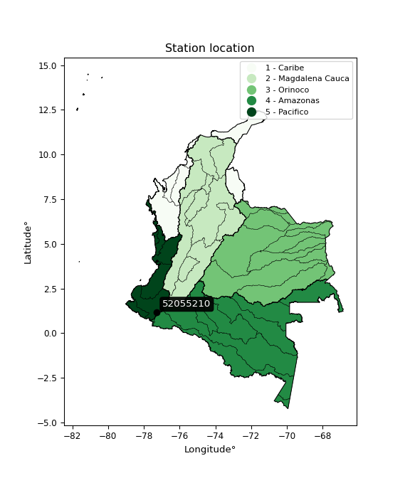

<div align="center">


</div>

# PMP Station (Rain, Pmax24h): 52055210

Probable Maximum Precipitation (PMP) is the greatest amount of rainfall for a specific duration that is meteorologically possible for a given location, acting as a "worst-case" scenario for extreme storms, crucial for designing safety-critical infrastructure like bridges, river deviations, dams, spillways, and nuclear plants to prevent catastrophic failure. PMP is calculated by hydrologists using meteorological data to determine the upper limit of extreme rainfall, often leading to the Probable Maximum Flood (PMF) for flood control design, and is increasingly being studied for climate change impacts. Probable Maximum Precipitation (PMP) is the theoretical upper limit of rainfall, a deterministic estimate for extreme events, while probability distributions (like GEV, Gumbel) describe the likelihood and frequency of various precipitation amounts, including rare ones, showing how often events occur, with PMP representing the extreme end of these distributions, used for critical infrastructure design to ensure safety against the worst conceivable weather, unlike standard statistical forecasts which cover typical probabilities.

The most common probability distributions in hydrology, used for analyzing floods, rainfall, and streamflow, include the Normal, Log-Normal, Gumbel, Gamma (including Log-Pearson Type III), and Generalized Extreme Value (GEV) distributions, often chosen based on the data´s skewness and whether modeling extremes or general conditions, with Gumbel and GEV popular for extreme events like floods, while the Normal distribution serves as a baseline, though often requiring transformations for skewed hydrological data. These distributions help in designing water infrastructure, managing water resources, and forecasting hydrologic events.

> Hydrological data often isn´t perfectly normal (it´s skewed), so different distributions are needed for different applications, such as: **Flood Frequency Analysis**: Using Gumbel, GEV, or Log-Pearson Type III for predicting extreme flood magnitudes and their return periods, **Rainfall Analysis**: Normal for annual totals, but Log-Normal, Weibull, or GEV for intensity or extreme daily rainfall, **Streamflow Modeling**: Gamma and Log-Normal for maximum flows, GEV for minimum flows, and Kappa for daily flows.

<div align="center">

</img>

</div>


## A. General information


### 1. General running parameters

• app_version: _v20260108_. • runtime: _2026-01-08 18:05:13.093906_. • Python version: _3.14.0_. • SciPy version: _1.16.3_. • Pandas version: _2.3.3_. • NumPy version: _2.3.5_. • Stations dataset (station_dataset_file): _dataset/pmax24h_in/automatic_colombia_2003_2024.csv_. • Stations catalog (station_catalog_file): _dataset/CNE.xls_. • Minimum year to eval til year_max (date_min): _1900_. • Maximum year to eval since year_min (date_max): _2024_. • Creates, save and include plots into reports (create_plot): _False_. • Plot only fit distributions with Δo > Δ (plot_only_fit): _True_. • Plot only simple graphs avoiding multiple CDFs and multiple Extreme values plots (plot_only_simple): _False_. • Eval low extreme values, if False, evaluates high extreme values (low_extreme): _False_. • Eval every SciPy distribution as logarithmic (pdist_logarithmic_on): _True_. • Standard deviation normalized (ddof): _1.0_. • Return periods to eval in years (Tr): _[2, 2.33, 5, 10, 15, 20, 25, 50, 75, 100, 200, 250, 500, 750, 1000]_. • Minimum data sample per station, 0 means any (minimum_sample): _5_. • Z-Score maximum threshold to adjust a value, 0 means disable (zscore_max): _3.5_. • Z-Score minimum threshold to adjust a value, 0 means disable (zscore_min): _-2.5_. • Avoid zeros, e.g. rain = 0 (avoid_zeros): _True_. • Avoid null values (avoid_nans): _True_. 

:file_folder:Table: [dataset.csv](../../dataset/pmax24h_in/automatic_colombia_2003_2024.csv)

> Delta Degrees of Freedom (DDOF): is a parameter used in the formulas for calculating variance and standard deviation. When ddof=0, the divisor is $N$ (the total number of observations) and this is used when your data set is the entire population. When ddof=1, the divisor is $N-1$ and this is used when your data set is a sample drawn from a larger population. Using $N-1$ provides an unbiased estimate of the population variance (known as Bessel´s correction).


### 2. Station info and location

|   id |   CODIGO | NOMBRE                  | CATEGORIA               | TECNOLOGIA                              | ESTADO   | FECHA_INSTALACION   |   FECHA_SUSPENSION |   ALTITUD |   LATITUD |   LONGITUD | DEPARTAMENTO   | MUNICIPIO   | AREA_OPERATIVA                      | ENTIDAD                                                     | AREA_HIDROGRAFICA   | ZONA_HIDROGRAFICA   | SUBZONA_HIDROGRAFICA   |   CORRIENTE | Catalogo   |   Version |
|-----:|---------:|:------------------------|:------------------------|:----------------------------------------|:---------|:--------------------|-------------------:|----------:|----------:|-----------:|:---------------|:------------|:------------------------------------|:------------------------------------------------------------|:--------------------|:--------------------|:-----------------------|------------:|:-----------|----------:|
|    0 | 52055210 | BOTANA - AUT [52055210] | Climatológica Principal | Automática con Telemetría, Convencional | Activa   | 01/03/2004          |                nan |      2820 |      1.16 |   -77.2788 | Nariño         | Pasto       | Area Operativa 07 - Nariño-Putumayo | INSTITUTO DE HIDROLOGIA METEOROLOGIA Y ESTUDIOS AMBIENTALES | Pacifico            | Patía               | Río Juananbú           |         nan | CNE_IDEAM  |  20251226 |

<div align="center">

Dynamic map: [:earth_americas:Google](http://maps.google.com/maps?q=1.16,-77.27880556) [:earth_americas:OSM](https://www.openstreetmap.org/#map=18/1.16/-77.27880556&layers=P) [:earth_americas:Bing](https://www.bing.com/maps?cp=1.16~-77.27880556&lvl=18) [:earth_americas:Apple](https://maps.apple.com/frame?center=1.16%2C-77.27880556&span=0.003%2C0.006)

</div>


<div align="center">

```geojson
{
  "type": "Feature",
  "geometry": {
    "type": "Point", 
    "coordinates": [-77.27880556, 1.16]
  }, 
  "properties": {
    "Name": "52055210"
  }
}
```

</div>


### 3. Discrete values table and plot

<div align="center">

|               |         0 |           1 |           2 |           3 |           4 |           5 |          6 |          7 |         8 |
|:--------------|----------:|------------:|------------:|------------:|------------:|------------:|-----------:|-----------:|----------:|
| Date          | 2016      | 2017        | 2018        | 2019        | 2020        | 2021        | 2022       | 2023       | 2024      |
| Value         |    0.1    |   20.3      |   24.1      |   27.7      |   22.1      |   29        |   26.2     |   10.9     |   35.6    |
| Value_initial |    0.1    |   20.3      |   24.1      |   27.7      |   22.1      |   29        |   26.2     |   10.9     |   35.6    |
| count         |    9      |    9        |    9        |    9        |    9        |    9        |    9       |    9       |    9      |
| mean          |   21.7778 |   21.7778   |   21.7778   |   21.7778   |   21.7778   |   21.7778   |   21.7778  |   21.7778  |   21.7778 |
| std           |   10.5699 |   10.5699   |   10.5699   |   10.5699   |   10.5699   |   10.5699   |   10.5699  |   10.5699  |   10.5699 |
| zscore        |   -2.0509 |   -0.139811 |    0.219702 |    0.560293 |    0.030485 |    0.683285 |    0.41838 |   -1.02913 |    1.3077 |


</div>


> The initial value (value_initial) correspond to the initial obtained or null completed value, and value (value) is adjusted only when the initial value is outside the valid range (outlier) definite through the Z-Score value. If Z-Score is active, values out of range or outliers are replaced with the station mean value. A Z-Score (or standard score) measures how many standard deviations a data point is from the mean of a dataset, indicating its relative position; positive scores mean above the mean, negative mean below, and a score of zero is exactly at the mean, allowing for comparison of values from different distributions. It´s calculated using the formula $z=(x–μ)/σ$, where $x$ is the data point, $μ$ is the mean, and $σ$ is the standard deviation, helping identify outliers and understand probability.
>
> <sub>**Note**: In this study, "completing" (filling gaps in) and "extending" (forecasting or lengthening the historical record) rainfall data series are avoided for certain critical analyses because they introduce artificial bias and uncertainty, which can distort the statistics of rare events (extremes), alter day-to-day variability, and compromise the integrity and homogeneity of the original data. Some reasons against Completing/Extending rainfall data are: **Distortion of Extremes and Variability**: The primary issue is that most gap-filling or extension methods rely on averaging or regression with nearby stations, which inherently smooths the data. Rainfall is highly variable in space and time, with a large percentage of zero values and occasional large storms. Infilling methods often underestimate the highest values and overestimate the lowest (zero) values, which severely distorts analyses focused on flood frequency, drought severity, and intensity-duration-frequency (IDF) curves, **Loss of Data Homogeneity**: Infilled or extended data are synthetic estimates, not actual measurements. Combining these estimates with observed data can violate the assumption of data homogeneity, which requires that the data properties do not change over time. Inhomogeneity can lead to incorrect conclusions about long-term trends or changes in climate patterns, **Propagation of Errors**: Errors and biases from the original data (e.g., wind-induced undercatch, instrument errors, site changes) or the data used for imputation can propagate through the analysis, leading to unreliable hydrological models and inaccurate predictions, **Compromised Statistical Integrity**: For statistical analyses, especially those involving the frequency of events, using artificial data can introduce time bias or autocorrelation that doesn´t exist in reality, making it difficult to assess the true probability of events, **Difficulty in Validation**: It is difficult to accurately validate the quality of filled or extended data, especially for past periods where ground-truth measurements are unavailable. The reliability of imputation techniques heavily depends on the density of the surrounding station network and the complexity of the local topography.</sub>


### 4. Active continuous probability distributions from SciPy (43 of 104 available)

A Probability Density Function (PDF) describes the relative likelihood of a continuous random variable falling within a specific range, where the total area under its curve equals 1, and the area over any interval gives the actual probability for that range. Unlike discrete probabilities (like rolling a die), a PDF shows density, not direct probability for a single point (which is zero), with higher points indicating higher likelihood, often visualized as a bell curve for normal distributions.

A log of a probability density function (log-PDF) is simply the logarithm of the PDF´s value, denoted as $log(f(x))$, useful for converting multiplication of probabilities into addition, improving numerical stability with tiny numbers, and connecting to information theory concepts like entropy. Instead of dealing with very small probabilities (e.g., 0.000001), log-PDFs use negative numbers (e.g., $log(0.00001) ≈ -11.51$ that are easier for computers to handle, preventing underflow errors and simplifying complex calculations. In this study, each active probability distribution from SciPy is also evaluated in the $log$ form.

[scipy.stats](https://docs.scipy.org/doc/scipy/reference/stats.html) is a Python´s powerful submodule within the SciPy library for comprehensive statistical analysis, offering over 130 probability distributions (like Normal, Poisson), functions for descriptive stats (mean, variance), hypothesis testing (t-tests, chi-square), random variable generation, and statistical tests, making it essential for data science, modeling, and research. It provides tools to explore, model, and draw conclusions from data efficiently, working seamlessly with NumPy.

<div align="center">

|   id | p_dist             |   n_parameter | fit_method   | label                                                                       | active   | ref                                                                                                        |
|-----:|:-------------------|--------------:|:-------------|:----------------------------------------------------------------------------|:---------|:-----------------------------------------------------------------------------------------------------------|
|    0 | alpha              |             3 | MLE          | Alpha                                                                       | True     | [:mortar_board:](https://docs.scipy.org/doc/scipy/reference/generated/scipy.stats.alpha.html)              |
|    1 | betaprime          |             4 | MLE          | Beta prime                                                                  | True     | [:mortar_board:](https://docs.scipy.org/doc/scipy/reference/generated/scipy.stats.betaprime.html)          |
|    2 | chi2               |             3 | MLE          | Chi²                                                                        | True     | [:mortar_board:](https://docs.scipy.org/doc/scipy/reference/generated/scipy.stats.chi2.html)               |
|    3 | crystalball        |             4 | MLE          | Crystalball                                                                 | True     | [:mortar_board:](https://docs.scipy.org/doc/scipy/reference/generated/scipy.stats.crystalball.html)        |
|    4 | erlang             |             3 | MLE          | Erlang                                                                      | True     | [:mortar_board:](https://docs.scipy.org/doc/scipy/reference/generated/scipy.stats.erlang.html)             |
|    5 | expon              |             2 | MLE          | Exponential                                                                 | True     | [:mortar_board:](https://docs.scipy.org/doc/scipy/reference/generated/scipy.stats.expon.html)              |
|    6 | exponnorm          |             3 | MLE          | Exponentially modified Normal                                               | True     | [:mortar_board:](https://docs.scipy.org/doc/scipy/reference/generated/scipy.stats.exponnorm.html)          |
|    7 | f                  |             4 | MLE          | F                                                                           | True     | [:mortar_board:](https://docs.scipy.org/doc/scipy/reference/generated/scipy.stats.f.html)                  |
|    8 | fatiguelife        |             3 | MLE          | Fatigue-life (Birnbaum-Saunders)                                            | True     | [:mortar_board:](https://docs.scipy.org/doc/scipy/reference/generated/scipy.stats.fatiguelife.html)        |
|    9 | fisk               |             3 | MLE          | Fisk                                                                        | True     | [:mortar_board:](https://docs.scipy.org/doc/scipy/reference/generated/scipy.stats.fisk.html)               |
|   10 | gamma              |             3 | MLE          | Gamma                                                                       | True     | [:mortar_board:](https://docs.scipy.org/doc/scipy/reference/generated/scipy.stats.gamma.html)              |
|   11 | genexpon           |             5 | MLE          | Generalized exponential                                                     | True     | [:mortar_board:](https://docs.scipy.org/doc/scipy/reference/generated/scipy.stats.genexpon.html)           |
|   12 | genlogistic        |             3 | MLE          | Generalized logistic                                                        | True     | [:mortar_board:](https://docs.scipy.org/doc/scipy/reference/generated/scipy.stats.genlogistic.html)        |
|   13 | gibrat             |             2 | MM           | Gibrat                                                                      | True     | [:mortar_board:](https://docs.scipy.org/doc/scipy/reference/generated/scipy.stats.gibrat.html)             |
|   14 | gompertz           |             3 | MLE          | Gompertz (or truncated Gumbel)                                              | True     | [:mortar_board:](https://docs.scipy.org/doc/scipy/reference/generated/scipy.stats.gompertz.html)           |
|   15 | gumbel_l           |             2 | MM           | Gumbel Left Skew                                                            | True     | [:mortar_board:](https://docs.scipy.org/doc/scipy/reference/generated/scipy.stats.gumbel_l.html)           |
|   16 | gumbel_r           |             2 | MM           | Gumbel Right Skew                                                           | True     | [:mortar_board:](https://docs.scipy.org/doc/scipy/reference/generated/scipy.stats.gumbel_r.html)           |
|   17 | halflogistic       |             2 | MM           | Half-logistic                                                               | True     | [:mortar_board:](https://docs.scipy.org/doc/scipy/reference/generated/scipy.stats.halflogistic.html)       |
|   18 | halfnorm           |             2 | MM           | Half Normal                                                                 | True     | [:mortar_board:](https://docs.scipy.org/doc/scipy/reference/generated/scipy.stats.halfnorm.html)           |
|   19 | hypsecant          |             2 | MM           | hyperbolic secant                                                           | True     | [:mortar_board:](https://docs.scipy.org/doc/scipy/reference/generated/scipy.stats.hypsecant.html)          |
|   20 | invgamma           |             3 | MLE          | Inverted gamma                                                              | True     | [:mortar_board:](https://docs.scipy.org/doc/scipy/reference/generated/scipy.stats.invgamma.html)           |
|   21 | invgauss           |             3 | MLE          | Inverse Gaussian                                                            | True     | [:mortar_board:](https://docs.scipy.org/doc/scipy/reference/generated/scipy.stats.invgauss.html)           |
|   22 | invweibull         |             3 | MLE          | Inverted Weibull                                                            | True     | [:mortar_board:](https://docs.scipy.org/doc/scipy/reference/generated/scipy.stats.invweibull.html)         |
|   23 | kstwobign          |             2 | MLE          | Limiting distribution of scaled Kolmogorov-Smirnov two-sided test statistic | True     | [:mortar_board:](https://docs.scipy.org/doc/scipy/reference/generated/scipy.stats.kstwobign.html)          |
|   24 | laplace            |             2 | MM           | Laplace                                                                     | True     | [:mortar_board:](https://docs.scipy.org/doc/scipy/reference/generated/scipy.stats.laplace.html)            |
|   25 | laplace_asymmetric |             3 | MLE          | Asymmetric Laplace                                                          | True     | [:mortar_board:](https://docs.scipy.org/doc/scipy/reference/generated/scipy.stats.laplace_asymmetric.html) |
|   26 | loggamma           |             3 | MLE          | Log gamma                                                                   | True     | [:mortar_board:](https://docs.scipy.org/doc/scipy/reference/generated/scipy.stats.loggamma.html)           |
|   27 | logistic           |             2 | MM           | Logistic (or Sech-squared)                                                  | True     | [:mortar_board:](https://docs.scipy.org/doc/scipy/reference/generated/scipy.stats.logistic.html)           |
|   28 | lognorm            |             3 | MLE          | Log Normal                                                                  | True     | [:mortar_board:](https://docs.scipy.org/doc/scipy/reference/generated/scipy.stats.lognorm.html)            |
|   29 | maxwell            |             2 | MM           | Maxwell                                                                     | True     | [:mortar_board:](https://docs.scipy.org/doc/scipy/reference/generated/scipy.stats.maxwell.html)            |
|   30 | mielke             |             4 | MLE          | Mielke Beta-Kappa / Dagum                                                   | True     | [:mortar_board:](https://docs.scipy.org/doc/scipy/reference/generated/scipy.stats.mielke.html)             |
|   31 | moyal              |             2 | MM           | Moyal                                                                       | True     | [:mortar_board:](https://docs.scipy.org/doc/scipy/reference/generated/scipy.stats.moyal.html)              |
|   32 | nakagami           |             3 | MLE          | Nakagami                                                                    | True     | [:mortar_board:](https://docs.scipy.org/doc/scipy/reference/generated/scipy.stats.nakagami.html)           |
|   33 | ncf                |             5 | MLE          | Non-central F distribution                                                  | True     | [:mortar_board:](https://docs.scipy.org/doc/scipy/reference/generated/scipy.stats.ncf.html)                |
|   34 | nct                |             4 | MLE          | Non-central Student’s t                                                     | True     | [:mortar_board:](https://docs.scipy.org/doc/scipy/reference/generated/scipy.stats.nct.html)                |
|   35 | norm               |             2 | MM           | Normal                                                                      | True     | [:mortar_board:](https://docs.scipy.org/doc/scipy/reference/generated/scipy.stats.norm.html)               |
|   36 | pearson3           |             3 | MM           | Pearson type III                                                            | True     | [:mortar_board:](https://docs.scipy.org/doc/scipy/reference/generated/scipy.stats.pearson3.html)           |
|   37 | rayleigh           |             2 | MM           | Rayleigh                                                                    | True     | [:mortar_board:](https://docs.scipy.org/doc/scipy/reference/generated/scipy.stats.rayleigh.html)           |
|   38 | rice               |             3 | MLE          | Rice                                                                        | True     | [:mortar_board:](https://docs.scipy.org/doc/scipy/reference/generated/scipy.stats.rice.html)               |
|   39 | t                  |             3 | MLE          | Student’s t                                                                 | True     | [:mortar_board:](https://docs.scipy.org/doc/scipy/reference/generated/scipy.stats.t.html)                  |
|   40 | truncnorm          |             4 | MLE          | Truncated normal                                                            | True     | [:mortar_board:](https://docs.scipy.org/doc/scipy/reference/generated/scipy.stats.truncnorm.html)          |
|   41 | wald               |             2 | MM           | Wald                                                                        | True     | [:mortar_board:](https://docs.scipy.org/doc/scipy/reference/generated/scipy.stats.wald.html)               |
|   42 | weibull_min        |             3 | MLE          | Weibull minimum                                                             | True     | [:mortar_board:](https://docs.scipy.org/doc/scipy/reference/generated/scipy.stats.weibull_min.html)        |

</div>

> **n_parameter:** # arguments & localization & scale.
>
> **Fit methods:** (MLE) maximum likelihood, (MM) L-moments.
>
>**Inactive** (With the only purpose of prevent loops, zero divisions, infinite values, over high estimated values or horizontal trending for recurrence intervals estimations, the follow distributions were disabled.)**:** foldnorm, gennorm, norminvgauss, powernorm, powerlognorm, skewnorm, genextreme, anglit, arcsine, argus, beta, bradford, burr, burr12, cauchy, cosine, halfcauchy, foldcauchy, skewcauchy, wrapcauchy, dgamma, gengamma, exponweib, exponpow, truncexpon, gausshyper, genhalflogistic, genhyperbolic, geninvgauss, halfgennorm, johnsonsb, johnsonsu, kappa4, kappa3, ksone, kstwo, loglaplace, levy, levy_l, levy_stable, ncx2, pareto, genpareto, truncpareto, lomax, powerlaw, rdist, rel_breitwigner, recipinvgauss, semicircular, studentized_range, trapezoid, triang, truncweibull_min, tukeylambda, uniform, loguniform, vonmises, vonmises_line, weibull_max, dweibull, 


## B. Probability (PDF) vs. Empirical (EDF) distributions functions

A continuous probability distribution (CPD) describes probabilities for variables that can take any value within a range (like rain any time), unlike discrete variables with specific outcomes (like temperature). It uses a Probability Density Function (PDF), a curve where the total area under it equals 1, and the probability of the variable falling within an interval (a to b) is found by calculating the area under the curve between those points. A key feature is that the probability of hitting any single exact value is zero, so probabilities are always expressed for ranges, e.g., $P(a ≤ X ≤ b)$.

<div align="center">

Distributions parameters from station values
|    |   station | p_dist                |   n |             loc |           scale | shape                  | shape1                 | shape2                 | shape3   |
|---:|----------:|:----------------------|----:|----------------:|----------------:|:-----------------------|:-----------------------|:-----------------------|:---------|
|  0 |  52055210 | alpha                 |   9 |     0.003375    |     0.290718    | 1.200382481327063e-06  |                        |                        |          |
|  1 |  52055210 | betaprime             |   9 |  -273.196       | 24490.9         | 849.4982293855412      | 70574.80159681072      |                        |          |
|  2 |  52055210 | chi2                  |   9 |     0.1         |     5.34903     | 0.6931521592813599     |                        |                        |          |
|  3 |  52055210 | crystalball           |   9 |    21.7778      |     9.96536     | 800.2625003248818      | 1970.5387012430938     |                        |          |
|  4 |  52055210 | erlang                |   9 |  -136.251       |     0.694818    | 227.19254674466356     |                        |                        |          |
|  5 |  52055210 | expon                 |   9 |     0.1         |    21.6778      |                        |                        |                        |          |
|  6 |  52055210 | exponnorm             |   9 |    21.7718      |     9.96531     | 0.000597470748240202   |                        |                        |          |
|  7 |  52055210 | f                     |   9 | -4694.78        |  4716.53        | 1087268.6926004963     | 755403.9738568482      |                        |          |
|  8 |  52055210 | fatiguelife           |   9 | -1529.67        |  1551.38        | 0.0064209036123030645  |                        |                        |          |
|  9 |  52055210 | fisk                  |   9 |    -1.02163e+09 |     1.02163e+09 | 189539629.65615255     |                        |                        |          |
| 10 |  52055210 | gamma                 |   9 |   -78.3617      |     1.1062      | 90.26309614239585      |                        |                        |          |
| 11 |  52055210 | genexpon              |   9 |     0.0999852   |     1.75094     | 0.08219420460801871    | 1.1943525590565398e-06 | 2.0543268159767063     |          |
| 12 |  52055210 | genlogistic           |   9 |    29.7308      |     2.67741     | 0.29585545237339095    |                        |                        |          |
| 13 |  52055210 | gibrat                |   9 |    14.1755      |     4.61104     |                        |                        |                        |          |
| 14 |  52055210 | gompertz              |   9 |    10.9         |     6.45568     | 0.0822385182631265     |                        |                        |          |
| 15 |  52055210 | gumbel_l              |   9 |    26.2627      |     7.76996     |                        |                        |                        |          |
| 16 |  52055210 | gumbel_r              |   9 |    17.2928      |     7.76996     |                        |                        |                        |          |
| 17 |  52055210 | halflogistic          |   9 |     9.96656     |     8.52        |                        |                        |                        |          |
| 18 |  52055210 | halfnorm              |   9 |     8.5876      |    16.5315      |                        |                        |                        |          |
| 19 |  52055210 | hypsecant             |   9 |    21.7778      |     6.34415     |                        |                        |                        |          |
| 20 |  52055210 | invgamma              |   9 |  -138.788       | 37457.6         | 234.82181249372206     |                        |                        |          |
| 21 |  52055210 | invgauss              |   9 |   -67.4366      |  5948.97        | 0.014961890894436825   |                        |                        |          |
| 22 |  52055210 | invweibull            |   9 |    -1.01828e+09 |     1.01828e+09 | 91221988.71803819      |                        |                        |          |
| 23 |  52055210 | kstwobign             |   9 |   -24.0606      |    52.4687      |                        |                        |                        |          |
| 24 |  52055210 | laplace               |   9 |    21.7778      |     7.04657     |                        |                        |                        |          |
| 25 |  52055210 | laplace_asymmetric    |   9 |    27.7         |     5.85853     | 1.5628962664105206     |                        |                        |          |
| 26 |  52055210 | loggamma              |   9 |    29.1963      |     6.0343      | 0.6967050640694348     |                        |                        |          |
| 27 |  52055210 | logistic              |   9 |    21.7778      |     5.49419     |                        |                        |                        |          |
| 28 |  52055210 | lognorm               |   9 |     0.1         |     0.219472    | 13.191149690417557     |                        |                        |          |
| 29 |  52055210 | maxwell               |   9 |    -1.83594     |    14.7977      |                        |                        |                        |          |
| 30 |  52055210 | mielke                |   9 |    -5.48026     |    41.0834      | 1.8918034545761828     | 120834.87686920172     |                        |          |
| 31 |  52055210 | moyal                 |   9 |    16.0789      |     4.48599     |                        |                        |                        |          |
| 32 |  52055210 | nakagami              |   9 |     0.1         |    24.5612      | 0.27442812799919336    |                        |                        |          |
| 33 |  52055210 | ncf                   |   9 |     0.1         |     1.23185     | 0.5153778877531623     | 18.573189471517146     | 6.670737034077525      |          |
| 34 |  52055210 | nct                   |   9 |   498.441       |     9.89977     | 88044.22322275132      | -48.148260457879715    |                        |          |
| 35 |  52055210 | norm                  |   9 |    21.7778      |     9.96536     |                        |                        |                        |          |
| 36 |  52055210 | pearson3              |   9 |    21.7778      |     9.96532     | -0.915389033853472     |                        |                        |          |
| 37 |  52055210 | rayleigh              |   9 |     2.71343     |    15.2111      |                        |                        |                        |          |
| 38 |  52055210 | rice                  |   9 | -1105.55        |     9.96857     | 113.08317410931113     |                        |                        |          |
| 39 |  52055210 | t                     |   9 |    21.7972      |     9.71836     | 30.821495636801643     |                        |                        |          |
| 40 |  52055210 | truncnorm             |   9 |    12.3779      |    20.9802      | -0.5852159358854981    | 1.1068599583296863     |                        |          |
| 41 |  52055210 | wald                  |   9 |    11.8124      |     9.96533     |                        |                        |                        |          |
| 42 |  52055210 | weibull_min           |   9 |    -2.40483e+08 |     2.40483e+08 | 31681744.970540147     |                        |                        |          |
| 43 |  52055210 | logalpha              |   9 |  -160.453       |  8788.17        | 53.9687762047859       |                        |                        |          |
| 44 |  52055210 | logbetaprime          |   9 | -1529.93        | 10334           | 881896.5596353973      | 5946978.555355766      |                        |          |
| 45 |  52055210 | logchi2               |   9 |    -2.30259     |     1.23321     | 1.0149681304995268     |                        |                        |          |
| 46 |  52055210 | logcrystalball        |   9 |     2.5446      |     1.74176     | 672.4938650504844      | 64.6495095866474       |                        |          |
| 47 |  52055210 | logerlang             |   9 |    -2.30259     |    38.349       | 0.2118489817903353     |                        |                        |          |
| 48 |  52055210 | logexpon              |   9 |    -2.30259     |     4.84719     |                        |                        |                        |          |
| 49 |  52055210 | logexponnorm          |   9 |     2.54355     |     1.74176     | 0.000609190189835412   |                        |                        |          |
| 50 |  52055210 | logf                  |   9 |    -2.30259     |     1.12391     | 1.0447606374091851     | 1.0504941939166583     |                        |          |
| 51 |  52055210 | logfatiguelife        |   9 | -1640.87        |  1643.42        | 0.0010620995097975713  |                        |                        |          |
| 52 |  52055210 | logfisk               |   9 |    -2.30259     |     2.36008     | 0.6773249801527331     |                        |                        |          |
| 53 |  52055210 | loggamma              |   9 |   -18.2932      |     0.186486    | 111.54399622780755     |                        |                        |          |
| 54 |  52055210 | loggenexpon           |   9 |    -2.89718     |     0.0976377   | 0.00014483862856879128 | 2.494761618544293      | 0.00023034293921313231 |          |
| 55 |  52055210 | loggenlogistic        |   9 |     3.57239     |     2.74981e-06 | 2.6788844433280545e-06 |                        |                        |          |
| 56 |  52055210 | loggibrat             |   9 |     1.21585     |     0.805923    |                        |                        |                        |          |
| 57 |  52055210 | loggompertz           |   9 |    -3.69033     |     0.72115     | 7.825527494734388e-05  |                        |                        |          |
| 58 |  52055210 | loggumbel_l           |   9 |     3.32849     |     1.35804     |                        |                        |                        |          |
| 59 |  52055210 | loggumbel_r           |   9 |     1.76072     |     1.35804     |                        |                        |                        |          |
| 60 |  52055210 | loghalflogistic       |   9 |     0.480204    |     1.48915     |                        |                        |                        |          |
| 61 |  52055210 | loghalfnorm           |   9 |     0.239229    |     2.88937     |                        |                        |                        |          |
| 62 |  52055210 | loghypsecant          |   9 |     2.5446      |     1.10884     |                        |                        |                        |          |
| 63 |  52055210 | loginvgamma           |   9 |   -46.0798      | 32953           | 679.1053967330524      |                        |                        |          |
| 64 |  52055210 | loginvgauss           |   9 |   -18.4456      |  2212.7         | 0.009477061812226857   |                        |                        |          |
| 65 |  52055210 | loginvweibull         |   9 |    -3.68228e+08 |     3.68228e+08 | 153676462.34182674     |                        |                        |          |
| 66 |  52055210 | logkstwobign          |   9 |    -7.36221     |    11.3751      |                        |                        |                        |          |
| 67 |  52055210 | loglaplace            |   9 |     2.5446      |     1.23161     |                        |                        |                        |          |
| 68 |  52055210 | loglaplace_asymmetric |   9 |     3.3673      |     0.398799    | 2.4680939091361864     |                        |                        |          |
| 69 |  52055210 | logloggamma           |   9 |     3.5724      |     2.84699e-06 | 2.774224541841021e-06  |                        |                        |          |
| 70 |  52055210 | loglogistic           |   9 |     2.5446      |     0.96028     |                        |                        |                        |          |
| 71 |  52055210 | loglognorm            |   9 | -1316.65        |  1319.18        | 0.0013187707347547782  |                        |                        |          |
| 72 |  52055210 | logmaxwell            |   9 |    -1.58265     |     2.58637     |                        |                        |                        |          |
| 73 |  52055210 | logmielke             |   9 |    -2.30259     |     2.38767     | 0.6800672171062648     | 0.931407389527108      |                        |          |
| 74 |  52055210 | logmoyal              |   9 |     1.54855     |     0.784066    |                        |                        |                        |          |
| 75 |  52055210 | lognakagami           |   9 | -3167.12        |  3169.66        | 829573.4872491984      |                        |                        |          |
| 76 |  52055210 | logncf                |   9 |    -2.30259     |     1.05213     | 1.0147714468422793     | 1.1296644749667253     | 1.0643330656243866     |          |
| 77 |  52055210 | lognct                |   9 |  -212.68        |     1.74094     | 6610936.830202043      | 123.62557863578479     |                        |          |
| 78 |  52055210 | lognorm               |   9 |     2.5446      |     1.74176     |                        |                        |                        |          |
| 79 |  52055210 | logpearson3           |   9 |     2.5446      |     1.74175     | -2.331473941885691     |                        |                        |          |
| 80 |  52055210 | lograyleigh           |   9 |    -0.787467    |     2.65861     |                        |                        |                        |          |
| 81 |  52055210 | logrice               |   9 |  -389.366       |     1.74177     | 225.00500279355117     |                        |                        |          |
| 82 |  52055210 | logt                  |   9 |     3.23917     |     0.153811    | 0.8046862097982905     |                        |                        |          |
| 83 |  52055210 | logtruncnorm          |   9 |     3.10824     |     6.35424     | -1.809321309920054     | 0.07303865010037244    |                        |          |
| 84 |  52055210 | logwald               |   9 |     0.802835    |     1.74175     |                        |                        |                        |          |
| 85 |  52055210 | logweibull_min        |   9 |    -2.30259     |     1.50283     | 0.5597709647191879     |                        |                        |          |

</div>

> **loc** (Location parameter): This shifts the distribution along the x-axis. For many common distributions, like the normal (Gaussian) distribution, loc represents the mean $μ$. For others, like the uniform distribution, it might represent the minimum value, or for the beta distribution, the left end of the support interval.
>
> **scale** (Scale parameter): This determines the width or spread of the distribution. For the normal distribution, scale represents the standard deviation $σ$. For a uniform distribution, it defines the length of the interval (from $loc$ to $loc + scale$).
>
> **shape** (Shape parameters): Refers to parameters that define the specific form of a probability distribution, distinct from its location (loc) and scale (scale). These parameters are required arguments for most distribution functions. For example, a normal (Gaussian) distribution is fully defined by its location (mean) and scale (standard deviation), so it has no specific shape parameters beyond loc and scale. However, other distributions have intrinsic properties that need specification, as Gamma distribution that takes a shape parameter, often named $a$ or $alpha$.


### 0. Cumulative distribution values - CDF (86 evaluated)

Cumulative Distribution Function (CDF), denoted as $F$<sub>$X$</sub>$(x)$, is a function that gives the probability that a random variable $X$ will take a value less than or equal to a specific value, $x$ (i.e., $(P(X≥x)$. It essentially "accumulates" probabilities from a given point up to the far right (positive infinity), providing a complete picture of the distribution´s probabilities for both discrete (like rain) and continuous (like temperature) variables, helping to find probabilities over ranges or above certain values. Each station is evaluated separately ordering the $x$ values ascending, calculating the CDF and PDF values for the activated distributions and their logarithmic forms.

<div align="center">

CDF ordered by x ascending and calculating $log(f(x))$ separately
|   id |   Station |   date |    x |   count |    mean |     std |    zscore |   Value_initial |   station |   m |      alpha |   alpha_pdf |   betaprime |   betaprime_pdf |        chi2 |    chi2_pdf |   crystalball |   crystalball_pdf |    erlang |   erlang_pdf |    expon |   expon_pdf |   exponnorm |   exponnorm_pdf |         f |      f_pdf |   fatiguelife |   fatiguelife_pdf |      fisk |   fisk_pdf |     gamma |   gamma_pdf |    genexpon |   genexpon_pdf |   genlogistic |   genlogistic_pdf |   gibrat |   gibrat_pdf |    gompertz |   gompertz_pdf |   gumbel_l |   gumbel_l_pdf |    gumbel_r |   gumbel_r_pdf |   halflogistic |   halflogistic_pdf |   halfnorm |   halfnorm_pdf |   hypsecant |   hypsecant_pdf |   invgamma |   invgamma_pdf |   invgauss |   invgauss_pdf |   invweibull |   invweibull_pdf |   kstwobign |   kstwobign_pdf |   laplace |   laplace_pdf |   laplace_asymmetric |   laplace_asymmetric_pdf |   loggamma |   loggamma_pdf |   logistic |   logistic_pdf |    lognorm |   lognorm_pdf |     maxwell |   maxwell_pdf |    mielke |   mielke_pdf |       moyal |   moyal_pdf |    nakagami |   nakagami_pdf |         ncf |     ncf_pdf |       nct |    nct_pdf |      norm |   norm_pdf |   pearson3 |   pearson3_pdf |   rayleigh |   rayleigh_pdf |      rice |   rice_pdf |         t |      t_pdf |   truncnorm |   truncnorm_pdf |     wald |   wald_pdf |   weibull_min |   weibull_min_pdf |   logalpha |   logalpha_pdf |   logbetaprime |   logbetaprime_pdf |     logchi2 |   logchi2_pdf |   logcrystalball |   logcrystalball_pdf |   logerlang |   logerlang_pdf |   logexpon |   logexpon_pdf |   logexponnorm |   logexponnorm_pdf |        logf |    logf_pdf |   logfatiguelife |   logfatiguelife_pdf |     logfisk |   logfisk_pdf |   loggenexpon |   loggenexpon_pdf |   loggenlogistic |   loggenlogistic_pdf |   loggibrat |   loggibrat_pdf |   loggompertz |   loggompertz_pdf |   loggumbel_l |   loggumbel_l_pdf |   loggumbel_r |   loggumbel_r_pdf |   loghalflogistic |   loghalflogistic_pdf |   loghalfnorm |   loghalfnorm_pdf |   loghypsecant |   loghypsecant_pdf |   loginvgamma |   loginvgamma_pdf |   loginvgauss |   loginvgauss_pdf |   loginvweibull |   loginvweibull_pdf |   logkstwobign |   logkstwobign_pdf |   loglaplace |   loglaplace_pdf |   loglaplace_asymmetric |   loglaplace_asymmetric_pdf |   logloggamma |   logloggamma_pdf |   loglogistic |   loglogistic_pdf |   loglognorm |   loglognorm_pdf |   logmaxwell |   logmaxwell_pdf |   logmielke |   logmielke_pdf |    logmoyal |   logmoyal_pdf |   lognakagami |   lognakagami_pdf |      logncf |   logncf_pdf |     lognct |   lognct_pdf |   logpearson3 |   logpearson3_pdf |   lograyleigh |   lograyleigh_pdf |    logrice |   logrice_pdf |      logt |   logt_pdf |   logtruncnorm |   logtruncnorm_pdf |   logwald |   logwald_pdf |   logweibull_min |   logweibull_min_pdf |
|-----:|----------:|-------:|-----:|--------:|--------:|--------:|----------:|----------------:|----------:|----:|-----------:|------------:|------------:|----------------:|------------:|------------:|--------------:|------------------:|----------:|-------------:|---------:|------------:|------------:|----------------:|----------:|-----------:|--------------:|------------------:|----------:|-----------:|----------:|------------:|------------:|---------------:|--------------:|------------------:|---------:|-------------:|------------:|---------------:|-----------:|---------------:|------------:|---------------:|---------------:|-------------------:|-----------:|---------------:|------------:|----------------:|-----------:|---------------:|-----------:|---------------:|-------------:|-----------------:|------------:|----------------:|----------:|--------------:|---------------------:|-------------------------:|-----------:|---------------:|-----------:|---------------:|-----------:|--------------:|------------:|--------------:|----------:|-------------:|------------:|------------:|------------:|---------------:|------------:|------------:|----------:|-----------:|----------:|-----------:|-----------:|---------------:|-----------:|---------------:|----------:|-----------:|----------:|-----------:|------------:|----------------:|---------:|-----------:|--------------:|------------------:|-----------:|---------------:|---------------:|-------------------:|------------:|--------------:|-----------------:|---------------------:|------------:|----------------:|-----------:|---------------:|---------------:|-------------------:|------------:|------------:|-----------------:|---------------------:|------------:|--------------:|--------------:|------------------:|-----------------:|---------------------:|------------:|----------------:|--------------:|------------------:|--------------:|------------------:|--------------:|------------------:|------------------:|----------------------:|--------------:|------------------:|---------------:|-------------------:|--------------:|------------------:|--------------:|------------------:|----------------:|--------------------:|---------------:|-------------------:|-------------:|-----------------:|------------------------:|----------------------------:|--------------:|------------------:|--------------:|------------------:|-------------:|-----------------:|-------------:|-----------------:|------------:|----------------:|------------:|---------------:|--------------:|------------------:|------------:|-------------:|-----------:|-------------:|--------------:|------------------:|--------------:|------------------:|-----------:|--------------:|----------:|-----------:|---------------:|-------------------:|----------:|--------------:|-----------------:|---------------------:|
|    0 |  52055210 |   2016 |  0.1 |       9 | 21.7778 | 10.5699 | -2.0509   |             0.1 |  52055210 |   1 | 0.00262348 | 0.26886     |    0.015553 |      0.00404107 | 7.09047e-07 | 1.77074e+10 |     0.0148033 |        0.00375733 | 0.0164772 |   0.00432351 | 0        |  0.0461302  |    0.014803 |      0.00375727 | 0.0148921 | 0.00378546 |     0.0144451 |        0.00373255 | 0.0139904 | 0.00255927 | 0.0151577 |  0.00427543 | 6.93028e-07 |     0.0469429  |     0.0378462 |        0.00418196 | 0        |   0          | 0           |      0         |  0.0338994 |     0.00428808 | 0.000107217 |    0.000126131 |      0         |          0         |   0        |      0         |    0.020881 |      0.00328902 |  0.0141364 |     0.00415973 |  0.0136426 |     0.00427336 |    0.0136808 |       0.00525991 |    0.016182 |      0.00712404 | 0.0230635 |    0.00327301 |            0.0348227 |               0.00380315 | 0.00428172 |     0.00763085 |   0.018973 |     0.00338777 | 0.00269351 |    0.00476629 | 0.000592493 |   0.000915007 | 0.0228973 |   0.00776257 | 2.92605e-09 | 1.18003e-08 | 7.50477e-11 |    2.96808e+06 | 1.17829e-06 | 2.18791e+10 | 0.0148276 | 0.00375827 | 0.0148033 | 0.00375733 |  0.0322259 |     0.00460398 |   0        |      0         | 0.0148338 | 0.00376284 | 0.0164899 | 0.00374952 | 1.66242e-06 |       0.0273134 | 0        |  0         |     0.0313271 |        0.00406177 |  0.0548335 |      0.0389929 |     0.00279618 |          0.0049222 | 1.15397e-08 |    1.3187e+07 |       0.00269351 |           0.00476629 | 0.000282223 |     1.34632e+11 |   0        |      0.206305  |     0.00269353 |         0.00476632 | 5.82828e-09 | 6.85578e+06 |       0.00272253 |           0.00481659 | 2.23231e-11 | 34047.3       |     0.0114664 |         0.0368724 |         0        |           0.00318415 |    0        |       0         |   0.000457744 |       0.000743061 |     0.0156958 |         0.0114665 |   2.21913e-09 |       3.25606e-08 |          0        |              0        |      0        |          0        |     0.00804218 |         0.00725204 |    0.00305051 |        0.00572332 |    0.00402913 |        0.00766232 |      0.00731245 |           0.0150092 |      0.0110361 |          0.0250214 |    0.0097664 |        0.0079298 |              0.00270548 |                  0.00274871 |    0.00326392 |         0.0031805 |    0.00638321 |        0.00660481 |    0.0026711 |        0.0047535 |     0        |         0        | 2.00539e-11 |   30710.1       | 2.12178e-31 |    1.85185e-29 |    0.00268358 |        0.00475758 | 6.06639e-09 |  6.93104e+06 | 0.00269591 |   0.00476985 |     0.0245188 |         0.0128928 |      0        |          0        | 0.00269346 |     0.0047662 | 0.01737   |  0.0025212 |       0.328069 |          0.0884592 |  0        |      0        |      2.02801e-09 |          2.55629e+06 |
|    1 |  52055210 |   2023 | 10.9 |       9 | 21.7778 | 10.5699 | -1.02913  |            10.9 |  52055210 |   2 | 0.978715   | 0.00195287  |    0.146128 |      0.0230857  | 0.901023    | 0.0131597   |     0.137513  |        0.0220641  | 0.15288   |   0.0236275  | 0.39238  |  0.0280296  |    0.137513 |      0.0220641  | 0.138297  | 0.0221472  |     0.138008  |        0.0222827  | 0.0952104 | 0.0159822  | 0.156256  |  0.0245638  | 0.397695    |     0.0282744  |     0.124796  |        0.0137779  | 0        |   0          | 4.39141e-10 |      0.0127389 |  0.129299  |     0.0155155  | 0.102614    |    0.0300683   |      0.0547247 |          0.0585097 |   0.111244 |      0.0477947 |    0.113398 |      0.0174987  |  0.15711   |     0.0251394  |  0.162117  |     0.0257129  |    0.195736  |       0.0285992  |    0.233672 |      0.030462   | 0.106795  |    0.0151556  |            0.113272  |               0.0123709  | 0.488365   |     0.203196   |   0.121333 |     0.0194043  | 0.464353   |    0.228131   | 0.136421    |   0.0275782   | 0.175597  |   0.0202802  | 0.0748948   | 0.0324247   | 0.489851    |    0.0238766   | 0.360155    | 0.0340949   | 0.137454  | 0.0220456  | 0.137514  | 0.0220641  |  0.136279  |     0.0167171  |   0.134828 |      0.0306112 | 0.13762   | 0.0220691  | 0.135411  | 0.0215533  | 0.328525    |       0.0323344 | 0        |  0         |     0.123702  |        0.0152444  |  0.500477  |      0.132214  |     0.466263   |          0.227341  | 0.947744    |    0.02524    |       0.464353   |           0.228131   | 0.685716    |     0.0279784   |   0.620101 |      0.0783752 |     0.464351   |         0.22813    | 0.716993    | 0.0273485   |       0.465085   |           0.227704   | 0.61428     |     0.0342088 |     0.571083  |         0.136455  |         0        |           0.307517   |    0.646265 |       0.317005  |   0.301224    |       0.347381    |     0.393827  |         0.223442  |   0.532735    |       0.247032    |          0.565459 |              0.228404 |      0.543091 |          0.20939  |     0.45541    |         0.284255   |    0.482984   |        0.214374   |    0.492769   |        0.196897   |      0.499458   |           0.144708  |      0.545587  |          0.131925  |    0.440572  |        0.357721  |              0.317852   |                  0.32293    |    0.315567   |         0.307502  |    0.459517   |        0.258634   |    0.466572  |        0.228537  |     0.498463 |         0.223752 | 0.731996    |       0.0368972 | 0.558413    |    0.250898    |    0.465223   |        0.228406   | 0.622645    |  0.0348923   | 0.464378   |   0.228108   |     0.316608  |         0.185456  |      0.510145 |          0.220125 | 0.464347   |     0.22813   | 0.0779783 |  0.0725633 |       0.849796 |          0.126303  |  0.629878 |      0.262464 |      0.849114    |          0.0340492   |
|    2 |  52055210 |   2017 | 20.3 |       9 | 21.7778 | 10.5699 | -0.139811 |            20.3 |  52055210 |   3 | 0.988572   | 0.000563014 |    0.453656 |      0.0390579  | 0.969123    | 0.00363047  |     0.441056  |        0.0395951  | 0.458984  |   0.0380972  | 0.606168 |  0.0181676  |    0.441057 |      0.0395954  | 0.442024  | 0.0395212  |     0.443572  |        0.0396842  | 0.37574   | 0.0435169  | 0.468793  |  0.0381348  | 0.612586    |     0.0181866  |     0.349686  |        0.0375322  | 0.611738 |   0.0625662  | 0.236997    |      0.0416897 |  0.371372  |     0.0375573  | 0.507086    |    0.044318    |      0.541604  |          0.041471  |   0.52136  |      0.0375517 |    0.426516 |      0.0488427  |  0.474959  |     0.0383814  |  0.477329  |     0.037184   |    0.495274  |       0.0311755  |    0.527769 |      0.02917    | 0.405407  |    0.0575325  |            0.31621   |               0.0345348  | 0.612017   |     0.191401   |   0.43316  |     0.0446895  | 0.60548    |    0.220993   | 0.475445    |   0.0394127   | 0.414132  |   0.0303898  | 0.532163    | 0.0457073   | 0.672071    |    0.015766    | 0.633205    | 0.0232259   | 0.440846  | 0.0395912  | 0.441056  | 0.0395951  |  0.383044  |     0.0364551  |   0.48745  |      0.0389577 | 0.441135  | 0.0395843  | 0.439285  | 0.0402232  | 0.62721     |       0.0301843 | 0.601719 |  0.0502777 |     0.365913  |        0.0380565  |  0.581801  |      0.128442  |     0.606774   |          0.219869  | 0.961209    |    0.0184487  |       0.60548    |           0.220993   | 0.70214     |     0.024956    |   0.665842 |      0.0689385 |     0.605478   |         0.220992   | 0.732641    | 0.0231706   |       0.605883   |           0.220398   | 0.634054    |     0.029579  |     0.652097  |         0.123551  |         0        |           0.563602   |    0.788331 |       0.161325  |   0.572194    |       0.503747    |     0.546751  |         0.264102  |   0.671413    |       0.196954    |          0.69087  |              0.175502 |      0.662526 |          0.174325 |     0.630006   |         0.263455   |    0.613696   |        0.202327   |    0.611929   |        0.183654   |      0.585352   |           0.130828  |      0.623477  |          0.118255  |    0.657516  |        0.278079  |              0.597873   |                  0.607426   |    0.578441   |         0.563657  |    0.618997   |        0.245595   |    0.607772  |        0.220818  |     0.631515 |         0.201015 | 0.753034    |       0.0310273 | 0.69386     |    0.18535     |    0.606457   |        0.221051   | 0.642746    |  0.0299641   | 0.605489   |   0.220966   |     0.460088  |         0.285441  |      0.639565 |          0.193678 | 0.605474   |     0.220993  | 0.208138  |  0.601114  |       0.928649 |          0.1271    |  0.756492 |      0.156029 |      0.868363    |          0.0281214   |
|    3 |  52055210 |   2020 | 22.1 |       9 | 21.7778 | 10.5699 |  0.030485 |            22.1 |  52055210 |   4 | 0.989503   | 0.000475031 |    0.524173 |      0.0390898  | 0.974976    | 0.0029018   |     0.512897  |        0.040012   | 0.527567  |   0.0379182  | 0.637548 |  0.01672    |    0.512898 |      0.0400122  | 0.5137    | 0.039904   |     0.515491  |        0.0400092  | 0.456679  | 0.0460334  | 0.537146  |  0.0376295  | 0.643977    |     0.016713   |     0.423228  |        0.0442098  | 0.705923 |   0.0434771  | 0.318816    |      0.0491879 |  0.443024  |     0.0419514  | 0.583534    |    0.0404535   |      0.611965  |          0.0367077 |   0.586286 |      0.0345583 |    0.51616  |      0.0501092  |  0.543561  |     0.0376586  |  0.543589  |     0.0362761  |    0.549908  |       0.0294596  |    0.578745 |      0.0274314  | 0.522349  |    0.0677849  |            0.384904  |               0.0420372  | 0.628154   |     0.188437   |   0.514658 |     0.0454635  | 0.624125   |    0.217868   | 0.545387    |   0.0381332   | 0.470532  |   0.0322751  | 0.609247    | 0.03989     | 0.699437    |    0.0146552   | 0.672997    | 0.0210044   | 0.512686  | 0.0400158  | 0.512897  | 0.040012   |  0.451867  |     0.0399111  |   0.556107 |      0.0371925 | 0.512955  | 0.0399997  | 0.512329  | 0.0406984  | 0.680606    |       0.0291148 | 0.680695 |  0.0381477 |     0.438692  |        0.0427039  |  0.592674  |      0.127521  |     0.625324   |          0.216729  | 0.962744    |    0.0176854  |       0.624125   |           0.217868   | 0.704245    |     0.0245914   |   0.671648 |      0.0677407 |     0.624123   |         0.217868   | 0.734589    | 0.0226823   |       0.624477   |           0.217267   | 0.636544    |     0.029029  |     0.66251   |         0.121558  |         0        |           0.612233   |    0.801473 |       0.148276  |   0.615286    |       0.509644    |     0.569324  |         0.26715   |   0.68783     |       0.189534    |          0.705488 |              0.168649 |      0.677128 |          0.169404 |     0.652033   |         0.254941   |    0.630749   |        0.19906    |    0.627407   |        0.180683   |      0.596375   |           0.128648  |      0.633439  |          0.116262  |    0.680344  |        0.259544  |              0.651771   |                  0.662185   |    0.628365   |         0.612305  |    0.639631   |        0.240037   |    0.626399  |        0.217616  |     0.648407 |         0.196597 | 0.755641    |       0.0303384 | 0.709249    |    0.176978    |    0.625106   |        0.217893   | 0.645267    |  0.02938     | 0.624132   |   0.217841   |     0.485134  |         0.304496  |      0.655826 |          0.189078 | 0.624119   |     0.217868  | 0.275082  |  1.02024   |       0.939448 |          0.127115  |  0.769316 |      0.146003 |      0.870722    |          0.0274252   |
|    4 |  52055210 |   2018 | 24.1 |       9 | 21.7778 | 10.5699 |  0.219702 |            24.1 |  52055210 |   5 | 0.990374   | 0.000399455 |    0.601222 |      0.0377222  | 0.980124    | 0.00227397  |     0.592131  |        0.0389606  | 0.602146  |   0.0364501  | 0.669492 |  0.0152464  |    0.592132 |      0.0389608  | 0.59269   | 0.0388275  |     0.594618  |        0.0388578  | 0.549174  | 0.0459329  | 0.610826  |  0.035852   | 0.675882    |     0.0152153  |     0.518775  |        0.0510881  | 0.778328 |   0.0299641  | 0.424901    |      0.0566087 |  0.530946  |     0.0457005  | 0.659411    |    0.0353392   |      0.680168  |          0.0315359 |   0.651939 |      0.0310762 |    0.613997 |      0.0469905  |  0.617063  |     0.03565    |  0.614255  |     0.0342254  |    0.606585  |       0.0271654  |    0.631494 |      0.0252905  | 0.640378  |    0.0510351  |            0.478868  |               0.0522994  | 0.644338   |     0.185128   |   0.604122 |     0.0435294  | 0.642845   |    0.214202   | 0.619337    |   0.0356528   | 0.537164  |   0.0343543  | 0.682531    | 0.033455    | 0.727591    |    0.0135135   | 0.71265     | 0.0186765   | 0.591936  | 0.0389724  | 0.592131  | 0.0389606  |  0.534763  |     0.0427687  |   0.627825 |      0.0344005 | 0.592164  | 0.038948   | 0.592871  | 0.0395566  | 0.737483    |       0.0277304 | 0.74688  |  0.0286019 |     0.528376  |        0.0466974  |  0.603678  |      0.126488  |     0.643944   |          0.213056  | 0.964243    |    0.0169416  |       0.642845   |           0.214202   | 0.706359    |     0.0242299   |   0.677465 |      0.0665407 |     0.642842   |         0.214202   | 0.736533    | 0.0222017   |       0.643145   |           0.2136     | 0.639035    |     0.0284857 |     0.672951  |         0.119481  |         0        |           0.666149   |    0.813791 |       0.136298  |   0.659452    |       0.508721    |     0.592571  |         0.269378  |   0.703923    |       0.181981    |          0.719801 |              0.161799 |      0.691586 |          0.164383 |     0.673711   |         0.24537    |    0.647838   |        0.195387   |    0.642921   |        0.177414   |      0.607422   |           0.126379  |      0.643422  |          0.114211  |    0.702057  |        0.241914  |              0.711739   |                  0.723111   |    0.683715   |         0.666241  |    0.660154   |        0.23363    |    0.645093  |        0.213873  |     0.665235 |         0.191849 | 0.75824     |       0.02966   | 0.72422     |    0.168688    |    0.643826   |        0.214193   | 0.647787    |  0.0288035   | 0.642849   |   0.214176   |     0.512428  |         0.325961  |      0.671997 |          0.184214 | 0.642839   |     0.214202  | 0.392589  |  1.71641   |       0.95046  |          0.127106  |  0.781551 |      0.136586 |      0.873068    |          0.0267394   |
|    5 |  52055210 |   2022 | 26.2 |       9 | 21.7778 | 10.5699 |  0.41838  |            26.2 |  52055210 |   6 | 0.991146   | 0.000337982 |    0.677684 |      0.0348842  | 0.984345    | 0.00176901  |     0.671392  |        0.0362791  | 0.67597   |   0.0336706  | 0.700008 |  0.0138387  |    0.671393 |      0.0362792  | 0.67166   | 0.0361384  |     0.673569  |        0.036092   | 0.642662  | 0.0426056  | 0.68314   |  0.0328516  | 0.70631     |     0.0137869  |     0.631106  |        0.055021   | 0.831094 |   0.0209577  | 0.549549    |      0.061385  |  0.629151  |     0.0473448  | 0.727754    |    0.0297652   |      0.740988  |          0.0264634 |   0.713299 |      0.0273625 |    0.705827 |      0.0400448  |  0.688737  |     0.0324551  |  0.683049  |     0.031164   |    0.660882  |       0.0245214  |    0.682135 |      0.0229288  | 0.733056  |    0.0378828  |            0.602312  |               0.0657813  | 0.659662   |     0.181683   |   0.69102  |     0.0388613  | 0.660578   |    0.210231   | 0.69067     |   0.0321606   | 0.611587  |   0.0365212  | 0.746199    | 0.0273142   | 0.754789    |    0.0124035   | 0.749469    | 0.0164241   | 0.671229  | 0.0362972  | 0.671392  | 0.0362791  |  0.62628   |     0.0440394  |   0.696394 |      0.0308181 | 0.671399  | 0.0362677  | 0.673154  | 0.0366381  | 0.794025    |       0.0260911 | 0.799116 |  0.0215555 |     0.628836  |        0.0484633  |  0.614201  |      0.125405  |     0.661581   |          0.209087  | 0.96563     |    0.0162558  |       0.660578   |           0.210231   | 0.70837     |     0.0238908   |   0.682976 |      0.0654037 |     0.660576   |         0.210231   | 0.738369    | 0.021754    |       0.660827   |           0.209632   | 0.641393    |     0.0279778 |     0.682848  |         0.117439  |         0        |           0.722636   |    0.824735 |       0.12587   |   0.701661    |       0.500411    |     0.615135  |         0.270605  |   0.718824    |       0.174745    |          0.733048 |              0.155337 |      0.705118 |          0.159545 |     0.693802   |         0.235483   |    0.664003   |        0.191539   |    0.657604   |        0.174051   |      0.617888   |           0.124151  |      0.652881  |          0.112219  |    0.721598  |        0.226048  |              0.774791   |                  0.787171   |    0.741707   |         0.72275   |    0.679394   |        0.226827   |    0.662796  |        0.209832  |     0.681065 |         0.187061 | 0.760691    |       0.0290277 | 0.737989    |    0.160945    |    0.661557   |        0.210191   | 0.650171    |  0.0282649   | 0.66058    |   0.210206   |     0.540605  |         0.348987  |      0.687186 |          0.179381 | 0.660572   |     0.210232  | 0.552022  |  1.91427   |       0.961079 |          0.127076  |  0.792608 |      0.128204 |      0.875275    |          0.0261002   |
|    6 |  52055210 |   2019 | 27.7 |       9 | 21.7778 | 10.5699 |  0.560293 |            27.7 |  52055210 |   7 | 0.991625   | 0.000302367 |    0.728032 |      0.0321653  | 0.986777    | 0.00148244  |     0.723838  |        0.0335527  | 0.724589  |   0.0310863  | 0.720064 |  0.0129135  |    0.723839 |      0.0335528  | 0.723899  | 0.0334187  |     0.725703  |        0.0333262  | 0.703751  | 0.0386795  | 0.730463  |  0.030188   | 0.726279    |     0.0128495  |     0.713153  |        0.0536675  | 0.859048 |   0.0165331  | 0.642141    |      0.0615228 |  0.699766  |     0.0464918  | 0.769511    |    0.0259476   |      0.778162  |          0.0231493 |   0.752369 |      0.0247392 |    0.761515 |      0.0341718  |  0.735389  |     0.0296966  |  0.727896  |     0.0285912  |    0.696212  |       0.0225842  |    0.715251 |      0.0212275  | 0.78424   |    0.0306192  |            0.709526  |               0.0774906  | 0.66971    |     0.179257   |   0.746098 |     0.0344793  | 0.672203   |    0.207361   | 0.736797    |   0.029306    | 0.667523  |   0.0380595  | 0.784218    | 0.0234555   | 0.772832    |    0.0116596   | 0.772982    | 0.0149448   | 0.723704  | 0.0335734  | 0.723838  | 0.0335527  |  0.692102  |     0.0434994  |   0.740539 |      0.0280192 | 0.72383   | 0.033543   | 0.725979  | 0.0336959  | 0.832222    |       0.0248271 | 0.828524 |  0.0178019 |     0.701105  |        0.0475543  |  0.621162  |      0.124637  |     0.673143   |          0.206222  | 0.966523    |    0.0158153  |       0.672203   |           0.207361   | 0.709693    |     0.0236698   |   0.686597 |      0.0646568 |     0.672201   |         0.207361   | 0.739572    | 0.021464    |       0.672419   |           0.206767   | 0.642942    |     0.0276478 |     0.689348  |         0.11606   |         0        |           0.762912   |    0.831563 |       0.119472  |   0.729262    |       0.490561    |     0.63021   |         0.270886  |   0.72842     |       0.169966    |          0.741579 |              0.151114 |      0.713911 |          0.156328 |     0.706722   |         0.228627   |    0.674591   |        0.188819   |    0.667229   |        0.171704   |      0.624758   |           0.122648  |      0.659092  |          0.110886  |    0.733902  |        0.216057  |              0.819879   |                  0.832979   |    0.783056   |         0.763042  |    0.691888   |        0.221997   |    0.674397  |        0.206917  |     0.691388 |         0.183771 | 0.762296    |       0.0286178 | 0.746809    |    0.155928    |    0.673179   |        0.2073     | 0.651735    |  0.0279151   | 0.672204   |   0.207337   |     0.560498  |         0.365841  |      0.697082 |          0.176092 | 0.672197   |     0.207362  | 0.648181  |  1.50351   |       0.968152 |          0.127044  |  0.799599 |      0.122968 |      0.876717    |          0.0256858   |
|    7 |  52055210 |   2021 | 29   |       9 | 21.7778 | 10.5699 |  0.683285 |            29   |  52055210 |   8 | 0.992001   | 0.000275864 |    0.768128 |      0.02948    | 0.988565    | 0.00127392  |     0.765692  |        0.0307867  | 0.763386  |   0.0285664  | 0.736358 |  0.0121619  |    0.765694 |      0.0307867  | 0.765586  | 0.0306658  |     0.767249  |        0.0305423  | 0.751459  | 0.0346504  | 0.768077  |  0.027652   | 0.742483    |     0.0120888  |     0.780208  |        0.0489535  | 0.878563 |   0.0136075  | 0.720626    |      0.0587443 |  0.758846  |     0.0441441  | 0.801207    |    0.0228542   |      0.806518  |          0.0205122 |   0.783081 |      0.0225195 |    0.802647 |      0.0291528  |  0.772328  |     0.0271117  |  0.763527  |     0.0262095  |    0.724485  |       0.0209177  |    0.741897 |      0.0197693  | 0.820589  |    0.0254608  |            0.794651  |               0.0547815  | 0.677884   |     0.177186   |   0.788268 |     0.0303778  | 0.681656   |    0.204869   | 0.77321     |   0.0267018   | 0.717864  |   0.0393865  | 0.812742    | 0.020484    | 0.787587    |    0.0110447   | 0.791626    | 0.0137515   | 0.765586  | 0.0308083  | 0.765692  | 0.0307867  |  0.747721  |     0.0418813  |   0.775344 |      0.0255227 | 0.765672  | 0.0307788  | 0.767896  | 0.0307417  | 0.863758    |       0.0236831 | 0.849905 |  0.0151777 |     0.76147   |        0.0450395  |  0.626863  |      0.123977  |     0.682544   |          0.203736  | 0.96724     |    0.015462   |       0.681656   |           0.204869   | 0.710775    |     0.0234907   |   0.689548 |      0.0640479 |     0.681654   |         0.204869   | 0.740551    | 0.0212298   |       0.681846   |           0.204279   | 0.644204    |     0.0273809 |     0.694645  |         0.114913  |         0        |           0.797772   |    0.836927 |       0.114504  |   0.751523    |       0.479789    |     0.642633  |         0.270778  |   0.736125    |       0.16606     |          0.74843  |              0.147686 |      0.72102  |          0.153684 |     0.717075   |         0.222861   |    0.683198   |        0.186492   |    0.675058   |        0.16971    |      0.630355   |           0.121401  |      0.664152  |          0.109784  |    0.743629  |        0.208159  |              0.858986   |                  0.872711   |    0.818845   |         0.797917  |    0.701975   |        0.217859   |    0.68383   |        0.204389  |     0.699753 |         0.181005 | 0.763601    |       0.0282868 | 0.753867    |    0.151883    |    0.682629   |        0.20479    | 0.653009    |  0.0276323   | 0.681656   |   0.204845   |     0.577615  |         0.380787  |      0.705095 |          0.173348 | 0.681651   |     0.20487   | 0.708309  |  1.12879   |       0.973978 |          0.127009  |  0.805143 |      0.118852 |      0.877887    |          0.0253512   |
|    8 |  52055210 |   2024 | 35.6 |       9 | 21.7778 | 10.5699 |  1.3077   |            35.6 |  52055210 |   9 | 0.993484   | 0.000183054 |    0.91402  |      0.0149499  | 0.994463    | 0.000600954 |     0.917283  |        0.0152989  | 0.906671  |   0.015053   | 0.805558 |  0.00896964 |    0.917285 |      0.0152988  | 0.916733  | 0.0152885  |     0.917416  |        0.0151512  | 0.911403  | 0.0149808  | 0.906417  |  0.0145657  | 0.811093    |     0.00886799 |     0.969162  |        0.0107586  | 0.937741 |   0.00572305 | 0.975055    |      0.0145802 |  0.964057  |     0.0153849  | 0.909569    |    0.0110957   |      0.905924  |          0.0105224 |   0.897741 |      0.0127015 |    0.92825  |      0.0112141  |  0.907275  |     0.014163   |  0.8963    |     0.0143614  |    0.836581  |       0.0133725  |    0.849401 |      0.013038   | 0.92968   |    0.00997931 |            0.964696  |               0.00941826 | 0.713211   |     0.167201   |   0.925241 |     0.0125896  | 0.722425   |    0.19245    | 0.906315    |   0.0140658   | 0.999856  |   0.0460401  | 0.909619    | 0.0100305   | 0.851088    |    0.0082962   | 0.865296    | 0.00889117  | 0.917293  | 0.0153097  | 0.917283  | 0.0152989  |  0.957536  |     0.0181952  |   0.903396 |      0.0137306 | 0.917243  | 0.0152999  | 0.917219  | 0.0148503  | 1           |       0.0175674 | 0.920124 |  0.0072547 |     0.967266  |        0.0147457  |  0.65196   |      0.120741  |     0.723086   |          0.191369  | 0.970256    |    0.0139817  |       0.722425   |           0.19245    | 0.715512    |     0.0227203   |   0.702407 |      0.061395  |     0.722423   |         0.19245    | 0.744801    | 0.020233    |       0.722497   |           0.191896   | 0.6497      |     0.026239  |     0.717674  |         0.109684  |         0.999961 |           0.974168   |    0.858352 |       0.0952055 |   0.842821    |       0.403317    |     0.69781   |         0.266288  |   0.768418    |       0.149051    |          0.777186 |              0.132956 |      0.751328 |          0.141961 |     0.760075   |         0.196461   |    0.720306   |        0.175229   |    0.708899   |        0.160215   |      0.65467    |           0.115743  |      0.686157  |          0.104839  |    0.782948  |        0.176234  |              0.96036    |                  0.245326   |    0.999949   |         0.974392  |    0.744645   |        0.198014   |    0.724485  |        0.191825  |     0.735562 |         0.168145 | 0.769254    |       0.0268767 | 0.78323     |    0.134782    |    0.723375   |        0.192298   | 0.658549    |  0.0264237   | 0.72242    |   0.192428   |     0.663676  |         0.463814  |      0.739358 |          0.160769 | 0.72242    |     0.192451  | 0.839908  |  0.349383  |       1        |          0.126776  |  0.827774 |      0.102388 |      0.882937    |          0.0239256   |


</div>

An Empirical Distribution Function (EDF) is a step-function estimate of a true cumulative distribution function (CDF) based on observed sample data, representing the proportion of data points less than or equal to a given value. It is calculated by ordering your data and jumping up by $1/n$ (where $n$ is sample size) at each unique data point, allowing analysis without assuming an underlying population distribution, and it gets closer to the true CDF as the sample size grows. For the empirical probability calculations, the parameter $m$ correspond to the order number which means the position of the $x$ values in an ascending order list.

The Kolmogorov-Smirnov (K-S) test is a non-parametric statistical test used to determine if a sample data set comes from a specific theoretical distribution (one-sample) or if two different samples come from the same underlying distribution (two-sample), by comparing their cumulative distribution functions (CDFs). It calculates the maximum vertical difference (D statistic) between these functions, with a small p-value indicating a significant difference and rejection of the null hypothesis (that the data/samples match).


### 1. EDF California (1923)

California´s estimates the true probability distribution of water-related data (like rainfall, streamflow) using observed samples, crucial for risk assessment.

<div align="center">


$P=m/n$


</div>


**1.1. Empirical values**

<div align="center">

|                | 0                  | 1                  | 2                  | 3                  | 4                  | 5                  | 6                  | 7                  | 8              |
|:---------------|:-------------------|:-------------------|:-------------------|:-------------------|:-------------------|:-------------------|:-------------------|:-------------------|:---------------|
| date           | 2016               | 2023               | 2017               | 2020               | 2018               | 2022               | 2019               | 2021               | 2024           |
| x              | 0.1                | 10.9               | 20.3               | 22.1               | 24.1               | 26.2               | 27.7               | 29.0               | 35.6           |
| m              | 1                  | 2                  | 3                  | 4                  | 5                  | 6                  | 7                  | 8                  | 9              |
| empirical_dist | edf_california     | edf_california     | edf_california     | edf_california     | edf_california     | edf_california     | edf_california     | edf_california     | edf_california |
| empirical      | 0.1111111111111111 | 0.2222222222222222 | 0.3333333333333333 | 0.4444444444444444 | 0.5555555555555556 | 0.6666666666666666 | 0.7777777777777778 | 0.8888888888888888 | 1.0            |
| empirical_tr   | 1.125              | 1.2857142857142856 | 1.4999999999999998 | 1.7999999999999998 | 2.25               | 2.9999999999999996 | 4.5                | 8.999999999999996  | inf            |

</div>


**1.2. Kolmogorov-Smirnov fit test (sorted by Δ)**


<div align="center">

|                | 0                   | 1                   | 2                   | 3                   | 4                   | 5                   | 6                   | 7                   | 8                   | 9                   | 10                  | 11                  | 12                  | 13                  | 14                  | 15                  | 16                  | 17                  | 18                  | 19                  | 20                  | 21                  | 22                  | 23                  | 24                  | 25                  | 26                  | 27                  | 28                  | 29                  | 30                  | 31                  | 32                  | 33                  | 34                  | 35                    | 36                  | 37                  | 38                  | 39                  | 40                  | 41                  | 42                  | 43                  | 44                  | 45                  | 46                  | 47                  | 48                  | 49                  | 50                  | 51                  | 52                  | 53                  | 54                  | 55                  | 56                  | 57                  | 58                  | 59                  | 60                  | 61                  | 62                  | 63                  | 64                  | 65                  | 66                  | 67                  | 68                  | 69                  | 70                  | 71                  | 72                  | 73                  | 74                  | 75                  | 76                  | 77                  | 78                  | 79                  | 80                  | 81                  | 82                  | 83                  | 84                  | 85                  |
|:---------------|:--------------------|:--------------------|:--------------------|:--------------------|:--------------------|:--------------------|:--------------------|:--------------------|:--------------------|:--------------------|:--------------------|:--------------------|:--------------------|:--------------------|:--------------------|:--------------------|:--------------------|:--------------------|:--------------------|:--------------------|:--------------------|:--------------------|:--------------------|:--------------------|:--------------------|:--------------------|:--------------------|:--------------------|:--------------------|:--------------------|:--------------------|:--------------------|:--------------------|:--------------------|:--------------------|:----------------------|:--------------------|:--------------------|:--------------------|:--------------------|:--------------------|:--------------------|:--------------------|:--------------------|:--------------------|:--------------------|:--------------------|:--------------------|:--------------------|:--------------------|:--------------------|:--------------------|:--------------------|:--------------------|:--------------------|:--------------------|:--------------------|:--------------------|:--------------------|:--------------------|:--------------------|:--------------------|:--------------------|:--------------------|:--------------------|:--------------------|:--------------------|:--------------------|:--------------------|:--------------------|:--------------------|:--------------------|:--------------------|:--------------------|:--------------------|:--------------------|:--------------------|:--------------------|:--------------------|:--------------------|:--------------------|:--------------------|:--------------------|:--------------------|:--------------------|:--------------------|
| station        | 52055210            | 52055210            | 52055210            | 52055210            | 52055210            | 52055210            | 52055210            | 52055210            | 52055210            | 52055210            | 52055210            | 52055210            | 52055210            | 52055210            | 52055210            | 52055210            | 52055210            | 52055210            | 52055210            | 52055210            | 52055210            | 52055210            | 52055210            | 52055210            | 52055210            | 52055210            | 52055210            | 52055210            | 52055210            | 52055210            | 52055210            | 52055210            | 52055210            | 52055210            | 52055210            | 52055210              | 52055210            | 52055210            | 52055210            | 52055210            | 52055210            | 52055210            | 52055210            | 52055210            | 52055210            | 52055210            | 52055210            | 52055210            | 52055210            | 52055210            | 52055210            | 52055210            | 52055210            | 52055210            | 52055210            | 52055210            | 52055210            | 52055210            | 52055210            | 52055210            | 52055210            | 52055210            | 52055210            | 52055210            | 52055210            | 52055210            | 52055210            | 52055210            | 52055210            | 52055210            | 52055210            | 52055210            | 52055210            | 52055210            | 52055210            | 52055210            | 52055210            | 52055210            | 52055210            | 52055210            | 52055210            | 52055210            | 52055210            | 52055210            | 52055210            | 52055210            |
| empirical_dist | edf_california      | edf_california      | edf_california      | edf_california      | edf_california      | edf_california      | edf_california      | edf_california      | edf_california      | edf_california      | edf_california      | edf_california      | edf_california      | edf_california      | edf_california      | edf_california      | edf_california      | edf_california      | edf_california      | edf_california      | edf_california      | edf_california      | edf_california      | edf_california      | edf_california      | edf_california      | edf_california      | edf_california      | edf_california      | edf_california      | edf_california      | edf_california      | edf_california      | edf_california      | edf_california      | edf_california        | edf_california      | edf_california      | edf_california      | edf_california      | edf_california      | edf_california      | edf_california      | edf_california      | edf_california      | edf_california      | edf_california      | edf_california      | edf_california      | edf_california      | edf_california      | edf_california      | edf_california      | edf_california      | edf_california      | edf_california      | edf_california      | edf_california      | edf_california      | edf_california      | edf_california      | edf_california      | edf_california      | edf_california      | edf_california      | edf_california      | edf_california      | edf_california      | edf_california      | edf_california      | edf_california      | edf_california      | edf_california      | edf_california      | edf_california      | edf_california      | edf_california      | edf_california      | edf_california      | edf_california      | edf_california      | edf_california      | edf_california      | edf_california      | edf_california      | edf_california      |
| p_dist         | logistic            | genlogistic         | hypsecant           | laplace_asymmetric  | laplace             | betaprime           | t                   | fatiguelife         | exponnorm           | crystalball         | norm                | rice                | f                   | nct                 | erlang              | weibull_min         | gumbel_l            | gamma               | fisk                | pearson3            | invgamma            | maxwell             | invgauss            | rayleigh            | invweibull          | mielke              | gumbel_r            | logt                | halfnorm            | kstwobign           | moyal               | halflogistic        | gompertz            | loggompertz         | logloggamma         | loglaplace_asymmetric | wald                | expon               | loglognorm          | lognakagami         | logbetaprime        | logfatiguelife      | logcrystalball      | lognorm             | lognorm             | logexponnorm        | lognct              | logrice             | gibrat              | genexpon            | loginvgamma         | loglogistic         | loggamma            | loggamma            | loginvgauss         | truncnorm           | loghypsecant        | logmaxwell          | ncf                 | loggumbel_l         | lograyleigh         | logkstwobign        | loglaplace          | loghalfnorm         | logpearson3         | loggumbel_r         | nakagami            | loginvweibull       | logalpha            | loggenexpon         | loghalflogistic     | logmoyal            | logfisk             | logexpon            | logncf              | logwald             | loggibrat           | logerlang           | logf                | logmielke           | logweibull_min      | logtruncnorm        | chi2                | logchi2             | alpha               | loggenlogistic      |
| delta          | 0.10088941429057635 | 0.1086813291820119  | 0.10882457619903145 | 0.10895056417663991 | 0.11542727588941568 | 0.12076123604230304 | 0.12099315984638559 | 0.12163998789635144 | 0.12319518369552929 | 0.12319688915846161 | 0.12319689964746128 | 0.1232164740845455  | 0.12330250000876575 | 0.12330313642728186 | 0.12565078781788203 | 0.1274192316652094  | 0.13004250034468634 | 0.13546003190737677 | 0.13742959449386516 | 0.14116786392531944 | 0.14162548053124852 | 0.1421112759459019  | 0.14399599751101033 | 0.15411673297756207 | 0.16440402388374398 | 0.17102530543138927 | 0.17375276280893487 | 0.18058037435005714 | 0.188026652089249   | 0.1944359196457111  | 0.19882942170761125 | 0.2082707300955387  | 0.22222222178308149 | 0.23886103943731268 | 0.2451075341647328  | 0.2645397951514023    | 0.26838529624886603 | 0.27283426271301    | 0.2755151340747115  | 0.2766254979591817  | 0.2769143730820476  | 0.2775030096658708  | 0.27757463758435885 | 0.2775746612746165  | 0.2775746612746165  | 0.27757683149238155 | 0.277579588946692   | 0.2775803209679595  | 0.27840464767914536 | 0.2792527692567101  | 0.28036280986570933 | 0.2856639241811723  | 0.2867886140673671  | 0.2867886140673671  | 0.2911007959227979  | 0.2938765028848391  | 0.2966722203800323  | 0.29818167791028144 | 0.2998714208718723  | 0.3021897846052727  | 0.3062321232438158  | 0.3233645037414805  | 0.3241824036421767  | 0.3291931120629262  | 0.3363236883770788  | 0.3380792827866374  | 0.3387379980393422  | 0.34533042878749665 | 0.3480397349088503  | 0.34886029980321875 | 0.35753708887655594 | 0.3605262317886761  | 0.39205764588546865 | 0.39787863817855174 | 0.40042246418453076 | 0.4231586174072051  | 0.4549978554387028  | 0.463493606763845   | 0.49477090370569765 | 0.5097739419255978  | 0.6268914200624961  | 0.6275740264466674  | 0.6788005762724696  | 0.7255214253725346  | 0.7564930557538168  | 0.8888888888888888  |
| deltao         | 0.41761268023100007 | 0.41761268023100007 | 0.41761268023100007 | 0.41761268023100007 | 0.41761268023100007 | 0.41761268023100007 | 0.41761268023100007 | 0.41761268023100007 | 0.41761268023100007 | 0.41761268023100007 | 0.41761268023100007 | 0.41761268023100007 | 0.41761268023100007 | 0.41761268023100007 | 0.41761268023100007 | 0.41761268023100007 | 0.41761268023100007 | 0.41761268023100007 | 0.41761268023100007 | 0.41761268023100007 | 0.41761268023100007 | 0.41761268023100007 | 0.41761268023100007 | 0.41761268023100007 | 0.41761268023100007 | 0.41761268023100007 | 0.41761268023100007 | 0.41761268023100007 | 0.41761268023100007 | 0.41761268023100007 | 0.41761268023100007 | 0.41761268023100007 | 0.41761268023100007 | 0.41761268023100007 | 0.41761268023100007 | 0.41761268023100007   | 0.41761268023100007 | 0.41761268023100007 | 0.41761268023100007 | 0.41761268023100007 | 0.41761268023100007 | 0.41761268023100007 | 0.41761268023100007 | 0.41761268023100007 | 0.41761268023100007 | 0.41761268023100007 | 0.41761268023100007 | 0.41761268023100007 | 0.41761268023100007 | 0.41761268023100007 | 0.41761268023100007 | 0.41761268023100007 | 0.41761268023100007 | 0.41761268023100007 | 0.41761268023100007 | 0.41761268023100007 | 0.41761268023100007 | 0.41761268023100007 | 0.41761268023100007 | 0.41761268023100007 | 0.41761268023100007 | 0.41761268023100007 | 0.41761268023100007 | 0.41761268023100007 | 0.41761268023100007 | 0.41761268023100007 | 0.41761268023100007 | 0.41761268023100007 | 0.41761268023100007 | 0.41761268023100007 | 0.41761268023100007 | 0.41761268023100007 | 0.41761268023100007 | 0.41761268023100007 | 0.41761268023100007 | 0.41761268023100007 | 0.41761268023100007 | 0.41761268023100007 | 0.41761268023100007 | 0.41761268023100007 | 0.41761268023100007 | 0.41761268023100007 | 0.41761268023100007 | 0.41761268023100007 | 0.41761268023100007 | 0.41761268023100007 |
| eval           | Δo > Δ              | Δo > Δ              | Δo > Δ              | Δo > Δ              | Δo > Δ              | Δo > Δ              | Δo > Δ              | Δo > Δ              | Δo > Δ              | Δo > Δ              | Δo > Δ              | Δo > Δ              | Δo > Δ              | Δo > Δ              | Δo > Δ              | Δo > Δ              | Δo > Δ              | Δo > Δ              | Δo > Δ              | Δo > Δ              | Δo > Δ              | Δo > Δ              | Δo > Δ              | Δo > Δ              | Δo > Δ              | Δo > Δ              | Δo > Δ              | Δo > Δ              | Δo > Δ              | Δo > Δ              | Δo > Δ              | Δo > Δ              | Δo > Δ              | Δo > Δ              | Δo > Δ              | Δo > Δ                | Δo > Δ              | Δo > Δ              | Δo > Δ              | Δo > Δ              | Δo > Δ              | Δo > Δ              | Δo > Δ              | Δo > Δ              | Δo > Δ              | Δo > Δ              | Δo > Δ              | Δo > Δ              | Δo > Δ              | Δo > Δ              | Δo > Δ              | Δo > Δ              | Δo > Δ              | Δo > Δ              | Δo > Δ              | Δo > Δ              | Δo > Δ              | Δo > Δ              | Δo > Δ              | Δo > Δ              | Δo > Δ              | Δo > Δ              | Δo > Δ              | Δo > Δ              | Δo > Δ              | Δo > Δ              | Δo > Δ              | Δo > Δ              | Δo > Δ              | Δo > Δ              | Δo > Δ              | Δo > Δ              | Δo > Δ              | Δo > Δ              | Δo > Δ              | Δo <= Δ             | Δo <= Δ             | Δo <= Δ             | Δo <= Δ             | Δo <= Δ             | Δo <= Δ             | Δo <= Δ             | Δo <= Δ             | Δo <= Δ             | Δo <= Δ             | Δo <= Δ             |
| fit            | 1                   | 1                   | 1                   | 1                   | 1                   | 1                   | 1                   | 1                   | 1                   | 1                   | 1                   | 1                   | 1                   | 1                   | 1                   | 1                   | 1                   | 1                   | 1                   | 1                   | 1                   | 1                   | 1                   | 1                   | 1                   | 1                   | 1                   | 1                   | 1                   | 1                   | 1                   | 1                   | 1                   | 1                   | 1                   | 1                     | 1                   | 1                   | 1                   | 1                   | 1                   | 1                   | 1                   | 1                   | 1                   | 1                   | 1                   | 1                   | 1                   | 1                   | 1                   | 1                   | 1                   | 1                   | 1                   | 1                   | 1                   | 1                   | 1                   | 1                   | 1                   | 1                   | 1                   | 1                   | 1                   | 1                   | 1                   | 1                   | 1                   | 1                   | 1                   | 1                   | 1                   | 1                   | 1                   | 0                   | 0                   | 0                   | 0                   | 0                   | 0                   | 0                   | 0                   | 0                   | 0                   | 0                   |
| n              | 9                   | 9                   | 9                   | 9                   | 9                   | 9                   | 9                   | 9                   | 9                   | 9                   | 9                   | 9                   | 9                   | 9                   | 9                   | 9                   | 9                   | 9                   | 9                   | 9                   | 9                   | 9                   | 9                   | 9                   | 9                   | 9                   | 9                   | 9                   | 9                   | 9                   | 9                   | 9                   | 9                   | 9                   | 9                   | 9                     | 9                   | 9                   | 9                   | 9                   | 9                   | 9                   | 9                   | 9                   | 9                   | 9                   | 9                   | 9                   | 9                   | 9                   | 9                   | 9                   | 9                   | 9                   | 9                   | 9                   | 9                   | 9                   | 9                   | 9                   | 9                   | 9                   | 9                   | 9                   | 9                   | 9                   | 9                   | 9                   | 9                   | 9                   | 9                   | 9                   | 9                   | 9                   | 9                   | 9                   | 9                   | 9                   | 9                   | 9                   | 9                   | 9                   | 9                   | 9                   | 9                   | 9                   |
| best_fit       | 1                   | 0                   | 0                   | 0                   | 0                   | 0                   | 0                   | 0                   | 0                   | 0                   | 0                   | 0                   | 0                   | 0                   | 0                   | 0                   | 0                   | 0                   | 0                   | 0                   | 0                   | 0                   | 0                   | 0                   | 0                   | 0                   | 0                   | 0                   | 0                   | 0                   | 0                   | 0                   | 0                   | 0                   | 0                   | 0                     | 0                   | 0                   | 0                   | 0                   | 0                   | 0                   | 0                   | 0                   | 0                   | 0                   | 0                   | 0                   | 0                   | 0                   | 0                   | 0                   | 0                   | 0                   | 0                   | 0                   | 0                   | 0                   | 0                   | 0                   | 0                   | 0                   | 0                   | 0                   | 0                   | 0                   | 0                   | 0                   | 0                   | 0                   | 0                   | 0                   | 0                   | 0                   | 0                   | 0                   | 0                   | 0                   | 0                   | 0                   | 0                   | 0                   | 0                   | 0                   | 0                   | 0                   |
| best_fit_sort  | 1                   | 2                   | 3                   | 4                   | 5                   | 6                   | 7                   | 8                   | 9                   | 10                  | 11                  | 12                  | 13                  | 14                  | 15                  | 16                  | 17                  | 18                  | 19                  | 20                  | 21                  | 22                  | 23                  | 24                  | 25                  | 26                  | 27                  | 28                  | 29                  | 30                  | 31                  | 32                  | 33                  | 34                  | 35                  | 36                    | 37                  | 38                  | 39                  | 40                  | 41                  | 42                  | 43                  | 44                  | 45                  | 46                  | 47                  | 48                  | 49                  | 50                  | 51                  | 52                  | 53                  | 54                  | 55                  | 56                  | 57                  | 58                  | 59                  | 60                  | 61                  | 62                  | 63                  | 64                  | 65                  | 66                  | 67                  | 68                  | 69                  | 70                  | 71                  | 72                  | 73                  | 74                  | 75                  | 76                  | 77                  | 78                  | 79                  | 80                  | 81                  | 82                  | 83                  | 84                  | 85                  | 86                  |

</div>


**1.3. Best fit**

<div align="center">

|   id |   station | empirical_dist   | p_dist   |    delta |   deltao | eval   |   fit |   n |   best_fit |   best_fit_sort |
|-----:|----------:|:-----------------|:---------|---------:|---------:|:-------|------:|----:|-----------:|----------------:|
|    0 |  52055210 | edf_california   | logistic | 0.100889 | 0.417613 | Δo > Δ |     1 |   9 |          1 |               1 |

</div>


### 2. EDF Hazen (1930)

Hazen method for plotting positions is a formula used to estimate the empirical cumulative probability distribution of flood events or other hydrological data. This formula often results in biased estimations, particularly when extrapolating to extreme events (high return periods).

<div align="center">


$P=(m-0.5)/n$


</div>


**2.1. Empirical values**

<div align="center">

|                | 0                   | 1                   | 2                  | 3                  | 4         | 5                  | 6                  | 7                  | 8                  |
|:---------------|:--------------------|:--------------------|:-------------------|:-------------------|:----------|:-------------------|:-------------------|:-------------------|:-------------------|
| date           | 2016                | 2023                | 2017               | 2020               | 2018      | 2022               | 2019               | 2021               | 2024               |
| x              | 0.1                 | 10.9                | 20.3               | 22.1               | 24.1      | 26.2               | 27.7               | 29.0               | 35.6               |
| m              | 1                   | 2                   | 3                  | 4                  | 5         | 6                  | 7                  | 8                  | 9                  |
| empirical_dist | edf_hazen           | edf_hazen           | edf_hazen          | edf_hazen          | edf_hazen | edf_hazen          | edf_hazen          | edf_hazen          | edf_hazen          |
| empirical      | 0.05555555555555555 | 0.16666666666666666 | 0.2777777777777778 | 0.3888888888888889 | 0.5       | 0.6111111111111112 | 0.7222222222222222 | 0.8333333333333334 | 0.9444444444444444 |
| empirical_tr   | 1.0588235294117647  | 1.2                 | 1.3846153846153846 | 1.6363636363636362 | 2.0       | 2.5714285714285716 | 3.5999999999999996 | 6.000000000000002  | 17.999999999999993 |

</div>


**2.2. Kolmogorov-Smirnov fit test (sorted by Δ)**


<div align="center">

|                | 0                   | 1                   | 2                   | 3                   | 4                   | 5                   | 6                   | 7                   | 8                   | 9                   | 10                  | 11                  | 12                  | 13                  | 14                  | 15                  | 16                  | 17                  | 18                  | 19                  | 20                  | 21                  | 22                  | 23                  | 24                  | 25                  | 26                  | 27                  | 28                  | 29                  | 30                  | 31                  | 32                  | 33                  | 34                  | 35                  | 36                  | 37                    | 38                  | 39                  | 40                  | 41                  | 42                  | 43                  | 44                  | 45                  | 46                  | 47                  | 48                  | 49                  | 50                  | 51                  | 52                  | 53                  | 54                  | 55                  | 56                  | 57                  | 58                  | 59                  | 60                  | 61                  | 62                  | 63                  | 64                  | 65                  | 66                  | 67                  | 68                  | 69                  | 70                  | 71                  | 72                  | 73                  | 74                  | 75                  | 76                  | 77                  | 78                  | 79                  | 80                  | 81                  | 82                  | 83                  | 84                  | 85                  |
|:---------------|:--------------------|:--------------------|:--------------------|:--------------------|:--------------------|:--------------------|:--------------------|:--------------------|:--------------------|:--------------------|:--------------------|:--------------------|:--------------------|:--------------------|:--------------------|:--------------------|:--------------------|:--------------------|:--------------------|:--------------------|:--------------------|:--------------------|:--------------------|:--------------------|:--------------------|:--------------------|:--------------------|:--------------------|:--------------------|:--------------------|:--------------------|:--------------------|:--------------------|:--------------------|:--------------------|:--------------------|:--------------------|:----------------------|:--------------------|:--------------------|:--------------------|:--------------------|:--------------------|:--------------------|:--------------------|:--------------------|:--------------------|:--------------------|:--------------------|:--------------------|:--------------------|:--------------------|:--------------------|:--------------------|:--------------------|:--------------------|:--------------------|:--------------------|:--------------------|:--------------------|:--------------------|:--------------------|:--------------------|:--------------------|:--------------------|:--------------------|:--------------------|:--------------------|:--------------------|:--------------------|:--------------------|:--------------------|:--------------------|:--------------------|:--------------------|:--------------------|:--------------------|:--------------------|:--------------------|:--------------------|:--------------------|:--------------------|:--------------------|:--------------------|:--------------------|:--------------------|
| station        | 52055210            | 52055210            | 52055210            | 52055210            | 52055210            | 52055210            | 52055210            | 52055210            | 52055210            | 52055210            | 52055210            | 52055210            | 52055210            | 52055210            | 52055210            | 52055210            | 52055210            | 52055210            | 52055210            | 52055210            | 52055210            | 52055210            | 52055210            | 52055210            | 52055210            | 52055210            | 52055210            | 52055210            | 52055210            | 52055210            | 52055210            | 52055210            | 52055210            | 52055210            | 52055210            | 52055210            | 52055210            | 52055210              | 52055210            | 52055210            | 52055210            | 52055210            | 52055210            | 52055210            | 52055210            | 52055210            | 52055210            | 52055210            | 52055210            | 52055210            | 52055210            | 52055210            | 52055210            | 52055210            | 52055210            | 52055210            | 52055210            | 52055210            | 52055210            | 52055210            | 52055210            | 52055210            | 52055210            | 52055210            | 52055210            | 52055210            | 52055210            | 52055210            | 52055210            | 52055210            | 52055210            | 52055210            | 52055210            | 52055210            | 52055210            | 52055210            | 52055210            | 52055210            | 52055210            | 52055210            | 52055210            | 52055210            | 52055210            | 52055210            | 52055210            | 52055210            |
| empirical_dist | edf_hazen           | edf_hazen           | edf_hazen           | edf_hazen           | edf_hazen           | edf_hazen           | edf_hazen           | edf_hazen           | edf_hazen           | edf_hazen           | edf_hazen           | edf_hazen           | edf_hazen           | edf_hazen           | edf_hazen           | edf_hazen           | edf_hazen           | edf_hazen           | edf_hazen           | edf_hazen           | edf_hazen           | edf_hazen           | edf_hazen           | edf_hazen           | edf_hazen           | edf_hazen           | edf_hazen           | edf_hazen           | edf_hazen           | edf_hazen           | edf_hazen           | edf_hazen           | edf_hazen           | edf_hazen           | edf_hazen           | edf_hazen           | edf_hazen           | edf_hazen             | edf_hazen           | edf_hazen           | edf_hazen           | edf_hazen           | edf_hazen           | edf_hazen           | edf_hazen           | edf_hazen           | edf_hazen           | edf_hazen           | edf_hazen           | edf_hazen           | edf_hazen           | edf_hazen           | edf_hazen           | edf_hazen           | edf_hazen           | edf_hazen           | edf_hazen           | edf_hazen           | edf_hazen           | edf_hazen           | edf_hazen           | edf_hazen           | edf_hazen           | edf_hazen           | edf_hazen           | edf_hazen           | edf_hazen           | edf_hazen           | edf_hazen           | edf_hazen           | edf_hazen           | edf_hazen           | edf_hazen           | edf_hazen           | edf_hazen           | edf_hazen           | edf_hazen           | edf_hazen           | edf_hazen           | edf_hazen           | edf_hazen           | edf_hazen           | edf_hazen           | edf_hazen           | edf_hazen           | edf_hazen           |
| p_dist         | laplace_asymmetric  | genlogistic         | weibull_min         | gumbel_l            | fisk                | pearson3            | logt                | mielke              | laplace             | hypsecant           | logistic            | t                   | nct                 | norm                | crystalball         | exponnorm           | rice                | f                   | fatiguelife         | gompertz            | betaprime           | erlang              | gamma               | invgamma            | maxwell             | invgauss            | rayleigh            | invweibull          | gumbel_r            | halfnorm            | kstwobign           | moyal               | halflogistic        | loggumbel_l         | logpearson3         | loggompertz         | logloggamma         | loglaplace_asymmetric | wald                | logrice             | logexponnorm        | lognorm             | lognorm             | logcrystalball      | lognct              | logfatiguelife      | expon               | lognakagami         | logbetaprime        | loglognorm          | loginvweibull       | logalpha            | gibrat              | loginvgauss         | loggamma            | loggamma            | genexpon            | loginvgamma         | loglogistic         | truncnorm           | loghypsecant        | logmaxwell          | ncf                 | lograyleigh         | logkstwobign        | loglaplace          | loghalfnorm         | loggumbel_r         | nakagami            | loggenexpon         | loghalflogistic     | logmoyal            | logfisk             | logexpon            | logncf              | logwald             | loggibrat           | logerlang           | logf                | logmielke           | logweibull_min      | logtruncnorm        | chi2                | logchi2             | alpha               | loggenlogistic      |
| delta          | 0.05339500862108436 | 0.07190837631828845 | 0.0881354462824187  | 0.09359401726049277 | 0.0979627038977039  | 0.10526581701916837 | 0.12502481879450167 | 0.13635425109743554 | 0.14037756074291374 | 0.14873804893074266 | 0.1553819621630781  | 0.16150699131241825 | 0.16306776832915382 | 0.1632785984174112  | 0.16327860171501152 | 0.16327898228419013 | 0.1633576250068005  | 0.16424632785540322 | 0.16579427073615471 | 0.16666666622752593 | 0.17587864950586068 | 0.18120634337343755 | 0.1910155874629323  | 0.19718103608680404 | 0.19766683150145742 | 0.19955155306656586 | 0.2096722885331176  | 0.21749666314525207 | 0.2293083183644904  | 0.24358220764480454 | 0.24999147520126663 | 0.2543849772631668  | 0.26382628565109423 | 0.2689732538231552  | 0.28076813282152324 | 0.2944165949928682  | 0.3006630897202883  | 0.3200953507069578    | 0.32394085180442156 | 0.3276958678252292  | 0.32769981584435726 | 0.3277019604995939  | 0.3277019604995939  | 0.32770198226405656 | 0.32771100800592456 | 0.3281049176264731  | 0.3283898182685655  | 0.32867883477847093 | 0.328996584323776   | 0.329993886225345   | 0.33279177175257246 | 0.3338103363254338  | 0.3339602032347009  | 0.3341513700912824  | 0.3342390988531402  | 0.3342390988531402  | 0.33480832481226563 | 0.33591836542126485 | 0.34121947973672784 | 0.3494320584403946  | 0.35222777593558785 | 0.35373723346583696 | 0.3554269764274278  | 0.36178767879937135 | 0.3789200592970361  | 0.37973795919773223 | 0.3847486676184817  | 0.3936348383421929  | 0.3942935535948977  | 0.40441585535877433 | 0.41309264443211147 | 0.4160817873442316  | 0.44761320144102423 | 0.4534341937341073  | 0.45597801974008634 | 0.47871417296276064 | 0.5105534109942583  | 0.5190491623194006  | 0.5503264592612532  | 0.5653294974811534  | 0.6824469756180517  | 0.683129582002223   | 0.7343561318280252  | 0.7810769809280902  | 0.8120486113093723  | 0.8333333333333334  |
| deltao         | 0.41761268023100007 | 0.41761268023100007 | 0.41761268023100007 | 0.41761268023100007 | 0.41761268023100007 | 0.41761268023100007 | 0.41761268023100007 | 0.41761268023100007 | 0.41761268023100007 | 0.41761268023100007 | 0.41761268023100007 | 0.41761268023100007 | 0.41761268023100007 | 0.41761268023100007 | 0.41761268023100007 | 0.41761268023100007 | 0.41761268023100007 | 0.41761268023100007 | 0.41761268023100007 | 0.41761268023100007 | 0.41761268023100007 | 0.41761268023100007 | 0.41761268023100007 | 0.41761268023100007 | 0.41761268023100007 | 0.41761268023100007 | 0.41761268023100007 | 0.41761268023100007 | 0.41761268023100007 | 0.41761268023100007 | 0.41761268023100007 | 0.41761268023100007 | 0.41761268023100007 | 0.41761268023100007 | 0.41761268023100007 | 0.41761268023100007 | 0.41761268023100007 | 0.41761268023100007   | 0.41761268023100007 | 0.41761268023100007 | 0.41761268023100007 | 0.41761268023100007 | 0.41761268023100007 | 0.41761268023100007 | 0.41761268023100007 | 0.41761268023100007 | 0.41761268023100007 | 0.41761268023100007 | 0.41761268023100007 | 0.41761268023100007 | 0.41761268023100007 | 0.41761268023100007 | 0.41761268023100007 | 0.41761268023100007 | 0.41761268023100007 | 0.41761268023100007 | 0.41761268023100007 | 0.41761268023100007 | 0.41761268023100007 | 0.41761268023100007 | 0.41761268023100007 | 0.41761268023100007 | 0.41761268023100007 | 0.41761268023100007 | 0.41761268023100007 | 0.41761268023100007 | 0.41761268023100007 | 0.41761268023100007 | 0.41761268023100007 | 0.41761268023100007 | 0.41761268023100007 | 0.41761268023100007 | 0.41761268023100007 | 0.41761268023100007 | 0.41761268023100007 | 0.41761268023100007 | 0.41761268023100007 | 0.41761268023100007 | 0.41761268023100007 | 0.41761268023100007 | 0.41761268023100007 | 0.41761268023100007 | 0.41761268023100007 | 0.41761268023100007 | 0.41761268023100007 | 0.41761268023100007 |
| eval           | Δo > Δ              | Δo > Δ              | Δo > Δ              | Δo > Δ              | Δo > Δ              | Δo > Δ              | Δo > Δ              | Δo > Δ              | Δo > Δ              | Δo > Δ              | Δo > Δ              | Δo > Δ              | Δo > Δ              | Δo > Δ              | Δo > Δ              | Δo > Δ              | Δo > Δ              | Δo > Δ              | Δo > Δ              | Δo > Δ              | Δo > Δ              | Δo > Δ              | Δo > Δ              | Δo > Δ              | Δo > Δ              | Δo > Δ              | Δo > Δ              | Δo > Δ              | Δo > Δ              | Δo > Δ              | Δo > Δ              | Δo > Δ              | Δo > Δ              | Δo > Δ              | Δo > Δ              | Δo > Δ              | Δo > Δ              | Δo > Δ                | Δo > Δ              | Δo > Δ              | Δo > Δ              | Δo > Δ              | Δo > Δ              | Δo > Δ              | Δo > Δ              | Δo > Δ              | Δo > Δ              | Δo > Δ              | Δo > Δ              | Δo > Δ              | Δo > Δ              | Δo > Δ              | Δo > Δ              | Δo > Δ              | Δo > Δ              | Δo > Δ              | Δo > Δ              | Δo > Δ              | Δo > Δ              | Δo > Δ              | Δo > Δ              | Δo > Δ              | Δo > Δ              | Δo > Δ              | Δo > Δ              | Δo > Δ              | Δo > Δ              | Δo > Δ              | Δo > Δ              | Δo > Δ              | Δo > Δ              | Δo > Δ              | Δo <= Δ             | Δo <= Δ             | Δo <= Δ             | Δo <= Δ             | Δo <= Δ             | Δo <= Δ             | Δo <= Δ             | Δo <= Δ             | Δo <= Δ             | Δo <= Δ             | Δo <= Δ             | Δo <= Δ             | Δo <= Δ             | Δo <= Δ             |
| fit            | 1                   | 1                   | 1                   | 1                   | 1                   | 1                   | 1                   | 1                   | 1                   | 1                   | 1                   | 1                   | 1                   | 1                   | 1                   | 1                   | 1                   | 1                   | 1                   | 1                   | 1                   | 1                   | 1                   | 1                   | 1                   | 1                   | 1                   | 1                   | 1                   | 1                   | 1                   | 1                   | 1                   | 1                   | 1                   | 1                   | 1                   | 1                     | 1                   | 1                   | 1                   | 1                   | 1                   | 1                   | 1                   | 1                   | 1                   | 1                   | 1                   | 1                   | 1                   | 1                   | 1                   | 1                   | 1                   | 1                   | 1                   | 1                   | 1                   | 1                   | 1                   | 1                   | 1                   | 1                   | 1                   | 1                   | 1                   | 1                   | 1                   | 1                   | 1                   | 1                   | 0                   | 0                   | 0                   | 0                   | 0                   | 0                   | 0                   | 0                   | 0                   | 0                   | 0                   | 0                   | 0                   | 0                   |
| n              | 9                   | 9                   | 9                   | 9                   | 9                   | 9                   | 9                   | 9                   | 9                   | 9                   | 9                   | 9                   | 9                   | 9                   | 9                   | 9                   | 9                   | 9                   | 9                   | 9                   | 9                   | 9                   | 9                   | 9                   | 9                   | 9                   | 9                   | 9                   | 9                   | 9                   | 9                   | 9                   | 9                   | 9                   | 9                   | 9                   | 9                   | 9                     | 9                   | 9                   | 9                   | 9                   | 9                   | 9                   | 9                   | 9                   | 9                   | 9                   | 9                   | 9                   | 9                   | 9                   | 9                   | 9                   | 9                   | 9                   | 9                   | 9                   | 9                   | 9                   | 9                   | 9                   | 9                   | 9                   | 9                   | 9                   | 9                   | 9                   | 9                   | 9                   | 9                   | 9                   | 9                   | 9                   | 9                   | 9                   | 9                   | 9                   | 9                   | 9                   | 9                   | 9                   | 9                   | 9                   | 9                   | 9                   |
| best_fit       | 1                   | 0                   | 0                   | 0                   | 0                   | 0                   | 0                   | 0                   | 0                   | 0                   | 0                   | 0                   | 0                   | 0                   | 0                   | 0                   | 0                   | 0                   | 0                   | 0                   | 0                   | 0                   | 0                   | 0                   | 0                   | 0                   | 0                   | 0                   | 0                   | 0                   | 0                   | 0                   | 0                   | 0                   | 0                   | 0                   | 0                   | 0                     | 0                   | 0                   | 0                   | 0                   | 0                   | 0                   | 0                   | 0                   | 0                   | 0                   | 0                   | 0                   | 0                   | 0                   | 0                   | 0                   | 0                   | 0                   | 0                   | 0                   | 0                   | 0                   | 0                   | 0                   | 0                   | 0                   | 0                   | 0                   | 0                   | 0                   | 0                   | 0                   | 0                   | 0                   | 0                   | 0                   | 0                   | 0                   | 0                   | 0                   | 0                   | 0                   | 0                   | 0                   | 0                   | 0                   | 0                   | 0                   |
| best_fit_sort  | 1                   | 2                   | 3                   | 4                   | 5                   | 6                   | 7                   | 8                   | 9                   | 10                  | 11                  | 12                  | 13                  | 14                  | 15                  | 16                  | 17                  | 18                  | 19                  | 20                  | 21                  | 22                  | 23                  | 24                  | 25                  | 26                  | 27                  | 28                  | 29                  | 30                  | 31                  | 32                  | 33                  | 34                  | 35                  | 36                  | 37                  | 38                    | 39                  | 40                  | 41                  | 42                  | 43                  | 44                  | 45                  | 46                  | 47                  | 48                  | 49                  | 50                  | 51                  | 52                  | 53                  | 54                  | 55                  | 56                  | 57                  | 58                  | 59                  | 60                  | 61                  | 62                  | 63                  | 64                  | 65                  | 66                  | 67                  | 68                  | 69                  | 70                  | 71                  | 72                  | 73                  | 74                  | 75                  | 76                  | 77                  | 78                  | 79                  | 80                  | 81                  | 82                  | 83                  | 84                  | 85                  | 86                  |

</div>


**2.3. Best fit**

<div align="center">

|   id |   station | empirical_dist   | p_dist             |    delta |   deltao | eval   |   fit |   n |   best_fit |   best_fit_sort |
|-----:|----------:|:-----------------|:-------------------|---------:|---------:|:-------|------:|----:|-----------:|----------------:|
|    0 |  52055210 | edf_hazen        | laplace_asymmetric | 0.053395 | 0.417613 | Δo > Δ |     1 |   9 |          1 |               1 |

</div>


### 3. EDF Weibull (1939)

Weibull plotting position formula is an empirical method used to estimate the non-exceedance probability or plotting position for a set of observed data, is often recommended or widely used in practice, particularly in flood frequency analysis.

<div align="center">


$P=m/(n+1)$


</div>


**3.1. Empirical values**

<div align="center">

|                | 0                  | 1           | 2                  | 3                  | 4           | 5           | 6                 | 7                 | 8                  |
|:---------------|:-------------------|:------------|:-------------------|:-------------------|:------------|:------------|:------------------|:------------------|:-------------------|
| date           | 2016               | 2023        | 2017               | 2020               | 2018        | 2022        | 2019              | 2021              | 2024               |
| x              | 0.1                | 10.9        | 20.3               | 22.1               | 24.1        | 26.2        | 27.7              | 29.0              | 35.6               |
| m              | 1                  | 2           | 3                  | 4                  | 5           | 6           | 7                 | 8                 | 9                  |
| empirical_dist | edf_weibull        | edf_weibull | edf_weibull        | edf_weibull        | edf_weibull | edf_weibull | edf_weibull       | edf_weibull       | edf_weibull        |
| empirical      | 0.1                | 0.2         | 0.3                | 0.4                | 0.5         | 0.6         | 0.7               | 0.8               | 0.9                |
| empirical_tr   | 1.1111111111111112 | 1.25        | 1.4285714285714286 | 1.6666666666666667 | 2.0         | 2.5         | 3.333333333333333 | 5.000000000000001 | 10.000000000000002 |

</div>


**3.2. Kolmogorov-Smirnov fit test (sorted by Δ)**


<div align="center">

|                | 0                   | 1                   | 2                   | 3                   | 4                   | 5                   | 6                   | 7                   | 8                   | 9                   | 10                  | 11                  | 12                  | 13                  | 14                  | 15                  | 16                  | 17                  | 18                  | 19                  | 20                  | 21                  | 22                  | 23                  | 24                  | 25                  | 26                  | 27                  | 28                  | 29                  | 30                  | 31                  | 32                  | 33                  | 34                  | 35                  | 36                  | 37                    | 38                  | 39                  | 40                  | 41                  | 42                  | 43                  | 44                  | 45                  | 46                  | 47                  | 48                  | 49                  | 50                  | 51                  | 52                  | 53                  | 54                  | 55                  | 56                  | 57                  | 58                  | 59                  | 60                  | 61                  | 62                  | 63                  | 64                  | 65                  | 66                  | 67                  | 68                  | 69                  | 70                  | 71                  | 72                  | 73                  | 74                  | 75                  | 76                  | 77                  | 78                  | 79                  | 80                  | 81                  | 82                  | 83                  | 84                  | 85                  |
|:---------------|:--------------------|:--------------------|:--------------------|:--------------------|:--------------------|:--------------------|:--------------------|:--------------------|:--------------------|:--------------------|:--------------------|:--------------------|:--------------------|:--------------------|:--------------------|:--------------------|:--------------------|:--------------------|:--------------------|:--------------------|:--------------------|:--------------------|:--------------------|:--------------------|:--------------------|:--------------------|:--------------------|:--------------------|:--------------------|:--------------------|:--------------------|:--------------------|:--------------------|:--------------------|:--------------------|:--------------------|:--------------------|:----------------------|:--------------------|:--------------------|:--------------------|:--------------------|:--------------------|:--------------------|:--------------------|:--------------------|:--------------------|:--------------------|:--------------------|:--------------------|:--------------------|:--------------------|:--------------------|:--------------------|:--------------------|:--------------------|:--------------------|:--------------------|:--------------------|:--------------------|:--------------------|:--------------------|:--------------------|:--------------------|:--------------------|:--------------------|:--------------------|:--------------------|:--------------------|:--------------------|:--------------------|:--------------------|:--------------------|:--------------------|:--------------------|:--------------------|:--------------------|:--------------------|:--------------------|:--------------------|:--------------------|:--------------------|:--------------------|:--------------------|:--------------------|:--------------------|
| station        | 52055210            | 52055210            | 52055210            | 52055210            | 52055210            | 52055210            | 52055210            | 52055210            | 52055210            | 52055210            | 52055210            | 52055210            | 52055210            | 52055210            | 52055210            | 52055210            | 52055210            | 52055210            | 52055210            | 52055210            | 52055210            | 52055210            | 52055210            | 52055210            | 52055210            | 52055210            | 52055210            | 52055210            | 52055210            | 52055210            | 52055210            | 52055210            | 52055210            | 52055210            | 52055210            | 52055210            | 52055210            | 52055210              | 52055210            | 52055210            | 52055210            | 52055210            | 52055210            | 52055210            | 52055210            | 52055210            | 52055210            | 52055210            | 52055210            | 52055210            | 52055210            | 52055210            | 52055210            | 52055210            | 52055210            | 52055210            | 52055210            | 52055210            | 52055210            | 52055210            | 52055210            | 52055210            | 52055210            | 52055210            | 52055210            | 52055210            | 52055210            | 52055210            | 52055210            | 52055210            | 52055210            | 52055210            | 52055210            | 52055210            | 52055210            | 52055210            | 52055210            | 52055210            | 52055210            | 52055210            | 52055210            | 52055210            | 52055210            | 52055210            | 52055210            | 52055210            |
| empirical_dist | edf_weibull         | edf_weibull         | edf_weibull         | edf_weibull         | edf_weibull         | edf_weibull         | edf_weibull         | edf_weibull         | edf_weibull         | edf_weibull         | edf_weibull         | edf_weibull         | edf_weibull         | edf_weibull         | edf_weibull         | edf_weibull         | edf_weibull         | edf_weibull         | edf_weibull         | edf_weibull         | edf_weibull         | edf_weibull         | edf_weibull         | edf_weibull         | edf_weibull         | edf_weibull         | edf_weibull         | edf_weibull         | edf_weibull         | edf_weibull         | edf_weibull         | edf_weibull         | edf_weibull         | edf_weibull         | edf_weibull         | edf_weibull         | edf_weibull         | edf_weibull           | edf_weibull         | edf_weibull         | edf_weibull         | edf_weibull         | edf_weibull         | edf_weibull         | edf_weibull         | edf_weibull         | edf_weibull         | edf_weibull         | edf_weibull         | edf_weibull         | edf_weibull         | edf_weibull         | edf_weibull         | edf_weibull         | edf_weibull         | edf_weibull         | edf_weibull         | edf_weibull         | edf_weibull         | edf_weibull         | edf_weibull         | edf_weibull         | edf_weibull         | edf_weibull         | edf_weibull         | edf_weibull         | edf_weibull         | edf_weibull         | edf_weibull         | edf_weibull         | edf_weibull         | edf_weibull         | edf_weibull         | edf_weibull         | edf_weibull         | edf_weibull         | edf_weibull         | edf_weibull         | edf_weibull         | edf_weibull         | edf_weibull         | edf_weibull         | edf_weibull         | edf_weibull         | edf_weibull         | edf_weibull         |
| p_dist         | gumbel_l            | genlogistic         | weibull_min         | pearson3            | laplace_asymmetric  | fisk                | mielke              | logt                | hypsecant           | logistic            | t                   | laplace             | nct                 | norm                | crystalball         | exponnorm           | rice                | f                   | fatiguelife         | betaprime           | erlang              | gamma               | invgamma            | maxwell             | invgauss            | rayleigh            | invweibull          | gompertz            | gumbel_r            | halfnorm            | kstwobign           | moyal               | logpearson3         | halflogistic        | loggumbel_l         | loggompertz         | logloggamma         | loglaplace_asymmetric | loginvweibull       | logalpha            | wald                | logrice             | logexponnorm        | lognorm             | lognorm             | logcrystalball      | lognct              | logfatiguelife      | expon               | lognakagami         | logbetaprime        | loglognorm          | gibrat              | loginvgauss         | loggamma            | loggamma            | genexpon            | loginvgamma         | loglogistic         | truncnorm           | loghypsecant        | logmaxwell          | ncf                 | lograyleigh         | logkstwobign        | loglaplace          | loghalfnorm         | loggenexpon         | loggumbel_r         | nakagami            | loghalflogistic     | logmoyal            | logfisk             | logexpon            | logncf              | logwald             | logerlang           | loggibrat           | logf                | logmielke           | logweibull_min      | logtruncnorm        | chi2                | logchi2             | alpha               | loggenlogistic      |
| delta          | 0.07137179503827057 | 0.07520405866945165 | 0.07629831940768211 | 0.08304359479694617 | 0.08672834195441771 | 0.10478963916670885 | 0.11413202887521334 | 0.12491820583604007 | 0.12651582670852046 | 0.1331597399408559  | 0.13928476909019605 | 0.14037756074291374 | 0.14084554610693162 | 0.14105637619518901 | 0.14105637949278932 | 0.14105676006196793 | 0.1411354027845783  | 0.14202410563318102 | 0.14357204851393252 | 0.15365642728363849 | 0.15898412115121535 | 0.1687933652407101  | 0.17495881386458184 | 0.17544460927923522 | 0.17732933084434366 | 0.1874500663108954  | 0.19527444092302987 | 0.1999999995608593  | 0.2070860961422682  | 0.22135998542258234 | 0.22776925297904443 | 0.23216275504094458 | 0.23632368837707884 | 0.24160406342887203 | 0.24675103160093298 | 0.272194372770646   | 0.2784408674980661  | 0.2978731284847356    | 0.29945843841923914 | 0.3004770029921004  | 0.30171862958219936 | 0.305473645603007   | 0.30547759362213506 | 0.3054797382773717  | 0.3054797382773717  | 0.30547976004183436 | 0.30548878578370237 | 0.3058826954042509  | 0.3061675960463433  | 0.30645661255624873 | 0.3067743621015538  | 0.3077716640031228  | 0.3117379810124787  | 0.3119291478690602  | 0.312016876630918   | 0.312016876630918   | 0.31258610259004344 | 0.31369614319904265 | 0.31899725751450564 | 0.3272098362181724  | 0.33000555371336565 | 0.33151501124361477 | 0.3332047542052056  | 0.33956545657714915 | 0.3455867259637027  | 0.35751573697551003 | 0.3625264453962595  | 0.37108252202544095 | 0.37141261611997073 | 0.3720713313726755  | 0.39087042220988927 | 0.3938595651220094  | 0.41427986810769085 | 0.42010086040077393 | 0.42264468640675296 | 0.45649195074053844 | 0.4857158289860672  | 0.48833118877203613 | 0.5169931259279199  | 0.5319961641478199  | 0.6491136422847184  | 0.6497962486688895  | 0.7010227984946917  | 0.7477436475947568  | 0.7787152779760389  | 0.8                 |
| deltao         | 0.41761268023100007 | 0.41761268023100007 | 0.41761268023100007 | 0.41761268023100007 | 0.41761268023100007 | 0.41761268023100007 | 0.41761268023100007 | 0.41761268023100007 | 0.41761268023100007 | 0.41761268023100007 | 0.41761268023100007 | 0.41761268023100007 | 0.41761268023100007 | 0.41761268023100007 | 0.41761268023100007 | 0.41761268023100007 | 0.41761268023100007 | 0.41761268023100007 | 0.41761268023100007 | 0.41761268023100007 | 0.41761268023100007 | 0.41761268023100007 | 0.41761268023100007 | 0.41761268023100007 | 0.41761268023100007 | 0.41761268023100007 | 0.41761268023100007 | 0.41761268023100007 | 0.41761268023100007 | 0.41761268023100007 | 0.41761268023100007 | 0.41761268023100007 | 0.41761268023100007 | 0.41761268023100007 | 0.41761268023100007 | 0.41761268023100007 | 0.41761268023100007 | 0.41761268023100007   | 0.41761268023100007 | 0.41761268023100007 | 0.41761268023100007 | 0.41761268023100007 | 0.41761268023100007 | 0.41761268023100007 | 0.41761268023100007 | 0.41761268023100007 | 0.41761268023100007 | 0.41761268023100007 | 0.41761268023100007 | 0.41761268023100007 | 0.41761268023100007 | 0.41761268023100007 | 0.41761268023100007 | 0.41761268023100007 | 0.41761268023100007 | 0.41761268023100007 | 0.41761268023100007 | 0.41761268023100007 | 0.41761268023100007 | 0.41761268023100007 | 0.41761268023100007 | 0.41761268023100007 | 0.41761268023100007 | 0.41761268023100007 | 0.41761268023100007 | 0.41761268023100007 | 0.41761268023100007 | 0.41761268023100007 | 0.41761268023100007 | 0.41761268023100007 | 0.41761268023100007 | 0.41761268023100007 | 0.41761268023100007 | 0.41761268023100007 | 0.41761268023100007 | 0.41761268023100007 | 0.41761268023100007 | 0.41761268023100007 | 0.41761268023100007 | 0.41761268023100007 | 0.41761268023100007 | 0.41761268023100007 | 0.41761268023100007 | 0.41761268023100007 | 0.41761268023100007 | 0.41761268023100007 |
| eval           | Δo > Δ              | Δo > Δ              | Δo > Δ              | Δo > Δ              | Δo > Δ              | Δo > Δ              | Δo > Δ              | Δo > Δ              | Δo > Δ              | Δo > Δ              | Δo > Δ              | Δo > Δ              | Δo > Δ              | Δo > Δ              | Δo > Δ              | Δo > Δ              | Δo > Δ              | Δo > Δ              | Δo > Δ              | Δo > Δ              | Δo > Δ              | Δo > Δ              | Δo > Δ              | Δo > Δ              | Δo > Δ              | Δo > Δ              | Δo > Δ              | Δo > Δ              | Δo > Δ              | Δo > Δ              | Δo > Δ              | Δo > Δ              | Δo > Δ              | Δo > Δ              | Δo > Δ              | Δo > Δ              | Δo > Δ              | Δo > Δ                | Δo > Δ              | Δo > Δ              | Δo > Δ              | Δo > Δ              | Δo > Δ              | Δo > Δ              | Δo > Δ              | Δo > Δ              | Δo > Δ              | Δo > Δ              | Δo > Δ              | Δo > Δ              | Δo > Δ              | Δo > Δ              | Δo > Δ              | Δo > Δ              | Δo > Δ              | Δo > Δ              | Δo > Δ              | Δo > Δ              | Δo > Δ              | Δo > Δ              | Δo > Δ              | Δo > Δ              | Δo > Δ              | Δo > Δ              | Δo > Δ              | Δo > Δ              | Δo > Δ              | Δo > Δ              | Δo > Δ              | Δo > Δ              | Δo > Δ              | Δo > Δ              | Δo > Δ              | Δo <= Δ             | Δo <= Δ             | Δo <= Δ             | Δo <= Δ             | Δo <= Δ             | Δo <= Δ             | Δo <= Δ             | Δo <= Δ             | Δo <= Δ             | Δo <= Δ             | Δo <= Δ             | Δo <= Δ             | Δo <= Δ             |
| fit            | 1                   | 1                   | 1                   | 1                   | 1                   | 1                   | 1                   | 1                   | 1                   | 1                   | 1                   | 1                   | 1                   | 1                   | 1                   | 1                   | 1                   | 1                   | 1                   | 1                   | 1                   | 1                   | 1                   | 1                   | 1                   | 1                   | 1                   | 1                   | 1                   | 1                   | 1                   | 1                   | 1                   | 1                   | 1                   | 1                   | 1                   | 1                     | 1                   | 1                   | 1                   | 1                   | 1                   | 1                   | 1                   | 1                   | 1                   | 1                   | 1                   | 1                   | 1                   | 1                   | 1                   | 1                   | 1                   | 1                   | 1                   | 1                   | 1                   | 1                   | 1                   | 1                   | 1                   | 1                   | 1                   | 1                   | 1                   | 1                   | 1                   | 1                   | 1                   | 1                   | 1                   | 0                   | 0                   | 0                   | 0                   | 0                   | 0                   | 0                   | 0                   | 0                   | 0                   | 0                   | 0                   | 0                   |
| n              | 9                   | 9                   | 9                   | 9                   | 9                   | 9                   | 9                   | 9                   | 9                   | 9                   | 9                   | 9                   | 9                   | 9                   | 9                   | 9                   | 9                   | 9                   | 9                   | 9                   | 9                   | 9                   | 9                   | 9                   | 9                   | 9                   | 9                   | 9                   | 9                   | 9                   | 9                   | 9                   | 9                   | 9                   | 9                   | 9                   | 9                   | 9                     | 9                   | 9                   | 9                   | 9                   | 9                   | 9                   | 9                   | 9                   | 9                   | 9                   | 9                   | 9                   | 9                   | 9                   | 9                   | 9                   | 9                   | 9                   | 9                   | 9                   | 9                   | 9                   | 9                   | 9                   | 9                   | 9                   | 9                   | 9                   | 9                   | 9                   | 9                   | 9                   | 9                   | 9                   | 9                   | 9                   | 9                   | 9                   | 9                   | 9                   | 9                   | 9                   | 9                   | 9                   | 9                   | 9                   | 9                   | 9                   |
| best_fit       | 1                   | 0                   | 0                   | 0                   | 0                   | 0                   | 0                   | 0                   | 0                   | 0                   | 0                   | 0                   | 0                   | 0                   | 0                   | 0                   | 0                   | 0                   | 0                   | 0                   | 0                   | 0                   | 0                   | 0                   | 0                   | 0                   | 0                   | 0                   | 0                   | 0                   | 0                   | 0                   | 0                   | 0                   | 0                   | 0                   | 0                   | 0                     | 0                   | 0                   | 0                   | 0                   | 0                   | 0                   | 0                   | 0                   | 0                   | 0                   | 0                   | 0                   | 0                   | 0                   | 0                   | 0                   | 0                   | 0                   | 0                   | 0                   | 0                   | 0                   | 0                   | 0                   | 0                   | 0                   | 0                   | 0                   | 0                   | 0                   | 0                   | 0                   | 0                   | 0                   | 0                   | 0                   | 0                   | 0                   | 0                   | 0                   | 0                   | 0                   | 0                   | 0                   | 0                   | 0                   | 0                   | 0                   |
| best_fit_sort  | 1                   | 2                   | 3                   | 4                   | 5                   | 6                   | 7                   | 8                   | 9                   | 10                  | 11                  | 12                  | 13                  | 14                  | 15                  | 16                  | 17                  | 18                  | 19                  | 20                  | 21                  | 22                  | 23                  | 24                  | 25                  | 26                  | 27                  | 28                  | 29                  | 30                  | 31                  | 32                  | 33                  | 34                  | 35                  | 36                  | 37                  | 38                    | 39                  | 40                  | 41                  | 42                  | 43                  | 44                  | 45                  | 46                  | 47                  | 48                  | 49                  | 50                  | 51                  | 52                  | 53                  | 54                  | 55                  | 56                  | 57                  | 58                  | 59                  | 60                  | 61                  | 62                  | 63                  | 64                  | 65                  | 66                  | 67                  | 68                  | 69                  | 70                  | 71                  | 72                  | 73                  | 74                  | 75                  | 76                  | 77                  | 78                  | 79                  | 80                  | 81                  | 82                  | 83                  | 84                  | 85                  | 86                  |

</div>


**3.3. Best fit**

<div align="center">

|   id |   station | empirical_dist   | p_dist   |     delta |   deltao | eval   |   fit |   n |   best_fit |   best_fit_sort |
|-----:|----------:|:-----------------|:---------|----------:|---------:|:-------|------:|----:|-----------:|----------------:|
|    0 |  52055210 | edf_weibull      | gumbel_l | 0.0713718 | 0.417613 | Δo > Δ |     1 |   9 |          1 |               1 |

</div>


### 4. EDF Beard (1943)

The Beard formula (or Beard´s plotting position formula) in hydrology is used to estimate the empirical non-exceedance probability _(P)_ of a flood event (or other extreme hydrological data point) within a given dataset.

<div align="center">


$P=(m-0.31)/(n+0.38)$


</div>


**4.1. Empirical values**

<div align="center">

|                | 0                   | 1                   | 2                  | 3                   | 4         | 5                  | 6                  | 7                  | 8                  |
|:---------------|:--------------------|:--------------------|:-------------------|:--------------------|:----------|:-------------------|:-------------------|:-------------------|:-------------------|
| date           | 2016                | 2023                | 2017               | 2020                | 2018      | 2022               | 2019               | 2021               | 2024               |
| x              | 0.1                 | 10.9                | 20.3               | 22.1                | 24.1      | 26.2               | 27.7               | 29.0               | 35.6               |
| m              | 1                   | 2                   | 3                  | 4                   | 5         | 6                  | 7                  | 8                  | 9                  |
| empirical_dist | edf_beard           | edf_beard           | edf_beard          | edf_beard           | edf_beard | edf_beard          | edf_beard          | edf_beard          | edf_beard          |
| empirical      | 0.07356076759061833 | 0.18017057569296374 | 0.2867803837953091 | 0.39339019189765456 | 0.5       | 0.6066098081023454 | 0.7132196162046908 | 0.8198294243070362 | 0.9264392324093815 |
| empirical_tr   | 1.0794016110471807  | 1.2197659297789336  | 1.4020926756352765 | 1.6485061511423549  | 2.0       | 2.542005420054201  | 3.486988847583642  | 5.550295857988164  | 13.5942028985507   |

</div>


**4.2. Kolmogorov-Smirnov fit test (sorted by Δ)**


<div align="center">

|                | 0                   | 1                   | 2                   | 3                   | 4                   | 5                   | 6                   | 7                   | 8                   | 9                   | 10                  | 11                  | 12                  | 13                  | 14                  | 15                  | 16                  | 17                  | 18                  | 19                  | 20                  | 21                  | 22                  | 23                  | 24                  | 25                  | 26                  | 27                  | 28                  | 29                  | 30                  | 31                  | 32                  | 33                  | 34                  | 35                  | 36                  | 37                    | 38                  | 39                  | 40                  | 41                  | 42                  | 43                  | 44                  | 45                  | 46                  | 47                  | 48                  | 49                  | 50                  | 51                  | 52                  | 53                  | 54                  | 55                  | 56                  | 57                  | 58                  | 59                  | 60                  | 61                  | 62                  | 63                  | 64                  | 65                  | 66                  | 67                  | 68                  | 69                  | 70                  | 71                  | 72                  | 73                  | 74                  | 75                  | 76                  | 77                  | 78                  | 79                  | 80                  | 81                  | 82                  | 83                  | 84                  | 85                  |
|:---------------|:--------------------|:--------------------|:--------------------|:--------------------|:--------------------|:--------------------|:--------------------|:--------------------|:--------------------|:--------------------|:--------------------|:--------------------|:--------------------|:--------------------|:--------------------|:--------------------|:--------------------|:--------------------|:--------------------|:--------------------|:--------------------|:--------------------|:--------------------|:--------------------|:--------------------|:--------------------|:--------------------|:--------------------|:--------------------|:--------------------|:--------------------|:--------------------|:--------------------|:--------------------|:--------------------|:--------------------|:--------------------|:----------------------|:--------------------|:--------------------|:--------------------|:--------------------|:--------------------|:--------------------|:--------------------|:--------------------|:--------------------|:--------------------|:--------------------|:--------------------|:--------------------|:--------------------|:--------------------|:--------------------|:--------------------|:--------------------|:--------------------|:--------------------|:--------------------|:--------------------|:--------------------|:--------------------|:--------------------|:--------------------|:--------------------|:--------------------|:--------------------|:--------------------|:--------------------|:--------------------|:--------------------|:--------------------|:--------------------|:--------------------|:--------------------|:--------------------|:--------------------|:--------------------|:--------------------|:--------------------|:--------------------|:--------------------|:--------------------|:--------------------|:--------------------|:--------------------|
| station        | 52055210            | 52055210            | 52055210            | 52055210            | 52055210            | 52055210            | 52055210            | 52055210            | 52055210            | 52055210            | 52055210            | 52055210            | 52055210            | 52055210            | 52055210            | 52055210            | 52055210            | 52055210            | 52055210            | 52055210            | 52055210            | 52055210            | 52055210            | 52055210            | 52055210            | 52055210            | 52055210            | 52055210            | 52055210            | 52055210            | 52055210            | 52055210            | 52055210            | 52055210            | 52055210            | 52055210            | 52055210            | 52055210              | 52055210            | 52055210            | 52055210            | 52055210            | 52055210            | 52055210            | 52055210            | 52055210            | 52055210            | 52055210            | 52055210            | 52055210            | 52055210            | 52055210            | 52055210            | 52055210            | 52055210            | 52055210            | 52055210            | 52055210            | 52055210            | 52055210            | 52055210            | 52055210            | 52055210            | 52055210            | 52055210            | 52055210            | 52055210            | 52055210            | 52055210            | 52055210            | 52055210            | 52055210            | 52055210            | 52055210            | 52055210            | 52055210            | 52055210            | 52055210            | 52055210            | 52055210            | 52055210            | 52055210            | 52055210            | 52055210            | 52055210            | 52055210            |
| empirical_dist | edf_beard           | edf_beard           | edf_beard           | edf_beard           | edf_beard           | edf_beard           | edf_beard           | edf_beard           | edf_beard           | edf_beard           | edf_beard           | edf_beard           | edf_beard           | edf_beard           | edf_beard           | edf_beard           | edf_beard           | edf_beard           | edf_beard           | edf_beard           | edf_beard           | edf_beard           | edf_beard           | edf_beard           | edf_beard           | edf_beard           | edf_beard           | edf_beard           | edf_beard           | edf_beard           | edf_beard           | edf_beard           | edf_beard           | edf_beard           | edf_beard           | edf_beard           | edf_beard           | edf_beard             | edf_beard           | edf_beard           | edf_beard           | edf_beard           | edf_beard           | edf_beard           | edf_beard           | edf_beard           | edf_beard           | edf_beard           | edf_beard           | edf_beard           | edf_beard           | edf_beard           | edf_beard           | edf_beard           | edf_beard           | edf_beard           | edf_beard           | edf_beard           | edf_beard           | edf_beard           | edf_beard           | edf_beard           | edf_beard           | edf_beard           | edf_beard           | edf_beard           | edf_beard           | edf_beard           | edf_beard           | edf_beard           | edf_beard           | edf_beard           | edf_beard           | edf_beard           | edf_beard           | edf_beard           | edf_beard           | edf_beard           | edf_beard           | edf_beard           | edf_beard           | edf_beard           | edf_beard           | edf_beard           | edf_beard           | edf_beard           |
| p_dist         | genlogistic         | laplace_asymmetric  | weibull_min         | gumbel_l            | fisk                | pearson3            | logt                | mielke              | hypsecant           | laplace             | logistic            | t                   | nct                 | norm                | crystalball         | exponnorm           | rice                | f                   | fatiguelife         | betaprime           | erlang              | gompertz            | gamma               | invgamma            | maxwell             | invgauss            | rayleigh            | invweibull          | gumbel_r            | halfnorm            | kstwobign           | moyal               | halflogistic        | loggumbel_l         | logpearson3         | loggompertz         | logloggamma         | loglaplace_asymmetric | wald                | logrice             | logexponnorm        | lognorm             | lognorm             | logcrystalball      | lognct              | logfatiguelife      | loginvweibull       | expon               | lognakagami         | logbetaprime        | logalpha            | loglognorm          | gibrat              | loginvgauss         | loggamma            | loggamma            | genexpon            | loginvgamma         | loglogistic         | truncnorm           | loghypsecant        | logmaxwell          | ncf                 | lograyleigh         | logkstwobign        | loglaplace          | loghalfnorm         | loggumbel_r         | nakagami            | loggenexpon         | loghalflogistic     | logmoyal            | logfisk             | logexpon            | logncf              | logwald             | loggibrat           | logerlang           | logf                | logmielke           | logweibull_min      | logtruncnorm        | chi2                | logchi2             | alpha               | loggenlogistic      |
| delta          | 0.06290577030075711 | 0.06689891764738144 | 0.07913284026488737 | 0.08459141124296143 | 0.08896009788017256 | 0.09626321100163704 | 0.11830839773369461 | 0.1273516450799042  | 0.13973544291321133 | 0.14037756074291374 | 0.14637935614554676 | 0.1525043852948869  | 0.15406516231162248 | 0.15427599239987988 | 0.15427599569748018 | 0.1542763762666588  | 0.15435501898926918 | 0.15524372183787188 | 0.15679166471862338 | 0.16687604348832935 | 0.17220373735590622 | 0.18017057525382302 | 0.18201298144540096 | 0.1881784300692727  | 0.18866422548392608 | 0.19054894704903452 | 0.20066968251558626 | 0.20849405712772073 | 0.22030571234695906 | 0.2345796016272732  | 0.2409888691837353  | 0.24538237124563544 | 0.2548236796335629  | 0.25997064780562384 | 0.26276292078646035 | 0.2854139889753369  | 0.291660483702757   | 0.3110927446894265    | 0.3149382457868902  | 0.31869326180769786 | 0.3186972098268259  | 0.31869935448206255 | 0.31869935448206255 | 0.3186993762465252  | 0.31870840198839323 | 0.31910231160894176 | 0.3192878627262754  | 0.31938721225103417 | 0.3196762287609396  | 0.31999397830624465 | 0.32030642729913666 | 0.32099128020781365 | 0.32495759721716955 | 0.32514876407375104 | 0.32523649283560885 | 0.32523649283560885 | 0.3258057187947343  | 0.3269157594037335  | 0.3322168737191965  | 0.34042945242286327 | 0.3432251699180565  | 0.34473462744830563 | 0.3464243704098965  | 0.35278507278184    | 0.365416150270739   | 0.3707353531802009  | 0.37574606160095037 | 0.3846322323246616  | 0.38529094757736637 | 0.3909119463324772  | 0.40409003841458013 | 0.4070791813267003  | 0.4341092924147271  | 0.4399302847078102  | 0.4424741107137892  | 0.4697115669452293  | 0.501550804976727   | 0.5055452532931035  | 0.5368225502349562  | 0.5518255884548562  | 0.6689430665917546  | 0.6696256729759258  | 0.720852222801728   | 0.767573071901793   | 0.7985447022830752  | 0.8198294243070362  |
| deltao         | 0.41761268023100007 | 0.41761268023100007 | 0.41761268023100007 | 0.41761268023100007 | 0.41761268023100007 | 0.41761268023100007 | 0.41761268023100007 | 0.41761268023100007 | 0.41761268023100007 | 0.41761268023100007 | 0.41761268023100007 | 0.41761268023100007 | 0.41761268023100007 | 0.41761268023100007 | 0.41761268023100007 | 0.41761268023100007 | 0.41761268023100007 | 0.41761268023100007 | 0.41761268023100007 | 0.41761268023100007 | 0.41761268023100007 | 0.41761268023100007 | 0.41761268023100007 | 0.41761268023100007 | 0.41761268023100007 | 0.41761268023100007 | 0.41761268023100007 | 0.41761268023100007 | 0.41761268023100007 | 0.41761268023100007 | 0.41761268023100007 | 0.41761268023100007 | 0.41761268023100007 | 0.41761268023100007 | 0.41761268023100007 | 0.41761268023100007 | 0.41761268023100007 | 0.41761268023100007   | 0.41761268023100007 | 0.41761268023100007 | 0.41761268023100007 | 0.41761268023100007 | 0.41761268023100007 | 0.41761268023100007 | 0.41761268023100007 | 0.41761268023100007 | 0.41761268023100007 | 0.41761268023100007 | 0.41761268023100007 | 0.41761268023100007 | 0.41761268023100007 | 0.41761268023100007 | 0.41761268023100007 | 0.41761268023100007 | 0.41761268023100007 | 0.41761268023100007 | 0.41761268023100007 | 0.41761268023100007 | 0.41761268023100007 | 0.41761268023100007 | 0.41761268023100007 | 0.41761268023100007 | 0.41761268023100007 | 0.41761268023100007 | 0.41761268023100007 | 0.41761268023100007 | 0.41761268023100007 | 0.41761268023100007 | 0.41761268023100007 | 0.41761268023100007 | 0.41761268023100007 | 0.41761268023100007 | 0.41761268023100007 | 0.41761268023100007 | 0.41761268023100007 | 0.41761268023100007 | 0.41761268023100007 | 0.41761268023100007 | 0.41761268023100007 | 0.41761268023100007 | 0.41761268023100007 | 0.41761268023100007 | 0.41761268023100007 | 0.41761268023100007 | 0.41761268023100007 | 0.41761268023100007 |
| eval           | Δo > Δ              | Δo > Δ              | Δo > Δ              | Δo > Δ              | Δo > Δ              | Δo > Δ              | Δo > Δ              | Δo > Δ              | Δo > Δ              | Δo > Δ              | Δo > Δ              | Δo > Δ              | Δo > Δ              | Δo > Δ              | Δo > Δ              | Δo > Δ              | Δo > Δ              | Δo > Δ              | Δo > Δ              | Δo > Δ              | Δo > Δ              | Δo > Δ              | Δo > Δ              | Δo > Δ              | Δo > Δ              | Δo > Δ              | Δo > Δ              | Δo > Δ              | Δo > Δ              | Δo > Δ              | Δo > Δ              | Δo > Δ              | Δo > Δ              | Δo > Δ              | Δo > Δ              | Δo > Δ              | Δo > Δ              | Δo > Δ                | Δo > Δ              | Δo > Δ              | Δo > Δ              | Δo > Δ              | Δo > Δ              | Δo > Δ              | Δo > Δ              | Δo > Δ              | Δo > Δ              | Δo > Δ              | Δo > Δ              | Δo > Δ              | Δo > Δ              | Δo > Δ              | Δo > Δ              | Δo > Δ              | Δo > Δ              | Δo > Δ              | Δo > Δ              | Δo > Δ              | Δo > Δ              | Δo > Δ              | Δo > Δ              | Δo > Δ              | Δo > Δ              | Δo > Δ              | Δo > Δ              | Δo > Δ              | Δo > Δ              | Δo > Δ              | Δo > Δ              | Δo > Δ              | Δo > Δ              | Δo > Δ              | Δo <= Δ             | Δo <= Δ             | Δo <= Δ             | Δo <= Δ             | Δo <= Δ             | Δo <= Δ             | Δo <= Δ             | Δo <= Δ             | Δo <= Δ             | Δo <= Δ             | Δo <= Δ             | Δo <= Δ             | Δo <= Δ             | Δo <= Δ             |
| fit            | 1                   | 1                   | 1                   | 1                   | 1                   | 1                   | 1                   | 1                   | 1                   | 1                   | 1                   | 1                   | 1                   | 1                   | 1                   | 1                   | 1                   | 1                   | 1                   | 1                   | 1                   | 1                   | 1                   | 1                   | 1                   | 1                   | 1                   | 1                   | 1                   | 1                   | 1                   | 1                   | 1                   | 1                   | 1                   | 1                   | 1                   | 1                     | 1                   | 1                   | 1                   | 1                   | 1                   | 1                   | 1                   | 1                   | 1                   | 1                   | 1                   | 1                   | 1                   | 1                   | 1                   | 1                   | 1                   | 1                   | 1                   | 1                   | 1                   | 1                   | 1                   | 1                   | 1                   | 1                   | 1                   | 1                   | 1                   | 1                   | 1                   | 1                   | 1                   | 1                   | 0                   | 0                   | 0                   | 0                   | 0                   | 0                   | 0                   | 0                   | 0                   | 0                   | 0                   | 0                   | 0                   | 0                   |
| n              | 9                   | 9                   | 9                   | 9                   | 9                   | 9                   | 9                   | 9                   | 9                   | 9                   | 9                   | 9                   | 9                   | 9                   | 9                   | 9                   | 9                   | 9                   | 9                   | 9                   | 9                   | 9                   | 9                   | 9                   | 9                   | 9                   | 9                   | 9                   | 9                   | 9                   | 9                   | 9                   | 9                   | 9                   | 9                   | 9                   | 9                   | 9                     | 9                   | 9                   | 9                   | 9                   | 9                   | 9                   | 9                   | 9                   | 9                   | 9                   | 9                   | 9                   | 9                   | 9                   | 9                   | 9                   | 9                   | 9                   | 9                   | 9                   | 9                   | 9                   | 9                   | 9                   | 9                   | 9                   | 9                   | 9                   | 9                   | 9                   | 9                   | 9                   | 9                   | 9                   | 9                   | 9                   | 9                   | 9                   | 9                   | 9                   | 9                   | 9                   | 9                   | 9                   | 9                   | 9                   | 9                   | 9                   |
| best_fit       | 1                   | 0                   | 0                   | 0                   | 0                   | 0                   | 0                   | 0                   | 0                   | 0                   | 0                   | 0                   | 0                   | 0                   | 0                   | 0                   | 0                   | 0                   | 0                   | 0                   | 0                   | 0                   | 0                   | 0                   | 0                   | 0                   | 0                   | 0                   | 0                   | 0                   | 0                   | 0                   | 0                   | 0                   | 0                   | 0                   | 0                   | 0                     | 0                   | 0                   | 0                   | 0                   | 0                   | 0                   | 0                   | 0                   | 0                   | 0                   | 0                   | 0                   | 0                   | 0                   | 0                   | 0                   | 0                   | 0                   | 0                   | 0                   | 0                   | 0                   | 0                   | 0                   | 0                   | 0                   | 0                   | 0                   | 0                   | 0                   | 0                   | 0                   | 0                   | 0                   | 0                   | 0                   | 0                   | 0                   | 0                   | 0                   | 0                   | 0                   | 0                   | 0                   | 0                   | 0                   | 0                   | 0                   |
| best_fit_sort  | 1                   | 2                   | 3                   | 4                   | 5                   | 6                   | 7                   | 8                   | 9                   | 10                  | 11                  | 12                  | 13                  | 14                  | 15                  | 16                  | 17                  | 18                  | 19                  | 20                  | 21                  | 22                  | 23                  | 24                  | 25                  | 26                  | 27                  | 28                  | 29                  | 30                  | 31                  | 32                  | 33                  | 34                  | 35                  | 36                  | 37                  | 38                    | 39                  | 40                  | 41                  | 42                  | 43                  | 44                  | 45                  | 46                  | 47                  | 48                  | 49                  | 50                  | 51                  | 52                  | 53                  | 54                  | 55                  | 56                  | 57                  | 58                  | 59                  | 60                  | 61                  | 62                  | 63                  | 64                  | 65                  | 66                  | 67                  | 68                  | 69                  | 70                  | 71                  | 72                  | 73                  | 74                  | 75                  | 76                  | 77                  | 78                  | 79                  | 80                  | 81                  | 82                  | 83                  | 84                  | 85                  | 86                  |

</div>


**4.3. Best fit**

<div align="center">

|   id |   station | empirical_dist   | p_dist      |     delta |   deltao | eval   |   fit |   n |   best_fit |   best_fit_sort |
|-----:|----------:|:-----------------|:------------|----------:|---------:|:-------|------:|----:|-----------:|----------------:|
|    0 |  52055210 | edf_beard        | genlogistic | 0.0629058 | 0.417613 | Δo > Δ |     1 |   9 |          1 |               1 |

</div>


### 5. EDF Chegodayev (1955)

The Chegodayev formula is an empirical plotting position formula used in hydrological frequency analysis to estimate the exceedance probability or return period of a specific event from a set of observed data. It is primarily used for plotting observed data points on probability paper to fit a theoretical distribution, particularly for analyzing extreme events like maximum flood flows or rainfall intensities. The constant _b_ value in the generalized plotting position formula is 0.3.

<div align="center">


$P=(m-b)/(n+1-2b)$


</div>


**5.1. Empirical values**

<div align="center">

|                | 0                   | 1                   | 2                  | 3                   | 4              | 5                  | 6                  | 7                  | 8                  |
|:---------------|:--------------------|:--------------------|:-------------------|:--------------------|:---------------|:-------------------|:-------------------|:-------------------|:-------------------|
| date           | 2016                | 2023                | 2017               | 2020                | 2018           | 2022               | 2019               | 2021               | 2024               |
| x              | 0.1                 | 10.9                | 20.3               | 22.1                | 24.1           | 26.2               | 27.7               | 29.0               | 35.6               |
| m              | 1                   | 2                   | 3                  | 4                   | 5              | 6                  | 7                  | 8                  | 9                  |
| empirical_dist | edf_chegodayev      | edf_chegodayev      | edf_chegodayev     | edf_chegodayev      | edf_chegodayev | edf_chegodayev     | edf_chegodayev     | edf_chegodayev     | edf_chegodayev     |
| empirical      | 0.07446808510638298 | 0.18085106382978722 | 0.2872340425531915 | 0.39361702127659576 | 0.5            | 0.6063829787234043 | 0.7127659574468085 | 0.8191489361702128 | 0.9255319148936169 |
| empirical_tr   | 1.0804597701149425  | 1.2207792207792207  | 1.4029850746268657 | 1.6491228070175437  | 2.0            | 2.540540540540541  | 3.481481481481481  | 5.529411764705883  | 13.428571428571399 |

</div>


**5.2. Kolmogorov-Smirnov fit test (sorted by Δ)**


<div align="center">

|                | 0                   | 1                   | 2                   | 3                   | 4                   | 5                   | 6                   | 7                   | 8                   | 9                   | 10                  | 11                  | 12                  | 13                  | 14                  | 15                  | 16                  | 17                  | 18                  | 19                  | 20                  | 21                  | 22                  | 23                  | 24                  | 25                  | 26                  | 27                  | 28                  | 29                  | 30                  | 31                  | 32                  | 33                  | 34                  | 35                  | 36                  | 37                    | 38                  | 39                  | 40                  | 41                  | 42                  | 43                  | 44                  | 45                  | 46                  | 47                  | 48                  | 49                  | 50                  | 51                  | 52                  | 53                  | 54                  | 55                  | 56                  | 57                  | 58                  | 59                  | 60                  | 61                  | 62                  | 63                  | 64                  | 65                  | 66                  | 67                  | 68                  | 69                  | 70                  | 71                  | 72                  | 73                  | 74                  | 75                  | 76                  | 77                  | 78                  | 79                  | 80                  | 81                  | 82                  | 83                  | 84                  | 85                  |
|:---------------|:--------------------|:--------------------|:--------------------|:--------------------|:--------------------|:--------------------|:--------------------|:--------------------|:--------------------|:--------------------|:--------------------|:--------------------|:--------------------|:--------------------|:--------------------|:--------------------|:--------------------|:--------------------|:--------------------|:--------------------|:--------------------|:--------------------|:--------------------|:--------------------|:--------------------|:--------------------|:--------------------|:--------------------|:--------------------|:--------------------|:--------------------|:--------------------|:--------------------|:--------------------|:--------------------|:--------------------|:--------------------|:----------------------|:--------------------|:--------------------|:--------------------|:--------------------|:--------------------|:--------------------|:--------------------|:--------------------|:--------------------|:--------------------|:--------------------|:--------------------|:--------------------|:--------------------|:--------------------|:--------------------|:--------------------|:--------------------|:--------------------|:--------------------|:--------------------|:--------------------|:--------------------|:--------------------|:--------------------|:--------------------|:--------------------|:--------------------|:--------------------|:--------------------|:--------------------|:--------------------|:--------------------|:--------------------|:--------------------|:--------------------|:--------------------|:--------------------|:--------------------|:--------------------|:--------------------|:--------------------|:--------------------|:--------------------|:--------------------|:--------------------|:--------------------|:--------------------|
| station        | 52055210            | 52055210            | 52055210            | 52055210            | 52055210            | 52055210            | 52055210            | 52055210            | 52055210            | 52055210            | 52055210            | 52055210            | 52055210            | 52055210            | 52055210            | 52055210            | 52055210            | 52055210            | 52055210            | 52055210            | 52055210            | 52055210            | 52055210            | 52055210            | 52055210            | 52055210            | 52055210            | 52055210            | 52055210            | 52055210            | 52055210            | 52055210            | 52055210            | 52055210            | 52055210            | 52055210            | 52055210            | 52055210              | 52055210            | 52055210            | 52055210            | 52055210            | 52055210            | 52055210            | 52055210            | 52055210            | 52055210            | 52055210            | 52055210            | 52055210            | 52055210            | 52055210            | 52055210            | 52055210            | 52055210            | 52055210            | 52055210            | 52055210            | 52055210            | 52055210            | 52055210            | 52055210            | 52055210            | 52055210            | 52055210            | 52055210            | 52055210            | 52055210            | 52055210            | 52055210            | 52055210            | 52055210            | 52055210            | 52055210            | 52055210            | 52055210            | 52055210            | 52055210            | 52055210            | 52055210            | 52055210            | 52055210            | 52055210            | 52055210            | 52055210            | 52055210            |
| empirical_dist | edf_chegodayev      | edf_chegodayev      | edf_chegodayev      | edf_chegodayev      | edf_chegodayev      | edf_chegodayev      | edf_chegodayev      | edf_chegodayev      | edf_chegodayev      | edf_chegodayev      | edf_chegodayev      | edf_chegodayev      | edf_chegodayev      | edf_chegodayev      | edf_chegodayev      | edf_chegodayev      | edf_chegodayev      | edf_chegodayev      | edf_chegodayev      | edf_chegodayev      | edf_chegodayev      | edf_chegodayev      | edf_chegodayev      | edf_chegodayev      | edf_chegodayev      | edf_chegodayev      | edf_chegodayev      | edf_chegodayev      | edf_chegodayev      | edf_chegodayev      | edf_chegodayev      | edf_chegodayev      | edf_chegodayev      | edf_chegodayev      | edf_chegodayev      | edf_chegodayev      | edf_chegodayev      | edf_chegodayev        | edf_chegodayev      | edf_chegodayev      | edf_chegodayev      | edf_chegodayev      | edf_chegodayev      | edf_chegodayev      | edf_chegodayev      | edf_chegodayev      | edf_chegodayev      | edf_chegodayev      | edf_chegodayev      | edf_chegodayev      | edf_chegodayev      | edf_chegodayev      | edf_chegodayev      | edf_chegodayev      | edf_chegodayev      | edf_chegodayev      | edf_chegodayev      | edf_chegodayev      | edf_chegodayev      | edf_chegodayev      | edf_chegodayev      | edf_chegodayev      | edf_chegodayev      | edf_chegodayev      | edf_chegodayev      | edf_chegodayev      | edf_chegodayev      | edf_chegodayev      | edf_chegodayev      | edf_chegodayev      | edf_chegodayev      | edf_chegodayev      | edf_chegodayev      | edf_chegodayev      | edf_chegodayev      | edf_chegodayev      | edf_chegodayev      | edf_chegodayev      | edf_chegodayev      | edf_chegodayev      | edf_chegodayev      | edf_chegodayev      | edf_chegodayev      | edf_chegodayev      | edf_chegodayev      | edf_chegodayev      |
| p_dist         | genlogistic         | laplace_asymmetric  | weibull_min         | gumbel_l            | fisk                | pearson3            | logt                | mielke              | hypsecant           | laplace             | logistic            | t                   | nct                 | norm                | crystalball         | exponnorm           | rice                | f                   | fatiguelife         | betaprime           | erlang              | gompertz            | gamma               | invgamma            | maxwell             | invgauss            | rayleigh            | invweibull          | gumbel_r            | halfnorm            | kstwobign           | moyal               | halflogistic        | loggumbel_l         | logpearson3         | loggompertz         | logloggamma         | loglaplace_asymmetric | wald                | logrice             | logexponnorm        | lognorm             | lognorm             | logcrystalball      | lognct              | loginvweibull       | logfatiguelife      | expon               | lognakagami         | logbetaprime        | logalpha            | loglognorm          | gibrat              | loginvgauss         | loggamma            | loggamma            | genexpon            | loginvgamma         | loglogistic         | truncnorm           | loghypsecant        | logmaxwell          | ncf                 | lograyleigh         | logkstwobign        | loglaplace          | loghalfnorm         | loggumbel_r         | nakagami            | loggenexpon         | loghalflogistic     | logmoyal            | logfisk             | logexpon            | logncf              | logwald             | loggibrat           | logerlang           | logf                | logmielke           | logweibull_min      | logtruncnorm        | chi2                | logchi2             | alpha               | loggenlogistic      |
| delta          | 0.06245211154287472 | 0.06757940578420492 | 0.07867918150700498 | 0.08413775248507904 | 0.08850643912229017 | 0.09580955224375465 | 0.11853522711263581 | 0.12689798632202182 | 0.13928178415532894 | 0.14037756074291374 | 0.14592569738766437 | 0.15205072653700452 | 0.1536115035537401  | 0.1538223336419975  | 0.1538223369395978  | 0.1538227175087764  | 0.15390136023138679 | 0.1547900630799895  | 0.156338005960741   | 0.16642238473044696 | 0.17175007859802383 | 0.1808510633906465  | 0.18155932268751857 | 0.18772477131139031 | 0.1882105667260437  | 0.19009528829115213 | 0.20021602375770386 | 0.20804039836983834 | 0.21985205358907667 | 0.2341259428693908  | 0.2405352104258529  | 0.24492871248775305 | 0.2543700208756805  | 0.25951698904774145 | 0.2618556032706957  | 0.2849603302174545  | 0.2912068249448746  | 0.3106390859315441    | 0.31448458702900783 | 0.31823960304981547 | 0.31824355106894353 | 0.31824569572418016 | 0.31824569572418016 | 0.31824571748864283 | 0.31825474323051084 | 0.31860737458945193 | 0.31864865285105937 | 0.3189335534931518  | 0.3192225700030572  | 0.31954031954836226 | 0.3196259391623132  | 0.32053762144993125 | 0.32450393845928716 | 0.32469510531586865 | 0.32478283407772646 | 0.32478283407772646 | 0.3253520600368519  | 0.3264621006458511  | 0.3317632149613141  | 0.3399757936649809  | 0.3427715111601741  | 0.34428096869042324 | 0.3459707116520141  | 0.3523314140239576  | 0.3647356621339155  | 0.3702816944223185  | 0.375292402843068   | 0.3841785735667792  | 0.384837288819484   | 0.39023145819565375 | 0.40363637965669774 | 0.4066255225688179  | 0.43342880427790365 | 0.43924979657098673 | 0.44179362257696575 | 0.4692579081873469  | 0.5010971462188446  | 0.50486476515628    | 0.5361420620981326  | 0.5511451003180328  | 0.6682625784549311  | 0.6689451848391024  | 0.7201717346649046  | 0.7668925837649696  | 0.7978642141462517  | 0.8191489361702128  |
| deltao         | 0.41761268023100007 | 0.41761268023100007 | 0.41761268023100007 | 0.41761268023100007 | 0.41761268023100007 | 0.41761268023100007 | 0.41761268023100007 | 0.41761268023100007 | 0.41761268023100007 | 0.41761268023100007 | 0.41761268023100007 | 0.41761268023100007 | 0.41761268023100007 | 0.41761268023100007 | 0.41761268023100007 | 0.41761268023100007 | 0.41761268023100007 | 0.41761268023100007 | 0.41761268023100007 | 0.41761268023100007 | 0.41761268023100007 | 0.41761268023100007 | 0.41761268023100007 | 0.41761268023100007 | 0.41761268023100007 | 0.41761268023100007 | 0.41761268023100007 | 0.41761268023100007 | 0.41761268023100007 | 0.41761268023100007 | 0.41761268023100007 | 0.41761268023100007 | 0.41761268023100007 | 0.41761268023100007 | 0.41761268023100007 | 0.41761268023100007 | 0.41761268023100007 | 0.41761268023100007   | 0.41761268023100007 | 0.41761268023100007 | 0.41761268023100007 | 0.41761268023100007 | 0.41761268023100007 | 0.41761268023100007 | 0.41761268023100007 | 0.41761268023100007 | 0.41761268023100007 | 0.41761268023100007 | 0.41761268023100007 | 0.41761268023100007 | 0.41761268023100007 | 0.41761268023100007 | 0.41761268023100007 | 0.41761268023100007 | 0.41761268023100007 | 0.41761268023100007 | 0.41761268023100007 | 0.41761268023100007 | 0.41761268023100007 | 0.41761268023100007 | 0.41761268023100007 | 0.41761268023100007 | 0.41761268023100007 | 0.41761268023100007 | 0.41761268023100007 | 0.41761268023100007 | 0.41761268023100007 | 0.41761268023100007 | 0.41761268023100007 | 0.41761268023100007 | 0.41761268023100007 | 0.41761268023100007 | 0.41761268023100007 | 0.41761268023100007 | 0.41761268023100007 | 0.41761268023100007 | 0.41761268023100007 | 0.41761268023100007 | 0.41761268023100007 | 0.41761268023100007 | 0.41761268023100007 | 0.41761268023100007 | 0.41761268023100007 | 0.41761268023100007 | 0.41761268023100007 | 0.41761268023100007 |
| eval           | Δo > Δ              | Δo > Δ              | Δo > Δ              | Δo > Δ              | Δo > Δ              | Δo > Δ              | Δo > Δ              | Δo > Δ              | Δo > Δ              | Δo > Δ              | Δo > Δ              | Δo > Δ              | Δo > Δ              | Δo > Δ              | Δo > Δ              | Δo > Δ              | Δo > Δ              | Δo > Δ              | Δo > Δ              | Δo > Δ              | Δo > Δ              | Δo > Δ              | Δo > Δ              | Δo > Δ              | Δo > Δ              | Δo > Δ              | Δo > Δ              | Δo > Δ              | Δo > Δ              | Δo > Δ              | Δo > Δ              | Δo > Δ              | Δo > Δ              | Δo > Δ              | Δo > Δ              | Δo > Δ              | Δo > Δ              | Δo > Δ                | Δo > Δ              | Δo > Δ              | Δo > Δ              | Δo > Δ              | Δo > Δ              | Δo > Δ              | Δo > Δ              | Δo > Δ              | Δo > Δ              | Δo > Δ              | Δo > Δ              | Δo > Δ              | Δo > Δ              | Δo > Δ              | Δo > Δ              | Δo > Δ              | Δo > Δ              | Δo > Δ              | Δo > Δ              | Δo > Δ              | Δo > Δ              | Δo > Δ              | Δo > Δ              | Δo > Δ              | Δo > Δ              | Δo > Δ              | Δo > Δ              | Δo > Δ              | Δo > Δ              | Δo > Δ              | Δo > Δ              | Δo > Δ              | Δo > Δ              | Δo > Δ              | Δo <= Δ             | Δo <= Δ             | Δo <= Δ             | Δo <= Δ             | Δo <= Δ             | Δo <= Δ             | Δo <= Δ             | Δo <= Δ             | Δo <= Δ             | Δo <= Δ             | Δo <= Δ             | Δo <= Δ             | Δo <= Δ             | Δo <= Δ             |
| fit            | 1                   | 1                   | 1                   | 1                   | 1                   | 1                   | 1                   | 1                   | 1                   | 1                   | 1                   | 1                   | 1                   | 1                   | 1                   | 1                   | 1                   | 1                   | 1                   | 1                   | 1                   | 1                   | 1                   | 1                   | 1                   | 1                   | 1                   | 1                   | 1                   | 1                   | 1                   | 1                   | 1                   | 1                   | 1                   | 1                   | 1                   | 1                     | 1                   | 1                   | 1                   | 1                   | 1                   | 1                   | 1                   | 1                   | 1                   | 1                   | 1                   | 1                   | 1                   | 1                   | 1                   | 1                   | 1                   | 1                   | 1                   | 1                   | 1                   | 1                   | 1                   | 1                   | 1                   | 1                   | 1                   | 1                   | 1                   | 1                   | 1                   | 1                   | 1                   | 1                   | 0                   | 0                   | 0                   | 0                   | 0                   | 0                   | 0                   | 0                   | 0                   | 0                   | 0                   | 0                   | 0                   | 0                   |
| n              | 9                   | 9                   | 9                   | 9                   | 9                   | 9                   | 9                   | 9                   | 9                   | 9                   | 9                   | 9                   | 9                   | 9                   | 9                   | 9                   | 9                   | 9                   | 9                   | 9                   | 9                   | 9                   | 9                   | 9                   | 9                   | 9                   | 9                   | 9                   | 9                   | 9                   | 9                   | 9                   | 9                   | 9                   | 9                   | 9                   | 9                   | 9                     | 9                   | 9                   | 9                   | 9                   | 9                   | 9                   | 9                   | 9                   | 9                   | 9                   | 9                   | 9                   | 9                   | 9                   | 9                   | 9                   | 9                   | 9                   | 9                   | 9                   | 9                   | 9                   | 9                   | 9                   | 9                   | 9                   | 9                   | 9                   | 9                   | 9                   | 9                   | 9                   | 9                   | 9                   | 9                   | 9                   | 9                   | 9                   | 9                   | 9                   | 9                   | 9                   | 9                   | 9                   | 9                   | 9                   | 9                   | 9                   |
| best_fit       | 1                   | 0                   | 0                   | 0                   | 0                   | 0                   | 0                   | 0                   | 0                   | 0                   | 0                   | 0                   | 0                   | 0                   | 0                   | 0                   | 0                   | 0                   | 0                   | 0                   | 0                   | 0                   | 0                   | 0                   | 0                   | 0                   | 0                   | 0                   | 0                   | 0                   | 0                   | 0                   | 0                   | 0                   | 0                   | 0                   | 0                   | 0                     | 0                   | 0                   | 0                   | 0                   | 0                   | 0                   | 0                   | 0                   | 0                   | 0                   | 0                   | 0                   | 0                   | 0                   | 0                   | 0                   | 0                   | 0                   | 0                   | 0                   | 0                   | 0                   | 0                   | 0                   | 0                   | 0                   | 0                   | 0                   | 0                   | 0                   | 0                   | 0                   | 0                   | 0                   | 0                   | 0                   | 0                   | 0                   | 0                   | 0                   | 0                   | 0                   | 0                   | 0                   | 0                   | 0                   | 0                   | 0                   |
| best_fit_sort  | 1                   | 2                   | 3                   | 4                   | 5                   | 6                   | 7                   | 8                   | 9                   | 10                  | 11                  | 12                  | 13                  | 14                  | 15                  | 16                  | 17                  | 18                  | 19                  | 20                  | 21                  | 22                  | 23                  | 24                  | 25                  | 26                  | 27                  | 28                  | 29                  | 30                  | 31                  | 32                  | 33                  | 34                  | 35                  | 36                  | 37                  | 38                    | 39                  | 40                  | 41                  | 42                  | 43                  | 44                  | 45                  | 46                  | 47                  | 48                  | 49                  | 50                  | 51                  | 52                  | 53                  | 54                  | 55                  | 56                  | 57                  | 58                  | 59                  | 60                  | 61                  | 62                  | 63                  | 64                  | 65                  | 66                  | 67                  | 68                  | 69                  | 70                  | 71                  | 72                  | 73                  | 74                  | 75                  | 76                  | 77                  | 78                  | 79                  | 80                  | 81                  | 82                  | 83                  | 84                  | 85                  | 86                  |

</div>


**5.3. Best fit**

<div align="center">

|   id |   station | empirical_dist   | p_dist      |     delta |   deltao | eval   |   fit |   n |   best_fit |   best_fit_sort |
|-----:|----------:|:-----------------|:------------|----------:|---------:|:-------|------:|----:|-----------:|----------------:|
|    0 |  52055210 | edf_chegodayev   | genlogistic | 0.0624521 | 0.417613 | Δo > Δ |     1 |   9 |          1 |               1 |

</div>


### 6. EDF Blom (1958)

The Blom formula is a specific "plotting position" formula used in hydrology and statistical analysis to estimate the empirical cumulative probability (or non-exceedance probability) of a data series. It is particularly recommended for data that are approximately normally distributed. The constant _a_ is set to 0.375 (or 3/8).

<div align="center">


$P=(m-a)/(n+1-2a)$


</div>


**6.1. Empirical values**

<div align="center">

|                | 0                   | 1                   | 2                   | 3                  | 4        | 5                  | 6                  | 7                  | 8                  |
|:---------------|:--------------------|:--------------------|:--------------------|:-------------------|:---------|:-------------------|:-------------------|:-------------------|:-------------------|
| date           | 2016                | 2023                | 2017                | 2020               | 2018     | 2022               | 2019               | 2021               | 2024               |
| x              | 0.1                 | 10.9                | 20.3                | 22.1               | 24.1     | 26.2               | 27.7               | 29.0               | 35.6               |
| m              | 1                   | 2                   | 3                   | 4                  | 5        | 6                  | 7                  | 8                  | 9                  |
| empirical_dist | edf_blom            | edf_blom            | edf_blom            | edf_blom           | edf_blom | edf_blom           | edf_blom           | edf_blom           | edf_blom           |
| empirical      | 0.06756756756756757 | 0.17567567567567569 | 0.28378378378378377 | 0.3918918918918919 | 0.5      | 0.6081081081081081 | 0.7162162162162162 | 0.8243243243243243 | 0.9324324324324325 |
| empirical_tr   | 1.072463768115942   | 1.2131147540983607  | 1.3962264150943395  | 1.6444444444444444 | 2.0      | 2.5517241379310347 | 3.523809523809524  | 5.6923076923076925 | 14.800000000000006 |

</div>


**6.2. Kolmogorov-Smirnov fit test (sorted by Δ)**


<div align="center">

|                | 0                    | 1                   | 2                   | 3                   | 4                   | 5                   | 6                   | 7                   | 8                   | 9                   | 10                  | 11                  | 12                  | 13                  | 14                  | 15                  | 16                  | 17                  | 18                  | 19                  | 20                  | 21                  | 22                  | 23                  | 24                  | 25                  | 26                  | 27                  | 28                  | 29                  | 30                  | 31                  | 32                  | 33                  | 34                  | 35                  | 36                  | 37                    | 38                  | 39                  | 40                  | 41                  | 42                  | 43                  | 44                  | 45                  | 46                  | 47                  | 48                  | 49                  | 50                  | 51                  | 52                  | 53                  | 54                  | 55                  | 56                  | 57                  | 58                  | 59                  | 60                  | 61                  | 62                  | 63                  | 64                  | 65                  | 66                  | 67                  | 68                  | 69                  | 70                  | 71                  | 72                  | 73                  | 74                  | 75                  | 76                  | 77                  | 78                  | 79                  | 80                  | 81                  | 82                  | 83                  | 84                  | 85                  |
|:---------------|:---------------------|:--------------------|:--------------------|:--------------------|:--------------------|:--------------------|:--------------------|:--------------------|:--------------------|:--------------------|:--------------------|:--------------------|:--------------------|:--------------------|:--------------------|:--------------------|:--------------------|:--------------------|:--------------------|:--------------------|:--------------------|:--------------------|:--------------------|:--------------------|:--------------------|:--------------------|:--------------------|:--------------------|:--------------------|:--------------------|:--------------------|:--------------------|:--------------------|:--------------------|:--------------------|:--------------------|:--------------------|:----------------------|:--------------------|:--------------------|:--------------------|:--------------------|:--------------------|:--------------------|:--------------------|:--------------------|:--------------------|:--------------------|:--------------------|:--------------------|:--------------------|:--------------------|:--------------------|:--------------------|:--------------------|:--------------------|:--------------------|:--------------------|:--------------------|:--------------------|:--------------------|:--------------------|:--------------------|:--------------------|:--------------------|:--------------------|:--------------------|:--------------------|:--------------------|:--------------------|:--------------------|:--------------------|:--------------------|:--------------------|:--------------------|:--------------------|:--------------------|:--------------------|:--------------------|:--------------------|:--------------------|:--------------------|:--------------------|:--------------------|:--------------------|:--------------------|
| station        | 52055210             | 52055210            | 52055210            | 52055210            | 52055210            | 52055210            | 52055210            | 52055210            | 52055210            | 52055210            | 52055210            | 52055210            | 52055210            | 52055210            | 52055210            | 52055210            | 52055210            | 52055210            | 52055210            | 52055210            | 52055210            | 52055210            | 52055210            | 52055210            | 52055210            | 52055210            | 52055210            | 52055210            | 52055210            | 52055210            | 52055210            | 52055210            | 52055210            | 52055210            | 52055210            | 52055210            | 52055210            | 52055210              | 52055210            | 52055210            | 52055210            | 52055210            | 52055210            | 52055210            | 52055210            | 52055210            | 52055210            | 52055210            | 52055210            | 52055210            | 52055210            | 52055210            | 52055210            | 52055210            | 52055210            | 52055210            | 52055210            | 52055210            | 52055210            | 52055210            | 52055210            | 52055210            | 52055210            | 52055210            | 52055210            | 52055210            | 52055210            | 52055210            | 52055210            | 52055210            | 52055210            | 52055210            | 52055210            | 52055210            | 52055210            | 52055210            | 52055210            | 52055210            | 52055210            | 52055210            | 52055210            | 52055210            | 52055210            | 52055210            | 52055210            | 52055210            |
| empirical_dist | edf_blom             | edf_blom            | edf_blom            | edf_blom            | edf_blom            | edf_blom            | edf_blom            | edf_blom            | edf_blom            | edf_blom            | edf_blom            | edf_blom            | edf_blom            | edf_blom            | edf_blom            | edf_blom            | edf_blom            | edf_blom            | edf_blom            | edf_blom            | edf_blom            | edf_blom            | edf_blom            | edf_blom            | edf_blom            | edf_blom            | edf_blom            | edf_blom            | edf_blom            | edf_blom            | edf_blom            | edf_blom            | edf_blom            | edf_blom            | edf_blom            | edf_blom            | edf_blom            | edf_blom              | edf_blom            | edf_blom            | edf_blom            | edf_blom            | edf_blom            | edf_blom            | edf_blom            | edf_blom            | edf_blom            | edf_blom            | edf_blom            | edf_blom            | edf_blom            | edf_blom            | edf_blom            | edf_blom            | edf_blom            | edf_blom            | edf_blom            | edf_blom            | edf_blom            | edf_blom            | edf_blom            | edf_blom            | edf_blom            | edf_blom            | edf_blom            | edf_blom            | edf_blom            | edf_blom            | edf_blom            | edf_blom            | edf_blom            | edf_blom            | edf_blom            | edf_blom            | edf_blom            | edf_blom            | edf_blom            | edf_blom            | edf_blom            | edf_blom            | edf_blom            | edf_blom            | edf_blom            | edf_blom            | edf_blom            | edf_blom            |
| p_dist         | laplace_asymmetric   | genlogistic         | weibull_min         | gumbel_l            | fisk                | pearson3            | logt                | mielke              | laplace             | hypsecant           | logistic            | t                   | nct                 | norm                | crystalball         | exponnorm           | rice                | f                   | fatiguelife         | betaprime           | erlang              | gompertz            | gamma               | invgamma            | maxwell             | invgauss            | rayleigh            | invweibull          | gumbel_r            | halfnorm            | kstwobign           | moyal               | halflogistic        | loggumbel_l         | logpearson3         | loggompertz         | logloggamma         | loglaplace_asymmetric | wald                | logrice             | logexponnorm        | lognorm             | lognorm             | logcrystalball      | lognct              | logfatiguelife      | expon               | lognakagami         | logbetaprime        | loginvweibull       | loglognorm          | logalpha            | gibrat              | loginvgauss         | loggamma            | loggamma            | genexpon            | loginvgamma         | loglogistic         | truncnorm           | loghypsecant        | logmaxwell          | ncf                 | lograyleigh         | logkstwobign        | loglaplace          | loghalfnorm         | loggumbel_r         | nakagami            | loggenexpon         | loghalflogistic     | logmoyal            | logfisk             | logexpon            | logncf              | logwald             | loggibrat           | logerlang           | logf                | logmielke           | logweibull_min      | logtruncnorm        | chi2                | logchi2             | alpha               | loggenlogistic      |
| delta          | 0.062404017630093386 | 0.06590237031228247 | 0.08212944027641272 | 0.08758801125448679 | 0.09195669789169791 | 0.09925981101316239 | 0.11681009772793194 | 0.13034824509142956 | 0.14037756074291374 | 0.14273204292473668 | 0.1493759561570721  | 0.15550098530641226 | 0.15706176232314784 | 0.15727259241140523 | 0.15727259570900554 | 0.15727297627818415 | 0.15735161900079453 | 0.15824032184939724 | 0.15978826473014873 | 0.1698726434998547  | 0.17520033736743157 | 0.17567567523653496 | 0.1850095814569263  | 0.19117503008079806 | 0.19166082549545144 | 0.19354554706055987 | 0.2036662825271116  | 0.21149065713924609 | 0.2233023123584844  | 0.23757620163879856 | 0.24398546919526065 | 0.2483789712571608  | 0.25782027964508825 | 0.2629672478171492  | 0.2687561208095113  | 0.2884105889868622  | 0.29465708371428234 | 0.31408934470095184   | 0.3179348457984156  | 0.3216898618192232  | 0.3216938098383513  | 0.3216959544935879  | 0.3216959544935879  | 0.3216959762580506  | 0.3217050019999186  | 0.3220989116204671  | 0.3223838122625595  | 0.32267282877246495 | 0.32299057831777    | 0.32378276274356343 | 0.323987880219339   | 0.32480132731642475 | 0.3279541972286949  | 0.3281453640852764  | 0.3282330928471342  | 0.3282330928471342  | 0.32880231880625965 | 0.32991235941525887 | 0.33521347373072186 | 0.3434260524343886  | 0.34622176992958187 | 0.347731227459831   | 0.34942097042142184 | 0.35578167279336537 | 0.36991105028802707 | 0.37373195319172625 | 0.3787426616124757  | 0.38762883233618695 | 0.3882875475888917  | 0.3954068463497653  | 0.4070866384261055  | 0.41007578133822564 | 0.4386041924320152  | 0.4444251847250983  | 0.4469690107310773  | 0.47270816695675466 | 0.5045474049882523  | 0.5100401533103915  | 0.5413174502522442  | 0.5563204884721443  | 0.6734379666090426  | 0.6741205729932139  | 0.7253471228190161  | 0.7720679719190812  | 0.8030396023003633  | 0.8243243243243243  |
| deltao         | 0.41761268023100007  | 0.41761268023100007 | 0.41761268023100007 | 0.41761268023100007 | 0.41761268023100007 | 0.41761268023100007 | 0.41761268023100007 | 0.41761268023100007 | 0.41761268023100007 | 0.41761268023100007 | 0.41761268023100007 | 0.41761268023100007 | 0.41761268023100007 | 0.41761268023100007 | 0.41761268023100007 | 0.41761268023100007 | 0.41761268023100007 | 0.41761268023100007 | 0.41761268023100007 | 0.41761268023100007 | 0.41761268023100007 | 0.41761268023100007 | 0.41761268023100007 | 0.41761268023100007 | 0.41761268023100007 | 0.41761268023100007 | 0.41761268023100007 | 0.41761268023100007 | 0.41761268023100007 | 0.41761268023100007 | 0.41761268023100007 | 0.41761268023100007 | 0.41761268023100007 | 0.41761268023100007 | 0.41761268023100007 | 0.41761268023100007 | 0.41761268023100007 | 0.41761268023100007   | 0.41761268023100007 | 0.41761268023100007 | 0.41761268023100007 | 0.41761268023100007 | 0.41761268023100007 | 0.41761268023100007 | 0.41761268023100007 | 0.41761268023100007 | 0.41761268023100007 | 0.41761268023100007 | 0.41761268023100007 | 0.41761268023100007 | 0.41761268023100007 | 0.41761268023100007 | 0.41761268023100007 | 0.41761268023100007 | 0.41761268023100007 | 0.41761268023100007 | 0.41761268023100007 | 0.41761268023100007 | 0.41761268023100007 | 0.41761268023100007 | 0.41761268023100007 | 0.41761268023100007 | 0.41761268023100007 | 0.41761268023100007 | 0.41761268023100007 | 0.41761268023100007 | 0.41761268023100007 | 0.41761268023100007 | 0.41761268023100007 | 0.41761268023100007 | 0.41761268023100007 | 0.41761268023100007 | 0.41761268023100007 | 0.41761268023100007 | 0.41761268023100007 | 0.41761268023100007 | 0.41761268023100007 | 0.41761268023100007 | 0.41761268023100007 | 0.41761268023100007 | 0.41761268023100007 | 0.41761268023100007 | 0.41761268023100007 | 0.41761268023100007 | 0.41761268023100007 | 0.41761268023100007 |
| eval           | Δo > Δ               | Δo > Δ              | Δo > Δ              | Δo > Δ              | Δo > Δ              | Δo > Δ              | Δo > Δ              | Δo > Δ              | Δo > Δ              | Δo > Δ              | Δo > Δ              | Δo > Δ              | Δo > Δ              | Δo > Δ              | Δo > Δ              | Δo > Δ              | Δo > Δ              | Δo > Δ              | Δo > Δ              | Δo > Δ              | Δo > Δ              | Δo > Δ              | Δo > Δ              | Δo > Δ              | Δo > Δ              | Δo > Δ              | Δo > Δ              | Δo > Δ              | Δo > Δ              | Δo > Δ              | Δo > Δ              | Δo > Δ              | Δo > Δ              | Δo > Δ              | Δo > Δ              | Δo > Δ              | Δo > Δ              | Δo > Δ                | Δo > Δ              | Δo > Δ              | Δo > Δ              | Δo > Δ              | Δo > Δ              | Δo > Δ              | Δo > Δ              | Δo > Δ              | Δo > Δ              | Δo > Δ              | Δo > Δ              | Δo > Δ              | Δo > Δ              | Δo > Δ              | Δo > Δ              | Δo > Δ              | Δo > Δ              | Δo > Δ              | Δo > Δ              | Δo > Δ              | Δo > Δ              | Δo > Δ              | Δo > Δ              | Δo > Δ              | Δo > Δ              | Δo > Δ              | Δo > Δ              | Δo > Δ              | Δo > Δ              | Δo > Δ              | Δo > Δ              | Δo > Δ              | Δo > Δ              | Δo > Δ              | Δo <= Δ             | Δo <= Δ             | Δo <= Δ             | Δo <= Δ             | Δo <= Δ             | Δo <= Δ             | Δo <= Δ             | Δo <= Δ             | Δo <= Δ             | Δo <= Δ             | Δo <= Δ             | Δo <= Δ             | Δo <= Δ             | Δo <= Δ             |
| fit            | 1                    | 1                   | 1                   | 1                   | 1                   | 1                   | 1                   | 1                   | 1                   | 1                   | 1                   | 1                   | 1                   | 1                   | 1                   | 1                   | 1                   | 1                   | 1                   | 1                   | 1                   | 1                   | 1                   | 1                   | 1                   | 1                   | 1                   | 1                   | 1                   | 1                   | 1                   | 1                   | 1                   | 1                   | 1                   | 1                   | 1                   | 1                     | 1                   | 1                   | 1                   | 1                   | 1                   | 1                   | 1                   | 1                   | 1                   | 1                   | 1                   | 1                   | 1                   | 1                   | 1                   | 1                   | 1                   | 1                   | 1                   | 1                   | 1                   | 1                   | 1                   | 1                   | 1                   | 1                   | 1                   | 1                   | 1                   | 1                   | 1                   | 1                   | 1                   | 1                   | 0                   | 0                   | 0                   | 0                   | 0                   | 0                   | 0                   | 0                   | 0                   | 0                   | 0                   | 0                   | 0                   | 0                   |
| n              | 9                    | 9                   | 9                   | 9                   | 9                   | 9                   | 9                   | 9                   | 9                   | 9                   | 9                   | 9                   | 9                   | 9                   | 9                   | 9                   | 9                   | 9                   | 9                   | 9                   | 9                   | 9                   | 9                   | 9                   | 9                   | 9                   | 9                   | 9                   | 9                   | 9                   | 9                   | 9                   | 9                   | 9                   | 9                   | 9                   | 9                   | 9                     | 9                   | 9                   | 9                   | 9                   | 9                   | 9                   | 9                   | 9                   | 9                   | 9                   | 9                   | 9                   | 9                   | 9                   | 9                   | 9                   | 9                   | 9                   | 9                   | 9                   | 9                   | 9                   | 9                   | 9                   | 9                   | 9                   | 9                   | 9                   | 9                   | 9                   | 9                   | 9                   | 9                   | 9                   | 9                   | 9                   | 9                   | 9                   | 9                   | 9                   | 9                   | 9                   | 9                   | 9                   | 9                   | 9                   | 9                   | 9                   |
| best_fit       | 1                    | 0                   | 0                   | 0                   | 0                   | 0                   | 0                   | 0                   | 0                   | 0                   | 0                   | 0                   | 0                   | 0                   | 0                   | 0                   | 0                   | 0                   | 0                   | 0                   | 0                   | 0                   | 0                   | 0                   | 0                   | 0                   | 0                   | 0                   | 0                   | 0                   | 0                   | 0                   | 0                   | 0                   | 0                   | 0                   | 0                   | 0                     | 0                   | 0                   | 0                   | 0                   | 0                   | 0                   | 0                   | 0                   | 0                   | 0                   | 0                   | 0                   | 0                   | 0                   | 0                   | 0                   | 0                   | 0                   | 0                   | 0                   | 0                   | 0                   | 0                   | 0                   | 0                   | 0                   | 0                   | 0                   | 0                   | 0                   | 0                   | 0                   | 0                   | 0                   | 0                   | 0                   | 0                   | 0                   | 0                   | 0                   | 0                   | 0                   | 0                   | 0                   | 0                   | 0                   | 0                   | 0                   |
| best_fit_sort  | 1                    | 2                   | 3                   | 4                   | 5                   | 6                   | 7                   | 8                   | 9                   | 10                  | 11                  | 12                  | 13                  | 14                  | 15                  | 16                  | 17                  | 18                  | 19                  | 20                  | 21                  | 22                  | 23                  | 24                  | 25                  | 26                  | 27                  | 28                  | 29                  | 30                  | 31                  | 32                  | 33                  | 34                  | 35                  | 36                  | 37                  | 38                    | 39                  | 40                  | 41                  | 42                  | 43                  | 44                  | 45                  | 46                  | 47                  | 48                  | 49                  | 50                  | 51                  | 52                  | 53                  | 54                  | 55                  | 56                  | 57                  | 58                  | 59                  | 60                  | 61                  | 62                  | 63                  | 64                  | 65                  | 66                  | 67                  | 68                  | 69                  | 70                  | 71                  | 72                  | 73                  | 74                  | 75                  | 76                  | 77                  | 78                  | 79                  | 80                  | 81                  | 82                  | 83                  | 84                  | 85                  | 86                  |

</div>


**6.3. Best fit**

<div align="center">

|   id |   station | empirical_dist   | p_dist             |    delta |   deltao | eval   |   fit |   n |   best_fit |   best_fit_sort |
|-----:|----------:|:-----------------|:-------------------|---------:|---------:|:-------|------:|----:|-----------:|----------------:|
|    0 |  52055210 | edf_blom         | laplace_asymmetric | 0.062404 | 0.417613 | Δo > Δ |     1 |   9 |          1 |               1 |

</div>


### 7. EDF Tukey (1962)

In hydrology, the Tukey formula is used as a plotting position formula to estimate the empirical probability or frequency of a flood event (or other hydrological data). The formula parameter is given as _c=0.333_ (or 1/3).

<div align="center">


$P=(m-c)/(n+1-2c)$


</div>


**7.1. Empirical values**

<div align="center">

|                | 0                   | 1                   | 2                  | 3                   | 4         | 5                  | 6                  | 7                  | 8                  |
|:---------------|:--------------------|:--------------------|:-------------------|:--------------------|:----------|:-------------------|:-------------------|:-------------------|:-------------------|
| date           | 2016                | 2023                | 2017               | 2020                | 2018      | 2022               | 2019               | 2021               | 2024               |
| x              | 0.1                 | 10.9                | 20.3               | 22.1                | 24.1      | 26.2               | 27.7               | 29.0               | 35.6               |
| m              | 1                   | 2                   | 3                  | 4                   | 5         | 6                  | 7                  | 8                  | 9                  |
| empirical_dist | edf_tukey           | edf_tukey           | edf_tukey          | edf_tukey           | edf_tukey | edf_tukey          | edf_tukey          | edf_tukey          | edf_tukey          |
| empirical      | 0.07142857142857142 | 0.17857142857142858 | 0.2857142857142857 | 0.39285714285714285 | 0.5       | 0.6071428571428571 | 0.7142857142857143 | 0.8214285714285714 | 0.9285714285714286 |
| empirical_tr   | 1.0769230769230769  | 1.2173913043478262  | 1.4                | 1.6470588235294117  | 2.0       | 2.545454545454545  | 3.5                | 5.599999999999999  | 14.000000000000007 |

</div>


**7.2. Kolmogorov-Smirnov fit test (sorted by Δ)**


<div align="center">

|                | 0                   | 1                   | 2                   | 3                   | 4                   | 5                   | 6                   | 7                   | 8                   | 9                   | 10                  | 11                  | 12                  | 13                  | 14                  | 15                  | 16                  | 17                  | 18                  | 19                  | 20                  | 21                  | 22                  | 23                  | 24                  | 25                  | 26                  | 27                  | 28                  | 29                  | 30                  | 31                  | 32                  | 33                  | 34                  | 35                  | 36                  | 37                    | 38                  | 39                  | 40                  | 41                  | 42                  | 43                  | 44                  | 45                  | 46                  | 47                  | 48                  | 49                  | 50                  | 51                  | 52                  | 53                  | 54                  | 55                  | 56                  | 57                  | 58                  | 59                  | 60                  | 61                  | 62                  | 63                  | 64                  | 65                  | 66                  | 67                  | 68                  | 69                  | 70                  | 71                  | 72                  | 73                  | 74                  | 75                  | 76                  | 77                  | 78                  | 79                  | 80                  | 81                  | 82                  | 83                  | 84                  | 85                  |
|:---------------|:--------------------|:--------------------|:--------------------|:--------------------|:--------------------|:--------------------|:--------------------|:--------------------|:--------------------|:--------------------|:--------------------|:--------------------|:--------------------|:--------------------|:--------------------|:--------------------|:--------------------|:--------------------|:--------------------|:--------------------|:--------------------|:--------------------|:--------------------|:--------------------|:--------------------|:--------------------|:--------------------|:--------------------|:--------------------|:--------------------|:--------------------|:--------------------|:--------------------|:--------------------|:--------------------|:--------------------|:--------------------|:----------------------|:--------------------|:--------------------|:--------------------|:--------------------|:--------------------|:--------------------|:--------------------|:--------------------|:--------------------|:--------------------|:--------------------|:--------------------|:--------------------|:--------------------|:--------------------|:--------------------|:--------------------|:--------------------|:--------------------|:--------------------|:--------------------|:--------------------|:--------------------|:--------------------|:--------------------|:--------------------|:--------------------|:--------------------|:--------------------|:--------------------|:--------------------|:--------------------|:--------------------|:--------------------|:--------------------|:--------------------|:--------------------|:--------------------|:--------------------|:--------------------|:--------------------|:--------------------|:--------------------|:--------------------|:--------------------|:--------------------|:--------------------|:--------------------|
| station        | 52055210            | 52055210            | 52055210            | 52055210            | 52055210            | 52055210            | 52055210            | 52055210            | 52055210            | 52055210            | 52055210            | 52055210            | 52055210            | 52055210            | 52055210            | 52055210            | 52055210            | 52055210            | 52055210            | 52055210            | 52055210            | 52055210            | 52055210            | 52055210            | 52055210            | 52055210            | 52055210            | 52055210            | 52055210            | 52055210            | 52055210            | 52055210            | 52055210            | 52055210            | 52055210            | 52055210            | 52055210            | 52055210              | 52055210            | 52055210            | 52055210            | 52055210            | 52055210            | 52055210            | 52055210            | 52055210            | 52055210            | 52055210            | 52055210            | 52055210            | 52055210            | 52055210            | 52055210            | 52055210            | 52055210            | 52055210            | 52055210            | 52055210            | 52055210            | 52055210            | 52055210            | 52055210            | 52055210            | 52055210            | 52055210            | 52055210            | 52055210            | 52055210            | 52055210            | 52055210            | 52055210            | 52055210            | 52055210            | 52055210            | 52055210            | 52055210            | 52055210            | 52055210            | 52055210            | 52055210            | 52055210            | 52055210            | 52055210            | 52055210            | 52055210            | 52055210            |
| empirical_dist | edf_tukey           | edf_tukey           | edf_tukey           | edf_tukey           | edf_tukey           | edf_tukey           | edf_tukey           | edf_tukey           | edf_tukey           | edf_tukey           | edf_tukey           | edf_tukey           | edf_tukey           | edf_tukey           | edf_tukey           | edf_tukey           | edf_tukey           | edf_tukey           | edf_tukey           | edf_tukey           | edf_tukey           | edf_tukey           | edf_tukey           | edf_tukey           | edf_tukey           | edf_tukey           | edf_tukey           | edf_tukey           | edf_tukey           | edf_tukey           | edf_tukey           | edf_tukey           | edf_tukey           | edf_tukey           | edf_tukey           | edf_tukey           | edf_tukey           | edf_tukey             | edf_tukey           | edf_tukey           | edf_tukey           | edf_tukey           | edf_tukey           | edf_tukey           | edf_tukey           | edf_tukey           | edf_tukey           | edf_tukey           | edf_tukey           | edf_tukey           | edf_tukey           | edf_tukey           | edf_tukey           | edf_tukey           | edf_tukey           | edf_tukey           | edf_tukey           | edf_tukey           | edf_tukey           | edf_tukey           | edf_tukey           | edf_tukey           | edf_tukey           | edf_tukey           | edf_tukey           | edf_tukey           | edf_tukey           | edf_tukey           | edf_tukey           | edf_tukey           | edf_tukey           | edf_tukey           | edf_tukey           | edf_tukey           | edf_tukey           | edf_tukey           | edf_tukey           | edf_tukey           | edf_tukey           | edf_tukey           | edf_tukey           | edf_tukey           | edf_tukey           | edf_tukey           | edf_tukey           | edf_tukey           |
| p_dist         | genlogistic         | laplace_asymmetric  | weibull_min         | gumbel_l            | fisk                | pearson3            | logt                | mielke              | laplace             | hypsecant           | logistic            | t                   | nct                 | norm                | crystalball         | exponnorm           | rice                | f                   | fatiguelife         | betaprime           | erlang              | gompertz            | gamma               | invgamma            | maxwell             | invgauss            | rayleigh            | invweibull          | gumbel_r            | halfnorm            | kstwobign           | moyal               | halflogistic        | loggumbel_l         | logpearson3         | loggompertz         | logloggamma         | loglaplace_asymmetric | wald                | logrice             | logexponnorm        | lognorm             | lognorm             | logcrystalball      | lognct              | logfatiguelife      | expon               | lognakagami         | loginvweibull       | logbetaprime        | logalpha            | loglognorm          | gibrat              | loginvgauss         | loggamma            | loggamma            | genexpon            | loginvgamma         | loglogistic         | truncnorm           | loghypsecant        | logmaxwell          | ncf                 | lograyleigh         | logkstwobign        | loglaplace          | loghalfnorm         | loggumbel_r         | nakagami            | loggenexpon         | loghalflogistic     | logmoyal            | logfisk             | logexpon            | logncf              | logwald             | loggibrat           | logerlang           | logf                | logmielke           | logweibull_min      | logtruncnorm        | chi2                | logchi2             | alpha               | loggenlogistic      |
| delta          | 0.06397186838178054 | 0.06529977052584628 | 0.0801989383459108  | 0.08565750932398486 | 0.09002619596119599 | 0.09732930908266046 | 0.1177753486931829  | 0.12841774316092763 | 0.14037756074291374 | 0.14080154099423475 | 0.14744545422657018 | 0.15357048337591034 | 0.1551312603926459  | 0.1553420904809033  | 0.1553420937785036  | 0.15534247434768222 | 0.1554211170702926  | 0.1563098199188953  | 0.1578577627996468  | 0.16794214156935278 | 0.17326983543692964 | 0.17857142813228785 | 0.18307907952642438 | 0.18924452815029613 | 0.1897303235649495  | 0.19161504513005795 | 0.20173578059660968 | 0.20956015520874416 | 0.22137181042798248 | 0.23564569970829663 | 0.24205496726475872 | 0.24644846932665887 | 0.2558897777145863  | 0.26103674588664727 | 0.2648951169485074  | 0.2864800870563603  | 0.2927265817837804  | 0.3121588427704499    | 0.31600434386791365 | 0.3197593598887213  | 0.31976330790784935 | 0.319765452563086   | 0.319765452563086   | 0.31976547432754865 | 0.31977450006941666 | 0.3201684096899652  | 0.3204533103320576  | 0.320742326841963   | 0.3208870098478106  | 0.3210600763872681  | 0.3219055744206718  | 0.32205737828883707 | 0.326023695298193   | 0.32621486215477447 | 0.3263025909166323  | 0.3263025909166323  | 0.3268718168757577  | 0.32798185748475694 | 0.33328297180021993 | 0.3414955505038867  | 0.34429126799907994 | 0.34580072552932906 | 0.3474904684909199  | 0.35385117086286344 | 0.3670152973922741  | 0.3718014512612243  | 0.3768121596819738  | 0.385698330405685   | 0.3863570456583898  | 0.39251109345401236 | 0.40515613649560356 | 0.4081452794077237  | 0.43570843953626226 | 0.44152943182934534 | 0.44407325783532436 | 0.47077766502625273 | 0.5026169030577504  | 0.5071444004146386  | 0.5384216973564913  | 0.5534247355763914  | 0.6705422137132897  | 0.671224820097461   | 0.7224513699232632  | 0.7691722190233282  | 0.8001438494046104  | 0.8214285714285714  |
| deltao         | 0.41761268023100007 | 0.41761268023100007 | 0.41761268023100007 | 0.41761268023100007 | 0.41761268023100007 | 0.41761268023100007 | 0.41761268023100007 | 0.41761268023100007 | 0.41761268023100007 | 0.41761268023100007 | 0.41761268023100007 | 0.41761268023100007 | 0.41761268023100007 | 0.41761268023100007 | 0.41761268023100007 | 0.41761268023100007 | 0.41761268023100007 | 0.41761268023100007 | 0.41761268023100007 | 0.41761268023100007 | 0.41761268023100007 | 0.41761268023100007 | 0.41761268023100007 | 0.41761268023100007 | 0.41761268023100007 | 0.41761268023100007 | 0.41761268023100007 | 0.41761268023100007 | 0.41761268023100007 | 0.41761268023100007 | 0.41761268023100007 | 0.41761268023100007 | 0.41761268023100007 | 0.41761268023100007 | 0.41761268023100007 | 0.41761268023100007 | 0.41761268023100007 | 0.41761268023100007   | 0.41761268023100007 | 0.41761268023100007 | 0.41761268023100007 | 0.41761268023100007 | 0.41761268023100007 | 0.41761268023100007 | 0.41761268023100007 | 0.41761268023100007 | 0.41761268023100007 | 0.41761268023100007 | 0.41761268023100007 | 0.41761268023100007 | 0.41761268023100007 | 0.41761268023100007 | 0.41761268023100007 | 0.41761268023100007 | 0.41761268023100007 | 0.41761268023100007 | 0.41761268023100007 | 0.41761268023100007 | 0.41761268023100007 | 0.41761268023100007 | 0.41761268023100007 | 0.41761268023100007 | 0.41761268023100007 | 0.41761268023100007 | 0.41761268023100007 | 0.41761268023100007 | 0.41761268023100007 | 0.41761268023100007 | 0.41761268023100007 | 0.41761268023100007 | 0.41761268023100007 | 0.41761268023100007 | 0.41761268023100007 | 0.41761268023100007 | 0.41761268023100007 | 0.41761268023100007 | 0.41761268023100007 | 0.41761268023100007 | 0.41761268023100007 | 0.41761268023100007 | 0.41761268023100007 | 0.41761268023100007 | 0.41761268023100007 | 0.41761268023100007 | 0.41761268023100007 | 0.41761268023100007 |
| eval           | Δo > Δ              | Δo > Δ              | Δo > Δ              | Δo > Δ              | Δo > Δ              | Δo > Δ              | Δo > Δ              | Δo > Δ              | Δo > Δ              | Δo > Δ              | Δo > Δ              | Δo > Δ              | Δo > Δ              | Δo > Δ              | Δo > Δ              | Δo > Δ              | Δo > Δ              | Δo > Δ              | Δo > Δ              | Δo > Δ              | Δo > Δ              | Δo > Δ              | Δo > Δ              | Δo > Δ              | Δo > Δ              | Δo > Δ              | Δo > Δ              | Δo > Δ              | Δo > Δ              | Δo > Δ              | Δo > Δ              | Δo > Δ              | Δo > Δ              | Δo > Δ              | Δo > Δ              | Δo > Δ              | Δo > Δ              | Δo > Δ                | Δo > Δ              | Δo > Δ              | Δo > Δ              | Δo > Δ              | Δo > Δ              | Δo > Δ              | Δo > Δ              | Δo > Δ              | Δo > Δ              | Δo > Δ              | Δo > Δ              | Δo > Δ              | Δo > Δ              | Δo > Δ              | Δo > Δ              | Δo > Δ              | Δo > Δ              | Δo > Δ              | Δo > Δ              | Δo > Δ              | Δo > Δ              | Δo > Δ              | Δo > Δ              | Δo > Δ              | Δo > Δ              | Δo > Δ              | Δo > Δ              | Δo > Δ              | Δo > Δ              | Δo > Δ              | Δo > Δ              | Δo > Δ              | Δo > Δ              | Δo > Δ              | Δo <= Δ             | Δo <= Δ             | Δo <= Δ             | Δo <= Δ             | Δo <= Δ             | Δo <= Δ             | Δo <= Δ             | Δo <= Δ             | Δo <= Δ             | Δo <= Δ             | Δo <= Δ             | Δo <= Δ             | Δo <= Δ             | Δo <= Δ             |
| fit            | 1                   | 1                   | 1                   | 1                   | 1                   | 1                   | 1                   | 1                   | 1                   | 1                   | 1                   | 1                   | 1                   | 1                   | 1                   | 1                   | 1                   | 1                   | 1                   | 1                   | 1                   | 1                   | 1                   | 1                   | 1                   | 1                   | 1                   | 1                   | 1                   | 1                   | 1                   | 1                   | 1                   | 1                   | 1                   | 1                   | 1                   | 1                     | 1                   | 1                   | 1                   | 1                   | 1                   | 1                   | 1                   | 1                   | 1                   | 1                   | 1                   | 1                   | 1                   | 1                   | 1                   | 1                   | 1                   | 1                   | 1                   | 1                   | 1                   | 1                   | 1                   | 1                   | 1                   | 1                   | 1                   | 1                   | 1                   | 1                   | 1                   | 1                   | 1                   | 1                   | 0                   | 0                   | 0                   | 0                   | 0                   | 0                   | 0                   | 0                   | 0                   | 0                   | 0                   | 0                   | 0                   | 0                   |
| n              | 9                   | 9                   | 9                   | 9                   | 9                   | 9                   | 9                   | 9                   | 9                   | 9                   | 9                   | 9                   | 9                   | 9                   | 9                   | 9                   | 9                   | 9                   | 9                   | 9                   | 9                   | 9                   | 9                   | 9                   | 9                   | 9                   | 9                   | 9                   | 9                   | 9                   | 9                   | 9                   | 9                   | 9                   | 9                   | 9                   | 9                   | 9                     | 9                   | 9                   | 9                   | 9                   | 9                   | 9                   | 9                   | 9                   | 9                   | 9                   | 9                   | 9                   | 9                   | 9                   | 9                   | 9                   | 9                   | 9                   | 9                   | 9                   | 9                   | 9                   | 9                   | 9                   | 9                   | 9                   | 9                   | 9                   | 9                   | 9                   | 9                   | 9                   | 9                   | 9                   | 9                   | 9                   | 9                   | 9                   | 9                   | 9                   | 9                   | 9                   | 9                   | 9                   | 9                   | 9                   | 9                   | 9                   |
| best_fit       | 1                   | 0                   | 0                   | 0                   | 0                   | 0                   | 0                   | 0                   | 0                   | 0                   | 0                   | 0                   | 0                   | 0                   | 0                   | 0                   | 0                   | 0                   | 0                   | 0                   | 0                   | 0                   | 0                   | 0                   | 0                   | 0                   | 0                   | 0                   | 0                   | 0                   | 0                   | 0                   | 0                   | 0                   | 0                   | 0                   | 0                   | 0                     | 0                   | 0                   | 0                   | 0                   | 0                   | 0                   | 0                   | 0                   | 0                   | 0                   | 0                   | 0                   | 0                   | 0                   | 0                   | 0                   | 0                   | 0                   | 0                   | 0                   | 0                   | 0                   | 0                   | 0                   | 0                   | 0                   | 0                   | 0                   | 0                   | 0                   | 0                   | 0                   | 0                   | 0                   | 0                   | 0                   | 0                   | 0                   | 0                   | 0                   | 0                   | 0                   | 0                   | 0                   | 0                   | 0                   | 0                   | 0                   |
| best_fit_sort  | 1                   | 2                   | 3                   | 4                   | 5                   | 6                   | 7                   | 8                   | 9                   | 10                  | 11                  | 12                  | 13                  | 14                  | 15                  | 16                  | 17                  | 18                  | 19                  | 20                  | 21                  | 22                  | 23                  | 24                  | 25                  | 26                  | 27                  | 28                  | 29                  | 30                  | 31                  | 32                  | 33                  | 34                  | 35                  | 36                  | 37                  | 38                    | 39                  | 40                  | 41                  | 42                  | 43                  | 44                  | 45                  | 46                  | 47                  | 48                  | 49                  | 50                  | 51                  | 52                  | 53                  | 54                  | 55                  | 56                  | 57                  | 58                  | 59                  | 60                  | 61                  | 62                  | 63                  | 64                  | 65                  | 66                  | 67                  | 68                  | 69                  | 70                  | 71                  | 72                  | 73                  | 74                  | 75                  | 76                  | 77                  | 78                  | 79                  | 80                  | 81                  | 82                  | 83                  | 84                  | 85                  | 86                  |

</div>


**7.3. Best fit**

<div align="center">

|   id |   station | empirical_dist   | p_dist      |     delta |   deltao | eval   |   fit |   n |   best_fit |   best_fit_sort |
|-----:|----------:|:-----------------|:------------|----------:|---------:|:-------|------:|----:|-----------:|----------------:|
|    0 |  52055210 | edf_tukey        | genlogistic | 0.0639719 | 0.417613 | Δo > Δ |     1 |   9 |          1 |               1 |

</div>


### 8. EDF Gringorten (1963)

Gringorten plotting position formula is essential for estimating the probability and return periods of extreme events like floods and heavy rainfall. The constant _a=0.44_.

<div align="center">


$P=(m-a)/(n+1-2a)$


</div>


**8.1. Empirical values**

<div align="center">

|                | 0                    | 1                  | 2                   | 3                  | 4              | 5                  | 6                  | 7                  | 8                  |
|:---------------|:---------------------|:-------------------|:--------------------|:-------------------|:---------------|:-------------------|:-------------------|:-------------------|:-------------------|
| date           | 2016                 | 2023               | 2017                | 2020               | 2018           | 2022               | 2019               | 2021               | 2024               |
| x              | 0.1                  | 10.9               | 20.3                | 22.1               | 24.1           | 26.2               | 27.7               | 29.0               | 35.6               |
| m              | 1                    | 2                  | 3                   | 4                  | 5              | 6                  | 7                  | 8                  | 9                  |
| empirical_dist | edf_gringorten       | edf_gringorten     | edf_gringorten      | edf_gringorten     | edf_gringorten | edf_gringorten     | edf_gringorten     | edf_gringorten     | edf_gringorten     |
| empirical      | 0.061403508771929835 | 0.1710526315789474 | 0.28070175438596495 | 0.3903508771929825 | 0.5            | 0.6096491228070176 | 0.7192982456140351 | 0.8289473684210527 | 0.9385964912280703 |
| empirical_tr   | 1.0654205607476634   | 1.2063492063492063 | 1.3902439024390243  | 1.6402877697841727 | 2.0            | 2.561797752808989  | 3.5625             | 5.846153846153847  | 16.285714285714324 |

</div>


**8.2. Kolmogorov-Smirnov fit test (sorted by Δ)**


<div align="center">

|                | 0                   | 1                   | 2                   | 3                   | 4                   | 5                   | 6                   | 7                   | 8                   | 9                   | 10                  | 11                  | 12                  | 13                  | 14                  | 15                  | 16                  | 17                  | 18                  | 19                  | 20                  | 21                  | 22                  | 23                  | 24                  | 25                  | 26                  | 27                  | 28                  | 29                  | 30                  | 31                  | 32                  | 33                  | 34                  | 35                  | 36                  | 37                    | 38                  | 39                  | 40                  | 41                  | 42                  | 43                  | 44                  | 45                  | 46                  | 47                  | 48                  | 49                  | 50                  | 51                  | 52                  | 53                  | 54                  | 55                  | 56                  | 57                  | 58                  | 59                  | 60                  | 61                  | 62                  | 63                  | 64                  | 65                  | 66                  | 67                  | 68                  | 69                  | 70                  | 71                  | 72                  | 73                  | 74                  | 75                  | 76                  | 77                  | 78                  | 79                  | 80                  | 81                  | 82                  | 83                  | 84                  | 85                  |
|:---------------|:--------------------|:--------------------|:--------------------|:--------------------|:--------------------|:--------------------|:--------------------|:--------------------|:--------------------|:--------------------|:--------------------|:--------------------|:--------------------|:--------------------|:--------------------|:--------------------|:--------------------|:--------------------|:--------------------|:--------------------|:--------------------|:--------------------|:--------------------|:--------------------|:--------------------|:--------------------|:--------------------|:--------------------|:--------------------|:--------------------|:--------------------|:--------------------|:--------------------|:--------------------|:--------------------|:--------------------|:--------------------|:----------------------|:--------------------|:--------------------|:--------------------|:--------------------|:--------------------|:--------------------|:--------------------|:--------------------|:--------------------|:--------------------|:--------------------|:--------------------|:--------------------|:--------------------|:--------------------|:--------------------|:--------------------|:--------------------|:--------------------|:--------------------|:--------------------|:--------------------|:--------------------|:--------------------|:--------------------|:--------------------|:--------------------|:--------------------|:--------------------|:--------------------|:--------------------|:--------------------|:--------------------|:--------------------|:--------------------|:--------------------|:--------------------|:--------------------|:--------------------|:--------------------|:--------------------|:--------------------|:--------------------|:--------------------|:--------------------|:--------------------|:--------------------|:--------------------|
| station        | 52055210            | 52055210            | 52055210            | 52055210            | 52055210            | 52055210            | 52055210            | 52055210            | 52055210            | 52055210            | 52055210            | 52055210            | 52055210            | 52055210            | 52055210            | 52055210            | 52055210            | 52055210            | 52055210            | 52055210            | 52055210            | 52055210            | 52055210            | 52055210            | 52055210            | 52055210            | 52055210            | 52055210            | 52055210            | 52055210            | 52055210            | 52055210            | 52055210            | 52055210            | 52055210            | 52055210            | 52055210            | 52055210              | 52055210            | 52055210            | 52055210            | 52055210            | 52055210            | 52055210            | 52055210            | 52055210            | 52055210            | 52055210            | 52055210            | 52055210            | 52055210            | 52055210            | 52055210            | 52055210            | 52055210            | 52055210            | 52055210            | 52055210            | 52055210            | 52055210            | 52055210            | 52055210            | 52055210            | 52055210            | 52055210            | 52055210            | 52055210            | 52055210            | 52055210            | 52055210            | 52055210            | 52055210            | 52055210            | 52055210            | 52055210            | 52055210            | 52055210            | 52055210            | 52055210            | 52055210            | 52055210            | 52055210            | 52055210            | 52055210            | 52055210            | 52055210            |
| empirical_dist | edf_gringorten      | edf_gringorten      | edf_gringorten      | edf_gringorten      | edf_gringorten      | edf_gringorten      | edf_gringorten      | edf_gringorten      | edf_gringorten      | edf_gringorten      | edf_gringorten      | edf_gringorten      | edf_gringorten      | edf_gringorten      | edf_gringorten      | edf_gringorten      | edf_gringorten      | edf_gringorten      | edf_gringorten      | edf_gringorten      | edf_gringorten      | edf_gringorten      | edf_gringorten      | edf_gringorten      | edf_gringorten      | edf_gringorten      | edf_gringorten      | edf_gringorten      | edf_gringorten      | edf_gringorten      | edf_gringorten      | edf_gringorten      | edf_gringorten      | edf_gringorten      | edf_gringorten      | edf_gringorten      | edf_gringorten      | edf_gringorten        | edf_gringorten      | edf_gringorten      | edf_gringorten      | edf_gringorten      | edf_gringorten      | edf_gringorten      | edf_gringorten      | edf_gringorten      | edf_gringorten      | edf_gringorten      | edf_gringorten      | edf_gringorten      | edf_gringorten      | edf_gringorten      | edf_gringorten      | edf_gringorten      | edf_gringorten      | edf_gringorten      | edf_gringorten      | edf_gringorten      | edf_gringorten      | edf_gringorten      | edf_gringorten      | edf_gringorten      | edf_gringorten      | edf_gringorten      | edf_gringorten      | edf_gringorten      | edf_gringorten      | edf_gringorten      | edf_gringorten      | edf_gringorten      | edf_gringorten      | edf_gringorten      | edf_gringorten      | edf_gringorten      | edf_gringorten      | edf_gringorten      | edf_gringorten      | edf_gringorten      | edf_gringorten      | edf_gringorten      | edf_gringorten      | edf_gringorten      | edf_gringorten      | edf_gringorten      | edf_gringorten      | edf_gringorten      |
| p_dist         | laplace_asymmetric  | genlogistic         | weibull_min         | gumbel_l            | fisk                | pearson3            | logt                | mielke              | laplace             | hypsecant           | logistic            | t                   | nct                 | norm                | crystalball         | exponnorm           | rice                | f                   | fatiguelife         | gompertz            | betaprime           | erlang              | gamma               | invgamma            | maxwell             | invgauss            | rayleigh            | invweibull          | gumbel_r            | halfnorm            | kstwobign           | moyal               | halflogistic        | loggumbel_l         | logpearson3         | loggompertz         | logloggamma         | loglaplace_asymmetric | wald                | logrice             | logexponnorm        | lognorm             | lognorm             | logcrystalball      | lognct              | logfatiguelife      | expon               | lognakagami         | logbetaprime        | loglognorm          | loginvweibull       | logalpha            | gibrat              | loginvgauss         | loggamma            | loggamma            | genexpon            | loginvgamma         | loglogistic         | truncnorm           | loghypsecant        | logmaxwell          | ncf                 | lograyleigh         | logkstwobign        | loglaplace          | loghalfnorm         | loggumbel_r         | nakagami            | loggenexpon         | loghalflogistic     | logmoyal            | logfisk             | logexpon            | logncf              | logwald             | loggibrat           | logerlang           | logf                | logmielke           | logweibull_min      | logtruncnorm        | chi2                | logchi2             | alpha               | loggenlogistic      |
| delta          | 0.0577809735333651  | 0.06898439971010129 | 0.08521146967423154 | 0.0906700406523056  | 0.09503872728951673 | 0.10234184041098121 | 0.12063885388222095 | 0.13343027448924838 | 0.14037756074291374 | 0.1458140723225555  | 0.15245798555489093 | 0.15858301470423108 | 0.16014379172096666 | 0.16035462180922405 | 0.16035462510682436 | 0.16035500567600297 | 0.16043364839861335 | 0.16132235124721606 | 0.16287029412796755 | 0.17105263113980668 | 0.17295467289767352 | 0.1782823667652504  | 0.18809161085474513 | 0.19425705947861688 | 0.19474285489327026 | 0.1966275764583787  | 0.20674831192493043 | 0.2145726865370649  | 0.22638434175630323 | 0.24065823103661738 | 0.24706749859307947 | 0.2514610006549796  | 0.26090230904290707 | 0.266049277214968   | 0.27492017960514914 | 0.29149261838468105 | 0.29773911311210116 | 0.31717137409877066   | 0.3210168751962344  | 0.32477189121704203 | 0.3247758392361701  | 0.3247779838914067  | 0.3247779838914067  | 0.3247780056558694  | 0.3247870313977374  | 0.32518094101828593 | 0.32546584166037834 | 0.32575485817028377 | 0.3260726077155888  | 0.3270699096171578  | 0.32840580684029175 | 0.329424371413153   | 0.3310362266265137  | 0.3312273934830952  | 0.331315122244953   | 0.331315122244953   | 0.33188434820407847 | 0.3329943888130777  | 0.3382955031285407  | 0.34650808183220744 | 0.3493037993274007  | 0.3508132568576498  | 0.35250299981924066 | 0.3588637021911842  | 0.3745340943847553  | 0.37681398258954507 | 0.38182469101029454 | 0.39071086173400577 | 0.39136957698671054 | 0.40002989044649356 | 0.4101686678239243  | 0.41315781073604446 | 0.44322723652874346 | 0.44904822882182654 | 0.45159205482780557 | 0.4757901963545735  | 0.5076294343860712  | 0.5146631974071199  | 0.5459404943489725  | 0.5609435325688725  | 0.678061010705771   | 0.6787436170899421  | 0.7299701669157443  | 0.7766910160158094  | 0.8076626463970915  | 0.8289473684210527  |
| deltao         | 0.41761268023100007 | 0.41761268023100007 | 0.41761268023100007 | 0.41761268023100007 | 0.41761268023100007 | 0.41761268023100007 | 0.41761268023100007 | 0.41761268023100007 | 0.41761268023100007 | 0.41761268023100007 | 0.41761268023100007 | 0.41761268023100007 | 0.41761268023100007 | 0.41761268023100007 | 0.41761268023100007 | 0.41761268023100007 | 0.41761268023100007 | 0.41761268023100007 | 0.41761268023100007 | 0.41761268023100007 | 0.41761268023100007 | 0.41761268023100007 | 0.41761268023100007 | 0.41761268023100007 | 0.41761268023100007 | 0.41761268023100007 | 0.41761268023100007 | 0.41761268023100007 | 0.41761268023100007 | 0.41761268023100007 | 0.41761268023100007 | 0.41761268023100007 | 0.41761268023100007 | 0.41761268023100007 | 0.41761268023100007 | 0.41761268023100007 | 0.41761268023100007 | 0.41761268023100007   | 0.41761268023100007 | 0.41761268023100007 | 0.41761268023100007 | 0.41761268023100007 | 0.41761268023100007 | 0.41761268023100007 | 0.41761268023100007 | 0.41761268023100007 | 0.41761268023100007 | 0.41761268023100007 | 0.41761268023100007 | 0.41761268023100007 | 0.41761268023100007 | 0.41761268023100007 | 0.41761268023100007 | 0.41761268023100007 | 0.41761268023100007 | 0.41761268023100007 | 0.41761268023100007 | 0.41761268023100007 | 0.41761268023100007 | 0.41761268023100007 | 0.41761268023100007 | 0.41761268023100007 | 0.41761268023100007 | 0.41761268023100007 | 0.41761268023100007 | 0.41761268023100007 | 0.41761268023100007 | 0.41761268023100007 | 0.41761268023100007 | 0.41761268023100007 | 0.41761268023100007 | 0.41761268023100007 | 0.41761268023100007 | 0.41761268023100007 | 0.41761268023100007 | 0.41761268023100007 | 0.41761268023100007 | 0.41761268023100007 | 0.41761268023100007 | 0.41761268023100007 | 0.41761268023100007 | 0.41761268023100007 | 0.41761268023100007 | 0.41761268023100007 | 0.41761268023100007 | 0.41761268023100007 |
| eval           | Δo > Δ              | Δo > Δ              | Δo > Δ              | Δo > Δ              | Δo > Δ              | Δo > Δ              | Δo > Δ              | Δo > Δ              | Δo > Δ              | Δo > Δ              | Δo > Δ              | Δo > Δ              | Δo > Δ              | Δo > Δ              | Δo > Δ              | Δo > Δ              | Δo > Δ              | Δo > Δ              | Δo > Δ              | Δo > Δ              | Δo > Δ              | Δo > Δ              | Δo > Δ              | Δo > Δ              | Δo > Δ              | Δo > Δ              | Δo > Δ              | Δo > Δ              | Δo > Δ              | Δo > Δ              | Δo > Δ              | Δo > Δ              | Δo > Δ              | Δo > Δ              | Δo > Δ              | Δo > Δ              | Δo > Δ              | Δo > Δ                | Δo > Δ              | Δo > Δ              | Δo > Δ              | Δo > Δ              | Δo > Δ              | Δo > Δ              | Δo > Δ              | Δo > Δ              | Δo > Δ              | Δo > Δ              | Δo > Δ              | Δo > Δ              | Δo > Δ              | Δo > Δ              | Δo > Δ              | Δo > Δ              | Δo > Δ              | Δo > Δ              | Δo > Δ              | Δo > Δ              | Δo > Δ              | Δo > Δ              | Δo > Δ              | Δo > Δ              | Δo > Δ              | Δo > Δ              | Δo > Δ              | Δo > Δ              | Δo > Δ              | Δo > Δ              | Δo > Δ              | Δo > Δ              | Δo > Δ              | Δo > Δ              | Δo <= Δ             | Δo <= Δ             | Δo <= Δ             | Δo <= Δ             | Δo <= Δ             | Δo <= Δ             | Δo <= Δ             | Δo <= Δ             | Δo <= Δ             | Δo <= Δ             | Δo <= Δ             | Δo <= Δ             | Δo <= Δ             | Δo <= Δ             |
| fit            | 1                   | 1                   | 1                   | 1                   | 1                   | 1                   | 1                   | 1                   | 1                   | 1                   | 1                   | 1                   | 1                   | 1                   | 1                   | 1                   | 1                   | 1                   | 1                   | 1                   | 1                   | 1                   | 1                   | 1                   | 1                   | 1                   | 1                   | 1                   | 1                   | 1                   | 1                   | 1                   | 1                   | 1                   | 1                   | 1                   | 1                   | 1                     | 1                   | 1                   | 1                   | 1                   | 1                   | 1                   | 1                   | 1                   | 1                   | 1                   | 1                   | 1                   | 1                   | 1                   | 1                   | 1                   | 1                   | 1                   | 1                   | 1                   | 1                   | 1                   | 1                   | 1                   | 1                   | 1                   | 1                   | 1                   | 1                   | 1                   | 1                   | 1                   | 1                   | 1                   | 0                   | 0                   | 0                   | 0                   | 0                   | 0                   | 0                   | 0                   | 0                   | 0                   | 0                   | 0                   | 0                   | 0                   |
| n              | 9                   | 9                   | 9                   | 9                   | 9                   | 9                   | 9                   | 9                   | 9                   | 9                   | 9                   | 9                   | 9                   | 9                   | 9                   | 9                   | 9                   | 9                   | 9                   | 9                   | 9                   | 9                   | 9                   | 9                   | 9                   | 9                   | 9                   | 9                   | 9                   | 9                   | 9                   | 9                   | 9                   | 9                   | 9                   | 9                   | 9                   | 9                     | 9                   | 9                   | 9                   | 9                   | 9                   | 9                   | 9                   | 9                   | 9                   | 9                   | 9                   | 9                   | 9                   | 9                   | 9                   | 9                   | 9                   | 9                   | 9                   | 9                   | 9                   | 9                   | 9                   | 9                   | 9                   | 9                   | 9                   | 9                   | 9                   | 9                   | 9                   | 9                   | 9                   | 9                   | 9                   | 9                   | 9                   | 9                   | 9                   | 9                   | 9                   | 9                   | 9                   | 9                   | 9                   | 9                   | 9                   | 9                   |
| best_fit       | 1                   | 0                   | 0                   | 0                   | 0                   | 0                   | 0                   | 0                   | 0                   | 0                   | 0                   | 0                   | 0                   | 0                   | 0                   | 0                   | 0                   | 0                   | 0                   | 0                   | 0                   | 0                   | 0                   | 0                   | 0                   | 0                   | 0                   | 0                   | 0                   | 0                   | 0                   | 0                   | 0                   | 0                   | 0                   | 0                   | 0                   | 0                     | 0                   | 0                   | 0                   | 0                   | 0                   | 0                   | 0                   | 0                   | 0                   | 0                   | 0                   | 0                   | 0                   | 0                   | 0                   | 0                   | 0                   | 0                   | 0                   | 0                   | 0                   | 0                   | 0                   | 0                   | 0                   | 0                   | 0                   | 0                   | 0                   | 0                   | 0                   | 0                   | 0                   | 0                   | 0                   | 0                   | 0                   | 0                   | 0                   | 0                   | 0                   | 0                   | 0                   | 0                   | 0                   | 0                   | 0                   | 0                   |
| best_fit_sort  | 1                   | 2                   | 3                   | 4                   | 5                   | 6                   | 7                   | 8                   | 9                   | 10                  | 11                  | 12                  | 13                  | 14                  | 15                  | 16                  | 17                  | 18                  | 19                  | 20                  | 21                  | 22                  | 23                  | 24                  | 25                  | 26                  | 27                  | 28                  | 29                  | 30                  | 31                  | 32                  | 33                  | 34                  | 35                  | 36                  | 37                  | 38                    | 39                  | 40                  | 41                  | 42                  | 43                  | 44                  | 45                  | 46                  | 47                  | 48                  | 49                  | 50                  | 51                  | 52                  | 53                  | 54                  | 55                  | 56                  | 57                  | 58                  | 59                  | 60                  | 61                  | 62                  | 63                  | 64                  | 65                  | 66                  | 67                  | 68                  | 69                  | 70                  | 71                  | 72                  | 73                  | 74                  | 75                  | 76                  | 77                  | 78                  | 79                  | 80                  | 81                  | 82                  | 83                  | 84                  | 85                  | 86                  |

</div>


**8.3. Best fit**

<div align="center">

|   id |   station | empirical_dist   | p_dist             |    delta |   deltao | eval   |   fit |   n |   best_fit |   best_fit_sort |
|-----:|----------:|:-----------------|:-------------------|---------:|---------:|:-------|------:|----:|-----------:|----------------:|
|    0 |  52055210 | edf_gringorten   | laplace_asymmetric | 0.057781 | 0.417613 | Δo > Δ |     1 |   9 |          1 |               1 |

</div>


### 9. EDF Filliben (1975)

The specific values of the constants (0.3175) (often denoted as $alpha$) and (0.365) are derived from a method proposed by James J. Filliben in a 1975 paper. This particular formula is the mean value of the $i$-th order statistic of the normal distribution and is considered a robust and effective plotting position formula for the normal probability plot correlation coefficient test for normality.

<div align="center">


$P=(m-0.3175)/(n+0.365)$


</div>


**9.1. Empirical values**

<div align="center">

|                | 0                   | 1                  | 2                   | 3                   | 4            | 5                  | 6                  | 7                  | 8                  |
|:---------------|:--------------------|:-------------------|:--------------------|:--------------------|:-------------|:-------------------|:-------------------|:-------------------|:-------------------|
| date           | 2016                | 2023               | 2017                | 2020                | 2018         | 2022               | 2019               | 2021               | 2024               |
| x              | 0.1                 | 10.9               | 20.3                | 22.1                | 24.1         | 26.2               | 27.7               | 29.0               | 35.6               |
| m              | 1                   | 2                  | 3                   | 4                   | 5            | 6                  | 7                  | 8                  | 9                  |
| empirical_dist | edf_filliben        | edf_filliben       | edf_filliben        | edf_filliben        | edf_filliben | edf_filliben       | edf_filliben       | edf_filliben       | edf_filliben       |
| empirical      | 0.07287773625200214 | 0.1796583021890016 | 0.28643886812600106 | 0.39321943406300053 | 0.5          | 0.6067805659369995 | 0.7135611318739989 | 0.8203416978109984 | 0.9271222637479978 |
| empirical_tr   | 1.0786063921681543  | 1.219004230393752  | 1.401421623643846   | 1.6480422349318082  | 2.0          | 2.5431093007467753 | 3.491146318732526  | 5.566121842496286  | 13.721611721611705 |

</div>


**9.2. Kolmogorov-Smirnov fit test (sorted by Δ)**


<div align="center">

|                | 0                   | 1                   | 2                   | 3                   | 4                   | 5                   | 6                   | 7                   | 8                   | 9                   | 10                  | 11                  | 12                  | 13                  | 14                  | 15                  | 16                  | 17                  | 18                  | 19                  | 20                  | 21                  | 22                  | 23                  | 24                  | 25                  | 26                  | 27                  | 28                  | 29                  | 30                  | 31                  | 32                  | 33                  | 34                  | 35                  | 36                  | 37                    | 38                  | 39                  | 40                  | 41                  | 42                  | 43                  | 44                  | 45                  | 46                  | 47                  | 48                  | 49                  | 50                  | 51                  | 52                  | 53                  | 54                  | 55                  | 56                  | 57                  | 58                  | 59                  | 60                  | 61                  | 62                  | 63                  | 64                  | 65                  | 66                  | 67                  | 68                  | 69                  | 70                  | 71                  | 72                  | 73                  | 74                  | 75                  | 76                  | 77                  | 78                  | 79                  | 80                  | 81                  | 82                  | 83                  | 84                  | 85                  |
|:---------------|:--------------------|:--------------------|:--------------------|:--------------------|:--------------------|:--------------------|:--------------------|:--------------------|:--------------------|:--------------------|:--------------------|:--------------------|:--------------------|:--------------------|:--------------------|:--------------------|:--------------------|:--------------------|:--------------------|:--------------------|:--------------------|:--------------------|:--------------------|:--------------------|:--------------------|:--------------------|:--------------------|:--------------------|:--------------------|:--------------------|:--------------------|:--------------------|:--------------------|:--------------------|:--------------------|:--------------------|:--------------------|:----------------------|:--------------------|:--------------------|:--------------------|:--------------------|:--------------------|:--------------------|:--------------------|:--------------------|:--------------------|:--------------------|:--------------------|:--------------------|:--------------------|:--------------------|:--------------------|:--------------------|:--------------------|:--------------------|:--------------------|:--------------------|:--------------------|:--------------------|:--------------------|:--------------------|:--------------------|:--------------------|:--------------------|:--------------------|:--------------------|:--------------------|:--------------------|:--------------------|:--------------------|:--------------------|:--------------------|:--------------------|:--------------------|:--------------------|:--------------------|:--------------------|:--------------------|:--------------------|:--------------------|:--------------------|:--------------------|:--------------------|:--------------------|:--------------------|
| station        | 52055210            | 52055210            | 52055210            | 52055210            | 52055210            | 52055210            | 52055210            | 52055210            | 52055210            | 52055210            | 52055210            | 52055210            | 52055210            | 52055210            | 52055210            | 52055210            | 52055210            | 52055210            | 52055210            | 52055210            | 52055210            | 52055210            | 52055210            | 52055210            | 52055210            | 52055210            | 52055210            | 52055210            | 52055210            | 52055210            | 52055210            | 52055210            | 52055210            | 52055210            | 52055210            | 52055210            | 52055210            | 52055210              | 52055210            | 52055210            | 52055210            | 52055210            | 52055210            | 52055210            | 52055210            | 52055210            | 52055210            | 52055210            | 52055210            | 52055210            | 52055210            | 52055210            | 52055210            | 52055210            | 52055210            | 52055210            | 52055210            | 52055210            | 52055210            | 52055210            | 52055210            | 52055210            | 52055210            | 52055210            | 52055210            | 52055210            | 52055210            | 52055210            | 52055210            | 52055210            | 52055210            | 52055210            | 52055210            | 52055210            | 52055210            | 52055210            | 52055210            | 52055210            | 52055210            | 52055210            | 52055210            | 52055210            | 52055210            | 52055210            | 52055210            | 52055210            |
| empirical_dist | edf_filliben        | edf_filliben        | edf_filliben        | edf_filliben        | edf_filliben        | edf_filliben        | edf_filliben        | edf_filliben        | edf_filliben        | edf_filliben        | edf_filliben        | edf_filliben        | edf_filliben        | edf_filliben        | edf_filliben        | edf_filliben        | edf_filliben        | edf_filliben        | edf_filliben        | edf_filliben        | edf_filliben        | edf_filliben        | edf_filliben        | edf_filliben        | edf_filliben        | edf_filliben        | edf_filliben        | edf_filliben        | edf_filliben        | edf_filliben        | edf_filliben        | edf_filliben        | edf_filliben        | edf_filliben        | edf_filliben        | edf_filliben        | edf_filliben        | edf_filliben          | edf_filliben        | edf_filliben        | edf_filliben        | edf_filliben        | edf_filliben        | edf_filliben        | edf_filliben        | edf_filliben        | edf_filliben        | edf_filliben        | edf_filliben        | edf_filliben        | edf_filliben        | edf_filliben        | edf_filliben        | edf_filliben        | edf_filliben        | edf_filliben        | edf_filliben        | edf_filliben        | edf_filliben        | edf_filliben        | edf_filliben        | edf_filliben        | edf_filliben        | edf_filliben        | edf_filliben        | edf_filliben        | edf_filliben        | edf_filliben        | edf_filliben        | edf_filliben        | edf_filliben        | edf_filliben        | edf_filliben        | edf_filliben        | edf_filliben        | edf_filliben        | edf_filliben        | edf_filliben        | edf_filliben        | edf_filliben        | edf_filliben        | edf_filliben        | edf_filliben        | edf_filliben        | edf_filliben        | edf_filliben        |
| p_dist         | genlogistic         | laplace_asymmetric  | weibull_min         | gumbel_l            | fisk                | pearson3            | logt                | mielke              | hypsecant           | laplace             | logistic            | t                   | nct                 | norm                | crystalball         | exponnorm           | rice                | f                   | fatiguelife         | betaprime           | erlang              | gompertz            | gamma               | invgamma            | maxwell             | invgauss            | rayleigh            | invweibull          | gumbel_r            | halfnorm            | kstwobign           | moyal               | halflogistic        | loggumbel_l         | logpearson3         | loggompertz         | logloggamma         | loglaplace_asymmetric | wald                | logrice             | logexponnorm        | lognorm             | lognorm             | logcrystalball      | lognct              | logfatiguelife      | expon               | loginvweibull       | lognakagami         | logbetaprime        | logalpha            | loglognorm          | gibrat              | loginvgauss         | loggamma            | loggamma            | genexpon            | loginvgamma         | loglogistic         | truncnorm           | loghypsecant        | logmaxwell          | ncf                 | lograyleigh         | logkstwobign        | loglaplace          | loghalfnorm         | loggumbel_r         | nakagami            | loggenexpon         | loghalflogistic     | logmoyal            | logfisk             | logexpon            | logncf              | logwald             | loggibrat           | logerlang           | logf                | logmielke           | logweibull_min      | logtruncnorm        | chi2                | logchi2             | alpha               | loggenlogistic      |
| delta          | 0.06324728597006518 | 0.06638664414341931 | 0.07947435593419544 | 0.0849329269122695  | 0.08930161354948063 | 0.0966047266709451  | 0.11813763989904058 | 0.12769316074921228 | 0.1400769585825194  | 0.14037756074291374 | 0.14672087181485483 | 0.15284590096419498 | 0.15440667798093055 | 0.15461750806918795 | 0.15461751136678825 | 0.15461789193596687 | 0.15469653465857724 | 0.15558523750717995 | 0.15713318038793145 | 0.16721755915763742 | 0.17254525302521428 | 0.1796583017498609  | 0.18235449711470902 | 0.18851994573858077 | 0.18900574115323415 | 0.1908904627183426  | 0.20101119818489432 | 0.2088355727970288  | 0.22064722801626713 | 0.23492111729658127 | 0.24133038485304337 | 0.2457238869149435  | 0.25516519530287096 | 0.2603121634749319  | 0.2634459521250766  | 0.28575550464464494 | 0.29200199937206506 | 0.31143426035873456   | 0.3152797614561983  | 0.3190347774770059  | 0.319038725496134   | 0.3190408701513706  | 0.3190408701513706  | 0.3190408919158333  | 0.3190499176577013  | 0.3194438272782498  | 0.31972872792034224 | 0.3198001362302375  | 0.32001774443024766 | 0.3203354939755527  | 0.3208187008030988  | 0.3213327958771217  | 0.3252991128864776  | 0.3254902797430591  | 0.3255780085049169  | 0.3255780085049169  | 0.32614723446404237 | 0.3272572750730416  | 0.33255838938850457 | 0.34077096809217133 | 0.3435666855873646  | 0.3450761431176137  | 0.34676588607920455 | 0.3531265884511481  | 0.36592842377470114 | 0.37107686884950897 | 0.37608757727025843 | 0.38497374799396966 | 0.38563246324667444 | 0.3914242198364394  | 0.4044315540838882  | 0.40742069699600836 | 0.4346215659186893  | 0.44044255821177236 | 0.4429863842177514  | 0.4700530826145374  | 0.5018923206460351  | 0.5060575267970656  | 0.5373348237389183  | 0.5523378619588184  | 0.6694553400957167  | 0.670137946479888   | 0.7213644963056902  | 0.7680853454057552  | 0.7990569757870374  | 0.8203416978109984  |
| deltao         | 0.41761268023100007 | 0.41761268023100007 | 0.41761268023100007 | 0.41761268023100007 | 0.41761268023100007 | 0.41761268023100007 | 0.41761268023100007 | 0.41761268023100007 | 0.41761268023100007 | 0.41761268023100007 | 0.41761268023100007 | 0.41761268023100007 | 0.41761268023100007 | 0.41761268023100007 | 0.41761268023100007 | 0.41761268023100007 | 0.41761268023100007 | 0.41761268023100007 | 0.41761268023100007 | 0.41761268023100007 | 0.41761268023100007 | 0.41761268023100007 | 0.41761268023100007 | 0.41761268023100007 | 0.41761268023100007 | 0.41761268023100007 | 0.41761268023100007 | 0.41761268023100007 | 0.41761268023100007 | 0.41761268023100007 | 0.41761268023100007 | 0.41761268023100007 | 0.41761268023100007 | 0.41761268023100007 | 0.41761268023100007 | 0.41761268023100007 | 0.41761268023100007 | 0.41761268023100007   | 0.41761268023100007 | 0.41761268023100007 | 0.41761268023100007 | 0.41761268023100007 | 0.41761268023100007 | 0.41761268023100007 | 0.41761268023100007 | 0.41761268023100007 | 0.41761268023100007 | 0.41761268023100007 | 0.41761268023100007 | 0.41761268023100007 | 0.41761268023100007 | 0.41761268023100007 | 0.41761268023100007 | 0.41761268023100007 | 0.41761268023100007 | 0.41761268023100007 | 0.41761268023100007 | 0.41761268023100007 | 0.41761268023100007 | 0.41761268023100007 | 0.41761268023100007 | 0.41761268023100007 | 0.41761268023100007 | 0.41761268023100007 | 0.41761268023100007 | 0.41761268023100007 | 0.41761268023100007 | 0.41761268023100007 | 0.41761268023100007 | 0.41761268023100007 | 0.41761268023100007 | 0.41761268023100007 | 0.41761268023100007 | 0.41761268023100007 | 0.41761268023100007 | 0.41761268023100007 | 0.41761268023100007 | 0.41761268023100007 | 0.41761268023100007 | 0.41761268023100007 | 0.41761268023100007 | 0.41761268023100007 | 0.41761268023100007 | 0.41761268023100007 | 0.41761268023100007 | 0.41761268023100007 |
| eval           | Δo > Δ              | Δo > Δ              | Δo > Δ              | Δo > Δ              | Δo > Δ              | Δo > Δ              | Δo > Δ              | Δo > Δ              | Δo > Δ              | Δo > Δ              | Δo > Δ              | Δo > Δ              | Δo > Δ              | Δo > Δ              | Δo > Δ              | Δo > Δ              | Δo > Δ              | Δo > Δ              | Δo > Δ              | Δo > Δ              | Δo > Δ              | Δo > Δ              | Δo > Δ              | Δo > Δ              | Δo > Δ              | Δo > Δ              | Δo > Δ              | Δo > Δ              | Δo > Δ              | Δo > Δ              | Δo > Δ              | Δo > Δ              | Δo > Δ              | Δo > Δ              | Δo > Δ              | Δo > Δ              | Δo > Δ              | Δo > Δ                | Δo > Δ              | Δo > Δ              | Δo > Δ              | Δo > Δ              | Δo > Δ              | Δo > Δ              | Δo > Δ              | Δo > Δ              | Δo > Δ              | Δo > Δ              | Δo > Δ              | Δo > Δ              | Δo > Δ              | Δo > Δ              | Δo > Δ              | Δo > Δ              | Δo > Δ              | Δo > Δ              | Δo > Δ              | Δo > Δ              | Δo > Δ              | Δo > Δ              | Δo > Δ              | Δo > Δ              | Δo > Δ              | Δo > Δ              | Δo > Δ              | Δo > Δ              | Δo > Δ              | Δo > Δ              | Δo > Δ              | Δo > Δ              | Δo > Δ              | Δo > Δ              | Δo <= Δ             | Δo <= Δ             | Δo <= Δ             | Δo <= Δ             | Δo <= Δ             | Δo <= Δ             | Δo <= Δ             | Δo <= Δ             | Δo <= Δ             | Δo <= Δ             | Δo <= Δ             | Δo <= Δ             | Δo <= Δ             | Δo <= Δ             |
| fit            | 1                   | 1                   | 1                   | 1                   | 1                   | 1                   | 1                   | 1                   | 1                   | 1                   | 1                   | 1                   | 1                   | 1                   | 1                   | 1                   | 1                   | 1                   | 1                   | 1                   | 1                   | 1                   | 1                   | 1                   | 1                   | 1                   | 1                   | 1                   | 1                   | 1                   | 1                   | 1                   | 1                   | 1                   | 1                   | 1                   | 1                   | 1                     | 1                   | 1                   | 1                   | 1                   | 1                   | 1                   | 1                   | 1                   | 1                   | 1                   | 1                   | 1                   | 1                   | 1                   | 1                   | 1                   | 1                   | 1                   | 1                   | 1                   | 1                   | 1                   | 1                   | 1                   | 1                   | 1                   | 1                   | 1                   | 1                   | 1                   | 1                   | 1                   | 1                   | 1                   | 0                   | 0                   | 0                   | 0                   | 0                   | 0                   | 0                   | 0                   | 0                   | 0                   | 0                   | 0                   | 0                   | 0                   |
| n              | 9                   | 9                   | 9                   | 9                   | 9                   | 9                   | 9                   | 9                   | 9                   | 9                   | 9                   | 9                   | 9                   | 9                   | 9                   | 9                   | 9                   | 9                   | 9                   | 9                   | 9                   | 9                   | 9                   | 9                   | 9                   | 9                   | 9                   | 9                   | 9                   | 9                   | 9                   | 9                   | 9                   | 9                   | 9                   | 9                   | 9                   | 9                     | 9                   | 9                   | 9                   | 9                   | 9                   | 9                   | 9                   | 9                   | 9                   | 9                   | 9                   | 9                   | 9                   | 9                   | 9                   | 9                   | 9                   | 9                   | 9                   | 9                   | 9                   | 9                   | 9                   | 9                   | 9                   | 9                   | 9                   | 9                   | 9                   | 9                   | 9                   | 9                   | 9                   | 9                   | 9                   | 9                   | 9                   | 9                   | 9                   | 9                   | 9                   | 9                   | 9                   | 9                   | 9                   | 9                   | 9                   | 9                   |
| best_fit       | 1                   | 0                   | 0                   | 0                   | 0                   | 0                   | 0                   | 0                   | 0                   | 0                   | 0                   | 0                   | 0                   | 0                   | 0                   | 0                   | 0                   | 0                   | 0                   | 0                   | 0                   | 0                   | 0                   | 0                   | 0                   | 0                   | 0                   | 0                   | 0                   | 0                   | 0                   | 0                   | 0                   | 0                   | 0                   | 0                   | 0                   | 0                     | 0                   | 0                   | 0                   | 0                   | 0                   | 0                   | 0                   | 0                   | 0                   | 0                   | 0                   | 0                   | 0                   | 0                   | 0                   | 0                   | 0                   | 0                   | 0                   | 0                   | 0                   | 0                   | 0                   | 0                   | 0                   | 0                   | 0                   | 0                   | 0                   | 0                   | 0                   | 0                   | 0                   | 0                   | 0                   | 0                   | 0                   | 0                   | 0                   | 0                   | 0                   | 0                   | 0                   | 0                   | 0                   | 0                   | 0                   | 0                   |
| best_fit_sort  | 1                   | 2                   | 3                   | 4                   | 5                   | 6                   | 7                   | 8                   | 9                   | 10                  | 11                  | 12                  | 13                  | 14                  | 15                  | 16                  | 17                  | 18                  | 19                  | 20                  | 21                  | 22                  | 23                  | 24                  | 25                  | 26                  | 27                  | 28                  | 29                  | 30                  | 31                  | 32                  | 33                  | 34                  | 35                  | 36                  | 37                  | 38                    | 39                  | 40                  | 41                  | 42                  | 43                  | 44                  | 45                  | 46                  | 47                  | 48                  | 49                  | 50                  | 51                  | 52                  | 53                  | 54                  | 55                  | 56                  | 57                  | 58                  | 59                  | 60                  | 61                  | 62                  | 63                  | 64                  | 65                  | 66                  | 67                  | 68                  | 69                  | 70                  | 71                  | 72                  | 73                  | 74                  | 75                  | 76                  | 77                  | 78                  | 79                  | 80                  | 81                  | 82                  | 83                  | 84                  | 85                  | 86                  |

</div>


**9.3. Best fit**

<div align="center">

|   id |   station | empirical_dist   | p_dist      |     delta |   deltao | eval   |   fit |   n |   best_fit |   best_fit_sort |
|-----:|----------:|:-----------------|:------------|----------:|---------:|:-------|------:|----:|-----------:|----------------:|
|    0 |  52055210 | edf_filliben     | genlogistic | 0.0632473 | 0.417613 | Δo > Δ |     1 |   9 |          1 |               1 |

</div>


### 10. EDF Jenkinson (1977)

The Jenkinson formula in hydrology is an empirical plotting position formula used to estimate the non-exceedance probability _(P)_ or return period _(T)_ of a given ordered observation within a sample. It is a widely used method in the frequency analysis of extreme events such as floods and rainfall, as it provides a distribution-free way to plot data. _a≈0.31_ and _b≈0.38_ are constants derived to approximate the median of the probability distribution for the given rank.

<div align="center">


$P=(m-a)/(n+b)$


</div>


**10.1. Empirical values**

<div align="center">

|                | 0                   | 1                   | 2                  | 3                   | 4             | 5                  | 6                  | 7                  | 8                  |
|:---------------|:--------------------|:--------------------|:-------------------|:--------------------|:--------------|:-------------------|:-------------------|:-------------------|:-------------------|
| date           | 2016                | 2023                | 2017               | 2020                | 2018          | 2022               | 2019               | 2021               | 2024               |
| x              | 0.1                 | 10.9                | 20.3               | 22.1                | 24.1          | 26.2               | 27.7               | 29.0               | 35.6               |
| m              | 1                   | 2                   | 3                  | 4                   | 5             | 6                  | 7                  | 8                  | 9                  |
| empirical_dist | edf_jenkinson       | edf_jenkinson       | edf_jenkinson      | edf_jenkinson       | edf_jenkinson | edf_jenkinson      | edf_jenkinson      | edf_jenkinson      | edf_jenkinson      |
| empirical      | 0.07356076759061833 | 0.18017057569296374 | 0.2867803837953091 | 0.39339019189765456 | 0.5           | 0.6066098081023454 | 0.7132196162046908 | 0.8198294243070362 | 0.9264392324093815 |
| empirical_tr   | 1.0794016110471807  | 1.2197659297789336  | 1.4020926756352765 | 1.6485061511423549  | 2.0           | 2.542005420054201  | 3.486988847583642  | 5.550295857988164  | 13.5942028985507   |

</div>


**10.2. Kolmogorov-Smirnov fit test (sorted by Δ)**


<div align="center">

|                | 0                   | 1                   | 2                   | 3                   | 4                   | 5                   | 6                   | 7                   | 8                   | 9                   | 10                  | 11                  | 12                  | 13                  | 14                  | 15                  | 16                  | 17                  | 18                  | 19                  | 20                  | 21                  | 22                  | 23                  | 24                  | 25                  | 26                  | 27                  | 28                  | 29                  | 30                  | 31                  | 32                  | 33                  | 34                  | 35                  | 36                  | 37                    | 38                  | 39                  | 40                  | 41                  | 42                  | 43                  | 44                  | 45                  | 46                  | 47                  | 48                  | 49                  | 50                  | 51                  | 52                  | 53                  | 54                  | 55                  | 56                  | 57                  | 58                  | 59                  | 60                  | 61                  | 62                  | 63                  | 64                  | 65                  | 66                  | 67                  | 68                  | 69                  | 70                  | 71                  | 72                  | 73                  | 74                  | 75                  | 76                  | 77                  | 78                  | 79                  | 80                  | 81                  | 82                  | 83                  | 84                  | 85                  |
|:---------------|:--------------------|:--------------------|:--------------------|:--------------------|:--------------------|:--------------------|:--------------------|:--------------------|:--------------------|:--------------------|:--------------------|:--------------------|:--------------------|:--------------------|:--------------------|:--------------------|:--------------------|:--------------------|:--------------------|:--------------------|:--------------------|:--------------------|:--------------------|:--------------------|:--------------------|:--------------------|:--------------------|:--------------------|:--------------------|:--------------------|:--------------------|:--------------------|:--------------------|:--------------------|:--------------------|:--------------------|:--------------------|:----------------------|:--------------------|:--------------------|:--------------------|:--------------------|:--------------------|:--------------------|:--------------------|:--------------------|:--------------------|:--------------------|:--------------------|:--------------------|:--------------------|:--------------------|:--------------------|:--------------------|:--------------------|:--------------------|:--------------------|:--------------------|:--------------------|:--------------------|:--------------------|:--------------------|:--------------------|:--------------------|:--------------------|:--------------------|:--------------------|:--------------------|:--------------------|:--------------------|:--------------------|:--------------------|:--------------------|:--------------------|:--------------------|:--------------------|:--------------------|:--------------------|:--------------------|:--------------------|:--------------------|:--------------------|:--------------------|:--------------------|:--------------------|:--------------------|
| station        | 52055210            | 52055210            | 52055210            | 52055210            | 52055210            | 52055210            | 52055210            | 52055210            | 52055210            | 52055210            | 52055210            | 52055210            | 52055210            | 52055210            | 52055210            | 52055210            | 52055210            | 52055210            | 52055210            | 52055210            | 52055210            | 52055210            | 52055210            | 52055210            | 52055210            | 52055210            | 52055210            | 52055210            | 52055210            | 52055210            | 52055210            | 52055210            | 52055210            | 52055210            | 52055210            | 52055210            | 52055210            | 52055210              | 52055210            | 52055210            | 52055210            | 52055210            | 52055210            | 52055210            | 52055210            | 52055210            | 52055210            | 52055210            | 52055210            | 52055210            | 52055210            | 52055210            | 52055210            | 52055210            | 52055210            | 52055210            | 52055210            | 52055210            | 52055210            | 52055210            | 52055210            | 52055210            | 52055210            | 52055210            | 52055210            | 52055210            | 52055210            | 52055210            | 52055210            | 52055210            | 52055210            | 52055210            | 52055210            | 52055210            | 52055210            | 52055210            | 52055210            | 52055210            | 52055210            | 52055210            | 52055210            | 52055210            | 52055210            | 52055210            | 52055210            | 52055210            |
| empirical_dist | edf_jenkinson       | edf_jenkinson       | edf_jenkinson       | edf_jenkinson       | edf_jenkinson       | edf_jenkinson       | edf_jenkinson       | edf_jenkinson       | edf_jenkinson       | edf_jenkinson       | edf_jenkinson       | edf_jenkinson       | edf_jenkinson       | edf_jenkinson       | edf_jenkinson       | edf_jenkinson       | edf_jenkinson       | edf_jenkinson       | edf_jenkinson       | edf_jenkinson       | edf_jenkinson       | edf_jenkinson       | edf_jenkinson       | edf_jenkinson       | edf_jenkinson       | edf_jenkinson       | edf_jenkinson       | edf_jenkinson       | edf_jenkinson       | edf_jenkinson       | edf_jenkinson       | edf_jenkinson       | edf_jenkinson       | edf_jenkinson       | edf_jenkinson       | edf_jenkinson       | edf_jenkinson       | edf_jenkinson         | edf_jenkinson       | edf_jenkinson       | edf_jenkinson       | edf_jenkinson       | edf_jenkinson       | edf_jenkinson       | edf_jenkinson       | edf_jenkinson       | edf_jenkinson       | edf_jenkinson       | edf_jenkinson       | edf_jenkinson       | edf_jenkinson       | edf_jenkinson       | edf_jenkinson       | edf_jenkinson       | edf_jenkinson       | edf_jenkinson       | edf_jenkinson       | edf_jenkinson       | edf_jenkinson       | edf_jenkinson       | edf_jenkinson       | edf_jenkinson       | edf_jenkinson       | edf_jenkinson       | edf_jenkinson       | edf_jenkinson       | edf_jenkinson       | edf_jenkinson       | edf_jenkinson       | edf_jenkinson       | edf_jenkinson       | edf_jenkinson       | edf_jenkinson       | edf_jenkinson       | edf_jenkinson       | edf_jenkinson       | edf_jenkinson       | edf_jenkinson       | edf_jenkinson       | edf_jenkinson       | edf_jenkinson       | edf_jenkinson       | edf_jenkinson       | edf_jenkinson       | edf_jenkinson       | edf_jenkinson       |
| p_dist         | genlogistic         | laplace_asymmetric  | weibull_min         | gumbel_l            | fisk                | pearson3            | logt                | mielke              | hypsecant           | laplace             | logistic            | t                   | nct                 | norm                | crystalball         | exponnorm           | rice                | f                   | fatiguelife         | betaprime           | erlang              | gompertz            | gamma               | invgamma            | maxwell             | invgauss            | rayleigh            | invweibull          | gumbel_r            | halfnorm            | kstwobign           | moyal               | halflogistic        | loggumbel_l         | logpearson3         | loggompertz         | logloggamma         | loglaplace_asymmetric | wald                | logrice             | logexponnorm        | lognorm             | lognorm             | logcrystalball      | lognct              | logfatiguelife      | loginvweibull       | expon               | lognakagami         | logbetaprime        | logalpha            | loglognorm          | gibrat              | loginvgauss         | loggamma            | loggamma            | genexpon            | loginvgamma         | loglogistic         | truncnorm           | loghypsecant        | logmaxwell          | ncf                 | lograyleigh         | logkstwobign        | loglaplace          | loghalfnorm         | loggumbel_r         | nakagami            | loggenexpon         | loghalflogistic     | logmoyal            | logfisk             | logexpon            | logncf              | logwald             | loggibrat           | logerlang           | logf                | logmielke           | logweibull_min      | logtruncnorm        | chi2                | logchi2             | alpha               | loggenlogistic      |
| delta          | 0.06290577030075711 | 0.06689891764738144 | 0.07913284026488737 | 0.08459141124296143 | 0.08896009788017256 | 0.09626321100163704 | 0.11830839773369461 | 0.1273516450799042  | 0.13973544291321133 | 0.14037756074291374 | 0.14637935614554676 | 0.1525043852948869  | 0.15406516231162248 | 0.15427599239987988 | 0.15427599569748018 | 0.1542763762666588  | 0.15435501898926918 | 0.15524372183787188 | 0.15679166471862338 | 0.16687604348832935 | 0.17220373735590622 | 0.18017057525382302 | 0.18201298144540096 | 0.1881784300692727  | 0.18866422548392608 | 0.19054894704903452 | 0.20066968251558626 | 0.20849405712772073 | 0.22030571234695906 | 0.2345796016272732  | 0.2409888691837353  | 0.24538237124563544 | 0.2548236796335629  | 0.25997064780562384 | 0.26276292078646035 | 0.2854139889753369  | 0.291660483702757   | 0.3110927446894265    | 0.3149382457868902  | 0.31869326180769786 | 0.3186972098268259  | 0.31869935448206255 | 0.31869935448206255 | 0.3186993762465252  | 0.31870840198839323 | 0.31910231160894176 | 0.3192878627262754  | 0.31938721225103417 | 0.3196762287609396  | 0.31999397830624465 | 0.32030642729913666 | 0.32099128020781365 | 0.32495759721716955 | 0.32514876407375104 | 0.32523649283560885 | 0.32523649283560885 | 0.3258057187947343  | 0.3269157594037335  | 0.3322168737191965  | 0.34042945242286327 | 0.3432251699180565  | 0.34473462744830563 | 0.3464243704098965  | 0.35278507278184    | 0.365416150270739   | 0.3707353531802009  | 0.37574606160095037 | 0.3846322323246616  | 0.38529094757736637 | 0.3909119463324772  | 0.40409003841458013 | 0.4070791813267003  | 0.4341092924147271  | 0.4399302847078102  | 0.4424741107137892  | 0.4697115669452293  | 0.501550804976727   | 0.5055452532931035  | 0.5368225502349562  | 0.5518255884548562  | 0.6689430665917546  | 0.6696256729759258  | 0.720852222801728   | 0.767573071901793   | 0.7985447022830752  | 0.8198294243070362  |
| deltao         | 0.41761268023100007 | 0.41761268023100007 | 0.41761268023100007 | 0.41761268023100007 | 0.41761268023100007 | 0.41761268023100007 | 0.41761268023100007 | 0.41761268023100007 | 0.41761268023100007 | 0.41761268023100007 | 0.41761268023100007 | 0.41761268023100007 | 0.41761268023100007 | 0.41761268023100007 | 0.41761268023100007 | 0.41761268023100007 | 0.41761268023100007 | 0.41761268023100007 | 0.41761268023100007 | 0.41761268023100007 | 0.41761268023100007 | 0.41761268023100007 | 0.41761268023100007 | 0.41761268023100007 | 0.41761268023100007 | 0.41761268023100007 | 0.41761268023100007 | 0.41761268023100007 | 0.41761268023100007 | 0.41761268023100007 | 0.41761268023100007 | 0.41761268023100007 | 0.41761268023100007 | 0.41761268023100007 | 0.41761268023100007 | 0.41761268023100007 | 0.41761268023100007 | 0.41761268023100007   | 0.41761268023100007 | 0.41761268023100007 | 0.41761268023100007 | 0.41761268023100007 | 0.41761268023100007 | 0.41761268023100007 | 0.41761268023100007 | 0.41761268023100007 | 0.41761268023100007 | 0.41761268023100007 | 0.41761268023100007 | 0.41761268023100007 | 0.41761268023100007 | 0.41761268023100007 | 0.41761268023100007 | 0.41761268023100007 | 0.41761268023100007 | 0.41761268023100007 | 0.41761268023100007 | 0.41761268023100007 | 0.41761268023100007 | 0.41761268023100007 | 0.41761268023100007 | 0.41761268023100007 | 0.41761268023100007 | 0.41761268023100007 | 0.41761268023100007 | 0.41761268023100007 | 0.41761268023100007 | 0.41761268023100007 | 0.41761268023100007 | 0.41761268023100007 | 0.41761268023100007 | 0.41761268023100007 | 0.41761268023100007 | 0.41761268023100007 | 0.41761268023100007 | 0.41761268023100007 | 0.41761268023100007 | 0.41761268023100007 | 0.41761268023100007 | 0.41761268023100007 | 0.41761268023100007 | 0.41761268023100007 | 0.41761268023100007 | 0.41761268023100007 | 0.41761268023100007 | 0.41761268023100007 |
| eval           | Δo > Δ              | Δo > Δ              | Δo > Δ              | Δo > Δ              | Δo > Δ              | Δo > Δ              | Δo > Δ              | Δo > Δ              | Δo > Δ              | Δo > Δ              | Δo > Δ              | Δo > Δ              | Δo > Δ              | Δo > Δ              | Δo > Δ              | Δo > Δ              | Δo > Δ              | Δo > Δ              | Δo > Δ              | Δo > Δ              | Δo > Δ              | Δo > Δ              | Δo > Δ              | Δo > Δ              | Δo > Δ              | Δo > Δ              | Δo > Δ              | Δo > Δ              | Δo > Δ              | Δo > Δ              | Δo > Δ              | Δo > Δ              | Δo > Δ              | Δo > Δ              | Δo > Δ              | Δo > Δ              | Δo > Δ              | Δo > Δ                | Δo > Δ              | Δo > Δ              | Δo > Δ              | Δo > Δ              | Δo > Δ              | Δo > Δ              | Δo > Δ              | Δo > Δ              | Δo > Δ              | Δo > Δ              | Δo > Δ              | Δo > Δ              | Δo > Δ              | Δo > Δ              | Δo > Δ              | Δo > Δ              | Δo > Δ              | Δo > Δ              | Δo > Δ              | Δo > Δ              | Δo > Δ              | Δo > Δ              | Δo > Δ              | Δo > Δ              | Δo > Δ              | Δo > Δ              | Δo > Δ              | Δo > Δ              | Δo > Δ              | Δo > Δ              | Δo > Δ              | Δo > Δ              | Δo > Δ              | Δo > Δ              | Δo <= Δ             | Δo <= Δ             | Δo <= Δ             | Δo <= Δ             | Δo <= Δ             | Δo <= Δ             | Δo <= Δ             | Δo <= Δ             | Δo <= Δ             | Δo <= Δ             | Δo <= Δ             | Δo <= Δ             | Δo <= Δ             | Δo <= Δ             |
| fit            | 1                   | 1                   | 1                   | 1                   | 1                   | 1                   | 1                   | 1                   | 1                   | 1                   | 1                   | 1                   | 1                   | 1                   | 1                   | 1                   | 1                   | 1                   | 1                   | 1                   | 1                   | 1                   | 1                   | 1                   | 1                   | 1                   | 1                   | 1                   | 1                   | 1                   | 1                   | 1                   | 1                   | 1                   | 1                   | 1                   | 1                   | 1                     | 1                   | 1                   | 1                   | 1                   | 1                   | 1                   | 1                   | 1                   | 1                   | 1                   | 1                   | 1                   | 1                   | 1                   | 1                   | 1                   | 1                   | 1                   | 1                   | 1                   | 1                   | 1                   | 1                   | 1                   | 1                   | 1                   | 1                   | 1                   | 1                   | 1                   | 1                   | 1                   | 1                   | 1                   | 0                   | 0                   | 0                   | 0                   | 0                   | 0                   | 0                   | 0                   | 0                   | 0                   | 0                   | 0                   | 0                   | 0                   |
| n              | 9                   | 9                   | 9                   | 9                   | 9                   | 9                   | 9                   | 9                   | 9                   | 9                   | 9                   | 9                   | 9                   | 9                   | 9                   | 9                   | 9                   | 9                   | 9                   | 9                   | 9                   | 9                   | 9                   | 9                   | 9                   | 9                   | 9                   | 9                   | 9                   | 9                   | 9                   | 9                   | 9                   | 9                   | 9                   | 9                   | 9                   | 9                     | 9                   | 9                   | 9                   | 9                   | 9                   | 9                   | 9                   | 9                   | 9                   | 9                   | 9                   | 9                   | 9                   | 9                   | 9                   | 9                   | 9                   | 9                   | 9                   | 9                   | 9                   | 9                   | 9                   | 9                   | 9                   | 9                   | 9                   | 9                   | 9                   | 9                   | 9                   | 9                   | 9                   | 9                   | 9                   | 9                   | 9                   | 9                   | 9                   | 9                   | 9                   | 9                   | 9                   | 9                   | 9                   | 9                   | 9                   | 9                   |
| best_fit       | 1                   | 0                   | 0                   | 0                   | 0                   | 0                   | 0                   | 0                   | 0                   | 0                   | 0                   | 0                   | 0                   | 0                   | 0                   | 0                   | 0                   | 0                   | 0                   | 0                   | 0                   | 0                   | 0                   | 0                   | 0                   | 0                   | 0                   | 0                   | 0                   | 0                   | 0                   | 0                   | 0                   | 0                   | 0                   | 0                   | 0                   | 0                     | 0                   | 0                   | 0                   | 0                   | 0                   | 0                   | 0                   | 0                   | 0                   | 0                   | 0                   | 0                   | 0                   | 0                   | 0                   | 0                   | 0                   | 0                   | 0                   | 0                   | 0                   | 0                   | 0                   | 0                   | 0                   | 0                   | 0                   | 0                   | 0                   | 0                   | 0                   | 0                   | 0                   | 0                   | 0                   | 0                   | 0                   | 0                   | 0                   | 0                   | 0                   | 0                   | 0                   | 0                   | 0                   | 0                   | 0                   | 0                   |
| best_fit_sort  | 1                   | 2                   | 3                   | 4                   | 5                   | 6                   | 7                   | 8                   | 9                   | 10                  | 11                  | 12                  | 13                  | 14                  | 15                  | 16                  | 17                  | 18                  | 19                  | 20                  | 21                  | 22                  | 23                  | 24                  | 25                  | 26                  | 27                  | 28                  | 29                  | 30                  | 31                  | 32                  | 33                  | 34                  | 35                  | 36                  | 37                  | 38                    | 39                  | 40                  | 41                  | 42                  | 43                  | 44                  | 45                  | 46                  | 47                  | 48                  | 49                  | 50                  | 51                  | 52                  | 53                  | 54                  | 55                  | 56                  | 57                  | 58                  | 59                  | 60                  | 61                  | 62                  | 63                  | 64                  | 65                  | 66                  | 67                  | 68                  | 69                  | 70                  | 71                  | 72                  | 73                  | 74                  | 75                  | 76                  | 77                  | 78                  | 79                  | 80                  | 81                  | 82                  | 83                  | 84                  | 85                  | 86                  |

</div>


**10.3. Best fit**

<div align="center">

|   id |   station | empirical_dist   | p_dist      |     delta |   deltao | eval   |   fit |   n |   best_fit |   best_fit_sort |
|-----:|----------:|:-----------------|:------------|----------:|---------:|:-------|------:|----:|-----------:|----------------:|
|    0 |  52055210 | edf_jenkinson    | genlogistic | 0.0629058 | 0.417613 | Δo > Δ |     1 |   9 |          1 |               1 |

</div>


### 11. EDF Cunnane (1978)

Cunnane´s work in statistical hydrology has focused on the performance and evaluation of different probability distributions (such as GEV, Gumbel, Lognormal) for flood frequency estimation. _b_ is a constant, typically set to 0.4.

<div align="center">


$P=(m-b)/(n+1-2b)$


</div>


**11.1. Empirical values**

<div align="center">

|                | 0                   | 1                  | 2                   | 3                  | 4           | 5                  | 6                 | 7                  | 8                  |
|:---------------|:--------------------|:-------------------|:--------------------|:-------------------|:------------|:-------------------|:------------------|:-------------------|:-------------------|
| date           | 2016                | 2023               | 2017                | 2020               | 2018        | 2022               | 2019              | 2021               | 2024               |
| x              | 0.1                 | 10.9               | 20.3                | 22.1               | 24.1        | 26.2               | 27.7              | 29.0               | 35.6               |
| m              | 1                   | 2                  | 3                   | 4                  | 5           | 6                  | 7                 | 8                  | 9                  |
| empirical_dist | edf_cunnane         | edf_cunnane        | edf_cunnane         | edf_cunnane        | edf_cunnane | edf_cunnane        | edf_cunnane       | edf_cunnane        | edf_cunnane        |
| empirical      | 0.06521739130434782 | 0.1739130434782609 | 0.28260869565217395 | 0.391304347826087  | 0.5         | 0.6086956521739131 | 0.717391304347826 | 0.8260869565217391 | 0.9347826086956522 |
| empirical_tr   | 1.069767441860465   | 1.2105263157894737 | 1.393939393939394   | 1.6428571428571428 | 2.0         | 2.555555555555556  | 3.538461538461538 | 5.75               | 15.333333333333343 |

</div>


**11.2. Kolmogorov-Smirnov fit test (sorted by Δ)**


<div align="center">

|                | 0                   | 1                   | 2                   | 3                   | 4                   | 5                   | 6                   | 7                   | 8                   | 9                   | 10                  | 11                  | 12                  | 13                  | 14                  | 15                  | 16                  | 17                  | 18                  | 19                  | 20                  | 21                  | 22                  | 23                  | 24                  | 25                  | 26                  | 27                  | 28                  | 29                  | 30                  | 31                  | 32                  | 33                  | 34                  | 35                  | 36                  | 37                    | 38                  | 39                  | 40                  | 41                  | 42                  | 43                  | 44                  | 45                  | 46                  | 47                  | 48                  | 49                  | 50                  | 51                  | 52                  | 53                  | 54                  | 55                  | 56                  | 57                  | 58                  | 59                  | 60                  | 61                  | 62                  | 63                  | 64                  | 65                  | 66                  | 67                  | 68                  | 69                  | 70                  | 71                  | 72                  | 73                  | 74                  | 75                  | 76                  | 77                  | 78                  | 79                  | 80                  | 81                  | 82                  | 83                  | 84                  | 85                  |
|:---------------|:--------------------|:--------------------|:--------------------|:--------------------|:--------------------|:--------------------|:--------------------|:--------------------|:--------------------|:--------------------|:--------------------|:--------------------|:--------------------|:--------------------|:--------------------|:--------------------|:--------------------|:--------------------|:--------------------|:--------------------|:--------------------|:--------------------|:--------------------|:--------------------|:--------------------|:--------------------|:--------------------|:--------------------|:--------------------|:--------------------|:--------------------|:--------------------|:--------------------|:--------------------|:--------------------|:--------------------|:--------------------|:----------------------|:--------------------|:--------------------|:--------------------|:--------------------|:--------------------|:--------------------|:--------------------|:--------------------|:--------------------|:--------------------|:--------------------|:--------------------|:--------------------|:--------------------|:--------------------|:--------------------|:--------------------|:--------------------|:--------------------|:--------------------|:--------------------|:--------------------|:--------------------|:--------------------|:--------------------|:--------------------|:--------------------|:--------------------|:--------------------|:--------------------|:--------------------|:--------------------|:--------------------|:--------------------|:--------------------|:--------------------|:--------------------|:--------------------|:--------------------|:--------------------|:--------------------|:--------------------|:--------------------|:--------------------|:--------------------|:--------------------|:--------------------|:--------------------|
| station        | 52055210            | 52055210            | 52055210            | 52055210            | 52055210            | 52055210            | 52055210            | 52055210            | 52055210            | 52055210            | 52055210            | 52055210            | 52055210            | 52055210            | 52055210            | 52055210            | 52055210            | 52055210            | 52055210            | 52055210            | 52055210            | 52055210            | 52055210            | 52055210            | 52055210            | 52055210            | 52055210            | 52055210            | 52055210            | 52055210            | 52055210            | 52055210            | 52055210            | 52055210            | 52055210            | 52055210            | 52055210            | 52055210              | 52055210            | 52055210            | 52055210            | 52055210            | 52055210            | 52055210            | 52055210            | 52055210            | 52055210            | 52055210            | 52055210            | 52055210            | 52055210            | 52055210            | 52055210            | 52055210            | 52055210            | 52055210            | 52055210            | 52055210            | 52055210            | 52055210            | 52055210            | 52055210            | 52055210            | 52055210            | 52055210            | 52055210            | 52055210            | 52055210            | 52055210            | 52055210            | 52055210            | 52055210            | 52055210            | 52055210            | 52055210            | 52055210            | 52055210            | 52055210            | 52055210            | 52055210            | 52055210            | 52055210            | 52055210            | 52055210            | 52055210            | 52055210            |
| empirical_dist | edf_cunnane         | edf_cunnane         | edf_cunnane         | edf_cunnane         | edf_cunnane         | edf_cunnane         | edf_cunnane         | edf_cunnane         | edf_cunnane         | edf_cunnane         | edf_cunnane         | edf_cunnane         | edf_cunnane         | edf_cunnane         | edf_cunnane         | edf_cunnane         | edf_cunnane         | edf_cunnane         | edf_cunnane         | edf_cunnane         | edf_cunnane         | edf_cunnane         | edf_cunnane         | edf_cunnane         | edf_cunnane         | edf_cunnane         | edf_cunnane         | edf_cunnane         | edf_cunnane         | edf_cunnane         | edf_cunnane         | edf_cunnane         | edf_cunnane         | edf_cunnane         | edf_cunnane         | edf_cunnane         | edf_cunnane         | edf_cunnane           | edf_cunnane         | edf_cunnane         | edf_cunnane         | edf_cunnane         | edf_cunnane         | edf_cunnane         | edf_cunnane         | edf_cunnane         | edf_cunnane         | edf_cunnane         | edf_cunnane         | edf_cunnane         | edf_cunnane         | edf_cunnane         | edf_cunnane         | edf_cunnane         | edf_cunnane         | edf_cunnane         | edf_cunnane         | edf_cunnane         | edf_cunnane         | edf_cunnane         | edf_cunnane         | edf_cunnane         | edf_cunnane         | edf_cunnane         | edf_cunnane         | edf_cunnane         | edf_cunnane         | edf_cunnane         | edf_cunnane         | edf_cunnane         | edf_cunnane         | edf_cunnane         | edf_cunnane         | edf_cunnane         | edf_cunnane         | edf_cunnane         | edf_cunnane         | edf_cunnane         | edf_cunnane         | edf_cunnane         | edf_cunnane         | edf_cunnane         | edf_cunnane         | edf_cunnane         | edf_cunnane         | edf_cunnane         |
| p_dist         | laplace_asymmetric  | genlogistic         | weibull_min         | gumbel_l            | fisk                | pearson3            | logt                | mielke              | laplace             | hypsecant           | logistic            | t                   | nct                 | norm                | crystalball         | exponnorm           | rice                | f                   | fatiguelife         | betaprime           | gompertz            | erlang              | gamma               | invgamma            | maxwell             | invgauss            | rayleigh            | invweibull          | gumbel_r            | halfnorm            | kstwobign           | moyal               | halflogistic        | loggumbel_l         | logpearson3         | loggompertz         | logloggamma         | loglaplace_asymmetric | wald                | logrice             | logexponnorm        | lognorm             | lognorm             | logcrystalball      | lognct              | logfatiguelife      | expon               | lognakagami         | logbetaprime        | loglognorm          | loginvweibull       | logalpha            | gibrat              | loginvgauss         | loggamma            | loggamma            | genexpon            | loginvgamma         | loglogistic         | truncnorm           | loghypsecant        | logmaxwell          | ncf                 | lograyleigh         | logkstwobign        | loglaplace          | loghalfnorm         | loggumbel_r         | nakagami            | loggenexpon         | loghalflogistic     | logmoyal            | logfisk             | logexpon            | logncf              | logwald             | loggibrat           | logerlang           | logf                | logmielke           | logweibull_min      | logtruncnorm        | chi2                | logchi2             | alpha               | loggenlogistic      |
| delta          | 0.06064138543267859 | 0.06707745844389229 | 0.08330452840802255 | 0.08876309938609661 | 0.09313178602330774 | 0.10043489914477222 | 0.11777844198290743 | 0.13152333322303938 | 0.14037756074291374 | 0.1439071310563465  | 0.15055104428868193 | 0.1566760734380221  | 0.15823685045475766 | 0.15844768054301506 | 0.15844768384061536 | 0.15844806440979398 | 0.15852670713240435 | 0.15941540998100706 | 0.16096335286175856 | 0.17104773163146453 | 0.17391304303912017 | 0.1763754254990414  | 0.18618466958853613 | 0.19235011821240788 | 0.19283591362706126 | 0.1947206351921697  | 0.20484137065872143 | 0.2126657452708559  | 0.22447740049009424 | 0.23875128977040838 | 0.24516055732687048 | 0.24955405938877062 | 0.25899536777669807 | 0.264142335948759   | 0.27110629707273104 | 0.28958567711847205 | 0.29583217184589217 | 0.31526443283256167   | 0.3191099339300254  | 0.32286494995083304 | 0.3228688979699611  | 0.3228710426251977  | 0.3228710426251977  | 0.3228710643896604  | 0.3228800901315284  | 0.32327399975207693 | 0.32355890039416935 | 0.3238479169040748  | 0.32416566644937983 | 0.3251629683509488  | 0.3255453949409782  | 0.32656395951383954 | 0.3291292853603047  | 0.3293204522168862  | 0.329408180978744   | 0.329408180978744   | 0.3299774069378695  | 0.3310874475468687  | 0.3363885618623317  | 0.34460114056599844 | 0.3473968580611917  | 0.3489063155914408  | 0.35059605855303166 | 0.3569567609249752  | 0.37167368248544186 | 0.3749070413233361  | 0.37991774974408554 | 0.38880392046779677 | 0.38946263572050155 | 0.3971694785471801  | 0.4082617265577153  | 0.41125086946983547 | 0.44036682462943    | 0.4461878169225131  | 0.4487316429284921  | 0.4738832550883645  | 0.5057224931198622  | 0.5118027855078063  | 0.543080082449659   | 0.5580831206695591  | 0.6752005988064574  | 0.6758832051906287  | 0.7271097550164309  | 0.773830604116496   | 0.8048022344977781  | 0.8260869565217391  |
| deltao         | 0.41761268023100007 | 0.41761268023100007 | 0.41761268023100007 | 0.41761268023100007 | 0.41761268023100007 | 0.41761268023100007 | 0.41761268023100007 | 0.41761268023100007 | 0.41761268023100007 | 0.41761268023100007 | 0.41761268023100007 | 0.41761268023100007 | 0.41761268023100007 | 0.41761268023100007 | 0.41761268023100007 | 0.41761268023100007 | 0.41761268023100007 | 0.41761268023100007 | 0.41761268023100007 | 0.41761268023100007 | 0.41761268023100007 | 0.41761268023100007 | 0.41761268023100007 | 0.41761268023100007 | 0.41761268023100007 | 0.41761268023100007 | 0.41761268023100007 | 0.41761268023100007 | 0.41761268023100007 | 0.41761268023100007 | 0.41761268023100007 | 0.41761268023100007 | 0.41761268023100007 | 0.41761268023100007 | 0.41761268023100007 | 0.41761268023100007 | 0.41761268023100007 | 0.41761268023100007   | 0.41761268023100007 | 0.41761268023100007 | 0.41761268023100007 | 0.41761268023100007 | 0.41761268023100007 | 0.41761268023100007 | 0.41761268023100007 | 0.41761268023100007 | 0.41761268023100007 | 0.41761268023100007 | 0.41761268023100007 | 0.41761268023100007 | 0.41761268023100007 | 0.41761268023100007 | 0.41761268023100007 | 0.41761268023100007 | 0.41761268023100007 | 0.41761268023100007 | 0.41761268023100007 | 0.41761268023100007 | 0.41761268023100007 | 0.41761268023100007 | 0.41761268023100007 | 0.41761268023100007 | 0.41761268023100007 | 0.41761268023100007 | 0.41761268023100007 | 0.41761268023100007 | 0.41761268023100007 | 0.41761268023100007 | 0.41761268023100007 | 0.41761268023100007 | 0.41761268023100007 | 0.41761268023100007 | 0.41761268023100007 | 0.41761268023100007 | 0.41761268023100007 | 0.41761268023100007 | 0.41761268023100007 | 0.41761268023100007 | 0.41761268023100007 | 0.41761268023100007 | 0.41761268023100007 | 0.41761268023100007 | 0.41761268023100007 | 0.41761268023100007 | 0.41761268023100007 | 0.41761268023100007 |
| eval           | Δo > Δ              | Δo > Δ              | Δo > Δ              | Δo > Δ              | Δo > Δ              | Δo > Δ              | Δo > Δ              | Δo > Δ              | Δo > Δ              | Δo > Δ              | Δo > Δ              | Δo > Δ              | Δo > Δ              | Δo > Δ              | Δo > Δ              | Δo > Δ              | Δo > Δ              | Δo > Δ              | Δo > Δ              | Δo > Δ              | Δo > Δ              | Δo > Δ              | Δo > Δ              | Δo > Δ              | Δo > Δ              | Δo > Δ              | Δo > Δ              | Δo > Δ              | Δo > Δ              | Δo > Δ              | Δo > Δ              | Δo > Δ              | Δo > Δ              | Δo > Δ              | Δo > Δ              | Δo > Δ              | Δo > Δ              | Δo > Δ                | Δo > Δ              | Δo > Δ              | Δo > Δ              | Δo > Δ              | Δo > Δ              | Δo > Δ              | Δo > Δ              | Δo > Δ              | Δo > Δ              | Δo > Δ              | Δo > Δ              | Δo > Δ              | Δo > Δ              | Δo > Δ              | Δo > Δ              | Δo > Δ              | Δo > Δ              | Δo > Δ              | Δo > Δ              | Δo > Δ              | Δo > Δ              | Δo > Δ              | Δo > Δ              | Δo > Δ              | Δo > Δ              | Δo > Δ              | Δo > Δ              | Δo > Δ              | Δo > Δ              | Δo > Δ              | Δo > Δ              | Δo > Δ              | Δo > Δ              | Δo > Δ              | Δo <= Δ             | Δo <= Δ             | Δo <= Δ             | Δo <= Δ             | Δo <= Δ             | Δo <= Δ             | Δo <= Δ             | Δo <= Δ             | Δo <= Δ             | Δo <= Δ             | Δo <= Δ             | Δo <= Δ             | Δo <= Δ             | Δo <= Δ             |
| fit            | 1                   | 1                   | 1                   | 1                   | 1                   | 1                   | 1                   | 1                   | 1                   | 1                   | 1                   | 1                   | 1                   | 1                   | 1                   | 1                   | 1                   | 1                   | 1                   | 1                   | 1                   | 1                   | 1                   | 1                   | 1                   | 1                   | 1                   | 1                   | 1                   | 1                   | 1                   | 1                   | 1                   | 1                   | 1                   | 1                   | 1                   | 1                     | 1                   | 1                   | 1                   | 1                   | 1                   | 1                   | 1                   | 1                   | 1                   | 1                   | 1                   | 1                   | 1                   | 1                   | 1                   | 1                   | 1                   | 1                   | 1                   | 1                   | 1                   | 1                   | 1                   | 1                   | 1                   | 1                   | 1                   | 1                   | 1                   | 1                   | 1                   | 1                   | 1                   | 1                   | 0                   | 0                   | 0                   | 0                   | 0                   | 0                   | 0                   | 0                   | 0                   | 0                   | 0                   | 0                   | 0                   | 0                   |
| n              | 9                   | 9                   | 9                   | 9                   | 9                   | 9                   | 9                   | 9                   | 9                   | 9                   | 9                   | 9                   | 9                   | 9                   | 9                   | 9                   | 9                   | 9                   | 9                   | 9                   | 9                   | 9                   | 9                   | 9                   | 9                   | 9                   | 9                   | 9                   | 9                   | 9                   | 9                   | 9                   | 9                   | 9                   | 9                   | 9                   | 9                   | 9                     | 9                   | 9                   | 9                   | 9                   | 9                   | 9                   | 9                   | 9                   | 9                   | 9                   | 9                   | 9                   | 9                   | 9                   | 9                   | 9                   | 9                   | 9                   | 9                   | 9                   | 9                   | 9                   | 9                   | 9                   | 9                   | 9                   | 9                   | 9                   | 9                   | 9                   | 9                   | 9                   | 9                   | 9                   | 9                   | 9                   | 9                   | 9                   | 9                   | 9                   | 9                   | 9                   | 9                   | 9                   | 9                   | 9                   | 9                   | 9                   |
| best_fit       | 1                   | 0                   | 0                   | 0                   | 0                   | 0                   | 0                   | 0                   | 0                   | 0                   | 0                   | 0                   | 0                   | 0                   | 0                   | 0                   | 0                   | 0                   | 0                   | 0                   | 0                   | 0                   | 0                   | 0                   | 0                   | 0                   | 0                   | 0                   | 0                   | 0                   | 0                   | 0                   | 0                   | 0                   | 0                   | 0                   | 0                   | 0                     | 0                   | 0                   | 0                   | 0                   | 0                   | 0                   | 0                   | 0                   | 0                   | 0                   | 0                   | 0                   | 0                   | 0                   | 0                   | 0                   | 0                   | 0                   | 0                   | 0                   | 0                   | 0                   | 0                   | 0                   | 0                   | 0                   | 0                   | 0                   | 0                   | 0                   | 0                   | 0                   | 0                   | 0                   | 0                   | 0                   | 0                   | 0                   | 0                   | 0                   | 0                   | 0                   | 0                   | 0                   | 0                   | 0                   | 0                   | 0                   |
| best_fit_sort  | 1                   | 2                   | 3                   | 4                   | 5                   | 6                   | 7                   | 8                   | 9                   | 10                  | 11                  | 12                  | 13                  | 14                  | 15                  | 16                  | 17                  | 18                  | 19                  | 20                  | 21                  | 22                  | 23                  | 24                  | 25                  | 26                  | 27                  | 28                  | 29                  | 30                  | 31                  | 32                  | 33                  | 34                  | 35                  | 36                  | 37                  | 38                    | 39                  | 40                  | 41                  | 42                  | 43                  | 44                  | 45                  | 46                  | 47                  | 48                  | 49                  | 50                  | 51                  | 52                  | 53                  | 54                  | 55                  | 56                  | 57                  | 58                  | 59                  | 60                  | 61                  | 62                  | 63                  | 64                  | 65                  | 66                  | 67                  | 68                  | 69                  | 70                  | 71                  | 72                  | 73                  | 74                  | 75                  | 76                  | 77                  | 78                  | 79                  | 80                  | 81                  | 82                  | 83                  | 84                  | 85                  | 86                  |

</div>


**11.3. Best fit**

<div align="center">

|   id |   station | empirical_dist   | p_dist             |     delta |   deltao | eval   |   fit |   n |   best_fit |   best_fit_sort |
|-----:|----------:|:-----------------|:-------------------|----------:|---------:|:-------|------:|----:|-----------:|----------------:|
|    0 |  52055210 | edf_cunnane      | laplace_asymmetric | 0.0606414 | 0.417613 | Δo > Δ |     1 |   9 |          1 |               1 |

</div>


### 12. EDF Adamowski (1981)

The Adamowski formula in hydrology refers to a specific plotting position formula used for estimating the non-parametric empirical distribution of hydrological events (like flood peaks) to calculate their return periods. This formula provides an alternative to traditional parametric methods (like the Gumbel or Log Pearson Type III distributions). 

<div align="center">


$P=(m-0.25)/(n+0.5)$


</div>


**12.1. Empirical values**

<div align="center">

|                | 0                   | 1                   | 2                  | 3                   | 4             | 5                  | 6                  | 7                  | 8                  |
|:---------------|:--------------------|:--------------------|:-------------------|:--------------------|:--------------|:-------------------|:-------------------|:-------------------|:-------------------|
| date           | 2016                | 2023                | 2017               | 2020                | 2018          | 2022               | 2019               | 2021               | 2024               |
| x              | 0.1                 | 10.9                | 20.3               | 22.1                | 24.1          | 26.2               | 27.7               | 29.0               | 35.6               |
| m              | 1                   | 2                   | 3                  | 4                   | 5             | 6                  | 7                  | 8                  | 9                  |
| empirical_dist | edf_adamowski       | edf_adamowski       | edf_adamowski      | edf_adamowski       | edf_adamowski | edf_adamowski      | edf_adamowski      | edf_adamowski      | edf_adamowski      |
| empirical      | 0.07894736842105263 | 0.18421052631578946 | 0.2894736842105263 | 0.39473684210526316 | 0.5           | 0.6052631578947368 | 0.7105263157894737 | 0.8157894736842105 | 0.9210526315789473 |
| empirical_tr   | 1.0857142857142856  | 1.2258064516129032  | 1.4074074074074074 | 1.6521739130434783  | 2.0           | 2.533333333333333  | 3.4545454545454546 | 5.428571428571428  | 12.666666666666663 |

</div>


**12.2. Kolmogorov-Smirnov fit test (sorted by Δ)**


<div align="center">

|                | 0                   | 1                   | 2                   | 3                   | 4                   | 5                   | 6                   | 7                   | 8                   | 9                   | 10                  | 11                  | 12                  | 13                  | 14                  | 15                  | 16                  | 17                  | 18                  | 19                  | 20                  | 21                  | 22                  | 23                  | 24                  | 25                  | 26                  | 27                  | 28                  | 29                  | 30                  | 31                  | 32                  | 33                  | 34                  | 35                  | 36                  | 37                    | 38                  | 39                  | 40                  | 41                  | 42                  | 43                  | 44                  | 45                  | 46                  | 47                  | 48                  | 49                  | 50                  | 51                  | 52                  | 53                  | 54                  | 55                  | 56                  | 57                  | 58                  | 59                  | 60                  | 61                  | 62                  | 63                  | 64                  | 65                  | 66                  | 67                  | 68                  | 69                  | 70                  | 71                  | 72                  | 73                  | 74                  | 75                  | 76                  | 77                  | 78                  | 79                  | 80                  | 81                  | 82                  | 83                  | 84                  | 85                  |
|:---------------|:--------------------|:--------------------|:--------------------|:--------------------|:--------------------|:--------------------|:--------------------|:--------------------|:--------------------|:--------------------|:--------------------|:--------------------|:--------------------|:--------------------|:--------------------|:--------------------|:--------------------|:--------------------|:--------------------|:--------------------|:--------------------|:--------------------|:--------------------|:--------------------|:--------------------|:--------------------|:--------------------|:--------------------|:--------------------|:--------------------|:--------------------|:--------------------|:--------------------|:--------------------|:--------------------|:--------------------|:--------------------|:----------------------|:--------------------|:--------------------|:--------------------|:--------------------|:--------------------|:--------------------|:--------------------|:--------------------|:--------------------|:--------------------|:--------------------|:--------------------|:--------------------|:--------------------|:--------------------|:--------------------|:--------------------|:--------------------|:--------------------|:--------------------|:--------------------|:--------------------|:--------------------|:--------------------|:--------------------|:--------------------|:--------------------|:--------------------|:--------------------|:--------------------|:--------------------|:--------------------|:--------------------|:--------------------|:--------------------|:--------------------|:--------------------|:--------------------|:--------------------|:--------------------|:--------------------|:--------------------|:--------------------|:--------------------|:--------------------|:--------------------|:--------------------|:--------------------|
| station        | 52055210            | 52055210            | 52055210            | 52055210            | 52055210            | 52055210            | 52055210            | 52055210            | 52055210            | 52055210            | 52055210            | 52055210            | 52055210            | 52055210            | 52055210            | 52055210            | 52055210            | 52055210            | 52055210            | 52055210            | 52055210            | 52055210            | 52055210            | 52055210            | 52055210            | 52055210            | 52055210            | 52055210            | 52055210            | 52055210            | 52055210            | 52055210            | 52055210            | 52055210            | 52055210            | 52055210            | 52055210            | 52055210              | 52055210            | 52055210            | 52055210            | 52055210            | 52055210            | 52055210            | 52055210            | 52055210            | 52055210            | 52055210            | 52055210            | 52055210            | 52055210            | 52055210            | 52055210            | 52055210            | 52055210            | 52055210            | 52055210            | 52055210            | 52055210            | 52055210            | 52055210            | 52055210            | 52055210            | 52055210            | 52055210            | 52055210            | 52055210            | 52055210            | 52055210            | 52055210            | 52055210            | 52055210            | 52055210            | 52055210            | 52055210            | 52055210            | 52055210            | 52055210            | 52055210            | 52055210            | 52055210            | 52055210            | 52055210            | 52055210            | 52055210            | 52055210            |
| empirical_dist | edf_adamowski       | edf_adamowski       | edf_adamowski       | edf_adamowski       | edf_adamowski       | edf_adamowski       | edf_adamowski       | edf_adamowski       | edf_adamowski       | edf_adamowski       | edf_adamowski       | edf_adamowski       | edf_adamowski       | edf_adamowski       | edf_adamowski       | edf_adamowski       | edf_adamowski       | edf_adamowski       | edf_adamowski       | edf_adamowski       | edf_adamowski       | edf_adamowski       | edf_adamowski       | edf_adamowski       | edf_adamowski       | edf_adamowski       | edf_adamowski       | edf_adamowski       | edf_adamowski       | edf_adamowski       | edf_adamowski       | edf_adamowski       | edf_adamowski       | edf_adamowski       | edf_adamowski       | edf_adamowski       | edf_adamowski       | edf_adamowski         | edf_adamowski       | edf_adamowski       | edf_adamowski       | edf_adamowski       | edf_adamowski       | edf_adamowski       | edf_adamowski       | edf_adamowski       | edf_adamowski       | edf_adamowski       | edf_adamowski       | edf_adamowski       | edf_adamowski       | edf_adamowski       | edf_adamowski       | edf_adamowski       | edf_adamowski       | edf_adamowski       | edf_adamowski       | edf_adamowski       | edf_adamowski       | edf_adamowski       | edf_adamowski       | edf_adamowski       | edf_adamowski       | edf_adamowski       | edf_adamowski       | edf_adamowski       | edf_adamowski       | edf_adamowski       | edf_adamowski       | edf_adamowski       | edf_adamowski       | edf_adamowski       | edf_adamowski       | edf_adamowski       | edf_adamowski       | edf_adamowski       | edf_adamowski       | edf_adamowski       | edf_adamowski       | edf_adamowski       | edf_adamowski       | edf_adamowski       | edf_adamowski       | edf_adamowski       | edf_adamowski       | edf_adamowski       |
| p_dist         | genlogistic         | laplace_asymmetric  | weibull_min         | gumbel_l            | fisk                | pearson3            | logt                | mielke              | hypsecant           | laplace             | logistic            | t                   | nct                 | norm                | crystalball         | exponnorm           | rice                | f                   | fatiguelife         | betaprime           | erlang              | gamma               | gompertz            | invgamma            | maxwell             | invgauss            | rayleigh            | invweibull          | gumbel_r            | halfnorm            | kstwobign           | moyal               | halflogistic        | loggumbel_l         | logpearson3         | loggompertz         | logloggamma         | loglaplace_asymmetric | wald                | loginvweibull       | logrice             | logexponnorm        | lognorm             | lognorm             | logcrystalball      | lognct              | logalpha            | logfatiguelife      | expon               | lognakagami         | logbetaprime        | loglognorm          | gibrat              | loginvgauss         | loggamma            | loggamma            | genexpon            | loginvgamma         | loglogistic         | truncnorm           | loghypsecant        | logmaxwell          | ncf                 | lograyleigh         | logkstwobign        | loglaplace          | loghalfnorm         | loggumbel_r         | nakagami            | loggenexpon         | loghalflogistic     | logmoyal            | logfisk             | logexpon            | logncf              | logwald             | loggibrat           | logerlang           | logf                | logmielke           | logweibull_min      | logtruncnorm        | chi2                | logchi2             | alpha               | loggenlogistic      |
| delta          | 0.06021246988553991 | 0.07093886827020716 | 0.07643953984967017 | 0.08189811082774423 | 0.0890001654824983  | 0.09356991058641984 | 0.11965504794130322 | 0.124658344664687   | 0.13704214249799412 | 0.14037756074291374 | 0.14368605573032955 | 0.1498110848796697  | 0.15137186189640528 | 0.15158269198466268 | 0.15158269528226298 | 0.1515830758514416  | 0.15166171857405197 | 0.15255042142265468 | 0.15409836430340618 | 0.16418274307311215 | 0.169510436940689   | 0.17931968103018375 | 0.18421052587664874 | 0.1854851296540555  | 0.18597092506870888 | 0.18785564663381732 | 0.19797638210036905 | 0.20580075671250353 | 0.21761241193174186 | 0.231886301212056   | 0.2382955687685181  | 0.24268907083041824 | 0.2521303792183457  | 0.25727734739040664 | 0.25737631995602617 | 0.28272068856011967 | 0.2889671832875398  | 0.3083994442742093    | 0.312244945371673   | 0.3152479121034497  | 0.31599996139248065 | 0.3160039094116087  | 0.31600605406684534 | 0.31600605406684534 | 0.316006075831308   | 0.316015101573176   | 0.3162664766763109  | 0.31640901119372455 | 0.31669391183581697 | 0.3169829283457224  | 0.31730067789102745 | 0.31829797979259644 | 0.32226429680195234 | 0.32245546365853384 | 0.32254319242039164 | 0.32254319242039164 | 0.3231124183795171  | 0.3242224589885163  | 0.3295235733039793  | 0.33773615200764606 | 0.3405318695028393  | 0.3420413270330884  | 0.3437310699946793  | 0.3500917723666228  | 0.36137619964791323 | 0.3680420527649837  | 0.37305276118573316 | 0.3819389319094444  | 0.38259764716214917 | 0.3868719957096515  | 0.40139673799936293 | 0.4043858809114831  | 0.43006934179190137 | 0.43589033408498445 | 0.4384341600909635  | 0.4670182665300121  | 0.4988575045615098  | 0.5015053026702777  | 0.5327825996121304  | 0.5477856378320305  | 0.6649031159689288  | 0.6655857223531001  | 0.7168122721789023  | 0.7635331212789673  | 0.7945047516602495  | 0.8157894736842105  |
| deltao         | 0.41761268023100007 | 0.41761268023100007 | 0.41761268023100007 | 0.41761268023100007 | 0.41761268023100007 | 0.41761268023100007 | 0.41761268023100007 | 0.41761268023100007 | 0.41761268023100007 | 0.41761268023100007 | 0.41761268023100007 | 0.41761268023100007 | 0.41761268023100007 | 0.41761268023100007 | 0.41761268023100007 | 0.41761268023100007 | 0.41761268023100007 | 0.41761268023100007 | 0.41761268023100007 | 0.41761268023100007 | 0.41761268023100007 | 0.41761268023100007 | 0.41761268023100007 | 0.41761268023100007 | 0.41761268023100007 | 0.41761268023100007 | 0.41761268023100007 | 0.41761268023100007 | 0.41761268023100007 | 0.41761268023100007 | 0.41761268023100007 | 0.41761268023100007 | 0.41761268023100007 | 0.41761268023100007 | 0.41761268023100007 | 0.41761268023100007 | 0.41761268023100007 | 0.41761268023100007   | 0.41761268023100007 | 0.41761268023100007 | 0.41761268023100007 | 0.41761268023100007 | 0.41761268023100007 | 0.41761268023100007 | 0.41761268023100007 | 0.41761268023100007 | 0.41761268023100007 | 0.41761268023100007 | 0.41761268023100007 | 0.41761268023100007 | 0.41761268023100007 | 0.41761268023100007 | 0.41761268023100007 | 0.41761268023100007 | 0.41761268023100007 | 0.41761268023100007 | 0.41761268023100007 | 0.41761268023100007 | 0.41761268023100007 | 0.41761268023100007 | 0.41761268023100007 | 0.41761268023100007 | 0.41761268023100007 | 0.41761268023100007 | 0.41761268023100007 | 0.41761268023100007 | 0.41761268023100007 | 0.41761268023100007 | 0.41761268023100007 | 0.41761268023100007 | 0.41761268023100007 | 0.41761268023100007 | 0.41761268023100007 | 0.41761268023100007 | 0.41761268023100007 | 0.41761268023100007 | 0.41761268023100007 | 0.41761268023100007 | 0.41761268023100007 | 0.41761268023100007 | 0.41761268023100007 | 0.41761268023100007 | 0.41761268023100007 | 0.41761268023100007 | 0.41761268023100007 | 0.41761268023100007 |
| eval           | Δo > Δ              | Δo > Δ              | Δo > Δ              | Δo > Δ              | Δo > Δ              | Δo > Δ              | Δo > Δ              | Δo > Δ              | Δo > Δ              | Δo > Δ              | Δo > Δ              | Δo > Δ              | Δo > Δ              | Δo > Δ              | Δo > Δ              | Δo > Δ              | Δo > Δ              | Δo > Δ              | Δo > Δ              | Δo > Δ              | Δo > Δ              | Δo > Δ              | Δo > Δ              | Δo > Δ              | Δo > Δ              | Δo > Δ              | Δo > Δ              | Δo > Δ              | Δo > Δ              | Δo > Δ              | Δo > Δ              | Δo > Δ              | Δo > Δ              | Δo > Δ              | Δo > Δ              | Δo > Δ              | Δo > Δ              | Δo > Δ                | Δo > Δ              | Δo > Δ              | Δo > Δ              | Δo > Δ              | Δo > Δ              | Δo > Δ              | Δo > Δ              | Δo > Δ              | Δo > Δ              | Δo > Δ              | Δo > Δ              | Δo > Δ              | Δo > Δ              | Δo > Δ              | Δo > Δ              | Δo > Δ              | Δo > Δ              | Δo > Δ              | Δo > Δ              | Δo > Δ              | Δo > Δ              | Δo > Δ              | Δo > Δ              | Δo > Δ              | Δo > Δ              | Δo > Δ              | Δo > Δ              | Δo > Δ              | Δo > Δ              | Δo > Δ              | Δo > Δ              | Δo > Δ              | Δo > Δ              | Δo > Δ              | Δo <= Δ             | Δo <= Δ             | Δo <= Δ             | Δo <= Δ             | Δo <= Δ             | Δo <= Δ             | Δo <= Δ             | Δo <= Δ             | Δo <= Δ             | Δo <= Δ             | Δo <= Δ             | Δo <= Δ             | Δo <= Δ             | Δo <= Δ             |
| fit            | 1                   | 1                   | 1                   | 1                   | 1                   | 1                   | 1                   | 1                   | 1                   | 1                   | 1                   | 1                   | 1                   | 1                   | 1                   | 1                   | 1                   | 1                   | 1                   | 1                   | 1                   | 1                   | 1                   | 1                   | 1                   | 1                   | 1                   | 1                   | 1                   | 1                   | 1                   | 1                   | 1                   | 1                   | 1                   | 1                   | 1                   | 1                     | 1                   | 1                   | 1                   | 1                   | 1                   | 1                   | 1                   | 1                   | 1                   | 1                   | 1                   | 1                   | 1                   | 1                   | 1                   | 1                   | 1                   | 1                   | 1                   | 1                   | 1                   | 1                   | 1                   | 1                   | 1                   | 1                   | 1                   | 1                   | 1                   | 1                   | 1                   | 1                   | 1                   | 1                   | 0                   | 0                   | 0                   | 0                   | 0                   | 0                   | 0                   | 0                   | 0                   | 0                   | 0                   | 0                   | 0                   | 0                   |
| n              | 9                   | 9                   | 9                   | 9                   | 9                   | 9                   | 9                   | 9                   | 9                   | 9                   | 9                   | 9                   | 9                   | 9                   | 9                   | 9                   | 9                   | 9                   | 9                   | 9                   | 9                   | 9                   | 9                   | 9                   | 9                   | 9                   | 9                   | 9                   | 9                   | 9                   | 9                   | 9                   | 9                   | 9                   | 9                   | 9                   | 9                   | 9                     | 9                   | 9                   | 9                   | 9                   | 9                   | 9                   | 9                   | 9                   | 9                   | 9                   | 9                   | 9                   | 9                   | 9                   | 9                   | 9                   | 9                   | 9                   | 9                   | 9                   | 9                   | 9                   | 9                   | 9                   | 9                   | 9                   | 9                   | 9                   | 9                   | 9                   | 9                   | 9                   | 9                   | 9                   | 9                   | 9                   | 9                   | 9                   | 9                   | 9                   | 9                   | 9                   | 9                   | 9                   | 9                   | 9                   | 9                   | 9                   |
| best_fit       | 1                   | 0                   | 0                   | 0                   | 0                   | 0                   | 0                   | 0                   | 0                   | 0                   | 0                   | 0                   | 0                   | 0                   | 0                   | 0                   | 0                   | 0                   | 0                   | 0                   | 0                   | 0                   | 0                   | 0                   | 0                   | 0                   | 0                   | 0                   | 0                   | 0                   | 0                   | 0                   | 0                   | 0                   | 0                   | 0                   | 0                   | 0                     | 0                   | 0                   | 0                   | 0                   | 0                   | 0                   | 0                   | 0                   | 0                   | 0                   | 0                   | 0                   | 0                   | 0                   | 0                   | 0                   | 0                   | 0                   | 0                   | 0                   | 0                   | 0                   | 0                   | 0                   | 0                   | 0                   | 0                   | 0                   | 0                   | 0                   | 0                   | 0                   | 0                   | 0                   | 0                   | 0                   | 0                   | 0                   | 0                   | 0                   | 0                   | 0                   | 0                   | 0                   | 0                   | 0                   | 0                   | 0                   |
| best_fit_sort  | 1                   | 2                   | 3                   | 4                   | 5                   | 6                   | 7                   | 8                   | 9                   | 10                  | 11                  | 12                  | 13                  | 14                  | 15                  | 16                  | 17                  | 18                  | 19                  | 20                  | 21                  | 22                  | 23                  | 24                  | 25                  | 26                  | 27                  | 28                  | 29                  | 30                  | 31                  | 32                  | 33                  | 34                  | 35                  | 36                  | 37                  | 38                    | 39                  | 40                  | 41                  | 42                  | 43                  | 44                  | 45                  | 46                  | 47                  | 48                  | 49                  | 50                  | 51                  | 52                  | 53                  | 54                  | 55                  | 56                  | 57                  | 58                  | 59                  | 60                  | 61                  | 62                  | 63                  | 64                  | 65                  | 66                  | 67                  | 68                  | 69                  | 70                  | 71                  | 72                  | 73                  | 74                  | 75                  | 76                  | 77                  | 78                  | 79                  | 80                  | 81                  | 82                  | 83                  | 84                  | 85                  | 86                  |

</div>


**12.3. Best fit**

<div align="center">

|   id |   station | empirical_dist   | p_dist      |     delta |   deltao | eval   |   fit |   n |   best_fit |   best_fit_sort |
|-----:|----------:|:-----------------|:------------|----------:|---------:|:-------|------:|----:|-----------:|----------------:|
|    0 |  52055210 | edf_adamowski    | genlogistic | 0.0602125 | 0.417613 | Δo > Δ |     1 |   9 |          1 |               1 |

</div>


## C. Best fit & Estimate extreme values for specific return periods - Tr

Best fit in probability distribution analysis means finding the theoretical distribution (like Normal, Poisson, Exponential) that most accurately mirrors your real-world data´s patterns (shape, center, spread) for better predictions, using methods like visual checks (Q-Q plots), goodness-of-fit tests (Kolmogorov-Smirnov, Chi-Squared), and information criteria (AIC) to score and select the simplest, most representative model.


### 1. Best fit (ordered by delta Δ)

:file_folder:Table: [bestfit_52055210.csv](table/bestfit_52055210.csv)

<div align="center">

|   id |   station | empirical_dist   | p_dist             |     delta |   deltao | eval   |   fit |   n |   best_fit |   best_fit_sort |
|-----:|----------:|:-----------------|:-------------------|----------:|---------:|:-------|------:|----:|-----------:|----------------:|
|    0 |  52055210 | edf_hazen        | laplace_asymmetric | 0.053395  | 0.417613 | Δo > Δ |     1 |   9 |          1 |               1 |
|    1 |  52055210 | edf_gringorten   | laplace_asymmetric | 0.057781  | 0.417613 | Δo > Δ |     1 |   9 |          1 |               2 |
|    2 |  52055210 | edf_adamowski    | genlogistic        | 0.0602125 | 0.417613 | Δo > Δ |     1 |   9 |          1 |               3 |
|    3 |  52055210 | edf_cunnane      | laplace_asymmetric | 0.0606414 | 0.417613 | Δo > Δ |     1 |   9 |          1 |               4 |
|    4 |  52055210 | edf_blom         | laplace_asymmetric | 0.062404  | 0.417613 | Δo > Δ |     1 |   9 |          1 |               5 |
|    5 |  52055210 | edf_chegodayev   | genlogistic        | 0.0624521 | 0.417613 | Δo > Δ |     1 |   9 |          1 |               6 |
|    6 |  52055210 | edf_beard        | genlogistic        | 0.0629058 | 0.417613 | Δo > Δ |     1 |   9 |          1 |               7 |
|    7 |  52055210 | edf_jenkinson    | genlogistic        | 0.0629058 | 0.417613 | Δo > Δ |     1 |   9 |          1 |               8 |
|    8 |  52055210 | edf_filliben     | genlogistic        | 0.0632473 | 0.417613 | Δo > Δ |     1 |   9 |          1 |               9 |
|    9 |  52055210 | edf_tukey        | genlogistic        | 0.0639719 | 0.417613 | Δo > Δ |     1 |   9 |          1 |              10 |
|   10 |  52055210 | edf_weibull      | gumbel_l           | 0.0713718 | 0.417613 | Δo > Δ |     1 |   9 |          1 |              11 |
|   11 |  52055210 | edf_california   | logistic           | 0.100889  | 0.417613 | Δo > Δ |     1 |   9 |          1 |              12 |

</div>


### 2. Extreme values and % difference analysis

In hydrology, a return period (or recurrence interval $Tr$) is the statistical average time between extreme events like floods or droughts of a specific magnitude, indicating how rare an event is, with a 100-year flood, for example, having a 1% chance of occurring in any given year, not that it happens exactly every century. It is a key tool for infrastructure design (like bridges or dams) and risk assessment, calculated from historical data to determine the probability of future events, although it is important to remember it is statistical average, and events can cluster or be missed.

> risk_rate: assuming the return period as the project useful life.

:file_folder:Table: [extreme_52055210.csv](table/extreme_52055210.csv), all PDFs.  
:file_folder:Table: [extremepdiff_52055210.csv](table/extremepdiff_52055210.csv), % difference between bestfit and most used PDFs in Hydrology.

<div align="center">

Extreme values table for only best fit PDFs
|   id |      tr |   prob_l |     prob_g |      alpha |   betaprime |     chi2 |   crystalball |   erlang |    expon |   exponnorm |       f |   fatiguelife |    fisk |   gamma |   genexpon |   genlogistic |   gibrat |   gompertz |   gumbel_l |   gumbel_r |   halflogistic |   halfnorm |   hypsecant |   invgamma |   invgauss |   invweibull |   kstwobign |   laplace |   laplace_asymmetric |   loggamma |   logistic |   lognorm |   maxwell |   mielke |   moyal |   nakagami |      ncf |     nct |    norm |   pearson3 |   rayleigh |    rice |       t |   truncnorm |    wald |   weibull_min |    logalpha |   logbetaprime |      logchi2 |   logcrystalball |      logerlang |         logexpon |   logexponnorm |           logf |   logfatiguelife |        logfisk |   loggenexpon |   loggenlogistic |        loggibrat |   loggompertz |   loggumbel_l |   loggumbel_r |   loghalflogistic |   loghalfnorm |   loghypsecant |   loginvgamma |   loginvgauss |    loginvweibull |     logkstwobign |   loglaplace |   loglaplace_asymmetric |   logloggamma |   loglogistic |   loglognorm |   logmaxwell |      logmielke |     logmoyal |   lognakagami |         logncf |    lognct |   logpearson3 |   lograyleigh |   logrice |            logt |   logtruncnorm |          logwald |   logweibull_min |   station |   n |   risk_rate |
|-----:|--------:|---------:|-----------:|-----------:|------------:|---------:|--------------:|---------:|---------:|------------:|--------:|--------------:|--------:|--------:|-----------:|--------------:|---------:|-----------:|-----------:|-----------:|---------------:|-----------:|------------:|-----------:|-----------:|-------------:|------------:|----------:|---------------------:|-----------:|-----------:|----------:|----------:|---------:|--------:|-----------:|---------:|--------:|--------:|-----------:|-----------:|--------:|--------:|------------:|--------:|--------------:|------------:|---------------:|-------------:|-----------------:|---------------:|-----------------:|---------------:|---------------:|-----------------:|---------------:|--------------:|-----------------:|-----------------:|--------------:|--------------:|--------------:|------------------:|--------------:|---------------:|--------------:|--------------:|-----------------:|-----------------:|-------------:|------------------------:|--------------:|--------------:|-------------:|-------------:|---------------:|-------------:|--------------:|---------------:|----------:|--------------:|--------------:|----------:|----------------:|---------------:|-----------------:|-----------------:|----------:|----:|------------:|
|    0 |    2    | 0.5      | 0.5        |   0.434394 |     21.4828 |  1.22224 |       21.7778 |  21.3753 |  15.1259 |     21.7778 | 21.7568 |       21.713  | 23.0364 | 21.1189 |    14.8655 |       23.7284 |  18.7865 |    25.3848 |    23.4149 |    20.1406 |        19.3267 |    19.7379 |     21.7778 |    20.9534 |    20.9112 |      20.4519 |     19.3611 |   21.7778 |              24.4954 |    11.5428 |    21.7778 |   12.7382 |   20.9255 | -5.48026 | 19.6121 |    11.3297 |  15.2633 | 21.7831 | 21.7778 |    23.2778 |    20.6232 | 21.7762 | 21.7972 |     16.2125 | 18.5474 |       23.4857 |     10.8607 |        12.6393 |     0.178054 |          12.7382 |    0.265723    |      2.87838     |        12.7383 |    0.306197    |          12.7014 |   1.05918      |       6.57187 |         inf      |      7.5517      |       17.5368 |       16.9581 |       9.56834 |           8.29954 |       8.91805 |        12.7382 |       11.8009 |       11.3081 |     10.9409      |      7.77958     |      12.7382 |                 17.0246 |       17.4802 |       12.7382 |      12.6126 |      10.9752 |   0.429395     |      8.72404 |       12.6877 |   0.998192     |   12.737  |       23.1847 |       10.4105 |   12.7385 |    25.5126      |       0.574276 |      7.24264     |      0.218327    |  52055210 |   9 |    0.75     |
|    1 |    2.33 | 0.570815 | 0.429185   |   0.51624  |     23.3019 |  1.81029 |       23.5561 |  23.2499 |  18.4365 |     23.5561 | 23.5401 |       23.4917 | 24.5735 | 23.0021 |    18.1188 |       25.0928 |  19.6873 |    26.5455 |    24.9621 |    21.7884 |        21.0209 |    21.6572 |     23.201  |    22.8292 |    22.8571 |      22.8192 |     21.8125 |   22.8539 |              25.7082 |    16.4265 |    23.3446 |   17.3817 |   22.773  | -5.48026 | 21.172  |    14.6059 |  17.7873 | 23.5612 | 23.5561 |    24.9351 |    22.4981 | 23.5551 | 23.546  |     18.4601 | 19.7135 |       24.9972 |     18.6412 |        17.2686 |     0.220317 |          17.3817 |    0.642905    |      6.03452     |        17.3819 |    0.562786    |          17.3436 |   3.64404      |      10.8787  |         inf      |      8.83942     |       20.2445 |       22.2237 |      12.7619  |          11.1598  |      12.4725  |        16.3356 |       16.4811 |       16.2944 |     18.1862      |     13.2361      |      15.3743 |                 19.3954 |       20.0254 |       16.7509 |      17.2048 |      15.1584 |   0.772867     |     11.4583  |       17.3077 |   3.14332      |   17.3807 |       28.4827 |       14.4473 |   17.3822 |    26.462       |       1.08908  |      8.87991     |      0.304773    |  52055210 |   9 |    0.729209 |
|    2 |    5    | 0.8      | 0.2        |   1.15088  |     30.1285 |  5.96077 |       30.1648 |  30.3467 |  34.989  |     30.1648 | 30.1733 |       30.1193 | 30.5086 | 30.208  |    34.3845 |       29.4131 |  24.8736 |    30.421  |    29.9603 |    28.9473 |        28.6869 |    29.7735 |     28.9097 |    30.0633 |    30.4689 |      33.104  |     32.2252 |   28.2345 |              29.0989 |    63.1239 |    29.3943 |   55.1745 |   30.0449 | -5.48026 | 28.3974 |    30.1513 |  29.6213 | 30.1677 | 30.1648 |    30.2873 |    30.0041 | 30.1658 | 30.0912 |     26.4298 | 26.2411 |       29.88   |    143.276  |        55.0952 |     0.782232 |          55.1745 | 6096.37        |    244.365       |        55.1752 | 1784.85        |          55.2239 |   8.62564e+06  |      81.9883  |         inf      |     21.8826      |       32.193  |       53.2372 |      44.5985  |          42.6146  |      51.5268  |        44.3065 |       58.6021 |       67.0162 |    165.396       |    126.519       |      39.3743 |                 27.0388 |       28.3153 |       48.2229 |      54.5807 |      54.0302 | 134.656        |     40.5117  |       54.8823 |   3.62505e+06  |   55.1789 |       45.7823 |       53.6463 |   55.1762 |    32.5187      |       7.33644  |     27.7907      |      3.36695     |  52055210 |   9 |    0.67232  |
|    3 |   10    | 0.9      | 0.1        |   2.31688  |     34.715  | 10.8227  |       34.5489 |  35.1684 |  50.0149 |     34.5488 | 34.5791 |       34.5316 | 34.8796 | 35.1707 |    49.15   |       32.0043 |  30.7855 |    32.6379 |    32.7431 |    34.7781 |        35.0532 |    35.7794 |     33.4683 |    35.1015 |    35.8614 |      41.4807 |     40.1531 |   33.1188 |              31.6972 |   158.989  |    33.8497 |  118.718  |   35.1624 | -5.48026 | 34.6883 |    42.4855 |  40.1303 | 34.549  | 34.5489 |    33.1799 |    35.356  | 34.5512 | 34.5246 |     30.5778 | 33.1685 |       32.5986 |    570.2    |       118.992  |     2.92535  |         118.718  |    4.65857e+09 |   7033.76        |       118.72   |    6.64337e+15 |         119.122  |   1.88586e+25  |     346.774   |         inf      |     61.4956      |       41.6799 |       86.5858 |     123.57    |         129.659   |     147.203   |        98.2866 |      139.293  |      180.129  |    998.704       |    705.674       |      92.462  |                 30.656  |       31.9533 |      105.062  |     117.46   |     132.158  |   4.5956e+06   |    121.646   |      118.017  |   2.00094e+26  |  118.739  |       52.3549 |      136.705  |  118.722  |    47.4156      |      16.2015   |     93.2678      |     78.6731      |  52055210 |   9 |    0.651322 |
|    4 |   15    | 0.933333 | 0.0666667  |   3.47871  |     37.0211 | 13.9574  |       36.7366 |  37.6087 |  58.8045 |     36.7365 | 36.7793 |       36.738  | 37.2611 | 37.7022 |    57.7873 |       33.3105 |  34.8632 |    33.6516 |    34.0034 |    38.0678 |        38.6559 |    38.9049 |     36.0699 |    37.6904 |    38.6585 |      46.2068 |     44.3619 |   35.9759 |              33.2171 |   254.435  |    36.2773 |  174.013  |   37.7882 | -5.48026 | 38.3393 |    49.0083 |  46.379  | 36.735  | 36.7366 |    34.4416 |    38.1136 | 36.7396 | 36.7807 |     32.1257 | 37.6169 |       33.8297 |   1145.85   |       174.759  |     6.60743  |         174.013  |    5.92641e+13 |  50203.6         |       174.015  |    6.22595e+35 |         174.846  |   2.81013e+49  |     729.49    |         inf      |    125.42        |       46.8515 |      107.922  |     219.595   |         243.375   |     254.19    |       154.871  |      216.173  |      299.659  |   2754.37        |   1757.43        |     152.349  |                 32.7318 |       33.1683 |      160.587  |     172.212  |     209.125  |   2.54481e+11  |    230.266   |      172.936  |   4.24674e+55  |  174.053  |       54.1995 |      221.361  |  174.019  |    71.898       |      21.0621   |    202.954       |    739.799       |  52055210 |   9 |    0.644736 |
|    5 |   20    | 0.95     | 0.05       |   4.63952  |     38.5375 | 16.276   |       38.1693 |  39.2191 |  65.0408 |     38.1692 | 38.2208 |       38.1846 | 38.9071 | 39.38   |    63.9155 |       34.187  |  38.0618 |    34.2851 |    34.7878 |    40.3711 |        41.1801 |    40.9887 |     37.9052 |    39.4137 |    40.5294 |      49.5159 |     47.1971 |   38.0031 |              34.2955 |   347.348  |    37.9551 |  223.528  |   39.5308 | -5.48026 | 40.9249 |    53.376  |  50.8932 | 38.1665 | 38.1693 |    35.2057 |    39.9465 | 38.1727 | 38.2778 |     32.9414 | 40.9319 |       34.5961 |   1815.52   |       224.786  |    11.9444   |         223.528  |    8.0157e+16  | 202459           |       223.531  |    7.46495e+62 |         224.813  |   1.54087e+78  |    1196.17    |         inf      |    219.365       |       50.3897 |      123.781  |     328.444   |         378.338   |     365.872   |       213.442  |      289.059  |      420.597  |   5604.12        |   3249.53        |     217.127  |                 34.2892 |       33.7763 |      215.312  |     221.264  |     283.584  |   1.91069e+16  |    361.824   |      222.106  |   4.52925e+93  |  223.587  |       55.0203 |      304.949  |  223.536  |   112.71        |      24.0129   |    362.265       |   4303.62        |  52055210 |   9 |    0.641514 |
|    6 |   25    | 0.96     | 0.04       |   5.79992  |     39.6571 | 18.1192  |       39.224  |  40.4109 |  69.8781 |     39.2239 | 39.2822 |       39.2504 | 40.1663 | 40.6252 |    68.6689 |       34.847  |  40.7284 |    34.7369 |    35.3461 |    42.1453 |        43.1249 |    42.5391 |     39.3255 |    40.6965 |    41.9268 |      52.0648 |     49.3208 |   39.5755 |              35.1319 |   437.544  |    39.2386 |  268.774  |   40.8245 | -5.48026 | 42.9291 |    56.6315 |  54.4505 | 39.2201 | 39.224  |    35.7379 |    41.3082 | 39.2277 | 39.3909 |     33.4461 | 43.5871 |       35.1414 |   2551.74   |       270.558  |    19.0322   |         268.774  |    2.7331e+19  | 597142           |       268.778  |    7.27302e+96 |         270.515  |   6.33939e+110 |    1727.51    |         inf      |    349.604       |       53.0692 |      136.467  |     447.851   |         531.498   |     479.749   |       273.586  |      358.494  |      541.407  |   9685.51        |   5149.57        |     285.805  |                 35.5481 |       34.1412 |      269.461  |     266.103  |     355.537  |   1.79761e+21  |    513.601   |      267.03   |   6.59606e+139 |  268.853  |       55.4714 |      386.898  |  268.783  |   181.615       |      25.9786   |    576.202       |  18552.9         |  52055210 |   9 |    0.639603 |
|    7 |   50    | 0.98     | 0.02       |  11.6001   |     42.8778 | 24.0457  |       42.2441 |  43.8533 |  84.904  |     42.244  | 42.323  |       42.3063 | 44.0136 | 44.2387 |    83.4345 |       36.8252 |  50.1281 |    35.9673 |    36.8614 |    47.6107 |        49.117  |    47.0455 |     43.7292 |    44.4385 |    46.0235 |      59.9167 |     55.5569 |   44.4598 |              37.7302 |   854.282  |    43.1602 |  455.653  |   44.5765 | -5.48026 | 49.1508 |    66.1066 |  65.8676 | 42.237  | 42.2441 |    37.1251 |    45.2613 | 42.2488 | 42.637  |     34.4939 | 52.2564 |       36.6217 |   6815.78   |       460.038  |    83.3557   |         455.653  |    5.88279e+27 |      1.7188e+07  |       455.661  |  inf           |         459.613  | inf            |    5024.03    |         inf      |   1807.49        |       61.083  |      177.848  |    1164.11    |        1514.77    |    1054.58    |       590.694  |      668.486  |     1131.26   |  52251.9         |  19903.2         |     671.15   |                 39.761  |       34.8713 |      534.772  |     451.442  |     684.996  |   1.22349e+47  |   1523.68    |      452.543  | inf            |  455.822  |       56.2521 |      772.068  |  455.67   |  2670.16        |      30.4083   |   2621.99        |      2.91244e+06 |  52055210 |   9 |    0.63583  |
|    8 |   75    | 0.986667 | 0.0133333  |  17.3995   |     44.6151 | 27.6259  |       43.8646 |  45.7185 |  93.6935 |     43.8645 | 43.9555 |       43.9485 | 46.2356 | 46.207  |    92.0717 |       37.9508 |  56.4767 |    36.5915 |    37.6276 |    50.7875 |        52.6002 |    49.4987 |     46.3027 |    46.489  |    48.2809 |      64.4805 |     58.9879 |   47.317  |              39.2501 |  1229.29   |    45.4251 |  604.841  |   46.6164 | -5.48026 | 52.7891 |    71.2653 |  72.8407 | 43.8556 | 43.8646 |    37.79   |    47.4119 | 43.8698 | 44.419  |     34.8557 | 57.5911 |       37.3703 |  11601.6    |       611.667  |   201.138    |         604.84   |    8.03436e+32 |      1.2268e+08  |       604.852  |  inf           |         610.86   | inf            |    8983.55    |         inf      |   5482.47        |       65.5853 |      203.335  |    2028.28    |        2784.49    |    1619.16    |       926.205  |      937.719  |     1694.37   | 139174           |  41876.6         |    1105.85   |                 42.4532 |       35.1148 |      794.499  |     599.529  |     978.433  |   9.1641e+73   |   2877.85    |      600.61   | inf            |  605.091  |       56.4642 |     1124.35   |  604.864  | 56280.8         |      32.0479   |   6661.47        |      7.98446e+07 |  52055210 |   9 |    0.634587 |
|    9 |  100    | 0.99     | 0.01       |  23.1987   |     45.7938 | 30.207   |       44.9607 |  46.9872 |  99.9299 |     44.9605 | 45.0599 |       45.0601 | 47.8044 | 47.5498 |    98.2    |       38.7409 |  61.3947 |    37.0004 |    38.1288 |    53.0358 |        55.0655 |    51.1698 |     48.1282 |    47.8931 |    49.8314 |      67.7105 |     61.3387 |   49.3441 |              40.3285 |  1575.44   |    47.0242 |  732.55   |   48.0059 | 35.3854  | 55.3704 |    74.7781 |  77.9355 | 44.9503 | 44.9607 |    38.2097 |    48.877  | 44.9661 | 45.6421 |     35.0391 | 61.4806 |       37.8599 |  16656.5    |       741.66   |   378.083    |         732.55   |    4.38537e+36 |      4.94738e+08 |       732.565  |  inf           |         740.486  | inf            |   13349.5     |         inf      |  12950.5         |       68.7082 |      221.951  |    3004.64    |        4284.32    |    2168.4     |      1274.31   |     1180.86   |     2234.43   | 278405           |  69712.3         |    1576.05   |                 44.4731 |       35.2366 |     1050.69   |     726.369  |    1247.38   |   3.37928e+101 |   4518.58    |      727.346  | inf            |  732.875  |       56.5577 |     1452.49   |  732.579  |     1.54017e+06 |      32.9009   |  13146.5         |      9.76228e+08 |  52055210 |   9 |    0.633968 |
|   10 |  200    | 0.995    | 0.005      |  46.3949   |     48.4783 | 36.5413  |       47.4468 |  49.8866 | 114.956  |     47.4467 | 47.5662 |       47.5846 | 51.5677 | 50.6309 |   112.965  |       40.6264 |  74.7747 |    37.8907 |    39.2183 |    58.4411 |        60.9925 |    54.992  |     52.526  |    51.1308 |    53.4206 |      75.476  |     66.7532 |   54.2284 |              42.9267 |  2782.01   |    50.8602 | 1131.24   |   51.1848 | 35.4944  | 61.5895 |    82.804  |  90.7605 | 47.4331 | 47.4468 |    39.0767 |    52.2295 | 47.4531 | 48.4748 |     35.3175 | 71.1689 |       38.9242 |  38049.5    |      1148.34   |  1760.11     |        1131.24   |    8.0865e+45  |      1.42405e+10 |      1131.26   |  inf           |        1145.85   | inf            |   33056.8     |         inf      | 134251           |       76.0187 |      268.505  |    7728.36    |       12072.1     |    4229.25    |      2748.51   |     2002.02   |     4228.97   |      1.47435e+06 | 225479           |    3701.02   |                 49.7438 |       35.4192 |     2054.23   |    1122.69   |    2174.2    |   1.53036e+216 |  13398.9     |     1122.93   | inf            | 1131.82   |       56.6771 |     2609.67   | 1131.28   |     5.25716e+12 |      34.2236   |  71485.1         |      6.807e+11   |  52055210 |   9 |    0.633042 |
|   11 |  250    | 0.996    | 0.004      |  57.9929   |     49.3017 | 38.6102  |       48.2066 |  50.7786 | 119.793  |     48.2065 | 48.3324 |       48.3569 | 52.7758 | 51.5822 |   117.719  |       41.2297 |  79.5755 |    38.153  |    39.5388 |    60.1788 |        62.898  |    56.1678 |     53.9417 |    52.1351 |    54.5375 |      77.9725 |     68.4289 |   55.8008 |              43.7632 |  3315.4    |    52.0917 | 1291.89   |   52.1633 | 35.5162  | 63.5915 |    85.2703 |  95.0663 | 48.1918 | 48.2066 |    39.3191 |    53.2614 | 48.2131 | 49.3579 |     35.3737 | 74.3741 |       39.2374 |  49054.8    |      1312.5    |  2900.85     |        1291.89   |    9.07027e+48 |      4.20015e+10 |      1291.92   |  inf           |        1309.43   | inf            |   43705.5     |         inf      | 310691           |       78.3142 |      283.977  |   10471.1     |       16843       |    5194.18    |      3520.13   |     2355.79   |     5154.26   |      2.5196e+06  | 324246           |    4871.65   |                 51.5701 |       35.4557 |     2547.59   |    1282.52   |    2579.75   |   2.14842e+275 |  19012.5     |     1282.32   | inf            | 1292.58   |       56.697  |     3125.48   | 1291.94   |     2.16975e+16 |      34.4945   | 125172           |      6.52261e+12 |  52055210 |   9 |    0.632858 |
|   12 |  500    | 0.998    | 0.002      | 115.983    |     51.7517 | 45.1132  |       50.4597 |  53.4404 | 134.819  |     50.4595 | 50.6054 |       50.6493 | 56.5228 | 54.4301 |   132.484  |       43.0973 |  96.1669 |    38.9059 |    40.4577 |    65.5723 |        68.8121 |    59.6736 |     58.3392 |    55.1548 |    57.9061 |      85.721  |     73.4505 |   60.6852 |              46.3614 |  5602.66   |    55.911  | 1915.35   |   55.0833 | 35.5597  | 69.8105 |    92.6148 | 109.039  | 50.4415 | 50.4597 |    39.9796 |    56.3405 | 50.4668 | 52.0294 |     35.4865 | 84.5655 |       40.135  | 104668      |      1950.79   | 13854.5      |        1915.35   |    3.99708e+58 |      1.20896e+12 |      1915.4    |  inf           |        1945.25   | inf            |  100587       |         inf      |      5.64579e+06 |       85.2861 |      333.451  |   26877.8     |       47352.9     |    9585.86    |      7591.99   |     3831.59   |     9343.39   |      1.32948e+07 | 963113           |   11440      |                 57.6818 |       35.5288 |     4966.38   |    1903.31   |    4297.61   | inf            |  56376.2     |     1900.8    | inf            | 1916.5    |       56.7314 |     5353.47   | 1915.43   |     5.4587e+36  |      35.0428   | 743194           |      1.15912e+16 |  52055210 |   9 |    0.632489 |
|   13 |  750    | 0.998667 | 0.00133333 | 173.973    |     53.1181 | 48.9636  |       51.7113 |  54.9297 | 143.608  |     51.7111 | 51.8685 |       51.9242 | 58.7119 | 56.0296 |   141.122  |       44.1869 | 107.139  |    39.3088 |    40.9488 |    68.7254 |        72.2695 |    61.6322 |     60.9116 |    56.8596 |    59.814  |      90.2508 |     76.2715 |   63.5423 |              47.8813 |  7520.39   |    58.1424 | 2383.72   |   56.7165 | 35.5742  | 73.4483 |    96.7116 | 117.66   | 51.6912 | 51.7113 |    40.3105 |    58.0622 | 51.7188 | 53.5499 |     35.5243 | 90.676  |       40.6148 | 159923      |      2431.28   | 34825.5      |        2383.72   |    2.2183e+64  |      8.62901e+12 |      2383.77   |  inf           |        2423.72   | inf            |  160353       |          35.5527 |      3.84247e+07 |       89.2633 |      363.336  |   46636.9     |       86653.9     |   13498.9     |     11901.8    |     5032.95   |    13070.7    |      3.51532e+07 |      1.77536e+06 |   18849.6    |                 61.5874 |       35.5532 |     7335.25   |    2370.13   |    5717.37   | inf            | 106471       |     2365.37   | inf            | 2385.23   |       56.7407 |     7233.18   | 2383.82   |     7.6401e+59  |      35.2276   |      2.16237e+06 |      1.27005e+18 |  52055210 |   9 |    0.632366 |
|   14 | 1000    | 0.999    | 0.001      | 231.962    |     54.0611 | 51.7135  |       52.5731 |  55.9596 | 149.845  |     52.5729 | 52.7384 |       52.8026 | 60.2643 | 57.1381 |   147.25   |       44.9591 | 115.536  |    39.5801 |    41.2793 |    70.9619 |        74.722  |    62.9848 |     62.7367 |    58.0449 |    61.143  |      93.464  |     78.2259 |   65.5695 |              48.9597 |  9221.24   |    59.7248 | 2771.19   |   57.8453 | 35.5814  | 76.0294 |    99.5383 | 123.988  | 52.5515 | 52.5731 |    40.5242 |    59.2521 | 52.5808 | 54.613  |     35.5432 | 95.0715 |       40.9377 | 214383      |      2829.29   | 67161.1      |        2771.19   |    2.89221e+68 |      3.47986e+13 |      2771.26   |  inf           |        2819.98   | inf            |  221351       |          35.5649 |      1.66716e+08 |       92.044  |      384.944  |   68944.6     |      133030       |   17098.9     |     16373.8    |     6078.96   |    16505.9    |      7.00661e+07 |      2.71204e+06 |   26864.5    |                 64.5178 |       35.5653 |     9672.31   |    2756.57   |    6964.32   | inf            | 167167       |     2749.68   | inf            | 2773.02   |       56.7448 |     8905.22   | 2771.31   |     1.0329e+85  |      35.3203   |      4.66204e+06 |      4.09403e+19 |  52055210 |   9 |    0.632305 |


</div>


<sub>**APP DISCLAIMER**: NO WARRANTY - This software is provided by [github.com/rcfdtools](https://github.com/rcfdtools) "as is", without any express or implied warranty, including warranties of merchantability, fitness for a particular purpose, or non-infringement. There is no guarantee that the software will be error-free or operate without interruption. LIMITATION OF LIABILITY - Neither the authors nor copyright holders will be liable for claims or damages arising from the software or its use. You are responsible for determining if the software is appropriate for your use and assume all associated risks, including errors, legal compliance, and data loss. NO PROFESSIONAL ADVICE - The software provides general information and does not offer professional advice. It should not replace consultation with professional advisors.</sub>