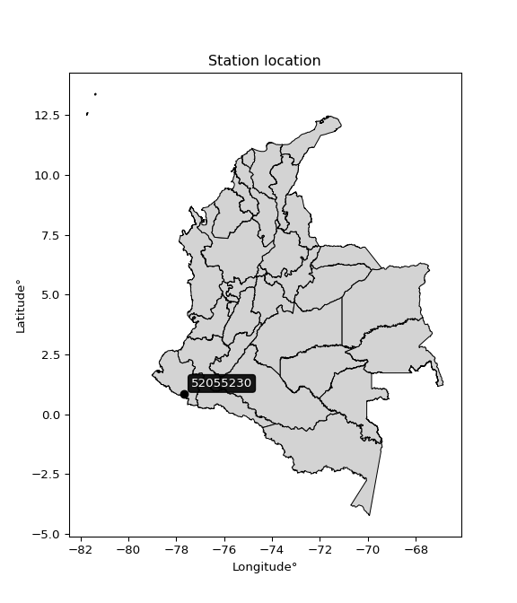

<div align="center">


</div>

# PMP Station (rain, Pmax24h): 52055230

Probable Maximum Precipitation (PMP) is the greatest amount of rainfall for a specific duration that is meteorologically possible for a given location, acting as a "worst-case" scenario for extreme storms, crucial for designing safety-critical infrastructure like bridges, river deviations, dams, spillways, and nuclear plants to prevent catastrophic failure. PMP is calculated by hydrologists using meteorological data to determine the upper limit of extreme rainfall, often leading to the Probable Maximum Flood (PMF) for flood control design, and is increasingly being studied for climate change impacts.

<div align="center">

</img>

</div>


## A. General information


### 1. General running parameters

• app_version: _v20251228_. • runtime: _2025-12-28 08:43:48.795225_. • Python version: _3.14.0_. • SciPy version: _1.16.3_. • Pandas version: _2.3.3_. • NumPy version: _2.3.5_. • Stations dataset (station_dataset_file): _dataset/pmax24h_in/automatic_colombia_2003_2024.csv_. • Stations catalog (station_catalog_file): _dataset/CNE_IDEAM.xls_. • Minimum year to eval til year_max (date_min): _1900_. • Maximum year to eval since year_min (date_max): _2024_. • Creates, save and include plots into reports (create_plot): _False_. • Plot only fit distributions with Δo > Δ (plot_only_fit): _True_. • Eval low extreme values, if False, evaluates high extreme values (low_extreme): _False_. • Eval every SciPy distribution as logarithmic (pdist_logarithmic_on): _True_. • Standard deviation normalized (ddof): _1.0_. • Return periods to eval in years (Tr): _[2, 2.33, 5, 10, 15, 20, 25, 50, 75, 100, 200, 250, 500, 750, 1000]_. • Minimum data sample per station, 0 means any (minimum_sample): _5_. • Z-Score maximum threshold to adjust a value, 0 means disable (zscore_max): _3.5_. • Z-Score minimum threshold to adjust a value, 0 means disable (zscore_min): _-2.5_. • Avoid zeros, e.g. rain = 0 (avoid_zeros): _True_. • Avoid null values (avoid_nans): _True_. [:file_folder:Dataset file.](../../dataset/pmax24h_in/automatic_colombia_2003_2024.csv)

> Delta Degrees of Freedom (DDOF): is a parameter used in the formulas for calculating variance and standard deviation. When ddof=0, the divisor is $N$ (the total number of observations) and this is used when your data set is the entire population. When ddof=1, the divisor is $N-1$ and this is used when your data set is a sample drawn from a larger population. Using $N-1$ provides an unbiased estimate of the population variance (known as Bessel´s correction).


### 2. Station info and location

|   id |   CODIGO | NOMBRE                               | CATEGORIA           | TECNOLOGIA                              | ESTADO   | FECHA_INSTALACION   |   FECHA_SUSPENSION |   ALTITUD |   LATITUD |   LONGITUD | DEPARTAMENTO   | MUNICIPIO   | AREA_OPERATIVA                      | ENTIDAD                                                     | AREA_HIDROGRAFICA   | ZONA_HIDROGRAFICA   | SUBZONA_HIDROGRAFICA   |   CORRIENTE | Catalogo   |
|-----:|---------:|:-------------------------------------|:--------------------|:----------------------------------------|:---------|:--------------------|-------------------:|----------:|----------:|-----------:|:---------------|:------------|:------------------------------------|:------------------------------------------------------------|:--------------------|:--------------------|:-----------------------|------------:|:-----------|
|    0 | 52055230 | AEROPUERTO SAN LUIS - AUT [52055230] | Sinóptica Principal | Automática con Telemetría, Convencional | Activa   | 06/11/1997          |                nan |      2961 |  0.857083 |   -77.6778 | Nariño         | Aldana      | Area Operativa 07 - Nariño-Putumayo | INSTITUTO DE HIDROLOGIA METEOROLOGIA Y ESTUDIOS AMBIENTALES | Pacifico            | Patía               | Río Guáitara           |         nan | CNE_IDEAM  |

<div align="center">

Map location in: [:earth_americas:Google](http://maps.google.com/maps?q=0.857083333,-77.67775) [:earth_americas:OSM](https://www.openstreetmap.org/#map=18/0.857083333/-77.67775&layers=P) [:earth_americas:Bing](https://www.bing.com/maps?cp=0.857083333~-77.67775&lvl=18) [:earth_americas:Apple](https://maps.apple.com/frame?center=0.857083333%2C-77.67775&span=0.003%2C0.006)

</div>


<div align="center">

```geojson
{
  "type": "Feature",
  "geometry": {
    "type": "Point", 
    "coordinates": [-77.67775, 0.857083333]
  }, 
  "properties": {
    "Name": "52055230"
  }
}
```

</div>


### 3. Discrete values table and plot

|               |           0 |           1 |           2 |           3 |           4 |            5 |          6 |
|:--------------|------------:|------------:|------------:|------------:|------------:|-------------:|-----------:|
| Date          | 2018        | 2019        | 2020        | 2021        | 2022        | 2023         | 2024       |
| Value         |   30.046    |   25.775    |   20.693    |   25.911    |   27.878    |   46.453     |  127.242   |
| Value_initial |   30.046    |   25.775    |   20.693    |   25.911    |   27.878    |   46.453     |  127.242   |
| count         |    7        |    7        |    7        |    7        |    7        |    7         |    7       |
| mean          |   43.4283   |   43.4283   |   43.4283   |   43.4283   |   43.4283   |   43.4283    |   43.4283  |
| std           |   37.8377   |   37.8377   |   37.8377   |   37.8377   |   37.8377   |   37.8377    |   37.8377  |
| zscore        |   -0.353676 |   -0.466552 |   -0.600863 |   -0.462958 |   -0.410973 |    0.0799391 |    2.21508 |

> The initial value (value_initial) correspond to the initial obtained or null completed value, and value (value) is adjusted only when the initial value is outside the valid range definite through the Z-Score value. If Z-Score is active, values out of range or outliers are replaced with the station mean value


### 4. Active continuous probability distributions from SciPy (44 of 104 available)

[scipy.stats](https://docs.scipy.org/doc/scipy/reference/stats.html) is a Python´s powerful submodule within the SciPy library for comprehensive statistical analysis, offering over 130 probability distributions (like Normal, Poisson), functions for descriptive stats (mean, variance), hypothesis testing (t-tests, chi-square), random variable generation, and statistical tests, making it essential for data science, modeling, and research. It provides tools to explore, model, and draw conclusions from data efficiently, working seamlessly with NumPy.

<div align="center">

|   id | p_dist             |   n_parameter | fit_method   | label                                                                       | active   | ref                                                                                                        |
|-----:|:-------------------|--------------:|:-------------|:----------------------------------------------------------------------------|:---------|:-----------------------------------------------------------------------------------------------------------|
|    0 | alpha              |             3 | MLE          | Alpha                                                                       | True     | [:mortar_board:](https://docs.scipy.org/doc/scipy/reference/generated/scipy.stats.alpha.html)              |
|    1 | betaprime          |             4 | MLE          | Beta prime                                                                  | True     | [:mortar_board:](https://docs.scipy.org/doc/scipy/reference/generated/scipy.stats.betaprime.html)          |
|    2 | chi2               |             3 | MLE          | Chi²                                                                        | True     | [:mortar_board:](https://docs.scipy.org/doc/scipy/reference/generated/scipy.stats.chi2.html)               |
|    3 | crystalball        |             4 | MLE          | Crystalball                                                                 | True     | [:mortar_board:](https://docs.scipy.org/doc/scipy/reference/generated/scipy.stats.crystalball.html)        |
|    4 | erlang             |             3 | MLE          | Erlang                                                                      | True     | [:mortar_board:](https://docs.scipy.org/doc/scipy/reference/generated/scipy.stats.erlang.html)             |
|    5 | expon              |             2 | MLE          | Exponential                                                                 | True     | [:mortar_board:](https://docs.scipy.org/doc/scipy/reference/generated/scipy.stats.expon.html)              |
|    6 | exponnorm          |             3 | MLE          | Exponentially modified Normal                                               | True     | [:mortar_board:](https://docs.scipy.org/doc/scipy/reference/generated/scipy.stats.exponnorm.html)          |
|    7 | f                  |             4 | MLE          | F                                                                           | True     | [:mortar_board:](https://docs.scipy.org/doc/scipy/reference/generated/scipy.stats.f.html)                  |
|    8 | fatiguelife        |             3 | MLE          | Fatigue-life (Birnbaum-Saunders)                                            | True     | [:mortar_board:](https://docs.scipy.org/doc/scipy/reference/generated/scipy.stats.fatiguelife.html)        |
|    9 | fisk               |             3 | MLE          | Fisk                                                                        | True     | [:mortar_board:](https://docs.scipy.org/doc/scipy/reference/generated/scipy.stats.fisk.html)               |
|   10 | gamma              |             3 | MLE          | Gamma                                                                       | True     | [:mortar_board:](https://docs.scipy.org/doc/scipy/reference/generated/scipy.stats.gamma.html)              |
|   11 | genexpon           |             5 | MLE          | Generalized exponential                                                     | True     | [:mortar_board:](https://docs.scipy.org/doc/scipy/reference/generated/scipy.stats.genexpon.html)           |
|   12 | genlogistic        |             3 | MLE          | Generalized logistic                                                        | True     | [:mortar_board:](https://docs.scipy.org/doc/scipy/reference/generated/scipy.stats.genlogistic.html)        |
|   13 | gibrat             |             2 | MM           | Gibrat                                                                      | True     | [:mortar_board:](https://docs.scipy.org/doc/scipy/reference/generated/scipy.stats.gibrat.html)             |
|   14 | gompertz           |             3 | MLE          | Gompertz (or truncated Gumbel)                                              | True     | [:mortar_board:](https://docs.scipy.org/doc/scipy/reference/generated/scipy.stats.gompertz.html)           |
|   15 | gumbel_l           |             2 | MM           | Gumbel Left Skew                                                            | True     | [:mortar_board:](https://docs.scipy.org/doc/scipy/reference/generated/scipy.stats.gumbel_l.html)           |
|   16 | gumbel_r           |             2 | MM           | Gumbel Right Skew                                                           | True     | [:mortar_board:](https://docs.scipy.org/doc/scipy/reference/generated/scipy.stats.gumbel_r.html)           |
|   17 | halflogistic       |             2 | MM           | Half-logistic                                                               | True     | [:mortar_board:](https://docs.scipy.org/doc/scipy/reference/generated/scipy.stats.halflogistic.html)       |
|   18 | halfnorm           |             2 | MM           | Half Normal                                                                 | True     | [:mortar_board:](https://docs.scipy.org/doc/scipy/reference/generated/scipy.stats.halfnorm.html)           |
|   19 | hypsecant          |             2 | MM           | hyperbolic secant                                                           | True     | [:mortar_board:](https://docs.scipy.org/doc/scipy/reference/generated/scipy.stats.hypsecant.html)          |
|   20 | invgamma           |             3 | MLE          | Inverted gamma                                                              | True     | [:mortar_board:](https://docs.scipy.org/doc/scipy/reference/generated/scipy.stats.invgamma.html)           |
|   21 | invgauss           |             3 | MLE          | Inverse Gaussian                                                            | True     | [:mortar_board:](https://docs.scipy.org/doc/scipy/reference/generated/scipy.stats.invgauss.html)           |
|   22 | invweibull         |             3 | MLE          | Inverted Weibull                                                            | True     | [:mortar_board:](https://docs.scipy.org/doc/scipy/reference/generated/scipy.stats.invweibull.html)         |
|   23 | johnsonsu          |             4 | MLE          | Johnson Su                                                                  | True     | [:mortar_board:](https://docs.scipy.org/doc/scipy/reference/generated/scipy.stats.johnsonsu.html)          |
|   24 | kstwobign          |             2 | MLE          | Limiting distribution of scaled Kolmogorov-Smirnov two-sided test statistic | True     | [:mortar_board:](https://docs.scipy.org/doc/scipy/reference/generated/scipy.stats.kstwobign.html)          |
|   25 | laplace            |             2 | MM           | Laplace                                                                     | True     | [:mortar_board:](https://docs.scipy.org/doc/scipy/reference/generated/scipy.stats.laplace.html)            |
|   26 | laplace_asymmetric |             3 | MLE          | Asymmetric Laplace                                                          | True     | [:mortar_board:](https://docs.scipy.org/doc/scipy/reference/generated/scipy.stats.laplace_asymmetric.html) |
|   27 | loggamma           |             3 | MLE          | Log gamma                                                                   | True     | [:mortar_board:](https://docs.scipy.org/doc/scipy/reference/generated/scipy.stats.loggamma.html)           |
|   28 | logistic           |             2 | MM           | Logistic (or Sech-squared)                                                  | True     | [:mortar_board:](https://docs.scipy.org/doc/scipy/reference/generated/scipy.stats.logistic.html)           |
|   29 | lognorm            |             3 | MLE          | Log Normal                                                                  | True     | [:mortar_board:](https://docs.scipy.org/doc/scipy/reference/generated/scipy.stats.lognorm.html)            |
|   30 | maxwell            |             2 | MM           | Maxwell                                                                     | True     | [:mortar_board:](https://docs.scipy.org/doc/scipy/reference/generated/scipy.stats.maxwell.html)            |
|   31 | mielke             |             4 | MLE          | Mielke Beta-Kappa / Dagum                                                   | True     | [:mortar_board:](https://docs.scipy.org/doc/scipy/reference/generated/scipy.stats.mielke.html)             |
|   32 | moyal              |             2 | MM           | Moyal                                                                       | True     | [:mortar_board:](https://docs.scipy.org/doc/scipy/reference/generated/scipy.stats.moyal.html)              |
|   33 | nakagami           |             3 | MLE          | Nakagami                                                                    | True     | [:mortar_board:](https://docs.scipy.org/doc/scipy/reference/generated/scipy.stats.nakagami.html)           |
|   34 | ncf                |             5 | MLE          | Non-central F distribution                                                  | True     | [:mortar_board:](https://docs.scipy.org/doc/scipy/reference/generated/scipy.stats.ncf.html)                |
|   35 | nct                |             4 | MLE          | Non-central Student’s t                                                     | True     | [:mortar_board:](https://docs.scipy.org/doc/scipy/reference/generated/scipy.stats.nct.html)                |
|   36 | norm               |             2 | MM           | Normal                                                                      | True     | [:mortar_board:](https://docs.scipy.org/doc/scipy/reference/generated/scipy.stats.norm.html)               |
|   37 | pearson3           |             3 | MM           | Pearson type III                                                            | True     | [:mortar_board:](https://docs.scipy.org/doc/scipy/reference/generated/scipy.stats.pearson3.html)           |
|   38 | rayleigh           |             2 | MM           | Rayleigh                                                                    | True     | [:mortar_board:](https://docs.scipy.org/doc/scipy/reference/generated/scipy.stats.rayleigh.html)           |
|   39 | rice               |             3 | MLE          | Rice                                                                        | True     | [:mortar_board:](https://docs.scipy.org/doc/scipy/reference/generated/scipy.stats.rice.html)               |
|   40 | t                  |             3 | MLE          | Student’s t                                                                 | True     | [:mortar_board:](https://docs.scipy.org/doc/scipy/reference/generated/scipy.stats.t.html)                  |
|   41 | truncnorm          |             4 | MLE          | Truncated normal                                                            | True     | [:mortar_board:](https://docs.scipy.org/doc/scipy/reference/generated/scipy.stats.truncnorm.html)          |
|   42 | wald               |             2 | MM           | Wald                                                                        | True     | [:mortar_board:](https://docs.scipy.org/doc/scipy/reference/generated/scipy.stats.wald.html)               |
|   43 | weibull_min        |             3 | MLE          | Weibull minimum                                                             | True     | [:mortar_board:](https://docs.scipy.org/doc/scipy/reference/generated/scipy.stats.weibull_min.html)        |

</div>

> **n_parameter:** # arguments & localization & scale.
>
> **Fit methods:** (MLE) maximum likelihood, (MM) L-moments.
>
>**Inactive:** foldnorm, gennorm, norminvgauss, powernorm, powerlognorm, skewnorm, genextreme, anglit, arcsine, argus, beta, bradford, burr, burr12, cauchy, cosine, halfcauchy, foldcauchy, skewcauchy, wrapcauchy, dgamma, gengamma, exponweib, exponpow, truncexpon, gausshyper, genhalflogistic, genhyperbolic, geninvgauss, halfgennorm, johnsonsb, kappa4, kappa3, ksone, kstwo, loglaplace, levy, levy_l, levy_stable, ncx2, pareto, genpareto, truncpareto, lomax, powerlaw, rdist, rel_breitwigner, recipinvgauss, semicircular, studentized_range, trapezoid, triang, truncweibull_min, tukeylambda, uniform, loguniform, vonmises, vonmises_line, weibull_max, dweibull, 


## B. Probability distributions vs. Empirical distributions

A continuous probability distribution (CPD) describes probabilities for variables that can take any value within a range (like rain any time), unlike discrete variables with specific outcomes (like temperature). It uses a Probability Density Function (PDF), a curve where the total area under it equals 1, and the probability of the variable falling within an interval (a to b) is found by calculating the area under the curve between those points. A key feature is that the probability of hitting any single exact value is zero, so probabilities are always expressed for ranges, e.g., $P(a ≤ X ≤ b)$.

<div align="center">

Distributions parameters from station values
|    |   station | p_dist                |   n |           loc |          scale | shape                  | shape1                 | shape2                | shape3   |
|---:|----------:|:----------------------|----:|--------------:|---------------:|:-----------------------|:-----------------------|:----------------------|:---------|
|  0 |  52055230 | alpha                 |   7 |     15.2323   |   14.7421      | 0.8175256905679658     |                        |                       |          |
|  1 |  52055230 | betaprime             |   7 |     -0.418713 |    0.772435    | 167.83918833872303     | 4.109873200643989      |                       |          |
|  2 |  52055230 | chi2                  |   7 |     20.693    |   30.4356      | 0.31011624299960394    |                        |                       |          |
|  3 |  52055230 | crystalball           |   7 |     43.4283   |   35.031       | 15009.77748519128      | 1158.2857998976356     |                       |          |
|  4 |  52055230 | erlang                |   7 |     20.693    |   35.6719      | 0.17073116779315964    |                        |                       |          |
|  5 |  52055230 | expon                 |   7 |     20.693    |   22.7353      |                        |                        |                       |          |
|  6 |  52055230 | exponnorm             |   7 |     20.6697   |    0.0076528   | 2957.3072644606973     |                        |                       |          |
|  7 |  52055230 | f                     |   7 |     20.693    |   13.1275      | 0.5616795840980855     | 2.1674653582005154     |                       |          |
|  8 |  52055230 | fatiguelife           |   7 |     19.7979   |    9.91224     | 1.6775795941755716     |                        |                       |          |
|  9 |  52055230 | fisk                  |   7 |     20.693    |   22.1581      | 0.8546072863937915     |                        |                       |          |
| 10 |  52055230 | gamma                 |   7 |     20.693    |   33.1859      | 0.1686110133267498     |                        |                       |          |
| 11 |  52055230 | genexpon              |   7 |     11.16     |    0.000355629 | 1.3680291167601983e-12 | 1.3355165276987168e-05 | 5.863159852383442e-05 |          |
| 12 |  52055230 | genlogistic           |   7 |    -98.7955   |   16.7417      | 2248.2953715646127     |                        |                       |          |
| 13 |  52055230 | gibrat                |   7 |     16.7041   |   16.209       |                        |                        |                       |          |
| 14 |  52055230 | gompertz              |   7 |     20.693    |  127.586       | 3.6948849330900124     |                        |                       |          |
| 15 |  52055230 | gumbel_l              |   7 |     59.1941   |   27.3135      |                        |                        |                       |          |
| 16 |  52055230 | gumbel_r              |   7 |     27.6625   |   27.3135      |                        |                        |                       |          |
| 17 |  52055230 | halflogistic          |   7 |      1.90847  |   29.9502      |                        |                        |                       |          |
| 18 |  52055230 | halfnorm              |   7 |     -2.93896  |   58.1127      |                        |                        |                       |          |
| 19 |  52055230 | hypsecant             |   7 |     43.4283   |   22.3014      |                        |                        |                       |          |
| 20 |  52055230 | invgamma              |   7 |     18.032    |    9.93371     | 1.221874172512336      |                        |                       |          |
| 21 |  52055230 | invgauss              |   7 |     19.0835   |    7.95092     | 3.061867801994511      |                        |                       |          |
| 22 |  52055230 | invweibull            |   7 |     20.693    |    1.09071     | 0.04940290277809256    |                        |                       |          |
| 23 |  52055230 | johnsonsu             |   7 |     25.775    |    1.56614e-11 | -0.0955495848377779    | 0.07947265177298203    |                       |          |
| 24 |  52055230 | kstwobign             |   7 |    -39.6768   |   97.95        |                        |                        |                       |          |
| 25 |  52055230 | laplace               |   7 |     43.4283   |   24.7706      |                        |                        |                       |          |
| 26 |  52055230 | laplace_asymmetric    |   7 |     20.693    |    9.64705e-05 | 4.243262701499002e-06  |                        |                       |          |
| 27 |  52055230 | loggamma              |   7 | -10251.7      | 1400.67        | 1556.7215411839588     |                        |                       |          |
| 28 |  52055230 | logistic              |   7 |     43.4283   |   19.3136      |                        |                        |                       |          |
| 29 |  52055230 | lognorm               |   7 |     20.693    |    0.0778798   | 12.580960602233388     |                        |                       |          |
| 30 |  52055230 | maxwell               |   7 |    -39.5804   |   52.018       |                        |                        |                       |          |
| 31 |  52055230 | mielke                |   7 |     17.8999   |    0.522417    | 29.390198581343967     | 1.1714852248335883     |                       |          |
| 32 |  52055230 | moyal                 |   7 |     23.3953   |   15.7695      |                        |                        |                       |          |
| 33 |  52055230 | nakagami              |   7 |     20.693    |   56.0077      | 0.16315473975740957    |                        |                       |          |
| 34 |  52055230 | ncf                   |   7 |     18.0326   |    6.73096     | 16434.4101825648       | 2.443757883378326      | 3415.4435406922175    |          |
| 35 |  52055230 | nct                   |   7 |     17.0978   |    1.11591     | 0.9151083437889138     | 6.434808479543765      |                       |          |
| 36 |  52055230 | norm                  |   7 |     43.4283   |   35.0309      |                        |                        |                       |          |
| 37 |  52055230 | pearson3              |   7 |     43.4283   |   35.031       | 1.8609724217754788     |                        |                       |          |
| 38 |  52055230 | rayleigh              |   7 |    -23.588    |   53.4712      |                        |                        |                       |          |
| 39 |  52055230 | rice                  |   7 |     -4.9844   |   42.2549      | 0.00030924913914627756 |                        |                       |          |
| 40 |  52055230 | t                     |   7 |     26.5579   |    2.21134     | 0.5904323795671875     |                        |                       |          |
| 41 |  52055230 | truncnorm             |   7 | -15085.7      |  729.553       | 20.706400496683617     | 20.852451835980972     |                       |          |
| 42 |  52055230 | wald                  |   7 |      8.39734  |   35.0309      |                        |                        |                       |          |
| 43 |  52055230 | weibull_min           |   7 |     20.693    |   28.3225      | 0.5176264069761021     |                        |                       |          |
| 44 |  52055230 | logalpha              |   7 |      2.58169  |    1.84048     | 2.343279032609471      |                        |                       |          |
| 45 |  52055230 | logbetaprime          |   7 |     -1.00815  |    4.67444     | 139.22880026584045     | 143.31897203854066     |                       |          |
| 46 |  52055230 | logchi2               |   7 |      3.0298   |    0.974432    | 1.0811351685750452     |                        |                       |          |
| 47 |  52055230 | logcrystalball        |   7 |      3.56414  |    0.570825    | 8.034367841432736      | 2.714006938349346      |                       |          |
| 48 |  52055230 | logerlang             |   7 |      3.0298   |    0.667134    | 0.4383250415867661     |                        |                       |          |
| 49 |  52055230 | logexpon              |   7 |      3.0298   |    0.534343    |                        |                        |                       |          |
| 50 |  52055230 | logexponnorm          |   7 |      3.0618   |    0.0966034   | 5.200002452838024      |                        |                       |          |
| 51 |  52055230 | logf                  |   7 |      2.84496  |    0.459516    | 68.24665127600954      | 5.184322755003937      |                       |          |
| 52 |  52055230 | logfatiguelife        |   7 |      2.94176  |    0.423785    | 0.9664407953562579     |                        |                       |          |
| 53 |  52055230 | logfisk               |   7 |      2.97825  |    0.381965    | 1.7536175643780458     |                        |                       |          |
| 54 |  52055230 | loggamma              |   7 |      3.0298   |    0.57646     | 0.456228705696035      |                        |                       |          |
| 55 |  52055230 | loggenexpon           |   7 |      3.0298   |    1.08627     | 2.0329624768124024     | 1.4120374981986623e-07 | 1.6922122613641226    |          |
| 56 |  52055230 | loggenlogistic        |   7 |      0.740047 |    0.339364    | 2064.3450482552544     |                        |                       |          |
| 57 |  52055230 | loggibrat             |   7 |      3.1287   |    0.264108    |                        |                        |                       |          |
| 58 |  52055230 | loggompertz           |   7 |      3.02979  | 1658.67        | 3157.961085240857      |                        |                       |          |
| 59 |  52055230 | loggumbel_l           |   7 |      3.82104  |    0.44507     |                        |                        |                       |          |
| 60 |  52055230 | loggumbel_r           |   7 |      3.30724  |    0.44507     |                        |                        |                       |          |
| 61 |  52055230 | loghalflogistic       |   7 |      2.88758  |    0.488035    |                        |                        |                       |          |
| 62 |  52055230 | loghalfnorm           |   7 |      2.80859  |    0.946939    |                        |                        |                       |          |
| 63 |  52055230 | loghypsecant          |   7 |      3.56414  |    0.363398    |                        |                        |                       |          |
| 64 |  52055230 | loginvgamma           |   7 |      2.82825  |    1.21572     | 2.589329257045839      |                        |                       |          |
| 65 |  52055230 | loginvgauss           |   7 |      2.91408  |    0.710343    | 0.9151283563907469     |                        |                       |          |
| 66 |  52055230 | loginvweibull         |   7 |      2.68799  |    0.575226    | 2.266885439644504      |                        |                       |          |
| 67 |  52055230 | logjohnsonsu          |   7 |      2.95438  |    0.0035001   | -5.88232451912414      | 1.0793533691220836     |                       |          |
| 68 |  52055230 | logkstwobign          |   7 |      2.04578  |    1.76765     |                        |                        |                       |          |
| 69 |  52055230 | loglaplace            |   7 |      3.56414  |    0.403634    |                        |                        |                       |          |
| 70 |  52055230 | loglaplace_asymmetric |   7 |      3.24941  |    0.247055    | 0.5486731517559122     |                        |                       |          |
| 71 |  52055230 | logloggamma           |   7 |   -136.634    |   19.8307      | 1176.041305604852      |                        |                       |          |
| 72 |  52055230 | loglogistic           |   7 |      3.56414  |    0.314712    |                        |                        |                       |          |
| 73 |  52055230 | loglognorm            |   7 |      3.0298   |    0.00321886  | 12.109567920980087     |                        |                       |          |
| 74 |  52055230 | logmaxwell            |   7 |      2.21152  |    0.847626    |                        |                        |                       |          |
| 75 |  52055230 | logmielke             |   7 |      2.69837  |    0.0873223   | 149.2128494338926      | 2.244445852617458      |                       |          |
| 76 |  52055230 | logmoyal              |   7 |      3.2377   |    0.256961    |                        |                        |                       |          |
| 77 |  52055230 | lognakagami           |   7 |      3.0298   |    1.17848     | 0.20530443368853224    |                        |                       |          |
| 78 |  52055230 | logncf                |   7 |     -0.680971 |    2.33171e-08 | 1.763219873173142e-06  | 201.9131646104346      | 318.41527279236766    |          |
| 79 |  52055230 | lognct                |   7 |      0.44006  |    0.224141    | 26.91695732396464      | 13.489463882588169     |                       |          |
| 80 |  52055230 | lognorm               |   7 |      3.56414  |    0.570825    |                        |                        |                       |          |
| 81 |  52055230 | logpearson3           |   7 |      3.56414  |    0.570825    | 1.4566983504067306     |                        |                       |          |
| 82 |  52055230 | lograyleigh           |   7 |      2.47212  |    0.871307    |                        |                        |                       |          |
| 83 |  52055230 | logrice               |   7 |      2.71554  |    0.723175    | 0.0015229194324171867  |                        |                       |          |
| 84 |  52055230 | logt                  |   7 |      3.29231  |    0.102319    | 0.7832518193673769     |                        |                       |          |
| 85 |  52055230 | logtruncnorm          |   7 |     -4.05829  |    2.02157     | 3.506195575795134      | 4.404834913983281      |                       |          |
| 86 |  52055230 | logwald               |   7 |      2.99331  |    0.570825    |                        |                        |                       |          |
| 87 |  52055230 | logweibull_min        |   7 |      3.0298   |    0.548659    | 0.8118199609166215     |                        |                       |          |

</div>

> **loc** (Location parameter): This shifts the distribution along the x-axis. For many common distributions, like the normal (Gaussian) distribution, loc represents the mean $μ$. For others, like the uniform distribution, it might represent the minimum value, or for the beta distribution, the left end of the support interval.
>
> **scale** (Scale parameter): This determines the width or spread of the distribution. For the normal distribution, scale represents the standard deviation $σ$. For a uniform distribution, it defines the length of the interval (from $loc$ to $loc + scale$).
>
> **shape** (Shape parameters): Refers to parameters that define the specific form of a probability distribution, distinct from its location (loc) and scale (scale). These parameters are required arguments for most distribution functions. For example, a normal (Gaussian) distribution is fully defined by its location (mean) and scale (standard deviation), so it has no specific shape parameters beyond loc and scale. However, other distributions have intrinsic properties that need specification, as Gamma distribution that takes a shape parameter, often named $a$ or $alpha$.


### 0. Cumulative distribution values - CDF (88 evaluated)

Cumulative Distribution Function (CDF), denoted as $F$<sub>$X$</sub>$(x)$, is a function that gives the probability that a random variable $X$ will take a value less than or equal to a specific value, $x$ (i.e., $(P(X≥x)$. It essentially "accumulates" probabilities from a given point up to the far right (positive infinity), providing a complete picture of the distribution´s probabilities for both discrete (like rain) and continuous (like temperature) variables, helping to find probabilities over ranges or above certain values.

<div align="center">

CDF ordered by x ascending and calculating $log(f(x))$ separately
|   id |   Station |   date |       x |   count |    mean |     std |     zscore |   Value_initial |   station |   m |    alpha |   alpha_pdf |   betaprime |   betaprime_pdf |       chi2 |    chi2_pdf |   crystalball |   crystalball_pdf |     erlang |   erlang_pdf |    expon |   expon_pdf |   exponnorm |   exponnorm_pdf |         f |           f_pdf |   fatiguelife |   fatiguelife_pdf |        fisk |   fisk_pdf |      gamma |   gamma_pdf |   genexpon |   genexpon_pdf |   genlogistic |   genlogistic_pdf |    gibrat |   gibrat_pdf |    gompertz |   gompertz_pdf |   gumbel_l |   gumbel_l_pdf |   gumbel_r |   gumbel_r_pdf |   halflogistic |   halflogistic_pdf |   halfnorm |   halfnorm_pdf |   hypsecant |   hypsecant_pdf |   invgamma |   invgamma_pdf |   invgauss |   invgauss_pdf |   invweibull |   invweibull_pdf |   johnsonsu |   johnsonsu_pdf |   kstwobign |   kstwobign_pdf |   laplace |   laplace_pdf |   laplace_asymmetric |   laplace_asymmetric_pdf |    loggamma |   loggamma_pdf |   logistic |   logistic_pdf |   lognorm |   lognorm_pdf |   maxwell |   maxwell_pdf |    mielke |   mielke_pdf |    moyal |   moyal_pdf |    nakagami |   nakagami_pdf |       ncf |    ncf_pdf |       nct |     nct_pdf |     norm |    norm_pdf |   pearson3 |   pearson3_pdf |   rayleigh |   rayleigh_pdf |     rice |    rice_pdf |        t |       t_pdf |   truncnorm |   truncnorm_pdf |     wald |    wald_pdf |   weibull_min |   weibull_min_pdf |   logalpha |   logalpha_pdf |   logbetaprime |   logbetaprime_pdf |     logchi2 |   logchi2_pdf |   logcrystalball |   logcrystalball_pdf |   logerlang |   logerlang_pdf |   logexpon |   logexpon_pdf |   logexponnorm |   logexponnorm_pdf |     logf |   logf_pdf |   logfatiguelife |   logfatiguelife_pdf |   logfisk |   logfisk_pdf |   loggenexpon |   loggenexpon_pdf |   loggenlogistic |   loggenlogistic_pdf |   loggibrat |   loggibrat_pdf |   loggompertz |   loggompertz_pdf |   loggumbel_l |   loggumbel_l_pdf |   loggumbel_r |   loggumbel_r_pdf |   loghalflogistic |   loghalflogistic_pdf |   loghalfnorm |   loghalfnorm_pdf |   loghypsecant |   loghypsecant_pdf |   loginvgamma |   loginvgamma_pdf |   loginvgauss |   loginvgauss_pdf |   loginvweibull |   loginvweibull_pdf |   logjohnsonsu |   logjohnsonsu_pdf |   logkstwobign |   logkstwobign_pdf |   loglaplace |   loglaplace_pdf |   loglaplace_asymmetric |   loglaplace_asymmetric_pdf |   logloggamma |   logloggamma_pdf |   loglogistic |   loglogistic_pdf |   loglognorm |   loglognorm_pdf |   logmaxwell |   logmaxwell_pdf |   logmielke |   logmielke_pdf |   logmoyal |   logmoyal_pdf |   lognakagami |   lognakagami_pdf |   logncf |   logncf_pdf |   lognct |   lognct_pdf |   logpearson3 |   logpearson3_pdf |   lograyleigh |   lograyleigh_pdf |   logrice |   logrice_pdf |     logt |   logt_pdf |   logtruncnorm |   logtruncnorm_pdf |     logwald |   logwald_pdf |   logweibull_min |   logweibull_min_pdf |
|-----:|----------:|-------:|--------:|--------:|--------:|--------:|-----------:|----------------:|----------:|----:|---------:|------------:|------------:|----------------:|-----------:|------------:|--------------:|------------------:|-----------:|-------------:|---------:|------------:|------------:|----------------:|----------:|----------------:|--------------:|------------------:|------------:|-----------:|-----------:|------------:|-----------:|---------------:|--------------:|------------------:|----------:|-------------:|------------:|---------------:|-----------:|---------------:|-----------:|---------------:|---------------:|-------------------:|-----------:|---------------:|------------:|----------------:|-----------:|---------------:|-----------:|---------------:|-------------:|-----------------:|------------:|----------------:|------------:|----------------:|----------:|--------------:|---------------------:|-------------------------:|------------:|---------------:|-----------:|---------------:|----------:|--------------:|----------:|--------------:|----------:|-------------:|---------:|------------:|------------:|---------------:|----------:|-----------:|----------:|------------:|---------:|------------:|-----------:|---------------:|-----------:|---------------:|---------:|------------:|---------:|------------:|------------:|----------------:|---------:|------------:|--------------:|------------------:|-----------:|---------------:|---------------:|-------------------:|------------:|--------------:|-----------------:|---------------------:|------------:|----------------:|-----------:|---------------:|---------------:|-------------------:|---------:|-----------:|-----------------:|---------------------:|----------:|--------------:|--------------:|------------------:|-----------------:|---------------------:|------------:|----------------:|--------------:|------------------:|--------------:|------------------:|--------------:|------------------:|------------------:|----------------------:|--------------:|------------------:|---------------:|-------------------:|--------------:|------------------:|--------------:|------------------:|----------------:|--------------------:|---------------:|-------------------:|---------------:|-------------------:|-------------:|-----------------:|------------------------:|----------------------------:|--------------:|------------------:|--------------:|------------------:|-------------:|-----------------:|-------------:|-----------------:|------------:|----------------:|-----------:|---------------:|--------------:|------------------:|---------:|-------------:|---------:|-------------:|--------------:|------------------:|--------------:|------------------:|----------:|--------------:|---------:|-----------:|---------------:|-------------------:|------------:|--------------:|-----------------:|---------------------:|
|    0 |  52055230 |   2020 |  20.693 |       7 | 43.4283 | 37.8377 | -0.600863  |          20.693 |  52055230 |   1 | 0.037706 | 0.0423016   |    0.155884 |     0.0256529   | 0.00326347 | 1.42434e+11 |      0.258167 |       0.00922558  | 0.00200062 |  9.61429e+10 | 0        | 0.0439845   |  0.00103035 |     0.0440895   | 0.0035031 | 12005.1         |     0.0355703 |       0.094604    | 3.17323e-14 | 7.63321    | 0.00218816 | 1.03849e+11 |   0.162662 |    0.0249141   |      0.167512 |       0.01787     | 0.0804501 |  0.0374282   | 1.60811e-13 |    0.0289599   |   0.216702 |    0.00700437  |   0.275085 |    0.0129989   |       0.303705 |        0.0151545   |   0.31574  |     0.0126404  |    0.220433 |     0.00911298  |  0.0368796 |    0.0492465   |  0.0360738 |    0.0639034   |   0.00553615 |      4.00044e+11 |   0.0120009 |     0.000488468 |    0.158054 |     0.0143876   |  0.199692 |    0.00806164 |          1.86698e-10 |              0.0439851   | 1.43759e-07 |    1.47688e+08 |   0.235562 |    0.00932363  |  0.174614 |     0.450951  |  0.280955 |    0.0105242  | 0.0371045 |  0.0480406   | 0.275951 |  0.0152253  | 4.15094e-06 |    3.81255e+08 | 0.0368794 | 0.0492463  | 0.0593748 | 0.0626932   | 0.258167 | 0.00922559  |   0.297265 |     0.0184659  |   0.290289 |    0.0109915   | 0.168594 | 0.0119567   | 0.174189 | 0.016691    | 3.72926e-05 |      0.0298735  | 0.220102 | 0.0300554   |    5.8739e-09 |   855821          |  0.0392446 |      0.779084  |       0.162373 |          0.510084  | 3.94235e-09 |   4.79883e+06 |         0.174614 |            0.450951  | 2.51362e-07 |     2.48099e+08 |   0        |      1.87146   |      0.0442075 |          0.648976  | 0.037889 |  0.881951  |        0.0360387 |            1.23249   | 0.0289638 |      0.956862 |   2.65959e-10 |         1.87151   |        0.0886995 |            0.632798  |    0        |       0         |   9.01128e-06 |         1.9039    |      0.1555   |        0.320689   |      0.154866 |         0.649011  |          0.144682 |             1.00307   |      0.184705 |         0.819914  |       0.143818 |          0.382431  |     0.0379158 |         0.881202  |     0.0364813 |         1.07375   |       0.0386075 |           0.833268  |      0.0343989 |          1.08911   |      0.0840514 |          0.594673  |     0.133057 |        0.329648  |               0.0457859 |                   0.337773  |      0.180159 |         0.449942  |      0.154743 |         0.41561   |   0.00723617 |      3.73129e+12 |     0.182286 |        0.550498  |    0.038768 |       0.832766  |   0.133969 |      0.756915  |   3.65929e-07 |       3.38341e+08 | 0.202047 |    0.498731  | 0.136726 |    0.569822  |      0.144514 |         0.877829  |      0.185215 |         0.598528  | 0.0900984 |     0.546758  | 0.144308 |  0.40073   |    0.000152167 |          1.90263   | 0.000201638 |     0.0455842 |       5.5995e-13 |         1023.62      |
|    1 |  52055230 |   2019 |  25.775 |       7 | 43.4283 | 37.8377 | -0.466552  |          25.775 |  52055230 |   2 | 0.353874 | 0.0563562   |    0.294582 |     0.0277733   | 0.722557   | 0.020505    |      0.307154 |       0.0100303   | 0.758405   |  0.0225467   | 0.200308 | 0.035174    |  0.201949   |     0.0352625   | 0.525397  |     0.0262217   |     0.380276  |       0.0392028   | 0.221248    | 0.0289741  | 0.769389   | 0.0223771   |   0.28932  |    0.0242905   |      0.267386 |       0.0210609   | 0.28079   |  0.0371608   | 0.139416    |    0.0259352   |   0.254864 |    0.0080257   |   0.342478 |    0.0134359   |       0.378611 |        0.0143013   |   0.37877  |     0.0121522  |    0.270852 |     0.0107316   |  0.360041  |    0.0531896   |  0.372819  |    0.0475514   |   0.395821   |      0.00356615  |   0.462118  |     2.01524e+09 |    0.236719 |     0.0163689   |  0.245167 |    0.00989747 |          0.200311    |              0.0351744   | 0.649216    |    1.03186     |   0.286175 |    0.010577    |  0.290692 |     0.600335  |  0.335735 |    0.0109968  | 0.359168  |  0.0536083   | 0.353758 |  0.0152614  | 0.365965    |    0.0234711   | 0.360041  | 0.0531897  | 0.399482  | 0.0502975   | 0.307154 | 0.0100303   |   0.38621  |     0.0165348  |   0.346962 |    0.0112746   | 0.232759 | 0.0132177   | 0.405126 | 0.109526    | 0.141413    |      0.0258603  | 0.361508 | 0.025234    |    0.336987   |        0.0277526  |  0.343044  |      1.52676   |       0.294418 |          0.679432  | 0.33268     |   0.7607      |         0.290692 |            0.600335  | 0.630307    |     0.996115    |   0.337006 |      1.24076   |      0.300848  |          1.3399    | 0.35013  |  1.45267   |        0.369634  |            1.28581   | 0.354145  |      1.47923  |   0.337013    |         1.24078   |        0.281209  |            1.05093   |    0.216802 |       2.43251   |   0.341739    |         1.25344   |      0.241813 |        0.471578   |      0.320216 |         0.819307  |          0.354602 |             0.895692  |      0.358438 |         0.756068  |       0.25346  |          0.626069  |     0.350114  |         1.45299   |     0.362222  |         1.35087   |       0.347619  |           1.48314   |      0.363922  |          1.37369   |      0.257282  |          0.923778  |     0.229261 |        0.567991  |               0.231385  |                   1.70698   |      0.29539  |         0.593848  |      0.268928 |         0.624716  |   0.63635    |      0.141164    |     0.317567 |        0.666892  |    0.347934 |       1.48435   |   0.328327 |      0.941181  |   0.394849    |       0.733904    | 0.324445 |    0.605176  | 0.290109 |    0.801741  |      0.346111 |         0.905268  |      0.328282 |         0.687744  | 0.238519  |     0.777331  | 0.380689 |  2.46751   |    0.347004    |          1.29232   | 0.318101    |     1.65739   |       0.378445   |            1.09261   |
|    2 |  52055230 |   2021 |  25.911 |       7 | 43.4283 | 37.8377 | -0.462958  |          25.911 |  52055230 |   3 | 0.36148  | 0.0554921   |    0.298357 |     0.027745    | 0.725312   | 0.0200078   |      0.308519 |       0.0100499   | 0.761432   |  0.0219743   | 0.205078 | 0.0349642   |  0.206731   |     0.0350513   | 0.528924  |     0.025643    |     0.385552  |       0.0383839   | 0.225161    | 0.0285737  | 0.772393   | 0.0218016   |   0.29262  |    0.0242306   |      0.270254 |       0.0211146   | 0.285828  |  0.0369255   | 0.142938    |    0.0258566   |   0.255957 |    0.00805393  |   0.344305 |    0.0134405   |       0.380554 |        0.0142767   |   0.380422 |     0.0121381  |    0.272314 |     0.0107748   |  0.367215  |    0.052317    |  0.379224  |    0.0466444   |   0.3963     |      0.00347287  |   0.962318  |     0.0479661   |    0.238947 |     0.0164053   |  0.246516 |    0.00995196 |          0.20508     |              0.0349646   | 0.654587    |    1.00941     |   0.287615 |    0.0106087   |  0.293859 |     0.603369  |  0.337231 |    0.0110064  | 0.366399  |  0.0527335   | 0.355833 |  0.0152519  | 0.369128    |    0.0230555   | 0.367215  | 0.0523171  | 0.406255  | 0.0493104   | 0.308519 | 0.0100499   |   0.388456 |     0.0164833  |   0.348496 |    0.0112791   | 0.234559 | 0.013245    | 0.420373 | 0.114619    | 0.144923    |      0.0257607  | 0.36493  | 0.0250878   |    0.340727   |        0.0272468  |  0.351051  |      1.51607   |       0.298002 |          0.68238   | 0.336656    |   0.75044     |         0.293859 |            0.603369  | 0.635494    |     0.97523     |   0.343504 |      1.2286    |      0.307879  |          1.33213   | 0.35774  |  1.43972   |        0.376358  |            1.26982   | 0.361892  |      1.46503  |   0.343511    |         1.22862   |        0.286751  |            1.05516   |    0.22954  |       2.4079    |   0.348303    |         1.24094   |      0.244305 |        0.475618   |      0.324532 |         0.820587  |          0.359306 |             0.892251  |      0.362411 |         0.754103  |       0.256772 |          0.632408  |     0.357726  |         1.44005   |     0.36929   |         1.33554   |       0.355392  |           1.47078   |      0.371111  |          1.35836   |      0.262153  |          0.927142  |     0.232269 |        0.575445  |               0.240316  |                   1.68715   |      0.298523 |         0.596774  |      0.272229 |         0.629528  |   0.637083   |      0.137766    |     0.321081 |        0.668557  |    0.355713 |       1.47195   |   0.333279 |      0.940658  |   0.398684    |       0.723481    | 0.327634 |    0.60687   | 0.294338 |    0.805175  |      0.350868 |         0.902753  |      0.331903 |         0.688667  | 0.242619  |     0.780767  | 0.393931 |  2.56426   |    0.353773    |          1.28022   | 0.326768    |     1.63651   |       0.384156   |            1.07776   |
|    3 |  52055230 |   2022 |  27.878 |       7 | 43.4283 | 37.8377 | -0.410973  |          27.878 |  52055230 |   4 | 0.458687 | 0.0436388   |    0.352296 |     0.0270018   | 0.759027   | 0.0147837   |      0.328557 |       0.0103198   | 0.798155   |  0.0159501   | 0.270961 | 0.0320664   |  0.272765   |     0.0321335   | 0.5727    |     0.0194338   |     0.451435  |       0.0293658   | 0.276385    | 0.0237882  | 0.808743   | 0.0157488   |   0.339337 |    0.0232341   |      0.312424 |       0.0217049   | 0.354951  |  0.0333163   | 0.19269     |    0.024734    |   0.272204 |    0.00846634  |   0.370782 |    0.0134683   |       0.40828  |        0.0139115   |   0.404093 |     0.011929   |    0.294116 |     0.0113901   |  0.458575  |    0.0410184   |  0.459708  |    0.0358678   |   0.402093   |      0.00251886  |   0.977026  |     0.00205719  |    0.271671 |     0.016839    |  0.26689  |    0.0107745  |          0.270964    |              0.0320667   | 0.718772    |    0.762806    |   0.308925 |    0.0110539   |  0.339451 |     0.641499  |  0.359004 |    0.0111266  | 0.458491  |  0.0413314   | 0.385664 |  0.0150643  | 0.409668    |    0.0185623   | 0.458575  | 0.0410185  | 0.490717  | 0.0372419   | 0.328557 | 0.0103198   |   0.420149 |     0.0157439  |   0.370734 |    0.011327    | 0.260974 | 0.0136021   | 0.647856 | 0.0876822   | 0.194205    |      0.0243614  | 0.412216 | 0.0230031   |    0.388378   |        0.0216631  |  0.455262  |      1.32147   |       0.349258 |          0.716436  | 0.387074    |   0.635041    |         0.339451 |            0.641499  | 0.697861    |     0.746032    |   0.427518 |      1.07138   |      0.400351  |          1.18786   | 0.455868 |  1.23812   |        0.461577  |            1.0654    | 0.461244  |      1.24653  |   0.427526    |         1.07139   |        0.365339  |            1.08374   |    0.388827 |       1.92509   |   0.433063    |         1.07959   |      0.281199 |        0.533236   |      0.384902 |         0.825693  |          0.422765 |             0.841405  |      0.416544 |         0.72498   |       0.30623  |          0.718579  |     0.455877  |         1.2384    |     0.459313  |         1.12788   |       0.455858  |           1.26874   |      0.46273   |          1.14792   |      0.331176  |          0.953299  |     0.278433 |        0.689814  |               0.354257  |                   1.4341    |      0.343582 |         0.633599  |      0.320637 |         0.692153  |   0.645774   |      0.103072    |     0.370701 |        0.68591   |    0.456235 |       1.26908   |   0.401394 |      0.916158  |   0.447143    |       0.609345    | 0.372782 |    0.625682  | 0.354686 |    0.840461  |      0.415428 |         0.85958   |      0.382621 |         0.695892  | 0.301233  |     0.818108  | 0.600582 |  2.60179   |    0.441555    |          1.12237   | 0.435776    |     1.34593   |       0.456281   |            0.90241   |
|    4 |  52055230 |   2018 |  30.046 |       7 | 43.4283 | 37.8377 | -0.353676  |          30.046 |  52055230 |   5 | 0.54149  | 0.0332595   |    0.409439 |     0.0256396   | 0.787133   | 0.0114169   |      0.351226 |       0.0105869   | 0.828179   |  0.0120614   | 0.33727  | 0.0291499   |  0.339198   |     0.0291981   | 0.609999  |     0.0152894   |     0.507923  |       0.0232038   | 0.323637    | 0.0200011  | 0.838316   | 0.0118484   |   0.38834  |    0.0219493   |      0.359833 |       0.0219635   | 0.42283   |  0.0293402   | 0.245       |    0.0235278   |   0.291058 |    0.00892829  |   0.399942 |    0.013419    |       0.437988 |        0.0134918   |   0.429695 |     0.0116872  |    0.319521 |     0.0120397   |  0.536777  |    0.0316239   |  0.528133  |    0.0277758   |   0.406862   |      0.00193261  |   0.979924  |     0.000903839 |    0.308522 |     0.0171232   |  0.291302 |    0.01176    |          0.337273    |              0.0291501   | 0.769159    |    0.592999    |   0.333389 |    0.011507    |  0.388679 |     0.671499  |  0.383235 |    0.0112198  | 0.537218  |  0.0317996   | 0.41801  |  0.01476    | 0.446364    |    0.015512    | 0.536777  | 0.031624   | 0.560789  | 0.0279941   | 0.351226 | 0.0105869   |   0.453413 |     0.014946   |   0.395315 |    0.011343    | 0.290817 | 0.0139139   | 0.769011 | 0.0343317   | 0.245427    |      0.0229067  | 0.459702 | 0.0208311   |    0.430812   |        0.0177521  |  0.545692  |      1.09406   |       0.403778 |          0.737062  | 0.431338    |   0.551296    |         0.388679 |            0.671499  | 0.74746     |     0.587926    |   0.502386 |      0.931264  |      0.48326   |          1.02825   | 0.540691 |  1.02997   |        0.534684  |            0.892898  | 0.546133  |      1.02402  |   0.502395    |         0.931271  |        0.445942  |            1.06098   |    0.514704 |       1.45487   |   0.508416    |         0.936143  |      0.323401 |        0.59391    |      0.44624  |         0.809019  |          0.483683 |             0.784832  |      0.469624 |         0.692044  |       0.36305  |          0.796098  |     0.540716  |         1.03014   |     0.536596  |         0.941206  |       0.542675  |           1.05205   |      0.541299  |          0.955232  |      0.402464  |          0.945243  |     0.335197 |        0.830449  |               0.453203  |                   1.21436   |      0.392182 |         0.662699  |      0.374519 |         0.744346  |   0.652636   |      0.081791    |     0.422387 |        0.692528  |    0.54305  |       1.05168   |   0.468241 |      0.865645  |   0.489638    |       0.529978    | 0.42007  |    0.635559  | 0.418227 |    0.852378  |      0.477781 |         0.804158  |      0.43469  |         0.692968  | 0.363316  |     0.836595  | 0.744108 |  1.31203   |    0.520153    |          0.979609  | 0.526596    |     1.0882    |       0.518544   |            0.766066  |
|    5 |  52055230 |   2023 |  46.453 |       7 | 43.4283 | 37.8377 |  0.0799391 |          46.453 |  52055230 |   6 | 0.800668 | 0.00716661  |    0.719468 |     0.0126469   | 0.891773   | 0.00370443  |      0.534404 |       0.0113459   | 0.931391   |  0.0032868   | 0.677947 | 0.0141653   |  0.679944   |     0.014142    | 0.754645  |     0.00530556  |     0.730393  |       0.00831133  | 0.532135    | 0.00825968 | 0.938241   | 0.00311272  |   0.666555 |    0.0124849   |      0.68136  |       0.0156131   | 0.728149  |  0.0111525   | 0.562489    |    0.015505    |   0.46592  |    0.0122643   |   0.604954 |    0.0111319   |       0.631341 |        0.0100401   |   0.604638 |     0.00956763 |    0.54304  |     0.0141428   |  0.794213  |    0.00752386  |  0.769054  |    0.00783872  |   0.425122   |      0.000697395 |   0.985279  |     0.000143214 |    0.578098 |     0.0147071   |  0.557474 |    0.017865   |          0.677952    |              0.0141653   | 0.916996    |    0.182819    |   0.539073 |    0.0128652   |  0.684577 |     0.622679  |  0.565762 |    0.0106861  | 0.794479  |  0.00746509  | 0.630242 |  0.0108459  | 0.61866     |    0.00760738  | 0.794213  | 0.00752386 | 0.784523  | 0.00658372  | 0.534404 | 0.0113459   |   0.654032 |     0.00978795 |   0.575946 |    0.010388    | 0.523327 | 0.0137324   | 0.914174 | 0.00253575  | 0.545828    |      0.0143711  | 0.70043  | 0.0100234   |    0.614069   |        0.00738348 |  0.818065  |      0.319015  |       0.70794  |          0.595003  | 0.609553    |   0.308931    |         0.684577 |            0.622679  | 0.899301    |     0.198101    |   0.779828 |      0.412043  |      0.782936  |          0.432107  | 0.809033 |  0.338486  |        0.786337  |            0.359818  | 0.805906  |      0.318887 |   0.779837    |         0.412037  |        0.799563  |            0.526999  |    0.838555 |       0.344837  |   0.785613    |         0.408372  |      0.6465   |        0.825925   |      0.738489 |         0.503005  |          0.750533 |             0.447406  |      0.72321  |         0.466423  |       0.720246 |          0.67448   |     0.809057  |         0.338416  |     0.794337  |         0.353318  |       0.812386  |           0.332604  |      0.79857   |          0.343269  |      0.744862  |          0.581843  |     0.746586 |        0.627831  |               0.792231  |                   0.461424  |      0.684568 |         0.617477  |      0.705078 |         0.66074   |   0.675935   |      0.0367112   |     0.702333 |        0.549645  |    0.812369 |       0.331815  |   0.756028 |      0.459645  |   0.664331    |       0.31124     | 0.682434 |    0.528365  | 0.745271 |    0.58119   |      0.749451 |         0.451019  |      0.707567 |         0.526306  | 0.700459  |     0.64315   | 0.916918 |  0.117104  |    0.812703    |          0.432015  | 0.806831    |     0.358848  |       0.745921   |            0.349483  |
|    6 |  52055230 |   2024 | 127.242 |       7 | 43.4283 | 37.8377 |  2.21508   |         127.242 |  52055230 |   7 | 0.950112 | 0.000467113 |    0.982815 |     0.000445225 | 0.986741   | 0.000296024 |      0.991634 |       0.000650775 | 0.996938   |  0.000105163 | 0.990781 | 0.000405487 |  0.990986   |     0.000398286 | 0.909958  |     0.000714177 |     0.962585  |       0.000814092 | 0.792831    | 0.00131741 | 0.997706   | 8.37994e-05 |   0.983942 |    0.000603051 |      0.996927 |       0.000183281 | 0.972558  |  0.000571588 | 0.99195     |    0.000537365 |   0.999994 |    2.51369e-06 |   0.974237 |    0.000930975 |       0.970004 |        0.000986506 |   0.974919 |     0.00111678 |    0.985154 |     0.000665479 |  0.954404  |    0.000489522 |  0.959244  |    0.000646878 |   0.450482   |      0.000166562 |   0.989387  |     2.19862e-05 |    0.993994 |     0.000417998 |  0.983037 |    0.00068479 |          0.990782    |              0.000405467 | 0.98963     |    0.0205012   |   0.987127 |    0.000657971 |  0.987641 |     0.0561318 |  0.983707 |    0.00092181 | 0.953232  |  0.000488694 | 0.970361 |  0.00093932 | 0.917562    |    0.00167642  | 0.954405  | 0.00048952 | 0.935202  | 0.000537593 | 0.991634 | 0.000650775 |   0.967189 |     0.0009726  |   0.981284 |    0.000987334 | 0.992524 | 0.000553613 | 0.96701  | 0.000193425 | 0.999997    |      0.00143649 | 0.966155 | 0.000783914 |    0.862676   |        0.00132454 |  0.946095  |      0.0448188 |       0.983487 |          0.0588172 | 0.810699    |   0.127015    |         0.987641 |            0.0561318 | 0.984075    |     0.0277673   |   0.966597 |      0.0625116 |      0.970797  |          0.0581342 | 0.952144 |  0.0515228 |        0.955931  |            0.0656213 | 0.94177   |      0.051486 |   0.9666      |         0.0625078 |        0.98858   |            0.0334574 |    0.969411 |       0.0402633 |   0.968569    |         0.0599069 |      0.999955 |        0.00101514 |      0.968984 |         0.0685949 |          0.964486 |             0.0714772 |      0.968577 |         0.0832329 |       0.981306 |          0.0514128 |     0.952129  |         0.0515126 |     0.95535   |         0.0612533 |       0.951305  |           0.0498837 |      0.951301  |          0.0576206 |      0.986783  |          0.0473818 |     0.979124 |        0.0517191 |               0.977834  |                   0.0492285 |      0.987647 |         0.0565954 |      0.983266 |         0.0522838 |   0.699577   |      0.0158182   |     0.978319 |        0.0726011 |    0.951025 |       0.0498879 |   0.965116 |      0.0678339 |   0.872421    |       0.130664    | 0.966475 |    0.0914112 | 0.985269 |    0.0468237 |      0.964718 |         0.0722414 |      0.975565 |         0.0764078 | 0.986961  |     0.0531205 | 0.963151 |  0.0185352 |    0.999985    |          0.0544438 | 0.961845    |     0.0549548 |       0.928833   |            0.0840629 |


</div>

An Empirical Distribution Function (EDF) is a step-function estimate of a true cumulative distribution function (CDF) based on observed sample data, representing the proportion of data points less than or equal to a given value. It is calculated by ordering your data and jumping up by $1/n$ (where $n$ is sample size) at each unique data point, allowing analysis without assuming an underlying population distribution, and it gets closer to the true CDF as the sample size grows.


### 1. Empirical - EDF California (1923)

California´s estimates the true probability distribution of water-related data (like rainfall, streamflow) using observed samples, crucial for risk assessment.

<div align="center">


$P=m/n$


</div>


**1.1. Empirical values**

<div align="center">

|                | 0                   | 1                  | 2                   | 3                  | 4                  | 5                  | 6              |
|:---------------|:--------------------|:-------------------|:--------------------|:-------------------|:-------------------|:-------------------|:---------------|
| date           | 2020                | 2019               | 2021                | 2022               | 2018               | 2023               | 2024           |
| x              | 20.693              | 25.775             | 25.911              | 27.878             | 30.046             | 46.453             | 127.242        |
| m              | 1                   | 2                  | 3                   | 4                  | 5                  | 6                  | 7              |
| empirical_dist | edf_california      | edf_california     | edf_california      | edf_california     | edf_california     | edf_california     | edf_california |
| empirical      | 0.14285714285714285 | 0.2857142857142857 | 0.42857142857142855 | 0.5714285714285714 | 0.7142857142857143 | 0.8571428571428571 | 1.0            |
| empirical_tr   | 1.1666666666666665  | 1.4                | 1.75                | 2.333333333333333  | 3.5                | 6.999999999999997  | inf            |

</div>


**1.2. Kolmogorov-Smirnov fit test (sorted by Δ)**


<div align="center">

|                | 0                   | 1                   | 2                   | 3                   | 4                   | 5                   | 6                   | 7                   | 8                   | 9                   | 10                  | 11                  | 12                  | 13                  | 14                  | 15                  | 16                  | 17                  | 18                  | 19                  | 20                  | 21                  | 22                  | 23                  | 24                  | 25                  | 26                  | 27                  | 28                  | 29                  | 30                  | 31                  | 32                  | 33                  | 34                    | 35                  | 36                  | 37                  | 38                  | 39                  | 40                  | 41                  | 42                  | 43                  | 44                  | 45                  | 46                  | 47                  | 48                  | 49                  | 50                  | 51                  | 52                  | 53                  | 54                  | 55                  | 56                  | 57                  | 58                  | 59                  | 60                  | 61                  | 62                  | 63                  | 64                  | 65                  | 66                  | 67                  | 68                  | 69                  | 70                  | 71                  | 72                  | 73                  | 74                  | 75                  | 76                  | 77                  | 78                  | 79                  | 80                  | 81                  | 82                  | 83                  | 84                  | 85                  | 86                  | 87                  |
|:---------------|:--------------------|:--------------------|:--------------------|:--------------------|:--------------------|:--------------------|:--------------------|:--------------------|:--------------------|:--------------------|:--------------------|:--------------------|:--------------------|:--------------------|:--------------------|:--------------------|:--------------------|:--------------------|:--------------------|:--------------------|:--------------------|:--------------------|:--------------------|:--------------------|:--------------------|:--------------------|:--------------------|:--------------------|:--------------------|:--------------------|:--------------------|:--------------------|:--------------------|:--------------------|:----------------------|:--------------------|:--------------------|:--------------------|:--------------------|:--------------------|:--------------------|:--------------------|:--------------------|:--------------------|:--------------------|:--------------------|:--------------------|:--------------------|:--------------------|:--------------------|:--------------------|:--------------------|:--------------------|:--------------------|:--------------------|:--------------------|:--------------------|:--------------------|:--------------------|:--------------------|:--------------------|:--------------------|:--------------------|:--------------------|:--------------------|:--------------------|:--------------------|:--------------------|:--------------------|:--------------------|:--------------------|:--------------------|:--------------------|:--------------------|:--------------------|:--------------------|:--------------------|:--------------------|:--------------------|:--------------------|:--------------------|:--------------------|:--------------------|:--------------------|:--------------------|:--------------------|:--------------------|:--------------------|
| station        | 52055230            | 52055230            | 52055230            | 52055230            | 52055230            | 52055230            | 52055230            | 52055230            | 52055230            | 52055230            | 52055230            | 52055230            | 52055230            | 52055230            | 52055230            | 52055230            | 52055230            | 52055230            | 52055230            | 52055230            | 52055230            | 52055230            | 52055230            | 52055230            | 52055230            | 52055230            | 52055230            | 52055230            | 52055230            | 52055230            | 52055230            | 52055230            | 52055230            | 52055230            | 52055230              | 52055230            | 52055230            | 52055230            | 52055230            | 52055230            | 52055230            | 52055230            | 52055230            | 52055230            | 52055230            | 52055230            | 52055230            | 52055230            | 52055230            | 52055230            | 52055230            | 52055230            | 52055230            | 52055230            | 52055230            | 52055230            | 52055230            | 52055230            | 52055230            | 52055230            | 52055230            | 52055230            | 52055230            | 52055230            | 52055230            | 52055230            | 52055230            | 52055230            | 52055230            | 52055230            | 52055230            | 52055230            | 52055230            | 52055230            | 52055230            | 52055230            | 52055230            | 52055230            | 52055230            | 52055230            | 52055230            | 52055230            | 52055230            | 52055230            | 52055230            | 52055230            | 52055230            | 52055230            |
| empirical_dist | edf_california      | edf_california      | edf_california      | edf_california      | edf_california      | edf_california      | edf_california      | edf_california      | edf_california      | edf_california      | edf_california      | edf_california      | edf_california      | edf_california      | edf_california      | edf_california      | edf_california      | edf_california      | edf_california      | edf_california      | edf_california      | edf_california      | edf_california      | edf_california      | edf_california      | edf_california      | edf_california      | edf_california      | edf_california      | edf_california      | edf_california      | edf_california      | edf_california      | edf_california      | edf_california        | edf_california      | edf_california      | edf_california      | edf_california      | edf_california      | edf_california      | edf_california      | edf_california      | edf_california      | edf_california      | edf_california      | edf_california      | edf_california      | edf_california      | edf_california      | edf_california      | edf_california      | edf_california      | edf_california      | edf_california      | edf_california      | edf_california      | edf_california      | edf_california      | edf_california      | edf_california      | edf_california      | edf_california      | edf_california      | edf_california      | edf_california      | edf_california      | edf_california      | edf_california      | edf_california      | edf_california      | edf_california      | edf_california      | edf_california      | edf_california      | edf_california      | edf_california      | edf_california      | edf_california      | edf_california      | edf_california      | edf_california      | edf_california      | edf_california      | edf_california      | edf_california      | edf_california      | edf_california      |
| p_dist         | logt                | t                   | nct                 | logfisk             | logalpha            | logmielke           | loginvweibull       | alpha               | logjohnsonsu        | loginvgamma         | logf                | mielke              | invgamma            | ncf                 | loginvgauss         | logfatiguelife      | invgauss            | logwald             | logtruncnorm        | logweibull_min      | loggibrat           | loggompertz         | fatiguelife         | loggenexpon         | logexpon            | lognakagami         | loghalflogistic     | logexponnorm        | logpearson3         | f                   | loghalfnorm         | logmoyal            | wald                | pearson3            | loglaplace_asymmetric | nakagami            | loggumbel_r         | loggenlogistic      | halflogistic        | lograyleigh         | logchi2             | weibull_min         | halfnorm            | gibrat              | logmaxwell          | logncf              | lognct              | moyal               | betaprime           | logbetaprime        | logkstwobign        | gumbel_r            | rayleigh            | logloggamma         | lognorm             | lognorm             | logcrystalball      | genexpon            | maxwell             | loglogistic         | logerlang           | loglognorm          | logrice             | loghypsecant        | genlogistic         | crystalball         | norm                | loggamma            | loggamma            | exponnorm           | laplace_asymmetric  | expon               | loglaplace          | logistic            | fisk                | loggumbel_l         | hypsecant           | kstwobign           | laplace             | gumbel_l            | rice                | chi2                | truncnorm           | gompertz            | erlang              | gamma               | johnsonsu           | invweibull          |
| delta          | 0.09497507161692276 | 0.11941192022883562 | 0.153496470125014   | 0.16815253416139242 | 0.16859375323514525 | 0.1712361451528499  | 0.17161085532108755 | 0.17279610888190455 | 0.17298675586141765 | 0.17356944719109568 | 0.1735947891620654  | 0.1770679874206551  | 0.17750840773982823 | 0.177508438550529   | 0.1776899917526954  | 0.1796019300381535  | 0.18615234064254071 | 0.18768982356244956 | 0.19413306346968717 | 0.19574202305723187 | 0.1995818899593107  | 0.20586964598966928 | 0.20636250358449093 | 0.21189087332272294 | 0.21189977733749943 | 0.22464753999383763 | 0.23060244991186368 | 0.23102524201273344 | 0.2365048551729167  | 0.23968309778422758 | 0.24466209963298852 | 0.2460445120423136  | 0.25458367030598233 | 0.2608727205416555  | 0.2610827857722524    | 0.2679219770189235  | 0.2680459786291623  | 0.2683439297052355  | 0.27629783951128983 | 0.27959536790409534 | 0.2829478240775517  | 0.2834738853652432  | 0.2845902410388407  | 0.29145576738501594 | 0.2918987578778321  | 0.294216001102934   | 0.2960588696394364  | 0.29627553248646554 | 0.3048465011063056  | 0.31050755273561476 | 0.31182208980846093 | 0.31434322279774235 | 0.3189704785935923  | 0.32210354404554714 | 0.32560681006743547 | 0.32560681006743547 | 0.3256068107274976  | 0.32594537201851703 | 0.3310504908416908  | 0.3397663893776657  | 0.3445927716878536  | 0.35063521726242897 | 0.35096967669544293 | 0.3512358927321883  | 0.354453166737579   | 0.36305988548817536 | 0.3630599370114914  | 0.3635017031402561  | 0.3635017031402561  | 0.37508771019764464 | 0.37701257847575076 | 0.3770161482725808  | 0.3790883457657585  | 0.38089641537343466 | 0.3906482495109038  | 0.3908844673130187  | 0.394764354321216   | 0.4057640562479033  | 0.422983922909806   | 0.42322757733013056 | 0.4234687617337529  | 0.43684282474080083 | 0.46885825569108414 | 0.4692860286369679  | 0.47269084283883    | 0.48367473050899545 | 0.5337468553115388  | 0.5495176811101472  |
| deltao         | 0.48442053926100004 | 0.48442053926100004 | 0.48442053926100004 | 0.48442053926100004 | 0.48442053926100004 | 0.48442053926100004 | 0.48442053926100004 | 0.48442053926100004 | 0.48442053926100004 | 0.48442053926100004 | 0.48442053926100004 | 0.48442053926100004 | 0.48442053926100004 | 0.48442053926100004 | 0.48442053926100004 | 0.48442053926100004 | 0.48442053926100004 | 0.48442053926100004 | 0.48442053926100004 | 0.48442053926100004 | 0.48442053926100004 | 0.48442053926100004 | 0.48442053926100004 | 0.48442053926100004 | 0.48442053926100004 | 0.48442053926100004 | 0.48442053926100004 | 0.48442053926100004 | 0.48442053926100004 | 0.48442053926100004 | 0.48442053926100004 | 0.48442053926100004 | 0.48442053926100004 | 0.48442053926100004 | 0.48442053926100004   | 0.48442053926100004 | 0.48442053926100004 | 0.48442053926100004 | 0.48442053926100004 | 0.48442053926100004 | 0.48442053926100004 | 0.48442053926100004 | 0.48442053926100004 | 0.48442053926100004 | 0.48442053926100004 | 0.48442053926100004 | 0.48442053926100004 | 0.48442053926100004 | 0.48442053926100004 | 0.48442053926100004 | 0.48442053926100004 | 0.48442053926100004 | 0.48442053926100004 | 0.48442053926100004 | 0.48442053926100004 | 0.48442053926100004 | 0.48442053926100004 | 0.48442053926100004 | 0.48442053926100004 | 0.48442053926100004 | 0.48442053926100004 | 0.48442053926100004 | 0.48442053926100004 | 0.48442053926100004 | 0.48442053926100004 | 0.48442053926100004 | 0.48442053926100004 | 0.48442053926100004 | 0.48442053926100004 | 0.48442053926100004 | 0.48442053926100004 | 0.48442053926100004 | 0.48442053926100004 | 0.48442053926100004 | 0.48442053926100004 | 0.48442053926100004 | 0.48442053926100004 | 0.48442053926100004 | 0.48442053926100004 | 0.48442053926100004 | 0.48442053926100004 | 0.48442053926100004 | 0.48442053926100004 | 0.48442053926100004 | 0.48442053926100004 | 0.48442053926100004 | 0.48442053926100004 | 0.48442053926100004 |
| eval           | Δo > Δ              | Δo > Δ              | Δo > Δ              | Δo > Δ              | Δo > Δ              | Δo > Δ              | Δo > Δ              | Δo > Δ              | Δo > Δ              | Δo > Δ              | Δo > Δ              | Δo > Δ              | Δo > Δ              | Δo > Δ              | Δo > Δ              | Δo > Δ              | Δo > Δ              | Δo > Δ              | Δo > Δ              | Δo > Δ              | Δo > Δ              | Δo > Δ              | Δo > Δ              | Δo > Δ              | Δo > Δ              | Δo > Δ              | Δo > Δ              | Δo > Δ              | Δo > Δ              | Δo > Δ              | Δo > Δ              | Δo > Δ              | Δo > Δ              | Δo > Δ              | Δo > Δ                | Δo > Δ              | Δo > Δ              | Δo > Δ              | Δo > Δ              | Δo > Δ              | Δo > Δ              | Δo > Δ              | Δo > Δ              | Δo > Δ              | Δo > Δ              | Δo > Δ              | Δo > Δ              | Δo > Δ              | Δo > Δ              | Δo > Δ              | Δo > Δ              | Δo > Δ              | Δo > Δ              | Δo > Δ              | Δo > Δ              | Δo > Δ              | Δo > Δ              | Δo > Δ              | Δo > Δ              | Δo > Δ              | Δo > Δ              | Δo > Δ              | Δo > Δ              | Δo > Δ              | Δo > Δ              | Δo > Δ              | Δo > Δ              | Δo > Δ              | Δo > Δ              | Δo > Δ              | Δo > Δ              | Δo > Δ              | Δo > Δ              | Δo > Δ              | Δo > Δ              | Δo > Δ              | Δo > Δ              | Δo > Δ              | Δo > Δ              | Δo > Δ              | Δo > Δ              | Δo > Δ              | Δo > Δ              | Δo > Δ              | Δo > Δ              | Δo > Δ              | Δo <= Δ             | Δo <= Δ             |
| fit            | 1                   | 1                   | 1                   | 1                   | 1                   | 1                   | 1                   | 1                   | 1                   | 1                   | 1                   | 1                   | 1                   | 1                   | 1                   | 1                   | 1                   | 1                   | 1                   | 1                   | 1                   | 1                   | 1                   | 1                   | 1                   | 1                   | 1                   | 1                   | 1                   | 1                   | 1                   | 1                   | 1                   | 1                   | 1                     | 1                   | 1                   | 1                   | 1                   | 1                   | 1                   | 1                   | 1                   | 1                   | 1                   | 1                   | 1                   | 1                   | 1                   | 1                   | 1                   | 1                   | 1                   | 1                   | 1                   | 1                   | 1                   | 1                   | 1                   | 1                   | 1                   | 1                   | 1                   | 1                   | 1                   | 1                   | 1                   | 1                   | 1                   | 1                   | 1                   | 1                   | 1                   | 1                   | 1                   | 1                   | 1                   | 1                   | 1                   | 1                   | 1                   | 1                   | 1                   | 1                   | 1                   | 1                   | 0                   | 0                   |
| n              | 7                   | 7                   | 7                   | 7                   | 7                   | 7                   | 7                   | 7                   | 7                   | 7                   | 7                   | 7                   | 7                   | 7                   | 7                   | 7                   | 7                   | 7                   | 7                   | 7                   | 7                   | 7                   | 7                   | 7                   | 7                   | 7                   | 7                   | 7                   | 7                   | 7                   | 7                   | 7                   | 7                   | 7                   | 7                     | 7                   | 7                   | 7                   | 7                   | 7                   | 7                   | 7                   | 7                   | 7                   | 7                   | 7                   | 7                   | 7                   | 7                   | 7                   | 7                   | 7                   | 7                   | 7                   | 7                   | 7                   | 7                   | 7                   | 7                   | 7                   | 7                   | 7                   | 7                   | 7                   | 7                   | 7                   | 7                   | 7                   | 7                   | 7                   | 7                   | 7                   | 7                   | 7                   | 7                   | 7                   | 7                   | 7                   | 7                   | 7                   | 7                   | 7                   | 7                   | 7                   | 7                   | 7                   | 7                   | 7                   |
| best_fit       | 1                   | 0                   | 0                   | 0                   | 0                   | 0                   | 0                   | 0                   | 0                   | 0                   | 0                   | 0                   | 0                   | 0                   | 0                   | 0                   | 0                   | 0                   | 0                   | 0                   | 0                   | 0                   | 0                   | 0                   | 0                   | 0                   | 0                   | 0                   | 0                   | 0                   | 0                   | 0                   | 0                   | 0                   | 0                     | 0                   | 0                   | 0                   | 0                   | 0                   | 0                   | 0                   | 0                   | 0                   | 0                   | 0                   | 0                   | 0                   | 0                   | 0                   | 0                   | 0                   | 0                   | 0                   | 0                   | 0                   | 0                   | 0                   | 0                   | 0                   | 0                   | 0                   | 0                   | 0                   | 0                   | 0                   | 0                   | 0                   | 0                   | 0                   | 0                   | 0                   | 0                   | 0                   | 0                   | 0                   | 0                   | 0                   | 0                   | 0                   | 0                   | 0                   | 0                   | 0                   | 0                   | 0                   | 0                   | 0                   |
| best_fit_sort  | 1                   | 2                   | 3                   | 4                   | 5                   | 6                   | 7                   | 8                   | 9                   | 10                  | 11                  | 12                  | 13                  | 14                  | 15                  | 16                  | 17                  | 18                  | 19                  | 20                  | 21                  | 22                  | 23                  | 24                  | 25                  | 26                  | 27                  | 28                  | 29                  | 30                  | 31                  | 32                  | 33                  | 34                  | 35                    | 36                  | 37                  | 38                  | 39                  | 40                  | 41                  | 42                  | 43                  | 44                  | 45                  | 46                  | 47                  | 48                  | 49                  | 50                  | 51                  | 52                  | 53                  | 54                  | 55                  | 56                  | 57                  | 58                  | 59                  | 60                  | 61                  | 62                  | 63                  | 64                  | 65                  | 66                  | 67                  | 68                  | 69                  | 70                  | 71                  | 72                  | 73                  | 74                  | 75                  | 76                  | 77                  | 78                  | 79                  | 80                  | 81                  | 82                  | 83                  | 84                  | 85                  | 86                  | 87                  | 88                  |

</div>


**1.3. Best fit**

<div align="center">

|   id |   station | empirical_dist   | p_dist   |     delta |   deltao | eval   |   fit |   n |   best_fit |   best_fit_sort |
|-----:|----------:|:-----------------|:---------|----------:|---------:|:-------|------:|----:|-----------:|----------------:|
|    0 |  52055230 | edf_california   | logt     | 0.0949751 | 0.484421 | Δo > Δ |     1 |   7 |          1 |               1 |

</div>


### 2. Empirical - EDF Hazen (1930)

Hazen method for plotting positions is a formula used to estimate the empirical cumulative probability distribution of flood events or other hydrological data. This formula often results in biased estimations, particularly when extrapolating to extreme events (high return periods).

<div align="center">


$P=(m-0.5)/n$


</div>


**2.1. Empirical values**

<div align="center">

|                | 0                   | 1                   | 2                   | 3         | 4                  | 5                  | 6                  |
|:---------------|:--------------------|:--------------------|:--------------------|:----------|:-------------------|:-------------------|:-------------------|
| date           | 2020                | 2019                | 2021                | 2022      | 2018               | 2023               | 2024               |
| x              | 20.693              | 25.775              | 25.911              | 27.878    | 30.046             | 46.453             | 127.242            |
| m              | 1                   | 2                   | 3                   | 4         | 5                  | 6                  | 7                  |
| empirical_dist | edf_hazen           | edf_hazen           | edf_hazen           | edf_hazen | edf_hazen          | edf_hazen          | edf_hazen          |
| empirical      | 0.07142857142857142 | 0.21428571428571427 | 0.35714285714285715 | 0.5       | 0.6428571428571429 | 0.7857142857142857 | 0.9285714285714286 |
| empirical_tr   | 1.0769230769230769  | 1.2727272727272727  | 1.5555555555555558  | 2.0       | 2.8000000000000003 | 4.666666666666666  | 14.000000000000007 |

</div>


**2.2. Kolmogorov-Smirnov fit test (sorted by Δ)**


<div align="center">

|                | 0                   | 1                   | 2                   | 3                   | 4                   | 5                   | 6                   | 7                   | 8                   | 9                   | 10                  | 11                  | 12                  | 13                  | 14                  | 15                  | 16                  | 17                  | 18                  | 19                  | 20                  | 21                  | 22                  | 23                  | 24                  | 25                  | 26                  | 27                  | 28                  | 29                  | 30                  | 31                    | 32                  | 33                  | 34                  | 35                  | 36                  | 37                  | 38                  | 39                  | 40                  | 41                  | 42                  | 43                  | 44                  | 45                  | 46                  | 47                  | 48                  | 49                  | 50                  | 51                  | 52                  | 53                  | 54                  | 55                  | 56                  | 57                  | 58                  | 59                  | 60                  | 61                  | 62                  | 63                  | 64                  | 65                  | 66                  | 67                  | 68                  | 69                  | 70                  | 71                  | 72                  | 73                  | 74                  | 75                  | 76                  | 77                  | 78                  | 79                  | 80                  | 81                  | 82                  | 83                  | 84                  | 85                  | 86                  | 87                  |
|:---------------|:--------------------|:--------------------|:--------------------|:--------------------|:--------------------|:--------------------|:--------------------|:--------------------|:--------------------|:--------------------|:--------------------|:--------------------|:--------------------|:--------------------|:--------------------|:--------------------|:--------------------|:--------------------|:--------------------|:--------------------|:--------------------|:--------------------|:--------------------|:--------------------|:--------------------|:--------------------|:--------------------|:--------------------|:--------------------|:--------------------|:--------------------|:----------------------|:--------------------|:--------------------|:--------------------|:--------------------|:--------------------|:--------------------|:--------------------|:--------------------|:--------------------|:--------------------|:--------------------|:--------------------|:--------------------|:--------------------|:--------------------|:--------------------|:--------------------|:--------------------|:--------------------|:--------------------|:--------------------|:--------------------|:--------------------|:--------------------|:--------------------|:--------------------|:--------------------|:--------------------|:--------------------|:--------------------|:--------------------|:--------------------|:--------------------|:--------------------|:--------------------|:--------------------|:--------------------|:--------------------|:--------------------|:--------------------|:--------------------|:--------------------|:--------------------|:--------------------|:--------------------|:--------------------|:--------------------|:--------------------|:--------------------|:--------------------|:--------------------|:--------------------|:--------------------|:--------------------|:--------------------|:--------------------|
| station        | 52055230            | 52055230            | 52055230            | 52055230            | 52055230            | 52055230            | 52055230            | 52055230            | 52055230            | 52055230            | 52055230            | 52055230            | 52055230            | 52055230            | 52055230            | 52055230            | 52055230            | 52055230            | 52055230            | 52055230            | 52055230            | 52055230            | 52055230            | 52055230            | 52055230            | 52055230            | 52055230            | 52055230            | 52055230            | 52055230            | 52055230            | 52055230              | 52055230            | 52055230            | 52055230            | 52055230            | 52055230            | 52055230            | 52055230            | 52055230            | 52055230            | 52055230            | 52055230            | 52055230            | 52055230            | 52055230            | 52055230            | 52055230            | 52055230            | 52055230            | 52055230            | 52055230            | 52055230            | 52055230            | 52055230            | 52055230            | 52055230            | 52055230            | 52055230            | 52055230            | 52055230            | 52055230            | 52055230            | 52055230            | 52055230            | 52055230            | 52055230            | 52055230            | 52055230            | 52055230            | 52055230            | 52055230            | 52055230            | 52055230            | 52055230            | 52055230            | 52055230            | 52055230            | 52055230            | 52055230            | 52055230            | 52055230            | 52055230            | 52055230            | 52055230            | 52055230            | 52055230            | 52055230            |
| empirical_dist | edf_hazen           | edf_hazen           | edf_hazen           | edf_hazen           | edf_hazen           | edf_hazen           | edf_hazen           | edf_hazen           | edf_hazen           | edf_hazen           | edf_hazen           | edf_hazen           | edf_hazen           | edf_hazen           | edf_hazen           | edf_hazen           | edf_hazen           | edf_hazen           | edf_hazen           | edf_hazen           | edf_hazen           | edf_hazen           | edf_hazen           | edf_hazen           | edf_hazen           | edf_hazen           | edf_hazen           | edf_hazen           | edf_hazen           | edf_hazen           | edf_hazen           | edf_hazen             | edf_hazen           | edf_hazen           | edf_hazen           | edf_hazen           | edf_hazen           | edf_hazen           | edf_hazen           | edf_hazen           | edf_hazen           | edf_hazen           | edf_hazen           | edf_hazen           | edf_hazen           | edf_hazen           | edf_hazen           | edf_hazen           | edf_hazen           | edf_hazen           | edf_hazen           | edf_hazen           | edf_hazen           | edf_hazen           | edf_hazen           | edf_hazen           | edf_hazen           | edf_hazen           | edf_hazen           | edf_hazen           | edf_hazen           | edf_hazen           | edf_hazen           | edf_hazen           | edf_hazen           | edf_hazen           | edf_hazen           | edf_hazen           | edf_hazen           | edf_hazen           | edf_hazen           | edf_hazen           | edf_hazen           | edf_hazen           | edf_hazen           | edf_hazen           | edf_hazen           | edf_hazen           | edf_hazen           | edf_hazen           | edf_hazen           | edf_hazen           | edf_hazen           | edf_hazen           | edf_hazen           | edf_hazen           | edf_hazen           | edf_hazen           |
| p_dist         | logwald             | loggibrat           | logalpha            | logtruncnorm        | loginvweibull       | logmielke           | loggompertz         | loginvgamma         | logf                | alpha               | logfisk             | loggenexpon         | logexpon            | mielke              | ncf                 | invgamma            | loginvgauss         | logjohnsonsu        | logfatiguelife      | invgauss            | loghalflogistic     | logexponnorm        | logweibull_min      | logpearson3         | fatiguelife         | logt                | loghalfnorm         | logmoyal            | lognakagami         | wald                | nct                 | loglaplace_asymmetric | t                   | nakagami            | loggumbel_r         | loggenlogistic      | lograyleigh         | logchi2             | weibull_min         | gibrat              | logmaxwell          | logncf              | lognct              | moyal               | pearson3            | halflogistic        | betaprime           | logbetaprime        | logkstwobign        | gumbel_r            | halfnorm            | rayleigh            | logloggamma         | lognorm             | lognorm             | logcrystalball      | genexpon            | maxwell             | loglogistic         | logrice             | loghypsecant        | genlogistic         | crystalball         | norm                | exponnorm           | laplace_asymmetric  | expon               | loglaplace          | logistic            | f                   | fisk                | loggumbel_l         | hypsecant           | kstwobign           | laplace             | gumbel_l            | rice                | truncnorm           | gompertz            | logerlang           | loglognorm          | loggamma            | loggamma            | invweibull          | chi2                | erlang              | gamma               | johnsonsu           |
| delta          | 0.11626125213387817 | 0.1281533185307393  | 0.12875830909001743 | 0.13271813581201355 | 0.13333327289444816 | 0.13364856261217886 | 0.13444107456109788 | 0.13582779802969183 | 0.13584381704682139 | 0.1395883269831724  | 0.13985915083102343 | 0.14046230189415154 | 0.14047120590892803 | 0.1448820773590113  | 0.14575488430010528 | 0.14575528713652505 | 0.14793596320860045 | 0.14963605472843713 | 0.15534820548011982 | 0.1585327952585244  | 0.15917387848329229 | 0.15959667058416205 | 0.16415918902980473 | 0.1650762837443453  | 0.1659904505817635  | 0.16640364304549418 | 0.17323352820441712 | 0.1746159406137422  | 0.1805636544936903  | 0.18315509887741094 | 0.18519611128330618 | 0.18965421434368102   | 0.19084049165740705 | 0.1964934055903521  | 0.1966174072005909  | 0.19691535827666412 | 0.20816679647552394 | 0.2115192526489803  | 0.2120453139366718  | 0.22002719595644454 | 0.2204701864492607  | 0.2227874296743626  | 0.224630298210865   | 0.22484696105789415 | 0.22583671303587785 | 0.23227629808380487 | 0.23341792967773423 | 0.23907898130704336 | 0.24039351837988954 | 0.24291465136917095 | 0.24431168612093881 | 0.2475419071650209  | 0.25067497261697574 | 0.2541782386388641  | 0.2541782386388641  | 0.2541782392989262  | 0.25451680058994564 | 0.2596219194131194  | 0.2683378179490943  | 0.27954110526687154 | 0.2798073213036169  | 0.2830245953090076  | 0.29163131405960396 | 0.29163136558292    | 0.30365913876907324 | 0.30558400704717936 | 0.3055875768440094  | 0.3076597743371871  | 0.30946784394486326 | 0.311111669212799   | 0.3192196780823324  | 0.3194558958844473  | 0.3233357828926446  | 0.3343354848193319  | 0.3515553514812346  | 0.35179900590155916 | 0.3520401903051815  | 0.39742968426251274 | 0.3978574572083965  | 0.416021343116425   | 0.42206378869100036 | 0.4349302745688275  | 0.4349302745688275  | 0.47808910968157586 | 0.5082713961693722  | 0.5441194142674014  | 0.5551033019375669  | 0.6051754267401102  |
| deltao         | 0.48442053926100004 | 0.48442053926100004 | 0.48442053926100004 | 0.48442053926100004 | 0.48442053926100004 | 0.48442053926100004 | 0.48442053926100004 | 0.48442053926100004 | 0.48442053926100004 | 0.48442053926100004 | 0.48442053926100004 | 0.48442053926100004 | 0.48442053926100004 | 0.48442053926100004 | 0.48442053926100004 | 0.48442053926100004 | 0.48442053926100004 | 0.48442053926100004 | 0.48442053926100004 | 0.48442053926100004 | 0.48442053926100004 | 0.48442053926100004 | 0.48442053926100004 | 0.48442053926100004 | 0.48442053926100004 | 0.48442053926100004 | 0.48442053926100004 | 0.48442053926100004 | 0.48442053926100004 | 0.48442053926100004 | 0.48442053926100004 | 0.48442053926100004   | 0.48442053926100004 | 0.48442053926100004 | 0.48442053926100004 | 0.48442053926100004 | 0.48442053926100004 | 0.48442053926100004 | 0.48442053926100004 | 0.48442053926100004 | 0.48442053926100004 | 0.48442053926100004 | 0.48442053926100004 | 0.48442053926100004 | 0.48442053926100004 | 0.48442053926100004 | 0.48442053926100004 | 0.48442053926100004 | 0.48442053926100004 | 0.48442053926100004 | 0.48442053926100004 | 0.48442053926100004 | 0.48442053926100004 | 0.48442053926100004 | 0.48442053926100004 | 0.48442053926100004 | 0.48442053926100004 | 0.48442053926100004 | 0.48442053926100004 | 0.48442053926100004 | 0.48442053926100004 | 0.48442053926100004 | 0.48442053926100004 | 0.48442053926100004 | 0.48442053926100004 | 0.48442053926100004 | 0.48442053926100004 | 0.48442053926100004 | 0.48442053926100004 | 0.48442053926100004 | 0.48442053926100004 | 0.48442053926100004 | 0.48442053926100004 | 0.48442053926100004 | 0.48442053926100004 | 0.48442053926100004 | 0.48442053926100004 | 0.48442053926100004 | 0.48442053926100004 | 0.48442053926100004 | 0.48442053926100004 | 0.48442053926100004 | 0.48442053926100004 | 0.48442053926100004 | 0.48442053926100004 | 0.48442053926100004 | 0.48442053926100004 | 0.48442053926100004 |
| eval           | Δo > Δ              | Δo > Δ              | Δo > Δ              | Δo > Δ              | Δo > Δ              | Δo > Δ              | Δo > Δ              | Δo > Δ              | Δo > Δ              | Δo > Δ              | Δo > Δ              | Δo > Δ              | Δo > Δ              | Δo > Δ              | Δo > Δ              | Δo > Δ              | Δo > Δ              | Δo > Δ              | Δo > Δ              | Δo > Δ              | Δo > Δ              | Δo > Δ              | Δo > Δ              | Δo > Δ              | Δo > Δ              | Δo > Δ              | Δo > Δ              | Δo > Δ              | Δo > Δ              | Δo > Δ              | Δo > Δ              | Δo > Δ                | Δo > Δ              | Δo > Δ              | Δo > Δ              | Δo > Δ              | Δo > Δ              | Δo > Δ              | Δo > Δ              | Δo > Δ              | Δo > Δ              | Δo > Δ              | Δo > Δ              | Δo > Δ              | Δo > Δ              | Δo > Δ              | Δo > Δ              | Δo > Δ              | Δo > Δ              | Δo > Δ              | Δo > Δ              | Δo > Δ              | Δo > Δ              | Δo > Δ              | Δo > Δ              | Δo > Δ              | Δo > Δ              | Δo > Δ              | Δo > Δ              | Δo > Δ              | Δo > Δ              | Δo > Δ              | Δo > Δ              | Δo > Δ              | Δo > Δ              | Δo > Δ              | Δo > Δ              | Δo > Δ              | Δo > Δ              | Δo > Δ              | Δo > Δ              | Δo > Δ              | Δo > Δ              | Δo > Δ              | Δo > Δ              | Δo > Δ              | Δo > Δ              | Δo > Δ              | Δo > Δ              | Δo > Δ              | Δo > Δ              | Δo > Δ              | Δo > Δ              | Δo > Δ              | Δo <= Δ             | Δo <= Δ             | Δo <= Δ             | Δo <= Δ             |
| fit            | 1                   | 1                   | 1                   | 1                   | 1                   | 1                   | 1                   | 1                   | 1                   | 1                   | 1                   | 1                   | 1                   | 1                   | 1                   | 1                   | 1                   | 1                   | 1                   | 1                   | 1                   | 1                   | 1                   | 1                   | 1                   | 1                   | 1                   | 1                   | 1                   | 1                   | 1                   | 1                     | 1                   | 1                   | 1                   | 1                   | 1                   | 1                   | 1                   | 1                   | 1                   | 1                   | 1                   | 1                   | 1                   | 1                   | 1                   | 1                   | 1                   | 1                   | 1                   | 1                   | 1                   | 1                   | 1                   | 1                   | 1                   | 1                   | 1                   | 1                   | 1                   | 1                   | 1                   | 1                   | 1                   | 1                   | 1                   | 1                   | 1                   | 1                   | 1                   | 1                   | 1                   | 1                   | 1                   | 1                   | 1                   | 1                   | 1                   | 1                   | 1                   | 1                   | 1                   | 1                   | 0                   | 0                   | 0                   | 0                   |
| n              | 7                   | 7                   | 7                   | 7                   | 7                   | 7                   | 7                   | 7                   | 7                   | 7                   | 7                   | 7                   | 7                   | 7                   | 7                   | 7                   | 7                   | 7                   | 7                   | 7                   | 7                   | 7                   | 7                   | 7                   | 7                   | 7                   | 7                   | 7                   | 7                   | 7                   | 7                   | 7                     | 7                   | 7                   | 7                   | 7                   | 7                   | 7                   | 7                   | 7                   | 7                   | 7                   | 7                   | 7                   | 7                   | 7                   | 7                   | 7                   | 7                   | 7                   | 7                   | 7                   | 7                   | 7                   | 7                   | 7                   | 7                   | 7                   | 7                   | 7                   | 7                   | 7                   | 7                   | 7                   | 7                   | 7                   | 7                   | 7                   | 7                   | 7                   | 7                   | 7                   | 7                   | 7                   | 7                   | 7                   | 7                   | 7                   | 7                   | 7                   | 7                   | 7                   | 7                   | 7                   | 7                   | 7                   | 7                   | 7                   |
| best_fit       | 1                   | 0                   | 0                   | 0                   | 0                   | 0                   | 0                   | 0                   | 0                   | 0                   | 0                   | 0                   | 0                   | 0                   | 0                   | 0                   | 0                   | 0                   | 0                   | 0                   | 0                   | 0                   | 0                   | 0                   | 0                   | 0                   | 0                   | 0                   | 0                   | 0                   | 0                   | 0                     | 0                   | 0                   | 0                   | 0                   | 0                   | 0                   | 0                   | 0                   | 0                   | 0                   | 0                   | 0                   | 0                   | 0                   | 0                   | 0                   | 0                   | 0                   | 0                   | 0                   | 0                   | 0                   | 0                   | 0                   | 0                   | 0                   | 0                   | 0                   | 0                   | 0                   | 0                   | 0                   | 0                   | 0                   | 0                   | 0                   | 0                   | 0                   | 0                   | 0                   | 0                   | 0                   | 0                   | 0                   | 0                   | 0                   | 0                   | 0                   | 0                   | 0                   | 0                   | 0                   | 0                   | 0                   | 0                   | 0                   |
| best_fit_sort  | 1                   | 2                   | 3                   | 4                   | 5                   | 6                   | 7                   | 8                   | 9                   | 10                  | 11                  | 12                  | 13                  | 14                  | 15                  | 16                  | 17                  | 18                  | 19                  | 20                  | 21                  | 22                  | 23                  | 24                  | 25                  | 26                  | 27                  | 28                  | 29                  | 30                  | 31                  | 32                    | 33                  | 34                  | 35                  | 36                  | 37                  | 38                  | 39                  | 40                  | 41                  | 42                  | 43                  | 44                  | 45                  | 46                  | 47                  | 48                  | 49                  | 50                  | 51                  | 52                  | 53                  | 54                  | 55                  | 56                  | 57                  | 58                  | 59                  | 60                  | 61                  | 62                  | 63                  | 64                  | 65                  | 66                  | 67                  | 68                  | 69                  | 70                  | 71                  | 72                  | 73                  | 74                  | 75                  | 76                  | 77                  | 78                  | 79                  | 80                  | 81                  | 82                  | 83                  | 84                  | 85                  | 86                  | 87                  | 88                  |

</div>


**2.3. Best fit**

<div align="center">

|   id |   station | empirical_dist   | p_dist   |    delta |   deltao | eval   |   fit |   n |   best_fit |   best_fit_sort |
|-----:|----------:|:-----------------|:---------|---------:|---------:|:-------|------:|----:|-----------:|----------------:|
|    0 |  52055230 | edf_hazen        | logwald  | 0.116261 | 0.484421 | Δo > Δ |     1 |   7 |          1 |               1 |

</div>


### 3. Empirical - EDF Weibull (1939)

Weibull plotting position formula is an empirical method used to estimate the non-exceedance probability or plotting position for a set of observed data, is often recommended or widely used in practice, particularly in flood frequency analysis.

<div align="center">


$P=m/(n+1)$


</div>


**3.1. Empirical values**

<div align="center">

|                | 0                  | 1                  | 2           | 3           | 4                  | 5           | 6           |
|:---------------|:-------------------|:-------------------|:------------|:------------|:-------------------|:------------|:------------|
| date           | 2020               | 2019               | 2021        | 2022        | 2018               | 2023        | 2024        |
| x              | 20.693             | 25.775             | 25.911      | 27.878      | 30.046             | 46.453      | 127.242     |
| m              | 1                  | 2                  | 3           | 4           | 5                  | 6           | 7           |
| empirical_dist | edf_weibull        | edf_weibull        | edf_weibull | edf_weibull | edf_weibull        | edf_weibull | edf_weibull |
| empirical      | 0.125              | 0.25               | 0.375       | 0.5         | 0.625              | 0.75        | 0.875       |
| empirical_tr   | 1.1428571428571428 | 1.3333333333333333 | 1.6         | 2.0         | 2.6666666666666665 | 4.0         | 8.0         |

</div>


**3.2. Kolmogorov-Smirnov fit test (sorted by Δ)**


<div align="center">

|                | 0                   | 1                   | 2                   | 3                   | 4                   | 5                   | 6                   | 7                   | 8                   | 9                   | 10                  | 11                  | 12                  | 13                  | 14                  | 15                  | 16                  | 17                  | 18                  | 19                  | 20                  | 21                  | 22                  | 23                  | 24                  | 25                  | 26                  | 27                  | 28                  | 29                  | 30                  | 31                  | 32                    | 33                  | 34                  | 35                  | 36                  | 37                  | 38                  | 39                  | 40                  | 41                  | 42                  | 43                  | 44                  | 45                  | 46                  | 47                  | 48                  | 49                  | 50                  | 51                  | 52                  | 53                  | 54                  | 55                  | 56                  | 57                  | 58                  | 59                  | 60                  | 61                  | 62                  | 63                  | 64                  | 65                  | 66                  | 67                  | 68                  | 69                  | 70                  | 71                  | 72                  | 73                  | 74                  | 75                  | 76                  | 77                  | 78                  | 79                  | 80                  | 81                  | 82                  | 83                  | 84                  | 85                  | 86                  | 87                  |
|:---------------|:--------------------|:--------------------|:--------------------|:--------------------|:--------------------|:--------------------|:--------------------|:--------------------|:--------------------|:--------------------|:--------------------|:--------------------|:--------------------|:--------------------|:--------------------|:--------------------|:--------------------|:--------------------|:--------------------|:--------------------|:--------------------|:--------------------|:--------------------|:--------------------|:--------------------|:--------------------|:--------------------|:--------------------|:--------------------|:--------------------|:--------------------|:--------------------|:----------------------|:--------------------|:--------------------|:--------------------|:--------------------|:--------------------|:--------------------|:--------------------|:--------------------|:--------------------|:--------------------|:--------------------|:--------------------|:--------------------|:--------------------|:--------------------|:--------------------|:--------------------|:--------------------|:--------------------|:--------------------|:--------------------|:--------------------|:--------------------|:--------------------|:--------------------|:--------------------|:--------------------|:--------------------|:--------------------|:--------------------|:--------------------|:--------------------|:--------------------|:--------------------|:--------------------|:--------------------|:--------------------|:--------------------|:--------------------|:--------------------|:--------------------|:--------------------|:--------------------|:--------------------|:--------------------|:--------------------|:--------------------|:--------------------|:--------------------|:--------------------|:--------------------|:--------------------|:--------------------|:--------------------|:--------------------|
| station        | 52055230            | 52055230            | 52055230            | 52055230            | 52055230            | 52055230            | 52055230            | 52055230            | 52055230            | 52055230            | 52055230            | 52055230            | 52055230            | 52055230            | 52055230            | 52055230            | 52055230            | 52055230            | 52055230            | 52055230            | 52055230            | 52055230            | 52055230            | 52055230            | 52055230            | 52055230            | 52055230            | 52055230            | 52055230            | 52055230            | 52055230            | 52055230            | 52055230              | 52055230            | 52055230            | 52055230            | 52055230            | 52055230            | 52055230            | 52055230            | 52055230            | 52055230            | 52055230            | 52055230            | 52055230            | 52055230            | 52055230            | 52055230            | 52055230            | 52055230            | 52055230            | 52055230            | 52055230            | 52055230            | 52055230            | 52055230            | 52055230            | 52055230            | 52055230            | 52055230            | 52055230            | 52055230            | 52055230            | 52055230            | 52055230            | 52055230            | 52055230            | 52055230            | 52055230            | 52055230            | 52055230            | 52055230            | 52055230            | 52055230            | 52055230            | 52055230            | 52055230            | 52055230            | 52055230            | 52055230            | 52055230            | 52055230            | 52055230            | 52055230            | 52055230            | 52055230            | 52055230            | 52055230            |
| empirical_dist | edf_weibull         | edf_weibull         | edf_weibull         | edf_weibull         | edf_weibull         | edf_weibull         | edf_weibull         | edf_weibull         | edf_weibull         | edf_weibull         | edf_weibull         | edf_weibull         | edf_weibull         | edf_weibull         | edf_weibull         | edf_weibull         | edf_weibull         | edf_weibull         | edf_weibull         | edf_weibull         | edf_weibull         | edf_weibull         | edf_weibull         | edf_weibull         | edf_weibull         | edf_weibull         | edf_weibull         | edf_weibull         | edf_weibull         | edf_weibull         | edf_weibull         | edf_weibull         | edf_weibull           | edf_weibull         | edf_weibull         | edf_weibull         | edf_weibull         | edf_weibull         | edf_weibull         | edf_weibull         | edf_weibull         | edf_weibull         | edf_weibull         | edf_weibull         | edf_weibull         | edf_weibull         | edf_weibull         | edf_weibull         | edf_weibull         | edf_weibull         | edf_weibull         | edf_weibull         | edf_weibull         | edf_weibull         | edf_weibull         | edf_weibull         | edf_weibull         | edf_weibull         | edf_weibull         | edf_weibull         | edf_weibull         | edf_weibull         | edf_weibull         | edf_weibull         | edf_weibull         | edf_weibull         | edf_weibull         | edf_weibull         | edf_weibull         | edf_weibull         | edf_weibull         | edf_weibull         | edf_weibull         | edf_weibull         | edf_weibull         | edf_weibull         | edf_weibull         | edf_weibull         | edf_weibull         | edf_weibull         | edf_weibull         | edf_weibull         | edf_weibull         | edf_weibull         | edf_weibull         | edf_weibull         | edf_weibull         | edf_weibull         |
| p_dist         | logalpha            | loginvweibull       | logmielke           | loginvgamma         | logf                | alpha               | logfisk             | mielke              | ncf                 | invgamma            | loginvgauss         | logjohnsonsu        | logfatiguelife      | invgauss            | logwald             | logtruncnorm        | loggompertz         | loggenexpon         | logexpon            | logweibull_min      | fatiguelife         | loghalflogistic     | logexponnorm        | lognakagami         | loggibrat           | logpearson3         | nct                 | loghalfnorm         | logmoyal            | t                   | wald                | logt                | loglaplace_asymmetric | pearson3            | nakagami            | loggumbel_r         | loggenlogistic      | halflogistic        | lograyleigh         | logchi2             | weibull_min         | halfnorm            | gibrat              | logmaxwell          | logncf              | lognct              | moyal               | betaprime           | logbetaprime        | logkstwobign        | gumbel_r            | rayleigh            | logloggamma         | lognorm             | lognorm             | logcrystalball      | genexpon            | maxwell             | loglogistic         | logrice             | loghypsecant        | genlogistic         | crystalball         | norm                | f                   | exponnorm           | laplace_asymmetric  | expon               | loglaplace          | logistic            | fisk                | loggumbel_l         | hypsecant           | kstwobign           | laplace             | gumbel_l            | rice                | truncnorm           | gompertz            | logerlang           | loglognorm          | loggamma            | loggamma            | invweibull          | chi2                | erlang              | gamma               | johnsonsu           |
| delta          | 0.0930440233757317  | 0.09761898718016243 | 0.09793427689789314 | 0.1001135123154061  | 0.10012953133253566 | 0.10387404126888666 | 0.1041448651167377  | 0.10916779164472556 | 0.11004059858581955 | 0.11004100142223933 | 0.11222167749431472 | 0.11392176901415141 | 0.1196339197658341  | 0.12281850954423867 | 0.12479836161919056 | 0.12498450727212107 | 0.12499098871650412 | 0.12499999973404133 | 0.125               | 0.128444903315519   | 0.13027616486747778 | 0.14131673562614938 | 0.14173952772701914 | 0.14484936877940457 | 0.14545999701475654 | 0.1472191408872024  | 0.14948182556902045 | 0.15537638534727422 | 0.1567587977565993  | 0.1641737319846489  | 0.16529795602026803 | 0.16691823921855187 | 0.1717970714865381    | 0.17226528446444928 | 0.1786362627332092  | 0.178760264343448   | 0.17905821541952122 | 0.18701212522557553 | 0.19030965361838104 | 0.1936621097918374  | 0.1941881710795289  | 0.19530452675312637 | 0.20217005309930164 | 0.2026130435921178  | 0.2049302868172197  | 0.2067731553537221  | 0.20698981820075124 | 0.21556078682059132 | 0.22122183844990045 | 0.22253637552274663 | 0.22505750851202805 | 0.229684764307878   | 0.23281782975983284 | 0.23632109578172117 | 0.23632109578172117 | 0.23632109644178328 | 0.23665965773280273 | 0.2417647765559765  | 0.2504806750919514  | 0.26168396240972863 | 0.261950178446474   | 0.2651674524518647  | 0.27377417120246106 | 0.2737742227257771  | 0.2753973834985133  | 0.28580199591193034 | 0.28772686419003646 | 0.2877304339868665  | 0.2898026314800442  | 0.29161070108772036 | 0.3013625352251895  | 0.3015987530273044  | 0.3054786400355017  | 0.316478341962189   | 0.3336982086240917  | 0.33394186304441625 | 0.3341830474480386  | 0.37957254140536983 | 0.3800003143512536  | 0.3803070574021393  | 0.38634950297671466 | 0.3992159888545418  | 0.3992159888545418  | 0.42451768111014726 | 0.4725571104550865  | 0.5084051285531157  | 0.5193890162232812  | 0.5873182838829674  |
| deltao         | 0.48442053926100004 | 0.48442053926100004 | 0.48442053926100004 | 0.48442053926100004 | 0.48442053926100004 | 0.48442053926100004 | 0.48442053926100004 | 0.48442053926100004 | 0.48442053926100004 | 0.48442053926100004 | 0.48442053926100004 | 0.48442053926100004 | 0.48442053926100004 | 0.48442053926100004 | 0.48442053926100004 | 0.48442053926100004 | 0.48442053926100004 | 0.48442053926100004 | 0.48442053926100004 | 0.48442053926100004 | 0.48442053926100004 | 0.48442053926100004 | 0.48442053926100004 | 0.48442053926100004 | 0.48442053926100004 | 0.48442053926100004 | 0.48442053926100004 | 0.48442053926100004 | 0.48442053926100004 | 0.48442053926100004 | 0.48442053926100004 | 0.48442053926100004 | 0.48442053926100004   | 0.48442053926100004 | 0.48442053926100004 | 0.48442053926100004 | 0.48442053926100004 | 0.48442053926100004 | 0.48442053926100004 | 0.48442053926100004 | 0.48442053926100004 | 0.48442053926100004 | 0.48442053926100004 | 0.48442053926100004 | 0.48442053926100004 | 0.48442053926100004 | 0.48442053926100004 | 0.48442053926100004 | 0.48442053926100004 | 0.48442053926100004 | 0.48442053926100004 | 0.48442053926100004 | 0.48442053926100004 | 0.48442053926100004 | 0.48442053926100004 | 0.48442053926100004 | 0.48442053926100004 | 0.48442053926100004 | 0.48442053926100004 | 0.48442053926100004 | 0.48442053926100004 | 0.48442053926100004 | 0.48442053926100004 | 0.48442053926100004 | 0.48442053926100004 | 0.48442053926100004 | 0.48442053926100004 | 0.48442053926100004 | 0.48442053926100004 | 0.48442053926100004 | 0.48442053926100004 | 0.48442053926100004 | 0.48442053926100004 | 0.48442053926100004 | 0.48442053926100004 | 0.48442053926100004 | 0.48442053926100004 | 0.48442053926100004 | 0.48442053926100004 | 0.48442053926100004 | 0.48442053926100004 | 0.48442053926100004 | 0.48442053926100004 | 0.48442053926100004 | 0.48442053926100004 | 0.48442053926100004 | 0.48442053926100004 | 0.48442053926100004 |
| eval           | Δo > Δ              | Δo > Δ              | Δo > Δ              | Δo > Δ              | Δo > Δ              | Δo > Δ              | Δo > Δ              | Δo > Δ              | Δo > Δ              | Δo > Δ              | Δo > Δ              | Δo > Δ              | Δo > Δ              | Δo > Δ              | Δo > Δ              | Δo > Δ              | Δo > Δ              | Δo > Δ              | Δo > Δ              | Δo > Δ              | Δo > Δ              | Δo > Δ              | Δo > Δ              | Δo > Δ              | Δo > Δ              | Δo > Δ              | Δo > Δ              | Δo > Δ              | Δo > Δ              | Δo > Δ              | Δo > Δ              | Δo > Δ              | Δo > Δ                | Δo > Δ              | Δo > Δ              | Δo > Δ              | Δo > Δ              | Δo > Δ              | Δo > Δ              | Δo > Δ              | Δo > Δ              | Δo > Δ              | Δo > Δ              | Δo > Δ              | Δo > Δ              | Δo > Δ              | Δo > Δ              | Δo > Δ              | Δo > Δ              | Δo > Δ              | Δo > Δ              | Δo > Δ              | Δo > Δ              | Δo > Δ              | Δo > Δ              | Δo > Δ              | Δo > Δ              | Δo > Δ              | Δo > Δ              | Δo > Δ              | Δo > Δ              | Δo > Δ              | Δo > Δ              | Δo > Δ              | Δo > Δ              | Δo > Δ              | Δo > Δ              | Δo > Δ              | Δo > Δ              | Δo > Δ              | Δo > Δ              | Δo > Δ              | Δo > Δ              | Δo > Δ              | Δo > Δ              | Δo > Δ              | Δo > Δ              | Δo > Δ              | Δo > Δ              | Δo > Δ              | Δo > Δ              | Δo > Δ              | Δo > Δ              | Δo > Δ              | Δo > Δ              | Δo <= Δ             | Δo <= Δ             | Δo <= Δ             |
| fit            | 1                   | 1                   | 1                   | 1                   | 1                   | 1                   | 1                   | 1                   | 1                   | 1                   | 1                   | 1                   | 1                   | 1                   | 1                   | 1                   | 1                   | 1                   | 1                   | 1                   | 1                   | 1                   | 1                   | 1                   | 1                   | 1                   | 1                   | 1                   | 1                   | 1                   | 1                   | 1                   | 1                     | 1                   | 1                   | 1                   | 1                   | 1                   | 1                   | 1                   | 1                   | 1                   | 1                   | 1                   | 1                   | 1                   | 1                   | 1                   | 1                   | 1                   | 1                   | 1                   | 1                   | 1                   | 1                   | 1                   | 1                   | 1                   | 1                   | 1                   | 1                   | 1                   | 1                   | 1                   | 1                   | 1                   | 1                   | 1                   | 1                   | 1                   | 1                   | 1                   | 1                   | 1                   | 1                   | 1                   | 1                   | 1                   | 1                   | 1                   | 1                   | 1                   | 1                   | 1                   | 1                   | 0                   | 0                   | 0                   |
| n              | 7                   | 7                   | 7                   | 7                   | 7                   | 7                   | 7                   | 7                   | 7                   | 7                   | 7                   | 7                   | 7                   | 7                   | 7                   | 7                   | 7                   | 7                   | 7                   | 7                   | 7                   | 7                   | 7                   | 7                   | 7                   | 7                   | 7                   | 7                   | 7                   | 7                   | 7                   | 7                   | 7                     | 7                   | 7                   | 7                   | 7                   | 7                   | 7                   | 7                   | 7                   | 7                   | 7                   | 7                   | 7                   | 7                   | 7                   | 7                   | 7                   | 7                   | 7                   | 7                   | 7                   | 7                   | 7                   | 7                   | 7                   | 7                   | 7                   | 7                   | 7                   | 7                   | 7                   | 7                   | 7                   | 7                   | 7                   | 7                   | 7                   | 7                   | 7                   | 7                   | 7                   | 7                   | 7                   | 7                   | 7                   | 7                   | 7                   | 7                   | 7                   | 7                   | 7                   | 7                   | 7                   | 7                   | 7                   | 7                   |
| best_fit       | 1                   | 0                   | 0                   | 0                   | 0                   | 0                   | 0                   | 0                   | 0                   | 0                   | 0                   | 0                   | 0                   | 0                   | 0                   | 0                   | 0                   | 0                   | 0                   | 0                   | 0                   | 0                   | 0                   | 0                   | 0                   | 0                   | 0                   | 0                   | 0                   | 0                   | 0                   | 0                   | 0                     | 0                   | 0                   | 0                   | 0                   | 0                   | 0                   | 0                   | 0                   | 0                   | 0                   | 0                   | 0                   | 0                   | 0                   | 0                   | 0                   | 0                   | 0                   | 0                   | 0                   | 0                   | 0                   | 0                   | 0                   | 0                   | 0                   | 0                   | 0                   | 0                   | 0                   | 0                   | 0                   | 0                   | 0                   | 0                   | 0                   | 0                   | 0                   | 0                   | 0                   | 0                   | 0                   | 0                   | 0                   | 0                   | 0                   | 0                   | 0                   | 0                   | 0                   | 0                   | 0                   | 0                   | 0                   | 0                   |
| best_fit_sort  | 1                   | 2                   | 3                   | 4                   | 5                   | 6                   | 7                   | 8                   | 9                   | 10                  | 11                  | 12                  | 13                  | 14                  | 15                  | 16                  | 17                  | 18                  | 19                  | 20                  | 21                  | 22                  | 23                  | 24                  | 25                  | 26                  | 27                  | 28                  | 29                  | 30                  | 31                  | 32                  | 33                    | 34                  | 35                  | 36                  | 37                  | 38                  | 39                  | 40                  | 41                  | 42                  | 43                  | 44                  | 45                  | 46                  | 47                  | 48                  | 49                  | 50                  | 51                  | 52                  | 53                  | 54                  | 55                  | 56                  | 57                  | 58                  | 59                  | 60                  | 61                  | 62                  | 63                  | 64                  | 65                  | 66                  | 67                  | 68                  | 69                  | 70                  | 71                  | 72                  | 73                  | 74                  | 75                  | 76                  | 77                  | 78                  | 79                  | 80                  | 81                  | 82                  | 83                  | 84                  | 85                  | 86                  | 87                  | 88                  |

</div>


**3.3. Best fit**

<div align="center">

|   id |   station | empirical_dist   | p_dist   |    delta |   deltao | eval   |   fit |   n |   best_fit |   best_fit_sort |
|-----:|----------:|:-----------------|:---------|---------:|---------:|:-------|------:|----:|-----------:|----------------:|
|    0 |  52055230 | edf_weibull      | logalpha | 0.093044 | 0.484421 | Δo > Δ |     1 |   7 |          1 |               1 |

</div>


### 4. Empirical - EDF Beard (1943)

The Beard formula (or Beard´s plotting position formula) in hydrology is used to estimate the empirical non-exceedance probability _(P)_ of a flood event (or other extreme hydrological data point) within a given dataset.

<div align="center">


$P=(m-0.31)/(n+0.38)$


</div>


**4.1. Empirical values**

<div align="center">

|                | 0                   | 1                   | 2                   | 3         | 4                  | 5                  | 6                  |
|:---------------|:--------------------|:--------------------|:--------------------|:----------|:-------------------|:-------------------|:-------------------|
| date           | 2020                | 2019                | 2021                | 2022      | 2018               | 2023               | 2024               |
| x              | 20.693              | 25.775              | 25.911              | 27.878    | 30.046             | 46.453             | 127.242            |
| m              | 1                   | 2                   | 3                   | 4         | 5                  | 6                  | 7                  |
| empirical_dist | edf_beard           | edf_beard           | edf_beard           | edf_beard | edf_beard          | edf_beard          | edf_beard          |
| empirical      | 0.09349593495934959 | 0.22899728997289973 | 0.36449864498644985 | 0.5       | 0.6355013550135502 | 0.7710027100271003 | 0.9065040650406505 |
| empirical_tr   | 1.1031390134529149  | 1.29701230228471    | 1.5735607675906182  | 2.0       | 2.743494423791822  | 4.366863905325444  | 10.695652173913055 |

</div>


**4.2. Kolmogorov-Smirnov fit test (sorted by Δ)**


<div align="center">

|                | 0                   | 1                   | 2                   | 3                   | 4                   | 5                   | 6                   | 7                   | 8                   | 9                   | 10                  | 11                  | 12                  | 13                  | 14                  | 15                  | 16                  | 17                  | 18                  | 19                  | 20                  | 21                  | 22                  | 23                  | 24                  | 25                  | 26                  | 27                  | 28                  | 29                  | 30                  | 31                  | 32                    | 33                  | 34                  | 35                  | 36                  | 37                  | 38                  | 39                  | 40                  | 41                  | 42                  | 43                  | 44                  | 45                  | 46                  | 47                  | 48                  | 49                  | 50                  | 51                  | 52                  | 53                  | 54                  | 55                  | 56                  | 57                  | 58                  | 59                  | 60                  | 61                  | 62                  | 63                  | 64                  | 65                  | 66                  | 67                  | 68                  | 69                  | 70                  | 71                  | 72                  | 73                  | 74                  | 75                  | 76                  | 77                  | 78                  | 79                  | 80                  | 81                  | 82                  | 83                  | 84                  | 85                  | 86                  | 87                  |
|:---------------|:--------------------|:--------------------|:--------------------|:--------------------|:--------------------|:--------------------|:--------------------|:--------------------|:--------------------|:--------------------|:--------------------|:--------------------|:--------------------|:--------------------|:--------------------|:--------------------|:--------------------|:--------------------|:--------------------|:--------------------|:--------------------|:--------------------|:--------------------|:--------------------|:--------------------|:--------------------|:--------------------|:--------------------|:--------------------|:--------------------|:--------------------|:--------------------|:----------------------|:--------------------|:--------------------|:--------------------|:--------------------|:--------------------|:--------------------|:--------------------|:--------------------|:--------------------|:--------------------|:--------------------|:--------------------|:--------------------|:--------------------|:--------------------|:--------------------|:--------------------|:--------------------|:--------------------|:--------------------|:--------------------|:--------------------|:--------------------|:--------------------|:--------------------|:--------------------|:--------------------|:--------------------|:--------------------|:--------------------|:--------------------|:--------------------|:--------------------|:--------------------|:--------------------|:--------------------|:--------------------|:--------------------|:--------------------|:--------------------|:--------------------|:--------------------|:--------------------|:--------------------|:--------------------|:--------------------|:--------------------|:--------------------|:--------------------|:--------------------|:--------------------|:--------------------|:--------------------|:--------------------|:--------------------|
| station        | 52055230            | 52055230            | 52055230            | 52055230            | 52055230            | 52055230            | 52055230            | 52055230            | 52055230            | 52055230            | 52055230            | 52055230            | 52055230            | 52055230            | 52055230            | 52055230            | 52055230            | 52055230            | 52055230            | 52055230            | 52055230            | 52055230            | 52055230            | 52055230            | 52055230            | 52055230            | 52055230            | 52055230            | 52055230            | 52055230            | 52055230            | 52055230            | 52055230              | 52055230            | 52055230            | 52055230            | 52055230            | 52055230            | 52055230            | 52055230            | 52055230            | 52055230            | 52055230            | 52055230            | 52055230            | 52055230            | 52055230            | 52055230            | 52055230            | 52055230            | 52055230            | 52055230            | 52055230            | 52055230            | 52055230            | 52055230            | 52055230            | 52055230            | 52055230            | 52055230            | 52055230            | 52055230            | 52055230            | 52055230            | 52055230            | 52055230            | 52055230            | 52055230            | 52055230            | 52055230            | 52055230            | 52055230            | 52055230            | 52055230            | 52055230            | 52055230            | 52055230            | 52055230            | 52055230            | 52055230            | 52055230            | 52055230            | 52055230            | 52055230            | 52055230            | 52055230            | 52055230            | 52055230            |
| empirical_dist | edf_beard           | edf_beard           | edf_beard           | edf_beard           | edf_beard           | edf_beard           | edf_beard           | edf_beard           | edf_beard           | edf_beard           | edf_beard           | edf_beard           | edf_beard           | edf_beard           | edf_beard           | edf_beard           | edf_beard           | edf_beard           | edf_beard           | edf_beard           | edf_beard           | edf_beard           | edf_beard           | edf_beard           | edf_beard           | edf_beard           | edf_beard           | edf_beard           | edf_beard           | edf_beard           | edf_beard           | edf_beard           | edf_beard             | edf_beard           | edf_beard           | edf_beard           | edf_beard           | edf_beard           | edf_beard           | edf_beard           | edf_beard           | edf_beard           | edf_beard           | edf_beard           | edf_beard           | edf_beard           | edf_beard           | edf_beard           | edf_beard           | edf_beard           | edf_beard           | edf_beard           | edf_beard           | edf_beard           | edf_beard           | edf_beard           | edf_beard           | edf_beard           | edf_beard           | edf_beard           | edf_beard           | edf_beard           | edf_beard           | edf_beard           | edf_beard           | edf_beard           | edf_beard           | edf_beard           | edf_beard           | edf_beard           | edf_beard           | edf_beard           | edf_beard           | edf_beard           | edf_beard           | edf_beard           | edf_beard           | edf_beard           | edf_beard           | edf_beard           | edf_beard           | edf_beard           | edf_beard           | edf_beard           | edf_beard           | edf_beard           | edf_beard           | edf_beard           |
| p_dist         | logwald             | logalpha            | logtruncnorm        | loginvweibull       | logmielke           | loginvgamma         | logf                | alpha               | logfisk             | loggompertz         | mielke              | ncf                 | invgamma            | loggenexpon         | logexpon            | loginvgauss         | logjohnsonsu        | loggibrat           | logfatiguelife      | invgauss            | logweibull_min      | fatiguelife         | logt                | loghalflogistic     | logexponnorm        | logpearson3         | lognakagami         | loghalfnorm         | logmoyal            | nct                 | wald                | t                   | loglaplace_asymmetric | nakagami            | loggumbel_r         | loggenlogistic      | lograyleigh         | pearson3            | logchi2             | weibull_min         | halflogistic        | gibrat              | logmaxwell          | logncf              | lognct              | moyal               | halfnorm            | betaprime           | logbetaprime        | logkstwobign        | gumbel_r            | rayleigh            | logloggamma         | lognorm             | lognorm             | logcrystalball      | genexpon            | maxwell             | loglogistic         | logrice             | loghypsecant        | genlogistic         | crystalball         | norm                | exponnorm           | f                   | laplace_asymmetric  | expon               | loglaplace          | logistic            | fisk                | loggumbel_l         | hypsecant           | kstwobign           | laplace             | gumbel_l            | rice                | truncnorm           | gompertz            | logerlang           | loglognorm          | loggamma            | loggamma            | invweibull          | chi2                | erlang              | gamma               | johnsonsu           |
| delta          | 0.10890546429028547 | 0.11404673340283197 | 0.1180065601248281  | 0.1186216972072627  | 0.11893698692499341 | 0.12111622234250638 | 0.12113224135963593 | 0.12487675129598694 | 0.12514757514383798 | 0.12708528671750519 | 0.13017050167182584 | 0.13104330861291982 | 0.1310437114493396  | 0.13310651405055884 | 0.13311541806533533 | 0.133224387521415   | 0.13492447904125168 | 0.13495864200120639 | 0.14063662979293437 | 0.14382121957133895 | 0.14944761334261927 | 0.15127887489457806 | 0.15169206735830873 | 0.1518180906396996  | 0.15224088274056935 | 0.1577204959007526  | 0.16585207880650485 | 0.16587774036082442 | 0.1672601527701495  | 0.17048453559612073 | 0.17579931103381824 | 0.1761289159702216  | 0.18229842650008832   | 0.1891376177467594  | 0.1892616193569982  | 0.18955957043307142 | 0.20081100863193124 | 0.20376934950509967 | 0.2041634648053876  | 0.2046895260930791  | 0.2102089345530267  | 0.21267140811285185 | 0.213114398605668   | 0.2154316418307699  | 0.2172745103672723  | 0.21749117321430145 | 0.22224432259016064 | 0.22606214183414153 | 0.23172319346345066 | 0.23303773053629684 | 0.23555886352557825 | 0.2401861193214282  | 0.24331918477338305 | 0.24682245079527138 | 0.24682245079527138 | 0.2468224514553335  | 0.24716101274635294 | 0.2522661315695267  | 0.2609820301055016  | 0.27218531742327884 | 0.2724515334600242  | 0.2756688074654149  | 0.28427552621601127 | 0.2842755777393273  | 0.29630335092548055 | 0.2964000935256136  | 0.29822821920358666 | 0.2982317890004167  | 0.3003039864935944  | 0.30211205610127057 | 0.3118638902387397  | 0.3121001080408546  | 0.3159799950490519  | 0.3269796969757392  | 0.3441995636376419  | 0.34444321805796646 | 0.3446844024615888  | 0.39007389641892004 | 0.3905016693648038  | 0.4013097674292396  | 0.40735221300381497 | 0.4202186988816421  | 0.4202186988816421  | 0.45602174615079777 | 0.49355982048218683 | 0.529407838580216   | 0.5403917262503815  | 0.5978196388965176  |
| deltao         | 0.48442053926100004 | 0.48442053926100004 | 0.48442053926100004 | 0.48442053926100004 | 0.48442053926100004 | 0.48442053926100004 | 0.48442053926100004 | 0.48442053926100004 | 0.48442053926100004 | 0.48442053926100004 | 0.48442053926100004 | 0.48442053926100004 | 0.48442053926100004 | 0.48442053926100004 | 0.48442053926100004 | 0.48442053926100004 | 0.48442053926100004 | 0.48442053926100004 | 0.48442053926100004 | 0.48442053926100004 | 0.48442053926100004 | 0.48442053926100004 | 0.48442053926100004 | 0.48442053926100004 | 0.48442053926100004 | 0.48442053926100004 | 0.48442053926100004 | 0.48442053926100004 | 0.48442053926100004 | 0.48442053926100004 | 0.48442053926100004 | 0.48442053926100004 | 0.48442053926100004   | 0.48442053926100004 | 0.48442053926100004 | 0.48442053926100004 | 0.48442053926100004 | 0.48442053926100004 | 0.48442053926100004 | 0.48442053926100004 | 0.48442053926100004 | 0.48442053926100004 | 0.48442053926100004 | 0.48442053926100004 | 0.48442053926100004 | 0.48442053926100004 | 0.48442053926100004 | 0.48442053926100004 | 0.48442053926100004 | 0.48442053926100004 | 0.48442053926100004 | 0.48442053926100004 | 0.48442053926100004 | 0.48442053926100004 | 0.48442053926100004 | 0.48442053926100004 | 0.48442053926100004 | 0.48442053926100004 | 0.48442053926100004 | 0.48442053926100004 | 0.48442053926100004 | 0.48442053926100004 | 0.48442053926100004 | 0.48442053926100004 | 0.48442053926100004 | 0.48442053926100004 | 0.48442053926100004 | 0.48442053926100004 | 0.48442053926100004 | 0.48442053926100004 | 0.48442053926100004 | 0.48442053926100004 | 0.48442053926100004 | 0.48442053926100004 | 0.48442053926100004 | 0.48442053926100004 | 0.48442053926100004 | 0.48442053926100004 | 0.48442053926100004 | 0.48442053926100004 | 0.48442053926100004 | 0.48442053926100004 | 0.48442053926100004 | 0.48442053926100004 | 0.48442053926100004 | 0.48442053926100004 | 0.48442053926100004 | 0.48442053926100004 |
| eval           | Δo > Δ              | Δo > Δ              | Δo > Δ              | Δo > Δ              | Δo > Δ              | Δo > Δ              | Δo > Δ              | Δo > Δ              | Δo > Δ              | Δo > Δ              | Δo > Δ              | Δo > Δ              | Δo > Δ              | Δo > Δ              | Δo > Δ              | Δo > Δ              | Δo > Δ              | Δo > Δ              | Δo > Δ              | Δo > Δ              | Δo > Δ              | Δo > Δ              | Δo > Δ              | Δo > Δ              | Δo > Δ              | Δo > Δ              | Δo > Δ              | Δo > Δ              | Δo > Δ              | Δo > Δ              | Δo > Δ              | Δo > Δ              | Δo > Δ                | Δo > Δ              | Δo > Δ              | Δo > Δ              | Δo > Δ              | Δo > Δ              | Δo > Δ              | Δo > Δ              | Δo > Δ              | Δo > Δ              | Δo > Δ              | Δo > Δ              | Δo > Δ              | Δo > Δ              | Δo > Δ              | Δo > Δ              | Δo > Δ              | Δo > Δ              | Δo > Δ              | Δo > Δ              | Δo > Δ              | Δo > Δ              | Δo > Δ              | Δo > Δ              | Δo > Δ              | Δo > Δ              | Δo > Δ              | Δo > Δ              | Δo > Δ              | Δo > Δ              | Δo > Δ              | Δo > Δ              | Δo > Δ              | Δo > Δ              | Δo > Δ              | Δo > Δ              | Δo > Δ              | Δo > Δ              | Δo > Δ              | Δo > Δ              | Δo > Δ              | Δo > Δ              | Δo > Δ              | Δo > Δ              | Δo > Δ              | Δo > Δ              | Δo > Δ              | Δo > Δ              | Δo > Δ              | Δo > Δ              | Δo > Δ              | Δo > Δ              | Δo <= Δ             | Δo <= Δ             | Δo <= Δ             | Δo <= Δ             |
| fit            | 1                   | 1                   | 1                   | 1                   | 1                   | 1                   | 1                   | 1                   | 1                   | 1                   | 1                   | 1                   | 1                   | 1                   | 1                   | 1                   | 1                   | 1                   | 1                   | 1                   | 1                   | 1                   | 1                   | 1                   | 1                   | 1                   | 1                   | 1                   | 1                   | 1                   | 1                   | 1                   | 1                     | 1                   | 1                   | 1                   | 1                   | 1                   | 1                   | 1                   | 1                   | 1                   | 1                   | 1                   | 1                   | 1                   | 1                   | 1                   | 1                   | 1                   | 1                   | 1                   | 1                   | 1                   | 1                   | 1                   | 1                   | 1                   | 1                   | 1                   | 1                   | 1                   | 1                   | 1                   | 1                   | 1                   | 1                   | 1                   | 1                   | 1                   | 1                   | 1                   | 1                   | 1                   | 1                   | 1                   | 1                   | 1                   | 1                   | 1                   | 1                   | 1                   | 1                   | 1                   | 0                   | 0                   | 0                   | 0                   |
| n              | 7                   | 7                   | 7                   | 7                   | 7                   | 7                   | 7                   | 7                   | 7                   | 7                   | 7                   | 7                   | 7                   | 7                   | 7                   | 7                   | 7                   | 7                   | 7                   | 7                   | 7                   | 7                   | 7                   | 7                   | 7                   | 7                   | 7                   | 7                   | 7                   | 7                   | 7                   | 7                   | 7                     | 7                   | 7                   | 7                   | 7                   | 7                   | 7                   | 7                   | 7                   | 7                   | 7                   | 7                   | 7                   | 7                   | 7                   | 7                   | 7                   | 7                   | 7                   | 7                   | 7                   | 7                   | 7                   | 7                   | 7                   | 7                   | 7                   | 7                   | 7                   | 7                   | 7                   | 7                   | 7                   | 7                   | 7                   | 7                   | 7                   | 7                   | 7                   | 7                   | 7                   | 7                   | 7                   | 7                   | 7                   | 7                   | 7                   | 7                   | 7                   | 7                   | 7                   | 7                   | 7                   | 7                   | 7                   | 7                   |
| best_fit       | 1                   | 0                   | 0                   | 0                   | 0                   | 0                   | 0                   | 0                   | 0                   | 0                   | 0                   | 0                   | 0                   | 0                   | 0                   | 0                   | 0                   | 0                   | 0                   | 0                   | 0                   | 0                   | 0                   | 0                   | 0                   | 0                   | 0                   | 0                   | 0                   | 0                   | 0                   | 0                   | 0                     | 0                   | 0                   | 0                   | 0                   | 0                   | 0                   | 0                   | 0                   | 0                   | 0                   | 0                   | 0                   | 0                   | 0                   | 0                   | 0                   | 0                   | 0                   | 0                   | 0                   | 0                   | 0                   | 0                   | 0                   | 0                   | 0                   | 0                   | 0                   | 0                   | 0                   | 0                   | 0                   | 0                   | 0                   | 0                   | 0                   | 0                   | 0                   | 0                   | 0                   | 0                   | 0                   | 0                   | 0                   | 0                   | 0                   | 0                   | 0                   | 0                   | 0                   | 0                   | 0                   | 0                   | 0                   | 0                   |
| best_fit_sort  | 1                   | 2                   | 3                   | 4                   | 5                   | 6                   | 7                   | 8                   | 9                   | 10                  | 11                  | 12                  | 13                  | 14                  | 15                  | 16                  | 17                  | 18                  | 19                  | 20                  | 21                  | 22                  | 23                  | 24                  | 25                  | 26                  | 27                  | 28                  | 29                  | 30                  | 31                  | 32                  | 33                    | 34                  | 35                  | 36                  | 37                  | 38                  | 39                  | 40                  | 41                  | 42                  | 43                  | 44                  | 45                  | 46                  | 47                  | 48                  | 49                  | 50                  | 51                  | 52                  | 53                  | 54                  | 55                  | 56                  | 57                  | 58                  | 59                  | 60                  | 61                  | 62                  | 63                  | 64                  | 65                  | 66                  | 67                  | 68                  | 69                  | 70                  | 71                  | 72                  | 73                  | 74                  | 75                  | 76                  | 77                  | 78                  | 79                  | 80                  | 81                  | 82                  | 83                  | 84                  | 85                  | 86                  | 87                  | 88                  |

</div>


**4.3. Best fit**

<div align="center">

|   id |   station | empirical_dist   | p_dist   |    delta |   deltao | eval   |   fit |   n |   best_fit |   best_fit_sort |
|-----:|----------:|:-----------------|:---------|---------:|---------:|:-------|------:|----:|-----------:|----------------:|
|    0 |  52055230 | edf_beard        | logwald  | 0.108905 | 0.484421 | Δo > Δ |     1 |   7 |          1 |               1 |

</div>


### 5. Empirical - EDF Chegodayev (1955)

The Chegodayev formula is an empirical plotting position formula used in hydrological frequency analysis to estimate the exceedance probability or return period of a specific event from a set of observed data. It is primarily used for plotting observed data points on probability paper to fit a theoretical distribution, particularly for analyzing extreme events like maximum flood flows or rainfall intensities. The constant _b_ value in the generalized plotting position formula is 0.3.

<div align="center">


$P=(m-b)/(n+1-2b)$


</div>


**5.1. Empirical values**

<div align="center">

|                | 0                   | 1                   | 2                   | 3              | 4                  | 5                  | 6                  |
|:---------------|:--------------------|:--------------------|:--------------------|:---------------|:-------------------|:-------------------|:-------------------|
| date           | 2020                | 2019                | 2021                | 2022           | 2018               | 2023               | 2024               |
| x              | 20.693              | 25.775              | 25.911              | 27.878         | 30.046             | 46.453             | 127.242            |
| m              | 1                   | 2                   | 3                   | 4              | 5                  | 6                  | 7                  |
| empirical_dist | edf_chegodayev      | edf_chegodayev      | edf_chegodayev      | edf_chegodayev | edf_chegodayev     | edf_chegodayev     | edf_chegodayev     |
| empirical      | 0.09459459459459459 | 0.22972972972972971 | 0.36486486486486486 | 0.5            | 0.6351351351351351 | 0.7702702702702703 | 0.9054054054054054 |
| empirical_tr   | 1.1044776119402986  | 1.2982456140350878  | 1.574468085106383   | 2.0            | 2.7407407407407405 | 4.352941176470589  | 10.571428571428568 |

</div>


**5.2. Kolmogorov-Smirnov fit test (sorted by Δ)**


<div align="center">

|                | 0                   | 1                   | 2                   | 3                   | 4                   | 5                   | 6                   | 7                   | 8                   | 9                   | 10                  | 11                  | 12                  | 13                  | 14                  | 15                  | 16                  | 17                  | 18                  | 19                  | 20                  | 21                  | 22                  | 23                  | 24                  | 25                  | 26                  | 27                  | 28                  | 29                  | 30                  | 31                  | 32                    | 33                  | 34                  | 35                  | 36                  | 37                  | 38                  | 39                  | 40                  | 41                  | 42                  | 43                  | 44                  | 45                  | 46                  | 47                  | 48                  | 49                  | 50                  | 51                  | 52                  | 53                  | 54                  | 55                  | 56                  | 57                  | 58                  | 59                  | 60                  | 61                  | 62                  | 63                  | 64                  | 65                  | 66                  | 67                  | 68                  | 69                  | 70                  | 71                  | 72                  | 73                  | 74                  | 75                  | 76                  | 77                  | 78                  | 79                  | 80                  | 81                  | 82                  | 83                  | 84                  | 85                  | 86                  | 87                  |
|:---------------|:--------------------|:--------------------|:--------------------|:--------------------|:--------------------|:--------------------|:--------------------|:--------------------|:--------------------|:--------------------|:--------------------|:--------------------|:--------------------|:--------------------|:--------------------|:--------------------|:--------------------|:--------------------|:--------------------|:--------------------|:--------------------|:--------------------|:--------------------|:--------------------|:--------------------|:--------------------|:--------------------|:--------------------|:--------------------|:--------------------|:--------------------|:--------------------|:----------------------|:--------------------|:--------------------|:--------------------|:--------------------|:--------------------|:--------------------|:--------------------|:--------------------|:--------------------|:--------------------|:--------------------|:--------------------|:--------------------|:--------------------|:--------------------|:--------------------|:--------------------|:--------------------|:--------------------|:--------------------|:--------------------|:--------------------|:--------------------|:--------------------|:--------------------|:--------------------|:--------------------|:--------------------|:--------------------|:--------------------|:--------------------|:--------------------|:--------------------|:--------------------|:--------------------|:--------------------|:--------------------|:--------------------|:--------------------|:--------------------|:--------------------|:--------------------|:--------------------|:--------------------|:--------------------|:--------------------|:--------------------|:--------------------|:--------------------|:--------------------|:--------------------|:--------------------|:--------------------|:--------------------|:--------------------|
| station        | 52055230            | 52055230            | 52055230            | 52055230            | 52055230            | 52055230            | 52055230            | 52055230            | 52055230            | 52055230            | 52055230            | 52055230            | 52055230            | 52055230            | 52055230            | 52055230            | 52055230            | 52055230            | 52055230            | 52055230            | 52055230            | 52055230            | 52055230            | 52055230            | 52055230            | 52055230            | 52055230            | 52055230            | 52055230            | 52055230            | 52055230            | 52055230            | 52055230              | 52055230            | 52055230            | 52055230            | 52055230            | 52055230            | 52055230            | 52055230            | 52055230            | 52055230            | 52055230            | 52055230            | 52055230            | 52055230            | 52055230            | 52055230            | 52055230            | 52055230            | 52055230            | 52055230            | 52055230            | 52055230            | 52055230            | 52055230            | 52055230            | 52055230            | 52055230            | 52055230            | 52055230            | 52055230            | 52055230            | 52055230            | 52055230            | 52055230            | 52055230            | 52055230            | 52055230            | 52055230            | 52055230            | 52055230            | 52055230            | 52055230            | 52055230            | 52055230            | 52055230            | 52055230            | 52055230            | 52055230            | 52055230            | 52055230            | 52055230            | 52055230            | 52055230            | 52055230            | 52055230            | 52055230            |
| empirical_dist | edf_chegodayev      | edf_chegodayev      | edf_chegodayev      | edf_chegodayev      | edf_chegodayev      | edf_chegodayev      | edf_chegodayev      | edf_chegodayev      | edf_chegodayev      | edf_chegodayev      | edf_chegodayev      | edf_chegodayev      | edf_chegodayev      | edf_chegodayev      | edf_chegodayev      | edf_chegodayev      | edf_chegodayev      | edf_chegodayev      | edf_chegodayev      | edf_chegodayev      | edf_chegodayev      | edf_chegodayev      | edf_chegodayev      | edf_chegodayev      | edf_chegodayev      | edf_chegodayev      | edf_chegodayev      | edf_chegodayev      | edf_chegodayev      | edf_chegodayev      | edf_chegodayev      | edf_chegodayev      | edf_chegodayev        | edf_chegodayev      | edf_chegodayev      | edf_chegodayev      | edf_chegodayev      | edf_chegodayev      | edf_chegodayev      | edf_chegodayev      | edf_chegodayev      | edf_chegodayev      | edf_chegodayev      | edf_chegodayev      | edf_chegodayev      | edf_chegodayev      | edf_chegodayev      | edf_chegodayev      | edf_chegodayev      | edf_chegodayev      | edf_chegodayev      | edf_chegodayev      | edf_chegodayev      | edf_chegodayev      | edf_chegodayev      | edf_chegodayev      | edf_chegodayev      | edf_chegodayev      | edf_chegodayev      | edf_chegodayev      | edf_chegodayev      | edf_chegodayev      | edf_chegodayev      | edf_chegodayev      | edf_chegodayev      | edf_chegodayev      | edf_chegodayev      | edf_chegodayev      | edf_chegodayev      | edf_chegodayev      | edf_chegodayev      | edf_chegodayev      | edf_chegodayev      | edf_chegodayev      | edf_chegodayev      | edf_chegodayev      | edf_chegodayev      | edf_chegodayev      | edf_chegodayev      | edf_chegodayev      | edf_chegodayev      | edf_chegodayev      | edf_chegodayev      | edf_chegodayev      | edf_chegodayev      | edf_chegodayev      | edf_chegodayev      | edf_chegodayev      |
| p_dist         | logwald             | logalpha            | logtruncnorm        | loginvweibull       | logmielke           | loginvgamma         | logf                | alpha               | logfisk             | loggompertz         | mielke              | ncf                 | invgamma            | loginvgauss         | loggenexpon         | logexpon            | logjohnsonsu        | loggibrat           | logfatiguelife      | invgauss            | logweibull_min      | fatiguelife         | logt                | loghalflogistic     | logexponnorm        | logpearson3         | lognakagami         | loghalfnorm         | logmoyal            | nct                 | t                   | wald                | loglaplace_asymmetric | nakagami            | loggumbel_r         | loggenlogistic      | lograyleigh         | pearson3            | logchi2             | weibull_min         | halflogistic        | gibrat              | logmaxwell          | logncf              | lognct              | moyal               | halfnorm            | betaprime           | logbetaprime        | logkstwobign        | gumbel_r            | rayleigh            | logloggamma         | lognorm             | lognorm             | logcrystalball      | genexpon            | maxwell             | loglogistic         | logrice             | loghypsecant        | genlogistic         | crystalball         | norm                | f                   | exponnorm           | laplace_asymmetric  | expon               | loglaplace          | logistic            | fisk                | loggumbel_l         | hypsecant           | kstwobign           | laplace             | gumbel_l            | rice                | truncnorm           | gompertz            | logerlang           | loglognorm          | loggamma            | loggamma            | invweibull          | chi2                | erlang              | gamma               | johnsonsu           |
| delta          | 0.10853924441187035 | 0.11331429364600198 | 0.11727412036799811 | 0.11788925745043272 | 0.11820454716816342 | 0.12038378258567639 | 0.12039980160280594 | 0.12414431153915695 | 0.12441513538700799 | 0.12671906683909007 | 0.12943806191499585 | 0.13031086885608983 | 0.1303112716925096  | 0.132491947764585   | 0.13274029417214372 | 0.13274919818692021 | 0.1341920392844217  | 0.1353248618796214  | 0.13990419003610438 | 0.14308877981450896 | 0.14871517358578928 | 0.15054643513774807 | 0.15095962760147874 | 0.15145187076128447 | 0.15187466286215423 | 0.15735427602233748 | 0.16511963904967486 | 0.1655115204824093  | 0.16689393289173438 | 0.16975209583929074 | 0.1753964762133916  | 0.17543309115540312 | 0.1819322066216732    | 0.1887713978683443  | 0.18889539947858308 | 0.1891933505546563  | 0.20044478875351612 | 0.2026706898698547  | 0.2037972449269725  | 0.204323306214664   | 0.20911027491778172 | 0.21230518823443673 | 0.21274817872725288 | 0.21506542195235478 | 0.21690829048885718 | 0.21712495333588633 | 0.22114566295491567 | 0.2256959219557264  | 0.23135697358503554 | 0.23267151065788172 | 0.23519264364716314 | 0.23981989944301307 | 0.24295296489496793 | 0.24645623091685626 | 0.24645623091685626 | 0.24645623157691837 | 0.24679479286793782 | 0.2518999116911116  | 0.26061581022708646 | 0.2718190975448637  | 0.2720853135816091  | 0.27530258758699977 | 0.28390930633759615 | 0.2839093578609122  | 0.29566765376878357 | 0.2959371310470654  | 0.29786199932517154 | 0.29786556912200157 | 0.2999377666151793  | 0.30174583622285545 | 0.3114976703603246  | 0.31173388816243947 | 0.31561377517063677 | 0.3266134770973241  | 0.3438333437592268  | 0.34407699817955134 | 0.3443181825831737  | 0.3897076765405049  | 0.3901354494863887  | 0.4005773276724096  | 0.40661977324698495 | 0.4194862591248121  | 0.4194862591248121  | 0.45492308651555263 | 0.4928273807253568  | 0.528675398823386   | 0.5396592864935514  | 0.5974534190181024  |
| deltao         | 0.48442053926100004 | 0.48442053926100004 | 0.48442053926100004 | 0.48442053926100004 | 0.48442053926100004 | 0.48442053926100004 | 0.48442053926100004 | 0.48442053926100004 | 0.48442053926100004 | 0.48442053926100004 | 0.48442053926100004 | 0.48442053926100004 | 0.48442053926100004 | 0.48442053926100004 | 0.48442053926100004 | 0.48442053926100004 | 0.48442053926100004 | 0.48442053926100004 | 0.48442053926100004 | 0.48442053926100004 | 0.48442053926100004 | 0.48442053926100004 | 0.48442053926100004 | 0.48442053926100004 | 0.48442053926100004 | 0.48442053926100004 | 0.48442053926100004 | 0.48442053926100004 | 0.48442053926100004 | 0.48442053926100004 | 0.48442053926100004 | 0.48442053926100004 | 0.48442053926100004   | 0.48442053926100004 | 0.48442053926100004 | 0.48442053926100004 | 0.48442053926100004 | 0.48442053926100004 | 0.48442053926100004 | 0.48442053926100004 | 0.48442053926100004 | 0.48442053926100004 | 0.48442053926100004 | 0.48442053926100004 | 0.48442053926100004 | 0.48442053926100004 | 0.48442053926100004 | 0.48442053926100004 | 0.48442053926100004 | 0.48442053926100004 | 0.48442053926100004 | 0.48442053926100004 | 0.48442053926100004 | 0.48442053926100004 | 0.48442053926100004 | 0.48442053926100004 | 0.48442053926100004 | 0.48442053926100004 | 0.48442053926100004 | 0.48442053926100004 | 0.48442053926100004 | 0.48442053926100004 | 0.48442053926100004 | 0.48442053926100004 | 0.48442053926100004 | 0.48442053926100004 | 0.48442053926100004 | 0.48442053926100004 | 0.48442053926100004 | 0.48442053926100004 | 0.48442053926100004 | 0.48442053926100004 | 0.48442053926100004 | 0.48442053926100004 | 0.48442053926100004 | 0.48442053926100004 | 0.48442053926100004 | 0.48442053926100004 | 0.48442053926100004 | 0.48442053926100004 | 0.48442053926100004 | 0.48442053926100004 | 0.48442053926100004 | 0.48442053926100004 | 0.48442053926100004 | 0.48442053926100004 | 0.48442053926100004 | 0.48442053926100004 |
| eval           | Δo > Δ              | Δo > Δ              | Δo > Δ              | Δo > Δ              | Δo > Δ              | Δo > Δ              | Δo > Δ              | Δo > Δ              | Δo > Δ              | Δo > Δ              | Δo > Δ              | Δo > Δ              | Δo > Δ              | Δo > Δ              | Δo > Δ              | Δo > Δ              | Δo > Δ              | Δo > Δ              | Δo > Δ              | Δo > Δ              | Δo > Δ              | Δo > Δ              | Δo > Δ              | Δo > Δ              | Δo > Δ              | Δo > Δ              | Δo > Δ              | Δo > Δ              | Δo > Δ              | Δo > Δ              | Δo > Δ              | Δo > Δ              | Δo > Δ                | Δo > Δ              | Δo > Δ              | Δo > Δ              | Δo > Δ              | Δo > Δ              | Δo > Δ              | Δo > Δ              | Δo > Δ              | Δo > Δ              | Δo > Δ              | Δo > Δ              | Δo > Δ              | Δo > Δ              | Δo > Δ              | Δo > Δ              | Δo > Δ              | Δo > Δ              | Δo > Δ              | Δo > Δ              | Δo > Δ              | Δo > Δ              | Δo > Δ              | Δo > Δ              | Δo > Δ              | Δo > Δ              | Δo > Δ              | Δo > Δ              | Δo > Δ              | Δo > Δ              | Δo > Δ              | Δo > Δ              | Δo > Δ              | Δo > Δ              | Δo > Δ              | Δo > Δ              | Δo > Δ              | Δo > Δ              | Δo > Δ              | Δo > Δ              | Δo > Δ              | Δo > Δ              | Δo > Δ              | Δo > Δ              | Δo > Δ              | Δo > Δ              | Δo > Δ              | Δo > Δ              | Δo > Δ              | Δo > Δ              | Δo > Δ              | Δo > Δ              | Δo <= Δ             | Δo <= Δ             | Δo <= Δ             | Δo <= Δ             |
| fit            | 1                   | 1                   | 1                   | 1                   | 1                   | 1                   | 1                   | 1                   | 1                   | 1                   | 1                   | 1                   | 1                   | 1                   | 1                   | 1                   | 1                   | 1                   | 1                   | 1                   | 1                   | 1                   | 1                   | 1                   | 1                   | 1                   | 1                   | 1                   | 1                   | 1                   | 1                   | 1                   | 1                     | 1                   | 1                   | 1                   | 1                   | 1                   | 1                   | 1                   | 1                   | 1                   | 1                   | 1                   | 1                   | 1                   | 1                   | 1                   | 1                   | 1                   | 1                   | 1                   | 1                   | 1                   | 1                   | 1                   | 1                   | 1                   | 1                   | 1                   | 1                   | 1                   | 1                   | 1                   | 1                   | 1                   | 1                   | 1                   | 1                   | 1                   | 1                   | 1                   | 1                   | 1                   | 1                   | 1                   | 1                   | 1                   | 1                   | 1                   | 1                   | 1                   | 1                   | 1                   | 0                   | 0                   | 0                   | 0                   |
| n              | 7                   | 7                   | 7                   | 7                   | 7                   | 7                   | 7                   | 7                   | 7                   | 7                   | 7                   | 7                   | 7                   | 7                   | 7                   | 7                   | 7                   | 7                   | 7                   | 7                   | 7                   | 7                   | 7                   | 7                   | 7                   | 7                   | 7                   | 7                   | 7                   | 7                   | 7                   | 7                   | 7                     | 7                   | 7                   | 7                   | 7                   | 7                   | 7                   | 7                   | 7                   | 7                   | 7                   | 7                   | 7                   | 7                   | 7                   | 7                   | 7                   | 7                   | 7                   | 7                   | 7                   | 7                   | 7                   | 7                   | 7                   | 7                   | 7                   | 7                   | 7                   | 7                   | 7                   | 7                   | 7                   | 7                   | 7                   | 7                   | 7                   | 7                   | 7                   | 7                   | 7                   | 7                   | 7                   | 7                   | 7                   | 7                   | 7                   | 7                   | 7                   | 7                   | 7                   | 7                   | 7                   | 7                   | 7                   | 7                   |
| best_fit       | 1                   | 0                   | 0                   | 0                   | 0                   | 0                   | 0                   | 0                   | 0                   | 0                   | 0                   | 0                   | 0                   | 0                   | 0                   | 0                   | 0                   | 0                   | 0                   | 0                   | 0                   | 0                   | 0                   | 0                   | 0                   | 0                   | 0                   | 0                   | 0                   | 0                   | 0                   | 0                   | 0                     | 0                   | 0                   | 0                   | 0                   | 0                   | 0                   | 0                   | 0                   | 0                   | 0                   | 0                   | 0                   | 0                   | 0                   | 0                   | 0                   | 0                   | 0                   | 0                   | 0                   | 0                   | 0                   | 0                   | 0                   | 0                   | 0                   | 0                   | 0                   | 0                   | 0                   | 0                   | 0                   | 0                   | 0                   | 0                   | 0                   | 0                   | 0                   | 0                   | 0                   | 0                   | 0                   | 0                   | 0                   | 0                   | 0                   | 0                   | 0                   | 0                   | 0                   | 0                   | 0                   | 0                   | 0                   | 0                   |
| best_fit_sort  | 1                   | 2                   | 3                   | 4                   | 5                   | 6                   | 7                   | 8                   | 9                   | 10                  | 11                  | 12                  | 13                  | 14                  | 15                  | 16                  | 17                  | 18                  | 19                  | 20                  | 21                  | 22                  | 23                  | 24                  | 25                  | 26                  | 27                  | 28                  | 29                  | 30                  | 31                  | 32                  | 33                    | 34                  | 35                  | 36                  | 37                  | 38                  | 39                  | 40                  | 41                  | 42                  | 43                  | 44                  | 45                  | 46                  | 47                  | 48                  | 49                  | 50                  | 51                  | 52                  | 53                  | 54                  | 55                  | 56                  | 57                  | 58                  | 59                  | 60                  | 61                  | 62                  | 63                  | 64                  | 65                  | 66                  | 67                  | 68                  | 69                  | 70                  | 71                  | 72                  | 73                  | 74                  | 75                  | 76                  | 77                  | 78                  | 79                  | 80                  | 81                  | 82                  | 83                  | 84                  | 85                  | 86                  | 87                  | 88                  |

</div>


**5.3. Best fit**

<div align="center">

|   id |   station | empirical_dist   | p_dist   |    delta |   deltao | eval   |   fit |   n |   best_fit |   best_fit_sort |
|-----:|----------:|:-----------------|:---------|---------:|---------:|:-------|------:|----:|-----------:|----------------:|
|    0 |  52055230 | edf_chegodayev   | logwald  | 0.108539 | 0.484421 | Δo > Δ |     1 |   7 |          1 |               1 |

</div>


### 6. Empirical - EDF Blom (1958)

The Blom formula is a specific "plotting position" formula used in hydrology and statistical analysis to estimate the empirical cumulative probability (or non-exceedance probability) of a data series. It is particularly recommended for data that are approximately normally distributed. The constant _a_ is set to 0.375 (or 3/8).

<div align="center">


$P=(m-a)/(n+1-2a)$


</div>


**6.1. Empirical values**

<div align="center">

|                | 0                   | 1                   | 2                  | 3        | 4                  | 5                  | 6                  |
|:---------------|:--------------------|:--------------------|:-------------------|:---------|:-------------------|:-------------------|:-------------------|
| date           | 2020                | 2019                | 2021               | 2022     | 2018               | 2023               | 2024               |
| x              | 20.693              | 25.775              | 25.911             | 27.878   | 30.046             | 46.453             | 127.242            |
| m              | 1                   | 2                   | 3                  | 4        | 5                  | 6                  | 7                  |
| empirical_dist | edf_blom            | edf_blom            | edf_blom           | edf_blom | edf_blom           | edf_blom           | edf_blom           |
| empirical      | 0.08620689655172414 | 0.22413793103448276 | 0.3620689655172414 | 0.5      | 0.6379310344827587 | 0.7758620689655172 | 0.9137931034482759 |
| empirical_tr   | 1.0943396226415094  | 1.288888888888889   | 1.5675675675675675 | 2.0      | 2.7619047619047623 | 4.461538461538462  | 11.600000000000007 |

</div>


**6.2. Kolmogorov-Smirnov fit test (sorted by Δ)**


<div align="center">

|                | 0                   | 1                   | 2                   | 3                   | 4                   | 5                   | 6                   | 7                   | 8                   | 9                   | 10                  | 11                  | 12                  | 13                  | 14                  | 15                  | 16                  | 17                  | 18                  | 19                  | 20                  | 21                  | 22                  | 23                  | 24                  | 25                  | 26                  | 27                  | 28                  | 29                  | 30                  | 31                  | 32                    | 33                  | 34                  | 35                  | 36                  | 37                  | 38                  | 39                  | 40                  | 41                  | 42                  | 43                  | 44                  | 45                  | 46                  | 47                  | 48                  | 49                  | 50                  | 51                  | 52                  | 53                  | 54                  | 55                  | 56                  | 57                  | 58                  | 59                  | 60                  | 61                  | 62                  | 63                  | 64                  | 65                  | 66                  | 67                  | 68                  | 69                  | 70                  | 71                  | 72                  | 73                  | 74                  | 75                  | 76                  | 77                  | 78                  | 79                  | 80                  | 81                  | 82                  | 83                  | 84                  | 85                  | 86                  | 87                  |
|:---------------|:--------------------|:--------------------|:--------------------|:--------------------|:--------------------|:--------------------|:--------------------|:--------------------|:--------------------|:--------------------|:--------------------|:--------------------|:--------------------|:--------------------|:--------------------|:--------------------|:--------------------|:--------------------|:--------------------|:--------------------|:--------------------|:--------------------|:--------------------|:--------------------|:--------------------|:--------------------|:--------------------|:--------------------|:--------------------|:--------------------|:--------------------|:--------------------|:----------------------|:--------------------|:--------------------|:--------------------|:--------------------|:--------------------|:--------------------|:--------------------|:--------------------|:--------------------|:--------------------|:--------------------|:--------------------|:--------------------|:--------------------|:--------------------|:--------------------|:--------------------|:--------------------|:--------------------|:--------------------|:--------------------|:--------------------|:--------------------|:--------------------|:--------------------|:--------------------|:--------------------|:--------------------|:--------------------|:--------------------|:--------------------|:--------------------|:--------------------|:--------------------|:--------------------|:--------------------|:--------------------|:--------------------|:--------------------|:--------------------|:--------------------|:--------------------|:--------------------|:--------------------|:--------------------|:--------------------|:--------------------|:--------------------|:--------------------|:--------------------|:--------------------|:--------------------|:--------------------|:--------------------|:--------------------|
| station        | 52055230            | 52055230            | 52055230            | 52055230            | 52055230            | 52055230            | 52055230            | 52055230            | 52055230            | 52055230            | 52055230            | 52055230            | 52055230            | 52055230            | 52055230            | 52055230            | 52055230            | 52055230            | 52055230            | 52055230            | 52055230            | 52055230            | 52055230            | 52055230            | 52055230            | 52055230            | 52055230            | 52055230            | 52055230            | 52055230            | 52055230            | 52055230            | 52055230              | 52055230            | 52055230            | 52055230            | 52055230            | 52055230            | 52055230            | 52055230            | 52055230            | 52055230            | 52055230            | 52055230            | 52055230            | 52055230            | 52055230            | 52055230            | 52055230            | 52055230            | 52055230            | 52055230            | 52055230            | 52055230            | 52055230            | 52055230            | 52055230            | 52055230            | 52055230            | 52055230            | 52055230            | 52055230            | 52055230            | 52055230            | 52055230            | 52055230            | 52055230            | 52055230            | 52055230            | 52055230            | 52055230            | 52055230            | 52055230            | 52055230            | 52055230            | 52055230            | 52055230            | 52055230            | 52055230            | 52055230            | 52055230            | 52055230            | 52055230            | 52055230            | 52055230            | 52055230            | 52055230            | 52055230            |
| empirical_dist | edf_blom            | edf_blom            | edf_blom            | edf_blom            | edf_blom            | edf_blom            | edf_blom            | edf_blom            | edf_blom            | edf_blom            | edf_blom            | edf_blom            | edf_blom            | edf_blom            | edf_blom            | edf_blom            | edf_blom            | edf_blom            | edf_blom            | edf_blom            | edf_blom            | edf_blom            | edf_blom            | edf_blom            | edf_blom            | edf_blom            | edf_blom            | edf_blom            | edf_blom            | edf_blom            | edf_blom            | edf_blom            | edf_blom              | edf_blom            | edf_blom            | edf_blom            | edf_blom            | edf_blom            | edf_blom            | edf_blom            | edf_blom            | edf_blom            | edf_blom            | edf_blom            | edf_blom            | edf_blom            | edf_blom            | edf_blom            | edf_blom            | edf_blom            | edf_blom            | edf_blom            | edf_blom            | edf_blom            | edf_blom            | edf_blom            | edf_blom            | edf_blom            | edf_blom            | edf_blom            | edf_blom            | edf_blom            | edf_blom            | edf_blom            | edf_blom            | edf_blom            | edf_blom            | edf_blom            | edf_blom            | edf_blom            | edf_blom            | edf_blom            | edf_blom            | edf_blom            | edf_blom            | edf_blom            | edf_blom            | edf_blom            | edf_blom            | edf_blom            | edf_blom            | edf_blom            | edf_blom            | edf_blom            | edf_blom            | edf_blom            | edf_blom            | edf_blom            |
| p_dist         | logwald             | logalpha            | logtruncnorm        | loginvweibull       | logmielke           | loginvgamma         | logf                | loggompertz         | alpha               | logfisk             | loggibrat           | mielke              | loggenexpon         | logexpon            | ncf                 | invgamma            | loginvgauss         | logjohnsonsu        | logfatiguelife      | invgauss            | loghalflogistic     | logweibull_min      | logexponnorm        | fatiguelife         | logt                | logpearson3         | loghalfnorm         | logmoyal            | lognakagami         | nct                 | wald                | t                   | loglaplace_asymmetric | nakagami            | loggumbel_r         | loggenlogistic      | lograyleigh         | logchi2             | weibull_min         | pearson3            | gibrat              | logmaxwell          | halflogistic        | logncf              | lognct              | moyal               | betaprime           | halfnorm            | logbetaprime        | logkstwobign        | gumbel_r            | rayleigh            | logloggamma         | lognorm             | lognorm             | logcrystalball      | genexpon            | maxwell             | loglogistic         | logrice             | loghypsecant        | genlogistic         | crystalball         | norm                | exponnorm           | laplace_asymmetric  | expon               | f                   | loglaplace          | logistic            | fisk                | loggumbel_l         | hypsecant           | kstwobign           | laplace             | gumbel_l            | rice                | truncnorm           | gompertz            | logerlang           | loglognorm          | loggamma            | loggamma            | invweibull          | chi2                | erlang              | gamma               | johnsonsu           |
| delta          | 0.11133514375949394 | 0.11890609234124894 | 0.12286591906324507 | 0.12348105614567967 | 0.12379634586341037 | 0.12597558128092334 | 0.1259916002980529  | 0.12951496618671365 | 0.1297361102344039  | 0.13000693408225494 | 0.13252896253199792 | 0.1350298606102428  | 0.1355361935197673  | 0.1355450975345438  | 0.1359026675513368  | 0.13590307038775656 | 0.13808374645983196 | 0.13978383797966865 | 0.14549598873135133 | 0.1486805785097559  | 0.15424777010890806 | 0.15430697228103624 | 0.15467056220977782 | 0.15613823383299502 | 0.1565514262967257  | 0.16015017536996107 | 0.1683074198300329  | 0.16968983223935796 | 0.1707114377449218  | 0.1753438945345377  | 0.1782289905030267  | 0.18098827490863856 | 0.18472810596929679   | 0.19156729721596788 | 0.19169129882620667 | 0.1919892499022799  | 0.2032406881011397  | 0.20659314427459607 | 0.20711920556228758 | 0.21105838791272513 | 0.2151010875820603  | 0.21554407807487647 | 0.21749797296065215 | 0.21786132129997837 | 0.21970418983648077 | 0.21992085268350992 | 0.22849182130335    | 0.2295333609977861  | 0.23415287293265913 | 0.2354674100055053  | 0.23798854299478672 | 0.24261579879063666 | 0.2457488642425915  | 0.24925213026447984 | 0.24925213026447984 | 0.24925213092454196 | 0.2495906922155614  | 0.2546958110387352  | 0.26341170957471005 | 0.2746149968924873  | 0.2748812129292327  | 0.27809848693462336 | 0.28670520568521973 | 0.2867052572085358  | 0.298733030394689   | 0.30065789867279513 | 0.30066146846962516 | 0.3012594524640305  | 0.3027336659628029  | 0.30454173557047903 | 0.3142935697079482  | 0.31452978751006305 | 0.31840967451826035 | 0.32940937644494767 | 0.3466292431068504  | 0.34687289752717493 | 0.3471140819307973  | 0.3925035758881285  | 0.39293134883401226 | 0.40616912636765656 | 0.4122115719422319  | 0.42507805782005903 | 0.42507805782005903 | 0.46331078455842317 | 0.49841917942060376 | 0.5342671975186329  | 0.5452510851887984  | 0.600249318365726   |
| deltao         | 0.48442053926100004 | 0.48442053926100004 | 0.48442053926100004 | 0.48442053926100004 | 0.48442053926100004 | 0.48442053926100004 | 0.48442053926100004 | 0.48442053926100004 | 0.48442053926100004 | 0.48442053926100004 | 0.48442053926100004 | 0.48442053926100004 | 0.48442053926100004 | 0.48442053926100004 | 0.48442053926100004 | 0.48442053926100004 | 0.48442053926100004 | 0.48442053926100004 | 0.48442053926100004 | 0.48442053926100004 | 0.48442053926100004 | 0.48442053926100004 | 0.48442053926100004 | 0.48442053926100004 | 0.48442053926100004 | 0.48442053926100004 | 0.48442053926100004 | 0.48442053926100004 | 0.48442053926100004 | 0.48442053926100004 | 0.48442053926100004 | 0.48442053926100004 | 0.48442053926100004   | 0.48442053926100004 | 0.48442053926100004 | 0.48442053926100004 | 0.48442053926100004 | 0.48442053926100004 | 0.48442053926100004 | 0.48442053926100004 | 0.48442053926100004 | 0.48442053926100004 | 0.48442053926100004 | 0.48442053926100004 | 0.48442053926100004 | 0.48442053926100004 | 0.48442053926100004 | 0.48442053926100004 | 0.48442053926100004 | 0.48442053926100004 | 0.48442053926100004 | 0.48442053926100004 | 0.48442053926100004 | 0.48442053926100004 | 0.48442053926100004 | 0.48442053926100004 | 0.48442053926100004 | 0.48442053926100004 | 0.48442053926100004 | 0.48442053926100004 | 0.48442053926100004 | 0.48442053926100004 | 0.48442053926100004 | 0.48442053926100004 | 0.48442053926100004 | 0.48442053926100004 | 0.48442053926100004 | 0.48442053926100004 | 0.48442053926100004 | 0.48442053926100004 | 0.48442053926100004 | 0.48442053926100004 | 0.48442053926100004 | 0.48442053926100004 | 0.48442053926100004 | 0.48442053926100004 | 0.48442053926100004 | 0.48442053926100004 | 0.48442053926100004 | 0.48442053926100004 | 0.48442053926100004 | 0.48442053926100004 | 0.48442053926100004 | 0.48442053926100004 | 0.48442053926100004 | 0.48442053926100004 | 0.48442053926100004 | 0.48442053926100004 |
| eval           | Δo > Δ              | Δo > Δ              | Δo > Δ              | Δo > Δ              | Δo > Δ              | Δo > Δ              | Δo > Δ              | Δo > Δ              | Δo > Δ              | Δo > Δ              | Δo > Δ              | Δo > Δ              | Δo > Δ              | Δo > Δ              | Δo > Δ              | Δo > Δ              | Δo > Δ              | Δo > Δ              | Δo > Δ              | Δo > Δ              | Δo > Δ              | Δo > Δ              | Δo > Δ              | Δo > Δ              | Δo > Δ              | Δo > Δ              | Δo > Δ              | Δo > Δ              | Δo > Δ              | Δo > Δ              | Δo > Δ              | Δo > Δ              | Δo > Δ                | Δo > Δ              | Δo > Δ              | Δo > Δ              | Δo > Δ              | Δo > Δ              | Δo > Δ              | Δo > Δ              | Δo > Δ              | Δo > Δ              | Δo > Δ              | Δo > Δ              | Δo > Δ              | Δo > Δ              | Δo > Δ              | Δo > Δ              | Δo > Δ              | Δo > Δ              | Δo > Δ              | Δo > Δ              | Δo > Δ              | Δo > Δ              | Δo > Δ              | Δo > Δ              | Δo > Δ              | Δo > Δ              | Δo > Δ              | Δo > Δ              | Δo > Δ              | Δo > Δ              | Δo > Δ              | Δo > Δ              | Δo > Δ              | Δo > Δ              | Δo > Δ              | Δo > Δ              | Δo > Δ              | Δo > Δ              | Δo > Δ              | Δo > Δ              | Δo > Δ              | Δo > Δ              | Δo > Δ              | Δo > Δ              | Δo > Δ              | Δo > Δ              | Δo > Δ              | Δo > Δ              | Δo > Δ              | Δo > Δ              | Δo > Δ              | Δo > Δ              | Δo <= Δ             | Δo <= Δ             | Δo <= Δ             | Δo <= Δ             |
| fit            | 1                   | 1                   | 1                   | 1                   | 1                   | 1                   | 1                   | 1                   | 1                   | 1                   | 1                   | 1                   | 1                   | 1                   | 1                   | 1                   | 1                   | 1                   | 1                   | 1                   | 1                   | 1                   | 1                   | 1                   | 1                   | 1                   | 1                   | 1                   | 1                   | 1                   | 1                   | 1                   | 1                     | 1                   | 1                   | 1                   | 1                   | 1                   | 1                   | 1                   | 1                   | 1                   | 1                   | 1                   | 1                   | 1                   | 1                   | 1                   | 1                   | 1                   | 1                   | 1                   | 1                   | 1                   | 1                   | 1                   | 1                   | 1                   | 1                   | 1                   | 1                   | 1                   | 1                   | 1                   | 1                   | 1                   | 1                   | 1                   | 1                   | 1                   | 1                   | 1                   | 1                   | 1                   | 1                   | 1                   | 1                   | 1                   | 1                   | 1                   | 1                   | 1                   | 1                   | 1                   | 0                   | 0                   | 0                   | 0                   |
| n              | 7                   | 7                   | 7                   | 7                   | 7                   | 7                   | 7                   | 7                   | 7                   | 7                   | 7                   | 7                   | 7                   | 7                   | 7                   | 7                   | 7                   | 7                   | 7                   | 7                   | 7                   | 7                   | 7                   | 7                   | 7                   | 7                   | 7                   | 7                   | 7                   | 7                   | 7                   | 7                   | 7                     | 7                   | 7                   | 7                   | 7                   | 7                   | 7                   | 7                   | 7                   | 7                   | 7                   | 7                   | 7                   | 7                   | 7                   | 7                   | 7                   | 7                   | 7                   | 7                   | 7                   | 7                   | 7                   | 7                   | 7                   | 7                   | 7                   | 7                   | 7                   | 7                   | 7                   | 7                   | 7                   | 7                   | 7                   | 7                   | 7                   | 7                   | 7                   | 7                   | 7                   | 7                   | 7                   | 7                   | 7                   | 7                   | 7                   | 7                   | 7                   | 7                   | 7                   | 7                   | 7                   | 7                   | 7                   | 7                   |
| best_fit       | 1                   | 0                   | 0                   | 0                   | 0                   | 0                   | 0                   | 0                   | 0                   | 0                   | 0                   | 0                   | 0                   | 0                   | 0                   | 0                   | 0                   | 0                   | 0                   | 0                   | 0                   | 0                   | 0                   | 0                   | 0                   | 0                   | 0                   | 0                   | 0                   | 0                   | 0                   | 0                   | 0                     | 0                   | 0                   | 0                   | 0                   | 0                   | 0                   | 0                   | 0                   | 0                   | 0                   | 0                   | 0                   | 0                   | 0                   | 0                   | 0                   | 0                   | 0                   | 0                   | 0                   | 0                   | 0                   | 0                   | 0                   | 0                   | 0                   | 0                   | 0                   | 0                   | 0                   | 0                   | 0                   | 0                   | 0                   | 0                   | 0                   | 0                   | 0                   | 0                   | 0                   | 0                   | 0                   | 0                   | 0                   | 0                   | 0                   | 0                   | 0                   | 0                   | 0                   | 0                   | 0                   | 0                   | 0                   | 0                   |
| best_fit_sort  | 1                   | 2                   | 3                   | 4                   | 5                   | 6                   | 7                   | 8                   | 9                   | 10                  | 11                  | 12                  | 13                  | 14                  | 15                  | 16                  | 17                  | 18                  | 19                  | 20                  | 21                  | 22                  | 23                  | 24                  | 25                  | 26                  | 27                  | 28                  | 29                  | 30                  | 31                  | 32                  | 33                    | 34                  | 35                  | 36                  | 37                  | 38                  | 39                  | 40                  | 41                  | 42                  | 43                  | 44                  | 45                  | 46                  | 47                  | 48                  | 49                  | 50                  | 51                  | 52                  | 53                  | 54                  | 55                  | 56                  | 57                  | 58                  | 59                  | 60                  | 61                  | 62                  | 63                  | 64                  | 65                  | 66                  | 67                  | 68                  | 69                  | 70                  | 71                  | 72                  | 73                  | 74                  | 75                  | 76                  | 77                  | 78                  | 79                  | 80                  | 81                  | 82                  | 83                  | 84                  | 85                  | 86                  | 87                  | 88                  |

</div>


**6.3. Best fit**

<div align="center">

|   id |   station | empirical_dist   | p_dist   |    delta |   deltao | eval   |   fit |   n |   best_fit |   best_fit_sort |
|-----:|----------:|:-----------------|:---------|---------:|---------:|:-------|------:|----:|-----------:|----------------:|
|    0 |  52055230 | edf_blom         | logwald  | 0.111335 | 0.484421 | Δo > Δ |     1 |   7 |          1 |               1 |

</div>


### 7. Empirical - EDF Tukey (1962)

In hydrology, the Tukey formula is used as a plotting position formula to estimate the empirical probability or frequency of a flood event (or other hydrological data). The formula parameter is given as _c=0.333_ (or 1/3).

<div align="center">


$P=(m-c)/(n+1-2c)$


</div>


**7.1. Empirical values**

<div align="center">

|                | 0                   | 1                   | 2                   | 3         | 4                  | 5                  | 6                  |
|:---------------|:--------------------|:--------------------|:--------------------|:----------|:-------------------|:-------------------|:-------------------|
| date           | 2020                | 2019                | 2021                | 2022      | 2018               | 2023               | 2024               |
| x              | 20.693              | 25.775              | 25.911              | 27.878    | 30.046             | 46.453             | 127.242            |
| m              | 1                   | 2                   | 3                   | 4         | 5                  | 6                  | 7                  |
| empirical_dist | edf_tukey           | edf_tukey           | edf_tukey           | edf_tukey | edf_tukey          | edf_tukey          | edf_tukey          |
| empirical      | 0.09090909090909091 | 0.22727272727272727 | 0.36363636363636365 | 0.5       | 0.6363636363636364 | 0.7727272727272727 | 0.9090909090909091 |
| empirical_tr   | 1.1                 | 1.2941176470588236  | 1.5714285714285714  | 2.0       | 2.75               | 4.3999999999999995 | 10.999999999999996 |

</div>


**7.2. Kolmogorov-Smirnov fit test (sorted by Δ)**


<div align="center">

|                | 0                   | 1                   | 2                   | 3                   | 4                   | 5                   | 6                   | 7                   | 8                   | 9                   | 10                  | 11                  | 12                  | 13                  | 14                  | 15                  | 16                  | 17                  | 18                  | 19                  | 20                  | 21                  | 22                  | 23                  | 24                  | 25                  | 26                  | 27                  | 28                  | 29                  | 30                  | 31                  | 32                    | 33                  | 34                  | 35                  | 36                  | 37                  | 38                  | 39                  | 40                  | 41                  | 42                  | 43                  | 44                  | 45                  | 46                  | 47                  | 48                  | 49                  | 50                  | 51                  | 52                  | 53                  | 54                  | 55                  | 56                  | 57                  | 58                  | 59                  | 60                  | 61                  | 62                  | 63                  | 64                  | 65                  | 66                  | 67                  | 68                  | 69                  | 70                  | 71                  | 72                  | 73                  | 74                  | 75                  | 76                  | 77                  | 78                  | 79                  | 80                  | 81                  | 82                  | 83                  | 84                  | 85                  | 86                  | 87                  |
|:---------------|:--------------------|:--------------------|:--------------------|:--------------------|:--------------------|:--------------------|:--------------------|:--------------------|:--------------------|:--------------------|:--------------------|:--------------------|:--------------------|:--------------------|:--------------------|:--------------------|:--------------------|:--------------------|:--------------------|:--------------------|:--------------------|:--------------------|:--------------------|:--------------------|:--------------------|:--------------------|:--------------------|:--------------------|:--------------------|:--------------------|:--------------------|:--------------------|:----------------------|:--------------------|:--------------------|:--------------------|:--------------------|:--------------------|:--------------------|:--------------------|:--------------------|:--------------------|:--------------------|:--------------------|:--------------------|:--------------------|:--------------------|:--------------------|:--------------------|:--------------------|:--------------------|:--------------------|:--------------------|:--------------------|:--------------------|:--------------------|:--------------------|:--------------------|:--------------------|:--------------------|:--------------------|:--------------------|:--------------------|:--------------------|:--------------------|:--------------------|:--------------------|:--------------------|:--------------------|:--------------------|:--------------------|:--------------------|:--------------------|:--------------------|:--------------------|:--------------------|:--------------------|:--------------------|:--------------------|:--------------------|:--------------------|:--------------------|:--------------------|:--------------------|:--------------------|:--------------------|:--------------------|:--------------------|
| station        | 52055230            | 52055230            | 52055230            | 52055230            | 52055230            | 52055230            | 52055230            | 52055230            | 52055230            | 52055230            | 52055230            | 52055230            | 52055230            | 52055230            | 52055230            | 52055230            | 52055230            | 52055230            | 52055230            | 52055230            | 52055230            | 52055230            | 52055230            | 52055230            | 52055230            | 52055230            | 52055230            | 52055230            | 52055230            | 52055230            | 52055230            | 52055230            | 52055230              | 52055230            | 52055230            | 52055230            | 52055230            | 52055230            | 52055230            | 52055230            | 52055230            | 52055230            | 52055230            | 52055230            | 52055230            | 52055230            | 52055230            | 52055230            | 52055230            | 52055230            | 52055230            | 52055230            | 52055230            | 52055230            | 52055230            | 52055230            | 52055230            | 52055230            | 52055230            | 52055230            | 52055230            | 52055230            | 52055230            | 52055230            | 52055230            | 52055230            | 52055230            | 52055230            | 52055230            | 52055230            | 52055230            | 52055230            | 52055230            | 52055230            | 52055230            | 52055230            | 52055230            | 52055230            | 52055230            | 52055230            | 52055230            | 52055230            | 52055230            | 52055230            | 52055230            | 52055230            | 52055230            | 52055230            |
| empirical_dist | edf_tukey           | edf_tukey           | edf_tukey           | edf_tukey           | edf_tukey           | edf_tukey           | edf_tukey           | edf_tukey           | edf_tukey           | edf_tukey           | edf_tukey           | edf_tukey           | edf_tukey           | edf_tukey           | edf_tukey           | edf_tukey           | edf_tukey           | edf_tukey           | edf_tukey           | edf_tukey           | edf_tukey           | edf_tukey           | edf_tukey           | edf_tukey           | edf_tukey           | edf_tukey           | edf_tukey           | edf_tukey           | edf_tukey           | edf_tukey           | edf_tukey           | edf_tukey           | edf_tukey             | edf_tukey           | edf_tukey           | edf_tukey           | edf_tukey           | edf_tukey           | edf_tukey           | edf_tukey           | edf_tukey           | edf_tukey           | edf_tukey           | edf_tukey           | edf_tukey           | edf_tukey           | edf_tukey           | edf_tukey           | edf_tukey           | edf_tukey           | edf_tukey           | edf_tukey           | edf_tukey           | edf_tukey           | edf_tukey           | edf_tukey           | edf_tukey           | edf_tukey           | edf_tukey           | edf_tukey           | edf_tukey           | edf_tukey           | edf_tukey           | edf_tukey           | edf_tukey           | edf_tukey           | edf_tukey           | edf_tukey           | edf_tukey           | edf_tukey           | edf_tukey           | edf_tukey           | edf_tukey           | edf_tukey           | edf_tukey           | edf_tukey           | edf_tukey           | edf_tukey           | edf_tukey           | edf_tukey           | edf_tukey           | edf_tukey           | edf_tukey           | edf_tukey           | edf_tukey           | edf_tukey           | edf_tukey           | edf_tukey           |
| p_dist         | logwald             | logalpha            | logtruncnorm        | loginvweibull       | logmielke           | loginvgamma         | logf                | alpha               | logfisk             | loggompertz         | mielke              | ncf                 | invgamma            | loggenexpon         | logexpon            | loggibrat           | loginvgauss         | logjohnsonsu        | logfatiguelife      | invgauss            | logweibull_min      | loghalflogistic     | fatiguelife         | logexponnorm        | logt                | logpearson3         | loghalfnorm         | lognakagami         | logmoyal            | nct                 | wald                | t                   | loglaplace_asymmetric | nakagami            | loggumbel_r         | loggenlogistic      | lograyleigh         | logchi2             | weibull_min         | pearson3            | halflogistic        | gibrat              | logmaxwell          | logncf              | lognct              | moyal               | halfnorm            | betaprime           | logbetaprime        | logkstwobign        | gumbel_r            | rayleigh            | logloggamma         | lognorm             | lognorm             | logcrystalball      | genexpon            | maxwell             | loglogistic         | logrice             | loghypsecant        | genlogistic         | crystalball         | norm                | exponnorm           | f                   | laplace_asymmetric  | expon               | loglaplace          | logistic            | fisk                | loggumbel_l         | hypsecant           | kstwobign           | laplace             | gumbel_l            | rice                | truncnorm           | gompertz            | logerlang           | loglognorm          | loggamma            | loggamma            | invweibull          | chi2                | erlang              | gamma               | johnsonsu           |
| delta          | 0.10976774564037162 | 0.11577129610300443 | 0.11973112282500056 | 0.12034625990743517 | 0.12066154962516587 | 0.12284078504267884 | 0.1228568040598084  | 0.1266013139961594  | 0.12687213784401044 | 0.12794756806759133 | 0.1318950643719983  | 0.13276787131309228 | 0.13276827414951206 | 0.133968795400645   | 0.13397769941542148 | 0.13409636065112018 | 0.13494895022158745 | 0.13664904174142414 | 0.14236119249310683 | 0.1455457822715114  | 0.15117217604279173 | 0.15268037198978573 | 0.15300343759475052 | 0.1531031640906555  | 0.1534166300584812  | 0.15858277725083875 | 0.16674002171091057 | 0.1675766415066773  | 0.16812243412023564 | 0.1722090982962932  | 0.1766615923839044  | 0.17785347867039406 | 0.18316070785017446   | 0.18999989909684556 | 0.19012390070708435 | 0.19042185178315757 | 0.2016732899820174  | 0.20502574615547375 | 0.20555180744316526 | 0.20635619355535836 | 0.21279577860328538 | 0.213533689462938   | 0.21397667995575415 | 0.21629392318085605 | 0.21813679171735845 | 0.2183534545643876  | 0.22483116664041933 | 0.22692442318422767 | 0.2325854748135368  | 0.23390001188638299 | 0.2364211448756644  | 0.24104840067151434 | 0.2441814661234692  | 0.24768473214535752 | 0.24768473214535752 | 0.24768473280541964 | 0.24802329409643908 | 0.25312841291961286 | 0.26184431145558773 | 0.273047598773365   | 0.27331381481011036 | 0.27653108881550104 | 0.2851378075660974  | 0.28513785908941347 | 0.2971656322755667  | 0.298124656225786   | 0.2990905005536728  | 0.29909407035050284 | 0.30116626784368056 | 0.3029743374513567  | 0.3127261715888259  | 0.31296238939094073 | 0.31684227639913803 | 0.32784197832582535 | 0.3450618449877281  | 0.3453054994080526  | 0.34554668381167497 | 0.3909361777690062  | 0.39136395071488994 | 0.40303433012941203 | 0.40907677570398737 | 0.4219432615818145  | 0.4219432615818145  | 0.4586085902010563  | 0.49528438318235923 | 0.5311324012803884  | 0.5421162889505539  | 0.5986819202466037  |
| deltao         | 0.48442053926100004 | 0.48442053926100004 | 0.48442053926100004 | 0.48442053926100004 | 0.48442053926100004 | 0.48442053926100004 | 0.48442053926100004 | 0.48442053926100004 | 0.48442053926100004 | 0.48442053926100004 | 0.48442053926100004 | 0.48442053926100004 | 0.48442053926100004 | 0.48442053926100004 | 0.48442053926100004 | 0.48442053926100004 | 0.48442053926100004 | 0.48442053926100004 | 0.48442053926100004 | 0.48442053926100004 | 0.48442053926100004 | 0.48442053926100004 | 0.48442053926100004 | 0.48442053926100004 | 0.48442053926100004 | 0.48442053926100004 | 0.48442053926100004 | 0.48442053926100004 | 0.48442053926100004 | 0.48442053926100004 | 0.48442053926100004 | 0.48442053926100004 | 0.48442053926100004   | 0.48442053926100004 | 0.48442053926100004 | 0.48442053926100004 | 0.48442053926100004 | 0.48442053926100004 | 0.48442053926100004 | 0.48442053926100004 | 0.48442053926100004 | 0.48442053926100004 | 0.48442053926100004 | 0.48442053926100004 | 0.48442053926100004 | 0.48442053926100004 | 0.48442053926100004 | 0.48442053926100004 | 0.48442053926100004 | 0.48442053926100004 | 0.48442053926100004 | 0.48442053926100004 | 0.48442053926100004 | 0.48442053926100004 | 0.48442053926100004 | 0.48442053926100004 | 0.48442053926100004 | 0.48442053926100004 | 0.48442053926100004 | 0.48442053926100004 | 0.48442053926100004 | 0.48442053926100004 | 0.48442053926100004 | 0.48442053926100004 | 0.48442053926100004 | 0.48442053926100004 | 0.48442053926100004 | 0.48442053926100004 | 0.48442053926100004 | 0.48442053926100004 | 0.48442053926100004 | 0.48442053926100004 | 0.48442053926100004 | 0.48442053926100004 | 0.48442053926100004 | 0.48442053926100004 | 0.48442053926100004 | 0.48442053926100004 | 0.48442053926100004 | 0.48442053926100004 | 0.48442053926100004 | 0.48442053926100004 | 0.48442053926100004 | 0.48442053926100004 | 0.48442053926100004 | 0.48442053926100004 | 0.48442053926100004 | 0.48442053926100004 |
| eval           | Δo > Δ              | Δo > Δ              | Δo > Δ              | Δo > Δ              | Δo > Δ              | Δo > Δ              | Δo > Δ              | Δo > Δ              | Δo > Δ              | Δo > Δ              | Δo > Δ              | Δo > Δ              | Δo > Δ              | Δo > Δ              | Δo > Δ              | Δo > Δ              | Δo > Δ              | Δo > Δ              | Δo > Δ              | Δo > Δ              | Δo > Δ              | Δo > Δ              | Δo > Δ              | Δo > Δ              | Δo > Δ              | Δo > Δ              | Δo > Δ              | Δo > Δ              | Δo > Δ              | Δo > Δ              | Δo > Δ              | Δo > Δ              | Δo > Δ                | Δo > Δ              | Δo > Δ              | Δo > Δ              | Δo > Δ              | Δo > Δ              | Δo > Δ              | Δo > Δ              | Δo > Δ              | Δo > Δ              | Δo > Δ              | Δo > Δ              | Δo > Δ              | Δo > Δ              | Δo > Δ              | Δo > Δ              | Δo > Δ              | Δo > Δ              | Δo > Δ              | Δo > Δ              | Δo > Δ              | Δo > Δ              | Δo > Δ              | Δo > Δ              | Δo > Δ              | Δo > Δ              | Δo > Δ              | Δo > Δ              | Δo > Δ              | Δo > Δ              | Δo > Δ              | Δo > Δ              | Δo > Δ              | Δo > Δ              | Δo > Δ              | Δo > Δ              | Δo > Δ              | Δo > Δ              | Δo > Δ              | Δo > Δ              | Δo > Δ              | Δo > Δ              | Δo > Δ              | Δo > Δ              | Δo > Δ              | Δo > Δ              | Δo > Δ              | Δo > Δ              | Δo > Δ              | Δo > Δ              | Δo > Δ              | Δo > Δ              | Δo <= Δ             | Δo <= Δ             | Δo <= Δ             | Δo <= Δ             |
| fit            | 1                   | 1                   | 1                   | 1                   | 1                   | 1                   | 1                   | 1                   | 1                   | 1                   | 1                   | 1                   | 1                   | 1                   | 1                   | 1                   | 1                   | 1                   | 1                   | 1                   | 1                   | 1                   | 1                   | 1                   | 1                   | 1                   | 1                   | 1                   | 1                   | 1                   | 1                   | 1                   | 1                     | 1                   | 1                   | 1                   | 1                   | 1                   | 1                   | 1                   | 1                   | 1                   | 1                   | 1                   | 1                   | 1                   | 1                   | 1                   | 1                   | 1                   | 1                   | 1                   | 1                   | 1                   | 1                   | 1                   | 1                   | 1                   | 1                   | 1                   | 1                   | 1                   | 1                   | 1                   | 1                   | 1                   | 1                   | 1                   | 1                   | 1                   | 1                   | 1                   | 1                   | 1                   | 1                   | 1                   | 1                   | 1                   | 1                   | 1                   | 1                   | 1                   | 1                   | 1                   | 0                   | 0                   | 0                   | 0                   |
| n              | 7                   | 7                   | 7                   | 7                   | 7                   | 7                   | 7                   | 7                   | 7                   | 7                   | 7                   | 7                   | 7                   | 7                   | 7                   | 7                   | 7                   | 7                   | 7                   | 7                   | 7                   | 7                   | 7                   | 7                   | 7                   | 7                   | 7                   | 7                   | 7                   | 7                   | 7                   | 7                   | 7                     | 7                   | 7                   | 7                   | 7                   | 7                   | 7                   | 7                   | 7                   | 7                   | 7                   | 7                   | 7                   | 7                   | 7                   | 7                   | 7                   | 7                   | 7                   | 7                   | 7                   | 7                   | 7                   | 7                   | 7                   | 7                   | 7                   | 7                   | 7                   | 7                   | 7                   | 7                   | 7                   | 7                   | 7                   | 7                   | 7                   | 7                   | 7                   | 7                   | 7                   | 7                   | 7                   | 7                   | 7                   | 7                   | 7                   | 7                   | 7                   | 7                   | 7                   | 7                   | 7                   | 7                   | 7                   | 7                   |
| best_fit       | 1                   | 0                   | 0                   | 0                   | 0                   | 0                   | 0                   | 0                   | 0                   | 0                   | 0                   | 0                   | 0                   | 0                   | 0                   | 0                   | 0                   | 0                   | 0                   | 0                   | 0                   | 0                   | 0                   | 0                   | 0                   | 0                   | 0                   | 0                   | 0                   | 0                   | 0                   | 0                   | 0                     | 0                   | 0                   | 0                   | 0                   | 0                   | 0                   | 0                   | 0                   | 0                   | 0                   | 0                   | 0                   | 0                   | 0                   | 0                   | 0                   | 0                   | 0                   | 0                   | 0                   | 0                   | 0                   | 0                   | 0                   | 0                   | 0                   | 0                   | 0                   | 0                   | 0                   | 0                   | 0                   | 0                   | 0                   | 0                   | 0                   | 0                   | 0                   | 0                   | 0                   | 0                   | 0                   | 0                   | 0                   | 0                   | 0                   | 0                   | 0                   | 0                   | 0                   | 0                   | 0                   | 0                   | 0                   | 0                   |
| best_fit_sort  | 1                   | 2                   | 3                   | 4                   | 5                   | 6                   | 7                   | 8                   | 9                   | 10                  | 11                  | 12                  | 13                  | 14                  | 15                  | 16                  | 17                  | 18                  | 19                  | 20                  | 21                  | 22                  | 23                  | 24                  | 25                  | 26                  | 27                  | 28                  | 29                  | 30                  | 31                  | 32                  | 33                    | 34                  | 35                  | 36                  | 37                  | 38                  | 39                  | 40                  | 41                  | 42                  | 43                  | 44                  | 45                  | 46                  | 47                  | 48                  | 49                  | 50                  | 51                  | 52                  | 53                  | 54                  | 55                  | 56                  | 57                  | 58                  | 59                  | 60                  | 61                  | 62                  | 63                  | 64                  | 65                  | 66                  | 67                  | 68                  | 69                  | 70                  | 71                  | 72                  | 73                  | 74                  | 75                  | 76                  | 77                  | 78                  | 79                  | 80                  | 81                  | 82                  | 83                  | 84                  | 85                  | 86                  | 87                  | 88                  |

</div>


**7.3. Best fit**

<div align="center">

|   id |   station | empirical_dist   | p_dist   |    delta |   deltao | eval   |   fit |   n |   best_fit |   best_fit_sort |
|-----:|----------:|:-----------------|:---------|---------:|---------:|:-------|------:|----:|-----------:|----------------:|
|    0 |  52055230 | edf_tukey        | logwald  | 0.109768 | 0.484421 | Δo > Δ |     1 |   7 |          1 |               1 |

</div>


### 8. Empirical - EDF Gringorten (1963)

Gringorten plotting position formula is essential for estimating the probability and return periods of extreme events like floods and heavy rainfall. The constant _a=0.44_.

<div align="center">


$P=(m-a)/(n+1-2a)$


</div>


**8.1. Empirical values**

<div align="center">

|                | 0                   | 1                   | 2                  | 3              | 4                  | 5                  | 6                  |
|:---------------|:--------------------|:--------------------|:-------------------|:---------------|:-------------------|:-------------------|:-------------------|
| date           | 2020                | 2019                | 2021               | 2022           | 2018               | 2023               | 2024               |
| x              | 20.693              | 25.775              | 25.911             | 27.878         | 30.046             | 46.453             | 127.242            |
| m              | 1                   | 2                   | 3                  | 4              | 5                  | 6                  | 7                  |
| empirical_dist | edf_gringorten      | edf_gringorten      | edf_gringorten     | edf_gringorten | edf_gringorten     | edf_gringorten     | edf_gringorten     |
| empirical      | 0.07865168539325844 | 0.21910112359550563 | 0.3595505617977528 | 0.5            | 0.6404494382022471 | 0.7808988764044943 | 0.9213483146067415 |
| empirical_tr   | 1.0853658536585364  | 1.2805755395683454  | 1.5614035087719298 | 2.0            | 2.781249999999999  | 4.564102564102562  | 12.714285714285701 |

</div>


**8.2. Kolmogorov-Smirnov fit test (sorted by Δ)**


<div align="center">

|                | 0                   | 1                   | 2                   | 3                   | 4                   | 5                   | 6                   | 7                   | 8                   | 9                   | 10                  | 11                  | 12                  | 13                  | 14                  | 15                  | 16                  | 17                  | 18                  | 19                  | 20                  | 21                  | 22                  | 23                  | 24                  | 25                  | 26                  | 27                  | 28                  | 29                  | 30                  | 31                  | 32                    | 33                  | 34                  | 35                  | 36                  | 37                  | 38                  | 39                  | 40                  | 41                  | 42                  | 43                  | 44                  | 45                  | 46                  | 47                  | 48                  | 49                  | 50                  | 51                  | 52                  | 53                  | 54                  | 55                  | 56                  | 57                  | 58                  | 59                  | 60                  | 61                  | 62                  | 63                  | 64                  | 65                  | 66                  | 67                  | 68                  | 69                  | 70                  | 71                  | 72                  | 73                  | 74                  | 75                  | 76                  | 77                  | 78                  | 79                  | 80                  | 81                  | 82                  | 83                  | 84                  | 85                  | 86                  | 87                  |
|:---------------|:--------------------|:--------------------|:--------------------|:--------------------|:--------------------|:--------------------|:--------------------|:--------------------|:--------------------|:--------------------|:--------------------|:--------------------|:--------------------|:--------------------|:--------------------|:--------------------|:--------------------|:--------------------|:--------------------|:--------------------|:--------------------|:--------------------|:--------------------|:--------------------|:--------------------|:--------------------|:--------------------|:--------------------|:--------------------|:--------------------|:--------------------|:--------------------|:----------------------|:--------------------|:--------------------|:--------------------|:--------------------|:--------------------|:--------------------|:--------------------|:--------------------|:--------------------|:--------------------|:--------------------|:--------------------|:--------------------|:--------------------|:--------------------|:--------------------|:--------------------|:--------------------|:--------------------|:--------------------|:--------------------|:--------------------|:--------------------|:--------------------|:--------------------|:--------------------|:--------------------|:--------------------|:--------------------|:--------------------|:--------------------|:--------------------|:--------------------|:--------------------|:--------------------|:--------------------|:--------------------|:--------------------|:--------------------|:--------------------|:--------------------|:--------------------|:--------------------|:--------------------|:--------------------|:--------------------|:--------------------|:--------------------|:--------------------|:--------------------|:--------------------|:--------------------|:--------------------|:--------------------|:--------------------|
| station        | 52055230            | 52055230            | 52055230            | 52055230            | 52055230            | 52055230            | 52055230            | 52055230            | 52055230            | 52055230            | 52055230            | 52055230            | 52055230            | 52055230            | 52055230            | 52055230            | 52055230            | 52055230            | 52055230            | 52055230            | 52055230            | 52055230            | 52055230            | 52055230            | 52055230            | 52055230            | 52055230            | 52055230            | 52055230            | 52055230            | 52055230            | 52055230            | 52055230              | 52055230            | 52055230            | 52055230            | 52055230            | 52055230            | 52055230            | 52055230            | 52055230            | 52055230            | 52055230            | 52055230            | 52055230            | 52055230            | 52055230            | 52055230            | 52055230            | 52055230            | 52055230            | 52055230            | 52055230            | 52055230            | 52055230            | 52055230            | 52055230            | 52055230            | 52055230            | 52055230            | 52055230            | 52055230            | 52055230            | 52055230            | 52055230            | 52055230            | 52055230            | 52055230            | 52055230            | 52055230            | 52055230            | 52055230            | 52055230            | 52055230            | 52055230            | 52055230            | 52055230            | 52055230            | 52055230            | 52055230            | 52055230            | 52055230            | 52055230            | 52055230            | 52055230            | 52055230            | 52055230            | 52055230            |
| empirical_dist | edf_gringorten      | edf_gringorten      | edf_gringorten      | edf_gringorten      | edf_gringorten      | edf_gringorten      | edf_gringorten      | edf_gringorten      | edf_gringorten      | edf_gringorten      | edf_gringorten      | edf_gringorten      | edf_gringorten      | edf_gringorten      | edf_gringorten      | edf_gringorten      | edf_gringorten      | edf_gringorten      | edf_gringorten      | edf_gringorten      | edf_gringorten      | edf_gringorten      | edf_gringorten      | edf_gringorten      | edf_gringorten      | edf_gringorten      | edf_gringorten      | edf_gringorten      | edf_gringorten      | edf_gringorten      | edf_gringorten      | edf_gringorten      | edf_gringorten        | edf_gringorten      | edf_gringorten      | edf_gringorten      | edf_gringorten      | edf_gringorten      | edf_gringorten      | edf_gringorten      | edf_gringorten      | edf_gringorten      | edf_gringorten      | edf_gringorten      | edf_gringorten      | edf_gringorten      | edf_gringorten      | edf_gringorten      | edf_gringorten      | edf_gringorten      | edf_gringorten      | edf_gringorten      | edf_gringorten      | edf_gringorten      | edf_gringorten      | edf_gringorten      | edf_gringorten      | edf_gringorten      | edf_gringorten      | edf_gringorten      | edf_gringorten      | edf_gringorten      | edf_gringorten      | edf_gringorten      | edf_gringorten      | edf_gringorten      | edf_gringorten      | edf_gringorten      | edf_gringorten      | edf_gringorten      | edf_gringorten      | edf_gringorten      | edf_gringorten      | edf_gringorten      | edf_gringorten      | edf_gringorten      | edf_gringorten      | edf_gringorten      | edf_gringorten      | edf_gringorten      | edf_gringorten      | edf_gringorten      | edf_gringorten      | edf_gringorten      | edf_gringorten      | edf_gringorten      | edf_gringorten      | edf_gringorten      |
| p_dist         | logwald             | logalpha            | logtruncnorm        | loginvweibull       | logmielke           | loggibrat           | loginvgamma         | logf                | loggompertz         | alpha               | logfisk             | loggenexpon         | logexpon            | mielke              | ncf                 | invgamma            | loginvgauss         | logjohnsonsu        | logfatiguelife      | invgauss            | loghalflogistic     | logexponnorm        | logweibull_min      | fatiguelife         | logt                | logpearson3         | loghalfnorm         | logmoyal            | lognakagami         | nct                 | wald                | t                   | loglaplace_asymmetric | nakagami            | loggumbel_r         | loggenlogistic      | lograyleigh         | logchi2             | weibull_min         | gibrat              | logmaxwell          | pearson3            | logncf              | lognct              | moyal               | halflogistic        | betaprime           | logbetaprime        | halfnorm            | logkstwobign        | gumbel_r            | rayleigh            | logloggamma         | lognorm             | lognorm             | logcrystalball      | genexpon            | maxwell             | loglogistic         | logrice             | loghypsecant        | genlogistic         | crystalball         | norm                | exponnorm           | laplace_asymmetric  | expon               | loglaplace          | f                   | logistic            | fisk                | loggumbel_l         | hypsecant           | kstwobign           | laplace             | gumbel_l            | rice                | truncnorm           | gompertz            | logerlang           | loglognorm          | loggamma            | loggamma            | invweibull          | chi2                | erlang              | gamma               | johnsonsu           |
| delta          | 0.11385354747898235 | 0.12394289978022607 | 0.1279027265022222  | 0.1285178635846568  | 0.1288331533023875  | 0.13001055881250934 | 0.13101238871990048 | 0.13102840773703003 | 0.13203336990620207 | 0.13477291767338104 | 0.13504374152123208 | 0.13805459723925573 | 0.13806350125403222 | 0.14006666804921994 | 0.14093947499031392 | 0.1409398778267337  | 0.1431205538988091  | 0.14482064541864578 | 0.15053279617032847 | 0.15371738594873305 | 0.15676617382839647 | 0.15718896592926623 | 0.15934377972001337 | 0.16117504127197216 | 0.16158823373570283 | 0.16266857908944948 | 0.1708258235495213  | 0.17220823595884638 | 0.17574824518389895 | 0.18038070197351483 | 0.18074739422251512 | 0.1860250823476157  | 0.1872465096887852    | 0.1940857009354563  | 0.19420970254569508 | 0.1945076536217683  | 0.20575909182062813 | 0.2091115479940845  | 0.209637609281776   | 0.21761949130154873 | 0.21806248179436488 | 0.21861359907119082 | 0.2203797250194668  | 0.22222259355596918 | 0.22243925640299833 | 0.22505318411911784 | 0.2310102250228384  | 0.23667127665214754 | 0.2370885721562518  | 0.23798581372499372 | 0.24050694671427514 | 0.24513420251012508 | 0.24826726796207993 | 0.25177053398396826 | 0.25177053398396826 | 0.2517705346440304  | 0.2521090959350498  | 0.2572142147582236  | 0.26593011329419847 | 0.2771334006119757  | 0.2773996166487211  | 0.2806168906541118  | 0.28922360940470815 | 0.2892236609280242  | 0.30125143411417743 | 0.30317630239228355 | 0.3031798721891136  | 0.3052520696822913  | 0.3062962599030077  | 0.30706013928996745 | 0.3168119734274366  | 0.31704819122955147 | 0.32092807823774877 | 0.3319277801644361  | 0.3491476468263388  | 0.34939130124666334 | 0.3496324856502857  | 0.3950219796076169  | 0.3954497525535007  | 0.4112059338066337  | 0.41724837938120907 | 0.4301148652590362  | 0.4301148652590362  | 0.47086599571688875 | 0.5034559868595809  | 0.5393040049576101  | 0.5502878926277756  | 0.6027677220852146  |
| deltao         | 0.48442053926100004 | 0.48442053926100004 | 0.48442053926100004 | 0.48442053926100004 | 0.48442053926100004 | 0.48442053926100004 | 0.48442053926100004 | 0.48442053926100004 | 0.48442053926100004 | 0.48442053926100004 | 0.48442053926100004 | 0.48442053926100004 | 0.48442053926100004 | 0.48442053926100004 | 0.48442053926100004 | 0.48442053926100004 | 0.48442053926100004 | 0.48442053926100004 | 0.48442053926100004 | 0.48442053926100004 | 0.48442053926100004 | 0.48442053926100004 | 0.48442053926100004 | 0.48442053926100004 | 0.48442053926100004 | 0.48442053926100004 | 0.48442053926100004 | 0.48442053926100004 | 0.48442053926100004 | 0.48442053926100004 | 0.48442053926100004 | 0.48442053926100004 | 0.48442053926100004   | 0.48442053926100004 | 0.48442053926100004 | 0.48442053926100004 | 0.48442053926100004 | 0.48442053926100004 | 0.48442053926100004 | 0.48442053926100004 | 0.48442053926100004 | 0.48442053926100004 | 0.48442053926100004 | 0.48442053926100004 | 0.48442053926100004 | 0.48442053926100004 | 0.48442053926100004 | 0.48442053926100004 | 0.48442053926100004 | 0.48442053926100004 | 0.48442053926100004 | 0.48442053926100004 | 0.48442053926100004 | 0.48442053926100004 | 0.48442053926100004 | 0.48442053926100004 | 0.48442053926100004 | 0.48442053926100004 | 0.48442053926100004 | 0.48442053926100004 | 0.48442053926100004 | 0.48442053926100004 | 0.48442053926100004 | 0.48442053926100004 | 0.48442053926100004 | 0.48442053926100004 | 0.48442053926100004 | 0.48442053926100004 | 0.48442053926100004 | 0.48442053926100004 | 0.48442053926100004 | 0.48442053926100004 | 0.48442053926100004 | 0.48442053926100004 | 0.48442053926100004 | 0.48442053926100004 | 0.48442053926100004 | 0.48442053926100004 | 0.48442053926100004 | 0.48442053926100004 | 0.48442053926100004 | 0.48442053926100004 | 0.48442053926100004 | 0.48442053926100004 | 0.48442053926100004 | 0.48442053926100004 | 0.48442053926100004 | 0.48442053926100004 |
| eval           | Δo > Δ              | Δo > Δ              | Δo > Δ              | Δo > Δ              | Δo > Δ              | Δo > Δ              | Δo > Δ              | Δo > Δ              | Δo > Δ              | Δo > Δ              | Δo > Δ              | Δo > Δ              | Δo > Δ              | Δo > Δ              | Δo > Δ              | Δo > Δ              | Δo > Δ              | Δo > Δ              | Δo > Δ              | Δo > Δ              | Δo > Δ              | Δo > Δ              | Δo > Δ              | Δo > Δ              | Δo > Δ              | Δo > Δ              | Δo > Δ              | Δo > Δ              | Δo > Δ              | Δo > Δ              | Δo > Δ              | Δo > Δ              | Δo > Δ                | Δo > Δ              | Δo > Δ              | Δo > Δ              | Δo > Δ              | Δo > Δ              | Δo > Δ              | Δo > Δ              | Δo > Δ              | Δo > Δ              | Δo > Δ              | Δo > Δ              | Δo > Δ              | Δo > Δ              | Δo > Δ              | Δo > Δ              | Δo > Δ              | Δo > Δ              | Δo > Δ              | Δo > Δ              | Δo > Δ              | Δo > Δ              | Δo > Δ              | Δo > Δ              | Δo > Δ              | Δo > Δ              | Δo > Δ              | Δo > Δ              | Δo > Δ              | Δo > Δ              | Δo > Δ              | Δo > Δ              | Δo > Δ              | Δo > Δ              | Δo > Δ              | Δo > Δ              | Δo > Δ              | Δo > Δ              | Δo > Δ              | Δo > Δ              | Δo > Δ              | Δo > Δ              | Δo > Δ              | Δo > Δ              | Δo > Δ              | Δo > Δ              | Δo > Δ              | Δo > Δ              | Δo > Δ              | Δo > Δ              | Δo > Δ              | Δo > Δ              | Δo <= Δ             | Δo <= Δ             | Δo <= Δ             | Δo <= Δ             |
| fit            | 1                   | 1                   | 1                   | 1                   | 1                   | 1                   | 1                   | 1                   | 1                   | 1                   | 1                   | 1                   | 1                   | 1                   | 1                   | 1                   | 1                   | 1                   | 1                   | 1                   | 1                   | 1                   | 1                   | 1                   | 1                   | 1                   | 1                   | 1                   | 1                   | 1                   | 1                   | 1                   | 1                     | 1                   | 1                   | 1                   | 1                   | 1                   | 1                   | 1                   | 1                   | 1                   | 1                   | 1                   | 1                   | 1                   | 1                   | 1                   | 1                   | 1                   | 1                   | 1                   | 1                   | 1                   | 1                   | 1                   | 1                   | 1                   | 1                   | 1                   | 1                   | 1                   | 1                   | 1                   | 1                   | 1                   | 1                   | 1                   | 1                   | 1                   | 1                   | 1                   | 1                   | 1                   | 1                   | 1                   | 1                   | 1                   | 1                   | 1                   | 1                   | 1                   | 1                   | 1                   | 0                   | 0                   | 0                   | 0                   |
| n              | 7                   | 7                   | 7                   | 7                   | 7                   | 7                   | 7                   | 7                   | 7                   | 7                   | 7                   | 7                   | 7                   | 7                   | 7                   | 7                   | 7                   | 7                   | 7                   | 7                   | 7                   | 7                   | 7                   | 7                   | 7                   | 7                   | 7                   | 7                   | 7                   | 7                   | 7                   | 7                   | 7                     | 7                   | 7                   | 7                   | 7                   | 7                   | 7                   | 7                   | 7                   | 7                   | 7                   | 7                   | 7                   | 7                   | 7                   | 7                   | 7                   | 7                   | 7                   | 7                   | 7                   | 7                   | 7                   | 7                   | 7                   | 7                   | 7                   | 7                   | 7                   | 7                   | 7                   | 7                   | 7                   | 7                   | 7                   | 7                   | 7                   | 7                   | 7                   | 7                   | 7                   | 7                   | 7                   | 7                   | 7                   | 7                   | 7                   | 7                   | 7                   | 7                   | 7                   | 7                   | 7                   | 7                   | 7                   | 7                   |
| best_fit       | 1                   | 0                   | 0                   | 0                   | 0                   | 0                   | 0                   | 0                   | 0                   | 0                   | 0                   | 0                   | 0                   | 0                   | 0                   | 0                   | 0                   | 0                   | 0                   | 0                   | 0                   | 0                   | 0                   | 0                   | 0                   | 0                   | 0                   | 0                   | 0                   | 0                   | 0                   | 0                   | 0                     | 0                   | 0                   | 0                   | 0                   | 0                   | 0                   | 0                   | 0                   | 0                   | 0                   | 0                   | 0                   | 0                   | 0                   | 0                   | 0                   | 0                   | 0                   | 0                   | 0                   | 0                   | 0                   | 0                   | 0                   | 0                   | 0                   | 0                   | 0                   | 0                   | 0                   | 0                   | 0                   | 0                   | 0                   | 0                   | 0                   | 0                   | 0                   | 0                   | 0                   | 0                   | 0                   | 0                   | 0                   | 0                   | 0                   | 0                   | 0                   | 0                   | 0                   | 0                   | 0                   | 0                   | 0                   | 0                   |
| best_fit_sort  | 1                   | 2                   | 3                   | 4                   | 5                   | 6                   | 7                   | 8                   | 9                   | 10                  | 11                  | 12                  | 13                  | 14                  | 15                  | 16                  | 17                  | 18                  | 19                  | 20                  | 21                  | 22                  | 23                  | 24                  | 25                  | 26                  | 27                  | 28                  | 29                  | 30                  | 31                  | 32                  | 33                    | 34                  | 35                  | 36                  | 37                  | 38                  | 39                  | 40                  | 41                  | 42                  | 43                  | 44                  | 45                  | 46                  | 47                  | 48                  | 49                  | 50                  | 51                  | 52                  | 53                  | 54                  | 55                  | 56                  | 57                  | 58                  | 59                  | 60                  | 61                  | 62                  | 63                  | 64                  | 65                  | 66                  | 67                  | 68                  | 69                  | 70                  | 71                  | 72                  | 73                  | 74                  | 75                  | 76                  | 77                  | 78                  | 79                  | 80                  | 81                  | 82                  | 83                  | 84                  | 85                  | 86                  | 87                  | 88                  |

</div>


**8.3. Best fit**

<div align="center">

|   id |   station | empirical_dist   | p_dist   |    delta |   deltao | eval   |   fit |   n |   best_fit |   best_fit_sort |
|-----:|----------:|:-----------------|:---------|---------:|---------:|:-------|------:|----:|-----------:|----------------:|
|    0 |  52055230 | edf_gringorten   | logwald  | 0.113854 | 0.484421 | Δo > Δ |     1 |   7 |          1 |               1 |

</div>


### 9. Empirical - EDF Filliben (1975)

The specific values of the constants (0.3175) (often denoted as $alpha$) and (0.365) are derived from a method proposed by James J. Filliben in a 1975 paper. This particular formula is the mean value of the $i$-th order statistic of the normal distribution and is considered a robust and effective plotting position formula for the normal probability plot correlation coefficient test for normality.

<div align="center">


$P=(m-0.3175)/(n+0.365)$


</div>


**9.1. Empirical values**

<div align="center">

|                | 0                   | 1                   | 2                   | 3            | 4                  | 5                  | 6                  |
|:---------------|:--------------------|:--------------------|:--------------------|:-------------|:-------------------|:-------------------|:-------------------|
| date           | 2020                | 2019                | 2021                | 2022         | 2018               | 2023               | 2024               |
| x              | 20.693              | 25.775              | 25.911              | 27.878       | 30.046             | 46.453             | 127.242            |
| m              | 1                   | 2                   | 3                   | 4            | 5                  | 6                  | 7                  |
| empirical_dist | edf_filliben        | edf_filliben        | edf_filliben        | edf_filliben | edf_filliben       | edf_filliben       | edf_filliben       |
| empirical      | 0.09266802443991853 | 0.22844534962661237 | 0.36422267481330617 | 0.5          | 0.6357773251866938 | 0.7715546503733877 | 0.9073319755600815 |
| empirical_tr   | 1.1021324354657687  | 1.2960844698636163  | 1.5728777362520021  | 2.0          | 2.7455731593662627 | 4.377414561664191  | 10.791208791208794 |

</div>


**9.2. Kolmogorov-Smirnov fit test (sorted by Δ)**


<div align="center">

|                | 0                   | 1                   | 2                   | 3                   | 4                   | 5                   | 6                   | 7                   | 8                   | 9                   | 10                  | 11                  | 12                  | 13                  | 14                  | 15                  | 16                  | 17                  | 18                  | 19                  | 20                  | 21                  | 22                  | 23                  | 24                  | 25                  | 26                  | 27                  | 28                  | 29                  | 30                  | 31                  | 32                    | 33                  | 34                  | 35                  | 36                  | 37                  | 38                  | 39                  | 40                  | 41                  | 42                  | 43                  | 44                  | 45                  | 46                  | 47                  | 48                  | 49                  | 50                  | 51                  | 52                  | 53                  | 54                  | 55                  | 56                  | 57                  | 58                  | 59                  | 60                  | 61                  | 62                  | 63                  | 64                  | 65                  | 66                  | 67                  | 68                  | 69                  | 70                  | 71                  | 72                  | 73                  | 74                  | 75                  | 76                  | 77                  | 78                  | 79                  | 80                  | 81                  | 82                  | 83                  | 84                  | 85                  | 86                  | 87                  |
|:---------------|:--------------------|:--------------------|:--------------------|:--------------------|:--------------------|:--------------------|:--------------------|:--------------------|:--------------------|:--------------------|:--------------------|:--------------------|:--------------------|:--------------------|:--------------------|:--------------------|:--------------------|:--------------------|:--------------------|:--------------------|:--------------------|:--------------------|:--------------------|:--------------------|:--------------------|:--------------------|:--------------------|:--------------------|:--------------------|:--------------------|:--------------------|:--------------------|:----------------------|:--------------------|:--------------------|:--------------------|:--------------------|:--------------------|:--------------------|:--------------------|:--------------------|:--------------------|:--------------------|:--------------------|:--------------------|:--------------------|:--------------------|:--------------------|:--------------------|:--------------------|:--------------------|:--------------------|:--------------------|:--------------------|:--------------------|:--------------------|:--------------------|:--------------------|:--------------------|:--------------------|:--------------------|:--------------------|:--------------------|:--------------------|:--------------------|:--------------------|:--------------------|:--------------------|:--------------------|:--------------------|:--------------------|:--------------------|:--------------------|:--------------------|:--------------------|:--------------------|:--------------------|:--------------------|:--------------------|:--------------------|:--------------------|:--------------------|:--------------------|:--------------------|:--------------------|:--------------------|:--------------------|:--------------------|
| station        | 52055230            | 52055230            | 52055230            | 52055230            | 52055230            | 52055230            | 52055230            | 52055230            | 52055230            | 52055230            | 52055230            | 52055230            | 52055230            | 52055230            | 52055230            | 52055230            | 52055230            | 52055230            | 52055230            | 52055230            | 52055230            | 52055230            | 52055230            | 52055230            | 52055230            | 52055230            | 52055230            | 52055230            | 52055230            | 52055230            | 52055230            | 52055230            | 52055230              | 52055230            | 52055230            | 52055230            | 52055230            | 52055230            | 52055230            | 52055230            | 52055230            | 52055230            | 52055230            | 52055230            | 52055230            | 52055230            | 52055230            | 52055230            | 52055230            | 52055230            | 52055230            | 52055230            | 52055230            | 52055230            | 52055230            | 52055230            | 52055230            | 52055230            | 52055230            | 52055230            | 52055230            | 52055230            | 52055230            | 52055230            | 52055230            | 52055230            | 52055230            | 52055230            | 52055230            | 52055230            | 52055230            | 52055230            | 52055230            | 52055230            | 52055230            | 52055230            | 52055230            | 52055230            | 52055230            | 52055230            | 52055230            | 52055230            | 52055230            | 52055230            | 52055230            | 52055230            | 52055230            | 52055230            |
| empirical_dist | edf_filliben        | edf_filliben        | edf_filliben        | edf_filliben        | edf_filliben        | edf_filliben        | edf_filliben        | edf_filliben        | edf_filliben        | edf_filliben        | edf_filliben        | edf_filliben        | edf_filliben        | edf_filliben        | edf_filliben        | edf_filliben        | edf_filliben        | edf_filliben        | edf_filliben        | edf_filliben        | edf_filliben        | edf_filliben        | edf_filliben        | edf_filliben        | edf_filliben        | edf_filliben        | edf_filliben        | edf_filliben        | edf_filliben        | edf_filliben        | edf_filliben        | edf_filliben        | edf_filliben          | edf_filliben        | edf_filliben        | edf_filliben        | edf_filliben        | edf_filliben        | edf_filliben        | edf_filliben        | edf_filliben        | edf_filliben        | edf_filliben        | edf_filliben        | edf_filliben        | edf_filliben        | edf_filliben        | edf_filliben        | edf_filliben        | edf_filliben        | edf_filliben        | edf_filliben        | edf_filliben        | edf_filliben        | edf_filliben        | edf_filliben        | edf_filliben        | edf_filliben        | edf_filliben        | edf_filliben        | edf_filliben        | edf_filliben        | edf_filliben        | edf_filliben        | edf_filliben        | edf_filliben        | edf_filliben        | edf_filliben        | edf_filliben        | edf_filliben        | edf_filliben        | edf_filliben        | edf_filliben        | edf_filliben        | edf_filliben        | edf_filliben        | edf_filliben        | edf_filliben        | edf_filliben        | edf_filliben        | edf_filliben        | edf_filliben        | edf_filliben        | edf_filliben        | edf_filliben        | edf_filliben        | edf_filliben        | edf_filliben        |
| p_dist         | logwald             | logalpha            | logtruncnorm        | loginvweibull       | logmielke           | loginvgamma         | logf                | alpha               | logfisk             | loggompertz         | mielke              | ncf                 | invgamma            | loggenexpon         | logexpon            | loginvgauss         | loggibrat           | logjohnsonsu        | logfatiguelife      | invgauss            | logweibull_min      | fatiguelife         | loghalflogistic     | logt                | logexponnorm        | logpearson3         | loghalfnorm         | lognakagami         | logmoyal            | nct                 | wald                | t                   | loglaplace_asymmetric | nakagami            | loggumbel_r         | loggenlogistic      | lograyleigh         | logchi2             | pearson3            | weibull_min         | halflogistic        | gibrat              | logmaxwell          | logncf              | lognct              | moyal               | halfnorm            | betaprime           | logbetaprime        | logkstwobign        | gumbel_r            | rayleigh            | logloggamma         | lognorm             | lognorm             | logcrystalball      | genexpon            | maxwell             | loglogistic         | logrice             | loghypsecant        | genlogistic         | crystalball         | norm                | exponnorm           | f                   | laplace_asymmetric  | expon               | loglaplace          | logistic            | fisk                | loggumbel_l         | hypsecant           | kstwobign           | laplace             | gumbel_l            | rice                | truncnorm           | gompertz            | logerlang           | loglognorm          | loggamma            | loggamma            | invweibull          | chi2                | erlang              | gamma               | johnsonsu           |
| delta          | 0.1091814344634291  | 0.11459867374911933 | 0.11855850047111546 | 0.11917363755355007 | 0.11948892727128077 | 0.12166816268879374 | 0.1216841817059233  | 0.1254286916422743  | 0.12569951549012534 | 0.1273612568906488  | 0.1307224420181132  | 0.13159524895920718 | 0.13159565179562696 | 0.13338248422370247 | 0.13339138823847896 | 0.13377632786770235 | 0.1346826718280627  | 0.13547641938753904 | 0.14118857013922173 | 0.1443731599176263  | 0.14999955368890663 | 0.15183081524086542 | 0.1520940608128432  | 0.1522440077045961  | 0.15251685291371297 | 0.15799646607389622 | 0.16615371053396805 | 0.1664040191527922  | 0.16753612294329312 | 0.1710364759424081  | 0.17607528120696186 | 0.17668085631650896 | 0.18257439667323194   | 0.18941358791990304 | 0.18953758953014183 | 0.18983554060621505 | 0.20108697880507487 | 0.20443943497853123 | 0.20459726002453074 | 0.20496549626622274 | 0.21103684507245776 | 0.21294737828599547 | 0.21339036877881162 | 0.21570761200391353 | 0.21755048054041592 | 0.21776714338744507 | 0.2230722331095917  | 0.22633811200728515 | 0.23199916363659429 | 0.23331370070944046 | 0.23583483369872188 | 0.24046208949457182 | 0.24359515494652667 | 0.247098420968415   | 0.247098420968415   | 0.24709842162847712 | 0.24743698291949656 | 0.25254210174267033 | 0.2612580002786452  | 0.27246128759642246 | 0.27272750363316783 | 0.2759447776385585  | 0.2845514963891549  | 0.28455154791247095 | 0.29657932109862417 | 0.29695203387190094 | 0.2985041893767303  | 0.2985077591735603  | 0.30057995666673804 | 0.3023880262744142  | 0.31213986041188335 | 0.3123760782139982  | 0.3162559652221955  | 0.3272556671488828  | 0.34447553381078555 | 0.3447191882311101  | 0.34496037263473245 | 0.39034986659206367 | 0.3907776395379474  | 0.401861707775527   | 0.4079041533501023  | 0.42077063922792945 | 0.42077063922792945 | 0.45684965667022875 | 0.4941117608284742  | 0.5299597789265034  | 0.5409436665966688  | 0.5980956090696612  |
| deltao         | 0.48442053926100004 | 0.48442053926100004 | 0.48442053926100004 | 0.48442053926100004 | 0.48442053926100004 | 0.48442053926100004 | 0.48442053926100004 | 0.48442053926100004 | 0.48442053926100004 | 0.48442053926100004 | 0.48442053926100004 | 0.48442053926100004 | 0.48442053926100004 | 0.48442053926100004 | 0.48442053926100004 | 0.48442053926100004 | 0.48442053926100004 | 0.48442053926100004 | 0.48442053926100004 | 0.48442053926100004 | 0.48442053926100004 | 0.48442053926100004 | 0.48442053926100004 | 0.48442053926100004 | 0.48442053926100004 | 0.48442053926100004 | 0.48442053926100004 | 0.48442053926100004 | 0.48442053926100004 | 0.48442053926100004 | 0.48442053926100004 | 0.48442053926100004 | 0.48442053926100004   | 0.48442053926100004 | 0.48442053926100004 | 0.48442053926100004 | 0.48442053926100004 | 0.48442053926100004 | 0.48442053926100004 | 0.48442053926100004 | 0.48442053926100004 | 0.48442053926100004 | 0.48442053926100004 | 0.48442053926100004 | 0.48442053926100004 | 0.48442053926100004 | 0.48442053926100004 | 0.48442053926100004 | 0.48442053926100004 | 0.48442053926100004 | 0.48442053926100004 | 0.48442053926100004 | 0.48442053926100004 | 0.48442053926100004 | 0.48442053926100004 | 0.48442053926100004 | 0.48442053926100004 | 0.48442053926100004 | 0.48442053926100004 | 0.48442053926100004 | 0.48442053926100004 | 0.48442053926100004 | 0.48442053926100004 | 0.48442053926100004 | 0.48442053926100004 | 0.48442053926100004 | 0.48442053926100004 | 0.48442053926100004 | 0.48442053926100004 | 0.48442053926100004 | 0.48442053926100004 | 0.48442053926100004 | 0.48442053926100004 | 0.48442053926100004 | 0.48442053926100004 | 0.48442053926100004 | 0.48442053926100004 | 0.48442053926100004 | 0.48442053926100004 | 0.48442053926100004 | 0.48442053926100004 | 0.48442053926100004 | 0.48442053926100004 | 0.48442053926100004 | 0.48442053926100004 | 0.48442053926100004 | 0.48442053926100004 | 0.48442053926100004 |
| eval           | Δo > Δ              | Δo > Δ              | Δo > Δ              | Δo > Δ              | Δo > Δ              | Δo > Δ              | Δo > Δ              | Δo > Δ              | Δo > Δ              | Δo > Δ              | Δo > Δ              | Δo > Δ              | Δo > Δ              | Δo > Δ              | Δo > Δ              | Δo > Δ              | Δo > Δ              | Δo > Δ              | Δo > Δ              | Δo > Δ              | Δo > Δ              | Δo > Δ              | Δo > Δ              | Δo > Δ              | Δo > Δ              | Δo > Δ              | Δo > Δ              | Δo > Δ              | Δo > Δ              | Δo > Δ              | Δo > Δ              | Δo > Δ              | Δo > Δ                | Δo > Δ              | Δo > Δ              | Δo > Δ              | Δo > Δ              | Δo > Δ              | Δo > Δ              | Δo > Δ              | Δo > Δ              | Δo > Δ              | Δo > Δ              | Δo > Δ              | Δo > Δ              | Δo > Δ              | Δo > Δ              | Δo > Δ              | Δo > Δ              | Δo > Δ              | Δo > Δ              | Δo > Δ              | Δo > Δ              | Δo > Δ              | Δo > Δ              | Δo > Δ              | Δo > Δ              | Δo > Δ              | Δo > Δ              | Δo > Δ              | Δo > Δ              | Δo > Δ              | Δo > Δ              | Δo > Δ              | Δo > Δ              | Δo > Δ              | Δo > Δ              | Δo > Δ              | Δo > Δ              | Δo > Δ              | Δo > Δ              | Δo > Δ              | Δo > Δ              | Δo > Δ              | Δo > Δ              | Δo > Δ              | Δo > Δ              | Δo > Δ              | Δo > Δ              | Δo > Δ              | Δo > Δ              | Δo > Δ              | Δo > Δ              | Δo > Δ              | Δo <= Δ             | Δo <= Δ             | Δo <= Δ             | Δo <= Δ             |
| fit            | 1                   | 1                   | 1                   | 1                   | 1                   | 1                   | 1                   | 1                   | 1                   | 1                   | 1                   | 1                   | 1                   | 1                   | 1                   | 1                   | 1                   | 1                   | 1                   | 1                   | 1                   | 1                   | 1                   | 1                   | 1                   | 1                   | 1                   | 1                   | 1                   | 1                   | 1                   | 1                   | 1                     | 1                   | 1                   | 1                   | 1                   | 1                   | 1                   | 1                   | 1                   | 1                   | 1                   | 1                   | 1                   | 1                   | 1                   | 1                   | 1                   | 1                   | 1                   | 1                   | 1                   | 1                   | 1                   | 1                   | 1                   | 1                   | 1                   | 1                   | 1                   | 1                   | 1                   | 1                   | 1                   | 1                   | 1                   | 1                   | 1                   | 1                   | 1                   | 1                   | 1                   | 1                   | 1                   | 1                   | 1                   | 1                   | 1                   | 1                   | 1                   | 1                   | 1                   | 1                   | 0                   | 0                   | 0                   | 0                   |
| n              | 7                   | 7                   | 7                   | 7                   | 7                   | 7                   | 7                   | 7                   | 7                   | 7                   | 7                   | 7                   | 7                   | 7                   | 7                   | 7                   | 7                   | 7                   | 7                   | 7                   | 7                   | 7                   | 7                   | 7                   | 7                   | 7                   | 7                   | 7                   | 7                   | 7                   | 7                   | 7                   | 7                     | 7                   | 7                   | 7                   | 7                   | 7                   | 7                   | 7                   | 7                   | 7                   | 7                   | 7                   | 7                   | 7                   | 7                   | 7                   | 7                   | 7                   | 7                   | 7                   | 7                   | 7                   | 7                   | 7                   | 7                   | 7                   | 7                   | 7                   | 7                   | 7                   | 7                   | 7                   | 7                   | 7                   | 7                   | 7                   | 7                   | 7                   | 7                   | 7                   | 7                   | 7                   | 7                   | 7                   | 7                   | 7                   | 7                   | 7                   | 7                   | 7                   | 7                   | 7                   | 7                   | 7                   | 7                   | 7                   |
| best_fit       | 1                   | 0                   | 0                   | 0                   | 0                   | 0                   | 0                   | 0                   | 0                   | 0                   | 0                   | 0                   | 0                   | 0                   | 0                   | 0                   | 0                   | 0                   | 0                   | 0                   | 0                   | 0                   | 0                   | 0                   | 0                   | 0                   | 0                   | 0                   | 0                   | 0                   | 0                   | 0                   | 0                     | 0                   | 0                   | 0                   | 0                   | 0                   | 0                   | 0                   | 0                   | 0                   | 0                   | 0                   | 0                   | 0                   | 0                   | 0                   | 0                   | 0                   | 0                   | 0                   | 0                   | 0                   | 0                   | 0                   | 0                   | 0                   | 0                   | 0                   | 0                   | 0                   | 0                   | 0                   | 0                   | 0                   | 0                   | 0                   | 0                   | 0                   | 0                   | 0                   | 0                   | 0                   | 0                   | 0                   | 0                   | 0                   | 0                   | 0                   | 0                   | 0                   | 0                   | 0                   | 0                   | 0                   | 0                   | 0                   |
| best_fit_sort  | 1                   | 2                   | 3                   | 4                   | 5                   | 6                   | 7                   | 8                   | 9                   | 10                  | 11                  | 12                  | 13                  | 14                  | 15                  | 16                  | 17                  | 18                  | 19                  | 20                  | 21                  | 22                  | 23                  | 24                  | 25                  | 26                  | 27                  | 28                  | 29                  | 30                  | 31                  | 32                  | 33                    | 34                  | 35                  | 36                  | 37                  | 38                  | 39                  | 40                  | 41                  | 42                  | 43                  | 44                  | 45                  | 46                  | 47                  | 48                  | 49                  | 50                  | 51                  | 52                  | 53                  | 54                  | 55                  | 56                  | 57                  | 58                  | 59                  | 60                  | 61                  | 62                  | 63                  | 64                  | 65                  | 66                  | 67                  | 68                  | 69                  | 70                  | 71                  | 72                  | 73                  | 74                  | 75                  | 76                  | 77                  | 78                  | 79                  | 80                  | 81                  | 82                  | 83                  | 84                  | 85                  | 86                  | 87                  | 88                  |

</div>


**9.3. Best fit**

<div align="center">

|   id |   station | empirical_dist   | p_dist   |    delta |   deltao | eval   |   fit |   n |   best_fit |   best_fit_sort |
|-----:|----------:|:-----------------|:---------|---------:|---------:|:-------|------:|----:|-----------:|----------------:|
|    0 |  52055230 | edf_filliben     | logwald  | 0.109181 | 0.484421 | Δo > Δ |     1 |   7 |          1 |               1 |

</div>


### 10. Empirical - EDF Jenkinson (1977)

The Jenkinson formula in hydrology is an empirical plotting position formula used to estimate the non-exceedance probability _(P)_ or return period _(T)_ of a given ordered observation within a sample. It is a widely used method in the frequency analysis of extreme events such as floods and rainfall, as it provides a distribution-free way to plot data. _a≈0.31_ and _b≈0.38_ are constants derived to approximate the median of the probability distribution for the given rank.

<div align="center">


$P=(m-a)/(n+b)$


</div>


**10.1. Empirical values**

<div align="center">

|                | 0                   | 1                   | 2                   | 3             | 4                  | 5                  | 6                  |
|:---------------|:--------------------|:--------------------|:--------------------|:--------------|:-------------------|:-------------------|:-------------------|
| date           | 2020                | 2019                | 2021                | 2022          | 2018               | 2023               | 2024               |
| x              | 20.693              | 25.775              | 25.911              | 27.878        | 30.046             | 46.453             | 127.242            |
| m              | 1                   | 2                   | 3                   | 4             | 5                  | 6                  | 7                  |
| empirical_dist | edf_jenkinson       | edf_jenkinson       | edf_jenkinson       | edf_jenkinson | edf_jenkinson      | edf_jenkinson      | edf_jenkinson      |
| empirical      | 0.09349593495934959 | 0.22899728997289973 | 0.36449864498644985 | 0.5           | 0.6355013550135502 | 0.7710027100271003 | 0.9065040650406505 |
| empirical_tr   | 1.1031390134529149  | 1.29701230228471    | 1.5735607675906182  | 2.0           | 2.743494423791822  | 4.366863905325444  | 10.695652173913055 |

</div>


**10.2. Kolmogorov-Smirnov fit test (sorted by Δ)**


<div align="center">

|                | 0                   | 1                   | 2                   | 3                   | 4                   | 5                   | 6                   | 7                   | 8                   | 9                   | 10                  | 11                  | 12                  | 13                  | 14                  | 15                  | 16                  | 17                  | 18                  | 19                  | 20                  | 21                  | 22                  | 23                  | 24                  | 25                  | 26                  | 27                  | 28                  | 29                  | 30                  | 31                  | 32                    | 33                  | 34                  | 35                  | 36                  | 37                  | 38                  | 39                  | 40                  | 41                  | 42                  | 43                  | 44                  | 45                  | 46                  | 47                  | 48                  | 49                  | 50                  | 51                  | 52                  | 53                  | 54                  | 55                  | 56                  | 57                  | 58                  | 59                  | 60                  | 61                  | 62                  | 63                  | 64                  | 65                  | 66                  | 67                  | 68                  | 69                  | 70                  | 71                  | 72                  | 73                  | 74                  | 75                  | 76                  | 77                  | 78                  | 79                  | 80                  | 81                  | 82                  | 83                  | 84                  | 85                  | 86                  | 87                  |
|:---------------|:--------------------|:--------------------|:--------------------|:--------------------|:--------------------|:--------------------|:--------------------|:--------------------|:--------------------|:--------------------|:--------------------|:--------------------|:--------------------|:--------------------|:--------------------|:--------------------|:--------------------|:--------------------|:--------------------|:--------------------|:--------------------|:--------------------|:--------------------|:--------------------|:--------------------|:--------------------|:--------------------|:--------------------|:--------------------|:--------------------|:--------------------|:--------------------|:----------------------|:--------------------|:--------------------|:--------------------|:--------------------|:--------------------|:--------------------|:--------------------|:--------------------|:--------------------|:--------------------|:--------------------|:--------------------|:--------------------|:--------------------|:--------------------|:--------------------|:--------------------|:--------------------|:--------------------|:--------------------|:--------------------|:--------------------|:--------------------|:--------------------|:--------------------|:--------------------|:--------------------|:--------------------|:--------------------|:--------------------|:--------------------|:--------------------|:--------------------|:--------------------|:--------------------|:--------------------|:--------------------|:--------------------|:--------------------|:--------------------|:--------------------|:--------------------|:--------------------|:--------------------|:--------------------|:--------------------|:--------------------|:--------------------|:--------------------|:--------------------|:--------------------|:--------------------|:--------------------|:--------------------|:--------------------|
| station        | 52055230            | 52055230            | 52055230            | 52055230            | 52055230            | 52055230            | 52055230            | 52055230            | 52055230            | 52055230            | 52055230            | 52055230            | 52055230            | 52055230            | 52055230            | 52055230            | 52055230            | 52055230            | 52055230            | 52055230            | 52055230            | 52055230            | 52055230            | 52055230            | 52055230            | 52055230            | 52055230            | 52055230            | 52055230            | 52055230            | 52055230            | 52055230            | 52055230              | 52055230            | 52055230            | 52055230            | 52055230            | 52055230            | 52055230            | 52055230            | 52055230            | 52055230            | 52055230            | 52055230            | 52055230            | 52055230            | 52055230            | 52055230            | 52055230            | 52055230            | 52055230            | 52055230            | 52055230            | 52055230            | 52055230            | 52055230            | 52055230            | 52055230            | 52055230            | 52055230            | 52055230            | 52055230            | 52055230            | 52055230            | 52055230            | 52055230            | 52055230            | 52055230            | 52055230            | 52055230            | 52055230            | 52055230            | 52055230            | 52055230            | 52055230            | 52055230            | 52055230            | 52055230            | 52055230            | 52055230            | 52055230            | 52055230            | 52055230            | 52055230            | 52055230            | 52055230            | 52055230            | 52055230            |
| empirical_dist | edf_jenkinson       | edf_jenkinson       | edf_jenkinson       | edf_jenkinson       | edf_jenkinson       | edf_jenkinson       | edf_jenkinson       | edf_jenkinson       | edf_jenkinson       | edf_jenkinson       | edf_jenkinson       | edf_jenkinson       | edf_jenkinson       | edf_jenkinson       | edf_jenkinson       | edf_jenkinson       | edf_jenkinson       | edf_jenkinson       | edf_jenkinson       | edf_jenkinson       | edf_jenkinson       | edf_jenkinson       | edf_jenkinson       | edf_jenkinson       | edf_jenkinson       | edf_jenkinson       | edf_jenkinson       | edf_jenkinson       | edf_jenkinson       | edf_jenkinson       | edf_jenkinson       | edf_jenkinson       | edf_jenkinson         | edf_jenkinson       | edf_jenkinson       | edf_jenkinson       | edf_jenkinson       | edf_jenkinson       | edf_jenkinson       | edf_jenkinson       | edf_jenkinson       | edf_jenkinson       | edf_jenkinson       | edf_jenkinson       | edf_jenkinson       | edf_jenkinson       | edf_jenkinson       | edf_jenkinson       | edf_jenkinson       | edf_jenkinson       | edf_jenkinson       | edf_jenkinson       | edf_jenkinson       | edf_jenkinson       | edf_jenkinson       | edf_jenkinson       | edf_jenkinson       | edf_jenkinson       | edf_jenkinson       | edf_jenkinson       | edf_jenkinson       | edf_jenkinson       | edf_jenkinson       | edf_jenkinson       | edf_jenkinson       | edf_jenkinson       | edf_jenkinson       | edf_jenkinson       | edf_jenkinson       | edf_jenkinson       | edf_jenkinson       | edf_jenkinson       | edf_jenkinson       | edf_jenkinson       | edf_jenkinson       | edf_jenkinson       | edf_jenkinson       | edf_jenkinson       | edf_jenkinson       | edf_jenkinson       | edf_jenkinson       | edf_jenkinson       | edf_jenkinson       | edf_jenkinson       | edf_jenkinson       | edf_jenkinson       | edf_jenkinson       | edf_jenkinson       |
| p_dist         | logwald             | logalpha            | logtruncnorm        | loginvweibull       | logmielke           | loginvgamma         | logf                | alpha               | logfisk             | loggompertz         | mielke              | ncf                 | invgamma            | loggenexpon         | logexpon            | loginvgauss         | logjohnsonsu        | loggibrat           | logfatiguelife      | invgauss            | logweibull_min      | fatiguelife         | logt                | loghalflogistic     | logexponnorm        | logpearson3         | lognakagami         | loghalfnorm         | logmoyal            | nct                 | wald                | t                   | loglaplace_asymmetric | nakagami            | loggumbel_r         | loggenlogistic      | lograyleigh         | pearson3            | logchi2             | weibull_min         | halflogistic        | gibrat              | logmaxwell          | logncf              | lognct              | moyal               | halfnorm            | betaprime           | logbetaprime        | logkstwobign        | gumbel_r            | rayleigh            | logloggamma         | lognorm             | lognorm             | logcrystalball      | genexpon            | maxwell             | loglogistic         | logrice             | loghypsecant        | genlogistic         | crystalball         | norm                | exponnorm           | f                   | laplace_asymmetric  | expon               | loglaplace          | logistic            | fisk                | loggumbel_l         | hypsecant           | kstwobign           | laplace             | gumbel_l            | rice                | truncnorm           | gompertz            | logerlang           | loglognorm          | loggamma            | loggamma            | invweibull          | chi2                | erlang              | gamma               | johnsonsu           |
| delta          | 0.10890546429028547 | 0.11404673340283197 | 0.1180065601248281  | 0.1186216972072627  | 0.11893698692499341 | 0.12111622234250638 | 0.12113224135963593 | 0.12487675129598694 | 0.12514757514383798 | 0.12708528671750519 | 0.13017050167182584 | 0.13104330861291982 | 0.1310437114493396  | 0.13310651405055884 | 0.13311541806533533 | 0.133224387521415   | 0.13492447904125168 | 0.13495864200120639 | 0.14063662979293437 | 0.14382121957133895 | 0.14944761334261927 | 0.15127887489457806 | 0.15169206735830873 | 0.1518180906396996  | 0.15224088274056935 | 0.1577204959007526  | 0.16585207880650485 | 0.16587774036082442 | 0.1672601527701495  | 0.17048453559612073 | 0.17579931103381824 | 0.1761289159702216  | 0.18229842650008832   | 0.1891376177467594  | 0.1892616193569982  | 0.18955957043307142 | 0.20081100863193124 | 0.20376934950509967 | 0.2041634648053876  | 0.2046895260930791  | 0.2102089345530267  | 0.21267140811285185 | 0.213114398605668   | 0.2154316418307699  | 0.2172745103672723  | 0.21749117321430145 | 0.22224432259016064 | 0.22606214183414153 | 0.23172319346345066 | 0.23303773053629684 | 0.23555886352557825 | 0.2401861193214282  | 0.24331918477338305 | 0.24682245079527138 | 0.24682245079527138 | 0.2468224514553335  | 0.24716101274635294 | 0.2522661315695267  | 0.2609820301055016  | 0.27218531742327884 | 0.2724515334600242  | 0.2756688074654149  | 0.28427552621601127 | 0.2842755777393273  | 0.29630335092548055 | 0.2964000935256136  | 0.29822821920358666 | 0.2982317890004167  | 0.3003039864935944  | 0.30211205610127057 | 0.3118638902387397  | 0.3121001080408546  | 0.3159799950490519  | 0.3269796969757392  | 0.3441995636376419  | 0.34444321805796646 | 0.3446844024615888  | 0.39007389641892004 | 0.3905016693648038  | 0.4013097674292396  | 0.40735221300381497 | 0.4202186988816421  | 0.4202186988816421  | 0.45602174615079777 | 0.49355982048218683 | 0.529407838580216   | 0.5403917262503815  | 0.5978196388965176  |
| deltao         | 0.48442053926100004 | 0.48442053926100004 | 0.48442053926100004 | 0.48442053926100004 | 0.48442053926100004 | 0.48442053926100004 | 0.48442053926100004 | 0.48442053926100004 | 0.48442053926100004 | 0.48442053926100004 | 0.48442053926100004 | 0.48442053926100004 | 0.48442053926100004 | 0.48442053926100004 | 0.48442053926100004 | 0.48442053926100004 | 0.48442053926100004 | 0.48442053926100004 | 0.48442053926100004 | 0.48442053926100004 | 0.48442053926100004 | 0.48442053926100004 | 0.48442053926100004 | 0.48442053926100004 | 0.48442053926100004 | 0.48442053926100004 | 0.48442053926100004 | 0.48442053926100004 | 0.48442053926100004 | 0.48442053926100004 | 0.48442053926100004 | 0.48442053926100004 | 0.48442053926100004   | 0.48442053926100004 | 0.48442053926100004 | 0.48442053926100004 | 0.48442053926100004 | 0.48442053926100004 | 0.48442053926100004 | 0.48442053926100004 | 0.48442053926100004 | 0.48442053926100004 | 0.48442053926100004 | 0.48442053926100004 | 0.48442053926100004 | 0.48442053926100004 | 0.48442053926100004 | 0.48442053926100004 | 0.48442053926100004 | 0.48442053926100004 | 0.48442053926100004 | 0.48442053926100004 | 0.48442053926100004 | 0.48442053926100004 | 0.48442053926100004 | 0.48442053926100004 | 0.48442053926100004 | 0.48442053926100004 | 0.48442053926100004 | 0.48442053926100004 | 0.48442053926100004 | 0.48442053926100004 | 0.48442053926100004 | 0.48442053926100004 | 0.48442053926100004 | 0.48442053926100004 | 0.48442053926100004 | 0.48442053926100004 | 0.48442053926100004 | 0.48442053926100004 | 0.48442053926100004 | 0.48442053926100004 | 0.48442053926100004 | 0.48442053926100004 | 0.48442053926100004 | 0.48442053926100004 | 0.48442053926100004 | 0.48442053926100004 | 0.48442053926100004 | 0.48442053926100004 | 0.48442053926100004 | 0.48442053926100004 | 0.48442053926100004 | 0.48442053926100004 | 0.48442053926100004 | 0.48442053926100004 | 0.48442053926100004 | 0.48442053926100004 |
| eval           | Δo > Δ              | Δo > Δ              | Δo > Δ              | Δo > Δ              | Δo > Δ              | Δo > Δ              | Δo > Δ              | Δo > Δ              | Δo > Δ              | Δo > Δ              | Δo > Δ              | Δo > Δ              | Δo > Δ              | Δo > Δ              | Δo > Δ              | Δo > Δ              | Δo > Δ              | Δo > Δ              | Δo > Δ              | Δo > Δ              | Δo > Δ              | Δo > Δ              | Δo > Δ              | Δo > Δ              | Δo > Δ              | Δo > Δ              | Δo > Δ              | Δo > Δ              | Δo > Δ              | Δo > Δ              | Δo > Δ              | Δo > Δ              | Δo > Δ                | Δo > Δ              | Δo > Δ              | Δo > Δ              | Δo > Δ              | Δo > Δ              | Δo > Δ              | Δo > Δ              | Δo > Δ              | Δo > Δ              | Δo > Δ              | Δo > Δ              | Δo > Δ              | Δo > Δ              | Δo > Δ              | Δo > Δ              | Δo > Δ              | Δo > Δ              | Δo > Δ              | Δo > Δ              | Δo > Δ              | Δo > Δ              | Δo > Δ              | Δo > Δ              | Δo > Δ              | Δo > Δ              | Δo > Δ              | Δo > Δ              | Δo > Δ              | Δo > Δ              | Δo > Δ              | Δo > Δ              | Δo > Δ              | Δo > Δ              | Δo > Δ              | Δo > Δ              | Δo > Δ              | Δo > Δ              | Δo > Δ              | Δo > Δ              | Δo > Δ              | Δo > Δ              | Δo > Δ              | Δo > Δ              | Δo > Δ              | Δo > Δ              | Δo > Δ              | Δo > Δ              | Δo > Δ              | Δo > Δ              | Δo > Δ              | Δo > Δ              | Δo <= Δ             | Δo <= Δ             | Δo <= Δ             | Δo <= Δ             |
| fit            | 1                   | 1                   | 1                   | 1                   | 1                   | 1                   | 1                   | 1                   | 1                   | 1                   | 1                   | 1                   | 1                   | 1                   | 1                   | 1                   | 1                   | 1                   | 1                   | 1                   | 1                   | 1                   | 1                   | 1                   | 1                   | 1                   | 1                   | 1                   | 1                   | 1                   | 1                   | 1                   | 1                     | 1                   | 1                   | 1                   | 1                   | 1                   | 1                   | 1                   | 1                   | 1                   | 1                   | 1                   | 1                   | 1                   | 1                   | 1                   | 1                   | 1                   | 1                   | 1                   | 1                   | 1                   | 1                   | 1                   | 1                   | 1                   | 1                   | 1                   | 1                   | 1                   | 1                   | 1                   | 1                   | 1                   | 1                   | 1                   | 1                   | 1                   | 1                   | 1                   | 1                   | 1                   | 1                   | 1                   | 1                   | 1                   | 1                   | 1                   | 1                   | 1                   | 1                   | 1                   | 0                   | 0                   | 0                   | 0                   |
| n              | 7                   | 7                   | 7                   | 7                   | 7                   | 7                   | 7                   | 7                   | 7                   | 7                   | 7                   | 7                   | 7                   | 7                   | 7                   | 7                   | 7                   | 7                   | 7                   | 7                   | 7                   | 7                   | 7                   | 7                   | 7                   | 7                   | 7                   | 7                   | 7                   | 7                   | 7                   | 7                   | 7                     | 7                   | 7                   | 7                   | 7                   | 7                   | 7                   | 7                   | 7                   | 7                   | 7                   | 7                   | 7                   | 7                   | 7                   | 7                   | 7                   | 7                   | 7                   | 7                   | 7                   | 7                   | 7                   | 7                   | 7                   | 7                   | 7                   | 7                   | 7                   | 7                   | 7                   | 7                   | 7                   | 7                   | 7                   | 7                   | 7                   | 7                   | 7                   | 7                   | 7                   | 7                   | 7                   | 7                   | 7                   | 7                   | 7                   | 7                   | 7                   | 7                   | 7                   | 7                   | 7                   | 7                   | 7                   | 7                   |
| best_fit       | 1                   | 0                   | 0                   | 0                   | 0                   | 0                   | 0                   | 0                   | 0                   | 0                   | 0                   | 0                   | 0                   | 0                   | 0                   | 0                   | 0                   | 0                   | 0                   | 0                   | 0                   | 0                   | 0                   | 0                   | 0                   | 0                   | 0                   | 0                   | 0                   | 0                   | 0                   | 0                   | 0                     | 0                   | 0                   | 0                   | 0                   | 0                   | 0                   | 0                   | 0                   | 0                   | 0                   | 0                   | 0                   | 0                   | 0                   | 0                   | 0                   | 0                   | 0                   | 0                   | 0                   | 0                   | 0                   | 0                   | 0                   | 0                   | 0                   | 0                   | 0                   | 0                   | 0                   | 0                   | 0                   | 0                   | 0                   | 0                   | 0                   | 0                   | 0                   | 0                   | 0                   | 0                   | 0                   | 0                   | 0                   | 0                   | 0                   | 0                   | 0                   | 0                   | 0                   | 0                   | 0                   | 0                   | 0                   | 0                   |
| best_fit_sort  | 1                   | 2                   | 3                   | 4                   | 5                   | 6                   | 7                   | 8                   | 9                   | 10                  | 11                  | 12                  | 13                  | 14                  | 15                  | 16                  | 17                  | 18                  | 19                  | 20                  | 21                  | 22                  | 23                  | 24                  | 25                  | 26                  | 27                  | 28                  | 29                  | 30                  | 31                  | 32                  | 33                    | 34                  | 35                  | 36                  | 37                  | 38                  | 39                  | 40                  | 41                  | 42                  | 43                  | 44                  | 45                  | 46                  | 47                  | 48                  | 49                  | 50                  | 51                  | 52                  | 53                  | 54                  | 55                  | 56                  | 57                  | 58                  | 59                  | 60                  | 61                  | 62                  | 63                  | 64                  | 65                  | 66                  | 67                  | 68                  | 69                  | 70                  | 71                  | 72                  | 73                  | 74                  | 75                  | 76                  | 77                  | 78                  | 79                  | 80                  | 81                  | 82                  | 83                  | 84                  | 85                  | 86                  | 87                  | 88                  |

</div>


**10.3. Best fit**

<div align="center">

|   id |   station | empirical_dist   | p_dist   |    delta |   deltao | eval   |   fit |   n |   best_fit |   best_fit_sort |
|-----:|----------:|:-----------------|:---------|---------:|---------:|:-------|------:|----:|-----------:|----------------:|
|    0 |  52055230 | edf_jenkinson    | logwald  | 0.108905 | 0.484421 | Δo > Δ |     1 |   7 |          1 |               1 |

</div>


### 11. Empirical - EDF Cunnane (1978)

Cunnane´s work in statistical hydrology has focused on the performance and evaluation of different probability distributions (such as GEV, Gumbel, Lognormal) for flood frequency estimation. _b_ is a constant, typically set to 0.4.

<div align="center">


$P=(m-b)/(n+1-2b)$


</div>


**11.1. Empirical values**

<div align="center">

|                | 0                   | 1                   | 2                  | 3           | 4                  | 5                  | 6                  |
|:---------------|:--------------------|:--------------------|:-------------------|:------------|:-------------------|:-------------------|:-------------------|
| date           | 2020                | 2019                | 2021               | 2022        | 2018               | 2023               | 2024               |
| x              | 20.693              | 25.775              | 25.911             | 27.878      | 30.046             | 46.453             | 127.242            |
| m              | 1                   | 2                   | 3                  | 4           | 5                  | 6                  | 7                  |
| empirical_dist | edf_cunnane         | edf_cunnane         | edf_cunnane        | edf_cunnane | edf_cunnane        | edf_cunnane        | edf_cunnane        |
| empirical      | 0.08333333333333333 | 0.22222222222222224 | 0.3611111111111111 | 0.5         | 0.6388888888888888 | 0.7777777777777777 | 0.9166666666666666 |
| empirical_tr   | 1.090909090909091   | 1.2857142857142856  | 1.565217391304348  | 2.0         | 2.7692307692307687 | 4.499999999999998  | 11.999999999999995 |

</div>


**11.2. Kolmogorov-Smirnov fit test (sorted by Δ)**


<div align="center">

|                | 0                   | 1                   | 2                   | 3                   | 4                   | 5                   | 6                   | 7                   | 8                   | 9                   | 10                  | 11                  | 12                  | 13                  | 14                  | 15                  | 16                  | 17                  | 18                  | 19                  | 20                  | 21                  | 22                  | 23                  | 24                  | 25                  | 26                  | 27                  | 28                  | 29                  | 30                  | 31                  | 32                    | 33                  | 34                  | 35                  | 36                  | 37                  | 38                  | 39                  | 40                  | 41                  | 42                  | 43                  | 44                  | 45                  | 46                  | 47                  | 48                  | 49                  | 50                  | 51                  | 52                  | 53                  | 54                  | 55                  | 56                  | 57                  | 58                  | 59                  | 60                  | 61                  | 62                  | 63                  | 64                  | 65                  | 66                  | 67                  | 68                  | 69                  | 70                  | 71                  | 72                  | 73                  | 74                  | 75                  | 76                  | 77                  | 78                  | 79                  | 80                  | 81                  | 82                  | 83                  | 84                  | 85                  | 86                  | 87                  |
|:---------------|:--------------------|:--------------------|:--------------------|:--------------------|:--------------------|:--------------------|:--------------------|:--------------------|:--------------------|:--------------------|:--------------------|:--------------------|:--------------------|:--------------------|:--------------------|:--------------------|:--------------------|:--------------------|:--------------------|:--------------------|:--------------------|:--------------------|:--------------------|:--------------------|:--------------------|:--------------------|:--------------------|:--------------------|:--------------------|:--------------------|:--------------------|:--------------------|:----------------------|:--------------------|:--------------------|:--------------------|:--------------------|:--------------------|:--------------------|:--------------------|:--------------------|:--------------------|:--------------------|:--------------------|:--------------------|:--------------------|:--------------------|:--------------------|:--------------------|:--------------------|:--------------------|:--------------------|:--------------------|:--------------------|:--------------------|:--------------------|:--------------------|:--------------------|:--------------------|:--------------------|:--------------------|:--------------------|:--------------------|:--------------------|:--------------------|:--------------------|:--------------------|:--------------------|:--------------------|:--------------------|:--------------------|:--------------------|:--------------------|:--------------------|:--------------------|:--------------------|:--------------------|:--------------------|:--------------------|:--------------------|:--------------------|:--------------------|:--------------------|:--------------------|:--------------------|:--------------------|:--------------------|:--------------------|
| station        | 52055230            | 52055230            | 52055230            | 52055230            | 52055230            | 52055230            | 52055230            | 52055230            | 52055230            | 52055230            | 52055230            | 52055230            | 52055230            | 52055230            | 52055230            | 52055230            | 52055230            | 52055230            | 52055230            | 52055230            | 52055230            | 52055230            | 52055230            | 52055230            | 52055230            | 52055230            | 52055230            | 52055230            | 52055230            | 52055230            | 52055230            | 52055230            | 52055230              | 52055230            | 52055230            | 52055230            | 52055230            | 52055230            | 52055230            | 52055230            | 52055230            | 52055230            | 52055230            | 52055230            | 52055230            | 52055230            | 52055230            | 52055230            | 52055230            | 52055230            | 52055230            | 52055230            | 52055230            | 52055230            | 52055230            | 52055230            | 52055230            | 52055230            | 52055230            | 52055230            | 52055230            | 52055230            | 52055230            | 52055230            | 52055230            | 52055230            | 52055230            | 52055230            | 52055230            | 52055230            | 52055230            | 52055230            | 52055230            | 52055230            | 52055230            | 52055230            | 52055230            | 52055230            | 52055230            | 52055230            | 52055230            | 52055230            | 52055230            | 52055230            | 52055230            | 52055230            | 52055230            | 52055230            |
| empirical_dist | edf_cunnane         | edf_cunnane         | edf_cunnane         | edf_cunnane         | edf_cunnane         | edf_cunnane         | edf_cunnane         | edf_cunnane         | edf_cunnane         | edf_cunnane         | edf_cunnane         | edf_cunnane         | edf_cunnane         | edf_cunnane         | edf_cunnane         | edf_cunnane         | edf_cunnane         | edf_cunnane         | edf_cunnane         | edf_cunnane         | edf_cunnane         | edf_cunnane         | edf_cunnane         | edf_cunnane         | edf_cunnane         | edf_cunnane         | edf_cunnane         | edf_cunnane         | edf_cunnane         | edf_cunnane         | edf_cunnane         | edf_cunnane         | edf_cunnane           | edf_cunnane         | edf_cunnane         | edf_cunnane         | edf_cunnane         | edf_cunnane         | edf_cunnane         | edf_cunnane         | edf_cunnane         | edf_cunnane         | edf_cunnane         | edf_cunnane         | edf_cunnane         | edf_cunnane         | edf_cunnane         | edf_cunnane         | edf_cunnane         | edf_cunnane         | edf_cunnane         | edf_cunnane         | edf_cunnane         | edf_cunnane         | edf_cunnane         | edf_cunnane         | edf_cunnane         | edf_cunnane         | edf_cunnane         | edf_cunnane         | edf_cunnane         | edf_cunnane         | edf_cunnane         | edf_cunnane         | edf_cunnane         | edf_cunnane         | edf_cunnane         | edf_cunnane         | edf_cunnane         | edf_cunnane         | edf_cunnane         | edf_cunnane         | edf_cunnane         | edf_cunnane         | edf_cunnane         | edf_cunnane         | edf_cunnane         | edf_cunnane         | edf_cunnane         | edf_cunnane         | edf_cunnane         | edf_cunnane         | edf_cunnane         | edf_cunnane         | edf_cunnane         | edf_cunnane         | edf_cunnane         | edf_cunnane         |
| p_dist         | logwald             | logalpha            | logtruncnorm        | loginvweibull       | logmielke           | loginvgamma         | logf                | loggompertz         | loggibrat           | alpha               | logfisk             | loggenexpon         | logexpon            | mielke              | ncf                 | invgamma            | loginvgauss         | logjohnsonsu        | logfatiguelife      | invgauss            | loghalflogistic     | logexponnorm        | logweibull_min      | fatiguelife         | logt                | logpearson3         | loghalfnorm         | logmoyal            | lognakagami         | nct                 | wald                | t                   | loglaplace_asymmetric | nakagami            | loggumbel_r         | loggenlogistic      | lograyleigh         | logchi2             | weibull_min         | pearson3            | gibrat              | logmaxwell          | logncf              | halflogistic        | lognct              | moyal               | betaprime           | halfnorm            | logbetaprime        | logkstwobign        | gumbel_r            | rayleigh            | logloggamma         | lognorm             | lognorm             | logcrystalball      | genexpon            | maxwell             | loglogistic         | logrice             | loghypsecant        | genlogistic         | crystalball         | norm                | exponnorm           | laplace_asymmetric  | expon               | f                   | loglaplace          | logistic            | fisk                | loggumbel_l         | hypsecant           | kstwobign           | laplace             | gumbel_l            | rice                | truncnorm           | gompertz            | logerlang           | loglognorm          | loggamma            | loggamma            | invweibull          | chi2                | erlang              | gamma               | johnsonsu           |
| delta          | 0.1122929981656241  | 0.12082180115350946 | 0.12478162787550559 | 0.1253967649579402  | 0.1257120546756709  | 0.12789129009318387 | 0.12790730911031342 | 0.13047282059284382 | 0.13157110812586764 | 0.13165181904666443 | 0.13192264289451547 | 0.13649404792589748 | 0.13650295194067397 | 0.13694556942250333 | 0.1378183763635973  | 0.1378187792000171  | 0.13999945527209248 | 0.14169954679192917 | 0.14741169754361186 | 0.15059628732201644 | 0.15520562451503822 | 0.15562841661590798 | 0.15622268109329676 | 0.15805394264525555 | 0.15846713510898622 | 0.16110802977609123 | 0.16926527423616305 | 0.17064768664548813 | 0.17262714655718234 | 0.17725960334679822 | 0.17918684490915687 | 0.18290398372089908 | 0.18568596037542695   | 0.19252515162209805 | 0.19264915323233683 | 0.19294710430841006 | 0.20419854250726988 | 0.20755099868072624 | 0.20807705996841774 | 0.21393195113111596 | 0.21605894198819048 | 0.21650193248100663 | 0.21881917570610854 | 0.22037153617904298 | 0.22066204424261093 | 0.22087870708964008 | 0.22944967570948016 | 0.23240692421617692 | 0.2351107273387893  | 0.23642526441163547 | 0.2389463974009169  | 0.24357365319676683 | 0.24670671864872168 | 0.25020998467061    | 0.25020998467061    | 0.2502099853306721  | 0.25054854662169157 | 0.25565366544486534 | 0.2643695639808402  | 0.27557285129861747 | 0.27583906733536284 | 0.2790563413407535  | 0.2876630600913499  | 0.28766311161466596 | 0.2996908848008192  | 0.3016157530789253  | 0.3016193228757553  | 0.30317516127629107 | 0.30369152036893304 | 0.3054995899766092  | 0.31525142411407836 | 0.3154876419161932  | 0.3193675289243905  | 0.33036723085107783 | 0.34758709751298056 | 0.3478307519333051  | 0.34807193633692746 | 0.3934614302942587  | 0.3938892032401424  | 0.4080848351799171  | 0.41412728075449246 | 0.4269937666323196  | 0.4269937666323196  | 0.4661843477768139  | 0.5003348882328643  | 0.5361829063308935  | 0.5471667940010589  | 0.6012071727718562  |
| deltao         | 0.48442053926100004 | 0.48442053926100004 | 0.48442053926100004 | 0.48442053926100004 | 0.48442053926100004 | 0.48442053926100004 | 0.48442053926100004 | 0.48442053926100004 | 0.48442053926100004 | 0.48442053926100004 | 0.48442053926100004 | 0.48442053926100004 | 0.48442053926100004 | 0.48442053926100004 | 0.48442053926100004 | 0.48442053926100004 | 0.48442053926100004 | 0.48442053926100004 | 0.48442053926100004 | 0.48442053926100004 | 0.48442053926100004 | 0.48442053926100004 | 0.48442053926100004 | 0.48442053926100004 | 0.48442053926100004 | 0.48442053926100004 | 0.48442053926100004 | 0.48442053926100004 | 0.48442053926100004 | 0.48442053926100004 | 0.48442053926100004 | 0.48442053926100004 | 0.48442053926100004   | 0.48442053926100004 | 0.48442053926100004 | 0.48442053926100004 | 0.48442053926100004 | 0.48442053926100004 | 0.48442053926100004 | 0.48442053926100004 | 0.48442053926100004 | 0.48442053926100004 | 0.48442053926100004 | 0.48442053926100004 | 0.48442053926100004 | 0.48442053926100004 | 0.48442053926100004 | 0.48442053926100004 | 0.48442053926100004 | 0.48442053926100004 | 0.48442053926100004 | 0.48442053926100004 | 0.48442053926100004 | 0.48442053926100004 | 0.48442053926100004 | 0.48442053926100004 | 0.48442053926100004 | 0.48442053926100004 | 0.48442053926100004 | 0.48442053926100004 | 0.48442053926100004 | 0.48442053926100004 | 0.48442053926100004 | 0.48442053926100004 | 0.48442053926100004 | 0.48442053926100004 | 0.48442053926100004 | 0.48442053926100004 | 0.48442053926100004 | 0.48442053926100004 | 0.48442053926100004 | 0.48442053926100004 | 0.48442053926100004 | 0.48442053926100004 | 0.48442053926100004 | 0.48442053926100004 | 0.48442053926100004 | 0.48442053926100004 | 0.48442053926100004 | 0.48442053926100004 | 0.48442053926100004 | 0.48442053926100004 | 0.48442053926100004 | 0.48442053926100004 | 0.48442053926100004 | 0.48442053926100004 | 0.48442053926100004 | 0.48442053926100004 |
| eval           | Δo > Δ              | Δo > Δ              | Δo > Δ              | Δo > Δ              | Δo > Δ              | Δo > Δ              | Δo > Δ              | Δo > Δ              | Δo > Δ              | Δo > Δ              | Δo > Δ              | Δo > Δ              | Δo > Δ              | Δo > Δ              | Δo > Δ              | Δo > Δ              | Δo > Δ              | Δo > Δ              | Δo > Δ              | Δo > Δ              | Δo > Δ              | Δo > Δ              | Δo > Δ              | Δo > Δ              | Δo > Δ              | Δo > Δ              | Δo > Δ              | Δo > Δ              | Δo > Δ              | Δo > Δ              | Δo > Δ              | Δo > Δ              | Δo > Δ                | Δo > Δ              | Δo > Δ              | Δo > Δ              | Δo > Δ              | Δo > Δ              | Δo > Δ              | Δo > Δ              | Δo > Δ              | Δo > Δ              | Δo > Δ              | Δo > Δ              | Δo > Δ              | Δo > Δ              | Δo > Δ              | Δo > Δ              | Δo > Δ              | Δo > Δ              | Δo > Δ              | Δo > Δ              | Δo > Δ              | Δo > Δ              | Δo > Δ              | Δo > Δ              | Δo > Δ              | Δo > Δ              | Δo > Δ              | Δo > Δ              | Δo > Δ              | Δo > Δ              | Δo > Δ              | Δo > Δ              | Δo > Δ              | Δo > Δ              | Δo > Δ              | Δo > Δ              | Δo > Δ              | Δo > Δ              | Δo > Δ              | Δo > Δ              | Δo > Δ              | Δo > Δ              | Δo > Δ              | Δo > Δ              | Δo > Δ              | Δo > Δ              | Δo > Δ              | Δo > Δ              | Δo > Δ              | Δo > Δ              | Δo > Δ              | Δo > Δ              | Δo <= Δ             | Δo <= Δ             | Δo <= Δ             | Δo <= Δ             |
| fit            | 1                   | 1                   | 1                   | 1                   | 1                   | 1                   | 1                   | 1                   | 1                   | 1                   | 1                   | 1                   | 1                   | 1                   | 1                   | 1                   | 1                   | 1                   | 1                   | 1                   | 1                   | 1                   | 1                   | 1                   | 1                   | 1                   | 1                   | 1                   | 1                   | 1                   | 1                   | 1                   | 1                     | 1                   | 1                   | 1                   | 1                   | 1                   | 1                   | 1                   | 1                   | 1                   | 1                   | 1                   | 1                   | 1                   | 1                   | 1                   | 1                   | 1                   | 1                   | 1                   | 1                   | 1                   | 1                   | 1                   | 1                   | 1                   | 1                   | 1                   | 1                   | 1                   | 1                   | 1                   | 1                   | 1                   | 1                   | 1                   | 1                   | 1                   | 1                   | 1                   | 1                   | 1                   | 1                   | 1                   | 1                   | 1                   | 1                   | 1                   | 1                   | 1                   | 1                   | 1                   | 0                   | 0                   | 0                   | 0                   |
| n              | 7                   | 7                   | 7                   | 7                   | 7                   | 7                   | 7                   | 7                   | 7                   | 7                   | 7                   | 7                   | 7                   | 7                   | 7                   | 7                   | 7                   | 7                   | 7                   | 7                   | 7                   | 7                   | 7                   | 7                   | 7                   | 7                   | 7                   | 7                   | 7                   | 7                   | 7                   | 7                   | 7                     | 7                   | 7                   | 7                   | 7                   | 7                   | 7                   | 7                   | 7                   | 7                   | 7                   | 7                   | 7                   | 7                   | 7                   | 7                   | 7                   | 7                   | 7                   | 7                   | 7                   | 7                   | 7                   | 7                   | 7                   | 7                   | 7                   | 7                   | 7                   | 7                   | 7                   | 7                   | 7                   | 7                   | 7                   | 7                   | 7                   | 7                   | 7                   | 7                   | 7                   | 7                   | 7                   | 7                   | 7                   | 7                   | 7                   | 7                   | 7                   | 7                   | 7                   | 7                   | 7                   | 7                   | 7                   | 7                   |
| best_fit       | 1                   | 0                   | 0                   | 0                   | 0                   | 0                   | 0                   | 0                   | 0                   | 0                   | 0                   | 0                   | 0                   | 0                   | 0                   | 0                   | 0                   | 0                   | 0                   | 0                   | 0                   | 0                   | 0                   | 0                   | 0                   | 0                   | 0                   | 0                   | 0                   | 0                   | 0                   | 0                   | 0                     | 0                   | 0                   | 0                   | 0                   | 0                   | 0                   | 0                   | 0                   | 0                   | 0                   | 0                   | 0                   | 0                   | 0                   | 0                   | 0                   | 0                   | 0                   | 0                   | 0                   | 0                   | 0                   | 0                   | 0                   | 0                   | 0                   | 0                   | 0                   | 0                   | 0                   | 0                   | 0                   | 0                   | 0                   | 0                   | 0                   | 0                   | 0                   | 0                   | 0                   | 0                   | 0                   | 0                   | 0                   | 0                   | 0                   | 0                   | 0                   | 0                   | 0                   | 0                   | 0                   | 0                   | 0                   | 0                   |
| best_fit_sort  | 1                   | 2                   | 3                   | 4                   | 5                   | 6                   | 7                   | 8                   | 9                   | 10                  | 11                  | 12                  | 13                  | 14                  | 15                  | 16                  | 17                  | 18                  | 19                  | 20                  | 21                  | 22                  | 23                  | 24                  | 25                  | 26                  | 27                  | 28                  | 29                  | 30                  | 31                  | 32                  | 33                    | 34                  | 35                  | 36                  | 37                  | 38                  | 39                  | 40                  | 41                  | 42                  | 43                  | 44                  | 45                  | 46                  | 47                  | 48                  | 49                  | 50                  | 51                  | 52                  | 53                  | 54                  | 55                  | 56                  | 57                  | 58                  | 59                  | 60                  | 61                  | 62                  | 63                  | 64                  | 65                  | 66                  | 67                  | 68                  | 69                  | 70                  | 71                  | 72                  | 73                  | 74                  | 75                  | 76                  | 77                  | 78                  | 79                  | 80                  | 81                  | 82                  | 83                  | 84                  | 85                  | 86                  | 87                  | 88                  |

</div>


**11.3. Best fit**

<div align="center">

|   id |   station | empirical_dist   | p_dist   |    delta |   deltao | eval   |   fit |   n |   best_fit |   best_fit_sort |
|-----:|----------:|:-----------------|:---------|---------:|---------:|:-------|------:|----:|-----------:|----------------:|
|    0 |  52055230 | edf_cunnane      | logwald  | 0.112293 | 0.484421 | Δo > Δ |     1 |   7 |          1 |               1 |

</div>


### 12. Empirical - EDF Adamowski (1981)

The Adamowski formula in hydrology refers to a specific plotting position formula used for estimating the non-parametric empirical distribution of hydrological events (like flood peaks) to calculate their return periods. This formula provides an alternative to traditional parametric methods (like the Gumbel or Log Pearson Type III distributions). 

<div align="center">


$P=(m-0.25)/(n+0.5)$


</div>


**12.1. Empirical values**

<div align="center">

|                | 0                  | 1                   | 2                   | 3             | 4                  | 5                  | 6                  |
|:---------------|:-------------------|:--------------------|:--------------------|:--------------|:-------------------|:-------------------|:-------------------|
| date           | 2020               | 2019                | 2021                | 2022          | 2018               | 2023               | 2024               |
| x              | 20.693             | 25.775              | 25.911              | 27.878        | 30.046             | 46.453             | 127.242            |
| m              | 1                  | 2                   | 3                   | 4             | 5                  | 6                  | 7                  |
| empirical_dist | edf_adamowski      | edf_adamowski       | edf_adamowski       | edf_adamowski | edf_adamowski      | edf_adamowski      | edf_adamowski      |
| empirical      | 0.1                | 0.23333333333333334 | 0.36666666666666664 | 0.5           | 0.6333333333333333 | 0.7666666666666667 | 0.9                |
| empirical_tr   | 1.1111111111111112 | 1.3043478260869565  | 1.5789473684210527  | 2.0           | 2.727272727272727  | 4.2857142857142865 | 10.000000000000002 |

</div>


**12.2. Kolmogorov-Smirnov fit test (sorted by Δ)**


<div align="center">

|                | 0                   | 1                   | 2                   | 3                   | 4                   | 5                   | 6                   | 7                   | 8                   | 9                   | 10                  | 11                  | 12                  | 13                  | 14                  | 15                  | 16                  | 17                  | 18                  | 19                  | 20                  | 21                  | 22                  | 23                  | 24                  | 25                  | 26                  | 27                  | 28                  | 29                  | 30                  | 31                  | 32                    | 33                  | 34                  | 35                  | 36                  | 37                  | 38                  | 39                  | 40                  | 41                  | 42                  | 43                  | 44                  | 45                  | 46                  | 47                  | 48                  | 49                  | 50                  | 51                  | 52                  | 53                  | 54                  | 55                  | 56                  | 57                  | 58                  | 59                  | 60                  | 61                  | 62                  | 63                  | 64                  | 65                  | 66                  | 67                  | 68                  | 69                  | 70                  | 71                  | 72                  | 73                  | 74                  | 75                  | 76                  | 77                  | 78                  | 79                  | 80                  | 81                  | 82                  | 83                  | 84                  | 85                  | 86                  | 87                  |
|:---------------|:--------------------|:--------------------|:--------------------|:--------------------|:--------------------|:--------------------|:--------------------|:--------------------|:--------------------|:--------------------|:--------------------|:--------------------|:--------------------|:--------------------|:--------------------|:--------------------|:--------------------|:--------------------|:--------------------|:--------------------|:--------------------|:--------------------|:--------------------|:--------------------|:--------------------|:--------------------|:--------------------|:--------------------|:--------------------|:--------------------|:--------------------|:--------------------|:----------------------|:--------------------|:--------------------|:--------------------|:--------------------|:--------------------|:--------------------|:--------------------|:--------------------|:--------------------|:--------------------|:--------------------|:--------------------|:--------------------|:--------------------|:--------------------|:--------------------|:--------------------|:--------------------|:--------------------|:--------------------|:--------------------|:--------------------|:--------------------|:--------------------|:--------------------|:--------------------|:--------------------|:--------------------|:--------------------|:--------------------|:--------------------|:--------------------|:--------------------|:--------------------|:--------------------|:--------------------|:--------------------|:--------------------|:--------------------|:--------------------|:--------------------|:--------------------|:--------------------|:--------------------|:--------------------|:--------------------|:--------------------|:--------------------|:--------------------|:--------------------|:--------------------|:--------------------|:--------------------|:--------------------|:--------------------|
| station        | 52055230            | 52055230            | 52055230            | 52055230            | 52055230            | 52055230            | 52055230            | 52055230            | 52055230            | 52055230            | 52055230            | 52055230            | 52055230            | 52055230            | 52055230            | 52055230            | 52055230            | 52055230            | 52055230            | 52055230            | 52055230            | 52055230            | 52055230            | 52055230            | 52055230            | 52055230            | 52055230            | 52055230            | 52055230            | 52055230            | 52055230            | 52055230            | 52055230              | 52055230            | 52055230            | 52055230            | 52055230            | 52055230            | 52055230            | 52055230            | 52055230            | 52055230            | 52055230            | 52055230            | 52055230            | 52055230            | 52055230            | 52055230            | 52055230            | 52055230            | 52055230            | 52055230            | 52055230            | 52055230            | 52055230            | 52055230            | 52055230            | 52055230            | 52055230            | 52055230            | 52055230            | 52055230            | 52055230            | 52055230            | 52055230            | 52055230            | 52055230            | 52055230            | 52055230            | 52055230            | 52055230            | 52055230            | 52055230            | 52055230            | 52055230            | 52055230            | 52055230            | 52055230            | 52055230            | 52055230            | 52055230            | 52055230            | 52055230            | 52055230            | 52055230            | 52055230            | 52055230            | 52055230            |
| empirical_dist | edf_adamowski       | edf_adamowski       | edf_adamowski       | edf_adamowski       | edf_adamowski       | edf_adamowski       | edf_adamowski       | edf_adamowski       | edf_adamowski       | edf_adamowski       | edf_adamowski       | edf_adamowski       | edf_adamowski       | edf_adamowski       | edf_adamowski       | edf_adamowski       | edf_adamowski       | edf_adamowski       | edf_adamowski       | edf_adamowski       | edf_adamowski       | edf_adamowski       | edf_adamowski       | edf_adamowski       | edf_adamowski       | edf_adamowski       | edf_adamowski       | edf_adamowski       | edf_adamowski       | edf_adamowski       | edf_adamowski       | edf_adamowski       | edf_adamowski         | edf_adamowski       | edf_adamowski       | edf_adamowski       | edf_adamowski       | edf_adamowski       | edf_adamowski       | edf_adamowski       | edf_adamowski       | edf_adamowski       | edf_adamowski       | edf_adamowski       | edf_adamowski       | edf_adamowski       | edf_adamowski       | edf_adamowski       | edf_adamowski       | edf_adamowski       | edf_adamowski       | edf_adamowski       | edf_adamowski       | edf_adamowski       | edf_adamowski       | edf_adamowski       | edf_adamowski       | edf_adamowski       | edf_adamowski       | edf_adamowski       | edf_adamowski       | edf_adamowski       | edf_adamowski       | edf_adamowski       | edf_adamowski       | edf_adamowski       | edf_adamowski       | edf_adamowski       | edf_adamowski       | edf_adamowski       | edf_adamowski       | edf_adamowski       | edf_adamowski       | edf_adamowski       | edf_adamowski       | edf_adamowski       | edf_adamowski       | edf_adamowski       | edf_adamowski       | edf_adamowski       | edf_adamowski       | edf_adamowski       | edf_adamowski       | edf_adamowski       | edf_adamowski       | edf_adamowski       | edf_adamowski       | edf_adamowski       |
| p_dist         | logwald             | logalpha            | logtruncnorm        | loginvweibull       | logmielke           | loginvgamma         | logf                | alpha               | logfisk             | loggompertz         | mielke              | ncf                 | invgamma            | loginvgauss         | logjohnsonsu        | loggenexpon         | logexpon            | logfatiguelife      | loggibrat           | invgauss            | logweibull_min      | fatiguelife         | loghalflogistic     | logexponnorm        | logt                | logpearson3         | lognakagami         | loghalfnorm         | logmoyal            | nct                 | t                   | wald                | loglaplace_asymmetric | nakagami            | loggumbel_r         | loggenlogistic      | pearson3            | lograyleigh         | logchi2             | weibull_min         | halflogistic        | gibrat              | logmaxwell          | logncf              | lognct              | moyal               | halfnorm            | betaprime           | logbetaprime        | logkstwobign        | gumbel_r            | rayleigh            | logloggamma         | lognorm             | lognorm             | logcrystalball      | genexpon            | maxwell             | loglogistic         | logrice             | loghypsecant        | genlogistic         | crystalball         | norm                | f                   | exponnorm           | laplace_asymmetric  | expon               | loglaplace          | logistic            | fisk                | loggumbel_l         | hypsecant           | kstwobign           | laplace             | gumbel_l            | rice                | truncnorm           | gompertz            | logerlang           | loglognorm          | loggamma            | loggamma            | invweibull          | chi2                | erlang              | gamma               | johnsonsu           |
| delta          | 0.10673744261006857 | 0.10971069004239836 | 0.11367051676439449 | 0.1142856538468291  | 0.1146009435645598  | 0.11678017898207277 | 0.11679619799920232 | 0.12054070793555333 | 0.12081153178340437 | 0.12491726503728828 | 0.12583445831139223 | 0.1267072652524862  | 0.126707668088906   | 0.12888834416098138 | 0.13058843568081807 | 0.13093849237034194 | 0.13094739638511843 | 0.13630058643250076 | 0.13712666368142318 | 0.13948517621090534 | 0.14511156998218566 | 0.14694283153414445 | 0.14965006895948268 | 0.15007286106035245 | 0.15025157255188515 | 0.1555524742205357  | 0.16151603544607124 | 0.16370971868060752 | 0.1650921310899326  | 0.16614849223568712 | 0.17179287260978798 | 0.17363128935360134 | 0.18013040481987141   | 0.1869695960665425  | 0.1870935976767813  | 0.18739154875285452 | 0.19726528446444927 | 0.19864298695171434 | 0.2019954431251707  | 0.2025215044128622  | 0.2037048695123763  | 0.21050338643263494 | 0.2109463769254511  | 0.213263620150553   | 0.2151064886870554  | 0.21532315153408454 | 0.21574025754951023 | 0.22389412015392463 | 0.22955517178323376 | 0.23086970885607994 | 0.23339084184536135 | 0.2380180976412113  | 0.24115116309316614 | 0.24465442911505447 | 0.24465442911505447 | 0.2446544297751166  | 0.24499299106613603 | 0.2500981098893098  | 0.2588140084252847  | 0.27001729574306194 | 0.2702835117798073  | 0.273500785785198   | 0.28210750453579436 | 0.2821075560591104  | 0.29206405016517994 | 0.29413532924526364 | 0.29606019752336976 | 0.2960637673201998  | 0.2981359648133775  | 0.29994403442105366 | 0.3096958685585228  | 0.3099320863606377  | 0.313811973368835   | 0.3248116752955223  | 0.342031541957425   | 0.34227519637774956 | 0.3425163807813719  | 0.38790587473870314 | 0.3883336476845869  | 0.396973724068806   | 0.40301616964338133 | 0.41588265552120846 | 0.41588265552120846 | 0.4495176811101473  | 0.4892237771217532  | 0.5250717952197823  | 0.5360556828899479  | 0.5956516172163007  |
| deltao         | 0.48442053926100004 | 0.48442053926100004 | 0.48442053926100004 | 0.48442053926100004 | 0.48442053926100004 | 0.48442053926100004 | 0.48442053926100004 | 0.48442053926100004 | 0.48442053926100004 | 0.48442053926100004 | 0.48442053926100004 | 0.48442053926100004 | 0.48442053926100004 | 0.48442053926100004 | 0.48442053926100004 | 0.48442053926100004 | 0.48442053926100004 | 0.48442053926100004 | 0.48442053926100004 | 0.48442053926100004 | 0.48442053926100004 | 0.48442053926100004 | 0.48442053926100004 | 0.48442053926100004 | 0.48442053926100004 | 0.48442053926100004 | 0.48442053926100004 | 0.48442053926100004 | 0.48442053926100004 | 0.48442053926100004 | 0.48442053926100004 | 0.48442053926100004 | 0.48442053926100004   | 0.48442053926100004 | 0.48442053926100004 | 0.48442053926100004 | 0.48442053926100004 | 0.48442053926100004 | 0.48442053926100004 | 0.48442053926100004 | 0.48442053926100004 | 0.48442053926100004 | 0.48442053926100004 | 0.48442053926100004 | 0.48442053926100004 | 0.48442053926100004 | 0.48442053926100004 | 0.48442053926100004 | 0.48442053926100004 | 0.48442053926100004 | 0.48442053926100004 | 0.48442053926100004 | 0.48442053926100004 | 0.48442053926100004 | 0.48442053926100004 | 0.48442053926100004 | 0.48442053926100004 | 0.48442053926100004 | 0.48442053926100004 | 0.48442053926100004 | 0.48442053926100004 | 0.48442053926100004 | 0.48442053926100004 | 0.48442053926100004 | 0.48442053926100004 | 0.48442053926100004 | 0.48442053926100004 | 0.48442053926100004 | 0.48442053926100004 | 0.48442053926100004 | 0.48442053926100004 | 0.48442053926100004 | 0.48442053926100004 | 0.48442053926100004 | 0.48442053926100004 | 0.48442053926100004 | 0.48442053926100004 | 0.48442053926100004 | 0.48442053926100004 | 0.48442053926100004 | 0.48442053926100004 | 0.48442053926100004 | 0.48442053926100004 | 0.48442053926100004 | 0.48442053926100004 | 0.48442053926100004 | 0.48442053926100004 | 0.48442053926100004 |
| eval           | Δo > Δ              | Δo > Δ              | Δo > Δ              | Δo > Δ              | Δo > Δ              | Δo > Δ              | Δo > Δ              | Δo > Δ              | Δo > Δ              | Δo > Δ              | Δo > Δ              | Δo > Δ              | Δo > Δ              | Δo > Δ              | Δo > Δ              | Δo > Δ              | Δo > Δ              | Δo > Δ              | Δo > Δ              | Δo > Δ              | Δo > Δ              | Δo > Δ              | Δo > Δ              | Δo > Δ              | Δo > Δ              | Δo > Δ              | Δo > Δ              | Δo > Δ              | Δo > Δ              | Δo > Δ              | Δo > Δ              | Δo > Δ              | Δo > Δ                | Δo > Δ              | Δo > Δ              | Δo > Δ              | Δo > Δ              | Δo > Δ              | Δo > Δ              | Δo > Δ              | Δo > Δ              | Δo > Δ              | Δo > Δ              | Δo > Δ              | Δo > Δ              | Δo > Δ              | Δo > Δ              | Δo > Δ              | Δo > Δ              | Δo > Δ              | Δo > Δ              | Δo > Δ              | Δo > Δ              | Δo > Δ              | Δo > Δ              | Δo > Δ              | Δo > Δ              | Δo > Δ              | Δo > Δ              | Δo > Δ              | Δo > Δ              | Δo > Δ              | Δo > Δ              | Δo > Δ              | Δo > Δ              | Δo > Δ              | Δo > Δ              | Δo > Δ              | Δo > Δ              | Δo > Δ              | Δo > Δ              | Δo > Δ              | Δo > Δ              | Δo > Δ              | Δo > Δ              | Δo > Δ              | Δo > Δ              | Δo > Δ              | Δo > Δ              | Δo > Δ              | Δo > Δ              | Δo > Δ              | Δo > Δ              | Δo > Δ              | Δo <= Δ             | Δo <= Δ             | Δo <= Δ             | Δo <= Δ             |
| fit            | 1                   | 1                   | 1                   | 1                   | 1                   | 1                   | 1                   | 1                   | 1                   | 1                   | 1                   | 1                   | 1                   | 1                   | 1                   | 1                   | 1                   | 1                   | 1                   | 1                   | 1                   | 1                   | 1                   | 1                   | 1                   | 1                   | 1                   | 1                   | 1                   | 1                   | 1                   | 1                   | 1                     | 1                   | 1                   | 1                   | 1                   | 1                   | 1                   | 1                   | 1                   | 1                   | 1                   | 1                   | 1                   | 1                   | 1                   | 1                   | 1                   | 1                   | 1                   | 1                   | 1                   | 1                   | 1                   | 1                   | 1                   | 1                   | 1                   | 1                   | 1                   | 1                   | 1                   | 1                   | 1                   | 1                   | 1                   | 1                   | 1                   | 1                   | 1                   | 1                   | 1                   | 1                   | 1                   | 1                   | 1                   | 1                   | 1                   | 1                   | 1                   | 1                   | 1                   | 1                   | 0                   | 0                   | 0                   | 0                   |
| n              | 7                   | 7                   | 7                   | 7                   | 7                   | 7                   | 7                   | 7                   | 7                   | 7                   | 7                   | 7                   | 7                   | 7                   | 7                   | 7                   | 7                   | 7                   | 7                   | 7                   | 7                   | 7                   | 7                   | 7                   | 7                   | 7                   | 7                   | 7                   | 7                   | 7                   | 7                   | 7                   | 7                     | 7                   | 7                   | 7                   | 7                   | 7                   | 7                   | 7                   | 7                   | 7                   | 7                   | 7                   | 7                   | 7                   | 7                   | 7                   | 7                   | 7                   | 7                   | 7                   | 7                   | 7                   | 7                   | 7                   | 7                   | 7                   | 7                   | 7                   | 7                   | 7                   | 7                   | 7                   | 7                   | 7                   | 7                   | 7                   | 7                   | 7                   | 7                   | 7                   | 7                   | 7                   | 7                   | 7                   | 7                   | 7                   | 7                   | 7                   | 7                   | 7                   | 7                   | 7                   | 7                   | 7                   | 7                   | 7                   |
| best_fit       | 1                   | 0                   | 0                   | 0                   | 0                   | 0                   | 0                   | 0                   | 0                   | 0                   | 0                   | 0                   | 0                   | 0                   | 0                   | 0                   | 0                   | 0                   | 0                   | 0                   | 0                   | 0                   | 0                   | 0                   | 0                   | 0                   | 0                   | 0                   | 0                   | 0                   | 0                   | 0                   | 0                     | 0                   | 0                   | 0                   | 0                   | 0                   | 0                   | 0                   | 0                   | 0                   | 0                   | 0                   | 0                   | 0                   | 0                   | 0                   | 0                   | 0                   | 0                   | 0                   | 0                   | 0                   | 0                   | 0                   | 0                   | 0                   | 0                   | 0                   | 0                   | 0                   | 0                   | 0                   | 0                   | 0                   | 0                   | 0                   | 0                   | 0                   | 0                   | 0                   | 0                   | 0                   | 0                   | 0                   | 0                   | 0                   | 0                   | 0                   | 0                   | 0                   | 0                   | 0                   | 0                   | 0                   | 0                   | 0                   |
| best_fit_sort  | 1                   | 2                   | 3                   | 4                   | 5                   | 6                   | 7                   | 8                   | 9                   | 10                  | 11                  | 12                  | 13                  | 14                  | 15                  | 16                  | 17                  | 18                  | 19                  | 20                  | 21                  | 22                  | 23                  | 24                  | 25                  | 26                  | 27                  | 28                  | 29                  | 30                  | 31                  | 32                  | 33                    | 34                  | 35                  | 36                  | 37                  | 38                  | 39                  | 40                  | 41                  | 42                  | 43                  | 44                  | 45                  | 46                  | 47                  | 48                  | 49                  | 50                  | 51                  | 52                  | 53                  | 54                  | 55                  | 56                  | 57                  | 58                  | 59                  | 60                  | 61                  | 62                  | 63                  | 64                  | 65                  | 66                  | 67                  | 68                  | 69                  | 70                  | 71                  | 72                  | 73                  | 74                  | 75                  | 76                  | 77                  | 78                  | 79                  | 80                  | 81                  | 82                  | 83                  | 84                  | 85                  | 86                  | 87                  | 88                  |

</div>


**12.3. Best fit**

<div align="center">

|   id |   station | empirical_dist   | p_dist   |    delta |   deltao | eval   |   fit |   n |   best_fit |   best_fit_sort |
|-----:|----------:|:-----------------|:---------|---------:|---------:|:-------|------:|----:|-----------:|----------------:|
|    0 |  52055230 | edf_adamowski    | logwald  | 0.106737 | 0.484421 | Δo > Δ |     1 |   7 |          1 |               1 |

</div>


## C. Best fit & Estimate extreme values for specific return periods - Tr


### 1. Best fit (ordered by delta Δ)

<div align="center">

|   id |   station | empirical_dist   | p_dist   |     delta |   deltao | eval   |   fit |   n |   best_fit |   best_fit_sort |
|-----:|----------:|:-----------------|:---------|----------:|---------:|:-------|------:|----:|-----------:|----------------:|
|    0 |  52055230 | edf_weibull      | logalpha | 0.093044  | 0.484421 | Δo > Δ |     1 |   7 |          1 |               1 |
|    1 |  52055230 | edf_california   | logt     | 0.0949751 | 0.484421 | Δo > Δ |     1 |   7 |          1 |               2 |
|    2 |  52055230 | edf_adamowski    | logwald  | 0.106737  | 0.484421 | Δo > Δ |     1 |   7 |          1 |               3 |
|    3 |  52055230 | edf_chegodayev   | logwald  | 0.108539  | 0.484421 | Δo > Δ |     1 |   7 |          1 |               4 |
|    4 |  52055230 | edf_jenkinson    | logwald  | 0.108905  | 0.484421 | Δo > Δ |     1 |   7 |          1 |               5 |
|    5 |  52055230 | edf_beard        | logwald  | 0.108905  | 0.484421 | Δo > Δ |     1 |   7 |          1 |               6 |
|    6 |  52055230 | edf_filliben     | logwald  | 0.109181  | 0.484421 | Δo > Δ |     1 |   7 |          1 |               7 |
|    7 |  52055230 | edf_tukey        | logwald  | 0.109768  | 0.484421 | Δo > Δ |     1 |   7 |          1 |               8 |
|    8 |  52055230 | edf_blom         | logwald  | 0.111335  | 0.484421 | Δo > Δ |     1 |   7 |          1 |               9 |
|    9 |  52055230 | edf_cunnane      | logwald  | 0.112293  | 0.484421 | Δo > Δ |     1 |   7 |          1 |              10 |
|   10 |  52055230 | edf_gringorten   | logwald  | 0.113854  | 0.484421 | Δo > Δ |     1 |   7 |          1 |              11 |
|   11 |  52055230 | edf_hazen        | logwald  | 0.116261  | 0.484421 | Δo > Δ |     1 |   7 |          1 |              12 |

</div>

:file_folder:Tables: [bestfit_52055230.csv](table/bestfit_52055230.csv) | [extreme_52055230.csv](table/extreme_52055230.csv)


### 2. Extreme values

In hydrology, a return period (or recurrence interval $Tr$) is the statistical average time between extreme events like floods or droughts of a specific magnitude, indicating how rare an event is, with a 100-year flood, for example, having a 1% chance of occurring in any given year, not that it happens exactly every century. It is a key tool for infrastructure design (like bridges or dams) and risk assessment, calculated from historical data to determine the probability of future events, although it is important to remember it is statistical average, and events can cluster or be missed.

> risk_rate: assuming the return period as the project useful life.

|   id |      tr |   prob_l |     prob_g |     alpha |   betaprime |     chi2 |   crystalball |   erlang |    expon |   exponnorm |         f |   fatiguelife |       fisk |    gamma |   genexpon |   genlogistic |   gibrat |   gompertz |   gumbel_l |   gumbel_r |   halflogistic |   halfnorm |   hypsecant |   invgamma |   invgauss |       invweibull |        johnsonsu |   kstwobign |   laplace |   laplace_asymmetric |   loggamma |   logistic |   lognorm |   maxwell |    mielke |    moyal |   nakagami |       ncf |        nct |     norm |   pearson3 |   rayleigh |     rice |          t |   truncnorm |     wald |   weibull_min |       logalpha |   logbetaprime |          logchi2 |   logcrystalball |   logerlang |   logexpon |   logexponnorm |        logf |   logfatiguelife |          logfisk |   loggenexpon |   loggenlogistic |   loggibrat |   loggompertz |   loggumbel_l |   loggumbel_r |   loghalflogistic |   loghalfnorm |   loghypsecant |   loginvgamma |   loginvgauss |    loginvweibull |   logjohnsonsu |   logkstwobign |   loglaplace |   loglaplace_asymmetric |   logloggamma |   loglogistic |    loglognorm |   logmaxwell |        logmielke |   logmoyal |   lognakagami |   logncf |   lognct |   logpearson3 |   lograyleigh |   logrice |             logt |   logtruncnorm |   logwald |   logweibull_min |   station |   n |   risk_rate |
|-----:|--------:|---------:|-----------:|----------:|------------:|---------:|--------------:|---------:|---------:|------------:|----------:|--------------:|-----------:|---------:|-----------:|--------------:|---------:|-----------:|-----------:|-----------:|---------------:|-----------:|------------:|-----------:|-----------:|-----------------:|-----------------:|------------:|----------:|---------------------:|-----------:|-----------:|----------:|----------:|----------:|---------:|-----------:|----------:|-----------:|---------:|-----------:|-----------:|---------:|-----------:|------------:|---------:|--------------:|---------------:|---------------:|-----------------:|-----------------:|------------:|-----------:|---------------:|------------:|-----------------:|-----------------:|--------------:|-----------------:|------------:|--------------:|--------------:|--------------:|------------------:|--------------:|---------------:|--------------:|--------------:|-----------------:|---------------:|---------------:|-------------:|------------------------:|--------------:|--------------:|--------------:|-------------:|-----------------:|-----------:|--------------:|---------:|---------:|--------------:|--------------:|----------:|-----------------:|---------------:|----------:|-----------------:|----------:|----:|------------:|
|    0 |    2    | 0.5      | 0.5        |   28.8862 |     33.7942 |  21.1363 |       43.4283 |  21.0902 |  36.4519 |     36.3568 |   24.8804 |       29.7102 |    42.8511 |  21.0434 |    35.5747 |       36.5495 |  32.9131 |    42.6291 |    49.1833 |    37.6733 |        34.8121 |    36.2575 |     43.4283 |    28.9559 |    29.0868 |   1839.04        |     25.775       |     41.384  |   43.4283 |              36.4517 |    23.0947 |    43.4283 |   35.309  |   40.4322 |   28.95   |  35.8153 |    33.9619 |   28.9559 |    28.1316 |  43.4283 |    33.2888 |    39.3696 |  44.767  |    26.5579 |     43.4005 |  32.0727 |       34.6446 |   28.8793      |        34.212  |     34.5294      |          35.309  |     23.267  |    29.9693 |        30.5473 |     28.9358 |          28.9493 |     28.7954      |       29.969  |          31.6453 |     29.7495 |       29.7794 |       38.7804 |       32.1483 |           30.6839 |       31.4152 |        35.309  |       28.9353 |       28.9501 |     28.9093      |        28.8369 |        33.4027 |      35.309  |                 31.2811 |       35.2052 |       35.309  |  20.7597      |      33.6266 |     28.8998      |    31.1896 |       30.6492 |  34.0733 |  33.0946 |       30.8998 |       33.0494 |   35.4106 |     26.9051      |        29.4453 |   29.3444 |          29.345  |  52055230 |   7 |    0.75     |
|    1 |    2.33 | 0.570815 | 0.429185   |   30.9789 |     37.1454 |  21.7435 |       49.6796 |  21.5657 |  39.9241 |     39.8131 |   27.7816 |       33.1548 |    51.6284 |  21.4702 |    39.6948 |       40.1005 |  36.0798 |    46.9941 |    54.622  |    43.4658 |        40.7678 |    43.0043 |     48.4312 |    31.1947 |    31.7249 | 133067           |     25.775       |     45.9602 |   47.2113 |              39.9238 |    24.1448 |    48.9361 |   39.0953 |   46.9269 |   31.173  |  41.2987 |    40.7051 |   31.1947 |    30.4124 |  49.6796 |    38.7883 |    45.9603 |  49.9752 |    27.1288 |     48.2362 |  36.1717 |       41.1899 |   30.7672      |        37.7171 |     41.3078      |          39.0953 |     24.4405 |    32.5175 |        32.9832 |     30.9738 |          31.3498 |     30.8048      |       32.5171 |          34.0071 |     31.3247 |       32.2659 |       42.3742 |       35.3306 |           33.811  |       35.0659 |        38.308  |       30.9728 |       31.2115 |     30.8913      |        31.0276 |        36.2784 |      37.5541 |                 33.5079 |       39.0291 |       38.6245 |  21.2793      |      37.3804 |     30.8799      |    34.1048 |       35.7637 |  38.1952 |  36.1026 |       33.9951 |       36.7963 |   38.7119 |     27.5715      |        31.7236 |   31.3713 |          32.3375 |  52055230 |   7 |    0.729209 |
|    2 |    5    | 0.8      | 0.2        |   46.3601 |     54.1114 |  31.2441 |       72.9111 |  27.9947 |  57.284  |     57.094  |   57.0395 |       56.7207 |   132.9    |  27.3446 |    60.0806 |       55.5268 |  54.3111 |    66.8247 |    72.1922 |    68.6311 |        67.7158 |    71.5355 |     68.499  |    47.2422 |    50.8932 |      1.67296e+13 |     25.775       |     65.399  |   66.1254 |              57.2836 |    31.8006 |    70.2026 |   57.0859 |   72.4894 |   47.2112 |  66.6981 |    81.0533 |   47.2421 |    48.9926 |  72.9111 |    65.6102 |    72.346  |  70.8261 |    31.1288 |     71.0388 |  59.1182 |       91.717  |   44.0652      |        55.2189 |    117.27        |          57.0859 |     33.3174 |    48.9005 |        48.4034 |     45.2664 |          48.3199 |     45.6189      |       48.8994 |          46.4916 |     42.1598 |       48.1782 |       56.421  |       53.2403 |           52.4521 |       55.8205 |        53.1258 |       45.2632 |       47.2162 |     44.8265      |        46.6478 |        51.5227 |      51.1102 |                 47.257  |       57.1653 |       54.6212 |   4.09868e+38 |      56.695  |     44.825       |    51.5895 |       80.7789 |  59.8895 |  51.4701 |       52.5597 |       56.5626 |   55.3127 |     31.7194      |        45.1433 |   45.5953 |          55.4683 |  52055230 |   7 |    0.67232  |
|    3 |   10    | 0.9      | 0.1        |   73.546  |     71.1479 |  48.8022 |       88.3223 |  39.0007 |  73.0429 |     72.781  |  114.653  |       83.905  |   310.507  |  37.4972 |    78.5399 |       68.0907 |  75.0927 |    82.4943 |    81.9744 |    89.1279 |        90.0951 |    92.648  |     84.5237 |    73.2482 |    78.0732 |      6.61294e+19 |     25.7753      |     80.1991 |   83.2951 |              73.0422 |    42.7183 |    85.8645 |   73.3821 |   90.479  |   73.6321 |  88.8123 |   117.613  |   73.2479 |    85.5759 |  88.3223 |    89.4379 |    91.1595 |  85.6932 |    41.8921 |     88.9122 |  83.4698 |      162.564  |   69.4673      |        72.3436 |    341.529       |          73.3821 |     46.6179 |    70.8217 |        68.5637 |     69.9199 |          74.2887 |     74.8438      |       70.8194 |          59.9762 |     59.1501 |       69.3209 |       66.171  |       74.3518 |           75.5328 |       78.7412 |        68.9777 |       69.9201 |       72.6808 |     69.4264      |        72.9359 |        67.2967 |      67.6104 |                 64.5673 |       73.5356 |       70.5013 | inf           |      76.0068 |     69.5368      |    73.9704 |      160.667  |  82.6453 |  67.1886 |       75.6498 |       76.8543 |   71.3392 |     41.3087      |        60.0647 |   67.8033 |          95.8301 |  52055230 |   7 |    0.651322 |
|    4 |   15    | 0.933333 | 0.0666667  |  100.332  |     82.221  |  61.9749 |       96.0128 |  47.0547 |  82.2613 |     81.9574 |  171.043  |      101.273  |   506.708  |  44.9498 |    89.3369 |       75.179  |  89.4269 |    90.8408 |    86.4046 |   100.692  |       102.76   |   103.635  |     93.6689 |    96.8232 |    98.4051 |      3.4859e+23  |     25.7792      |     88.0562 |   93.3387 |              82.2605 |    51.3631 |    94.3979 |   83.179  |   99.7092 |   97.9446 | 101.646  |   137.525  |   96.8228 |   123.868  |  96.0128 |   103.248  |   100.853  |  93.3534 |    57.1155 |     97.6949 |  99.1074 |      214.772  |  100.375       |        83.2365 |    658.367       |          83.179  |     57.5487 |    87.9547 |        84.0527 |     95.2491 |          96.6389 |    109.788       |       87.9515 |          69.2437 |     74.7118 |       85.7591 |       71.1245 |       89.7694 |           92.8454 |       94.1789 |        80.0621 |       95.2609 |       95.6324 |     95.4903      |        98.5677 |        77.5485 |      79.6324 |                 77.5001 |       83.3487 |       81.0188 | inf           |      88.3431 |     95.8243      |    91.1762 |      232.286  |  97.7936 |  77.5741 |       92.8958 |       90.0052 |   81.3327 |     55.6109      |        69.6233 |   87.481  |         134.498  |  52055230 |   7 |    0.644736 |
|    5 |   20    | 0.95     | 0.05       |  127.003  |     90.6719 |  72.3007 |      101.049  |  53.3102 |  88.8018 |     88.4681 |  226.227  |      114.053  |   715.459  |  50.7448 |    96.9975 |       80.1421 | 100.671  |    96.4482 |    89.1622 |   108.789  |       111.633  |   110.96   |    100.12   |   118.969  |   114.73   |      1.40704e+26 |     25.8004      |     93.3489 |  100.465  |              88.8009 |    58.7592 |   100.296  |   90.2931 |  105.835  |  121.024  | 110.736  |   150.96   |  118.969  |   163.36   | 101.049  |   113.005  |   107.296  |  98.4449 |    76.3295 |    103.078  | 110.76   |      256.57   |  139.64        |        91.4308 |   1059.41        |          90.2931 |     67.1325 |   102.57   |        97.121  |    122.208  |         116.927  |    152.291       |      102.566  |          76.5724 |     89.7338 |       99.734  |       74.3933 |      102.43   |          107.289  |      106.119  |        88.9371 |      122.239  |      117.226  |    124.017       |       124.448  |        85.321  |      89.4375 |                 88.2184 |       90.4613 |       89.1918 | inf           |      97.6165 |    124.693       |   105.732  |      297.582  | 109.501  |  85.5918 |      107.203  |       99.9685 |   88.7379 |     76.9634      |        76.5303 |  105.774  |         172.332  |  52055230 |   7 |    0.641514 |
|    6 |   25    | 0.96     | 0.04       |  153.625  |     97.6023 |  80.7773 |      104.756  |  58.4199 |  93.8751 |     93.5182 |  280.447  |      124.179  |   933.875  |  55.4813 |   102.94   |       83.9649 | 110.045  |   100.634  |    91.1245 |   115.026  |       118.469  |   116.41   |    105.113  |   140.115  |   128.425  |      1.43089e+28 |     25.8711      |     97.3134 |  105.992  |              93.8741 |    65.3387 |   104.808  |   95.916  |  110.383  |  143.24   | 117.781  |   161.005  |  140.114  |   203.779  | 104.756  |   120.553  |   112.083  | 102.228  |    99.2016 |    106.756  | 120.094  |      291.689  |  190.11        |        98.0776 |   1539.49        |          95.916  |     75.8171 |   115.559  |       108.641  |    151.169  |         135.815  |    203.888       |      115.554  |          82.742  |    104.541  |      112.123  |       76.8105 |      113.387  |          119.932  |      115.974  |        96.4755 |      151.228  |      137.927  |    155.463       |       150.88   |        91.649  |      97.8669 |                 97.5429 |       96.0752 |       95.9964 | inf           |     105.125  |    156.612       |   118.594  |      358.023  | 119.183  |  92.2265 |      119.66   |      108.079  |   94.6731 |    108.985       |        81.8369 |  123.15   |         209.674  |  52055230 |   7 |    0.639603 |
|    7 |   50    | 0.98     | 0.02       |  286.503  |    121.489  | 109.199  |      115.373  |  75.445  | 109.634  |    109.205  |  541.877  |      156.565  |  2125.82   |  71.2755 |   121.397  |       95.7412 | 143.087  |   112.824  |    96.4512 |   134.238  |       139.533  |   132.251  |    120.594  |   236.802  |   176.259  |      2.18345e+34 |     30.1309      |    108.955  |  123.162  |             109.633  |    91.5899 |   118.593  |  114.031  |  123.572  |  246.464  | 139.652  |   190.31   |  236.8    |   415.333  | 115.373  |   143.912  |   125.979  | 113.209  |   261.581  |    115.522  | 150.569  |      415.686  |  767.971       |       120.518  |   5022.13        |         114.031  |    111.72   |   167.362  |       153.891  |    332.28   |         218.187  |    660.308       |      167.353  |         105.05   |    179.105  |      161.297  |       83.7754 |      155.07   |          169.044  |      150.13   |       124.156  |      332.632  |      234.042  |    366.671       |       294.402  |       113.076  |     129.462  |                133.273  |      114.115  |      120.174  | inf           |     130.33   |    372.762       |   169.371  |      613.596  | 153.005  | 115.503  |      167.474  |      135.543  |  114.247  |    800.669       |        97.0938 |  202.348  |         393.221  |  52055230 |   7 |    0.63583  |
|    8 |   75    | 0.986667 | 0.0133333  |  419.271  |    137.333  | 126.993  |      121.07   |  86.0486 | 118.852  |    118.382  |  793.134  |      176.025  |  3430.85   |  81.1189 |   132.194  |      102.586  | 165.404  |   119.45   |    99.1448 |   145.405  |       151.778  |   140.875  |    129.64   |   324.675  |   207.584  |      8.57531e+37 |     59.4817      |    115.36   |  133.205  |             118.851  |   112.105  |   126.555  |  125.122  |  130.743  |  341.96   | 152.442  |   206.274  |  324.672  |   637.366  | 121.07   |   157.525  |   133.539  | 119.183  |   493.601  |    119.011  | 169.322  |      498.588  | 2805.45        |       135.037  |  10151.9         |         125.122  |    140.935  |   207.849  |       188.656  |    585.679  |         289.402  |   1675.86        |      207.837  |         120.685  |    257.65   |      199.524  |       87.5344 |      186.017  |          206.372  |      172.78   |       143.876  |      586.655  |      323.635  |    692.41        |       458.947  |       126.932  |     152.482  |                159.968  |      125.127  |      136.822  | inf           |     146.484  |    709.75        |   208.616  |      822.798  | 175.746  | 131.29   |      203.25   |      153.313  |  126.547  |   8000.07        |       104.558  |  274.668  |         575.196  |  52055230 |   7 |    0.634587 |
|    9 |  100    | 0.99     | 0.01       |  552.01   |    149.522  | 140.035  |      124.922  |  93.8021 | 125.393  |    124.892  | 1037.93   |      190.014  |  4814.52   |  88.3186 |   139.855  |      107.431  | 182.692  |   123.95   |   100.907  |   153.309  |       160.444  |   146.75   |    136.057  |   407.277  |   231.138  |      2.99931e+40 |    160.284       |    119.749  |  140.332  |             125.391  |   129.604  |   132.176  |  133.23   |  135.627  |  432.782  | 161.515  |   217.139  |  407.273  |   866.5    | 124.922  |   167.165  |   138.689  | 123.253  |   786.82   |    120.895  | 182.995  |      562.012  | 9850.32        |       146.025  |  16800.7         |         133.23   |    166.521  |   242.387  |       217.988  |    926.762  |         354.296  |   3739.63        |      242.371  |         133.138  |    341.48   |      232.02   |       90.0839 |      211.585  |          237.673  |      190.137  |       159.735  |      928.827  |      409.716  |   1169.89        |       645.144  |       137.393  |     171.257  |                182.091  |      133.161  |      149.946  | inf           |     158.619  |   1208.36        |   241.859  |     1004.68   | 193.373  | 143.618  |      232.92   |      166.735  |  135.676  | 100213           |       109.034  |  343.215  |         757.242  |  52055230 |   7 |    0.633968 |
|   10 |  200    | 0.995    | 0.005      | 1082.9    |    182.527  | 172.616  |      133.662  | 113.125  | 141.152  |    140.579  | 1978.53   |      224.227  | 10872.1    | 106.267  |   158.312  |      119.077  | 229.727  |   134.183  |   104.736  |   172.31   |       181.279  |   160.185  |    151.517  |   707.888  |   291.894  |      3.91294e+46 |   3131.01        |    129.857  |  157.501  |             141.15   |   184.682  |   145.661  |  153.621  |  146.802  |  769.278  | 183.377  |   241.933  |  707.879  |  1828.74   | 133.662  |   190.339  |   150.474  | 132.566  |  2485.85   |    123.925  | 217.052  |      730.419  |    1.30351e+06 |       175.074  |  57266.5         |         153.621  |    250.317  |   351.044  |       308.781  |   3531.85   |         580.016  |  48704.6         |      351.019  |         168.59   |    734.846  |      333.725  |       95.8846 |      288.37   |          333.753  |      236.673  |       205.496  |     3546.52   |      736.269  |   5634.57        |      1609.25   |       164.887  |     226.545  |                248.792  |      153.31   |      186.794  | inf           |     190.299  |   5975.31        |   345.36   |     1585.13   | 241.565  | 177.794  |      322.4    |      202.034  |  159.119  |      1.20913e+10 |       117.049  |  597.835  |        1492.7    |  52055230 |   7 |    0.633042 |
|   11 |  250    | 0.996    | 0.004      | 1348.33   |    194.363  | 183.4    |      136.333  | 119.509  | 146.225  |    145.63   | 2433.7    |      235.371  | 14126.4    | 112.199  |   164.254  |      122.821  | 246.603  |   137.311  |   105.863  |   178.418  |       187.977  |   164.319  |    156.493  |   847.009  |   312.532  |      3.6186e+48  |   8130.27        |    132.985  |  163.029  |             146.223  |   207.235  |   149.99   |  160.454  |  150.242  |  927.344  | 190.415  |   249.542  |  846.997  |  2329.02   | 136.333  |   197.785  |   154.102  | 135.432  |  3615.32   |    124.564  | 228.319  |      789.297  |    1.4521e+07  |       185.263  |  85262.4         |         160.454  |    285.835  |   395.499  |       345.408  |   5894.81   |         680.731  | 141370           |      395.469  |         181.884  |    967.425  |      375.147  |       97.6613 |      318.551  |          372.243  |      253.163  |       222.854  |     5924.21   |      893.513  |  10440.9         |      2225.4    |       174.463  |     247.896  |                275.088  |      160.045  |      200.447  | inf           |     201.271  |  11201.1         |   387.326  |     1823.37   | 258.983  | 190.327  |      357.672  |      214.336  |  167.12   |      8.60188e+12 |       118.887  |  718.316  |        1865.67   |  52055230 |   7 |    0.632858 |
|   12 |  500    | 0.998    | 0.002      | 2675.45   |    235.437  | 217.645  |      144.253  | 139.755  | 161.984  |    161.317  | 4624.66   |      270.313  | 31837.5    | 131.012  |   182.712  |      134.443  | 304.926  |   146.562  |   109.093  |   197.378  |       208.767  |   176.643  |    171.952  |  1483.33   |   379.541  |      4.57847e+54 | 139422           |    142.359  |  180.198  |             161.982  |   297.336  |   163.416  |  182.557  |  160.506  | 1662.75   | 212.276  |   272.166  | 1483.31   |  4948.04   | 144.253  |   220.88   |   164.925  | 143.986  | 11635.5    |    125.879  | 264.145  |      986.575  |    2.29231e+12 |       219.798  | 296033           |         182.557  |    433.26   |   572.794  |       489.273  |  39531.3    |        1123.53   |      1.06333e+07 |      572.745  |         230.197  |   2502.25   |      539.535  |      102.939  |      433.863  |          522.338  |      309.467  |       286.693  |    39866.4    |     1652.03   | 109723           |      6736.71   |       206.621  |     327.926  |                375.854  |      181.775  |      249.466  | inf           |     237.914  | 123638           |   553.075  |     2765.82   | 319.846  | 234.911  |      492.716  |      255.678  |  193.465  |      2.01688e+29 |       122.856  | 1287.79   |        3779.34   |  52055230 |   7 |    0.632489 |
|   13 |  750    | 0.998667 | 0.00133333 | 4002.56   |    262.833  | 238.125  |      148.653  | 151.848  | 171.202  |    170.493  | 6728.67   |      290.951  | 51194.2    | 142.251  |   193.508  |      141.236  | 343.498  |   151.679  |   110.82   |   208.462  |       220.921  |   183.528  |    180.994  |  2061.73   |   420.548  |      1.69062e+58 | 677046           |    147.626  |  190.242  |             171.2    |   367.947  |   171.26   |  196.126  |  166.247  | 2343.69   | 225.064  |   284.763  | 2061.69   |  7697.01   | 148.653  |   234.368  |   170.978  | 148.769  | 23095.8    |    126.328  | 285.625  |     1112.02   |    3.46785e+17 |       242.198  | 616284           |         196.126  |    553.873  |   711.363  |       599.803  | 156000      |        1509.62   |      3.31755e+08 |      711.299  |         264.185  |   4691.1    |      667.301  |      105.876  |      519.744  |          636.739  |      346.208  |       332.206  |   157766      |     2386.85   | 630265           |     13885.4    |       227.221  |     386.236  |                451.137  |      195.073  |      283.478  | inf           |     261.245  | 739724           |   681.21   |     3488.7    | 360.736  | 265.571  |      593.453  |      282.179  |  209.968  |      1.61045e+48 |       124.276  | 1827.49   |        5761.37   |  52055230 |   7 |    0.632366 |
|   14 | 1000    | 0.999    | 0.001      | 5329.67   |    283.961  | 252.827  |      151.682  | 160.523  | 177.743  |    177.004  | 8778.12   |      305.67   | 71702.5    | 150.315  |   201.169  |      146.056  | 373.014  |   155.189  |   111.981  |   216.324  |       229.542  |   188.283  |    187.41   |  2605.45   |   450.361  |      5.7344e+60  |      2.00983e+06 |    151.274  |  197.368  |             177.741  |   428.313  |   176.822  |  206.05   |  170.215  | 2991.51   | 234.137  |   293.445  | 2605.41   | 10533.9    | 151.682  |   243.928  |   175.16   | 152.074  | 37579      |    126.555  | 301.076  |     1205.49   |    5.18338e+22 |       259.164  |      1.03892e+06 |         206.05   |    659.897  |   829.567  |       693.059  | 474586      |        1863.25   |      6.46981e+09 |      829.489  |         291.295  |   7588.31   |      775.896  |      107.9    |      590.784  |          732.776  |      374.098  |       368.817  |   481133      |     3109.5    |      2.67109e+06 |     24047.8    |       242.686  |     433.792  |                513.53   |      204.779  |      310.374  | inf           |     278.695  |      3.24954e+06 |   789.751  |     4094.47   | 392.399  | 289.706  |      676.826  |      302.081  |  222.188  |      9.27988e+68 |       125.005  | 2350.72   |        7799.03   |  52055230 |   7 |    0.632305 |

<sub>**APP DISCLAIMER**: NO WARRANTY - This software is provided by [github.com/rcfdtools](https://github.com/rcfdtools) "as is", without any express or implied warranty, including warranties of merchantability, fitness for a particular purpose, or non-infringement. There is no guarantee that the software will be error-free or operate without interruption. LIMITATION OF LIABILITY - Neither the authors nor copyright holders will be liable for claims or damages arising from the software or its use. You are responsible for determining if the software is appropriate for your use and assume all associated risks, including errors, legal compliance, and data loss. NO PROFESSIONAL ADVICE - The software provides general information and does not offer professional advice. It should not replace consultation with professional advisors.</sub>