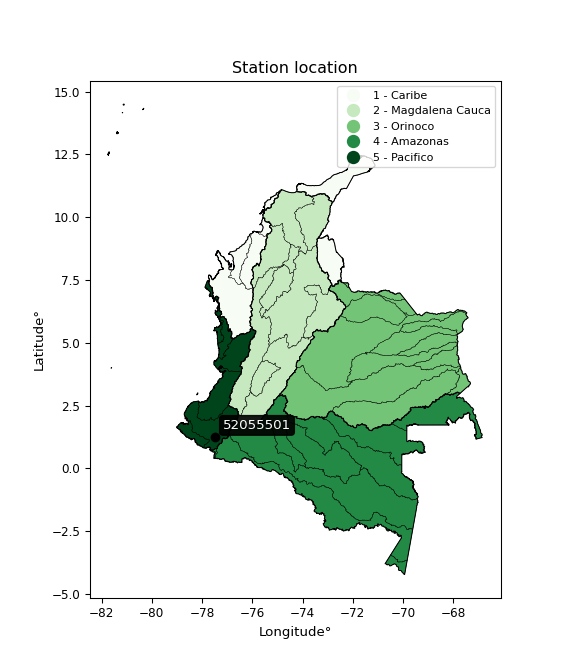

<div align="center">


</div>

# PMP Station (Rain, Pmax24h): 52055501

Probable Maximum Precipitation (PMP) is the greatest amount of rainfall for a specific duration that is meteorologically possible for a given location, acting as a "worst-case" scenario for extreme storms, crucial for designing safety-critical infrastructure like bridges, river deviations, dams, spillways, and nuclear plants to prevent catastrophic failure. PMP is calculated by hydrologists using meteorological data to determine the upper limit of extreme rainfall, often leading to the Probable Maximum Flood (PMF) for flood control design, and is increasingly being studied for climate change impacts. Probable Maximum Precipitation (PMP) is the theoretical upper limit of rainfall, a deterministic estimate for extreme events, while probability distributions (like GEV, Gumbel) describe the likelihood and frequency of various precipitation amounts, including rare ones, showing how often events occur, with PMP representing the extreme end of these distributions, used for critical infrastructure design to ensure safety against the worst conceivable weather, unlike standard statistical forecasts which cover typical probabilities.

The most common probability distributions in hydrology, used for analyzing floods, rainfall, and streamflow, include the Normal, Log-Normal, Gumbel, Gamma (including Log-Pearson Type III), and Generalized Extreme Value (GEV) distributions, often chosen based on the data´s skewness and whether modeling extremes or general conditions, with Gumbel and GEV popular for extreme events like floods, while the Normal distribution serves as a baseline, though often requiring transformations for skewed hydrological data. These distributions help in designing water infrastructure, managing water resources, and forecasting hydrologic events.

> Hydrological data often isn´t perfectly normal (it´s skewed), so different distributions are needed for different applications, such as: **Flood Frequency Analysis**: Using Gumbel, GEV, or Log-Pearson Type III for predicting extreme flood magnitudes and their return periods, **Rainfall Analysis**: Normal for annual totals, but Log-Normal, Weibull, or GEV for intensity or extreme daily rainfall, **Streamflow Modeling**: Gamma and Log-Normal for maximum flows, GEV for minimum flows, and Kappa for daily flows.

<div align="center">

</img>

</div>


## A. General information


### 1. General running parameters

• app_version: _v20260108_. • runtime: _2026-01-08 18:05:13.093906_. • Python version: _3.14.0_. • SciPy version: _1.16.3_. • Pandas version: _2.3.3_. • NumPy version: _2.3.5_. • Stations dataset (station_dataset_file): _dataset/pmax24h_in/automatic_colombia_2003_2024.csv_. • Stations catalog (station_catalog_file): _dataset/CNE.xls_. • Minimum year to eval til year_max (date_min): _1900_. • Maximum year to eval since year_min (date_max): _2024_. • Creates, save and include plots into reports (create_plot): _False_. • Plot only fit distributions with Δo > Δ (plot_only_fit): _True_. • Plot only simple graphs avoiding multiple CDFs and multiple Extreme values plots (plot_only_simple): _False_. • Eval low extreme values, if False, evaluates high extreme values (low_extreme): _False_. • Eval every SciPy distribution as logarithmic (pdist_logarithmic_on): _True_. • Standard deviation normalized (ddof): _1.0_. • Return periods to eval in years (Tr): _[2, 2.33, 5, 10, 15, 20, 25, 50, 75, 100, 200, 250, 500, 750, 1000]_. • Minimum data sample per station, 0 means any (minimum_sample): _5_. • Z-Score maximum threshold to adjust a value, 0 means disable (zscore_max): _3.5_. • Z-Score minimum threshold to adjust a value, 0 means disable (zscore_min): _-2.5_. • Avoid zeros, e.g. rain = 0 (avoid_zeros): _True_. • Avoid null values (avoid_nans): _True_. 

:file_folder:Table: [dataset.csv](../../dataset/pmax24h_in/automatic_colombia_2003_2024.csv)

> Delta Degrees of Freedom (DDOF): is a parameter used in the formulas for calculating variance and standard deviation. When ddof=0, the divisor is $N$ (the total number of observations) and this is used when your data set is the entire population. When ddof=1, the divisor is $N-1$ and this is used when your data set is a sample drawn from a larger population. Using $N-1$ provides an unbiased estimate of the population variance (known as Bessel´s correction).


### 2. Station info and location

|   id |   CODIGO | NOMBRE                          | CATEGORIA               | TECNOLOGIA                | ESTADO   | FECHA_INSTALACION   |   FECHA_SUSPENSION |   ALTITUD |   LATITUD |   LONGITUD | DEPARTAMENTO   | MUNICIPIO   | AREA_OPERATIVA                      | ENTIDAD                                    | AREA_HIDROGRAFICA   | ZONA_HIDROGRAFICA   | SUBZONA_HIDROGRAFICA   |   CORRIENTE | Catalogo   |   Version |
|-----:|---------:|:--------------------------------|:------------------------|:--------------------------|:---------|:--------------------|-------------------:|----------:|----------:|-----------:|:---------------|:------------|:------------------------------------|:-------------------------------------------|:--------------------|:--------------------|:-----------------------|------------:|:-----------|----------:|
|    0 | 52055501 | OSPINA PEREZ  - AUT  [52055501] | Climatológica Principal | Automática con Telemetría | Activa   | 01/09/2013          |                nan |      1619 |   1.25472 |   -77.4878 | Nariño         | Consacá     | Area Operativa 07 - Nariño-Putumayo | CENTRO NACIONAL DE INVESTIGACIONES DE CAFE | Pacifico            | Patía               | Río Guáitara           |         nan | CNE_OE     |  20251226 |

<div align="center">

Dynamic map: [:earth_americas:Google](http://maps.google.com/maps?q=1.254722222,-77.48777778) [:earth_americas:OSM](https://www.openstreetmap.org/#map=18/1.254722222/-77.48777778&layers=P) [:earth_americas:Bing](https://www.bing.com/maps?cp=1.254722222~-77.48777778&lvl=18) [:earth_americas:Apple](https://maps.apple.com/frame?center=1.254722222%2C-77.48777778&span=0.003%2C0.006)

</div>


<div align="center">

```geojson
{
  "type": "Feature",
  "geometry": {
    "type": "Point", 
    "coordinates": [-77.48777778, 1.254722222]
  }, 
  "properties": {
    "Name": "52055501"
  }
}
```

</div>


### 3. Discrete values table and plot

<div align="center">

|               |           0 |          1 |           2 |            3 |           4 |          5 |         6 |
|:--------------|------------:|-----------:|------------:|-------------:|------------:|-----------:|----------:|
| Date          | 2017        | 2018       | 2019        | 2020         | 2021        | 2022       | 2023      |
| Value         |   42.5      |   65.7     |   49.5      |   52         |   54.9      |   35.4     |   62.6    |
| Value_initial |   42.5      |   65.7     |   49.5      |   52         |   54.9      |   35.4     |   62.6    |
| count         |    7        |    7       |    7        |    7         |    7        |    7       |    7      |
| mean          |   51.8      |   51.8     |   51.8      |   51.8       |   51.8      |   51.8     |   51.8    |
| std           |   10.6477   |   10.6477  |   10.6477   |   10.6477    |   10.6477   |   10.6477  |   10.6477 |
| zscore        |   -0.873429 |    1.30545 |   -0.216009 |    0.0187834 |    0.291143 |   -1.54024 |    1.0143 |


</div>


> The initial value (value_initial) correspond to the initial obtained or null completed value, and value (value) is adjusted only when the initial value is outside the valid range (outlier) definite through the Z-Score value. If Z-Score is active, values out of range or outliers are replaced with the station mean value. A Z-Score (or standard score) measures how many standard deviations a data point is from the mean of a dataset, indicating its relative position; positive scores mean above the mean, negative mean below, and a score of zero is exactly at the mean, allowing for comparison of values from different distributions. It´s calculated using the formula $z=(x–μ)/σ$, where $x$ is the data point, $μ$ is the mean, and $σ$ is the standard deviation, helping identify outliers and understand probability.
>
> <sub>**Note**: In this study, "completing" (filling gaps in) and "extending" (forecasting or lengthening the historical record) rainfall data series are avoided for certain critical analyses because they introduce artificial bias and uncertainty, which can distort the statistics of rare events (extremes), alter day-to-day variability, and compromise the integrity and homogeneity of the original data. Some reasons against Completing/Extending rainfall data are: **Distortion of Extremes and Variability**: The primary issue is that most gap-filling or extension methods rely on averaging or regression with nearby stations, which inherently smooths the data. Rainfall is highly variable in space and time, with a large percentage of zero values and occasional large storms. Infilling methods often underestimate the highest values and overestimate the lowest (zero) values, which severely distorts analyses focused on flood frequency, drought severity, and intensity-duration-frequency (IDF) curves, **Loss of Data Homogeneity**: Infilled or extended data are synthetic estimates, not actual measurements. Combining these estimates with observed data can violate the assumption of data homogeneity, which requires that the data properties do not change over time. Inhomogeneity can lead to incorrect conclusions about long-term trends or changes in climate patterns, **Propagation of Errors**: Errors and biases from the original data (e.g., wind-induced undercatch, instrument errors, site changes) or the data used for imputation can propagate through the analysis, leading to unreliable hydrological models and inaccurate predictions, **Compromised Statistical Integrity**: For statistical analyses, especially those involving the frequency of events, using artificial data can introduce time bias or autocorrelation that doesn´t exist in reality, making it difficult to assess the true probability of events, **Difficulty in Validation**: It is difficult to accurately validate the quality of filled or extended data, especially for past periods where ground-truth measurements are unavailable. The reliability of imputation techniques heavily depends on the density of the surrounding station network and the complexity of the local topography.</sub>


### 4. Active continuous probability distributions from SciPy (43 of 104 available)

A Probability Density Function (PDF) describes the relative likelihood of a continuous random variable falling within a specific range, where the total area under its curve equals 1, and the area over any interval gives the actual probability for that range. Unlike discrete probabilities (like rolling a die), a PDF shows density, not direct probability for a single point (which is zero), with higher points indicating higher likelihood, often visualized as a bell curve for normal distributions.

A log of a probability density function (log-PDF) is simply the logarithm of the PDF´s value, denoted as $log(f(x))$, useful for converting multiplication of probabilities into addition, improving numerical stability with tiny numbers, and connecting to information theory concepts like entropy. Instead of dealing with very small probabilities (e.g., 0.000001), log-PDFs use negative numbers (e.g., $log(0.00001) ≈ -11.51$ that are easier for computers to handle, preventing underflow errors and simplifying complex calculations. In this study, each active probability distribution from SciPy is also evaluated in the $log$ form.

[scipy.stats](https://docs.scipy.org/doc/scipy/reference/stats.html) is a Python´s powerful submodule within the SciPy library for comprehensive statistical analysis, offering over 130 probability distributions (like Normal, Poisson), functions for descriptive stats (mean, variance), hypothesis testing (t-tests, chi-square), random variable generation, and statistical tests, making it essential for data science, modeling, and research. It provides tools to explore, model, and draw conclusions from data efficiently, working seamlessly with NumPy.

<div align="center">

|   id | p_dist             |   n_parameter | fit_method   | label                                                                       | active   | ref                                                                                                        |
|-----:|:-------------------|--------------:|:-------------|:----------------------------------------------------------------------------|:---------|:-----------------------------------------------------------------------------------------------------------|
|    0 | alpha              |             3 | MLE          | Alpha                                                                       | True     | [:mortar_board:](https://docs.scipy.org/doc/scipy/reference/generated/scipy.stats.alpha.html)              |
|    1 | betaprime          |             4 | MLE          | Beta prime                                                                  | True     | [:mortar_board:](https://docs.scipy.org/doc/scipy/reference/generated/scipy.stats.betaprime.html)          |
|    2 | chi2               |             3 | MLE          | Chi²                                                                        | True     | [:mortar_board:](https://docs.scipy.org/doc/scipy/reference/generated/scipy.stats.chi2.html)               |
|    3 | crystalball        |             4 | MLE          | Crystalball                                                                 | True     | [:mortar_board:](https://docs.scipy.org/doc/scipy/reference/generated/scipy.stats.crystalball.html)        |
|    4 | erlang             |             3 | MLE          | Erlang                                                                      | True     | [:mortar_board:](https://docs.scipy.org/doc/scipy/reference/generated/scipy.stats.erlang.html)             |
|    5 | expon              |             2 | MLE          | Exponential                                                                 | True     | [:mortar_board:](https://docs.scipy.org/doc/scipy/reference/generated/scipy.stats.expon.html)              |
|    6 | exponnorm          |             3 | MLE          | Exponentially modified Normal                                               | True     | [:mortar_board:](https://docs.scipy.org/doc/scipy/reference/generated/scipy.stats.exponnorm.html)          |
|    7 | f                  |             4 | MLE          | F                                                                           | True     | [:mortar_board:](https://docs.scipy.org/doc/scipy/reference/generated/scipy.stats.f.html)                  |
|    8 | fatiguelife        |             3 | MLE          | Fatigue-life (Birnbaum-Saunders)                                            | True     | [:mortar_board:](https://docs.scipy.org/doc/scipy/reference/generated/scipy.stats.fatiguelife.html)        |
|    9 | fisk               |             3 | MLE          | Fisk                                                                        | True     | [:mortar_board:](https://docs.scipy.org/doc/scipy/reference/generated/scipy.stats.fisk.html)               |
|   10 | gamma              |             3 | MLE          | Gamma                                                                       | True     | [:mortar_board:](https://docs.scipy.org/doc/scipy/reference/generated/scipy.stats.gamma.html)              |
|   11 | genexpon           |             5 | MLE          | Generalized exponential                                                     | True     | [:mortar_board:](https://docs.scipy.org/doc/scipy/reference/generated/scipy.stats.genexpon.html)           |
|   12 | genlogistic        |             3 | MLE          | Generalized logistic                                                        | True     | [:mortar_board:](https://docs.scipy.org/doc/scipy/reference/generated/scipy.stats.genlogistic.html)        |
|   13 | gibrat             |             2 | MM           | Gibrat                                                                      | True     | [:mortar_board:](https://docs.scipy.org/doc/scipy/reference/generated/scipy.stats.gibrat.html)             |
|   14 | gompertz           |             3 | MLE          | Gompertz (or truncated Gumbel)                                              | True     | [:mortar_board:](https://docs.scipy.org/doc/scipy/reference/generated/scipy.stats.gompertz.html)           |
|   15 | gumbel_l           |             2 | MM           | Gumbel Left Skew                                                            | True     | [:mortar_board:](https://docs.scipy.org/doc/scipy/reference/generated/scipy.stats.gumbel_l.html)           |
|   16 | gumbel_r           |             2 | MM           | Gumbel Right Skew                                                           | True     | [:mortar_board:](https://docs.scipy.org/doc/scipy/reference/generated/scipy.stats.gumbel_r.html)           |
|   17 | halflogistic       |             2 | MM           | Half-logistic                                                               | True     | [:mortar_board:](https://docs.scipy.org/doc/scipy/reference/generated/scipy.stats.halflogistic.html)       |
|   18 | halfnorm           |             2 | MM           | Half Normal                                                                 | True     | [:mortar_board:](https://docs.scipy.org/doc/scipy/reference/generated/scipy.stats.halfnorm.html)           |
|   19 | hypsecant          |             2 | MM           | hyperbolic secant                                                           | True     | [:mortar_board:](https://docs.scipy.org/doc/scipy/reference/generated/scipy.stats.hypsecant.html)          |
|   20 | invgamma           |             3 | MLE          | Inverted gamma                                                              | True     | [:mortar_board:](https://docs.scipy.org/doc/scipy/reference/generated/scipy.stats.invgamma.html)           |
|   21 | invgauss           |             3 | MLE          | Inverse Gaussian                                                            | True     | [:mortar_board:](https://docs.scipy.org/doc/scipy/reference/generated/scipy.stats.invgauss.html)           |
|   22 | invweibull         |             3 | MLE          | Inverted Weibull                                                            | True     | [:mortar_board:](https://docs.scipy.org/doc/scipy/reference/generated/scipy.stats.invweibull.html)         |
|   23 | kstwobign          |             2 | MLE          | Limiting distribution of scaled Kolmogorov-Smirnov two-sided test statistic | True     | [:mortar_board:](https://docs.scipy.org/doc/scipy/reference/generated/scipy.stats.kstwobign.html)          |
|   24 | laplace            |             2 | MM           | Laplace                                                                     | True     | [:mortar_board:](https://docs.scipy.org/doc/scipy/reference/generated/scipy.stats.laplace.html)            |
|   25 | laplace_asymmetric |             3 | MLE          | Asymmetric Laplace                                                          | True     | [:mortar_board:](https://docs.scipy.org/doc/scipy/reference/generated/scipy.stats.laplace_asymmetric.html) |
|   26 | loggamma           |             3 | MLE          | Log gamma                                                                   | True     | [:mortar_board:](https://docs.scipy.org/doc/scipy/reference/generated/scipy.stats.loggamma.html)           |
|   27 | logistic           |             2 | MM           | Logistic (or Sech-squared)                                                  | True     | [:mortar_board:](https://docs.scipy.org/doc/scipy/reference/generated/scipy.stats.logistic.html)           |
|   28 | lognorm            |             3 | MLE          | Log Normal                                                                  | True     | [:mortar_board:](https://docs.scipy.org/doc/scipy/reference/generated/scipy.stats.lognorm.html)            |
|   29 | maxwell            |             2 | MM           | Maxwell                                                                     | True     | [:mortar_board:](https://docs.scipy.org/doc/scipy/reference/generated/scipy.stats.maxwell.html)            |
|   30 | mielke             |             4 | MLE          | Mielke Beta-Kappa / Dagum                                                   | True     | [:mortar_board:](https://docs.scipy.org/doc/scipy/reference/generated/scipy.stats.mielke.html)             |
|   31 | moyal              |             2 | MM           | Moyal                                                                       | True     | [:mortar_board:](https://docs.scipy.org/doc/scipy/reference/generated/scipy.stats.moyal.html)              |
|   32 | nakagami           |             3 | MLE          | Nakagami                                                                    | True     | [:mortar_board:](https://docs.scipy.org/doc/scipy/reference/generated/scipy.stats.nakagami.html)           |
|   33 | ncf                |             5 | MLE          | Non-central F distribution                                                  | True     | [:mortar_board:](https://docs.scipy.org/doc/scipy/reference/generated/scipy.stats.ncf.html)                |
|   34 | nct                |             4 | MLE          | Non-central Student’s t                                                     | True     | [:mortar_board:](https://docs.scipy.org/doc/scipy/reference/generated/scipy.stats.nct.html)                |
|   35 | norm               |             2 | MM           | Normal                                                                      | True     | [:mortar_board:](https://docs.scipy.org/doc/scipy/reference/generated/scipy.stats.norm.html)               |
|   36 | pearson3           |             3 | MM           | Pearson type III                                                            | True     | [:mortar_board:](https://docs.scipy.org/doc/scipy/reference/generated/scipy.stats.pearson3.html)           |
|   37 | rayleigh           |             2 | MM           | Rayleigh                                                                    | True     | [:mortar_board:](https://docs.scipy.org/doc/scipy/reference/generated/scipy.stats.rayleigh.html)           |
|   38 | rice               |             3 | MLE          | Rice                                                                        | True     | [:mortar_board:](https://docs.scipy.org/doc/scipy/reference/generated/scipy.stats.rice.html)               |
|   39 | t                  |             3 | MLE          | Student’s t                                                                 | True     | [:mortar_board:](https://docs.scipy.org/doc/scipy/reference/generated/scipy.stats.t.html)                  |
|   40 | truncnorm          |             4 | MLE          | Truncated normal                                                            | True     | [:mortar_board:](https://docs.scipy.org/doc/scipy/reference/generated/scipy.stats.truncnorm.html)          |
|   41 | wald               |             2 | MM           | Wald                                                                        | True     | [:mortar_board:](https://docs.scipy.org/doc/scipy/reference/generated/scipy.stats.wald.html)               |
|   42 | weibull_min        |             3 | MLE          | Weibull minimum                                                             | True     | [:mortar_board:](https://docs.scipy.org/doc/scipy/reference/generated/scipy.stats.weibull_min.html)        |

</div>

> **n_parameter:** # arguments & localization & scale.
>
> **Fit methods:** (MLE) maximum likelihood, (MM) L-moments.
>
>**Inactive** (With the only purpose of prevent loops, zero divisions, infinite values, over high estimated values or horizontal trending for recurrence intervals estimations, the follow distributions were disabled.)**:** foldnorm, gennorm, norminvgauss, powernorm, powerlognorm, skewnorm, genextreme, anglit, arcsine, argus, beta, bradford, burr, burr12, cauchy, cosine, halfcauchy, foldcauchy, skewcauchy, wrapcauchy, dgamma, gengamma, exponweib, exponpow, truncexpon, gausshyper, genhalflogistic, genhyperbolic, geninvgauss, halfgennorm, johnsonsb, johnsonsu, kappa4, kappa3, ksone, kstwo, loglaplace, levy, levy_l, levy_stable, ncx2, pareto, genpareto, truncpareto, lomax, powerlaw, rdist, rel_breitwigner, recipinvgauss, semicircular, studentized_range, trapezoid, triang, truncweibull_min, tukeylambda, uniform, loguniform, vonmises, vonmises_line, weibull_max, dweibull, 


## B. Probability (PDF) vs. Empirical (EDF) distributions functions

A continuous probability distribution (CPD) describes probabilities for variables that can take any value within a range (like rain any time), unlike discrete variables with specific outcomes (like temperature). It uses a Probability Density Function (PDF), a curve where the total area under it equals 1, and the probability of the variable falling within an interval (a to b) is found by calculating the area under the curve between those points. A key feature is that the probability of hitting any single exact value is zero, so probabilities are always expressed for ranges, e.g., $P(a ≤ X ≤ b)$.

<div align="center">

Distributions parameters from station values
|    |   station | p_dist                |   n |             loc |            scale | shape                  | shape1             | shape2              | shape3   |
|---:|----------:|:----------------------|----:|----------------:|-----------------:|:-----------------------|:-------------------|:--------------------|:---------|
|  0 |  52055501 | alpha                 |   7 |  -142.255       |   3753.78        | 19.38383342644258      |                    |                     |          |
|  1 |  52055501 | betaprime             |   7 |    -0.401858    |     26.5647      | 73.36050400082777      | 38.45834278074922  |                     |          |
|  2 |  52055501 | chi2                  |   7 |    35.4         |      7.19059     | 1.820543371167103      |                    |                     |          |
|  3 |  52055501 | crystalball           |   7 |    51.8         |      9.85784     | 16762.916149192388     | 167.48029405526336 |                     |          |
|  4 |  52055501 | erlang                |   7 |  -144.711       |      0.501133    | 392.10300460322173     |                    |                     |          |
|  5 |  52055501 | expon                 |   7 |    35.4         |     16.4         |                        |                    |                     |          |
|  6 |  52055501 | exponnorm             |   7 |    51.7892      |      9.85785     | 0.0010976833515541852  |                    |                     |          |
|  7 |  52055501 | f                     |   7 | -1055.8         |   1107.63        | 29288.25838567203      | 173583.91697401673 |                     |          |
|  8 |  52055501 | fatiguelife           |   7 |    35.4         |      9.17227e-05 | 404.8613336850465      |                    |                     |          |
|  9 |  52055501 | fisk                  |   7 |    -2.35742e+08 |      2.35742e+08 | 40086330.204493776     |                    |                     |          |
| 10 |  52055501 | gamma                 |   7 |  -138.677       |      0.521046    | 365.4942523626163      |                    |                     |          |
| 11 |  52055501 | genexpon              |   7 |    35.4         |      2.49758     | 0.0373729541539526     | 2.2098935053319453 | 0.01088457337142592 |          |
| 12 |  52055501 | genlogistic           |   7 |    53.792       |      5.46189     | 0.8230059952157769     |                    |                     |          |
| 13 |  52055501 | gibrat                |   7 |    44.2797      |      4.56127     |                        |                    |                     |          |
| 14 |  52055501 | gompertz              |   7 |    49.1235      |      1.59078     | 0.0001307694529216864  |                    |                     |          |
| 15 |  52055501 | gumbel_l              |   7 |    56.2366      |      7.68613     |                        |                    |                     |          |
| 16 |  52055501 | gumbel_r              |   7 |    47.3634      |      7.68613     |                        |                    |                     |          |
| 17 |  52055501 | halflogistic          |   7 |    40.1161      |      8.42813     |                        |                    |                     |          |
| 18 |  52055501 | halfnorm              |   7 |    38.752       |     16.3532      |                        |                    |                     |          |
| 19 |  52055501 | hypsecant             |   7 |    51.8         |      6.2757      |                        |                    |                     |          |
| 20 |  52055501 | invgamma              |   7 |   -82.9406      |  24482.2         | 182.72960532114752     |                    |                     |          |
| 21 |  52055501 | invgauss              |   7 |    -4.69787     |   1633.93        | 0.034582026569731084   |                    |                     |          |
| 22 |  52055501 | invweibull            |   7 |    -6.65377e+08 |      6.65377e+08 | 70556906.75484426      |                    |                     |          |
| 23 |  52055501 | kstwobign             |   7 |    13.7655      |     43.4505      |                        |                    |                     |          |
| 24 |  52055501 | laplace               |   7 |    51.8         |      6.97055     |                        |                    |                     |          |
| 25 |  52055501 | laplace_asymmetric    |   7 |    52           |      7.96923     | 1.0126409019529516     |                    |                     |          |
| 26 |  52055501 | loggamma              |   7 |    11.9811      |     23.3388      | 6.000039036496247      |                    |                     |          |
| 27 |  52055501 | logistic              |   7 |    51.8         |      5.43492     |                        |                    |                     |          |
| 28 |  52055501 | lognorm               |   7 |    35.4         |      0.109584    | 12.405105453097251     |                    |                     |          |
| 29 |  52055501 | maxwell               |   7 |    28.441       |     14.6381      |                        |                    |                     |          |
| 30 |  52055501 | mielke                |   7 |    35.3985      |     30.302       | 0.7992332042031101     | 63048.21505885879  |                     |          |
| 31 |  52055501 | moyal                 |   7 |    46.1627      |      4.43759     |                        |                    |                     |          |
| 32 |  52055501 | nakagami              |   7 |    42.5         |     14.2915      | 0.33184411377586076    |                    |                     |          |
| 33 |  52055501 | ncf                   |   7 |   -51.55        |     90.726       | 152.0759290180958      | 24784.94840612456  | 21.14473743243696   |          |
| 34 |  52055501 | nct                   |   7 |  -202.349       |      9.83707     | 30017.583030540212     | 25.83362786251263  |                     |          |
| 35 |  52055501 | norm                  |   7 |    51.8         |      9.85785     |                        |                    |                     |          |
| 36 |  52055501 | pearson3              |   7 |    51.8         |      9.85782     | -0.186724173587493     |                    |                     |          |
| 37 |  52055501 | rayleigh              |   7 |    32.9414      |     15.047       |                        |                    |                     |          |
| 38 |  52055501 | rice                  |   7 |    30.1983      |     11.2107      | 1.5767425789429539     |                    |                     |          |
| 39 |  52055501 | t                     |   7 |    51.7998      |      9.85781     | 21643075.873684876     |                    |                     |          |
| 40 |  52055501 | truncnorm             |   7 |    51.8         |      9.85785     | -125.28478933161398    | 819.7081187019455  |                     |          |
| 41 |  52055501 | wald                  |   7 |    41.9422      |      9.85784     |                        |                    |                     |          |
| 42 |  52055501 | weibull_min           |   7 |    18.6627      |     36.7297      | 3.8906721361474794     |                    |                     |          |
| 43 |  52055501 | logalpha              |   7 |    -4.11357     |    318.795       | 39.67679552524049      |                    |                     |          |
| 44 |  52055501 | logbetaprime          |   7 |    -1.37037     |     12.8501      | 338.7939287934745      | 821.7737824058499  |                     |          |
| 45 |  52055501 | logchi2               |   7 |     3.56671     |      0.963394    | 1.0528495561860116     |                    |                     |          |
| 46 |  52055501 | logcrystalball        |   7 |     3.92812     |      0.19975     | 6.3251993975815175     | 259.79163720962964 |                     |          |
| 47 |  52055501 | logerlang             |   7 |     0.527267    |      0.0122995   | 276.5137332858501      |                    |                     |          |
| 48 |  52055501 | logexpon              |   7 |     3.56671     |      0.361404    |                        |                    |                     |          |
| 49 |  52055501 | logexponnorm          |   7 |     3.92797     |      0.199748    | 0.0007180510888550744  |                    |                     |          |
| 50 |  52055501 | logf                  |   7 |  -108.174       |    112.101       | 3169515.6490860786     | 778777.2117089548  |                     |          |
| 51 |  52055501 | logfatiguelife        |   7 |   -45.5623      |     49.4888      | 0.004031266571608166   |                    |                     |          |
| 52 |  52055501 | logfisk               |   7 |    -6.99629e+06 |      6.99629e+06 | 59639509.627629906     |                    |                     |          |
| 53 |  52055501 | loggamma              |   7 |     0.353644    |      0.0114443   | 312.1338439178262      |                    |                     |          |
| 54 |  52055501 | loggenexpon           |   7 |     3.56671     | 141388           | 184154.9375585113      | 1298638.0841365966 | 116254.54011869984  |          |
| 55 |  52055501 | loggenlogistic        |   7 |     4.18513     |      1.26038e-06 | 4.918438499572186e-06  |                    |                     |          |
| 56 |  52055501 | loggibrat             |   7 |     3.77574     |      0.0924244   |                        |                    |                     |          |
| 57 |  52055501 | loggompertz           |   7 |     3.56671     |      0.208937    | 0.13871684441789345    |                    |                     |          |
| 58 |  52055501 | loggumbel_l           |   7 |     4.01801     |      0.155744    |                        |                    |                     |          |
| 59 |  52055501 | loggumbel_r           |   7 |     3.83822     |      0.155744    |                        |                    |                     |          |
| 60 |  52055501 | loghalflogistic       |   7 |     3.69135     |      0.170793    |                        |                    |                     |          |
| 61 |  52055501 | loghalfnorm           |   7 |     3.66373     |      0.331357    |                        |                    |                     |          |
| 62 |  52055501 | loghypsecant          |   7 |     3.92812     |      0.127164    |                        |                    |                     |          |
| 63 |  52055501 | loginvgamma           |   7 |     0.613787    |    862.257       | 261.53004438609355     |                    |                     |          |
| 64 |  52055501 | loginvgauss           |   7 |     2.1015      |    135.482       | 0.013500313971424954   |                    |                     |          |
| 65 |  52055501 | loginvweibull         |   7 |    -1.30202e+07 |      1.30202e+07 | 63114707.94729204      |                    |                     |          |
| 66 |  52055501 | logkstwobign          |   7 |     3.10757     |      0.937189    |                        |                    |                     |          |
| 67 |  52055501 | loglaplace            |   7 |     3.92812     |      0.141244    |                        |                    |                     |          |
| 68 |  52055501 | loglaplace_asymmetric |   7 |     3.95124     |      0.157172    | 1.076306363588659      |                    |                     |          |
| 69 |  52055501 | logloggamma           |   7 |     4.18511     |      1.18171e-06 | 4.6076063131571425e-06 |                    |                     |          |
| 70 |  52055501 | loglogistic           |   7 |     3.92812     |      0.110128    |                        |                    |                     |          |
| 71 |  52055501 | loglognorm            |   7 |     3.56671     |      0.00287379  | 12.048402302859715     |                    |                     |          |
| 72 |  52055501 | logmaxwell            |   7 |     3.45479     |      0.296611    |                        |                    |                     |          |
| 73 |  52055501 | logmielke             |   7 |     3.56671     |      0.619284    | 0.9394024731489802     | 2377.389634292494  |                     |          |
| 74 |  52055501 | logmoyal              |   7 |     3.81389     |      0.0899188   |                        |                    |                     |          |
| 75 |  52055501 | lognakagami           |   7 |   -46.7266      |     50.6551      | 16062.824939318347     |                    |                     |          |
| 76 |  52055501 | logncf                |   7 |     1.38879     |      1.89203     | 345.9388878230551      | 1822.2171888694206 | 117.41577381609378  |          |
| 77 |  52055501 | lognct                |   7 |    -3.91323     |      0.0791233   | 860.0299816241591      | 99.00206388868213  |                     |          |
| 78 |  52055501 | lognorm               |   7 |     3.92812     |      0.199749    |                        |                    |                     |          |
| 79 |  52055501 | logpearson3           |   7 |     3.92812     |      0.199749    | -0.47303394232607876   |                    |                     |          |
| 80 |  52055501 | lograyleigh           |   7 |     3.54598     |      0.304897    |                        |                    |                     |          |
| 81 |  52055501 | logrice               |   7 |     3.447       |      0.219486    | 1.9061288257567948     |                    |                     |          |
| 82 |  52055501 | logt                  |   7 |     3.92811     |      0.19975     | 1194970534.9437375     |                    |                     |          |
| 83 |  52055501 | logtruncnorm          |   7 |    -0.062115    |      1.03082     | 3.5203141680128205     | 4.120211817899207  |                     |          |
| 84 |  52055501 | logwald               |   7 |     3.7284      |      0.199719    |                        |                    |                     |          |
| 85 |  52055501 | logweibull_min        |   7 |    -1.15035     |      5.17032     | 31.413801736719513     |                    |                     |          |

</div>

> **loc** (Location parameter): This shifts the distribution along the x-axis. For many common distributions, like the normal (Gaussian) distribution, loc represents the mean $μ$. For others, like the uniform distribution, it might represent the minimum value, or for the beta distribution, the left end of the support interval.
>
> **scale** (Scale parameter): This determines the width or spread of the distribution. For the normal distribution, scale represents the standard deviation $σ$. For a uniform distribution, it defines the length of the interval (from $loc$ to $loc + scale$).
>
> **shape** (Shape parameters): Refers to parameters that define the specific form of a probability distribution, distinct from its location (loc) and scale (scale). These parameters are required arguments for most distribution functions. For example, a normal (Gaussian) distribution is fully defined by its location (mean) and scale (standard deviation), so it has no specific shape parameters beyond loc and scale. However, other distributions have intrinsic properties that need specification, as Gamma distribution that takes a shape parameter, often named $a$ or $alpha$.


### 0. Cumulative distribution values - CDF (86 evaluated)

Cumulative Distribution Function (CDF), denoted as $F$<sub>$X$</sub>$(x)$, is a function that gives the probability that a random variable $X$ will take a value less than or equal to a specific value, $x$ (i.e., $(P(X≥x)$. It essentially "accumulates" probabilities from a given point up to the far right (positive infinity), providing a complete picture of the distribution´s probabilities for both discrete (like rain) and continuous (like temperature) variables, helping to find probabilities over ranges or above certain values. Each station is evaluated separately ordering the $x$ values ascending, calculating the CDF and PDF values for the activated distributions and their logarithmic forms.

<div align="center">

CDF ordered by x ascending and calculating $log(f(x))$ separately
|   id |   Station |   date |    x |   count |   mean |     std |     zscore |   Value_initial |   station |   m |     alpha |   alpha_pdf |   betaprime |   betaprime_pdf |        chi2 |   chi2_pdf |   crystalball |   crystalball_pdf |    erlang |   erlang_pdf |    expon |   expon_pdf |   exponnorm |   exponnorm_pdf |         f |     f_pdf |   fatiguelife |   fatiguelife_pdf |      fisk |   fisk_pdf |     gamma |   gamma_pdf |    genexpon |   genexpon_pdf |   genlogistic |   genlogistic_pdf |   gibrat |   gibrat_pdf |    gompertz |   gompertz_pdf |   gumbel_l |   gumbel_l_pdf |   gumbel_r |   gumbel_r_pdf |   halflogistic |   halflogistic_pdf |   halfnorm |   halfnorm_pdf |   hypsecant |   hypsecant_pdf |   invgamma |   invgamma_pdf |   invgauss |   invgauss_pdf |   invweibull |   invweibull_pdf |   kstwobign |   kstwobign_pdf |   laplace |   laplace_pdf |   laplace_asymmetric |   laplace_asymmetric_pdf |   loggamma |   loggamma_pdf |   logistic |   logistic_pdf |   lognorm |   lognorm_pdf |   maxwell |   maxwell_pdf |      mielke |   mielke_pdf |       moyal |   moyal_pdf |    nakagami |   nakagami_pdf |       ncf |   ncf_pdf |       nct |   nct_pdf |      norm |   norm_pdf |   pearson3 |   pearson3_pdf |   rayleigh |   rayleigh_pdf |      rice |   rice_pdf |        t |     t_pdf |   truncnorm |   truncnorm_pdf |        wald |   wald_pdf |   weibull_min |   weibull_min_pdf |   logalpha |   logalpha_pdf |   logbetaprime |   logbetaprime_pdf |     logchi2 |   logchi2_pdf |   logcrystalball |   logcrystalball_pdf |   logerlang |   logerlang_pdf |   logexpon |   logexpon_pdf |   logexponnorm |   logexponnorm_pdf |      logf |   logf_pdf |   logfatiguelife |   logfatiguelife_pdf |   logfisk |   logfisk_pdf |   loggenexpon |   loggenexpon_pdf |   loggenlogistic |   loggenlogistic_pdf |   loggibrat |   loggibrat_pdf |   loggompertz |   loggompertz_pdf |   loggumbel_l |   loggumbel_l_pdf |   loggumbel_r |   loggumbel_r_pdf |   loghalflogistic |   loghalflogistic_pdf |   loghalfnorm |   loghalfnorm_pdf |   loghypsecant |   loghypsecant_pdf |   loginvgamma |   loginvgamma_pdf |   loginvgauss |   loginvgauss_pdf |   loginvweibull |   loginvweibull_pdf |   logkstwobign |   logkstwobign_pdf |   loglaplace |   loglaplace_pdf |   loglaplace_asymmetric |   loglaplace_asymmetric_pdf |   logloggamma |   logloggamma_pdf |   loglogistic |   loglogistic_pdf |   loglognorm |   loglognorm_pdf |   logmaxwell |   logmaxwell_pdf |   logmielke |   logmielke_pdf |    logmoyal |   logmoyal_pdf |   lognakagami |   lognakagami_pdf |    logncf |   logncf_pdf |    lognct |   lognct_pdf |   logpearson3 |   logpearson3_pdf |   lograyleigh |   lograyleigh_pdf |   logrice |   logrice_pdf |      logt |   logt_pdf |   logtruncnorm |   logtruncnorm_pdf |    logwald |   logwald_pdf |   logweibull_min |   logweibull_min_pdf |
|-----:|----------:|-------:|-----:|--------:|-------:|--------:|-----------:|----------------:|----------:|----:|----------:|------------:|------------:|----------------:|------------:|-----------:|--------------:|------------------:|----------:|-------------:|---------:|------------:|------------:|----------------:|----------:|----------:|--------------:|------------------:|----------:|-----------:|----------:|------------:|------------:|---------------:|--------------:|------------------:|---------:|-------------:|------------:|---------------:|-----------:|---------------:|-----------:|---------------:|---------------:|-------------------:|-----------:|---------------:|------------:|----------------:|-----------:|---------------:|-----------:|---------------:|-------------:|-----------------:|------------:|----------------:|----------:|--------------:|---------------------:|-------------------------:|-----------:|---------------:|-----------:|---------------:|----------:|--------------:|----------:|--------------:|------------:|-------------:|------------:|------------:|------------:|---------------:|----------:|----------:|----------:|----------:|----------:|-----------:|-----------:|---------------:|-----------:|---------------:|----------:|-----------:|---------:|----------:|------------:|----------------:|------------:|-----------:|--------------:|------------------:|-----------:|---------------:|---------------:|-------------------:|------------:|--------------:|-----------------:|---------------------:|------------:|----------------:|-----------:|---------------:|---------------:|-------------------:|----------:|-----------:|-----------------:|---------------------:|----------:|--------------:|--------------:|------------------:|-----------------:|---------------------:|------------:|----------------:|--------------:|------------------:|--------------:|------------------:|--------------:|------------------:|------------------:|----------------------:|--------------:|------------------:|---------------:|-------------------:|--------------:|------------------:|--------------:|------------------:|----------------:|--------------------:|---------------:|-------------------:|-------------:|-----------------:|------------------------:|----------------------------:|--------------:|------------------:|--------------:|------------------:|-------------:|-----------------:|-------------:|-----------------:|------------:|----------------:|------------:|---------------:|--------------:|------------------:|----------:|-------------:|----------:|-------------:|--------------:|------------------:|--------------:|------------------:|----------:|--------------:|----------:|-----------:|---------------:|-------------------:|-----------:|--------------:|-----------------:|---------------------:|
|    0 |  52055501 |   2022 | 35.4 |       7 |   51.8 | 10.6477 | -1.54024   |            35.4 |  52055501 |   1 | 0.0404254 |   0.0103376 |   0.0367704 |       0.0115969 | 1.20927e-14 | 1.54918    |     0.0480911 |         0.010142  | 0.0462446 |    0.0103488 | 0        |  0.0609756  |   0.0480911 |       0.010142  | 0.0476796 | 0.0101495 |     0.0506717 |       4.09616e+08 | 0.0557381 | 0.00894962 | 0.0470091 |   0.0104652 | 5.72644e-07 |      0.0149638 |     0.0608566 |        0.00886432 | 0        |   0          | 0           |    0           |  0.0643137 |     0.00809247 | 0.00871959 |     0.00537981 |       0        |          0         |   0        |      0         |   0.0465782 |      0.00739553 |  0.0411285 |      0.0104964 |  0.0384111 |      0.0113981 |    0.0350963 |        0.0124662 |    0.034735 |       0.0143737 | 0.0475534 |    0.00682204 |            0.0647207 |               0.00801995 |  0.0343645 |       0.404098 |  0.0466404 |     0.00818137 | 0.0352032 |      0.388677 | 0.0267144 |     0.0110028 | 0.000360736 |    0.193212  | 0.000772555 |  0.00106009 | 0           |      0         | 0.0760769 | 0.013605  | 0.0487457 | 0.0102309 | 0.0480913 |  0.010142  |  0.0531215 |     0.00997434 |  0.0132606 |      0.0107151 | 0.0314205 |  0.0122055 | 0.048093 | 0.0101423 |   0.0480913 |       0.010142  | 0           | 0          |     0.0459011 |         0.0104212 |  0.0335188 |       0.403025 |       0.140646 |           0.69331  | 6.60694e-09 |   7.83188e+06 |        0.0352036 |             0.38868  |   0.0348195 |        0.405575 |   0        |       2.76699  |       0.035203 |           0.388677 | 0.0355561 |   0.391907 |        0.0351436 |             0.391466 | 0.0392875 |      0.321747 |   2.03734e-08 |          1.30248  |         0        |             0.34934  |    0        |         0       |   2.05041e-09 |          0.663918 |     0.0536559 |          0.335101 |    0.00329257 |          0.120843 |          0        |              0        |      0        |          0        |      0.0370779 |           0.290915 |     0.0331762 |          0.420207 |     0.0315739 |          0.420264 |       0.0300086 |            0.51004  |      0.0299684 |           0.605718 |     0.038702 |         0.274008 |               0.0552754 |                    0.326754 |     0.0897074 |          0.349778 |     0.0362049 |          0.316852 |   0.00717614 |      3.72278e+12 |    0.0136926 |         0.356669 | 5.78449e-13 |         9.3406  | 7.72335e-05 |     0.00709704 |     0.0351235 |          0.388709 | 0.0339045 |     0.41279  | 0.0360149 |     0.413091 |     0.0467153 |          0.386388 |    0.00230828 |          0.222461 | 0.0255644 |      0.44878  | 0.0352041 |   0.388684 |    3.85571e-06 |           4.00993  | 0          |      0        |        0.0544752 |             0.352718 |
|    1 |  52055501 |   2017 | 42.5 |       7 |   51.8 | 10.6477 | -0.873429  |            42.5 |  52055501 |   2 | 0.17521   |   0.0283693 |   0.194383  |       0.0326545 | 0.435145    | 0.0426379  |     0.172735  |         0.0259335 | 0.175187  |    0.0268468 | 0.351392 |  0.0395493  |   0.172735  |       0.0259335 | 0.17263   | 0.025993  |     0.75402   |       0.0152464   | 0.16487   | 0.0234129  | 0.176746  |   0.0269208 | 0.183266    |      0.0342397 |     0.165376  |        0.0221205  | 0        |   0          | 0           |    0           |  0.154165  |     0.0184252  | 0.152165   |     0.0372742  |       0.140488 |          0.0581543 |   0.181278 |      0.047526  |   0.142228  |      0.0219167  |  0.177565  |      0.0286568 |  0.189153  |      0.0310961 |    0.206448  |        0.0345389 |    0.22572  |       0.0364633 | 0.131686  |    0.0188918  |            0.156005  |               0.0193315  |  0.192772  |       1.40054  |  0.153014  |     0.0238459  | 0.185613  |      1.33907  | 0.179991  |     0.0317023 | 0.313607    |    0.0352947 | 0.130822    |  0.0433813  | 5.41193e-11 |   5055.06      | 0.219271  | 0.026656  | 0.173968  | 0.0259824 | 0.172735  |  0.0259335 |  0.171574  |     0.0244081  |  0.182719  |      0.0345038 | 0.179976  |  0.029395  | 0.17274  | 0.0259341 |   0.172735  |       0.0259335 | 6.95569e-05 | 0.00115548 |     0.169716  |         0.0252045 |  0.193113  |       1.4132   |       0.302018 |           1.04972  | 0.315786    |   0.854291    |        0.185614  |             1.33907  |   0.192268  |        1.38545  |   0.396967 |       1.66858  |       0.185613 |           1.33908  | 0.186609  |   1.34101  |        0.187051  |             1.35199  | 0.16266   |      1.16105  |   0.301041    |          1.80627  |         0        |             0.712917 |    0        |         0       |   0.176345    |          1.31163  |     0.163345  |          0.958059 |    0.170745   |          1.93784  |          0.168634 |              2.84427  |      0.204252 |          2.3286   |      0.153242  |           1.15906  |     0.200926  |          1.47222  |     0.200164  |          1.46731  |       0.235621  |            1.65103  |      0.263891  |           1.75086  |     0.141182 |         0.999559 |               0.162859  |                    0.962719 |     0.182962  |          0.713388 |     0.164948  |          1.25074  |   0.634829   |      0.170697    |    0.195658  |         1.62105  | 0.31782     |         1.63333 | 0.152583    |     2.28141    |     0.185665  |          1.34027  | 0.196502  |     1.42926  | 0.194631  |     1.38857  |     0.179945  |          1.15509  |    0.19971    |          1.75206  | 0.194235  |      1.433    | 0.185615  |   1.33908  |    0.54281     |           2.11448  | 0.00544797 |      1.32141  |        0.168834  |             0.985421 |
|    2 |  52055501 |   2019 | 49.5 |       7 |   51.8 | 10.6477 | -0.216009  |            49.5 |  52055501 |   3 | 0.423839  |   0.0399829 |   0.461102  |       0.0399357 | 0.664089    | 0.0246416  |     0.407758  |         0.0393829 | 0.415179  |    0.0395955 | 0.576735 |  0.0258089  |   0.407757  |       0.0393828 | 0.407667  | 0.0392955 |     0.833582  |       0.00857199  | 0.393619  | 0.0405865  | 0.416615  |   0.0394816 | 0.443769    |      0.0376555 |     0.384512  |        0.0397999  | 0.553673 |   0.0757292  | 3.49142e-05 |    0.000104149 |  0.340488  |     0.035717   | 0.468924   |     0.0462031  |       0.505525 |          0.0441643 |   0.488973 |      0.0393131 |   0.385869  |      0.0474954  |  0.428114  |      0.0402045 |  0.447179  |      0.0394133 |    0.471881  |        0.0375803 |    0.491866 |       0.0364482 | 0.359476  |    0.0515707  |            0.371408  |               0.0460234  |  0.460489  |       1.97203  |  0.395754  |     0.0439993  | 0.447935  |      1.98018  | 0.441933  |     0.0400806 | 0.542613    |    0.0307538 | 0.492347    |  0.0487633  | 0.474091    |      0.042331  | 0.437099  | 0.0338755 | 0.408818  | 0.0392807 | 0.407758  |  0.0393829 |  0.396385  |     0.0385303  |  0.454202  |      0.0399168 | 0.427407  |  0.039113  | 0.407766 | 0.0393832 |   0.407758  |       0.0393829 | 0.556116    | 0.0581816  |     0.397368  |         0.0385067 |  0.462044  |       1.97053  |       0.473912 |           1.1684   | 0.423275    |   0.592227    |        0.447936  |             1.98018  |   0.45672   |        1.94895  |   0.604523 |       1.09428  |       0.447937 |           1.98019  | 0.448596  |   1.97368  |        0.451049  |             1.9856   | 0.416088  |      2.07109  |   0.56161     |          1.54112  |         0        |             1.29252  |    0.622392 |         3.01035 |   0.423928    |          1.9031   |     0.377928  |          1.89604  |    0.514748   |          2.19484  |          0.548767 |              2.04591  |      0.527852 |          1.85948  |      0.435017  |           2.45116  |     0.474575  |          1.95962  |     0.468999  |          1.90451  |       0.501417  |            1.67788  |      0.531095  |           1.62732  |     0.415514 |         2.94182  |               0.401088  |                    2.37099  |     0.331547  |          1.29274  |     0.44093   |          2.23841  |   0.653583   |      0.0913514   |    0.482277  |         1.96236  | 0.561879    |         1.57439 | 0.540047    |     2.25325    |     0.448079  |          1.97972  | 0.465725  |     1.95582  | 0.458922  |     1.94421  |     0.417499  |          1.91212  |    0.494198   |          1.93691  | 0.461276  |      1.94097  | 0.447938  |   1.98018  |    0.790353    |           1.2104   | 0.610311   |      2.44124  |        0.383827  |             1.85516  |
|    3 |  52055501 |   2020 | 52   |       7 |   51.8 | 10.6477 |  0.0187834 |            52   |  52055501 |   4 | 0.523864  |   0.0396147 |   0.558465  |       0.0376077 | 0.720225    | 0.0204085  |     0.508093  |         0.0404612 | 0.515381  |    0.0401408 | 0.63658  |  0.0221598  |   0.508092  |       0.0404611 | 0.507695  | 0.0403049 |     0.853317  |       0.0072699   | 0.498246  | 0.0425104  | 0.516467  |   0.0399788 | 0.535645    |      0.0356225 |     0.48846   |        0.0427844  | 0.700642 |   0.0449927  | 0.000666637 |    0.000501074 |  0.438004  |     0.0421351  | 0.578661   |     0.0411845  |       0.60754  |          0.037428  |   0.582126 |      0.035142  |   0.510142  |      0.0506953  |  0.528603  |      0.0397607 |  0.544097  |      0.0377662 |    0.562066  |        0.0343387 |    0.579007 |       0.033113  | 0.514142  |    0.0697015  |            0.50628   |               0.0627364  |  0.557419  |       1.94325  |  0.509199  |     0.0459833  | 0.546089  |      1.98387  | 0.540802  |     0.0386662 | 0.618218    |    0.0297624 | 0.604435    |  0.0407237  | 0.571336    |      0.0357231 | 0.521887  | 0.0337001 | 0.508845  | 0.0403204 | 0.508093  |  0.0404612 |  0.495679  |     0.0405086  |  0.551634  |      0.0377419 | 0.525377  |  0.0389067 | 0.508103 | 0.0404613 |   0.508093  |       0.0404612 | 0.676074    | 0.0392605  |     0.496355  |         0.0403153 |  0.558709  |       1.93417  |       0.531322 |           1.15798  | 0.451152    |   0.54098     |        0.546089  |             1.98387  |   0.552611  |        1.92474  |   0.654926 |       0.954817 |       0.546091 |           1.98388  | 0.546382  |   1.97572  |        0.549326  |             1.98339  | 0.520277  |      2.12761  |   0.633853    |          1.38851  |         0        |             1.56654  |    0.739334 |         1.85059 |   0.520536    |          2.00519  |     0.478656  |          2.18034  |    0.616327   |          1.91525  |          0.641582 |              1.72247  |      0.614432 |          1.65257  |      0.557576  |           2.4623   |     0.569988  |          1.89536  |     0.561575  |          1.83715  |       0.580623  |            1.53013  |      0.60757   |           1.47258  |     0.575521 |         3.00529  |               0.536701  |                    3.17264  |     0.401771  |          1.56655  |     0.552311  |          2.24525  |   0.657773   |      0.0792839   |    0.576733  |         1.857    | 0.639122    |         1.56136 | 0.641288    |     1.85446    |     0.546189  |          1.98261  | 0.561447  |     1.91131  | 0.554542  |     1.9186   |     0.515051  |          2.02999  |    0.586602   |          1.80216  | 0.556596  |      1.91077  | 0.546091  |   1.98387  |    0.844812    |           1.00602  | 0.710553   |      1.68463  |        0.481507  |             2.09705  |
|    4 |  52055501 |   2021 | 54.9 |       7 |   51.8 | 10.6477 |  0.291143  |            54.9 |  52055501 |   5 | 0.634613  |   0.0363122 |   0.661026  |       0.0328515 | 0.773441    | 0.0164422  |     0.623418  |         0.0385172 | 0.628979  |    0.0376833 | 0.695482 |  0.0185682  |   0.623417  |       0.0385171 | 0.622493  | 0.0383203 |     0.872619  |       0.00609087  | 0.619189  | 0.0400952  | 0.62956   |   0.0375048 | 0.633808    |      0.0318773 |     0.611884  |        0.0414399  | 0.80099  |   0.0262825  | 0.00479539  |    0.00308907  |  0.568457  |     0.0471842  | 0.687215   |     0.0335383  |       0.704941 |          0.029844  |   0.676578 |      0.0299644 |   0.651205  |      0.0451052  |  0.639623  |      0.0363516 |  0.648092  |      0.0336388 |    0.654676  |        0.0294083 |    0.668444 |       0.0284935 | 0.679501  |    0.045979   |            0.658459  |               0.0433992  |  0.659177  |       1.78726  |  0.638852  |     0.0424514  | 0.650797  |      1.85278  | 0.647769  |     0.034767  | 0.703112    |    0.0288158 | 0.708674    |  0.0313255  | 0.665586    |      0.0294595 | 0.617145  | 0.0317001 | 0.623735  | 0.0383648 | 0.623418  |  0.0385171 |  0.612713  |     0.0396142  |  0.655213  |      0.0334391 | 0.634792  |  0.0361322 | 0.623427 | 0.038517  |   0.623418  |       0.0385171 | 0.76884     | 0.0258622  |     0.612809  |         0.0394444 |  0.6598    |       1.7724   |       0.593251 |           1.11985  | 0.4792      |   0.494079    |        0.650798  |             1.85277  |   0.653581  |        1.77722  |   0.70304  |       0.821684 |       0.6508   |           1.85278  | 0.650638  |   1.84456  |        0.653836  |             1.84616  | 0.632689  |      1.98103  |   0.70433     |          1.20764  |         0        |             1.93604  |    0.818779 |         1.14683 |   0.63        |          2.00634  |     0.602625  |          2.35468  |    0.710646   |          1.5586   |          0.725771 |              1.38547  |      0.697676 |          1.41455  |      0.682776  |           2.10169  |     0.66837   |          1.71373  |     0.656995  |          1.66488  |       0.658428  |            1.33381  |      0.682386  |           1.28298  |     0.710939 |         2.04653  |               0.680507  |                    2.18787  |     0.496451  |          1.93571  |     0.668808  |          2.01134  |   0.661789   |      0.0691655   |    0.672347  |         1.65445  | 0.723511    |         1.54892 | 0.730443    |     1.44051    |     0.650812  |          1.85097  | 0.661176  |     1.74612  | 0.655158  |     1.77045  |     0.625678  |          2.02024  |    0.678825   |          1.58763  | 0.656798  |      1.76384  | 0.650799  |   1.85277  |    0.894154    |           0.81844  | 0.786581   |      1.15778  |        0.599815  |             2.23303  |
|    5 |  52055501 |   2023 | 62.6 |       7 |   51.8 | 10.6477 |  1.0143    |            62.6 |  52055501 |   6 | 0.855372  |   0.0203523 |   0.854842  |       0.0176934 | 0.87007     | 0.00934244 |     0.863367  |         0.022207  | 0.861552  |    0.0214794 | 0.809583 |  0.0116108  |   0.863366  |       0.0222071 | 0.861373  | 0.0221788 |     0.910695  |       0.00399207  | 0.857593  | 0.0207669  | 0.861118  |   0.0214177 | 0.831146    |      0.0192275 |     0.86104   |        0.0215663  | 0.917797 |   0.00828291 | 0.464518    |    0.210291    |  0.898585  |     0.0301961  | 0.87132    |     0.0156152  |       0.870189 |          0.0144024 |   0.855244 |      0.0168477 |   0.8873    |      0.0175852  |  0.859643  |      0.0201459 |  0.85023   |      0.018757  |    0.829257  |        0.0164636 |    0.840182 |       0.0165104 | 0.89381   |    0.0152341  |            0.871614  |               0.0163138  |  0.851374  |       1.10309  |  0.879441  |     0.019508   | 0.851886  |      1.15743  | 0.858069  |     0.0194989 | 0.917346    |    0.0269534 | 0.875313    |  0.0139341  | 0.840207    |      0.0166762 | 0.821977  | 0.0206717 | 0.86286   | 0.0221658 | 0.863367  |  0.022207  |  0.865188  |     0.0236471  |  0.856662  |      0.0187764 | 0.858575  |  0.020987  | 0.863373 | 0.0222064 |   0.863367  |       0.022207  | 0.895433    | 0.0100184  |     0.865737  |         0.0238727 |  0.850032  |       1.09184  |       0.729336 |           0.935794 | 0.538043    |   0.407748    |        0.851886  |             1.15743  |   0.845991  |        1.11503  |   0.793474 |       0.571454 |       0.851888 |           1.15743  | 0.850979  |   1.15519  |        0.853526  |             1.14538  | 0.84059   |      1.14226  |   0.834429    |          0.784712 |         0        |             3.23115  |    0.913491 |         0.43673 |   0.86258     |          1.3966   |     0.882766  |          1.61355  |    0.863242   |          0.815112 |          0.862743 |              0.748491 |      0.846584 |          0.869179 |      0.878117  |           0.935219 |     0.850783  |          1.04327  |     0.836298  |          1.04752  |       0.801567  |            0.859432 |      0.820852  |           0.837869 |     0.885865 |         0.808069 |               0.869949  |                    0.890585 |     0.828196  |          3.22922  |     0.869281  |          1.03182  |   0.669695   |      0.0527476   |    0.848012  |         1.01155  | 0.925136    |         1.52455 | 0.868108    |     0.726678   |     0.851684  |          1.15638  | 0.848576  |     1.07856  | 0.846739  |     1.1097   |     0.856542  |          1.36978  |    0.846986   |          0.972412 | 0.848155  |      1.1119   | 0.851887  |   1.15743  |    0.978395    |           0.491205 | 0.890266   |      0.523162 |        0.866986  |             1.5943   |
|    6 |  52055501 |   2018 | 65.7 |       7 |   51.8 | 10.6477 |  1.30545   |            65.7 |  52055501 |   7 | 0.90872   |   0.0142444 |   0.901727  |       0.0127324 | 0.895999    | 0.00745827 |     0.920737  |         0.0149758 | 0.917321  |    0.0146746 | 0.842379 |  0.00961105 |   0.920736  |       0.0149759 | 0.918818  | 0.015048  |     0.922142  |       0.00341183  | 0.91073   | 0.0138247  | 0.916786  |   0.0146681 | 0.883295    |      0.0145201 |     0.915647  |        0.01401    | 0.939036 |   0.00563098 | 0.98754     |    0.034348    |  0.967466  |     0.0144995  | 0.91208    |     0.0109205  |       0.908308 |          0.0103805 |   0.900621 |      0.012551  |   0.930777  |      0.0109435  |  0.912279  |      0.0139981 |  0.900032  |      0.0135361 |    0.873915  |        0.0124894 |    0.885172 |       0.0126278 | 0.931932  |    0.00976506 |            0.913415  |               0.0110022  |  0.898217  |       0.839152 |  0.928078  |     0.0122815  | 0.900871  |      0.872996 | 0.909498  |     0.0138388 | 0.999983    |    0.0192943 | 0.911891    |  0.00988715 | 0.885683    |      0.0127772 | 0.878331  | 0.0157445 | 0.920184  | 0.0149846 | 0.920737  |  0.0149758 |  0.925866  |     0.0156424  |  0.906505  |      0.0135273 | 0.913602  |  0.0146569 | 0.920741 | 0.0149753 |   0.920737  |       0.0149758 | 0.921768    | 0.0071606  |     0.927044  |         0.0157978 |  0.896458  |       0.833246 |       0.772443 |           0.846774 | 0.557132    |   0.382612    |        0.90087   |             0.872995 |   0.893529  |        0.855541 |   0.819328 |       0.499918 |       0.900873 |           0.872987 | 0.899921  |   0.873375 |        0.901961  |             0.862523 | 0.888414  |      0.845069 |   0.869042    |          0.649995 |         0.999874 |             3.90186  |    0.931652 |         0.32201 |   0.920928    |          1.01278  |     0.946261  |          1.00879  |    0.897785   |          0.621553 |          0.894794 |              0.583581 |      0.884382 |          0.698319 |      0.916112  |           0.652074 |     0.895236  |          0.800508 |     0.881405  |          0.822501 |       0.839468  |            0.71207  |      0.857874  |           0.696689 |     0.918941 |         0.573896 |               0.906595  |                    0.639632 |     0.999952  |          3.89885  |     0.911614  |          0.731641 |   0.672138   |      0.0484797   |    0.89138   |         0.787015 | 0.998627    |         1.47013 | 0.898999    |     0.558612   |     0.900635  |          0.872648 | 0.894541  |     0.827397 | 0.894045  |     0.851251 |     0.913942  |          1.00361  |    0.888859   |          0.764093 | 0.89558   |      0.853603 | 0.900871  |   0.872991 |    1           |           0.405358 | 0.912477   |      0.402209 |        0.93177   |             1.07857  |


</div>

An Empirical Distribution Function (EDF) is a step-function estimate of a true cumulative distribution function (CDF) based on observed sample data, representing the proportion of data points less than or equal to a given value. It is calculated by ordering your data and jumping up by $1/n$ (where $n$ is sample size) at each unique data point, allowing analysis without assuming an underlying population distribution, and it gets closer to the true CDF as the sample size grows. For the empirical probability calculations, the parameter $m$ correspond to the order number which means the position of the $x$ values in an ascending order list.

The Kolmogorov-Smirnov (K-S) test is a non-parametric statistical test used to determine if a sample data set comes from a specific theoretical distribution (one-sample) or if two different samples come from the same underlying distribution (two-sample), by comparing their cumulative distribution functions (CDFs). It calculates the maximum vertical difference (D statistic) between these functions, with a small p-value indicating a significant difference and rejection of the null hypothesis (that the data/samples match).


### 1. EDF California (1923)

California´s estimates the true probability distribution of water-related data (like rainfall, streamflow) using observed samples, crucial for risk assessment.

<div align="center">


$P=m/n$


</div>


**1.1. Empirical values**

<div align="center">

|                | 0                   | 1                  | 2                   | 3                  | 4                  | 5                  | 6              |
|:---------------|:--------------------|:-------------------|:--------------------|:-------------------|:-------------------|:-------------------|:---------------|
| date           | 2022                | 2017               | 2019                | 2020               | 2021               | 2023               | 2018           |
| x              | 35.4                | 42.5               | 49.5                | 52.0               | 54.9               | 62.6               | 65.7           |
| m              | 1                   | 2                  | 3                   | 4                  | 5                  | 6                  | 7              |
| empirical_dist | edf_california      | edf_california     | edf_california      | edf_california     | edf_california     | edf_california     | edf_california |
| empirical      | 0.14285714285714285 | 0.2857142857142857 | 0.42857142857142855 | 0.5714285714285714 | 0.7142857142857143 | 0.8571428571428571 | 1.0            |
| empirical_tr   | 1.1666666666666665  | 1.4                | 1.75                | 2.333333333333333  | 3.5                | 6.999999999999997  | inf            |

</div>


**1.2. Kolmogorov-Smirnov fit test (sorted by Δ)**


<div align="center">

|                | 0                   | 1                   | 2                   | 3                   | 4                   | 5                   | 6                   | 7                   | 8                   | 9                   | 10                  | 11                  | 12                  | 13                  | 14                  | 15                  | 16                  | 17                  | 18                  | 19                  | 20                  | 21                  | 22                  | 23                  | 24                  | 25                  | 26                  | 27                  | 28                  | 29                  | 30                  | 31                  | 32                  | 33                  | 34                  | 35                  | 36                  | 37                  | 38                  | 39                  | 40                  | 41                  | 42                    | 43                  | 44                  | 45                  | 46                  | 47                  | 48                  | 49                  | 50                  | 51                  | 52                  | 53                  | 54                  | 55                  | 56                  | 57                  | 58                  | 59                  | 60                  | 61                  | 62                  | 63                  | 64                  | 65                  | 66                  | 67                  | 68                  | 69                  | 70                  | 71                  | 72                  | 73                  | 74                  | 75                  | 76                  | 77                  | 78                  | 79                  | 80                  | 81                  | 82                  | 83                  | 84                  | 85                  |
|:---------------|:--------------------|:--------------------|:--------------------|:--------------------|:--------------------|:--------------------|:--------------------|:--------------------|:--------------------|:--------------------|:--------------------|:--------------------|:--------------------|:--------------------|:--------------------|:--------------------|:--------------------|:--------------------|:--------------------|:--------------------|:--------------------|:--------------------|:--------------------|:--------------------|:--------------------|:--------------------|:--------------------|:--------------------|:--------------------|:--------------------|:--------------------|:--------------------|:--------------------|:--------------------|:--------------------|:--------------------|:--------------------|:--------------------|:--------------------|:--------------------|:--------------------|:--------------------|:----------------------|:--------------------|:--------------------|:--------------------|:--------------------|:--------------------|:--------------------|:--------------------|:--------------------|:--------------------|:--------------------|:--------------------|:--------------------|:--------------------|:--------------------|:--------------------|:--------------------|:--------------------|:--------------------|:--------------------|:--------------------|:--------------------|:--------------------|:--------------------|:--------------------|:--------------------|:--------------------|:--------------------|:--------------------|:--------------------|:--------------------|:--------------------|:--------------------|:--------------------|:--------------------|:--------------------|:--------------------|:--------------------|:--------------------|:--------------------|:--------------------|:--------------------|:--------------------|:--------------------|
| station        | 52055501            | 52055501            | 52055501            | 52055501            | 52055501            | 52055501            | 52055501            | 52055501            | 52055501            | 52055501            | 52055501            | 52055501            | 52055501            | 52055501            | 52055501            | 52055501            | 52055501            | 52055501            | 52055501            | 52055501            | 52055501            | 52055501            | 52055501            | 52055501            | 52055501            | 52055501            | 52055501            | 52055501            | 52055501            | 52055501            | 52055501            | 52055501            | 52055501            | 52055501            | 52055501            | 52055501            | 52055501            | 52055501            | 52055501            | 52055501            | 52055501            | 52055501            | 52055501              | 52055501            | 52055501            | 52055501            | 52055501            | 52055501            | 52055501            | 52055501            | 52055501            | 52055501            | 52055501            | 52055501            | 52055501            | 52055501            | 52055501            | 52055501            | 52055501            | 52055501            | 52055501            | 52055501            | 52055501            | 52055501            | 52055501            | 52055501            | 52055501            | 52055501            | 52055501            | 52055501            | 52055501            | 52055501            | 52055501            | 52055501            | 52055501            | 52055501            | 52055501            | 52055501            | 52055501            | 52055501            | 52055501            | 52055501            | 52055501            | 52055501            | 52055501            | 52055501            |
| empirical_dist | edf_california      | edf_california      | edf_california      | edf_california      | edf_california      | edf_california      | edf_california      | edf_california      | edf_california      | edf_california      | edf_california      | edf_california      | edf_california      | edf_california      | edf_california      | edf_california      | edf_california      | edf_california      | edf_california      | edf_california      | edf_california      | edf_california      | edf_california      | edf_california      | edf_california      | edf_california      | edf_california      | edf_california      | edf_california      | edf_california      | edf_california      | edf_california      | edf_california      | edf_california      | edf_california      | edf_california      | edf_california      | edf_california      | edf_california      | edf_california      | edf_california      | edf_california      | edf_california        | edf_california      | edf_california      | edf_california      | edf_california      | edf_california      | edf_california      | edf_california      | edf_california      | edf_california      | edf_california      | edf_california      | edf_california      | edf_california      | edf_california      | edf_california      | edf_california      | edf_california      | edf_california      | edf_california      | edf_california      | edf_california      | edf_california      | edf_california      | edf_california      | edf_california      | edf_california      | edf_california      | edf_california      | edf_california      | edf_california      | edf_california      | edf_california      | edf_california      | edf_california      | edf_california      | edf_california      | edf_california      | edf_california      | edf_california      | edf_california      | edf_california      | edf_california      | edf_california      |
| p_dist         | invgauss            | logpearson3         | betaprime           | lognct              | logf                | logt                | logcrystalball      | lognorm             | lognorm             | logexponnorm        | logfatiguelife      | lognakagami         | logerlang           | invgamma            | loggamma            | loggamma            | logncf              | gamma               | logalpha            | loginvgamma         | alpha               | erlang              | rice                | nct                 | t                   | truncnorm           | norm                | crystalball         | exponnorm           | f                   | pearson3            | kstwobign           | weibull_min         | maxwell             | logweibull_min      | logrice             | loginvgauss         | genlogistic         | loglogistic         | fisk                | ncf                 | loggumbel_l         | loglaplace_asymmetric | logfisk             | invweibull          | logmaxwell          | rayleigh            | laplace_asymmetric  | loghypsecant        | logistic            | gumbel_r            | loggumbel_r         | lograyleigh         | logkstwobign        | mielke              | logmoyal            | genexpon            | loggenexpon         | loggompertz         | logmielke           | loghalflogistic     | loghalfnorm         | halfnorm            | hypsecant           | loglaplace          | halflogistic        | gumbel_l            | laplace             | moyal               | expon               | loginvweibull       | logexpon            | logloggamma         | logbetaprime        | chi2                | logwald             | wald                | nakagami            | loggibrat           | gibrat              | loglognorm          | logtruncnorm        | logchi2             | fatiguelife         | gompertz            | loggenlogistic      |
| delta          | 0.10444605504940618 | 0.10576975414498307 | 0.10608675926362142 | 0.10684220157111725 | 0.10730102566565891 | 0.10765308454890485 | 0.10765353098789773 | 0.10765390659961074 | 0.10765390659961074 | 0.10765413185616013 | 0.10771350029801716 | 0.10773360594550799 | 0.10803766832120182 | 0.1081489798763349  | 0.10849263788032387 | 0.10849263788032387 | 0.10895265076725491 | 0.10896816507307011 | 0.10933833066313911 | 0.10968094799750373 | 0.11050417768077331 | 0.11052765063211989 | 0.11143659596737919 | 0.11174583944935298 | 0.11297387028165062 | 0.11297888263249567 | 0.11297889839352754 | 0.11297912336128679 | 0.11297946169428102 | 0.1130844855027574  | 0.11413982467343059 | 0.11482790433253331 | 0.11599840052791088 | 0.11614271298031079 | 0.11688050077363055 | 0.11729271224703233 | 0.11859529844746286 | 0.1203387569690322  | 0.1207658616737192  | 0.1208443801424331  | 0.12166892167124499 | 0.12236934548185652 | 0.12285569714588448   | 0.12305394116764182 | 0.12608542538338152 | 0.12916449678147446 | 0.12959656726480293 | 0.1297094639732707  | 0.13247197010602801 | 0.13270071716455062 | 0.13413754822710583 | 0.13956457740808428 | 0.140548858419542   | 0.14212578189225278 | 0.1424964064373799  | 0.14277990935305834 | 0.1428565702135149  | 0.14285712248372512 | 0.14285714080673223 | 0.1428571428565644  | 0.14285714285714285 | 0.14285714285714285 | 0.14285714285714285 | 0.14348618165251323 | 0.14453246901697123 | 0.14522609145046492 | 0.1458288571500418  | 0.15402784842751194 | 0.15489231397347442 | 0.15762113966715707 | 0.160531998890739   | 0.1806724776012527  | 0.21783465288222642 | 0.22755662304635504 | 0.23551788608891439 | 0.28026631547423136 | 0.2856447288228189  | 0.2857142856601664  | 0.2857142857142857  | 0.2857142857142857  | 0.3491143225790788  | 0.3617820677594645  | 0.44286816922767347 | 0.4683052295487088  | 0.709490328096956   | 0.8571428571428571  |
| deltao         | 0.48442053926100004 | 0.48442053926100004 | 0.48442053926100004 | 0.48442053926100004 | 0.48442053926100004 | 0.48442053926100004 | 0.48442053926100004 | 0.48442053926100004 | 0.48442053926100004 | 0.48442053926100004 | 0.48442053926100004 | 0.48442053926100004 | 0.48442053926100004 | 0.48442053926100004 | 0.48442053926100004 | 0.48442053926100004 | 0.48442053926100004 | 0.48442053926100004 | 0.48442053926100004 | 0.48442053926100004 | 0.48442053926100004 | 0.48442053926100004 | 0.48442053926100004 | 0.48442053926100004 | 0.48442053926100004 | 0.48442053926100004 | 0.48442053926100004 | 0.48442053926100004 | 0.48442053926100004 | 0.48442053926100004 | 0.48442053926100004 | 0.48442053926100004 | 0.48442053926100004 | 0.48442053926100004 | 0.48442053926100004 | 0.48442053926100004 | 0.48442053926100004 | 0.48442053926100004 | 0.48442053926100004 | 0.48442053926100004 | 0.48442053926100004 | 0.48442053926100004 | 0.48442053926100004   | 0.48442053926100004 | 0.48442053926100004 | 0.48442053926100004 | 0.48442053926100004 | 0.48442053926100004 | 0.48442053926100004 | 0.48442053926100004 | 0.48442053926100004 | 0.48442053926100004 | 0.48442053926100004 | 0.48442053926100004 | 0.48442053926100004 | 0.48442053926100004 | 0.48442053926100004 | 0.48442053926100004 | 0.48442053926100004 | 0.48442053926100004 | 0.48442053926100004 | 0.48442053926100004 | 0.48442053926100004 | 0.48442053926100004 | 0.48442053926100004 | 0.48442053926100004 | 0.48442053926100004 | 0.48442053926100004 | 0.48442053926100004 | 0.48442053926100004 | 0.48442053926100004 | 0.48442053926100004 | 0.48442053926100004 | 0.48442053926100004 | 0.48442053926100004 | 0.48442053926100004 | 0.48442053926100004 | 0.48442053926100004 | 0.48442053926100004 | 0.48442053926100004 | 0.48442053926100004 | 0.48442053926100004 | 0.48442053926100004 | 0.48442053926100004 | 0.48442053926100004 | 0.48442053926100004 |
| eval           | Δo > Δ              | Δo > Δ              | Δo > Δ              | Δo > Δ              | Δo > Δ              | Δo > Δ              | Δo > Δ              | Δo > Δ              | Δo > Δ              | Δo > Δ              | Δo > Δ              | Δo > Δ              | Δo > Δ              | Δo > Δ              | Δo > Δ              | Δo > Δ              | Δo > Δ              | Δo > Δ              | Δo > Δ              | Δo > Δ              | Δo > Δ              | Δo > Δ              | Δo > Δ              | Δo > Δ              | Δo > Δ              | Δo > Δ              | Δo > Δ              | Δo > Δ              | Δo > Δ              | Δo > Δ              | Δo > Δ              | Δo > Δ              | Δo > Δ              | Δo > Δ              | Δo > Δ              | Δo > Δ              | Δo > Δ              | Δo > Δ              | Δo > Δ              | Δo > Δ              | Δo > Δ              | Δo > Δ              | Δo > Δ                | Δo > Δ              | Δo > Δ              | Δo > Δ              | Δo > Δ              | Δo > Δ              | Δo > Δ              | Δo > Δ              | Δo > Δ              | Δo > Δ              | Δo > Δ              | Δo > Δ              | Δo > Δ              | Δo > Δ              | Δo > Δ              | Δo > Δ              | Δo > Δ              | Δo > Δ              | Δo > Δ              | Δo > Δ              | Δo > Δ              | Δo > Δ              | Δo > Δ              | Δo > Δ              | Δo > Δ              | Δo > Δ              | Δo > Δ              | Δo > Δ              | Δo > Δ              | Δo > Δ              | Δo > Δ              | Δo > Δ              | Δo > Δ              | Δo > Δ              | Δo > Δ              | Δo > Δ              | Δo > Δ              | Δo > Δ              | Δo > Δ              | Δo > Δ              | Δo > Δ              | Δo > Δ              | Δo <= Δ             | Δo <= Δ             |
| fit            | 1                   | 1                   | 1                   | 1                   | 1                   | 1                   | 1                   | 1                   | 1                   | 1                   | 1                   | 1                   | 1                   | 1                   | 1                   | 1                   | 1                   | 1                   | 1                   | 1                   | 1                   | 1                   | 1                   | 1                   | 1                   | 1                   | 1                   | 1                   | 1                   | 1                   | 1                   | 1                   | 1                   | 1                   | 1                   | 1                   | 1                   | 1                   | 1                   | 1                   | 1                   | 1                   | 1                     | 1                   | 1                   | 1                   | 1                   | 1                   | 1                   | 1                   | 1                   | 1                   | 1                   | 1                   | 1                   | 1                   | 1                   | 1                   | 1                   | 1                   | 1                   | 1                   | 1                   | 1                   | 1                   | 1                   | 1                   | 1                   | 1                   | 1                   | 1                   | 1                   | 1                   | 1                   | 1                   | 1                   | 1                   | 1                   | 1                   | 1                   | 1                   | 1                   | 1                   | 1                   | 0                   | 0                   |
| n              | 7                   | 7                   | 7                   | 7                   | 7                   | 7                   | 7                   | 7                   | 7                   | 7                   | 7                   | 7                   | 7                   | 7                   | 7                   | 7                   | 7                   | 7                   | 7                   | 7                   | 7                   | 7                   | 7                   | 7                   | 7                   | 7                   | 7                   | 7                   | 7                   | 7                   | 7                   | 7                   | 7                   | 7                   | 7                   | 7                   | 7                   | 7                   | 7                   | 7                   | 7                   | 7                   | 7                     | 7                   | 7                   | 7                   | 7                   | 7                   | 7                   | 7                   | 7                   | 7                   | 7                   | 7                   | 7                   | 7                   | 7                   | 7                   | 7                   | 7                   | 7                   | 7                   | 7                   | 7                   | 7                   | 7                   | 7                   | 7                   | 7                   | 7                   | 7                   | 7                   | 7                   | 7                   | 7                   | 7                   | 7                   | 7                   | 7                   | 7                   | 7                   | 7                   | 7                   | 7                   | 7                   | 7                   |
| best_fit       | 1                   | 0                   | 0                   | 0                   | 0                   | 0                   | 0                   | 0                   | 0                   | 0                   | 0                   | 0                   | 0                   | 0                   | 0                   | 0                   | 0                   | 0                   | 0                   | 0                   | 0                   | 0                   | 0                   | 0                   | 0                   | 0                   | 0                   | 0                   | 0                   | 0                   | 0                   | 0                   | 0                   | 0                   | 0                   | 0                   | 0                   | 0                   | 0                   | 0                   | 0                   | 0                   | 0                     | 0                   | 0                   | 0                   | 0                   | 0                   | 0                   | 0                   | 0                   | 0                   | 0                   | 0                   | 0                   | 0                   | 0                   | 0                   | 0                   | 0                   | 0                   | 0                   | 0                   | 0                   | 0                   | 0                   | 0                   | 0                   | 0                   | 0                   | 0                   | 0                   | 0                   | 0                   | 0                   | 0                   | 0                   | 0                   | 0                   | 0                   | 0                   | 0                   | 0                   | 0                   | 0                   | 0                   |
| best_fit_sort  | 1                   | 2                   | 3                   | 4                   | 5                   | 6                   | 7                   | 8                   | 9                   | 10                  | 11                  | 12                  | 13                  | 14                  | 15                  | 16                  | 17                  | 18                  | 19                  | 20                  | 21                  | 22                  | 23                  | 24                  | 25                  | 26                  | 27                  | 28                  | 29                  | 30                  | 31                  | 32                  | 33                  | 34                  | 35                  | 36                  | 37                  | 38                  | 39                  | 40                  | 41                  | 42                  | 43                    | 44                  | 45                  | 46                  | 47                  | 48                  | 49                  | 50                  | 51                  | 52                  | 53                  | 54                  | 55                  | 56                  | 57                  | 58                  | 59                  | 60                  | 61                  | 62                  | 63                  | 64                  | 65                  | 66                  | 67                  | 68                  | 69                  | 70                  | 71                  | 72                  | 73                  | 74                  | 75                  | 76                  | 77                  | 78                  | 79                  | 80                  | 81                  | 82                  | 83                  | 84                  | 85                  | 86                  |

</div>


**1.3. Best fit**

<div align="center">

|   id |   station | empirical_dist   | p_dist   |    delta |   deltao | eval   |   fit |   n |   best_fit |   best_fit_sort |
|-----:|----------:|:-----------------|:---------|---------:|---------:|:-------|------:|----:|-----------:|----------------:|
|    0 |  52055501 | edf_california   | invgauss | 0.104446 | 0.484421 | Δo > Δ |     1 |   7 |          1 |               1 |

</div>


### 2. EDF Hazen (1930)

Hazen method for plotting positions is a formula used to estimate the empirical cumulative probability distribution of flood events or other hydrological data. This formula often results in biased estimations, particularly when extrapolating to extreme events (high return periods).

<div align="center">


$P=(m-0.5)/n$


</div>


**2.1. Empirical values**

<div align="center">

|                | 0                   | 1                   | 2                   | 3         | 4                  | 5                  | 6                  |
|:---------------|:--------------------|:--------------------|:--------------------|:----------|:-------------------|:-------------------|:-------------------|
| date           | 2022                | 2017                | 2019                | 2020      | 2021               | 2023               | 2018               |
| x              | 35.4                | 42.5                | 49.5                | 52.0      | 54.9               | 62.6               | 65.7               |
| m              | 1                   | 2                   | 3                   | 4         | 5                  | 6                  | 7                  |
| empirical_dist | edf_hazen           | edf_hazen           | edf_hazen           | edf_hazen | edf_hazen          | edf_hazen          | edf_hazen          |
| empirical      | 0.07142857142857142 | 0.21428571428571427 | 0.35714285714285715 | 0.5       | 0.6428571428571429 | 0.7857142857142857 | 0.9285714285714286 |
| empirical_tr   | 1.0769230769230769  | 1.2727272727272727  | 1.5555555555555558  | 2.0       | 2.8000000000000003 | 4.666666666666666  | 14.000000000000007 |

</div>


**2.2. Kolmogorov-Smirnov fit test (sorted by Δ)**


<div align="center">

|                | 0                   | 1                   | 2                   | 3                   | 4                   | 5                   | 6                   | 7                   | 8                   | 9                   | 10                  | 11                  | 12                  | 13                  | 14                  | 15                  | 16                  | 17                  | 18                  | 19                  | 20                  | 21                  | 22                    | 23                  | 24                  | 25                  | 26                  | 27                  | 28                  | 29                  | 30                  | 31                  | 32                  | 33                  | 34                  | 35                  | 36                  | 37                  | 38                  | 39                  | 40                  | 41                  | 42                  | 43                  | 44                  | 45                  | 46                  | 47                  | 48                  | 49                  | 50                  | 51                  | 52                  | 53                  | 54                  | 55                  | 56                  | 57                  | 58                  | 59                  | 60                  | 61                  | 62                  | 63                  | 64                  | 65                  | 66                  | 67                  | 68                  | 69                  | 70                  | 71                  | 72                  | 73                  | 74                  | 75                  | 76                  | 77                  | 78                  | 79                  | 80                  | 81                  | 82                  | 83                  | 84                  | 85                  |
|:---------------|:--------------------|:--------------------|:--------------------|:--------------------|:--------------------|:--------------------|:--------------------|:--------------------|:--------------------|:--------------------|:--------------------|:--------------------|:--------------------|:--------------------|:--------------------|:--------------------|:--------------------|:--------------------|:--------------------|:--------------------|:--------------------|:--------------------|:----------------------|:--------------------|:--------------------|:--------------------|:--------------------|:--------------------|:--------------------|:--------------------|:--------------------|:--------------------|:--------------------|:--------------------|:--------------------|:--------------------|:--------------------|:--------------------|:--------------------|:--------------------|:--------------------|:--------------------|:--------------------|:--------------------|:--------------------|:--------------------|:--------------------|:--------------------|:--------------------|:--------------------|:--------------------|:--------------------|:--------------------|:--------------------|:--------------------|:--------------------|:--------------------|:--------------------|:--------------------|:--------------------|:--------------------|:--------------------|:--------------------|:--------------------|:--------------------|:--------------------|:--------------------|:--------------------|:--------------------|:--------------------|:--------------------|:--------------------|:--------------------|:--------------------|:--------------------|:--------------------|:--------------------|:--------------------|:--------------------|:--------------------|:--------------------|:--------------------|:--------------------|:--------------------|:--------------------|:--------------------|
| station        | 52055501            | 52055501            | 52055501            | 52055501            | 52055501            | 52055501            | 52055501            | 52055501            | 52055501            | 52055501            | 52055501            | 52055501            | 52055501            | 52055501            | 52055501            | 52055501            | 52055501            | 52055501            | 52055501            | 52055501            | 52055501            | 52055501            | 52055501              | 52055501            | 52055501            | 52055501            | 52055501            | 52055501            | 52055501            | 52055501            | 52055501            | 52055501            | 52055501            | 52055501            | 52055501            | 52055501            | 52055501            | 52055501            | 52055501            | 52055501            | 52055501            | 52055501            | 52055501            | 52055501            | 52055501            | 52055501            | 52055501            | 52055501            | 52055501            | 52055501            | 52055501            | 52055501            | 52055501            | 52055501            | 52055501            | 52055501            | 52055501            | 52055501            | 52055501            | 52055501            | 52055501            | 52055501            | 52055501            | 52055501            | 52055501            | 52055501            | 52055501            | 52055501            | 52055501            | 52055501            | 52055501            | 52055501            | 52055501            | 52055501            | 52055501            | 52055501            | 52055501            | 52055501            | 52055501            | 52055501            | 52055501            | 52055501            | 52055501            | 52055501            | 52055501            | 52055501            |
| empirical_dist | edf_hazen           | edf_hazen           | edf_hazen           | edf_hazen           | edf_hazen           | edf_hazen           | edf_hazen           | edf_hazen           | edf_hazen           | edf_hazen           | edf_hazen           | edf_hazen           | edf_hazen           | edf_hazen           | edf_hazen           | edf_hazen           | edf_hazen           | edf_hazen           | edf_hazen           | edf_hazen           | edf_hazen           | edf_hazen           | edf_hazen             | edf_hazen           | edf_hazen           | edf_hazen           | edf_hazen           | edf_hazen           | edf_hazen           | edf_hazen           | edf_hazen           | edf_hazen           | edf_hazen           | edf_hazen           | edf_hazen           | edf_hazen           | edf_hazen           | edf_hazen           | edf_hazen           | edf_hazen           | edf_hazen           | edf_hazen           | edf_hazen           | edf_hazen           | edf_hazen           | edf_hazen           | edf_hazen           | edf_hazen           | edf_hazen           | edf_hazen           | edf_hazen           | edf_hazen           | edf_hazen           | edf_hazen           | edf_hazen           | edf_hazen           | edf_hazen           | edf_hazen           | edf_hazen           | edf_hazen           | edf_hazen           | edf_hazen           | edf_hazen           | edf_hazen           | edf_hazen           | edf_hazen           | edf_hazen           | edf_hazen           | edf_hazen           | edf_hazen           | edf_hazen           | edf_hazen           | edf_hazen           | edf_hazen           | edf_hazen           | edf_hazen           | edf_hazen           | edf_hazen           | edf_hazen           | edf_hazen           | edf_hazen           | edf_hazen           | edf_hazen           | edf_hazen           | edf_hazen           | edf_hazen           |
| p_dist         | logfisk             | alpha               | logpearson3         | fisk                | rice                | invgamma            | genlogistic         | gamma               | f                   | erlang              | loggompertz         | nct                 | exponnorm           | norm                | crystalball         | truncnorm           | t                   | pearson3            | ncf                 | weibull_min         | logweibull_min      | loglogistic         | loglaplace_asymmetric | maxwell             | laplace_asymmetric  | genexpon            | invgauss            | lognorm             | lognorm             | logcrystalball      | logexponnorm        | logt                | lognakagami         | logf                | loghypsecant        | logistic            | logfatiguelife      | loggumbel_l         | rayleigh            | logerlang           | loglaplace          | hypsecant           | lognct              | loggamma            | loggamma            | betaprime           | logrice             | logalpha            | laplace             | logncf              | gumbel_r            | loginvgauss         | gumbel_l            | invweibull          | loginvgamma         | logmaxwell          | halfnorm            | kstwobign           | moyal               | lograyleigh         | loginvweibull       | logloggamma         | halflogistic        | logbetaprime        | loggumbel_r         | loghalfnorm         | logkstwobign        | logmoyal            | mielke              | loghalflogistic     | loggenexpon         | logmielke           | wald                | nakagami            | gibrat              | expon               | logexpon            | logwald             | loggibrat           | chi2                | logchi2             | loglognorm          | logtruncnorm        | fatiguelife         | gompertz            | loggenlogistic      |
| delta          | 0.05894476611668226 | 0.06965746050880883 | 0.07082734754701259 | 0.07187913288304104 | 0.07286041314126268 | 0.0739286984330152  | 0.07532579170236098 | 0.07540366770306006 | 0.0756591119073281  | 0.0758375391241577  | 0.07686555378719362 | 0.07714574133775876 | 0.07765205702942413 | 0.07765307816121936 | 0.07765310771680511 | 0.07765313537775942 | 0.07765901846801093 | 0.07947382724481189 | 0.07995569981376666 | 0.08002279052145989 | 0.08127175919577667 | 0.08378716482078452 | 0.08423433218786791   | 0.08478975597963301 | 0.08590015288527075 | 0.08662577343040806 | 0.09003595131299269 | 0.09079260851994336 | 0.09079260851994336 | 0.09079326078624111 | 0.09079445881066411 | 0.09079508947961562 | 0.09093603058429545 | 0.09145278602845691 | 0.09240258751521757 | 0.09372714827175621 | 0.09390633140246851 | 0.09705216353489121 | 0.09705895647983959 | 0.09957703522080574 | 0.10015076752718233 | 0.10158613648369264 | 0.10177949509363493 | 0.10334632327329674 | 0.10334632327329674 | 0.103958920794338   | 0.10413333526873053 | 0.10490141606861819 | 0.10809543452783765 | 0.10858172712526043 | 0.11178073234581798 | 0.11185646331776922 | 0.11287093413657434 | 0.11473797314628931 | 0.1174320354382698  | 0.1251339955910893  | 0.13183019805823798 | 0.1347227385253486  | 0.13520424494413835 | 0.13705534689408266 | 0.1442745375381808  | 0.14640608145365502 | 0.14838176835545608 | 0.15612805161778365 | 0.15760539243535038 | 0.1707090358771462  | 0.17395223723936887 | 0.18290407191227004 | 0.18546996869111826 | 0.1916245134443953  | 0.20446751000153734 | 0.20473606375898606 | 0.21421615739424746 | 0.21428571423159493 | 0.21428571428571427 | 0.21959183768777307 | 0.2473801185544176  | 0.2531684816868229  | 0.26524894163699525 | 0.3069464575174858  | 0.3714395977991021  | 0.4205428940076502  | 0.4332106391880359  | 0.5397338009772802  | 0.6380617566683846  | 0.7857142857142857  |
| deltao         | 0.48442053926100004 | 0.48442053926100004 | 0.48442053926100004 | 0.48442053926100004 | 0.48442053926100004 | 0.48442053926100004 | 0.48442053926100004 | 0.48442053926100004 | 0.48442053926100004 | 0.48442053926100004 | 0.48442053926100004 | 0.48442053926100004 | 0.48442053926100004 | 0.48442053926100004 | 0.48442053926100004 | 0.48442053926100004 | 0.48442053926100004 | 0.48442053926100004 | 0.48442053926100004 | 0.48442053926100004 | 0.48442053926100004 | 0.48442053926100004 | 0.48442053926100004   | 0.48442053926100004 | 0.48442053926100004 | 0.48442053926100004 | 0.48442053926100004 | 0.48442053926100004 | 0.48442053926100004 | 0.48442053926100004 | 0.48442053926100004 | 0.48442053926100004 | 0.48442053926100004 | 0.48442053926100004 | 0.48442053926100004 | 0.48442053926100004 | 0.48442053926100004 | 0.48442053926100004 | 0.48442053926100004 | 0.48442053926100004 | 0.48442053926100004 | 0.48442053926100004 | 0.48442053926100004 | 0.48442053926100004 | 0.48442053926100004 | 0.48442053926100004 | 0.48442053926100004 | 0.48442053926100004 | 0.48442053926100004 | 0.48442053926100004 | 0.48442053926100004 | 0.48442053926100004 | 0.48442053926100004 | 0.48442053926100004 | 0.48442053926100004 | 0.48442053926100004 | 0.48442053926100004 | 0.48442053926100004 | 0.48442053926100004 | 0.48442053926100004 | 0.48442053926100004 | 0.48442053926100004 | 0.48442053926100004 | 0.48442053926100004 | 0.48442053926100004 | 0.48442053926100004 | 0.48442053926100004 | 0.48442053926100004 | 0.48442053926100004 | 0.48442053926100004 | 0.48442053926100004 | 0.48442053926100004 | 0.48442053926100004 | 0.48442053926100004 | 0.48442053926100004 | 0.48442053926100004 | 0.48442053926100004 | 0.48442053926100004 | 0.48442053926100004 | 0.48442053926100004 | 0.48442053926100004 | 0.48442053926100004 | 0.48442053926100004 | 0.48442053926100004 | 0.48442053926100004 | 0.48442053926100004 |
| eval           | Δo > Δ              | Δo > Δ              | Δo > Δ              | Δo > Δ              | Δo > Δ              | Δo > Δ              | Δo > Δ              | Δo > Δ              | Δo > Δ              | Δo > Δ              | Δo > Δ              | Δo > Δ              | Δo > Δ              | Δo > Δ              | Δo > Δ              | Δo > Δ              | Δo > Δ              | Δo > Δ              | Δo > Δ              | Δo > Δ              | Δo > Δ              | Δo > Δ              | Δo > Δ                | Δo > Δ              | Δo > Δ              | Δo > Δ              | Δo > Δ              | Δo > Δ              | Δo > Δ              | Δo > Δ              | Δo > Δ              | Δo > Δ              | Δo > Δ              | Δo > Δ              | Δo > Δ              | Δo > Δ              | Δo > Δ              | Δo > Δ              | Δo > Δ              | Δo > Δ              | Δo > Δ              | Δo > Δ              | Δo > Δ              | Δo > Δ              | Δo > Δ              | Δo > Δ              | Δo > Δ              | Δo > Δ              | Δo > Δ              | Δo > Δ              | Δo > Δ              | Δo > Δ              | Δo > Δ              | Δo > Δ              | Δo > Δ              | Δo > Δ              | Δo > Δ              | Δo > Δ              | Δo > Δ              | Δo > Δ              | Δo > Δ              | Δo > Δ              | Δo > Δ              | Δo > Δ              | Δo > Δ              | Δo > Δ              | Δo > Δ              | Δo > Δ              | Δo > Δ              | Δo > Δ              | Δo > Δ              | Δo > Δ              | Δo > Δ              | Δo > Δ              | Δo > Δ              | Δo > Δ              | Δo > Δ              | Δo > Δ              | Δo > Δ              | Δo > Δ              | Δo > Δ              | Δo > Δ              | Δo > Δ              | Δo <= Δ             | Δo <= Δ             | Δo <= Δ             |
| fit            | 1                   | 1                   | 1                   | 1                   | 1                   | 1                   | 1                   | 1                   | 1                   | 1                   | 1                   | 1                   | 1                   | 1                   | 1                   | 1                   | 1                   | 1                   | 1                   | 1                   | 1                   | 1                   | 1                     | 1                   | 1                   | 1                   | 1                   | 1                   | 1                   | 1                   | 1                   | 1                   | 1                   | 1                   | 1                   | 1                   | 1                   | 1                   | 1                   | 1                   | 1                   | 1                   | 1                   | 1                   | 1                   | 1                   | 1                   | 1                   | 1                   | 1                   | 1                   | 1                   | 1                   | 1                   | 1                   | 1                   | 1                   | 1                   | 1                   | 1                   | 1                   | 1                   | 1                   | 1                   | 1                   | 1                   | 1                   | 1                   | 1                   | 1                   | 1                   | 1                   | 1                   | 1                   | 1                   | 1                   | 1                   | 1                   | 1                   | 1                   | 1                   | 1                   | 1                   | 0                   | 0                   | 0                   |
| n              | 7                   | 7                   | 7                   | 7                   | 7                   | 7                   | 7                   | 7                   | 7                   | 7                   | 7                   | 7                   | 7                   | 7                   | 7                   | 7                   | 7                   | 7                   | 7                   | 7                   | 7                   | 7                   | 7                     | 7                   | 7                   | 7                   | 7                   | 7                   | 7                   | 7                   | 7                   | 7                   | 7                   | 7                   | 7                   | 7                   | 7                   | 7                   | 7                   | 7                   | 7                   | 7                   | 7                   | 7                   | 7                   | 7                   | 7                   | 7                   | 7                   | 7                   | 7                   | 7                   | 7                   | 7                   | 7                   | 7                   | 7                   | 7                   | 7                   | 7                   | 7                   | 7                   | 7                   | 7                   | 7                   | 7                   | 7                   | 7                   | 7                   | 7                   | 7                   | 7                   | 7                   | 7                   | 7                   | 7                   | 7                   | 7                   | 7                   | 7                   | 7                   | 7                   | 7                   | 7                   | 7                   | 7                   |
| best_fit       | 1                   | 0                   | 0                   | 0                   | 0                   | 0                   | 0                   | 0                   | 0                   | 0                   | 0                   | 0                   | 0                   | 0                   | 0                   | 0                   | 0                   | 0                   | 0                   | 0                   | 0                   | 0                   | 0                     | 0                   | 0                   | 0                   | 0                   | 0                   | 0                   | 0                   | 0                   | 0                   | 0                   | 0                   | 0                   | 0                   | 0                   | 0                   | 0                   | 0                   | 0                   | 0                   | 0                   | 0                   | 0                   | 0                   | 0                   | 0                   | 0                   | 0                   | 0                   | 0                   | 0                   | 0                   | 0                   | 0                   | 0                   | 0                   | 0                   | 0                   | 0                   | 0                   | 0                   | 0                   | 0                   | 0                   | 0                   | 0                   | 0                   | 0                   | 0                   | 0                   | 0                   | 0                   | 0                   | 0                   | 0                   | 0                   | 0                   | 0                   | 0                   | 0                   | 0                   | 0                   | 0                   | 0                   |
| best_fit_sort  | 1                   | 2                   | 3                   | 4                   | 5                   | 6                   | 7                   | 8                   | 9                   | 10                  | 11                  | 12                  | 13                  | 14                  | 15                  | 16                  | 17                  | 18                  | 19                  | 20                  | 21                  | 22                  | 23                    | 24                  | 25                  | 26                  | 27                  | 28                  | 29                  | 30                  | 31                  | 32                  | 33                  | 34                  | 35                  | 36                  | 37                  | 38                  | 39                  | 40                  | 41                  | 42                  | 43                  | 44                  | 45                  | 46                  | 47                  | 48                  | 49                  | 50                  | 51                  | 52                  | 53                  | 54                  | 55                  | 56                  | 57                  | 58                  | 59                  | 60                  | 61                  | 62                  | 63                  | 64                  | 65                  | 66                  | 67                  | 68                  | 69                  | 70                  | 71                  | 72                  | 73                  | 74                  | 75                  | 76                  | 77                  | 78                  | 79                  | 80                  | 81                  | 82                  | 83                  | 84                  | 85                  | 86                  |

</div>


**2.3. Best fit**

<div align="center">

|   id |   station | empirical_dist   | p_dist   |     delta |   deltao | eval   |   fit |   n |   best_fit |   best_fit_sort |
|-----:|----------:|:-----------------|:---------|----------:|---------:|:-------|------:|----:|-----------:|----------------:|
|    0 |  52055501 | edf_hazen        | logfisk  | 0.0589448 | 0.484421 | Δo > Δ |     1 |   7 |          1 |               1 |

</div>


### 3. EDF Weibull (1939)

Weibull plotting position formula is an empirical method used to estimate the non-exceedance probability or plotting position for a set of observed data, is often recommended or widely used in practice, particularly in flood frequency analysis.

<div align="center">


$P=m/(n+1)$


</div>


**3.1. Empirical values**

<div align="center">

|                | 0                  | 1                  | 2           | 3           | 4                  | 5           | 6           |
|:---------------|:-------------------|:-------------------|:------------|:------------|:-------------------|:------------|:------------|
| date           | 2022               | 2017               | 2019        | 2020        | 2021               | 2023        | 2018        |
| x              | 35.4               | 42.5               | 49.5        | 52.0        | 54.9               | 62.6        | 65.7        |
| m              | 1                  | 2                  | 3           | 4           | 5                  | 6           | 7           |
| empirical_dist | edf_weibull        | edf_weibull        | edf_weibull | edf_weibull | edf_weibull        | edf_weibull | edf_weibull |
| empirical      | 0.125              | 0.25               | 0.375       | 0.5         | 0.625              | 0.75        | 0.875       |
| empirical_tr   | 1.1428571428571428 | 1.3333333333333333 | 1.6         | 2.0         | 2.6666666666666665 | 4.0         | 8.0         |

</div>


**3.2. Kolmogorov-Smirnov fit test (sorted by Δ)**


<div align="center">

|                | 0                   | 1                   | 2                   | 3                   | 4                   | 5                   | 6                   | 7                   | 8                   | 9                   | 10                  | 11                  | 12                  | 13                  | 14                  | 15                  | 16                  | 17                  | 18                  | 19                  | 20                  | 21                  | 22                  | 23                  | 24                  | 25                  | 26                  | 27                  | 28                  | 29                  | 30                  | 31                  | 32                  | 33                  | 34                  | 35                  | 36                  | 37                  | 38                  | 39                  | 40                  | 41                  | 42                  | 43                  | 44                  | 45                  | 46                    | 47                  | 48                  | 49                  | 50                  | 51                  | 52                  | 53                  | 54                  | 55                  | 56                  | 57                  | 58                  | 59                  | 60                  | 61                  | 62                  | 63                  | 64                  | 65                  | 66                  | 67                  | 68                  | 69                  | 70                  | 71                  | 72                  | 73                  | 74                  | 75                  | 76                  | 77                  | 78                  | 79                  | 80                  | 81                  | 82                  | 83                  | 84                  | 85                  |
|:---------------|:--------------------|:--------------------|:--------------------|:--------------------|:--------------------|:--------------------|:--------------------|:--------------------|:--------------------|:--------------------|:--------------------|:--------------------|:--------------------|:--------------------|:--------------------|:--------------------|:--------------------|:--------------------|:--------------------|:--------------------|:--------------------|:--------------------|:--------------------|:--------------------|:--------------------|:--------------------|:--------------------|:--------------------|:--------------------|:--------------------|:--------------------|:--------------------|:--------------------|:--------------------|:--------------------|:--------------------|:--------------------|:--------------------|:--------------------|:--------------------|:--------------------|:--------------------|:--------------------|:--------------------|:--------------------|:--------------------|:----------------------|:--------------------|:--------------------|:--------------------|:--------------------|:--------------------|:--------------------|:--------------------|:--------------------|:--------------------|:--------------------|:--------------------|:--------------------|:--------------------|:--------------------|:--------------------|:--------------------|:--------------------|:--------------------|:--------------------|:--------------------|:--------------------|:--------------------|:--------------------|:--------------------|:--------------------|:--------------------|:--------------------|:--------------------|:--------------------|:--------------------|:--------------------|:--------------------|:--------------------|:--------------------|:--------------------|:--------------------|:--------------------|:--------------------|:--------------------|
| station        | 52055501            | 52055501            | 52055501            | 52055501            | 52055501            | 52055501            | 52055501            | 52055501            | 52055501            | 52055501            | 52055501            | 52055501            | 52055501            | 52055501            | 52055501            | 52055501            | 52055501            | 52055501            | 52055501            | 52055501            | 52055501            | 52055501            | 52055501            | 52055501            | 52055501            | 52055501            | 52055501            | 52055501            | 52055501            | 52055501            | 52055501            | 52055501            | 52055501            | 52055501            | 52055501            | 52055501            | 52055501            | 52055501            | 52055501            | 52055501            | 52055501            | 52055501            | 52055501            | 52055501            | 52055501            | 52055501            | 52055501              | 52055501            | 52055501            | 52055501            | 52055501            | 52055501            | 52055501            | 52055501            | 52055501            | 52055501            | 52055501            | 52055501            | 52055501            | 52055501            | 52055501            | 52055501            | 52055501            | 52055501            | 52055501            | 52055501            | 52055501            | 52055501            | 52055501            | 52055501            | 52055501            | 52055501            | 52055501            | 52055501            | 52055501            | 52055501            | 52055501            | 52055501            | 52055501            | 52055501            | 52055501            | 52055501            | 52055501            | 52055501            | 52055501            | 52055501            |
| empirical_dist | edf_weibull         | edf_weibull         | edf_weibull         | edf_weibull         | edf_weibull         | edf_weibull         | edf_weibull         | edf_weibull         | edf_weibull         | edf_weibull         | edf_weibull         | edf_weibull         | edf_weibull         | edf_weibull         | edf_weibull         | edf_weibull         | edf_weibull         | edf_weibull         | edf_weibull         | edf_weibull         | edf_weibull         | edf_weibull         | edf_weibull         | edf_weibull         | edf_weibull         | edf_weibull         | edf_weibull         | edf_weibull         | edf_weibull         | edf_weibull         | edf_weibull         | edf_weibull         | edf_weibull         | edf_weibull         | edf_weibull         | edf_weibull         | edf_weibull         | edf_weibull         | edf_weibull         | edf_weibull         | edf_weibull         | edf_weibull         | edf_weibull         | edf_weibull         | edf_weibull         | edf_weibull         | edf_weibull           | edf_weibull         | edf_weibull         | edf_weibull         | edf_weibull         | edf_weibull         | edf_weibull         | edf_weibull         | edf_weibull         | edf_weibull         | edf_weibull         | edf_weibull         | edf_weibull         | edf_weibull         | edf_weibull         | edf_weibull         | edf_weibull         | edf_weibull         | edf_weibull         | edf_weibull         | edf_weibull         | edf_weibull         | edf_weibull         | edf_weibull         | edf_weibull         | edf_weibull         | edf_weibull         | edf_weibull         | edf_weibull         | edf_weibull         | edf_weibull         | edf_weibull         | edf_weibull         | edf_weibull         | edf_weibull         | edf_weibull         | edf_weibull         | edf_weibull         | edf_weibull         | edf_weibull         |
| p_dist         | ncf                 | logfisk             | loginvgauss         | logerlang           | lognct              | invweibull          | logncf              | logrice             | logalpha            | invgauss            | loginvgamma         | logf                | loggamma            | loggamma            | lognakagami         | logcrystalball      | lognorm             | lognorm             | logt                | logexponnorm        | logbetaprime        | logfatiguelife      | betaprime           | alpha               | logpearson3         | fisk                | maxwell             | rice                | invgamma            | genlogistic         | gamma               | logmaxwell          | f                   | erlang              | rayleigh            | nct                 | exponnorm           | norm                | crystalball         | truncnorm           | t                   | pearson3            | weibull_min         | kstwobign           | logweibull_min      | loglogistic         | loglaplace_asymmetric | gumbel_r            | laplace_asymmetric  | lograyleigh         | genexpon            | loggompertz         | halfnorm            | moyal               | loginvweibull       | loghypsecant        | logloggamma         | logistic            | halflogistic        | loggumbel_l         | loglaplace          | hypsecant           | loggumbel_r         | laplace             | gumbel_l            | loghalfnorm         | logkstwobign        | logmoyal            | mielke              | loghalflogistic     | loggenexpon         | logmielke           | expon               | logexpon            | logwald             | wald                | nakagami            | loggibrat           | gibrat              | chi2                | logchi2             | loglognorm          | logtruncnorm        | fatiguelife         | gompertz            | loggenlogistic      |
| delta          | 0.07197726879385236 | 0.09058967524737771 | 0.09399932046062637 | 0.09599087947331908 | 0.09673922372770227 | 0.09688083028914646 | 0.09857555280760866 | 0.09943556938988948 | 0.10003205496047896 | 0.10022971519073187 | 0.10078284925650005 | 0.10097915179892902 | 0.10137449816242627 | 0.10137449816242627 | 0.10168422551351552 | 0.1018859725560125  | 0.10188610762278039 | 0.10188610762278039 | 0.10188685911946038 | 0.10188841620691769 | 0.10255662304635504 | 0.10352611663101063 | 0.10484210346029144 | 0.10537174622309453 | 0.10654163326129829 | 0.10759341859732674 | 0.10806866332670229 | 0.10857469885554838 | 0.10964298414730089 | 0.11104007741664668 | 0.11111795341734576 | 0.11130735392433162 | 0.1113733976216138  | 0.11155182483844339 | 0.11173942440766008 | 0.11286002705204445 | 0.11336634274370982 | 0.11336736387550506 | 0.11336739343109081 | 0.11336742109204512 | 0.11337330418229663 | 0.11518811295909759 | 0.11573707623574558 | 0.11686559566820576 | 0.11698604491006237 | 0.11928103197295192 | 0.11994861790215361   | 0.12131997451736687 | 0.12161443859955645 | 0.12269171556239916 | 0.12499942735637204 | 0.12499999794958938 | 0.125               | 0.12531271484690842 | 0.12641739468103796 | 0.12811687322950327 | 0.12854893859651212 | 0.1294414339860419  | 0.13052462549831323 | 0.1327664492491769  | 0.13586505324146803 | 0.13730042219797833 | 0.13974824957820753 | 0.14380972024212335 | 0.14858521985086004 | 0.15285189302000335 | 0.15609509438222602 | 0.1650469290551272  | 0.1676128258339754  | 0.17376737058725245 | 0.1866103671443945  | 0.18687892090184322 | 0.20173469483063022 | 0.22952297569727476 | 0.24455202975994567 | 0.24993044310853318 | 0.24999999994588065 | 0.25                | 0.25                | 0.28908931466034293 | 0.31786816922767347 | 0.3848286082933645  | 0.415353496330893   | 0.5040195152629945  | 0.6202046138112417  | 0.75                |
| deltao         | 0.48442053926100004 | 0.48442053926100004 | 0.48442053926100004 | 0.48442053926100004 | 0.48442053926100004 | 0.48442053926100004 | 0.48442053926100004 | 0.48442053926100004 | 0.48442053926100004 | 0.48442053926100004 | 0.48442053926100004 | 0.48442053926100004 | 0.48442053926100004 | 0.48442053926100004 | 0.48442053926100004 | 0.48442053926100004 | 0.48442053926100004 | 0.48442053926100004 | 0.48442053926100004 | 0.48442053926100004 | 0.48442053926100004 | 0.48442053926100004 | 0.48442053926100004 | 0.48442053926100004 | 0.48442053926100004 | 0.48442053926100004 | 0.48442053926100004 | 0.48442053926100004 | 0.48442053926100004 | 0.48442053926100004 | 0.48442053926100004 | 0.48442053926100004 | 0.48442053926100004 | 0.48442053926100004 | 0.48442053926100004 | 0.48442053926100004 | 0.48442053926100004 | 0.48442053926100004 | 0.48442053926100004 | 0.48442053926100004 | 0.48442053926100004 | 0.48442053926100004 | 0.48442053926100004 | 0.48442053926100004 | 0.48442053926100004 | 0.48442053926100004 | 0.48442053926100004   | 0.48442053926100004 | 0.48442053926100004 | 0.48442053926100004 | 0.48442053926100004 | 0.48442053926100004 | 0.48442053926100004 | 0.48442053926100004 | 0.48442053926100004 | 0.48442053926100004 | 0.48442053926100004 | 0.48442053926100004 | 0.48442053926100004 | 0.48442053926100004 | 0.48442053926100004 | 0.48442053926100004 | 0.48442053926100004 | 0.48442053926100004 | 0.48442053926100004 | 0.48442053926100004 | 0.48442053926100004 | 0.48442053926100004 | 0.48442053926100004 | 0.48442053926100004 | 0.48442053926100004 | 0.48442053926100004 | 0.48442053926100004 | 0.48442053926100004 | 0.48442053926100004 | 0.48442053926100004 | 0.48442053926100004 | 0.48442053926100004 | 0.48442053926100004 | 0.48442053926100004 | 0.48442053926100004 | 0.48442053926100004 | 0.48442053926100004 | 0.48442053926100004 | 0.48442053926100004 | 0.48442053926100004 |
| eval           | Δo > Δ              | Δo > Δ              | Δo > Δ              | Δo > Δ              | Δo > Δ              | Δo > Δ              | Δo > Δ              | Δo > Δ              | Δo > Δ              | Δo > Δ              | Δo > Δ              | Δo > Δ              | Δo > Δ              | Δo > Δ              | Δo > Δ              | Δo > Δ              | Δo > Δ              | Δo > Δ              | Δo > Δ              | Δo > Δ              | Δo > Δ              | Δo > Δ              | Δo > Δ              | Δo > Δ              | Δo > Δ              | Δo > Δ              | Δo > Δ              | Δo > Δ              | Δo > Δ              | Δo > Δ              | Δo > Δ              | Δo > Δ              | Δo > Δ              | Δo > Δ              | Δo > Δ              | Δo > Δ              | Δo > Δ              | Δo > Δ              | Δo > Δ              | Δo > Δ              | Δo > Δ              | Δo > Δ              | Δo > Δ              | Δo > Δ              | Δo > Δ              | Δo > Δ              | Δo > Δ                | Δo > Δ              | Δo > Δ              | Δo > Δ              | Δo > Δ              | Δo > Δ              | Δo > Δ              | Δo > Δ              | Δo > Δ              | Δo > Δ              | Δo > Δ              | Δo > Δ              | Δo > Δ              | Δo > Δ              | Δo > Δ              | Δo > Δ              | Δo > Δ              | Δo > Δ              | Δo > Δ              | Δo > Δ              | Δo > Δ              | Δo > Δ              | Δo > Δ              | Δo > Δ              | Δo > Δ              | Δo > Δ              | Δo > Δ              | Δo > Δ              | Δo > Δ              | Δo > Δ              | Δo > Δ              | Δo > Δ              | Δo > Δ              | Δo > Δ              | Δo > Δ              | Δo > Δ              | Δo > Δ              | Δo <= Δ             | Δo <= Δ             | Δo <= Δ             |
| fit            | 1                   | 1                   | 1                   | 1                   | 1                   | 1                   | 1                   | 1                   | 1                   | 1                   | 1                   | 1                   | 1                   | 1                   | 1                   | 1                   | 1                   | 1                   | 1                   | 1                   | 1                   | 1                   | 1                   | 1                   | 1                   | 1                   | 1                   | 1                   | 1                   | 1                   | 1                   | 1                   | 1                   | 1                   | 1                   | 1                   | 1                   | 1                   | 1                   | 1                   | 1                   | 1                   | 1                   | 1                   | 1                   | 1                   | 1                     | 1                   | 1                   | 1                   | 1                   | 1                   | 1                   | 1                   | 1                   | 1                   | 1                   | 1                   | 1                   | 1                   | 1                   | 1                   | 1                   | 1                   | 1                   | 1                   | 1                   | 1                   | 1                   | 1                   | 1                   | 1                   | 1                   | 1                   | 1                   | 1                   | 1                   | 1                   | 1                   | 1                   | 1                   | 1                   | 1                   | 0                   | 0                   | 0                   |
| n              | 7                   | 7                   | 7                   | 7                   | 7                   | 7                   | 7                   | 7                   | 7                   | 7                   | 7                   | 7                   | 7                   | 7                   | 7                   | 7                   | 7                   | 7                   | 7                   | 7                   | 7                   | 7                   | 7                   | 7                   | 7                   | 7                   | 7                   | 7                   | 7                   | 7                   | 7                   | 7                   | 7                   | 7                   | 7                   | 7                   | 7                   | 7                   | 7                   | 7                   | 7                   | 7                   | 7                   | 7                   | 7                   | 7                   | 7                     | 7                   | 7                   | 7                   | 7                   | 7                   | 7                   | 7                   | 7                   | 7                   | 7                   | 7                   | 7                   | 7                   | 7                   | 7                   | 7                   | 7                   | 7                   | 7                   | 7                   | 7                   | 7                   | 7                   | 7                   | 7                   | 7                   | 7                   | 7                   | 7                   | 7                   | 7                   | 7                   | 7                   | 7                   | 7                   | 7                   | 7                   | 7                   | 7                   |
| best_fit       | 1                   | 0                   | 0                   | 0                   | 0                   | 0                   | 0                   | 0                   | 0                   | 0                   | 0                   | 0                   | 0                   | 0                   | 0                   | 0                   | 0                   | 0                   | 0                   | 0                   | 0                   | 0                   | 0                   | 0                   | 0                   | 0                   | 0                   | 0                   | 0                   | 0                   | 0                   | 0                   | 0                   | 0                   | 0                   | 0                   | 0                   | 0                   | 0                   | 0                   | 0                   | 0                   | 0                   | 0                   | 0                   | 0                   | 0                     | 0                   | 0                   | 0                   | 0                   | 0                   | 0                   | 0                   | 0                   | 0                   | 0                   | 0                   | 0                   | 0                   | 0                   | 0                   | 0                   | 0                   | 0                   | 0                   | 0                   | 0                   | 0                   | 0                   | 0                   | 0                   | 0                   | 0                   | 0                   | 0                   | 0                   | 0                   | 0                   | 0                   | 0                   | 0                   | 0                   | 0                   | 0                   | 0                   |
| best_fit_sort  | 1                   | 2                   | 3                   | 4                   | 5                   | 6                   | 7                   | 8                   | 9                   | 10                  | 11                  | 12                  | 13                  | 14                  | 15                  | 16                  | 17                  | 18                  | 19                  | 20                  | 21                  | 22                  | 23                  | 24                  | 25                  | 26                  | 27                  | 28                  | 29                  | 30                  | 31                  | 32                  | 33                  | 34                  | 35                  | 36                  | 37                  | 38                  | 39                  | 40                  | 41                  | 42                  | 43                  | 44                  | 45                  | 46                  | 47                    | 48                  | 49                  | 50                  | 51                  | 52                  | 53                  | 54                  | 55                  | 56                  | 57                  | 58                  | 59                  | 60                  | 61                  | 62                  | 63                  | 64                  | 65                  | 66                  | 67                  | 68                  | 69                  | 70                  | 71                  | 72                  | 73                  | 74                  | 75                  | 76                  | 77                  | 78                  | 79                  | 80                  | 81                  | 82                  | 83                  | 84                  | 85                  | 86                  |

</div>


**3.3. Best fit**

<div align="center">

|   id |   station | empirical_dist   | p_dist   |     delta |   deltao | eval   |   fit |   n |   best_fit |   best_fit_sort |
|-----:|----------:|:-----------------|:---------|----------:|---------:|:-------|------:|----:|-----------:|----------------:|
|    0 |  52055501 | edf_weibull      | ncf      | 0.0719773 | 0.484421 | Δo > Δ |     1 |   7 |          1 |               1 |

</div>


### 4. EDF Beard (1943)

The Beard formula (or Beard´s plotting position formula) in hydrology is used to estimate the empirical non-exceedance probability _(P)_ of a flood event (or other extreme hydrological data point) within a given dataset.

<div align="center">


$P=(m-0.31)/(n+0.38)$


</div>


**4.1. Empirical values**

<div align="center">

|                | 0                   | 1                   | 2                   | 3         | 4                  | 5                  | 6                  |
|:---------------|:--------------------|:--------------------|:--------------------|:----------|:-------------------|:-------------------|:-------------------|
| date           | 2022                | 2017                | 2019                | 2020      | 2021               | 2023               | 2018               |
| x              | 35.4                | 42.5                | 49.5                | 52.0      | 54.9               | 62.6               | 65.7               |
| m              | 1                   | 2                   | 3                   | 4         | 5                  | 6                  | 7                  |
| empirical_dist | edf_beard           | edf_beard           | edf_beard           | edf_beard | edf_beard          | edf_beard          | edf_beard          |
| empirical      | 0.09349593495934959 | 0.22899728997289973 | 0.36449864498644985 | 0.5       | 0.6355013550135502 | 0.7710027100271003 | 0.9065040650406505 |
| empirical_tr   | 1.1031390134529149  | 1.29701230228471    | 1.5735607675906182  | 2.0       | 2.743494423791822  | 4.366863905325444  | 10.695652173913055 |

</div>


**4.2. Kolmogorov-Smirnov fit test (sorted by Δ)**


<div align="center">

|                | 0                   | 1                   | 2                   | 3                   | 4                   | 5                   | 6                   | 7                   | 8                   | 9                   | 10                  | 11                  | 12                  | 13                  | 14                  | 15                  | 16                  | 17                  | 18                  | 19                  | 20                  | 21                  | 22                  | 23                  | 24                  | 25                  | 26                  | 27                  | 28                  | 29                  | 30                  | 31                  | 32                  | 33                  | 34                  | 35                  | 36                  | 37                  | 38                  | 39                  | 40                  | 41                    | 42                  | 43                  | 44                  | 45                  | 46                  | 47                  | 48                  | 49                  | 50                  | 51                  | 52                  | 53                  | 54                  | 55                  | 56                  | 57                  | 58                  | 59                  | 60                  | 61                  | 62                  | 63                  | 64                  | 65                  | 66                  | 67                  | 68                  | 69                  | 70                  | 71                  | 72                  | 73                  | 74                  | 75                  | 76                  | 77                  | 78                  | 79                  | 80                  | 81                  | 82                  | 83                  | 84                  | 85                  |
|:---------------|:--------------------|:--------------------|:--------------------|:--------------------|:--------------------|:--------------------|:--------------------|:--------------------|:--------------------|:--------------------|:--------------------|:--------------------|:--------------------|:--------------------|:--------------------|:--------------------|:--------------------|:--------------------|:--------------------|:--------------------|:--------------------|:--------------------|:--------------------|:--------------------|:--------------------|:--------------------|:--------------------|:--------------------|:--------------------|:--------------------|:--------------------|:--------------------|:--------------------|:--------------------|:--------------------|:--------------------|:--------------------|:--------------------|:--------------------|:--------------------|:--------------------|:----------------------|:--------------------|:--------------------|:--------------------|:--------------------|:--------------------|:--------------------|:--------------------|:--------------------|:--------------------|:--------------------|:--------------------|:--------------------|:--------------------|:--------------------|:--------------------|:--------------------|:--------------------|:--------------------|:--------------------|:--------------------|:--------------------|:--------------------|:--------------------|:--------------------|:--------------------|:--------------------|:--------------------|:--------------------|:--------------------|:--------------------|:--------------------|:--------------------|:--------------------|:--------------------|:--------------------|:--------------------|:--------------------|:--------------------|:--------------------|:--------------------|:--------------------|:--------------------|:--------------------|:--------------------|
| station        | 52055501            | 52055501            | 52055501            | 52055501            | 52055501            | 52055501            | 52055501            | 52055501            | 52055501            | 52055501            | 52055501            | 52055501            | 52055501            | 52055501            | 52055501            | 52055501            | 52055501            | 52055501            | 52055501            | 52055501            | 52055501            | 52055501            | 52055501            | 52055501            | 52055501            | 52055501            | 52055501            | 52055501            | 52055501            | 52055501            | 52055501            | 52055501            | 52055501            | 52055501            | 52055501            | 52055501            | 52055501            | 52055501            | 52055501            | 52055501            | 52055501            | 52055501              | 52055501            | 52055501            | 52055501            | 52055501            | 52055501            | 52055501            | 52055501            | 52055501            | 52055501            | 52055501            | 52055501            | 52055501            | 52055501            | 52055501            | 52055501            | 52055501            | 52055501            | 52055501            | 52055501            | 52055501            | 52055501            | 52055501            | 52055501            | 52055501            | 52055501            | 52055501            | 52055501            | 52055501            | 52055501            | 52055501            | 52055501            | 52055501            | 52055501            | 52055501            | 52055501            | 52055501            | 52055501            | 52055501            | 52055501            | 52055501            | 52055501            | 52055501            | 52055501            | 52055501            |
| empirical_dist | edf_beard           | edf_beard           | edf_beard           | edf_beard           | edf_beard           | edf_beard           | edf_beard           | edf_beard           | edf_beard           | edf_beard           | edf_beard           | edf_beard           | edf_beard           | edf_beard           | edf_beard           | edf_beard           | edf_beard           | edf_beard           | edf_beard           | edf_beard           | edf_beard           | edf_beard           | edf_beard           | edf_beard           | edf_beard           | edf_beard           | edf_beard           | edf_beard           | edf_beard           | edf_beard           | edf_beard           | edf_beard           | edf_beard           | edf_beard           | edf_beard           | edf_beard           | edf_beard           | edf_beard           | edf_beard           | edf_beard           | edf_beard           | edf_beard             | edf_beard           | edf_beard           | edf_beard           | edf_beard           | edf_beard           | edf_beard           | edf_beard           | edf_beard           | edf_beard           | edf_beard           | edf_beard           | edf_beard           | edf_beard           | edf_beard           | edf_beard           | edf_beard           | edf_beard           | edf_beard           | edf_beard           | edf_beard           | edf_beard           | edf_beard           | edf_beard           | edf_beard           | edf_beard           | edf_beard           | edf_beard           | edf_beard           | edf_beard           | edf_beard           | edf_beard           | edf_beard           | edf_beard           | edf_beard           | edf_beard           | edf_beard           | edf_beard           | edf_beard           | edf_beard           | edf_beard           | edf_beard           | edf_beard           | edf_beard           | edf_beard           |
| p_dist         | logfisk             | ncf                 | invgauss            | lognorm             | lognorm             | logcrystalball      | logexponnorm        | logt                | lognakagami         | logf                | alpha               | logpearson3         | logfatiguelife      | fisk                | maxwell             | rice                | invgamma            | rayleigh            | genlogistic         | gamma               | f                   | erlang              | nct                 | logerlang           | exponnorm           | norm                | crystalball         | truncnorm           | t                   | genexpon            | loggompertz         | pearson3            | lognct              | weibull_min         | logweibull_min      | loggamma            | loggamma            | betaprime           | logrice             | logalpha            | loglogistic         | loglaplace_asymmetric | laplace_asymmetric  | logncf              | gumbel_r            | loginvgauss         | loghypsecant        | invweibull          | logistic            | loginvgamma         | loggumbel_l         | loglaplace          | hypsecant           | logmaxwell          | laplace             | halfnorm            | kstwobign           | gumbel_l            | moyal               | lograyleigh         | logbetaprime        | loginvweibull       | logloggamma         | halflogistic        | loggumbel_r         | loghalfnorm         | logkstwobign        | logmoyal            | mielke              | loghalflogistic     | loggenexpon         | logmielke           | expon               | wald                | nakagami            | gibrat              | logexpon            | logwald             | loggibrat           | chi2                | logchi2             | loglognorm          | logtruncnorm        | fatiguelife         | gompertz            | loggenlogistic      |
| delta          | 0.06958696522027741 | 0.07259991197017396 | 0.08268016346939999 | 0.08343682067635066 | 0.08343682067635066 | 0.08343747294264842 | 0.08343867096707142 | 0.08343930163602292 | 0.08358024274070275 | 0.08409699818486421 | 0.08436903619599423 | 0.08553892323419798 | 0.08655054355887581 | 0.08659070857022644 | 0.08706595329960198 | 0.08757198882844808 | 0.08864027412020059 | 0.08970316863624689 | 0.09003736738954637 | 0.09011524339024546 | 0.0903706875945135  | 0.09054911481134309 | 0.09185731702494415 | 0.09222124737721304 | 0.09236363271660952 | 0.09236465384840475 | 0.09236468340399051 | 0.09236471106494482 | 0.09237059415519633 | 0.09349536231572163 | 0.09349593290893897 | 0.09418540293199729 | 0.09442370725004223 | 0.09473436620864528 | 0.09598333488296207 | 0.09599053542970404 | 0.09599053542970404 | 0.0966031329507453  | 0.09677754742513783 | 0.0975456282250255  | 0.09827832194585162 | 0.09894590787505331   | 0.10061172857245615 | 0.10122593928166773 | 0.10442494450222528 | 0.10450067547417652 | 0.10711416320240297 | 0.10738218530269661 | 0.10843872395894161 | 0.1100762475946771  | 0.11176373922207661 | 0.11486234321436772 | 0.11629771217087803 | 0.11777820774749659 | 0.12280701021502305 | 0.12447441021464528 | 0.1273669506817559  | 0.12758250982375974 | 0.12784845710054565 | 0.12969955905048997 | 0.13406068808700555 | 0.13691874969458812 | 0.13905029361006233 | 0.14102598051186338 | 0.15024960459175768 | 0.1633532480335535  | 0.16659644939577617 | 0.17554828406867734 | 0.17811418084752556 | 0.1842687256008026  | 0.19711172215794465 | 0.19738027591539337 | 0.21223604984418037 | 0.2289277330814329  | 0.22899728991878038 | 0.22899728997289973 | 0.2400243307108249  | 0.24581269384323018 | 0.25789315379340255 | 0.2995906696738931  | 0.349372234268324   | 0.4058313183204648  | 0.4258548513444432  | 0.5250222252900948  | 0.6307059688247919  | 0.7710027100271003  |
| deltao         | 0.48442053926100004 | 0.48442053926100004 | 0.48442053926100004 | 0.48442053926100004 | 0.48442053926100004 | 0.48442053926100004 | 0.48442053926100004 | 0.48442053926100004 | 0.48442053926100004 | 0.48442053926100004 | 0.48442053926100004 | 0.48442053926100004 | 0.48442053926100004 | 0.48442053926100004 | 0.48442053926100004 | 0.48442053926100004 | 0.48442053926100004 | 0.48442053926100004 | 0.48442053926100004 | 0.48442053926100004 | 0.48442053926100004 | 0.48442053926100004 | 0.48442053926100004 | 0.48442053926100004 | 0.48442053926100004 | 0.48442053926100004 | 0.48442053926100004 | 0.48442053926100004 | 0.48442053926100004 | 0.48442053926100004 | 0.48442053926100004 | 0.48442053926100004 | 0.48442053926100004 | 0.48442053926100004 | 0.48442053926100004 | 0.48442053926100004 | 0.48442053926100004 | 0.48442053926100004 | 0.48442053926100004 | 0.48442053926100004 | 0.48442053926100004 | 0.48442053926100004   | 0.48442053926100004 | 0.48442053926100004 | 0.48442053926100004 | 0.48442053926100004 | 0.48442053926100004 | 0.48442053926100004 | 0.48442053926100004 | 0.48442053926100004 | 0.48442053926100004 | 0.48442053926100004 | 0.48442053926100004 | 0.48442053926100004 | 0.48442053926100004 | 0.48442053926100004 | 0.48442053926100004 | 0.48442053926100004 | 0.48442053926100004 | 0.48442053926100004 | 0.48442053926100004 | 0.48442053926100004 | 0.48442053926100004 | 0.48442053926100004 | 0.48442053926100004 | 0.48442053926100004 | 0.48442053926100004 | 0.48442053926100004 | 0.48442053926100004 | 0.48442053926100004 | 0.48442053926100004 | 0.48442053926100004 | 0.48442053926100004 | 0.48442053926100004 | 0.48442053926100004 | 0.48442053926100004 | 0.48442053926100004 | 0.48442053926100004 | 0.48442053926100004 | 0.48442053926100004 | 0.48442053926100004 | 0.48442053926100004 | 0.48442053926100004 | 0.48442053926100004 | 0.48442053926100004 | 0.48442053926100004 |
| eval           | Δo > Δ              | Δo > Δ              | Δo > Δ              | Δo > Δ              | Δo > Δ              | Δo > Δ              | Δo > Δ              | Δo > Δ              | Δo > Δ              | Δo > Δ              | Δo > Δ              | Δo > Δ              | Δo > Δ              | Δo > Δ              | Δo > Δ              | Δo > Δ              | Δo > Δ              | Δo > Δ              | Δo > Δ              | Δo > Δ              | Δo > Δ              | Δo > Δ              | Δo > Δ              | Δo > Δ              | Δo > Δ              | Δo > Δ              | Δo > Δ              | Δo > Δ              | Δo > Δ              | Δo > Δ              | Δo > Δ              | Δo > Δ              | Δo > Δ              | Δo > Δ              | Δo > Δ              | Δo > Δ              | Δo > Δ              | Δo > Δ              | Δo > Δ              | Δo > Δ              | Δo > Δ              | Δo > Δ                | Δo > Δ              | Δo > Δ              | Δo > Δ              | Δo > Δ              | Δo > Δ              | Δo > Δ              | Δo > Δ              | Δo > Δ              | Δo > Δ              | Δo > Δ              | Δo > Δ              | Δo > Δ              | Δo > Δ              | Δo > Δ              | Δo > Δ              | Δo > Δ              | Δo > Δ              | Δo > Δ              | Δo > Δ              | Δo > Δ              | Δo > Δ              | Δo > Δ              | Δo > Δ              | Δo > Δ              | Δo > Δ              | Δo > Δ              | Δo > Δ              | Δo > Δ              | Δo > Δ              | Δo > Δ              | Δo > Δ              | Δo > Δ              | Δo > Δ              | Δo > Δ              | Δo > Δ              | Δo > Δ              | Δo > Δ              | Δo > Δ              | Δo > Δ              | Δo > Δ              | Δo > Δ              | Δo <= Δ             | Δo <= Δ             | Δo <= Δ             |
| fit            | 1                   | 1                   | 1                   | 1                   | 1                   | 1                   | 1                   | 1                   | 1                   | 1                   | 1                   | 1                   | 1                   | 1                   | 1                   | 1                   | 1                   | 1                   | 1                   | 1                   | 1                   | 1                   | 1                   | 1                   | 1                   | 1                   | 1                   | 1                   | 1                   | 1                   | 1                   | 1                   | 1                   | 1                   | 1                   | 1                   | 1                   | 1                   | 1                   | 1                   | 1                   | 1                     | 1                   | 1                   | 1                   | 1                   | 1                   | 1                   | 1                   | 1                   | 1                   | 1                   | 1                   | 1                   | 1                   | 1                   | 1                   | 1                   | 1                   | 1                   | 1                   | 1                   | 1                   | 1                   | 1                   | 1                   | 1                   | 1                   | 1                   | 1                   | 1                   | 1                   | 1                   | 1                   | 1                   | 1                   | 1                   | 1                   | 1                   | 1                   | 1                   | 1                   | 1                   | 0                   | 0                   | 0                   |
| n              | 7                   | 7                   | 7                   | 7                   | 7                   | 7                   | 7                   | 7                   | 7                   | 7                   | 7                   | 7                   | 7                   | 7                   | 7                   | 7                   | 7                   | 7                   | 7                   | 7                   | 7                   | 7                   | 7                   | 7                   | 7                   | 7                   | 7                   | 7                   | 7                   | 7                   | 7                   | 7                   | 7                   | 7                   | 7                   | 7                   | 7                   | 7                   | 7                   | 7                   | 7                   | 7                     | 7                   | 7                   | 7                   | 7                   | 7                   | 7                   | 7                   | 7                   | 7                   | 7                   | 7                   | 7                   | 7                   | 7                   | 7                   | 7                   | 7                   | 7                   | 7                   | 7                   | 7                   | 7                   | 7                   | 7                   | 7                   | 7                   | 7                   | 7                   | 7                   | 7                   | 7                   | 7                   | 7                   | 7                   | 7                   | 7                   | 7                   | 7                   | 7                   | 7                   | 7                   | 7                   | 7                   | 7                   |
| best_fit       | 1                   | 0                   | 0                   | 0                   | 0                   | 0                   | 0                   | 0                   | 0                   | 0                   | 0                   | 0                   | 0                   | 0                   | 0                   | 0                   | 0                   | 0                   | 0                   | 0                   | 0                   | 0                   | 0                   | 0                   | 0                   | 0                   | 0                   | 0                   | 0                   | 0                   | 0                   | 0                   | 0                   | 0                   | 0                   | 0                   | 0                   | 0                   | 0                   | 0                   | 0                   | 0                     | 0                   | 0                   | 0                   | 0                   | 0                   | 0                   | 0                   | 0                   | 0                   | 0                   | 0                   | 0                   | 0                   | 0                   | 0                   | 0                   | 0                   | 0                   | 0                   | 0                   | 0                   | 0                   | 0                   | 0                   | 0                   | 0                   | 0                   | 0                   | 0                   | 0                   | 0                   | 0                   | 0                   | 0                   | 0                   | 0                   | 0                   | 0                   | 0                   | 0                   | 0                   | 0                   | 0                   | 0                   |
| best_fit_sort  | 1                   | 2                   | 3                   | 4                   | 5                   | 6                   | 7                   | 8                   | 9                   | 10                  | 11                  | 12                  | 13                  | 14                  | 15                  | 16                  | 17                  | 18                  | 19                  | 20                  | 21                  | 22                  | 23                  | 24                  | 25                  | 26                  | 27                  | 28                  | 29                  | 30                  | 31                  | 32                  | 33                  | 34                  | 35                  | 36                  | 37                  | 38                  | 39                  | 40                  | 41                  | 42                    | 43                  | 44                  | 45                  | 46                  | 47                  | 48                  | 49                  | 50                  | 51                  | 52                  | 53                  | 54                  | 55                  | 56                  | 57                  | 58                  | 59                  | 60                  | 61                  | 62                  | 63                  | 64                  | 65                  | 66                  | 67                  | 68                  | 69                  | 70                  | 71                  | 72                  | 73                  | 74                  | 75                  | 76                  | 77                  | 78                  | 79                  | 80                  | 81                  | 82                  | 83                  | 84                  | 85                  | 86                  |

</div>


**4.3. Best fit**

<div align="center">

|   id |   station | empirical_dist   | p_dist   |    delta |   deltao | eval   |   fit |   n |   best_fit |   best_fit_sort |
|-----:|----------:|:-----------------|:---------|---------:|---------:|:-------|------:|----:|-----------:|----------------:|
|    0 |  52055501 | edf_beard        | logfisk  | 0.069587 | 0.484421 | Δo > Δ |     1 |   7 |          1 |               1 |

</div>


### 5. EDF Chegodayev (1955)

The Chegodayev formula is an empirical plotting position formula used in hydrological frequency analysis to estimate the exceedance probability or return period of a specific event from a set of observed data. It is primarily used for plotting observed data points on probability paper to fit a theoretical distribution, particularly for analyzing extreme events like maximum flood flows or rainfall intensities. The constant _b_ value in the generalized plotting position formula is 0.3.

<div align="center">


$P=(m-b)/(n+1-2b)$


</div>


**5.1. Empirical values**

<div align="center">

|                | 0                   | 1                   | 2                   | 3              | 4                  | 5                  | 6                  |
|:---------------|:--------------------|:--------------------|:--------------------|:---------------|:-------------------|:-------------------|:-------------------|
| date           | 2022                | 2017                | 2019                | 2020           | 2021               | 2023               | 2018               |
| x              | 35.4                | 42.5                | 49.5                | 52.0           | 54.9               | 62.6               | 65.7               |
| m              | 1                   | 2                   | 3                   | 4              | 5                  | 6                  | 7                  |
| empirical_dist | edf_chegodayev      | edf_chegodayev      | edf_chegodayev      | edf_chegodayev | edf_chegodayev     | edf_chegodayev     | edf_chegodayev     |
| empirical      | 0.09459459459459459 | 0.22972972972972971 | 0.36486486486486486 | 0.5            | 0.6351351351351351 | 0.7702702702702703 | 0.9054054054054054 |
| empirical_tr   | 1.1044776119402986  | 1.2982456140350878  | 1.574468085106383   | 2.0            | 2.7407407407407405 | 4.352941176470589  | 10.571428571428568 |

</div>


**5.2. Kolmogorov-Smirnov fit test (sorted by Δ)**


<div align="center">

|                | 0                   | 1                   | 2                   | 3                   | 4                   | 5                   | 6                   | 7                   | 8                   | 9                   | 10                  | 11                  | 12                  | 13                  | 14                  | 15                  | 16                  | 17                  | 18                  | 19                  | 20                  | 21                  | 22                  | 23                  | 24                  | 25                  | 26                  | 27                  | 28                  | 29                  | 30                  | 31                  | 32                  | 33                  | 34                  | 35                  | 36                  | 37                  | 38                  | 39                  | 40                  | 41                    | 42                  | 43                  | 44                  | 45                  | 46                  | 47                  | 48                  | 49                  | 50                  | 51                  | 52                  | 53                  | 54                  | 55                  | 56                  | 57                  | 58                  | 59                  | 60                  | 61                  | 62                  | 63                  | 64                  | 65                  | 66                  | 67                  | 68                  | 69                  | 70                  | 71                  | 72                  | 73                  | 74                  | 75                  | 76                  | 77                  | 78                  | 79                  | 80                  | 81                  | 82                  | 83                  | 84                  | 85                  |
|:---------------|:--------------------|:--------------------|:--------------------|:--------------------|:--------------------|:--------------------|:--------------------|:--------------------|:--------------------|:--------------------|:--------------------|:--------------------|:--------------------|:--------------------|:--------------------|:--------------------|:--------------------|:--------------------|:--------------------|:--------------------|:--------------------|:--------------------|:--------------------|:--------------------|:--------------------|:--------------------|:--------------------|:--------------------|:--------------------|:--------------------|:--------------------|:--------------------|:--------------------|:--------------------|:--------------------|:--------------------|:--------------------|:--------------------|:--------------------|:--------------------|:--------------------|:----------------------|:--------------------|:--------------------|:--------------------|:--------------------|:--------------------|:--------------------|:--------------------|:--------------------|:--------------------|:--------------------|:--------------------|:--------------------|:--------------------|:--------------------|:--------------------|:--------------------|:--------------------|:--------------------|:--------------------|:--------------------|:--------------------|:--------------------|:--------------------|:--------------------|:--------------------|:--------------------|:--------------------|:--------------------|:--------------------|:--------------------|:--------------------|:--------------------|:--------------------|:--------------------|:--------------------|:--------------------|:--------------------|:--------------------|:--------------------|:--------------------|:--------------------|:--------------------|:--------------------|:--------------------|
| station        | 52055501            | 52055501            | 52055501            | 52055501            | 52055501            | 52055501            | 52055501            | 52055501            | 52055501            | 52055501            | 52055501            | 52055501            | 52055501            | 52055501            | 52055501            | 52055501            | 52055501            | 52055501            | 52055501            | 52055501            | 52055501            | 52055501            | 52055501            | 52055501            | 52055501            | 52055501            | 52055501            | 52055501            | 52055501            | 52055501            | 52055501            | 52055501            | 52055501            | 52055501            | 52055501            | 52055501            | 52055501            | 52055501            | 52055501            | 52055501            | 52055501            | 52055501              | 52055501            | 52055501            | 52055501            | 52055501            | 52055501            | 52055501            | 52055501            | 52055501            | 52055501            | 52055501            | 52055501            | 52055501            | 52055501            | 52055501            | 52055501            | 52055501            | 52055501            | 52055501            | 52055501            | 52055501            | 52055501            | 52055501            | 52055501            | 52055501            | 52055501            | 52055501            | 52055501            | 52055501            | 52055501            | 52055501            | 52055501            | 52055501            | 52055501            | 52055501            | 52055501            | 52055501            | 52055501            | 52055501            | 52055501            | 52055501            | 52055501            | 52055501            | 52055501            | 52055501            |
| empirical_dist | edf_chegodayev      | edf_chegodayev      | edf_chegodayev      | edf_chegodayev      | edf_chegodayev      | edf_chegodayev      | edf_chegodayev      | edf_chegodayev      | edf_chegodayev      | edf_chegodayev      | edf_chegodayev      | edf_chegodayev      | edf_chegodayev      | edf_chegodayev      | edf_chegodayev      | edf_chegodayev      | edf_chegodayev      | edf_chegodayev      | edf_chegodayev      | edf_chegodayev      | edf_chegodayev      | edf_chegodayev      | edf_chegodayev      | edf_chegodayev      | edf_chegodayev      | edf_chegodayev      | edf_chegodayev      | edf_chegodayev      | edf_chegodayev      | edf_chegodayev      | edf_chegodayev      | edf_chegodayev      | edf_chegodayev      | edf_chegodayev      | edf_chegodayev      | edf_chegodayev      | edf_chegodayev      | edf_chegodayev      | edf_chegodayev      | edf_chegodayev      | edf_chegodayev      | edf_chegodayev        | edf_chegodayev      | edf_chegodayev      | edf_chegodayev      | edf_chegodayev      | edf_chegodayev      | edf_chegodayev      | edf_chegodayev      | edf_chegodayev      | edf_chegodayev      | edf_chegodayev      | edf_chegodayev      | edf_chegodayev      | edf_chegodayev      | edf_chegodayev      | edf_chegodayev      | edf_chegodayev      | edf_chegodayev      | edf_chegodayev      | edf_chegodayev      | edf_chegodayev      | edf_chegodayev      | edf_chegodayev      | edf_chegodayev      | edf_chegodayev      | edf_chegodayev      | edf_chegodayev      | edf_chegodayev      | edf_chegodayev      | edf_chegodayev      | edf_chegodayev      | edf_chegodayev      | edf_chegodayev      | edf_chegodayev      | edf_chegodayev      | edf_chegodayev      | edf_chegodayev      | edf_chegodayev      | edf_chegodayev      | edf_chegodayev      | edf_chegodayev      | edf_chegodayev      | edf_chegodayev      | edf_chegodayev      | edf_chegodayev      |
| p_dist         | logfisk             | ncf                 | invgauss            | lognorm             | lognorm             | logcrystalball      | logexponnorm        | logt                | lognakagami         | logf                | alpha               | logfatiguelife      | logpearson3         | fisk                | maxwell             | rice                | rayleigh            | invgamma            | genlogistic         | gamma               | f                   | erlang              | logerlang           | nct                 | exponnorm           | norm                | crystalball         | truncnorm           | t                   | lognct              | genexpon            | loggompertz         | pearson3            | weibull_min         | loggamma            | loggamma            | betaprime           | logrice             | logweibull_min      | logalpha            | loglogistic         | loglaplace_asymmetric | logncf              | laplace_asymmetric  | gumbel_r            | loginvgauss         | invweibull          | loghypsecant        | logistic            | loginvgamma         | loggumbel_l         | loglaplace          | hypsecant           | logmaxwell          | laplace             | halfnorm            | kstwobign           | moyal               | gumbel_l            | lograyleigh         | logbetaprime        | loginvweibull       | logloggamma         | halflogistic        | loggumbel_r         | loghalfnorm         | logkstwobign        | logmoyal            | mielke              | loghalflogistic     | loggenexpon         | logmielke           | expon               | wald                | nakagami            | gibrat              | logexpon            | logwald             | loggibrat           | chi2                | logchi2             | loglognorm          | logtruncnorm        | fatiguelife         | gompertz            | loggenlogistic      |
| delta          | 0.07031940497710742 | 0.07223369209175895 | 0.08231394359098498 | 0.08307060079793566 | 0.08307060079793566 | 0.08307125306423341 | 0.08307245108865641 | 0.08307308175760791 | 0.08321402286228774 | 0.0837307783064492  | 0.08510147595282425 | 0.0861843236804608  | 0.086271362991028   | 0.08732314832705645 | 0.087798393056432   | 0.0883044285852781  | 0.08933694875783188 | 0.08937271387703061 | 0.09076980714637639 | 0.09084768314707548 | 0.09110312735134352 | 0.0912815545681731  | 0.09185502749879804 | 0.09258975678177417 | 0.09309607247343954 | 0.09309709360523477 | 0.09309712316082053 | 0.09309715082177483 | 0.09310303391202635 | 0.09405748737162722 | 0.09459402195096663 | 0.09459459254418397 | 0.0949178426888273  | 0.0954668059654753  | 0.09562431555128903 | 0.09562431555128903 | 0.09623691307233029 | 0.09641132754672282 | 0.09671577463979208 | 0.09717940834661049 | 0.09901076170268164 | 0.09967834763188332   | 0.10085971940325272 | 0.10134416832928617 | 0.10405872462381027 | 0.10413445559576151 | 0.1070159654242816  | 0.10784660295923298 | 0.10917116371577162 | 0.10971002771626209 | 0.11249617897890662 | 0.11559478297119774 | 0.11703015192770805 | 0.11741198786908158 | 0.12353944997185307 | 0.12410819033623027 | 0.1270007308033409  | 0.12748223722213065 | 0.12831494958058975 | 0.12933333917207496 | 0.13296202845176042 | 0.1365525298161731  | 0.1386840737316472  | 0.14065976063344837 | 0.14988338471334267 | 0.1629870281551385  | 0.16623022951736116 | 0.17518206419026233 | 0.17774796096911055 | 0.1839025057223876  | 0.19674550227952964 | 0.19701405603697836 | 0.21186982996576537 | 0.2296601728382629  | 0.22972972967561037 | 0.22972972972972971 | 0.2396581108324099  | 0.24544647396481517 | 0.25752693391498754 | 0.2992244497954781  | 0.34827357463307884 | 0.4050988785636348  | 0.42548863146602817 | 0.5242897855332648  | 0.6303397489463768  | 0.7702702702702703  |
| deltao         | 0.48442053926100004 | 0.48442053926100004 | 0.48442053926100004 | 0.48442053926100004 | 0.48442053926100004 | 0.48442053926100004 | 0.48442053926100004 | 0.48442053926100004 | 0.48442053926100004 | 0.48442053926100004 | 0.48442053926100004 | 0.48442053926100004 | 0.48442053926100004 | 0.48442053926100004 | 0.48442053926100004 | 0.48442053926100004 | 0.48442053926100004 | 0.48442053926100004 | 0.48442053926100004 | 0.48442053926100004 | 0.48442053926100004 | 0.48442053926100004 | 0.48442053926100004 | 0.48442053926100004 | 0.48442053926100004 | 0.48442053926100004 | 0.48442053926100004 | 0.48442053926100004 | 0.48442053926100004 | 0.48442053926100004 | 0.48442053926100004 | 0.48442053926100004 | 0.48442053926100004 | 0.48442053926100004 | 0.48442053926100004 | 0.48442053926100004 | 0.48442053926100004 | 0.48442053926100004 | 0.48442053926100004 | 0.48442053926100004 | 0.48442053926100004 | 0.48442053926100004   | 0.48442053926100004 | 0.48442053926100004 | 0.48442053926100004 | 0.48442053926100004 | 0.48442053926100004 | 0.48442053926100004 | 0.48442053926100004 | 0.48442053926100004 | 0.48442053926100004 | 0.48442053926100004 | 0.48442053926100004 | 0.48442053926100004 | 0.48442053926100004 | 0.48442053926100004 | 0.48442053926100004 | 0.48442053926100004 | 0.48442053926100004 | 0.48442053926100004 | 0.48442053926100004 | 0.48442053926100004 | 0.48442053926100004 | 0.48442053926100004 | 0.48442053926100004 | 0.48442053926100004 | 0.48442053926100004 | 0.48442053926100004 | 0.48442053926100004 | 0.48442053926100004 | 0.48442053926100004 | 0.48442053926100004 | 0.48442053926100004 | 0.48442053926100004 | 0.48442053926100004 | 0.48442053926100004 | 0.48442053926100004 | 0.48442053926100004 | 0.48442053926100004 | 0.48442053926100004 | 0.48442053926100004 | 0.48442053926100004 | 0.48442053926100004 | 0.48442053926100004 | 0.48442053926100004 | 0.48442053926100004 |
| eval           | Δo > Δ              | Δo > Δ              | Δo > Δ              | Δo > Δ              | Δo > Δ              | Δo > Δ              | Δo > Δ              | Δo > Δ              | Δo > Δ              | Δo > Δ              | Δo > Δ              | Δo > Δ              | Δo > Δ              | Δo > Δ              | Δo > Δ              | Δo > Δ              | Δo > Δ              | Δo > Δ              | Δo > Δ              | Δo > Δ              | Δo > Δ              | Δo > Δ              | Δo > Δ              | Δo > Δ              | Δo > Δ              | Δo > Δ              | Δo > Δ              | Δo > Δ              | Δo > Δ              | Δo > Δ              | Δo > Δ              | Δo > Δ              | Δo > Δ              | Δo > Δ              | Δo > Δ              | Δo > Δ              | Δo > Δ              | Δo > Δ              | Δo > Δ              | Δo > Δ              | Δo > Δ              | Δo > Δ                | Δo > Δ              | Δo > Δ              | Δo > Δ              | Δo > Δ              | Δo > Δ              | Δo > Δ              | Δo > Δ              | Δo > Δ              | Δo > Δ              | Δo > Δ              | Δo > Δ              | Δo > Δ              | Δo > Δ              | Δo > Δ              | Δo > Δ              | Δo > Δ              | Δo > Δ              | Δo > Δ              | Δo > Δ              | Δo > Δ              | Δo > Δ              | Δo > Δ              | Δo > Δ              | Δo > Δ              | Δo > Δ              | Δo > Δ              | Δo > Δ              | Δo > Δ              | Δo > Δ              | Δo > Δ              | Δo > Δ              | Δo > Δ              | Δo > Δ              | Δo > Δ              | Δo > Δ              | Δo > Δ              | Δo > Δ              | Δo > Δ              | Δo > Δ              | Δo > Δ              | Δo > Δ              | Δo <= Δ             | Δo <= Δ             | Δo <= Δ             |
| fit            | 1                   | 1                   | 1                   | 1                   | 1                   | 1                   | 1                   | 1                   | 1                   | 1                   | 1                   | 1                   | 1                   | 1                   | 1                   | 1                   | 1                   | 1                   | 1                   | 1                   | 1                   | 1                   | 1                   | 1                   | 1                   | 1                   | 1                   | 1                   | 1                   | 1                   | 1                   | 1                   | 1                   | 1                   | 1                   | 1                   | 1                   | 1                   | 1                   | 1                   | 1                   | 1                     | 1                   | 1                   | 1                   | 1                   | 1                   | 1                   | 1                   | 1                   | 1                   | 1                   | 1                   | 1                   | 1                   | 1                   | 1                   | 1                   | 1                   | 1                   | 1                   | 1                   | 1                   | 1                   | 1                   | 1                   | 1                   | 1                   | 1                   | 1                   | 1                   | 1                   | 1                   | 1                   | 1                   | 1                   | 1                   | 1                   | 1                   | 1                   | 1                   | 1                   | 1                   | 0                   | 0                   | 0                   |
| n              | 7                   | 7                   | 7                   | 7                   | 7                   | 7                   | 7                   | 7                   | 7                   | 7                   | 7                   | 7                   | 7                   | 7                   | 7                   | 7                   | 7                   | 7                   | 7                   | 7                   | 7                   | 7                   | 7                   | 7                   | 7                   | 7                   | 7                   | 7                   | 7                   | 7                   | 7                   | 7                   | 7                   | 7                   | 7                   | 7                   | 7                   | 7                   | 7                   | 7                   | 7                   | 7                     | 7                   | 7                   | 7                   | 7                   | 7                   | 7                   | 7                   | 7                   | 7                   | 7                   | 7                   | 7                   | 7                   | 7                   | 7                   | 7                   | 7                   | 7                   | 7                   | 7                   | 7                   | 7                   | 7                   | 7                   | 7                   | 7                   | 7                   | 7                   | 7                   | 7                   | 7                   | 7                   | 7                   | 7                   | 7                   | 7                   | 7                   | 7                   | 7                   | 7                   | 7                   | 7                   | 7                   | 7                   |
| best_fit       | 1                   | 0                   | 0                   | 0                   | 0                   | 0                   | 0                   | 0                   | 0                   | 0                   | 0                   | 0                   | 0                   | 0                   | 0                   | 0                   | 0                   | 0                   | 0                   | 0                   | 0                   | 0                   | 0                   | 0                   | 0                   | 0                   | 0                   | 0                   | 0                   | 0                   | 0                   | 0                   | 0                   | 0                   | 0                   | 0                   | 0                   | 0                   | 0                   | 0                   | 0                   | 0                     | 0                   | 0                   | 0                   | 0                   | 0                   | 0                   | 0                   | 0                   | 0                   | 0                   | 0                   | 0                   | 0                   | 0                   | 0                   | 0                   | 0                   | 0                   | 0                   | 0                   | 0                   | 0                   | 0                   | 0                   | 0                   | 0                   | 0                   | 0                   | 0                   | 0                   | 0                   | 0                   | 0                   | 0                   | 0                   | 0                   | 0                   | 0                   | 0                   | 0                   | 0                   | 0                   | 0                   | 0                   |
| best_fit_sort  | 1                   | 2                   | 3                   | 4                   | 5                   | 6                   | 7                   | 8                   | 9                   | 10                  | 11                  | 12                  | 13                  | 14                  | 15                  | 16                  | 17                  | 18                  | 19                  | 20                  | 21                  | 22                  | 23                  | 24                  | 25                  | 26                  | 27                  | 28                  | 29                  | 30                  | 31                  | 32                  | 33                  | 34                  | 35                  | 36                  | 37                  | 38                  | 39                  | 40                  | 41                  | 42                    | 43                  | 44                  | 45                  | 46                  | 47                  | 48                  | 49                  | 50                  | 51                  | 52                  | 53                  | 54                  | 55                  | 56                  | 57                  | 58                  | 59                  | 60                  | 61                  | 62                  | 63                  | 64                  | 65                  | 66                  | 67                  | 68                  | 69                  | 70                  | 71                  | 72                  | 73                  | 74                  | 75                  | 76                  | 77                  | 78                  | 79                  | 80                  | 81                  | 82                  | 83                  | 84                  | 85                  | 86                  |

</div>


**5.3. Best fit**

<div align="center">

|   id |   station | empirical_dist   | p_dist   |     delta |   deltao | eval   |   fit |   n |   best_fit |   best_fit_sort |
|-----:|----------:|:-----------------|:---------|----------:|---------:|:-------|------:|----:|-----------:|----------------:|
|    0 |  52055501 | edf_chegodayev   | logfisk  | 0.0703194 | 0.484421 | Δo > Δ |     1 |   7 |          1 |               1 |

</div>


### 6. EDF Blom (1958)

The Blom formula is a specific "plotting position" formula used in hydrology and statistical analysis to estimate the empirical cumulative probability (or non-exceedance probability) of a data series. It is particularly recommended for data that are approximately normally distributed. The constant _a_ is set to 0.375 (or 3/8).

<div align="center">


$P=(m-a)/(n+1-2a)$


</div>


**6.1. Empirical values**

<div align="center">

|                | 0                   | 1                   | 2                  | 3        | 4                  | 5                  | 6                  |
|:---------------|:--------------------|:--------------------|:-------------------|:---------|:-------------------|:-------------------|:-------------------|
| date           | 2022                | 2017                | 2019               | 2020     | 2021               | 2023               | 2018               |
| x              | 35.4                | 42.5                | 49.5               | 52.0     | 54.9               | 62.6               | 65.7               |
| m              | 1                   | 2                   | 3                  | 4        | 5                  | 6                  | 7                  |
| empirical_dist | edf_blom            | edf_blom            | edf_blom           | edf_blom | edf_blom           | edf_blom           | edf_blom           |
| empirical      | 0.08620689655172414 | 0.22413793103448276 | 0.3620689655172414 | 0.5      | 0.6379310344827587 | 0.7758620689655172 | 0.9137931034482759 |
| empirical_tr   | 1.0943396226415094  | 1.288888888888889   | 1.5675675675675675 | 2.0      | 2.7619047619047623 | 4.461538461538462  | 11.600000000000007 |

</div>


**6.2. Kolmogorov-Smirnov fit test (sorted by Δ)**


<div align="center">

|                | 0                   | 1                   | 2                   | 3                   | 4                   | 5                   | 6                   | 7                   | 8                   | 9                   | 10                  | 11                  | 12                  | 13                  | 14                  | 15                  | 16                  | 17                  | 18                  | 19                  | 20                  | 21                  | 22                  | 23                  | 24                  | 25                  | 26                  | 27                  | 28                  | 29                  | 30                  | 31                  | 32                  | 33                  | 34                    | 35                  | 36                  | 37                  | 38                  | 39                  | 40                  | 41                  | 42                  | 43                  | 44                  | 45                  | 46                  | 47                  | 48                  | 49                  | 50                  | 51                  | 52                  | 53                  | 54                  | 55                  | 56                  | 57                  | 58                  | 59                  | 60                  | 61                  | 62                  | 63                  | 64                  | 65                  | 66                  | 67                  | 68                  | 69                  | 70                  | 71                  | 72                  | 73                  | 74                  | 75                  | 76                  | 77                  | 78                  | 79                  | 80                  | 81                  | 82                  | 83                  | 84                  | 85                  |
|:---------------|:--------------------|:--------------------|:--------------------|:--------------------|:--------------------|:--------------------|:--------------------|:--------------------|:--------------------|:--------------------|:--------------------|:--------------------|:--------------------|:--------------------|:--------------------|:--------------------|:--------------------|:--------------------|:--------------------|:--------------------|:--------------------|:--------------------|:--------------------|:--------------------|:--------------------|:--------------------|:--------------------|:--------------------|:--------------------|:--------------------|:--------------------|:--------------------|:--------------------|:--------------------|:----------------------|:--------------------|:--------------------|:--------------------|:--------------------|:--------------------|:--------------------|:--------------------|:--------------------|:--------------------|:--------------------|:--------------------|:--------------------|:--------------------|:--------------------|:--------------------|:--------------------|:--------------------|:--------------------|:--------------------|:--------------------|:--------------------|:--------------------|:--------------------|:--------------------|:--------------------|:--------------------|:--------------------|:--------------------|:--------------------|:--------------------|:--------------------|:--------------------|:--------------------|:--------------------|:--------------------|:--------------------|:--------------------|:--------------------|:--------------------|:--------------------|:--------------------|:--------------------|:--------------------|:--------------------|:--------------------|:--------------------|:--------------------|:--------------------|:--------------------|:--------------------|:--------------------|
| station        | 52055501            | 52055501            | 52055501            | 52055501            | 52055501            | 52055501            | 52055501            | 52055501            | 52055501            | 52055501            | 52055501            | 52055501            | 52055501            | 52055501            | 52055501            | 52055501            | 52055501            | 52055501            | 52055501            | 52055501            | 52055501            | 52055501            | 52055501            | 52055501            | 52055501            | 52055501            | 52055501            | 52055501            | 52055501            | 52055501            | 52055501            | 52055501            | 52055501            | 52055501            | 52055501              | 52055501            | 52055501            | 52055501            | 52055501            | 52055501            | 52055501            | 52055501            | 52055501            | 52055501            | 52055501            | 52055501            | 52055501            | 52055501            | 52055501            | 52055501            | 52055501            | 52055501            | 52055501            | 52055501            | 52055501            | 52055501            | 52055501            | 52055501            | 52055501            | 52055501            | 52055501            | 52055501            | 52055501            | 52055501            | 52055501            | 52055501            | 52055501            | 52055501            | 52055501            | 52055501            | 52055501            | 52055501            | 52055501            | 52055501            | 52055501            | 52055501            | 52055501            | 52055501            | 52055501            | 52055501            | 52055501            | 52055501            | 52055501            | 52055501            | 52055501            | 52055501            |
| empirical_dist | edf_blom            | edf_blom            | edf_blom            | edf_blom            | edf_blom            | edf_blom            | edf_blom            | edf_blom            | edf_blom            | edf_blom            | edf_blom            | edf_blom            | edf_blom            | edf_blom            | edf_blom            | edf_blom            | edf_blom            | edf_blom            | edf_blom            | edf_blom            | edf_blom            | edf_blom            | edf_blom            | edf_blom            | edf_blom            | edf_blom            | edf_blom            | edf_blom            | edf_blom            | edf_blom            | edf_blom            | edf_blom            | edf_blom            | edf_blom            | edf_blom              | edf_blom            | edf_blom            | edf_blom            | edf_blom            | edf_blom            | edf_blom            | edf_blom            | edf_blom            | edf_blom            | edf_blom            | edf_blom            | edf_blom            | edf_blom            | edf_blom            | edf_blom            | edf_blom            | edf_blom            | edf_blom            | edf_blom            | edf_blom            | edf_blom            | edf_blom            | edf_blom            | edf_blom            | edf_blom            | edf_blom            | edf_blom            | edf_blom            | edf_blom            | edf_blom            | edf_blom            | edf_blom            | edf_blom            | edf_blom            | edf_blom            | edf_blom            | edf_blom            | edf_blom            | edf_blom            | edf_blom            | edf_blom            | edf_blom            | edf_blom            | edf_blom            | edf_blom            | edf_blom            | edf_blom            | edf_blom            | edf_blom            | edf_blom            | edf_blom            |
| p_dist         | logfisk             | ncf                 | alpha               | logpearson3         | fisk                | maxwell             | rice                | invgamma            | invgauss            | genlogistic         | gamma               | f                   | erlang              | lognorm             | lognorm             | logcrystalball      | logexponnorm        | logt                | lognakagami         | genexpon            | logf                | loggompertz         | nct                 | exponnorm           | norm                | crystalball         | truncnorm           | t                   | logfatiguelife      | pearson3            | weibull_min         | logweibull_min      | rayleigh            | loglogistic         | loglaplace_asymmetric | logerlang           | laplace_asymmetric  | lognct              | loggamma            | loggamma            | betaprime           | logrice             | logalpha            | loghypsecant        | logistic            | logncf              | gumbel_r            | loggumbel_l         | loginvgauss         | invweibull          | loglaplace          | hypsecant           | loginvgamma         | laplace             | logmaxwell          | gumbel_l            | halfnorm            | kstwobign           | moyal               | lograyleigh         | loginvweibull       | logbetaprime        | logloggamma         | halflogistic        | loggumbel_r         | loghalfnorm         | logkstwobign        | logmoyal            | mielke              | loghalflogistic     | loggenexpon         | logmielke           | expon               | wald                | nakagami            | gibrat              | logexpon            | logwald             | loggibrat           | chi2                | logchi2             | loglognorm          | logtruncnorm        | fatiguelife         | gompertz            | loggenlogistic      |
| delta          | 0.06472760628186047 | 0.07502959143938243 | 0.0795096772575773  | 0.08067956429578105 | 0.0817313496318095  | 0.08220659436118505 | 0.08271262989003114 | 0.08378091518178366 | 0.08510984293860846 | 0.08517800845112944 | 0.08525588445182852 | 0.08551132865609656 | 0.08568975587292615 | 0.08586650014555913 | 0.08586650014555913 | 0.08586715241185688 | 0.08586835043627988 | 0.08586898110523139 | 0.08600992220991122 | 0.08620632390809618 | 0.08652667765407268 | 0.08671777053596208 | 0.08699795808652722 | 0.08750427377819259 | 0.08750529490998782 | 0.08750532446557358 | 0.08750535212652788 | 0.08751123521677939 | 0.08898022302808428 | 0.08932604399358035 | 0.08987500727022835 | 0.09112397594454513 | 0.09213284810545536 | 0.09341896300743469 | 0.09408654893663637   | 0.09465092684642151 | 0.09575236963403921 | 0.0968533867192507  | 0.0984202148989125  | 0.0984202148989125  | 0.09903281241995376 | 0.0992072268943463  | 0.09997530769423396 | 0.10225480426398603 | 0.10357936502052467 | 0.1036556187508762  | 0.10685462397143375 | 0.10690438028365967 | 0.10693035494338499 | 0.10981186477190508 | 0.11000298427595079 | 0.1114383532324611  | 0.11250592706388557 | 0.11794765127660611 | 0.12020788721670506 | 0.1227231508853428  | 0.12690408968385375 | 0.12979663015096438 | 0.13027813656975412 | 0.13212923851969843 | 0.13934842916379658 | 0.14134972649463096 | 0.1414799730792708  | 0.14345565998107185 | 0.15267928406096615 | 0.16578292750276197 | 0.16902612886498464 | 0.1779779635378858  | 0.18054386031673403 | 0.18669840507001106 | 0.19954140162715311 | 0.19980995538460183 | 0.21466572931338884 | 0.22406837414301595 | 0.22413793098036341 | 0.22413793103448276 | 0.24245401018003337 | 0.24824237331243865 | 0.260322833262611   | 0.30202034914310155 | 0.3566612726759494  | 0.41069067725888175 | 0.42828453081365164 | 0.5298815842285117  | 0.6331356482940004  | 0.7758620689655172  |
| deltao         | 0.48442053926100004 | 0.48442053926100004 | 0.48442053926100004 | 0.48442053926100004 | 0.48442053926100004 | 0.48442053926100004 | 0.48442053926100004 | 0.48442053926100004 | 0.48442053926100004 | 0.48442053926100004 | 0.48442053926100004 | 0.48442053926100004 | 0.48442053926100004 | 0.48442053926100004 | 0.48442053926100004 | 0.48442053926100004 | 0.48442053926100004 | 0.48442053926100004 | 0.48442053926100004 | 0.48442053926100004 | 0.48442053926100004 | 0.48442053926100004 | 0.48442053926100004 | 0.48442053926100004 | 0.48442053926100004 | 0.48442053926100004 | 0.48442053926100004 | 0.48442053926100004 | 0.48442053926100004 | 0.48442053926100004 | 0.48442053926100004 | 0.48442053926100004 | 0.48442053926100004 | 0.48442053926100004 | 0.48442053926100004   | 0.48442053926100004 | 0.48442053926100004 | 0.48442053926100004 | 0.48442053926100004 | 0.48442053926100004 | 0.48442053926100004 | 0.48442053926100004 | 0.48442053926100004 | 0.48442053926100004 | 0.48442053926100004 | 0.48442053926100004 | 0.48442053926100004 | 0.48442053926100004 | 0.48442053926100004 | 0.48442053926100004 | 0.48442053926100004 | 0.48442053926100004 | 0.48442053926100004 | 0.48442053926100004 | 0.48442053926100004 | 0.48442053926100004 | 0.48442053926100004 | 0.48442053926100004 | 0.48442053926100004 | 0.48442053926100004 | 0.48442053926100004 | 0.48442053926100004 | 0.48442053926100004 | 0.48442053926100004 | 0.48442053926100004 | 0.48442053926100004 | 0.48442053926100004 | 0.48442053926100004 | 0.48442053926100004 | 0.48442053926100004 | 0.48442053926100004 | 0.48442053926100004 | 0.48442053926100004 | 0.48442053926100004 | 0.48442053926100004 | 0.48442053926100004 | 0.48442053926100004 | 0.48442053926100004 | 0.48442053926100004 | 0.48442053926100004 | 0.48442053926100004 | 0.48442053926100004 | 0.48442053926100004 | 0.48442053926100004 | 0.48442053926100004 | 0.48442053926100004 |
| eval           | Δo > Δ              | Δo > Δ              | Δo > Δ              | Δo > Δ              | Δo > Δ              | Δo > Δ              | Δo > Δ              | Δo > Δ              | Δo > Δ              | Δo > Δ              | Δo > Δ              | Δo > Δ              | Δo > Δ              | Δo > Δ              | Δo > Δ              | Δo > Δ              | Δo > Δ              | Δo > Δ              | Δo > Δ              | Δo > Δ              | Δo > Δ              | Δo > Δ              | Δo > Δ              | Δo > Δ              | Δo > Δ              | Δo > Δ              | Δo > Δ              | Δo > Δ              | Δo > Δ              | Δo > Δ              | Δo > Δ              | Δo > Δ              | Δo > Δ              | Δo > Δ              | Δo > Δ                | Δo > Δ              | Δo > Δ              | Δo > Δ              | Δo > Δ              | Δo > Δ              | Δo > Δ              | Δo > Δ              | Δo > Δ              | Δo > Δ              | Δo > Δ              | Δo > Δ              | Δo > Δ              | Δo > Δ              | Δo > Δ              | Δo > Δ              | Δo > Δ              | Δo > Δ              | Δo > Δ              | Δo > Δ              | Δo > Δ              | Δo > Δ              | Δo > Δ              | Δo > Δ              | Δo > Δ              | Δo > Δ              | Δo > Δ              | Δo > Δ              | Δo > Δ              | Δo > Δ              | Δo > Δ              | Δo > Δ              | Δo > Δ              | Δo > Δ              | Δo > Δ              | Δo > Δ              | Δo > Δ              | Δo > Δ              | Δo > Δ              | Δo > Δ              | Δo > Δ              | Δo > Δ              | Δo > Δ              | Δo > Δ              | Δo > Δ              | Δo > Δ              | Δo > Δ              | Δo > Δ              | Δo > Δ              | Δo <= Δ             | Δo <= Δ             | Δo <= Δ             |
| fit            | 1                   | 1                   | 1                   | 1                   | 1                   | 1                   | 1                   | 1                   | 1                   | 1                   | 1                   | 1                   | 1                   | 1                   | 1                   | 1                   | 1                   | 1                   | 1                   | 1                   | 1                   | 1                   | 1                   | 1                   | 1                   | 1                   | 1                   | 1                   | 1                   | 1                   | 1                   | 1                   | 1                   | 1                   | 1                     | 1                   | 1                   | 1                   | 1                   | 1                   | 1                   | 1                   | 1                   | 1                   | 1                   | 1                   | 1                   | 1                   | 1                   | 1                   | 1                   | 1                   | 1                   | 1                   | 1                   | 1                   | 1                   | 1                   | 1                   | 1                   | 1                   | 1                   | 1                   | 1                   | 1                   | 1                   | 1                   | 1                   | 1                   | 1                   | 1                   | 1                   | 1                   | 1                   | 1                   | 1                   | 1                   | 1                   | 1                   | 1                   | 1                   | 1                   | 1                   | 0                   | 0                   | 0                   |
| n              | 7                   | 7                   | 7                   | 7                   | 7                   | 7                   | 7                   | 7                   | 7                   | 7                   | 7                   | 7                   | 7                   | 7                   | 7                   | 7                   | 7                   | 7                   | 7                   | 7                   | 7                   | 7                   | 7                   | 7                   | 7                   | 7                   | 7                   | 7                   | 7                   | 7                   | 7                   | 7                   | 7                   | 7                   | 7                     | 7                   | 7                   | 7                   | 7                   | 7                   | 7                   | 7                   | 7                   | 7                   | 7                   | 7                   | 7                   | 7                   | 7                   | 7                   | 7                   | 7                   | 7                   | 7                   | 7                   | 7                   | 7                   | 7                   | 7                   | 7                   | 7                   | 7                   | 7                   | 7                   | 7                   | 7                   | 7                   | 7                   | 7                   | 7                   | 7                   | 7                   | 7                   | 7                   | 7                   | 7                   | 7                   | 7                   | 7                   | 7                   | 7                   | 7                   | 7                   | 7                   | 7                   | 7                   |
| best_fit       | 1                   | 0                   | 0                   | 0                   | 0                   | 0                   | 0                   | 0                   | 0                   | 0                   | 0                   | 0                   | 0                   | 0                   | 0                   | 0                   | 0                   | 0                   | 0                   | 0                   | 0                   | 0                   | 0                   | 0                   | 0                   | 0                   | 0                   | 0                   | 0                   | 0                   | 0                   | 0                   | 0                   | 0                   | 0                     | 0                   | 0                   | 0                   | 0                   | 0                   | 0                   | 0                   | 0                   | 0                   | 0                   | 0                   | 0                   | 0                   | 0                   | 0                   | 0                   | 0                   | 0                   | 0                   | 0                   | 0                   | 0                   | 0                   | 0                   | 0                   | 0                   | 0                   | 0                   | 0                   | 0                   | 0                   | 0                   | 0                   | 0                   | 0                   | 0                   | 0                   | 0                   | 0                   | 0                   | 0                   | 0                   | 0                   | 0                   | 0                   | 0                   | 0                   | 0                   | 0                   | 0                   | 0                   |
| best_fit_sort  | 1                   | 2                   | 3                   | 4                   | 5                   | 6                   | 7                   | 8                   | 9                   | 10                  | 11                  | 12                  | 13                  | 14                  | 15                  | 16                  | 17                  | 18                  | 19                  | 20                  | 21                  | 22                  | 23                  | 24                  | 25                  | 26                  | 27                  | 28                  | 29                  | 30                  | 31                  | 32                  | 33                  | 34                  | 35                    | 36                  | 37                  | 38                  | 39                  | 40                  | 41                  | 42                  | 43                  | 44                  | 45                  | 46                  | 47                  | 48                  | 49                  | 50                  | 51                  | 52                  | 53                  | 54                  | 55                  | 56                  | 57                  | 58                  | 59                  | 60                  | 61                  | 62                  | 63                  | 64                  | 65                  | 66                  | 67                  | 68                  | 69                  | 70                  | 71                  | 72                  | 73                  | 74                  | 75                  | 76                  | 77                  | 78                  | 79                  | 80                  | 81                  | 82                  | 83                  | 84                  | 85                  | 86                  |

</div>


**6.3. Best fit**

<div align="center">

|   id |   station | empirical_dist   | p_dist   |     delta |   deltao | eval   |   fit |   n |   best_fit |   best_fit_sort |
|-----:|----------:|:-----------------|:---------|----------:|---------:|:-------|------:|----:|-----------:|----------------:|
|    0 |  52055501 | edf_blom         | logfisk  | 0.0647276 | 0.484421 | Δo > Δ |     1 |   7 |          1 |               1 |

</div>


### 7. EDF Tukey (1962)

In hydrology, the Tukey formula is used as a plotting position formula to estimate the empirical probability or frequency of a flood event (or other hydrological data). The formula parameter is given as _c=0.333_ (or 1/3).

<div align="center">


$P=(m-c)/(n+1-2c)$


</div>


**7.1. Empirical values**

<div align="center">

|                | 0                   | 1                   | 2                   | 3         | 4                  | 5                  | 6                  |
|:---------------|:--------------------|:--------------------|:--------------------|:----------|:-------------------|:-------------------|:-------------------|
| date           | 2022                | 2017                | 2019                | 2020      | 2021               | 2023               | 2018               |
| x              | 35.4                | 42.5                | 49.5                | 52.0      | 54.9               | 62.6               | 65.7               |
| m              | 1                   | 2                   | 3                   | 4         | 5                  | 6                  | 7                  |
| empirical_dist | edf_tukey           | edf_tukey           | edf_tukey           | edf_tukey | edf_tukey          | edf_tukey          | edf_tukey          |
| empirical      | 0.09090909090909091 | 0.22727272727272727 | 0.36363636363636365 | 0.5       | 0.6363636363636364 | 0.7727272727272727 | 0.9090909090909091 |
| empirical_tr   | 1.1                 | 1.2941176470588236  | 1.5714285714285714  | 2.0       | 2.75               | 4.3999999999999995 | 10.999999999999996 |

</div>


**7.2. Kolmogorov-Smirnov fit test (sorted by Δ)**


<div align="center">

|                | 0                   | 1                   | 2                   | 3                   | 4                   | 5                   | 6                   | 7                   | 8                   | 9                   | 10                  | 11                  | 12                  | 13                  | 14                  | 15                  | 16                  | 17                  | 18                  | 19                  | 20                  | 21                  | 22                  | 23                  | 24                  | 25                  | 26                  | 27                  | 28                  | 29                  | 30                  | 31                  | 32                  | 33                  | 34                  | 35                  | 36                  | 37                  | 38                    | 39                  | 40                  | 41                  | 42                  | 43                  | 44                  | 45                  | 46                  | 47                  | 48                  | 49                  | 50                  | 51                  | 52                  | 53                  | 54                  | 55                  | 56                  | 57                  | 58                  | 59                  | 60                  | 61                  | 62                  | 63                  | 64                  | 65                  | 66                  | 67                  | 68                  | 69                  | 70                  | 71                  | 72                  | 73                  | 74                  | 75                  | 76                  | 77                  | 78                  | 79                  | 80                  | 81                  | 82                  | 83                  | 84                  | 85                  |
|:---------------|:--------------------|:--------------------|:--------------------|:--------------------|:--------------------|:--------------------|:--------------------|:--------------------|:--------------------|:--------------------|:--------------------|:--------------------|:--------------------|:--------------------|:--------------------|:--------------------|:--------------------|:--------------------|:--------------------|:--------------------|:--------------------|:--------------------|:--------------------|:--------------------|:--------------------|:--------------------|:--------------------|:--------------------|:--------------------|:--------------------|:--------------------|:--------------------|:--------------------|:--------------------|:--------------------|:--------------------|:--------------------|:--------------------|:----------------------|:--------------------|:--------------------|:--------------------|:--------------------|:--------------------|:--------------------|:--------------------|:--------------------|:--------------------|:--------------------|:--------------------|:--------------------|:--------------------|:--------------------|:--------------------|:--------------------|:--------------------|:--------------------|:--------------------|:--------------------|:--------------------|:--------------------|:--------------------|:--------------------|:--------------------|:--------------------|:--------------------|:--------------------|:--------------------|:--------------------|:--------------------|:--------------------|:--------------------|:--------------------|:--------------------|:--------------------|:--------------------|:--------------------|:--------------------|:--------------------|:--------------------|:--------------------|:--------------------|:--------------------|:--------------------|:--------------------|:--------------------|
| station        | 52055501            | 52055501            | 52055501            | 52055501            | 52055501            | 52055501            | 52055501            | 52055501            | 52055501            | 52055501            | 52055501            | 52055501            | 52055501            | 52055501            | 52055501            | 52055501            | 52055501            | 52055501            | 52055501            | 52055501            | 52055501            | 52055501            | 52055501            | 52055501            | 52055501            | 52055501            | 52055501            | 52055501            | 52055501            | 52055501            | 52055501            | 52055501            | 52055501            | 52055501            | 52055501            | 52055501            | 52055501            | 52055501            | 52055501              | 52055501            | 52055501            | 52055501            | 52055501            | 52055501            | 52055501            | 52055501            | 52055501            | 52055501            | 52055501            | 52055501            | 52055501            | 52055501            | 52055501            | 52055501            | 52055501            | 52055501            | 52055501            | 52055501            | 52055501            | 52055501            | 52055501            | 52055501            | 52055501            | 52055501            | 52055501            | 52055501            | 52055501            | 52055501            | 52055501            | 52055501            | 52055501            | 52055501            | 52055501            | 52055501            | 52055501            | 52055501            | 52055501            | 52055501            | 52055501            | 52055501            | 52055501            | 52055501            | 52055501            | 52055501            | 52055501            | 52055501            |
| empirical_dist | edf_tukey           | edf_tukey           | edf_tukey           | edf_tukey           | edf_tukey           | edf_tukey           | edf_tukey           | edf_tukey           | edf_tukey           | edf_tukey           | edf_tukey           | edf_tukey           | edf_tukey           | edf_tukey           | edf_tukey           | edf_tukey           | edf_tukey           | edf_tukey           | edf_tukey           | edf_tukey           | edf_tukey           | edf_tukey           | edf_tukey           | edf_tukey           | edf_tukey           | edf_tukey           | edf_tukey           | edf_tukey           | edf_tukey           | edf_tukey           | edf_tukey           | edf_tukey           | edf_tukey           | edf_tukey           | edf_tukey           | edf_tukey           | edf_tukey           | edf_tukey           | edf_tukey             | edf_tukey           | edf_tukey           | edf_tukey           | edf_tukey           | edf_tukey           | edf_tukey           | edf_tukey           | edf_tukey           | edf_tukey           | edf_tukey           | edf_tukey           | edf_tukey           | edf_tukey           | edf_tukey           | edf_tukey           | edf_tukey           | edf_tukey           | edf_tukey           | edf_tukey           | edf_tukey           | edf_tukey           | edf_tukey           | edf_tukey           | edf_tukey           | edf_tukey           | edf_tukey           | edf_tukey           | edf_tukey           | edf_tukey           | edf_tukey           | edf_tukey           | edf_tukey           | edf_tukey           | edf_tukey           | edf_tukey           | edf_tukey           | edf_tukey           | edf_tukey           | edf_tukey           | edf_tukey           | edf_tukey           | edf_tukey           | edf_tukey           | edf_tukey           | edf_tukey           | edf_tukey           | edf_tukey           |
| p_dist         | logfisk             | ncf                 | alpha               | invgauss            | logpearson3         | lognorm             | lognorm             | logcrystalball      | logexponnorm        | logt                | lognakagami         | fisk                | logf                | maxwell             | rice                | invgamma            | logfatiguelife      | genlogistic         | gamma               | f                   | erlang              | nct                 | rayleigh            | exponnorm           | norm                | crystalball         | truncnorm           | t                   | genexpon            | loggompertz         | pearson3            | weibull_min         | logerlang           | logweibull_min      | lognct              | loglogistic         | loggamma            | loggamma            | loglaplace_asymmetric | betaprime           | logrice             | logalpha            | laplace_asymmetric  | logncf              | gumbel_r            | loginvgauss         | loghypsecant        | logistic            | invweibull          | loggumbel_l         | loginvgamma         | loglaplace          | hypsecant           | logmaxwell          | laplace             | halfnorm            | gumbel_l            | kstwobign           | moyal               | lograyleigh         | logbetaprime        | loginvweibull       | logloggamma         | halflogistic        | loggumbel_r         | loghalfnorm         | logkstwobign        | logmoyal            | mielke              | loghalflogistic     | loggenexpon         | logmielke           | expon               | wald                | nakagami            | gibrat              | logexpon            | logwald             | loggibrat           | chi2                | logchi2             | loglognorm          | logtruncnorm        | fatiguelife         | gompertz            | loggenlogistic      |
| delta          | 0.067862402520105   | 0.07346219332026016 | 0.08264447349582182 | 0.0835424448194862  | 0.08381436053402558 | 0.08429910202643687 | 0.08429910202643687 | 0.08429975429273462 | 0.08430095231715762 | 0.08430158298610912 | 0.08444252409078895 | 0.08486614587005403 | 0.08495927953495042 | 0.08534139059942958 | 0.08584742612827567 | 0.08691571142002819 | 0.08741282490896202 | 0.08831280468937397 | 0.08839068069007305 | 0.0886461248943411  | 0.08882455211117068 | 0.09013275432477175 | 0.09056544998633309 | 0.09063907001643712 | 0.09064009114823235 | 0.0906401207038181  | 0.09064014836477241 | 0.09064603145502392 | 0.09090851826546295 | 0.09090908885868029 | 0.09246084023182488 | 0.09300980350847288 | 0.09308352872729925 | 0.09425877218278966 | 0.09528598860012844 | 0.09655375924567922 | 0.09685281677979024 | 0.09685281677979024 | 0.0972213451748809    | 0.0974654143008315  | 0.09763982877522404 | 0.0984079095751117  | 0.09888716587228374 | 0.10208822063175393 | 0.10528722585231148 | 0.10536295682426272 | 0.10538960050223056 | 0.1067141612587692  | 0.10824446665278281 | 0.1100391765219042  | 0.1109385289447633  | 0.11313778051419532 | 0.11457314947070563 | 0.11864048909758279 | 0.12108244751485064 | 0.12533669156473148 | 0.12585794712358733 | 0.1282292320318421  | 0.12871073845063186 | 0.13056184040057617 | 0.1366475321372641  | 0.13778103104467432 | 0.13991257496014847 | 0.14188826186194958 | 0.15111188594184388 | 0.1642155293836397  | 0.16745873074586237 | 0.17641056541876354 | 0.17897646219761176 | 0.1851310069508888  | 0.19797400350803085 | 0.19824255726547957 | 0.21309833119426658 | 0.22720317038126045 | 0.22727272721860792 | 0.22727272727272727 | 0.2408866120609111  | 0.24667497519331638 | 0.25875543514348875 | 0.3004529510239793  | 0.35195907831858253 | 0.4075558810206372  | 0.4267171326945294  | 0.5267467879902672  | 0.631568250174878   | 0.7727272727272727  |
| deltao         | 0.48442053926100004 | 0.48442053926100004 | 0.48442053926100004 | 0.48442053926100004 | 0.48442053926100004 | 0.48442053926100004 | 0.48442053926100004 | 0.48442053926100004 | 0.48442053926100004 | 0.48442053926100004 | 0.48442053926100004 | 0.48442053926100004 | 0.48442053926100004 | 0.48442053926100004 | 0.48442053926100004 | 0.48442053926100004 | 0.48442053926100004 | 0.48442053926100004 | 0.48442053926100004 | 0.48442053926100004 | 0.48442053926100004 | 0.48442053926100004 | 0.48442053926100004 | 0.48442053926100004 | 0.48442053926100004 | 0.48442053926100004 | 0.48442053926100004 | 0.48442053926100004 | 0.48442053926100004 | 0.48442053926100004 | 0.48442053926100004 | 0.48442053926100004 | 0.48442053926100004 | 0.48442053926100004 | 0.48442053926100004 | 0.48442053926100004 | 0.48442053926100004 | 0.48442053926100004 | 0.48442053926100004   | 0.48442053926100004 | 0.48442053926100004 | 0.48442053926100004 | 0.48442053926100004 | 0.48442053926100004 | 0.48442053926100004 | 0.48442053926100004 | 0.48442053926100004 | 0.48442053926100004 | 0.48442053926100004 | 0.48442053926100004 | 0.48442053926100004 | 0.48442053926100004 | 0.48442053926100004 | 0.48442053926100004 | 0.48442053926100004 | 0.48442053926100004 | 0.48442053926100004 | 0.48442053926100004 | 0.48442053926100004 | 0.48442053926100004 | 0.48442053926100004 | 0.48442053926100004 | 0.48442053926100004 | 0.48442053926100004 | 0.48442053926100004 | 0.48442053926100004 | 0.48442053926100004 | 0.48442053926100004 | 0.48442053926100004 | 0.48442053926100004 | 0.48442053926100004 | 0.48442053926100004 | 0.48442053926100004 | 0.48442053926100004 | 0.48442053926100004 | 0.48442053926100004 | 0.48442053926100004 | 0.48442053926100004 | 0.48442053926100004 | 0.48442053926100004 | 0.48442053926100004 | 0.48442053926100004 | 0.48442053926100004 | 0.48442053926100004 | 0.48442053926100004 | 0.48442053926100004 |
| eval           | Δo > Δ              | Δo > Δ              | Δo > Δ              | Δo > Δ              | Δo > Δ              | Δo > Δ              | Δo > Δ              | Δo > Δ              | Δo > Δ              | Δo > Δ              | Δo > Δ              | Δo > Δ              | Δo > Δ              | Δo > Δ              | Δo > Δ              | Δo > Δ              | Δo > Δ              | Δo > Δ              | Δo > Δ              | Δo > Δ              | Δo > Δ              | Δo > Δ              | Δo > Δ              | Δo > Δ              | Δo > Δ              | Δo > Δ              | Δo > Δ              | Δo > Δ              | Δo > Δ              | Δo > Δ              | Δo > Δ              | Δo > Δ              | Δo > Δ              | Δo > Δ              | Δo > Δ              | Δo > Δ              | Δo > Δ              | Δo > Δ              | Δo > Δ                | Δo > Δ              | Δo > Δ              | Δo > Δ              | Δo > Δ              | Δo > Δ              | Δo > Δ              | Δo > Δ              | Δo > Δ              | Δo > Δ              | Δo > Δ              | Δo > Δ              | Δo > Δ              | Δo > Δ              | Δo > Δ              | Δo > Δ              | Δo > Δ              | Δo > Δ              | Δo > Δ              | Δo > Δ              | Δo > Δ              | Δo > Δ              | Δo > Δ              | Δo > Δ              | Δo > Δ              | Δo > Δ              | Δo > Δ              | Δo > Δ              | Δo > Δ              | Δo > Δ              | Δo > Δ              | Δo > Δ              | Δo > Δ              | Δo > Δ              | Δo > Δ              | Δo > Δ              | Δo > Δ              | Δo > Δ              | Δo > Δ              | Δo > Δ              | Δo > Δ              | Δo > Δ              | Δo > Δ              | Δo > Δ              | Δo > Δ              | Δo <= Δ             | Δo <= Δ             | Δo <= Δ             |
| fit            | 1                   | 1                   | 1                   | 1                   | 1                   | 1                   | 1                   | 1                   | 1                   | 1                   | 1                   | 1                   | 1                   | 1                   | 1                   | 1                   | 1                   | 1                   | 1                   | 1                   | 1                   | 1                   | 1                   | 1                   | 1                   | 1                   | 1                   | 1                   | 1                   | 1                   | 1                   | 1                   | 1                   | 1                   | 1                   | 1                   | 1                   | 1                   | 1                     | 1                   | 1                   | 1                   | 1                   | 1                   | 1                   | 1                   | 1                   | 1                   | 1                   | 1                   | 1                   | 1                   | 1                   | 1                   | 1                   | 1                   | 1                   | 1                   | 1                   | 1                   | 1                   | 1                   | 1                   | 1                   | 1                   | 1                   | 1                   | 1                   | 1                   | 1                   | 1                   | 1                   | 1                   | 1                   | 1                   | 1                   | 1                   | 1                   | 1                   | 1                   | 1                   | 1                   | 1                   | 0                   | 0                   | 0                   |
| n              | 7                   | 7                   | 7                   | 7                   | 7                   | 7                   | 7                   | 7                   | 7                   | 7                   | 7                   | 7                   | 7                   | 7                   | 7                   | 7                   | 7                   | 7                   | 7                   | 7                   | 7                   | 7                   | 7                   | 7                   | 7                   | 7                   | 7                   | 7                   | 7                   | 7                   | 7                   | 7                   | 7                   | 7                   | 7                   | 7                   | 7                   | 7                   | 7                     | 7                   | 7                   | 7                   | 7                   | 7                   | 7                   | 7                   | 7                   | 7                   | 7                   | 7                   | 7                   | 7                   | 7                   | 7                   | 7                   | 7                   | 7                   | 7                   | 7                   | 7                   | 7                   | 7                   | 7                   | 7                   | 7                   | 7                   | 7                   | 7                   | 7                   | 7                   | 7                   | 7                   | 7                   | 7                   | 7                   | 7                   | 7                   | 7                   | 7                   | 7                   | 7                   | 7                   | 7                   | 7                   | 7                   | 7                   |
| best_fit       | 1                   | 0                   | 0                   | 0                   | 0                   | 0                   | 0                   | 0                   | 0                   | 0                   | 0                   | 0                   | 0                   | 0                   | 0                   | 0                   | 0                   | 0                   | 0                   | 0                   | 0                   | 0                   | 0                   | 0                   | 0                   | 0                   | 0                   | 0                   | 0                   | 0                   | 0                   | 0                   | 0                   | 0                   | 0                   | 0                   | 0                   | 0                   | 0                     | 0                   | 0                   | 0                   | 0                   | 0                   | 0                   | 0                   | 0                   | 0                   | 0                   | 0                   | 0                   | 0                   | 0                   | 0                   | 0                   | 0                   | 0                   | 0                   | 0                   | 0                   | 0                   | 0                   | 0                   | 0                   | 0                   | 0                   | 0                   | 0                   | 0                   | 0                   | 0                   | 0                   | 0                   | 0                   | 0                   | 0                   | 0                   | 0                   | 0                   | 0                   | 0                   | 0                   | 0                   | 0                   | 0                   | 0                   |
| best_fit_sort  | 1                   | 2                   | 3                   | 4                   | 5                   | 6                   | 7                   | 8                   | 9                   | 10                  | 11                  | 12                  | 13                  | 14                  | 15                  | 16                  | 17                  | 18                  | 19                  | 20                  | 21                  | 22                  | 23                  | 24                  | 25                  | 26                  | 27                  | 28                  | 29                  | 30                  | 31                  | 32                  | 33                  | 34                  | 35                  | 36                  | 37                  | 38                  | 39                    | 40                  | 41                  | 42                  | 43                  | 44                  | 45                  | 46                  | 47                  | 48                  | 49                  | 50                  | 51                  | 52                  | 53                  | 54                  | 55                  | 56                  | 57                  | 58                  | 59                  | 60                  | 61                  | 62                  | 63                  | 64                  | 65                  | 66                  | 67                  | 68                  | 69                  | 70                  | 71                  | 72                  | 73                  | 74                  | 75                  | 76                  | 77                  | 78                  | 79                  | 80                  | 81                  | 82                  | 83                  | 84                  | 85                  | 86                  |

</div>


**7.3. Best fit**

<div align="center">

|   id |   station | empirical_dist   | p_dist   |     delta |   deltao | eval   |   fit |   n |   best_fit |   best_fit_sort |
|-----:|----------:|:-----------------|:---------|----------:|---------:|:-------|------:|----:|-----------:|----------------:|
|    0 |  52055501 | edf_tukey        | logfisk  | 0.0678624 | 0.484421 | Δo > Δ |     1 |   7 |          1 |               1 |

</div>


### 8. EDF Gringorten (1963)

Gringorten plotting position formula is essential for estimating the probability and return periods of extreme events like floods and heavy rainfall. The constant _a=0.44_.

<div align="center">


$P=(m-a)/(n+1-2a)$


</div>


**8.1. Empirical values**

<div align="center">

|                | 0                   | 1                   | 2                  | 3              | 4                  | 5                  | 6                  |
|:---------------|:--------------------|:--------------------|:-------------------|:---------------|:-------------------|:-------------------|:-------------------|
| date           | 2022                | 2017                | 2019               | 2020           | 2021               | 2023               | 2018               |
| x              | 35.4                | 42.5                | 49.5               | 52.0           | 54.9               | 62.6               | 65.7               |
| m              | 1                   | 2                   | 3                  | 4              | 5                  | 6                  | 7                  |
| empirical_dist | edf_gringorten      | edf_gringorten      | edf_gringorten     | edf_gringorten | edf_gringorten     | edf_gringorten     | edf_gringorten     |
| empirical      | 0.07865168539325844 | 0.21910112359550563 | 0.3595505617977528 | 0.5            | 0.6404494382022471 | 0.7808988764044943 | 0.9213483146067415 |
| empirical_tr   | 1.0853658536585364  | 1.2805755395683454  | 1.5614035087719298 | 2.0            | 2.781249999999999  | 4.564102564102562  | 12.714285714285701 |

</div>


**8.2. Kolmogorov-Smirnov fit test (sorted by Δ)**


<div align="center">

|                | 0                   | 1                   | 2                   | 3                   | 4                   | 5                   | 6                   | 7                   | 8                   | 9                   | 10                  | 11                  | 12                  | 13                  | 14                  | 15                  | 16                  | 17                  | 18                  | 19                  | 20                  | 21                  | 22                  | 23                  | 24                  | 25                  | 26                  | 27                  | 28                  | 29                  | 30                  | 31                  | 32                    | 33                  | 34                  | 35                  | 36                  | 37                  | 38                  | 39                  | 40                  | 41                  | 42                  | 43                  | 44                  | 45                  | 46                  | 47                  | 48                  | 49                  | 50                  | 51                  | 52                  | 53                  | 54                  | 55                  | 56                  | 57                  | 58                  | 59                  | 60                  | 61                  | 62                  | 63                  | 64                  | 65                  | 66                  | 67                  | 68                  | 69                  | 70                  | 71                  | 72                  | 73                  | 74                  | 75                  | 76                  | 77                  | 78                  | 79                  | 80                  | 81                  | 82                  | 83                  | 84                  | 85                  |
|:---------------|:--------------------|:--------------------|:--------------------|:--------------------|:--------------------|:--------------------|:--------------------|:--------------------|:--------------------|:--------------------|:--------------------|:--------------------|:--------------------|:--------------------|:--------------------|:--------------------|:--------------------|:--------------------|:--------------------|:--------------------|:--------------------|:--------------------|:--------------------|:--------------------|:--------------------|:--------------------|:--------------------|:--------------------|:--------------------|:--------------------|:--------------------|:--------------------|:----------------------|:--------------------|:--------------------|:--------------------|:--------------------|:--------------------|:--------------------|:--------------------|:--------------------|:--------------------|:--------------------|:--------------------|:--------------------|:--------------------|:--------------------|:--------------------|:--------------------|:--------------------|:--------------------|:--------------------|:--------------------|:--------------------|:--------------------|:--------------------|:--------------------|:--------------------|:--------------------|:--------------------|:--------------------|:--------------------|:--------------------|:--------------------|:--------------------|:--------------------|:--------------------|:--------------------|:--------------------|:--------------------|:--------------------|:--------------------|:--------------------|:--------------------|:--------------------|:--------------------|:--------------------|:--------------------|:--------------------|:--------------------|:--------------------|:--------------------|:--------------------|:--------------------|:--------------------|:--------------------|
| station        | 52055501            | 52055501            | 52055501            | 52055501            | 52055501            | 52055501            | 52055501            | 52055501            | 52055501            | 52055501            | 52055501            | 52055501            | 52055501            | 52055501            | 52055501            | 52055501            | 52055501            | 52055501            | 52055501            | 52055501            | 52055501            | 52055501            | 52055501            | 52055501            | 52055501            | 52055501            | 52055501            | 52055501            | 52055501            | 52055501            | 52055501            | 52055501            | 52055501              | 52055501            | 52055501            | 52055501            | 52055501            | 52055501            | 52055501            | 52055501            | 52055501            | 52055501            | 52055501            | 52055501            | 52055501            | 52055501            | 52055501            | 52055501            | 52055501            | 52055501            | 52055501            | 52055501            | 52055501            | 52055501            | 52055501            | 52055501            | 52055501            | 52055501            | 52055501            | 52055501            | 52055501            | 52055501            | 52055501            | 52055501            | 52055501            | 52055501            | 52055501            | 52055501            | 52055501            | 52055501            | 52055501            | 52055501            | 52055501            | 52055501            | 52055501            | 52055501            | 52055501            | 52055501            | 52055501            | 52055501            | 52055501            | 52055501            | 52055501            | 52055501            | 52055501            | 52055501            |
| empirical_dist | edf_gringorten      | edf_gringorten      | edf_gringorten      | edf_gringorten      | edf_gringorten      | edf_gringorten      | edf_gringorten      | edf_gringorten      | edf_gringorten      | edf_gringorten      | edf_gringorten      | edf_gringorten      | edf_gringorten      | edf_gringorten      | edf_gringorten      | edf_gringorten      | edf_gringorten      | edf_gringorten      | edf_gringorten      | edf_gringorten      | edf_gringorten      | edf_gringorten      | edf_gringorten      | edf_gringorten      | edf_gringorten      | edf_gringorten      | edf_gringorten      | edf_gringorten      | edf_gringorten      | edf_gringorten      | edf_gringorten      | edf_gringorten      | edf_gringorten        | edf_gringorten      | edf_gringorten      | edf_gringorten      | edf_gringorten      | edf_gringorten      | edf_gringorten      | edf_gringorten      | edf_gringorten      | edf_gringorten      | edf_gringorten      | edf_gringorten      | edf_gringorten      | edf_gringorten      | edf_gringorten      | edf_gringorten      | edf_gringorten      | edf_gringorten      | edf_gringorten      | edf_gringorten      | edf_gringorten      | edf_gringorten      | edf_gringorten      | edf_gringorten      | edf_gringorten      | edf_gringorten      | edf_gringorten      | edf_gringorten      | edf_gringorten      | edf_gringorten      | edf_gringorten      | edf_gringorten      | edf_gringorten      | edf_gringorten      | edf_gringorten      | edf_gringorten      | edf_gringorten      | edf_gringorten      | edf_gringorten      | edf_gringorten      | edf_gringorten      | edf_gringorten      | edf_gringorten      | edf_gringorten      | edf_gringorten      | edf_gringorten      | edf_gringorten      | edf_gringorten      | edf_gringorten      | edf_gringorten      | edf_gringorten      | edf_gringorten      | edf_gringorten      | edf_gringorten      |
| p_dist         | logfisk             | alpha               | logpearson3         | fisk                | ncf                 | rice                | invgamma            | genlogistic         | gamma               | f                   | erlang              | loggompertz         | nct                 | maxwell             | exponnorm           | norm                | crystalball         | truncnorm           | t                   | genexpon            | pearson3            | weibull_min         | logweibull_min      | invgauss            | loglogistic         | lognorm             | lognorm             | logcrystalball      | logexponnorm        | logt                | lognakagami         | logf                | loglaplace_asymmetric | laplace_asymmetric  | logfatiguelife      | rayleigh            | logerlang           | loghypsecant        | logistic            | lognct              | loggamma            | loggamma            | betaprime           | logrice             | loggumbel_l         | logalpha            | loglaplace          | logncf              | hypsecant           | gumbel_r            | loginvgauss         | invweibull          | laplace             | loginvgamma         | gumbel_l            | logmaxwell          | halfnorm            | kstwobign           | moyal               | lograyleigh         | loginvweibull       | logloggamma         | halflogistic        | logbetaprime        | loggumbel_r         | loghalfnorm         | logkstwobign        | logmoyal            | mielke              | loghalflogistic     | loggenexpon         | logmielke           | expon               | wald                | nakagami            | gibrat              | logexpon            | logwald             | loggibrat           | chi2                | logchi2             | loglognorm          | logtruncnorm        | fatiguelife         | gompertz            | loggenlogistic      |
| delta          | 0.05969079884288342 | 0.07447286981860024 | 0.075642756856804   | 0.07669454219283245 | 0.07754799515887101 | 0.07767582245105409 | 0.0787441077428066  | 0.08014120101215239 | 0.08021907701285147 | 0.08047452121711951 | 0.0806529484339491  | 0.08168096309698503 | 0.08196115064755016 | 0.08238205132473736 | 0.08246746633921553 | 0.08246848747101077 | 0.08246851702659652 | 0.08246854468755083 | 0.08247442777780234 | 0.08421806877551241 | 0.0842892365546033  | 0.08483819983125129 | 0.08608716850556808 | 0.08762824665809704 | 0.08838215556845763 | 0.08838490386504771 | 0.08838490386504771 | 0.08838555613134547 | 0.08838675415576847 | 0.08838738482471997 | 0.0885283259293998  | 0.08904508137356126 | 0.08904974149765932   | 0.09071556219506216 | 0.09149862674757286 | 0.09465125182494394 | 0.0971693305659101  | 0.09721799682500898 | 0.09854255758154762 | 0.09937179043873928 | 0.10093861861840109 | 0.10093861861840109 | 0.10155121613944235 | 0.10172563061383488 | 0.10186757284468262 | 0.10249371141372254 | 0.10496617683697373 | 0.10617402247036478 | 0.10640154579348404 | 0.10937302769092233 | 0.10944875866287357 | 0.11233026849139366 | 0.11291084383762906 | 0.11502433078337415 | 0.11768634344636575 | 0.12272629093619364 | 0.12942249340334233 | 0.13231503387045296 | 0.1327965402892427  | 0.13464764223918702 | 0.14186683288328517 | 0.1439983767987592  | 0.14597406370056043 | 0.14890493765309654 | 0.15519768778045473 | 0.16830133122225055 | 0.17154453258447322 | 0.1804963672573744  | 0.1830622640362226  | 0.18921680878949965 | 0.2020598053466417  | 0.20232835910409042 | 0.21718413303287742 | 0.2190315667040388  | 0.21910112354138628 | 0.21910112359550563 | 0.24497241389952196 | 0.25076077703192723 | 0.2628412369820996  | 0.30453875286259013 | 0.36421648383441496 | 0.4157274846978589  | 0.4308029345331402  | 0.5349183916674889  | 0.6356540520134888  | 0.7808988764044943  |
| deltao         | 0.48442053926100004 | 0.48442053926100004 | 0.48442053926100004 | 0.48442053926100004 | 0.48442053926100004 | 0.48442053926100004 | 0.48442053926100004 | 0.48442053926100004 | 0.48442053926100004 | 0.48442053926100004 | 0.48442053926100004 | 0.48442053926100004 | 0.48442053926100004 | 0.48442053926100004 | 0.48442053926100004 | 0.48442053926100004 | 0.48442053926100004 | 0.48442053926100004 | 0.48442053926100004 | 0.48442053926100004 | 0.48442053926100004 | 0.48442053926100004 | 0.48442053926100004 | 0.48442053926100004 | 0.48442053926100004 | 0.48442053926100004 | 0.48442053926100004 | 0.48442053926100004 | 0.48442053926100004 | 0.48442053926100004 | 0.48442053926100004 | 0.48442053926100004 | 0.48442053926100004   | 0.48442053926100004 | 0.48442053926100004 | 0.48442053926100004 | 0.48442053926100004 | 0.48442053926100004 | 0.48442053926100004 | 0.48442053926100004 | 0.48442053926100004 | 0.48442053926100004 | 0.48442053926100004 | 0.48442053926100004 | 0.48442053926100004 | 0.48442053926100004 | 0.48442053926100004 | 0.48442053926100004 | 0.48442053926100004 | 0.48442053926100004 | 0.48442053926100004 | 0.48442053926100004 | 0.48442053926100004 | 0.48442053926100004 | 0.48442053926100004 | 0.48442053926100004 | 0.48442053926100004 | 0.48442053926100004 | 0.48442053926100004 | 0.48442053926100004 | 0.48442053926100004 | 0.48442053926100004 | 0.48442053926100004 | 0.48442053926100004 | 0.48442053926100004 | 0.48442053926100004 | 0.48442053926100004 | 0.48442053926100004 | 0.48442053926100004 | 0.48442053926100004 | 0.48442053926100004 | 0.48442053926100004 | 0.48442053926100004 | 0.48442053926100004 | 0.48442053926100004 | 0.48442053926100004 | 0.48442053926100004 | 0.48442053926100004 | 0.48442053926100004 | 0.48442053926100004 | 0.48442053926100004 | 0.48442053926100004 | 0.48442053926100004 | 0.48442053926100004 | 0.48442053926100004 | 0.48442053926100004 |
| eval           | Δo > Δ              | Δo > Δ              | Δo > Δ              | Δo > Δ              | Δo > Δ              | Δo > Δ              | Δo > Δ              | Δo > Δ              | Δo > Δ              | Δo > Δ              | Δo > Δ              | Δo > Δ              | Δo > Δ              | Δo > Δ              | Δo > Δ              | Δo > Δ              | Δo > Δ              | Δo > Δ              | Δo > Δ              | Δo > Δ              | Δo > Δ              | Δo > Δ              | Δo > Δ              | Δo > Δ              | Δo > Δ              | Δo > Δ              | Δo > Δ              | Δo > Δ              | Δo > Δ              | Δo > Δ              | Δo > Δ              | Δo > Δ              | Δo > Δ                | Δo > Δ              | Δo > Δ              | Δo > Δ              | Δo > Δ              | Δo > Δ              | Δo > Δ              | Δo > Δ              | Δo > Δ              | Δo > Δ              | Δo > Δ              | Δo > Δ              | Δo > Δ              | Δo > Δ              | Δo > Δ              | Δo > Δ              | Δo > Δ              | Δo > Δ              | Δo > Δ              | Δo > Δ              | Δo > Δ              | Δo > Δ              | Δo > Δ              | Δo > Δ              | Δo > Δ              | Δo > Δ              | Δo > Δ              | Δo > Δ              | Δo > Δ              | Δo > Δ              | Δo > Δ              | Δo > Δ              | Δo > Δ              | Δo > Δ              | Δo > Δ              | Δo > Δ              | Δo > Δ              | Δo > Δ              | Δo > Δ              | Δo > Δ              | Δo > Δ              | Δo > Δ              | Δo > Δ              | Δo > Δ              | Δo > Δ              | Δo > Δ              | Δo > Δ              | Δo > Δ              | Δo > Δ              | Δo > Δ              | Δo > Δ              | Δo <= Δ             | Δo <= Δ             | Δo <= Δ             |
| fit            | 1                   | 1                   | 1                   | 1                   | 1                   | 1                   | 1                   | 1                   | 1                   | 1                   | 1                   | 1                   | 1                   | 1                   | 1                   | 1                   | 1                   | 1                   | 1                   | 1                   | 1                   | 1                   | 1                   | 1                   | 1                   | 1                   | 1                   | 1                   | 1                   | 1                   | 1                   | 1                   | 1                     | 1                   | 1                   | 1                   | 1                   | 1                   | 1                   | 1                   | 1                   | 1                   | 1                   | 1                   | 1                   | 1                   | 1                   | 1                   | 1                   | 1                   | 1                   | 1                   | 1                   | 1                   | 1                   | 1                   | 1                   | 1                   | 1                   | 1                   | 1                   | 1                   | 1                   | 1                   | 1                   | 1                   | 1                   | 1                   | 1                   | 1                   | 1                   | 1                   | 1                   | 1                   | 1                   | 1                   | 1                   | 1                   | 1                   | 1                   | 1                   | 1                   | 1                   | 0                   | 0                   | 0                   |
| n              | 7                   | 7                   | 7                   | 7                   | 7                   | 7                   | 7                   | 7                   | 7                   | 7                   | 7                   | 7                   | 7                   | 7                   | 7                   | 7                   | 7                   | 7                   | 7                   | 7                   | 7                   | 7                   | 7                   | 7                   | 7                   | 7                   | 7                   | 7                   | 7                   | 7                   | 7                   | 7                   | 7                     | 7                   | 7                   | 7                   | 7                   | 7                   | 7                   | 7                   | 7                   | 7                   | 7                   | 7                   | 7                   | 7                   | 7                   | 7                   | 7                   | 7                   | 7                   | 7                   | 7                   | 7                   | 7                   | 7                   | 7                   | 7                   | 7                   | 7                   | 7                   | 7                   | 7                   | 7                   | 7                   | 7                   | 7                   | 7                   | 7                   | 7                   | 7                   | 7                   | 7                   | 7                   | 7                   | 7                   | 7                   | 7                   | 7                   | 7                   | 7                   | 7                   | 7                   | 7                   | 7                   | 7                   |
| best_fit       | 1                   | 0                   | 0                   | 0                   | 0                   | 0                   | 0                   | 0                   | 0                   | 0                   | 0                   | 0                   | 0                   | 0                   | 0                   | 0                   | 0                   | 0                   | 0                   | 0                   | 0                   | 0                   | 0                   | 0                   | 0                   | 0                   | 0                   | 0                   | 0                   | 0                   | 0                   | 0                   | 0                     | 0                   | 0                   | 0                   | 0                   | 0                   | 0                   | 0                   | 0                   | 0                   | 0                   | 0                   | 0                   | 0                   | 0                   | 0                   | 0                   | 0                   | 0                   | 0                   | 0                   | 0                   | 0                   | 0                   | 0                   | 0                   | 0                   | 0                   | 0                   | 0                   | 0                   | 0                   | 0                   | 0                   | 0                   | 0                   | 0                   | 0                   | 0                   | 0                   | 0                   | 0                   | 0                   | 0                   | 0                   | 0                   | 0                   | 0                   | 0                   | 0                   | 0                   | 0                   | 0                   | 0                   |
| best_fit_sort  | 1                   | 2                   | 3                   | 4                   | 5                   | 6                   | 7                   | 8                   | 9                   | 10                  | 11                  | 12                  | 13                  | 14                  | 15                  | 16                  | 17                  | 18                  | 19                  | 20                  | 21                  | 22                  | 23                  | 24                  | 25                  | 26                  | 27                  | 28                  | 29                  | 30                  | 31                  | 32                  | 33                    | 34                  | 35                  | 36                  | 37                  | 38                  | 39                  | 40                  | 41                  | 42                  | 43                  | 44                  | 45                  | 46                  | 47                  | 48                  | 49                  | 50                  | 51                  | 52                  | 53                  | 54                  | 55                  | 56                  | 57                  | 58                  | 59                  | 60                  | 61                  | 62                  | 63                  | 64                  | 65                  | 66                  | 67                  | 68                  | 69                  | 70                  | 71                  | 72                  | 73                  | 74                  | 75                  | 76                  | 77                  | 78                  | 79                  | 80                  | 81                  | 82                  | 83                  | 84                  | 85                  | 86                  |

</div>


**8.3. Best fit**

<div align="center">

|   id |   station | empirical_dist   | p_dist   |     delta |   deltao | eval   |   fit |   n |   best_fit |   best_fit_sort |
|-----:|----------:|:-----------------|:---------|----------:|---------:|:-------|------:|----:|-----------:|----------------:|
|    0 |  52055501 | edf_gringorten   | logfisk  | 0.0596908 | 0.484421 | Δo > Δ |     1 |   7 |          1 |               1 |

</div>


### 9. EDF Filliben (1975)

The specific values of the constants (0.3175) (often denoted as $alpha$) and (0.365) are derived from a method proposed by James J. Filliben in a 1975 paper. This particular formula is the mean value of the $i$-th order statistic of the normal distribution and is considered a robust and effective plotting position formula for the normal probability plot correlation coefficient test for normality.

<div align="center">


$P=(m-0.3175)/(n+0.365)$


</div>


**9.1. Empirical values**

<div align="center">

|                | 0                   | 1                   | 2                   | 3            | 4                  | 5                  | 6                  |
|:---------------|:--------------------|:--------------------|:--------------------|:-------------|:-------------------|:-------------------|:-------------------|
| date           | 2022                | 2017                | 2019                | 2020         | 2021               | 2023               | 2018               |
| x              | 35.4                | 42.5                | 49.5                | 52.0         | 54.9               | 62.6               | 65.7               |
| m              | 1                   | 2                   | 3                   | 4            | 5                  | 6                  | 7                  |
| empirical_dist | edf_filliben        | edf_filliben        | edf_filliben        | edf_filliben | edf_filliben       | edf_filliben       | edf_filliben       |
| empirical      | 0.09266802443991853 | 0.22844534962661237 | 0.36422267481330617 | 0.5          | 0.6357773251866938 | 0.7715546503733877 | 0.9073319755600815 |
| empirical_tr   | 1.1021324354657687  | 1.2960844698636163  | 1.5728777362520021  | 2.0          | 2.7455731593662627 | 4.377414561664191  | 10.791208791208794 |

</div>


**9.2. Kolmogorov-Smirnov fit test (sorted by Δ)**


<div align="center">

|                | 0                   | 1                   | 2                   | 3                   | 4                   | 5                   | 6                   | 7                   | 8                   | 9                   | 10                  | 11                  | 12                  | 13                  | 14                  | 15                  | 16                  | 17                  | 18                  | 19                  | 20                  | 21                  | 22                  | 23                  | 24                  | 25                  | 26                  | 27                  | 28                  | 29                  | 30                  | 31                  | 32                  | 33                  | 34                  | 35                  | 36                  | 37                  | 38                  | 39                  | 40                  | 41                    | 42                  | 43                  | 44                  | 45                  | 46                  | 47                  | 48                  | 49                  | 50                  | 51                  | 52                  | 53                  | 54                  | 55                  | 56                  | 57                  | 58                  | 59                  | 60                  | 61                  | 62                  | 63                  | 64                  | 65                  | 66                  | 67                  | 68                  | 69                  | 70                  | 71                  | 72                  | 73                  | 74                  | 75                  | 76                  | 77                  | 78                  | 79                  | 80                  | 81                  | 82                  | 83                  | 84                  | 85                  |
|:---------------|:--------------------|:--------------------|:--------------------|:--------------------|:--------------------|:--------------------|:--------------------|:--------------------|:--------------------|:--------------------|:--------------------|:--------------------|:--------------------|:--------------------|:--------------------|:--------------------|:--------------------|:--------------------|:--------------------|:--------------------|:--------------------|:--------------------|:--------------------|:--------------------|:--------------------|:--------------------|:--------------------|:--------------------|:--------------------|:--------------------|:--------------------|:--------------------|:--------------------|:--------------------|:--------------------|:--------------------|:--------------------|:--------------------|:--------------------|:--------------------|:--------------------|:----------------------|:--------------------|:--------------------|:--------------------|:--------------------|:--------------------|:--------------------|:--------------------|:--------------------|:--------------------|:--------------------|:--------------------|:--------------------|:--------------------|:--------------------|:--------------------|:--------------------|:--------------------|:--------------------|:--------------------|:--------------------|:--------------------|:--------------------|:--------------------|:--------------------|:--------------------|:--------------------|:--------------------|:--------------------|:--------------------|:--------------------|:--------------------|:--------------------|:--------------------|:--------------------|:--------------------|:--------------------|:--------------------|:--------------------|:--------------------|:--------------------|:--------------------|:--------------------|:--------------------|:--------------------|
| station        | 52055501            | 52055501            | 52055501            | 52055501            | 52055501            | 52055501            | 52055501            | 52055501            | 52055501            | 52055501            | 52055501            | 52055501            | 52055501            | 52055501            | 52055501            | 52055501            | 52055501            | 52055501            | 52055501            | 52055501            | 52055501            | 52055501            | 52055501            | 52055501            | 52055501            | 52055501            | 52055501            | 52055501            | 52055501            | 52055501            | 52055501            | 52055501            | 52055501            | 52055501            | 52055501            | 52055501            | 52055501            | 52055501            | 52055501            | 52055501            | 52055501            | 52055501              | 52055501            | 52055501            | 52055501            | 52055501            | 52055501            | 52055501            | 52055501            | 52055501            | 52055501            | 52055501            | 52055501            | 52055501            | 52055501            | 52055501            | 52055501            | 52055501            | 52055501            | 52055501            | 52055501            | 52055501            | 52055501            | 52055501            | 52055501            | 52055501            | 52055501            | 52055501            | 52055501            | 52055501            | 52055501            | 52055501            | 52055501            | 52055501            | 52055501            | 52055501            | 52055501            | 52055501            | 52055501            | 52055501            | 52055501            | 52055501            | 52055501            | 52055501            | 52055501            | 52055501            |
| empirical_dist | edf_filliben        | edf_filliben        | edf_filliben        | edf_filliben        | edf_filliben        | edf_filliben        | edf_filliben        | edf_filliben        | edf_filliben        | edf_filliben        | edf_filliben        | edf_filliben        | edf_filliben        | edf_filliben        | edf_filliben        | edf_filliben        | edf_filliben        | edf_filliben        | edf_filliben        | edf_filliben        | edf_filliben        | edf_filliben        | edf_filliben        | edf_filliben        | edf_filliben        | edf_filliben        | edf_filliben        | edf_filliben        | edf_filliben        | edf_filliben        | edf_filliben        | edf_filliben        | edf_filliben        | edf_filliben        | edf_filliben        | edf_filliben        | edf_filliben        | edf_filliben        | edf_filliben        | edf_filliben        | edf_filliben        | edf_filliben          | edf_filliben        | edf_filliben        | edf_filliben        | edf_filliben        | edf_filliben        | edf_filliben        | edf_filliben        | edf_filliben        | edf_filliben        | edf_filliben        | edf_filliben        | edf_filliben        | edf_filliben        | edf_filliben        | edf_filliben        | edf_filliben        | edf_filliben        | edf_filliben        | edf_filliben        | edf_filliben        | edf_filliben        | edf_filliben        | edf_filliben        | edf_filliben        | edf_filliben        | edf_filliben        | edf_filliben        | edf_filliben        | edf_filliben        | edf_filliben        | edf_filliben        | edf_filliben        | edf_filliben        | edf_filliben        | edf_filliben        | edf_filliben        | edf_filliben        | edf_filliben        | edf_filliben        | edf_filliben        | edf_filliben        | edf_filliben        | edf_filliben        | edf_filliben        |
| p_dist         | logfisk             | ncf                 | invgauss            | lognorm             | lognorm             | logcrystalball      | logexponnorm        | logt                | alpha               | lognakagami         | logf                | logpearson3         | fisk                | maxwell             | logfatiguelife      | rice                | invgamma            | genlogistic         | gamma               | f                   | rayleigh            | erlang              | nct                 | exponnorm           | norm                | crystalball         | truncnorm           | t                   | logerlang           | genexpon            | loggompertz         | pearson3            | weibull_min         | lognct              | logweibull_min      | loggamma            | loggamma            | betaprime           | logrice             | loglogistic         | logalpha            | loglaplace_asymmetric | laplace_asymmetric  | logncf              | gumbel_r            | loginvgauss         | loghypsecant        | invweibull          | logistic            | loginvgamma         | loggumbel_l         | loglaplace          | hypsecant           | logmaxwell          | laplace             | halfnorm            | gumbel_l            | kstwobign           | moyal               | lograyleigh         | logbetaprime        | loginvweibull       | logloggamma         | halflogistic        | loggumbel_r         | loghalfnorm         | logkstwobign        | logmoyal            | mielke              | loghalflogistic     | loggenexpon         | logmielke           | expon               | wald                | nakagami            | gibrat              | logexpon            | logwald             | loggibrat           | chi2                | logchi2             | loglognorm          | logtruncnorm        | fatiguelife         | gompertz            | loggenlogistic      |
| delta          | 0.06903502487399005 | 0.07287588214331764 | 0.08295613364254367 | 0.08371279084949435 | 0.08371279084949435 | 0.0837134431157921  | 0.0837146411402151  | 0.0837152718091666  | 0.08381709584970687 | 0.08385621291384643 | 0.0843729683580079  | 0.08498698288791062 | 0.08603876822393908 | 0.08651401295331462 | 0.0868265137320195  | 0.08702004848216072 | 0.08808833377391323 | 0.08948542704325901 | 0.0895633030439581  | 0.08981874724822614 | 0.08997913880939057 | 0.08999717446505573 | 0.09130537667865679 | 0.09181169237032216 | 0.0918127135021174  | 0.09181274305770315 | 0.09181277071865745 | 0.09181865380890897 | 0.09249721755035673 | 0.09266745179629057 | 0.09266802238950791 | 0.09363346258570993 | 0.09418242586235792 | 0.09469967742318591 | 0.09543139453667471 | 0.09626650560284772 | 0.09626650560284772 | 0.09687910312388898 | 0.09705351759828151 | 0.09772638159956426 | 0.09782159839816917 | 0.09839396752876595   | 0.10005978822616879 | 0.10150190945481141 | 0.10470091467536896 | 0.1047766456473202  | 0.10656222285611561 | 0.10765815547584029 | 0.10788678361265425 | 0.11035221776782078 | 0.11121179887578925 | 0.11431040286808036 | 0.11574577182459067 | 0.11805417792064027 | 0.12225506986873569 | 0.12475038038778896 | 0.12703056947747238 | 0.1276429208548996  | 0.12812442727368933 | 0.12997552922363365 | 0.13488859860643654 | 0.1371947198677318  | 0.13932626378320595 | 0.14130195068500706 | 0.15052557476490136 | 0.16362921820669718 | 0.16687241956891985 | 0.17582425424182102 | 0.17839015102066924 | 0.18454469577394628 | 0.19738769233108833 | 0.19765624608853705 | 0.21251202001732405 | 0.22837579273514555 | 0.22844534957249302 | 0.22844534962661237 | 0.2403003008839686  | 0.24608866401637386 | 0.25816912396654623 | 0.29986663984703676 | 0.35020014478775496 | 0.4063832586667522  | 0.42613082151758686 | 0.5255741656363822  | 0.6309819389979355  | 0.7715546503733877  |
| deltao         | 0.48442053926100004 | 0.48442053926100004 | 0.48442053926100004 | 0.48442053926100004 | 0.48442053926100004 | 0.48442053926100004 | 0.48442053926100004 | 0.48442053926100004 | 0.48442053926100004 | 0.48442053926100004 | 0.48442053926100004 | 0.48442053926100004 | 0.48442053926100004 | 0.48442053926100004 | 0.48442053926100004 | 0.48442053926100004 | 0.48442053926100004 | 0.48442053926100004 | 0.48442053926100004 | 0.48442053926100004 | 0.48442053926100004 | 0.48442053926100004 | 0.48442053926100004 | 0.48442053926100004 | 0.48442053926100004 | 0.48442053926100004 | 0.48442053926100004 | 0.48442053926100004 | 0.48442053926100004 | 0.48442053926100004 | 0.48442053926100004 | 0.48442053926100004 | 0.48442053926100004 | 0.48442053926100004 | 0.48442053926100004 | 0.48442053926100004 | 0.48442053926100004 | 0.48442053926100004 | 0.48442053926100004 | 0.48442053926100004 | 0.48442053926100004 | 0.48442053926100004   | 0.48442053926100004 | 0.48442053926100004 | 0.48442053926100004 | 0.48442053926100004 | 0.48442053926100004 | 0.48442053926100004 | 0.48442053926100004 | 0.48442053926100004 | 0.48442053926100004 | 0.48442053926100004 | 0.48442053926100004 | 0.48442053926100004 | 0.48442053926100004 | 0.48442053926100004 | 0.48442053926100004 | 0.48442053926100004 | 0.48442053926100004 | 0.48442053926100004 | 0.48442053926100004 | 0.48442053926100004 | 0.48442053926100004 | 0.48442053926100004 | 0.48442053926100004 | 0.48442053926100004 | 0.48442053926100004 | 0.48442053926100004 | 0.48442053926100004 | 0.48442053926100004 | 0.48442053926100004 | 0.48442053926100004 | 0.48442053926100004 | 0.48442053926100004 | 0.48442053926100004 | 0.48442053926100004 | 0.48442053926100004 | 0.48442053926100004 | 0.48442053926100004 | 0.48442053926100004 | 0.48442053926100004 | 0.48442053926100004 | 0.48442053926100004 | 0.48442053926100004 | 0.48442053926100004 | 0.48442053926100004 |
| eval           | Δo > Δ              | Δo > Δ              | Δo > Δ              | Δo > Δ              | Δo > Δ              | Δo > Δ              | Δo > Δ              | Δo > Δ              | Δo > Δ              | Δo > Δ              | Δo > Δ              | Δo > Δ              | Δo > Δ              | Δo > Δ              | Δo > Δ              | Δo > Δ              | Δo > Δ              | Δo > Δ              | Δo > Δ              | Δo > Δ              | Δo > Δ              | Δo > Δ              | Δo > Δ              | Δo > Δ              | Δo > Δ              | Δo > Δ              | Δo > Δ              | Δo > Δ              | Δo > Δ              | Δo > Δ              | Δo > Δ              | Δo > Δ              | Δo > Δ              | Δo > Δ              | Δo > Δ              | Δo > Δ              | Δo > Δ              | Δo > Δ              | Δo > Δ              | Δo > Δ              | Δo > Δ              | Δo > Δ                | Δo > Δ              | Δo > Δ              | Δo > Δ              | Δo > Δ              | Δo > Δ              | Δo > Δ              | Δo > Δ              | Δo > Δ              | Δo > Δ              | Δo > Δ              | Δo > Δ              | Δo > Δ              | Δo > Δ              | Δo > Δ              | Δo > Δ              | Δo > Δ              | Δo > Δ              | Δo > Δ              | Δo > Δ              | Δo > Δ              | Δo > Δ              | Δo > Δ              | Δo > Δ              | Δo > Δ              | Δo > Δ              | Δo > Δ              | Δo > Δ              | Δo > Δ              | Δo > Δ              | Δo > Δ              | Δo > Δ              | Δo > Δ              | Δo > Δ              | Δo > Δ              | Δo > Δ              | Δo > Δ              | Δo > Δ              | Δo > Δ              | Δo > Δ              | Δo > Δ              | Δo > Δ              | Δo <= Δ             | Δo <= Δ             | Δo <= Δ             |
| fit            | 1                   | 1                   | 1                   | 1                   | 1                   | 1                   | 1                   | 1                   | 1                   | 1                   | 1                   | 1                   | 1                   | 1                   | 1                   | 1                   | 1                   | 1                   | 1                   | 1                   | 1                   | 1                   | 1                   | 1                   | 1                   | 1                   | 1                   | 1                   | 1                   | 1                   | 1                   | 1                   | 1                   | 1                   | 1                   | 1                   | 1                   | 1                   | 1                   | 1                   | 1                   | 1                     | 1                   | 1                   | 1                   | 1                   | 1                   | 1                   | 1                   | 1                   | 1                   | 1                   | 1                   | 1                   | 1                   | 1                   | 1                   | 1                   | 1                   | 1                   | 1                   | 1                   | 1                   | 1                   | 1                   | 1                   | 1                   | 1                   | 1                   | 1                   | 1                   | 1                   | 1                   | 1                   | 1                   | 1                   | 1                   | 1                   | 1                   | 1                   | 1                   | 1                   | 1                   | 0                   | 0                   | 0                   |
| n              | 7                   | 7                   | 7                   | 7                   | 7                   | 7                   | 7                   | 7                   | 7                   | 7                   | 7                   | 7                   | 7                   | 7                   | 7                   | 7                   | 7                   | 7                   | 7                   | 7                   | 7                   | 7                   | 7                   | 7                   | 7                   | 7                   | 7                   | 7                   | 7                   | 7                   | 7                   | 7                   | 7                   | 7                   | 7                   | 7                   | 7                   | 7                   | 7                   | 7                   | 7                   | 7                     | 7                   | 7                   | 7                   | 7                   | 7                   | 7                   | 7                   | 7                   | 7                   | 7                   | 7                   | 7                   | 7                   | 7                   | 7                   | 7                   | 7                   | 7                   | 7                   | 7                   | 7                   | 7                   | 7                   | 7                   | 7                   | 7                   | 7                   | 7                   | 7                   | 7                   | 7                   | 7                   | 7                   | 7                   | 7                   | 7                   | 7                   | 7                   | 7                   | 7                   | 7                   | 7                   | 7                   | 7                   |
| best_fit       | 1                   | 0                   | 0                   | 0                   | 0                   | 0                   | 0                   | 0                   | 0                   | 0                   | 0                   | 0                   | 0                   | 0                   | 0                   | 0                   | 0                   | 0                   | 0                   | 0                   | 0                   | 0                   | 0                   | 0                   | 0                   | 0                   | 0                   | 0                   | 0                   | 0                   | 0                   | 0                   | 0                   | 0                   | 0                   | 0                   | 0                   | 0                   | 0                   | 0                   | 0                   | 0                     | 0                   | 0                   | 0                   | 0                   | 0                   | 0                   | 0                   | 0                   | 0                   | 0                   | 0                   | 0                   | 0                   | 0                   | 0                   | 0                   | 0                   | 0                   | 0                   | 0                   | 0                   | 0                   | 0                   | 0                   | 0                   | 0                   | 0                   | 0                   | 0                   | 0                   | 0                   | 0                   | 0                   | 0                   | 0                   | 0                   | 0                   | 0                   | 0                   | 0                   | 0                   | 0                   | 0                   | 0                   |
| best_fit_sort  | 1                   | 2                   | 3                   | 4                   | 5                   | 6                   | 7                   | 8                   | 9                   | 10                  | 11                  | 12                  | 13                  | 14                  | 15                  | 16                  | 17                  | 18                  | 19                  | 20                  | 21                  | 22                  | 23                  | 24                  | 25                  | 26                  | 27                  | 28                  | 29                  | 30                  | 31                  | 32                  | 33                  | 34                  | 35                  | 36                  | 37                  | 38                  | 39                  | 40                  | 41                  | 42                    | 43                  | 44                  | 45                  | 46                  | 47                  | 48                  | 49                  | 50                  | 51                  | 52                  | 53                  | 54                  | 55                  | 56                  | 57                  | 58                  | 59                  | 60                  | 61                  | 62                  | 63                  | 64                  | 65                  | 66                  | 67                  | 68                  | 69                  | 70                  | 71                  | 72                  | 73                  | 74                  | 75                  | 76                  | 77                  | 78                  | 79                  | 80                  | 81                  | 82                  | 83                  | 84                  | 85                  | 86                  |

</div>


**9.3. Best fit**

<div align="center">

|   id |   station | empirical_dist   | p_dist   |    delta |   deltao | eval   |   fit |   n |   best_fit |   best_fit_sort |
|-----:|----------:|:-----------------|:---------|---------:|---------:|:-------|------:|----:|-----------:|----------------:|
|    0 |  52055501 | edf_filliben     | logfisk  | 0.069035 | 0.484421 | Δo > Δ |     1 |   7 |          1 |               1 |

</div>


### 10. EDF Jenkinson (1977)

The Jenkinson formula in hydrology is an empirical plotting position formula used to estimate the non-exceedance probability _(P)_ or return period _(T)_ of a given ordered observation within a sample. It is a widely used method in the frequency analysis of extreme events such as floods and rainfall, as it provides a distribution-free way to plot data. _a≈0.31_ and _b≈0.38_ are constants derived to approximate the median of the probability distribution for the given rank.

<div align="center">


$P=(m-a)/(n+b)$


</div>


**10.1. Empirical values**

<div align="center">

|                | 0                   | 1                   | 2                   | 3             | 4                  | 5                  | 6                  |
|:---------------|:--------------------|:--------------------|:--------------------|:--------------|:-------------------|:-------------------|:-------------------|
| date           | 2022                | 2017                | 2019                | 2020          | 2021               | 2023               | 2018               |
| x              | 35.4                | 42.5                | 49.5                | 52.0          | 54.9               | 62.6               | 65.7               |
| m              | 1                   | 2                   | 3                   | 4             | 5                  | 6                  | 7                  |
| empirical_dist | edf_jenkinson       | edf_jenkinson       | edf_jenkinson       | edf_jenkinson | edf_jenkinson      | edf_jenkinson      | edf_jenkinson      |
| empirical      | 0.09349593495934959 | 0.22899728997289973 | 0.36449864498644985 | 0.5           | 0.6355013550135502 | 0.7710027100271003 | 0.9065040650406505 |
| empirical_tr   | 1.1031390134529149  | 1.29701230228471    | 1.5735607675906182  | 2.0           | 2.743494423791822  | 4.366863905325444  | 10.695652173913055 |

</div>


**10.2. Kolmogorov-Smirnov fit test (sorted by Δ)**


<div align="center">

|                | 0                   | 1                   | 2                   | 3                   | 4                   | 5                   | 6                   | 7                   | 8                   | 9                   | 10                  | 11                  | 12                  | 13                  | 14                  | 15                  | 16                  | 17                  | 18                  | 19                  | 20                  | 21                  | 22                  | 23                  | 24                  | 25                  | 26                  | 27                  | 28                  | 29                  | 30                  | 31                  | 32                  | 33                  | 34                  | 35                  | 36                  | 37                  | 38                  | 39                  | 40                  | 41                    | 42                  | 43                  | 44                  | 45                  | 46                  | 47                  | 48                  | 49                  | 50                  | 51                  | 52                  | 53                  | 54                  | 55                  | 56                  | 57                  | 58                  | 59                  | 60                  | 61                  | 62                  | 63                  | 64                  | 65                  | 66                  | 67                  | 68                  | 69                  | 70                  | 71                  | 72                  | 73                  | 74                  | 75                  | 76                  | 77                  | 78                  | 79                  | 80                  | 81                  | 82                  | 83                  | 84                  | 85                  |
|:---------------|:--------------------|:--------------------|:--------------------|:--------------------|:--------------------|:--------------------|:--------------------|:--------------------|:--------------------|:--------------------|:--------------------|:--------------------|:--------------------|:--------------------|:--------------------|:--------------------|:--------------------|:--------------------|:--------------------|:--------------------|:--------------------|:--------------------|:--------------------|:--------------------|:--------------------|:--------------------|:--------------------|:--------------------|:--------------------|:--------------------|:--------------------|:--------------------|:--------------------|:--------------------|:--------------------|:--------------------|:--------------------|:--------------------|:--------------------|:--------------------|:--------------------|:----------------------|:--------------------|:--------------------|:--------------------|:--------------------|:--------------------|:--------------------|:--------------------|:--------------------|:--------------------|:--------------------|:--------------------|:--------------------|:--------------------|:--------------------|:--------------------|:--------------------|:--------------------|:--------------------|:--------------------|:--------------------|:--------------------|:--------------------|:--------------------|:--------------------|:--------------------|:--------------------|:--------------------|:--------------------|:--------------------|:--------------------|:--------------------|:--------------------|:--------------------|:--------------------|:--------------------|:--------------------|:--------------------|:--------------------|:--------------------|:--------------------|:--------------------|:--------------------|:--------------------|:--------------------|
| station        | 52055501            | 52055501            | 52055501            | 52055501            | 52055501            | 52055501            | 52055501            | 52055501            | 52055501            | 52055501            | 52055501            | 52055501            | 52055501            | 52055501            | 52055501            | 52055501            | 52055501            | 52055501            | 52055501            | 52055501            | 52055501            | 52055501            | 52055501            | 52055501            | 52055501            | 52055501            | 52055501            | 52055501            | 52055501            | 52055501            | 52055501            | 52055501            | 52055501            | 52055501            | 52055501            | 52055501            | 52055501            | 52055501            | 52055501            | 52055501            | 52055501            | 52055501              | 52055501            | 52055501            | 52055501            | 52055501            | 52055501            | 52055501            | 52055501            | 52055501            | 52055501            | 52055501            | 52055501            | 52055501            | 52055501            | 52055501            | 52055501            | 52055501            | 52055501            | 52055501            | 52055501            | 52055501            | 52055501            | 52055501            | 52055501            | 52055501            | 52055501            | 52055501            | 52055501            | 52055501            | 52055501            | 52055501            | 52055501            | 52055501            | 52055501            | 52055501            | 52055501            | 52055501            | 52055501            | 52055501            | 52055501            | 52055501            | 52055501            | 52055501            | 52055501            | 52055501            |
| empirical_dist | edf_jenkinson       | edf_jenkinson       | edf_jenkinson       | edf_jenkinson       | edf_jenkinson       | edf_jenkinson       | edf_jenkinson       | edf_jenkinson       | edf_jenkinson       | edf_jenkinson       | edf_jenkinson       | edf_jenkinson       | edf_jenkinson       | edf_jenkinson       | edf_jenkinson       | edf_jenkinson       | edf_jenkinson       | edf_jenkinson       | edf_jenkinson       | edf_jenkinson       | edf_jenkinson       | edf_jenkinson       | edf_jenkinson       | edf_jenkinson       | edf_jenkinson       | edf_jenkinson       | edf_jenkinson       | edf_jenkinson       | edf_jenkinson       | edf_jenkinson       | edf_jenkinson       | edf_jenkinson       | edf_jenkinson       | edf_jenkinson       | edf_jenkinson       | edf_jenkinson       | edf_jenkinson       | edf_jenkinson       | edf_jenkinson       | edf_jenkinson       | edf_jenkinson       | edf_jenkinson         | edf_jenkinson       | edf_jenkinson       | edf_jenkinson       | edf_jenkinson       | edf_jenkinson       | edf_jenkinson       | edf_jenkinson       | edf_jenkinson       | edf_jenkinson       | edf_jenkinson       | edf_jenkinson       | edf_jenkinson       | edf_jenkinson       | edf_jenkinson       | edf_jenkinson       | edf_jenkinson       | edf_jenkinson       | edf_jenkinson       | edf_jenkinson       | edf_jenkinson       | edf_jenkinson       | edf_jenkinson       | edf_jenkinson       | edf_jenkinson       | edf_jenkinson       | edf_jenkinson       | edf_jenkinson       | edf_jenkinson       | edf_jenkinson       | edf_jenkinson       | edf_jenkinson       | edf_jenkinson       | edf_jenkinson       | edf_jenkinson       | edf_jenkinson       | edf_jenkinson       | edf_jenkinson       | edf_jenkinson       | edf_jenkinson       | edf_jenkinson       | edf_jenkinson       | edf_jenkinson       | edf_jenkinson       | edf_jenkinson       |
| p_dist         | logfisk             | ncf                 | invgauss            | lognorm             | lognorm             | logcrystalball      | logexponnorm        | logt                | lognakagami         | logf                | alpha               | logpearson3         | logfatiguelife      | fisk                | maxwell             | rice                | invgamma            | rayleigh            | genlogistic         | gamma               | f                   | erlang              | nct                 | logerlang           | exponnorm           | norm                | crystalball         | truncnorm           | t                   | genexpon            | loggompertz         | pearson3            | lognct              | weibull_min         | logweibull_min      | loggamma            | loggamma            | betaprime           | logrice             | logalpha            | loglogistic         | loglaplace_asymmetric | laplace_asymmetric  | logncf              | gumbel_r            | loginvgauss         | loghypsecant        | invweibull          | logistic            | loginvgamma         | loggumbel_l         | loglaplace          | hypsecant           | logmaxwell          | laplace             | halfnorm            | kstwobign           | gumbel_l            | moyal               | lograyleigh         | logbetaprime        | loginvweibull       | logloggamma         | halflogistic        | loggumbel_r         | loghalfnorm         | logkstwobign        | logmoyal            | mielke              | loghalflogistic     | loggenexpon         | logmielke           | expon               | wald                | nakagami            | gibrat              | logexpon            | logwald             | loggibrat           | chi2                | logchi2             | loglognorm          | logtruncnorm        | fatiguelife         | gompertz            | loggenlogistic      |
| delta          | 0.06958696522027741 | 0.07259991197017396 | 0.08268016346939999 | 0.08343682067635066 | 0.08343682067635066 | 0.08343747294264842 | 0.08343867096707142 | 0.08343930163602292 | 0.08358024274070275 | 0.08409699818486421 | 0.08436903619599423 | 0.08553892323419798 | 0.08655054355887581 | 0.08659070857022644 | 0.08706595329960198 | 0.08757198882844808 | 0.08864027412020059 | 0.08970316863624689 | 0.09003736738954637 | 0.09011524339024546 | 0.0903706875945135  | 0.09054911481134309 | 0.09185731702494415 | 0.09222124737721304 | 0.09236363271660952 | 0.09236465384840475 | 0.09236468340399051 | 0.09236471106494482 | 0.09237059415519633 | 0.09349536231572163 | 0.09349593290893897 | 0.09418540293199729 | 0.09442370725004223 | 0.09473436620864528 | 0.09598333488296207 | 0.09599053542970404 | 0.09599053542970404 | 0.0966031329507453  | 0.09677754742513783 | 0.0975456282250255  | 0.09827832194585162 | 0.09894590787505331   | 0.10061172857245615 | 0.10122593928166773 | 0.10442494450222528 | 0.10450067547417652 | 0.10711416320240297 | 0.10738218530269661 | 0.10843872395894161 | 0.1100762475946771  | 0.11176373922207661 | 0.11486234321436772 | 0.11629771217087803 | 0.11777820774749659 | 0.12280701021502305 | 0.12447441021464528 | 0.1273669506817559  | 0.12758250982375974 | 0.12784845710054565 | 0.12969955905048997 | 0.13406068808700555 | 0.13691874969458812 | 0.13905029361006233 | 0.14102598051186338 | 0.15024960459175768 | 0.1633532480335535  | 0.16659644939577617 | 0.17554828406867734 | 0.17811418084752556 | 0.1842687256008026  | 0.19711172215794465 | 0.19738027591539337 | 0.21223604984418037 | 0.2289277330814329  | 0.22899728991878038 | 0.22899728997289973 | 0.2400243307108249  | 0.24581269384323018 | 0.25789315379340255 | 0.2995906696738931  | 0.349372234268324   | 0.4058313183204648  | 0.4258548513444432  | 0.5250222252900948  | 0.6307059688247919  | 0.7710027100271003  |
| deltao         | 0.48442053926100004 | 0.48442053926100004 | 0.48442053926100004 | 0.48442053926100004 | 0.48442053926100004 | 0.48442053926100004 | 0.48442053926100004 | 0.48442053926100004 | 0.48442053926100004 | 0.48442053926100004 | 0.48442053926100004 | 0.48442053926100004 | 0.48442053926100004 | 0.48442053926100004 | 0.48442053926100004 | 0.48442053926100004 | 0.48442053926100004 | 0.48442053926100004 | 0.48442053926100004 | 0.48442053926100004 | 0.48442053926100004 | 0.48442053926100004 | 0.48442053926100004 | 0.48442053926100004 | 0.48442053926100004 | 0.48442053926100004 | 0.48442053926100004 | 0.48442053926100004 | 0.48442053926100004 | 0.48442053926100004 | 0.48442053926100004 | 0.48442053926100004 | 0.48442053926100004 | 0.48442053926100004 | 0.48442053926100004 | 0.48442053926100004 | 0.48442053926100004 | 0.48442053926100004 | 0.48442053926100004 | 0.48442053926100004 | 0.48442053926100004 | 0.48442053926100004   | 0.48442053926100004 | 0.48442053926100004 | 0.48442053926100004 | 0.48442053926100004 | 0.48442053926100004 | 0.48442053926100004 | 0.48442053926100004 | 0.48442053926100004 | 0.48442053926100004 | 0.48442053926100004 | 0.48442053926100004 | 0.48442053926100004 | 0.48442053926100004 | 0.48442053926100004 | 0.48442053926100004 | 0.48442053926100004 | 0.48442053926100004 | 0.48442053926100004 | 0.48442053926100004 | 0.48442053926100004 | 0.48442053926100004 | 0.48442053926100004 | 0.48442053926100004 | 0.48442053926100004 | 0.48442053926100004 | 0.48442053926100004 | 0.48442053926100004 | 0.48442053926100004 | 0.48442053926100004 | 0.48442053926100004 | 0.48442053926100004 | 0.48442053926100004 | 0.48442053926100004 | 0.48442053926100004 | 0.48442053926100004 | 0.48442053926100004 | 0.48442053926100004 | 0.48442053926100004 | 0.48442053926100004 | 0.48442053926100004 | 0.48442053926100004 | 0.48442053926100004 | 0.48442053926100004 | 0.48442053926100004 |
| eval           | Δo > Δ              | Δo > Δ              | Δo > Δ              | Δo > Δ              | Δo > Δ              | Δo > Δ              | Δo > Δ              | Δo > Δ              | Δo > Δ              | Δo > Δ              | Δo > Δ              | Δo > Δ              | Δo > Δ              | Δo > Δ              | Δo > Δ              | Δo > Δ              | Δo > Δ              | Δo > Δ              | Δo > Δ              | Δo > Δ              | Δo > Δ              | Δo > Δ              | Δo > Δ              | Δo > Δ              | Δo > Δ              | Δo > Δ              | Δo > Δ              | Δo > Δ              | Δo > Δ              | Δo > Δ              | Δo > Δ              | Δo > Δ              | Δo > Δ              | Δo > Δ              | Δo > Δ              | Δo > Δ              | Δo > Δ              | Δo > Δ              | Δo > Δ              | Δo > Δ              | Δo > Δ              | Δo > Δ                | Δo > Δ              | Δo > Δ              | Δo > Δ              | Δo > Δ              | Δo > Δ              | Δo > Δ              | Δo > Δ              | Δo > Δ              | Δo > Δ              | Δo > Δ              | Δo > Δ              | Δo > Δ              | Δo > Δ              | Δo > Δ              | Δo > Δ              | Δo > Δ              | Δo > Δ              | Δo > Δ              | Δo > Δ              | Δo > Δ              | Δo > Δ              | Δo > Δ              | Δo > Δ              | Δo > Δ              | Δo > Δ              | Δo > Δ              | Δo > Δ              | Δo > Δ              | Δo > Δ              | Δo > Δ              | Δo > Δ              | Δo > Δ              | Δo > Δ              | Δo > Δ              | Δo > Δ              | Δo > Δ              | Δo > Δ              | Δo > Δ              | Δo > Δ              | Δo > Δ              | Δo > Δ              | Δo <= Δ             | Δo <= Δ             | Δo <= Δ             |
| fit            | 1                   | 1                   | 1                   | 1                   | 1                   | 1                   | 1                   | 1                   | 1                   | 1                   | 1                   | 1                   | 1                   | 1                   | 1                   | 1                   | 1                   | 1                   | 1                   | 1                   | 1                   | 1                   | 1                   | 1                   | 1                   | 1                   | 1                   | 1                   | 1                   | 1                   | 1                   | 1                   | 1                   | 1                   | 1                   | 1                   | 1                   | 1                   | 1                   | 1                   | 1                   | 1                     | 1                   | 1                   | 1                   | 1                   | 1                   | 1                   | 1                   | 1                   | 1                   | 1                   | 1                   | 1                   | 1                   | 1                   | 1                   | 1                   | 1                   | 1                   | 1                   | 1                   | 1                   | 1                   | 1                   | 1                   | 1                   | 1                   | 1                   | 1                   | 1                   | 1                   | 1                   | 1                   | 1                   | 1                   | 1                   | 1                   | 1                   | 1                   | 1                   | 1                   | 1                   | 0                   | 0                   | 0                   |
| n              | 7                   | 7                   | 7                   | 7                   | 7                   | 7                   | 7                   | 7                   | 7                   | 7                   | 7                   | 7                   | 7                   | 7                   | 7                   | 7                   | 7                   | 7                   | 7                   | 7                   | 7                   | 7                   | 7                   | 7                   | 7                   | 7                   | 7                   | 7                   | 7                   | 7                   | 7                   | 7                   | 7                   | 7                   | 7                   | 7                   | 7                   | 7                   | 7                   | 7                   | 7                   | 7                     | 7                   | 7                   | 7                   | 7                   | 7                   | 7                   | 7                   | 7                   | 7                   | 7                   | 7                   | 7                   | 7                   | 7                   | 7                   | 7                   | 7                   | 7                   | 7                   | 7                   | 7                   | 7                   | 7                   | 7                   | 7                   | 7                   | 7                   | 7                   | 7                   | 7                   | 7                   | 7                   | 7                   | 7                   | 7                   | 7                   | 7                   | 7                   | 7                   | 7                   | 7                   | 7                   | 7                   | 7                   |
| best_fit       | 1                   | 0                   | 0                   | 0                   | 0                   | 0                   | 0                   | 0                   | 0                   | 0                   | 0                   | 0                   | 0                   | 0                   | 0                   | 0                   | 0                   | 0                   | 0                   | 0                   | 0                   | 0                   | 0                   | 0                   | 0                   | 0                   | 0                   | 0                   | 0                   | 0                   | 0                   | 0                   | 0                   | 0                   | 0                   | 0                   | 0                   | 0                   | 0                   | 0                   | 0                   | 0                     | 0                   | 0                   | 0                   | 0                   | 0                   | 0                   | 0                   | 0                   | 0                   | 0                   | 0                   | 0                   | 0                   | 0                   | 0                   | 0                   | 0                   | 0                   | 0                   | 0                   | 0                   | 0                   | 0                   | 0                   | 0                   | 0                   | 0                   | 0                   | 0                   | 0                   | 0                   | 0                   | 0                   | 0                   | 0                   | 0                   | 0                   | 0                   | 0                   | 0                   | 0                   | 0                   | 0                   | 0                   |
| best_fit_sort  | 1                   | 2                   | 3                   | 4                   | 5                   | 6                   | 7                   | 8                   | 9                   | 10                  | 11                  | 12                  | 13                  | 14                  | 15                  | 16                  | 17                  | 18                  | 19                  | 20                  | 21                  | 22                  | 23                  | 24                  | 25                  | 26                  | 27                  | 28                  | 29                  | 30                  | 31                  | 32                  | 33                  | 34                  | 35                  | 36                  | 37                  | 38                  | 39                  | 40                  | 41                  | 42                    | 43                  | 44                  | 45                  | 46                  | 47                  | 48                  | 49                  | 50                  | 51                  | 52                  | 53                  | 54                  | 55                  | 56                  | 57                  | 58                  | 59                  | 60                  | 61                  | 62                  | 63                  | 64                  | 65                  | 66                  | 67                  | 68                  | 69                  | 70                  | 71                  | 72                  | 73                  | 74                  | 75                  | 76                  | 77                  | 78                  | 79                  | 80                  | 81                  | 82                  | 83                  | 84                  | 85                  | 86                  |

</div>


**10.3. Best fit**

<div align="center">

|   id |   station | empirical_dist   | p_dist   |    delta |   deltao | eval   |   fit |   n |   best_fit |   best_fit_sort |
|-----:|----------:|:-----------------|:---------|---------:|---------:|:-------|------:|----:|-----------:|----------------:|
|    0 |  52055501 | edf_jenkinson    | logfisk  | 0.069587 | 0.484421 | Δo > Δ |     1 |   7 |          1 |               1 |

</div>


### 11. EDF Cunnane (1978)

Cunnane´s work in statistical hydrology has focused on the performance and evaluation of different probability distributions (such as GEV, Gumbel, Lognormal) for flood frequency estimation. _b_ is a constant, typically set to 0.4.

<div align="center">


$P=(m-b)/(n+1-2b)$


</div>


**11.1. Empirical values**

<div align="center">

|                | 0                   | 1                   | 2                  | 3           | 4                  | 5                  | 6                  |
|:---------------|:--------------------|:--------------------|:-------------------|:------------|:-------------------|:-------------------|:-------------------|
| date           | 2022                | 2017                | 2019               | 2020        | 2021               | 2023               | 2018               |
| x              | 35.4                | 42.5                | 49.5               | 52.0        | 54.9               | 62.6               | 65.7               |
| m              | 1                   | 2                   | 3                  | 4           | 5                  | 6                  | 7                  |
| empirical_dist | edf_cunnane         | edf_cunnane         | edf_cunnane        | edf_cunnane | edf_cunnane        | edf_cunnane        | edf_cunnane        |
| empirical      | 0.08333333333333333 | 0.22222222222222224 | 0.3611111111111111 | 0.5         | 0.6388888888888888 | 0.7777777777777777 | 0.9166666666666666 |
| empirical_tr   | 1.090909090909091   | 1.2857142857142856  | 1.565217391304348  | 2.0         | 2.7692307692307687 | 4.499999999999998  | 11.999999999999995 |

</div>


**11.2. Kolmogorov-Smirnov fit test (sorted by Δ)**


<div align="center">

|                | 0                   | 1                   | 2                   | 3                   | 4                   | 5                   | 6                   | 7                   | 8                   | 9                   | 10                  | 11                  | 12                  | 13                  | 14                  | 15                  | 16                  | 17                  | 18                  | 19                  | 20                  | 21                  | 22                  | 23                  | 24                  | 25                  | 26                  | 27                  | 28                  | 29                  | 30                  | 31                  | 32                  | 33                    | 34                  | 35                  | 36                  | 37                  | 38                  | 39                  | 40                  | 41                  | 42                  | 43                  | 44                  | 45                  | 46                  | 47                  | 48                  | 49                  | 50                  | 51                  | 52                  | 53                  | 54                  | 55                  | 56                  | 57                  | 58                  | 59                  | 60                  | 61                  | 62                  | 63                  | 64                  | 65                  | 66                  | 67                  | 68                  | 69                  | 70                  | 71                  | 72                  | 73                  | 74                  | 75                  | 76                  | 77                  | 78                  | 79                  | 80                  | 81                  | 82                  | 83                  | 84                  | 85                  |
|:---------------|:--------------------|:--------------------|:--------------------|:--------------------|:--------------------|:--------------------|:--------------------|:--------------------|:--------------------|:--------------------|:--------------------|:--------------------|:--------------------|:--------------------|:--------------------|:--------------------|:--------------------|:--------------------|:--------------------|:--------------------|:--------------------|:--------------------|:--------------------|:--------------------|:--------------------|:--------------------|:--------------------|:--------------------|:--------------------|:--------------------|:--------------------|:--------------------|:--------------------|:----------------------|:--------------------|:--------------------|:--------------------|:--------------------|:--------------------|:--------------------|:--------------------|:--------------------|:--------------------|:--------------------|:--------------------|:--------------------|:--------------------|:--------------------|:--------------------|:--------------------|:--------------------|:--------------------|:--------------------|:--------------------|:--------------------|:--------------------|:--------------------|:--------------------|:--------------------|:--------------------|:--------------------|:--------------------|:--------------------|:--------------------|:--------------------|:--------------------|:--------------------|:--------------------|:--------------------|:--------------------|:--------------------|:--------------------|:--------------------|:--------------------|:--------------------|:--------------------|:--------------------|:--------------------|:--------------------|:--------------------|:--------------------|:--------------------|:--------------------|:--------------------|:--------------------|:--------------------|
| station        | 52055501            | 52055501            | 52055501            | 52055501            | 52055501            | 52055501            | 52055501            | 52055501            | 52055501            | 52055501            | 52055501            | 52055501            | 52055501            | 52055501            | 52055501            | 52055501            | 52055501            | 52055501            | 52055501            | 52055501            | 52055501            | 52055501            | 52055501            | 52055501            | 52055501            | 52055501            | 52055501            | 52055501            | 52055501            | 52055501            | 52055501            | 52055501            | 52055501            | 52055501              | 52055501            | 52055501            | 52055501            | 52055501            | 52055501            | 52055501            | 52055501            | 52055501            | 52055501            | 52055501            | 52055501            | 52055501            | 52055501            | 52055501            | 52055501            | 52055501            | 52055501            | 52055501            | 52055501            | 52055501            | 52055501            | 52055501            | 52055501            | 52055501            | 52055501            | 52055501            | 52055501            | 52055501            | 52055501            | 52055501            | 52055501            | 52055501            | 52055501            | 52055501            | 52055501            | 52055501            | 52055501            | 52055501            | 52055501            | 52055501            | 52055501            | 52055501            | 52055501            | 52055501            | 52055501            | 52055501            | 52055501            | 52055501            | 52055501            | 52055501            | 52055501            | 52055501            |
| empirical_dist | edf_cunnane         | edf_cunnane         | edf_cunnane         | edf_cunnane         | edf_cunnane         | edf_cunnane         | edf_cunnane         | edf_cunnane         | edf_cunnane         | edf_cunnane         | edf_cunnane         | edf_cunnane         | edf_cunnane         | edf_cunnane         | edf_cunnane         | edf_cunnane         | edf_cunnane         | edf_cunnane         | edf_cunnane         | edf_cunnane         | edf_cunnane         | edf_cunnane         | edf_cunnane         | edf_cunnane         | edf_cunnane         | edf_cunnane         | edf_cunnane         | edf_cunnane         | edf_cunnane         | edf_cunnane         | edf_cunnane         | edf_cunnane         | edf_cunnane         | edf_cunnane           | edf_cunnane         | edf_cunnane         | edf_cunnane         | edf_cunnane         | edf_cunnane         | edf_cunnane         | edf_cunnane         | edf_cunnane         | edf_cunnane         | edf_cunnane         | edf_cunnane         | edf_cunnane         | edf_cunnane         | edf_cunnane         | edf_cunnane         | edf_cunnane         | edf_cunnane         | edf_cunnane         | edf_cunnane         | edf_cunnane         | edf_cunnane         | edf_cunnane         | edf_cunnane         | edf_cunnane         | edf_cunnane         | edf_cunnane         | edf_cunnane         | edf_cunnane         | edf_cunnane         | edf_cunnane         | edf_cunnane         | edf_cunnane         | edf_cunnane         | edf_cunnane         | edf_cunnane         | edf_cunnane         | edf_cunnane         | edf_cunnane         | edf_cunnane         | edf_cunnane         | edf_cunnane         | edf_cunnane         | edf_cunnane         | edf_cunnane         | edf_cunnane         | edf_cunnane         | edf_cunnane         | edf_cunnane         | edf_cunnane         | edf_cunnane         | edf_cunnane         | edf_cunnane         |
| p_dist         | logfisk             | ncf                 | alpha               | logpearson3         | fisk                | rice                | maxwell             | invgamma            | genlogistic         | genexpon            | gamma               | f                   | erlang              | loggompertz         | nct                 | exponnorm           | norm                | crystalball         | truncnorm           | t                   | invgauss            | lognorm             | lognorm             | logcrystalball      | logexponnorm        | logt                | lognakagami         | pearson3            | logf                | weibull_min         | logweibull_min      | logfatiguelife      | loglogistic         | loglaplace_asymmetric | rayleigh            | laplace_asymmetric  | logerlang           | lognct              | loggamma            | loggamma            | betaprime           | logrice             | loghypsecant        | logalpha            | logistic            | logncf              | loggumbel_l         | gumbel_r            | loginvgauss         | loglaplace          | hypsecant           | invweibull          | loginvgamma         | laplace             | gumbel_l            | logmaxwell          | halfnorm            | kstwobign           | moyal               | lograyleigh         | loginvweibull       | logloggamma         | logbetaprime        | halflogistic        | loggumbel_r         | loghalfnorm         | logkstwobign        | logmoyal            | mielke              | loghalflogistic     | loggenexpon         | logmielke           | expon               | wald                | nakagami            | gibrat              | logexpon            | logwald             | loggibrat           | chi2                | logchi2             | loglognorm          | logtruncnorm        | fatiguelife         | gompertz            | loggenlogistic      |
| delta          | 0.06281189746960003 | 0.0759874458455127  | 0.07759396844531685 | 0.0787638554835206  | 0.07981564081954906 | 0.0807969210777707  | 0.08082150201137905 | 0.08186520636952321 | 0.083262299638869   | 0.08333276068970537 | 0.08334017563956808 | 0.08359561984383612 | 0.08377404706066571 | 0.08480206172370164 | 0.08508224927426677 | 0.08558856496593215 | 0.08558958609772738 | 0.08558961565331313 | 0.08558964331426744 | 0.08559552640451895 | 0.08606769734473874 | 0.08682435455168941 | 0.08682435455168941 | 0.08682500681798716 | 0.08682620484241016 | 0.08682683551136167 | 0.08696777661604149 | 0.08741033518131991 | 0.08748453206020296 | 0.0879592984579679  | 0.08920826713228469 | 0.08993807743421456 | 0.09150325419517424 | 0.09217084012437593   | 0.09309070251158563 | 0.09383666082177877 | 0.09560878125255179 | 0.09781124112538098 | 0.09937806930504278 | 0.09937806930504278 | 0.09999066682608404 | 0.10016508130047658 | 0.10033909545172559 | 0.10093316210036424 | 0.10166365620826423 | 0.10461347315700648 | 0.10498867147139923 | 0.10781247837756402 | 0.10788820934951526 | 0.10808727546369035 | 0.10952264442020065 | 0.11076971917803535 | 0.11346378147001585 | 0.11603194246434567 | 0.12080744207308236 | 0.12116574162283533 | 0.12786194408998403 | 0.13075448455709465 | 0.1312359909758844  | 0.1330870929258287  | 0.14030628356992686 | 0.14243782748540096 | 0.14422328971302167 | 0.14441351438720212 | 0.15363713846709642 | 0.16674078190889224 | 0.1699839832711149  | 0.17893581794401608 | 0.1815017147228643  | 0.18765625947614134 | 0.2004992560332834  | 0.2007678097907321  | 0.21562358371951912 | 0.22215266533075542 | 0.2222222221681029  | 0.22222222222222224 | 0.24341186458616365 | 0.24920022771856892 | 0.2612806876687413  | 0.30297820354923183 | 0.3595348358943401  | 0.4126063860711423  | 0.4292423852197819  | 0.5317972930407723  | 0.6340935027001305  | 0.7777777777777777  |
| deltao         | 0.48442053926100004 | 0.48442053926100004 | 0.48442053926100004 | 0.48442053926100004 | 0.48442053926100004 | 0.48442053926100004 | 0.48442053926100004 | 0.48442053926100004 | 0.48442053926100004 | 0.48442053926100004 | 0.48442053926100004 | 0.48442053926100004 | 0.48442053926100004 | 0.48442053926100004 | 0.48442053926100004 | 0.48442053926100004 | 0.48442053926100004 | 0.48442053926100004 | 0.48442053926100004 | 0.48442053926100004 | 0.48442053926100004 | 0.48442053926100004 | 0.48442053926100004 | 0.48442053926100004 | 0.48442053926100004 | 0.48442053926100004 | 0.48442053926100004 | 0.48442053926100004 | 0.48442053926100004 | 0.48442053926100004 | 0.48442053926100004 | 0.48442053926100004 | 0.48442053926100004 | 0.48442053926100004   | 0.48442053926100004 | 0.48442053926100004 | 0.48442053926100004 | 0.48442053926100004 | 0.48442053926100004 | 0.48442053926100004 | 0.48442053926100004 | 0.48442053926100004 | 0.48442053926100004 | 0.48442053926100004 | 0.48442053926100004 | 0.48442053926100004 | 0.48442053926100004 | 0.48442053926100004 | 0.48442053926100004 | 0.48442053926100004 | 0.48442053926100004 | 0.48442053926100004 | 0.48442053926100004 | 0.48442053926100004 | 0.48442053926100004 | 0.48442053926100004 | 0.48442053926100004 | 0.48442053926100004 | 0.48442053926100004 | 0.48442053926100004 | 0.48442053926100004 | 0.48442053926100004 | 0.48442053926100004 | 0.48442053926100004 | 0.48442053926100004 | 0.48442053926100004 | 0.48442053926100004 | 0.48442053926100004 | 0.48442053926100004 | 0.48442053926100004 | 0.48442053926100004 | 0.48442053926100004 | 0.48442053926100004 | 0.48442053926100004 | 0.48442053926100004 | 0.48442053926100004 | 0.48442053926100004 | 0.48442053926100004 | 0.48442053926100004 | 0.48442053926100004 | 0.48442053926100004 | 0.48442053926100004 | 0.48442053926100004 | 0.48442053926100004 | 0.48442053926100004 | 0.48442053926100004 |
| eval           | Δo > Δ              | Δo > Δ              | Δo > Δ              | Δo > Δ              | Δo > Δ              | Δo > Δ              | Δo > Δ              | Δo > Δ              | Δo > Δ              | Δo > Δ              | Δo > Δ              | Δo > Δ              | Δo > Δ              | Δo > Δ              | Δo > Δ              | Δo > Δ              | Δo > Δ              | Δo > Δ              | Δo > Δ              | Δo > Δ              | Δo > Δ              | Δo > Δ              | Δo > Δ              | Δo > Δ              | Δo > Δ              | Δo > Δ              | Δo > Δ              | Δo > Δ              | Δo > Δ              | Δo > Δ              | Δo > Δ              | Δo > Δ              | Δo > Δ              | Δo > Δ                | Δo > Δ              | Δo > Δ              | Δo > Δ              | Δo > Δ              | Δo > Δ              | Δo > Δ              | Δo > Δ              | Δo > Δ              | Δo > Δ              | Δo > Δ              | Δo > Δ              | Δo > Δ              | Δo > Δ              | Δo > Δ              | Δo > Δ              | Δo > Δ              | Δo > Δ              | Δo > Δ              | Δo > Δ              | Δo > Δ              | Δo > Δ              | Δo > Δ              | Δo > Δ              | Δo > Δ              | Δo > Δ              | Δo > Δ              | Δo > Δ              | Δo > Δ              | Δo > Δ              | Δo > Δ              | Δo > Δ              | Δo > Δ              | Δo > Δ              | Δo > Δ              | Δo > Δ              | Δo > Δ              | Δo > Δ              | Δo > Δ              | Δo > Δ              | Δo > Δ              | Δo > Δ              | Δo > Δ              | Δo > Δ              | Δo > Δ              | Δo > Δ              | Δo > Δ              | Δo > Δ              | Δo > Δ              | Δo > Δ              | Δo <= Δ             | Δo <= Δ             | Δo <= Δ             |
| fit            | 1                   | 1                   | 1                   | 1                   | 1                   | 1                   | 1                   | 1                   | 1                   | 1                   | 1                   | 1                   | 1                   | 1                   | 1                   | 1                   | 1                   | 1                   | 1                   | 1                   | 1                   | 1                   | 1                   | 1                   | 1                   | 1                   | 1                   | 1                   | 1                   | 1                   | 1                   | 1                   | 1                   | 1                     | 1                   | 1                   | 1                   | 1                   | 1                   | 1                   | 1                   | 1                   | 1                   | 1                   | 1                   | 1                   | 1                   | 1                   | 1                   | 1                   | 1                   | 1                   | 1                   | 1                   | 1                   | 1                   | 1                   | 1                   | 1                   | 1                   | 1                   | 1                   | 1                   | 1                   | 1                   | 1                   | 1                   | 1                   | 1                   | 1                   | 1                   | 1                   | 1                   | 1                   | 1                   | 1                   | 1                   | 1                   | 1                   | 1                   | 1                   | 1                   | 1                   | 0                   | 0                   | 0                   |
| n              | 7                   | 7                   | 7                   | 7                   | 7                   | 7                   | 7                   | 7                   | 7                   | 7                   | 7                   | 7                   | 7                   | 7                   | 7                   | 7                   | 7                   | 7                   | 7                   | 7                   | 7                   | 7                   | 7                   | 7                   | 7                   | 7                   | 7                   | 7                   | 7                   | 7                   | 7                   | 7                   | 7                   | 7                     | 7                   | 7                   | 7                   | 7                   | 7                   | 7                   | 7                   | 7                   | 7                   | 7                   | 7                   | 7                   | 7                   | 7                   | 7                   | 7                   | 7                   | 7                   | 7                   | 7                   | 7                   | 7                   | 7                   | 7                   | 7                   | 7                   | 7                   | 7                   | 7                   | 7                   | 7                   | 7                   | 7                   | 7                   | 7                   | 7                   | 7                   | 7                   | 7                   | 7                   | 7                   | 7                   | 7                   | 7                   | 7                   | 7                   | 7                   | 7                   | 7                   | 7                   | 7                   | 7                   |
| best_fit       | 1                   | 0                   | 0                   | 0                   | 0                   | 0                   | 0                   | 0                   | 0                   | 0                   | 0                   | 0                   | 0                   | 0                   | 0                   | 0                   | 0                   | 0                   | 0                   | 0                   | 0                   | 0                   | 0                   | 0                   | 0                   | 0                   | 0                   | 0                   | 0                   | 0                   | 0                   | 0                   | 0                   | 0                     | 0                   | 0                   | 0                   | 0                   | 0                   | 0                   | 0                   | 0                   | 0                   | 0                   | 0                   | 0                   | 0                   | 0                   | 0                   | 0                   | 0                   | 0                   | 0                   | 0                   | 0                   | 0                   | 0                   | 0                   | 0                   | 0                   | 0                   | 0                   | 0                   | 0                   | 0                   | 0                   | 0                   | 0                   | 0                   | 0                   | 0                   | 0                   | 0                   | 0                   | 0                   | 0                   | 0                   | 0                   | 0                   | 0                   | 0                   | 0                   | 0                   | 0                   | 0                   | 0                   |
| best_fit_sort  | 1                   | 2                   | 3                   | 4                   | 5                   | 6                   | 7                   | 8                   | 9                   | 10                  | 11                  | 12                  | 13                  | 14                  | 15                  | 16                  | 17                  | 18                  | 19                  | 20                  | 21                  | 22                  | 23                  | 24                  | 25                  | 26                  | 27                  | 28                  | 29                  | 30                  | 31                  | 32                  | 33                  | 34                    | 35                  | 36                  | 37                  | 38                  | 39                  | 40                  | 41                  | 42                  | 43                  | 44                  | 45                  | 46                  | 47                  | 48                  | 49                  | 50                  | 51                  | 52                  | 53                  | 54                  | 55                  | 56                  | 57                  | 58                  | 59                  | 60                  | 61                  | 62                  | 63                  | 64                  | 65                  | 66                  | 67                  | 68                  | 69                  | 70                  | 71                  | 72                  | 73                  | 74                  | 75                  | 76                  | 77                  | 78                  | 79                  | 80                  | 81                  | 82                  | 83                  | 84                  | 85                  | 86                  |

</div>


**11.3. Best fit**

<div align="center">

|   id |   station | empirical_dist   | p_dist   |     delta |   deltao | eval   |   fit |   n |   best_fit |   best_fit_sort |
|-----:|----------:|:-----------------|:---------|----------:|---------:|:-------|------:|----:|-----------:|----------------:|
|    0 |  52055501 | edf_cunnane      | logfisk  | 0.0628119 | 0.484421 | Δo > Δ |     1 |   7 |          1 |               1 |

</div>


### 12. EDF Adamowski (1981)

The Adamowski formula in hydrology refers to a specific plotting position formula used for estimating the non-parametric empirical distribution of hydrological events (like flood peaks) to calculate their return periods. This formula provides an alternative to traditional parametric methods (like the Gumbel or Log Pearson Type III distributions). 

<div align="center">


$P=(m-0.25)/(n+0.5)$


</div>


**12.1. Empirical values**

<div align="center">

|                | 0                  | 1                   | 2                   | 3             | 4                  | 5                  | 6                  |
|:---------------|:-------------------|:--------------------|:--------------------|:--------------|:-------------------|:-------------------|:-------------------|
| date           | 2022               | 2017                | 2019                | 2020          | 2021               | 2023               | 2018               |
| x              | 35.4               | 42.5                | 49.5                | 52.0          | 54.9               | 62.6               | 65.7               |
| m              | 1                  | 2                   | 3                   | 4             | 5                  | 6                  | 7                  |
| empirical_dist | edf_adamowski      | edf_adamowski       | edf_adamowski       | edf_adamowski | edf_adamowski      | edf_adamowski      | edf_adamowski      |
| empirical      | 0.1                | 0.23333333333333334 | 0.36666666666666664 | 0.5           | 0.6333333333333333 | 0.7666666666666667 | 0.9                |
| empirical_tr   | 1.1111111111111112 | 1.3043478260869565  | 1.5789473684210527  | 2.0           | 2.727272727272727  | 4.2857142857142865 | 10.000000000000002 |

</div>


**12.2. Kolmogorov-Smirnov fit test (sorted by Δ)**


<div align="center">

|                | 0                   | 1                   | 2                   | 3                   | 4                   | 5                   | 6                   | 7                   | 8                   | 9                   | 10                  | 11                  | 12                  | 13                  | 14                  | 15                  | 16                  | 17                  | 18                  | 19                  | 20                  | 21                  | 22                  | 23                  | 24                  | 25                  | 26                  | 27                  | 28                  | 29                  | 30                  | 31                  | 32                  | 33                  | 34                  | 35                  | 36                  | 37                  | 38                  | 39                  | 40                  | 41                  | 42                  | 43                    | 44                  | 45                  | 46                  | 47                  | 48                  | 49                  | 50                  | 51                  | 52                  | 53                  | 54                  | 55                  | 56                  | 57                  | 58                  | 59                  | 60                  | 61                  | 62                  | 63                  | 64                  | 65                  | 66                  | 67                  | 68                  | 69                  | 70                  | 71                  | 72                  | 73                  | 74                  | 75                  | 76                  | 77                  | 78                  | 79                  | 80                  | 81                  | 82                  | 83                  | 84                  | 85                  |
|:---------------|:--------------------|:--------------------|:--------------------|:--------------------|:--------------------|:--------------------|:--------------------|:--------------------|:--------------------|:--------------------|:--------------------|:--------------------|:--------------------|:--------------------|:--------------------|:--------------------|:--------------------|:--------------------|:--------------------|:--------------------|:--------------------|:--------------------|:--------------------|:--------------------|:--------------------|:--------------------|:--------------------|:--------------------|:--------------------|:--------------------|:--------------------|:--------------------|:--------------------|:--------------------|:--------------------|:--------------------|:--------------------|:--------------------|:--------------------|:--------------------|:--------------------|:--------------------|:--------------------|:----------------------|:--------------------|:--------------------|:--------------------|:--------------------|:--------------------|:--------------------|:--------------------|:--------------------|:--------------------|:--------------------|:--------------------|:--------------------|:--------------------|:--------------------|:--------------------|:--------------------|:--------------------|:--------------------|:--------------------|:--------------------|:--------------------|:--------------------|:--------------------|:--------------------|:--------------------|:--------------------|:--------------------|:--------------------|:--------------------|:--------------------|:--------------------|:--------------------|:--------------------|:--------------------|:--------------------|:--------------------|:--------------------|:--------------------|:--------------------|:--------------------|:--------------------|:--------------------|
| station        | 52055501            | 52055501            | 52055501            | 52055501            | 52055501            | 52055501            | 52055501            | 52055501            | 52055501            | 52055501            | 52055501            | 52055501            | 52055501            | 52055501            | 52055501            | 52055501            | 52055501            | 52055501            | 52055501            | 52055501            | 52055501            | 52055501            | 52055501            | 52055501            | 52055501            | 52055501            | 52055501            | 52055501            | 52055501            | 52055501            | 52055501            | 52055501            | 52055501            | 52055501            | 52055501            | 52055501            | 52055501            | 52055501            | 52055501            | 52055501            | 52055501            | 52055501            | 52055501            | 52055501              | 52055501            | 52055501            | 52055501            | 52055501            | 52055501            | 52055501            | 52055501            | 52055501            | 52055501            | 52055501            | 52055501            | 52055501            | 52055501            | 52055501            | 52055501            | 52055501            | 52055501            | 52055501            | 52055501            | 52055501            | 52055501            | 52055501            | 52055501            | 52055501            | 52055501            | 52055501            | 52055501            | 52055501            | 52055501            | 52055501            | 52055501            | 52055501            | 52055501            | 52055501            | 52055501            | 52055501            | 52055501            | 52055501            | 52055501            | 52055501            | 52055501            | 52055501            |
| empirical_dist | edf_adamowski       | edf_adamowski       | edf_adamowski       | edf_adamowski       | edf_adamowski       | edf_adamowski       | edf_adamowski       | edf_adamowski       | edf_adamowski       | edf_adamowski       | edf_adamowski       | edf_adamowski       | edf_adamowski       | edf_adamowski       | edf_adamowski       | edf_adamowski       | edf_adamowski       | edf_adamowski       | edf_adamowski       | edf_adamowski       | edf_adamowski       | edf_adamowski       | edf_adamowski       | edf_adamowski       | edf_adamowski       | edf_adamowski       | edf_adamowski       | edf_adamowski       | edf_adamowski       | edf_adamowski       | edf_adamowski       | edf_adamowski       | edf_adamowski       | edf_adamowski       | edf_adamowski       | edf_adamowski       | edf_adamowski       | edf_adamowski       | edf_adamowski       | edf_adamowski       | edf_adamowski       | edf_adamowski       | edf_adamowski       | edf_adamowski         | edf_adamowski       | edf_adamowski       | edf_adamowski       | edf_adamowski       | edf_adamowski       | edf_adamowski       | edf_adamowski       | edf_adamowski       | edf_adamowski       | edf_adamowski       | edf_adamowski       | edf_adamowski       | edf_adamowski       | edf_adamowski       | edf_adamowski       | edf_adamowski       | edf_adamowski       | edf_adamowski       | edf_adamowski       | edf_adamowski       | edf_adamowski       | edf_adamowski       | edf_adamowski       | edf_adamowski       | edf_adamowski       | edf_adamowski       | edf_adamowski       | edf_adamowski       | edf_adamowski       | edf_adamowski       | edf_adamowski       | edf_adamowski       | edf_adamowski       | edf_adamowski       | edf_adamowski       | edf_adamowski       | edf_adamowski       | edf_adamowski       | edf_adamowski       | edf_adamowski       | edf_adamowski       | edf_adamowski       |
| p_dist         | ncf                 | logfisk             | invgauss            | logf                | lognakagami         | logcrystalball      | lognorm             | lognorm             | logt                | logexponnorm        | logfatiguelife      | alpha               | logpearson3         | rayleigh            | logerlang           | fisk                | maxwell             | rice                | lognct              | invgamma            | loggamma            | loggamma            | genlogistic         | betaprime           | gamma               | logrice             | f                   | erlang              | logalpha            | nct                 | exponnorm           | norm                | crystalball         | truncnorm           | t                   | pearson3            | logncf              | weibull_min         | genexpon            | loggompertz         | logweibull_min      | loginvgauss         | loglogistic         | loglaplace_asymmetric | gumbel_r            | laplace_asymmetric  | invweibull          | loginvgamma         | loghypsecant        | logistic            | logmaxwell          | loggumbel_l         | loglaplace          | hypsecant           | halfnorm            | kstwobign           | moyal               | laplace             | lograyleigh         | logbetaprime        | gumbel_l            | loginvweibull       | logloggamma         | halflogistic        | loggumbel_r         | loghalfnorm         | logkstwobign        | logmoyal            | mielke              | loghalflogistic     | loggenexpon         | logmielke           | expon               | wald                | nakagami            | gibrat              | logexpon            | logwald             | loggibrat           | chi2                | logchi2             | loglognorm          | logtruncnorm        | fatiguelife         | gompertz            | loggenlogistic      |
| delta          | 0.07043189028995717 | 0.07392300858071099 | 0.08356304852406515 | 0.0843124851322623  | 0.0850175588468488  | 0.08521930588934579 | 0.08521944095611367 | 0.08521944095611367 | 0.08522019245279366 | 0.08522174954025097 | 0.08685944996434392 | 0.08870507955642781 | 0.08987496659463157 | 0.08999501619621186 | 0.09005322569699625 | 0.09092675193066002 | 0.09140199666003557 | 0.09190803218888166 | 0.09225568556982544 | 0.09297631748063417 | 0.09382251374948725 | 0.09382251374948725 | 0.09437341074997996 | 0.0944351112705285  | 0.09445128675067904 | 0.09460952574492104 | 0.09470673095494708 | 0.09488515817177667 | 0.0953776065448087  | 0.09619336038537774 | 0.0966996760770431  | 0.09670069720883834 | 0.0967007267644241  | 0.0967007544253784  | 0.09670663751562991 | 0.09852144629243087 | 0.09905791760145094 | 0.09907040956907887 | 0.09999942735637204 | 0.09999999794958939 | 0.10031937824339565 | 0.10233265379395973 | 0.1026143653062852  | 0.10328195123548689   | 0.10465330785070015 | 0.10494777193288973 | 0.10521416362247982 | 0.10790822591446031 | 0.11145020656283655 | 0.11277476731937519 | 0.1156101860672798  | 0.11609978258251019 | 0.11919838657480131 | 0.12063375553131161 | 0.12230638853442849 | 0.12519892900153912 | 0.12568043542032886 | 0.12714305357545663 | 0.12753153737027317 | 0.12755662304635507 | 0.13191855318419332 | 0.13475072801437132 | 0.13688227192984542 | 0.1388579588316466  | 0.1480815829115409  | 0.1611852263533367  | 0.16442842771555938 | 0.17338026238846055 | 0.17594615916730877 | 0.1821007039205858  | 0.19494370047772785 | 0.19521225423517657 | 0.21006802816396358 | 0.23326377644186652 | 0.233333333279214   | 0.23333333333333334 | 0.23785630903060812 | 0.2436446721630134  | 0.25572513211318576 | 0.2974226479936763  | 0.3428681692276735  | 0.4014952749600312  | 0.4236868296642264  | 0.5206861819296611  | 0.628537947144575   | 0.7666666666666667  |
| deltao         | 0.48442053926100004 | 0.48442053926100004 | 0.48442053926100004 | 0.48442053926100004 | 0.48442053926100004 | 0.48442053926100004 | 0.48442053926100004 | 0.48442053926100004 | 0.48442053926100004 | 0.48442053926100004 | 0.48442053926100004 | 0.48442053926100004 | 0.48442053926100004 | 0.48442053926100004 | 0.48442053926100004 | 0.48442053926100004 | 0.48442053926100004 | 0.48442053926100004 | 0.48442053926100004 | 0.48442053926100004 | 0.48442053926100004 | 0.48442053926100004 | 0.48442053926100004 | 0.48442053926100004 | 0.48442053926100004 | 0.48442053926100004 | 0.48442053926100004 | 0.48442053926100004 | 0.48442053926100004 | 0.48442053926100004 | 0.48442053926100004 | 0.48442053926100004 | 0.48442053926100004 | 0.48442053926100004 | 0.48442053926100004 | 0.48442053926100004 | 0.48442053926100004 | 0.48442053926100004 | 0.48442053926100004 | 0.48442053926100004 | 0.48442053926100004 | 0.48442053926100004 | 0.48442053926100004 | 0.48442053926100004   | 0.48442053926100004 | 0.48442053926100004 | 0.48442053926100004 | 0.48442053926100004 | 0.48442053926100004 | 0.48442053926100004 | 0.48442053926100004 | 0.48442053926100004 | 0.48442053926100004 | 0.48442053926100004 | 0.48442053926100004 | 0.48442053926100004 | 0.48442053926100004 | 0.48442053926100004 | 0.48442053926100004 | 0.48442053926100004 | 0.48442053926100004 | 0.48442053926100004 | 0.48442053926100004 | 0.48442053926100004 | 0.48442053926100004 | 0.48442053926100004 | 0.48442053926100004 | 0.48442053926100004 | 0.48442053926100004 | 0.48442053926100004 | 0.48442053926100004 | 0.48442053926100004 | 0.48442053926100004 | 0.48442053926100004 | 0.48442053926100004 | 0.48442053926100004 | 0.48442053926100004 | 0.48442053926100004 | 0.48442053926100004 | 0.48442053926100004 | 0.48442053926100004 | 0.48442053926100004 | 0.48442053926100004 | 0.48442053926100004 | 0.48442053926100004 | 0.48442053926100004 |
| eval           | Δo > Δ              | Δo > Δ              | Δo > Δ              | Δo > Δ              | Δo > Δ              | Δo > Δ              | Δo > Δ              | Δo > Δ              | Δo > Δ              | Δo > Δ              | Δo > Δ              | Δo > Δ              | Δo > Δ              | Δo > Δ              | Δo > Δ              | Δo > Δ              | Δo > Δ              | Δo > Δ              | Δo > Δ              | Δo > Δ              | Δo > Δ              | Δo > Δ              | Δo > Δ              | Δo > Δ              | Δo > Δ              | Δo > Δ              | Δo > Δ              | Δo > Δ              | Δo > Δ              | Δo > Δ              | Δo > Δ              | Δo > Δ              | Δo > Δ              | Δo > Δ              | Δo > Δ              | Δo > Δ              | Δo > Δ              | Δo > Δ              | Δo > Δ              | Δo > Δ              | Δo > Δ              | Δo > Δ              | Δo > Δ              | Δo > Δ                | Δo > Δ              | Δo > Δ              | Δo > Δ              | Δo > Δ              | Δo > Δ              | Δo > Δ              | Δo > Δ              | Δo > Δ              | Δo > Δ              | Δo > Δ              | Δo > Δ              | Δo > Δ              | Δo > Δ              | Δo > Δ              | Δo > Δ              | Δo > Δ              | Δo > Δ              | Δo > Δ              | Δo > Δ              | Δo > Δ              | Δo > Δ              | Δo > Δ              | Δo > Δ              | Δo > Δ              | Δo > Δ              | Δo > Δ              | Δo > Δ              | Δo > Δ              | Δo > Δ              | Δo > Δ              | Δo > Δ              | Δo > Δ              | Δo > Δ              | Δo > Δ              | Δo > Δ              | Δo > Δ              | Δo > Δ              | Δo > Δ              | Δo > Δ              | Δo <= Δ             | Δo <= Δ             | Δo <= Δ             |
| fit            | 1                   | 1                   | 1                   | 1                   | 1                   | 1                   | 1                   | 1                   | 1                   | 1                   | 1                   | 1                   | 1                   | 1                   | 1                   | 1                   | 1                   | 1                   | 1                   | 1                   | 1                   | 1                   | 1                   | 1                   | 1                   | 1                   | 1                   | 1                   | 1                   | 1                   | 1                   | 1                   | 1                   | 1                   | 1                   | 1                   | 1                   | 1                   | 1                   | 1                   | 1                   | 1                   | 1                   | 1                     | 1                   | 1                   | 1                   | 1                   | 1                   | 1                   | 1                   | 1                   | 1                   | 1                   | 1                   | 1                   | 1                   | 1                   | 1                   | 1                   | 1                   | 1                   | 1                   | 1                   | 1                   | 1                   | 1                   | 1                   | 1                   | 1                   | 1                   | 1                   | 1                   | 1                   | 1                   | 1                   | 1                   | 1                   | 1                   | 1                   | 1                   | 1                   | 1                   | 0                   | 0                   | 0                   |
| n              | 7                   | 7                   | 7                   | 7                   | 7                   | 7                   | 7                   | 7                   | 7                   | 7                   | 7                   | 7                   | 7                   | 7                   | 7                   | 7                   | 7                   | 7                   | 7                   | 7                   | 7                   | 7                   | 7                   | 7                   | 7                   | 7                   | 7                   | 7                   | 7                   | 7                   | 7                   | 7                   | 7                   | 7                   | 7                   | 7                   | 7                   | 7                   | 7                   | 7                   | 7                   | 7                   | 7                   | 7                     | 7                   | 7                   | 7                   | 7                   | 7                   | 7                   | 7                   | 7                   | 7                   | 7                   | 7                   | 7                   | 7                   | 7                   | 7                   | 7                   | 7                   | 7                   | 7                   | 7                   | 7                   | 7                   | 7                   | 7                   | 7                   | 7                   | 7                   | 7                   | 7                   | 7                   | 7                   | 7                   | 7                   | 7                   | 7                   | 7                   | 7                   | 7                   | 7                   | 7                   | 7                   | 7                   |
| best_fit       | 1                   | 0                   | 0                   | 0                   | 0                   | 0                   | 0                   | 0                   | 0                   | 0                   | 0                   | 0                   | 0                   | 0                   | 0                   | 0                   | 0                   | 0                   | 0                   | 0                   | 0                   | 0                   | 0                   | 0                   | 0                   | 0                   | 0                   | 0                   | 0                   | 0                   | 0                   | 0                   | 0                   | 0                   | 0                   | 0                   | 0                   | 0                   | 0                   | 0                   | 0                   | 0                   | 0                   | 0                     | 0                   | 0                   | 0                   | 0                   | 0                   | 0                   | 0                   | 0                   | 0                   | 0                   | 0                   | 0                   | 0                   | 0                   | 0                   | 0                   | 0                   | 0                   | 0                   | 0                   | 0                   | 0                   | 0                   | 0                   | 0                   | 0                   | 0                   | 0                   | 0                   | 0                   | 0                   | 0                   | 0                   | 0                   | 0                   | 0                   | 0                   | 0                   | 0                   | 0                   | 0                   | 0                   |
| best_fit_sort  | 1                   | 2                   | 3                   | 4                   | 5                   | 6                   | 7                   | 8                   | 9                   | 10                  | 11                  | 12                  | 13                  | 14                  | 15                  | 16                  | 17                  | 18                  | 19                  | 20                  | 21                  | 22                  | 23                  | 24                  | 25                  | 26                  | 27                  | 28                  | 29                  | 30                  | 31                  | 32                  | 33                  | 34                  | 35                  | 36                  | 37                  | 38                  | 39                  | 40                  | 41                  | 42                  | 43                  | 44                    | 45                  | 46                  | 47                  | 48                  | 49                  | 50                  | 51                  | 52                  | 53                  | 54                  | 55                  | 56                  | 57                  | 58                  | 59                  | 60                  | 61                  | 62                  | 63                  | 64                  | 65                  | 66                  | 67                  | 68                  | 69                  | 70                  | 71                  | 72                  | 73                  | 74                  | 75                  | 76                  | 77                  | 78                  | 79                  | 80                  | 81                  | 82                  | 83                  | 84                  | 85                  | 86                  |

</div>


**12.3. Best fit**

<div align="center">

|   id |   station | empirical_dist   | p_dist   |     delta |   deltao | eval   |   fit |   n |   best_fit |   best_fit_sort |
|-----:|----------:|:-----------------|:---------|----------:|---------:|:-------|------:|----:|-----------:|----------------:|
|    0 |  52055501 | edf_adamowski    | ncf      | 0.0704319 | 0.484421 | Δo > Δ |     1 |   7 |          1 |               1 |

</div>


## C. Best fit & Estimate extreme values for specific return periods - Tr

Best fit in probability distribution analysis means finding the theoretical distribution (like Normal, Poisson, Exponential) that most accurately mirrors your real-world data´s patterns (shape, center, spread) for better predictions, using methods like visual checks (Q-Q plots), goodness-of-fit tests (Kolmogorov-Smirnov, Chi-Squared), and information criteria (AIC) to score and select the simplest, most representative model.


### 1. Best fit (ordered by delta Δ)

:file_folder:Table: [bestfit_52055501.csv](table/bestfit_52055501.csv)

<div align="center">

|   id |   station | empirical_dist   | p_dist   |     delta |   deltao | eval   |   fit |   n |   best_fit |   best_fit_sort |
|-----:|----------:|:-----------------|:---------|----------:|---------:|:-------|------:|----:|-----------:|----------------:|
|    0 |  52055501 | edf_hazen        | logfisk  | 0.0589448 | 0.484421 | Δo > Δ |     1 |   7 |          1 |               1 |
|    1 |  52055501 | edf_gringorten   | logfisk  | 0.0596908 | 0.484421 | Δo > Δ |     1 |   7 |          1 |               2 |
|    2 |  52055501 | edf_cunnane      | logfisk  | 0.0628119 | 0.484421 | Δo > Δ |     1 |   7 |          1 |               3 |
|    3 |  52055501 | edf_blom         | logfisk  | 0.0647276 | 0.484421 | Δo > Δ |     1 |   7 |          1 |               4 |
|    4 |  52055501 | edf_tukey        | logfisk  | 0.0678624 | 0.484421 | Δo > Δ |     1 |   7 |          1 |               5 |
|    5 |  52055501 | edf_filliben     | logfisk  | 0.069035  | 0.484421 | Δo > Δ |     1 |   7 |          1 |               6 |
|    6 |  52055501 | edf_beard        | logfisk  | 0.069587  | 0.484421 | Δo > Δ |     1 |   7 |          1 |               7 |
|    7 |  52055501 | edf_jenkinson    | logfisk  | 0.069587  | 0.484421 | Δo > Δ |     1 |   7 |          1 |               8 |
|    8 |  52055501 | edf_chegodayev   | logfisk  | 0.0703194 | 0.484421 | Δo > Δ |     1 |   7 |          1 |               9 |
|    9 |  52055501 | edf_adamowski    | ncf      | 0.0704319 | 0.484421 | Δo > Δ |     1 |   7 |          1 |              10 |
|   10 |  52055501 | edf_weibull      | ncf      | 0.0719773 | 0.484421 | Δo > Δ |     1 |   7 |          1 |              11 |
|   11 |  52055501 | edf_california   | invgauss | 0.104446  | 0.484421 | Δo > Δ |     1 |   7 |          1 |              12 |

</div>


### 2. Extreme values and % difference analysis

In hydrology, a return period (or recurrence interval $Tr$) is the statistical average time between extreme events like floods or droughts of a specific magnitude, indicating how rare an event is, with a 100-year flood, for example, having a 1% chance of occurring in any given year, not that it happens exactly every century. It is a key tool for infrastructure design (like bridges or dams) and risk assessment, calculated from historical data to determine the probability of future events, although it is important to remember it is statistical average, and events can cluster or be missed.

> risk_rate: assuming the return period as the project useful life.

:file_folder:Table: [extreme_52055501.csv](table/extreme_52055501.csv), all PDFs.  
:file_folder:Table: [extremepdiff_52055501.csv](table/extremepdiff_52055501.csv), % difference between bestfit and most used PDFs in Hydrology.

<div align="center">

Extreme values table for only best fit PDFs
|   id |      tr |   prob_l |     prob_g |   alpha |   betaprime |     chi2 |   crystalball |   erlang |    expon |   exponnorm |       f |   fatiguelife |    fisk |   gamma |   genexpon |   genlogistic |   gibrat |   gompertz |   gumbel_l |   gumbel_r |   halflogistic |   halfnorm |   hypsecant |   invgamma |   invgauss |   invweibull |   kstwobign |   laplace |   laplace_asymmetric |   loggamma |   logistic |   lognorm |   maxwell |   mielke |    moyal |   nakagami |     ncf |     nct |    norm |   pearson3 |   rayleigh |    rice |       t |   truncnorm |     wald |   weibull_min |   logalpha |   logbetaprime |          logchi2 |   logcrystalball |   logerlang |   logexpon |   logexponnorm |    logf |   logfatiguelife |   logfisk |   loggenexpon |   loggenlogistic |   loggibrat |   loggompertz |   loggumbel_l |   loggumbel_r |   loghalflogistic |   loghalfnorm |   loghypsecant |   loginvgamma |   loginvgauss |   loginvweibull |   logkstwobign |   loglaplace |   loglaplace_asymmetric |   logloggamma |   loglogistic |   loglognorm |   logmaxwell |   logmielke |   logmoyal |   lognakagami |   logncf |   lognct |   logpearson3 |   lograyleigh |   logrice |    logt |   logtruncnorm |   logwald |   logweibull_min |   station |   n |   risk_rate |
|-----:|--------:|---------:|-----------:|--------:|------------:|---------:|--------------:|---------:|---------:|------------:|--------:|--------------:|--------:|--------:|-----------:|--------------:|---------:|-----------:|-----------:|-----------:|---------------:|-----------:|------------:|-----------:|-----------:|-------------:|------------:|----------:|---------------------:|-----------:|-----------:|----------:|----------:|---------:|---------:|-----------:|--------:|--------:|--------:|-----------:|-----------:|--------:|--------:|------------:|---------:|--------------:|-----------:|---------------:|-----------------:|-----------------:|------------:|-----------:|---------------:|--------:|-----------------:|----------:|--------------:|-----------------:|------------:|--------------:|--------------:|--------------:|------------------:|--------------:|---------------:|--------------:|--------------:|----------------:|---------------:|-------------:|------------------------:|--------------:|--------------:|-------------:|-------------:|------------:|-----------:|--------------:|---------:|---------:|--------------:|--------------:|----------:|--------:|---------------:|----------:|-----------------:|----------:|----:|------------:|
|    0 |    2    | 0.5      | 0.5        | 51.4002 |     50.4814 |  44.1237 |       51.8    |  51.6173 |  46.7676 |     51.8    | 51.8091 |       35.4001 | 52.0413 | 51.5886 |    51.0131 |       52.2694 |  48.841  |    62.7656 |    53.4195 |    50.1805 |        49.3754 |    49.7821 |     51.8    |    51.2844 |    50.849  |      50.2563 |     49.724  |   51.8    |              51.8993 |    50.5003 |    51.8    |   50.8111 |   50.9569 |  35.3985 |  49.6577 |    50.1256 | 51.3525 | 51.7807 | 51.8    |    52.1066 |    50.6579 | 51.3501 | 51.7998 |     51.8    |  48.6045 |       52.0904 |    50.4621 |        50.6181 |     57.3437      |          50.8111 |     50.6096 |    45.4775 |        50.8111 | 50.799  |          50.7295 |   51.5073 |       47.624  |         inf      |     47.8543 |       51.4683 |       52.5062 |       49.1708 |           48.3749 |       48.7755 |        50.8111 |       50.1473 |       50.3144 |         49.4582 |        48.5776 |      50.8111 |                 51.3806 |       55.0004 |       50.8111 |  35.5019     |      49.9505 |     35.4    |    48.6526 |       50.8079 |  50.3753 |  50.5553 |       51.6149 |       49.6487 |   50.4966 | 50.8111 |        41.6774 |   47.6259 |          52.4569 |  52055501 |   7 |    0.75     |
|    1 |    2.33 | 0.570815 | 0.429185   | 53.1995 |     52.3304 |  46.1756 |       53.5591 |  53.3925 |  49.2722 |     53.5592 | 53.576  |       35.879  | 53.7184 | 53.3708 |    53.0032 |       53.9225 |  49.7321 |    63.0823 |    54.95   |    51.8106 |        51.0513 |    51.6807 |     53.2078 |    53.0734 |    52.7151 |      52.2563 |     51.754  |   52.8646 |              53.1024 |    52.3609 |    53.3499 |   52.655  |   52.7845 |  35.3985 |  51.2007 |    51.9854 | 53.4673 | 53.546  | 53.5591 |    53.853  |    52.5125 | 53.1792 | 53.5589 |     53.5591 |  49.758  |       53.8457 |    52.3275 |        53.8195 |     68.1493      |          52.655  |     52.4963 |    48.0582 |        52.6549 | 52.6499 |          52.5687 |   53.2596 |       49.7983 |         inf      |     48.7262 |       53.3132 |       54.16   |       50.822  |           50.046  |       50.6884 |        52.2815 |       52.0227 |       52.2631 |         51.6701 |        50.7518 |      51.9191 |                 52.584  |       56.9009 |       52.4322 |  36.2843     |      51.835  |     35.4    |    50.1979 |       52.6528 |  52.2562 |  52.4447 |       53.4405 |       51.5501 |   52.3898 | 52.6549 |        43.0807 |   48.752  |          54.1895 |  52055501 |   7 |    0.729209 |
|    2 |    5    | 0.8      | 0.2        | 60.1901 |     59.8858 |  56.6203 |       60.0966 |  60.0835 |  61.7948 |     60.0966 | 60.1609 |       46.0495 | 60.1939 | 60.0913 |    61.0785 |       60.1634 |  54.8625 |    64.1055 |    59.8943 |    58.8922 |        58.6346 |    59.7095 |     58.855  |    60.0071 |    60.2104 |      60.945  |     60.377  |   58.1871 |              59.1115 |    60.0246 |    59.3344 |   60.1132 |   59.9779 |  35.3985 |  58.3482 |    60.396  | 61.5781 | 60.1088 | 60.0966 |    60.1733 |    59.9376 | 60.1269 | 60.0963 |     60.0966 |  56.2152 |       60.1713 |    60.0603 |        67.9617 |    187.864       |          60.1132 |     60.284  |    63.3306 |        60.1131 | 60.1463 |          60.0212 |   60.6033 |       60.1036 |         inf      |     54.0642 |       60.1074 |       59.8673 |       58.6639 |           58.3591 |       59.6433 |        58.6197 |       59.9191 |       60.6151 |         62.4863 |        61.1261 |      57.8317 |                 58.7867 |       62.0464 |       59.1919 |   1.5024e+33 |      59.9688 |     57.6885 |    58.0208 |       60.1196 |  60.0961 |  60.2401 |       60.2887 |       59.9198 |   60.1784 | 60.1131 |        49.9021 |   55.5659 |          60.2731 |  52055501 |   7 |    0.67232  |
|    3 |   10    | 0.9      | 0.1        | 65.11   |     65.5653 |  66.2471 |       64.4333 |  64.6039 |  73.1624 |     64.4334 | 64.5455 |       60.0925 | 64.9628 | 64.6346 |    66.9214 |       64.666  |  60.7105 |    64.6752 |    62.647  |    64.6601 |        64.9322 |    65.6507 |     63.3644 |    64.868  |    65.6977 |      68.0218 |     66.9423 |   63.0187 |              64.5664 |    65.8407 |    63.7417 |   65.6347 |   65.0402 |  35.3985 |  64.5712 |    66.8818 | 67.1798 | 64.4645 | 64.4333 |    64.2199 |    65.2317 | 64.8224 | 64.4331 |     64.4333 |  63.0678 |       64.1737 |    65.9836 |        79.7205 |    534.556       |          65.6347 |     66.2106 |    81.3593 |        65.6346 | 65.706  |          65.5519 |   66.6516 |       69.2808 |         inf      |     60.8657 |       64.4514 |       63.3015 |       65.9369 |           66.303  |       67.2734 |        64.2284 |       66.0993 |       67.3051 |         72.9487 |        70.4249 |      63.78   |                 65.0487 |       63.9492 |       64.7213 | inf          |      66.4469 |     61.5772 |    65.8184 |       65.6523 |  66.1438 |  66.1713 |       64.8366 |       66.7052 |   66.0465 | 65.6347 |        55.299  |   63.8414 |          64.0122 |  52055501 |   7 |    0.651322 |
|    4 |   15    | 0.933333 | 0.0666667  | 67.6557 |     68.6238 |  71.9146 |       66.5975 |  66.8842 |  79.812  |     66.5975 | 66.7385 |       69.2768 | 67.5612 | 66.9273 |    69.9561 |       67.1013 |  64.7442 |    64.9332 |    63.8937 |    67.9143 |        68.4961 |    68.7424 |     65.9379 |    67.376  |    68.5982 |      72.0144 |     70.4277 |   65.845  |              67.7573 |    68.9892 |    66.1431 |   68.577  |   67.6377 |  35.3985 |  68.1828 |    70.2898 | 70.0419 | 66.6387 | 66.5975 |    66.1961 |    67.9596 | 67.1831 | 66.5972 |     66.5975 |  67.4683 |       66.1111 |    69.2106 |        86.4556 |   1017.51        |          68.577  |     69.4244 |    94.1992 |        68.5768 | 68.6719 |          68.5036 |   70.1974 |       74.7246 |         inf      |     66.0494 |       66.5541 |       64.9209 |       70.4314 |           71.2686 |       71.6226 |        67.6666 |       69.5136 |       71.054  |         79.6067 |        75.9233 |      67.5393 |                 69.0165 |       64.5485 |       67.9484 | inf          |      70.0377 |     62.9376 |    70.8157 |       68.6022 |  69.4524 |  69.388  |       67.0919 |       70.496  |   69.2016 | 68.5769 |        57.8826 |   69.7945 |          65.796  |  52055501 |   7 |    0.644736 |
|    5 |   20    | 0.95     | 0.05       | 69.3569 |     70.7138 |  75.9473 |       68.0147 |  68.3864 |  84.53   |     68.0148 | 68.1764 |       76.0767 | 69.3571 | 68.438  |    71.9818 |       68.7798 |  67.9083 |    65.0938 |    64.6697 |    70.1928 |        70.9931 |    70.8037 |     67.7534 |    69.0491 |    70.558  |      74.81   |     72.7756 |   67.8503 |              70.0213 |    71.1468 |    67.8028 |   70.5749 |   69.3615 |  35.3985 |  70.7406 |    72.568  | 71.9404 | 68.0628 | 68.0147 |    67.4748 |    69.7726 | 68.7341 | 68.0144 |     68.0147 |  70.7475 |       67.3585 |    71.4302 |        91.2208 |   1623.18        |          70.5749 |     71.6288 |   104.52   |        70.5747 | 70.6871 |          70.5097 |   72.7577 |       78.6484 |         inf      |     70.4228 |       67.9064 |       65.9498 |       73.7593 |           74.9676 |       74.6774 |        70.2022 |       71.8813 |       73.6747 |         84.627  |        79.8672 |      70.3401 |                 71.9776 |       64.8422 |       70.2724 | inf          |      72.5274 |     63.6302 |    74.5827 |       70.606  |  71.7335 |  71.5946 |       68.5604 |       73.1341 |   71.354  | 70.5748 |        59.4229 |   74.5889 |          66.9361 |  52055501 |   7 |    0.641514 |
|    6 |   25    | 0.96     | 0.04       | 70.627  |     72.2982 |  79.0809 |       69.058  |  69.4968 |  88.1896 |     69.058  | 69.2358 |       81.4795 | 70.7309 | 69.5548 |    73.4912 |       70.0621 |  70.5461 |    65.2081 |    65.2219 |    71.9478 |        72.9169 |    72.3374 |     69.1584 |    70.2965 |    72.0318 |      76.9633 |     74.5342 |   69.4057 |              71.7774 |    72.7855 |    69.0725 |   72.0827 |   70.6412 |  35.3985 |  72.7231 |    74.2649 | 73.3503 | 69.1113 | 69.058  |    68.4084 |    71.1197 | 69.8781 | 69.0577 |     69.058  |  73.3741 |       68.266  |    73.1207 |        94.9217 |   2343.27        |          72.0827 |     73.3043 |   113.299  |        72.0825 | 72.2088 |          72.0247 |   74.7792 |       81.7345 |         inf      |     74.2893 |       68.8891 |       66.6919 |       76.4296 |           77.9479 |       77.0346 |        72.2296 |       73.695  |       75.6934 |         88.7087 |        82.9549 |      72.5924 |                 74.3617 |       65.0165 |       72.1038 | inf          |      74.4327 |     64.0498 |    77.6398 |       72.1185 |  73.4736 |  73.272  |       69.6361 |       75.1579 |   72.9834 | 72.0827 |        60.4511 |   78.6656 |          67.7617 |  52055501 |   7 |    0.639603 |
|    7 |   50    | 0.98     | 0.02       | 74.3498 |     77.0629 |  88.8398 |       72.0455 |  72.6975 |  99.5572 |     72.0456 | 72.2736 |       98.814  | 74.9285 | 72.7748 |    77.8937 |       73.9728 |  79.8443 |    65.5183 |    66.7209 |    77.3543 |        78.8444 |    76.7953 |     73.5146 |    73.9446 |    76.401  |      83.5967 |     79.6985 |   74.2373 |              77.2323 |    77.7276 |    72.9517 |   76.5811 |   74.3528 |  35.3985 |  78.8777 |    79.2012 | 77.4456 | 72.1142 | 72.0455 |    71.0454 |    75.0301 | 73.1638 | 72.0452 |     72.0455 |  81.9499 |       70.8158 |    78.2432 |       106.51   |   7494.35        |          76.5812 |     78.3631 |   145.552  |        76.5809 | 76.7518 |          76.5494 |   81.3102 |       91.6028 |         inf      |     89.6915 |       71.6441 |       68.7486 |       85.2784 |           87.8964 |       84.3169 |        78.8951 |       79.2453 |       81.9294 |        102.562  |        92.7294 |      80.0589 |                 82.2827 |       65.3613 |       78.0003 | inf          |      80.2464 |     64.8982 |    87.9519 |       76.6329 |  78.7603 |  78.3378 |       72.6862 |       81.3554 |   77.8685 | 76.5811 |        62.8062 |   93.5925 |          70.0645 |  52055501 |   7 |    0.63583  |
|    8 |   75    | 0.986667 | 0.0133333  | 76.4015 |     79.7661 |  94.5626 |       73.6486 |  74.4279 | 106.207  |     73.6486 | 73.9062 |      109.254  | 77.3528 | 74.516  |    80.3016 |       76.2285 |  86.1244 |    65.6752 |    67.4789 |    80.4967 |        82.29   |    79.2219 |     76.0603 |    75.9495 |    78.838  |      87.4523 |     82.5398 |   77.0637 |              80.4232 |    80.5403 |    75.1922 |   79.1095 |   76.3707 |  35.3985 |  82.4768 |    81.8887 | 79.6787 | 73.7259 | 73.6486 |    72.4382 |    77.1575 | 74.932  | 73.6483 |     73.6486 |  87.227  |       72.1546 |    81.1747 |       113.391  |  14980.3         |          79.1095 |     81.2458 |   168.522  |        79.1092 | 79.3074 |          79.0956 |   85.339  |       97.6017 |         inf      |    101.863  |       73.0864 |       69.8127 |       90.8851 |           94.2531 |       88.5664 |        83.0716 |       82.4584 |       85.5778 |        111.587  |        98.5901 |      84.7777 |                 87.3017 |       65.475  |       81.6231 | inf          |      83.5956 |     65.1837 |    94.6058 |       79.1713 |  81.7949 |  81.2256 |       74.3011 |       84.9391 |   80.6291 | 79.1095 |        63.7005 |  104.153  |          71.2643 |  52055501 |   7 |    0.634587 |
|    9 |  100    | 0.99     | 0.01       | 77.8114 |     81.6558 |  98.6282 |       74.7328 |  75.6034 | 110.925  |     74.7328 | 75.0115 |      116.765  | 79.0645 | 75.699  |    81.9471 |       77.8202 |  90.9893 |    65.7778 |    67.9747 |    82.7208 |        84.7288 |    80.8751 |     77.8662 |    77.3248 |    80.5238 |      90.1811 |     84.4866 |   79.069  |              82.6872 |    82.5098 |    76.7741 |   80.8667 |   77.7451 |  35.3985 |  85.0302 |    83.719  | 81.2031 | 74.8161 | 74.7328 |    73.3716 |    78.6069 | 76.1297 | 74.7325 |     74.7328 |  91.0746 |       73.0489 |    83.2347 |       118.334  |  24598.1         |          80.8668 |     83.266  |   186.987  |        80.8665 | 81.0845 |          80.8667 |   88.3031 |      101.971  |         inf      |    112.416  |       74.048  |       70.5176 |       95.0747 |           99.0282 |       91.5833 |        86.1676 |       84.7319 |       88.1756 |        118.451  |       102.818  |      88.2935 |                 91.0474 |       65.5317 |       84.2817 | inf          |      85.9565 |     65.327  |    99.6295 |       80.936  |  83.9309 |  83.2499 |       75.3834 |       87.4706 |   82.5536 | 80.8667 |        64.1722 |  112.597  |          72.0622 |  52055501 |   7 |    0.633968 |
|   10 |  200    | 0.995    | 0.005      | 81.0778 |     86.135  | 108.439  |       77.1921 |  78.2852 | 122.292  |     77.1922 | 77.5216 |      135.153  | 83.1704 | 78.3986 |    85.7279 |       81.6365 | 104.225  |    66.0009 |    69.0523 |    88.0678 |        90.5919 |    84.656  |     82.2165 |    80.5034 |    84.4616 |      96.7414 |     88.9704 |   83.9006 |              88.1421 |    87.1885 |    80.5687 |   84.9987 |   80.8897 |  65.511  |  91.1822 |    87.9024 | 84.7036 | 77.2894 | 77.1921 |    75.4628 |    81.9231 | 78.8515 | 77.1918 |     77.1921 | 100.658  |       75.0446 |    88.1516 |       130.485  |  82307.6         |          84.9988 |     88.0701 |   240.217  |        84.9984 | 85.2663 |          85.0354 |   95.8399 |      112.92   |         inf      |    146.995  |       76.1883 |       72.0744 |      105.954  |          111.522  |       98.8754 |        94.1082 |       90.2109 |       94.4895 |        136.731  |       113.259  |      97.3749 |                100.746  |       65.6164 |       91.0178 | inf          |      91.6118 |     65.5426 |   112.856  |       85.087  |  89.0412 |  88.0659 |       77.8056 |       93.5504 |   87.0971 | 84.9987 |        64.9137 |  136.727  |          73.8333 |  52055501 |   7 |    0.633042 |
|   11 |  250    | 0.996    | 0.004      | 82.0955 |     87.5596 | 111.601  |       77.9437 |  79.109  | 125.952  |     77.9438 | 78.2895 |      141.145  | 84.4886 | 79.228  |    86.896  |       82.8614 | 108.974  |    66.0665 |    69.3694 |    89.7867 |        92.4768 |    85.8192 |     83.617  |    81.4913 |    85.6969 |      98.8505 |     90.3581 |   85.456  |              89.8981 |    88.6792 |    81.7869 |   86.3031 |   81.8577 |  65.5489 |  93.1626 |    89.1885 | 85.7851 | 78.0454 | 77.9437 |    76.0948 |    82.9439 | 79.6845 | 77.9434 |     77.9437 | 103.829  |       75.6456 |    89.7252 |       134.478  | 121829           |          86.3031 |     89.6022 |   260.392  |        86.3028 | 86.5872 |          86.3526 |   98.3934 |      116.581  |         inf      |    161.843  |       76.8313 |       72.539  |      109.71   |          115.864  |      101.233  |        96.8169 |       91.9798 |       96.5435 |        143.187  |       116.7    |     100.493  |                104.083  |       65.6333 |       93.2925 | inf          |      93.4265 |     65.5858 |   117.477  |       86.3978 |  90.68   |  89.6024 |       78.536  |       95.5056 |   88.5365 | 86.3031 |        65.0673 |  145.797  |          74.3642 |  52055501 |   7 |    0.632858 |
|   12 |  500    | 0.998    | 0.002      | 85.1686 |     91.946  | 121.434  |       80.1725 |  81.5639 | 137.32   |     80.1725 | 80.5692 |      159.943  | 88.5767 | 81.7    |    90.3933 |       86.6594 | 125.386  |    66.2546 |    70.2784 |    95.122  |        98.3271 |    89.2872 |     87.967  |    84.468  |    89.45   |     105.397  |     94.5166 |   90.2876 |              95.353  |    93.2767 |    85.565  |   90.29   |   84.7462 |  65.6247 |  99.3145 |    93.0201 | 89.0251 | 80.2875 | 80.1725 |    77.9493 |    85.9898 | 82.1579 | 80.1721 |     80.1725 | 113.91   |       77.4042 |    94.5997 |       147.164  | 415462           |          90.2901 |     94.3318 |   334.52   |        90.2897 | 90.6273 |          90.3824 |  106.753  |      128.408  |          65.6684 |    225.695  |       78.7083 |       73.8874 |      122.236  |          130.447  |      108.603  |       105.738  |       97.5062 |      103.007  |        165.232  |       127.651  |     110.829  |                115.17   |       65.6671 |      100.715  | inf          |      99.0579 |     65.6724 |   133.073  |       90.4058 |  95.7662 |  94.3478 |       80.6722 |      101.586  |   92.9505 | 90.29   |        65.3798 |  178.836  |          75.9113 |  52055501 |   7 |    0.632489 |
|   13 |  750    | 0.998667 | 0.00133333 | 86.9124 |     94.4917 | 127.191  |       81.4106 |  82.9352 | 143.969  |     81.4107 | 81.837  |      171.05   | 90.9651 | 83.0811 |    92.3569 |       88.8781 | 136.24   |    66.3552 |    70.7642 |    98.2411 |       101.747  |    91.2247 |     90.5116 |    86.1523 |    91.5934 |     109.223  |     96.8527 |   93.1139 |              98.544  |    95.9497 |    87.7723 |   92.5838 |   86.3618 |  65.6499 | 102.913  |    95.1585 | 90.8461 | 81.5333 | 81.4106 |    78.9669 |    87.693  | 83.5338 | 81.4103 |     81.4106 | 119.955  |       78.3663 |    97.4485 |       154.796  | 855993           |          92.5839 |     97.0845 |   387.313  |        92.5835 | 92.9534 |          92.7034 |  111.963  |      135.666  |          65.6797 |    281.215  |       79.7323 |       74.6183 |      130.21   |          139.809  |      112.951  |       111.333  |      100.769  |      106.855  |        179.66   |       134.248  |     117.362  |                122.195  |       65.6783 |      105.322  | inf          |     102.354  |     65.7018 |   143.139  |       92.7126 |  98.7453 |  97.1112 |       81.8386 |      105.153  |   95.4996 | 92.5839 |        65.4857 |  202.134  |          76.7537 |  52055501 |   7 |    0.632366 |
|   14 | 1000    | 0.999    | 0.001      | 88.1286 |     96.2918 | 131.279  |       82.263  |  83.8826 | 148.687  |     82.2631 | 82.7106 |      178.973  | 92.6588 | 84.0354 |    93.7171 |       90.4514 | 144.546  |    66.4228 |    71.0911 |   100.454  |       104.173  |    92.5627 |     92.317  |    87.325  |    93.0939 |     111.938  |     98.4711 |   95.1192 |             100.808  |    97.8416 |    89.3376 |   94.1969 |   87.4784 |  65.6626 | 105.466  |    96.6345 | 92.1086 | 82.3911 | 82.263  |    79.6623 |    88.8699 | 84.4818 | 82.2627 |     82.263  | 124.303  |       79.0226 |    99.4713 |       160.313  |      1.43253e+06 |          94.197  |     99.034  |   429.749  |        94.1966 | 94.5899 |          94.3366 |  115.81   |      140.977  |          65.6853 |    332.761  |       80.4297 |       75.1143 |      136.18   |          146.854  |      116.056  |       115.482  |      103.1    |      109.618  |        190.651  |       139.017  |     122.229  |                127.437  |       65.684  |      108.716  | inf          |     104.697  |     65.717  |   150.74   |       94.3351 | 100.863  |  99.0691 |       82.6328 |      107.691  |   97.2961 | 94.197  |        65.539  |  220.748  |          77.3269 |  52055501 |   7 |    0.632305 |


</div>


<sub>**APP DISCLAIMER**: NO WARRANTY - This software is provided by [github.com/rcfdtools](https://github.com/rcfdtools) "as is", without any express or implied warranty, including warranties of merchantability, fitness for a particular purpose, or non-infringement. There is no guarantee that the software will be error-free or operate without interruption. LIMITATION OF LIABILITY - Neither the authors nor copyright holders will be liable for claims or damages arising from the software or its use. You are responsible for determining if the software is appropriate for your use and assume all associated risks, including errors, legal compliance, and data loss. NO PROFESSIONAL ADVICE - The software provides general information and does not offer professional advice. It should not replace consultation with professional advisors.</sub>