<div align="center">


</div>

# PMax24h Station (Rain): 52055502

Maximum Precipitation in 24 hours (PMax24h) is the greatest amount of rainfall for a specific duration that is meteorologically possible for a given location, acting as a "worst-case" scenario for extreme storms, crucial for designing safety-critical infrastructure like bridges, river deviations, dams, spillways, and nuclear plants to prevent catastrophic failure. The PMax24h is related with the Probable Maximum Precipitation (PMP) and it is calculated by hydrologists using meteorological data to determine the upper limit of extreme rainfall, often leading to the Probable Maximum Flood (PMF) for flood control design, and is increasingly being studied for climate change impacts. Probable Maximum Precipitation (PMP) is the theoretical upper limit of rainfall, a deterministic estimate for extreme events, while probability distributions (like GEV, Gumbel) describe the likelihood and frequency of various precipitation amounts, including rare ones, showing how often events occur, with PMP representing the extreme end of these distributions, used for critical infrastructure design to ensure safety against the worst conceivable weather, unlike standard statistical forecasts which cover typical probabilities.

The most common probability distributions in hydrology, used for analyzing floods, rainfall, and streamflow, include the Normal, Log-Normal, Gumbel, Gamma (including Log-Pearson Type III), and Generalized Extreme Value (GEV) distributions, often chosen based on the data´s skewness and whether modeling extremes or general conditions, with Gumbel and GEV popular for extreme events like floods, while the Normal distribution serves as a baseline, though often requiring transformations for skewed hydrological data. These distributions help in designing water infrastructure, managing water resources, and forecasting hydrologic events.

> Hydrological data often isn´t perfectly normal (it´s skewed), so different distributions are needed for different applications, such as: **Flood Frequency Analysis**: Using Gumbel, GEV, or Log-Pearson Type III for predicting extreme flood magnitudes and their return periods, **Rainfall Analysis**: Normal for annual totals, but Log-Normal, Weibull, or GEV for intensity or extreme daily rainfall, **Streamflow Modeling**: Gamma and Log-Normal for maximum flows, GEV for minimum flows, and Kappa for daily flows.

<div align="center">

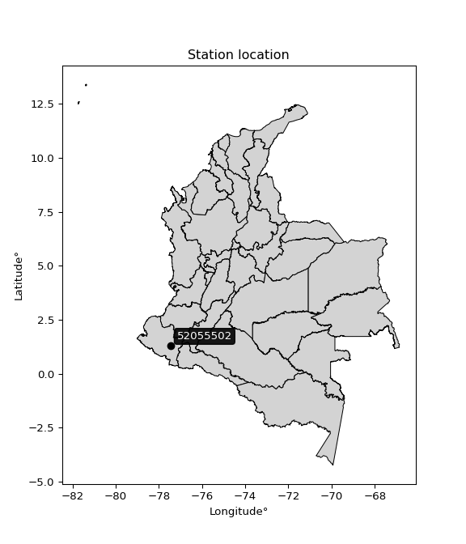</img>

</div>


## A. General information


### 1. General running parameters

• app_version: _v20260312_. • runtime: _2026-03-12 07:15:23.203550_. • Python version: _3.14.0_. • SciPy version: _1.16.3_. • Pandas version: _2.3.3_. • NumPy version: _2.3.5_. • Stations dataset (station_dataset_file): _dataset/pmax24h_in/automatic_colombia_2003_2025.csv_. • Stations catalog (station_catalog_file): _dataset/CNE.xls_. • Minimum year to eval til year_max (date_min): _1900_. • Maximum year to eval since year_min (date_max): _2025_. • Creates, save and include plots into reports (create_plot): _True_. • Plot only fit distributions with Δo > Δ (plot_only_fit): _True_. • Plot only simple graphs avoiding multiple CDFs and multiple Extreme values plots (plot_only_simple): _True_. • Eval low extreme values, if False, evaluates high extreme values (low_extreme): _False_. • Eval every SciPy distribution as logarithmic (pdist_logarithmic_on): _True_. • Standard deviation normalized (ddof): _1.0_. • Return periods to eval in years (Tr): _[2, 2.33, 5, 10, 15, 20, 25, 50, 75, 100, 200, 250, 500, 750, 1000]_. • Minimum data sample per station, 0 means any (minimum_sample): _5_. • Z-Score maximum threshold to adjust a value, 0 means disable (zscore_max): _3.5_. • Z-Score minimum threshold to adjust a value, 0 means disable (zscore_min): _-2.5_. • Avoid zeros, e.g. rain = 0 (avoid_zeros): _True_. • Avoid null values (avoid_nans): _True_. 

:file_folder:Table: [dataset.csv](../../dataset/pmax24h_in/automatic_colombia_2003_2025.csv)

> Delta Degrees of Freedom (DDOF): is a parameter used in the formulas for calculating variance and standard deviation. When ddof=0, the divisor is $N$ (the total number of observations) and this is used when your data set is the entire population. When ddof=1, the divisor is $N-1$ and this is used when your data set is a sample drawn from a larger population. Using $N-1$ provides an unbiased estimate of the population variance (known as Bessel´s correction).


### 2. Station info and location

|   id |   CODIGO | NOMBRE                     | CATEGORIA               | TECNOLOGIA                | ESTADO   | FECHA_INSTALACION   |   FECHA_SUSPENSION |   ALTITUD |   LATITUD |   LONGITUD | DEPARTAMENTO   | MUNICIPIO   | AREA_OPERATIVA                      | ENTIDAD                                    | AREA_HIDROGRAFICA   | ZONA_HIDROGRAFICA   | SUBZONA_HIDROGRAFICA   |   CORRIENTE | Catalogo   |   Version |
|-----:|---------:|:---------------------------|:------------------------|:--------------------------|:---------|:--------------------|-------------------:|----------:|----------:|-----------:|:---------------|:------------|:------------------------------------|:-------------------------------------------|:--------------------|:--------------------|:-----------------------|------------:|:-----------|----------:|
|    0 | 52055502 | SANDONA  - AUT  [52055502] | Climatológica Principal | Automática con Telemetría | Activa   | 01/09/2013          |                nan |      1838 |   1.30089 |   -77.4604 | Nariño         | Sandoná     | Area Operativa 07 - Nariño-Putumayo | CENTRO NACIONAL DE INVESTIGACIONES DE CAFE | Pacifico            | Patía               | Río Guáitara           |         nan | CNE_OE     |  20251226 |

<div align="center">

Dynamic map: [:earth_americas:Google](http://maps.google.com/maps?q=1.300888889,-77.46035833) [:earth_americas:OSM](https://www.openstreetmap.org/#map=18/1.300888889/-77.46035833&layers=P) [:earth_americas:Bing](https://www.bing.com/maps?cp=1.300888889~-77.46035833&lvl=18) [:earth_americas:Apple](https://maps.apple.com/frame?center=1.300888889%2C-77.46035833&span=0.003%2C0.006)

</div>


<div align="center">

```geojson
{
  "type": "Feature",
  "geometry": {
    "type": "Point", 
    "coordinates": [-77.46035833, 1.300888889]
  }, 
  "properties": {
    "Name": "52055502"
  }
}
```

</div>


### 3. Discrete values table and plot

<div align="center">

|               |          0 |           1 |          2 |          3 |           4 |          5 |           6 |
|:--------------|-----------:|------------:|-----------:|-----------:|------------:|-----------:|------------:|
| Date          | 2017       | 2018        | 2019       | 2020       | 2021        | 2022       | 2023        |
| Value         |   16.3     |   32.3      |   77.9     |   47       |   51.1      |   31.2     |   17.4      |
| Value_initial |   16.3     |   32.3      |   77.9     |   47       |   51.1      |   31.2     |   17.4      |
| count         |    7       |    7        |    7       |    7       |    7        |    7       |    7        |
| mean          |   39.0286  |   39.0286   |   39.0286  |   39.0286  |   39.0286   |   39.0286  |   39.0286   |
| std           |   21.6456  |   21.6456   |   21.6456  |   21.6456  |   21.6456   |   21.6456  |   21.6456   |
| zscore        |   -1.05003 |   -0.310852 |    1.79581 |    0.36827 |    0.557685 |   -0.36167 |   -0.999213 |


</div>


<div align="center">

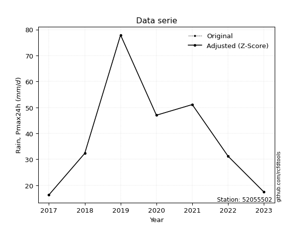</img>

</div>


> The initial value (value_initial) correspond to the initial obtained or null completed value, and value (value) is adjusted only when the initial value is outside the valid range (outlier) definite through the Z-Score value. If Z-Score is active, values out of range or outliers are replaced with the station mean value. A Z-Score (or standard score) measures how many standard deviations a data point is from the mean of a dataset, indicating its relative position; positive scores mean above the mean, negative mean below, and a score of zero is exactly at the mean, allowing for comparison of values from different distributions. It´s calculated using the formula $z=(x–μ)/σ$, where $x$ is the data point, $μ$ is the mean, and $σ$ is the standard deviation, helping identify outliers and understand probability.
>
> <sub>**Note**: In this study, "completing" (filling gaps in) and "extending" (forecasting or lengthening the historical record) rainfall data series are avoided for certain critical analyses because they introduce artificial bias and uncertainty, which can distort the statistics of rare events (extremes), alter day-to-day variability, and compromise the integrity and homogeneity of the original data. Some reasons against Completing/Extending rainfall data are: **Distortion of Extremes and Variability**: The primary issue is that most gap-filling or extension methods rely on averaging or regression with nearby stations, which inherently smooths the data. Rainfall is highly variable in space and time, with a large percentage of zero values and occasional large storms. Infilling methods often underestimate the highest values and overestimate the lowest (zero) values, which severely distorts analyses focused on flood frequency, drought severity, and intensity-duration-frequency (IDF) curves, **Loss of Data Homogeneity**: Infilled or extended data are synthetic estimates, not actual measurements. Combining these estimates with observed data can violate the assumption of data homogeneity, which requires that the data properties do not change over time. Inhomogeneity can lead to incorrect conclusions about long-term trends or changes in climate patterns, **Propagation of Errors**: Errors and biases from the original data (e.g., wind-induced undercatch, instrument errors, site changes) or the data used for imputation can propagate through the analysis, leading to unreliable hydrological models and inaccurate predictions, **Compromised Statistical Integrity**: For statistical analyses, especially those involving the frequency of events, using artificial data can introduce time bias or autocorrelation that doesn´t exist in reality, making it difficult to assess the true probability of events, **Difficulty in Validation**: It is difficult to accurately validate the quality of filled or extended data, especially for past periods where ground-truth measurements are unavailable. The reliability of imputation techniques heavily depends on the density of the surrounding station network and the complexity of the local topography.</sub>


### 4. Active continuous probability distributions from SciPy (80 of 104 available)

A Probability Density Function (PDF) describes the relative likelihood of a continuous random variable falling within a specific range, where the total area under its curve equals 1, and the area over any interval gives the actual probability for that range. Unlike discrete probabilities (like rolling a die), a PDF shows density, not direct probability for a single point (which is zero), with higher points indicating higher likelihood, often visualized as a bell curve for normal distributions.

A log of a probability density function (log-PDF) is simply the logarithm of the PDF´s value, denoted as $log(f(x))$, useful for converting multiplication of probabilities into addition, improving numerical stability with tiny numbers, and connecting to information theory concepts like entropy. Instead of dealing with very small probabilities (e.g., 0.000001), log-PDFs use negative numbers (e.g., $log(0.00001) ≈ -11.51$ that are easier for computers to handle, preventing underflow errors and simplifying complex calculations. In this study, each active probability distribution from SciPy is also evaluated in the $log$ form.

[scipy.stats](https://docs.scipy.org/doc/scipy/reference/stats.html) is a Python´s powerful submodule within the SciPy library for comprehensive statistical analysis, offering over 130 probability distributions (like Normal, Poisson, etc.), functions for descriptive stats (mean, variance), hypothesis testing (t-tests, chi-square), random variable generation, and statistical tests, making it essential for data science, modeling, and research. It provides tools to explore, model, and draw conclusions from data efficiently, working seamlessly with [NumPy](https://numpy.org/).

<div align="center">

|   id | p_dist           |   n_parameter | fit_method   | label                                                                       | active   | ref                                                                                                      |
|-----:|:-----------------|--------------:|:-------------|:----------------------------------------------------------------------------|:---------|:---------------------------------------------------------------------------------------------------------|
|    0 | alpha            |             3 | MLE          | Alpha                                                                       | True     | [:mortar_board:](https://docs.scipy.org/doc/scipy/reference/generated/scipy.stats.alpha.html)            |
|    1 | anglit           |             2 | MM           | Anglit                                                                      | True     | [:mortar_board:](https://docs.scipy.org/doc/scipy/reference/generated/scipy.stats.anglit.html)           |
|    2 | arcsine          |             2 | MM           | Arcsine                                                                     | True     | [:mortar_board:](https://docs.scipy.org/doc/scipy/reference/generated/scipy.stats.arcsine.html)          |
|    3 | argus            |             3 | MLE          | Argus                                                                       | True     | [:mortar_board:](https://docs.scipy.org/doc/scipy/reference/generated/scipy.stats.argus.html)            |
|    4 | beta             |             4 | MLE          | Beta                                                                        | True     | [:mortar_board:](https://docs.scipy.org/doc/scipy/reference/generated/scipy.stats.beta.html)             |
|    5 | betaprime        |             4 | MLE          | Beta prime                                                                  | True     | [:mortar_board:](https://docs.scipy.org/doc/scipy/reference/generated/scipy.stats.betaprime.html)        |
|    6 | bradford         |             3 | MLE          | Bradford                                                                    | True     | [:mortar_board:](https://docs.scipy.org/doc/scipy/reference/generated/scipy.stats.bradford.html)         |
|    7 | burr             |             4 | MLE          | Burr (Type III)                                                             | True     | [:mortar_board:](https://docs.scipy.org/doc/scipy/reference/generated/scipy.stats.burr.html)             |
|    8 | burr12           |             4 | MLE          | Burr (Type III) 12                                                          | True     | [:mortar_board:](https://docs.scipy.org/doc/scipy/reference/generated/scipy.stats.burr12.html)           |
|    9 | cosine           |             2 | MLE          | Cosine                                                                      | True     | [:mortar_board:](https://docs.scipy.org/doc/scipy/reference/generated/scipy.stats.cosine.html)           |
|   10 | crystalball      |             4 | MLE          | Crystalball                                                                 | True     | [:mortar_board:](https://docs.scipy.org/doc/scipy/reference/generated/scipy.stats.crystalball.html)      |
|   11 | dgamma           |             3 | MLE          | Double gamma                                                                | True     | [:mortar_board:](https://docs.scipy.org/doc/scipy/reference/generated/scipy.stats.dgamma.html)           |
|   12 | dweibull         |             3 | MLE          | Double Weibull                                                              | True     | [:mortar_board:](https://docs.scipy.org/doc/scipy/reference/generated/scipy.stats.dweibull.html)         |
|   13 | erlang           |             3 | MLE          | Erlang                                                                      | True     | [:mortar_board:](https://docs.scipy.org/doc/scipy/reference/generated/scipy.stats.erlang.html)           |
|   14 | exponnorm        |             3 | MLE          | Exponentially modified Normal                                               | True     | [:mortar_board:](https://docs.scipy.org/doc/scipy/reference/generated/scipy.stats.exponnorm.html)        |
|   15 | exponpow         |             3 | MLE          | Exponential power                                                           | True     | [:mortar_board:](https://docs.scipy.org/doc/scipy/reference/generated/scipy.stats.exponpow.html)         |
|   16 | exponweib        |             4 | MLE          | Exponentiated Weibull                                                       | True     | [:mortar_board:](https://docs.scipy.org/doc/scipy/reference/generated/scipy.stats.exponweib.html)        |
|   17 | f                |             4 | MLE          | F                                                                           | True     | [:mortar_board:](https://docs.scipy.org/doc/scipy/reference/generated/scipy.stats.f.html)                |
|   18 | fatiguelife      |             3 | MLE          | Fatigue-life (Birnbaum-Saunders)                                            | True     | [:mortar_board:](https://docs.scipy.org/doc/scipy/reference/generated/scipy.stats.fatiguelife.html)      |
|   19 | foldnorm         |             3 | MM           | Fold Normal                                                                 | True     | [:mortar_board:](https://docs.scipy.org/doc/scipy/reference/generated/scipy.stats.foldnorm.html)         |
|   20 | gamma            |             3 | MLE          | Gamma                                                                       | True     | [:mortar_board:](https://docs.scipy.org/doc/scipy/reference/generated/scipy.stats.gamma.html)            |
|   21 | gausshyper       |             6 | MLE          | Gauss hypergeometric                                                        | True     | [:mortar_board:](https://docs.scipy.org/doc/scipy/reference/generated/scipy.stats.gausshyper.html)       |
|   22 | genexpon         |             5 | MLE          | Generalized exponential                                                     | True     | [:mortar_board:](https://docs.scipy.org/doc/scipy/reference/generated/scipy.stats.genexpon.html)         |
|   23 | genextreme       |             3 | MLE          | Generalized exponential                                                     | True     | [:mortar_board:](https://docs.scipy.org/doc/scipy/reference/generated/scipy.stats.genextreme.html)       |
|   24 | gengamma         |             4 | MLE          | Generalized gamma                                                           | True     | [:mortar_board:](https://docs.scipy.org/doc/scipy/reference/generated/scipy.stats.gengamma.html)         |
|   25 | genhalflogistic  |             3 | MLE          | Generalized half-logistic                                                   | True     | [:mortar_board:](https://docs.scipy.org/doc/scipy/reference/generated/scipy.stats.genhalflogistic.html)  |
|   26 | genlogistic      |             3 | MLE          | Generalized logistic                                                        | True     | [:mortar_board:](https://docs.scipy.org/doc/scipy/reference/generated/scipy.stats.genlogistic.html)      |
|   27 | gennorm          |             3 | MLE          | Generalized Normal                                                          | True     | [:mortar_board:](https://docs.scipy.org/doc/scipy/reference/generated/scipy.stats.gennorm.html)          |
|   28 | genpareto        |             3 | MLE          | Generalized Pareto                                                          | True     | [:mortar_board:](https://docs.scipy.org/doc/scipy/reference/generated/scipy.stats.genpareto.html)        |
|   29 | gompertz         |             3 | MLE          | Gompertz (or truncated Gumbel)                                              | True     | [:mortar_board:](https://docs.scipy.org/doc/scipy/reference/generated/scipy.stats.gompertz.html)         |
|   30 | gumbel_l         |             2 | MM           | Gumbel Left Skew                                                            | True     | [:mortar_board:](https://docs.scipy.org/doc/scipy/reference/generated/scipy.stats.gumbel_l.html)         |
|   31 | gumbel_r         |             2 | MM           | Gumbel Right Skew                                                           | True     | [:mortar_board:](https://docs.scipy.org/doc/scipy/reference/generated/scipy.stats.gumbel_r.html)         |
|   32 | halfgennorm      |             3 | MLE          | Upper half of a generalized normal                                          | True     | [:mortar_board:](https://docs.scipy.org/doc/scipy/reference/generated/scipy.stats.halfgennorm.html)      |
|   33 | halflogistic     |             2 | MM           | Half-logistic                                                               | True     | [:mortar_board:](https://docs.scipy.org/doc/scipy/reference/generated/scipy.stats.halflogistic.html)     |
|   34 | halfnorm         |             2 | MM           | Half Normal                                                                 | True     | [:mortar_board:](https://docs.scipy.org/doc/scipy/reference/generated/scipy.stats.halfnorm.html)         |
|   35 | hypsecant        |             2 | MM           | hyperbolic secant                                                           | True     | [:mortar_board:](https://docs.scipy.org/doc/scipy/reference/generated/scipy.stats.hypsecant.html)        |
|   36 | invgamma         |             3 | MLE          | Inverted gamma                                                              | True     | [:mortar_board:](https://docs.scipy.org/doc/scipy/reference/generated/scipy.stats.invgamma.html)         |
|   37 | invgauss         |             3 | MLE          | Inverse Gaussian                                                            | True     | [:mortar_board:](https://docs.scipy.org/doc/scipy/reference/generated/scipy.stats.invgauss.html)         |
|   38 | invweibull       |             3 | MLE          | Inverted Weibull                                                            | True     | [:mortar_board:](https://docs.scipy.org/doc/scipy/reference/generated/scipy.stats.invweibull.html)       |
|   39 | johnsonsb        |             4 | MLE          | Johnson SB                                                                  | True     | [:mortar_board:](https://docs.scipy.org/doc/scipy/reference/generated/scipy.stats.johnsonsb.html)        |
|   40 | johnsonsu        |             4 | MLE          | Johnson Su                                                                  | True     | [:mortar_board:](https://docs.scipy.org/doc/scipy/reference/generated/scipy.stats.johnsonsu.html)        |
|   41 | kappa3           |             3 | MLE          | Kappa 3                                                                     | True     | [:mortar_board:](https://docs.scipy.org/doc/scipy/reference/generated/scipy.stats.kappa3.html)           |
|   42 | kappa4           |             4 | MLE          | Kappa 4                                                                     | True     | [:mortar_board:](https://docs.scipy.org/doc/scipy/reference/generated/scipy.stats.kappa4.html)           |
|   43 | ksone            |             3 | MLE          | Kolmogorov-Smirnov one-sided test statistic distribution                    | True     | [:mortar_board:](https://docs.scipy.org/doc/scipy/reference/generated/scipy.stats.ksone.html)            |
|   44 | kstwobign        |             2 | MLE          | Limiting distribution of scaled Kolmogorov-Smirnov two-sided test statistic | True     | [:mortar_board:](https://docs.scipy.org/doc/scipy/reference/generated/scipy.stats.kstwobign.html)        |
|   45 | laplace          |             2 | MM           | Laplace                                                                     | True     | [:mortar_board:](https://docs.scipy.org/doc/scipy/reference/generated/scipy.stats.laplace.html)          |
|   46 | levy_l           |             2 | MLE          | Left-skewed Levy                                                            | True     | [:mortar_board:](https://docs.scipy.org/doc/scipy/reference/generated/scipy.stats.levy_l.html)           |
|   47 | loggamma         |             3 | MLE          | Log gamma                                                                   | True     | [:mortar_board:](https://docs.scipy.org/doc/scipy/reference/generated/scipy.stats.loggamma.html)         |
|   48 | logistic         |             2 | MM           | Logistic (or Sech-squared)                                                  | True     | [:mortar_board:](https://docs.scipy.org/doc/scipy/reference/generated/scipy.stats.logistic.html)         |
|   49 | loglaplace       |             3 | MLE          | Log-Laplace                                                                 | True     | [:mortar_board:](https://docs.scipy.org/doc/scipy/reference/generated/scipy.stats.loglaplace.html)       |
|   50 | lomax            |             3 | MLE          | Lomax (Pareto of the second kind)                                           | True     | [:mortar_board:](https://docs.scipy.org/doc/scipy/reference/generated/scipy.stats.lomax.html)            |
|   51 | maxwell          |             2 | MM           | Maxwell                                                                     | True     | [:mortar_board:](https://docs.scipy.org/doc/scipy/reference/generated/scipy.stats.maxwell.html)          |
|   52 | mielke           |             4 | MLE          | Mielke Beta-Kappa / Dagum                                                   | True     | [:mortar_board:](https://docs.scipy.org/doc/scipy/reference/generated/scipy.stats.mielke.html)           |
|   53 | moyal            |             2 | MM           | Moyal                                                                       | True     | [:mortar_board:](https://docs.scipy.org/doc/scipy/reference/generated/scipy.stats.moyal.html)            |
|   54 | nakagami         |             3 | MLE          | Nakagami                                                                    | True     | [:mortar_board:](https://docs.scipy.org/doc/scipy/reference/generated/scipy.stats.nakagami.html)         |
|   55 | ncf              |             5 | MLE          | Non-central F distribution                                                  | True     | [:mortar_board:](https://docs.scipy.org/doc/scipy/reference/generated/scipy.stats.ncf.html)              |
|   56 | nct              |             4 | MLE          | Non-central Student’s t                                                     | True     | [:mortar_board:](https://docs.scipy.org/doc/scipy/reference/generated/scipy.stats.nct.html)              |
|   57 | norm             |             2 | MM           | Normal                                                                      | True     | [:mortar_board:](https://docs.scipy.org/doc/scipy/reference/generated/scipy.stats.norm.html)             |
|   58 | pearson3         |             3 | MM           | Pearson type III                                                            | True     | [:mortar_board:](https://docs.scipy.org/doc/scipy/reference/generated/scipy.stats.pearson3.html)         |
|   59 | powerlaw         |             3 | MLE          | Power-function                                                              | True     | [:mortar_board:](https://docs.scipy.org/doc/scipy/reference/generated/scipy.stats.powerlaw.html)         |
|   60 | rayleigh         |             2 | MM           | Rayleigh                                                                    | True     | [:mortar_board:](https://docs.scipy.org/doc/scipy/reference/generated/scipy.stats.rayleigh.html)         |
|   61 | rdist            |             3 | MLE          | R-distributed (symmetric beta)                                              | True     | [:mortar_board:](https://docs.scipy.org/doc/scipy/reference/generated/scipy.stats.rdist.html)            |
|   62 | rice             |             3 | MLE          | Rice                                                                        | True     | [:mortar_board:](https://docs.scipy.org/doc/scipy/reference/generated/scipy.stats.rice.html)             |
|   63 | semicircular     |             2 | MM           | Semicircular                                                                | True     | [:mortar_board:](https://docs.scipy.org/doc/scipy/reference/generated/scipy.stats.semicircular.html)     |
|   64 | skewnorm         |             3 | MLE          | Skew normal                                                                 | True     | [:mortar_board:](https://docs.scipy.org/doc/scipy/reference/generated/scipy.stats.skewnorm.html)         |
|   65 | t                |             3 | MLE          | Student’s t                                                                 | True     | [:mortar_board:](https://docs.scipy.org/doc/scipy/reference/generated/scipy.stats.t.html)                |
|   66 | trapezoid        |             4 | MLE          | Trapezoid                                                                   | True     | [:mortar_board:](https://docs.scipy.org/doc/scipy/reference/generated/scipy.stats.trapezoid.html)        |
|   67 | triang           |             3 | MLE          | Triangular                                                                  | True     | [:mortar_board:](https://docs.scipy.org/doc/scipy/reference/generated/scipy.stats.triang.html)           |
|   68 | truncexpon       |             3 | MLE          | Truncated exponential                                                       | True     | [:mortar_board:](https://docs.scipy.org/doc/scipy/reference/generated/scipy.stats.truncexpon.html)       |
|   69 | truncnorm        |             4 | MLE          | Truncated normal                                                            | True     | [:mortar_board:](https://docs.scipy.org/doc/scipy/reference/generated/scipy.stats.truncnorm.html)        |
|   70 | truncpareto      |             4 | MLE          | Upper truncated Pareto                                                      | True     | [:mortar_board:](https://docs.scipy.org/doc/scipy/reference/generated/scipy.stats.truncpareto.html)      |
|   71 | truncweibull_min |             5 | MLE          | Doubly truncated Weibull minimum                                            | True     | [:mortar_board:](https://docs.scipy.org/doc/scipy/reference/generated/scipy.stats.truncweibull_min.html) |
|   72 | tukeylambda      |             3 | MLE          | Tukey-Lamdba                                                                | True     | [:mortar_board:](https://docs.scipy.org/doc/scipy/reference/generated/scipy.stats.tukeylambda.html)      |
|   73 | uniform          |             2 | MLE          | Uniform                                                                     | True     | [:mortar_board:](https://docs.scipy.org/doc/scipy/reference/generated/scipy.stats.uniform.html)          |
|   74 | vonmises         |             3 | MLE          | Von Mises                                                                   | True     | [:mortar_board:](https://docs.scipy.org/doc/scipy/reference/generated/scipy.stats.vonmises.html)         |
|   75 | vonmises_line    |             3 | MLE          | Von Mises line                                                              | True     | [:mortar_board:](https://docs.scipy.org/doc/scipy/reference/generated/scipy.stats.vonmises_line.html)    |
|   76 | wald             |             2 | MM           | Wald                                                                        | True     | [:mortar_board:](https://docs.scipy.org/doc/scipy/reference/generated/scipy.stats.wald.html)             |
|   77 | weibull_max      |             3 | MLE          | Weibull maximum                                                             | True     | [:mortar_board:](https://docs.scipy.org/doc/scipy/reference/generated/scipy.stats.weibull_max.html)      |
|   78 | weibull_min      |             3 | MLE          | Weibull minimum                                                             | True     | [:mortar_board:](https://docs.scipy.org/doc/scipy/reference/generated/scipy.stats.weibull_min.html)      |
|   79 | wrapcauchy       |             3 | MLE          | Wrapped  Cauchy                                                             | True     | [:mortar_board:](https://docs.scipy.org/doc/scipy/reference/generated/scipy.stats.wrapcauchy.html)       |

</div>

> **n_parameter:** # arguments & localization & scale.
>
> **Fit methods:** (MLE) maximum likelihood, (MM) L-moments.
>
>**Inactive** (With the only purpose of prevent loops, zero divisions, infinite values, over high estimated values or horizontal trending for recurrence intervals estimations, the follow distributions were disabled.)**:** lognorm, norminvgauss, powernorm, powerlognorm, cauchy, halfcauchy, foldcauchy, skewcauchy, chi2, expon, fisk, genhyperbolic, geninvgauss, gibrat, kstwo, laplace_asymmetric, levy, levy_stable, ncx2, pareto, rel_breitwigner, recipinvgauss, studentized_range, loguniform, 


## B. Probability (PDF) vs. Empirical (EDF) distributions functions

A continuous probability distribution (CPD) describes probabilities for variables that can take any value within a range (like rain any time), unlike discrete variables with specific outcomes (like temperature). It uses a Probability Density Function (PDF), a curve where the total area under it equals 1, and the probability of the variable falling within an interval (a to b) is found by calculating the area under the curve between those points. A key feature is that the probability of hitting any single exact value is zero, so probabilities are always expressed for ranges, e.g., $P(a ≤ X ≤ b)$.

<div align="center">

Distributions parameters from station values
|     |   station | p_dist              |   n |             loc |          scale | shape                  | shape1                | shape2                | shape3             |
|----:|----------:|:--------------------|----:|----------------:|---------------:|:-----------------------|:----------------------|:----------------------|:-------------------|
|   0 |  52055502 | alpha               |   7 |   -41.0718      |  326.571       | 4.3203720535509165     |                       |                       |                    |
|   1 |  52055502 | anglit              |   7 |    39.0286      |   58.6248      |                        |                       |                       |                    |
|   2 |  52055502 | arcsine             |   7 |    10.6878      |   56.6815      |                        |                       |                       |                    |
|   3 |  52055502 | argus               |   7 |    -6.6124      |   87.955       | 5.838002816780399e-06  |                       |                       |                    |
|   4 |  52055502 | beta                |   7 |    16.3         |   72.9965      | 0.7625901191511548     | 1.702248566741175     |                       |                    |
|   5 |  52055502 | betaprime           |   7 |    12.4125      |   35.1536      | 2.125828947066191      | 3.745592323372545     |                       |                    |
|   6 |  52055502 | bradford            |   7 |    16.3         |   61.6         | 0.7068587363513184     |                       |                       |                    |
|   7 |  52055502 | burr                |   7 |    -0.0532279   |    1.77449     | 2.0885800956712366     | 277.7876762966529     |                       |                    |
|   8 |  52055502 | burr12              |   7 |    -0.995902    |   17.1536      | 465.15072019146817     | 0.0029877955927742504 |                       |                    |
|   9 |  52055502 | cosine              |   7 |    41.2578      |   17.0589      |                        |                       |                       |                    |
|  10 |  52055502 | crystalball         |   7 |    39.0286      |   20.0399      | 4501.133303871784      | 3470.5407422106555    |                       |                    |
|  11 |  52055502 | dgamma              |   7 |    39.6508      |    6.12085     | 2.764569430215274      |                       |                       |                    |
|  12 |  52055502 | dweibull            |   7 |    39.9545      |   19.1829      | 1.7072326462834857     |                       |                       |                    |
|  13 |  52055502 | erlang              |   7 |    16.3         |   48.0811      | 0.16041975271629588    |                       |                       |                    |
|  14 |  52055502 | exponnorm           |   7 |    16.2784      |    0.00662567  | 3415.17204770062       |                       |                       |                    |
|  15 |  52055502 | exponpow            |   7 |    16.3         |   31.5688      | 0.17838966879937482    |                       |                       |                    |
|  16 |  52055502 | exponweib           |   7 |    16.3         |    0.417324    | 1.5593002250470978     | 0.17240910665454495   |                       |                    |
|  17 |  52055502 | f                   |   7 |    16.2925      |   25.6372      | 0.8775203962409424     | 165.02406146446782    |                       |                    |
|  18 |  52055502 | fatiguelife         |   7 |    16.3         |    0.000561033 | 190.5734236498397      |                       |                       |                    |
|  19 |  52055502 | foldnorm            |   7 |     9.51165     |   24.8058      | 1.0337132744402933     |                       |                       |                    |
|  20 |  52055502 | gamma               |   7 |    16.3         |   29.0717      | 0.17347078585989179    |                       |                       |                    |
|  21 |  52055502 | gausshyper          |   7 |    16.3         |   61.6         | 0.5190529038991687     | 0.904830170768208     | 0.8730492984300332    | 0.8682615193547965 |
|  22 |  52055502 | genexpon            |   7 |    16.2782      |    0.480901    | 0.01820958799976908    | 1.098325897425732     | 6.394902716247119e-05 |                    |
|  23 |  52055502 | genextreme          |   7 |    28.4994      |   14.3015      | -0.15597960561319674   |                       |                       |                    |
|  24 |  52055502 | gengamma            |   7 |    16.3         |    0.229706    | 1.486913315812259      | 0.20388443642980994   |                       |                    |
|  25 |  52055502 | genhalflogistic     |   7 |    10.3855      |   70.1463      | 1.0389809150761704     |                       |                       |                    |
|  26 |  52055502 | genlogistic         |   7 |   -81.5041      |   15.4265      | 1355.1815152835093     |                       |                       |                    |
|  27 |  52055502 | gennorm             |   7 |    47.1003      |   30.8031      | 106630.06770583754     |                       |                       |                    |
|  28 |  52055502 | genpareto           |   7 |    -0.347694    |  107.991       | -1.3801142070130177    |                       |                       |                    |
|  29 |  52055502 | gompertz            |   7 |    16.3         |  103.611       | 3.7065633666051294     |                       |                       |                    |
|  30 |  52055502 | gumbel_l            |   7 |    48.0476      |   15.6251      |                        |                       |                       |                    |
|  31 |  52055502 | gumbel_r            |   7 |    30.0095      |   15.6251      |                        |                       |                       |                    |
|  32 |  52055502 | halfgennorm         |   7 |    16.3         |    0.695966    | 0.3415506675462583     |                       |                       |                    |
|  33 |  52055502 | halflogistic        |   7 |    15.2766      |   17.1334      |                        |                       |                       |                    |
|  34 |  52055502 | halfnorm            |   7 |    12.5035      |   33.2442      |                        |                       |                       |                    |
|  35 |  52055502 | hypsecant           |   7 |    39.0286      |   12.7578      |                        |                       |                       |                    |
|  36 |  52055502 | invgamma            |   7 |    -4.94066     |  181.09        | 5.058401731825511      |                       |                       |                    |
|  37 |  52055502 | invgauss            |   7 |     9.78378     |   34.6083      | 0.8450226265006135     |                       |                       |                    |
|  38 |  52055502 | invweibull          |   7 |    16.3         |    1.17539     | 0.107039392973479      |                       |                       |                    |
|  39 |  52055502 | johnsonsb           |   7 |    16.3         |   61.658       | -0.06756560623926294   | 0.07084242669730205   |                       |                    |
|  40 |  52055502 | johnsonsu           |   7 |    16.3         |    3.98607e-09 | -1.973136804207341     | 0.12428764938565656   |                       |                    |
|  41 |  52055502 | kappa3              |   7 |    16.2999      |   28.1151      | 3.5529304827166985     |                       |                       |                    |
|  42 |  52055502 | kappa4              |   7 |    10.0818      |   68.5389      | 1.099830723879403      | 1.0102413138050035    |                       |                    |
|  43 |  52055502 | ksone               |   7 |    10.14        |   73.92        | 1.0                    |                       |                       |                    |
|  44 |  52055502 | kstwobign           |   7 |   -24.3026      |   72.685       |                        |                       |                       |                    |
|  45 |  52055502 | laplace             |   7 |    39.0286      |   14.1704      |                        |                       |                       |                    |
|  46 |  52055502 | levy_l              |   7 |    82.2815      |   19.5095      |                        |                       |                       |                    |
|  47 |  52055502 | loggamma            |   7 | -7860.89        | 1013.77        | 2423.11464778559       |                       |                       |                    |
|  48 |  52055502 | logistic            |   7 |    39.0286      |   11.0486      |                        |                       |                       |                    |
|  49 |  52055502 | loglaplace          |   7 |    -0.0806113   |   32.3806      | 2.299959246526174      |                       |                       |                    |
|  50 |  52055502 | lomax               |   7 |    16.235       |  591.627       | 26.43639159995457      |                       |                       |                    |
|  51 |  52055502 | maxwell             |   7 |    -8.45767     |   29.7576      |                        |                       |                       |                    |
|  52 |  52055502 | mielke              |   7 |    -2.90238     |    1.11212     | 4103.402029447441      | 2.2917793250163605    |                       |                    |
|  53 |  52055502 | moyal               |   7 |    27.5684      |    9.02114     |                        |                       |                       |                    |
|  54 |  52055502 | nakagami            |   7 |    16.3         |   20.8101      | 0.0716185288927546     |                       |                       |                    |
|  55 |  52055502 | ncf                 |   7 |     0.0837769   |   36.5838      | 9.855633125579974      | 32.45289613238459     | 0.0012087542384227271 |                    |
|  56 |  52055502 | nct                 |   7 |    -0.127719    |    1.61069     | 2.2756432590315625     | 16.58043678030947     |                       |                    |
|  57 |  52055502 | norm                |   7 |    39.0286      |   20.0399      |                        |                       |                       |                    |
|  58 |  52055502 | pearson3            |   7 |    39.0286      |   20.0399      | 0.6808469748345674     |                       |                       |                    |
|  59 |  52055502 | powerlaw            |   7 |    16.3         |   61.6         | 0.15400897777742084    |                       |                       |                    |
|  60 |  52055502 | rayleigh            |   7 |     0.690997    |   30.589       |                        |                       |                       |                    |
|  61 |  52055502 | rdist               |   7 |    10.9763      |   36.0237      | 1.0793789235120415     |                       |                       |                    |
|  62 |  52055502 | rice                |   7 |     5.1628      |   27.8253      | 0.00046385543876112075 |                       |                       |                    |
|  63 |  52055502 | semicircular        |   7 |    39.0286      |   40.0799      |                        |                       |                       |                    |
|  64 |  52055502 | skewnorm            |   7 |    16.3         |   30.2989      | 28427545.446048312     |                       |                       |                    |
|  65 |  52055502 | t                   |   7 |    39.0286      |   20.0399      | 488048838.4954581      |                       |                       |                    |
|  66 |  52055502 | trapezoid           |   7 |    10.14        |   73.92        | 1.0                    | 1.0                   |                       |                    |
|  67 |  52055502 | triang              |   7 |   -13.4529      |   91.3529      | 0.9999999999988964     |                       |                       |                    |
|  68 |  52055502 | truncexpon          |   7 |    16.3         |   52.1961      | 1.1801657789483948     |                       |                       |                    |
|  69 |  52055502 | truncnorm           |   7 |    39.0286      |   20.0399      | -245.4170250627348     | 281.2996102093795     |                       |                    |
|  70 |  52055502 | truncpareto         |   7 |    16.2829      |    0.0171042   | 0.17034375195125442    | 3602.464335550704     |                       |                    |
|  71 |  52055502 | truncweibull_min    |   7 |    16.1138      |   67.7367      | 0.7163384052250976     | 0.002728393976081275  | 0.9121527961699032    |                    |
|  72 |  52055502 | tukeylambda         |   7 |    33.6665      |   19.8678      | 1.1396323031490967     |                       |                       |                    |
|  73 |  52055502 | uniform             |   7 |    16.3         |   61.6         |                        |                       |                       |                    |
|  74 |  52055502 | vonmises            |   7 |     2.01051     |    1           | 0.14879973697899868    |                       |                       |                    |
|  75 |  52055502 | vonmises_line       |   7 |    46.9932      |    9.83795     | 0.00011572316187524666 |                       |                       |                    |
|  76 |  52055502 | wald                |   7 |    18.9887      |   20.0399      |                        |                       |                       |                    |
|  77 |  52055502 | weibull_max         |   7 |    77.9         |    1.5562      | 0.2283680111478701     |                       |                       |                    |
|  78 |  52055502 | weibull_min         |   7 |    16.3         |   24.3847      | 0.8251698579755162     |                       |                       |                    |
|  79 |  52055502 | wrapcauchy          |   7 |    16.3         |    9.80428     | 0.26871792710290643    |                       |                       |                    |
|  80 |  52055502 | logalpha            |   7 |    -6.93122     |  204.554       | 19.608106774897067     |                       |                       |                    |
|  81 |  52055502 | loganglit           |   7 |     3.52893     |    1.54696     |                        |                       |                       |                    |
|  82 |  52055502 | logarcsine          |   7 |     2.78109     |    1.49568     |                        |                       |                       |                    |
|  83 |  52055502 | logargus            |   7 |     2.34705     |    2.09986     | 5.244794275562406e-05  |                       |                       |                    |
|  84 |  52055502 | logbeta             |   7 |     2.79117     |    1.56426     | 0.23193614199254067    | 0.8399225481221945    |                       |                    |
|  85 |  52055502 | logbetaprime        |   7 |    -3.94654     |  250.764       | 205.00938813924637     | 6873.736448831709     |                       |                    |
|  86 |  52055502 | logbradford         |   7 |     2.79116     |    1.56427     | 1.0775695572937982     |                       |                       |                    |
|  87 |  52055502 | logburr             |   7 |    -0.0952857   |    4.05521     | 18.850583675273654     | 0.3599994727130152    |                       |                    |
|  88 |  52055502 | logburr12           |   7 |     2.39439     |    4.47647     | 2.3170958412795777     | 19.239080033688623    |                       |                    |
|  89 |  52055502 | logcosine           |   7 |     3.53011     |    0.432007    |                        |                       |                       |                    |
|  90 |  52055502 | logcrystalball      |   7 |     3.52892     |    0.528801    | 65.96392552095703      | 231.25906740205738    |                       |                    |
|  91 |  52055502 | logdgamma           |   7 |     3.64343     |    0.183975    | 2.5000624068235124     |                       |                       |                    |
|  92 |  52055502 | logdweibull         |   7 |     3.47507     |    0.566313    | 0.5999116764156744     |                       |                       |                    |
|  93 |  52055502 | logerlang           |   7 |   -25.174       |    0.00975561  | 2942.1912587075094     |                       |                       |                    |
|  94 |  52055502 | logexponnorm        |   7 |     3.52824     |    0.528802    | 0.0012986275429279907  |                       |                       |                    |
|  95 |  52055502 | logexponpow         |   7 |     2.79117     |    1.36741     | 0.7551352354565535     |                       |                       |                    |
|  96 |  52055502 | logexponweib        |   7 |     2.79117     |    1.16634     | 0.13295105538271162    | 1.2591553666849362    |                       |                    |
|  97 |  52055502 | logf                |   7 |   -72.2589      |   75.7862      | 78868.04069652868      | 85580.95641038351     |                       |                    |
|  98 |  52055502 | logfatiguelife      |   7 |   -20.7032      |   24.2234      | 0.021819446936434783   |                       |                       |                    |
|  99 |  52055502 | logfoldnorm         |   7 |     2.02691     |    0.529579    | 2.8351070407800734     |                       |                       |                    |
| 100 |  52055502 | loggamma            |   7 |   -25.3286      |    0.00969531  | 2976.4080050731463     |                       |                       |                    |
| 101 |  52055502 | loggausshyper       |   7 |     2.79098     |    1.56445     | 0.7171169276651276     | 0.7362733161377367    | 1.0335827924708485    | 1.283031909295779  |
| 102 |  52055502 | loggenexpon         |   7 |     2.78475     |    5.89744     | 4.761699860900801      | 46.48553363420554     | 0.6785391598014803    |                    |
| 103 |  52055502 | loggenextreme       |   7 |     3.38235     |    0.556792    | 0.43621245792520075    |                       |                       |                    |
| 104 |  52055502 | loggengamma         |   7 |     2.79117     |    1.04772     | 0.1319813492617818     | 1.4223086760037593    |                       |                    |
| 105 |  52055502 | loggenhalflogistic  |   7 |     2.78661     |    1.67572     | 1.0681492657663476     |                       |                       |                    |
| 106 |  52055502 | loggenlogistic      |   7 |     0.792139    |    0.479199    | 174.39140593791734     |                       |                       |                    |
| 107 |  52055502 | loggennorm          |   7 |     3.5733      |    0.782134    | 2987688.7332000136     |                       |                       |                    |
| 108 |  52055502 | loggenpareto        |   7 |    -0.00336956  |   10.0374      | -2.3027856160249893    |                       |                       |                    |
| 109 |  52055502 | loggompertz         |   7 |     2.79117     |    0.951725    | 0.6537377741093231     |                       |                       |                    |
| 110 |  52055502 | loggumbel_l         |   7 |     3.76691     |    0.412305    |                        |                       |                       |                    |
| 111 |  52055502 | loggumbel_r         |   7 |     3.29094     |    0.412305    |                        |                       |                       |                    |
| 112 |  52055502 | loghalfgennorm      |   7 |     2.79111     |    1.56548     | 9279.10040050814       |                       |                       |                    |
| 113 |  52055502 | loghalflogistic     |   7 |     2.90215     |    0.452123    |                        |                       |                       |                    |
| 114 |  52055502 | loghalfnorm         |   7 |     2.82902     |    0.877198    |                        |                       |                       |                    |
| 115 |  52055502 | loghypsecant        |   7 |     3.52893     |    0.336646    |                        |                       |                       |                    |
| 116 |  52055502 | loginvgamma         |   7 |    -3.98271     | 1492.82        | 199.8594693441455      |                       |                       |                    |
| 117 |  52055502 | loginvgauss         |   7 |     0.661437    |   78.425       | 0.036541251536170605   |                       |                       |                    |
| 118 |  52055502 | loginvweibull       |   7 |    -1.63014e+07 |    1.63014e+07 | 34175610.00452025      |                       |                       |                    |
| 119 |  52055502 | logjohnsonsb        |   7 |     2.79116     |    1.56426     | -0.23685954870423354   | 0.1784563108850946    |                       |                    |
| 120 |  52055502 | logjohnsonsu        |   7 |    -4.30376e+06 |    2.41847e+06 | -12510418.672453357    | 9332916.725250632     |                       |                    |
| 121 |  52055502 | logkappa3           |   7 |     2.7907      |    1.56459     | 22374.01361079493      |                       |                       |                    |
| 122 |  52055502 | logkappa4           |   7 |     2.72527     |    1.69201     | 1.0405522350046448     | 1.0379467877448105    |                       |                    |
| 123 |  52055502 | logksone            |   7 |     2.61301     |    1.83182     | 1.0                    |                       |                       |                    |
| 124 |  52055502 | logkstwobign        |   7 |     1.61522     |    2.18229     |                        |                       |                       |                    |
| 125 |  52055502 | loglaplace          |   7 |     3.52893     |    0.373919    |                        |                       |                       |                    |
| 126 |  52055502 | loglevy_l           |   7 |     4.4384      |    0.368133    |                        |                       |                       |                    |
| 127 |  52055502 | logloggamma         |   7 |   -21.7524      |    5.42887     | 105.80123798406859     |                       |                       |                    |
| 128 |  52055502 | loglogistic         |   7 |     3.52893     |    0.291544    |                        |                       |                       |                    |
| 129 |  52055502 | logloglaplace       |   7 |    -0.0496217   |    3.52469     | 8.092929264972495      |                       |                       |                    |
| 130 |  52055502 | loglomax            |   7 |     2.79117     |   14.5597      | 20.14654244777939      |                       |                       |                    |
| 131 |  52055502 | logmaxwell          |   7 |     2.27589     |    0.785225    |                        |                       |                       |                    |
| 132 |  52055502 | logmielke           |   7 |     2.79117     |    1.401       | 0.44826286147495986    | 7.917487113598575     |                       |                    |
| 133 |  52055502 | logmoyal            |   7 |     3.22652     |    0.238044    |                        |                       |                       |                    |
| 134 |  52055502 | lognakagami         |   7 |     2.79117     |    0.861544    | 0.07792754832437611    |                       |                       |                    |
| 135 |  52055502 | logncf              |   7 |    -1.0349      |    0.0113429   | 0.8742602866752842     | 377.8186128111555     | 349.063574829751      |                    |
| 136 |  52055502 | lognct              |   7 |   -12.2199      |    0.505007    | 4894.503949745089      | 31.17850635040039     |                       |                    |
| 137 |  52055502 | lognorm             |   7 |     3.52893     |    0.528802    |                        |                       |                       |                    |
| 138 |  52055502 | logpearson3         |   7 |     3.52893     |    0.528802    | -0.04097524539131632   |                       |                       |                    |
| 139 |  52055502 | logpowerlaw         |   7 |     2.79117     |    1.56426     | 0.169143763985054      |                       |                       |                    |
| 140 |  52055502 | lograyleigh         |   7 |     2.5173      |    0.807163    |                        |                       |                       |                    |
| 141 |  52055502 | logrdist            |   7 |     3.66237     |    0.871204    | 1.0923042201628905     |                       |                       |                    |
| 142 |  52055502 | logrice             |   7 |     2.49292     |    0.633317    | 1.1718189026260406     |                       |                       |                    |
| 143 |  52055502 | logsemicircular     |   7 |     3.52893     |    1.0576      |                        |                       |                       |                    |
| 144 |  52055502 | logskewnorm         |   7 |     3.61532     |    0.535812    | -0.20633415433679897   |                       |                       |                    |
| 145 |  52055502 | logt                |   7 |     3.52891     |    0.528799    | 32073022.349144258     |                       |                       |                    |
| 146 |  52055502 | logtrapezoid        |   7 |     2.63474     |    1.87711     | 1.0                    | 1.0                   |                       |                    |
| 147 |  52055502 | logtriang           |   7 |     2.17858     |    2.17685     | 0.9999978723861054     |                       |                       |                    |
| 148 |  52055502 | logtruncexpon       |   7 |     2.79116     |    1.56941     | 0.9967365134182377     |                       |                       |                    |
| 149 |  52055502 | logtruncnorm        |   7 |    -0.167574    |    1.10216     | 3.273570303251227      | 4.104062921256658     |                       |                    |
| 150 |  52055502 | logtruncpareto      |   7 |     0.894613    |    1.89655     | 3.751880653259487e-08  | 1.8247918223252981    |                       |                    |
| 151 |  52055502 | logtruncweibull_min |   7 |     2.78763     |    2.19231     | 0.6724563727757177     | 0.001611436393418321  | 0.7151322576802556    |                    |
| 152 |  52055502 | logtukeylambda      |   7 |     3.57335     |    0.885583    | 1.1321853390364787     |                       |                       |                    |
| 153 |  52055502 | loguniform          |   7 |     2.79117     |    1.56426     |                        |                       |                       |                    |
| 154 |  52055502 | logvonmises         |   7 |    -2.75304     |    1           | 4.067091029589571      |                       |                       |                    |
| 155 |  52055502 | logvonmises_line    |   7 |     3.57331     |    0.248966    | 7.946644822019134e-05  |                       |                       |                    |
| 156 |  52055502 | logwald             |   7 |     3.00016     |    0.52877     |                        |                       |                       |                    |
| 157 |  52055502 | logweibull_max      |   7 |     4.65895     |    1.27662     | 2.292922756296827      |                       |                       |                    |
| 158 |  52055502 | logweibull_min      |   7 |     2.79117     |    0.706526    | 0.19398969120322387    |                       |                       |                    |
| 159 |  52055502 | logwrapcauchy       |   7 |     2.79095     |    0.248995    | 0.1495649346367522     |                       |                       |                    |

</div>

> **loc** (Location parameter): This shifts the distribution along the x-axis. For many common distributions, like the normal (Gaussian) distribution, loc represents the mean $μ$. For others, like the uniform distribution, it might represent the minimum value, or for the beta distribution, the left end of the support interval.
>
> **scale** (Scale parameter): This determines the width or spread of the distribution. For the normal distribution, scale represents the standard deviation $σ$. For a uniform distribution, it defines the length of the interval (from $loc$ to $loc + scale$).
>
> **shape** (Shape parameters): Refers to parameters that define the specific form of a probability distribution, distinct from its location (loc) and scale (scale). These parameters are required arguments for most distribution functions. For example, a normal (Gaussian) distribution is fully defined by its location (mean) and scale (standard deviation), so it has no specific shape parameters beyond loc and scale. However, other distributions have intrinsic properties that need specification, as Gamma distribution that takes a shape parameter, often named $a$ or $alpha$.


### 0. Cumulative distribution values - CDF (160 evaluated)

Cumulative Distribution Function (CDF), denoted as $F$<sub>$X$</sub>$(x)$, is a function that gives the probability that a random variable $X$ will take a value less than or equal to a specific value, $x$ (i.e., $(P(X≥x)$. It essentially "accumulates" probabilities from a given point up to the far right (positive infinity), providing a complete picture of the distribution´s probabilities for both discrete (like rain) and continuous (like temperature) variables, helping to find probabilities over ranges or above certain values. Each station is evaluated separately ordering the $x$ values ascending, calculating the CDF and PDF values for the activated distributions and their logarithmic forms.

<div align="center">

CDF ordered by x ascending and calculating $log(f(x))$ separately
|   id |   Station |   date |    x |   count |    mean |     std |    zscore |   Value_initial |   station |   m |     alpha |   alpha_pdf |   anglit |   anglit_pdf |   arcsine |   arcsine_pdf |    argus |   argus_pdf |       beta |     beta_pdf |   betaprime |   betaprime_pdf |    bradford |   bradford_pdf |      burr |   burr_pdf |    burr12 |   burr12_pdf |   cosine |   cosine_pdf |   crystalball |   crystalball_pdf |   dgamma |   dgamma_pdf |   dweibull |   dweibull_pdf |     erlang |   erlang_pdf |   exponnorm |   exponnorm_pdf |   exponpow |   exponpow_pdf |   exponweib |   exponweib_pdf |         f |      f_pdf |   fatiguelife |   fatiguelife_pdf |   foldnorm |   foldnorm_pdf |      gamma |   gamma_pdf |   gausshyper |   gausshyper_pdf |    genexpon |   genexpon_pdf |   genextreme |   genextreme_pdf |    gengamma |   gengamma_pdf |   genhalflogistic |   genhalflogistic_pdf |   genlogistic |   genlogistic_pdf |     gennorm |   gennorm_pdf |   genpareto |   genpareto_pdf |    gompertz |   gompertz_pdf |   gumbel_l |   gumbel_l_pdf |   gumbel_r |   gumbel_r_pdf |   halfgennorm |   halfgennorm_pdf |   halflogistic |   halflogistic_pdf |   halfnorm |   halfnorm_pdf |   hypsecant |   hypsecant_pdf |   invgamma |   invgamma_pdf |   invgauss |   invgauss_pdf |   invweibull |   invweibull_pdf |   johnsonsb |   johnsonsb_pdf |   johnsonsu |   johnsonsu_pdf |      kappa3 |   kappa3_pdf |      kappa4 |   kappa4_pdf |     ksone |   ksone_pdf |   kstwobign |   kstwobign_pdf |   laplace |   laplace_pdf |   levy_l |   levy_l_pdf |   loggamma |   loggamma_pdf |   logistic |   logistic_pdf |   loglaplace |   loglaplace_pdf |      lomax |   lomax_pdf |   maxwell |   maxwell_pdf |   mielke |   mielke_pdf |     moyal |   moyal_pdf |   nakagami |   nakagami_pdf |       ncf |    ncf_pdf |       nct |    nct_pdf |     norm |   norm_pdf |   pearson3 |   pearson3_pdf |   powerlaw |   powerlaw_pdf |   rayleigh |   rayleigh_pdf |    rdist |       rdist_pdf |      rice |   rice_pdf |   semicircular |   semicircular_pdf |   skewnorm |   skewnorm_pdf |        t |      t_pdf |   trapezoid |   trapezoid_pdf |   triang |   triang_pdf |   truncexpon |   truncexpon_pdf |   truncnorm |   truncnorm_pdf |   truncpareto |   truncpareto_pdf |   truncweibull_min |   truncweibull_min_pdf |   tukeylambda |   tukeylambda_pdf |   uniform |   uniform_pdf |   vonmises |   vonmises_pdf |   vonmises_line |   vonmises_line_pdf |     wald |   wald_pdf |   weibull_max |   weibull_max_pdf |   weibull_min |   weibull_min_pdf |   wrapcauchy |   wrapcauchy_pdf |   logalpha |   logalpha_pdf |   loganglit |   loganglit_pdf |   logarcsine |   logarcsine_pdf |   logargus |   logargus_pdf |    logbeta |   logbeta_pdf |   logbetaprime |   logbetaprime_pdf |   logbradford |   logbradford_pdf |   logburr |   logburr_pdf |   logburr12 |   logburr12_pdf |   logcosine |   logcosine_pdf |   logcrystalball |   logcrystalball_pdf |   logdgamma |   logdgamma_pdf |   logdweibull |   logdweibull_pdf |   logerlang |   logerlang_pdf |   logexponnorm |   logexponnorm_pdf |   logexponpow |   logexponpow_pdf |   logexponweib |   logexponweib_pdf |      logf |   logf_pdf |   logfatiguelife |   logfatiguelife_pdf |   logfoldnorm |   logfoldnorm_pdf |   loggausshyper |   loggausshyper_pdf |   loggenexpon |   loggenexpon_pdf |   loggenextreme |   loggenextreme_pdf |   loggengamma |   loggengamma_pdf |   loggenhalflogistic |   loggenhalflogistic_pdf |   loggenlogistic |   loggenlogistic_pdf |   loggennorm |   loggennorm_pdf |   loggenpareto |   loggenpareto_pdf |   loggompertz |   loggompertz_pdf |   loggumbel_l |   loggumbel_l_pdf |   loggumbel_r |   loggumbel_r_pdf |   loghalfgennorm |   loghalfgennorm_pdf |   loghalflogistic |   loghalflogistic_pdf |   loghalfnorm |   loghalfnorm_pdf |   loghypsecant |   loghypsecant_pdf |   loginvgamma |   loginvgamma_pdf |   loginvgauss |   loginvgauss_pdf |   loginvweibull |   loginvweibull_pdf |   logjohnsonsb |   logjohnsonsb_pdf |   logjohnsonsu |   logjohnsonsu_pdf |   logkappa3 |   logkappa3_pdf |   logkappa4 |   logkappa4_pdf |   logksone |   logksone_pdf |   logkstwobign |   logkstwobign_pdf |   loglevy_l |   loglevy_l_pdf |   logloggamma |   logloggamma_pdf |   loglogistic |   loglogistic_pdf |   logloglaplace |   logloglaplace_pdf |    loglomax |   loglomax_pdf |   logmaxwell |   logmaxwell_pdf |   logmielke |   logmielke_pdf |   logmoyal |   logmoyal_pdf |   lognakagami |   lognakagami_pdf |    logncf |   logncf_pdf |    lognct |   lognct_pdf |   lognorm |   lognorm_pdf |   logpearson3 |   logpearson3_pdf |   logpowerlaw |   logpowerlaw_pdf |   lograyleigh |   lograyleigh_pdf |    logrdist |   logrdist_pdf |   logrice |   logrice_pdf |   logsemicircular |   logsemicircular_pdf |   logskewnorm |   logskewnorm_pdf |      logt |   logt_pdf |   logtrapezoid |   logtrapezoid_pdf |   logtriang |   logtriang_pdf |   logtruncexpon |   logtruncexpon_pdf |   logtruncnorm |   logtruncnorm_pdf |   logtruncpareto |   logtruncpareto_pdf |   logtruncweibull_min |   logtruncweibull_min_pdf |   logtukeylambda |   logtukeylambda_pdf |   loguniform |   loguniform_pdf |   logvonmises |   logvonmises_pdf |   logvonmises_line |   logvonmises_line_pdf |   logwald |   logwald_pdf |   logweibull_max |   logweibull_max_pdf |   logweibull_min |   logweibull_min_pdf |   logwrapcauchy |   logwrapcauchy_pdf |
|-----:|----------:|-------:|-----:|--------:|--------:|--------:|----------:|----------------:|----------:|----:|----------:|------------:|---------:|-------------:|----------:|--------------:|---------:|------------:|-----------:|-------------:|------------:|----------------:|------------:|---------------:|----------:|-----------:|----------:|-------------:|---------:|-------------:|--------------:|------------------:|---------:|-------------:|-----------:|---------------:|-----------:|-------------:|------------:|----------------:|-----------:|---------------:|------------:|----------------:|----------:|-----------:|--------------:|------------------:|-----------:|---------------:|-----------:|------------:|-------------:|-----------------:|------------:|---------------:|-------------:|-----------------:|------------:|---------------:|------------------:|----------------------:|--------------:|------------------:|------------:|--------------:|------------:|----------------:|------------:|---------------:|-----------:|---------------:|-----------:|---------------:|--------------:|------------------:|---------------:|-------------------:|-----------:|---------------:|------------:|----------------:|-----------:|---------------:|-----------:|---------------:|-------------:|-----------------:|------------:|----------------:|------------:|----------------:|------------:|-------------:|------------:|-------------:|----------:|------------:|------------:|----------------:|----------:|--------------:|---------:|-------------:|-----------:|---------------:|-----------:|---------------:|-------------:|-----------------:|-----------:|------------:|----------:|--------------:|---------:|-------------:|----------:|------------:|-----------:|---------------:|----------:|-----------:|----------:|-----------:|---------:|-----------:|-----------:|---------------:|-----------:|---------------:|-----------:|---------------:|---------:|----------------:|----------:|-----------:|---------------:|-------------------:|-----------:|---------------:|---------:|-----------:|------------:|----------------:|---------:|-------------:|-------------:|-----------------:|------------:|----------------:|--------------:|------------------:|-------------------:|-----------------------:|--------------:|------------------:|----------:|--------------:|-----------:|---------------:|----------------:|--------------------:|---------:|-----------:|--------------:|------------------:|--------------:|------------------:|-------------:|-----------------:|-----------:|---------------:|------------:|----------------:|-------------:|-----------------:|-----------:|---------------:|-----------:|--------------:|---------------:|-------------------:|--------------:|------------------:|----------:|--------------:|------------:|----------------:|------------:|----------------:|-----------------:|---------------------:|------------:|----------------:|--------------:|------------------:|------------:|----------------:|---------------:|-------------------:|--------------:|------------------:|---------------:|-------------------:|----------:|-----------:|-----------------:|---------------------:|--------------:|------------------:|----------------:|--------------------:|--------------:|------------------:|----------------:|--------------------:|--------------:|------------------:|---------------------:|-------------------------:|-----------------:|---------------------:|-------------:|-----------------:|---------------:|-------------------:|--------------:|------------------:|--------------:|------------------:|--------------:|------------------:|-----------------:|---------------------:|------------------:|----------------------:|--------------:|------------------:|---------------:|-------------------:|--------------:|------------------:|--------------:|------------------:|----------------:|--------------------:|---------------:|-------------------:|---------------:|-------------------:|------------:|----------------:|------------:|----------------:|-----------:|---------------:|---------------:|-------------------:|------------:|----------------:|--------------:|------------------:|--------------:|------------------:|----------------:|--------------------:|------------:|---------------:|-------------:|-----------------:|------------:|----------------:|-----------:|---------------:|--------------:|------------------:|----------:|-------------:|----------:|-------------:|----------:|--------------:|--------------:|------------------:|--------------:|------------------:|--------------:|------------------:|------------:|---------------:|----------:|--------------:|------------------:|----------------------:|--------------:|------------------:|----------:|-----------:|---------------:|-------------------:|------------:|----------------:|----------------:|--------------------:|---------------:|-------------------:|-----------------:|---------------------:|----------------------:|--------------------------:|-----------------:|---------------------:|-------------:|-----------------:|--------------:|------------------:|-------------------:|-----------------------:|----------:|--------------:|-----------------:|---------------------:|-----------------:|---------------------:|----------------:|--------------------:|
|    0 |  52055502 |   2017 | 16.3 |       7 | 39.0286 | 21.6456 | -1.05003  |            16.3 |  52055502 |   1 | 0.0850616 |  0.0154473  | 0.150002 |   0.0121817  |  0.203782 |     0.0188021 | 0.100044 |  0.00857849 | 5.6205e-13 | 120.644      |   0.0596447 |      0.0266558  | 4.04021e-07 |      0.0214624 | 0.068992  | 0.0234467  | 0.0114767 |   0.0777629  | 0.108919 |   0.0103331  |      0.128363 |        0.0104638  | 0.111478 |   0.0117446  |   0.119646 |     0.0123491  | 0.00277891 |  1.25479e+11 | 0.000953889 |      0.0441266  | 0.00142862 |    7.17342e+10 | 0.000164516 |     1.24258e+10 | 0.0220528 | 1.29713    |     0.0292953 |       1.46076e+07 |   0.128068 |     0.0188903  | 0.00187554 | 9.15783e+10 |  4.26138e-09 |   628582         | 0.000825934 |     0.0378409  |    0.0822764 |       0.0165743  | 4.93333e-05 |    4.2071e+09  |         0.0440918 |            0.00779716 |     0.0917401 |        0.0141935  | 4.14552e-05 |     0.0162309 |    0.159141 |      0.00989071 | 3.29175e-14 |     0.0357739  |   0.122865 |    0.00735917  |  0.0902968 |      0.0138964 |   3.73236e-13 |        0.26198    |      0.0298571 |         0.0291567  |   0.09092  |     0.0238447  |    0.106197 |      0.00817051 |  0.0766919 |     0.0181806  |  0.0623977 |     0.0283728  |  3.32008e-05 |  91468.3         |  0.00329828 |     1.98687e+11 |   0.0262602 |     1.82888e+06 | 1.57988e-06 |   0.0248939  | 3.11598e-15 |    0.409893  | 0.0833333 |   0.0135281 |   0.0860912 |      0.0146456  |  0.10055  |    0.00709581 | 0.413398 |   0.00283592 |   0.080752 |       0.287987 |   0.113332 |     0.0090951  |    0.0695162 |         0.185912 | 0.00290082 |  0.0445497  |  0.12496  |    0.0131298  |      nan |          nan | 0.061843  |  0.0144425  | 0.00473871 |    1.91054e+11 | 0.0881795 | 0.0160947  | 0.066862  | 0.0226959  | 0.128363 | 0.0104638  |   0.113579 |      0.0133396 | 0.00315533 |    1.36783e+11 |   0.122075 |     0.0146455  | 0.549747 |      0.00940824 | 0.0769779 | 0.0132773  |       0.159395 |         0.0130829  |  0         |     0.0263338  | 0.128362 | 0.0104638  |  0.00694444 |      0.00225469 | 0.106075 |   0.00713041 |  5.05123e-07 |       0.0276549  |    0.128363 |      0.0104638  |      0        |      13.2406      |        0.000131665 |             0.0935302  |    0.00244813 |         0.035159  | 0         |     0.0162338 |    2.79745 |       0.154744 |      0.00345513 |           0.0161758 | 0        | 0          |     0.0986238 |       0.00084695  |   8.55362e-14 |       19.867      |  2.93189e-09 |       0.0281634  |  0.0761557 |       0.30992  |   0.0921836 |        0.374005 |    0.0523133 |         2.60158  |  0.0663395 |       0.295321 | 0.00023368 |   1.22045e+11 |      0.076857  |           0.292273 |   7.03241e-06 |          0.942096 | 0.0994865 |      0.233513 |   0.0675766 |        0.380299 |   0.070161  |        0.317107 |        0.0814845 |             0.285069 |   0.0494791 |        0.198362 |      0.163166 |          0.16028  |   0.0807494 |        0.287889 |      0.0814849 |           0.285069 |   2.01438e-12 |       3425.28     |     0.00262245 |         9.8857e+11 | 0.0810195 |   0.286459 |        0.0806633 |             0.291854 |     0.0819564 |          0.285997 |      0.00184242 |            7.14283  |    0.00518638 |          0.809018 |       0.0913645 |            0.26836  |     0.0013851 |       5.85487e+11 |           0.00135971 |                 0.299246 |        0.0692602 |             0.382949 |  2.22693e-06 |         0.639276 |       0.359188 |        0.177897    |   1.90722e-09 |          0.686898 |     0.0895367 |          0.207136 |     0.034712  |          0.282935 |         0        |             0.638821 |          0        |              0        |      0        |          0        |      0.0708473 |           0.208718 |     0.0766463 |          0.31034  |     0.0706517 |          0.337439 |       0.0680212 |            0.383313 |     0.00435313 |      936.647       |      0.0815487 |           0.285153 | 0.000294054 |        0.63886  | 1.63803e-06 |        1.01595  |  0.0972534 |       0.545904 |      0.0664361 |           0.42358  |    0.363603 |        0.102388 |      0.083701 |          0.278176 |     0.0737453 |          0.234294 |       0.0872583 |            0.248585 | 3.66842e-11 |       1.38372  |    0.066153  |         0.352803 | 1.65499e-06 |     4.17636e+06 |  0.0125817 |       0.185874 |    0.00353503 |       1.24064e+12 | 0.0989694 |     0.338761 | 0.0816713 |     0.287487 | 0.0814845 |      0.285068 |     0.0824328 |          0.282215 |    0.00234611 |       8.93583e+11 |     0.055936  |          0.396845 | 2.10565e-09 |    2.37793e+06 | 0.0548225 |      0.360949 |         0.0951633 |              0.4313   |     0.0815267 |          0.284925 | 0.0814868 |   0.285076 |     0.00694444 |          0.0887888 |   0.0791901 |        0.258545 |     5.22785e-06 |            1.00992  |    0           |           0        |        0         |             0.876646 |           7.86191e-10 |                  4.63504  |      7.10543e-15 |             1.11418  |    0         |          0.63928 |       1.08077 |          0.268564 |        9.05147e-07 |               0.639214 |  0        |      0        |        0.0913592 |             0.26838  |       0.00112406 |          4.90744e+11 |     0.000188584 |            0.864017 |
|    1 |  52055502 |   2023 | 17.4 |       7 | 39.0286 | 21.6456 | -0.999213 |            17.4 |  52055502 |   2 | 0.102985  |  0.0171263  | 0.163646 |   0.0126211  |  0.223646 |     0.0173807 | 0.10969  |  0.0089581  | 0.0628558  |   0.043312   |   0.0909259 |      0.0299756  | 0.0234613   |      0.0211949 | 0.0967832 | 0.0269334  | 0.0925991 |   0.0685524  | 0.120613 |   0.0109287  |      0.140233 |        0.0111192  | 0.125032 |   0.0129094  |   0.13378  |     0.0133506  | 0.584955   |  0.0836409   | 0.0483586   |      0.0420563  | 0.519202   |    0.0742158   | 0.564865    |     0.0721794   | 0.196699  | 0.076903   |     0.59182   |       0.0410334   |   0.148852 |     0.0188993  | 0.608767   | 0.0929531   |  0.142389    |        0.0666729 | 0.0417719   |     0.0366103  |    0.101569  |       0.0184794  | 0.573284    |    0.0849475   |         0.0527426 |            0.00793227 |     0.108119  |        0.0155781  | 0.5         |     0.0162322 |    0.170048 |      0.00993991 | 0.0387887   |     0.0347533  |   0.131212 |    0.00782078  |  0.106332  |      0.0152518 |   0.123982    |        0.0813803  |      0.0618878 |         0.0290709  |   0.117095 |     0.0237418  |    0.11556  |      0.00886027 |  0.0979215 |     0.0203737  |  0.0959125 |     0.0322247  |  0.365269    |      0.0357969   |  0.362598   |     0.0245921   |   0.701472  |     0.0391978   | 0.0273849   |   0.0248938  | 0.0254883   |    0.0210698 | 0.0982143 |   0.0135281 |   0.102976  |      0.0160394  |  0.108667 |    0.00766858 | 0.416553 |   0.00290106 |   0.101241 |       0.340092 |   0.123729 |     0.009813   |    0.082782  |         0.22139  | 0.0506775  |  0.0423364  |  0.139818 |    0.0138792  |      nan |          nan | 0.0789232 |  0.0165994  | 0.563999   |    0.0734277   | 0.106712  | 0.0175794  | 0.0938622 | 0.0262617  | 0.140233 | 0.0111192  |   0.128767 |      0.0142712 | 0.537977   |    0.0753211   |   0.138595 |     0.0153826  | 0.56012  |      0.00945265 | 0.0921776 | 0.0143484  |       0.173947 |         0.0133725  |  0.0289609 |     0.0263164  | 0.140232 | 0.0111192  |  0.00964605 |      0.00265731 | 0.114064 |   0.00739403 |  0.0301025   |       0.0270781  |    0.140233 |      0.0111192  |      0.677091 |       0.099482    |        0.0713144   |             0.0517428  |    0.0378296  |         0.0309235 | 0.0178571 |     0.0162338 |    2.95645 |       0.137419 |      0.0212485  |           0.0161758 | 0        | 0          |     0.0995664 |       0.000867016 |   0.0746137   |        0.0538297  |  0.0309147   |       0.0279865  |  0.0983457 |       0.370189 |   0.118032  |        0.417136 |    0.144149  |         0.972808 |  0.0869668 |       0.336234 | 0.451986   |   1.6142      |      0.0977246 |           0.347411 |   0.060187    |          0.901539 | 0.115762  |      0.265474 |   0.0947254 |        0.450591 |   0.0926798 |        0.372631 |        0.101747  |             0.336098 |   0.0640963 |        0.251006 |      0.1742   |          0.178129 |   0.10123   |        0.339956 |      0.101748  |           0.336098 |   0.100404    |          1.15693  |     0.616118   |         1.55853    | 0.101391  |   0.338044 |        0.101439  |             0.345006 |     0.102277  |          0.336934 |      0.12178    |            1.30089  |    0.0584577  |          0.82121  |       0.110206  |            0.309149 |     0.630958  |       1.78299     |           0.0213184  |                 0.312142 |        0.0971013 |             0.469394 |  0.5         |         0.639277 |       0.370945 |        0.182241    |   0.0453713   |          0.702307 |     0.104077  |          0.238809 |     0.0567904 |          0.395088 |         0        |             0.638821 |          0        |              0        |      0.02496  |          0.909138 |      0.0858471 |           0.251927 |     0.0988598 |          0.370497 |     0.0949932 |          0.408318 |       0.0959422 |            0.471476 |     0.213005   |        0.828703    |      0.101816  |           0.336163 | 0.0420149   |        0.63886  | 0.0456228   |        0.671895 |  0.132904  |       0.545904 |      0.0972716 |           0.519323 |    0.370479 |        0.108293 |      0.103426 |          0.326536 |     0.0905833 |          0.282558 |       0.104879  |            0.29207  | 0.086217    |       1.25878  |    0.0914792 |         0.422643 | 0.253012    |     1.73671     |  0.0295897 |       0.342033 |    0.570759   |       1.36159     | 0.12277   |     0.390274 | 0.102108  |     0.339    | 0.101747  |      0.336097 |     0.102472  |          0.332095 |    0.584372   |       1.51356     |     0.0845008 |          0.476603 | 0.110511    |    0.934664    | 0.0807355 |      0.431907 |         0.124447  |              0.4646   |     0.101778  |          0.3359   | 0.10175   |   0.336106 |     0.0139532  |          0.125857  |   0.0969744 |        0.286108 |     0.0646051   |            0.968762 |    0           |           0        |        0.0562858 |             0.847465 |           0.148677    |                  1.61065  |      0.046506    |             0.680109 |    0.0417482 |          0.63928 |       1.09993 |          0.319082 |        0.0417449   |               0.639215 |  0        |      0        |        0.110203  |             0.309176 |       0.467438   |          0.996738    |     0.0563463   |            0.851888 |
|    2 |  52055502 |   2022 | 31.2 |       7 | 39.0286 | 21.6456 | -0.36167  |            31.2 |  52055502 |   3 | 0.421418  |  0.0244578  | 0.368045 |   0.0164529  |  0.410915 |     0.0116862 | 0.263995 |  0.0132392  | 0.431552   |   0.0200868  |   0.505475  |      0.0235368  | 0.295216    |      0.0183286 | 0.499723  | 0.0231375  | 0.583156  |   0.0179936  | 0.317669 |   0.0170843  |      0.348029 |        0.0184449  | 0.39746  |   0.0222922  |   0.384739 |     0.0196609  | 0.856137   |  0.00703944  | 0.482857    |      0.0228543  | 0.752916   |    0.00620461  | 0.766368    |     0.00476572  | 0.5741    | 0.0141032  |     0.803754  |       0.00794268  |   0.408488 |     0.0184846  | 0.898167   | 0.00670886  |  0.526175    |        0.0167444 | 0.450536    |     0.0232934  |    0.435968  |       0.0245834  | 0.806415    |    0.00526473  |         0.175547  |            0.00998738 |     0.402607  |        0.0237363  | 0.5         |     0.0162322 |    0.312009 |      0.0106746  | 0.436317    |     0.0232839  |   0.288367 |    0.0154939   |  0.395881  |      0.0234776 |   0.559302    |        0.0151932  |      0.433898  |         0.0236886  |   0.426155 |     0.02049    |    0.315893 |      0.0208919  |  0.449199  |     0.0244161  |  0.514268  |     0.0223481  |  0.466748    |      0.00255491  |  0.440941   |     0.00247376  |   0.803042  |     0.00231379  | 0.367899    |   0.0239838  | 0.272831    |    0.0166732 | 0.284903  |   0.0135281 |   0.395681  |      0.0230381  |  0.287766 |    0.0203076  | 0.463428 |   0.00398752 |   0.436164 |       0.746064 |   0.329918 |     0.0200091  |    0.394613  |         1.05534  | 0.483347   |  0.0225167  |  0.379843 |    0.0195945  |      nan |          nan | 0.413538  |  0.025885   | 0.817226   |    0.00759142  | 0.415345  | 0.0233288  | 0.500646  | 0.023848   | 0.348029 | 0.0184449  |   0.384234 |      0.0209118 | 0.803655   |    0.00830672  |   0.391884 |     0.0198283  | 0.699007 |      0.011086   | 0.354548  | 0.021706   |       0.376448 |         0.0155778  |  0.377116  |     0.0233345  | 0.348028 | 0.0184449  |  0.0811695  |      0.0077084  | 0.238921 |   0.0107013  |  0.358463    |       0.0207872  |    0.348029 |      0.0184449  |      0.909947 |       0.00479089  |        0.46254     |             0.0194011  |    0.431594   |         0.0277553 | 0.241883  |     0.0162338 |    5.12735 |       0.144551 |      0.244484   |           0.0161776 | 0.453356 | 0.0369259  |     0.113666  |       0.00120867  |   0.486237    |        0.0189492  |  0.326439    |       0.0144154  |  0.454475  |       0.753675 |   0.442911  |        0.642203 |    0.462239  |         0.428652 |  0.377712  |       0.635089 | 0.780242   |   0.299332    |      0.439524  |           0.750176 |   0.505562    |          0.650959 | 0.384231  |      0.685727 |   0.478659  |        0.739617 |   0.434148  |        0.728904 |        0.433538  |             0.743934 |   0.409926  |        0.786076 |      0.414678 |          1.34337  |   0.435982  |        0.745709 |      0.433538  |           0.743933 |   0.536023    |          0.54362  |     0.87933    |         0.176818   | 0.434713  |   0.744819 |        0.439889  |             0.748681 |     0.434083  |          0.743014 |      0.557927   |            0.525707 |    0.51302    |          0.67212  |       0.407072  |            0.688406 |     0.922697  |       0.169602    |           0.247147   |                 0.480332 |        0.500224  |             0.721658 |  0.5         |         0.639277 |       0.492309 |        0.240947    |   0.472435    |          0.716865 |     0.364277  |          0.698458 |     0.498626  |          0.841594 |         0        |             0.638821 |          0.533676 |              0.790924 |      0.514188 |          0.713436 |      0.417261  |           0.913771 |     0.455627  |          0.756532 |     0.473411  |          0.75282  |       0.502029  |            0.725271 |     0.382818   |        0.179315    |      0.433562  |           0.743719 | 0.415076    |        0.63886  | 0.418001    |        0.625356 |  0.451683  |       0.545904 |      0.513741  |           0.711377 |    0.456383 |        0.201896 |      0.427339 |          0.737918 |     0.424682  |          0.838047 |       0.461581  |            1.07034  | 0.584774    |       0.550031 |    0.467943  |         0.744142 | 0.708294    |     0.487921    |  0.523415  |       0.87241  |    0.813863   |       0.187506    | 0.460093  |     0.683194 | 0.435574  |     0.744279 | 0.433538  |      0.743934 |     0.430929  |          0.741388 |    0.861797   |       0.224516    |     0.480028  |          0.736743 | 0.412961    |    0.400237    | 0.458396  |      0.749033 |         0.446786  |              0.599834 |     0.433416  |          0.743835 | 0.433546  |   0.74394  |     0.184223   |          0.457311  |   0.336007  |        0.532569 |     0.536991    |            0.667766 |    2.14774e-05 |           3.33805  |        0.489486  |             0.653076 |           0.642101    |                  0.545852 |      0.4177      |             0.61975  |    0.415054  |          0.63928 |       1.43076 |          0.763272 |        0.415039    |               0.639308 |  0.592006 |      0.9765   |        0.407095  |             0.688444 |       0.626088   |          0.109904    |     0.436542    |            0.488207 |
|    3 |  52055502 |   2018 | 32.3 |       7 | 39.0286 | 21.6456 | -0.310852 |            32.3 |  52055502 |   4 | 0.448076  |  0.0239957  | 0.386232 |   0.0166102  |  0.423699 |     0.0115621 | 0.27872  |  0.0135328  | 0.453314   |   0.0194866  |   0.530676  |      0.0222891  | 0.31527     |      0.0181332 | 0.524448  | 0.0218256  | 0.602171  |   0.0166054  | 0.33664  |   0.0174024  |      0.368527 |        0.0188163  | 0.421254 |   0.0208609  |   0.405957 |     0.0188658  | 0.863566   |  0.00648084  | 0.507395    |      0.0217699  | 0.759491   |    0.00576027  | 0.771405    |     0.00440159  | 0.589162  | 0.0132975  |     0.812221  |       0.00746064  |   0.428759 |     0.0183678  | 0.905199   | 0.00609044  |  0.544199    |        0.016038  | 0.475667    |     0.0224028  |    0.462665  |       0.023942   | 0.811967    |    0.00484113  |         0.186642  |            0.0101859  |     0.428614  |        0.0235315  | 0.5         |     0.0162322 |    0.32379  |      0.0107449  | 0.461487    |     0.0224817  |   0.305807 |    0.0162165   |  0.421621  |      0.0233044 |   0.575438    |        0.0141643  |      0.459588  |         0.0230187  |   0.448481 |     0.0201013  |    0.339403 |      0.0218414  |  0.475617  |     0.0236084  |  0.538153  |     0.0210906  |  0.469457    |      0.00237489  |  0.443599   |     0.00236149  |   0.805489  |     0.00213843  | 0.394147    |   0.0237326  | 0.291114    |    0.0165696 | 0.299784  |   0.0135281 |   0.420911  |      0.0228197  |  0.310994 |    0.0219468  | 0.467877 |   0.0041026  |   0.462123 |       0.751748 |   0.352288 |     0.0206525  |    0.432928  |         1.15781  | 0.507509   |  0.0214248  |  0.401453 |    0.0196882  |      nan |          nan | 0.441703  |  0.0253067  | 0.825302   |    0.00710197  | 0.440804  | 0.0229473  | 0.526144  | 0.022517   | 0.368527 | 0.0188163  |   0.40726  |      0.0209418 | 0.812519   |    0.00782096  |   0.413688 |     0.0198066  | 0.711348 |      0.0113588  | 0.378474  | 0.0217844  |       0.393629 |         0.0156583  |  0.402551  |     0.0229065  | 0.368526 | 0.0188163  |  0.0898702  |      0.00811103 | 0.250838 |   0.0109649  |  0.38109     |       0.0203537  |    0.368527 |      0.0188163  |      0.915001 |       0.00440812  |        0.483482    |             0.0186852  |    0.462112   |         0.0277334 | 0.25974   |     0.0162338 |    5.29906 |       0.168733 |      0.26228    |           0.0161778 | 0.49222  | 0.033781   |     0.115016  |       0.00124572  |   0.506539    |        0.0179751  |  0.341856    |       0.0136293  |  0.480581  |       0.752683 |   0.465212  |        0.644864 |    0.477055  |         0.426748 |  0.399931  |       0.647322 | 0.790439   |   0.289397    |      0.465587  |           0.753663 |   0.527933    |          0.640397 | 0.408447  |      0.711792 |   0.504168  |        0.732366 |   0.459496  |        0.733829 |        0.459438  |             0.750525 |   0.436056  |        0.716699 |      0.5      |     585557        |   0.461928  |        0.751408 |      0.459438  |           0.750524 |   0.554572    |          0.527176 |     0.885268   |         0.166061   | 0.460635  |   0.750934 |        0.465922  |             0.753447 |     0.459949  |          0.749521 |      0.575928   |            0.513491 |    0.535994   |          0.653906 |       0.431174  |            0.702476 |     0.928341  |       0.156392    |           0.264036   |                 0.494646 |        0.524941  |             0.704685 |  0.5         |         0.639277 |       0.500749 |        0.246267    |   0.497135    |          0.708638 |     0.389029  |          0.730112 |     0.527394  |          0.8184   |         0        |             0.638821 |          0.560518 |              0.758442 |      0.538564 |          0.693521 |      0.449291  |           0.933561 |     0.481837  |          0.755749 |     0.499371  |          0.745135 |       0.526862  |            0.707817 |     0.389002   |        0.177762    |      0.459454  |           0.750304 | 0.437212    |        0.63886  | 0.439662    |        0.624958 |  0.470599  |       0.545904 |      0.538085  |           0.693538 |    0.463543 |        0.211479 |      0.453069 |          0.746783 |     0.453947  |          0.85023  |       0.5       |            1.14803  | 0.60338     |       0.524189 |    0.493634  |         0.738378 | 0.724948    |     0.473547    |  0.55298   |       0.833853 |    0.820204   |       0.178586    | 0.483749  |     0.681856 | 0.461476  |     0.750323 | 0.459438  |      0.750524 |     0.456757  |          0.74894  |    0.869409   |       0.215024    |     0.505395  |          0.727105 | 0.426765    |    0.39666     | 0.48429   |      0.745167 |         0.467594  |              0.601165 |     0.459313  |          0.750471 | 0.459446  |   0.75053  |     0.200409   |          0.476978  |   0.354713  |        0.547193 |     0.559875    |            0.653185 |    0.109912    |           3.01012  |        0.511962  |             0.644307 |           0.660708    |                  0.528338 |      0.439165    |             0.619304 |    0.437205  |          0.63928 |       1.45735 |          0.771092 |        0.43719     |               0.639311 |  0.624158 |      0.88129  |        0.431198  |             0.702509 |       0.629798   |          0.104347    |     0.45333     |            0.481214 |
|    4 |  52055502 |   2020 | 47   |       7 | 39.0286 | 21.6456 |  0.36827  |            47   |  52055502 |   5 | 0.729858  |  0.0139248  | 0.634304 |   0.0164307  |  0.590756 |     0.011704  | 0.501789 |  0.0164817  | 0.69263    |   0.0135386  |   0.75982   |      0.0103533  | 0.564464    |      0.0158712 | 0.744262  | 0.00975241 | 0.760679  |   0.00692982 | 0.606139 |   0.0181358  |      0.654603 |        0.0183931  | 0.578714 |   0.0208584  |   0.582726 |     0.0182875  | 0.925793   |  0.00276208  | 0.742746    |      0.0113689  | 0.818194   |    0.00284325  | 0.815382    |     0.00209501  | 0.732145  | 0.00717255 |     0.890174  |       0.00375491  |   0.678054 |     0.0149802  | 0.959166   | 0.00214351  |  0.733547    |        0.0106142 | 0.729214    |     0.0127748  |    0.735077  |       0.0131634  | 0.859247    |    0.00219348  |         0.359343  |            0.0135631  |     0.721258  |        0.0152756  | 0.5         |     0.0162322 |    0.489937 |      0.0119605  | 0.72149     |     0.0133995  |   0.607474 |    0.0234925   |  0.71384   |      0.0154004 |   0.719608    |        0.00684399 |      0.728618  |         0.0136901  |   0.700576 |     0.0140091  |    0.687083 |      0.0207635  |  0.73734   |     0.0124558  |  0.755167  |     0.00998617 |  0.493996    |      0.00121467  |  0.47283    |     0.00182925  |   0.827003  |     0.00103598  | 0.697342    |   0.0164039  | 0.527284    |    0.0156773 | 0.498647  |   0.0135281 |   0.709053  |      0.01556    |  0.71512  |    0.0201039  | 0.542892 |   0.00637731 |   0.729678 |       0.620873 |   0.672935 |     0.0199205  |    0.788222  |         0.566374 | 0.738196   |  0.0111202  |  0.675743 |    0.0164013  |      nan |          nan | 0.733393  |  0.0142141  | 0.899495   |    0.00362738  | 0.718818  | 0.0143719  | 0.752685  | 0.00998253 | 0.654603 | 0.0183931  |   0.689233 |      0.0161483 | 0.8983     |    0.00450639  |   0.682083 |     0.0157344  | 1        | 108649          | 0.677083  | 0.0174492  |       0.625777 |         0.0155665  |  0.689053  |     0.0157608  | 0.654603 | 0.0183931  |  0.248649   |      0.0134915  | 0.437915 |   0.0144878  |  0.64185     |       0.015358   |    0.654603 |      0.0183931  |      0.958519 |       0.00205724  |        0.707519    |             0.0125955  |    0.874738   |         0.029099  | 0.498377  |     0.0162338 |    7.68066 |       0.171373 |      0.50011    |           0.0161795 | 0.788936 | 0.0113835  |     0.138238  |       0.00202163  |   0.701594    |        0.00969944 |  0.499054    |       0.0093569  |  0.737337  |       0.57381  |   0.70173   |        0.591482 |    0.641321  |         0.471335 |  0.659494  |       0.714113 | 0.885069   |   0.22607     |      0.730022  |           0.606117 |   0.749224    |          0.544725 | 0.701478  |      0.755936 |   0.74707   |        0.5341   |   0.725314  |        0.640265 |        0.728225  |             0.627321 |   0.593005  |        0.791606 |      0.771028 |          0.286023 |   0.729415  |        0.620893 |      0.728225  |           0.627321 |   0.722146    |          0.37255  |     0.931728   |         0.0915772  | 0.728709  |   0.623868 |        0.732371  |             0.614461 |     0.728307  |          0.626307 |      0.751171   |            0.436196 |    0.741931   |          0.443045 |       0.703857  |            0.700756 |     0.968047  |       0.0685128   |           0.485641   |                 0.707926 |        0.744591  |             0.457868 |  0.5         |         0.639277 |       0.60771  |        0.33715     |   0.73692     |          0.549818 |     0.705858  |          0.872993 |     0.772896  |          0.482911 |         0        |             0.638821 |          0.781179 |              0.431033 |      0.755606 |          0.461948 |      0.765967  |           0.634229 |     0.739823  |          0.576392 |     0.744167  |          0.530743 |       0.746847  |            0.457034 |     0.458263   |        0.206988    |      0.728168  |           0.6272   | 0.676836    |        0.63886  | 0.674058    |        0.626817 |  0.675357  |       0.545904 |      0.754963  |           0.457414 |    0.571103 |        0.392351 |      0.724853 |          0.643831 |     0.750597  |          0.642104 |       0.779431  |            0.457731 | 0.756953    |       0.313507 |    0.740626  |         0.547397 | 0.876938    |     0.334704    |  0.787276  |       0.436075 |    0.873859   |       0.115277    | 0.719184  |     0.540634 | 0.729244  |     0.622988 | 0.728225  |      0.627321 |     0.726797  |          0.634224 |    0.936146   |       0.149524    |     0.7442    |          0.52331  | 0.573425    |    0.396704    | 0.737217  |      0.568687 |         0.690343  |              0.573509 |     0.728163  |          0.62764  | 0.728233  |   0.627315 |     0.419241   |          0.689877  |   0.589643  |        0.705499 |     0.777795    |            0.514331 |    0.778287    |           0.922494 |        0.737601  |             0.562539 |           0.830832    |                  0.391958 |      0.671673    |             0.623229 |    0.676986  |          0.63928 |       1.73214 |          0.631131 |        0.676982    |               0.639287 |  0.830847 |      0.330044 |        0.70388   |             0.700709 |       0.660972   |          0.0671771   |     0.637199    |            0.541145 |
|    5 |  52055502 |   2021 | 51.1 |       7 | 39.0286 | 21.6456 |  0.557685 |            51.1 |  52055502 |   6 | 0.781517  |  0.0113369  | 0.700139 |   0.0156315  |  0.640056 |     0.0124139 | 0.570274 |  0.0168888  | 0.745434   |   0.0122336  |   0.798105  |      0.00839823 | 0.62843     |      0.0153376 | 0.780289  | 0.00790043 | 0.786447  |   0.00569701 | 0.678639 |   0.0171492  |      0.726536 |        0.0166044  | 0.671874 |   0.0233407  |   0.66341  |     0.0204036  | 0.936093   |  0.00228294  | 0.78538     |      0.0094848  | 0.829047   |    0.00246675  | 0.823362    |     0.00181026  | 0.759561  | 0.006233   |     0.904368  |       0.00318922  |   0.736475 |     0.013489   | 0.966953   | 0.00167834  |  0.775306    |        0.0097858 | 0.777403    |     0.0107774  |    0.78387   |       0.0107076  | 0.867555    |    0.00187368  |         0.417481  |            0.0148271  |     0.778409  |        0.012639   | 0.5         |     0.0162322 |    0.539926 |      0.0124388  | 0.772252    |     0.0113996  |   0.703509 |    0.023069    |  0.771594  |      0.0128045 |   0.745517    |        0.00583527 |      0.780021  |         0.011427   |   0.754357 |     0.0122329  |    0.764256 |      0.0168348  |  0.783524  |     0.0101449  |  0.79237   |     0.00822865 |  0.498661    |      0.00106726  |  0.480375   |     0.00186215  |   0.83096   |     0.000900498 | 0.75889     |   0.0136247  | 0.591232    |    0.0155215 | 0.554113  |   0.0135281 |   0.767944  |      0.0131855  |  0.786693 |    0.015053   | 0.571054 |   0.00740158 |   0.778948 |       0.556121 |   0.748866 |     0.0170217  |    0.830668  |         0.452858 | 0.779914   |  0.00928706 |  0.739152 |    0.0144941  |      nan |          nan | 0.786101  |  0.0115673  | 0.913284   |    0.00311647  | 0.772738  | 0.0119707  | 0.789464  | 0.00804124 | 0.726536 | 0.0166044  |   0.75095  |      0.0139434 | 0.91581    |    0.00405296  |   0.742791 |     0.0138569  | 1        |      0          | 0.744048  | 0.0151861  |       0.6888   |         0.0151462  |  0.749261  |     0.0136162  | 0.726536 | 0.0166044  |  0.307041   |      0.0149922  | 0.499329 |   0.0154704  |  0.702408    |       0.0141978  |    0.726536 |      0.0166044  |      0.966352 |       0.00177666  |        0.756914    |             0.0115279  |    1          |         0.0498058 | 0.564935  |     0.0162338 |    8.29073 |       0.1676   |      0.566446   |           0.0161794 | 0.829951 | 0.00876392 |     0.14727   |       0.00240378  |   0.738439    |        0.00831753 |  0.537766    |       0.00962023 |  0.78266   |       0.509491 |   0.749925  |        0.559881 |    0.682094  |         0.506241 |  0.718998  |       0.707097 | 0.903686   |   0.219516    |      0.778056  |           0.541572 |   0.794041    |          0.527163 | 0.761743  |      0.680562 |   0.789255  |        0.474475 |   0.776715  |        0.587351 |        0.778048  |             0.562772 |   0.662056  |        0.836385 |      0.792868 |          0.23872  |   0.778691  |        0.556233 |      0.778048  |           0.562771 |   0.752044    |          0.342622 |     0.938945   |         0.0812569  | 0.778239  |   0.559289 |        0.781082  |             0.549266 |     0.778052  |          0.56194  |      0.787417   |            0.431408 |    0.777073   |          0.397601 |       0.760773  |            0.65774  |     0.973297  |       0.0573601   |           0.547668   |                 0.777195 |        0.780577  |             0.403233 |  0.5         |         0.639277 |       0.637356 |        0.373494    |   0.780851    |          0.500077 |     0.776622  |          0.812066 |     0.81033   |          0.413343 |         0        |             0.638821 |          0.814711 |              0.371853 |      0.792121 |          0.411545 |      0.814217  |           0.521063 |     0.78533   |          0.511296 |     0.785971  |          0.468905 |       0.782744  |            0.401963 |     0.476495   |        0.230755    |      0.777983  |           0.562698 | 0.730268    |        0.63886  | 0.72657     |        0.629061 |  0.721014  |       0.545904 |      0.791033  |           0.405543 |    0.606965 |        0.468874 |      0.776096 |          0.579939 |     0.80038   |          0.54802  |       0.814236  |            0.37741  | 0.781746    |       0.280027 |    0.78392   |         0.487596 | 0.903334    |     0.295552    |  0.820911  |       0.369786 |    0.883106   |       0.106042    | 0.762271  |     0.489155 | 0.778702  |     0.558446 | 0.778048  |      0.562772 |     0.777214  |          0.56995  |    0.94826    |       0.140372    |     0.785583  |          0.466176 | 0.606989    |    0.406644    | 0.782281  |      0.508369 |         0.737613  |              0.556094 |     0.778013  |          0.563097 | 0.778055  |   0.562764 |     0.478925   |          0.73735   |   0.650125  |        0.740798 |     0.819686    |            0.487639 |    0.845629    |           0.697552 |        0.783997  |             0.547058 |           0.862691    |                  0.370265 |      0.723935    |             0.626726 |    0.730453  |          0.63928 |       1.78199 |          0.559555 |        0.730449    |               0.639271 |  0.855946 |      0.272387 |        0.760791  |             0.657678 |       0.666376   |          0.0621776   |     0.684413    |            0.590108 |
|    6 |  52055502 |   2019 | 77.9 |       7 | 39.0286 | 21.6456 |  1.79581  |            77.9 |  52055502 |   7 | 0.942429  |  0.00266102 | 0.985106 |   0.00413227 |  1        |     0         | 0.978737 |  0.00907944 | 0.96988    |   0.00456896 |   0.925214  |      0.00246585 | 1           |      0.0125742 | 0.902179  | 0.00248785 | 0.880051  |   0.00211294 | 0.975234 |   0.00423885 |      0.973792 |        0.00303398 | 0.980188 |   0.00245996 |   0.979711 |     0.00292522 | 0.973324   |  0.000809479 | 0.93434     |      0.00290173 | 0.875732   |    0.00125094  | 0.857516    |     0.000917263 | 0.873924  | 0.0028659  |     0.958958  |       0.00124185  |   0.957502 |     0.00365579 | 0.990685   | 0.000416429 |  1           |        0.186067  | 0.945437    |     0.00308304 |    0.938857  |       0.00269164 | 0.901902    |    0.000892537 |         1         |            0.11314    |     0.956866  |        0.00273486 | 0.999947    |     0.0162321 |    1        |    229.542      | 0.950729    |     0.00319421 |   0.998837 |    0.000502913 |  0.954417  |      0.0028498 |   0.849578    |        0.00257177 |      0.949583  |         0.00286843 |   0.950835 |     0.00346681 |    0.969779 |      0.0023653  |  0.933052  |     0.00270337 |  0.922357  |     0.00266507 |  0.519665    |      0.000591076 |  0.66497    |     0.445441    |   0.848246  |     0.000474089 | 0.945802    |   0.00275773 | 0.999587    |    0.0158029 | 0.916667  |   0.0135281 |   0.961654  |      0.00296715 |  0.967816 |    0.0022712  | 0.965154 |   0.0207351  |   0.939985 |       0.221053 |   0.971202 |     0.00253144 |    0.94517   |         0.146636 | 0.927278   |  0.0029428  |  0.961947 |    0.00334944 |      nan |          nan | 0.951006  |  0.00271208 | 0.967768   |    0.00124632  | 0.948191  | 0.00291297 | 0.911392  | 0.00242338 | 0.973792 | 0.00303398 |   0.958645 |      0.003163  | 1          |    0.00250015  |   0.958642 |     0.00341269 | 1        |      0          | 0.967179  | 0.00308341 |       0.996872 |         0.00387098 |  0.957955  |     0.00333393 | 0.973792 | 0.00303397 |  0.840278   |      0.0248016  | 1        |   0.0218931  |  1           |       0.00849635 |    0.973792 |      0.00303398 |      1        |       0.000910888 |        1           |             0.00717177 |    1          |         0         | 1         |     0.0162338 |   12.5897  |       0.180468 |      0.999999   |           0.0161758 | 0.950742 | 0.00208276 |     0.999378  |       9.99044e+09 |   0.883321    |        0.00335781 |  0.99994     |       0.0281634  |  0.931167  |       0.212829 |   0.938252  |        0.311189 |    1         |         0        |  0.975113  |       0.398941 | 1          |  37.5803      |      0.935663  |           0.22091  |   0.999998    |          0.453464 | 0.944165  |      0.212359 |   0.929398  |        0.206567 |   0.954116  |        0.245682 |        0.94097   |             0.22241  |   0.914421  |        0.32465  |      0.864143 |          0.12063  |   0.939837  |        0.221369 |      0.94097   |           0.22241  |   0.868001    |          0.21336  |     0.964973   |         0.0459695  | 0.940254  |   0.222029 |        0.939864  |             0.218286 |     0.940834  |          0.222485 |      1          |         3802.43     |    0.901965   |          0.206911 |       0.963578  |            0.270168 |     0.989301  |       0.0235024   |           1          |                12.438    |        0.902303  |             0.193519 |  0.999998    |         0.639276 |       1        |        1.05824e+08 |   0.934687    |          0.232113 |     0.984512  |          0.156553 |     0.927152  |          0.170087 |         0.999317 |             0.638188 |          0.922741 |              0.16428  |      0.918156 |          0.200143 |      0.945477  |           0.161168 |     0.93367   |          0.210557 |     0.923965  |          0.205028 |       0.903753  |            0.191742 |     1          |        1.12768e+06 |      0.940916  |           0.222502 | 0.999638    |        0.638666 | 1           |        2.26406  |  0.95119   |       0.545904 |      0.914588  |           0.196532 |    0.964827 |        1.10173  |      0.943801 |          0.225266 |     0.944533  |          0.179699 |       0.917713  |            0.151178 | 0.872027    |       0.159899 |    0.928537  |         0.213743 | 0.980428    |     0.0827947   |  0.925611  |       0.155797 |    0.920075   |       0.0721592   | 0.91282   |     0.234475 | 0.940433  |     0.221544 | 0.94097   |      0.22241  |     0.942155  |          0.223702 |    1          |       0.10813     |     0.925203  |          0.211026 | 0.80672     |    0.611763    | 0.932626  |      0.218249 |         0.940741  |              0.375569 |     0.941024  |          0.222461 | 0.940974  |   0.222401 |     0.840278   |          0.976677  |   0.999993  |        0.918756 |     0.999991    |            0.372752 |    0.99995     |           0.156149 |        1         |             0.480409 |           1           |                  0.287151 |      0.999896    |             0.870232 |    1         |          0.63928 |       1.9398  |          0.209728 |        0.999977    |               0.639214 |  0.931763 |      0.114161 |        0.963569  |             0.270138 |       0.688609   |          0.0450544   |     1           |            0.864018 |


</div>

An Empirical Distribution Function (EDF) is a step-function estimate of a true cumulative distribution function (CDF) based on observed sample data, representing the proportion of data points less than or equal to a given value. It is calculated by ordering your data and jumping up by $1/n$ (where $n$ is sample size) at each unique data point, allowing analysis without assuming an underlying population distribution, and it gets closer to the true CDF as the sample size grows. For the empirical probability calculations, the parameter $m$ correspond to the order number which means the position of the $x$ values in an ascending order list.

The Kolmogorov-Smirnov (K-S) test is a non-parametric statistical test used to determine if a sample data set comes from a specific theoretical distribution (one-sample) or if two different samples come from the same underlying distribution (two-sample), by comparing their cumulative distribution functions (CDFs). It calculates the maximum vertical difference (D statistic) between these functions, with a small p-value indicating a significant difference and rejection of the null hypothesis (that the data/samples match).


### 1. EDF California (1923)

California´s estimates the true probability distribution of water-related data (like rainfall, streamflow) using observed samples, crucial for risk assessment.

<div align="center">


$P=m/n$


</div>


**1.1. Empirical values**

<div align="center">

|                | 0                   | 1                  | 2                   | 3                  | 4                  | 5                  | 6              |
|:---------------|:--------------------|:-------------------|:--------------------|:-------------------|:-------------------|:-------------------|:---------------|
| date           | 2017                | 2023               | 2022                | 2018               | 2020               | 2021               | 2019           |
| x              | 16.3                | 17.4               | 31.2                | 32.3               | 47.0               | 51.1               | 77.9           |
| m              | 1                   | 2                  | 3                   | 4                  | 5                  | 6                  | 7              |
| empirical_dist | edf_california      | edf_california     | edf_california      | edf_california     | edf_california     | edf_california     | edf_california |
| empirical      | 0.14285714285714285 | 0.2857142857142857 | 0.42857142857142855 | 0.5714285714285714 | 0.7142857142857143 | 0.8571428571428571 | 1.0            |
| empirical_tr   | 1.1666666666666665  | 1.4                | 1.75                | 2.333333333333333  | 3.5                | 6.999999999999997  | inf            |

</div>


**1.2. Kolmogorov-Smirnov fit test (sorted by Δ)**


<div align="center">

|                | 0                   | 1                   | 2                   | 3                   | 4                   | 5                   | 6                   | 7                   | 8                   | 9                   | 10                  | 11                  | 12                  | 13                  | 14                  | 15                  | 16                  | 17                  | 18                  | 19                  | 20                  | 21                  | 22                  | 23                  | 24                  | 25                  | 26                  | 27                  | 28                  | 29                  | 30                  | 31                  | 32                  | 33                  | 34                  | 35                  | 36                  | 37                  | 38                  | 39                  | 40                  | 41                  | 42                  | 43                  | 44                  | 45                  | 46                  | 47                  | 48                  | 49                  | 50                  | 51                  | 52                  | 53                  | 54                  | 55                  | 56                  | 57                  | 58                  | 59                  | 60                  | 61                  | 62                  | 63                  | 64                  | 65                  | 66                  | 67                  | 68                  | 69                  | 70                  | 71                  | 72                  | 73                  | 74                  | 75                  | 76                  | 77                  | 78                  | 79                  | 80                  | 81                  | 82                  | 83                  | 84                  | 85                  | 86                  | 87                  | 88                  | 89                  | 90                  | 91                  | 92                  | 93                  | 94                  | 95                  | 96                  | 97                  | 98                  | 99                  | 100                 | 101                 | 102                 | 103                 | 104                 | 105                 | 106                 | 107                 | 108                 | 109                 | 110                 | 111                 | 112                 | 113                 | 114                 | 115                 | 116                 | 117                 | 118                 | 119                 | 120                 | 121                 | 122                 | 123                 | 124                 | 125                 | 126                 | 127                 | 128                 | 129                 | 130                 | 131                 | 132                 | 133                 | 134                 | 135                 | 136                 | 137                 | 138                 | 139                 | 140                 | 141                 | 142                 | 143                 | 144                 | 145                 | 146                 | 147                 | 148                 | 149                 | 150                 | 151                 | 152                 | 153                 | 154                 | 155                 | 156                 | 157                 | 158                 | 159                 |
|:---------------|:--------------------|:--------------------|:--------------------|:--------------------|:--------------------|:--------------------|:--------------------|:--------------------|:--------------------|:--------------------|:--------------------|:--------------------|:--------------------|:--------------------|:--------------------|:--------------------|:--------------------|:--------------------|:--------------------|:--------------------|:--------------------|:--------------------|:--------------------|:--------------------|:--------------------|:--------------------|:--------------------|:--------------------|:--------------------|:--------------------|:--------------------|:--------------------|:--------------------|:--------------------|:--------------------|:--------------------|:--------------------|:--------------------|:--------------------|:--------------------|:--------------------|:--------------------|:--------------------|:--------------------|:--------------------|:--------------------|:--------------------|:--------------------|:--------------------|:--------------------|:--------------------|:--------------------|:--------------------|:--------------------|:--------------------|:--------------------|:--------------------|:--------------------|:--------------------|:--------------------|:--------------------|:--------------------|:--------------------|:--------------------|:--------------------|:--------------------|:--------------------|:--------------------|:--------------------|:--------------------|:--------------------|:--------------------|:--------------------|:--------------------|:--------------------|:--------------------|:--------------------|:--------------------|:--------------------|:--------------------|:--------------------|:--------------------|:--------------------|:--------------------|:--------------------|:--------------------|:--------------------|:--------------------|:--------------------|:--------------------|:--------------------|:--------------------|:--------------------|:--------------------|:--------------------|:--------------------|:--------------------|:--------------------|:--------------------|:--------------------|:--------------------|:--------------------|:--------------------|:--------------------|:--------------------|:--------------------|:--------------------|:--------------------|:--------------------|:--------------------|:--------------------|:--------------------|:--------------------|:--------------------|:--------------------|:--------------------|:--------------------|:--------------------|:--------------------|:--------------------|:--------------------|:--------------------|:--------------------|:--------------------|:--------------------|:--------------------|:--------------------|:--------------------|:--------------------|:--------------------|:--------------------|:--------------------|:--------------------|:--------------------|:--------------------|:--------------------|:--------------------|:--------------------|:--------------------|:--------------------|:--------------------|:--------------------|:--------------------|:--------------------|:--------------------|:--------------------|:--------------------|:--------------------|:--------------------|:--------------------|:--------------------|:--------------------|:--------------------|:--------------------|:--------------------|:--------------------|:--------------------|:--------------------|:--------------------|:--------------------|
| station        | 52055502            | 52055502            | 52055502            | 52055502            | 52055502            | 52055502            | 52055502            | 52055502            | 52055502            | 52055502            | 52055502            | 52055502            | 52055502            | 52055502            | 52055502            | 52055502            | 52055502            | 52055502            | 52055502            | 52055502            | 52055502            | 52055502            | 52055502            | 52055502            | 52055502            | 52055502            | 52055502            | 52055502            | 52055502            | 52055502            | 52055502            | 52055502            | 52055502            | 52055502            | 52055502            | 52055502            | 52055502            | 52055502            | 52055502            | 52055502            | 52055502            | 52055502            | 52055502            | 52055502            | 52055502            | 52055502            | 52055502            | 52055502            | 52055502            | 52055502            | 52055502            | 52055502            | 52055502            | 52055502            | 52055502            | 52055502            | 52055502            | 52055502            | 52055502            | 52055502            | 52055502            | 52055502            | 52055502            | 52055502            | 52055502            | 52055502            | 52055502            | 52055502            | 52055502            | 52055502            | 52055502            | 52055502            | 52055502            | 52055502            | 52055502            | 52055502            | 52055502            | 52055502            | 52055502            | 52055502            | 52055502            | 52055502            | 52055502            | 52055502            | 52055502            | 52055502            | 52055502            | 52055502            | 52055502            | 52055502            | 52055502            | 52055502            | 52055502            | 52055502            | 52055502            | 52055502            | 52055502            | 52055502            | 52055502            | 52055502            | 52055502            | 52055502            | 52055502            | 52055502            | 52055502            | 52055502            | 52055502            | 52055502            | 52055502            | 52055502            | 52055502            | 52055502            | 52055502            | 52055502            | 52055502            | 52055502            | 52055502            | 52055502            | 52055502            | 52055502            | 52055502            | 52055502            | 52055502            | 52055502            | 52055502            | 52055502            | 52055502            | 52055502            | 52055502            | 52055502            | 52055502            | 52055502            | 52055502            | 52055502            | 52055502            | 52055502            | 52055502            | 52055502            | 52055502            | 52055502            | 52055502            | 52055502            | 52055502            | 52055502            | 52055502            | 52055502            | 52055502            | 52055502            | 52055502            | 52055502            | 52055502            | 52055502            | 52055502            | 52055502            | 52055502            | 52055502            | 52055502            | 52055502            | 52055502            | 52055502            |
| empirical_dist | edf_california      | edf_california      | edf_california      | edf_california      | edf_california      | edf_california      | edf_california      | edf_california      | edf_california      | edf_california      | edf_california      | edf_california      | edf_california      | edf_california      | edf_california      | edf_california      | edf_california      | edf_california      | edf_california      | edf_california      | edf_california      | edf_california      | edf_california      | edf_california      | edf_california      | edf_california      | edf_california      | edf_california      | edf_california      | edf_california      | edf_california      | edf_california      | edf_california      | edf_california      | edf_california      | edf_california      | edf_california      | edf_california      | edf_california      | edf_california      | edf_california      | edf_california      | edf_california      | edf_california      | edf_california      | edf_california      | edf_california      | edf_california      | edf_california      | edf_california      | edf_california      | edf_california      | edf_california      | edf_california      | edf_california      | edf_california      | edf_california      | edf_california      | edf_california      | edf_california      | edf_california      | edf_california      | edf_california      | edf_california      | edf_california      | edf_california      | edf_california      | edf_california      | edf_california      | edf_california      | edf_california      | edf_california      | edf_california      | edf_california      | edf_california      | edf_california      | edf_california      | edf_california      | edf_california      | edf_california      | edf_california      | edf_california      | edf_california      | edf_california      | edf_california      | edf_california      | edf_california      | edf_california      | edf_california      | edf_california      | edf_california      | edf_california      | edf_california      | edf_california      | edf_california      | edf_california      | edf_california      | edf_california      | edf_california      | edf_california      | edf_california      | edf_california      | edf_california      | edf_california      | edf_california      | edf_california      | edf_california      | edf_california      | edf_california      | edf_california      | edf_california      | edf_california      | edf_california      | edf_california      | edf_california      | edf_california      | edf_california      | edf_california      | edf_california      | edf_california      | edf_california      | edf_california      | edf_california      | edf_california      | edf_california      | edf_california      | edf_california      | edf_california      | edf_california      | edf_california      | edf_california      | edf_california      | edf_california      | edf_california      | edf_california      | edf_california      | edf_california      | edf_california      | edf_california      | edf_california      | edf_california      | edf_california      | edf_california      | edf_california      | edf_california      | edf_california      | edf_california      | edf_california      | edf_california      | edf_california      | edf_california      | edf_california      | edf_california      | edf_california      | edf_california      | edf_california      | edf_california      | edf_california      | edf_california      | edf_california      |
| p_dist         | logdweibull         | foldnorm            | gausshyper          | f                   | logksone            | rayleigh            | logsemicircular     | halfgennorm         | logncf              | loggausshyper       | pearson3            | loganglit           | halfnorm            | logburr             | maxwell             | logarcsine          | loggenextreme       | logweibull_max      | genlogistic         | semicircular        | ncf                 | gumbel_r            | logloglaplace       | logloggamma         | loggumbel_l         | alpha               | kstwobign           | logpearson3         | logfoldnorm         | lognct              | logjohnsonsu        | logskewnorm         | logt                | logexponnorm        | logcrystalball      | lognorm             | genextreme          | logfatiguelife      | logf                | loggamma            | loggamma            | logerlang           | anglit              | dgamma              | logexponpow         | loginvgamma         | logalpha            | invgamma            | logbetaprime        | logkstwobign        | loggenlogistic      | burr                | loginvweibull       | invgauss            | loginvgauss         | logburr12           | nct                 | logcosine           | burr12              | rice                | dweibull            | logmaxwell          | betaprime           | loglogistic         | logargus            | loglomax            | loghypsecant        | lograyleigh         | norm                | crystalball         | truncnorm           | t                   | loglaplace          | loglaplace          | logrice             | moyal               | weibull_min         | logtruncweibull_min | truncweibull_min    | logtriang           | arcsine             | logistic            | loggenpareto        | logtruncexpon       | logdgamma           | beta                | halflogistic        | logbradford         | loggenexpon         | loggumbel_r         | logwrapcauchy       | logtruncpareto      | hypsecant           | cosine              | lomax               | exponnorm           | logtukeylambda      | logkappa4           | loggompertz         | logkappa3           | genexpon            | loguniform          | logvonmises_line    | gompertz            | tukeylambda         | logrdist            | loglevy_l           | truncexpon          | logmoyal            | skewnorm            | kappa3              | laplace             | loghalfnorm         | bradford            | gumbel_l            | logmielke           | kappa4              | wald                | loghalflogistic     | logwald             | levy_l              | argus               | ksone               | vonmises_line       | loggenhalflogistic  | logweibull_min      | uniform             | genpareto           | wrapcauchy          | exponpow            | exponweib           | logbeta             | gennorm             | loggennorm          | triang              | powerlaw            | fatiguelife         | johnsonsb           | gengamma            | logtrapezoid        | logjohnsonsb        | lognakagami         | nakagami            | rdist               | johnsonsu           | erlang              | logpowerlaw         | genhalflogistic     | logexponweib        | logtruncnorm        | gamma               | invweibull          | truncpareto         | loggengamma         | trapezoid           | weibull_max         | loghalfgennorm      | logvonmises         | vonmises            | mielke              |
| delta          | 0.135857489517066   | 0.14266998640120732 | 0.14332546177653396 | 0.14552827878698266 | 0.15281059335654362 | 0.1577407998567446  | 0.16126733165515128 | 0.16173209727344473 | 0.16294449992106433 | 0.1639342789511581  | 0.16416877547764447 | 0.1676825690886272  | 0.16861935322609384 | 0.1699523476410261  | 0.16997518395476385 | 0.17504866281608755 | 0.1755080122318115  | 0.17551168338052853 | 0.1775956170767461  | 0.17779952290466405 | 0.17900202770599585 | 0.17938218188696453 | 0.1808349634727462  | 0.18228811373454254 | 0.18239955062602536 | 0.18272909121486686 | 0.1827384034942174  | 0.18324272728557664 | 0.18343742264261836 | 0.1836062923282396  | 0.1838979995825218  | 0.1839360534339147  | 0.1839643192308498  | 0.18396673034256844 | 0.18396709024827257 | 0.18396711811787753 | 0.18414510703513376 | 0.1842754942753323  | 0.1843230200759417  | 0.18447367002284243 | 0.18447367002284243 | 0.18448392137744274 | 0.18519670896605334 | 0.18526843511497348 | 0.18531000248187668 | 0.18685444308469562 | 0.1873685718267552  | 0.18779278028978819 | 0.18798967491089777 | 0.18844266012809938 | 0.18861302947997555 | 0.18893108883748383 | 0.18977209403641238 | 0.18980180727539198 | 0.1907210508250341  | 0.1909888903666323  | 0.19185205144023654 | 0.19303451909121955 | 0.19311518719135995 | 0.19353667424190701 | 0.19373264757438868 | 0.19423509604127637 | 0.1947883894510242  | 0.1951310343886914  | 0.1987475318511489  | 0.1994973176537058  | 0.19986715070818573 | 0.2012135184557653  | 0.2029019146239871  | 0.2029019248053559  | 0.20290192818908614 | 0.2029025322101533  | 0.20293227150875562 | 0.20293227150875562 | 0.2049787585510235  | 0.20679107871034175 | 0.2111005989270341  | 0.21353000053179133 | 0.21439988820639563 | 0.21671553175811675 | 0.217086672311816   | 0.21914071722650275 | 0.2197864165207929  | 0.22110922636112268 | 0.22161797262183924 | 0.22285852888167468 | 0.22382651682999036 | 0.22552729445760417 | 0.2272566145783462  | 0.22892389612160138 | 0.22936797961432204 | 0.22942843997770934 | 0.23202576835973399 | 0.23478855784937058 | 0.23503683564466415 | 0.23735565114979096 | 0.23920826283840413 | 0.24009147309330536 | 0.24034303073677435 | 0.2436993960335066  | 0.24394242926347764 | 0.2439660705020747  | 0.24396942933611637 | 0.24692563277011478 | 0.24788471464855022 | 0.2501541881023027  | 0.25017769496526465 | 0.25561173915611896 | 0.25612454473247065 | 0.2567533525830862  | 0.25832943401479047 | 0.2604343019696201  | 0.26075431760273654 | 0.26225300427390047 | 0.2656212167811982  | 0.27972272729346453 | 0.28031431376473964 | 0.2857142857142857  | 0.2857142857142857  | 0.2857142857142857  | 0.286088490156008   | 0.29270849948016997 | 0.3030303030303031  | 0.30914887327657975 | 0.30947473732419495 | 0.3113908890472281  | 0.31168831168831174 | 0.3172165047546164  | 0.31937661041910703 | 0.3243441458225071  | 0.33779679063397067 | 0.3516705288272874  | 0.3571428571428571  | 0.3571428571428571  | 0.35781378725359947 | 0.3750837023749192  | 0.3751824178138911  | 0.3767683235963418  | 0.3778435536504468  | 0.3782174613561459  | 0.3806476533547672  | 0.3852920258451074  | 0.38865437761351657 | 0.40689032136332764 | 0.415757780596535   | 0.4275652851348822  | 0.4332252289254302  | 0.43966151303339757 | 0.4507587477034945  | 0.46151670104848047 | 0.4695958531058753  | 0.48033486720617713 | 0.4813756867092079  | 0.4941256246121017  | 0.550102134517719   | 0.7098724997830672  | 0.8571428571428571  | 1.0178578336369513  | 11.589700743255538  | nan                 |
| deltao         | 0.48442053926100004 | 0.48442053926100004 | 0.48442053926100004 | 0.48442053926100004 | 0.48442053926100004 | 0.48442053926100004 | 0.48442053926100004 | 0.48442053926100004 | 0.48442053926100004 | 0.48442053926100004 | 0.48442053926100004 | 0.48442053926100004 | 0.48442053926100004 | 0.48442053926100004 | 0.48442053926100004 | 0.48442053926100004 | 0.48442053926100004 | 0.48442053926100004 | 0.48442053926100004 | 0.48442053926100004 | 0.48442053926100004 | 0.48442053926100004 | 0.48442053926100004 | 0.48442053926100004 | 0.48442053926100004 | 0.48442053926100004 | 0.48442053926100004 | 0.48442053926100004 | 0.48442053926100004 | 0.48442053926100004 | 0.48442053926100004 | 0.48442053926100004 | 0.48442053926100004 | 0.48442053926100004 | 0.48442053926100004 | 0.48442053926100004 | 0.48442053926100004 | 0.48442053926100004 | 0.48442053926100004 | 0.48442053926100004 | 0.48442053926100004 | 0.48442053926100004 | 0.48442053926100004 | 0.48442053926100004 | 0.48442053926100004 | 0.48442053926100004 | 0.48442053926100004 | 0.48442053926100004 | 0.48442053926100004 | 0.48442053926100004 | 0.48442053926100004 | 0.48442053926100004 | 0.48442053926100004 | 0.48442053926100004 | 0.48442053926100004 | 0.48442053926100004 | 0.48442053926100004 | 0.48442053926100004 | 0.48442053926100004 | 0.48442053926100004 | 0.48442053926100004 | 0.48442053926100004 | 0.48442053926100004 | 0.48442053926100004 | 0.48442053926100004 | 0.48442053926100004 | 0.48442053926100004 | 0.48442053926100004 | 0.48442053926100004 | 0.48442053926100004 | 0.48442053926100004 | 0.48442053926100004 | 0.48442053926100004 | 0.48442053926100004 | 0.48442053926100004 | 0.48442053926100004 | 0.48442053926100004 | 0.48442053926100004 | 0.48442053926100004 | 0.48442053926100004 | 0.48442053926100004 | 0.48442053926100004 | 0.48442053926100004 | 0.48442053926100004 | 0.48442053926100004 | 0.48442053926100004 | 0.48442053926100004 | 0.48442053926100004 | 0.48442053926100004 | 0.48442053926100004 | 0.48442053926100004 | 0.48442053926100004 | 0.48442053926100004 | 0.48442053926100004 | 0.48442053926100004 | 0.48442053926100004 | 0.48442053926100004 | 0.48442053926100004 | 0.48442053926100004 | 0.48442053926100004 | 0.48442053926100004 | 0.48442053926100004 | 0.48442053926100004 | 0.48442053926100004 | 0.48442053926100004 | 0.48442053926100004 | 0.48442053926100004 | 0.48442053926100004 | 0.48442053926100004 | 0.48442053926100004 | 0.48442053926100004 | 0.48442053926100004 | 0.48442053926100004 | 0.48442053926100004 | 0.48442053926100004 | 0.48442053926100004 | 0.48442053926100004 | 0.48442053926100004 | 0.48442053926100004 | 0.48442053926100004 | 0.48442053926100004 | 0.48442053926100004 | 0.48442053926100004 | 0.48442053926100004 | 0.48442053926100004 | 0.48442053926100004 | 0.48442053926100004 | 0.48442053926100004 | 0.48442053926100004 | 0.48442053926100004 | 0.48442053926100004 | 0.48442053926100004 | 0.48442053926100004 | 0.48442053926100004 | 0.48442053926100004 | 0.48442053926100004 | 0.48442053926100004 | 0.48442053926100004 | 0.48442053926100004 | 0.48442053926100004 | 0.48442053926100004 | 0.48442053926100004 | 0.48442053926100004 | 0.48442053926100004 | 0.48442053926100004 | 0.48442053926100004 | 0.48442053926100004 | 0.48442053926100004 | 0.48442053926100004 | 0.48442053926100004 | 0.48442053926100004 | 0.48442053926100004 | 0.48442053926100004 | 0.48442053926100004 | 0.48442053926100004 | 0.48442053926100004 | 0.48442053926100004 | 0.48442053926100004 | 0.48442053926100004 | 0.48442053926100004 |
| eval           | Δo > Δ              | Δo > Δ              | Δo > Δ              | Δo > Δ              | Δo > Δ              | Δo > Δ              | Δo > Δ              | Δo > Δ              | Δo > Δ              | Δo > Δ              | Δo > Δ              | Δo > Δ              | Δo > Δ              | Δo > Δ              | Δo > Δ              | Δo > Δ              | Δo > Δ              | Δo > Δ              | Δo > Δ              | Δo > Δ              | Δo > Δ              | Δo > Δ              | Δo > Δ              | Δo > Δ              | Δo > Δ              | Δo > Δ              | Δo > Δ              | Δo > Δ              | Δo > Δ              | Δo > Δ              | Δo > Δ              | Δo > Δ              | Δo > Δ              | Δo > Δ              | Δo > Δ              | Δo > Δ              | Δo > Δ              | Δo > Δ              | Δo > Δ              | Δo > Δ              | Δo > Δ              | Δo > Δ              | Δo > Δ              | Δo > Δ              | Δo > Δ              | Δo > Δ              | Δo > Δ              | Δo > Δ              | Δo > Δ              | Δo > Δ              | Δo > Δ              | Δo > Δ              | Δo > Δ              | Δo > Δ              | Δo > Δ              | Δo > Δ              | Δo > Δ              | Δo > Δ              | Δo > Δ              | Δo > Δ              | Δo > Δ              | Δo > Δ              | Δo > Δ              | Δo > Δ              | Δo > Δ              | Δo > Δ              | Δo > Δ              | Δo > Δ              | Δo > Δ              | Δo > Δ              | Δo > Δ              | Δo > Δ              | Δo > Δ              | Δo > Δ              | Δo > Δ              | Δo > Δ              | Δo > Δ              | Δo > Δ              | Δo > Δ              | Δo > Δ              | Δo > Δ              | Δo > Δ              | Δo > Δ              | Δo > Δ              | Δo > Δ              | Δo > Δ              | Δo > Δ              | Δo > Δ              | Δo > Δ              | Δo > Δ              | Δo > Δ              | Δo > Δ              | Δo > Δ              | Δo > Δ              | Δo > Δ              | Δo > Δ              | Δo > Δ              | Δo > Δ              | Δo > Δ              | Δo > Δ              | Δo > Δ              | Δo > Δ              | Δo > Δ              | Δo > Δ              | Δo > Δ              | Δo > Δ              | Δo > Δ              | Δo > Δ              | Δo > Δ              | Δo > Δ              | Δo > Δ              | Δo > Δ              | Δo > Δ              | Δo > Δ              | Δo > Δ              | Δo > Δ              | Δo > Δ              | Δo > Δ              | Δo > Δ              | Δo > Δ              | Δo > Δ              | Δo > Δ              | Δo > Δ              | Δo > Δ              | Δo > Δ              | Δo > Δ              | Δo > Δ              | Δo > Δ              | Δo > Δ              | Δo > Δ              | Δo > Δ              | Δo > Δ              | Δo > Δ              | Δo > Δ              | Δo > Δ              | Δo > Δ              | Δo > Δ              | Δo > Δ              | Δo > Δ              | Δo > Δ              | Δo > Δ              | Δo > Δ              | Δo > Δ              | Δo > Δ              | Δo > Δ              | Δo > Δ              | Δo > Δ              | Δo > Δ              | Δo > Δ              | Δo > Δ              | Δo > Δ              | Δo > Δ              | Δo > Δ              | Δo <= Δ             | Δo <= Δ             | Δo <= Δ             | Δo <= Δ             | Δo <= Δ             | Δo <= Δ             | Δo <= Δ             |
| fit            | 1                   | 1                   | 1                   | 1                   | 1                   | 1                   | 1                   | 1                   | 1                   | 1                   | 1                   | 1                   | 1                   | 1                   | 1                   | 1                   | 1                   | 1                   | 1                   | 1                   | 1                   | 1                   | 1                   | 1                   | 1                   | 1                   | 1                   | 1                   | 1                   | 1                   | 1                   | 1                   | 1                   | 1                   | 1                   | 1                   | 1                   | 1                   | 1                   | 1                   | 1                   | 1                   | 1                   | 1                   | 1                   | 1                   | 1                   | 1                   | 1                   | 1                   | 1                   | 1                   | 1                   | 1                   | 1                   | 1                   | 1                   | 1                   | 1                   | 1                   | 1                   | 1                   | 1                   | 1                   | 1                   | 1                   | 1                   | 1                   | 1                   | 1                   | 1                   | 1                   | 1                   | 1                   | 1                   | 1                   | 1                   | 1                   | 1                   | 1                   | 1                   | 1                   | 1                   | 1                   | 1                   | 1                   | 1                   | 1                   | 1                   | 1                   | 1                   | 1                   | 1                   | 1                   | 1                   | 1                   | 1                   | 1                   | 1                   | 1                   | 1                   | 1                   | 1                   | 1                   | 1                   | 1                   | 1                   | 1                   | 1                   | 1                   | 1                   | 1                   | 1                   | 1                   | 1                   | 1                   | 1                   | 1                   | 1                   | 1                   | 1                   | 1                   | 1                   | 1                   | 1                   | 1                   | 1                   | 1                   | 1                   | 1                   | 1                   | 1                   | 1                   | 1                   | 1                   | 1                   | 1                   | 1                   | 1                   | 1                   | 1                   | 1                   | 1                   | 1                   | 1                   | 1                   | 1                   | 1                   | 1                   | 1                   | 1                   | 1                   | 1                   | 0                   | 0                   | 0                   | 0                   | 0                   | 0                   | 0                   |
| n              | 7                   | 7                   | 7                   | 7                   | 7                   | 7                   | 7                   | 7                   | 7                   | 7                   | 7                   | 7                   | 7                   | 7                   | 7                   | 7                   | 7                   | 7                   | 7                   | 7                   | 7                   | 7                   | 7                   | 7                   | 7                   | 7                   | 7                   | 7                   | 7                   | 7                   | 7                   | 7                   | 7                   | 7                   | 7                   | 7                   | 7                   | 7                   | 7                   | 7                   | 7                   | 7                   | 7                   | 7                   | 7                   | 7                   | 7                   | 7                   | 7                   | 7                   | 7                   | 7                   | 7                   | 7                   | 7                   | 7                   | 7                   | 7                   | 7                   | 7                   | 7                   | 7                   | 7                   | 7                   | 7                   | 7                   | 7                   | 7                   | 7                   | 7                   | 7                   | 7                   | 7                   | 7                   | 7                   | 7                   | 7                   | 7                   | 7                   | 7                   | 7                   | 7                   | 7                   | 7                   | 7                   | 7                   | 7                   | 7                   | 7                   | 7                   | 7                   | 7                   | 7                   | 7                   | 7                   | 7                   | 7                   | 7                   | 7                   | 7                   | 7                   | 7                   | 7                   | 7                   | 7                   | 7                   | 7                   | 7                   | 7                   | 7                   | 7                   | 7                   | 7                   | 7                   | 7                   | 7                   | 7                   | 7                   | 7                   | 7                   | 7                   | 7                   | 7                   | 7                   | 7                   | 7                   | 7                   | 7                   | 7                   | 7                   | 7                   | 7                   | 7                   | 7                   | 7                   | 7                   | 7                   | 7                   | 7                   | 7                   | 7                   | 7                   | 7                   | 7                   | 7                   | 7                   | 7                   | 7                   | 7                   | 7                   | 7                   | 7                   | 7                   | 7                   | 7                   | 7                   | 7                   | 7                   | 7                   | 7                   |
| best_fit       | 1                   | 0                   | 0                   | 0                   | 0                   | 0                   | 0                   | 0                   | 0                   | 0                   | 0                   | 0                   | 0                   | 0                   | 0                   | 0                   | 0                   | 0                   | 0                   | 0                   | 0                   | 0                   | 0                   | 0                   | 0                   | 0                   | 0                   | 0                   | 0                   | 0                   | 0                   | 0                   | 0                   | 0                   | 0                   | 0                   | 0                   | 0                   | 0                   | 0                   | 0                   | 0                   | 0                   | 0                   | 0                   | 0                   | 0                   | 0                   | 0                   | 0                   | 0                   | 0                   | 0                   | 0                   | 0                   | 0                   | 0                   | 0                   | 0                   | 0                   | 0                   | 0                   | 0                   | 0                   | 0                   | 0                   | 0                   | 0                   | 0                   | 0                   | 0                   | 0                   | 0                   | 0                   | 0                   | 0                   | 0                   | 0                   | 0                   | 0                   | 0                   | 0                   | 0                   | 0                   | 0                   | 0                   | 0                   | 0                   | 0                   | 0                   | 0                   | 0                   | 0                   | 0                   | 0                   | 0                   | 0                   | 0                   | 0                   | 0                   | 0                   | 0                   | 0                   | 0                   | 0                   | 0                   | 0                   | 0                   | 0                   | 0                   | 0                   | 0                   | 0                   | 0                   | 0                   | 0                   | 0                   | 0                   | 0                   | 0                   | 0                   | 0                   | 0                   | 0                   | 0                   | 0                   | 0                   | 0                   | 0                   | 0                   | 0                   | 0                   | 0                   | 0                   | 0                   | 0                   | 0                   | 0                   | 0                   | 0                   | 0                   | 0                   | 0                   | 0                   | 0                   | 0                   | 0                   | 0                   | 0                   | 0                   | 0                   | 0                   | 0                   | 0                   | 0                   | 0                   | 0                   | 0                   | 0                   | 0                   |
| best_fit_sort  | 1                   | 2                   | 3                   | 4                   | 5                   | 6                   | 7                   | 8                   | 9                   | 10                  | 11                  | 12                  | 13                  | 14                  | 15                  | 16                  | 17                  | 18                  | 19                  | 20                  | 21                  | 22                  | 23                  | 24                  | 25                  | 26                  | 27                  | 28                  | 29                  | 30                  | 31                  | 32                  | 33                  | 34                  | 35                  | 36                  | 37                  | 38                  | 39                  | 40                  | 41                  | 42                  | 43                  | 44                  | 45                  | 46                  | 47                  | 48                  | 49                  | 50                  | 51                  | 52                  | 53                  | 54                  | 55                  | 56                  | 57                  | 58                  | 59                  | 60                  | 61                  | 62                  | 63                  | 64                  | 65                  | 66                  | 67                  | 68                  | 69                  | 70                  | 71                  | 72                  | 73                  | 74                  | 75                  | 76                  | 77                  | 78                  | 79                  | 80                  | 81                  | 82                  | 83                  | 84                  | 85                  | 86                  | 87                  | 88                  | 89                  | 90                  | 91                  | 92                  | 93                  | 94                  | 95                  | 96                  | 97                  | 98                  | 99                  | 100                 | 101                 | 102                 | 103                 | 104                 | 105                 | 106                 | 107                 | 108                 | 109                 | 110                 | 111                 | 112                 | 113                 | 114                 | 115                 | 116                 | 117                 | 118                 | 119                 | 120                 | 121                 | 122                 | 123                 | 124                 | 125                 | 126                 | 127                 | 128                 | 129                 | 130                 | 131                 | 132                 | 133                 | 134                 | 135                 | 136                 | 137                 | 138                 | 139                 | 140                 | 141                 | 142                 | 143                 | 144                 | 145                 | 146                 | 147                 | 148                 | 149                 | 150                 | 151                 | 152                 | 153                 | 154                 | 155                 | 156                 | 157                 | 158                 | 159                 | 160                 |

</div>


**1.3. Best fit**

<div align="center">

|   id |   station | empirical_dist   | p_dist      |    delta |   deltao | eval   |   fit |   n |   best_fit |   best_fit_sort |
|-----:|----------:|:-----------------|:------------|---------:|---------:|:-------|------:|----:|-----------:|----------------:|
|    0 |  52055502 | edf_california   | logdweibull | 0.135857 | 0.484421 | Δo > Δ |     1 |   7 |          1 |               1 |

</div>


<div align="center">

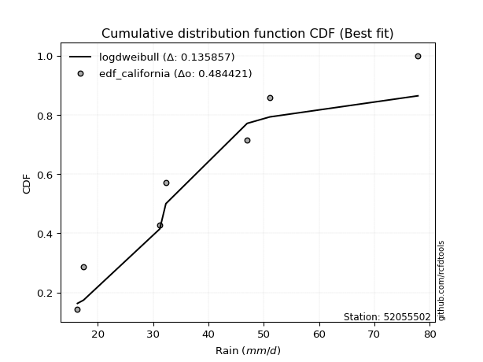</img>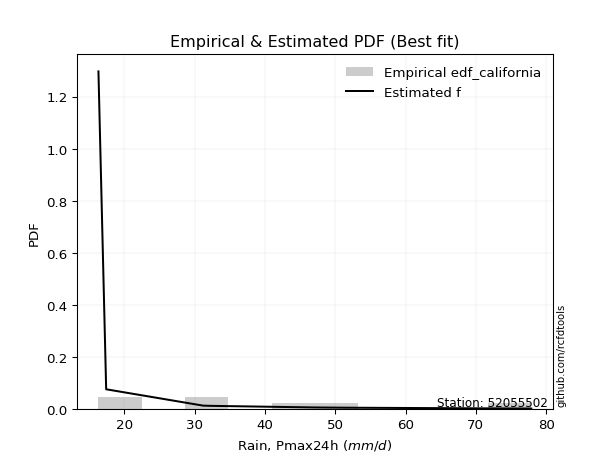</img>

</div>


### 2. EDF Hazen (1930)

Hazen method for plotting positions is a formula used to estimate the empirical cumulative probability distribution of flood events or other hydrological data. This formula often results in biased estimations, particularly when extrapolating to extreme events (high return periods).

<div align="center">


$P=(m-0.5)/n$


</div>


**2.1. Empirical values**

<div align="center">

|                | 0                   | 1                   | 2                   | 3         | 4                  | 5                  | 6                  |
|:---------------|:--------------------|:--------------------|:--------------------|:----------|:-------------------|:-------------------|:-------------------|
| date           | 2017                | 2023                | 2022                | 2018      | 2020               | 2021               | 2019               |
| x              | 16.3                | 17.4                | 31.2                | 32.3      | 47.0               | 51.1               | 77.9               |
| m              | 1                   | 2                   | 3                   | 4         | 5                  | 6                  | 7                  |
| empirical_dist | edf_hazen           | edf_hazen           | edf_hazen           | edf_hazen | edf_hazen          | edf_hazen          | edf_hazen          |
| empirical      | 0.07142857142857142 | 0.21428571428571427 | 0.35714285714285715 | 0.5       | 0.6428571428571429 | 0.7857142857142857 | 0.9285714285714286 |
| empirical_tr   | 1.0769230769230769  | 1.2727272727272727  | 1.5555555555555558  | 2.0       | 2.8000000000000003 | 4.666666666666666  | 14.000000000000007 |

</div>


**2.2. Kolmogorov-Smirnov fit test (sorted by Δ)**


<div align="center">

|                | 0                   | 1                   | 2                   | 3                   | 4                   | 5                   | 6                   | 7                   | 8                   | 9                   | 10                  | 11                  | 12                  | 13                  | 14                  | 15                  | 16                  | 17                  | 18                  | 19                  | 20                  | 21                  | 22                  | 23                  | 24                  | 25                  | 26                  | 27                  | 28                  | 29                  | 30                  | 31                  | 32                  | 33                  | 34                  | 35                  | 36                  | 37                  | 38                  | 39                  | 40                  | 41                  | 42                  | 43                  | 44                  | 45                  | 46                  | 47                  | 48                  | 49                  | 50                  | 51                  | 52                  | 53                  | 54                  | 55                  | 56                  | 57                  | 58                  | 59                  | 60                  | 61                  | 62                  | 63                  | 64                  | 65                  | 66                  | 67                  | 68                  | 69                  | 70                  | 71                  | 72                  | 73                  | 74                  | 75                  | 76                  | 77                  | 78                  | 79                  | 80                  | 81                  | 82                  | 83                  | 84                  | 85                  | 86                  | 87                  | 88                  | 89                  | 90                  | 91                  | 92                  | 93                  | 94                  | 95                  | 96                  | 97                  | 98                  | 99                  | 100                 | 101                 | 102                 | 103                 | 104                 | 105                 | 106                 | 107                 | 108                 | 109                 | 110                 | 111                 | 112                 | 113                 | 114                 | 115                 | 116                 | 117                 | 118                 | 119                 | 120                 | 121                 | 122                 | 123                 | 124                 | 125                 | 126                 | 127                 | 128                 | 129                 | 130                 | 131                 | 132                 | 133                 | 134                 | 135                 | 136                 | 137                 | 138                 | 139                 | 140                 | 141                 | 142                 | 143                 | 144                 | 145                 | 146                 | 147                 | 148                 | 149                 | 150                 | 151                 | 152                 | 153                 | 154                 | 155                 | 156                 | 157                 | 158                 | 159                 |
|:---------------|:--------------------|:--------------------|:--------------------|:--------------------|:--------------------|:--------------------|:--------------------|:--------------------|:--------------------|:--------------------|:--------------------|:--------------------|:--------------------|:--------------------|:--------------------|:--------------------|:--------------------|:--------------------|:--------------------|:--------------------|:--------------------|:--------------------|:--------------------|:--------------------|:--------------------|:--------------------|:--------------------|:--------------------|:--------------------|:--------------------|:--------------------|:--------------------|:--------------------|:--------------------|:--------------------|:--------------------|:--------------------|:--------------------|:--------------------|:--------------------|:--------------------|:--------------------|:--------------------|:--------------------|:--------------------|:--------------------|:--------------------|:--------------------|:--------------------|:--------------------|:--------------------|:--------------------|:--------------------|:--------------------|:--------------------|:--------------------|:--------------------|:--------------------|:--------------------|:--------------------|:--------------------|:--------------------|:--------------------|:--------------------|:--------------------|:--------------------|:--------------------|:--------------------|:--------------------|:--------------------|:--------------------|:--------------------|:--------------------|:--------------------|:--------------------|:--------------------|:--------------------|:--------------------|:--------------------|:--------------------|:--------------------|:--------------------|:--------------------|:--------------------|:--------------------|:--------------------|:--------------------|:--------------------|:--------------------|:--------------------|:--------------------|:--------------------|:--------------------|:--------------------|:--------------------|:--------------------|:--------------------|:--------------------|:--------------------|:--------------------|:--------------------|:--------------------|:--------------------|:--------------------|:--------------------|:--------------------|:--------------------|:--------------------|:--------------------|:--------------------|:--------------------|:--------------------|:--------------------|:--------------------|:--------------------|:--------------------|:--------------------|:--------------------|:--------------------|:--------------------|:--------------------|:--------------------|:--------------------|:--------------------|:--------------------|:--------------------|:--------------------|:--------------------|:--------------------|:--------------------|:--------------------|:--------------------|:--------------------|:--------------------|:--------------------|:--------------------|:--------------------|:--------------------|:--------------------|:--------------------|:--------------------|:--------------------|:--------------------|:--------------------|:--------------------|:--------------------|:--------------------|:--------------------|:--------------------|:--------------------|:--------------------|:--------------------|:--------------------|:--------------------|:--------------------|:--------------------|:--------------------|:--------------------|:--------------------|:--------------------|
| station        | 52055502            | 52055502            | 52055502            | 52055502            | 52055502            | 52055502            | 52055502            | 52055502            | 52055502            | 52055502            | 52055502            | 52055502            | 52055502            | 52055502            | 52055502            | 52055502            | 52055502            | 52055502            | 52055502            | 52055502            | 52055502            | 52055502            | 52055502            | 52055502            | 52055502            | 52055502            | 52055502            | 52055502            | 52055502            | 52055502            | 52055502            | 52055502            | 52055502            | 52055502            | 52055502            | 52055502            | 52055502            | 52055502            | 52055502            | 52055502            | 52055502            | 52055502            | 52055502            | 52055502            | 52055502            | 52055502            | 52055502            | 52055502            | 52055502            | 52055502            | 52055502            | 52055502            | 52055502            | 52055502            | 52055502            | 52055502            | 52055502            | 52055502            | 52055502            | 52055502            | 52055502            | 52055502            | 52055502            | 52055502            | 52055502            | 52055502            | 52055502            | 52055502            | 52055502            | 52055502            | 52055502            | 52055502            | 52055502            | 52055502            | 52055502            | 52055502            | 52055502            | 52055502            | 52055502            | 52055502            | 52055502            | 52055502            | 52055502            | 52055502            | 52055502            | 52055502            | 52055502            | 52055502            | 52055502            | 52055502            | 52055502            | 52055502            | 52055502            | 52055502            | 52055502            | 52055502            | 52055502            | 52055502            | 52055502            | 52055502            | 52055502            | 52055502            | 52055502            | 52055502            | 52055502            | 52055502            | 52055502            | 52055502            | 52055502            | 52055502            | 52055502            | 52055502            | 52055502            | 52055502            | 52055502            | 52055502            | 52055502            | 52055502            | 52055502            | 52055502            | 52055502            | 52055502            | 52055502            | 52055502            | 52055502            | 52055502            | 52055502            | 52055502            | 52055502            | 52055502            | 52055502            | 52055502            | 52055502            | 52055502            | 52055502            | 52055502            | 52055502            | 52055502            | 52055502            | 52055502            | 52055502            | 52055502            | 52055502            | 52055502            | 52055502            | 52055502            | 52055502            | 52055502            | 52055502            | 52055502            | 52055502            | 52055502            | 52055502            | 52055502            | 52055502            | 52055502            | 52055502            | 52055502            | 52055502            | 52055502            |
| empirical_dist | edf_hazen           | edf_hazen           | edf_hazen           | edf_hazen           | edf_hazen           | edf_hazen           | edf_hazen           | edf_hazen           | edf_hazen           | edf_hazen           | edf_hazen           | edf_hazen           | edf_hazen           | edf_hazen           | edf_hazen           | edf_hazen           | edf_hazen           | edf_hazen           | edf_hazen           | edf_hazen           | edf_hazen           | edf_hazen           | edf_hazen           | edf_hazen           | edf_hazen           | edf_hazen           | edf_hazen           | edf_hazen           | edf_hazen           | edf_hazen           | edf_hazen           | edf_hazen           | edf_hazen           | edf_hazen           | edf_hazen           | edf_hazen           | edf_hazen           | edf_hazen           | edf_hazen           | edf_hazen           | edf_hazen           | edf_hazen           | edf_hazen           | edf_hazen           | edf_hazen           | edf_hazen           | edf_hazen           | edf_hazen           | edf_hazen           | edf_hazen           | edf_hazen           | edf_hazen           | edf_hazen           | edf_hazen           | edf_hazen           | edf_hazen           | edf_hazen           | edf_hazen           | edf_hazen           | edf_hazen           | edf_hazen           | edf_hazen           | edf_hazen           | edf_hazen           | edf_hazen           | edf_hazen           | edf_hazen           | edf_hazen           | edf_hazen           | edf_hazen           | edf_hazen           | edf_hazen           | edf_hazen           | edf_hazen           | edf_hazen           | edf_hazen           | edf_hazen           | edf_hazen           | edf_hazen           | edf_hazen           | edf_hazen           | edf_hazen           | edf_hazen           | edf_hazen           | edf_hazen           | edf_hazen           | edf_hazen           | edf_hazen           | edf_hazen           | edf_hazen           | edf_hazen           | edf_hazen           | edf_hazen           | edf_hazen           | edf_hazen           | edf_hazen           | edf_hazen           | edf_hazen           | edf_hazen           | edf_hazen           | edf_hazen           | edf_hazen           | edf_hazen           | edf_hazen           | edf_hazen           | edf_hazen           | edf_hazen           | edf_hazen           | edf_hazen           | edf_hazen           | edf_hazen           | edf_hazen           | edf_hazen           | edf_hazen           | edf_hazen           | edf_hazen           | edf_hazen           | edf_hazen           | edf_hazen           | edf_hazen           | edf_hazen           | edf_hazen           | edf_hazen           | edf_hazen           | edf_hazen           | edf_hazen           | edf_hazen           | edf_hazen           | edf_hazen           | edf_hazen           | edf_hazen           | edf_hazen           | edf_hazen           | edf_hazen           | edf_hazen           | edf_hazen           | edf_hazen           | edf_hazen           | edf_hazen           | edf_hazen           | edf_hazen           | edf_hazen           | edf_hazen           | edf_hazen           | edf_hazen           | edf_hazen           | edf_hazen           | edf_hazen           | edf_hazen           | edf_hazen           | edf_hazen           | edf_hazen           | edf_hazen           | edf_hazen           | edf_hazen           | edf_hazen           | edf_hazen           | edf_hazen           | edf_hazen           | edf_hazen           |
| p_dist         | foldnorm            | rayleigh            | logsemicircular     | pearson3            | logksone            | loganglit           | halfnorm            | logburr             | maxwell             | logncf              | loggenextreme       | logweibull_max      | logarcsine          | genlogistic         | semicircular        | ncf                 | gumbel_r            | logloggamma         | loggumbel_l         | alpha               | kstwobign           | logpearson3         | logfoldnorm         | lognct              | logjohnsonsu        | logskewnorm         | logt                | logexponnorm        | logcrystalball      | lognorm             | genextreme          | logfatiguelife      | logf                | loggamma            | loggamma            | logerlang           | anglit              | dgamma              | loginvgamma         | logalpha            | invgamma            | logbetaprime        | loginvgauss         | logburr12           | logcosine           | rice                | dweibull            | logmaxwell          | loglogistic         | logargus            | logdweibull         | loghypsecant        | lograyleigh         | norm                | crystalball         | truncnorm           | t                   | logrice             | moyal               | logloglaplace       | weibull_min         | burr                | truncweibull_min    | loggenlogistic      | nct                 | loginvweibull       | logtriang           | loglaplace          | loglaplace          | arcsine             | logistic            | betaprime           | logdgamma           | beta                | halflogistic        | logbradford         | loggenexpon         | logkstwobign        | invgauss            | loggumbel_r         | logwrapcauchy       | logtruncpareto      | hypsecant           | cosine              | lomax               | exponnorm           | logtukeylambda      | logkappa4           | loggompertz         | gausshyper          | logkappa3           | genexpon            | loguniform          | logvonmises_line    | gompertz            | logrdist            | logexponpow         | logtruncexpon       | truncexpon          | logmoyal            | skewnorm            | kappa3              | laplace             | loghalfnorm         | bradford            | gumbel_l            | loggausshyper       | halfgennorm         | kappa4              | loghalflogistic     | wald                | f                   | argus               | burr12              | loglomax            | ksone               | tukeylambda         | logwald             | vonmises_line       | loggenhalflogistic  | uniform             | genpareto           | wrapcauchy          | logweibull_min      | logtruncweibull_min | gennorm             | loggennorm          | triang              | loggenpareto        | loglevy_l           | johnsonsb           | logtrapezoid        | logjohnsonsb        | levy_l              | logmielke           | genhalflogistic     | logtruncnorm        | exponpow            | invweibull          | exponweib           | logbeta             | powerlaw            | fatiguelife         | gengamma            | lognakagami         | nakagami            | rdist               | trapezoid           | johnsonsu           | erlang              | logpowerlaw         | logexponweib        | gamma               | truncpareto         | loggengamma         | weibull_max         | loghalfgennorm      | logvonmises         | vonmises            | mielke              |
| delta          | 0.07124141497263592 | 0.08631222842817321 | 0.08983876022657986 | 0.09274020404907307 | 0.09454054748614638 | 0.09625399766005577 | 0.09719078179752241 | 0.09852377621245467 | 0.09854661252619246 | 0.10295017154028446 | 0.10407944080324008 | 0.1040831119519571  | 0.10509573272179462 | 0.10616704564817467 | 0.10637095147609266 | 0.10757345627742443 | 0.10795361045839312 | 0.11085954230597111 | 0.11097097919745397 | 0.11130051978629545 | 0.11130983206564599 | 0.11181415585700522 | 0.11200885121404694 | 0.11217772089966818 | 0.11246942815395036 | 0.11250748200534327 | 0.11253574780227837 | 0.11253815891399703 | 0.11253851881970114 | 0.1125385466893061  | 0.11271653560656233 | 0.11284692284676087 | 0.11289444864737026 | 0.113045098594271   | 0.113045098594271   | 0.11305534994887131 | 0.11376813753748194 | 0.11383986368640209 | 0.11542587165612421 | 0.11594000039818378 | 0.11636420886121676 | 0.11656110348232634 | 0.11929247939646268 | 0.12151624054430504 | 0.12160594766264812 | 0.12210810281333559 | 0.12230407614581729 | 0.12280652461270496 | 0.12370246296011998 | 0.12731896042257748 | 0.1281711851992109  | 0.12843857927961427 | 0.12978494702719387 | 0.1314733431954157  | 0.1314733533767845  | 0.13147335676051475 | 0.1314739607815819  | 0.13355018712245206 | 0.13536250728177032 | 0.13657422394141738 | 0.13967202749846266 | 0.1425797621995017  | 0.1429713167778242  | 0.1430810749258849  | 0.14350330249507687 | 0.14488595718908442 | 0.14528696032954536 | 0.14536454858784398 | 0.14536454858784398 | 0.1456581008832446  | 0.14771214579793135 | 0.1483323720074558  | 0.15018940119326782 | 0.15142995745310328 | 0.15239794540141893 | 0.15409872302903274 | 0.1558769227024686  | 0.15659835744100364 | 0.15712476651763801 | 0.15749532469302996 | 0.15793940818575064 | 0.15799986854913795 | 0.1605971969311626  | 0.16335998642079919 | 0.16360826421609273 | 0.16592707972121953 | 0.1677796914098327  | 0.16866290166473394 | 0.16891445930820292 | 0.16903230325622415 | 0.17227082460493517 | 0.1725138578349062  | 0.17253749907350327 | 0.17254085790754495 | 0.17549706134154336 | 0.17872561667373132 | 0.17887981054729157 | 0.17984855437482633 | 0.18418316772754753 | 0.18469597330389922 | 0.18532478115451476 | 0.18690086258621902 | 0.1890057305410487  | 0.1893257461741651  | 0.19082443284532907 | 0.1941926453526268  | 0.20078434513573434 | 0.20215922749351029 | 0.20888574233616825 | 0.21428571428571427 | 0.21428571428571427 | 0.21695685021555405 | 0.22127992805159857 | 0.22601337844890929 | 0.2276309686340326  | 0.2316017316017317  | 0.2318811071880903  | 0.23486297810714946 | 0.23772030184800835 | 0.23804616589562355 | 0.24025974025974034 | 0.24578793332604498 | 0.24794803899053564 | 0.2689449420099133  | 0.2849585719603627  | 0.2857142857142857  | 0.2857142857142857  | 0.28638521582502807 | 0.28775905003393265 | 0.29217441829085966 | 0.30533975216777043 | 0.3067888899275745  | 0.3092190819261958  | 0.3419691196145742  | 0.35115129872203593 | 0.36823294160482617 | 0.3900881296199091  | 0.3957727172510785  | 0.40890629577760573 | 0.40922536206254206 | 0.4230991002558588  | 0.4465122738034906  | 0.4466109892424625  | 0.4492721250790182  | 0.4567205972736788  | 0.46008294904208796 | 0.4783188927918991  | 0.4786735630891476  | 0.4871863520251064  | 0.4989938565634536  | 0.5046538003540015  | 0.5221873191320658  | 0.5410244245344467  | 0.5528042581377792  | 0.5655541960406731  | 0.6384439283544958  | 0.7857142857142857  | 1.0892864050655224  | 11.661129314684109  | nan                 |
| deltao         | 0.48442053926100004 | 0.48442053926100004 | 0.48442053926100004 | 0.48442053926100004 | 0.48442053926100004 | 0.48442053926100004 | 0.48442053926100004 | 0.48442053926100004 | 0.48442053926100004 | 0.48442053926100004 | 0.48442053926100004 | 0.48442053926100004 | 0.48442053926100004 | 0.48442053926100004 | 0.48442053926100004 | 0.48442053926100004 | 0.48442053926100004 | 0.48442053926100004 | 0.48442053926100004 | 0.48442053926100004 | 0.48442053926100004 | 0.48442053926100004 | 0.48442053926100004 | 0.48442053926100004 | 0.48442053926100004 | 0.48442053926100004 | 0.48442053926100004 | 0.48442053926100004 | 0.48442053926100004 | 0.48442053926100004 | 0.48442053926100004 | 0.48442053926100004 | 0.48442053926100004 | 0.48442053926100004 | 0.48442053926100004 | 0.48442053926100004 | 0.48442053926100004 | 0.48442053926100004 | 0.48442053926100004 | 0.48442053926100004 | 0.48442053926100004 | 0.48442053926100004 | 0.48442053926100004 | 0.48442053926100004 | 0.48442053926100004 | 0.48442053926100004 | 0.48442053926100004 | 0.48442053926100004 | 0.48442053926100004 | 0.48442053926100004 | 0.48442053926100004 | 0.48442053926100004 | 0.48442053926100004 | 0.48442053926100004 | 0.48442053926100004 | 0.48442053926100004 | 0.48442053926100004 | 0.48442053926100004 | 0.48442053926100004 | 0.48442053926100004 | 0.48442053926100004 | 0.48442053926100004 | 0.48442053926100004 | 0.48442053926100004 | 0.48442053926100004 | 0.48442053926100004 | 0.48442053926100004 | 0.48442053926100004 | 0.48442053926100004 | 0.48442053926100004 | 0.48442053926100004 | 0.48442053926100004 | 0.48442053926100004 | 0.48442053926100004 | 0.48442053926100004 | 0.48442053926100004 | 0.48442053926100004 | 0.48442053926100004 | 0.48442053926100004 | 0.48442053926100004 | 0.48442053926100004 | 0.48442053926100004 | 0.48442053926100004 | 0.48442053926100004 | 0.48442053926100004 | 0.48442053926100004 | 0.48442053926100004 | 0.48442053926100004 | 0.48442053926100004 | 0.48442053926100004 | 0.48442053926100004 | 0.48442053926100004 | 0.48442053926100004 | 0.48442053926100004 | 0.48442053926100004 | 0.48442053926100004 | 0.48442053926100004 | 0.48442053926100004 | 0.48442053926100004 | 0.48442053926100004 | 0.48442053926100004 | 0.48442053926100004 | 0.48442053926100004 | 0.48442053926100004 | 0.48442053926100004 | 0.48442053926100004 | 0.48442053926100004 | 0.48442053926100004 | 0.48442053926100004 | 0.48442053926100004 | 0.48442053926100004 | 0.48442053926100004 | 0.48442053926100004 | 0.48442053926100004 | 0.48442053926100004 | 0.48442053926100004 | 0.48442053926100004 | 0.48442053926100004 | 0.48442053926100004 | 0.48442053926100004 | 0.48442053926100004 | 0.48442053926100004 | 0.48442053926100004 | 0.48442053926100004 | 0.48442053926100004 | 0.48442053926100004 | 0.48442053926100004 | 0.48442053926100004 | 0.48442053926100004 | 0.48442053926100004 | 0.48442053926100004 | 0.48442053926100004 | 0.48442053926100004 | 0.48442053926100004 | 0.48442053926100004 | 0.48442053926100004 | 0.48442053926100004 | 0.48442053926100004 | 0.48442053926100004 | 0.48442053926100004 | 0.48442053926100004 | 0.48442053926100004 | 0.48442053926100004 | 0.48442053926100004 | 0.48442053926100004 | 0.48442053926100004 | 0.48442053926100004 | 0.48442053926100004 | 0.48442053926100004 | 0.48442053926100004 | 0.48442053926100004 | 0.48442053926100004 | 0.48442053926100004 | 0.48442053926100004 | 0.48442053926100004 | 0.48442053926100004 | 0.48442053926100004 | 0.48442053926100004 | 0.48442053926100004 | 0.48442053926100004 |
| eval           | Δo > Δ              | Δo > Δ              | Δo > Δ              | Δo > Δ              | Δo > Δ              | Δo > Δ              | Δo > Δ              | Δo > Δ              | Δo > Δ              | Δo > Δ              | Δo > Δ              | Δo > Δ              | Δo > Δ              | Δo > Δ              | Δo > Δ              | Δo > Δ              | Δo > Δ              | Δo > Δ              | Δo > Δ              | Δo > Δ              | Δo > Δ              | Δo > Δ              | Δo > Δ              | Δo > Δ              | Δo > Δ              | Δo > Δ              | Δo > Δ              | Δo > Δ              | Δo > Δ              | Δo > Δ              | Δo > Δ              | Δo > Δ              | Δo > Δ              | Δo > Δ              | Δo > Δ              | Δo > Δ              | Δo > Δ              | Δo > Δ              | Δo > Δ              | Δo > Δ              | Δo > Δ              | Δo > Δ              | Δo > Δ              | Δo > Δ              | Δo > Δ              | Δo > Δ              | Δo > Δ              | Δo > Δ              | Δo > Δ              | Δo > Δ              | Δo > Δ              | Δo > Δ              | Δo > Δ              | Δo > Δ              | Δo > Δ              | Δo > Δ              | Δo > Δ              | Δo > Δ              | Δo > Δ              | Δo > Δ              | Δo > Δ              | Δo > Δ              | Δo > Δ              | Δo > Δ              | Δo > Δ              | Δo > Δ              | Δo > Δ              | Δo > Δ              | Δo > Δ              | Δo > Δ              | Δo > Δ              | Δo > Δ              | Δo > Δ              | Δo > Δ              | Δo > Δ              | Δo > Δ              | Δo > Δ              | Δo > Δ              | Δo > Δ              | Δo > Δ              | Δo > Δ              | Δo > Δ              | Δo > Δ              | Δo > Δ              | Δo > Δ              | Δo > Δ              | Δo > Δ              | Δo > Δ              | Δo > Δ              | Δo > Δ              | Δo > Δ              | Δo > Δ              | Δo > Δ              | Δo > Δ              | Δo > Δ              | Δo > Δ              | Δo > Δ              | Δo > Δ              | Δo > Δ              | Δo > Δ              | Δo > Δ              | Δo > Δ              | Δo > Δ              | Δo > Δ              | Δo > Δ              | Δo > Δ              | Δo > Δ              | Δo > Δ              | Δo > Δ              | Δo > Δ              | Δo > Δ              | Δo > Δ              | Δo > Δ              | Δo > Δ              | Δo > Δ              | Δo > Δ              | Δo > Δ              | Δo > Δ              | Δo > Δ              | Δo > Δ              | Δo > Δ              | Δo > Δ              | Δo > Δ              | Δo > Δ              | Δo > Δ              | Δo > Δ              | Δo > Δ              | Δo > Δ              | Δo > Δ              | Δo > Δ              | Δo > Δ              | Δo > Δ              | Δo > Δ              | Δo > Δ              | Δo > Δ              | Δo > Δ              | Δo > Δ              | Δo > Δ              | Δo > Δ              | Δo > Δ              | Δo > Δ              | Δo > Δ              | Δo > Δ              | Δo > Δ              | Δo > Δ              | Δo > Δ              | Δo > Δ              | Δo > Δ              | Δo <= Δ             | Δo <= Δ             | Δo <= Δ             | Δo <= Δ             | Δo <= Δ             | Δo <= Δ             | Δo <= Δ             | Δo <= Δ             | Δo <= Δ             | Δo <= Δ             | Δo <= Δ             | Δo <= Δ             |
| fit            | 1                   | 1                   | 1                   | 1                   | 1                   | 1                   | 1                   | 1                   | 1                   | 1                   | 1                   | 1                   | 1                   | 1                   | 1                   | 1                   | 1                   | 1                   | 1                   | 1                   | 1                   | 1                   | 1                   | 1                   | 1                   | 1                   | 1                   | 1                   | 1                   | 1                   | 1                   | 1                   | 1                   | 1                   | 1                   | 1                   | 1                   | 1                   | 1                   | 1                   | 1                   | 1                   | 1                   | 1                   | 1                   | 1                   | 1                   | 1                   | 1                   | 1                   | 1                   | 1                   | 1                   | 1                   | 1                   | 1                   | 1                   | 1                   | 1                   | 1                   | 1                   | 1                   | 1                   | 1                   | 1                   | 1                   | 1                   | 1                   | 1                   | 1                   | 1                   | 1                   | 1                   | 1                   | 1                   | 1                   | 1                   | 1                   | 1                   | 1                   | 1                   | 1                   | 1                   | 1                   | 1                   | 1                   | 1                   | 1                   | 1                   | 1                   | 1                   | 1                   | 1                   | 1                   | 1                   | 1                   | 1                   | 1                   | 1                   | 1                   | 1                   | 1                   | 1                   | 1                   | 1                   | 1                   | 1                   | 1                   | 1                   | 1                   | 1                   | 1                   | 1                   | 1                   | 1                   | 1                   | 1                   | 1                   | 1                   | 1                   | 1                   | 1                   | 1                   | 1                   | 1                   | 1                   | 1                   | 1                   | 1                   | 1                   | 1                   | 1                   | 1                   | 1                   | 1                   | 1                   | 1                   | 1                   | 1                   | 1                   | 1                   | 1                   | 1                   | 1                   | 1                   | 1                   | 1                   | 1                   | 0                   | 0                   | 0                   | 0                   | 0                   | 0                   | 0                   | 0                   | 0                   | 0                   | 0                   | 0                   |
| n              | 7                   | 7                   | 7                   | 7                   | 7                   | 7                   | 7                   | 7                   | 7                   | 7                   | 7                   | 7                   | 7                   | 7                   | 7                   | 7                   | 7                   | 7                   | 7                   | 7                   | 7                   | 7                   | 7                   | 7                   | 7                   | 7                   | 7                   | 7                   | 7                   | 7                   | 7                   | 7                   | 7                   | 7                   | 7                   | 7                   | 7                   | 7                   | 7                   | 7                   | 7                   | 7                   | 7                   | 7                   | 7                   | 7                   | 7                   | 7                   | 7                   | 7                   | 7                   | 7                   | 7                   | 7                   | 7                   | 7                   | 7                   | 7                   | 7                   | 7                   | 7                   | 7                   | 7                   | 7                   | 7                   | 7                   | 7                   | 7                   | 7                   | 7                   | 7                   | 7                   | 7                   | 7                   | 7                   | 7                   | 7                   | 7                   | 7                   | 7                   | 7                   | 7                   | 7                   | 7                   | 7                   | 7                   | 7                   | 7                   | 7                   | 7                   | 7                   | 7                   | 7                   | 7                   | 7                   | 7                   | 7                   | 7                   | 7                   | 7                   | 7                   | 7                   | 7                   | 7                   | 7                   | 7                   | 7                   | 7                   | 7                   | 7                   | 7                   | 7                   | 7                   | 7                   | 7                   | 7                   | 7                   | 7                   | 7                   | 7                   | 7                   | 7                   | 7                   | 7                   | 7                   | 7                   | 7                   | 7                   | 7                   | 7                   | 7                   | 7                   | 7                   | 7                   | 7                   | 7                   | 7                   | 7                   | 7                   | 7                   | 7                   | 7                   | 7                   | 7                   | 7                   | 7                   | 7                   | 7                   | 7                   | 7                   | 7                   | 7                   | 7                   | 7                   | 7                   | 7                   | 7                   | 7                   | 7                   | 7                   |
| best_fit       | 1                   | 0                   | 0                   | 0                   | 0                   | 0                   | 0                   | 0                   | 0                   | 0                   | 0                   | 0                   | 0                   | 0                   | 0                   | 0                   | 0                   | 0                   | 0                   | 0                   | 0                   | 0                   | 0                   | 0                   | 0                   | 0                   | 0                   | 0                   | 0                   | 0                   | 0                   | 0                   | 0                   | 0                   | 0                   | 0                   | 0                   | 0                   | 0                   | 0                   | 0                   | 0                   | 0                   | 0                   | 0                   | 0                   | 0                   | 0                   | 0                   | 0                   | 0                   | 0                   | 0                   | 0                   | 0                   | 0                   | 0                   | 0                   | 0                   | 0                   | 0                   | 0                   | 0                   | 0                   | 0                   | 0                   | 0                   | 0                   | 0                   | 0                   | 0                   | 0                   | 0                   | 0                   | 0                   | 0                   | 0                   | 0                   | 0                   | 0                   | 0                   | 0                   | 0                   | 0                   | 0                   | 0                   | 0                   | 0                   | 0                   | 0                   | 0                   | 0                   | 0                   | 0                   | 0                   | 0                   | 0                   | 0                   | 0                   | 0                   | 0                   | 0                   | 0                   | 0                   | 0                   | 0                   | 0                   | 0                   | 0                   | 0                   | 0                   | 0                   | 0                   | 0                   | 0                   | 0                   | 0                   | 0                   | 0                   | 0                   | 0                   | 0                   | 0                   | 0                   | 0                   | 0                   | 0                   | 0                   | 0                   | 0                   | 0                   | 0                   | 0                   | 0                   | 0                   | 0                   | 0                   | 0                   | 0                   | 0                   | 0                   | 0                   | 0                   | 0                   | 0                   | 0                   | 0                   | 0                   | 0                   | 0                   | 0                   | 0                   | 0                   | 0                   | 0                   | 0                   | 0                   | 0                   | 0                   | 0                   |
| best_fit_sort  | 1                   | 2                   | 3                   | 4                   | 5                   | 6                   | 7                   | 8                   | 9                   | 10                  | 11                  | 12                  | 13                  | 14                  | 15                  | 16                  | 17                  | 18                  | 19                  | 20                  | 21                  | 22                  | 23                  | 24                  | 25                  | 26                  | 27                  | 28                  | 29                  | 30                  | 31                  | 32                  | 33                  | 34                  | 35                  | 36                  | 37                  | 38                  | 39                  | 40                  | 41                  | 42                  | 43                  | 44                  | 45                  | 46                  | 47                  | 48                  | 49                  | 50                  | 51                  | 52                  | 53                  | 54                  | 55                  | 56                  | 57                  | 58                  | 59                  | 60                  | 61                  | 62                  | 63                  | 64                  | 65                  | 66                  | 67                  | 68                  | 69                  | 70                  | 71                  | 72                  | 73                  | 74                  | 75                  | 76                  | 77                  | 78                  | 79                  | 80                  | 81                  | 82                  | 83                  | 84                  | 85                  | 86                  | 87                  | 88                  | 89                  | 90                  | 91                  | 92                  | 93                  | 94                  | 95                  | 96                  | 97                  | 98                  | 99                  | 100                 | 101                 | 102                 | 103                 | 104                 | 105                 | 106                 | 107                 | 108                 | 109                 | 110                 | 111                 | 112                 | 113                 | 114                 | 115                 | 116                 | 117                 | 118                 | 119                 | 120                 | 121                 | 122                 | 123                 | 124                 | 125                 | 126                 | 127                 | 128                 | 129                 | 130                 | 131                 | 132                 | 133                 | 134                 | 135                 | 136                 | 137                 | 138                 | 139                 | 140                 | 141                 | 142                 | 143                 | 144                 | 145                 | 146                 | 147                 | 148                 | 149                 | 150                 | 151                 | 152                 | 153                 | 154                 | 155                 | 156                 | 157                 | 158                 | 159                 | 160                 |

</div>


**2.3. Best fit**

<div align="center">

|   id |   station | empirical_dist   | p_dist   |     delta |   deltao | eval   |   fit |   n |   best_fit |   best_fit_sort |
|-----:|----------:|:-----------------|:---------|----------:|---------:|:-------|------:|----:|-----------:|----------------:|
|    0 |  52055502 | edf_hazen        | foldnorm | 0.0712414 | 0.484421 | Δo > Δ |     1 |   7 |          1 |               1 |

</div>


<div align="center">

</img></img>

</div>


### 3. EDF Weibull (1939)

Weibull plotting position formula is an empirical method used to estimate the non-exceedance probability or plotting position for a set of observed data, is often recommended or widely used in practice, particularly in flood frequency analysis.

<div align="center">


$P=m/(n+1)$


</div>


**3.1. Empirical values**

<div align="center">

|                | 0                  | 1                  | 2           | 3           | 4                  | 5           | 6           |
|:---------------|:-------------------|:-------------------|:------------|:------------|:-------------------|:------------|:------------|
| date           | 2017               | 2023               | 2022        | 2018        | 2020               | 2021        | 2019        |
| x              | 16.3               | 17.4               | 31.2        | 32.3        | 47.0               | 51.1        | 77.9        |
| m              | 1                  | 2                  | 3           | 4           | 5                  | 6           | 7           |
| empirical_dist | edf_weibull        | edf_weibull        | edf_weibull | edf_weibull | edf_weibull        | edf_weibull | edf_weibull |
| empirical      | 0.125              | 0.25               | 0.375       | 0.5         | 0.625              | 0.75        | 0.875       |
| empirical_tr   | 1.1428571428571428 | 1.3333333333333333 | 1.6         | 2.0         | 2.6666666666666665 | 4.0         | 8.0         |

</div>


**3.2. Kolmogorov-Smirnov fit test (sorted by Δ)**


<div align="center">

|                | 0                   | 1                   | 2                   | 3                   | 4                   | 5                   | 6                   | 7                   | 8                   | 9                   | 10                  | 11                  | 12                  | 13                  | 14                  | 15                  | 16                  | 17                  | 18                  | 19                  | 20                  | 21                  | 22                  | 23                  | 24                  | 25                  | 26                  | 27                  | 28                  | 29                  | 30                  | 31                  | 32                  | 33                  | 34                  | 35                  | 36                  | 37                  | 38                  | 39                  | 40                  | 41                  | 42                  | 43                  | 44                  | 45                  | 46                  | 47                  | 48                  | 49                  | 50                  | 51                  | 52                  | 53                  | 54                  | 55                  | 56                  | 57                  | 58                  | 59                  | 60                  | 61                  | 62                  | 63                  | 64                  | 65                  | 66                  | 67                  | 68                  | 69                  | 70                  | 71                  | 72                  | 73                  | 74                  | 75                  | 76                  | 77                  | 78                  | 79                  | 80                  | 81                  | 82                  | 83                  | 84                  | 85                  | 86                  | 87                  | 88                  | 89                  | 90                  | 91                  | 92                  | 93                  | 94                  | 95                  | 96                  | 97                  | 98                  | 99                  | 100                 | 101                 | 102                 | 103                 | 104                 | 105                 | 106                 | 107                 | 108                 | 109                 | 110                 | 111                 | 112                 | 113                 | 114                 | 115                 | 116                 | 117                 | 118                 | 119                 | 120                 | 121                 | 122                 | 123                 | 124                 | 125                 | 126                 | 127                 | 128                 | 129                 | 130                 | 131                 | 132                 | 133                 | 134                 | 135                 | 136                 | 137                 | 138                 | 139                 | 140                 | 141                 | 142                 | 143                 | 144                 | 145                 | 146                 | 147                 | 148                 | 149                 | 150                 | 151                 | 152                 | 153                 | 154                 | 155                 | 156                 | 157                 | 158                 | 159                 |
|:---------------|:--------------------|:--------------------|:--------------------|:--------------------|:--------------------|:--------------------|:--------------------|:--------------------|:--------------------|:--------------------|:--------------------|:--------------------|:--------------------|:--------------------|:--------------------|:--------------------|:--------------------|:--------------------|:--------------------|:--------------------|:--------------------|:--------------------|:--------------------|:--------------------|:--------------------|:--------------------|:--------------------|:--------------------|:--------------------|:--------------------|:--------------------|:--------------------|:--------------------|:--------------------|:--------------------|:--------------------|:--------------------|:--------------------|:--------------------|:--------------------|:--------------------|:--------------------|:--------------------|:--------------------|:--------------------|:--------------------|:--------------------|:--------------------|:--------------------|:--------------------|:--------------------|:--------------------|:--------------------|:--------------------|:--------------------|:--------------------|:--------------------|:--------------------|:--------------------|:--------------------|:--------------------|:--------------------|:--------------------|:--------------------|:--------------------|:--------------------|:--------------------|:--------------------|:--------------------|:--------------------|:--------------------|:--------------------|:--------------------|:--------------------|:--------------------|:--------------------|:--------------------|:--------------------|:--------------------|:--------------------|:--------------------|:--------------------|:--------------------|:--------------------|:--------------------|:--------------------|:--------------------|:--------------------|:--------------------|:--------------------|:--------------------|:--------------------|:--------------------|:--------------------|:--------------------|:--------------------|:--------------------|:--------------------|:--------------------|:--------------------|:--------------------|:--------------------|:--------------------|:--------------------|:--------------------|:--------------------|:--------------------|:--------------------|:--------------------|:--------------------|:--------------------|:--------------------|:--------------------|:--------------------|:--------------------|:--------------------|:--------------------|:--------------------|:--------------------|:--------------------|:--------------------|:--------------------|:--------------------|:--------------------|:--------------------|:--------------------|:--------------------|:--------------------|:--------------------|:--------------------|:--------------------|:--------------------|:--------------------|:--------------------|:--------------------|:--------------------|:--------------------|:--------------------|:--------------------|:--------------------|:--------------------|:--------------------|:--------------------|:--------------------|:--------------------|:--------------------|:--------------------|:--------------------|:--------------------|:--------------------|:--------------------|:--------------------|:--------------------|:--------------------|:--------------------|:--------------------|:--------------------|:--------------------|:--------------------|:--------------------|
| station        | 52055502            | 52055502            | 52055502            | 52055502            | 52055502            | 52055502            | 52055502            | 52055502            | 52055502            | 52055502            | 52055502            | 52055502            | 52055502            | 52055502            | 52055502            | 52055502            | 52055502            | 52055502            | 52055502            | 52055502            | 52055502            | 52055502            | 52055502            | 52055502            | 52055502            | 52055502            | 52055502            | 52055502            | 52055502            | 52055502            | 52055502            | 52055502            | 52055502            | 52055502            | 52055502            | 52055502            | 52055502            | 52055502            | 52055502            | 52055502            | 52055502            | 52055502            | 52055502            | 52055502            | 52055502            | 52055502            | 52055502            | 52055502            | 52055502            | 52055502            | 52055502            | 52055502            | 52055502            | 52055502            | 52055502            | 52055502            | 52055502            | 52055502            | 52055502            | 52055502            | 52055502            | 52055502            | 52055502            | 52055502            | 52055502            | 52055502            | 52055502            | 52055502            | 52055502            | 52055502            | 52055502            | 52055502            | 52055502            | 52055502            | 52055502            | 52055502            | 52055502            | 52055502            | 52055502            | 52055502            | 52055502            | 52055502            | 52055502            | 52055502            | 52055502            | 52055502            | 52055502            | 52055502            | 52055502            | 52055502            | 52055502            | 52055502            | 52055502            | 52055502            | 52055502            | 52055502            | 52055502            | 52055502            | 52055502            | 52055502            | 52055502            | 52055502            | 52055502            | 52055502            | 52055502            | 52055502            | 52055502            | 52055502            | 52055502            | 52055502            | 52055502            | 52055502            | 52055502            | 52055502            | 52055502            | 52055502            | 52055502            | 52055502            | 52055502            | 52055502            | 52055502            | 52055502            | 52055502            | 52055502            | 52055502            | 52055502            | 52055502            | 52055502            | 52055502            | 52055502            | 52055502            | 52055502            | 52055502            | 52055502            | 52055502            | 52055502            | 52055502            | 52055502            | 52055502            | 52055502            | 52055502            | 52055502            | 52055502            | 52055502            | 52055502            | 52055502            | 52055502            | 52055502            | 52055502            | 52055502            | 52055502            | 52055502            | 52055502            | 52055502            | 52055502            | 52055502            | 52055502            | 52055502            | 52055502            | 52055502            |
| empirical_dist | edf_weibull         | edf_weibull         | edf_weibull         | edf_weibull         | edf_weibull         | edf_weibull         | edf_weibull         | edf_weibull         | edf_weibull         | edf_weibull         | edf_weibull         | edf_weibull         | edf_weibull         | edf_weibull         | edf_weibull         | edf_weibull         | edf_weibull         | edf_weibull         | edf_weibull         | edf_weibull         | edf_weibull         | edf_weibull         | edf_weibull         | edf_weibull         | edf_weibull         | edf_weibull         | edf_weibull         | edf_weibull         | edf_weibull         | edf_weibull         | edf_weibull         | edf_weibull         | edf_weibull         | edf_weibull         | edf_weibull         | edf_weibull         | edf_weibull         | edf_weibull         | edf_weibull         | edf_weibull         | edf_weibull         | edf_weibull         | edf_weibull         | edf_weibull         | edf_weibull         | edf_weibull         | edf_weibull         | edf_weibull         | edf_weibull         | edf_weibull         | edf_weibull         | edf_weibull         | edf_weibull         | edf_weibull         | edf_weibull         | edf_weibull         | edf_weibull         | edf_weibull         | edf_weibull         | edf_weibull         | edf_weibull         | edf_weibull         | edf_weibull         | edf_weibull         | edf_weibull         | edf_weibull         | edf_weibull         | edf_weibull         | edf_weibull         | edf_weibull         | edf_weibull         | edf_weibull         | edf_weibull         | edf_weibull         | edf_weibull         | edf_weibull         | edf_weibull         | edf_weibull         | edf_weibull         | edf_weibull         | edf_weibull         | edf_weibull         | edf_weibull         | edf_weibull         | edf_weibull         | edf_weibull         | edf_weibull         | edf_weibull         | edf_weibull         | edf_weibull         | edf_weibull         | edf_weibull         | edf_weibull         | edf_weibull         | edf_weibull         | edf_weibull         | edf_weibull         | edf_weibull         | edf_weibull         | edf_weibull         | edf_weibull         | edf_weibull         | edf_weibull         | edf_weibull         | edf_weibull         | edf_weibull         | edf_weibull         | edf_weibull         | edf_weibull         | edf_weibull         | edf_weibull         | edf_weibull         | edf_weibull         | edf_weibull         | edf_weibull         | edf_weibull         | edf_weibull         | edf_weibull         | edf_weibull         | edf_weibull         | edf_weibull         | edf_weibull         | edf_weibull         | edf_weibull         | edf_weibull         | edf_weibull         | edf_weibull         | edf_weibull         | edf_weibull         | edf_weibull         | edf_weibull         | edf_weibull         | edf_weibull         | edf_weibull         | edf_weibull         | edf_weibull         | edf_weibull         | edf_weibull         | edf_weibull         | edf_weibull         | edf_weibull         | edf_weibull         | edf_weibull         | edf_weibull         | edf_weibull         | edf_weibull         | edf_weibull         | edf_weibull         | edf_weibull         | edf_weibull         | edf_weibull         | edf_weibull         | edf_weibull         | edf_weibull         | edf_weibull         | edf_weibull         | edf_weibull         | edf_weibull         | edf_weibull         | edf_weibull         |
| p_dist         | foldnorm            | maxwell             | rayleigh            | anglit              | dweibull            | logksone            | pearson3            | semicircular        | dgamma              | arcsine             | logarcsine          | logsemicircular     | logncf              | norm                | crystalball         | truncnorm           | t                   | loganglit           | halfnorm            | logburr             | loggenextreme       | logweibull_max      | genlogistic         | logrdist            | ncf                 | gumbel_r            | loggumbel_l         | logdweibull         | logloggamma         | alpha               | kstwobign           | logpearson3         | logistic            | logfoldnorm         | lognct              | logjohnsonsu        | logskewnorm         | logt                | logexponnorm        | logcrystalball      | lognorm             | genextreme          | logfatiguelife      | logf                | loggamma            | loggamma            | logerlang           | loginvgamma         | gausshyper          | logalpha            | invgamma            | logbetaprime        | logkstwobign        | loggenlogistic      | logtriang           | burr                | loginvweibull       | invgauss            | logloglaplace       | loginvgauss         | logburr12           | nct                 | logcosine           | rice                | logmaxwell          | betaprime           | loglogistic         | hypsecant           | logexponpow         | logargus            | cosine              | loghypsecant        | lograyleigh         | loglaplace          | loglaplace          | logrice             | moyal               | weibull_min         | truncweibull_min    | loggausshyper       | halfgennorm         | logtruncexpon       | logdgamma           | beta                | halflogistic        | laplace             | logbradford         | loggenexpon         | loggumbel_r         | logwrapcauchy       | logtruncpareto      | gumbel_l            | f                   | lomax               | ksone               | exponnorm           | logtukeylambda      | logkappa4           | loggompertz         | logkappa3           | burr12              | genexpon            | loguniform          | logvonmises_line    | loglomax            | genpareto           | gompertz            | wrapcauchy          | truncexpon          | logmoyal            | skewnorm            | argus               | kappa3              | kappa4              | loghalfnorm         | bradford            | loggenpareto        | loggenhalflogistic  | vonmises_line       | loglevy_l           | uniform             | tukeylambda         | loghalflogistic     | logwald             | gennorm             | wald                | loggennorm          | triang              | logweibull_min      | logtruncweibull_min | johnsonsb           | logjohnsonsb        | levy_l              | logtrapezoid        | genhalflogistic     | logmielke           | invweibull          | exponpow            | logtruncnorm        | exponweib           | logbeta             | rdist               | powerlaw            | fatiguelife         | gengamma            | lognakagami         | nakagami            | trapezoid           | johnsonsu           | erlang              | logpowerlaw         | logexponweib        | gamma               | truncpareto         | loggengamma         | weibull_max         | loghalfgennorm      | logvonmises         | vonmises            | mielke              |
| delta          | 0.10114753315031022 | 0.11018229099384394 | 0.1114048457083216  | 0.11376813753748194 | 0.1162202797073251  | 0.11709630764225792 | 0.12123256929370538 | 0.12187187731871285 | 0.12496750545540727 | 0.125               | 0.125               | 0.12555304594086558 | 0.12723021420677863 | 0.1314733431954157  | 0.1314733533767845  | 0.13147335676051475 | 0.1314739607815819  | 0.1319682833743415  | 0.13290506751180814 | 0.1342380619267404  | 0.1397937265175258  | 0.13979739766624283 | 0.1418813313624604  | 0.14301133095944563 | 0.14328774199171015 | 0.14366789617267883 | 0.1459234444640968  | 0.1460283280563538  | 0.14657382802025684 | 0.14701480550058116 | 0.1470241177799317  | 0.14752844157129094 | 0.14771214579793135 | 0.14772313692833267 | 0.1478920066139539  | 0.1481837138682361  | 0.148221767719629   | 0.1482500335165641  | 0.14825244462828274 | 0.14825280453398687 | 0.14825283240359183 | 0.14843082132084806 | 0.1485612085610466  | 0.148608734361656   | 0.14875938430855673 | 0.14875938430855673 | 0.14876963566315704 | 0.15114015737040992 | 0.1511751603990813  | 0.1516542861124695  | 0.1520784945755025  | 0.15227538919661207 | 0.15272837441381368 | 0.15289874376568985 | 0.15302559790293746 | 0.15321680312319813 | 0.15405780832212668 | 0.15408752156110628 | 0.1544313667985603  | 0.1550067651107484  | 0.1552746046523466  | 0.15613776572595084 | 0.15732023337693385 | 0.15782238852762132 | 0.15852081032699067 | 0.1590741037367385  | 0.1594167486744057  | 0.1605971969311626  | 0.16102266769014872 | 0.1630332461368632  | 0.16335998642079919 | 0.16415286499390003 | 0.1654992327414796  | 0.16721798579446992 | 0.16721798579446992 | 0.1692644728367378  | 0.17107679299605605 | 0.1753863132127484  | 0.17868560249210994 | 0.1829272022785915  | 0.18430208463636744 | 0.18539494064683698 | 0.18590368690755354 | 0.18714424316738898 | 0.18811223111570466 | 0.1890057305410487  | 0.18981300874331847 | 0.1915423288640605  | 0.19320961040731569 | 0.19365369390003634 | 0.19371415426342364 | 0.1941926453526268  | 0.1990997073584112  | 0.19932254993037846 | 0.20021645021645035 | 0.20164136543550526 | 0.20349397712411843 | 0.20437718737901966 | 0.20462874502248865 | 0.2079851103192209  | 0.20815623559176644 | 0.20822814354919195 | 0.208251784787789   | 0.20825514362183067 | 0.20977382577688974 | 0.21007364761175928 | 0.21121134705582909 | 0.21908533610462422 | 0.21989745344183326 | 0.22041025901818495 | 0.22103906686880048 | 0.22127992805159857 | 0.22261514830050474 | 0.22451173984338027 | 0.22504003188845084 | 0.2265387185596148  | 0.2341876214625041  | 0.23596431515704935 | 0.23772030184800835 | 0.23860298971943106 | 0.24025974025974034 | 0.2499999999999929  | 0.25                | 0.25                | 0.25                | 0.25                | 0.25                | 0.2506709301107424  | 0.25108779915277046 | 0.2671014291032199  | 0.26962546645348473 | 0.2735047962119101  | 0.2883976910431456  | 0.2995910827177801  | 0.33251865589054047 | 0.3332941558648931  | 0.35533486720617713 | 0.37791557439393564 | 0.3900881296199091  | 0.3913682192053992  | 0.40524195739871594 | 0.4247474642204705  | 0.4286551309463478  | 0.42875384638531966 | 0.43141498222187535 | 0.43886345441653596 | 0.4422258061849451  | 0.4429592773748619  | 0.4514720663108207  | 0.4811367137063107  | 0.48679665749685874 | 0.504330176274923   | 0.5231672816773039  | 0.5349471152806364  | 0.5476970531835302  | 0.6027296426402101  | 0.75                | 1.1071435479226654  | 11.714700743255538  | nan                 |
| deltao         | 0.48442053926100004 | 0.48442053926100004 | 0.48442053926100004 | 0.48442053926100004 | 0.48442053926100004 | 0.48442053926100004 | 0.48442053926100004 | 0.48442053926100004 | 0.48442053926100004 | 0.48442053926100004 | 0.48442053926100004 | 0.48442053926100004 | 0.48442053926100004 | 0.48442053926100004 | 0.48442053926100004 | 0.48442053926100004 | 0.48442053926100004 | 0.48442053926100004 | 0.48442053926100004 | 0.48442053926100004 | 0.48442053926100004 | 0.48442053926100004 | 0.48442053926100004 | 0.48442053926100004 | 0.48442053926100004 | 0.48442053926100004 | 0.48442053926100004 | 0.48442053926100004 | 0.48442053926100004 | 0.48442053926100004 | 0.48442053926100004 | 0.48442053926100004 | 0.48442053926100004 | 0.48442053926100004 | 0.48442053926100004 | 0.48442053926100004 | 0.48442053926100004 | 0.48442053926100004 | 0.48442053926100004 | 0.48442053926100004 | 0.48442053926100004 | 0.48442053926100004 | 0.48442053926100004 | 0.48442053926100004 | 0.48442053926100004 | 0.48442053926100004 | 0.48442053926100004 | 0.48442053926100004 | 0.48442053926100004 | 0.48442053926100004 | 0.48442053926100004 | 0.48442053926100004 | 0.48442053926100004 | 0.48442053926100004 | 0.48442053926100004 | 0.48442053926100004 | 0.48442053926100004 | 0.48442053926100004 | 0.48442053926100004 | 0.48442053926100004 | 0.48442053926100004 | 0.48442053926100004 | 0.48442053926100004 | 0.48442053926100004 | 0.48442053926100004 | 0.48442053926100004 | 0.48442053926100004 | 0.48442053926100004 | 0.48442053926100004 | 0.48442053926100004 | 0.48442053926100004 | 0.48442053926100004 | 0.48442053926100004 | 0.48442053926100004 | 0.48442053926100004 | 0.48442053926100004 | 0.48442053926100004 | 0.48442053926100004 | 0.48442053926100004 | 0.48442053926100004 | 0.48442053926100004 | 0.48442053926100004 | 0.48442053926100004 | 0.48442053926100004 | 0.48442053926100004 | 0.48442053926100004 | 0.48442053926100004 | 0.48442053926100004 | 0.48442053926100004 | 0.48442053926100004 | 0.48442053926100004 | 0.48442053926100004 | 0.48442053926100004 | 0.48442053926100004 | 0.48442053926100004 | 0.48442053926100004 | 0.48442053926100004 | 0.48442053926100004 | 0.48442053926100004 | 0.48442053926100004 | 0.48442053926100004 | 0.48442053926100004 | 0.48442053926100004 | 0.48442053926100004 | 0.48442053926100004 | 0.48442053926100004 | 0.48442053926100004 | 0.48442053926100004 | 0.48442053926100004 | 0.48442053926100004 | 0.48442053926100004 | 0.48442053926100004 | 0.48442053926100004 | 0.48442053926100004 | 0.48442053926100004 | 0.48442053926100004 | 0.48442053926100004 | 0.48442053926100004 | 0.48442053926100004 | 0.48442053926100004 | 0.48442053926100004 | 0.48442053926100004 | 0.48442053926100004 | 0.48442053926100004 | 0.48442053926100004 | 0.48442053926100004 | 0.48442053926100004 | 0.48442053926100004 | 0.48442053926100004 | 0.48442053926100004 | 0.48442053926100004 | 0.48442053926100004 | 0.48442053926100004 | 0.48442053926100004 | 0.48442053926100004 | 0.48442053926100004 | 0.48442053926100004 | 0.48442053926100004 | 0.48442053926100004 | 0.48442053926100004 | 0.48442053926100004 | 0.48442053926100004 | 0.48442053926100004 | 0.48442053926100004 | 0.48442053926100004 | 0.48442053926100004 | 0.48442053926100004 | 0.48442053926100004 | 0.48442053926100004 | 0.48442053926100004 | 0.48442053926100004 | 0.48442053926100004 | 0.48442053926100004 | 0.48442053926100004 | 0.48442053926100004 | 0.48442053926100004 | 0.48442053926100004 | 0.48442053926100004 | 0.48442053926100004 | 0.48442053926100004 |
| eval           | Δo > Δ              | Δo > Δ              | Δo > Δ              | Δo > Δ              | Δo > Δ              | Δo > Δ              | Δo > Δ              | Δo > Δ              | Δo > Δ              | Δo > Δ              | Δo > Δ              | Δo > Δ              | Δo > Δ              | Δo > Δ              | Δo > Δ              | Δo > Δ              | Δo > Δ              | Δo > Δ              | Δo > Δ              | Δo > Δ              | Δo > Δ              | Δo > Δ              | Δo > Δ              | Δo > Δ              | Δo > Δ              | Δo > Δ              | Δo > Δ              | Δo > Δ              | Δo > Δ              | Δo > Δ              | Δo > Δ              | Δo > Δ              | Δo > Δ              | Δo > Δ              | Δo > Δ              | Δo > Δ              | Δo > Δ              | Δo > Δ              | Δo > Δ              | Δo > Δ              | Δo > Δ              | Δo > Δ              | Δo > Δ              | Δo > Δ              | Δo > Δ              | Δo > Δ              | Δo > Δ              | Δo > Δ              | Δo > Δ              | Δo > Δ              | Δo > Δ              | Δo > Δ              | Δo > Δ              | Δo > Δ              | Δo > Δ              | Δo > Δ              | Δo > Δ              | Δo > Δ              | Δo > Δ              | Δo > Δ              | Δo > Δ              | Δo > Δ              | Δo > Δ              | Δo > Δ              | Δo > Δ              | Δo > Δ              | Δo > Δ              | Δo > Δ              | Δo > Δ              | Δo > Δ              | Δo > Δ              | Δo > Δ              | Δo > Δ              | Δo > Δ              | Δo > Δ              | Δo > Δ              | Δo > Δ              | Δo > Δ              | Δo > Δ              | Δo > Δ              | Δo > Δ              | Δo > Δ              | Δo > Δ              | Δo > Δ              | Δo > Δ              | Δo > Δ              | Δo > Δ              | Δo > Δ              | Δo > Δ              | Δo > Δ              | Δo > Δ              | Δo > Δ              | Δo > Δ              | Δo > Δ              | Δo > Δ              | Δo > Δ              | Δo > Δ              | Δo > Δ              | Δo > Δ              | Δo > Δ              | Δo > Δ              | Δo > Δ              | Δo > Δ              | Δo > Δ              | Δo > Δ              | Δo > Δ              | Δo > Δ              | Δo > Δ              | Δo > Δ              | Δo > Δ              | Δo > Δ              | Δo > Δ              | Δo > Δ              | Δo > Δ              | Δo > Δ              | Δo > Δ              | Δo > Δ              | Δo > Δ              | Δo > Δ              | Δo > Δ              | Δo > Δ              | Δo > Δ              | Δo > Δ              | Δo > Δ              | Δo > Δ              | Δo > Δ              | Δo > Δ              | Δo > Δ              | Δo > Δ              | Δo > Δ              | Δo > Δ              | Δo > Δ              | Δo > Δ              | Δo > Δ              | Δo > Δ              | Δo > Δ              | Δo > Δ              | Δo > Δ              | Δo > Δ              | Δo > Δ              | Δo > Δ              | Δo > Δ              | Δo > Δ              | Δo > Δ              | Δo > Δ              | Δo > Δ              | Δo > Δ              | Δo > Δ              | Δo > Δ              | Δo > Δ              | Δo <= Δ             | Δo <= Δ             | Δo <= Δ             | Δo <= Δ             | Δo <= Δ             | Δo <= Δ             | Δo <= Δ             | Δo <= Δ             | Δo <= Δ             | Δo <= Δ             |
| fit            | 1                   | 1                   | 1                   | 1                   | 1                   | 1                   | 1                   | 1                   | 1                   | 1                   | 1                   | 1                   | 1                   | 1                   | 1                   | 1                   | 1                   | 1                   | 1                   | 1                   | 1                   | 1                   | 1                   | 1                   | 1                   | 1                   | 1                   | 1                   | 1                   | 1                   | 1                   | 1                   | 1                   | 1                   | 1                   | 1                   | 1                   | 1                   | 1                   | 1                   | 1                   | 1                   | 1                   | 1                   | 1                   | 1                   | 1                   | 1                   | 1                   | 1                   | 1                   | 1                   | 1                   | 1                   | 1                   | 1                   | 1                   | 1                   | 1                   | 1                   | 1                   | 1                   | 1                   | 1                   | 1                   | 1                   | 1                   | 1                   | 1                   | 1                   | 1                   | 1                   | 1                   | 1                   | 1                   | 1                   | 1                   | 1                   | 1                   | 1                   | 1                   | 1                   | 1                   | 1                   | 1                   | 1                   | 1                   | 1                   | 1                   | 1                   | 1                   | 1                   | 1                   | 1                   | 1                   | 1                   | 1                   | 1                   | 1                   | 1                   | 1                   | 1                   | 1                   | 1                   | 1                   | 1                   | 1                   | 1                   | 1                   | 1                   | 1                   | 1                   | 1                   | 1                   | 1                   | 1                   | 1                   | 1                   | 1                   | 1                   | 1                   | 1                   | 1                   | 1                   | 1                   | 1                   | 1                   | 1                   | 1                   | 1                   | 1                   | 1                   | 1                   | 1                   | 1                   | 1                   | 1                   | 1                   | 1                   | 1                   | 1                   | 1                   | 1                   | 1                   | 1                   | 1                   | 1                   | 1                   | 1                   | 1                   | 0                   | 0                   | 0                   | 0                   | 0                   | 0                   | 0                   | 0                   | 0                   | 0                   |
| n              | 7                   | 7                   | 7                   | 7                   | 7                   | 7                   | 7                   | 7                   | 7                   | 7                   | 7                   | 7                   | 7                   | 7                   | 7                   | 7                   | 7                   | 7                   | 7                   | 7                   | 7                   | 7                   | 7                   | 7                   | 7                   | 7                   | 7                   | 7                   | 7                   | 7                   | 7                   | 7                   | 7                   | 7                   | 7                   | 7                   | 7                   | 7                   | 7                   | 7                   | 7                   | 7                   | 7                   | 7                   | 7                   | 7                   | 7                   | 7                   | 7                   | 7                   | 7                   | 7                   | 7                   | 7                   | 7                   | 7                   | 7                   | 7                   | 7                   | 7                   | 7                   | 7                   | 7                   | 7                   | 7                   | 7                   | 7                   | 7                   | 7                   | 7                   | 7                   | 7                   | 7                   | 7                   | 7                   | 7                   | 7                   | 7                   | 7                   | 7                   | 7                   | 7                   | 7                   | 7                   | 7                   | 7                   | 7                   | 7                   | 7                   | 7                   | 7                   | 7                   | 7                   | 7                   | 7                   | 7                   | 7                   | 7                   | 7                   | 7                   | 7                   | 7                   | 7                   | 7                   | 7                   | 7                   | 7                   | 7                   | 7                   | 7                   | 7                   | 7                   | 7                   | 7                   | 7                   | 7                   | 7                   | 7                   | 7                   | 7                   | 7                   | 7                   | 7                   | 7                   | 7                   | 7                   | 7                   | 7                   | 7                   | 7                   | 7                   | 7                   | 7                   | 7                   | 7                   | 7                   | 7                   | 7                   | 7                   | 7                   | 7                   | 7                   | 7                   | 7                   | 7                   | 7                   | 7                   | 7                   | 7                   | 7                   | 7                   | 7                   | 7                   | 7                   | 7                   | 7                   | 7                   | 7                   | 7                   | 7                   |
| best_fit       | 1                   | 0                   | 0                   | 0                   | 0                   | 0                   | 0                   | 0                   | 0                   | 0                   | 0                   | 0                   | 0                   | 0                   | 0                   | 0                   | 0                   | 0                   | 0                   | 0                   | 0                   | 0                   | 0                   | 0                   | 0                   | 0                   | 0                   | 0                   | 0                   | 0                   | 0                   | 0                   | 0                   | 0                   | 0                   | 0                   | 0                   | 0                   | 0                   | 0                   | 0                   | 0                   | 0                   | 0                   | 0                   | 0                   | 0                   | 0                   | 0                   | 0                   | 0                   | 0                   | 0                   | 0                   | 0                   | 0                   | 0                   | 0                   | 0                   | 0                   | 0                   | 0                   | 0                   | 0                   | 0                   | 0                   | 0                   | 0                   | 0                   | 0                   | 0                   | 0                   | 0                   | 0                   | 0                   | 0                   | 0                   | 0                   | 0                   | 0                   | 0                   | 0                   | 0                   | 0                   | 0                   | 0                   | 0                   | 0                   | 0                   | 0                   | 0                   | 0                   | 0                   | 0                   | 0                   | 0                   | 0                   | 0                   | 0                   | 0                   | 0                   | 0                   | 0                   | 0                   | 0                   | 0                   | 0                   | 0                   | 0                   | 0                   | 0                   | 0                   | 0                   | 0                   | 0                   | 0                   | 0                   | 0                   | 0                   | 0                   | 0                   | 0                   | 0                   | 0                   | 0                   | 0                   | 0                   | 0                   | 0                   | 0                   | 0                   | 0                   | 0                   | 0                   | 0                   | 0                   | 0                   | 0                   | 0                   | 0                   | 0                   | 0                   | 0                   | 0                   | 0                   | 0                   | 0                   | 0                   | 0                   | 0                   | 0                   | 0                   | 0                   | 0                   | 0                   | 0                   | 0                   | 0                   | 0                   | 0                   |
| best_fit_sort  | 1                   | 2                   | 3                   | 4                   | 5                   | 6                   | 7                   | 8                   | 9                   | 10                  | 11                  | 12                  | 13                  | 14                  | 15                  | 16                  | 17                  | 18                  | 19                  | 20                  | 21                  | 22                  | 23                  | 24                  | 25                  | 26                  | 27                  | 28                  | 29                  | 30                  | 31                  | 32                  | 33                  | 34                  | 35                  | 36                  | 37                  | 38                  | 39                  | 40                  | 41                  | 42                  | 43                  | 44                  | 45                  | 46                  | 47                  | 48                  | 49                  | 50                  | 51                  | 52                  | 53                  | 54                  | 55                  | 56                  | 57                  | 58                  | 59                  | 60                  | 61                  | 62                  | 63                  | 64                  | 65                  | 66                  | 67                  | 68                  | 69                  | 70                  | 71                  | 72                  | 73                  | 74                  | 75                  | 76                  | 77                  | 78                  | 79                  | 80                  | 81                  | 82                  | 83                  | 84                  | 85                  | 86                  | 87                  | 88                  | 89                  | 90                  | 91                  | 92                  | 93                  | 94                  | 95                  | 96                  | 97                  | 98                  | 99                  | 100                 | 101                 | 102                 | 103                 | 104                 | 105                 | 106                 | 107                 | 108                 | 109                 | 110                 | 111                 | 112                 | 113                 | 114                 | 115                 | 116                 | 117                 | 118                 | 119                 | 120                 | 121                 | 122                 | 123                 | 124                 | 125                 | 126                 | 127                 | 128                 | 129                 | 130                 | 131                 | 132                 | 133                 | 134                 | 135                 | 136                 | 137                 | 138                 | 139                 | 140                 | 141                 | 142                 | 143                 | 144                 | 145                 | 146                 | 147                 | 148                 | 149                 | 150                 | 151                 | 152                 | 153                 | 154                 | 155                 | 156                 | 157                 | 158                 | 159                 | 160                 |

</div>


**3.3. Best fit**

<div align="center">

|   id |   station | empirical_dist   | p_dist   |    delta |   deltao | eval   |   fit |   n |   best_fit |   best_fit_sort |
|-----:|----------:|:-----------------|:---------|---------:|---------:|:-------|------:|----:|-----------:|----------------:|
|    0 |  52055502 | edf_weibull      | foldnorm | 0.101148 | 0.484421 | Δo > Δ |     1 |   7 |          1 |               1 |

</div>


<div align="center">

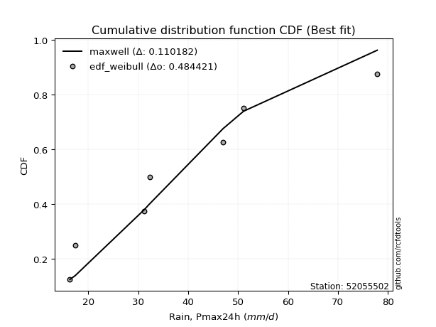</img></img>

</div>


### 4. EDF Beard (1943)

The Beard formula (or Beard´s plotting position formula) in hydrology is used to estimate the empirical non-exceedance probability _(P)_ of a flood event (or other extreme hydrological data point) within a given dataset.

<div align="center">


$P=(m-0.31)/(n+0.38)$


</div>


**4.1. Empirical values**

<div align="center">

|                | 0                   | 1                   | 2                   | 3         | 4                  | 5                  | 6                  |
|:---------------|:--------------------|:--------------------|:--------------------|:----------|:-------------------|:-------------------|:-------------------|
| date           | 2017                | 2023                | 2022                | 2018      | 2020               | 2021               | 2019               |
| x              | 16.3                | 17.4                | 31.2                | 32.3      | 47.0               | 51.1               | 77.9               |
| m              | 1                   | 2                   | 3                   | 4         | 5                  | 6                  | 7                  |
| empirical_dist | edf_beard           | edf_beard           | edf_beard           | edf_beard | edf_beard          | edf_beard          | edf_beard          |
| empirical      | 0.09349593495934959 | 0.22899728997289973 | 0.36449864498644985 | 0.5       | 0.6355013550135502 | 0.7710027100271003 | 0.9065040650406505 |
| empirical_tr   | 1.1031390134529149  | 1.29701230228471    | 1.5735607675906182  | 2.0       | 2.743494423791822  | 4.366863905325444  | 10.695652173913055 |

</div>


**4.2. Kolmogorov-Smirnov fit test (sorted by Δ)**


<div align="center">

|                | 0                   | 1                   | 2                   | 3                   | 4                   | 5                   | 6                   | 7                   | 8                   | 9                   | 10                  | 11                  | 12                  | 13                  | 14                  | 15                  | 16                  | 17                  | 18                  | 19                  | 20                  | 21                  | 22                  | 23                  | 24                  | 25                  | 26                  | 27                  | 28                  | 29                  | 30                  | 31                  | 32                  | 33                  | 34                  | 35                  | 36                  | 37                  | 38                  | 39                  | 40                  | 41                  | 42                  | 43                  | 44                  | 45                  | 46                  | 47                  | 48                  | 49                  | 50                  | 51                  | 52                  | 53                  | 54                  | 55                  | 56                  | 57                  | 58                  | 59                  | 60                  | 61                  | 62                  | 63                  | 64                  | 65                  | 66                  | 67                  | 68                  | 69                  | 70                  | 71                  | 72                  | 73                  | 74                  | 75                  | 76                  | 77                  | 78                  | 79                  | 80                  | 81                  | 82                  | 83                  | 84                  | 85                  | 86                  | 87                  | 88                  | 89                  | 90                  | 91                  | 92                  | 93                  | 94                  | 95                  | 96                  | 97                  | 98                  | 99                  | 100                 | 101                 | 102                 | 103                 | 104                 | 105                 | 106                 | 107                 | 108                 | 109                 | 110                 | 111                 | 112                 | 113                 | 114                 | 115                 | 116                 | 117                 | 118                 | 119                 | 120                 | 121                 | 122                 | 123                 | 124                 | 125                 | 126                 | 127                 | 128                 | 129                 | 130                 | 131                 | 132                 | 133                 | 134                 | 135                 | 136                 | 137                 | 138                 | 139                 | 140                 | 141                 | 142                 | 143                 | 144                 | 145                 | 146                 | 147                 | 148                 | 149                 | 150                 | 151                 | 152                 | 153                 | 154                 | 155                 | 156                 | 157                 | 158                 | 159                 |
|:---------------|:--------------------|:--------------------|:--------------------|:--------------------|:--------------------|:--------------------|:--------------------|:--------------------|:--------------------|:--------------------|:--------------------|:--------------------|:--------------------|:--------------------|:--------------------|:--------------------|:--------------------|:--------------------|:--------------------|:--------------------|:--------------------|:--------------------|:--------------------|:--------------------|:--------------------|:--------------------|:--------------------|:--------------------|:--------------------|:--------------------|:--------------------|:--------------------|:--------------------|:--------------------|:--------------------|:--------------------|:--------------------|:--------------------|:--------------------|:--------------------|:--------------------|:--------------------|:--------------------|:--------------------|:--------------------|:--------------------|:--------------------|:--------------------|:--------------------|:--------------------|:--------------------|:--------------------|:--------------------|:--------------------|:--------------------|:--------------------|:--------------------|:--------------------|:--------------------|:--------------------|:--------------------|:--------------------|:--------------------|:--------------------|:--------------------|:--------------------|:--------------------|:--------------------|:--------------------|:--------------------|:--------------------|:--------------------|:--------------------|:--------------------|:--------------------|:--------------------|:--------------------|:--------------------|:--------------------|:--------------------|:--------------------|:--------------------|:--------------------|:--------------------|:--------------------|:--------------------|:--------------------|:--------------------|:--------------------|:--------------------|:--------------------|:--------------------|:--------------------|:--------------------|:--------------------|:--------------------|:--------------------|:--------------------|:--------------------|:--------------------|:--------------------|:--------------------|:--------------------|:--------------------|:--------------------|:--------------------|:--------------------|:--------------------|:--------------------|:--------------------|:--------------------|:--------------------|:--------------------|:--------------------|:--------------------|:--------------------|:--------------------|:--------------------|:--------------------|:--------------------|:--------------------|:--------------------|:--------------------|:--------------------|:--------------------|:--------------------|:--------------------|:--------------------|:--------------------|:--------------------|:--------------------|:--------------------|:--------------------|:--------------------|:--------------------|:--------------------|:--------------------|:--------------------|:--------------------|:--------------------|:--------------------|:--------------------|:--------------------|:--------------------|:--------------------|:--------------------|:--------------------|:--------------------|:--------------------|:--------------------|:--------------------|:--------------------|:--------------------|:--------------------|:--------------------|:--------------------|:--------------------|:--------------------|:--------------------|:--------------------|
| station        | 52055502            | 52055502            | 52055502            | 52055502            | 52055502            | 52055502            | 52055502            | 52055502            | 52055502            | 52055502            | 52055502            | 52055502            | 52055502            | 52055502            | 52055502            | 52055502            | 52055502            | 52055502            | 52055502            | 52055502            | 52055502            | 52055502            | 52055502            | 52055502            | 52055502            | 52055502            | 52055502            | 52055502            | 52055502            | 52055502            | 52055502            | 52055502            | 52055502            | 52055502            | 52055502            | 52055502            | 52055502            | 52055502            | 52055502            | 52055502            | 52055502            | 52055502            | 52055502            | 52055502            | 52055502            | 52055502            | 52055502            | 52055502            | 52055502            | 52055502            | 52055502            | 52055502            | 52055502            | 52055502            | 52055502            | 52055502            | 52055502            | 52055502            | 52055502            | 52055502            | 52055502            | 52055502            | 52055502            | 52055502            | 52055502            | 52055502            | 52055502            | 52055502            | 52055502            | 52055502            | 52055502            | 52055502            | 52055502            | 52055502            | 52055502            | 52055502            | 52055502            | 52055502            | 52055502            | 52055502            | 52055502            | 52055502            | 52055502            | 52055502            | 52055502            | 52055502            | 52055502            | 52055502            | 52055502            | 52055502            | 52055502            | 52055502            | 52055502            | 52055502            | 52055502            | 52055502            | 52055502            | 52055502            | 52055502            | 52055502            | 52055502            | 52055502            | 52055502            | 52055502            | 52055502            | 52055502            | 52055502            | 52055502            | 52055502            | 52055502            | 52055502            | 52055502            | 52055502            | 52055502            | 52055502            | 52055502            | 52055502            | 52055502            | 52055502            | 52055502            | 52055502            | 52055502            | 52055502            | 52055502            | 52055502            | 52055502            | 52055502            | 52055502            | 52055502            | 52055502            | 52055502            | 52055502            | 52055502            | 52055502            | 52055502            | 52055502            | 52055502            | 52055502            | 52055502            | 52055502            | 52055502            | 52055502            | 52055502            | 52055502            | 52055502            | 52055502            | 52055502            | 52055502            | 52055502            | 52055502            | 52055502            | 52055502            | 52055502            | 52055502            | 52055502            | 52055502            | 52055502            | 52055502            | 52055502            | 52055502            |
| empirical_dist | edf_beard           | edf_beard           | edf_beard           | edf_beard           | edf_beard           | edf_beard           | edf_beard           | edf_beard           | edf_beard           | edf_beard           | edf_beard           | edf_beard           | edf_beard           | edf_beard           | edf_beard           | edf_beard           | edf_beard           | edf_beard           | edf_beard           | edf_beard           | edf_beard           | edf_beard           | edf_beard           | edf_beard           | edf_beard           | edf_beard           | edf_beard           | edf_beard           | edf_beard           | edf_beard           | edf_beard           | edf_beard           | edf_beard           | edf_beard           | edf_beard           | edf_beard           | edf_beard           | edf_beard           | edf_beard           | edf_beard           | edf_beard           | edf_beard           | edf_beard           | edf_beard           | edf_beard           | edf_beard           | edf_beard           | edf_beard           | edf_beard           | edf_beard           | edf_beard           | edf_beard           | edf_beard           | edf_beard           | edf_beard           | edf_beard           | edf_beard           | edf_beard           | edf_beard           | edf_beard           | edf_beard           | edf_beard           | edf_beard           | edf_beard           | edf_beard           | edf_beard           | edf_beard           | edf_beard           | edf_beard           | edf_beard           | edf_beard           | edf_beard           | edf_beard           | edf_beard           | edf_beard           | edf_beard           | edf_beard           | edf_beard           | edf_beard           | edf_beard           | edf_beard           | edf_beard           | edf_beard           | edf_beard           | edf_beard           | edf_beard           | edf_beard           | edf_beard           | edf_beard           | edf_beard           | edf_beard           | edf_beard           | edf_beard           | edf_beard           | edf_beard           | edf_beard           | edf_beard           | edf_beard           | edf_beard           | edf_beard           | edf_beard           | edf_beard           | edf_beard           | edf_beard           | edf_beard           | edf_beard           | edf_beard           | edf_beard           | edf_beard           | edf_beard           | edf_beard           | edf_beard           | edf_beard           | edf_beard           | edf_beard           | edf_beard           | edf_beard           | edf_beard           | edf_beard           | edf_beard           | edf_beard           | edf_beard           | edf_beard           | edf_beard           | edf_beard           | edf_beard           | edf_beard           | edf_beard           | edf_beard           | edf_beard           | edf_beard           | edf_beard           | edf_beard           | edf_beard           | edf_beard           | edf_beard           | edf_beard           | edf_beard           | edf_beard           | edf_beard           | edf_beard           | edf_beard           | edf_beard           | edf_beard           | edf_beard           | edf_beard           | edf_beard           | edf_beard           | edf_beard           | edf_beard           | edf_beard           | edf_beard           | edf_beard           | edf_beard           | edf_beard           | edf_beard           | edf_beard           | edf_beard           | edf_beard           | edf_beard           |
| p_dist         | foldnorm            | rayleigh            | logksone            | logarcsine          | maxwell             | pearson3            | dgamma              | logsemicircular     | logncf              | semicircular        | dweibull            | loganglit           | halfnorm            | logburr             | anglit              | loggenextreme       | logweibull_max      | genlogistic         | ncf                 | gumbel_r            | loggumbel_l         | logloggamma         | alpha               | kstwobign           | logpearson3         | logfoldnorm         | lognct              | logjohnsonsu        | logskewnorm         | logt                | logexponnorm        | logcrystalball      | lognorm             | genextreme          | logfatiguelife      | logf                | loggamma            | loggamma            | logerlang           | loginvgamma         | logalpha            | arcsine             | invgamma            | logbetaprime        | norm                | crystalball         | truncnorm           | t                   | loginvgauss         | logburr12           | burr                | logdweibull         | loggenlogistic      | nct                 | logcosine           | rice                | logmaxwell          | loginvweibull       | loglogistic         | betaprime           | logargus            | loghypsecant        | logloglaplace       | lograyleigh         | logtriang           | logistic            | logrice             | logkstwobign        | invgauss            | moyal               | loglaplace          | loglaplace          | weibull_min         | truncweibull_min    | hypsecant           | gausshyper          | cosine              | logrdist            | logdgamma           | beta                | halflogistic        | logbradford         | loggenexpon         | logexponpow         | loggumbel_r         | logtruncexpon       | logwrapcauchy       | logtruncpareto      | lomax               | exponnorm           | logtukeylambda      | logkappa4           | loggompertz         | logkappa3           | genexpon            | loguniform          | logvonmises_line    | laplace             | gompertz            | loggausshyper       | gumbel_l            | halfgennorm         | truncexpon          | logmoyal            | skewnorm            | kappa3              | loghalfnorm         | bradford            | kappa4              | f                   | ksone               | burr12              | loglomax            | argus               | loghalflogistic     | logwald             | wald                | genpareto           | wrapcauchy          | loggenhalflogistic  | vonmises_line       | tukeylambda         | uniform             | logweibull_min      | loggenpareto        | loglevy_l           | gennorm             | loggennorm          | triang              | logtruncweibull_min | johnsonsb           | logjohnsonsb        | logtrapezoid        | levy_l              | logmielke           | genhalflogistic     | invweibull          | exponpow            | logtruncnorm        | exponweib           | logbeta             | powerlaw            | fatiguelife         | gengamma            | lognakagami         | nakagami            | rdist               | trapezoid           | johnsonsu           | erlang              | logpowerlaw         | logexponweib        | gamma               | truncpareto         | loggengamma         | weibull_max         | loghalfgennorm      | logvonmises         | vonmises            | mielke              |
| delta          | 0.08014482312320995 | 0.09040213568122132 | 0.09609359761515765 | 0.09773994487820192 | 0.09854661252619246 | 0.1002298592666051  | 0.103964795428307   | 0.10455033591376531 | 0.10622750417967836 | 0.10637095147609266 | 0.10759250045863189 | 0.11096557334724122 | 0.11190235748470787 | 0.11323535189964012 | 0.11376813753748194 | 0.11879101649042553 | 0.11879468763914255 | 0.12087862133536012 | 0.12228503196460988 | 0.12266518614557857 | 0.12492073443699653 | 0.12557111799315657 | 0.1260120954734809  | 0.12602140775283144 | 0.12652573154419067 | 0.1267204269012324  | 0.12688929658685363 | 0.12718100384113581 | 0.12721905769252873 | 0.12724732348946383 | 0.1272497346011825  | 0.1272500945068866  | 0.12725012237649155 | 0.1274281112937478  | 0.12755849853394632 | 0.1276060243345557  | 0.12775667428145646 | 0.12775667428145646 | 0.12776692563605677 | 0.13013744734330968 | 0.13065157608536923 | 0.1309465251960592  | 0.1310757845484022  | 0.1312726791695118  | 0.1314733431954157  | 0.1314733533767845  | 0.13147335676051475 | 0.1314739607815819  | 0.13400405508364813 | 0.13427189462524633 | 0.135223974355909   | 0.1355269730428036  | 0.1357252870822922  | 0.13614751465148417 | 0.13631752334983357 | 0.13681967850052104 | 0.13751810029989042 | 0.13753016934549173 | 0.13841403864730545 | 0.1409765841638631  | 0.14203053610976293 | 0.14315015496679973 | 0.14393001178501008 | 0.14449652271437932 | 0.14528696032954536 | 0.14771214579793135 | 0.14826176280963752 | 0.14924256959741095 | 0.14976897867404532 | 0.15007408296895577 | 0.15272033643143668 | 0.15272033643143668 | 0.15438360318564812 | 0.15768289246500966 | 0.1605971969311626  | 0.16167651541263145 | 0.16335998642079919 | 0.16401404098654593 | 0.16490097688045327 | 0.16614153314028873 | 0.16710952108860438 | 0.1688102987162182  | 0.17053961883696023 | 0.17152402270369888 | 0.1722069003802154  | 0.17249276653123363 | 0.1726509838729361  | 0.1727114442363234  | 0.17831983990327818 | 0.18063865540840499 | 0.18249126709701816 | 0.1833744773519194  | 0.18362603499538838 | 0.18698240029212063 | 0.18722543352209164 | 0.18724907476068872 | 0.1872524335947304  | 0.1890057305410487  | 0.1902086370287288  | 0.19342855729214165 | 0.1941926453526268  | 0.1948034396499176  | 0.19889474341473298 | 0.19940754899108468 | 0.2000363568417002  | 0.20161243827340447 | 0.20403732186135054 | 0.20553600853251452 | 0.20888574233616825 | 0.20960106237196136 | 0.2168901559145463  | 0.2186575906053166  | 0.2202751807904399  | 0.22127992805159857 | 0.22899728997289973 | 0.22899728997289973 | 0.22899728997289973 | 0.2310763576388596  | 0.23323646330335024 | 0.23596431515704935 | 0.23772030184800835 | 0.239236895031683   | 0.24025974025974034 | 0.2615891541663206  | 0.2656916865031545  | 0.27010705476008146 | 0.2710027100271003  | 0.2710027100271003  | 0.2716736401378427  | 0.27760278411677003 | 0.29062817648058503 | 0.2945075062390104  | 0.2995910827177801  | 0.319901756083796   | 0.34379551087844323 | 0.3535213659176408  | 0.38683893224682764 | 0.3884169294074858  | 0.3900881296199091  | 0.40186957421894937 | 0.4157433124122661  | 0.4391564859598979  | 0.4392552013988698  | 0.4419163372354255  | 0.4493648094300861  | 0.45272716119849526 | 0.4562515292611209  | 0.4639619874019622  | 0.472474776337921   | 0.4916380687198609  | 0.4972980125104089  | 0.5148315312884733  | 0.5336686366908541  | 0.5454484702941866  | 0.5581984081970803  | 0.6237323526673104  | 0.7710027100271003  | 1.0966421929091152  | 11.683196678214887  | nan                 |
| deltao         | 0.48442053926100004 | 0.48442053926100004 | 0.48442053926100004 | 0.48442053926100004 | 0.48442053926100004 | 0.48442053926100004 | 0.48442053926100004 | 0.48442053926100004 | 0.48442053926100004 | 0.48442053926100004 | 0.48442053926100004 | 0.48442053926100004 | 0.48442053926100004 | 0.48442053926100004 | 0.48442053926100004 | 0.48442053926100004 | 0.48442053926100004 | 0.48442053926100004 | 0.48442053926100004 | 0.48442053926100004 | 0.48442053926100004 | 0.48442053926100004 | 0.48442053926100004 | 0.48442053926100004 | 0.48442053926100004 | 0.48442053926100004 | 0.48442053926100004 | 0.48442053926100004 | 0.48442053926100004 | 0.48442053926100004 | 0.48442053926100004 | 0.48442053926100004 | 0.48442053926100004 | 0.48442053926100004 | 0.48442053926100004 | 0.48442053926100004 | 0.48442053926100004 | 0.48442053926100004 | 0.48442053926100004 | 0.48442053926100004 | 0.48442053926100004 | 0.48442053926100004 | 0.48442053926100004 | 0.48442053926100004 | 0.48442053926100004 | 0.48442053926100004 | 0.48442053926100004 | 0.48442053926100004 | 0.48442053926100004 | 0.48442053926100004 | 0.48442053926100004 | 0.48442053926100004 | 0.48442053926100004 | 0.48442053926100004 | 0.48442053926100004 | 0.48442053926100004 | 0.48442053926100004 | 0.48442053926100004 | 0.48442053926100004 | 0.48442053926100004 | 0.48442053926100004 | 0.48442053926100004 | 0.48442053926100004 | 0.48442053926100004 | 0.48442053926100004 | 0.48442053926100004 | 0.48442053926100004 | 0.48442053926100004 | 0.48442053926100004 | 0.48442053926100004 | 0.48442053926100004 | 0.48442053926100004 | 0.48442053926100004 | 0.48442053926100004 | 0.48442053926100004 | 0.48442053926100004 | 0.48442053926100004 | 0.48442053926100004 | 0.48442053926100004 | 0.48442053926100004 | 0.48442053926100004 | 0.48442053926100004 | 0.48442053926100004 | 0.48442053926100004 | 0.48442053926100004 | 0.48442053926100004 | 0.48442053926100004 | 0.48442053926100004 | 0.48442053926100004 | 0.48442053926100004 | 0.48442053926100004 | 0.48442053926100004 | 0.48442053926100004 | 0.48442053926100004 | 0.48442053926100004 | 0.48442053926100004 | 0.48442053926100004 | 0.48442053926100004 | 0.48442053926100004 | 0.48442053926100004 | 0.48442053926100004 | 0.48442053926100004 | 0.48442053926100004 | 0.48442053926100004 | 0.48442053926100004 | 0.48442053926100004 | 0.48442053926100004 | 0.48442053926100004 | 0.48442053926100004 | 0.48442053926100004 | 0.48442053926100004 | 0.48442053926100004 | 0.48442053926100004 | 0.48442053926100004 | 0.48442053926100004 | 0.48442053926100004 | 0.48442053926100004 | 0.48442053926100004 | 0.48442053926100004 | 0.48442053926100004 | 0.48442053926100004 | 0.48442053926100004 | 0.48442053926100004 | 0.48442053926100004 | 0.48442053926100004 | 0.48442053926100004 | 0.48442053926100004 | 0.48442053926100004 | 0.48442053926100004 | 0.48442053926100004 | 0.48442053926100004 | 0.48442053926100004 | 0.48442053926100004 | 0.48442053926100004 | 0.48442053926100004 | 0.48442053926100004 | 0.48442053926100004 | 0.48442053926100004 | 0.48442053926100004 | 0.48442053926100004 | 0.48442053926100004 | 0.48442053926100004 | 0.48442053926100004 | 0.48442053926100004 | 0.48442053926100004 | 0.48442053926100004 | 0.48442053926100004 | 0.48442053926100004 | 0.48442053926100004 | 0.48442053926100004 | 0.48442053926100004 | 0.48442053926100004 | 0.48442053926100004 | 0.48442053926100004 | 0.48442053926100004 | 0.48442053926100004 | 0.48442053926100004 | 0.48442053926100004 | 0.48442053926100004 | 0.48442053926100004 |
| eval           | Δo > Δ              | Δo > Δ              | Δo > Δ              | Δo > Δ              | Δo > Δ              | Δo > Δ              | Δo > Δ              | Δo > Δ              | Δo > Δ              | Δo > Δ              | Δo > Δ              | Δo > Δ              | Δo > Δ              | Δo > Δ              | Δo > Δ              | Δo > Δ              | Δo > Δ              | Δo > Δ              | Δo > Δ              | Δo > Δ              | Δo > Δ              | Δo > Δ              | Δo > Δ              | Δo > Δ              | Δo > Δ              | Δo > Δ              | Δo > Δ              | Δo > Δ              | Δo > Δ              | Δo > Δ              | Δo > Δ              | Δo > Δ              | Δo > Δ              | Δo > Δ              | Δo > Δ              | Δo > Δ              | Δo > Δ              | Δo > Δ              | Δo > Δ              | Δo > Δ              | Δo > Δ              | Δo > Δ              | Δo > Δ              | Δo > Δ              | Δo > Δ              | Δo > Δ              | Δo > Δ              | Δo > Δ              | Δo > Δ              | Δo > Δ              | Δo > Δ              | Δo > Δ              | Δo > Δ              | Δo > Δ              | Δo > Δ              | Δo > Δ              | Δo > Δ              | Δo > Δ              | Δo > Δ              | Δo > Δ              | Δo > Δ              | Δo > Δ              | Δo > Δ              | Δo > Δ              | Δo > Δ              | Δo > Δ              | Δo > Δ              | Δo > Δ              | Δo > Δ              | Δo > Δ              | Δo > Δ              | Δo > Δ              | Δo > Δ              | Δo > Δ              | Δo > Δ              | Δo > Δ              | Δo > Δ              | Δo > Δ              | Δo > Δ              | Δo > Δ              | Δo > Δ              | Δo > Δ              | Δo > Δ              | Δo > Δ              | Δo > Δ              | Δo > Δ              | Δo > Δ              | Δo > Δ              | Δo > Δ              | Δo > Δ              | Δo > Δ              | Δo > Δ              | Δo > Δ              | Δo > Δ              | Δo > Δ              | Δo > Δ              | Δo > Δ              | Δo > Δ              | Δo > Δ              | Δo > Δ              | Δo > Δ              | Δo > Δ              | Δo > Δ              | Δo > Δ              | Δo > Δ              | Δo > Δ              | Δo > Δ              | Δo > Δ              | Δo > Δ              | Δo > Δ              | Δo > Δ              | Δo > Δ              | Δo > Δ              | Δo > Δ              | Δo > Δ              | Δo > Δ              | Δo > Δ              | Δo > Δ              | Δo > Δ              | Δo > Δ              | Δo > Δ              | Δo > Δ              | Δo > Δ              | Δo > Δ              | Δo > Δ              | Δo > Δ              | Δo > Δ              | Δo > Δ              | Δo > Δ              | Δo > Δ              | Δo > Δ              | Δo > Δ              | Δo > Δ              | Δo > Δ              | Δo > Δ              | Δo > Δ              | Δo > Δ              | Δo > Δ              | Δo > Δ              | Δo > Δ              | Δo > Δ              | Δo > Δ              | Δo > Δ              | Δo > Δ              | Δo > Δ              | Δo > Δ              | Δo > Δ              | Δo > Δ              | Δo > Δ              | Δo <= Δ             | Δo <= Δ             | Δo <= Δ             | Δo <= Δ             | Δo <= Δ             | Δo <= Δ             | Δo <= Δ             | Δo <= Δ             | Δo <= Δ             | Δo <= Δ             | Δo <= Δ             |
| fit            | 1                   | 1                   | 1                   | 1                   | 1                   | 1                   | 1                   | 1                   | 1                   | 1                   | 1                   | 1                   | 1                   | 1                   | 1                   | 1                   | 1                   | 1                   | 1                   | 1                   | 1                   | 1                   | 1                   | 1                   | 1                   | 1                   | 1                   | 1                   | 1                   | 1                   | 1                   | 1                   | 1                   | 1                   | 1                   | 1                   | 1                   | 1                   | 1                   | 1                   | 1                   | 1                   | 1                   | 1                   | 1                   | 1                   | 1                   | 1                   | 1                   | 1                   | 1                   | 1                   | 1                   | 1                   | 1                   | 1                   | 1                   | 1                   | 1                   | 1                   | 1                   | 1                   | 1                   | 1                   | 1                   | 1                   | 1                   | 1                   | 1                   | 1                   | 1                   | 1                   | 1                   | 1                   | 1                   | 1                   | 1                   | 1                   | 1                   | 1                   | 1                   | 1                   | 1                   | 1                   | 1                   | 1                   | 1                   | 1                   | 1                   | 1                   | 1                   | 1                   | 1                   | 1                   | 1                   | 1                   | 1                   | 1                   | 1                   | 1                   | 1                   | 1                   | 1                   | 1                   | 1                   | 1                   | 1                   | 1                   | 1                   | 1                   | 1                   | 1                   | 1                   | 1                   | 1                   | 1                   | 1                   | 1                   | 1                   | 1                   | 1                   | 1                   | 1                   | 1                   | 1                   | 1                   | 1                   | 1                   | 1                   | 1                   | 1                   | 1                   | 1                   | 1                   | 1                   | 1                   | 1                   | 1                   | 1                   | 1                   | 1                   | 1                   | 1                   | 1                   | 1                   | 1                   | 1                   | 1                   | 1                   | 0                   | 0                   | 0                   | 0                   | 0                   | 0                   | 0                   | 0                   | 0                   | 0                   | 0                   |
| n              | 7                   | 7                   | 7                   | 7                   | 7                   | 7                   | 7                   | 7                   | 7                   | 7                   | 7                   | 7                   | 7                   | 7                   | 7                   | 7                   | 7                   | 7                   | 7                   | 7                   | 7                   | 7                   | 7                   | 7                   | 7                   | 7                   | 7                   | 7                   | 7                   | 7                   | 7                   | 7                   | 7                   | 7                   | 7                   | 7                   | 7                   | 7                   | 7                   | 7                   | 7                   | 7                   | 7                   | 7                   | 7                   | 7                   | 7                   | 7                   | 7                   | 7                   | 7                   | 7                   | 7                   | 7                   | 7                   | 7                   | 7                   | 7                   | 7                   | 7                   | 7                   | 7                   | 7                   | 7                   | 7                   | 7                   | 7                   | 7                   | 7                   | 7                   | 7                   | 7                   | 7                   | 7                   | 7                   | 7                   | 7                   | 7                   | 7                   | 7                   | 7                   | 7                   | 7                   | 7                   | 7                   | 7                   | 7                   | 7                   | 7                   | 7                   | 7                   | 7                   | 7                   | 7                   | 7                   | 7                   | 7                   | 7                   | 7                   | 7                   | 7                   | 7                   | 7                   | 7                   | 7                   | 7                   | 7                   | 7                   | 7                   | 7                   | 7                   | 7                   | 7                   | 7                   | 7                   | 7                   | 7                   | 7                   | 7                   | 7                   | 7                   | 7                   | 7                   | 7                   | 7                   | 7                   | 7                   | 7                   | 7                   | 7                   | 7                   | 7                   | 7                   | 7                   | 7                   | 7                   | 7                   | 7                   | 7                   | 7                   | 7                   | 7                   | 7                   | 7                   | 7                   | 7                   | 7                   | 7                   | 7                   | 7                   | 7                   | 7                   | 7                   | 7                   | 7                   | 7                   | 7                   | 7                   | 7                   | 7                   |
| best_fit       | 1                   | 0                   | 0                   | 0                   | 0                   | 0                   | 0                   | 0                   | 0                   | 0                   | 0                   | 0                   | 0                   | 0                   | 0                   | 0                   | 0                   | 0                   | 0                   | 0                   | 0                   | 0                   | 0                   | 0                   | 0                   | 0                   | 0                   | 0                   | 0                   | 0                   | 0                   | 0                   | 0                   | 0                   | 0                   | 0                   | 0                   | 0                   | 0                   | 0                   | 0                   | 0                   | 0                   | 0                   | 0                   | 0                   | 0                   | 0                   | 0                   | 0                   | 0                   | 0                   | 0                   | 0                   | 0                   | 0                   | 0                   | 0                   | 0                   | 0                   | 0                   | 0                   | 0                   | 0                   | 0                   | 0                   | 0                   | 0                   | 0                   | 0                   | 0                   | 0                   | 0                   | 0                   | 0                   | 0                   | 0                   | 0                   | 0                   | 0                   | 0                   | 0                   | 0                   | 0                   | 0                   | 0                   | 0                   | 0                   | 0                   | 0                   | 0                   | 0                   | 0                   | 0                   | 0                   | 0                   | 0                   | 0                   | 0                   | 0                   | 0                   | 0                   | 0                   | 0                   | 0                   | 0                   | 0                   | 0                   | 0                   | 0                   | 0                   | 0                   | 0                   | 0                   | 0                   | 0                   | 0                   | 0                   | 0                   | 0                   | 0                   | 0                   | 0                   | 0                   | 0                   | 0                   | 0                   | 0                   | 0                   | 0                   | 0                   | 0                   | 0                   | 0                   | 0                   | 0                   | 0                   | 0                   | 0                   | 0                   | 0                   | 0                   | 0                   | 0                   | 0                   | 0                   | 0                   | 0                   | 0                   | 0                   | 0                   | 0                   | 0                   | 0                   | 0                   | 0                   | 0                   | 0                   | 0                   | 0                   |
| best_fit_sort  | 1                   | 2                   | 3                   | 4                   | 5                   | 6                   | 7                   | 8                   | 9                   | 10                  | 11                  | 12                  | 13                  | 14                  | 15                  | 16                  | 17                  | 18                  | 19                  | 20                  | 21                  | 22                  | 23                  | 24                  | 25                  | 26                  | 27                  | 28                  | 29                  | 30                  | 31                  | 32                  | 33                  | 34                  | 35                  | 36                  | 37                  | 38                  | 39                  | 40                  | 41                  | 42                  | 43                  | 44                  | 45                  | 46                  | 47                  | 48                  | 49                  | 50                  | 51                  | 52                  | 53                  | 54                  | 55                  | 56                  | 57                  | 58                  | 59                  | 60                  | 61                  | 62                  | 63                  | 64                  | 65                  | 66                  | 67                  | 68                  | 69                  | 70                  | 71                  | 72                  | 73                  | 74                  | 75                  | 76                  | 77                  | 78                  | 79                  | 80                  | 81                  | 82                  | 83                  | 84                  | 85                  | 86                  | 87                  | 88                  | 89                  | 90                  | 91                  | 92                  | 93                  | 94                  | 95                  | 96                  | 97                  | 98                  | 99                  | 100                 | 101                 | 102                 | 103                 | 104                 | 105                 | 106                 | 107                 | 108                 | 109                 | 110                 | 111                 | 112                 | 113                 | 114                 | 115                 | 116                 | 117                 | 118                 | 119                 | 120                 | 121                 | 122                 | 123                 | 124                 | 125                 | 126                 | 127                 | 128                 | 129                 | 130                 | 131                 | 132                 | 133                 | 134                 | 135                 | 136                 | 137                 | 138                 | 139                 | 140                 | 141                 | 142                 | 143                 | 144                 | 145                 | 146                 | 147                 | 148                 | 149                 | 150                 | 151                 | 152                 | 153                 | 154                 | 155                 | 156                 | 157                 | 158                 | 159                 | 160                 |

</div>


**4.3. Best fit**

<div align="center">

|   id |   station | empirical_dist   | p_dist   |     delta |   deltao | eval   |   fit |   n |   best_fit |   best_fit_sort |
|-----:|----------:|:-----------------|:---------|----------:|---------:|:-------|------:|----:|-----------:|----------------:|
|    0 |  52055502 | edf_beard        | foldnorm | 0.0801448 | 0.484421 | Δo > Δ |     1 |   7 |          1 |               1 |

</div>


<div align="center">

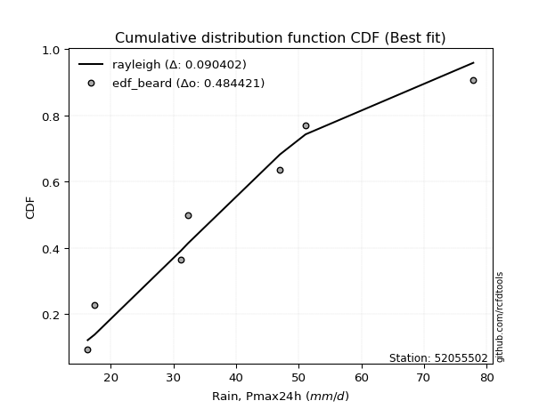</img></img>

</div>


### 5. EDF Chegodayev (1955)

The Chegodayev formula is an empirical plotting position formula used in hydrological frequency analysis to estimate the exceedance probability or return period of a specific event from a set of observed data. It is primarily used for plotting observed data points on probability paper to fit a theoretical distribution, particularly for analyzing extreme events like maximum flood flows or rainfall intensities. The constant _b_ value in the generalized plotting position formula is 0.3.

<div align="center">


$P=(m-b)/(n+1-2b)$


</div>


**5.1. Empirical values**

<div align="center">

|                | 0                   | 1                   | 2                   | 3              | 4                  | 5                  | 6                  |
|:---------------|:--------------------|:--------------------|:--------------------|:---------------|:-------------------|:-------------------|:-------------------|
| date           | 2017                | 2023                | 2022                | 2018           | 2020               | 2021               | 2019               |
| x              | 16.3                | 17.4                | 31.2                | 32.3           | 47.0               | 51.1               | 77.9               |
| m              | 1                   | 2                   | 3                   | 4              | 5                  | 6                  | 7                  |
| empirical_dist | edf_chegodayev      | edf_chegodayev      | edf_chegodayev      | edf_chegodayev | edf_chegodayev     | edf_chegodayev     | edf_chegodayev     |
| empirical      | 0.09459459459459459 | 0.22972972972972971 | 0.36486486486486486 | 0.5            | 0.6351351351351351 | 0.7702702702702703 | 0.9054054054054054 |
| empirical_tr   | 1.1044776119402986  | 1.2982456140350878  | 1.574468085106383   | 2.0            | 2.7407407407407405 | 4.352941176470589  | 10.571428571428568 |

</div>


**5.2. Kolmogorov-Smirnov fit test (sorted by Δ)**


<div align="center">

|                | 0                   | 1                   | 2                   | 3                   | 4                   | 5                   | 6                   | 7                   | 8                   | 9                   | 10                  | 11                  | 12                  | 13                  | 14                  | 15                  | 16                  | 17                  | 18                  | 19                  | 20                  | 21                  | 22                  | 23                  | 24                  | 25                  | 26                  | 27                  | 28                  | 29                  | 30                  | 31                  | 32                  | 33                  | 34                  | 35                  | 36                  | 37                  | 38                  | 39                  | 40                  | 41                  | 42                  | 43                  | 44                  | 45                  | 46                  | 47                  | 48                  | 49                  | 50                  | 51                  | 52                  | 53                  | 54                  | 55                  | 56                  | 57                  | 58                  | 59                  | 60                  | 61                  | 62                  | 63                  | 64                  | 65                  | 66                  | 67                  | 68                  | 69                  | 70                  | 71                  | 72                  | 73                  | 74                  | 75                  | 76                  | 77                  | 78                  | 79                  | 80                  | 81                  | 82                  | 83                  | 84                  | 85                  | 86                  | 87                  | 88                  | 89                  | 90                  | 91                  | 92                  | 93                  | 94                  | 95                  | 96                  | 97                  | 98                  | 99                  | 100                 | 101                 | 102                 | 103                 | 104                 | 105                 | 106                 | 107                 | 108                 | 109                 | 110                 | 111                 | 112                 | 113                 | 114                 | 115                 | 116                 | 117                 | 118                 | 119                 | 120                 | 121                 | 122                 | 123                 | 124                 | 125                 | 126                 | 127                 | 128                 | 129                 | 130                 | 131                 | 132                 | 133                 | 134                 | 135                 | 136                 | 137                 | 138                 | 139                 | 140                 | 141                 | 142                 | 143                 | 144                 | 145                 | 146                 | 147                 | 148                 | 149                 | 150                 | 151                 | 152                 | 153                 | 154                 | 155                 | 156                 | 157                 | 158                 | 159                 |
|:---------------|:--------------------|:--------------------|:--------------------|:--------------------|:--------------------|:--------------------|:--------------------|:--------------------|:--------------------|:--------------------|:--------------------|:--------------------|:--------------------|:--------------------|:--------------------|:--------------------|:--------------------|:--------------------|:--------------------|:--------------------|:--------------------|:--------------------|:--------------------|:--------------------|:--------------------|:--------------------|:--------------------|:--------------------|:--------------------|:--------------------|:--------------------|:--------------------|:--------------------|:--------------------|:--------------------|:--------------------|:--------------------|:--------------------|:--------------------|:--------------------|:--------------------|:--------------------|:--------------------|:--------------------|:--------------------|:--------------------|:--------------------|:--------------------|:--------------------|:--------------------|:--------------------|:--------------------|:--------------------|:--------------------|:--------------------|:--------------------|:--------------------|:--------------------|:--------------------|:--------------------|:--------------------|:--------------------|:--------------------|:--------------------|:--------------------|:--------------------|:--------------------|:--------------------|:--------------------|:--------------------|:--------------------|:--------------------|:--------------------|:--------------------|:--------------------|:--------------------|:--------------------|:--------------------|:--------------------|:--------------------|:--------------------|:--------------------|:--------------------|:--------------------|:--------------------|:--------------------|:--------------------|:--------------------|:--------------------|:--------------------|:--------------------|:--------------------|:--------------------|:--------------------|:--------------------|:--------------------|:--------------------|:--------------------|:--------------------|:--------------------|:--------------------|:--------------------|:--------------------|:--------------------|:--------------------|:--------------------|:--------------------|:--------------------|:--------------------|:--------------------|:--------------------|:--------------------|:--------------------|:--------------------|:--------------------|:--------------------|:--------------------|:--------------------|:--------------------|:--------------------|:--------------------|:--------------------|:--------------------|:--------------------|:--------------------|:--------------------|:--------------------|:--------------------|:--------------------|:--------------------|:--------------------|:--------------------|:--------------------|:--------------------|:--------------------|:--------------------|:--------------------|:--------------------|:--------------------|:--------------------|:--------------------|:--------------------|:--------------------|:--------------------|:--------------------|:--------------------|:--------------------|:--------------------|:--------------------|:--------------------|:--------------------|:--------------------|:--------------------|:--------------------|:--------------------|:--------------------|:--------------------|:--------------------|:--------------------|:--------------------|
| station        | 52055502            | 52055502            | 52055502            | 52055502            | 52055502            | 52055502            | 52055502            | 52055502            | 52055502            | 52055502            | 52055502            | 52055502            | 52055502            | 52055502            | 52055502            | 52055502            | 52055502            | 52055502            | 52055502            | 52055502            | 52055502            | 52055502            | 52055502            | 52055502            | 52055502            | 52055502            | 52055502            | 52055502            | 52055502            | 52055502            | 52055502            | 52055502            | 52055502            | 52055502            | 52055502            | 52055502            | 52055502            | 52055502            | 52055502            | 52055502            | 52055502            | 52055502            | 52055502            | 52055502            | 52055502            | 52055502            | 52055502            | 52055502            | 52055502            | 52055502            | 52055502            | 52055502            | 52055502            | 52055502            | 52055502            | 52055502            | 52055502            | 52055502            | 52055502            | 52055502            | 52055502            | 52055502            | 52055502            | 52055502            | 52055502            | 52055502            | 52055502            | 52055502            | 52055502            | 52055502            | 52055502            | 52055502            | 52055502            | 52055502            | 52055502            | 52055502            | 52055502            | 52055502            | 52055502            | 52055502            | 52055502            | 52055502            | 52055502            | 52055502            | 52055502            | 52055502            | 52055502            | 52055502            | 52055502            | 52055502            | 52055502            | 52055502            | 52055502            | 52055502            | 52055502            | 52055502            | 52055502            | 52055502            | 52055502            | 52055502            | 52055502            | 52055502            | 52055502            | 52055502            | 52055502            | 52055502            | 52055502            | 52055502            | 52055502            | 52055502            | 52055502            | 52055502            | 52055502            | 52055502            | 52055502            | 52055502            | 52055502            | 52055502            | 52055502            | 52055502            | 52055502            | 52055502            | 52055502            | 52055502            | 52055502            | 52055502            | 52055502            | 52055502            | 52055502            | 52055502            | 52055502            | 52055502            | 52055502            | 52055502            | 52055502            | 52055502            | 52055502            | 52055502            | 52055502            | 52055502            | 52055502            | 52055502            | 52055502            | 52055502            | 52055502            | 52055502            | 52055502            | 52055502            | 52055502            | 52055502            | 52055502            | 52055502            | 52055502            | 52055502            | 52055502            | 52055502            | 52055502            | 52055502            | 52055502            | 52055502            |
| empirical_dist | edf_chegodayev      | edf_chegodayev      | edf_chegodayev      | edf_chegodayev      | edf_chegodayev      | edf_chegodayev      | edf_chegodayev      | edf_chegodayev      | edf_chegodayev      | edf_chegodayev      | edf_chegodayev      | edf_chegodayev      | edf_chegodayev      | edf_chegodayev      | edf_chegodayev      | edf_chegodayev      | edf_chegodayev      | edf_chegodayev      | edf_chegodayev      | edf_chegodayev      | edf_chegodayev      | edf_chegodayev      | edf_chegodayev      | edf_chegodayev      | edf_chegodayev      | edf_chegodayev      | edf_chegodayev      | edf_chegodayev      | edf_chegodayev      | edf_chegodayev      | edf_chegodayev      | edf_chegodayev      | edf_chegodayev      | edf_chegodayev      | edf_chegodayev      | edf_chegodayev      | edf_chegodayev      | edf_chegodayev      | edf_chegodayev      | edf_chegodayev      | edf_chegodayev      | edf_chegodayev      | edf_chegodayev      | edf_chegodayev      | edf_chegodayev      | edf_chegodayev      | edf_chegodayev      | edf_chegodayev      | edf_chegodayev      | edf_chegodayev      | edf_chegodayev      | edf_chegodayev      | edf_chegodayev      | edf_chegodayev      | edf_chegodayev      | edf_chegodayev      | edf_chegodayev      | edf_chegodayev      | edf_chegodayev      | edf_chegodayev      | edf_chegodayev      | edf_chegodayev      | edf_chegodayev      | edf_chegodayev      | edf_chegodayev      | edf_chegodayev      | edf_chegodayev      | edf_chegodayev      | edf_chegodayev      | edf_chegodayev      | edf_chegodayev      | edf_chegodayev      | edf_chegodayev      | edf_chegodayev      | edf_chegodayev      | edf_chegodayev      | edf_chegodayev      | edf_chegodayev      | edf_chegodayev      | edf_chegodayev      | edf_chegodayev      | edf_chegodayev      | edf_chegodayev      | edf_chegodayev      | edf_chegodayev      | edf_chegodayev      | edf_chegodayev      | edf_chegodayev      | edf_chegodayev      | edf_chegodayev      | edf_chegodayev      | edf_chegodayev      | edf_chegodayev      | edf_chegodayev      | edf_chegodayev      | edf_chegodayev      | edf_chegodayev      | edf_chegodayev      | edf_chegodayev      | edf_chegodayev      | edf_chegodayev      | edf_chegodayev      | edf_chegodayev      | edf_chegodayev      | edf_chegodayev      | edf_chegodayev      | edf_chegodayev      | edf_chegodayev      | edf_chegodayev      | edf_chegodayev      | edf_chegodayev      | edf_chegodayev      | edf_chegodayev      | edf_chegodayev      | edf_chegodayev      | edf_chegodayev      | edf_chegodayev      | edf_chegodayev      | edf_chegodayev      | edf_chegodayev      | edf_chegodayev      | edf_chegodayev      | edf_chegodayev      | edf_chegodayev      | edf_chegodayev      | edf_chegodayev      | edf_chegodayev      | edf_chegodayev      | edf_chegodayev      | edf_chegodayev      | edf_chegodayev      | edf_chegodayev      | edf_chegodayev      | edf_chegodayev      | edf_chegodayev      | edf_chegodayev      | edf_chegodayev      | edf_chegodayev      | edf_chegodayev      | edf_chegodayev      | edf_chegodayev      | edf_chegodayev      | edf_chegodayev      | edf_chegodayev      | edf_chegodayev      | edf_chegodayev      | edf_chegodayev      | edf_chegodayev      | edf_chegodayev      | edf_chegodayev      | edf_chegodayev      | edf_chegodayev      | edf_chegodayev      | edf_chegodayev      | edf_chegodayev      | edf_chegodayev      | edf_chegodayev      | edf_chegodayev      | edf_chegodayev      | edf_chegodayev      |
| p_dist         | foldnorm            | rayleigh            | logksone            | logarcsine          | maxwell             | pearson3            | dgamma              | logsemicircular     | semicircular        | dweibull            | logncf              | loganglit           | halfnorm            | anglit              | logburr             | loggenextreme       | logweibull_max      | genlogistic         | ncf                 | gumbel_r            | loggumbel_l         | logloggamma         | alpha               | kstwobign           | logpearson3         | logfoldnorm         | lognct              | logjohnsonsu        | logskewnorm         | logt                | logexponnorm        | logcrystalball      | lognorm             | genextreme          | logfatiguelife      | logf                | loggamma            | loggamma            | logerlang           | arcsine             | loginvgamma         | logalpha            | norm                | crystalball         | truncnorm           | t                   | invgamma            | logbetaprime        | loginvgauss         | burr                | logburr12           | loggenlogistic      | nct                 | logdweibull         | logcosine           | loginvweibull       | rice                | logmaxwell          | loglogistic         | betaprime           | logargus            | loghypsecant        | logloglaplace       | lograyleigh         | logtriang           | logistic            | logkstwobign        | logrice             | invgauss            | moyal               | loglaplace          | loglaplace          | weibull_min         | truncweibull_min    | hypsecant           | gausshyper          | logrdist            | cosine              | logdgamma           | beta                | halflogistic        | logbradford         | logexponpow         | loggenexpon         | logtruncexpon       | loggumbel_r         | logwrapcauchy       | logtruncpareto      | lomax               | exponnorm           | logtukeylambda      | logkappa4           | loggompertz         | logkappa3           | genexpon            | loguniform          | logvonmises_line    | laplace             | gompertz            | loggausshyper       | gumbel_l            | halfgennorm         | truncexpon          | logmoyal            | skewnorm            | kappa3              | loghalfnorm         | bradford            | kappa4              | f                   | ksone               | burr12              | loglomax            | argus               | loghalflogistic     | logwald             | wald                | genpareto           | wrapcauchy          | loggenhalflogistic  | vonmises_line       | tukeylambda         | uniform             | logweibull_min      | loggenpareto        | loglevy_l           | gennorm             | loggennorm          | triang              | logtruncweibull_min | johnsonsb           | logjohnsonsb        | logtrapezoid        | levy_l              | logmielke           | genhalflogistic     | invweibull          | exponpow            | logtruncnorm        | exponweib           | logbeta             | powerlaw            | fatiguelife         | gengamma            | lognakagami         | nakagami            | rdist               | trapezoid           | johnsonsu           | erlang              | logpowerlaw         | logexponweib        | gamma               | truncpareto         | loggengamma         | weibull_max         | loghalfgennorm      | logvonmises         | vonmises            | mielke              |
| delta          | 0.08087726288003994 | 0.09113457543805131 | 0.09682603737198764 | 0.09737372499978691 | 0.09854661252619246 | 0.10096229902343509 | 0.10469723518513699 | 0.1052827756705953  | 0.10637095147609266 | 0.10686006070180187 | 0.10695994393650834 | 0.11169801310407121 | 0.11263479724153785 | 0.11376813753748194 | 0.11396779165647011 | 0.11952345624725552 | 0.11952712739597254 | 0.12161106109219011 | 0.12301747172143987 | 0.12339762590240856 | 0.12565317419382652 | 0.12630355774998656 | 0.12674453523031087 | 0.12675384750966143 | 0.12725817130102066 | 0.12745286665806238 | 0.12762173634368362 | 0.1279134435979658  | 0.12795149744935871 | 0.12797976324629382 | 0.12798217435801246 | 0.12798253426371659 | 0.12798256213332154 | 0.12816055105057778 | 0.1282909382907763  | 0.12833846409138572 | 0.12848911403828644 | 0.12848911403828644 | 0.12849936539288676 | 0.1302140854392292  | 0.13086988710013964 | 0.13138401584219922 | 0.1314733431954157  | 0.1314733533767845  | 0.13147335676051475 | 0.1314739607815819  | 0.1318082243052322  | 0.13200511892634179 | 0.13473649484047812 | 0.13485775447749399 | 0.13500433438207632 | 0.1353590672038772  | 0.13586749545568055 | 0.1358931929212187  | 0.13704996310666356 | 0.13716394946707672 | 0.13755211825735103 | 0.13825054005672038 | 0.1391464784041354  | 0.1406103642854481  | 0.14276297586659292 | 0.14388259472362974 | 0.1442962316634252  | 0.1452289624712093  | 0.14528696032954536 | 0.14771214579793135 | 0.14887634971899594 | 0.1489942025664675  | 0.1494027587956303  | 0.15080652272578576 | 0.1530865563098518  | 0.1530865563098518  | 0.1551160429424781  | 0.15841533222183965 | 0.1605971969311626  | 0.16131029553421644 | 0.1632816012297159  | 0.16335998642079919 | 0.16563341663728326 | 0.1668739728971187  | 0.16784196084543437 | 0.16954273847304818 | 0.17115780282528387 | 0.17127205859379022 | 0.17212654665281862 | 0.1729393401370454  | 0.17338342362976605 | 0.17344388399315336 | 0.17905227966010817 | 0.18137109516523497 | 0.18322370685384815 | 0.18410691710874938 | 0.18435847475221837 | 0.18771484004895062 | 0.18795787327892166 | 0.1879815145175187  | 0.1879848733515604  | 0.1890057305410487  | 0.1909410767855588  | 0.19306233741372664 | 0.1941926453526268  | 0.19443721977150258 | 0.19962718317156297 | 0.20013998874791467 | 0.2007687965985302  | 0.20234487803023446 | 0.20476976161818056 | 0.2062684482893445  | 0.20888574233616825 | 0.20923484249354635 | 0.21615771615771628 | 0.21829137072690158 | 0.2199089609120249  | 0.22127992805159857 | 0.22972972972972971 | 0.22972972972972971 | 0.22972972972972971 | 0.23034391788202957 | 0.23250402354652022 | 0.23596431515704935 | 0.23772030184800835 | 0.23960311491009811 | 0.24025974025974034 | 0.2612229342879056  | 0.26459302686790953 | 0.2690083951248365  | 0.2702702702702703  | 0.2702702702702703  | 0.27094120038101266 | 0.277236564238355   | 0.289895736723755   | 0.2937750664821804  | 0.2995910827177801  | 0.31880309644855104 | 0.3434292910000282  | 0.35278892616081076 | 0.3857402726115825  | 0.3880507095290708  | 0.3900881296199091  | 0.40150335434053436 | 0.4153770925338511  | 0.4387902660814829  | 0.4388889815204548  | 0.4415501173570105  | 0.4489985895516711  | 0.45236094132008026 | 0.4551528696258759  | 0.4632295476451322  | 0.471742336581091   | 0.49127184884144587 | 0.4969317926319939  | 0.5144653114100581  | 0.533302416812439   | 0.5450822504157715  | 0.5578321883186654  | 0.6229999129104804  | 0.7702702702702703  | 1.0970084127875304  | 11.684295337850132  | nan                 |
| deltao         | 0.48442053926100004 | 0.48442053926100004 | 0.48442053926100004 | 0.48442053926100004 | 0.48442053926100004 | 0.48442053926100004 | 0.48442053926100004 | 0.48442053926100004 | 0.48442053926100004 | 0.48442053926100004 | 0.48442053926100004 | 0.48442053926100004 | 0.48442053926100004 | 0.48442053926100004 | 0.48442053926100004 | 0.48442053926100004 | 0.48442053926100004 | 0.48442053926100004 | 0.48442053926100004 | 0.48442053926100004 | 0.48442053926100004 | 0.48442053926100004 | 0.48442053926100004 | 0.48442053926100004 | 0.48442053926100004 | 0.48442053926100004 | 0.48442053926100004 | 0.48442053926100004 | 0.48442053926100004 | 0.48442053926100004 | 0.48442053926100004 | 0.48442053926100004 | 0.48442053926100004 | 0.48442053926100004 | 0.48442053926100004 | 0.48442053926100004 | 0.48442053926100004 | 0.48442053926100004 | 0.48442053926100004 | 0.48442053926100004 | 0.48442053926100004 | 0.48442053926100004 | 0.48442053926100004 | 0.48442053926100004 | 0.48442053926100004 | 0.48442053926100004 | 0.48442053926100004 | 0.48442053926100004 | 0.48442053926100004 | 0.48442053926100004 | 0.48442053926100004 | 0.48442053926100004 | 0.48442053926100004 | 0.48442053926100004 | 0.48442053926100004 | 0.48442053926100004 | 0.48442053926100004 | 0.48442053926100004 | 0.48442053926100004 | 0.48442053926100004 | 0.48442053926100004 | 0.48442053926100004 | 0.48442053926100004 | 0.48442053926100004 | 0.48442053926100004 | 0.48442053926100004 | 0.48442053926100004 | 0.48442053926100004 | 0.48442053926100004 | 0.48442053926100004 | 0.48442053926100004 | 0.48442053926100004 | 0.48442053926100004 | 0.48442053926100004 | 0.48442053926100004 | 0.48442053926100004 | 0.48442053926100004 | 0.48442053926100004 | 0.48442053926100004 | 0.48442053926100004 | 0.48442053926100004 | 0.48442053926100004 | 0.48442053926100004 | 0.48442053926100004 | 0.48442053926100004 | 0.48442053926100004 | 0.48442053926100004 | 0.48442053926100004 | 0.48442053926100004 | 0.48442053926100004 | 0.48442053926100004 | 0.48442053926100004 | 0.48442053926100004 | 0.48442053926100004 | 0.48442053926100004 | 0.48442053926100004 | 0.48442053926100004 | 0.48442053926100004 | 0.48442053926100004 | 0.48442053926100004 | 0.48442053926100004 | 0.48442053926100004 | 0.48442053926100004 | 0.48442053926100004 | 0.48442053926100004 | 0.48442053926100004 | 0.48442053926100004 | 0.48442053926100004 | 0.48442053926100004 | 0.48442053926100004 | 0.48442053926100004 | 0.48442053926100004 | 0.48442053926100004 | 0.48442053926100004 | 0.48442053926100004 | 0.48442053926100004 | 0.48442053926100004 | 0.48442053926100004 | 0.48442053926100004 | 0.48442053926100004 | 0.48442053926100004 | 0.48442053926100004 | 0.48442053926100004 | 0.48442053926100004 | 0.48442053926100004 | 0.48442053926100004 | 0.48442053926100004 | 0.48442053926100004 | 0.48442053926100004 | 0.48442053926100004 | 0.48442053926100004 | 0.48442053926100004 | 0.48442053926100004 | 0.48442053926100004 | 0.48442053926100004 | 0.48442053926100004 | 0.48442053926100004 | 0.48442053926100004 | 0.48442053926100004 | 0.48442053926100004 | 0.48442053926100004 | 0.48442053926100004 | 0.48442053926100004 | 0.48442053926100004 | 0.48442053926100004 | 0.48442053926100004 | 0.48442053926100004 | 0.48442053926100004 | 0.48442053926100004 | 0.48442053926100004 | 0.48442053926100004 | 0.48442053926100004 | 0.48442053926100004 | 0.48442053926100004 | 0.48442053926100004 | 0.48442053926100004 | 0.48442053926100004 | 0.48442053926100004 | 0.48442053926100004 | 0.48442053926100004 |
| eval           | Δo > Δ              | Δo > Δ              | Δo > Δ              | Δo > Δ              | Δo > Δ              | Δo > Δ              | Δo > Δ              | Δo > Δ              | Δo > Δ              | Δo > Δ              | Δo > Δ              | Δo > Δ              | Δo > Δ              | Δo > Δ              | Δo > Δ              | Δo > Δ              | Δo > Δ              | Δo > Δ              | Δo > Δ              | Δo > Δ              | Δo > Δ              | Δo > Δ              | Δo > Δ              | Δo > Δ              | Δo > Δ              | Δo > Δ              | Δo > Δ              | Δo > Δ              | Δo > Δ              | Δo > Δ              | Δo > Δ              | Δo > Δ              | Δo > Δ              | Δo > Δ              | Δo > Δ              | Δo > Δ              | Δo > Δ              | Δo > Δ              | Δo > Δ              | Δo > Δ              | Δo > Δ              | Δo > Δ              | Δo > Δ              | Δo > Δ              | Δo > Δ              | Δo > Δ              | Δo > Δ              | Δo > Δ              | Δo > Δ              | Δo > Δ              | Δo > Δ              | Δo > Δ              | Δo > Δ              | Δo > Δ              | Δo > Δ              | Δo > Δ              | Δo > Δ              | Δo > Δ              | Δo > Δ              | Δo > Δ              | Δo > Δ              | Δo > Δ              | Δo > Δ              | Δo > Δ              | Δo > Δ              | Δo > Δ              | Δo > Δ              | Δo > Δ              | Δo > Δ              | Δo > Δ              | Δo > Δ              | Δo > Δ              | Δo > Δ              | Δo > Δ              | Δo > Δ              | Δo > Δ              | Δo > Δ              | Δo > Δ              | Δo > Δ              | Δo > Δ              | Δo > Δ              | Δo > Δ              | Δo > Δ              | Δo > Δ              | Δo > Δ              | Δo > Δ              | Δo > Δ              | Δo > Δ              | Δo > Δ              | Δo > Δ              | Δo > Δ              | Δo > Δ              | Δo > Δ              | Δo > Δ              | Δo > Δ              | Δo > Δ              | Δo > Δ              | Δo > Δ              | Δo > Δ              | Δo > Δ              | Δo > Δ              | Δo > Δ              | Δo > Δ              | Δo > Δ              | Δo > Δ              | Δo > Δ              | Δo > Δ              | Δo > Δ              | Δo > Δ              | Δo > Δ              | Δo > Δ              | Δo > Δ              | Δo > Δ              | Δo > Δ              | Δo > Δ              | Δo > Δ              | Δo > Δ              | Δo > Δ              | Δo > Δ              | Δo > Δ              | Δo > Δ              | Δo > Δ              | Δo > Δ              | Δo > Δ              | Δo > Δ              | Δo > Δ              | Δo > Δ              | Δo > Δ              | Δo > Δ              | Δo > Δ              | Δo > Δ              | Δo > Δ              | Δo > Δ              | Δo > Δ              | Δo > Δ              | Δo > Δ              | Δo > Δ              | Δo > Δ              | Δo > Δ              | Δo > Δ              | Δo > Δ              | Δo > Δ              | Δo > Δ              | Δo > Δ              | Δo > Δ              | Δo > Δ              | Δo > Δ              | Δo > Δ              | Δo > Δ              | Δo <= Δ             | Δo <= Δ             | Δo <= Δ             | Δo <= Δ             | Δo <= Δ             | Δo <= Δ             | Δo <= Δ             | Δo <= Δ             | Δo <= Δ             | Δo <= Δ             | Δo <= Δ             |
| fit            | 1                   | 1                   | 1                   | 1                   | 1                   | 1                   | 1                   | 1                   | 1                   | 1                   | 1                   | 1                   | 1                   | 1                   | 1                   | 1                   | 1                   | 1                   | 1                   | 1                   | 1                   | 1                   | 1                   | 1                   | 1                   | 1                   | 1                   | 1                   | 1                   | 1                   | 1                   | 1                   | 1                   | 1                   | 1                   | 1                   | 1                   | 1                   | 1                   | 1                   | 1                   | 1                   | 1                   | 1                   | 1                   | 1                   | 1                   | 1                   | 1                   | 1                   | 1                   | 1                   | 1                   | 1                   | 1                   | 1                   | 1                   | 1                   | 1                   | 1                   | 1                   | 1                   | 1                   | 1                   | 1                   | 1                   | 1                   | 1                   | 1                   | 1                   | 1                   | 1                   | 1                   | 1                   | 1                   | 1                   | 1                   | 1                   | 1                   | 1                   | 1                   | 1                   | 1                   | 1                   | 1                   | 1                   | 1                   | 1                   | 1                   | 1                   | 1                   | 1                   | 1                   | 1                   | 1                   | 1                   | 1                   | 1                   | 1                   | 1                   | 1                   | 1                   | 1                   | 1                   | 1                   | 1                   | 1                   | 1                   | 1                   | 1                   | 1                   | 1                   | 1                   | 1                   | 1                   | 1                   | 1                   | 1                   | 1                   | 1                   | 1                   | 1                   | 1                   | 1                   | 1                   | 1                   | 1                   | 1                   | 1                   | 1                   | 1                   | 1                   | 1                   | 1                   | 1                   | 1                   | 1                   | 1                   | 1                   | 1                   | 1                   | 1                   | 1                   | 1                   | 1                   | 1                   | 1                   | 1                   | 1                   | 0                   | 0                   | 0                   | 0                   | 0                   | 0                   | 0                   | 0                   | 0                   | 0                   | 0                   |
| n              | 7                   | 7                   | 7                   | 7                   | 7                   | 7                   | 7                   | 7                   | 7                   | 7                   | 7                   | 7                   | 7                   | 7                   | 7                   | 7                   | 7                   | 7                   | 7                   | 7                   | 7                   | 7                   | 7                   | 7                   | 7                   | 7                   | 7                   | 7                   | 7                   | 7                   | 7                   | 7                   | 7                   | 7                   | 7                   | 7                   | 7                   | 7                   | 7                   | 7                   | 7                   | 7                   | 7                   | 7                   | 7                   | 7                   | 7                   | 7                   | 7                   | 7                   | 7                   | 7                   | 7                   | 7                   | 7                   | 7                   | 7                   | 7                   | 7                   | 7                   | 7                   | 7                   | 7                   | 7                   | 7                   | 7                   | 7                   | 7                   | 7                   | 7                   | 7                   | 7                   | 7                   | 7                   | 7                   | 7                   | 7                   | 7                   | 7                   | 7                   | 7                   | 7                   | 7                   | 7                   | 7                   | 7                   | 7                   | 7                   | 7                   | 7                   | 7                   | 7                   | 7                   | 7                   | 7                   | 7                   | 7                   | 7                   | 7                   | 7                   | 7                   | 7                   | 7                   | 7                   | 7                   | 7                   | 7                   | 7                   | 7                   | 7                   | 7                   | 7                   | 7                   | 7                   | 7                   | 7                   | 7                   | 7                   | 7                   | 7                   | 7                   | 7                   | 7                   | 7                   | 7                   | 7                   | 7                   | 7                   | 7                   | 7                   | 7                   | 7                   | 7                   | 7                   | 7                   | 7                   | 7                   | 7                   | 7                   | 7                   | 7                   | 7                   | 7                   | 7                   | 7                   | 7                   | 7                   | 7                   | 7                   | 7                   | 7                   | 7                   | 7                   | 7                   | 7                   | 7                   | 7                   | 7                   | 7                   | 7                   |
| best_fit       | 1                   | 0                   | 0                   | 0                   | 0                   | 0                   | 0                   | 0                   | 0                   | 0                   | 0                   | 0                   | 0                   | 0                   | 0                   | 0                   | 0                   | 0                   | 0                   | 0                   | 0                   | 0                   | 0                   | 0                   | 0                   | 0                   | 0                   | 0                   | 0                   | 0                   | 0                   | 0                   | 0                   | 0                   | 0                   | 0                   | 0                   | 0                   | 0                   | 0                   | 0                   | 0                   | 0                   | 0                   | 0                   | 0                   | 0                   | 0                   | 0                   | 0                   | 0                   | 0                   | 0                   | 0                   | 0                   | 0                   | 0                   | 0                   | 0                   | 0                   | 0                   | 0                   | 0                   | 0                   | 0                   | 0                   | 0                   | 0                   | 0                   | 0                   | 0                   | 0                   | 0                   | 0                   | 0                   | 0                   | 0                   | 0                   | 0                   | 0                   | 0                   | 0                   | 0                   | 0                   | 0                   | 0                   | 0                   | 0                   | 0                   | 0                   | 0                   | 0                   | 0                   | 0                   | 0                   | 0                   | 0                   | 0                   | 0                   | 0                   | 0                   | 0                   | 0                   | 0                   | 0                   | 0                   | 0                   | 0                   | 0                   | 0                   | 0                   | 0                   | 0                   | 0                   | 0                   | 0                   | 0                   | 0                   | 0                   | 0                   | 0                   | 0                   | 0                   | 0                   | 0                   | 0                   | 0                   | 0                   | 0                   | 0                   | 0                   | 0                   | 0                   | 0                   | 0                   | 0                   | 0                   | 0                   | 0                   | 0                   | 0                   | 0                   | 0                   | 0                   | 0                   | 0                   | 0                   | 0                   | 0                   | 0                   | 0                   | 0                   | 0                   | 0                   | 0                   | 0                   | 0                   | 0                   | 0                   | 0                   |
| best_fit_sort  | 1                   | 2                   | 3                   | 4                   | 5                   | 6                   | 7                   | 8                   | 9                   | 10                  | 11                  | 12                  | 13                  | 14                  | 15                  | 16                  | 17                  | 18                  | 19                  | 20                  | 21                  | 22                  | 23                  | 24                  | 25                  | 26                  | 27                  | 28                  | 29                  | 30                  | 31                  | 32                  | 33                  | 34                  | 35                  | 36                  | 37                  | 38                  | 39                  | 40                  | 41                  | 42                  | 43                  | 44                  | 45                  | 46                  | 47                  | 48                  | 49                  | 50                  | 51                  | 52                  | 53                  | 54                  | 55                  | 56                  | 57                  | 58                  | 59                  | 60                  | 61                  | 62                  | 63                  | 64                  | 65                  | 66                  | 67                  | 68                  | 69                  | 70                  | 71                  | 72                  | 73                  | 74                  | 75                  | 76                  | 77                  | 78                  | 79                  | 80                  | 81                  | 82                  | 83                  | 84                  | 85                  | 86                  | 87                  | 88                  | 89                  | 90                  | 91                  | 92                  | 93                  | 94                  | 95                  | 96                  | 97                  | 98                  | 99                  | 100                 | 101                 | 102                 | 103                 | 104                 | 105                 | 106                 | 107                 | 108                 | 109                 | 110                 | 111                 | 112                 | 113                 | 114                 | 115                 | 116                 | 117                 | 118                 | 119                 | 120                 | 121                 | 122                 | 123                 | 124                 | 125                 | 126                 | 127                 | 128                 | 129                 | 130                 | 131                 | 132                 | 133                 | 134                 | 135                 | 136                 | 137                 | 138                 | 139                 | 140                 | 141                 | 142                 | 143                 | 144                 | 145                 | 146                 | 147                 | 148                 | 149                 | 150                 | 151                 | 152                 | 153                 | 154                 | 155                 | 156                 | 157                 | 158                 | 159                 | 160                 |

</div>


**5.3. Best fit**

<div align="center">

|   id |   station | empirical_dist   | p_dist   |     delta |   deltao | eval   |   fit |   n |   best_fit |   best_fit_sort |
|-----:|----------:|:-----------------|:---------|----------:|---------:|:-------|------:|----:|-----------:|----------------:|
|    0 |  52055502 | edf_chegodayev   | foldnorm | 0.0808773 | 0.484421 | Δo > Δ |     1 |   7 |          1 |               1 |

</div>


<div align="center">

</img></img>

</div>


### 6. EDF Blom (1958)

The Blom formula is a specific "plotting position" formula used in hydrology and statistical analysis to estimate the empirical cumulative probability (or non-exceedance probability) of a data series. It is particularly recommended for data that are approximately normally distributed. The constant _a_ is set to 0.375 (or 3/8).

<div align="center">


$P=(m-a)/(n+1-2a)$


</div>


**6.1. Empirical values**

<div align="center">

|                | 0                   | 1                   | 2                  | 3        | 4                  | 5                  | 6                  |
|:---------------|:--------------------|:--------------------|:-------------------|:---------|:-------------------|:-------------------|:-------------------|
| date           | 2017                | 2023                | 2022               | 2018     | 2020               | 2021               | 2019               |
| x              | 16.3                | 17.4                | 31.2               | 32.3     | 47.0               | 51.1               | 77.9               |
| m              | 1                   | 2                   | 3                  | 4        | 5                  | 6                  | 7                  |
| empirical_dist | edf_blom            | edf_blom            | edf_blom           | edf_blom | edf_blom           | edf_blom           | edf_blom           |
| empirical      | 0.08620689655172414 | 0.22413793103448276 | 0.3620689655172414 | 0.5      | 0.6379310344827587 | 0.7758620689655172 | 0.9137931034482759 |
| empirical_tr   | 1.0943396226415094  | 1.288888888888889   | 1.5675675675675675 | 2.0      | 2.7619047619047623 | 4.461538461538462  | 11.600000000000007 |

</div>


**6.2. Kolmogorov-Smirnov fit test (sorted by Δ)**


<div align="center">

|                | 0                   | 1                   | 2                   | 3                   | 4                   | 5                   | 6                   | 7                   | 8                   | 9                   | 10                  | 11                  | 12                  | 13                  | 14                  | 15                  | 16                  | 17                  | 18                  | 19                  | 20                  | 21                  | 22                  | 23                  | 24                  | 25                  | 26                  | 27                  | 28                  | 29                  | 30                  | 31                  | 32                  | 33                  | 34                  | 35                  | 36                  | 37                  | 38                  | 39                  | 40                  | 41                  | 42                  | 43                  | 44                  | 45                  | 46                  | 47                  | 48                  | 49                  | 50                  | 51                  | 52                  | 53                  | 54                  | 55                  | 56                  | 57                  | 58                  | 59                  | 60                  | 61                  | 62                  | 63                  | 64                  | 65                  | 66                  | 67                  | 68                  | 69                  | 70                  | 71                  | 72                  | 73                  | 74                  | 75                  | 76                  | 77                  | 78                  | 79                  | 80                  | 81                  | 82                  | 83                  | 84                  | 85                  | 86                  | 87                  | 88                  | 89                  | 90                  | 91                  | 92                  | 93                  | 94                  | 95                  | 96                  | 97                  | 98                  | 99                  | 100                 | 101                 | 102                 | 103                 | 104                 | 105                 | 106                 | 107                 | 108                 | 109                 | 110                 | 111                 | 112                 | 113                 | 114                 | 115                 | 116                 | 117                 | 118                 | 119                 | 120                 | 121                 | 122                 | 123                 | 124                 | 125                 | 126                 | 127                 | 128                 | 129                 | 130                 | 131                 | 132                 | 133                 | 134                 | 135                 | 136                 | 137                 | 138                 | 139                 | 140                 | 141                 | 142                 | 143                 | 144                 | 145                 | 146                 | 147                 | 148                 | 149                 | 150                 | 151                 | 152                 | 153                 | 154                 | 155                 | 156                 | 157                 | 158                 | 159                 |
|:---------------|:--------------------|:--------------------|:--------------------|:--------------------|:--------------------|:--------------------|:--------------------|:--------------------|:--------------------|:--------------------|:--------------------|:--------------------|:--------------------|:--------------------|:--------------------|:--------------------|:--------------------|:--------------------|:--------------------|:--------------------|:--------------------|:--------------------|:--------------------|:--------------------|:--------------------|:--------------------|:--------------------|:--------------------|:--------------------|:--------------------|:--------------------|:--------------------|:--------------------|:--------------------|:--------------------|:--------------------|:--------------------|:--------------------|:--------------------|:--------------------|:--------------------|:--------------------|:--------------------|:--------------------|:--------------------|:--------------------|:--------------------|:--------------------|:--------------------|:--------------------|:--------------------|:--------------------|:--------------------|:--------------------|:--------------------|:--------------------|:--------------------|:--------------------|:--------------------|:--------------------|:--------------------|:--------------------|:--------------------|:--------------------|:--------------------|:--------------------|:--------------------|:--------------------|:--------------------|:--------------------|:--------------------|:--------------------|:--------------------|:--------------------|:--------------------|:--------------------|:--------------------|:--------------------|:--------------------|:--------------------|:--------------------|:--------------------|:--------------------|:--------------------|:--------------------|:--------------------|:--------------------|:--------------------|:--------------------|:--------------------|:--------------------|:--------------------|:--------------------|:--------------------|:--------------------|:--------------------|:--------------------|:--------------------|:--------------------|:--------------------|:--------------------|:--------------------|:--------------------|:--------------------|:--------------------|:--------------------|:--------------------|:--------------------|:--------------------|:--------------------|:--------------------|:--------------------|:--------------------|:--------------------|:--------------------|:--------------------|:--------------------|:--------------------|:--------------------|:--------------------|:--------------------|:--------------------|:--------------------|:--------------------|:--------------------|:--------------------|:--------------------|:--------------------|:--------------------|:--------------------|:--------------------|:--------------------|:--------------------|:--------------------|:--------------------|:--------------------|:--------------------|:--------------------|:--------------------|:--------------------|:--------------------|:--------------------|:--------------------|:--------------------|:--------------------|:--------------------|:--------------------|:--------------------|:--------------------|:--------------------|:--------------------|:--------------------|:--------------------|:--------------------|:--------------------|:--------------------|:--------------------|:--------------------|:--------------------|:--------------------|
| station        | 52055502            | 52055502            | 52055502            | 52055502            | 52055502            | 52055502            | 52055502            | 52055502            | 52055502            | 52055502            | 52055502            | 52055502            | 52055502            | 52055502            | 52055502            | 52055502            | 52055502            | 52055502            | 52055502            | 52055502            | 52055502            | 52055502            | 52055502            | 52055502            | 52055502            | 52055502            | 52055502            | 52055502            | 52055502            | 52055502            | 52055502            | 52055502            | 52055502            | 52055502            | 52055502            | 52055502            | 52055502            | 52055502            | 52055502            | 52055502            | 52055502            | 52055502            | 52055502            | 52055502            | 52055502            | 52055502            | 52055502            | 52055502            | 52055502            | 52055502            | 52055502            | 52055502            | 52055502            | 52055502            | 52055502            | 52055502            | 52055502            | 52055502            | 52055502            | 52055502            | 52055502            | 52055502            | 52055502            | 52055502            | 52055502            | 52055502            | 52055502            | 52055502            | 52055502            | 52055502            | 52055502            | 52055502            | 52055502            | 52055502            | 52055502            | 52055502            | 52055502            | 52055502            | 52055502            | 52055502            | 52055502            | 52055502            | 52055502            | 52055502            | 52055502            | 52055502            | 52055502            | 52055502            | 52055502            | 52055502            | 52055502            | 52055502            | 52055502            | 52055502            | 52055502            | 52055502            | 52055502            | 52055502            | 52055502            | 52055502            | 52055502            | 52055502            | 52055502            | 52055502            | 52055502            | 52055502            | 52055502            | 52055502            | 52055502            | 52055502            | 52055502            | 52055502            | 52055502            | 52055502            | 52055502            | 52055502            | 52055502            | 52055502            | 52055502            | 52055502            | 52055502            | 52055502            | 52055502            | 52055502            | 52055502            | 52055502            | 52055502            | 52055502            | 52055502            | 52055502            | 52055502            | 52055502            | 52055502            | 52055502            | 52055502            | 52055502            | 52055502            | 52055502            | 52055502            | 52055502            | 52055502            | 52055502            | 52055502            | 52055502            | 52055502            | 52055502            | 52055502            | 52055502            | 52055502            | 52055502            | 52055502            | 52055502            | 52055502            | 52055502            | 52055502            | 52055502            | 52055502            | 52055502            | 52055502            | 52055502            |
| empirical_dist | edf_blom            | edf_blom            | edf_blom            | edf_blom            | edf_blom            | edf_blom            | edf_blom            | edf_blom            | edf_blom            | edf_blom            | edf_blom            | edf_blom            | edf_blom            | edf_blom            | edf_blom            | edf_blom            | edf_blom            | edf_blom            | edf_blom            | edf_blom            | edf_blom            | edf_blom            | edf_blom            | edf_blom            | edf_blom            | edf_blom            | edf_blom            | edf_blom            | edf_blom            | edf_blom            | edf_blom            | edf_blom            | edf_blom            | edf_blom            | edf_blom            | edf_blom            | edf_blom            | edf_blom            | edf_blom            | edf_blom            | edf_blom            | edf_blom            | edf_blom            | edf_blom            | edf_blom            | edf_blom            | edf_blom            | edf_blom            | edf_blom            | edf_blom            | edf_blom            | edf_blom            | edf_blom            | edf_blom            | edf_blom            | edf_blom            | edf_blom            | edf_blom            | edf_blom            | edf_blom            | edf_blom            | edf_blom            | edf_blom            | edf_blom            | edf_blom            | edf_blom            | edf_blom            | edf_blom            | edf_blom            | edf_blom            | edf_blom            | edf_blom            | edf_blom            | edf_blom            | edf_blom            | edf_blom            | edf_blom            | edf_blom            | edf_blom            | edf_blom            | edf_blom            | edf_blom            | edf_blom            | edf_blom            | edf_blom            | edf_blom            | edf_blom            | edf_blom            | edf_blom            | edf_blom            | edf_blom            | edf_blom            | edf_blom            | edf_blom            | edf_blom            | edf_blom            | edf_blom            | edf_blom            | edf_blom            | edf_blom            | edf_blom            | edf_blom            | edf_blom            | edf_blom            | edf_blom            | edf_blom            | edf_blom            | edf_blom            | edf_blom            | edf_blom            | edf_blom            | edf_blom            | edf_blom            | edf_blom            | edf_blom            | edf_blom            | edf_blom            | edf_blom            | edf_blom            | edf_blom            | edf_blom            | edf_blom            | edf_blom            | edf_blom            | edf_blom            | edf_blom            | edf_blom            | edf_blom            | edf_blom            | edf_blom            | edf_blom            | edf_blom            | edf_blom            | edf_blom            | edf_blom            | edf_blom            | edf_blom            | edf_blom            | edf_blom            | edf_blom            | edf_blom            | edf_blom            | edf_blom            | edf_blom            | edf_blom            | edf_blom            | edf_blom            | edf_blom            | edf_blom            | edf_blom            | edf_blom            | edf_blom            | edf_blom            | edf_blom            | edf_blom            | edf_blom            | edf_blom            | edf_blom            | edf_blom            | edf_blom            |
| p_dist         | foldnorm            | rayleigh            | logksone            | pearson3            | maxwell             | logsemicircular     | logarcsine          | logncf              | dgamma              | loganglit           | semicircular        | halfnorm            | logburr             | dweibull            | anglit              | loggenextreme       | logweibull_max      | genlogistic         | ncf                 | gumbel_r            | loggumbel_l         | logloggamma         | alpha               | kstwobign           | logpearson3         | logfoldnorm         | lognct              | logjohnsonsu        | logskewnorm         | logt                | logexponnorm        | logcrystalball      | lognorm             | genextreme          | logfatiguelife      | logf                | loggamma            | loggamma            | logerlang           | loginvgamma         | logalpha            | invgamma            | logbetaprime        | loginvgauss         | logburr12           | logcosine           | norm                | crystalball         | truncnorm           | t                   | rice                | logmaxwell          | logdweibull         | loglogistic         | arcsine             | logargus            | burr                | loggenlogistic      | loghypsecant        | nct                 | lograyleigh         | loginvweibull       | logloglaplace       | logrice             | betaprime           | moyal               | logtriang           | logistic            | weibull_min         | loglaplace          | loglaplace          | logkstwobign        | invgauss            | truncweibull_min    | logdgamma           | hypsecant           | beta                | halflogistic        | cosine              | logbradford         | gausshyper          | loggenexpon         | loggumbel_r         | logwrapcauchy       | logtruncpareto      | logrdist            | lomax               | logexponpow         | logtruncexpon       | exponnorm           | logtukeylambda      | logkappa4           | loggompertz         | logkappa3           | genexpon            | loguniform          | logvonmises_line    | gompertz            | laplace             | truncexpon          | gumbel_l            | logmoyal            | skewnorm            | loggausshyper       | kappa3              | halfgennorm         | loghalfnorm         | bradford            | kappa4              | f                   | burr12              | argus               | ksone               | loglomax            | loghalflogistic     | wald                | logwald             | genpareto           | loggenhalflogistic  | tukeylambda         | vonmises_line       | wrapcauchy          | uniform             | logweibull_min      | loggenpareto        | loggennorm          | gennorm             | triang              | loglevy_l           | logtruncweibull_min | johnsonsb           | logjohnsonsb        | logtrapezoid        | levy_l              | logmielke           | genhalflogistic     | logtruncnorm        | exponpow            | invweibull          | exponweib           | logbeta             | powerlaw            | fatiguelife         | gengamma            | lognakagami         | nakagami            | rdist               | trapezoid           | johnsonsu           | erlang              | logpowerlaw         | logexponweib        | gamma               | truncpareto         | loggengamma         | weibull_max         | loghalfgennorm      | logvonmises         | vonmises            | mielke              |
| delta          | 0.07528546418479298 | 0.08631222842817321 | 0.09123423867674069 | 0.09537050032818814 | 0.09854661252619246 | 0.09969097697534834 | 0.10016962434741039 | 0.10136814524126139 | 0.10398764693763363 | 0.10610621440882426 | 0.10637095147609266 | 0.1070429985462909  | 0.10837599296122316 | 0.11245185939704883 | 0.11376813753748194 | 0.11393165755200857 | 0.11393532870072559 | 0.11601926239694316 | 0.11742567302619292 | 0.11780582720716161 | 0.12006137549857956 | 0.1207117590547396  | 0.12115273653506393 | 0.12116204881441447 | 0.1216663726057737  | 0.12186106796281543 | 0.12202993764843667 | 0.12232164490271885 | 0.12235969875411176 | 0.12238796455104686 | 0.12239037566276552 | 0.12239073556846963 | 0.12239076343807459 | 0.12256875235533082 | 0.12269913959552936 | 0.12274666539613875 | 0.12289731534303949 | 0.12289731534303949 | 0.1229075666976398  | 0.12527808840489268 | 0.12579221714695227 | 0.12621642560998525 | 0.12641332023109483 | 0.12914469614523116 | 0.12941253568682937 | 0.1314581644114166  | 0.1314733431954157  | 0.1314733533767845  | 0.13147335676051475 | 0.1314739607815819  | 0.13196031956210408 | 0.13265874136147343 | 0.13309729357359512 | 0.13355467970888846 | 0.13580588413447614 | 0.13717117717134597 | 0.13765365382511746 | 0.13815496655150067 | 0.1382907960283828  | 0.13857719412069264 | 0.13963716377596236 | 0.1399598488147002  | 0.1415003323158016  | 0.14340240387122055 | 0.14340626363307157 | 0.1452147240305388  | 0.14528696032954536 | 0.14771214579793135 | 0.14952424424723115 | 0.1502906569622282  | 0.1502906569622282  | 0.1516722490666194  | 0.15219865814325378 | 0.1528235335265927  | 0.1600416179420363  | 0.1605971969311626  | 0.16128217420187174 | 0.16225016215018742 | 0.16335998642079919 | 0.16395093977780123 | 0.16410619488183992 | 0.16568025989854326 | 0.16734754144179845 | 0.1677916249345191  | 0.1678520852979064  | 0.16887339992496286 | 0.17346048096486122 | 0.17395370217290734 | 0.1749224460004421  | 0.17577929646998802 | 0.1776319081586012  | 0.17851511841350243 | 0.1787666760569714  | 0.18212304135370366 | 0.1823660745836747  | 0.18238971582227176 | 0.18239307465631344 | 0.18534927809031185 | 0.1890057305410487  | 0.19403538447631602 | 0.1941926453526268  | 0.1945481900526677  | 0.19517699790328324 | 0.1958582367613501  | 0.1967530793349875  | 0.19723311911912605 | 0.1991779629229336  | 0.20067664959409756 | 0.20888574233616825 | 0.21203074184116982 | 0.22108727007452506 | 0.22127992805159857 | 0.22174951485296324 | 0.22270486025964836 | 0.22413793103448276 | 0.22413793103448276 | 0.22993686973276523 | 0.23593571657727652 | 0.23596431515704935 | 0.23680721556247453 | 0.23772030184800835 | 0.23809582224176717 | 0.24025974025974034 | 0.2640188336355291  | 0.27298072491077996 | 0.27586206896551724 | 0.27586206896551724 | 0.2765329990762596  | 0.2773960931677069  | 0.2800324635859785  | 0.29548753541900197 | 0.29936686517742733 | 0.2995910827177801  | 0.32719079449142147 | 0.3462251903476517  | 0.3583807248560577  | 0.3900881296199091  | 0.39084660887669426 | 0.39412797065445304 | 0.40429925368815783 | 0.41817299188147455 | 0.4415861654291064  | 0.4416848808680783  | 0.444346016704634   | 0.4517944888992946  | 0.45515684066770373 | 0.46354056766874635 | 0.46882134634037914 | 0.47733413527633795 | 0.49406774818906934 | 0.49972769197961736 | 0.5172612107576817  | 0.5360983161600625  | 0.5478781497633951  | 0.5606280876662888  | 0.6285917116057274  | 0.7758620689655172  | 1.0942125134399068  | 11.675907639807262  | nan                 |
| deltao         | 0.48442053926100004 | 0.48442053926100004 | 0.48442053926100004 | 0.48442053926100004 | 0.48442053926100004 | 0.48442053926100004 | 0.48442053926100004 | 0.48442053926100004 | 0.48442053926100004 | 0.48442053926100004 | 0.48442053926100004 | 0.48442053926100004 | 0.48442053926100004 | 0.48442053926100004 | 0.48442053926100004 | 0.48442053926100004 | 0.48442053926100004 | 0.48442053926100004 | 0.48442053926100004 | 0.48442053926100004 | 0.48442053926100004 | 0.48442053926100004 | 0.48442053926100004 | 0.48442053926100004 | 0.48442053926100004 | 0.48442053926100004 | 0.48442053926100004 | 0.48442053926100004 | 0.48442053926100004 | 0.48442053926100004 | 0.48442053926100004 | 0.48442053926100004 | 0.48442053926100004 | 0.48442053926100004 | 0.48442053926100004 | 0.48442053926100004 | 0.48442053926100004 | 0.48442053926100004 | 0.48442053926100004 | 0.48442053926100004 | 0.48442053926100004 | 0.48442053926100004 | 0.48442053926100004 | 0.48442053926100004 | 0.48442053926100004 | 0.48442053926100004 | 0.48442053926100004 | 0.48442053926100004 | 0.48442053926100004 | 0.48442053926100004 | 0.48442053926100004 | 0.48442053926100004 | 0.48442053926100004 | 0.48442053926100004 | 0.48442053926100004 | 0.48442053926100004 | 0.48442053926100004 | 0.48442053926100004 | 0.48442053926100004 | 0.48442053926100004 | 0.48442053926100004 | 0.48442053926100004 | 0.48442053926100004 | 0.48442053926100004 | 0.48442053926100004 | 0.48442053926100004 | 0.48442053926100004 | 0.48442053926100004 | 0.48442053926100004 | 0.48442053926100004 | 0.48442053926100004 | 0.48442053926100004 | 0.48442053926100004 | 0.48442053926100004 | 0.48442053926100004 | 0.48442053926100004 | 0.48442053926100004 | 0.48442053926100004 | 0.48442053926100004 | 0.48442053926100004 | 0.48442053926100004 | 0.48442053926100004 | 0.48442053926100004 | 0.48442053926100004 | 0.48442053926100004 | 0.48442053926100004 | 0.48442053926100004 | 0.48442053926100004 | 0.48442053926100004 | 0.48442053926100004 | 0.48442053926100004 | 0.48442053926100004 | 0.48442053926100004 | 0.48442053926100004 | 0.48442053926100004 | 0.48442053926100004 | 0.48442053926100004 | 0.48442053926100004 | 0.48442053926100004 | 0.48442053926100004 | 0.48442053926100004 | 0.48442053926100004 | 0.48442053926100004 | 0.48442053926100004 | 0.48442053926100004 | 0.48442053926100004 | 0.48442053926100004 | 0.48442053926100004 | 0.48442053926100004 | 0.48442053926100004 | 0.48442053926100004 | 0.48442053926100004 | 0.48442053926100004 | 0.48442053926100004 | 0.48442053926100004 | 0.48442053926100004 | 0.48442053926100004 | 0.48442053926100004 | 0.48442053926100004 | 0.48442053926100004 | 0.48442053926100004 | 0.48442053926100004 | 0.48442053926100004 | 0.48442053926100004 | 0.48442053926100004 | 0.48442053926100004 | 0.48442053926100004 | 0.48442053926100004 | 0.48442053926100004 | 0.48442053926100004 | 0.48442053926100004 | 0.48442053926100004 | 0.48442053926100004 | 0.48442053926100004 | 0.48442053926100004 | 0.48442053926100004 | 0.48442053926100004 | 0.48442053926100004 | 0.48442053926100004 | 0.48442053926100004 | 0.48442053926100004 | 0.48442053926100004 | 0.48442053926100004 | 0.48442053926100004 | 0.48442053926100004 | 0.48442053926100004 | 0.48442053926100004 | 0.48442053926100004 | 0.48442053926100004 | 0.48442053926100004 | 0.48442053926100004 | 0.48442053926100004 | 0.48442053926100004 | 0.48442053926100004 | 0.48442053926100004 | 0.48442053926100004 | 0.48442053926100004 | 0.48442053926100004 | 0.48442053926100004 | 0.48442053926100004 |
| eval           | Δo > Δ              | Δo > Δ              | Δo > Δ              | Δo > Δ              | Δo > Δ              | Δo > Δ              | Δo > Δ              | Δo > Δ              | Δo > Δ              | Δo > Δ              | Δo > Δ              | Δo > Δ              | Δo > Δ              | Δo > Δ              | Δo > Δ              | Δo > Δ              | Δo > Δ              | Δo > Δ              | Δo > Δ              | Δo > Δ              | Δo > Δ              | Δo > Δ              | Δo > Δ              | Δo > Δ              | Δo > Δ              | Δo > Δ              | Δo > Δ              | Δo > Δ              | Δo > Δ              | Δo > Δ              | Δo > Δ              | Δo > Δ              | Δo > Δ              | Δo > Δ              | Δo > Δ              | Δo > Δ              | Δo > Δ              | Δo > Δ              | Δo > Δ              | Δo > Δ              | Δo > Δ              | Δo > Δ              | Δo > Δ              | Δo > Δ              | Δo > Δ              | Δo > Δ              | Δo > Δ              | Δo > Δ              | Δo > Δ              | Δo > Δ              | Δo > Δ              | Δo > Δ              | Δo > Δ              | Δo > Δ              | Δo > Δ              | Δo > Δ              | Δo > Δ              | Δo > Δ              | Δo > Δ              | Δo > Δ              | Δo > Δ              | Δo > Δ              | Δo > Δ              | Δo > Δ              | Δo > Δ              | Δo > Δ              | Δo > Δ              | Δo > Δ              | Δo > Δ              | Δo > Δ              | Δo > Δ              | Δo > Δ              | Δo > Δ              | Δo > Δ              | Δo > Δ              | Δo > Δ              | Δo > Δ              | Δo > Δ              | Δo > Δ              | Δo > Δ              | Δo > Δ              | Δo > Δ              | Δo > Δ              | Δo > Δ              | Δo > Δ              | Δo > Δ              | Δo > Δ              | Δo > Δ              | Δo > Δ              | Δo > Δ              | Δo > Δ              | Δo > Δ              | Δo > Δ              | Δo > Δ              | Δo > Δ              | Δo > Δ              | Δo > Δ              | Δo > Δ              | Δo > Δ              | Δo > Δ              | Δo > Δ              | Δo > Δ              | Δo > Δ              | Δo > Δ              | Δo > Δ              | Δo > Δ              | Δo > Δ              | Δo > Δ              | Δo > Δ              | Δo > Δ              | Δo > Δ              | Δo > Δ              | Δo > Δ              | Δo > Δ              | Δo > Δ              | Δo > Δ              | Δo > Δ              | Δo > Δ              | Δo > Δ              | Δo > Δ              | Δo > Δ              | Δo > Δ              | Δo > Δ              | Δo > Δ              | Δo > Δ              | Δo > Δ              | Δo > Δ              | Δo > Δ              | Δo > Δ              | Δo > Δ              | Δo > Δ              | Δo > Δ              | Δo > Δ              | Δo > Δ              | Δo > Δ              | Δo > Δ              | Δo > Δ              | Δo > Δ              | Δo > Δ              | Δo > Δ              | Δo > Δ              | Δo > Δ              | Δo > Δ              | Δo > Δ              | Δo > Δ              | Δo > Δ              | Δo > Δ              | Δo > Δ              | Δo > Δ              | Δo <= Δ             | Δo <= Δ             | Δo <= Δ             | Δo <= Δ             | Δo <= Δ             | Δo <= Δ             | Δo <= Δ             | Δo <= Δ             | Δo <= Δ             | Δo <= Δ             | Δo <= Δ             |
| fit            | 1                   | 1                   | 1                   | 1                   | 1                   | 1                   | 1                   | 1                   | 1                   | 1                   | 1                   | 1                   | 1                   | 1                   | 1                   | 1                   | 1                   | 1                   | 1                   | 1                   | 1                   | 1                   | 1                   | 1                   | 1                   | 1                   | 1                   | 1                   | 1                   | 1                   | 1                   | 1                   | 1                   | 1                   | 1                   | 1                   | 1                   | 1                   | 1                   | 1                   | 1                   | 1                   | 1                   | 1                   | 1                   | 1                   | 1                   | 1                   | 1                   | 1                   | 1                   | 1                   | 1                   | 1                   | 1                   | 1                   | 1                   | 1                   | 1                   | 1                   | 1                   | 1                   | 1                   | 1                   | 1                   | 1                   | 1                   | 1                   | 1                   | 1                   | 1                   | 1                   | 1                   | 1                   | 1                   | 1                   | 1                   | 1                   | 1                   | 1                   | 1                   | 1                   | 1                   | 1                   | 1                   | 1                   | 1                   | 1                   | 1                   | 1                   | 1                   | 1                   | 1                   | 1                   | 1                   | 1                   | 1                   | 1                   | 1                   | 1                   | 1                   | 1                   | 1                   | 1                   | 1                   | 1                   | 1                   | 1                   | 1                   | 1                   | 1                   | 1                   | 1                   | 1                   | 1                   | 1                   | 1                   | 1                   | 1                   | 1                   | 1                   | 1                   | 1                   | 1                   | 1                   | 1                   | 1                   | 1                   | 1                   | 1                   | 1                   | 1                   | 1                   | 1                   | 1                   | 1                   | 1                   | 1                   | 1                   | 1                   | 1                   | 1                   | 1                   | 1                   | 1                   | 1                   | 1                   | 1                   | 1                   | 0                   | 0                   | 0                   | 0                   | 0                   | 0                   | 0                   | 0                   | 0                   | 0                   | 0                   |
| n              | 7                   | 7                   | 7                   | 7                   | 7                   | 7                   | 7                   | 7                   | 7                   | 7                   | 7                   | 7                   | 7                   | 7                   | 7                   | 7                   | 7                   | 7                   | 7                   | 7                   | 7                   | 7                   | 7                   | 7                   | 7                   | 7                   | 7                   | 7                   | 7                   | 7                   | 7                   | 7                   | 7                   | 7                   | 7                   | 7                   | 7                   | 7                   | 7                   | 7                   | 7                   | 7                   | 7                   | 7                   | 7                   | 7                   | 7                   | 7                   | 7                   | 7                   | 7                   | 7                   | 7                   | 7                   | 7                   | 7                   | 7                   | 7                   | 7                   | 7                   | 7                   | 7                   | 7                   | 7                   | 7                   | 7                   | 7                   | 7                   | 7                   | 7                   | 7                   | 7                   | 7                   | 7                   | 7                   | 7                   | 7                   | 7                   | 7                   | 7                   | 7                   | 7                   | 7                   | 7                   | 7                   | 7                   | 7                   | 7                   | 7                   | 7                   | 7                   | 7                   | 7                   | 7                   | 7                   | 7                   | 7                   | 7                   | 7                   | 7                   | 7                   | 7                   | 7                   | 7                   | 7                   | 7                   | 7                   | 7                   | 7                   | 7                   | 7                   | 7                   | 7                   | 7                   | 7                   | 7                   | 7                   | 7                   | 7                   | 7                   | 7                   | 7                   | 7                   | 7                   | 7                   | 7                   | 7                   | 7                   | 7                   | 7                   | 7                   | 7                   | 7                   | 7                   | 7                   | 7                   | 7                   | 7                   | 7                   | 7                   | 7                   | 7                   | 7                   | 7                   | 7                   | 7                   | 7                   | 7                   | 7                   | 7                   | 7                   | 7                   | 7                   | 7                   | 7                   | 7                   | 7                   | 7                   | 7                   | 7                   |
| best_fit       | 1                   | 0                   | 0                   | 0                   | 0                   | 0                   | 0                   | 0                   | 0                   | 0                   | 0                   | 0                   | 0                   | 0                   | 0                   | 0                   | 0                   | 0                   | 0                   | 0                   | 0                   | 0                   | 0                   | 0                   | 0                   | 0                   | 0                   | 0                   | 0                   | 0                   | 0                   | 0                   | 0                   | 0                   | 0                   | 0                   | 0                   | 0                   | 0                   | 0                   | 0                   | 0                   | 0                   | 0                   | 0                   | 0                   | 0                   | 0                   | 0                   | 0                   | 0                   | 0                   | 0                   | 0                   | 0                   | 0                   | 0                   | 0                   | 0                   | 0                   | 0                   | 0                   | 0                   | 0                   | 0                   | 0                   | 0                   | 0                   | 0                   | 0                   | 0                   | 0                   | 0                   | 0                   | 0                   | 0                   | 0                   | 0                   | 0                   | 0                   | 0                   | 0                   | 0                   | 0                   | 0                   | 0                   | 0                   | 0                   | 0                   | 0                   | 0                   | 0                   | 0                   | 0                   | 0                   | 0                   | 0                   | 0                   | 0                   | 0                   | 0                   | 0                   | 0                   | 0                   | 0                   | 0                   | 0                   | 0                   | 0                   | 0                   | 0                   | 0                   | 0                   | 0                   | 0                   | 0                   | 0                   | 0                   | 0                   | 0                   | 0                   | 0                   | 0                   | 0                   | 0                   | 0                   | 0                   | 0                   | 0                   | 0                   | 0                   | 0                   | 0                   | 0                   | 0                   | 0                   | 0                   | 0                   | 0                   | 0                   | 0                   | 0                   | 0                   | 0                   | 0                   | 0                   | 0                   | 0                   | 0                   | 0                   | 0                   | 0                   | 0                   | 0                   | 0                   | 0                   | 0                   | 0                   | 0                   | 0                   |
| best_fit_sort  | 1                   | 2                   | 3                   | 4                   | 5                   | 6                   | 7                   | 8                   | 9                   | 10                  | 11                  | 12                  | 13                  | 14                  | 15                  | 16                  | 17                  | 18                  | 19                  | 20                  | 21                  | 22                  | 23                  | 24                  | 25                  | 26                  | 27                  | 28                  | 29                  | 30                  | 31                  | 32                  | 33                  | 34                  | 35                  | 36                  | 37                  | 38                  | 39                  | 40                  | 41                  | 42                  | 43                  | 44                  | 45                  | 46                  | 47                  | 48                  | 49                  | 50                  | 51                  | 52                  | 53                  | 54                  | 55                  | 56                  | 57                  | 58                  | 59                  | 60                  | 61                  | 62                  | 63                  | 64                  | 65                  | 66                  | 67                  | 68                  | 69                  | 70                  | 71                  | 72                  | 73                  | 74                  | 75                  | 76                  | 77                  | 78                  | 79                  | 80                  | 81                  | 82                  | 83                  | 84                  | 85                  | 86                  | 87                  | 88                  | 89                  | 90                  | 91                  | 92                  | 93                  | 94                  | 95                  | 96                  | 97                  | 98                  | 99                  | 100                 | 101                 | 102                 | 103                 | 104                 | 105                 | 106                 | 107                 | 108                 | 109                 | 110                 | 111                 | 112                 | 113                 | 114                 | 115                 | 116                 | 117                 | 118                 | 119                 | 120                 | 121                 | 122                 | 123                 | 124                 | 125                 | 126                 | 127                 | 128                 | 129                 | 130                 | 131                 | 132                 | 133                 | 134                 | 135                 | 136                 | 137                 | 138                 | 139                 | 140                 | 141                 | 142                 | 143                 | 144                 | 145                 | 146                 | 147                 | 148                 | 149                 | 150                 | 151                 | 152                 | 153                 | 154                 | 155                 | 156                 | 157                 | 158                 | 159                 | 160                 |

</div>


**6.3. Best fit**

<div align="center">

|   id |   station | empirical_dist   | p_dist   |     delta |   deltao | eval   |   fit |   n |   best_fit |   best_fit_sort |
|-----:|----------:|:-----------------|:---------|----------:|---------:|:-------|------:|----:|-----------:|----------------:|
|    0 |  52055502 | edf_blom         | foldnorm | 0.0752855 | 0.484421 | Δo > Δ |     1 |   7 |          1 |               1 |

</div>


<div align="center">

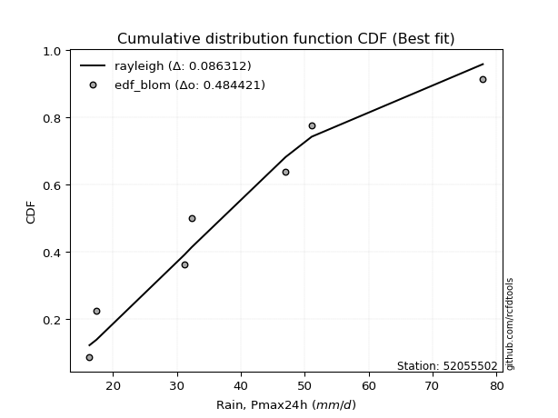</img></img>

</div>


### 7. EDF Tukey (1962)

In hydrology, the Tukey formula is used as a plotting position formula to estimate the empirical probability or frequency of a flood event (or other hydrological data). The formula parameter is given as _c=0.333_ (or 1/3).

<div align="center">


$P=(m-c)/(n+1-2c)$


</div>


**7.1. Empirical values**

<div align="center">

|                | 0                   | 1                   | 2                   | 3         | 4                  | 5                  | 6                  |
|:---------------|:--------------------|:--------------------|:--------------------|:----------|:-------------------|:-------------------|:-------------------|
| date           | 2017                | 2023                | 2022                | 2018      | 2020               | 2021               | 2019               |
| x              | 16.3                | 17.4                | 31.2                | 32.3      | 47.0               | 51.1               | 77.9               |
| m              | 1                   | 2                   | 3                   | 4         | 5                  | 6                  | 7                  |
| empirical_dist | edf_tukey           | edf_tukey           | edf_tukey           | edf_tukey | edf_tukey          | edf_tukey          | edf_tukey          |
| empirical      | 0.09090909090909091 | 0.22727272727272727 | 0.36363636363636365 | 0.5       | 0.6363636363636364 | 0.7727272727272727 | 0.9090909090909091 |
| empirical_tr   | 1.1                 | 1.2941176470588236  | 1.5714285714285714  | 2.0       | 2.75               | 4.3999999999999995 | 10.999999999999996 |

</div>


**7.2. Kolmogorov-Smirnov fit test (sorted by Δ)**


<div align="center">

|                | 0                   | 1                   | 2                   | 3                   | 4                   | 5                   | 6                   | 7                   | 8                   | 9                   | 10                  | 11                  | 12                  | 13                  | 14                  | 15                  | 16                  | 17                  | 18                  | 19                  | 20                  | 21                  | 22                  | 23                  | 24                  | 25                  | 26                  | 27                  | 28                  | 29                  | 30                  | 31                  | 32                  | 33                  | 34                  | 35                  | 36                  | 37                  | 38                  | 39                  | 40                  | 41                  | 42                  | 43                  | 44                  | 45                  | 46                  | 47                  | 48                  | 49                  | 50                  | 51                  | 52                  | 53                  | 54                  | 55                  | 56                  | 57                  | 58                  | 59                  | 60                  | 61                  | 62                  | 63                  | 64                  | 65                  | 66                  | 67                  | 68                  | 69                  | 70                  | 71                  | 72                  | 73                  | 74                  | 75                  | 76                  | 77                  | 78                  | 79                  | 80                  | 81                  | 82                  | 83                  | 84                  | 85                  | 86                  | 87                  | 88                  | 89                  | 90                  | 91                  | 92                  | 93                  | 94                  | 95                  | 96                  | 97                  | 98                  | 99                  | 100                 | 101                 | 102                 | 103                 | 104                 | 105                 | 106                 | 107                 | 108                 | 109                 | 110                 | 111                 | 112                 | 113                 | 114                 | 115                 | 116                 | 117                 | 118                 | 119                 | 120                 | 121                 | 122                 | 123                 | 124                 | 125                 | 126                 | 127                 | 128                 | 129                 | 130                 | 131                 | 132                 | 133                 | 134                 | 135                 | 136                 | 137                 | 138                 | 139                 | 140                 | 141                 | 142                 | 143                 | 144                 | 145                 | 146                 | 147                 | 148                 | 149                 | 150                 | 151                 | 152                 | 153                 | 154                 | 155                 | 156                 | 157                 | 158                 | 159                 |
|:---------------|:--------------------|:--------------------|:--------------------|:--------------------|:--------------------|:--------------------|:--------------------|:--------------------|:--------------------|:--------------------|:--------------------|:--------------------|:--------------------|:--------------------|:--------------------|:--------------------|:--------------------|:--------------------|:--------------------|:--------------------|:--------------------|:--------------------|:--------------------|:--------------------|:--------------------|:--------------------|:--------------------|:--------------------|:--------------------|:--------------------|:--------------------|:--------------------|:--------------------|:--------------------|:--------------------|:--------------------|:--------------------|:--------------------|:--------------------|:--------------------|:--------------------|:--------------------|:--------------------|:--------------------|:--------------------|:--------------------|:--------------------|:--------------------|:--------------------|:--------------------|:--------------------|:--------------------|:--------------------|:--------------------|:--------------------|:--------------------|:--------------------|:--------------------|:--------------------|:--------------------|:--------------------|:--------------------|:--------------------|:--------------------|:--------------------|:--------------------|:--------------------|:--------------------|:--------------------|:--------------------|:--------------------|:--------------------|:--------------------|:--------------------|:--------------------|:--------------------|:--------------------|:--------------------|:--------------------|:--------------------|:--------------------|:--------------------|:--------------------|:--------------------|:--------------------|:--------------------|:--------------------|:--------------------|:--------------------|:--------------------|:--------------------|:--------------------|:--------------------|:--------------------|:--------------------|:--------------------|:--------------------|:--------------------|:--------------------|:--------------------|:--------------------|:--------------------|:--------------------|:--------------------|:--------------------|:--------------------|:--------------------|:--------------------|:--------------------|:--------------------|:--------------------|:--------------------|:--------------------|:--------------------|:--------------------|:--------------------|:--------------------|:--------------------|:--------------------|:--------------------|:--------------------|:--------------------|:--------------------|:--------------------|:--------------------|:--------------------|:--------------------|:--------------------|:--------------------|:--------------------|:--------------------|:--------------------|:--------------------|:--------------------|:--------------------|:--------------------|:--------------------|:--------------------|:--------------------|:--------------------|:--------------------|:--------------------|:--------------------|:--------------------|:--------------------|:--------------------|:--------------------|:--------------------|:--------------------|:--------------------|:--------------------|:--------------------|:--------------------|:--------------------|:--------------------|:--------------------|:--------------------|:--------------------|:--------------------|:--------------------|
| station        | 52055502            | 52055502            | 52055502            | 52055502            | 52055502            | 52055502            | 52055502            | 52055502            | 52055502            | 52055502            | 52055502            | 52055502            | 52055502            | 52055502            | 52055502            | 52055502            | 52055502            | 52055502            | 52055502            | 52055502            | 52055502            | 52055502            | 52055502            | 52055502            | 52055502            | 52055502            | 52055502            | 52055502            | 52055502            | 52055502            | 52055502            | 52055502            | 52055502            | 52055502            | 52055502            | 52055502            | 52055502            | 52055502            | 52055502            | 52055502            | 52055502            | 52055502            | 52055502            | 52055502            | 52055502            | 52055502            | 52055502            | 52055502            | 52055502            | 52055502            | 52055502            | 52055502            | 52055502            | 52055502            | 52055502            | 52055502            | 52055502            | 52055502            | 52055502            | 52055502            | 52055502            | 52055502            | 52055502            | 52055502            | 52055502            | 52055502            | 52055502            | 52055502            | 52055502            | 52055502            | 52055502            | 52055502            | 52055502            | 52055502            | 52055502            | 52055502            | 52055502            | 52055502            | 52055502            | 52055502            | 52055502            | 52055502            | 52055502            | 52055502            | 52055502            | 52055502            | 52055502            | 52055502            | 52055502            | 52055502            | 52055502            | 52055502            | 52055502            | 52055502            | 52055502            | 52055502            | 52055502            | 52055502            | 52055502            | 52055502            | 52055502            | 52055502            | 52055502            | 52055502            | 52055502            | 52055502            | 52055502            | 52055502            | 52055502            | 52055502            | 52055502            | 52055502            | 52055502            | 52055502            | 52055502            | 52055502            | 52055502            | 52055502            | 52055502            | 52055502            | 52055502            | 52055502            | 52055502            | 52055502            | 52055502            | 52055502            | 52055502            | 52055502            | 52055502            | 52055502            | 52055502            | 52055502            | 52055502            | 52055502            | 52055502            | 52055502            | 52055502            | 52055502            | 52055502            | 52055502            | 52055502            | 52055502            | 52055502            | 52055502            | 52055502            | 52055502            | 52055502            | 52055502            | 52055502            | 52055502            | 52055502            | 52055502            | 52055502            | 52055502            | 52055502            | 52055502            | 52055502            | 52055502            | 52055502            | 52055502            |
| empirical_dist | edf_tukey           | edf_tukey           | edf_tukey           | edf_tukey           | edf_tukey           | edf_tukey           | edf_tukey           | edf_tukey           | edf_tukey           | edf_tukey           | edf_tukey           | edf_tukey           | edf_tukey           | edf_tukey           | edf_tukey           | edf_tukey           | edf_tukey           | edf_tukey           | edf_tukey           | edf_tukey           | edf_tukey           | edf_tukey           | edf_tukey           | edf_tukey           | edf_tukey           | edf_tukey           | edf_tukey           | edf_tukey           | edf_tukey           | edf_tukey           | edf_tukey           | edf_tukey           | edf_tukey           | edf_tukey           | edf_tukey           | edf_tukey           | edf_tukey           | edf_tukey           | edf_tukey           | edf_tukey           | edf_tukey           | edf_tukey           | edf_tukey           | edf_tukey           | edf_tukey           | edf_tukey           | edf_tukey           | edf_tukey           | edf_tukey           | edf_tukey           | edf_tukey           | edf_tukey           | edf_tukey           | edf_tukey           | edf_tukey           | edf_tukey           | edf_tukey           | edf_tukey           | edf_tukey           | edf_tukey           | edf_tukey           | edf_tukey           | edf_tukey           | edf_tukey           | edf_tukey           | edf_tukey           | edf_tukey           | edf_tukey           | edf_tukey           | edf_tukey           | edf_tukey           | edf_tukey           | edf_tukey           | edf_tukey           | edf_tukey           | edf_tukey           | edf_tukey           | edf_tukey           | edf_tukey           | edf_tukey           | edf_tukey           | edf_tukey           | edf_tukey           | edf_tukey           | edf_tukey           | edf_tukey           | edf_tukey           | edf_tukey           | edf_tukey           | edf_tukey           | edf_tukey           | edf_tukey           | edf_tukey           | edf_tukey           | edf_tukey           | edf_tukey           | edf_tukey           | edf_tukey           | edf_tukey           | edf_tukey           | edf_tukey           | edf_tukey           | edf_tukey           | edf_tukey           | edf_tukey           | edf_tukey           | edf_tukey           | edf_tukey           | edf_tukey           | edf_tukey           | edf_tukey           | edf_tukey           | edf_tukey           | edf_tukey           | edf_tukey           | edf_tukey           | edf_tukey           | edf_tukey           | edf_tukey           | edf_tukey           | edf_tukey           | edf_tukey           | edf_tukey           | edf_tukey           | edf_tukey           | edf_tukey           | edf_tukey           | edf_tukey           | edf_tukey           | edf_tukey           | edf_tukey           | edf_tukey           | edf_tukey           | edf_tukey           | edf_tukey           | edf_tukey           | edf_tukey           | edf_tukey           | edf_tukey           | edf_tukey           | edf_tukey           | edf_tukey           | edf_tukey           | edf_tukey           | edf_tukey           | edf_tukey           | edf_tukey           | edf_tukey           | edf_tukey           | edf_tukey           | edf_tukey           | edf_tukey           | edf_tukey           | edf_tukey           | edf_tukey           | edf_tukey           | edf_tukey           | edf_tukey           | edf_tukey           | edf_tukey           |
| p_dist         | foldnorm            | rayleigh            | logksone            | pearson3            | maxwell             | logarcsine          | dgamma              | logsemicircular     | logncf              | semicircular        | loganglit           | dweibull            | halfnorm            | logburr             | anglit              | loggenextreme       | logweibull_max      | genlogistic         | ncf                 | gumbel_r            | loggumbel_l         | logloggamma         | alpha               | kstwobign           | logpearson3         | logfoldnorm         | lognct              | logjohnsonsu        | logskewnorm         | logt                | logexponnorm        | logcrystalball      | lognorm             | genextreme          | logfatiguelife      | logf                | loggamma            | loggamma            | logerlang           | loginvgamma         | logalpha            | invgamma            | logbetaprime        | norm                | crystalball         | truncnorm           | t                   | loginvgauss         | logburr12           | arcsine             | logcosine           | logdweibull         | rice                | logmaxwell          | burr                | loggenlogistic      | loglogistic         | nct                 | loginvweibull       | logargus            | loghypsecant        | betaprime           | lograyleigh         | logloglaplace       | logtriang           | logrice             | logistic            | moyal               | logkstwobign        | invgauss            | loglaplace          | loglaplace          | weibull_min         | truncweibull_min    | hypsecant           | gausshyper          | logdgamma           | cosine              | beta                | halflogistic        | logrdist            | logbradford         | loggenexpon         | loggumbel_r         | logwrapcauchy       | logtruncpareto      | logexponpow         | logtruncexpon       | lomax               | exponnorm           | logtukeylambda      | logkappa4           | loggompertz         | logkappa3           | genexpon            | loguniform          | logvonmises_line    | gompertz            | laplace             | gumbel_l            | loggausshyper       | halfgennorm         | truncexpon          | logmoyal            | skewnorm            | kappa3              | loghalfnorm         | bradford            | kappa4              | f                   | ksone               | burr12              | loglomax            | argus               | loghalflogistic     | wald                | logwald             | genpareto           | wrapcauchy          | loggenhalflogistic  | vonmises_line       | tukeylambda         | uniform             | logweibull_min      | loggenpareto        | loglevy_l           | gennorm             | loggennorm          | triang              | logtruncweibull_min | johnsonsb           | logjohnsonsb        | logtrapezoid        | levy_l              | logmielke           | genhalflogistic     | exponpow            | invweibull          | logtruncnorm        | exponweib           | logbeta             | powerlaw            | fatiguelife         | gengamma            | lognakagami         | nakagami            | rdist               | trapezoid           | johnsonsu           | erlang              | logpowerlaw         | logexponweib        | gamma               | truncpareto         | loggengamma         | weibull_max         | loghalfgennorm      | logvonmises         | vonmises            | mielke              |
| delta          | 0.07842026042303749 | 0.08867757298104886 | 0.09436903491498519 | 0.09850529656643264 | 0.09854661252619246 | 0.09860222622828813 | 0.10224023272813454 | 0.10282577321359285 | 0.1045029414795059  | 0.10637095147609266 | 0.10924101064706876 | 0.1093170631588043  | 0.1101777947845354  | 0.11151078919946766 | 0.11376813753748194 | 0.11706645379025307 | 0.1170701249389701  | 0.11915405863518766 | 0.12056046926443742 | 0.12094062344540611 | 0.12319617173682407 | 0.1238465552929841  | 0.12428753277330844 | 0.12429684505265898 | 0.1248011688440182  | 0.12499586420105993 | 0.12516473388668117 | 0.12545644114096335 | 0.12549449499235626 | 0.12552276078929137 | 0.12552517190101004 | 0.12552553180671414 | 0.1255255596763191  | 0.12570354859357533 | 0.12583393583377386 | 0.12588146163438324 | 0.126032111581284   | 0.126032111581284   | 0.1260423629358843  | 0.12841288464313722 | 0.12892701338519677 | 0.12935122184822975 | 0.12954811646933934 | 0.1314733431954157  | 0.1314733533767845  | 0.13147335676051475 | 0.1314739607815819  | 0.13227949238347567 | 0.13254733192507387 | 0.1326710878962316  | 0.13459296064966111 | 0.13466469169271744 | 0.13509511580034858 | 0.13579353759971796 | 0.1360862557059952  | 0.1365875684323784  | 0.136689475947133   | 0.13700979600157037 | 0.13839245069557793 | 0.14030597340959047 | 0.14142559226662726 | 0.1418388655139493  | 0.14277196001420686 | 0.14306773043492393 | 0.14528696032954536 | 0.14653720010946505 | 0.14771214579793135 | 0.1483495202687833  | 0.15010485094749715 | 0.15063126002413152 | 0.15185805508135053 | 0.15185805508135053 | 0.15265904048547566 | 0.1559583297648372  | 0.1605971969311626  | 0.16253879676271765 | 0.1631764141802808  | 0.16335998642079919 | 0.16441697044011627 | 0.16538495838843192 | 0.16573860368671833 | 0.16708573601604573 | 0.16881505613678777 | 0.17048233768004295 | 0.17092642117276363 | 0.17098688153615094 | 0.17238630405378508 | 0.17335504788131983 | 0.17659527720310572 | 0.17891409270823252 | 0.1807667043968457  | 0.18164991465174693 | 0.18190147229521592 | 0.18525783759194817 | 0.18550087082191918 | 0.18552451206051626 | 0.18552787089455794 | 0.18848407432855635 | 0.1890057305410487  | 0.1941926453526268  | 0.19429083864222785 | 0.1956657210000038  | 0.19717018071456052 | 0.19768298629091222 | 0.19831179414152775 | 0.199887875573232   | 0.20231275916117808 | 0.20381144583234206 | 0.20888574233616825 | 0.21046334372204756 | 0.2186147186147187  | 0.2195198719554028  | 0.2211374621405261  | 0.22127992805159857 | 0.22727272727272727 | 0.22727272727272727 | 0.22836947161364296 | 0.232800920339032   | 0.23496102600352264 | 0.23596431515704935 | 0.23772030184800835 | 0.23837461368159685 | 0.24025974025974034 | 0.2624514355164068  | 0.2682785305534132  | 0.2726938988103401  | 0.2727272727272727  | 0.2727272727272727  | 0.2733982028380151  | 0.27846506546685623 | 0.29235273918075744 | 0.2962320689391828  | 0.2995910827177801  | 0.32248860013405467 | 0.34465779222852944 | 0.3552459286178132  | 0.389279210757572   | 0.3894257762970862  | 0.3900881296199091  | 0.40273185556903557 | 0.4166055937623523  | 0.4400187673099841  | 0.440117482748956   | 0.4427786185855117  | 0.4502270907801723  | 0.45358944254858147 | 0.45883837331137955 | 0.4656865501021346  | 0.4741993390380934  | 0.4925003500699471  | 0.4981602938604951  | 0.5156938126385594  | 0.5345309180409402  | 0.5463107516442728  | 0.5590606895471666  | 0.6254569153674828  | 0.7727272727272727  | 1.095779911559029   | 11.68060983416463   | nan                 |
| deltao         | 0.48442053926100004 | 0.48442053926100004 | 0.48442053926100004 | 0.48442053926100004 | 0.48442053926100004 | 0.48442053926100004 | 0.48442053926100004 | 0.48442053926100004 | 0.48442053926100004 | 0.48442053926100004 | 0.48442053926100004 | 0.48442053926100004 | 0.48442053926100004 | 0.48442053926100004 | 0.48442053926100004 | 0.48442053926100004 | 0.48442053926100004 | 0.48442053926100004 | 0.48442053926100004 | 0.48442053926100004 | 0.48442053926100004 | 0.48442053926100004 | 0.48442053926100004 | 0.48442053926100004 | 0.48442053926100004 | 0.48442053926100004 | 0.48442053926100004 | 0.48442053926100004 | 0.48442053926100004 | 0.48442053926100004 | 0.48442053926100004 | 0.48442053926100004 | 0.48442053926100004 | 0.48442053926100004 | 0.48442053926100004 | 0.48442053926100004 | 0.48442053926100004 | 0.48442053926100004 | 0.48442053926100004 | 0.48442053926100004 | 0.48442053926100004 | 0.48442053926100004 | 0.48442053926100004 | 0.48442053926100004 | 0.48442053926100004 | 0.48442053926100004 | 0.48442053926100004 | 0.48442053926100004 | 0.48442053926100004 | 0.48442053926100004 | 0.48442053926100004 | 0.48442053926100004 | 0.48442053926100004 | 0.48442053926100004 | 0.48442053926100004 | 0.48442053926100004 | 0.48442053926100004 | 0.48442053926100004 | 0.48442053926100004 | 0.48442053926100004 | 0.48442053926100004 | 0.48442053926100004 | 0.48442053926100004 | 0.48442053926100004 | 0.48442053926100004 | 0.48442053926100004 | 0.48442053926100004 | 0.48442053926100004 | 0.48442053926100004 | 0.48442053926100004 | 0.48442053926100004 | 0.48442053926100004 | 0.48442053926100004 | 0.48442053926100004 | 0.48442053926100004 | 0.48442053926100004 | 0.48442053926100004 | 0.48442053926100004 | 0.48442053926100004 | 0.48442053926100004 | 0.48442053926100004 | 0.48442053926100004 | 0.48442053926100004 | 0.48442053926100004 | 0.48442053926100004 | 0.48442053926100004 | 0.48442053926100004 | 0.48442053926100004 | 0.48442053926100004 | 0.48442053926100004 | 0.48442053926100004 | 0.48442053926100004 | 0.48442053926100004 | 0.48442053926100004 | 0.48442053926100004 | 0.48442053926100004 | 0.48442053926100004 | 0.48442053926100004 | 0.48442053926100004 | 0.48442053926100004 | 0.48442053926100004 | 0.48442053926100004 | 0.48442053926100004 | 0.48442053926100004 | 0.48442053926100004 | 0.48442053926100004 | 0.48442053926100004 | 0.48442053926100004 | 0.48442053926100004 | 0.48442053926100004 | 0.48442053926100004 | 0.48442053926100004 | 0.48442053926100004 | 0.48442053926100004 | 0.48442053926100004 | 0.48442053926100004 | 0.48442053926100004 | 0.48442053926100004 | 0.48442053926100004 | 0.48442053926100004 | 0.48442053926100004 | 0.48442053926100004 | 0.48442053926100004 | 0.48442053926100004 | 0.48442053926100004 | 0.48442053926100004 | 0.48442053926100004 | 0.48442053926100004 | 0.48442053926100004 | 0.48442053926100004 | 0.48442053926100004 | 0.48442053926100004 | 0.48442053926100004 | 0.48442053926100004 | 0.48442053926100004 | 0.48442053926100004 | 0.48442053926100004 | 0.48442053926100004 | 0.48442053926100004 | 0.48442053926100004 | 0.48442053926100004 | 0.48442053926100004 | 0.48442053926100004 | 0.48442053926100004 | 0.48442053926100004 | 0.48442053926100004 | 0.48442053926100004 | 0.48442053926100004 | 0.48442053926100004 | 0.48442053926100004 | 0.48442053926100004 | 0.48442053926100004 | 0.48442053926100004 | 0.48442053926100004 | 0.48442053926100004 | 0.48442053926100004 | 0.48442053926100004 | 0.48442053926100004 | 0.48442053926100004 | 0.48442053926100004 |
| eval           | Δo > Δ              | Δo > Δ              | Δo > Δ              | Δo > Δ              | Δo > Δ              | Δo > Δ              | Δo > Δ              | Δo > Δ              | Δo > Δ              | Δo > Δ              | Δo > Δ              | Δo > Δ              | Δo > Δ              | Δo > Δ              | Δo > Δ              | Δo > Δ              | Δo > Δ              | Δo > Δ              | Δo > Δ              | Δo > Δ              | Δo > Δ              | Δo > Δ              | Δo > Δ              | Δo > Δ              | Δo > Δ              | Δo > Δ              | Δo > Δ              | Δo > Δ              | Δo > Δ              | Δo > Δ              | Δo > Δ              | Δo > Δ              | Δo > Δ              | Δo > Δ              | Δo > Δ              | Δo > Δ              | Δo > Δ              | Δo > Δ              | Δo > Δ              | Δo > Δ              | Δo > Δ              | Δo > Δ              | Δo > Δ              | Δo > Δ              | Δo > Δ              | Δo > Δ              | Δo > Δ              | Δo > Δ              | Δo > Δ              | Δo > Δ              | Δo > Δ              | Δo > Δ              | Δo > Δ              | Δo > Δ              | Δo > Δ              | Δo > Δ              | Δo > Δ              | Δo > Δ              | Δo > Δ              | Δo > Δ              | Δo > Δ              | Δo > Δ              | Δo > Δ              | Δo > Δ              | Δo > Δ              | Δo > Δ              | Δo > Δ              | Δo > Δ              | Δo > Δ              | Δo > Δ              | Δo > Δ              | Δo > Δ              | Δo > Δ              | Δo > Δ              | Δo > Δ              | Δo > Δ              | Δo > Δ              | Δo > Δ              | Δo > Δ              | Δo > Δ              | Δo > Δ              | Δo > Δ              | Δo > Δ              | Δo > Δ              | Δo > Δ              | Δo > Δ              | Δo > Δ              | Δo > Δ              | Δo > Δ              | Δo > Δ              | Δo > Δ              | Δo > Δ              | Δo > Δ              | Δo > Δ              | Δo > Δ              | Δo > Δ              | Δo > Δ              | Δo > Δ              | Δo > Δ              | Δo > Δ              | Δo > Δ              | Δo > Δ              | Δo > Δ              | Δo > Δ              | Δo > Δ              | Δo > Δ              | Δo > Δ              | Δo > Δ              | Δo > Δ              | Δo > Δ              | Δo > Δ              | Δo > Δ              | Δo > Δ              | Δo > Δ              | Δo > Δ              | Δo > Δ              | Δo > Δ              | Δo > Δ              | Δo > Δ              | Δo > Δ              | Δo > Δ              | Δo > Δ              | Δo > Δ              | Δo > Δ              | Δo > Δ              | Δo > Δ              | Δo > Δ              | Δo > Δ              | Δo > Δ              | Δo > Δ              | Δo > Δ              | Δo > Δ              | Δo > Δ              | Δo > Δ              | Δo > Δ              | Δo > Δ              | Δo > Δ              | Δo > Δ              | Δo > Δ              | Δo > Δ              | Δo > Δ              | Δo > Δ              | Δo > Δ              | Δo > Δ              | Δo > Δ              | Δo > Δ              | Δo > Δ              | Δo > Δ              | Δo > Δ              | Δo <= Δ             | Δo <= Δ             | Δo <= Δ             | Δo <= Δ             | Δo <= Δ             | Δo <= Δ             | Δo <= Δ             | Δo <= Δ             | Δo <= Δ             | Δo <= Δ             | Δo <= Δ             |
| fit            | 1                   | 1                   | 1                   | 1                   | 1                   | 1                   | 1                   | 1                   | 1                   | 1                   | 1                   | 1                   | 1                   | 1                   | 1                   | 1                   | 1                   | 1                   | 1                   | 1                   | 1                   | 1                   | 1                   | 1                   | 1                   | 1                   | 1                   | 1                   | 1                   | 1                   | 1                   | 1                   | 1                   | 1                   | 1                   | 1                   | 1                   | 1                   | 1                   | 1                   | 1                   | 1                   | 1                   | 1                   | 1                   | 1                   | 1                   | 1                   | 1                   | 1                   | 1                   | 1                   | 1                   | 1                   | 1                   | 1                   | 1                   | 1                   | 1                   | 1                   | 1                   | 1                   | 1                   | 1                   | 1                   | 1                   | 1                   | 1                   | 1                   | 1                   | 1                   | 1                   | 1                   | 1                   | 1                   | 1                   | 1                   | 1                   | 1                   | 1                   | 1                   | 1                   | 1                   | 1                   | 1                   | 1                   | 1                   | 1                   | 1                   | 1                   | 1                   | 1                   | 1                   | 1                   | 1                   | 1                   | 1                   | 1                   | 1                   | 1                   | 1                   | 1                   | 1                   | 1                   | 1                   | 1                   | 1                   | 1                   | 1                   | 1                   | 1                   | 1                   | 1                   | 1                   | 1                   | 1                   | 1                   | 1                   | 1                   | 1                   | 1                   | 1                   | 1                   | 1                   | 1                   | 1                   | 1                   | 1                   | 1                   | 1                   | 1                   | 1                   | 1                   | 1                   | 1                   | 1                   | 1                   | 1                   | 1                   | 1                   | 1                   | 1                   | 1                   | 1                   | 1                   | 1                   | 1                   | 1                   | 1                   | 0                   | 0                   | 0                   | 0                   | 0                   | 0                   | 0                   | 0                   | 0                   | 0                   | 0                   |
| n              | 7                   | 7                   | 7                   | 7                   | 7                   | 7                   | 7                   | 7                   | 7                   | 7                   | 7                   | 7                   | 7                   | 7                   | 7                   | 7                   | 7                   | 7                   | 7                   | 7                   | 7                   | 7                   | 7                   | 7                   | 7                   | 7                   | 7                   | 7                   | 7                   | 7                   | 7                   | 7                   | 7                   | 7                   | 7                   | 7                   | 7                   | 7                   | 7                   | 7                   | 7                   | 7                   | 7                   | 7                   | 7                   | 7                   | 7                   | 7                   | 7                   | 7                   | 7                   | 7                   | 7                   | 7                   | 7                   | 7                   | 7                   | 7                   | 7                   | 7                   | 7                   | 7                   | 7                   | 7                   | 7                   | 7                   | 7                   | 7                   | 7                   | 7                   | 7                   | 7                   | 7                   | 7                   | 7                   | 7                   | 7                   | 7                   | 7                   | 7                   | 7                   | 7                   | 7                   | 7                   | 7                   | 7                   | 7                   | 7                   | 7                   | 7                   | 7                   | 7                   | 7                   | 7                   | 7                   | 7                   | 7                   | 7                   | 7                   | 7                   | 7                   | 7                   | 7                   | 7                   | 7                   | 7                   | 7                   | 7                   | 7                   | 7                   | 7                   | 7                   | 7                   | 7                   | 7                   | 7                   | 7                   | 7                   | 7                   | 7                   | 7                   | 7                   | 7                   | 7                   | 7                   | 7                   | 7                   | 7                   | 7                   | 7                   | 7                   | 7                   | 7                   | 7                   | 7                   | 7                   | 7                   | 7                   | 7                   | 7                   | 7                   | 7                   | 7                   | 7                   | 7                   | 7                   | 7                   | 7                   | 7                   | 7                   | 7                   | 7                   | 7                   | 7                   | 7                   | 7                   | 7                   | 7                   | 7                   | 7                   |
| best_fit       | 1                   | 0                   | 0                   | 0                   | 0                   | 0                   | 0                   | 0                   | 0                   | 0                   | 0                   | 0                   | 0                   | 0                   | 0                   | 0                   | 0                   | 0                   | 0                   | 0                   | 0                   | 0                   | 0                   | 0                   | 0                   | 0                   | 0                   | 0                   | 0                   | 0                   | 0                   | 0                   | 0                   | 0                   | 0                   | 0                   | 0                   | 0                   | 0                   | 0                   | 0                   | 0                   | 0                   | 0                   | 0                   | 0                   | 0                   | 0                   | 0                   | 0                   | 0                   | 0                   | 0                   | 0                   | 0                   | 0                   | 0                   | 0                   | 0                   | 0                   | 0                   | 0                   | 0                   | 0                   | 0                   | 0                   | 0                   | 0                   | 0                   | 0                   | 0                   | 0                   | 0                   | 0                   | 0                   | 0                   | 0                   | 0                   | 0                   | 0                   | 0                   | 0                   | 0                   | 0                   | 0                   | 0                   | 0                   | 0                   | 0                   | 0                   | 0                   | 0                   | 0                   | 0                   | 0                   | 0                   | 0                   | 0                   | 0                   | 0                   | 0                   | 0                   | 0                   | 0                   | 0                   | 0                   | 0                   | 0                   | 0                   | 0                   | 0                   | 0                   | 0                   | 0                   | 0                   | 0                   | 0                   | 0                   | 0                   | 0                   | 0                   | 0                   | 0                   | 0                   | 0                   | 0                   | 0                   | 0                   | 0                   | 0                   | 0                   | 0                   | 0                   | 0                   | 0                   | 0                   | 0                   | 0                   | 0                   | 0                   | 0                   | 0                   | 0                   | 0                   | 0                   | 0                   | 0                   | 0                   | 0                   | 0                   | 0                   | 0                   | 0                   | 0                   | 0                   | 0                   | 0                   | 0                   | 0                   | 0                   |
| best_fit_sort  | 1                   | 2                   | 3                   | 4                   | 5                   | 6                   | 7                   | 8                   | 9                   | 10                  | 11                  | 12                  | 13                  | 14                  | 15                  | 16                  | 17                  | 18                  | 19                  | 20                  | 21                  | 22                  | 23                  | 24                  | 25                  | 26                  | 27                  | 28                  | 29                  | 30                  | 31                  | 32                  | 33                  | 34                  | 35                  | 36                  | 37                  | 38                  | 39                  | 40                  | 41                  | 42                  | 43                  | 44                  | 45                  | 46                  | 47                  | 48                  | 49                  | 50                  | 51                  | 52                  | 53                  | 54                  | 55                  | 56                  | 57                  | 58                  | 59                  | 60                  | 61                  | 62                  | 63                  | 64                  | 65                  | 66                  | 67                  | 68                  | 69                  | 70                  | 71                  | 72                  | 73                  | 74                  | 75                  | 76                  | 77                  | 78                  | 79                  | 80                  | 81                  | 82                  | 83                  | 84                  | 85                  | 86                  | 87                  | 88                  | 89                  | 90                  | 91                  | 92                  | 93                  | 94                  | 95                  | 96                  | 97                  | 98                  | 99                  | 100                 | 101                 | 102                 | 103                 | 104                 | 105                 | 106                 | 107                 | 108                 | 109                 | 110                 | 111                 | 112                 | 113                 | 114                 | 115                 | 116                 | 117                 | 118                 | 119                 | 120                 | 121                 | 122                 | 123                 | 124                 | 125                 | 126                 | 127                 | 128                 | 129                 | 130                 | 131                 | 132                 | 133                 | 134                 | 135                 | 136                 | 137                 | 138                 | 139                 | 140                 | 141                 | 142                 | 143                 | 144                 | 145                 | 146                 | 147                 | 148                 | 149                 | 150                 | 151                 | 152                 | 153                 | 154                 | 155                 | 156                 | 157                 | 158                 | 159                 | 160                 |

</div>


**7.3. Best fit**

<div align="center">

|   id |   station | empirical_dist   | p_dist   |     delta |   deltao | eval   |   fit |   n |   best_fit |   best_fit_sort |
|-----:|----------:|:-----------------|:---------|----------:|---------:|:-------|------:|----:|-----------:|----------------:|
|    0 |  52055502 | edf_tukey        | foldnorm | 0.0784203 | 0.484421 | Δo > Δ |     1 |   7 |          1 |               1 |

</div>


<div align="center">

</img>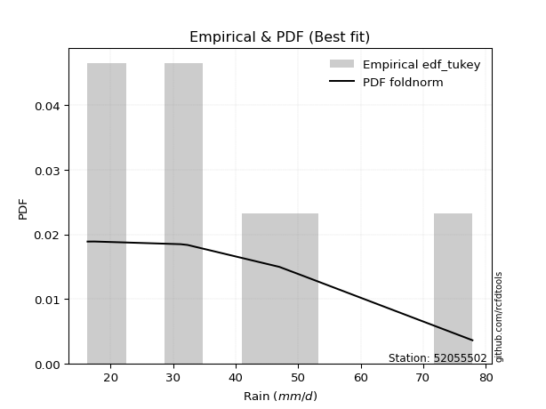</img>

</div>


### 8. EDF Gringorten (1963)

Gringorten plotting position formula is essential for estimating the probability and return periods of extreme events like floods and heavy rainfall. The constant _a=0.44_.

<div align="center">


$P=(m-a)/(n+1-2a)$


</div>


**8.1. Empirical values**

<div align="center">

|                | 0                   | 1                   | 2                  | 3              | 4                  | 5                  | 6                  |
|:---------------|:--------------------|:--------------------|:-------------------|:---------------|:-------------------|:-------------------|:-------------------|
| date           | 2017                | 2023                | 2022               | 2018           | 2020               | 2021               | 2019               |
| x              | 16.3                | 17.4                | 31.2               | 32.3           | 47.0               | 51.1               | 77.9               |
| m              | 1                   | 2                   | 3                  | 4              | 5                  | 6                  | 7                  |
| empirical_dist | edf_gringorten      | edf_gringorten      | edf_gringorten     | edf_gringorten | edf_gringorten     | edf_gringorten     | edf_gringorten     |
| empirical      | 0.07865168539325844 | 0.21910112359550563 | 0.3595505617977528 | 0.5            | 0.6404494382022471 | 0.7808988764044943 | 0.9213483146067415 |
| empirical_tr   | 1.0853658536585364  | 1.2805755395683454  | 1.5614035087719298 | 2.0            | 2.781249999999999  | 4.564102564102562  | 12.714285714285701 |

</div>


**8.2. Kolmogorov-Smirnov fit test (sorted by Δ)**


<div align="center">

|                | 0                   | 1                   | 2                   | 3                   | 4                   | 5                   | 6                   | 7                   | 8                   | 9                   | 10                  | 11                  | 12                  | 13                  | 14                  | 15                  | 16                  | 17                  | 18                  | 19                  | 20                  | 21                  | 22                  | 23                  | 24                  | 25                  | 26                  | 27                  | 28                  | 29                  | 30                  | 31                  | 32                  | 33                  | 34                  | 35                  | 36                  | 37                  | 38                  | 39                  | 40                  | 41                  | 42                  | 43                  | 44                  | 45                  | 46                  | 47                  | 48                  | 49                  | 50                  | 51                  | 52                  | 53                  | 54                  | 55                  | 56                  | 57                  | 58                  | 59                  | 60                  | 61                  | 62                  | 63                  | 64                  | 65                  | 66                  | 67                  | 68                  | 69                  | 70                  | 71                  | 72                  | 73                  | 74                  | 75                  | 76                  | 77                  | 78                  | 79                  | 80                  | 81                  | 82                  | 83                  | 84                  | 85                  | 86                  | 87                  | 88                  | 89                  | 90                  | 91                  | 92                  | 93                  | 94                  | 95                  | 96                  | 97                  | 98                  | 99                  | 100                 | 101                 | 102                 | 103                 | 104                 | 105                 | 106                 | 107                 | 108                 | 109                 | 110                 | 111                 | 112                 | 113                 | 114                 | 115                 | 116                 | 117                 | 118                 | 119                 | 120                 | 121                 | 122                 | 123                 | 124                 | 125                 | 126                 | 127                 | 128                 | 129                 | 130                 | 131                 | 132                 | 133                 | 134                 | 135                 | 136                 | 137                 | 138                 | 139                 | 140                 | 141                 | 142                 | 143                 | 144                 | 145                 | 146                 | 147                 | 148                 | 149                 | 150                 | 151                 | 152                 | 153                 | 154                 | 155                 | 156                 | 157                 | 158                 | 159                 |
|:---------------|:--------------------|:--------------------|:--------------------|:--------------------|:--------------------|:--------------------|:--------------------|:--------------------|:--------------------|:--------------------|:--------------------|:--------------------|:--------------------|:--------------------|:--------------------|:--------------------|:--------------------|:--------------------|:--------------------|:--------------------|:--------------------|:--------------------|:--------------------|:--------------------|:--------------------|:--------------------|:--------------------|:--------------------|:--------------------|:--------------------|:--------------------|:--------------------|:--------------------|:--------------------|:--------------------|:--------------------|:--------------------|:--------------------|:--------------------|:--------------------|:--------------------|:--------------------|:--------------------|:--------------------|:--------------------|:--------------------|:--------------------|:--------------------|:--------------------|:--------------------|:--------------------|:--------------------|:--------------------|:--------------------|:--------------------|:--------------------|:--------------------|:--------------------|:--------------------|:--------------------|:--------------------|:--------------------|:--------------------|:--------------------|:--------------------|:--------------------|:--------------------|:--------------------|:--------------------|:--------------------|:--------------------|:--------------------|:--------------------|:--------------------|:--------------------|:--------------------|:--------------------|:--------------------|:--------------------|:--------------------|:--------------------|:--------------------|:--------------------|:--------------------|:--------------------|:--------------------|:--------------------|:--------------------|:--------------------|:--------------------|:--------------------|:--------------------|:--------------------|:--------------------|:--------------------|:--------------------|:--------------------|:--------------------|:--------------------|:--------------------|:--------------------|:--------------------|:--------------------|:--------------------|:--------------------|:--------------------|:--------------------|:--------------------|:--------------------|:--------------------|:--------------------|:--------------------|:--------------------|:--------------------|:--------------------|:--------------------|:--------------------|:--------------------|:--------------------|:--------------------|:--------------------|:--------------------|:--------------------|:--------------------|:--------------------|:--------------------|:--------------------|:--------------------|:--------------------|:--------------------|:--------------------|:--------------------|:--------------------|:--------------------|:--------------------|:--------------------|:--------------------|:--------------------|:--------------------|:--------------------|:--------------------|:--------------------|:--------------------|:--------------------|:--------------------|:--------------------|:--------------------|:--------------------|:--------------------|:--------------------|:--------------------|:--------------------|:--------------------|:--------------------|:--------------------|:--------------------|:--------------------|:--------------------|:--------------------|:--------------------|
| station        | 52055502            | 52055502            | 52055502            | 52055502            | 52055502            | 52055502            | 52055502            | 52055502            | 52055502            | 52055502            | 52055502            | 52055502            | 52055502            | 52055502            | 52055502            | 52055502            | 52055502            | 52055502            | 52055502            | 52055502            | 52055502            | 52055502            | 52055502            | 52055502            | 52055502            | 52055502            | 52055502            | 52055502            | 52055502            | 52055502            | 52055502            | 52055502            | 52055502            | 52055502            | 52055502            | 52055502            | 52055502            | 52055502            | 52055502            | 52055502            | 52055502            | 52055502            | 52055502            | 52055502            | 52055502            | 52055502            | 52055502            | 52055502            | 52055502            | 52055502            | 52055502            | 52055502            | 52055502            | 52055502            | 52055502            | 52055502            | 52055502            | 52055502            | 52055502            | 52055502            | 52055502            | 52055502            | 52055502            | 52055502            | 52055502            | 52055502            | 52055502            | 52055502            | 52055502            | 52055502            | 52055502            | 52055502            | 52055502            | 52055502            | 52055502            | 52055502            | 52055502            | 52055502            | 52055502            | 52055502            | 52055502            | 52055502            | 52055502            | 52055502            | 52055502            | 52055502            | 52055502            | 52055502            | 52055502            | 52055502            | 52055502            | 52055502            | 52055502            | 52055502            | 52055502            | 52055502            | 52055502            | 52055502            | 52055502            | 52055502            | 52055502            | 52055502            | 52055502            | 52055502            | 52055502            | 52055502            | 52055502            | 52055502            | 52055502            | 52055502            | 52055502            | 52055502            | 52055502            | 52055502            | 52055502            | 52055502            | 52055502            | 52055502            | 52055502            | 52055502            | 52055502            | 52055502            | 52055502            | 52055502            | 52055502            | 52055502            | 52055502            | 52055502            | 52055502            | 52055502            | 52055502            | 52055502            | 52055502            | 52055502            | 52055502            | 52055502            | 52055502            | 52055502            | 52055502            | 52055502            | 52055502            | 52055502            | 52055502            | 52055502            | 52055502            | 52055502            | 52055502            | 52055502            | 52055502            | 52055502            | 52055502            | 52055502            | 52055502            | 52055502            | 52055502            | 52055502            | 52055502            | 52055502            | 52055502            | 52055502            |
| empirical_dist | edf_gringorten      | edf_gringorten      | edf_gringorten      | edf_gringorten      | edf_gringorten      | edf_gringorten      | edf_gringorten      | edf_gringorten      | edf_gringorten      | edf_gringorten      | edf_gringorten      | edf_gringorten      | edf_gringorten      | edf_gringorten      | edf_gringorten      | edf_gringorten      | edf_gringorten      | edf_gringorten      | edf_gringorten      | edf_gringorten      | edf_gringorten      | edf_gringorten      | edf_gringorten      | edf_gringorten      | edf_gringorten      | edf_gringorten      | edf_gringorten      | edf_gringorten      | edf_gringorten      | edf_gringorten      | edf_gringorten      | edf_gringorten      | edf_gringorten      | edf_gringorten      | edf_gringorten      | edf_gringorten      | edf_gringorten      | edf_gringorten      | edf_gringorten      | edf_gringorten      | edf_gringorten      | edf_gringorten      | edf_gringorten      | edf_gringorten      | edf_gringorten      | edf_gringorten      | edf_gringorten      | edf_gringorten      | edf_gringorten      | edf_gringorten      | edf_gringorten      | edf_gringorten      | edf_gringorten      | edf_gringorten      | edf_gringorten      | edf_gringorten      | edf_gringorten      | edf_gringorten      | edf_gringorten      | edf_gringorten      | edf_gringorten      | edf_gringorten      | edf_gringorten      | edf_gringorten      | edf_gringorten      | edf_gringorten      | edf_gringorten      | edf_gringorten      | edf_gringorten      | edf_gringorten      | edf_gringorten      | edf_gringorten      | edf_gringorten      | edf_gringorten      | edf_gringorten      | edf_gringorten      | edf_gringorten      | edf_gringorten      | edf_gringorten      | edf_gringorten      | edf_gringorten      | edf_gringorten      | edf_gringorten      | edf_gringorten      | edf_gringorten      | edf_gringorten      | edf_gringorten      | edf_gringorten      | edf_gringorten      | edf_gringorten      | edf_gringorten      | edf_gringorten      | edf_gringorten      | edf_gringorten      | edf_gringorten      | edf_gringorten      | edf_gringorten      | edf_gringorten      | edf_gringorten      | edf_gringorten      | edf_gringorten      | edf_gringorten      | edf_gringorten      | edf_gringorten      | edf_gringorten      | edf_gringorten      | edf_gringorten      | edf_gringorten      | edf_gringorten      | edf_gringorten      | edf_gringorten      | edf_gringorten      | edf_gringorten      | edf_gringorten      | edf_gringorten      | edf_gringorten      | edf_gringorten      | edf_gringorten      | edf_gringorten      | edf_gringorten      | edf_gringorten      | edf_gringorten      | edf_gringorten      | edf_gringorten      | edf_gringorten      | edf_gringorten      | edf_gringorten      | edf_gringorten      | edf_gringorten      | edf_gringorten      | edf_gringorten      | edf_gringorten      | edf_gringorten      | edf_gringorten      | edf_gringorten      | edf_gringorten      | edf_gringorten      | edf_gringorten      | edf_gringorten      | edf_gringorten      | edf_gringorten      | edf_gringorten      | edf_gringorten      | edf_gringorten      | edf_gringorten      | edf_gringorten      | edf_gringorten      | edf_gringorten      | edf_gringorten      | edf_gringorten      | edf_gringorten      | edf_gringorten      | edf_gringorten      | edf_gringorten      | edf_gringorten      | edf_gringorten      | edf_gringorten      | edf_gringorten      | edf_gringorten      | edf_gringorten      |
| p_dist         | foldnorm            | rayleigh            | logksone            | pearson3            | logsemicircular     | maxwell             | logncf              | loganglit           | halfnorm            | logarcsine          | logburr             | semicircular        | loggenextreme       | logweibull_max      | dgamma              | genlogistic         | ncf                 | gumbel_r            | anglit              | loggumbel_l         | logloggamma         | alpha               | kstwobign           | logpearson3         | logfoldnorm         | lognct              | logjohnsonsu        | logskewnorm         | logt                | logexponnorm        | logcrystalball      | lognorm             | dweibull            | genextreme          | logfatiguelife      | logf                | loggamma            | loggamma            | logerlang           | loginvgamma         | logalpha            | invgamma            | logbetaprime        | loginvgauss         | logburr12           | logcosine           | rice                | logmaxwell          | loglogistic         | logdweibull         | norm                | crystalball         | truncnorm           | t                   | logargus            | loghypsecant        | lograyleigh         | logrice             | logloglaplace       | burr                | moyal               | loggenlogistic      | arcsine             | nct                 | loginvweibull       | weibull_min         | logtriang           | betaprime           | logistic            | loglaplace          | loglaplace          | truncweibull_min    | logkstwobign        | invgauss            | logdgamma           | beta                | halflogistic        | logbradford         | hypsecant           | loggenexpon         | loggumbel_r         | logwrapcauchy       | logtruncpareto      | cosine              | gausshyper          | lomax               | exponnorm           | logtukeylambda      | logkappa4           | loggompertz         | logrdist            | logexponpow         | logkappa3           | genexpon            | loguniform          | logvonmises_line    | logtruncexpon       | gompertz            | truncexpon          | laplace             | logmoyal            | skewnorm            | kappa3              | loghalfnorm         | gumbel_l            | bradford            | loggausshyper       | halfgennorm         | kappa4              | f                   | wald                | loghalflogistic     | argus               | burr12              | loglomax            | ksone               | logwald             | tukeylambda         | loggenhalflogistic  | vonmises_line       | uniform             | genpareto           | wrapcauchy          | logweibull_min      | loggenpareto        | loggennorm          | gennorm             | triang              | logtruncweibull_min | loglevy_l           | johnsonsb           | logtrapezoid        | logjohnsonsb        | levy_l              | logmielke           | genhalflogistic     | logtruncnorm        | exponpow            | invweibull          | exponweib           | logbeta             | powerlaw            | fatiguelife         | gengamma            | lognakagami         | nakagami            | rdist               | trapezoid           | johnsonsu           | erlang              | logpowerlaw         | logexponweib        | gamma               | truncpareto         | loggengamma         | weibull_max         | loghalfgennorm      | logvonmises         | vonmises            | mielke              |
| delta          | 0.07124141497263592 | 0.08631222842817321 | 0.09213284283125073 | 0.09274020404907307 | 0.09465416953637121 | 0.09854661252619246 | 0.10054246688538881 | 0.10106940696984712 | 0.10200619110731377 | 0.10268802806689897 | 0.10333918552224602 | 0.10637095147609266 | 0.10889485011303143 | 0.10889852126174845 | 0.10902445437661068 | 0.11098245495796602 | 0.11238886558721578 | 0.11276901976818447 | 0.11376813753748194 | 0.11502456805960243 | 0.11567495161576247 | 0.1161159290960868  | 0.11612524137543734 | 0.11662956516679657 | 0.11682426052383829 | 0.11699313020945953 | 0.11728483746374171 | 0.11732289131513463 | 0.11735115711206973 | 0.11735356822378838 | 0.1173539281294925  | 0.11735395599909745 | 0.11748866683602588 | 0.11753194491635369 | 0.11766233215655222 | 0.11770985795716161 | 0.11786050790406236 | 0.11786050790406236 | 0.11787075925866267 | 0.12024128096591556 | 0.12075540970797513 | 0.12117961817100811 | 0.1213765127921177  | 0.12410788870625403 | 0.12437572824785223 | 0.12642135697243947 | 0.12692351212312694 | 0.12762193392249632 | 0.12851787226991135 | 0.1305788898541067  | 0.1314733431954157  | 0.1314733533767845  | 0.13147335676051475 | 0.1314739607815819  | 0.13213436973236883 | 0.13325398858940563 | 0.13460035633698522 | 0.13836559643224342 | 0.1389819285963132  | 0.14017205754460604 | 0.14017791659156167 | 0.14067337027098925 | 0.1408426915734532  | 0.14109559784018122 | 0.14247825253418878 | 0.14448743680825402 | 0.14528696032954536 | 0.14592466735256016 | 0.14771214579793135 | 0.1477722532427398  | 0.1477722532427398  | 0.14778672608761556 | 0.154190652786108   | 0.15471706186274237 | 0.15500481050305917 | 0.15624536676289463 | 0.15721335471121028 | 0.1589141323388241  | 0.1605971969311626  | 0.16064345245956613 | 0.1623107340028213  | 0.162754817495542   | 0.1628152778589293  | 0.16335998642079919 | 0.1666245986013285  | 0.16842367352588408 | 0.17074248903101089 | 0.17259510071962406 | 0.1734783109745253  | 0.17372986861799428 | 0.17391020736393992 | 0.17647210589239593 | 0.17708623391472653 | 0.17732926714469754 | 0.17735290838329462 | 0.1773562672173363  | 0.17744084971993068 | 0.1803124706513347  | 0.18899857703733888 | 0.1890057305410487  | 0.18951138261369058 | 0.1901401904643061  | 0.19171627189601037 | 0.19414115548395644 | 0.1941926453526268  | 0.19563984215512042 | 0.1983766404808387  | 0.19975152283861464 | 0.20888574233616825 | 0.2145491455606584  | 0.21910112359550563 | 0.21910112359550563 | 0.22127992805159857 | 0.22360567379401364 | 0.22522326397913695 | 0.2267863222919403  | 0.2324552734522538  | 0.2342888118429861  | 0.23596431515704935 | 0.23772030184800835 | 0.24025974025974034 | 0.24097252401625358 | 0.24313262968074423 | 0.26653723735501766 | 0.28053593606924565 | 0.2808988764044944  | 0.2808988764044944  | 0.28156980651523666 | 0.2825508673054671  | 0.2849513043261726  | 0.300524342857979   | 0.3019734806177831  | 0.3044036726164044  | 0.33474600564988716 | 0.3487435940671403  | 0.36341753229503476 | 0.3900881296199091  | 0.39336501259618284 | 0.4016831818129186  | 0.4068176574076464  | 0.42069139560096314 | 0.444104569148595   | 0.44420328458756686 | 0.44686442042412255 | 0.45431289261878316 | 0.4576752443871923  | 0.47109577882721204 | 0.4738581537793562  | 0.4823709427153151  | 0.4965861519085579  | 0.5022460956991059  | 0.5197796144771702  | 0.5386167198795511  | 0.5503965534828836  | 0.5631464913857774  | 0.6336285190447044  | 0.7808988764044943  | 1.0916941097204185  | 11.668352428648797  | nan                 |
| deltao         | 0.48442053926100004 | 0.48442053926100004 | 0.48442053926100004 | 0.48442053926100004 | 0.48442053926100004 | 0.48442053926100004 | 0.48442053926100004 | 0.48442053926100004 | 0.48442053926100004 | 0.48442053926100004 | 0.48442053926100004 | 0.48442053926100004 | 0.48442053926100004 | 0.48442053926100004 | 0.48442053926100004 | 0.48442053926100004 | 0.48442053926100004 | 0.48442053926100004 | 0.48442053926100004 | 0.48442053926100004 | 0.48442053926100004 | 0.48442053926100004 | 0.48442053926100004 | 0.48442053926100004 | 0.48442053926100004 | 0.48442053926100004 | 0.48442053926100004 | 0.48442053926100004 | 0.48442053926100004 | 0.48442053926100004 | 0.48442053926100004 | 0.48442053926100004 | 0.48442053926100004 | 0.48442053926100004 | 0.48442053926100004 | 0.48442053926100004 | 0.48442053926100004 | 0.48442053926100004 | 0.48442053926100004 | 0.48442053926100004 | 0.48442053926100004 | 0.48442053926100004 | 0.48442053926100004 | 0.48442053926100004 | 0.48442053926100004 | 0.48442053926100004 | 0.48442053926100004 | 0.48442053926100004 | 0.48442053926100004 | 0.48442053926100004 | 0.48442053926100004 | 0.48442053926100004 | 0.48442053926100004 | 0.48442053926100004 | 0.48442053926100004 | 0.48442053926100004 | 0.48442053926100004 | 0.48442053926100004 | 0.48442053926100004 | 0.48442053926100004 | 0.48442053926100004 | 0.48442053926100004 | 0.48442053926100004 | 0.48442053926100004 | 0.48442053926100004 | 0.48442053926100004 | 0.48442053926100004 | 0.48442053926100004 | 0.48442053926100004 | 0.48442053926100004 | 0.48442053926100004 | 0.48442053926100004 | 0.48442053926100004 | 0.48442053926100004 | 0.48442053926100004 | 0.48442053926100004 | 0.48442053926100004 | 0.48442053926100004 | 0.48442053926100004 | 0.48442053926100004 | 0.48442053926100004 | 0.48442053926100004 | 0.48442053926100004 | 0.48442053926100004 | 0.48442053926100004 | 0.48442053926100004 | 0.48442053926100004 | 0.48442053926100004 | 0.48442053926100004 | 0.48442053926100004 | 0.48442053926100004 | 0.48442053926100004 | 0.48442053926100004 | 0.48442053926100004 | 0.48442053926100004 | 0.48442053926100004 | 0.48442053926100004 | 0.48442053926100004 | 0.48442053926100004 | 0.48442053926100004 | 0.48442053926100004 | 0.48442053926100004 | 0.48442053926100004 | 0.48442053926100004 | 0.48442053926100004 | 0.48442053926100004 | 0.48442053926100004 | 0.48442053926100004 | 0.48442053926100004 | 0.48442053926100004 | 0.48442053926100004 | 0.48442053926100004 | 0.48442053926100004 | 0.48442053926100004 | 0.48442053926100004 | 0.48442053926100004 | 0.48442053926100004 | 0.48442053926100004 | 0.48442053926100004 | 0.48442053926100004 | 0.48442053926100004 | 0.48442053926100004 | 0.48442053926100004 | 0.48442053926100004 | 0.48442053926100004 | 0.48442053926100004 | 0.48442053926100004 | 0.48442053926100004 | 0.48442053926100004 | 0.48442053926100004 | 0.48442053926100004 | 0.48442053926100004 | 0.48442053926100004 | 0.48442053926100004 | 0.48442053926100004 | 0.48442053926100004 | 0.48442053926100004 | 0.48442053926100004 | 0.48442053926100004 | 0.48442053926100004 | 0.48442053926100004 | 0.48442053926100004 | 0.48442053926100004 | 0.48442053926100004 | 0.48442053926100004 | 0.48442053926100004 | 0.48442053926100004 | 0.48442053926100004 | 0.48442053926100004 | 0.48442053926100004 | 0.48442053926100004 | 0.48442053926100004 | 0.48442053926100004 | 0.48442053926100004 | 0.48442053926100004 | 0.48442053926100004 | 0.48442053926100004 | 0.48442053926100004 | 0.48442053926100004 | 0.48442053926100004 |
| eval           | Δo > Δ              | Δo > Δ              | Δo > Δ              | Δo > Δ              | Δo > Δ              | Δo > Δ              | Δo > Δ              | Δo > Δ              | Δo > Δ              | Δo > Δ              | Δo > Δ              | Δo > Δ              | Δo > Δ              | Δo > Δ              | Δo > Δ              | Δo > Δ              | Δo > Δ              | Δo > Δ              | Δo > Δ              | Δo > Δ              | Δo > Δ              | Δo > Δ              | Δo > Δ              | Δo > Δ              | Δo > Δ              | Δo > Δ              | Δo > Δ              | Δo > Δ              | Δo > Δ              | Δo > Δ              | Δo > Δ              | Δo > Δ              | Δo > Δ              | Δo > Δ              | Δo > Δ              | Δo > Δ              | Δo > Δ              | Δo > Δ              | Δo > Δ              | Δo > Δ              | Δo > Δ              | Δo > Δ              | Δo > Δ              | Δo > Δ              | Δo > Δ              | Δo > Δ              | Δo > Δ              | Δo > Δ              | Δo > Δ              | Δo > Δ              | Δo > Δ              | Δo > Δ              | Δo > Δ              | Δo > Δ              | Δo > Δ              | Δo > Δ              | Δo > Δ              | Δo > Δ              | Δo > Δ              | Δo > Δ              | Δo > Δ              | Δo > Δ              | Δo > Δ              | Δo > Δ              | Δo > Δ              | Δo > Δ              | Δo > Δ              | Δo > Δ              | Δo > Δ              | Δo > Δ              | Δo > Δ              | Δo > Δ              | Δo > Δ              | Δo > Δ              | Δo > Δ              | Δo > Δ              | Δo > Δ              | Δo > Δ              | Δo > Δ              | Δo > Δ              | Δo > Δ              | Δo > Δ              | Δo > Δ              | Δo > Δ              | Δo > Δ              | Δo > Δ              | Δo > Δ              | Δo > Δ              | Δo > Δ              | Δo > Δ              | Δo > Δ              | Δo > Δ              | Δo > Δ              | Δo > Δ              | Δo > Δ              | Δo > Δ              | Δo > Δ              | Δo > Δ              | Δo > Δ              | Δo > Δ              | Δo > Δ              | Δo > Δ              | Δo > Δ              | Δo > Δ              | Δo > Δ              | Δo > Δ              | Δo > Δ              | Δo > Δ              | Δo > Δ              | Δo > Δ              | Δo > Δ              | Δo > Δ              | Δo > Δ              | Δo > Δ              | Δo > Δ              | Δo > Δ              | Δo > Δ              | Δo > Δ              | Δo > Δ              | Δo > Δ              | Δo > Δ              | Δo > Δ              | Δo > Δ              | Δo > Δ              | Δo > Δ              | Δo > Δ              | Δo > Δ              | Δo > Δ              | Δo > Δ              | Δo > Δ              | Δo > Δ              | Δo > Δ              | Δo > Δ              | Δo > Δ              | Δo > Δ              | Δo > Δ              | Δo > Δ              | Δo > Δ              | Δo > Δ              | Δo > Δ              | Δo > Δ              | Δo > Δ              | Δo > Δ              | Δo > Δ              | Δo > Δ              | Δo > Δ              | Δo > Δ              | Δo > Δ              | Δo > Δ              | Δo <= Δ             | Δo <= Δ             | Δo <= Δ             | Δo <= Δ             | Δo <= Δ             | Δo <= Δ             | Δo <= Δ             | Δo <= Δ             | Δo <= Δ             | Δo <= Δ             | Δo <= Δ             |
| fit            | 1                   | 1                   | 1                   | 1                   | 1                   | 1                   | 1                   | 1                   | 1                   | 1                   | 1                   | 1                   | 1                   | 1                   | 1                   | 1                   | 1                   | 1                   | 1                   | 1                   | 1                   | 1                   | 1                   | 1                   | 1                   | 1                   | 1                   | 1                   | 1                   | 1                   | 1                   | 1                   | 1                   | 1                   | 1                   | 1                   | 1                   | 1                   | 1                   | 1                   | 1                   | 1                   | 1                   | 1                   | 1                   | 1                   | 1                   | 1                   | 1                   | 1                   | 1                   | 1                   | 1                   | 1                   | 1                   | 1                   | 1                   | 1                   | 1                   | 1                   | 1                   | 1                   | 1                   | 1                   | 1                   | 1                   | 1                   | 1                   | 1                   | 1                   | 1                   | 1                   | 1                   | 1                   | 1                   | 1                   | 1                   | 1                   | 1                   | 1                   | 1                   | 1                   | 1                   | 1                   | 1                   | 1                   | 1                   | 1                   | 1                   | 1                   | 1                   | 1                   | 1                   | 1                   | 1                   | 1                   | 1                   | 1                   | 1                   | 1                   | 1                   | 1                   | 1                   | 1                   | 1                   | 1                   | 1                   | 1                   | 1                   | 1                   | 1                   | 1                   | 1                   | 1                   | 1                   | 1                   | 1                   | 1                   | 1                   | 1                   | 1                   | 1                   | 1                   | 1                   | 1                   | 1                   | 1                   | 1                   | 1                   | 1                   | 1                   | 1                   | 1                   | 1                   | 1                   | 1                   | 1                   | 1                   | 1                   | 1                   | 1                   | 1                   | 1                   | 1                   | 1                   | 1                   | 1                   | 1                   | 1                   | 0                   | 0                   | 0                   | 0                   | 0                   | 0                   | 0                   | 0                   | 0                   | 0                   | 0                   |
| n              | 7                   | 7                   | 7                   | 7                   | 7                   | 7                   | 7                   | 7                   | 7                   | 7                   | 7                   | 7                   | 7                   | 7                   | 7                   | 7                   | 7                   | 7                   | 7                   | 7                   | 7                   | 7                   | 7                   | 7                   | 7                   | 7                   | 7                   | 7                   | 7                   | 7                   | 7                   | 7                   | 7                   | 7                   | 7                   | 7                   | 7                   | 7                   | 7                   | 7                   | 7                   | 7                   | 7                   | 7                   | 7                   | 7                   | 7                   | 7                   | 7                   | 7                   | 7                   | 7                   | 7                   | 7                   | 7                   | 7                   | 7                   | 7                   | 7                   | 7                   | 7                   | 7                   | 7                   | 7                   | 7                   | 7                   | 7                   | 7                   | 7                   | 7                   | 7                   | 7                   | 7                   | 7                   | 7                   | 7                   | 7                   | 7                   | 7                   | 7                   | 7                   | 7                   | 7                   | 7                   | 7                   | 7                   | 7                   | 7                   | 7                   | 7                   | 7                   | 7                   | 7                   | 7                   | 7                   | 7                   | 7                   | 7                   | 7                   | 7                   | 7                   | 7                   | 7                   | 7                   | 7                   | 7                   | 7                   | 7                   | 7                   | 7                   | 7                   | 7                   | 7                   | 7                   | 7                   | 7                   | 7                   | 7                   | 7                   | 7                   | 7                   | 7                   | 7                   | 7                   | 7                   | 7                   | 7                   | 7                   | 7                   | 7                   | 7                   | 7                   | 7                   | 7                   | 7                   | 7                   | 7                   | 7                   | 7                   | 7                   | 7                   | 7                   | 7                   | 7                   | 7                   | 7                   | 7                   | 7                   | 7                   | 7                   | 7                   | 7                   | 7                   | 7                   | 7                   | 7                   | 7                   | 7                   | 7                   | 7                   |
| best_fit       | 1                   | 0                   | 0                   | 0                   | 0                   | 0                   | 0                   | 0                   | 0                   | 0                   | 0                   | 0                   | 0                   | 0                   | 0                   | 0                   | 0                   | 0                   | 0                   | 0                   | 0                   | 0                   | 0                   | 0                   | 0                   | 0                   | 0                   | 0                   | 0                   | 0                   | 0                   | 0                   | 0                   | 0                   | 0                   | 0                   | 0                   | 0                   | 0                   | 0                   | 0                   | 0                   | 0                   | 0                   | 0                   | 0                   | 0                   | 0                   | 0                   | 0                   | 0                   | 0                   | 0                   | 0                   | 0                   | 0                   | 0                   | 0                   | 0                   | 0                   | 0                   | 0                   | 0                   | 0                   | 0                   | 0                   | 0                   | 0                   | 0                   | 0                   | 0                   | 0                   | 0                   | 0                   | 0                   | 0                   | 0                   | 0                   | 0                   | 0                   | 0                   | 0                   | 0                   | 0                   | 0                   | 0                   | 0                   | 0                   | 0                   | 0                   | 0                   | 0                   | 0                   | 0                   | 0                   | 0                   | 0                   | 0                   | 0                   | 0                   | 0                   | 0                   | 0                   | 0                   | 0                   | 0                   | 0                   | 0                   | 0                   | 0                   | 0                   | 0                   | 0                   | 0                   | 0                   | 0                   | 0                   | 0                   | 0                   | 0                   | 0                   | 0                   | 0                   | 0                   | 0                   | 0                   | 0                   | 0                   | 0                   | 0                   | 0                   | 0                   | 0                   | 0                   | 0                   | 0                   | 0                   | 0                   | 0                   | 0                   | 0                   | 0                   | 0                   | 0                   | 0                   | 0                   | 0                   | 0                   | 0                   | 0                   | 0                   | 0                   | 0                   | 0                   | 0                   | 0                   | 0                   | 0                   | 0                   | 0                   |
| best_fit_sort  | 1                   | 2                   | 3                   | 4                   | 5                   | 6                   | 7                   | 8                   | 9                   | 10                  | 11                  | 12                  | 13                  | 14                  | 15                  | 16                  | 17                  | 18                  | 19                  | 20                  | 21                  | 22                  | 23                  | 24                  | 25                  | 26                  | 27                  | 28                  | 29                  | 30                  | 31                  | 32                  | 33                  | 34                  | 35                  | 36                  | 37                  | 38                  | 39                  | 40                  | 41                  | 42                  | 43                  | 44                  | 45                  | 46                  | 47                  | 48                  | 49                  | 50                  | 51                  | 52                  | 53                  | 54                  | 55                  | 56                  | 57                  | 58                  | 59                  | 60                  | 61                  | 62                  | 63                  | 64                  | 65                  | 66                  | 67                  | 68                  | 69                  | 70                  | 71                  | 72                  | 73                  | 74                  | 75                  | 76                  | 77                  | 78                  | 79                  | 80                  | 81                  | 82                  | 83                  | 84                  | 85                  | 86                  | 87                  | 88                  | 89                  | 90                  | 91                  | 92                  | 93                  | 94                  | 95                  | 96                  | 97                  | 98                  | 99                  | 100                 | 101                 | 102                 | 103                 | 104                 | 105                 | 106                 | 107                 | 108                 | 109                 | 110                 | 111                 | 112                 | 113                 | 114                 | 115                 | 116                 | 117                 | 118                 | 119                 | 120                 | 121                 | 122                 | 123                 | 124                 | 125                 | 126                 | 127                 | 128                 | 129                 | 130                 | 131                 | 132                 | 133                 | 134                 | 135                 | 136                 | 137                 | 138                 | 139                 | 140                 | 141                 | 142                 | 143                 | 144                 | 145                 | 146                 | 147                 | 148                 | 149                 | 150                 | 151                 | 152                 | 153                 | 154                 | 155                 | 156                 | 157                 | 158                 | 159                 | 160                 |

</div>


**8.3. Best fit**

<div align="center">

|   id |   station | empirical_dist   | p_dist   |     delta |   deltao | eval   |   fit |   n |   best_fit |   best_fit_sort |
|-----:|----------:|:-----------------|:---------|----------:|---------:|:-------|------:|----:|-----------:|----------------:|
|    0 |  52055502 | edf_gringorten   | foldnorm | 0.0712414 | 0.484421 | Δo > Δ |     1 |   7 |          1 |               1 |

</div>


<div align="center">

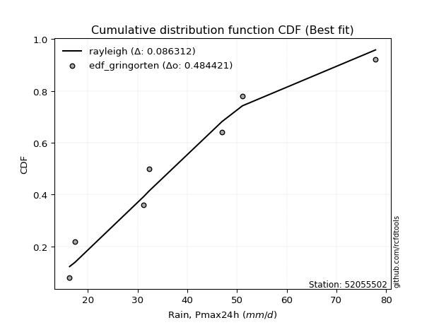</img></img>

</div>


### 9. EDF Filliben (1975)

The specific values of the constants (0.3175) (often denoted as $alpha$) and (0.365) are derived from a method proposed by James J. Filliben in a 1975 paper. This particular formula is the mean value of the $i$-th order statistic of the normal distribution and is considered a robust and effective plotting position formula for the normal probability plot correlation coefficient test for normality.

<div align="center">


$P=(m-0.3175)/(n+0.365)$


</div>


**9.1. Empirical values**

<div align="center">

|                | 0                   | 1                   | 2                   | 3            | 4                  | 5                  | 6                  |
|:---------------|:--------------------|:--------------------|:--------------------|:-------------|:-------------------|:-------------------|:-------------------|
| date           | 2017                | 2023                | 2022                | 2018         | 2020               | 2021               | 2019               |
| x              | 16.3                | 17.4                | 31.2                | 32.3         | 47.0               | 51.1               | 77.9               |
| m              | 1                   | 2                   | 3                   | 4            | 5                  | 6                  | 7                  |
| empirical_dist | edf_filliben        | edf_filliben        | edf_filliben        | edf_filliben | edf_filliben       | edf_filliben       | edf_filliben       |
| empirical      | 0.09266802443991853 | 0.22844534962661237 | 0.36422267481330617 | 0.5          | 0.6357773251866938 | 0.7715546503733877 | 0.9073319755600815 |
| empirical_tr   | 1.1021324354657687  | 1.2960844698636163  | 1.5728777362520021  | 2.0          | 2.7455731593662627 | 4.377414561664191  | 10.791208791208794 |

</div>


**9.2. Kolmogorov-Smirnov fit test (sorted by Δ)**


<div align="center">

|                | 0                   | 1                   | 2                   | 3                   | 4                   | 5                   | 6                   | 7                   | 8                   | 9                   | 10                  | 11                  | 12                  | 13                  | 14                  | 15                  | 16                  | 17                  | 18                  | 19                  | 20                  | 21                  | 22                  | 23                  | 24                  | 25                  | 26                  | 27                  | 28                  | 29                  | 30                  | 31                  | 32                  | 33                  | 34                  | 35                  | 36                  | 37                  | 38                  | 39                  | 40                  | 41                  | 42                  | 43                  | 44                  | 45                  | 46                  | 47                  | 48                  | 49                  | 50                  | 51                  | 52                  | 53                  | 54                  | 55                  | 56                  | 57                  | 58                  | 59                  | 60                  | 61                  | 62                  | 63                  | 64                  | 65                  | 66                  | 67                  | 68                  | 69                  | 70                  | 71                  | 72                  | 73                  | 74                  | 75                  | 76                  | 77                  | 78                  | 79                  | 80                  | 81                  | 82                  | 83                  | 84                  | 85                  | 86                  | 87                  | 88                  | 89                  | 90                  | 91                  | 92                  | 93                  | 94                  | 95                  | 96                  | 97                  | 98                  | 99                  | 100                 | 101                 | 102                 | 103                 | 104                 | 105                 | 106                 | 107                 | 108                 | 109                 | 110                 | 111                 | 112                 | 113                 | 114                 | 115                 | 116                 | 117                 | 118                 | 119                 | 120                 | 121                 | 122                 | 123                 | 124                 | 125                 | 126                 | 127                 | 128                 | 129                 | 130                 | 131                 | 132                 | 133                 | 134                 | 135                 | 136                 | 137                 | 138                 | 139                 | 140                 | 141                 | 142                 | 143                 | 144                 | 145                 | 146                 | 147                 | 148                 | 149                 | 150                 | 151                 | 152                 | 153                 | 154                 | 155                 | 156                 | 157                 | 158                 | 159                 |
|:---------------|:--------------------|:--------------------|:--------------------|:--------------------|:--------------------|:--------------------|:--------------------|:--------------------|:--------------------|:--------------------|:--------------------|:--------------------|:--------------------|:--------------------|:--------------------|:--------------------|:--------------------|:--------------------|:--------------------|:--------------------|:--------------------|:--------------------|:--------------------|:--------------------|:--------------------|:--------------------|:--------------------|:--------------------|:--------------------|:--------------------|:--------------------|:--------------------|:--------------------|:--------------------|:--------------------|:--------------------|:--------------------|:--------------------|:--------------------|:--------------------|:--------------------|:--------------------|:--------------------|:--------------------|:--------------------|:--------------------|:--------------------|:--------------------|:--------------------|:--------------------|:--------------------|:--------------------|:--------------------|:--------------------|:--------------------|:--------------------|:--------------------|:--------------------|:--------------------|:--------------------|:--------------------|:--------------------|:--------------------|:--------------------|:--------------------|:--------------------|:--------------------|:--------------------|:--------------------|:--------------------|:--------------------|:--------------------|:--------------------|:--------------------|:--------------------|:--------------------|:--------------------|:--------------------|:--------------------|:--------------------|:--------------------|:--------------------|:--------------------|:--------------------|:--------------------|:--------------------|:--------------------|:--------------------|:--------------------|:--------------------|:--------------------|:--------------------|:--------------------|:--------------------|:--------------------|:--------------------|:--------------------|:--------------------|:--------------------|:--------------------|:--------------------|:--------------------|:--------------------|:--------------------|:--------------------|:--------------------|:--------------------|:--------------------|:--------------------|:--------------------|:--------------------|:--------------------|:--------------------|:--------------------|:--------------------|:--------------------|:--------------------|:--------------------|:--------------------|:--------------------|:--------------------|:--------------------|:--------------------|:--------------------|:--------------------|:--------------------|:--------------------|:--------------------|:--------------------|:--------------------|:--------------------|:--------------------|:--------------------|:--------------------|:--------------------|:--------------------|:--------------------|:--------------------|:--------------------|:--------------------|:--------------------|:--------------------|:--------------------|:--------------------|:--------------------|:--------------------|:--------------------|:--------------------|:--------------------|:--------------------|:--------------------|:--------------------|:--------------------|:--------------------|:--------------------|:--------------------|:--------------------|:--------------------|:--------------------|:--------------------|
| station        | 52055502            | 52055502            | 52055502            | 52055502            | 52055502            | 52055502            | 52055502            | 52055502            | 52055502            | 52055502            | 52055502            | 52055502            | 52055502            | 52055502            | 52055502            | 52055502            | 52055502            | 52055502            | 52055502            | 52055502            | 52055502            | 52055502            | 52055502            | 52055502            | 52055502            | 52055502            | 52055502            | 52055502            | 52055502            | 52055502            | 52055502            | 52055502            | 52055502            | 52055502            | 52055502            | 52055502            | 52055502            | 52055502            | 52055502            | 52055502            | 52055502            | 52055502            | 52055502            | 52055502            | 52055502            | 52055502            | 52055502            | 52055502            | 52055502            | 52055502            | 52055502            | 52055502            | 52055502            | 52055502            | 52055502            | 52055502            | 52055502            | 52055502            | 52055502            | 52055502            | 52055502            | 52055502            | 52055502            | 52055502            | 52055502            | 52055502            | 52055502            | 52055502            | 52055502            | 52055502            | 52055502            | 52055502            | 52055502            | 52055502            | 52055502            | 52055502            | 52055502            | 52055502            | 52055502            | 52055502            | 52055502            | 52055502            | 52055502            | 52055502            | 52055502            | 52055502            | 52055502            | 52055502            | 52055502            | 52055502            | 52055502            | 52055502            | 52055502            | 52055502            | 52055502            | 52055502            | 52055502            | 52055502            | 52055502            | 52055502            | 52055502            | 52055502            | 52055502            | 52055502            | 52055502            | 52055502            | 52055502            | 52055502            | 52055502            | 52055502            | 52055502            | 52055502            | 52055502            | 52055502            | 52055502            | 52055502            | 52055502            | 52055502            | 52055502            | 52055502            | 52055502            | 52055502            | 52055502            | 52055502            | 52055502            | 52055502            | 52055502            | 52055502            | 52055502            | 52055502            | 52055502            | 52055502            | 52055502            | 52055502            | 52055502            | 52055502            | 52055502            | 52055502            | 52055502            | 52055502            | 52055502            | 52055502            | 52055502            | 52055502            | 52055502            | 52055502            | 52055502            | 52055502            | 52055502            | 52055502            | 52055502            | 52055502            | 52055502            | 52055502            | 52055502            | 52055502            | 52055502            | 52055502            | 52055502            | 52055502            |
| empirical_dist | edf_filliben        | edf_filliben        | edf_filliben        | edf_filliben        | edf_filliben        | edf_filliben        | edf_filliben        | edf_filliben        | edf_filliben        | edf_filliben        | edf_filliben        | edf_filliben        | edf_filliben        | edf_filliben        | edf_filliben        | edf_filliben        | edf_filliben        | edf_filliben        | edf_filliben        | edf_filliben        | edf_filliben        | edf_filliben        | edf_filliben        | edf_filliben        | edf_filliben        | edf_filliben        | edf_filliben        | edf_filliben        | edf_filliben        | edf_filliben        | edf_filliben        | edf_filliben        | edf_filliben        | edf_filliben        | edf_filliben        | edf_filliben        | edf_filliben        | edf_filliben        | edf_filliben        | edf_filliben        | edf_filliben        | edf_filliben        | edf_filliben        | edf_filliben        | edf_filliben        | edf_filliben        | edf_filliben        | edf_filliben        | edf_filliben        | edf_filliben        | edf_filliben        | edf_filliben        | edf_filliben        | edf_filliben        | edf_filliben        | edf_filliben        | edf_filliben        | edf_filliben        | edf_filliben        | edf_filliben        | edf_filliben        | edf_filliben        | edf_filliben        | edf_filliben        | edf_filliben        | edf_filliben        | edf_filliben        | edf_filliben        | edf_filliben        | edf_filliben        | edf_filliben        | edf_filliben        | edf_filliben        | edf_filliben        | edf_filliben        | edf_filliben        | edf_filliben        | edf_filliben        | edf_filliben        | edf_filliben        | edf_filliben        | edf_filliben        | edf_filliben        | edf_filliben        | edf_filliben        | edf_filliben        | edf_filliben        | edf_filliben        | edf_filliben        | edf_filliben        | edf_filliben        | edf_filliben        | edf_filliben        | edf_filliben        | edf_filliben        | edf_filliben        | edf_filliben        | edf_filliben        | edf_filliben        | edf_filliben        | edf_filliben        | edf_filliben        | edf_filliben        | edf_filliben        | edf_filliben        | edf_filliben        | edf_filliben        | edf_filliben        | edf_filliben        | edf_filliben        | edf_filliben        | edf_filliben        | edf_filliben        | edf_filliben        | edf_filliben        | edf_filliben        | edf_filliben        | edf_filliben        | edf_filliben        | edf_filliben        | edf_filliben        | edf_filliben        | edf_filliben        | edf_filliben        | edf_filliben        | edf_filliben        | edf_filliben        | edf_filliben        | edf_filliben        | edf_filliben        | edf_filliben        | edf_filliben        | edf_filliben        | edf_filliben        | edf_filliben        | edf_filliben        | edf_filliben        | edf_filliben        | edf_filliben        | edf_filliben        | edf_filliben        | edf_filliben        | edf_filliben        | edf_filliben        | edf_filliben        | edf_filliben        | edf_filliben        | edf_filliben        | edf_filliben        | edf_filliben        | edf_filliben        | edf_filliben        | edf_filliben        | edf_filliben        | edf_filliben        | edf_filliben        | edf_filliben        | edf_filliben        | edf_filliben        | edf_filliben        |
| p_dist         | foldnorm            | rayleigh            | logksone            | logarcsine          | maxwell             | pearson3            | dgamma              | logsemicircular     | logncf              | semicircular        | dweibull            | loganglit           | halfnorm            | logburr             | anglit              | loggenextreme       | logweibull_max      | genlogistic         | ncf                 | gumbel_r            | loggumbel_l         | logloggamma         | alpha               | kstwobign           | logpearson3         | logfoldnorm         | lognct              | logjohnsonsu        | logskewnorm         | logt                | logexponnorm        | logcrystalball      | lognorm             | genextreme          | logfatiguelife      | logf                | loggamma            | loggamma            | logerlang           | loginvgamma         | logalpha            | invgamma            | logbetaprime        | norm                | crystalball         | truncnorm           | t                   | arcsine             | loginvgauss         | logburr12           | logdweibull         | burr                | logcosine           | loggenlogistic      | rice                | nct                 | logmaxwell          | loginvweibull       | loglogistic         | betaprime           | logargus            | loghypsecant        | logloglaplace       | lograyleigh         | logtriang           | logrice             | logistic            | logkstwobign        | moyal               | invgauss            | loglaplace          | loglaplace          | weibull_min         | truncweibull_min    | hypsecant           | gausshyper          | cosine              | logdgamma           | logrdist            | beta                | halflogistic        | logbradford         | loggenexpon         | loggumbel_r         | logexponpow         | logwrapcauchy       | logtruncpareto      | logtruncexpon       | lomax               | exponnorm           | logtukeylambda      | logkappa4           | loggompertz         | logkappa3           | genexpon            | loguniform          | logvonmises_line    | laplace             | gompertz            | loggausshyper       | gumbel_l            | halfgennorm         | truncexpon          | logmoyal            | skewnorm            | kappa3              | loghalfnorm         | bradford            | kappa4              | f                   | ksone               | burr12              | loglomax            | argus               | loghalflogistic     | logwald             | wald                | genpareto           | wrapcauchy          | loggenhalflogistic  | vonmises_line       | tukeylambda         | uniform             | logweibull_min      | loggenpareto        | loglevy_l           | gennorm             | loggennorm          | triang              | logtruncweibull_min | johnsonsb           | logjohnsonsb        | logtrapezoid        | levy_l              | logmielke           | genhalflogistic     | invweibull          | exponpow            | logtruncnorm        | exponweib           | logbeta             | powerlaw            | fatiguelife         | gengamma            | lognakagami         | nakagami            | rdist               | trapezoid           | johnsonsu           | erlang              | logpowerlaw         | logexponweib        | gamma               | truncpareto         | loggengamma         | weibull_max         | loghalfgennorm      | logvonmises         | vonmises            | mielke              |
| delta          | 0.07959288277692259 | 0.08985019533493396 | 0.09554165726887029 | 0.0980159150513456  | 0.09854661252619246 | 0.09967791892031774 | 0.10341285508201964 | 0.10399839556747795 | 0.105675563833391   | 0.10637095147609266 | 0.10814444080491925 | 0.11041363300095386 | 0.1113504171384205  | 0.11268341155335276 | 0.11376813753748194 | 0.11823907614413817 | 0.1182427472928552  | 0.12032668098907276 | 0.12173309161832252 | 0.12211324579929121 | 0.12436879409070917 | 0.1250191776468692  | 0.12546015512719355 | 0.12546946740654408 | 0.1259737911979033  | 0.12616848655494503 | 0.12633735624056627 | 0.12662906349484845 | 0.12666711734624136 | 0.12669538314317647 | 0.12669779425489514 | 0.12669815416059924 | 0.1266981820302042  | 0.12687617094746043 | 0.12700655818765896 | 0.12705408398826834 | 0.1272047339351691  | 0.1272047339351691  | 0.1272149852897694  | 0.12958550699702232 | 0.13009963573908187 | 0.13052384420211485 | 0.13072073882322444 | 0.1314733431954157  | 0.1314733533767845  | 0.13147335676051475 | 0.1314739607815819  | 0.13149846554234657 | 0.13345211473736077 | 0.13371995427895897 | 0.13525100286965996 | 0.13549994452905267 | 0.13576558300354621 | 0.13600125725543588 | 0.13626773815423368 | 0.13642348482462785 | 0.13696615995360306 | 0.1378061395186354  | 0.1378620983010181  | 0.14125255433700679 | 0.14147859576347557 | 0.14259821462051236 | 0.14365404161186646 | 0.14394458236809196 | 0.14528696032954536 | 0.14770982246335015 | 0.14771214579793135 | 0.14951853977055463 | 0.1495221426226684  | 0.150044948847189   | 0.15244436625829305 | 0.15244436625829305 | 0.15383166283936076 | 0.1571309521187223  | 0.1605971969311626  | 0.16195248558577513 | 0.16335998642079919 | 0.1643490365341659  | 0.1645659813328333  | 0.16558959279400137 | 0.16655758074231702 | 0.16825835836993083 | 0.16998767849067287 | 0.17165496003392805 | 0.17179999287684256 | 0.17209904352664873 | 0.17215950389003604 | 0.1727687367043773  | 0.17776789955699082 | 0.18008671506211762 | 0.1819393267507308  | 0.18282253700563203 | 0.18307409464910102 | 0.18643045994583327 | 0.18667349317580428 | 0.18669713441440136 | 0.18670049324844304 | 0.1890057305410487  | 0.18965669668244145 | 0.19370452746528533 | 0.1941926453526268  | 0.19507940982306127 | 0.19834280306844562 | 0.19885560864479732 | 0.19948441649541285 | 0.2010604979271171  | 0.20348538151506318 | 0.20498406818622716 | 0.20888574233616825 | 0.20987703254510504 | 0.21744209626083366 | 0.21893356077846027 | 0.22055115096358358 | 0.22127992805159857 | 0.22844534962661237 | 0.22844534962661237 | 0.22844534962661237 | 0.23162829798514695 | 0.2337884036496376  | 0.23596431515704935 | 0.23772030184800835 | 0.23896092485853937 | 0.24025974025974034 | 0.2618651243394643  | 0.26651959702258554 | 0.27093496527951255 | 0.27155465037338766 | 0.27155465037338766 | 0.27222558048413004 | 0.2778787542899137  | 0.2911801168268724  | 0.29505944658529776 | 0.2995910827177801  | 0.3207296666032271  | 0.3440714810515869  | 0.35407330626392813 | 0.3876668427662586  | 0.38869289958062947 | 0.3900881296199091  | 0.40214554439209305 | 0.41601928258540977 | 0.4394324561330416  | 0.4395311715720135  | 0.4421923074085692  | 0.4496407796032298  | 0.45300313137163895 | 0.457079439780552   | 0.46451392774824957 | 0.47302671668420837 | 0.49191403889300456 | 0.4975739826835526  | 0.5151075014616169  | 0.5339446068639977  | 0.5457244404673303  | 0.5584743783702241  | 0.6242842930135978  | 0.7715546503733877  | 1.0963662227359716  | 11.682368767695456  | nan                 |
| deltao         | 0.48442053926100004 | 0.48442053926100004 | 0.48442053926100004 | 0.48442053926100004 | 0.48442053926100004 | 0.48442053926100004 | 0.48442053926100004 | 0.48442053926100004 | 0.48442053926100004 | 0.48442053926100004 | 0.48442053926100004 | 0.48442053926100004 | 0.48442053926100004 | 0.48442053926100004 | 0.48442053926100004 | 0.48442053926100004 | 0.48442053926100004 | 0.48442053926100004 | 0.48442053926100004 | 0.48442053926100004 | 0.48442053926100004 | 0.48442053926100004 | 0.48442053926100004 | 0.48442053926100004 | 0.48442053926100004 | 0.48442053926100004 | 0.48442053926100004 | 0.48442053926100004 | 0.48442053926100004 | 0.48442053926100004 | 0.48442053926100004 | 0.48442053926100004 | 0.48442053926100004 | 0.48442053926100004 | 0.48442053926100004 | 0.48442053926100004 | 0.48442053926100004 | 0.48442053926100004 | 0.48442053926100004 | 0.48442053926100004 | 0.48442053926100004 | 0.48442053926100004 | 0.48442053926100004 | 0.48442053926100004 | 0.48442053926100004 | 0.48442053926100004 | 0.48442053926100004 | 0.48442053926100004 | 0.48442053926100004 | 0.48442053926100004 | 0.48442053926100004 | 0.48442053926100004 | 0.48442053926100004 | 0.48442053926100004 | 0.48442053926100004 | 0.48442053926100004 | 0.48442053926100004 | 0.48442053926100004 | 0.48442053926100004 | 0.48442053926100004 | 0.48442053926100004 | 0.48442053926100004 | 0.48442053926100004 | 0.48442053926100004 | 0.48442053926100004 | 0.48442053926100004 | 0.48442053926100004 | 0.48442053926100004 | 0.48442053926100004 | 0.48442053926100004 | 0.48442053926100004 | 0.48442053926100004 | 0.48442053926100004 | 0.48442053926100004 | 0.48442053926100004 | 0.48442053926100004 | 0.48442053926100004 | 0.48442053926100004 | 0.48442053926100004 | 0.48442053926100004 | 0.48442053926100004 | 0.48442053926100004 | 0.48442053926100004 | 0.48442053926100004 | 0.48442053926100004 | 0.48442053926100004 | 0.48442053926100004 | 0.48442053926100004 | 0.48442053926100004 | 0.48442053926100004 | 0.48442053926100004 | 0.48442053926100004 | 0.48442053926100004 | 0.48442053926100004 | 0.48442053926100004 | 0.48442053926100004 | 0.48442053926100004 | 0.48442053926100004 | 0.48442053926100004 | 0.48442053926100004 | 0.48442053926100004 | 0.48442053926100004 | 0.48442053926100004 | 0.48442053926100004 | 0.48442053926100004 | 0.48442053926100004 | 0.48442053926100004 | 0.48442053926100004 | 0.48442053926100004 | 0.48442053926100004 | 0.48442053926100004 | 0.48442053926100004 | 0.48442053926100004 | 0.48442053926100004 | 0.48442053926100004 | 0.48442053926100004 | 0.48442053926100004 | 0.48442053926100004 | 0.48442053926100004 | 0.48442053926100004 | 0.48442053926100004 | 0.48442053926100004 | 0.48442053926100004 | 0.48442053926100004 | 0.48442053926100004 | 0.48442053926100004 | 0.48442053926100004 | 0.48442053926100004 | 0.48442053926100004 | 0.48442053926100004 | 0.48442053926100004 | 0.48442053926100004 | 0.48442053926100004 | 0.48442053926100004 | 0.48442053926100004 | 0.48442053926100004 | 0.48442053926100004 | 0.48442053926100004 | 0.48442053926100004 | 0.48442053926100004 | 0.48442053926100004 | 0.48442053926100004 | 0.48442053926100004 | 0.48442053926100004 | 0.48442053926100004 | 0.48442053926100004 | 0.48442053926100004 | 0.48442053926100004 | 0.48442053926100004 | 0.48442053926100004 | 0.48442053926100004 | 0.48442053926100004 | 0.48442053926100004 | 0.48442053926100004 | 0.48442053926100004 | 0.48442053926100004 | 0.48442053926100004 | 0.48442053926100004 | 0.48442053926100004 | 0.48442053926100004 |
| eval           | Δo > Δ              | Δo > Δ              | Δo > Δ              | Δo > Δ              | Δo > Δ              | Δo > Δ              | Δo > Δ              | Δo > Δ              | Δo > Δ              | Δo > Δ              | Δo > Δ              | Δo > Δ              | Δo > Δ              | Δo > Δ              | Δo > Δ              | Δo > Δ              | Δo > Δ              | Δo > Δ              | Δo > Δ              | Δo > Δ              | Δo > Δ              | Δo > Δ              | Δo > Δ              | Δo > Δ              | Δo > Δ              | Δo > Δ              | Δo > Δ              | Δo > Δ              | Δo > Δ              | Δo > Δ              | Δo > Δ              | Δo > Δ              | Δo > Δ              | Δo > Δ              | Δo > Δ              | Δo > Δ              | Δo > Δ              | Δo > Δ              | Δo > Δ              | Δo > Δ              | Δo > Δ              | Δo > Δ              | Δo > Δ              | Δo > Δ              | Δo > Δ              | Δo > Δ              | Δo > Δ              | Δo > Δ              | Δo > Δ              | Δo > Δ              | Δo > Δ              | Δo > Δ              | Δo > Δ              | Δo > Δ              | Δo > Δ              | Δo > Δ              | Δo > Δ              | Δo > Δ              | Δo > Δ              | Δo > Δ              | Δo > Δ              | Δo > Δ              | Δo > Δ              | Δo > Δ              | Δo > Δ              | Δo > Δ              | Δo > Δ              | Δo > Δ              | Δo > Δ              | Δo > Δ              | Δo > Δ              | Δo > Δ              | Δo > Δ              | Δo > Δ              | Δo > Δ              | Δo > Δ              | Δo > Δ              | Δo > Δ              | Δo > Δ              | Δo > Δ              | Δo > Δ              | Δo > Δ              | Δo > Δ              | Δo > Δ              | Δo > Δ              | Δo > Δ              | Δo > Δ              | Δo > Δ              | Δo > Δ              | Δo > Δ              | Δo > Δ              | Δo > Δ              | Δo > Δ              | Δo > Δ              | Δo > Δ              | Δo > Δ              | Δo > Δ              | Δo > Δ              | Δo > Δ              | Δo > Δ              | Δo > Δ              | Δo > Δ              | Δo > Δ              | Δo > Δ              | Δo > Δ              | Δo > Δ              | Δo > Δ              | Δo > Δ              | Δo > Δ              | Δo > Δ              | Δo > Δ              | Δo > Δ              | Δo > Δ              | Δo > Δ              | Δo > Δ              | Δo > Δ              | Δo > Δ              | Δo > Δ              | Δo > Δ              | Δo > Δ              | Δo > Δ              | Δo > Δ              | Δo > Δ              | Δo > Δ              | Δo > Δ              | Δo > Δ              | Δo > Δ              | Δo > Δ              | Δo > Δ              | Δo > Δ              | Δo > Δ              | Δo > Δ              | Δo > Δ              | Δo > Δ              | Δo > Δ              | Δo > Δ              | Δo > Δ              | Δo > Δ              | Δo > Δ              | Δo > Δ              | Δo > Δ              | Δo > Δ              | Δo > Δ              | Δo > Δ              | Δo > Δ              | Δo > Δ              | Δo > Δ              | Δo > Δ              | Δo > Δ              | Δo <= Δ             | Δo <= Δ             | Δo <= Δ             | Δo <= Δ             | Δo <= Δ             | Δo <= Δ             | Δo <= Δ             | Δo <= Δ             | Δo <= Δ             | Δo <= Δ             | Δo <= Δ             |
| fit            | 1                   | 1                   | 1                   | 1                   | 1                   | 1                   | 1                   | 1                   | 1                   | 1                   | 1                   | 1                   | 1                   | 1                   | 1                   | 1                   | 1                   | 1                   | 1                   | 1                   | 1                   | 1                   | 1                   | 1                   | 1                   | 1                   | 1                   | 1                   | 1                   | 1                   | 1                   | 1                   | 1                   | 1                   | 1                   | 1                   | 1                   | 1                   | 1                   | 1                   | 1                   | 1                   | 1                   | 1                   | 1                   | 1                   | 1                   | 1                   | 1                   | 1                   | 1                   | 1                   | 1                   | 1                   | 1                   | 1                   | 1                   | 1                   | 1                   | 1                   | 1                   | 1                   | 1                   | 1                   | 1                   | 1                   | 1                   | 1                   | 1                   | 1                   | 1                   | 1                   | 1                   | 1                   | 1                   | 1                   | 1                   | 1                   | 1                   | 1                   | 1                   | 1                   | 1                   | 1                   | 1                   | 1                   | 1                   | 1                   | 1                   | 1                   | 1                   | 1                   | 1                   | 1                   | 1                   | 1                   | 1                   | 1                   | 1                   | 1                   | 1                   | 1                   | 1                   | 1                   | 1                   | 1                   | 1                   | 1                   | 1                   | 1                   | 1                   | 1                   | 1                   | 1                   | 1                   | 1                   | 1                   | 1                   | 1                   | 1                   | 1                   | 1                   | 1                   | 1                   | 1                   | 1                   | 1                   | 1                   | 1                   | 1                   | 1                   | 1                   | 1                   | 1                   | 1                   | 1                   | 1                   | 1                   | 1                   | 1                   | 1                   | 1                   | 1                   | 1                   | 1                   | 1                   | 1                   | 1                   | 1                   | 0                   | 0                   | 0                   | 0                   | 0                   | 0                   | 0                   | 0                   | 0                   | 0                   | 0                   |
| n              | 7                   | 7                   | 7                   | 7                   | 7                   | 7                   | 7                   | 7                   | 7                   | 7                   | 7                   | 7                   | 7                   | 7                   | 7                   | 7                   | 7                   | 7                   | 7                   | 7                   | 7                   | 7                   | 7                   | 7                   | 7                   | 7                   | 7                   | 7                   | 7                   | 7                   | 7                   | 7                   | 7                   | 7                   | 7                   | 7                   | 7                   | 7                   | 7                   | 7                   | 7                   | 7                   | 7                   | 7                   | 7                   | 7                   | 7                   | 7                   | 7                   | 7                   | 7                   | 7                   | 7                   | 7                   | 7                   | 7                   | 7                   | 7                   | 7                   | 7                   | 7                   | 7                   | 7                   | 7                   | 7                   | 7                   | 7                   | 7                   | 7                   | 7                   | 7                   | 7                   | 7                   | 7                   | 7                   | 7                   | 7                   | 7                   | 7                   | 7                   | 7                   | 7                   | 7                   | 7                   | 7                   | 7                   | 7                   | 7                   | 7                   | 7                   | 7                   | 7                   | 7                   | 7                   | 7                   | 7                   | 7                   | 7                   | 7                   | 7                   | 7                   | 7                   | 7                   | 7                   | 7                   | 7                   | 7                   | 7                   | 7                   | 7                   | 7                   | 7                   | 7                   | 7                   | 7                   | 7                   | 7                   | 7                   | 7                   | 7                   | 7                   | 7                   | 7                   | 7                   | 7                   | 7                   | 7                   | 7                   | 7                   | 7                   | 7                   | 7                   | 7                   | 7                   | 7                   | 7                   | 7                   | 7                   | 7                   | 7                   | 7                   | 7                   | 7                   | 7                   | 7                   | 7                   | 7                   | 7                   | 7                   | 7                   | 7                   | 7                   | 7                   | 7                   | 7                   | 7                   | 7                   | 7                   | 7                   | 7                   |
| best_fit       | 1                   | 0                   | 0                   | 0                   | 0                   | 0                   | 0                   | 0                   | 0                   | 0                   | 0                   | 0                   | 0                   | 0                   | 0                   | 0                   | 0                   | 0                   | 0                   | 0                   | 0                   | 0                   | 0                   | 0                   | 0                   | 0                   | 0                   | 0                   | 0                   | 0                   | 0                   | 0                   | 0                   | 0                   | 0                   | 0                   | 0                   | 0                   | 0                   | 0                   | 0                   | 0                   | 0                   | 0                   | 0                   | 0                   | 0                   | 0                   | 0                   | 0                   | 0                   | 0                   | 0                   | 0                   | 0                   | 0                   | 0                   | 0                   | 0                   | 0                   | 0                   | 0                   | 0                   | 0                   | 0                   | 0                   | 0                   | 0                   | 0                   | 0                   | 0                   | 0                   | 0                   | 0                   | 0                   | 0                   | 0                   | 0                   | 0                   | 0                   | 0                   | 0                   | 0                   | 0                   | 0                   | 0                   | 0                   | 0                   | 0                   | 0                   | 0                   | 0                   | 0                   | 0                   | 0                   | 0                   | 0                   | 0                   | 0                   | 0                   | 0                   | 0                   | 0                   | 0                   | 0                   | 0                   | 0                   | 0                   | 0                   | 0                   | 0                   | 0                   | 0                   | 0                   | 0                   | 0                   | 0                   | 0                   | 0                   | 0                   | 0                   | 0                   | 0                   | 0                   | 0                   | 0                   | 0                   | 0                   | 0                   | 0                   | 0                   | 0                   | 0                   | 0                   | 0                   | 0                   | 0                   | 0                   | 0                   | 0                   | 0                   | 0                   | 0                   | 0                   | 0                   | 0                   | 0                   | 0                   | 0                   | 0                   | 0                   | 0                   | 0                   | 0                   | 0                   | 0                   | 0                   | 0                   | 0                   | 0                   |
| best_fit_sort  | 1                   | 2                   | 3                   | 4                   | 5                   | 6                   | 7                   | 8                   | 9                   | 10                  | 11                  | 12                  | 13                  | 14                  | 15                  | 16                  | 17                  | 18                  | 19                  | 20                  | 21                  | 22                  | 23                  | 24                  | 25                  | 26                  | 27                  | 28                  | 29                  | 30                  | 31                  | 32                  | 33                  | 34                  | 35                  | 36                  | 37                  | 38                  | 39                  | 40                  | 41                  | 42                  | 43                  | 44                  | 45                  | 46                  | 47                  | 48                  | 49                  | 50                  | 51                  | 52                  | 53                  | 54                  | 55                  | 56                  | 57                  | 58                  | 59                  | 60                  | 61                  | 62                  | 63                  | 64                  | 65                  | 66                  | 67                  | 68                  | 69                  | 70                  | 71                  | 72                  | 73                  | 74                  | 75                  | 76                  | 77                  | 78                  | 79                  | 80                  | 81                  | 82                  | 83                  | 84                  | 85                  | 86                  | 87                  | 88                  | 89                  | 90                  | 91                  | 92                  | 93                  | 94                  | 95                  | 96                  | 97                  | 98                  | 99                  | 100                 | 101                 | 102                 | 103                 | 104                 | 105                 | 106                 | 107                 | 108                 | 109                 | 110                 | 111                 | 112                 | 113                 | 114                 | 115                 | 116                 | 117                 | 118                 | 119                 | 120                 | 121                 | 122                 | 123                 | 124                 | 125                 | 126                 | 127                 | 128                 | 129                 | 130                 | 131                 | 132                 | 133                 | 134                 | 135                 | 136                 | 137                 | 138                 | 139                 | 140                 | 141                 | 142                 | 143                 | 144                 | 145                 | 146                 | 147                 | 148                 | 149                 | 150                 | 151                 | 152                 | 153                 | 154                 | 155                 | 156                 | 157                 | 158                 | 159                 | 160                 |

</div>


**9.3. Best fit**

<div align="center">

|   id |   station | empirical_dist   | p_dist   |     delta |   deltao | eval   |   fit |   n |   best_fit |   best_fit_sort |
|-----:|----------:|:-----------------|:---------|----------:|---------:|:-------|------:|----:|-----------:|----------------:|
|    0 |  52055502 | edf_filliben     | foldnorm | 0.0795929 | 0.484421 | Δo > Δ |     1 |   7 |          1 |               1 |

</div>


<div align="center">

</img>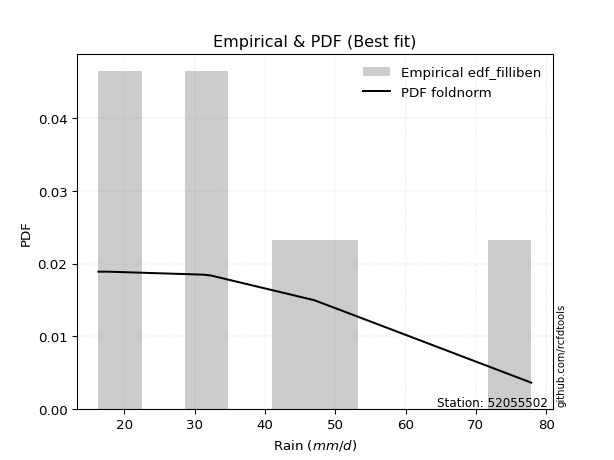</img>

</div>


### 10. EDF Jenkinson (1977)

The Jenkinson formula in hydrology is an empirical plotting position formula used to estimate the non-exceedance probability _(P)_ or return period _(T)_ of a given ordered observation within a sample. It is a widely used method in the frequency analysis of extreme events such as floods and rainfall, as it provides a distribution-free way to plot data. _a≈0.31_ and _b≈0.38_ are constants derived to approximate the median of the probability distribution for the given rank.

<div align="center">


$P=(m-a)/(n+b)$


</div>


**10.1. Empirical values**

<div align="center">

|                | 0                   | 1                   | 2                   | 3             | 4                  | 5                  | 6                  |
|:---------------|:--------------------|:--------------------|:--------------------|:--------------|:-------------------|:-------------------|:-------------------|
| date           | 2017                | 2023                | 2022                | 2018          | 2020               | 2021               | 2019               |
| x              | 16.3                | 17.4                | 31.2                | 32.3          | 47.0               | 51.1               | 77.9               |
| m              | 1                   | 2                   | 3                   | 4             | 5                  | 6                  | 7                  |
| empirical_dist | edf_jenkinson       | edf_jenkinson       | edf_jenkinson       | edf_jenkinson | edf_jenkinson      | edf_jenkinson      | edf_jenkinson      |
| empirical      | 0.09349593495934959 | 0.22899728997289973 | 0.36449864498644985 | 0.5           | 0.6355013550135502 | 0.7710027100271003 | 0.9065040650406505 |
| empirical_tr   | 1.1031390134529149  | 1.29701230228471    | 1.5735607675906182  | 2.0           | 2.743494423791822  | 4.366863905325444  | 10.695652173913055 |

</div>


**10.2. Kolmogorov-Smirnov fit test (sorted by Δ)**


<div align="center">

|                | 0                   | 1                   | 2                   | 3                   | 4                   | 5                   | 6                   | 7                   | 8                   | 9                   | 10                  | 11                  | 12                  | 13                  | 14                  | 15                  | 16                  | 17                  | 18                  | 19                  | 20                  | 21                  | 22                  | 23                  | 24                  | 25                  | 26                  | 27                  | 28                  | 29                  | 30                  | 31                  | 32                  | 33                  | 34                  | 35                  | 36                  | 37                  | 38                  | 39                  | 40                  | 41                  | 42                  | 43                  | 44                  | 45                  | 46                  | 47                  | 48                  | 49                  | 50                  | 51                  | 52                  | 53                  | 54                  | 55                  | 56                  | 57                  | 58                  | 59                  | 60                  | 61                  | 62                  | 63                  | 64                  | 65                  | 66                  | 67                  | 68                  | 69                  | 70                  | 71                  | 72                  | 73                  | 74                  | 75                  | 76                  | 77                  | 78                  | 79                  | 80                  | 81                  | 82                  | 83                  | 84                  | 85                  | 86                  | 87                  | 88                  | 89                  | 90                  | 91                  | 92                  | 93                  | 94                  | 95                  | 96                  | 97                  | 98                  | 99                  | 100                 | 101                 | 102                 | 103                 | 104                 | 105                 | 106                 | 107                 | 108                 | 109                 | 110                 | 111                 | 112                 | 113                 | 114                 | 115                 | 116                 | 117                 | 118                 | 119                 | 120                 | 121                 | 122                 | 123                 | 124                 | 125                 | 126                 | 127                 | 128                 | 129                 | 130                 | 131                 | 132                 | 133                 | 134                 | 135                 | 136                 | 137                 | 138                 | 139                 | 140                 | 141                 | 142                 | 143                 | 144                 | 145                 | 146                 | 147                 | 148                 | 149                 | 150                 | 151                 | 152                 | 153                 | 154                 | 155                 | 156                 | 157                 | 158                 | 159                 |
|:---------------|:--------------------|:--------------------|:--------------------|:--------------------|:--------------------|:--------------------|:--------------------|:--------------------|:--------------------|:--------------------|:--------------------|:--------------------|:--------------------|:--------------------|:--------------------|:--------------------|:--------------------|:--------------------|:--------------------|:--------------------|:--------------------|:--------------------|:--------------------|:--------------------|:--------------------|:--------------------|:--------------------|:--------------------|:--------------------|:--------------------|:--------------------|:--------------------|:--------------------|:--------------------|:--------------------|:--------------------|:--------------------|:--------------------|:--------------------|:--------------------|:--------------------|:--------------------|:--------------------|:--------------------|:--------------------|:--------------------|:--------------------|:--------------------|:--------------------|:--------------------|:--------------------|:--------------------|:--------------------|:--------------------|:--------------------|:--------------------|:--------------------|:--------------------|:--------------------|:--------------------|:--------------------|:--------------------|:--------------------|:--------------------|:--------------------|:--------------------|:--------------------|:--------------------|:--------------------|:--------------------|:--------------------|:--------------------|:--------------------|:--------------------|:--------------------|:--------------------|:--------------------|:--------------------|:--------------------|:--------------------|:--------------------|:--------------------|:--------------------|:--------------------|:--------------------|:--------------------|:--------------------|:--------------------|:--------------------|:--------------------|:--------------------|:--------------------|:--------------------|:--------------------|:--------------------|:--------------------|:--------------------|:--------------------|:--------------------|:--------------------|:--------------------|:--------------------|:--------------------|:--------------------|:--------------------|:--------------------|:--------------------|:--------------------|:--------------------|:--------------------|:--------------------|:--------------------|:--------------------|:--------------------|:--------------------|:--------------------|:--------------------|:--------------------|:--------------------|:--------------------|:--------------------|:--------------------|:--------------------|:--------------------|:--------------------|:--------------------|:--------------------|:--------------------|:--------------------|:--------------------|:--------------------|:--------------------|:--------------------|:--------------------|:--------------------|:--------------------|:--------------------|:--------------------|:--------------------|:--------------------|:--------------------|:--------------------|:--------------------|:--------------------|:--------------------|:--------------------|:--------------------|:--------------------|:--------------------|:--------------------|:--------------------|:--------------------|:--------------------|:--------------------|:--------------------|:--------------------|:--------------------|:--------------------|:--------------------|:--------------------|
| station        | 52055502            | 52055502            | 52055502            | 52055502            | 52055502            | 52055502            | 52055502            | 52055502            | 52055502            | 52055502            | 52055502            | 52055502            | 52055502            | 52055502            | 52055502            | 52055502            | 52055502            | 52055502            | 52055502            | 52055502            | 52055502            | 52055502            | 52055502            | 52055502            | 52055502            | 52055502            | 52055502            | 52055502            | 52055502            | 52055502            | 52055502            | 52055502            | 52055502            | 52055502            | 52055502            | 52055502            | 52055502            | 52055502            | 52055502            | 52055502            | 52055502            | 52055502            | 52055502            | 52055502            | 52055502            | 52055502            | 52055502            | 52055502            | 52055502            | 52055502            | 52055502            | 52055502            | 52055502            | 52055502            | 52055502            | 52055502            | 52055502            | 52055502            | 52055502            | 52055502            | 52055502            | 52055502            | 52055502            | 52055502            | 52055502            | 52055502            | 52055502            | 52055502            | 52055502            | 52055502            | 52055502            | 52055502            | 52055502            | 52055502            | 52055502            | 52055502            | 52055502            | 52055502            | 52055502            | 52055502            | 52055502            | 52055502            | 52055502            | 52055502            | 52055502            | 52055502            | 52055502            | 52055502            | 52055502            | 52055502            | 52055502            | 52055502            | 52055502            | 52055502            | 52055502            | 52055502            | 52055502            | 52055502            | 52055502            | 52055502            | 52055502            | 52055502            | 52055502            | 52055502            | 52055502            | 52055502            | 52055502            | 52055502            | 52055502            | 52055502            | 52055502            | 52055502            | 52055502            | 52055502            | 52055502            | 52055502            | 52055502            | 52055502            | 52055502            | 52055502            | 52055502            | 52055502            | 52055502            | 52055502            | 52055502            | 52055502            | 52055502            | 52055502            | 52055502            | 52055502            | 52055502            | 52055502            | 52055502            | 52055502            | 52055502            | 52055502            | 52055502            | 52055502            | 52055502            | 52055502            | 52055502            | 52055502            | 52055502            | 52055502            | 52055502            | 52055502            | 52055502            | 52055502            | 52055502            | 52055502            | 52055502            | 52055502            | 52055502            | 52055502            | 52055502            | 52055502            | 52055502            | 52055502            | 52055502            | 52055502            |
| empirical_dist | edf_jenkinson       | edf_jenkinson       | edf_jenkinson       | edf_jenkinson       | edf_jenkinson       | edf_jenkinson       | edf_jenkinson       | edf_jenkinson       | edf_jenkinson       | edf_jenkinson       | edf_jenkinson       | edf_jenkinson       | edf_jenkinson       | edf_jenkinson       | edf_jenkinson       | edf_jenkinson       | edf_jenkinson       | edf_jenkinson       | edf_jenkinson       | edf_jenkinson       | edf_jenkinson       | edf_jenkinson       | edf_jenkinson       | edf_jenkinson       | edf_jenkinson       | edf_jenkinson       | edf_jenkinson       | edf_jenkinson       | edf_jenkinson       | edf_jenkinson       | edf_jenkinson       | edf_jenkinson       | edf_jenkinson       | edf_jenkinson       | edf_jenkinson       | edf_jenkinson       | edf_jenkinson       | edf_jenkinson       | edf_jenkinson       | edf_jenkinson       | edf_jenkinson       | edf_jenkinson       | edf_jenkinson       | edf_jenkinson       | edf_jenkinson       | edf_jenkinson       | edf_jenkinson       | edf_jenkinson       | edf_jenkinson       | edf_jenkinson       | edf_jenkinson       | edf_jenkinson       | edf_jenkinson       | edf_jenkinson       | edf_jenkinson       | edf_jenkinson       | edf_jenkinson       | edf_jenkinson       | edf_jenkinson       | edf_jenkinson       | edf_jenkinson       | edf_jenkinson       | edf_jenkinson       | edf_jenkinson       | edf_jenkinson       | edf_jenkinson       | edf_jenkinson       | edf_jenkinson       | edf_jenkinson       | edf_jenkinson       | edf_jenkinson       | edf_jenkinson       | edf_jenkinson       | edf_jenkinson       | edf_jenkinson       | edf_jenkinson       | edf_jenkinson       | edf_jenkinson       | edf_jenkinson       | edf_jenkinson       | edf_jenkinson       | edf_jenkinson       | edf_jenkinson       | edf_jenkinson       | edf_jenkinson       | edf_jenkinson       | edf_jenkinson       | edf_jenkinson       | edf_jenkinson       | edf_jenkinson       | edf_jenkinson       | edf_jenkinson       | edf_jenkinson       | edf_jenkinson       | edf_jenkinson       | edf_jenkinson       | edf_jenkinson       | edf_jenkinson       | edf_jenkinson       | edf_jenkinson       | edf_jenkinson       | edf_jenkinson       | edf_jenkinson       | edf_jenkinson       | edf_jenkinson       | edf_jenkinson       | edf_jenkinson       | edf_jenkinson       | edf_jenkinson       | edf_jenkinson       | edf_jenkinson       | edf_jenkinson       | edf_jenkinson       | edf_jenkinson       | edf_jenkinson       | edf_jenkinson       | edf_jenkinson       | edf_jenkinson       | edf_jenkinson       | edf_jenkinson       | edf_jenkinson       | edf_jenkinson       | edf_jenkinson       | edf_jenkinson       | edf_jenkinson       | edf_jenkinson       | edf_jenkinson       | edf_jenkinson       | edf_jenkinson       | edf_jenkinson       | edf_jenkinson       | edf_jenkinson       | edf_jenkinson       | edf_jenkinson       | edf_jenkinson       | edf_jenkinson       | edf_jenkinson       | edf_jenkinson       | edf_jenkinson       | edf_jenkinson       | edf_jenkinson       | edf_jenkinson       | edf_jenkinson       | edf_jenkinson       | edf_jenkinson       | edf_jenkinson       | edf_jenkinson       | edf_jenkinson       | edf_jenkinson       | edf_jenkinson       | edf_jenkinson       | edf_jenkinson       | edf_jenkinson       | edf_jenkinson       | edf_jenkinson       | edf_jenkinson       | edf_jenkinson       | edf_jenkinson       | edf_jenkinson       | edf_jenkinson       |
| p_dist         | foldnorm            | rayleigh            | logksone            | logarcsine          | maxwell             | pearson3            | dgamma              | logsemicircular     | logncf              | semicircular        | dweibull            | loganglit           | halfnorm            | logburr             | anglit              | loggenextreme       | logweibull_max      | genlogistic         | ncf                 | gumbel_r            | loggumbel_l         | logloggamma         | alpha               | kstwobign           | logpearson3         | logfoldnorm         | lognct              | logjohnsonsu        | logskewnorm         | logt                | logexponnorm        | logcrystalball      | lognorm             | genextreme          | logfatiguelife      | logf                | loggamma            | loggamma            | logerlang           | loginvgamma         | logalpha            | arcsine             | invgamma            | logbetaprime        | norm                | crystalball         | truncnorm           | t                   | loginvgauss         | logburr12           | burr                | logdweibull         | loggenlogistic      | nct                 | logcosine           | rice                | logmaxwell          | loginvweibull       | loglogistic         | betaprime           | logargus            | loghypsecant        | logloglaplace       | lograyleigh         | logtriang           | logistic            | logrice             | logkstwobign        | invgauss            | moyal               | loglaplace          | loglaplace          | weibull_min         | truncweibull_min    | hypsecant           | gausshyper          | cosine              | logrdist            | logdgamma           | beta                | halflogistic        | logbradford         | loggenexpon         | logexponpow         | loggumbel_r         | logtruncexpon       | logwrapcauchy       | logtruncpareto      | lomax               | exponnorm           | logtukeylambda      | logkappa4           | loggompertz         | logkappa3           | genexpon            | loguniform          | logvonmises_line    | laplace             | gompertz            | loggausshyper       | gumbel_l            | halfgennorm         | truncexpon          | logmoyal            | skewnorm            | kappa3              | loghalfnorm         | bradford            | kappa4              | f                   | ksone               | burr12              | loglomax            | argus               | loghalflogistic     | logwald             | wald                | genpareto           | wrapcauchy          | loggenhalflogistic  | vonmises_line       | tukeylambda         | uniform             | logweibull_min      | loggenpareto        | loglevy_l           | gennorm             | loggennorm          | triang              | logtruncweibull_min | johnsonsb           | logjohnsonsb        | logtrapezoid        | levy_l              | logmielke           | genhalflogistic     | invweibull          | exponpow            | logtruncnorm        | exponweib           | logbeta             | powerlaw            | fatiguelife         | gengamma            | lognakagami         | nakagami            | rdist               | trapezoid           | johnsonsu           | erlang              | logpowerlaw         | logexponweib        | gamma               | truncpareto         | loggengamma         | weibull_max         | loghalfgennorm      | logvonmises         | vonmises            | mielke              |
| delta          | 0.08014482312320995 | 0.09040213568122132 | 0.09609359761515765 | 0.09773994487820192 | 0.09854661252619246 | 0.1002298592666051  | 0.103964795428307   | 0.10455033591376531 | 0.10622750417967836 | 0.10637095147609266 | 0.10759250045863189 | 0.11096557334724122 | 0.11190235748470787 | 0.11323535189964012 | 0.11376813753748194 | 0.11879101649042553 | 0.11879468763914255 | 0.12087862133536012 | 0.12228503196460988 | 0.12266518614557857 | 0.12492073443699653 | 0.12557111799315657 | 0.1260120954734809  | 0.12602140775283144 | 0.12652573154419067 | 0.1267204269012324  | 0.12688929658685363 | 0.12718100384113581 | 0.12721905769252873 | 0.12724732348946383 | 0.1272497346011825  | 0.1272500945068866  | 0.12725012237649155 | 0.1274281112937478  | 0.12755849853394632 | 0.1276060243345557  | 0.12775667428145646 | 0.12775667428145646 | 0.12776692563605677 | 0.13013744734330968 | 0.13065157608536923 | 0.1309465251960592  | 0.1310757845484022  | 0.1312726791695118  | 0.1314733431954157  | 0.1314733533767845  | 0.13147335676051475 | 0.1314739607815819  | 0.13400405508364813 | 0.13427189462524633 | 0.135223974355909   | 0.1355269730428036  | 0.1357252870822922  | 0.13614751465148417 | 0.13631752334983357 | 0.13681967850052104 | 0.13751810029989042 | 0.13753016934549173 | 0.13841403864730545 | 0.1409765841638631  | 0.14203053610976293 | 0.14315015496679973 | 0.14393001178501008 | 0.14449652271437932 | 0.14528696032954536 | 0.14771214579793135 | 0.14826176280963752 | 0.14924256959741095 | 0.14976897867404532 | 0.15007408296895577 | 0.15272033643143668 | 0.15272033643143668 | 0.15438360318564812 | 0.15768289246500966 | 0.1605971969311626  | 0.16167651541263145 | 0.16335998642079919 | 0.16401404098654593 | 0.16490097688045327 | 0.16614153314028873 | 0.16710952108860438 | 0.1688102987162182  | 0.17053961883696023 | 0.17152402270369888 | 0.1722069003802154  | 0.17249276653123363 | 0.1726509838729361  | 0.1727114442363234  | 0.17831983990327818 | 0.18063865540840499 | 0.18249126709701816 | 0.1833744773519194  | 0.18362603499538838 | 0.18698240029212063 | 0.18722543352209164 | 0.18724907476068872 | 0.1872524335947304  | 0.1890057305410487  | 0.1902086370287288  | 0.19342855729214165 | 0.1941926453526268  | 0.1948034396499176  | 0.19889474341473298 | 0.19940754899108468 | 0.2000363568417002  | 0.20161243827340447 | 0.20403732186135054 | 0.20553600853251452 | 0.20888574233616825 | 0.20960106237196136 | 0.2168901559145463  | 0.2186575906053166  | 0.2202751807904399  | 0.22127992805159857 | 0.22899728997289973 | 0.22899728997289973 | 0.22899728997289973 | 0.2310763576388596  | 0.23323646330335024 | 0.23596431515704935 | 0.23772030184800835 | 0.239236895031683   | 0.24025974025974034 | 0.2615891541663206  | 0.2656916865031545  | 0.27010705476008146 | 0.2710027100271003  | 0.2710027100271003  | 0.2716736401378427  | 0.27760278411677003 | 0.29062817648058503 | 0.2945075062390104  | 0.2995910827177801  | 0.319901756083796   | 0.34379551087844323 | 0.3535213659176408  | 0.38683893224682764 | 0.3884169294074858  | 0.3900881296199091  | 0.40186957421894937 | 0.4157433124122661  | 0.4391564859598979  | 0.4392552013988698  | 0.4419163372354255  | 0.4493648094300861  | 0.45272716119849526 | 0.4562515292611209  | 0.4639619874019622  | 0.472474776337921   | 0.4916380687198609  | 0.4972980125104089  | 0.5148315312884733  | 0.5336686366908541  | 0.5454484702941866  | 0.5581984081970803  | 0.6237323526673104  | 0.7710027100271003  | 1.0966421929091152  | 11.683196678214887  | nan                 |
| deltao         | 0.48442053926100004 | 0.48442053926100004 | 0.48442053926100004 | 0.48442053926100004 | 0.48442053926100004 | 0.48442053926100004 | 0.48442053926100004 | 0.48442053926100004 | 0.48442053926100004 | 0.48442053926100004 | 0.48442053926100004 | 0.48442053926100004 | 0.48442053926100004 | 0.48442053926100004 | 0.48442053926100004 | 0.48442053926100004 | 0.48442053926100004 | 0.48442053926100004 | 0.48442053926100004 | 0.48442053926100004 | 0.48442053926100004 | 0.48442053926100004 | 0.48442053926100004 | 0.48442053926100004 | 0.48442053926100004 | 0.48442053926100004 | 0.48442053926100004 | 0.48442053926100004 | 0.48442053926100004 | 0.48442053926100004 | 0.48442053926100004 | 0.48442053926100004 | 0.48442053926100004 | 0.48442053926100004 | 0.48442053926100004 | 0.48442053926100004 | 0.48442053926100004 | 0.48442053926100004 | 0.48442053926100004 | 0.48442053926100004 | 0.48442053926100004 | 0.48442053926100004 | 0.48442053926100004 | 0.48442053926100004 | 0.48442053926100004 | 0.48442053926100004 | 0.48442053926100004 | 0.48442053926100004 | 0.48442053926100004 | 0.48442053926100004 | 0.48442053926100004 | 0.48442053926100004 | 0.48442053926100004 | 0.48442053926100004 | 0.48442053926100004 | 0.48442053926100004 | 0.48442053926100004 | 0.48442053926100004 | 0.48442053926100004 | 0.48442053926100004 | 0.48442053926100004 | 0.48442053926100004 | 0.48442053926100004 | 0.48442053926100004 | 0.48442053926100004 | 0.48442053926100004 | 0.48442053926100004 | 0.48442053926100004 | 0.48442053926100004 | 0.48442053926100004 | 0.48442053926100004 | 0.48442053926100004 | 0.48442053926100004 | 0.48442053926100004 | 0.48442053926100004 | 0.48442053926100004 | 0.48442053926100004 | 0.48442053926100004 | 0.48442053926100004 | 0.48442053926100004 | 0.48442053926100004 | 0.48442053926100004 | 0.48442053926100004 | 0.48442053926100004 | 0.48442053926100004 | 0.48442053926100004 | 0.48442053926100004 | 0.48442053926100004 | 0.48442053926100004 | 0.48442053926100004 | 0.48442053926100004 | 0.48442053926100004 | 0.48442053926100004 | 0.48442053926100004 | 0.48442053926100004 | 0.48442053926100004 | 0.48442053926100004 | 0.48442053926100004 | 0.48442053926100004 | 0.48442053926100004 | 0.48442053926100004 | 0.48442053926100004 | 0.48442053926100004 | 0.48442053926100004 | 0.48442053926100004 | 0.48442053926100004 | 0.48442053926100004 | 0.48442053926100004 | 0.48442053926100004 | 0.48442053926100004 | 0.48442053926100004 | 0.48442053926100004 | 0.48442053926100004 | 0.48442053926100004 | 0.48442053926100004 | 0.48442053926100004 | 0.48442053926100004 | 0.48442053926100004 | 0.48442053926100004 | 0.48442053926100004 | 0.48442053926100004 | 0.48442053926100004 | 0.48442053926100004 | 0.48442053926100004 | 0.48442053926100004 | 0.48442053926100004 | 0.48442053926100004 | 0.48442053926100004 | 0.48442053926100004 | 0.48442053926100004 | 0.48442053926100004 | 0.48442053926100004 | 0.48442053926100004 | 0.48442053926100004 | 0.48442053926100004 | 0.48442053926100004 | 0.48442053926100004 | 0.48442053926100004 | 0.48442053926100004 | 0.48442053926100004 | 0.48442053926100004 | 0.48442053926100004 | 0.48442053926100004 | 0.48442053926100004 | 0.48442053926100004 | 0.48442053926100004 | 0.48442053926100004 | 0.48442053926100004 | 0.48442053926100004 | 0.48442053926100004 | 0.48442053926100004 | 0.48442053926100004 | 0.48442053926100004 | 0.48442053926100004 | 0.48442053926100004 | 0.48442053926100004 | 0.48442053926100004 | 0.48442053926100004 | 0.48442053926100004 | 0.48442053926100004 |
| eval           | Δo > Δ              | Δo > Δ              | Δo > Δ              | Δo > Δ              | Δo > Δ              | Δo > Δ              | Δo > Δ              | Δo > Δ              | Δo > Δ              | Δo > Δ              | Δo > Δ              | Δo > Δ              | Δo > Δ              | Δo > Δ              | Δo > Δ              | Δo > Δ              | Δo > Δ              | Δo > Δ              | Δo > Δ              | Δo > Δ              | Δo > Δ              | Δo > Δ              | Δo > Δ              | Δo > Δ              | Δo > Δ              | Δo > Δ              | Δo > Δ              | Δo > Δ              | Δo > Δ              | Δo > Δ              | Δo > Δ              | Δo > Δ              | Δo > Δ              | Δo > Δ              | Δo > Δ              | Δo > Δ              | Δo > Δ              | Δo > Δ              | Δo > Δ              | Δo > Δ              | Δo > Δ              | Δo > Δ              | Δo > Δ              | Δo > Δ              | Δo > Δ              | Δo > Δ              | Δo > Δ              | Δo > Δ              | Δo > Δ              | Δo > Δ              | Δo > Δ              | Δo > Δ              | Δo > Δ              | Δo > Δ              | Δo > Δ              | Δo > Δ              | Δo > Δ              | Δo > Δ              | Δo > Δ              | Δo > Δ              | Δo > Δ              | Δo > Δ              | Δo > Δ              | Δo > Δ              | Δo > Δ              | Δo > Δ              | Δo > Δ              | Δo > Δ              | Δo > Δ              | Δo > Δ              | Δo > Δ              | Δo > Δ              | Δo > Δ              | Δo > Δ              | Δo > Δ              | Δo > Δ              | Δo > Δ              | Δo > Δ              | Δo > Δ              | Δo > Δ              | Δo > Δ              | Δo > Δ              | Δo > Δ              | Δo > Δ              | Δo > Δ              | Δo > Δ              | Δo > Δ              | Δo > Δ              | Δo > Δ              | Δo > Δ              | Δo > Δ              | Δo > Δ              | Δo > Δ              | Δo > Δ              | Δo > Δ              | Δo > Δ              | Δo > Δ              | Δo > Δ              | Δo > Δ              | Δo > Δ              | Δo > Δ              | Δo > Δ              | Δo > Δ              | Δo > Δ              | Δo > Δ              | Δo > Δ              | Δo > Δ              | Δo > Δ              | Δo > Δ              | Δo > Δ              | Δo > Δ              | Δo > Δ              | Δo > Δ              | Δo > Δ              | Δo > Δ              | Δo > Δ              | Δo > Δ              | Δo > Δ              | Δo > Δ              | Δo > Δ              | Δo > Δ              | Δo > Δ              | Δo > Δ              | Δo > Δ              | Δo > Δ              | Δo > Δ              | Δo > Δ              | Δo > Δ              | Δo > Δ              | Δo > Δ              | Δo > Δ              | Δo > Δ              | Δo > Δ              | Δo > Δ              | Δo > Δ              | Δo > Δ              | Δo > Δ              | Δo > Δ              | Δo > Δ              | Δo > Δ              | Δo > Δ              | Δo > Δ              | Δo > Δ              | Δo > Δ              | Δo > Δ              | Δo > Δ              | Δo > Δ              | Δo > Δ              | Δo > Δ              | Δo <= Δ             | Δo <= Δ             | Δo <= Δ             | Δo <= Δ             | Δo <= Δ             | Δo <= Δ             | Δo <= Δ             | Δo <= Δ             | Δo <= Δ             | Δo <= Δ             | Δo <= Δ             |
| fit            | 1                   | 1                   | 1                   | 1                   | 1                   | 1                   | 1                   | 1                   | 1                   | 1                   | 1                   | 1                   | 1                   | 1                   | 1                   | 1                   | 1                   | 1                   | 1                   | 1                   | 1                   | 1                   | 1                   | 1                   | 1                   | 1                   | 1                   | 1                   | 1                   | 1                   | 1                   | 1                   | 1                   | 1                   | 1                   | 1                   | 1                   | 1                   | 1                   | 1                   | 1                   | 1                   | 1                   | 1                   | 1                   | 1                   | 1                   | 1                   | 1                   | 1                   | 1                   | 1                   | 1                   | 1                   | 1                   | 1                   | 1                   | 1                   | 1                   | 1                   | 1                   | 1                   | 1                   | 1                   | 1                   | 1                   | 1                   | 1                   | 1                   | 1                   | 1                   | 1                   | 1                   | 1                   | 1                   | 1                   | 1                   | 1                   | 1                   | 1                   | 1                   | 1                   | 1                   | 1                   | 1                   | 1                   | 1                   | 1                   | 1                   | 1                   | 1                   | 1                   | 1                   | 1                   | 1                   | 1                   | 1                   | 1                   | 1                   | 1                   | 1                   | 1                   | 1                   | 1                   | 1                   | 1                   | 1                   | 1                   | 1                   | 1                   | 1                   | 1                   | 1                   | 1                   | 1                   | 1                   | 1                   | 1                   | 1                   | 1                   | 1                   | 1                   | 1                   | 1                   | 1                   | 1                   | 1                   | 1                   | 1                   | 1                   | 1                   | 1                   | 1                   | 1                   | 1                   | 1                   | 1                   | 1                   | 1                   | 1                   | 1                   | 1                   | 1                   | 1                   | 1                   | 1                   | 1                   | 1                   | 1                   | 0                   | 0                   | 0                   | 0                   | 0                   | 0                   | 0                   | 0                   | 0                   | 0                   | 0                   |
| n              | 7                   | 7                   | 7                   | 7                   | 7                   | 7                   | 7                   | 7                   | 7                   | 7                   | 7                   | 7                   | 7                   | 7                   | 7                   | 7                   | 7                   | 7                   | 7                   | 7                   | 7                   | 7                   | 7                   | 7                   | 7                   | 7                   | 7                   | 7                   | 7                   | 7                   | 7                   | 7                   | 7                   | 7                   | 7                   | 7                   | 7                   | 7                   | 7                   | 7                   | 7                   | 7                   | 7                   | 7                   | 7                   | 7                   | 7                   | 7                   | 7                   | 7                   | 7                   | 7                   | 7                   | 7                   | 7                   | 7                   | 7                   | 7                   | 7                   | 7                   | 7                   | 7                   | 7                   | 7                   | 7                   | 7                   | 7                   | 7                   | 7                   | 7                   | 7                   | 7                   | 7                   | 7                   | 7                   | 7                   | 7                   | 7                   | 7                   | 7                   | 7                   | 7                   | 7                   | 7                   | 7                   | 7                   | 7                   | 7                   | 7                   | 7                   | 7                   | 7                   | 7                   | 7                   | 7                   | 7                   | 7                   | 7                   | 7                   | 7                   | 7                   | 7                   | 7                   | 7                   | 7                   | 7                   | 7                   | 7                   | 7                   | 7                   | 7                   | 7                   | 7                   | 7                   | 7                   | 7                   | 7                   | 7                   | 7                   | 7                   | 7                   | 7                   | 7                   | 7                   | 7                   | 7                   | 7                   | 7                   | 7                   | 7                   | 7                   | 7                   | 7                   | 7                   | 7                   | 7                   | 7                   | 7                   | 7                   | 7                   | 7                   | 7                   | 7                   | 7                   | 7                   | 7                   | 7                   | 7                   | 7                   | 7                   | 7                   | 7                   | 7                   | 7                   | 7                   | 7                   | 7                   | 7                   | 7                   | 7                   |
| best_fit       | 1                   | 0                   | 0                   | 0                   | 0                   | 0                   | 0                   | 0                   | 0                   | 0                   | 0                   | 0                   | 0                   | 0                   | 0                   | 0                   | 0                   | 0                   | 0                   | 0                   | 0                   | 0                   | 0                   | 0                   | 0                   | 0                   | 0                   | 0                   | 0                   | 0                   | 0                   | 0                   | 0                   | 0                   | 0                   | 0                   | 0                   | 0                   | 0                   | 0                   | 0                   | 0                   | 0                   | 0                   | 0                   | 0                   | 0                   | 0                   | 0                   | 0                   | 0                   | 0                   | 0                   | 0                   | 0                   | 0                   | 0                   | 0                   | 0                   | 0                   | 0                   | 0                   | 0                   | 0                   | 0                   | 0                   | 0                   | 0                   | 0                   | 0                   | 0                   | 0                   | 0                   | 0                   | 0                   | 0                   | 0                   | 0                   | 0                   | 0                   | 0                   | 0                   | 0                   | 0                   | 0                   | 0                   | 0                   | 0                   | 0                   | 0                   | 0                   | 0                   | 0                   | 0                   | 0                   | 0                   | 0                   | 0                   | 0                   | 0                   | 0                   | 0                   | 0                   | 0                   | 0                   | 0                   | 0                   | 0                   | 0                   | 0                   | 0                   | 0                   | 0                   | 0                   | 0                   | 0                   | 0                   | 0                   | 0                   | 0                   | 0                   | 0                   | 0                   | 0                   | 0                   | 0                   | 0                   | 0                   | 0                   | 0                   | 0                   | 0                   | 0                   | 0                   | 0                   | 0                   | 0                   | 0                   | 0                   | 0                   | 0                   | 0                   | 0                   | 0                   | 0                   | 0                   | 0                   | 0                   | 0                   | 0                   | 0                   | 0                   | 0                   | 0                   | 0                   | 0                   | 0                   | 0                   | 0                   | 0                   |
| best_fit_sort  | 1                   | 2                   | 3                   | 4                   | 5                   | 6                   | 7                   | 8                   | 9                   | 10                  | 11                  | 12                  | 13                  | 14                  | 15                  | 16                  | 17                  | 18                  | 19                  | 20                  | 21                  | 22                  | 23                  | 24                  | 25                  | 26                  | 27                  | 28                  | 29                  | 30                  | 31                  | 32                  | 33                  | 34                  | 35                  | 36                  | 37                  | 38                  | 39                  | 40                  | 41                  | 42                  | 43                  | 44                  | 45                  | 46                  | 47                  | 48                  | 49                  | 50                  | 51                  | 52                  | 53                  | 54                  | 55                  | 56                  | 57                  | 58                  | 59                  | 60                  | 61                  | 62                  | 63                  | 64                  | 65                  | 66                  | 67                  | 68                  | 69                  | 70                  | 71                  | 72                  | 73                  | 74                  | 75                  | 76                  | 77                  | 78                  | 79                  | 80                  | 81                  | 82                  | 83                  | 84                  | 85                  | 86                  | 87                  | 88                  | 89                  | 90                  | 91                  | 92                  | 93                  | 94                  | 95                  | 96                  | 97                  | 98                  | 99                  | 100                 | 101                 | 102                 | 103                 | 104                 | 105                 | 106                 | 107                 | 108                 | 109                 | 110                 | 111                 | 112                 | 113                 | 114                 | 115                 | 116                 | 117                 | 118                 | 119                 | 120                 | 121                 | 122                 | 123                 | 124                 | 125                 | 126                 | 127                 | 128                 | 129                 | 130                 | 131                 | 132                 | 133                 | 134                 | 135                 | 136                 | 137                 | 138                 | 139                 | 140                 | 141                 | 142                 | 143                 | 144                 | 145                 | 146                 | 147                 | 148                 | 149                 | 150                 | 151                 | 152                 | 153                 | 154                 | 155                 | 156                 | 157                 | 158                 | 159                 | 160                 |

</div>


**10.3. Best fit**

<div align="center">

|   id |   station | empirical_dist   | p_dist   |     delta |   deltao | eval   |   fit |   n |   best_fit |   best_fit_sort |
|-----:|----------:|:-----------------|:---------|----------:|---------:|:-------|------:|----:|-----------:|----------------:|
|    0 |  52055502 | edf_jenkinson    | foldnorm | 0.0801448 | 0.484421 | Δo > Δ |     1 |   7 |          1 |               1 |

</div>


<div align="center">

</img>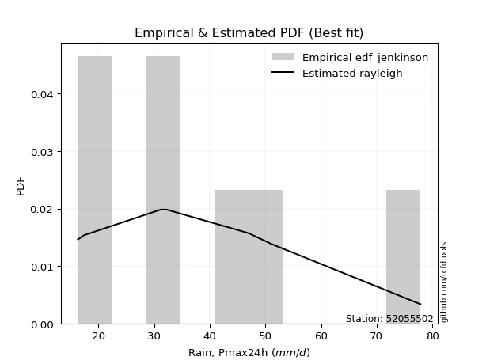</img>

</div>


### 11. EDF Cunnane (1978)

Cunnane´s work in statistical hydrology has focused on the performance and evaluation of different probability distributions (such as GEV, Gumbel, Lognormal) for flood frequency estimation. _b_ is a constant, typically set to 0.4.

<div align="center">


$P=(m-b)/(n+1-2b)$


</div>


**11.1. Empirical values**

<div align="center">

|                | 0                   | 1                   | 2                  | 3           | 4                  | 5                  | 6                  |
|:---------------|:--------------------|:--------------------|:-------------------|:------------|:-------------------|:-------------------|:-------------------|
| date           | 2017                | 2023                | 2022               | 2018        | 2020               | 2021               | 2019               |
| x              | 16.3                | 17.4                | 31.2               | 32.3        | 47.0               | 51.1               | 77.9               |
| m              | 1                   | 2                   | 3                  | 4           | 5                  | 6                  | 7                  |
| empirical_dist | edf_cunnane         | edf_cunnane         | edf_cunnane        | edf_cunnane | edf_cunnane        | edf_cunnane        | edf_cunnane        |
| empirical      | 0.08333333333333333 | 0.22222222222222224 | 0.3611111111111111 | 0.5         | 0.6388888888888888 | 0.7777777777777777 | 0.9166666666666666 |
| empirical_tr   | 1.090909090909091   | 1.2857142857142856  | 1.565217391304348  | 2.0         | 2.7692307692307687 | 4.499999999999998  | 11.999999999999995 |

</div>


**11.2. Kolmogorov-Smirnov fit test (sorted by Δ)**


<div align="center">

|                | 0                   | 1                   | 2                   | 3                   | 4                   | 5                   | 6                   | 7                   | 8                   | 9                   | 10                  | 11                  | 12                  | 13                  | 14                  | 15                  | 16                  | 17                  | 18                  | 19                  | 20                  | 21                  | 22                  | 23                  | 24                  | 25                  | 26                  | 27                  | 28                  | 29                  | 30                  | 31                  | 32                  | 33                  | 34                  | 35                  | 36                  | 37                  | 38                  | 39                  | 40                  | 41                  | 42                  | 43                  | 44                  | 45                  | 46                  | 47                  | 48                  | 49                  | 50                  | 51                  | 52                  | 53                  | 54                  | 55                  | 56                  | 57                  | 58                  | 59                  | 60                  | 61                  | 62                  | 63                  | 64                  | 65                  | 66                  | 67                  | 68                  | 69                  | 70                  | 71                  | 72                  | 73                  | 74                  | 75                  | 76                  | 77                  | 78                  | 79                  | 80                  | 81                  | 82                  | 83                  | 84                  | 85                  | 86                  | 87                  | 88                  | 89                  | 90                  | 91                  | 92                  | 93                  | 94                  | 95                  | 96                  | 97                  | 98                  | 99                  | 100                 | 101                 | 102                 | 103                 | 104                 | 105                 | 106                 | 107                 | 108                 | 109                 | 110                 | 111                 | 112                 | 113                 | 114                 | 115                 | 116                 | 117                 | 118                 | 119                 | 120                 | 121                 | 122                 | 123                 | 124                 | 125                 | 126                 | 127                 | 128                 | 129                 | 130                 | 131                 | 132                 | 133                 | 134                 | 135                 | 136                 | 137                 | 138                 | 139                 | 140                 | 141                 | 142                 | 143                 | 144                 | 145                 | 146                 | 147                 | 148                 | 149                 | 150                 | 151                 | 152                 | 153                 | 154                 | 155                 | 156                 | 157                 | 158                 | 159                 |
|:---------------|:--------------------|:--------------------|:--------------------|:--------------------|:--------------------|:--------------------|:--------------------|:--------------------|:--------------------|:--------------------|:--------------------|:--------------------|:--------------------|:--------------------|:--------------------|:--------------------|:--------------------|:--------------------|:--------------------|:--------------------|:--------------------|:--------------------|:--------------------|:--------------------|:--------------------|:--------------------|:--------------------|:--------------------|:--------------------|:--------------------|:--------------------|:--------------------|:--------------------|:--------------------|:--------------------|:--------------------|:--------------------|:--------------------|:--------------------|:--------------------|:--------------------|:--------------------|:--------------------|:--------------------|:--------------------|:--------------------|:--------------------|:--------------------|:--------------------|:--------------------|:--------------------|:--------------------|:--------------------|:--------------------|:--------------------|:--------------------|:--------------------|:--------------------|:--------------------|:--------------------|:--------------------|:--------------------|:--------------------|:--------------------|:--------------------|:--------------------|:--------------------|:--------------------|:--------------------|:--------------------|:--------------------|:--------------------|:--------------------|:--------------------|:--------------------|:--------------------|:--------------------|:--------------------|:--------------------|:--------------------|:--------------------|:--------------------|:--------------------|:--------------------|:--------------------|:--------------------|:--------------------|:--------------------|:--------------------|:--------------------|:--------------------|:--------------------|:--------------------|:--------------------|:--------------------|:--------------------|:--------------------|:--------------------|:--------------------|:--------------------|:--------------------|:--------------------|:--------------------|:--------------------|:--------------------|:--------------------|:--------------------|:--------------------|:--------------------|:--------------------|:--------------------|:--------------------|:--------------------|:--------------------|:--------------------|:--------------------|:--------------------|:--------------------|:--------------------|:--------------------|:--------------------|:--------------------|:--------------------|:--------------------|:--------------------|:--------------------|:--------------------|:--------------------|:--------------------|:--------------------|:--------------------|:--------------------|:--------------------|:--------------------|:--------------------|:--------------------|:--------------------|:--------------------|:--------------------|:--------------------|:--------------------|:--------------------|:--------------------|:--------------------|:--------------------|:--------------------|:--------------------|:--------------------|:--------------------|:--------------------|:--------------------|:--------------------|:--------------------|:--------------------|:--------------------|:--------------------|:--------------------|:--------------------|:--------------------|:--------------------|
| station        | 52055502            | 52055502            | 52055502            | 52055502            | 52055502            | 52055502            | 52055502            | 52055502            | 52055502            | 52055502            | 52055502            | 52055502            | 52055502            | 52055502            | 52055502            | 52055502            | 52055502            | 52055502            | 52055502            | 52055502            | 52055502            | 52055502            | 52055502            | 52055502            | 52055502            | 52055502            | 52055502            | 52055502            | 52055502            | 52055502            | 52055502            | 52055502            | 52055502            | 52055502            | 52055502            | 52055502            | 52055502            | 52055502            | 52055502            | 52055502            | 52055502            | 52055502            | 52055502            | 52055502            | 52055502            | 52055502            | 52055502            | 52055502            | 52055502            | 52055502            | 52055502            | 52055502            | 52055502            | 52055502            | 52055502            | 52055502            | 52055502            | 52055502            | 52055502            | 52055502            | 52055502            | 52055502            | 52055502            | 52055502            | 52055502            | 52055502            | 52055502            | 52055502            | 52055502            | 52055502            | 52055502            | 52055502            | 52055502            | 52055502            | 52055502            | 52055502            | 52055502            | 52055502            | 52055502            | 52055502            | 52055502            | 52055502            | 52055502            | 52055502            | 52055502            | 52055502            | 52055502            | 52055502            | 52055502            | 52055502            | 52055502            | 52055502            | 52055502            | 52055502            | 52055502            | 52055502            | 52055502            | 52055502            | 52055502            | 52055502            | 52055502            | 52055502            | 52055502            | 52055502            | 52055502            | 52055502            | 52055502            | 52055502            | 52055502            | 52055502            | 52055502            | 52055502            | 52055502            | 52055502            | 52055502            | 52055502            | 52055502            | 52055502            | 52055502            | 52055502            | 52055502            | 52055502            | 52055502            | 52055502            | 52055502            | 52055502            | 52055502            | 52055502            | 52055502            | 52055502            | 52055502            | 52055502            | 52055502            | 52055502            | 52055502            | 52055502            | 52055502            | 52055502            | 52055502            | 52055502            | 52055502            | 52055502            | 52055502            | 52055502            | 52055502            | 52055502            | 52055502            | 52055502            | 52055502            | 52055502            | 52055502            | 52055502            | 52055502            | 52055502            | 52055502            | 52055502            | 52055502            | 52055502            | 52055502            | 52055502            |
| empirical_dist | edf_cunnane         | edf_cunnane         | edf_cunnane         | edf_cunnane         | edf_cunnane         | edf_cunnane         | edf_cunnane         | edf_cunnane         | edf_cunnane         | edf_cunnane         | edf_cunnane         | edf_cunnane         | edf_cunnane         | edf_cunnane         | edf_cunnane         | edf_cunnane         | edf_cunnane         | edf_cunnane         | edf_cunnane         | edf_cunnane         | edf_cunnane         | edf_cunnane         | edf_cunnane         | edf_cunnane         | edf_cunnane         | edf_cunnane         | edf_cunnane         | edf_cunnane         | edf_cunnane         | edf_cunnane         | edf_cunnane         | edf_cunnane         | edf_cunnane         | edf_cunnane         | edf_cunnane         | edf_cunnane         | edf_cunnane         | edf_cunnane         | edf_cunnane         | edf_cunnane         | edf_cunnane         | edf_cunnane         | edf_cunnane         | edf_cunnane         | edf_cunnane         | edf_cunnane         | edf_cunnane         | edf_cunnane         | edf_cunnane         | edf_cunnane         | edf_cunnane         | edf_cunnane         | edf_cunnane         | edf_cunnane         | edf_cunnane         | edf_cunnane         | edf_cunnane         | edf_cunnane         | edf_cunnane         | edf_cunnane         | edf_cunnane         | edf_cunnane         | edf_cunnane         | edf_cunnane         | edf_cunnane         | edf_cunnane         | edf_cunnane         | edf_cunnane         | edf_cunnane         | edf_cunnane         | edf_cunnane         | edf_cunnane         | edf_cunnane         | edf_cunnane         | edf_cunnane         | edf_cunnane         | edf_cunnane         | edf_cunnane         | edf_cunnane         | edf_cunnane         | edf_cunnane         | edf_cunnane         | edf_cunnane         | edf_cunnane         | edf_cunnane         | edf_cunnane         | edf_cunnane         | edf_cunnane         | edf_cunnane         | edf_cunnane         | edf_cunnane         | edf_cunnane         | edf_cunnane         | edf_cunnane         | edf_cunnane         | edf_cunnane         | edf_cunnane         | edf_cunnane         | edf_cunnane         | edf_cunnane         | edf_cunnane         | edf_cunnane         | edf_cunnane         | edf_cunnane         | edf_cunnane         | edf_cunnane         | edf_cunnane         | edf_cunnane         | edf_cunnane         | edf_cunnane         | edf_cunnane         | edf_cunnane         | edf_cunnane         | edf_cunnane         | edf_cunnane         | edf_cunnane         | edf_cunnane         | edf_cunnane         | edf_cunnane         | edf_cunnane         | edf_cunnane         | edf_cunnane         | edf_cunnane         | edf_cunnane         | edf_cunnane         | edf_cunnane         | edf_cunnane         | edf_cunnane         | edf_cunnane         | edf_cunnane         | edf_cunnane         | edf_cunnane         | edf_cunnane         | edf_cunnane         | edf_cunnane         | edf_cunnane         | edf_cunnane         | edf_cunnane         | edf_cunnane         | edf_cunnane         | edf_cunnane         | edf_cunnane         | edf_cunnane         | edf_cunnane         | edf_cunnane         | edf_cunnane         | edf_cunnane         | edf_cunnane         | edf_cunnane         | edf_cunnane         | edf_cunnane         | edf_cunnane         | edf_cunnane         | edf_cunnane         | edf_cunnane         | edf_cunnane         | edf_cunnane         | edf_cunnane         | edf_cunnane         | edf_cunnane         |
| p_dist         | foldnorm            | rayleigh            | logksone            | pearson3            | logsemicircular     | maxwell             | logncf              | logarcsine          | loganglit           | halfnorm            | dgamma              | semicircular        | logburr             | loggenextreme       | logweibull_max      | anglit              | genlogistic         | dweibull            | ncf                 | gumbel_r            | loggumbel_l         | logloggamma         | alpha               | kstwobign           | logpearson3         | logfoldnorm         | lognct              | logjohnsonsu        | logskewnorm         | logt                | logexponnorm        | logcrystalball      | lognorm             | genextreme          | logfatiguelife      | logf                | loggamma            | loggamma            | logerlang           | loginvgamma         | logalpha            | invgamma            | logbetaprime        | loginvgauss         | logburr12           | logcosine           | rice                | logmaxwell          | norm                | crystalball         | truncnorm           | t                   | loglogistic         | logdweibull         | logargus            | loghypsecant        | lograyleigh         | arcsine             | burr                | loggenlogistic      | nct                 | logloglaplace       | loginvweibull       | logrice             | moyal               | betaprime           | logtriang           | weibull_min         | logistic            | loglaplace          | loglaplace          | truncweibull_min    | logkstwobign        | invgauss            | logdgamma           | beta                | halflogistic        | hypsecant           | logbradford         | cosine              | loggenexpon         | gausshyper          | loggumbel_r         | logwrapcauchy       | logtruncpareto      | logrdist            | lomax               | exponnorm           | logexponpow         | logtukeylambda      | logtruncexpon       | logkappa4           | loggompertz         | logkappa3           | genexpon            | loguniform          | logvonmises_line    | gompertz            | laplace             | truncexpon          | logmoyal            | skewnorm            | gumbel_l            | kappa3              | loggausshyper       | loghalfnorm         | halfgennorm         | bradford            | kappa4              | f                   | argus               | burr12              | wald                | loghalflogistic     | loglomax            | ksone               | logwald             | tukeylambda         | loggenhalflogistic  | vonmises_line       | genpareto           | wrapcauchy          | uniform             | logweibull_min      | loggenpareto        | loggennorm          | gennorm             | triang              | loglevy_l           | logtruncweibull_min | johnsonsb           | logtrapezoid        | logjohnsonsb        | levy_l              | logmielke           | genhalflogistic     | logtruncnorm        | exponpow            | invweibull          | exponweib           | logbeta             | powerlaw            | fatiguelife         | gengamma            | lognakagami         | nakagami            | rdist               | trapezoid           | johnsonsu           | erlang              | logpowerlaw         | logexponweib        | gamma               | truncpareto         | loggengamma         | weibull_max         | loghalfgennorm      | logvonmises         | vonmises            | mielke              |
| delta          | 0.07336975537253246 | 0.08631222842817321 | 0.09057229351789242 | 0.09345479151592762 | 0.09777526816308782 | 0.09854661252619246 | 0.09945243642900087 | 0.10112747875354067 | 0.10419050559656373 | 0.10512728973403038 | 0.10590335574989407 | 0.10637095147609266 | 0.10646028414896264 | 0.11201594873974804 | 0.11201961988846507 | 0.11376813753748194 | 0.11410355358468263 | 0.11436756820930927 | 0.11550996421393239 | 0.11589011839490108 | 0.11814566668631904 | 0.11879605024247908 | 0.11923702772280341 | 0.11924634000215395 | 0.11975066379351318 | 0.1199453591505549  | 0.12011422883617615 | 0.12040593609045833 | 0.12044398994185124 | 0.12047225573878634 | 0.120474666850505   | 0.12047502675620911 | 0.12047505462581407 | 0.1206530435430703  | 0.12078343078326884 | 0.12083095658387823 | 0.12098160653077897 | 0.12098160653077897 | 0.12099185788537928 | 0.12336237959263217 | 0.12387650833469174 | 0.12430071679772473 | 0.12449761141883431 | 0.12722898733297064 | 0.12749682687456884 | 0.1295424555991561  | 0.13004461074984355 | 0.13074303254921293 | 0.1314733431954157  | 0.1314733533767845  | 0.13147335676051475 | 0.1314739607815819  | 0.13163897089662796 | 0.13213943916746496 | 0.13525546835908545 | 0.13637508721612224 | 0.13772145496370183 | 0.13772159294673658 | 0.13861150823124774 | 0.13911282095763094 | 0.1395350485268229  | 0.14054247790967145 | 0.14091770322083047 | 0.14148669505896003 | 0.1432990152182783  | 0.14436411803920185 | 0.14528696032954536 | 0.14760853543497063 | 0.14771214579793135 | 0.14933280255609804 | 0.14933280255609804 | 0.15090782471433217 | 0.1526301034727497  | 0.15315651254938406 | 0.15812590912977578 | 0.15936646538961124 | 0.1603344533379269  | 0.1605971969311626  | 0.1620352309655407  | 0.16335998642079919 | 0.16376455108628274 | 0.1650640492879702  | 0.16543183262953792 | 0.1658759161222586  | 0.1659363764856459  | 0.1707891087372233  | 0.1715447721526007  | 0.1738635876577275  | 0.17491155657903762 | 0.17571619934634067 | 0.17588030040657238 | 0.1765994096012419  | 0.1768509672447109  | 0.18020733254144314 | 0.18045036577141416 | 0.18047400701001123 | 0.1804773658440529  | 0.18343356927805132 | 0.1890057305410487  | 0.1921196756640555  | 0.1926324812404072  | 0.19326128909102272 | 0.1941926453526268  | 0.19483737052272698 | 0.1968160911674804  | 0.19726225411067305 | 0.19819097352525633 | 0.19876094078183704 | 0.20888574233616825 | 0.2129885962473001  | 0.22127992805159857 | 0.22204512448065533 | 0.22222222222222224 | 0.22222222222222224 | 0.22366271466577864 | 0.22366522366522368 | 0.2308947241388955  | 0.23584936115634436 | 0.23596431515704935 | 0.23772030184800835 | 0.23785142538953696 | 0.24001153105402762 | 0.24025974025974034 | 0.26497668804165936 | 0.2758542881291708  | 0.2777777777777778  | 0.2777777777777778  | 0.27844870788852005 | 0.28026965638609774 | 0.2809903179921088  | 0.2974032442312624  | 0.2995910827177801  | 0.3012825739896878  | 0.3300643577098123  | 0.347183044753782   | 0.36029643366831815 | 0.3900881296199091  | 0.39180446328282453 | 0.39700153387284376 | 0.4052571080942881  | 0.41913084628760483 | 0.44254401983523667 | 0.44264273527420855 | 0.44530387111076425 | 0.45275234330542485 | 0.456114695073834   | 0.4664141308871372  | 0.4707370551526396  | 0.4792498440885985  | 0.4950256025951996  | 0.5006855463857476  | 0.5182190651638119  | 0.5370561705661927  | 0.5488360041695253  | 0.5615859420724192  | 0.6305074204179878  | 0.7777777777777777  | 1.0932546590337766  | 11.673034076588872  | nan                 |
| deltao         | 0.48442053926100004 | 0.48442053926100004 | 0.48442053926100004 | 0.48442053926100004 | 0.48442053926100004 | 0.48442053926100004 | 0.48442053926100004 | 0.48442053926100004 | 0.48442053926100004 | 0.48442053926100004 | 0.48442053926100004 | 0.48442053926100004 | 0.48442053926100004 | 0.48442053926100004 | 0.48442053926100004 | 0.48442053926100004 | 0.48442053926100004 | 0.48442053926100004 | 0.48442053926100004 | 0.48442053926100004 | 0.48442053926100004 | 0.48442053926100004 | 0.48442053926100004 | 0.48442053926100004 | 0.48442053926100004 | 0.48442053926100004 | 0.48442053926100004 | 0.48442053926100004 | 0.48442053926100004 | 0.48442053926100004 | 0.48442053926100004 | 0.48442053926100004 | 0.48442053926100004 | 0.48442053926100004 | 0.48442053926100004 | 0.48442053926100004 | 0.48442053926100004 | 0.48442053926100004 | 0.48442053926100004 | 0.48442053926100004 | 0.48442053926100004 | 0.48442053926100004 | 0.48442053926100004 | 0.48442053926100004 | 0.48442053926100004 | 0.48442053926100004 | 0.48442053926100004 | 0.48442053926100004 | 0.48442053926100004 | 0.48442053926100004 | 0.48442053926100004 | 0.48442053926100004 | 0.48442053926100004 | 0.48442053926100004 | 0.48442053926100004 | 0.48442053926100004 | 0.48442053926100004 | 0.48442053926100004 | 0.48442053926100004 | 0.48442053926100004 | 0.48442053926100004 | 0.48442053926100004 | 0.48442053926100004 | 0.48442053926100004 | 0.48442053926100004 | 0.48442053926100004 | 0.48442053926100004 | 0.48442053926100004 | 0.48442053926100004 | 0.48442053926100004 | 0.48442053926100004 | 0.48442053926100004 | 0.48442053926100004 | 0.48442053926100004 | 0.48442053926100004 | 0.48442053926100004 | 0.48442053926100004 | 0.48442053926100004 | 0.48442053926100004 | 0.48442053926100004 | 0.48442053926100004 | 0.48442053926100004 | 0.48442053926100004 | 0.48442053926100004 | 0.48442053926100004 | 0.48442053926100004 | 0.48442053926100004 | 0.48442053926100004 | 0.48442053926100004 | 0.48442053926100004 | 0.48442053926100004 | 0.48442053926100004 | 0.48442053926100004 | 0.48442053926100004 | 0.48442053926100004 | 0.48442053926100004 | 0.48442053926100004 | 0.48442053926100004 | 0.48442053926100004 | 0.48442053926100004 | 0.48442053926100004 | 0.48442053926100004 | 0.48442053926100004 | 0.48442053926100004 | 0.48442053926100004 | 0.48442053926100004 | 0.48442053926100004 | 0.48442053926100004 | 0.48442053926100004 | 0.48442053926100004 | 0.48442053926100004 | 0.48442053926100004 | 0.48442053926100004 | 0.48442053926100004 | 0.48442053926100004 | 0.48442053926100004 | 0.48442053926100004 | 0.48442053926100004 | 0.48442053926100004 | 0.48442053926100004 | 0.48442053926100004 | 0.48442053926100004 | 0.48442053926100004 | 0.48442053926100004 | 0.48442053926100004 | 0.48442053926100004 | 0.48442053926100004 | 0.48442053926100004 | 0.48442053926100004 | 0.48442053926100004 | 0.48442053926100004 | 0.48442053926100004 | 0.48442053926100004 | 0.48442053926100004 | 0.48442053926100004 | 0.48442053926100004 | 0.48442053926100004 | 0.48442053926100004 | 0.48442053926100004 | 0.48442053926100004 | 0.48442053926100004 | 0.48442053926100004 | 0.48442053926100004 | 0.48442053926100004 | 0.48442053926100004 | 0.48442053926100004 | 0.48442053926100004 | 0.48442053926100004 | 0.48442053926100004 | 0.48442053926100004 | 0.48442053926100004 | 0.48442053926100004 | 0.48442053926100004 | 0.48442053926100004 | 0.48442053926100004 | 0.48442053926100004 | 0.48442053926100004 | 0.48442053926100004 | 0.48442053926100004 | 0.48442053926100004 |
| eval           | Δo > Δ              | Δo > Δ              | Δo > Δ              | Δo > Δ              | Δo > Δ              | Δo > Δ              | Δo > Δ              | Δo > Δ              | Δo > Δ              | Δo > Δ              | Δo > Δ              | Δo > Δ              | Δo > Δ              | Δo > Δ              | Δo > Δ              | Δo > Δ              | Δo > Δ              | Δo > Δ              | Δo > Δ              | Δo > Δ              | Δo > Δ              | Δo > Δ              | Δo > Δ              | Δo > Δ              | Δo > Δ              | Δo > Δ              | Δo > Δ              | Δo > Δ              | Δo > Δ              | Δo > Δ              | Δo > Δ              | Δo > Δ              | Δo > Δ              | Δo > Δ              | Δo > Δ              | Δo > Δ              | Δo > Δ              | Δo > Δ              | Δo > Δ              | Δo > Δ              | Δo > Δ              | Δo > Δ              | Δo > Δ              | Δo > Δ              | Δo > Δ              | Δo > Δ              | Δo > Δ              | Δo > Δ              | Δo > Δ              | Δo > Δ              | Δo > Δ              | Δo > Δ              | Δo > Δ              | Δo > Δ              | Δo > Δ              | Δo > Δ              | Δo > Δ              | Δo > Δ              | Δo > Δ              | Δo > Δ              | Δo > Δ              | Δo > Δ              | Δo > Δ              | Δo > Δ              | Δo > Δ              | Δo > Δ              | Δo > Δ              | Δo > Δ              | Δo > Δ              | Δo > Δ              | Δo > Δ              | Δo > Δ              | Δo > Δ              | Δo > Δ              | Δo > Δ              | Δo > Δ              | Δo > Δ              | Δo > Δ              | Δo > Δ              | Δo > Δ              | Δo > Δ              | Δo > Δ              | Δo > Δ              | Δo > Δ              | Δo > Δ              | Δo > Δ              | Δo > Δ              | Δo > Δ              | Δo > Δ              | Δo > Δ              | Δo > Δ              | Δo > Δ              | Δo > Δ              | Δo > Δ              | Δo > Δ              | Δo > Δ              | Δo > Δ              | Δo > Δ              | Δo > Δ              | Δo > Δ              | Δo > Δ              | Δo > Δ              | Δo > Δ              | Δo > Δ              | Δo > Δ              | Δo > Δ              | Δo > Δ              | Δo > Δ              | Δo > Δ              | Δo > Δ              | Δo > Δ              | Δo > Δ              | Δo > Δ              | Δo > Δ              | Δo > Δ              | Δo > Δ              | Δo > Δ              | Δo > Δ              | Δo > Δ              | Δo > Δ              | Δo > Δ              | Δo > Δ              | Δo > Δ              | Δo > Δ              | Δo > Δ              | Δo > Δ              | Δo > Δ              | Δo > Δ              | Δo > Δ              | Δo > Δ              | Δo > Δ              | Δo > Δ              | Δo > Δ              | Δo > Δ              | Δo > Δ              | Δo > Δ              | Δo > Δ              | Δo > Δ              | Δo > Δ              | Δo > Δ              | Δo > Δ              | Δo > Δ              | Δo > Δ              | Δo > Δ              | Δo > Δ              | Δo > Δ              | Δo > Δ              | Δo > Δ              | Δo > Δ              | Δo <= Δ             | Δo <= Δ             | Δo <= Δ             | Δo <= Δ             | Δo <= Δ             | Δo <= Δ             | Δo <= Δ             | Δo <= Δ             | Δo <= Δ             | Δo <= Δ             | Δo <= Δ             |
| fit            | 1                   | 1                   | 1                   | 1                   | 1                   | 1                   | 1                   | 1                   | 1                   | 1                   | 1                   | 1                   | 1                   | 1                   | 1                   | 1                   | 1                   | 1                   | 1                   | 1                   | 1                   | 1                   | 1                   | 1                   | 1                   | 1                   | 1                   | 1                   | 1                   | 1                   | 1                   | 1                   | 1                   | 1                   | 1                   | 1                   | 1                   | 1                   | 1                   | 1                   | 1                   | 1                   | 1                   | 1                   | 1                   | 1                   | 1                   | 1                   | 1                   | 1                   | 1                   | 1                   | 1                   | 1                   | 1                   | 1                   | 1                   | 1                   | 1                   | 1                   | 1                   | 1                   | 1                   | 1                   | 1                   | 1                   | 1                   | 1                   | 1                   | 1                   | 1                   | 1                   | 1                   | 1                   | 1                   | 1                   | 1                   | 1                   | 1                   | 1                   | 1                   | 1                   | 1                   | 1                   | 1                   | 1                   | 1                   | 1                   | 1                   | 1                   | 1                   | 1                   | 1                   | 1                   | 1                   | 1                   | 1                   | 1                   | 1                   | 1                   | 1                   | 1                   | 1                   | 1                   | 1                   | 1                   | 1                   | 1                   | 1                   | 1                   | 1                   | 1                   | 1                   | 1                   | 1                   | 1                   | 1                   | 1                   | 1                   | 1                   | 1                   | 1                   | 1                   | 1                   | 1                   | 1                   | 1                   | 1                   | 1                   | 1                   | 1                   | 1                   | 1                   | 1                   | 1                   | 1                   | 1                   | 1                   | 1                   | 1                   | 1                   | 1                   | 1                   | 1                   | 1                   | 1                   | 1                   | 1                   | 1                   | 0                   | 0                   | 0                   | 0                   | 0                   | 0                   | 0                   | 0                   | 0                   | 0                   | 0                   |
| n              | 7                   | 7                   | 7                   | 7                   | 7                   | 7                   | 7                   | 7                   | 7                   | 7                   | 7                   | 7                   | 7                   | 7                   | 7                   | 7                   | 7                   | 7                   | 7                   | 7                   | 7                   | 7                   | 7                   | 7                   | 7                   | 7                   | 7                   | 7                   | 7                   | 7                   | 7                   | 7                   | 7                   | 7                   | 7                   | 7                   | 7                   | 7                   | 7                   | 7                   | 7                   | 7                   | 7                   | 7                   | 7                   | 7                   | 7                   | 7                   | 7                   | 7                   | 7                   | 7                   | 7                   | 7                   | 7                   | 7                   | 7                   | 7                   | 7                   | 7                   | 7                   | 7                   | 7                   | 7                   | 7                   | 7                   | 7                   | 7                   | 7                   | 7                   | 7                   | 7                   | 7                   | 7                   | 7                   | 7                   | 7                   | 7                   | 7                   | 7                   | 7                   | 7                   | 7                   | 7                   | 7                   | 7                   | 7                   | 7                   | 7                   | 7                   | 7                   | 7                   | 7                   | 7                   | 7                   | 7                   | 7                   | 7                   | 7                   | 7                   | 7                   | 7                   | 7                   | 7                   | 7                   | 7                   | 7                   | 7                   | 7                   | 7                   | 7                   | 7                   | 7                   | 7                   | 7                   | 7                   | 7                   | 7                   | 7                   | 7                   | 7                   | 7                   | 7                   | 7                   | 7                   | 7                   | 7                   | 7                   | 7                   | 7                   | 7                   | 7                   | 7                   | 7                   | 7                   | 7                   | 7                   | 7                   | 7                   | 7                   | 7                   | 7                   | 7                   | 7                   | 7                   | 7                   | 7                   | 7                   | 7                   | 7                   | 7                   | 7                   | 7                   | 7                   | 7                   | 7                   | 7                   | 7                   | 7                   | 7                   |
| best_fit       | 1                   | 0                   | 0                   | 0                   | 0                   | 0                   | 0                   | 0                   | 0                   | 0                   | 0                   | 0                   | 0                   | 0                   | 0                   | 0                   | 0                   | 0                   | 0                   | 0                   | 0                   | 0                   | 0                   | 0                   | 0                   | 0                   | 0                   | 0                   | 0                   | 0                   | 0                   | 0                   | 0                   | 0                   | 0                   | 0                   | 0                   | 0                   | 0                   | 0                   | 0                   | 0                   | 0                   | 0                   | 0                   | 0                   | 0                   | 0                   | 0                   | 0                   | 0                   | 0                   | 0                   | 0                   | 0                   | 0                   | 0                   | 0                   | 0                   | 0                   | 0                   | 0                   | 0                   | 0                   | 0                   | 0                   | 0                   | 0                   | 0                   | 0                   | 0                   | 0                   | 0                   | 0                   | 0                   | 0                   | 0                   | 0                   | 0                   | 0                   | 0                   | 0                   | 0                   | 0                   | 0                   | 0                   | 0                   | 0                   | 0                   | 0                   | 0                   | 0                   | 0                   | 0                   | 0                   | 0                   | 0                   | 0                   | 0                   | 0                   | 0                   | 0                   | 0                   | 0                   | 0                   | 0                   | 0                   | 0                   | 0                   | 0                   | 0                   | 0                   | 0                   | 0                   | 0                   | 0                   | 0                   | 0                   | 0                   | 0                   | 0                   | 0                   | 0                   | 0                   | 0                   | 0                   | 0                   | 0                   | 0                   | 0                   | 0                   | 0                   | 0                   | 0                   | 0                   | 0                   | 0                   | 0                   | 0                   | 0                   | 0                   | 0                   | 0                   | 0                   | 0                   | 0                   | 0                   | 0                   | 0                   | 0                   | 0                   | 0                   | 0                   | 0                   | 0                   | 0                   | 0                   | 0                   | 0                   | 0                   |
| best_fit_sort  | 1                   | 2                   | 3                   | 4                   | 5                   | 6                   | 7                   | 8                   | 9                   | 10                  | 11                  | 12                  | 13                  | 14                  | 15                  | 16                  | 17                  | 18                  | 19                  | 20                  | 21                  | 22                  | 23                  | 24                  | 25                  | 26                  | 27                  | 28                  | 29                  | 30                  | 31                  | 32                  | 33                  | 34                  | 35                  | 36                  | 37                  | 38                  | 39                  | 40                  | 41                  | 42                  | 43                  | 44                  | 45                  | 46                  | 47                  | 48                  | 49                  | 50                  | 51                  | 52                  | 53                  | 54                  | 55                  | 56                  | 57                  | 58                  | 59                  | 60                  | 61                  | 62                  | 63                  | 64                  | 65                  | 66                  | 67                  | 68                  | 69                  | 70                  | 71                  | 72                  | 73                  | 74                  | 75                  | 76                  | 77                  | 78                  | 79                  | 80                  | 81                  | 82                  | 83                  | 84                  | 85                  | 86                  | 87                  | 88                  | 89                  | 90                  | 91                  | 92                  | 93                  | 94                  | 95                  | 96                  | 97                  | 98                  | 99                  | 100                 | 101                 | 102                 | 103                 | 104                 | 105                 | 106                 | 107                 | 108                 | 109                 | 110                 | 111                 | 112                 | 113                 | 114                 | 115                 | 116                 | 117                 | 118                 | 119                 | 120                 | 121                 | 122                 | 123                 | 124                 | 125                 | 126                 | 127                 | 128                 | 129                 | 130                 | 131                 | 132                 | 133                 | 134                 | 135                 | 136                 | 137                 | 138                 | 139                 | 140                 | 141                 | 142                 | 143                 | 144                 | 145                 | 146                 | 147                 | 148                 | 149                 | 150                 | 151                 | 152                 | 153                 | 154                 | 155                 | 156                 | 157                 | 158                 | 159                 | 160                 |

</div>


**11.3. Best fit**

<div align="center">

|   id |   station | empirical_dist   | p_dist   |     delta |   deltao | eval   |   fit |   n |   best_fit |   best_fit_sort |
|-----:|----------:|:-----------------|:---------|----------:|---------:|:-------|------:|----:|-----------:|----------------:|
|    0 |  52055502 | edf_cunnane      | foldnorm | 0.0733698 | 0.484421 | Δo > Δ |     1 |   7 |          1 |               1 |

</div>


<div align="center">

</img>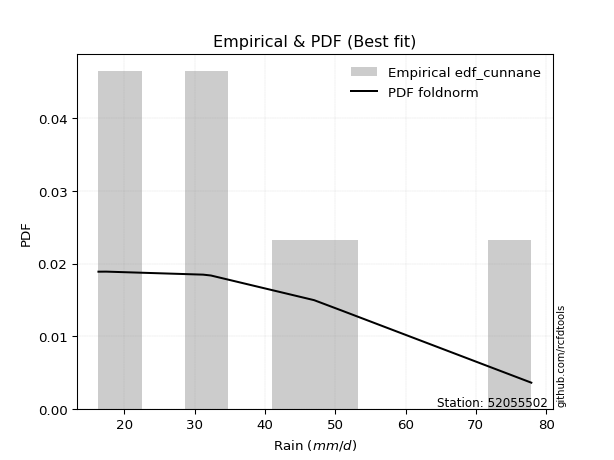</img>

</div>


### 12. EDF Adamowski (1981)

The Adamowski formula in hydrology refers to a specific plotting position formula used for estimating the non-parametric empirical distribution of hydrological events (like flood peaks) to calculate their return periods. This formula provides an alternative to traditional parametric methods (like the Gumbel or Log Pearson Type III distributions). 

<div align="center">


$P=(m-0.25)/(n+0.5)$


</div>


**12.1. Empirical values**

<div align="center">

|                | 0                  | 1                   | 2                   | 3             | 4                  | 5                  | 6                  |
|:---------------|:-------------------|:--------------------|:--------------------|:--------------|:-------------------|:-------------------|:-------------------|
| date           | 2017               | 2023                | 2022                | 2018          | 2020               | 2021               | 2019               |
| x              | 16.3               | 17.4                | 31.2                | 32.3          | 47.0               | 51.1               | 77.9               |
| m              | 1                  | 2                   | 3                   | 4             | 5                  | 6                  | 7                  |
| empirical_dist | edf_adamowski      | edf_adamowski       | edf_adamowski       | edf_adamowski | edf_adamowski      | edf_adamowski      | edf_adamowski      |
| empirical      | 0.1                | 0.23333333333333334 | 0.36666666666666664 | 0.5           | 0.6333333333333333 | 0.7666666666666667 | 0.9                |
| empirical_tr   | 1.1111111111111112 | 1.3043478260869565  | 1.5789473684210527  | 2.0           | 2.727272727272727  | 4.2857142857142865 | 10.000000000000002 |

</div>


**12.2. Kolmogorov-Smirnov fit test (sorted by Δ)**


<div align="center">

|                | 0                   | 1                   | 2                   | 3                   | 4                   | 5                   | 6                   | 7                   | 8                   | 9                   | 10                  | 11                  | 12                  | 13                  | 14                  | 15                  | 16                  | 17                  | 18                  | 19                  | 20                  | 21                  | 22                  | 23                  | 24                  | 25                  | 26                  | 27                  | 28                  | 29                  | 30                  | 31                  | 32                  | 33                  | 34                  | 35                  | 36                  | 37                  | 38                  | 39                  | 40                  | 41                  | 42                  | 43                  | 44                  | 45                  | 46                  | 47                  | 48                  | 49                  | 50                  | 51                  | 52                  | 53                  | 54                  | 55                  | 56                  | 57                  | 58                  | 59                  | 60                  | 61                  | 62                  | 63                  | 64                  | 65                  | 66                  | 67                  | 68                  | 69                  | 70                  | 71                  | 72                  | 73                  | 74                  | 75                  | 76                  | 77                  | 78                  | 79                  | 80                  | 81                  | 82                  | 83                  | 84                  | 85                  | 86                  | 87                  | 88                  | 89                  | 90                  | 91                  | 92                  | 93                  | 94                  | 95                  | 96                  | 97                  | 98                  | 99                  | 100                 | 101                 | 102                 | 103                 | 104                 | 105                 | 106                 | 107                 | 108                 | 109                 | 110                 | 111                 | 112                 | 113                 | 114                 | 115                 | 116                 | 117                 | 118                 | 119                 | 120                 | 121                 | 122                 | 123                 | 124                 | 125                 | 126                 | 127                 | 128                 | 129                 | 130                 | 131                 | 132                 | 133                 | 134                 | 135                 | 136                 | 137                 | 138                 | 139                 | 140                 | 141                 | 142                 | 143                 | 144                 | 145                 | 146                 | 147                 | 148                 | 149                 | 150                 | 151                 | 152                 | 153                 | 154                 | 155                 | 156                 | 157                 | 158                 | 159                 |
|:---------------|:--------------------|:--------------------|:--------------------|:--------------------|:--------------------|:--------------------|:--------------------|:--------------------|:--------------------|:--------------------|:--------------------|:--------------------|:--------------------|:--------------------|:--------------------|:--------------------|:--------------------|:--------------------|:--------------------|:--------------------|:--------------------|:--------------------|:--------------------|:--------------------|:--------------------|:--------------------|:--------------------|:--------------------|:--------------------|:--------------------|:--------------------|:--------------------|:--------------------|:--------------------|:--------------------|:--------------------|:--------------------|:--------------------|:--------------------|:--------------------|:--------------------|:--------------------|:--------------------|:--------------------|:--------------------|:--------------------|:--------------------|:--------------------|:--------------------|:--------------------|:--------------------|:--------------------|:--------------------|:--------------------|:--------------------|:--------------------|:--------------------|:--------------------|:--------------------|:--------------------|:--------------------|:--------------------|:--------------------|:--------------------|:--------------------|:--------------------|:--------------------|:--------------------|:--------------------|:--------------------|:--------------------|:--------------------|:--------------------|:--------------------|:--------------------|:--------------------|:--------------------|:--------------------|:--------------------|:--------------------|:--------------------|:--------------------|:--------------------|:--------------------|:--------------------|:--------------------|:--------------------|:--------------------|:--------------------|:--------------------|:--------------------|:--------------------|:--------------------|:--------------------|:--------------------|:--------------------|:--------------------|:--------------------|:--------------------|:--------------------|:--------------------|:--------------------|:--------------------|:--------------------|:--------------------|:--------------------|:--------------------|:--------------------|:--------------------|:--------------------|:--------------------|:--------------------|:--------------------|:--------------------|:--------------------|:--------------------|:--------------------|:--------------------|:--------------------|:--------------------|:--------------------|:--------------------|:--------------------|:--------------------|:--------------------|:--------------------|:--------------------|:--------------------|:--------------------|:--------------------|:--------------------|:--------------------|:--------------------|:--------------------|:--------------------|:--------------------|:--------------------|:--------------------|:--------------------|:--------------------|:--------------------|:--------------------|:--------------------|:--------------------|:--------------------|:--------------------|:--------------------|:--------------------|:--------------------|:--------------------|:--------------------|:--------------------|:--------------------|:--------------------|:--------------------|:--------------------|:--------------------|:--------------------|:--------------------|:--------------------|
| station        | 52055502            | 52055502            | 52055502            | 52055502            | 52055502            | 52055502            | 52055502            | 52055502            | 52055502            | 52055502            | 52055502            | 52055502            | 52055502            | 52055502            | 52055502            | 52055502            | 52055502            | 52055502            | 52055502            | 52055502            | 52055502            | 52055502            | 52055502            | 52055502            | 52055502            | 52055502            | 52055502            | 52055502            | 52055502            | 52055502            | 52055502            | 52055502            | 52055502            | 52055502            | 52055502            | 52055502            | 52055502            | 52055502            | 52055502            | 52055502            | 52055502            | 52055502            | 52055502            | 52055502            | 52055502            | 52055502            | 52055502            | 52055502            | 52055502            | 52055502            | 52055502            | 52055502            | 52055502            | 52055502            | 52055502            | 52055502            | 52055502            | 52055502            | 52055502            | 52055502            | 52055502            | 52055502            | 52055502            | 52055502            | 52055502            | 52055502            | 52055502            | 52055502            | 52055502            | 52055502            | 52055502            | 52055502            | 52055502            | 52055502            | 52055502            | 52055502            | 52055502            | 52055502            | 52055502            | 52055502            | 52055502            | 52055502            | 52055502            | 52055502            | 52055502            | 52055502            | 52055502            | 52055502            | 52055502            | 52055502            | 52055502            | 52055502            | 52055502            | 52055502            | 52055502            | 52055502            | 52055502            | 52055502            | 52055502            | 52055502            | 52055502            | 52055502            | 52055502            | 52055502            | 52055502            | 52055502            | 52055502            | 52055502            | 52055502            | 52055502            | 52055502            | 52055502            | 52055502            | 52055502            | 52055502            | 52055502            | 52055502            | 52055502            | 52055502            | 52055502            | 52055502            | 52055502            | 52055502            | 52055502            | 52055502            | 52055502            | 52055502            | 52055502            | 52055502            | 52055502            | 52055502            | 52055502            | 52055502            | 52055502            | 52055502            | 52055502            | 52055502            | 52055502            | 52055502            | 52055502            | 52055502            | 52055502            | 52055502            | 52055502            | 52055502            | 52055502            | 52055502            | 52055502            | 52055502            | 52055502            | 52055502            | 52055502            | 52055502            | 52055502            | 52055502            | 52055502            | 52055502            | 52055502            | 52055502            | 52055502            |
| empirical_dist | edf_adamowski       | edf_adamowski       | edf_adamowski       | edf_adamowski       | edf_adamowski       | edf_adamowski       | edf_adamowski       | edf_adamowski       | edf_adamowski       | edf_adamowski       | edf_adamowski       | edf_adamowski       | edf_adamowski       | edf_adamowski       | edf_adamowski       | edf_adamowski       | edf_adamowski       | edf_adamowski       | edf_adamowski       | edf_adamowski       | edf_adamowski       | edf_adamowski       | edf_adamowski       | edf_adamowski       | edf_adamowski       | edf_adamowski       | edf_adamowski       | edf_adamowski       | edf_adamowski       | edf_adamowski       | edf_adamowski       | edf_adamowski       | edf_adamowski       | edf_adamowski       | edf_adamowski       | edf_adamowski       | edf_adamowski       | edf_adamowski       | edf_adamowski       | edf_adamowski       | edf_adamowski       | edf_adamowski       | edf_adamowski       | edf_adamowski       | edf_adamowski       | edf_adamowski       | edf_adamowski       | edf_adamowski       | edf_adamowski       | edf_adamowski       | edf_adamowski       | edf_adamowski       | edf_adamowski       | edf_adamowski       | edf_adamowski       | edf_adamowski       | edf_adamowski       | edf_adamowski       | edf_adamowski       | edf_adamowski       | edf_adamowski       | edf_adamowski       | edf_adamowski       | edf_adamowski       | edf_adamowski       | edf_adamowski       | edf_adamowski       | edf_adamowski       | edf_adamowski       | edf_adamowski       | edf_adamowski       | edf_adamowski       | edf_adamowski       | edf_adamowski       | edf_adamowski       | edf_adamowski       | edf_adamowski       | edf_adamowski       | edf_adamowski       | edf_adamowski       | edf_adamowski       | edf_adamowski       | edf_adamowski       | edf_adamowski       | edf_adamowski       | edf_adamowski       | edf_adamowski       | edf_adamowski       | edf_adamowski       | edf_adamowski       | edf_adamowski       | edf_adamowski       | edf_adamowski       | edf_adamowski       | edf_adamowski       | edf_adamowski       | edf_adamowski       | edf_adamowski       | edf_adamowski       | edf_adamowski       | edf_adamowski       | edf_adamowski       | edf_adamowski       | edf_adamowski       | edf_adamowski       | edf_adamowski       | edf_adamowski       | edf_adamowski       | edf_adamowski       | edf_adamowski       | edf_adamowski       | edf_adamowski       | edf_adamowski       | edf_adamowski       | edf_adamowski       | edf_adamowski       | edf_adamowski       | edf_adamowski       | edf_adamowski       | edf_adamowski       | edf_adamowski       | edf_adamowski       | edf_adamowski       | edf_adamowski       | edf_adamowski       | edf_adamowski       | edf_adamowski       | edf_adamowski       | edf_adamowski       | edf_adamowski       | edf_adamowski       | edf_adamowski       | edf_adamowski       | edf_adamowski       | edf_adamowski       | edf_adamowski       | edf_adamowski       | edf_adamowski       | edf_adamowski       | edf_adamowski       | edf_adamowski       | edf_adamowski       | edf_adamowski       | edf_adamowski       | edf_adamowski       | edf_adamowski       | edf_adamowski       | edf_adamowski       | edf_adamowski       | edf_adamowski       | edf_adamowski       | edf_adamowski       | edf_adamowski       | edf_adamowski       | edf_adamowski       | edf_adamowski       | edf_adamowski       | edf_adamowski       | edf_adamowski       | edf_adamowski       |
| p_dist         | foldnorm            | rayleigh            | maxwell             | logarcsine          | logksone            | dweibull            | pearson3            | semicircular        | dgamma              | logsemicircular     | logncf              | anglit              | loganglit           | halfnorm            | logburr             | loggenextreme       | logweibull_max      | genlogistic         | arcsine             | ncf                 | gumbel_r            | loggumbel_l         | logloggamma         | alpha               | kstwobign           | logpearson3         | logfoldnorm         | lognct              | norm                | crystalball         | truncnorm           | t                   | logjohnsonsu        | logskewnorm         | logt                | logexponnorm        | logcrystalball      | lognorm             | genextreme          | logfatiguelife      | logf                | loggamma            | loggamma            | logerlang           | loginvgamma         | logalpha            | invgamma            | logbetaprime        | loggenlogistic      | burr                | loginvweibull       | logdweibull         | loginvgauss         | logburr12           | nct                 | logcosine           | rice                | logmaxwell          | betaprime           | loglogistic         | logtriang           | logloglaplace       | logargus            | logkstwobign        | loghypsecant        | invgauss            | logistic            | lograyleigh         | logrice             | moyal               | loglaplace          | loglaplace          | weibull_min         | gausshyper          | logrdist            | hypsecant           | truncweibull_min    | cosine              | logdgamma           | logexponpow         | logtruncexpon       | beta                | halflogistic        | logbradford         | loggenexpon         | loggumbel_r         | logwrapcauchy       | logtruncpareto      | lomax               | exponnorm           | logtukeylambda      | logkappa4           | loggompertz         | laplace             | loggausshyper       | logkappa3           | genexpon            | loguniform          | logvonmises_line    | halfgennorm         | gumbel_l            | gompertz            | truncexpon          | logmoyal            | skewnorm            | kappa3              | f                   | loghalfnorm         | kappa4              | bradford            | ksone               | burr12              | loglomax            | argus               | genpareto           | wrapcauchy          | wald                | logwald             | loghalflogistic     | loggenhalflogistic  | vonmises_line       | uniform             | tukeylambda         | loggenpareto        | logweibull_min      | loglevy_l           | gennorm             | loggennorm          | triang              | logtruncweibull_min | johnsonsb           | logjohnsonsb        | logtrapezoid        | levy_l              | logmielke           | genhalflogistic     | invweibull          | exponpow            | logtruncnorm        | exponweib           | logbeta             | powerlaw            | fatiguelife         | gengamma            | lognakagami         | rdist               | nakagami            | trapezoid           | johnsonsu           | erlang              | logpowerlaw         | logexponweib        | gamma               | truncpareto         | loggengamma         | weibull_max         | loghalfgennorm      | logvonmises         | vonmises            | mielke              |
| delta          | 0.08448086648364356 | 0.09473817904165494 | 0.09854661252619246 | 0.09999999999999998 | 0.10042964097559126 | 0.1032564570981983  | 0.10456590262703871 | 0.10637095147609266 | 0.10830083878874061 | 0.10888637927419892 | 0.11056354754011197 | 0.11376813753748194 | 0.11530161670767483 | 0.11623840084514148 | 0.11757139526007374 | 0.12312705985085914 | 0.12313073099957617 | 0.12521466469579373 | 0.12661048183562562 | 0.1266210753250435  | 0.12700122950601217 | 0.12925677779743014 | 0.12990716135359018 | 0.1303481388339145  | 0.13035745111326505 | 0.13086177490462428 | 0.131056470261666   | 0.13122533994728725 | 0.1314733431954157  | 0.1314733533767845  | 0.13147335676051475 | 0.1314739607815819  | 0.13151704720156943 | 0.13155510105296234 | 0.13158336684989744 | 0.13158577796161608 | 0.1315861378673202  | 0.13158616573692516 | 0.1317641546541814  | 0.13189454189437994 | 0.13194206769498934 | 0.13209271764189007 | 0.13209271764189007 | 0.13210296899649038 | 0.13447349070374326 | 0.13498761944580284 | 0.13541182790883582 | 0.1356087225299454  | 0.13623207709902319 | 0.13655013645653147 | 0.13739114165546001 | 0.1376949947230205  | 0.13834009844408174 | 0.13860793798567994 | 0.13947109905928418 | 0.14065356671026719 | 0.14115572186095465 | 0.141854143660324   | 0.14240743707007184 | 0.14275008200773903 | 0.14528696032954536 | 0.14609803346522698 | 0.14636657947019655 | 0.14707454791719415 | 0.14748619832723336 | 0.14760095699382852 | 0.14771214579793135 | 0.14883256607481293 | 0.15259780617007113 | 0.15441012632938939 | 0.15488835811165358 | 0.15488835811165358 | 0.15871964654608173 | 0.15950849373241466 | 0.15967799762611234 | 0.1605971969311626  | 0.16201893582544327 | 0.16335998642079919 | 0.16923702024088688 | 0.16935600102348208 | 0.17032474485101684 | 0.17047757650072232 | 0.171445564449038   | 0.1731463420766518  | 0.17487566219739384 | 0.17654294374064902 | 0.17698702723336968 | 0.17704748759675698 | 0.1826558832637118  | 0.1849746987688386  | 0.18682731045745177 | 0.187710520712353   | 0.187962078355822   | 0.1890057305410487  | 0.19126053561192485 | 0.19131844365255424 | 0.19156147688252528 | 0.19158511812112233 | 0.191588476955164   | 0.1926354179697008  | 0.1941926453526268  | 0.19454468038916242 | 0.2032307867751666  | 0.2037435923515183  | 0.20437240020213382 | 0.20594848163383808 | 0.20743304069174456 | 0.20837336522178418 | 0.20888574233616825 | 0.20987205189294814 | 0.21255411255411272 | 0.2164895689250998  | 0.2181071591102231  | 0.22127992805159857 | 0.226740314278426   | 0.22890041994291666 | 0.23333333333333334 | 0.23333333333333334 | 0.23333333333333334 | 0.23596431515704935 | 0.23772030184800835 | 0.24025974025974034 | 0.2414049167118999  | 0.25918762146250407 | 0.2594211324861038  | 0.2636029897194311  | 0.2666666666666667  | 0.2666666666666667  | 0.2673375967774091  | 0.27543476243655324 | 0.28629213312015145 | 0.2901714628785768  | 0.2995910827177801  | 0.31339769104314563 | 0.34162748919822644 | 0.3491853225572072  | 0.38033486720617715 | 0.386248907727269   | 0.3900881296199091  | 0.3997015525387326  | 0.4135752907320493  | 0.43698846427968113 | 0.437087179718653   | 0.4397483155552087  | 0.4471967877498693  | 0.4497474642204705  | 0.4505591395182785  | 0.4596259440415286  | 0.46813873297748737 | 0.4894700470396441  | 0.4951299908301921  | 0.5126635096082564  | 0.5315006150106372  | 0.5432804486139697  | 0.5560303865168637  | 0.6193963093068768  | 0.7666666666666667  | 1.0988102145893321  | 11.689700743255537  | nan                 |
| deltao         | 0.48442053926100004 | 0.48442053926100004 | 0.48442053926100004 | 0.48442053926100004 | 0.48442053926100004 | 0.48442053926100004 | 0.48442053926100004 | 0.48442053926100004 | 0.48442053926100004 | 0.48442053926100004 | 0.48442053926100004 | 0.48442053926100004 | 0.48442053926100004 | 0.48442053926100004 | 0.48442053926100004 | 0.48442053926100004 | 0.48442053926100004 | 0.48442053926100004 | 0.48442053926100004 | 0.48442053926100004 | 0.48442053926100004 | 0.48442053926100004 | 0.48442053926100004 | 0.48442053926100004 | 0.48442053926100004 | 0.48442053926100004 | 0.48442053926100004 | 0.48442053926100004 | 0.48442053926100004 | 0.48442053926100004 | 0.48442053926100004 | 0.48442053926100004 | 0.48442053926100004 | 0.48442053926100004 | 0.48442053926100004 | 0.48442053926100004 | 0.48442053926100004 | 0.48442053926100004 | 0.48442053926100004 | 0.48442053926100004 | 0.48442053926100004 | 0.48442053926100004 | 0.48442053926100004 | 0.48442053926100004 | 0.48442053926100004 | 0.48442053926100004 | 0.48442053926100004 | 0.48442053926100004 | 0.48442053926100004 | 0.48442053926100004 | 0.48442053926100004 | 0.48442053926100004 | 0.48442053926100004 | 0.48442053926100004 | 0.48442053926100004 | 0.48442053926100004 | 0.48442053926100004 | 0.48442053926100004 | 0.48442053926100004 | 0.48442053926100004 | 0.48442053926100004 | 0.48442053926100004 | 0.48442053926100004 | 0.48442053926100004 | 0.48442053926100004 | 0.48442053926100004 | 0.48442053926100004 | 0.48442053926100004 | 0.48442053926100004 | 0.48442053926100004 | 0.48442053926100004 | 0.48442053926100004 | 0.48442053926100004 | 0.48442053926100004 | 0.48442053926100004 | 0.48442053926100004 | 0.48442053926100004 | 0.48442053926100004 | 0.48442053926100004 | 0.48442053926100004 | 0.48442053926100004 | 0.48442053926100004 | 0.48442053926100004 | 0.48442053926100004 | 0.48442053926100004 | 0.48442053926100004 | 0.48442053926100004 | 0.48442053926100004 | 0.48442053926100004 | 0.48442053926100004 | 0.48442053926100004 | 0.48442053926100004 | 0.48442053926100004 | 0.48442053926100004 | 0.48442053926100004 | 0.48442053926100004 | 0.48442053926100004 | 0.48442053926100004 | 0.48442053926100004 | 0.48442053926100004 | 0.48442053926100004 | 0.48442053926100004 | 0.48442053926100004 | 0.48442053926100004 | 0.48442053926100004 | 0.48442053926100004 | 0.48442053926100004 | 0.48442053926100004 | 0.48442053926100004 | 0.48442053926100004 | 0.48442053926100004 | 0.48442053926100004 | 0.48442053926100004 | 0.48442053926100004 | 0.48442053926100004 | 0.48442053926100004 | 0.48442053926100004 | 0.48442053926100004 | 0.48442053926100004 | 0.48442053926100004 | 0.48442053926100004 | 0.48442053926100004 | 0.48442053926100004 | 0.48442053926100004 | 0.48442053926100004 | 0.48442053926100004 | 0.48442053926100004 | 0.48442053926100004 | 0.48442053926100004 | 0.48442053926100004 | 0.48442053926100004 | 0.48442053926100004 | 0.48442053926100004 | 0.48442053926100004 | 0.48442053926100004 | 0.48442053926100004 | 0.48442053926100004 | 0.48442053926100004 | 0.48442053926100004 | 0.48442053926100004 | 0.48442053926100004 | 0.48442053926100004 | 0.48442053926100004 | 0.48442053926100004 | 0.48442053926100004 | 0.48442053926100004 | 0.48442053926100004 | 0.48442053926100004 | 0.48442053926100004 | 0.48442053926100004 | 0.48442053926100004 | 0.48442053926100004 | 0.48442053926100004 | 0.48442053926100004 | 0.48442053926100004 | 0.48442053926100004 | 0.48442053926100004 | 0.48442053926100004 | 0.48442053926100004 | 0.48442053926100004 |
| eval           | Δo > Δ              | Δo > Δ              | Δo > Δ              | Δo > Δ              | Δo > Δ              | Δo > Δ              | Δo > Δ              | Δo > Δ              | Δo > Δ              | Δo > Δ              | Δo > Δ              | Δo > Δ              | Δo > Δ              | Δo > Δ              | Δo > Δ              | Δo > Δ              | Δo > Δ              | Δo > Δ              | Δo > Δ              | Δo > Δ              | Δo > Δ              | Δo > Δ              | Δo > Δ              | Δo > Δ              | Δo > Δ              | Δo > Δ              | Δo > Δ              | Δo > Δ              | Δo > Δ              | Δo > Δ              | Δo > Δ              | Δo > Δ              | Δo > Δ              | Δo > Δ              | Δo > Δ              | Δo > Δ              | Δo > Δ              | Δo > Δ              | Δo > Δ              | Δo > Δ              | Δo > Δ              | Δo > Δ              | Δo > Δ              | Δo > Δ              | Δo > Δ              | Δo > Δ              | Δo > Δ              | Δo > Δ              | Δo > Δ              | Δo > Δ              | Δo > Δ              | Δo > Δ              | Δo > Δ              | Δo > Δ              | Δo > Δ              | Δo > Δ              | Δo > Δ              | Δo > Δ              | Δo > Δ              | Δo > Δ              | Δo > Δ              | Δo > Δ              | Δo > Δ              | Δo > Δ              | Δo > Δ              | Δo > Δ              | Δo > Δ              | Δo > Δ              | Δo > Δ              | Δo > Δ              | Δo > Δ              | Δo > Δ              | Δo > Δ              | Δo > Δ              | Δo > Δ              | Δo > Δ              | Δo > Δ              | Δo > Δ              | Δo > Δ              | Δo > Δ              | Δo > Δ              | Δo > Δ              | Δo > Δ              | Δo > Δ              | Δo > Δ              | Δo > Δ              | Δo > Δ              | Δo > Δ              | Δo > Δ              | Δo > Δ              | Δo > Δ              | Δo > Δ              | Δo > Δ              | Δo > Δ              | Δo > Δ              | Δo > Δ              | Δo > Δ              | Δo > Δ              | Δo > Δ              | Δo > Δ              | Δo > Δ              | Δo > Δ              | Δo > Δ              | Δo > Δ              | Δo > Δ              | Δo > Δ              | Δo > Δ              | Δo > Δ              | Δo > Δ              | Δo > Δ              | Δo > Δ              | Δo > Δ              | Δo > Δ              | Δo > Δ              | Δo > Δ              | Δo > Δ              | Δo > Δ              | Δo > Δ              | Δo > Δ              | Δo > Δ              | Δo > Δ              | Δo > Δ              | Δo > Δ              | Δo > Δ              | Δo > Δ              | Δo > Δ              | Δo > Δ              | Δo > Δ              | Δo > Δ              | Δo > Δ              | Δo > Δ              | Δo > Δ              | Δo > Δ              | Δo > Δ              | Δo > Δ              | Δo > Δ              | Δo > Δ              | Δo > Δ              | Δo > Δ              | Δo > Δ              | Δo > Δ              | Δo > Δ              | Δo > Δ              | Δo > Δ              | Δo > Δ              | Δo > Δ              | Δo > Δ              | Δo > Δ              | Δo > Δ              | Δo <= Δ             | Δo <= Δ             | Δo <= Δ             | Δo <= Δ             | Δo <= Δ             | Δo <= Δ             | Δo <= Δ             | Δo <= Δ             | Δo <= Δ             | Δo <= Δ             | Δo <= Δ             |
| fit            | 1                   | 1                   | 1                   | 1                   | 1                   | 1                   | 1                   | 1                   | 1                   | 1                   | 1                   | 1                   | 1                   | 1                   | 1                   | 1                   | 1                   | 1                   | 1                   | 1                   | 1                   | 1                   | 1                   | 1                   | 1                   | 1                   | 1                   | 1                   | 1                   | 1                   | 1                   | 1                   | 1                   | 1                   | 1                   | 1                   | 1                   | 1                   | 1                   | 1                   | 1                   | 1                   | 1                   | 1                   | 1                   | 1                   | 1                   | 1                   | 1                   | 1                   | 1                   | 1                   | 1                   | 1                   | 1                   | 1                   | 1                   | 1                   | 1                   | 1                   | 1                   | 1                   | 1                   | 1                   | 1                   | 1                   | 1                   | 1                   | 1                   | 1                   | 1                   | 1                   | 1                   | 1                   | 1                   | 1                   | 1                   | 1                   | 1                   | 1                   | 1                   | 1                   | 1                   | 1                   | 1                   | 1                   | 1                   | 1                   | 1                   | 1                   | 1                   | 1                   | 1                   | 1                   | 1                   | 1                   | 1                   | 1                   | 1                   | 1                   | 1                   | 1                   | 1                   | 1                   | 1                   | 1                   | 1                   | 1                   | 1                   | 1                   | 1                   | 1                   | 1                   | 1                   | 1                   | 1                   | 1                   | 1                   | 1                   | 1                   | 1                   | 1                   | 1                   | 1                   | 1                   | 1                   | 1                   | 1                   | 1                   | 1                   | 1                   | 1                   | 1                   | 1                   | 1                   | 1                   | 1                   | 1                   | 1                   | 1                   | 1                   | 1                   | 1                   | 1                   | 1                   | 1                   | 1                   | 1                   | 1                   | 0                   | 0                   | 0                   | 0                   | 0                   | 0                   | 0                   | 0                   | 0                   | 0                   | 0                   |
| n              | 7                   | 7                   | 7                   | 7                   | 7                   | 7                   | 7                   | 7                   | 7                   | 7                   | 7                   | 7                   | 7                   | 7                   | 7                   | 7                   | 7                   | 7                   | 7                   | 7                   | 7                   | 7                   | 7                   | 7                   | 7                   | 7                   | 7                   | 7                   | 7                   | 7                   | 7                   | 7                   | 7                   | 7                   | 7                   | 7                   | 7                   | 7                   | 7                   | 7                   | 7                   | 7                   | 7                   | 7                   | 7                   | 7                   | 7                   | 7                   | 7                   | 7                   | 7                   | 7                   | 7                   | 7                   | 7                   | 7                   | 7                   | 7                   | 7                   | 7                   | 7                   | 7                   | 7                   | 7                   | 7                   | 7                   | 7                   | 7                   | 7                   | 7                   | 7                   | 7                   | 7                   | 7                   | 7                   | 7                   | 7                   | 7                   | 7                   | 7                   | 7                   | 7                   | 7                   | 7                   | 7                   | 7                   | 7                   | 7                   | 7                   | 7                   | 7                   | 7                   | 7                   | 7                   | 7                   | 7                   | 7                   | 7                   | 7                   | 7                   | 7                   | 7                   | 7                   | 7                   | 7                   | 7                   | 7                   | 7                   | 7                   | 7                   | 7                   | 7                   | 7                   | 7                   | 7                   | 7                   | 7                   | 7                   | 7                   | 7                   | 7                   | 7                   | 7                   | 7                   | 7                   | 7                   | 7                   | 7                   | 7                   | 7                   | 7                   | 7                   | 7                   | 7                   | 7                   | 7                   | 7                   | 7                   | 7                   | 7                   | 7                   | 7                   | 7                   | 7                   | 7                   | 7                   | 7                   | 7                   | 7                   | 7                   | 7                   | 7                   | 7                   | 7                   | 7                   | 7                   | 7                   | 7                   | 7                   | 7                   |
| best_fit       | 1                   | 0                   | 0                   | 0                   | 0                   | 0                   | 0                   | 0                   | 0                   | 0                   | 0                   | 0                   | 0                   | 0                   | 0                   | 0                   | 0                   | 0                   | 0                   | 0                   | 0                   | 0                   | 0                   | 0                   | 0                   | 0                   | 0                   | 0                   | 0                   | 0                   | 0                   | 0                   | 0                   | 0                   | 0                   | 0                   | 0                   | 0                   | 0                   | 0                   | 0                   | 0                   | 0                   | 0                   | 0                   | 0                   | 0                   | 0                   | 0                   | 0                   | 0                   | 0                   | 0                   | 0                   | 0                   | 0                   | 0                   | 0                   | 0                   | 0                   | 0                   | 0                   | 0                   | 0                   | 0                   | 0                   | 0                   | 0                   | 0                   | 0                   | 0                   | 0                   | 0                   | 0                   | 0                   | 0                   | 0                   | 0                   | 0                   | 0                   | 0                   | 0                   | 0                   | 0                   | 0                   | 0                   | 0                   | 0                   | 0                   | 0                   | 0                   | 0                   | 0                   | 0                   | 0                   | 0                   | 0                   | 0                   | 0                   | 0                   | 0                   | 0                   | 0                   | 0                   | 0                   | 0                   | 0                   | 0                   | 0                   | 0                   | 0                   | 0                   | 0                   | 0                   | 0                   | 0                   | 0                   | 0                   | 0                   | 0                   | 0                   | 0                   | 0                   | 0                   | 0                   | 0                   | 0                   | 0                   | 0                   | 0                   | 0                   | 0                   | 0                   | 0                   | 0                   | 0                   | 0                   | 0                   | 0                   | 0                   | 0                   | 0                   | 0                   | 0                   | 0                   | 0                   | 0                   | 0                   | 0                   | 0                   | 0                   | 0                   | 0                   | 0                   | 0                   | 0                   | 0                   | 0                   | 0                   | 0                   |
| best_fit_sort  | 1                   | 2                   | 3                   | 4                   | 5                   | 6                   | 7                   | 8                   | 9                   | 10                  | 11                  | 12                  | 13                  | 14                  | 15                  | 16                  | 17                  | 18                  | 19                  | 20                  | 21                  | 22                  | 23                  | 24                  | 25                  | 26                  | 27                  | 28                  | 29                  | 30                  | 31                  | 32                  | 33                  | 34                  | 35                  | 36                  | 37                  | 38                  | 39                  | 40                  | 41                  | 42                  | 43                  | 44                  | 45                  | 46                  | 47                  | 48                  | 49                  | 50                  | 51                  | 52                  | 53                  | 54                  | 55                  | 56                  | 57                  | 58                  | 59                  | 60                  | 61                  | 62                  | 63                  | 64                  | 65                  | 66                  | 67                  | 68                  | 69                  | 70                  | 71                  | 72                  | 73                  | 74                  | 75                  | 76                  | 77                  | 78                  | 79                  | 80                  | 81                  | 82                  | 83                  | 84                  | 85                  | 86                  | 87                  | 88                  | 89                  | 90                  | 91                  | 92                  | 93                  | 94                  | 95                  | 96                  | 97                  | 98                  | 99                  | 100                 | 101                 | 102                 | 103                 | 104                 | 105                 | 106                 | 107                 | 108                 | 109                 | 110                 | 111                 | 112                 | 113                 | 114                 | 115                 | 116                 | 117                 | 118                 | 119                 | 120                 | 121                 | 122                 | 123                 | 124                 | 125                 | 126                 | 127                 | 128                 | 129                 | 130                 | 131                 | 132                 | 133                 | 134                 | 135                 | 136                 | 137                 | 138                 | 139                 | 140                 | 141                 | 142                 | 143                 | 144                 | 145                 | 146                 | 147                 | 148                 | 149                 | 150                 | 151                 | 152                 | 153                 | 154                 | 155                 | 156                 | 157                 | 158                 | 159                 | 160                 |

</div>


**12.3. Best fit**

<div align="center">

|   id |   station | empirical_dist   | p_dist   |     delta |   deltao | eval   |   fit |   n |   best_fit |   best_fit_sort |
|-----:|----------:|:-----------------|:---------|----------:|---------:|:-------|------:|----:|-----------:|----------------:|
|    0 |  52055502 | edf_adamowski    | foldnorm | 0.0844809 | 0.484421 | Δo > Δ |     1 |   7 |          1 |               1 |

</div>


<div align="center">

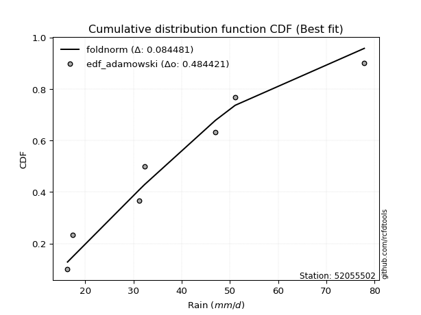</img>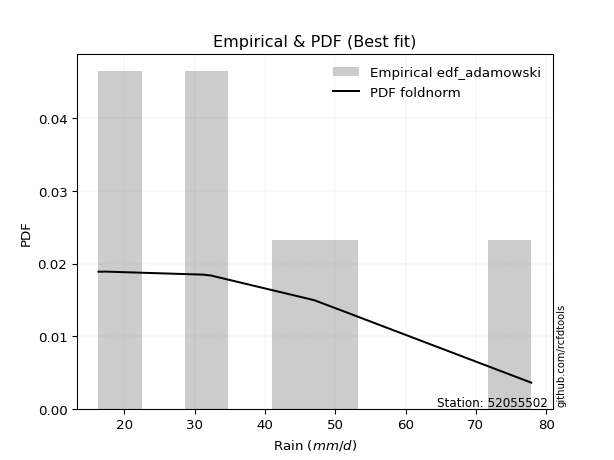</img>

</div>


## C. Best fit & Estimate extreme values for specific return periods - Tr

Best fit in probability distribution analysis means finding the theoretical distribution (like Normal, Poisson, Exponential, etc.) that most accurately mirrors your real-world data´s patterns (shape, center, spread) for better predictions, using methods like visual checks (Q-Q plots), goodness-of-fit tests (Kolmogorov-Smirnov, Chi-Squared), and information criteria (AIC) to score and select the simplest, most representative model.


### 1. Best fit (ordered by delta Δ)

:file_folder:Table: [bestfit_52055502.csv](table/bestfit_52055502.csv)

<div align="center">

|   id |   station | empirical_dist   | p_dist      |     delta |   deltao | eval   |   fit |   n |   best_fit |   best_fit_sort |
|-----:|----------:|:-----------------|:------------|----------:|---------:|:-------|------:|----:|-----------:|----------------:|
|    0 |  52055502 | edf_gringorten   | foldnorm    | 0.0712414 | 0.484421 | Δo > Δ |     1 |   7 |          1 |               1 |
|    1 |  52055502 | edf_hazen        | foldnorm    | 0.0712414 | 0.484421 | Δo > Δ |     1 |   7 |          1 |               2 |
|    2 |  52055502 | edf_cunnane      | foldnorm    | 0.0733698 | 0.484421 | Δo > Δ |     1 |   7 |          1 |               3 |
|    3 |  52055502 | edf_blom         | foldnorm    | 0.0752855 | 0.484421 | Δo > Δ |     1 |   7 |          1 |               4 |
|    4 |  52055502 | edf_tukey        | foldnorm    | 0.0784203 | 0.484421 | Δo > Δ |     1 |   7 |          1 |               5 |
|    5 |  52055502 | edf_filliben     | foldnorm    | 0.0795929 | 0.484421 | Δo > Δ |     1 |   7 |          1 |               6 |
|    6 |  52055502 | edf_beard        | foldnorm    | 0.0801448 | 0.484421 | Δo > Δ |     1 |   7 |          1 |               7 |
|    7 |  52055502 | edf_jenkinson    | foldnorm    | 0.0801448 | 0.484421 | Δo > Δ |     1 |   7 |          1 |               8 |
|    8 |  52055502 | edf_chegodayev   | foldnorm    | 0.0808773 | 0.484421 | Δo > Δ |     1 |   7 |          1 |               9 |
|    9 |  52055502 | edf_adamowski    | foldnorm    | 0.0844809 | 0.484421 | Δo > Δ |     1 |   7 |          1 |              10 |
|   10 |  52055502 | edf_weibull      | foldnorm    | 0.101148  | 0.484421 | Δo > Δ |     1 |   7 |          1 |              11 |
|   11 |  52055502 | edf_california   | logdweibull | 0.135857  | 0.484421 | Δo > Δ |     1 |   7 |          1 |              12 |

</div>


### 2. Extreme values and % difference analysis

In hydrology, a return period (or recurrence interval $Tr$) is the statistical average time between extreme events like floods or droughts of a specific magnitude, indicating how rare an event is, with a 100-year flood, for example, having a 1% chance of occurring in any given year, not that it happens exactly every century. It is a key tool for infrastructure design (like bridges or dams) and risk assessment, calculated from historical data to determine the probability of future events, although it is important to remember it is statistical average, and events can cluster or be missed.

The extreme value porcentage difference is evaluated as $pdiff = 1 - (ETrBf / ETr) * 100$, where _ETrBf_ correspond to the bestfit extreme value for a specific recurrence interval and _ETr_ correspond to the extreme value for one of the most used PDFsused in hydrology.

> risk_rate: assuming the return period as the project useful life.

:file_folder:Table: [extreme_52055502.csv](table/extreme_52055502.csv), all PDFs.  
:file_folder:Table: [extremepdiff_52055502.csv](table/extremepdiff_52055502.csv), % difference between bestfit and most used PDFs in Hydrology.

<div align="center">

Extreme values table for only best fit PDFs
|   id |      tr |   prob_l |     prob_g |    alpha |   anglit |   arcsine |   argus |    beta |   betaprime |   bradford |     burr |   burr12 |   cosine |   crystalball |   dgamma |   dweibull |   erlang |   exponnorm |   exponpow |   exponweib |        f |   fatiguelife |   foldnorm |    gamma |   gausshyper |   genexpon |   genextreme |   gengamma |   genhalflogistic |   genlogistic |   gennorm |   genpareto |   gompertz |   gumbel_l |   gumbel_r |   halfgennorm |   halflogistic |   halfnorm |   hypsecant |   invgamma |   invgauss |    invweibull |   johnsonsb |        johnsonsu |   kappa3 |   kappa4 |   ksone |   kstwobign |   laplace |   levy_l |   loggamma |   logistic |   loglaplace |    lomax |   maxwell |   mielke |    moyal |   nakagami |      ncf |      nct |     norm |   pearson3 |   powerlaw |   rayleigh |   rdist |     rice |   semicircular |   skewnorm |        t |   trapezoid |   triang |   truncexpon |   truncnorm |   truncpareto |   truncweibull_min |   tukeylambda |   uniform |   vonmises |   vonmises_line |     wald |   weibull_max |   weibull_min |   wrapcauchy |   logalpha |   loganglit |   logarcsine |   logargus |   logbeta |   logbetaprime |   logbradford |   logburr |   logburr12 |   logcosine |   logcrystalball |   logdgamma |      logdweibull |   logerlang |   logexponnorm |   logexponpow |   logexponweib |     logf |   logfatiguelife |   logfoldnorm |   loggausshyper |   loggenexpon |   loggenextreme |   loggengamma |   loggenhalflogistic |   loggenlogistic |   loggennorm |   loggenpareto |   loggompertz |   loggumbel_l |   loggumbel_r |   loghalfgennorm |   loghalflogistic |   loghalfnorm |   loghypsecant |   loginvgamma |   loginvgauss |   loginvweibull |   logjohnsonsb |   logjohnsonsu |   logkappa3 |   logkappa4 |   logksone |   logkstwobign |   loglevy_l |   logloggamma |   loglogistic |   logloglaplace |   loglomax |   logmaxwell |   logmielke |   logmoyal |   lognakagami |   logncf |   lognct |   lognorm |   logpearson3 |   logpowerlaw |   lograyleigh |   logrdist |   logrice |   logsemicircular |   logskewnorm |     logt |   logtrapezoid |   logtriang |   logtruncexpon |   logtruncnorm |   logtruncpareto |   logtruncweibull_min |   logtukeylambda |   loguniform |   logvonmises |   logvonmises_line |   logwald |   logweibull_max |   logweibull_min |   logwrapcauchy |   station |   n |   risk_rate |
|-----:|--------:|---------:|-----------:|---------:|---------:|----------:|--------:|--------:|------------:|-----------:|---------:|---------:|---------:|--------------:|---------:|-----------:|---------:|------------:|-----------:|------------:|---------:|--------------:|-----------:|---------:|-------------:|-----------:|-------------:|-----------:|------------------:|--------------:|----------:|------------:|-----------:|-----------:|-----------:|--------------:|---------------:|-----------:|------------:|-----------:|-----------:|--------------:|------------:|-----------------:|---------:|---------:|--------:|------------:|----------:|---------:|-----------:|-----------:|-------------:|---------:|----------:|---------:|---------:|-----------:|---------:|---------:|---------:|-----------:|-----------:|-----------:|--------:|---------:|---------------:|-----------:|---------:|------------:|---------:|-------------:|------------:|--------------:|-------------------:|--------------:|----------:|-----------:|----------------:|---------:|--------------:|--------------:|-------------:|-----------:|------------:|-------------:|-----------:|----------:|---------------:|--------------:|----------:|------------:|------------:|-----------------:|------------:|-----------------:|------------:|---------------:|--------------:|---------------:|---------:|-----------------:|--------------:|----------------:|--------------:|----------------:|--------------:|---------------------:|-----------------:|-------------:|---------------:|--------------:|--------------:|--------------:|-----------------:|------------------:|--------------:|---------------:|--------------:|--------------:|----------------:|---------------:|---------------:|------------:|------------:|-----------:|---------------:|------------:|--------------:|--------------:|----------------:|-----------:|-------------:|------------:|-----------:|--------------:|---------:|---------:|----------:|--------------:|--------------:|--------------:|-----------:|----------:|------------------:|--------------:|---------:|---------------:|------------:|----------------:|---------------:|-----------------:|----------------------:|-----------------:|-------------:|--------------:|-------------------:|----------:|-----------------:|-----------------:|----------------:|----------:|----:|------------:|
|    0 |    2    | 0.5      | 0.5        |  34.5166 |  39.0286 |   39.0286 | 46.8914 | 34.7756 |     30.9687 |    43.0075 |  31.212  |  27.2502 |  41.2578 |       39.0286 |  39.6508 |    39.9545 |  16.7085 |     31.9628 |    17.1668 |     16.781  |  26.6281 |       16.3006 |    36.2351 |  16.646  |      29.6856 |    33.4078 |      33.8938 |    16.7963 |           56.3386 |       35.3969 |   47.1003 |     47.8381 |    34.0624 |    42.3208 |    35.7363 |       27.744  |        34.0996 |    34.9264 |     39.0286 |    33.3508 |    30.572  |  52.3783      |     60.8089 |     16.3156      |  36.895  |  45.2638 | 47.1    |     35.8496 |   39.0286 |  39.3974 |    33.965  |    39.0286 |      34.0873 |  31.9523 |   37.3146 |  31.3726 |  34.6735 |    16.7744 |  34.9451 |  31.1729 |  39.0286 |    36.7708 |    16.9838 |    36.7067 | 10.9763 |  37.9245 |        39.0286 |    36.7363 |  39.0286 |     62.4093 |  51.1434 |      38.4958 |     39.0286 |       16.5557 |            33.1972 |       33.6665 |   47.1    |    2.01051 |         46.9932 |  32.5325 |       77.5874 |       31.9394 |      47.1011 |    33.1456 |     34.0873 |      34.0874 |    37.5029 |   18.0254 |        33.8084 |       30.9351 |   36.4856 |     32.1169 |     34.1279 |          34.0873 |     38.2225 |     32.3         |     33.9745 |        34.0873 |       29.2543 |        16.6061 |  34.0332 |          33.7921 |       34.0668 |         28.0653 |       30.6058 |         35.5502 |       16.6081 |              47.9525 |          31.1903 |      35.6338 |        32.2018 |       32.431  |       37.1811 |       31.251  |          16.2991 |           29.9298 |       30.5904 |        34.0873 |       33.0869 |       32.3273 |         31.1129 |        56.1226 |        34.0871 |     16.2925 |     35.576  |    34.0873 |        30.6069 |     37.6828 |       34.3809 |       34.0873 |         32.3    |    27.1346 |      32.58   |     21.9689 |    30.3867 |       16.7617 |  33.0803 |  33.9967 |   34.0873 |       34.2106 |       16.729  |       32.0616 |    38.9535 |   32.9898 |           34.0873 |       34.093  |  34.0869 |        52.5654 |     41.1757 |         29.5469 |        38.0857 |          31.708  |               24.7873 |          35.6359 |      35.6338 |     0.063734  |            35.6344 |   28.7179 |          35.5489 |    18.1373       |         35.6299 |  52055502 |   7 |    0.75     |
|    1 |    2.33 | 0.570815 | 0.429185   |  37.7732 |  43.1941 |   45.2818 | 51.132  | 38.8582 |     34.1882 |    47.4009 |  34.5574 |  30.5312 |  45.0688 |       42.6047 |  46.6154 |    46.3355 |  17.2417 |     35.4186 |    18.3306 |     17.4856 |  30.9686 |       16.95   |    40.3057 |  17.0514 |      34.0126 |    36.9112 |      37.159  |    17.3713 |           60.3632 |       38.6692 |   47.1003 |     53.5512 |    37.5978 |    45.4321 |    39.05   |       31.977  |        37.5066 |    38.786  |     41.8906 |    36.6512 |    33.9156 | 277.942       |     76.1022 |     16.3657      |  40.1962 |  49.7866 | 52.3347 |     39.2454 |   41.1927 |  51.0677 |    37.3307 |    42.1794 |      36.0905 |  35.471  |   41.03   |  34.6963 |  37.8103 |    17.4963 |  38.3464 |  34.3979 |  42.6047 |    40.3384 |    17.9161 |    40.4771 | 18.5283 |  41.3542 |        43.4962 |    40.2539 |  42.6047 |     65.9883 |  55.5663 |      42.5683 |     42.6047 |       16.7435 |            37.3548 |       36.2198 |   51.4622 |    2.39749 |         51.3701 |  34.8774 |       77.7765 |       36.2076 |      54.4346 |    36.4785 |     38.0478 |      40.2026 |    41.4986 |   19.4547 |        37.1747 |       34.5736 |   39.8649 |     35.441  |     37.5857 |          37.4606 |     45.66   |     33.1077      |     37.3427 |        37.4606 |       33.325  |        16.9854 |  37.4048 |          37.1413 |       37.4432 |         31.9811 |       34.1084 |         39.1369 |       16.9323 |              52.6182 |          34.533  |      35.6338 |        41.8441 |       35.9215 |       40.3624 |       34.1066 |          16.2991 |           32.7453 |       33.8699 |        36.7613 |       36.3955 |       35.6279 |         34.4249 |        67.7873 |        37.4615 |     16.2925 |     39.8486 |    38.8088 |        33.8921 |     46.9655 |       37.7708 |       37.0426 |         34.5433 |    30.4315 |      35.9359 |     24.3428 |    33.009  |       17.4007 |  36.7697 |  37.3678 |   37.4606 |       37.5915 |       17.2534 |       35.4154 |    46.6917 |   36.3551 |           38.3523 |       37.4666 |  37.4602 |        57.5665 |     45.7524 |         32.8485 |        39.7035 |          35.4473 |               27.5967 |          39.955  |      39.8081 |     0.0698614 |            39.8085 |   30.5509 |          39.1355 |    21.9612       |         41.3044 |  52055502 |   7 |    0.729209 |
|    2 |    5    | 0.8      | 0.2        |  52.8035 |  57.8911 |   61.9567 | 64.7345 | 55.8377 |     51.3269 |    62.8153 |  53.7638 |  53.6168 |  58.8022 |       55.8946 |  57.1064 |    58.1798 |  25.1483 |     52.6965 |    41.2851 |     40.5752 |  58.3777 |       30.7338 |    56.1887 |  22.4106 |      53.6826 |    53.2958 |      52.6679 |    30.0378 |           71.0142 |       52.8843 |   47.1003 |     69.4118 |    53.6637 |    55.4834 |    53.4462 |       62.4097 |        52.9226 |    55.1077 |     53.3706 |    52.7946 |    52.0477 |   1.432e+06   |     77.9578 |     29.947       |  54.3755 |  64.7224 | 69.276  |     53.6702 |   52.0128 |  70.4026 |    53.1311 |    54.3452 |      48.0165 |  53.372  |   55.6534 |  53.3042 |  52.3404 |    29.0837 |  53.5086 |  52.4565 |  55.8946 |    54.898  |    30.7654 |    55.5713 | 39.303  |  55.0847 |        58.7423 |    55.1296 |  55.8946 |     76.2561 |  68.2556 |      58.4705 |     55.8946 |       20.0873 |            54.9881 |       44.4005 |   65.58   |    3.75014 |         65.5362 |  48.0042 |       77.8978 |       59.7091 |      70.1256 |    52.9189 |     56.0733 |      62.4235 |    57.421  |   33.4021 |        53.2826 |       51.6822 |   54.209  |     52.2914 |     53.2189 |          53.1956 |     61.2832 |     52.6984      |     53.1566 |        53.1956 |       59.4462 |        22.7498 |  53.1902 |          52.9402 |       53.1983 |         52.6133 |       54.2624 |         54.341  |       20.8653 |              67.0444 |          53.7256 |      35.6338 |        69.9882 |       53.1455 |       52.6215 |       49.8675 |          16.2991 |           49.1837 |       52.1018 |        49.7681 |       52.6227 |       52.6908 |         53.4238 |        77.612  |        53.2024 |     16.2925 |     57.4028 |    59.0552 |        52.2621 |     67.6436 |       53.3193 |       51.0646 |         49.2843 |    54.7079 |      52.8581 |     38.279  |    48.4334 |       29.086  |  55.4371 |  53.1468 |   53.1956 |       53.25   |       24.7629 |       52.7438 |    77.0386 |   52.9619 |           57.347  |       53.1978 |  53.1949 |        74.7149 |     61.906  |         49.1032 |        48.166  |          52.6243 |               43.5365 |          57.6539 |      56.9728 |     0.0986351 |            56.9733 |   43.1964 |          54.3398 | 60140.1          |         60.936  |  52055502 |   7 |    0.67232  |
|    3 |   10    | 0.9      | 0.1        |  66.3931 |  66.2098 |   65.9822 | 71.294  | 66.6124 |     69.396  |    70.1561 |  77.0382 | inf      |  67.0994 |       64.7108 |  64.024  |    65.3041 |  39.3586 |     68.3809 |   101.878  |    157.107  |  88.2596 |       49.7657 |    67.0007 |  31.4766 |      65.3256 |    66.853  |      67.0546 |    75.8174 |           74.7319 |       64.4614 |   47.1003 |     74.639  |    66.3624 |    61.0794 |    65.1717 |      104.256  |        65.7249 |    67.1854 |     62.5378 |    68.2617 |    70.6441 |   1.58735e+09 |     77.958  |    486.488       |  66.4675 |  71.334  | 76.668  |     64.6528 |   61.8349 |  75.0705 |    67.2536 |    63.3048 |      62.223  |  70.0758 |   65.9446 |  75.0806 |  64.9911 |    47.1396 |  66.1688 |  73.5844 |  64.7108 |    65.7251 |    47.3793 |    66.3339 | 44.8172 |  64.8749 |        66.5654 |    66.1373 |  64.7108 |     80.2667 |  73.2121 |      67.2864 |     64.7108 |       29.2829 |            65.3154 |       47.8635 |   71.74   |    4.4282  |         71.718  |  61.9349 |       77.8999 |       83.3003 |      74.2719 |    68.7458 |     69.8373 |      69.4192 |    67.1555 |   50.2513 |        68.0861 |       62.9773 |   66.6047 |     68.8874 |     65.663  |          67.1287 |     74.7361 |    112.951       |     67.2937 |        67.1287 |       92.0038 |        35.5675 |  67.2435 |          67.1627 |       67.1551 |         65.9813 |       77.1696 |         65.3988 |       27.7839 |              72.8111 |          76.9885 |      35.6338 |        76.2273 |       68.5329 |       60.9949 |       67.9501 |          16.2991 |           68.951  |       71.6567 |        63.3879 |       68.1012 |       70.2232 |         76.4168 |        77.8754 |        67.1419 |     16.2925 |     67.1128 |    70.9272 |        72.676  |     73.8719 |       66.7528 |       64.6839 |         70.1461 |    95.0153 |      69.3502 |     50.5321 |    67.6271 |       60.7417 |  73.9736 |  67.1904 |   67.1287 |       66.9704 |       37.7207 |       70.0662 |    88.1542 |   68.5797 |           70.4956 |       67.1212 |  67.1277 |        82.7252 |     69.6668 |         60.8117 |        55.9437 |          63.6504 |               56.7138 |          67.3494 |      66.6197 |     0.124984  |            66.621  |   62.3853 |          65.3988 |     6.48491e+23  |         69.2659 |  52055502 |   7 |    0.651322 |
|    4 |   15    | 0.933333 | 0.0666667  |  74.7605 |  69.7621 |   66.75   | 73.7876 | 71.2916 |     81.4358 |    72.6915 |  94.3653 | inf      |  70.8789 |       69.1102 |  67.7045 |    68.8698 |  49.9233 |     77.5557 |   160.043  |    334.55   | 107.09   |       62.2129 |    72.4237 |  38.0852 |      69.571  |    74.3202 |      75.9462 |   133.196  |           75.8583 |       70.993  |   47.1003 |     76.0365 |    73.1277 |    63.6138 |    71.7871 |      135.493  |        72.9699 |    73.4706 |     67.7694 |    78.0042 |    82.3812 |   8.28866e+10 |     77.958  |   2766.62        |  73.9076 |  73.5417 | 79.132  |     70.4832 |   67.5805 |  76.4807 |    75.6838 |    68.1865 |      72.4094 |  80.0519 |   71.2248 |  90.9043 |  72.333  |    58.3999 |  73.4137 |  88.935  |  69.1102 |    71.4873 |    55.6573 |    71.8792 | 45.9653 |  69.9192 |        69.6161 |    71.8656 |  69.1102 |     81.5535 |  74.8024 |      70.5901 |     69.1102 |       37.1718 |            69.2279 |       48.9855 |   73.7933 |    4.66615 |         73.7787 |  70.8805 |       77.9    |       97.8534 |      75.5117 |    78.7078 |     76.7001 |      70.84   |    71.2751 |   58.6079 |        77.0944 |       67.4873 |   74.3341 |     79.4343 |     72.2584 |          75.392  |     83.1229 |    199.476       |     75.7336 |        75.3921 |      115.283  |        47.8421 |  75.6093 |          75.6952 |       75.4346 |         70.6312 |       92.9948 |         70.892  |       33.389  |              74.621  |          94.3104 |      35.6338 |        77.2381 |       77.4502 |       65.2134 |       80.91   |          70.2553 |           83.4777 |       84.5828 |        72.7713 |       77.7758 |       81.7559 |         93.518  |        77.8928 |        75.4095 |     16.2925 |     70.6334 |    75.3931 |        86.5796 |     75.8639 |       74.5862 |       73.5765 |         87.489  |   132.406  |      79.7184 |     57.2068 |    82.084  |       95.1472 |  85.8591 |  75.5489 |   75.3921 |       75.0484 |       46.1305 |       81.1069 |    90.696  |   78.1541 |           76.4052 |       75.3762 |  75.3909 |        85.4732 |     72.3576 |         65.7641 |        60.2278 |          67.9927 |               62.6352 |          70.8322 |      70.1855 |     0.141245  |            70.1873 |   78.9937 |          70.8929 |     2.28091e+53  |         72.0784 |  52055502 |   7 |    0.644736 |
|    5 |   20    | 0.95     | 0.05       |  80.9838 |  71.8517 |   67.0204 | 75.1564 | 74.0304 |     90.7466 |    73.9763 | 108.766  | inf      |  73.2032 |       71.9913 |  70.2141 |    71.2209 |  58.177  |     84.0653 |   212.448  |    548.257  | 120.905  |       71.4286 |    75.9804 |  43.2106 |      71.7312 |    79.4394 |      82.5308 |   194.863  |           76.3992 |       75.5661 |   47.1003 |     76.6471 |    77.6733 |    65.1913 |    76.4191 |      160.85   |        78.046  |    77.661  |     71.4601 |    85.3005 |    91.0548 |   1.32207e+12 |     77.958  |   8761.04        |  79.4969 |  74.6446 | 80.364  |     74.4108 |   71.6571 |  77.2028 |    81.7831 |    71.5605 |      80.6329 |  87.2235 |   74.7292 | 103.858  |  77.5327 |    66.2735 |  78.5323 | 101.502  |  71.9913 |    75.3926 |    60.4507 |    75.565  | 46.3917 |  73.272  |        71.3083 |    75.6848 |  71.9913 |     82.1883 |  75.5869 |      72.3239 |     71.9913 |       43.1671 |            71.2848 |       49.5364 |   74.82   |    4.78673 |         74.809  |  77.5468 |       77.9    |      108.468  |      76.117  |    86.1558 |     81.0481 |      71.3472 |    73.6427 |   63.3416 |        83.6884 |       69.9066 |   80.1879 |     87.3554 |     76.6393 |          81.3471 |     89.3957 |    313.976       |     81.8403 |        81.3473 |      133.814  |        59.4202 |  81.652  |          81.8873 |       81.4022 |         72.8552 |      105.445  |         74.395  |       38.1453 |              75.4966 |         108.709  |      35.6338 |        77.5581 |       83.7454 |       67.9852 |       91.429  |          72.1124 |           95.4429 |       94.4718 |        80.2149 |       84.9762 |       90.6101 |        107.722  |        77.8968 |        81.3679 |     16.2925 |     72.4397 |    77.7303 |        97.4155 |     76.9047 |       80.1744 |       80.4276 |        103.04   |   168.24   |      87.4416 |     61.8758 |    94.1556 |      129.97   |  94.8374 |  81.5857 |   81.3472 |       80.8443 |       51.7402 |       89.3916 |    91.6664 |   85.1792 |           79.8941 |       81.3242 |  81.3459 |        86.8622 |     73.723  |         68.4933 |        63.0346 |          70.3088 |               65.9779 |          72.6091 |      72.0394 |     0.153335  |            72.0414 |   94.1852 |          74.3967 |     9.15344e+88  |         73.5041 |  52055502 |   7 |    0.641514 |
|    6 |   25    | 0.96     | 0.04       |  86.0098 |  73.2678 |   67.1458 | 76.0391 | 75.871  |     98.4509 |    74.7527 | 121.339  | inf      |  74.8331 |       74.1122 |  72.1151 |    72.9617 |  64.9404 |     89.1145 |   259.668  |    785.223  | 131.843  |       78.7508 |    78.6003 |  47.3939 |      73.0289 |    83.3167 |      87.8143 |   258.083  |           76.7161 |       79.0886 |   47.1003 |     76.9792 |    81.0667 |    66.3138 |    79.9869 |      182.408  |        81.9568 |    80.7788 |     74.3164 |    91.2035 |    97.9659 |   1.11609e+13 |     77.958  |  20506.9         |  84.0552 |  75.3055 | 81.1032 |     77.3527 |   74.8191 |  77.6561 |    86.5924 |    74.1416 |      87.6493 |  92.8401 |   77.3308 | 115.043  |  81.563  |    72.2487 |  82.5025 | 112.355  |  74.1122 |    78.3347 |    63.5569 |    78.3035 | 46.5974 |  75.7631 |        72.406  |    78.5264 |  74.1122 |     82.5665 |  76.0543 |      73.3925 |     74.1122 |       47.7301 |            72.5531 |       49.8626 |   75.436  |    4.85946 |         75.4272 |  82.8863 |       77.9    |      116.852  |      76.4768 |    92.1709 |     84.1339 |      71.5838 |    75.2111 |   66.3299 |        88.9315 |       71.4143 |   84.9905 |     93.7712 |     79.869  |          86.0295 |     94.4704 |    458.724       |     86.6556 |        86.0296 |      149.382  |        70.4065 |  86.4109 |          86.7804 |       86.0948 |         74.1211 |      115.854  |         76.9005 |       42.3243 |              76.0102 |         121.28   |      35.6338 |        77.6953 |       88.6117 |       70.0292 |      100.455  |          73.2501 |          105.819  |      102.572  |        86.4944 |       90.7718 |       97.8987 |        120.117  |        77.8982 |        86.0529 |     16.2925 |     73.5354 |    79.1673 |       106.411  |     77.5653 |       84.5361 |       86.0963 |        117.459  |   203.07   |      93.6553 |     65.5274 |   104.721  |      164.574  | 102.14   |  86.3396 |   86.0296 |       85.3869 |       55.7012 |       96.0903 |    92.1408 |   90.7709 |           82.2422 |       86.0004 |  86.0282 |        87.7004 |     74.5487 |         70.221  |        65.0412 |          71.7478 |               68.122  |          73.6828 |      73.1751 |     0.163091  |            73.1773 |  108.435  |          76.9028 |     1.96834e+128 |         74.3676 |  52055502 |   7 |    0.639603 |
|    7 |   50    | 0.98     | 0.02       | 102.996  |  76.7537 |   67.3134 | 78.0404 | 80.3074 |    125.408  |    76.3179 | 169.952  | inf      |  79.1013 |       80.1856 |  77.824  |    77.9995 |  87.5665 |    104.799  |   443.677  |   2131.46   | 166.86   |      102.244  |    86.1084 |  61.3185 |      75.5897 |    94.893  |     105.325  |   570.528  |           77.3299 |       89.9398 |   47.1003 |     77.5462 |    90.95   |    69.3611 |    90.9776 |      260.366  |        94.0068 |    89.8411 |     83.1721 |   111.064  |   120.358  |   7.97345e+15 |     77.958  | 234729           |  99.7607 |  76.6236 | 82.5816 |     85.9915 |   84.6413 |  78.6765 |   102.028  |    82.0277 |     113.582  | 110.592  |   84.876  | 157.414  |  94.0746 |    89.9045 |  94.9009 | 153.485  |  80.1856 |    87.0785 |    70.327  |    86.2529 | 46.8884 |  82.9942 |        74.9137 |    86.7858 |  80.1855 |     83.3171 |  76.9819 |      75.5976 |     80.1856 |       59.8802 |            75.1701 |       50.5013 |   76.668  |    5.00555 |         76.6636 | 100.32   |       77.9    |      143.66   |      77.1914 |   112.326  |     92.24   |      71.901  |    78.8918 |   72.4712 |       106.011  |       74.5632 |  101.731  |    115.368  |     88.9857 |         100.983  |    111.562  |   1720.26        |    102.112  |       100.983  |      204.731  |       119.207  | 101.652  |         102.546  |      101.083  |         76.3891 |      152.814  |         83.6029 |       58.4416 |              77.0027 |         169.899  |      35.6338 |        77.8585 |      103.645  |       75.8927 |      134.253  |          75.5797 |          145.432  |      130.281  |       109.263  |      110.069  |      123.161  |        168.004  |        77.8997 |       101.015  |     75.5418 |     75.742  |    82.1215 |       137.922  |     79.0734 |       98.2884 |      106.013  |        180.679  |   369.255  |     114.288  |     77.5023 |   145.685  |      330.061  | 126.902  | 101.563  |  100.983  |       99.8128 |       65.3211 |      118.516  |    92.8223 |  108.995  |           87.8685 |      100.931  | 100.981  |        89.388  |     76.2147 |         73.8984 |        70.1594 |          74.7421 |               72.7545 |          75.8325 |      75.5006 |     0.196002  |            75.503  |  171.769  |          83.6073 |   inf            |         76.1165 |  52055502 |   7 |    0.63583  |
|    8 |   75    | 0.986667 | 0.0133333  | 114.125  |  78.2879 |   67.3445 | 78.8341 | 82.1951 |    143.582  |    76.8434 | 206.712  | inf      |  81.1395 |       83.4443 |  81.0567 |    80.7373 | 101.705  |    113.974  |   577.607  |   3567.23   | 187.961  |      116.392  |    90.1392 |  69.9839 |      76.4147 |   101.371  |     116.421  |   862.522  |           77.5272 |       96.2469 |   47.1003 |     77.6979 |    96.3225 |    70.902  |    97.3659 |      314.036  |       101.011  |    94.7743 |     88.3472 |   123.879  |   134.037  |   3.6347e+17  |     77.958  | 868484           | 110.26   |  77.061  | 83.0744 |     90.7446 |   90.3868 |  79.0959 |   111.443  |    86.5825 |     132.176  | 121.195  |   88.9781 | 188.724  | 101.391  |    99.5791 | 102.238  | 183.9    |  83.4443 |    91.9669 |    72.7584 |    90.5777 | 46.9473 |  86.9282 |        75.9155 |    91.2819 |  83.4443 |     83.5655 |  77.2889 |      76.3538 |     83.4444 |       65.099  |            76.0672 |       50.7081 |   77.0787 |    5.05437 |         77.0758 | 111.048  |       77.9    |      159.828  |      77.4285 |   125.256  |     96.0506 |      71.96   |    80.401  |   74.4787 |       116.608  |       75.654  |  113.091  |    129.291  |     93.6996 |         110.051  |    122.609  |   4103.07        |    111.54   |       110.051  |      242.262  |       161.53   | 110.926  |         112.206  |      110.174  |         77.023  |      178.032  |         86.8418 |       70.4478 |              77.319  |         206.672  |      35.6338 |        77.8837 |      112.387  |       79.0422 |      158.903  |          76.3725 |          174.958  |      148.393  |       125.251  |      122.356  |      140.002  |        204.18   |        77.8999 |       110.089  |     76.3343 |     76.4763 |    83.1306 |       159.077  |     79.7016 |      106.505  |      119.552  |        236.575  |   528.962  |     127.353  |     85.2864 |   176.71   |      483.07   | 142.992  | 110.825  |  110.051  |      108.504  |       69.1367 |      132.843  |    92.9628 |  120.296  |           90.2222 |      109.982  | 110.049  |        89.9538 |     76.7745 |         75.1947 |        72.3469 |          75.7761 |               74.4093 |          76.5429 |      76.2921 |     0.217525  |            76.2946 |  227.97   |          86.8474 |   inf            |         76.7068 |  52055502 |   7 |    0.634587 |
|    9 |  100    | 0.99     | 0.01       | 122.679  |  79.2001 |   67.3553 | 79.2771 | 83.2908 |    157.7    |    77.1069 | 237.439  | inf      |  82.4171 |       85.6484 |  83.3125 |    82.6034 | 112.059  |    120.483  |   684.303  |   5010.67   | 203.169  |      126.572  |    92.8659 |  76.3177 |      76.8159 |   105.85   |     124.714  |  1133.89   |           77.624  |      100.711  |   47.1003 |     77.7641 |    99.9722 |    71.9099 |   101.887  |      355.893  |       105.969  |    98.1349 |     92.0183 |   133.569  |   143.973  |   5.4265e+18  |     77.958  |      2.10414e+06 | 118.406  |  77.279  | 83.3208 |     94.0012 |   94.4634 |  79.341  |   118.31   |    89.7982 |     147.187  | 128.816  |   91.7723 | 214.513  | 106.582  |   106.165  | 107.496  | 208.967  |  85.6484 |    95.3519 |    74.0085 |    93.524  | 46.9691 |  89.6084 |        76.4765 |    94.3448 |  85.6484 |     83.6895 |  77.4421 |      76.7361 |     85.6484 |       67.9809 |            76.5205 |       50.8098 |   77.284  |    5.0788  |         77.2818 | 118.869  |       77.9    |      171.498  |      77.547  |   134.991  |     98.3908 |      71.9806 |    81.256  |   75.4467 |       124.421  |       76.2074 |  122.001  |    139.804  |     96.7806 |         116.641  |    130.974  |   7921.08        |    118.417  |       116.641  |      271.316  |       199.821  | 117.68   |         119.272  |      116.782  |         77.3049 |      197.716  |         88.87   |       80.3297 |              77.473  |         237.413  |      35.6338 |        77.8916 |      118.568  |       81.1726 |      179.039  |          76.7721 |          199.412  |      162.152  |       137.99   |      131.562  |      152.988  |        234.399  |        77.8999 |       116.683  |     76.7336 |     76.8412 |    83.6397 |       175.417  |     80.0711 |      112.422  |      130.139  |        288.839  |   685.644  |     137.098  |     91.3143 |   202.651  |      626.04   | 155.199  | 117.569  |  116.641  |      114.795  |       71.1782 |      143.584  |    93.0151 |  128.617  |           91.5678 |      116.559  | 116.639  |        90.2373 |     77.0552 |         75.8569 |        73.5688 |          76.3    |               75.2588 |          76.8947 |      76.6909 |     0.234065  |            76.6935 |  280.226  |          88.8765 |   inf            |         77.0035 |  52055502 |   7 |    0.633968 |
|   10 |  200    | 0.995    | 0.005      | 146.066  |  80.9235 |   67.3658 | 80.0472 | 85.2895 |    196.452  |    77.5029 | 331.311  | inf      |  85.0146 |       90.648  |  88.6426 |    86.8795 | 137.904  |    136.168  |   980.402  |  10560.4    | 240.523  |      151.492  |    99.0523 |  92.0965 |      77.3938 |   116.277  |     146.25   |  2069.44   |           77.766  |      111.442  |   47.1003 |     77.8478 |   108.271  |    74.1007 |   112.757  |      470.189  |       117.888  |   105.821  |    100.862  |   159.179  |   168.617  |   3.60625e+21 |     77.958  |      1.56613e+07 | 140.805  |  77.6047 | 83.6904 |    101.502  |  104.286  |  79.8055 |   135.535  |    97.5122 |     190.735  | 147.525  |   98.1649 | 291.621  | 119.088  |   121.17   | 120.379  | 283.996  |  90.648  |   103.268  |    75.9274 |   100.266  | 46.9914 |  95.7409 |        77.4546 |   101.35   |  90.6479 |     83.875  |  77.6713 |      77.3148 |     90.648  |       72.686  |            77.2066 |       50.9591 |   77.592  |    5.11545 |         77.5909 | 138.352  |       77.9    |      200.242  |      77.7246 |   160.547  |    102.969  |      72.0005 |    82.7636 |   76.8102 |       144.313  |       77.0477 |  146.952  |    167.515  |    103.361  |         133.09   |    153.116  |  44204.8         |    135.669  |       133.09   |      349.989  |       330.052  | 134.586  |         137.065  |      133.277  |         77.667  |      251.922  |         92.9526 |      109.654  |              77.6966 |         331.347  |      35.6338 |        77.8983 |      133.396  |       86.0034 |      238.514  |          77.3753 |          273.116  |      198.611  |       174.26   |      155.555  |      188.239  |        326.637  |        77.9    |       133.144  |     77.3365 |     77.3825 |    84.4093 |       219.723  |     80.7759 |      127.005  |      159.518  |        481.529  |  1301      |     162.289  |    108.137  |   281.883  |     1130.14   | 187.562  | 134.45   |  133.09   |      130.409  |       74.4218 |      171.539  |    93.0693 |  149.753  |           93.9617 |      132.972  | 133.088  |        90.6634 |     77.4773 |         76.8683 |        75.5999 |          77.0946 |               76.5617 |          77.4145 |      77.2931 |     0.279428  |            77.2958 |  468.561  |          92.961  |   inf            |         77.4505 |  52055502 |   7 |    0.633042 |
|   11 |  250    | 0.996    | 0.004      | 154.602  |  81.3622 |   67.3671 | 80.2274 | 85.7796 |    210.516  |    77.5822 | 368.764  | inf      |  85.7267 |       92.1759 |  90.3316 |    88.1983 | 146.452  |    141.217  |  1087.21   |  13172.4    | 252.742  |      159.613  |   100.943  |  97.3083 |      77.5041 |   119.534  |     153.685  |  2474.04   |           77.7938 |      114.893  |   47.1003 |     77.8616 |   110.807  |    74.7453 |   116.251  |      511.172  |       121.72   |   108.186  |    103.709  |   168.165  |   176.743  |   2.9138e+22  |     77.958  |      2.89222e+07 | 148.961  |  77.6695 | 83.7643 |    103.823  |  107.448  |  79.9263 |   141.295  |    99.9887 |     207.333  | 153.652  |  100.133  | 321.812  | 123.114  |   125.763  | 124.599  | 313.402  |  92.1759 |   105.753  |    76.3176 |   102.341  | 46.9943 |  97.6286 |        77.684  |   103.505  |  92.1758 |     83.912  |  77.7171 |      77.4313 |     92.1759 |       73.6861 |            77.3446 |       50.9883 |   77.6536 |    5.12278 |         77.6528 | 144.798  |       77.9    |      209.671  |      77.7601 |   169.455  |    104.167  |      72.0029 |    83.1205 |   77.0624 |       151.056  |       77.2172 |  156.207  |    177.209  |    105.242  |         138.565  |    160.897  |  79957.3         |    141.438  |       138.566  |      378.028  |       386.651  | 140.228  |         143.037  |      138.768  |         77.7278 |      271.603  |         94.0536 |      121.015  |              77.7398 |         368.831  |      35.6338 |        77.899  |      138.151  |       87.4788 |      261.553  |          77.4966 |          302.176  |      211.398  |       187.856  |      163.862  |      200.899  |        363.408  |        77.9    |       138.623  |     77.4576 |     77.4892 |    84.5641 |       235.583  |     80.9603 |      131.804  |      170.29   |        573.087  |  1606.53   |     170.938  |    114.414  |   313.478  |     1354.18   | 198.94   | 140.084  |  138.566  |      135.58   |       75.0981 |      181.194  |    93.0765 |  156.898  |           94.5323 |      138.434  | 138.563  |        90.7487 |     77.5618 |         77.0732 |        76.0391 |          77.2549 |               76.8265 |          77.5167 |      77.4141 |     0.296095  |            77.4168 |  555.426  |          94.0626 |   inf            |         77.5402 |  52055502 |   7 |    0.632858 |
|   12 |  500    | 0.998    | 0.002      | 185.174  |  82.4497 |   67.3688 | 80.6418 | 86.9525 |    259.907  |    77.741  | 514.17   | inf      |  87.6217 |       96.7068 |  95.5089 |    92.1419 | 173.586  |    156.901  |  1453.4    |  24915.3    | 291.236  |      185.09   |   106.55   | 113.832  |      77.7157 |   129.368  |     178.485  |  4141.76   |           77.8484 |      125.601  |   77.78   |     77.8853 |   118.312  |    76.5931 |   127.098  |      652.092  |       133.613  |   115.236  |    112.552  |   198.659  |   202.511  |   1.90922e+25 |     77.958  |      1.78343e+08 | 177.747  |  77.7986 | 83.9122 |    110.78   |  117.27   |  80.2385 |   159.892  |   107.669  |     268.676  | 173.02   |  106.005  | 436.683  | 135.62   |   139.382  | 137.966  | 425.425  |  96.7068 |   113.306  |    77.1044 |   108.533  | 46.9984 | 103.261  |        78.2123 |   109.931  |  96.7067 |     83.986  |  77.8086 |      77.6651 |     96.7068 |       75.7494 |            77.6217 |       51.0456 |   77.7768 |    5.13744 |         77.7764 | 165.292  |       77.9    |      239.469  |      77.8311 |   199.461  |    107.2    |      72.0061 |    83.9468 |   77.5313 |       173.122  |       77.5578 |  189.619  |    209.994  |    110.416  |         156.163  |    187.335  | 566557           |    160.066  |       156.163  |      473.984  |       625.994  | 158.409  |         162.386  |      156.419  |         77.8327 |      340.533  |         96.92   |      163.547  |              77.8236 |         514.388  |      35.6338 |        77.8998 |      152.871  |       91.8499 |      348.221  |          77.7396 |          413.58   |      254.62   |       237.228  |      191.649  |      244.852  |        506.047  |        77.9    |       156.233  |     77.7005 |     77.6996 |    84.8745 |       290.302  |     81.4386 |      147.05   |      208.548  |       1015.77   |  3140.6    |     199.587  |    137.44   |   436.039  |     2315.4    | 237.579  | 158.235  |  156.163  |      152.113  |       76.4793 |      213.355  |    93.0866 |  180.203  |           95.8593 |      155.986  | 156.16   |        90.9195 |     77.7311 |         77.4857 |        76.9547 |          77.5766 |               77.3603 |          77.7177 |      77.6567 |     0.356696  |            77.6594 |  953.844  |          96.9306 |   inf            |         77.7199 |  52055502 |   7 |    0.632489 |
|   13 |  750    | 0.998667 | 0.00133333 | 206.634  |  82.9312 |   67.3691 | 80.8083 | 87.4482 |    293.306  |    77.794  | 624.447  | inf      |  88.54   |       99.2237 |  98.4955 |    94.3537 | 189.806  |    166.076  |  1690.99   |  35101.7    | 314.104  |      200.143  |   109.666  | 123.7    |      77.7822 |   134.939  |     194.277  |  5464.93   |           77.8661 |      131.861  |   77.8211 |     77.8916 |   122.462  |    77.5807 |   133.438  |      744.415  |       140.566  |   119.174  |    117.725  |   218.481  |   217.919  |   8.45897e+26 |     77.958  |      4.89922e+08 | 197.341  |  77.8414 | 83.9614 |    114.688  |  123.015  |  80.3866 |   171.285  |   112.156  |     312.66   | 184.588  |  109.289  | 521.836  | 142.936  |   146.937  | 145.98   | 508.586  |  99.2237 |   117.621  |    77.3686 |   111.995  | 46.9993 | 106.411  |        78.4249 |   113.52   |  99.2236 |     84.0107 |  77.8391 |      77.7433 |     99.2237 |       76.4564 |            77.7144 |       51.0643 |   77.8179 |    5.14233 |         77.8176 | 177.58   |       77.9    |      257.234  |      77.8548 |   218.788  |    108.571  |      72.0067 |    84.2812 |   77.6722 |       186.858  |       77.6718 |  213.043  |    231.21   |    113.013  |         166.887  |    204.542  |      1.92917e+06 |    171.479  |       166.887  |      536.576  |       824.421  | 169.522  |         174.29   |      167.176  |         77.8612 |      386.872  |         98.264  |      194.383  |              77.8505 |         624.803  |      35.6338 |        77.8999 |      161.448  |       94.2749 |      411.641  |          77.8207 |          496.867  |      282.505  |       271.923  |      209.395  |      274.163  |        614.121  |        77.9    |       166.965  |     77.7816 |     77.7684 |    84.9782 |       326.442  |     81.6665 |      156.217  |      234.763  |       1453.4    |  4699.05   |     217.656  |    154.006  |   528.884  |     3118.29   | 262.69   | 169.33   |  166.887  |      162.128  |       76.9484 |      233.766  |    93.0887 |  194.644  |           96.3986 |      166.68   | 166.884  |        90.9764 |     77.7876 |         77.624  |        77.2717 |          77.6842 |               77.5396 |          77.7833 |      77.7377 |     0.400439  |            77.7404 | 1319.13   |          98.2754 |   inf            |         77.7799 |  52055502 |   7 |    0.632366 |
|   14 | 1000    | 0.999    | 0.001      | 223.907  |  83.2182 |   67.3692 | 80.9018 | 87.7351 |    319.284  |    77.8205 | 716.729  | inf      |  89.1193 |      100.957  | 100.598  |    95.8851 | 201.447  |    172.586  |  1869.65   |  44244.3    | 330.474  |      210.88   |   111.81   | 130.778  |      77.8143 |   138.816  |     206.1    |  6590.32   |           77.8749 |      136.301  |   77.8416 |     77.8943 |   125.309  |    78.2453 |   137.936  |      814.506  |       145.498  |   121.894  |    121.395  |   233.52   |   228.987  |   1.24514e+28 |     77.958  |      9.82401e+08 | 212.652  |  77.8627 | 83.9861 |    117.395  |  127.092  |  80.4796 |   179.609  |   115.339  |     348.169  | 192.903  |  111.559  | 592.061  | 148.126  |   152.132  | 151.759  | 577.235  | 100.957  |   120.642  |    77.5011 |   114.388  | 46.9996 | 108.587  |        78.5444 |   115.999  | 100.957  |     84.023  |  77.8543 |      77.7824 |    100.957  |       76.8135 |            77.7607 |       51.0735 |   77.8384 |    5.14477 |         77.8382 | 186.419  |       77.9    |      269.98   |      77.8666 |   233.363  |    109.396  |      72.0069 |    84.4695 |   77.7381 |       196.993  |       77.7288 |  231.735  |    247.26   |    114.684  |         174.695  |    217.607  |      4.7646e+06  |    179.817  |       174.696  |      583.994  |       999.572  | 177.63   |         183.01   |      175.01   |         77.8738 |      422.721  |         99.0921 |      219.397  |              77.8636 |         717.213  |      35.6338 |        77.9    |      167.52   |       95.9429 |      463.512  |          77.8613 |          565.928  |      303.526  |       299.576  |      222.705  |      296.754  |        704.503  |        77.9    |       174.78   |     77.8222 |     77.8024 |    85.0301 |       354.085  |     81.81   |      162.837  |      255.327  |       1894.97   |  6285.31   |     231.091  |    167.505  |   606.516  |     3826.88   | 281.728  | 177.424  |  174.696  |      169.393  |       77.1846 |      249.001  |    93.0895 |  205.267  |           96.703  |      174.465  | 174.692  |        91.0049 |     77.8158 |         77.6933 |        77.4326 |          77.7381 |               77.6294 |          77.8157 |      77.7782 |     0.436571  |            77.781  | 1665.63   |          99.1041 |   inf            |         77.8099 |  52055502 |   7 |    0.632305 |


</div>


<div align="center">

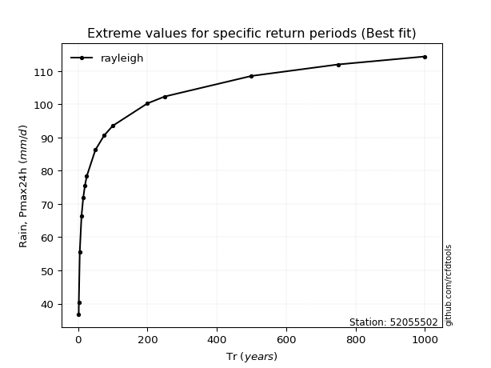</img>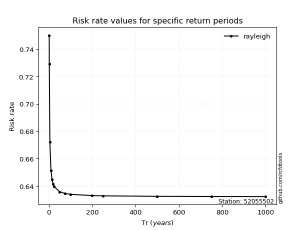</img>

</div>


<sub>**APP DISCLAIMER**: NO WARRANTY - This software is provided by [github.com/rcfdtools](https://github.com/rcfdtools) "as is", without any express or implied warranty, including warranties of merchantability, fitness for a particular purpose, or non-infringement. There is no guarantee that the software will be error-free or operate without interruption. LIMITATION OF LIABILITY - Neither the authors nor copyright holders will be liable for claims or damages arising from the software or its use. You are responsible for determining if the software is appropriate for your use and assume all associated risks, including errors, legal compliance, and data loss. NO PROFESSIONAL ADVICE - The software provides general information and does not offer professional advice. It should not replace consultation with professional advisors.</sub>