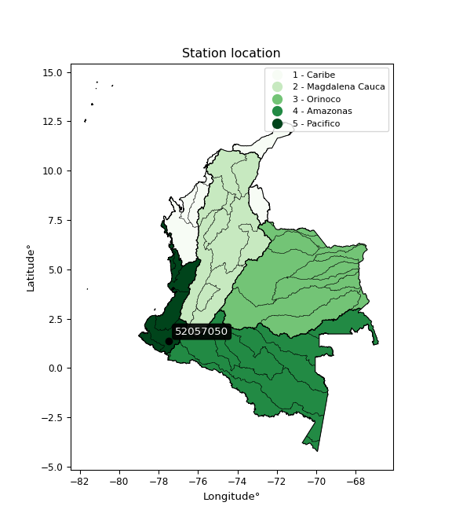

<div align="center">


</div>

# PMP Station (Rain, Pmax24h): 52057050

Probable Maximum Precipitation (PMP) is the greatest amount of rainfall for a specific duration that is meteorologically possible for a given location, acting as a "worst-case" scenario for extreme storms, crucial for designing safety-critical infrastructure like bridges, river deviations, dams, spillways, and nuclear plants to prevent catastrophic failure. PMP is calculated by hydrologists using meteorological data to determine the upper limit of extreme rainfall, often leading to the Probable Maximum Flood (PMF) for flood control design, and is increasingly being studied for climate change impacts. Probable Maximum Precipitation (PMP) is the theoretical upper limit of rainfall, a deterministic estimate for extreme events, while probability distributions (like GEV, Gumbel) describe the likelihood and frequency of various precipitation amounts, including rare ones, showing how often events occur, with PMP representing the extreme end of these distributions, used for critical infrastructure design to ensure safety against the worst conceivable weather, unlike standard statistical forecasts which cover typical probabilities.

The most common probability distributions in hydrology, used for analyzing floods, rainfall, and streamflow, include the Normal, Log-Normal, Gumbel, Gamma (including Log-Pearson Type III), and Generalized Extreme Value (GEV) distributions, often chosen based on the data´s skewness and whether modeling extremes or general conditions, with Gumbel and GEV popular for extreme events like floods, while the Normal distribution serves as a baseline, though often requiring transformations for skewed hydrological data. These distributions help in designing water infrastructure, managing water resources, and forecasting hydrologic events.

> Hydrological data often isn´t perfectly normal (it´s skewed), so different distributions are needed for different applications, such as: **Flood Frequency Analysis**: Using Gumbel, GEV, or Log-Pearson Type III for predicting extreme flood magnitudes and their return periods, **Rainfall Analysis**: Normal for annual totals, but Log-Normal, Weibull, or GEV for intensity or extreme daily rainfall, **Streamflow Modeling**: Gamma and Log-Normal for maximum flows, GEV for minimum flows, and Kappa for daily flows.

<div align="center">

</img>

</div>


## A. General information


### 1. General running parameters

• app_version: _v20260113_. • runtime: _2026-01-17 18:24:04.630693_. • Python version: _3.14.0_. • SciPy version: _1.16.3_. • Pandas version: _2.3.3_. • NumPy version: _2.3.5_. • Stations dataset (station_dataset_file): _dataset/pmax24h_in/automatic_colombia_2003_2025.csv_. • Stations catalog (station_catalog_file): _dataset/CNE.xls_. • Minimum year to eval til year_max (date_min): _1900_. • Maximum year to eval since year_min (date_max): _2025_. • Creates, save and include plots into reports (create_plot): _False_. • Plot only fit distributions with Δo > Δ (plot_only_fit): _True_. • Plot only simple graphs avoiding multiple CDFs and multiple Extreme values plots (plot_only_simple): _True_. • Eval low extreme values, if False, evaluates high extreme values (low_extreme): _False_. • Eval every SciPy distribution as logarithmic (pdist_logarithmic_on): _True_. • Standard deviation normalized (ddof): _1.0_. • Return periods to eval in years (Tr): _[2, 2.33, 5, 10, 15, 20, 25, 50, 75, 100, 200, 250, 500, 750, 1000]_. • Minimum data sample per station, 0 means any (minimum_sample): _5_. • Z-Score maximum threshold to adjust a value, 0 means disable (zscore_max): _3.5_. • Z-Score minimum threshold to adjust a value, 0 means disable (zscore_min): _-2.5_. • Avoid zeros, e.g. rain = 0 (avoid_zeros): _True_. • Avoid null values (avoid_nans): _True_. 

:file_folder:Table: [dataset.csv](../../dataset/pmax24h_in/automatic_colombia_2003_2025.csv)

> Delta Degrees of Freedom (DDOF): is a parameter used in the formulas for calculating variance and standard deviation. When ddof=0, the divisor is $N$ (the total number of observations) and this is used when your data set is the entire population. When ddof=1, the divisor is $N-1$ and this is used when your data set is a sample drawn from a larger population. Using $N-1$ provides an unbiased estimate of the population variance (known as Bessel´s correction).


### 2. Station info and location

|   id |   CODIGO | NOMBRE                      | CATEGORIA    | TECNOLOGIA                              | ESTADO   | FECHA_INSTALACION   |   FECHA_SUSPENSION |   ALTITUD |   LATITUD |   LONGITUD | DEPARTAMENTO   | MUNICIPIO   | AREA_OPERATIVA                      | ENTIDAD                                                     | AREA_HIDROGRAFICA   | ZONA_HIDROGRAFICA   | SUBZONA_HIDROGRAFICA   | CORRIENTE   | Catalogo   |   Version |
|-----:|---------:|:----------------------------|:-------------|:----------------------------------------|:---------|:--------------------|-------------------:|----------:|----------:|-----------:|:---------------|:------------|:------------------------------------|:------------------------------------------------------------|:--------------------|:--------------------|:-----------------------|:------------|:-----------|----------:|
|    0 | 52057050 | SAN PEDRO  - AUT [52057050] | Limnigráfica | Automática con Telemetría, Convencional | Activa   | 15/02/1980          |                nan |       850 |     1.383 |   -77.4823 | Nariño         | Linares     | Area Operativa 07 - Nariño-Putumayo | INSTITUTO DE HIDROLOGIA METEOROLOGIA Y ESTUDIOS AMBIENTALES | Pacifico            | Patía               | Río Guáitara           | Guaitara    | CNE_IDEAM  |  20251226 |

<div align="center">

Dynamic map: [:earth_americas:Google](http://maps.google.com/maps?q=1.383,-77.48227778) [:earth_americas:OSM](https://www.openstreetmap.org/#map=18/1.383/-77.48227778&layers=P) [:earth_americas:Bing](https://www.bing.com/maps?cp=1.383~-77.48227778&lvl=18) [:earth_americas:Apple](https://maps.apple.com/frame?center=1.383%2C-77.48227778&span=0.003%2C0.006)

</div>


<div align="center">

```geojson
{
  "type": "Feature",
  "geometry": {
    "type": "Point", 
    "coordinates": [-77.48227778, 1.383]
  }, 
  "properties": {
    "Name": "52057050"
  }
}
```

</div>


### 3. Discrete values table and plot

<div align="center">

|               |           0 |           1 |           2 |           3 |           4 |          5 |
|:--------------|------------:|------------:|------------:|------------:|------------:|-----------:|
| Date          | 2019        | 2020        | 2021        | 2022        | 2023        | 2025       |
| Value         |   61.6      |   66.4      |   49.2      |   30.2      |   25.8      | 3720.6     |
| Value_initial |   61.6      |   66.4      |   49.2      |   30.2      |   25.8      | 3720.6     |
| count         |    6        |    6        |    6        |    6        |    6        |    6       |
| mean          |  658.967    |  658.967    |  658.967    |  658.967    |  658.967    |  658.967   |
| std           | 1499.98     | 1499.98     | 1499.98     | 1499.98     | 1499.98     | 1499.98    |
| zscore        |   -0.398251 |   -0.395051 |   -0.406518 |   -0.419184 |   -0.422118 |    2.04112 |


</div>


> The initial value (value_initial) correspond to the initial obtained or null completed value, and value (value) is adjusted only when the initial value is outside the valid range (outlier) definite through the Z-Score value. If Z-Score is active, values out of range or outliers are replaced with the station mean value. A Z-Score (or standard score) measures how many standard deviations a data point is from the mean of a dataset, indicating its relative position; positive scores mean above the mean, negative mean below, and a score of zero is exactly at the mean, allowing for comparison of values from different distributions. It´s calculated using the formula $z=(x–μ)/σ$, where $x$ is the data point, $μ$ is the mean, and $σ$ is the standard deviation, helping identify outliers and understand probability.
>
> <sub>**Note**: In this study, "completing" (filling gaps in) and "extending" (forecasting or lengthening the historical record) rainfall data series are avoided for certain critical analyses because they introduce artificial bias and uncertainty, which can distort the statistics of rare events (extremes), alter day-to-day variability, and compromise the integrity and homogeneity of the original data. Some reasons against Completing/Extending rainfall data are: **Distortion of Extremes and Variability**: The primary issue is that most gap-filling or extension methods rely on averaging or regression with nearby stations, which inherently smooths the data. Rainfall is highly variable in space and time, with a large percentage of zero values and occasional large storms. Infilling methods often underestimate the highest values and overestimate the lowest (zero) values, which severely distorts analyses focused on flood frequency, drought severity, and intensity-duration-frequency (IDF) curves, **Loss of Data Homogeneity**: Infilled or extended data are synthetic estimates, not actual measurements. Combining these estimates with observed data can violate the assumption of data homogeneity, which requires that the data properties do not change over time. Inhomogeneity can lead to incorrect conclusions about long-term trends or changes in climate patterns, **Propagation of Errors**: Errors and biases from the original data (e.g., wind-induced undercatch, instrument errors, site changes) or the data used for imputation can propagate through the analysis, leading to unreliable hydrological models and inaccurate predictions, **Compromised Statistical Integrity**: For statistical analyses, especially those involving the frequency of events, using artificial data can introduce time bias or autocorrelation that doesn´t exist in reality, making it difficult to assess the true probability of events, **Difficulty in Validation**: It is difficult to accurately validate the quality of filled or extended data, especially for past periods where ground-truth measurements are unavailable. The reliability of imputation techniques heavily depends on the density of the surrounding station network and the complexity of the local topography.</sub>


### 4. Active continuous probability distributions from SciPy (80 of 104 available)

A Probability Density Function (PDF) describes the relative likelihood of a continuous random variable falling within a specific range, where the total area under its curve equals 1, and the area over any interval gives the actual probability for that range. Unlike discrete probabilities (like rolling a die), a PDF shows density, not direct probability for a single point (which is zero), with higher points indicating higher likelihood, often visualized as a bell curve for normal distributions.

A log of a probability density function (log-PDF) is simply the logarithm of the PDF´s value, denoted as $log(f(x))$, useful for converting multiplication of probabilities into addition, improving numerical stability with tiny numbers, and connecting to information theory concepts like entropy. Instead of dealing with very small probabilities (e.g., 0.000001), log-PDFs use negative numbers (e.g., $log(0.00001) ≈ -11.51$ that are easier for computers to handle, preventing underflow errors and simplifying complex calculations. In this study, each active probability distribution from SciPy is also evaluated in the $log$ form.

[scipy.stats](https://docs.scipy.org/doc/scipy/reference/stats.html) is a Python´s powerful submodule within the SciPy library for comprehensive statistical analysis, offering over 130 probability distributions (like Normal, Poisson), functions for descriptive stats (mean, variance), hypothesis testing (t-tests, chi-square), random variable generation, and statistical tests, making it essential for data science, modeling, and research. It provides tools to explore, model, and draw conclusions from data efficiently, working seamlessly with NumPy.

<div align="center">

|   id | p_dist           |   n_parameter | fit_method   | label                                                                       | active   | ref                                                                                                      |
|-----:|:-----------------|--------------:|:-------------|:----------------------------------------------------------------------------|:---------|:---------------------------------------------------------------------------------------------------------|
|    0 | alpha            |             3 | MLE          | Alpha                                                                       | True     | [:mortar_board:](https://docs.scipy.org/doc/scipy/reference/generated/scipy.stats.alpha.html)            |
|    1 | anglit           |             2 | MM           | Anglit                                                                      | True     | [:mortar_board:](https://docs.scipy.org/doc/scipy/reference/generated/scipy.stats.anglit.html)           |
|    2 | arcsine          |             2 | MM           | Arcsine                                                                     | True     | [:mortar_board:](https://docs.scipy.org/doc/scipy/reference/generated/scipy.stats.arcsine.html)          |
|    3 | argus            |             3 | MLE          | Argus                                                                       | True     | [:mortar_board:](https://docs.scipy.org/doc/scipy/reference/generated/scipy.stats.argus.html)            |
|    4 | beta             |             4 | MLE          | Beta                                                                        | True     | [:mortar_board:](https://docs.scipy.org/doc/scipy/reference/generated/scipy.stats.beta.html)             |
|    5 | betaprime        |             4 | MLE          | Beta prime                                                                  | True     | [:mortar_board:](https://docs.scipy.org/doc/scipy/reference/generated/scipy.stats.betaprime.html)        |
|    6 | bradford         |             3 | MLE          | Bradford                                                                    | True     | [:mortar_board:](https://docs.scipy.org/doc/scipy/reference/generated/scipy.stats.bradford.html)         |
|    7 | burr             |             4 | MLE          | Burr (Type III)                                                             | True     | [:mortar_board:](https://docs.scipy.org/doc/scipy/reference/generated/scipy.stats.burr.html)             |
|    8 | burr12           |             4 | MLE          | Burr (Type III) 12                                                          | True     | [:mortar_board:](https://docs.scipy.org/doc/scipy/reference/generated/scipy.stats.burr12.html)           |
|    9 | cosine           |             2 | MLE          | Cosine                                                                      | True     | [:mortar_board:](https://docs.scipy.org/doc/scipy/reference/generated/scipy.stats.cosine.html)           |
|   10 | crystalball      |             4 | MLE          | Crystalball                                                                 | True     | [:mortar_board:](https://docs.scipy.org/doc/scipy/reference/generated/scipy.stats.crystalball.html)      |
|   11 | dgamma           |             3 | MLE          | Double gamma                                                                | True     | [:mortar_board:](https://docs.scipy.org/doc/scipy/reference/generated/scipy.stats.dgamma.html)           |
|   12 | dweibull         |             3 | MLE          | Double Weibull                                                              | True     | [:mortar_board:](https://docs.scipy.org/doc/scipy/reference/generated/scipy.stats.dweibull.html)         |
|   13 | erlang           |             3 | MLE          | Erlang                                                                      | True     | [:mortar_board:](https://docs.scipy.org/doc/scipy/reference/generated/scipy.stats.erlang.html)           |
|   14 | exponnorm        |             3 | MLE          | Exponentially modified Normal                                               | True     | [:mortar_board:](https://docs.scipy.org/doc/scipy/reference/generated/scipy.stats.exponnorm.html)        |
|   15 | exponpow         |             3 | MLE          | Exponential power                                                           | True     | [:mortar_board:](https://docs.scipy.org/doc/scipy/reference/generated/scipy.stats.exponpow.html)         |
|   16 | exponweib        |             4 | MLE          | Exponentiated Weibull                                                       | True     | [:mortar_board:](https://docs.scipy.org/doc/scipy/reference/generated/scipy.stats.exponweib.html)        |
|   17 | f                |             4 | MLE          | F                                                                           | True     | [:mortar_board:](https://docs.scipy.org/doc/scipy/reference/generated/scipy.stats.f.html)                |
|   18 | fatiguelife      |             3 | MLE          | Fatigue-life (Birnbaum-Saunders)                                            | True     | [:mortar_board:](https://docs.scipy.org/doc/scipy/reference/generated/scipy.stats.fatiguelife.html)      |
|   19 | foldnorm         |             3 | MM           | Fold Normal                                                                 | True     | [:mortar_board:](https://docs.scipy.org/doc/scipy/reference/generated/scipy.stats.foldnorm.html)         |
|   20 | gamma            |             3 | MLE          | Gamma                                                                       | True     | [:mortar_board:](https://docs.scipy.org/doc/scipy/reference/generated/scipy.stats.gamma.html)            |
|   21 | gausshyper       |             6 | MLE          | Gauss hypergeometric                                                        | True     | [:mortar_board:](https://docs.scipy.org/doc/scipy/reference/generated/scipy.stats.gausshyper.html)       |
|   22 | genexpon         |             5 | MLE          | Generalized exponential                                                     | True     | [:mortar_board:](https://docs.scipy.org/doc/scipy/reference/generated/scipy.stats.genexpon.html)         |
|   23 | genextreme       |             3 | MLE          | Generalized exponential                                                     | True     | [:mortar_board:](https://docs.scipy.org/doc/scipy/reference/generated/scipy.stats.genextreme.html)       |
|   24 | gengamma         |             4 | MLE          | Generalized gamma                                                           | True     | [:mortar_board:](https://docs.scipy.org/doc/scipy/reference/generated/scipy.stats.gengamma.html)         |
|   25 | genhalflogistic  |             3 | MLE          | Generalized half-logistic                                                   | True     | [:mortar_board:](https://docs.scipy.org/doc/scipy/reference/generated/scipy.stats.genhalflogistic.html)  |
|   26 | genlogistic      |             3 | MLE          | Generalized logistic                                                        | True     | [:mortar_board:](https://docs.scipy.org/doc/scipy/reference/generated/scipy.stats.genlogistic.html)      |
|   27 | gennorm          |             3 | MLE          | Generalized Normal                                                          | True     | [:mortar_board:](https://docs.scipy.org/doc/scipy/reference/generated/scipy.stats.gennorm.html)          |
|   28 | genpareto        |             3 | MLE          | Generalized Pareto                                                          | True     | [:mortar_board:](https://docs.scipy.org/doc/scipy/reference/generated/scipy.stats.genpareto.html)        |
|   29 | gompertz         |             3 | MLE          | Gompertz (or truncated Gumbel)                                              | True     | [:mortar_board:](https://docs.scipy.org/doc/scipy/reference/generated/scipy.stats.gompertz.html)         |
|   30 | gumbel_l         |             2 | MM           | Gumbel Left Skew                                                            | True     | [:mortar_board:](https://docs.scipy.org/doc/scipy/reference/generated/scipy.stats.gumbel_l.html)         |
|   31 | gumbel_r         |             2 | MM           | Gumbel Right Skew                                                           | True     | [:mortar_board:](https://docs.scipy.org/doc/scipy/reference/generated/scipy.stats.gumbel_r.html)         |
|   32 | halfgennorm      |             3 | MLE          | Upper half of a generalized normal                                          | True     | [:mortar_board:](https://docs.scipy.org/doc/scipy/reference/generated/scipy.stats.halfgennorm.html)      |
|   33 | halflogistic     |             2 | MM           | Half-logistic                                                               | True     | [:mortar_board:](https://docs.scipy.org/doc/scipy/reference/generated/scipy.stats.halflogistic.html)     |
|   34 | halfnorm         |             2 | MM           | Half Normal                                                                 | True     | [:mortar_board:](https://docs.scipy.org/doc/scipy/reference/generated/scipy.stats.halfnorm.html)         |
|   35 | hypsecant        |             2 | MM           | hyperbolic secant                                                           | True     | [:mortar_board:](https://docs.scipy.org/doc/scipy/reference/generated/scipy.stats.hypsecant.html)        |
|   36 | invgamma         |             3 | MLE          | Inverted gamma                                                              | True     | [:mortar_board:](https://docs.scipy.org/doc/scipy/reference/generated/scipy.stats.invgamma.html)         |
|   37 | invgauss         |             3 | MLE          | Inverse Gaussian                                                            | True     | [:mortar_board:](https://docs.scipy.org/doc/scipy/reference/generated/scipy.stats.invgauss.html)         |
|   38 | invweibull       |             3 | MLE          | Inverted Weibull                                                            | True     | [:mortar_board:](https://docs.scipy.org/doc/scipy/reference/generated/scipy.stats.invweibull.html)       |
|   39 | johnsonsb        |             4 | MLE          | Johnson SB                                                                  | True     | [:mortar_board:](https://docs.scipy.org/doc/scipy/reference/generated/scipy.stats.johnsonsb.html)        |
|   40 | johnsonsu        |             4 | MLE          | Johnson Su                                                                  | True     | [:mortar_board:](https://docs.scipy.org/doc/scipy/reference/generated/scipy.stats.johnsonsu.html)        |
|   41 | kappa3           |             3 | MLE          | Kappa 3                                                                     | True     | [:mortar_board:](https://docs.scipy.org/doc/scipy/reference/generated/scipy.stats.kappa3.html)           |
|   42 | kappa4           |             4 | MLE          | Kappa 4                                                                     | True     | [:mortar_board:](https://docs.scipy.org/doc/scipy/reference/generated/scipy.stats.kappa4.html)           |
|   43 | ksone            |             3 | MLE          | Kolmogorov-Smirnov one-sided test statistic distribution                    | True     | [:mortar_board:](https://docs.scipy.org/doc/scipy/reference/generated/scipy.stats.ksone.html)            |
|   44 | kstwobign        |             2 | MLE          | Limiting distribution of scaled Kolmogorov-Smirnov two-sided test statistic | True     | [:mortar_board:](https://docs.scipy.org/doc/scipy/reference/generated/scipy.stats.kstwobign.html)        |
|   45 | laplace          |             2 | MM           | Laplace                                                                     | True     | [:mortar_board:](https://docs.scipy.org/doc/scipy/reference/generated/scipy.stats.laplace.html)          |
|   46 | levy_l           |             2 | MLE          | Left-skewed Levy                                                            | True     | [:mortar_board:](https://docs.scipy.org/doc/scipy/reference/generated/scipy.stats.levy_l.html)           |
|   47 | loggamma         |             3 | MLE          | Log gamma                                                                   | True     | [:mortar_board:](https://docs.scipy.org/doc/scipy/reference/generated/scipy.stats.loggamma.html)         |
|   48 | logistic         |             2 | MM           | Logistic (or Sech-squared)                                                  | True     | [:mortar_board:](https://docs.scipy.org/doc/scipy/reference/generated/scipy.stats.logistic.html)         |
|   49 | loglaplace       |             3 | MLE          | Log-Laplace                                                                 | True     | [:mortar_board:](https://docs.scipy.org/doc/scipy/reference/generated/scipy.stats.loglaplace.html)       |
|   50 | lomax            |             3 | MLE          | Lomax (Pareto of the second kind)                                           | True     | [:mortar_board:](https://docs.scipy.org/doc/scipy/reference/generated/scipy.stats.lomax.html)            |
|   51 | maxwell          |             2 | MM           | Maxwell                                                                     | True     | [:mortar_board:](https://docs.scipy.org/doc/scipy/reference/generated/scipy.stats.maxwell.html)          |
|   52 | mielke           |             4 | MLE          | Mielke Beta-Kappa / Dagum                                                   | True     | [:mortar_board:](https://docs.scipy.org/doc/scipy/reference/generated/scipy.stats.mielke.html)           |
|   53 | moyal            |             2 | MM           | Moyal                                                                       | True     | [:mortar_board:](https://docs.scipy.org/doc/scipy/reference/generated/scipy.stats.moyal.html)            |
|   54 | nakagami         |             3 | MLE          | Nakagami                                                                    | True     | [:mortar_board:](https://docs.scipy.org/doc/scipy/reference/generated/scipy.stats.nakagami.html)         |
|   55 | ncf              |             5 | MLE          | Non-central F distribution                                                  | True     | [:mortar_board:](https://docs.scipy.org/doc/scipy/reference/generated/scipy.stats.ncf.html)              |
|   56 | nct              |             4 | MLE          | Non-central Student’s t                                                     | True     | [:mortar_board:](https://docs.scipy.org/doc/scipy/reference/generated/scipy.stats.nct.html)              |
|   57 | norm             |             2 | MM           | Normal                                                                      | True     | [:mortar_board:](https://docs.scipy.org/doc/scipy/reference/generated/scipy.stats.norm.html)             |
|   58 | pearson3         |             3 | MM           | Pearson type III                                                            | True     | [:mortar_board:](https://docs.scipy.org/doc/scipy/reference/generated/scipy.stats.pearson3.html)         |
|   59 | powerlaw         |             3 | MLE          | Power-function                                                              | True     | [:mortar_board:](https://docs.scipy.org/doc/scipy/reference/generated/scipy.stats.powerlaw.html)         |
|   60 | rayleigh         |             2 | MM           | Rayleigh                                                                    | True     | [:mortar_board:](https://docs.scipy.org/doc/scipy/reference/generated/scipy.stats.rayleigh.html)         |
|   61 | rdist            |             3 | MLE          | R-distributed (symmetric beta)                                              | True     | [:mortar_board:](https://docs.scipy.org/doc/scipy/reference/generated/scipy.stats.rdist.html)            |
|   62 | rice             |             3 | MLE          | Rice                                                                        | True     | [:mortar_board:](https://docs.scipy.org/doc/scipy/reference/generated/scipy.stats.rice.html)             |
|   63 | semicircular     |             2 | MM           | Semicircular                                                                | True     | [:mortar_board:](https://docs.scipy.org/doc/scipy/reference/generated/scipy.stats.semicircular.html)     |
|   64 | skewnorm         |             3 | MLE          | Skew normal                                                                 | True     | [:mortar_board:](https://docs.scipy.org/doc/scipy/reference/generated/scipy.stats.skewnorm.html)         |
|   65 | t                |             3 | MLE          | Student’s t                                                                 | True     | [:mortar_board:](https://docs.scipy.org/doc/scipy/reference/generated/scipy.stats.t.html)                |
|   66 | trapezoid        |             4 | MLE          | Trapezoid                                                                   | True     | [:mortar_board:](https://docs.scipy.org/doc/scipy/reference/generated/scipy.stats.trapezoid.html)        |
|   67 | triang           |             3 | MLE          | Triangular                                                                  | True     | [:mortar_board:](https://docs.scipy.org/doc/scipy/reference/generated/scipy.stats.triang.html)           |
|   68 | truncexpon       |             3 | MLE          | Truncated exponential                                                       | True     | [:mortar_board:](https://docs.scipy.org/doc/scipy/reference/generated/scipy.stats.truncexpon.html)       |
|   69 | truncnorm        |             4 | MLE          | Truncated normal                                                            | True     | [:mortar_board:](https://docs.scipy.org/doc/scipy/reference/generated/scipy.stats.truncnorm.html)        |
|   70 | truncpareto      |             4 | MLE          | Upper truncated Pareto                                                      | True     | [:mortar_board:](https://docs.scipy.org/doc/scipy/reference/generated/scipy.stats.truncpareto.html)      |
|   71 | truncweibull_min |             5 | MLE          | Doubly truncated Weibull minimum                                            | True     | [:mortar_board:](https://docs.scipy.org/doc/scipy/reference/generated/scipy.stats.truncweibull_min.html) |
|   72 | tukeylambda      |             3 | MLE          | Tukey-Lamdba                                                                | True     | [:mortar_board:](https://docs.scipy.org/doc/scipy/reference/generated/scipy.stats.tukeylambda.html)      |
|   73 | uniform          |             2 | MLE          | Uniform                                                                     | True     | [:mortar_board:](https://docs.scipy.org/doc/scipy/reference/generated/scipy.stats.uniform.html)          |
|   74 | vonmises         |             3 | MLE          | Von Mises                                                                   | True     | [:mortar_board:](https://docs.scipy.org/doc/scipy/reference/generated/scipy.stats.vonmises.html)         |
|   75 | vonmises_line    |             3 | MLE          | Von Mises line                                                              | True     | [:mortar_board:](https://docs.scipy.org/doc/scipy/reference/generated/scipy.stats.vonmises_line.html)    |
|   76 | wald             |             2 | MM           | Wald                                                                        | True     | [:mortar_board:](https://docs.scipy.org/doc/scipy/reference/generated/scipy.stats.wald.html)             |
|   77 | weibull_max      |             3 | MLE          | Weibull maximum                                                             | True     | [:mortar_board:](https://docs.scipy.org/doc/scipy/reference/generated/scipy.stats.weibull_max.html)      |
|   78 | weibull_min      |             3 | MLE          | Weibull minimum                                                             | True     | [:mortar_board:](https://docs.scipy.org/doc/scipy/reference/generated/scipy.stats.weibull_min.html)      |
|   79 | wrapcauchy       |             3 | MLE          | Wrapped  Cauchy                                                             | True     | [:mortar_board:](https://docs.scipy.org/doc/scipy/reference/generated/scipy.stats.wrapcauchy.html)       |

</div>

> **n_parameter:** # arguments & localization & scale.
>
> **Fit methods:** (MLE) maximum likelihood, (MM) L-moments.
>
>**Inactive** (With the only purpose of prevent loops, zero divisions, infinite values, over high estimated values or horizontal trending for recurrence intervals estimations, the follow distributions were disabled.)**:** lognorm, norminvgauss, powernorm, powerlognorm, cauchy, halfcauchy, foldcauchy, skewcauchy, chi2, expon, fisk, genhyperbolic, geninvgauss, gibrat, kstwo, laplace_asymmetric, levy, levy_stable, ncx2, pareto, rel_breitwigner, recipinvgauss, studentized_range, loguniform, 


## B. Probability (PDF) vs. Empirical (EDF) distributions functions

A continuous probability distribution (CPD) describes probabilities for variables that can take any value within a range (like rain any time), unlike discrete variables with specific outcomes (like temperature). It uses a Probability Density Function (PDF), a curve where the total area under it equals 1, and the probability of the variable falling within an interval (a to b) is found by calculating the area under the curve between those points. A key feature is that the probability of hitting any single exact value is zero, so probabilities are always expressed for ranges, e.g., $P(a ≤ X ≤ b)$.

<div align="center">

Distributions parameters from station values
|     |   station | p_dist              |   n |             loc |           scale | shape                  | shape1                 | shape2              | shape3             |
|----:|----------:|:--------------------|----:|----------------:|----------------:|:-----------------------|:-----------------------|:--------------------|:-------------------|
|   0 |  52057050 | alpha               |   6 |      14.7881    |    20.6042      | 1.4306932163197251e-05 |                        |                     |                    |
|   1 |  52057050 | anglit              |   6 |     658.967     |  4005.7         |                        |                        |                     |                    |
|   2 |  52057050 | arcsine             |   6 |   -1277.49      |  3872.92        |                        |                        |                     |                    |
|   3 |  52057050 | argus               |   6 |   -2468.53      |  6461.73        | 3.1642157609714824e-07 |                        |                     |                    |
|   4 |  52057050 | beta                |   6 |    -337.559     |  4058.16        | 0.00013359021062081997 | 0.0005826016491557989  |                     |                    |
|   5 |  52057050 | betaprime           |   6 |      24.616     |     0.00695829  | 323.4400988750141      | 0.4425480462816793     |                     |                    |
|   6 |  52057050 | bradford            |   6 |      25.8       |  3694.8         | 2.667715404601889      |                        |                     |                    |
|   7 |  52057050 | burr                |   6 |       3.6979    |     4.83124     | 1.1129356802955175     | 10.927982317586263     |                     |                    |
|   8 |  52057050 | burr12              |   6 |      -0.126474  |    25.3143      | 142.23230840245506     | 0.005465395157500755   |                     |                    |
|   9 |  52057050 | cosine              |   6 |     988.403     |  1231.46        |                        |                        |                     |                    |
|  10 |  52057050 | crystalball         |   6 |      -0.8122    |  1519.92        | 4.50363354666025       | 19.30391442173674      |                     |                    |
|  11 |  52057050 | dgamma              |   6 |      49.2       |  1067.75        | 0.37466808701177007    |                        |                     |                    |
|  12 |  52057050 | dweibull            |   6 |      49.2       |   715.378       | 0.3547481259749832     |                        |                     |                    |
|  13 |  52057050 | erlang              |   6 |      25.8       |  1608.14        | 0.35617090403166807    |                        |                     |                    |
|  14 |  52057050 | exponnorm           |   6 |      24.9621    |     0.257902    | 2444.72751616494       |                        |                     |                    |
|  15 |  52057050 | exponpow            |   6 |      25.8       |   693.723       | 0.12177522974782515    |                        |                     |                    |
|  16 |  52057050 | exponweib           |   6 |      25.8       |     4.84817     | 2.508665966693661      | 0.06894893723174794    |                     |                    |
|  17 |  52057050 | f                   |   6 |      24.7155    |     5.01472     | 16690.522808861675     | 0.7368534666620641     |                     |                    |
|  18 |  52057050 | fatiguelife         |   6 |      25.1478    |    59.8996      | 5.1766611694130855     |                        |                     |                    |
|  19 |  52057050 | foldnorm            |   6 |   -1262.5       |  2422.3         | 0.0005419784085548139  |                        |                     |                    |
|  20 |  52057050 | gamma               |   6 |      25.8       |  1263.73        | 0.31852107012669006    |                        |                     |                    |
|  21 |  52057050 | gausshyper          |   6 |      25.8       |  5301.43        | 0.4179329485403753     | 1.2700363132678754     | 2.046325749556128   | 1.4642179963315454 |
|  22 |  52057050 | genexpon            |   6 |      25.8       |  1305.24        | 2.0614511262320483     | 1.0489115336274403e-13 | 1.1217735220615457  |                    |
|  23 |  52057050 | genextreme          |   6 |      27.735     |    14.3088      | -7.394514929335683     |                        |                     |                    |
|  24 |  52057050 | gengamma            |   6 |      25.8       |   899.277       | 1.0770332066891486     | 0.38401381020920383    |                     |                    |
|  25 |  52057050 | genhalflogistic     |   6 |    -354.52      |  4266.35        | 1.0469255953494097     |                        |                     |                    |
|  26 |  52057050 | genlogistic         |   6 |   -4864.55      |   610.707       | 3727.1936271813975     |                        |                     |                    |
|  27 |  52057050 | gennorm             |   6 |      61.6       |     3.78144e-06 | 0.12918446274951786    |                        |                     |                    |
|  28 |  52057050 | genpareto           |   6 |      25.7182    |    14.4374      | 2.5307884927736737     |                        |                     |                    |
|  29 |  52057050 | gompertz            |   6 |      25.8       |     1.50681e+12 | 2447262901.550377      |                        |                     |                    |
|  30 |  52057050 | gumbel_l            |   6 |    1275.22      |  1067.63        |                        |                        |                     |                    |
|  31 |  52057050 | gumbel_r            |   6 |      42.7157    |  1067.63        |                        |                        |                     |                    |
|  32 |  52057050 | halfgennorm         |   6 |      25.8       |     0.486407    | 0.26952012573195927    |                        |                     |                    |
|  33 |  52057050 | halflogistic        |   6 |    -963.954     |  1170.69        |                        |                        |                     |                    |
|  34 |  52057050 | halfnorm            |   6 |   -1153.43      |  2271.5         |                        |                        |                     |                    |
|  35 |  52057050 | hypsecant           |   6 |     658.967     |   871.714       |                        |                        |                     |                    |
|  36 |  52057050 | invgamma            |   6 |      24.7153    |     1.84759     | 0.3684285602127409     |                        |                     |                    |
|  37 |  52057050 | invgauss            |   6 |      23.7476    |     8.30807     | 76.45805507931357      |                        |                     |                    |
|  38 |  52057050 | invweibull          |   6 |      25.8       |     2.75581     | 0.0454917053885492     |                        |                     |                    |
|  39 |  52057050 | johnsonsb           |   6 |      25.8       | 11712.1         | 2.4182943133609847     | 0.11073269125287954    |                     |                    |
|  40 |  52057050 | johnsonsu           |   6 |      25.8       |     6.15484e-13 | -2.1004310576673735    | 0.09264670379980197    |                     |                    |
|  41 |  52057050 | kappa3              |   6 |      25.8       |    12.0413      | 0.3919764807265246     |                        |                     |                    |
|  42 |  52057050 | kappa4              |   6 |    -332.837     |  4138.28        | 1.0949519725639119     | 1.0140806433144125     |                     |                    |
|  43 |  52057050 | ksone               |   6 |    -343.68      |  4433.76        | 1.0                    |                        |                     |                    |
|  44 |  52057050 | kstwobign           |   6 |   -2495.29      |  3723.54        |                        |                        |                     |                    |
|  45 |  52057050 | laplace             |   6 |     658.967     |   968.231       |                        |                        |                     |                    |
|  46 |  52057050 | levy_l              |   6 |    4076.44      |  1481.11        |                        |                        |                     |                    |
|  47 |  52057050 | loggamma            |   6 | -378825         | 52566.5         | 1365.5369748768408     |                        |                     |                    |
|  48 |  52057050 | logistic            |   6 |     658.967     |   754.926       |                        |                        |                     |                    |
|  49 |  52057050 | loglaplace          |   6 |      -0.135745  |    49.3358      | 1.0040255689403015     |                        |                     |                    |
|  50 |  52057050 | lomax               |   6 |      25.7982    |     3.38314     | 0.40403146107753773    |                        |                     |                    |
|  51 |  52057050 | maxwell             |   6 |   -2585.66      |  2033.27        |                        |                        |                     |                    |
|  52 |  52057050 | mielke              |   6 |      14.9644    |     6.26236     | 7.197181053708329      | 1.1846984848124689     |                     |                    |
|  53 |  52057050 | moyal               |   6 |    -124.078     |   616.395       |                        |                        |                     |                    |
|  54 |  52057050 | nakagami            |   6 |      25.8       |  2031.26        | 0.12375515966548412    |                        |                     |                    |
|  55 |  52057050 | ncf                 |   6 |      -0.0514375 |     0.266606    | 0.05342895362631545    | 1.6991230152054033     | 12.343652180578843  |                    |
|  56 |  52057050 | nct                 |   6 |       0.544762  |     0.748865    | 0.8183663063437925     | 54.73614819267685      |                     |                    |
|  57 |  52057050 | norm                |   6 |     658.967     |  1369.28        |                        |                        |                     |                    |
|  58 |  52057050 | pearson3            |   6 |     658.967     |  1369.28        | 1.7883801525400287     |                        |                     |                    |
|  59 |  52057050 | powerlaw            |   6 |      25.8       |  3694.8         | 0.09611007807531888    |                        |                     |                    |
|  60 |  52057050 | rayleigh            |   6 |   -1960.55      |  2090.08        |                        |                        |                     |                    |
|  61 |  52057050 | rdist               |   6 |    -367.669     |   434.069       | 1.5633761448903698     |                        |                     |                    |
|  62 |  52057050 | rice                |   6 |   -1211.7       |  1639.26        | 0.00031727730583616307 |                        |                     |                    |
|  63 |  52057050 | semicircular        |   6 |     658.967     |  2738.57        |                        |                        |                     |                    |
|  64 |  52057050 | skewnorm            |   6 |      25.7987    |  1508.51        | 5940419.0940989945     |                        |                     |                    |
|  65 |  52057050 | t                   |   6 |      51.9452    |    13.8384      | 0.5362585385833798     |                        |                     |                    |
|  66 |  52057050 | trapezoid           |   6 |    -360.864     |  4433.76        | 0.9999999999999999     | 1.0                    |                     |                    |
|  67 |  52057050 | triang              |   6 |   -2821.34      |  6559.78        | 0.9999999997835156     |                        |                     |                    |
|  68 |  52057050 | truncexpon          |   6 |      25.8       |  1927.45        | 1.9180006315184885     |                        |                     |                    |
|  69 |  52057050 | truncnorm           |   6 | -913428         | 34832.6         | 26.224119117888975     | 32350.893388843273     |                     |                    |
|  70 |  52057050 | truncpareto         |   6 |      22.4992    |     3.30076     | 0.3994968675769356     | 1120.3774454854263     |                     |                    |
|  71 |  52057050 | truncweibull_min    |   6 |       7.46379   |  2583.95        | 0.008632459201803767   | 0.007096201407891828   | 1.4370016517437243  |                    |
|  72 |  52057050 | tukeylambda         |   6 |      46.1       |    41.7726      | 2.0577615532874733     |                        |                     |                    |
|  73 |  52057050 | uniform             |   6 |      25.8       |  3694.8         |                        |                        |                     |                    |
|  74 |  52057050 | vonmises            |   6 |      -0.820426  |     1           | 0.8618273121316089     |                        |                     |                    |
|  75 |  52057050 | vonmises_line       |   6 |     275.021     |  1096.76        | 1.7324743117470813     |                        |                     |                    |
|  76 |  52057050 | wald                |   6 |    -710.318     |  1369.28        |                        |                        |                     |                    |
|  77 |  52057050 | weibull_max         |   6 |    3720.6       |     1.7397      | 0.11161270515544386    |                        |                     |                    |
|  78 |  52057050 | weibull_min         |   6 |      25.8       |   261.424       | 0.8011579650888985     |                        |                     |                    |
|  79 |  52057050 | wrapcauchy          |   6 |      25.8       |   588.046       | 0.9856556900380102     |                        |                     |                    |
|  80 |  52057050 | logalpha            |   6 |       2.97665   |     0.529578    | 4.3270910681702585e-07 |                        |                     |                    |
|  81 |  52057050 | loganglit           |   6 |       4.51535   |     4.95378     |                        |                        |                     |                    |
|  82 |  52057050 | logarcsine          |   6 |       2.12057   |     4.78957     |                        |                        |                     |                    |
|  83 |  52057050 | logargus            |   6 |       0.651732  |     7.9051      | 3.0453287525695637e-05 |                        |                     |                    |
|  84 |  52057050 | logbeta             |   6 |       3.25037   |     4.97219     | 0.05601051321061322    | 0.23449264010828907    |                     |                    |
|  85 |  52057050 | logbetaprime        |   6 |       3.05858   |     0.00808732  | 83.16356592701769      | 1.2498806352151113     |                     |                    |
|  86 |  52057050 | logbradford         |   6 |       3.25035   |     4.97134     | 0.9667873677122061     |                        |                     |                    |
|  87 |  52057050 | logburr             |   6 |       3.25037   |     0.134777    | 0.6631588463337523     | 1.1658290258580477     |                     |                    |
|  88 |  52057050 | logburr12           |   6 |      -0.436149  |     3.67084     | 827.214704866691       | 0.00476325299127762    |                     |                    |
|  89 |  52057050 | logcosine           |   6 |       4.89128   |     1.51089     |                        |                        |                     |                    |
|  90 |  52057050 | logcrystalball      |   6 |       4.51535   |     1.69337     | 288.11534514472567     | 531.4716876999189      |                     |                    |
|  91 |  52057050 | logdgamma           |   6 |       4.12066   |     1.33804     | 0.626264106413976      |                        |                     |                    |
|  92 |  52057050 | logdweibull         |   6 |       4.12066   |     1.38758     | 0.8557246924647444     |                        |                     |                    |
|  93 |  52057050 | logerlang           |   6 |       3.25037   |     1.31562     | 0.6275460795337748     |                        |                     |                    |
|  94 |  52057050 | logexponnorm        |   6 |       3.24914   |     0.000378371 | 3333.812176978403      |                        |                     |                    |
|  95 |  52057050 | logexponpow         |   6 |       3.25037   |     3.96973     | 0.7047172873791352     |                        |                     |                    |
|  96 |  52057050 | logexponweib        |   6 |       3.25037   |     1.25569     | 1.6669672853399173     | 0.10350029428720844    |                     |                    |
|  97 |  52057050 | logf                |   6 |       3.05461   |     0.538837    | 26498.104526997035     | 2.4995075554687314     |                     |                    |
|  98 |  52057050 | logfatiguelife      |   6 |       3.25037   |     8.98367e-07 | 1244.6644824938207     |                        |                     |                    |
|  99 |  52057050 | logfoldnorm         |   6 |       2.162     |     2.92029     | 0.07424277718158723    |                        |                     |                    |
| 100 |  52057050 | loggamma            |   6 |       3.25037   |     1.35379     | 0.6967654679983727     |                        |                     |                    |
| 101 |  52057050 | loggausshyper       |   6 |       3.25037   |     5.20009     | 0.6616867326875464     | 1.1758554245901416     | 1.042771296553686   | 1.0935493933734954 |
| 102 |  52057050 | loggenexpon         |   6 |       3.25037   |     3.04509     | 2.4072900549830054     | 2.1590088823789065e-09 | 0.12356922142481508 |                    |
| 103 |  52057050 | loggenextreme       |   6 |       3.56642   |     0.454764    | -0.9025778085129096    |                        |                     |                    |
| 104 |  52057050 | loggengamma         |   6 |       3.25037   |     1.67184     | 1.5666715527101227     | 0.10868149458460899    |                     |                    |
| 105 |  52057050 | loggenhalflogistic  |   6 |       2.93495   |     5.5382      | 1.0475740597106522     |                        |                     |                    |
| 106 |  52057050 | loggenlogistic      |   6 |      -3.23014   |     0.897512    | 2682.4762951320236     |                        |                     |                    |
| 107 |  52057050 | loggennorm          |   6 |       4.12066   |     0.00370009  | 0.279570655559536      |                        |                     |                    |
| 108 |  52057050 | loggenpareto        |   6 |      -0.0111237 |    10.7079      | -1.3006423504156648    |                        |                     |                    |
| 109 |  52057050 | loggompertz         |   6 |       3.25037   |     3.00893     | 1.0208633351396479     |                        |                     |                    |
| 110 |  52057050 | loggumbel_l         |   6 |       5.27746   |     1.32032     |                        |                        |                     |                    |
| 111 |  52057050 | loggumbel_r         |   6 |       3.75325   |     1.32032     |                        |                        |                     |                    |
| 112 |  52057050 | loghalfgennorm      |   6 |       3.25037   |     0.0323459   | 0.3543523751231682     |                        |                     |                    |
| 113 |  52057050 | loghalflogistic     |   6 |       2.50831   |     1.44777     |                        |                        |                     |                    |
| 114 |  52057050 | loghalfnorm         |   6 |       2.27399   |     2.80913     |                        |                        |                     |                    |
| 115 |  52057050 | loghypsecant        |   6 |       4.51535   |     1.07803     |                        |                        |                     |                    |
| 116 |  52057050 | loginvgamma         |   6 |       3.0546    |     0.67337     | 1.2497114582319746     |                        |                     |                    |
| 117 |  52057050 | loginvgauss         |   6 |       3.14194   |     0.495541    | 2.7715180497344303     |                        |                     |                    |
| 118 |  52057050 | loginvweibull       |   6 |       3.06257   |     0.503854    | 1.1079327384831599     |                        |                     |                    |
| 119 |  52057050 | logjohnsonsb        |   6 |       3.25037   |     4.97392     | 1.0934707410354583     | 0.30048194263013783    |                     |                    |
| 120 |  52057050 | logjohnsonsu        |   6 |       3.25037   |     2.98339e-14 | -2.030757856722825     | 0.10137779118477727    |                     |                    |
| 121 |  52057050 | logkappa3           |   6 |       3.25037   |     0.566813    | 1.1649045774906006     |                        |                     |                    |
| 122 |  52057050 | logkappa4           |   6 |       2.56504   |     5.60257     | 1.1390215603961842     | 0.9650398711223176     |                     |                    |
| 123 |  52057050 | logksone            |   6 |       2.75325   |     5.96552     | 1.0                    |                        |                     |                    |
| 124 |  52057050 | logkstwobign        |   6 |       0.29508   |     4.94401     |                        |                        |                     |                    |
| 125 |  52057050 | loglaplace          |   6 |       4.51535   |     1.19739     |                        |                        |                     |                    |
| 126 |  52057050 | loglevy_l           |   6 |       8.64979   |     1.78186     |                        |                        |                     |                    |
| 127 |  52057050 | logloggamma         |   6 |    -552.712     |    74.3942      | 1790.762700150648      |                        |                     |                    |
| 128 |  52057050 | loglogistic         |   6 |       4.51535   |     0.933604    |                        |                        |                     |                    |
| 129 |  52057050 | logloglaplace       |   6 |       3.25037   |     0.743392    | 0.3272861817680321     |                        |                     |                    |
| 130 |  52057050 | loglomax            |   6 |       3.25037   |    57.3817      | 47.1691385352949       |                        |                     |                    |
| 131 |  52057050 | logmaxwell          |   6 |       0.502776  |     2.51451     |                        |                        |                     |                    |
| 132 |  52057050 | logmielke           |   6 |       3.24874   |     0.0813257   | 1.154219701659697      | 0.6723727549668119     |                     |                    |
| 133 |  52057050 | logmoyal            |   6 |       3.54697   |     0.762284    |                        |                        |                     |                    |
| 134 |  52057050 | lognakagami         |   6 |       3.25037   |     3.46472     | 0.061721165733394756   |                        |                     |                    |
| 135 |  52057050 | logncf              |   6 |       1.23644   |     0.0599961   | 3.734076010869625      | 16.34337988126846      | 173.56809483420528  |                    |
| 136 |  52057050 | lognct              |   6 |       1.93398   |     0.00819236  | 3.3684889547693766     | 231.0890301593697      |                     |                    |
| 137 |  52057050 | lognorm             |   6 |       4.51535   |     1.69337     |                        |                        |                     |                    |
| 138 |  52057050 | logpearson3         |   6 |       4.51535   |     1.69337     | 1.6200206012367215     |                        |                     |                    |
| 139 |  52057050 | logpowerlaw         |   6 |       3.25037   |     4.97127     | 0.13086071562163518    |                        |                     |                    |
| 140 |  52057050 | lograyleigh         |   6 |       1.27584   |     2.58476     |                        |                        |                     |                    |
| 141 |  52057050 | logrdist            |   6 |       3.72183   |     0.473872    | 1.8482869859060282     |                        |                     |                    |
| 142 |  52057050 | logrice             |   6 |       2.10287   |     2.08417     | 0.00029586613954588504 |                        |                     |                    |
| 143 |  52057050 | logsemicircular     |   6 |       4.51535   |     3.38674     |                        |                        |                     |                    |
| 144 |  52057050 | logskewnorm         |   6 |       3.25037   |     2.11377     | 33826265.89800041      |                        |                     |                    |
| 145 |  52057050 | logt                |   6 |       4.51499   |     1.69306     | 8026.7921498365595     |                        |                     |                    |
| 146 |  52057050 | logtrapezoid        |   6 |       2.75325   |     5.96552     | 1.0                    | 1.0                    |                     |                    |
| 147 |  52057050 | logtriang           |   6 |       0.0106425 |     8.2185      | 0.9990873816378811     |                        |                     |                    |
| 148 |  52057050 | logtruncexpon       |   6 |       3.25037   |     4.35474     | 1.141579761751406      |                        |                     |                    |
| 149 |  52057050 | logtruncnorm        |   6 |     -20.9808    |     6.42062     | 3.7739671740937517     | 4.548260980253911      |                     |                    |
| 150 |  52057050 | logtruncpareto      |   6 |       2.09895   |     1.15142     | 1.2291662503340066     | 5.3174901693849215     |                     |                    |
| 151 |  52057050 | logtruncweibull_min |   6 |       3.24845   |     3.74695     | 0.3999961817630141     | 0.0005136958964024952  | 1.3272659440689876  |                    |
| 152 |  52057050 | logtukeylambda      |   6 |       4.44236   |     1.45107     | 1.2173547699012546     |                        |                     |                    |
| 153 |  52057050 | loguniform          |   6 |       3.25037   |     4.97127     |                        |                        |                     |                    |
| 154 |  52057050 | logvonmises         |   6 |      -2.72316   |     1           | 2.349949393581177      |                        |                     |                    |
| 155 |  52057050 | logvonmises_line    |   6 |       4.05879   |     1.32508     | 1.5772121385340714     |                        |                     |                    |
| 156 |  52057050 | logwald             |   6 |       2.82198   |     1.69337     |                        |                        |                     |                    |
| 157 |  52057050 | logweibull_max      |   6 |       8.22164   |     1.26778     | 0.5435233936427164     |                        |                     |                    |
| 158 |  52057050 | logweibull_min      |   6 |       3.25037   |     2.35203     | 0.160202310904905      |                        |                     |                    |
| 159 |  52057050 | logwrapcauchy       |   6 |       3.25037   |     0.791203    | 0.7118050991507526     |                        |                     |                    |

</div>

> **loc** (Location parameter): This shifts the distribution along the x-axis. For many common distributions, like the normal (Gaussian) distribution, loc represents the mean $μ$. For others, like the uniform distribution, it might represent the minimum value, or for the beta distribution, the left end of the support interval.
>
> **scale** (Scale parameter): This determines the width or spread of the distribution. For the normal distribution, scale represents the standard deviation $σ$. For a uniform distribution, it defines the length of the interval (from $loc$ to $loc + scale$).
>
> **shape** (Shape parameters): Refers to parameters that define the specific form of a probability distribution, distinct from its location (loc) and scale (scale). These parameters are required arguments for most distribution functions. For example, a normal (Gaussian) distribution is fully defined by its location (mean) and scale (standard deviation), so it has no specific shape parameters beyond loc and scale. However, other distributions have intrinsic properties that need specification, as Gamma distribution that takes a shape parameter, often named $a$ or $alpha$.


### 0. Cumulative distribution values - CDF (160 evaluated)

Cumulative Distribution Function (CDF), denoted as $F$<sub>$X$</sub>$(x)$, is a function that gives the probability that a random variable $X$ will take a value less than or equal to a specific value, $x$ (i.e., $(P(X≥x)$. It essentially "accumulates" probabilities from a given point up to the far right (positive infinity), providing a complete picture of the distribution´s probabilities for both discrete (like rain) and continuous (like temperature) variables, helping to find probabilities over ranges or above certain values. Each station is evaluated separately ordering the $x$ values ascending, calculating the CDF and PDF values for the activated distributions and their logarithmic forms.

<div align="center">

CDF ordered by x ascending and calculating $log(f(x))$ separately
|   id |   Station |   date |      x |   count |    mean |     std |    zscore |   Value_initial |   station |   m |     alpha |   alpha_pdf |   anglit |   anglit_pdf |   arcsine |   arcsine_pdf |    argus |   argus_pdf |     beta |    beta_pdf |   betaprime |   betaprime_pdf |    bradford |   bradford_pdf |     burr |    burr_pdf |    burr12 |   burr12_pdf |   cosine |   cosine_pdf |   crystalball |   crystalball_pdf |   dgamma |   dgamma_pdf |   dweibull |   dweibull_pdf |      erlang |   erlang_pdf |   exponnorm |   exponnorm_pdf |   exponpow |   exponpow_pdf |   exponweib |   exponweib_pdf |         f |       f_pdf |   fatiguelife |   fatiguelife_pdf |   foldnorm |   foldnorm_pdf |       gamma |   gamma_pdf |   gausshyper |   gausshyper_pdf |    genexpon |   genexpon_pdf |   genextreme |   genextreme_pdf |    gengamma |   gengamma_pdf |   genhalflogistic |   genhalflogistic_pdf |   genlogistic |   genlogistic_pdf |   gennorm |   gennorm_pdf |   genpareto |   genpareto_pdf |   gompertz |   gompertz_pdf |   gumbel_l |   gumbel_l_pdf |   gumbel_r |   gumbel_r_pdf |   halfgennorm |   halfgennorm_pdf |   halflogistic |   halflogistic_pdf |   halfnorm |   halfnorm_pdf |   hypsecant |   hypsecant_pdf |   invgamma |   invgamma_pdf |   invgauss |   invgauss_pdf |   invweibull |   invweibull_pdf |   johnsonsb |   johnsonsb_pdf |   johnsonsu |   johnsonsu_pdf |      kappa3 |   kappa3_pdf |      kappa4 |   kappa4_pdf |     ksone |   ksone_pdf |   kstwobign |   kstwobign_pdf |   laplace |   laplace_pdf |   levy_l |   levy_l_pdf |    loggamma |   loggamma_pdf |   logistic |   logistic_pdf |   loglaplace |   loglaplace_pdf |       lomax |   lomax_pdf |   maxwell |   maxwell_pdf |    mielke |   mielke_pdf |    moyal |   moyal_pdf |    nakagami |   nakagami_pdf |      ncf |     ncf_pdf |      nct |     nct_pdf |     norm |    norm_pdf |   pearson3 |   pearson3_pdf |   powerlaw |   powerlaw_pdf |   rayleigh |   rayleigh_pdf |    rdist |   rdist_pdf |     rice |    rice_pdf |   semicircular |   semicircular_pdf |   skewnorm |   skewnorm_pdf |        t |       t_pdf |   trapezoid |   trapezoid_pdf |   triang |   triang_pdf |   truncexpon |   truncexpon_pdf |   truncnorm |   truncnorm_pdf |   truncpareto |   truncpareto_pdf |   truncweibull_min |   truncweibull_min_pdf |   tukeylambda |   tukeylambda_pdf |    uniform |   uniform_pdf |   vonmises |   vonmises_pdf |   vonmises_line |   vonmises_line_pdf |     wald |    wald_pdf |   weibull_max |   weibull_max_pdf |   weibull_min |   weibull_min_pdf |   wrapcauchy |   wrapcauchy_pdf |   logalpha |   logalpha_pdf |   loganglit |   loganglit_pdf |   logarcsine |   logarcsine_pdf |   logargus |   logargus_pdf |   logbeta |   logbeta_pdf |   logbetaprime |   logbetaprime_pdf |   logbradford |   logbradford_pdf |     logburr |   logburr_pdf |   logburr12 |   logburr12_pdf |   logcosine |   logcosine_pdf |   logcrystalball |   logcrystalball_pdf |   logdgamma |   logdgamma_pdf |   logdweibull |   logdweibull_pdf |   logerlang |   logerlang_pdf |   logexponnorm |   logexponnorm_pdf |   logexponpow |   logexponpow_pdf |   logexponweib |   logexponweib_pdf |      logf |   logf_pdf |   logfatiguelife |   logfatiguelife_pdf |   logfoldnorm |   logfoldnorm_pdf |   loggausshyper |   loggausshyper_pdf |   loggenexpon |   loggenexpon_pdf |   loggenextreme |   loggenextreme_pdf |   loggengamma |   loggengamma_pdf |   loggenhalflogistic |   loggenhalflogistic_pdf |   loggenlogistic |   loggenlogistic_pdf |   loggennorm |   loggennorm_pdf |   loggenpareto |   loggenpareto_pdf |   loggompertz |   loggompertz_pdf |   loggumbel_l |   loggumbel_l_pdf |   loggumbel_r |   loggumbel_r_pdf |   loghalfgennorm |   loghalfgennorm_pdf |   loghalflogistic |   loghalflogistic_pdf |   loghalfnorm |   loghalfnorm_pdf |   loghypsecant |   loghypsecant_pdf |   loginvgamma |   loginvgamma_pdf |   loginvgauss |   loginvgauss_pdf |   loginvweibull |   loginvweibull_pdf |   logjohnsonsb |   logjohnsonsb_pdf |   logjohnsonsu |   logjohnsonsu_pdf |   logkappa3 |   logkappa3_pdf |   logkappa4 |   logkappa4_pdf |   logksone |   logksone_pdf |   logkstwobign |   logkstwobign_pdf |   loglevy_l |   loglevy_l_pdf |   logloggamma |   logloggamma_pdf |   loglogistic |   loglogistic_pdf |   logloglaplace |   logloglaplace_pdf |    loglomax |   loglomax_pdf |   logmaxwell |   logmaxwell_pdf |   logmielke |   logmielke_pdf |   logmoyal |   logmoyal_pdf |   lognakagami |   lognakagami_pdf |   logncf |   logncf_pdf |    lognct |   lognct_pdf |   lognorm |   lognorm_pdf |   logpearson3 |   logpearson3_pdf |   logpowerlaw |   logpowerlaw_pdf |   lograyleigh |   lograyleigh_pdf |   logrdist |   logrdist_pdf |   logrice |   logrice_pdf |   logsemicircular |   logsemicircular_pdf |   logskewnorm |   logskewnorm_pdf |     logt |   logt_pdf |   logtrapezoid |   logtrapezoid_pdf |   logtriang |   logtriang_pdf |   logtruncexpon |   logtruncexpon_pdf |   logtruncnorm |   logtruncnorm_pdf |   logtruncpareto |   logtruncpareto_pdf |   logtruncweibull_min |   logtruncweibull_min_pdf |   logtukeylambda |   logtukeylambda_pdf |   loguniform |   loguniform_pdf |   logvonmises |   logvonmises_pdf |   logvonmises_line |   logvonmises_line_pdf |   logwald |   logwald_pdf |   logweibull_max |   logweibull_max_pdf |   logweibull_min |   logweibull_min_pdf |   logwrapcauchy |   logwrapcauchy_pdf |
|-----:|----------:|-------:|-------:|--------:|--------:|--------:|----------:|----------------:|----------:|----:|----------:|------------:|---------:|-------------:|----------:|--------------:|---------:|------------:|---------:|------------:|------------:|----------------:|------------:|---------------:|---------:|------------:|----------:|-------------:|---------:|-------------:|--------------:|------------------:|---------:|-------------:|-----------:|---------------:|------------:|-------------:|------------:|----------------:|-----------:|---------------:|------------:|----------------:|----------:|------------:|--------------:|------------------:|-----------:|---------------:|------------:|------------:|-------------:|-----------------:|------------:|---------------:|-------------:|-----------------:|------------:|---------------:|------------------:|----------------------:|--------------:|------------------:|----------:|--------------:|------------:|----------------:|-----------:|---------------:|-----------:|---------------:|-----------:|---------------:|--------------:|------------------:|---------------:|-------------------:|-----------:|---------------:|------------:|----------------:|-----------:|---------------:|-----------:|---------------:|-------------:|-----------------:|------------:|----------------:|------------:|----------------:|------------:|-------------:|------------:|-------------:|----------:|------------:|------------:|----------------:|----------:|--------------:|---------:|-------------:|------------:|---------------:|-----------:|---------------:|-------------:|-----------------:|------------:|------------:|----------:|--------------:|----------:|-------------:|---------:|------------:|------------:|---------------:|---------:|------------:|---------:|------------:|---------:|------------:|-----------:|---------------:|-----------:|---------------:|-----------:|---------------:|---------:|------------:|---------:|------------:|---------------:|-------------------:|-----------:|---------------:|---------:|------------:|------------:|----------------:|---------:|-------------:|-------------:|-----------------:|------------:|----------------:|--------------:|------------------:|-------------------:|-----------------------:|--------------:|------------------:|-----------:|--------------:|-----------:|---------------:|----------------:|--------------------:|---------:|------------:|--------------:|------------------:|--------------:|------------------:|-------------:|-----------------:|-----------:|---------------:|------------:|----------------:|-------------:|-----------------:|-----------:|---------------:|----------:|--------------:|---------------:|-------------------:|--------------:|------------------:|------------:|--------------:|------------:|----------------:|------------:|----------------:|-----------------:|---------------------:|------------:|----------------:|--------------:|------------------:|------------:|----------------:|---------------:|-------------------:|--------------:|------------------:|---------------:|-------------------:|----------:|-----------:|-----------------:|---------------------:|--------------:|------------------:|----------------:|--------------------:|--------------:|------------------:|----------------:|--------------------:|--------------:|------------------:|---------------------:|-------------------------:|-----------------:|---------------------:|-------------:|-----------------:|---------------:|-------------------:|--------------:|------------------:|--------------:|------------------:|--------------:|------------------:|-----------------:|---------------------:|------------------:|----------------------:|--------------:|------------------:|---------------:|-------------------:|--------------:|------------------:|--------------:|------------------:|----------------:|--------------------:|---------------:|-------------------:|---------------:|-------------------:|------------:|----------------:|------------:|----------------:|-----------:|---------------:|---------------:|-------------------:|------------:|----------------:|--------------:|------------------:|--------------:|------------------:|----------------:|--------------------:|------------:|---------------:|-------------:|-----------------:|------------:|----------------:|-----------:|---------------:|--------------:|------------------:|---------:|-------------:|----------:|-------------:|----------:|--------------:|--------------:|------------------:|--------------:|------------------:|--------------:|------------------:|-----------:|---------------:|----------:|--------------:|------------------:|----------------------:|--------------:|------------------:|---------:|-----------:|---------------:|-------------------:|------------:|----------------:|----------------:|--------------------:|---------------:|-------------------:|-----------------:|---------------------:|----------------------:|--------------------------:|-----------------:|---------------------:|-------------:|-----------------:|--------------:|------------------:|-------------------:|-----------------------:|----------:|--------------:|-----------------:|---------------------:|-----------------:|---------------------:|----------------:|--------------------:|
|    0 |  52057050 |   2023 |   25.8 |       6 | 658.967 | 1499.98 | -0.422118 |            25.8 |  52057050 |   1 | 0.0613343 | 0.023548    | 0.344553 |  0.000237273 |  0.393972 |   0.000173938 | 0.214966 | 0.000165325 | 0.81322  | 3.28364e-07 |   0.0432481 |     0.0840124   | 1.48675e-08 |    0.000555583 | 0.157771 | 0.0134978   | 0.0185801 |  0.0284745   | 0.263473 |  0.000220967 |      0.506985 |       0.000262436 | 0.366389 |  0.00210544  |   0.371438 |    0.0016737   | 5.77931e-07 |  5.79394e+07 |  0.00132804 |      0.00158302 | 0.00784198 |    2.68791e+11 |  0.00215373 |     1.00187e+11 | 0.0424074 | 0.0846099   |     0.0335423 |       0.107048    |   0.40517  |    0.00028595  | 2.86988e-06 | 2.57301e+08 |   4.3748e-08 |      5.24501e+06 | 2.76287e-14 |    0.00157936  |  0.000187501 |    900.136       | 6.12485e-08 |    7.13035e+06 |         0.046757  |           0.000128977 |      0.289222 |       0.000587414 |  0.210392 |   0.00197487  |  0.00560862 |      0.0679027  | 1.2351e-10 |    0.00162413  |   0.266759 |    0.0002131   |   0.362051 |    0.000344533 |      0        |       0.131269    |       0.399222 |        0.000359029 |   0.396338 |    0.000306976 |    0.286798 |     0.000286262 |  0.0424054 |    0.0846052   |  0.0448066 |    0.0523519   |   0.00858907 |      5.23209e+11 |   0.0106314 |     8.76259e+11 |   0.0157441 |     5.15947e+09 | 9.30783e-12 |  0.905564    | 2.68509e-15 |  0.00585172  | 0.0833333 | 0.000225542 |    0.251008 |     0.000436324 |  0.259996 |   0.000268527 | 0.454614 |  4.96042e-05 | 1.79113e-11 | 28102.4        |   0.301806 |    0.000279125 |     0.173845 |         0.145186 | 0.000220407 | 0.119334    |  0.351803 |   0.000283738 | 0.0778607 |  0.0177435   | 0.375874 | 0.000387235 | 3.29963e-05 |    2.29879e+09 | 0.178725 | 0.00825114  | 0.11053  | 0.0128202   | 0.321895 | 0.00026181  |   0.406651 |    0.00040042  |  0.0185516 |    5.01869e+11 |   0.363395 |    0.000289469 | 0.925726 |  0.00143849 | 0.247948 | 0.000346337 |       0.354133 |        0.000226166 | 0          |    0.000528921 | 0.220784 | 0.00416151  |  0.00760542 |     3.93386e-05 | 0.188382 |  0.000132331 |  6.90395e-09 |      0.000608159 | 0.000113891 |     0.000753868 |   1.18172e-16 |        0.128826   |        8.56011e-13 |            0.0102628   |   5.64371e-08 |         0.0239391 | 0          |   0.000270651 |    4.86311 |       0.143123 |        0.394138 |         0.000412318 | 0.397084 | 0.000605855 |     0.0952244 |       6.76425e-06 |   3.06931e-14 |       6.92148     |  5.18778e-10 |       0.0374656  |   0.053028 |      0.867849  |    0.255601 |       0.176107  |     0.322859 |         0.156539 |   0.157634 |       0.11782  |  0.103714 |   1.30808e+13 |      0.0511412 |          0.846408  |   6.49724e-06 |          0.287509 | 0.000201802 |    69.5336    |   0.0167956 |       1.02086   |    0.186329 |       0.154425  |         0.227526 |            0.178231  |    0.162275 |      0.159931   |      0.255634 |         0.168625  | 2.17806e-10 | 307784          |    0.000978882 |          0.791548  |   5.73917e-12 |      9107.39      |     0.00211375 |        8.10917e+11 | 0.0511442 |  0.846416  |        0.0149581 |          3.33407e+11 |      0.28986  |         0.254286  |     3.53023e-11 |       52716.2       |   3.43622e-10 |         0.790549  |       0.0505726 |           0.890362  |    0.00157802 |       6.00258e+11 |            0.0293535 |                0.0959277 |         0.140676 |           0.307301   |     0.125527 |       0.104614   |       0.321482 |           0.104939 |   1.01119e-09 |         0.339278  |      0.193773 |       0.131524    |      0.231411 |         0.256517  |      4.58557e-13 |            6.41341   |          0.25081  |             0.323634  |      0.27184  |         0.267384  |       0.19097  |          0.16671   |     0.0511469 |         0.846465  |     0.0461719 |         1.13205   |       0.0505659 |            0.890313 |    0.000446861 |         233.055    |      0.0217585 |        1.75455e+11 | 2.51491e-10 |       1.54758   | 9.83385e-15 |       15.738    |  0.0833333 |        0.16763 |       0.132755 |          0.265283  |    0.434347 |       0.0359887 |      0.236514 |         0.174418  |      0.205064 |          0.174606 |     0.000421765 |      458000         | 1.01849e-13 |      0.822024  |     0.245554 |        0.208553  |  0.00975253 |       6.42711   |   0.224458 |       0.303985 |    0.00950003 |        2.6407e+12 | 0.151711 |    0.328059  | 0.0942058 |    0.421387  |  0.227526 |     0.178231  |      0.24015  |          0.34495  |    0.00793993 |       2.33968e+12 |      0.25307  |         0.220752  | 0.00372818 |        1.42309 |  0.140641 |     0.227018  |          0.267867 |              0.17437  |     0         |         0.37747   | 0.227561 |  0.178263  |     0.00694444 |          0.0279383 |    0.155536 |       0.0960176 |     2.07791e-06 |            0.337358 |    2.92716e-06 |          0.646404  |      7.70719e-09 |            1.22454   |           4.70485e-07 |                15.2773    |      7.10543e-15 |             0.688569 |    0         |         0.201156 |       1.33041 |         0.50813   |           0.251627 |              0.253546  |  0.115788 |     0.614517  |         0.122267 |          0.0280931   |       0.00302222 |           1.0886e+12 |     6.82946e-08 |            1.19481  |
|    1 |  52057050 |   2022 |   30.2 |       6 | 658.967 | 1499.98 | -0.419184 |            30.2 |  52057050 |   2 | 0.181257  | 0.028319    | 0.345598 |  0.000237443 |  0.394737 |   0.000173794 | 0.215694 | 0.000165566 | 0.813221 | 3.24823e-07 |   0.328423  |     0.0399679   | 0.00244071  |    0.000553824 | 0.216261 | 0.0129762   | 0.131016  |  0.0222746   | 0.264446 |  0.000221292 |      0.50814  |       0.000262422 | 0.376281 |  0.00240824  |   0.379386 |    0.00195543  | 0.137155    |  0.0110801   |  0.00827303 |      0.00157292 | 0.511276   |    0.0125328   |  0.313346   |     0.00719668  | 0.309169  | 0.0361149   |     0.271245  |       0.0236558   |   0.406428 |    0.000285673 | 0.184036    | 0.0132874   |   0.0905044  |      0.00858013  | 0.00692511  |    0.00156843  |  0.408666    |      0.0112398   | 0.100127    |    0.00883626  |         0.0473248 |           0.000129124 |      0.291808 |       0.000588414 |  0.219678 |   0.00225763  |  0.204741   |      0.0308481  | 0.00712071 |    0.00161257  |   0.267698 |    0.000213706 |   0.363567 |    0.000344553 |      0.146332 |       0.0214733   |       0.4008   |        0.000358489 |   0.397688 |    0.000306667 |    0.288059 |     0.000287158 |  0.309161  |    0.0361149   |  0.259859  |    0.0373363   |   0.375709   |      0.00380266  |   0.938828  |     0.00304475  |   0.759888  |     0.00654744  | 0.310496    |  0.0259502   | 0.00209395  |  0.000434632 | 0.0843257 | 0.000225542 |    0.25293  |     0.000437021 |  0.26118  |   0.00026975  | 0.454832 |  4.96753e-05 | 0.234633    |     0.968837   |   0.303035 |    0.000279769 |     0.198279 |         0.165592 | 0.285889    | 0.0370615   |  0.353052 |   0.000283904 | 0.162396  |  0.019838    | 0.377578 | 0.000386933 | 0.17952     |    0.0100984   | 0.214116 | 0.00782093  | 0.167502 | 0.0128713   | 0.323048 | 0.000262198 |   0.408411 |    0.000399472 |  0.523553  |    0.0114361   |   0.364669 |    0.00028953  | 0.93213  |  0.00147326 | 0.249473 | 0.000346864 |       0.355129 |        0.000226254 | 0.00232793 |    0.000528919 | 0.241422 | 0.00528838  |  0.00777949 |     3.97863e-05 | 0.188965 |  0.000132535 |  0.00267286  |      0.000606772 | 0.00342542  |     0.000751375 |   0.305609    |        0.0393643  |        0.0404756   |            0.00827732  |   0.106475    |         0.0243957 | 0.00119086 |   0.000270651 |    5.37797 |       0.295143 |        0.395954 |         0.000412959 | 0.399743 | 0.000602821 |     0.0952542 |       6.77353e-06 |   0.037207    |       0.00664708  |  0.152107    |       0.0295426  |   0.219385 |      1.06901   |    0.283807 |       0.18202   |     0.346964 |         0.149913 |   0.176676 |       0.124011 |  0.678171 |   0.246917    |      0.212101  |          1.03949   |   0.0446004   |          0.278966 | 0.472608    |     1.10037   |   0.166073  |       0.854806  |    0.211396 |       0.163854  |         0.256547 |            0.190227  |    0.190009 |      0.193839   |      0.284029 |         0.19283   | 0.281143    |      1.04031    |    0.11822     |          0.699038  |   0.102684    |         0.457862  |     0.373224   |        0.265937    | 0.21211   |  1.03953   |        0.631703  |          0.402661    |      0.329485 |         0.248894  |     0.147675    |           0.606008  |   0.117049    |         0.698016  |       0.218705  |           1.06675   |    0.305232   |       0.239238    |            0.0446953 |                0.098953  |         0.192862 |           0.353545   |     0.144184 |       0.134298   |       0.338068 |           0.105723 |   0.0533709   |         0.338426  |      0.215472 |       0.144196    |      0.2728   |         0.268399  |      0.29625     |            1.11217   |          0.301037 |             0.314061  |      0.313515 |         0.261813  |       0.218835 |          0.187378  |     0.212119  |         1.03955   |     0.241685  |         1.11741   |       0.218695  |            1.06675  |    0.526173    |           0.784454 |      0.843593  |        0.154327    | 0.209425    |       1.11473   | 0.0485081   |        0.270299 |  0.10973   |        0.16763 |       0.177167 |          0.297361  |    0.440127 |       0.0374365 |      0.264848 |         0.185326  |      0.233926 |          0.191949 |     0.300864    |           0.625327  | 0.121259    |      0.72037   |     0.279106 |        0.217296  |  0.429163   |       1.21135   |   0.273274 |       0.314629 |    0.593982   |        0.46558    | 0.206387 |    0.363805  | 0.16921   |    0.520336  |  0.256547 |     0.190227  |      0.293912 |          0.337004 |    0.636508   |       0.528959    |      0.288357 |         0.227097  | 0.180311   |        1.05001 |  0.178005 |     0.246946  |          0.295589 |              0.177639 |     0.0593844 |         0.376424  | 0.256587 |  0.190264  |     0.0120406  |          0.0367879 |    0.171023 |       0.100685  |     0.052176    |            0.325377 |    0.0972124   |          0.589082  |      0.167212    |            0.920192  |           0.317894    |                 0.853802  |      0.0743919   |             0.444089 |    0.0316755 |         0.201156 |       1.4143  |         0.552991  |           0.293641 |              0.279657  |  0.214806 |     0.623907  |         0.126805 |          0.0295671   |       0.477149   |           0.344936   |     0.170385    |            0.892755 |
|    2 |  52057050 |   2021 |   49.2 |       6 | 658.967 | 1499.98 | -0.406518 |            49.2 |  52057050 |   3 | 0.549342  | 0.0116046   | 0.350116 |  0.000238163 |  0.398033 |   0.000173187 | 0.218849 | 0.000166601 | 0.813227 | 3.10465e-07 |   0.618986  |     0.00643422  | 0.0128921   |    0.000546353 | 0.420847 | 0.00856522  | 0.404627  |  0.00938272  | 0.268664 |  0.00022268  |      0.513125 |       0.000262334 | 0.5      |  7.05152e+06 |   0.5      |    2.32026e+07 | 0.24795     |  0.00373374  |  0.0377127  |      0.00152623 | 0.608726   |    0.0026122   |  0.368872   |     0.00148366  | 0.574724  | 0.00605451  |     0.427619  |       0.00348488  |   0.411844 |    0.000284471 | 0.31225     | 0.00419102  |   0.181342   |      0.00320615  | 0.0362825   |    0.00152206  |  0.489757    |      0.0020205   | 0.188463    |    0.00295132  |         0.0497842 |           0.000129761 |      0.303026 |       0.000592323 |  0.28471  |   0.0054746   |  0.475349   |      0.00710285 | 0.0372916  |    0.00156357  |   0.271784 |    0.000216329 |   0.370114 |    0.00034457  |      0.376343 |       0.0076658   |       0.407589 |        0.000356145 |   0.403501 |    0.000305322 |    0.293552 |     0.000291008 |  0.574718  |    0.0060546   |  0.575198  |    0.00770465  |   0.403622   |      0.000711919 |   0.958206  |     0.000423406 |   0.805317  |     0.00109053  | 0.509939    |  0.00505608  | 0.00963399  |  0.000376023 | 0.088611  | 0.000225542 |    0.261261 |     0.000439851 |  0.266356 |   0.000275096 | 0.455779 |  4.9984e-05  | 0.545895    |     0.44044    |   0.308377 |    0.000282519 |     0.298052 |         0.248918 | 0.56654     | 0.00653842  |  0.358452 |   0.000284589 | 0.466671  |  0.0115668   | 0.384916 | 0.000385544 | 0.271485    |    0.00287155  | 0.342899 | 0.00577899  | 0.372929 | 0.00855154  | 0.328045 | 0.000263848 |   0.415962 |    0.00039538  |  0.614772  |    0.00252503  |   0.370172 |    0.000289762 | 0.962145 |  0.00172461 | 0.256084 | 0.000349068 |       0.359431 |        0.000226629 | 0.0123769  |    0.000528857 | 0.446428 | 0.0188222   |  0.0085538  |     4.17193e-05 | 0.191491 |  0.000133418 |  0.0141449   |      0.000600821 | 0.0175999   |     0.000740703 |   0.60266     |        0.00690857 |        0.154799    |            0.00451004  |   0.577224    |         0.0248988 | 0.00633323 |   0.000270651 |    8.42336 |       0.307428 |        0.403825 |         0.000415606 | 0.411073 | 0.000589816 |     0.0953833 |       6.81388e-06 |   0.134665    |       0.00428519  |  0.389153    |       0.00436442 |   0.564548 |      0.423581  |    0.376252 |       0.195586  |     0.416716 |         0.137601 |   0.241672 |       0.142024 |  0.73709  |   0.0707431   |      0.560872  |          0.445936  |   0.174841    |          0.255442 | 0.702425    |     0.219896  |   0.479298  |       0.473607  |    0.297716 |       0.188633  |         0.357252 |            0.220343  |    0.328774 |      0.429718   |      0.405035 |         0.324804  | 0.596546    |      0.424469   |    0.401135    |          0.474755  |   0.274227    |         0.290893  |     0.434861   |        0.0703007   | 0.560885  |  0.445924  |        0.752078  |          0.16689     |      0.446221 |         0.228659  |     0.35858     |           0.334595  |   0.399693    |         0.474572  |       0.564021  |           0.429433  |    0.361565   |       0.0652782   |            0.095457  |                0.109332  |         0.38459  |           0.409398   |     0.260981 |       0.446066   |       0.390297 |           0.108368 |   0.21673     |         0.329336  |      0.296159 |       0.187221    |      0.40755  |         0.277065  |      0.594358    |            0.356952  |          0.445612 |             0.276781  |      0.436309 |         0.240426  |       0.3264   |          0.252435  |     0.560891  |         0.445915  |     0.572554  |         0.401233  |       0.564014  |            0.429438 |    0.699055    |           0.186248 |      0.875414  |        0.0322542   | 0.551271    |       0.427249  | 0.16713     |        0.22674  |  0.191542  |        0.16763 |       0.336277 |          0.341016  |    0.459612 |       0.0425972 |      0.362439 |         0.212694  |      0.339951 |          0.240342 |     0.477424    |           0.24206   | 0.410022    |      0.479581  |     0.389607 |        0.232472  |  0.683711   |       0.242272  |   0.42636  |       0.303393 |    0.7069     |        0.134908   | 0.393766 |    0.383481  | 0.432781  |    0.500452  |  0.357252 |     0.220343  |      0.448144 |          0.291651 |    0.765569   |       0.155197    |      0.401752 |         0.234613  | 0.675557   |        1.01608 |  0.309308 |     0.285103  |          0.38421  |              0.184803 |     0.239929  |         0.360272  | 0.357311 |  0.220386  |     0.0366882  |          0.0642163 |    0.223692 |       0.115149  |     0.202401    |            0.29088  |    0.346708    |          0.440073  |      0.483345    |            0.454022  |           0.54832     |                 0.297692  |      0.279811    |             0.407943 |    0.12985   |         0.201156 |       1.68278 |         0.498297  |           0.445321 |              0.333012  |  0.47137  |     0.419771  |         0.142483 |          0.0348841   |       0.556433   |           0.0894869  |     0.381758    |            0.18683  |
|    3 |  52057050 |   2019 |   61.6 |       6 | 658.967 | 1499.98 | -0.398251 |            61.6 |  52057050 |   4 | 0.659832  | 0.00680946  | 0.353072 |  0.000238622 |  0.400178 |   0.000172805 | 0.220919 | 0.000167273 | 0.813231 | 3.0184e-07  |   0.679036  |     0.0036812   | 0.0196372   |    0.000541584 | 0.512756 | 0.006386    | 0.499872  |  0.00629839  | 0.271431 |  0.000223575 |      0.516377 |       0.000262255 | 0.605615 |  0.00316431  |   0.605612 |    0.00267714  | 0.287914    |  0.00281774  |  0.0564531  |      0.00149651 | 0.634956   |    0.00173767  |  0.383784   |     0.000989345 | 0.631856  | 0.00354472  |     0.46139   |       0.00216946  |   0.415367 |    0.00028368  | 0.356698    | 0.00310607  |   0.216127   |      0.00248428  | 0.0549724   |    0.00149254  |  0.509689    |      0.00129761  | 0.219876    |    0.00220168  |         0.0513959 |           0.00013018  |      0.310385 |       0.000594517 |  0.500016 |   1.91042     |  0.543847   |      0.00433413 | 0.0564858  |    0.00153239  |   0.274477 |    0.000218047 |   0.374386 |    0.000344523 |      0.456026 |       0.00542954  |       0.411996 |        0.000354603 |   0.407282 |    0.000304437 |    0.297176 |     0.0002935   |  0.631851  |    0.00354477  |  0.647773  |    0.00448095  |   0.410699   |      0.000464421 |   0.962252  |     0.000255034 |   0.815983  |     0.000688502 | 0.559375    |  0.00318199  | 0.0142059   |  0.000362426 | 0.0914077 | 0.000225542 |    0.266725 |     0.00044154  |  0.269789 |   0.000278641 | 0.4564   |  5.01873e-05 | 0.633013    |     0.340749   |   0.311891 |    0.000284286 |     0.359597 |         0.300317 | 0.628301    | 0.00383254  |  0.361984 |   0.000285007 | 0.583661  |  0.00763978  | 0.389691 | 0.000384566 | 0.301614    |    0.0020852   | 0.407714 | 0.0047187   | 0.464082 | 0.00629245  | 0.331323 | 0.000264904 |   0.420848 |    0.00039271  |  0.640416  |    0.00171929  |   0.373766 |    0.000289886 | 0.986061 |  0.00227158 | 0.260421 | 0.000350446 |       0.362243 |        0.000226867 | 0.0189343  |    0.000528772 | 0.660956 | 0.0121012   |  0.00907894 |     4.29809e-05 | 0.193149 |  0.000133994 |  0.0215712   |      0.000596968 | 0.0267419   |     0.00073382  |   0.667925    |        0.00405084 |        0.203766    |            0.00347727  |   0.88376     |         0.0244245 | 0.00968929 |   0.000270651 |   10.3733  |       0.293557 |        0.408989 |         0.000417228 | 0.418335 | 0.000581418 |     0.095468  |       6.84046e-06 |   0.184002    |       0.00371326  |  0.425853    |       0.00199827 |   0.643428 |      0.290051  |    0.420662 |       0.199308  |     0.447298 |         0.134761 |   0.27446  |       0.149643 |  0.751118 |   0.0555819   |      0.644569  |          0.309901  |   0.23117     |          0.245892 | 0.742956    |     0.148484  |   0.573392  |       0.368884  |    0.341122 |       0.19727   |         0.40785  |            0.229278  |    0.5      | 122784          |      0.5      |        47.9876    | 0.679446    |      0.320126   |    0.498878    |          0.397268  |   0.335966    |         0.260079  |     0.448516   |        0.0528781   | 0.644578  |  0.309888  |        0.785462  |          0.132582    |      0.496417 |         0.217857  |     0.42815     |           0.287271  |   0.497422    |         0.397312  |       0.644334  |           0.29655   |    0.37429    |       0.0494518   |            0.120626  |                0.114692  |         0.475252 |           0.393862   |     0.5      |      10.4275     |       0.414804 |           0.109712 |   0.289938    |         0.32171   |      0.340572 |       0.207961    |      0.469032 |         0.268949  |      0.66258     |            0.25853   |          0.505627 |             0.257064  |      0.489065 |         0.228838  |       0.38598  |          0.276528  |     0.644583  |         0.30988   |     0.648414  |         0.28404   |       0.644329  |            0.296554 |    0.734829    |           0.137119 |      0.881526  |        0.0230927   | 0.631922    |       0.300712  | 0.217087    |        0.218237 |  0.22922   |        0.16763 |       0.412672 |          0.33667   |    0.469494 |       0.0453832 |      0.411226 |         0.220879  |      0.395857 |          0.256162 |     0.525136    |           0.178581  | 0.508369    |      0.398095  |     0.442026 |        0.233325  |  0.728238   |       0.162608  |   0.492461 |       0.283833 |    0.733383   |        0.103643   | 0.477523 |    0.3595    | 0.536742  |    0.423067  |  0.40785  |     0.229278  |      0.51091  |          0.266723 |    0.796093   |       0.119705    |      0.454295 |         0.232366  | 0.910702   |        1.10344 |  0.374157 |     0.290719  |          0.425976 |              0.186693 |     0.319457  |         0.346795  | 0.407919 |  0.22932   |     0.0525416  |          0.0768482 |    0.250322 |       0.121811  |     0.266123    |            0.276247 |    0.439189    |          0.384019  |      0.572859    |            0.349122  |           0.607446    |                 0.233816  |      0.37088     |             0.402953 |    0.175064  |         0.201156 |       1.78381 |         0.396535  |           0.520838 |              0.336421  |  0.556252 |     0.338572  |         0.150644 |          0.0377917   |       0.573764   |           0.0669089  |     0.414691    |            0.115276 |
|    4 |  52057050 |   2020 |   66.4 |       6 | 658.967 | 1499.98 | -0.395051 |            66.4 |  52057050 |   5 | 0.689738  | 0.00569884  | 0.354218 |  0.000238797 |  0.401008 |   0.00017266  | 0.221723 | 0.000167533 | 0.813232 | 2.98646e-07 |   0.695266  |     0.00310871  | 0.0222324   |    0.000539761 | 0.541801 | 0.00573147  | 0.528155  |  0.00551346  | 0.272505 |  0.000223918 |      0.517636 |       0.00026222  | 0.619244 |  0.00256722  |   0.616963 |    0.0021052   | 0.300876    |  0.00259074  |  0.063609   |      0.00148516 | 0.642801   |    0.00153892  |  0.388253   |     0.000877309 | 0.647542  | 0.00301565  |     0.471116  |       0.00189575  |   0.416727 |    0.000283372 | 0.370946    | 0.00284003  |   0.227599   |      0.00230209  | 0.0621095   |    0.00148127  |  0.515517    |      0.00113776  | 0.229983    |    0.00201593  |         0.0520211 |           0.000130342 |      0.313241 |       0.00059529  |  0.654898 |   0.0122021   |  0.563117   |      0.0037215  | 0.0638127  |    0.00152049  |   0.275525 |    0.000218713 |   0.37604  |    0.000344493 |      0.480686 |       0.00486459  |       0.413696 |        0.000354003 |   0.408742 |    0.000304092 |    0.298587 |     0.00029446  |  0.647537  |    0.0030157   |  0.667553  |    0.0037926   |   0.41279    |      0.00040925  |   0.963387  |     0.000219433 |   0.819068  |     0.000600725 | 0.573607    |  0.00276583  | 0.0159359   |  0.0003585   | 0.0924903 | 0.000225542 |    0.268846 |     0.000442161 |  0.27113  |   0.000280026 | 0.456641 |  5.02663e-05 | 0.657574    |     0.314393   |   0.313258 |    0.000284965 |     0.382852 |         0.319738 | 0.645256    | 0.00325856  |  0.363352 |   0.000285163 | 0.617726  |  0.00658903  | 0.391536 | 0.000384172 | 0.311154    |    0.00189681  | 0.429526 | 0.00437531  | 0.492649 | 0.00562746  | 0.332596 | 0.000265307 |   0.422731 |    0.000391676 |  0.648208  |    0.00153447  |   0.375158 |    0.000289928 | 1        |  2.21857    | 0.262105 | 0.000350966 |       0.363332 |        0.000226957 | 0.0214723  |    0.000528729 | 0.709724 | 0.00847186  |  0.00928642 |     4.34692e-05 | 0.193793 |  0.000134218 |  0.024433    |      0.000595483 | 0.0302579   |     0.000731173 |   0.685847    |        0.00344484 |        0.219758    |            0.00319414  |   0.999999    |         0.0239391 | 0.0109884  |   0.000270651 |   11.0877  |       0.101285 |        0.410993 |         0.000417834 | 0.421118 | 0.000578189 |     0.0955008 |       6.8508e-06  |   0.201412    |       0.00354424  |  0.434363    |       0.00157249 |   0.663985 |      0.25873   |    0.435652 |       0.200187  |     0.457385 |         0.134118 |   0.28578  |       0.152081 |  0.755155 |   0.0521394   |      0.666564  |          0.277208  |   0.249506    |          0.242862 | 0.753493    |     0.132833  |   0.599981  |       0.340289  |    0.356017 |       0.19971   |         0.425137 |            0.23143   |    0.589826 |      0.724198   |      0.539537 |         0.432579  | 0.702437    |      0.293207   |    0.527818    |          0.374326  |   0.355159    |         0.251598  |     0.452329   |        0.0488599   | 0.666572  |  0.277195  |        0.795075  |          0.123827    |      0.512623 |         0.214085  |     0.449225    |           0.274666  |   0.526368    |         0.37443   |       0.665373  |           0.265051  |    0.377859   |       0.0457855   |            0.129302  |                0.116572  |         0.504467 |           0.384551   |     0.640284 |       1.02568    |       0.423054 |           0.110182 |   0.313965    |         0.318673  |      0.356434 |       0.214827    |      0.489066 |         0.264943  |      0.681074    |            0.234983  |          0.524663 |             0.250291  |      0.506084 |         0.224775  |       0.406969 |          0.282748  |     0.666577  |         0.277188  |     0.668661  |         0.256334  |       0.665367  |            0.265055 |    0.744692    |           0.126099 |      0.88318   |        0.0210492   | 0.653312    |       0.270204  | 0.233374    |        0.215913 |  0.241798  |        0.16763 |       0.437791 |          0.332668  |    0.472937 |       0.0463809 |      0.427877 |         0.222874  |      0.41523  |          0.260082 |     0.537817    |           0.160015  | 0.537332    |      0.37416   |     0.459516 |        0.232783  |  0.739766   |       0.145204  |   0.513476 |       0.276235 |    0.740878   |        0.0963278  | 0.504106 |    0.348887  | 0.567486  |    0.396439  |  0.425137 |     0.23143   |      0.530608 |          0.25832  |    0.804756   |       0.111402    |      0.471678 |         0.230898  | 1          |       14.6805  |  0.395987 |     0.291012  |          0.440002 |              0.187135 |     0.345285  |         0.341548  | 0.42521  |  0.231472  |     0.0584662  |          0.0810651 |    0.259546 |       0.124035  |     0.286674    |            0.271528 |    0.467355    |          0.366844  |      0.598014    |            0.321882  |           0.624398    |                 0.21839   |      0.401076    |             0.401962 |    0.190157  |         0.201156 |       1.81216 |         0.359061  |           0.546008 |              0.334177  |  0.580777 |     0.31543   |         0.153519 |          0.0388389   |       0.578584   |           0.0617137  |     0.42278     |            0.10086  |
|    5 |  52057050 |   2025 | 3720.6 |       6 | 658.967 | 1499.98 |  2.04112  |          3720.6 |  52057050 |   6 | 0.995564  | 1.19706e-06 | 0.999556 |  1.05218e-05 |  1        |   0           | 0.976262 | 0.0001278   | 0.817421 | 2.36093e+08 |   0.957396  |     5.09918e-06 | 1           |    0.000151479 | 0.993318 | 1.99335e-06 | 0.979334  |  4.31776e-06 | 0.980017 |  5.1246e-05  |      0.992826 |       1.31019e-05 | 0.99728  |  2.92799e-06 |   0.916218 |    1.44616e-05 | 0.980655    |  1.46308e-05 |  0.997153   |      4.5157e-06 | 0.909938   |    1.23986e-05 |  0.560755   |     1.07581e-05 | 0.931672  | 6.80879e-06 |     0.932243  |       2.73165e-05 |   0.960331 |    3.96962e-05 | 0.992246    | 7.28544e-06 |   0.971678   |      2.93467e-05 | 0.997078    |    4.61516e-06 |  0.697674    |      9.19302e-06 | 0.799613    |    3.47231e-05 |         1         |           0.00243274  |      0.997079 |       4.77628e-06 |  0.990116 |   2.92235e-06 |  0.922577   |      8.2669e-06 | 0.997523   |    4.02243e-06 |   0.999949 |    4.73825e-07 |   0.968596 |    2.89478e-05 |      0.996905 |       1.95484e-06 |       0.964082 |        3.01303e-05 |   0.968105 |    3.51437e-05 |    0.981014 |     2.17666e-05 |  0.931672  |    6.80886e-06 |  0.973492  |    4.98397e-06 |   0.48643    |      4.31612e-06 |   0.990163  |     1.15024e-06 |   0.908198  |     4.13227e-06 | 0.901379    |  9.72944e-06 | 0.992805    |  0.000259211 | 0.916667  | 0.000225542 |    0.992405 |     1.36195e-05 |  0.978831 |   2.18631e-05 | 0.958666 |  0.000285426 | 0.987686    |     0.00971299 |   0.982969 |    2.21757e-05 |     0.977369 |         0.0189   | 0.940805    | 6.46709e-06 |  0.977907 |   3.07641e-05 | 0.996848  |  1.00594e-06 | 0.964733 | 2.85891e-05 | 0.911704    |    4.22709e-05 | 0.972465 | 6.22638e-06 | 0.980452 | 4.30018e-06 | 0.987322 | 2.39226e-05 |   0.961829 |    2.94868e-05 |  1         |    2.60123e-05 |   0.975132 |    3.23405e-05 | 1        |  0          | 0.989183 | 1.9855e-05  |       1        |        0           | 0.985687   |    2.63457e-05 | 0.984058 | 2.33032e-06 |  0.847398   |     0.000415242 | 0.994568 |  0.000304059 |  0.999817    |      8.94338e-05 | 0.938667    |     4.64286e-05 |   1           |        6.9571e-06 |        1           |            5.07251e-05 |   1           |         0         | 1          |   0.000270651 |  592.9     |       0.111902 |        1        |         1.34824e-05 | 0.961534 | 2.3117e-05  |     0.961356  |       9.29904e+09 |   0.999763    |       4.29153e-07 |  0.999961    |       0.0374656  |   0.919576 |      0.0152815 |    0.998615 |       0.0150149 |     1        |         0        |   0.976086 |       0.104701 |  0.973844 |   6.67001     |      0.935633  |          0.0146838 |   0.999993    |          0.146183 | 0.903065    |     0.0117612 |   0.965982  |       0.0154817 |    0.979094 |       0.0429859 |         0.985691 |            0.0214748 |    0.990234 |      0.00801162 |      0.960079 |         0.0210558 | 0.990989    |      0.00740772 |    0.98059     |          0.0153871 |   0.892236    |         0.0577811 |     0.531364   |        0.00980875  | 0.935629  |  0.0146836 |        0.970619  |          0.0127123   |      0.961485 |         0.0320245 |     0.989744    |           0.0536696 |   0.980357    |         0.0155288 |       0.926837  |           0.0151227 |    0.453507   |       0.00959147  |            1         |                1.85586   |         0.992318 |           0.00852669 |     0.974188 |       0.00861616 |       1        |         455.183    |   0.986517    |         0.0238715 |      0.999908 |       0.000644536 |      0.966668 |         0.0248199 |      0.947188    |            0.0166388 |          0.96208  |             0.0256952 |      0.965762 |         0.0301956 |       0.979553 |          0.0189536 |     0.935627  |         0.0146835 |     0.946687  |         0.0171958 |       0.926836  |            0.015123 |    0.999607    |           0.161026 |      0.912976  |        0.00322966  | 0.926617    |       0.0158354 | 0.977499    |        0.156803 |  0.916667  |        0.16763 |       0.988295 |          0.0151826 |    0.958655 |       0.237265  |      0.983233 |         0.0240973 |      0.981474 |          0.019476 |     0.731541    |           0.0176741 | 0.980141    |      0.0150232 |     0.975838 |        0.0268816 |  0.90053    |       0.0123753 |   0.962835 |       0.02436  |    0.903095   |        0.0198913  | 0.978449 |    0.0155832 | 0.974843  |    0.0127225 |  0.985691 |     0.0214748 |      0.960986 |          0.025549 |    1          |       0.0263234   |      0.972963 |         0.0281083 | 1          |        0       |  0.98656  |     0.0189317 |          1        |              0        |     0.98132   |         0.0237575 | 0.985699 |  0.0214584 |     0.840278   |          0.307322  |    0.999087 |       0.243353  |     0.999999    |            0.107723 |    0.999996    |          0.0257807 |      1           |            0.0295292 |           1           |                 0.0469149 |      1           |             0        |    1         |         0.201156 |       2.02257 |         0.0481003 |           1        |              0.0143774 |  0.960006 |     0.0195215 |         1        |          2.58498e+06 |       0.676119   |           0.0117668  |     0.999992    |            1.19481  |


</div>

An Empirical Distribution Function (EDF) is a step-function estimate of a true cumulative distribution function (CDF) based on observed sample data, representing the proportion of data points less than or equal to a given value. It is calculated by ordering your data and jumping up by $1/n$ (where $n$ is sample size) at each unique data point, allowing analysis without assuming an underlying population distribution, and it gets closer to the true CDF as the sample size grows. For the empirical probability calculations, the parameter $m$ correspond to the order number which means the position of the $x$ values in an ascending order list.

The Kolmogorov-Smirnov (K-S) test is a non-parametric statistical test used to determine if a sample data set comes from a specific theoretical distribution (one-sample) or if two different samples come from the same underlying distribution (two-sample), by comparing their cumulative distribution functions (CDFs). It calculates the maximum vertical difference (D statistic) between these functions, with a small p-value indicating a significant difference and rejection of the null hypothesis (that the data/samples match).


### 1. EDF California (1923)

California´s estimates the true probability distribution of water-related data (like rainfall, streamflow) using observed samples, crucial for risk assessment.

<div align="center">


$P=m/n$


</div>


**1.1. Empirical values**

<div align="center">

|                | 0                   | 1                  | 2              | 3                  | 4                  | 5              |
|:---------------|:--------------------|:-------------------|:---------------|:-------------------|:-------------------|:---------------|
| date           | 2023                | 2022               | 2021           | 2019               | 2020               | 2025           |
| x              | 25.8                | 30.2               | 49.2           | 61.6               | 66.4               | 3720.6         |
| m              | 1                   | 2                  | 3              | 4                  | 5                  | 6              |
| empirical_dist | edf_california      | edf_california     | edf_california | edf_california     | edf_california     | edf_california |
| empirical      | 0.16666666666666666 | 0.3333333333333333 | 0.5            | 0.6666666666666666 | 0.8333333333333334 | 1.0            |
| empirical_tr   | 1.2                 | 1.4999999999999998 | 2.0            | 2.9999999999999996 | 6.000000000000002  | inf            |

</div>


**1.2. Kolmogorov-Smirnov fit test (sorted by Δ)**


<div align="center">

|                | 0                   | 1                   | 2                   | 3                  | 4                  | 5                   | 6                  | 7                   | 8                   | 9                 | 10                  | 11                  | 12                | 13                  | 14                  | 15                  | 16                 | 17                 | 18                 | 19                  | 20                 | 21                  | 22                  | 23                  | 24                  | 25                  | 26                 | 27                  | 28                  | 29                  | 30                  | 31                  | 32                  | 33                  | 34                  | 35                  | 36                  | 37                 | 38                 | 39                  | 40                 | 41                 | 42                 | 43                  | 44                  | 45                  | 46                 | 47                 | 48                 | 49                  | 50                 | 51                  | 52                 | 53                 | 54                  | 55                 | 56                 | 57                  | 58                 | 59                 | 60                  | 61                 | 62                 | 63                  | 64                 | 65                 | 66                  | 67                  | 68                  | 69                 | 70                  | 71                 | 72                  | 73                 | 74                  | 75                 | 76                | 77                  | 78                 | 79                  | 80                  | 81                 | 82                  | 83                 | 84                 | 85                 | 86                  | 87                 | 88                 | 89                 | 90                  | 91                 | 92                 | 93                  | 94                | 95                 | 96                 | 97                 | 98                  | 99                  | 100                | 101                | 102                 | 103                 | 104                | 105                | 106                | 107                | 108                | 109                 | 110                | 111               | 112                | 113                | 114                | 115                | 116                | 117                | 118                | 119                | 120                | 121                | 122                | 123                | 124                | 125               | 126                | 127                | 128                | 129                | 130                | 131                | 132                | 133                | 134                | 135                | 136                | 137                | 138               | 139                | 140                | 141                | 142                | 143                | 144                | 145                | 146                | 147                | 148                | 149               | 150                | 151                | 152                | 153                | 154                | 155                | 156               | 157                | 158                | 159               |
|:---------------|:--------------------|:--------------------|:--------------------|:-------------------|:-------------------|:--------------------|:-------------------|:--------------------|:--------------------|:------------------|:--------------------|:--------------------|:------------------|:--------------------|:--------------------|:--------------------|:-------------------|:-------------------|:-------------------|:--------------------|:-------------------|:--------------------|:--------------------|:--------------------|:--------------------|:--------------------|:-------------------|:--------------------|:--------------------|:--------------------|:--------------------|:--------------------|:--------------------|:--------------------|:--------------------|:--------------------|:--------------------|:-------------------|:-------------------|:--------------------|:-------------------|:-------------------|:-------------------|:--------------------|:--------------------|:--------------------|:-------------------|:-------------------|:-------------------|:--------------------|:-------------------|:--------------------|:-------------------|:-------------------|:--------------------|:-------------------|:-------------------|:--------------------|:-------------------|:-------------------|:--------------------|:-------------------|:-------------------|:--------------------|:-------------------|:-------------------|:--------------------|:--------------------|:--------------------|:-------------------|:--------------------|:-------------------|:--------------------|:-------------------|:--------------------|:-------------------|:------------------|:--------------------|:-------------------|:--------------------|:--------------------|:-------------------|:--------------------|:-------------------|:-------------------|:-------------------|:--------------------|:-------------------|:-------------------|:-------------------|:--------------------|:-------------------|:-------------------|:--------------------|:------------------|:-------------------|:-------------------|:-------------------|:--------------------|:--------------------|:-------------------|:-------------------|:--------------------|:--------------------|:-------------------|:-------------------|:-------------------|:-------------------|:-------------------|:--------------------|:-------------------|:------------------|:-------------------|:-------------------|:-------------------|:-------------------|:-------------------|:-------------------|:-------------------|:-------------------|:-------------------|:-------------------|:-------------------|:-------------------|:-------------------|:------------------|:-------------------|:-------------------|:-------------------|:-------------------|:-------------------|:-------------------|:-------------------|:-------------------|:-------------------|:-------------------|:-------------------|:-------------------|:------------------|:-------------------|:-------------------|:-------------------|:-------------------|:-------------------|:-------------------|:-------------------|:-------------------|:-------------------|:-------------------|:------------------|:-------------------|:-------------------|:-------------------|:-------------------|:-------------------|:-------------------|:------------------|:-------------------|:-------------------|:------------------|
| station        | 52057050            | 52057050            | 52057050            | 52057050           | 52057050           | 52057050            | 52057050           | 52057050            | 52057050            | 52057050          | 52057050            | 52057050            | 52057050          | 52057050            | 52057050            | 52057050            | 52057050           | 52057050           | 52057050           | 52057050            | 52057050           | 52057050            | 52057050            | 52057050            | 52057050            | 52057050            | 52057050           | 52057050            | 52057050            | 52057050            | 52057050            | 52057050            | 52057050            | 52057050            | 52057050            | 52057050            | 52057050            | 52057050           | 52057050           | 52057050            | 52057050           | 52057050           | 52057050           | 52057050            | 52057050            | 52057050            | 52057050           | 52057050           | 52057050           | 52057050            | 52057050           | 52057050            | 52057050           | 52057050           | 52057050            | 52057050           | 52057050           | 52057050            | 52057050           | 52057050           | 52057050            | 52057050           | 52057050           | 52057050            | 52057050           | 52057050           | 52057050            | 52057050            | 52057050            | 52057050           | 52057050            | 52057050           | 52057050            | 52057050           | 52057050            | 52057050           | 52057050          | 52057050            | 52057050           | 52057050            | 52057050            | 52057050           | 52057050            | 52057050           | 52057050           | 52057050           | 52057050            | 52057050           | 52057050           | 52057050           | 52057050            | 52057050           | 52057050           | 52057050            | 52057050          | 52057050           | 52057050           | 52057050           | 52057050            | 52057050            | 52057050           | 52057050           | 52057050            | 52057050            | 52057050           | 52057050           | 52057050           | 52057050           | 52057050           | 52057050            | 52057050           | 52057050          | 52057050           | 52057050           | 52057050           | 52057050           | 52057050           | 52057050           | 52057050           | 52057050           | 52057050           | 52057050           | 52057050           | 52057050           | 52057050           | 52057050          | 52057050           | 52057050           | 52057050           | 52057050           | 52057050           | 52057050           | 52057050           | 52057050           | 52057050           | 52057050           | 52057050           | 52057050           | 52057050          | 52057050           | 52057050           | 52057050           | 52057050           | 52057050           | 52057050           | 52057050           | 52057050           | 52057050           | 52057050           | 52057050          | 52057050           | 52057050           | 52057050           | 52057050           | 52057050           | 52057050           | 52057050          | 52057050           | 52057050           | 52057050          |
| empirical_dist | edf_california      | edf_california      | edf_california      | edf_california     | edf_california     | edf_california      | edf_california     | edf_california      | edf_california      | edf_california    | edf_california      | edf_california      | edf_california    | edf_california      | edf_california      | edf_california      | edf_california     | edf_california     | edf_california     | edf_california      | edf_california     | edf_california      | edf_california      | edf_california      | edf_california      | edf_california      | edf_california     | edf_california      | edf_california      | edf_california      | edf_california      | edf_california      | edf_california      | edf_california      | edf_california      | edf_california      | edf_california      | edf_california     | edf_california     | edf_california      | edf_california     | edf_california     | edf_california     | edf_california      | edf_california      | edf_california      | edf_california     | edf_california     | edf_california     | edf_california      | edf_california     | edf_california      | edf_california     | edf_california     | edf_california      | edf_california     | edf_california     | edf_california      | edf_california     | edf_california     | edf_california      | edf_california     | edf_california     | edf_california      | edf_california     | edf_california     | edf_california      | edf_california      | edf_california      | edf_california     | edf_california      | edf_california     | edf_california      | edf_california     | edf_california      | edf_california     | edf_california    | edf_california      | edf_california     | edf_california      | edf_california      | edf_california     | edf_california      | edf_california     | edf_california     | edf_california     | edf_california      | edf_california     | edf_california     | edf_california     | edf_california      | edf_california     | edf_california     | edf_california      | edf_california    | edf_california     | edf_california     | edf_california     | edf_california      | edf_california      | edf_california     | edf_california     | edf_california      | edf_california      | edf_california     | edf_california     | edf_california     | edf_california     | edf_california     | edf_california      | edf_california     | edf_california    | edf_california     | edf_california     | edf_california     | edf_california     | edf_california     | edf_california     | edf_california     | edf_california     | edf_california     | edf_california     | edf_california     | edf_california     | edf_california     | edf_california    | edf_california     | edf_california     | edf_california     | edf_california     | edf_california     | edf_california     | edf_california     | edf_california     | edf_california     | edf_california     | edf_california     | edf_california     | edf_california    | edf_california     | edf_california     | edf_california     | edf_california     | edf_california     | edf_california     | edf_california     | edf_california     | edf_california     | edf_california     | edf_california    | edf_california     | edf_california     | edf_california     | edf_california     | edf_california     | edf_california     | edf_california    | edf_california     | edf_california     | edf_california    |
| p_dist         | t                   | betaprime           | alpha               | loginvgauss        | invgauss           | logerlang           | loghalfgennorm     | truncpareto         | loginvgamma         | logf              | logbetaprime        | loggenextreme       | loginvweibull     | logalpha            | loggamma            | loggamma            | logkappa3          | logmielke          | f                  | invgamma            | lomax              | powerlaw            | exponpow            | logjohnsonsb        | logburr             | logtruncweibull_min | dgamma             | gennorm             | mielke              | dweibull            | tukeylambda         | logburr12           | logtruncpareto      | loggennorm          | logdgamma           | logrdist            | logwald             | kappa3             | lognakagami        | lognct              | genpareto          | logvonmises_line   | burr               | logdweibull         | logloglaplace       | loglomax            | logfatiguelife     | logpearson3        | logpowerlaw        | burr12              | logexponnorm       | loggenexpon         | loghalflogistic    | genextreme         | logmoyal            | logfoldnorm        | logweibull_min     | loghalfnorm         | loggenlogistic     | logncf             | crystalball         | nct                | loggumbel_r        | logbeta             | halfgennorm        | loglevy_l          | lograyleigh         | fatiguelife         | logtruncnorm        | logmaxwell         | logarcsine          | levy_l             | loggausshyper       | logsemicircular    | logkstwobign        | loganglit          | wrapcauchy        | ncf                 | logloggamma        | logt                | logcrystalball      | lognorm            | loggenpareto        | logwrapcauchy      | pearson3           | wald               | foldnorm            | loglogistic        | halflogistic       | vonmises_line      | halfnorm            | loghypsecant       | johnsonsu          | logtukeylambda      | arcsine           | logrice            | moyal              | exponweib          | loglaplace          | loglaplace          | gumbel_r           | rayleigh           | gamma               | logexponweib        | maxwell            | semicircular       | loggumbel_l        | logcosine          | logexponpow        | anglit              | logskewnorm        | norm              | logjohnsonsu       | invweibull         | loggompertz        | logistic           | genlogistic        | nakagami           | erlang             | hypsecant          | loggengamma        | logtruncexpon      | logargus           | gumbel_l           | cosine             | laplace           | kstwobign          | rice               | logtriang          | logbradford        | logksone           | logkappa4          | gengamma           | johnsonsb          | gausshyper         | argus              | truncweibull_min   | weibull_min        | triang            | loguniform         | beta               | logweibull_max     | loggenhalflogistic | weibull_max        | ksone              | rdist              | gompertz           | exponnorm          | genexpon           | logtrapezoid      | genhalflogistic    | truncnorm          | truncexpon         | bradford           | skewnorm           | kappa4             | uniform           | trapezoid          | logvonmises        | vonmises          |
| delta          | 0.12360912709478722 | 0.13806706246150502 | 0.15207626428235588 | 0.1646727177231928 | 0.1657799117811345 | 0.16666666644886036 | 0.1666666666662081 | 0.16666666666666655 | 0.16675651225366483 | 0.166760854909472 | 0.16676924680944383 | 0.16796076350196742 | 0.167965923921794 | 0.16934879958902027 | 0.17575892844421548 | 0.17575892844421548 | 0.1800210907280282 | 0.1837105883088711 | 0.1857914285730472 | 0.18579610509993272 | 0.1880774733696624 | 0.19021989716298576 | 0.19053250644617525 | 0.19905513282021392 | 0.20242458146819597 | 0.208935414344398   | 0.2140888339549919 | 0.21528969462004122 | 0.21560689656101906 | 0.21636999983554794 | 0.22685856663190168 | 0.23335216866849617 | 0.23531949544116326 | 0.23901872913929484 | 0.24350740519452474 | 0.24403489586860394 | 0.25255619744831614 | 0.2597258555216725 | 0.2606487972553802 | 0.26584760686384057 | 0.2702167338126631 | 0.2873251347154093 | 0.2915327073036146 | 0.29379602541722727 | 0.29551616326343144 | 0.29600096944871457 | 0.2983696710929535 | 0.3027250191760914 | 0.3031743337645982 | 0.30517817167779104 | 0.3055150770392807 | 0.30696571139714235 | 0.3086707223659546 | 0.3178160860972198 | 0.31985729148984976 | 0.3207101449978139 | 0.3238813449243536 | 0.32724970489724803 | 0.3288667980537541 | 0.3292269408567946 | 0.34031821497032166 | 0.3406838918322832 | 0.3442677677345116 | 0.34483756511228386 | 0.3526471316047987 | 0.3603963047838218 | 0.36165544751810774 | 0.36221765331060723 | 0.36597794642951226 | 0.3738172046886548 | 0.37594855339443944 | 0.3766921970235221 | 0.38410848201651676 | 0.3933312045266202 | 0.39554217806454395 | 0.3976817174284717 | 0.398970691885279 | 0.40380729490884487 | 0.4054566174774286 | 0.40812382898885685 | 0.40819610833531755 | 0.4081961104728081 | 0.41027902233895197 | 0.4105533091721643 | 0.4106027088165322 | 0.4122156375129546 | 0.41660587931585336 | 0.4181037545101652 | 0.4196368708429128 | 0.4223400968163923 | 0.42459087517958005 | 0.4263640367360538 | 0.4265543425191655 | 0.43225704191233427 | 0.432325748522796 | 0.4373462943971201 | 0.4417972291542286 | 0.4450801371421358 | 0.45048096319190617 | 0.45048096319190617 | 0.4572934940337532 | 0.4581757880699045 | 0.46238702669745463 | 0.46863579204403705 | 0.4699810847189164 | 0.4700013793151687 | 0.4768990801673312 | 0.4773160690668823 | 0.4781747023221343 | 0.47911530381450906 | 0.4880487897878684 | 0.500737442510319 | 0.5102592553165746 | 0.5135701103810217 | 0.5193680742668739 | 0.5200756911904352 | 0.5200926059016937 | 0.5221791026304148 | 0.5324572989458067 | 0.5347465237481717 | 0.5464933716100896 | 0.5466593295017886 | 0.5475535118062385 | 0.5578082551557839 | 0.5608287281429106 | 0.562203393802356 | 0.5644871382972818 | 0.5712287753396429 | 0.5737876201921819 | 0.5838273008052738 | 0.5915355673665127 | 0.5999593261835399 | 0.6033504334623249 | 0.6054950270490915 | 0.6057339021519561 | 0.6116103097525714 | 0.6135750392754116 | 0.6319215222234145 | 0.639540570165315 | 0.6431760141731486 | 0.6465529031370357 | 0.6798142736994738 | 0.7040309007868043 | 0.7378325108405258 | 0.7408429865396413 | 0.7590597767019608 | 0.7695206024243769 | 0.7697243201321886 | 0.7712237844961793 | 0.774867173706788 | 0.7813122210096367 | 0.8030754446355819 | 0.8089002958891742 | 0.8111009252834158 | 0.8118610536940202 | 0.8173974262132596 | 0.822344917180903 | 0.8240469150390316 | 1.1827820717408037 | 591.8995186051499 |
| deltao         | 0.530385761606      | 0.530385761606      | 0.530385761606      | 0.530385761606     | 0.530385761606     | 0.530385761606      | 0.530385761606     | 0.530385761606      | 0.530385761606      | 0.530385761606    | 0.530385761606      | 0.530385761606      | 0.530385761606    | 0.530385761606      | 0.530385761606      | 0.530385761606      | 0.530385761606     | 0.530385761606     | 0.530385761606     | 0.530385761606      | 0.530385761606     | 0.530385761606      | 0.530385761606      | 0.530385761606      | 0.530385761606      | 0.530385761606      | 0.530385761606     | 0.530385761606      | 0.530385761606      | 0.530385761606      | 0.530385761606      | 0.530385761606      | 0.530385761606      | 0.530385761606      | 0.530385761606      | 0.530385761606      | 0.530385761606      | 0.530385761606     | 0.530385761606     | 0.530385761606      | 0.530385761606     | 0.530385761606     | 0.530385761606     | 0.530385761606      | 0.530385761606      | 0.530385761606      | 0.530385761606     | 0.530385761606     | 0.530385761606     | 0.530385761606      | 0.530385761606     | 0.530385761606      | 0.530385761606     | 0.530385761606     | 0.530385761606      | 0.530385761606     | 0.530385761606     | 0.530385761606      | 0.530385761606     | 0.530385761606     | 0.530385761606      | 0.530385761606     | 0.530385761606     | 0.530385761606      | 0.530385761606     | 0.530385761606     | 0.530385761606      | 0.530385761606      | 0.530385761606      | 0.530385761606     | 0.530385761606      | 0.530385761606     | 0.530385761606      | 0.530385761606     | 0.530385761606      | 0.530385761606     | 0.530385761606    | 0.530385761606      | 0.530385761606     | 0.530385761606      | 0.530385761606      | 0.530385761606     | 0.530385761606      | 0.530385761606     | 0.530385761606     | 0.530385761606     | 0.530385761606      | 0.530385761606     | 0.530385761606     | 0.530385761606     | 0.530385761606      | 0.530385761606     | 0.530385761606     | 0.530385761606      | 0.530385761606    | 0.530385761606     | 0.530385761606     | 0.530385761606     | 0.530385761606      | 0.530385761606      | 0.530385761606     | 0.530385761606     | 0.530385761606      | 0.530385761606      | 0.530385761606     | 0.530385761606     | 0.530385761606     | 0.530385761606     | 0.530385761606     | 0.530385761606      | 0.530385761606     | 0.530385761606    | 0.530385761606     | 0.530385761606     | 0.530385761606     | 0.530385761606     | 0.530385761606     | 0.530385761606     | 0.530385761606     | 0.530385761606     | 0.530385761606     | 0.530385761606     | 0.530385761606     | 0.530385761606     | 0.530385761606     | 0.530385761606    | 0.530385761606     | 0.530385761606     | 0.530385761606     | 0.530385761606     | 0.530385761606     | 0.530385761606     | 0.530385761606     | 0.530385761606     | 0.530385761606     | 0.530385761606     | 0.530385761606     | 0.530385761606     | 0.530385761606    | 0.530385761606     | 0.530385761606     | 0.530385761606     | 0.530385761606     | 0.530385761606     | 0.530385761606     | 0.530385761606     | 0.530385761606     | 0.530385761606     | 0.530385761606     | 0.530385761606    | 0.530385761606     | 0.530385761606     | 0.530385761606     | 0.530385761606     | 0.530385761606     | 0.530385761606     | 0.530385761606    | 0.530385761606     | 0.530385761606     | 0.530385761606    |
| eval           | Δo > Δ              | Δo > Δ              | Δo > Δ              | Δo > Δ             | Δo > Δ             | Δo > Δ              | Δo > Δ             | Δo > Δ              | Δo > Δ              | Δo > Δ            | Δo > Δ              | Δo > Δ              | Δo > Δ            | Δo > Δ              | Δo > Δ              | Δo > Δ              | Δo > Δ             | Δo > Δ             | Δo > Δ             | Δo > Δ              | Δo > Δ             | Δo > Δ              | Δo > Δ              | Δo > Δ              | Δo > Δ              | Δo > Δ              | Δo > Δ             | Δo > Δ              | Δo > Δ              | Δo > Δ              | Δo > Δ              | Δo > Δ              | Δo > Δ              | Δo > Δ              | Δo > Δ              | Δo > Δ              | Δo > Δ              | Δo > Δ             | Δo > Δ             | Δo > Δ              | Δo > Δ             | Δo > Δ             | Δo > Δ             | Δo > Δ              | Δo > Δ              | Δo > Δ              | Δo > Δ             | Δo > Δ             | Δo > Δ             | Δo > Δ              | Δo > Δ             | Δo > Δ              | Δo > Δ             | Δo > Δ             | Δo > Δ              | Δo > Δ             | Δo > Δ             | Δo > Δ              | Δo > Δ             | Δo > Δ             | Δo > Δ              | Δo > Δ             | Δo > Δ             | Δo > Δ              | Δo > Δ             | Δo > Δ             | Δo > Δ              | Δo > Δ              | Δo > Δ              | Δo > Δ             | Δo > Δ              | Δo > Δ             | Δo > Δ              | Δo > Δ             | Δo > Δ              | Δo > Δ             | Δo > Δ            | Δo > Δ              | Δo > Δ             | Δo > Δ              | Δo > Δ              | Δo > Δ             | Δo > Δ              | Δo > Δ             | Δo > Δ             | Δo > Δ             | Δo > Δ              | Δo > Δ             | Δo > Δ             | Δo > Δ             | Δo > Δ              | Δo > Δ             | Δo > Δ             | Δo > Δ              | Δo > Δ            | Δo > Δ             | Δo > Δ             | Δo > Δ             | Δo > Δ              | Δo > Δ              | Δo > Δ             | Δo > Δ             | Δo > Δ              | Δo > Δ              | Δo > Δ             | Δo > Δ             | Δo > Δ             | Δo > Δ             | Δo > Δ             | Δo > Δ              | Δo > Δ             | Δo > Δ            | Δo > Δ             | Δo > Δ             | Δo > Δ             | Δo > Δ             | Δo > Δ             | Δo > Δ             | Δo <= Δ            | Δo <= Δ            | Δo <= Δ            | Δo <= Δ            | Δo <= Δ            | Δo <= Δ            | Δo <= Δ            | Δo <= Δ           | Δo <= Δ            | Δo <= Δ            | Δo <= Δ            | Δo <= Δ            | Δo <= Δ            | Δo <= Δ            | Δo <= Δ            | Δo <= Δ            | Δo <= Δ            | Δo <= Δ            | Δo <= Δ            | Δo <= Δ            | Δo <= Δ           | Δo <= Δ            | Δo <= Δ            | Δo <= Δ            | Δo <= Δ            | Δo <= Δ            | Δo <= Δ            | Δo <= Δ            | Δo <= Δ            | Δo <= Δ            | Δo <= Δ            | Δo <= Δ           | Δo <= Δ            | Δo <= Δ            | Δo <= Δ            | Δo <= Δ            | Δo <= Δ            | Δo <= Δ            | Δo <= Δ           | Δo <= Δ            | Δo <= Δ            | Δo <= Δ           |
| fit            | 1                   | 1                   | 1                   | 1                  | 1                  | 1                   | 1                  | 1                   | 1                   | 1                 | 1                   | 1                   | 1                 | 1                   | 1                   | 1                   | 1                  | 1                  | 1                  | 1                   | 1                  | 1                   | 1                   | 1                   | 1                   | 1                   | 1                  | 1                   | 1                   | 1                   | 1                   | 1                   | 1                   | 1                   | 1                   | 1                   | 1                   | 1                  | 1                  | 1                   | 1                  | 1                  | 1                  | 1                   | 1                   | 1                   | 1                  | 1                  | 1                  | 1                   | 1                  | 1                   | 1                  | 1                  | 1                   | 1                  | 1                  | 1                   | 1                  | 1                  | 1                   | 1                  | 1                  | 1                   | 1                  | 1                  | 1                   | 1                   | 1                   | 1                  | 1                   | 1                  | 1                   | 1                  | 1                   | 1                  | 1                 | 1                   | 1                  | 1                   | 1                   | 1                  | 1                   | 1                  | 1                  | 1                  | 1                   | 1                  | 1                  | 1                  | 1                   | 1                  | 1                  | 1                   | 1                 | 1                  | 1                  | 1                  | 1                   | 1                   | 1                  | 1                  | 1                   | 1                   | 1                  | 1                  | 1                  | 1                  | 1                  | 1                   | 1                  | 1                 | 1                  | 1                  | 1                  | 1                  | 1                  | 1                  | 0                  | 0                  | 0                  | 0                  | 0                  | 0                  | 0                  | 0                 | 0                  | 0                  | 0                  | 0                  | 0                  | 0                  | 0                  | 0                  | 0                  | 0                  | 0                  | 0                  | 0                 | 0                  | 0                  | 0                  | 0                  | 0                  | 0                  | 0                  | 0                  | 0                  | 0                  | 0                 | 0                  | 0                  | 0                  | 0                  | 0                  | 0                  | 0                 | 0                  | 0                  | 0                 |
| n              | 6                   | 6                   | 6                   | 6                  | 6                  | 6                   | 6                  | 6                   | 6                   | 6                 | 6                   | 6                   | 6                 | 6                   | 6                   | 6                   | 6                  | 6                  | 6                  | 6                   | 6                  | 6                   | 6                   | 6                   | 6                   | 6                   | 6                  | 6                   | 6                   | 6                   | 6                   | 6                   | 6                   | 6                   | 6                   | 6                   | 6                   | 6                  | 6                  | 6                   | 6                  | 6                  | 6                  | 6                   | 6                   | 6                   | 6                  | 6                  | 6                  | 6                   | 6                  | 6                   | 6                  | 6                  | 6                   | 6                  | 6                  | 6                   | 6                  | 6                  | 6                   | 6                  | 6                  | 6                   | 6                  | 6                  | 6                   | 6                   | 6                   | 6                  | 6                   | 6                  | 6                   | 6                  | 6                   | 6                  | 6                 | 6                   | 6                  | 6                   | 6                   | 6                  | 6                   | 6                  | 6                  | 6                  | 6                   | 6                  | 6                  | 6                  | 6                   | 6                  | 6                  | 6                   | 6                 | 6                  | 6                  | 6                  | 6                   | 6                   | 6                  | 6                  | 6                   | 6                   | 6                  | 6                  | 6                  | 6                  | 6                  | 6                   | 6                  | 6                 | 6                  | 6                  | 6                  | 6                  | 6                  | 6                  | 6                  | 6                  | 6                  | 6                  | 6                  | 6                  | 6                  | 6                 | 6                  | 6                  | 6                  | 6                  | 6                  | 6                  | 6                  | 6                  | 6                  | 6                  | 6                  | 6                  | 6                 | 6                  | 6                  | 6                  | 6                  | 6                  | 6                  | 6                  | 6                  | 6                  | 6                  | 6                 | 6                  | 6                  | 6                  | 6                  | 6                  | 6                  | 6                 | 6                  | 6                  | 6                 |
| best_fit       | 1                   | 0                   | 0                   | 0                  | 0                  | 0                   | 0                  | 0                   | 0                   | 0                 | 0                   | 0                   | 0                 | 0                   | 0                   | 0                   | 0                  | 0                  | 0                  | 0                   | 0                  | 0                   | 0                   | 0                   | 0                   | 0                   | 0                  | 0                   | 0                   | 0                   | 0                   | 0                   | 0                   | 0                   | 0                   | 0                   | 0                   | 0                  | 0                  | 0                   | 0                  | 0                  | 0                  | 0                   | 0                   | 0                   | 0                  | 0                  | 0                  | 0                   | 0                  | 0                   | 0                  | 0                  | 0                   | 0                  | 0                  | 0                   | 0                  | 0                  | 0                   | 0                  | 0                  | 0                   | 0                  | 0                  | 0                   | 0                   | 0                   | 0                  | 0                   | 0                  | 0                   | 0                  | 0                   | 0                  | 0                 | 0                   | 0                  | 0                   | 0                   | 0                  | 0                   | 0                  | 0                  | 0                  | 0                   | 0                  | 0                  | 0                  | 0                   | 0                  | 0                  | 0                   | 0                 | 0                  | 0                  | 0                  | 0                   | 0                   | 0                  | 0                  | 0                   | 0                   | 0                  | 0                  | 0                  | 0                  | 0                  | 0                   | 0                  | 0                 | 0                  | 0                  | 0                  | 0                  | 0                  | 0                  | 0                  | 0                  | 0                  | 0                  | 0                  | 0                  | 0                  | 0                 | 0                  | 0                  | 0                  | 0                  | 0                  | 0                  | 0                  | 0                  | 0                  | 0                  | 0                  | 0                  | 0                 | 0                  | 0                  | 0                  | 0                  | 0                  | 0                  | 0                  | 0                  | 0                  | 0                  | 0                 | 0                  | 0                  | 0                  | 0                  | 0                  | 0                  | 0                 | 0                  | 0                  | 0                 |
| best_fit_sort  | 1                   | 2                   | 3                   | 4                  | 5                  | 6                   | 7                  | 8                   | 9                   | 10                | 11                  | 12                  | 13                | 14                  | 15                  | 16                  | 17                 | 18                 | 19                 | 20                  | 21                 | 22                  | 23                  | 24                  | 25                  | 26                  | 27                 | 28                  | 29                  | 30                  | 31                  | 32                  | 33                  | 34                  | 35                  | 36                  | 37                  | 38                 | 39                 | 40                  | 41                 | 42                 | 43                 | 44                  | 45                  | 46                  | 47                 | 48                 | 49                 | 50                  | 51                 | 52                  | 53                 | 54                 | 55                  | 56                 | 57                 | 58                  | 59                 | 60                 | 61                  | 62                 | 63                 | 64                  | 65                 | 66                 | 67                  | 68                  | 69                  | 70                 | 71                  | 72                 | 73                  | 74                 | 75                  | 76                 | 77                | 78                  | 79                 | 80                  | 81                  | 82                 | 83                  | 84                 | 85                 | 86                 | 87                  | 88                 | 89                 | 90                 | 91                  | 92                 | 93                 | 94                  | 95                | 96                 | 97                 | 98                 | 99                  | 100                 | 101                | 102                | 103                 | 104                 | 105                | 106                | 107                | 108                | 109                | 110                 | 111                | 112               | 113                | 114                | 115                | 116                | 117                | 118                | 119                | 120                | 121                | 122                | 123                | 124                | 125                | 126               | 127                | 128                | 129                | 130                | 131                | 132                | 133                | 134                | 135                | 136                | 137                | 138                | 139               | 140                | 141                | 142                | 143                | 144                | 145                | 146                | 147                | 148                | 149                | 150               | 151                | 152                | 153                | 154                | 155                | 156                | 157               | 158                | 159                | 160               |

</div>


**1.3. Best fit**

<div align="center">

|   id |   station | empirical_dist   | p_dist   |    delta |   deltao | eval   |   fit |   n |   best_fit |   best_fit_sort |
|-----:|----------:|:-----------------|:---------|---------:|---------:|:-------|------:|----:|-----------:|----------------:|
|    0 |  52057050 | edf_california   | t        | 0.123609 | 0.530386 | Δo > Δ |     1 |   6 |          1 |               1 |

</div>


### 2. EDF Hazen (1930)

Hazen method for plotting positions is a formula used to estimate the empirical cumulative probability distribution of flood events or other hydrological data. This formula often results in biased estimations, particularly when extrapolating to extreme events (high return periods).

<div align="center">


$P=(m-0.5)/n$


</div>


**2.1. Empirical values**

<div align="center">

|                | 0                   | 1                  | 2                  | 3                  | 4         | 5                  |
|:---------------|:--------------------|:-------------------|:-------------------|:-------------------|:----------|:-------------------|
| date           | 2023                | 2022               | 2021               | 2019               | 2020      | 2025               |
| x              | 25.8                | 30.2               | 49.2               | 61.6               | 66.4      | 3720.6             |
| m              | 1                   | 2                  | 3                  | 4                  | 5         | 6                  |
| empirical_dist | edf_hazen           | edf_hazen          | edf_hazen          | edf_hazen          | edf_hazen | edf_hazen          |
| empirical      | 0.08333333333333333 | 0.25               | 0.4166666666666667 | 0.5833333333333334 | 0.75      | 0.9166666666666666 |
| empirical_tr   | 1.090909090909091   | 1.3333333333333333 | 1.7142857142857144 | 2.4000000000000004 | 4.0       | 11.999999999999995 |

</div>


**2.2. Kolmogorov-Smirnov fit test (sorted by Δ)**


<div align="center">

|                | 0                  | 1                  | 2                   | 3                  | 4                  | 5                  | 6                   | 7                   | 8                  | 9                   | 10                 | 11                  | 12                  | 13                 | 14                  | 15                 | 16                 | 17                  | 18                  | 19                  | 20                  | 21                  | 22                  | 23                  | 24                  | 25                  | 26                  | 27                 | 28                  | 29                  | 30                  | 31                  | 32                 | 33                 | 34                  | 35                 | 36                  | 37                  | 38                  | 39                  | 40                  | 41                  | 42                 | 43                  | 44                  | 45                  | 46                 | 47                  | 48                  | 49                  | 50                  | 51                 | 52                  | 53                 | 54                  | 55                  | 56                  | 57                 | 58                 | 59                 | 60                | 61                  | 62                 | 63                 | 64                 | 65                 | 66                 | 67                 | 68                  | 69                 | 70                  | 71                 | 72                 | 73                  | 74                 | 75                  | 76                  | 77                 | 78                 | 79               | 80                 | 81                 | 82                 | 83                 | 84                 | 85                 | 86                 | 87                 | 88                  | 89                 | 90                 | 91                 | 92                 | 93                 | 94                | 95                 | 96                  | 97                  | 98                 | 99                 | 100                | 101                 | 102                 | 103                | 104                | 105                 | 106                | 107                 | 108                | 109               | 110                | 111                | 112                 | 113                | 114                 | 115                 | 116                 | 117                | 118                | 119                 | 120                | 121                | 122                 | 123                | 124                 | 125                | 126                 | 127                | 128                | 129                | 130                | 131                | 132                | 133               | 134                | 135                | 136                | 137                | 138                | 139                | 140                | 141                | 142                | 143                | 144                | 145               | 146                | 147                | 148                | 149                | 150                | 151                | 152                | 153               | 154                | 155                | 156                | 157               | 158               | 159               |
|:---------------|:-------------------|:-------------------|:--------------------|:-------------------|:-------------------|:-------------------|:--------------------|:--------------------|:-------------------|:--------------------|:-------------------|:--------------------|:--------------------|:-------------------|:--------------------|:-------------------|:-------------------|:--------------------|:--------------------|:--------------------|:--------------------|:--------------------|:--------------------|:--------------------|:--------------------|:--------------------|:--------------------|:-------------------|:--------------------|:--------------------|:--------------------|:--------------------|:-------------------|:-------------------|:--------------------|:-------------------|:--------------------|:--------------------|:--------------------|:--------------------|:--------------------|:--------------------|:-------------------|:--------------------|:--------------------|:--------------------|:-------------------|:--------------------|:--------------------|:--------------------|:--------------------|:-------------------|:--------------------|:-------------------|:--------------------|:--------------------|:--------------------|:-------------------|:-------------------|:-------------------|:------------------|:--------------------|:-------------------|:-------------------|:-------------------|:-------------------|:-------------------|:-------------------|:--------------------|:-------------------|:--------------------|:-------------------|:-------------------|:--------------------|:-------------------|:--------------------|:--------------------|:-------------------|:-------------------|:-----------------|:-------------------|:-------------------|:-------------------|:-------------------|:-------------------|:-------------------|:-------------------|:-------------------|:--------------------|:-------------------|:-------------------|:-------------------|:-------------------|:-------------------|:------------------|:-------------------|:--------------------|:--------------------|:-------------------|:-------------------|:-------------------|:--------------------|:--------------------|:-------------------|:-------------------|:--------------------|:-------------------|:--------------------|:-------------------|:------------------|:-------------------|:-------------------|:--------------------|:-------------------|:--------------------|:--------------------|:--------------------|:-------------------|:-------------------|:--------------------|:-------------------|:-------------------|:--------------------|:-------------------|:--------------------|:-------------------|:--------------------|:-------------------|:-------------------|:-------------------|:-------------------|:-------------------|:-------------------|:------------------|:-------------------|:-------------------|:-------------------|:-------------------|:-------------------|:-------------------|:-------------------|:-------------------|:-------------------|:-------------------|:-------------------|:------------------|:-------------------|:-------------------|:-------------------|:-------------------|:-------------------|:-------------------|:-------------------|:------------------|:-------------------|:-------------------|:-------------------|:------------------|:------------------|:------------------|
| station        | 52057050           | 52057050           | 52057050            | 52057050           | 52057050           | 52057050           | 52057050            | 52057050            | 52057050           | 52057050            | 52057050           | 52057050            | 52057050            | 52057050           | 52057050            | 52057050           | 52057050           | 52057050            | 52057050            | 52057050            | 52057050            | 52057050            | 52057050            | 52057050            | 52057050            | 52057050            | 52057050            | 52057050           | 52057050            | 52057050            | 52057050            | 52057050            | 52057050           | 52057050           | 52057050            | 52057050           | 52057050            | 52057050            | 52057050            | 52057050            | 52057050            | 52057050            | 52057050           | 52057050            | 52057050            | 52057050            | 52057050           | 52057050            | 52057050            | 52057050            | 52057050            | 52057050           | 52057050            | 52057050           | 52057050            | 52057050            | 52057050            | 52057050           | 52057050           | 52057050           | 52057050          | 52057050            | 52057050           | 52057050           | 52057050           | 52057050           | 52057050           | 52057050           | 52057050            | 52057050           | 52057050            | 52057050           | 52057050           | 52057050            | 52057050           | 52057050            | 52057050            | 52057050           | 52057050           | 52057050         | 52057050           | 52057050           | 52057050           | 52057050           | 52057050           | 52057050           | 52057050           | 52057050           | 52057050            | 52057050           | 52057050           | 52057050           | 52057050           | 52057050           | 52057050          | 52057050           | 52057050            | 52057050            | 52057050           | 52057050           | 52057050           | 52057050            | 52057050            | 52057050           | 52057050           | 52057050            | 52057050           | 52057050            | 52057050           | 52057050          | 52057050           | 52057050           | 52057050            | 52057050           | 52057050            | 52057050            | 52057050            | 52057050           | 52057050           | 52057050            | 52057050           | 52057050           | 52057050            | 52057050           | 52057050            | 52057050           | 52057050            | 52057050           | 52057050           | 52057050           | 52057050           | 52057050           | 52057050           | 52057050          | 52057050           | 52057050           | 52057050           | 52057050           | 52057050           | 52057050           | 52057050           | 52057050           | 52057050           | 52057050           | 52057050           | 52057050          | 52057050           | 52057050           | 52057050           | 52057050           | 52057050           | 52057050           | 52057050           | 52057050          | 52057050           | 52057050           | 52057050           | 52057050          | 52057050          | 52057050          |
| empirical_dist | edf_hazen          | edf_hazen          | edf_hazen           | edf_hazen          | edf_hazen          | edf_hazen          | edf_hazen           | edf_hazen           | edf_hazen          | edf_hazen           | edf_hazen          | edf_hazen           | edf_hazen           | edf_hazen          | edf_hazen           | edf_hazen          | edf_hazen          | edf_hazen           | edf_hazen           | edf_hazen           | edf_hazen           | edf_hazen           | edf_hazen           | edf_hazen           | edf_hazen           | edf_hazen           | edf_hazen           | edf_hazen          | edf_hazen           | edf_hazen           | edf_hazen           | edf_hazen           | edf_hazen          | edf_hazen          | edf_hazen           | edf_hazen          | edf_hazen           | edf_hazen           | edf_hazen           | edf_hazen           | edf_hazen           | edf_hazen           | edf_hazen          | edf_hazen           | edf_hazen           | edf_hazen           | edf_hazen          | edf_hazen           | edf_hazen           | edf_hazen           | edf_hazen           | edf_hazen          | edf_hazen           | edf_hazen          | edf_hazen           | edf_hazen           | edf_hazen           | edf_hazen          | edf_hazen          | edf_hazen          | edf_hazen         | edf_hazen           | edf_hazen          | edf_hazen          | edf_hazen          | edf_hazen          | edf_hazen          | edf_hazen          | edf_hazen           | edf_hazen          | edf_hazen           | edf_hazen          | edf_hazen          | edf_hazen           | edf_hazen          | edf_hazen           | edf_hazen           | edf_hazen          | edf_hazen          | edf_hazen        | edf_hazen          | edf_hazen          | edf_hazen          | edf_hazen          | edf_hazen          | edf_hazen          | edf_hazen          | edf_hazen          | edf_hazen           | edf_hazen          | edf_hazen          | edf_hazen          | edf_hazen          | edf_hazen          | edf_hazen         | edf_hazen          | edf_hazen           | edf_hazen           | edf_hazen          | edf_hazen          | edf_hazen          | edf_hazen           | edf_hazen           | edf_hazen          | edf_hazen          | edf_hazen           | edf_hazen          | edf_hazen           | edf_hazen          | edf_hazen         | edf_hazen          | edf_hazen          | edf_hazen           | edf_hazen          | edf_hazen           | edf_hazen           | edf_hazen           | edf_hazen          | edf_hazen          | edf_hazen           | edf_hazen          | edf_hazen          | edf_hazen           | edf_hazen          | edf_hazen           | edf_hazen          | edf_hazen           | edf_hazen          | edf_hazen          | edf_hazen          | edf_hazen          | edf_hazen          | edf_hazen          | edf_hazen         | edf_hazen          | edf_hazen          | edf_hazen          | edf_hazen          | edf_hazen          | edf_hazen          | edf_hazen          | edf_hazen          | edf_hazen          | edf_hazen          | edf_hazen          | edf_hazen         | edf_hazen          | edf_hazen          | edf_hazen          | edf_hazen          | edf_hazen          | edf_hazen          | edf_hazen          | edf_hazen         | edf_hazen          | edf_hazen          | edf_hazen          | edf_hazen         | edf_hazen         | edf_hazen         |
| p_dist         | loggamma           | loggamma           | logtruncweibull_min | gennorm            | mielke             | alpha              | logkappa3           | t                   | logbetaprime       | logf                | loginvgamma        | loginvweibull       | loggenextreme       | logalpha           | lomax               | logburr12          | logtruncpareto     | loggennorm          | loginvgauss         | invgamma            | f                   | invgauss            | logdgamma           | logwald             | kappa3              | loghalfgennorm      | logerlang           | lognct             | truncpareto         | genpareto           | betaprime           | logvonmises_line    | burr               | logdweibull        | logloglaplace       | loglomax           | logpearson3         | burr12              | logexponnorm        | loggenexpon         | loghalflogistic     | genextreme          | logmoyal           | logfoldnorm         | logweibull_min      | loghalfnorm         | loggenlogistic     | logncf              | nct                 | loggumbel_r         | exponpow            | logmielke          | halfgennorm         | powerlaw           | lograyleigh         | fatiguelife         | logjohnsonsb        | logtruncnorm       | dgamma             | logburr            | dweibull          | logmaxwell          | logarcsine         | tukeylambda        | loggausshyper      | logsemicircular    | logkstwobign       | loganglit          | wrapcauchy          | ncf                | logloggamma         | logt               | logcrystalball     | lognorm             | loggenpareto       | logwrapcauchy       | pearson3            | logrdist           | wald               | foldnorm         | loglogistic        | halflogistic       | vonmises_line      | halfnorm           | loghypsecant       | lognakagami        | logtukeylambda     | arcsine            | loglevy_l           | logrice            | moyal              | exponweib          | loglaplace         | loglaplace         | levy_l            | gumbel_r           | rayleigh            | gamma               | logfatiguelife     | logexponweib       | logpowerlaw        | maxwell             | semicircular        | loggumbel_l        | logcosine          | logexponpow         | anglit             | logskewnorm         | norm               | crystalball       | logbeta            | invweibull         | loggompertz         | logistic           | genlogistic         | nakagami            | erlang              | hypsecant          | loggengamma        | logtruncexpon       | logargus           | gumbel_l           | cosine              | laplace            | kstwobign           | rice               | logtriang           | logbradford        | logksone           | johnsonsu          | logkappa4          | gengamma           | gausshyper         | argus             | truncweibull_min   | weibull_min        | triang             | loguniform         | logjohnsonsu       | logweibull_max     | loggenhalflogistic | weibull_max        | ksone              | gompertz           | exponnorm          | genexpon          | johnsonsb          | logtrapezoid       | genhalflogistic    | truncnorm          | truncexpon         | bradford           | skewnorm           | beta              | kappa4             | uniform            | trapezoid          | rdist             | logvonmises       | vonmises          |
| delta          | 0.1292279541116121 | 0.1292279541116121 | 0.13165333501941273 | 0.1319563612867079 | 0.1322735632276857 | 0.1326750065880909 | 0.13460464152084034 | 0.13745054522811484 | 0.1442056530363683 | 0.14421789820376868 | 0.1442247968836326 | 0.14734764575480913 | 0.14735409584632736 | 0.1478808920321662 | 0.14987348785696392 | 0.1500188353351628 | 0.1519861621078299 | 0.15568539580596152 | 0.15588766094782763 | 0.15805176516827452 | 0.15805754942072997 | 0.15853176084599668 | 0.16017407186119137 | 0.16922286411498277 | 0.17639252218833912 | 0.17769099065920796 | 0.17987958397479237 | 0.1825142735305072 | 0.18599352604692448 | 0.18688340047932972 | 0.20231957682574225 | 0.20399180138207595 | 0.2081993739702812 | 0.2104626920838939 | 0.21218282993009807 | 0.2126676361153812 | 0.21939168584275803 | 0.22184483834445767 | 0.22218174370594734 | 0.22363237806380898 | 0.22533738903262124 | 0.23448275276388642 | 0.2365239581565164 | 0.23737681166448055 | 0.24054801159102024 | 0.24391637156391466 | 0.2455334647204207 | 0.24589360752346123 | 0.25735055849894983 | 0.26093443440117825 | 0.26127592928024823 | 0.2670439216422044 | 0.26931379827146534 | 0.2735532304963191 | 0.27832211418477437 | 0.27888431997727386 | 0.28238846615354724 | 0.2826446130961789 | 0.2830552902684414 | 0.2857579148015293 | 0.288104995630829 | 0.29048387135532144 | 0.2926152200611061 | 0.3004269019867559 | 0.3007751486831834 | 0.3099978711932868 | 0.3122088447312106 | 0.3143483840951383 | 0.31563735855194563 | 0.3204739615755115 | 0.32212328414409525 | 0.3247904956555235 | 0.3248627750019842 | 0.32486277713947476 | 0.3269456890056186 | 0.32721997583883095 | 0.32726937548319884 | 0.3273682292019372 | 0.3288823041796212 | 0.33327254598252 | 0.3347704211768318 | 0.3363035375095794 | 0.3390067634830589 | 0.3412575418462467 | 0.3430307034027204 | 0.3439821305887135 | 0.3489237085790009 | 0.3489924151894626 | 0.35101374931036794 | 0.3540129610637867 | 0.3584638958208952 | 0.3617468038088024 | 0.3671476298585728 | 0.3671476298585728 | 0.371280481008289 | 0.3739601607004198 | 0.37484245473657113 | 0.37905369336412126 | 0.3817030044262868 | 0.3853024587107037 | 0.3865076670979315 | 0.38664775138558305 | 0.38666804598183535 | 0.3935657468339978 | 0.3939827357335489 | 0.39484136898880096 | 0.3957819704811757 | 0.40471545645453505 | 0.4174041091769856 | 0.423651548303655 | 0.4281708984456172 | 0.4302367770476884 | 0.43603474093354055 | 0.4367423578571018 | 0.43675927256836033 | 0.43884576929708147 | 0.44912396561247336 | 0.4514131904148383 | 0.4631600382767562 | 0.46332599616845527 | 0.4642201784729051 | 0.4744749218224505 | 0.47749539480957726 | 0.4788700604690226 | 0.48115380496394844 | 0.4878954420063095 | 0.49045428685884845 | 0.5004939674719404 | 0.5082022340331793 | 0.5098876758524988 | 0.5166259928502065 | 0.5200171001289915 | 0.5224005688186226 | 0.528276976419238 | 0.5302417059420782 | 0.5485881888900811 | 0.5562072368319815 | 0.5598426808398153 | 0.5935925886499078 | 0.5964809403661404 | 0.6206975674534709 | 0.6544991775071924 | 0.6575096532063079 | 0.6861872690910436 | 0.6863909867988552 | 0.687890451162846 | 0.6888283603824248 | 0.6915338403734547 | 0.6979788876763033 | 0.7197421113022485 | 0.7255669625558409 | 0.7277675919500824 | 0.7285277203606868 | 0.729886236470369 | 0.7340640928799262 | 0.7390115838475696 | 0.7407135817056982 | 0.842393110035294 | 1.266115405074137 | 591.9828519384832 |
| deltao         | 0.530385761606     | 0.530385761606     | 0.530385761606      | 0.530385761606     | 0.530385761606     | 0.530385761606     | 0.530385761606      | 0.530385761606      | 0.530385761606     | 0.530385761606      | 0.530385761606     | 0.530385761606      | 0.530385761606      | 0.530385761606     | 0.530385761606      | 0.530385761606     | 0.530385761606     | 0.530385761606      | 0.530385761606      | 0.530385761606      | 0.530385761606      | 0.530385761606      | 0.530385761606      | 0.530385761606      | 0.530385761606      | 0.530385761606      | 0.530385761606      | 0.530385761606     | 0.530385761606      | 0.530385761606      | 0.530385761606      | 0.530385761606      | 0.530385761606     | 0.530385761606     | 0.530385761606      | 0.530385761606     | 0.530385761606      | 0.530385761606      | 0.530385761606      | 0.530385761606      | 0.530385761606      | 0.530385761606      | 0.530385761606     | 0.530385761606      | 0.530385761606      | 0.530385761606      | 0.530385761606     | 0.530385761606      | 0.530385761606      | 0.530385761606      | 0.530385761606      | 0.530385761606     | 0.530385761606      | 0.530385761606     | 0.530385761606      | 0.530385761606      | 0.530385761606      | 0.530385761606     | 0.530385761606     | 0.530385761606     | 0.530385761606    | 0.530385761606      | 0.530385761606     | 0.530385761606     | 0.530385761606     | 0.530385761606     | 0.530385761606     | 0.530385761606     | 0.530385761606      | 0.530385761606     | 0.530385761606      | 0.530385761606     | 0.530385761606     | 0.530385761606      | 0.530385761606     | 0.530385761606      | 0.530385761606      | 0.530385761606     | 0.530385761606     | 0.530385761606   | 0.530385761606     | 0.530385761606     | 0.530385761606     | 0.530385761606     | 0.530385761606     | 0.530385761606     | 0.530385761606     | 0.530385761606     | 0.530385761606      | 0.530385761606     | 0.530385761606     | 0.530385761606     | 0.530385761606     | 0.530385761606     | 0.530385761606    | 0.530385761606     | 0.530385761606      | 0.530385761606      | 0.530385761606     | 0.530385761606     | 0.530385761606     | 0.530385761606      | 0.530385761606      | 0.530385761606     | 0.530385761606     | 0.530385761606      | 0.530385761606     | 0.530385761606      | 0.530385761606     | 0.530385761606    | 0.530385761606     | 0.530385761606     | 0.530385761606      | 0.530385761606     | 0.530385761606      | 0.530385761606      | 0.530385761606      | 0.530385761606     | 0.530385761606     | 0.530385761606      | 0.530385761606     | 0.530385761606     | 0.530385761606      | 0.530385761606     | 0.530385761606      | 0.530385761606     | 0.530385761606      | 0.530385761606     | 0.530385761606     | 0.530385761606     | 0.530385761606     | 0.530385761606     | 0.530385761606     | 0.530385761606    | 0.530385761606     | 0.530385761606     | 0.530385761606     | 0.530385761606     | 0.530385761606     | 0.530385761606     | 0.530385761606     | 0.530385761606     | 0.530385761606     | 0.530385761606     | 0.530385761606     | 0.530385761606    | 0.530385761606     | 0.530385761606     | 0.530385761606     | 0.530385761606     | 0.530385761606     | 0.530385761606     | 0.530385761606     | 0.530385761606    | 0.530385761606     | 0.530385761606     | 0.530385761606     | 0.530385761606    | 0.530385761606    | 0.530385761606    |
| eval           | Δo > Δ             | Δo > Δ             | Δo > Δ              | Δo > Δ             | Δo > Δ             | Δo > Δ             | Δo > Δ              | Δo > Δ              | Δo > Δ             | Δo > Δ              | Δo > Δ             | Δo > Δ              | Δo > Δ              | Δo > Δ             | Δo > Δ              | Δo > Δ             | Δo > Δ             | Δo > Δ              | Δo > Δ              | Δo > Δ              | Δo > Δ              | Δo > Δ              | Δo > Δ              | Δo > Δ              | Δo > Δ              | Δo > Δ              | Δo > Δ              | Δo > Δ             | Δo > Δ              | Δo > Δ              | Δo > Δ              | Δo > Δ              | Δo > Δ             | Δo > Δ             | Δo > Δ              | Δo > Δ             | Δo > Δ              | Δo > Δ              | Δo > Δ              | Δo > Δ              | Δo > Δ              | Δo > Δ              | Δo > Δ             | Δo > Δ              | Δo > Δ              | Δo > Δ              | Δo > Δ             | Δo > Δ              | Δo > Δ              | Δo > Δ              | Δo > Δ              | Δo > Δ             | Δo > Δ              | Δo > Δ             | Δo > Δ              | Δo > Δ              | Δo > Δ              | Δo > Δ             | Δo > Δ             | Δo > Δ             | Δo > Δ            | Δo > Δ              | Δo > Δ             | Δo > Δ             | Δo > Δ             | Δo > Δ             | Δo > Δ             | Δo > Δ             | Δo > Δ              | Δo > Δ             | Δo > Δ              | Δo > Δ             | Δo > Δ             | Δo > Δ              | Δo > Δ             | Δo > Δ              | Δo > Δ              | Δo > Δ             | Δo > Δ             | Δo > Δ           | Δo > Δ             | Δo > Δ             | Δo > Δ             | Δo > Δ             | Δo > Δ             | Δo > Δ             | Δo > Δ             | Δo > Δ             | Δo > Δ              | Δo > Δ             | Δo > Δ             | Δo > Δ             | Δo > Δ             | Δo > Δ             | Δo > Δ            | Δo > Δ             | Δo > Δ              | Δo > Δ              | Δo > Δ             | Δo > Δ             | Δo > Δ             | Δo > Δ              | Δo > Δ              | Δo > Δ             | Δo > Δ             | Δo > Δ              | Δo > Δ             | Δo > Δ              | Δo > Δ             | Δo > Δ            | Δo > Δ             | Δo > Δ             | Δo > Δ              | Δo > Δ             | Δo > Δ              | Δo > Δ              | Δo > Δ              | Δo > Δ             | Δo > Δ             | Δo > Δ              | Δo > Δ             | Δo > Δ             | Δo > Δ              | Δo > Δ             | Δo > Δ              | Δo > Δ             | Δo > Δ              | Δo > Δ             | Δo > Δ             | Δo > Δ             | Δo > Δ             | Δo > Δ             | Δo > Δ             | Δo > Δ            | Δo > Δ             | Δo <= Δ            | Δo <= Δ            | Δo <= Δ            | Δo <= Δ            | Δo <= Δ            | Δo <= Δ            | Δo <= Δ            | Δo <= Δ            | Δo <= Δ            | Δo <= Δ            | Δo <= Δ           | Δo <= Δ            | Δo <= Δ            | Δo <= Δ            | Δo <= Δ            | Δo <= Δ            | Δo <= Δ            | Δo <= Δ            | Δo <= Δ           | Δo <= Δ            | Δo <= Δ            | Δo <= Δ            | Δo <= Δ           | Δo <= Δ           | Δo <= Δ           |
| fit            | 1                  | 1                  | 1                   | 1                  | 1                  | 1                  | 1                   | 1                   | 1                  | 1                   | 1                  | 1                   | 1                   | 1                  | 1                   | 1                  | 1                  | 1                   | 1                   | 1                   | 1                   | 1                   | 1                   | 1                   | 1                   | 1                   | 1                   | 1                  | 1                   | 1                   | 1                   | 1                   | 1                  | 1                  | 1                   | 1                  | 1                   | 1                   | 1                   | 1                   | 1                   | 1                   | 1                  | 1                   | 1                   | 1                   | 1                  | 1                   | 1                   | 1                   | 1                   | 1                  | 1                   | 1                  | 1                   | 1                   | 1                   | 1                  | 1                  | 1                  | 1                 | 1                   | 1                  | 1                  | 1                  | 1                  | 1                  | 1                  | 1                   | 1                  | 1                   | 1                  | 1                  | 1                   | 1                  | 1                   | 1                   | 1                  | 1                  | 1                | 1                  | 1                  | 1                  | 1                  | 1                  | 1                  | 1                  | 1                  | 1                   | 1                  | 1                  | 1                  | 1                  | 1                  | 1                 | 1                  | 1                   | 1                   | 1                  | 1                  | 1                  | 1                   | 1                   | 1                  | 1                  | 1                   | 1                  | 1                   | 1                  | 1                 | 1                  | 1                  | 1                   | 1                  | 1                   | 1                   | 1                   | 1                  | 1                  | 1                   | 1                  | 1                  | 1                   | 1                  | 1                   | 1                  | 1                   | 1                  | 1                  | 1                  | 1                  | 1                  | 1                  | 1                 | 1                  | 0                  | 0                  | 0                  | 0                  | 0                  | 0                  | 0                  | 0                  | 0                  | 0                  | 0                 | 0                  | 0                  | 0                  | 0                  | 0                  | 0                  | 0                  | 0                 | 0                  | 0                  | 0                  | 0                 | 0                 | 0                 |
| n              | 6                  | 6                  | 6                   | 6                  | 6                  | 6                  | 6                   | 6                   | 6                  | 6                   | 6                  | 6                   | 6                   | 6                  | 6                   | 6                  | 6                  | 6                   | 6                   | 6                   | 6                   | 6                   | 6                   | 6                   | 6                   | 6                   | 6                   | 6                  | 6                   | 6                   | 6                   | 6                   | 6                  | 6                  | 6                   | 6                  | 6                   | 6                   | 6                   | 6                   | 6                   | 6                   | 6                  | 6                   | 6                   | 6                   | 6                  | 6                   | 6                   | 6                   | 6                   | 6                  | 6                   | 6                  | 6                   | 6                   | 6                   | 6                  | 6                  | 6                  | 6                 | 6                   | 6                  | 6                  | 6                  | 6                  | 6                  | 6                  | 6                   | 6                  | 6                   | 6                  | 6                  | 6                   | 6                  | 6                   | 6                   | 6                  | 6                  | 6                | 6                  | 6                  | 6                  | 6                  | 6                  | 6                  | 6                  | 6                  | 6                   | 6                  | 6                  | 6                  | 6                  | 6                  | 6                 | 6                  | 6                   | 6                   | 6                  | 6                  | 6                  | 6                   | 6                   | 6                  | 6                  | 6                   | 6                  | 6                   | 6                  | 6                 | 6                  | 6                  | 6                   | 6                  | 6                   | 6                   | 6                   | 6                  | 6                  | 6                   | 6                  | 6                  | 6                   | 6                  | 6                   | 6                  | 6                   | 6                  | 6                  | 6                  | 6                  | 6                  | 6                  | 6                 | 6                  | 6                  | 6                  | 6                  | 6                  | 6                  | 6                  | 6                  | 6                  | 6                  | 6                  | 6                 | 6                  | 6                  | 6                  | 6                  | 6                  | 6                  | 6                  | 6                 | 6                  | 6                  | 6                  | 6                 | 6                 | 6                 |
| best_fit       | 1                  | 1                  | 0                   | 0                  | 0                  | 0                  | 0                   | 0                   | 0                  | 0                   | 0                  | 0                   | 0                   | 0                  | 0                   | 0                  | 0                  | 0                   | 0                   | 0                   | 0                   | 0                   | 0                   | 0                   | 0                   | 0                   | 0                   | 0                  | 0                   | 0                   | 0                   | 0                   | 0                  | 0                  | 0                   | 0                  | 0                   | 0                   | 0                   | 0                   | 0                   | 0                   | 0                  | 0                   | 0                   | 0                   | 0                  | 0                   | 0                   | 0                   | 0                   | 0                  | 0                   | 0                  | 0                   | 0                   | 0                   | 0                  | 0                  | 0                  | 0                 | 0                   | 0                  | 0                  | 0                  | 0                  | 0                  | 0                  | 0                   | 0                  | 0                   | 0                  | 0                  | 0                   | 0                  | 0                   | 0                   | 0                  | 0                  | 0                | 0                  | 0                  | 0                  | 0                  | 0                  | 0                  | 0                  | 0                  | 0                   | 0                  | 0                  | 0                  | 0                  | 0                  | 0                 | 0                  | 0                   | 0                   | 0                  | 0                  | 0                  | 0                   | 0                   | 0                  | 0                  | 0                   | 0                  | 0                   | 0                  | 0                 | 0                  | 0                  | 0                   | 0                  | 0                   | 0                   | 0                   | 0                  | 0                  | 0                   | 0                  | 0                  | 0                   | 0                  | 0                   | 0                  | 0                   | 0                  | 0                  | 0                  | 0                  | 0                  | 0                  | 0                 | 0                  | 0                  | 0                  | 0                  | 0                  | 0                  | 0                  | 0                  | 0                  | 0                  | 0                  | 0                 | 0                  | 0                  | 0                  | 0                  | 0                  | 0                  | 0                  | 0                 | 0                  | 0                  | 0                  | 0                 | 0                 | 0                 |
| best_fit_sort  | 1                  | 2                  | 3                   | 4                  | 5                  | 6                  | 7                   | 8                   | 9                  | 10                  | 11                 | 12                  | 13                  | 14                 | 15                  | 16                 | 17                 | 18                  | 19                  | 20                  | 21                  | 22                  | 23                  | 24                  | 25                  | 26                  | 27                  | 28                 | 29                  | 30                  | 31                  | 32                  | 33                 | 34                 | 35                  | 36                 | 37                  | 38                  | 39                  | 40                  | 41                  | 42                  | 43                 | 44                  | 45                  | 46                  | 47                 | 48                  | 49                  | 50                  | 51                  | 52                 | 53                  | 54                 | 55                  | 56                  | 57                  | 58                 | 59                 | 60                 | 61                | 62                  | 63                 | 64                 | 65                 | 66                 | 67                 | 68                 | 69                  | 70                 | 71                  | 72                 | 73                 | 74                  | 75                 | 76                  | 77                  | 78                 | 79                 | 80               | 81                 | 82                 | 83                 | 84                 | 85                 | 86                 | 87                 | 88                 | 89                  | 90                 | 91                 | 92                 | 93                 | 94                 | 95                | 96                 | 97                  | 98                  | 99                 | 100                | 101                | 102                 | 103                 | 104                | 105                | 106                 | 107                | 108                 | 109                | 110               | 111                | 112                | 113                 | 114                | 115                 | 116                 | 117                 | 118                | 119                | 120                 | 121                | 122                | 123                 | 124                | 125                 | 126                | 127                 | 128                | 129                | 130                | 131                | 132                | 133                | 134               | 135                | 136                | 137                | 138                | 139                | 140                | 141                | 142                | 143                | 144                | 145                | 146               | 147                | 148                | 149                | 150                | 151                | 152                | 153                | 154               | 155                | 156                | 157                | 158               | 159               | 160               |

</div>


**2.3. Best fit**

<div align="center">

|   id |   station | empirical_dist   | p_dist   |    delta |   deltao | eval   |   fit |   n |   best_fit |   best_fit_sort |
|-----:|----------:|:-----------------|:---------|---------:|---------:|:-------|------:|----:|-----------:|----------------:|
|    0 |  52057050 | edf_hazen        | loggamma | 0.129228 | 0.530386 | Δo > Δ |     1 |   6 |          1 |               1 |
|    1 |  52057050 | edf_hazen        | loggamma | 0.129228 | 0.530386 | Δo > Δ |     1 |   6 |          1 |               2 |

</div>


### 3. EDF Weibull (1939)

Weibull plotting position formula is an empirical method used to estimate the non-exceedance probability or plotting position for a set of observed data, is often recommended or widely used in practice, particularly in flood frequency analysis.

<div align="center">


$P=m/(n+1)$


</div>


**3.1. Empirical values**

<div align="center">

|                | 0                   | 1                  | 2                   | 3                  | 4                  | 5                  |
|:---------------|:--------------------|:-------------------|:--------------------|:-------------------|:-------------------|:-------------------|
| date           | 2023                | 2022               | 2021                | 2019               | 2020               | 2025               |
| x              | 25.8                | 30.2               | 49.2                | 61.6               | 66.4               | 3720.6             |
| m              | 1                   | 2                  | 3                   | 4                  | 5                  | 6                  |
| empirical_dist | edf_weibull         | edf_weibull        | edf_weibull         | edf_weibull        | edf_weibull        | edf_weibull        |
| empirical      | 0.14285714285714285 | 0.2857142857142857 | 0.42857142857142855 | 0.5714285714285714 | 0.7142857142857143 | 0.8571428571428571 |
| empirical_tr   | 1.1666666666666665  | 1.4                | 1.75                | 2.333333333333333  | 3.5                | 6.999999999999997  |

</div>


**3.2. Kolmogorov-Smirnov fit test (sorted by Δ)**


<div align="center">

|                | 0                  | 1                   | 2                   | 3                   | 4                   | 5                   | 6                   | 7                   | 8                  | 9                   | 10                 | 11                  | 12                 | 13                  | 14                  | 15                  | 16                  | 17                  | 18                  | 19                  | 20                  | 21                  | 22                 | 23                  | 24                 | 25                  | 26                 | 27                 | 28                 | 29                  | 30                 | 31                  | 32                 | 33                  | 34                 | 35                  | 36                  | 37                  | 38                  | 39                  | 40                 | 41                  | 42                  | 43                 | 44                  | 45                  | 46                | 47                  | 48                  | 49                  | 50                  | 51                  | 52                  | 53                  | 54                  | 55                  | 56                  | 57                 | 58                  | 59                  | 60                 | 61                 | 62                 | 63                 | 64                 | 65                 | 66                 | 67                  | 68                 | 69                  | 70                 | 71                 | 72                  | 73                 | 74                 | 75                  | 76                  | 77                 | 78                 | 79                 | 80                 | 81                 | 82                | 83                 | 84                 | 85                  | 86                 | 87                 | 88                 | 89                | 90                 | 91                  | 92                 | 93                 | 94                 | 95                 | 96                  | 97                 | 98                  | 99                 | 100                | 101                 | 102                 | 103                | 104                | 105                 | 106              | 107                 | 108                 | 109                | 110                | 111                | 112                 | 113                | 114                 | 115                 | 116                | 117                 | 118                | 119                 | 120                | 121                | 122                 | 123                | 124                 | 125                | 126                 | 127                | 128                | 129                 | 130                | 131                | 132               | 133                | 134                | 135                | 136                | 137                | 138                | 139                | 140                | 141                | 142                | 143                | 144                | 145                | 146                | 147               | 148                | 149                | 150                | 151                | 152                | 153                | 154                | 155                | 156                | 157                | 158                | 159              |
|:---------------|:-------------------|:--------------------|:--------------------|:--------------------|:--------------------|:--------------------|:--------------------|:--------------------|:-------------------|:--------------------|:-------------------|:--------------------|:-------------------|:--------------------|:--------------------|:--------------------|:--------------------|:--------------------|:--------------------|:--------------------|:--------------------|:--------------------|:-------------------|:--------------------|:-------------------|:--------------------|:-------------------|:-------------------|:-------------------|:--------------------|:-------------------|:--------------------|:-------------------|:--------------------|:-------------------|:--------------------|:--------------------|:--------------------|:--------------------|:--------------------|:-------------------|:--------------------|:--------------------|:-------------------|:--------------------|:--------------------|:------------------|:--------------------|:--------------------|:--------------------|:--------------------|:--------------------|:--------------------|:--------------------|:--------------------|:--------------------|:--------------------|:-------------------|:--------------------|:--------------------|:-------------------|:-------------------|:-------------------|:-------------------|:-------------------|:-------------------|:-------------------|:--------------------|:-------------------|:--------------------|:-------------------|:-------------------|:--------------------|:-------------------|:-------------------|:--------------------|:--------------------|:-------------------|:-------------------|:-------------------|:-------------------|:-------------------|:------------------|:-------------------|:-------------------|:--------------------|:-------------------|:-------------------|:-------------------|:------------------|:-------------------|:--------------------|:-------------------|:-------------------|:-------------------|:-------------------|:--------------------|:-------------------|:--------------------|:-------------------|:-------------------|:--------------------|:--------------------|:-------------------|:-------------------|:--------------------|:-----------------|:--------------------|:--------------------|:-------------------|:-------------------|:-------------------|:--------------------|:-------------------|:--------------------|:--------------------|:-------------------|:--------------------|:-------------------|:--------------------|:-------------------|:-------------------|:--------------------|:-------------------|:--------------------|:-------------------|:--------------------|:-------------------|:-------------------|:--------------------|:-------------------|:-------------------|:------------------|:-------------------|:-------------------|:-------------------|:-------------------|:-------------------|:-------------------|:-------------------|:-------------------|:-------------------|:-------------------|:-------------------|:-------------------|:-------------------|:-------------------|:------------------|:-------------------|:-------------------|:-------------------|:-------------------|:-------------------|:-------------------|:-------------------|:-------------------|:-------------------|:-------------------|:-------------------|:-----------------|
| station        | 52057050           | 52057050            | 52057050            | 52057050            | 52057050            | 52057050            | 52057050            | 52057050            | 52057050           | 52057050            | 52057050           | 52057050            | 52057050           | 52057050            | 52057050            | 52057050            | 52057050            | 52057050            | 52057050            | 52057050            | 52057050            | 52057050            | 52057050           | 52057050            | 52057050           | 52057050            | 52057050           | 52057050           | 52057050           | 52057050            | 52057050           | 52057050            | 52057050           | 52057050            | 52057050           | 52057050            | 52057050            | 52057050            | 52057050            | 52057050            | 52057050           | 52057050            | 52057050            | 52057050           | 52057050            | 52057050            | 52057050          | 52057050            | 52057050            | 52057050            | 52057050            | 52057050            | 52057050            | 52057050            | 52057050            | 52057050            | 52057050            | 52057050           | 52057050            | 52057050            | 52057050           | 52057050           | 52057050           | 52057050           | 52057050           | 52057050           | 52057050           | 52057050            | 52057050           | 52057050            | 52057050           | 52057050           | 52057050            | 52057050           | 52057050           | 52057050            | 52057050            | 52057050           | 52057050           | 52057050           | 52057050           | 52057050           | 52057050          | 52057050           | 52057050           | 52057050            | 52057050           | 52057050           | 52057050           | 52057050          | 52057050           | 52057050            | 52057050           | 52057050           | 52057050           | 52057050           | 52057050            | 52057050           | 52057050            | 52057050           | 52057050           | 52057050            | 52057050            | 52057050           | 52057050           | 52057050            | 52057050         | 52057050            | 52057050            | 52057050           | 52057050           | 52057050           | 52057050            | 52057050           | 52057050            | 52057050            | 52057050           | 52057050            | 52057050           | 52057050            | 52057050           | 52057050           | 52057050            | 52057050           | 52057050            | 52057050           | 52057050            | 52057050           | 52057050           | 52057050            | 52057050           | 52057050           | 52057050          | 52057050           | 52057050           | 52057050           | 52057050           | 52057050           | 52057050           | 52057050           | 52057050           | 52057050           | 52057050           | 52057050           | 52057050           | 52057050           | 52057050           | 52057050          | 52057050           | 52057050           | 52057050           | 52057050           | 52057050           | 52057050           | 52057050           | 52057050           | 52057050           | 52057050           | 52057050           | 52057050         |
| empirical_dist | edf_weibull        | edf_weibull         | edf_weibull         | edf_weibull         | edf_weibull         | edf_weibull         | edf_weibull         | edf_weibull         | edf_weibull        | edf_weibull         | edf_weibull        | edf_weibull         | edf_weibull        | edf_weibull         | edf_weibull         | edf_weibull         | edf_weibull         | edf_weibull         | edf_weibull         | edf_weibull         | edf_weibull         | edf_weibull         | edf_weibull        | edf_weibull         | edf_weibull        | edf_weibull         | edf_weibull        | edf_weibull        | edf_weibull        | edf_weibull         | edf_weibull        | edf_weibull         | edf_weibull        | edf_weibull         | edf_weibull        | edf_weibull         | edf_weibull         | edf_weibull         | edf_weibull         | edf_weibull         | edf_weibull        | edf_weibull         | edf_weibull         | edf_weibull        | edf_weibull         | edf_weibull         | edf_weibull       | edf_weibull         | edf_weibull         | edf_weibull         | edf_weibull         | edf_weibull         | edf_weibull         | edf_weibull         | edf_weibull         | edf_weibull         | edf_weibull         | edf_weibull        | edf_weibull         | edf_weibull         | edf_weibull        | edf_weibull        | edf_weibull        | edf_weibull        | edf_weibull        | edf_weibull        | edf_weibull        | edf_weibull         | edf_weibull        | edf_weibull         | edf_weibull        | edf_weibull        | edf_weibull         | edf_weibull        | edf_weibull        | edf_weibull         | edf_weibull         | edf_weibull        | edf_weibull        | edf_weibull        | edf_weibull        | edf_weibull        | edf_weibull       | edf_weibull        | edf_weibull        | edf_weibull         | edf_weibull        | edf_weibull        | edf_weibull        | edf_weibull       | edf_weibull        | edf_weibull         | edf_weibull        | edf_weibull        | edf_weibull        | edf_weibull        | edf_weibull         | edf_weibull        | edf_weibull         | edf_weibull        | edf_weibull        | edf_weibull         | edf_weibull         | edf_weibull        | edf_weibull        | edf_weibull         | edf_weibull      | edf_weibull         | edf_weibull         | edf_weibull        | edf_weibull        | edf_weibull        | edf_weibull         | edf_weibull        | edf_weibull         | edf_weibull         | edf_weibull        | edf_weibull         | edf_weibull        | edf_weibull         | edf_weibull        | edf_weibull        | edf_weibull         | edf_weibull        | edf_weibull         | edf_weibull        | edf_weibull         | edf_weibull        | edf_weibull        | edf_weibull         | edf_weibull        | edf_weibull        | edf_weibull       | edf_weibull        | edf_weibull        | edf_weibull        | edf_weibull        | edf_weibull        | edf_weibull        | edf_weibull        | edf_weibull        | edf_weibull        | edf_weibull        | edf_weibull        | edf_weibull        | edf_weibull        | edf_weibull        | edf_weibull       | edf_weibull        | edf_weibull        | edf_weibull        | edf_weibull        | edf_weibull        | edf_weibull        | edf_weibull        | edf_weibull        | edf_weibull        | edf_weibull        | edf_weibull        | edf_weibull      |
| p_dist         | logburr12          | t                   | logbetaprime        | logf                | loginvgamma         | logdgamma           | logwald             | loginvweibull       | loggenextreme      | logalpha            | alpha              | mielke              | lomax              | logtruncweibull_min | logtruncpareto      | logkappa3           | loggamma            | loggamma            | kappa3              | gennorm             | loginvgauss         | invgamma            | f                  | invgauss            | lognct             | genpareto           | loghalfgennorm     | loggennorm         | logerlang          | logvonmises_line    | burr               | truncpareto         | logdweibull        | logloglaplace       | loglomax           | logpearson3         | burr12              | logexponnorm        | loggenexpon         | loghalflogistic     | betaprime          | logweibull_min      | genextreme          | logmoyal           | logfoldnorm         | loghalfnorm         | loggenlogistic    | logncf              | nct                 | dgamma              | loggumbel_r         | exponpow            | dweibull            | halfgennorm         | powerlaw            | lograyleigh         | fatiguelife         | logtruncnorm       | logmaxwell          | logmielke           | logarcsine         | loggausshyper      | logjohnsonsb       | logburr            | logsemicircular    | logkstwobign       | loganglit          | wrapcauchy          | ncf                | logloggamma         | logt               | logcrystalball     | lognorm             | loggenpareto       | loglevy_l          | logwrapcauchy       | pearson3            | wald               | foldnorm           | loglogistic        | halflogistic       | vonmises_line      | halfnorm          | loghypsecant       | lognakagami        | levy_l              | tukeylambda        | logtukeylambda     | arcsine            | logrice           | moyal              | logexponweib        | exponweib          | loglaplace         | loglaplace         | gumbel_r           | rayleigh            | logrdist           | gamma               | logfatiguelife     | logpowerlaw        | maxwell             | semicircular        | loggumbel_l        | logcosine          | logexponpow         | anglit           | crystalball         | logskewnorm         | invweibull         | norm               | logbeta            | loggompertz         | logistic           | genlogistic         | nakagami            | loggengamma        | erlang              | hypsecant          | logtruncexpon       | logargus           | gumbel_l           | cosine              | laplace            | kstwobign           | rice               | logtriang           | logbradford        | logksone           | johnsonsu           | logkappa4          | gengamma           | gausshyper        | argus              | truncweibull_min   | weibull_min        | triang             | loguniform         | logjohnsonsu       | logweibull_max     | loggenhalflogistic | weibull_max        | ksone              | gompertz           | exponnorm          | genexpon           | johnsonsb          | logtrapezoid      | genhalflogistic    | beta               | truncnorm          | truncexpon         | bradford           | skewnorm           | kappa4             | uniform            | trapezoid          | rdist              | logvonmises        | vonmises         |
| delta          | 0.1260615322212101 | 0.12691487626321218 | 0.13230089113160642 | 0.13231313629900682 | 0.13232003497887074 | 0.13309092122345556 | 0.13350857840069708 | 0.13544288385004727 | 0.1354493339415655 | 0.13597613012740434 | 0.1384210087879293 | 0.13970486805833138 | 0.1426367360769368 | 0.14285686587190904 | 0.14285713514995585 | 0.14285714260565208 | 0.14285714283923154 | 0.14285714283923154 | 0.14285714284783502 | 0.14386112319146976 | 0.14398289904306577 | 0.14614700326351265 | 0.1461527875159681 | 0.14662699894123482 | 0.1467999878162215 | 0.15116911476504402 | 0.1657862287544461 | 0.1675901577107234 | 0.1679748220700305 | 0.16827751566779026 | 0.1724850882559955 | 0.17408876414216262 | 0.1747484063696082 | 0.17646854421581237 | 0.1769533504010955 | 0.18367740012847233 | 0.18613055263017197 | 0.18646745799166164 | 0.18791809234952328 | 0.18962310331833554 | 0.1904148149209804 | 0.19143448213221081 | 0.19876846704960072 | 0.2008096724422307 | 0.20166252595019485 | 0.20820208584962896 | 0.209819179006135 | 0.21017932180917553 | 0.22163627278466413 | 0.22353148074463186 | 0.22522014868689255 | 0.22556164356596253 | 0.22858118610701944 | 0.23359951255717964 | 0.23783894478203338 | 0.24260782847048867 | 0.24317003426298817 | 0.2469303273818932 | 0.25476958564103575 | 0.25513915973744256 | 0.2569009343468204 | 0.2650608629688977 | 0.2704837042487854 | 0.2738531528967674 | 0.2742835854790011 | 0.2764945590169249 | 0.2786340983808526 | 0.27992307283765994 | 0.2847596758612258 | 0.28640899842980955 | 0.2890762099412378 | 0.2891484892876985 | 0.28914849142518906 | 0.2912314032913329 | 0.2914899397865584 | 0.29150569012454525 | 0.29155508976891314 | 0.2931680184653355 | 0.2975582602682343 | 0.2990561354625461 | 0.3005892517952937 | 0.3032924777687732 | 0.305543256131961 | 0.3073164176884347 | 0.3082678448744278 | 0.31175667148447944 | 0.3123316638915179 | 0.3132094228647152 | 0.3132781294751769 | 0.318298675349501 | 0.3227496101066095 | 0.32577864918689414 | 0.3260325180945167 | 0.3314333441442871 | 0.3314333441442871 | 0.3382458749861341 | 0.33912816902228543 | 0.3392729911066992 | 0.34333940764983556 | 0.3459887187120011 | 0.3507933813836458 | 0.35093346567129735 | 0.35095376026754965 | 0.3578514611197121 | 0.3582684500192632 | 0.35912708327451526 | 0.36006768476689 | 0.36412773877984544 | 0.36900117074024935 | 0.3707129675238789 | 0.3816898234626999 | 0.3924566127313315 | 0.40032045521925486 | 0.4010280721428161 | 0.40104498685407464 | 0.40313148358279577 | 0.4036362287529467 | 0.41340967989818767 | 0.4156989047005526 | 0.42761171045416957 | 0.4285058927586194 | 0.4387606361081648 | 0.44178110909529156 | 0.4431557747547369 | 0.44543951924966274 | 0.4521811562920238 | 0.45474000114456276 | 0.4647796817576547 | 0.4724879483188936 | 0.47417339013821314 | 0.4809117071359208 | 0.4843028144147058 | 0.486686283104337 | 0.4925626907049523 | 0.4945274202277925 | 0.5128739031757954 | 0.5204929511176959 | 0.5241283951255296 | 0.5578783029356221 | 0.5607666546518547 | 0.5849832817391852 | 0.6187848917929067 | 0.6217953674920222 | 0.6504729833767579 | 0.6506767010845695 | 0.6521761654485603 | 0.6531140746681391 | 0.655819554659169 | 0.6622646019620176 | 0.6703624269465596 | 0.6840278255879628 | 0.6898526768415552 | 0.6920533062357968 | 0.6928134346464011 | 0.6983498071656405 | 0.7032972981332839 | 0.7049992959914125 | 0.7828693005114846 | 1.2542106431693751 | 592.042375748007 |
| deltao         | 0.530385761606     | 0.530385761606      | 0.530385761606      | 0.530385761606      | 0.530385761606      | 0.530385761606      | 0.530385761606      | 0.530385761606      | 0.530385761606     | 0.530385761606      | 0.530385761606     | 0.530385761606      | 0.530385761606     | 0.530385761606      | 0.530385761606      | 0.530385761606      | 0.530385761606      | 0.530385761606      | 0.530385761606      | 0.530385761606      | 0.530385761606      | 0.530385761606      | 0.530385761606     | 0.530385761606      | 0.530385761606     | 0.530385761606      | 0.530385761606     | 0.530385761606     | 0.530385761606     | 0.530385761606      | 0.530385761606     | 0.530385761606      | 0.530385761606     | 0.530385761606      | 0.530385761606     | 0.530385761606      | 0.530385761606      | 0.530385761606      | 0.530385761606      | 0.530385761606      | 0.530385761606     | 0.530385761606      | 0.530385761606      | 0.530385761606     | 0.530385761606      | 0.530385761606      | 0.530385761606    | 0.530385761606      | 0.530385761606      | 0.530385761606      | 0.530385761606      | 0.530385761606      | 0.530385761606      | 0.530385761606      | 0.530385761606      | 0.530385761606      | 0.530385761606      | 0.530385761606     | 0.530385761606      | 0.530385761606      | 0.530385761606     | 0.530385761606     | 0.530385761606     | 0.530385761606     | 0.530385761606     | 0.530385761606     | 0.530385761606     | 0.530385761606      | 0.530385761606     | 0.530385761606      | 0.530385761606     | 0.530385761606     | 0.530385761606      | 0.530385761606     | 0.530385761606     | 0.530385761606      | 0.530385761606      | 0.530385761606     | 0.530385761606     | 0.530385761606     | 0.530385761606     | 0.530385761606     | 0.530385761606    | 0.530385761606     | 0.530385761606     | 0.530385761606      | 0.530385761606     | 0.530385761606     | 0.530385761606     | 0.530385761606    | 0.530385761606     | 0.530385761606      | 0.530385761606     | 0.530385761606     | 0.530385761606     | 0.530385761606     | 0.530385761606      | 0.530385761606     | 0.530385761606      | 0.530385761606     | 0.530385761606     | 0.530385761606      | 0.530385761606      | 0.530385761606     | 0.530385761606     | 0.530385761606      | 0.530385761606   | 0.530385761606      | 0.530385761606      | 0.530385761606     | 0.530385761606     | 0.530385761606     | 0.530385761606      | 0.530385761606     | 0.530385761606      | 0.530385761606      | 0.530385761606     | 0.530385761606      | 0.530385761606     | 0.530385761606      | 0.530385761606     | 0.530385761606     | 0.530385761606      | 0.530385761606     | 0.530385761606      | 0.530385761606     | 0.530385761606      | 0.530385761606     | 0.530385761606     | 0.530385761606      | 0.530385761606     | 0.530385761606     | 0.530385761606    | 0.530385761606     | 0.530385761606     | 0.530385761606     | 0.530385761606     | 0.530385761606     | 0.530385761606     | 0.530385761606     | 0.530385761606     | 0.530385761606     | 0.530385761606     | 0.530385761606     | 0.530385761606     | 0.530385761606     | 0.530385761606     | 0.530385761606    | 0.530385761606     | 0.530385761606     | 0.530385761606     | 0.530385761606     | 0.530385761606     | 0.530385761606     | 0.530385761606     | 0.530385761606     | 0.530385761606     | 0.530385761606     | 0.530385761606     | 0.530385761606   |
| eval           | Δo > Δ             | Δo > Δ              | Δo > Δ              | Δo > Δ              | Δo > Δ              | Δo > Δ              | Δo > Δ              | Δo > Δ              | Δo > Δ             | Δo > Δ              | Δo > Δ             | Δo > Δ              | Δo > Δ             | Δo > Δ              | Δo > Δ              | Δo > Δ              | Δo > Δ              | Δo > Δ              | Δo > Δ              | Δo > Δ              | Δo > Δ              | Δo > Δ              | Δo > Δ             | Δo > Δ              | Δo > Δ             | Δo > Δ              | Δo > Δ             | Δo > Δ             | Δo > Δ             | Δo > Δ              | Δo > Δ             | Δo > Δ              | Δo > Δ             | Δo > Δ              | Δo > Δ             | Δo > Δ              | Δo > Δ              | Δo > Δ              | Δo > Δ              | Δo > Δ              | Δo > Δ             | Δo > Δ              | Δo > Δ              | Δo > Δ             | Δo > Δ              | Δo > Δ              | Δo > Δ            | Δo > Δ              | Δo > Δ              | Δo > Δ              | Δo > Δ              | Δo > Δ              | Δo > Δ              | Δo > Δ              | Δo > Δ              | Δo > Δ              | Δo > Δ              | Δo > Δ             | Δo > Δ              | Δo > Δ              | Δo > Δ             | Δo > Δ             | Δo > Δ             | Δo > Δ             | Δo > Δ             | Δo > Δ             | Δo > Δ             | Δo > Δ              | Δo > Δ             | Δo > Δ              | Δo > Δ             | Δo > Δ             | Δo > Δ              | Δo > Δ             | Δo > Δ             | Δo > Δ              | Δo > Δ              | Δo > Δ             | Δo > Δ             | Δo > Δ             | Δo > Δ             | Δo > Δ             | Δo > Δ            | Δo > Δ             | Δo > Δ             | Δo > Δ              | Δo > Δ             | Δo > Δ             | Δo > Δ             | Δo > Δ            | Δo > Δ             | Δo > Δ              | Δo > Δ             | Δo > Δ             | Δo > Δ             | Δo > Δ             | Δo > Δ              | Δo > Δ             | Δo > Δ              | Δo > Δ             | Δo > Δ             | Δo > Δ              | Δo > Δ              | Δo > Δ             | Δo > Δ             | Δo > Δ              | Δo > Δ           | Δo > Δ              | Δo > Δ              | Δo > Δ             | Δo > Δ             | Δo > Δ             | Δo > Δ              | Δo > Δ             | Δo > Δ              | Δo > Δ              | Δo > Δ             | Δo > Δ              | Δo > Δ             | Δo > Δ              | Δo > Δ             | Δo > Δ             | Δo > Δ              | Δo > Δ             | Δo > Δ              | Δo > Δ             | Δo > Δ              | Δo > Δ             | Δo > Δ             | Δo > Δ              | Δo > Δ             | Δo > Δ             | Δo > Δ            | Δo > Δ             | Δo > Δ             | Δo > Δ             | Δo > Δ             | Δo > Δ             | Δo <= Δ            | Δo <= Δ            | Δo <= Δ            | Δo <= Δ            | Δo <= Δ            | Δo <= Δ            | Δo <= Δ            | Δo <= Δ            | Δo <= Δ            | Δo <= Δ           | Δo <= Δ            | Δo <= Δ            | Δo <= Δ            | Δo <= Δ            | Δo <= Δ            | Δo <= Δ            | Δo <= Δ            | Δo <= Δ            | Δo <= Δ            | Δo <= Δ            | Δo <= Δ            | Δo <= Δ          |
| fit            | 1                  | 1                   | 1                   | 1                   | 1                   | 1                   | 1                   | 1                   | 1                  | 1                   | 1                  | 1                   | 1                  | 1                   | 1                   | 1                   | 1                   | 1                   | 1                   | 1                   | 1                   | 1                   | 1                  | 1                   | 1                  | 1                   | 1                  | 1                  | 1                  | 1                   | 1                  | 1                   | 1                  | 1                   | 1                  | 1                   | 1                   | 1                   | 1                   | 1                   | 1                  | 1                   | 1                   | 1                  | 1                   | 1                   | 1                 | 1                   | 1                   | 1                   | 1                   | 1                   | 1                   | 1                   | 1                   | 1                   | 1                   | 1                  | 1                   | 1                   | 1                  | 1                  | 1                  | 1                  | 1                  | 1                  | 1                  | 1                   | 1                  | 1                   | 1                  | 1                  | 1                   | 1                  | 1                  | 1                   | 1                   | 1                  | 1                  | 1                  | 1                  | 1                  | 1                 | 1                  | 1                  | 1                   | 1                  | 1                  | 1                  | 1                 | 1                  | 1                   | 1                  | 1                  | 1                  | 1                  | 1                   | 1                  | 1                   | 1                  | 1                  | 1                   | 1                   | 1                  | 1                  | 1                   | 1                | 1                   | 1                   | 1                  | 1                  | 1                  | 1                   | 1                  | 1                   | 1                   | 1                  | 1                   | 1                  | 1                   | 1                  | 1                  | 1                   | 1                  | 1                   | 1                  | 1                   | 1                  | 1                  | 1                   | 1                  | 1                  | 1                 | 1                  | 1                  | 1                  | 1                  | 1                  | 0                  | 0                  | 0                  | 0                  | 0                  | 0                  | 0                  | 0                  | 0                  | 0                 | 0                  | 0                  | 0                  | 0                  | 0                  | 0                  | 0                  | 0                  | 0                  | 0                  | 0                  | 0                |
| n              | 6                  | 6                   | 6                   | 6                   | 6                   | 6                   | 6                   | 6                   | 6                  | 6                   | 6                  | 6                   | 6                  | 6                   | 6                   | 6                   | 6                   | 6                   | 6                   | 6                   | 6                   | 6                   | 6                  | 6                   | 6                  | 6                   | 6                  | 6                  | 6                  | 6                   | 6                  | 6                   | 6                  | 6                   | 6                  | 6                   | 6                   | 6                   | 6                   | 6                   | 6                  | 6                   | 6                   | 6                  | 6                   | 6                   | 6                 | 6                   | 6                   | 6                   | 6                   | 6                   | 6                   | 6                   | 6                   | 6                   | 6                   | 6                  | 6                   | 6                   | 6                  | 6                  | 6                  | 6                  | 6                  | 6                  | 6                  | 6                   | 6                  | 6                   | 6                  | 6                  | 6                   | 6                  | 6                  | 6                   | 6                   | 6                  | 6                  | 6                  | 6                  | 6                  | 6                 | 6                  | 6                  | 6                   | 6                  | 6                  | 6                  | 6                 | 6                  | 6                   | 6                  | 6                  | 6                  | 6                  | 6                   | 6                  | 6                   | 6                  | 6                  | 6                   | 6                   | 6                  | 6                  | 6                   | 6                | 6                   | 6                   | 6                  | 6                  | 6                  | 6                   | 6                  | 6                   | 6                   | 6                  | 6                   | 6                  | 6                   | 6                  | 6                  | 6                   | 6                  | 6                   | 6                  | 6                   | 6                  | 6                  | 6                   | 6                  | 6                  | 6                 | 6                  | 6                  | 6                  | 6                  | 6                  | 6                  | 6                  | 6                  | 6                  | 6                  | 6                  | 6                  | 6                  | 6                  | 6                 | 6                  | 6                  | 6                  | 6                  | 6                  | 6                  | 6                  | 6                  | 6                  | 6                  | 6                  | 6                |
| best_fit       | 1                  | 0                   | 0                   | 0                   | 0                   | 0                   | 0                   | 0                   | 0                  | 0                   | 0                  | 0                   | 0                  | 0                   | 0                   | 0                   | 0                   | 0                   | 0                   | 0                   | 0                   | 0                   | 0                  | 0                   | 0                  | 0                   | 0                  | 0                  | 0                  | 0                   | 0                  | 0                   | 0                  | 0                   | 0                  | 0                   | 0                   | 0                   | 0                   | 0                   | 0                  | 0                   | 0                   | 0                  | 0                   | 0                   | 0                 | 0                   | 0                   | 0                   | 0                   | 0                   | 0                   | 0                   | 0                   | 0                   | 0                   | 0                  | 0                   | 0                   | 0                  | 0                  | 0                  | 0                  | 0                  | 0                  | 0                  | 0                   | 0                  | 0                   | 0                  | 0                  | 0                   | 0                  | 0                  | 0                   | 0                   | 0                  | 0                  | 0                  | 0                  | 0                  | 0                 | 0                  | 0                  | 0                   | 0                  | 0                  | 0                  | 0                 | 0                  | 0                   | 0                  | 0                  | 0                  | 0                  | 0                   | 0                  | 0                   | 0                  | 0                  | 0                   | 0                   | 0                  | 0                  | 0                   | 0                | 0                   | 0                   | 0                  | 0                  | 0                  | 0                   | 0                  | 0                   | 0                   | 0                  | 0                   | 0                  | 0                   | 0                  | 0                  | 0                   | 0                  | 0                   | 0                  | 0                   | 0                  | 0                  | 0                   | 0                  | 0                  | 0                 | 0                  | 0                  | 0                  | 0                  | 0                  | 0                  | 0                  | 0                  | 0                  | 0                  | 0                  | 0                  | 0                  | 0                  | 0                 | 0                  | 0                  | 0                  | 0                  | 0                  | 0                  | 0                  | 0                  | 0                  | 0                  | 0                  | 0                |
| best_fit_sort  | 1                  | 2                   | 3                   | 4                   | 5                   | 6                   | 7                   | 8                   | 9                  | 10                  | 11                 | 12                  | 13                 | 14                  | 15                  | 16                  | 17                  | 18                  | 19                  | 20                  | 21                  | 22                  | 23                 | 24                  | 25                 | 26                  | 27                 | 28                 | 29                 | 30                  | 31                 | 32                  | 33                 | 34                  | 35                 | 36                  | 37                  | 38                  | 39                  | 40                  | 41                 | 42                  | 43                  | 44                 | 45                  | 46                  | 47                | 48                  | 49                  | 50                  | 51                  | 52                  | 53                  | 54                  | 55                  | 56                  | 57                  | 58                 | 59                  | 60                  | 61                 | 62                 | 63                 | 64                 | 65                 | 66                 | 67                 | 68                  | 69                 | 70                  | 71                 | 72                 | 73                  | 74                 | 75                 | 76                  | 77                  | 78                 | 79                 | 80                 | 81                 | 82                 | 83                | 84                 | 85                 | 86                  | 87                 | 88                 | 89                 | 90                | 91                 | 92                  | 93                 | 94                 | 95                 | 96                 | 97                  | 98                 | 99                  | 100                | 101                | 102                 | 103                 | 104                | 105                | 106                 | 107              | 108                 | 109                 | 110                | 111                | 112                | 113                 | 114                | 115                 | 116                 | 117                | 118                 | 119                | 120                 | 121                | 122                | 123                 | 124                | 125                 | 126                | 127                 | 128                | 129                | 130                 | 131                | 132                | 133               | 134                | 135                | 136                | 137                | 138                | 139                | 140                | 141                | 142                | 143                | 144                | 145                | 146                | 147                | 148               | 149                | 150                | 151                | 152                | 153                | 154                | 155                | 156                | 157                | 158                | 159                | 160              |

</div>


**3.3. Best fit**

<div align="center">

|   id |   station | empirical_dist   | p_dist    |    delta |   deltao | eval   |   fit |   n |   best_fit |   best_fit_sort |
|-----:|----------:|:-----------------|:----------|---------:|---------:|:-------|------:|----:|-----------:|----------------:|
|    0 |  52057050 | edf_weibull      | logburr12 | 0.126062 | 0.530386 | Δo > Δ |     1 |   6 |          1 |               1 |

</div>


### 4. EDF Beard (1943)

The Beard formula (or Beard´s plotting position formula) in hydrology is used to estimate the empirical non-exceedance probability _(P)_ of a flood event (or other extreme hydrological data point) within a given dataset.

<div align="center">


$P=(m-0.31)/(n+0.38)$


</div>


**4.1. Empirical values**

<div align="center">

|                | 0                   | 1                   | 2                  | 3                  | 4                  | 5                  |
|:---------------|:--------------------|:--------------------|:-------------------|:-------------------|:-------------------|:-------------------|
| date           | 2023                | 2022                | 2021               | 2019               | 2020               | 2025               |
| x              | 25.8                | 30.2                | 49.2               | 61.6               | 66.4               | 3720.6             |
| m              | 1                   | 2                   | 3                  | 4                  | 5                  | 6                  |
| empirical_dist | edf_beard           | edf_beard           | edf_beard          | edf_beard          | edf_beard          | edf_beard          |
| empirical      | 0.10815047021943573 | 0.26489028213166144 | 0.4216300940438871 | 0.5783699059561128 | 0.7351097178683387 | 0.8918495297805643 |
| empirical_tr   | 1.1212653778558874  | 1.3603411513859276  | 1.7289972899728996 | 2.3717472118959106 | 3.7751479289940844 | 9.246376811594207  |

</div>


**4.2. Kolmogorov-Smirnov fit test (sorted by Δ)**


<div align="center">

|                | 0                   | 1                   | 2                   | 3                   | 4                   | 5                   | 6                  | 7                   | 8                   | 9                   | 10                  | 11                  | 12                  | 13                 | 14                  | 15                  | 16                  | 17                  | 18                 | 19                  | 20                  | 21                  | 22                  | 23                  | 24                 | 25                  | 26                 | 27                  | 28                  | 29                  | 30                  | 31                  | 32                  | 33                  | 34                 | 35                  | 36                 | 37                  | 38                  | 39                  | 40                 | 41                  | 42                 | 43                  | 44                  | 45                  | 46                  | 47                 | 48                 | 49                  | 50                 | 51                | 52                  | 53                  | 54                | 55                  | 56                  | 57                  | 58                  | 59                 | 60                 | 61                  | 62                  | 63                  | 64                 | 65                  | 66                | 67                 | 68                 | 69                 | 70                 | 71                  | 72                  | 73                  | 74                 | 75                 | 76                 | 77                 | 78                  | 79                 | 80                 | 81                 | 82                 | 83                  | 84                 | 85                 | 86                  | 87                 | 88                 | 89                 | 90                 | 91                  | 92                 | 93                 | 94                 | 95                 | 96                 | 97                  | 98                  | 99                  | 100                 | 101                | 102               | 103                | 104                | 105                 | 106                 | 107                | 108                 | 109                | 110                | 111                 | 112                 | 113                | 114               | 115                 | 116                 | 117                 | 118                | 119                 | 120                 | 121                 | 122                 | 123                 | 124                | 125                | 126                 | 127                | 128               | 129                | 130                | 131                | 132                | 133                | 134                | 135                | 136                | 137                | 138                | 139                | 140                | 141                | 142                | 143                | 144                | 145                | 146                | 147                | 148               | 149                | 150                | 151                | 152                | 153                | 154                | 155                | 156                | 157                | 158                | 159               |
|:---------------|:--------------------|:--------------------|:--------------------|:--------------------|:--------------------|:--------------------|:-------------------|:--------------------|:--------------------|:--------------------|:--------------------|:--------------------|:--------------------|:-------------------|:--------------------|:--------------------|:--------------------|:--------------------|:-------------------|:--------------------|:--------------------|:--------------------|:--------------------|:--------------------|:-------------------|:--------------------|:-------------------|:--------------------|:--------------------|:--------------------|:--------------------|:--------------------|:--------------------|:--------------------|:-------------------|:--------------------|:-------------------|:--------------------|:--------------------|:--------------------|:-------------------|:--------------------|:-------------------|:--------------------|:--------------------|:--------------------|:--------------------|:-------------------|:-------------------|:--------------------|:-------------------|:------------------|:--------------------|:--------------------|:------------------|:--------------------|:--------------------|:--------------------|:--------------------|:-------------------|:-------------------|:--------------------|:--------------------|:--------------------|:-------------------|:--------------------|:------------------|:-------------------|:-------------------|:-------------------|:-------------------|:--------------------|:--------------------|:--------------------|:-------------------|:-------------------|:-------------------|:-------------------|:--------------------|:-------------------|:-------------------|:-------------------|:-------------------|:--------------------|:-------------------|:-------------------|:--------------------|:-------------------|:-------------------|:-------------------|:-------------------|:--------------------|:-------------------|:-------------------|:-------------------|:-------------------|:-------------------|:--------------------|:--------------------|:--------------------|:--------------------|:-------------------|:------------------|:-------------------|:-------------------|:--------------------|:--------------------|:-------------------|:--------------------|:-------------------|:-------------------|:--------------------|:--------------------|:-------------------|:------------------|:--------------------|:--------------------|:--------------------|:-------------------|:--------------------|:--------------------|:--------------------|:--------------------|:--------------------|:-------------------|:-------------------|:--------------------|:-------------------|:------------------|:-------------------|:-------------------|:-------------------|:-------------------|:-------------------|:-------------------|:-------------------|:-------------------|:-------------------|:-------------------|:-------------------|:-------------------|:-------------------|:-------------------|:-------------------|:-------------------|:-------------------|:-------------------|:-------------------|:------------------|:-------------------|:-------------------|:-------------------|:-------------------|:-------------------|:-------------------|:-------------------|:-------------------|:-------------------|:-------------------|:------------------|
| station        | 52057050            | 52057050            | 52057050            | 52057050            | 52057050            | 52057050            | 52057050           | 52057050            | 52057050            | 52057050            | 52057050            | 52057050            | 52057050            | 52057050           | 52057050            | 52057050            | 52057050            | 52057050            | 52057050           | 52057050            | 52057050            | 52057050            | 52057050            | 52057050            | 52057050           | 52057050            | 52057050           | 52057050            | 52057050            | 52057050            | 52057050            | 52057050            | 52057050            | 52057050            | 52057050           | 52057050            | 52057050           | 52057050            | 52057050            | 52057050            | 52057050           | 52057050            | 52057050           | 52057050            | 52057050            | 52057050            | 52057050            | 52057050           | 52057050           | 52057050            | 52057050           | 52057050          | 52057050            | 52057050            | 52057050          | 52057050            | 52057050            | 52057050            | 52057050            | 52057050           | 52057050           | 52057050            | 52057050            | 52057050            | 52057050           | 52057050            | 52057050          | 52057050           | 52057050           | 52057050           | 52057050           | 52057050            | 52057050            | 52057050            | 52057050           | 52057050           | 52057050           | 52057050           | 52057050            | 52057050           | 52057050           | 52057050           | 52057050           | 52057050            | 52057050           | 52057050           | 52057050            | 52057050           | 52057050           | 52057050           | 52057050           | 52057050            | 52057050           | 52057050           | 52057050           | 52057050           | 52057050           | 52057050            | 52057050            | 52057050            | 52057050            | 52057050           | 52057050          | 52057050           | 52057050           | 52057050            | 52057050            | 52057050           | 52057050            | 52057050           | 52057050           | 52057050            | 52057050            | 52057050           | 52057050          | 52057050            | 52057050            | 52057050            | 52057050           | 52057050            | 52057050            | 52057050            | 52057050            | 52057050            | 52057050           | 52057050           | 52057050            | 52057050           | 52057050          | 52057050           | 52057050           | 52057050           | 52057050           | 52057050           | 52057050           | 52057050           | 52057050           | 52057050           | 52057050           | 52057050           | 52057050           | 52057050           | 52057050           | 52057050           | 52057050           | 52057050           | 52057050           | 52057050           | 52057050          | 52057050           | 52057050           | 52057050           | 52057050           | 52057050           | 52057050           | 52057050           | 52057050           | 52057050           | 52057050           | 52057050          |
| empirical_dist | edf_beard           | edf_beard           | edf_beard           | edf_beard           | edf_beard           | edf_beard           | edf_beard          | edf_beard           | edf_beard           | edf_beard           | edf_beard           | edf_beard           | edf_beard           | edf_beard          | edf_beard           | edf_beard           | edf_beard           | edf_beard           | edf_beard          | edf_beard           | edf_beard           | edf_beard           | edf_beard           | edf_beard           | edf_beard          | edf_beard           | edf_beard          | edf_beard           | edf_beard           | edf_beard           | edf_beard           | edf_beard           | edf_beard           | edf_beard           | edf_beard          | edf_beard           | edf_beard          | edf_beard           | edf_beard           | edf_beard           | edf_beard          | edf_beard           | edf_beard          | edf_beard           | edf_beard           | edf_beard           | edf_beard           | edf_beard          | edf_beard          | edf_beard           | edf_beard          | edf_beard         | edf_beard           | edf_beard           | edf_beard         | edf_beard           | edf_beard           | edf_beard           | edf_beard           | edf_beard          | edf_beard          | edf_beard           | edf_beard           | edf_beard           | edf_beard          | edf_beard           | edf_beard         | edf_beard          | edf_beard          | edf_beard          | edf_beard          | edf_beard           | edf_beard           | edf_beard           | edf_beard          | edf_beard          | edf_beard          | edf_beard          | edf_beard           | edf_beard          | edf_beard          | edf_beard          | edf_beard          | edf_beard           | edf_beard          | edf_beard          | edf_beard           | edf_beard          | edf_beard          | edf_beard          | edf_beard          | edf_beard           | edf_beard          | edf_beard          | edf_beard          | edf_beard          | edf_beard          | edf_beard           | edf_beard           | edf_beard           | edf_beard           | edf_beard          | edf_beard         | edf_beard          | edf_beard          | edf_beard           | edf_beard           | edf_beard          | edf_beard           | edf_beard          | edf_beard          | edf_beard           | edf_beard           | edf_beard          | edf_beard         | edf_beard           | edf_beard           | edf_beard           | edf_beard          | edf_beard           | edf_beard           | edf_beard           | edf_beard           | edf_beard           | edf_beard          | edf_beard          | edf_beard           | edf_beard          | edf_beard         | edf_beard          | edf_beard          | edf_beard          | edf_beard          | edf_beard          | edf_beard          | edf_beard          | edf_beard          | edf_beard          | edf_beard          | edf_beard          | edf_beard          | edf_beard          | edf_beard          | edf_beard          | edf_beard          | edf_beard          | edf_beard          | edf_beard          | edf_beard         | edf_beard          | edf_beard          | edf_beard          | edf_beard          | edf_beard          | edf_beard          | edf_beard          | edf_beard          | edf_beard          | edf_beard          | edf_beard         |
| p_dist         | t                   | mielke              | loggamma            | loggamma            | logtruncweibull_min | alpha               | logkappa3          | logburr12           | gennorm             | logtruncpareto      | logbetaprime        | logf                | loginvgamma         | loginvweibull      | loggenextreme       | logalpha            | lomax               | logdgamma           | loginvgauss        | invgamma            | f                   | invgauss            | logwald             | loggennorm          | kappa3             | lognct              | genpareto          | loghalfgennorm      | logerlang           | truncpareto         | logvonmises_line    | burr                | logdweibull         | logloglaplace       | betaprime          | loglomax            | logpearson3        | burr12              | logexponnorm        | loggenexpon         | loghalflogistic    | logweibull_min      | genextreme         | logmoyal            | logfoldnorm         | loghalfnorm         | loggenlogistic      | logncf             | nct                | loggumbel_r         | exponpow           | halfgennorm       | dgamma              | powerlaw            | logmielke         | dweibull            | lograyleigh         | fatiguelife         | logtruncnorm        | logmaxwell         | logjohnsonsb       | logarcsine          | logburr             | loggausshyper       | logsemicircular    | logkstwobign        | loganglit         | wrapcauchy         | tukeylambda        | ncf                | logloggamma        | logt                | logcrystalball      | lognorm             | loggenpareto       | logwrapcauchy      | pearson3           | wald               | foldnorm            | loglogistic        | halflogistic       | vonmises_line      | loglevy_l          | halfnorm            | loghypsecant       | lognakagami        | logrdist            | logtukeylambda     | arcsine            | logrice            | moyal              | levy_l              | exponweib          | loglaplace         | loglaplace         | gumbel_r           | rayleigh           | logexponweib        | gamma               | logfatiguelife      | logpowerlaw         | maxwell            | semicircular      | loggumbel_l        | logcosine          | logexponpow         | anglit              | logskewnorm        | crystalball         | norm               | invweibull         | logbeta             | loggompertz         | logistic           | genlogistic       | nakagami            | erlang              | hypsecant           | loggengamma        | logtruncexpon       | logargus            | gumbel_l            | cosine              | laplace             | kstwobign          | rice               | logtriang           | logbradford        | logksone          | johnsonsu          | logkappa4          | gengamma           | gausshyper         | argus              | truncweibull_min   | weibull_min        | triang             | loguniform         | logjohnsonsu       | logweibull_max     | loggenhalflogistic | weibull_max        | ksone              | gompertz           | exponnorm          | genexpon           | johnsonsb          | logtrapezoid       | genhalflogistic   | truncnorm          | beta               | truncexpon         | bradford           | skewnorm           | kappa4             | uniform            | trapezoid          | rdist              | logvonmises        | vonmises          |
| delta          | 0.11263340834201242 | 0.11738328109602436 | 0.12426452673439164 | 0.12426452673439164 | 0.1266899076421923  | 0.12771157921087045 | 0.1296412141436199 | 0.13512855320350148 | 0.13691978866392834 | 0.13709587997616857 | 0.13924222565914784 | 0.13925447082654824 | 0.13926136950641216 | 0.1423842183775887 | 0.14239066846910692 | 0.14291746465494576 | 0.14491006047974347 | 0.14528378972953004 | 0.1509242335706072 | 0.15308833779105407 | 0.15309412204350953 | 0.15356833346877624 | 0.15433258198332145 | 0.16064882318318197 | 0.1615022400566778 | 0.16762399139884587 | 0.1719931183476684 | 0.17272756328198752 | 0.17491615659757193 | 0.18103009866970404 | 0.18910151925041463 | 0.19330909183861988 | 0.19557240995223257 | 0.19729254779843675 | 0.1973561494485218 | 0.19777735398371987 | 0.2045014037110967 | 0.20695455621279635 | 0.20729146157428602 | 0.20874209593214765 | 0.2104471069009599 | 0.21573087470491792 | 0.2195924706322251 | 0.22163367602485506 | 0.22248652953281922 | 0.22902608943225333 | 0.23064318258875938 | 0.2310033253917999 | 0.2424602763672885 | 0.24604415226951692 | 0.2463856471485868 | 0.254423516139804 | 0.25823815338233896 | 0.25866294836465764 | 0.262080494264984 | 0.26328785874472654 | 0.26343183205311305 | 0.26399403784561254 | 0.26775433096451756 | 0.2755935892236601 | 0.2774250387763268 | 0.27772493792944475 | 0.28079448742430885 | 0.28588486655152207 | 0.2951075890616255 | 0.29731856259954925 | 0.299458101963477 | 0.3007470764202843 | 0.3053903293639765 | 0.3055836794438502 | 0.3072330020124339 | 0.30990021352386216 | 0.30997249287032286 | 0.30997249500781343 | 0.3120554068739573 | 0.3123296937071696 | 0.3123790933515375 | 0.3139920220479599 | 0.31838226385085866 | 0.3198801390451705 | 0.3214132553779181 | 0.3241164813513976 | 0.3261966124242655 | 0.32636725971458536 | 0.3281404212710591 | 0.3290918484570521 | 0.33233165657915775 | 0.3340334264473396 | 0.3341021330578013 | 0.3391226789321254 | 0.3435736136892339 | 0.34646334412218655 | 0.3468565216771411 | 0.3522573477269115 | 0.3522573477269115 | 0.3590698785687585 | 0.3599521726049098 | 0.36048532182460136 | 0.36416341123245993 | 0.36681272229462536 | 0.37161738496627006 | 0.3717574692539217 | 0.371777763850174 | 0.3786754647023365 | 0.3790924536018876 | 0.37995108685713963 | 0.38089168834951437 | 0.3898251743228737 | 0.39883441141755255 | 0.4025138270453243 | 0.4054196401615861 | 0.41328061631395574 | 0.42114445880187923 | 0.4218520757254405 | 0.421868990436699 | 0.42395548716542014 | 0.43423368348081204 | 0.43652290828317697 | 0.4383429013906539 | 0.44843571403679394 | 0.44932989634124376 | 0.45958463969078917 | 0.46260511267791593 | 0.46397977833736126 | 0.4662635228322871 | 0.4730051598746482 | 0.47556400472718713 | 0.4856036853402791 | 0.493311951901518 | 0.4949973937208374 | 0.5017357107185452 | 0.5051268179973302 | 0.5075102866869614 | 0.5133866942875767 | 0.5153514238104169 | 0.5336979067584198 | 0.5413169547003203 | 0.5449523987081539 | 0.5787023065182464 | 0.5815906582344791 | 0.6058072853218096 | 0.6396088953755311 | 0.6426193710746466 | 0.6712969869593822 | 0.6715007046671939 | 0.6730001690311846 | 0.6739380782507634 | 0.6766435582417933 | 0.683088605544642 | 0.7048518291705872 | 0.7050690995842667 | 0.7106766804241795 | 0.7128773098184211 | 0.7136374382290255 | 0.7191738107482649 | 0.7241213017159083 | 0.7258232995740369 | 0.8175759731491917 | 1.2611519776969167 | 592.0076690753693 |
| deltao         | 0.530385761606      | 0.530385761606      | 0.530385761606      | 0.530385761606      | 0.530385761606      | 0.530385761606      | 0.530385761606     | 0.530385761606      | 0.530385761606      | 0.530385761606      | 0.530385761606      | 0.530385761606      | 0.530385761606      | 0.530385761606     | 0.530385761606      | 0.530385761606      | 0.530385761606      | 0.530385761606      | 0.530385761606     | 0.530385761606      | 0.530385761606      | 0.530385761606      | 0.530385761606      | 0.530385761606      | 0.530385761606     | 0.530385761606      | 0.530385761606     | 0.530385761606      | 0.530385761606      | 0.530385761606      | 0.530385761606      | 0.530385761606      | 0.530385761606      | 0.530385761606      | 0.530385761606     | 0.530385761606      | 0.530385761606     | 0.530385761606      | 0.530385761606      | 0.530385761606      | 0.530385761606     | 0.530385761606      | 0.530385761606     | 0.530385761606      | 0.530385761606      | 0.530385761606      | 0.530385761606      | 0.530385761606     | 0.530385761606     | 0.530385761606      | 0.530385761606     | 0.530385761606    | 0.530385761606      | 0.530385761606      | 0.530385761606    | 0.530385761606      | 0.530385761606      | 0.530385761606      | 0.530385761606      | 0.530385761606     | 0.530385761606     | 0.530385761606      | 0.530385761606      | 0.530385761606      | 0.530385761606     | 0.530385761606      | 0.530385761606    | 0.530385761606     | 0.530385761606     | 0.530385761606     | 0.530385761606     | 0.530385761606      | 0.530385761606      | 0.530385761606      | 0.530385761606     | 0.530385761606     | 0.530385761606     | 0.530385761606     | 0.530385761606      | 0.530385761606     | 0.530385761606     | 0.530385761606     | 0.530385761606     | 0.530385761606      | 0.530385761606     | 0.530385761606     | 0.530385761606      | 0.530385761606     | 0.530385761606     | 0.530385761606     | 0.530385761606     | 0.530385761606      | 0.530385761606     | 0.530385761606     | 0.530385761606     | 0.530385761606     | 0.530385761606     | 0.530385761606      | 0.530385761606      | 0.530385761606      | 0.530385761606      | 0.530385761606     | 0.530385761606    | 0.530385761606     | 0.530385761606     | 0.530385761606      | 0.530385761606      | 0.530385761606     | 0.530385761606      | 0.530385761606     | 0.530385761606     | 0.530385761606      | 0.530385761606      | 0.530385761606     | 0.530385761606    | 0.530385761606      | 0.530385761606      | 0.530385761606      | 0.530385761606     | 0.530385761606      | 0.530385761606      | 0.530385761606      | 0.530385761606      | 0.530385761606      | 0.530385761606     | 0.530385761606     | 0.530385761606      | 0.530385761606     | 0.530385761606    | 0.530385761606     | 0.530385761606     | 0.530385761606     | 0.530385761606     | 0.530385761606     | 0.530385761606     | 0.530385761606     | 0.530385761606     | 0.530385761606     | 0.530385761606     | 0.530385761606     | 0.530385761606     | 0.530385761606     | 0.530385761606     | 0.530385761606     | 0.530385761606     | 0.530385761606     | 0.530385761606     | 0.530385761606     | 0.530385761606    | 0.530385761606     | 0.530385761606     | 0.530385761606     | 0.530385761606     | 0.530385761606     | 0.530385761606     | 0.530385761606     | 0.530385761606     | 0.530385761606     | 0.530385761606     | 0.530385761606    |
| eval           | Δo > Δ              | Δo > Δ              | Δo > Δ              | Δo > Δ              | Δo > Δ              | Δo > Δ              | Δo > Δ             | Δo > Δ              | Δo > Δ              | Δo > Δ              | Δo > Δ              | Δo > Δ              | Δo > Δ              | Δo > Δ             | Δo > Δ              | Δo > Δ              | Δo > Δ              | Δo > Δ              | Δo > Δ             | Δo > Δ              | Δo > Δ              | Δo > Δ              | Δo > Δ              | Δo > Δ              | Δo > Δ             | Δo > Δ              | Δo > Δ             | Δo > Δ              | Δo > Δ              | Δo > Δ              | Δo > Δ              | Δo > Δ              | Δo > Δ              | Δo > Δ              | Δo > Δ             | Δo > Δ              | Δo > Δ             | Δo > Δ              | Δo > Δ              | Δo > Δ              | Δo > Δ             | Δo > Δ              | Δo > Δ             | Δo > Δ              | Δo > Δ              | Δo > Δ              | Δo > Δ              | Δo > Δ             | Δo > Δ             | Δo > Δ              | Δo > Δ             | Δo > Δ            | Δo > Δ              | Δo > Δ              | Δo > Δ            | Δo > Δ              | Δo > Δ              | Δo > Δ              | Δo > Δ              | Δo > Δ             | Δo > Δ             | Δo > Δ              | Δo > Δ              | Δo > Δ              | Δo > Δ             | Δo > Δ              | Δo > Δ            | Δo > Δ             | Δo > Δ             | Δo > Δ             | Δo > Δ             | Δo > Δ              | Δo > Δ              | Δo > Δ              | Δo > Δ             | Δo > Δ             | Δo > Δ             | Δo > Δ             | Δo > Δ              | Δo > Δ             | Δo > Δ             | Δo > Δ             | Δo > Δ             | Δo > Δ              | Δo > Δ             | Δo > Δ             | Δo > Δ              | Δo > Δ             | Δo > Δ             | Δo > Δ             | Δo > Δ             | Δo > Δ              | Δo > Δ             | Δo > Δ             | Δo > Δ             | Δo > Δ             | Δo > Δ             | Δo > Δ              | Δo > Δ              | Δo > Δ              | Δo > Δ              | Δo > Δ             | Δo > Δ            | Δo > Δ             | Δo > Δ             | Δo > Δ              | Δo > Δ              | Δo > Δ             | Δo > Δ              | Δo > Δ             | Δo > Δ             | Δo > Δ              | Δo > Δ              | Δo > Δ             | Δo > Δ            | Δo > Δ              | Δo > Δ              | Δo > Δ              | Δo > Δ             | Δo > Δ              | Δo > Δ              | Δo > Δ              | Δo > Δ              | Δo > Δ              | Δo > Δ             | Δo > Δ             | Δo > Δ              | Δo > Δ             | Δo > Δ            | Δo > Δ             | Δo > Δ             | Δo > Δ             | Δo > Δ             | Δo > Δ             | Δo > Δ             | Δo <= Δ            | Δo <= Δ            | Δo <= Δ            | Δo <= Δ            | Δo <= Δ            | Δo <= Δ            | Δo <= Δ            | Δo <= Δ            | Δo <= Δ            | Δo <= Δ            | Δo <= Δ            | Δo <= Δ            | Δo <= Δ            | Δo <= Δ           | Δo <= Δ            | Δo <= Δ            | Δo <= Δ            | Δo <= Δ            | Δo <= Δ            | Δo <= Δ            | Δo <= Δ            | Δo <= Δ            | Δo <= Δ            | Δo <= Δ            | Δo <= Δ           |
| fit            | 1                   | 1                   | 1                   | 1                   | 1                   | 1                   | 1                  | 1                   | 1                   | 1                   | 1                   | 1                   | 1                   | 1                  | 1                   | 1                   | 1                   | 1                   | 1                  | 1                   | 1                   | 1                   | 1                   | 1                   | 1                  | 1                   | 1                  | 1                   | 1                   | 1                   | 1                   | 1                   | 1                   | 1                   | 1                  | 1                   | 1                  | 1                   | 1                   | 1                   | 1                  | 1                   | 1                  | 1                   | 1                   | 1                   | 1                   | 1                  | 1                  | 1                   | 1                  | 1                 | 1                   | 1                   | 1                 | 1                   | 1                   | 1                   | 1                   | 1                  | 1                  | 1                   | 1                   | 1                   | 1                  | 1                   | 1                 | 1                  | 1                  | 1                  | 1                  | 1                   | 1                   | 1                   | 1                  | 1                  | 1                  | 1                  | 1                   | 1                  | 1                  | 1                  | 1                  | 1                   | 1                  | 1                  | 1                   | 1                  | 1                  | 1                  | 1                  | 1                   | 1                  | 1                  | 1                  | 1                  | 1                  | 1                   | 1                   | 1                   | 1                   | 1                  | 1                 | 1                  | 1                  | 1                   | 1                   | 1                  | 1                   | 1                  | 1                  | 1                   | 1                   | 1                  | 1                 | 1                   | 1                   | 1                   | 1                  | 1                   | 1                   | 1                   | 1                   | 1                   | 1                  | 1                  | 1                   | 1                  | 1                 | 1                  | 1                  | 1                  | 1                  | 1                  | 1                  | 0                  | 0                  | 0                  | 0                  | 0                  | 0                  | 0                  | 0                  | 0                  | 0                  | 0                  | 0                  | 0                  | 0                 | 0                  | 0                  | 0                  | 0                  | 0                  | 0                  | 0                  | 0                  | 0                  | 0                  | 0                 |
| n              | 6                   | 6                   | 6                   | 6                   | 6                   | 6                   | 6                  | 6                   | 6                   | 6                   | 6                   | 6                   | 6                   | 6                  | 6                   | 6                   | 6                   | 6                   | 6                  | 6                   | 6                   | 6                   | 6                   | 6                   | 6                  | 6                   | 6                  | 6                   | 6                   | 6                   | 6                   | 6                   | 6                   | 6                   | 6                  | 6                   | 6                  | 6                   | 6                   | 6                   | 6                  | 6                   | 6                  | 6                   | 6                   | 6                   | 6                   | 6                  | 6                  | 6                   | 6                  | 6                 | 6                   | 6                   | 6                 | 6                   | 6                   | 6                   | 6                   | 6                  | 6                  | 6                   | 6                   | 6                   | 6                  | 6                   | 6                 | 6                  | 6                  | 6                  | 6                  | 6                   | 6                   | 6                   | 6                  | 6                  | 6                  | 6                  | 6                   | 6                  | 6                  | 6                  | 6                  | 6                   | 6                  | 6                  | 6                   | 6                  | 6                  | 6                  | 6                  | 6                   | 6                  | 6                  | 6                  | 6                  | 6                  | 6                   | 6                   | 6                   | 6                   | 6                  | 6                 | 6                  | 6                  | 6                   | 6                   | 6                  | 6                   | 6                  | 6                  | 6                   | 6                   | 6                  | 6                 | 6                   | 6                   | 6                   | 6                  | 6                   | 6                   | 6                   | 6                   | 6                   | 6                  | 6                  | 6                   | 6                  | 6                 | 6                  | 6                  | 6                  | 6                  | 6                  | 6                  | 6                  | 6                  | 6                  | 6                  | 6                  | 6                  | 6                  | 6                  | 6                  | 6                  | 6                  | 6                  | 6                  | 6                 | 6                  | 6                  | 6                  | 6                  | 6                  | 6                  | 6                  | 6                  | 6                  | 6                  | 6                 |
| best_fit       | 1                   | 0                   | 0                   | 0                   | 0                   | 0                   | 0                  | 0                   | 0                   | 0                   | 0                   | 0                   | 0                   | 0                  | 0                   | 0                   | 0                   | 0                   | 0                  | 0                   | 0                   | 0                   | 0                   | 0                   | 0                  | 0                   | 0                  | 0                   | 0                   | 0                   | 0                   | 0                   | 0                   | 0                   | 0                  | 0                   | 0                  | 0                   | 0                   | 0                   | 0                  | 0                   | 0                  | 0                   | 0                   | 0                   | 0                   | 0                  | 0                  | 0                   | 0                  | 0                 | 0                   | 0                   | 0                 | 0                   | 0                   | 0                   | 0                   | 0                  | 0                  | 0                   | 0                   | 0                   | 0                  | 0                   | 0                 | 0                  | 0                  | 0                  | 0                  | 0                   | 0                   | 0                   | 0                  | 0                  | 0                  | 0                  | 0                   | 0                  | 0                  | 0                  | 0                  | 0                   | 0                  | 0                  | 0                   | 0                  | 0                  | 0                  | 0                  | 0                   | 0                  | 0                  | 0                  | 0                  | 0                  | 0                   | 0                   | 0                   | 0                   | 0                  | 0                 | 0                  | 0                  | 0                   | 0                   | 0                  | 0                   | 0                  | 0                  | 0                   | 0                   | 0                  | 0                 | 0                   | 0                   | 0                   | 0                  | 0                   | 0                   | 0                   | 0                   | 0                   | 0                  | 0                  | 0                   | 0                  | 0                 | 0                  | 0                  | 0                  | 0                  | 0                  | 0                  | 0                  | 0                  | 0                  | 0                  | 0                  | 0                  | 0                  | 0                  | 0                  | 0                  | 0                  | 0                  | 0                  | 0                 | 0                  | 0                  | 0                  | 0                  | 0                  | 0                  | 0                  | 0                  | 0                  | 0                  | 0                 |
| best_fit_sort  | 1                   | 2                   | 3                   | 4                   | 5                   | 6                   | 7                  | 8                   | 9                   | 10                  | 11                  | 12                  | 13                  | 14                 | 15                  | 16                  | 17                  | 18                  | 19                 | 20                  | 21                  | 22                  | 23                  | 24                  | 25                 | 26                  | 27                 | 28                  | 29                  | 30                  | 31                  | 32                  | 33                  | 34                  | 35                 | 36                  | 37                 | 38                  | 39                  | 40                  | 41                 | 42                  | 43                 | 44                  | 45                  | 46                  | 47                  | 48                 | 49                 | 50                  | 51                 | 52                | 53                  | 54                  | 55                | 56                  | 57                  | 58                  | 59                  | 60                 | 61                 | 62                  | 63                  | 64                  | 65                 | 66                  | 67                | 68                 | 69                 | 70                 | 71                 | 72                  | 73                  | 74                  | 75                 | 76                 | 77                 | 78                 | 79                  | 80                 | 81                 | 82                 | 83                 | 84                  | 85                 | 86                 | 87                  | 88                 | 89                 | 90                 | 91                 | 92                  | 93                 | 94                 | 95                 | 96                 | 97                 | 98                  | 99                  | 100                 | 101                 | 102                | 103               | 104                | 105                | 106                 | 107                 | 108                | 109                 | 110                | 111                | 112                 | 113                 | 114                | 115               | 116                 | 117                 | 118                 | 119                | 120                 | 121                 | 122                 | 123                 | 124                 | 125                | 126                | 127                 | 128                | 129               | 130                | 131                | 132                | 133                | 134                | 135                | 136                | 137                | 138                | 139                | 140                | 141                | 142                | 143                | 144                | 145                | 146                | 147                | 148                | 149               | 150                | 151                | 152                | 153                | 154                | 155                | 156                | 157                | 158                | 159                | 160               |

</div>


**4.3. Best fit**

<div align="center">

|   id |   station | empirical_dist   | p_dist   |    delta |   deltao | eval   |   fit |   n |   best_fit |   best_fit_sort |
|-----:|----------:|:-----------------|:---------|---------:|---------:|:-------|------:|----:|-----------:|----------------:|
|    0 |  52057050 | edf_beard        | t        | 0.112633 | 0.530386 | Δo > Δ |     1 |   6 |          1 |               1 |

</div>


### 5. EDF Chegodayev (1955)

The Chegodayev formula is an empirical plotting position formula used in hydrological frequency analysis to estimate the exceedance probability or return period of a specific event from a set of observed data. It is primarily used for plotting observed data points on probability paper to fit a theoretical distribution, particularly for analyzing extreme events like maximum flood flows or rainfall intensities. The constant _b_ value in the generalized plotting position formula is 0.3.

<div align="center">


$P=(m-b)/(n+1-2b)$


</div>


**5.1. Empirical values**

<div align="center">

|                | 0                   | 1                  | 2                  | 3                  | 4                 | 5                 |
|:---------------|:--------------------|:-------------------|:-------------------|:-------------------|:------------------|:------------------|
| date           | 2023                | 2022               | 2021               | 2019               | 2020              | 2025              |
| x              | 25.8                | 30.2               | 49.2               | 61.6               | 66.4              | 3720.6            |
| m              | 1                   | 2                  | 3                  | 4                  | 5                 | 6                 |
| empirical_dist | edf_chegodayev      | edf_chegodayev     | edf_chegodayev     | edf_chegodayev     | edf_chegodayev    | edf_chegodayev    |
| empirical      | 0.10937499999999999 | 0.265625           | 0.421875           | 0.578125           | 0.734375          | 0.890625          |
| empirical_tr   | 1.1228070175438596  | 1.3617021276595744 | 1.7297297297297298 | 2.3703703703703702 | 3.764705882352941 | 9.142857142857142 |

</div>


**5.2. Kolmogorov-Smirnov fit test (sorted by Δ)**


<div align="center">

|                | 0                   | 1                   | 2                   | 3                   | 4                   | 5                   | 6                   | 7                  | 8                  | 9                   | 10                  | 11                  | 12                  | 13                  | 14                  | 15                  | 16                  | 17                 | 18                  | 19                 | 20                  | 21                  | 22                  | 23                  | 24                  | 25                 | 26                  | 27                  | 28                  | 29                  | 30                  | 31                 | 32                 | 33                  | 34                 | 35                  | 36                  | 37                  | 38                  | 39                  | 40                  | 41                 | 42                  | 43                 | 44                  | 45                  | 46                 | 47                  | 48                  | 49                  | 50                  | 51                  | 52                 | 53                 | 54                 | 55                 | 56                  | 57                  | 58                 | 59                  | 60                 | 61                 | 62                | 63                 | 64                 | 65                 | 66                 | 67                  | 68                 | 69                 | 70                  | 71                 | 72                 | 73                  | 74                 | 75                  | 76                  | 77                 | 78               | 79                 | 80                 | 81                 | 82                  | 83                 | 84                 | 85                 | 86                  | 87                 | 88                 | 89                 | 90                 | 91                 | 92                 | 93                 | 94                 | 95                 | 96                  | 97                  | 98                  | 99                 | 100                | 101                 | 102                 | 103                | 104                | 105                 | 106                | 107                 | 108                | 109                | 110                | 111                | 112                 | 113                | 114                 | 115                 | 116                 | 117                | 118                | 119                 | 120                | 121                | 122                 | 123                | 124                 | 125                | 126                 | 127                | 128                | 129                 | 130                | 131                | 132                | 133               | 134                | 135                | 136                | 137                | 138                | 139                | 140                | 141                | 142                | 143                | 144                | 145               | 146                | 147                | 148                | 149                | 150                | 151                | 152                | 153                | 154                | 155                | 156                | 157                | 158                | 159               |
|:---------------|:--------------------|:--------------------|:--------------------|:--------------------|:--------------------|:--------------------|:--------------------|:-------------------|:-------------------|:--------------------|:--------------------|:--------------------|:--------------------|:--------------------|:--------------------|:--------------------|:--------------------|:-------------------|:--------------------|:-------------------|:--------------------|:--------------------|:--------------------|:--------------------|:--------------------|:-------------------|:--------------------|:--------------------|:--------------------|:--------------------|:--------------------|:-------------------|:-------------------|:--------------------|:-------------------|:--------------------|:--------------------|:--------------------|:--------------------|:--------------------|:--------------------|:-------------------|:--------------------|:-------------------|:--------------------|:--------------------|:-------------------|:--------------------|:--------------------|:--------------------|:--------------------|:--------------------|:-------------------|:-------------------|:-------------------|:-------------------|:--------------------|:--------------------|:-------------------|:--------------------|:-------------------|:-------------------|:------------------|:-------------------|:-------------------|:-------------------|:-------------------|:--------------------|:-------------------|:-------------------|:--------------------|:-------------------|:-------------------|:--------------------|:-------------------|:--------------------|:--------------------|:-------------------|:-----------------|:-------------------|:-------------------|:-------------------|:--------------------|:-------------------|:-------------------|:-------------------|:--------------------|:-------------------|:-------------------|:-------------------|:-------------------|:-------------------|:-------------------|:-------------------|:-------------------|:-------------------|:--------------------|:--------------------|:--------------------|:-------------------|:-------------------|:--------------------|:--------------------|:-------------------|:-------------------|:--------------------|:-------------------|:--------------------|:-------------------|:-------------------|:-------------------|:-------------------|:--------------------|:-------------------|:--------------------|:--------------------|:--------------------|:-------------------|:-------------------|:--------------------|:-------------------|:-------------------|:--------------------|:-------------------|:--------------------|:-------------------|:--------------------|:-------------------|:-------------------|:--------------------|:-------------------|:-------------------|:-------------------|:------------------|:-------------------|:-------------------|:-------------------|:-------------------|:-------------------|:-------------------|:-------------------|:-------------------|:-------------------|:-------------------|:-------------------|:------------------|:-------------------|:-------------------|:-------------------|:-------------------|:-------------------|:-------------------|:-------------------|:-------------------|:-------------------|:-------------------|:-------------------|:-------------------|:-------------------|:------------------|
| station        | 52057050            | 52057050            | 52057050            | 52057050            | 52057050            | 52057050            | 52057050            | 52057050           | 52057050           | 52057050            | 52057050            | 52057050            | 52057050            | 52057050            | 52057050            | 52057050            | 52057050            | 52057050           | 52057050            | 52057050           | 52057050            | 52057050            | 52057050            | 52057050            | 52057050            | 52057050           | 52057050            | 52057050            | 52057050            | 52057050            | 52057050            | 52057050           | 52057050           | 52057050            | 52057050           | 52057050            | 52057050            | 52057050            | 52057050            | 52057050            | 52057050            | 52057050           | 52057050            | 52057050           | 52057050            | 52057050            | 52057050           | 52057050            | 52057050            | 52057050            | 52057050            | 52057050            | 52057050           | 52057050           | 52057050           | 52057050           | 52057050            | 52057050            | 52057050           | 52057050            | 52057050           | 52057050           | 52057050          | 52057050           | 52057050           | 52057050           | 52057050           | 52057050            | 52057050           | 52057050           | 52057050            | 52057050           | 52057050           | 52057050            | 52057050           | 52057050            | 52057050            | 52057050           | 52057050         | 52057050           | 52057050           | 52057050           | 52057050            | 52057050           | 52057050           | 52057050           | 52057050            | 52057050           | 52057050           | 52057050           | 52057050           | 52057050           | 52057050           | 52057050           | 52057050           | 52057050           | 52057050            | 52057050            | 52057050            | 52057050           | 52057050           | 52057050            | 52057050            | 52057050           | 52057050           | 52057050            | 52057050           | 52057050            | 52057050           | 52057050           | 52057050           | 52057050           | 52057050            | 52057050           | 52057050            | 52057050            | 52057050            | 52057050           | 52057050           | 52057050            | 52057050           | 52057050           | 52057050            | 52057050           | 52057050            | 52057050           | 52057050            | 52057050           | 52057050           | 52057050            | 52057050           | 52057050           | 52057050           | 52057050          | 52057050           | 52057050           | 52057050           | 52057050           | 52057050           | 52057050           | 52057050           | 52057050           | 52057050           | 52057050           | 52057050           | 52057050          | 52057050           | 52057050           | 52057050           | 52057050           | 52057050           | 52057050           | 52057050           | 52057050           | 52057050           | 52057050           | 52057050           | 52057050           | 52057050           | 52057050          |
| empirical_dist | edf_chegodayev      | edf_chegodayev      | edf_chegodayev      | edf_chegodayev      | edf_chegodayev      | edf_chegodayev      | edf_chegodayev      | edf_chegodayev     | edf_chegodayev     | edf_chegodayev      | edf_chegodayev      | edf_chegodayev      | edf_chegodayev      | edf_chegodayev      | edf_chegodayev      | edf_chegodayev      | edf_chegodayev      | edf_chegodayev     | edf_chegodayev      | edf_chegodayev     | edf_chegodayev      | edf_chegodayev      | edf_chegodayev      | edf_chegodayev      | edf_chegodayev      | edf_chegodayev     | edf_chegodayev      | edf_chegodayev      | edf_chegodayev      | edf_chegodayev      | edf_chegodayev      | edf_chegodayev     | edf_chegodayev     | edf_chegodayev      | edf_chegodayev     | edf_chegodayev      | edf_chegodayev      | edf_chegodayev      | edf_chegodayev      | edf_chegodayev      | edf_chegodayev      | edf_chegodayev     | edf_chegodayev      | edf_chegodayev     | edf_chegodayev      | edf_chegodayev      | edf_chegodayev     | edf_chegodayev      | edf_chegodayev      | edf_chegodayev      | edf_chegodayev      | edf_chegodayev      | edf_chegodayev     | edf_chegodayev     | edf_chegodayev     | edf_chegodayev     | edf_chegodayev      | edf_chegodayev      | edf_chegodayev     | edf_chegodayev      | edf_chegodayev     | edf_chegodayev     | edf_chegodayev    | edf_chegodayev     | edf_chegodayev     | edf_chegodayev     | edf_chegodayev     | edf_chegodayev      | edf_chegodayev     | edf_chegodayev     | edf_chegodayev      | edf_chegodayev     | edf_chegodayev     | edf_chegodayev      | edf_chegodayev     | edf_chegodayev      | edf_chegodayev      | edf_chegodayev     | edf_chegodayev   | edf_chegodayev     | edf_chegodayev     | edf_chegodayev     | edf_chegodayev      | edf_chegodayev     | edf_chegodayev     | edf_chegodayev     | edf_chegodayev      | edf_chegodayev     | edf_chegodayev     | edf_chegodayev     | edf_chegodayev     | edf_chegodayev     | edf_chegodayev     | edf_chegodayev     | edf_chegodayev     | edf_chegodayev     | edf_chegodayev      | edf_chegodayev      | edf_chegodayev      | edf_chegodayev     | edf_chegodayev     | edf_chegodayev      | edf_chegodayev      | edf_chegodayev     | edf_chegodayev     | edf_chegodayev      | edf_chegodayev     | edf_chegodayev      | edf_chegodayev     | edf_chegodayev     | edf_chegodayev     | edf_chegodayev     | edf_chegodayev      | edf_chegodayev     | edf_chegodayev      | edf_chegodayev      | edf_chegodayev      | edf_chegodayev     | edf_chegodayev     | edf_chegodayev      | edf_chegodayev     | edf_chegodayev     | edf_chegodayev      | edf_chegodayev     | edf_chegodayev      | edf_chegodayev     | edf_chegodayev      | edf_chegodayev     | edf_chegodayev     | edf_chegodayev      | edf_chegodayev     | edf_chegodayev     | edf_chegodayev     | edf_chegodayev    | edf_chegodayev     | edf_chegodayev     | edf_chegodayev     | edf_chegodayev     | edf_chegodayev     | edf_chegodayev     | edf_chegodayev     | edf_chegodayev     | edf_chegodayev     | edf_chegodayev     | edf_chegodayev     | edf_chegodayev    | edf_chegodayev     | edf_chegodayev     | edf_chegodayev     | edf_chegodayev     | edf_chegodayev     | edf_chegodayev     | edf_chegodayev     | edf_chegodayev     | edf_chegodayev     | edf_chegodayev     | edf_chegodayev     | edf_chegodayev     | edf_chegodayev     | edf_chegodayev    |
| p_dist         | t                   | mielke              | loggamma            | loggamma            | logtruncweibull_min | alpha               | logkappa3           | logburr12          | logtruncpareto     | gennorm             | logbetaprime        | logf                | loginvgamma         | loginvweibull       | loggenextreme       | logalpha            | logdgamma           | lomax              | loginvgauss         | invgamma           | f                   | invgauss            | logwald             | kappa3              | loggennorm          | lognct             | genpareto           | loghalfgennorm      | logerlang           | truncpareto         | logvonmises_line    | burr               | logdweibull        | logloglaplace       | loglomax           | betaprime           | logpearson3         | burr12              | logexponnorm        | loggenexpon         | loghalflogistic     | logweibull_min     | genextreme          | logmoyal           | logfoldnorm         | loghalfnorm         | loggenlogistic     | logncf              | nct                 | loggumbel_r         | exponpow            | halfgennorm         | dgamma             | powerlaw           | logmielke          | dweibull           | lograyleigh         | fatiguelife         | logtruncnorm       | logmaxwell          | logarcsine         | logjohnsonsb       | logburr           | loggausshyper      | logsemicircular    | logkstwobign       | loganglit          | wrapcauchy          | ncf                | tukeylambda        | logloggamma         | logt               | logcrystalball     | lognorm             | loggenpareto       | logwrapcauchy       | pearson3            | wald               | foldnorm         | loglogistic        | halflogistic       | vonmises_line      | loglevy_l           | halfnorm           | loghypsecant       | lognakagami        | logrdist            | logtukeylambda     | arcsine            | logrice            | moyal              | levy_l             | exponweib          | loglaplace         | loglaplace         | gumbel_r           | rayleigh            | logexponweib        | gamma               | logfatiguelife     | logpowerlaw        | maxwell             | semicircular        | loggumbel_l        | logcosine          | logexponpow         | anglit             | logskewnorm         | crystalball        | norm               | invweibull         | logbeta            | loggompertz         | logistic           | genlogistic         | nakagami            | erlang              | hypsecant          | loggengamma        | logtruncexpon       | logargus           | gumbel_l           | cosine              | laplace            | kstwobign           | rice               | logtriang           | logbradford        | logksone           | johnsonsu           | logkappa4          | gengamma           | gausshyper         | argus             | truncweibull_min   | weibull_min        | triang             | loguniform         | logjohnsonsu       | logweibull_max     | loggenhalflogistic | weibull_max        | ksone              | gompertz           | exponnorm          | genexpon          | johnsonsb          | logtrapezoid       | genhalflogistic    | beta               | truncnorm          | truncexpon         | bradford           | skewnorm           | kappa4             | uniform            | trapezoid          | rdist              | logvonmises        | vonmises          |
| delta          | 0.11140887856144817 | 0.11664856322768569 | 0.12401962077827877 | 0.12401962077827877 | 0.12644500168607942 | 0.12746667325475758 | 0.12939630818750703 | 0.1343938353351628 | 0.1363611621078299 | 0.13716469462004122 | 0.13899731970303497 | 0.13900956487043536 | 0.13901646355029929 | 0.14213931242147582 | 0.14214576251299404 | 0.14267255869883289 | 0.14454907186119137 | 0.1446651545236306 | 0.15067932761449432 | 0.1528434318349412 | 0.15284921608739666 | 0.15332342751266337 | 0.15359786411498277 | 0.16076752218833912 | 0.16089372913929484 | 0.1668892735305072 | 0.17125840047932972 | 0.17248265732587464 | 0.17467125064145905 | 0.18078519271359117 | 0.18836680138207595 | 0.1925743739702812 | 0.1948376920838939 | 0.19655782993009807 | 0.1970426361153812 | 0.19711124349240894 | 0.20376668584275803 | 0.20621983834445767 | 0.20655674370594734 | 0.20800737806380898 | 0.20971238903262124 | 0.2145063449243536 | 0.21885775276388642 | 0.2208989581565164 | 0.22175181166448055 | 0.22829137156391466 | 0.2299084647204207 | 0.23026860752346123 | 0.24172555849894983 | 0.24530943440117825 | 0.24565092928024823 | 0.25368879827146534 | 0.2570136236017747 | 0.2579282304963191 | 0.2618355883088711 | 0.2620633289641623 | 0.26269711418477437 | 0.26325931997727386 | 0.2670196130961789 | 0.27485887135532144 | 0.2769902200611061 | 0.2771801328202139 | 0.280549581468196 | 0.2851501486831834 | 0.2943728711932868 | 0.2965838447312106 | 0.2987233840951383 | 0.30001235855194563 | 0.3048489615755115 | 0.3056352353200893 | 0.30649828414409525 | 0.3091654956555235 | 0.3092377750019842 | 0.30923777713947476 | 0.3113206890056186 | 0.31159497583883095 | 0.31164437548319884 | 0.3132573041796212 | 0.31764754598252 | 0.3191454211768318 | 0.3206785375095794 | 0.3233817634830589 | 0.32497208264370125 | 0.3256325418462467 | 0.3274057034027204 | 0.3283571305887135 | 0.33257656253527057 | 0.3332987085790009 | 0.3333674151894626 | 0.3383879610637867 | 0.3428388958208952 | 0.3452388143416223 | 0.3461218038088024 | 0.3515226298585728 | 0.3515226298585728 | 0.3583351607004198 | 0.35921745473657113 | 0.35926079204403705 | 0.36342869336412126 | 0.3660780044262868 | 0.3708826670979315 | 0.37102275138558305 | 0.37104304598183535 | 0.3779407468339978 | 0.3783577357335489 | 0.37921636898880096 | 0.3801569704811757 | 0.38909045645453505 | 0.3976098816369883 | 0.4017791091769856 | 0.4041951103810218 | 0.4125458984456172 | 0.42040974093354055 | 0.4211173578571018 | 0.42113427256836033 | 0.42322076929708147 | 0.43349896561247336 | 0.4357881904148383 | 0.4371183716100896 | 0.44770099616845527 | 0.4485951784729051 | 0.4588499218224505 | 0.46187039480957726 | 0.4632450604690226 | 0.46552880496394844 | 0.4722704420063095 | 0.47482928685884845 | 0.4848689674719404 | 0.4925772340331793 | 0.49426267585249883 | 0.5010009928502065 | 0.5043921001289915 | 0.5067755688186226 | 0.512651976419238 | 0.5146167059420782 | 0.5329631888900811 | 0.5405822368319815 | 0.5442176808398153 | 0.5779675886499078 | 0.5808559403661404 | 0.6050725674534709 | 0.6388741775071924 | 0.6418846532063079 | 0.6705622690910436 | 0.6707659867988552 | 0.672265451162846 | 0.6732033603824248 | 0.6759088403734547 | 0.6823538876763033 | 0.7038445698037024 | 0.7041171113022485 | 0.7099419625558409 | 0.7121425919500824 | 0.7129027203606868 | 0.7184390928799262 | 0.7233865838475696 | 0.7250885817056982 | 0.8163514433686274 | 1.2609070717408037 | 592.0088936051499 |
| deltao         | 0.530385761606      | 0.530385761606      | 0.530385761606      | 0.530385761606      | 0.530385761606      | 0.530385761606      | 0.530385761606      | 0.530385761606     | 0.530385761606     | 0.530385761606      | 0.530385761606      | 0.530385761606      | 0.530385761606      | 0.530385761606      | 0.530385761606      | 0.530385761606      | 0.530385761606      | 0.530385761606     | 0.530385761606      | 0.530385761606     | 0.530385761606      | 0.530385761606      | 0.530385761606      | 0.530385761606      | 0.530385761606      | 0.530385761606     | 0.530385761606      | 0.530385761606      | 0.530385761606      | 0.530385761606      | 0.530385761606      | 0.530385761606     | 0.530385761606     | 0.530385761606      | 0.530385761606     | 0.530385761606      | 0.530385761606      | 0.530385761606      | 0.530385761606      | 0.530385761606      | 0.530385761606      | 0.530385761606     | 0.530385761606      | 0.530385761606     | 0.530385761606      | 0.530385761606      | 0.530385761606     | 0.530385761606      | 0.530385761606      | 0.530385761606      | 0.530385761606      | 0.530385761606      | 0.530385761606     | 0.530385761606     | 0.530385761606     | 0.530385761606     | 0.530385761606      | 0.530385761606      | 0.530385761606     | 0.530385761606      | 0.530385761606     | 0.530385761606     | 0.530385761606    | 0.530385761606     | 0.530385761606     | 0.530385761606     | 0.530385761606     | 0.530385761606      | 0.530385761606     | 0.530385761606     | 0.530385761606      | 0.530385761606     | 0.530385761606     | 0.530385761606      | 0.530385761606     | 0.530385761606      | 0.530385761606      | 0.530385761606     | 0.530385761606   | 0.530385761606     | 0.530385761606     | 0.530385761606     | 0.530385761606      | 0.530385761606     | 0.530385761606     | 0.530385761606     | 0.530385761606      | 0.530385761606     | 0.530385761606     | 0.530385761606     | 0.530385761606     | 0.530385761606     | 0.530385761606     | 0.530385761606     | 0.530385761606     | 0.530385761606     | 0.530385761606      | 0.530385761606      | 0.530385761606      | 0.530385761606     | 0.530385761606     | 0.530385761606      | 0.530385761606      | 0.530385761606     | 0.530385761606     | 0.530385761606      | 0.530385761606     | 0.530385761606      | 0.530385761606     | 0.530385761606     | 0.530385761606     | 0.530385761606     | 0.530385761606      | 0.530385761606     | 0.530385761606      | 0.530385761606      | 0.530385761606      | 0.530385761606     | 0.530385761606     | 0.530385761606      | 0.530385761606     | 0.530385761606     | 0.530385761606      | 0.530385761606     | 0.530385761606      | 0.530385761606     | 0.530385761606      | 0.530385761606     | 0.530385761606     | 0.530385761606      | 0.530385761606     | 0.530385761606     | 0.530385761606     | 0.530385761606    | 0.530385761606     | 0.530385761606     | 0.530385761606     | 0.530385761606     | 0.530385761606     | 0.530385761606     | 0.530385761606     | 0.530385761606     | 0.530385761606     | 0.530385761606     | 0.530385761606     | 0.530385761606    | 0.530385761606     | 0.530385761606     | 0.530385761606     | 0.530385761606     | 0.530385761606     | 0.530385761606     | 0.530385761606     | 0.530385761606     | 0.530385761606     | 0.530385761606     | 0.530385761606     | 0.530385761606     | 0.530385761606     | 0.530385761606    |
| eval           | Δo > Δ              | Δo > Δ              | Δo > Δ              | Δo > Δ              | Δo > Δ              | Δo > Δ              | Δo > Δ              | Δo > Δ             | Δo > Δ             | Δo > Δ              | Δo > Δ              | Δo > Δ              | Δo > Δ              | Δo > Δ              | Δo > Δ              | Δo > Δ              | Δo > Δ              | Δo > Δ             | Δo > Δ              | Δo > Δ             | Δo > Δ              | Δo > Δ              | Δo > Δ              | Δo > Δ              | Δo > Δ              | Δo > Δ             | Δo > Δ              | Δo > Δ              | Δo > Δ              | Δo > Δ              | Δo > Δ              | Δo > Δ             | Δo > Δ             | Δo > Δ              | Δo > Δ             | Δo > Δ              | Δo > Δ              | Δo > Δ              | Δo > Δ              | Δo > Δ              | Δo > Δ              | Δo > Δ             | Δo > Δ              | Δo > Δ             | Δo > Δ              | Δo > Δ              | Δo > Δ             | Δo > Δ              | Δo > Δ              | Δo > Δ              | Δo > Δ              | Δo > Δ              | Δo > Δ             | Δo > Δ             | Δo > Δ             | Δo > Δ             | Δo > Δ              | Δo > Δ              | Δo > Δ             | Δo > Δ              | Δo > Δ             | Δo > Δ             | Δo > Δ            | Δo > Δ             | Δo > Δ             | Δo > Δ             | Δo > Δ             | Δo > Δ              | Δo > Δ             | Δo > Δ             | Δo > Δ              | Δo > Δ             | Δo > Δ             | Δo > Δ              | Δo > Δ             | Δo > Δ              | Δo > Δ              | Δo > Δ             | Δo > Δ           | Δo > Δ             | Δo > Δ             | Δo > Δ             | Δo > Δ              | Δo > Δ             | Δo > Δ             | Δo > Δ             | Δo > Δ              | Δo > Δ             | Δo > Δ             | Δo > Δ             | Δo > Δ             | Δo > Δ             | Δo > Δ             | Δo > Δ             | Δo > Δ             | Δo > Δ             | Δo > Δ              | Δo > Δ              | Δo > Δ              | Δo > Δ             | Δo > Δ             | Δo > Δ              | Δo > Δ              | Δo > Δ             | Δo > Δ             | Δo > Δ              | Δo > Δ             | Δo > Δ              | Δo > Δ             | Δo > Δ             | Δo > Δ             | Δo > Δ             | Δo > Δ              | Δo > Δ             | Δo > Δ              | Δo > Δ              | Δo > Δ              | Δo > Δ             | Δo > Δ             | Δo > Δ              | Δo > Δ             | Δo > Δ             | Δo > Δ              | Δo > Δ             | Δo > Δ              | Δo > Δ             | Δo > Δ              | Δo > Δ             | Δo > Δ             | Δo > Δ              | Δo > Δ             | Δo > Δ             | Δo > Δ             | Δo > Δ            | Δo > Δ             | Δo <= Δ            | Δo <= Δ            | Δo <= Δ            | Δo <= Δ            | Δo <= Δ            | Δo <= Δ            | Δo <= Δ            | Δo <= Δ            | Δo <= Δ            | Δo <= Δ            | Δo <= Δ           | Δo <= Δ            | Δo <= Δ            | Δo <= Δ            | Δo <= Δ            | Δo <= Δ            | Δo <= Δ            | Δo <= Δ            | Δo <= Δ            | Δo <= Δ            | Δo <= Δ            | Δo <= Δ            | Δo <= Δ            | Δo <= Δ            | Δo <= Δ           |
| fit            | 1                   | 1                   | 1                   | 1                   | 1                   | 1                   | 1                   | 1                  | 1                  | 1                   | 1                   | 1                   | 1                   | 1                   | 1                   | 1                   | 1                   | 1                  | 1                   | 1                  | 1                   | 1                   | 1                   | 1                   | 1                   | 1                  | 1                   | 1                   | 1                   | 1                   | 1                   | 1                  | 1                  | 1                   | 1                  | 1                   | 1                   | 1                   | 1                   | 1                   | 1                   | 1                  | 1                   | 1                  | 1                   | 1                   | 1                  | 1                   | 1                   | 1                   | 1                   | 1                   | 1                  | 1                  | 1                  | 1                  | 1                   | 1                   | 1                  | 1                   | 1                  | 1                  | 1                 | 1                  | 1                  | 1                  | 1                  | 1                   | 1                  | 1                  | 1                   | 1                  | 1                  | 1                   | 1                  | 1                   | 1                   | 1                  | 1                | 1                  | 1                  | 1                  | 1                   | 1                  | 1                  | 1                  | 1                   | 1                  | 1                  | 1                  | 1                  | 1                  | 1                  | 1                  | 1                  | 1                  | 1                   | 1                   | 1                   | 1                  | 1                  | 1                   | 1                   | 1                  | 1                  | 1                   | 1                  | 1                   | 1                  | 1                  | 1                  | 1                  | 1                   | 1                  | 1                   | 1                   | 1                   | 1                  | 1                  | 1                   | 1                  | 1                  | 1                   | 1                  | 1                   | 1                  | 1                   | 1                  | 1                  | 1                   | 1                  | 1                  | 1                  | 1                 | 1                  | 0                  | 0                  | 0                  | 0                  | 0                  | 0                  | 0                  | 0                  | 0                  | 0                  | 0                 | 0                  | 0                  | 0                  | 0                  | 0                  | 0                  | 0                  | 0                  | 0                  | 0                  | 0                  | 0                  | 0                  | 0                 |
| n              | 6                   | 6                   | 6                   | 6                   | 6                   | 6                   | 6                   | 6                  | 6                  | 6                   | 6                   | 6                   | 6                   | 6                   | 6                   | 6                   | 6                   | 6                  | 6                   | 6                  | 6                   | 6                   | 6                   | 6                   | 6                   | 6                  | 6                   | 6                   | 6                   | 6                   | 6                   | 6                  | 6                  | 6                   | 6                  | 6                   | 6                   | 6                   | 6                   | 6                   | 6                   | 6                  | 6                   | 6                  | 6                   | 6                   | 6                  | 6                   | 6                   | 6                   | 6                   | 6                   | 6                  | 6                  | 6                  | 6                  | 6                   | 6                   | 6                  | 6                   | 6                  | 6                  | 6                 | 6                  | 6                  | 6                  | 6                  | 6                   | 6                  | 6                  | 6                   | 6                  | 6                  | 6                   | 6                  | 6                   | 6                   | 6                  | 6                | 6                  | 6                  | 6                  | 6                   | 6                  | 6                  | 6                  | 6                   | 6                  | 6                  | 6                  | 6                  | 6                  | 6                  | 6                  | 6                  | 6                  | 6                   | 6                   | 6                   | 6                  | 6                  | 6                   | 6                   | 6                  | 6                  | 6                   | 6                  | 6                   | 6                  | 6                  | 6                  | 6                  | 6                   | 6                  | 6                   | 6                   | 6                   | 6                  | 6                  | 6                   | 6                  | 6                  | 6                   | 6                  | 6                   | 6                  | 6                   | 6                  | 6                  | 6                   | 6                  | 6                  | 6                  | 6                 | 6                  | 6                  | 6                  | 6                  | 6                  | 6                  | 6                  | 6                  | 6                  | 6                  | 6                  | 6                 | 6                  | 6                  | 6                  | 6                  | 6                  | 6                  | 6                  | 6                  | 6                  | 6                  | 6                  | 6                  | 6                  | 6                 |
| best_fit       | 1                   | 0                   | 0                   | 0                   | 0                   | 0                   | 0                   | 0                  | 0                  | 0                   | 0                   | 0                   | 0                   | 0                   | 0                   | 0                   | 0                   | 0                  | 0                   | 0                  | 0                   | 0                   | 0                   | 0                   | 0                   | 0                  | 0                   | 0                   | 0                   | 0                   | 0                   | 0                  | 0                  | 0                   | 0                  | 0                   | 0                   | 0                   | 0                   | 0                   | 0                   | 0                  | 0                   | 0                  | 0                   | 0                   | 0                  | 0                   | 0                   | 0                   | 0                   | 0                   | 0                  | 0                  | 0                  | 0                  | 0                   | 0                   | 0                  | 0                   | 0                  | 0                  | 0                 | 0                  | 0                  | 0                  | 0                  | 0                   | 0                  | 0                  | 0                   | 0                  | 0                  | 0                   | 0                  | 0                   | 0                   | 0                  | 0                | 0                  | 0                  | 0                  | 0                   | 0                  | 0                  | 0                  | 0                   | 0                  | 0                  | 0                  | 0                  | 0                  | 0                  | 0                  | 0                  | 0                  | 0                   | 0                   | 0                   | 0                  | 0                  | 0                   | 0                   | 0                  | 0                  | 0                   | 0                  | 0                   | 0                  | 0                  | 0                  | 0                  | 0                   | 0                  | 0                   | 0                   | 0                   | 0                  | 0                  | 0                   | 0                  | 0                  | 0                   | 0                  | 0                   | 0                  | 0                   | 0                  | 0                  | 0                   | 0                  | 0                  | 0                  | 0                 | 0                  | 0                  | 0                  | 0                  | 0                  | 0                  | 0                  | 0                  | 0                  | 0                  | 0                  | 0                 | 0                  | 0                  | 0                  | 0                  | 0                  | 0                  | 0                  | 0                  | 0                  | 0                  | 0                  | 0                  | 0                  | 0                 |
| best_fit_sort  | 1                   | 2                   | 3                   | 4                   | 5                   | 6                   | 7                   | 8                  | 9                  | 10                  | 11                  | 12                  | 13                  | 14                  | 15                  | 16                  | 17                  | 18                 | 19                  | 20                 | 21                  | 22                  | 23                  | 24                  | 25                  | 26                 | 27                  | 28                  | 29                  | 30                  | 31                  | 32                 | 33                 | 34                  | 35                 | 36                  | 37                  | 38                  | 39                  | 40                  | 41                  | 42                 | 43                  | 44                 | 45                  | 46                  | 47                 | 48                  | 49                  | 50                  | 51                  | 52                  | 53                 | 54                 | 55                 | 56                 | 57                  | 58                  | 59                 | 60                  | 61                 | 62                 | 63                | 64                 | 65                 | 66                 | 67                 | 68                  | 69                 | 70                 | 71                  | 72                 | 73                 | 74                  | 75                 | 76                  | 77                  | 78                 | 79               | 80                 | 81                 | 82                 | 83                  | 84                 | 85                 | 86                 | 87                  | 88                 | 89                 | 90                 | 91                 | 92                 | 93                 | 94                 | 95                 | 96                 | 97                  | 98                  | 99                  | 100                | 101                | 102                 | 103                 | 104                | 105                | 106                 | 107                | 108                 | 109                | 110                | 111                | 112                | 113                 | 114                | 115                 | 116                 | 117                 | 118                | 119                | 120                 | 121                | 122                | 123                 | 124                | 125                 | 126                | 127                 | 128                | 129                | 130                 | 131                | 132                | 133                | 134               | 135                | 136                | 137                | 138                | 139                | 140                | 141                | 142                | 143                | 144                | 145                | 146               | 147                | 148                | 149                | 150                | 151                | 152                | 153                | 154                | 155                | 156                | 157                | 158                | 159                | 160               |

</div>


**5.3. Best fit**

<div align="center">

|   id |   station | empirical_dist   | p_dist   |    delta |   deltao | eval   |   fit |   n |   best_fit |   best_fit_sort |
|-----:|----------:|:-----------------|:---------|---------:|---------:|:-------|------:|----:|-----------:|----------------:|
|    0 |  52057050 | edf_chegodayev   | t        | 0.111409 | 0.530386 | Δo > Δ |     1 |   6 |          1 |               1 |

</div>


### 6. EDF Blom (1958)

The Blom formula is a specific "plotting position" formula used in hydrology and statistical analysis to estimate the empirical cumulative probability (or non-exceedance probability) of a data series. It is particularly recommended for data that are approximately normally distributed. The constant _a_ is set to 0.375 (or 3/8).

<div align="center">


$P=(m-a)/(n+1-2a)$


</div>


**6.1. Empirical values**

<div align="center">

|                | 0                  | 1                  | 2                  | 3                 | 4                 | 5                  |
|:---------------|:-------------------|:-------------------|:-------------------|:------------------|:------------------|:-------------------|
| date           | 2023               | 2022               | 2021               | 2019              | 2020              | 2025               |
| x              | 25.8               | 30.2               | 49.2               | 61.6              | 66.4              | 3720.6             |
| m              | 1                  | 2                  | 3                  | 4                 | 5                 | 6                  |
| empirical_dist | edf_blom           | edf_blom           | edf_blom           | edf_blom          | edf_blom          | edf_blom           |
| empirical      | 0.1                | 0.26               | 0.42               | 0.58              | 0.74              | 0.9                |
| empirical_tr   | 1.1111111111111112 | 1.3513513513513513 | 1.7241379310344827 | 2.380952380952381 | 3.846153846153846 | 10.000000000000002 |

</div>


**6.2. Kolmogorov-Smirnov fit test (sorted by Δ)**


<div align="center">

|                | 0                   | 1                   | 2                  | 3                  | 4                   | 5                  | 6                   | 7                  | 8                  | 9                 | 10                  | 11                 | 12                  | 13                  | 14                  | 15                 | 16                  | 17                  | 18                  | 19                  | 20                  | 21                  | 22                  | 23                  | 24                 | 25                 | 26                  | 27                  | 28                 | 29                  | 30                  | 31                 | 32                  | 33                 | 34                  | 35                 | 36                  | 37                  | 38                  | 39                  | 40                  | 41                  | 42                 | 43                  | 44                  | 45                  | 46                 | 47                  | 48                  | 49                  | 50                 | 51                  | 52                  | 53                 | 54                  | 55                  | 56                  | 57                 | 58                 | 59                  | 60                  | 61                | 62                  | 63                 | 64                 | 65                  | 66                  | 67                 | 68                 | 69                 | 70                  | 71                 | 72                 | 73                  | 74                 | 75                  | 76                  | 77                 | 78               | 79                 | 80                 | 81                 | 82                 | 83                 | 84                 | 85                 | 86                 | 87                 | 88                 | 89                 | 90                 | 91                 | 92                 | 93                 | 94                 | 95                 | 96                 | 97                  | 98                  | 99                 | 100                | 101                 | 102                 | 103                | 104                | 105                 | 106                | 107                 | 108                | 109                | 110                | 111                 | 112                 | 113                | 114                | 115                 | 116                 | 117                | 118                | 119                 | 120                | 121                | 122                 | 123                | 124                 | 125                | 126                 | 127                | 128                | 129                | 130                | 131                | 132                | 133               | 134                | 135                | 136                | 137                | 138                | 139                | 140                | 141                | 142                | 143                | 144                | 145               | 146                | 147                | 148                | 149                | 150                | 151                | 152                | 153                | 154                | 155                | 156                | 157                | 158                | 159               |
|:---------------|:--------------------|:--------------------|:-------------------|:-------------------|:--------------------|:-------------------|:--------------------|:-------------------|:-------------------|:------------------|:--------------------|:-------------------|:--------------------|:--------------------|:--------------------|:-------------------|:--------------------|:--------------------|:--------------------|:--------------------|:--------------------|:--------------------|:--------------------|:--------------------|:-------------------|:-------------------|:--------------------|:--------------------|:-------------------|:--------------------|:--------------------|:-------------------|:--------------------|:-------------------|:--------------------|:-------------------|:--------------------|:--------------------|:--------------------|:--------------------|:--------------------|:--------------------|:-------------------|:--------------------|:--------------------|:--------------------|:-------------------|:--------------------|:--------------------|:--------------------|:-------------------|:--------------------|:--------------------|:-------------------|:--------------------|:--------------------|:--------------------|:-------------------|:-------------------|:--------------------|:--------------------|:------------------|:--------------------|:-------------------|:-------------------|:--------------------|:--------------------|:-------------------|:-------------------|:-------------------|:--------------------|:-------------------|:-------------------|:--------------------|:-------------------|:--------------------|:--------------------|:-------------------|:-----------------|:-------------------|:-------------------|:-------------------|:-------------------|:-------------------|:-------------------|:-------------------|:-------------------|:-------------------|:-------------------|:-------------------|:-------------------|:-------------------|:-------------------|:-------------------|:-------------------|:-------------------|:-------------------|:--------------------|:--------------------|:-------------------|:-------------------|:--------------------|:--------------------|:-------------------|:-------------------|:--------------------|:-------------------|:--------------------|:-------------------|:-------------------|:-------------------|:--------------------|:--------------------|:-------------------|:-------------------|:--------------------|:--------------------|:-------------------|:-------------------|:--------------------|:-------------------|:-------------------|:--------------------|:-------------------|:--------------------|:-------------------|:--------------------|:-------------------|:-------------------|:-------------------|:-------------------|:-------------------|:-------------------|:------------------|:-------------------|:-------------------|:-------------------|:-------------------|:-------------------|:-------------------|:-------------------|:-------------------|:-------------------|:-------------------|:-------------------|:------------------|:-------------------|:-------------------|:-------------------|:-------------------|:-------------------|:-------------------|:-------------------|:-------------------|:-------------------|:-------------------|:-------------------|:-------------------|:-------------------|:------------------|
| station        | 52057050            | 52057050            | 52057050           | 52057050           | 52057050            | 52057050           | 52057050            | 52057050           | 52057050           | 52057050          | 52057050            | 52057050           | 52057050            | 52057050            | 52057050            | 52057050           | 52057050            | 52057050            | 52057050            | 52057050            | 52057050            | 52057050            | 52057050            | 52057050            | 52057050           | 52057050           | 52057050            | 52057050            | 52057050           | 52057050            | 52057050            | 52057050           | 52057050            | 52057050           | 52057050            | 52057050           | 52057050            | 52057050            | 52057050            | 52057050            | 52057050            | 52057050            | 52057050           | 52057050            | 52057050            | 52057050            | 52057050           | 52057050            | 52057050            | 52057050            | 52057050           | 52057050            | 52057050            | 52057050           | 52057050            | 52057050            | 52057050            | 52057050           | 52057050           | 52057050            | 52057050            | 52057050          | 52057050            | 52057050           | 52057050           | 52057050            | 52057050            | 52057050           | 52057050           | 52057050           | 52057050            | 52057050           | 52057050           | 52057050            | 52057050           | 52057050            | 52057050            | 52057050           | 52057050         | 52057050           | 52057050           | 52057050           | 52057050           | 52057050           | 52057050           | 52057050           | 52057050           | 52057050           | 52057050           | 52057050           | 52057050           | 52057050           | 52057050           | 52057050           | 52057050           | 52057050           | 52057050           | 52057050            | 52057050            | 52057050           | 52057050           | 52057050            | 52057050            | 52057050           | 52057050           | 52057050            | 52057050           | 52057050            | 52057050           | 52057050           | 52057050           | 52057050            | 52057050            | 52057050           | 52057050           | 52057050            | 52057050            | 52057050           | 52057050           | 52057050            | 52057050           | 52057050           | 52057050            | 52057050           | 52057050            | 52057050           | 52057050            | 52057050           | 52057050           | 52057050           | 52057050           | 52057050           | 52057050           | 52057050          | 52057050           | 52057050           | 52057050           | 52057050           | 52057050           | 52057050           | 52057050           | 52057050           | 52057050           | 52057050           | 52057050           | 52057050          | 52057050           | 52057050           | 52057050           | 52057050           | 52057050           | 52057050           | 52057050           | 52057050           | 52057050           | 52057050           | 52057050           | 52057050           | 52057050           | 52057050          |
| empirical_dist | edf_blom            | edf_blom            | edf_blom           | edf_blom           | edf_blom            | edf_blom           | edf_blom            | edf_blom           | edf_blom           | edf_blom          | edf_blom            | edf_blom           | edf_blom            | edf_blom            | edf_blom            | edf_blom           | edf_blom            | edf_blom            | edf_blom            | edf_blom            | edf_blom            | edf_blom            | edf_blom            | edf_blom            | edf_blom           | edf_blom           | edf_blom            | edf_blom            | edf_blom           | edf_blom            | edf_blom            | edf_blom           | edf_blom            | edf_blom           | edf_blom            | edf_blom           | edf_blom            | edf_blom            | edf_blom            | edf_blom            | edf_blom            | edf_blom            | edf_blom           | edf_blom            | edf_blom            | edf_blom            | edf_blom           | edf_blom            | edf_blom            | edf_blom            | edf_blom           | edf_blom            | edf_blom            | edf_blom           | edf_blom            | edf_blom            | edf_blom            | edf_blom           | edf_blom           | edf_blom            | edf_blom            | edf_blom          | edf_blom            | edf_blom           | edf_blom           | edf_blom            | edf_blom            | edf_blom           | edf_blom           | edf_blom           | edf_blom            | edf_blom           | edf_blom           | edf_blom            | edf_blom           | edf_blom            | edf_blom            | edf_blom           | edf_blom         | edf_blom           | edf_blom           | edf_blom           | edf_blom           | edf_blom           | edf_blom           | edf_blom           | edf_blom           | edf_blom           | edf_blom           | edf_blom           | edf_blom           | edf_blom           | edf_blom           | edf_blom           | edf_blom           | edf_blom           | edf_blom           | edf_blom            | edf_blom            | edf_blom           | edf_blom           | edf_blom            | edf_blom            | edf_blom           | edf_blom           | edf_blom            | edf_blom           | edf_blom            | edf_blom           | edf_blom           | edf_blom           | edf_blom            | edf_blom            | edf_blom           | edf_blom           | edf_blom            | edf_blom            | edf_blom           | edf_blom           | edf_blom            | edf_blom           | edf_blom           | edf_blom            | edf_blom           | edf_blom            | edf_blom           | edf_blom            | edf_blom           | edf_blom           | edf_blom           | edf_blom           | edf_blom           | edf_blom           | edf_blom          | edf_blom           | edf_blom           | edf_blom           | edf_blom           | edf_blom           | edf_blom           | edf_blom           | edf_blom           | edf_blom           | edf_blom           | edf_blom           | edf_blom          | edf_blom           | edf_blom           | edf_blom           | edf_blom           | edf_blom           | edf_blom           | edf_blom           | edf_blom           | edf_blom           | edf_blom           | edf_blom           | edf_blom           | edf_blom           | edf_blom          |
| p_dist         | t                   | mielke              | loggamma           | loggamma           | logtruncweibull_min | alpha              | logkappa3           | gennorm            | logburr12          | logbetaprime      | logf                | loginvgamma        | logtruncpareto      | loginvweibull       | loggenextreme       | logalpha           | lomax               | logdgamma           | loginvgauss         | invgamma            | f                   | invgauss            | loggennorm          | logwald             | kappa3             | lognct             | loghalfgennorm      | logerlang           | genpareto          | truncpareto         | logvonmises_line    | burr               | betaprime           | logdweibull        | logloglaplace       | loglomax           | logpearson3         | burr12              | logexponnorm        | loggenexpon         | loghalflogistic     | logweibull_min      | genextreme         | logmoyal            | logfoldnorm         | loghalfnorm         | loggenlogistic     | logncf              | nct                 | loggumbel_r         | exponpow           | halfgennorm         | powerlaw            | logmielke          | dgamma              | lograyleigh         | fatiguelife         | dweibull           | logtruncnorm       | logjohnsonsb        | logmaxwell          | logburr           | logarcsine          | loggausshyper      | logsemicircular    | logkstwobign        | tukeylambda         | loganglit          | wrapcauchy         | ncf                | logloggamma         | logt               | logcrystalball     | lognorm             | loggenpareto       | logwrapcauchy       | pearson3            | wald               | foldnorm         | loglogistic        | halflogistic       | vonmises_line      | logrdist           | halfnorm           | loghypsecant       | lognakagami        | loglevy_l          | logtukeylambda     | arcsine            | logrice            | moyal              | exponweib          | levy_l             | loglaplace         | loglaplace         | gumbel_r           | rayleigh           | logexponweib        | gamma               | logfatiguelife     | logpowerlaw        | maxwell             | semicircular        | loggumbel_l        | logcosine          | logexponpow         | anglit             | logskewnorm         | crystalball        | norm               | invweibull         | logbeta             | loggompertz         | logistic           | genlogistic        | nakagami            | erlang              | hypsecant          | loggengamma        | logtruncexpon       | logargus           | gumbel_l           | cosine              | laplace            | kstwobign           | rice               | logtriang           | logbradford        | logksone           | johnsonsu          | logkappa4          | gengamma           | gausshyper         | argus             | truncweibull_min   | weibull_min        | triang             | loguniform         | logjohnsonsu       | logweibull_max     | loggenhalflogistic | weibull_max        | ksone              | gompertz           | exponnorm          | genexpon          | johnsonsb          | logtrapezoid       | genhalflogistic    | truncnorm          | beta               | truncexpon         | bradford           | skewnorm           | kappa4             | uniform            | trapezoid          | rdist              | logvonmises        | vonmises          |
| delta          | 0.12078387856144815 | 0.12227356322768568 | 0.1258946207782788 | 0.1258946207782788 | 0.12832000168607943 | 0.1293416732547576 | 0.13127130818750704 | 0.1352896946200412 | 0.1400188353351628 | 0.140872319703035 | 0.14088456487043538 | 0.1408914635502993 | 0.14198616210782988 | 0.14401431242147583 | 0.14402076251299406 | 0.1445475586988329 | 0.14654015452363062 | 0.15017407186119136 | 0.15255432761449433 | 0.15471843183494122 | 0.15472421608739667 | 0.15519842751266338 | 0.15901872913929482 | 0.15922286411498277 | 0.1663925221883391 | 0.1725142735305072 | 0.17435765732587466 | 0.17654625064145907 | 0.1768834004793297 | 0.18266019271359119 | 0.19399180138207595 | 0.1981993739702812 | 0.19898624349240895 | 0.2004626920838939 | 0.20218282993009806 | 0.2026676361153812 | 0.20939168584275802 | 0.21184483834445766 | 0.21218174370594733 | 0.21363237806380897 | 0.21533738903262123 | 0.22388134492435363 | 0.2244827527638864 | 0.22652395815651638 | 0.22737681166448054 | 0.23391637156391465 | 0.2355334647204207 | 0.23589360752346122 | 0.24735055849894982 | 0.25093443440117824 | 0.2512759292802482 | 0.25931379827146533 | 0.26355323049631907 | 0.2637105883088711 | 0.26638862360177473 | 0.26832211418477436 | 0.26888431997727386 | 0.2714383289641623 | 0.2726446130961789 | 0.27905513282021394 | 0.28048387135532143 | 0.282424581468196 | 0.28261522006110606 | 0.2907751486831834 | 0.2999978711932868 | 0.30220884473121057 | 0.30376023532008933 | 0.3043483840951383 | 0.3056373585519456 | 0.3104739615755115 | 0.31212328414409524 | 0.3147904956555235 | 0.3148627750019842 | 0.31486277713947475 | 0.3169456890056186 | 0.31721997583883094 | 0.31726937548319883 | 0.3188823041796212 | 0.32327254598252 | 0.3247704211768318 | 0.3263035375095794 | 0.3290067634830589 | 0.3307015625352706 | 0.3312575418462467 | 0.3330307034027204 | 0.3339821305887135 | 0.3343470826437013 | 0.3389237085790009 | 0.3389924151894626 | 0.3440129610637867 | 0.3484638958208952 | 0.3517468038088024 | 0.3546138143416223 | 0.3571476298585728 | 0.3571476298585728 | 0.3639601607004198 | 0.3648424547365711 | 0.36863579204403707 | 0.36905369336412125 | 0.3717030044262868 | 0.3765076670979315 | 0.37664775138558304 | 0.37666804598183534 | 0.3835657468339978 | 0.3839827357335489 | 0.38484136898880095 | 0.3857819704811757 | 0.39471545645453504 | 0.4069848816369883 | 0.4074041091769856 | 0.4135701103810218 | 0.41817089844561717 | 0.42603474093354055 | 0.4267423578571018 | 0.4267592725683603 | 0.42884576929708146 | 0.43912396561247335 | 0.4414131904148383 | 0.4464933716100896 | 0.45332599616845526 | 0.4542201784729051 | 0.4644749218224505 | 0.46749539480957725 | 0.4688700604690226 | 0.47115380496394843 | 0.4778954420063095 | 0.48045428685884844 | 0.4904939674719404 | 0.4982022340331793 | 0.4998876758524988 | 0.5066259928502065 | 0.5100171001289915 | 0.5124005688186226 | 0.518276976419238 | 0.5202417059420782 | 0.5385881888900811 | 0.5462072368319815 | 0.5498426808398152 | 0.5835925886499078 | 0.5864809403661404 | 0.6106975674534709 | 0.6444991775071924 | 0.6475096532063079 | 0.6761872690910435 | 0.6763909867988552 | 0.677890451162846 | 0.6788283603824248 | 0.6815338403734547 | 0.6879788876763033 | 0.7097421113022485 | 0.7132195698037024 | 0.7155669625558408 | 0.7177675919500824 | 0.7185277203606868 | 0.7240640928799262 | 0.7290115838475696 | 0.7307135817056982 | 0.8257264433686274 | 1.2627820717408038 | 591.9995186051499 |
| deltao         | 0.530385761606      | 0.530385761606      | 0.530385761606     | 0.530385761606     | 0.530385761606      | 0.530385761606     | 0.530385761606      | 0.530385761606     | 0.530385761606     | 0.530385761606    | 0.530385761606      | 0.530385761606     | 0.530385761606      | 0.530385761606      | 0.530385761606      | 0.530385761606     | 0.530385761606      | 0.530385761606      | 0.530385761606      | 0.530385761606      | 0.530385761606      | 0.530385761606      | 0.530385761606      | 0.530385761606      | 0.530385761606     | 0.530385761606     | 0.530385761606      | 0.530385761606      | 0.530385761606     | 0.530385761606      | 0.530385761606      | 0.530385761606     | 0.530385761606      | 0.530385761606     | 0.530385761606      | 0.530385761606     | 0.530385761606      | 0.530385761606      | 0.530385761606      | 0.530385761606      | 0.530385761606      | 0.530385761606      | 0.530385761606     | 0.530385761606      | 0.530385761606      | 0.530385761606      | 0.530385761606     | 0.530385761606      | 0.530385761606      | 0.530385761606      | 0.530385761606     | 0.530385761606      | 0.530385761606      | 0.530385761606     | 0.530385761606      | 0.530385761606      | 0.530385761606      | 0.530385761606     | 0.530385761606     | 0.530385761606      | 0.530385761606      | 0.530385761606    | 0.530385761606      | 0.530385761606     | 0.530385761606     | 0.530385761606      | 0.530385761606      | 0.530385761606     | 0.530385761606     | 0.530385761606     | 0.530385761606      | 0.530385761606     | 0.530385761606     | 0.530385761606      | 0.530385761606     | 0.530385761606      | 0.530385761606      | 0.530385761606     | 0.530385761606   | 0.530385761606     | 0.530385761606     | 0.530385761606     | 0.530385761606     | 0.530385761606     | 0.530385761606     | 0.530385761606     | 0.530385761606     | 0.530385761606     | 0.530385761606     | 0.530385761606     | 0.530385761606     | 0.530385761606     | 0.530385761606     | 0.530385761606     | 0.530385761606     | 0.530385761606     | 0.530385761606     | 0.530385761606      | 0.530385761606      | 0.530385761606     | 0.530385761606     | 0.530385761606      | 0.530385761606      | 0.530385761606     | 0.530385761606     | 0.530385761606      | 0.530385761606     | 0.530385761606      | 0.530385761606     | 0.530385761606     | 0.530385761606     | 0.530385761606      | 0.530385761606      | 0.530385761606     | 0.530385761606     | 0.530385761606      | 0.530385761606      | 0.530385761606     | 0.530385761606     | 0.530385761606      | 0.530385761606     | 0.530385761606     | 0.530385761606      | 0.530385761606     | 0.530385761606      | 0.530385761606     | 0.530385761606      | 0.530385761606     | 0.530385761606     | 0.530385761606     | 0.530385761606     | 0.530385761606     | 0.530385761606     | 0.530385761606    | 0.530385761606     | 0.530385761606     | 0.530385761606     | 0.530385761606     | 0.530385761606     | 0.530385761606     | 0.530385761606     | 0.530385761606     | 0.530385761606     | 0.530385761606     | 0.530385761606     | 0.530385761606    | 0.530385761606     | 0.530385761606     | 0.530385761606     | 0.530385761606     | 0.530385761606     | 0.530385761606     | 0.530385761606     | 0.530385761606     | 0.530385761606     | 0.530385761606     | 0.530385761606     | 0.530385761606     | 0.530385761606     | 0.530385761606    |
| eval           | Δo > Δ              | Δo > Δ              | Δo > Δ             | Δo > Δ             | Δo > Δ              | Δo > Δ             | Δo > Δ              | Δo > Δ             | Δo > Δ             | Δo > Δ            | Δo > Δ              | Δo > Δ             | Δo > Δ              | Δo > Δ              | Δo > Δ              | Δo > Δ             | Δo > Δ              | Δo > Δ              | Δo > Δ              | Δo > Δ              | Δo > Δ              | Δo > Δ              | Δo > Δ              | Δo > Δ              | Δo > Δ             | Δo > Δ             | Δo > Δ              | Δo > Δ              | Δo > Δ             | Δo > Δ              | Δo > Δ              | Δo > Δ             | Δo > Δ              | Δo > Δ             | Δo > Δ              | Δo > Δ             | Δo > Δ              | Δo > Δ              | Δo > Δ              | Δo > Δ              | Δo > Δ              | Δo > Δ              | Δo > Δ             | Δo > Δ              | Δo > Δ              | Δo > Δ              | Δo > Δ             | Δo > Δ              | Δo > Δ              | Δo > Δ              | Δo > Δ             | Δo > Δ              | Δo > Δ              | Δo > Δ             | Δo > Δ              | Δo > Δ              | Δo > Δ              | Δo > Δ             | Δo > Δ             | Δo > Δ              | Δo > Δ              | Δo > Δ            | Δo > Δ              | Δo > Δ             | Δo > Δ             | Δo > Δ              | Δo > Δ              | Δo > Δ             | Δo > Δ             | Δo > Δ             | Δo > Δ              | Δo > Δ             | Δo > Δ             | Δo > Δ              | Δo > Δ             | Δo > Δ              | Δo > Δ              | Δo > Δ             | Δo > Δ           | Δo > Δ             | Δo > Δ             | Δo > Δ             | Δo > Δ             | Δo > Δ             | Δo > Δ             | Δo > Δ             | Δo > Δ             | Δo > Δ             | Δo > Δ             | Δo > Δ             | Δo > Δ             | Δo > Δ             | Δo > Δ             | Δo > Δ             | Δo > Δ             | Δo > Δ             | Δo > Δ             | Δo > Δ              | Δo > Δ              | Δo > Δ             | Δo > Δ             | Δo > Δ              | Δo > Δ              | Δo > Δ             | Δo > Δ             | Δo > Δ              | Δo > Δ             | Δo > Δ              | Δo > Δ             | Δo > Δ             | Δo > Δ             | Δo > Δ              | Δo > Δ              | Δo > Δ             | Δo > Δ             | Δo > Δ              | Δo > Δ              | Δo > Δ             | Δo > Δ             | Δo > Δ              | Δo > Δ             | Δo > Δ             | Δo > Δ              | Δo > Δ             | Δo > Δ              | Δo > Δ             | Δo > Δ              | Δo > Δ             | Δo > Δ             | Δo > Δ             | Δo > Δ             | Δo > Δ             | Δo > Δ             | Δo > Δ            | Δo > Δ             | Δo <= Δ            | Δo <= Δ            | Δo <= Δ            | Δo <= Δ            | Δo <= Δ            | Δo <= Δ            | Δo <= Δ            | Δo <= Δ            | Δo <= Δ            | Δo <= Δ            | Δo <= Δ           | Δo <= Δ            | Δo <= Δ            | Δo <= Δ            | Δo <= Δ            | Δo <= Δ            | Δo <= Δ            | Δo <= Δ            | Δo <= Δ            | Δo <= Δ            | Δo <= Δ            | Δo <= Δ            | Δo <= Δ            | Δo <= Δ            | Δo <= Δ           |
| fit            | 1                   | 1                   | 1                  | 1                  | 1                   | 1                  | 1                   | 1                  | 1                  | 1                 | 1                   | 1                  | 1                   | 1                   | 1                   | 1                  | 1                   | 1                   | 1                   | 1                   | 1                   | 1                   | 1                   | 1                   | 1                  | 1                  | 1                   | 1                   | 1                  | 1                   | 1                   | 1                  | 1                   | 1                  | 1                   | 1                  | 1                   | 1                   | 1                   | 1                   | 1                   | 1                   | 1                  | 1                   | 1                   | 1                   | 1                  | 1                   | 1                   | 1                   | 1                  | 1                   | 1                   | 1                  | 1                   | 1                   | 1                   | 1                  | 1                  | 1                   | 1                   | 1                 | 1                   | 1                  | 1                  | 1                   | 1                   | 1                  | 1                  | 1                  | 1                   | 1                  | 1                  | 1                   | 1                  | 1                   | 1                   | 1                  | 1                | 1                  | 1                  | 1                  | 1                  | 1                  | 1                  | 1                  | 1                  | 1                  | 1                  | 1                  | 1                  | 1                  | 1                  | 1                  | 1                  | 1                  | 1                  | 1                   | 1                   | 1                  | 1                  | 1                   | 1                   | 1                  | 1                  | 1                   | 1                  | 1                   | 1                  | 1                  | 1                  | 1                   | 1                   | 1                  | 1                  | 1                   | 1                   | 1                  | 1                  | 1                   | 1                  | 1                  | 1                   | 1                  | 1                   | 1                  | 1                   | 1                  | 1                  | 1                  | 1                  | 1                  | 1                  | 1                 | 1                  | 0                  | 0                  | 0                  | 0                  | 0                  | 0                  | 0                  | 0                  | 0                  | 0                  | 0                 | 0                  | 0                  | 0                  | 0                  | 0                  | 0                  | 0                  | 0                  | 0                  | 0                  | 0                  | 0                  | 0                  | 0                 |
| n              | 6                   | 6                   | 6                  | 6                  | 6                   | 6                  | 6                   | 6                  | 6                  | 6                 | 6                   | 6                  | 6                   | 6                   | 6                   | 6                  | 6                   | 6                   | 6                   | 6                   | 6                   | 6                   | 6                   | 6                   | 6                  | 6                  | 6                   | 6                   | 6                  | 6                   | 6                   | 6                  | 6                   | 6                  | 6                   | 6                  | 6                   | 6                   | 6                   | 6                   | 6                   | 6                   | 6                  | 6                   | 6                   | 6                   | 6                  | 6                   | 6                   | 6                   | 6                  | 6                   | 6                   | 6                  | 6                   | 6                   | 6                   | 6                  | 6                  | 6                   | 6                   | 6                 | 6                   | 6                  | 6                  | 6                   | 6                   | 6                  | 6                  | 6                  | 6                   | 6                  | 6                  | 6                   | 6                  | 6                   | 6                   | 6                  | 6                | 6                  | 6                  | 6                  | 6                  | 6                  | 6                  | 6                  | 6                  | 6                  | 6                  | 6                  | 6                  | 6                  | 6                  | 6                  | 6                  | 6                  | 6                  | 6                   | 6                   | 6                  | 6                  | 6                   | 6                   | 6                  | 6                  | 6                   | 6                  | 6                   | 6                  | 6                  | 6                  | 6                   | 6                   | 6                  | 6                  | 6                   | 6                   | 6                  | 6                  | 6                   | 6                  | 6                  | 6                   | 6                  | 6                   | 6                  | 6                   | 6                  | 6                  | 6                  | 6                  | 6                  | 6                  | 6                 | 6                  | 6                  | 6                  | 6                  | 6                  | 6                  | 6                  | 6                  | 6                  | 6                  | 6                  | 6                 | 6                  | 6                  | 6                  | 6                  | 6                  | 6                  | 6                  | 6                  | 6                  | 6                  | 6                  | 6                  | 6                  | 6                 |
| best_fit       | 1                   | 0                   | 0                  | 0                  | 0                   | 0                  | 0                   | 0                  | 0                  | 0                 | 0                   | 0                  | 0                   | 0                   | 0                   | 0                  | 0                   | 0                   | 0                   | 0                   | 0                   | 0                   | 0                   | 0                   | 0                  | 0                  | 0                   | 0                   | 0                  | 0                   | 0                   | 0                  | 0                   | 0                  | 0                   | 0                  | 0                   | 0                   | 0                   | 0                   | 0                   | 0                   | 0                  | 0                   | 0                   | 0                   | 0                  | 0                   | 0                   | 0                   | 0                  | 0                   | 0                   | 0                  | 0                   | 0                   | 0                   | 0                  | 0                  | 0                   | 0                   | 0                 | 0                   | 0                  | 0                  | 0                   | 0                   | 0                  | 0                  | 0                  | 0                   | 0                  | 0                  | 0                   | 0                  | 0                   | 0                   | 0                  | 0                | 0                  | 0                  | 0                  | 0                  | 0                  | 0                  | 0                  | 0                  | 0                  | 0                  | 0                  | 0                  | 0                  | 0                  | 0                  | 0                  | 0                  | 0                  | 0                   | 0                   | 0                  | 0                  | 0                   | 0                   | 0                  | 0                  | 0                   | 0                  | 0                   | 0                  | 0                  | 0                  | 0                   | 0                   | 0                  | 0                  | 0                   | 0                   | 0                  | 0                  | 0                   | 0                  | 0                  | 0                   | 0                  | 0                   | 0                  | 0                   | 0                  | 0                  | 0                  | 0                  | 0                  | 0                  | 0                 | 0                  | 0                  | 0                  | 0                  | 0                  | 0                  | 0                  | 0                  | 0                  | 0                  | 0                  | 0                 | 0                  | 0                  | 0                  | 0                  | 0                  | 0                  | 0                  | 0                  | 0                  | 0                  | 0                  | 0                  | 0                  | 0                 |
| best_fit_sort  | 1                   | 2                   | 3                  | 4                  | 5                   | 6                  | 7                   | 8                  | 9                  | 10                | 11                  | 12                 | 13                  | 14                  | 15                  | 16                 | 17                  | 18                  | 19                  | 20                  | 21                  | 22                  | 23                  | 24                  | 25                 | 26                 | 27                  | 28                  | 29                 | 30                  | 31                  | 32                 | 33                  | 34                 | 35                  | 36                 | 37                  | 38                  | 39                  | 40                  | 41                  | 42                  | 43                 | 44                  | 45                  | 46                  | 47                 | 48                  | 49                  | 50                  | 51                 | 52                  | 53                  | 54                 | 55                  | 56                  | 57                  | 58                 | 59                 | 60                  | 61                  | 62                | 63                  | 64                 | 65                 | 66                  | 67                  | 68                 | 69                 | 70                 | 71                  | 72                 | 73                 | 74                  | 75                 | 76                  | 77                  | 78                 | 79               | 80                 | 81                 | 82                 | 83                 | 84                 | 85                 | 86                 | 87                 | 88                 | 89                 | 90                 | 91                 | 92                 | 93                 | 94                 | 95                 | 96                 | 97                 | 98                  | 99                  | 100                | 101                | 102                 | 103                 | 104                | 105                | 106                 | 107                | 108                 | 109                | 110                | 111                | 112                 | 113                 | 114                | 115                | 116                 | 117                 | 118                | 119                | 120                 | 121                | 122                | 123                 | 124                | 125                 | 126                | 127                 | 128                | 129                | 130                | 131                | 132                | 133                | 134               | 135                | 136                | 137                | 138                | 139                | 140                | 141                | 142                | 143                | 144                | 145                | 146               | 147                | 148                | 149                | 150                | 151                | 152                | 153                | 154                | 155                | 156                | 157                | 158                | 159                | 160               |

</div>


**6.3. Best fit**

<div align="center">

|   id |   station | empirical_dist   | p_dist   |    delta |   deltao | eval   |   fit |   n |   best_fit |   best_fit_sort |
|-----:|----------:|:-----------------|:---------|---------:|---------:|:-------|------:|----:|-----------:|----------------:|
|    0 |  52057050 | edf_blom         | t        | 0.120784 | 0.530386 | Δo > Δ |     1 |   6 |          1 |               1 |

</div>


### 7. EDF Tukey (1962)

In hydrology, the Tukey formula is used as a plotting position formula to estimate the empirical probability or frequency of a flood event (or other hydrological data). The formula parameter is given as _c=0.333_ (or 1/3).

<div align="center">


$P=(m-c)/(n+1-2c)$


</div>


**7.1. Empirical values**

<div align="center">

|                | 0                   | 1                  | 2                   | 3                  | 4                  | 5                  |
|:---------------|:--------------------|:-------------------|:--------------------|:-------------------|:-------------------|:-------------------|
| date           | 2023                | 2022               | 2021                | 2019               | 2020               | 2025               |
| x              | 25.8                | 30.2               | 49.2                | 61.6               | 66.4               | 3720.6             |
| m              | 1                   | 2                  | 3                   | 4                  | 5                  | 6                  |
| empirical_dist | edf_tukey           | edf_tukey          | edf_tukey           | edf_tukey          | edf_tukey          | edf_tukey          |
| empirical      | 0.10526315789473684 | 0.2631578947368421 | 0.42105263157894735 | 0.5789473684210527 | 0.7368421052631579 | 0.8947368421052632 |
| empirical_tr   | 1.1176470588235294  | 1.357142857142857  | 1.7272727272727273  | 2.375              | 3.7999999999999994 | 9.5                |

</div>


**7.2. Kolmogorov-Smirnov fit test (sorted by Δ)**


<div align="center">

|                | 0                   | 1                   | 2                   | 3                   | 4                   | 5                   | 6                   | 7                   | 8                   | 9                   | 10                  | 11                  | 12                  | 13                  | 14                 | 15                  | 16                  | 17                  | 18                  | 19                  | 20                 | 21                  | 22                  | 23                  | 24                  | 25                  | 26                 | 27                  | 28                 | 29                  | 30                 | 31                  | 32                  | 33                 | 34                  | 35                  | 36                 | 37                  | 38                 | 39                  | 40                 | 41                  | 42                  | 43                  | 44                 | 45                 | 46                  | 47                 | 48                 | 49                 | 50                  | 51                 | 52                | 53                 | 54                  | 55                 | 56                 | 57                  | 58                  | 59                 | 60                 | 61                 | 62                  | 63                  | 64                  | 65                  | 66                 | 67                 | 68                  | 69                  | 70                 | 71                  | 72                  | 73                 | 74                  | 75                 | 76                 | 77                 | 78                  | 79                  | 80                 | 81                  | 82                  | 83                 | 84                  | 85                  | 86                 | 87                  | 88                  | 89                  | 90                  | 91                 | 92                  | 93                  | 94                  | 95                 | 96                | 97                 | 98                 | 99                 | 100                | 101                | 102                | 103                 | 104                 | 105                | 106                 | 107                | 108                 | 109                 | 110                 | 111                | 112                | 113                 | 114                | 115                | 116                | 117                 | 118                 | 119                | 120                 | 121                 | 122                | 123                 | 124                | 125                | 126                | 127                 | 128                | 129                 | 130                | 131                | 132                | 133                | 134               | 135               | 136                | 137                | 138                | 139                | 140                | 141                | 142                | 143                | 144                | 145                | 146                | 147                | 148                | 149                | 150                | 151                | 152                | 153                | 154                | 155                | 156                | 157                | 158                | 159               |
|:---------------|:--------------------|:--------------------|:--------------------|:--------------------|:--------------------|:--------------------|:--------------------|:--------------------|:--------------------|:--------------------|:--------------------|:--------------------|:--------------------|:--------------------|:-------------------|:--------------------|:--------------------|:--------------------|:--------------------|:--------------------|:-------------------|:--------------------|:--------------------|:--------------------|:--------------------|:--------------------|:-------------------|:--------------------|:-------------------|:--------------------|:-------------------|:--------------------|:--------------------|:-------------------|:--------------------|:--------------------|:-------------------|:--------------------|:-------------------|:--------------------|:-------------------|:--------------------|:--------------------|:--------------------|:-------------------|:-------------------|:--------------------|:-------------------|:-------------------|:-------------------|:--------------------|:-------------------|:------------------|:-------------------|:--------------------|:-------------------|:-------------------|:--------------------|:--------------------|:-------------------|:-------------------|:-------------------|:--------------------|:--------------------|:--------------------|:--------------------|:-------------------|:-------------------|:--------------------|:--------------------|:-------------------|:--------------------|:--------------------|:-------------------|:--------------------|:-------------------|:-------------------|:-------------------|:--------------------|:--------------------|:-------------------|:--------------------|:--------------------|:-------------------|:--------------------|:--------------------|:-------------------|:--------------------|:--------------------|:--------------------|:--------------------|:-------------------|:--------------------|:--------------------|:--------------------|:-------------------|:------------------|:-------------------|:-------------------|:-------------------|:-------------------|:-------------------|:-------------------|:--------------------|:--------------------|:-------------------|:--------------------|:-------------------|:--------------------|:--------------------|:--------------------|:-------------------|:-------------------|:--------------------|:-------------------|:-------------------|:-------------------|:--------------------|:--------------------|:-------------------|:--------------------|:--------------------|:-------------------|:--------------------|:-------------------|:-------------------|:-------------------|:--------------------|:-------------------|:--------------------|:-------------------|:-------------------|:-------------------|:-------------------|:------------------|:------------------|:-------------------|:-------------------|:-------------------|:-------------------|:-------------------|:-------------------|:-------------------|:-------------------|:-------------------|:-------------------|:-------------------|:-------------------|:-------------------|:-------------------|:-------------------|:-------------------|:-------------------|:-------------------|:-------------------|:-------------------|:-------------------|:-------------------|:-------------------|:------------------|
| station        | 52057050            | 52057050            | 52057050            | 52057050            | 52057050            | 52057050            | 52057050            | 52057050            | 52057050            | 52057050            | 52057050            | 52057050            | 52057050            | 52057050            | 52057050           | 52057050            | 52057050            | 52057050            | 52057050            | 52057050            | 52057050           | 52057050            | 52057050            | 52057050            | 52057050            | 52057050            | 52057050           | 52057050            | 52057050           | 52057050            | 52057050           | 52057050            | 52057050            | 52057050           | 52057050            | 52057050            | 52057050           | 52057050            | 52057050           | 52057050            | 52057050           | 52057050            | 52057050            | 52057050            | 52057050           | 52057050           | 52057050            | 52057050           | 52057050           | 52057050           | 52057050            | 52057050           | 52057050          | 52057050           | 52057050            | 52057050           | 52057050           | 52057050            | 52057050            | 52057050           | 52057050           | 52057050           | 52057050            | 52057050            | 52057050            | 52057050            | 52057050           | 52057050           | 52057050            | 52057050            | 52057050           | 52057050            | 52057050            | 52057050           | 52057050            | 52057050           | 52057050           | 52057050           | 52057050            | 52057050            | 52057050           | 52057050            | 52057050            | 52057050           | 52057050            | 52057050            | 52057050           | 52057050            | 52057050            | 52057050            | 52057050            | 52057050           | 52057050            | 52057050            | 52057050            | 52057050           | 52057050          | 52057050           | 52057050           | 52057050           | 52057050           | 52057050           | 52057050           | 52057050            | 52057050            | 52057050           | 52057050            | 52057050           | 52057050            | 52057050            | 52057050            | 52057050           | 52057050           | 52057050            | 52057050           | 52057050           | 52057050           | 52057050            | 52057050            | 52057050           | 52057050            | 52057050            | 52057050           | 52057050            | 52057050           | 52057050           | 52057050           | 52057050            | 52057050           | 52057050            | 52057050           | 52057050           | 52057050           | 52057050           | 52057050          | 52057050          | 52057050           | 52057050           | 52057050           | 52057050           | 52057050           | 52057050           | 52057050           | 52057050           | 52057050           | 52057050           | 52057050           | 52057050           | 52057050           | 52057050           | 52057050           | 52057050           | 52057050           | 52057050           | 52057050           | 52057050           | 52057050           | 52057050           | 52057050           | 52057050          |
| empirical_dist | edf_tukey           | edf_tukey           | edf_tukey           | edf_tukey           | edf_tukey           | edf_tukey           | edf_tukey           | edf_tukey           | edf_tukey           | edf_tukey           | edf_tukey           | edf_tukey           | edf_tukey           | edf_tukey           | edf_tukey          | edf_tukey           | edf_tukey           | edf_tukey           | edf_tukey           | edf_tukey           | edf_tukey          | edf_tukey           | edf_tukey           | edf_tukey           | edf_tukey           | edf_tukey           | edf_tukey          | edf_tukey           | edf_tukey          | edf_tukey           | edf_tukey          | edf_tukey           | edf_tukey           | edf_tukey          | edf_tukey           | edf_tukey           | edf_tukey          | edf_tukey           | edf_tukey          | edf_tukey           | edf_tukey          | edf_tukey           | edf_tukey           | edf_tukey           | edf_tukey          | edf_tukey          | edf_tukey           | edf_tukey          | edf_tukey          | edf_tukey          | edf_tukey           | edf_tukey          | edf_tukey         | edf_tukey          | edf_tukey           | edf_tukey          | edf_tukey          | edf_tukey           | edf_tukey           | edf_tukey          | edf_tukey          | edf_tukey          | edf_tukey           | edf_tukey           | edf_tukey           | edf_tukey           | edf_tukey          | edf_tukey          | edf_tukey           | edf_tukey           | edf_tukey          | edf_tukey           | edf_tukey           | edf_tukey          | edf_tukey           | edf_tukey          | edf_tukey          | edf_tukey          | edf_tukey           | edf_tukey           | edf_tukey          | edf_tukey           | edf_tukey           | edf_tukey          | edf_tukey           | edf_tukey           | edf_tukey          | edf_tukey           | edf_tukey           | edf_tukey           | edf_tukey           | edf_tukey          | edf_tukey           | edf_tukey           | edf_tukey           | edf_tukey          | edf_tukey         | edf_tukey          | edf_tukey          | edf_tukey          | edf_tukey          | edf_tukey          | edf_tukey          | edf_tukey           | edf_tukey           | edf_tukey          | edf_tukey           | edf_tukey          | edf_tukey           | edf_tukey           | edf_tukey           | edf_tukey          | edf_tukey          | edf_tukey           | edf_tukey          | edf_tukey          | edf_tukey          | edf_tukey           | edf_tukey           | edf_tukey          | edf_tukey           | edf_tukey           | edf_tukey          | edf_tukey           | edf_tukey          | edf_tukey          | edf_tukey          | edf_tukey           | edf_tukey          | edf_tukey           | edf_tukey          | edf_tukey          | edf_tukey          | edf_tukey          | edf_tukey         | edf_tukey         | edf_tukey          | edf_tukey          | edf_tukey          | edf_tukey          | edf_tukey          | edf_tukey          | edf_tukey          | edf_tukey          | edf_tukey          | edf_tukey          | edf_tukey          | edf_tukey          | edf_tukey          | edf_tukey          | edf_tukey          | edf_tukey          | edf_tukey          | edf_tukey          | edf_tukey          | edf_tukey          | edf_tukey          | edf_tukey          | edf_tukey          | edf_tukey         |
| p_dist         | t                   | mielke              | loggamma            | loggamma            | logtruncweibull_min | alpha               | logkappa3           | gennorm             | logburr12           | logtruncpareto      | logbetaprime        | logf                | loginvgamma         | loginvweibull       | loggenextreme      | logalpha            | lomax               | logdgamma           | loginvgauss         | invgamma            | f                  | invgauss            | logwald             | loggennorm          | kappa3              | lognct              | loghalfgennorm     | genpareto           | logerlang          | truncpareto         | logvonmises_line   | burr                | logdweibull         | betaprime          | logloglaplace       | loglomax            | logpearson3        | burr12              | logexponnorm       | loggenexpon         | loghalflogistic    | logweibull_min      | genextreme          | logmoyal            | logfoldnorm        | loghalfnorm        | loggenlogistic      | logncf             | nct                | loggumbel_r        | exponpow            | halfgennorm        | powerlaw          | dgamma             | logmielke           | lograyleigh        | fatiguelife        | dweibull            | logtruncnorm        | logmaxwell         | logjohnsonsb       | logarcsine         | logburr             | loggausshyper       | logsemicircular     | logkstwobign        | loganglit          | wrapcauchy         | tukeylambda         | ncf                 | logloggamma        | logt                | logcrystalball      | lognorm            | loggenpareto        | logwrapcauchy      | pearson3           | wald               | foldnorm            | loglogistic         | halflogistic       | vonmises_line       | halfnorm            | loglevy_l          | loghypsecant        | lognakagami         | logrdist           | logtukeylambda      | arcsine             | logrice             | moyal               | exponweib          | levy_l              | loglaplace          | loglaplace          | gumbel_r           | rayleigh          | logexponweib       | gamma              | logfatiguelife     | logpowerlaw        | maxwell            | semicircular       | loggumbel_l         | logcosine           | logexponpow        | anglit              | logskewnorm        | crystalball         | norm                | invweibull          | logbeta            | loggompertz        | logistic            | genlogistic        | nakagami           | erlang             | hypsecant           | loggengamma         | logtruncexpon      | logargus            | gumbel_l            | cosine             | laplace             | kstwobign          | rice               | logtriang          | logbradford         | logksone           | johnsonsu           | logkappa4          | gengamma           | gausshyper         | argus              | truncweibull_min  | weibull_min       | triang             | loguniform         | logjohnsonsu       | logweibull_max     | loggenhalflogistic | weibull_max        | ksone              | gompertz           | exponnorm          | genexpon           | johnsonsb          | logtrapezoid       | genhalflogistic    | truncnorm          | beta               | truncexpon         | bradford           | skewnorm           | kappa4             | uniform            | trapezoid          | rdist              | logvonmises        | vonmises          |
| delta          | 0.11552072066671132 | 0.11911566849084354 | 0.12484198919933143 | 0.12484198919933143 | 0.12726737010713207 | 0.12828904167581023 | 0.13021867660855968 | 0.13634232619898856 | 0.13686094059832066 | 0.13882826737098775 | 0.13981968812408763 | 0.13983193329148802 | 0.13983883197135194 | 0.14296168084252847 | 0.1429681309340467 | 0.14349492711988554 | 0.14548752294468326 | 0.14701617712434922 | 0.15150169603554697 | 0.15366580025599386 | 0.1536715845084493 | 0.15414579593371602 | 0.15606496937814063 | 0.16007136071824218 | 0.16323462745149697 | 0.16935637879366505 | 0.1733050257469273 | 0.17372550574248757 | 0.1754936190625117 | 0.18160756113464382 | 0.1908339066452338 | 0.19504147923343906 | 0.19730479734705175 | 0.1979336119134616 | 0.19902493519325593 | 0.19950974137853905 | 0.2062337911059159 | 0.20868694360761553 | 0.2090238489691052 | 0.21047448332696683 | 0.2121794942957791 | 0.21861818702961677 | 0.22132485802704427 | 0.22336606341967424 | 0.2242189169276384 | 0.2307584768270725 | 0.23237556998357856 | 0.2327357127866191 | 0.2441926637621077 | 0.2477765396643361 | 0.24811803454340614 | 0.2561559035346232 | 0.260395335759477 | 0.2611254657070379 | 0.26265795672992376 | 0.2651642194479322 | 0.2657264252404317 | 0.26617517106942545 | 0.26948671835933674 | 0.2773259766184793 | 0.2780025012412666 | 0.2794573253242639 | 0.28137194988924863 | 0.28761725394634124 | 0.29683997645644467 | 0.29905094999436843 | 0.3011904893582962 | 0.3024794638151035 | 0.30481286689903664 | 0.30731606683866936 | 0.3089653894072531 | 0.31163260091868134 | 0.31170488026514204 | 0.3117048824026326 | 0.31378779426877645 | 0.3140620811019888 | 0.3141114807463567 | 0.3157244094427791 | 0.32011465124567784 | 0.32161252643998967 | 0.3231456427727373 | 0.32584886874621677 | 0.32809964710940454 | 0.3290839247489644 | 0.32987280866587826 | 0.33082423585187143 | 0.3317541941142179 | 0.33576581384215876 | 0.33583452045262047 | 0.34085506632694457 | 0.34530600108405307 | 0.3485889090719603 | 0.34935065644688545 | 0.35398973512173065 | 0.35398973512173065 | 0.3608022659635777 | 0.361684559999729 | 0.3633726341493002 | 0.3658957986272791 | 0.3685451096894447 | 0.3733497723610894 | 0.3734898566487409 | 0.3735101512449932 | 0.38040785209715566 | 0.38082484099670677 | 0.3816834742519588 | 0.38262407574433355 | 0.3915575617176929 | 0.40172172374225146 | 0.40424621444014347 | 0.40830695248628496 | 0.4150130037087751 | 0.4228768461966984 | 0.42358446312025966 | 0.4236013778315182 | 0.4256878745602393 | 0.4359660708756312 | 0.43825529567799615 | 0.44123021371535276 | 0.4501681014316131 | 0.45106228373606294 | 0.46131702708560834 | 0.4643375000727351 | 0.46571216573218044 | 0.4679959102271063 | 0.4747375472694674 | 0.4772963921220063 | 0.48733607273509827 | 0.4950443392963372 | 0.49672978111565674 | 0.5034680981133643 | 0.5068592053921493 | 0.5092426740817806 | 0.5151190816823958 | 0.517083811205236 | 0.535430294153239 | 0.5430493420951394 | 0.5466847861029731 | 0.5804346939130658 | 0.5833230456292983 | 0.6075396727166288 | 0.6413412827703503 | 0.6443517584694658 | 0.6730293743542014 | 0.6732330920620131 | 0.6747325564260038 | 0.6756704656455828 | 0.6783759456366125 | 0.6848209929394612 | 0.7065842165654064 | 0.7079564119089655 | 0.7124090678189987 | 0.7146096972132403 | 0.7153698256238447 | 0.7209061981430841 | 0.7258536891107275 | 0.7275556869688561 | 0.8204632854738906 | 1.2617294401618564 | 592.0047817630445 |
| deltao         | 0.530385761606      | 0.530385761606      | 0.530385761606      | 0.530385761606      | 0.530385761606      | 0.530385761606      | 0.530385761606      | 0.530385761606      | 0.530385761606      | 0.530385761606      | 0.530385761606      | 0.530385761606      | 0.530385761606      | 0.530385761606      | 0.530385761606     | 0.530385761606      | 0.530385761606      | 0.530385761606      | 0.530385761606      | 0.530385761606      | 0.530385761606     | 0.530385761606      | 0.530385761606      | 0.530385761606      | 0.530385761606      | 0.530385761606      | 0.530385761606     | 0.530385761606      | 0.530385761606     | 0.530385761606      | 0.530385761606     | 0.530385761606      | 0.530385761606      | 0.530385761606     | 0.530385761606      | 0.530385761606      | 0.530385761606     | 0.530385761606      | 0.530385761606     | 0.530385761606      | 0.530385761606     | 0.530385761606      | 0.530385761606      | 0.530385761606      | 0.530385761606     | 0.530385761606     | 0.530385761606      | 0.530385761606     | 0.530385761606     | 0.530385761606     | 0.530385761606      | 0.530385761606     | 0.530385761606    | 0.530385761606     | 0.530385761606      | 0.530385761606     | 0.530385761606     | 0.530385761606      | 0.530385761606      | 0.530385761606     | 0.530385761606     | 0.530385761606     | 0.530385761606      | 0.530385761606      | 0.530385761606      | 0.530385761606      | 0.530385761606     | 0.530385761606     | 0.530385761606      | 0.530385761606      | 0.530385761606     | 0.530385761606      | 0.530385761606      | 0.530385761606     | 0.530385761606      | 0.530385761606     | 0.530385761606     | 0.530385761606     | 0.530385761606      | 0.530385761606      | 0.530385761606     | 0.530385761606      | 0.530385761606      | 0.530385761606     | 0.530385761606      | 0.530385761606      | 0.530385761606     | 0.530385761606      | 0.530385761606      | 0.530385761606      | 0.530385761606      | 0.530385761606     | 0.530385761606      | 0.530385761606      | 0.530385761606      | 0.530385761606     | 0.530385761606    | 0.530385761606     | 0.530385761606     | 0.530385761606     | 0.530385761606     | 0.530385761606     | 0.530385761606     | 0.530385761606      | 0.530385761606      | 0.530385761606     | 0.530385761606      | 0.530385761606     | 0.530385761606      | 0.530385761606      | 0.530385761606      | 0.530385761606     | 0.530385761606     | 0.530385761606      | 0.530385761606     | 0.530385761606     | 0.530385761606     | 0.530385761606      | 0.530385761606      | 0.530385761606     | 0.530385761606      | 0.530385761606      | 0.530385761606     | 0.530385761606      | 0.530385761606     | 0.530385761606     | 0.530385761606     | 0.530385761606      | 0.530385761606     | 0.530385761606      | 0.530385761606     | 0.530385761606     | 0.530385761606     | 0.530385761606     | 0.530385761606    | 0.530385761606    | 0.530385761606     | 0.530385761606     | 0.530385761606     | 0.530385761606     | 0.530385761606     | 0.530385761606     | 0.530385761606     | 0.530385761606     | 0.530385761606     | 0.530385761606     | 0.530385761606     | 0.530385761606     | 0.530385761606     | 0.530385761606     | 0.530385761606     | 0.530385761606     | 0.530385761606     | 0.530385761606     | 0.530385761606     | 0.530385761606     | 0.530385761606     | 0.530385761606     | 0.530385761606     | 0.530385761606    |
| eval           | Δo > Δ              | Δo > Δ              | Δo > Δ              | Δo > Δ              | Δo > Δ              | Δo > Δ              | Δo > Δ              | Δo > Δ              | Δo > Δ              | Δo > Δ              | Δo > Δ              | Δo > Δ              | Δo > Δ              | Δo > Δ              | Δo > Δ             | Δo > Δ              | Δo > Δ              | Δo > Δ              | Δo > Δ              | Δo > Δ              | Δo > Δ             | Δo > Δ              | Δo > Δ              | Δo > Δ              | Δo > Δ              | Δo > Δ              | Δo > Δ             | Δo > Δ              | Δo > Δ             | Δo > Δ              | Δo > Δ             | Δo > Δ              | Δo > Δ              | Δo > Δ             | Δo > Δ              | Δo > Δ              | Δo > Δ             | Δo > Δ              | Δo > Δ             | Δo > Δ              | Δo > Δ             | Δo > Δ              | Δo > Δ              | Δo > Δ              | Δo > Δ             | Δo > Δ             | Δo > Δ              | Δo > Δ             | Δo > Δ             | Δo > Δ             | Δo > Δ              | Δo > Δ             | Δo > Δ            | Δo > Δ             | Δo > Δ              | Δo > Δ             | Δo > Δ             | Δo > Δ              | Δo > Δ              | Δo > Δ             | Δo > Δ             | Δo > Δ             | Δo > Δ              | Δo > Δ              | Δo > Δ              | Δo > Δ              | Δo > Δ             | Δo > Δ             | Δo > Δ              | Δo > Δ              | Δo > Δ             | Δo > Δ              | Δo > Δ              | Δo > Δ             | Δo > Δ              | Δo > Δ             | Δo > Δ             | Δo > Δ             | Δo > Δ              | Δo > Δ              | Δo > Δ             | Δo > Δ              | Δo > Δ              | Δo > Δ             | Δo > Δ              | Δo > Δ              | Δo > Δ             | Δo > Δ              | Δo > Δ              | Δo > Δ              | Δo > Δ              | Δo > Δ             | Δo > Δ              | Δo > Δ              | Δo > Δ              | Δo > Δ             | Δo > Δ            | Δo > Δ             | Δo > Δ             | Δo > Δ             | Δo > Δ             | Δo > Δ             | Δo > Δ             | Δo > Δ              | Δo > Δ              | Δo > Δ             | Δo > Δ              | Δo > Δ             | Δo > Δ              | Δo > Δ              | Δo > Δ              | Δo > Δ             | Δo > Δ             | Δo > Δ              | Δo > Δ             | Δo > Δ             | Δo > Δ             | Δo > Δ              | Δo > Δ              | Δo > Δ             | Δo > Δ              | Δo > Δ              | Δo > Δ             | Δo > Δ              | Δo > Δ             | Δo > Δ             | Δo > Δ             | Δo > Δ              | Δo > Δ             | Δo > Δ              | Δo > Δ             | Δo > Δ             | Δo > Δ             | Δo > Δ             | Δo > Δ            | Δo <= Δ           | Δo <= Δ            | Δo <= Δ            | Δo <= Δ            | Δo <= Δ            | Δo <= Δ            | Δo <= Δ            | Δo <= Δ            | Δo <= Δ            | Δo <= Δ            | Δo <= Δ            | Δo <= Δ            | Δo <= Δ            | Δo <= Δ            | Δo <= Δ            | Δo <= Δ            | Δo <= Δ            | Δo <= Δ            | Δo <= Δ            | Δo <= Δ            | Δo <= Δ            | Δo <= Δ            | Δo <= Δ            | Δo <= Δ            | Δo <= Δ           |
| fit            | 1                   | 1                   | 1                   | 1                   | 1                   | 1                   | 1                   | 1                   | 1                   | 1                   | 1                   | 1                   | 1                   | 1                   | 1                  | 1                   | 1                   | 1                   | 1                   | 1                   | 1                  | 1                   | 1                   | 1                   | 1                   | 1                   | 1                  | 1                   | 1                  | 1                   | 1                  | 1                   | 1                   | 1                  | 1                   | 1                   | 1                  | 1                   | 1                  | 1                   | 1                  | 1                   | 1                   | 1                   | 1                  | 1                  | 1                   | 1                  | 1                  | 1                  | 1                   | 1                  | 1                 | 1                  | 1                   | 1                  | 1                  | 1                   | 1                   | 1                  | 1                  | 1                  | 1                   | 1                   | 1                   | 1                   | 1                  | 1                  | 1                   | 1                   | 1                  | 1                   | 1                   | 1                  | 1                   | 1                  | 1                  | 1                  | 1                   | 1                   | 1                  | 1                   | 1                   | 1                  | 1                   | 1                   | 1                  | 1                   | 1                   | 1                   | 1                   | 1                  | 1                   | 1                   | 1                   | 1                  | 1                 | 1                  | 1                  | 1                  | 1                  | 1                  | 1                  | 1                   | 1                   | 1                  | 1                   | 1                  | 1                   | 1                   | 1                   | 1                  | 1                  | 1                   | 1                  | 1                  | 1                  | 1                   | 1                   | 1                  | 1                   | 1                   | 1                  | 1                   | 1                  | 1                  | 1                  | 1                   | 1                  | 1                   | 1                  | 1                  | 1                  | 1                  | 1                 | 0                 | 0                  | 0                  | 0                  | 0                  | 0                  | 0                  | 0                  | 0                  | 0                  | 0                  | 0                  | 0                  | 0                  | 0                  | 0                  | 0                  | 0                  | 0                  | 0                  | 0                  | 0                  | 0                  | 0                  | 0                 |
| n              | 6                   | 6                   | 6                   | 6                   | 6                   | 6                   | 6                   | 6                   | 6                   | 6                   | 6                   | 6                   | 6                   | 6                   | 6                  | 6                   | 6                   | 6                   | 6                   | 6                   | 6                  | 6                   | 6                   | 6                   | 6                   | 6                   | 6                  | 6                   | 6                  | 6                   | 6                  | 6                   | 6                   | 6                  | 6                   | 6                   | 6                  | 6                   | 6                  | 6                   | 6                  | 6                   | 6                   | 6                   | 6                  | 6                  | 6                   | 6                  | 6                  | 6                  | 6                   | 6                  | 6                 | 6                  | 6                   | 6                  | 6                  | 6                   | 6                   | 6                  | 6                  | 6                  | 6                   | 6                   | 6                   | 6                   | 6                  | 6                  | 6                   | 6                   | 6                  | 6                   | 6                   | 6                  | 6                   | 6                  | 6                  | 6                  | 6                   | 6                   | 6                  | 6                   | 6                   | 6                  | 6                   | 6                   | 6                  | 6                   | 6                   | 6                   | 6                   | 6                  | 6                   | 6                   | 6                   | 6                  | 6                 | 6                  | 6                  | 6                  | 6                  | 6                  | 6                  | 6                   | 6                   | 6                  | 6                   | 6                  | 6                   | 6                   | 6                   | 6                  | 6                  | 6                   | 6                  | 6                  | 6                  | 6                   | 6                   | 6                  | 6                   | 6                   | 6                  | 6                   | 6                  | 6                  | 6                  | 6                   | 6                  | 6                   | 6                  | 6                  | 6                  | 6                  | 6                 | 6                 | 6                  | 6                  | 6                  | 6                  | 6                  | 6                  | 6                  | 6                  | 6                  | 6                  | 6                  | 6                  | 6                  | 6                  | 6                  | 6                  | 6                  | 6                  | 6                  | 6                  | 6                  | 6                  | 6                  | 6                 |
| best_fit       | 1                   | 0                   | 0                   | 0                   | 0                   | 0                   | 0                   | 0                   | 0                   | 0                   | 0                   | 0                   | 0                   | 0                   | 0                  | 0                   | 0                   | 0                   | 0                   | 0                   | 0                  | 0                   | 0                   | 0                   | 0                   | 0                   | 0                  | 0                   | 0                  | 0                   | 0                  | 0                   | 0                   | 0                  | 0                   | 0                   | 0                  | 0                   | 0                  | 0                   | 0                  | 0                   | 0                   | 0                   | 0                  | 0                  | 0                   | 0                  | 0                  | 0                  | 0                   | 0                  | 0                 | 0                  | 0                   | 0                  | 0                  | 0                   | 0                   | 0                  | 0                  | 0                  | 0                   | 0                   | 0                   | 0                   | 0                  | 0                  | 0                   | 0                   | 0                  | 0                   | 0                   | 0                  | 0                   | 0                  | 0                  | 0                  | 0                   | 0                   | 0                  | 0                   | 0                   | 0                  | 0                   | 0                   | 0                  | 0                   | 0                   | 0                   | 0                   | 0                  | 0                   | 0                   | 0                   | 0                  | 0                 | 0                  | 0                  | 0                  | 0                  | 0                  | 0                  | 0                   | 0                   | 0                  | 0                   | 0                  | 0                   | 0                   | 0                   | 0                  | 0                  | 0                   | 0                  | 0                  | 0                  | 0                   | 0                   | 0                  | 0                   | 0                   | 0                  | 0                   | 0                  | 0                  | 0                  | 0                   | 0                  | 0                   | 0                  | 0                  | 0                  | 0                  | 0                 | 0                 | 0                  | 0                  | 0                  | 0                  | 0                  | 0                  | 0                  | 0                  | 0                  | 0                  | 0                  | 0                  | 0                  | 0                  | 0                  | 0                  | 0                  | 0                  | 0                  | 0                  | 0                  | 0                  | 0                  | 0                 |
| best_fit_sort  | 1                   | 2                   | 3                   | 4                   | 5                   | 6                   | 7                   | 8                   | 9                   | 10                  | 11                  | 12                  | 13                  | 14                  | 15                 | 16                  | 17                  | 18                  | 19                  | 20                  | 21                 | 22                  | 23                  | 24                  | 25                  | 26                  | 27                 | 28                  | 29                 | 30                  | 31                 | 32                  | 33                  | 34                 | 35                  | 36                  | 37                 | 38                  | 39                 | 40                  | 41                 | 42                  | 43                  | 44                  | 45                 | 46                 | 47                  | 48                 | 49                 | 50                 | 51                  | 52                 | 53                | 54                 | 55                  | 56                 | 57                 | 58                  | 59                  | 60                 | 61                 | 62                 | 63                  | 64                  | 65                  | 66                  | 67                 | 68                 | 69                  | 70                  | 71                 | 72                  | 73                  | 74                 | 75                  | 76                 | 77                 | 78                 | 79                  | 80                  | 81                 | 82                  | 83                  | 84                 | 85                  | 86                  | 87                 | 88                  | 89                  | 90                  | 91                  | 92                 | 93                  | 94                  | 95                  | 96                 | 97                | 98                 | 99                 | 100                | 101                | 102                | 103                | 104                 | 105                 | 106                | 107                 | 108                | 109                 | 110                 | 111                 | 112                | 113                | 114                 | 115                | 116                | 117                | 118                 | 119                 | 120                | 121                 | 122                 | 123                | 124                 | 125                | 126                | 127                | 128                 | 129                | 130                 | 131                | 132                | 133                | 134                | 135               | 136               | 137                | 138                | 139                | 140                | 141                | 142                | 143                | 144                | 145                | 146                | 147                | 148                | 149                | 150                | 151                | 152                | 153                | 154                | 155                | 156                | 157                | 158                | 159                | 160               |

</div>


**7.3. Best fit**

<div align="center">

|   id |   station | empirical_dist   | p_dist   |    delta |   deltao | eval   |   fit |   n |   best_fit |   best_fit_sort |
|-----:|----------:|:-----------------|:---------|---------:|---------:|:-------|------:|----:|-----------:|----------------:|
|    0 |  52057050 | edf_tukey        | t        | 0.115521 | 0.530386 | Δo > Δ |     1 |   6 |          1 |               1 |

</div>


### 8. EDF Gringorten (1963)

Gringorten plotting position formula is essential for estimating the probability and return periods of extreme events like floods and heavy rainfall. The constant _a=0.44_.

<div align="center">


$P=(m-a)/(n+1-2a)$


</div>


**8.1. Empirical values**

<div align="center">

|                | 0                   | 1                  | 2                   | 3                  | 4                  | 5                  |
|:---------------|:--------------------|:-------------------|:--------------------|:-------------------|:-------------------|:-------------------|
| date           | 2023                | 2022               | 2021                | 2019               | 2020               | 2025               |
| x              | 25.8                | 30.2               | 49.2                | 61.6               | 66.4               | 3720.6             |
| m              | 1                   | 2                  | 3                   | 4                  | 5                  | 6                  |
| empirical_dist | edf_gringorten      | edf_gringorten     | edf_gringorten      | edf_gringorten     | edf_gringorten     | edf_gringorten     |
| empirical      | 0.09150326797385622 | 0.2549019607843137 | 0.41830065359477125 | 0.5816993464052288 | 0.7450980392156862 | 0.9084967320261437 |
| empirical_tr   | 1.1007194244604317  | 1.3421052631578947 | 1.7191011235955058  | 2.3906250000000004 | 3.9230769230769216 | 10.928571428571415 |

</div>


**8.2. Kolmogorov-Smirnov fit test (sorted by Δ)**


<div align="center">

|                | 0                   | 1                   | 2                   | 3                   | 4                   | 5                   | 6                   | 7                   | 8                   | 9                  | 10                  | 11                  | 12                  | 13                 | 14                  | 15                  | 16                  | 17                  | 18                  | 19                  | 20                 | 21                 | 22                 | 23                  | 24                 | 25                 | 26                  | 27                 | 28                 | 29                  | 30                  | 31                  | 32                 | 33                  | 34                  | 35                  | 36                  | 37                  | 38                  | 39                  | 40                  | 41                 | 42                  | 43                  | 44                  | 45                  | 46                  | 47                 | 48                | 49                  | 50                 | 51                 | 52                  | 53                  | 54                  | 55                  | 56                 | 57                  | 58                 | 59                  | 60                 | 61                 | 62                  | 63                  | 64                 | 65                | 66                  | 67                 | 68                 | 69                 | 70                 | 71                  | 72                  | 73                  | 74                 | 75                 | 76                | 77                 | 78                  | 79                  | 80                | 81                 | 82                 | 83                  | 84                 | 85                 | 86                  | 87                 | 88                 | 89                 | 90                 | 91                 | 92                | 93                | 94                 | 95                | 96                 | 97                  | 98                 | 99                 | 100                | 101                 | 102                 | 103               | 104                | 105                 | 106                | 107                 | 108                | 109                | 110                 | 111                 | 112                 | 113               | 114                | 115                 | 116                 | 117                | 118                 | 119                 | 120                 | 121                 | 122                 | 123                 | 124                | 125                | 126                 | 127                | 128                | 129                | 130                | 131                | 132                | 133                | 134                | 135                | 136                | 137                | 138                | 139                | 140                | 141                | 142                | 143                | 144                | 145                | 146                | 147                | 148                | 149                | 150               | 151                | 152                | 153               | 154                | 155                | 156                | 157                | 158                | 159               |
|:---------------|:--------------------|:--------------------|:--------------------|:--------------------|:--------------------|:--------------------|:--------------------|:--------------------|:--------------------|:-------------------|:--------------------|:--------------------|:--------------------|:-------------------|:--------------------|:--------------------|:--------------------|:--------------------|:--------------------|:--------------------|:-------------------|:-------------------|:-------------------|:--------------------|:-------------------|:-------------------|:--------------------|:-------------------|:-------------------|:--------------------|:--------------------|:--------------------|:-------------------|:--------------------|:--------------------|:--------------------|:--------------------|:--------------------|:--------------------|:--------------------|:--------------------|:-------------------|:--------------------|:--------------------|:--------------------|:--------------------|:--------------------|:-------------------|:------------------|:--------------------|:-------------------|:-------------------|:--------------------|:--------------------|:--------------------|:--------------------|:-------------------|:--------------------|:-------------------|:--------------------|:-------------------|:-------------------|:--------------------|:--------------------|:-------------------|:------------------|:--------------------|:-------------------|:-------------------|:-------------------|:-------------------|:--------------------|:--------------------|:--------------------|:-------------------|:-------------------|:------------------|:-------------------|:--------------------|:--------------------|:------------------|:-------------------|:-------------------|:--------------------|:-------------------|:-------------------|:--------------------|:-------------------|:-------------------|:-------------------|:-------------------|:-------------------|:------------------|:------------------|:-------------------|:------------------|:-------------------|:--------------------|:-------------------|:-------------------|:-------------------|:--------------------|:--------------------|:------------------|:-------------------|:--------------------|:-------------------|:--------------------|:-------------------|:-------------------|:--------------------|:--------------------|:--------------------|:------------------|:-------------------|:--------------------|:--------------------|:-------------------|:--------------------|:--------------------|:--------------------|:--------------------|:--------------------|:--------------------|:-------------------|:-------------------|:--------------------|:-------------------|:-------------------|:-------------------|:-------------------|:-------------------|:-------------------|:-------------------|:-------------------|:-------------------|:-------------------|:-------------------|:-------------------|:-------------------|:-------------------|:-------------------|:-------------------|:-------------------|:-------------------|:-------------------|:-------------------|:-------------------|:-------------------|:-------------------|:------------------|:-------------------|:-------------------|:------------------|:-------------------|:-------------------|:-------------------|:-------------------|:-------------------|:------------------|
| station        | 52057050            | 52057050            | 52057050            | 52057050            | 52057050            | 52057050            | 52057050            | 52057050            | 52057050            | 52057050           | 52057050            | 52057050            | 52057050            | 52057050           | 52057050            | 52057050            | 52057050            | 52057050            | 52057050            | 52057050            | 52057050           | 52057050           | 52057050           | 52057050            | 52057050           | 52057050           | 52057050            | 52057050           | 52057050           | 52057050            | 52057050            | 52057050            | 52057050           | 52057050            | 52057050            | 52057050            | 52057050            | 52057050            | 52057050            | 52057050            | 52057050            | 52057050           | 52057050            | 52057050            | 52057050            | 52057050            | 52057050            | 52057050           | 52057050          | 52057050            | 52057050           | 52057050           | 52057050            | 52057050            | 52057050            | 52057050            | 52057050           | 52057050            | 52057050           | 52057050            | 52057050           | 52057050           | 52057050            | 52057050            | 52057050           | 52057050          | 52057050            | 52057050           | 52057050           | 52057050           | 52057050           | 52057050            | 52057050            | 52057050            | 52057050           | 52057050           | 52057050          | 52057050           | 52057050            | 52057050            | 52057050          | 52057050           | 52057050           | 52057050            | 52057050           | 52057050           | 52057050            | 52057050           | 52057050           | 52057050           | 52057050           | 52057050           | 52057050          | 52057050          | 52057050           | 52057050          | 52057050           | 52057050            | 52057050           | 52057050           | 52057050           | 52057050            | 52057050            | 52057050          | 52057050           | 52057050            | 52057050           | 52057050            | 52057050           | 52057050           | 52057050            | 52057050            | 52057050            | 52057050          | 52057050           | 52057050            | 52057050            | 52057050           | 52057050            | 52057050            | 52057050            | 52057050            | 52057050            | 52057050            | 52057050           | 52057050           | 52057050            | 52057050           | 52057050           | 52057050           | 52057050           | 52057050           | 52057050           | 52057050           | 52057050           | 52057050           | 52057050           | 52057050           | 52057050           | 52057050           | 52057050           | 52057050           | 52057050           | 52057050           | 52057050           | 52057050           | 52057050           | 52057050           | 52057050           | 52057050           | 52057050          | 52057050           | 52057050           | 52057050          | 52057050           | 52057050           | 52057050           | 52057050           | 52057050           | 52057050          |
| empirical_dist | edf_gringorten      | edf_gringorten      | edf_gringorten      | edf_gringorten      | edf_gringorten      | edf_gringorten      | edf_gringorten      | edf_gringorten      | edf_gringorten      | edf_gringorten     | edf_gringorten      | edf_gringorten      | edf_gringorten      | edf_gringorten     | edf_gringorten      | edf_gringorten      | edf_gringorten      | edf_gringorten      | edf_gringorten      | edf_gringorten      | edf_gringorten     | edf_gringorten     | edf_gringorten     | edf_gringorten      | edf_gringorten     | edf_gringorten     | edf_gringorten      | edf_gringorten     | edf_gringorten     | edf_gringorten      | edf_gringorten      | edf_gringorten      | edf_gringorten     | edf_gringorten      | edf_gringorten      | edf_gringorten      | edf_gringorten      | edf_gringorten      | edf_gringorten      | edf_gringorten      | edf_gringorten      | edf_gringorten     | edf_gringorten      | edf_gringorten      | edf_gringorten      | edf_gringorten      | edf_gringorten      | edf_gringorten     | edf_gringorten    | edf_gringorten      | edf_gringorten     | edf_gringorten     | edf_gringorten      | edf_gringorten      | edf_gringorten      | edf_gringorten      | edf_gringorten     | edf_gringorten      | edf_gringorten     | edf_gringorten      | edf_gringorten     | edf_gringorten     | edf_gringorten      | edf_gringorten      | edf_gringorten     | edf_gringorten    | edf_gringorten      | edf_gringorten     | edf_gringorten     | edf_gringorten     | edf_gringorten     | edf_gringorten      | edf_gringorten      | edf_gringorten      | edf_gringorten     | edf_gringorten     | edf_gringorten    | edf_gringorten     | edf_gringorten      | edf_gringorten      | edf_gringorten    | edf_gringorten     | edf_gringorten     | edf_gringorten      | edf_gringorten     | edf_gringorten     | edf_gringorten      | edf_gringorten     | edf_gringorten     | edf_gringorten     | edf_gringorten     | edf_gringorten     | edf_gringorten    | edf_gringorten    | edf_gringorten     | edf_gringorten    | edf_gringorten     | edf_gringorten      | edf_gringorten     | edf_gringorten     | edf_gringorten     | edf_gringorten      | edf_gringorten      | edf_gringorten    | edf_gringorten     | edf_gringorten      | edf_gringorten     | edf_gringorten      | edf_gringorten     | edf_gringorten     | edf_gringorten      | edf_gringorten      | edf_gringorten      | edf_gringorten    | edf_gringorten     | edf_gringorten      | edf_gringorten      | edf_gringorten     | edf_gringorten      | edf_gringorten      | edf_gringorten      | edf_gringorten      | edf_gringorten      | edf_gringorten      | edf_gringorten     | edf_gringorten     | edf_gringorten      | edf_gringorten     | edf_gringorten     | edf_gringorten     | edf_gringorten     | edf_gringorten     | edf_gringorten     | edf_gringorten     | edf_gringorten     | edf_gringorten     | edf_gringorten     | edf_gringorten     | edf_gringorten     | edf_gringorten     | edf_gringorten     | edf_gringorten     | edf_gringorten     | edf_gringorten     | edf_gringorten     | edf_gringorten     | edf_gringorten     | edf_gringorten     | edf_gringorten     | edf_gringorten     | edf_gringorten    | edf_gringorten     | edf_gringorten     | edf_gringorten    | edf_gringorten     | edf_gringorten     | edf_gringorten     | edf_gringorten     | edf_gringorten     | edf_gringorten    |
| p_dist         | mielke              | loggamma            | loggamma            | t                   | logtruncweibull_min | alpha               | logkappa3           | gennorm             | logbetaprime        | logf               | loginvgamma         | logburr12           | loginvweibull       | loggenextreme      | logalpha            | logtruncpareto      | lomax               | loginvgauss         | logdgamma           | invgamma            | f                  | invgauss           | loggennorm         | logwald             | kappa3             | loghalfgennorm     | lognct              | logerlang          | genpareto          | truncpareto         | logvonmises_line    | betaprime           | burr               | logdweibull         | logloglaplace       | loglomax            | logpearson3         | burr12              | logexponnorm        | loggenexpon         | loghalflogistic     | genextreme         | logmoyal            | logweibull_min      | logfoldnorm         | loghalfnorm         | loggenlogistic      | logncf             | nct               | loggumbel_r         | exponpow           | halfgennorm        | logmielke           | powerlaw            | lograyleigh         | fatiguelife         | dgamma             | logtruncnorm        | dweibull           | logjohnsonsb        | logburr            | logmaxwell         | logarcsine          | loggausshyper       | tukeylambda        | logsemicircular   | logkstwobign        | loganglit          | wrapcauchy         | ncf                | logloggamma        | logt                | logcrystalball      | lognorm             | loggenpareto       | logwrapcauchy      | pearson3          | wald               | foldnorm            | logrdist            | loglogistic       | halflogistic       | vonmises_line      | halfnorm            | loghypsecant       | lognakagami        | loglevy_l           | logtukeylambda     | arcsine            | logrice            | moyal              | exponweib          | loglaplace        | loglaplace        | levy_l             | gumbel_r          | rayleigh           | gamma               | logfatiguelife     | logexponweib       | logpowerlaw        | maxwell             | semicircular        | loggumbel_l       | logcosine          | logexponpow         | anglit             | logskewnorm         | norm               | crystalball        | invweibull          | logbeta             | loggompertz         | logistic          | genlogistic        | nakagami            | erlang              | hypsecant          | loggengamma         | logtruncexpon       | logargus            | gumbel_l            | cosine              | laplace             | kstwobign          | rice               | logtriang           | logbradford        | logksone           | johnsonsu          | logkappa4          | gengamma           | gausshyper         | argus              | truncweibull_min   | weibull_min        | triang             | loguniform         | logjohnsonsu       | logweibull_max     | loggenhalflogistic | weibull_max        | ksone              | gompertz           | exponnorm          | genexpon           | johnsonsb          | logtrapezoid       | genhalflogistic    | truncnorm          | truncexpon        | beta               | bradford           | skewnorm          | kappa4             | uniform            | trapezoid          | rdist              | logvonmises        | vonmises          |
| delta          | 0.12737160244337187 | 0.12759396718350752 | 0.12759396718350752 | 0.12928061058759194 | 0.13001934809130816 | 0.13104101965998632 | 0.13297065459273577 | 0.13359034821481247 | 0.14257166610826372 | 0.1425839112756641 | 0.14259080995552803 | 0.14511687455084898 | 0.14571365882670456 | 0.1457201089182228 | 0.14624690510406163 | 0.14708420132351607 | 0.14823950092885935 | 0.15425367401972306 | 0.15527211107687755 | 0.15641777824016995 | 0.1564235624926254 | 0.1568977739178921 | 0.1573193827340661 | 0.16432090333066895 | 0.1714905614040253 | 0.1760570037311034 | 0.17761231274619338 | 0.1782455970466878 | 0.1819814396950159 | 0.18435953911881992 | 0.19908984059776214 | 0.20068558989763768 | 0.2032974131859674 | 0.20556073129958008 | 0.20728086914578425 | 0.20776567533106738 | 0.21448972505844421 | 0.21694287756014385 | 0.21727978292163352 | 0.21873041727949516 | 0.22043542824830742 | 0.2295807919795726 | 0.23162199737220257 | 0.23237807695049728 | 0.23247485088016673 | 0.23901441077960084 | 0.24063150393610688 | 0.2409916467391474 | 0.252448597714636 | 0.25603247361686443 | 0.2563739684959345 | 0.2644118374871515 | 0.26540993471409985 | 0.26865126971200537 | 0.27342015340046055 | 0.27398235919296005 | 0.2748853556279185 | 0.27774265231186507 | 0.2799350609903061 | 0.28075447922544267 | 0.2841239278734247 | 0.2855819105710076 | 0.28771325927679225 | 0.29587318789886957 | 0.3020608889148605 | 0.305095910408973 | 0.30730688394689676 | 0.3094464233108245 | 0.3107353977676318 | 0.3155720007911977 | 0.3172213233597814 | 0.31988853487120966 | 0.31996081421767036 | 0.31996081635516094 | 0.3220437282213048 | 0.3223180150545171 | 0.322367414698885 | 0.3239803433953074 | 0.32837058519820617 | 0.32900221613004177 | 0.329868460392518 | 0.3314015767252656 | 0.3341048026987451 | 0.33635558106193286 | 0.3381287426184066 | 0.3390801698043998 | 0.34284381466984504 | 0.3440217477946871 | 0.3440904544051488 | 0.3491110002794729 | 0.3535619350365814 | 0.3568448430244886 | 0.362245669074259 | 0.362245669074259 | 0.3631105463677661 | 0.369058199916106 | 0.3699404939522573 | 0.37415173257980744 | 0.3768010436419731 | 0.3771325240701807 | 0.3816057063136178 | 0.38174579060126923 | 0.38176608519752153 | 0.388663786049684 | 0.3890807749492351 | 0.38993940820448714 | 0.3908800096968619 | 0.39981349567022123 | 0.4125021483926718 | 0.4154816136631321 | 0.42206684240716547 | 0.42326893766130347 | 0.43113278014922674 | 0.431840397072788 | 0.4318573117840465 | 0.43394380851276765 | 0.44422200482815954 | 0.4465112296305245 | 0.45499010363623327 | 0.45842403538414145 | 0.45931821768859127 | 0.46957296103813667 | 0.47259343402526344 | 0.47396809968470877 | 0.4762518441796346 | 0.4829934812219957 | 0.48555232607453463 | 0.4955920066876266 | 0.5033002732488655 | 0.5049857150681851 | 0.5117240320658927 | 0.5151151393446777 | 0.5174986080343089 | 0.5233750156349242 | 0.5253397451577644 | 0.5436862281057673 | 0.5513052760476678 | 0.5549407200555014 | 0.5886906278655941 | 0.5915789795818266 | 0.6157956066691571 | 0.6495972167228786 | 0.6526076924219941 | 0.6812853083067297 | 0.6814890260145414 | 0.6829884903785322 | 0.6839263995981111 | 0.6866318795891408 | 0.6930769268919895 | 0.7148401505179347 | 0.720665001771527 | 0.7217163018298461 | 0.7228656311657686 | 0.723625759576373 | 0.7291621320956124 | 0.7341096230632558 | 0.7358116209213844 | 0.8342231753947712 | 1.2644814181460324 | 591.9910218731237 |
| deltao         | 0.530385761606      | 0.530385761606      | 0.530385761606      | 0.530385761606      | 0.530385761606      | 0.530385761606      | 0.530385761606      | 0.530385761606      | 0.530385761606      | 0.530385761606     | 0.530385761606      | 0.530385761606      | 0.530385761606      | 0.530385761606     | 0.530385761606      | 0.530385761606      | 0.530385761606      | 0.530385761606      | 0.530385761606      | 0.530385761606      | 0.530385761606     | 0.530385761606     | 0.530385761606     | 0.530385761606      | 0.530385761606     | 0.530385761606     | 0.530385761606      | 0.530385761606     | 0.530385761606     | 0.530385761606      | 0.530385761606      | 0.530385761606      | 0.530385761606     | 0.530385761606      | 0.530385761606      | 0.530385761606      | 0.530385761606      | 0.530385761606      | 0.530385761606      | 0.530385761606      | 0.530385761606      | 0.530385761606     | 0.530385761606      | 0.530385761606      | 0.530385761606      | 0.530385761606      | 0.530385761606      | 0.530385761606     | 0.530385761606    | 0.530385761606      | 0.530385761606     | 0.530385761606     | 0.530385761606      | 0.530385761606      | 0.530385761606      | 0.530385761606      | 0.530385761606     | 0.530385761606      | 0.530385761606     | 0.530385761606      | 0.530385761606     | 0.530385761606     | 0.530385761606      | 0.530385761606      | 0.530385761606     | 0.530385761606    | 0.530385761606      | 0.530385761606     | 0.530385761606     | 0.530385761606     | 0.530385761606     | 0.530385761606      | 0.530385761606      | 0.530385761606      | 0.530385761606     | 0.530385761606     | 0.530385761606    | 0.530385761606     | 0.530385761606      | 0.530385761606      | 0.530385761606    | 0.530385761606     | 0.530385761606     | 0.530385761606      | 0.530385761606     | 0.530385761606     | 0.530385761606      | 0.530385761606     | 0.530385761606     | 0.530385761606     | 0.530385761606     | 0.530385761606     | 0.530385761606    | 0.530385761606    | 0.530385761606     | 0.530385761606    | 0.530385761606     | 0.530385761606      | 0.530385761606     | 0.530385761606     | 0.530385761606     | 0.530385761606      | 0.530385761606      | 0.530385761606    | 0.530385761606     | 0.530385761606      | 0.530385761606     | 0.530385761606      | 0.530385761606     | 0.530385761606     | 0.530385761606      | 0.530385761606      | 0.530385761606      | 0.530385761606    | 0.530385761606     | 0.530385761606      | 0.530385761606      | 0.530385761606     | 0.530385761606      | 0.530385761606      | 0.530385761606      | 0.530385761606      | 0.530385761606      | 0.530385761606      | 0.530385761606     | 0.530385761606     | 0.530385761606      | 0.530385761606     | 0.530385761606     | 0.530385761606     | 0.530385761606     | 0.530385761606     | 0.530385761606     | 0.530385761606     | 0.530385761606     | 0.530385761606     | 0.530385761606     | 0.530385761606     | 0.530385761606     | 0.530385761606     | 0.530385761606     | 0.530385761606     | 0.530385761606     | 0.530385761606     | 0.530385761606     | 0.530385761606     | 0.530385761606     | 0.530385761606     | 0.530385761606     | 0.530385761606     | 0.530385761606    | 0.530385761606     | 0.530385761606     | 0.530385761606    | 0.530385761606     | 0.530385761606     | 0.530385761606     | 0.530385761606     | 0.530385761606     | 0.530385761606    |
| eval           | Δo > Δ              | Δo > Δ              | Δo > Δ              | Δo > Δ              | Δo > Δ              | Δo > Δ              | Δo > Δ              | Δo > Δ              | Δo > Δ              | Δo > Δ             | Δo > Δ              | Δo > Δ              | Δo > Δ              | Δo > Δ             | Δo > Δ              | Δo > Δ              | Δo > Δ              | Δo > Δ              | Δo > Δ              | Δo > Δ              | Δo > Δ             | Δo > Δ             | Δo > Δ             | Δo > Δ              | Δo > Δ             | Δo > Δ             | Δo > Δ              | Δo > Δ             | Δo > Δ             | Δo > Δ              | Δo > Δ              | Δo > Δ              | Δo > Δ             | Δo > Δ              | Δo > Δ              | Δo > Δ              | Δo > Δ              | Δo > Δ              | Δo > Δ              | Δo > Δ              | Δo > Δ              | Δo > Δ             | Δo > Δ              | Δo > Δ              | Δo > Δ              | Δo > Δ              | Δo > Δ              | Δo > Δ             | Δo > Δ            | Δo > Δ              | Δo > Δ             | Δo > Δ             | Δo > Δ              | Δo > Δ              | Δo > Δ              | Δo > Δ              | Δo > Δ             | Δo > Δ              | Δo > Δ             | Δo > Δ              | Δo > Δ             | Δo > Δ             | Δo > Δ              | Δo > Δ              | Δo > Δ             | Δo > Δ            | Δo > Δ              | Δo > Δ             | Δo > Δ             | Δo > Δ             | Δo > Δ             | Δo > Δ              | Δo > Δ              | Δo > Δ              | Δo > Δ             | Δo > Δ             | Δo > Δ            | Δo > Δ             | Δo > Δ              | Δo > Δ              | Δo > Δ            | Δo > Δ             | Δo > Δ             | Δo > Δ              | Δo > Δ             | Δo > Δ             | Δo > Δ              | Δo > Δ             | Δo > Δ             | Δo > Δ             | Δo > Δ             | Δo > Δ             | Δo > Δ            | Δo > Δ            | Δo > Δ             | Δo > Δ            | Δo > Δ             | Δo > Δ              | Δo > Δ             | Δo > Δ             | Δo > Δ             | Δo > Δ              | Δo > Δ              | Δo > Δ            | Δo > Δ             | Δo > Δ              | Δo > Δ             | Δo > Δ              | Δo > Δ             | Δo > Δ             | Δo > Δ              | Δo > Δ              | Δo > Δ              | Δo > Δ            | Δo > Δ             | Δo > Δ              | Δo > Δ              | Δo > Δ             | Δo > Δ              | Δo > Δ              | Δo > Δ              | Δo > Δ              | Δo > Δ              | Δo > Δ              | Δo > Δ             | Δo > Δ             | Δo > Δ              | Δo > Δ             | Δo > Δ             | Δo > Δ             | Δo > Δ             | Δo > Δ             | Δo > Δ             | Δo > Δ             | Δo > Δ             | Δo <= Δ            | Δo <= Δ            | Δo <= Δ            | Δo <= Δ            | Δo <= Δ            | Δo <= Δ            | Δo <= Δ            | Δo <= Δ            | Δo <= Δ            | Δo <= Δ            | Δo <= Δ            | Δo <= Δ            | Δo <= Δ            | Δo <= Δ            | Δo <= Δ            | Δo <= Δ           | Δo <= Δ            | Δo <= Δ            | Δo <= Δ           | Δo <= Δ            | Δo <= Δ            | Δo <= Δ            | Δo <= Δ            | Δo <= Δ            | Δo <= Δ           |
| fit            | 1                   | 1                   | 1                   | 1                   | 1                   | 1                   | 1                   | 1                   | 1                   | 1                  | 1                   | 1                   | 1                   | 1                  | 1                   | 1                   | 1                   | 1                   | 1                   | 1                   | 1                  | 1                  | 1                  | 1                   | 1                  | 1                  | 1                   | 1                  | 1                  | 1                   | 1                   | 1                   | 1                  | 1                   | 1                   | 1                   | 1                   | 1                   | 1                   | 1                   | 1                   | 1                  | 1                   | 1                   | 1                   | 1                   | 1                   | 1                  | 1                 | 1                   | 1                  | 1                  | 1                   | 1                   | 1                   | 1                   | 1                  | 1                   | 1                  | 1                   | 1                  | 1                  | 1                   | 1                   | 1                  | 1                 | 1                   | 1                  | 1                  | 1                  | 1                  | 1                   | 1                   | 1                   | 1                  | 1                  | 1                 | 1                  | 1                   | 1                   | 1                 | 1                  | 1                  | 1                   | 1                  | 1                  | 1                   | 1                  | 1                  | 1                  | 1                  | 1                  | 1                 | 1                 | 1                  | 1                 | 1                  | 1                   | 1                  | 1                  | 1                  | 1                   | 1                   | 1                 | 1                  | 1                   | 1                  | 1                   | 1                  | 1                  | 1                   | 1                   | 1                   | 1                 | 1                  | 1                   | 1                   | 1                  | 1                   | 1                   | 1                   | 1                   | 1                   | 1                   | 1                  | 1                  | 1                   | 1                  | 1                  | 1                  | 1                  | 1                  | 1                  | 1                  | 1                  | 0                  | 0                  | 0                  | 0                  | 0                  | 0                  | 0                  | 0                  | 0                  | 0                  | 0                  | 0                  | 0                  | 0                  | 0                  | 0                 | 0                  | 0                  | 0                 | 0                  | 0                  | 0                  | 0                  | 0                  | 0                 |
| n              | 6                   | 6                   | 6                   | 6                   | 6                   | 6                   | 6                   | 6                   | 6                   | 6                  | 6                   | 6                   | 6                   | 6                  | 6                   | 6                   | 6                   | 6                   | 6                   | 6                   | 6                  | 6                  | 6                  | 6                   | 6                  | 6                  | 6                   | 6                  | 6                  | 6                   | 6                   | 6                   | 6                  | 6                   | 6                   | 6                   | 6                   | 6                   | 6                   | 6                   | 6                   | 6                  | 6                   | 6                   | 6                   | 6                   | 6                   | 6                  | 6                 | 6                   | 6                  | 6                  | 6                   | 6                   | 6                   | 6                   | 6                  | 6                   | 6                  | 6                   | 6                  | 6                  | 6                   | 6                   | 6                  | 6                 | 6                   | 6                  | 6                  | 6                  | 6                  | 6                   | 6                   | 6                   | 6                  | 6                  | 6                 | 6                  | 6                   | 6                   | 6                 | 6                  | 6                  | 6                   | 6                  | 6                  | 6                   | 6                  | 6                  | 6                  | 6                  | 6                  | 6                 | 6                 | 6                  | 6                 | 6                  | 6                   | 6                  | 6                  | 6                  | 6                   | 6                   | 6                 | 6                  | 6                   | 6                  | 6                   | 6                  | 6                  | 6                   | 6                   | 6                   | 6                 | 6                  | 6                   | 6                   | 6                  | 6                   | 6                   | 6                   | 6                   | 6                   | 6                   | 6                  | 6                  | 6                   | 6                  | 6                  | 6                  | 6                  | 6                  | 6                  | 6                  | 6                  | 6                  | 6                  | 6                  | 6                  | 6                  | 6                  | 6                  | 6                  | 6                  | 6                  | 6                  | 6                  | 6                  | 6                  | 6                  | 6                 | 6                  | 6                  | 6                 | 6                  | 6                  | 6                  | 6                  | 6                  | 6                 |
| best_fit       | 1                   | 0                   | 0                   | 0                   | 0                   | 0                   | 0                   | 0                   | 0                   | 0                  | 0                   | 0                   | 0                   | 0                  | 0                   | 0                   | 0                   | 0                   | 0                   | 0                   | 0                  | 0                  | 0                  | 0                   | 0                  | 0                  | 0                   | 0                  | 0                  | 0                   | 0                   | 0                   | 0                  | 0                   | 0                   | 0                   | 0                   | 0                   | 0                   | 0                   | 0                   | 0                  | 0                   | 0                   | 0                   | 0                   | 0                   | 0                  | 0                 | 0                   | 0                  | 0                  | 0                   | 0                   | 0                   | 0                   | 0                  | 0                   | 0                  | 0                   | 0                  | 0                  | 0                   | 0                   | 0                  | 0                 | 0                   | 0                  | 0                  | 0                  | 0                  | 0                   | 0                   | 0                   | 0                  | 0                  | 0                 | 0                  | 0                   | 0                   | 0                 | 0                  | 0                  | 0                   | 0                  | 0                  | 0                   | 0                  | 0                  | 0                  | 0                  | 0                  | 0                 | 0                 | 0                  | 0                 | 0                  | 0                   | 0                  | 0                  | 0                  | 0                   | 0                   | 0                 | 0                  | 0                   | 0                  | 0                   | 0                  | 0                  | 0                   | 0                   | 0                   | 0                 | 0                  | 0                   | 0                   | 0                  | 0                   | 0                   | 0                   | 0                   | 0                   | 0                   | 0                  | 0                  | 0                   | 0                  | 0                  | 0                  | 0                  | 0                  | 0                  | 0                  | 0                  | 0                  | 0                  | 0                  | 0                  | 0                  | 0                  | 0                  | 0                  | 0                  | 0                  | 0                  | 0                  | 0                  | 0                  | 0                  | 0                 | 0                  | 0                  | 0                 | 0                  | 0                  | 0                  | 0                  | 0                  | 0                 |
| best_fit_sort  | 1                   | 2                   | 3                   | 4                   | 5                   | 6                   | 7                   | 8                   | 9                   | 10                 | 11                  | 12                  | 13                  | 14                 | 15                  | 16                  | 17                  | 18                  | 19                  | 20                  | 21                 | 22                 | 23                 | 24                  | 25                 | 26                 | 27                  | 28                 | 29                 | 30                  | 31                  | 32                  | 33                 | 34                  | 35                  | 36                  | 37                  | 38                  | 39                  | 40                  | 41                  | 42                 | 43                  | 44                  | 45                  | 46                  | 47                  | 48                 | 49                | 50                  | 51                 | 52                 | 53                  | 54                  | 55                  | 56                  | 57                 | 58                  | 59                 | 60                  | 61                 | 62                 | 63                  | 64                  | 65                 | 66                | 67                  | 68                 | 69                 | 70                 | 71                 | 72                  | 73                  | 74                  | 75                 | 76                 | 77                | 78                 | 79                  | 80                  | 81                | 82                 | 83                 | 84                  | 85                 | 86                 | 87                  | 88                 | 89                 | 90                 | 91                 | 92                 | 93                | 94                | 95                 | 96                | 97                 | 98                  | 99                 | 100                | 101                | 102                 | 103                 | 104               | 105                | 106                 | 107                | 108                 | 109                | 110                | 111                 | 112                 | 113                 | 114               | 115                | 116                 | 117                 | 118                | 119                 | 120                 | 121                 | 122                 | 123                 | 124                 | 125                | 126                | 127                 | 128                | 129                | 130                | 131                | 132                | 133                | 134                | 135                | 136                | 137                | 138                | 139                | 140                | 141                | 142                | 143                | 144                | 145                | 146                | 147                | 148                | 149                | 150                | 151               | 152                | 153                | 154               | 155                | 156                | 157                | 158                | 159                | 160               |

</div>


**8.3. Best fit**

<div align="center">

|   id |   station | empirical_dist   | p_dist   |    delta |   deltao | eval   |   fit |   n |   best_fit |   best_fit_sort |
|-----:|----------:|:-----------------|:---------|---------:|---------:|:-------|------:|----:|-----------:|----------------:|
|    0 |  52057050 | edf_gringorten   | mielke   | 0.127372 | 0.530386 | Δo > Δ |     1 |   6 |          1 |               1 |

</div>


### 9. EDF Filliben (1975)

The specific values of the constants (0.3175) (often denoted as $alpha$) and (0.365) are derived from a method proposed by James J. Filliben in a 1975 paper. This particular formula is the mean value of the $i$-th order statistic of the normal distribution and is considered a robust and effective plotting position formula for the normal probability plot correlation coefficient test for normality.

<div align="center">


$P=(m-0.3175)/(n+0.365)$


</div>


**9.1. Empirical values**

<div align="center">

|                | 0                   | 1                   | 2                  | 3                  | 4                  | 5                  |
|:---------------|:--------------------|:--------------------|:-------------------|:-------------------|:-------------------|:-------------------|
| date           | 2023                | 2022                | 2021               | 2019               | 2020               | 2025               |
| x              | 25.8                | 30.2                | 49.2               | 61.6               | 66.4               | 3720.6             |
| m              | 1                   | 2                   | 3                  | 4                  | 5                  | 6                  |
| empirical_dist | edf_filliben        | edf_filliben        | edf_filliben       | edf_filliben       | edf_filliben       | edf_filliben       |
| empirical      | 0.10722702278083267 | 0.26433621366849963 | 0.4214454045561665 | 0.5785545954438335 | 0.7356637863315004 | 0.8927729772191673 |
| empirical_tr   | 1.1201055873295205  | 1.3593166043780034  | 1.7284453496266123 | 2.3727865796831313 | 3.783060921248143  | 9.326007326007321  |

</div>


**9.2. Kolmogorov-Smirnov fit test (sorted by Δ)**


<div align="center">

|                | 0                   | 1                   | 2                   | 3                   | 4                   | 5                   | 6                  | 7                   | 8                   | 9                   | 10                  | 11                  | 12                  | 13                 | 14                  | 15                  | 16                  | 17                 | 18                 | 19                  | 20                  | 21                  | 22                 | 23                  | 24                  | 25                  | 26                  | 27                  | 28                  | 29                  | 30                  | 31                  | 32                  | 33                 | 34                 | 35                  | 36                  | 37                 | 38                  | 39                 | 40                  | 41                  | 42                  | 43                  | 44                  | 45                  | 46                  | 47                  | 48                  | 49                  | 50                 | 51                  | 52                  | 53                  | 54                 | 55                 | 56                 | 57                 | 58                 | 59                  | 60                 | 61                 | 62                  | 63                 | 64                  | 65                | 66                  | 67                  | 68                 | 69                 | 70                  | 71                 | 72                 | 73                 | 74                | 75                  | 76                  | 77                  | 78                 | 79                  | 80                  | 81                  | 82                 | 83                 | 84                  | 85                 | 86                 | 87                 | 88                  | 89                  | 90                  | 91                 | 92                  | 93                 | 94                 | 95                  | 96                  | 97                 | 98                 | 99                  | 100                 | 101                | 102                | 103                 | 104                 | 105                | 106                | 107                | 108                | 109                 | 110                 | 111                 | 112               | 113                 | 114                 | 115                | 116                | 117                | 118                 | 119                | 120                | 121                | 122                | 123               | 124                 | 125                 | 126                | 127                 | 128                 | 129                | 130                | 131                | 132                | 133                | 134                | 135                | 136               | 137                | 138                | 139                | 140                | 141                | 142                | 143               | 144                | 145                | 146                | 147                | 148                | 149               | 150                | 151                | 152                | 153                | 154                | 155              | 156                | 157                | 158                | 159               |
|:---------------|:--------------------|:--------------------|:--------------------|:--------------------|:--------------------|:--------------------|:-------------------|:--------------------|:--------------------|:--------------------|:--------------------|:--------------------|:--------------------|:-------------------|:--------------------|:--------------------|:--------------------|:-------------------|:-------------------|:--------------------|:--------------------|:--------------------|:-------------------|:--------------------|:--------------------|:--------------------|:--------------------|:--------------------|:--------------------|:--------------------|:--------------------|:--------------------|:--------------------|:-------------------|:-------------------|:--------------------|:--------------------|:-------------------|:--------------------|:-------------------|:--------------------|:--------------------|:--------------------|:--------------------|:--------------------|:--------------------|:--------------------|:--------------------|:--------------------|:--------------------|:-------------------|:--------------------|:--------------------|:--------------------|:-------------------|:-------------------|:-------------------|:-------------------|:-------------------|:--------------------|:-------------------|:-------------------|:--------------------|:-------------------|:--------------------|:------------------|:--------------------|:--------------------|:-------------------|:-------------------|:--------------------|:-------------------|:-------------------|:-------------------|:------------------|:--------------------|:--------------------|:--------------------|:-------------------|:--------------------|:--------------------|:--------------------|:-------------------|:-------------------|:--------------------|:-------------------|:-------------------|:-------------------|:--------------------|:--------------------|:--------------------|:-------------------|:--------------------|:-------------------|:-------------------|:--------------------|:--------------------|:-------------------|:-------------------|:--------------------|:--------------------|:-------------------|:-------------------|:--------------------|:--------------------|:-------------------|:-------------------|:-------------------|:-------------------|:--------------------|:--------------------|:--------------------|:------------------|:--------------------|:--------------------|:-------------------|:-------------------|:-------------------|:--------------------|:-------------------|:-------------------|:-------------------|:-------------------|:------------------|:--------------------|:--------------------|:-------------------|:--------------------|:--------------------|:-------------------|:-------------------|:-------------------|:-------------------|:-------------------|:-------------------|:-------------------|:------------------|:-------------------|:-------------------|:-------------------|:-------------------|:-------------------|:-------------------|:------------------|:-------------------|:-------------------|:-------------------|:-------------------|:-------------------|:------------------|:-------------------|:-------------------|:-------------------|:-------------------|:-------------------|:-----------------|:-------------------|:-------------------|:-------------------|:------------------|
| station        | 52057050            | 52057050            | 52057050            | 52057050            | 52057050            | 52057050            | 52057050           | 52057050            | 52057050            | 52057050            | 52057050            | 52057050            | 52057050            | 52057050           | 52057050            | 52057050            | 52057050            | 52057050           | 52057050           | 52057050            | 52057050            | 52057050            | 52057050           | 52057050            | 52057050            | 52057050            | 52057050            | 52057050            | 52057050            | 52057050            | 52057050            | 52057050            | 52057050            | 52057050           | 52057050           | 52057050            | 52057050            | 52057050           | 52057050            | 52057050           | 52057050            | 52057050            | 52057050            | 52057050            | 52057050            | 52057050            | 52057050            | 52057050            | 52057050            | 52057050            | 52057050           | 52057050            | 52057050            | 52057050            | 52057050           | 52057050           | 52057050           | 52057050           | 52057050           | 52057050            | 52057050           | 52057050           | 52057050            | 52057050           | 52057050            | 52057050          | 52057050            | 52057050            | 52057050           | 52057050           | 52057050            | 52057050           | 52057050           | 52057050           | 52057050          | 52057050            | 52057050            | 52057050            | 52057050           | 52057050            | 52057050            | 52057050            | 52057050           | 52057050           | 52057050            | 52057050           | 52057050           | 52057050           | 52057050            | 52057050            | 52057050            | 52057050           | 52057050            | 52057050           | 52057050           | 52057050            | 52057050            | 52057050           | 52057050           | 52057050            | 52057050            | 52057050           | 52057050           | 52057050            | 52057050            | 52057050           | 52057050           | 52057050           | 52057050           | 52057050            | 52057050            | 52057050            | 52057050          | 52057050            | 52057050            | 52057050           | 52057050           | 52057050           | 52057050            | 52057050           | 52057050           | 52057050           | 52057050           | 52057050          | 52057050            | 52057050            | 52057050           | 52057050            | 52057050            | 52057050           | 52057050           | 52057050           | 52057050           | 52057050           | 52057050           | 52057050           | 52057050          | 52057050           | 52057050           | 52057050           | 52057050           | 52057050           | 52057050           | 52057050          | 52057050           | 52057050           | 52057050           | 52057050           | 52057050           | 52057050          | 52057050           | 52057050           | 52057050           | 52057050           | 52057050           | 52057050         | 52057050           | 52057050           | 52057050           | 52057050          |
| empirical_dist | edf_filliben        | edf_filliben        | edf_filliben        | edf_filliben        | edf_filliben        | edf_filliben        | edf_filliben       | edf_filliben        | edf_filliben        | edf_filliben        | edf_filliben        | edf_filliben        | edf_filliben        | edf_filliben       | edf_filliben        | edf_filliben        | edf_filliben        | edf_filliben       | edf_filliben       | edf_filliben        | edf_filliben        | edf_filliben        | edf_filliben       | edf_filliben        | edf_filliben        | edf_filliben        | edf_filliben        | edf_filliben        | edf_filliben        | edf_filliben        | edf_filliben        | edf_filliben        | edf_filliben        | edf_filliben       | edf_filliben       | edf_filliben        | edf_filliben        | edf_filliben       | edf_filliben        | edf_filliben       | edf_filliben        | edf_filliben        | edf_filliben        | edf_filliben        | edf_filliben        | edf_filliben        | edf_filliben        | edf_filliben        | edf_filliben        | edf_filliben        | edf_filliben       | edf_filliben        | edf_filliben        | edf_filliben        | edf_filliben       | edf_filliben       | edf_filliben       | edf_filliben       | edf_filliben       | edf_filliben        | edf_filliben       | edf_filliben       | edf_filliben        | edf_filliben       | edf_filliben        | edf_filliben      | edf_filliben        | edf_filliben        | edf_filliben       | edf_filliben       | edf_filliben        | edf_filliben       | edf_filliben       | edf_filliben       | edf_filliben      | edf_filliben        | edf_filliben        | edf_filliben        | edf_filliben       | edf_filliben        | edf_filliben        | edf_filliben        | edf_filliben       | edf_filliben       | edf_filliben        | edf_filliben       | edf_filliben       | edf_filliben       | edf_filliben        | edf_filliben        | edf_filliben        | edf_filliben       | edf_filliben        | edf_filliben       | edf_filliben       | edf_filliben        | edf_filliben        | edf_filliben       | edf_filliben       | edf_filliben        | edf_filliben        | edf_filliben       | edf_filliben       | edf_filliben        | edf_filliben        | edf_filliben       | edf_filliben       | edf_filliben       | edf_filliben       | edf_filliben        | edf_filliben        | edf_filliben        | edf_filliben      | edf_filliben        | edf_filliben        | edf_filliben       | edf_filliben       | edf_filliben       | edf_filliben        | edf_filliben       | edf_filliben       | edf_filliben       | edf_filliben       | edf_filliben      | edf_filliben        | edf_filliben        | edf_filliben       | edf_filliben        | edf_filliben        | edf_filliben       | edf_filliben       | edf_filliben       | edf_filliben       | edf_filliben       | edf_filliben       | edf_filliben       | edf_filliben      | edf_filliben       | edf_filliben       | edf_filliben       | edf_filliben       | edf_filliben       | edf_filliben       | edf_filliben      | edf_filliben       | edf_filliben       | edf_filliben       | edf_filliben       | edf_filliben       | edf_filliben      | edf_filliben       | edf_filliben       | edf_filliben       | edf_filliben       | edf_filliben       | edf_filliben     | edf_filliben       | edf_filliben       | edf_filliben       | edf_filliben      |
| p_dist         | t                   | mielke              | loggamma            | loggamma            | logtruncweibull_min | alpha               | logkappa3          | logburr12           | gennorm             | logtruncpareto      | logbetaprime        | logf                | loginvgamma         | loginvweibull      | loggenextreme       | logalpha            | lomax               | logdgamma          | loginvgauss        | invgamma            | f                   | invgauss            | logwald            | loggennorm          | kappa3              | lognct              | genpareto           | loghalfgennorm      | logerlang           | truncpareto         | logvonmises_line    | burr                | logdweibull         | betaprime          | logloglaplace      | loglomax            | logpearson3         | burr12             | logexponnorm        | loggenexpon        | loghalflogistic     | logweibull_min      | genextreme          | logmoyal            | logfoldnorm         | loghalfnorm         | loggenlogistic      | logncf              | nct                 | loggumbel_r         | exponpow           | halfgennorm         | dgamma              | powerlaw            | logmielke          | lograyleigh        | dweibull           | fatiguelife        | logtruncnorm       | logmaxwell          | logjohnsonsb       | logarcsine         | logburr             | loggausshyper      | logsemicircular     | logkstwobign      | loganglit           | wrapcauchy          | tukeylambda        | ncf                | logloggamma         | logt               | logcrystalball     | lognorm            | loggenpareto      | logwrapcauchy       | pearson3            | wald                | foldnorm           | loglogistic         | halflogistic        | vonmises_line       | halfnorm           | loglevy_l          | loghypsecant        | lognakagami        | logrdist           | logtukeylambda     | arcsine             | logrice             | moyal               | levy_l             | exponweib           | loglaplace         | loglaplace         | gumbel_r            | rayleigh            | logexponweib       | gamma              | logfatiguelife      | logpowerlaw         | maxwell            | semicircular       | loggumbel_l         | logcosine           | logexponpow        | anglit             | logskewnorm        | crystalball        | norm                | invweibull          | logbeta             | loggompertz       | logistic            | genlogistic         | nakagami           | erlang             | hypsecant          | loggengamma         | logtruncexpon      | logargus           | gumbel_l           | cosine             | laplace           | kstwobign           | rice                | logtriang          | logbradford         | logksone            | johnsonsu          | logkappa4          | gengamma           | gausshyper         | argus              | truncweibull_min   | weibull_min        | triang            | loguniform         | logjohnsonsu       | logweibull_max     | loggenhalflogistic | weibull_max        | ksone              | gompertz          | exponnorm          | genexpon           | johnsonsb          | logtrapezoid       | genhalflogistic    | truncnorm         | beta               | truncexpon         | bradford           | skewnorm           | kappa4             | uniform          | trapezoid          | rdist              | logvonmises        | vonmises          |
| delta          | 0.11355685578061549 | 0.11793734955918611 | 0.12444921622211225 | 0.12444921622211225 | 0.1268745971299129  | 0.12789626869859105 | 0.1298259036313405 | 0.13568262166666323 | 0.13673509917620774 | 0.13764994843933032 | 0.13942691514686845 | 0.13943916031426884 | 0.13944605899413276 | 0.1425689078653093 | 0.14257535795682752 | 0.14310215414266636 | 0.14509474996746408 | 0.1458378581926918 | 0.1511089230583278 | 0.15327302727877468 | 0.15327881153123013 | 0.15375302295649684 | 0.1548866504464832 | 0.16046413369546136 | 0.16205630851983954 | 0.16817805986200762 | 0.17254718681083014 | 0.17291225276970812 | 0.17510084608529253 | 0.18121478815742464 | 0.18965558771357638 | 0.19386316030178163 | 0.19612647841539432 | 0.1975408389362424 | 0.1978466162615985 | 0.19833142244688162 | 0.20505547217425846 | 0.2075086246759581 | 0.20784553003744777 | 0.2092961643953094 | 0.21100117536412166 | 0.21665432214352087 | 0.22014653909538684 | 0.22218774448801681 | 0.22304059799598097 | 0.22958015789541508 | 0.23119725105192113 | 0.23155739385496166 | 0.24301434483045026 | 0.24659822073267867 | 0.2469397156117486 | 0.25497758460296577 | 0.25916160082094203 | 0.25921701682781945 | 0.2622651837527046 | 0.2639859005162748 | 0.2642113061833296 | 0.2645481063087743 | 0.2683083994276793 | 0.27614765768682187 | 0.2776097282640474 | 0.2782790063926065 | 0.28097917691202945 | 0.2864389350146838 | 0.29566165752478724 | 0.297872631062711 | 0.30001217042663875 | 0.30130114488344606 | 0.3052056398762558 | 0.3061377479070119 | 0.30778707047559567 | 0.3104542819870239 | 0.3105265613334846 | 0.3105265634709752 | 0.312609475337119 | 0.31288376217033137 | 0.31293316181469927 | 0.31454609051112165 | 0.3189363323140204 | 0.32043420750833224 | 0.32196732384107984 | 0.32467054981455934 | 0.3269213281777471 | 0.3271200598628686 | 0.32869448973422083 | 0.3296459169202139 | 0.3321469670914371 | 0.3345874949105013 | 0.33465620152096304 | 0.33967674739528714 | 0.34412768215239564 | 0.3473867915607896 | 0.34741059014030284 | 0.3528114161900732 | 0.3528114161900732 | 0.35962394703192024 | 0.36050624106807155 | 0.3614087692632043 | 0.3647174796956217 | 0.36736679075778716 | 0.37217145342943186 | 0.3723115377170835 | 0.3723318323133358 | 0.37922953316549823 | 0.37964652206504934 | 0.3805051553203014 | 0.3814457568126761 | 0.3903792427860355 | 0.3997578588561556 | 0.40306789550848604 | 0.40634308760018906 | 0.41383468477711755 | 0.421698527265041 | 0.42240614418860223 | 0.42242305889986076 | 0.4245095556285819 | 0.4347877519439738 | 0.4370769767463387 | 0.43926634882925686 | 0.4489897824999557 | 0.4498839648044055 | 0.4601387081539509 | 0.4631591811410777 | 0.464533846800523 | 0.46681759129544886 | 0.47355922833780995 | 0.4761180731903489 | 0.48615775380344084 | 0.49386602036467975 | 0.4955514621839992 | 0.5022897791817069 | 0.5056808864604919 | 0.5080643551501232 | 0.5139407627507384 | 0.5159054922735786 | 0.5342519752215815 | 0.541871023163482 | 0.5455064671713157 | 0.5792563749814081 | 0.5821447266976408 | 0.6063613537849714 | 0.6401629638386929 | 0.6431734395378084 | 0.671851055422544 | 0.6720547731303557 | 0.6735542374943464 | 0.6744921467139251 | 0.6771976267049551 | 0.6836426740078038 | 0.705405897633749 | 0.7059925470228697 | 0.7112307488873413 | 0.7134313782815829 | 0.7141915066921872 | 0.7197278792114267 | 0.72467537017907 | 0.7263773680371987 | 0.8184994205877948 | 1.2613366671846373 | 592.0067456279307 |
| deltao         | 0.530385761606      | 0.530385761606      | 0.530385761606      | 0.530385761606      | 0.530385761606      | 0.530385761606      | 0.530385761606     | 0.530385761606      | 0.530385761606      | 0.530385761606      | 0.530385761606      | 0.530385761606      | 0.530385761606      | 0.530385761606     | 0.530385761606      | 0.530385761606      | 0.530385761606      | 0.530385761606     | 0.530385761606     | 0.530385761606      | 0.530385761606      | 0.530385761606      | 0.530385761606     | 0.530385761606      | 0.530385761606      | 0.530385761606      | 0.530385761606      | 0.530385761606      | 0.530385761606      | 0.530385761606      | 0.530385761606      | 0.530385761606      | 0.530385761606      | 0.530385761606     | 0.530385761606     | 0.530385761606      | 0.530385761606      | 0.530385761606     | 0.530385761606      | 0.530385761606     | 0.530385761606      | 0.530385761606      | 0.530385761606      | 0.530385761606      | 0.530385761606      | 0.530385761606      | 0.530385761606      | 0.530385761606      | 0.530385761606      | 0.530385761606      | 0.530385761606     | 0.530385761606      | 0.530385761606      | 0.530385761606      | 0.530385761606     | 0.530385761606     | 0.530385761606     | 0.530385761606     | 0.530385761606     | 0.530385761606      | 0.530385761606     | 0.530385761606     | 0.530385761606      | 0.530385761606     | 0.530385761606      | 0.530385761606    | 0.530385761606      | 0.530385761606      | 0.530385761606     | 0.530385761606     | 0.530385761606      | 0.530385761606     | 0.530385761606     | 0.530385761606     | 0.530385761606    | 0.530385761606      | 0.530385761606      | 0.530385761606      | 0.530385761606     | 0.530385761606      | 0.530385761606      | 0.530385761606      | 0.530385761606     | 0.530385761606     | 0.530385761606      | 0.530385761606     | 0.530385761606     | 0.530385761606     | 0.530385761606      | 0.530385761606      | 0.530385761606      | 0.530385761606     | 0.530385761606      | 0.530385761606     | 0.530385761606     | 0.530385761606      | 0.530385761606      | 0.530385761606     | 0.530385761606     | 0.530385761606      | 0.530385761606      | 0.530385761606     | 0.530385761606     | 0.530385761606      | 0.530385761606      | 0.530385761606     | 0.530385761606     | 0.530385761606     | 0.530385761606     | 0.530385761606      | 0.530385761606      | 0.530385761606      | 0.530385761606    | 0.530385761606      | 0.530385761606      | 0.530385761606     | 0.530385761606     | 0.530385761606     | 0.530385761606      | 0.530385761606     | 0.530385761606     | 0.530385761606     | 0.530385761606     | 0.530385761606    | 0.530385761606      | 0.530385761606      | 0.530385761606     | 0.530385761606      | 0.530385761606      | 0.530385761606     | 0.530385761606     | 0.530385761606     | 0.530385761606     | 0.530385761606     | 0.530385761606     | 0.530385761606     | 0.530385761606    | 0.530385761606     | 0.530385761606     | 0.530385761606     | 0.530385761606     | 0.530385761606     | 0.530385761606     | 0.530385761606    | 0.530385761606     | 0.530385761606     | 0.530385761606     | 0.530385761606     | 0.530385761606     | 0.530385761606    | 0.530385761606     | 0.530385761606     | 0.530385761606     | 0.530385761606     | 0.530385761606     | 0.530385761606   | 0.530385761606     | 0.530385761606     | 0.530385761606     | 0.530385761606    |
| eval           | Δo > Δ              | Δo > Δ              | Δo > Δ              | Δo > Δ              | Δo > Δ              | Δo > Δ              | Δo > Δ             | Δo > Δ              | Δo > Δ              | Δo > Δ              | Δo > Δ              | Δo > Δ              | Δo > Δ              | Δo > Δ             | Δo > Δ              | Δo > Δ              | Δo > Δ              | Δo > Δ             | Δo > Δ             | Δo > Δ              | Δo > Δ              | Δo > Δ              | Δo > Δ             | Δo > Δ              | Δo > Δ              | Δo > Δ              | Δo > Δ              | Δo > Δ              | Δo > Δ              | Δo > Δ              | Δo > Δ              | Δo > Δ              | Δo > Δ              | Δo > Δ             | Δo > Δ             | Δo > Δ              | Δo > Δ              | Δo > Δ             | Δo > Δ              | Δo > Δ             | Δo > Δ              | Δo > Δ              | Δo > Δ              | Δo > Δ              | Δo > Δ              | Δo > Δ              | Δo > Δ              | Δo > Δ              | Δo > Δ              | Δo > Δ              | Δo > Δ             | Δo > Δ              | Δo > Δ              | Δo > Δ              | Δo > Δ             | Δo > Δ             | Δo > Δ             | Δo > Δ             | Δo > Δ             | Δo > Δ              | Δo > Δ             | Δo > Δ             | Δo > Δ              | Δo > Δ             | Δo > Δ              | Δo > Δ            | Δo > Δ              | Δo > Δ              | Δo > Δ             | Δo > Δ             | Δo > Δ              | Δo > Δ             | Δo > Δ             | Δo > Δ             | Δo > Δ            | Δo > Δ              | Δo > Δ              | Δo > Δ              | Δo > Δ             | Δo > Δ              | Δo > Δ              | Δo > Δ              | Δo > Δ             | Δo > Δ             | Δo > Δ              | Δo > Δ             | Δo > Δ             | Δo > Δ             | Δo > Δ              | Δo > Δ              | Δo > Δ              | Δo > Δ             | Δo > Δ              | Δo > Δ             | Δo > Δ             | Δo > Δ              | Δo > Δ              | Δo > Δ             | Δo > Δ             | Δo > Δ              | Δo > Δ              | Δo > Δ             | Δo > Δ             | Δo > Δ              | Δo > Δ              | Δo > Δ             | Δo > Δ             | Δo > Δ             | Δo > Δ             | Δo > Δ              | Δo > Δ              | Δo > Δ              | Δo > Δ            | Δo > Δ              | Δo > Δ              | Δo > Δ             | Δo > Δ             | Δo > Δ             | Δo > Δ              | Δo > Δ             | Δo > Δ             | Δo > Δ             | Δo > Δ             | Δo > Δ            | Δo > Δ              | Δo > Δ              | Δo > Δ             | Δo > Δ              | Δo > Δ              | Δo > Δ             | Δo > Δ             | Δo > Δ             | Δo > Δ             | Δo > Δ             | Δo > Δ             | Δo <= Δ            | Δo <= Δ           | Δo <= Δ            | Δo <= Δ            | Δo <= Δ            | Δo <= Δ            | Δo <= Δ            | Δo <= Δ            | Δo <= Δ           | Δo <= Δ            | Δo <= Δ            | Δo <= Δ            | Δo <= Δ            | Δo <= Δ            | Δo <= Δ           | Δo <= Δ            | Δo <= Δ            | Δo <= Δ            | Δo <= Δ            | Δo <= Δ            | Δo <= Δ          | Δo <= Δ            | Δo <= Δ            | Δo <= Δ            | Δo <= Δ           |
| fit            | 1                   | 1                   | 1                   | 1                   | 1                   | 1                   | 1                  | 1                   | 1                   | 1                   | 1                   | 1                   | 1                   | 1                  | 1                   | 1                   | 1                   | 1                  | 1                  | 1                   | 1                   | 1                   | 1                  | 1                   | 1                   | 1                   | 1                   | 1                   | 1                   | 1                   | 1                   | 1                   | 1                   | 1                  | 1                  | 1                   | 1                   | 1                  | 1                   | 1                  | 1                   | 1                   | 1                   | 1                   | 1                   | 1                   | 1                   | 1                   | 1                   | 1                   | 1                  | 1                   | 1                   | 1                   | 1                  | 1                  | 1                  | 1                  | 1                  | 1                   | 1                  | 1                  | 1                   | 1                  | 1                   | 1                 | 1                   | 1                   | 1                  | 1                  | 1                   | 1                  | 1                  | 1                  | 1                 | 1                   | 1                   | 1                   | 1                  | 1                   | 1                   | 1                   | 1                  | 1                  | 1                   | 1                  | 1                  | 1                  | 1                   | 1                   | 1                   | 1                  | 1                   | 1                  | 1                  | 1                   | 1                   | 1                  | 1                  | 1                   | 1                   | 1                  | 1                  | 1                   | 1                   | 1                  | 1                  | 1                  | 1                  | 1                   | 1                   | 1                   | 1                 | 1                   | 1                   | 1                  | 1                  | 1                  | 1                   | 1                  | 1                  | 1                  | 1                  | 1                 | 1                   | 1                   | 1                  | 1                   | 1                   | 1                  | 1                  | 1                  | 1                  | 1                  | 1                  | 0                  | 0                 | 0                  | 0                  | 0                  | 0                  | 0                  | 0                  | 0                 | 0                  | 0                  | 0                  | 0                  | 0                  | 0                 | 0                  | 0                  | 0                  | 0                  | 0                  | 0                | 0                  | 0                  | 0                  | 0                 |
| n              | 6                   | 6                   | 6                   | 6                   | 6                   | 6                   | 6                  | 6                   | 6                   | 6                   | 6                   | 6                   | 6                   | 6                  | 6                   | 6                   | 6                   | 6                  | 6                  | 6                   | 6                   | 6                   | 6                  | 6                   | 6                   | 6                   | 6                   | 6                   | 6                   | 6                   | 6                   | 6                   | 6                   | 6                  | 6                  | 6                   | 6                   | 6                  | 6                   | 6                  | 6                   | 6                   | 6                   | 6                   | 6                   | 6                   | 6                   | 6                   | 6                   | 6                   | 6                  | 6                   | 6                   | 6                   | 6                  | 6                  | 6                  | 6                  | 6                  | 6                   | 6                  | 6                  | 6                   | 6                  | 6                   | 6                 | 6                   | 6                   | 6                  | 6                  | 6                   | 6                  | 6                  | 6                  | 6                 | 6                   | 6                   | 6                   | 6                  | 6                   | 6                   | 6                   | 6                  | 6                  | 6                   | 6                  | 6                  | 6                  | 6                   | 6                   | 6                   | 6                  | 6                   | 6                  | 6                  | 6                   | 6                   | 6                  | 6                  | 6                   | 6                   | 6                  | 6                  | 6                   | 6                   | 6                  | 6                  | 6                  | 6                  | 6                   | 6                   | 6                   | 6                 | 6                   | 6                   | 6                  | 6                  | 6                  | 6                   | 6                  | 6                  | 6                  | 6                  | 6                 | 6                   | 6                   | 6                  | 6                   | 6                   | 6                  | 6                  | 6                  | 6                  | 6                  | 6                  | 6                  | 6                 | 6                  | 6                  | 6                  | 6                  | 6                  | 6                  | 6                 | 6                  | 6                  | 6                  | 6                  | 6                  | 6                 | 6                  | 6                  | 6                  | 6                  | 6                  | 6                | 6                  | 6                  | 6                  | 6                 |
| best_fit       | 1                   | 0                   | 0                   | 0                   | 0                   | 0                   | 0                  | 0                   | 0                   | 0                   | 0                   | 0                   | 0                   | 0                  | 0                   | 0                   | 0                   | 0                  | 0                  | 0                   | 0                   | 0                   | 0                  | 0                   | 0                   | 0                   | 0                   | 0                   | 0                   | 0                   | 0                   | 0                   | 0                   | 0                  | 0                  | 0                   | 0                   | 0                  | 0                   | 0                  | 0                   | 0                   | 0                   | 0                   | 0                   | 0                   | 0                   | 0                   | 0                   | 0                   | 0                  | 0                   | 0                   | 0                   | 0                  | 0                  | 0                  | 0                  | 0                  | 0                   | 0                  | 0                  | 0                   | 0                  | 0                   | 0                 | 0                   | 0                   | 0                  | 0                  | 0                   | 0                  | 0                  | 0                  | 0                 | 0                   | 0                   | 0                   | 0                  | 0                   | 0                   | 0                   | 0                  | 0                  | 0                   | 0                  | 0                  | 0                  | 0                   | 0                   | 0                   | 0                  | 0                   | 0                  | 0                  | 0                   | 0                   | 0                  | 0                  | 0                   | 0                   | 0                  | 0                  | 0                   | 0                   | 0                  | 0                  | 0                  | 0                  | 0                   | 0                   | 0                   | 0                 | 0                   | 0                   | 0                  | 0                  | 0                  | 0                   | 0                  | 0                  | 0                  | 0                  | 0                 | 0                   | 0                   | 0                  | 0                   | 0                   | 0                  | 0                  | 0                  | 0                  | 0                  | 0                  | 0                  | 0                 | 0                  | 0                  | 0                  | 0                  | 0                  | 0                  | 0                 | 0                  | 0                  | 0                  | 0                  | 0                  | 0                 | 0                  | 0                  | 0                  | 0                  | 0                  | 0                | 0                  | 0                  | 0                  | 0                 |
| best_fit_sort  | 1                   | 2                   | 3                   | 4                   | 5                   | 6                   | 7                  | 8                   | 9                   | 10                  | 11                  | 12                  | 13                  | 14                 | 15                  | 16                  | 17                  | 18                 | 19                 | 20                  | 21                  | 22                  | 23                 | 24                  | 25                  | 26                  | 27                  | 28                  | 29                  | 30                  | 31                  | 32                  | 33                  | 34                 | 35                 | 36                  | 37                  | 38                 | 39                  | 40                 | 41                  | 42                  | 43                  | 44                  | 45                  | 46                  | 47                  | 48                  | 49                  | 50                  | 51                 | 52                  | 53                  | 54                  | 55                 | 56                 | 57                 | 58                 | 59                 | 60                  | 61                 | 62                 | 63                  | 64                 | 65                  | 66                | 67                  | 68                  | 69                 | 70                 | 71                  | 72                 | 73                 | 74                 | 75                | 76                  | 77                  | 78                  | 79                 | 80                  | 81                  | 82                  | 83                 | 84                 | 85                  | 86                 | 87                 | 88                 | 89                  | 90                  | 91                  | 92                 | 93                  | 94                 | 95                 | 96                  | 97                  | 98                 | 99                 | 100                 | 101                 | 102                | 103                | 104                 | 105                 | 106                | 107                | 108                | 109                | 110                 | 111                 | 112                 | 113               | 114                 | 115                 | 116                | 117                | 118                | 119                 | 120                | 121                | 122                | 123                | 124               | 125                 | 126                 | 127                | 128                 | 129                 | 130                | 131                | 132                | 133                | 134                | 135                | 136                | 137               | 138                | 139                | 140                | 141                | 142                | 143                | 144               | 145                | 146                | 147                | 148                | 149                | 150               | 151                | 152                | 153                | 154                | 155                | 156              | 157                | 158                | 159                | 160               |

</div>


**9.3. Best fit**

<div align="center">

|   id |   station | empirical_dist   | p_dist   |    delta |   deltao | eval   |   fit |   n |   best_fit |   best_fit_sort |
|-----:|----------:|:-----------------|:---------|---------:|---------:|:-------|------:|----:|-----------:|----------------:|
|    0 |  52057050 | edf_filliben     | t        | 0.113557 | 0.530386 | Δo > Δ |     1 |   6 |          1 |               1 |

</div>


### 10. EDF Jenkinson (1977)

The Jenkinson formula in hydrology is an empirical plotting position formula used to estimate the non-exceedance probability _(P)_ or return period _(T)_ of a given ordered observation within a sample. It is a widely used method in the frequency analysis of extreme events such as floods and rainfall, as it provides a distribution-free way to plot data. _a≈0.31_ and _b≈0.38_ are constants derived to approximate the median of the probability distribution for the given rank.

<div align="center">


$P=(m-a)/(n+b)$


</div>


**10.1. Empirical values**

<div align="center">

|                | 0                   | 1                   | 2                  | 3                  | 4                  | 5                  |
|:---------------|:--------------------|:--------------------|:-------------------|:-------------------|:-------------------|:-------------------|
| date           | 2023                | 2022                | 2021               | 2019               | 2020               | 2025               |
| x              | 25.8                | 30.2                | 49.2               | 61.6               | 66.4               | 3720.6             |
| m              | 1                   | 2                   | 3                  | 4                  | 5                  | 6                  |
| empirical_dist | edf_jenkinson       | edf_jenkinson       | edf_jenkinson      | edf_jenkinson      | edf_jenkinson      | edf_jenkinson      |
| empirical      | 0.10815047021943573 | 0.26489028213166144 | 0.4216300940438871 | 0.5783699059561128 | 0.7351097178683387 | 0.8918495297805643 |
| empirical_tr   | 1.1212653778558874  | 1.3603411513859276  | 1.7289972899728996 | 2.3717472118959106 | 3.7751479289940844 | 9.246376811594207  |

</div>


**10.2. Kolmogorov-Smirnov fit test (sorted by Δ)**


<div align="center">

|                | 0                   | 1                   | 2                   | 3                   | 4                   | 5                   | 6                  | 7                   | 8                   | 9                   | 10                  | 11                  | 12                  | 13                 | 14                  | 15                  | 16                  | 17                  | 18                 | 19                  | 20                  | 21                  | 22                  | 23                  | 24                 | 25                  | 26                 | 27                  | 28                  | 29                  | 30                  | 31                  | 32                  | 33                  | 34                 | 35                  | 36                 | 37                  | 38                  | 39                  | 40                 | 41                  | 42                 | 43                  | 44                  | 45                  | 46                  | 47                 | 48                 | 49                  | 50                 | 51                | 52                  | 53                  | 54                | 55                  | 56                  | 57                  | 58                  | 59                 | 60                 | 61                  | 62                  | 63                  | 64                 | 65                  | 66                | 67                 | 68                 | 69                 | 70                 | 71                  | 72                  | 73                  | 74                 | 75                 | 76                 | 77                 | 78                  | 79                 | 80                 | 81                 | 82                 | 83                  | 84                 | 85                 | 86                  | 87                 | 88                 | 89                 | 90                 | 91                  | 92                 | 93                 | 94                 | 95                 | 96                 | 97                  | 98                  | 99                  | 100                 | 101                | 102               | 103                | 104                | 105                 | 106                 | 107                | 108                 | 109                | 110                | 111                 | 112                 | 113                | 114               | 115                 | 116                 | 117                 | 118                | 119                 | 120                 | 121                 | 122                 | 123                 | 124                | 125                | 126                 | 127                | 128               | 129                | 130                | 131                | 132                | 133                | 134                | 135                | 136                | 137                | 138                | 139                | 140                | 141                | 142                | 143                | 144                | 145                | 146                | 147                | 148               | 149                | 150                | 151                | 152                | 153                | 154                | 155                | 156                | 157                | 158                | 159               |
|:---------------|:--------------------|:--------------------|:--------------------|:--------------------|:--------------------|:--------------------|:-------------------|:--------------------|:--------------------|:--------------------|:--------------------|:--------------------|:--------------------|:-------------------|:--------------------|:--------------------|:--------------------|:--------------------|:-------------------|:--------------------|:--------------------|:--------------------|:--------------------|:--------------------|:-------------------|:--------------------|:-------------------|:--------------------|:--------------------|:--------------------|:--------------------|:--------------------|:--------------------|:--------------------|:-------------------|:--------------------|:-------------------|:--------------------|:--------------------|:--------------------|:-------------------|:--------------------|:-------------------|:--------------------|:--------------------|:--------------------|:--------------------|:-------------------|:-------------------|:--------------------|:-------------------|:------------------|:--------------------|:--------------------|:------------------|:--------------------|:--------------------|:--------------------|:--------------------|:-------------------|:-------------------|:--------------------|:--------------------|:--------------------|:-------------------|:--------------------|:------------------|:-------------------|:-------------------|:-------------------|:-------------------|:--------------------|:--------------------|:--------------------|:-------------------|:-------------------|:-------------------|:-------------------|:--------------------|:-------------------|:-------------------|:-------------------|:-------------------|:--------------------|:-------------------|:-------------------|:--------------------|:-------------------|:-------------------|:-------------------|:-------------------|:--------------------|:-------------------|:-------------------|:-------------------|:-------------------|:-------------------|:--------------------|:--------------------|:--------------------|:--------------------|:-------------------|:------------------|:-------------------|:-------------------|:--------------------|:--------------------|:-------------------|:--------------------|:-------------------|:-------------------|:--------------------|:--------------------|:-------------------|:------------------|:--------------------|:--------------------|:--------------------|:-------------------|:--------------------|:--------------------|:--------------------|:--------------------|:--------------------|:-------------------|:-------------------|:--------------------|:-------------------|:------------------|:-------------------|:-------------------|:-------------------|:-------------------|:-------------------|:-------------------|:-------------------|:-------------------|:-------------------|:-------------------|:-------------------|:-------------------|:-------------------|:-------------------|:-------------------|:-------------------|:-------------------|:-------------------|:-------------------|:------------------|:-------------------|:-------------------|:-------------------|:-------------------|:-------------------|:-------------------|:-------------------|:-------------------|:-------------------|:-------------------|:------------------|
| station        | 52057050            | 52057050            | 52057050            | 52057050            | 52057050            | 52057050            | 52057050           | 52057050            | 52057050            | 52057050            | 52057050            | 52057050            | 52057050            | 52057050           | 52057050            | 52057050            | 52057050            | 52057050            | 52057050           | 52057050            | 52057050            | 52057050            | 52057050            | 52057050            | 52057050           | 52057050            | 52057050           | 52057050            | 52057050            | 52057050            | 52057050            | 52057050            | 52057050            | 52057050            | 52057050           | 52057050            | 52057050           | 52057050            | 52057050            | 52057050            | 52057050           | 52057050            | 52057050           | 52057050            | 52057050            | 52057050            | 52057050            | 52057050           | 52057050           | 52057050            | 52057050           | 52057050          | 52057050            | 52057050            | 52057050          | 52057050            | 52057050            | 52057050            | 52057050            | 52057050           | 52057050           | 52057050            | 52057050            | 52057050            | 52057050           | 52057050            | 52057050          | 52057050           | 52057050           | 52057050           | 52057050           | 52057050            | 52057050            | 52057050            | 52057050           | 52057050           | 52057050           | 52057050           | 52057050            | 52057050           | 52057050           | 52057050           | 52057050           | 52057050            | 52057050           | 52057050           | 52057050            | 52057050           | 52057050           | 52057050           | 52057050           | 52057050            | 52057050           | 52057050           | 52057050           | 52057050           | 52057050           | 52057050            | 52057050            | 52057050            | 52057050            | 52057050           | 52057050          | 52057050           | 52057050           | 52057050            | 52057050            | 52057050           | 52057050            | 52057050           | 52057050           | 52057050            | 52057050            | 52057050           | 52057050          | 52057050            | 52057050            | 52057050            | 52057050           | 52057050            | 52057050            | 52057050            | 52057050            | 52057050            | 52057050           | 52057050           | 52057050            | 52057050           | 52057050          | 52057050           | 52057050           | 52057050           | 52057050           | 52057050           | 52057050           | 52057050           | 52057050           | 52057050           | 52057050           | 52057050           | 52057050           | 52057050           | 52057050           | 52057050           | 52057050           | 52057050           | 52057050           | 52057050           | 52057050          | 52057050           | 52057050           | 52057050           | 52057050           | 52057050           | 52057050           | 52057050           | 52057050           | 52057050           | 52057050           | 52057050          |
| empirical_dist | edf_jenkinson       | edf_jenkinson       | edf_jenkinson       | edf_jenkinson       | edf_jenkinson       | edf_jenkinson       | edf_jenkinson      | edf_jenkinson       | edf_jenkinson       | edf_jenkinson       | edf_jenkinson       | edf_jenkinson       | edf_jenkinson       | edf_jenkinson      | edf_jenkinson       | edf_jenkinson       | edf_jenkinson       | edf_jenkinson       | edf_jenkinson      | edf_jenkinson       | edf_jenkinson       | edf_jenkinson       | edf_jenkinson       | edf_jenkinson       | edf_jenkinson      | edf_jenkinson       | edf_jenkinson      | edf_jenkinson       | edf_jenkinson       | edf_jenkinson       | edf_jenkinson       | edf_jenkinson       | edf_jenkinson       | edf_jenkinson       | edf_jenkinson      | edf_jenkinson       | edf_jenkinson      | edf_jenkinson       | edf_jenkinson       | edf_jenkinson       | edf_jenkinson      | edf_jenkinson       | edf_jenkinson      | edf_jenkinson       | edf_jenkinson       | edf_jenkinson       | edf_jenkinson       | edf_jenkinson      | edf_jenkinson      | edf_jenkinson       | edf_jenkinson      | edf_jenkinson     | edf_jenkinson       | edf_jenkinson       | edf_jenkinson     | edf_jenkinson       | edf_jenkinson       | edf_jenkinson       | edf_jenkinson       | edf_jenkinson      | edf_jenkinson      | edf_jenkinson       | edf_jenkinson       | edf_jenkinson       | edf_jenkinson      | edf_jenkinson       | edf_jenkinson     | edf_jenkinson      | edf_jenkinson      | edf_jenkinson      | edf_jenkinson      | edf_jenkinson       | edf_jenkinson       | edf_jenkinson       | edf_jenkinson      | edf_jenkinson      | edf_jenkinson      | edf_jenkinson      | edf_jenkinson       | edf_jenkinson      | edf_jenkinson      | edf_jenkinson      | edf_jenkinson      | edf_jenkinson       | edf_jenkinson      | edf_jenkinson      | edf_jenkinson       | edf_jenkinson      | edf_jenkinson      | edf_jenkinson      | edf_jenkinson      | edf_jenkinson       | edf_jenkinson      | edf_jenkinson      | edf_jenkinson      | edf_jenkinson      | edf_jenkinson      | edf_jenkinson       | edf_jenkinson       | edf_jenkinson       | edf_jenkinson       | edf_jenkinson      | edf_jenkinson     | edf_jenkinson      | edf_jenkinson      | edf_jenkinson       | edf_jenkinson       | edf_jenkinson      | edf_jenkinson       | edf_jenkinson      | edf_jenkinson      | edf_jenkinson       | edf_jenkinson       | edf_jenkinson      | edf_jenkinson     | edf_jenkinson       | edf_jenkinson       | edf_jenkinson       | edf_jenkinson      | edf_jenkinson       | edf_jenkinson       | edf_jenkinson       | edf_jenkinson       | edf_jenkinson       | edf_jenkinson      | edf_jenkinson      | edf_jenkinson       | edf_jenkinson      | edf_jenkinson     | edf_jenkinson      | edf_jenkinson      | edf_jenkinson      | edf_jenkinson      | edf_jenkinson      | edf_jenkinson      | edf_jenkinson      | edf_jenkinson      | edf_jenkinson      | edf_jenkinson      | edf_jenkinson      | edf_jenkinson      | edf_jenkinson      | edf_jenkinson      | edf_jenkinson      | edf_jenkinson      | edf_jenkinson      | edf_jenkinson      | edf_jenkinson      | edf_jenkinson     | edf_jenkinson      | edf_jenkinson      | edf_jenkinson      | edf_jenkinson      | edf_jenkinson      | edf_jenkinson      | edf_jenkinson      | edf_jenkinson      | edf_jenkinson      | edf_jenkinson      | edf_jenkinson     |
| p_dist         | t                   | mielke              | loggamma            | loggamma            | logtruncweibull_min | alpha               | logkappa3          | logburr12           | gennorm             | logtruncpareto      | logbetaprime        | logf                | loginvgamma         | loginvweibull      | loggenextreme       | logalpha            | lomax               | logdgamma           | loginvgauss        | invgamma            | f                   | invgauss            | logwald             | loggennorm          | kappa3             | lognct              | genpareto          | loghalfgennorm      | logerlang           | truncpareto         | logvonmises_line    | burr                | logdweibull         | logloglaplace       | betaprime          | loglomax            | logpearson3        | burr12              | logexponnorm        | loggenexpon         | loghalflogistic    | logweibull_min      | genextreme         | logmoyal            | logfoldnorm         | loghalfnorm         | loggenlogistic      | logncf             | nct                | loggumbel_r         | exponpow           | halfgennorm       | dgamma              | powerlaw            | logmielke         | dweibull            | lograyleigh         | fatiguelife         | logtruncnorm        | logmaxwell         | logjohnsonsb       | logarcsine          | logburr             | loggausshyper       | logsemicircular    | logkstwobign        | loganglit         | wrapcauchy         | tukeylambda        | ncf                | logloggamma        | logt                | logcrystalball      | lognorm             | loggenpareto       | logwrapcauchy      | pearson3           | wald               | foldnorm            | loglogistic        | halflogistic       | vonmises_line      | loglevy_l          | halfnorm            | loghypsecant       | lognakagami        | logrdist            | logtukeylambda     | arcsine            | logrice            | moyal              | levy_l              | exponweib          | loglaplace         | loglaplace         | gumbel_r           | rayleigh           | logexponweib        | gamma               | logfatiguelife      | logpowerlaw         | maxwell            | semicircular      | loggumbel_l        | logcosine          | logexponpow         | anglit              | logskewnorm        | crystalball         | norm               | invweibull         | logbeta             | loggompertz         | logistic           | genlogistic       | nakagami            | erlang              | hypsecant           | loggengamma        | logtruncexpon       | logargus            | gumbel_l            | cosine              | laplace             | kstwobign          | rice               | logtriang           | logbradford        | logksone          | johnsonsu          | logkappa4          | gengamma           | gausshyper         | argus              | truncweibull_min   | weibull_min        | triang             | loguniform         | logjohnsonsu       | logweibull_max     | loggenhalflogistic | weibull_max        | ksone              | gompertz           | exponnorm          | genexpon           | johnsonsb          | logtrapezoid       | genhalflogistic   | truncnorm          | beta               | truncexpon         | bradford           | skewnorm           | kappa4             | uniform            | trapezoid          | rdist              | logvonmises        | vonmises          |
| delta          | 0.11263340834201242 | 0.11738328109602436 | 0.12426452673439164 | 0.12426452673439164 | 0.1266899076421923  | 0.12771157921087045 | 0.1296412141436199 | 0.13512855320350148 | 0.13691978866392834 | 0.13709587997616857 | 0.13924222565914784 | 0.13925447082654824 | 0.13926136950641216 | 0.1423842183775887 | 0.14239066846910692 | 0.14291746465494576 | 0.14491006047974347 | 0.14528378972953004 | 0.1509242335706072 | 0.15308833779105407 | 0.15309412204350953 | 0.15356833346877624 | 0.15433258198332145 | 0.16064882318318197 | 0.1615022400566778 | 0.16762399139884587 | 0.1719931183476684 | 0.17272756328198752 | 0.17491615659757193 | 0.18103009866970404 | 0.18910151925041463 | 0.19330909183861988 | 0.19557240995223257 | 0.19729254779843675 | 0.1973561494485218 | 0.19777735398371987 | 0.2045014037110967 | 0.20695455621279635 | 0.20729146157428602 | 0.20874209593214765 | 0.2104471069009599 | 0.21573087470491792 | 0.2195924706322251 | 0.22163367602485506 | 0.22248652953281922 | 0.22902608943225333 | 0.23064318258875938 | 0.2310033253917999 | 0.2424602763672885 | 0.24604415226951692 | 0.2463856471485868 | 0.254423516139804 | 0.25823815338233896 | 0.25866294836465764 | 0.262080494264984 | 0.26328785874472654 | 0.26343183205311305 | 0.26399403784561254 | 0.26775433096451756 | 0.2755935892236601 | 0.2774250387763268 | 0.27772493792944475 | 0.28079448742430885 | 0.28588486655152207 | 0.2951075890616255 | 0.29731856259954925 | 0.299458101963477 | 0.3007470764202843 | 0.3053903293639765 | 0.3055836794438502 | 0.3072330020124339 | 0.30990021352386216 | 0.30997249287032286 | 0.30997249500781343 | 0.3120554068739573 | 0.3123296937071696 | 0.3123790933515375 | 0.3139920220479599 | 0.31838226385085866 | 0.3198801390451705 | 0.3214132553779181 | 0.3241164813513976 | 0.3261966124242655 | 0.32636725971458536 | 0.3281404212710591 | 0.3290918484570521 | 0.33233165657915775 | 0.3340334264473396 | 0.3341021330578013 | 0.3391226789321254 | 0.3435736136892339 | 0.34646334412218655 | 0.3468565216771411 | 0.3522573477269115 | 0.3522573477269115 | 0.3590698785687585 | 0.3599521726049098 | 0.36048532182460136 | 0.36416341123245993 | 0.36681272229462536 | 0.37161738496627006 | 0.3717574692539217 | 0.371777763850174 | 0.3786754647023365 | 0.3790924536018876 | 0.37995108685713963 | 0.38089168834951437 | 0.3898251743228737 | 0.39883441141755255 | 0.4025138270453243 | 0.4054196401615861 | 0.41328061631395574 | 0.42114445880187923 | 0.4218520757254405 | 0.421868990436699 | 0.42395548716542014 | 0.43423368348081204 | 0.43652290828317697 | 0.4383429013906539 | 0.44843571403679394 | 0.44932989634124376 | 0.45958463969078917 | 0.46260511267791593 | 0.46397977833736126 | 0.4662635228322871 | 0.4730051598746482 | 0.47556400472718713 | 0.4856036853402791 | 0.493311951901518 | 0.4949973937208374 | 0.5017357107185452 | 0.5051268179973302 | 0.5075102866869614 | 0.5133866942875767 | 0.5153514238104169 | 0.5336979067584198 | 0.5413169547003203 | 0.5449523987081539 | 0.5787023065182464 | 0.5815906582344791 | 0.6058072853218096 | 0.6396088953755311 | 0.6426193710746466 | 0.6712969869593822 | 0.6715007046671939 | 0.6730001690311846 | 0.6739380782507634 | 0.6766435582417933 | 0.683088605544642 | 0.7048518291705872 | 0.7050690995842667 | 0.7106766804241795 | 0.7128773098184211 | 0.7136374382290255 | 0.7191738107482649 | 0.7241213017159083 | 0.7258232995740369 | 0.8175759731491917 | 1.2611519776969167 | 592.0076690753693 |
| deltao         | 0.530385761606      | 0.530385761606      | 0.530385761606      | 0.530385761606      | 0.530385761606      | 0.530385761606      | 0.530385761606     | 0.530385761606      | 0.530385761606      | 0.530385761606      | 0.530385761606      | 0.530385761606      | 0.530385761606      | 0.530385761606     | 0.530385761606      | 0.530385761606      | 0.530385761606      | 0.530385761606      | 0.530385761606     | 0.530385761606      | 0.530385761606      | 0.530385761606      | 0.530385761606      | 0.530385761606      | 0.530385761606     | 0.530385761606      | 0.530385761606     | 0.530385761606      | 0.530385761606      | 0.530385761606      | 0.530385761606      | 0.530385761606      | 0.530385761606      | 0.530385761606      | 0.530385761606     | 0.530385761606      | 0.530385761606     | 0.530385761606      | 0.530385761606      | 0.530385761606      | 0.530385761606     | 0.530385761606      | 0.530385761606     | 0.530385761606      | 0.530385761606      | 0.530385761606      | 0.530385761606      | 0.530385761606     | 0.530385761606     | 0.530385761606      | 0.530385761606     | 0.530385761606    | 0.530385761606      | 0.530385761606      | 0.530385761606    | 0.530385761606      | 0.530385761606      | 0.530385761606      | 0.530385761606      | 0.530385761606     | 0.530385761606     | 0.530385761606      | 0.530385761606      | 0.530385761606      | 0.530385761606     | 0.530385761606      | 0.530385761606    | 0.530385761606     | 0.530385761606     | 0.530385761606     | 0.530385761606     | 0.530385761606      | 0.530385761606      | 0.530385761606      | 0.530385761606     | 0.530385761606     | 0.530385761606     | 0.530385761606     | 0.530385761606      | 0.530385761606     | 0.530385761606     | 0.530385761606     | 0.530385761606     | 0.530385761606      | 0.530385761606     | 0.530385761606     | 0.530385761606      | 0.530385761606     | 0.530385761606     | 0.530385761606     | 0.530385761606     | 0.530385761606      | 0.530385761606     | 0.530385761606     | 0.530385761606     | 0.530385761606     | 0.530385761606     | 0.530385761606      | 0.530385761606      | 0.530385761606      | 0.530385761606      | 0.530385761606     | 0.530385761606    | 0.530385761606     | 0.530385761606     | 0.530385761606      | 0.530385761606      | 0.530385761606     | 0.530385761606      | 0.530385761606     | 0.530385761606     | 0.530385761606      | 0.530385761606      | 0.530385761606     | 0.530385761606    | 0.530385761606      | 0.530385761606      | 0.530385761606      | 0.530385761606     | 0.530385761606      | 0.530385761606      | 0.530385761606      | 0.530385761606      | 0.530385761606      | 0.530385761606     | 0.530385761606     | 0.530385761606      | 0.530385761606     | 0.530385761606    | 0.530385761606     | 0.530385761606     | 0.530385761606     | 0.530385761606     | 0.530385761606     | 0.530385761606     | 0.530385761606     | 0.530385761606     | 0.530385761606     | 0.530385761606     | 0.530385761606     | 0.530385761606     | 0.530385761606     | 0.530385761606     | 0.530385761606     | 0.530385761606     | 0.530385761606     | 0.530385761606     | 0.530385761606     | 0.530385761606    | 0.530385761606     | 0.530385761606     | 0.530385761606     | 0.530385761606     | 0.530385761606     | 0.530385761606     | 0.530385761606     | 0.530385761606     | 0.530385761606     | 0.530385761606     | 0.530385761606    |
| eval           | Δo > Δ              | Δo > Δ              | Δo > Δ              | Δo > Δ              | Δo > Δ              | Δo > Δ              | Δo > Δ             | Δo > Δ              | Δo > Δ              | Δo > Δ              | Δo > Δ              | Δo > Δ              | Δo > Δ              | Δo > Δ             | Δo > Δ              | Δo > Δ              | Δo > Δ              | Δo > Δ              | Δo > Δ             | Δo > Δ              | Δo > Δ              | Δo > Δ              | Δo > Δ              | Δo > Δ              | Δo > Δ             | Δo > Δ              | Δo > Δ             | Δo > Δ              | Δo > Δ              | Δo > Δ              | Δo > Δ              | Δo > Δ              | Δo > Δ              | Δo > Δ              | Δo > Δ             | Δo > Δ              | Δo > Δ             | Δo > Δ              | Δo > Δ              | Δo > Δ              | Δo > Δ             | Δo > Δ              | Δo > Δ             | Δo > Δ              | Δo > Δ              | Δo > Δ              | Δo > Δ              | Δo > Δ             | Δo > Δ             | Δo > Δ              | Δo > Δ             | Δo > Δ            | Δo > Δ              | Δo > Δ              | Δo > Δ            | Δo > Δ              | Δo > Δ              | Δo > Δ              | Δo > Δ              | Δo > Δ             | Δo > Δ             | Δo > Δ              | Δo > Δ              | Δo > Δ              | Δo > Δ             | Δo > Δ              | Δo > Δ            | Δo > Δ             | Δo > Δ             | Δo > Δ             | Δo > Δ             | Δo > Δ              | Δo > Δ              | Δo > Δ              | Δo > Δ             | Δo > Δ             | Δo > Δ             | Δo > Δ             | Δo > Δ              | Δo > Δ             | Δo > Δ             | Δo > Δ             | Δo > Δ             | Δo > Δ              | Δo > Δ             | Δo > Δ             | Δo > Δ              | Δo > Δ             | Δo > Δ             | Δo > Δ             | Δo > Δ             | Δo > Δ              | Δo > Δ             | Δo > Δ             | Δo > Δ             | Δo > Δ             | Δo > Δ             | Δo > Δ              | Δo > Δ              | Δo > Δ              | Δo > Δ              | Δo > Δ             | Δo > Δ            | Δo > Δ             | Δo > Δ             | Δo > Δ              | Δo > Δ              | Δo > Δ             | Δo > Δ              | Δo > Δ             | Δo > Δ             | Δo > Δ              | Δo > Δ              | Δo > Δ             | Δo > Δ            | Δo > Δ              | Δo > Δ              | Δo > Δ              | Δo > Δ             | Δo > Δ              | Δo > Δ              | Δo > Δ              | Δo > Δ              | Δo > Δ              | Δo > Δ             | Δo > Δ             | Δo > Δ              | Δo > Δ             | Δo > Δ            | Δo > Δ             | Δo > Δ             | Δo > Δ             | Δo > Δ             | Δo > Δ             | Δo > Δ             | Δo <= Δ            | Δo <= Δ            | Δo <= Δ            | Δo <= Δ            | Δo <= Δ            | Δo <= Δ            | Δo <= Δ            | Δo <= Δ            | Δo <= Δ            | Δo <= Δ            | Δo <= Δ            | Δo <= Δ            | Δo <= Δ            | Δo <= Δ           | Δo <= Δ            | Δo <= Δ            | Δo <= Δ            | Δo <= Δ            | Δo <= Δ            | Δo <= Δ            | Δo <= Δ            | Δo <= Δ            | Δo <= Δ            | Δo <= Δ            | Δo <= Δ           |
| fit            | 1                   | 1                   | 1                   | 1                   | 1                   | 1                   | 1                  | 1                   | 1                   | 1                   | 1                   | 1                   | 1                   | 1                  | 1                   | 1                   | 1                   | 1                   | 1                  | 1                   | 1                   | 1                   | 1                   | 1                   | 1                  | 1                   | 1                  | 1                   | 1                   | 1                   | 1                   | 1                   | 1                   | 1                   | 1                  | 1                   | 1                  | 1                   | 1                   | 1                   | 1                  | 1                   | 1                  | 1                   | 1                   | 1                   | 1                   | 1                  | 1                  | 1                   | 1                  | 1                 | 1                   | 1                   | 1                 | 1                   | 1                   | 1                   | 1                   | 1                  | 1                  | 1                   | 1                   | 1                   | 1                  | 1                   | 1                 | 1                  | 1                  | 1                  | 1                  | 1                   | 1                   | 1                   | 1                  | 1                  | 1                  | 1                  | 1                   | 1                  | 1                  | 1                  | 1                  | 1                   | 1                  | 1                  | 1                   | 1                  | 1                  | 1                  | 1                  | 1                   | 1                  | 1                  | 1                  | 1                  | 1                  | 1                   | 1                   | 1                   | 1                   | 1                  | 1                 | 1                  | 1                  | 1                   | 1                   | 1                  | 1                   | 1                  | 1                  | 1                   | 1                   | 1                  | 1                 | 1                   | 1                   | 1                   | 1                  | 1                   | 1                   | 1                   | 1                   | 1                   | 1                  | 1                  | 1                   | 1                  | 1                 | 1                  | 1                  | 1                  | 1                  | 1                  | 1                  | 0                  | 0                  | 0                  | 0                  | 0                  | 0                  | 0                  | 0                  | 0                  | 0                  | 0                  | 0                  | 0                  | 0                 | 0                  | 0                  | 0                  | 0                  | 0                  | 0                  | 0                  | 0                  | 0                  | 0                  | 0                 |
| n              | 6                   | 6                   | 6                   | 6                   | 6                   | 6                   | 6                  | 6                   | 6                   | 6                   | 6                   | 6                   | 6                   | 6                  | 6                   | 6                   | 6                   | 6                   | 6                  | 6                   | 6                   | 6                   | 6                   | 6                   | 6                  | 6                   | 6                  | 6                   | 6                   | 6                   | 6                   | 6                   | 6                   | 6                   | 6                  | 6                   | 6                  | 6                   | 6                   | 6                   | 6                  | 6                   | 6                  | 6                   | 6                   | 6                   | 6                   | 6                  | 6                  | 6                   | 6                  | 6                 | 6                   | 6                   | 6                 | 6                   | 6                   | 6                   | 6                   | 6                  | 6                  | 6                   | 6                   | 6                   | 6                  | 6                   | 6                 | 6                  | 6                  | 6                  | 6                  | 6                   | 6                   | 6                   | 6                  | 6                  | 6                  | 6                  | 6                   | 6                  | 6                  | 6                  | 6                  | 6                   | 6                  | 6                  | 6                   | 6                  | 6                  | 6                  | 6                  | 6                   | 6                  | 6                  | 6                  | 6                  | 6                  | 6                   | 6                   | 6                   | 6                   | 6                  | 6                 | 6                  | 6                  | 6                   | 6                   | 6                  | 6                   | 6                  | 6                  | 6                   | 6                   | 6                  | 6                 | 6                   | 6                   | 6                   | 6                  | 6                   | 6                   | 6                   | 6                   | 6                   | 6                  | 6                  | 6                   | 6                  | 6                 | 6                  | 6                  | 6                  | 6                  | 6                  | 6                  | 6                  | 6                  | 6                  | 6                  | 6                  | 6                  | 6                  | 6                  | 6                  | 6                  | 6                  | 6                  | 6                  | 6                 | 6                  | 6                  | 6                  | 6                  | 6                  | 6                  | 6                  | 6                  | 6                  | 6                  | 6                 |
| best_fit       | 1                   | 0                   | 0                   | 0                   | 0                   | 0                   | 0                  | 0                   | 0                   | 0                   | 0                   | 0                   | 0                   | 0                  | 0                   | 0                   | 0                   | 0                   | 0                  | 0                   | 0                   | 0                   | 0                   | 0                   | 0                  | 0                   | 0                  | 0                   | 0                   | 0                   | 0                   | 0                   | 0                   | 0                   | 0                  | 0                   | 0                  | 0                   | 0                   | 0                   | 0                  | 0                   | 0                  | 0                   | 0                   | 0                   | 0                   | 0                  | 0                  | 0                   | 0                  | 0                 | 0                   | 0                   | 0                 | 0                   | 0                   | 0                   | 0                   | 0                  | 0                  | 0                   | 0                   | 0                   | 0                  | 0                   | 0                 | 0                  | 0                  | 0                  | 0                  | 0                   | 0                   | 0                   | 0                  | 0                  | 0                  | 0                  | 0                   | 0                  | 0                  | 0                  | 0                  | 0                   | 0                  | 0                  | 0                   | 0                  | 0                  | 0                  | 0                  | 0                   | 0                  | 0                  | 0                  | 0                  | 0                  | 0                   | 0                   | 0                   | 0                   | 0                  | 0                 | 0                  | 0                  | 0                   | 0                   | 0                  | 0                   | 0                  | 0                  | 0                   | 0                   | 0                  | 0                 | 0                   | 0                   | 0                   | 0                  | 0                   | 0                   | 0                   | 0                   | 0                   | 0                  | 0                  | 0                   | 0                  | 0                 | 0                  | 0                  | 0                  | 0                  | 0                  | 0                  | 0                  | 0                  | 0                  | 0                  | 0                  | 0                  | 0                  | 0                  | 0                  | 0                  | 0                  | 0                  | 0                  | 0                 | 0                  | 0                  | 0                  | 0                  | 0                  | 0                  | 0                  | 0                  | 0                  | 0                  | 0                 |
| best_fit_sort  | 1                   | 2                   | 3                   | 4                   | 5                   | 6                   | 7                  | 8                   | 9                   | 10                  | 11                  | 12                  | 13                  | 14                 | 15                  | 16                  | 17                  | 18                  | 19                 | 20                  | 21                  | 22                  | 23                  | 24                  | 25                 | 26                  | 27                 | 28                  | 29                  | 30                  | 31                  | 32                  | 33                  | 34                  | 35                 | 36                  | 37                 | 38                  | 39                  | 40                  | 41                 | 42                  | 43                 | 44                  | 45                  | 46                  | 47                  | 48                 | 49                 | 50                  | 51                 | 52                | 53                  | 54                  | 55                | 56                  | 57                  | 58                  | 59                  | 60                 | 61                 | 62                  | 63                  | 64                  | 65                 | 66                  | 67                | 68                 | 69                 | 70                 | 71                 | 72                  | 73                  | 74                  | 75                 | 76                 | 77                 | 78                 | 79                  | 80                 | 81                 | 82                 | 83                 | 84                  | 85                 | 86                 | 87                  | 88                 | 89                 | 90                 | 91                 | 92                  | 93                 | 94                 | 95                 | 96                 | 97                 | 98                  | 99                  | 100                 | 101                 | 102                | 103               | 104                | 105                | 106                 | 107                 | 108                | 109                 | 110                | 111                | 112                 | 113                 | 114                | 115               | 116                 | 117                 | 118                 | 119                | 120                 | 121                 | 122                 | 123                 | 124                 | 125                | 126                | 127                 | 128                | 129               | 130                | 131                | 132                | 133                | 134                | 135                | 136                | 137                | 138                | 139                | 140                | 141                | 142                | 143                | 144                | 145                | 146                | 147                | 148                | 149               | 150                | 151                | 152                | 153                | 154                | 155                | 156                | 157                | 158                | 159                | 160               |

</div>


**10.3. Best fit**

<div align="center">

|   id |   station | empirical_dist   | p_dist   |    delta |   deltao | eval   |   fit |   n |   best_fit |   best_fit_sort |
|-----:|----------:|:-----------------|:---------|---------:|---------:|:-------|------:|----:|-----------:|----------------:|
|    0 |  52057050 | edf_jenkinson    | t        | 0.112633 | 0.530386 | Δo > Δ |     1 |   6 |          1 |               1 |

</div>


### 11. EDF Cunnane (1978)

Cunnane´s work in statistical hydrology has focused on the performance and evaluation of different probability distributions (such as GEV, Gumbel, Lognormal) for flood frequency estimation. _b_ is a constant, typically set to 0.4.

<div align="center">


$P=(m-b)/(n+1-2b)$


</div>


**11.1. Empirical values**

<div align="center">

|                | 0                  | 1                   | 2                   | 3                  | 4                  | 5                  |
|:---------------|:-------------------|:--------------------|:--------------------|:-------------------|:-------------------|:-------------------|
| date           | 2023               | 2022                | 2021                | 2019               | 2020               | 2025               |
| x              | 25.8               | 30.2                | 49.2                | 61.6               | 66.4               | 3720.6             |
| m              | 1                  | 2                   | 3                   | 4                  | 5                  | 6                  |
| empirical_dist | edf_cunnane        | edf_cunnane         | edf_cunnane         | edf_cunnane        | edf_cunnane        | edf_cunnane        |
| empirical      | 0.0967741935483871 | 0.25806451612903225 | 0.41935483870967744 | 0.5806451612903226 | 0.7419354838709676 | 0.9032258064516128 |
| empirical_tr   | 1.1071428571428572 | 1.3478260869565217  | 1.7222222222222225  | 2.384615384615385  | 3.8749999999999982 | 10.333333333333318 |

</div>


**11.2. Kolmogorov-Smirnov fit test (sorted by Δ)**


<div align="center">

|                | 0                   | 1                   | 2                   | 3                   | 4                   | 5                   | 6                  | 7                   | 8                   | 9                   | 10                  | 11                  | 12                  | 13                  | 14                 | 15                  | 16                  | 17                | 18                  | 19                  | 20                  | 21                  | 22                  | 23                 | 24                  | 25                  | 26                 | 27                  | 28                  | 29                  | 30                 | 31                 | 32                  | 33                  | 34                 | 35                  | 36                  | 37                 | 38                  | 39                  | 40                  | 41                  | 42                  | 43                  | 44                  | 45                 | 46                  | 47                  | 48                  | 49                 | 50                | 51                | 52                  | 53                 | 54                 | 55                | 56                 | 57                 | 58                  | 59                 | 60                 | 61                  | 62                 | 63                  | 64                  | 65                 | 66                 | 67                  | 68                 | 69                  | 70                 | 71                 | 72                 | 73                 | 74                  | 75                 | 76                 | 77                  | 78                 | 79                  | 80                  | 81                  | 82                  | 83                 | 84                  | 85                  | 86                  | 87                  | 88                  | 89                  | 90                  | 91                  | 92                  | 93                  | 94                  | 95                  | 96                  | 97                 | 98                 | 99                  | 100                 | 101                | 102               | 103                 | 104                 | 105                | 106                 | 107                | 108                 | 109                 | 110                 | 111                | 112                | 113                 | 114               | 115                | 116               | 117                 | 118                 | 119                | 120                | 121                 | 122                | 123                | 124                | 125                 | 126                | 127                 | 128               | 129                | 130                | 131                | 132                | 133                | 134                | 135                | 136                | 137                | 138                | 139               | 140                | 141                | 142                | 143                | 144                | 145                | 146                | 147                | 148               | 149                | 150                | 151                | 152                | 153                | 154                | 155                | 156                | 157                | 158                | 159               |
|:---------------|:--------------------|:--------------------|:--------------------|:--------------------|:--------------------|:--------------------|:-------------------|:--------------------|:--------------------|:--------------------|:--------------------|:--------------------|:--------------------|:--------------------|:-------------------|:--------------------|:--------------------|:------------------|:--------------------|:--------------------|:--------------------|:--------------------|:--------------------|:-------------------|:--------------------|:--------------------|:-------------------|:--------------------|:--------------------|:--------------------|:-------------------|:-------------------|:--------------------|:--------------------|:-------------------|:--------------------|:--------------------|:-------------------|:--------------------|:--------------------|:--------------------|:--------------------|:--------------------|:--------------------|:--------------------|:-------------------|:--------------------|:--------------------|:--------------------|:-------------------|:------------------|:------------------|:--------------------|:-------------------|:-------------------|:------------------|:-------------------|:-------------------|:--------------------|:-------------------|:-------------------|:--------------------|:-------------------|:--------------------|:--------------------|:-------------------|:-------------------|:--------------------|:-------------------|:--------------------|:-------------------|:-------------------|:-------------------|:-------------------|:--------------------|:-------------------|:-------------------|:--------------------|:-------------------|:--------------------|:--------------------|:--------------------|:--------------------|:-------------------|:--------------------|:--------------------|:--------------------|:--------------------|:--------------------|:--------------------|:--------------------|:--------------------|:--------------------|:--------------------|:--------------------|:--------------------|:--------------------|:-------------------|:-------------------|:--------------------|:--------------------|:-------------------|:------------------|:--------------------|:--------------------|:-------------------|:--------------------|:-------------------|:--------------------|:--------------------|:--------------------|:-------------------|:-------------------|:--------------------|:------------------|:-------------------|:------------------|:--------------------|:--------------------|:-------------------|:-------------------|:--------------------|:-------------------|:-------------------|:-------------------|:--------------------|:-------------------|:--------------------|:------------------|:-------------------|:-------------------|:-------------------|:-------------------|:-------------------|:-------------------|:-------------------|:-------------------|:-------------------|:-------------------|:------------------|:-------------------|:-------------------|:-------------------|:-------------------|:-------------------|:-------------------|:-------------------|:-------------------|:------------------|:-------------------|:-------------------|:-------------------|:-------------------|:-------------------|:-------------------|:-------------------|:-------------------|:-------------------|:-------------------|:------------------|
| station        | 52057050            | 52057050            | 52057050            | 52057050            | 52057050            | 52057050            | 52057050           | 52057050            | 52057050            | 52057050            | 52057050            | 52057050            | 52057050            | 52057050            | 52057050           | 52057050            | 52057050            | 52057050          | 52057050            | 52057050            | 52057050            | 52057050            | 52057050            | 52057050           | 52057050            | 52057050            | 52057050           | 52057050            | 52057050            | 52057050            | 52057050           | 52057050           | 52057050            | 52057050            | 52057050           | 52057050            | 52057050            | 52057050           | 52057050            | 52057050            | 52057050            | 52057050            | 52057050            | 52057050            | 52057050            | 52057050           | 52057050            | 52057050            | 52057050            | 52057050           | 52057050          | 52057050          | 52057050            | 52057050           | 52057050           | 52057050          | 52057050           | 52057050           | 52057050            | 52057050           | 52057050           | 52057050            | 52057050           | 52057050            | 52057050            | 52057050           | 52057050           | 52057050            | 52057050           | 52057050            | 52057050           | 52057050           | 52057050           | 52057050           | 52057050            | 52057050           | 52057050           | 52057050            | 52057050           | 52057050            | 52057050            | 52057050            | 52057050            | 52057050           | 52057050            | 52057050            | 52057050            | 52057050            | 52057050            | 52057050            | 52057050            | 52057050            | 52057050            | 52057050            | 52057050            | 52057050            | 52057050            | 52057050           | 52057050           | 52057050            | 52057050            | 52057050           | 52057050          | 52057050            | 52057050            | 52057050           | 52057050            | 52057050           | 52057050            | 52057050            | 52057050            | 52057050           | 52057050           | 52057050            | 52057050          | 52057050           | 52057050          | 52057050            | 52057050            | 52057050           | 52057050           | 52057050            | 52057050           | 52057050           | 52057050           | 52057050            | 52057050           | 52057050            | 52057050          | 52057050           | 52057050           | 52057050           | 52057050           | 52057050           | 52057050           | 52057050           | 52057050           | 52057050           | 52057050           | 52057050          | 52057050           | 52057050           | 52057050           | 52057050           | 52057050           | 52057050           | 52057050           | 52057050           | 52057050          | 52057050           | 52057050           | 52057050           | 52057050           | 52057050           | 52057050           | 52057050           | 52057050           | 52057050           | 52057050           | 52057050          |
| empirical_dist | edf_cunnane         | edf_cunnane         | edf_cunnane         | edf_cunnane         | edf_cunnane         | edf_cunnane         | edf_cunnane        | edf_cunnane         | edf_cunnane         | edf_cunnane         | edf_cunnane         | edf_cunnane         | edf_cunnane         | edf_cunnane         | edf_cunnane        | edf_cunnane         | edf_cunnane         | edf_cunnane       | edf_cunnane         | edf_cunnane         | edf_cunnane         | edf_cunnane         | edf_cunnane         | edf_cunnane        | edf_cunnane         | edf_cunnane         | edf_cunnane        | edf_cunnane         | edf_cunnane         | edf_cunnane         | edf_cunnane        | edf_cunnane        | edf_cunnane         | edf_cunnane         | edf_cunnane        | edf_cunnane         | edf_cunnane         | edf_cunnane        | edf_cunnane         | edf_cunnane         | edf_cunnane         | edf_cunnane         | edf_cunnane         | edf_cunnane         | edf_cunnane         | edf_cunnane        | edf_cunnane         | edf_cunnane         | edf_cunnane         | edf_cunnane        | edf_cunnane       | edf_cunnane       | edf_cunnane         | edf_cunnane        | edf_cunnane        | edf_cunnane       | edf_cunnane        | edf_cunnane        | edf_cunnane         | edf_cunnane        | edf_cunnane        | edf_cunnane         | edf_cunnane        | edf_cunnane         | edf_cunnane         | edf_cunnane        | edf_cunnane        | edf_cunnane         | edf_cunnane        | edf_cunnane         | edf_cunnane        | edf_cunnane        | edf_cunnane        | edf_cunnane        | edf_cunnane         | edf_cunnane        | edf_cunnane        | edf_cunnane         | edf_cunnane        | edf_cunnane         | edf_cunnane         | edf_cunnane         | edf_cunnane         | edf_cunnane        | edf_cunnane         | edf_cunnane         | edf_cunnane         | edf_cunnane         | edf_cunnane         | edf_cunnane         | edf_cunnane         | edf_cunnane         | edf_cunnane         | edf_cunnane         | edf_cunnane         | edf_cunnane         | edf_cunnane         | edf_cunnane        | edf_cunnane        | edf_cunnane         | edf_cunnane         | edf_cunnane        | edf_cunnane       | edf_cunnane         | edf_cunnane         | edf_cunnane        | edf_cunnane         | edf_cunnane        | edf_cunnane         | edf_cunnane         | edf_cunnane         | edf_cunnane        | edf_cunnane        | edf_cunnane         | edf_cunnane       | edf_cunnane        | edf_cunnane       | edf_cunnane         | edf_cunnane         | edf_cunnane        | edf_cunnane        | edf_cunnane         | edf_cunnane        | edf_cunnane        | edf_cunnane        | edf_cunnane         | edf_cunnane        | edf_cunnane         | edf_cunnane       | edf_cunnane        | edf_cunnane        | edf_cunnane        | edf_cunnane        | edf_cunnane        | edf_cunnane        | edf_cunnane        | edf_cunnane        | edf_cunnane        | edf_cunnane        | edf_cunnane       | edf_cunnane        | edf_cunnane        | edf_cunnane        | edf_cunnane        | edf_cunnane        | edf_cunnane        | edf_cunnane        | edf_cunnane        | edf_cunnane       | edf_cunnane        | edf_cunnane        | edf_cunnane        | edf_cunnane        | edf_cunnane        | edf_cunnane        | edf_cunnane        | edf_cunnane        | edf_cunnane        | edf_cunnane        | edf_cunnane       |
| p_dist         | t                   | mielke              | loggamma            | loggamma            | logtruncweibull_min | alpha               | logkappa3          | gennorm             | logbetaprime        | logf                | loginvgamma         | logburr12           | logtruncpareto      | loginvweibull       | loggenextreme      | logalpha            | lomax               | logdgamma         | loginvgauss         | invgamma            | f                   | invgauss            | loggennorm          | logwald            | kappa3              | lognct              | loghalfgennorm     | logerlang           | genpareto           | truncpareto         | logvonmises_line   | betaprime          | burr                | logdweibull         | logloglaplace      | loglomax            | logpearson3         | burr12             | logexponnorm        | loggenexpon         | loghalflogistic     | genextreme          | logweibull_min      | logmoyal            | logfoldnorm         | loghalfnorm        | loggenlogistic      | logncf              | nct                 | loggumbel_r        | exponpow          | halfgennorm       | logmielke           | powerlaw           | dgamma             | lograyleigh       | fatiguelife        | logtruncnorm       | dweibull            | logjohnsonsb       | logmaxwell         | logburr             | logarcsine         | loggausshyper       | logsemicircular     | tukeylambda        | logkstwobign       | loganglit           | wrapcauchy         | ncf                 | logloggamma        | logt               | logcrystalball     | lognorm            | loggenpareto        | logwrapcauchy      | pearson3           | wald                | foldnorm           | loglogistic         | halflogistic        | logrdist            | vonmises_line       | halfnorm           | loghypsecant        | lognakagami         | loglevy_l           | logtukeylambda      | arcsine             | logrice             | moyal               | exponweib           | levy_l              | loglaplace          | loglaplace          | gumbel_r            | rayleigh            | gamma              | logexponweib       | logfatiguelife      | logpowerlaw         | maxwell            | semicircular      | loggumbel_l         | logcosine           | logexponpow        | anglit              | logskewnorm        | norm                | crystalball         | invweibull          | logbeta            | loggompertz        | logistic            | genlogistic       | nakagami           | erlang            | hypsecant           | loggengamma         | logtruncexpon      | logargus           | gumbel_l            | cosine             | laplace            | kstwobign          | rice                | logtriang          | logbradford         | logksone          | johnsonsu          | logkappa4          | gengamma           | gausshyper         | argus              | truncweibull_min   | weibull_min        | triang             | loguniform         | logjohnsonsu       | logweibull_max    | loggenhalflogistic | weibull_max        | ksone              | gompertz           | exponnorm          | genexpon           | johnsonsb          | logtrapezoid       | genhalflogistic   | truncnorm          | beta               | truncexpon         | bradford           | skewnorm           | kappa4             | uniform            | trapezoid          | rdist              | logvonmises        | vonmises          |
| delta          | 0.12400968501306106 | 0.12420904709865332 | 0.12653978206860134 | 0.12653978206860134 | 0.12896516297640198 | 0.12998683454508014 | 0.1319164694778296 | 0.13464453332971865 | 0.14151748099335754 | 0.14152972616075793 | 0.14153662484062185 | 0.14195431920613044 | 0.14392164597879753 | 0.14465947371179838 | 0.1446659238033166 | 0.14519271998915545 | 0.14718531581395317 | 0.152109555732159 | 0.15319948890481688 | 0.15536359312526377 | 0.15536937737771922 | 0.15584358880298593 | 0.15837356784897227 | 0.1611583479859504 | 0.16832800605930676 | 0.17444975740147484 | 0.1750028186161972 | 0.17719141193178162 | 0.17881888435029736 | 0.18330535400391373 | 0.1959272852530436 | 0.1996314047827315 | 0.20013485784124885 | 0.20239817595486154 | 0.2041183138010657 | 0.20460311998634884 | 0.21132716971372567 | 0.2137803222154253 | 0.21411722757691498 | 0.21556786193477662 | 0.21727287290358888 | 0.22641823663485405 | 0.22710715137596638 | 0.22845944202748403 | 0.22931229553544819 | 0.2358518554348823 | 0.23746894859138834 | 0.23782909139442887 | 0.24928604236991747 | 0.2528699182721459 | 0.253211413151216 | 0.261249282142433 | 0.26435574959919367 | 0.2654887143672868 | 0.2696144300533876 | 0.270257598055742 | 0.2708198038482415 | 0.2745800969671465 | 0.27466413541577517 | 0.2797002941105365 | 0.2824193552262891 | 0.28306974275851854 | 0.2845507039320737 | 0.29271063255415103 | 0.30193335506425445 | 0.3031150740297667 | 0.3041443286021782 | 0.30628386796610596 | 0.3075728424229133 | 0.31240944544647914 | 0.3140587680150629 | 0.3167259795264911 | 0.3167982588729518 | 0.3167982610104424 | 0.31888117287658624 | 0.3191554597097986 | 0.3192048593541665 | 0.32081778805058886 | 0.3252080298534876 | 0.32670590504779945 | 0.32823902138054706 | 0.33005640124494795 | 0.33094224735402655 | 0.3331930257172143 | 0.33496618727368804 | 0.33591761445968127 | 0.33757288909531413 | 0.34085919244996854 | 0.34092789906043025 | 0.34594844493475435 | 0.35039937969186286 | 0.35368228767977006 | 0.35783962079323517 | 0.35908311372954044 | 0.35908311372954044 | 0.36589564457138746 | 0.36677793860753877 | 0.3709891772350889 | 0.3718615984956498 | 0.37363848829725455 | 0.37844315096889924 | 0.3785832352565507 | 0.378603529852803 | 0.38550123070496545 | 0.38591821960451655 | 0.3867768528597686 | 0.38771745435214333 | 0.3966509403255027 | 0.40933959304795325 | 0.41021068808860117 | 0.41679591683263456 | 0.4201063823165849 | 0.4279702248045082 | 0.42867784172806944 | 0.428694756439328 | 0.4307812531680491 | 0.441059449483441 | 0.44334867428580593 | 0.44971917806170236 | 0.4552614800394229 | 0.4561556623438727 | 0.46641040569341813 | 0.4694308786805449 | 0.4708055443399902 | 0.4730892888349161 | 0.47983092587727716 | 0.4823897707298161 | 0.49242945134290805 | 0.500137717904147 | 0.5018231597234666 | 0.5085614767211741 | 0.5119525839999591 | 0.5143360526895904 | 0.5202124602902056 | 0.5221771898130458 | 0.5405236727610487 | 0.5481427207029492 | 0.5517781647107829 | 0.5855280725208756 | 0.588416424237108 | 0.6126330513244386 | 0.6464346613781601 | 0.6494451370772756 | 0.6781227529620112 | 0.6783264706698229 | 0.6798259350338136 | 0.6807638442533925 | 0.6834693242444223 | 0.689914371547271 | 0.7116775951732162 | 0.7164453762553152 | 0.7175024464268085 | 0.7197030758210501 | 0.7204632042316544 | 0.7259995767508939 | 0.7309470677185372 | 0.7326490655766659 | 0.8289522498202403 | 1.2634272330311263 | 591.9962927986983 |
| deltao         | 0.530385761606      | 0.530385761606      | 0.530385761606      | 0.530385761606      | 0.530385761606      | 0.530385761606      | 0.530385761606     | 0.530385761606      | 0.530385761606      | 0.530385761606      | 0.530385761606      | 0.530385761606      | 0.530385761606      | 0.530385761606      | 0.530385761606     | 0.530385761606      | 0.530385761606      | 0.530385761606    | 0.530385761606      | 0.530385761606      | 0.530385761606      | 0.530385761606      | 0.530385761606      | 0.530385761606     | 0.530385761606      | 0.530385761606      | 0.530385761606     | 0.530385761606      | 0.530385761606      | 0.530385761606      | 0.530385761606     | 0.530385761606     | 0.530385761606      | 0.530385761606      | 0.530385761606     | 0.530385761606      | 0.530385761606      | 0.530385761606     | 0.530385761606      | 0.530385761606      | 0.530385761606      | 0.530385761606      | 0.530385761606      | 0.530385761606      | 0.530385761606      | 0.530385761606     | 0.530385761606      | 0.530385761606      | 0.530385761606      | 0.530385761606     | 0.530385761606    | 0.530385761606    | 0.530385761606      | 0.530385761606     | 0.530385761606     | 0.530385761606    | 0.530385761606     | 0.530385761606     | 0.530385761606      | 0.530385761606     | 0.530385761606     | 0.530385761606      | 0.530385761606     | 0.530385761606      | 0.530385761606      | 0.530385761606     | 0.530385761606     | 0.530385761606      | 0.530385761606     | 0.530385761606      | 0.530385761606     | 0.530385761606     | 0.530385761606     | 0.530385761606     | 0.530385761606      | 0.530385761606     | 0.530385761606     | 0.530385761606      | 0.530385761606     | 0.530385761606      | 0.530385761606      | 0.530385761606      | 0.530385761606      | 0.530385761606     | 0.530385761606      | 0.530385761606      | 0.530385761606      | 0.530385761606      | 0.530385761606      | 0.530385761606      | 0.530385761606      | 0.530385761606      | 0.530385761606      | 0.530385761606      | 0.530385761606      | 0.530385761606      | 0.530385761606      | 0.530385761606     | 0.530385761606     | 0.530385761606      | 0.530385761606      | 0.530385761606     | 0.530385761606    | 0.530385761606      | 0.530385761606      | 0.530385761606     | 0.530385761606      | 0.530385761606     | 0.530385761606      | 0.530385761606      | 0.530385761606      | 0.530385761606     | 0.530385761606     | 0.530385761606      | 0.530385761606    | 0.530385761606     | 0.530385761606    | 0.530385761606      | 0.530385761606      | 0.530385761606     | 0.530385761606     | 0.530385761606      | 0.530385761606     | 0.530385761606     | 0.530385761606     | 0.530385761606      | 0.530385761606     | 0.530385761606      | 0.530385761606    | 0.530385761606     | 0.530385761606     | 0.530385761606     | 0.530385761606     | 0.530385761606     | 0.530385761606     | 0.530385761606     | 0.530385761606     | 0.530385761606     | 0.530385761606     | 0.530385761606    | 0.530385761606     | 0.530385761606     | 0.530385761606     | 0.530385761606     | 0.530385761606     | 0.530385761606     | 0.530385761606     | 0.530385761606     | 0.530385761606    | 0.530385761606     | 0.530385761606     | 0.530385761606     | 0.530385761606     | 0.530385761606     | 0.530385761606     | 0.530385761606     | 0.530385761606     | 0.530385761606     | 0.530385761606     | 0.530385761606    |
| eval           | Δo > Δ              | Δo > Δ              | Δo > Δ              | Δo > Δ              | Δo > Δ              | Δo > Δ              | Δo > Δ             | Δo > Δ              | Δo > Δ              | Δo > Δ              | Δo > Δ              | Δo > Δ              | Δo > Δ              | Δo > Δ              | Δo > Δ             | Δo > Δ              | Δo > Δ              | Δo > Δ            | Δo > Δ              | Δo > Δ              | Δo > Δ              | Δo > Δ              | Δo > Δ              | Δo > Δ             | Δo > Δ              | Δo > Δ              | Δo > Δ             | Δo > Δ              | Δo > Δ              | Δo > Δ              | Δo > Δ             | Δo > Δ             | Δo > Δ              | Δo > Δ              | Δo > Δ             | Δo > Δ              | Δo > Δ              | Δo > Δ             | Δo > Δ              | Δo > Δ              | Δo > Δ              | Δo > Δ              | Δo > Δ              | Δo > Δ              | Δo > Δ              | Δo > Δ             | Δo > Δ              | Δo > Δ              | Δo > Δ              | Δo > Δ             | Δo > Δ            | Δo > Δ            | Δo > Δ              | Δo > Δ             | Δo > Δ             | Δo > Δ            | Δo > Δ             | Δo > Δ             | Δo > Δ              | Δo > Δ             | Δo > Δ             | Δo > Δ              | Δo > Δ             | Δo > Δ              | Δo > Δ              | Δo > Δ             | Δo > Δ             | Δo > Δ              | Δo > Δ             | Δo > Δ              | Δo > Δ             | Δo > Δ             | Δo > Δ             | Δo > Δ             | Δo > Δ              | Δo > Δ             | Δo > Δ             | Δo > Δ              | Δo > Δ             | Δo > Δ              | Δo > Δ              | Δo > Δ              | Δo > Δ              | Δo > Δ             | Δo > Δ              | Δo > Δ              | Δo > Δ              | Δo > Δ              | Δo > Δ              | Δo > Δ              | Δo > Δ              | Δo > Δ              | Δo > Δ              | Δo > Δ              | Δo > Δ              | Δo > Δ              | Δo > Δ              | Δo > Δ             | Δo > Δ             | Δo > Δ              | Δo > Δ              | Δo > Δ             | Δo > Δ            | Δo > Δ              | Δo > Δ              | Δo > Δ             | Δo > Δ              | Δo > Δ             | Δo > Δ              | Δo > Δ              | Δo > Δ              | Δo > Δ             | Δo > Δ             | Δo > Δ              | Δo > Δ            | Δo > Δ             | Δo > Δ            | Δo > Δ              | Δo > Δ              | Δo > Δ             | Δo > Δ             | Δo > Δ              | Δo > Δ             | Δo > Δ             | Δo > Δ             | Δo > Δ              | Δo > Δ             | Δo > Δ              | Δo > Δ            | Δo > Δ             | Δo > Δ             | Δo > Δ             | Δo > Δ             | Δo > Δ             | Δo > Δ             | Δo <= Δ            | Δo <= Δ            | Δo <= Δ            | Δo <= Δ            | Δo <= Δ           | Δo <= Δ            | Δo <= Δ            | Δo <= Δ            | Δo <= Δ            | Δo <= Δ            | Δo <= Δ            | Δo <= Δ            | Δo <= Δ            | Δo <= Δ           | Δo <= Δ            | Δo <= Δ            | Δo <= Δ            | Δo <= Δ            | Δo <= Δ            | Δo <= Δ            | Δo <= Δ            | Δo <= Δ            | Δo <= Δ            | Δo <= Δ            | Δo <= Δ           |
| fit            | 1                   | 1                   | 1                   | 1                   | 1                   | 1                   | 1                  | 1                   | 1                   | 1                   | 1                   | 1                   | 1                   | 1                   | 1                  | 1                   | 1                   | 1                 | 1                   | 1                   | 1                   | 1                   | 1                   | 1                  | 1                   | 1                   | 1                  | 1                   | 1                   | 1                   | 1                  | 1                  | 1                   | 1                   | 1                  | 1                   | 1                   | 1                  | 1                   | 1                   | 1                   | 1                   | 1                   | 1                   | 1                   | 1                  | 1                   | 1                   | 1                   | 1                  | 1                 | 1                 | 1                   | 1                  | 1                  | 1                 | 1                  | 1                  | 1                   | 1                  | 1                  | 1                   | 1                  | 1                   | 1                   | 1                  | 1                  | 1                   | 1                  | 1                   | 1                  | 1                  | 1                  | 1                  | 1                   | 1                  | 1                  | 1                   | 1                  | 1                   | 1                   | 1                   | 1                   | 1                  | 1                   | 1                   | 1                   | 1                   | 1                   | 1                   | 1                   | 1                   | 1                   | 1                   | 1                   | 1                   | 1                   | 1                  | 1                  | 1                   | 1                   | 1                  | 1                 | 1                   | 1                   | 1                  | 1                   | 1                  | 1                   | 1                   | 1                   | 1                  | 1                  | 1                   | 1                 | 1                  | 1                 | 1                   | 1                   | 1                  | 1                  | 1                   | 1                  | 1                  | 1                  | 1                   | 1                  | 1                   | 1                 | 1                  | 1                  | 1                  | 1                  | 1                  | 1                  | 0                  | 0                  | 0                  | 0                  | 0                 | 0                  | 0                  | 0                  | 0                  | 0                  | 0                  | 0                  | 0                  | 0                 | 0                  | 0                  | 0                  | 0                  | 0                  | 0                  | 0                  | 0                  | 0                  | 0                  | 0                 |
| n              | 6                   | 6                   | 6                   | 6                   | 6                   | 6                   | 6                  | 6                   | 6                   | 6                   | 6                   | 6                   | 6                   | 6                   | 6                  | 6                   | 6                   | 6                 | 6                   | 6                   | 6                   | 6                   | 6                   | 6                  | 6                   | 6                   | 6                  | 6                   | 6                   | 6                   | 6                  | 6                  | 6                   | 6                   | 6                  | 6                   | 6                   | 6                  | 6                   | 6                   | 6                   | 6                   | 6                   | 6                   | 6                   | 6                  | 6                   | 6                   | 6                   | 6                  | 6                 | 6                 | 6                   | 6                  | 6                  | 6                 | 6                  | 6                  | 6                   | 6                  | 6                  | 6                   | 6                  | 6                   | 6                   | 6                  | 6                  | 6                   | 6                  | 6                   | 6                  | 6                  | 6                  | 6                  | 6                   | 6                  | 6                  | 6                   | 6                  | 6                   | 6                   | 6                   | 6                   | 6                  | 6                   | 6                   | 6                   | 6                   | 6                   | 6                   | 6                   | 6                   | 6                   | 6                   | 6                   | 6                   | 6                   | 6                  | 6                  | 6                   | 6                   | 6                  | 6                 | 6                   | 6                   | 6                  | 6                   | 6                  | 6                   | 6                   | 6                   | 6                  | 6                  | 6                   | 6                 | 6                  | 6                 | 6                   | 6                   | 6                  | 6                  | 6                   | 6                  | 6                  | 6                  | 6                   | 6                  | 6                   | 6                 | 6                  | 6                  | 6                  | 6                  | 6                  | 6                  | 6                  | 6                  | 6                  | 6                  | 6                 | 6                  | 6                  | 6                  | 6                  | 6                  | 6                  | 6                  | 6                  | 6                 | 6                  | 6                  | 6                  | 6                  | 6                  | 6                  | 6                  | 6                  | 6                  | 6                  | 6                 |
| best_fit       | 1                   | 0                   | 0                   | 0                   | 0                   | 0                   | 0                  | 0                   | 0                   | 0                   | 0                   | 0                   | 0                   | 0                   | 0                  | 0                   | 0                   | 0                 | 0                   | 0                   | 0                   | 0                   | 0                   | 0                  | 0                   | 0                   | 0                  | 0                   | 0                   | 0                   | 0                  | 0                  | 0                   | 0                   | 0                  | 0                   | 0                   | 0                  | 0                   | 0                   | 0                   | 0                   | 0                   | 0                   | 0                   | 0                  | 0                   | 0                   | 0                   | 0                  | 0                 | 0                 | 0                   | 0                  | 0                  | 0                 | 0                  | 0                  | 0                   | 0                  | 0                  | 0                   | 0                  | 0                   | 0                   | 0                  | 0                  | 0                   | 0                  | 0                   | 0                  | 0                  | 0                  | 0                  | 0                   | 0                  | 0                  | 0                   | 0                  | 0                   | 0                   | 0                   | 0                   | 0                  | 0                   | 0                   | 0                   | 0                   | 0                   | 0                   | 0                   | 0                   | 0                   | 0                   | 0                   | 0                   | 0                   | 0                  | 0                  | 0                   | 0                   | 0                  | 0                 | 0                   | 0                   | 0                  | 0                   | 0                  | 0                   | 0                   | 0                   | 0                  | 0                  | 0                   | 0                 | 0                  | 0                 | 0                   | 0                   | 0                  | 0                  | 0                   | 0                  | 0                  | 0                  | 0                   | 0                  | 0                   | 0                 | 0                  | 0                  | 0                  | 0                  | 0                  | 0                  | 0                  | 0                  | 0                  | 0                  | 0                 | 0                  | 0                  | 0                  | 0                  | 0                  | 0                  | 0                  | 0                  | 0                 | 0                  | 0                  | 0                  | 0                  | 0                  | 0                  | 0                  | 0                  | 0                  | 0                  | 0                 |
| best_fit_sort  | 1                   | 2                   | 3                   | 4                   | 5                   | 6                   | 7                  | 8                   | 9                   | 10                  | 11                  | 12                  | 13                  | 14                  | 15                 | 16                  | 17                  | 18                | 19                  | 20                  | 21                  | 22                  | 23                  | 24                 | 25                  | 26                  | 27                 | 28                  | 29                  | 30                  | 31                 | 32                 | 33                  | 34                  | 35                 | 36                  | 37                  | 38                 | 39                  | 40                  | 41                  | 42                  | 43                  | 44                  | 45                  | 46                 | 47                  | 48                  | 49                  | 50                 | 51                | 52                | 53                  | 54                 | 55                 | 56                | 57                 | 58                 | 59                  | 60                 | 61                 | 62                  | 63                 | 64                  | 65                  | 66                 | 67                 | 68                  | 69                 | 70                  | 71                 | 72                 | 73                 | 74                 | 75                  | 76                 | 77                 | 78                  | 79                 | 80                  | 81                  | 82                  | 83                  | 84                 | 85                  | 86                  | 87                  | 88                  | 89                  | 90                  | 91                  | 92                  | 93                  | 94                  | 95                  | 96                  | 97                  | 98                 | 99                 | 100                 | 101                 | 102                | 103               | 104                 | 105                 | 106                | 107                 | 108                | 109                 | 110                 | 111                 | 112                | 113                | 114                 | 115               | 116                | 117               | 118                 | 119                 | 120                | 121                | 122                 | 123                | 124                | 125                | 126                 | 127                | 128                 | 129               | 130                | 131                | 132                | 133                | 134                | 135                | 136                | 137                | 138                | 139                | 140               | 141                | 142                | 143                | 144                | 145                | 146                | 147                | 148                | 149               | 150                | 151                | 152                | 153                | 154                | 155                | 156                | 157                | 158                | 159                | 160               |

</div>


**11.3. Best fit**

<div align="center">

|   id |   station | empirical_dist   | p_dist   |   delta |   deltao | eval   |   fit |   n |   best_fit |   best_fit_sort |
|-----:|----------:|:-----------------|:---------|--------:|---------:|:-------|------:|----:|-----------:|----------------:|
|    0 |  52057050 | edf_cunnane      | t        | 0.12401 | 0.530386 | Δo > Δ |     1 |   6 |          1 |               1 |

</div>


### 12. EDF Adamowski (1981)

The Adamowski formula in hydrology refers to a specific plotting position formula used for estimating the non-parametric empirical distribution of hydrological events (like flood peaks) to calculate their return periods. This formula provides an alternative to traditional parametric methods (like the Gumbel or Log Pearson Type III distributions). 

<div align="center">


$P=(m-0.25)/(n+0.5)$


</div>


**12.1. Empirical values**

<div align="center">

|                | 0                   | 1                  | 2                  | 3                  | 4                  | 5                  |
|:---------------|:--------------------|:-------------------|:-------------------|:-------------------|:-------------------|:-------------------|
| date           | 2023                | 2022               | 2021               | 2019               | 2020               | 2025               |
| x              | 25.8                | 30.2               | 49.2               | 61.6               | 66.4               | 3720.6             |
| m              | 1                   | 2                  | 3                  | 4                  | 5                  | 6                  |
| empirical_dist | edf_adamowski       | edf_adamowski      | edf_adamowski      | edf_adamowski      | edf_adamowski      | edf_adamowski      |
| empirical      | 0.11538461538461539 | 0.2692307692307692 | 0.4230769230769231 | 0.5769230769230769 | 0.7307692307692307 | 0.8846153846153846 |
| empirical_tr   | 1.1304347826086958  | 1.3684210526315788 | 1.7333333333333334 | 2.3636363636363633 | 3.7142857142857135 | 8.666666666666664  |

</div>


**12.2. Kolmogorov-Smirnov fit test (sorted by Δ)**


<div align="center">

|                | 0                   | 1                   | 2                  | 3                  | 4                   | 5                  | 6                   | 7                   | 8                   | 9                  | 10                 | 11                 | 12                 | 13                  | 14                 | 15                  | 16                 | 17                  | 18                  | 19                 | 20                  | 21                  | 22                 | 23                  | 24                 | 25                  | 26                  | 27                  | 28                  | 29                 | 30                  | 31                  | 32                  | 33                 | 34                  | 35                  | 36                  | 37                 | 38                  | 39                 | 40                  | 41                 | 42                  | 43                  | 44                  | 45                  | 46                  | 47                  | 48                  | 49                  | 50                | 51                  | 52                 | 53                  | 54                  | 55                 | 56                 | 57                  | 58                 | 59                  | 60                 | 61                  | 62                 | 63                 | 64                  | 65                 | 66                  | 67                  | 68                 | 69                  | 70                 | 71                 | 72                 | 73                 | 74                 | 75                  | 76                  | 77                  | 78                 | 79                  | 80                  | 81                  | 82                  | 83                 | 84                  | 85                 | 86                  | 87                  | 88                 | 89                  | 90                  | 91                  | 92                  | 93                 | 94                 | 95                  | 96                  | 97                  | 98                | 99                 | 100                | 101                | 102                | 103                 | 104                 | 105                | 106                | 107                | 108                | 109                 | 110                | 111                 | 112                | 113                 | 114                 | 115                | 116                | 117                | 118               | 119               | 120                | 121                | 122               | 123                | 124                 | 125                 | 126                | 127                 | 128                 | 129                | 130                | 131                | 132                | 133                | 134                | 135                | 136                | 137               | 138                | 139                | 140                | 141                | 142                | 143                | 144               | 145                | 146                | 147                | 148                | 149                | 150                | 151                | 152                | 153                | 154               | 155                | 156               | 157               | 158                | 159               |
|:---------------|:--------------------|:--------------------|:-------------------|:-------------------|:--------------------|:-------------------|:--------------------|:--------------------|:--------------------|:-------------------|:-------------------|:-------------------|:-------------------|:--------------------|:-------------------|:--------------------|:-------------------|:--------------------|:--------------------|:-------------------|:--------------------|:--------------------|:-------------------|:--------------------|:-------------------|:--------------------|:--------------------|:--------------------|:--------------------|:-------------------|:--------------------|:--------------------|:--------------------|:-------------------|:--------------------|:--------------------|:--------------------|:-------------------|:--------------------|:-------------------|:--------------------|:-------------------|:--------------------|:--------------------|:--------------------|:--------------------|:--------------------|:--------------------|:--------------------|:--------------------|:------------------|:--------------------|:-------------------|:--------------------|:--------------------|:-------------------|:-------------------|:--------------------|:-------------------|:--------------------|:-------------------|:--------------------|:-------------------|:-------------------|:--------------------|:-------------------|:--------------------|:--------------------|:-------------------|:--------------------|:-------------------|:-------------------|:-------------------|:-------------------|:-------------------|:--------------------|:--------------------|:--------------------|:-------------------|:--------------------|:--------------------|:--------------------|:--------------------|:-------------------|:--------------------|:-------------------|:--------------------|:--------------------|:-------------------|:--------------------|:--------------------|:--------------------|:--------------------|:-------------------|:-------------------|:--------------------|:--------------------|:--------------------|:------------------|:-------------------|:-------------------|:-------------------|:-------------------|:--------------------|:--------------------|:-------------------|:-------------------|:-------------------|:-------------------|:--------------------|:-------------------|:--------------------|:-------------------|:--------------------|:--------------------|:-------------------|:-------------------|:-------------------|:------------------|:------------------|:-------------------|:-------------------|:------------------|:-------------------|:--------------------|:--------------------|:-------------------|:--------------------|:--------------------|:-------------------|:-------------------|:-------------------|:-------------------|:-------------------|:-------------------|:-------------------|:-------------------|:------------------|:-------------------|:-------------------|:-------------------|:-------------------|:-------------------|:-------------------|:------------------|:-------------------|:-------------------|:-------------------|:-------------------|:-------------------|:-------------------|:-------------------|:-------------------|:-------------------|:------------------|:-------------------|:------------------|:------------------|:-------------------|:------------------|
| station        | 52057050            | 52057050            | 52057050           | 52057050           | 52057050            | 52057050           | 52057050            | 52057050            | 52057050            | 52057050           | 52057050           | 52057050           | 52057050           | 52057050            | 52057050           | 52057050            | 52057050           | 52057050            | 52057050            | 52057050           | 52057050            | 52057050            | 52057050           | 52057050            | 52057050           | 52057050            | 52057050            | 52057050            | 52057050            | 52057050           | 52057050            | 52057050            | 52057050            | 52057050           | 52057050            | 52057050            | 52057050            | 52057050           | 52057050            | 52057050           | 52057050            | 52057050           | 52057050            | 52057050            | 52057050            | 52057050            | 52057050            | 52057050            | 52057050            | 52057050            | 52057050          | 52057050            | 52057050           | 52057050            | 52057050            | 52057050           | 52057050           | 52057050            | 52057050           | 52057050            | 52057050           | 52057050            | 52057050           | 52057050           | 52057050            | 52057050           | 52057050            | 52057050            | 52057050           | 52057050            | 52057050           | 52057050           | 52057050           | 52057050           | 52057050           | 52057050            | 52057050            | 52057050            | 52057050           | 52057050            | 52057050            | 52057050            | 52057050            | 52057050           | 52057050            | 52057050           | 52057050            | 52057050            | 52057050           | 52057050            | 52057050            | 52057050            | 52057050            | 52057050           | 52057050           | 52057050            | 52057050            | 52057050            | 52057050          | 52057050           | 52057050           | 52057050           | 52057050           | 52057050            | 52057050            | 52057050           | 52057050           | 52057050           | 52057050           | 52057050            | 52057050           | 52057050            | 52057050           | 52057050            | 52057050            | 52057050           | 52057050           | 52057050           | 52057050          | 52057050          | 52057050           | 52057050           | 52057050          | 52057050           | 52057050            | 52057050            | 52057050           | 52057050            | 52057050            | 52057050           | 52057050           | 52057050           | 52057050           | 52057050           | 52057050           | 52057050           | 52057050           | 52057050          | 52057050           | 52057050           | 52057050           | 52057050           | 52057050           | 52057050           | 52057050          | 52057050           | 52057050           | 52057050           | 52057050           | 52057050           | 52057050           | 52057050           | 52057050           | 52057050           | 52057050          | 52057050           | 52057050          | 52057050          | 52057050           | 52057050          |
| empirical_dist | edf_adamowski       | edf_adamowski       | edf_adamowski      | edf_adamowski      | edf_adamowski       | edf_adamowski      | edf_adamowski       | edf_adamowski       | edf_adamowski       | edf_adamowski      | edf_adamowski      | edf_adamowski      | edf_adamowski      | edf_adamowski       | edf_adamowski      | edf_adamowski       | edf_adamowski      | edf_adamowski       | edf_adamowski       | edf_adamowski      | edf_adamowski       | edf_adamowski       | edf_adamowski      | edf_adamowski       | edf_adamowski      | edf_adamowski       | edf_adamowski       | edf_adamowski       | edf_adamowski       | edf_adamowski      | edf_adamowski       | edf_adamowski       | edf_adamowski       | edf_adamowski      | edf_adamowski       | edf_adamowski       | edf_adamowski       | edf_adamowski      | edf_adamowski       | edf_adamowski      | edf_adamowski       | edf_adamowski      | edf_adamowski       | edf_adamowski       | edf_adamowski       | edf_adamowski       | edf_adamowski       | edf_adamowski       | edf_adamowski       | edf_adamowski       | edf_adamowski     | edf_adamowski       | edf_adamowski      | edf_adamowski       | edf_adamowski       | edf_adamowski      | edf_adamowski      | edf_adamowski       | edf_adamowski      | edf_adamowski       | edf_adamowski      | edf_adamowski       | edf_adamowski      | edf_adamowski      | edf_adamowski       | edf_adamowski      | edf_adamowski       | edf_adamowski       | edf_adamowski      | edf_adamowski       | edf_adamowski      | edf_adamowski      | edf_adamowski      | edf_adamowski      | edf_adamowski      | edf_adamowski       | edf_adamowski       | edf_adamowski       | edf_adamowski      | edf_adamowski       | edf_adamowski       | edf_adamowski       | edf_adamowski       | edf_adamowski      | edf_adamowski       | edf_adamowski      | edf_adamowski       | edf_adamowski       | edf_adamowski      | edf_adamowski       | edf_adamowski       | edf_adamowski       | edf_adamowski       | edf_adamowski      | edf_adamowski      | edf_adamowski       | edf_adamowski       | edf_adamowski       | edf_adamowski     | edf_adamowski      | edf_adamowski      | edf_adamowski      | edf_adamowski      | edf_adamowski       | edf_adamowski       | edf_adamowski      | edf_adamowski      | edf_adamowski      | edf_adamowski      | edf_adamowski       | edf_adamowski      | edf_adamowski       | edf_adamowski      | edf_adamowski       | edf_adamowski       | edf_adamowski      | edf_adamowski      | edf_adamowski      | edf_adamowski     | edf_adamowski     | edf_adamowski      | edf_adamowski      | edf_adamowski     | edf_adamowski      | edf_adamowski       | edf_adamowski       | edf_adamowski      | edf_adamowski       | edf_adamowski       | edf_adamowski      | edf_adamowski      | edf_adamowski      | edf_adamowski      | edf_adamowski      | edf_adamowski      | edf_adamowski      | edf_adamowski      | edf_adamowski     | edf_adamowski      | edf_adamowski      | edf_adamowski      | edf_adamowski      | edf_adamowski      | edf_adamowski      | edf_adamowski     | edf_adamowski      | edf_adamowski      | edf_adamowski      | edf_adamowski      | edf_adamowski      | edf_adamowski      | edf_adamowski      | edf_adamowski      | edf_adamowski      | edf_adamowski     | edf_adamowski      | edf_adamowski     | edf_adamowski     | edf_adamowski      | edf_adamowski     |
| p_dist         | t                   | mielke              | loggamma           | loggamma           | logtruncweibull_min | alpha              | logkappa3           | logburr12           | logtruncpareto      | logbetaprime       | logf               | loginvgamma        | gennorm            | loginvweibull       | logdgamma          | loggenextreme       | logalpha           | lomax               | loginvgauss         | logwald            | invgamma            | f                   | invgauss           | kappa3              | loggennorm         | lognct              | genpareto           | loghalfgennorm      | logerlang           | truncpareto        | logvonmises_line    | burr                | logdweibull         | logloglaplace      | loglomax            | betaprime           | logpearson3         | burr12             | logexponnorm        | loggenexpon        | loghalflogistic     | logweibull_min     | genextreme          | logmoyal            | logfoldnorm         | loghalfnorm         | loggenlogistic      | logncf              | nct                 | loggumbel_r         | exponpow          | halfgennorm         | dgamma             | powerlaw            | dweibull            | lograyleigh        | fatiguelife        | logmielke           | logtruncnorm       | logmaxwell          | logarcsine         | logjohnsonsb        | logburr            | loggausshyper      | logsemicircular     | logkstwobign       | loganglit           | wrapcauchy          | ncf                | logloggamma         | logt               | logcrystalball     | lognorm            | tukeylambda        | loggenpareto       | logwrapcauchy       | pearson3            | wald                | foldnorm           | loglogistic         | halflogistic        | loglevy_l           | vonmises_line       | halfnorm           | loghypsecant        | lognakagami        | logtukeylambda      | arcsine             | logrdist           | logrice             | levy_l              | moyal               | exponweib           | loglaplace         | loglaplace         | logexponweib        | gumbel_r            | rayleigh            | gamma             | logfatiguelife     | logpowerlaw        | maxwell            | semicircular       | loggumbel_l         | logcosine           | logexponpow        | anglit             | logskewnorm        | crystalball        | norm                | invweibull         | logbeta             | loggompertz        | logistic            | genlogistic         | nakagami           | erlang             | loggengamma        | hypsecant         | logtruncexpon     | logargus           | gumbel_l           | cosine            | laplace            | kstwobign           | rice                | logtriang          | logbradford         | logksone            | johnsonsu          | logkappa4          | gengamma           | gausshyper         | argus              | truncweibull_min   | weibull_min        | triang             | loguniform        | logjohnsonsu       | logweibull_max     | loggenhalflogistic | weibull_max        | ksone              | gompertz           | exponnorm         | genexpon           | johnsonsb          | logtrapezoid       | genhalflogistic    | beta               | truncnorm          | truncexpon         | bradford           | skewnorm           | kappa4            | uniform            | trapezoid         | rdist             | logvonmises        | vonmises          |
| delta          | 0.10539926317683276 | 0.11304279399691641 | 0.1228176977013557 | 0.1228176977013557 | 0.12524307860915634 | 0.1262647501778345 | 0.12819438511058395 | 0.13078806610439353 | 0.13275539287706062 | 0.1377953966261119 | 0.1378076417935123 | 0.1378145404733762 | 0.1383666176969643 | 0.14093738934455274 | 0.1409433026304221 | 0.14094383943607097 | 0.1414706356219098 | 0.14346323144670753 | 0.14947740453757125 | 0.1499920948842135 | 0.15164150875801813 | 0.15164729301047358 | 0.1521215044357403 | 0.15716175295756984 | 0.1620956522162179 | 0.16328350429973792 | 0.16765263124856045 | 0.17128073424895157 | 0.17346932756453598 | 0.1795832696366681 | 0.18476103215130668 | 0.18896860473951194 | 0.19123192285312463 | 0.1929520606993288 | 0.19343686688461192 | 0.19590932041548587 | 0.20016091661198876 | 0.2026140691136884 | 0.20295097447517807 | 0.2044016088330397 | 0.20610661980185196 | 0.2084967295397382 | 0.21525198353311714 | 0.21729318892574712 | 0.21814604243371127 | 0.22468560233314538 | 0.22630269548965143 | 0.22666283829269196 | 0.23811978926818056 | 0.24170366517040898 | 0.242045160049479 | 0.25008302904069607 | 0.2510040082171593 | 0.25432246126554986 | 0.25605371357954687 | 0.2590913449540051 | 0.2596535507465046 | 0.26063366523194803 | 0.2634138438654096 | 0.27125310212455217 | 0.2733844508303368 | 0.27597820974329085 | 0.2793476583912729 | 0.2815443794524141 | 0.29076710196251754 | 0.2929780755004413 | 0.29511761486436905 | 0.29640658932117636 | 0.3012431923447422 | 0.30289251491332597 | 0.3055597264247542 | 0.3056320057712149 | 0.3056320079087055 | 0.3068371583970124 | 0.3077149197748493 | 0.30798920660806167 | 0.30803860625242957 | 0.30965153494885195 | 0.3140417767517507 | 0.31553965194606254 | 0.31707276827881015 | 0.31896246725908584 | 0.31977599425228964 | 0.3220267726154774 | 0.32379993417195113 | 0.3247513613579443 | 0.32969293934823163 | 0.32976164595869334 | 0.3337784856121937 | 0.33478219183301744 | 0.33922919895700687 | 0.33923312659012594 | 0.34251603457803315 | 0.3479168606278035 | 0.3479168606278035 | 0.35325117665942163 | 0.35472939146965055 | 0.35561168550580186 | 0.359822924133352 | 0.3624722351955176 | 0.3672768978671623 | 0.3674169821548138 | 0.3674372767510661 | 0.37433497760322854 | 0.37475196650277964 | 0.3756105997580317 | 0.3765512012504064 | 0.3854846872237658 | 0.3916002662523729 | 0.39817333994621634 | 0.3981854949964064 | 0.40894012921484796 | 0.4168039717027713 | 0.41751158862633253 | 0.41752850333759106 | 0.4196150000663122 | 0.4298931963817041 | 0.4311087562254742 | 0.432182421184069 | 0.444095226937686 | 0.4449894092421358 | 0.4552441525916812 | 0.458264625578808 | 0.4596392912382533 | 0.46192303573317917 | 0.46866467277554025 | 0.4712235176280792 | 0.48126319824117114 | 0.48897146480241005 | 0.4906569066217296 | 0.4973952236194372 | 0.5007863308982222 | 0.5031697995878535 | 0.5090462071884687 | 0.5110109367113089 | 0.5293574196593118 | 0.5369764676012123 | 0.540611911609046 | 0.5743618194191387 | 0.5772501711353711 | 0.6014667982227017 | 0.6352684082764232 | 0.6382788839755387 | 0.6669564998602743 | 0.667160217568086 | 0.6686596819320767 | 0.6695975911516556 | 0.6723030711426854 | 0.6787481184455341 | 0.6978349544190869 | 0.7005113420714792 | 0.7063361933250716 | 0.7085368227193132 | 0.7092969511299175 | 0.714833323649157 | 0.7197808146168003 | 0.721482812474929 | 0.810341827984012 | 1.2597051486638806 | 592.0149032205345 |
| deltao         | 0.530385761606      | 0.530385761606      | 0.530385761606     | 0.530385761606     | 0.530385761606      | 0.530385761606     | 0.530385761606      | 0.530385761606      | 0.530385761606      | 0.530385761606     | 0.530385761606     | 0.530385761606     | 0.530385761606     | 0.530385761606      | 0.530385761606     | 0.530385761606      | 0.530385761606     | 0.530385761606      | 0.530385761606      | 0.530385761606     | 0.530385761606      | 0.530385761606      | 0.530385761606     | 0.530385761606      | 0.530385761606     | 0.530385761606      | 0.530385761606      | 0.530385761606      | 0.530385761606      | 0.530385761606     | 0.530385761606      | 0.530385761606      | 0.530385761606      | 0.530385761606     | 0.530385761606      | 0.530385761606      | 0.530385761606      | 0.530385761606     | 0.530385761606      | 0.530385761606     | 0.530385761606      | 0.530385761606     | 0.530385761606      | 0.530385761606      | 0.530385761606      | 0.530385761606      | 0.530385761606      | 0.530385761606      | 0.530385761606      | 0.530385761606      | 0.530385761606    | 0.530385761606      | 0.530385761606     | 0.530385761606      | 0.530385761606      | 0.530385761606     | 0.530385761606     | 0.530385761606      | 0.530385761606     | 0.530385761606      | 0.530385761606     | 0.530385761606      | 0.530385761606     | 0.530385761606     | 0.530385761606      | 0.530385761606     | 0.530385761606      | 0.530385761606      | 0.530385761606     | 0.530385761606      | 0.530385761606     | 0.530385761606     | 0.530385761606     | 0.530385761606     | 0.530385761606     | 0.530385761606      | 0.530385761606      | 0.530385761606      | 0.530385761606     | 0.530385761606      | 0.530385761606      | 0.530385761606      | 0.530385761606      | 0.530385761606     | 0.530385761606      | 0.530385761606     | 0.530385761606      | 0.530385761606      | 0.530385761606     | 0.530385761606      | 0.530385761606      | 0.530385761606      | 0.530385761606      | 0.530385761606     | 0.530385761606     | 0.530385761606      | 0.530385761606      | 0.530385761606      | 0.530385761606    | 0.530385761606     | 0.530385761606     | 0.530385761606     | 0.530385761606     | 0.530385761606      | 0.530385761606      | 0.530385761606     | 0.530385761606     | 0.530385761606     | 0.530385761606     | 0.530385761606      | 0.530385761606     | 0.530385761606      | 0.530385761606     | 0.530385761606      | 0.530385761606      | 0.530385761606     | 0.530385761606     | 0.530385761606     | 0.530385761606    | 0.530385761606    | 0.530385761606     | 0.530385761606     | 0.530385761606    | 0.530385761606     | 0.530385761606      | 0.530385761606      | 0.530385761606     | 0.530385761606      | 0.530385761606      | 0.530385761606     | 0.530385761606     | 0.530385761606     | 0.530385761606     | 0.530385761606     | 0.530385761606     | 0.530385761606     | 0.530385761606     | 0.530385761606    | 0.530385761606     | 0.530385761606     | 0.530385761606     | 0.530385761606     | 0.530385761606     | 0.530385761606     | 0.530385761606    | 0.530385761606     | 0.530385761606     | 0.530385761606     | 0.530385761606     | 0.530385761606     | 0.530385761606     | 0.530385761606     | 0.530385761606     | 0.530385761606     | 0.530385761606    | 0.530385761606     | 0.530385761606    | 0.530385761606    | 0.530385761606     | 0.530385761606    |
| eval           | Δo > Δ              | Δo > Δ              | Δo > Δ             | Δo > Δ             | Δo > Δ              | Δo > Δ             | Δo > Δ              | Δo > Δ              | Δo > Δ              | Δo > Δ             | Δo > Δ             | Δo > Δ             | Δo > Δ             | Δo > Δ              | Δo > Δ             | Δo > Δ              | Δo > Δ             | Δo > Δ              | Δo > Δ              | Δo > Δ             | Δo > Δ              | Δo > Δ              | Δo > Δ             | Δo > Δ              | Δo > Δ             | Δo > Δ              | Δo > Δ              | Δo > Δ              | Δo > Δ              | Δo > Δ             | Δo > Δ              | Δo > Δ              | Δo > Δ              | Δo > Δ             | Δo > Δ              | Δo > Δ              | Δo > Δ              | Δo > Δ             | Δo > Δ              | Δo > Δ             | Δo > Δ              | Δo > Δ             | Δo > Δ              | Δo > Δ              | Δo > Δ              | Δo > Δ              | Δo > Δ              | Δo > Δ              | Δo > Δ              | Δo > Δ              | Δo > Δ            | Δo > Δ              | Δo > Δ             | Δo > Δ              | Δo > Δ              | Δo > Δ             | Δo > Δ             | Δo > Δ              | Δo > Δ             | Δo > Δ              | Δo > Δ             | Δo > Δ              | Δo > Δ             | Δo > Δ             | Δo > Δ              | Δo > Δ             | Δo > Δ              | Δo > Δ              | Δo > Δ             | Δo > Δ              | Δo > Δ             | Δo > Δ             | Δo > Δ             | Δo > Δ             | Δo > Δ             | Δo > Δ              | Δo > Δ              | Δo > Δ              | Δo > Δ             | Δo > Δ              | Δo > Δ              | Δo > Δ              | Δo > Δ              | Δo > Δ             | Δo > Δ              | Δo > Δ             | Δo > Δ              | Δo > Δ              | Δo > Δ             | Δo > Δ              | Δo > Δ              | Δo > Δ              | Δo > Δ              | Δo > Δ             | Δo > Δ             | Δo > Δ              | Δo > Δ              | Δo > Δ              | Δo > Δ            | Δo > Δ             | Δo > Δ             | Δo > Δ             | Δo > Δ             | Δo > Δ              | Δo > Δ              | Δo > Δ             | Δo > Δ             | Δo > Δ             | Δo > Δ             | Δo > Δ              | Δo > Δ             | Δo > Δ              | Δo > Δ             | Δo > Δ              | Δo > Δ              | Δo > Δ             | Δo > Δ             | Δo > Δ             | Δo > Δ            | Δo > Δ            | Δo > Δ             | Δo > Δ             | Δo > Δ            | Δo > Δ             | Δo > Δ              | Δo > Δ              | Δo > Δ             | Δo > Δ              | Δo > Δ              | Δo > Δ             | Δo > Δ             | Δo > Δ             | Δo > Δ             | Δo > Δ             | Δo > Δ             | Δo > Δ             | Δo <= Δ            | Δo <= Δ           | Δo <= Δ            | Δo <= Δ            | Δo <= Δ            | Δo <= Δ            | Δo <= Δ            | Δo <= Δ            | Δo <= Δ           | Δo <= Δ            | Δo <= Δ            | Δo <= Δ            | Δo <= Δ            | Δo <= Δ            | Δo <= Δ            | Δo <= Δ            | Δo <= Δ            | Δo <= Δ            | Δo <= Δ           | Δo <= Δ            | Δo <= Δ           | Δo <= Δ           | Δo <= Δ            | Δo <= Δ           |
| fit            | 1                   | 1                   | 1                  | 1                  | 1                   | 1                  | 1                   | 1                   | 1                   | 1                  | 1                  | 1                  | 1                  | 1                   | 1                  | 1                   | 1                  | 1                   | 1                   | 1                  | 1                   | 1                   | 1                  | 1                   | 1                  | 1                   | 1                   | 1                   | 1                   | 1                  | 1                   | 1                   | 1                   | 1                  | 1                   | 1                   | 1                   | 1                  | 1                   | 1                  | 1                   | 1                  | 1                   | 1                   | 1                   | 1                   | 1                   | 1                   | 1                   | 1                   | 1                 | 1                   | 1                  | 1                   | 1                   | 1                  | 1                  | 1                   | 1                  | 1                   | 1                  | 1                   | 1                  | 1                  | 1                   | 1                  | 1                   | 1                   | 1                  | 1                   | 1                  | 1                  | 1                  | 1                  | 1                  | 1                   | 1                   | 1                   | 1                  | 1                   | 1                   | 1                   | 1                   | 1                  | 1                   | 1                  | 1                   | 1                   | 1                  | 1                   | 1                   | 1                   | 1                   | 1                  | 1                  | 1                   | 1                   | 1                   | 1                 | 1                  | 1                  | 1                  | 1                  | 1                   | 1                   | 1                  | 1                  | 1                  | 1                  | 1                   | 1                  | 1                   | 1                  | 1                   | 1                   | 1                  | 1                  | 1                  | 1                 | 1                 | 1                  | 1                  | 1                 | 1                  | 1                   | 1                   | 1                  | 1                   | 1                   | 1                  | 1                  | 1                  | 1                  | 1                  | 1                  | 1                  | 0                  | 0                 | 0                  | 0                  | 0                  | 0                  | 0                  | 0                  | 0                 | 0                  | 0                  | 0                  | 0                  | 0                  | 0                  | 0                  | 0                  | 0                  | 0                 | 0                  | 0                 | 0                 | 0                  | 0                 |
| n              | 6                   | 6                   | 6                  | 6                  | 6                   | 6                  | 6                   | 6                   | 6                   | 6                  | 6                  | 6                  | 6                  | 6                   | 6                  | 6                   | 6                  | 6                   | 6                   | 6                  | 6                   | 6                   | 6                  | 6                   | 6                  | 6                   | 6                   | 6                   | 6                   | 6                  | 6                   | 6                   | 6                   | 6                  | 6                   | 6                   | 6                   | 6                  | 6                   | 6                  | 6                   | 6                  | 6                   | 6                   | 6                   | 6                   | 6                   | 6                   | 6                   | 6                   | 6                 | 6                   | 6                  | 6                   | 6                   | 6                  | 6                  | 6                   | 6                  | 6                   | 6                  | 6                   | 6                  | 6                  | 6                   | 6                  | 6                   | 6                   | 6                  | 6                   | 6                  | 6                  | 6                  | 6                  | 6                  | 6                   | 6                   | 6                   | 6                  | 6                   | 6                   | 6                   | 6                   | 6                  | 6                   | 6                  | 6                   | 6                   | 6                  | 6                   | 6                   | 6                   | 6                   | 6                  | 6                  | 6                   | 6                   | 6                   | 6                 | 6                  | 6                  | 6                  | 6                  | 6                   | 6                   | 6                  | 6                  | 6                  | 6                  | 6                   | 6                  | 6                   | 6                  | 6                   | 6                   | 6                  | 6                  | 6                  | 6                 | 6                 | 6                  | 6                  | 6                 | 6                  | 6                   | 6                   | 6                  | 6                   | 6                   | 6                  | 6                  | 6                  | 6                  | 6                  | 6                  | 6                  | 6                  | 6                 | 6                  | 6                  | 6                  | 6                  | 6                  | 6                  | 6                 | 6                  | 6                  | 6                  | 6                  | 6                  | 6                  | 6                  | 6                  | 6                  | 6                 | 6                  | 6                 | 6                 | 6                  | 6                 |
| best_fit       | 1                   | 0                   | 0                  | 0                  | 0                   | 0                  | 0                   | 0                   | 0                   | 0                  | 0                  | 0                  | 0                  | 0                   | 0                  | 0                   | 0                  | 0                   | 0                   | 0                  | 0                   | 0                   | 0                  | 0                   | 0                  | 0                   | 0                   | 0                   | 0                   | 0                  | 0                   | 0                   | 0                   | 0                  | 0                   | 0                   | 0                   | 0                  | 0                   | 0                  | 0                   | 0                  | 0                   | 0                   | 0                   | 0                   | 0                   | 0                   | 0                   | 0                   | 0                 | 0                   | 0                  | 0                   | 0                   | 0                  | 0                  | 0                   | 0                  | 0                   | 0                  | 0                   | 0                  | 0                  | 0                   | 0                  | 0                   | 0                   | 0                  | 0                   | 0                  | 0                  | 0                  | 0                  | 0                  | 0                   | 0                   | 0                   | 0                  | 0                   | 0                   | 0                   | 0                   | 0                  | 0                   | 0                  | 0                   | 0                   | 0                  | 0                   | 0                   | 0                   | 0                   | 0                  | 0                  | 0                   | 0                   | 0                   | 0                 | 0                  | 0                  | 0                  | 0                  | 0                   | 0                   | 0                  | 0                  | 0                  | 0                  | 0                   | 0                  | 0                   | 0                  | 0                   | 0                   | 0                  | 0                  | 0                  | 0                 | 0                 | 0                  | 0                  | 0                 | 0                  | 0                   | 0                   | 0                  | 0                   | 0                   | 0                  | 0                  | 0                  | 0                  | 0                  | 0                  | 0                  | 0                  | 0                 | 0                  | 0                  | 0                  | 0                  | 0                  | 0                  | 0                 | 0                  | 0                  | 0                  | 0                  | 0                  | 0                  | 0                  | 0                  | 0                  | 0                 | 0                  | 0                 | 0                 | 0                  | 0                 |
| best_fit_sort  | 1                   | 2                   | 3                  | 4                  | 5                   | 6                  | 7                   | 8                   | 9                   | 10                 | 11                 | 12                 | 13                 | 14                  | 15                 | 16                  | 17                 | 18                  | 19                  | 20                 | 21                  | 22                  | 23                 | 24                  | 25                 | 26                  | 27                  | 28                  | 29                  | 30                 | 31                  | 32                  | 33                  | 34                 | 35                  | 36                  | 37                  | 38                 | 39                  | 40                 | 41                  | 42                 | 43                  | 44                  | 45                  | 46                  | 47                  | 48                  | 49                  | 50                  | 51                | 52                  | 53                 | 54                  | 55                  | 56                 | 57                 | 58                  | 59                 | 60                  | 61                 | 62                  | 63                 | 64                 | 65                  | 66                 | 67                  | 68                  | 69                 | 70                  | 71                 | 72                 | 73                 | 74                 | 75                 | 76                  | 77                  | 78                  | 79                 | 80                  | 81                  | 82                  | 83                  | 84                 | 85                  | 86                 | 87                  | 88                  | 89                 | 90                  | 91                  | 92                  | 93                  | 94                 | 95                 | 96                  | 97                  | 98                  | 99                | 100                | 101                | 102                | 103                | 104                 | 105                 | 106                | 107                | 108                | 109                | 110                 | 111                | 112                 | 113                | 114                 | 115                 | 116                | 117                | 118                | 119               | 120               | 121                | 122                | 123               | 124                | 125                 | 126                 | 127                | 128                 | 129                 | 130                | 131                | 132                | 133                | 134                | 135                | 136                | 137                | 138               | 139                | 140                | 141                | 142                | 143                | 144                | 145               | 146                | 147                | 148                | 149                | 150                | 151                | 152                | 153                | 154                | 155               | 156                | 157               | 158               | 159                | 160               |

</div>


**12.3. Best fit**

<div align="center">

|   id |   station | empirical_dist   | p_dist   |    delta |   deltao | eval   |   fit |   n |   best_fit |   best_fit_sort |
|-----:|----------:|:-----------------|:---------|---------:|---------:|:-------|------:|----:|-----------:|----------------:|
|    0 |  52057050 | edf_adamowski    | t        | 0.105399 | 0.530386 | Δo > Δ |     1 |   6 |          1 |               1 |

</div>


## C. Best fit & Estimate extreme values for specific return periods - Tr

Best fit in probability distribution analysis means finding the theoretical distribution (like Normal, Poisson, Exponential) that most accurately mirrors your real-world data´s patterns (shape, center, spread) for better predictions, using methods like visual checks (Q-Q plots), goodness-of-fit tests (Kolmogorov-Smirnov, Chi-Squared), and information criteria (AIC) to score and select the simplest, most representative model.


### 1. Best fit (ordered by delta Δ)

:file_folder:Table: [bestfit_52057050.csv](table/bestfit_52057050.csv)

<div align="center">

|   id |   station | empirical_dist   | p_dist    |    delta |   deltao | eval   |   fit |   n |   best_fit |   best_fit_sort |
|-----:|----------:|:-----------------|:----------|---------:|---------:|:-------|------:|----:|-----------:|----------------:|
|    0 |  52057050 | edf_adamowski    | t         | 0.105399 | 0.530386 | Δo > Δ |     1 |   6 |          1 |               1 |
|    1 |  52057050 | edf_chegodayev   | t         | 0.111409 | 0.530386 | Δo > Δ |     1 |   6 |          1 |               2 |
|    2 |  52057050 | edf_jenkinson    | t         | 0.112633 | 0.530386 | Δo > Δ |     1 |   6 |          1 |               3 |
|    3 |  52057050 | edf_beard        | t         | 0.112633 | 0.530386 | Δo > Δ |     1 |   6 |          1 |               4 |
|    4 |  52057050 | edf_filliben     | t         | 0.113557 | 0.530386 | Δo > Δ |     1 |   6 |          1 |               5 |
|    5 |  52057050 | edf_tukey        | t         | 0.115521 | 0.530386 | Δo > Δ |     1 |   6 |          1 |               6 |
|    6 |  52057050 | edf_blom         | t         | 0.120784 | 0.530386 | Δo > Δ |     1 |   6 |          1 |               7 |
|    7 |  52057050 | edf_california   | t         | 0.123609 | 0.530386 | Δo > Δ |     1 |   6 |          1 |               8 |
|    8 |  52057050 | edf_cunnane      | t         | 0.12401  | 0.530386 | Δo > Δ |     1 |   6 |          1 |               9 |
|    9 |  52057050 | edf_weibull      | logburr12 | 0.126062 | 0.530386 | Δo > Δ |     1 |   6 |          1 |              10 |
|   10 |  52057050 | edf_gringorten   | mielke    | 0.127372 | 0.530386 | Δo > Δ |     1 |   6 |          1 |              11 |
|   11 |  52057050 | edf_hazen        | loggamma  | 0.129228 | 0.530386 | Δo > Δ |     1 |   6 |          1 |              12 |
|   12 |  52057050 | edf_hazen        | loggamma  | 0.129228 | 0.530386 | Δo > Δ |     1 |   6 |          1 |              13 |

</div>


### 2. Extreme values and % difference analysis

In hydrology, a return period (or recurrence interval $Tr$) is the statistical average time between extreme events like floods or droughts of a specific magnitude, indicating how rare an event is, with a 100-year flood, for example, having a 1% chance of occurring in any given year, not that it happens exactly every century. It is a key tool for infrastructure design (like bridges or dams) and risk assessment, calculated from historical data to determine the probability of future events, although it is important to remember it is statistical average, and events can cluster or be missed.

The extreme value porcentage difference is evaluated as $pdiff = 1 - (ETrBf / ETr) * 100$, where _ETrBf_ correspond to the bestfit extreme value for a specific recurrence interval and _ETr_ correspond to the extreme value for one of the most used PDFsused in hydrology.

> risk_rate: assuming the return period as the project useful life.

:file_folder:Table: [extreme_52057050.csv](table/extreme_52057050.csv), all PDFs.  
:file_folder:Table: [extremepdiff_52057050.csv](table/extremepdiff_52057050.csv), % difference between bestfit and most used PDFs in Hydrology.

<div align="center">

Extreme values table for only best fit PDFs
|   id |      tr |   prob_l |     prob_g |      alpha |   anglit |   arcsine |   argus |     beta |        betaprime |   bradford |       burr |    burr12 |   cosine |   crystalball |   dgamma |    dweibull |   erlang |   exponnorm |    exponpow |      exponweib |                f |   fatiguelife |   foldnorm |    gamma |   gausshyper |   genexpon |       genextreme |   gengamma |   genhalflogistic |   genlogistic |   gennorm |        genpareto |   gompertz |   gumbel_l |   gumbel_r |   halfgennorm |   halflogistic |   halfnorm |   hypsecant |         invgamma |   invgauss |       invweibull |   johnsonsb |        johnsonsu |           kappa3 |   kappa4 |   ksone |   kstwobign |   laplace |   levy_l |   loggamma |   logistic |   loglaplace |            lomax |   maxwell |    mielke |    moyal |   nakagami |         ncf |         nct |     norm |   pearson3 |   powerlaw |   rayleigh |     rdist |     rice |   semicircular |   skewnorm |           t |   trapezoid |   triang |   truncexpon |   truncnorm |   truncpareto |   truncweibull_min |   tukeylambda |   uniform |   vonmises |   vonmises_line |      wald |   weibull_max |   weibull_min |   wrapcauchy |          logalpha |   loganglit |   logarcsine |   logargus |   logbeta |    logbetaprime |   logbradford |           logburr |   logburr12 |   logcosine |   logcrystalball |   logdgamma |      logdweibull |   logerlang |   logexponnorm |      logexponpow |   logexponweib |            logf |   logfatiguelife |   logfoldnorm |   loggausshyper |   loggenexpon |    loggenextreme |   loggengamma |   loggenhalflogistic |   loggenlogistic |       loggennorm |   loggenpareto |   loggompertz |   loggumbel_l |   loggumbel_r |   loghalfgennorm |   loghalflogistic |   loghalfnorm |   loghypsecant |     loginvgamma |      loginvgauss |     loginvweibull |   logjohnsonsb |   logjohnsonsu |        logkappa3 |   logkappa4 |   logksone |   logkstwobign |   loglevy_l |   logloggamma |   loglogistic |   logloglaplace |    loglomax |   logmaxwell |         logmielke |    logmoyal |      lognakagami |      logncf |           lognct |    lognorm |   logpearson3 |   logpowerlaw |   lograyleigh |   logrdist |   logrice |   logsemicircular |   logskewnorm |       logt |   logtrapezoid |   logtriang |   logtruncexpon |   logtruncnorm |   logtruncpareto |   logtruncweibull_min |   logtukeylambda |   loguniform |   logvonmises |   logvonmises_line |          logwald |   logweibull_max |   logweibull_min |   logwrapcauchy |   station |   n |   risk_rate |
|-----:|--------:|---------:|-----------:|-----------:|---------:|----------:|--------:|---------:|-----------------:|-----------:|-----------:|----------:|---------:|--------------:|---------:|------------:|---------:|------------:|------------:|---------------:|-----------------:|--------------:|-----------:|---------:|-------------:|-----------:|-----------------:|-----------:|------------------:|--------------:|----------:|-----------------:|-----------:|-----------:|-----------:|--------------:|---------------:|-----------:|------------:|-----------------:|-----------:|-----------------:|------------:|-----------------:|-----------------:|---------:|--------:|------------:|----------:|---------:|-----------:|-----------:|-------------:|-----------------:|----------:|----------:|---------:|-----------:|------------:|------------:|---------:|-----------:|-----------:|-----------:|----------:|---------:|---------------:|-----------:|------------:|------------:|---------:|-------------:|------------:|--------------:|-------------------:|--------------:|----------:|-----------:|----------------:|----------:|--------------:|--------------:|-------------:|------------------:|------------:|-------------:|-----------:|----------:|----------------:|--------------:|------------------:|------------:|------------:|-----------------:|------------:|-----------------:|------------:|---------------:|-----------------:|---------------:|----------------:|-----------------:|--------------:|----------------:|--------------:|-----------------:|--------------:|---------------------:|-----------------:|-----------------:|---------------:|--------------:|--------------:|--------------:|-----------------:|------------------:|--------------:|---------------:|----------------:|-----------------:|------------------:|---------------:|---------------:|-----------------:|------------:|-----------:|---------------:|------------:|--------------:|--------------:|----------------:|------------:|-------------:|------------------:|------------:|-----------------:|------------:|-----------------:|-----------:|--------------:|--------------:|--------------:|-----------:|----------:|------------------:|--------------:|-----------:|---------------:|------------:|----------------:|---------------:|-----------------:|----------------------:|-----------------:|-------------:|--------------:|-------------------:|-----------------:|-----------------:|-----------------:|----------------:|----------:|----:|------------:|
|    0 |    2    | 0.5      | 0.5        |    45.3357 |  658.967 |   658.967 | 1462.2  | -337.559 |     37.161       |    1293.26 |    59.6471 |   61.6203 |  988.403 |     -0.812852 |   49.2   |     49.2    |  205.683 |     461.992 |     29.3806 |  819.705       |     39.9941      |       85.0474 |    371.316 |  133.641 |      322.435 |    464.678 |     54.8878      |    477.906 |           2430.48 |       381.324 |    61.6   |     52.9803      |    452.58  |    883.919 |    434.015 |       70.5488 |        322.18  |    378.675 |     658.967 |     39.9947      |    41.4696 |   8719.99        |     25.8    |     25.8022      |     47.3195      |  1785.87 | 1873.2  |     586.211 |   658.967 |  820.803 |    44.606  |    658.967 |      91.4097 |     41.2249      |   541.857 |   52.2362 |  361.393 |    302     |     84.8393 |     67.726  |  658.967 |    275.62  |    28.5255 |    500.321 | -367.669  |  718.378 |        658.967 |    1043.28 |     51.9452 |     2774.28 |  1817.13 |      1097.62 |     944.538 |       38.6531 |            268.55  |       46.1    |   1873.2  |  -0.820426 |         275.021 |   215.101 |       3720.53 |       191.249 |      1873.2  |     43.0258       |     91.4097 |      91.4098 |    235.208 |   25.818  |    43.5345      |       204.313 |     31.0252       |     51.456  |     133.124 |          91.4097 |     61.6    |     61.6         |     40.3903 |        61.7743 |    127.51        |  347.295       |    43.5335      |     25.8         |       62.6234 |         80.7062 |        62.002 |     43.1193      |   1.05142e+07 |              698.649 |          65.6348 |     61.6         |        131.576 |       122.678 |       120.729 |       69.2108 |     39.5714      |           60.2712 |       64.6327 |        91.4097 |    43.5328      |     42.0562      |     43.1199       |        29.3041 |  25.8002       |     44.1141      |     248.517 |    309.825 |        80.3679 |     113.643 |       91.4256 |       91.4097 |   54.2589       |     60.3295 |       79.085 |     32.41         |     63.2659 |     26.8264      |     65.625  |     56.6435      |    91.4097 |       59.1516 |       26.4503 |       75.1253 |    41.3398 |    95.278 |           91.4099 |       107.35  |    91.3768 |        1065.83 |     336.752 |         157.92  |        72.7623 |          51.0819 |               42.4751 |          84.9751 |      309.825 |     0.0656669 |            57.9043 |     52.7958      |          1950.24 |    32.7557       |         309.826 |  52057050 |   6 |    0.75     |
|    1 |    2.33 | 0.570815 | 0.429185   |    51.1363 |  943.589 |  1086.23  | 1773.74 | -337.559 |     43.0164      |    1548.95 |    71.7651 |   75.0249 | 1263.51  |    270.417    |   53.443 |     52.7812 |  297.435 |     558.282 |     38.2609 | 4784.42        |     48.5653      |      171.557  |    652.54  |  195.179 |      454.546 |    561.376 |    165.363       |    767.683 |           2672.95 |       510.85  |    62.393 |     68.5349      |    546.613 |   1096.51  |    660.432 |       89.3922 |        554.973 |    642.392 |     854.52  |     48.5662      |    48.6395 | 920145           |     25.8    |     25.8148      |     65.4044      |  2058.96 | 2187.18 |     760.175 |   806.836 | 1706.78  |    52.1685 |    874.256 |     109.752  |     49.8652      |   795.719 |   59.962  |  575.726 |    498.398 |    109.777  |     82.9353 |  903.316 |    493.431 |    36.6142 |    757.939 | -296.083  |  920.429 |        964.229 |    1218.41 |     55.6245 |     2988.94 |  2134.73 |      1312.19 |    1146.87  |       45.0947 |            387.737 |       48.9426 |   2134.85 |  -0.594287 |         440.367 |   375.324 |       3720.59 |       237.931 |      3683.06 |     49.9435       |    129.975  |     155.05   |    344.331 |   25.9922 |    50.3314      |       291.048 |     34.0943       |     61.1728 |     186.571 |         123.66   |     64.8079 |     71.8824      |     46.4156 |        74.8985 |    187.247       |    1.71373e+06 |    50.33        |     26.9692      |       87.9802 |        109.955  |        75.215 |     49.9959      |   1.48954e+24 |              956.856 |          79.3976 |     63.1132      |        240.246 |       158.6   |       157.032 |       91.5755 |     46.2117      |           80.3783 |       89.5551 |       116.418  |    50.3292      |     48.988       |     49.9967       |        32.3405 |  25.8011       |     51.5972      |     361.269 |    472.699 |       101.251  |     329.95  |      125.092  |      119.295  |   84.4192       |     72.869  |      108.253 |     35.9963       |     82.4679 |     28.9177      |     81.1169 |     66.9622      |   123.66   |       78.0191 |       27.6292 |      103.312  |    44.3561 |   123.185 |          133.335  |       137.208 |   123.61   |        1422.74 |     501.235 |         219.759 |        90.4997 |          61.2416 |               53.2542 |         101.396  |      440.561 |     0.0744398 |            71.5455 |     64.3653      |          2402.8  |    59.0076       |        1351.85  |  52057050 |   6 |    0.729209 |
|    2 |    5    | 0.8      | 0.2        |    96.1152 | 1947.8   |  2225.6   | 2773.07 | -337.559 |    135.35        |    2557.92 |   161.653  |  200.565  | 2254.91  |   1278.38     |  281.704 |    608.328  |  935.382 |    1039.71  |    518.276  |    2.3191e+06  |    223.745       |     1279.08   |   1841.8   |  651.686 |     1316.32  |   1044.84  | 126965           |   3731.75  |           3312.17 |      1073.55  |   103.084 |    355.116       |   1016.75  |   1783.29  |   1644.09  |      240.256  |       1608.31  |   1757.62  |    1638.93  |    223.752       |   140.646  |      5.75027e+14 |     25.8077 |     44.8314      |    519.813       |  2958.3  | 3203.33 |    1499.13  |  1546.15  | 3174.63  |   121.648  |   1705.52  |     273.831  |    204.096       |  1794.9   |  115.25   | 1568.54  |   1960.77  |    327.014  |    216.424  | 1811.39  |   1542.52  |   388.266  |   1789.3   |  -75.5589 | 1729.33  |       2005.96  |    1959.04 |     83.8103 |     3604.81 |  3045.91 |      2237    |    2157.83  |      130.3    |           1291.51  |       58.1857 |   2981.64 |   0.292077 |        1076.84  |  1272.25  |       3720.6  |       499.294 |      3714.43 |    158.693        |    449.994  |     634.46   |   1169.29  |  210.566  |   140.897       |      1034.88  |    105.503        |    161.845  |     629.645 |         380.135  |    119.531  |    215.614       |    100.567  |       196.235  |   1087.79        |  inf           |   140.895       |     69.1434      |      370.485  |        446.837  |       197.596 |    150.439       | inf           |             2191.92  |         181.535  |     92.6294      |       1348.45  |       445.045 |       367.152 |      309.092  |    138.55        |          295.714  |      355.681  |       307.124  |   140.894       |    144.287       |    150.444        |       115.83   |  26.5887       |    161.3         |    1286.64  |   1855.04  |       270.093  |    1929.19  |      399.544  |      333.486  |    5.23602e+06  |    189.059  |      372.465 |    119.359        |    281.519  |    151.506       |    214.497  |    157.701       |   380.135  |      285.334  |       63.6776 |      369.892  |    55.5339 |   344.514 |          483.554  |       387.331 |   379.93   |        3258.33 |    1568.91  |         792.523 |       251.841  |         171.406  |              212.627  |         178.176  |     1376.62  |     0.119961  |           162.024  |    195.154       |          3433.63 |     2.15066e+21  |        3068.81  |  52057050 |   6 |    0.67232  |
|    3 |   10    | 0.9      | 0.1        |   178.752  | 2516.2   |  2500.65  | 3254.97 | 3720.6   |    560.84        |    3101.54 |   315.212  |  489.402  | 2853.87  |   1947.04     |  689.422 |   2785.29   | 1675.32  |    1476.74  |   3015.59   |    9.87099e+07 |   1338.38        |     2779.95   |   2721.82  | 1204.01  |     2232.63  |   1483.72  |      3.26224e+07 |   9153.18  |           3533.8  |      1531.85  |   259.374 |   1956.53        |   1443.53  |   2165.65  |   2445.27  |      473.458  |       2483.07  |   2582.86  |    2265.3   |   1338.4         |   448.028  |      8.39022e+21 |     26.2077 |   2222.18        |   3582.38        |  3354.88 | 3646.7  |    2061.76  |  2217.27  | 3529.01  |   276.093  |   2317.71  |     627.963  |   1032.54        |  2498.08  |  205.469  | 2432.93  |   3458.84  |    786.631  |    506.263  | 2413.78  |   2464.18  |  1260.31   |   2524.68  |    7.1653 | 2306.09  |       2540.5   |    2507.08 |    171.206  |     3845.37 |  3401.81 |      2840.09 |    3074.59  |      376.635  |           2191.01  |       62.2656 |   3351.12 |   0.958608 |        1550.08  |  2224.11  |       3720.6  |       766.189 |      3717.84 |   1327.39         |    908.833  |     891.521  |   2108.41  | 2846.82   |   730.091       |      1920.3   |   2896.39         |    468.191  |    1312.95  |         800.705  |    245.059  |    692.602       |    216.144  |       470.438  |   4273.01        |  inf           |   730.171       |    253.696       |     1073.49   |       1119.38   |       474.858 |    995.523       | inf           |             2921.24  |         356.02   |    197.996       |       2464.23  |       899.624 |       589.128 |      832.505  |    611.115       |          872.348  |      986.925  |       666.39   |   730.2         |    637.868       |    995.593        |       659.323  | 259.562        |   1053.35        |    2311.61  |   3368.47  |       570.094  |    2954.81  |      860.365  |      711.011  |    3.41773e+45  |    455.314  |      888.688 |   3565.58         |    819.898  |   3193.06        |    503.95   |    380.991       |   800.705  |      866.263  |      238.095  |      918.408  |    61.0029 |   717.26  |          936.556  |       834.822 |   800.246  |        4503.62 |    2449.98  |        1603.83  |       564.988  |         452.057  |              661.856  |         225.561  |     2263.15  |     0.168844  |           299.566  |    633.291       |          3646.27 |     5.16677e+187 |        3412.4   |  52057050 |   6 |    0.651322 |
|    4 |   15    | 0.933333 | 0.0666667  |   261.094  | 2758.92  |  2553.11  | 3438.17 | 3720.6   |   1367.41        |    3299.02 |   460.095  |  824.589  | 3126.71  |   2280.71     |  975.109 |   5203.83   | 2150.73  |    1732.39  |   6416.94   |    5.84155e+08 |   3975.98        |     3760.87   |   3179.79  | 1564.15  |     2759.17  |   1740.45  |      7.46744e+08 |  13773     |           3600.62 |      1790.42  |   451.927 |   5423.46        |   1693.18  |   2338.82  |   2897.29  |      660.076  |       2978.1   |   3012.31  |    2622.77  |   3976.04        |   886.272  |      9.24037e+25 |     28.7596 |  23511.6         |  10693.4         |  3486.96 | 3794.5  |    2360.44  |  2609.86  | 3636.06  |   451.69   |   2651.26  |    1020.43   |   2777.98        |  2858.87  |  287.995  | 2934.59  |   4297.94  |   1290.32   |    831.052  | 2714.38  |   2995.77  |  1828.12   |   2903.58  |   31.0146 | 2603.27  |       2748.95  |    2792.28 |    306.398  |     3922.56 |  3516.01 |      3091.88 |    3610.43  |      646.954  |           2613.75  |       63.6361 |   3474.28 |   1.30129  |        1816.44  |  2835.34  |       3720.6  |       932.333 |      3718.8  |  11019.2          |   1227      |     951.278  |   2638.09  | 3544.72   |  3196.67        |      2382.18  | 243970            |    955.841  |    1834.95  |        1161.24   |    384.251  |   1432.3         |    343.603  |       784.562  |   8750.67        |  inf           |  3197.58        |    593.674       |     1867.38   |       1638.51   |       793.065 |   5947.84        | inf           |             3185.37  |         520.602  |    382.616       |       2917.53  |      1272     |       729.817 |     1455.99   |   1829.64        |         1609.03   |     1678.56   |      1036.85   |  3197.91        |   1903.85        |   5948.49         |      1346.98   |   1.42396e+10  |   5913.88        |    2827.2   |   4109.54  |       847.58   |    3360.96  |     1260.34   |     1074.04   |    5.11031e+153 |    765.973  |     1388.43  | 312173            |   1524.73   |  23474.2         |    837.645  |    684.837       |  1161.24   |     1631.88   |      485.229  |     1467.36   |    62.863  |  1046.56  |         1211.96   |      1244.95  |  1160.59   |        4996.47 |    2826.63  |        2085.96  |       847.292  |         747.083  |             1086.14   |         243.278  |     2671.04  |     0.203219  |           424.49   |   1348.62        |          3686.31 |   inf            |        3515.88  |  52057050 |   6 |    0.644736 |
|    5 |   20    | 0.95     | 0.05       |   343.364  | 2901.7   |  2571.59  | 3538.73 | 3720.6   |   2598.37        |    3401.02 |   599.825  | 1193.94   | 3294.5   |   2499.23     | 1191.94  |   7558.26   | 2501.87  |    1913.77  |  10102.9    |    1.81268e+09 |   8653.11        |     4487.02   |   3485.12  | 1831.73  |     3109.98  |   1922.6   |      6.68603e+09 |  17772.4   |           3632.61 |      1971.46  |   656.11  |  11210.9         |   1870.31  |   2446.61  |   3213.78  |      817.628  |       3324.94  |   3298.63  |    2874.94  |   8653.22        |  1417.31   |      6.24792e+28 |     36.6341 | 110876           |  22954.2         |  3552.85 | 3868.39 |    2561.64  |  2888.4   | 3690.88  |   643.163  |   2881.8   |    1440.08   |   5638.59        |  3098.31  |  366.054  | 3289.87  |   4868.22  |   1825.12   |   1181.11   | 2911.24  |   3370.5   |  2192.56   |   3155.42  |   41.8713 | 2800.79  |       2864.57  |    2982.43 |    487.183  |     3960.63 |  3572.34 |      3231.29 |    3990.43  |      900.21   |           2854.88  |       64.3239 |   3535.86 |   1.51258  |        2006.53  |  3290.84  |       3720.6  |      1054.08  |      3719.26 |  91304            |   1463.96   |     973.263  |   2983.44  | 3670.24   | 12686.7         |      2658.11  |      5.01649e+07  |   1661.41   |    2254.38  |        1481.33   |    533.277  |   2435.94        |    479.878  |      1127.79   |  14099           |  inf           | 12692.8         |   1114.09        |     2701.05   |       2025.79   |      1141.17  |  33435.9         | inf           |             3320.15  |         679.291  |    680.168       |       3147.58  |      1590.75  |       833.883 |     2153.48   |   4433.52        |         2470.84   |     2391.75   |      1416.31   | 12695.1         |   4547.74        |  33440.9          |      1881.2    |   3.23996e+37  |  30424.6         |    3131.73  |   4539.13  |      1107.14   |    3590.11  |     1617.75   |     1428.37   |  inf            |   1110.9    |     1866.92  |      6.39957e+07  |   2365.96   |  96483.8         |   1210.06   |   1078.87        |  1481.33   |     2544.17   |      742.175  |     2003.54   |    63.7887 |  1345.34  |         1398.25   |      1625.04  |  1480.53   |        5259.11 |    3033.24  |        2393.72  |      1091.42   |        1016.97   |             1430.24   |         252.424  |     2901.77  |     0.231265  |           544.352  |   2368.8         |          3700.68 |   inf            |        3566.93  |  52057050 |   6 |    0.641514 |
|    6 |   25    | 0.96     | 0.04       |   425.605  | 2998.46  |  2580.16  | 3603.58 | 3720.6   |   4287.01        |    3463.28 |   735.897  | 1590.96   | 3412.16  |   2660.09     | 1366.55  |   9795.14   | 2780.78  |    2054.46  |  13847.7    |    4.107e+09   |  15837.1         |     5063.95   |   3712.29  | 2045.01  |     3363.99  |   2063.89  |      3.61789e+10 |  21312.9   |           3651.32 |      2110.91  |   863.577 |  19704.5         |   2007.71  |   2523.31  |   3457.56  |      955.239  |       3592.16  |   3511.66  |    3070.11  |  15837.3         |  2014.81   |      9.45396e+30 |     53.9336 | 347435           |  41296.8         |  3592.29 | 3912.73 |    2712.35  |  3104.45  | 3725.29  |   847.663  |   3058.16  |    1881.16   |   9779.01        |  3276.07  |  440.995  | 3565.25  |   5295.88  |   2384.34   |   1551.29   | 3056.15  |   3660.01  |  2441.97   |   3342.54  |   47.9465 | 2947.55  |       2939.57  |    3123.91 |    711.851  |     3983.32 |  3605.91 |      3320.05 |    4285.07  |     1126.04   |           3010.15  |       64.7375 |   3572.81 |   1.65448  |        2155.78  |  3655.67  |       3720.6  |      1150.55  |      3719.53 | 755978            |   1650.05   |     983.635  |   3229.77  | 3703.14   | 47020.5         |      2840.48  |      2.21807e+10  |   2625.17   |    2604.5   |        1772.08   |    690.317  |   3706.6         |    623.338  |      1494.42   |  20082.8         |  inf           | 47053.4         |   1837.07        |     3554.69   |       2322.01   |      1513.34  | 179992           | inf           |             3401.54  |         833.796  |   1135.54        |       3283.02  |      1871.78  |       916.854 |     2911.19   |   9381.24        |         3438.46   |     3112.66   |      1802.92   | 47065.4         |   9406.03        | 180027            |      2258.37   |   8.84312e+103 | 147285           |    3332.22  |   4818.15  |      1352.41   |    3741.84  |     1943.8    |     1776.49   |  inf            |   1484.55   |     2325.94  |      2.71223e+10  |   3325.9    | 283736           |   1617.87   |   1573.1         |  1772.08   |     3581.41   |      981.843  |     2525.2    |    64.3393 |  1621.31  |         1534.16   |      1981.34  |  1771.16   |        5422.1  |    3163.45  |        2605.32  |      1301.2    |        1253.13   |             1703.51   |         257.977  |     3049.67  |     0.255657  |           660.963  |   3719.43        |          3707.5  |   inf            |        3597.51  |  52057050 |   6 |    0.639603 |
|    7 |   50    | 0.98     | 0.02       |   836.68   | 3236.64  |  2591.61  | 3750.6  | 3720.6   |  20442           |    3590.27 |  1382.44   |  inf      | 3720.27  |   3120.72     | 1936.63  |  19355.7    | 3676.63  |    2491.49  |  31562      |    3.97744e+10 | 103801           |     6914.88   |   4372.61  | 2733.17  |     4031.91  |   2502.76  |      6.56699e+12 |  34933.3   |           3687.42 |      2540.49  |  1875.58  | 113774           |   2434.49  |   2731.52  |   4208.53  |     1476.22   |       4415.51  |   4130.87  |    3675.19  | 103801           |  5495.31   |      4.90666e+37 |    445.591  |      9.1515e+06  | 250912           |  3670.81 | 4001.4  |    3154.91  |  3775.58  | 3802.76  |  2016.16   |   3597     |    4313.96   |  54267.9         |  3791.62  |  787.506  | 4420.14  |   6546.56  |   5437.44   |   3618.13   | 3471.13  |   4554.07  |  3020.14   |   3885.7   |   58.7854 | 3373.55  |       3110.92  |    3535.13 |   2455.55   |     4028.33 |  3672.51 |      3510.86 |    5199.71  |     1901.7    |           3346.53  |       65.5669 |   3646.7  |   1.97197  |        2625.68  |  4846.88  |       3720.6  |      1460.55  |      3720.07 |      2.93198e+10  |   2215.24   |     997.66   |   3866.22  | 3722.93   |     1.7805e+07  |      3248.01  |      3.67423e+27  |    inf      |    3800.99  |        2960.48   |   1564.98   |  14188.7         |   1420.27   |      3582.58   |  55687.1         |  inf           |     1.78392e+07 |   9141.51        |     7897.17   |       3140.58   |      3636.81  |      5.44606e+08 | inf           |             3564.31  |        1567.61   |   8354.64        |       3536.34  |      2952.08  |      1186.12  |     7368.97   | 138549           |         9518.53   |     6694.2    |      3810.31   |     1.78515e+07 | 116823           |      5.44826e+08  |      3067.75   | inf            |      2.26139e+08 |    3780.54  |   5428.71  |      2433.92   |    4107.37  |     3285.69   |     3459.12   |  inf            |   3686.03   |     4400.37  |      2.11809e+27  |   9573.24   |      6.98366e+06 |   4126.94   |   5943.52        |  2960.48   |    10243.4    |     1827.07   |     4943.33   |    65.4179 |  2786.71  |         1896.27   |      3525.37  |  2959.23   |        5760.68 |    3438.63  |        3102.1   |      2003.47   |        2035.35   |             2474.57   |         269.131  |     3368.47  |     0.351867  |          1192.3    |  16227.6         |          3717.01 |   inf            |        3658.79  |  52057050 |   6 |    0.63583  |
|    8 |   75    | 0.986667 | 0.0133333  |  1247.7    | 3341.47  |  2593.73  | 3808.91 | 3720.6   |  51066           |    3633.34 |  1995.04   |  inf      | 3867.41  |   3367.88     | 2285.11  |  27023.3    | 4217.27  |    2747.14  |  47040.9    |    1.28891e+11 | 311955           |     8029.56   |   4732.05  | 3150.17  |     4333.87  |   2759.49  |      1.34999e+14 |  44872.6   |           3698.97 |      2790.17  |  2812.86  | 317427           |   2684.14  |   2836.81  |   4645.02  |     1852.62   |       4894.11  |   4467.95  |    4028.8   | 311953           |  9199.15   |      3.92555e+41 |   1653.82   |      5.29379e+07 | 714414           |  3696.81 | 4030.96 |    3398.4   |  4168.16  | 3834.6   |  3363.83   |   3908.22  |    7010.14   | 148001           |  4071.91  | 1106.41   | 4920.06  |   7228.49  |   8785.57   |   5937.97   | 3693.8   |   5074.07  |  3238.99   |   4181.2   |   61.8651 | 3605.32  |       3179.37  |    3758.98 |   5171.53   |     4043.24 |  3694.56 |      3578.9  |    5734.32  |     2331.49   |           3466.83  |       65.8442 |   3671.34 |   2.08613  |        2888.04  |  5579.89  |       3720.6  |      1648.49  |      3720.24 |      1.13546e+15  |   2521.86   |    1000.28   |   4152.09  | 3723.83   |     3.72494e+09 |      3397.83  |      1.18388e+50  |    inf      |    4553.01  |        3898.99   |   2549.08   |  31860.9         |   2313.66   |      5974.77   |  96372           |  inf           |     3.73706e+09 |  24028.1         |    12195      |       3518.23   |      6073.89  |      1.10017e+12 | inf           |             3618     |        2262.56   |  36605.6         |       3610.73  |      3744.15  |      1351.06  |    12642.7    | 872972           |        17203.8    |    10156.3    |      5900.35   |     3.74138e+09 | 601425           |      1.10085e+12  |      3322.74   | inf            |      2.02772e+11 |    3946.69  |   5648.96  |      3362.91   |    4267.74  |     4352.39   |     5082.93   |  inf            |   6313.97   |     6223.43  |      1.42471e+49  |  17764.8    |      4.05869e+07 |   7337.51   |  14700.3         |  3898.99   |    18819.4    |     2291.57   |     7124.08   |    65.7649 |  3741.66  |         2063.78   |      4824.23  |  3897.64   |        5877.36 |    3534.9   |        3293.15  |      2394.17   |        2451.17   |             2823.56   |         272.818  |     3481.98  |     0.428625  |          1616.03   |  40173.8         |          3718.91 |   inf            |        3679.31  |  52057050 |   6 |    0.634587 |
|    9 |  100    | 0.99     | 0.01       |  1658.7    | 3403.8   |  2594.47  | 3841.46 | 3720.6   |  97803.6         |    3655.01 |  2586.69   |  inf      | 3959.64  |   3535.05     | 2537.59  |  33503.8    | 4606.85  |    2928.52  |  60692.8    |    2.80836e+11 | 681064           |     8831.59   |   4976.92  | 3451.25  |     4510.84  |   2941.64  |      1.14709e+15 |  52867     |           3704.63 |      2966.89  |  3681.47  | 657390           |   2861.27  |   2905.68  |   4953.96  |     2154.65   |       5232.86  |   4697.57  |    4279.63  | 681058           | 12821.1    |      2.27183e+44 |   3581.26   |      1.73515e+08 |      1.4972e+06  |  3709.75 | 4045.74 |    3565.23  |  4446.71  | 3853.21  |  4845.76   |   4127.94  |    9892.99   | 301621           |  4262.83  | 1408.71   | 5274.74  |   7692.53  |  12341      |   8439.1    | 3844.4   |   5441.93  |  3353.75   |   4382.52  |   63.2608 | 3763.21  |       3217.7   |    3911.47 |   8806.16   |     4050.67 |  3705.56 |      3613.85 |    6113.45  |     2599.21   |           3528.6   |       65.983  |   3683.65 |   2.14428  |        3055.28  |  6114.33  |       3720.6  |      1784.55  |      3720.33 |      4.39564e+19  |   2723.94   |    1001.2    |   4320.77  | 3723.97   |     5.48128e+11 |      3475.57  |      7.20893e+76  |    inf      |    5098.46  |        4697.19   |   3614.87   |  57098           |   3278.36   |      8588.58   | 139584           |  inf           |     5.50672e+11 |  48162.4         |    16396      |       3738.42   |      8739.91  |      1.73111e+15 | inf           |             3644.55  |        2933.53   | 121508           |       3644.67  |      4384.72  |      1471.17  |    18525.3    |      3.64659e+06 |        26155.3    |    13491.6    |      8046.29   |     5.51574e+11 |      2.05355e+06 |      1.73256e+15  |      3440.76   | inf            |      1.31439e+14 |    4033.62  |   5762.41  |      4196.78   |    4364.37  |     5262.89   |     6669.98   |  inf            |   9276.18   |     7880.76  |      8.67188e+74  |  27545.6    |      1.3457e+08  |  11192.5    |  29864.7         |  4697.19   |    28907.1    |     2576.36   |     9138.06   |    65.9341 |  4573.5   |         2163.96   |      5973.49  |  4695.85   |        5936.44 |    3583.92  |        3394.09  |      2641.01   |        2704.36   |             3020.56   |         274.641  |     3540.16  |     0.495856  |          1938.24   |  77800           |          3719.6  |   inf            |        3689.61  |  52057050 |   6 |    0.633968 |
|   10 |  200    | 0.995    | 0.005      |  3302.68   | 3521.56  |  2595.19  | 3898.04 | 3720.6   | 468267           |    3687.7  |  4830.7    |  inf      | 4147.15  |   3914.24     | 3160.27  |  53035      | 5562.44  |    3365.55  | 103869      |    1.56611e+12 |      4.46935e+06 |    10794.8    |   5536.97  | 4191.35  |     4828.79  |   3380.52  |      1.96629e+17 |  75535.4   |           3712.89 |      3391.74  |  6675.25  |      3.79888e+06 |   3288.05  |   3055.37  |   5696.67  |     3011.65   |       6047.26  |   5222.75  |    4883.91  |      4.46927e+06 | 25574.6    |      9.94585e+50 |   9462.88   |      2.5634e+09  |      8.85392e+06 |  3729.05 | 4067.91 |    3949.48  |  5117.83  | 3888.47  | 11737.8    |   4655.02  |   22687.1    |      1.67688e+06 |  4699.62  | 2523.13   | 6129.27  |   8750.76  |  27951      |  19684.5    | 4186.01  |   6325.12  |  3532.84   |   4843.16  |   65.1063 | 4124.49  |       3284.53  |    4260.25 |  31935.7    |     4061.8  |  3722.02 |      3667.48 |    7026.28  |     3089.36   |           3623.33  |       66.1914 |   3702.13 |   2.23243  |        3361.15  |  7445.55  |       3720.6  |      2120.92  |      3720.47 |      9.86332e+37  |   3150.97   |    1002.09   |   4630.4   | 3724.02   |     3.57643e+19 |      3595.88  |      3.1758e+217  |    inf      |    6417.34  |        7166.58   |   8461.3    | 239732           |   7640.98   |     20589.5    | 322240           |  inf           |     3.61367e+19 | 264193           |    32267.1    |       4126.66   |     21003.6   |      2.45088e+27 | inf           |             3683.71  |        5477.08   |      3.83498e+06 |       3689.59  |      6219.68  |      1770.36  |    46415.3    |      1.76968e+08 |        71607.8    |    25830.3    |     16988.1    |     3.6268e+19  |      4.81974e+07 |      2.45514e+27  |      3600.13   | inf            |      3.61988e+24 |    4169.9   |   5936.88  |      6990.24   |    4553.48  |     8092.66   |    12800      |  inf            |  23665.3    |    13525.8   |      5.96232e+208 |  79251.1    |      2.06446e+09 |  32622      | 213950           |  7166.57   |    80755.1    |     3086.58   |    16153.1    |    66.1795 |  7239.97  |         2350.4    |      9738.09  |  7165.79   |        6025.97 |    3658.57  |        3552.75  |      3102.74   |        3156.99   |             3348.46   |         277.329  |     3629.26  |     0.709947  |          2643.66   | 403606           |          3720.32 |   inf            |        3705.09  |  52057050 |   6 |    0.633042 |
|   11 |  250    | 0.996    | 0.004      |  4124.66   | 3551.53  |  2595.27  | 3911.28 | 3720.6   | 775295           |    3694.26 |  5905.26   |  inf      | 4198.56  |   4030.12     | 3364.36  |  60595.5    | 5874.43  |    3506.24  | 121147      |    2.61367e+12 |      8.18994e+06 |    11434.6    |   5709.26  | 4433.38  |     4904.04  |   3521.81  |      1.02769e+18 |  83906.5   |           3714.5  |      3528.32  |  7973.04  |      6.6821e+06  |   3425.44  |   3099.41  |   5935.44  |     3329.12   |       6309.08  |   5384.32  |    5078.44  |      8.18976e+06 | 30990.3    |      1.35741e+53 |  10472.8    |      5.8372e+09  |      1.56727e+07 |  3732.88 | 4072.34 |    4068.4   |  5333.89  | 3897.65  | 15626.6    |   4824.24  |   29635.9    |      2.91311e+06 |  4834.08  | 3044.47   | 6404.36  |   9075.23  |  36357.9    |  25854.7    | 4290.41  |   6608.63  |  3569.69   |   4984.95  |   65.4275 | 4235.7   |       3300.21  |    4367.55 |  48389.5    |     4064.02 |  3725.31 |      3678.39 |    7319.95  |     3202.83   |           3642.57  |       66.2331 |   3705.82 |   2.25014  |        3429.9   |  7885.95  |       3720.6  |      2231.63  |      3720.49 |      1.47724e+47  |   3269.95   |    1002.2    |   4706.01  | 3724.02   |     1.38556e+23 |      3620.49  |      2.33334e+304 |    inf      |    6835.1   |        8154.19   |  11150.8    | 383563           |  10050.4    |     27282.9    | 415517           |  inf           |     1.40407e+23 | 460079           |    39738.6    |       4216.22   |     27853.4   |      1.6523e+33  | inf           |             3691.38  |        6694.57   |      1.3957e+07  |       3697.38  |      6904.25  |      1869.46  |    62359.3    |      7.07312e+08 |        98987.2    |    31543.1    |     21608.3    |     1.4106e+23  |      1.40375e+08 |      1.65592e+33  |      3628.78   | inf            |      2.96455e+29 |    4198.2   |   5972.4   |      8185.86   |    4604.02  |     9228.35   |    15779.5    |  inf            |  32087.2    |    15972.7   |      5.3864e+290  | 111366      |      4.76076e+09 |  46821.4    | 440757           |  8154.18   |   112211      |     3202.5    |    19249.1    |    66.2267 |  8339.57  |         2396.41   |     11318     |  8153.81   |        6044.01 |    3673.66  |        3585.57  |      3211.77   |        3259.86   |             3419.14   |         277.856  |     3647.35  |     0.792582  |          2825.86   | 695812           |          3720.42 |   inf            |        3708.19  |  52057050 |   6 |    0.632858 |
|   12 |  500    | 0.998    | 0.002      |  8234.56   | 3625.84  |  2595.39  | 3941.72 | 3720.6   |      3.71259e+06 |    3707.41 | 11016      |  inf      | 4335.35  |   4373.76     | 4007.39  |  88420.7    | 6854.77  |    3943.27  | 186380      |    1.15257e+13 |      5.37463e+07 |    13441.7    |   6222.96  | 5194.91  |     5075.36  |   3960.68  |      1.74202e+20 | 113440     |           3717.65 |      3952.24  | 13353.3   |      3.86149e+07 |   3852.22  |   3225.67  |   6676.53  |     4455.79   |       7121.71  |   5866.04  |    5682.67  |      5.37446e+07 | 51961.2    |      5.74821e+59 |  11556.7    |      6.6995e+10  |      9.21868e+07 |  3740.51 | 4081.21 |    4424.77  |  6005.01  | 3921.34  | 38145.4    |   5349.03  |   67962.5    |      1.61964e+07 |  5235.3   | 5458.71   | 7258.87  |  10039.1   |  82257.7    |  60308.4    | 4599.99  |   7487.17  |  3644.43   |   5408.03  |   65.9993 | 4567.52  |       3336.3   |    4687.46 | 176102      |     4068.46 |  3731.88 |      3700.39 |    8231.59  |     3448.06   |           3681.38  |       66.3165 |   3713.21 |   2.28564  |        3573.03  |  9286.3   |       3720.6  |      2582.49  |      3720.55 |      1.11288e+93  |   3584.7    |    1002.34   |   4884.56  | 3724.02   |     2.55555e+39 |      3670.26  |    inf            |    inf      |    8084.17  |       11957.9    |  26430.7    |      1.68961e+06 |  23650.1    |     65405.7    | 878545           |  inf           |     2.62808e+39 |      2.62162e+06 |    73943.3    |       4414.73   |     66936.8   |      9.89945e+60 | inf           |             3706.45  |       12482.2    |      1.42108e+09 |       3711.15  |      9347.84  |      2185.38  |   155930      |      8.11282e+10 |       270415      |    57230.6    |     45618.9    |     2.65373e+39 |      4.48143e+09 |      9.94392e+60  |      3682.08   | inf            |      2.41033e+52 |    4256.25  |   6044.09  |     13139      |    4737.17  |    13616.2    |    30196      |  inf            |  83378.5    |    26234.2   |    inf            | 320403      |      5.66166e+10 | 152401      |      5.75882e+06 | 11957.9    |   310312      |     3450.12   |    32481.6    |    66.3181 | 12716.4   |         2505.81   |     17719.4   | 11959.9    |        6080.23 |    3704.01  |        3652.33  |      3450.53   |        3479.82   |             3566.02   |         278.891  |     3683.79  |     1.05297   |          3238.72   |      3.93184e+06 |          3720.55 |   inf            |        3714.4   |  52057050 |   6 |    0.632489 |
|   13 |  750    | 0.998667 | 0.00133333 | 12344.5    | 3658.74  |  2595.41  | 3953.95 | 3720.6   |      9.28065e+06 |    3711.81 | 15861.4    |  inf      | 4401.64  |   4564.65     | 4388.98  | 107960      | 7435.04  |    4198.92  | 233199      |    2.57063e+13 |      1.61549e+08 |    14627.5    |   6509.94  | 5646.25  |     5142.3   |   4217.41  |      3.50133e+21 | 133302     |           3718.67 |      4200.07  | 17660     |      1.07747e+08 |   4101.87  |   3293.15  |   7109.77  |     5220.11   |       7596.78  |   6135.15  |    6036.12  |      1.61543e+08 | 67026.6    |      4.30093e+63 |  11679      |      2.59894e+11 |      2.59671e+08 |  3743.03 | 4084.17 |    4624.96  |  6397.6   | 3932.59  | 64430.8    |   5655.63  |  110438      |      4.41829e+07 |  5459.7   | 7682.9    | 7758.72  |  10575.2   | 132594      |  98980.7    | 4771.97  |   7999.77  |  3669.66   |   5644.61  |   66.1615 | 4753.08  |       3350.83  |    4866.18 | 375031      |     4069.94 |  3734.07 |      3707.78 |    8764.44  |     3535.69   |           3694.41  |       66.3444 |   3715.67 |   2.29748  |        3621.94  | 10125.9   |       3720.6  |      2792.36  |      3720.57 |      8.3827e+138  |   3733.56   |    1002.36   |   4958.22  | 3724.02   |     1.12253e+54 |      3687.02  |    inf            |    inf      |    8769.15  |       14791.8    |  43936.5    |      4.08287e+06 |  39119.1    |    109079      |      1.32659e+06 |  inf           |     1.17147e+54 |      7.32978e+06 |   104607      |       4489.49   |    111792     |      2.44301e+87 | inf           |             3711.35  |       17966.6    |      3.35493e+10 |       3715.02  |     11014.4   |      2375.57  |   266451      |      1.78527e+12 |       486610      |    79830      |     70628.2    |     1.18889e+54 |      3.71523e+10 |      2.45965e+87  |      3698.52   | inf            |      4.43904e+73 |    4276.18  |   6068.17  |     17139.7    |    4801.68  |    16895.6    |    44118.3    |  inf            | 146721      |    34625.2   |    inf            | 594510      |      2.23388e+11 | 317422      |      3.36006e+07 | 14791.8    |   561017      |     3537.63   |    43521.2    |    66.3472 | 16099.7   |         2551.24   |     22762     | 14796.4    |        6092.35 |    3714.17  |        3674.92  |      3536.93   |        3557.65   |             3616.68   |         279.228  |     3696.02  |     1.18155   |          3391.48   |      1.11055e+07 |          3720.58 |   inf            |        3716.48  |  52057050 |   6 |    0.632366 |
|   14 | 1000    | 0.999    | 0.001      | 16454.3    | 3678.35  |  2595.42  | 3960.82 | 3720.6   |      1.77785e+07 |    3714    | 20542.4    |  inf      | 4443.46  |   4696.09     | 4661.79  | 123385      | 7849.39  |    4380.3   | 270528      |    4.42579e+13 |      3.52709e+08 |    15473.4    |   6708.13  | 5968.76  |     5178.95  |   4399.56  |      2.94192e+22 | 148601     |           3719.17 |      4375.86  | 21348.9   |      2.23151e+08 |   4279     |   3338.56  |   7417.09  |     5812.71   |       7933.76  |   6321.01  |    6286.9   |      3.52695e+08 | 78880      |      2.40748e+66 |  11710.8    |      6.60926e+11 |      5.41278e+08 |  3744.28 | 4085.65 |    4763.66  |  6676.14  | 3939.65  | 93536.1    |   5873.06  |  155855      |      9.00502e+07 |  5614.8   | 9792.06   | 8113.38  |  10944.5   | 186046      | 140675      | 4890.37  |   8362.96  |  3682.34   |   5808.09  |   66.2349 | 4881.3   |       3358.99  |    4989.6  | 641246      |     4070.68 |  3735.16 |      3711.49 |    9142.33  |     3580.68   |           3700.94  |       66.3583 |   3716.91 |   2.3034   |        3646.53  | 10729.9   |       3720.6  |      2943.22  |      3720.57 |      6.31396e+184 |   3825.2    |    1002.37   |   5000.06  | 3724.02   |     5.36237e+67 |      3695.43  |    inf            |    inf      |    9230.8   |       17124.4    |  63094.6    |      7.68328e+06 |  55963.8    |    156798      |      1.7587e+06  |  inf           |     5.67847e+67 |      1.52618e+07 |   132925      |       4529.49   |    160861     |      8.3071e+112 | inf           |             3713.75  |       23263      |      3.9335e+11  |       3716.76  |     12310     |      2512.81  |   389647      |      1.85297e+13 |       738190      |   100458      |     96308.9    |     5.79185e+67 |      1.72616e+11 |      8.38304e+112 |      3706.48   | inf            |      8.14663e+93 |    4286.3   |   6080.25  |     20605.4    |    4842.66  |    19599.4    |    57729.5    |  inf            | 219743      |    41946.4   |    inf            | 921801      |      5.73831e+11 | 545442      |      1.3426e+08  | 17124.4    |   853020      |     3582.36   |    53273      |    66.3613 | 18950.5   |         2577.13   |     27059.5   | 17131.5    |        6098.41 |    3719.26  |        3686.28  |      3581.52   |        3597.46   |             3642.33   |         279.395  |     3702.15  |     1.25571   |          3470.79   |      2.34377e+07 |          3720.59 |   inf            |        3717.51  |  52057050 |   6 |    0.632305 |


</div>


<sub>**APP DISCLAIMER**: NO WARRANTY - This software is provided by [github.com/rcfdtools](https://github.com/rcfdtools) "as is", without any express or implied warranty, including warranties of merchantability, fitness for a particular purpose, or non-infringement. There is no guarantee that the software will be error-free or operate without interruption. LIMITATION OF LIABILITY - Neither the authors nor copyright holders will be liable for claims or damages arising from the software or its use. You are responsible for determining if the software is appropriate for your use and assume all associated risks, including errors, legal compliance, and data loss. NO PROFESSIONAL ADVICE - The software provides general information and does not offer professional advice. It should not replace consultation with professional advisors.</sub>