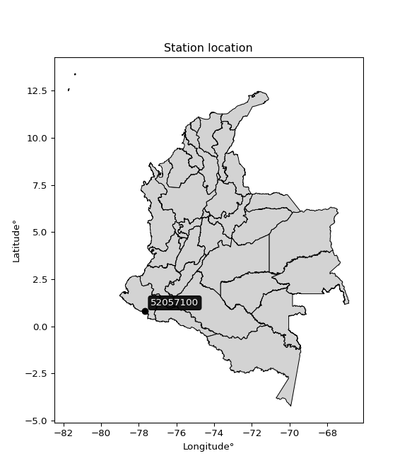

<div align="center">


</div>

# Station (rain, Pmax24h): 52057100

Probable Maximum Precipitation (PMP) is the greatest amount of rainfall for a specific duration that is meteorologically possible for a given location, acting as a "worst-case" scenario for extreme storms, crucial for designing safety-critical infrastructure like bridges, river deviations, dams, spillways, and nuclear plants to prevent catastrophic failure. PMP is calculated by hydrologists using meteorological data to determine the upper limit of extreme rainfall, often leading to the Probable Maximum Flood (PMF) for flood control design, and is increasingly being studied for climate change impacts.

<div align="center">

</img>

</div>


## A. General information


### 1. General running parameters

• app_version: _v20251226_. • runtime: _2025-12-26 15:38:16.554582_. • Python version: _3.14.0_. • SciPy version: _1.16.3_. • Pandas version: _2.3.3_. • NumPy version: _2.3.5_. • Stations dataset (station_dataset_file): _dataset/pmax24h_in/automatic_colombia_2003_2024.csv_. • Stations catalog (station_catalog_file): _dataset/CNE_IDEAM.xls_. • Minimum year to eval til year_max (date_min): _2003_. • Maximum year to eval since year_min (date_max): _2024_. • Creates, save and include plots into reports (create_plot): _False_. • Plot only fit distributions with Δo > Δ (plot_only_fit): _True_. • Eval low extreme values, if False, evaluates high extreme values (low_extreme): _False_. • Eval every SciPy distribution as logarithmic (pdist_logarithmic_on): _True_. • Standard deviation normalized (ddof): _1.0_. • Return periods to eval in years (Tr): _[2, 2.33, 5, 10, 15, 20, 25, 50, 75, 100, 200, 250, 500, 750, 1000]_. • Minimum data sample per station, 0 means any (minimum_sample): _5_. • Z-Score threshold to adjust a value, 0 means disable (zscore): _3.5_. • Avoid zeros, e.g. rain = 0 (avoid_zeros): _True_. • Avoid null values (avoid_nans): _True_. [:file_folder:Dataset file.](../../dataset/pmax24h_in/automatic_colombia_2003_2024.csv)


### 2. Station info and location

|   id |   CODIGO | NOMBRE                     | CATEGORIA    | TECNOLOGIA                              | ESTADO   | FECHA_INSTALACION   |   FECHA_SUSPENSION |   ALTITUD |   LATITUD |   LONGITUD | DEPARTAMENTO   | MUNICIPIO   | AREA_OPERATIVA                      | ENTIDAD                                                     | AREA_HIDROGRAFICA   | ZONA_HIDROGRAFICA   | SUBZONA_HIDROGRAFICA   | CORRIENTE   | OBSERVACION                                                                                                                                                                                                                               | SUBRED                          | Catalogo   |
|-----:|---------:|:---------------------------|:-------------|:----------------------------------------|:---------|:--------------------|-------------------:|----------:|----------:|-----------:|:---------------|:------------|:------------------------------------|:------------------------------------------------------------|:--------------------|:--------------------|:-----------------------|:------------|:------------------------------------------------------------------------------------------------------------------------------------------------------------------------------------------------------------------------------------------|:--------------------------------|:-----------|
|    0 | 52057100 | RUMICHACA - AUT [52057100] | Limnigráfica | Automática con Telemetría, Convencional | Activa   | 15/11/2016          |                nan |      2582 |  0.813786 |    -77.662 | Nariño         | Ipiales     | Area Operativa 07 - Nariño-Putumayo | INSTITUTO DE HIDROLOGIA METEOROLOGIA Y ESTUDIOS AMBIENTALES | Pacifico            | Patía               | Río Guáitara           | Guaitara    | 22/08/2022$Migracion$Se Cambia Estado por orden de la Coordinación de Planeacion Operativa Decisión tomada en la Reunión de la RED 19/08/2022|25/09/2024$mvelez$ACTIVA 25/09/2024 solicitud correo electrónico coordinador AO7 Luis Mejía | RED ALERTAS - AREA OPERATIVA 07 | CNE_IDEAM  |

<div align="center">

Map location in: [:earth_americas:Google](http://maps.google.com/maps?q=0.813786111,-77.66197778) [:earth_americas:OSM](https://www.openstreetmap.org/#map=18/0.813786111/-77.66197778&layers=P) [:earth_americas:Bing](https://www.bing.com/maps?cp=0.813786111~-77.66197778&lvl=18) [:earth_americas:Apple](https://maps.apple.com/frame?center=0.813786111%2C-77.66197778&span=0.003%2C0.006)

</div>


<div align="center">

```geojson
{
  "type": "Feature",
  "geometry": {
    "type": "Point", 
    "coordinates": [-77.66197778, 0.813786111]
  }, 
  "properties": {
    "Name": "52057100"
  }
}
```

</div>


### 3. Discrete values table and plot

|               |           0 |           1 |           2 |          3 |           4 |
|:--------------|------------:|------------:|------------:|-----------:|------------:|
| Date          | 2017        | 2018        | 2019        | 2023       | 2024        |
| Value         |   39        |   43.7      |   18.22     |  770.23    |   49.9      |
| Value_initial |   39        |   43.7      |   18.22     |  770.23    |   49.9      |
| count         |    5        |    5        |    5        |    5       |    5        |
| mean          |  184.21     |  184.21     |  184.21     |  184.21    |  184.21     |
| std           |  327.811    |  327.811    |  327.811    |  327.811   |  327.811    |
| zscore        |   -0.442969 |   -0.428631 |   -0.506359 |    1.78768 |   -0.409718 |
> If Z-Score is active, values out of range or outliers are replaced with the station mean value.


### 4. Active continuous probability distributions from SciPy (45 of 104 available)

[scipy.stats](https://docs.scipy.org/doc/scipy/reference/stats.html) is a Python´s powerful submodule within the SciPy library for comprehensive statistical analysis, offering over 130 probability distributions (like Normal, Poisson), functions for descriptive stats (mean, variance), hypothesis testing (t-tests, chi-square), random variable generation, and statistical tests, making it essential for data science, modeling, and research. It provides tools to explore, model, and draw conclusions from data efficiently, working seamlessly with NumPy.

<div align="center">

|   id | p_dist             |   n_parameter | fit_method   | label                                                                       | active   | ref                                                                                                        |
|-----:|:-------------------|--------------:|:-------------|:----------------------------------------------------------------------------|:---------|:-----------------------------------------------------------------------------------------------------------|
|    0 | alpha              |             3 | MLE          | Alpha                                                                       | True     | [:mortar_board:](https://docs.scipy.org/doc/scipy/reference/generated/scipy.stats.alpha.html)              |
|    1 | betaprime          |             4 | MLE          | Beta prime                                                                  | True     | [:mortar_board:](https://docs.scipy.org/doc/scipy/reference/generated/scipy.stats.betaprime.html)          |
|    2 | chi2               |             3 | MLE          | Chi²                                                                        | True     | [:mortar_board:](https://docs.scipy.org/doc/scipy/reference/generated/scipy.stats.chi2.html)               |
|    3 | crystalball        |             4 | MLE          | Crystalball                                                                 | True     | [:mortar_board:](https://docs.scipy.org/doc/scipy/reference/generated/scipy.stats.crystalball.html)        |
|    4 | erlang             |             3 | MLE          | Erlang                                                                      | True     | [:mortar_board:](https://docs.scipy.org/doc/scipy/reference/generated/scipy.stats.erlang.html)             |
|    5 | expon              |             2 | MLE          | Exponential                                                                 | True     | [:mortar_board:](https://docs.scipy.org/doc/scipy/reference/generated/scipy.stats.expon.html)              |
|    6 | exponnorm          |             3 | MLE          | Exponentially modified Normal                                               | True     | [:mortar_board:](https://docs.scipy.org/doc/scipy/reference/generated/scipy.stats.exponnorm.html)          |
|    7 | f                  |             4 | MLE          | F                                                                           | True     | [:mortar_board:](https://docs.scipy.org/doc/scipy/reference/generated/scipy.stats.f.html)                  |
|    8 | fatiguelife        |             3 | MLE          | Fatigue-life (Birnbaum-Saunders)                                            | True     | [:mortar_board:](https://docs.scipy.org/doc/scipy/reference/generated/scipy.stats.fatiguelife.html)        |
|    9 | fisk               |             3 | MLE          | Fisk                                                                        | True     | [:mortar_board:](https://docs.scipy.org/doc/scipy/reference/generated/scipy.stats.fisk.html)               |
|   10 | gamma              |             3 | MLE          | Gamma                                                                       | True     | [:mortar_board:](https://docs.scipy.org/doc/scipy/reference/generated/scipy.stats.gamma.html)              |
|   11 | genexpon           |             5 | MLE          | Generalized exponential                                                     | True     | [:mortar_board:](https://docs.scipy.org/doc/scipy/reference/generated/scipy.stats.genexpon.html)           |
|   12 | genlogistic        |             3 | MLE          | Generalized logistic                                                        | True     | [:mortar_board:](https://docs.scipy.org/doc/scipy/reference/generated/scipy.stats.genlogistic.html)        |
|   13 | gibrat             |             2 | MM           | Gibrat                                                                      | True     | [:mortar_board:](https://docs.scipy.org/doc/scipy/reference/generated/scipy.stats.gibrat.html)             |
|   14 | gompertz           |             3 | MLE          | Gompertz (or truncated Gumbel)                                              | True     | [:mortar_board:](https://docs.scipy.org/doc/scipy/reference/generated/scipy.stats.gompertz.html)           |
|   15 | gumbel_l           |             2 | MM           | Gumbel Left Skew                                                            | True     | [:mortar_board:](https://docs.scipy.org/doc/scipy/reference/generated/scipy.stats.gumbel_l.html)           |
|   16 | gumbel_r           |             2 | MM           | Gumbel Right Skew                                                           | True     | [:mortar_board:](https://docs.scipy.org/doc/scipy/reference/generated/scipy.stats.gumbel_r.html)           |
|   17 | halflogistic       |             2 | MM           | Half-logistic                                                               | True     | [:mortar_board:](https://docs.scipy.org/doc/scipy/reference/generated/scipy.stats.halflogistic.html)       |
|   18 | halfnorm           |             2 | MM           | Half Normal                                                                 | True     | [:mortar_board:](https://docs.scipy.org/doc/scipy/reference/generated/scipy.stats.halfnorm.html)           |
|   19 | hypsecant          |             2 | MM           | hyperbolic secant                                                           | True     | [:mortar_board:](https://docs.scipy.org/doc/scipy/reference/generated/scipy.stats.hypsecant.html)          |
|   20 | invgamma           |             3 | MLE          | Inverted gamma                                                              | True     | [:mortar_board:](https://docs.scipy.org/doc/scipy/reference/generated/scipy.stats.invgamma.html)           |
|   21 | invgauss           |             3 | MLE          | Inverse Gaussian                                                            | True     | [:mortar_board:](https://docs.scipy.org/doc/scipy/reference/generated/scipy.stats.invgauss.html)           |
|   22 | invweibull         |             3 | MLE          | Inverted Weibull                                                            | True     | [:mortar_board:](https://docs.scipy.org/doc/scipy/reference/generated/scipy.stats.invweibull.html)         |
|   23 | johnsonsu          |             4 | MLE          | Johnson Su                                                                  | True     | [:mortar_board:](https://docs.scipy.org/doc/scipy/reference/generated/scipy.stats.johnsonsu.html)          |
|   24 | kstwobign          |             2 | MLE          | Limiting distribution of scaled Kolmogorov-Smirnov two-sided test statistic | True     | [:mortar_board:](https://docs.scipy.org/doc/scipy/reference/generated/scipy.stats.kstwobign.html)          |
|   25 | laplace            |             2 | MM           | Laplace                                                                     | True     | [:mortar_board:](https://docs.scipy.org/doc/scipy/reference/generated/scipy.stats.laplace.html)            |
|   26 | laplace_asymmetric |             3 | MLE          | Asymmetric Laplace                                                          | True     | [:mortar_board:](https://docs.scipy.org/doc/scipy/reference/generated/scipy.stats.laplace_asymmetric.html) |
|   27 | loggamma           |             3 | MLE          | Log gamma                                                                   | True     | [:mortar_board:](https://docs.scipy.org/doc/scipy/reference/generated/scipy.stats.loggamma.html)           |
|   28 | logistic           |             2 | MM           | Logistic (or Sech-squared)                                                  | True     | [:mortar_board:](https://docs.scipy.org/doc/scipy/reference/generated/scipy.stats.logistic.html)           |
|   29 | lognorm            |             3 | MLE          | Log Normal                                                                  | True     | [:mortar_board:](https://docs.scipy.org/doc/scipy/reference/generated/scipy.stats.lognorm.html)            |
|   30 | maxwell            |             2 | MM           | Maxwell                                                                     | True     | [:mortar_board:](https://docs.scipy.org/doc/scipy/reference/generated/scipy.stats.maxwell.html)            |
|   31 | mielke             |             4 | MLE          | Mielke Beta-Kappa / Dagum                                                   | True     | [:mortar_board:](https://docs.scipy.org/doc/scipy/reference/generated/scipy.stats.mielke.html)             |
|   32 | moyal              |             2 | MM           | Moyal                                                                       | True     | [:mortar_board:](https://docs.scipy.org/doc/scipy/reference/generated/scipy.stats.moyal.html)              |
|   33 | nakagami           |             3 | MLE          | Nakagami                                                                    | True     | [:mortar_board:](https://docs.scipy.org/doc/scipy/reference/generated/scipy.stats.nakagami.html)           |
|   34 | ncf                |             5 | MLE          | Non-central F distribution                                                  | True     | [:mortar_board:](https://docs.scipy.org/doc/scipy/reference/generated/scipy.stats.ncf.html)                |
|   35 | nct                |             4 | MLE          | Non-central Student’s t                                                     | True     | [:mortar_board:](https://docs.scipy.org/doc/scipy/reference/generated/scipy.stats.nct.html)                |
|   36 | norm               |             2 | MM           | Normal                                                                      | True     | [:mortar_board:](https://docs.scipy.org/doc/scipy/reference/generated/scipy.stats.norm.html)               |
|   37 | pareto             |             3 | MLE          | Pareto                                                                      | True     | [:mortar_board:](https://docs.scipy.org/doc/scipy/reference/generated/scipy.stats.pareto.html)             |
|   38 | pearson3           |             3 | MM           | Pearson type III                                                            | True     | [:mortar_board:](https://docs.scipy.org/doc/scipy/reference/generated/scipy.stats.pearson3.html)           |
|   39 | rayleigh           |             2 | MM           | Rayleigh                                                                    | True     | [:mortar_board:](https://docs.scipy.org/doc/scipy/reference/generated/scipy.stats.rayleigh.html)           |
|   40 | rice               |             3 | MLE          | Rice                                                                        | True     | [:mortar_board:](https://docs.scipy.org/doc/scipy/reference/generated/scipy.stats.rice.html)               |
|   41 | t                  |             3 | MLE          | Student’s t                                                                 | True     | [:mortar_board:](https://docs.scipy.org/doc/scipy/reference/generated/scipy.stats.t.html)                  |
|   42 | truncnorm          |             4 | MLE          | Truncated normal                                                            | True     | [:mortar_board:](https://docs.scipy.org/doc/scipy/reference/generated/scipy.stats.truncnorm.html)          |
|   43 | wald               |             2 | MM           | Wald                                                                        | True     | [:mortar_board:](https://docs.scipy.org/doc/scipy/reference/generated/scipy.stats.wald.html)               |
|   44 | weibull_min        |             3 | MLE          | Weibull minimum                                                             | True     | [:mortar_board:](https://docs.scipy.org/doc/scipy/reference/generated/scipy.stats.weibull_min.html)        |

</div>

> **n_parameter:** # arguments & localization & scale.
>
> **Fit methods:** (MLE) maximum likelihood, (MM) L-moments.
>
>**Inactive:** foldnorm, gennorm, norminvgauss, powernorm, powerlognorm, skewnorm, genextreme, anglit, arcsine, argus, beta, bradford, burr, burr12, cauchy, cosine, halfcauchy, foldcauchy, skewcauchy, wrapcauchy, dgamma, gengamma, exponweib, exponpow, truncexpon, gausshyper, genhalflogistic, genhyperbolic, geninvgauss, halfgennorm, johnsonsb, kappa4, kappa3, ksone, kstwo, loglaplace, levy, levy_l, levy_stable, ncx2, genpareto, truncpareto, lomax, powerlaw, rdist, rel_breitwigner, recipinvgauss, semicircular, studentized_range, trapezoid, triang, truncweibull_min, tukeylambda, uniform, loguniform, vonmises, vonmises_line, weibull_max, dweibull, 


## B. Probability distributions vs. Empirical distributions

A continuous probability distribution (CPD) describes probabilities for variables that can take any value within a range (like rain any time), unlike discrete variables with specific outcomes (like temperature). It uses a Probability Density Function (PDF), a curve where the total area under it equals 1, and the probability of the variable falling within an interval (a to b) is found by calculating the area under the curve between those points. A key feature is that the probability of hitting any single exact value is zero, so probabilities are always expressed for ranges, e.g., $P(a ≤ X ≤ b)$.

<div align="center">

Distributions parameters
|    |   station | p_dist                |   n |             loc |           scale | shape                  | shape1                 | shape2             | shape3   |
|---:|----------:|:----------------------|----:|----------------:|----------------:|:-----------------------|:-----------------------|:-------------------|:---------|
|  0 |  52057100 | alpha                 |   5 |      4.54406    |    26.1192      | 1.495013091742028e-09  |                        |                    |          |
|  1 |  52057100 | betaprime             |   5 |      0.00908368 |     0.11184     | 402.4487866871932      | 1.1342115750253638     |                    |          |
|  2 |  52057100 | chi2                  |   5 |     18.22       |   535.82        | 0.48860080675315826    |                        |                    |          |
|  3 |  52057100 | crystalball           |   5 |     -0.218364   |   346.331       | 4.618399987842213      | 2.210923884557358      |                    |          |
|  4 |  52057100 | erlang                |   5 |     18.22       |   299.135       | 0.5304036124865699     |                        |                    |          |
|  5 |  52057100 | expon                 |   5 |     18.22       |   165.99        |                        |                        |                    |          |
|  6 |  52057100 | exponnorm             |   5 |     18.0243     |     0.0541316   | 3054.8620906759015     |                        |                    |          |
|  7 |  52057100 | f                     |   5 |     13.8876     |    15.0081      | 5649.204131691656      | 1.2863916038604224     |                    |          |
|  8 |  52057100 | fatiguelife           |   5 |     18.22       |     0.000109125 | 1075.2663466123752     |                        |                    |          |
|  9 |  52057100 | fisk                  |   5 |     18.22       |    13.7138      | 0.72938217568282       |                        |                    |          |
| 10 |  52057100 | gamma                 |   5 |     18.22       |   188.74        | 0.24726568368350788    |                        |                    |          |
| 11 |  52057100 | genexpon              |   5 |     18.22       |   292.833       | 1.7641604508440085     | 2.11201013558095e-12   | 1.8381651638932681 |          |
| 12 |  52057100 | genlogistic           |   5 |  -1107.99       |   145.995       | 3178.669779349615      |                        |                    |          |
| 13 |  52057100 | gibrat                |   5 |    -39.467      |   135.667       |                        |                        |                    |          |
| 14 |  52057100 | gompertz              |   5 |    -13.5295     |   803.234       | 2.032868056398904      |                        |                    |          |
| 15 |  52057100 | gumbel_l              |   5 |    316.167      |   228.61        |                        |                        |                    |          |
| 16 |  52057100 | gumbel_r              |   5 |     52.253      |   228.61        |                        |                        |                    |          |
| 17 |  52057100 | halflogistic          |   5 |   -163.304      |   250.678       |                        |                        |                    |          |
| 18 |  52057100 | halfnorm              |   5 |   -203.876      |   486.394       |                        |                        |                    |          |
| 19 |  52057100 | hypsecant             |   5 |    184.21       |   186.659       |                        |                        |                    |          |
| 20 |  52057100 | invgamma              |   5 |     13.8858     |     9.65261     | 0.6431988825568786     |                        |                    |          |
| 21 |  52057100 | invgauss              |   5 |     14.6864     |    13.9346      | 12.165620727765539     |                        |                    |          |
| 22 |  52057100 | invweibull            |   5 |     18.22       |     2.8482      | 0.04230210786076122    |                        |                    |          |
| 23 |  52057100 | johnsonsu             |   5 |     43.7        |     3.5341e-08  | 0.2952670024660023     | 0.10876481393972776    |                    |          |
| 24 |  52057100 | kstwobign             |   5 |   -521.247      |   826.25        |                        |                        |                    |          |
| 25 |  52057100 | laplace               |   5 |    184.21       |   207.326       |                        |                        |                    |          |
| 26 |  52057100 | laplace_asymmetric    |   5 |     18.22       |     0.0290596   | 0.00017506559581999796 |                        |                    |          |
| 27 |  52057100 | loggamma              |   5 | -84530.3        | 11574.8         | 1509.2408300038987     |                        |                    |          |
| 28 |  52057100 | logistic              |   5 |    184.21       |   161.651       |                        |                        |                    |          |
| 29 |  52057100 | lognorm               |   5 |     18.22       |     0.0339065   | 15.001286992356604     |                        |                    |          |
| 30 |  52057100 | maxwell               |   5 |   -510.558      |   435.381       |                        |                        |                    |          |
| 31 |  52057100 | mielke                |   5 |     13.4748     |     0.00111319  | 1809.4251115258185     | 0.800414815738002      |                    |          |
| 32 |  52057100 | moyal                 |   5 |     16.5376     |   131.988       |                        |                        |                    |          |
| 33 |  52057100 | nakagami              |   5 |     18.22       |   446.047       | 0.1120044676351061     |                        |                    |          |
| 34 |  52057100 | ncf                   |   5 |     -0.354487   |    37.4299      | 92.3107404046408       | 2.36577372710543       | 8.370811005454446  |          |
| 35 |  52057100 | nct                   |   5 |      1.9173     |     2.99486     | 0.9649960671298228     | 10.272045144614005     |                    |          |
| 36 |  52057100 | norm                  |   5 |    184.21       |   293.203       |                        |                        |                    |          |
| 37 |  52057100 | pareto                |   5 |     17.5917     |     0.628252    | 0.2734602936792616     |                        |                    |          |
| 38 |  52057100 | pearson3              |   5 |    184.21       |   293.203       | 1.4950207348872082     |                        |                    |          |
| 39 |  52057100 | rayleigh              |   5 |   -376.705      |   447.545       |                        |                        |                    |          |
| 40 |  52057100 | rice                  |   5 |   -227.52       |   357.414       | 0.0006341802376886624  |                        |                    |          |
| 41 |  52057100 | t                     |   5 |     42.8616     |     4.93885     | 0.4584220533886382     |                        |                    |          |
| 42 |  52057100 | truncnorm             |   5 | -98372.4        |  5394.19        | 18.24012127780633      | 1691.198247089494      |                    |          |
| 43 |  52057100 | wald                  |   5 |   -108.993      |   293.203       |                        |                        |                    |          |
| 44 |  52057100 | weibull_min           |   5 |     18.22       |   570.84        | 0.27190679573487625    |                        |                    |          |
| 45 |  52057100 | logalpha              |   5 |      1.33925    |     6.90598     | 2.834578006982296      |                        |                    |          |
| 46 |  52057100 | logbetaprime          |   5 |      2.2761     |     0.148157    | 29.736971889311683     | 3.2556564420516447     |                    |          |
| 47 |  52057100 | logchi2               |   5 |      2.90252    |     0.936718    | 1.0458897842648862     |                        |                    |          |
| 48 |  52057100 | logcrystalball        |   5 |      4.18003    |     1.28205     | 75.28052864672131      | 10.092812938446631     |                    |          |
| 49 |  52057100 | logerlang             |   5 |      2.90252    |     1.27221     | 0.6384542930726711     |                        |                    |          |
| 50 |  52057100 | logexpon              |   5 |      2.90252    |     1.27751     |                        |                        |                    |          |
| 51 |  52057100 | logexponnorm          |   5 |      3.02737    |     0.342371    | 3.3666347792983875     |                        |                    |          |
| 52 |  52057100 | logf                  |   5 |      2.20689    |     1.39938     | 38617.98219026826      | 6.505271873874609      |                    |          |
| 53 |  52057100 | logfatiguelife        |   5 |      2.66792    |     1.01624     | 0.9779434541582651     |                        |                    |          |
| 54 |  52057100 | logfisk               |   5 |      2.68439    |     1.072       | 1.9303981234870924     |                        |                    |          |
| 55 |  52057100 | loggamma              |   5 |      2.90252    |     1.07344     | 0.7762635555126991     |                        |                    |          |
| 56 |  52057100 | loggenexpon           |   5 |      2.90252    |     3.16135     | 2.4747662533338546     | 1.8329237911186256e-07 | 1.3953512239643078 |          |
| 57 |  52057100 | loggenlogistic        |   5 |     -2.4097     |     0.819504    | 1599.9626873503594     |                        |                    |          |
| 58 |  52057100 | loggibrat             |   5 |      3.20198    |     0.593214    |                        |                        |                    |          |
| 59 |  52057100 | loggompertz           |   5 |      2.90252    |     1.54982e+09 | 1170159289.457397      |                        |                    |          |
| 60 |  52057100 | loggumbel_l           |   5 |      4.75702    |     0.999609    |                        |                        |                    |          |
| 61 |  52057100 | loggumbel_r           |   5 |      3.60304    |     0.999609    |                        |                        |                    |          |
| 62 |  52057100 | loghalflogistic       |   5 |      2.6605     |     1.09611     |                        |                        |                    |          |
| 63 |  52057100 | loghalfnorm           |   5 |      2.4831     |     2.12679     |                        |                        |                    |          |
| 64 |  52057100 | loghypsecant          |   5 |      4.18003    |     0.816177    |                        |                        |                    |          |
| 65 |  52057100 | loginvgamma           |   5 |      2.20677    |     4.55197     | 3.2526425550469273     |                        |                    |          |
| 66 |  52057100 | loginvgauss           |   5 |      2.532      |     2.15483     | 0.7648084016345079     |                        |                    |          |
| 67 |  52057100 | loginvweibull         |   5 |      1.53652    |     1.96555     | 2.9093352819784384     |                        |                    |          |
| 68 |  52057100 | logjohnsonsu          |   5 |      3.75429    |     0.0756862   | -0.15852713115750527   | 0.40151121447170146    |                    |          |
| 69 |  52057100 | logkstwobign          |   5 |      0.599142   |     4.15305     |                        |                        |                    |          |
| 70 |  52057100 | loglaplace            |   5 |      4.18003    |     0.906545    |                        |                        |                    |          |
| 71 |  52057100 | loglaplace_asymmetric |   5 |      3.66356    |     0.682248    | 0.6907707049869747     |                        |                    |          |
| 72 |  52057100 | logloggamma           |   5 |   -517.832      |    66.4591      | 2578.376518445343      |                        |                    |          |
| 73 |  52057100 | loglogistic           |   5 |      4.18003    |     0.70683     |                        |                        |                    |          |
| 74 |  52057100 | loglognorm            |   5 |      2.90252    |     0.00102207  | 14.243692377636465     |                        |                    |          |
| 75 |  52057100 | logmaxwell            |   5 |      1.14211    |     1.90373     |                        |                        |                    |          |
| 76 |  52057100 | logmielke             |   5 |      1.56132    |     0.413559    | 255.7639407237948      | 2.89504760867918       |                    |          |
| 77 |  52057100 | logmoyal              |   5 |      3.44687    |     0.577124    |                        |                        |                    |          |
| 78 |  52057100 | lognakagami           |   5 |      2.90252    |     2.17741     | 0.38186716613571936    |                        |                    |          |
| 79 |  52057100 | logncf                |   5 |      0.306432   |     0.000490196 | 0.020801414972861094   | 32.822036121871776     | 154.12995745872027 |          |
| 80 |  52057100 | lognct                |   5 |     -0.013733   |     0.0422177   | 8.34891846122786       | 89.84343113150584      |                    |          |
| 81 |  52057100 | lognorm               |   5 |      4.18003    |     1.28205     |                        |                        |                    |          |
| 82 |  52057100 | logpareto             |   5 |      2.89162    |     0.0108979   | 0.2626340900163287     |                        |                    |          |
| 83 |  52057100 | logpearson3           |   5 |      4.18003    |     1.28205     | 1.2053882162363867     |                        |                    |          |
| 84 |  52057100 | lograyleigh           |   5 |      1.7274     |     1.95692     |                        |                        |                    |          |
| 85 |  52057100 | logrice               |   5 |      2.20319    |     1.66606     | 0.0002820693482477126  |                        |                    |          |
| 86 |  52057100 | logt                  |   5 |      3.76583    |     0.139065    | 0.6133166867457179     |                        |                    |          |
| 87 |  52057100 | logtruncnorm          |   5 |    -10.6405     |     4.53126     | 2.9887870511008536     | 6.599631261548975      |                    |          |
| 88 |  52057100 | logwald               |   5 |      2.89798    |     1.28205     |                        |                        |                    |          |
| 89 |  52057100 | logweibull_min        |   5 |      2.90252    |     2.80085     | 0.13674035793920056    |                        |                    |          |

</div>

> **loc** (Location parameter): This shifts the distribution along the x-axis. For many common distributions, like the normal (Gaussian) distribution, loc represents the mean $μ$. For others, like the uniform distribution, it might represent the minimum value, or for the beta distribution, the left end of the support interval.
>
> **scale** (Scale parameter): This determines the width or spread of the distribution. For the normal distribution, scale represents the standard deviation $σ$. For a uniform distribution, it defines the length of the interval (from $loc$ to $loc + scale$).
>
> **shape** (Shape parameters): Refers to parameters that define the specific form of a probability distribution, distinct from its location (loc) and scale (scale). These parameters are required arguments for most distribution functions. For example, a normal (Gaussian) distribution is fully defined by its location (mean) and scale (standard deviation), so it has no specific shape parameters beyond loc and scale. However, other distributions have intrinsic properties that need specification, as Gamma distribution that takes a shape parameter, often named $a$ or $alpha$.


### 0. Cumulative distribution values - CDF (90 evaluated)

> Ordered by x ascending and calculating $log(f(x))$ separately. 

|   id |   Station |   date |      x |   count |   mean |     std |    zscore |   Value_initial |   station |   m |     alpha |   alpha_pdf |   betaprime |   betaprime_pdf |        chi2 |    chi2_pdf |   crystalball |   crystalball_pdf |      erlang |       erlang_pdf |    expon |   expon_pdf |   exponnorm |   exponnorm_pdf |         f |       f_pdf |   fatiguelife |   fatiguelife_pdf |        fisk |      fisk_pdf |       gamma |   gamma_pdf |    genexpon |   genexpon_pdf |   genlogistic |   genlogistic_pdf |   gibrat |   gibrat_pdf |   gompertz |   gompertz_pdf |   gumbel_l |   gumbel_l_pdf |   gumbel_r |   gumbel_r_pdf |   halflogistic |   halflogistic_pdf |   halfnorm |   halfnorm_pdf |   hypsecant |   hypsecant_pdf |   invgamma |   invgamma_pdf |   invgauss |   invgauss_pdf |   invweibull |   invweibull_pdf |   johnsonsu |   johnsonsu_pdf |   kstwobign |   kstwobign_pdf |   laplace |   laplace_pdf |   laplace_asymmetric |   laplace_asymmetric_pdf |    loggamma |   loggamma_pdf |   logistic |   logistic_pdf |   lognorm |   lognorm_pdf |   maxwell |   maxwell_pdf |   mielke |   mielke_pdf |    moyal |   moyal_pdf |    nakagami |   nakagami_pdf |      ncf |     ncf_pdf |       nct |     nct_pdf |     norm |    norm_pdf |      pareto |   pareto_pdf |   pearson3 |   pearson3_pdf |   rayleigh |   rayleigh_pdf |     rice |   rice_pdf |        t |       t_pdf |   truncnorm |   truncnorm_pdf |     wald |    wald_pdf |   weibull_min |   weibull_min_pdf |   logalpha |   logalpha_pdf |   logbetaprime |   logbetaprime_pdf |     logchi2 |   logchi2_pdf |   logcrystalball |   logcrystalball_pdf |   logerlang |   logerlang_pdf |   logexpon |   logexpon_pdf |   logexponnorm |   logexponnorm_pdf |      logf |   logf_pdf |   logfatiguelife |   logfatiguelife_pdf |   logfisk |   logfisk_pdf |   loggenexpon |   loggenexpon_pdf |   loggenlogistic |   loggenlogistic_pdf |   loggibrat |   loggibrat_pdf |   loggompertz |   loggompertz_pdf |   loggumbel_l |   loggumbel_l_pdf |   loggumbel_r |   loggumbel_r_pdf |   loghalflogistic |   loghalflogistic_pdf |   loghalfnorm |   loghalfnorm_pdf |   loghypsecant |   loghypsecant_pdf |   loginvgamma |   loginvgamma_pdf |   loginvgauss |   loginvgauss_pdf |   loginvweibull |   loginvweibull_pdf |   logjohnsonsu |   logjohnsonsu_pdf |   logkstwobign |   logkstwobign_pdf |   loglaplace |   loglaplace_pdf |   loglaplace_asymmetric |   loglaplace_asymmetric_pdf |   logloggamma |   logloggamma_pdf |   loglogistic |   loglogistic_pdf |   loglognorm |   loglognorm_pdf |   logmaxwell |   logmaxwell_pdf |   logmielke |   logmielke_pdf |   logmoyal |   logmoyal_pdf |   lognakagami |   lognakagami_pdf |   logncf |   logncf_pdf |    lognct |   lognct_pdf |   logpareto |   logpareto_pdf |   logpearson3 |   logpearson3_pdf |   lograyleigh |   lograyleigh_pdf |   logrice |   logrice_pdf |     logt |   logt_pdf |   logtruncnorm |   logtruncnorm_pdf |     logwald |   logwald_pdf |   logweibull_min |   logweibull_min_pdf |
|-----:|----------:|-------:|-------:|--------:|-------:|--------:|----------:|----------------:|----------:|----:|----------:|------------:|------------:|----------------:|------------:|------------:|--------------:|------------------:|------------:|-----------------:|---------:|------------:|------------:|----------------:|----------:|------------:|--------------:|------------------:|------------:|--------------:|------------:|------------:|------------:|---------------:|--------------:|------------------:|---------:|-------------:|-----------:|---------------:|-----------:|---------------:|-----------:|---------------:|---------------:|-------------------:|-----------:|---------------:|------------:|----------------:|-----------:|---------------:|-----------:|---------------:|-------------:|-----------------:|------------:|----------------:|------------:|----------------:|----------:|--------------:|---------------------:|-------------------------:|------------:|---------------:|-----------:|---------------:|----------:|--------------:|----------:|--------------:|---------:|-------------:|---------:|------------:|------------:|---------------:|---------:|------------:|----------:|------------:|---------:|------------:|------------:|-------------:|-----------:|---------------:|-----------:|---------------:|---------:|-----------:|---------:|------------:|------------:|----------------:|---------:|------------:|--------------:|------------------:|-----------:|---------------:|---------------:|-------------------:|------------:|--------------:|-----------------:|---------------------:|------------:|----------------:|-----------:|---------------:|---------------:|-------------------:|----------:|-----------:|-----------------:|---------------------:|----------:|--------------:|--------------:|------------------:|-----------------:|---------------------:|------------:|----------------:|--------------:|------------------:|--------------:|------------------:|--------------:|------------------:|------------------:|----------------------:|--------------:|------------------:|---------------:|-------------------:|--------------:|------------------:|--------------:|------------------:|----------------:|--------------------:|---------------:|-------------------:|---------------:|-------------------:|-------------:|-----------------:|------------------------:|----------------------------:|--------------:|------------------:|--------------:|------------------:|-------------:|-----------------:|-------------:|-----------------:|------------:|----------------:|-----------:|---------------:|--------------:|------------------:|---------:|-------------:|----------:|-------------:|------------:|----------------:|--------------:|------------------:|--------------:|------------------:|----------:|--------------:|---------:|-----------:|---------------:|-------------------:|------------:|--------------:|-----------------:|---------------------:|
|    0 |  52057100 |   2019 |  18.22 |       5 | 184.21 | 327.811 | -0.506359 |           18.22 |  52057100 |   1 | 0.0561505 |  0.0179855  |    0.106663 |     0.0138018   | 5.91373e-05 | 4.06654e+09 |      0.52123  |       0.00115028  | 1.18725e-09 | 177251           | 0        | 0.00602446  |   0.0011828 |     0.00603918  | 0.0517128 | 0.0297906   |     0.0682243 |       2.30284e+09 | 4.27969e-12 | 878.633       | 8.06888e-05 | 5.61587e+09 | 6.07636e-14 |    0.00602446  |      0.241936 |       0.0023511   | 0.196228 |  0.00479765  |  0.0786936 |    0.0024257   |   0.237867 |    0.000905566 |   0.313323 |    0.00159056  |       0.347032 |        0.00175438  |   0.352054 |    0.00147801  |    0.248228 |     0.0011991   |  0.0517127 |    0.0297905   |   0.051053 |    0.0338569   |    0.0139758 |      7.10642e+11 |   0.0228311 |     0.000231159 |    0.212509 |      0.00188613 |  0.224524 |   0.00108295  |          3.06616e-08 |              0.00602435  | 1.23657e-12 |   2161.51      |   0.263697 |    0.00120111  |  0.159514 |     0.189406  |  0.31196  |    0.00129293 |      nan |          nan | 0.320395 | 0.00183321  | 0.000122193 |    7.70461e+09 | 0.107702 | 0.0135259   | 0.0648096 | 0.015677    | 0.285654 | 0.00115917  | 1.11022e-16 |  0.435272    |   0.339633 |    0.00179445  |   0.322494 |    0.00133584  | 0.210506 | 0.00151873 | 0.155066 | 0.00285375  |   0         |     0.00339154  | 0.303997 | 0.00329073  |   2.09691e-05 |       1.60485e+09 |  0.0568342 |      0.322756  |      0.0548348 |          0.365097  | 7.60122e-09 |   8.95094e+06 |         0.159513 |            0.189406  | 1.50617e-10 |  216538         |   0        |      0.782774  |      0.0617594 |          0.25673   | 0.0547796 |  0.364679  |        0.0508202 |            0.583333  | 0.0442094 |     0.373953  |   2.91013e-09 |         0.78282   |        0.0865806 |            0.258294  |    0        |       0         |   1.55915e-13 |         0.755029  |      0.144798 |        0.133821   |      0.133274 |         0.268699  |          0.109952 |             0.450646  |      0.156336 |         0.367935  |       0.131189 |          0.156224  |     0.0547797 |         0.364679  |     0.0522394 |         0.452436  |       0.0559932 |            0.343757 |      0.0793331 |          0.0693631 |      0.0819014 |          0.249657  |     0.122169 |        0.134763  |               0.0642566 |                   0.136346  |      0.163402 |         0.187246  |      0.140956 |         0.17131   |    0.0228367 |      8.56285e+12 |     0.163752 |        0.233705  |   0.0559692 |       0.342676  |   0.109031 |      0.306743  |   8.09816e-13 |      1392.7       | 0.11614  |    0.262031  | 0.0915393 |    0.274281  | 1.11022e-16 |      24.0996    |      0.134104 |         0.315717  |      0.164979 |         0.256234  | 0.0843262 |     0.230696  | 0.10195  |  0.0717251 |    1.86536e-10 |          0.722244  | 6.14961e-63 |   1.91921e-58 |       0.00688696 |          2.11326e+12 |
|    1 |  52057100 |   2017 |  39    |       5 | 184.21 | 327.811 | -0.442969 |           39    |  52057100 |   2 | 0.448423  |  0.0131702  |    0.369247 |     0.0101251   | 0.418908    | 0.00484869  |      0.54508  |       0.00114455  | 0.267362    |      0.0065201   | 0.117669 | 0.00531557  |   0.11913   |     0.00532683  | 0.479295  | 0.0104855   |     0.657566  |       0.00358771  | 0.575205    |   0.00857653  | 0.625427    | 0.00681045  | 0.117669    |    0.00531556  |      0.292043 |       0.00246167  | 0.292009 |  0.00437649  |  0.128368  |    0.00235506  |   0.257314 |    0.000966431 |   0.346565 |    0.00160645  |       0.382951 |        0.00170208  |   0.38246  |    0.00144813  |    0.27413  |     0.00129369  |  0.479296  |    0.0104856   |   0.486237 |    0.0100663   |    0.39877   |      0.000746328 |   0.0347885 |     0.00177927  |    0.252621 |      0.00196896 |  0.248195 |   0.00119712  |          0.117667    |              0.00531549  | 0.620424    |      0.415399  |   0.289402 |    0.00127217  |  0.343531 |     0.286924  |  0.339082 |    0.00131639 |      nan |          nan | 0.358395 | 0.00182077  | 0.415913    |    0.00448258  | 0.367883 | 0.0101531   | 0.403391  | 0.0122925   | 0.31021  | 0.0012036   | 0.61899     |  0.00486687  |   0.37647  |    0.0017494   |   0.350392 |    0.00134823  | 0.242724 | 0.00157994 | 0.335639 | 0.0287      |   0.068057  |     0.00316139  | 0.369131 | 0.00297585  |   0.333837    |       0.00354093  |  0.446694  |      0.506396  |      0.45404   |          0.47957   | 0.616504    |   0.32212     |         0.343531 |            0.286924  | 0.645104    |       0.369805  |   0.448836 |      0.431436  |      0.402279  |          0.491176  | 0.45436   |  0.480192  |        0.491646  |            0.409659  | 0.456397  |     0.489119  |   0.448856    |         0.431447  |        0.380189  |            0.448521  |    0.40095  |       0.837509  |   0.437075    |         0.425025  |      0.2846   |        0.239691   |      0.39014  |         0.367363  |          0.42809  |             0.372564  |      0.421137 |         0.321602  |       0.310813 |          0.323121  |     0.45436   |         0.480192  |     0.468975  |         0.443084  |       0.451691  |            0.491014 |      0.28565   |          1.15494   |      0.352391  |          0.406146  |     0.282845 |        0.312003  |               0.323027  |                   0.68543   |      0.343927 |         0.280419  |      0.325046 |         0.310387  |    0.678771  |      0.0330426   |     0.375057 |        0.305841  |   0.451962  |       0.492075  |   0.407197 |      0.406383  |   0.344754    |         0.334458  | 0.37868  |    0.385586  | 0.385657  |    0.430577  | 0.673364    |       0.11113   |      0.407298 |         0.361795  |      0.387038 |         0.309907  | 0.318979  |     0.358295  | 0.324863 |  1.23099   |    0.43038     |          0.431075  | 0.444242    |   0.588657    |       0.566905   |          0.0651167   |
|    2 |  52057100 |   2018 |  43.7  |       5 | 184.21 | 327.811 | -0.428631 |           43.7  |  52057100 |   3 | 0.504736  |  0.0108813  |    0.414121 |     0.00899176  | 0.439928    | 0.00413808  |      0.550456 |       0.00114268  | 0.296313    |      0.00583238  | 0.142302 | 0.00516717  |   0.143814  |     0.00517757  | 0.523404  | 0.00840388  |     0.673423  |       0.00318018  | 0.611078    |   0.00680323  | 0.654668    | 0.00569775  | 0.142302    |    0.00516716  |      0.303654 |       0.00247848  | 0.312296 |  0.00425559  |  0.139399  |    0.0023389   |   0.261889 |    0.000980429 |   0.354119 |    0.00160806  |       0.390922 |        0.00168978  |   0.38925  |    0.0014411   |    0.28026  |     0.00131485  |  0.523404  |    0.0084039   |   0.528602 |    0.00807992  |    0.401931  |      0.000608217 |   0.614458  |     1.17597e+06 |    0.261909 |      0.00198315 |  0.253885 |   0.00122457  |          0.1423      |              0.00516709  | 0.664576    |      0.362151  |   0.295417 |    0.00128762  |  0.376726 |     0.296199  |  0.345279 |    0.00132081 |      nan |          nan | 0.36694  | 0.00181523  | 0.435346    |    0.00382611  | 0.412959 | 0.00904741  | 0.456696  | 0.0104455   | 0.31589  | 0.00121303  | 0.639118    |  0.00377991  |   0.384666 |    0.00173796  |   0.356733 |    0.00135016  | 0.250178 | 0.00159198 | 0.543978 | 0.0509255   |   0.0827981 |     0.00311153  | 0.382949 | 0.00290406  |   0.349086    |       0.00298253  |  0.501972  |      0.464545  |      0.506184  |          0.436857  | 0.650895    |   0.283643    |         0.376725 |            0.296199  | 0.684351    |       0.321552  |   0.495805 |      0.39467   |      0.456416  |          0.459242  | 0.506567  |  0.43735   |        0.535754  |            0.366579  | 0.50934   |     0.441401  |   0.495826    |         0.394678  |        0.430957  |            0.442537  |    0.487819 |       0.69304   |   0.483418    |         0.390035  |      0.312911 |        0.257959   |      0.43172  |         0.362777  |          0.469525 |             0.355598  |      0.457175 |         0.311746  |       0.348963 |          0.346915  |     0.506567  |         0.43735   |     0.516921  |         0.400172  |       0.505125  |            0.447891 |      0.48483   |          2.02306   |      0.398468  |          0.402854  |     0.320671 |        0.353729  |               0.396695  |                   0.610842  |      0.376366 |         0.289437  |      0.361306 |         0.326477  |    0.682267  |      0.0286132   |     0.410007 |        0.30809   |   0.505507  |       0.448787  |   0.452637 |      0.391576  |   0.381905    |         0.318811  | 0.422418 |    0.382359  | 0.434171  |    0.421089  | 0.68495     |       0.0934182 |      0.44793  |         0.351945  |      0.422283 |         0.309253  | 0.360046  |     0.362923  | 0.523535 |  2.03166   |    0.477532    |          0.398097  | 0.506634    |   0.50977     |       0.573821   |          0.0568149   |
|    3 |  52057100 |   2024 |  49.9  |       5 | 184.21 | 327.811 | -0.409718 |           49.9  |  52057100 |   4 | 0.564702  |  0.00858261 |    0.465745 |     0.00769967  | 0.463447    | 0.00348986  |      0.557532 |       0.00113991  | 0.330276    |      0.00515736  | 0.173748 | 0.00497772  |   0.17532   |     0.00498704  | 0.569257  | 0.00651419  |     0.691845  |       0.00278284  | 0.6481      |   0.00525087  | 0.68664     | 0.00467993  | 0.173747    |    0.00497772  |      0.319078 |       0.00249613  | 0.338174 |  0.00409158  |  0.153834  |    0.00231749  |   0.268025 |    0.000999008 |   0.364093 |    0.00160912  |       0.401347 |        0.0016733   |   0.398156 |    0.00143166  |    0.288498 |     0.00134251  |  0.569258  |    0.0065142   |   0.572785 |    0.00629439  |    0.405305  |      0.000488767 |   0.992561  |     0.000360711 |    0.274257 |      0.00199938 |  0.261592 |   0.00126174  |          0.173745    |              0.00497765  | 0.709065    |      0.310094  |   0.303463 |    0.00130759  |  0.416597 |     0.304351  |  0.353485 |    0.00132612 |      nan |          nan | 0.378168 | 0.00180651  | 0.457103    |    0.00323053  | 0.464994 | 0.00777355  | 0.515128  | 0.00848857  | 0.323448 | 0.00122511  | 0.659545    |  0.00288165  |   0.395393 |    0.00172226  |   0.365111 |    0.00135223  | 0.260095 | 0.00160683 | 0.731573 | 0.0155025   |   0.101889  |     0.00304696  | 0.400663 | 0.00281032  |   0.365916    |       0.00247936  |  0.560207  |      0.413269  |      0.56087   |          0.387894  | 0.686014    |   0.247037    |         0.416597 |            0.304351  | 0.72384     |       0.27529   |   0.54554  |      0.355739  |      0.514559  |          0.416845  | 0.561309  |  0.38824   |        0.581435  |            0.323182  | 0.564274  |     0.387251  |   0.545561    |         0.355744  |        0.488722  |            0.426877  |    0.570227 |       0.554689  |   0.532657    |         0.352857  |      0.348552 |        0.279293   |      0.47923  |         0.352647  |          0.515345 |             0.335013  |      0.497734 |         0.299549  |       0.396567 |          0.369592  |     0.561309  |         0.38824   |     0.566928  |         0.3545    |       0.561182  |            0.397391 |      0.666885  |          0.842936  |      0.451321  |          0.392899  |     0.371209 |        0.409477  |               0.47253   |                   0.53406   |      0.415331 |         0.297485  |      0.405645 |         0.341096  |    0.685793  |      0.0247276   |     0.450902 |        0.307887  |   0.561668  |       0.398061  |   0.503191 |      0.369872  |   0.423085    |         0.30221   | 0.472582 |    0.372914  | 0.488914  |    0.403075  | 0.69629     |       0.0783236 |      0.493699 |         0.337545  |      0.463125 |         0.30599   | 0.408308  |     0.363834  | 0.719528 |  0.905726  |    0.527956    |          0.362529  | 0.568908    |   0.431384    |       0.580849   |          0.0494656   |
|    4 |  52057100 |   2023 | 770.23 |       5 | 184.21 | 327.811 |  1.78768  |          770.23 |  52057100 |   5 | 0.972788  |  3.5526e-05 |    0.963635 |     5.20933e-05 | 0.894488    | 0.00016273  |      0.986946 |       9.70039e-05 | 0.972603    |      0.000104888 | 0.989224 | 6.49183e-05 |   0.98942   |     6.39811e-05 | 0.933048  | 5.64947e-05 |     0.992684  |       3.28876e-05 | 0.94886     |   4.70645e-05 | 0.998454    | 9.493e-06   | 0.989224    |    6.49184e-05 |      0.99181  |       5.58701e-05 | 0.962987 |  9.99028e-05 |  0.965288  |    0.000233082 |   0.999316 |    2.18007e-05 |   0.957666 |    0.000181202 |       0.952865 |        0.000183599 |   0.954792 |    0.000220804 |    0.972449 |     0.000147414 |  0.933049  |    5.64945e-05 |   0.950931 |    6.42259e-05 |    0.453901  |      2.01678e-05 |   0.998429  |     7.62097e-07 |    0.984902 |      0.00011425 |  0.970392 |   0.000142809 |          0.989223    |              6.49223e-05 | 0.981575    |      0.0180604 |   0.974048 |    0.000156377 |  0.972823 |     0.0488849 |  0.965736 |    0.00020946 |      nan |          nan | 0.95411  | 0.000173651 | 0.901814    |    0.000201339 | 0.966511 | 4.99088e-05 | 0.964421  | 4.46625e-05 | 0.977179 | 0.000184627 | 0.856065    |  5.22966e-05 |   0.952691 |    0.000184465 |   0.962514 |    0.000214654 | 0.979686 | 0.00015866 | 0.967064 | 2.07578e-05 |   0.922708  |     0.000264131 | 0.953136 | 0.000134608 |   0.659666    |       0.000132633 |  0.939566  |      0.0302543 |      0.939092  |          0.0343754 | 0.951257    |   0.0306466   |         0.972823 |            0.0488849 | 0.976904    |       0.0199275 |   0.946648 |      0.0417628 |      0.954766  |          0.0392437 | 0.939311  |  0.0342764 |        0.934034  |            0.0409392 | 0.92578   |     0.0334758 |   0.946657    |         0.0417581 |        0.974928  |            0.0302071 |    0.960715 |       0.0246522 |   0.940807    |         0.0446923 |      0.998669 |        0.00881512 |      0.953511 |         0.0454086 |          0.948673 |             0.0456252 |      0.949734 |         0.0552061 |       0.969025 |          0.0378911 |     0.939311  |         0.0342765 |     0.938471  |         0.0390265 |       0.939832  |            0.033203 |      0.94325   |          0.0158232 |      0.97121   |          0.0403783 |     0.967094 |        0.0362985 |               0.966976  |                   0.0334366 |      0.970517 |         0.0518765 |      0.970395 |         0.0406445 |    0.717734  |      0.00633661  |     0.960881 |        0.0535912 |   0.940062  |       0.0330666 |   0.950146 |      0.0431357 |   0.905569    |         0.0777576 | 0.961292 |    0.0410807 | 0.96103   |    0.0366566 | 0.784412    |       0.0150785 |      0.950819 |         0.0478249 |      0.957557 |         0.0545213 | 0.971465  |     0.0456797 | 0.951181 |  0.0103841 |    0.951395    |          0.0434389 | 0.950082    |   0.033047    |       0.646719   |          0.0134246   |

An Empirical Distribution Function (EDF) is a step-function estimate of a true cumulative distribution function (CDF) based on observed sample data, representing the proportion of data points less than or equal to a given value. It is calculated by ordering your data and jumping up by $1/n$ (where $n$ is sample size) at each unique data point, allowing analysis without assuming an underlying population distribution, and it gets closer to the true CDF as the sample size grows.


### 1. Empirical - EDF California (1923)

California´s estimates the true probability distribution of water-related data (like rainfall, streamflow) using observed samples, crucial for risk assessment.

<div align="center">


$P=m/n$


</div>


**1.1. Empirical values**

<div align="center">

|                | 0              | 1                  | 2              | 3                 | 4              |
|:---------------|:---------------|:-------------------|:---------------|:------------------|:---------------|
| date           | 2019           | 2017               | 2018           | 2024              | 2023           |
| x              | 18.22          | 39.0               | 43.7           | 49.9              | 770.23         |
| m              | 1              | 2                  | 3              | 4                 | 5              |
| empirical_dist | edf_california | edf_california     | edf_california | edf_california    | edf_california |
| empirical      | 0.2            | 0.4                | 0.6            | 0.8               | 1.0            |
| empirical_tr   | 1.25           | 1.6666666666666667 | 2.5            | 5.000000000000001 | inf            |

</div>


**1.2. Kolmogorov-Smirnov fit test (sorted by Δ)**


<div align="center">

|                | 0                   | 1                   | 2                   | 3                   | 4                   | 5                  | 6                  | 7                   | 8                   | 9                   | 10                  | 11                  | 12                 | 13                 | 14                 | 15                  | 16                 | 17                 | 18                  | 19                  | 20                  | 21                 | 22                  | 23                  | 24                  | 25                 | 26                  | 27                  | 28                 | 29                  | 30                  | 31                  | 32                  | 33                  | 34                  | 35                 | 36                 | 37                 | 38                  | 39                  | 40                 | 41                  | 42                 | 43                    | 44                 | 45                  | 46                  | 47                 | 48                  | 49                 | 50                 | 51                 | 52                  | 53                 | 54                 | 55                 | 56                 | 57                 | 58                 | 59                  | 60                 | 61                 | 62                 | 63                  | 64                 | 65                  | 66                  | 67                  | 68                  | 69                 | 70                 | 71                  | 72                  | 73                  | 74                  | 75                  | 76                  | 77                 | 78                 | 79                 | 80                 | 81                 | 82                 | 83                 | 84                 | 85                 | 86                 | 87                 | 88                 | 89                 |
|:---------------|:--------------------|:--------------------|:--------------------|:--------------------|:--------------------|:-------------------|:-------------------|:--------------------|:--------------------|:--------------------|:--------------------|:--------------------|:-------------------|:-------------------|:-------------------|:--------------------|:-------------------|:-------------------|:--------------------|:--------------------|:--------------------|:-------------------|:--------------------|:--------------------|:--------------------|:-------------------|:--------------------|:--------------------|:-------------------|:--------------------|:--------------------|:--------------------|:--------------------|:--------------------|:--------------------|:-------------------|:-------------------|:-------------------|:--------------------|:--------------------|:-------------------|:--------------------|:-------------------|:----------------------|:-------------------|:--------------------|:--------------------|:-------------------|:--------------------|:-------------------|:-------------------|:-------------------|:--------------------|:-------------------|:-------------------|:-------------------|:-------------------|:-------------------|:-------------------|:--------------------|:-------------------|:-------------------|:-------------------|:--------------------|:-------------------|:--------------------|:--------------------|:--------------------|:--------------------|:-------------------|:-------------------|:--------------------|:--------------------|:--------------------|:--------------------|:--------------------|:--------------------|:-------------------|:-------------------|:-------------------|:-------------------|:-------------------|:-------------------|:-------------------|:-------------------|:-------------------|:-------------------|:-------------------|:-------------------|:-------------------|
| station        | 52057100            | 52057100            | 52057100            | 52057100            | 52057100            | 52057100           | 52057100           | 52057100            | 52057100            | 52057100            | 52057100            | 52057100            | 52057100           | 52057100           | 52057100           | 52057100            | 52057100           | 52057100           | 52057100            | 52057100            | 52057100            | 52057100           | 52057100            | 52057100            | 52057100            | 52057100           | 52057100            | 52057100            | 52057100           | 52057100            | 52057100            | 52057100            | 52057100            | 52057100            | 52057100            | 52057100           | 52057100           | 52057100           | 52057100            | 52057100            | 52057100           | 52057100            | 52057100           | 52057100              | 52057100           | 52057100            | 52057100            | 52057100           | 52057100            | 52057100           | 52057100           | 52057100           | 52057100            | 52057100           | 52057100           | 52057100           | 52057100           | 52057100           | 52057100           | 52057100            | 52057100           | 52057100           | 52057100           | 52057100            | 52057100           | 52057100            | 52057100            | 52057100            | 52057100            | 52057100           | 52057100           | 52057100            | 52057100            | 52057100            | 52057100            | 52057100            | 52057100            | 52057100           | 52057100           | 52057100           | 52057100           | 52057100           | 52057100           | 52057100           | 52057100           | 52057100           | 52057100           | 52057100           | 52057100           | 52057100           |
| empirical_dist | edf_california      | edf_california      | edf_california      | edf_california      | edf_california      | edf_california     | edf_california     | edf_california      | edf_california      | edf_california      | edf_california      | edf_california      | edf_california     | edf_california     | edf_california     | edf_california      | edf_california     | edf_california     | edf_california      | edf_california      | edf_california      | edf_california     | edf_california      | edf_california      | edf_california      | edf_california     | edf_california      | edf_california      | edf_california     | edf_california      | edf_california      | edf_california      | edf_california      | edf_california      | edf_california      | edf_california     | edf_california     | edf_california     | edf_california      | edf_california      | edf_california     | edf_california      | edf_california     | edf_california        | edf_california     | edf_california      | edf_california      | edf_california     | edf_california      | edf_california     | edf_california     | edf_california     | edf_california      | edf_california     | edf_california     | edf_california     | edf_california     | edf_california     | edf_california     | edf_california      | edf_california     | edf_california     | edf_california     | edf_california      | edf_california     | edf_california      | edf_california      | edf_california      | edf_california      | edf_california     | edf_california     | edf_california      | edf_california      | edf_california      | edf_california      | edf_california      | edf_california      | edf_california     | edf_california     | edf_california     | edf_california     | edf_california     | edf_california     | edf_california     | edf_california     | edf_california     | edf_california     | edf_california     | edf_california     | edf_california     |
| p_dist         | t                   | logt                | logjohnsonsu        | fisk                | logchi2             | logfatiguelife     | pareto             | loggamma            | loggamma            | gamma               | invgauss            | loggibrat           | invgamma           | f                  | logwald            | loginvgauss         | alpha              | logfisk            | logmielke           | logf                | loginvgamma         | loginvweibull      | logbetaprime        | logalpha            | logerlang           | loggenexpon        | logexpon            | fatiguelife         | loggompertz        | logtruncnorm        | logpareto           | loglognorm          | loghalflogistic     | nct                 | logexponnorm        | logmoyal           | loghalfnorm        | logpearson3        | lognct              | loggenlogistic      | loggumbel_r        | crystalball         | logncf             | loglaplace_asymmetric | betaprime          | ncf                 | chi2                | lograyleigh        | nakagami            | logkstwobign       | logmaxwell         | logweibull_min     | johnsonsu           | lognakagami        | lognorm            | lognorm            | logcrystalball     | logloggamma        | logrice            | loglogistic         | halflogistic       | wald               | halfnorm           | loghypsecant        | pearson3           | moyal               | loglaplace          | weibull_min         | rayleigh            | gumbel_r           | maxwell            | loggumbel_l         | gibrat              | erlang              | norm                | genlogistic         | logistic            | hypsecant          | kstwobign          | gumbel_l           | laplace            | rice               | invweibull         | exponnorm          | expon              | genexpon           | laplace_asymmetric | gompertz           | truncnorm          | mielke             |
| delta          | 0.06842651628203023 | 0.09805020833041558 | 0.13311545938443858 | 0.19999999999572032 | 0.21650386824183376 | 0.2185654784339892 | 0.2189898654163026 | 0.22042406993205943 | 0.22042406993205943 | 0.22542744505743595 | 0.22721471777255053 | 0.22977304516185837 | 0.2307418544058285 | 0.2307425103952071 | 0.2310923820312084 | 0.23307213210896705 | 0.2352982781200974 | 0.2357260861296393 | 0.23833223618483534 | 0.23869104756208137 | 0.23869128118058125 | 0.2388182675986924 | 0.23912980124309513 | 0.23979257192046988 | 0.24510388827841822 | 0.2544388305434663 | 0.25445990206770563 | 0.25756552302007274 | 0.2673427545666338 | 0.27204372897826834 | 0.27336446982097795 | 0.28226586628915373 | 0.28465490903999746 | 0.28487165412460447 | 0.28544066823117575 | 0.296809368270471  | 0.3022656785263975 | 0.3063011260001146 | 0.31108554048054216 | 0.31127751731946673 | 0.3207700839643861 | 0.32123014785573406 | 0.3274182880536406 | 0.32747045762527394   | 0.3342547129724889 | 0.33500635196294887 | 0.33655268772231306 | 0.3368749904431141 | 0.34289734277318906 | 0.3486789652507465 | 0.3490981949253373 | 0.3532812096616583 | 0.36521145694733614 | 0.3769145519826745 | 0.3834026160115385 | 0.3834026160115385 | 0.3834030652775754 | 0.3846693599205525 | 0.3916921295480365 | 0.39435465030490635 | 0.3986526497083974 | 0.3993370460534137 | 0.401844258769603  | 0.40343316477571867 | 0.4046074122834378 | 0.42183161530185753 | 0.42879060673553626 | 0.43408405887460544 | 0.43488908181034314 | 0.4359069538723938 | 0.4465148860432549 | 0.45144755360957356 | 0.46182588082763143 | 0.46972433866312135 | 0.47655193100830445 | 0.48092218162458017 | 0.49653721859411715 | 0.5115021763217231 | 0.5257434095219597 | 0.5319751129466974 | 0.5384076294459077 | 0.5399052083571743 | 0.5460989921435444 | 0.6246797625245114 | 0.6262524928337985 | 0.6262525963599961 | 0.6262551998133575 | 0.6461662260672771 | 0.6981113089692316 | nan                |
| deltao         | 0.5865427407550001  | 0.5865427407550001  | 0.5865427407550001  | 0.5865427407550001  | 0.5865427407550001  | 0.5865427407550001 | 0.5865427407550001 | 0.5865427407550001  | 0.5865427407550001  | 0.5865427407550001  | 0.5865427407550001  | 0.5865427407550001  | 0.5865427407550001 | 0.5865427407550001 | 0.5865427407550001 | 0.5865427407550001  | 0.5865427407550001 | 0.5865427407550001 | 0.5865427407550001  | 0.5865427407550001  | 0.5865427407550001  | 0.5865427407550001 | 0.5865427407550001  | 0.5865427407550001  | 0.5865427407550001  | 0.5865427407550001 | 0.5865427407550001  | 0.5865427407550001  | 0.5865427407550001 | 0.5865427407550001  | 0.5865427407550001  | 0.5865427407550001  | 0.5865427407550001  | 0.5865427407550001  | 0.5865427407550001  | 0.5865427407550001 | 0.5865427407550001 | 0.5865427407550001 | 0.5865427407550001  | 0.5865427407550001  | 0.5865427407550001 | 0.5865427407550001  | 0.5865427407550001 | 0.5865427407550001    | 0.5865427407550001 | 0.5865427407550001  | 0.5865427407550001  | 0.5865427407550001 | 0.5865427407550001  | 0.5865427407550001 | 0.5865427407550001 | 0.5865427407550001 | 0.5865427407550001  | 0.5865427407550001 | 0.5865427407550001 | 0.5865427407550001 | 0.5865427407550001 | 0.5865427407550001 | 0.5865427407550001 | 0.5865427407550001  | 0.5865427407550001 | 0.5865427407550001 | 0.5865427407550001 | 0.5865427407550001  | 0.5865427407550001 | 0.5865427407550001  | 0.5865427407550001  | 0.5865427407550001  | 0.5865427407550001  | 0.5865427407550001 | 0.5865427407550001 | 0.5865427407550001  | 0.5865427407550001  | 0.5865427407550001  | 0.5865427407550001  | 0.5865427407550001  | 0.5865427407550001  | 0.5865427407550001 | 0.5865427407550001 | 0.5865427407550001 | 0.5865427407550001 | 0.5865427407550001 | 0.5865427407550001 | 0.5865427407550001 | 0.5865427407550001 | 0.5865427407550001 | 0.5865427407550001 | 0.5865427407550001 | 0.5865427407550001 | 0.5865427407550001 |
| eval           | Δo > Δ              | Δo > Δ              | Δo > Δ              | Δo > Δ              | Δo > Δ              | Δo > Δ             | Δo > Δ             | Δo > Δ              | Δo > Δ              | Δo > Δ              | Δo > Δ              | Δo > Δ              | Δo > Δ             | Δo > Δ             | Δo > Δ             | Δo > Δ              | Δo > Δ             | Δo > Δ             | Δo > Δ              | Δo > Δ              | Δo > Δ              | Δo > Δ             | Δo > Δ              | Δo > Δ              | Δo > Δ              | Δo > Δ             | Δo > Δ              | Δo > Δ              | Δo > Δ             | Δo > Δ              | Δo > Δ              | Δo > Δ              | Δo > Δ              | Δo > Δ              | Δo > Δ              | Δo > Δ             | Δo > Δ             | Δo > Δ             | Δo > Δ              | Δo > Δ              | Δo > Δ             | Δo > Δ              | Δo > Δ             | Δo > Δ                | Δo > Δ             | Δo > Δ              | Δo > Δ              | Δo > Δ             | Δo > Δ              | Δo > Δ             | Δo > Δ             | Δo > Δ             | Δo > Δ              | Δo > Δ             | Δo > Δ             | Δo > Δ             | Δo > Δ             | Δo > Δ             | Δo > Δ             | Δo > Δ              | Δo > Δ             | Δo > Δ             | Δo > Δ             | Δo > Δ              | Δo > Δ             | Δo > Δ              | Δo > Δ              | Δo > Δ              | Δo > Δ              | Δo > Δ             | Δo > Δ             | Δo > Δ              | Δo > Δ              | Δo > Δ              | Δo > Δ              | Δo > Δ              | Δo > Δ              | Δo > Δ             | Δo > Δ             | Δo > Δ             | Δo > Δ             | Δo > Δ             | Δo > Δ             | Δo <= Δ            | Δo <= Δ            | Δo <= Δ            | Δo <= Δ            | Δo <= Δ            | Δo <= Δ            | Δo <= Δ            |
| fit            | 1                   | 1                   | 1                   | 1                   | 1                   | 1                  | 1                  | 1                   | 1                   | 1                   | 1                   | 1                   | 1                  | 1                  | 1                  | 1                   | 1                  | 1                  | 1                   | 1                   | 1                   | 1                  | 1                   | 1                   | 1                   | 1                  | 1                   | 1                   | 1                  | 1                   | 1                   | 1                   | 1                   | 1                   | 1                   | 1                  | 1                  | 1                  | 1                   | 1                   | 1                  | 1                   | 1                  | 1                     | 1                  | 1                   | 1                   | 1                  | 1                   | 1                  | 1                  | 1                  | 1                   | 1                  | 1                  | 1                  | 1                  | 1                  | 1                  | 1                   | 1                  | 1                  | 1                  | 1                   | 1                  | 1                   | 1                   | 1                   | 1                   | 1                  | 1                  | 1                   | 1                   | 1                   | 1                   | 1                   | 1                   | 1                  | 1                  | 1                  | 1                  | 1                  | 1                  | 0                  | 0                  | 0                  | 0                  | 0                  | 0                  | 0                  |
| n              | 5                   | 5                   | 5                   | 5                   | 5                   | 5                  | 5                  | 5                   | 5                   | 5                   | 5                   | 5                   | 5                  | 5                  | 5                  | 5                   | 5                  | 5                  | 5                   | 5                   | 5                   | 5                  | 5                   | 5                   | 5                   | 5                  | 5                   | 5                   | 5                  | 5                   | 5                   | 5                   | 5                   | 5                   | 5                   | 5                  | 5                  | 5                  | 5                   | 5                   | 5                  | 5                   | 5                  | 5                     | 5                  | 5                   | 5                   | 5                  | 5                   | 5                  | 5                  | 5                  | 5                   | 5                  | 5                  | 5                  | 5                  | 5                  | 5                  | 5                   | 5                  | 5                  | 5                  | 5                   | 5                  | 5                   | 5                   | 5                   | 5                   | 5                  | 5                  | 5                   | 5                   | 5                   | 5                   | 5                   | 5                   | 5                  | 5                  | 5                  | 5                  | 5                  | 5                  | 5                  | 5                  | 5                  | 5                  | 5                  | 5                  | 5                  |
| best_fit       | 1                   | 0                   | 0                   | 0                   | 0                   | 0                  | 0                  | 0                   | 0                   | 0                   | 0                   | 0                   | 0                  | 0                  | 0                  | 0                   | 0                  | 0                  | 0                   | 0                   | 0                   | 0                  | 0                   | 0                   | 0                   | 0                  | 0                   | 0                   | 0                  | 0                   | 0                   | 0                   | 0                   | 0                   | 0                   | 0                  | 0                  | 0                  | 0                   | 0                   | 0                  | 0                   | 0                  | 0                     | 0                  | 0                   | 0                   | 0                  | 0                   | 0                  | 0                  | 0                  | 0                   | 0                  | 0                  | 0                  | 0                  | 0                  | 0                  | 0                   | 0                  | 0                  | 0                  | 0                   | 0                  | 0                   | 0                   | 0                   | 0                   | 0                  | 0                  | 0                   | 0                   | 0                   | 0                   | 0                   | 0                   | 0                  | 0                  | 0                  | 0                  | 0                  | 0                  | 0                  | 0                  | 0                  | 0                  | 0                  | 0                  | 0                  |
| best_fit_sort  | 1                   | 2                   | 3                   | 4                   | 5                   | 6                  | 7                  | 8                   | 9                   | 10                  | 11                  | 12                  | 13                 | 14                 | 15                 | 16                  | 17                 | 18                 | 19                  | 20                  | 21                  | 22                 | 23                  | 24                  | 25                  | 26                 | 27                  | 28                  | 29                 | 30                  | 31                  | 32                  | 33                  | 34                  | 35                  | 36                 | 37                 | 38                 | 39                  | 40                  | 41                 | 42                  | 43                 | 44                    | 45                 | 46                  | 47                  | 48                 | 49                  | 50                 | 51                 | 52                 | 53                  | 54                 | 55                 | 56                 | 57                 | 58                 | 59                 | 60                  | 61                 | 62                 | 63                 | 64                  | 65                 | 66                  | 67                  | 68                  | 69                  | 70                 | 71                 | 72                  | 73                  | 74                  | 75                  | 76                  | 77                  | 78                 | 79                 | 80                 | 81                 | 82                 | 83                 | 84                 | 85                 | 86                 | 87                 | 88                 | 89                 | 90                 |

</div>


**1.3. Best fit**

<div align="center">

|   id |   station | empirical_dist   | p_dist   |     delta |   deltao | eval   |   fit |   n |   best_fit |   best_fit_sort |
|-----:|----------:|:-----------------|:---------|----------:|---------:|:-------|------:|----:|-----------:|----------------:|
|    0 |  52057100 | edf_california   | t        | 0.0684265 | 0.586543 | Δo > Δ |     1 |   5 |          1 |               1 |

</div>


### 2. Empirical - EDF Hazen (1930)

Hazen method for plotting positions is a formula used to estimate the empirical cumulative probability distribution of flood events or other hydrological data. This formula often results in biased estimations, particularly when extrapolating to extreme events (high return periods).

<div align="center">


$P=(m-0.5)/n$


</div>


**2.1. Empirical values**

<div align="center">

|                | 0                  | 1                  | 2         | 3                 | 4                  |
|:---------------|:-------------------|:-------------------|:----------|:------------------|:-------------------|
| date           | 2019               | 2017               | 2018      | 2024              | 2023               |
| x              | 18.22              | 39.0               | 43.7      | 49.9              | 770.23             |
| m              | 1                  | 2                  | 3         | 4                 | 5                  |
| empirical_dist | edf_hazen          | edf_hazen          | edf_hazen | edf_hazen         | edf_hazen          |
| empirical      | 0.1                | 0.3                | 0.5       | 0.7               | 0.9                |
| empirical_tr   | 1.1111111111111112 | 1.4285714285714286 | 2.0       | 3.333333333333333 | 10.000000000000002 |

</div>


**2.2. Kolmogorov-Smirnov fit test (sorted by Δ)**


<div align="center">

|                | 0                   | 1                   | 2                   | 3                   | 4                   | 5                   | 6                   | 7                   | 8                  | 9                   | 10                 | 11                  | 12                 | 13                  | 14                  | 15                  | 16                 | 17                  | 18                 | 19                  | 20                  | 21                  | 22                  | 23                  | 24                  | 25                 | 26                  | 27                  | 28                  | 29                  | 30                  | 31                 | 32                    | 33                 | 34                  | 35                  | 36                 | 37                  | 38                 | 39                 | 40                 | 41                 | 42                 | 43                  | 44                  | 45                 | 46                 | 47                 | 48                  | 49                  | 50                  | 51                 | 52                 | 53                 | 54                 | 55                 | 56                  | 57                  | 58                  | 59                  | 60                 | 61                 | 62                  | 63                  | 64                 | 65                  | 66                 | 67                  | 68                 | 69                  | 70                  | 71                 | 72                  | 73                 | 74                 | 75                  | 76                 | 77                 | 78                  | 79                  | 80                  | 81                  | 82                 | 83                 | 84                 | 85                 | 86                 | 87                 | 88                 | 89                 |
|:---------------|:--------------------|:--------------------|:--------------------|:--------------------|:--------------------|:--------------------|:--------------------|:--------------------|:-------------------|:--------------------|:-------------------|:--------------------|:-------------------|:--------------------|:--------------------|:--------------------|:-------------------|:--------------------|:-------------------|:--------------------|:--------------------|:--------------------|:--------------------|:--------------------|:--------------------|:-------------------|:--------------------|:--------------------|:--------------------|:--------------------|:--------------------|:-------------------|:----------------------|:-------------------|:--------------------|:--------------------|:-------------------|:--------------------|:-------------------|:-------------------|:-------------------|:-------------------|:-------------------|:--------------------|:--------------------|:-------------------|:-------------------|:-------------------|:--------------------|:--------------------|:--------------------|:-------------------|:-------------------|:-------------------|:-------------------|:-------------------|:--------------------|:--------------------|:--------------------|:--------------------|:-------------------|:-------------------|:--------------------|:--------------------|:-------------------|:--------------------|:-------------------|:--------------------|:-------------------|:--------------------|:--------------------|:-------------------|:--------------------|:-------------------|:-------------------|:--------------------|:-------------------|:-------------------|:--------------------|:--------------------|:--------------------|:--------------------|:-------------------|:-------------------|:-------------------|:-------------------|:-------------------|:-------------------|:-------------------|:-------------------|
| station        | 52057100            | 52057100            | 52057100            | 52057100            | 52057100            | 52057100            | 52057100            | 52057100            | 52057100           | 52057100            | 52057100           | 52057100            | 52057100           | 52057100            | 52057100            | 52057100            | 52057100           | 52057100            | 52057100           | 52057100            | 52057100            | 52057100            | 52057100            | 52057100            | 52057100            | 52057100           | 52057100            | 52057100            | 52057100            | 52057100            | 52057100            | 52057100           | 52057100              | 52057100           | 52057100            | 52057100            | 52057100           | 52057100            | 52057100           | 52057100           | 52057100           | 52057100           | 52057100           | 52057100            | 52057100            | 52057100           | 52057100           | 52057100           | 52057100            | 52057100            | 52057100            | 52057100           | 52057100           | 52057100           | 52057100           | 52057100           | 52057100            | 52057100            | 52057100            | 52057100            | 52057100           | 52057100           | 52057100            | 52057100            | 52057100           | 52057100            | 52057100           | 52057100            | 52057100           | 52057100            | 52057100            | 52057100           | 52057100            | 52057100           | 52057100           | 52057100            | 52057100           | 52057100           | 52057100            | 52057100            | 52057100            | 52057100            | 52057100           | 52057100           | 52057100           | 52057100           | 52057100           | 52057100           | 52057100           | 52057100           |
| empirical_dist | edf_hazen           | edf_hazen           | edf_hazen           | edf_hazen           | edf_hazen           | edf_hazen           | edf_hazen           | edf_hazen           | edf_hazen          | edf_hazen           | edf_hazen          | edf_hazen           | edf_hazen          | edf_hazen           | edf_hazen           | edf_hazen           | edf_hazen          | edf_hazen           | edf_hazen          | edf_hazen           | edf_hazen           | edf_hazen           | edf_hazen           | edf_hazen           | edf_hazen           | edf_hazen          | edf_hazen           | edf_hazen           | edf_hazen           | edf_hazen           | edf_hazen           | edf_hazen          | edf_hazen             | edf_hazen          | edf_hazen           | edf_hazen           | edf_hazen          | edf_hazen           | edf_hazen          | edf_hazen          | edf_hazen          | edf_hazen          | edf_hazen          | edf_hazen           | edf_hazen           | edf_hazen          | edf_hazen          | edf_hazen          | edf_hazen           | edf_hazen           | edf_hazen           | edf_hazen          | edf_hazen          | edf_hazen          | edf_hazen          | edf_hazen          | edf_hazen           | edf_hazen           | edf_hazen           | edf_hazen           | edf_hazen          | edf_hazen          | edf_hazen           | edf_hazen           | edf_hazen          | edf_hazen           | edf_hazen          | edf_hazen           | edf_hazen          | edf_hazen           | edf_hazen           | edf_hazen          | edf_hazen           | edf_hazen          | edf_hazen          | edf_hazen           | edf_hazen          | edf_hazen          | edf_hazen           | edf_hazen           | edf_hazen           | edf_hazen           | edf_hazen          | edf_hazen          | edf_hazen          | edf_hazen          | edf_hazen          | edf_hazen          | edf_hazen          | edf_hazen          |
| p_dist         | logjohnsonsu        | logt                | t                   | loggibrat           | logwald             | logalpha            | alpha               | loginvweibull       | logmielke          | logbetaprime        | loginvgamma        | logf                | loggenexpon        | logexpon            | logfisk             | loggompertz         | loginvgauss        | logtruncnorm        | f                  | invgamma            | loghalflogistic     | nct                 | logexponnorm        | invgauss            | logfatiguelife      | logmoyal           | loghalfnorm         | logpearson3         | lognct              | loggenlogistic      | loggumbel_r         | logncf             | loglaplace_asymmetric | betaprime          | ncf                 | chi2                | lograyleigh        | nakagami            | logkstwobign       | logmaxwell         | logweibull_min     | fisk               | lognakagami        | lognorm             | lognorm             | logcrystalball     | logloggamma        | logrice            | johnsonsu           | loglogistic         | halflogistic        | wald               | halfnorm           | loghypsecant       | pearson3           | logchi2            | pareto              | loggamma            | loggamma            | moyal               | gamma              | loglaplace         | weibull_min         | rayleigh            | gumbel_r           | logerlang           | maxwell            | loggumbel_l         | fatiguelife        | gibrat              | erlang              | logpareto          | norm                | loglognorm         | genlogistic        | logistic            | hypsecant          | crystalball        | kstwobign           | gumbel_l            | laplace             | rice                | invweibull         | exponnorm          | expon              | genexpon           | laplace_asymmetric | gompertz           | truncnorm          | mielke             |
| delta          | 0.04324958666851719 | 0.05118116633252279 | 0.06706361509937986 | 0.12977304516185828 | 0.14424194485817782 | 0.14669445447826562 | 0.14842297572702517 | 0.15169148228141738 | 0.1519618316465129 | 0.15404020198922846 | 0.154359831794803  | 0.15436007385858935 | 0.1544388305434662 | 0.15445990206770555 | 0.15639657293118936 | 0.16734275456663372 | 0.1689748797681936 | 0.17204372897826825 | 0.1792952913854085 | 0.17929573656097048 | 0.18465490903999737 | 0.18487165412460438 | 0.18544066823117566 | 0.18623687099819358 | 0.19164614343182285 | 0.1968093682704709 | 0.20226567852639743 | 0.20630112600011452 | 0.21108554048054207 | 0.21127751731946665 | 0.22077008396438602 | 0.2274182880536405 | 0.22747045762527385   | 0.2342547129724888 | 0.23500635196294878 | 0.23655268772231297 | 0.236874990443114  | 0.24289734277318897 | 0.2486789652507464 | 0.2490981949253372 | 0.2669054065291259 | 0.2752052799179319 | 0.2769145519826744 | 0.28340261601153843 | 0.28340261601153843 | 0.2834030652775753 | 0.2846693599205524 | 0.2916921295480364 | 0.29256057434293925 | 0.29435465030490626 | 0.29865264970839733 | 0.2993370460534136 | 0.3018442587696029 | 0.3034331647757186 | 0.3046074122834377 | 0.3165038682418338 | 0.31898986541630264 | 0.32042406993205946 | 0.32042406993205946 | 0.32183161530185744 | 0.325427445057436  | 0.3287906067355362 | 0.33408405887460535 | 0.33488908181034305 | 0.3359069538723937 | 0.34510388827841826 | 0.3465148860432548 | 0.35144755360957347 | 0.3575655230200728 | 0.36182588082763134 | 0.36972433866312127 | 0.373364469820978  | 0.37655193100830436 | 0.3787713214284903 | 0.3809221816245801 | 0.39653721859411706 | 0.4115021763217231 | 0.4212301478557341 | 0.42574340952195966 | 0.43197511294669727 | 0.43840762944590755 | 0.43990520835717417 | 0.4460989921435444 | 0.5246797625245113 | 0.5262524928337984 | 0.526252596359996  | 0.5262551998133574 | 0.546166226067277  | 0.5981113089692315 | nan                |
| deltao         | 0.5865427407550001  | 0.5865427407550001  | 0.5865427407550001  | 0.5865427407550001  | 0.5865427407550001  | 0.5865427407550001  | 0.5865427407550001  | 0.5865427407550001  | 0.5865427407550001 | 0.5865427407550001  | 0.5865427407550001 | 0.5865427407550001  | 0.5865427407550001 | 0.5865427407550001  | 0.5865427407550001  | 0.5865427407550001  | 0.5865427407550001 | 0.5865427407550001  | 0.5865427407550001 | 0.5865427407550001  | 0.5865427407550001  | 0.5865427407550001  | 0.5865427407550001  | 0.5865427407550001  | 0.5865427407550001  | 0.5865427407550001 | 0.5865427407550001  | 0.5865427407550001  | 0.5865427407550001  | 0.5865427407550001  | 0.5865427407550001  | 0.5865427407550001 | 0.5865427407550001    | 0.5865427407550001 | 0.5865427407550001  | 0.5865427407550001  | 0.5865427407550001 | 0.5865427407550001  | 0.5865427407550001 | 0.5865427407550001 | 0.5865427407550001 | 0.5865427407550001 | 0.5865427407550001 | 0.5865427407550001  | 0.5865427407550001  | 0.5865427407550001 | 0.5865427407550001 | 0.5865427407550001 | 0.5865427407550001  | 0.5865427407550001  | 0.5865427407550001  | 0.5865427407550001 | 0.5865427407550001 | 0.5865427407550001 | 0.5865427407550001 | 0.5865427407550001 | 0.5865427407550001  | 0.5865427407550001  | 0.5865427407550001  | 0.5865427407550001  | 0.5865427407550001 | 0.5865427407550001 | 0.5865427407550001  | 0.5865427407550001  | 0.5865427407550001 | 0.5865427407550001  | 0.5865427407550001 | 0.5865427407550001  | 0.5865427407550001 | 0.5865427407550001  | 0.5865427407550001  | 0.5865427407550001 | 0.5865427407550001  | 0.5865427407550001 | 0.5865427407550001 | 0.5865427407550001  | 0.5865427407550001 | 0.5865427407550001 | 0.5865427407550001  | 0.5865427407550001  | 0.5865427407550001  | 0.5865427407550001  | 0.5865427407550001 | 0.5865427407550001 | 0.5865427407550001 | 0.5865427407550001 | 0.5865427407550001 | 0.5865427407550001 | 0.5865427407550001 | 0.5865427407550001 |
| eval           | Δo > Δ              | Δo > Δ              | Δo > Δ              | Δo > Δ              | Δo > Δ              | Δo > Δ              | Δo > Δ              | Δo > Δ              | Δo > Δ             | Δo > Δ              | Δo > Δ             | Δo > Δ              | Δo > Δ             | Δo > Δ              | Δo > Δ              | Δo > Δ              | Δo > Δ             | Δo > Δ              | Δo > Δ             | Δo > Δ              | Δo > Δ              | Δo > Δ              | Δo > Δ              | Δo > Δ              | Δo > Δ              | Δo > Δ             | Δo > Δ              | Δo > Δ              | Δo > Δ              | Δo > Δ              | Δo > Δ              | Δo > Δ             | Δo > Δ                | Δo > Δ             | Δo > Δ              | Δo > Δ              | Δo > Δ             | Δo > Δ              | Δo > Δ             | Δo > Δ             | Δo > Δ             | Δo > Δ             | Δo > Δ             | Δo > Δ              | Δo > Δ              | Δo > Δ             | Δo > Δ             | Δo > Δ             | Δo > Δ              | Δo > Δ              | Δo > Δ              | Δo > Δ             | Δo > Δ             | Δo > Δ             | Δo > Δ             | Δo > Δ             | Δo > Δ              | Δo > Δ              | Δo > Δ              | Δo > Δ              | Δo > Δ             | Δo > Δ             | Δo > Δ              | Δo > Δ              | Δo > Δ             | Δo > Δ              | Δo > Δ             | Δo > Δ              | Δo > Δ             | Δo > Δ              | Δo > Δ              | Δo > Δ             | Δo > Δ              | Δo > Δ             | Δo > Δ             | Δo > Δ              | Δo > Δ             | Δo > Δ             | Δo > Δ              | Δo > Δ              | Δo > Δ              | Δo > Δ              | Δo > Δ             | Δo > Δ             | Δo > Δ             | Δo > Δ             | Δo > Δ             | Δo > Δ             | Δo <= Δ            | Δo <= Δ            |
| fit            | 1                   | 1                   | 1                   | 1                   | 1                   | 1                   | 1                   | 1                   | 1                  | 1                   | 1                  | 1                   | 1                  | 1                   | 1                   | 1                   | 1                  | 1                   | 1                  | 1                   | 1                   | 1                   | 1                   | 1                   | 1                   | 1                  | 1                   | 1                   | 1                   | 1                   | 1                   | 1                  | 1                     | 1                  | 1                   | 1                   | 1                  | 1                   | 1                  | 1                  | 1                  | 1                  | 1                  | 1                   | 1                   | 1                  | 1                  | 1                  | 1                   | 1                   | 1                   | 1                  | 1                  | 1                  | 1                  | 1                  | 1                   | 1                   | 1                   | 1                   | 1                  | 1                  | 1                   | 1                   | 1                  | 1                   | 1                  | 1                   | 1                  | 1                   | 1                   | 1                  | 1                   | 1                  | 1                  | 1                   | 1                  | 1                  | 1                   | 1                   | 1                   | 1                   | 1                  | 1                  | 1                  | 1                  | 1                  | 1                  | 0                  | 0                  |
| n              | 5                   | 5                   | 5                   | 5                   | 5                   | 5                   | 5                   | 5                   | 5                  | 5                   | 5                  | 5                   | 5                  | 5                   | 5                   | 5                   | 5                  | 5                   | 5                  | 5                   | 5                   | 5                   | 5                   | 5                   | 5                   | 5                  | 5                   | 5                   | 5                   | 5                   | 5                   | 5                  | 5                     | 5                  | 5                   | 5                   | 5                  | 5                   | 5                  | 5                  | 5                  | 5                  | 5                  | 5                   | 5                   | 5                  | 5                  | 5                  | 5                   | 5                   | 5                   | 5                  | 5                  | 5                  | 5                  | 5                  | 5                   | 5                   | 5                   | 5                   | 5                  | 5                  | 5                   | 5                   | 5                  | 5                   | 5                  | 5                   | 5                  | 5                   | 5                   | 5                  | 5                   | 5                  | 5                  | 5                   | 5                  | 5                  | 5                   | 5                   | 5                   | 5                   | 5                  | 5                  | 5                  | 5                  | 5                  | 5                  | 5                  | 5                  |
| best_fit       | 1                   | 0                   | 0                   | 0                   | 0                   | 0                   | 0                   | 0                   | 0                  | 0                   | 0                  | 0                   | 0                  | 0                   | 0                   | 0                   | 0                  | 0                   | 0                  | 0                   | 0                   | 0                   | 0                   | 0                   | 0                   | 0                  | 0                   | 0                   | 0                   | 0                   | 0                   | 0                  | 0                     | 0                  | 0                   | 0                   | 0                  | 0                   | 0                  | 0                  | 0                  | 0                  | 0                  | 0                   | 0                   | 0                  | 0                  | 0                  | 0                   | 0                   | 0                   | 0                  | 0                  | 0                  | 0                  | 0                  | 0                   | 0                   | 0                   | 0                   | 0                  | 0                  | 0                   | 0                   | 0                  | 0                   | 0                  | 0                   | 0                  | 0                   | 0                   | 0                  | 0                   | 0                  | 0                  | 0                   | 0                  | 0                  | 0                   | 0                   | 0                   | 0                   | 0                  | 0                  | 0                  | 0                  | 0                  | 0                  | 0                  | 0                  |
| best_fit_sort  | 1                   | 2                   | 3                   | 4                   | 5                   | 6                   | 7                   | 8                   | 9                  | 10                  | 11                 | 12                  | 13                 | 14                  | 15                  | 16                  | 17                 | 18                  | 19                 | 20                  | 21                  | 22                  | 23                  | 24                  | 25                  | 26                 | 27                  | 28                  | 29                  | 30                  | 31                  | 32                 | 33                    | 34                 | 35                  | 36                  | 37                 | 38                  | 39                 | 40                 | 41                 | 42                 | 43                 | 44                  | 45                  | 46                 | 47                 | 48                 | 49                  | 50                  | 51                  | 52                 | 53                 | 54                 | 55                 | 56                 | 57                  | 58                  | 59                  | 60                  | 61                 | 62                 | 63                  | 64                  | 65                 | 66                  | 67                 | 68                  | 69                 | 70                  | 71                  | 72                 | 73                  | 74                 | 75                 | 76                  | 77                 | 78                 | 79                  | 80                  | 81                  | 82                  | 83                 | 84                 | 85                 | 86                 | 87                 | 88                 | 89                 | 90                 |

</div>


**2.3. Best fit**

<div align="center">

|   id |   station | empirical_dist   | p_dist       |     delta |   deltao | eval   |   fit |   n |   best_fit |   best_fit_sort |
|-----:|----------:|:-----------------|:-------------|----------:|---------:|:-------|------:|----:|-----------:|----------------:|
|    0 |  52057100 | edf_hazen        | logjohnsonsu | 0.0432496 | 0.586543 | Δo > Δ |     1 |   5 |          1 |               1 |

</div>


### 3. Empirical - EDF Weibull (1939)

Weibull plotting position formula is an empirical method used to estimate the non-exceedance probability or plotting position for a set of observed data, is often recommended or widely used in practice, particularly in flood frequency analysis.

<div align="center">


$P=m/(n+1)$


</div>


**3.1. Empirical values**

<div align="center">

|                | 0                   | 1                  | 2           | 3                  | 4                  |
|:---------------|:--------------------|:-------------------|:------------|:-------------------|:-------------------|
| date           | 2019                | 2017               | 2018        | 2024               | 2023               |
| x              | 18.22               | 39.0               | 43.7        | 49.9               | 770.23             |
| m              | 1                   | 2                  | 3           | 4                  | 5                  |
| empirical_dist | edf_weibull         | edf_weibull        | edf_weibull | edf_weibull        | edf_weibull        |
| empirical      | 0.16666666666666666 | 0.3333333333333333 | 0.5         | 0.6666666666666666 | 0.8333333333333334 |
| empirical_tr   | 1.2                 | 1.4999999999999998 | 2.0         | 2.9999999999999996 | 6.000000000000002  |

</div>


**3.2. Kolmogorov-Smirnov fit test (sorted by Δ)**


<div align="center">

|                | 0                   | 1                  | 2                   | 3                   | 4                   | 5                   | 6                   | 7                   | 8                   | 9                  | 10                  | 11                 | 12                  | 13                  | 14                  | 15                  | 16                  | 17                  | 18                  | 19                  | 20                  | 21                  | 22                  | 23                  | 24                  | 25                  | 26                 | 27                 | 28                  | 29                  | 30                 | 31                  | 32                    | 33                  | 34                  | 35                  | 36                  | 37                  | 38                  | 39                  | 40                 | 41                 | 42                  | 43                 | 44                 | 45                 | 46                 | 47                 | 48                  | 49                 | 50                 | 51                 | 52                  | 53                  | 54                  | 55                 | 56                  | 57                  | 58                 | 59                  | 60                  | 61                 | 62                 | 63                 | 64                  | 65                 | 66                  | 67                  | 68                 | 69                 | 70                  | 71                  | 72                  | 73                  | 74                  | 75                  | 76                  | 77                  | 78                 | 79                  | 80                  | 81                  | 82                  | 83                 | 84                  | 85                  | 86                 | 87                 | 88                 | 89                 |
|:---------------|:--------------------|:-------------------|:--------------------|:--------------------|:--------------------|:--------------------|:--------------------|:--------------------|:--------------------|:-------------------|:--------------------|:-------------------|:--------------------|:--------------------|:--------------------|:--------------------|:--------------------|:--------------------|:--------------------|:--------------------|:--------------------|:--------------------|:--------------------|:--------------------|:--------------------|:--------------------|:-------------------|:-------------------|:--------------------|:--------------------|:-------------------|:--------------------|:----------------------|:--------------------|:--------------------|:--------------------|:--------------------|:--------------------|:--------------------|:--------------------|:-------------------|:-------------------|:--------------------|:-------------------|:-------------------|:-------------------|:-------------------|:-------------------|:--------------------|:-------------------|:-------------------|:-------------------|:--------------------|:--------------------|:--------------------|:-------------------|:--------------------|:--------------------|:-------------------|:--------------------|:--------------------|:-------------------|:-------------------|:-------------------|:--------------------|:-------------------|:--------------------|:--------------------|:-------------------|:-------------------|:--------------------|:--------------------|:--------------------|:--------------------|:--------------------|:--------------------|:--------------------|:--------------------|:-------------------|:--------------------|:--------------------|:--------------------|:--------------------|:-------------------|:--------------------|:--------------------|:-------------------|:-------------------|:-------------------|:-------------------|
| station        | 52057100            | 52057100           | 52057100            | 52057100            | 52057100            | 52057100            | 52057100            | 52057100            | 52057100            | 52057100           | 52057100            | 52057100           | 52057100            | 52057100            | 52057100            | 52057100            | 52057100            | 52057100            | 52057100            | 52057100            | 52057100            | 52057100            | 52057100            | 52057100            | 52057100            | 52057100            | 52057100           | 52057100           | 52057100            | 52057100            | 52057100           | 52057100            | 52057100              | 52057100            | 52057100            | 52057100            | 52057100            | 52057100            | 52057100            | 52057100            | 52057100           | 52057100           | 52057100            | 52057100           | 52057100           | 52057100           | 52057100           | 52057100           | 52057100            | 52057100           | 52057100           | 52057100           | 52057100            | 52057100            | 52057100            | 52057100           | 52057100            | 52057100            | 52057100           | 52057100            | 52057100            | 52057100           | 52057100           | 52057100           | 52057100            | 52057100           | 52057100            | 52057100            | 52057100           | 52057100           | 52057100            | 52057100            | 52057100            | 52057100            | 52057100            | 52057100            | 52057100            | 52057100            | 52057100           | 52057100            | 52057100            | 52057100            | 52057100            | 52057100           | 52057100            | 52057100            | 52057100           | 52057100           | 52057100           | 52057100           |
| empirical_dist | edf_weibull         | edf_weibull        | edf_weibull         | edf_weibull         | edf_weibull         | edf_weibull         | edf_weibull         | edf_weibull         | edf_weibull         | edf_weibull        | edf_weibull         | edf_weibull        | edf_weibull         | edf_weibull         | edf_weibull         | edf_weibull         | edf_weibull         | edf_weibull         | edf_weibull         | edf_weibull         | edf_weibull         | edf_weibull         | edf_weibull         | edf_weibull         | edf_weibull         | edf_weibull         | edf_weibull        | edf_weibull        | edf_weibull         | edf_weibull         | edf_weibull        | edf_weibull         | edf_weibull           | edf_weibull         | edf_weibull         | edf_weibull         | edf_weibull         | edf_weibull         | edf_weibull         | edf_weibull         | edf_weibull        | edf_weibull        | edf_weibull         | edf_weibull        | edf_weibull        | edf_weibull        | edf_weibull        | edf_weibull        | edf_weibull         | edf_weibull        | edf_weibull        | edf_weibull        | edf_weibull         | edf_weibull         | edf_weibull         | edf_weibull        | edf_weibull         | edf_weibull         | edf_weibull        | edf_weibull         | edf_weibull         | edf_weibull        | edf_weibull        | edf_weibull        | edf_weibull         | edf_weibull        | edf_weibull         | edf_weibull         | edf_weibull        | edf_weibull        | edf_weibull         | edf_weibull         | edf_weibull         | edf_weibull         | edf_weibull         | edf_weibull         | edf_weibull         | edf_weibull         | edf_weibull        | edf_weibull         | edf_weibull         | edf_weibull         | edf_weibull         | edf_weibull        | edf_weibull         | edf_weibull         | edf_weibull        | edf_weibull        | edf_weibull        | edf_weibull        |
| p_dist         | logjohnsonsu        | logalpha           | logt                | loginvweibull       | logmielke           | logbetaprime        | loginvgamma         | logf                | logfisk             | t                  | loginvgauss         | alpha              | f                   | invgamma            | loghalflogistic     | nct                 | logexponnorm        | invgauss            | logfatiguelife      | logmoyal            | loggenexpon         | logtruncnorm        | loggompertz         | logwald             | loggibrat           | logexpon            | loghalfnorm        | logpearson3        | lognct              | loggenlogistic      | loggumbel_r        | logncf              | loglaplace_asymmetric | betaprime           | ncf                 | chi2                | lograyleigh         | nakagami            | logkstwobign        | logmaxwell          | logweibull_min     | fisk               | lognakagami         | lognorm            | lognorm            | logcrystalball     | logloggamma        | logrice            | loglogistic         | halflogistic       | wald               | halfnorm           | loghypsecant        | pearson3            | logchi2             | pareto             | loggamma            | loggamma            | moyal              | gamma               | loglaplace          | weibull_min        | rayleigh           | gumbel_r           | logerlang           | maxwell            | loggumbel_l         | fatiguelife         | johnsonsu          | gibrat             | erlang              | logpareto           | norm                | loglognorm          | genlogistic         | crystalball         | logistic            | hypsecant           | invweibull         | kstwobign           | gumbel_l            | laplace             | rice                | exponnorm          | expon               | genexpon            | laplace_asymmetric | gompertz           | truncnorm          | mielke             |
| delta          | 0.10991625333518384 | 0.1133611211449323 | 0.11784783299918944 | 0.11835814894808405 | 0.11862849831317956 | 0.12070686865589514 | 0.12102649846146968 | 0.12102674052525603 | 0.12306323959785603 | 0.1337302817660465 | 0.13564154643486026 | 0.1394543644425199 | 0.14596195805207518 | 0.14596240322763715 | 0.15132157570666405 | 0.15153832079127105 | 0.15210733489784234 | 0.15290353766486026 | 0.15831281009848952 | 0.16347603493713758 | 0.16666666375653455 | 0.16666666648013054 | 0.16666666666651075 | 0.16666666666666666 | 0.16666666666666666 | 0.16666666666666666 | 0.1689323451930641 | 0.1729677926667812 | 0.17775220714720874 | 0.17794418398613332 | 0.1874367506310527 | 0.19408495472030718 | 0.19413712429194052   | 0.20092137963915546 | 0.20167301862961545 | 0.20321935438897964 | 0.20354165710978067 | 0.20956400943985565 | 0.21534563191741307 | 0.21576486159200386 | 0.2335720731957926 | 0.2418719465845986 | 0.24358121864934107 | 0.2500692826782051 | 0.2500692826782051 | 0.250069731944242  | 0.2513360265872191 | 0.2583587962147031 | 0.26102131697157294 | 0.265319316375064  | 0.2660037127200803 | 0.2685109254362696 | 0.27009983144238525 | 0.27127407895010436 | 0.28317053490850047 | 0.2856565320829693 | 0.28709073659872614 | 0.28709073659872614 | 0.2884982819685241 | 0.29209411172410266 | 0.29545727340220285 | 0.300750725541272  | 0.3015557484770097 | 0.3025736205390604 | 0.31177055494508493 | 0.3131815527099215 | 0.31811422027624014 | 0.32423218968673945 | 0.3258939076762726 | 0.328492547494298  | 0.33639100532978794 | 0.34003113648764466 | 0.34321859767497104 | 0.34543798809515697 | 0.34758884829124675 | 0.35456348118906744 | 0.36320388526078373 | 0.37816884298838976 | 0.3794323254768778 | 0.39241007618862633 | 0.39864177961336394 | 0.40507429611257423 | 0.40657187502384085 | 0.491346429191178  | 0.49291915950046505 | 0.49291926302666267 | 0.4929218664800241 | 0.5128328927339437 | 0.5647779756358982 | nan                |
| deltao         | 0.5865427407550001  | 0.5865427407550001 | 0.5865427407550001  | 0.5865427407550001  | 0.5865427407550001  | 0.5865427407550001  | 0.5865427407550001  | 0.5865427407550001  | 0.5865427407550001  | 0.5865427407550001 | 0.5865427407550001  | 0.5865427407550001 | 0.5865427407550001  | 0.5865427407550001  | 0.5865427407550001  | 0.5865427407550001  | 0.5865427407550001  | 0.5865427407550001  | 0.5865427407550001  | 0.5865427407550001  | 0.5865427407550001  | 0.5865427407550001  | 0.5865427407550001  | 0.5865427407550001  | 0.5865427407550001  | 0.5865427407550001  | 0.5865427407550001 | 0.5865427407550001 | 0.5865427407550001  | 0.5865427407550001  | 0.5865427407550001 | 0.5865427407550001  | 0.5865427407550001    | 0.5865427407550001  | 0.5865427407550001  | 0.5865427407550001  | 0.5865427407550001  | 0.5865427407550001  | 0.5865427407550001  | 0.5865427407550001  | 0.5865427407550001 | 0.5865427407550001 | 0.5865427407550001  | 0.5865427407550001 | 0.5865427407550001 | 0.5865427407550001 | 0.5865427407550001 | 0.5865427407550001 | 0.5865427407550001  | 0.5865427407550001 | 0.5865427407550001 | 0.5865427407550001 | 0.5865427407550001  | 0.5865427407550001  | 0.5865427407550001  | 0.5865427407550001 | 0.5865427407550001  | 0.5865427407550001  | 0.5865427407550001 | 0.5865427407550001  | 0.5865427407550001  | 0.5865427407550001 | 0.5865427407550001 | 0.5865427407550001 | 0.5865427407550001  | 0.5865427407550001 | 0.5865427407550001  | 0.5865427407550001  | 0.5865427407550001 | 0.5865427407550001 | 0.5865427407550001  | 0.5865427407550001  | 0.5865427407550001  | 0.5865427407550001  | 0.5865427407550001  | 0.5865427407550001  | 0.5865427407550001  | 0.5865427407550001  | 0.5865427407550001 | 0.5865427407550001  | 0.5865427407550001  | 0.5865427407550001  | 0.5865427407550001  | 0.5865427407550001 | 0.5865427407550001  | 0.5865427407550001  | 0.5865427407550001 | 0.5865427407550001 | 0.5865427407550001 | 0.5865427407550001 |
| eval           | Δo > Δ              | Δo > Δ             | Δo > Δ              | Δo > Δ              | Δo > Δ              | Δo > Δ              | Δo > Δ              | Δo > Δ              | Δo > Δ              | Δo > Δ             | Δo > Δ              | Δo > Δ             | Δo > Δ              | Δo > Δ              | Δo > Δ              | Δo > Δ              | Δo > Δ              | Δo > Δ              | Δo > Δ              | Δo > Δ              | Δo > Δ              | Δo > Δ              | Δo > Δ              | Δo > Δ              | Δo > Δ              | Δo > Δ              | Δo > Δ             | Δo > Δ             | Δo > Δ              | Δo > Δ              | Δo > Δ             | Δo > Δ              | Δo > Δ                | Δo > Δ              | Δo > Δ              | Δo > Δ              | Δo > Δ              | Δo > Δ              | Δo > Δ              | Δo > Δ              | Δo > Δ             | Δo > Δ             | Δo > Δ              | Δo > Δ             | Δo > Δ             | Δo > Δ             | Δo > Δ             | Δo > Δ             | Δo > Δ              | Δo > Δ             | Δo > Δ             | Δo > Δ             | Δo > Δ              | Δo > Δ              | Δo > Δ              | Δo > Δ             | Δo > Δ              | Δo > Δ              | Δo > Δ             | Δo > Δ              | Δo > Δ              | Δo > Δ             | Δo > Δ             | Δo > Δ             | Δo > Δ              | Δo > Δ             | Δo > Δ              | Δo > Δ              | Δo > Δ             | Δo > Δ             | Δo > Δ              | Δo > Δ              | Δo > Δ              | Δo > Δ              | Δo > Δ              | Δo > Δ              | Δo > Δ              | Δo > Δ              | Δo > Δ             | Δo > Δ              | Δo > Δ              | Δo > Δ              | Δo > Δ              | Δo > Δ             | Δo > Δ              | Δo > Δ              | Δo > Δ             | Δo > Δ             | Δo > Δ             | Δo <= Δ            |
| fit            | 1                   | 1                  | 1                   | 1                   | 1                   | 1                   | 1                   | 1                   | 1                   | 1                  | 1                   | 1                  | 1                   | 1                   | 1                   | 1                   | 1                   | 1                   | 1                   | 1                   | 1                   | 1                   | 1                   | 1                   | 1                   | 1                   | 1                  | 1                  | 1                   | 1                   | 1                  | 1                   | 1                     | 1                   | 1                   | 1                   | 1                   | 1                   | 1                   | 1                   | 1                  | 1                  | 1                   | 1                  | 1                  | 1                  | 1                  | 1                  | 1                   | 1                  | 1                  | 1                  | 1                   | 1                   | 1                   | 1                  | 1                   | 1                   | 1                  | 1                   | 1                   | 1                  | 1                  | 1                  | 1                   | 1                  | 1                   | 1                   | 1                  | 1                  | 1                   | 1                   | 1                   | 1                   | 1                   | 1                   | 1                   | 1                   | 1                  | 1                   | 1                   | 1                   | 1                   | 1                  | 1                   | 1                   | 1                  | 1                  | 1                  | 0                  |
| n              | 5                   | 5                  | 5                   | 5                   | 5                   | 5                   | 5                   | 5                   | 5                   | 5                  | 5                   | 5                  | 5                   | 5                   | 5                   | 5                   | 5                   | 5                   | 5                   | 5                   | 5                   | 5                   | 5                   | 5                   | 5                   | 5                   | 5                  | 5                  | 5                   | 5                   | 5                  | 5                   | 5                     | 5                   | 5                   | 5                   | 5                   | 5                   | 5                   | 5                   | 5                  | 5                  | 5                   | 5                  | 5                  | 5                  | 5                  | 5                  | 5                   | 5                  | 5                  | 5                  | 5                   | 5                   | 5                   | 5                  | 5                   | 5                   | 5                  | 5                   | 5                   | 5                  | 5                  | 5                  | 5                   | 5                  | 5                   | 5                   | 5                  | 5                  | 5                   | 5                   | 5                   | 5                   | 5                   | 5                   | 5                   | 5                   | 5                  | 5                   | 5                   | 5                   | 5                   | 5                  | 5                   | 5                   | 5                  | 5                  | 5                  | 5                  |
| best_fit       | 1                   | 0                  | 0                   | 0                   | 0                   | 0                   | 0                   | 0                   | 0                   | 0                  | 0                   | 0                  | 0                   | 0                   | 0                   | 0                   | 0                   | 0                   | 0                   | 0                   | 0                   | 0                   | 0                   | 0                   | 0                   | 0                   | 0                  | 0                  | 0                   | 0                   | 0                  | 0                   | 0                     | 0                   | 0                   | 0                   | 0                   | 0                   | 0                   | 0                   | 0                  | 0                  | 0                   | 0                  | 0                  | 0                  | 0                  | 0                  | 0                   | 0                  | 0                  | 0                  | 0                   | 0                   | 0                   | 0                  | 0                   | 0                   | 0                  | 0                   | 0                   | 0                  | 0                  | 0                  | 0                   | 0                  | 0                   | 0                   | 0                  | 0                  | 0                   | 0                   | 0                   | 0                   | 0                   | 0                   | 0                   | 0                   | 0                  | 0                   | 0                   | 0                   | 0                   | 0                  | 0                   | 0                   | 0                  | 0                  | 0                  | 0                  |
| best_fit_sort  | 1                   | 2                  | 3                   | 4                   | 5                   | 6                   | 7                   | 8                   | 9                   | 10                 | 11                  | 12                 | 13                  | 14                  | 15                  | 16                  | 17                  | 18                  | 19                  | 20                  | 21                  | 22                  | 23                  | 24                  | 25                  | 26                  | 27                 | 28                 | 29                  | 30                  | 31                 | 32                  | 33                    | 34                  | 35                  | 36                  | 37                  | 38                  | 39                  | 40                  | 41                 | 42                 | 43                  | 44                 | 45                 | 46                 | 47                 | 48                 | 49                  | 50                 | 51                 | 52                 | 53                  | 54                  | 55                  | 56                 | 57                  | 58                  | 59                 | 60                  | 61                  | 62                 | 63                 | 64                 | 65                  | 66                 | 67                  | 68                  | 69                 | 70                 | 71                  | 72                  | 73                  | 74                  | 75                  | 76                  | 77                  | 78                  | 79                 | 80                  | 81                  | 82                  | 83                  | 84                 | 85                  | 86                  | 87                 | 88                 | 89                 | 90                 |

</div>


**3.3. Best fit**

<div align="center">

|   id |   station | empirical_dist   | p_dist       |    delta |   deltao | eval   |   fit |   n |   best_fit |   best_fit_sort |
|-----:|----------:|:-----------------|:-------------|---------:|---------:|:-------|------:|----:|-----------:|----------------:|
|    0 |  52057100 | edf_weibull      | logjohnsonsu | 0.109916 | 0.586543 | Δo > Δ |     1 |   5 |          1 |               1 |

</div>


### 4. Empirical - EDF Beard (1943)

The Beard formula (or Beard´s plotting position formula) in hydrology is used to estimate the empirical non-exceedance probability _(P)_ of a flood event (or other extreme hydrological data point) within a given dataset.

<div align="center">


$P=(m-0.31)/(n+0.38)$


</div>


**4.1. Empirical values**

<div align="center">

|                | 0                   | 1                  | 2         | 3                  | 4                  |
|:---------------|:--------------------|:-------------------|:----------|:-------------------|:-------------------|
| date           | 2019                | 2017               | 2018      | 2024               | 2023               |
| x              | 18.22               | 39.0               | 43.7      | 49.9               | 770.23             |
| m              | 1                   | 2                  | 3         | 4                  | 5                  |
| empirical_dist | edf_beard           | edf_beard          | edf_beard | edf_beard          | edf_beard          |
| empirical      | 0.12825278810408922 | 0.3141263940520446 | 0.5       | 0.6858736059479554 | 0.8717472118959109 |
| empirical_tr   | 1.1471215351812367  | 1.4579945799457996 | 2.0       | 3.183431952662722  | 7.797101449275368  |

</div>


**4.2. Kolmogorov-Smirnov fit test (sorted by Δ)**


<div align="center">

|                | 0                   | 1                   | 2                   | 3                   | 4                   | 5                  | 6                   | 7                   | 8                   | 9                   | 10                  | 11                  | 12                  | 13                  | 14                  | 15                 | 16                  | 17                  | 18                  | 19                  | 20                  | 21                  | 22                  | 23                  | 24                 | 25                  | 26                 | 27                 | 28                  | 29                  | 30                 | 31                  | 32                    | 33                  | 34                  | 35                  | 36                  | 37                  | 38                  | 39                  | 40                 | 41                 | 42                 | 43                 | 44                 | 45                 | 46                 | 47                 | 48                  | 49                 | 50                 | 51                 | 52                  | 53                  | 54                  | 55                 | 56                  | 57                  | 58                  | 59                 | 60                  | 61                  | 62                 | 63                 | 64                 | 65                 | 66                 | 67                  | 68                  | 69                 | 70                  | 71                  | 72                  | 73                  | 74                  | 75                  | 76                  | 77                  | 78                  | 79                  | 80                  | 81                  | 82                  | 83                 | 84                 | 85                 | 86                 | 87                 | 88                 | 89                 |
|:---------------|:--------------------|:--------------------|:--------------------|:--------------------|:--------------------|:-------------------|:--------------------|:--------------------|:--------------------|:--------------------|:--------------------|:--------------------|:--------------------|:--------------------|:--------------------|:-------------------|:--------------------|:--------------------|:--------------------|:--------------------|:--------------------|:--------------------|:--------------------|:--------------------|:-------------------|:--------------------|:-------------------|:-------------------|:--------------------|:--------------------|:-------------------|:--------------------|:----------------------|:--------------------|:--------------------|:--------------------|:--------------------|:--------------------|:--------------------|:--------------------|:-------------------|:-------------------|:-------------------|:-------------------|:-------------------|:-------------------|:-------------------|:-------------------|:--------------------|:-------------------|:-------------------|:-------------------|:--------------------|:--------------------|:--------------------|:-------------------|:--------------------|:--------------------|:--------------------|:-------------------|:--------------------|:--------------------|:-------------------|:-------------------|:-------------------|:-------------------|:-------------------|:--------------------|:--------------------|:-------------------|:--------------------|:--------------------|:--------------------|:--------------------|:--------------------|:--------------------|:--------------------|:--------------------|:--------------------|:--------------------|:--------------------|:--------------------|:--------------------|:-------------------|:-------------------|:-------------------|:-------------------|:-------------------|:-------------------|:-------------------|
| station        | 52057100            | 52057100            | 52057100            | 52057100            | 52057100            | 52057100           | 52057100            | 52057100            | 52057100            | 52057100            | 52057100            | 52057100            | 52057100            | 52057100            | 52057100            | 52057100           | 52057100            | 52057100            | 52057100            | 52057100            | 52057100            | 52057100            | 52057100            | 52057100            | 52057100           | 52057100            | 52057100           | 52057100           | 52057100            | 52057100            | 52057100           | 52057100            | 52057100              | 52057100            | 52057100            | 52057100            | 52057100            | 52057100            | 52057100            | 52057100            | 52057100           | 52057100           | 52057100           | 52057100           | 52057100           | 52057100           | 52057100           | 52057100           | 52057100            | 52057100           | 52057100           | 52057100           | 52057100            | 52057100            | 52057100            | 52057100           | 52057100            | 52057100            | 52057100            | 52057100           | 52057100            | 52057100            | 52057100           | 52057100           | 52057100           | 52057100           | 52057100           | 52057100            | 52057100            | 52057100           | 52057100            | 52057100            | 52057100            | 52057100            | 52057100            | 52057100            | 52057100            | 52057100            | 52057100            | 52057100            | 52057100            | 52057100            | 52057100            | 52057100           | 52057100           | 52057100           | 52057100           | 52057100           | 52057100           | 52057100           |
| empirical_dist | edf_beard           | edf_beard           | edf_beard           | edf_beard           | edf_beard           | edf_beard          | edf_beard           | edf_beard           | edf_beard           | edf_beard           | edf_beard           | edf_beard           | edf_beard           | edf_beard           | edf_beard           | edf_beard          | edf_beard           | edf_beard           | edf_beard           | edf_beard           | edf_beard           | edf_beard           | edf_beard           | edf_beard           | edf_beard          | edf_beard           | edf_beard          | edf_beard          | edf_beard           | edf_beard           | edf_beard          | edf_beard           | edf_beard             | edf_beard           | edf_beard           | edf_beard           | edf_beard           | edf_beard           | edf_beard           | edf_beard           | edf_beard          | edf_beard          | edf_beard          | edf_beard          | edf_beard          | edf_beard          | edf_beard          | edf_beard          | edf_beard           | edf_beard          | edf_beard          | edf_beard          | edf_beard           | edf_beard           | edf_beard           | edf_beard          | edf_beard           | edf_beard           | edf_beard           | edf_beard          | edf_beard           | edf_beard           | edf_beard          | edf_beard          | edf_beard          | edf_beard          | edf_beard          | edf_beard           | edf_beard           | edf_beard          | edf_beard           | edf_beard           | edf_beard           | edf_beard           | edf_beard           | edf_beard           | edf_beard           | edf_beard           | edf_beard           | edf_beard           | edf_beard           | edf_beard           | edf_beard           | edf_beard          | edf_beard          | edf_beard          | edf_beard          | edf_beard          | edf_beard          | edf_beard          |
| p_dist         | logjohnsonsu        | logt                | t                   | loggibrat           | logwald             | logalpha           | alpha               | loginvweibull       | logmielke           | logbetaprime        | loginvgamma         | logf                | loggenexpon         | logexpon            | logfisk             | loggompertz        | loginvgauss         | logtruncnorm        | f                   | invgamma            | loghalflogistic     | nct                 | logexponnorm        | invgauss            | logfatiguelife     | logmoyal            | loghalfnorm        | logpearson3        | lognct              | loggenlogistic      | loggumbel_r        | logncf              | loglaplace_asymmetric | betaprime           | ncf                 | chi2                | lograyleigh         | nakagami            | logkstwobign        | logmaxwell          | logweibull_min     | fisk               | lognakagami        | lognorm            | lognorm            | logcrystalball     | logloggamma        | logrice            | loglogistic         | halflogistic       | wald               | halfnorm           | loghypsecant        | pearson3            | logchi2             | pareto             | loggamma            | loggamma            | johnsonsu           | moyal              | gamma               | loglaplace          | weibull_min        | rayleigh           | gumbel_r           | logerlang          | maxwell            | loggumbel_l         | fatiguelife         | gibrat             | erlang              | logpareto           | norm                | loglognorm          | genlogistic         | logistic            | crystalball         | hypsecant           | kstwobign           | invweibull          | gumbel_l            | laplace             | rice                | exponnorm          | expon              | genexpon           | laplace_asymmetric | gompertz           | truncnorm          | mielke             |
| delta          | 0.07150237477260635 | 0.07943395443661194 | 0.09531640320346901 | 0.12825278810408922 | 0.13011555080613318 | 0.132568060426221  | 0.13429658167498054 | 0.13756508822937275 | 0.13783543759446826 | 0.13991380793718383 | 0.14023343774275837 | 0.14023367980654472 | 0.14031243649142167 | 0.14033350801566102 | 0.14227017887914473 | 0.1532163605145892 | 0.15484848571614895 | 0.15791733492622373 | 0.16516889733336387 | 0.16516934250892584 | 0.17052851498795285 | 0.17074526007255986 | 0.17131427417913114 | 0.17211047694614895 | 0.1775197493797782 | 0.18268297421842639 | 0.1881392844743529 | 0.19217473194807   | 0.19695914642849754 | 0.19715112326742212 | 0.2066436899123415 | 0.21329189400159598 | 0.21334406357322933   | 0.22012831892044427 | 0.22087995791090426 | 0.22242629367026845 | 0.22274859639106948 | 0.22877094872114445 | 0.23455257119870188 | 0.23497180087329267 | 0.2527790124770813 | 0.2610788858658873 | 0.2627881579306299 | 0.2692762219594939 | 0.2692762219594939 | 0.2692766712255308 | 0.2705429658685079 | 0.2775657354959919 | 0.28022825625286174 | 0.2845262556563528 | 0.2852106520013691 | 0.2877178647175584 | 0.28930677072367406 | 0.29048101823139316 | 0.30237747418978916 | 0.304863471364258  | 0.30629767588001483 | 0.30629767588001483 | 0.30668696839498377 | 0.3077052212498129 | 0.31130105100539135 | 0.31466421268349165 | 0.3199576648225608 | 0.3207626877582985 | 0.3217805598203492 | 0.3309774942263736 | 0.3323884919912103 | 0.33732115955752895 | 0.34343912896802814 | 0.3476994867755868 | 0.35559794461107674 | 0.35923807576893335 | 0.36242553695625984 | 0.36464492737644566 | 0.36679578757253556 | 0.38241082454207254 | 0.39297735975164483 | 0.39737578226967857 | 0.41161701546991514 | 0.41784620403945527 | 0.41784871889465275 | 0.42428123539386303 | 0.42577881430512965 | 0.5105533684724668 | 0.5121260987817539 | 0.5121262023079515 | 0.5121288057613129 | 0.5320398320152325 | 0.583984914917187  | nan                |
| deltao         | 0.5865427407550001  | 0.5865427407550001  | 0.5865427407550001  | 0.5865427407550001  | 0.5865427407550001  | 0.5865427407550001 | 0.5865427407550001  | 0.5865427407550001  | 0.5865427407550001  | 0.5865427407550001  | 0.5865427407550001  | 0.5865427407550001  | 0.5865427407550001  | 0.5865427407550001  | 0.5865427407550001  | 0.5865427407550001 | 0.5865427407550001  | 0.5865427407550001  | 0.5865427407550001  | 0.5865427407550001  | 0.5865427407550001  | 0.5865427407550001  | 0.5865427407550001  | 0.5865427407550001  | 0.5865427407550001 | 0.5865427407550001  | 0.5865427407550001 | 0.5865427407550001 | 0.5865427407550001  | 0.5865427407550001  | 0.5865427407550001 | 0.5865427407550001  | 0.5865427407550001    | 0.5865427407550001  | 0.5865427407550001  | 0.5865427407550001  | 0.5865427407550001  | 0.5865427407550001  | 0.5865427407550001  | 0.5865427407550001  | 0.5865427407550001 | 0.5865427407550001 | 0.5865427407550001 | 0.5865427407550001 | 0.5865427407550001 | 0.5865427407550001 | 0.5865427407550001 | 0.5865427407550001 | 0.5865427407550001  | 0.5865427407550001 | 0.5865427407550001 | 0.5865427407550001 | 0.5865427407550001  | 0.5865427407550001  | 0.5865427407550001  | 0.5865427407550001 | 0.5865427407550001  | 0.5865427407550001  | 0.5865427407550001  | 0.5865427407550001 | 0.5865427407550001  | 0.5865427407550001  | 0.5865427407550001 | 0.5865427407550001 | 0.5865427407550001 | 0.5865427407550001 | 0.5865427407550001 | 0.5865427407550001  | 0.5865427407550001  | 0.5865427407550001 | 0.5865427407550001  | 0.5865427407550001  | 0.5865427407550001  | 0.5865427407550001  | 0.5865427407550001  | 0.5865427407550001  | 0.5865427407550001  | 0.5865427407550001  | 0.5865427407550001  | 0.5865427407550001  | 0.5865427407550001  | 0.5865427407550001  | 0.5865427407550001  | 0.5865427407550001 | 0.5865427407550001 | 0.5865427407550001 | 0.5865427407550001 | 0.5865427407550001 | 0.5865427407550001 | 0.5865427407550001 |
| eval           | Δo > Δ              | Δo > Δ              | Δo > Δ              | Δo > Δ              | Δo > Δ              | Δo > Δ             | Δo > Δ              | Δo > Δ              | Δo > Δ              | Δo > Δ              | Δo > Δ              | Δo > Δ              | Δo > Δ              | Δo > Δ              | Δo > Δ              | Δo > Δ             | Δo > Δ              | Δo > Δ              | Δo > Δ              | Δo > Δ              | Δo > Δ              | Δo > Δ              | Δo > Δ              | Δo > Δ              | Δo > Δ             | Δo > Δ              | Δo > Δ             | Δo > Δ             | Δo > Δ              | Δo > Δ              | Δo > Δ             | Δo > Δ              | Δo > Δ                | Δo > Δ              | Δo > Δ              | Δo > Δ              | Δo > Δ              | Δo > Δ              | Δo > Δ              | Δo > Δ              | Δo > Δ             | Δo > Δ             | Δo > Δ             | Δo > Δ             | Δo > Δ             | Δo > Δ             | Δo > Δ             | Δo > Δ             | Δo > Δ              | Δo > Δ             | Δo > Δ             | Δo > Δ             | Δo > Δ              | Δo > Δ              | Δo > Δ              | Δo > Δ             | Δo > Δ              | Δo > Δ              | Δo > Δ              | Δo > Δ             | Δo > Δ              | Δo > Δ              | Δo > Δ             | Δo > Δ             | Δo > Δ             | Δo > Δ             | Δo > Δ             | Δo > Δ              | Δo > Δ              | Δo > Δ             | Δo > Δ              | Δo > Δ              | Δo > Δ              | Δo > Δ              | Δo > Δ              | Δo > Δ              | Δo > Δ              | Δo > Δ              | Δo > Δ              | Δo > Δ              | Δo > Δ              | Δo > Δ              | Δo > Δ              | Δo > Δ             | Δo > Δ             | Δo > Δ             | Δo > Δ             | Δo > Δ             | Δo > Δ             | Δo <= Δ            |
| fit            | 1                   | 1                   | 1                   | 1                   | 1                   | 1                  | 1                   | 1                   | 1                   | 1                   | 1                   | 1                   | 1                   | 1                   | 1                   | 1                  | 1                   | 1                   | 1                   | 1                   | 1                   | 1                   | 1                   | 1                   | 1                  | 1                   | 1                  | 1                  | 1                   | 1                   | 1                  | 1                   | 1                     | 1                   | 1                   | 1                   | 1                   | 1                   | 1                   | 1                   | 1                  | 1                  | 1                  | 1                  | 1                  | 1                  | 1                  | 1                  | 1                   | 1                  | 1                  | 1                  | 1                   | 1                   | 1                   | 1                  | 1                   | 1                   | 1                   | 1                  | 1                   | 1                   | 1                  | 1                  | 1                  | 1                  | 1                  | 1                   | 1                   | 1                  | 1                   | 1                   | 1                   | 1                   | 1                   | 1                   | 1                   | 1                   | 1                   | 1                   | 1                   | 1                   | 1                   | 1                  | 1                  | 1                  | 1                  | 1                  | 1                  | 0                  |
| n              | 5                   | 5                   | 5                   | 5                   | 5                   | 5                  | 5                   | 5                   | 5                   | 5                   | 5                   | 5                   | 5                   | 5                   | 5                   | 5                  | 5                   | 5                   | 5                   | 5                   | 5                   | 5                   | 5                   | 5                   | 5                  | 5                   | 5                  | 5                  | 5                   | 5                   | 5                  | 5                   | 5                     | 5                   | 5                   | 5                   | 5                   | 5                   | 5                   | 5                   | 5                  | 5                  | 5                  | 5                  | 5                  | 5                  | 5                  | 5                  | 5                   | 5                  | 5                  | 5                  | 5                   | 5                   | 5                   | 5                  | 5                   | 5                   | 5                   | 5                  | 5                   | 5                   | 5                  | 5                  | 5                  | 5                  | 5                  | 5                   | 5                   | 5                  | 5                   | 5                   | 5                   | 5                   | 5                   | 5                   | 5                   | 5                   | 5                   | 5                   | 5                   | 5                   | 5                   | 5                  | 5                  | 5                  | 5                  | 5                  | 5                  | 5                  |
| best_fit       | 1                   | 0                   | 0                   | 0                   | 0                   | 0                  | 0                   | 0                   | 0                   | 0                   | 0                   | 0                   | 0                   | 0                   | 0                   | 0                  | 0                   | 0                   | 0                   | 0                   | 0                   | 0                   | 0                   | 0                   | 0                  | 0                   | 0                  | 0                  | 0                   | 0                   | 0                  | 0                   | 0                     | 0                   | 0                   | 0                   | 0                   | 0                   | 0                   | 0                   | 0                  | 0                  | 0                  | 0                  | 0                  | 0                  | 0                  | 0                  | 0                   | 0                  | 0                  | 0                  | 0                   | 0                   | 0                   | 0                  | 0                   | 0                   | 0                   | 0                  | 0                   | 0                   | 0                  | 0                  | 0                  | 0                  | 0                  | 0                   | 0                   | 0                  | 0                   | 0                   | 0                   | 0                   | 0                   | 0                   | 0                   | 0                   | 0                   | 0                   | 0                   | 0                   | 0                   | 0                  | 0                  | 0                  | 0                  | 0                  | 0                  | 0                  |
| best_fit_sort  | 1                   | 2                   | 3                   | 4                   | 5                   | 6                  | 7                   | 8                   | 9                   | 10                  | 11                  | 12                  | 13                  | 14                  | 15                  | 16                 | 17                  | 18                  | 19                  | 20                  | 21                  | 22                  | 23                  | 24                  | 25                 | 26                  | 27                 | 28                 | 29                  | 30                  | 31                 | 32                  | 33                    | 34                  | 35                  | 36                  | 37                  | 38                  | 39                  | 40                  | 41                 | 42                 | 43                 | 44                 | 45                 | 46                 | 47                 | 48                 | 49                  | 50                 | 51                 | 52                 | 53                  | 54                  | 55                  | 56                 | 57                  | 58                  | 59                  | 60                 | 61                  | 62                  | 63                 | 64                 | 65                 | 66                 | 67                 | 68                  | 69                  | 70                 | 71                  | 72                  | 73                  | 74                  | 75                  | 76                  | 77                  | 78                  | 79                  | 80                  | 81                  | 82                  | 83                  | 84                 | 85                 | 86                 | 87                 | 88                 | 89                 | 90                 |

</div>


**4.3. Best fit**

<div align="center">

|   id |   station | empirical_dist   | p_dist       |     delta |   deltao | eval   |   fit |   n |   best_fit |   best_fit_sort |
|-----:|----------:|:-----------------|:-------------|----------:|---------:|:-------|------:|----:|-----------:|----------------:|
|    0 |  52057100 | edf_beard        | logjohnsonsu | 0.0715024 | 0.586543 | Δo > Δ |     1 |   5 |          1 |               1 |

</div>


### 5. Empirical - EDF Chegodayev (1955)

The Chegodayev formula is an empirical plotting position formula used in hydrological frequency analysis to estimate the exceedance probability or return period of a specific event from a set of observed data. It is primarily used for plotting observed data points on probability paper to fit a theoretical distribution, particularly for analyzing extreme events like maximum flood flows or rainfall intensities. The constant _b_ value in the generalized plotting position formula is 0.3.

<div align="center">


$P=(m-b)/(n+1-2b)$


</div>


**5.1. Empirical values**

<div align="center">

|                | 0                   | 1                   | 2              | 3                  | 4                  |
|:---------------|:--------------------|:--------------------|:---------------|:-------------------|:-------------------|
| date           | 2019                | 2017                | 2018           | 2024               | 2023               |
| x              | 18.22               | 39.0                | 43.7           | 49.9               | 770.23             |
| m              | 1                   | 2                   | 3              | 4                  | 5                  |
| empirical_dist | edf_chegodayev      | edf_chegodayev      | edf_chegodayev | edf_chegodayev     | edf_chegodayev     |
| empirical      | 0.12962962962962962 | 0.31481481481481477 | 0.5            | 0.6851851851851851 | 0.8703703703703703 |
| empirical_tr   | 1.148936170212766   | 1.4594594594594594  | 2.0            | 3.1764705882352935 | 7.714285714285713  |

</div>


**5.2. Kolmogorov-Smirnov fit test (sorted by Δ)**


<div align="center">

|                | 0                   | 1                   | 2                   | 3                   | 4                   | 5                   | 6                  | 7                  | 8                  | 9                   | 10                  | 11                  | 12                  | 13                 | 14                  | 15                 | 16                 | 17                  | 18                  | 19                 | 20                  | 21                  | 22                  | 23                 | 24                  | 25                  | 26                 | 27                  | 28                  | 29                 | 30                  | 31                  | 32                    | 33                  | 34                  | 35                  | 36                  | 37                  | 38                  | 39                  | 40                  | 41                  | 42                  | 43                 | 44                 | 45                  | 46                 | 47                 | 48                 | 49                 | 50                  | 51                 | 52                  | 53                  | 54                 | 55                  | 56                 | 57                 | 58                 | 59                 | 60                 | 61                  | 62                 | 63                 | 64                 | 65                 | 66                 | 67                  | 68                 | 69                 | 70                  | 71                 | 72                 | 73                 | 74                  | 75                 | 76                 | 77                  | 78                 | 79                  | 80                  | 81                 | 82                  | 83                 | 84                 | 85                 | 86                 | 87                 | 88                 | 89                 |
|:---------------|:--------------------|:--------------------|:--------------------|:--------------------|:--------------------|:--------------------|:-------------------|:-------------------|:-------------------|:--------------------|:--------------------|:--------------------|:--------------------|:-------------------|:--------------------|:-------------------|:-------------------|:--------------------|:--------------------|:-------------------|:--------------------|:--------------------|:--------------------|:-------------------|:--------------------|:--------------------|:-------------------|:--------------------|:--------------------|:-------------------|:--------------------|:--------------------|:----------------------|:--------------------|:--------------------|:--------------------|:--------------------|:--------------------|:--------------------|:--------------------|:--------------------|:--------------------|:--------------------|:-------------------|:-------------------|:--------------------|:-------------------|:-------------------|:-------------------|:-------------------|:--------------------|:-------------------|:--------------------|:--------------------|:-------------------|:--------------------|:-------------------|:-------------------|:-------------------|:-------------------|:-------------------|:--------------------|:-------------------|:-------------------|:-------------------|:-------------------|:-------------------|:--------------------|:-------------------|:-------------------|:--------------------|:-------------------|:-------------------|:-------------------|:--------------------|:-------------------|:-------------------|:--------------------|:-------------------|:--------------------|:--------------------|:-------------------|:--------------------|:-------------------|:-------------------|:-------------------|:-------------------|:-------------------|:-------------------|:-------------------|
| station        | 52057100            | 52057100            | 52057100            | 52057100            | 52057100            | 52057100            | 52057100           | 52057100           | 52057100           | 52057100            | 52057100            | 52057100            | 52057100            | 52057100           | 52057100            | 52057100           | 52057100           | 52057100            | 52057100            | 52057100           | 52057100            | 52057100            | 52057100            | 52057100           | 52057100            | 52057100            | 52057100           | 52057100            | 52057100            | 52057100           | 52057100            | 52057100            | 52057100              | 52057100            | 52057100            | 52057100            | 52057100            | 52057100            | 52057100            | 52057100            | 52057100            | 52057100            | 52057100            | 52057100           | 52057100           | 52057100            | 52057100           | 52057100           | 52057100           | 52057100           | 52057100            | 52057100           | 52057100            | 52057100            | 52057100           | 52057100            | 52057100           | 52057100           | 52057100           | 52057100           | 52057100           | 52057100            | 52057100           | 52057100           | 52057100           | 52057100           | 52057100           | 52057100            | 52057100           | 52057100           | 52057100            | 52057100           | 52057100           | 52057100           | 52057100            | 52057100           | 52057100           | 52057100            | 52057100           | 52057100            | 52057100            | 52057100           | 52057100            | 52057100           | 52057100           | 52057100           | 52057100           | 52057100           | 52057100           | 52057100           |
| empirical_dist | edf_chegodayev      | edf_chegodayev      | edf_chegodayev      | edf_chegodayev      | edf_chegodayev      | edf_chegodayev      | edf_chegodayev     | edf_chegodayev     | edf_chegodayev     | edf_chegodayev      | edf_chegodayev      | edf_chegodayev      | edf_chegodayev      | edf_chegodayev     | edf_chegodayev      | edf_chegodayev     | edf_chegodayev     | edf_chegodayev      | edf_chegodayev      | edf_chegodayev     | edf_chegodayev      | edf_chegodayev      | edf_chegodayev      | edf_chegodayev     | edf_chegodayev      | edf_chegodayev      | edf_chegodayev     | edf_chegodayev      | edf_chegodayev      | edf_chegodayev     | edf_chegodayev      | edf_chegodayev      | edf_chegodayev        | edf_chegodayev      | edf_chegodayev      | edf_chegodayev      | edf_chegodayev      | edf_chegodayev      | edf_chegodayev      | edf_chegodayev      | edf_chegodayev      | edf_chegodayev      | edf_chegodayev      | edf_chegodayev     | edf_chegodayev     | edf_chegodayev      | edf_chegodayev     | edf_chegodayev     | edf_chegodayev     | edf_chegodayev     | edf_chegodayev      | edf_chegodayev     | edf_chegodayev      | edf_chegodayev      | edf_chegodayev     | edf_chegodayev      | edf_chegodayev     | edf_chegodayev     | edf_chegodayev     | edf_chegodayev     | edf_chegodayev     | edf_chegodayev      | edf_chegodayev     | edf_chegodayev     | edf_chegodayev     | edf_chegodayev     | edf_chegodayev     | edf_chegodayev      | edf_chegodayev     | edf_chegodayev     | edf_chegodayev      | edf_chegodayev     | edf_chegodayev     | edf_chegodayev     | edf_chegodayev      | edf_chegodayev     | edf_chegodayev     | edf_chegodayev      | edf_chegodayev     | edf_chegodayev      | edf_chegodayev      | edf_chegodayev     | edf_chegodayev      | edf_chegodayev     | edf_chegodayev     | edf_chegodayev     | edf_chegodayev     | edf_chegodayev     | edf_chegodayev     | edf_chegodayev     |
| p_dist         | logjohnsonsu        | logt                | t                   | loggibrat           | logwald             | logalpha            | alpha              | loginvweibull      | logmielke          | logbetaprime        | loginvgamma         | logf                | loggenexpon         | logexpon           | logfisk             | loggompertz        | loginvgauss        | logtruncnorm        | f                   | invgamma           | loghalflogistic     | nct                 | logexponnorm        | invgauss           | logfatiguelife      | logmoyal            | loghalfnorm        | logpearson3         | lognct              | loggenlogistic     | loggumbel_r         | logncf              | loglaplace_asymmetric | betaprime           | ncf                 | chi2                | lograyleigh         | nakagami            | logkstwobign        | logmaxwell          | logweibull_min      | fisk                | lognakagami         | lognorm            | lognorm            | logcrystalball      | logloggamma        | logrice            | loglogistic        | halflogistic       | wald                | halfnorm           | loghypsecant        | pearson3            | logchi2            | pareto              | loggamma           | loggamma           | moyal              | johnsonsu          | gamma              | loglaplace          | weibull_min        | rayleigh           | gumbel_r           | logerlang          | maxwell            | loggumbel_l         | fatiguelife        | gibrat             | erlang              | logpareto          | norm               | loglognorm         | genlogistic         | logistic           | crystalball        | hypsecant           | kstwobign          | invweibull          | gumbel_l            | laplace            | rice                | exponnorm          | expon              | genexpon           | laplace_asymmetric | gompertz           | truncnorm          | mielke             |
| delta          | 0.07287921629814686 | 0.08081079596215246 | 0.09669324472900953 | 0.12962962962962962 | 0.12962962962962962 | 0.13187963966345084 | 0.1336081609122104 | 0.1368766674666026 | 0.1371470168316981 | 0.13922538717441368 | 0.13954501697998822 | 0.13954525904377457 | 0.13962401572865135 | 0.1396450872528907 | 0.14158175811637458 | 0.1525279397518189 | 0.1541600649533788 | 0.15722891416345341 | 0.16448047657059373 | 0.1644809217461557 | 0.16984009422518254 | 0.17005683930978954 | 0.17062585341636083 | 0.1714220561833788 | 0.17683132861700807 | 0.18199455345565607 | 0.1874508637115826 | 0.19148631118529968 | 0.19627072566572723 | 0.1964627025046518 | 0.20595526914957119 | 0.21260347323882567 | 0.212655642810459     | 0.21943989815767395 | 0.22019153714813394 | 0.22173787290749813 | 0.22206017562829916 | 0.22808252795837414 | 0.23386415043593156 | 0.23428338011052235 | 0.25209059171431114 | 0.26039046510311714 | 0.26209973716785956 | 0.2685878011967236 | 0.2685878011967236 | 0.26858825046276047 | 0.2698545451057376 | 0.2768773147332216 | 0.2795398354900914 | 0.2838378348935825 | 0.28452223123859877 | 0.2870294439547881 | 0.28861834996090374 | 0.28979259746862285 | 0.301689053427019  | 0.30417505060148786 | 0.3056092551172447 | 0.3056092551172447 | 0.3070168004870426 | 0.3073753891577541 | 0.3106126302426212 | 0.31397579192072134 | 0.3192692440597905 | 0.3200742669955282 | 0.3210921390575789 | 0.3302890734636035 | 0.33170007122844   | 0.33663273879475863 | 0.342750708205258  | 0.3470110660128165 | 0.35490952384830643 | 0.3585496550061632 | 0.3617371161934895 | 0.3639565066136755 | 0.36610736680976524 | 0.3817224037793022 | 0.3916005182261044 | 0.39668736150690825 | 0.4109285947071448 | 0.41646936251391475 | 0.41716029813188243 | 0.4235928146310927 | 0.42509039354235933 | 0.5098649477096965 | 0.5114376780189835 | 0.5114377815451812 | 0.5114403849985426 | 0.5313514112524622 | 0.5832964941544166 | nan                |
| deltao         | 0.5865427407550001  | 0.5865427407550001  | 0.5865427407550001  | 0.5865427407550001  | 0.5865427407550001  | 0.5865427407550001  | 0.5865427407550001 | 0.5865427407550001 | 0.5865427407550001 | 0.5865427407550001  | 0.5865427407550001  | 0.5865427407550001  | 0.5865427407550001  | 0.5865427407550001 | 0.5865427407550001  | 0.5865427407550001 | 0.5865427407550001 | 0.5865427407550001  | 0.5865427407550001  | 0.5865427407550001 | 0.5865427407550001  | 0.5865427407550001  | 0.5865427407550001  | 0.5865427407550001 | 0.5865427407550001  | 0.5865427407550001  | 0.5865427407550001 | 0.5865427407550001  | 0.5865427407550001  | 0.5865427407550001 | 0.5865427407550001  | 0.5865427407550001  | 0.5865427407550001    | 0.5865427407550001  | 0.5865427407550001  | 0.5865427407550001  | 0.5865427407550001  | 0.5865427407550001  | 0.5865427407550001  | 0.5865427407550001  | 0.5865427407550001  | 0.5865427407550001  | 0.5865427407550001  | 0.5865427407550001 | 0.5865427407550001 | 0.5865427407550001  | 0.5865427407550001 | 0.5865427407550001 | 0.5865427407550001 | 0.5865427407550001 | 0.5865427407550001  | 0.5865427407550001 | 0.5865427407550001  | 0.5865427407550001  | 0.5865427407550001 | 0.5865427407550001  | 0.5865427407550001 | 0.5865427407550001 | 0.5865427407550001 | 0.5865427407550001 | 0.5865427407550001 | 0.5865427407550001  | 0.5865427407550001 | 0.5865427407550001 | 0.5865427407550001 | 0.5865427407550001 | 0.5865427407550001 | 0.5865427407550001  | 0.5865427407550001 | 0.5865427407550001 | 0.5865427407550001  | 0.5865427407550001 | 0.5865427407550001 | 0.5865427407550001 | 0.5865427407550001  | 0.5865427407550001 | 0.5865427407550001 | 0.5865427407550001  | 0.5865427407550001 | 0.5865427407550001  | 0.5865427407550001  | 0.5865427407550001 | 0.5865427407550001  | 0.5865427407550001 | 0.5865427407550001 | 0.5865427407550001 | 0.5865427407550001 | 0.5865427407550001 | 0.5865427407550001 | 0.5865427407550001 |
| eval           | Δo > Δ              | Δo > Δ              | Δo > Δ              | Δo > Δ              | Δo > Δ              | Δo > Δ              | Δo > Δ             | Δo > Δ             | Δo > Δ             | Δo > Δ              | Δo > Δ              | Δo > Δ              | Δo > Δ              | Δo > Δ             | Δo > Δ              | Δo > Δ             | Δo > Δ             | Δo > Δ              | Δo > Δ              | Δo > Δ             | Δo > Δ              | Δo > Δ              | Δo > Δ              | Δo > Δ             | Δo > Δ              | Δo > Δ              | Δo > Δ             | Δo > Δ              | Δo > Δ              | Δo > Δ             | Δo > Δ              | Δo > Δ              | Δo > Δ                | Δo > Δ              | Δo > Δ              | Δo > Δ              | Δo > Δ              | Δo > Δ              | Δo > Δ              | Δo > Δ              | Δo > Δ              | Δo > Δ              | Δo > Δ              | Δo > Δ             | Δo > Δ             | Δo > Δ              | Δo > Δ             | Δo > Δ             | Δo > Δ             | Δo > Δ             | Δo > Δ              | Δo > Δ             | Δo > Δ              | Δo > Δ              | Δo > Δ             | Δo > Δ              | Δo > Δ             | Δo > Δ             | Δo > Δ             | Δo > Δ             | Δo > Δ             | Δo > Δ              | Δo > Δ             | Δo > Δ             | Δo > Δ             | Δo > Δ             | Δo > Δ             | Δo > Δ              | Δo > Δ             | Δo > Δ             | Δo > Δ              | Δo > Δ             | Δo > Δ             | Δo > Δ             | Δo > Δ              | Δo > Δ             | Δo > Δ             | Δo > Δ              | Δo > Δ             | Δo > Δ              | Δo > Δ              | Δo > Δ             | Δo > Δ              | Δo > Δ             | Δo > Δ             | Δo > Δ             | Δo > Δ             | Δo > Δ             | Δo > Δ             | Δo <= Δ            |
| fit            | 1                   | 1                   | 1                   | 1                   | 1                   | 1                   | 1                  | 1                  | 1                  | 1                   | 1                   | 1                   | 1                   | 1                  | 1                   | 1                  | 1                  | 1                   | 1                   | 1                  | 1                   | 1                   | 1                   | 1                  | 1                   | 1                   | 1                  | 1                   | 1                   | 1                  | 1                   | 1                   | 1                     | 1                   | 1                   | 1                   | 1                   | 1                   | 1                   | 1                   | 1                   | 1                   | 1                   | 1                  | 1                  | 1                   | 1                  | 1                  | 1                  | 1                  | 1                   | 1                  | 1                   | 1                   | 1                  | 1                   | 1                  | 1                  | 1                  | 1                  | 1                  | 1                   | 1                  | 1                  | 1                  | 1                  | 1                  | 1                   | 1                  | 1                  | 1                   | 1                  | 1                  | 1                  | 1                   | 1                  | 1                  | 1                   | 1                  | 1                   | 1                   | 1                  | 1                   | 1                  | 1                  | 1                  | 1                  | 1                  | 1                  | 0                  |
| n              | 5                   | 5                   | 5                   | 5                   | 5                   | 5                   | 5                  | 5                  | 5                  | 5                   | 5                   | 5                   | 5                   | 5                  | 5                   | 5                  | 5                  | 5                   | 5                   | 5                  | 5                   | 5                   | 5                   | 5                  | 5                   | 5                   | 5                  | 5                   | 5                   | 5                  | 5                   | 5                   | 5                     | 5                   | 5                   | 5                   | 5                   | 5                   | 5                   | 5                   | 5                   | 5                   | 5                   | 5                  | 5                  | 5                   | 5                  | 5                  | 5                  | 5                  | 5                   | 5                  | 5                   | 5                   | 5                  | 5                   | 5                  | 5                  | 5                  | 5                  | 5                  | 5                   | 5                  | 5                  | 5                  | 5                  | 5                  | 5                   | 5                  | 5                  | 5                   | 5                  | 5                  | 5                  | 5                   | 5                  | 5                  | 5                   | 5                  | 5                   | 5                   | 5                  | 5                   | 5                  | 5                  | 5                  | 5                  | 5                  | 5                  | 5                  |
| best_fit       | 1                   | 0                   | 0                   | 0                   | 0                   | 0                   | 0                  | 0                  | 0                  | 0                   | 0                   | 0                   | 0                   | 0                  | 0                   | 0                  | 0                  | 0                   | 0                   | 0                  | 0                   | 0                   | 0                   | 0                  | 0                   | 0                   | 0                  | 0                   | 0                   | 0                  | 0                   | 0                   | 0                     | 0                   | 0                   | 0                   | 0                   | 0                   | 0                   | 0                   | 0                   | 0                   | 0                   | 0                  | 0                  | 0                   | 0                  | 0                  | 0                  | 0                  | 0                   | 0                  | 0                   | 0                   | 0                  | 0                   | 0                  | 0                  | 0                  | 0                  | 0                  | 0                   | 0                  | 0                  | 0                  | 0                  | 0                  | 0                   | 0                  | 0                  | 0                   | 0                  | 0                  | 0                  | 0                   | 0                  | 0                  | 0                   | 0                  | 0                   | 0                   | 0                  | 0                   | 0                  | 0                  | 0                  | 0                  | 0                  | 0                  | 0                  |
| best_fit_sort  | 1                   | 2                   | 3                   | 4                   | 5                   | 6                   | 7                  | 8                  | 9                  | 10                  | 11                  | 12                  | 13                  | 14                 | 15                  | 16                 | 17                 | 18                  | 19                  | 20                 | 21                  | 22                  | 23                  | 24                 | 25                  | 26                  | 27                 | 28                  | 29                  | 30                 | 31                  | 32                  | 33                    | 34                  | 35                  | 36                  | 37                  | 38                  | 39                  | 40                  | 41                  | 42                  | 43                  | 44                 | 45                 | 46                  | 47                 | 48                 | 49                 | 50                 | 51                  | 52                 | 53                  | 54                  | 55                 | 56                  | 57                 | 58                 | 59                 | 60                 | 61                 | 62                  | 63                 | 64                 | 65                 | 66                 | 67                 | 68                  | 69                 | 70                 | 71                  | 72                 | 73                 | 74                 | 75                  | 76                 | 77                 | 78                  | 79                 | 80                  | 81                  | 82                 | 83                  | 84                 | 85                 | 86                 | 87                 | 88                 | 89                 | 90                 |

</div>


**5.3. Best fit**

<div align="center">

|   id |   station | empirical_dist   | p_dist       |     delta |   deltao | eval   |   fit |   n |   best_fit |   best_fit_sort |
|-----:|----------:|:-----------------|:-------------|----------:|---------:|:-------|------:|----:|-----------:|----------------:|
|    0 |  52057100 | edf_chegodayev   | logjohnsonsu | 0.0728792 | 0.586543 | Δo > Δ |     1 |   5 |          1 |               1 |

</div>


### 6. Empirical - EDF Blom (1958)

The Blom formula is a specific "plotting position" formula used in hydrology and statistical analysis to estimate the empirical cumulative probability (or non-exceedance probability) of a data series. It is particularly recommended for data that are approximately normally distributed. The constant _a_ is set to 0.375 (or 3/8).

<div align="center">


$P=(m-a)/(n+1-2a)$


</div>


**6.1. Empirical values**

<div align="center">

|                | 0                   | 1                   | 2        | 3                  | 4                  |
|:---------------|:--------------------|:--------------------|:---------|:-------------------|:-------------------|
| date           | 2019                | 2017                | 2018     | 2024               | 2023               |
| x              | 18.22               | 39.0                | 43.7     | 49.9               | 770.23             |
| m              | 1                   | 2                   | 3        | 4                  | 5                  |
| empirical_dist | edf_blom            | edf_blom            | edf_blom | edf_blom           | edf_blom           |
| empirical      | 0.11904761904761904 | 0.30952380952380953 | 0.5      | 0.6904761904761905 | 0.8809523809523809 |
| empirical_tr   | 1.135135135135135   | 1.4482758620689655  | 2.0      | 3.230769230769231  | 8.399999999999999  |

</div>


**6.2. Kolmogorov-Smirnov fit test (sorted by Δ)**


<div align="center">

|                | 0                    | 1                   | 2                   | 3                   | 4                   | 5                   | 6                   | 7                   | 8                   | 9                   | 10                  | 11                 | 12                 | 13                  | 14                 | 15                  | 16                  | 17                  | 18                  | 19                  | 20                  | 21                 | 22                  | 23                  | 24                 | 25                  | 26                  | 27                  | 28                  | 29                  | 30                  | 31                  | 32                    | 33                 | 34                 | 35                  | 36                 | 37                  | 38                 | 39                 | 40                 | 41                 | 42                 | 43                  | 44                  | 45                 | 46                  | 47                 | 48                 | 49                  | 50                 | 51                 | 52                 | 53                 | 54                  | 55                  | 56                 | 57                 | 58                 | 59                  | 60                  | 61                 | 62                  | 63                  | 64                  | 65                 | 66                 | 67                 | 68                 | 69                  | 70                 | 71                  | 72                 | 73                  | 74                 | 75                  | 76                 | 77                 | 78                  | 79                 | 80                  | 81                  | 82                 | 83                 | 84                 | 85                 | 86                 | 87                 | 88                 | 89                 |
|:---------------|:---------------------|:--------------------|:--------------------|:--------------------|:--------------------|:--------------------|:--------------------|:--------------------|:--------------------|:--------------------|:--------------------|:-------------------|:-------------------|:--------------------|:-------------------|:--------------------|:--------------------|:--------------------|:--------------------|:--------------------|:--------------------|:-------------------|:--------------------|:--------------------|:-------------------|:--------------------|:--------------------|:--------------------|:--------------------|:--------------------|:--------------------|:--------------------|:----------------------|:-------------------|:-------------------|:--------------------|:-------------------|:--------------------|:-------------------|:-------------------|:-------------------|:-------------------|:-------------------|:--------------------|:--------------------|:-------------------|:--------------------|:-------------------|:-------------------|:--------------------|:-------------------|:-------------------|:-------------------|:-------------------|:--------------------|:--------------------|:-------------------|:-------------------|:-------------------|:--------------------|:--------------------|:-------------------|:--------------------|:--------------------|:--------------------|:-------------------|:-------------------|:-------------------|:-------------------|:--------------------|:-------------------|:--------------------|:-------------------|:--------------------|:-------------------|:--------------------|:-------------------|:-------------------|:--------------------|:-------------------|:--------------------|:--------------------|:-------------------|:-------------------|:-------------------|:-------------------|:-------------------|:-------------------|:-------------------|:-------------------|
| station        | 52057100             | 52057100            | 52057100            | 52057100            | 52057100            | 52057100            | 52057100            | 52057100            | 52057100            | 52057100            | 52057100            | 52057100           | 52057100           | 52057100            | 52057100           | 52057100            | 52057100            | 52057100            | 52057100            | 52057100            | 52057100            | 52057100           | 52057100            | 52057100            | 52057100           | 52057100            | 52057100            | 52057100            | 52057100            | 52057100            | 52057100            | 52057100            | 52057100              | 52057100           | 52057100           | 52057100            | 52057100           | 52057100            | 52057100           | 52057100           | 52057100           | 52057100           | 52057100           | 52057100            | 52057100            | 52057100           | 52057100            | 52057100           | 52057100           | 52057100            | 52057100           | 52057100           | 52057100           | 52057100           | 52057100            | 52057100            | 52057100           | 52057100           | 52057100           | 52057100            | 52057100            | 52057100           | 52057100            | 52057100            | 52057100            | 52057100           | 52057100           | 52057100           | 52057100           | 52057100            | 52057100           | 52057100            | 52057100           | 52057100            | 52057100           | 52057100            | 52057100           | 52057100           | 52057100            | 52057100           | 52057100            | 52057100            | 52057100           | 52057100           | 52057100           | 52057100           | 52057100           | 52057100           | 52057100           | 52057100           |
| empirical_dist | edf_blom             | edf_blom            | edf_blom            | edf_blom            | edf_blom            | edf_blom            | edf_blom            | edf_blom            | edf_blom            | edf_blom            | edf_blom            | edf_blom           | edf_blom           | edf_blom            | edf_blom           | edf_blom            | edf_blom            | edf_blom            | edf_blom            | edf_blom            | edf_blom            | edf_blom           | edf_blom            | edf_blom            | edf_blom           | edf_blom            | edf_blom            | edf_blom            | edf_blom            | edf_blom            | edf_blom            | edf_blom            | edf_blom              | edf_blom           | edf_blom           | edf_blom            | edf_blom           | edf_blom            | edf_blom           | edf_blom           | edf_blom           | edf_blom           | edf_blom           | edf_blom            | edf_blom            | edf_blom           | edf_blom            | edf_blom           | edf_blom           | edf_blom            | edf_blom           | edf_blom           | edf_blom           | edf_blom           | edf_blom            | edf_blom            | edf_blom           | edf_blom           | edf_blom           | edf_blom            | edf_blom            | edf_blom           | edf_blom            | edf_blom            | edf_blom            | edf_blom           | edf_blom           | edf_blom           | edf_blom           | edf_blom            | edf_blom           | edf_blom            | edf_blom           | edf_blom            | edf_blom           | edf_blom            | edf_blom           | edf_blom           | edf_blom            | edf_blom           | edf_blom            | edf_blom            | edf_blom           | edf_blom           | edf_blom           | edf_blom           | edf_blom           | edf_blom           | edf_blom           | edf_blom           |
| p_dist         | logjohnsonsu         | logt                | t                   | loggibrat           | logwald             | logalpha            | alpha               | loginvweibull       | logmielke           | logbetaprime        | loginvgamma         | logf               | loggenexpon        | logexpon            | logfisk            | loggompertz         | loginvgauss         | logtruncnorm        | f                   | invgamma            | loghalflogistic     | nct                | logexponnorm        | invgauss            | logfatiguelife     | logmoyal            | loghalfnorm         | logpearson3         | lognct              | loggenlogistic      | loggumbel_r         | logncf              | loglaplace_asymmetric | betaprime          | ncf                | chi2                | lograyleigh        | nakagami            | logkstwobign       | logmaxwell         | logweibull_min     | fisk               | lognakagami        | lognorm             | lognorm             | logcrystalball     | logloggamma         | logrice            | loglogistic        | halflogistic        | wald               | halfnorm           | loghypsecant       | pearson3           | johnsonsu           | logchi2             | pareto             | loggamma           | loggamma           | moyal               | gamma               | loglaplace         | weibull_min         | rayleigh            | gumbel_r            | logerlang          | maxwell            | loggumbel_l        | fatiguelife        | gibrat              | erlang             | logpareto           | norm               | loglognorm          | genlogistic        | logistic            | hypsecant          | crystalball        | kstwobign           | gumbel_l           | invweibull          | laplace             | rice               | exponnorm          | expon              | genexpon           | laplace_asymmetric | gompertz           | truncnorm          | mielke             |
| delta          | 0.062297205716136284 | 0.07022878538014188 | 0.08611123414699895 | 0.12024923563804879 | 0.13471813533436827 | 0.13717064495445608 | 0.13889916620321563 | 0.14216767275760783 | 0.14243802212270334 | 0.14451639246541892 | 0.14483602227099346 | 0.1448362643347798 | 0.1449150210196567 | 0.14493609254389606 | 0.1468727634073798 | 0.15781894504282423 | 0.15945107024438404 | 0.16251991945445876 | 0.16977148186159896 | 0.16977192703716093 | 0.17513109951618788 | 0.1753478446007949 | 0.17591685870736617 | 0.17671306147438404 | 0.1821223339080133 | 0.18728555874666142 | 0.19274186900258794 | 0.19677731647630503 | 0.20156173095673258 | 0.20175370779565716 | 0.21124627444057653 | 0.21789447852983101 | 0.21794664810146436   | 0.2247309034486793 | 0.2254825424391393 | 0.22702887819850348 | 0.2273511809193045 | 0.23337353324937948 | 0.2391551557269369 | 0.2395743854015277 | 0.2573815970053164 | 0.2656814703941224 | 0.2673907424588649 | 0.27387880648772894 | 0.27387880648772894 | 0.2738792557537658 | 0.27514555039674293 | 0.2821683200242269 | 0.2848308407810968 | 0.28912884018458784 | 0.2898132365296041 | 0.2923204492457934 | 0.2939093552519091 | 0.2950836027596282 | 0.30208438386674874 | 0.30698005871802425 | 0.3094660558924931 | 0.3109002604082499 | 0.3109002604082499 | 0.31230780577804795 | 0.31590363553362644 | 0.3192667972117267 | 0.32456024935079586 | 0.32536527228653356 | 0.32638314434858423 | 0.3355800787546087 | 0.3369910765194453 | 0.341923744085764  | 0.3480417134962632 | 0.35230207130382185 | 0.3602005291393118 | 0.36384066029716844 | 0.3670281214844949 | 0.36924751190468075 | 0.3713983721007706 | 0.38701340907030757 | 0.4019783667979136 | 0.402182528808115  | 0.41621959999815017 | 0.4224513034228878 | 0.42705137309592534 | 0.42888381992209806 | 0.4303813988333647 | 0.5151559530007018 | 0.5167286833099889 | 0.5167287868361865 | 0.516731390289548  | 0.5366424165434676 | 0.588587499445422  | nan                |
| deltao         | 0.5865427407550001   | 0.5865427407550001  | 0.5865427407550001  | 0.5865427407550001  | 0.5865427407550001  | 0.5865427407550001  | 0.5865427407550001  | 0.5865427407550001  | 0.5865427407550001  | 0.5865427407550001  | 0.5865427407550001  | 0.5865427407550001 | 0.5865427407550001 | 0.5865427407550001  | 0.5865427407550001 | 0.5865427407550001  | 0.5865427407550001  | 0.5865427407550001  | 0.5865427407550001  | 0.5865427407550001  | 0.5865427407550001  | 0.5865427407550001 | 0.5865427407550001  | 0.5865427407550001  | 0.5865427407550001 | 0.5865427407550001  | 0.5865427407550001  | 0.5865427407550001  | 0.5865427407550001  | 0.5865427407550001  | 0.5865427407550001  | 0.5865427407550001  | 0.5865427407550001    | 0.5865427407550001 | 0.5865427407550001 | 0.5865427407550001  | 0.5865427407550001 | 0.5865427407550001  | 0.5865427407550001 | 0.5865427407550001 | 0.5865427407550001 | 0.5865427407550001 | 0.5865427407550001 | 0.5865427407550001  | 0.5865427407550001  | 0.5865427407550001 | 0.5865427407550001  | 0.5865427407550001 | 0.5865427407550001 | 0.5865427407550001  | 0.5865427407550001 | 0.5865427407550001 | 0.5865427407550001 | 0.5865427407550001 | 0.5865427407550001  | 0.5865427407550001  | 0.5865427407550001 | 0.5865427407550001 | 0.5865427407550001 | 0.5865427407550001  | 0.5865427407550001  | 0.5865427407550001 | 0.5865427407550001  | 0.5865427407550001  | 0.5865427407550001  | 0.5865427407550001 | 0.5865427407550001 | 0.5865427407550001 | 0.5865427407550001 | 0.5865427407550001  | 0.5865427407550001 | 0.5865427407550001  | 0.5865427407550001 | 0.5865427407550001  | 0.5865427407550001 | 0.5865427407550001  | 0.5865427407550001 | 0.5865427407550001 | 0.5865427407550001  | 0.5865427407550001 | 0.5865427407550001  | 0.5865427407550001  | 0.5865427407550001 | 0.5865427407550001 | 0.5865427407550001 | 0.5865427407550001 | 0.5865427407550001 | 0.5865427407550001 | 0.5865427407550001 | 0.5865427407550001 |
| eval           | Δo > Δ               | Δo > Δ              | Δo > Δ              | Δo > Δ              | Δo > Δ              | Δo > Δ              | Δo > Δ              | Δo > Δ              | Δo > Δ              | Δo > Δ              | Δo > Δ              | Δo > Δ             | Δo > Δ             | Δo > Δ              | Δo > Δ             | Δo > Δ              | Δo > Δ              | Δo > Δ              | Δo > Δ              | Δo > Δ              | Δo > Δ              | Δo > Δ             | Δo > Δ              | Δo > Δ              | Δo > Δ             | Δo > Δ              | Δo > Δ              | Δo > Δ              | Δo > Δ              | Δo > Δ              | Δo > Δ              | Δo > Δ              | Δo > Δ                | Δo > Δ             | Δo > Δ             | Δo > Δ              | Δo > Δ             | Δo > Δ              | Δo > Δ             | Δo > Δ             | Δo > Δ             | Δo > Δ             | Δo > Δ             | Δo > Δ              | Δo > Δ              | Δo > Δ             | Δo > Δ              | Δo > Δ             | Δo > Δ             | Δo > Δ              | Δo > Δ             | Δo > Δ             | Δo > Δ             | Δo > Δ             | Δo > Δ              | Δo > Δ              | Δo > Δ             | Δo > Δ             | Δo > Δ             | Δo > Δ              | Δo > Δ              | Δo > Δ             | Δo > Δ              | Δo > Δ              | Δo > Δ              | Δo > Δ             | Δo > Δ             | Δo > Δ             | Δo > Δ             | Δo > Δ              | Δo > Δ             | Δo > Δ              | Δo > Δ             | Δo > Δ              | Δo > Δ             | Δo > Δ              | Δo > Δ             | Δo > Δ             | Δo > Δ              | Δo > Δ             | Δo > Δ              | Δo > Δ              | Δo > Δ             | Δo > Δ             | Δo > Δ             | Δo > Δ             | Δo > Δ             | Δo > Δ             | Δo <= Δ            | Δo <= Δ            |
| fit            | 1                    | 1                   | 1                   | 1                   | 1                   | 1                   | 1                   | 1                   | 1                   | 1                   | 1                   | 1                  | 1                  | 1                   | 1                  | 1                   | 1                   | 1                   | 1                   | 1                   | 1                   | 1                  | 1                   | 1                   | 1                  | 1                   | 1                   | 1                   | 1                   | 1                   | 1                   | 1                   | 1                     | 1                  | 1                  | 1                   | 1                  | 1                   | 1                  | 1                  | 1                  | 1                  | 1                  | 1                   | 1                   | 1                  | 1                   | 1                  | 1                  | 1                   | 1                  | 1                  | 1                  | 1                  | 1                   | 1                   | 1                  | 1                  | 1                  | 1                   | 1                   | 1                  | 1                   | 1                   | 1                   | 1                  | 1                  | 1                  | 1                  | 1                   | 1                  | 1                   | 1                  | 1                   | 1                  | 1                   | 1                  | 1                  | 1                   | 1                  | 1                   | 1                   | 1                  | 1                  | 1                  | 1                  | 1                  | 1                  | 0                  | 0                  |
| n              | 5                    | 5                   | 5                   | 5                   | 5                   | 5                   | 5                   | 5                   | 5                   | 5                   | 5                   | 5                  | 5                  | 5                   | 5                  | 5                   | 5                   | 5                   | 5                   | 5                   | 5                   | 5                  | 5                   | 5                   | 5                  | 5                   | 5                   | 5                   | 5                   | 5                   | 5                   | 5                   | 5                     | 5                  | 5                  | 5                   | 5                  | 5                   | 5                  | 5                  | 5                  | 5                  | 5                  | 5                   | 5                   | 5                  | 5                   | 5                  | 5                  | 5                   | 5                  | 5                  | 5                  | 5                  | 5                   | 5                   | 5                  | 5                  | 5                  | 5                   | 5                   | 5                  | 5                   | 5                   | 5                   | 5                  | 5                  | 5                  | 5                  | 5                   | 5                  | 5                   | 5                  | 5                   | 5                  | 5                   | 5                  | 5                  | 5                   | 5                  | 5                   | 5                   | 5                  | 5                  | 5                  | 5                  | 5                  | 5                  | 5                  | 5                  |
| best_fit       | 1                    | 0                   | 0                   | 0                   | 0                   | 0                   | 0                   | 0                   | 0                   | 0                   | 0                   | 0                  | 0                  | 0                   | 0                  | 0                   | 0                   | 0                   | 0                   | 0                   | 0                   | 0                  | 0                   | 0                   | 0                  | 0                   | 0                   | 0                   | 0                   | 0                   | 0                   | 0                   | 0                     | 0                  | 0                  | 0                   | 0                  | 0                   | 0                  | 0                  | 0                  | 0                  | 0                  | 0                   | 0                   | 0                  | 0                   | 0                  | 0                  | 0                   | 0                  | 0                  | 0                  | 0                  | 0                   | 0                   | 0                  | 0                  | 0                  | 0                   | 0                   | 0                  | 0                   | 0                   | 0                   | 0                  | 0                  | 0                  | 0                  | 0                   | 0                  | 0                   | 0                  | 0                   | 0                  | 0                   | 0                  | 0                  | 0                   | 0                  | 0                   | 0                   | 0                  | 0                  | 0                  | 0                  | 0                  | 0                  | 0                  | 0                  |
| best_fit_sort  | 1                    | 2                   | 3                   | 4                   | 5                   | 6                   | 7                   | 8                   | 9                   | 10                  | 11                  | 12                 | 13                 | 14                  | 15                 | 16                  | 17                  | 18                  | 19                  | 20                  | 21                  | 22                 | 23                  | 24                  | 25                 | 26                  | 27                  | 28                  | 29                  | 30                  | 31                  | 32                  | 33                    | 34                 | 35                 | 36                  | 37                 | 38                  | 39                 | 40                 | 41                 | 42                 | 43                 | 44                  | 45                  | 46                 | 47                  | 48                 | 49                 | 50                  | 51                 | 52                 | 53                 | 54                 | 55                  | 56                  | 57                 | 58                 | 59                 | 60                  | 61                  | 62                 | 63                  | 64                  | 65                  | 66                 | 67                 | 68                 | 69                 | 70                  | 71                 | 72                  | 73                 | 74                  | 75                 | 76                  | 77                 | 78                 | 79                  | 80                 | 81                  | 82                  | 83                 | 84                 | 85                 | 86                 | 87                 | 88                 | 89                 | 90                 |

</div>


**6.3. Best fit**

<div align="center">

|   id |   station | empirical_dist   | p_dist       |     delta |   deltao | eval   |   fit |   n |   best_fit |   best_fit_sort |
|-----:|----------:|:-----------------|:-------------|----------:|---------:|:-------|------:|----:|-----------:|----------------:|
|    0 |  52057100 | edf_blom         | logjohnsonsu | 0.0622972 | 0.586543 | Δo > Δ |     1 |   5 |          1 |               1 |

</div>


### 7. Empirical - EDF Tukey (1962)

In hydrology, the Tukey formula is used as a plotting position formula to estimate the empirical probability or frequency of a flood event (or other hydrological data). The formula parameter is given as _c=0.333_ (or 1/3).

<div align="center">


$P=(m-c)/(n+1-2c)$


</div>


**7.1. Empirical values**

<div align="center">

|                | 0                  | 1                  | 2         | 3         | 4         |
|:---------------|:-------------------|:-------------------|:----------|:----------|:----------|
| date           | 2019               | 2017               | 2018      | 2024      | 2023      |
| x              | 18.22              | 39.0               | 43.7      | 49.9      | 770.23    |
| m              | 1                  | 2                  | 3         | 4         | 5         |
| empirical_dist | edf_tukey          | edf_tukey          | edf_tukey | edf_tukey | edf_tukey |
| empirical      | 0.125              | 0.3125             | 0.5       | 0.6875    | 0.875     |
| empirical_tr   | 1.1428571428571428 | 1.4545454545454546 | 2.0       | 3.2       | 8.0       |

</div>


**7.2. Kolmogorov-Smirnov fit test (sorted by Δ)**


<div align="center">

|                | 0                   | 1                   | 2                   | 3                  | 4                  | 5                  | 6                   | 7                   | 8                   | 9                   | 10                 | 11                  | 12                  | 13                 | 14                  | 15                  | 16                  | 17                 | 18                 | 19                  | 20                  | 21                  | 22                 | 23                  | 24                  | 25                  | 26                  | 27                  | 28                 | 29                 | 30                  | 31                  | 32                    | 33                  | 34                  | 35                  | 36                  | 37                  | 38                  | 39                  | 40                 | 41                 | 42                  | 43                 | 44                 | 45                  | 46                  | 47                  | 48                 | 49                 | 50                  | 51                  | 52                 | 53                  | 54                 | 55                 | 56                  | 57                  | 58                  | 59                 | 60                  | 61                 | 62                 | 63                 | 64                  | 65                  | 66                  | 67                 | 68                  | 69                 | 70                 | 71                 | 72                 | 73                 | 74                 | 75                 | 76                  | 77                  | 78                 | 79                 | 80                 | 81                 | 82                 | 83                 | 84                 | 85                 | 86                 | 87                 | 88                 | 89                 |
|:---------------|:--------------------|:--------------------|:--------------------|:-------------------|:-------------------|:-------------------|:--------------------|:--------------------|:--------------------|:--------------------|:-------------------|:--------------------|:--------------------|:-------------------|:--------------------|:--------------------|:--------------------|:-------------------|:-------------------|:--------------------|:--------------------|:--------------------|:-------------------|:--------------------|:--------------------|:--------------------|:--------------------|:--------------------|:-------------------|:-------------------|:--------------------|:--------------------|:----------------------|:--------------------|:--------------------|:--------------------|:--------------------|:--------------------|:--------------------|:--------------------|:-------------------|:-------------------|:--------------------|:-------------------|:-------------------|:--------------------|:--------------------|:--------------------|:-------------------|:-------------------|:--------------------|:--------------------|:-------------------|:--------------------|:-------------------|:-------------------|:--------------------|:--------------------|:--------------------|:-------------------|:--------------------|:-------------------|:-------------------|:-------------------|:--------------------|:--------------------|:--------------------|:-------------------|:--------------------|:-------------------|:-------------------|:-------------------|:-------------------|:-------------------|:-------------------|:-------------------|:--------------------|:--------------------|:-------------------|:-------------------|:-------------------|:-------------------|:-------------------|:-------------------|:-------------------|:-------------------|:-------------------|:-------------------|:-------------------|:-------------------|
| station        | 52057100            | 52057100            | 52057100            | 52057100           | 52057100           | 52057100           | 52057100            | 52057100            | 52057100            | 52057100            | 52057100           | 52057100            | 52057100            | 52057100           | 52057100            | 52057100            | 52057100            | 52057100           | 52057100           | 52057100            | 52057100            | 52057100            | 52057100           | 52057100            | 52057100            | 52057100            | 52057100            | 52057100            | 52057100           | 52057100           | 52057100            | 52057100            | 52057100              | 52057100            | 52057100            | 52057100            | 52057100            | 52057100            | 52057100            | 52057100            | 52057100           | 52057100           | 52057100            | 52057100           | 52057100           | 52057100            | 52057100            | 52057100            | 52057100           | 52057100           | 52057100            | 52057100            | 52057100           | 52057100            | 52057100           | 52057100           | 52057100            | 52057100            | 52057100            | 52057100           | 52057100            | 52057100           | 52057100           | 52057100           | 52057100            | 52057100            | 52057100            | 52057100           | 52057100            | 52057100           | 52057100           | 52057100           | 52057100           | 52057100           | 52057100           | 52057100           | 52057100            | 52057100            | 52057100           | 52057100           | 52057100           | 52057100           | 52057100           | 52057100           | 52057100           | 52057100           | 52057100           | 52057100           | 52057100           | 52057100           |
| empirical_dist | edf_tukey           | edf_tukey           | edf_tukey           | edf_tukey          | edf_tukey          | edf_tukey          | edf_tukey           | edf_tukey           | edf_tukey           | edf_tukey           | edf_tukey          | edf_tukey           | edf_tukey           | edf_tukey          | edf_tukey           | edf_tukey           | edf_tukey           | edf_tukey          | edf_tukey          | edf_tukey           | edf_tukey           | edf_tukey           | edf_tukey          | edf_tukey           | edf_tukey           | edf_tukey           | edf_tukey           | edf_tukey           | edf_tukey          | edf_tukey          | edf_tukey           | edf_tukey           | edf_tukey             | edf_tukey           | edf_tukey           | edf_tukey           | edf_tukey           | edf_tukey           | edf_tukey           | edf_tukey           | edf_tukey          | edf_tukey          | edf_tukey           | edf_tukey          | edf_tukey          | edf_tukey           | edf_tukey           | edf_tukey           | edf_tukey          | edf_tukey          | edf_tukey           | edf_tukey           | edf_tukey          | edf_tukey           | edf_tukey          | edf_tukey          | edf_tukey           | edf_tukey           | edf_tukey           | edf_tukey          | edf_tukey           | edf_tukey          | edf_tukey          | edf_tukey          | edf_tukey           | edf_tukey           | edf_tukey           | edf_tukey          | edf_tukey           | edf_tukey          | edf_tukey          | edf_tukey          | edf_tukey          | edf_tukey          | edf_tukey          | edf_tukey          | edf_tukey           | edf_tukey           | edf_tukey          | edf_tukey          | edf_tukey          | edf_tukey          | edf_tukey          | edf_tukey          | edf_tukey          | edf_tukey          | edf_tukey          | edf_tukey          | edf_tukey          | edf_tukey          |
| p_dist         | logjohnsonsu        | logt                | t                   | loggibrat          | logwald            | logalpha           | alpha               | loginvweibull       | logmielke           | logbetaprime        | loginvgamma        | logf                | loggenexpon         | logexpon           | logfisk             | loggompertz         | loginvgauss         | logtruncnorm       | f                  | invgamma            | loghalflogistic     | nct                 | logexponnorm       | invgauss            | logfatiguelife      | logmoyal            | loghalfnorm         | logpearson3         | lognct             | loggenlogistic     | loggumbel_r         | logncf              | loglaplace_asymmetric | betaprime           | ncf                 | chi2                | lograyleigh         | nakagami            | logkstwobign        | logmaxwell          | logweibull_min     | fisk               | lognakagami         | lognorm            | lognorm            | logcrystalball      | logloggamma         | logrice             | loglogistic        | halflogistic       | wald                | halfnorm            | loghypsecant       | pearson3            | logchi2            | johnsonsu          | pareto              | loggamma            | loggamma            | moyal              | gamma               | loglaplace         | weibull_min        | rayleigh           | gumbel_r            | logerlang           | maxwell             | loggumbel_l        | fatiguelife         | gibrat             | erlang             | logpareto          | norm               | loglognorm         | genlogistic        | logistic           | crystalball         | hypsecant           | kstwobign          | gumbel_l           | invweibull         | laplace            | rice               | exponnorm          | expon              | genexpon           | laplace_asymmetric | gompertz           | truncnorm          | mielke             |
| delta          | 0.06824958666851721 | 0.07618116633252281 | 0.09206361509937988 | 0.125              | 0.1317419448581778 | 0.1341944544782656 | 0.13592297572702516 | 0.13919148228141737 | 0.13946183164651288 | 0.14154020198922845 | 0.141859831794803  | 0.14186007385858934 | 0.14193883054346623 | 0.1419599020677056 | 0.14389657293118935 | 0.15484275456663377 | 0.15647487976819358 | 0.1595437289782683 | 0.1667952913854085 | 0.16679573656097046 | 0.17215490903999742 | 0.17237165412460442 | 0.1729406682311757 | 0.17373687099819357 | 0.17914614343182284 | 0.18430936827047095 | 0.18976567852639747 | 0.19380112600011457 | 0.1985855404805421 | 0.1987775173194667 | 0.20827008396438607 | 0.21491828805364055 | 0.2149704576252739    | 0.22175471297248883 | 0.22250635196294882 | 0.22405268772231302 | 0.22437499044311404 | 0.23039734277318902 | 0.23617896525074644 | 0.23659819492533724 | 0.2544054065291259 | 0.2627052799179319 | 0.26441455198267444 | 0.2709026160115385 | 0.2709026160115385 | 0.27090306527757535 | 0.27216935992055247 | 0.27919212954803646 | 0.2818546503049063 | 0.2861526497083974 | 0.28683704605341365 | 0.28934425876960296 | 0.2909331647757186 | 0.29210741228343773 | 0.3040038682418338 | 0.3050605743429392 | 0.30648986541630263 | 0.30792406993205945 | 0.30792406993205945 | 0.3093316153018575 | 0.31292744505743597 | 0.3162906067355362 | 0.3215840588746054 | 0.3223890818103431 | 0.32340695387239377 | 0.33260388827841825 | 0.33401488604325485 | 0.3389475536095735 | 0.34506552302007276 | 0.3493258808276314 | 0.3572243386631213 | 0.360864469820978  | 0.3640519310083044 | 0.3662713214284903 | 0.3684221816245801 | 0.3840372185941171 | 0.39623014785573407 | 0.39900217632172313 | 0.4132434095219597 | 0.4194751129466973 | 0.4210989921435444 | 0.4259076294459076 | 0.4274052083571742 | 0.5121797625245114 | 0.5137524928337984 | 0.513752596359996  | 0.5137551998133575 | 0.5336662260672771 | 0.5856113089692315 | nan                |
| deltao         | 0.5865427407550001  | 0.5865427407550001  | 0.5865427407550001  | 0.5865427407550001 | 0.5865427407550001 | 0.5865427407550001 | 0.5865427407550001  | 0.5865427407550001  | 0.5865427407550001  | 0.5865427407550001  | 0.5865427407550001 | 0.5865427407550001  | 0.5865427407550001  | 0.5865427407550001 | 0.5865427407550001  | 0.5865427407550001  | 0.5865427407550001  | 0.5865427407550001 | 0.5865427407550001 | 0.5865427407550001  | 0.5865427407550001  | 0.5865427407550001  | 0.5865427407550001 | 0.5865427407550001  | 0.5865427407550001  | 0.5865427407550001  | 0.5865427407550001  | 0.5865427407550001  | 0.5865427407550001 | 0.5865427407550001 | 0.5865427407550001  | 0.5865427407550001  | 0.5865427407550001    | 0.5865427407550001  | 0.5865427407550001  | 0.5865427407550001  | 0.5865427407550001  | 0.5865427407550001  | 0.5865427407550001  | 0.5865427407550001  | 0.5865427407550001 | 0.5865427407550001 | 0.5865427407550001  | 0.5865427407550001 | 0.5865427407550001 | 0.5865427407550001  | 0.5865427407550001  | 0.5865427407550001  | 0.5865427407550001 | 0.5865427407550001 | 0.5865427407550001  | 0.5865427407550001  | 0.5865427407550001 | 0.5865427407550001  | 0.5865427407550001 | 0.5865427407550001 | 0.5865427407550001  | 0.5865427407550001  | 0.5865427407550001  | 0.5865427407550001 | 0.5865427407550001  | 0.5865427407550001 | 0.5865427407550001 | 0.5865427407550001 | 0.5865427407550001  | 0.5865427407550001  | 0.5865427407550001  | 0.5865427407550001 | 0.5865427407550001  | 0.5865427407550001 | 0.5865427407550001 | 0.5865427407550001 | 0.5865427407550001 | 0.5865427407550001 | 0.5865427407550001 | 0.5865427407550001 | 0.5865427407550001  | 0.5865427407550001  | 0.5865427407550001 | 0.5865427407550001 | 0.5865427407550001 | 0.5865427407550001 | 0.5865427407550001 | 0.5865427407550001 | 0.5865427407550001 | 0.5865427407550001 | 0.5865427407550001 | 0.5865427407550001 | 0.5865427407550001 | 0.5865427407550001 |
| eval           | Δo > Δ              | Δo > Δ              | Δo > Δ              | Δo > Δ             | Δo > Δ             | Δo > Δ             | Δo > Δ              | Δo > Δ              | Δo > Δ              | Δo > Δ              | Δo > Δ             | Δo > Δ              | Δo > Δ              | Δo > Δ             | Δo > Δ              | Δo > Δ              | Δo > Δ              | Δo > Δ             | Δo > Δ             | Δo > Δ              | Δo > Δ              | Δo > Δ              | Δo > Δ             | Δo > Δ              | Δo > Δ              | Δo > Δ              | Δo > Δ              | Δo > Δ              | Δo > Δ             | Δo > Δ             | Δo > Δ              | Δo > Δ              | Δo > Δ                | Δo > Δ              | Δo > Δ              | Δo > Δ              | Δo > Δ              | Δo > Δ              | Δo > Δ              | Δo > Δ              | Δo > Δ             | Δo > Δ             | Δo > Δ              | Δo > Δ             | Δo > Δ             | Δo > Δ              | Δo > Δ              | Δo > Δ              | Δo > Δ             | Δo > Δ             | Δo > Δ              | Δo > Δ              | Δo > Δ             | Δo > Δ              | Δo > Δ             | Δo > Δ             | Δo > Δ              | Δo > Δ              | Δo > Δ              | Δo > Δ             | Δo > Δ              | Δo > Δ             | Δo > Δ             | Δo > Δ             | Δo > Δ              | Δo > Δ              | Δo > Δ              | Δo > Δ             | Δo > Δ              | Δo > Δ             | Δo > Δ             | Δo > Δ             | Δo > Δ             | Δo > Δ             | Δo > Δ             | Δo > Δ             | Δo > Δ              | Δo > Δ              | Δo > Δ             | Δo > Δ             | Δo > Δ             | Δo > Δ             | Δo > Δ             | Δo > Δ             | Δo > Δ             | Δo > Δ             | Δo > Δ             | Δo > Δ             | Δo > Δ             | Δo <= Δ            |
| fit            | 1                   | 1                   | 1                   | 1                  | 1                  | 1                  | 1                   | 1                   | 1                   | 1                   | 1                  | 1                   | 1                   | 1                  | 1                   | 1                   | 1                   | 1                  | 1                  | 1                   | 1                   | 1                   | 1                  | 1                   | 1                   | 1                   | 1                   | 1                   | 1                  | 1                  | 1                   | 1                   | 1                     | 1                   | 1                   | 1                   | 1                   | 1                   | 1                   | 1                   | 1                  | 1                  | 1                   | 1                  | 1                  | 1                   | 1                   | 1                   | 1                  | 1                  | 1                   | 1                   | 1                  | 1                   | 1                  | 1                  | 1                   | 1                   | 1                   | 1                  | 1                   | 1                  | 1                  | 1                  | 1                   | 1                   | 1                   | 1                  | 1                   | 1                  | 1                  | 1                  | 1                  | 1                  | 1                  | 1                  | 1                   | 1                   | 1                  | 1                  | 1                  | 1                  | 1                  | 1                  | 1                  | 1                  | 1                  | 1                  | 1                  | 0                  |
| n              | 5                   | 5                   | 5                   | 5                  | 5                  | 5                  | 5                   | 5                   | 5                   | 5                   | 5                  | 5                   | 5                   | 5                  | 5                   | 5                   | 5                   | 5                  | 5                  | 5                   | 5                   | 5                   | 5                  | 5                   | 5                   | 5                   | 5                   | 5                   | 5                  | 5                  | 5                   | 5                   | 5                     | 5                   | 5                   | 5                   | 5                   | 5                   | 5                   | 5                   | 5                  | 5                  | 5                   | 5                  | 5                  | 5                   | 5                   | 5                   | 5                  | 5                  | 5                   | 5                   | 5                  | 5                   | 5                  | 5                  | 5                   | 5                   | 5                   | 5                  | 5                   | 5                  | 5                  | 5                  | 5                   | 5                   | 5                   | 5                  | 5                   | 5                  | 5                  | 5                  | 5                  | 5                  | 5                  | 5                  | 5                   | 5                   | 5                  | 5                  | 5                  | 5                  | 5                  | 5                  | 5                  | 5                  | 5                  | 5                  | 5                  | 5                  |
| best_fit       | 1                   | 0                   | 0                   | 0                  | 0                  | 0                  | 0                   | 0                   | 0                   | 0                   | 0                  | 0                   | 0                   | 0                  | 0                   | 0                   | 0                   | 0                  | 0                  | 0                   | 0                   | 0                   | 0                  | 0                   | 0                   | 0                   | 0                   | 0                   | 0                  | 0                  | 0                   | 0                   | 0                     | 0                   | 0                   | 0                   | 0                   | 0                   | 0                   | 0                   | 0                  | 0                  | 0                   | 0                  | 0                  | 0                   | 0                   | 0                   | 0                  | 0                  | 0                   | 0                   | 0                  | 0                   | 0                  | 0                  | 0                   | 0                   | 0                   | 0                  | 0                   | 0                  | 0                  | 0                  | 0                   | 0                   | 0                   | 0                  | 0                   | 0                  | 0                  | 0                  | 0                  | 0                  | 0                  | 0                  | 0                   | 0                   | 0                  | 0                  | 0                  | 0                  | 0                  | 0                  | 0                  | 0                  | 0                  | 0                  | 0                  | 0                  |
| best_fit_sort  | 1                   | 2                   | 3                   | 4                  | 5                  | 6                  | 7                   | 8                   | 9                   | 10                  | 11                 | 12                  | 13                  | 14                 | 15                  | 16                  | 17                  | 18                 | 19                 | 20                  | 21                  | 22                  | 23                 | 24                  | 25                  | 26                  | 27                  | 28                  | 29                 | 30                 | 31                  | 32                  | 33                    | 34                  | 35                  | 36                  | 37                  | 38                  | 39                  | 40                  | 41                 | 42                 | 43                  | 44                 | 45                 | 46                  | 47                  | 48                  | 49                 | 50                 | 51                  | 52                  | 53                 | 54                  | 55                 | 56                 | 57                  | 58                  | 59                  | 60                 | 61                  | 62                 | 63                 | 64                 | 65                  | 66                  | 67                  | 68                 | 69                  | 70                 | 71                 | 72                 | 73                 | 74                 | 75                 | 76                 | 77                  | 78                  | 79                 | 80                 | 81                 | 82                 | 83                 | 84                 | 85                 | 86                 | 87                 | 88                 | 89                 | 90                 |

</div>


**7.3. Best fit**

<div align="center">

|   id |   station | empirical_dist   | p_dist       |     delta |   deltao | eval   |   fit |   n |   best_fit |   best_fit_sort |
|-----:|----------:|:-----------------|:-------------|----------:|---------:|:-------|------:|----:|-----------:|----------------:|
|    0 |  52057100 | edf_tukey        | logjohnsonsu | 0.0682496 | 0.586543 | Δo > Δ |     1 |   5 |          1 |               1 |

</div>


### 8. Empirical - EDF Gringorten (1963)

Gringorten plotting position formula is essential for estimating the probability and return periods of extreme events like floods and heavy rainfall. The constant _a=0.44_.

<div align="center">


$P=(m-a)/(n+1-2a)$


</div>


**8.1. Empirical values**

<div align="center">

|                | 0                   | 1                  | 2              | 3                 | 4                  |
|:---------------|:--------------------|:-------------------|:---------------|:------------------|:-------------------|
| date           | 2019                | 2017               | 2018           | 2024              | 2023               |
| x              | 18.22               | 39.0               | 43.7           | 49.9              | 770.23             |
| m              | 1                   | 2                  | 3              | 4                 | 5                  |
| empirical_dist | edf_gringorten      | edf_gringorten     | edf_gringorten | edf_gringorten    | edf_gringorten     |
| empirical      | 0.10937500000000001 | 0.3046875          | 0.5            | 0.6953125         | 0.8906249999999999 |
| empirical_tr   | 1.1228070175438596  | 1.4382022471910112 | 2.0            | 3.282051282051282 | 9.142857142857133  |

</div>


**8.2. Kolmogorov-Smirnov fit test (sorted by Δ)**


<div align="center">

|                | 0                    | 1                   | 2                   | 3                   | 4                  | 5                  | 6                   | 7                   | 8                   | 9                   | 10                 | 11                  | 12                  | 13                 | 14                  | 15                  | 16                  | 17                 | 18                 | 19                  | 20                  | 21                  | 22                 | 23                  | 24                  | 25                  | 26                  | 27                  | 28                 | 29                 | 30                  | 31                  | 32                    | 33                  | 34                  | 35                  | 36                  | 37                  | 38                  | 39                  | 40                 | 41                 | 42                  | 43                 | 44                 | 45                  | 46                  | 47                  | 48                 | 49                 | 50                  | 51                  | 52                 | 53                 | 54                  | 55                 | 56                  | 57                  | 58                  | 59                 | 60                  | 61                 | 62                 | 63                 | 64                  | 65                  | 66                  | 67                 | 68                  | 69                 | 70                 | 71                 | 72                 | 73                 | 74                 | 75                 | 76                  | 77                  | 78                 | 79                 | 80                 | 81                 | 82                 | 83                 | 84                 | 85                 | 86                 | 87                 | 88                 | 89                 |
|:---------------|:---------------------|:--------------------|:--------------------|:--------------------|:-------------------|:-------------------|:--------------------|:--------------------|:--------------------|:--------------------|:-------------------|:--------------------|:--------------------|:-------------------|:--------------------|:--------------------|:--------------------|:-------------------|:-------------------|:--------------------|:--------------------|:--------------------|:-------------------|:--------------------|:--------------------|:--------------------|:--------------------|:--------------------|:-------------------|:-------------------|:--------------------|:--------------------|:----------------------|:--------------------|:--------------------|:--------------------|:--------------------|:--------------------|:--------------------|:--------------------|:-------------------|:-------------------|:--------------------|:-------------------|:-------------------|:--------------------|:--------------------|:--------------------|:-------------------|:-------------------|:--------------------|:--------------------|:-------------------|:-------------------|:--------------------|:-------------------|:--------------------|:--------------------|:--------------------|:-------------------|:--------------------|:-------------------|:-------------------|:-------------------|:--------------------|:--------------------|:--------------------|:-------------------|:--------------------|:-------------------|:-------------------|:-------------------|:-------------------|:-------------------|:-------------------|:-------------------|:--------------------|:--------------------|:-------------------|:-------------------|:-------------------|:-------------------|:-------------------|:-------------------|:-------------------|:-------------------|:-------------------|:-------------------|:-------------------|:-------------------|
| station        | 52057100             | 52057100            | 52057100            | 52057100            | 52057100           | 52057100           | 52057100            | 52057100            | 52057100            | 52057100            | 52057100           | 52057100            | 52057100            | 52057100           | 52057100            | 52057100            | 52057100            | 52057100           | 52057100           | 52057100            | 52057100            | 52057100            | 52057100           | 52057100            | 52057100            | 52057100            | 52057100            | 52057100            | 52057100           | 52057100           | 52057100            | 52057100            | 52057100              | 52057100            | 52057100            | 52057100            | 52057100            | 52057100            | 52057100            | 52057100            | 52057100           | 52057100           | 52057100            | 52057100           | 52057100           | 52057100            | 52057100            | 52057100            | 52057100           | 52057100           | 52057100            | 52057100            | 52057100           | 52057100           | 52057100            | 52057100           | 52057100            | 52057100            | 52057100            | 52057100           | 52057100            | 52057100           | 52057100           | 52057100           | 52057100            | 52057100            | 52057100            | 52057100           | 52057100            | 52057100           | 52057100           | 52057100           | 52057100           | 52057100           | 52057100           | 52057100           | 52057100            | 52057100            | 52057100           | 52057100           | 52057100           | 52057100           | 52057100           | 52057100           | 52057100           | 52057100           | 52057100           | 52057100           | 52057100           | 52057100           |
| empirical_dist | edf_gringorten       | edf_gringorten      | edf_gringorten      | edf_gringorten      | edf_gringorten     | edf_gringorten     | edf_gringorten      | edf_gringorten      | edf_gringorten      | edf_gringorten      | edf_gringorten     | edf_gringorten      | edf_gringorten      | edf_gringorten     | edf_gringorten      | edf_gringorten      | edf_gringorten      | edf_gringorten     | edf_gringorten     | edf_gringorten      | edf_gringorten      | edf_gringorten      | edf_gringorten     | edf_gringorten      | edf_gringorten      | edf_gringorten      | edf_gringorten      | edf_gringorten      | edf_gringorten     | edf_gringorten     | edf_gringorten      | edf_gringorten      | edf_gringorten        | edf_gringorten      | edf_gringorten      | edf_gringorten      | edf_gringorten      | edf_gringorten      | edf_gringorten      | edf_gringorten      | edf_gringorten     | edf_gringorten     | edf_gringorten      | edf_gringorten     | edf_gringorten     | edf_gringorten      | edf_gringorten      | edf_gringorten      | edf_gringorten     | edf_gringorten     | edf_gringorten      | edf_gringorten      | edf_gringorten     | edf_gringorten     | edf_gringorten      | edf_gringorten     | edf_gringorten      | edf_gringorten      | edf_gringorten      | edf_gringorten     | edf_gringorten      | edf_gringorten     | edf_gringorten     | edf_gringorten     | edf_gringorten      | edf_gringorten      | edf_gringorten      | edf_gringorten     | edf_gringorten      | edf_gringorten     | edf_gringorten     | edf_gringorten     | edf_gringorten     | edf_gringorten     | edf_gringorten     | edf_gringorten     | edf_gringorten      | edf_gringorten      | edf_gringorten     | edf_gringorten     | edf_gringorten     | edf_gringorten     | edf_gringorten     | edf_gringorten     | edf_gringorten     | edf_gringorten     | edf_gringorten     | edf_gringorten     | edf_gringorten     | edf_gringorten     |
| p_dist         | logjohnsonsu         | logt                | t                   | loggibrat           | logwald            | logalpha           | alpha               | loginvweibull       | logmielke           | logbetaprime        | loginvgamma        | logf                | loggenexpon         | logexpon           | logfisk             | loggompertz         | loginvgauss         | logtruncnorm       | f                  | invgamma            | loghalflogistic     | nct                 | logexponnorm       | invgauss            | logfatiguelife      | logmoyal            | loghalfnorm         | logpearson3         | lognct             | loggenlogistic     | loggumbel_r         | logncf              | loglaplace_asymmetric | betaprime           | ncf                 | chi2                | lograyleigh         | nakagami            | logkstwobign        | logmaxwell          | logweibull_min     | fisk               | lognakagami         | lognorm            | lognorm            | logcrystalball      | logloggamma         | logrice             | loglogistic        | halflogistic       | wald                | halfnorm            | johnsonsu          | loghypsecant       | pearson3            | logchi2            | pareto              | loggamma            | loggamma            | moyal              | gamma               | loglaplace         | weibull_min        | rayleigh           | gumbel_r            | logerlang           | maxwell             | loggumbel_l        | fatiguelife         | gibrat             | erlang             | logpareto          | norm               | loglognorm         | genlogistic        | logistic           | hypsecant           | crystalball         | kstwobign          | gumbel_l           | laplace            | rice               | invweibull         | exponnorm          | expon              | genexpon           | laplace_asymmetric | gompertz           | truncnorm          | mielke             |
| delta          | 0.052624586668517326 | 0.06055616633252292 | 0.07643861509937999 | 0.12508554516185832 | 0.1395544448581778 | 0.1420069544782656 | 0.14373547572702516 | 0.14700398228141737 | 0.14727433164651288 | 0.14935270198922845 | 0.149672331794803  | 0.14967257385858934 | 0.14975133054346623 | 0.1497724020677056 | 0.15170907293118935 | 0.16265525456663377 | 0.16428737976819358 | 0.1673562289782683 | 0.1746077913854085 | 0.17460823656097046 | 0.17996740903999742 | 0.18018415412460442 | 0.1807531682311757 | 0.18154937099819357 | 0.18695864343182284 | 0.19212186827047095 | 0.19757817852639747 | 0.20161362600011457 | 0.2063980404805421 | 0.2065900173194667 | 0.21608258396438607 | 0.22273078805364055 | 0.2227829576252739    | 0.22956721297248883 | 0.23031885196294882 | 0.23186518772231302 | 0.23218749044311404 | 0.23820984277318902 | 0.24399146525074644 | 0.24441069492533724 | 0.2622179065291259 | 0.2705177799179319 | 0.27222705198267444 | 0.2787151160115385 | 0.2787151160115385 | 0.27871556527757535 | 0.27998185992055247 | 0.28700462954803646 | 0.2896671503049063 | 0.2939651497083974 | 0.29464954605341365 | 0.29715675876960296 | 0.2972480743429392 | 0.2987456647757186 | 0.29991991228343773 | 0.3118163682418338 | 0.31430236541630263 | 0.31573656993205945 | 0.31573656993205945 | 0.3171441153018575 | 0.32073994505743597 | 0.3241031067355362 | 0.3293965588746054 | 0.3302015818103431 | 0.33121945387239377 | 0.34041638827841825 | 0.34182738604325485 | 0.3467600536095735 | 0.35287802302007276 | 0.3571383808276314 | 0.3650368386631213 | 0.368676969820978  | 0.3718644310083044 | 0.3740838214284903 | 0.3762346816245801 | 0.3918497185941171 | 0.40681467632172313 | 0.41185514785573407 | 0.4210559095219597 | 0.4272876129466973 | 0.4337201294459076 | 0.4352177083571742 | 0.4367239921435443 | 0.5199922625245114 | 0.5215649928337984 | 0.521565096359996  | 0.5215676998133575 | 0.5414787260672771 | 0.5934238089692315 | nan                |
| deltao         | 0.5865427407550001   | 0.5865427407550001  | 0.5865427407550001  | 0.5865427407550001  | 0.5865427407550001 | 0.5865427407550001 | 0.5865427407550001  | 0.5865427407550001  | 0.5865427407550001  | 0.5865427407550001  | 0.5865427407550001 | 0.5865427407550001  | 0.5865427407550001  | 0.5865427407550001 | 0.5865427407550001  | 0.5865427407550001  | 0.5865427407550001  | 0.5865427407550001 | 0.5865427407550001 | 0.5865427407550001  | 0.5865427407550001  | 0.5865427407550001  | 0.5865427407550001 | 0.5865427407550001  | 0.5865427407550001  | 0.5865427407550001  | 0.5865427407550001  | 0.5865427407550001  | 0.5865427407550001 | 0.5865427407550001 | 0.5865427407550001  | 0.5865427407550001  | 0.5865427407550001    | 0.5865427407550001  | 0.5865427407550001  | 0.5865427407550001  | 0.5865427407550001  | 0.5865427407550001  | 0.5865427407550001  | 0.5865427407550001  | 0.5865427407550001 | 0.5865427407550001 | 0.5865427407550001  | 0.5865427407550001 | 0.5865427407550001 | 0.5865427407550001  | 0.5865427407550001  | 0.5865427407550001  | 0.5865427407550001 | 0.5865427407550001 | 0.5865427407550001  | 0.5865427407550001  | 0.5865427407550001 | 0.5865427407550001 | 0.5865427407550001  | 0.5865427407550001 | 0.5865427407550001  | 0.5865427407550001  | 0.5865427407550001  | 0.5865427407550001 | 0.5865427407550001  | 0.5865427407550001 | 0.5865427407550001 | 0.5865427407550001 | 0.5865427407550001  | 0.5865427407550001  | 0.5865427407550001  | 0.5865427407550001 | 0.5865427407550001  | 0.5865427407550001 | 0.5865427407550001 | 0.5865427407550001 | 0.5865427407550001 | 0.5865427407550001 | 0.5865427407550001 | 0.5865427407550001 | 0.5865427407550001  | 0.5865427407550001  | 0.5865427407550001 | 0.5865427407550001 | 0.5865427407550001 | 0.5865427407550001 | 0.5865427407550001 | 0.5865427407550001 | 0.5865427407550001 | 0.5865427407550001 | 0.5865427407550001 | 0.5865427407550001 | 0.5865427407550001 | 0.5865427407550001 |
| eval           | Δo > Δ               | Δo > Δ              | Δo > Δ              | Δo > Δ              | Δo > Δ             | Δo > Δ             | Δo > Δ              | Δo > Δ              | Δo > Δ              | Δo > Δ              | Δo > Δ             | Δo > Δ              | Δo > Δ              | Δo > Δ             | Δo > Δ              | Δo > Δ              | Δo > Δ              | Δo > Δ             | Δo > Δ             | Δo > Δ              | Δo > Δ              | Δo > Δ              | Δo > Δ             | Δo > Δ              | Δo > Δ              | Δo > Δ              | Δo > Δ              | Δo > Δ              | Δo > Δ             | Δo > Δ             | Δo > Δ              | Δo > Δ              | Δo > Δ                | Δo > Δ              | Δo > Δ              | Δo > Δ              | Δo > Δ              | Δo > Δ              | Δo > Δ              | Δo > Δ              | Δo > Δ             | Δo > Δ             | Δo > Δ              | Δo > Δ             | Δo > Δ             | Δo > Δ              | Δo > Δ              | Δo > Δ              | Δo > Δ             | Δo > Δ             | Δo > Δ              | Δo > Δ              | Δo > Δ             | Δo > Δ             | Δo > Δ              | Δo > Δ             | Δo > Δ              | Δo > Δ              | Δo > Δ              | Δo > Δ             | Δo > Δ              | Δo > Δ             | Δo > Δ             | Δo > Δ             | Δo > Δ              | Δo > Δ              | Δo > Δ              | Δo > Δ             | Δo > Δ              | Δo > Δ             | Δo > Δ             | Δo > Δ             | Δo > Δ             | Δo > Δ             | Δo > Δ             | Δo > Δ             | Δo > Δ              | Δo > Δ              | Δo > Δ             | Δo > Δ             | Δo > Δ             | Δo > Δ             | Δo > Δ             | Δo > Δ             | Δo > Δ             | Δo > Δ             | Δo > Δ             | Δo > Δ             | Δo <= Δ            | Δo <= Δ            |
| fit            | 1                    | 1                   | 1                   | 1                   | 1                  | 1                  | 1                   | 1                   | 1                   | 1                   | 1                  | 1                   | 1                   | 1                  | 1                   | 1                   | 1                   | 1                  | 1                  | 1                   | 1                   | 1                   | 1                  | 1                   | 1                   | 1                   | 1                   | 1                   | 1                  | 1                  | 1                   | 1                   | 1                     | 1                   | 1                   | 1                   | 1                   | 1                   | 1                   | 1                   | 1                  | 1                  | 1                   | 1                  | 1                  | 1                   | 1                   | 1                   | 1                  | 1                  | 1                   | 1                   | 1                  | 1                  | 1                   | 1                  | 1                   | 1                   | 1                   | 1                  | 1                   | 1                  | 1                  | 1                  | 1                   | 1                   | 1                   | 1                  | 1                   | 1                  | 1                  | 1                  | 1                  | 1                  | 1                  | 1                  | 1                   | 1                   | 1                  | 1                  | 1                  | 1                  | 1                  | 1                  | 1                  | 1                  | 1                  | 1                  | 0                  | 0                  |
| n              | 5                    | 5                   | 5                   | 5                   | 5                  | 5                  | 5                   | 5                   | 5                   | 5                   | 5                  | 5                   | 5                   | 5                  | 5                   | 5                   | 5                   | 5                  | 5                  | 5                   | 5                   | 5                   | 5                  | 5                   | 5                   | 5                   | 5                   | 5                   | 5                  | 5                  | 5                   | 5                   | 5                     | 5                   | 5                   | 5                   | 5                   | 5                   | 5                   | 5                   | 5                  | 5                  | 5                   | 5                  | 5                  | 5                   | 5                   | 5                   | 5                  | 5                  | 5                   | 5                   | 5                  | 5                  | 5                   | 5                  | 5                   | 5                   | 5                   | 5                  | 5                   | 5                  | 5                  | 5                  | 5                   | 5                   | 5                   | 5                  | 5                   | 5                  | 5                  | 5                  | 5                  | 5                  | 5                  | 5                  | 5                   | 5                   | 5                  | 5                  | 5                  | 5                  | 5                  | 5                  | 5                  | 5                  | 5                  | 5                  | 5                  | 5                  |
| best_fit       | 1                    | 0                   | 0                   | 0                   | 0                  | 0                  | 0                   | 0                   | 0                   | 0                   | 0                  | 0                   | 0                   | 0                  | 0                   | 0                   | 0                   | 0                  | 0                  | 0                   | 0                   | 0                   | 0                  | 0                   | 0                   | 0                   | 0                   | 0                   | 0                  | 0                  | 0                   | 0                   | 0                     | 0                   | 0                   | 0                   | 0                   | 0                   | 0                   | 0                   | 0                  | 0                  | 0                   | 0                  | 0                  | 0                   | 0                   | 0                   | 0                  | 0                  | 0                   | 0                   | 0                  | 0                  | 0                   | 0                  | 0                   | 0                   | 0                   | 0                  | 0                   | 0                  | 0                  | 0                  | 0                   | 0                   | 0                   | 0                  | 0                   | 0                  | 0                  | 0                  | 0                  | 0                  | 0                  | 0                  | 0                   | 0                   | 0                  | 0                  | 0                  | 0                  | 0                  | 0                  | 0                  | 0                  | 0                  | 0                  | 0                  | 0                  |
| best_fit_sort  | 1                    | 2                   | 3                   | 4                   | 5                  | 6                  | 7                   | 8                   | 9                   | 10                  | 11                 | 12                  | 13                  | 14                 | 15                  | 16                  | 17                  | 18                 | 19                 | 20                  | 21                  | 22                  | 23                 | 24                  | 25                  | 26                  | 27                  | 28                  | 29                 | 30                 | 31                  | 32                  | 33                    | 34                  | 35                  | 36                  | 37                  | 38                  | 39                  | 40                  | 41                 | 42                 | 43                  | 44                 | 45                 | 46                  | 47                  | 48                  | 49                 | 50                 | 51                  | 52                  | 53                 | 54                 | 55                  | 56                 | 57                  | 58                  | 59                  | 60                 | 61                  | 62                 | 63                 | 64                 | 65                  | 66                  | 67                  | 68                 | 69                  | 70                 | 71                 | 72                 | 73                 | 74                 | 75                 | 76                 | 77                  | 78                  | 79                 | 80                 | 81                 | 82                 | 83                 | 84                 | 85                 | 86                 | 87                 | 88                 | 89                 | 90                 |

</div>


**8.3. Best fit**

<div align="center">

|   id |   station | empirical_dist   | p_dist       |     delta |   deltao | eval   |   fit |   n |   best_fit |   best_fit_sort |
|-----:|----------:|:-----------------|:-------------|----------:|---------:|:-------|------:|----:|-----------:|----------------:|
|    0 |  52057100 | edf_gringorten   | logjohnsonsu | 0.0526246 | 0.586543 | Δo > Δ |     1 |   5 |          1 |               1 |

</div>


### 9. Empirical - EDF Filliben (1975)

The specific values of the constants (0.3175) (often denoted as $alpha$) and (0.365) are derived from a method proposed by James J. Filliben in a 1975 paper. This particular formula is the mean value of the $i$-th order statistic of the normal distribution and is considered a robust and effective plotting position formula for the normal probability plot correlation coefficient test for normality.

<div align="center">


$P=(m-0.3175)/(n+0.365)$


</div>


**9.1. Empirical values**

<div align="center">

|                | 0                   | 1                  | 2            | 3                  | 4                  |
|:---------------|:--------------------|:-------------------|:-------------|:-------------------|:-------------------|
| date           | 2019                | 2017               | 2018         | 2024               | 2023               |
| x              | 18.22               | 39.0               | 43.7         | 49.9               | 770.23             |
| m              | 1                   | 2                  | 3            | 4                  | 5                  |
| empirical_dist | edf_filliben        | edf_filliben       | edf_filliben | edf_filliben       | edf_filliben       |
| empirical      | 0.12721342031686858 | 0.3136067101584343 | 0.5          | 0.6863932898415657 | 0.8727865796831314 |
| empirical_tr   | 1.1457554725040042  | 1.456890699253225  | 2.0          | 3.188707280832095  | 7.860805860805863  |

</div>


**9.2. Kolmogorov-Smirnov fit test (sorted by Δ)**


<div align="center">

|                | 0                   | 1                   | 2                   | 3                   | 4                   | 5                   | 6                  | 7                  | 8                  | 9                   | 10                  | 11                  | 12                 | 13                  | 14                  | 15                  | 16                 | 17                  | 18                  | 19                 | 20                  | 21                 | 22                  | 23                 | 24                  | 25                  | 26                  | 27                  | 28                  | 29                  | 30                  | 31                  | 32                    | 33                 | 34                 | 35                  | 36                 | 37                  | 38                 | 39                 | 40                  | 41                  | 42                 | 43                  | 44                  | 45                 | 46                  | 47                  | 48                 | 49                  | 50                 | 51                 | 52                 | 53                 | 54                 | 55                  | 56                  | 57                 | 58                 | 59                  | 60                 | 61                 | 62                  | 63                  | 64                  | 65                  | 66                 | 67                 | 68                 | 69                  | 70                 | 71                 | 72                 | 73                 | 74                 | 75                  | 76                 | 77                 | 78                  | 79                 | 80                  | 81                  | 82                 | 83                 | 84                 | 85                 | 86                 | 87                 | 88                 | 89                 |
|:---------------|:--------------------|:--------------------|:--------------------|:--------------------|:--------------------|:--------------------|:-------------------|:-------------------|:-------------------|:--------------------|:--------------------|:--------------------|:-------------------|:--------------------|:--------------------|:--------------------|:-------------------|:--------------------|:--------------------|:-------------------|:--------------------|:-------------------|:--------------------|:-------------------|:--------------------|:--------------------|:--------------------|:--------------------|:--------------------|:--------------------|:--------------------|:--------------------|:----------------------|:-------------------|:-------------------|:--------------------|:-------------------|:--------------------|:-------------------|:-------------------|:--------------------|:--------------------|:-------------------|:--------------------|:--------------------|:-------------------|:--------------------|:--------------------|:-------------------|:--------------------|:-------------------|:-------------------|:-------------------|:-------------------|:-------------------|:--------------------|:--------------------|:-------------------|:-------------------|:--------------------|:-------------------|:-------------------|:--------------------|:--------------------|:--------------------|:--------------------|:-------------------|:-------------------|:-------------------|:--------------------|:-------------------|:-------------------|:-------------------|:-------------------|:-------------------|:--------------------|:-------------------|:-------------------|:--------------------|:-------------------|:--------------------|:--------------------|:-------------------|:-------------------|:-------------------|:-------------------|:-------------------|:-------------------|:-------------------|:-------------------|
| station        | 52057100            | 52057100            | 52057100            | 52057100            | 52057100            | 52057100            | 52057100           | 52057100           | 52057100           | 52057100            | 52057100            | 52057100            | 52057100           | 52057100            | 52057100            | 52057100            | 52057100           | 52057100            | 52057100            | 52057100           | 52057100            | 52057100           | 52057100            | 52057100           | 52057100            | 52057100            | 52057100            | 52057100            | 52057100            | 52057100            | 52057100            | 52057100            | 52057100              | 52057100           | 52057100           | 52057100            | 52057100           | 52057100            | 52057100           | 52057100           | 52057100            | 52057100            | 52057100           | 52057100            | 52057100            | 52057100           | 52057100            | 52057100            | 52057100           | 52057100            | 52057100           | 52057100           | 52057100           | 52057100           | 52057100           | 52057100            | 52057100            | 52057100           | 52057100           | 52057100            | 52057100           | 52057100           | 52057100            | 52057100            | 52057100            | 52057100            | 52057100           | 52057100           | 52057100           | 52057100            | 52057100           | 52057100           | 52057100           | 52057100           | 52057100           | 52057100            | 52057100           | 52057100           | 52057100            | 52057100           | 52057100            | 52057100            | 52057100           | 52057100           | 52057100           | 52057100           | 52057100           | 52057100           | 52057100           | 52057100           |
| empirical_dist | edf_filliben        | edf_filliben        | edf_filliben        | edf_filliben        | edf_filliben        | edf_filliben        | edf_filliben       | edf_filliben       | edf_filliben       | edf_filliben        | edf_filliben        | edf_filliben        | edf_filliben       | edf_filliben        | edf_filliben        | edf_filliben        | edf_filliben       | edf_filliben        | edf_filliben        | edf_filliben       | edf_filliben        | edf_filliben       | edf_filliben        | edf_filliben       | edf_filliben        | edf_filliben        | edf_filliben        | edf_filliben        | edf_filliben        | edf_filliben        | edf_filliben        | edf_filliben        | edf_filliben          | edf_filliben       | edf_filliben       | edf_filliben        | edf_filliben       | edf_filliben        | edf_filliben       | edf_filliben       | edf_filliben        | edf_filliben        | edf_filliben       | edf_filliben        | edf_filliben        | edf_filliben       | edf_filliben        | edf_filliben        | edf_filliben       | edf_filliben        | edf_filliben       | edf_filliben       | edf_filliben       | edf_filliben       | edf_filliben       | edf_filliben        | edf_filliben        | edf_filliben       | edf_filliben       | edf_filliben        | edf_filliben       | edf_filliben       | edf_filliben        | edf_filliben        | edf_filliben        | edf_filliben        | edf_filliben       | edf_filliben       | edf_filliben       | edf_filliben        | edf_filliben       | edf_filliben       | edf_filliben       | edf_filliben       | edf_filliben       | edf_filliben        | edf_filliben       | edf_filliben       | edf_filliben        | edf_filliben       | edf_filliben        | edf_filliben        | edf_filliben       | edf_filliben       | edf_filliben       | edf_filliben       | edf_filliben       | edf_filliben       | edf_filliben       | edf_filliben       |
| p_dist         | logjohnsonsu        | logt                | t                   | loggibrat           | logwald             | logalpha            | alpha              | loginvweibull      | logmielke          | logbetaprime        | loginvgamma         | logf                | loggenexpon        | logexpon            | logfisk             | loggompertz         | loginvgauss        | logtruncnorm        | f                   | invgamma           | loghalflogistic     | nct                | logexponnorm        | invgauss           | logfatiguelife      | logmoyal            | loghalfnorm         | logpearson3         | lognct              | loggenlogistic      | loggumbel_r         | logncf              | loglaplace_asymmetric | betaprime          | ncf                | chi2                | lograyleigh        | nakagami            | logkstwobign       | logmaxwell         | logweibull_min      | fisk                | lognakagami        | lognorm             | lognorm             | logcrystalball     | logloggamma         | logrice             | loglogistic        | halflogistic        | wald               | halfnorm           | loghypsecant       | pearson3           | logchi2            | pareto              | johnsonsu           | loggamma           | loggamma           | moyal               | gamma              | loglaplace         | weibull_min         | rayleigh            | gumbel_r            | logerlang           | maxwell            | loggumbel_l        | fatiguelife        | gibrat              | erlang             | logpareto          | norm               | loglognorm         | genlogistic        | logistic            | crystalball        | hypsecant          | kstwobign           | gumbel_l           | invweibull          | laplace             | rice               | exponnorm          | expon              | genexpon           | laplace_asymmetric | gompertz           | truncnorm          | mielke             |
| delta          | 0.07046300698538577 | 0.07839458664939136 | 0.09427703541624843 | 0.12721342031686858 | 0.13063523469974353 | 0.13308774431983134 | 0.1348162655685909 | 0.1380847721229831 | 0.1383551214880786 | 0.14043349183079418 | 0.14075312163636872 | 0.14075336370015507 | 0.1408321203850319 | 0.14085319190927126 | 0.14278986277275507 | 0.15373604440819943 | 0.1553681696097593 | 0.15843701881983396 | 0.16568858122697422 | 0.1656890264025362 | 0.17104819888156308 | 0.1712649439661701 | 0.17183395807274138 | 0.1726301608397593 | 0.17803943327338856 | 0.18320265811203662 | 0.18865896836796314 | 0.19269441584168023 | 0.19747883032210778 | 0.19767080716103236 | 0.20716337380595173 | 0.21381157789520622 | 0.21386374746683956   | 0.2206480028140545 | 0.2213996418045145 | 0.22294597756387868 | 0.2232682802846797 | 0.22929063261475469 | 0.2350722550923121 | 0.2354914847669029 | 0.25329869637069163 | 0.26159856975949763 | 0.2633078418242401 | 0.26979590585310415 | 0.26979590585310415 | 0.269796355119141  | 0.27106264976211814 | 0.27808541938960213 | 0.280747940146472  | 0.28504593954996305 | 0.2857303358949793 | 0.2882375486111686 | 0.2898264546172843 | 0.2910007021250034 | 0.3028971580833995 | 0.30538315525786836 | 0.30616728450137354 | 0.3068173597736252 | 0.3068173597736252 | 0.30822490514342316 | 0.3118207348990017 | 0.3151838965771019 | 0.32047734871617106 | 0.32128237165190876 | 0.32230024371395943 | 0.33149717811998397 | 0.3329081758848205 | 0.3378408434511392 | 0.3439588128616385 | 0.34821917066919705 | 0.356117628504687  | 0.3597577596625437 | 0.3629452208498701 | 0.365164611270056  | 0.3673154714661458 | 0.38293050843568277 | 0.3940167275388655 | 0.3978954661632888 | 0.41213669936352537 | 0.418368402788263  | 0.41888557182667585 | 0.42480091928747327 | 0.4262984981987399 | 0.511073052366077  | 0.5126457826753641 | 0.5126458862015617 | 0.5126484896549232 | 0.5325595159088428 | 0.5845045988107972 | nan                |
| deltao         | 0.5865427407550001  | 0.5865427407550001  | 0.5865427407550001  | 0.5865427407550001  | 0.5865427407550001  | 0.5865427407550001  | 0.5865427407550001 | 0.5865427407550001 | 0.5865427407550001 | 0.5865427407550001  | 0.5865427407550001  | 0.5865427407550001  | 0.5865427407550001 | 0.5865427407550001  | 0.5865427407550001  | 0.5865427407550001  | 0.5865427407550001 | 0.5865427407550001  | 0.5865427407550001  | 0.5865427407550001 | 0.5865427407550001  | 0.5865427407550001 | 0.5865427407550001  | 0.5865427407550001 | 0.5865427407550001  | 0.5865427407550001  | 0.5865427407550001  | 0.5865427407550001  | 0.5865427407550001  | 0.5865427407550001  | 0.5865427407550001  | 0.5865427407550001  | 0.5865427407550001    | 0.5865427407550001 | 0.5865427407550001 | 0.5865427407550001  | 0.5865427407550001 | 0.5865427407550001  | 0.5865427407550001 | 0.5865427407550001 | 0.5865427407550001  | 0.5865427407550001  | 0.5865427407550001 | 0.5865427407550001  | 0.5865427407550001  | 0.5865427407550001 | 0.5865427407550001  | 0.5865427407550001  | 0.5865427407550001 | 0.5865427407550001  | 0.5865427407550001 | 0.5865427407550001 | 0.5865427407550001 | 0.5865427407550001 | 0.5865427407550001 | 0.5865427407550001  | 0.5865427407550001  | 0.5865427407550001 | 0.5865427407550001 | 0.5865427407550001  | 0.5865427407550001 | 0.5865427407550001 | 0.5865427407550001  | 0.5865427407550001  | 0.5865427407550001  | 0.5865427407550001  | 0.5865427407550001 | 0.5865427407550001 | 0.5865427407550001 | 0.5865427407550001  | 0.5865427407550001 | 0.5865427407550001 | 0.5865427407550001 | 0.5865427407550001 | 0.5865427407550001 | 0.5865427407550001  | 0.5865427407550001 | 0.5865427407550001 | 0.5865427407550001  | 0.5865427407550001 | 0.5865427407550001  | 0.5865427407550001  | 0.5865427407550001 | 0.5865427407550001 | 0.5865427407550001 | 0.5865427407550001 | 0.5865427407550001 | 0.5865427407550001 | 0.5865427407550001 | 0.5865427407550001 |
| eval           | Δo > Δ              | Δo > Δ              | Δo > Δ              | Δo > Δ              | Δo > Δ              | Δo > Δ              | Δo > Δ             | Δo > Δ             | Δo > Δ             | Δo > Δ              | Δo > Δ              | Δo > Δ              | Δo > Δ             | Δo > Δ              | Δo > Δ              | Δo > Δ              | Δo > Δ             | Δo > Δ              | Δo > Δ              | Δo > Δ             | Δo > Δ              | Δo > Δ             | Δo > Δ              | Δo > Δ             | Δo > Δ              | Δo > Δ              | Δo > Δ              | Δo > Δ              | Δo > Δ              | Δo > Δ              | Δo > Δ              | Δo > Δ              | Δo > Δ                | Δo > Δ             | Δo > Δ             | Δo > Δ              | Δo > Δ             | Δo > Δ              | Δo > Δ             | Δo > Δ             | Δo > Δ              | Δo > Δ              | Δo > Δ             | Δo > Δ              | Δo > Δ              | Δo > Δ             | Δo > Δ              | Δo > Δ              | Δo > Δ             | Δo > Δ              | Δo > Δ             | Δo > Δ             | Δo > Δ             | Δo > Δ             | Δo > Δ             | Δo > Δ              | Δo > Δ              | Δo > Δ             | Δo > Δ             | Δo > Δ              | Δo > Δ             | Δo > Δ             | Δo > Δ              | Δo > Δ              | Δo > Δ              | Δo > Δ              | Δo > Δ             | Δo > Δ             | Δo > Δ             | Δo > Δ              | Δo > Δ             | Δo > Δ             | Δo > Δ             | Δo > Δ             | Δo > Δ             | Δo > Δ              | Δo > Δ             | Δo > Δ             | Δo > Δ              | Δo > Δ             | Δo > Δ              | Δo > Δ              | Δo > Δ             | Δo > Δ             | Δo > Δ             | Δo > Δ             | Δo > Δ             | Δo > Δ             | Δo > Δ             | Δo <= Δ            |
| fit            | 1                   | 1                   | 1                   | 1                   | 1                   | 1                   | 1                  | 1                  | 1                  | 1                   | 1                   | 1                   | 1                  | 1                   | 1                   | 1                   | 1                  | 1                   | 1                   | 1                  | 1                   | 1                  | 1                   | 1                  | 1                   | 1                   | 1                   | 1                   | 1                   | 1                   | 1                   | 1                   | 1                     | 1                  | 1                  | 1                   | 1                  | 1                   | 1                  | 1                  | 1                   | 1                   | 1                  | 1                   | 1                   | 1                  | 1                   | 1                   | 1                  | 1                   | 1                  | 1                  | 1                  | 1                  | 1                  | 1                   | 1                   | 1                  | 1                  | 1                   | 1                  | 1                  | 1                   | 1                   | 1                   | 1                   | 1                  | 1                  | 1                  | 1                   | 1                  | 1                  | 1                  | 1                  | 1                  | 1                   | 1                  | 1                  | 1                   | 1                  | 1                   | 1                   | 1                  | 1                  | 1                  | 1                  | 1                  | 1                  | 1                  | 0                  |
| n              | 5                   | 5                   | 5                   | 5                   | 5                   | 5                   | 5                  | 5                  | 5                  | 5                   | 5                   | 5                   | 5                  | 5                   | 5                   | 5                   | 5                  | 5                   | 5                   | 5                  | 5                   | 5                  | 5                   | 5                  | 5                   | 5                   | 5                   | 5                   | 5                   | 5                   | 5                   | 5                   | 5                     | 5                  | 5                  | 5                   | 5                  | 5                   | 5                  | 5                  | 5                   | 5                   | 5                  | 5                   | 5                   | 5                  | 5                   | 5                   | 5                  | 5                   | 5                  | 5                  | 5                  | 5                  | 5                  | 5                   | 5                   | 5                  | 5                  | 5                   | 5                  | 5                  | 5                   | 5                   | 5                   | 5                   | 5                  | 5                  | 5                  | 5                   | 5                  | 5                  | 5                  | 5                  | 5                  | 5                   | 5                  | 5                  | 5                   | 5                  | 5                   | 5                   | 5                  | 5                  | 5                  | 5                  | 5                  | 5                  | 5                  | 5                  |
| best_fit       | 1                   | 0                   | 0                   | 0                   | 0                   | 0                   | 0                  | 0                  | 0                  | 0                   | 0                   | 0                   | 0                  | 0                   | 0                   | 0                   | 0                  | 0                   | 0                   | 0                  | 0                   | 0                  | 0                   | 0                  | 0                   | 0                   | 0                   | 0                   | 0                   | 0                   | 0                   | 0                   | 0                     | 0                  | 0                  | 0                   | 0                  | 0                   | 0                  | 0                  | 0                   | 0                   | 0                  | 0                   | 0                   | 0                  | 0                   | 0                   | 0                  | 0                   | 0                  | 0                  | 0                  | 0                  | 0                  | 0                   | 0                   | 0                  | 0                  | 0                   | 0                  | 0                  | 0                   | 0                   | 0                   | 0                   | 0                  | 0                  | 0                  | 0                   | 0                  | 0                  | 0                  | 0                  | 0                  | 0                   | 0                  | 0                  | 0                   | 0                  | 0                   | 0                   | 0                  | 0                  | 0                  | 0                  | 0                  | 0                  | 0                  | 0                  |
| best_fit_sort  | 1                   | 2                   | 3                   | 4                   | 5                   | 6                   | 7                  | 8                  | 9                  | 10                  | 11                  | 12                  | 13                 | 14                  | 15                  | 16                  | 17                 | 18                  | 19                  | 20                 | 21                  | 22                 | 23                  | 24                 | 25                  | 26                  | 27                  | 28                  | 29                  | 30                  | 31                  | 32                  | 33                    | 34                 | 35                 | 36                  | 37                 | 38                  | 39                 | 40                 | 41                  | 42                  | 43                 | 44                  | 45                  | 46                 | 47                  | 48                  | 49                 | 50                  | 51                 | 52                 | 53                 | 54                 | 55                 | 56                  | 57                  | 58                 | 59                 | 60                  | 61                 | 62                 | 63                  | 64                  | 65                  | 66                  | 67                 | 68                 | 69                 | 70                  | 71                 | 72                 | 73                 | 74                 | 75                 | 76                  | 77                 | 78                 | 79                  | 80                 | 81                  | 82                  | 83                 | 84                 | 85                 | 86                 | 87                 | 88                 | 89                 | 90                 |

</div>


**9.3. Best fit**

<div align="center">

|   id |   station | empirical_dist   | p_dist       |    delta |   deltao | eval   |   fit |   n |   best_fit |   best_fit_sort |
|-----:|----------:|:-----------------|:-------------|---------:|---------:|:-------|------:|----:|-----------:|----------------:|
|    0 |  52057100 | edf_filliben     | logjohnsonsu | 0.070463 | 0.586543 | Δo > Δ |     1 |   5 |          1 |               1 |

</div>


### 10. Empirical - EDF Jenkinson (1977)

The Jenkinson formula in hydrology is an empirical plotting position formula used to estimate the non-exceedance probability _(P)_ or return period _(T)_ of a given ordered observation within a sample. It is a widely used method in the frequency analysis of extreme events such as floods and rainfall, as it provides a distribution-free way to plot data. _a≈0.31_ and _b≈0.38_ are constants derived to approximate the median of the probability distribution for the given rank.

<div align="center">


$P=(m-a)/(n+b)$


</div>


**10.1. Empirical values**

<div align="center">

|                | 0                   | 1                  | 2             | 3                  | 4                  |
|:---------------|:--------------------|:-------------------|:--------------|:-------------------|:-------------------|
| date           | 2019                | 2017               | 2018          | 2024               | 2023               |
| x              | 18.22               | 39.0               | 43.7          | 49.9               | 770.23             |
| m              | 1                   | 2                  | 3             | 4                  | 5                  |
| empirical_dist | edf_jenkinson       | edf_jenkinson      | edf_jenkinson | edf_jenkinson      | edf_jenkinson      |
| empirical      | 0.12825278810408922 | 0.3141263940520446 | 0.5           | 0.6858736059479554 | 0.8717472118959109 |
| empirical_tr   | 1.1471215351812367  | 1.4579945799457996 | 2.0           | 3.183431952662722  | 7.797101449275368  |

</div>


**10.2. Kolmogorov-Smirnov fit test (sorted by Δ)**


<div align="center">

|                | 0                   | 1                   | 2                   | 3                   | 4                   | 5                  | 6                   | 7                   | 8                   | 9                   | 10                  | 11                  | 12                  | 13                  | 14                  | 15                 | 16                  | 17                  | 18                  | 19                  | 20                  | 21                  | 22                  | 23                  | 24                 | 25                  | 26                 | 27                 | 28                  | 29                  | 30                 | 31                  | 32                    | 33                  | 34                  | 35                  | 36                  | 37                  | 38                  | 39                  | 40                 | 41                 | 42                 | 43                 | 44                 | 45                 | 46                 | 47                 | 48                  | 49                 | 50                 | 51                 | 52                  | 53                  | 54                  | 55                 | 56                  | 57                  | 58                  | 59                 | 60                  | 61                  | 62                 | 63                 | 64                 | 65                 | 66                 | 67                  | 68                  | 69                 | 70                  | 71                  | 72                  | 73                  | 74                  | 75                  | 76                  | 77                  | 78                  | 79                  | 80                  | 81                  | 82                  | 83                 | 84                 | 85                 | 86                 | 87                 | 88                 | 89                 |
|:---------------|:--------------------|:--------------------|:--------------------|:--------------------|:--------------------|:-------------------|:--------------------|:--------------------|:--------------------|:--------------------|:--------------------|:--------------------|:--------------------|:--------------------|:--------------------|:-------------------|:--------------------|:--------------------|:--------------------|:--------------------|:--------------------|:--------------------|:--------------------|:--------------------|:-------------------|:--------------------|:-------------------|:-------------------|:--------------------|:--------------------|:-------------------|:--------------------|:----------------------|:--------------------|:--------------------|:--------------------|:--------------------|:--------------------|:--------------------|:--------------------|:-------------------|:-------------------|:-------------------|:-------------------|:-------------------|:-------------------|:-------------------|:-------------------|:--------------------|:-------------------|:-------------------|:-------------------|:--------------------|:--------------------|:--------------------|:-------------------|:--------------------|:--------------------|:--------------------|:-------------------|:--------------------|:--------------------|:-------------------|:-------------------|:-------------------|:-------------------|:-------------------|:--------------------|:--------------------|:-------------------|:--------------------|:--------------------|:--------------------|:--------------------|:--------------------|:--------------------|:--------------------|:--------------------|:--------------------|:--------------------|:--------------------|:--------------------|:--------------------|:-------------------|:-------------------|:-------------------|:-------------------|:-------------------|:-------------------|:-------------------|
| station        | 52057100            | 52057100            | 52057100            | 52057100            | 52057100            | 52057100           | 52057100            | 52057100            | 52057100            | 52057100            | 52057100            | 52057100            | 52057100            | 52057100            | 52057100            | 52057100           | 52057100            | 52057100            | 52057100            | 52057100            | 52057100            | 52057100            | 52057100            | 52057100            | 52057100           | 52057100            | 52057100           | 52057100           | 52057100            | 52057100            | 52057100           | 52057100            | 52057100              | 52057100            | 52057100            | 52057100            | 52057100            | 52057100            | 52057100            | 52057100            | 52057100           | 52057100           | 52057100           | 52057100           | 52057100           | 52057100           | 52057100           | 52057100           | 52057100            | 52057100           | 52057100           | 52057100           | 52057100            | 52057100            | 52057100            | 52057100           | 52057100            | 52057100            | 52057100            | 52057100           | 52057100            | 52057100            | 52057100           | 52057100           | 52057100           | 52057100           | 52057100           | 52057100            | 52057100            | 52057100           | 52057100            | 52057100            | 52057100            | 52057100            | 52057100            | 52057100            | 52057100            | 52057100            | 52057100            | 52057100            | 52057100            | 52057100            | 52057100            | 52057100           | 52057100           | 52057100           | 52057100           | 52057100           | 52057100           | 52057100           |
| empirical_dist | edf_jenkinson       | edf_jenkinson       | edf_jenkinson       | edf_jenkinson       | edf_jenkinson       | edf_jenkinson      | edf_jenkinson       | edf_jenkinson       | edf_jenkinson       | edf_jenkinson       | edf_jenkinson       | edf_jenkinson       | edf_jenkinson       | edf_jenkinson       | edf_jenkinson       | edf_jenkinson      | edf_jenkinson       | edf_jenkinson       | edf_jenkinson       | edf_jenkinson       | edf_jenkinson       | edf_jenkinson       | edf_jenkinson       | edf_jenkinson       | edf_jenkinson      | edf_jenkinson       | edf_jenkinson      | edf_jenkinson      | edf_jenkinson       | edf_jenkinson       | edf_jenkinson      | edf_jenkinson       | edf_jenkinson         | edf_jenkinson       | edf_jenkinson       | edf_jenkinson       | edf_jenkinson       | edf_jenkinson       | edf_jenkinson       | edf_jenkinson       | edf_jenkinson      | edf_jenkinson      | edf_jenkinson      | edf_jenkinson      | edf_jenkinson      | edf_jenkinson      | edf_jenkinson      | edf_jenkinson      | edf_jenkinson       | edf_jenkinson      | edf_jenkinson      | edf_jenkinson      | edf_jenkinson       | edf_jenkinson       | edf_jenkinson       | edf_jenkinson      | edf_jenkinson       | edf_jenkinson       | edf_jenkinson       | edf_jenkinson      | edf_jenkinson       | edf_jenkinson       | edf_jenkinson      | edf_jenkinson      | edf_jenkinson      | edf_jenkinson      | edf_jenkinson      | edf_jenkinson       | edf_jenkinson       | edf_jenkinson      | edf_jenkinson       | edf_jenkinson       | edf_jenkinson       | edf_jenkinson       | edf_jenkinson       | edf_jenkinson       | edf_jenkinson       | edf_jenkinson       | edf_jenkinson       | edf_jenkinson       | edf_jenkinson       | edf_jenkinson       | edf_jenkinson       | edf_jenkinson      | edf_jenkinson      | edf_jenkinson      | edf_jenkinson      | edf_jenkinson      | edf_jenkinson      | edf_jenkinson      |
| p_dist         | logjohnsonsu        | logt                | t                   | loggibrat           | logwald             | logalpha           | alpha               | loginvweibull       | logmielke           | logbetaprime        | loginvgamma         | logf                | loggenexpon         | logexpon            | logfisk             | loggompertz        | loginvgauss         | logtruncnorm        | f                   | invgamma            | loghalflogistic     | nct                 | logexponnorm        | invgauss            | logfatiguelife     | logmoyal            | loghalfnorm        | logpearson3        | lognct              | loggenlogistic      | loggumbel_r        | logncf              | loglaplace_asymmetric | betaprime           | ncf                 | chi2                | lograyleigh         | nakagami            | logkstwobign        | logmaxwell          | logweibull_min     | fisk               | lognakagami        | lognorm            | lognorm            | logcrystalball     | logloggamma        | logrice            | loglogistic         | halflogistic       | wald               | halfnorm           | loghypsecant        | pearson3            | logchi2             | pareto             | loggamma            | loggamma            | johnsonsu           | moyal              | gamma               | loglaplace          | weibull_min        | rayleigh           | gumbel_r           | logerlang          | maxwell            | loggumbel_l         | fatiguelife         | gibrat             | erlang              | logpareto           | norm                | loglognorm          | genlogistic         | logistic            | crystalball         | hypsecant           | kstwobign           | invweibull          | gumbel_l            | laplace             | rice                | exponnorm          | expon              | genexpon           | laplace_asymmetric | gompertz           | truncnorm          | mielke             |
| delta          | 0.07150237477260635 | 0.07943395443661194 | 0.09531640320346901 | 0.12825278810408922 | 0.13011555080613318 | 0.132568060426221  | 0.13429658167498054 | 0.13756508822937275 | 0.13783543759446826 | 0.13991380793718383 | 0.14023343774275837 | 0.14023367980654472 | 0.14031243649142167 | 0.14033350801566102 | 0.14227017887914473 | 0.1532163605145892 | 0.15484848571614895 | 0.15791733492622373 | 0.16516889733336387 | 0.16516934250892584 | 0.17052851498795285 | 0.17074526007255986 | 0.17131427417913114 | 0.17211047694614895 | 0.1775197493797782 | 0.18268297421842639 | 0.1881392844743529 | 0.19217473194807   | 0.19695914642849754 | 0.19715112326742212 | 0.2066436899123415 | 0.21329189400159598 | 0.21334406357322933   | 0.22012831892044427 | 0.22087995791090426 | 0.22242629367026845 | 0.22274859639106948 | 0.22877094872114445 | 0.23455257119870188 | 0.23497180087329267 | 0.2527790124770813 | 0.2610788858658873 | 0.2627881579306299 | 0.2692762219594939 | 0.2692762219594939 | 0.2692766712255308 | 0.2705429658685079 | 0.2775657354959919 | 0.28022825625286174 | 0.2845262556563528 | 0.2852106520013691 | 0.2877178647175584 | 0.28930677072367406 | 0.29048101823139316 | 0.30237747418978916 | 0.304863471364258  | 0.30629767588001483 | 0.30629767588001483 | 0.30668696839498377 | 0.3077052212498129 | 0.31130105100539135 | 0.31466421268349165 | 0.3199576648225608 | 0.3207626877582985 | 0.3217805598203492 | 0.3309774942263736 | 0.3323884919912103 | 0.33732115955752895 | 0.34343912896802814 | 0.3476994867755868 | 0.35559794461107674 | 0.35923807576893335 | 0.36242553695625984 | 0.36464492737644566 | 0.36679578757253556 | 0.38241082454207254 | 0.39297735975164483 | 0.39737578226967857 | 0.41161701546991514 | 0.41784620403945527 | 0.41784871889465275 | 0.42428123539386303 | 0.42577881430512965 | 0.5105533684724668 | 0.5121260987817539 | 0.5121262023079515 | 0.5121288057613129 | 0.5320398320152325 | 0.583984914917187  | nan                |
| deltao         | 0.5865427407550001  | 0.5865427407550001  | 0.5865427407550001  | 0.5865427407550001  | 0.5865427407550001  | 0.5865427407550001 | 0.5865427407550001  | 0.5865427407550001  | 0.5865427407550001  | 0.5865427407550001  | 0.5865427407550001  | 0.5865427407550001  | 0.5865427407550001  | 0.5865427407550001  | 0.5865427407550001  | 0.5865427407550001 | 0.5865427407550001  | 0.5865427407550001  | 0.5865427407550001  | 0.5865427407550001  | 0.5865427407550001  | 0.5865427407550001  | 0.5865427407550001  | 0.5865427407550001  | 0.5865427407550001 | 0.5865427407550001  | 0.5865427407550001 | 0.5865427407550001 | 0.5865427407550001  | 0.5865427407550001  | 0.5865427407550001 | 0.5865427407550001  | 0.5865427407550001    | 0.5865427407550001  | 0.5865427407550001  | 0.5865427407550001  | 0.5865427407550001  | 0.5865427407550001  | 0.5865427407550001  | 0.5865427407550001  | 0.5865427407550001 | 0.5865427407550001 | 0.5865427407550001 | 0.5865427407550001 | 0.5865427407550001 | 0.5865427407550001 | 0.5865427407550001 | 0.5865427407550001 | 0.5865427407550001  | 0.5865427407550001 | 0.5865427407550001 | 0.5865427407550001 | 0.5865427407550001  | 0.5865427407550001  | 0.5865427407550001  | 0.5865427407550001 | 0.5865427407550001  | 0.5865427407550001  | 0.5865427407550001  | 0.5865427407550001 | 0.5865427407550001  | 0.5865427407550001  | 0.5865427407550001 | 0.5865427407550001 | 0.5865427407550001 | 0.5865427407550001 | 0.5865427407550001 | 0.5865427407550001  | 0.5865427407550001  | 0.5865427407550001 | 0.5865427407550001  | 0.5865427407550001  | 0.5865427407550001  | 0.5865427407550001  | 0.5865427407550001  | 0.5865427407550001  | 0.5865427407550001  | 0.5865427407550001  | 0.5865427407550001  | 0.5865427407550001  | 0.5865427407550001  | 0.5865427407550001  | 0.5865427407550001  | 0.5865427407550001 | 0.5865427407550001 | 0.5865427407550001 | 0.5865427407550001 | 0.5865427407550001 | 0.5865427407550001 | 0.5865427407550001 |
| eval           | Δo > Δ              | Δo > Δ              | Δo > Δ              | Δo > Δ              | Δo > Δ              | Δo > Δ             | Δo > Δ              | Δo > Δ              | Δo > Δ              | Δo > Δ              | Δo > Δ              | Δo > Δ              | Δo > Δ              | Δo > Δ              | Δo > Δ              | Δo > Δ             | Δo > Δ              | Δo > Δ              | Δo > Δ              | Δo > Δ              | Δo > Δ              | Δo > Δ              | Δo > Δ              | Δo > Δ              | Δo > Δ             | Δo > Δ              | Δo > Δ             | Δo > Δ             | Δo > Δ              | Δo > Δ              | Δo > Δ             | Δo > Δ              | Δo > Δ                | Δo > Δ              | Δo > Δ              | Δo > Δ              | Δo > Δ              | Δo > Δ              | Δo > Δ              | Δo > Δ              | Δo > Δ             | Δo > Δ             | Δo > Δ             | Δo > Δ             | Δo > Δ             | Δo > Δ             | Δo > Δ             | Δo > Δ             | Δo > Δ              | Δo > Δ             | Δo > Δ             | Δo > Δ             | Δo > Δ              | Δo > Δ              | Δo > Δ              | Δo > Δ             | Δo > Δ              | Δo > Δ              | Δo > Δ              | Δo > Δ             | Δo > Δ              | Δo > Δ              | Δo > Δ             | Δo > Δ             | Δo > Δ             | Δo > Δ             | Δo > Δ             | Δo > Δ              | Δo > Δ              | Δo > Δ             | Δo > Δ              | Δo > Δ              | Δo > Δ              | Δo > Δ              | Δo > Δ              | Δo > Δ              | Δo > Δ              | Δo > Δ              | Δo > Δ              | Δo > Δ              | Δo > Δ              | Δo > Δ              | Δo > Δ              | Δo > Δ             | Δo > Δ             | Δo > Δ             | Δo > Δ             | Δo > Δ             | Δo > Δ             | Δo <= Δ            |
| fit            | 1                   | 1                   | 1                   | 1                   | 1                   | 1                  | 1                   | 1                   | 1                   | 1                   | 1                   | 1                   | 1                   | 1                   | 1                   | 1                  | 1                   | 1                   | 1                   | 1                   | 1                   | 1                   | 1                   | 1                   | 1                  | 1                   | 1                  | 1                  | 1                   | 1                   | 1                  | 1                   | 1                     | 1                   | 1                   | 1                   | 1                   | 1                   | 1                   | 1                   | 1                  | 1                  | 1                  | 1                  | 1                  | 1                  | 1                  | 1                  | 1                   | 1                  | 1                  | 1                  | 1                   | 1                   | 1                   | 1                  | 1                   | 1                   | 1                   | 1                  | 1                   | 1                   | 1                  | 1                  | 1                  | 1                  | 1                  | 1                   | 1                   | 1                  | 1                   | 1                   | 1                   | 1                   | 1                   | 1                   | 1                   | 1                   | 1                   | 1                   | 1                   | 1                   | 1                   | 1                  | 1                  | 1                  | 1                  | 1                  | 1                  | 0                  |
| n              | 5                   | 5                   | 5                   | 5                   | 5                   | 5                  | 5                   | 5                   | 5                   | 5                   | 5                   | 5                   | 5                   | 5                   | 5                   | 5                  | 5                   | 5                   | 5                   | 5                   | 5                   | 5                   | 5                   | 5                   | 5                  | 5                   | 5                  | 5                  | 5                   | 5                   | 5                  | 5                   | 5                     | 5                   | 5                   | 5                   | 5                   | 5                   | 5                   | 5                   | 5                  | 5                  | 5                  | 5                  | 5                  | 5                  | 5                  | 5                  | 5                   | 5                  | 5                  | 5                  | 5                   | 5                   | 5                   | 5                  | 5                   | 5                   | 5                   | 5                  | 5                   | 5                   | 5                  | 5                  | 5                  | 5                  | 5                  | 5                   | 5                   | 5                  | 5                   | 5                   | 5                   | 5                   | 5                   | 5                   | 5                   | 5                   | 5                   | 5                   | 5                   | 5                   | 5                   | 5                  | 5                  | 5                  | 5                  | 5                  | 5                  | 5                  |
| best_fit       | 1                   | 0                   | 0                   | 0                   | 0                   | 0                  | 0                   | 0                   | 0                   | 0                   | 0                   | 0                   | 0                   | 0                   | 0                   | 0                  | 0                   | 0                   | 0                   | 0                   | 0                   | 0                   | 0                   | 0                   | 0                  | 0                   | 0                  | 0                  | 0                   | 0                   | 0                  | 0                   | 0                     | 0                   | 0                   | 0                   | 0                   | 0                   | 0                   | 0                   | 0                  | 0                  | 0                  | 0                  | 0                  | 0                  | 0                  | 0                  | 0                   | 0                  | 0                  | 0                  | 0                   | 0                   | 0                   | 0                  | 0                   | 0                   | 0                   | 0                  | 0                   | 0                   | 0                  | 0                  | 0                  | 0                  | 0                  | 0                   | 0                   | 0                  | 0                   | 0                   | 0                   | 0                   | 0                   | 0                   | 0                   | 0                   | 0                   | 0                   | 0                   | 0                   | 0                   | 0                  | 0                  | 0                  | 0                  | 0                  | 0                  | 0                  |
| best_fit_sort  | 1                   | 2                   | 3                   | 4                   | 5                   | 6                  | 7                   | 8                   | 9                   | 10                  | 11                  | 12                  | 13                  | 14                  | 15                  | 16                 | 17                  | 18                  | 19                  | 20                  | 21                  | 22                  | 23                  | 24                  | 25                 | 26                  | 27                 | 28                 | 29                  | 30                  | 31                 | 32                  | 33                    | 34                  | 35                  | 36                  | 37                  | 38                  | 39                  | 40                  | 41                 | 42                 | 43                 | 44                 | 45                 | 46                 | 47                 | 48                 | 49                  | 50                 | 51                 | 52                 | 53                  | 54                  | 55                  | 56                 | 57                  | 58                  | 59                  | 60                 | 61                  | 62                  | 63                 | 64                 | 65                 | 66                 | 67                 | 68                  | 69                  | 70                 | 71                  | 72                  | 73                  | 74                  | 75                  | 76                  | 77                  | 78                  | 79                  | 80                  | 81                  | 82                  | 83                  | 84                 | 85                 | 86                 | 87                 | 88                 | 89                 | 90                 |

</div>


**10.3. Best fit**

<div align="center">

|   id |   station | empirical_dist   | p_dist       |     delta |   deltao | eval   |   fit |   n |   best_fit |   best_fit_sort |
|-----:|----------:|:-----------------|:-------------|----------:|---------:|:-------|------:|----:|-----------:|----------------:|
|    0 |  52057100 | edf_jenkinson    | logjohnsonsu | 0.0715024 | 0.586543 | Δo > Δ |     1 |   5 |          1 |               1 |

</div>


### 11. Empirical - EDF Cunnane (1978)

Cunnane´s work in statistical hydrology has focused on the performance and evaluation of different probability distributions (such as GEV, Gumbel, Lognormal) for flood frequency estimation. _b_ is a constant, typically set to 0.4.

<div align="center">


$P=(m-b)/(n+1-2b)$


</div>


**11.1. Empirical values**

<div align="center">

|                | 0                   | 1                  | 2           | 3                  | 4                  |
|:---------------|:--------------------|:-------------------|:------------|:-------------------|:-------------------|
| date           | 2019                | 2017               | 2018        | 2024               | 2023               |
| x              | 18.22               | 39.0               | 43.7        | 49.9               | 770.23             |
| m              | 1                   | 2                  | 3           | 4                  | 5                  |
| empirical_dist | edf_cunnane         | edf_cunnane        | edf_cunnane | edf_cunnane        | edf_cunnane        |
| empirical      | 0.11538461538461538 | 0.3076923076923077 | 0.5         | 0.6923076923076923 | 0.8846153846153845 |
| empirical_tr   | 1.1304347826086958  | 1.4444444444444444 | 2.0         | 3.25               | 8.666666666666655  |

</div>


**11.2. Kolmogorov-Smirnov fit test (sorted by Δ)**


<div align="center">

|                | 0                    | 1                   | 2                   | 3                   | 4                  | 5                  | 6                   | 7                   | 8                   | 9                   | 10                  | 11                  | 12                  | 13                  | 14                  | 15                  | 16                  | 17                  | 18                  | 19                  | 20                 | 21                 | 22                 | 23                  | 24                  | 25                  | 26                  | 27                  | 28                 | 29                  | 30                  | 31                  | 32                    | 33                  | 34                 | 35                 | 36                  | 37                 | 38                  | 39                  | 40                 | 41                 | 42                  | 43                  | 44                  | 45                  | 46                  | 47                  | 48                 | 49                  | 50                  | 51                  | 52                 | 53                 | 54                 | 55                 | 56                 | 57                  | 58                  | 59                 | 60                  | 61                 | 62                 | 63                 | 64                  | 65                  | 66                  | 67                 | 68                  | 69                 | 70                 | 71                  | 72                 | 73                 | 74                 | 75                 | 76                 | 77                 | 78                 | 79                 | 80                 | 81                 | 82                 | 83                 | 84                 | 85                 | 86                 | 87                 | 88                 | 89                 |
|:---------------|:---------------------|:--------------------|:--------------------|:--------------------|:-------------------|:-------------------|:--------------------|:--------------------|:--------------------|:--------------------|:--------------------|:--------------------|:--------------------|:--------------------|:--------------------|:--------------------|:--------------------|:--------------------|:--------------------|:--------------------|:-------------------|:-------------------|:-------------------|:--------------------|:--------------------|:--------------------|:--------------------|:--------------------|:-------------------|:--------------------|:--------------------|:--------------------|:----------------------|:--------------------|:-------------------|:-------------------|:--------------------|:-------------------|:--------------------|:--------------------|:-------------------|:-------------------|:--------------------|:--------------------|:--------------------|:--------------------|:--------------------|:--------------------|:-------------------|:--------------------|:--------------------|:--------------------|:-------------------|:-------------------|:-------------------|:-------------------|:-------------------|:--------------------|:--------------------|:-------------------|:--------------------|:-------------------|:-------------------|:-------------------|:--------------------|:--------------------|:--------------------|:-------------------|:--------------------|:-------------------|:-------------------|:--------------------|:-------------------|:-------------------|:-------------------|:-------------------|:-------------------|:-------------------|:-------------------|:-------------------|:-------------------|:-------------------|:-------------------|:-------------------|:-------------------|:-------------------|:-------------------|:-------------------|:-------------------|:-------------------|
| station        | 52057100             | 52057100            | 52057100            | 52057100            | 52057100           | 52057100           | 52057100            | 52057100            | 52057100            | 52057100            | 52057100            | 52057100            | 52057100            | 52057100            | 52057100            | 52057100            | 52057100            | 52057100            | 52057100            | 52057100            | 52057100           | 52057100           | 52057100           | 52057100            | 52057100            | 52057100            | 52057100            | 52057100            | 52057100           | 52057100            | 52057100            | 52057100            | 52057100              | 52057100            | 52057100           | 52057100           | 52057100            | 52057100           | 52057100            | 52057100            | 52057100           | 52057100           | 52057100            | 52057100            | 52057100            | 52057100            | 52057100            | 52057100            | 52057100           | 52057100            | 52057100            | 52057100            | 52057100           | 52057100           | 52057100           | 52057100           | 52057100           | 52057100            | 52057100            | 52057100           | 52057100            | 52057100           | 52057100           | 52057100           | 52057100            | 52057100            | 52057100            | 52057100           | 52057100            | 52057100           | 52057100           | 52057100            | 52057100           | 52057100           | 52057100           | 52057100           | 52057100           | 52057100           | 52057100           | 52057100           | 52057100           | 52057100           | 52057100           | 52057100           | 52057100           | 52057100           | 52057100           | 52057100           | 52057100           | 52057100           |
| empirical_dist | edf_cunnane          | edf_cunnane         | edf_cunnane         | edf_cunnane         | edf_cunnane        | edf_cunnane        | edf_cunnane         | edf_cunnane         | edf_cunnane         | edf_cunnane         | edf_cunnane         | edf_cunnane         | edf_cunnane         | edf_cunnane         | edf_cunnane         | edf_cunnane         | edf_cunnane         | edf_cunnane         | edf_cunnane         | edf_cunnane         | edf_cunnane        | edf_cunnane        | edf_cunnane        | edf_cunnane         | edf_cunnane         | edf_cunnane         | edf_cunnane         | edf_cunnane         | edf_cunnane        | edf_cunnane         | edf_cunnane         | edf_cunnane         | edf_cunnane           | edf_cunnane         | edf_cunnane        | edf_cunnane        | edf_cunnane         | edf_cunnane        | edf_cunnane         | edf_cunnane         | edf_cunnane        | edf_cunnane        | edf_cunnane         | edf_cunnane         | edf_cunnane         | edf_cunnane         | edf_cunnane         | edf_cunnane         | edf_cunnane        | edf_cunnane         | edf_cunnane         | edf_cunnane         | edf_cunnane        | edf_cunnane        | edf_cunnane        | edf_cunnane        | edf_cunnane        | edf_cunnane         | edf_cunnane         | edf_cunnane        | edf_cunnane         | edf_cunnane        | edf_cunnane        | edf_cunnane        | edf_cunnane         | edf_cunnane         | edf_cunnane         | edf_cunnane        | edf_cunnane         | edf_cunnane        | edf_cunnane        | edf_cunnane         | edf_cunnane        | edf_cunnane        | edf_cunnane        | edf_cunnane        | edf_cunnane        | edf_cunnane        | edf_cunnane        | edf_cunnane        | edf_cunnane        | edf_cunnane        | edf_cunnane        | edf_cunnane        | edf_cunnane        | edf_cunnane        | edf_cunnane        | edf_cunnane        | edf_cunnane        | edf_cunnane        |
| p_dist         | logjohnsonsu         | logt                | t                   | loggibrat           | logwald            | logalpha           | alpha               | loginvweibull       | logmielke           | logbetaprime        | loginvgamma         | logf                | loggenexpon         | logexpon            | logfisk             | loggompertz         | loginvgauss         | logtruncnorm        | f                   | invgamma            | loghalflogistic    | nct                | logexponnorm       | invgauss            | logfatiguelife      | logmoyal            | loghalfnorm         | logpearson3         | lognct             | loggenlogistic      | loggumbel_r         | logncf              | loglaplace_asymmetric | betaprime           | ncf                | chi2               | lograyleigh         | nakagami           | logkstwobign        | logmaxwell          | logweibull_min     | fisk               | lognakagami         | lognorm             | lognorm             | logcrystalball      | logloggamma         | logrice             | loglogistic        | halflogistic        | wald                | halfnorm            | loghypsecant       | pearson3           | johnsonsu          | logchi2            | pareto             | loggamma            | loggamma            | moyal              | gamma               | loglaplace         | weibull_min        | rayleigh           | gumbel_r            | logerlang           | maxwell             | loggumbel_l        | fatiguelife         | gibrat             | erlang             | logpareto           | norm               | loglognorm         | genlogistic        | logistic           | hypsecant          | crystalball        | kstwobign          | gumbel_l           | invweibull         | laplace            | rice               | exponnorm          | expon              | genexpon           | laplace_asymmetric | gompertz           | truncnorm          | mielke             |
| delta          | 0.058634202053132745 | 0.06656578171713834 | 0.08244823048399541 | 0.12208073746955062 | 0.1365496371658701 | 0.1390021467859579 | 0.14073066803471745 | 0.14399917458910966 | 0.14426952395420517 | 0.14634789429692074 | 0.14666752410249528 | 0.14666776616628163 | 0.14674652285115852 | 0.14676759437539788 | 0.14870426523888164 | 0.15965044687432606 | 0.16128257207588587 | 0.16435142128596059 | 0.17160298369310079 | 0.17160342886866276 | 0.1769626013476897 | 0.1771793464322967 | 0.177748360538868  | 0.17854456330588586 | 0.18395383573951513 | 0.18911706057816324 | 0.19457337083408976 | 0.19860881830780686 | 0.2033932327882344 | 0.20358520962715898 | 0.21307777627207836 | 0.21972598036133284 | 0.21977814993296618   | 0.22656240528018112 | 0.2273140442706411 | 0.2288603800300053 | 0.22918268275080633 | 0.2352050350808813 | 0.24098665755843873 | 0.24140588723302953 | 0.2592130988368182 | 0.2675129722256242 | 0.26922224429036673 | 0.27571030831923077 | 0.27571030831923077 | 0.27571075758526764 | 0.27697705222824476 | 0.28399982185572875 | 0.2866623426125986 | 0.29096034201608967 | 0.29164473836110594 | 0.29415195107729525 | 0.2957408570834109 | 0.29691510459113   | 0.3002528820352469 | 0.3088115605495261 | 0.3112975577239949 | 0.31273176223975174 | 0.31273176223975174 | 0.3141393076095498 | 0.31773513736512826 | 0.3210982990432285 | 0.3263917511822977 | 0.3271967741180354 | 0.32821464618008606 | 0.33741158058611054 | 0.33882257835094715 | 0.3437552459172658 | 0.34987321532776505 | 0.3541335731353237 | 0.3620320309708136 | 0.36567216212867026 | 0.3688596233159967 | 0.3710790137361826 | 0.3732298739322724 | 0.3888449109018094 | 0.4038098686294154 | 0.4058455324711187 | 0.418051101829652  | 0.4242828052543896 | 0.4307143767589289 | 0.4307153217535999 | 0.4322129006648665 | 0.5169874548322037 | 0.5185601851414907 | 0.5185602886676883 | 0.5185628921210498 | 0.5384739183749694 | 0.5904190012769238 | nan                |
| deltao         | 0.5865427407550001   | 0.5865427407550001  | 0.5865427407550001  | 0.5865427407550001  | 0.5865427407550001 | 0.5865427407550001 | 0.5865427407550001  | 0.5865427407550001  | 0.5865427407550001  | 0.5865427407550001  | 0.5865427407550001  | 0.5865427407550001  | 0.5865427407550001  | 0.5865427407550001  | 0.5865427407550001  | 0.5865427407550001  | 0.5865427407550001  | 0.5865427407550001  | 0.5865427407550001  | 0.5865427407550001  | 0.5865427407550001 | 0.5865427407550001 | 0.5865427407550001 | 0.5865427407550001  | 0.5865427407550001  | 0.5865427407550001  | 0.5865427407550001  | 0.5865427407550001  | 0.5865427407550001 | 0.5865427407550001  | 0.5865427407550001  | 0.5865427407550001  | 0.5865427407550001    | 0.5865427407550001  | 0.5865427407550001 | 0.5865427407550001 | 0.5865427407550001  | 0.5865427407550001 | 0.5865427407550001  | 0.5865427407550001  | 0.5865427407550001 | 0.5865427407550001 | 0.5865427407550001  | 0.5865427407550001  | 0.5865427407550001  | 0.5865427407550001  | 0.5865427407550001  | 0.5865427407550001  | 0.5865427407550001 | 0.5865427407550001  | 0.5865427407550001  | 0.5865427407550001  | 0.5865427407550001 | 0.5865427407550001 | 0.5865427407550001 | 0.5865427407550001 | 0.5865427407550001 | 0.5865427407550001  | 0.5865427407550001  | 0.5865427407550001 | 0.5865427407550001  | 0.5865427407550001 | 0.5865427407550001 | 0.5865427407550001 | 0.5865427407550001  | 0.5865427407550001  | 0.5865427407550001  | 0.5865427407550001 | 0.5865427407550001  | 0.5865427407550001 | 0.5865427407550001 | 0.5865427407550001  | 0.5865427407550001 | 0.5865427407550001 | 0.5865427407550001 | 0.5865427407550001 | 0.5865427407550001 | 0.5865427407550001 | 0.5865427407550001 | 0.5865427407550001 | 0.5865427407550001 | 0.5865427407550001 | 0.5865427407550001 | 0.5865427407550001 | 0.5865427407550001 | 0.5865427407550001 | 0.5865427407550001 | 0.5865427407550001 | 0.5865427407550001 | 0.5865427407550001 |
| eval           | Δo > Δ               | Δo > Δ              | Δo > Δ              | Δo > Δ              | Δo > Δ             | Δo > Δ             | Δo > Δ              | Δo > Δ              | Δo > Δ              | Δo > Δ              | Δo > Δ              | Δo > Δ              | Δo > Δ              | Δo > Δ              | Δo > Δ              | Δo > Δ              | Δo > Δ              | Δo > Δ              | Δo > Δ              | Δo > Δ              | Δo > Δ             | Δo > Δ             | Δo > Δ             | Δo > Δ              | Δo > Δ              | Δo > Δ              | Δo > Δ              | Δo > Δ              | Δo > Δ             | Δo > Δ              | Δo > Δ              | Δo > Δ              | Δo > Δ                | Δo > Δ              | Δo > Δ             | Δo > Δ             | Δo > Δ              | Δo > Δ             | Δo > Δ              | Δo > Δ              | Δo > Δ             | Δo > Δ             | Δo > Δ              | Δo > Δ              | Δo > Δ              | Δo > Δ              | Δo > Δ              | Δo > Δ              | Δo > Δ             | Δo > Δ              | Δo > Δ              | Δo > Δ              | Δo > Δ             | Δo > Δ             | Δo > Δ             | Δo > Δ             | Δo > Δ             | Δo > Δ              | Δo > Δ              | Δo > Δ             | Δo > Δ              | Δo > Δ             | Δo > Δ             | Δo > Δ             | Δo > Δ              | Δo > Δ              | Δo > Δ              | Δo > Δ             | Δo > Δ              | Δo > Δ             | Δo > Δ             | Δo > Δ              | Δo > Δ             | Δo > Δ             | Δo > Δ             | Δo > Δ             | Δo > Δ             | Δo > Δ             | Δo > Δ             | Δo > Δ             | Δo > Δ             | Δo > Δ             | Δo > Δ             | Δo > Δ             | Δo > Δ             | Δo > Δ             | Δo > Δ             | Δo > Δ             | Δo <= Δ            | Δo <= Δ            |
| fit            | 1                    | 1                   | 1                   | 1                   | 1                  | 1                  | 1                   | 1                   | 1                   | 1                   | 1                   | 1                   | 1                   | 1                   | 1                   | 1                   | 1                   | 1                   | 1                   | 1                   | 1                  | 1                  | 1                  | 1                   | 1                   | 1                   | 1                   | 1                   | 1                  | 1                   | 1                   | 1                   | 1                     | 1                   | 1                  | 1                  | 1                   | 1                  | 1                   | 1                   | 1                  | 1                  | 1                   | 1                   | 1                   | 1                   | 1                   | 1                   | 1                  | 1                   | 1                   | 1                   | 1                  | 1                  | 1                  | 1                  | 1                  | 1                   | 1                   | 1                  | 1                   | 1                  | 1                  | 1                  | 1                   | 1                   | 1                   | 1                  | 1                   | 1                  | 1                  | 1                   | 1                  | 1                  | 1                  | 1                  | 1                  | 1                  | 1                  | 1                  | 1                  | 1                  | 1                  | 1                  | 1                  | 1                  | 1                  | 1                  | 0                  | 0                  |
| n              | 5                    | 5                   | 5                   | 5                   | 5                  | 5                  | 5                   | 5                   | 5                   | 5                   | 5                   | 5                   | 5                   | 5                   | 5                   | 5                   | 5                   | 5                   | 5                   | 5                   | 5                  | 5                  | 5                  | 5                   | 5                   | 5                   | 5                   | 5                   | 5                  | 5                   | 5                   | 5                   | 5                     | 5                   | 5                  | 5                  | 5                   | 5                  | 5                   | 5                   | 5                  | 5                  | 5                   | 5                   | 5                   | 5                   | 5                   | 5                   | 5                  | 5                   | 5                   | 5                   | 5                  | 5                  | 5                  | 5                  | 5                  | 5                   | 5                   | 5                  | 5                   | 5                  | 5                  | 5                  | 5                   | 5                   | 5                   | 5                  | 5                   | 5                  | 5                  | 5                   | 5                  | 5                  | 5                  | 5                  | 5                  | 5                  | 5                  | 5                  | 5                  | 5                  | 5                  | 5                  | 5                  | 5                  | 5                  | 5                  | 5                  | 5                  |
| best_fit       | 1                    | 0                   | 0                   | 0                   | 0                  | 0                  | 0                   | 0                   | 0                   | 0                   | 0                   | 0                   | 0                   | 0                   | 0                   | 0                   | 0                   | 0                   | 0                   | 0                   | 0                  | 0                  | 0                  | 0                   | 0                   | 0                   | 0                   | 0                   | 0                  | 0                   | 0                   | 0                   | 0                     | 0                   | 0                  | 0                  | 0                   | 0                  | 0                   | 0                   | 0                  | 0                  | 0                   | 0                   | 0                   | 0                   | 0                   | 0                   | 0                  | 0                   | 0                   | 0                   | 0                  | 0                  | 0                  | 0                  | 0                  | 0                   | 0                   | 0                  | 0                   | 0                  | 0                  | 0                  | 0                   | 0                   | 0                   | 0                  | 0                   | 0                  | 0                  | 0                   | 0                  | 0                  | 0                  | 0                  | 0                  | 0                  | 0                  | 0                  | 0                  | 0                  | 0                  | 0                  | 0                  | 0                  | 0                  | 0                  | 0                  | 0                  |
| best_fit_sort  | 1                    | 2                   | 3                   | 4                   | 5                  | 6                  | 7                   | 8                   | 9                   | 10                  | 11                  | 12                  | 13                  | 14                  | 15                  | 16                  | 17                  | 18                  | 19                  | 20                  | 21                 | 22                 | 23                 | 24                  | 25                  | 26                  | 27                  | 28                  | 29                 | 30                  | 31                  | 32                  | 33                    | 34                  | 35                 | 36                 | 37                  | 38                 | 39                  | 40                  | 41                 | 42                 | 43                  | 44                  | 45                  | 46                  | 47                  | 48                  | 49                 | 50                  | 51                  | 52                  | 53                 | 54                 | 55                 | 56                 | 57                 | 58                  | 59                  | 60                 | 61                  | 62                 | 63                 | 64                 | 65                  | 66                  | 67                  | 68                 | 69                  | 70                 | 71                 | 72                  | 73                 | 74                 | 75                 | 76                 | 77                 | 78                 | 79                 | 80                 | 81                 | 82                 | 83                 | 84                 | 85                 | 86                 | 87                 | 88                 | 89                 | 90                 |

</div>


**11.3. Best fit**

<div align="center">

|   id |   station | empirical_dist   | p_dist       |     delta |   deltao | eval   |   fit |   n |   best_fit |   best_fit_sort |
|-----:|----------:|:-----------------|:-------------|----------:|---------:|:-------|------:|----:|-----------:|----------------:|
|    0 |  52057100 | edf_cunnane      | logjohnsonsu | 0.0586342 | 0.586543 | Δo > Δ |     1 |   5 |          1 |               1 |

</div>


### 12. Empirical - EDF Adamowski (1981)

The Adamowski formula in hydrology refers to a specific plotting position formula used for estimating the non-parametric empirical distribution of hydrological events (like flood peaks) to calculate their return periods. This formula provides an alternative to traditional parametric methods (like the Gumbel or Log Pearson Type III distributions). 

<div align="center">


$P=(m-0.25)/(n+0.5)$


</div>


**12.1. Empirical values**

<div align="center">

|                | 0                   | 1                  | 2             | 3                  | 4                  |
|:---------------|:--------------------|:-------------------|:--------------|:-------------------|:-------------------|
| date           | 2019                | 2017               | 2018          | 2024               | 2023               |
| x              | 18.22               | 39.0               | 43.7          | 49.9               | 770.23             |
| m              | 1                   | 2                  | 3             | 4                  | 5                  |
| empirical_dist | edf_adamowski       | edf_adamowski      | edf_adamowski | edf_adamowski      | edf_adamowski      |
| empirical      | 0.13636363636363635 | 0.3181818181818182 | 0.5           | 0.6818181818181818 | 0.8636363636363636 |
| empirical_tr   | 1.1578947368421053  | 1.4666666666666666 | 2.0           | 3.1428571428571423 | 7.333333333333334  |

</div>


**12.2. Kolmogorov-Smirnov fit test (sorted by Δ)**


<div align="center">

|                | 0                   | 1                   | 2                   | 3                   | 4                  | 5                  | 6                  | 7                   | 8                   | 9                   | 10                  | 11                  | 12                  | 13                  | 14                  | 15                  | 16                 | 17                  | 18                  | 19                 | 20                  | 21                 | 22                  | 23                 | 24                  | 25                  | 26                  | 27                  | 28                  | 29                  | 30                  | 31                  | 32                    | 33                 | 34                 | 35                  | 36                 | 37                  | 38                 | 39                 | 40                  | 41                  | 42                 | 43                  | 44                  | 45                 | 46                  | 47                  | 48                 | 49                  | 50                 | 51                 | 52                 | 53                 | 54                 | 55                  | 56                 | 57                 | 58                  | 59                 | 60                 | 61                  | 62                  | 63                  | 64                  | 65                  | 66                 | 67                 | 68                 | 69                  | 70                 | 71                 | 72                 | 73                 | 74                 | 75                  | 76                 | 77                 | 78                  | 79                  | 80                 | 81                  | 82                 | 83                 | 84                 | 85                 | 86                 | 87                 | 88                 | 89                 |
|:---------------|:--------------------|:--------------------|:--------------------|:--------------------|:-------------------|:-------------------|:-------------------|:--------------------|:--------------------|:--------------------|:--------------------|:--------------------|:--------------------|:--------------------|:--------------------|:--------------------|:-------------------|:--------------------|:--------------------|:-------------------|:--------------------|:-------------------|:--------------------|:-------------------|:--------------------|:--------------------|:--------------------|:--------------------|:--------------------|:--------------------|:--------------------|:--------------------|:----------------------|:-------------------|:-------------------|:--------------------|:-------------------|:--------------------|:-------------------|:-------------------|:--------------------|:--------------------|:-------------------|:--------------------|:--------------------|:-------------------|:--------------------|:--------------------|:-------------------|:--------------------|:-------------------|:-------------------|:-------------------|:-------------------|:-------------------|:--------------------|:-------------------|:-------------------|:--------------------|:-------------------|:-------------------|:--------------------|:--------------------|:--------------------|:--------------------|:--------------------|:-------------------|:-------------------|:-------------------|:--------------------|:-------------------|:-------------------|:-------------------|:-------------------|:-------------------|:--------------------|:-------------------|:-------------------|:--------------------|:--------------------|:-------------------|:--------------------|:-------------------|:-------------------|:-------------------|:-------------------|:-------------------|:-------------------|:-------------------|:-------------------|
| station        | 52057100            | 52057100            | 52057100            | 52057100            | 52057100           | 52057100           | 52057100           | 52057100            | 52057100            | 52057100            | 52057100            | 52057100            | 52057100            | 52057100            | 52057100            | 52057100            | 52057100           | 52057100            | 52057100            | 52057100           | 52057100            | 52057100           | 52057100            | 52057100           | 52057100            | 52057100            | 52057100            | 52057100            | 52057100            | 52057100            | 52057100            | 52057100            | 52057100              | 52057100           | 52057100           | 52057100            | 52057100           | 52057100            | 52057100           | 52057100           | 52057100            | 52057100            | 52057100           | 52057100            | 52057100            | 52057100           | 52057100            | 52057100            | 52057100           | 52057100            | 52057100           | 52057100           | 52057100           | 52057100           | 52057100           | 52057100            | 52057100           | 52057100           | 52057100            | 52057100           | 52057100           | 52057100            | 52057100            | 52057100            | 52057100            | 52057100            | 52057100           | 52057100           | 52057100           | 52057100            | 52057100           | 52057100           | 52057100           | 52057100           | 52057100           | 52057100            | 52057100           | 52057100           | 52057100            | 52057100            | 52057100           | 52057100            | 52057100           | 52057100           | 52057100           | 52057100           | 52057100           | 52057100           | 52057100           | 52057100           |
| empirical_dist | edf_adamowski       | edf_adamowski       | edf_adamowski       | edf_adamowski       | edf_adamowski      | edf_adamowski      | edf_adamowski      | edf_adamowski       | edf_adamowski       | edf_adamowski       | edf_adamowski       | edf_adamowski       | edf_adamowski       | edf_adamowski       | edf_adamowski       | edf_adamowski       | edf_adamowski      | edf_adamowski       | edf_adamowski       | edf_adamowski      | edf_adamowski       | edf_adamowski      | edf_adamowski       | edf_adamowski      | edf_adamowski       | edf_adamowski       | edf_adamowski       | edf_adamowski       | edf_adamowski       | edf_adamowski       | edf_adamowski       | edf_adamowski       | edf_adamowski         | edf_adamowski      | edf_adamowski      | edf_adamowski       | edf_adamowski      | edf_adamowski       | edf_adamowski      | edf_adamowski      | edf_adamowski       | edf_adamowski       | edf_adamowski      | edf_adamowski       | edf_adamowski       | edf_adamowski      | edf_adamowski       | edf_adamowski       | edf_adamowski      | edf_adamowski       | edf_adamowski      | edf_adamowski      | edf_adamowski      | edf_adamowski      | edf_adamowski      | edf_adamowski       | edf_adamowski      | edf_adamowski      | edf_adamowski       | edf_adamowski      | edf_adamowski      | edf_adamowski       | edf_adamowski       | edf_adamowski       | edf_adamowski       | edf_adamowski       | edf_adamowski      | edf_adamowski      | edf_adamowski      | edf_adamowski       | edf_adamowski      | edf_adamowski      | edf_adamowski      | edf_adamowski      | edf_adamowski      | edf_adamowski       | edf_adamowski      | edf_adamowski      | edf_adamowski       | edf_adamowski       | edf_adamowski      | edf_adamowski       | edf_adamowski      | edf_adamowski      | edf_adamowski      | edf_adamowski      | edf_adamowski      | edf_adamowski      | edf_adamowski      | edf_adamowski      |
| p_dist         | logjohnsonsu        | logt                | t                   | logalpha            | alpha              | loginvweibull      | logmielke          | logbetaprime        | loginvgamma         | logf                | loggenexpon         | logwald             | logexpon            | loggibrat           | logfisk             | loggompertz         | loginvgauss        | logtruncnorm        | f                   | invgamma           | loghalflogistic     | nct                | logexponnorm        | invgauss           | logfatiguelife      | logmoyal            | loghalfnorm         | logpearson3         | lognct              | loggenlogistic      | loggumbel_r         | logncf              | loglaplace_asymmetric | betaprime          | ncf                | chi2                | lograyleigh        | nakagami            | logkstwobign       | logmaxwell         | logweibull_min      | fisk                | lognakagami        | lognorm             | lognorm             | logcrystalball     | logloggamma         | logrice             | loglogistic        | halflogistic        | wald               | halfnorm           | loghypsecant       | pearson3           | logchi2            | pareto              | loggamma           | loggamma           | moyal               | gamma              | loglaplace         | johnsonsu           | weibull_min         | rayleigh            | gumbel_r            | logerlang           | maxwell            | loggumbel_l        | fatiguelife        | gibrat              | erlang             | logpareto          | norm               | loglognorm         | genlogistic        | logistic            | crystalball        | hypsecant          | kstwobign           | invweibull          | gumbel_l           | laplace             | rice               | exponnorm          | expon              | genexpon           | laplace_asymmetric | gompertz           | truncnorm          | mielke             |
| delta          | 0.07961322303215357 | 0.08754480269615916 | 0.10342725146301623 | 0.12851263629644744 | 0.130241157545207  | 0.1335096640995992 | 0.1337800134646947 | 0.13585838380741028 | 0.13617801361298482 | 0.13617825567677116 | 0.13636363345350425 | 0.13636363636363635 | 0.13636363636363635 | 0.13636363636363635 | 0.13821475474937117 | 0.14916093638481553 | 0.1507930615863754 | 0.15386191079645006 | 0.16111347320359032 | 0.1611139183791523 | 0.16647309085817918 | 0.1666898359427862 | 0.16725885004935748 | 0.1680550528163754 | 0.17346432525000466 | 0.17862755008865272 | 0.18408386034457924 | 0.18811930781829633 | 0.19290372229872388 | 0.19309569913764846 | 0.20258826578256783 | 0.20923646987182232 | 0.20928863944345566   | 0.2160728947906706 | 0.2168245337811306 | 0.21837086954049478 | 0.2186931722612958 | 0.22471552459137079 | 0.2304971470689282 | 0.230916376743519  | 0.24872358834730773 | 0.25702346173611373 | 0.2587327338008562 | 0.26522079782972025 | 0.26522079782972025 | 0.2652212470957571 | 0.26648754173873423 | 0.27351031136621823 | 0.2761728321230881 | 0.28047083152657915 | 0.2811552278715954 | 0.2836624405877847 | 0.2852513465939004 | 0.2864255941016195 | 0.2983220500600156 | 0.30080804723448445 | 0.3022422517502413 | 0.3022422517502413 | 0.30364979712003926 | 0.3072456268756178 | 0.310608788553718  | 0.31074239252475744 | 0.31590224069278716 | 0.31670726362852486 | 0.31772513569057553 | 0.32692207009660007 | 0.3283330678614366 | 0.3332657354277553 | 0.3393837048382546 | 0.34364406264581315 | 0.3515425204813031 | 0.3551826516391598 | 0.3583701128264862 | 0.3605895032466721 | 0.3627403634427619 | 0.37835540041229887 | 0.3848665114920977 | 0.3933203581399049 | 0.40756159134014147 | 0.40973535577990805 | 0.4137932947648791 | 0.42022581126408937 | 0.421723390175356  | 0.5064979443426931 | 0.5080706746519802 | 0.5080707781781778 | 0.5080733816315393 | 0.5279844078854589 | 0.5799294907874133 | nan                |
| deltao         | 0.5865427407550001  | 0.5865427407550001  | 0.5865427407550001  | 0.5865427407550001  | 0.5865427407550001 | 0.5865427407550001 | 0.5865427407550001 | 0.5865427407550001  | 0.5865427407550001  | 0.5865427407550001  | 0.5865427407550001  | 0.5865427407550001  | 0.5865427407550001  | 0.5865427407550001  | 0.5865427407550001  | 0.5865427407550001  | 0.5865427407550001 | 0.5865427407550001  | 0.5865427407550001  | 0.5865427407550001 | 0.5865427407550001  | 0.5865427407550001 | 0.5865427407550001  | 0.5865427407550001 | 0.5865427407550001  | 0.5865427407550001  | 0.5865427407550001  | 0.5865427407550001  | 0.5865427407550001  | 0.5865427407550001  | 0.5865427407550001  | 0.5865427407550001  | 0.5865427407550001    | 0.5865427407550001 | 0.5865427407550001 | 0.5865427407550001  | 0.5865427407550001 | 0.5865427407550001  | 0.5865427407550001 | 0.5865427407550001 | 0.5865427407550001  | 0.5865427407550001  | 0.5865427407550001 | 0.5865427407550001  | 0.5865427407550001  | 0.5865427407550001 | 0.5865427407550001  | 0.5865427407550001  | 0.5865427407550001 | 0.5865427407550001  | 0.5865427407550001 | 0.5865427407550001 | 0.5865427407550001 | 0.5865427407550001 | 0.5865427407550001 | 0.5865427407550001  | 0.5865427407550001 | 0.5865427407550001 | 0.5865427407550001  | 0.5865427407550001 | 0.5865427407550001 | 0.5865427407550001  | 0.5865427407550001  | 0.5865427407550001  | 0.5865427407550001  | 0.5865427407550001  | 0.5865427407550001 | 0.5865427407550001 | 0.5865427407550001 | 0.5865427407550001  | 0.5865427407550001 | 0.5865427407550001 | 0.5865427407550001 | 0.5865427407550001 | 0.5865427407550001 | 0.5865427407550001  | 0.5865427407550001 | 0.5865427407550001 | 0.5865427407550001  | 0.5865427407550001  | 0.5865427407550001 | 0.5865427407550001  | 0.5865427407550001 | 0.5865427407550001 | 0.5865427407550001 | 0.5865427407550001 | 0.5865427407550001 | 0.5865427407550001 | 0.5865427407550001 | 0.5865427407550001 |
| eval           | Δo > Δ              | Δo > Δ              | Δo > Δ              | Δo > Δ              | Δo > Δ             | Δo > Δ             | Δo > Δ             | Δo > Δ              | Δo > Δ              | Δo > Δ              | Δo > Δ              | Δo > Δ              | Δo > Δ              | Δo > Δ              | Δo > Δ              | Δo > Δ              | Δo > Δ             | Δo > Δ              | Δo > Δ              | Δo > Δ             | Δo > Δ              | Δo > Δ             | Δo > Δ              | Δo > Δ             | Δo > Δ              | Δo > Δ              | Δo > Δ              | Δo > Δ              | Δo > Δ              | Δo > Δ              | Δo > Δ              | Δo > Δ              | Δo > Δ                | Δo > Δ             | Δo > Δ             | Δo > Δ              | Δo > Δ             | Δo > Δ              | Δo > Δ             | Δo > Δ             | Δo > Δ              | Δo > Δ              | Δo > Δ             | Δo > Δ              | Δo > Δ              | Δo > Δ             | Δo > Δ              | Δo > Δ              | Δo > Δ             | Δo > Δ              | Δo > Δ             | Δo > Δ             | Δo > Δ             | Δo > Δ             | Δo > Δ             | Δo > Δ              | Δo > Δ             | Δo > Δ             | Δo > Δ              | Δo > Δ             | Δo > Δ             | Δo > Δ              | Δo > Δ              | Δo > Δ              | Δo > Δ              | Δo > Δ              | Δo > Δ             | Δo > Δ             | Δo > Δ             | Δo > Δ              | Δo > Δ             | Δo > Δ             | Δo > Δ             | Δo > Δ             | Δo > Δ             | Δo > Δ              | Δo > Δ             | Δo > Δ             | Δo > Δ              | Δo > Δ              | Δo > Δ             | Δo > Δ              | Δo > Δ             | Δo > Δ             | Δo > Δ             | Δo > Δ             | Δo > Δ             | Δo > Δ             | Δo > Δ             | Δo <= Δ            |
| fit            | 1                   | 1                   | 1                   | 1                   | 1                  | 1                  | 1                  | 1                   | 1                   | 1                   | 1                   | 1                   | 1                   | 1                   | 1                   | 1                   | 1                  | 1                   | 1                   | 1                  | 1                   | 1                  | 1                   | 1                  | 1                   | 1                   | 1                   | 1                   | 1                   | 1                   | 1                   | 1                   | 1                     | 1                  | 1                  | 1                   | 1                  | 1                   | 1                  | 1                  | 1                   | 1                   | 1                  | 1                   | 1                   | 1                  | 1                   | 1                   | 1                  | 1                   | 1                  | 1                  | 1                  | 1                  | 1                  | 1                   | 1                  | 1                  | 1                   | 1                  | 1                  | 1                   | 1                   | 1                   | 1                   | 1                   | 1                  | 1                  | 1                  | 1                   | 1                  | 1                  | 1                  | 1                  | 1                  | 1                   | 1                  | 1                  | 1                   | 1                   | 1                  | 1                   | 1                  | 1                  | 1                  | 1                  | 1                  | 1                  | 1                  | 0                  |
| n              | 5                   | 5                   | 5                   | 5                   | 5                  | 5                  | 5                  | 5                   | 5                   | 5                   | 5                   | 5                   | 5                   | 5                   | 5                   | 5                   | 5                  | 5                   | 5                   | 5                  | 5                   | 5                  | 5                   | 5                  | 5                   | 5                   | 5                   | 5                   | 5                   | 5                   | 5                   | 5                   | 5                     | 5                  | 5                  | 5                   | 5                  | 5                   | 5                  | 5                  | 5                   | 5                   | 5                  | 5                   | 5                   | 5                  | 5                   | 5                   | 5                  | 5                   | 5                  | 5                  | 5                  | 5                  | 5                  | 5                   | 5                  | 5                  | 5                   | 5                  | 5                  | 5                   | 5                   | 5                   | 5                   | 5                   | 5                  | 5                  | 5                  | 5                   | 5                  | 5                  | 5                  | 5                  | 5                  | 5                   | 5                  | 5                  | 5                   | 5                   | 5                  | 5                   | 5                  | 5                  | 5                  | 5                  | 5                  | 5                  | 5                  | 5                  |
| best_fit       | 1                   | 0                   | 0                   | 0                   | 0                  | 0                  | 0                  | 0                   | 0                   | 0                   | 0                   | 0                   | 0                   | 0                   | 0                   | 0                   | 0                  | 0                   | 0                   | 0                  | 0                   | 0                  | 0                   | 0                  | 0                   | 0                   | 0                   | 0                   | 0                   | 0                   | 0                   | 0                   | 0                     | 0                  | 0                  | 0                   | 0                  | 0                   | 0                  | 0                  | 0                   | 0                   | 0                  | 0                   | 0                   | 0                  | 0                   | 0                   | 0                  | 0                   | 0                  | 0                  | 0                  | 0                  | 0                  | 0                   | 0                  | 0                  | 0                   | 0                  | 0                  | 0                   | 0                   | 0                   | 0                   | 0                   | 0                  | 0                  | 0                  | 0                   | 0                  | 0                  | 0                  | 0                  | 0                  | 0                   | 0                  | 0                  | 0                   | 0                   | 0                  | 0                   | 0                  | 0                  | 0                  | 0                  | 0                  | 0                  | 0                  | 0                  |
| best_fit_sort  | 1                   | 2                   | 3                   | 4                   | 5                  | 6                  | 7                  | 8                   | 9                   | 10                  | 11                  | 12                  | 13                  | 14                  | 15                  | 16                  | 17                 | 18                  | 19                  | 20                 | 21                  | 22                 | 23                  | 24                 | 25                  | 26                  | 27                  | 28                  | 29                  | 30                  | 31                  | 32                  | 33                    | 34                 | 35                 | 36                  | 37                 | 38                  | 39                 | 40                 | 41                  | 42                  | 43                 | 44                  | 45                  | 46                 | 47                  | 48                  | 49                 | 50                  | 51                 | 52                 | 53                 | 54                 | 55                 | 56                  | 57                 | 58                 | 59                  | 60                 | 61                 | 62                  | 63                  | 64                  | 65                  | 66                  | 67                 | 68                 | 69                 | 70                  | 71                 | 72                 | 73                 | 74                 | 75                 | 76                  | 77                 | 78                 | 79                  | 80                  | 81                 | 82                  | 83                 | 84                 | 85                 | 86                 | 87                 | 88                 | 89                 | 90                 |

</div>


**12.3. Best fit**

<div align="center">

|   id |   station | empirical_dist   | p_dist       |     delta |   deltao | eval   |   fit |   n |   best_fit |   best_fit_sort |
|-----:|----------:|:-----------------|:-------------|----------:|---------:|:-------|------:|----:|-----------:|----------------:|
|    0 |  52057100 | edf_adamowski    | logjohnsonsu | 0.0796132 | 0.586543 | Δo > Δ |     1 |   5 |          1 |               1 |

</div>


## C. Best fit & Estimate extreme values for specific return periods - Tr


### 1. Best fit (ordered by delta Δ)

<div align="center">

|   id |   station | empirical_dist   | p_dist       |     delta |   deltao | eval   |   fit |   n |   best_fit |   best_fit_sort |
|-----:|----------:|:-----------------|:-------------|----------:|---------:|:-------|------:|----:|-----------:|----------------:|
|    0 |  52057100 | edf_hazen        | logjohnsonsu | 0.0432496 | 0.586543 | Δo > Δ |     1 |   5 |          1 |               1 |
|    1 |  52057100 | edf_gringorten   | logjohnsonsu | 0.0526246 | 0.586543 | Δo > Δ |     1 |   5 |          1 |               2 |
|    2 |  52057100 | edf_cunnane      | logjohnsonsu | 0.0586342 | 0.586543 | Δo > Δ |     1 |   5 |          1 |               3 |
|    3 |  52057100 | edf_blom         | logjohnsonsu | 0.0622972 | 0.586543 | Δo > Δ |     1 |   5 |          1 |               4 |
|    4 |  52057100 | edf_tukey        | logjohnsonsu | 0.0682496 | 0.586543 | Δo > Δ |     1 |   5 |          1 |               5 |
|    5 |  52057100 | edf_california   | t            | 0.0684265 | 0.586543 | Δo > Δ |     1 |   5 |          1 |               6 |
|    6 |  52057100 | edf_filliben     | logjohnsonsu | 0.070463  | 0.586543 | Δo > Δ |     1 |   5 |          1 |               7 |
|    7 |  52057100 | edf_jenkinson    | logjohnsonsu | 0.0715024 | 0.586543 | Δo > Δ |     1 |   5 |          1 |               8 |
|    8 |  52057100 | edf_beard        | logjohnsonsu | 0.0715024 | 0.586543 | Δo > Δ |     1 |   5 |          1 |               9 |
|    9 |  52057100 | edf_chegodayev   | logjohnsonsu | 0.0728792 | 0.586543 | Δo > Δ |     1 |   5 |          1 |              10 |
|   10 |  52057100 | edf_adamowski    | logjohnsonsu | 0.0796132 | 0.586543 | Δo > Δ |     1 |   5 |          1 |              11 |
|   11 |  52057100 | edf_weibull      | logjohnsonsu | 0.109916  | 0.586543 | Δo > Δ |     1 |   5 |          1 |              12 |

</div>

:file_folder:Tables: [bestfit_52057100.csv](table/bestfit_52057100.csv) | [extreme_52057100.csv](table/extreme_52057100.csv)


### 2. Extreme values

In hydrology, a return period (or recurrence interval $Tr$) is the statistical average time between extreme events like floods or droughts of a specific magnitude, indicating how rare an event is, with a 100-year flood, for example, having a 1% chance of occurring in any given year, not that it happens exactly every century. It is a key tool for infrastructure design (like bridges or dams) and risk assessment, calculated from historical data to determine the probability of future events, although it is important to remember it is statistical average, and events can cluster or be missed.

> risk_rate: assuming the return period as the project useful life.

|   id |      tr |   prob_l |     prob_g |      alpha |   betaprime |      chi2 |   crystalball |    erlang |    expon |   exponnorm |           f |   fatiguelife |        fisk |    gamma |   genexpon |   genlogistic |   gibrat |   gompertz |   gumbel_l |   gumbel_r |   halflogistic |   halfnorm |   hypsecant |    invgamma |   invgauss |      invweibull |   johnsonsu |   kstwobign |   laplace |   laplace_asymmetric |   loggamma |   logistic |   lognorm |   maxwell |     mielke |    moyal |   nakagami |        ncf |        nct |     norm |          pareto |   pearson3 |   rayleigh |     rice |                t |   truncnorm |      wald |   weibull_min |         logalpha |     logbetaprime |     logchi2 |   logcrystalball |   logerlang |    logexpon |   logexponnorm |             logf |   logfatiguelife |          logfisk |   loggenexpon |   loggenlogistic |        loggibrat |   loggompertz |   loggumbel_l |   loggumbel_r |   loghalflogistic |   loghalfnorm |   loghypsecant |      loginvgamma |      loginvgauss |    loginvweibull |     logjohnsonsu |   logkstwobign |   loglaplace |   loglaplace_asymmetric |   logloggamma |   loglogistic |    loglognorm |   logmaxwell |        logmielke |   logmoyal |   lognakagami |     logncf |     lognct |       logpareto |   logpearson3 |   lograyleigh |   logrice |            logt |   logtruncnorm |     logwald |   logweibull_min |   station |   n |   risk_rate |
|-----:|--------:|---------:|-----------:|-----------:|------------:|----------:|--------------:|----------:|---------:|------------:|------------:|--------------:|------------:|---------:|-----------:|--------------:|---------:|-----------:|-----------:|-----------:|---------------:|-----------:|------------:|------------:|-----------:|----------------:|------------:|------------:|----------:|---------------------:|-----------:|-----------:|----------:|----------:|-----------:|---------:|-----------:|-----------:|-----------:|---------:|----------------:|-----------:|-----------:|---------:|-----------------:|------------:|----------:|--------------:|-----------------:|-----------------:|------------:|-----------------:|------------:|------------:|---------------:|-----------------:|-----------------:|-----------------:|--------------:|-----------------:|-----------------:|--------------:|--------------:|--------------:|------------------:|--------------:|---------------:|-----------------:|-----------------:|-----------------:|-----------------:|---------------:|-------------:|------------------------:|--------------:|--------------:|--------------:|-------------:|-----------------:|-----------:|--------------:|-----------:|-----------:|----------------:|--------------:|--------------:|----------:|----------------:|---------------:|------------:|-----------------:|----------:|----:|------------:|
|    0 |    2    | 0.5      | 0.5        |    43.2685 |     54.6101 |   61.8291 |     -0.219124 |   94.1446 |  133.276 |     132.646 |     41.0772 |       18.2201 |     31.9338 |  26.1911 |    133.276 |       122.846 |   96.2   |    222.134 |    232.379 |    136.041 |        112.094 |    124.192 |     184.21  |     41.0772 |    40.4156 | 16514.1         |     43.7    |     162.535 |   184.21  |              133.277 |    30.4654 |    184.21  |   65.3677 |   159.133 |    40.762  |  120.491 |    65.5161 |    54.6662 |    48.1678 |  184.21  |    25.5159      |    114.063 |    150.239 |  193.303 |     42.8616      |     222.385 |   89.1657 |       166.51  |     43.5152      |     43.0894      |     28.9576 |          65.3678 |     28.4633 |     44.1689 |        48.2095 |     43.0528      |     39.8117      |     42.794       |       44.1666 |          51.2423 |     44.4867      |       45.6298 |       80.6927 |       52.9532 |           47.6889 |       50.2793 |        65.3677 |     43.0528      |     41.9238      |     43.2052      |     44.0338      |        56.6051 |      65.3677 |                 52.6068 |       66.0313 |       65.3677 |  18.2386      |      58.5792 |     43.1698      |    49.4723 |       65.2461 |    53.7462 |    51.2993 |   20.9936       |       50.8434 |       56.3448 |   64.3817 |   43.1997       |        46.2905 |     43.1396 |     22.0759      |  52057100 |   5 |    0.75     |
|    1 |    2.33 | 0.570815 | 0.429185   |    50.6218 |     66.4088 |   95.0729 |     61.584    |  121.148  |  158.626 |     157.901 |     50.1403 |       22.2381 |     38.4951 |  32.1836 |    158.626 |       153.811 |  122.704 |    265.919 |    277.9   |    184.524 |        161.942 |    180.661 |     226.083 |     50.1402 |    49.5889 |     2.48113e+06 |     43.7    |     201.137 |   215.873 |              158.628 |    34.89   |    230.31  |   82.1716 |   213.493 |    49.0415 |  166.386 |   103.763  |    66.3073 |    57.2548 |  236.532 |    31.4432      |    162.855 |    205.403 |  237.357 |     44.2446      |     267.312 |  123.474  |       326.648 |     51.2135      |     51.2118      |     34.2123 |          82.1717 |     32.6271 |     53.6845 |        57.5622 |     51.1514      |     48.311       |     50.7576      |       53.681  |          60.9708 |     49.953       |       55.8591 |       98.4641 |       65.4574 |           59.303  |       64.3611 |        78.5019 |     51.1515      |     50.453       |     51.1389      |     45.8575      |        68.7261 |      75.0742 |                 61.1716 |       83.3931 |       79.966  |  18.4581      |      74.2968 |     51.0729      |    60.4665 |       85.8638 |    65.6962 |    61.7562 |   23.6785       |       63.3867 |       71.7146 |   79.0583 |   44.761        |        56.4586 |     50.1218 |     41.5121      |  52057100 |   5 |    0.729209 |
|    2 |    5    | 0.8      | 0.2        |   107.641  |    153.972  |  395.279  |    291.261    |  279.349  |  285.371 |     284.168 |    146.98   |      107.59   |    109.968  |  85.7324 |    285.371 |       288.332 |  275.297 |    454.892 |    424.959 |    395.154 |        387.493 |    419.463 |     394.048 |    146.979  |   143.351  |     7.14005e+15 |     43.7    |     365.111 |   374.181 |              285.375 |    71.2638 |    408.306 |  192.294  |   427.447 |   125.935  |  378.975 |   419.211  |   150.999  |   129.086  |  430.976 |   243.615       |    386.886 |    426.246 |  413.725 |     56.8496      |     491.632 |  315.532  |      3303.76  |    120.676       |    127.805       |     91.31   |         192.294  |     69.4524 |    142.393  |       138.84   |    127.421       |    138.775       |    131.981       |      142.376  |         129.74   |     97.3495      |      153.568  |      187.301  |      164.415  |          158.998  |      182.853  |       163.621  |    127.421       |    135.316       |    124.959       |     67.2241      |       156.699  |     150.008  |                130.039  |      198.084  |      174.147  |   4.24199e+72 |     189.349  |    124.49        |   153.185  |      287.342  |   155.694  |   141.904  | 2667.24         |      167.054  |      188.358  |  179.884  |   56.9542       |       147.422  |    116.076  |      5.65683e+40 |  52057100 |   5 |    0.67232  |
|    3 |   10    | 0.9      | 0.1        |   212.398  |    302.817  |  805.258  |    443.622    |  442.187  |  400.426 |     398.79  |    416.484  |      225.439  |    297.119  | 158.406  |    400.426 |       397.894 |  449.236 |    594.822 |    506.835 |    566.708 |        574.803 |    596.17  |     528.172 |    416.479  |   352.131  |     3.61378e+23 |     43.7002 |     489.957 |   517.888 |              400.433 |   140.248  |    539.394 |  337.998  |   578.016 |   300.674  |  564.066 |   761.295  |   291.081  |   264.683  |  559.965 |  2868.43        |    575.193 |    583.712 |  539.479 |    107.319       |     694.827 |  519.351  |     12282.6   |    315.086       |    339.36        |    251.722  |         337.997  |    146.271  |    345.189  |       308.67   |    337.702       |    397.549       |    415.861       |      345.129  |         239.977  |    208.277       |      384.593  |      267.93   |      348.112  |          360.654  |      395.974  |       294.13   |    337.702       |    365.14        |    329.155       |    167.312       |       293.491  |     281.197  |                257.862  |      350.906  |      308.923  | inf           |     365.757  |    327.245       |   344.114  |      718.176  |   311.651  |   289.104  |    4.40548e+31  |      364.494  |      374.981  |  323.276  |  105.322        |       337.599  |    283.002  |    inf           |  52057100 |   5 |    0.651322 |
|    4 |   15    | 0.933333 | 0.0666667  |   316.782  |    442.405  | 1083.81   |    519.654    |  542.348  |  467.729 |     465.84  |    775.3    |      302.514  |    529.345  | 207.68   |    467.73  |       459.707 |  569.211 |    666.635 |    543.914 |    663.498 |        680.804 |    688.128 |     604.716 |    775.288  |   560.359  |     8.02861e+27 |     43.7012 |     556.234 |   601.952 |              467.737 |   209.898  |    610.817 |  447.865  |   655.272 |   500.903  |  671.486 |   955.5    |   419.923  |   402.427  |  624.333 | 12575.3         |    681.666 |    664.846 |  604.273 |    199.062       |     813.496 |  650.235  |     22287.7   |    636.097       |    657.653       |    470.086  |         447.865  |    229.533  |    579.448  |       492.566  |    653.646       |    757.233       |    983.294       |      579.33   |         339.515  |    351.942       |      658      |      315.09   |      531.522  |          573.303  |      591.962  |       411.05   |    653.645       |    679.101       |    641.526       |    452.479       |       409.519  |     406.112  |                384.863  |      466.501  |      422.164  | inf           |     512.742  |    637.21        |   550.413  |     1160.05   |   460.32   |   438.754  |    3.54506e+143 |      561.587  |      534.662  |  437.265  |  244.16         |       539.066  |    501.572  |    inf           |  52057100 |   5 |    0.644736 |
|    5 |   20    | 0.95     | 0.05       |   421.073  |    576.412  | 1294.15   |    569.445    |  614.999  |  515.482 |     513.412 |   1208.09   |      359.579  |    795.111  | 244.858  |    515.482 |       502.987 |  663.322 |    713.954 |    566.995 |    731.268 |        755.071 |    749.438 |     658.714 |   1208.07   |   755.961  |     8.87305e+30 |     43.7043 |     600.881 |   661.596 |              515.49  |   280.064  |    660.183 |  538.512  |   706.543 |   719.401  |  747.561 |  1087.95   |   542.084  |   541.771  |  666.486 | 35975.1         |    756.026 |    718.773 |  647.339 |    335.456       |     897.608 |  747.769  |     32300.5   |   1146.31        |   1103.77        |    739.68   |         538.511  |    317.523  |    836.806  |       686.236  |   1096.05        |   1208.02        |   2022.09        |      836.617  |         432.879  |    531.114       |      963.166  |      348.548  |      714.849  |          793.262  |      773.961  |       520.518  |   1096.04        |   1071.86        |   1088.31        |   1250.76        |       512.549  |     527.118  |                511.333  |      562.004  |      523.871  | inf           |     641.598  |   1080.48        |   767.636  |     1597.86   |   604.904  |   592.046  |  inf            |      757.256  |      676.84   |  534.479  |  689.837        |       746.207  |    768.332  |    inf           |  52057100 |   5 |    0.641514 |
|    6 |   25    | 0.96     | 0.04       |   525.329  |    706.441  | 1463.33   |    606.098    |  672.104  |  552.521 |     550.312 |   1705.79   |      404.92   |   1088.41   | 274.748  |    552.522 |       536.323 |  741.778 |    748.83  |    583.419 |    783.468 |        812.291 |    795.054 |     700.504 |   1705.76   |   937.535  |     1.96027e+33 |     43.7114 |     634.323 |   707.859 |              552.53  |   350.659  |    697.947 |  616.767  |   744.607 |   952.45   |  806.528 |  1187.42   |   659.529  |   682.356  |  697.517 | 81333.2         |    813.14  |    758.839 |  679.337 |    518.937       |     962.802 |  825.891  |     42063.2   |   1933.39        |   1700.92        |   1056.42   |         616.767  |    409.336  |   1112.83   |       887.515  |   1687.79        |   1743.85        |   3811.55        |     1112.56   |         521.957  |    748.471       |     1294.36   |      374.5    |      898.136  |         1018.77   |      944.808  |       624.877  |   1687.78        |   1540.31        |   1699.07        |   3464.27        |       606.37   |     645.299  |                637.409  |      644.517  |      617.928  | inf           |     757.784  |   1686.48        |   993.417  |     2028.05   |   746.768  |   749.172  |  inf            |      951.348  |      806.44   |  620.452  | 2329.18         |       956.704  |   1081.19   |    inf           |  52057100 |   5 |    0.639603 |
|    7 |   50    | 0.98     | 0.02       |  1046.44   |   1319.71   | 2015.88   |    711.058    |  852.88   |  667.577 |     664.935 |   4995.77   |      550.392  |   2865.68   | 372.309  |    667.577 |       639.018 | 1018.34  |    848.408 |    628.003 |    944.273 |        988.593 |    927.645 |     830.071 |   4995.64   |  1676.71   |     3.26448e+40 |     43.8857 |     732.526 |   851.566 |              667.588 |   708.443  |    813.328 |  909.625  |   855     |  2274.55   |  989.585 |  1478.68   |  1203.68   |  1397.81   |  786.376 |     1.02565e+06 |    987.998 |    875.146 |  772.221 |   2202.33        |    1165.04  | 1080.96   |     86158.7   |  16450.6         |   7933.86        |   3266.59   |         909.624  |    910.309  |   2697.72   |      1973.13   |   7853.64        |   5577.26        |  45881.5         |     2696.92   |         928.93   |   2508.18        |     3241.56   |      455.11   |     1814.29   |         2202.26   |     1687.06   |      1101.13   |   7853.61        |   4961.38        |   8534.68        | 491844           |       993.363  |    1209.65   |               1263.96   |      953.626  |     1023.4    | inf           |    1227.95   |   8474.84        |  2211.84   |     4056.79   |  1433.82   |  1590.18   |  inf            |     1900.59   |     1341.02   |  956.633  |    9.96036e+06  |      2030.31   |   3298.19   |    inf           |  52057100 |   5 |    0.63583  |
|    8 |   75    | 0.986667 | 0.0133333  |  1567.48   |   1896      | 2354.26   |    767.377    |  960.546  |  734.88  |     731.984 |   9376.74   |      638.002  |   5029.16   | 432.025  |    734.88  |       698.707 | 1205.13  |    901.404 |    650.548 |   1037.74  |       1091.08  |    999.822 |     905.788 |   9376.48   |  2232.18   |     5.1431e+44  |     44.5282 |     786.557 |   935.63  |              734.892 |  1071.99   |    879.968 | 1120.48   |   915.019 |  3781.81   | 1096.63  |  1637.57   |  1705.33   |  2126.87   |  834.054 |     4.51784e+06 |   1088.83  |    938.422 |  822.753 |   5272.51        |    1283.15  | 1237.92   |    123819     |  98247           |  22903.9         |   6400.46   |        1120.48   |   1461.4    |   4528.5    |      3148.65   |  22638.2         |  11152           | 311810           |     4527.03   |        1298.66   |   5676.37        |     5545.98   |      502.261  |     2730.22   |         3447.33   |     2313.09   |      1533.29   |  22638           |  10107.3         |  26524.6         |      5.24513e+07 |      1303.33   |    1747      |               1886.48   |     1176.34   |     1369.6    | inf           |    1596.44   |  26372.6         |  3532.12   |     5917.05   |  2102.37   |  2515.18   |  inf            |     2821.88   |     1768.46   | 1210.72   |    1.05439e+12  |      3113.14   |   6551.45   |    inf           |  52057100 |   5 |    0.634587 |
|    9 |  100    | 0.99     | 0.01       |  2088.5    |   2449.54   | 2599.79   |    805.468    | 1037.63   |  782.632 |     779.557 |  14661      |      701.04   |   7486.51   | 475.345  |    782.633 |       740.953 | 1349.83  |    936.992 |    665.295 |   1103.89  |       1163.61  |   1048.99  |     959.499 |  14660.6    |  2679.12   |     4.8083e+47  |     45.9766 |     823.576 |   995.274 |              782.645 |  1439.68   |    927.017 | 1290.16   |   955.9   |  5422.96   | 1172.58  |  1745.69   |  2181.25   |  2864.96   |  866.302 |     1.29363e+07 |   1159.83  |    981.53  |  857.18  |   9838.06        |    1366.87  | 1352.36   |    156965     | 500380           |  52775.5         |  10361.1    |        1290.15   |   2049.06   |   6539.8    |      4386.66   |  52105.6         |  18320.1         |      1.5784e+06  |     6537.54   |        1646.2    |  10686.9         |     8118.09   |      535.714  |     3646.01   |         4733.99   |     2867.9    |      1939.19   |  52105.2         |  16929.5         |  65534.6         |      4.35148e+09 |      1569.87   |    2267.54   |               2506.39   |     1355.6    |     1682.43   | inf           |    1908.91   |  65259.4         |  4923.29   |     7651.67   |  2762.3    |  3515.26   |  inf            |     3722.18   |     2135.29   | 1421.48   |    1.73739e+18  |      4193.8    |  10805.7    |    inf           |  52057100 |   5 |    0.633968 |
|   10 |  200    | 0.995    | 0.005      |  4172.54   |   4531.19   | 3206.65   |    891.871    | 1225.35   |  897.688 |     894.179 |  43055.7    |      855.347  |  19469.1    | 582.388  |    897.688 |       842.517 | 1743.5   |   1016.77  |    697.348 |   1262.93  |       1338     |   1161.45  |    1088.89  |  43054.2    |  3922.24   |     6.66827e+54 |     66.2664 |     908.841 |  1138.98  |              897.703 |  2938.54   |   1039.88  | 1776.44   |  1049.43  | 12914.2    | 1355.56  |  1992.19   |  3937.61   |  5873.89   |  939.451 |     1.63165e+08 |   1329.37  |   1080.17  |  935.952 |  44473.1         |    1568.3   | 1637.41   |    262863     |      1.74177e+08 | 546265           |  33491.8    |        1776.43   |   4654.21   |  15853.8    |      9752.44   | 537839           |  61408.5         |      2.46051e+08 |    15847.5    |        2911.21   |  59762           |    20330.8    |      616.313  |     7308.39   |        10148      |     4689.39   |      3414.56   | 537831           |  60655.8         | 865481           |      3.44606e+16 |      2409.85   |    4250.63   |               4970.1    |     1869.37   |     2755.89   | inf           |    2873.4    | 867526           | 10957.9    |    13772.7    |  5372.18   |  8165.45   |  inf            |     7180.56   |     3286.72   | 2052.14   |    1.11043e+53  |      8454.09   |  37580.4    |    inf           |  52057100 |   5 |    0.633042 |
|   11 |  250    | 0.996    | 0.004      |  5214.55   |   5521      | 3405.93   |    918.276    | 1286.29   |  934.727 |     931.079 |  60908.3    |      905.635  |  26466.9    | 617.532  |    934.728 |       875.168 | 1884.75  |   1040.85  |    706.779 |   1314.05  |       1394.06  |   1196.04  |    1130.55  |  60906.1    |  4368.27   |     1.31846e+57 |     89.1872 |     935.228 |  1185.24  |              934.743 |  3700.12   |   1076.11  | 1958.84   |  1078.22  | 17072.8    | 1414.46  |  2067.75   |  4759.9    |  7401.54   |  961.805 |     3.68988e+08 |   1383.55  |   1110.53  |  960.199 |  72332.8         |    1633.06  | 1731.71   |    305925     |      2.70736e+09 |      1.29532e+06 |  49022.2    |        1958.84   |   6070.52   |  21083.2    |     12612.9    |      1.27417e+06 |  90965.1         |      1.90822e+09 |    21074.4    |        3496.79   | 110830           |    27321.6    |      642.259  |     9139.28   |        12967.2    |     5455.24   |      4096.7    |      1.27415e+06 |  92313.4         |      2.28216e+06 |      4.51326e+19 |      2751.65   |    5203.63   |               6195.54   |     2062.05   |     3229.01   | inf           |    3258.89   |      2.29487e+06 | 14177.1    |    16501.1    |  6673.38   | 10838.4    |  inf            |     8848.58   |     3753.36   | 2297.71   |    4.03459e+75  |     10543.7    |  56759.9    |    inf           |  52057100 |   5 |    0.632858 |
|   12 |  500    | 0.998    | 0.002      | 10424.6    |  10190.3    | 4034.95   |    996.578    | 1476.92   | 1049.78  |    1045.7   | 178921      |     1063.39   |  68617.2    | 728.446  |   1049.78  |       976.511 | 2372.9   |   1111.37  |    733.814 |   1472.74  |       1568.07  |   1299.19  |    1259.93  | 178914      |  5878.53   |     1.76423e+64 |    407.336  |    1014.31  |  1328.95  |             1049.8   |  7585.19   |   1188.49  | 2617.49   |  1164.13  | 40620.2    | 1597.44  |  2292.13   |  8570.74   | 15178      | 1028.1   |     4.65404e+09 |   1550.8   |   1201.12  | 1032.55  | 327945           |    1833.95  | 2031.57   |    472600     |      1.33808e+15 |      2.84527e+07 | 161441      |        2617.48   |  13912.1    |  51109.8    |     28041.1    |      2.79082e+07 | 311135           |      6.28462e+12 |    51086      |        6176.22   | 936825           |    68423.7    |      722.853  |    18291.9    |        27751.2    |     8564.32   |      7213.25   |      2.79074e+07 | 348936           |      7.79597e+07 |      1.91731e+33 |      4094.62   |    9754.46   |              12285.6    |     2757.52   |     5277.91   | inf           |    4744.8    |      7.95351e+07 | 31553.9    |    28277.1    | 13227.3    | 27207.4    |  inf            |    16812.9    |     5577.68   | 3219.28   |    4.56343e+230 |     20650.5    | 210600      |    inf           |  52057100 |   5 |    0.632489 |
|   13 |  750    | 0.998667 | 0.00133333 | 15634.6    |  14578.5    | 4408.95   |   1040.08     | 1589.23   | 1117.09  |    1112.75  | 336068      |     1156.6    | 119731      | 794.383  |   1117.09  |      1035.76  | 2695.74  |   1149.92  |    748.263 |   1565.51  |       1669.79  |   1356.82  |    1335.61  | 336053      |  6839.9    |     2.58635e+68 |   1197.61   |    1058.73  |  1413.02  |             1117.1   | 11557.3    |   1254.14  | 3074.79   |  1212.19  | 67431.9    | 1704.47  |  2416.88   | 12084.4    | 23103.4    | 1064.92  |     2.05006e+10 |   1647.98  |   1251.78  | 1073     | 794130           |    1951.28  | 2211.35   |    596266     |      4.53354e+20 |      2.40621e+08 | 325871      |        3074.78   |  22654.5    |  85795.1    |     44747.1    |      2.35626e+08 | 642413           |      3.32737e+15 |    85752.4    |        8612.89   |      3.84343e+06 |   117066      |      769.996  |    27442.7    |        43296.8    |    11018.5    |     10042.8    |      2.35618e+08 | 771801           |      9.40215e+08 |      8.07942e+44 |      5119.02   |   14087.6    |              18336.4    |     3240.07   |     7032.89   | inf           |    5854.19   |      9.71253e+08 | 50385.7    |    38197.9    | 19899.7    | 48071.6    |  inf            |    24369.5    |     6960.69   | 3887.41   |  inf            |     30318.3    | 462239      |    inf           |  52057100 |   5 |    0.632366 |
|   14 | 1000    | 0.999    | 0.001      | 20844.7    |  18793.6    | 4676.64   |   1070.02     | 1669.24   | 1164.84  |    1160.32  | 525619      |     1223.09   | 177696      | 841.573  |   1164.84  |      1077.78  | 2942.79  |   1176.19  |    757.988 |   1631.32  |       1741.95  |   1396.62  |    1389.31  | 525594      |  7552.76   |     2.33285e+71 |   2599.09   |    1089.51  |  1472.66  |             1164.86  | 15589.1    |   1300.7   | 3435.28   |  1245.4   | 96610.1    | 1780.41  |  2502.77   | 15417.9    | 31126.9    | 1090.28  |     5.87013e+10 |   1716.68  |   1286.79  | 1100.96  |      1.48738e+06 |    2034.44  | 2340.68   |    697238     |      1.34774e+26 |      1.29594e+09 | 537454      |        3435.27   |  32049.6    | 123900      |     62341      |      1.26759e+09 |      1.07689e+06 |      6.79368e+17 |   123836      |       10904.3    |      1.13205e+07 |   171359      |      803.443  |    36592.2    |        59358.2    |    13112.8    |     12700.6    |      1.26754e+09 |      1.36438e+06 |      6.87134e+09 |      2.0311e+55  |      5975.44   |   18285.2    |              24361.9    |     3620.27   |     8620.78   | inf           |    6769.16   |      7.17761e+09 | 70229.2    |    47011.3    | 26697      | 73067.6    |  inf            |    31658.2    |     8112.06   | 4428.52   |  inf            |     39659      | 813677      |    inf           |  52057100 |   5 |    0.632305 |

<sub>**APP DISCLAIMER**: NO WARRANTY - This software is provided by [github.com/rcfdtools](https://github.com/rcfdtools) "as is", without any express or implied warranty, including warranties of merchantability, fitness for a particular purpose, or non-infringement. There is no guarantee that the software will be error-free or operate without interruption. LIMITATION OF LIABILITY - Neither the authors nor copyright holders will be liable for claims or damages arising from the software or its use. You are responsible for determining if the software is appropriate for your use and assume all associated risks, including errors, legal compliance, and data loss. NO PROFESSIONAL ADVICE - The software provides general information and does not offer professional advice. It should not replace consultation with professional advisors.</sub>