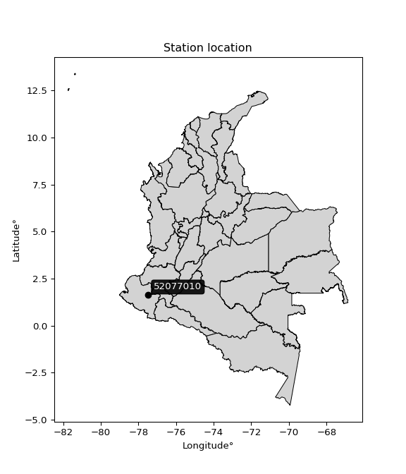

<div align="center">


</div>

# PMP Station (Rain, Pmax24h): 52077010

Probable Maximum Precipitation (PMP) is the greatest amount of rainfall for a specific duration that is meteorologically possible for a given location, acting as a "worst-case" scenario for extreme storms, crucial for designing safety-critical infrastructure like bridges, river deviations, dams, spillways, and nuclear plants to prevent catastrophic failure. PMP is calculated by hydrologists using meteorological data to determine the upper limit of extreme rainfall, often leading to the Probable Maximum Flood (PMF) for flood control design, and is increasingly being studied for climate change impacts. Probable Maximum Precipitation (PMP) is the theoretical upper limit of rainfall, a deterministic estimate for extreme events, while probability distributions (like GEV, Gumbel) describe the likelihood and frequency of various precipitation amounts, including rare ones, showing how often events occur, with PMP representing the extreme end of these distributions, used for critical infrastructure design to ensure safety against the worst conceivable weather, unlike standard statistical forecasts which cover typical probabilities.

The most common probability distributions in hydrology, used for analyzing floods, rainfall, and streamflow, include the Normal, Log-Normal, Gumbel, Gamma (including Log-Pearson Type III), and Generalized Extreme Value (GEV) distributions, often chosen based on the data´s skewness and whether modeling extremes or general conditions, with Gumbel and GEV popular for extreme events like floods, while the Normal distribution serves as a baseline, though often requiring transformations for skewed hydrological data. These distributions help in designing water infrastructure, managing water resources, and forecasting hydrologic events.

> Hydrological data often isn´t perfectly normal (it´s skewed), so different distributions are needed for different applications, such as: **Flood Frequency Analysis**: Using Gumbel, GEV, or Log-Pearson Type III for predicting extreme flood magnitudes and their return periods, **Rainfall Analysis**: Normal for annual totals, but Log-Normal, Weibull, or GEV for intensity or extreme daily rainfall, **Streamflow Modeling**: Gamma and Log-Normal for maximum flows, GEV for minimum flows, and Kappa for daily flows.

<div align="center">

</img>

</div>


## A. General information


### 1. General running parameters

• app_version: _v20260108_. • runtime: _2026-01-08 13:24:42.400241_. • Python version: _3.14.0_. • SciPy version: _1.16.3_. • Pandas version: _2.3.3_. • NumPy version: _2.3.5_. • Stations dataset (station_dataset_file): _dataset/pmax24h_in/automatic_colombia_2003_2024.csv_. • Stations catalog (station_catalog_file): _dataset/CNE.xls_. • Minimum year to eval til year_max (date_min): _1900_. • Maximum year to eval since year_min (date_max): _2024_. • Creates, save and include plots into reports (create_plot): _False_. • Plot only fit distributions with Δo > Δ (plot_only_fit): _True_. • Plot only simple graphs avoiding multiple CDFs and multiple Extreme values plots (plot_only_simple): _True_. • Eval low extreme values, if False, evaluates high extreme values (low_extreme): _False_. • Eval every SciPy distribution as logarithmic (pdist_logarithmic_on): _True_. • Standard deviation normalized (ddof): _1.0_. • Return periods to eval in years (Tr): _[2, 2.33, 5, 10, 15, 20, 25, 50, 75, 100, 200, 250, 500, 750, 1000]_. • Minimum data sample per station, 0 means any (minimum_sample): _5_. • Z-Score maximum threshold to adjust a value, 0 means disable (zscore_max): _3.5_. • Z-Score minimum threshold to adjust a value, 0 means disable (zscore_min): _-2.5_. • Avoid zeros, e.g. rain = 0 (avoid_zeros): _True_. • Avoid null values (avoid_nans): _True_. 

:file_folder:Table: [dataset.csv](../../dataset/pmax24h_in/automatic_colombia_2003_2024.csv)

> Delta Degrees of Freedom (DDOF): is a parameter used in the formulas for calculating variance and standard deviation. When ddof=0, the divisor is $N$ (the total number of observations) and this is used when your data set is the entire population. When ddof=1, the divisor is $N-1$ and this is used when your data set is a sample drawn from a larger population. Using $N-1$ provides an unbiased estimate of the population variance (known as Bessel´s correction).


### 2. Station info and location

|   id |   CODIGO | NOMBRE                         | CATEGORIA    | TECNOLOGIA                              | ESTADO   | FECHA_INSTALACION   |   FECHA_SUSPENSION |   ALTITUD |   LATITUD |   LONGITUD | DEPARTAMENTO   | MUNICIPIO   | AREA_OPERATIVA                      | ENTIDAD                                                     | AREA_HIDROGRAFICA   | ZONA_HIDROGRAFICA   | SUBZONA_HIDROGRAFICA   | CORRIENTE   | Catalogo   |   Version |
|-----:|---------:|:-------------------------------|:-------------|:----------------------------------------|:---------|:--------------------|-------------------:|----------:|----------:|-----------:|:---------------|:------------|:------------------------------------|:------------------------------------------------------------|:--------------------|:--------------------|:-----------------------|:------------|:-----------|----------:|
|    0 | 52077010 | PUENTE PUSMEO - AUT [52077010] | Limnigráfica | Automática con Telemetría, Convencional | Activa   | 15/09/1965          |                nan |       380 |   1.62406 |   -77.4789 | Nariño         | Cumbitara   | Area Operativa 07 - Nariño-Putumayo | INSTITUTO DE HIDROLOGIA METEOROLOGIA Y ESTUDIOS AMBIENTALES | Pacifico            | Patía               | Río Patia Medio        | Patia       | CNE_IDEAM  |  20251226 |

<div align="center">

Dynamic map: [:earth_americas:Google](http://maps.google.com/maps?q=1.624055556,-77.47891667) [:earth_americas:OSM](https://www.openstreetmap.org/#map=18/1.624055556/-77.47891667&layers=P) [:earth_americas:Bing](https://www.bing.com/maps?cp=1.624055556~-77.47891667&lvl=18) [:earth_americas:Apple](https://maps.apple.com/frame?center=1.624055556%2C-77.47891667&span=0.003%2C0.006)

</div>


<div align="center">

```geojson
{
  "type": "Feature",
  "geometry": {
    "type": "Point", 
    "coordinates": [-77.47891667, 1.624055556]
  }, 
  "properties": {
    "Name": "52077010"
  }
}
```

</div>


### 3. Discrete values table and plot

<div align="center">

|               |           0 |          1 |           2 |           3 |           4 |         5 |
|:--------------|------------:|-----------:|------------:|------------:|------------:|----------:|
| Date          | 2017        | 2018       | 2019        | 2020        | 2022        | 2024      |
| Value         |   41.8      |   11.8     |   24.6      |   54.4      |   24.2      |   63.6    |
| Value_initial |   41.8      |   11.8     |   24.6      |   54.4      |   24.2      |   63.6    |
| count         |    6        |    6       |    6        |    6        |    6        |    6      |
| mean          |   36.7333   |   36.7333  |   36.7333   |   36.7333   |   36.7333   |   36.7333 |
| std           |   19.9277   |   19.9277  |   19.9277   |   19.9277   |   19.9277   |   19.9277 |
| zscore        |    0.254252 |   -1.25119 |   -0.608867 |    0.886537 |   -0.628939 |    1.3482 |


</div>


> The initial value (value_initial) correspond to the initial obtained or null completed value, and value (value) is adjusted only when the initial value is outside the valid range (outlier) definite through the Z-Score value. If Z-Score is active, values out of range or outliers are replaced with the station mean value. A Z-Score (or standard score) measures how many standard deviations a data point is from the mean of a dataset, indicating its relative position; positive scores mean above the mean, negative mean below, and a score of zero is exactly at the mean, allowing for comparison of values from different distributions. It´s calculated using the formula $z=(x–μ)/σ$, where $x$ is the data point, $μ$ is the mean, and $σ$ is the standard deviation, helping identify outliers and understand probability.
>
> <sub>**Note**: In this study, "completing" (filling gaps in) and "extending" (forecasting or lengthening the historical record) rainfall data series are avoided for certain critical analyses because they introduce artificial bias and uncertainty, which can distort the statistics of rare events (extremes), alter day-to-day variability, and compromise the integrity and homogeneity of the original data. Some reasons against Completing/Extending rainfall data are: **Distortion of Extremes and Variability**: The primary issue is that most gap-filling or extension methods rely on averaging or regression with nearby stations, which inherently smooths the data. Rainfall is highly variable in space and time, with a large percentage of zero values and occasional large storms. Infilling methods often underestimate the highest values and overestimate the lowest (zero) values, which severely distorts analyses focused on flood frequency, drought severity, and intensity-duration-frequency (IDF) curves, **Loss of Data Homogeneity**: Infilled or extended data are synthetic estimates, not actual measurements. Combining these estimates with observed data can violate the assumption of data homogeneity, which requires that the data properties do not change over time. Inhomogeneity can lead to incorrect conclusions about long-term trends or changes in climate patterns, **Propagation of Errors**: Errors and biases from the original data (e.g., wind-induced undercatch, instrument errors, site changes) or the data used for imputation can propagate through the analysis, leading to unreliable hydrological models and inaccurate predictions, **Compromised Statistical Integrity**: For statistical analyses, especially those involving the frequency of events, using artificial data can introduce time bias or autocorrelation that doesn´t exist in reality, making it difficult to assess the true probability of events, **Difficulty in Validation**: It is difficult to accurately validate the quality of filled or extended data, especially for past periods where ground-truth measurements are unavailable. The reliability of imputation techniques heavily depends on the density of the surrounding station network and the complexity of the local topography.</sub>


### 4. Active continuous probability distributions from SciPy (43 of 104 available)

A Probability Density Function (PDF) describes the relative likelihood of a continuous random variable falling within a specific range, where the total area under its curve equals 1, and the area over any interval gives the actual probability for that range. Unlike discrete probabilities (like rolling a die), a PDF shows density, not direct probability for a single point (which is zero), with higher points indicating higher likelihood, often visualized as a bell curve for normal distributions.

A log of a probability density function (log-PDF) is simply the logarithm of the PDF´s value, denoted as $log(f(x))$, useful for converting multiplication of probabilities into addition, improving numerical stability with tiny numbers, and connecting to information theory concepts like entropy. Instead of dealing with very small probabilities (e.g., 0.000001), log-PDFs use negative numbers (e.g., $log(0.00001) ≈ -11.51$ that are easier for computers to handle, preventing underflow errors and simplifying complex calculations. In this study, each active probability distribution from SciPy is also evaluated in the $log$ form.

[scipy.stats](https://docs.scipy.org/doc/scipy/reference/stats.html) is a Python´s powerful submodule within the SciPy library for comprehensive statistical analysis, offering over 130 probability distributions (like Normal, Poisson), functions for descriptive stats (mean, variance), hypothesis testing (t-tests, chi-square), random variable generation, and statistical tests, making it essential for data science, modeling, and research. It provides tools to explore, model, and draw conclusions from data efficiently, working seamlessly with NumPy.

<div align="center">

|   id | p_dist             |   n_parameter | fit_method   | label                                                                       | active   | ref                                                                                                        |
|-----:|:-------------------|--------------:|:-------------|:----------------------------------------------------------------------------|:---------|:-----------------------------------------------------------------------------------------------------------|
|    0 | alpha              |             3 | MLE          | Alpha                                                                       | True     | [:mortar_board:](https://docs.scipy.org/doc/scipy/reference/generated/scipy.stats.alpha.html)              |
|    1 | betaprime          |             4 | MLE          | Beta prime                                                                  | True     | [:mortar_board:](https://docs.scipy.org/doc/scipy/reference/generated/scipy.stats.betaprime.html)          |
|    2 | chi2               |             3 | MLE          | Chi²                                                                        | True     | [:mortar_board:](https://docs.scipy.org/doc/scipy/reference/generated/scipy.stats.chi2.html)               |
|    3 | crystalball        |             4 | MLE          | Crystalball                                                                 | True     | [:mortar_board:](https://docs.scipy.org/doc/scipy/reference/generated/scipy.stats.crystalball.html)        |
|    4 | erlang             |             3 | MLE          | Erlang                                                                      | True     | [:mortar_board:](https://docs.scipy.org/doc/scipy/reference/generated/scipy.stats.erlang.html)             |
|    5 | expon              |             2 | MLE          | Exponential                                                                 | True     | [:mortar_board:](https://docs.scipy.org/doc/scipy/reference/generated/scipy.stats.expon.html)              |
|    6 | exponnorm          |             3 | MLE          | Exponentially modified Normal                                               | True     | [:mortar_board:](https://docs.scipy.org/doc/scipy/reference/generated/scipy.stats.exponnorm.html)          |
|    7 | f                  |             4 | MLE          | F                                                                           | True     | [:mortar_board:](https://docs.scipy.org/doc/scipy/reference/generated/scipy.stats.f.html)                  |
|    8 | fatiguelife        |             3 | MLE          | Fatigue-life (Birnbaum-Saunders)                                            | True     | [:mortar_board:](https://docs.scipy.org/doc/scipy/reference/generated/scipy.stats.fatiguelife.html)        |
|    9 | fisk               |             3 | MLE          | Fisk                                                                        | True     | [:mortar_board:](https://docs.scipy.org/doc/scipy/reference/generated/scipy.stats.fisk.html)               |
|   10 | gamma              |             3 | MLE          | Gamma                                                                       | True     | [:mortar_board:](https://docs.scipy.org/doc/scipy/reference/generated/scipy.stats.gamma.html)              |
|   11 | genexpon           |             5 | MLE          | Generalized exponential                                                     | True     | [:mortar_board:](https://docs.scipy.org/doc/scipy/reference/generated/scipy.stats.genexpon.html)           |
|   12 | genlogistic        |             3 | MLE          | Generalized logistic                                                        | True     | [:mortar_board:](https://docs.scipy.org/doc/scipy/reference/generated/scipy.stats.genlogistic.html)        |
|   13 | gibrat             |             2 | MM           | Gibrat                                                                      | True     | [:mortar_board:](https://docs.scipy.org/doc/scipy/reference/generated/scipy.stats.gibrat.html)             |
|   14 | gompertz           |             3 | MLE          | Gompertz (or truncated Gumbel)                                              | True     | [:mortar_board:](https://docs.scipy.org/doc/scipy/reference/generated/scipy.stats.gompertz.html)           |
|   15 | gumbel_l           |             2 | MM           | Gumbel Left Skew                                                            | True     | [:mortar_board:](https://docs.scipy.org/doc/scipy/reference/generated/scipy.stats.gumbel_l.html)           |
|   16 | gumbel_r           |             2 | MM           | Gumbel Right Skew                                                           | True     | [:mortar_board:](https://docs.scipy.org/doc/scipy/reference/generated/scipy.stats.gumbel_r.html)           |
|   17 | halflogistic       |             2 | MM           | Half-logistic                                                               | True     | [:mortar_board:](https://docs.scipy.org/doc/scipy/reference/generated/scipy.stats.halflogistic.html)       |
|   18 | halfnorm           |             2 | MM           | Half Normal                                                                 | True     | [:mortar_board:](https://docs.scipy.org/doc/scipy/reference/generated/scipy.stats.halfnorm.html)           |
|   19 | hypsecant          |             2 | MM           | hyperbolic secant                                                           | True     | [:mortar_board:](https://docs.scipy.org/doc/scipy/reference/generated/scipy.stats.hypsecant.html)          |
|   20 | invgamma           |             3 | MLE          | Inverted gamma                                                              | True     | [:mortar_board:](https://docs.scipy.org/doc/scipy/reference/generated/scipy.stats.invgamma.html)           |
|   21 | invgauss           |             3 | MLE          | Inverse Gaussian                                                            | True     | [:mortar_board:](https://docs.scipy.org/doc/scipy/reference/generated/scipy.stats.invgauss.html)           |
|   22 | invweibull         |             3 | MLE          | Inverted Weibull                                                            | True     | [:mortar_board:](https://docs.scipy.org/doc/scipy/reference/generated/scipy.stats.invweibull.html)         |
|   23 | kstwobign          |             2 | MLE          | Limiting distribution of scaled Kolmogorov-Smirnov two-sided test statistic | True     | [:mortar_board:](https://docs.scipy.org/doc/scipy/reference/generated/scipy.stats.kstwobign.html)          |
|   24 | laplace            |             2 | MM           | Laplace                                                                     | True     | [:mortar_board:](https://docs.scipy.org/doc/scipy/reference/generated/scipy.stats.laplace.html)            |
|   25 | laplace_asymmetric |             3 | MLE          | Asymmetric Laplace                                                          | True     | [:mortar_board:](https://docs.scipy.org/doc/scipy/reference/generated/scipy.stats.laplace_asymmetric.html) |
|   26 | loggamma           |             3 | MLE          | Log gamma                                                                   | True     | [:mortar_board:](https://docs.scipy.org/doc/scipy/reference/generated/scipy.stats.loggamma.html)           |
|   27 | logistic           |             2 | MM           | Logistic (or Sech-squared)                                                  | True     | [:mortar_board:](https://docs.scipy.org/doc/scipy/reference/generated/scipy.stats.logistic.html)           |
|   28 | lognorm            |             3 | MLE          | Log Normal                                                                  | True     | [:mortar_board:](https://docs.scipy.org/doc/scipy/reference/generated/scipy.stats.lognorm.html)            |
|   29 | maxwell            |             2 | MM           | Maxwell                                                                     | True     | [:mortar_board:](https://docs.scipy.org/doc/scipy/reference/generated/scipy.stats.maxwell.html)            |
|   30 | mielke             |             4 | MLE          | Mielke Beta-Kappa / Dagum                                                   | True     | [:mortar_board:](https://docs.scipy.org/doc/scipy/reference/generated/scipy.stats.mielke.html)             |
|   31 | moyal              |             2 | MM           | Moyal                                                                       | True     | [:mortar_board:](https://docs.scipy.org/doc/scipy/reference/generated/scipy.stats.moyal.html)              |
|   32 | nakagami           |             3 | MLE          | Nakagami                                                                    | True     | [:mortar_board:](https://docs.scipy.org/doc/scipy/reference/generated/scipy.stats.nakagami.html)           |
|   33 | ncf                |             5 | MLE          | Non-central F distribution                                                  | True     | [:mortar_board:](https://docs.scipy.org/doc/scipy/reference/generated/scipy.stats.ncf.html)                |
|   34 | nct                |             4 | MLE          | Non-central Student’s t                                                     | True     | [:mortar_board:](https://docs.scipy.org/doc/scipy/reference/generated/scipy.stats.nct.html)                |
|   35 | norm               |             2 | MM           | Normal                                                                      | True     | [:mortar_board:](https://docs.scipy.org/doc/scipy/reference/generated/scipy.stats.norm.html)               |
|   36 | pearson3           |             3 | MM           | Pearson type III                                                            | True     | [:mortar_board:](https://docs.scipy.org/doc/scipy/reference/generated/scipy.stats.pearson3.html)           |
|   37 | rayleigh           |             2 | MM           | Rayleigh                                                                    | True     | [:mortar_board:](https://docs.scipy.org/doc/scipy/reference/generated/scipy.stats.rayleigh.html)           |
|   38 | rice               |             3 | MLE          | Rice                                                                        | True     | [:mortar_board:](https://docs.scipy.org/doc/scipy/reference/generated/scipy.stats.rice.html)               |
|   39 | t                  |             3 | MLE          | Student’s t                                                                 | True     | [:mortar_board:](https://docs.scipy.org/doc/scipy/reference/generated/scipy.stats.t.html)                  |
|   40 | truncnorm          |             4 | MLE          | Truncated normal                                                            | True     | [:mortar_board:](https://docs.scipy.org/doc/scipy/reference/generated/scipy.stats.truncnorm.html)          |
|   41 | wald               |             2 | MM           | Wald                                                                        | True     | [:mortar_board:](https://docs.scipy.org/doc/scipy/reference/generated/scipy.stats.wald.html)               |
|   42 | weibull_min        |             3 | MLE          | Weibull minimum                                                             | True     | [:mortar_board:](https://docs.scipy.org/doc/scipy/reference/generated/scipy.stats.weibull_min.html)        |

</div>

> **n_parameter:** # arguments & localization & scale.
>
> **Fit methods:** (MLE) maximum likelihood, (MM) L-moments.
>
>**Inactive** (With the only purpose of prevent loops, zero divisions, infinite values, over high estimated values or horizontal trending for recurrence intervals estimations, the follow distributions were disabled.)**:** foldnorm, gennorm, norminvgauss, powernorm, powerlognorm, skewnorm, genextreme, anglit, arcsine, argus, beta, bradford, burr, burr12, cauchy, cosine, halfcauchy, foldcauchy, skewcauchy, wrapcauchy, dgamma, gengamma, exponweib, exponpow, truncexpon, gausshyper, genhalflogistic, genhyperbolic, geninvgauss, halfgennorm, johnsonsb, johnsonsu, kappa4, kappa3, ksone, kstwo, loglaplace, levy, levy_l, levy_stable, ncx2, pareto, genpareto, truncpareto, lomax, powerlaw, rdist, rel_breitwigner, recipinvgauss, semicircular, studentized_range, trapezoid, triang, truncweibull_min, tukeylambda, uniform, loguniform, vonmises, vonmises_line, weibull_max, dweibull, 


## B. Probability (PDF) vs. Empirical (EDF) distributions functions

A continuous probability distribution (CPD) describes probabilities for variables that can take any value within a range (like rain any time), unlike discrete variables with specific outcomes (like temperature). It uses a Probability Density Function (PDF), a curve where the total area under it equals 1, and the probability of the variable falling within an interval (a to b) is found by calculating the area under the curve between those points. A key feature is that the probability of hitting any single exact value is zero, so probabilities are always expressed for ranges, e.g., $P(a ≤ X ≤ b)$.

<div align="center">

Distributions parameters from station values
|    |   station | p_dist                |   n |             loc |          scale | shape                  | shape1                 | shape2                | shape3   |
|---:|----------:|:----------------------|----:|----------------:|---------------:|:-----------------------|:-----------------------|:----------------------|:---------|
|  0 |  52077010 | alpha                 |   6 |  -129.431       | 1515.49        | 9.231715008546875      |                        |                       |          |
|  1 |  52077010 | betaprime             |   6 |    -4.45989     |  558.641       | 4.950494770469257      | 68.08388913884698      |                       |          |
|  2 |  52077010 | chi2                  |   6 |    11.8         |   10.1388      | 1.280037120838272      |                        |                       |          |
|  3 |  52077010 | crystalball           |   6 |    36.7333      |   18.1915      | 3841.4047172769388     | 548.0412034298288      |                       |          |
|  4 |  52077010 | erlang                |   6 |   -30.2408      |    4.80258     | 13.833213727644956     |                        |                       |          |
|  5 |  52077010 | expon                 |   6 |    11.8         |   24.9333      |                        |                        |                       |          |
|  6 |  52077010 | exponnorm             |   6 |    34.6224      |   18.0686      | 0.1168279987756245     |                        |                       |          |
|  7 |  52077010 | f                     |   6 |    11.8         |   23.425       | 0.4399434668896289     | 662.8960891610033      |                       |          |
|  8 |  52077010 | fatiguelife           |   6 |    11.8         |    0.000186004 | 301.73255074983865     |                        |                       |          |
|  9 |  52077010 | fisk                  |   6 |    -6.7258      |   40.1028      | 3.6068239789386705     |                        |                       |          |
| 10 |  52077010 | gamma                 |   6 |   -41.5342      |    4.25876     | 18.331210551977367     |                        |                       |          |
| 11 |  52077010 | genexpon              |   6 |    11.8         |    2.06683     | 0.08280448767353582    | 1.4505093586720344e-07 | 0.7270532178345157    |          |
| 12 |  52077010 | genlogistic           |   6 |   -71.9663      |   15.4793      | 631.5656855746001      |                        |                       |          |
| 13 |  52077010 | gibrat                |   6 |    22.8555      |    8.4173      |                        |                        |                       |          |
| 14 |  52077010 | gompertz              |   6 |    11.8         |   34.4026      | 0.7287393467927851     |                        |                       |          |
| 15 |  52077010 | gumbel_l              |   6 |    44.9205      |   14.1838      |                        |                        |                       |          |
| 16 |  52077010 | gumbel_r              |   6 |    28.5462      |   14.1838      |                        |                        |                       |          |
| 17 |  52077010 | halflogistic          |   6 |    15.1722      |   15.553       |                        |                        |                       |          |
| 18 |  52077010 | halfnorm              |   6 |    12.655       |   30.1777      |                        |                        |                       |          |
| 19 |  52077010 | hypsecant             |   6 |    36.7333      |   11.581       |                        |                        |                       |          |
| 20 |  52077010 | invgamma              |   6 |   -64.0337      | 2986.64        | 30.62796113796788      |                        |                       |          |
| 21 |  52077010 | invgauss              |   6 |   -15.4039      |  366.056       | 0.14242960747072725    |                        |                       |          |
| 22 |  52077010 | invweibull            |   6 |    11.8         |    1.31614     | 0.047741785811134946   |                        |                       |          |
| 23 |  52077010 | kstwobign             |   6 |   -25.6977      |   71.3032      |                        |                        |                       |          |
| 24 |  52077010 | laplace               |   6 |    36.7333      |   12.8633      |                        |                        |                       |          |
| 25 |  52077010 | laplace_asymmetric    |   6 |    24.2         |   12.3247      | 0.6133769907986029     |                        |                       |          |
| 26 |  52077010 | loggamma              |   6 | -4721.22        |  662.655       | 1313.7163496793664     |                        |                       |          |
| 27 |  52077010 | logistic              |   6 |    36.7333      |   10.0295      |                        |                        |                       |          |
| 28 |  52077010 | lognorm               |   6 |    11.8         |    0.0515035   | 13.873511522149277     |                        |                       |          |
| 29 |  52077010 | maxwell               |   6 |    -6.37277     |   27.0127      |                        |                        |                       |          |
| 30 |  52077010 | mielke                |   6 |    -3.10834     |   67.3614      | 1.5499146028920805     | 366.0170485116787      |                       |          |
| 31 |  52077010 | moyal                 |   6 |    26.3303      |    8.18903     |                        |                        |                       |          |
| 32 |  52077010 | nakagami              |   6 |    24.2         |   13.9086      | 0.08277417316885952    |                        |                       |          |
| 33 |  52077010 | ncf                   |   6 |     0.0775184   |   16.1725      | 5.137401483648096      | 1979.7177772118375     | 6.5638797522271215    |          |
| 34 |  52077010 | nct                   |   6 |  -778.328       |   18.1634      | 326119.9172479821      | 44.87384191579541      |                       |          |
| 35 |  52077010 | norm                  |   6 |    36.7333      |   18.1915      |                        |                        |                       |          |
| 36 |  52077010 | pearson3              |   6 |    36.7334      |   18.1914      | 0.16006054282226045    |                        |                       |          |
| 37 |  52077010 | rayleigh              |   6 |     1.93203     |   27.7674      |                        |                        |                       |          |
| 38 |  52077010 | rice                  |   6 |     3.11938     |   23.3227      | 0.8280098784313619     |                        |                       |          |
| 39 |  52077010 | t                     |   6 |    36.7323      |   18.1914      | 17712492.654688142     |                        |                       |          |
| 40 |  52077010 | truncnorm             |   6 |    36.7333      |   18.1915      | -77.33528394031137     | 472.34336810574325     |                       |          |
| 41 |  52077010 | wald                  |   6 |    18.5419      |   18.1914      |                        |                        |                       |          |
| 42 |  52077010 | weibull_min           |   6 |    11.8         |   26.5764      | 0.43639491400884733    |                        |                       |          |
| 43 |  52077010 | logalpha              |   6 |    -8.95663     |  259.38        | 20.958010612222516     |                        |                       |          |
| 44 |  52077010 | logbetaprime          |   6 |    -6.3764      |   10.1193      | 531.3492461857751      | 547.7532591573597      |                       |          |
| 45 |  52077010 | logchi2               |   6 |     2.4681      |    0.977311    | 1.0415784371956651     |                        |                       |          |
| 46 |  52077010 | logcrystalball        |   6 |     3.45651     |    0.572528    | 102.08370884321053     | 30.31265452386343      |                       |          |
| 47 |  52077010 | logerlang             |   6 |    -6.40132     |    0.0343651   | 286.7679485141016      |                        |                       |          |
| 48 |  52077010 | logexpon              |   6 |     2.4681      |    0.988413    |                        |                        |                       |          |
| 49 |  52077010 | logexponnorm          |   6 |     3.45601     |    0.57253     | 0.0008841174373721567  |                        |                       |          |
| 50 |  52077010 | logf                  |   6 |  -229.379       |  232.838       | 1036705.4606988644     | 482728.08222670923     |                       |          |
| 51 |  52077010 | logfatiguelife        |   6 |  -155.825       |  159.283       | 0.0035916005360727725  |                        |                       |          |
| 52 |  52077010 | logfisk               |   6 |    -3.56432e+07 |    3.56432e+07 | 103897392.41378511     |                        |                       |          |
| 53 |  52077010 | loggamma              |   6 |    -6.18767     |    0.0353158   | 272.9595476182053      |                        |                       |          |
| 54 |  52077010 | loggenexpon           |   6 |     2.43696     |    0.0103321   | 0.003816149303487268   | 3.1155323187422646     | 3.110005410172395e-05 |          |
| 55 |  52077010 | loggenlogistic        |   6 |     4.15264     |    2.15057e-06 | 3.0780615402412223e-06 |                        |                       |          |
| 56 |  52077010 | loggibrat             |   6 |     3.01977     |    0.2649      |                        |                        |                       |          |
| 57 |  52077010 | loggompertz           |   6 |     2.4681      |    0.616946    | 0.16459137580660782    |                        |                       |          |
| 58 |  52077010 | loggumbel_l           |   6 |     3.71418     |    0.446398    |                        |                        |                       |          |
| 59 |  52077010 | loggumbel_r           |   6 |     3.19884     |    0.446398    |                        |                        |                       |          |
| 60 |  52077010 | loghalflogistic       |   6 |     2.77792     |    0.489501    |                        |                        |                       |          |
| 61 |  52077010 | loghalfnorm           |   6 |     2.69874     |    0.949731    |                        |                        |                       |          |
| 62 |  52077010 | loghypsecant          |   6 |     3.45651     |    0.364482    |                        |                        |                       |          |
| 63 |  52077010 | loginvgamma           |   6 |    -6.99307     | 3360.47        | 322.9623680237372      |                        |                       |          |
| 64 |  52077010 | loginvgauss           |   6 |    -1.87852     |  432.588       | 0.012308779134216633   |                        |                       |          |
| 65 |  52077010 | loginvweibull         |   6 |    -9.71333e+07 |    9.71333e+07 | 170893341.38298592     |                        |                       |          |
| 66 |  52077010 | logkstwobign          |   6 |     1.1481      |    2.63532     |                        |                        |                       |          |
| 67 |  52077010 | loglaplace            |   6 |     3.45651     |    0.404838    |                        |                        |                       |          |
| 68 |  52077010 | loglaplace_asymmetric |   6 |     4.15265     |    0.00691361  | 100.31595737254946     |                        |                       |          |
| 69 |  52077010 | logloggamma           |   6 |     4.15262     |    6.00105e-07 | 8.610739241703832e-07  |                        |                       |          |
| 70 |  52077010 | loglogistic           |   6 |     3.45651     |    0.315651    |                        |                        |                       |          |
| 71 |  52077010 | loglognorm            |   6 |     2.4681      |    0.00302287  | 13.21881363974814      |                        |                       |          |
| 72 |  52077010 | logmaxwell            |   6 |     2.09986     |    0.850155    |                        |                        |                       |          |
| 73 |  52077010 | logmielke             |   6 |     2.4681      |    1.70852     | 0.7441737092688744     | 341.95503622721327     |                       |          |
| 74 |  52077010 | logmoyal              |   6 |     3.1291      |    0.257728    |                        |                        |                       |          |
| 75 |  52077010 | lognakagami           |   6 |     3.18635     |    0.493353    | 0.16359769817851333    |                        |                       |          |
| 76 |  52077010 | logncf                |   6 |    -5.39477     |    6.96864     | 526.9718502301166      | 1556.1850339398557     | 141.94026399868       |          |
| 77 |  52077010 | lognct                |   6 |    17.9084      |    0.566925    | 12452.224702812877     | -25.48920747465671     |                       |          |
| 78 |  52077010 | lognorm               |   6 |     3.45651     |    0.572528    |                        |                        |                       |          |
| 79 |  52077010 | logpearson3           |   6 |     3.45651     |    0.572528    | -0.43156607059332897   |                        |                       |          |
| 80 |  52077010 | lograyleigh           |   6 |     2.36123     |    0.873906    |                        |                        |                       |          |
| 81 |  52077010 | logrice               |   6 |     2.1222      |    0.634968    | 1.79690112707392       |                        |                       |          |
| 82 |  52077010 | logt                  |   6 |     3.45651     |    0.57253     | 2604282367.7154217     |                        |                       |          |
| 83 |  52077010 | logtruncnorm          |   6 |    -0.160296    |    1.25001     | 2.677256679472349      | 3.4503111389077388     |                       |          |
| 84 |  52077010 | logwald               |   6 |     2.88392     |    0.572583    |                        |                        |                       |          |
| 85 |  52077010 | logweibull_min        |   6 |    -6.0252e+07  |    6.0252e+07  | 130568901.68838102     |                        |                       |          |

</div>

> **loc** (Location parameter): This shifts the distribution along the x-axis. For many common distributions, like the normal (Gaussian) distribution, loc represents the mean $μ$. For others, like the uniform distribution, it might represent the minimum value, or for the beta distribution, the left end of the support interval.
>
> **scale** (Scale parameter): This determines the width or spread of the distribution. For the normal distribution, scale represents the standard deviation $σ$. For a uniform distribution, it defines the length of the interval (from $loc$ to $loc + scale$).
>
> **shape** (Shape parameters): Refers to parameters that define the specific form of a probability distribution, distinct from its location (loc) and scale (scale). These parameters are required arguments for most distribution functions. For example, a normal (Gaussian) distribution is fully defined by its location (mean) and scale (standard deviation), so it has no specific shape parameters beyond loc and scale. However, other distributions have intrinsic properties that need specification, as Gamma distribution that takes a shape parameter, often named $a$ or $alpha$.


### 0. Cumulative distribution values - CDF (86 evaluated)

Cumulative Distribution Function (CDF), denoted as $F$<sub>$X$</sub>$(x)$, is a function that gives the probability that a random variable $X$ will take a value less than or equal to a specific value, $x$ (i.e., $(P(X≥x)$. It essentially "accumulates" probabilities from a given point up to the far right (positive infinity), providing a complete picture of the distribution´s probabilities for both discrete (like rain) and continuous (like temperature) variables, helping to find probabilities over ranges or above certain values. Each station is evaluated separately ordering the $x$ values ascending, calculating the CDF and PDF values for the activated distributions and their logarithmic forms.

<div align="center">

CDF ordered by x ascending and calculating $log(f(x))$ separately
|   id |   Station |   date |    x |   count |    mean |     std |    zscore |   Value_initial |   station |   m |     alpha |   alpha_pdf |   betaprime |   betaprime_pdf |        chi2 |       chi2_pdf |   crystalball |   crystalball_pdf |   erlang |   erlang_pdf |    expon |   expon_pdf |   exponnorm |   exponnorm_pdf |          f |       f_pdf |   fatiguelife |   fatiguelife_pdf |      fisk |   fisk_pdf |     gamma |   gamma_pdf |    genexpon |   genexpon_pdf |   genlogistic |   genlogistic_pdf |    gibrat |   gibrat_pdf |    gompertz |   gompertz_pdf |   gumbel_l |   gumbel_l_pdf |   gumbel_r |   gumbel_r_pdf |   halflogistic |   halflogistic_pdf |   halfnorm |   halfnorm_pdf |   hypsecant |   hypsecant_pdf |   invgamma |   invgamma_pdf |   invgauss |   invgauss_pdf |   invweibull |   invweibull_pdf |   kstwobign |   kstwobign_pdf |   laplace |   laplace_pdf |   laplace_asymmetric |   laplace_asymmetric_pdf |   loggamma |   loggamma_pdf |   logistic |   logistic_pdf |   lognorm |   lognorm_pdf |   maxwell |   maxwell_pdf |    mielke |   mielke_pdf |     moyal |   moyal_pdf |   nakagami |   nakagami_pdf |       ncf |    ncf_pdf |       nct |    nct_pdf |      norm |   norm_pdf |   pearson3 |   pearson3_pdf |   rayleigh |   rayleigh_pdf |      rice |   rice_pdf |        t |      t_pdf |   truncnorm |   truncnorm_pdf |     wald |   wald_pdf |   weibull_min |   weibull_min_pdf |   logalpha |   logalpha_pdf |   logbetaprime |   logbetaprime_pdf |     logchi2 |   logchi2_pdf |   logcrystalball |   logcrystalball_pdf |   logerlang |   logerlang_pdf |   logexpon |   logexpon_pdf |   logexponnorm |   logexponnorm_pdf |     logf |   logf_pdf |   logfatiguelife |   logfatiguelife_pdf |   logfisk |   logfisk_pdf |   loggenexpon |   loggenexpon_pdf |   loggenlogistic |   loggenlogistic_pdf |   loggibrat |   loggibrat_pdf |   loggompertz |   loggompertz_pdf |   loggumbel_l |   loggumbel_l_pdf |   loggumbel_r |   loggumbel_r_pdf |   loghalflogistic |   loghalflogistic_pdf |   loghalfnorm |   loghalfnorm_pdf |   loghypsecant |   loghypsecant_pdf |   loginvgamma |   loginvgamma_pdf |   loginvgauss |   loginvgauss_pdf |   loginvweibull |   loginvweibull_pdf |   logkstwobign |   logkstwobign_pdf |   loglaplace |   loglaplace_pdf |   loglaplace_asymmetric |   loglaplace_asymmetric_pdf |   logloggamma |   logloggamma_pdf |   loglogistic |   loglogistic_pdf |   loglognorm |   loglognorm_pdf |   logmaxwell |   logmaxwell_pdf |   logmielke |   logmielke_pdf |    logmoyal |   logmoyal_pdf |   lognakagami |   lognakagami_pdf |    logncf |   logncf_pdf |    lognct |   lognct_pdf |   logpearson3 |   logpearson3_pdf |   lograyleigh |   lograyleigh_pdf |   logrice |   logrice_pdf |      logt |   logt_pdf |   logtruncnorm |   logtruncnorm_pdf |   logwald |   logwald_pdf |   logweibull_min |   logweibull_min_pdf |
|-----:|----------:|-------:|-----:|--------:|--------:|--------:|----------:|----------------:|----------:|----:|----------:|------------:|------------:|----------------:|------------:|---------------:|--------------:|------------------:|---------:|-------------:|---------:|------------:|------------:|----------------:|-----------:|------------:|--------------:|------------------:|----------:|-----------:|----------:|------------:|------------:|---------------:|--------------:|------------------:|----------:|-------------:|------------:|---------------:|-----------:|---------------:|-----------:|---------------:|---------------:|-------------------:|-----------:|---------------:|------------:|----------------:|-----------:|---------------:|-----------:|---------------:|-------------:|-----------------:|------------:|----------------:|----------:|--------------:|---------------------:|-------------------------:|-----------:|---------------:|-----------:|---------------:|----------:|--------------:|----------:|--------------:|----------:|-------------:|----------:|------------:|-----------:|---------------:|----------:|-----------:|----------:|-----------:|----------:|-----------:|-----------:|---------------:|-----------:|---------------:|----------:|-----------:|---------:|-----------:|------------:|----------------:|---------:|-----------:|--------------:|------------------:|-----------:|---------------:|---------------:|-------------------:|------------:|--------------:|-----------------:|---------------------:|------------:|----------------:|-----------:|---------------:|---------------:|-------------------:|---------:|-----------:|-----------------:|---------------------:|----------:|--------------:|--------------:|------------------:|-----------------:|---------------------:|------------:|----------------:|--------------:|------------------:|--------------:|------------------:|--------------:|------------------:|------------------:|----------------------:|--------------:|------------------:|---------------:|-------------------:|--------------:|------------------:|--------------:|------------------:|----------------:|--------------------:|---------------:|-------------------:|-------------:|-----------------:|------------------------:|----------------------------:|--------------:|------------------:|--------------:|------------------:|-------------:|-----------------:|-------------:|-----------------:|------------:|----------------:|------------:|---------------:|--------------:|------------------:|----------:|-------------:|----------:|-------------:|--------------:|------------------:|--------------:|------------------:|----------:|--------------:|----------:|-----------:|---------------:|-------------------:|----------:|--------------:|-----------------:|---------------------:|
|    0 |  52077010 |   2018 | 11.8 |       6 | 36.7333 | 19.9277 | -1.25119  |            11.8 |  52077010 |   1 | 0.0669588 |  0.00985784 |   0.0564328 |      0.0115455  | 5.87924e-11 | 21182.8        |     0.0852487 |        0.0085727  | 0.068301 |   0.0100466  | 0        |  0.040107   |   0.0851702 |      0.00857785 | 0.00114698 | 8.33535e+07 |     0.0293579 |       1.10479e+08 | 0.0581136 | 0.0106567  | 0.0730124 |  0.00983059 | 1.10474e-06 |     0.0400636  |      0.059987 |        0.0108794  | 0         |   0          | 1.06096e-12 |     0.0211827  |  0.0922643 |     0.00619513 |  0.0385226 |     0.00884453 |       0        |         0          |   0        |     0          |   0.0736083 |      0.00629944 |  0.0653448 |     0.0101121  |  0.0545839 |     0.0115476  |    0.0059311 |      8.1736e+11  |   0.0550645 |      0.0116328  |  0.071972 |    0.00559514 |            0.0530151 |               0.00701287 |   0.042064 |       0.165329 |   0.076845 |     0.00707314 | 0.0421376 |      0.157005 | 0.0708233 |    0.010661   | 0.0965682 |    0.0100395 | 0.0151709 |  0.00620246 | 0          |    0           | 0.0559497 | 0.0116707  | 0.0852402 | 0.00857366 | 0.0852487 | 0.0085727  |  0.0811672 |     0.0089294  |  0.0611948 |     0.0120152  | 0.0480586 | 0.0108215  | 0.085257 | 0.00857335 |   0.0852487 |      0.0085727  | 0        | 0          |   8.73629e-08 |       2.14623e+07 |  0.0404604 |       0.172845 |      0.0435894 |           0.171298 | 8.03571e-09 |   9.42358e+06 |        0.0421375 |             0.157005 |   0.0415116 |        0.163741 |   0        |       1.01172  |      0.0421381 |           0.157006 | 0.0417   |   0.156094 |        0.0414328 |             0.155966 | 0.0483994 |      0.134253 |     0.0118698 |          0.392889 |         0        |             0.128417 |    0        |        0        |   4.70088e-09 |          0.266784 |     0.0594915 |          0.129225 |     0.0058599 |         0.0674682 |          0        |              0        |      0        |          0        |      0.0422194 |           0.115495 |     0.0396226 |          0.167687 |     0.0375441 |          0.170856 |       0.0346768 |            0.205094 |      0.0366253 |           0.245131 |    0.0435151 |         0.107488 |               0.0881258 |                    0.127066 |     0.0891821 |          0.127965 |     0.0418327 |          0.126984 |    0.0126965 |      5.58711e+12 |    0.0204361 |         0.160311 | 2.01711e-05 |       17.9126   | 0.000311952 |     0.00840158 |   0           |       0           | 0.0492128 |     0.181016 | 0.0427128 |     0.157677 |      0.052704 |          0.152323 |    0.00744904 |          0.138888 | 0.0307765 |      0.184616 | 0.0421384 |   0.157007 |    0           |           0        |  0        |      0        |        0.0630806 |             0.132294 |
|    1 |  52077010 |   2022 | 24.2 |       6 | 36.7333 | 19.9277 | -0.628939 |            24.2 |  52077010 |   2 | 0.263452  |  0.0209685  |   0.283426  |      0.0228031  | 0.650404    |     0.0227458  |     0.245422  |        0.0172969  | 0.265794 |   0.0209541  | 0.391845 |  0.0243912  |   0.245484  |      0.0173124  | 0.668349   | 0.0107717   |     0.803918  |       0.00954537  | 0.281456  | 0.0235867  | 0.26215   |  0.0200214  | 0.39152     |     0.024378   |      0.282396 |        0.0230447  | 0.0333053 |   0.0551747  | 0.271116    |     0.0221398  |  0.207084  |     0.0129716  |  0.257032  |     0.0246191  |       0.282342 |         0.0295853  |   0.297959 |     0.0245738  |   0.207982  |      0.016708   |  0.266778  |     0.0212994  |  0.287718  |     0.0234473  |    0.4072    |      0.00140857  |   0.288426  |      0.0233436  |  0.188719 |    0.0146711  |            0.273378  |               0.0361626  |   0.330136 |       0.632412 |   0.222761 |     0.017263   | 0.318509  |      0.623394 | 0.266338  |    0.0199411  | 0.246748  |    0.0140045 | 0.254741  |  0.029007   | 0.00222575 |    1.03715e+11 | 0.279018  | 0.0222162  | 0.245435  | 0.0172991  | 0.245422  | 0.0172969  |  0.249758  |     0.0181307  |  0.274982  |     0.0209391  | 0.253909  | 0.0209341  | 0.245439 | 0.0172976  |   0.245422  |      0.0172969  | 0.177561 | 0.058944   |   0.511786    |       0.0123194   |  0.343668  |       0.647175 |      0.333863  |           0.624578 | 0.593631    |   0.33605     |        0.318509  |             0.623394 |   0.328686  |        0.632748 |   0.516485 |       0.489183 |      0.31851   |           0.623392 | 0.317168 |   0.621764 |        0.317824  |             0.624378 | 0.292143  |      0.602794 |     0.41225   |          0.616407 |         0        |             0.358992 |    0.321384 |        2.15056  |   0.304176    |          0.59466  |     0.264009  |          0.505399 |     0.357586  |         0.823781  |          0.394565 |              0.862428 |      0.392344 |          0.736375 |      0.283105  |           0.678303 |     0.33939   |          0.651127 |     0.345977  |          0.657594 |       0.386718  |            0.646401 |      0.4121    |           0.631758 |    0.256539  |         0.633683 |               0.248239  |                    0.357927 |     0.249955  |          0.358653 |     0.298201  |          0.663001 |    0.660508  |      0.0385699   |    0.348129  |         0.677392 | 0.52473     |        0.543667 | 0.37085     |     0.928153   |   9.56388e-06 |       7.04646e+09 | 0.336769  |     0.603823 | 0.318393  |     0.620794 |      0.298694 |          0.567566 |    0.359645   |          0.691844 | 0.333658  |      0.635312 | 0.318511  |   0.623393 |    0.000159628 |           2.58238  |  0.389222 |      1.47019  |        0.265811  |             0.491608 |
|    2 |  52077010 |   2019 | 24.6 |       6 | 36.7333 | 19.9277 | -0.608867 |            24.6 |  52077010 |   3 | 0.271885  |  0.0211937  |   0.292571  |      0.0229181  | 0.659362    |     0.0220481  |     0.252392  |        0.0175567  | 0.274221 |   0.0211786  | 0.401524 |  0.024003   |   0.252461  |      0.0175722  | 0.672596   | 0.0104688   |     0.807683  |       0.00928473  | 0.290924  | 0.0237517  | 0.270204  |  0.0202473  | 0.401193    |     0.0239904  |      0.291644 |        0.0231935  | 0.0577621 |   0.0662795  | 0.27997     |     0.0221267  |  0.21233   |     0.0132544  |  0.266928  |     0.0248559  |       0.294132 |         0.0293668  |   0.307763 |     0.0244474  |   0.214757  |      0.0171687  |  0.27534   |     0.0215071  |  0.297117  |     0.023546   |    0.407755  |      0.00136434  |   0.297783  |      0.0234366  |  0.19468  |    0.0151345  |            0.2877    |               0.0354498  |   0.340561 |       0.639405 |   0.229742 |     0.0176441  | 0.328797  |      0.631616 | 0.274352  |    0.0201239  | 0.252372  |    0.0141169 | 0.266384  |  0.029196   | 0.471711   |    0.195215    | 0.287928  | 0.022333   | 0.252407  | 0.0175588  | 0.252392  | 0.0175567  |  0.257061  |     0.0183845  |  0.283384  |     0.0210682  | 0.262318  | 0.0211057  | 0.25241  | 0.0175574  |   0.252392  |      0.0175567  | 0.201067 | 0.0585144  |   0.516646    |       0.0119804   |  0.354324  |       0.652685 |      0.344154  |           0.630841 | 0.599087    |   0.329659    |        0.328796  |             0.631615 |   0.339118  |        0.639853 |   0.524439 |       0.481136 |      0.328797  |           0.631614 | 0.327428 |   0.629975 |        0.328128  |             0.632602 | 0.302122  |      0.614597 |     0.422339  |          0.614401 |         0        |             0.367515 |    0.355702 |        2.03602  |   0.313985    |          0.602065 |     0.272401  |          0.518327 |     0.371095  |         0.824075  |          0.40861  |              0.850906 |      0.404362 |          0.729769 |      0.294382  |           0.697361 |     0.350117  |          0.657334 |     0.356801  |          0.662786 |       0.397306  |            0.645218 |      0.422434  |           0.628955 |    0.267141  |         0.65987  |               0.254176  |                    0.366488 |     0.255904  |          0.36719  |     0.309183  |          0.676661 |    0.661133  |      0.0376825   |    0.359263  |         0.68087  | 0.533617    |        0.540537 | 0.386014    |     0.921561   |   0.262876    |       5.2458      | 0.346715  |     0.609568 | 0.328638  |     0.628992 |      0.308081 |          0.577614 |    0.370998   |          0.69308  | 0.344123  |      0.641299 | 0.328798  |   0.631615 |    0.0417589   |           2.49306  |  0.412794 |      1.40575  |        0.273969  |             0.503726 |
|    3 |  52077010 |   2017 | 41.8 |       6 | 36.7333 | 19.9277 |  0.254252 |            41.8 |  52077010 |   4 | 0.648465  |  0.0191755  |   0.661753  |      0.0174929  | 0.879443    |     0.00694755 |     0.609693  |        0.0210959  | 0.653423 |   0.0195399  | 0.699771 |  0.0120413  |   0.609887  |      0.0210895  | 0.789537   | 0.00458359  |     0.908404  |       0.00364969  | 0.665441  | 0.0165476  | 0.640605  |  0.0196053  | 0.699381    |     0.0120439  |      0.666387 |        0.0174678  | 0.791381  |   0.015154   | 0.637316    |     0.0183749  |  0.551801  |     0.025359   |  0.675157  |     0.0186979  |       0.694207 |         0.0166552  |   0.665845 |     0.016585   |   0.635019  |      0.0250497  |  0.650381  |     0.0188265  |  0.667698  |     0.0171168  |    0.422595  |      0.000579264 |   0.668359  |      0.0173663  |  0.662784 |    0.0262153  |            0.697377  |               0.015061   |   0.690314 |       0.592876 |   0.623675 |     0.0234015  | 0.685361  |      0.620168 | 0.635345  |    0.0191535  | 0.533439  |    0.0184105 | 0.69738   |  0.0175645  | 0.873927   |    0.00727109  | 0.653372  | 0.01772    | 0.609721  | 0.0210947  | 0.609693  | 0.0210959  |  0.619096  |     0.0206366  |  0.643255  |     0.0184463  | 0.63455   | 0.0195195  | 0.609715 | 0.0210956  |   0.609693  |      0.0210959  | 0.759447 | 0.0147166  |   0.651565    |       0.00534375  |  0.697608  |       0.562076 |      0.685557  |           0.576582 | 0.733062    |   0.193734    |        0.68536   |             0.620168 |   0.689799  |        0.595159 |   0.721858 |       0.281402 |      0.68536   |           0.620166 | 0.683293 |   0.619747 |        0.684939  |             0.619936 | 0.66999   |      0.644502 |     0.710565  |          0.446684 |         0        |             0.784898 |    0.838989 |        0.342594 |   0.671776    |          0.680261 |     0.64754   |          0.823372 |     0.739122  |         0.50052   |          0.751095 |              0.445205 |      0.7238   |          0.464376 |      0.721095  |           0.670986 |     0.699989  |          0.57666  |     0.701584  |          0.55818  |       0.695448  |            0.444393 |      0.70888   |           0.429344 |    0.747375  |         0.624014 |               0.545899  |                    0.787113 |     0.547576  |          0.785701 |     0.70591   |          0.657692 |    0.676041  |      0.0214988   |    0.703025  |         0.547295 | 0.799488    |        0.470398 | 0.756606    |     0.457264   |   0.805894    |       0.405555    | 0.677139  |     0.564028 | 0.684209  |     0.619826 |      0.665658 |          0.683571 |    0.708229   |          0.524034 | 0.690521  |      0.586034 | 0.685361  |   0.620165 |    0.813141    |           0.72798  |  0.807275 |      0.35675  |        0.635776  |             0.797173 |
|    4 |  52077010 |   2020 | 54.4 |       6 | 36.7333 | 19.9277 |  0.886537 |            54.4 |  52077010 |   5 | 0.838376  |  0.0109835  |   0.833796  |      0.0100517  | 0.940866    |     0.00328967 |     0.834264  |        0.013685   | 0.847685 |   0.0112164  | 0.818873 |  0.00726446 |   0.834294  |      0.01367    | 0.83694    | 0.00309778  |     0.943637  |       0.00211126  | 0.820573  | 0.00868772 | 0.838979  |  0.0116755  | 0.818539    |     0.00727    |      0.835375 |        0.00970592 | 0.906767  |   0.00528438 | 0.832231    |     0.0122594  |  0.857866  |     0.0195505  |  0.8508    |     0.00969208 |       0.851366 |         0.00884637 |   0.833429 |     0.0101563  |   0.863649  |      0.0114169  |  0.836627  |     0.010804   |  0.834488  |     0.00968537 |    0.428681  |      0.000406938 |   0.839771  |      0.0100816  |  0.87338  |    0.00984352 |            0.838354  |               0.00804483 |   0.825323 |       0.425406 |   0.853394 |     0.0124745  | 0.827141  |      0.44673  | 0.832652  |    0.0119003  | 0.78262   |    0.0210925 | 0.85702   |  0.00863592 | 0.938984   |    0.00358101  | 0.83005   | 0.01046    | 0.834267  | 0.0136829  | 0.834264  | 0.013685   |  0.834869  |     0.0129878  |  0.832237  |     0.0114162  | 0.83491   | 0.0120342  | 0.834279 | 0.0136842  |   0.834264  |      0.013685   | 0.882255 | 0.00623827 |   0.707308    |       0.00368386  |  0.824667  |       0.398989 |      0.817471  |           0.419038 | 0.778694    |   0.154627    |        0.82714   |             0.446731 |   0.825321  |        0.426892 |   0.78694  |       0.215558 |      0.82714   |           0.44673  | 0.825165 |   0.447846 |        0.826629  |             0.446413 | 0.813987  |      0.441356 |     0.813216  |          0.332737 |         0        |             1.14442  |    0.904006 |        0.174399 |   0.833912    |          0.527606 |     0.847658  |          0.642143 |     0.845748  |         0.317411  |          0.846757 |              0.289073 |      0.828158 |          0.330346 |      0.857667  |           0.377622 |     0.83004   |          0.406292 |     0.827274  |          0.393267 |       0.795748  |            0.319865 |      0.806801  |           0.316082 |    0.868223  |         0.325504 |               0.798168  |                    1.15085  |     0.799145  |          1.14667  |     0.846873  |          0.410831 |    0.681169  |      0.0176747   |    0.826463  |         0.387929 | 0.920378    |        0.448169 | 0.852518    |     0.282839   |   0.889711    |       0.244771    | 0.807529  |     0.419726 | 0.826114  |     0.44787  |      0.827016 |          0.52022  |    0.826301   |          0.371894 | 0.824518  |      0.424515 | 0.827141  |   0.446729 |    0.952898    |           0.369296 |  0.87899  |      0.204671 |        0.832641  |             0.648322 |
|    5 |  52077010 |   2024 | 63.6 |       6 | 36.7333 | 19.9277 |  1.3482   |            63.6 |  52077010 |   6 | 0.916317  |  0.00625522 |   0.906764  |      0.00605792 | 0.964395    |     0.00194779 |     0.930147  |        0.00736892 | 0.926471 |   0.00620844 | 0.874762 |  0.00502291 |   0.930074  |      0.00736254 | 0.862229   | 0.00243958  |     0.959851  |       0.00145919  | 0.883492  | 0.00527919 | 0.921731  |  0.00658204 | 0.874481    |     0.00502875 |      0.905486 |        0.00580728 | 0.942606  |   0.00282352 | 0.922378    |     0.00741106 |  0.976057  |     0.0063     |  0.919002  |     0.00547282 |       0.91491  |         0.0052382  |   0.908621 |     0.00635924 |   0.93763   |      0.00535112 |  0.913745  |     0.00624342 |  0.904921  |     0.00587547 |    0.432068  |      0.000334174 |   0.913168  |      0.00609897 |  0.938072 |    0.00481435 |            0.897737  |               0.00508941 |   0.883507 |       0.320403 |   0.935762 |     0.00599346 | 0.887977  |      0.332746 | 0.91826   |    0.00691895 | 0.984897  |    0.0222542 | 0.918172  |  0.00497864 | 0.964987   |    0.00218095  | 0.906266  | 0.00633885 | 0.930137  | 0.00736818 | 0.930147  | 0.00736892 |  0.926308  |     0.00712775 |  0.915088  |     0.00679136 | 0.921116  | 0.00692039 | 0.930155 | 0.00736827 |   0.930147  |      0.00736892 | 0.926327 | 0.0036221  |   0.737651    |       0.00295741  |  0.879396  |       0.302994 |      0.87519   |           0.320687 | 0.801379    |   0.136241    |        0.887976  |             0.332747 |   0.883686  |        0.321235 |   0.818093 |       0.184039 |      0.887976  |           0.332747 | 0.886235 |   0.334589 |        0.887435  |             0.332706 | 0.873425  |      0.322257 |     0.860148  |          0.268868 |         0.999964 |             1.43121  |    0.926907 |        0.12252  |   0.905589    |          0.386351 |     0.930762  |          0.414157 |     0.888646  |         0.235016  |          0.886252 |              0.219159 |      0.874188 |          0.260297 |      0.906394  |           0.253133 |     0.885489  |          0.304966 |     0.88115   |          0.297945 |       0.840668  |            0.256701 |      0.851459  |           0.256731 |    0.910418  |         0.221278 |               0.999854  |                    1.44166  |     0.999985  |          1.43485  |     0.900723  |          0.28329  |    0.683794  |      0.0159793   |    0.879826  |         0.296569 | 0.989509    |        0.433704 | 0.890799    |     0.210525   |   0.922703    |       0.180386    | 0.865841  |     0.327199 | 0.887161  |     0.334239 |      0.89768  |          0.38231  |    0.87766    |          0.286963 | 0.882768  |      0.321905 | 0.887976  |   0.332746 |    1           |           0.241804 |  0.906554 |      0.151338 |        0.918568  |             0.442575 |


</div>

An Empirical Distribution Function (EDF) is a step-function estimate of a true cumulative distribution function (CDF) based on observed sample data, representing the proportion of data points less than or equal to a given value. It is calculated by ordering your data and jumping up by $1/n$ (where $n$ is sample size) at each unique data point, allowing analysis without assuming an underlying population distribution, and it gets closer to the true CDF as the sample size grows. For the empirical probability calculations, the parameter $m$ correspond to the order number which means the position of the $x$ values in an ascending order list.

The Kolmogorov-Smirnov (K-S) test is a non-parametric statistical test used to determine if a sample data set comes from a specific theoretical distribution (one-sample) or if two different samples come from the same underlying distribution (two-sample), by comparing their cumulative distribution functions (CDFs). It calculates the maximum vertical difference (D statistic) between these functions, with a small p-value indicating a significant difference and rejection of the null hypothesis (that the data/samples match).


### 1. EDF California (1923)

California´s estimates the true probability distribution of water-related data (like rainfall, streamflow) using observed samples, crucial for risk assessment.

<div align="center">


$P=m/n$


</div>


**1.1. Empirical values**

<div align="center">

|                | 0                   | 1                  | 2              | 3                  | 4                  | 5              |
|:---------------|:--------------------|:-------------------|:---------------|:-------------------|:-------------------|:---------------|
| date           | 2018                | 2022               | 2019           | 2017               | 2020               | 2024           |
| x              | 11.8                | 24.2               | 24.6           | 41.8               | 54.4               | 63.6           |
| m              | 1                   | 2                  | 3              | 4                  | 5                  | 6              |
| empirical_dist | edf_california      | edf_california     | edf_california | edf_california     | edf_california     | edf_california |
| empirical      | 0.16666666666666666 | 0.3333333333333333 | 0.5            | 0.6666666666666666 | 0.8333333333333334 | 1.0            |
| empirical_tr   | 1.2                 | 1.4999999999999998 | 2.0            | 2.9999999999999996 | 6.000000000000002  | inf            |

</div>


**1.2. Kolmogorov-Smirnov fit test (sorted by Δ)**


<div align="center">

|                | 0                   | 1                   | 2                  | 3                   | 4                   | 5                   | 6                   | 7                   | 8                   | 9                   | 10                 | 11                  | 12                  | 13                  | 14                  | 15                 | 16                  | 17                  | 18                  | 19                  | 20                  | 21                  | 22                  | 23                  | 24                  | 25                  | 26                  | 27                  | 28                  | 29                 | 30                  | 31                  | 32                 | 33                  | 34                  | 35                  | 36                  | 37                  | 38                  | 39                  | 40                 | 41                 | 42                 | 43                 | 44                  | 45                  | 46                  | 47                  | 48                 | 49                  | 50                  | 51                  | 52                  | 53                 | 54                  | 55                  | 56                  | 57                  | 58                 | 59                  | 60                  | 61                    | 62                  | 63                 | 64                  | 65                  | 66                 | 67                  | 68                  | 69                 | 70                  | 71                 | 72                | 73                | 74                  | 75                | 76                 | 77                  | 78                 | 79                 | 80                  | 81                | 82                  | 83                 | 84                 | 85                 |
|:---------------|:--------------------|:--------------------|:-------------------|:--------------------|:--------------------|:--------------------|:--------------------|:--------------------|:--------------------|:--------------------|:-------------------|:--------------------|:--------------------|:--------------------|:--------------------|:-------------------|:--------------------|:--------------------|:--------------------|:--------------------|:--------------------|:--------------------|:--------------------|:--------------------|:--------------------|:--------------------|:--------------------|:--------------------|:--------------------|:-------------------|:--------------------|:--------------------|:-------------------|:--------------------|:--------------------|:--------------------|:--------------------|:--------------------|:--------------------|:--------------------|:-------------------|:-------------------|:-------------------|:-------------------|:--------------------|:--------------------|:--------------------|:--------------------|:-------------------|:--------------------|:--------------------|:--------------------|:--------------------|:-------------------|:--------------------|:--------------------|:--------------------|:--------------------|:-------------------|:--------------------|:--------------------|:----------------------|:--------------------|:-------------------|:--------------------|:--------------------|:-------------------|:--------------------|:--------------------|:-------------------|:--------------------|:-------------------|:------------------|:------------------|:--------------------|:------------------|:-------------------|:--------------------|:-------------------|:-------------------|:--------------------|:------------------|:--------------------|:-------------------|:-------------------|:-------------------|
| station        | 52077010            | 52077010            | 52077010           | 52077010            | 52077010            | 52077010            | 52077010            | 52077010            | 52077010            | 52077010            | 52077010           | 52077010            | 52077010            | 52077010            | 52077010            | 52077010           | 52077010            | 52077010            | 52077010            | 52077010            | 52077010            | 52077010            | 52077010            | 52077010            | 52077010            | 52077010            | 52077010            | 52077010            | 52077010            | 52077010           | 52077010            | 52077010            | 52077010           | 52077010            | 52077010            | 52077010            | 52077010            | 52077010            | 52077010            | 52077010            | 52077010           | 52077010           | 52077010           | 52077010           | 52077010            | 52077010            | 52077010            | 52077010            | 52077010           | 52077010            | 52077010            | 52077010            | 52077010            | 52077010           | 52077010            | 52077010            | 52077010            | 52077010            | 52077010           | 52077010            | 52077010            | 52077010              | 52077010            | 52077010           | 52077010            | 52077010            | 52077010           | 52077010            | 52077010            | 52077010           | 52077010            | 52077010           | 52077010          | 52077010          | 52077010            | 52077010          | 52077010           | 52077010            | 52077010           | 52077010           | 52077010            | 52077010          | 52077010            | 52077010           | 52077010           | 52077010           |
| empirical_dist | edf_california      | edf_california      | edf_california     | edf_california      | edf_california      | edf_california      | edf_california      | edf_california      | edf_california      | edf_california      | edf_california     | edf_california      | edf_california      | edf_california      | edf_california      | edf_california     | edf_california      | edf_california      | edf_california      | edf_california      | edf_california      | edf_california      | edf_california      | edf_california      | edf_california      | edf_california      | edf_california      | edf_california      | edf_california      | edf_california     | edf_california      | edf_california      | edf_california     | edf_california      | edf_california      | edf_california      | edf_california      | edf_california      | edf_california      | edf_california      | edf_california     | edf_california     | edf_california     | edf_california     | edf_california      | edf_california      | edf_california      | edf_california      | edf_california     | edf_california      | edf_california      | edf_california      | edf_california      | edf_california     | edf_california      | edf_california      | edf_california      | edf_california      | edf_california     | edf_california      | edf_california      | edf_california        | edf_california      | edf_california     | edf_california      | edf_california      | edf_california     | edf_california      | edf_california      | edf_california     | edf_california      | edf_california     | edf_california    | edf_california    | edf_california      | edf_california    | edf_california     | edf_california      | edf_california     | edf_california     | edf_california      | edf_california    | edf_california      | edf_california     | edf_california     | edf_california     |
| p_dist         | loginvgauss         | logalpha            | logmaxwell         | logkstwobign        | loginvgamma         | logncf              | loggenexpon         | logbetaprime        | logrice             | lograyleigh         | loginvweibull      | loggamma            | loggamma            | loggumbel_r         | logerlang           | logmoyal           | genexpon            | loghalfnorm         | expon               | loghalflogistic     | logwald             | logt                | logexponnorm        | lognorm             | lognorm             | logcrystalball      | lognct              | logfatiguelife      | loggibrat           | logf               | logexpon            | loggompertz         | loglogistic        | logmielke           | logpearson3         | halfnorm            | logfisk             | kstwobign           | invgauss            | loghypsecant        | halflogistic       | betaprime          | genlogistic        | fisk               | ncf                 | laplace_asymmetric  | rayleigh            | gompertz            | invgamma           | maxwell             | erlang              | logweibull_min      | loggumbel_l         | alpha              | gamma               | loglaplace          | gumbel_r            | moyal               | rice               | pearson3            | logloggamma         | loglaplace_asymmetric | exponnorm           | t                  | nct                 | norm                | crystalball        | truncnorm           | mielke              | logchi2            | weibull_min         | logistic           | hypsecant         | gumbel_l          | wald                | laplace           | chi2               | loglognorm          | nakagami           | lognakagami        | f                   | gibrat            | logtruncnorm        | fatiguelife        | invweibull         | loggenlogistic     |
| delta          | 0.14319886292006567 | 0.14567609261511194 | 0.1462305662376508 | 0.14854050524701523 | 0.14988349778991933 | 0.15328468039019943 | 0.15479684771046365 | 0.15584584792855166 | 0.15587722141207994 | 0.15921762289514266 | 0.1593320652567669 | 0.15943860496561874 | 0.15943860496561874 | 0.16080677106134836 | 0.16088221158909483 | 0.1663547145217496 | 0.16666556193103604 | 0.16666666666666666 | 0.16666666666666666 | 0.16666666666666666 | 0.16666666666666666 | 0.17120160787886296 | 0.17120275901251114 | 0.17120294743226316 | 0.17120294743226316 | 0.17120370868805734 | 0.17136227433440177 | 0.17187249811822963 | 0.17232268394153383 | 0.1725715348767059 | 0.18315188057872905 | 0.18601455627063446 | 0.1908174067969033 | 0.19139715538761676 | 0.19191923067321626 | 0.19223654638737186 | 0.19787779906054104 | 0.20221699981625163 | 0.20288288394946707 | 0.20561847386129883 | 0.2058676629437255 | 0.2074294946164389 | 0.2083556422854515 | 0.2090759920685158 | 0.21207169810239257 | 0.21230002411522308 | 0.21661630434195356 | 0.22003018738477825 | 0.2246604383993429 | 0.22564828509884122 | 0.22577928469340558 | 0.22603053187877348 | 0.22759947668564223 | 0.2281146762108226 | 0.22979578750727336 | 0.23285918843098496 | 0.23307189092061287 | 0.23361649354360903 | 0.2376823742754373 | 0.24293850957223873 | 0.24409562074297675 | 0.24582377278125928   | 0.24753857388456157 | 0.2475898594316302 | 0.24759340897259519 | 0.24760753440490746 | 0.2476075425840787 | 0.24760754456399336 | 0.24762764651090796 | 0.2602973188308276 | 0.26234920195634337 | 0.2702578676841212 | 0.285242508421032 | 0.287670499190401 | 0.29893280674715456 | 0.305320233291172 | 0.3170708226747469 | 0.32717490482309214 | 0.3311075851808037 | 0.3333237694533109 | 0.33501543077324397 | 0.442237900875955 | 0.45824114857889964 | 0.4705842521714942 | 0.5679315167209595 | 0.8333333333333334 |
| deltao         | 0.530385761606      | 0.530385761606      | 0.530385761606     | 0.530385761606      | 0.530385761606      | 0.530385761606      | 0.530385761606      | 0.530385761606      | 0.530385761606      | 0.530385761606      | 0.530385761606     | 0.530385761606      | 0.530385761606      | 0.530385761606      | 0.530385761606      | 0.530385761606     | 0.530385761606      | 0.530385761606      | 0.530385761606      | 0.530385761606      | 0.530385761606      | 0.530385761606      | 0.530385761606      | 0.530385761606      | 0.530385761606      | 0.530385761606      | 0.530385761606      | 0.530385761606      | 0.530385761606      | 0.530385761606     | 0.530385761606      | 0.530385761606      | 0.530385761606     | 0.530385761606      | 0.530385761606      | 0.530385761606      | 0.530385761606      | 0.530385761606      | 0.530385761606      | 0.530385761606      | 0.530385761606     | 0.530385761606     | 0.530385761606     | 0.530385761606     | 0.530385761606      | 0.530385761606      | 0.530385761606      | 0.530385761606      | 0.530385761606     | 0.530385761606      | 0.530385761606      | 0.530385761606      | 0.530385761606      | 0.530385761606     | 0.530385761606      | 0.530385761606      | 0.530385761606      | 0.530385761606      | 0.530385761606     | 0.530385761606      | 0.530385761606      | 0.530385761606        | 0.530385761606      | 0.530385761606     | 0.530385761606      | 0.530385761606      | 0.530385761606     | 0.530385761606      | 0.530385761606      | 0.530385761606     | 0.530385761606      | 0.530385761606     | 0.530385761606    | 0.530385761606    | 0.530385761606      | 0.530385761606    | 0.530385761606     | 0.530385761606      | 0.530385761606     | 0.530385761606     | 0.530385761606      | 0.530385761606    | 0.530385761606      | 0.530385761606     | 0.530385761606     | 0.530385761606     |
| eval           | Δo > Δ              | Δo > Δ              | Δo > Δ             | Δo > Δ              | Δo > Δ              | Δo > Δ              | Δo > Δ              | Δo > Δ              | Δo > Δ              | Δo > Δ              | Δo > Δ             | Δo > Δ              | Δo > Δ              | Δo > Δ              | Δo > Δ              | Δo > Δ             | Δo > Δ              | Δo > Δ              | Δo > Δ              | Δo > Δ              | Δo > Δ              | Δo > Δ              | Δo > Δ              | Δo > Δ              | Δo > Δ              | Δo > Δ              | Δo > Δ              | Δo > Δ              | Δo > Δ              | Δo > Δ             | Δo > Δ              | Δo > Δ              | Δo > Δ             | Δo > Δ              | Δo > Δ              | Δo > Δ              | Δo > Δ              | Δo > Δ              | Δo > Δ              | Δo > Δ              | Δo > Δ             | Δo > Δ             | Δo > Δ             | Δo > Δ             | Δo > Δ              | Δo > Δ              | Δo > Δ              | Δo > Δ              | Δo > Δ             | Δo > Δ              | Δo > Δ              | Δo > Δ              | Δo > Δ              | Δo > Δ             | Δo > Δ              | Δo > Δ              | Δo > Δ              | Δo > Δ              | Δo > Δ             | Δo > Δ              | Δo > Δ              | Δo > Δ                | Δo > Δ              | Δo > Δ             | Δo > Δ              | Δo > Δ              | Δo > Δ             | Δo > Δ              | Δo > Δ              | Δo > Δ             | Δo > Δ              | Δo > Δ             | Δo > Δ            | Δo > Δ            | Δo > Δ              | Δo > Δ            | Δo > Δ             | Δo > Δ              | Δo > Δ             | Δo > Δ             | Δo > Δ              | Δo > Δ            | Δo > Δ              | Δo > Δ             | Δo <= Δ            | Δo <= Δ            |
| fit            | 1                   | 1                   | 1                  | 1                   | 1                   | 1                   | 1                   | 1                   | 1                   | 1                   | 1                  | 1                   | 1                   | 1                   | 1                   | 1                  | 1                   | 1                   | 1                   | 1                   | 1                   | 1                   | 1                   | 1                   | 1                   | 1                   | 1                   | 1                   | 1                   | 1                  | 1                   | 1                   | 1                  | 1                   | 1                   | 1                   | 1                   | 1                   | 1                   | 1                   | 1                  | 1                  | 1                  | 1                  | 1                   | 1                   | 1                   | 1                   | 1                  | 1                   | 1                   | 1                   | 1                   | 1                  | 1                   | 1                   | 1                   | 1                   | 1                  | 1                   | 1                   | 1                     | 1                   | 1                  | 1                   | 1                   | 1                  | 1                   | 1                   | 1                  | 1                   | 1                  | 1                 | 1                 | 1                   | 1                 | 1                  | 1                   | 1                  | 1                  | 1                   | 1                 | 1                   | 1                  | 0                  | 0                  |
| n              | 6                   | 6                   | 6                  | 6                   | 6                   | 6                   | 6                   | 6                   | 6                   | 6                   | 6                  | 6                   | 6                   | 6                   | 6                   | 6                  | 6                   | 6                   | 6                   | 6                   | 6                   | 6                   | 6                   | 6                   | 6                   | 6                   | 6                   | 6                   | 6                   | 6                  | 6                   | 6                   | 6                  | 6                   | 6                   | 6                   | 6                   | 6                   | 6                   | 6                   | 6                  | 6                  | 6                  | 6                  | 6                   | 6                   | 6                   | 6                   | 6                  | 6                   | 6                   | 6                   | 6                   | 6                  | 6                   | 6                   | 6                   | 6                   | 6                  | 6                   | 6                   | 6                     | 6                   | 6                  | 6                   | 6                   | 6                  | 6                   | 6                   | 6                  | 6                   | 6                  | 6                 | 6                 | 6                   | 6                 | 6                  | 6                   | 6                  | 6                  | 6                   | 6                 | 6                   | 6                  | 6                  | 6                  |
| best_fit       | 1                   | 0                   | 0                  | 0                   | 0                   | 0                   | 0                   | 0                   | 0                   | 0                   | 0                  | 0                   | 0                   | 0                   | 0                   | 0                  | 0                   | 0                   | 0                   | 0                   | 0                   | 0                   | 0                   | 0                   | 0                   | 0                   | 0                   | 0                   | 0                   | 0                  | 0                   | 0                   | 0                  | 0                   | 0                   | 0                   | 0                   | 0                   | 0                   | 0                   | 0                  | 0                  | 0                  | 0                  | 0                   | 0                   | 0                   | 0                   | 0                  | 0                   | 0                   | 0                   | 0                   | 0                  | 0                   | 0                   | 0                   | 0                   | 0                  | 0                   | 0                   | 0                     | 0                   | 0                  | 0                   | 0                   | 0                  | 0                   | 0                   | 0                  | 0                   | 0                  | 0                 | 0                 | 0                   | 0                 | 0                  | 0                   | 0                  | 0                  | 0                   | 0                 | 0                   | 0                  | 0                  | 0                  |
| best_fit_sort  | 1                   | 2                   | 3                  | 4                   | 5                   | 6                   | 7                   | 8                   | 9                   | 10                  | 11                 | 12                  | 13                  | 14                  | 15                  | 16                 | 17                  | 18                  | 19                  | 20                  | 21                  | 22                  | 23                  | 24                  | 25                  | 26                  | 27                  | 28                  | 29                  | 30                 | 31                  | 32                  | 33                 | 34                  | 35                  | 36                  | 37                  | 38                  | 39                  | 40                  | 41                 | 42                 | 43                 | 44                 | 45                  | 46                  | 47                  | 48                  | 49                 | 50                  | 51                  | 52                  | 53                  | 54                 | 55                  | 56                  | 57                  | 58                  | 59                 | 60                  | 61                  | 62                    | 63                  | 64                 | 65                  | 66                  | 67                 | 68                  | 69                  | 70                 | 71                  | 72                 | 73                | 74                | 75                  | 76                | 77                 | 78                  | 79                 | 80                 | 81                  | 82                | 83                  | 84                 | 85                 | 86                 |

</div>


<div align="center">

</img>

</div>


**1.3. Best fit**

<div align="center">

|   id |   station | empirical_dist   | p_dist      |    delta |   deltao | eval   |   fit |   n |   best_fit |   best_fit_sort |
|-----:|----------:|:-----------------|:------------|---------:|---------:|:-------|------:|----:|-----------:|----------------:|
|    0 |  52077010 | edf_california   | loginvgauss | 0.143199 | 0.530386 | Δo > Δ |     1 |   6 |          1 |               1 |

</div>


### 2. EDF Hazen (1930)

Hazen method for plotting positions is a formula used to estimate the empirical cumulative probability distribution of flood events or other hydrological data. This formula often results in biased estimations, particularly when extrapolating to extreme events (high return periods).

<div align="center">


$P=(m-0.5)/n$


</div>


**2.1. Empirical values**

<div align="center">

|                | 0                   | 1                  | 2                  | 3                  | 4         | 5                  |
|:---------------|:--------------------|:-------------------|:-------------------|:-------------------|:----------|:-------------------|
| date           | 2018                | 2022               | 2019               | 2017               | 2020      | 2024               |
| x              | 11.8                | 24.2               | 24.6               | 41.8               | 54.4      | 63.6               |
| m              | 1                   | 2                  | 3                  | 4                  | 5         | 6                  |
| empirical_dist | edf_hazen           | edf_hazen          | edf_hazen          | edf_hazen          | edf_hazen | edf_hazen          |
| empirical      | 0.08333333333333333 | 0.25               | 0.4166666666666667 | 0.5833333333333334 | 0.75      | 0.9166666666666666 |
| empirical_tr   | 1.090909090909091   | 1.3333333333333333 | 1.7142857142857144 | 2.4000000000000004 | 4.0       | 11.999999999999995 |

</div>


**2.2. Kolmogorov-Smirnov fit test (sorted by Δ)**


<div align="center">

|                | 0                   | 1                   | 2                  | 3                   | 4                   | 5                   | 6                   | 7                   | 8                  | 9                   | 10                  | 11                  | 12                  | 13                  | 14                  | 15                  | 16                  | 17                  | 18                  | 19                  | 20                  | 21                  | 22                  | 23              | 24                  | 25                  | 26                  | 27                  | 28                 | 29                  | 30                  | 31                  | 32                  | 33                  | 34                  | 35                  | 36                 | 37                  | 38                  | 39                 | 40                 | 41                  | 42                  | 43                  | 44                  | 45                  | 46                  | 47                 | 48                | 49                 | 50                 | 51                  | 52                  | 53                  | 54                    | 55                 | 56                  | 57                  | 58                  | 59                  | 60                  | 61                  | 62                  | 63                  | 64                 | 65                  | 66                  | 67                  | 68                  | 69                 | 70                 | 71                  | 72                 | 73                 | 74                  | 75                 | 76                | 77                 | 78                 | 79                 | 80                 | 81                  | 82                 | 83                  | 84                 | 85             |
|:---------------|:--------------------|:--------------------|:-------------------|:--------------------|:--------------------|:--------------------|:--------------------|:--------------------|:-------------------|:--------------------|:--------------------|:--------------------|:--------------------|:--------------------|:--------------------|:--------------------|:--------------------|:--------------------|:--------------------|:--------------------|:--------------------|:--------------------|:--------------------|:----------------|:--------------------|:--------------------|:--------------------|:--------------------|:-------------------|:--------------------|:--------------------|:--------------------|:--------------------|:--------------------|:--------------------|:--------------------|:-------------------|:--------------------|:--------------------|:-------------------|:-------------------|:--------------------|:--------------------|:--------------------|:--------------------|:--------------------|:--------------------|:-------------------|:------------------|:-------------------|:-------------------|:--------------------|:--------------------|:--------------------|:----------------------|:-------------------|:--------------------|:--------------------|:--------------------|:--------------------|:--------------------|:--------------------|:--------------------|:--------------------|:-------------------|:--------------------|:--------------------|:--------------------|:--------------------|:-------------------|:-------------------|:--------------------|:-------------------|:-------------------|:--------------------|:-------------------|:------------------|:-------------------|:-------------------|:-------------------|:-------------------|:--------------------|:-------------------|:--------------------|:-------------------|:---------------|
| station        | 52077010            | 52077010            | 52077010           | 52077010            | 52077010            | 52077010            | 52077010            | 52077010            | 52077010           | 52077010            | 52077010            | 52077010            | 52077010            | 52077010            | 52077010            | 52077010            | 52077010            | 52077010            | 52077010            | 52077010            | 52077010            | 52077010            | 52077010            | 52077010        | 52077010            | 52077010            | 52077010            | 52077010            | 52077010           | 52077010            | 52077010            | 52077010            | 52077010            | 52077010            | 52077010            | 52077010            | 52077010           | 52077010            | 52077010            | 52077010           | 52077010           | 52077010            | 52077010            | 52077010            | 52077010            | 52077010            | 52077010            | 52077010           | 52077010          | 52077010           | 52077010           | 52077010            | 52077010            | 52077010            | 52077010              | 52077010           | 52077010            | 52077010            | 52077010            | 52077010            | 52077010            | 52077010            | 52077010            | 52077010            | 52077010           | 52077010            | 52077010            | 52077010            | 52077010            | 52077010           | 52077010           | 52077010            | 52077010           | 52077010           | 52077010            | 52077010           | 52077010          | 52077010           | 52077010           | 52077010           | 52077010           | 52077010            | 52077010           | 52077010            | 52077010           | 52077010       |
| empirical_dist | edf_hazen           | edf_hazen           | edf_hazen          | edf_hazen           | edf_hazen           | edf_hazen           | edf_hazen           | edf_hazen           | edf_hazen          | edf_hazen           | edf_hazen           | edf_hazen           | edf_hazen           | edf_hazen           | edf_hazen           | edf_hazen           | edf_hazen           | edf_hazen           | edf_hazen           | edf_hazen           | edf_hazen           | edf_hazen           | edf_hazen           | edf_hazen       | edf_hazen           | edf_hazen           | edf_hazen           | edf_hazen           | edf_hazen          | edf_hazen           | edf_hazen           | edf_hazen           | edf_hazen           | edf_hazen           | edf_hazen           | edf_hazen           | edf_hazen          | edf_hazen           | edf_hazen           | edf_hazen          | edf_hazen          | edf_hazen           | edf_hazen           | edf_hazen           | edf_hazen           | edf_hazen           | edf_hazen           | edf_hazen          | edf_hazen         | edf_hazen          | edf_hazen          | edf_hazen           | edf_hazen           | edf_hazen           | edf_hazen             | edf_hazen          | edf_hazen           | edf_hazen           | edf_hazen           | edf_hazen           | edf_hazen           | edf_hazen           | edf_hazen           | edf_hazen           | edf_hazen          | edf_hazen           | edf_hazen           | edf_hazen           | edf_hazen           | edf_hazen          | edf_hazen          | edf_hazen           | edf_hazen          | edf_hazen          | edf_hazen           | edf_hazen          | edf_hazen         | edf_hazen          | edf_hazen          | edf_hazen          | edf_hazen          | edf_hazen           | edf_hazen          | edf_hazen           | edf_hazen          | edf_hazen      |
| p_dist         | logncf              | logf                | lognct             | logfatiguelife      | logexponnorm        | logcrystalball      | lognorm             | lognorm             | logt               | logbetaprime        | loggompertz         | logerlang           | loggamma            | loggamma            | logrice             | logpearson3         | halfnorm            | logalpha            | logfisk             | loginvgamma         | loginvgauss         | kstwobign           | invgauss            | logmaxwell      | halflogistic        | loglogistic         | betaprime           | lograyleigh         | genlogistic        | fisk                | ncf                 | laplace_asymmetric  | rayleigh            | gompertz            | loginvweibull       | loghypsecant        | invgamma           | genexpon            | expon               | maxwell            | loghalfnorm        | erlang              | logweibull_min      | loggumbel_l         | alpha               | gamma               | gumbel_r            | moyal              | rice              | loggumbel_r        | pearson3           | logloggamma         | logkstwobign        | loggenexpon         | loglaplace_asymmetric | loglaplace         | exponnorm           | t                   | nct                 | norm                | crystalball         | truncnorm           | mielke              | loghalflogistic     | logmoyal           | logistic            | hypsecant           | gumbel_l            | wald                | laplace            | logwald            | lognakagami         | loggibrat          | weibull_min        | logexpon            | logmielke          | nakagami          | logchi2            | gibrat             | logtruncnorm       | chi2               | loglognorm          | f                  | invweibull          | fatiguelife        | loggenlogistic |
| delta          | 0.09380606796804403 | 0.09996009498290592 | 0.1008753684571112 | 0.10160603987511008 | 0.10202682831596432 | 0.10202705413502344 | 0.10202785058112684 | 0.10202785058112684 | 0.1020280006051707 | 0.10222325152576028 | 0.10268122293730114 | 0.10646525879851176 | 0.10698035897899372 | 0.10698035897899372 | 0.10718815362262124 | 0.10858589733988294 | 0.10890321305403855 | 0.11427491316180027 | 0.11454446572720772 | 0.11665554263963962 | 0.11825022595237777 | 0.11888366648291832 | 0.11954955061613376 | 0.1196915675879 | 0.12253432961039218 | 0.12257636758727242 | 0.12409616128310558 | 0.12489573720356895 | 0.1250223089521182 | 0.12574265873518248 | 0.12873836476905925 | 0.12896669078188977 | 0.13328297100862024 | 0.13669685405144494 | 0.13671794446840113 | 0.13776131315535511 | 0.1413271050660096 | 0.14151955254560222 | 0.14184543052062237 | 0.1423149517655079 | 0.1423442181831734 | 0.14244595136007226 | 0.14269719854544016 | 0.14426614335230892 | 0.14478134287748928 | 0.14646245417394005 | 0.14973855758727955 | 0.1502831602102757 | 0.154349040942104 | 0.1557881728678322 | 0.1596051762389054 | 0.16076228740964343 | 0.16209994716682963 | 0.16224951518885422 | 0.16249043944792596   | 0.1640419093385468 | 0.16420524055122826 | 0.16425652609829688 | 0.16426007563926187 | 0.16427420107157414 | 0.16427420925074537 | 0.16427421123066005 | 0.16429431317757465 | 0.16776147442249534 | 0.1732728887634869 | 0.18692453435078785 | 0.20190917508769868 | 0.20433716585706768 | 0.21559947341382124 | 0.2219868999578387 | 0.2239412981526243 | 0.24999043611997754 | 0.2556560172748671 | 0.2617864380042385 | 0.26648521391206237 | 0.2747304887209501 | 0.290593899840638 | 0.3436306521641609 | 0.3589045675426217 | 0.3749078152455663 | 0.4004041560080802 | 0.41050823815642545 | 0.4183487641065773 | 0.48459818338762617 | 0.5539175855048275 | 0.75           |
| deltao         | 0.530385761606      | 0.530385761606      | 0.530385761606     | 0.530385761606      | 0.530385761606      | 0.530385761606      | 0.530385761606      | 0.530385761606      | 0.530385761606     | 0.530385761606      | 0.530385761606      | 0.530385761606      | 0.530385761606      | 0.530385761606      | 0.530385761606      | 0.530385761606      | 0.530385761606      | 0.530385761606      | 0.530385761606      | 0.530385761606      | 0.530385761606      | 0.530385761606      | 0.530385761606      | 0.530385761606  | 0.530385761606      | 0.530385761606      | 0.530385761606      | 0.530385761606      | 0.530385761606     | 0.530385761606      | 0.530385761606      | 0.530385761606      | 0.530385761606      | 0.530385761606      | 0.530385761606      | 0.530385761606      | 0.530385761606     | 0.530385761606      | 0.530385761606      | 0.530385761606     | 0.530385761606     | 0.530385761606      | 0.530385761606      | 0.530385761606      | 0.530385761606      | 0.530385761606      | 0.530385761606      | 0.530385761606     | 0.530385761606    | 0.530385761606     | 0.530385761606     | 0.530385761606      | 0.530385761606      | 0.530385761606      | 0.530385761606        | 0.530385761606     | 0.530385761606      | 0.530385761606      | 0.530385761606      | 0.530385761606      | 0.530385761606      | 0.530385761606      | 0.530385761606      | 0.530385761606      | 0.530385761606     | 0.530385761606      | 0.530385761606      | 0.530385761606      | 0.530385761606      | 0.530385761606     | 0.530385761606     | 0.530385761606      | 0.530385761606     | 0.530385761606     | 0.530385761606      | 0.530385761606     | 0.530385761606    | 0.530385761606     | 0.530385761606     | 0.530385761606     | 0.530385761606     | 0.530385761606      | 0.530385761606     | 0.530385761606      | 0.530385761606     | 0.530385761606 |
| eval           | Δo > Δ              | Δo > Δ              | Δo > Δ             | Δo > Δ              | Δo > Δ              | Δo > Δ              | Δo > Δ              | Δo > Δ              | Δo > Δ             | Δo > Δ              | Δo > Δ              | Δo > Δ              | Δo > Δ              | Δo > Δ              | Δo > Δ              | Δo > Δ              | Δo > Δ              | Δo > Δ              | Δo > Δ              | Δo > Δ              | Δo > Δ              | Δo > Δ              | Δo > Δ              | Δo > Δ          | Δo > Δ              | Δo > Δ              | Δo > Δ              | Δo > Δ              | Δo > Δ             | Δo > Δ              | Δo > Δ              | Δo > Δ              | Δo > Δ              | Δo > Δ              | Δo > Δ              | Δo > Δ              | Δo > Δ             | Δo > Δ              | Δo > Δ              | Δo > Δ             | Δo > Δ             | Δo > Δ              | Δo > Δ              | Δo > Δ              | Δo > Δ              | Δo > Δ              | Δo > Δ              | Δo > Δ             | Δo > Δ            | Δo > Δ             | Δo > Δ             | Δo > Δ              | Δo > Δ              | Δo > Δ              | Δo > Δ                | Δo > Δ             | Δo > Δ              | Δo > Δ              | Δo > Δ              | Δo > Δ              | Δo > Δ              | Δo > Δ              | Δo > Δ              | Δo > Δ              | Δo > Δ             | Δo > Δ              | Δo > Δ              | Δo > Δ              | Δo > Δ              | Δo > Δ             | Δo > Δ             | Δo > Δ              | Δo > Δ             | Δo > Δ             | Δo > Δ              | Δo > Δ             | Δo > Δ            | Δo > Δ             | Δo > Δ             | Δo > Δ             | Δo > Δ             | Δo > Δ              | Δo > Δ             | Δo > Δ              | Δo <= Δ            | Δo <= Δ        |
| fit            | 1                   | 1                   | 1                  | 1                   | 1                   | 1                   | 1                   | 1                   | 1                  | 1                   | 1                   | 1                   | 1                   | 1                   | 1                   | 1                   | 1                   | 1                   | 1                   | 1                   | 1                   | 1                   | 1                   | 1               | 1                   | 1                   | 1                   | 1                   | 1                  | 1                   | 1                   | 1                   | 1                   | 1                   | 1                   | 1                   | 1                  | 1                   | 1                   | 1                  | 1                  | 1                   | 1                   | 1                   | 1                   | 1                   | 1                   | 1                  | 1                 | 1                  | 1                  | 1                   | 1                   | 1                   | 1                     | 1                  | 1                   | 1                   | 1                   | 1                   | 1                   | 1                   | 1                   | 1                   | 1                  | 1                   | 1                   | 1                   | 1                   | 1                  | 1                  | 1                   | 1                  | 1                  | 1                   | 1                  | 1                 | 1                  | 1                  | 1                  | 1                  | 1                   | 1                  | 1                   | 0                  | 0              |
| n              | 6                   | 6                   | 6                  | 6                   | 6                   | 6                   | 6                   | 6                   | 6                  | 6                   | 6                   | 6                   | 6                   | 6                   | 6                   | 6                   | 6                   | 6                   | 6                   | 6                   | 6                   | 6                   | 6                   | 6               | 6                   | 6                   | 6                   | 6                   | 6                  | 6                   | 6                   | 6                   | 6                   | 6                   | 6                   | 6                   | 6                  | 6                   | 6                   | 6                  | 6                  | 6                   | 6                   | 6                   | 6                   | 6                   | 6                   | 6                  | 6                 | 6                  | 6                  | 6                   | 6                   | 6                   | 6                     | 6                  | 6                   | 6                   | 6                   | 6                   | 6                   | 6                   | 6                   | 6                   | 6                  | 6                   | 6                   | 6                   | 6                   | 6                  | 6                  | 6                   | 6                  | 6                  | 6                   | 6                  | 6                 | 6                  | 6                  | 6                  | 6                  | 6                   | 6                  | 6                   | 6                  | 6              |
| best_fit       | 1                   | 0                   | 0                  | 0                   | 0                   | 0                   | 0                   | 0                   | 0                  | 0                   | 0                   | 0                   | 0                   | 0                   | 0                   | 0                   | 0                   | 0                   | 0                   | 0                   | 0                   | 0                   | 0                   | 0               | 0                   | 0                   | 0                   | 0                   | 0                  | 0                   | 0                   | 0                   | 0                   | 0                   | 0                   | 0                   | 0                  | 0                   | 0                   | 0                  | 0                  | 0                   | 0                   | 0                   | 0                   | 0                   | 0                   | 0                  | 0                 | 0                  | 0                  | 0                   | 0                   | 0                   | 0                     | 0                  | 0                   | 0                   | 0                   | 0                   | 0                   | 0                   | 0                   | 0                   | 0                  | 0                   | 0                   | 0                   | 0                   | 0                  | 0                  | 0                   | 0                  | 0                  | 0                   | 0                  | 0                 | 0                  | 0                  | 0                  | 0                  | 0                   | 0                  | 0                   | 0                  | 0              |
| best_fit_sort  | 1                   | 2                   | 3                  | 4                   | 5                   | 6                   | 7                   | 8                   | 9                  | 10                  | 11                  | 12                  | 13                  | 14                  | 15                  | 16                  | 17                  | 18                  | 19                  | 20                  | 21                  | 22                  | 23                  | 24              | 25                  | 26                  | 27                  | 28                  | 29                 | 30                  | 31                  | 32                  | 33                  | 34                  | 35                  | 36                  | 37                 | 38                  | 39                  | 40                 | 41                 | 42                  | 43                  | 44                  | 45                  | 46                  | 47                  | 48                 | 49                | 50                 | 51                 | 52                  | 53                  | 54                  | 55                    | 56                 | 57                  | 58                  | 59                  | 60                  | 61                  | 62                  | 63                  | 64                  | 65                 | 66                  | 67                  | 68                  | 69                  | 70                 | 71                 | 72                  | 73                 | 74                 | 75                  | 76                 | 77                | 78                 | 79                 | 80                 | 81                 | 82                  | 83                 | 84                  | 85                 | 86             |

</div>


<div align="center">

</img>

</div>


**2.3. Best fit**

<div align="center">

|   id |   station | empirical_dist   | p_dist   |     delta |   deltao | eval   |   fit |   n |   best_fit |   best_fit_sort |
|-----:|----------:|:-----------------|:---------|----------:|---------:|:-------|------:|----:|-----------:|----------------:|
|    0 |  52077010 | edf_hazen        | logncf   | 0.0938061 | 0.530386 | Δo > Δ |     1 |   6 |          1 |               1 |

</div>


### 3. EDF Weibull (1939)

Weibull plotting position formula is an empirical method used to estimate the non-exceedance probability or plotting position for a set of observed data, is often recommended or widely used in practice, particularly in flood frequency analysis.

<div align="center">


$P=m/(n+1)$


</div>


**3.1. Empirical values**

<div align="center">

|                | 0                   | 1                  | 2                   | 3                  | 4                  | 5                  |
|:---------------|:--------------------|:-------------------|:--------------------|:-------------------|:-------------------|:-------------------|
| date           | 2018                | 2022               | 2019                | 2017               | 2020               | 2024               |
| x              | 11.8                | 24.2               | 24.6                | 41.8               | 54.4               | 63.6               |
| m              | 1                   | 2                  | 3                   | 4                  | 5                  | 6                  |
| empirical_dist | edf_weibull         | edf_weibull        | edf_weibull         | edf_weibull        | edf_weibull        | edf_weibull        |
| empirical      | 0.14285714285714285 | 0.2857142857142857 | 0.42857142857142855 | 0.5714285714285714 | 0.7142857142857143 | 0.8571428571428571 |
| empirical_tr   | 1.1666666666666665  | 1.4                | 1.75                | 2.333333333333333  | 3.5                | 6.999999999999997  |

</div>


**3.2. Kolmogorov-Smirnov fit test (sorted by Δ)**


<div align="center">

|                | 0                 | 1                  | 2                   | 3                   | 4                  | 5                   | 6                   | 7                   | 8                   | 9                   | 10                  | 11                  | 12                  | 13                  | 14                 | 15                 | 16                  | 17                  | 18                 | 19                  | 20                  | 21                  | 22                  | 23                 | 24                  | 25                  | 26                  | 27                  | 28                  | 29                  | 30                  | 31                  | 32                  | 33                  | 34                  | 35                  | 36                  | 37                 | 38                 | 39                 | 40                  | 41                  | 42                  | 43                  | 44                  | 45                  | 46                  | 47                 | 48                  | 49                  | 50                  | 51                  | 52                  | 53                 | 54                    | 55                  | 56                  | 57                  | 58                  | 59                | 60                  | 61                 | 62                 | 63                 | 64                  | 65                 | 66                  | 67                  | 68                 | 69                 | 70                  | 71                  | 72                 | 73                  | 74                  | 75                  | 76                  | 77                 | 78                 | 79                  | 80                  | 81                 | 82                 | 83                  | 84                 | 85                 |
|:---------------|:------------------|:-------------------|:--------------------|:--------------------|:-------------------|:--------------------|:--------------------|:--------------------|:--------------------|:--------------------|:--------------------|:--------------------|:--------------------|:--------------------|:-------------------|:-------------------|:--------------------|:--------------------|:-------------------|:--------------------|:--------------------|:--------------------|:--------------------|:-------------------|:--------------------|:--------------------|:--------------------|:--------------------|:--------------------|:--------------------|:--------------------|:--------------------|:--------------------|:--------------------|:--------------------|:--------------------|:--------------------|:-------------------|:-------------------|:-------------------|:--------------------|:--------------------|:--------------------|:--------------------|:--------------------|:--------------------|:--------------------|:-------------------|:--------------------|:--------------------|:--------------------|:--------------------|:--------------------|:-------------------|:----------------------|:--------------------|:--------------------|:--------------------|:--------------------|:------------------|:--------------------|:-------------------|:-------------------|:-------------------|:--------------------|:-------------------|:--------------------|:--------------------|:-------------------|:-------------------|:--------------------|:--------------------|:-------------------|:--------------------|:--------------------|:--------------------|:--------------------|:-------------------|:-------------------|:--------------------|:--------------------|:-------------------|:-------------------|:--------------------|:-------------------|:-------------------|
| station        | 52077010          | 52077010           | 52077010            | 52077010            | 52077010           | 52077010            | 52077010            | 52077010            | 52077010            | 52077010            | 52077010            | 52077010            | 52077010            | 52077010            | 52077010           | 52077010           | 52077010            | 52077010            | 52077010           | 52077010            | 52077010            | 52077010            | 52077010            | 52077010           | 52077010            | 52077010            | 52077010            | 52077010            | 52077010            | 52077010            | 52077010            | 52077010            | 52077010            | 52077010            | 52077010            | 52077010            | 52077010            | 52077010           | 52077010           | 52077010           | 52077010            | 52077010            | 52077010            | 52077010            | 52077010            | 52077010            | 52077010            | 52077010           | 52077010            | 52077010            | 52077010            | 52077010            | 52077010            | 52077010           | 52077010              | 52077010            | 52077010            | 52077010            | 52077010            | 52077010          | 52077010            | 52077010           | 52077010           | 52077010           | 52077010            | 52077010           | 52077010            | 52077010            | 52077010           | 52077010           | 52077010            | 52077010            | 52077010           | 52077010            | 52077010            | 52077010            | 52077010            | 52077010           | 52077010           | 52077010            | 52077010            | 52077010           | 52077010           | 52077010            | 52077010           | 52077010           |
| empirical_dist | edf_weibull       | edf_weibull        | edf_weibull         | edf_weibull         | edf_weibull        | edf_weibull         | edf_weibull         | edf_weibull         | edf_weibull         | edf_weibull         | edf_weibull         | edf_weibull         | edf_weibull         | edf_weibull         | edf_weibull        | edf_weibull        | edf_weibull         | edf_weibull         | edf_weibull        | edf_weibull         | edf_weibull         | edf_weibull         | edf_weibull         | edf_weibull        | edf_weibull         | edf_weibull         | edf_weibull         | edf_weibull         | edf_weibull         | edf_weibull         | edf_weibull         | edf_weibull         | edf_weibull         | edf_weibull         | edf_weibull         | edf_weibull         | edf_weibull         | edf_weibull        | edf_weibull        | edf_weibull        | edf_weibull         | edf_weibull         | edf_weibull         | edf_weibull         | edf_weibull         | edf_weibull         | edf_weibull         | edf_weibull        | edf_weibull         | edf_weibull         | edf_weibull         | edf_weibull         | edf_weibull         | edf_weibull        | edf_weibull           | edf_weibull         | edf_weibull         | edf_weibull         | edf_weibull         | edf_weibull       | edf_weibull         | edf_weibull        | edf_weibull        | edf_weibull        | edf_weibull         | edf_weibull        | edf_weibull         | edf_weibull         | edf_weibull        | edf_weibull        | edf_weibull         | edf_weibull         | edf_weibull        | edf_weibull         | edf_weibull         | edf_weibull         | edf_weibull         | edf_weibull        | edf_weibull        | edf_weibull         | edf_weibull         | edf_weibull        | edf_weibull        | edf_weibull         | edf_weibull        | edf_weibull        |
| p_dist         | logncf            | logf               | lognct              | logfatiguelife      | logexponnorm       | logcrystalball      | lognorm             | lognorm             | logt                | logbetaprime        | logerlang           | loggamma            | loggamma            | logrice             | logpearson3        | loginvweibull      | logalpha            | logfisk             | loginvgamma        | loginvgauss         | kstwobign           | invgauss            | logmaxwell          | loglogistic        | betaprime           | lograyleigh         | genlogistic         | logkstwobign        | fisk                | loggenexpon         | ncf                 | laplace_asymmetric  | genexpon            | loggompertz         | halflogistic        | expon               | halfnorm            | rayleigh           | gompertz           | loghypsecant       | loghalfnorm         | invgamma            | maxwell             | erlang              | logweibull_min      | loggumbel_l         | alpha               | gamma              | gumbel_r            | moyal               | rice                | loggumbel_r         | pearson3            | logloggamma        | loglaplace_asymmetric | loglaplace          | exponnorm           | t                   | nct                 | norm              | crystalball         | truncnorm          | mielke             | loghalflogistic    | logmoyal            | logistic           | hypsecant           | gumbel_l            | weibull_min        | wald               | logexpon            | laplace             | logwald            | logmielke           | loggibrat           | lognakagami         | nakagami            | logchi2            | chi2               | gibrat              | loglognorm          | f                  | logtruncnorm       | invweibull          | fatiguelife        | loggenlogistic     |
| delta          | 0.105710829872806 | 0.1118648568876679 | 0.11278013036187318 | 0.11351080177987205 | 0.1139315902207263 | 0.11393181603978542 | 0.11393261248588882 | 0.11393261248588882 | 0.11393276250993267 | 0.11412801343052226 | 0.11837002070327374 | 0.11888512088375569 | 0.11888512088375569 | 0.11909291552738321 | 0.1204906592446448 | 0.1240190517741856 | 0.12617967506656225 | 0.12644922763196959 | 0.1285603045444016 | 0.13015498785713975 | 0.13078842838768018 | 0.13145431252089562 | 0.13159632949266198 | 0.1344811294920344 | 0.13600092318786744 | 0.13680049910833092 | 0.13692707085688005 | 0.13745186598570203 | 0.13764742063994434 | 0.13913634170977285 | 0.14064312667382112 | 0.14087145268665163 | 0.14285603812151224 | 0.14285713815625906 | 0.14285714285714285 | 0.14285714285714285 | 0.14285714285714285 | 0.1451877329133821 | 0.1486016159562068 | 0.1496660750601171 | 0.15237111298138317 | 0.15323186697077146 | 0.15421971367026976 | 0.15435071326483413 | 0.15460196045020203 | 0.15617090525707078 | 0.15668610478225115 | 0.1583672160787019 | 0.16164331949204142 | 0.16218792211503757 | 0.16625380284686586 | 0.16769293477259417 | 0.17150993814366727 | 0.1726670493144053 | 0.17439520135268782   | 0.17594667124330876 | 0.17611000245599012 | 0.17616128800305875 | 0.17616483754402373 | 0.176178962976336 | 0.17617897115550724 | 0.1761789731354219 | 0.1761990750823365 | 0.1796662363272573 | 0.18517765066824887 | 0.1988292962555497 | 0.21381393699246054 | 0.21624192776182954 | 0.2260721522899528 | 0.2275042353185831 | 0.23077092819777667 | 0.23389166186260058 | 0.2358460600573863 | 0.23901620300666437 | 0.26756077917962906 | 0.28570472183426326 | 0.30249866174539997 | 0.3079163664498752 | 0.3646898702937945 | 0.37080932944738354 | 0.37479395244213976 | 0.3826344783922916 | 0.3868125771503282 | 0.42507437386381663 | 0.5182032997905418 | 0.7142857142857143 |
| deltao         | 0.530385761606    | 0.530385761606     | 0.530385761606      | 0.530385761606      | 0.530385761606     | 0.530385761606      | 0.530385761606      | 0.530385761606      | 0.530385761606      | 0.530385761606      | 0.530385761606      | 0.530385761606      | 0.530385761606      | 0.530385761606      | 0.530385761606     | 0.530385761606     | 0.530385761606      | 0.530385761606      | 0.530385761606     | 0.530385761606      | 0.530385761606      | 0.530385761606      | 0.530385761606      | 0.530385761606     | 0.530385761606      | 0.530385761606      | 0.530385761606      | 0.530385761606      | 0.530385761606      | 0.530385761606      | 0.530385761606      | 0.530385761606      | 0.530385761606      | 0.530385761606      | 0.530385761606      | 0.530385761606      | 0.530385761606      | 0.530385761606     | 0.530385761606     | 0.530385761606     | 0.530385761606      | 0.530385761606      | 0.530385761606      | 0.530385761606      | 0.530385761606      | 0.530385761606      | 0.530385761606      | 0.530385761606     | 0.530385761606      | 0.530385761606      | 0.530385761606      | 0.530385761606      | 0.530385761606      | 0.530385761606     | 0.530385761606        | 0.530385761606      | 0.530385761606      | 0.530385761606      | 0.530385761606      | 0.530385761606    | 0.530385761606      | 0.530385761606     | 0.530385761606     | 0.530385761606     | 0.530385761606      | 0.530385761606     | 0.530385761606      | 0.530385761606      | 0.530385761606     | 0.530385761606     | 0.530385761606      | 0.530385761606      | 0.530385761606     | 0.530385761606      | 0.530385761606      | 0.530385761606      | 0.530385761606      | 0.530385761606     | 0.530385761606     | 0.530385761606      | 0.530385761606      | 0.530385761606     | 0.530385761606     | 0.530385761606      | 0.530385761606     | 0.530385761606     |
| eval           | Δo > Δ            | Δo > Δ             | Δo > Δ              | Δo > Δ              | Δo > Δ             | Δo > Δ              | Δo > Δ              | Δo > Δ              | Δo > Δ              | Δo > Δ              | Δo > Δ              | Δo > Δ              | Δo > Δ              | Δo > Δ              | Δo > Δ             | Δo > Δ             | Δo > Δ              | Δo > Δ              | Δo > Δ             | Δo > Δ              | Δo > Δ              | Δo > Δ              | Δo > Δ              | Δo > Δ             | Δo > Δ              | Δo > Δ              | Δo > Δ              | Δo > Δ              | Δo > Δ              | Δo > Δ              | Δo > Δ              | Δo > Δ              | Δo > Δ              | Δo > Δ              | Δo > Δ              | Δo > Δ              | Δo > Δ              | Δo > Δ             | Δo > Δ             | Δo > Δ             | Δo > Δ              | Δo > Δ              | Δo > Δ              | Δo > Δ              | Δo > Δ              | Δo > Δ              | Δo > Δ              | Δo > Δ             | Δo > Δ              | Δo > Δ              | Δo > Δ              | Δo > Δ              | Δo > Δ              | Δo > Δ             | Δo > Δ                | Δo > Δ              | Δo > Δ              | Δo > Δ              | Δo > Δ              | Δo > Δ            | Δo > Δ              | Δo > Δ             | Δo > Δ             | Δo > Δ             | Δo > Δ              | Δo > Δ             | Δo > Δ              | Δo > Δ              | Δo > Δ             | Δo > Δ             | Δo > Δ              | Δo > Δ              | Δo > Δ             | Δo > Δ              | Δo > Δ              | Δo > Δ              | Δo > Δ              | Δo > Δ             | Δo > Δ             | Δo > Δ              | Δo > Δ              | Δo > Δ             | Δo > Δ             | Δo > Δ              | Δo > Δ             | Δo <= Δ            |
| fit            | 1                 | 1                  | 1                   | 1                   | 1                  | 1                   | 1                   | 1                   | 1                   | 1                   | 1                   | 1                   | 1                   | 1                   | 1                  | 1                  | 1                   | 1                   | 1                  | 1                   | 1                   | 1                   | 1                   | 1                  | 1                   | 1                   | 1                   | 1                   | 1                   | 1                   | 1                   | 1                   | 1                   | 1                   | 1                   | 1                   | 1                   | 1                  | 1                  | 1                  | 1                   | 1                   | 1                   | 1                   | 1                   | 1                   | 1                   | 1                  | 1                   | 1                   | 1                   | 1                   | 1                   | 1                  | 1                     | 1                   | 1                   | 1                   | 1                   | 1                 | 1                   | 1                  | 1                  | 1                  | 1                   | 1                  | 1                   | 1                   | 1                  | 1                  | 1                   | 1                   | 1                  | 1                   | 1                   | 1                   | 1                   | 1                  | 1                  | 1                   | 1                   | 1                  | 1                  | 1                   | 1                  | 0                  |
| n              | 6                 | 6                  | 6                   | 6                   | 6                  | 6                   | 6                   | 6                   | 6                   | 6                   | 6                   | 6                   | 6                   | 6                   | 6                  | 6                  | 6                   | 6                   | 6                  | 6                   | 6                   | 6                   | 6                   | 6                  | 6                   | 6                   | 6                   | 6                   | 6                   | 6                   | 6                   | 6                   | 6                   | 6                   | 6                   | 6                   | 6                   | 6                  | 6                  | 6                  | 6                   | 6                   | 6                   | 6                   | 6                   | 6                   | 6                   | 6                  | 6                   | 6                   | 6                   | 6                   | 6                   | 6                  | 6                     | 6                   | 6                   | 6                   | 6                   | 6                 | 6                   | 6                  | 6                  | 6                  | 6                   | 6                  | 6                   | 6                   | 6                  | 6                  | 6                   | 6                   | 6                  | 6                   | 6                   | 6                   | 6                   | 6                  | 6                  | 6                   | 6                   | 6                  | 6                  | 6                   | 6                  | 6                  |
| best_fit       | 1                 | 0                  | 0                   | 0                   | 0                  | 0                   | 0                   | 0                   | 0                   | 0                   | 0                   | 0                   | 0                   | 0                   | 0                  | 0                  | 0                   | 0                   | 0                  | 0                   | 0                   | 0                   | 0                   | 0                  | 0                   | 0                   | 0                   | 0                   | 0                   | 0                   | 0                   | 0                   | 0                   | 0                   | 0                   | 0                   | 0                   | 0                  | 0                  | 0                  | 0                   | 0                   | 0                   | 0                   | 0                   | 0                   | 0                   | 0                  | 0                   | 0                   | 0                   | 0                   | 0                   | 0                  | 0                     | 0                   | 0                   | 0                   | 0                   | 0                 | 0                   | 0                  | 0                  | 0                  | 0                   | 0                  | 0                   | 0                   | 0                  | 0                  | 0                   | 0                   | 0                  | 0                   | 0                   | 0                   | 0                   | 0                  | 0                  | 0                   | 0                   | 0                  | 0                  | 0                   | 0                  | 0                  |
| best_fit_sort  | 1                 | 2                  | 3                   | 4                   | 5                  | 6                   | 7                   | 8                   | 9                   | 10                  | 11                  | 12                  | 13                  | 14                  | 15                 | 16                 | 17                  | 18                  | 19                 | 20                  | 21                  | 22                  | 23                  | 24                 | 25                  | 26                  | 27                  | 28                  | 29                  | 30                  | 31                  | 32                  | 33                  | 34                  | 35                  | 36                  | 37                  | 38                 | 39                 | 40                 | 41                  | 42                  | 43                  | 44                  | 45                  | 46                  | 47                  | 48                 | 49                  | 50                  | 51                  | 52                  | 53                  | 54                 | 55                    | 56                  | 57                  | 58                  | 59                  | 60                | 61                  | 62                 | 63                 | 64                 | 65                  | 66                 | 67                  | 68                  | 69                 | 70                 | 71                  | 72                  | 73                 | 74                  | 75                  | 76                  | 77                  | 78                 | 79                 | 80                  | 81                  | 82                 | 83                 | 84                  | 85                 | 86                 |

</div>


<div align="center">

</img>

</div>


**3.3. Best fit**

<div align="center">

|   id |   station | empirical_dist   | p_dist   |    delta |   deltao | eval   |   fit |   n |   best_fit |   best_fit_sort |
|-----:|----------:|:-----------------|:---------|---------:|---------:|:-------|------:|----:|-----------:|----------------:|
|    0 |  52077010 | edf_weibull      | logncf   | 0.105711 | 0.530386 | Δo > Δ |     1 |   6 |          1 |               1 |

</div>


### 4. EDF Beard (1943)

The Beard formula (or Beard´s plotting position formula) in hydrology is used to estimate the empirical non-exceedance probability _(P)_ of a flood event (or other extreme hydrological data point) within a given dataset.

<div align="center">


$P=(m-0.31)/(n+0.38)$


</div>


**4.1. Empirical values**

<div align="center">

|                | 0                   | 1                   | 2                  | 3                  | 4                  | 5                  |
|:---------------|:--------------------|:--------------------|:-------------------|:-------------------|:-------------------|:-------------------|
| date           | 2018                | 2022                | 2019               | 2017               | 2020               | 2024               |
| x              | 11.8                | 24.2                | 24.6               | 41.8               | 54.4               | 63.6               |
| m              | 1                   | 2                   | 3                  | 4                  | 5                  | 6                  |
| empirical_dist | edf_beard           | edf_beard           | edf_beard          | edf_beard          | edf_beard          | edf_beard          |
| empirical      | 0.10815047021943573 | 0.26489028213166144 | 0.4216300940438871 | 0.5783699059561128 | 0.7351097178683387 | 0.8918495297805643 |
| empirical_tr   | 1.1212653778558874  | 1.3603411513859276  | 1.7289972899728996 | 2.3717472118959106 | 3.7751479289940844 | 9.246376811594207  |

</div>


**4.2. Kolmogorov-Smirnov fit test (sorted by Δ)**


<div align="center">

|                | 0                   | 1                   | 2                   | 3                   | 4                   | 5                 | 6                  | 7                  | 8                   | 9                   | 10                  | 11                  | 12                  | 13                  | 14                 | 15                  | 16                  | 17                  | 18                  | 19                  | 20                 | 21                  | 22                  | 23                 | 24                  | 25                 | 26                  | 27                  | 28                  | 29                  | 30                 | 31                  | 32                  | 33                 | 34                 | 35                  | 36                  | 37                  | 38                  | 39                  | 40                 | 41                  | 42                  | 43                 | 44                 | 45                  | 46                  | 47                 | 48              | 49                  | 50                  | 51                  | 52                  | 53                  | 54                    | 55                  | 56                 | 57                  | 58                 | 59                  | 60                  | 61                 | 62                 | 63                 | 64                  | 65                 | 66                  | 67                  | 68                  | 69                  | 70                  | 71                  | 72                  | 73                  | 74                  | 75                | 76                  | 77                  | 78                 | 79                  | 80                 | 81                | 82                  | 83                  | 84                 | 85                 |
|:---------------|:--------------------|:--------------------|:--------------------|:--------------------|:--------------------|:------------------|:-------------------|:-------------------|:--------------------|:--------------------|:--------------------|:--------------------|:--------------------|:--------------------|:-------------------|:--------------------|:--------------------|:--------------------|:--------------------|:--------------------|:-------------------|:--------------------|:--------------------|:-------------------|:--------------------|:-------------------|:--------------------|:--------------------|:--------------------|:--------------------|:-------------------|:--------------------|:--------------------|:-------------------|:-------------------|:--------------------|:--------------------|:--------------------|:--------------------|:--------------------|:-------------------|:--------------------|:--------------------|:-------------------|:-------------------|:--------------------|:--------------------|:-------------------|:----------------|:--------------------|:--------------------|:--------------------|:--------------------|:--------------------|:----------------------|:--------------------|:-------------------|:--------------------|:-------------------|:--------------------|:--------------------|:-------------------|:-------------------|:-------------------|:--------------------|:-------------------|:--------------------|:--------------------|:--------------------|:--------------------|:--------------------|:--------------------|:--------------------|:--------------------|:--------------------|:------------------|:--------------------|:--------------------|:-------------------|:--------------------|:-------------------|:------------------|:--------------------|:--------------------|:-------------------|:-------------------|
| station        | 52077010            | 52077010            | 52077010            | 52077010            | 52077010            | 52077010          | 52077010           | 52077010           | 52077010            | 52077010            | 52077010            | 52077010            | 52077010            | 52077010            | 52077010           | 52077010            | 52077010            | 52077010            | 52077010            | 52077010            | 52077010           | 52077010            | 52077010            | 52077010           | 52077010            | 52077010           | 52077010            | 52077010            | 52077010            | 52077010            | 52077010           | 52077010            | 52077010            | 52077010           | 52077010           | 52077010            | 52077010            | 52077010            | 52077010            | 52077010            | 52077010           | 52077010            | 52077010            | 52077010           | 52077010           | 52077010            | 52077010            | 52077010           | 52077010        | 52077010            | 52077010            | 52077010            | 52077010            | 52077010            | 52077010              | 52077010            | 52077010           | 52077010            | 52077010           | 52077010            | 52077010            | 52077010           | 52077010           | 52077010           | 52077010            | 52077010           | 52077010            | 52077010            | 52077010            | 52077010            | 52077010            | 52077010            | 52077010            | 52077010            | 52077010            | 52077010          | 52077010            | 52077010            | 52077010           | 52077010            | 52077010           | 52077010          | 52077010            | 52077010            | 52077010           | 52077010           |
| empirical_dist | edf_beard           | edf_beard           | edf_beard           | edf_beard           | edf_beard           | edf_beard         | edf_beard          | edf_beard          | edf_beard           | edf_beard           | edf_beard           | edf_beard           | edf_beard           | edf_beard           | edf_beard          | edf_beard           | edf_beard           | edf_beard           | edf_beard           | edf_beard           | edf_beard          | edf_beard           | edf_beard           | edf_beard          | edf_beard           | edf_beard          | edf_beard           | edf_beard           | edf_beard           | edf_beard           | edf_beard          | edf_beard           | edf_beard           | edf_beard          | edf_beard          | edf_beard           | edf_beard           | edf_beard           | edf_beard           | edf_beard           | edf_beard          | edf_beard           | edf_beard           | edf_beard          | edf_beard          | edf_beard           | edf_beard           | edf_beard          | edf_beard       | edf_beard           | edf_beard           | edf_beard           | edf_beard           | edf_beard           | edf_beard             | edf_beard           | edf_beard          | edf_beard           | edf_beard          | edf_beard           | edf_beard           | edf_beard          | edf_beard          | edf_beard          | edf_beard           | edf_beard          | edf_beard           | edf_beard           | edf_beard           | edf_beard           | edf_beard           | edf_beard           | edf_beard           | edf_beard           | edf_beard           | edf_beard         | edf_beard           | edf_beard           | edf_beard          | edf_beard           | edf_beard          | edf_beard         | edf_beard           | edf_beard           | edf_beard          | edf_beard          |
| p_dist         | logncf              | logf                | lognct              | logfatiguelife      | logexponnorm        | logcrystalball    | lognorm            | lognorm            | logt                | logbetaprime        | loggompertz         | logerlang           | loggamma            | loggamma            | logrice            | logpearson3         | halfnorm            | logalpha            | logfisk             | loginvgamma         | loginvweibull      | loginvgauss         | kstwobign           | invgauss           | logmaxwell          | genexpon           | expon               | halflogistic        | loglogistic         | betaprime           | lograyleigh        | genlogistic         | fisk                | ncf                | laplace_asymmetric | rayleigh            | gompertz            | loghypsecant        | loghalfnorm         | invgamma            | logkstwobign       | maxwell             | loggenexpon         | erlang             | logweibull_min     | loggumbel_l         | alpha               | gamma              | gumbel_r        | moyal               | rice                | loggumbel_r         | pearson3            | logloggamma         | loglaplace_asymmetric | loglaplace          | exponnorm          | t                   | nct                | norm                | crystalball         | truncnorm          | mielke             | loghalflogistic    | logmoyal            | logistic           | hypsecant           | gumbel_l            | wald                | laplace             | logwald             | weibull_min         | logexpon            | logmielke           | loggibrat           | lognakagami       | nakagami            | logchi2             | gibrat             | logtruncnorm        | chi2               | loglognorm        | f                   | invweibull          | fatiguelife        | loggenlogistic     |
| delta          | 0.09876949534526458 | 0.10492352236012648 | 0.10583879583433176 | 0.10656946725233063 | 0.10699025569318488 | 0.106990481512244 | 0.1069912779583474 | 0.1069912779583474 | 0.10699142798239125 | 0.10718667890298084 | 0.10815046551855195 | 0.11142868617573232 | 0.11194378635621427 | 0.11194378635621427 | 0.1121515809998418 | 0.11354932471710338 | 0.11386664043125899 | 0.11923834053902083 | 0.11950789310442816 | 0.12161897001686017 | 0.1218276623367397 | 0.12321365332959833 | 0.12384709386013876 | 0.1245129779933542 | 0.12465499496512056 | 0.1266292704139408 | 0.12695514838896094 | 0.12749775698761262 | 0.12753979496449297 | 0.12905958866032602 | 0.1298591645807895 | 0.12998573632933863 | 0.13070608611240292 | 0.1337017921462797 | 0.1339301181591102 | 0.13824639838584069 | 0.14166028142866538 | 0.14272474053257567 | 0.14542977845384175 | 0.14629053244323004 | 0.1472096650351682 | 0.14727837914272834 | 0.14735923305719278 | 0.1474093787372927 | 0.1476606259226606 | 0.14922957072952936 | 0.14974477025470972 | 0.1514258815511605 | 0.1547019849645 | 0.15524658758749615 | 0.15931246831932444 | 0.16075160024505275 | 0.16456860361612585 | 0.16572571478686388 | 0.1674538668251464    | 0.16900533671576734 | 0.1691686679284487 | 0.16921995347551733 | 0.1692235030164823 | 0.16923762844879459 | 0.16923763662796582 | 0.1692376386078805 | 0.1692577405547951 | 0.1727249017997159 | 0.17823631614070745 | 0.1918879617280083 | 0.20687260246491912 | 0.20930059323428812 | 0.22056290079104168 | 0.22695032733505915 | 0.22890472552984487 | 0.24689615587257707 | 0.25159493178040093 | 0.25984020658928864 | 0.26061944465208764 | 0.264880718251639 | 0.29555732721785855 | 0.32874037003249945 | 0.3638679949198421 | 0.37987124262278676 | 0.3855138738764188 | 0.395617956024764 | 0.40345848197491585 | 0.45978104650152385 | 0.5390273033731661 | 0.7351097178683387 |
| deltao         | 0.530385761606      | 0.530385761606      | 0.530385761606      | 0.530385761606      | 0.530385761606      | 0.530385761606    | 0.530385761606     | 0.530385761606     | 0.530385761606      | 0.530385761606      | 0.530385761606      | 0.530385761606      | 0.530385761606      | 0.530385761606      | 0.530385761606     | 0.530385761606      | 0.530385761606      | 0.530385761606      | 0.530385761606      | 0.530385761606      | 0.530385761606     | 0.530385761606      | 0.530385761606      | 0.530385761606     | 0.530385761606      | 0.530385761606     | 0.530385761606      | 0.530385761606      | 0.530385761606      | 0.530385761606      | 0.530385761606     | 0.530385761606      | 0.530385761606      | 0.530385761606     | 0.530385761606     | 0.530385761606      | 0.530385761606      | 0.530385761606      | 0.530385761606      | 0.530385761606      | 0.530385761606     | 0.530385761606      | 0.530385761606      | 0.530385761606     | 0.530385761606     | 0.530385761606      | 0.530385761606      | 0.530385761606     | 0.530385761606  | 0.530385761606      | 0.530385761606      | 0.530385761606      | 0.530385761606      | 0.530385761606      | 0.530385761606        | 0.530385761606      | 0.530385761606     | 0.530385761606      | 0.530385761606     | 0.530385761606      | 0.530385761606      | 0.530385761606     | 0.530385761606     | 0.530385761606     | 0.530385761606      | 0.530385761606     | 0.530385761606      | 0.530385761606      | 0.530385761606      | 0.530385761606      | 0.530385761606      | 0.530385761606      | 0.530385761606      | 0.530385761606      | 0.530385761606      | 0.530385761606    | 0.530385761606      | 0.530385761606      | 0.530385761606     | 0.530385761606      | 0.530385761606     | 0.530385761606    | 0.530385761606      | 0.530385761606      | 0.530385761606     | 0.530385761606     |
| eval           | Δo > Δ              | Δo > Δ              | Δo > Δ              | Δo > Δ              | Δo > Δ              | Δo > Δ            | Δo > Δ             | Δo > Δ             | Δo > Δ              | Δo > Δ              | Δo > Δ              | Δo > Δ              | Δo > Δ              | Δo > Δ              | Δo > Δ             | Δo > Δ              | Δo > Δ              | Δo > Δ              | Δo > Δ              | Δo > Δ              | Δo > Δ             | Δo > Δ              | Δo > Δ              | Δo > Δ             | Δo > Δ              | Δo > Δ             | Δo > Δ              | Δo > Δ              | Δo > Δ              | Δo > Δ              | Δo > Δ             | Δo > Δ              | Δo > Δ              | Δo > Δ             | Δo > Δ             | Δo > Δ              | Δo > Δ              | Δo > Δ              | Δo > Δ              | Δo > Δ              | Δo > Δ             | Δo > Δ              | Δo > Δ              | Δo > Δ             | Δo > Δ             | Δo > Δ              | Δo > Δ              | Δo > Δ             | Δo > Δ          | Δo > Δ              | Δo > Δ              | Δo > Δ              | Δo > Δ              | Δo > Δ              | Δo > Δ                | Δo > Δ              | Δo > Δ             | Δo > Δ              | Δo > Δ             | Δo > Δ              | Δo > Δ              | Δo > Δ             | Δo > Δ             | Δo > Δ             | Δo > Δ              | Δo > Δ             | Δo > Δ              | Δo > Δ              | Δo > Δ              | Δo > Δ              | Δo > Δ              | Δo > Δ              | Δo > Δ              | Δo > Δ              | Δo > Δ              | Δo > Δ            | Δo > Δ              | Δo > Δ              | Δo > Δ             | Δo > Δ              | Δo > Δ             | Δo > Δ            | Δo > Δ              | Δo > Δ              | Δo <= Δ            | Δo <= Δ            |
| fit            | 1                   | 1                   | 1                   | 1                   | 1                   | 1                 | 1                  | 1                  | 1                   | 1                   | 1                   | 1                   | 1                   | 1                   | 1                  | 1                   | 1                   | 1                   | 1                   | 1                   | 1                  | 1                   | 1                   | 1                  | 1                   | 1                  | 1                   | 1                   | 1                   | 1                   | 1                  | 1                   | 1                   | 1                  | 1                  | 1                   | 1                   | 1                   | 1                   | 1                   | 1                  | 1                   | 1                   | 1                  | 1                  | 1                   | 1                   | 1                  | 1               | 1                   | 1                   | 1                   | 1                   | 1                   | 1                     | 1                   | 1                  | 1                   | 1                  | 1                   | 1                   | 1                  | 1                  | 1                  | 1                   | 1                  | 1                   | 1                   | 1                   | 1                   | 1                   | 1                   | 1                   | 1                   | 1                   | 1                 | 1                   | 1                   | 1                  | 1                   | 1                  | 1                 | 1                   | 1                   | 0                  | 0                  |
| n              | 6                   | 6                   | 6                   | 6                   | 6                   | 6                 | 6                  | 6                  | 6                   | 6                   | 6                   | 6                   | 6                   | 6                   | 6                  | 6                   | 6                   | 6                   | 6                   | 6                   | 6                  | 6                   | 6                   | 6                  | 6                   | 6                  | 6                   | 6                   | 6                   | 6                   | 6                  | 6                   | 6                   | 6                  | 6                  | 6                   | 6                   | 6                   | 6                   | 6                   | 6                  | 6                   | 6                   | 6                  | 6                  | 6                   | 6                   | 6                  | 6               | 6                   | 6                   | 6                   | 6                   | 6                   | 6                     | 6                   | 6                  | 6                   | 6                  | 6                   | 6                   | 6                  | 6                  | 6                  | 6                   | 6                  | 6                   | 6                   | 6                   | 6                   | 6                   | 6                   | 6                   | 6                   | 6                   | 6                 | 6                   | 6                   | 6                  | 6                   | 6                  | 6                 | 6                   | 6                   | 6                  | 6                  |
| best_fit       | 1                   | 0                   | 0                   | 0                   | 0                   | 0                 | 0                  | 0                  | 0                   | 0                   | 0                   | 0                   | 0                   | 0                   | 0                  | 0                   | 0                   | 0                   | 0                   | 0                   | 0                  | 0                   | 0                   | 0                  | 0                   | 0                  | 0                   | 0                   | 0                   | 0                   | 0                  | 0                   | 0                   | 0                  | 0                  | 0                   | 0                   | 0                   | 0                   | 0                   | 0                  | 0                   | 0                   | 0                  | 0                  | 0                   | 0                   | 0                  | 0               | 0                   | 0                   | 0                   | 0                   | 0                   | 0                     | 0                   | 0                  | 0                   | 0                  | 0                   | 0                   | 0                  | 0                  | 0                  | 0                   | 0                  | 0                   | 0                   | 0                   | 0                   | 0                   | 0                   | 0                   | 0                   | 0                   | 0                 | 0                   | 0                   | 0                  | 0                   | 0                  | 0                 | 0                   | 0                   | 0                  | 0                  |
| best_fit_sort  | 1                   | 2                   | 3                   | 4                   | 5                   | 6                 | 7                  | 8                  | 9                   | 10                  | 11                  | 12                  | 13                  | 14                  | 15                 | 16                  | 17                  | 18                  | 19                  | 20                  | 21                 | 22                  | 23                  | 24                 | 25                  | 26                 | 27                  | 28                  | 29                  | 30                  | 31                 | 32                  | 33                  | 34                 | 35                 | 36                  | 37                  | 38                  | 39                  | 40                  | 41                 | 42                  | 43                  | 44                 | 45                 | 46                  | 47                  | 48                 | 49              | 50                  | 51                  | 52                  | 53                  | 54                  | 55                    | 56                  | 57                 | 58                  | 59                 | 60                  | 61                  | 62                 | 63                 | 64                 | 65                  | 66                 | 67                  | 68                  | 69                  | 70                  | 71                  | 72                  | 73                  | 74                  | 75                  | 76                | 77                  | 78                  | 79                 | 80                  | 81                 | 82                | 83                  | 84                  | 85                 | 86                 |

</div>


<div align="center">

</img>

</div>


**4.3. Best fit**

<div align="center">

|   id |   station | empirical_dist   | p_dist   |     delta |   deltao | eval   |   fit |   n |   best_fit |   best_fit_sort |
|-----:|----------:|:-----------------|:---------|----------:|---------:|:-------|------:|----:|-----------:|----------------:|
|    0 |  52077010 | edf_beard        | logncf   | 0.0987695 | 0.530386 | Δo > Δ |     1 |   6 |          1 |               1 |

</div>


### 5. EDF Chegodayev (1955)

The Chegodayev formula is an empirical plotting position formula used in hydrological frequency analysis to estimate the exceedance probability or return period of a specific event from a set of observed data. It is primarily used for plotting observed data points on probability paper to fit a theoretical distribution, particularly for analyzing extreme events like maximum flood flows or rainfall intensities. The constant _b_ value in the generalized plotting position formula is 0.3.

<div align="center">


$P=(m-b)/(n+1-2b)$


</div>


**5.1. Empirical values**

<div align="center">

|                | 0                   | 1                  | 2                  | 3                  | 4                 | 5                 |
|:---------------|:--------------------|:-------------------|:-------------------|:-------------------|:------------------|:------------------|
| date           | 2018                | 2022               | 2019               | 2017               | 2020              | 2024              |
| x              | 11.8                | 24.2               | 24.6               | 41.8               | 54.4              | 63.6              |
| m              | 1                   | 2                  | 3                  | 4                  | 5                 | 6                 |
| empirical_dist | edf_chegodayev      | edf_chegodayev     | edf_chegodayev     | edf_chegodayev     | edf_chegodayev    | edf_chegodayev    |
| empirical      | 0.10937499999999999 | 0.265625           | 0.421875           | 0.578125           | 0.734375          | 0.890625          |
| empirical_tr   | 1.1228070175438596  | 1.3617021276595744 | 1.7297297297297298 | 2.3703703703703702 | 3.764705882352941 | 9.142857142857142 |

</div>


**5.2. Kolmogorov-Smirnov fit test (sorted by Δ)**


<div align="center">

|                | 0                  | 1                   | 2                   | 3                   | 4                  | 5                   | 6                   | 7                   | 8                   | 9                   | 10                 | 11                  | 12                  | 13                  | 14                  | 15                  | 16                  | 17                  | 18                  | 19                  | 20                  | 21                  | 22                  | 23                  | 24                  | 25                  | 26                  | 27                 | 28                 | 29                 | 30                  | 31                 | 32                 | 33                  | 34                  | 35                  | 36                  | 37                  | 38                  | 39                  | 40                 | 41                  | 42                  | 43                  | 44                  | 45                  | 46                 | 47                  | 48                  | 49                  | 50                 | 51                  | 52                  | 53                  | 54                    | 55                  | 56                  | 57                 | 58                  | 59                  | 60                 | 61                  | 62                  | 63                 | 64                  | 65                  | 66                | 67                | 68                  | 69                  | 70                  | 71                 | 72                  | 73                 | 74                  | 75                  | 76                  | 77                 | 78                | 79                  | 80                 | 81                  | 82                 | 83                  | 84                 | 85             |
|:---------------|:-------------------|:--------------------|:--------------------|:--------------------|:-------------------|:--------------------|:--------------------|:--------------------|:--------------------|:--------------------|:-------------------|:--------------------|:--------------------|:--------------------|:--------------------|:--------------------|:--------------------|:--------------------|:--------------------|:--------------------|:--------------------|:--------------------|:--------------------|:--------------------|:--------------------|:--------------------|:--------------------|:-------------------|:-------------------|:-------------------|:--------------------|:-------------------|:-------------------|:--------------------|:--------------------|:--------------------|:--------------------|:--------------------|:--------------------|:--------------------|:-------------------|:--------------------|:--------------------|:--------------------|:--------------------|:--------------------|:-------------------|:--------------------|:--------------------|:--------------------|:-------------------|:--------------------|:--------------------|:--------------------|:----------------------|:--------------------|:--------------------|:-------------------|:--------------------|:--------------------|:-------------------|:--------------------|:--------------------|:-------------------|:--------------------|:--------------------|:------------------|:------------------|:--------------------|:--------------------|:--------------------|:-------------------|:--------------------|:-------------------|:--------------------|:--------------------|:--------------------|:-------------------|:------------------|:--------------------|:-------------------|:--------------------|:-------------------|:--------------------|:-------------------|:---------------|
| station        | 52077010           | 52077010            | 52077010            | 52077010            | 52077010           | 52077010            | 52077010            | 52077010            | 52077010            | 52077010            | 52077010           | 52077010            | 52077010            | 52077010            | 52077010            | 52077010            | 52077010            | 52077010            | 52077010            | 52077010            | 52077010            | 52077010            | 52077010            | 52077010            | 52077010            | 52077010            | 52077010            | 52077010           | 52077010           | 52077010           | 52077010            | 52077010           | 52077010           | 52077010            | 52077010            | 52077010            | 52077010            | 52077010            | 52077010            | 52077010            | 52077010           | 52077010            | 52077010            | 52077010            | 52077010            | 52077010            | 52077010           | 52077010            | 52077010            | 52077010            | 52077010           | 52077010            | 52077010            | 52077010            | 52077010              | 52077010            | 52077010            | 52077010           | 52077010            | 52077010            | 52077010           | 52077010            | 52077010            | 52077010           | 52077010            | 52077010            | 52077010          | 52077010          | 52077010            | 52077010            | 52077010            | 52077010           | 52077010            | 52077010           | 52077010            | 52077010            | 52077010            | 52077010           | 52077010          | 52077010            | 52077010           | 52077010            | 52077010           | 52077010            | 52077010           | 52077010       |
| empirical_dist | edf_chegodayev     | edf_chegodayev      | edf_chegodayev      | edf_chegodayev      | edf_chegodayev     | edf_chegodayev      | edf_chegodayev      | edf_chegodayev      | edf_chegodayev      | edf_chegodayev      | edf_chegodayev     | edf_chegodayev      | edf_chegodayev      | edf_chegodayev      | edf_chegodayev      | edf_chegodayev      | edf_chegodayev      | edf_chegodayev      | edf_chegodayev      | edf_chegodayev      | edf_chegodayev      | edf_chegodayev      | edf_chegodayev      | edf_chegodayev      | edf_chegodayev      | edf_chegodayev      | edf_chegodayev      | edf_chegodayev     | edf_chegodayev     | edf_chegodayev     | edf_chegodayev      | edf_chegodayev     | edf_chegodayev     | edf_chegodayev      | edf_chegodayev      | edf_chegodayev      | edf_chegodayev      | edf_chegodayev      | edf_chegodayev      | edf_chegodayev      | edf_chegodayev     | edf_chegodayev      | edf_chegodayev      | edf_chegodayev      | edf_chegodayev      | edf_chegodayev      | edf_chegodayev     | edf_chegodayev      | edf_chegodayev      | edf_chegodayev      | edf_chegodayev     | edf_chegodayev      | edf_chegodayev      | edf_chegodayev      | edf_chegodayev        | edf_chegodayev      | edf_chegodayev      | edf_chegodayev     | edf_chegodayev      | edf_chegodayev      | edf_chegodayev     | edf_chegodayev      | edf_chegodayev      | edf_chegodayev     | edf_chegodayev      | edf_chegodayev      | edf_chegodayev    | edf_chegodayev    | edf_chegodayev      | edf_chegodayev      | edf_chegodayev      | edf_chegodayev     | edf_chegodayev      | edf_chegodayev     | edf_chegodayev      | edf_chegodayev      | edf_chegodayev      | edf_chegodayev     | edf_chegodayev    | edf_chegodayev      | edf_chegodayev     | edf_chegodayev      | edf_chegodayev     | edf_chegodayev      | edf_chegodayev     | edf_chegodayev |
| p_dist         | logncf             | logf                | lognct              | logfatiguelife      | logexponnorm       | logcrystalball      | lognorm             | lognorm             | logt                | logbetaprime        | loggompertz        | logerlang           | loggamma            | loggamma            | logrice             | logpearson3         | halfnorm            | logalpha            | logfisk             | loginvweibull       | loginvgamma         | loginvgauss         | kstwobign           | invgauss            | logmaxwell          | genexpon            | expon               | halflogistic       | loglogistic        | betaprime          | lograyleigh         | genlogistic        | fisk               | ncf                 | laplace_asymmetric  | rayleigh            | gompertz            | loghypsecant        | loghalfnorm         | logkstwobign        | invgamma           | loggenexpon         | maxwell             | erlang              | logweibull_min      | loggumbel_l         | alpha              | gamma               | gumbel_r            | moyal               | rice               | loggumbel_r         | pearson3            | logloggamma         | loglaplace_asymmetric | loglaplace          | exponnorm           | t                  | nct                 | norm                | crystalball        | truncnorm           | mielke              | loghalflogistic    | logmoyal            | logistic            | hypsecant         | gumbel_l          | wald                | laplace             | logwald             | weibull_min        | logexpon            | logmielke          | loggibrat           | lognakagami         | nakagami            | logchi2            | gibrat            | logtruncnorm        | chi2               | loglognorm          | f                  | invweibull          | fatiguelife        | loggenlogistic |
| delta          | 0.0990144013013774 | 0.10516842831623929 | 0.10608370179044457 | 0.10681437320844345 | 0.1072351616492977 | 0.10723538746835681 | 0.10723618391446021 | 0.10723618391446021 | 0.10723633393850407 | 0.10743158485909365 | 0.1093749952991162 | 0.11167359213184513 | 0.11218869231232709 | 0.11218869231232709 | 0.11239648695595461 | 0.11379423067321626 | 0.11411154638737186 | 0.11948324649513364 | 0.11975279906054104 | 0.12109294446840113 | 0.12186387597297299 | 0.12345855928571114 | 0.12409199981625163 | 0.12475788394946707 | 0.12489990092123338 | 0.12589455254560222 | 0.12622043052062237 | 0.1277426629437255 | 0.1277847009206058 | 0.1293044946164389 | 0.13010407053690232 | 0.1302306422854515 | 0.1309509920685158 | 0.13394669810239257 | 0.13417502411522308 | 0.13849130434195356 | 0.14190518738477825 | 0.14296964648868848 | 0.14567468440995457 | 0.14647494716682963 | 0.1465354383993429 | 0.14662451518885422 | 0.14752328509884122 | 0.14765428469340558 | 0.14790553187877348 | 0.14947447668564223 | 0.1499896762108226 | 0.15167078750727336 | 0.15494689092061287 | 0.15549149354360903 | 0.1595573742754373 | 0.16099650620116557 | 0.16481350957223873 | 0.16597062074297675 | 0.16769877278125928   | 0.16925024267188016 | 0.16941357388456157 | 0.1694648594316302 | 0.16946840897259519 | 0.16948253440490746 | 0.1694825425840787 | 0.16948254456399336 | 0.16950264651090796 | 0.1729698077558287 | 0.17848122209682027 | 0.19213286768412116 | 0.207117508421032 | 0.209545499190401 | 0.22080780674715456 | 0.22719523329117203 | 0.22914963148595768 | 0.2461614380042385 | 0.25086021391206237 | 0.2591054887209501 | 0.26086435060820046 | 0.26561543611997757 | 0.29580223317397136 | 0.3280056521641609 | 0.364112900875955 | 0.38011614857889964 | 0.3847791560080802 | 0.39488323815642545 | 0.4027237641065773 | 0.45855651672095954 | 0.5382925855048275 | 0.734375       |
| deltao         | 0.530385761606     | 0.530385761606      | 0.530385761606      | 0.530385761606      | 0.530385761606     | 0.530385761606      | 0.530385761606      | 0.530385761606      | 0.530385761606      | 0.530385761606      | 0.530385761606     | 0.530385761606      | 0.530385761606      | 0.530385761606      | 0.530385761606      | 0.530385761606      | 0.530385761606      | 0.530385761606      | 0.530385761606      | 0.530385761606      | 0.530385761606      | 0.530385761606      | 0.530385761606      | 0.530385761606      | 0.530385761606      | 0.530385761606      | 0.530385761606      | 0.530385761606     | 0.530385761606     | 0.530385761606     | 0.530385761606      | 0.530385761606     | 0.530385761606     | 0.530385761606      | 0.530385761606      | 0.530385761606      | 0.530385761606      | 0.530385761606      | 0.530385761606      | 0.530385761606      | 0.530385761606     | 0.530385761606      | 0.530385761606      | 0.530385761606      | 0.530385761606      | 0.530385761606      | 0.530385761606     | 0.530385761606      | 0.530385761606      | 0.530385761606      | 0.530385761606     | 0.530385761606      | 0.530385761606      | 0.530385761606      | 0.530385761606        | 0.530385761606      | 0.530385761606      | 0.530385761606     | 0.530385761606      | 0.530385761606      | 0.530385761606     | 0.530385761606      | 0.530385761606      | 0.530385761606     | 0.530385761606      | 0.530385761606      | 0.530385761606    | 0.530385761606    | 0.530385761606      | 0.530385761606      | 0.530385761606      | 0.530385761606     | 0.530385761606      | 0.530385761606     | 0.530385761606      | 0.530385761606      | 0.530385761606      | 0.530385761606     | 0.530385761606    | 0.530385761606      | 0.530385761606     | 0.530385761606      | 0.530385761606     | 0.530385761606      | 0.530385761606     | 0.530385761606 |
| eval           | Δo > Δ             | Δo > Δ              | Δo > Δ              | Δo > Δ              | Δo > Δ             | Δo > Δ              | Δo > Δ              | Δo > Δ              | Δo > Δ              | Δo > Δ              | Δo > Δ             | Δo > Δ              | Δo > Δ              | Δo > Δ              | Δo > Δ              | Δo > Δ              | Δo > Δ              | Δo > Δ              | Δo > Δ              | Δo > Δ              | Δo > Δ              | Δo > Δ              | Δo > Δ              | Δo > Δ              | Δo > Δ              | Δo > Δ              | Δo > Δ              | Δo > Δ             | Δo > Δ             | Δo > Δ             | Δo > Δ              | Δo > Δ             | Δo > Δ             | Δo > Δ              | Δo > Δ              | Δo > Δ              | Δo > Δ              | Δo > Δ              | Δo > Δ              | Δo > Δ              | Δo > Δ             | Δo > Δ              | Δo > Δ              | Δo > Δ              | Δo > Δ              | Δo > Δ              | Δo > Δ             | Δo > Δ              | Δo > Δ              | Δo > Δ              | Δo > Δ             | Δo > Δ              | Δo > Δ              | Δo > Δ              | Δo > Δ                | Δo > Δ              | Δo > Δ              | Δo > Δ             | Δo > Δ              | Δo > Δ              | Δo > Δ             | Δo > Δ              | Δo > Δ              | Δo > Δ             | Δo > Δ              | Δo > Δ              | Δo > Δ            | Δo > Δ            | Δo > Δ              | Δo > Δ              | Δo > Δ              | Δo > Δ             | Δo > Δ              | Δo > Δ             | Δo > Δ              | Δo > Δ              | Δo > Δ              | Δo > Δ             | Δo > Δ            | Δo > Δ              | Δo > Δ             | Δo > Δ              | Δo > Δ             | Δo > Δ              | Δo <= Δ            | Δo <= Δ        |
| fit            | 1                  | 1                   | 1                   | 1                   | 1                  | 1                   | 1                   | 1                   | 1                   | 1                   | 1                  | 1                   | 1                   | 1                   | 1                   | 1                   | 1                   | 1                   | 1                   | 1                   | 1                   | 1                   | 1                   | 1                   | 1                   | 1                   | 1                   | 1                  | 1                  | 1                  | 1                   | 1                  | 1                  | 1                   | 1                   | 1                   | 1                   | 1                   | 1                   | 1                   | 1                  | 1                   | 1                   | 1                   | 1                   | 1                   | 1                  | 1                   | 1                   | 1                   | 1                  | 1                   | 1                   | 1                   | 1                     | 1                   | 1                   | 1                  | 1                   | 1                   | 1                  | 1                   | 1                   | 1                  | 1                   | 1                   | 1                 | 1                 | 1                   | 1                   | 1                   | 1                  | 1                   | 1                  | 1                   | 1                   | 1                   | 1                  | 1                 | 1                   | 1                  | 1                   | 1                  | 1                   | 0                  | 0              |
| n              | 6                  | 6                   | 6                   | 6                   | 6                  | 6                   | 6                   | 6                   | 6                   | 6                   | 6                  | 6                   | 6                   | 6                   | 6                   | 6                   | 6                   | 6                   | 6                   | 6                   | 6                   | 6                   | 6                   | 6                   | 6                   | 6                   | 6                   | 6                  | 6                  | 6                  | 6                   | 6                  | 6                  | 6                   | 6                   | 6                   | 6                   | 6                   | 6                   | 6                   | 6                  | 6                   | 6                   | 6                   | 6                   | 6                   | 6                  | 6                   | 6                   | 6                   | 6                  | 6                   | 6                   | 6                   | 6                     | 6                   | 6                   | 6                  | 6                   | 6                   | 6                  | 6                   | 6                   | 6                  | 6                   | 6                   | 6                 | 6                 | 6                   | 6                   | 6                   | 6                  | 6                   | 6                  | 6                   | 6                   | 6                   | 6                  | 6                 | 6                   | 6                  | 6                   | 6                  | 6                   | 6                  | 6              |
| best_fit       | 1                  | 0                   | 0                   | 0                   | 0                  | 0                   | 0                   | 0                   | 0                   | 0                   | 0                  | 0                   | 0                   | 0                   | 0                   | 0                   | 0                   | 0                   | 0                   | 0                   | 0                   | 0                   | 0                   | 0                   | 0                   | 0                   | 0                   | 0                  | 0                  | 0                  | 0                   | 0                  | 0                  | 0                   | 0                   | 0                   | 0                   | 0                   | 0                   | 0                   | 0                  | 0                   | 0                   | 0                   | 0                   | 0                   | 0                  | 0                   | 0                   | 0                   | 0                  | 0                   | 0                   | 0                   | 0                     | 0                   | 0                   | 0                  | 0                   | 0                   | 0                  | 0                   | 0                   | 0                  | 0                   | 0                   | 0                 | 0                 | 0                   | 0                   | 0                   | 0                  | 0                   | 0                  | 0                   | 0                   | 0                   | 0                  | 0                 | 0                   | 0                  | 0                   | 0                  | 0                   | 0                  | 0              |
| best_fit_sort  | 1                  | 2                   | 3                   | 4                   | 5                  | 6                   | 7                   | 8                   | 9                   | 10                  | 11                 | 12                  | 13                  | 14                  | 15                  | 16                  | 17                  | 18                  | 19                  | 20                  | 21                  | 22                  | 23                  | 24                  | 25                  | 26                  | 27                  | 28                 | 29                 | 30                 | 31                  | 32                 | 33                 | 34                  | 35                  | 36                  | 37                  | 38                  | 39                  | 40                  | 41                 | 42                  | 43                  | 44                  | 45                  | 46                  | 47                 | 48                  | 49                  | 50                  | 51                 | 52                  | 53                  | 54                  | 55                    | 56                  | 57                  | 58                 | 59                  | 60                  | 61                 | 62                  | 63                  | 64                 | 65                  | 66                  | 67                | 68                | 69                  | 70                  | 71                  | 72                 | 73                  | 74                 | 75                  | 76                  | 77                  | 78                 | 79                | 80                  | 81                 | 82                  | 83                 | 84                  | 85                 | 86             |

</div>


<div align="center">

</img>

</div>


**5.3. Best fit**

<div align="center">

|   id |   station | empirical_dist   | p_dist   |     delta |   deltao | eval   |   fit |   n |   best_fit |   best_fit_sort |
|-----:|----------:|:-----------------|:---------|----------:|---------:|:-------|------:|----:|-----------:|----------------:|
|    0 |  52077010 | edf_chegodayev   | logncf   | 0.0990144 | 0.530386 | Δo > Δ |     1 |   6 |          1 |               1 |

</div>


### 6. EDF Blom (1958)

The Blom formula is a specific "plotting position" formula used in hydrology and statistical analysis to estimate the empirical cumulative probability (or non-exceedance probability) of a data series. It is particularly recommended for data that are approximately normally distributed. The constant _a_ is set to 0.375 (or 3/8).

<div align="center">


$P=(m-a)/(n+1-2a)$


</div>


**6.1. Empirical values**

<div align="center">

|                | 0                  | 1                  | 2                  | 3                 | 4                 | 5                  |
|:---------------|:-------------------|:-------------------|:-------------------|:------------------|:------------------|:-------------------|
| date           | 2018               | 2022               | 2019               | 2017              | 2020              | 2024               |
| x              | 11.8               | 24.2               | 24.6               | 41.8              | 54.4              | 63.6               |
| m              | 1                  | 2                  | 3                  | 4                 | 5                 | 6                  |
| empirical_dist | edf_blom           | edf_blom           | edf_blom           | edf_blom          | edf_blom          | edf_blom           |
| empirical      | 0.1                | 0.26               | 0.42               | 0.58              | 0.74              | 0.9                |
| empirical_tr   | 1.1111111111111112 | 1.3513513513513513 | 1.7241379310344827 | 2.380952380952381 | 3.846153846153846 | 10.000000000000002 |

</div>


**6.2. Kolmogorov-Smirnov fit test (sorted by Δ)**


<div align="center">

|                | 0                   | 1                   | 2                   | 3                   | 4                   | 5                   | 6                   | 7                   | 8                   | 9                  | 10                  | 11                  | 12                  | 13                  | 14                  | 15                  | 16                  | 17                  | 18                  | 19                  | 20                  | 21                  | 22                  | 23                  | 24                  | 25                  | 26                  | 27                  | 28                  | 29                 | 30                  | 31                  | 32                  | 33                  | 34                  | 35                  | 36                  | 37                  | 38                 | 39                 | 40                 | 41                  | 42                  | 43                  | 44                  | 45                  | 46                  | 47                 | 48                  | 49                | 50                 | 51                 | 52                 | 53                  | 54                    | 55                 | 56                  | 57                  | 58                  | 59                  | 60                  | 61                  | 62                  | 63                  | 64                 | 65                  | 66                  | 67                  | 68                  | 69                | 70                  | 71                 | 72                  | 73                 | 74                 | 75                  | 76                 | 77                 | 78                | 79                 | 80                 | 81                  | 82                 | 83                  | 84                 | 85             |
|:---------------|:--------------------|:--------------------|:--------------------|:--------------------|:--------------------|:--------------------|:--------------------|:--------------------|:--------------------|:-------------------|:--------------------|:--------------------|:--------------------|:--------------------|:--------------------|:--------------------|:--------------------|:--------------------|:--------------------|:--------------------|:--------------------|:--------------------|:--------------------|:--------------------|:--------------------|:--------------------|:--------------------|:--------------------|:--------------------|:-------------------|:--------------------|:--------------------|:--------------------|:--------------------|:--------------------|:--------------------|:--------------------|:--------------------|:-------------------|:-------------------|:-------------------|:--------------------|:--------------------|:--------------------|:--------------------|:--------------------|:--------------------|:-------------------|:--------------------|:------------------|:-------------------|:-------------------|:-------------------|:--------------------|:----------------------|:-------------------|:--------------------|:--------------------|:--------------------|:--------------------|:--------------------|:--------------------|:--------------------|:--------------------|:-------------------|:--------------------|:--------------------|:--------------------|:--------------------|:------------------|:--------------------|:-------------------|:--------------------|:-------------------|:-------------------|:--------------------|:-------------------|:-------------------|:------------------|:-------------------|:-------------------|:--------------------|:-------------------|:--------------------|:-------------------|:---------------|
| station        | 52077010            | 52077010            | 52077010            | 52077010            | 52077010            | 52077010            | 52077010            | 52077010            | 52077010            | 52077010           | 52077010            | 52077010            | 52077010            | 52077010            | 52077010            | 52077010            | 52077010            | 52077010            | 52077010            | 52077010            | 52077010            | 52077010            | 52077010            | 52077010            | 52077010            | 52077010            | 52077010            | 52077010            | 52077010            | 52077010           | 52077010            | 52077010            | 52077010            | 52077010            | 52077010            | 52077010            | 52077010            | 52077010            | 52077010           | 52077010           | 52077010           | 52077010            | 52077010            | 52077010            | 52077010            | 52077010            | 52077010            | 52077010           | 52077010            | 52077010          | 52077010           | 52077010           | 52077010           | 52077010            | 52077010              | 52077010           | 52077010            | 52077010            | 52077010            | 52077010            | 52077010            | 52077010            | 52077010            | 52077010            | 52077010           | 52077010            | 52077010            | 52077010            | 52077010            | 52077010          | 52077010            | 52077010           | 52077010            | 52077010           | 52077010           | 52077010            | 52077010           | 52077010           | 52077010          | 52077010           | 52077010           | 52077010            | 52077010           | 52077010            | 52077010           | 52077010       |
| empirical_dist | edf_blom            | edf_blom            | edf_blom            | edf_blom            | edf_blom            | edf_blom            | edf_blom            | edf_blom            | edf_blom            | edf_blom           | edf_blom            | edf_blom            | edf_blom            | edf_blom            | edf_blom            | edf_blom            | edf_blom            | edf_blom            | edf_blom            | edf_blom            | edf_blom            | edf_blom            | edf_blom            | edf_blom            | edf_blom            | edf_blom            | edf_blom            | edf_blom            | edf_blom            | edf_blom           | edf_blom            | edf_blom            | edf_blom            | edf_blom            | edf_blom            | edf_blom            | edf_blom            | edf_blom            | edf_blom           | edf_blom           | edf_blom           | edf_blom            | edf_blom            | edf_blom            | edf_blom            | edf_blom            | edf_blom            | edf_blom           | edf_blom            | edf_blom          | edf_blom           | edf_blom           | edf_blom           | edf_blom            | edf_blom              | edf_blom           | edf_blom            | edf_blom            | edf_blom            | edf_blom            | edf_blom            | edf_blom            | edf_blom            | edf_blom            | edf_blom           | edf_blom            | edf_blom            | edf_blom            | edf_blom            | edf_blom          | edf_blom            | edf_blom           | edf_blom            | edf_blom           | edf_blom           | edf_blom            | edf_blom           | edf_blom           | edf_blom          | edf_blom           | edf_blom           | edf_blom            | edf_blom           | edf_blom            | edf_blom           | edf_blom       |
| p_dist         | logncf              | logf                | lognct              | logfatiguelife      | logexponnorm        | logcrystalball      | lognorm             | lognorm             | logt                | logbetaprime       | loggompertz         | logerlang           | loggamma            | loggamma            | logrice             | logpearson3         | halfnorm            | logalpha            | logfisk             | loginvgamma         | loginvgauss         | kstwobign           | invgauss            | logmaxwell          | halflogistic        | loglogistic         | loginvweibull       | betaprime           | lograyleigh         | genlogistic        | fisk                | genexpon            | expon               | ncf                 | laplace_asymmetric  | rayleigh            | gompertz            | loghypsecant        | loghalfnorm        | invgamma           | maxwell            | erlang              | logweibull_min      | loggumbel_l         | alpha               | gamma               | logkstwobign        | loggenexpon        | gumbel_r            | moyal             | rice               | loggumbel_r        | pearson3           | logloggamma         | loglaplace_asymmetric | loglaplace         | exponnorm           | t                   | nct                 | norm                | crystalball         | truncnorm           | mielke              | loghalflogistic     | logmoyal           | logistic            | hypsecant           | gumbel_l            | wald                | laplace           | logwald             | weibull_min        | logexpon            | loggibrat          | lognakagami        | logmielke           | nakagami           | logchi2            | gibrat            | logtruncnorm       | chi2               | loglognorm          | f                  | invweibull          | fatiguelife        | loggenlogistic |
| delta          | 0.09713940130137744 | 0.10329342831623933 | 0.10420870179044461 | 0.10493937320844349 | 0.10536016164929773 | 0.10536038746835685 | 0.10536118391446025 | 0.10536118391446025 | 0.10536133393850411 | 0.1055565848590937 | 0.10601455627063444 | 0.10979859213184517 | 0.11031369231232713 | 0.11031369231232713 | 0.11052148695595465 | 0.11191923067321624 | 0.11223654638737185 | 0.11760824649513368 | 0.11787779906054102 | 0.11998887597297303 | 0.12158355928571118 | 0.12221699981625161 | 0.12288288394946706 | 0.12302490092123342 | 0.12586766294372548 | 0.12590970092060583 | 0.12671794446840112 | 0.12742949461643888 | 0.12822907053690236 | 0.1283556422854515 | 0.12907599206851578 | 0.13151955254560221 | 0.13184543052062236 | 0.13207169810239255 | 0.13230002411522307 | 0.13661630434195354 | 0.14003018738477824 | 0.14109464648868852 | 0.1437996844099546 | 0.1446604383993429 | 0.1456482850988412 | 0.14577928469340556 | 0.14603053187877346 | 0.14759947668564222 | 0.14811467621082258 | 0.14979578750727335 | 0.15209994716682962 | 0.1522495151888542 | 0.15307189092061285 | 0.153616493543609 | 0.1576823742754373 | 0.1591215062011656 | 0.1629385095722387 | 0.16409562074297673 | 0.16582377278125926   | 0.1673752426718802 | 0.16753857388456156 | 0.16758985943163018 | 0.16759340897259517 | 0.16760753440490744 | 0.16760754258407867 | 0.16760754456399335 | 0.16762764651090795 | 0.17109480775582875 | 0.1766062220968203 | 0.19025786768412115 | 0.20524250842103198 | 0.20767049919040098 | 0.21893280674715454 | 0.225320233291172 | 0.22727463148595772 | 0.2517864380042385 | 0.25648521391206236 | 0.2589893506082005 | 0.2599904361199776 | 0.26473048872095006 | 0.2939272331739714 | 0.3336306521641609 | 0.362237900875955 | 0.3782411485788996 | 0.3904041560080802 | 0.40050823815642544 | 0.4083487641065773 | 0.46793151672095956 | 0.5439175855048275 | 0.74           |
| deltao         | 0.530385761606      | 0.530385761606      | 0.530385761606      | 0.530385761606      | 0.530385761606      | 0.530385761606      | 0.530385761606      | 0.530385761606      | 0.530385761606      | 0.530385761606     | 0.530385761606      | 0.530385761606      | 0.530385761606      | 0.530385761606      | 0.530385761606      | 0.530385761606      | 0.530385761606      | 0.530385761606      | 0.530385761606      | 0.530385761606      | 0.530385761606      | 0.530385761606      | 0.530385761606      | 0.530385761606      | 0.530385761606      | 0.530385761606      | 0.530385761606      | 0.530385761606      | 0.530385761606      | 0.530385761606     | 0.530385761606      | 0.530385761606      | 0.530385761606      | 0.530385761606      | 0.530385761606      | 0.530385761606      | 0.530385761606      | 0.530385761606      | 0.530385761606     | 0.530385761606     | 0.530385761606     | 0.530385761606      | 0.530385761606      | 0.530385761606      | 0.530385761606      | 0.530385761606      | 0.530385761606      | 0.530385761606     | 0.530385761606      | 0.530385761606    | 0.530385761606     | 0.530385761606     | 0.530385761606     | 0.530385761606      | 0.530385761606        | 0.530385761606     | 0.530385761606      | 0.530385761606      | 0.530385761606      | 0.530385761606      | 0.530385761606      | 0.530385761606      | 0.530385761606      | 0.530385761606      | 0.530385761606     | 0.530385761606      | 0.530385761606      | 0.530385761606      | 0.530385761606      | 0.530385761606    | 0.530385761606      | 0.530385761606     | 0.530385761606      | 0.530385761606     | 0.530385761606     | 0.530385761606      | 0.530385761606     | 0.530385761606     | 0.530385761606    | 0.530385761606     | 0.530385761606     | 0.530385761606      | 0.530385761606     | 0.530385761606      | 0.530385761606     | 0.530385761606 |
| eval           | Δo > Δ              | Δo > Δ              | Δo > Δ              | Δo > Δ              | Δo > Δ              | Δo > Δ              | Δo > Δ              | Δo > Δ              | Δo > Δ              | Δo > Δ             | Δo > Δ              | Δo > Δ              | Δo > Δ              | Δo > Δ              | Δo > Δ              | Δo > Δ              | Δo > Δ              | Δo > Δ              | Δo > Δ              | Δo > Δ              | Δo > Δ              | Δo > Δ              | Δo > Δ              | Δo > Δ              | Δo > Δ              | Δo > Δ              | Δo > Δ              | Δo > Δ              | Δo > Δ              | Δo > Δ             | Δo > Δ              | Δo > Δ              | Δo > Δ              | Δo > Δ              | Δo > Δ              | Δo > Δ              | Δo > Δ              | Δo > Δ              | Δo > Δ             | Δo > Δ             | Δo > Δ             | Δo > Δ              | Δo > Δ              | Δo > Δ              | Δo > Δ              | Δo > Δ              | Δo > Δ              | Δo > Δ             | Δo > Δ              | Δo > Δ            | Δo > Δ             | Δo > Δ             | Δo > Δ             | Δo > Δ              | Δo > Δ                | Δo > Δ             | Δo > Δ              | Δo > Δ              | Δo > Δ              | Δo > Δ              | Δo > Δ              | Δo > Δ              | Δo > Δ              | Δo > Δ              | Δo > Δ             | Δo > Δ              | Δo > Δ              | Δo > Δ              | Δo > Δ              | Δo > Δ            | Δo > Δ              | Δo > Δ             | Δo > Δ              | Δo > Δ             | Δo > Δ             | Δo > Δ              | Δo > Δ             | Δo > Δ             | Δo > Δ            | Δo > Δ             | Δo > Δ             | Δo > Δ              | Δo > Δ             | Δo > Δ              | Δo <= Δ            | Δo <= Δ        |
| fit            | 1                   | 1                   | 1                   | 1                   | 1                   | 1                   | 1                   | 1                   | 1                   | 1                  | 1                   | 1                   | 1                   | 1                   | 1                   | 1                   | 1                   | 1                   | 1                   | 1                   | 1                   | 1                   | 1                   | 1                   | 1                   | 1                   | 1                   | 1                   | 1                   | 1                  | 1                   | 1                   | 1                   | 1                   | 1                   | 1                   | 1                   | 1                   | 1                  | 1                  | 1                  | 1                   | 1                   | 1                   | 1                   | 1                   | 1                   | 1                  | 1                   | 1                 | 1                  | 1                  | 1                  | 1                   | 1                     | 1                  | 1                   | 1                   | 1                   | 1                   | 1                   | 1                   | 1                   | 1                   | 1                  | 1                   | 1                   | 1                   | 1                   | 1                 | 1                   | 1                  | 1                   | 1                  | 1                  | 1                   | 1                  | 1                  | 1                 | 1                  | 1                  | 1                   | 1                  | 1                   | 0                  | 0              |
| n              | 6                   | 6                   | 6                   | 6                   | 6                   | 6                   | 6                   | 6                   | 6                   | 6                  | 6                   | 6                   | 6                   | 6                   | 6                   | 6                   | 6                   | 6                   | 6                   | 6                   | 6                   | 6                   | 6                   | 6                   | 6                   | 6                   | 6                   | 6                   | 6                   | 6                  | 6                   | 6                   | 6                   | 6                   | 6                   | 6                   | 6                   | 6                   | 6                  | 6                  | 6                  | 6                   | 6                   | 6                   | 6                   | 6                   | 6                   | 6                  | 6                   | 6                 | 6                  | 6                  | 6                  | 6                   | 6                     | 6                  | 6                   | 6                   | 6                   | 6                   | 6                   | 6                   | 6                   | 6                   | 6                  | 6                   | 6                   | 6                   | 6                   | 6                 | 6                   | 6                  | 6                   | 6                  | 6                  | 6                   | 6                  | 6                  | 6                 | 6                  | 6                  | 6                   | 6                  | 6                   | 6                  | 6              |
| best_fit       | 1                   | 0                   | 0                   | 0                   | 0                   | 0                   | 0                   | 0                   | 0                   | 0                  | 0                   | 0                   | 0                   | 0                   | 0                   | 0                   | 0                   | 0                   | 0                   | 0                   | 0                   | 0                   | 0                   | 0                   | 0                   | 0                   | 0                   | 0                   | 0                   | 0                  | 0                   | 0                   | 0                   | 0                   | 0                   | 0                   | 0                   | 0                   | 0                  | 0                  | 0                  | 0                   | 0                   | 0                   | 0                   | 0                   | 0                   | 0                  | 0                   | 0                 | 0                  | 0                  | 0                  | 0                   | 0                     | 0                  | 0                   | 0                   | 0                   | 0                   | 0                   | 0                   | 0                   | 0                   | 0                  | 0                   | 0                   | 0                   | 0                   | 0                 | 0                   | 0                  | 0                   | 0                  | 0                  | 0                   | 0                  | 0                  | 0                 | 0                  | 0                  | 0                   | 0                  | 0                   | 0                  | 0              |
| best_fit_sort  | 1                   | 2                   | 3                   | 4                   | 5                   | 6                   | 7                   | 8                   | 9                   | 10                 | 11                  | 12                  | 13                  | 14                  | 15                  | 16                  | 17                  | 18                  | 19                  | 20                  | 21                  | 22                  | 23                  | 24                  | 25                  | 26                  | 27                  | 28                  | 29                  | 30                 | 31                  | 32                  | 33                  | 34                  | 35                  | 36                  | 37                  | 38                  | 39                 | 40                 | 41                 | 42                  | 43                  | 44                  | 45                  | 46                  | 47                  | 48                 | 49                  | 50                | 51                 | 52                 | 53                 | 54                  | 55                    | 56                 | 57                  | 58                  | 59                  | 60                  | 61                  | 62                  | 63                  | 64                  | 65                 | 66                  | 67                  | 68                  | 69                  | 70                | 71                  | 72                 | 73                  | 74                 | 75                 | 76                  | 77                 | 78                 | 79                | 80                 | 81                 | 82                  | 83                 | 84                  | 85                 | 86             |

</div>


<div align="center">

</img>

</div>


**6.3. Best fit**

<div align="center">

|   id |   station | empirical_dist   | p_dist   |     delta |   deltao | eval   |   fit |   n |   best_fit |   best_fit_sort |
|-----:|----------:|:-----------------|:---------|----------:|---------:|:-------|------:|----:|-----------:|----------------:|
|    0 |  52077010 | edf_blom         | logncf   | 0.0971394 | 0.530386 | Δo > Δ |     1 |   6 |          1 |               1 |

</div>


### 7. EDF Tukey (1962)

In hydrology, the Tukey formula is used as a plotting position formula to estimate the empirical probability or frequency of a flood event (or other hydrological data). The formula parameter is given as _c=0.333_ (or 1/3).

<div align="center">


$P=(m-c)/(n+1-2c)$


</div>


**7.1. Empirical values**

<div align="center">

|                | 0                   | 1                  | 2                   | 3                  | 4                  | 5                  |
|:---------------|:--------------------|:-------------------|:--------------------|:-------------------|:-------------------|:-------------------|
| date           | 2018                | 2022               | 2019                | 2017               | 2020               | 2024               |
| x              | 11.8                | 24.2               | 24.6                | 41.8               | 54.4               | 63.6               |
| m              | 1                   | 2                  | 3                   | 4                  | 5                  | 6                  |
| empirical_dist | edf_tukey           | edf_tukey          | edf_tukey           | edf_tukey          | edf_tukey          | edf_tukey          |
| empirical      | 0.10526315789473684 | 0.2631578947368421 | 0.42105263157894735 | 0.5789473684210527 | 0.7368421052631579 | 0.8947368421052632 |
| empirical_tr   | 1.1176470588235294  | 1.357142857142857  | 1.7272727272727273  | 2.375              | 3.7999999999999994 | 9.5                |

</div>


**7.2. Kolmogorov-Smirnov fit test (sorted by Δ)**


<div align="center">

|                | 0                   | 1                   | 2                   | 3                   | 4                   | 5                   | 6                   | 7                   | 8                   | 9                 | 10                 | 11                  | 12                  | 13                  | 14                  | 15                 | 16                  | 17                  | 18                  | 19                  | 20                  | 21                  | 22                  | 23                  | 24                  | 25                  | 26                  | 27                  | 28                  | 29                  | 30                  | 31                  | 32                  | 33                  | 34                  | 35                 | 36                 | 37                  | 38                  | 39                  | 40                  | 41                  | 42                  | 43                  | 44                  | 45                  | 46                  | 47                 | 48                 | 49                  | 50                  | 51                 | 52                  | 53                 | 54                    | 55                 | 56                  | 57                  | 58                  | 59                 | 60                  | 61                 | 62                 | 63                  | 64                  | 65                 | 66                  | 67                  | 68                 | 69                  | 70                  | 71                  | 72                 | 73                 | 74                | 75                  | 76                 | 77                 | 78                  | 79                | 80                 | 81                  | 82                 | 83                 | 84                 | 85                 |
|:---------------|:--------------------|:--------------------|:--------------------|:--------------------|:--------------------|:--------------------|:--------------------|:--------------------|:--------------------|:------------------|:-------------------|:--------------------|:--------------------|:--------------------|:--------------------|:-------------------|:--------------------|:--------------------|:--------------------|:--------------------|:--------------------|:--------------------|:--------------------|:--------------------|:--------------------|:--------------------|:--------------------|:--------------------|:--------------------|:--------------------|:--------------------|:--------------------|:--------------------|:--------------------|:--------------------|:-------------------|:-------------------|:--------------------|:--------------------|:--------------------|:--------------------|:--------------------|:--------------------|:--------------------|:--------------------|:--------------------|:--------------------|:-------------------|:-------------------|:--------------------|:--------------------|:-------------------|:--------------------|:-------------------|:----------------------|:-------------------|:--------------------|:--------------------|:--------------------|:-------------------|:--------------------|:-------------------|:-------------------|:--------------------|:--------------------|:-------------------|:--------------------|:--------------------|:-------------------|:--------------------|:--------------------|:--------------------|:-------------------|:-------------------|:------------------|:--------------------|:-------------------|:-------------------|:--------------------|:------------------|:-------------------|:--------------------|:-------------------|:-------------------|:-------------------|:-------------------|
| station        | 52077010            | 52077010            | 52077010            | 52077010            | 52077010            | 52077010            | 52077010            | 52077010            | 52077010            | 52077010          | 52077010           | 52077010            | 52077010            | 52077010            | 52077010            | 52077010           | 52077010            | 52077010            | 52077010            | 52077010            | 52077010            | 52077010            | 52077010            | 52077010            | 52077010            | 52077010            | 52077010            | 52077010            | 52077010            | 52077010            | 52077010            | 52077010            | 52077010            | 52077010            | 52077010            | 52077010           | 52077010           | 52077010            | 52077010            | 52077010            | 52077010            | 52077010            | 52077010            | 52077010            | 52077010            | 52077010            | 52077010            | 52077010           | 52077010           | 52077010            | 52077010            | 52077010           | 52077010            | 52077010           | 52077010              | 52077010           | 52077010            | 52077010            | 52077010            | 52077010           | 52077010            | 52077010           | 52077010           | 52077010            | 52077010            | 52077010           | 52077010            | 52077010            | 52077010           | 52077010            | 52077010            | 52077010            | 52077010           | 52077010           | 52077010          | 52077010            | 52077010           | 52077010           | 52077010            | 52077010          | 52077010           | 52077010            | 52077010           | 52077010           | 52077010           | 52077010           |
| empirical_dist | edf_tukey           | edf_tukey           | edf_tukey           | edf_tukey           | edf_tukey           | edf_tukey           | edf_tukey           | edf_tukey           | edf_tukey           | edf_tukey         | edf_tukey          | edf_tukey           | edf_tukey           | edf_tukey           | edf_tukey           | edf_tukey          | edf_tukey           | edf_tukey           | edf_tukey           | edf_tukey           | edf_tukey           | edf_tukey           | edf_tukey           | edf_tukey           | edf_tukey           | edf_tukey           | edf_tukey           | edf_tukey           | edf_tukey           | edf_tukey           | edf_tukey           | edf_tukey           | edf_tukey           | edf_tukey           | edf_tukey           | edf_tukey          | edf_tukey          | edf_tukey           | edf_tukey           | edf_tukey           | edf_tukey           | edf_tukey           | edf_tukey           | edf_tukey           | edf_tukey           | edf_tukey           | edf_tukey           | edf_tukey          | edf_tukey          | edf_tukey           | edf_tukey           | edf_tukey          | edf_tukey           | edf_tukey          | edf_tukey             | edf_tukey          | edf_tukey           | edf_tukey           | edf_tukey           | edf_tukey          | edf_tukey           | edf_tukey          | edf_tukey          | edf_tukey           | edf_tukey           | edf_tukey          | edf_tukey           | edf_tukey           | edf_tukey          | edf_tukey           | edf_tukey           | edf_tukey           | edf_tukey          | edf_tukey          | edf_tukey         | edf_tukey           | edf_tukey          | edf_tukey          | edf_tukey           | edf_tukey         | edf_tukey          | edf_tukey           | edf_tukey          | edf_tukey          | edf_tukey          | edf_tukey          |
| p_dist         | logncf              | logf                | lognct              | logfatiguelife      | logexponnorm        | logcrystalball      | lognorm             | lognorm             | logt                | logbetaprime      | loggompertz        | logerlang           | loggamma            | loggamma            | logrice             | logpearson3        | halfnorm            | logalpha            | logfisk             | loginvgamma         | loginvgauss         | kstwobign           | loginvweibull       | invgauss            | logmaxwell          | halflogistic        | loglogistic         | genexpon            | betaprime           | expon               | lograyleigh         | genlogistic         | fisk                | ncf                 | laplace_asymmetric  | rayleigh           | gompertz           | loghypsecant        | loghalfnorm         | invgamma            | maxwell             | erlang              | logweibull_min      | loggumbel_l         | logkstwobign        | loggenexpon         | alpha               | gamma              | gumbel_r           | moyal               | rice                | loggumbel_r        | pearson3            | logloggamma        | loglaplace_asymmetric | loglaplace         | exponnorm           | t                   | nct                 | norm               | crystalball         | truncnorm          | mielke             | loghalflogistic     | logmoyal            | logistic           | hypsecant           | gumbel_l            | wald               | laplace             | logwald             | weibull_min         | logexpon           | loggibrat          | logmielke         | lognakagami         | nakagami           | logchi2            | gibrat              | logtruncnorm      | chi2               | loglognorm          | f                  | invweibull         | fatiguelife        | loggenlogistic     |
| delta          | 0.09819203288032474 | 0.10434605989518664 | 0.10526133336939192 | 0.10599200478739079 | 0.10641279322824504 | 0.10641301904730416 | 0.10641381549340756 | 0.10641381549340756 | 0.10641396551745141 | 0.106609216438041 | 0.1070671878495818 | 0.11085122371079248 | 0.11136632389127443 | 0.11136632389127443 | 0.11157411853490196 | 0.1129718622521636 | 0.11328917796631921 | 0.11866087807408099 | 0.11893043063948838 | 0.12104150755192034 | 0.12263619086465849 | 0.12326963139519898 | 0.12356004973155904 | 0.12393551552841442 | 0.12407753250018072 | 0.12692029452267284 | 0.12696233249955313 | 0.12836165780876013 | 0.12848212619538624 | 0.12868753578378028 | 0.12928170211584966 | 0.12940827386439885 | 0.13012862364746314 | 0.13312432968133991 | 0.13335265569417043 | 0.1376689359209009 | 0.1410828189637256 | 0.14214727806763583 | 0.14485231598890191 | 0.14571306997829025 | 0.14670091667778856 | 0.14683191627235292 | 0.14708316345772082 | 0.14865210826458958 | 0.14894205242998754 | 0.14909162045201213 | 0.14916730778976994 | 0.1508484190862207 | 0.1541245224995602 | 0.15466912512255637 | 0.15873500585438466 | 0.1601741377801129 | 0.16399114115118607 | 0.1651482523219241 | 0.16687640436020662   | 0.1684278742508275 | 0.16859120546350892 | 0.16864249101057754 | 0.16864604055154253 | 0.1686601659838548 | 0.16866017416302603 | 0.1686601761429407 | 0.1686802780898553 | 0.17214743933477605 | 0.17765885367576761 | 0.1913104992630685 | 0.20629513999997934 | 0.20872313076934834 | 0.2199854383261019 | 0.22637286487011937 | 0.22832726306490503 | 0.24862854326739642 | 0.2533273191752203 | 0.2600419821871478 | 0.261572593984108 | 0.26314833085681966 | 0.2949798647529187 | 0.3304727574273188 | 0.36329053245490234 | 0.379293780157847 | 0.3872462612712381 | 0.39735034341958336 | 0.4051908693697352 | 0.4626683588262227 | 0.5407596907679855 | 0.7368421052631579 |
| deltao         | 0.530385761606      | 0.530385761606      | 0.530385761606      | 0.530385761606      | 0.530385761606      | 0.530385761606      | 0.530385761606      | 0.530385761606      | 0.530385761606      | 0.530385761606    | 0.530385761606     | 0.530385761606      | 0.530385761606      | 0.530385761606      | 0.530385761606      | 0.530385761606     | 0.530385761606      | 0.530385761606      | 0.530385761606      | 0.530385761606      | 0.530385761606      | 0.530385761606      | 0.530385761606      | 0.530385761606      | 0.530385761606      | 0.530385761606      | 0.530385761606      | 0.530385761606      | 0.530385761606      | 0.530385761606      | 0.530385761606      | 0.530385761606      | 0.530385761606      | 0.530385761606      | 0.530385761606      | 0.530385761606     | 0.530385761606     | 0.530385761606      | 0.530385761606      | 0.530385761606      | 0.530385761606      | 0.530385761606      | 0.530385761606      | 0.530385761606      | 0.530385761606      | 0.530385761606      | 0.530385761606      | 0.530385761606     | 0.530385761606     | 0.530385761606      | 0.530385761606      | 0.530385761606     | 0.530385761606      | 0.530385761606     | 0.530385761606        | 0.530385761606     | 0.530385761606      | 0.530385761606      | 0.530385761606      | 0.530385761606     | 0.530385761606      | 0.530385761606     | 0.530385761606     | 0.530385761606      | 0.530385761606      | 0.530385761606     | 0.530385761606      | 0.530385761606      | 0.530385761606     | 0.530385761606      | 0.530385761606      | 0.530385761606      | 0.530385761606     | 0.530385761606     | 0.530385761606    | 0.530385761606      | 0.530385761606     | 0.530385761606     | 0.530385761606      | 0.530385761606    | 0.530385761606     | 0.530385761606      | 0.530385761606     | 0.530385761606     | 0.530385761606     | 0.530385761606     |
| eval           | Δo > Δ              | Δo > Δ              | Δo > Δ              | Δo > Δ              | Δo > Δ              | Δo > Δ              | Δo > Δ              | Δo > Δ              | Δo > Δ              | Δo > Δ            | Δo > Δ             | Δo > Δ              | Δo > Δ              | Δo > Δ              | Δo > Δ              | Δo > Δ             | Δo > Δ              | Δo > Δ              | Δo > Δ              | Δo > Δ              | Δo > Δ              | Δo > Δ              | Δo > Δ              | Δo > Δ              | Δo > Δ              | Δo > Δ              | Δo > Δ              | Δo > Δ              | Δo > Δ              | Δo > Δ              | Δo > Δ              | Δo > Δ              | Δo > Δ              | Δo > Δ              | Δo > Δ              | Δo > Δ             | Δo > Δ             | Δo > Δ              | Δo > Δ              | Δo > Δ              | Δo > Δ              | Δo > Δ              | Δo > Δ              | Δo > Δ              | Δo > Δ              | Δo > Δ              | Δo > Δ              | Δo > Δ             | Δo > Δ             | Δo > Δ              | Δo > Δ              | Δo > Δ             | Δo > Δ              | Δo > Δ             | Δo > Δ                | Δo > Δ             | Δo > Δ              | Δo > Δ              | Δo > Δ              | Δo > Δ             | Δo > Δ              | Δo > Δ             | Δo > Δ             | Δo > Δ              | Δo > Δ              | Δo > Δ             | Δo > Δ              | Δo > Δ              | Δo > Δ             | Δo > Δ              | Δo > Δ              | Δo > Δ              | Δo > Δ             | Δo > Δ             | Δo > Δ            | Δo > Δ              | Δo > Δ             | Δo > Δ             | Δo > Δ              | Δo > Δ            | Δo > Δ             | Δo > Δ              | Δo > Δ             | Δo > Δ             | Δo <= Δ            | Δo <= Δ            |
| fit            | 1                   | 1                   | 1                   | 1                   | 1                   | 1                   | 1                   | 1                   | 1                   | 1                 | 1                  | 1                   | 1                   | 1                   | 1                   | 1                  | 1                   | 1                   | 1                   | 1                   | 1                   | 1                   | 1                   | 1                   | 1                   | 1                   | 1                   | 1                   | 1                   | 1                   | 1                   | 1                   | 1                   | 1                   | 1                   | 1                  | 1                  | 1                   | 1                   | 1                   | 1                   | 1                   | 1                   | 1                   | 1                   | 1                   | 1                   | 1                  | 1                  | 1                   | 1                   | 1                  | 1                   | 1                  | 1                     | 1                  | 1                   | 1                   | 1                   | 1                  | 1                   | 1                  | 1                  | 1                   | 1                   | 1                  | 1                   | 1                   | 1                  | 1                   | 1                   | 1                   | 1                  | 1                  | 1                 | 1                   | 1                  | 1                  | 1                   | 1                 | 1                  | 1                   | 1                  | 1                  | 0                  | 0                  |
| n              | 6                   | 6                   | 6                   | 6                   | 6                   | 6                   | 6                   | 6                   | 6                   | 6                 | 6                  | 6                   | 6                   | 6                   | 6                   | 6                  | 6                   | 6                   | 6                   | 6                   | 6                   | 6                   | 6                   | 6                   | 6                   | 6                   | 6                   | 6                   | 6                   | 6                   | 6                   | 6                   | 6                   | 6                   | 6                   | 6                  | 6                  | 6                   | 6                   | 6                   | 6                   | 6                   | 6                   | 6                   | 6                   | 6                   | 6                   | 6                  | 6                  | 6                   | 6                   | 6                  | 6                   | 6                  | 6                     | 6                  | 6                   | 6                   | 6                   | 6                  | 6                   | 6                  | 6                  | 6                   | 6                   | 6                  | 6                   | 6                   | 6                  | 6                   | 6                   | 6                   | 6                  | 6                  | 6                 | 6                   | 6                  | 6                  | 6                   | 6                 | 6                  | 6                   | 6                  | 6                  | 6                  | 6                  |
| best_fit       | 1                   | 0                   | 0                   | 0                   | 0                   | 0                   | 0                   | 0                   | 0                   | 0                 | 0                  | 0                   | 0                   | 0                   | 0                   | 0                  | 0                   | 0                   | 0                   | 0                   | 0                   | 0                   | 0                   | 0                   | 0                   | 0                   | 0                   | 0                   | 0                   | 0                   | 0                   | 0                   | 0                   | 0                   | 0                   | 0                  | 0                  | 0                   | 0                   | 0                   | 0                   | 0                   | 0                   | 0                   | 0                   | 0                   | 0                   | 0                  | 0                  | 0                   | 0                   | 0                  | 0                   | 0                  | 0                     | 0                  | 0                   | 0                   | 0                   | 0                  | 0                   | 0                  | 0                  | 0                   | 0                   | 0                  | 0                   | 0                   | 0                  | 0                   | 0                   | 0                   | 0                  | 0                  | 0                 | 0                   | 0                  | 0                  | 0                   | 0                 | 0                  | 0                   | 0                  | 0                  | 0                  | 0                  |
| best_fit_sort  | 1                   | 2                   | 3                   | 4                   | 5                   | 6                   | 7                   | 8                   | 9                   | 10                | 11                 | 12                  | 13                  | 14                  | 15                  | 16                 | 17                  | 18                  | 19                  | 20                  | 21                  | 22                  | 23                  | 24                  | 25                  | 26                  | 27                  | 28                  | 29                  | 30                  | 31                  | 32                  | 33                  | 34                  | 35                  | 36                 | 37                 | 38                  | 39                  | 40                  | 41                  | 42                  | 43                  | 44                  | 45                  | 46                  | 47                  | 48                 | 49                 | 50                  | 51                  | 52                 | 53                  | 54                 | 55                    | 56                 | 57                  | 58                  | 59                  | 60                 | 61                  | 62                 | 63                 | 64                  | 65                  | 66                 | 67                  | 68                  | 69                 | 70                  | 71                  | 72                  | 73                 | 74                 | 75                | 76                  | 77                 | 78                 | 79                  | 80                | 81                 | 82                  | 83                 | 84                 | 85                 | 86                 |

</div>


<div align="center">

</img>

</div>


**7.3. Best fit**

<div align="center">

|   id |   station | empirical_dist   | p_dist   |    delta |   deltao | eval   |   fit |   n |   best_fit |   best_fit_sort |
|-----:|----------:|:-----------------|:---------|---------:|---------:|:-------|------:|----:|-----------:|----------------:|
|    0 |  52077010 | edf_tukey        | logncf   | 0.098192 | 0.530386 | Δo > Δ |     1 |   6 |          1 |               1 |

</div>


### 8. EDF Gringorten (1963)

Gringorten plotting position formula is essential for estimating the probability and return periods of extreme events like floods and heavy rainfall. The constant _a=0.44_.

<div align="center">


$P=(m-a)/(n+1-2a)$


</div>


**8.1. Empirical values**

<div align="center">

|                | 0                   | 1                  | 2                   | 3                  | 4                  | 5                  |
|:---------------|:--------------------|:-------------------|:--------------------|:-------------------|:-------------------|:-------------------|
| date           | 2018                | 2022               | 2019                | 2017               | 2020               | 2024               |
| x              | 11.8                | 24.2               | 24.6                | 41.8               | 54.4               | 63.6               |
| m              | 1                   | 2                  | 3                   | 4                  | 5                  | 6                  |
| empirical_dist | edf_gringorten      | edf_gringorten     | edf_gringorten      | edf_gringorten     | edf_gringorten     | edf_gringorten     |
| empirical      | 0.09150326797385622 | 0.2549019607843137 | 0.41830065359477125 | 0.5816993464052288 | 0.7450980392156862 | 0.9084967320261437 |
| empirical_tr   | 1.1007194244604317  | 1.3421052631578947 | 1.7191011235955058  | 2.3906250000000004 | 3.9230769230769216 | 10.928571428571415 |

</div>


**8.2. Kolmogorov-Smirnov fit test (sorted by Δ)**


<div align="center">

|                | 0                  | 1                   | 2                   | 3                   | 4                  | 5                   | 6                   | 7                   | 8                   | 9                   | 10                  | 11                  | 12                  | 13                  | 14                  | 15                  | 16                  | 17                  | 18                  | 19                  | 20                  | 21                  | 22                  | 23                  | 24                  | 25                  | 26                  | 27                  | 28                  | 29                  | 30                  | 31                  | 32                  | 33                 | 34                  | 35                  | 36                 | 37                  | 38                  | 39                  | 40                  | 41                  | 42                  | 43                 | 44                  | 45                  | 46                  | 47                  | 48                  | 49                  | 50                 | 51                  | 52                  | 53                | 54                    | 55                  | 56                  | 57                  | 58                  | 59                 | 60                  | 61                  | 62                  | 63                 | 64                  | 65                  | 66                  | 67                  | 68                 | 69                  | 70                  | 71                 | 72                 | 73                  | 74                  | 75                  | 76                  | 77                 | 78                  | 79                 | 80                 | 81                  | 82                 | 83                 | 84                 | 85                 |
|:---------------|:-------------------|:--------------------|:--------------------|:--------------------|:-------------------|:--------------------|:--------------------|:--------------------|:--------------------|:--------------------|:--------------------|:--------------------|:--------------------|:--------------------|:--------------------|:--------------------|:--------------------|:--------------------|:--------------------|:--------------------|:--------------------|:--------------------|:--------------------|:--------------------|:--------------------|:--------------------|:--------------------|:--------------------|:--------------------|:--------------------|:--------------------|:--------------------|:--------------------|:-------------------|:--------------------|:--------------------|:-------------------|:--------------------|:--------------------|:--------------------|:--------------------|:--------------------|:--------------------|:-------------------|:--------------------|:--------------------|:--------------------|:--------------------|:--------------------|:--------------------|:-------------------|:--------------------|:--------------------|:------------------|:----------------------|:--------------------|:--------------------|:--------------------|:--------------------|:-------------------|:--------------------|:--------------------|:--------------------|:-------------------|:--------------------|:--------------------|:--------------------|:--------------------|:-------------------|:--------------------|:--------------------|:-------------------|:-------------------|:--------------------|:--------------------|:--------------------|:--------------------|:-------------------|:--------------------|:-------------------|:-------------------|:--------------------|:-------------------|:-------------------|:-------------------|:-------------------|
| station        | 52077010           | 52077010            | 52077010            | 52077010            | 52077010           | 52077010            | 52077010            | 52077010            | 52077010            | 52077010            | 52077010            | 52077010            | 52077010            | 52077010            | 52077010            | 52077010            | 52077010            | 52077010            | 52077010            | 52077010            | 52077010            | 52077010            | 52077010            | 52077010            | 52077010            | 52077010            | 52077010            | 52077010            | 52077010            | 52077010            | 52077010            | 52077010            | 52077010            | 52077010           | 52077010            | 52077010            | 52077010           | 52077010            | 52077010            | 52077010            | 52077010            | 52077010            | 52077010            | 52077010           | 52077010            | 52077010            | 52077010            | 52077010            | 52077010            | 52077010            | 52077010           | 52077010            | 52077010            | 52077010          | 52077010              | 52077010            | 52077010            | 52077010            | 52077010            | 52077010           | 52077010            | 52077010            | 52077010            | 52077010           | 52077010            | 52077010            | 52077010            | 52077010            | 52077010           | 52077010            | 52077010            | 52077010           | 52077010           | 52077010            | 52077010            | 52077010            | 52077010            | 52077010           | 52077010            | 52077010           | 52077010           | 52077010            | 52077010           | 52077010           | 52077010           | 52077010           |
| empirical_dist | edf_gringorten     | edf_gringorten      | edf_gringorten      | edf_gringorten      | edf_gringorten     | edf_gringorten      | edf_gringorten      | edf_gringorten      | edf_gringorten      | edf_gringorten      | edf_gringorten      | edf_gringorten      | edf_gringorten      | edf_gringorten      | edf_gringorten      | edf_gringorten      | edf_gringorten      | edf_gringorten      | edf_gringorten      | edf_gringorten      | edf_gringorten      | edf_gringorten      | edf_gringorten      | edf_gringorten      | edf_gringorten      | edf_gringorten      | edf_gringorten      | edf_gringorten      | edf_gringorten      | edf_gringorten      | edf_gringorten      | edf_gringorten      | edf_gringorten      | edf_gringorten     | edf_gringorten      | edf_gringorten      | edf_gringorten     | edf_gringorten      | edf_gringorten      | edf_gringorten      | edf_gringorten      | edf_gringorten      | edf_gringorten      | edf_gringorten     | edf_gringorten      | edf_gringorten      | edf_gringorten      | edf_gringorten      | edf_gringorten      | edf_gringorten      | edf_gringorten     | edf_gringorten      | edf_gringorten      | edf_gringorten    | edf_gringorten        | edf_gringorten      | edf_gringorten      | edf_gringorten      | edf_gringorten      | edf_gringorten     | edf_gringorten      | edf_gringorten      | edf_gringorten      | edf_gringorten     | edf_gringorten      | edf_gringorten      | edf_gringorten      | edf_gringorten      | edf_gringorten     | edf_gringorten      | edf_gringorten      | edf_gringorten     | edf_gringorten     | edf_gringorten      | edf_gringorten      | edf_gringorten      | edf_gringorten      | edf_gringorten     | edf_gringorten      | edf_gringorten     | edf_gringorten     | edf_gringorten      | edf_gringorten     | edf_gringorten     | edf_gringorten     | edf_gringorten     |
| p_dist         | logncf             | logf                | lognct              | logfatiguelife      | logexponnorm       | logcrystalball      | lognorm             | lognorm             | logt                | logbetaprime        | loggompertz         | logerlang           | loggamma            | loggamma            | logrice             | logpearson3         | halfnorm            | logalpha            | logfisk             | loginvgamma         | loginvgauss         | kstwobign           | invgauss            | logmaxwell          | halflogistic        | loglogistic         | betaprime           | lograyleigh         | genlogistic         | fisk                | ncf                 | laplace_asymmetric  | loginvweibull       | rayleigh           | genexpon            | expon               | gompertz           | loghypsecant        | loghalfnorm         | invgamma            | maxwell             | erlang              | logweibull_min      | loggumbel_l        | alpha               | gamma               | gumbel_r            | moyal               | rice                | logkstwobign        | loggenexpon        | loggumbel_r         | pearson3            | logloggamma       | loglaplace_asymmetric | loglaplace          | exponnorm           | t                   | nct                 | norm               | crystalball         | truncnorm           | mielke              | loghalflogistic    | logmoyal            | logistic            | hypsecant           | gumbel_l            | wald               | laplace             | logwald             | lognakagami        | weibull_min        | loggibrat           | logexpon            | logmielke           | nakagami            | logchi2            | gibrat              | logtruncnorm       | chi2               | loglognorm          | f                  | invweibull         | fatiguelife        | loggenlogistic     |
| delta          | 0.0954400548961486 | 0.10159408191101049 | 0.10250935538521577 | 0.10324002680321465 | 0.1036608152440689 | 0.10366104106312801 | 0.10366183750923141 | 0.10366183750923141 | 0.10366198753327527 | 0.10385723845386485 | 0.10431520986540571 | 0.10809924572661633 | 0.10861434590709829 | 0.10861434590709829 | 0.10882214055072581 | 0.11021988426798751 | 0.11053719998214312 | 0.11590890008990484 | 0.11617845265531229 | 0.11828952956774419 | 0.11988421288048234 | 0.12051765341102288 | 0.12118353754423833 | 0.12132555451600457 | 0.12416831653849675 | 0.12421035451537699 | 0.12573014821121015 | 0.12652972413167352 | 0.12665629588022276 | 0.12737664566328705 | 0.13037235169716382 | 0.13060067770999434 | 0.13181598368408742 | 0.1349169579367248 | 0.13661759176128851 | 0.13694346973630867 | 0.1383308409795495 | 0.13939530008345968 | 0.14210033800472577 | 0.14296109199411416 | 0.14394893869361247 | 0.14407993828817683 | 0.14433118547354473 | 0.1459001302804135 | 0.14641532980559385 | 0.14809644110204462 | 0.15137254451538412 | 0.15191714713838028 | 0.15598302787020857 | 0.15719798638251592 | 0.1573475544045405 | 0.15742215979593677 | 0.16123916316700998 | 0.162396274337748 | 0.16412442637603053   | 0.16567589626665136 | 0.16583922747933283 | 0.16589051302640145 | 0.16589406256736644 | 0.1659081879996787 | 0.16590819617884994 | 0.16590819815876462 | 0.16592830010567922 | 0.1693954613505999 | 0.17490687569159147 | 0.18855852127889242 | 0.20354316201580325 | 0.20597115278517225 | 0.2172334603419258 | 0.22362088688594328 | 0.22557528508072888 | 0.2548923969042913 | 0.2568844772199248 | 0.25729000420297166 | 0.26158325312774866 | 0.26982852793663636 | 0.29222788676874256 | 0.3387286913798472 | 0.36053855447072625 | 0.3765418021736709 | 0.3955021952237665 | 0.40560627737211175 | 0.4134468033222636 | 0.4764282487471032 | 0.5490156247205138 | 0.7450980392156862 |
| deltao         | 0.530385761606     | 0.530385761606      | 0.530385761606      | 0.530385761606      | 0.530385761606     | 0.530385761606      | 0.530385761606      | 0.530385761606      | 0.530385761606      | 0.530385761606      | 0.530385761606      | 0.530385761606      | 0.530385761606      | 0.530385761606      | 0.530385761606      | 0.530385761606      | 0.530385761606      | 0.530385761606      | 0.530385761606      | 0.530385761606      | 0.530385761606      | 0.530385761606      | 0.530385761606      | 0.530385761606      | 0.530385761606      | 0.530385761606      | 0.530385761606      | 0.530385761606      | 0.530385761606      | 0.530385761606      | 0.530385761606      | 0.530385761606      | 0.530385761606      | 0.530385761606     | 0.530385761606      | 0.530385761606      | 0.530385761606     | 0.530385761606      | 0.530385761606      | 0.530385761606      | 0.530385761606      | 0.530385761606      | 0.530385761606      | 0.530385761606     | 0.530385761606      | 0.530385761606      | 0.530385761606      | 0.530385761606      | 0.530385761606      | 0.530385761606      | 0.530385761606     | 0.530385761606      | 0.530385761606      | 0.530385761606    | 0.530385761606        | 0.530385761606      | 0.530385761606      | 0.530385761606      | 0.530385761606      | 0.530385761606     | 0.530385761606      | 0.530385761606      | 0.530385761606      | 0.530385761606     | 0.530385761606      | 0.530385761606      | 0.530385761606      | 0.530385761606      | 0.530385761606     | 0.530385761606      | 0.530385761606      | 0.530385761606     | 0.530385761606     | 0.530385761606      | 0.530385761606      | 0.530385761606      | 0.530385761606      | 0.530385761606     | 0.530385761606      | 0.530385761606     | 0.530385761606     | 0.530385761606      | 0.530385761606     | 0.530385761606     | 0.530385761606     | 0.530385761606     |
| eval           | Δo > Δ             | Δo > Δ              | Δo > Δ              | Δo > Δ              | Δo > Δ             | Δo > Δ              | Δo > Δ              | Δo > Δ              | Δo > Δ              | Δo > Δ              | Δo > Δ              | Δo > Δ              | Δo > Δ              | Δo > Δ              | Δo > Δ              | Δo > Δ              | Δo > Δ              | Δo > Δ              | Δo > Δ              | Δo > Δ              | Δo > Δ              | Δo > Δ              | Δo > Δ              | Δo > Δ              | Δo > Δ              | Δo > Δ              | Δo > Δ              | Δo > Δ              | Δo > Δ              | Δo > Δ              | Δo > Δ              | Δo > Δ              | Δo > Δ              | Δo > Δ             | Δo > Δ              | Δo > Δ              | Δo > Δ             | Δo > Δ              | Δo > Δ              | Δo > Δ              | Δo > Δ              | Δo > Δ              | Δo > Δ              | Δo > Δ             | Δo > Δ              | Δo > Δ              | Δo > Δ              | Δo > Δ              | Δo > Δ              | Δo > Δ              | Δo > Δ             | Δo > Δ              | Δo > Δ              | Δo > Δ            | Δo > Δ                | Δo > Δ              | Δo > Δ              | Δo > Δ              | Δo > Δ              | Δo > Δ             | Δo > Δ              | Δo > Δ              | Δo > Δ              | Δo > Δ             | Δo > Δ              | Δo > Δ              | Δo > Δ              | Δo > Δ              | Δo > Δ             | Δo > Δ              | Δo > Δ              | Δo > Δ             | Δo > Δ             | Δo > Δ              | Δo > Δ              | Δo > Δ              | Δo > Δ              | Δo > Δ             | Δo > Δ              | Δo > Δ             | Δo > Δ             | Δo > Δ              | Δo > Δ             | Δo > Δ             | Δo <= Δ            | Δo <= Δ            |
| fit            | 1                  | 1                   | 1                   | 1                   | 1                  | 1                   | 1                   | 1                   | 1                   | 1                   | 1                   | 1                   | 1                   | 1                   | 1                   | 1                   | 1                   | 1                   | 1                   | 1                   | 1                   | 1                   | 1                   | 1                   | 1                   | 1                   | 1                   | 1                   | 1                   | 1                   | 1                   | 1                   | 1                   | 1                  | 1                   | 1                   | 1                  | 1                   | 1                   | 1                   | 1                   | 1                   | 1                   | 1                  | 1                   | 1                   | 1                   | 1                   | 1                   | 1                   | 1                  | 1                   | 1                   | 1                 | 1                     | 1                   | 1                   | 1                   | 1                   | 1                  | 1                   | 1                   | 1                   | 1                  | 1                   | 1                   | 1                   | 1                   | 1                  | 1                   | 1                   | 1                  | 1                  | 1                   | 1                   | 1                   | 1                   | 1                  | 1                   | 1                  | 1                  | 1                   | 1                  | 1                  | 0                  | 0                  |
| n              | 6                  | 6                   | 6                   | 6                   | 6                  | 6                   | 6                   | 6                   | 6                   | 6                   | 6                   | 6                   | 6                   | 6                   | 6                   | 6                   | 6                   | 6                   | 6                   | 6                   | 6                   | 6                   | 6                   | 6                   | 6                   | 6                   | 6                   | 6                   | 6                   | 6                   | 6                   | 6                   | 6                   | 6                  | 6                   | 6                   | 6                  | 6                   | 6                   | 6                   | 6                   | 6                   | 6                   | 6                  | 6                   | 6                   | 6                   | 6                   | 6                   | 6                   | 6                  | 6                   | 6                   | 6                 | 6                     | 6                   | 6                   | 6                   | 6                   | 6                  | 6                   | 6                   | 6                   | 6                  | 6                   | 6                   | 6                   | 6                   | 6                  | 6                   | 6                   | 6                  | 6                  | 6                   | 6                   | 6                   | 6                   | 6                  | 6                   | 6                  | 6                  | 6                   | 6                  | 6                  | 6                  | 6                  |
| best_fit       | 1                  | 0                   | 0                   | 0                   | 0                  | 0                   | 0                   | 0                   | 0                   | 0                   | 0                   | 0                   | 0                   | 0                   | 0                   | 0                   | 0                   | 0                   | 0                   | 0                   | 0                   | 0                   | 0                   | 0                   | 0                   | 0                   | 0                   | 0                   | 0                   | 0                   | 0                   | 0                   | 0                   | 0                  | 0                   | 0                   | 0                  | 0                   | 0                   | 0                   | 0                   | 0                   | 0                   | 0                  | 0                   | 0                   | 0                   | 0                   | 0                   | 0                   | 0                  | 0                   | 0                   | 0                 | 0                     | 0                   | 0                   | 0                   | 0                   | 0                  | 0                   | 0                   | 0                   | 0                  | 0                   | 0                   | 0                   | 0                   | 0                  | 0                   | 0                   | 0                  | 0                  | 0                   | 0                   | 0                   | 0                   | 0                  | 0                   | 0                  | 0                  | 0                   | 0                  | 0                  | 0                  | 0                  |
| best_fit_sort  | 1                  | 2                   | 3                   | 4                   | 5                  | 6                   | 7                   | 8                   | 9                   | 10                  | 11                  | 12                  | 13                  | 14                  | 15                  | 16                  | 17                  | 18                  | 19                  | 20                  | 21                  | 22                  | 23                  | 24                  | 25                  | 26                  | 27                  | 28                  | 29                  | 30                  | 31                  | 32                  | 33                  | 34                 | 35                  | 36                  | 37                 | 38                  | 39                  | 40                  | 41                  | 42                  | 43                  | 44                 | 45                  | 46                  | 47                  | 48                  | 49                  | 50                  | 51                 | 52                  | 53                  | 54                | 55                    | 56                  | 57                  | 58                  | 59                  | 60                 | 61                  | 62                  | 63                  | 64                 | 65                  | 66                  | 67                  | 68                  | 69                 | 70                  | 71                  | 72                 | 73                 | 74                  | 75                  | 76                  | 77                  | 78                 | 79                  | 80                 | 81                 | 82                  | 83                 | 84                 | 85                 | 86                 |

</div>


<div align="center">

</img>

</div>


**8.3. Best fit**

<div align="center">

|   id |   station | empirical_dist   | p_dist   |     delta |   deltao | eval   |   fit |   n |   best_fit |   best_fit_sort |
|-----:|----------:|:-----------------|:---------|----------:|---------:|:-------|------:|----:|-----------:|----------------:|
|    0 |  52077010 | edf_gringorten   | logncf   | 0.0954401 | 0.530386 | Δo > Δ |     1 |   6 |          1 |               1 |

</div>


### 9. EDF Filliben (1975)

The specific values of the constants (0.3175) (often denoted as $alpha$) and (0.365) are derived from a method proposed by James J. Filliben in a 1975 paper. This particular formula is the mean value of the $i$-th order statistic of the normal distribution and is considered a robust and effective plotting position formula for the normal probability plot correlation coefficient test for normality.

<div align="center">


$P=(m-0.3175)/(n+0.365)$


</div>


**9.1. Empirical values**

<div align="center">

|                | 0                   | 1                   | 2                  | 3                  | 4                  | 5                  |
|:---------------|:--------------------|:--------------------|:-------------------|:-------------------|:-------------------|:-------------------|
| date           | 2018                | 2022                | 2019               | 2017               | 2020               | 2024               |
| x              | 11.8                | 24.2                | 24.6               | 41.8               | 54.4               | 63.6               |
| m              | 1                   | 2                   | 3                  | 4                  | 5                  | 6                  |
| empirical_dist | edf_filliben        | edf_filliben        | edf_filliben       | edf_filliben       | edf_filliben       | edf_filliben       |
| empirical      | 0.10722702278083267 | 0.26433621366849963 | 0.4214454045561665 | 0.5785545954438335 | 0.7356637863315004 | 0.8927729772191673 |
| empirical_tr   | 1.1201055873295205  | 1.3593166043780034  | 1.7284453496266123 | 2.3727865796831313 | 3.783060921248143  | 9.326007326007321  |

</div>


**9.2. Kolmogorov-Smirnov fit test (sorted by Δ)**


<div align="center">

|                | 0                   | 1                   | 2                  | 3                   | 4                   | 5                   | 6                   | 7                   | 8                  | 9                   | 10                  | 11                  | 12                  | 13                  | 14                  | 15                  | 16                  | 17                  | 18                  | 19                  | 20                 | 21                  | 22                  | 23                 | 24                 | 25                 | 26                  | 27                 | 28                  | 29                  | 30                  | 31                  | 32                  | 33                 | 34                 | 35                  | 36                  | 37                | 38                 | 39                  | 40                  | 41                 | 42               | 43               | 44                 | 45                  | 46                  | 47                 | 48                 | 49                  | 50                  | 51                 | 52                  | 53                  | 54                    | 55                  | 56                 | 57                  | 58                 | 59                  | 60                 | 61                 | 62                 | 63                  | 64                 | 65                 | 66                  | 67                  | 68                  | 69                  | 70                 | 71                  | 72                  | 73                  | 74                | 75                 | 76                 | 77                  | 78                 | 79                  | 80                 | 81                 | 82                  | 83                 | 84                 | 85                 |
|:---------------|:--------------------|:--------------------|:-------------------|:--------------------|:--------------------|:--------------------|:--------------------|:--------------------|:-------------------|:--------------------|:--------------------|:--------------------|:--------------------|:--------------------|:--------------------|:--------------------|:--------------------|:--------------------|:--------------------|:--------------------|:-------------------|:--------------------|:--------------------|:-------------------|:-------------------|:-------------------|:--------------------|:-------------------|:--------------------|:--------------------|:--------------------|:--------------------|:--------------------|:-------------------|:-------------------|:--------------------|:--------------------|:------------------|:-------------------|:--------------------|:--------------------|:-------------------|:-----------------|:-----------------|:-------------------|:--------------------|:--------------------|:-------------------|:-------------------|:--------------------|:--------------------|:-------------------|:--------------------|:--------------------|:----------------------|:--------------------|:-------------------|:--------------------|:-------------------|:--------------------|:-------------------|:-------------------|:-------------------|:--------------------|:-------------------|:-------------------|:--------------------|:--------------------|:--------------------|:--------------------|:-------------------|:--------------------|:--------------------|:--------------------|:------------------|:-------------------|:-------------------|:--------------------|:-------------------|:--------------------|:-------------------|:-------------------|:--------------------|:-------------------|:-------------------|:-------------------|
| station        | 52077010            | 52077010            | 52077010           | 52077010            | 52077010            | 52077010            | 52077010            | 52077010            | 52077010           | 52077010            | 52077010            | 52077010            | 52077010            | 52077010            | 52077010            | 52077010            | 52077010            | 52077010            | 52077010            | 52077010            | 52077010           | 52077010            | 52077010            | 52077010           | 52077010           | 52077010           | 52077010            | 52077010           | 52077010            | 52077010            | 52077010            | 52077010            | 52077010            | 52077010           | 52077010           | 52077010            | 52077010            | 52077010          | 52077010           | 52077010            | 52077010            | 52077010           | 52077010         | 52077010         | 52077010           | 52077010            | 52077010            | 52077010           | 52077010           | 52077010            | 52077010            | 52077010           | 52077010            | 52077010            | 52077010              | 52077010            | 52077010           | 52077010            | 52077010           | 52077010            | 52077010           | 52077010           | 52077010           | 52077010            | 52077010           | 52077010           | 52077010            | 52077010            | 52077010            | 52077010            | 52077010           | 52077010            | 52077010            | 52077010            | 52077010          | 52077010           | 52077010           | 52077010            | 52077010           | 52077010            | 52077010           | 52077010           | 52077010            | 52077010           | 52077010           | 52077010           |
| empirical_dist | edf_filliben        | edf_filliben        | edf_filliben       | edf_filliben        | edf_filliben        | edf_filliben        | edf_filliben        | edf_filliben        | edf_filliben       | edf_filliben        | edf_filliben        | edf_filliben        | edf_filliben        | edf_filliben        | edf_filliben        | edf_filliben        | edf_filliben        | edf_filliben        | edf_filliben        | edf_filliben        | edf_filliben       | edf_filliben        | edf_filliben        | edf_filliben       | edf_filliben       | edf_filliben       | edf_filliben        | edf_filliben       | edf_filliben        | edf_filliben        | edf_filliben        | edf_filliben        | edf_filliben        | edf_filliben       | edf_filliben       | edf_filliben        | edf_filliben        | edf_filliben      | edf_filliben       | edf_filliben        | edf_filliben        | edf_filliben       | edf_filliben     | edf_filliben     | edf_filliben       | edf_filliben        | edf_filliben        | edf_filliben       | edf_filliben       | edf_filliben        | edf_filliben        | edf_filliben       | edf_filliben        | edf_filliben        | edf_filliben          | edf_filliben        | edf_filliben       | edf_filliben        | edf_filliben       | edf_filliben        | edf_filliben       | edf_filliben       | edf_filliben       | edf_filliben        | edf_filliben       | edf_filliben       | edf_filliben        | edf_filliben        | edf_filliben        | edf_filliben        | edf_filliben       | edf_filliben        | edf_filliben        | edf_filliben        | edf_filliben      | edf_filliben       | edf_filliben       | edf_filliben        | edf_filliben       | edf_filliben        | edf_filliben       | edf_filliben       | edf_filliben        | edf_filliben       | edf_filliben       | edf_filliben       |
| p_dist         | logncf              | logf                | lognct             | logfatiguelife      | logexponnorm        | logcrystalball      | lognorm             | lognorm             | logt               | logbetaprime        | loggompertz         | logerlang           | loggamma            | loggamma            | logrice             | logpearson3         | halfnorm            | logalpha            | logfisk             | loginvgamma         | loginvweibull      | loginvgauss         | kstwobign           | invgauss           | logmaxwell         | genexpon           | halflogistic        | loglogistic        | expon               | betaprime           | lograyleigh         | genlogistic         | fisk                | ncf                | laplace_asymmetric | rayleigh            | gompertz            | loghypsecant      | loghalfnorm        | invgamma            | maxwell             | erlang             | logweibull_min   | logkstwobign     | loggenexpon        | loggumbel_l         | alpha               | gamma              | gumbel_r           | moyal               | rice                | loggumbel_r        | pearson3            | logloggamma         | loglaplace_asymmetric | loglaplace          | exponnorm          | t                   | nct                | norm                | crystalball        | truncnorm          | mielke             | loghalflogistic     | logmoyal           | logistic           | hypsecant           | gumbel_l            | wald                | laplace             | logwald            | weibull_min         | logexpon            | logmielke           | loggibrat         | lognakagami        | nakagami           | logchi2             | gibrat             | logtruncnorm        | chi2               | loglognorm         | f                   | invweibull         | fatiguelife        | loggenlogistic     |
| delta          | 0.09858480585754392 | 0.10473883287240582 | 0.1056541063466111 | 0.10638477776460997 | 0.10680556620546422 | 0.10680579202452334 | 0.10680658847062674 | 0.10680658847062674 | 0.1068067384946706 | 0.10700198941526018 | 0.10745996082680098 | 0.11124399668801166 | 0.11175909686849361 | 0.11175909686849361 | 0.11196689151212114 | 0.11336463522938278 | 0.11368195094353839 | 0.11905365105130017 | 0.11932320361670756 | 0.12143428052913952 | 0.1223817307999015 | 0.12302896384187767 | 0.12366240437241816 | 0.1243282885056336 | 0.1244703054773999 | 0.1271833388771026 | 0.12731306749989202 | 0.1273551054767723 | 0.12750921685212274 | 0.12887489917260542 | 0.12967447509306884 | 0.12980104684161803 | 0.13052139662468232 | 0.1335171026585591 | 0.1337454286713896 | 0.13806170889812008 | 0.14147559194094478 | 0.142540051044855 | 0.1452450889661211 | 0.14610584295550944 | 0.14709368965500774 | 0.1472246892495721 | 0.14747593643494 | 0.14776373349833 | 0.1479133015203546 | 0.14904488124180876 | 0.14956008076698912 | 0.1512411920634399 | 0.1545172954767794 | 0.15506189809977555 | 0.15912777883160384 | 0.1605669107573321 | 0.16438391412840525 | 0.16554102529914327 | 0.1672691773374258    | 0.16882064722804668 | 0.1689839784407281 | 0.16903526398779672 | 0.1690388135287617 | 0.16905293896107398 | 0.1690529471402452 | 0.1690529491201599 | 0.1690730510670745 | 0.17254021231199523 | 0.1780516266529868 | 0.1917032722402877 | 0.20668791297719852 | 0.20911590374656752 | 0.22037821130332108 | 0.22676563784733855 | 0.2287200360421242 | 0.24745022433573888 | 0.25214900024356274 | 0.26039427505245044 | 0.260434755164367 | 0.2643266497884772 | 0.2953726377301379 | 0.32929443849566126 | 0.3636833054321215 | 0.37968655313506616 | 0.3860679423395806 | 0.3961720244879258 | 0.40401255043807766 | 0.4607044939401268 | 0.5395813718363278 | 0.7356637863315004 |
| deltao         | 0.530385761606      | 0.530385761606      | 0.530385761606     | 0.530385761606      | 0.530385761606      | 0.530385761606      | 0.530385761606      | 0.530385761606      | 0.530385761606     | 0.530385761606      | 0.530385761606      | 0.530385761606      | 0.530385761606      | 0.530385761606      | 0.530385761606      | 0.530385761606      | 0.530385761606      | 0.530385761606      | 0.530385761606      | 0.530385761606      | 0.530385761606     | 0.530385761606      | 0.530385761606      | 0.530385761606     | 0.530385761606     | 0.530385761606     | 0.530385761606      | 0.530385761606     | 0.530385761606      | 0.530385761606      | 0.530385761606      | 0.530385761606      | 0.530385761606      | 0.530385761606     | 0.530385761606     | 0.530385761606      | 0.530385761606      | 0.530385761606    | 0.530385761606     | 0.530385761606      | 0.530385761606      | 0.530385761606     | 0.530385761606   | 0.530385761606   | 0.530385761606     | 0.530385761606      | 0.530385761606      | 0.530385761606     | 0.530385761606     | 0.530385761606      | 0.530385761606      | 0.530385761606     | 0.530385761606      | 0.530385761606      | 0.530385761606        | 0.530385761606      | 0.530385761606     | 0.530385761606      | 0.530385761606     | 0.530385761606      | 0.530385761606     | 0.530385761606     | 0.530385761606     | 0.530385761606      | 0.530385761606     | 0.530385761606     | 0.530385761606      | 0.530385761606      | 0.530385761606      | 0.530385761606      | 0.530385761606     | 0.530385761606      | 0.530385761606      | 0.530385761606      | 0.530385761606    | 0.530385761606     | 0.530385761606     | 0.530385761606      | 0.530385761606     | 0.530385761606      | 0.530385761606     | 0.530385761606     | 0.530385761606      | 0.530385761606     | 0.530385761606     | 0.530385761606     |
| eval           | Δo > Δ              | Δo > Δ              | Δo > Δ             | Δo > Δ              | Δo > Δ              | Δo > Δ              | Δo > Δ              | Δo > Δ              | Δo > Δ             | Δo > Δ              | Δo > Δ              | Δo > Δ              | Δo > Δ              | Δo > Δ              | Δo > Δ              | Δo > Δ              | Δo > Δ              | Δo > Δ              | Δo > Δ              | Δo > Δ              | Δo > Δ             | Δo > Δ              | Δo > Δ              | Δo > Δ             | Δo > Δ             | Δo > Δ             | Δo > Δ              | Δo > Δ             | Δo > Δ              | Δo > Δ              | Δo > Δ              | Δo > Δ              | Δo > Δ              | Δo > Δ             | Δo > Δ             | Δo > Δ              | Δo > Δ              | Δo > Δ            | Δo > Δ             | Δo > Δ              | Δo > Δ              | Δo > Δ             | Δo > Δ           | Δo > Δ           | Δo > Δ             | Δo > Δ              | Δo > Δ              | Δo > Δ             | Δo > Δ             | Δo > Δ              | Δo > Δ              | Δo > Δ             | Δo > Δ              | Δo > Δ              | Δo > Δ                | Δo > Δ              | Δo > Δ             | Δo > Δ              | Δo > Δ             | Δo > Δ              | Δo > Δ             | Δo > Δ             | Δo > Δ             | Δo > Δ              | Δo > Δ             | Δo > Δ             | Δo > Δ              | Δo > Δ              | Δo > Δ              | Δo > Δ              | Δo > Δ             | Δo > Δ              | Δo > Δ              | Δo > Δ              | Δo > Δ            | Δo > Δ             | Δo > Δ             | Δo > Δ              | Δo > Δ             | Δo > Δ              | Δo > Δ             | Δo > Δ             | Δo > Δ              | Δo > Δ             | Δo <= Δ            | Δo <= Δ            |
| fit            | 1                   | 1                   | 1                  | 1                   | 1                   | 1                   | 1                   | 1                   | 1                  | 1                   | 1                   | 1                   | 1                   | 1                   | 1                   | 1                   | 1                   | 1                   | 1                   | 1                   | 1                  | 1                   | 1                   | 1                  | 1                  | 1                  | 1                   | 1                  | 1                   | 1                   | 1                   | 1                   | 1                   | 1                  | 1                  | 1                   | 1                   | 1                 | 1                  | 1                   | 1                   | 1                  | 1                | 1                | 1                  | 1                   | 1                   | 1                  | 1                  | 1                   | 1                   | 1                  | 1                   | 1                   | 1                     | 1                   | 1                  | 1                   | 1                  | 1                   | 1                  | 1                  | 1                  | 1                   | 1                  | 1                  | 1                   | 1                   | 1                   | 1                   | 1                  | 1                   | 1                   | 1                   | 1                 | 1                  | 1                  | 1                   | 1                  | 1                   | 1                  | 1                  | 1                   | 1                  | 0                  | 0                  |
| n              | 6                   | 6                   | 6                  | 6                   | 6                   | 6                   | 6                   | 6                   | 6                  | 6                   | 6                   | 6                   | 6                   | 6                   | 6                   | 6                   | 6                   | 6                   | 6                   | 6                   | 6                  | 6                   | 6                   | 6                  | 6                  | 6                  | 6                   | 6                  | 6                   | 6                   | 6                   | 6                   | 6                   | 6                  | 6                  | 6                   | 6                   | 6                 | 6                  | 6                   | 6                   | 6                  | 6                | 6                | 6                  | 6                   | 6                   | 6                  | 6                  | 6                   | 6                   | 6                  | 6                   | 6                   | 6                     | 6                   | 6                  | 6                   | 6                  | 6                   | 6                  | 6                  | 6                  | 6                   | 6                  | 6                  | 6                   | 6                   | 6                   | 6                   | 6                  | 6                   | 6                   | 6                   | 6                 | 6                  | 6                  | 6                   | 6                  | 6                   | 6                  | 6                  | 6                   | 6                  | 6                  | 6                  |
| best_fit       | 1                   | 0                   | 0                  | 0                   | 0                   | 0                   | 0                   | 0                   | 0                  | 0                   | 0                   | 0                   | 0                   | 0                   | 0                   | 0                   | 0                   | 0                   | 0                   | 0                   | 0                  | 0                   | 0                   | 0                  | 0                  | 0                  | 0                   | 0                  | 0                   | 0                   | 0                   | 0                   | 0                   | 0                  | 0                  | 0                   | 0                   | 0                 | 0                  | 0                   | 0                   | 0                  | 0                | 0                | 0                  | 0                   | 0                   | 0                  | 0                  | 0                   | 0                   | 0                  | 0                   | 0                   | 0                     | 0                   | 0                  | 0                   | 0                  | 0                   | 0                  | 0                  | 0                  | 0                   | 0                  | 0                  | 0                   | 0                   | 0                   | 0                   | 0                  | 0                   | 0                   | 0                   | 0                 | 0                  | 0                  | 0                   | 0                  | 0                   | 0                  | 0                  | 0                   | 0                  | 0                  | 0                  |
| best_fit_sort  | 1                   | 2                   | 3                  | 4                   | 5                   | 6                   | 7                   | 8                   | 9                  | 10                  | 11                  | 12                  | 13                  | 14                  | 15                  | 16                  | 17                  | 18                  | 19                  | 20                  | 21                 | 22                  | 23                  | 24                 | 25                 | 26                 | 27                  | 28                 | 29                  | 30                  | 31                  | 32                  | 33                  | 34                 | 35                 | 36                  | 37                  | 38                | 39                 | 40                  | 41                  | 42                 | 43               | 44               | 45                 | 46                  | 47                  | 48                 | 49                 | 50                  | 51                  | 52                 | 53                  | 54                  | 55                    | 56                  | 57                 | 58                  | 59                 | 60                  | 61                 | 62                 | 63                 | 64                  | 65                 | 66                 | 67                  | 68                  | 69                  | 70                  | 71                 | 72                  | 73                  | 74                  | 75                | 76                 | 77                 | 78                  | 79                 | 80                  | 81                 | 82                 | 83                  | 84                 | 85                 | 86                 |

</div>


<div align="center">

</img>

</div>


**9.3. Best fit**

<div align="center">

|   id |   station | empirical_dist   | p_dist   |     delta |   deltao | eval   |   fit |   n |   best_fit |   best_fit_sort |
|-----:|----------:|:-----------------|:---------|----------:|---------:|:-------|------:|----:|-----------:|----------------:|
|    0 |  52077010 | edf_filliben     | logncf   | 0.0985848 | 0.530386 | Δo > Δ |     1 |   6 |          1 |               1 |

</div>


### 10. EDF Jenkinson (1977)

The Jenkinson formula in hydrology is an empirical plotting position formula used to estimate the non-exceedance probability _(P)_ or return period _(T)_ of a given ordered observation within a sample. It is a widely used method in the frequency analysis of extreme events such as floods and rainfall, as it provides a distribution-free way to plot data. _a≈0.31_ and _b≈0.38_ are constants derived to approximate the median of the probability distribution for the given rank.

<div align="center">


$P=(m-a)/(n+b)$


</div>


**10.1. Empirical values**

<div align="center">

|                | 0                   | 1                   | 2                  | 3                  | 4                  | 5                  |
|:---------------|:--------------------|:--------------------|:-------------------|:-------------------|:-------------------|:-------------------|
| date           | 2018                | 2022                | 2019               | 2017               | 2020               | 2024               |
| x              | 11.8                | 24.2                | 24.6               | 41.8               | 54.4               | 63.6               |
| m              | 1                   | 2                   | 3                  | 4                  | 5                  | 6                  |
| empirical_dist | edf_jenkinson       | edf_jenkinson       | edf_jenkinson      | edf_jenkinson      | edf_jenkinson      | edf_jenkinson      |
| empirical      | 0.10815047021943573 | 0.26489028213166144 | 0.4216300940438871 | 0.5783699059561128 | 0.7351097178683387 | 0.8918495297805643 |
| empirical_tr   | 1.1212653778558874  | 1.3603411513859276  | 1.7289972899728996 | 2.3717472118959106 | 3.7751479289940844 | 9.246376811594207  |

</div>


**10.2. Kolmogorov-Smirnov fit test (sorted by Δ)**


<div align="center">

|                | 0                   | 1                   | 2                   | 3                   | 4                   | 5                 | 6                  | 7                  | 8                   | 9                   | 10                  | 11                  | 12                  | 13                  | 14                 | 15                  | 16                  | 17                  | 18                  | 19                  | 20                 | 21                  | 22                  | 23                 | 24                  | 25                 | 26                  | 27                  | 28                  | 29                  | 30                 | 31                  | 32                  | 33                 | 34                 | 35                  | 36                  | 37                  | 38                  | 39                  | 40                 | 41                  | 42                  | 43                 | 44                 | 45                  | 46                  | 47                 | 48              | 49                  | 50                  | 51                  | 52                  | 53                  | 54                    | 55                  | 56                 | 57                  | 58                 | 59                  | 60                  | 61                 | 62                 | 63                 | 64                  | 65                 | 66                  | 67                  | 68                  | 69                  | 70                  | 71                  | 72                  | 73                  | 74                  | 75                | 76                  | 77                  | 78                 | 79                  | 80                 | 81                | 82                  | 83                  | 84                 | 85                 |
|:---------------|:--------------------|:--------------------|:--------------------|:--------------------|:--------------------|:------------------|:-------------------|:-------------------|:--------------------|:--------------------|:--------------------|:--------------------|:--------------------|:--------------------|:-------------------|:--------------------|:--------------------|:--------------------|:--------------------|:--------------------|:-------------------|:--------------------|:--------------------|:-------------------|:--------------------|:-------------------|:--------------------|:--------------------|:--------------------|:--------------------|:-------------------|:--------------------|:--------------------|:-------------------|:-------------------|:--------------------|:--------------------|:--------------------|:--------------------|:--------------------|:-------------------|:--------------------|:--------------------|:-------------------|:-------------------|:--------------------|:--------------------|:-------------------|:----------------|:--------------------|:--------------------|:--------------------|:--------------------|:--------------------|:----------------------|:--------------------|:-------------------|:--------------------|:-------------------|:--------------------|:--------------------|:-------------------|:-------------------|:-------------------|:--------------------|:-------------------|:--------------------|:--------------------|:--------------------|:--------------------|:--------------------|:--------------------|:--------------------|:--------------------|:--------------------|:------------------|:--------------------|:--------------------|:-------------------|:--------------------|:-------------------|:------------------|:--------------------|:--------------------|:-------------------|:-------------------|
| station        | 52077010            | 52077010            | 52077010            | 52077010            | 52077010            | 52077010          | 52077010           | 52077010           | 52077010            | 52077010            | 52077010            | 52077010            | 52077010            | 52077010            | 52077010           | 52077010            | 52077010            | 52077010            | 52077010            | 52077010            | 52077010           | 52077010            | 52077010            | 52077010           | 52077010            | 52077010           | 52077010            | 52077010            | 52077010            | 52077010            | 52077010           | 52077010            | 52077010            | 52077010           | 52077010           | 52077010            | 52077010            | 52077010            | 52077010            | 52077010            | 52077010           | 52077010            | 52077010            | 52077010           | 52077010           | 52077010            | 52077010            | 52077010           | 52077010        | 52077010            | 52077010            | 52077010            | 52077010            | 52077010            | 52077010              | 52077010            | 52077010           | 52077010            | 52077010           | 52077010            | 52077010            | 52077010           | 52077010           | 52077010           | 52077010            | 52077010           | 52077010            | 52077010            | 52077010            | 52077010            | 52077010            | 52077010            | 52077010            | 52077010            | 52077010            | 52077010          | 52077010            | 52077010            | 52077010           | 52077010            | 52077010           | 52077010          | 52077010            | 52077010            | 52077010           | 52077010           |
| empirical_dist | edf_jenkinson       | edf_jenkinson       | edf_jenkinson       | edf_jenkinson       | edf_jenkinson       | edf_jenkinson     | edf_jenkinson      | edf_jenkinson      | edf_jenkinson       | edf_jenkinson       | edf_jenkinson       | edf_jenkinson       | edf_jenkinson       | edf_jenkinson       | edf_jenkinson      | edf_jenkinson       | edf_jenkinson       | edf_jenkinson       | edf_jenkinson       | edf_jenkinson       | edf_jenkinson      | edf_jenkinson       | edf_jenkinson       | edf_jenkinson      | edf_jenkinson       | edf_jenkinson      | edf_jenkinson       | edf_jenkinson       | edf_jenkinson       | edf_jenkinson       | edf_jenkinson      | edf_jenkinson       | edf_jenkinson       | edf_jenkinson      | edf_jenkinson      | edf_jenkinson       | edf_jenkinson       | edf_jenkinson       | edf_jenkinson       | edf_jenkinson       | edf_jenkinson      | edf_jenkinson       | edf_jenkinson       | edf_jenkinson      | edf_jenkinson      | edf_jenkinson       | edf_jenkinson       | edf_jenkinson      | edf_jenkinson   | edf_jenkinson       | edf_jenkinson       | edf_jenkinson       | edf_jenkinson       | edf_jenkinson       | edf_jenkinson         | edf_jenkinson       | edf_jenkinson      | edf_jenkinson       | edf_jenkinson      | edf_jenkinson       | edf_jenkinson       | edf_jenkinson      | edf_jenkinson      | edf_jenkinson      | edf_jenkinson       | edf_jenkinson      | edf_jenkinson       | edf_jenkinson       | edf_jenkinson       | edf_jenkinson       | edf_jenkinson       | edf_jenkinson       | edf_jenkinson       | edf_jenkinson       | edf_jenkinson       | edf_jenkinson     | edf_jenkinson       | edf_jenkinson       | edf_jenkinson      | edf_jenkinson       | edf_jenkinson      | edf_jenkinson     | edf_jenkinson       | edf_jenkinson       | edf_jenkinson      | edf_jenkinson      |
| p_dist         | logncf              | logf                | lognct              | logfatiguelife      | logexponnorm        | logcrystalball    | lognorm            | lognorm            | logt                | logbetaprime        | loggompertz         | logerlang           | loggamma            | loggamma            | logrice            | logpearson3         | halfnorm            | logalpha            | logfisk             | loginvgamma         | loginvweibull      | loginvgauss         | kstwobign           | invgauss           | logmaxwell          | genexpon           | expon               | halflogistic        | loglogistic         | betaprime           | lograyleigh        | genlogistic         | fisk                | ncf                | laplace_asymmetric | rayleigh            | gompertz            | loghypsecant        | loghalfnorm         | invgamma            | logkstwobign       | maxwell             | loggenexpon         | erlang             | logweibull_min     | loggumbel_l         | alpha               | gamma              | gumbel_r        | moyal               | rice                | loggumbel_r         | pearson3            | logloggamma         | loglaplace_asymmetric | loglaplace          | exponnorm          | t                   | nct                | norm                | crystalball         | truncnorm          | mielke             | loghalflogistic    | logmoyal            | logistic           | hypsecant           | gumbel_l            | wald                | laplace             | logwald             | weibull_min         | logexpon            | logmielke           | loggibrat           | lognakagami       | nakagami            | logchi2             | gibrat             | logtruncnorm        | chi2               | loglognorm        | f                   | invweibull          | fatiguelife        | loggenlogistic     |
| delta          | 0.09876949534526458 | 0.10492352236012648 | 0.10583879583433176 | 0.10656946725233063 | 0.10699025569318488 | 0.106990481512244 | 0.1069912779583474 | 0.1069912779583474 | 0.10699142798239125 | 0.10718667890298084 | 0.10815046551855195 | 0.11142868617573232 | 0.11194378635621427 | 0.11194378635621427 | 0.1121515809998418 | 0.11354932471710338 | 0.11386664043125899 | 0.11923834053902083 | 0.11950789310442816 | 0.12161897001686017 | 0.1218276623367397 | 0.12321365332959833 | 0.12384709386013876 | 0.1245129779933542 | 0.12465499496512056 | 0.1266292704139408 | 0.12695514838896094 | 0.12749775698761262 | 0.12753979496449297 | 0.12905958866032602 | 0.1298591645807895 | 0.12998573632933863 | 0.13070608611240292 | 0.1337017921462797 | 0.1339301181591102 | 0.13824639838584069 | 0.14166028142866538 | 0.14272474053257567 | 0.14542977845384175 | 0.14629053244323004 | 0.1472096650351682 | 0.14727837914272834 | 0.14735923305719278 | 0.1474093787372927 | 0.1476606259226606 | 0.14922957072952936 | 0.14974477025470972 | 0.1514258815511605 | 0.1547019849645 | 0.15524658758749615 | 0.15931246831932444 | 0.16075160024505275 | 0.16456860361612585 | 0.16572571478686388 | 0.1674538668251464    | 0.16900533671576734 | 0.1691686679284487 | 0.16921995347551733 | 0.1692235030164823 | 0.16923762844879459 | 0.16923763662796582 | 0.1692376386078805 | 0.1692577405547951 | 0.1727249017997159 | 0.17823631614070745 | 0.1918879617280083 | 0.20687260246491912 | 0.20930059323428812 | 0.22056290079104168 | 0.22695032733505915 | 0.22890472552984487 | 0.24689615587257707 | 0.25159493178040093 | 0.25984020658928864 | 0.26061944465208764 | 0.264880718251639 | 0.29555732721785855 | 0.32874037003249945 | 0.3638679949198421 | 0.37987124262278676 | 0.3855138738764188 | 0.395617956024764 | 0.40345848197491585 | 0.45978104650152385 | 0.5390273033731661 | 0.7351097178683387 |
| deltao         | 0.530385761606      | 0.530385761606      | 0.530385761606      | 0.530385761606      | 0.530385761606      | 0.530385761606    | 0.530385761606     | 0.530385761606     | 0.530385761606      | 0.530385761606      | 0.530385761606      | 0.530385761606      | 0.530385761606      | 0.530385761606      | 0.530385761606     | 0.530385761606      | 0.530385761606      | 0.530385761606      | 0.530385761606      | 0.530385761606      | 0.530385761606     | 0.530385761606      | 0.530385761606      | 0.530385761606     | 0.530385761606      | 0.530385761606     | 0.530385761606      | 0.530385761606      | 0.530385761606      | 0.530385761606      | 0.530385761606     | 0.530385761606      | 0.530385761606      | 0.530385761606     | 0.530385761606     | 0.530385761606      | 0.530385761606      | 0.530385761606      | 0.530385761606      | 0.530385761606      | 0.530385761606     | 0.530385761606      | 0.530385761606      | 0.530385761606     | 0.530385761606     | 0.530385761606      | 0.530385761606      | 0.530385761606     | 0.530385761606  | 0.530385761606      | 0.530385761606      | 0.530385761606      | 0.530385761606      | 0.530385761606      | 0.530385761606        | 0.530385761606      | 0.530385761606     | 0.530385761606      | 0.530385761606     | 0.530385761606      | 0.530385761606      | 0.530385761606     | 0.530385761606     | 0.530385761606     | 0.530385761606      | 0.530385761606     | 0.530385761606      | 0.530385761606      | 0.530385761606      | 0.530385761606      | 0.530385761606      | 0.530385761606      | 0.530385761606      | 0.530385761606      | 0.530385761606      | 0.530385761606    | 0.530385761606      | 0.530385761606      | 0.530385761606     | 0.530385761606      | 0.530385761606     | 0.530385761606    | 0.530385761606      | 0.530385761606      | 0.530385761606     | 0.530385761606     |
| eval           | Δo > Δ              | Δo > Δ              | Δo > Δ              | Δo > Δ              | Δo > Δ              | Δo > Δ            | Δo > Δ             | Δo > Δ             | Δo > Δ              | Δo > Δ              | Δo > Δ              | Δo > Δ              | Δo > Δ              | Δo > Δ              | Δo > Δ             | Δo > Δ              | Δo > Δ              | Δo > Δ              | Δo > Δ              | Δo > Δ              | Δo > Δ             | Δo > Δ              | Δo > Δ              | Δo > Δ             | Δo > Δ              | Δo > Δ             | Δo > Δ              | Δo > Δ              | Δo > Δ              | Δo > Δ              | Δo > Δ             | Δo > Δ              | Δo > Δ              | Δo > Δ             | Δo > Δ             | Δo > Δ              | Δo > Δ              | Δo > Δ              | Δo > Δ              | Δo > Δ              | Δo > Δ             | Δo > Δ              | Δo > Δ              | Δo > Δ             | Δo > Δ             | Δo > Δ              | Δo > Δ              | Δo > Δ             | Δo > Δ          | Δo > Δ              | Δo > Δ              | Δo > Δ              | Δo > Δ              | Δo > Δ              | Δo > Δ                | Δo > Δ              | Δo > Δ             | Δo > Δ              | Δo > Δ             | Δo > Δ              | Δo > Δ              | Δo > Δ             | Δo > Δ             | Δo > Δ             | Δo > Δ              | Δo > Δ             | Δo > Δ              | Δo > Δ              | Δo > Δ              | Δo > Δ              | Δo > Δ              | Δo > Δ              | Δo > Δ              | Δo > Δ              | Δo > Δ              | Δo > Δ            | Δo > Δ              | Δo > Δ              | Δo > Δ             | Δo > Δ              | Δo > Δ             | Δo > Δ            | Δo > Δ              | Δo > Δ              | Δo <= Δ            | Δo <= Δ            |
| fit            | 1                   | 1                   | 1                   | 1                   | 1                   | 1                 | 1                  | 1                  | 1                   | 1                   | 1                   | 1                   | 1                   | 1                   | 1                  | 1                   | 1                   | 1                   | 1                   | 1                   | 1                  | 1                   | 1                   | 1                  | 1                   | 1                  | 1                   | 1                   | 1                   | 1                   | 1                  | 1                   | 1                   | 1                  | 1                  | 1                   | 1                   | 1                   | 1                   | 1                   | 1                  | 1                   | 1                   | 1                  | 1                  | 1                   | 1                   | 1                  | 1               | 1                   | 1                   | 1                   | 1                   | 1                   | 1                     | 1                   | 1                  | 1                   | 1                  | 1                   | 1                   | 1                  | 1                  | 1                  | 1                   | 1                  | 1                   | 1                   | 1                   | 1                   | 1                   | 1                   | 1                   | 1                   | 1                   | 1                 | 1                   | 1                   | 1                  | 1                   | 1                  | 1                 | 1                   | 1                   | 0                  | 0                  |
| n              | 6                   | 6                   | 6                   | 6                   | 6                   | 6                 | 6                  | 6                  | 6                   | 6                   | 6                   | 6                   | 6                   | 6                   | 6                  | 6                   | 6                   | 6                   | 6                   | 6                   | 6                  | 6                   | 6                   | 6                  | 6                   | 6                  | 6                   | 6                   | 6                   | 6                   | 6                  | 6                   | 6                   | 6                  | 6                  | 6                   | 6                   | 6                   | 6                   | 6                   | 6                  | 6                   | 6                   | 6                  | 6                  | 6                   | 6                   | 6                  | 6               | 6                   | 6                   | 6                   | 6                   | 6                   | 6                     | 6                   | 6                  | 6                   | 6                  | 6                   | 6                   | 6                  | 6                  | 6                  | 6                   | 6                  | 6                   | 6                   | 6                   | 6                   | 6                   | 6                   | 6                   | 6                   | 6                   | 6                 | 6                   | 6                   | 6                  | 6                   | 6                  | 6                 | 6                   | 6                   | 6                  | 6                  |
| best_fit       | 1                   | 0                   | 0                   | 0                   | 0                   | 0                 | 0                  | 0                  | 0                   | 0                   | 0                   | 0                   | 0                   | 0                   | 0                  | 0                   | 0                   | 0                   | 0                   | 0                   | 0                  | 0                   | 0                   | 0                  | 0                   | 0                  | 0                   | 0                   | 0                   | 0                   | 0                  | 0                   | 0                   | 0                  | 0                  | 0                   | 0                   | 0                   | 0                   | 0                   | 0                  | 0                   | 0                   | 0                  | 0                  | 0                   | 0                   | 0                  | 0               | 0                   | 0                   | 0                   | 0                   | 0                   | 0                     | 0                   | 0                  | 0                   | 0                  | 0                   | 0                   | 0                  | 0                  | 0                  | 0                   | 0                  | 0                   | 0                   | 0                   | 0                   | 0                   | 0                   | 0                   | 0                   | 0                   | 0                 | 0                   | 0                   | 0                  | 0                   | 0                  | 0                 | 0                   | 0                   | 0                  | 0                  |
| best_fit_sort  | 1                   | 2                   | 3                   | 4                   | 5                   | 6                 | 7                  | 8                  | 9                   | 10                  | 11                  | 12                  | 13                  | 14                  | 15                 | 16                  | 17                  | 18                  | 19                  | 20                  | 21                 | 22                  | 23                  | 24                 | 25                  | 26                 | 27                  | 28                  | 29                  | 30                  | 31                 | 32                  | 33                  | 34                 | 35                 | 36                  | 37                  | 38                  | 39                  | 40                  | 41                 | 42                  | 43                  | 44                 | 45                 | 46                  | 47                  | 48                 | 49              | 50                  | 51                  | 52                  | 53                  | 54                  | 55                    | 56                  | 57                 | 58                  | 59                 | 60                  | 61                  | 62                 | 63                 | 64                 | 65                  | 66                 | 67                  | 68                  | 69                  | 70                  | 71                  | 72                  | 73                  | 74                  | 75                  | 76                | 77                  | 78                  | 79                 | 80                  | 81                 | 82                | 83                  | 84                  | 85                 | 86                 |

</div>


<div align="center">

</img>

</div>


**10.3. Best fit**

<div align="center">

|   id |   station | empirical_dist   | p_dist   |     delta |   deltao | eval   |   fit |   n |   best_fit |   best_fit_sort |
|-----:|----------:|:-----------------|:---------|----------:|---------:|:-------|------:|----:|-----------:|----------------:|
|    0 |  52077010 | edf_jenkinson    | logncf   | 0.0987695 | 0.530386 | Δo > Δ |     1 |   6 |          1 |               1 |

</div>


### 11. EDF Cunnane (1978)

Cunnane´s work in statistical hydrology has focused on the performance and evaluation of different probability distributions (such as GEV, Gumbel, Lognormal) for flood frequency estimation. _b_ is a constant, typically set to 0.4.

<div align="center">


$P=(m-b)/(n+1-2b)$


</div>


**11.1. Empirical values**

<div align="center">

|                | 0                  | 1                   | 2                   | 3                  | 4                  | 5                  |
|:---------------|:-------------------|:--------------------|:--------------------|:-------------------|:-------------------|:-------------------|
| date           | 2018               | 2022                | 2019                | 2017               | 2020               | 2024               |
| x              | 11.8               | 24.2                | 24.6                | 41.8               | 54.4               | 63.6               |
| m              | 1                  | 2                   | 3                   | 4                  | 5                  | 6                  |
| empirical_dist | edf_cunnane        | edf_cunnane         | edf_cunnane         | edf_cunnane        | edf_cunnane        | edf_cunnane        |
| empirical      | 0.0967741935483871 | 0.25806451612903225 | 0.41935483870967744 | 0.5806451612903226 | 0.7419354838709676 | 0.9032258064516128 |
| empirical_tr   | 1.1071428571428572 | 1.3478260869565217  | 1.7222222222222225  | 2.384615384615385  | 3.8749999999999982 | 10.333333333333318 |

</div>


**11.2. Kolmogorov-Smirnov fit test (sorted by Δ)**


<div align="center">

|                | 0                   | 1                   | 2                   | 3                   | 4                   | 5                  | 6                  | 7                  | 8                   | 9                   | 10                  | 11                  | 12                  | 13                  | 14                  | 15                  | 16                 | 17                  | 18                  | 19                  | 20                  | 21                  | 22                  | 23                  | 24                  | 25                  | 26                  | 27                 | 28                  | 29                  | 30                  | 31               | 32                  | 33                  | 34                  | 35                | 36                 | 37                  | 38                  | 39                  | 40                  | 41                  | 42                 | 43                  | 44                  | 45                 | 46                 | 47                  | 48                  | 49                  | 50                  | 51                  | 52                  | 53                  | 54                    | 55                  | 56                | 57                  | 58                  | 59                 | 60                  | 61                 | 62                 | 63                 | 64                  | 65                 | 66                  | 67                  | 68                | 69                  | 70                  | 71                  | 72                 | 73                  | 74                 | 75                 | 76                  | 77                  | 78                  | 79                 | 80                  | 81                 | 82                  | 83                 | 84                 | 85                 |
|:---------------|:--------------------|:--------------------|:--------------------|:--------------------|:--------------------|:-------------------|:-------------------|:-------------------|:--------------------|:--------------------|:--------------------|:--------------------|:--------------------|:--------------------|:--------------------|:--------------------|:-------------------|:--------------------|:--------------------|:--------------------|:--------------------|:--------------------|:--------------------|:--------------------|:--------------------|:--------------------|:--------------------|:-------------------|:--------------------|:--------------------|:--------------------|:-----------------|:--------------------|:--------------------|:--------------------|:------------------|:-------------------|:--------------------|:--------------------|:--------------------|:--------------------|:--------------------|:-------------------|:--------------------|:--------------------|:-------------------|:-------------------|:--------------------|:--------------------|:--------------------|:--------------------|:--------------------|:--------------------|:--------------------|:----------------------|:--------------------|:------------------|:--------------------|:--------------------|:-------------------|:--------------------|:-------------------|:-------------------|:-------------------|:--------------------|:-------------------|:--------------------|:--------------------|:------------------|:--------------------|:--------------------|:--------------------|:-------------------|:--------------------|:-------------------|:-------------------|:--------------------|:--------------------|:--------------------|:-------------------|:--------------------|:-------------------|:--------------------|:-------------------|:-------------------|:-------------------|
| station        | 52077010            | 52077010            | 52077010            | 52077010            | 52077010            | 52077010           | 52077010           | 52077010           | 52077010            | 52077010            | 52077010            | 52077010            | 52077010            | 52077010            | 52077010            | 52077010            | 52077010           | 52077010            | 52077010            | 52077010            | 52077010            | 52077010            | 52077010            | 52077010            | 52077010            | 52077010            | 52077010            | 52077010           | 52077010            | 52077010            | 52077010            | 52077010         | 52077010            | 52077010            | 52077010            | 52077010          | 52077010           | 52077010            | 52077010            | 52077010            | 52077010            | 52077010            | 52077010           | 52077010            | 52077010            | 52077010           | 52077010           | 52077010            | 52077010            | 52077010            | 52077010            | 52077010            | 52077010            | 52077010            | 52077010              | 52077010            | 52077010          | 52077010            | 52077010            | 52077010           | 52077010            | 52077010           | 52077010           | 52077010           | 52077010            | 52077010           | 52077010            | 52077010            | 52077010          | 52077010            | 52077010            | 52077010            | 52077010           | 52077010            | 52077010           | 52077010           | 52077010            | 52077010            | 52077010            | 52077010           | 52077010            | 52077010           | 52077010            | 52077010           | 52077010           | 52077010           |
| empirical_dist | edf_cunnane         | edf_cunnane         | edf_cunnane         | edf_cunnane         | edf_cunnane         | edf_cunnane        | edf_cunnane        | edf_cunnane        | edf_cunnane         | edf_cunnane         | edf_cunnane         | edf_cunnane         | edf_cunnane         | edf_cunnane         | edf_cunnane         | edf_cunnane         | edf_cunnane        | edf_cunnane         | edf_cunnane         | edf_cunnane         | edf_cunnane         | edf_cunnane         | edf_cunnane         | edf_cunnane         | edf_cunnane         | edf_cunnane         | edf_cunnane         | edf_cunnane        | edf_cunnane         | edf_cunnane         | edf_cunnane         | edf_cunnane      | edf_cunnane         | edf_cunnane         | edf_cunnane         | edf_cunnane       | edf_cunnane        | edf_cunnane         | edf_cunnane         | edf_cunnane         | edf_cunnane         | edf_cunnane         | edf_cunnane        | edf_cunnane         | edf_cunnane         | edf_cunnane        | edf_cunnane        | edf_cunnane         | edf_cunnane         | edf_cunnane         | edf_cunnane         | edf_cunnane         | edf_cunnane         | edf_cunnane         | edf_cunnane           | edf_cunnane         | edf_cunnane       | edf_cunnane         | edf_cunnane         | edf_cunnane        | edf_cunnane         | edf_cunnane        | edf_cunnane        | edf_cunnane        | edf_cunnane         | edf_cunnane        | edf_cunnane         | edf_cunnane         | edf_cunnane       | edf_cunnane         | edf_cunnane         | edf_cunnane         | edf_cunnane        | edf_cunnane         | edf_cunnane        | edf_cunnane        | edf_cunnane         | edf_cunnane         | edf_cunnane         | edf_cunnane        | edf_cunnane         | edf_cunnane        | edf_cunnane         | edf_cunnane        | edf_cunnane        | edf_cunnane        |
| p_dist         | logncf              | logf                | lognct              | logfatiguelife      | logexponnorm        | logcrystalball     | lognorm            | lognorm            | logt                | logbetaprime        | loggompertz         | logerlang           | loggamma            | loggamma            | logrice             | logpearson3         | halfnorm           | logalpha            | logfisk             | loginvgamma         | loginvgauss         | kstwobign           | invgauss            | logmaxwell          | halflogistic        | loglogistic         | betaprime           | lograyleigh        | genlogistic         | fisk                | loginvweibull       | ncf              | laplace_asymmetric  | genexpon            | expon               | rayleigh          | gompertz           | loghypsecant        | loghalfnorm         | invgamma            | maxwell             | erlang              | logweibull_min     | loggumbel_l         | alpha               | gamma              | gumbel_r           | moyal               | logkstwobign        | loggenexpon         | rice                | loggumbel_r         | pearson3            | logloggamma         | loglaplace_asymmetric | loglaplace          | exponnorm         | t                   | nct                 | norm               | crystalball         | truncnorm          | mielke             | loghalflogistic    | logmoyal            | logistic           | hypsecant           | gumbel_l            | wald              | laplace             | logwald             | weibull_min         | lognakagami        | loggibrat           | logexpon           | logmielke          | nakagami            | logchi2             | gibrat              | logtruncnorm       | chi2                | loglognorm         | f                   | invweibull         | fatiguelife        | loggenlogistic     |
| delta          | 0.09649424001105478 | 0.10264826702591667 | 0.10356354050012195 | 0.10429421191812083 | 0.10471500035897507 | 0.1047152261780342 | 0.1047160226241376 | 0.1047160226241376 | 0.10471617264818145 | 0.10491142356877103 | 0.10536939498031189 | 0.10915343084152251 | 0.10966853102200447 | 0.10966853102200447 | 0.10987632566563199 | 0.11127406938289369 | 0.1115913850970493 | 0.11696308520481102 | 0.11723263777021847 | 0.11934371468265037 | 0.12093839799538852 | 0.12157183852592907 | 0.12223772265914451 | 0.12237973963091076 | 0.12522250165340293 | 0.12526453963028317 | 0.12678433332611633 | 0.1275839092465797 | 0.12771048099512894 | 0.12843083077819323 | 0.12865342833936888 | 0.13142653681207 | 0.13165486282490052 | 0.13345503641656997 | 0.13378091439159012 | 0.135971143051631 | 0.1393850260944557 | 0.14044948519836586 | 0.14315452311963195 | 0.14401527710902035 | 0.14500312380851865 | 0.14513412340308302 | 0.1453853705884509 | 0.14695431539531967 | 0.14746951492050003 | 0.1491506262169508 | 0.1524267296302903 | 0.15297133225328646 | 0.15403543103779738 | 0.15418499905982197 | 0.15703721298511475 | 0.15847634491084295 | 0.16229334828191616 | 0.16345045945265418 | 0.1651786114909367    | 0.16673008138155754 | 0.166893412594239 | 0.16694469814130763 | 0.16694824768227262 | 0.1669623731145849 | 0.16696238129375612 | 0.1669623832736708 | 0.1669824852205854 | 0.1704496464655061 | 0.17596106080649765 | 0.1896127063937986 | 0.20459734713070943 | 0.20702533790007843 | 0.218287645456832 | 0.22467507200084946 | 0.22662947019563506 | 0.25372192187520626 | 0.2580549522490098 | 0.25834418931787784 | 0.2584206977830301 | 0.2666659725919178 | 0.29328207188364874 | 0.33556613603512864 | 0.36159273958563243 | 0.3775959872885771 | 0.39233963987904796 | 0.4024437220273932 | 0.41028424797754504 | 0.4711573231725723 | 0.5458530693757953 | 0.7419354838709676 |
| deltao         | 0.530385761606      | 0.530385761606      | 0.530385761606      | 0.530385761606      | 0.530385761606      | 0.530385761606     | 0.530385761606     | 0.530385761606     | 0.530385761606      | 0.530385761606      | 0.530385761606      | 0.530385761606      | 0.530385761606      | 0.530385761606      | 0.530385761606      | 0.530385761606      | 0.530385761606     | 0.530385761606      | 0.530385761606      | 0.530385761606      | 0.530385761606      | 0.530385761606      | 0.530385761606      | 0.530385761606      | 0.530385761606      | 0.530385761606      | 0.530385761606      | 0.530385761606     | 0.530385761606      | 0.530385761606      | 0.530385761606      | 0.530385761606   | 0.530385761606      | 0.530385761606      | 0.530385761606      | 0.530385761606    | 0.530385761606     | 0.530385761606      | 0.530385761606      | 0.530385761606      | 0.530385761606      | 0.530385761606      | 0.530385761606     | 0.530385761606      | 0.530385761606      | 0.530385761606     | 0.530385761606     | 0.530385761606      | 0.530385761606      | 0.530385761606      | 0.530385761606      | 0.530385761606      | 0.530385761606      | 0.530385761606      | 0.530385761606        | 0.530385761606      | 0.530385761606    | 0.530385761606      | 0.530385761606      | 0.530385761606     | 0.530385761606      | 0.530385761606     | 0.530385761606     | 0.530385761606     | 0.530385761606      | 0.530385761606     | 0.530385761606      | 0.530385761606      | 0.530385761606    | 0.530385761606      | 0.530385761606      | 0.530385761606      | 0.530385761606     | 0.530385761606      | 0.530385761606     | 0.530385761606     | 0.530385761606      | 0.530385761606      | 0.530385761606      | 0.530385761606     | 0.530385761606      | 0.530385761606     | 0.530385761606      | 0.530385761606     | 0.530385761606     | 0.530385761606     |
| eval           | Δo > Δ              | Δo > Δ              | Δo > Δ              | Δo > Δ              | Δo > Δ              | Δo > Δ             | Δo > Δ             | Δo > Δ             | Δo > Δ              | Δo > Δ              | Δo > Δ              | Δo > Δ              | Δo > Δ              | Δo > Δ              | Δo > Δ              | Δo > Δ              | Δo > Δ             | Δo > Δ              | Δo > Δ              | Δo > Δ              | Δo > Δ              | Δo > Δ              | Δo > Δ              | Δo > Δ              | Δo > Δ              | Δo > Δ              | Δo > Δ              | Δo > Δ             | Δo > Δ              | Δo > Δ              | Δo > Δ              | Δo > Δ           | Δo > Δ              | Δo > Δ              | Δo > Δ              | Δo > Δ            | Δo > Δ             | Δo > Δ              | Δo > Δ              | Δo > Δ              | Δo > Δ              | Δo > Δ              | Δo > Δ             | Δo > Δ              | Δo > Δ              | Δo > Δ             | Δo > Δ             | Δo > Δ              | Δo > Δ              | Δo > Δ              | Δo > Δ              | Δo > Δ              | Δo > Δ              | Δo > Δ              | Δo > Δ                | Δo > Δ              | Δo > Δ            | Δo > Δ              | Δo > Δ              | Δo > Δ             | Δo > Δ              | Δo > Δ             | Δo > Δ             | Δo > Δ             | Δo > Δ              | Δo > Δ             | Δo > Δ              | Δo > Δ              | Δo > Δ            | Δo > Δ              | Δo > Δ              | Δo > Δ              | Δo > Δ             | Δo > Δ              | Δo > Δ             | Δo > Δ             | Δo > Δ              | Δo > Δ              | Δo > Δ              | Δo > Δ             | Δo > Δ              | Δo > Δ             | Δo > Δ              | Δo > Δ             | Δo <= Δ            | Δo <= Δ            |
| fit            | 1                   | 1                   | 1                   | 1                   | 1                   | 1                  | 1                  | 1                  | 1                   | 1                   | 1                   | 1                   | 1                   | 1                   | 1                   | 1                   | 1                  | 1                   | 1                   | 1                   | 1                   | 1                   | 1                   | 1                   | 1                   | 1                   | 1                   | 1                  | 1                   | 1                   | 1                   | 1                | 1                   | 1                   | 1                   | 1                 | 1                  | 1                   | 1                   | 1                   | 1                   | 1                   | 1                  | 1                   | 1                   | 1                  | 1                  | 1                   | 1                   | 1                   | 1                   | 1                   | 1                   | 1                   | 1                     | 1                   | 1                 | 1                   | 1                   | 1                  | 1                   | 1                  | 1                  | 1                  | 1                   | 1                  | 1                   | 1                   | 1                 | 1                   | 1                   | 1                   | 1                  | 1                   | 1                  | 1                  | 1                   | 1                   | 1                   | 1                  | 1                   | 1                  | 1                   | 1                  | 0                  | 0                  |
| n              | 6                   | 6                   | 6                   | 6                   | 6                   | 6                  | 6                  | 6                  | 6                   | 6                   | 6                   | 6                   | 6                   | 6                   | 6                   | 6                   | 6                  | 6                   | 6                   | 6                   | 6                   | 6                   | 6                   | 6                   | 6                   | 6                   | 6                   | 6                  | 6                   | 6                   | 6                   | 6                | 6                   | 6                   | 6                   | 6                 | 6                  | 6                   | 6                   | 6                   | 6                   | 6                   | 6                  | 6                   | 6                   | 6                  | 6                  | 6                   | 6                   | 6                   | 6                   | 6                   | 6                   | 6                   | 6                     | 6                   | 6                 | 6                   | 6                   | 6                  | 6                   | 6                  | 6                  | 6                  | 6                   | 6                  | 6                   | 6                   | 6                 | 6                   | 6                   | 6                   | 6                  | 6                   | 6                  | 6                  | 6                   | 6                   | 6                   | 6                  | 6                   | 6                  | 6                   | 6                  | 6                  | 6                  |
| best_fit       | 1                   | 0                   | 0                   | 0                   | 0                   | 0                  | 0                  | 0                  | 0                   | 0                   | 0                   | 0                   | 0                   | 0                   | 0                   | 0                   | 0                  | 0                   | 0                   | 0                   | 0                   | 0                   | 0                   | 0                   | 0                   | 0                   | 0                   | 0                  | 0                   | 0                   | 0                   | 0                | 0                   | 0                   | 0                   | 0                 | 0                  | 0                   | 0                   | 0                   | 0                   | 0                   | 0                  | 0                   | 0                   | 0                  | 0                  | 0                   | 0                   | 0                   | 0                   | 0                   | 0                   | 0                   | 0                     | 0                   | 0                 | 0                   | 0                   | 0                  | 0                   | 0                  | 0                  | 0                  | 0                   | 0                  | 0                   | 0                   | 0                 | 0                   | 0                   | 0                   | 0                  | 0                   | 0                  | 0                  | 0                   | 0                   | 0                   | 0                  | 0                   | 0                  | 0                   | 0                  | 0                  | 0                  |
| best_fit_sort  | 1                   | 2                   | 3                   | 4                   | 5                   | 6                  | 7                  | 8                  | 9                   | 10                  | 11                  | 12                  | 13                  | 14                  | 15                  | 16                  | 17                 | 18                  | 19                  | 20                  | 21                  | 22                  | 23                  | 24                  | 25                  | 26                  | 27                  | 28                 | 29                  | 30                  | 31                  | 32               | 33                  | 34                  | 35                  | 36                | 37                 | 38                  | 39                  | 40                  | 41                  | 42                  | 43                 | 44                  | 45                  | 46                 | 47                 | 48                  | 49                  | 50                  | 51                  | 52                  | 53                  | 54                  | 55                    | 56                  | 57                | 58                  | 59                  | 60                 | 61                  | 62                 | 63                 | 64                 | 65                  | 66                 | 67                  | 68                  | 69                | 70                  | 71                  | 72                  | 73                 | 74                  | 75                 | 76                 | 77                  | 78                  | 79                  | 80                 | 81                  | 82                 | 83                  | 84                 | 85                 | 86                 |

</div>


<div align="center">

</img>

</div>


**11.3. Best fit**

<div align="center">

|   id |   station | empirical_dist   | p_dist   |     delta |   deltao | eval   |   fit |   n |   best_fit |   best_fit_sort |
|-----:|----------:|:-----------------|:---------|----------:|---------:|:-------|------:|----:|-----------:|----------------:|
|    0 |  52077010 | edf_cunnane      | logncf   | 0.0964942 | 0.530386 | Δo > Δ |     1 |   6 |          1 |               1 |

</div>


### 12. EDF Adamowski (1981)

The Adamowski formula in hydrology refers to a specific plotting position formula used for estimating the non-parametric empirical distribution of hydrological events (like flood peaks) to calculate their return periods. This formula provides an alternative to traditional parametric methods (like the Gumbel or Log Pearson Type III distributions). 

<div align="center">


$P=(m-0.25)/(n+0.5)$


</div>


**12.1. Empirical values**

<div align="center">

|                | 0                   | 1                  | 2                  | 3                  | 4                  | 5                  |
|:---------------|:--------------------|:-------------------|:-------------------|:-------------------|:-------------------|:-------------------|
| date           | 2018                | 2022               | 2019               | 2017               | 2020               | 2024               |
| x              | 11.8                | 24.2               | 24.6               | 41.8               | 54.4               | 63.6               |
| m              | 1                   | 2                  | 3                  | 4                  | 5                  | 6                  |
| empirical_dist | edf_adamowski       | edf_adamowski      | edf_adamowski      | edf_adamowski      | edf_adamowski      | edf_adamowski      |
| empirical      | 0.11538461538461539 | 0.2692307692307692 | 0.4230769230769231 | 0.5769230769230769 | 0.7307692307692307 | 0.8846153846153846 |
| empirical_tr   | 1.1304347826086958  | 1.3684210526315788 | 1.7333333333333334 | 2.3636363636363633 | 3.7142857142857135 | 8.666666666666664  |

</div>


**12.2. Kolmogorov-Smirnov fit test (sorted by Δ)**


<div align="center">

|                | 0                   | 1                   | 2                  | 3                   | 4                   | 5                   | 6                   | 7                   | 8                  | 9                   | 10                  | 11                  | 12                  | 13                  | 14                  | 15                  | 16                  | 17                  | 18                  | 19                  | 20                  | 21                  | 22                  | 23                  | 24                 | 25                  | 26                 | 27                  | 28                  | 29                  | 30                  | 31                  | 32                  | 33                  | 34                  | 35                  | 36                 | 37                | 38                  | 39                 | 40                 | 41                  | 42                 | 43                  | 44                  | 45                 | 46                  | 47                  | 48                  | 49                 | 50                 | 51                 | 52                 | 53                  | 54                    | 55                  | 56                  | 57                  | 58                  | 59                  | 60                  | 61                  | 62                  | 63                  | 64                 | 65                  | 66                  | 67                  | 68                  | 69                 | 70                 | 71                 | 72                  | 73                  | 74                 | 75                 | 76                 | 77                  | 78                  | 79                | 80                 | 81                  | 82                  | 83                 | 84                 | 85                 |
|:---------------|:--------------------|:--------------------|:-------------------|:--------------------|:--------------------|:--------------------|:--------------------|:--------------------|:-------------------|:--------------------|:--------------------|:--------------------|:--------------------|:--------------------|:--------------------|:--------------------|:--------------------|:--------------------|:--------------------|:--------------------|:--------------------|:--------------------|:--------------------|:--------------------|:-------------------|:--------------------|:-------------------|:--------------------|:--------------------|:--------------------|:--------------------|:--------------------|:--------------------|:--------------------|:--------------------|:--------------------|:-------------------|:------------------|:--------------------|:-------------------|:-------------------|:--------------------|:-------------------|:--------------------|:--------------------|:-------------------|:--------------------|:--------------------|:--------------------|:-------------------|:-------------------|:-------------------|:-------------------|:--------------------|:----------------------|:--------------------|:--------------------|:--------------------|:--------------------|:--------------------|:--------------------|:--------------------|:--------------------|:--------------------|:-------------------|:--------------------|:--------------------|:--------------------|:--------------------|:-------------------|:-------------------|:-------------------|:--------------------|:--------------------|:-------------------|:-------------------|:-------------------|:--------------------|:--------------------|:------------------|:-------------------|:--------------------|:--------------------|:-------------------|:-------------------|:-------------------|
| station        | 52077010            | 52077010            | 52077010           | 52077010            | 52077010            | 52077010            | 52077010            | 52077010            | 52077010           | 52077010            | 52077010            | 52077010            | 52077010            | 52077010            | 52077010            | 52077010            | 52077010            | 52077010            | 52077010            | 52077010            | 52077010            | 52077010            | 52077010            | 52077010            | 52077010           | 52077010            | 52077010           | 52077010            | 52077010            | 52077010            | 52077010            | 52077010            | 52077010            | 52077010            | 52077010            | 52077010            | 52077010           | 52077010          | 52077010            | 52077010           | 52077010           | 52077010            | 52077010           | 52077010            | 52077010            | 52077010           | 52077010            | 52077010            | 52077010            | 52077010           | 52077010           | 52077010           | 52077010           | 52077010            | 52077010              | 52077010            | 52077010            | 52077010            | 52077010            | 52077010            | 52077010            | 52077010            | 52077010            | 52077010            | 52077010           | 52077010            | 52077010            | 52077010            | 52077010            | 52077010           | 52077010           | 52077010           | 52077010            | 52077010            | 52077010           | 52077010           | 52077010           | 52077010            | 52077010            | 52077010          | 52077010           | 52077010            | 52077010            | 52077010           | 52077010           | 52077010           |
| empirical_dist | edf_adamowski       | edf_adamowski       | edf_adamowski      | edf_adamowski       | edf_adamowski       | edf_adamowski       | edf_adamowski       | edf_adamowski       | edf_adamowski      | edf_adamowski       | edf_adamowski       | edf_adamowski       | edf_adamowski       | edf_adamowski       | edf_adamowski       | edf_adamowski       | edf_adamowski       | edf_adamowski       | edf_adamowski       | edf_adamowski       | edf_adamowski       | edf_adamowski       | edf_adamowski       | edf_adamowski       | edf_adamowski      | edf_adamowski       | edf_adamowski      | edf_adamowski       | edf_adamowski       | edf_adamowski       | edf_adamowski       | edf_adamowski       | edf_adamowski       | edf_adamowski       | edf_adamowski       | edf_adamowski       | edf_adamowski      | edf_adamowski     | edf_adamowski       | edf_adamowski      | edf_adamowski      | edf_adamowski       | edf_adamowski      | edf_adamowski       | edf_adamowski       | edf_adamowski      | edf_adamowski       | edf_adamowski       | edf_adamowski       | edf_adamowski      | edf_adamowski      | edf_adamowski      | edf_adamowski      | edf_adamowski       | edf_adamowski         | edf_adamowski       | edf_adamowski       | edf_adamowski       | edf_adamowski       | edf_adamowski       | edf_adamowski       | edf_adamowski       | edf_adamowski       | edf_adamowski       | edf_adamowski      | edf_adamowski       | edf_adamowski       | edf_adamowski       | edf_adamowski       | edf_adamowski      | edf_adamowski      | edf_adamowski      | edf_adamowski       | edf_adamowski       | edf_adamowski      | edf_adamowski      | edf_adamowski      | edf_adamowski       | edf_adamowski       | edf_adamowski     | edf_adamowski      | edf_adamowski       | edf_adamowski       | edf_adamowski      | edf_adamowski      | edf_adamowski      |
| p_dist         | logncf              | logf                | lognct             | logfatiguelife      | logexponnorm        | logcrystalball      | lognorm             | lognorm             | logt               | logbetaprime        | logerlang           | loggamma            | loggamma            | logrice             | logpearson3         | loggompertz         | halfnorm            | loginvweibull       | logalpha            | logfisk             | genexpon            | expon               | loginvgamma         | loginvgauss         | kstwobign          | invgauss            | logmaxwell         | halflogistic        | loglogistic         | betaprime           | lograyleigh         | genlogistic         | fisk                | ncf                 | laplace_asymmetric  | rayleigh            | logkstwobign       | loggenexpon       | gompertz            | loghypsecant       | loghalfnorm        | invgamma            | maxwell            | erlang              | logweibull_min      | loggumbel_l        | alpha               | gamma               | gumbel_r            | moyal              | rice               | loggumbel_r        | pearson3           | logloggamma         | loglaplace_asymmetric | loglaplace          | exponnorm           | t                   | nct                 | norm                | crystalball         | truncnorm           | mielke              | loghalflogistic     | logmoyal           | logistic            | hypsecant           | gumbel_l            | wald                | laplace            | logwald            | weibull_min        | logexpon            | logmielke           | loggibrat          | lognakagami        | nakagami           | logchi2             | gibrat              | chi2              | logtruncnorm       | loglognorm          | f                   | invweibull         | fatiguelife        | loggenlogistic     |
| delta          | 0.10021632437830053 | 0.10637035139316242 | 0.1072856248673677 | 0.10801629628536658 | 0.10843708472622082 | 0.10843731054527994 | 0.10843810699138334 | 0.10843810699138334 | 0.1084382570154272 | 0.10863350793601678 | 0.11287551520876826 | 0.11339061538925022 | 0.11339061538925022 | 0.11359841003287774 | 0.11499615375013933 | 0.11538461068373161 | 0.11538461538461539 | 0.11852454627968012 | 0.12068516957205677 | 0.12095472213746411 | 0.12245780610686352 | 0.12284756099044769 | 0.12306579904989612 | 0.12466048236263427 | 0.1252939228931747 | 0.12595980702639015 | 0.1261018239981565 | 0.12894458602064857 | 0.12898662399752892 | 0.13050641769336196 | 0.13130599361382544 | 0.13143256536237458 | 0.13215291514543887 | 0.13514862117931564 | 0.13537694719214616 | 0.13969322741887663 | 0.1428691779360604 | 0.143018745958085 | 0.14310711046170133 | 0.1441715695656116 | 0.1468766074868777 | 0.14773736147626598 | 0.1487252081757643 | 0.14885620777032865 | 0.14910745495569655 | 0.1506763997625653 | 0.15119159928774567 | 0.15287271058419644 | 0.15614881399753594 | 0.1566934166205321 | 0.1607592973523604 | 0.1621984292780887 | 0.1660154326491618 | 0.16717254381989982 | 0.16890069585818235   | 0.17045216574880329 | 0.17061549696148465 | 0.17066678250855327 | 0.17067033204951826 | 0.17068445748183053 | 0.17068446566100176 | 0.17068446764091644 | 0.17070456958783103 | 0.17417173083275184 | 0.1796831451737434 | 0.19333479076104423 | 0.20831943149795507 | 0.21074742226732407 | 0.22200972982407763 | 0.2283971563680951 | 0.2303515545628808 | 0.2425556687734693 | 0.24725444468129315 | 0.25549971949018085 | 0.2620662736851236 | 0.2692212053507468 | 0.2970041562508945 | 0.32439988293339167 | 0.36531482395287806 | 0.381173386777311 | 0.3813180716558227 | 0.39127746892565624 | 0.39911799487580807 | 0.4525469013363441 | 0.5346868162740583 | 0.7307692307692307 |
| deltao         | 0.530385761606      | 0.530385761606      | 0.530385761606     | 0.530385761606      | 0.530385761606      | 0.530385761606      | 0.530385761606      | 0.530385761606      | 0.530385761606     | 0.530385761606      | 0.530385761606      | 0.530385761606      | 0.530385761606      | 0.530385761606      | 0.530385761606      | 0.530385761606      | 0.530385761606      | 0.530385761606      | 0.530385761606      | 0.530385761606      | 0.530385761606      | 0.530385761606      | 0.530385761606      | 0.530385761606      | 0.530385761606     | 0.530385761606      | 0.530385761606     | 0.530385761606      | 0.530385761606      | 0.530385761606      | 0.530385761606      | 0.530385761606      | 0.530385761606      | 0.530385761606      | 0.530385761606      | 0.530385761606      | 0.530385761606     | 0.530385761606    | 0.530385761606      | 0.530385761606     | 0.530385761606     | 0.530385761606      | 0.530385761606     | 0.530385761606      | 0.530385761606      | 0.530385761606     | 0.530385761606      | 0.530385761606      | 0.530385761606      | 0.530385761606     | 0.530385761606     | 0.530385761606     | 0.530385761606     | 0.530385761606      | 0.530385761606        | 0.530385761606      | 0.530385761606      | 0.530385761606      | 0.530385761606      | 0.530385761606      | 0.530385761606      | 0.530385761606      | 0.530385761606      | 0.530385761606      | 0.530385761606     | 0.530385761606      | 0.530385761606      | 0.530385761606      | 0.530385761606      | 0.530385761606     | 0.530385761606     | 0.530385761606     | 0.530385761606      | 0.530385761606      | 0.530385761606     | 0.530385761606     | 0.530385761606     | 0.530385761606      | 0.530385761606      | 0.530385761606    | 0.530385761606     | 0.530385761606      | 0.530385761606      | 0.530385761606     | 0.530385761606     | 0.530385761606     |
| eval           | Δo > Δ              | Δo > Δ              | Δo > Δ             | Δo > Δ              | Δo > Δ              | Δo > Δ              | Δo > Δ              | Δo > Δ              | Δo > Δ             | Δo > Δ              | Δo > Δ              | Δo > Δ              | Δo > Δ              | Δo > Δ              | Δo > Δ              | Δo > Δ              | Δo > Δ              | Δo > Δ              | Δo > Δ              | Δo > Δ              | Δo > Δ              | Δo > Δ              | Δo > Δ              | Δo > Δ              | Δo > Δ             | Δo > Δ              | Δo > Δ             | Δo > Δ              | Δo > Δ              | Δo > Δ              | Δo > Δ              | Δo > Δ              | Δo > Δ              | Δo > Δ              | Δo > Δ              | Δo > Δ              | Δo > Δ             | Δo > Δ            | Δo > Δ              | Δo > Δ             | Δo > Δ             | Δo > Δ              | Δo > Δ             | Δo > Δ              | Δo > Δ              | Δo > Δ             | Δo > Δ              | Δo > Δ              | Δo > Δ              | Δo > Δ             | Δo > Δ             | Δo > Δ             | Δo > Δ             | Δo > Δ              | Δo > Δ                | Δo > Δ              | Δo > Δ              | Δo > Δ              | Δo > Δ              | Δo > Δ              | Δo > Δ              | Δo > Δ              | Δo > Δ              | Δo > Δ              | Δo > Δ             | Δo > Δ              | Δo > Δ              | Δo > Δ              | Δo > Δ              | Δo > Δ             | Δo > Δ             | Δo > Δ             | Δo > Δ              | Δo > Δ              | Δo > Δ             | Δo > Δ             | Δo > Δ             | Δo > Δ              | Δo > Δ              | Δo > Δ            | Δo > Δ             | Δo > Δ              | Δo > Δ              | Δo > Δ             | Δo <= Δ            | Δo <= Δ            |
| fit            | 1                   | 1                   | 1                  | 1                   | 1                   | 1                   | 1                   | 1                   | 1                  | 1                   | 1                   | 1                   | 1                   | 1                   | 1                   | 1                   | 1                   | 1                   | 1                   | 1                   | 1                   | 1                   | 1                   | 1                   | 1                  | 1                   | 1                  | 1                   | 1                   | 1                   | 1                   | 1                   | 1                   | 1                   | 1                   | 1                   | 1                  | 1                 | 1                   | 1                  | 1                  | 1                   | 1                  | 1                   | 1                   | 1                  | 1                   | 1                   | 1                   | 1                  | 1                  | 1                  | 1                  | 1                   | 1                     | 1                   | 1                   | 1                   | 1                   | 1                   | 1                   | 1                   | 1                   | 1                   | 1                  | 1                   | 1                   | 1                   | 1                   | 1                  | 1                  | 1                  | 1                   | 1                   | 1                  | 1                  | 1                  | 1                   | 1                   | 1                 | 1                  | 1                   | 1                   | 1                  | 0                  | 0                  |
| n              | 6                   | 6                   | 6                  | 6                   | 6                   | 6                   | 6                   | 6                   | 6                  | 6                   | 6                   | 6                   | 6                   | 6                   | 6                   | 6                   | 6                   | 6                   | 6                   | 6                   | 6                   | 6                   | 6                   | 6                   | 6                  | 6                   | 6                  | 6                   | 6                   | 6                   | 6                   | 6                   | 6                   | 6                   | 6                   | 6                   | 6                  | 6                 | 6                   | 6                  | 6                  | 6                   | 6                  | 6                   | 6                   | 6                  | 6                   | 6                   | 6                   | 6                  | 6                  | 6                  | 6                  | 6                   | 6                     | 6                   | 6                   | 6                   | 6                   | 6                   | 6                   | 6                   | 6                   | 6                   | 6                  | 6                   | 6                   | 6                   | 6                   | 6                  | 6                  | 6                  | 6                   | 6                   | 6                  | 6                  | 6                  | 6                   | 6                   | 6                 | 6                  | 6                   | 6                   | 6                  | 6                  | 6                  |
| best_fit       | 1                   | 0                   | 0                  | 0                   | 0                   | 0                   | 0                   | 0                   | 0                  | 0                   | 0                   | 0                   | 0                   | 0                   | 0                   | 0                   | 0                   | 0                   | 0                   | 0                   | 0                   | 0                   | 0                   | 0                   | 0                  | 0                   | 0                  | 0                   | 0                   | 0                   | 0                   | 0                   | 0                   | 0                   | 0                   | 0                   | 0                  | 0                 | 0                   | 0                  | 0                  | 0                   | 0                  | 0                   | 0                   | 0                  | 0                   | 0                   | 0                   | 0                  | 0                  | 0                  | 0                  | 0                   | 0                     | 0                   | 0                   | 0                   | 0                   | 0                   | 0                   | 0                   | 0                   | 0                   | 0                  | 0                   | 0                   | 0                   | 0                   | 0                  | 0                  | 0                  | 0                   | 0                   | 0                  | 0                  | 0                  | 0                   | 0                   | 0                 | 0                  | 0                   | 0                   | 0                  | 0                  | 0                  |
| best_fit_sort  | 1                   | 2                   | 3                  | 4                   | 5                   | 6                   | 7                   | 8                   | 9                  | 10                  | 11                  | 12                  | 13                  | 14                  | 15                  | 16                  | 17                  | 18                  | 19                  | 20                  | 21                  | 22                  | 23                  | 24                  | 25                 | 26                  | 27                 | 28                  | 29                  | 30                  | 31                  | 32                  | 33                  | 34                  | 35                  | 36                  | 37                 | 38                | 39                  | 40                 | 41                 | 42                  | 43                 | 44                  | 45                  | 46                 | 47                  | 48                  | 49                  | 50                 | 51                 | 52                 | 53                 | 54                  | 55                    | 56                  | 57                  | 58                  | 59                  | 60                  | 61                  | 62                  | 63                  | 64                  | 65                 | 66                  | 67                  | 68                  | 69                  | 70                 | 71                 | 72                 | 73                  | 74                  | 75                 | 76                 | 77                 | 78                  | 79                  | 80                | 81                 | 82                  | 83                  | 84                 | 85                 | 86                 |

</div>


<div align="center">

</img>

</div>


**12.3. Best fit**

<div align="center">

|   id |   station | empirical_dist   | p_dist   |    delta |   deltao | eval   |   fit |   n |   best_fit |   best_fit_sort |
|-----:|----------:|:-----------------|:---------|---------:|---------:|:-------|------:|----:|-----------:|----------------:|
|    0 |  52077010 | edf_adamowski    | logncf   | 0.100216 | 0.530386 | Δo > Δ |     1 |   6 |          1 |               1 |

</div>


## C. Best fit & Estimate extreme values for specific return periods - Tr

Best fit in probability distribution analysis means finding the theoretical distribution (like Normal, Poisson, Exponential) that most accurately mirrors your real-world data´s patterns (shape, center, spread) for better predictions, using methods like visual checks (Q-Q plots), goodness-of-fit tests (Kolmogorov-Smirnov, Chi-Squared), and information criteria (AIC) to score and select the simplest, most representative model.


### 1. Best fit (ordered by delta Δ)

:file_folder:Table: [bestfit_52077010.csv](table/bestfit_52077010.csv)

<div align="center">

|   id |   station | empirical_dist   | p_dist      |     delta |   deltao | eval   |   fit |   n |   best_fit |   best_fit_sort |
|-----:|----------:|:-----------------|:------------|----------:|---------:|:-------|------:|----:|-----------:|----------------:|
|    0 |  52077010 | edf_hazen        | logncf      | 0.0938061 | 0.530386 | Δo > Δ |     1 |   6 |          1 |               1 |
|    1 |  52077010 | edf_gringorten   | logncf      | 0.0954401 | 0.530386 | Δo > Δ |     1 |   6 |          1 |               2 |
|    2 |  52077010 | edf_cunnane      | logncf      | 0.0964942 | 0.530386 | Δo > Δ |     1 |   6 |          1 |               3 |
|    3 |  52077010 | edf_blom         | logncf      | 0.0971394 | 0.530386 | Δo > Δ |     1 |   6 |          1 |               4 |
|    4 |  52077010 | edf_tukey        | logncf      | 0.098192  | 0.530386 | Δo > Δ |     1 |   6 |          1 |               5 |
|    5 |  52077010 | edf_filliben     | logncf      | 0.0985848 | 0.530386 | Δo > Δ |     1 |   6 |          1 |               6 |
|    6 |  52077010 | edf_beard        | logncf      | 0.0987695 | 0.530386 | Δo > Δ |     1 |   6 |          1 |               7 |
|    7 |  52077010 | edf_jenkinson    | logncf      | 0.0987695 | 0.530386 | Δo > Δ |     1 |   6 |          1 |               8 |
|    8 |  52077010 | edf_chegodayev   | logncf      | 0.0990144 | 0.530386 | Δo > Δ |     1 |   6 |          1 |               9 |
|    9 |  52077010 | edf_adamowski    | logncf      | 0.100216  | 0.530386 | Δo > Δ |     1 |   6 |          1 |              10 |
|   10 |  52077010 | edf_weibull      | logncf      | 0.105711  | 0.530386 | Δo > Δ |     1 |   6 |          1 |              11 |
|   11 |  52077010 | edf_california   | loginvgauss | 0.143199  | 0.530386 | Δo > Δ |     1 |   6 |          1 |              12 |

</div>


### 2. Extreme values and % difference analysis

In hydrology, a return period (or recurrence interval $Tr$) is the statistical average time between extreme events like floods or droughts of a specific magnitude, indicating how rare an event is, with a 100-year flood, for example, having a 1% chance of occurring in any given year, not that it happens exactly every century. It is a key tool for infrastructure design (like bridges or dams) and risk assessment, calculated from historical data to determine the probability of future events, although it is important to remember it is statistical average, and events can cluster or be missed.

> risk_rate: assuming the return period as the project useful life.

:file_folder:Table: [extreme_52077010.csv](table/extreme_52077010.csv), all PDFs.  
:file_folder:Table: [extremepdiff_52077010.csv](table/extremepdiff_52077010.csv), % difference between bestfit and most used PDFs in Hydrology.

<div align="center">

Extreme values table for only best fit PDFs
|   id |      tr |   prob_l |     prob_g |    alpha |   betaprime |     chi2 |   crystalball |   erlang |    expon |   exponnorm |        f |   fatiguelife |     fisk |    gamma |   genexpon |   genlogistic |   gibrat |   gompertz |   gumbel_l |   gumbel_r |   halflogistic |   halfnorm |   hypsecant |   invgamma |   invgauss |       invweibull |   kstwobign |   laplace |   laplace_asymmetric |   loggamma |   logistic |   lognorm |   maxwell |   mielke |    moyal |   nakagami |      ncf |     nct |    norm |   pearson3 |   rayleigh |     rice |       t |   truncnorm |     wald |   weibull_min |   logalpha |   logbetaprime |     logchi2 |   logcrystalball |   logerlang |   logexpon |   logexponnorm |     logf |   logfatiguelife |   logfisk |   loggenexpon |   loggenlogistic |   loggibrat |   loggompertz |   loggumbel_l |   loggumbel_r |   loghalflogistic |   loghalfnorm |   loghypsecant |   loginvgamma |   loginvgauss |   loginvweibull |   logkstwobign |   loglaplace |   loglaplace_asymmetric |   logloggamma |   loglogistic |    loglognorm |   logmaxwell |   logmielke |   logmoyal |   lognakagami |   logncf |   lognct |   logpearson3 |   lograyleigh |   logrice |     logt |   logtruncnorm |   logwald |   logweibull_min |   station |   n |   risk_rate |
|-----:|--------:|---------:|-----------:|---------:|------------:|---------:|--------------:|---------:|---------:|------------:|---------:|--------------:|---------:|---------:|-----------:|--------------:|---------:|-----------:|-----------:|-----------:|---------------:|-----------:|------------:|-----------:|-----------:|-----------------:|------------:|----------:|---------------------:|-----------:|-----------:|----------:|----------:|---------:|---------:|-----------:|---------:|--------:|--------:|-----------:|-----------:|---------:|--------:|------------:|---------:|--------------:|-----------:|---------------:|------------:|-----------------:|------------:|-----------:|---------------:|---------:|-----------------:|----------:|--------------:|-----------------:|------------:|--------------:|--------------:|--------------:|------------------:|--------------:|---------------:|--------------:|--------------:|----------------:|---------------:|-------------:|------------------------:|--------------:|--------------:|--------------:|-------------:|------------:|-----------:|--------------:|---------:|---------:|--------------:|--------------:|----------:|---------:|---------------:|----------:|-----------------:|----------:|----:|------------:|
|    0 |    2    | 0.5      | 0.5        |  34.7298 |     33.6474 |  18.9393 |       36.7333 |  34.6005 |  29.0825 |     36.7241 |  14.8914 |       11.8002 |  33.377  |  35.1192 |    29.1011 |       33.5123 |  31.2728 |    34.7955 |    39.7219 |    33.7448 |        32.259  |    33.0096 |     36.7333 |    34.5507 |    33.3002 |   2852.17        |     33.3109 |   36.7333 |              31.7108 |    31.1981 |    36.7333 |   31.7062 |   35.1775 |  39.9629 |  32.78   |    24.7687 |  34.0443 | 36.7319 | 36.7333 |    36.2482 |    34.6257 |  35.3517 | 36.7323 |     36.7333 |  30.8364 |       23.2749 |    30.5555 |        31.1771 |     19.0644 |          31.7062 |     31.2509 |    23.4112 |        31.7062 |  31.7875 |          31.727  |   32.7847 |       27.9787 |         inf      |     26.7    |       32.6738 |       34.8331 |       28.8599 |           27.5414 |       28.2    |        31.7062 |       30.6562 |       30.3734 |         28.9495 |        27.911  |      31.7062 |                 39.3299 |       39.2343 |       31.7062 |  11.8357      |      30.1911 |     23.1325 |    27.9968 |       27.2151 |  31.3187 |  31.7426 |       33.0353 |       29.6713 |   31.0761 |  31.7062 |        31.1332 |   26.335  |          35.1344 |  52077010 |   6 |    0.75     |
|    1 |    2.33 | 0.570815 | 0.429185   |  37.9656 |     36.9967 |  21.1201 |       39.9796 |  37.7941 |  32.8903 |     39.9702 |  17.5606 |       12.3396 |  36.6765 |  38.3837 |    32.9131 |       36.7967 |  32.9173 |    38.3054 |    42.5462 |    36.7528 |        35.3517 |    36.5131 |     39.3313 |    37.8141 |    36.6334 | 241318           |     36.6422 |   38.6978 |              34.7795 |    34.6321 |    39.5935 |   35.1168 |   38.5501 |  43.8057 |  35.6274 |    25.4661 |  37.4395 | 39.9782 | 39.9796 |    39.5059 |    38.0482 |  38.6514 | 39.9786 |     39.9796 |  32.965  |       29.9097 |    33.9819 |        34.7073 |     22.671  |          35.1169 |     34.681  |    27.2258 |        35.1168 |  35.2155 |          35.1382 |   36.1543 |       31.6583 |         inf      |     28.1182 |       36.1497 |       38.0711 |       31.7256 |           30.357  |       31.4873 |        34.4076 |       34.0216 |       33.7581 |         32.6582 |        31.5679 |      33.7284 |                 43.1141 |       43.0286 |       34.6927 |  12.1835      |      33.572  |     26.3739 |    30.6216 |       28.8831 |  35.0004 |  35.1675 |       36.5073 |       33.0458 |   34.5401 |  35.1168 |        32.7584 |   28.1598 |          38.5158 |  52077010 |   6 |    0.729209 |
|    2 |    5    | 0.8      | 0.2        |  51.197  |     51.2928 |  33.1797 |       52.0436 |  50.5744 |  51.9287 |     52.0393 |  44.1782 |       23.7954 |  52.1717 |  51.3223 |    51.972  |       51.0628 |  42.3847 |    51.907  |    51.6703 |    49.8211 |        49.3458 |    51.3293 |     49.7525 |    51.2807 |    51.1249 |      5.80581e+13 |     50.7927 |   48.5199 |              50.122  |    51.3899 |    50.6371 |   51.3345 |   51.8247 |  55.2208 |  48.8173 |    34.1124 |  51.7114 | 52.0431 | 52.0436 |    51.8851 |    51.7502 |  51.6888 | 52.0426 |     52.0436 |  44.8811 |       90.8845 |    51.2816 |        52.2438 |     62.9621 |          51.3346 |     51.4002 |    57.9099 |        51.3347 |  51.5486 |          51.3863 |   52.749  |       52.3319 |         inf      |     37.8779 |       51.1578 |       50.7349 |       47.8664 |           47.156  |       50.1926 |        47.7632 |       50.728  |       50.9343 |         55.1346 |        53.2573 |      45.9458 |                 54.4866 |       54.4405 |       49.1117 |   1.45395e+90 |      50.982  |     41.8456 |    46.3779 |       41.2053 |  53.4448 |  51.4487 |       51.7476 |       50.8626 |   51.4703 |  51.3346 |        41.0684 |   40.9749 |          51.827  |  52077010 |   6 |    0.67232  |
|    3 |   10    | 0.9      | 0.1        |  61.1922 |     62.5183 |  45.0626 |       60.0466 |  59.8662 |  69.2111 |     60.0511 |  82.7228 |       39.6129 |  67.0206 |  60.6229 |    69.2731 |       62.6803 |  53.1766 |    60.8389 |    56.7502 |    60.465  |        60.9672 |    62.2929 |     58.0741 |    61.54   |    62.7817 |      3.89317e+20 |     61.5665 |   57.436  |              64.0496 |    67.1567 |    58.7703 |   66.0384 |   61.1666 |  59.8261 |  60.3011 |    45.8413 |  62.639  | 60.0472 | 60.0466 |    60.3361 |    61.52   |  60.8246 | 60.0455 |     60.0466 |  57.5268 |      191.486  |    68.4168 |        69.1645 |    181.053  |          66.0385 |     67.1056 |   114.893  |        66.0386 |  66.3989 |          66.1555 |   69.6682 |       75.2235 |         inf      |     53.1966 |       62.7021 |       59.5306 |       66.9137 |           67.9806 |       70.8743 |        62.0633 |       66.8655 |       68.0466 |         84.4627 |        79.3071 |      60.8295 |                 59.1243 |       59.0979 |       63.4383 | inf           |      68.4076 |     51.9909 |    66.5694 |       56.8376 |  71.4193 |  66.2018 |       63.9899 |       69.1727 |   67.3072 |  66.0385 |        48.1744 |   61.007  |          61.1409 |  52077010 |   6 |    0.651322 |
|    4 |   15    | 0.933333 | 0.0666667  |  66.6056 |     68.6831 |  52.2497 |       64.0403 |  64.7519 |  79.3207 |     64.0509 | 109.442  |       49.9578 |  76.6311 |  65.483  |    79.3936 |       69.2345 |  60.6203 |    65.1577 |    59.0508 |    66.4702 |        67.5439 |    67.9984 |     62.8231 |    67.1122 |    69.2727 |      2.76518e+24 |     67.2861 |   62.6516 |              72.1967 |    76.8837 |    63.2017 |   74.8829 |   65.9598 |  61.3203 |  66.9658 |    52.8851 |  68.5336 | 64.0416 | 64.0403 |    64.6252 |    66.5538 |  65.4849 | 64.0391 |     64.0403 |  65.6473 |      272.374  |    79.3886 |        79.7857 |    347.104  |          74.883  |     76.7848 |   171.532  |        74.8832 |  75.3487 |          75.0555 |   81.0706 |       90.766  |         inf      |     67.2391 |       68.8733 |       64.0007 |       80.8343 |           83.614  |       84.8144 |        72.0687 |       77.0146 |       79.0376 |        107.442  |        97.9757 |      71.6807 |                 60.6346 |       60.6149 |       72.9324 | inf           |      79.5462 |     55.9994 |    82.105  |       67.7167 |  82.767  |  75.0718 |       70.7504 |       81.0473 |   77.0068 |  74.883  |        51.7689 |   78.7741 |          65.8928 |  52077010 |   6 |    0.644736 |
|    5 |   20    | 0.95     | 0.05       |  70.3204 |     72.9335 |  57.4252 |       66.6556 |  68.0424 |  86.4936 |     66.671  | 129.782  |       57.6169 |  83.9961 |  68.7456 |    86.5742 |       73.8234 |  66.4593 |    67.9232 |    60.4828 |    70.6749 |        72.1518 |    71.8023 |     66.1734 |    70.9387 |    73.7801 |      1.37527e+27 |     71.139  |   66.3522 |              77.9771 |    84.0578 |    66.2645 |   81.3074 |   69.1409 |  62.0603 |  71.6858 |    57.7609 |  72.5541 | 66.6575 | 66.6556 |    67.4601 |    69.8997 |  68.5662 | 66.6545 |     66.6556 |  71.6987 |      340.201  |    87.671  |        87.702  |    556.716  |          81.3075 |     83.9192 |   227.948  |        81.3077 |  81.857  |          81.5275 |   90.0247 |      102.86   |         inf      |     80.803  |       73.0505 |       66.9511 |       92.2713 |           96.6632 |       95.6005 |        80.0827 |       84.5905 |       87.3469 |        127.16   |       112.97   |      80.5346 |                 61.3835 |       61.3672 |       80.3127 | inf           |      87.9224 |     58.1382 |    95.2542 |       76.2101 |  91.2515 |  81.5128 |       75.4122 |       90.0472 |   84.1232 |  81.3075 |        53.9792 |   95.3023 |          69.0352 |  52077010 |   6 |    0.641514 |
|    6 |   25    | 0.96     | 0.04       |  73.1462 |     76.1734 |  61.4759 |       68.5809 |  70.5111 |  92.0573 |     68.6001 | 146.217  |       63.7024 |  90.0666 |  71.1881 |    92.144  |       77.3581 |  71.327  |    69.925  |    61.5018 |    73.9136 |        75.7019 |    74.6325 |     68.7662 |    73.8499 |    77.2318 |      1.64259e+29 |     74.025  |   69.2225 |              82.4608 |    89.7919 |    68.6075 |   86.3862 |   71.5025 |  62.5021 |  75.3443 |    61.4452 |  75.5953 | 68.5832 | 68.5809 |    69.5602 |    72.3856 |  70.8475 | 68.5797 |     68.5809 |  76.5457 |      398.97   |    94.4048 |        94.0775 |    807.19   |          86.3864 |     89.6191 |   284.2    |        86.3866 |  87.0064 |          86.6481 |   97.5367 |      112.89   |         inf      |     94.1798 |       76.191  |       69.1331 |      102.173  |          108.09   |      104.506  |        86.8916 |       90.6995 |       94.1086 |        144.783  |       125.686  |      88.1486 |                 61.8309 |       61.8167 |       86.4588 | inf           |      94.7063 |     59.4669 |   106.878  |       83.2491 |  98.0991 |  86.6035 |       78.9616 |       97.3752 |   89.788  |  86.3864 |        55.4846 |  111.01   |          71.3623 |  52077010 |   6 |    0.639603 |
|    7 |   50    | 0.98     | 0.02       |  81.6993 |     85.9895 |  74.2217 |       74.094  |  77.8    | 109.34   |     74.1262 | 200.235  |       83.2274 | 111.248  |  78.3749 |   109.445  |       88.2466 |  88.4859 |    75.4902 |    64.268  |    83.8906 |        86.6403 |    82.8589 |     76.805  |    82.6556 |    87.7634 |      4.11352e+35 |     82.4997 |   78.1387 |              96.3883 |   108.631  |    75.7662 |  102.754  |   78.3517 |  63.3823 |  86.7019 |    72.2912 |  84.688  | 74.0979 | 74.094  |    75.6364 |    79.6017 |  77.434  | 74.0929 |     74.094  |  92.3712 |      617.121  |   117.224  |       115.309  |   2618.43   |         102.754  |    108.332  |   563.852  |       102.755  | 103.626  |         103.174  |  124.598  |      147.961  |         inf      |    161.614  |       85.4747 |       75.4214 |      139.863  |          152.51   |      135.388  |       111.906  |      111.094  |      117.051  |        215.948  |       171.915  |     116.703  |                 62.7214 |       62.7114 |      108.307  | inf           |     117.489  |     62.2314 |   152.802  |      107.723  | 120.983  | 103.003  |       89.6696 |      122.203  |  108.256  | 102.755  |        59.0316 |  182.679  |          78.0824 |  52077010 |   6 |    0.63583  |
|    8 |   75    | 0.986667 | 0.0133333  |  86.5932 |     91.5972 |  81.77   |       77.0522 |  81.8463 | 119.449  |     77.0925 | 233.51   |       94.9862 | 125.533  |  82.3497 |   119.566  |       94.5753 | 100.075  |    78.3719 |    65.6668 |    89.6896 |        92.9988 |    87.337  |     81.5028 |    87.6856 |    93.8224 |      2.15463e+39 |     87.1624 |   83.3543 |             104.535  |   120.431  |    79.9008 |  112.78   |   82.0755 |  63.6801 |  93.3436 |    78.223  |  89.8026 | 77.0569 | 77.0522 |    78.9348 |    83.5275 |  80.9966 | 77.051  |     77.0522 | 102.11   |      770.605  |   132.044  |       128.815  |   5279.53   |         112.78   |    120.043  |   841.814  |       112.781  | 113.822  |         113.314  |  143.527  |      171.464  |         inf      |    232.742  |       90.6241 |       78.8159 |      167.867  |          186.299  |      155.878  |       129.738  |      124.11   |      131.965  |        272.441  |       204.247  |     137.522  |                 63.0171 |       63.0084 |      123.359  | inf           |     132.097  |     63.1863 |   188.325  |      123.96   | 135.596  | 113.043  |       95.7399 |      138.274  |  119.713  | 112.781  |        60.4171 |  248.204  |          81.7179 |  52077010 |   6 |    0.634587 |
|    9 |  100    | 0.99     | 0.01       |  90.0339 |     95.5298 |  87.1594 |       79.053  |  84.6372 | 126.622  |     79.0992 | 257.724  |      103.447  | 136.648  |  85.0854 |   126.746  |       99.0545 | 109.053  |    80.2793 |    66.5817 |    93.7939 |        97.4992 |    90.3877 |     84.8352 |    91.2162 |    98.0867 |      9.23957e+41 |     90.357  |   87.0549 |             110.316  |   129.177  |    82.82   |  120.11   |   84.6119 |  63.8356 |  98.0556 |    82.2601 |  93.3556 | 79.0584 | 79.053  |    81.1808 |    86.2021 |  83.4158 | 79.0518 |     79.053  | 109.21   |      891.482  |   143.284  |       138.923  |   8723.91   |         120.111  |    128.718  |  1118.68   |       120.111  | 121.285  |         120.735  |  158.597  |      189.596  |         inf      |    308.73   |       94.1698 |       81.1184 |      191.013  |          214.647  |      171.586  |       144.083  |      133.873  |      143.281  |        321.145  |       229.845  |     154.508  |                 63.1646 |       63.1567 |      135.229  | inf           |     143.074  |     63.6722 |   218.431  |      136.389  | 146.557  | 120.381  |       99.9703 |      150.417  |  128.152  | 120.111  |        61.1571 |  310.359  |          84.1869 |  52077010 |   6 |    0.633968 |
|   10 |  200    | 0.995    | 0.005      |  98.2601 |    104.882  | 100.24   |       83.5914 |  91.1306 | 143.905  |     83.6529 | 317.783  |      124.158  | 167.269  |  91.4334 |   144.047  |      109.823  | 133.478  |    84.4824 |    68.5704 |   103.661  |       108.319  |    97.3649 |     92.8633 |    99.632  |   108.269  |      1.9675e+48  |     97.7151 |   95.971  |             124.243  |   151.608  |    89.8224 |  138.552  |   90.4149 |  64.1027 | 109.408  |    91.4592 | 101.697  | 83.5984 | 83.5914 |    86.3211 |    92.3219 |  88.9293 | 83.5902 |     83.5914 | 126.895  |     1224.8    |   173.083  |       165.207  |  29649      |         138.552  |    150.953  |  2219.47   |       138.553  | 140.086  |         139.433  |  201.52   |      238.679  |         inf      |    665.898  |      102.392  |       86.3578 |      260.573  |          301.725  |      213.72   |       185.5    |      159.343  |      173.281  |        476.895  |       301.676  |     204.56   |                 63.3857 |       63.3789 |      168.57   | inf           |     171.743  |     64.4359 |   312.238  |      169.622  | 175.139  | 138.834  |      109.926  |      182.366  |  149.6    | 138.553  |        62.3338 |  541.529  |          89.814  |  52077010 |   6 |    0.633042 |
|   11 |  250    | 0.996    | 0.004      | 100.898  |    107.862  | 104.476  |       84.9783 |  93.1603 | 149.468  |     85.0449 | 337.561  |      130.907  | 178.425  |  93.413  |   149.617  |      113.285  | 142.241  |    85.7331 |    69.1555 |   106.833  |       111.797  |    99.5114 |     95.4476 |   102.322  |   111.524  |      2.12989e+50 |     99.9923 |   98.8414 |             128.727  |   159.259  |    92.0705 |  144.734  |   92.2012 |  64.1693 | 113.063  |    94.2762 | 104.324  | 84.9858 | 84.9783 |    87.9046 |    94.2057 |  90.6207 | 84.9772 |     84.9783 | 132.746  |     1345.06   |   183.56   |       174.285  |  44110.5    |         144.734  |    158.532  |  2767.17   |       144.735  | 146.396  |         145.708  |  217.628  |      256.221  |         inf      |    877.378  |      104.953  |       87.9629 |      287.931  |          336.632  |      228.656  |       201.218  |      168.167  |      183.825  |        541.538  |       328.165  |     223.9    |                 63.4299 |       63.4232 |      180.929  | inf           |     181.674  |     64.6055 |   350.299  |      181.36   | 185.034  | 145.017  |      113.065  |      193.505  |  156.854  | 144.734  |        62.5795 |  651.031  |          91.5401 |  52077010 |   6 |    0.632858 |
|   12 |  500    | 0.998    | 0.002      | 109.095  |    117.051  | 117.699  |       89.0913 |  99.3054 | 166.751  |     89.1743 | 400.145  |      152.081  | 217.781  |  99.3935 |   166.918  |      124.03   | 172.528  |    89.3512 |    70.8329 |   116.679  |       122.593  |   105.911  |    103.475  |   110.646  |   121.583  |      4.39395e+56 |    106.816  |  107.758  |             142.655  |   184.449  |    99.0425 |  164.735  |   97.5316 |  64.3458 | 124.415  |   102.633  | 112.331  | 89.1004 | 89.0913 |    92.6352 |    99.8263 |  95.6522 | 89.0901 |     89.0913 | 151.351  |     1760.06   |   219.144  |       204.548  | 152873      |         164.735  |    183.469  |  5490.07   |       164.736  | 166.84   |         166.042  |  276.239  |      316.651  |          63.5127 |   2275.83   |      112.671  |       92.7313 |      392.52   |          472.85   |      279.675  |       259.053  |      197.687  |      219.616  |        803.484  |       422.308  |     296.43   |                 63.5182 |       63.512  |      225.321  | inf           |     214.858  |     65.0114 |   500.734  |      221.286  | 218.1    | 165.014  |      122.623  |      230.949  |  180.526  | 164.736  |        63.082  | 1169.26   |          96.6744 |  52077010 |   6 |    0.632489 |
|   13 |  750    | 0.998667 | 0.00133333 | 113.905  |    122.388  | 125.473  |       91.3761 | 102.801  | 176.86   |     91.4692 | 437.456  |      164.591  | 244.539  | 102.787  |   177.039  |      130.311  | 192.558  |    91.3037 |    71.7294 |   122.435  |       128.905  |   109.486  |    108.171  |   115.505  |   127.437  |      2.15924e+60 |    110.65   |  112.973  |             150.802  |   200.234  |   103.116  |  177.017  |  100.513  |  64.4361 | 131.056  |   107.272  | 116.92   | 91.3861 | 91.3761 |    95.2858 |   102.969  |  98.4565 | 91.3749 |     91.3761 | 162.505  |     2032.52   |   242.278  |       223.793  | 318011      |         177.018  |    199.085  |  8196.5    |       177.019  | 179.413  |         178.547  |  317.537  |      356.488  |          63.5424 |   4274.66   |      117.037  |       95.3849 |      470.471  |          576.754  |      312.983  |       300.311  |      216.537  |      242.858  |       1011.92   |       486.59   |     349.31   |                 63.5476 |       63.5415 |      256.14   | inf           |     235.994  |     65.1996 |   617.127  |      247.213  | 239.181  | 177.287  |      128.088  |      254.963  |  195.203  | 177.018  |        63.2529 | 1661.08   |          99.5355 |  52077010 |   6 |    0.632366 |
|   14 | 1000    | 0.999    | 0.001      | 117.331  |    126.162  | 131.004  |       92.9491 | 105.242  | 184.033  |     93.0496 | 464.203  |      173.515  | 265.426  | 105.154  |   184.219  |      134.767  | 207.886  |    92.6248 |    72.3327 |   126.517  |       133.382  |   111.956  |    111.502  |   118.953  |   131.579  |      8.96989e+62 |    113.306  |  116.674  |             156.582  |   211.928  |   106.004  |  186.002  |  102.573  |  64.4969 | 135.768  |   110.464  | 120.137  | 92.9599 | 92.9491 |    97.12   |   105.141  | 100.391  | 92.9479 |     92.9491 | 170.529  |     2239.41   |   259.823  |       238.183  | 535871      |         186.002  |    210.647  | 10892.3    |       186.003  | 188.618  |         187.704  |  350.514  |      386.921  |          63.5572 |   6924.67   |      120.074  |       97.2134 |      534.98   |          664.024  |      338.273  |       333.51   |      230.669  |      260.468  |       1191.8    |       536.777  |     392.456  |                 63.5623 |       63.5563 |      280.518  | inf           |     251.805  |     65.3208 |   715.773  |      266.829  | 254.967  | 186.261  |      131.91   |      273.001  |  206.003  | 186.003  |        63.339  | 2138.32   |         101.509  |  52077010 |   6 |    0.632305 |


</div>


<div align="center">

</img>

</div>


<sub>**APP DISCLAIMER**: NO WARRANTY - This software is provided by [github.com/rcfdtools](https://github.com/rcfdtools) "as is", without any express or implied warranty, including warranties of merchantability, fitness for a particular purpose, or non-infringement. There is no guarantee that the software will be error-free or operate without interruption. LIMITATION OF LIABILITY - Neither the authors nor copyright holders will be liable for claims or damages arising from the software or its use. You are responsible for determining if the software is appropriate for your use and assume all associated risks, including errors, legal compliance, and data loss. NO PROFESSIONAL ADVICE - The software provides general information and does not offer professional advice. It should not replace consultation with professional advisors.</sub>