<div align="center">


</div>

# PMax24h Station (Rain): 52077010

Maximum Precipitation in 24 hours (PMax24h) is the greatest amount of rainfall for a specific duration that is meteorologically possible for a given location, acting as a "worst-case" scenario for extreme storms, crucial for designing safety-critical infrastructure like bridges, river deviations, dams, spillways, and nuclear plants to prevent catastrophic failure. The PMax24h is related with the Probable Maximum Precipitation (PMP) and it is calculated by hydrologists using meteorological data to determine the upper limit of extreme rainfall, often leading to the Probable Maximum Flood (PMF) for flood control design, and is increasingly being studied for climate change impacts. Probable Maximum Precipitation (PMP) is the theoretical upper limit of rainfall, a deterministic estimate for extreme events, while probability distributions (like GEV, Gumbel) describe the likelihood and frequency of various precipitation amounts, including rare ones, showing how often events occur, with PMP representing the extreme end of these distributions, used for critical infrastructure design to ensure safety against the worst conceivable weather, unlike standard statistical forecasts which cover typical probabilities.

The most common probability distributions in hydrology, used for analyzing floods, rainfall, and streamflow, include the Normal, Log-Normal, Gumbel, Gamma (including Log-Pearson Type III), and Generalized Extreme Value (GEV) distributions, often chosen based on the data´s skewness and whether modeling extremes or general conditions, with Gumbel and GEV popular for extreme events like floods, while the Normal distribution serves as a baseline, though often requiring transformations for skewed hydrological data. These distributions help in designing water infrastructure, managing water resources, and forecasting hydrologic events.

> Hydrological data often isn´t perfectly normal (it´s skewed), so different distributions are needed for different applications, such as: **Flood Frequency Analysis**: Using Gumbel, GEV, or Log-Pearson Type III for predicting extreme flood magnitudes and their return periods, **Rainfall Analysis**: Normal for annual totals, but Log-Normal, Weibull, or GEV for intensity or extreme daily rainfall, **Streamflow Modeling**: Gamma and Log-Normal for maximum flows, GEV for minimum flows, and Kappa for daily flows.

<div align="center">

</img>

</div>


## A. General information


### 1. General running parameters

• app_version: _v20260312_. • runtime: _2026-03-12 07:15:23.203550_. • Python version: _3.14.0_. • SciPy version: _1.16.3_. • Pandas version: _2.3.3_. • NumPy version: _2.3.5_. • Stations dataset (station_dataset_file): _dataset/pmax24h_in/automatic_colombia_2003_2025.csv_. • Stations catalog (station_catalog_file): _dataset/CNE.xls_. • Minimum year to eval til year_max (date_min): _1900_. • Maximum year to eval since year_min (date_max): _2025_. • Creates, save and include plots into reports (create_plot): _True_. • Plot only fit distributions with Δo > Δ (plot_only_fit): _True_. • Plot only simple graphs avoiding multiple CDFs and multiple Extreme values plots (plot_only_simple): _True_. • Eval low extreme values, if False, evaluates high extreme values (low_extreme): _False_. • Eval every SciPy distribution as logarithmic (pdist_logarithmic_on): _True_. • Standard deviation normalized (ddof): _1.0_. • Return periods to eval in years (Tr): _[2, 2.33, 5, 10, 15, 20, 25, 50, 75, 100, 200, 250, 500, 750, 1000]_. • Minimum data sample per station, 0 means any (minimum_sample): _5_. • Z-Score maximum threshold to adjust a value, 0 means disable (zscore_max): _3.5_. • Z-Score minimum threshold to adjust a value, 0 means disable (zscore_min): _-2.5_. • Avoid zeros, e.g. rain = 0 (avoid_zeros): _True_. • Avoid null values (avoid_nans): _True_. 

:file_folder:Table: [dataset.csv](../../dataset/pmax24h_in/automatic_colombia_2003_2025.csv)

> Delta Degrees of Freedom (DDOF): is a parameter used in the formulas for calculating variance and standard deviation. When ddof=0, the divisor is $N$ (the total number of observations) and this is used when your data set is the entire population. When ddof=1, the divisor is $N-1$ and this is used when your data set is a sample drawn from a larger population. Using $N-1$ provides an unbiased estimate of the population variance (known as Bessel´s correction).


### 2. Station info and location

|   id |   CODIGO | NOMBRE                         | CATEGORIA    | TECNOLOGIA                              | ESTADO   | FECHA_INSTALACION   |   FECHA_SUSPENSION |   ALTITUD |   LATITUD |   LONGITUD | DEPARTAMENTO   | MUNICIPIO   | AREA_OPERATIVA                      | ENTIDAD                                                     | AREA_HIDROGRAFICA   | ZONA_HIDROGRAFICA   | SUBZONA_HIDROGRAFICA   | CORRIENTE   | Catalogo   |   Version |
|-----:|---------:|:-------------------------------|:-------------|:----------------------------------------|:---------|:--------------------|-------------------:|----------:|----------:|-----------:|:---------------|:------------|:------------------------------------|:------------------------------------------------------------|:--------------------|:--------------------|:-----------------------|:------------|:-----------|----------:|
|    0 | 52077010 | PUENTE PUSMEO - AUT [52077010] | Limnigráfica | Automática con Telemetría, Convencional | Activa   | 15/09/1965          |                nan |       380 |   1.62406 |   -77.4789 | Nariño         | Cumbitara   | Area Operativa 07 - Nariño-Putumayo | INSTITUTO DE HIDROLOGIA METEOROLOGIA Y ESTUDIOS AMBIENTALES | Pacifico            | Patía               | Río Patia Medio        | Patia       | CNE_IDEAM  |  20251226 |

<div align="center">

Dynamic map: [:earth_americas:Google](http://maps.google.com/maps?q=1.624055556,-77.47891667) [:earth_americas:OSM](https://www.openstreetmap.org/#map=18/1.624055556/-77.47891667&layers=P) [:earth_americas:Bing](https://www.bing.com/maps?cp=1.624055556~-77.47891667&lvl=18) [:earth_americas:Apple](https://maps.apple.com/frame?center=1.624055556%2C-77.47891667&span=0.003%2C0.006)

</div>


<div align="center">

```geojson
{
  "type": "Feature",
  "geometry": {
    "type": "Point", 
    "coordinates": [-77.47891667, 1.624055556]
  }, 
  "properties": {
    "Name": "52077010"
  }
}
```

</div>


### 3. Discrete values table and plot

<div align="center">

|               |           0 |          1 |           2 |          3 |           4 |          5 |          6 |
|:--------------|------------:|-----------:|------------:|-----------:|------------:|-----------:|-----------:|
| Date          | 2017        | 2018       | 2019        | 2020       | 2022        | 2024       | 2025       |
| Value         |   41.8      |   11.8     |   24.6      |   54.4     |   24.2      |   63.6     |   46.9     |
| Value_initial |   41.8      |   11.8     |   24.6      |   54.4     |   24.2      |   63.6     |   46.9     |
| count         |    7        |    7       |    7        |    7       |    7        |    7       |    7       |
| mean          |   38.1857   |   38.1857  |   38.1857   |   38.1857  |   38.1857   |   38.1857  |   38.1857  |
| std           |   18.5929   |   18.5929  |   18.5929   |   18.5929  |   18.5929   |   18.5929  |   18.5929  |
| zscore        |    0.194391 |   -1.41913 |   -0.730695 |    0.87207 |   -0.752209 |    1.36688 |    0.46869 |


</div>


<div align="center">

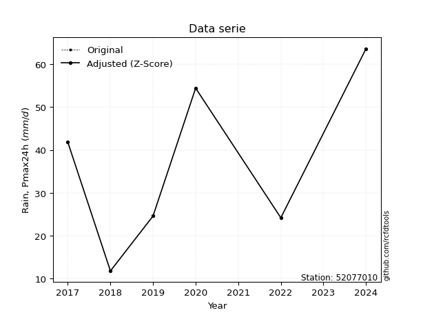</img>

</div>


> The initial value (value_initial) correspond to the initial obtained or null completed value, and value (value) is adjusted only when the initial value is outside the valid range (outlier) definite through the Z-Score value. If Z-Score is active, values out of range or outliers are replaced with the station mean value. A Z-Score (or standard score) measures how many standard deviations a data point is from the mean of a dataset, indicating its relative position; positive scores mean above the mean, negative mean below, and a score of zero is exactly at the mean, allowing for comparison of values from different distributions. It´s calculated using the formula $z=(x–μ)/σ$, where $x$ is the data point, $μ$ is the mean, and $σ$ is the standard deviation, helping identify outliers and understand probability.
>
> <sub>**Note**: In this study, "completing" (filling gaps in) and "extending" (forecasting or lengthening the historical record) rainfall data series are avoided for certain critical analyses because they introduce artificial bias and uncertainty, which can distort the statistics of rare events (extremes), alter day-to-day variability, and compromise the integrity and homogeneity of the original data. Some reasons against Completing/Extending rainfall data are: **Distortion of Extremes and Variability**: The primary issue is that most gap-filling or extension methods rely on averaging or regression with nearby stations, which inherently smooths the data. Rainfall is highly variable in space and time, with a large percentage of zero values and occasional large storms. Infilling methods often underestimate the highest values and overestimate the lowest (zero) values, which severely distorts analyses focused on flood frequency, drought severity, and intensity-duration-frequency (IDF) curves, **Loss of Data Homogeneity**: Infilled or extended data are synthetic estimates, not actual measurements. Combining these estimates with observed data can violate the assumption of data homogeneity, which requires that the data properties do not change over time. Inhomogeneity can lead to incorrect conclusions about long-term trends or changes in climate patterns, **Propagation of Errors**: Errors and biases from the original data (e.g., wind-induced undercatch, instrument errors, site changes) or the data used for imputation can propagate through the analysis, leading to unreliable hydrological models and inaccurate predictions, **Compromised Statistical Integrity**: For statistical analyses, especially those involving the frequency of events, using artificial data can introduce time bias or autocorrelation that doesn´t exist in reality, making it difficult to assess the true probability of events, **Difficulty in Validation**: It is difficult to accurately validate the quality of filled or extended data, especially for past periods where ground-truth measurements are unavailable. The reliability of imputation techniques heavily depends on the density of the surrounding station network and the complexity of the local topography.</sub>


### 4. Active continuous probability distributions from SciPy (80 of 104 available)

A Probability Density Function (PDF) describes the relative likelihood of a continuous random variable falling within a specific range, where the total area under its curve equals 1, and the area over any interval gives the actual probability for that range. Unlike discrete probabilities (like rolling a die), a PDF shows density, not direct probability for a single point (which is zero), with higher points indicating higher likelihood, often visualized as a bell curve for normal distributions.

A log of a probability density function (log-PDF) is simply the logarithm of the PDF´s value, denoted as $log(f(x))$, useful for converting multiplication of probabilities into addition, improving numerical stability with tiny numbers, and connecting to information theory concepts like entropy. Instead of dealing with very small probabilities (e.g., 0.000001), log-PDFs use negative numbers (e.g., $log(0.00001) ≈ -11.51$ that are easier for computers to handle, preventing underflow errors and simplifying complex calculations. In this study, each active probability distribution from SciPy is also evaluated in the $log$ form.

[scipy.stats](https://docs.scipy.org/doc/scipy/reference/stats.html) is a Python´s powerful submodule within the SciPy library for comprehensive statistical analysis, offering over 130 probability distributions (like Normal, Poisson, etc.), functions for descriptive stats (mean, variance), hypothesis testing (t-tests, chi-square), random variable generation, and statistical tests, making it essential for data science, modeling, and research. It provides tools to explore, model, and draw conclusions from data efficiently, working seamlessly with [NumPy](https://numpy.org/).

<div align="center">

|   id | p_dist           |   n_parameter | fit_method   | label                                                                       | active   | ref                                                                                                      |
|-----:|:-----------------|--------------:|:-------------|:----------------------------------------------------------------------------|:---------|:---------------------------------------------------------------------------------------------------------|
|    0 | alpha            |             3 | MLE          | Alpha                                                                       | True     | [:mortar_board:](https://docs.scipy.org/doc/scipy/reference/generated/scipy.stats.alpha.html)            |
|    1 | anglit           |             2 | MM           | Anglit                                                                      | True     | [:mortar_board:](https://docs.scipy.org/doc/scipy/reference/generated/scipy.stats.anglit.html)           |
|    2 | arcsine          |             2 | MM           | Arcsine                                                                     | True     | [:mortar_board:](https://docs.scipy.org/doc/scipy/reference/generated/scipy.stats.arcsine.html)          |
|    3 | argus            |             3 | MLE          | Argus                                                                       | True     | [:mortar_board:](https://docs.scipy.org/doc/scipy/reference/generated/scipy.stats.argus.html)            |
|    4 | beta             |             4 | MLE          | Beta                                                                        | True     | [:mortar_board:](https://docs.scipy.org/doc/scipy/reference/generated/scipy.stats.beta.html)             |
|    5 | betaprime        |             4 | MLE          | Beta prime                                                                  | True     | [:mortar_board:](https://docs.scipy.org/doc/scipy/reference/generated/scipy.stats.betaprime.html)        |
|    6 | bradford         |             3 | MLE          | Bradford                                                                    | True     | [:mortar_board:](https://docs.scipy.org/doc/scipy/reference/generated/scipy.stats.bradford.html)         |
|    7 | burr             |             4 | MLE          | Burr (Type III)                                                             | True     | [:mortar_board:](https://docs.scipy.org/doc/scipy/reference/generated/scipy.stats.burr.html)             |
|    8 | burr12           |             4 | MLE          | Burr (Type III) 12                                                          | True     | [:mortar_board:](https://docs.scipy.org/doc/scipy/reference/generated/scipy.stats.burr12.html)           |
|    9 | cosine           |             2 | MLE          | Cosine                                                                      | True     | [:mortar_board:](https://docs.scipy.org/doc/scipy/reference/generated/scipy.stats.cosine.html)           |
|   10 | crystalball      |             4 | MLE          | Crystalball                                                                 | True     | [:mortar_board:](https://docs.scipy.org/doc/scipy/reference/generated/scipy.stats.crystalball.html)      |
|   11 | dgamma           |             3 | MLE          | Double gamma                                                                | True     | [:mortar_board:](https://docs.scipy.org/doc/scipy/reference/generated/scipy.stats.dgamma.html)           |
|   12 | dweibull         |             3 | MLE          | Double Weibull                                                              | True     | [:mortar_board:](https://docs.scipy.org/doc/scipy/reference/generated/scipy.stats.dweibull.html)         |
|   13 | erlang           |             3 | MLE          | Erlang                                                                      | True     | [:mortar_board:](https://docs.scipy.org/doc/scipy/reference/generated/scipy.stats.erlang.html)           |
|   14 | exponnorm        |             3 | MLE          | Exponentially modified Normal                                               | True     | [:mortar_board:](https://docs.scipy.org/doc/scipy/reference/generated/scipy.stats.exponnorm.html)        |
|   15 | exponpow         |             3 | MLE          | Exponential power                                                           | True     | [:mortar_board:](https://docs.scipy.org/doc/scipy/reference/generated/scipy.stats.exponpow.html)         |
|   16 | exponweib        |             4 | MLE          | Exponentiated Weibull                                                       | True     | [:mortar_board:](https://docs.scipy.org/doc/scipy/reference/generated/scipy.stats.exponweib.html)        |
|   17 | f                |             4 | MLE          | F                                                                           | True     | [:mortar_board:](https://docs.scipy.org/doc/scipy/reference/generated/scipy.stats.f.html)                |
|   18 | fatiguelife      |             3 | MLE          | Fatigue-life (Birnbaum-Saunders)                                            | True     | [:mortar_board:](https://docs.scipy.org/doc/scipy/reference/generated/scipy.stats.fatiguelife.html)      |
|   19 | foldnorm         |             3 | MM           | Fold Normal                                                                 | True     | [:mortar_board:](https://docs.scipy.org/doc/scipy/reference/generated/scipy.stats.foldnorm.html)         |
|   20 | gamma            |             3 | MLE          | Gamma                                                                       | True     | [:mortar_board:](https://docs.scipy.org/doc/scipy/reference/generated/scipy.stats.gamma.html)            |
|   21 | gausshyper       |             6 | MLE          | Gauss hypergeometric                                                        | True     | [:mortar_board:](https://docs.scipy.org/doc/scipy/reference/generated/scipy.stats.gausshyper.html)       |
|   22 | genexpon         |             5 | MLE          | Generalized exponential                                                     | True     | [:mortar_board:](https://docs.scipy.org/doc/scipy/reference/generated/scipy.stats.genexpon.html)         |
|   23 | genextreme       |             3 | MLE          | Generalized exponential                                                     | True     | [:mortar_board:](https://docs.scipy.org/doc/scipy/reference/generated/scipy.stats.genextreme.html)       |
|   24 | gengamma         |             4 | MLE          | Generalized gamma                                                           | True     | [:mortar_board:](https://docs.scipy.org/doc/scipy/reference/generated/scipy.stats.gengamma.html)         |
|   25 | genhalflogistic  |             3 | MLE          | Generalized half-logistic                                                   | True     | [:mortar_board:](https://docs.scipy.org/doc/scipy/reference/generated/scipy.stats.genhalflogistic.html)  |
|   26 | genlogistic      |             3 | MLE          | Generalized logistic                                                        | True     | [:mortar_board:](https://docs.scipy.org/doc/scipy/reference/generated/scipy.stats.genlogistic.html)      |
|   27 | gennorm          |             3 | MLE          | Generalized Normal                                                          | True     | [:mortar_board:](https://docs.scipy.org/doc/scipy/reference/generated/scipy.stats.gennorm.html)          |
|   28 | genpareto        |             3 | MLE          | Generalized Pareto                                                          | True     | [:mortar_board:](https://docs.scipy.org/doc/scipy/reference/generated/scipy.stats.genpareto.html)        |
|   29 | gompertz         |             3 | MLE          | Gompertz (or truncated Gumbel)                                              | True     | [:mortar_board:](https://docs.scipy.org/doc/scipy/reference/generated/scipy.stats.gompertz.html)         |
|   30 | gumbel_l         |             2 | MM           | Gumbel Left Skew                                                            | True     | [:mortar_board:](https://docs.scipy.org/doc/scipy/reference/generated/scipy.stats.gumbel_l.html)         |
|   31 | gumbel_r         |             2 | MM           | Gumbel Right Skew                                                           | True     | [:mortar_board:](https://docs.scipy.org/doc/scipy/reference/generated/scipy.stats.gumbel_r.html)         |
|   32 | halfgennorm      |             3 | MLE          | Upper half of a generalized normal                                          | True     | [:mortar_board:](https://docs.scipy.org/doc/scipy/reference/generated/scipy.stats.halfgennorm.html)      |
|   33 | halflogistic     |             2 | MM           | Half-logistic                                                               | True     | [:mortar_board:](https://docs.scipy.org/doc/scipy/reference/generated/scipy.stats.halflogistic.html)     |
|   34 | halfnorm         |             2 | MM           | Half Normal                                                                 | True     | [:mortar_board:](https://docs.scipy.org/doc/scipy/reference/generated/scipy.stats.halfnorm.html)         |
|   35 | hypsecant        |             2 | MM           | hyperbolic secant                                                           | True     | [:mortar_board:](https://docs.scipy.org/doc/scipy/reference/generated/scipy.stats.hypsecant.html)        |
|   36 | invgamma         |             3 | MLE          | Inverted gamma                                                              | True     | [:mortar_board:](https://docs.scipy.org/doc/scipy/reference/generated/scipy.stats.invgamma.html)         |
|   37 | invgauss         |             3 | MLE          | Inverse Gaussian                                                            | True     | [:mortar_board:](https://docs.scipy.org/doc/scipy/reference/generated/scipy.stats.invgauss.html)         |
|   38 | invweibull       |             3 | MLE          | Inverted Weibull                                                            | True     | [:mortar_board:](https://docs.scipy.org/doc/scipy/reference/generated/scipy.stats.invweibull.html)       |
|   39 | johnsonsb        |             4 | MLE          | Johnson SB                                                                  | True     | [:mortar_board:](https://docs.scipy.org/doc/scipy/reference/generated/scipy.stats.johnsonsb.html)        |
|   40 | johnsonsu        |             4 | MLE          | Johnson Su                                                                  | True     | [:mortar_board:](https://docs.scipy.org/doc/scipy/reference/generated/scipy.stats.johnsonsu.html)        |
|   41 | kappa3           |             3 | MLE          | Kappa 3                                                                     | True     | [:mortar_board:](https://docs.scipy.org/doc/scipy/reference/generated/scipy.stats.kappa3.html)           |
|   42 | kappa4           |             4 | MLE          | Kappa 4                                                                     | True     | [:mortar_board:](https://docs.scipy.org/doc/scipy/reference/generated/scipy.stats.kappa4.html)           |
|   43 | ksone            |             3 | MLE          | Kolmogorov-Smirnov one-sided test statistic distribution                    | True     | [:mortar_board:](https://docs.scipy.org/doc/scipy/reference/generated/scipy.stats.ksone.html)            |
|   44 | kstwobign        |             2 | MLE          | Limiting distribution of scaled Kolmogorov-Smirnov two-sided test statistic | True     | [:mortar_board:](https://docs.scipy.org/doc/scipy/reference/generated/scipy.stats.kstwobign.html)        |
|   45 | laplace          |             2 | MM           | Laplace                                                                     | True     | [:mortar_board:](https://docs.scipy.org/doc/scipy/reference/generated/scipy.stats.laplace.html)          |
|   46 | levy_l           |             2 | MLE          | Left-skewed Levy                                                            | True     | [:mortar_board:](https://docs.scipy.org/doc/scipy/reference/generated/scipy.stats.levy_l.html)           |
|   47 | loggamma         |             3 | MLE          | Log gamma                                                                   | True     | [:mortar_board:](https://docs.scipy.org/doc/scipy/reference/generated/scipy.stats.loggamma.html)         |
|   48 | logistic         |             2 | MM           | Logistic (or Sech-squared)                                                  | True     | [:mortar_board:](https://docs.scipy.org/doc/scipy/reference/generated/scipy.stats.logistic.html)         |
|   49 | loglaplace       |             3 | MLE          | Log-Laplace                                                                 | True     | [:mortar_board:](https://docs.scipy.org/doc/scipy/reference/generated/scipy.stats.loglaplace.html)       |
|   50 | lomax            |             3 | MLE          | Lomax (Pareto of the second kind)                                           | True     | [:mortar_board:](https://docs.scipy.org/doc/scipy/reference/generated/scipy.stats.lomax.html)            |
|   51 | maxwell          |             2 | MM           | Maxwell                                                                     | True     | [:mortar_board:](https://docs.scipy.org/doc/scipy/reference/generated/scipy.stats.maxwell.html)          |
|   52 | mielke           |             4 | MLE          | Mielke Beta-Kappa / Dagum                                                   | True     | [:mortar_board:](https://docs.scipy.org/doc/scipy/reference/generated/scipy.stats.mielke.html)           |
|   53 | moyal            |             2 | MM           | Moyal                                                                       | True     | [:mortar_board:](https://docs.scipy.org/doc/scipy/reference/generated/scipy.stats.moyal.html)            |
|   54 | nakagami         |             3 | MLE          | Nakagami                                                                    | True     | [:mortar_board:](https://docs.scipy.org/doc/scipy/reference/generated/scipy.stats.nakagami.html)         |
|   55 | ncf              |             5 | MLE          | Non-central F distribution                                                  | True     | [:mortar_board:](https://docs.scipy.org/doc/scipy/reference/generated/scipy.stats.ncf.html)              |
|   56 | nct              |             4 | MLE          | Non-central Student’s t                                                     | True     | [:mortar_board:](https://docs.scipy.org/doc/scipy/reference/generated/scipy.stats.nct.html)              |
|   57 | norm             |             2 | MM           | Normal                                                                      | True     | [:mortar_board:](https://docs.scipy.org/doc/scipy/reference/generated/scipy.stats.norm.html)             |
|   58 | pearson3         |             3 | MM           | Pearson type III                                                            | True     | [:mortar_board:](https://docs.scipy.org/doc/scipy/reference/generated/scipy.stats.pearson3.html)         |
|   59 | powerlaw         |             3 | MLE          | Power-function                                                              | True     | [:mortar_board:](https://docs.scipy.org/doc/scipy/reference/generated/scipy.stats.powerlaw.html)         |
|   60 | rayleigh         |             2 | MM           | Rayleigh                                                                    | True     | [:mortar_board:](https://docs.scipy.org/doc/scipy/reference/generated/scipy.stats.rayleigh.html)         |
|   61 | rdist            |             3 | MLE          | R-distributed (symmetric beta)                                              | True     | [:mortar_board:](https://docs.scipy.org/doc/scipy/reference/generated/scipy.stats.rdist.html)            |
|   62 | rice             |             3 | MLE          | Rice                                                                        | True     | [:mortar_board:](https://docs.scipy.org/doc/scipy/reference/generated/scipy.stats.rice.html)             |
|   63 | semicircular     |             2 | MM           | Semicircular                                                                | True     | [:mortar_board:](https://docs.scipy.org/doc/scipy/reference/generated/scipy.stats.semicircular.html)     |
|   64 | skewnorm         |             3 | MLE          | Skew normal                                                                 | True     | [:mortar_board:](https://docs.scipy.org/doc/scipy/reference/generated/scipy.stats.skewnorm.html)         |
|   65 | t                |             3 | MLE          | Student’s t                                                                 | True     | [:mortar_board:](https://docs.scipy.org/doc/scipy/reference/generated/scipy.stats.t.html)                |
|   66 | trapezoid        |             4 | MLE          | Trapezoid                                                                   | True     | [:mortar_board:](https://docs.scipy.org/doc/scipy/reference/generated/scipy.stats.trapezoid.html)        |
|   67 | triang           |             3 | MLE          | Triangular                                                                  | True     | [:mortar_board:](https://docs.scipy.org/doc/scipy/reference/generated/scipy.stats.triang.html)           |
|   68 | truncexpon       |             3 | MLE          | Truncated exponential                                                       | True     | [:mortar_board:](https://docs.scipy.org/doc/scipy/reference/generated/scipy.stats.truncexpon.html)       |
|   69 | truncnorm        |             4 | MLE          | Truncated normal                                                            | True     | [:mortar_board:](https://docs.scipy.org/doc/scipy/reference/generated/scipy.stats.truncnorm.html)        |
|   70 | truncpareto      |             4 | MLE          | Upper truncated Pareto                                                      | True     | [:mortar_board:](https://docs.scipy.org/doc/scipy/reference/generated/scipy.stats.truncpareto.html)      |
|   71 | truncweibull_min |             5 | MLE          | Doubly truncated Weibull minimum                                            | True     | [:mortar_board:](https://docs.scipy.org/doc/scipy/reference/generated/scipy.stats.truncweibull_min.html) |
|   72 | tukeylambda      |             3 | MLE          | Tukey-Lamdba                                                                | True     | [:mortar_board:](https://docs.scipy.org/doc/scipy/reference/generated/scipy.stats.tukeylambda.html)      |
|   73 | uniform          |             2 | MLE          | Uniform                                                                     | True     | [:mortar_board:](https://docs.scipy.org/doc/scipy/reference/generated/scipy.stats.uniform.html)          |
|   74 | vonmises         |             3 | MLE          | Von Mises                                                                   | True     | [:mortar_board:](https://docs.scipy.org/doc/scipy/reference/generated/scipy.stats.vonmises.html)         |
|   75 | vonmises_line    |             3 | MLE          | Von Mises line                                                              | True     | [:mortar_board:](https://docs.scipy.org/doc/scipy/reference/generated/scipy.stats.vonmises_line.html)    |
|   76 | wald             |             2 | MM           | Wald                                                                        | True     | [:mortar_board:](https://docs.scipy.org/doc/scipy/reference/generated/scipy.stats.wald.html)             |
|   77 | weibull_max      |             3 | MLE          | Weibull maximum                                                             | True     | [:mortar_board:](https://docs.scipy.org/doc/scipy/reference/generated/scipy.stats.weibull_max.html)      |
|   78 | weibull_min      |             3 | MLE          | Weibull minimum                                                             | True     | [:mortar_board:](https://docs.scipy.org/doc/scipy/reference/generated/scipy.stats.weibull_min.html)      |
|   79 | wrapcauchy       |             3 | MLE          | Wrapped  Cauchy                                                             | True     | [:mortar_board:](https://docs.scipy.org/doc/scipy/reference/generated/scipy.stats.wrapcauchy.html)       |

</div>

> **n_parameter:** # arguments & localization & scale.
>
> **Fit methods:** (MLE) maximum likelihood, (MM) L-moments.
>
>**Inactive** (With the only purpose of prevent loops, zero divisions, infinite values, over high estimated values or horizontal trending for recurrence intervals estimations, the follow distributions were disabled.)**:** lognorm, norminvgauss, powernorm, powerlognorm, cauchy, halfcauchy, foldcauchy, skewcauchy, chi2, expon, fisk, genhyperbolic, geninvgauss, gibrat, kstwo, laplace_asymmetric, levy, levy_stable, ncx2, pareto, rel_breitwigner, recipinvgauss, studentized_range, loguniform, 


## B. Probability (PDF) vs. Empirical (EDF) distributions functions

A continuous probability distribution (CPD) describes probabilities for variables that can take any value within a range (like rain any time), unlike discrete variables with specific outcomes (like temperature). It uses a Probability Density Function (PDF), a curve where the total area under it equals 1, and the probability of the variable falling within an interval (a to b) is found by calculating the area under the curve between those points. A key feature is that the probability of hitting any single exact value is zero, so probabilities are always expressed for ranges, e.g., $P(a ≤ X ≤ b)$.

<div align="center">

Distributions parameters from station values
|     |   station | p_dist              |   n |              loc |           scale | shape                  | shape1                 | shape2                | shape3             |
|----:|----------:|:--------------------|----:|-----------------:|----------------:|:-----------------------|:-----------------------|:----------------------|:-------------------|
|   0 |  52077010 | alpha               |   7 |   -241.872       |  4546.8         | 16.30994457595042      |                        |                       |                    |
|   1 |  52077010 | anglit              |   7 |     38.1857      |    50.3568      |                        |                        |                       |                    |
|   2 |  52077010 | arcsine             |   7 |     13.8419      |    48.6876      |                        |                        |                       |                    |
|   3 |  52077010 | argus               |   7 |      0.0195002   |    66.6698      | 3.416599812315442e-05  |                        |                       |                    |
|   4 |  52077010 | beta                |   7 |     10.1862      |    53.4138      | 0.8579311241780208     | 0.7562860726067508     |                       |                    |
|   5 |  52077010 | betaprime           |   7 |   -139.876       | 18146.9         | 106.32874567363953     | 10843.402366122453     |                       |                    |
|   6 |  52077010 | bradford            |   7 |     11.4297      |    52.1703      | 1.1632826816582539e-05 |                        |                       |                    |
|   7 |  52077010 | burr                |   7 |     -2.12245     |    66.2527      | 454.9920005589214      | 0.003602349035059118   |                       |                    |
|   8 |  52077010 | burr12              |   7 |   -327.197       |   337.579       | 656.6564307077824      | 0.01930629700114858    |                       |                    |
|   9 |  52077010 | cosine              |   7 |     38.0327      |    13.9721      |                        |                        |                       |                    |
|  10 |  52077010 | crystalball         |   7 |     38.1857      |    17.2137      | 1575.0285923161218     | 6428.3192009833765     |                       |                    |
|  11 |  52077010 | dgamma              |   7 |     34.889       |     3.38374     | 4.695182714535163      |                        |                       |                    |
|  12 |  52077010 | dweibull            |   7 |     35.5297      |    17.9175      | 2.336016818168826      |                        |                       |                    |
|  13 |  52077010 | erlang              |   7 |   -606.341       |     0.461003    | 1398.058482045075      |                        |                       |                    |
|  14 |  52077010 | exponnorm           |   7 |     38.1545      |    17.2136      | 0.0018111027647138788  |                        |                       |                    |
|  15 |  52077010 | exponpow            |   7 |     11.8         |    21.3575      | 0.37102186843863627    |                        |                       |                    |
|  16 |  52077010 | exponweib           |   7 |     11.8         |     0.742133    | 3.165688264642079      | 0.23934486629826057    |                       |                    |
|  17 |  52077010 | f                   |   7 |  -1447.07        |  1485.32        | 15476.003342124071     | 371381.77817156387     |                       |                    |
|  18 |  52077010 | fatiguelife         |   7 |     11.8         |     7.25954e-06 | 1802.3563257690516     |                        |                       |                    |
|  19 |  52077010 | foldnorm            |   7 |     42.6863      |     0.552356    | 4.5469718223379423e-07 |                        |                       |                    |
|  20 |  52077010 | gamma               |   7 |   -615.131       |     0.455307    | 1434.8580051975796     |                        |                       |                    |
|  21 |  52077010 | gausshyper          |   7 |     11.719       |    51.881       | 1.064248535012956      | 0.6744182969490315     | 1.003721842362481     | 1.3609632230348945 |
|  22 |  52077010 | genexpon            |   7 |     11.8         |     2.06991     | 0.07849498049492032    | 5.947968708747789e-07  | 0.7239429585825325    |                    |
|  23 |  52077010 | genextreme          |   7 |     34.508       |    19.1581      | 0.5608485300935431     |                        |                       |                    |
|  24 |  52077010 | gengamma            |   7 |     11.8         |     0.423325    | 1.4883803363247612     | 0.22841875703406903    |                       |                    |
|  25 |  52077010 | genhalflogistic     |   7 |      6.62009     |    59.9467      | 1.0520675369528747     |                        |                       |                    |
|  26 |  52077010 | genlogistic         |   7 |    -41.8961      |    15.5798      | 98.80029318867267      |                        |                       |                    |
|  27 |  52077010 | gennorm             |   7 |     37.7         |    25.9         | 18098799.43193637      |                        |                       |                    |
|  28 |  52077010 | genpareto           |   7 |     -0.312963    |   109.499       | -1.7132583510646247    |                        |                       |                    |
|  29 |  52077010 | gompertz            |   7 |    -19.353       |    15.5543      | 0.014681426176259907   |                        |                       |                    |
|  30 |  52077010 | gumbel_l            |   7 |     45.9328      |    13.4214      |                        |                        |                       |                    |
|  31 |  52077010 | gumbel_r            |   7 |     30.4387      |    13.4214      |                        |                        |                       |                    |
|  32 |  52077010 | halfgennorm         |   7 |     11.8         |     0.172116    | 0.27692353303403394    |                        |                       |                    |
|  33 |  52077010 | halflogistic        |   7 |     17.7835      |    14.7171      |                        |                        |                       |                    |
|  34 |  52077010 | halfnorm            |   7 |     15.4015      |    28.5557      |                        |                        |                       |                    |
|  35 |  52077010 | hypsecant           |   7 |     38.1857      |    10.9586      |                        |                        |                       |                    |
|  36 |  52077010 | invgamma            |   7 |   -116.42        | 11892.6         | 78.02112759170353      |                        |                       |                    |
|  37 |  52077010 | invgauss            |   7 |    -42.9635      |  1622.96        | 0.049926442319182154   |                        |                       |                    |
|  38 |  52077010 | invweibull          |   7 |     11.8         |     2.45777     | 0.0639474487669052     |                        |                       |                    |
|  39 |  52077010 | johnsonsb           |   7 |     11.8         |    51.8         | -0.9863506873753298    | 0.08215646402749954    |                       |                    |
|  40 |  52077010 | johnsonsu           |   7 |     -5.23556e+07 |     2.07306e+08 | -3100481.599296883     | 12404773.921797447     |                       |                    |
|  41 |  52077010 | kappa3              |   7 |     11.8         |    57.0612      | 1976.998561807719      |                        |                       |                    |
|  42 |  52077010 | kappa4              |   7 |      8.33895     |    57.0885      | 1.0645969147903633     | 1.0273413342640056     |                       |                    |
|  43 |  52077010 | ksone               |   7 |      8.3708      |    59.6298      | 1.0                    |                        |                       |                    |
|  44 |  52077010 | kstwobign           |   7 |    -24.6682      |    71.7278      |                        |                        |                       |                    |
|  45 |  52077010 | laplace             |   7 |     38.1857      |    12.1719      |                        |                        |                       |                    |
|  46 |  52077010 | levy_l              |   7 |     65.9651      |    10.4524      |                        |                        |                       |                    |
|  47 |  52077010 | loggamma            |   7 |   -292.947       |    96.2738      | 31.669628728239992     |                        |                       |                    |
|  48 |  52077010 | logistic            |   7 |     38.1857      |     9.49038     |                        |                        |                       |                    |
|  49 |  52077010 | loglaplace          |   7 |     -0.107521    |    41.9075      | 2.2380263268417444     |                        |                       |                    |
|  50 |  52077010 | lomax               |   7 |     11.8         |     4.86067e+10 | 1209605462.8341727     |                        |                       |                    |
|  51 |  52077010 | maxwell             |   7 |     -2.60341     |    25.5608      |                        |                        |                       |                    |
|  52 |  52077010 | mielke              |   7 |     -3.26677     |    67.3396      | 1.6996477865128479     | 456.33149824020524     |                       |                    |
|  53 |  52077010 | moyal               |   7 |     28.3418      |     7.74887     |                        |                        |                       |                    |
|  54 |  52077010 | nakagami            |   7 |     24.2         |    20.1389      | 0.14018285052984075    |                        |                       |                    |
|  55 |  52077010 | ncf                 |   7 |      0.132405    |     2.59847e-06 | 2.1053508762497243e-06 | 16.052300964170716     | 27.766295870894645    |                    |
|  56 |  52077010 | nct                 |   7 |   -926.724       |    17.1693      | 295124.50898471964     | 56.19944871971947      |                       |                    |
|  57 |  52077010 | norm                |   7 |     38.1857      |    17.2137      |                        |                        |                       |                    |
|  58 |  52077010 | pearson3            |   7 |     38.1857      |    17.2137      | -0.06237318853184165   |                        |                       |                    |
|  59 |  52077010 | powerlaw            |   7 |     11.8         |    51.8         | 0.16718350917487942    |                        |                       |                    |
|  60 |  52077010 | rayleigh            |   7 |      5.25499     |    26.2749      |                        |                        |                       |                    |
|  61 |  52077010 | rdist               |   7 |      8.54522     |    16.0548      | 1.2737549921670879     |                        |                       |                    |
|  62 |  52077010 | rice                |   7 |      3.59111     |    20.5855      | 1.234273178316554      |                        |                       |                    |
|  63 |  52077010 | semicircular        |   7 |     38.1857      |    34.4273      |                        |                        |                       |                    |
|  64 |  52077010 | skewnorm            |   7 |     42.1314      |    17.6601      | -0.29167944830230946   |                        |                       |                    |
|  65 |  52077010 | t                   |   7 |     38.1857      |    17.2137      | 22333890884.269382     |                        |                       |                    |
|  66 |  52077010 | trapezoid           |   7 |      6.62        |    62.16        | 1.0                    | 1.0                    |                       |                    |
|  67 |  52077010 | triang              |   7 |     -3.9975      |    67.5975      | 0.9999999999974833     |                        |                       |                    |
|  68 |  52077010 | truncexpon          |   7 |      8.49016     |    76.8834      | 0.7167971444958947     |                        |                       |                    |
|  69 |  52077010 | truncnorm           |   7 |     38.1857      |    17.2137      | -32.0552050012701      | 215.42795414790336     |                       |                    |
|  70 |  52077010 | truncpareto         |   7 |     11.7742      |     0.0258322   | 0.16798906563930088    | 2006.2475273114476     |                       |                    |
|  71 |  52077010 | truncweibull_min    |   7 |      8.24349     |    75.2256      | 1.3394574049740555     | 2.0008040572533406e-05 | 0.735873392543527     |                    |
|  72 |  52077010 | tukeylambda         |   7 |     37.6995      |    28.9312      | 1.1170147857018435     |                        |                       |                    |
|  73 |  52077010 | uniform             |   7 |     11.8         |    51.8         |                        |                        |                       |                    |
|  74 |  52077010 | vonmises            |   7 |     -1.2867      |     1           | 0.8962108939972376     |                        |                       |                    |
|  75 |  52077010 | vonmises_line       |   7 |     37.6185      |     8.27018     | 3.0709598036985242e-06 |                        |                       |                    |
|  76 |  52077010 | wald                |   7 |     20.9721      |    17.2136      |                        |                        |                       |                    |
|  77 |  52077010 | weibull_max         |   7 |     63.6         |     1.46314     | 0.3025433860050465     |                        |                       |                    |
|  78 |  52077010 | weibull_min         |   7 |      1.41215     |    41.5694      | 2.3065790731010027     |                        |                       |                    |
|  79 |  52077010 | wrapcauchy          |   7 |     11.8         |     8.24486     | 0.1617093691908597     |                        |                       |                    |
|  80 |  52077010 | logalpha            |   7 |    -12.8966      |   468.189       | 28.57871510217221      |                        |                       |                    |
|  81 |  52077010 | loganglit           |   7 |      3.51244     |     1.60159     |                        |                        |                       |                    |
|  82 |  52077010 | logarcsine          |   7 |      2.7382      |     1.54849     |                        |                        |                       |                    |
|  83 |  52077010 | logargus            |   7 |      1.95614     |     2.25411     | 1.9514781034531787     |                        |                       |                    |
|  84 |  52077010 | logbeta             |   7 |      2.0899      |     2.06272     | 1.2504661949597131     | 0.6187176563658061     |                       |                    |
|  85 |  52077010 | logbetaprime        |   7 |     -8.6017      |    87.2709      | 531.1184209936876      | 3828.888762430899      |                       |                    |
|  86 |  52077010 | logbradford         |   7 |      2.46809     |     1.68469     | 4.207106683095825e-05  |                        |                       |                    |
|  87 |  52077010 | logburr             |   7 |     -0.431652    |     4.59484     | 1541.9706229776068     | 0.0039735127969733365  |                       |                    |
|  88 |  52077010 | logburr12           |   7 |   -624.888       |   633.547       | 1550.8675390764993     | 165935.52762273583     |                       |                    |
|  89 |  52077010 | logcosine           |   7 |      3.45244     |     0.461365    |                        |                        |                       |                    |
|  90 |  52077010 | logcrystalball      |   7 |      3.51259     |     0.547591    | 5.550454407251456      | 1.1505497871948736     |                       |                    |
|  91 |  52077010 | logdgamma           |   7 |      3.49131     |     0.114486    | 4.219348769498568      |                        |                       |                    |
|  92 |  52077010 | logdweibull         |   7 |      3.47182     |     0.552563    | 2.0567441060177964     |                        |                       |                    |
|  93 |  52077010 | logerlang           |   7 |     -5.50721     |     0.0344901   | 261.3212045508586      |                        |                       |                    |
|  94 |  52077010 | logexponnorm        |   7 |      3.51206     |     0.547477    | 0.0006834056424843225  |                        |                       |                    |
|  95 |  52077010 | logexponpow         |   7 |      2.4681      |     1.17848     | 0.6162327401184919     |                        |                       |                    |
|  96 |  52077010 | logexponweib        |   7 |     -7.20376e+07 |     7.20376e+07 | 4.2830760168744595     | 74455691.2010019       |                       |                    |
|  97 |  52077010 | logf                |   7 |   -334.782       |   338.293       | 2278448.112436641      | 1150295.015911389      |                       |                    |
|  98 |  52077010 | logfatiguelife      |   7 |   -271.776       |   275.287       | 0.0019869067669045434  |                        |                       |                    |
|  99 |  52077010 | logfoldnorm         |   7 |      1.20769     |     0.533466    | 4.3230140152217125     |                        |                       |                    |
| 100 |  52077010 | loggamma            |   7 |     -5.46382     |     0.0352412   | 254.59301253528793     |                        |                       |                    |
| 101 |  52077010 | loggausshyper       |   7 |      2.45364     |     1.69898     | 1.073393149221054      | 0.990464979309463      | 1.0237247737438127    | 0.9575711452206341 |
| 102 |  52077010 | loggenexpon         |   7 |      2.46146     |     0.0154892   | 0.005104604713895568   | 4.057123629406569      | 5.500083086161025e-05 |                    |
| 103 |  52077010 | loggenextreme       |   7 |      3.55292     |     0.643916    | 1.0737354493359224     |                        |                       |                    |
| 104 |  52077010 | loggengamma         |   7 |     -1.51728e+07 |     1.51728e+07 | 1.0680500333258784     | 33922178.36853777      |                       |                    |
| 105 |  52077010 | loggenhalflogistic  |   7 |      2.4533      |     1.78243     | 1.048911032651707      |                        |                       |                    |
| 106 |  52077010 | loggenlogistic      |   7 |      4.15265     |     2.39627e-06 | 3.735482247964139e-06  |                        |                       |                    |
| 107 |  52077010 | loggennorm          |   7 |      3.31035     |     0.842656    | 21703.418152122147     |                        |                       |                    |
| 108 |  52077010 | loggenpareto        |   7 |     -0.00533436  |    12.777       | -3.0729005122511124    |                        |                       |                    |
| 109 |  52077010 | loggompertz         |   7 |      2.4681      |     0.498176    | 0.08523224616735284    |                        |                       |                    |
| 110 |  52077010 | loggumbel_l         |   7 |      3.75883     |     0.426865    |                        |                        |                       |                    |
| 111 |  52077010 | loggumbel_r         |   7 |      3.26605     |     0.426865    |                        |                        |                       |                    |
| 112 |  52077010 | loghalfgennorm      |   7 |      2.4681      |     1.74253     | 69.59928676046846      |                        |                       |                    |
| 113 |  52077010 | loghalflogistic     |   7 |      2.86357     |     0.468063    |                        |                        |                       |                    |
| 114 |  52077010 | loghalfnorm         |   7 |      2.78779     |     0.90822     |                        |                        |                       |                    |
| 115 |  52077010 | loghypsecant        |   7 |      3.51244     |     0.348534    |                        |                        |                       |                    |
| 116 |  52077010 | loginvgamma         |   7 |     -9.4306      |  6896.98        | 534.0113710298167      |                        |                       |                    |
| 117 |  52077010 | loginvgauss         |   7 |     -2.41287     |   614.685       | 0.009639415606009519   |                        |                       |                    |
| 118 |  52077010 | loginvweibull       |   7 |  -2316.06        |  2319.28        | 4003.9585232272266     |                        |                       |                    |
| 119 |  52077010 | logjohnsonsb        |   7 |      2.4681      |     1.70082     | -0.24864577434019813   | 0.1946857732680264     |                       |                    |
| 120 |  52077010 | logjohnsonsu        |   7 |      4.30084     |     0.00708102  | 6.398011686122187      | 1.249244770512234      |                       |                    |
| 121 |  52077010 | logkappa3           |   7 |      2.4681      |     1.68451     | 9282151.079513595      |                        |                       |                    |
| 122 |  52077010 | logkappa4           |   7 |      2.53618     |     1.80052     | 0.9566771145305982     | 1.1138854436620895     |                       |                    |
| 123 |  52077010 | logksone            |   7 |      2.29965     |     2.02142     | 1.0                    |                        |                       |                    |
| 124 |  52077010 | logkstwobign        |   7 |      1.17391     |     2.67125     |                        |                        |                       |                    |
| 125 |  52077010 | loglaplace          |   7 |      3.51244     |     0.387124    |                        |                        |                       |                    |
| 126 |  52077010 | loglevy_l           |   7 |      4.20032     |     0.209552    |                        |                        |                       |                    |
| 127 |  52077010 | logloggamma         |   7 |      4.15265     |     2.28342e-06 | 3.580887984886864e-06  |                        |                       |                    |
| 128 |  52077010 | loglogistic         |   7 |      3.51244     |     0.301839    |                        |                        |                       |                    |
| 129 |  52077010 | logloglaplace       |   7 |     -0.0501183   |     3.78302     | 7.642640800572252      |                        |                       |                    |
| 130 |  52077010 | loglomax            |   7 |      2.4681      |     3.45368e+09 | 3345297224.898408      |                        |                       |                    |
| 131 |  52077010 | logmaxwell          |   7 |      2.21515     |     0.812955    |                        |                        |                       |                    |
| 132 |  52077010 | logmielke           |   7 |     -7.53671e+06 |     7.53671e+06 | 11410410.59855159      | 859538682.2321243      |                       |                    |
| 133 |  52077010 | logmoyal            |   7 |      3.19936     |     0.246451    |                        |                        |                       |                    |
| 134 |  52077010 | lognakagami         |   7 |      3.18635     |     0.537057    | 0.23602883988371265    |                        |                       |                    |
| 135 |  52077010 | logncf              |   7 |    -12.5116      |    15.9666      | 2041.2956073391338     | 7422.037167594702      | 6.2215959113009       |                    |
| 136 |  52077010 | lognct              |   7 |    -27.8449      |     0.48756     | 7480.010568800048      | 64.3060318364592       |                       |                    |
| 137 |  52077010 | lognorm             |   7 |      3.51244     |     0.547476    |                        |                        |                       |                    |
| 138 |  52077010 | logpearson3         |   7 |      3.51244     |     0.547476    | -0.6783471425203644    |                        |                       |                    |
| 139 |  52077010 | logpowerlaw         |   7 |      2.4681      |     1.68451     | 0.18354590375766638    |                        |                       |                    |
| 140 |  52077010 | lograyleigh         |   7 |      2.46509     |     0.835667    |                        |                        |                       |                    |
| 141 |  52077010 | logrdist            |   7 |      3.29724     |     0.85537     | 1.1595197884195394     |                        |                       |                    |
| 142 |  52077010 | logrice             |   7 |      2.11069     |     0.592726    | 2.1085555575978203     |                        |                       |                    |
| 143 |  52077010 | logsemicircular     |   7 |      3.51244     |     1.09495     |                        |                        |                       |                    |
| 144 |  52077010 | logskewnorm         |   7 |      4.15261     |     0.842371    | -25794598.60399656     |                        |                       |                    |
| 145 |  52077010 | logt                |   7 |      3.51244     |     0.547478    | 527312522.12955046     |                        |                       |                    |
| 146 |  52077010 | logtrapezoid        |   7 |      1.96395     |     2.32274     | 0.9999999999999999     | 1.0                    |                       |                    |
| 147 |  52077010 | logtriang           |   7 |      2.11257     |     2.04004     | 0.9999997180148501     |                        |                       |                    |
| 148 |  52077010 | logtruncexpon       |   7 |      2.46774     |     2.03588     | 0.8275882334040006     |                        |                       |                    |
| 149 |  52077010 | logtruncnorm        |   7 |     -0.156516    |     1.32043     | 2.531651289625759      | 3.263460242483667      |                       |                    |
| 150 |  52077010 | logtruncpareto      |   7 |      2.46699     |     0.00110759  | 0.16785463176595056    | 1521.8783916193222     |                       |                    |
| 151 |  52077010 | logtruncweibull_min |   7 |      2.40837     |     2.09883     | 1.1922625220914433     | 0.0009717554429337344  | 0.8310580360035229    |                    |
| 152 |  52077010 | logtukeylambda      |   7 |      3.31042     |     0.944318    | 1.1210904046512709     |                        |                       |                    |
| 153 |  52077010 | loguniform          |   7 |      2.4681      |     1.68451     |                        |                        |                       |                    |
| 154 |  52077010 | logvonmises         |   7 |     -2.75063     |     1           | 3.877892916259824      |                        |                       |                    |
| 155 |  52077010 | logvonmises_line    |   7 |      3.29833     |     0.271926    | 5.65825162695885e-05   |                        |                       |                    |
| 156 |  52077010 | logwald             |   7 |      2.96499     |     0.547452    |                        |                        |                       |                    |
| 157 |  52077010 | logweibull_max      |   7 |      4.15261     |     0.244921    | 0.1998870935313254     |                        |                       |                    |
| 158 |  52077010 | logweibull_min      |   7 | -80861.3         | 80865.1         | 195717.64959308313     |                        |                       |                    |
| 159 |  52077010 | logwrapcauchy       |   7 |      2.4681      |     0.268099    | 0.5                    |                        |                       |                    |

</div>

> **loc** (Location parameter): This shifts the distribution along the x-axis. For many common distributions, like the normal (Gaussian) distribution, loc represents the mean $μ$. For others, like the uniform distribution, it might represent the minimum value, or for the beta distribution, the left end of the support interval.
>
> **scale** (Scale parameter): This determines the width or spread of the distribution. For the normal distribution, scale represents the standard deviation $σ$. For a uniform distribution, it defines the length of the interval (from $loc$ to $loc + scale$).
>
> **shape** (Shape parameters): Refers to parameters that define the specific form of a probability distribution, distinct from its location (loc) and scale (scale). These parameters are required arguments for most distribution functions. For example, a normal (Gaussian) distribution is fully defined by its location (mean) and scale (standard deviation), so it has no specific shape parameters beyond loc and scale. However, other distributions have intrinsic properties that need specification, as Gamma distribution that takes a shape parameter, often named $a$ or $alpha$.


### 0. Cumulative distribution values - CDF (160 evaluated)

Cumulative Distribution Function (CDF), denoted as $F$<sub>$X$</sub>$(x)$, is a function that gives the probability that a random variable $X$ will take a value less than or equal to a specific value, $x$ (i.e., $(P(X≥x)$. It essentially "accumulates" probabilities from a given point up to the far right (positive infinity), providing a complete picture of the distribution´s probabilities for both discrete (like rain) and continuous (like temperature) variables, helping to find probabilities over ranges or above certain values. Each station is evaluated separately ordering the $x$ values ascending, calculating the CDF and PDF values for the activated distributions and their logarithmic forms.

<div align="center">

CDF ordered by x ascending and calculating $log(f(x))$ separately
|   id |   Station |   date |    x |   count |    mean |     std |    zscore |   Value_initial |   station |   m |     alpha |   alpha_pdf |    anglit |   anglit_pdf |   arcsine |   arcsine_pdf |     argus |   argus_pdf |      beta |   beta_pdf |   betaprime |   betaprime_pdf |   bradford |   bradford_pdf |     burr |    burr_pdf |    burr12 |   burr12_pdf |    cosine |   cosine_pdf |   crystalball |   crystalball_pdf |    dgamma |   dgamma_pdf |   dweibull |   dweibull_pdf |    erlang |   erlang_pdf |   exponnorm |   exponnorm_pdf |    exponpow |   exponpow_pdf |   exponweib |   exponweib_pdf |         f |      f_pdf |   fatiguelife |   fatiguelife_pdf |   foldnorm |   foldnorm_pdf |     gamma |   gamma_pdf |   gausshyper |   gausshyper_pdf |    genexpon |   genexpon_pdf |   genextreme |   genextreme_pdf |    gengamma |   gengamma_pdf |   genhalflogistic |   genhalflogistic_pdf |   genlogistic |   genlogistic_pdf |     gennorm |   gennorm_pdf |   genpareto |   genpareto_pdf |   gompertz |   gompertz_pdf |   gumbel_l |   gumbel_l_pdf |   gumbel_r |   gumbel_r_pdf |   halfgennorm |   halfgennorm_pdf |   halflogistic |   halflogistic_pdf |   halfnorm |   halfnorm_pdf |   hypsecant |   hypsecant_pdf |   invgamma |   invgamma_pdf |   invgauss |   invgauss_pdf |   invweibull |   invweibull_pdf |   johnsonsb |   johnsonsb_pdf |   johnsonsu |   johnsonsu_pdf |      kappa3 |   kappa3_pdf |      kappa4 |   kappa4_pdf |     ksone |   ksone_pdf |   kstwobign |   kstwobign_pdf |   laplace |   laplace_pdf |   levy_l |   levy_l_pdf |   loggamma |   loggamma_pdf |   logistic |   logistic_pdf |   loglaplace |   loglaplace_pdf |       lomax |   lomax_pdf |   maxwell |   maxwell_pdf |    mielke |   mielke_pdf |      moyal |   moyal_pdf |    nakagami |   nakagami_pdf |       ncf |    ncf_pdf |       nct |    nct_pdf |      norm |   norm_pdf |   pearson3 |   pearson3_pdf |   powerlaw |   powerlaw_pdf |   rayleigh |   rayleigh_pdf |    rdist |    rdist_pdf |      rice |   rice_pdf |   semicircular |   semicircular_pdf |   skewnorm |   skewnorm_pdf |         t |      t_pdf |   trapezoid |   trapezoid_pdf |    triang |   triang_pdf |   truncexpon |   truncexpon_pdf |   truncnorm |   truncnorm_pdf |   truncpareto |   truncpareto_pdf |   truncweibull_min |   truncweibull_min_pdf |   tukeylambda |   tukeylambda_pdf |   uniform |   uniform_pdf |   vonmises |   vonmises_pdf |   vonmises_line |   vonmises_line_pdf |      wald |   wald_pdf |   weibull_max |   weibull_max_pdf |   weibull_min |   weibull_min_pdf |   wrapcauchy |   wrapcauchy_pdf |   logalpha |   logalpha_pdf |   loganglit |   loganglit_pdf |   logarcsine |   logarcsine_pdf |   logargus |   logargus_pdf |   logbeta |   logbeta_pdf |   logbetaprime |   logbetaprime_pdf |   logbradford |   logbradford_pdf |   logburr |   logburr_pdf |   logburr12 |   logburr12_pdf |   logcosine |   logcosine_pdf |   logcrystalball |   logcrystalball_pdf |   logdgamma |   logdgamma_pdf |   logdweibull |   logdweibull_pdf |   logerlang |   logerlang_pdf |   logexponnorm |   logexponnorm_pdf |   logexponpow |   logexponpow_pdf |   logexponweib |   logexponweib_pdf |      logf |   logf_pdf |   logfatiguelife |   logfatiguelife_pdf |   logfoldnorm |   logfoldnorm_pdf |   loggausshyper |   loggausshyper_pdf |   loggenexpon |   loggenexpon_pdf |   loggenextreme |   loggenextreme_pdf |   loggengamma |   loggengamma_pdf |   loggenhalflogistic |   loggenhalflogistic_pdf |   loggenlogistic |   loggenlogistic_pdf |   loggennorm |   loggennorm_pdf |   loggenpareto |   loggenpareto_pdf |   loggompertz |   loggompertz_pdf |   loggumbel_l |   loggumbel_l_pdf |   loggumbel_r |   loggumbel_r_pdf |   loghalfgennorm |   loghalfgennorm_pdf |   loghalflogistic |   loghalflogistic_pdf |   loghalfnorm |   loghalfnorm_pdf |   loghypsecant |   loghypsecant_pdf |   loginvgamma |   loginvgamma_pdf |   loginvgauss |   loginvgauss_pdf |   loginvweibull |   loginvweibull_pdf |   logjohnsonsb |   logjohnsonsb_pdf |   logjohnsonsu |   logjohnsonsu_pdf |   logkappa3 |   logkappa3_pdf |   logkappa4 |   logkappa4_pdf |   logksone |   logksone_pdf |   logkstwobign |   logkstwobign_pdf |   loglevy_l |   loglevy_l_pdf |   logloggamma |   logloggamma_pdf |   loglogistic |   loglogistic_pdf |   logloglaplace |   logloglaplace_pdf |    loglomax |   loglomax_pdf |   logmaxwell |   logmaxwell_pdf |   logmielke |   logmielke_pdf |    logmoyal |   logmoyal_pdf |   lognakagami |   lognakagami_pdf |    logncf |   logncf_pdf |    lognct |   lognct_pdf |   lognorm |   lognorm_pdf |   logpearson3 |   logpearson3_pdf |   logpowerlaw |   logpowerlaw_pdf |   lograyleigh |   lograyleigh_pdf |   logrdist |   logrdist_pdf |   logrice |   logrice_pdf |   logsemicircular |   logsemicircular_pdf |   logskewnorm |   logskewnorm_pdf |      logt |   logt_pdf |   logtrapezoid |   logtrapezoid_pdf |   logtriang |   logtriang_pdf |   logtruncexpon |   logtruncexpon_pdf |   logtruncnorm |   logtruncnorm_pdf |   logtruncpareto |   logtruncpareto_pdf |   logtruncweibull_min |   logtruncweibull_min_pdf |   logtukeylambda |   logtukeylambda_pdf |   loguniform |   loguniform_pdf |   logvonmises |   logvonmises_pdf |   logvonmises_line |   logvonmises_line_pdf |   logwald |   logwald_pdf |   logweibull_max |   logweibull_max_pdf |   logweibull_min |   logweibull_min_pdf |   logwrapcauchy |   logwrapcauchy_pdf |
|-----:|----------:|-------:|-----:|--------:|--------:|--------:|----------:|----------------:|----------:|----:|----------:|------------:|----------:|-------------:|----------:|--------------:|----------:|------------:|----------:|-----------:|------------:|----------------:|-----------:|---------------:|---------:|------------:|----------:|-------------:|----------:|-------------:|--------------:|------------------:|----------:|-------------:|-----------:|---------------:|----------:|-------------:|------------:|----------------:|------------:|---------------:|------------:|----------------:|----------:|-----------:|--------------:|------------------:|-----------:|---------------:|----------:|------------:|-------------:|-----------------:|------------:|---------------:|-------------:|-----------------:|------------:|---------------:|------------------:|----------------------:|--------------:|------------------:|------------:|--------------:|------------:|----------------:|-----------:|---------------:|-----------:|---------------:|-----------:|---------------:|--------------:|------------------:|---------------:|-------------------:|-----------:|---------------:|------------:|----------------:|-----------:|---------------:|-----------:|---------------:|-------------:|-----------------:|------------:|----------------:|------------:|----------------:|------------:|-------------:|------------:|-------------:|----------:|------------:|------------:|----------------:|----------:|--------------:|---------:|-------------:|-----------:|---------------:|-----------:|---------------:|-------------:|-----------------:|------------:|------------:|----------:|--------------:|----------:|-------------:|-----------:|------------:|------------:|---------------:|----------:|-----------:|----------:|-----------:|----------:|-----------:|-----------:|---------------:|-----------:|---------------:|-----------:|---------------:|---------:|-------------:|----------:|-----------:|---------------:|-------------------:|-----------:|---------------:|----------:|-----------:|------------:|----------------:|----------:|-------------:|-------------:|-----------------:|------------:|----------------:|--------------:|------------------:|-------------------:|-----------------------:|--------------:|------------------:|----------:|--------------:|-----------:|---------------:|----------------:|--------------------:|----------:|-----------:|--------------:|------------------:|--------------:|------------------:|-------------:|-----------------:|-----------:|---------------:|------------:|----------------:|-------------:|-----------------:|-----------:|---------------:|----------:|--------------:|---------------:|-------------------:|--------------:|------------------:|----------:|--------------:|------------:|----------------:|------------:|----------------:|-----------------:|---------------------:|------------:|----------------:|--------------:|------------------:|------------:|----------------:|---------------:|-------------------:|--------------:|------------------:|---------------:|-------------------:|----------:|-----------:|-----------------:|---------------------:|--------------:|------------------:|----------------:|--------------------:|--------------:|------------------:|----------------:|--------------------:|--------------:|------------------:|---------------------:|-------------------------:|-----------------:|---------------------:|-------------:|-----------------:|---------------:|-------------------:|--------------:|------------------:|--------------:|------------------:|--------------:|------------------:|-----------------:|---------------------:|------------------:|----------------------:|--------------:|------------------:|---------------:|-------------------:|--------------:|------------------:|--------------:|------------------:|----------------:|--------------------:|---------------:|-------------------:|---------------:|-------------------:|------------:|----------------:|------------:|----------------:|-----------:|---------------:|---------------:|-------------------:|------------:|----------------:|--------------:|------------------:|--------------:|------------------:|----------------:|--------------------:|------------:|---------------:|-------------:|-----------------:|------------:|----------------:|------------:|---------------:|--------------:|------------------:|----------:|-------------:|----------:|-------------:|----------:|--------------:|--------------:|------------------:|--------------:|------------------:|--------------:|------------------:|-----------:|---------------:|----------:|--------------:|------------------:|----------------------:|--------------:|------------------:|----------:|-----------:|---------------:|-------------------:|------------:|----------------:|----------------:|--------------------:|---------------:|-------------------:|-----------------:|---------------------:|----------------------:|--------------------------:|-----------------:|---------------------:|-------------:|-----------------:|--------------:|------------------:|-------------------:|-----------------------:|----------:|--------------:|-----------------:|---------------------:|-----------------:|---------------------:|----------------:|--------------------:|
|    0 |  52077010 |   2018 | 11.8 |       7 | 38.1857 | 18.5929 | -1.41913  |            11.8 |  52077010 |   1 | 0.0532656 |  0.00766329 | 0.0667992 |    0.0099162 |  0        |     0         | 0.0464664 |  0.00782598 | 0.0386672 |  0.0206402 |   0.0587839 |      0.00752998 | 0.00709842 |      0.0191681 | 0.077548 | nan         | 0.0528925 |   0.033297   | 0.0494582 |   0.00795173 |     0.0626581 |        0.00715864 | 0.0777245 |   0.0126641  |  0.0727434 |     0.0138041  | 0.0615173 |   0.00724633 |   0.0626578 |      0.00715865 | 1.08134e-06 |    2.25855e+08 | 8.34863e-12 |   3560.48       | 0.0616708 | 0.00715095 |     0.0549031 |       1.01626e+11 |          0 |   0            | 0.0616289 |  0.00724977 |   0.00118769 |        0.015595  | 8.06574e-08 |     0.0379219  |     0.083635 |       0.00650669 | 9.81539e-06 |    1.87816e+09 |         0.0452649 |             0.009156  |     0.0451263 |        0.00883484 | 5.10905e-07 |      0.019305 |    0.115427 |      0.00996738 |  0.0898172 |     0.00636606 |   0.075607 |     0.00541477 |  0.0181383 |     0.00541893 |      0        |        0.427422   |       0        |         0          |   0        |     0          |   0.0571516 |      0.00518727 |   0.053681 |     0.00796744 |   0.047924 |     0.00835904 |  9.19226e-05 |      3.0757e+10  | 5.97658e-05 |     5.12633e+08 |    0.062908 |      0.00717137 | 6.71871e-07 |    0.0174579 | 1.97814e-15 |    0.156319  | 0.0575082 |   0.0167701 |   0.0417009 |      0.00977133 | 0.0572169 |    0.00470074 | 0.339547 |   0.00293789 |  0.0283507 |       0.125377 |  0.0584004 |     0.00579426 |    0.0336803 |        0.0870014 | 6.41234e-10 |  0.0248856  | 0.0433011 |    0.00845663 | 0.0784881 |   0.00885406 | 0.00364065 |  0.0021841  | 0           |    0           | 0.0312119 | 0.00911699 | 0.0626869 | 0.00716262 | 0.0626581 | 0.00715864 |  0.0643283 |     0.00708298 | 0.00176749 |    1.66349e+11 |  0.0305484 |     0.00919081 | 0.576417 |    0.0237189 | 0.0367597 | 0.00886623 |      0.0653323 |          0.011878  |  0.0627966 |     0.00715116 | 0.0626586 | 0.00715868 |  0.00694444 |      0.00268125 | 0.0546154 |   0.00691444 |    0.0823484 |        0.0243482 |   0.0626581 |      0.00715864 |      0        |        9.01657    |          0.0343231 |              0.0128191 |    2.6568e-05 |         0.0267641 |  0        |      0.019305 |    2.66109 |      0.285987  |      0.00313691 |           0.0192444 | 0         | 0          |     0.0527564 |       0.000906538 |     0.0399975 |        0.00870125 |  5.30263e-10 |        0.026751  |  0.0291733 |       0.13185  |   0.0176719 |        0.164532 |     0        |         0        |  0.0329398 |       0.133338 |  0.072496 |      0.248341 |      0.0288264 |           0.125536 |   2.77656e-06 |          0.593594 | 0.0595862 |    nan        |    0.039555 |       0.0958228 |   0.0258244 |        0.160924 |        0.0282323 |             0.118142 |   0.0139329 |       0.0832344 |     0.0164659 |          0.115167 |   0.0276212 |        0.123656 |      0.0282249 |           0.118141 |   3.12836e-10 |     434101        |       0.038043 |           0.121052 | 0.0280506 |   0.117995 |         0.028018 |             0.117976 |      0.024978 |          0.109476 |      0.00862506 |            0.637547 |    0.00220648 |          0.334995 |       0.0730495 |            0.105678 |     0.0469993 |          0.108977 |           0.00417074 |                 0.282976 |          0       |             0.112812 |    0.0002258 |         0.593359 |       0.254751 |        0.143972    |   1.15456e-08 |          0.171089 |     0.0474554 |          0.108491 |    0.00152783 |         0.0232072 |         0        |             0.578559 |          0        |              0        |      0        |          0        |      0.0317838 |          0.0910413 |     0.0264755 |          0.122404 |     0.0267304 |          0.129754 |       0.0254761 |            0.161465 |    4.91442e-05 |        3156.54     |      0.0794336 |           0.100791 | 4.41153e-07 |        0.593642 |  0.00578094 |        0.442398 |  0.0833333 |       0.494703 |      0.0269917 |           0.198375 |    0.272018 |       0.0754019 |     0.0712372 |          0.111715 |     0.0304742 |         0.0978849 |       0.0222931 |           0.0676583 | 3.11774e-12 |       0.968617 |   0.00778259 |        0.0905262 |   0.0757168 |        0.114633 | 1.03986e-05 |    0.000429391 |   0           |       0           | 0.0305694 |     0.128863 | 0.0285133 |     0.120045 | 0.0282242 |      0.118139 |      0.043396 |          0.121005 |    0.00138209 |       5.71231e+11 |   6.49204e-06 |        0.00431192 |   0.060346 |    1.33956     | 0.0217696 |      0.132891 |         0.0059228 |              0.17472  |     0.0455295 |          0.128257 | 0.0282244 |   0.11814  |      0.0471111 |           0.186892 |   0.0303721 |        0.170855 |     0.000314159 |            0.87245  |    0           |           0        |         0        |          214.142     |             0.0253883 |                  0.512346 |      7.10543e-15 |             1.03886  |     0        |         0.593643 |       1.02824 |          0.102592 |          0.0140749 |               0.585254 |  0        |      0        |         0.229865 |          0.0401031   |        0.0423979 |             0.10041  |        0        |            1.78093  |
|    1 |  52077010 |   2022 | 24.2 |       7 | 38.1857 | 18.5929 | -0.752209 |            24.2 |  52077010 |   2 | 0.218091  |  0.0189217  | 0.236331  |    0.0168727 |  0.305193 |     0.0159751 | 0.190678  |  0.0152091  | 0.254327  |  0.0162298 |   0.214844  |      0.0177859  | 0.244782   |      0.019168  | 0.220265 |   0.0137154 | 0.398661  |   0.0216949  | 0.209373  |   0.0176407  |     0.208259  |        0.0166607  | 0.370507  |   0.0287182  |  0.354901  |     0.0250821  | 0.209731  |   0.0169529  |   0.208259  |      0.0166608  | 0.717597    |    0.0156385   | 0.619049    |      0.0121393  | 0.207685  | 0.0167244  |     0.765814  |       0.008968    |          0 |   0            | 0.209816  |  0.0169441  |   0.227354   |        0.0177707 | 0.375144    |     0.0236959  |     0.201828 |       0.0129512  | 0.774582    |    0.0075379   |         0.173562  |             0.0116989 |     0.244166  |        0.0219391  | 0.5         |      0.019305 |    0.245998 |      0.01117    |  0.20289   |     0.0123732  |   0.179667 |     0.0121048  |  0.203571  |     0.0241429  |      0.496705 |        0.0162613  |       0.214605 |         0.0324095  |   0.242006 |     0.026646   |   0.173263  |      0.0150415  |   0.223796 |     0.0192898  |   0.230911 |     0.0204985  |  0.405887    |      0.00188738  | 0.139775    |     0.00193669  |    0.208566 |      0.0166531  | 0.216479    |    0.0174579 | 0.253953    |    0.0193102 | 0.265458  |   0.0167701 |   0.257904  |      0.0227764  | 0.158474  |    0.0130197  | 0.383113 |   0.00421652 |  0.288197  |       0.621892 |  0.186385  |     0.0159789  |    0.215351  |        0.556285  | 0.265512    |  0.0182782  | 0.222827  |    0.0198072  | 0.217796  |   0.0134773  | 0.191426   |  0.0286519  | 3.10604e-05 |    2.45116e+09 | 0.257157  | 0.0242233  | 0.208353  | 0.0166663  | 0.208259  | 0.0166607  |  0.207225  |     0.0163368  | 0.787398   |    0.0106161   |  0.228904  |     0.0211602  | 0.956326 |    0.0697308 | 0.218243  | 0.0195295  |      0.248681  |          0.0168971 |  0.208155  |     0.016633   | 0.20826   | 0.0166607  |  0.0799863  |      0.0090997  | 0.174004  |   0.0123418  |    0.361177  |        0.0207216 |   0.208259  |      0.0166607  |      0.895206 |        0.00664207 |          0.242953  |              0.0191435 |    0.245763   |         0.0190325 |  0.239382 |      0.019305 |    4.61189 |      0.304599  |      0.241767   |           0.0192444 | 0.0528511 | 0.0490962  |     0.0666483 |       0.00138606  |     0.221145  |        0.0197034  |  0.29083     |        0.0187136 |  0.297283  |       0.626744 |   0.301977  |        0.573326 |     0.36162  |         0.453288 |  0.225565  |       0.440625 |  0.304234 |      0.400742 |      0.287568  |           0.620416 |   0.42635     |          0.593584 | 0.231209  |      0.39155  |    0.211814 |       0.463242  |   0.321424  |        0.634131 |        0.275663  |             0.610068 |   0.380423  |       0.89631   |     0.386649  |          0.716179 |   0.288033  |        0.626841 |      0.275716  |           0.610252 |   0.663685    |          0.444407 |       0.263599 |           0.561934 | 0.276016  |   0.611532 |         0.276144 |             0.612006 |      0.269624 |          0.619373 |      0.485933   |            0.605116 |    0.383106   |          0.618695 |       0.210278  |            0.316038 |     0.231456  |          0.475984 |           0.262798   |                 0.459259 |          0       |             0.345637 |    0.5       |         0.593378 |       0.378057 |        0.209463    |   0.240537    |          0.549388 |     0.230142  |          0.471709 |    0.299612   |         0.845964  |         0.415552 |             0.578559 |          0.33176  |              0.950658 |      0.339224 |          0.797867 |      0.238028  |          0.621049  |     0.288831  |          0.630634 |     0.298701  |          0.632253 |       0.345817  |            0.633943 |    0.378414    |           0.17842  |      0.215494  |           0.327952 | 0.426385    |        0.593642 |  0.380969   |        0.561425 |  0.438655  |       0.494703 |      0.378508  |           0.629574 |    0.350606 |       0.161303  |     0.219728  |          0.344581 |     0.253442  |         0.626854  |       0.151724  |           0.358282  | 0.501281    |       0.483068 |   0.300828   |        0.686192  |   0.224622  |        0.340072 | 0.304543    |    0.981126    |   5.93494e-08 |       6.30871e+07 | 0.288273  |     0.612841 | 0.278452  |     0.612055 | 0.275714  |      0.610251 |      0.251032 |          0.513401 |    0.855169   |       0.218534    |   0.31097     |        0.711649   |   0.454231 |    0.414702    | 0.286785  |      0.621931 |         0.313249  |              0.555032 |     0.251351  |          0.490591 | 0.275713  |   0.610249 |      0.276968  |           0.453151 |   0.277047  |        0.516021 |     0.528345    |            0.613088 |    2.00436e-06 |           2.39144  |         0.936539 |            0.111182  |             0.47807   |                  0.626771 |      0.42853     |             0.576475 |     0.426386 |         0.593643 |       1.25713 |          0.600563 |          0.434456  |               0.585317 |  0.274971 |      1.82765  |         0.268295 |          0.0730213   |        0.218416  |             0.466172 |        0.475066 |            0.207575 |
|    2 |  52077010 |   2019 | 24.6 |       7 | 38.1857 | 18.5929 | -0.730695 |            24.6 |  52077010 |   3 | 0.225723  |  0.0192392  | 0.243113  |    0.0170369 |  0.311539 |     0.0157578 | 0.196804  |  0.0154215  | 0.260814  |  0.0162052 |   0.222021  |      0.0180958  | 0.25245    |      0.019168  | 0.225778 |   0.0138483 | 0.407272  |   0.0213599  | 0.216484  |   0.0179108  |     0.214986  |        0.0169737  | 0.38187   |   0.028073   |  0.364835  |     0.0245752  | 0.216575  |   0.0172661  |   0.214986  |      0.0169738  | 0.723752    |    0.0151411   | 0.623823    |      0.0117352  | 0.214437  | 0.0170378  |     0.769357  |       0.00875222  |          0 |   0            | 0.216656  |  0.0172569  |   0.234454   |        0.0177254 | 0.384551    |     0.0233392  |     0.207057 |       0.013193   | 0.777542    |    0.0072663   |         0.178262  |             0.0117988 |     0.252987  |        0.0221635  | 0.5         |      0.019305 |    0.250476 |      0.0112176  |  0.207887  |     0.0126159  |   0.184567 |     0.0123964  |  0.213312  |     0.0245553  |      0.503116 |        0.0157985  |       0.227531 |         0.0322153  |   0.252641 |     0.0265286  |   0.179374  |      0.0155157  |   0.231573 |     0.0195897  |   0.239165 |     0.0207706  |  0.40663     |      0.00182803  | 0.140543    |     0.00190247  |    0.21529  |      0.0169651  | 0.223462    |    0.0174579 | 0.26167     |    0.0192781 | 0.272166  |   0.0167701 |   0.267045  |      0.0229262  | 0.163768  |    0.0134546  | 0.384811 |   0.00427265 |  0.29847   |       0.631269 |  0.192861  |     0.0164025  |    0.224667  |        0.580349  | 0.272787    |  0.0180971  | 0.230803  |    0.0200683  | 0.223215  |   0.0136143  | 0.202987   |  0.0291466  | 0.270249    |    0.189412    | 0.266872  | 0.0243484  | 0.215082  | 0.0169791  | 0.214986  | 0.0169737  |  0.213823  |     0.0166479  | 0.791589   |    0.0103391   |  0.23741   |     0.0213687  | 1        | 8776.57      | 0.226103  | 0.0197697  |      0.255459  |          0.016991  |  0.214871  |     0.0169459  | 0.214987  | 0.0169737  |  0.0836676  |      0.00930674 | 0.178976  |   0.0125169  |    0.369444  |        0.020614  |   0.214986  |      0.0169737  |      0.897814 |        0.00640077 |          0.250626  |              0.0192237 |    0.253372   |         0.0190127 |  0.247104 |      0.019305 |    4.72413 |      0.252565  |      0.249465   |           0.0192444 | 0.0736635 | 0.0546481  |     0.067207  |       0.00140766  |     0.229077  |        0.0199512  |  0.298258    |        0.018426  |  0.307627  |       0.635136 |   0.311416  |        0.578268 |     0.369012 |         0.448572 |  0.232872  |       0.450756 |  0.310837 |      0.404867 |      0.297818  |           0.629936 |   0.436081    |          0.593583 | 0.237703  |      0.400732 |    0.219526 |       0.477646  |   0.331873  |        0.640631 |        0.285753  |             0.620769 |   0.394877  |       0.865747  |     0.398203  |          0.692895 |   0.298389  |        0.636389 |      0.285809  |           0.620956 |   0.670898    |          0.435598 |       0.272909 |           0.57387  | 0.28613   |   0.622223 |         0.286266 |             0.622701 |      0.279872 |          0.630872 |      0.495829   |            0.602166 |    0.393241   |          0.617758 |       0.215527  |            0.324307 |     0.239369  |          0.489449 |           0.270375   |                 0.465158 |          0       |             0.354584 |    0.5       |         0.593378 |       0.381511 |        0.211895    |   0.249638    |          0.560964 |     0.237986  |          0.485183 |    0.313532   |         0.851911  |         0.425037 |             0.578559 |          0.347254 |              0.93942  |      0.352252 |          0.791443 |      0.248385  |          0.642504  |     0.299247  |          0.639938 |     0.309131  |          0.640105 |       0.356217  |            0.634781 |    0.381334    |           0.177815 |      0.22095   |           0.337678 | 0.436118    |        0.593642 |  0.390185   |        0.56299  |  0.446765  |       0.494703 |      0.388817  |           0.628086 |    0.353281 |       0.165015  |     0.22545   |          0.353555 |     0.263855  |         0.643507  |       0.157697  |           0.370511  | 0.509138    |       0.475458 |   0.31213    |        0.692523  |   0.230267  |        0.348619 | 0.320636    |    0.981776    |   0.150627    |       4.33652     | 0.298397  |     0.622197 | 0.288572  |     0.622482 | 0.285806  |      0.620955 |      0.259547 |          0.525352 |    0.858718   |       0.214544    |   0.322669    |        0.715467   |   0.461023 |    0.413889    | 0.297056  |      0.63106  |         0.32237   |              0.557673 |     0.259484  |          0.501571 | 0.285806  |   0.620952 |      0.284446  |           0.459229 |   0.285572  |        0.523899 |     0.538355    |            0.608171 |    0.0385961   |           2.31726  |         0.938337 |            0.108294  |             0.488326  |                  0.624456 |      0.43798     |             0.576317 |     0.436118 |         0.593643 |       1.26708 |          0.613358 |          0.444052  |               0.585318 |  0.304399 |      1.76148  |         0.269503 |          0.0743612   |        0.226173  |             0.480227 |        0.478448 |            0.205127 |
|    3 |  52077010 |   2017 | 41.8 |       7 | 38.1857 | 18.5929 |  0.194391 |            41.8 |  52077010 |   4 | 0.610867  |  0.0216654  | 0.571527  |    0.019654  |  0.547434 |     0.0132222 | 0.526764  |  0.021975   | 0.539847  |  0.0167017 |   0.596926  |      0.0220076  | 0.582139   |      0.019168  | 0.509804 |   0.0190242 | 0.676376  |   0.0111187  | 0.585307  |   0.0223702  |     0.583153  |        0.0226706  | 0.538799  |   0.0175067  |  0.54123   |     0.014709   | 0.586755  |   0.0225099  |   0.583155  |      0.0226707  | 0.878664    |    0.00529258  | 0.745603    |      0.0044355  | 0.582896  | 0.0226103  |     0.870316  |       0.00396995  |          0 |   0            | 0.586619  |  0.0225003  |   0.528501   |        0.0168976 | 0.679433    |     0.0121566  |     0.521152 |       0.0225401  | 0.850652    |    0.0025939   |         0.427325  |             0.0178197 |     0.632673  |        0.0185477  | 0.5         |      0.019305 |    0.466244 |      0.014291   |  0.519957  |     0.0231023  |   0.520481 |     0.026259   |  0.651218  |     0.0208111  |      0.67614  |        0.00657093 |       0.672854 |         0.018593   |   0.64475  |     0.0182251  |   0.60313   |      0.0275355  |   0.613896 |     0.0210873  |   0.623054 |     0.0201799  |  0.426497    |      0.000774701 | 0.168498    |     0.00163731  |    0.583042 |      0.022642   | 0.523738    |    0.0174579 | 0.585824    |    0.0185826 | 0.560612  |   0.0167701 |   0.643029  |      0.0181254  | 0.628455  |    0.0305249  | 0.489256 |   0.00874603 |  0.661629  |       0.639728 |  0.594075  |     0.0254099  |    0.717087  |        0.730808  | 0.526009    |  0.0117955  | 0.611104  |    0.020833   | 0.50531   |   0.0190573  | 0.67476    |  0.0197832  | 0.770798    |    0.011175    | 0.6454    | 0.0170368  | 0.583269  | 0.0226663  | 0.583153  | 0.0226706  |  0.57927   |     0.022816   | 0.912731   |    0.00508645  |  0.619877  |     0.0201219  | 1        |    0         | 0.603397  | 0.0211322  |      0.566711  |          0.0183895 |  0.582835  |     0.0226847  | 0.583154  | 0.0226706  |  0.320309   |      0.0182097  | 0.45901   |   0.0200452  |    0.687144  |        0.0164818 |   0.583153  |      0.0226706  |      0.962884 |        0.00237009 |          0.593349  |              0.0198947 |    0.576885   |         0.0187657 |  0.579151 |      0.019305 |    7.24168 |      0.230102  |      0.58047    |           0.0192445 | 0.7402    | 0.0170988  |     0.103902  |       0.00326506  |     0.60767   |        0.0209644  |  0.557649    |        0.0143454 |  0.66441   |       0.61722  |   0.635916  |        0.60087  |     0.591906 |         0.428877 |  0.575608  |       0.865218 |  0.571297 |      0.609446 |      0.661749  |           0.643251 |   0.750767    |          0.593576 | 0.54747   |      0.805459 |    0.600361 |       0.904302  |   0.687647  |        0.628133 |        0.656274  |             0.671904 |   0.56725   |       0.736474  |     0.596299  |          0.680393 |   0.664422  |        0.643048 |      0.656408  |           0.671944 |   0.841505    |          0.229237 |       0.642    |           0.7187   | 0.656982  |   0.671365 |         0.657288 |             0.671377 |      0.659303 |          0.687385 |      0.791988   |            0.519244 |    0.689529   |          0.468644 |       0.488095  |            0.776816 |     0.611364  |          0.853358 |           0.582737   |                 0.750056 |          0       |             0.810282 |    0.5       |         0.593378 |       0.525866 |        0.367618    |   0.629999    |          0.801744 |     0.60978   |          0.860259 |    0.715348   |         0.561375  |         0.73176  |             0.578559 |          0.72996  |              0.499034 |      0.701947 |          0.511216 |      0.689116  |          0.75678   |     0.664152  |          0.636116 |     0.663383  |          0.605728 |       0.661424  |            0.471899 |    0.483524    |           0.239334 |      0.521779  |           0.876141 | 0.750837    |        0.593642 |  0.70409    |        0.627875 |  0.709032  |       0.494703 |      0.682207  |           0.450299 |    0.496862 |       0.456709  |     0.517748  |          0.811941 |     0.674887  |         0.726925  |       0.499997  |           1.01012   | 0.706273    |       0.284509 |   0.677351   |        0.598788  |   0.51382   |        0.777912 | 0.734785    |    0.517799    |   0.754113    |       0.533396    | 0.658827  |     0.640693 | 0.657396  |     0.665101 | 0.656406  |      0.671947 |      0.620937 |          0.764496 |    0.948761   |       0.137683    |   0.683625    |        0.574366   |   0.686753 |    0.467142    | 0.660676  |      0.644772 |         0.627304  |              0.569507 |     0.618303  |          0.836619 | 0.656405  |   0.671946 |      0.580001  |           0.655758 |   0.63085   |        0.77867  |     0.822216    |            0.468742 |    0.792916    |           0.769779 |         0.979663 |            0.0574616 |             0.795397  |                  0.529294 |      0.74439     |             0.584215 |     0.750838 |         0.593643 |       1.64761 |          0.699512 |          0.754354  |               0.585286 |  0.790052 |      0.414019 |         0.328349 |          0.17415     |        0.603505  |             0.887752 |        0.60292  |            0.357692 |
|    4 |  52077010 |   2025 | 46.9 |       7 | 38.1857 | 18.5929 |  0.46869  |            46.9 |  52077010 |   5 | 0.713847  |  0.0185469  | 0.669617  |    0.0186807 |  0.61653  |     0.0140036 | 0.640548  |  0.0224976  | 0.626766  |  0.0174478 |   0.702861  |      0.0193182  | 0.679896   |      0.0191679 | 0.610379 |   0.0204077 | 0.728066  |   0.00921545 | 0.695367  |   0.0205638  |     0.693657  |        0.0203885  | 0.668396  |   0.0298961  |  0.646116  |     0.0251298  | 0.696093  |   0.0201071  |   0.693659  |      0.0203886  | 0.90252     |    0.0041234   | 0.766125    |      0.00365452 | 0.693012  | 0.0203022  |     0.888767  |       0.00329406  |          1 |   3.33175e-13  | 0.695923  |  0.0201034  |   0.615547   |        0.0173158 | 0.735805    |     0.0100189  |     0.639053 |       0.0234393  | 0.862613    |    0.00212315  |         0.525042  |             0.0206133 |     0.718772  |        0.0152089  | 0.5         |      0.019305 |    0.543136 |      0.0159679  |  0.640967  |     0.0239832  |   0.658609 |     0.027337   |  0.745785  |     0.0162987  |      0.706673 |        0.00545824 |       0.757024 |         0.0145041  |   0.729996 |     0.0152068  |   0.730015  |      0.0217874  |   0.713867 |     0.0179738  |   0.717946 |     0.016946   |  0.430143    |      0.000661127 | 0.177398    |     0.00188769  |    0.69342  |      0.0203685  | 0.612773    |    0.0174579 | 0.680442    |    0.0185326 | 0.64614   |   0.0167701 |   0.727608  |      0.0150405  | 0.755633  |    0.0200764  | 0.540967 |   0.011779   |  0.73153   |       0.571954 |  0.71468   |     0.0214862  |    0.789862  |        0.542818  | 0.582505    |  0.0103896  | 0.710337  |    0.017948   | 0.606308  |   0.0205417  | 0.762686   |  0.0148531  | 0.821004    |    0.00866696  | 0.723602  | 0.0136855  | 0.693745  | 0.0203822  | 0.693657  | 0.0203885  |  0.690942  |     0.0206856  | 0.937006   |    0.00446302  |  0.715229  |     0.0171782  | 1        |    0         | 0.704855  | 0.0184942  |      0.659404  |          0.0178895 |  0.693444  |     0.020414   | 0.693658  | 0.0203885  |  0.419911   |      0.0208496  | 0.566933  |   0.0222774  |    0.768474  |        0.015424  |   0.693657  |      0.0203885  |      0.973902 |        0.00197328 |          0.693752  |              0.0194474 |    0.672808   |         0.0188658 |  0.677606 |      0.019305 |    8.06752 |      0.0849797 |      0.678617   |           0.0192445 | 0.812011  | 0.0115146  |     0.123823  |       0.00468587  |     0.707982  |        0.0182272  |  0.634652    |        0.0160902 |  0.731743  |       0.550331 |   0.703449  |        0.570356 |     0.642696 |         0.456202 |  0.680495  |       0.953491 |  0.646337 |      0.700469 |      0.732055  |           0.575375 |   0.8191      |          0.593574 | 0.647022  |      0.926316 |    0.704302 |       0.888687  |   0.756806  |        0.57071  |        0.729912  |             0.603917 |   0.667515  |       0.944708  |     0.682302  |          0.787713 |   0.734601  |        0.573455 |      0.730047  |           0.603891 |   0.866085    |          0.198425 |       0.721692 |           0.660507 | 0.730534  |   0.602978 |         0.730832 |             0.602832 |      0.734461 |          0.614625 |      0.850911   |            0.504652 |    0.740649   |          0.419121 |       0.587368  |            0.95562  |     0.708999  |          0.83206  |           0.674754   |                 0.852453 |          0       |             0.96956  |    0.5       |         0.593378 |       0.572839 |        0.456372    |   0.720536    |          0.76299  |     0.708394  |          0.841861 |    0.774296   |         0.464     |         0.798365 |             0.578559 |          0.782434 |              0.414257 |      0.75694  |          0.444458 |      0.767805  |          0.608674  |     0.733513  |          0.566364 |     0.729404  |          0.539331 |       0.712573  |            0.416759 |    0.514093    |           0.298132 |      0.632158  |           1.03953  | 0.819177    |        0.593642 |  0.777666   |        0.651596 |  0.765982  |       0.494703 |      0.731147  |           0.400053 |    0.559433 |       0.648666  |     0.620189  |          0.97259  |     0.752459  |         0.617098  |       0.602375  |           0.779579  | 0.737266    |       0.254489 |   0.742215   |        0.526751  |   0.611652  |        0.926028 | 0.788541    |    0.418821    |   0.809384    |       0.43032     | 0.728977  |     0.575183 | 0.730249  |     0.597244 | 0.730046  |      0.603894 |      0.707482 |          0.732136 |    0.964053   |       0.128231    |   0.745719    |        0.503555   |   0.743061 |    0.515669    | 0.731255  |      0.578536 |         0.69201   |              0.553435 |     0.717656  |          0.887247 | 0.730044  |   0.603894 |      0.657949  |           0.698433 |   0.723676  |        0.833993 |     0.874681    |            0.442972 |    0.870977    |           0.593178 |         0.985949 |            0.0519077 |             0.85501   |                  0.506347 |      0.812004    |             0.59098  |     0.819179 |         0.593643 |       1.72405 |          0.624269 |          0.821732  |               0.585272 |  0.831801 |      0.316622 |         0.351851 |          0.241184    |        0.705459  |             0.871375 |        0.653203 |            0.53714  |
|    5 |  52077010 |   2020 | 54.4 |       7 | 38.1857 | 18.5929 |  0.87207  |            54.4 |  52077010 |   6 | 0.832287  |  0.0129944  | 0.80019   |    0.015881  |  0.732018 |     0.0175299 | 0.806379  |  0.0212336  | 0.764669  |  0.0196506 |   0.827841  |      0.0138653  | 0.823655   |      0.0191679 | 0.770788 |   0.0223513 | 0.788566  |   0.00702434 | 0.833068  |   0.0158201  |     0.826889  |        0.0148721  | 0.865006  |   0.0195697  |  0.838267  |     0.0225975  | 0.827101  |   0.0145961  |   0.826891  |      0.014872   | 0.928637    |    0.00292292  | 0.790348    |      0.00285924 | 0.825648  | 0.0148112  |     0.910531  |       0.00255047  |          1 |   3.17855e-98  | 0.826934  |  0.0146002  |   0.751349   |        0.0193052 | 0.801205    |     0.00753872 |     0.809912 |       0.0213398  | 0.876639    |    0.0016504   |         0.699655  |             0.0263706 |     0.81532   |        0.0106738  | 0.5         |      0.019305 |    0.677407 |      0.0204665  |  0.811399  |     0.0204045  |   0.847296 |     0.0213815  |  0.845569  |     0.0105682  |      0.742962 |        0.0042926  |       0.846597 |         0.00962401 |   0.827966 |     0.0109961  |   0.857455  |      0.0125773  |   0.828781 |     0.0126555  |   0.826015 |     0.0119226  |  0.434633    |      0.000543643 | 0.194775    |     0.00299171  |    0.826568 |      0.0148699  | 0.743708    |    0.0174579 | 0.819548    |    0.0185969 | 0.771916  |   0.0167701 |   0.824098  |      0.0107912  | 0.86804   |    0.0108414  | 0.658233 |   0.0208708  |  0.808788  |       0.467656 |  0.846641  |     0.0136812  |    0.856754  |        0.370026  | 0.653588    |  0.00862067 | 0.826244  |    0.012914   | 0.768312  |   0.0226449  | 0.852359   |  0.00941717 | 0.875951    |    0.00615304  | 0.810106  | 0.00956607 | 0.826928  | 0.0148659  | 0.826889  | 0.0148721  |  0.826624  |     0.0151854  | 0.967838   |    0.00379828  |  0.826092  |     0.0123799  | 1        |    0         | 0.825216  | 0.0134899  |      0.788344  |          0.0163124 |  0.826878  |     0.014897   | 0.82689   | 0.014872   |  0.590841   |      0.0247317  | 0.746323  |   0.0255601  |    0.878691  |        0.0139904 |   0.826889  |      0.0148721  |      0.9871   |        0.00157407 |          0.836247  |              0.0185043 |    0.81546    |         0.0192348 |  0.822394 |      0.019305 |    9.24951 |      0.235504  |      0.822951   |           0.0192444 | 0.878884  | 0.00681505 |     0.174795  |       0.0100256   |     0.826282  |        0.0132359  |  0.772948    |        0.0212614 |  0.806105  |       0.450776 |   0.784095  |        0.513802 |     0.714913 |         0.526676 |  0.826967  |       1.00062  |  0.764272 |      0.922011 |      0.809765  |           0.470205 |   0.907155    |          0.593572 | 0.797247  |      1.10315  |    0.827383 |       0.747787  |   0.834727  |        0.476707 |        0.811505  |             0.493142 |   0.800254  |       0.792064  |     0.796407  |          0.717259 |   0.81191   |        0.466888 |      0.81163   |           0.493042 |   0.892894    |          0.163926 |       0.811648 |           0.546432 | 0.811965  |   0.491961 |         0.81223  |             0.491663 |      0.817119 |          0.496791 |      0.924516   |            0.488244 |    0.798      |          0.354166 |       0.751444  |            1.27991  |     0.824376  |          0.704802 |           0.813612   |                 1.03128  |          0       |             1.22182  |    0.5       |         0.593378 |       0.656245 |        0.715949    |   0.825644    |          0.641141 |     0.825262  |          0.7141   |    0.83468    |         0.353348  |         0.884191 |             0.578497 |          0.836705 |              0.320389 |      0.816715 |          0.362433 |      0.844365  |          0.428962  |     0.809857  |          0.461238 |     0.802322  |          0.44264  |       0.769258  |            0.348265 |    0.569853    |           0.493236 |      0.797669  |           1.15638  | 0.907242    |        0.593642 |  0.877593   |        0.701283 |  0.83937   |       0.494703 |      0.785816  |           0.337625 |    0.689238 |       1.18616   |     0.782633  |          1.22734  |     0.832472  |         0.462043  |       0.701115  |           0.564508  | 0.772431    |       0.220427 |   0.813008   |        0.427296  |   0.765675  |        1.15921  | 0.842654    |    0.315054    |   0.864984    |       0.323461    | 0.806851  |     0.472461 | 0.810944  |     0.487918 | 0.811629  |      0.493045 |      0.809336 |          0.630267 |    0.982292   |       0.117974    |   0.813411    |        0.409142   |   0.828085 |    0.65448     | 0.809538  |      0.474543 |         0.771911  |              0.521549 |     0.852846  |          0.931034 | 0.811628  |   0.493046 |      0.765638  |           0.753426 |   0.852684  |        0.905283 |     0.938057    |            0.411843 |    0.945405    |           0.419248 |         0.993201 |            0.0460768 |             0.927926  |                  0.476727 |      0.900729    |             0.607405 |     0.907244 |         0.593643 |       1.80779 |          0.501831 |          0.908554  |               0.585259 |  0.87185  |      0.229034 |         0.400889 |          0.468782    |        0.826284  |             0.735915 |        0.766769 |            1.07265  |
|    6 |  52077010 |   2024 | 63.6 |       7 | 38.1857 | 18.5929 |  1.36688  |            63.6 |  52077010 |   7 | 0.922986  |  0.00703807 | 0.923248  |    0.0105725 |  1        |     0         | 0.972762  |  0.0129115  | 1         | 96.3614    |   0.924782  |      0.00747618 | 1          |      0.0191679 | 0.986825 |   0.0239905 | 0.843682  |   0.005071   | 0.945078  |   0.00847262 |     0.930082  |        0.00779304 | 0.97081   |   0.00537929 |  0.971193  |     0.00684193 | 0.928582  |   0.00770908 |   0.930084  |      0.00779295 | 0.950787    |    0.00196439  | 0.813482    |      0.00221499 | 0.928655  | 0.00781377 |     0.93084   |       0.00190304  |          1 |   7.24287e-312 | 0.928473  |  0.00771643 |   1          |     1563.34      | 0.859755    |     0.00531838 |     0.967257 |       0.011331   | 0.889959    |    0.00127252  |         1         |             0.205527  |     0.892995  |        0.00648316 | 1           |      0.019305 |    1        |  40063.9        |  0.951469  |     0.00948582 |   0.976001 |     0.0066691  |  0.918954  |     0.00578696 |      0.777699 |        0.00332309 |       0.914864 |         0.0055386  |   0.908565 |     0.00672376 |   0.937583  |      0.00565928 |   0.917987 |     0.00703461 |   0.911101 |     0.00685843 |  0.439156    |      0.000446128 | 0.832042    |     7.95993e+06 |    0.929819 |      0.00780527 | 0.904321    |    0.0174579 | 0.993632    |    0.0201221 | 0.926201  |   0.0167701 |   0.903259  |      0.00663671 | 0.938029  |    0.00509128 | 0.964469 |   0.0389109  |  0.8729    |       0.35364  |  0.93571   |     0.00633873 |    0.904326  |        0.24714   | 0.724474    |  0.00685663 | 0.9182    |    0.00731628 | 0.987951  |   0.0241429  | 0.918128   |  0.00526423 | 0.922361    |    0.0040725   | 0.880495  | 0.0059895  | 0.93008   | 0.00779034 | 0.930082  | 0.00779304 |  0.93179   |     0.0078903  | 1          |    0.00322748  |  0.915029  |     0.00718114 | 1        |    0         | 0.921115  | 0.00756602 |      0.922835  |          0.0124741 |  0.930222  |     0.00779998 | 0.930082  | 0.00779302 |  0.840278   |      0.0294938  | 1         |   0.0295869  |    1         |        0.0124126 |   0.930082  |      0.00779304 |      1        |        0.00125283 |          1         |              0.0170545 |    1          |         0.0338173 |  1        |      0.019305 |   10.9304  |      0.0865978 |      0.999999   |           0.0192444 | 0.926295  | 0.00382973 |     0.999953  |       1.98913e+09 |     0.920514  |        0.0074653  |  0.999894    |        0.026751  |  0.868137  |       0.344102 |   0.858477  |        0.435269 |     0.809862 |         0.730964 |  0.970474  |       0.729594 |  1        | 326932        |      0.874168  |           0.354784 |   0.9999      |          0.593569 | 0.985872  |      1.28096  |    0.924403 |       0.481294  |   0.900466  |        0.363303 |        0.878757  |             0.367971 |   0.899699  |       0.481843  |     0.892385  |          0.499396 |   0.87575   |        0.35107  |      0.878862  |           0.367822 |   0.916032    |          0.133118 |       0.88592  |           0.402699 | 0.879034  |   0.366864 |         0.879245 |             0.36649  |      0.884412 |          0.365172 |      1          |            0.650867 |    0.84813    |          0.288219 |       1         |           19.3554   |     0.9173    |          0.473634 |           1          |                 6.22278  |          0.99995 |             1.55879  |    0.999779  |         0.593355 |       0.999994 |        4.53036e+09 |   0.911214    |          0.446761 |     0.919181  |          0.476271 |    0.882219   |         0.258994  |         0.973314 |             0.52627  |          0.880277 |              0.240473 |      0.867096 |          0.284038 |      0.899411  |          0.283827  |     0.87302   |          0.348177 |     0.863419  |          0.340361 |       0.818462  |            0.282945 |    0.743534    |           3.8832   |      0.958369  |           0.749369 | 0.999998    |        0.593642 |  1          |       23.7588   |  0.916667  |       0.494703 |      0.83376   |           0.277106 |    0.963902 |       1.94926   |     0.999941  |          1.56812  |     0.892918  |         0.316775  |       0.776255  |           0.406878  | 0.804393    |       0.189468 |   0.871728   |        0.325727  |   0.968781  |        1.33221  | 0.885047    |    0.231596    |   0.908316    |       0.234825    | 0.871735  |     0.358484 | 0.877562  |     0.365149 | 0.878862  |      0.367824 |      0.895501 |          0.465462 |    1          |       0.108961    |   0.869833    |        0.314546   |   1        |    1.16518e+06 | 0.874617  |      0.358851 |         0.849752  |              0.471689 |     1         |          0.947189 | 0.87886   |   0.367826 |      0.887886  |           0.811348 |   1         |        0.980371 |     1           |            0.381417 |    0.999988    |           0.286947 |         1        |            0.0411286 |             0.999999  |                  0.445897 |      0.999895    |             0.796279 |     1        |         0.593643 |       1.8756  |          0.367253 |          1         |               0.585254 |  0.902433 |      0.166415 |         0.998702 |          2.91908e+11 |        0.922293  |             0.480492 |        1        |            1.78093  |


</div>

An Empirical Distribution Function (EDF) is a step-function estimate of a true cumulative distribution function (CDF) based on observed sample data, representing the proportion of data points less than or equal to a given value. It is calculated by ordering your data and jumping up by $1/n$ (where $n$ is sample size) at each unique data point, allowing analysis without assuming an underlying population distribution, and it gets closer to the true CDF as the sample size grows. For the empirical probability calculations, the parameter $m$ correspond to the order number which means the position of the $x$ values in an ascending order list.

The Kolmogorov-Smirnov (K-S) test is a non-parametric statistical test used to determine if a sample data set comes from a specific theoretical distribution (one-sample) or if two different samples come from the same underlying distribution (two-sample), by comparing their cumulative distribution functions (CDFs). It calculates the maximum vertical difference (D statistic) between these functions, with a small p-value indicating a significant difference and rejection of the null hypothesis (that the data/samples match).


### 1. EDF California (1923)

California´s estimates the true probability distribution of water-related data (like rainfall, streamflow) using observed samples, crucial for risk assessment.

<div align="center">


$P=m/n$


</div>


**1.1. Empirical values**

<div align="center">

|                | 0                   | 1                  | 2                   | 3                  | 4                  | 5                  | 6              |
|:---------------|:--------------------|:-------------------|:--------------------|:-------------------|:-------------------|:-------------------|:---------------|
| date           | 2018                | 2022               | 2019                | 2017               | 2025               | 2020               | 2024           |
| x              | 11.8                | 24.2               | 24.6                | 41.8               | 46.9               | 54.4               | 63.6           |
| m              | 1                   | 2                  | 3                   | 4                  | 5                  | 6                  | 7              |
| empirical_dist | edf_california      | edf_california     | edf_california      | edf_california     | edf_california     | edf_california     | edf_california |
| empirical      | 0.14285714285714285 | 0.2857142857142857 | 0.42857142857142855 | 0.5714285714285714 | 0.7142857142857143 | 0.8571428571428571 | 1.0            |
| empirical_tr   | 1.1666666666666665  | 1.4                | 1.75                | 2.333333333333333  | 3.5                | 6.999999999999997  | inf            |

</div>


**1.2. Kolmogorov-Smirnov fit test (sorted by Δ)**


<div align="center">

|                | 0                   | 1                   | 2                   | 3                   | 4                   | 5                   | 6                   | 7                   | 8                   | 9                   | 10                  | 11                  | 12                  | 13                  | 14                  | 15                  | 16                  | 17                  | 18                  | 19                  | 20                  | 21                  | 22                  | 23                  | 24                  | 25                  | 26                  | 27                  | 28                  | 29                  | 30                  | 31                  | 32                  | 33                  | 34                  | 35                  | 36                  | 37                  | 38                  | 39                  | 40                  | 41                  | 42                  | 43                  | 44                  | 45                  | 46                  | 47                  | 48                  | 49                  | 50                  | 51                  | 52                  | 53                  | 54                  | 55                  | 56                  | 57                  | 58                  | 59                  | 60                  | 61                  | 62                  | 63                  | 64                  | 65                  | 66                  | 67                  | 68                  | 69                  | 70                  | 71                  | 72                  | 73                  | 74                  | 75                  | 76                  | 77                  | 78                  | 79                  | 80                  | 81                  | 82                  | 83                  | 84                  | 85                  | 86                  | 87                  | 88                  | 89                  | 90                  | 91                  | 92                  | 93                  | 94                  | 95                  | 96                  | 97                  | 98                  | 99                  | 100                 | 101                 | 102                 | 103                 | 104                 | 105                 | 106                 | 107                 | 108                 | 109                 | 110                 | 111                 | 112                 | 113                 | 114                 | 115                 | 116                 | 117                 | 118                 | 119                 | 120                 | 121                 | 122                 | 123                 | 124                 | 125                 | 126                 | 127                 | 128                 | 129                 | 130                 | 131                 | 132                 | 133                 | 134                 | 135                 | 136                 | 137                 | 138                 | 139                 | 140                 | 141                 | 142                 | 143                 | 144                 | 145                 | 146                 | 147                 | 148                 | 149                 | 150                 | 151                 | 152                 | 153                 | 154                 | 155                 | 156                 | 157                 | 158                 | 159                 |
|:---------------|:--------------------|:--------------------|:--------------------|:--------------------|:--------------------|:--------------------|:--------------------|:--------------------|:--------------------|:--------------------|:--------------------|:--------------------|:--------------------|:--------------------|:--------------------|:--------------------|:--------------------|:--------------------|:--------------------|:--------------------|:--------------------|:--------------------|:--------------------|:--------------------|:--------------------|:--------------------|:--------------------|:--------------------|:--------------------|:--------------------|:--------------------|:--------------------|:--------------------|:--------------------|:--------------------|:--------------------|:--------------------|:--------------------|:--------------------|:--------------------|:--------------------|:--------------------|:--------------------|:--------------------|:--------------------|:--------------------|:--------------------|:--------------------|:--------------------|:--------------------|:--------------------|:--------------------|:--------------------|:--------------------|:--------------------|:--------------------|:--------------------|:--------------------|:--------------------|:--------------------|:--------------------|:--------------------|:--------------------|:--------------------|:--------------------|:--------------------|:--------------------|:--------------------|:--------------------|:--------------------|:--------------------|:--------------------|:--------------------|:--------------------|:--------------------|:--------------------|:--------------------|:--------------------|:--------------------|:--------------------|:--------------------|:--------------------|:--------------------|:--------------------|:--------------------|:--------------------|:--------------------|:--------------------|:--------------------|:--------------------|:--------------------|:--------------------|:--------------------|:--------------------|:--------------------|:--------------------|:--------------------|:--------------------|:--------------------|:--------------------|:--------------------|:--------------------|:--------------------|:--------------------|:--------------------|:--------------------|:--------------------|:--------------------|:--------------------|:--------------------|:--------------------|:--------------------|:--------------------|:--------------------|:--------------------|:--------------------|:--------------------|:--------------------|:--------------------|:--------------------|:--------------------|:--------------------|:--------------------|:--------------------|:--------------------|:--------------------|:--------------------|:--------------------|:--------------------|:--------------------|:--------------------|:--------------------|:--------------------|:--------------------|:--------------------|:--------------------|:--------------------|:--------------------|:--------------------|:--------------------|:--------------------|:--------------------|:--------------------|:--------------------|:--------------------|:--------------------|:--------------------|:--------------------|:--------------------|:--------------------|:--------------------|:--------------------|:--------------------|:--------------------|:--------------------|:--------------------|:--------------------|:--------------------|:--------------------|:--------------------|
| station        | 52077010            | 52077010            | 52077010            | 52077010            | 52077010            | 52077010            | 52077010            | 52077010            | 52077010            | 52077010            | 52077010            | 52077010            | 52077010            | 52077010            | 52077010            | 52077010            | 52077010            | 52077010            | 52077010            | 52077010            | 52077010            | 52077010            | 52077010            | 52077010            | 52077010            | 52077010            | 52077010            | 52077010            | 52077010            | 52077010            | 52077010            | 52077010            | 52077010            | 52077010            | 52077010            | 52077010            | 52077010            | 52077010            | 52077010            | 52077010            | 52077010            | 52077010            | 52077010            | 52077010            | 52077010            | 52077010            | 52077010            | 52077010            | 52077010            | 52077010            | 52077010            | 52077010            | 52077010            | 52077010            | 52077010            | 52077010            | 52077010            | 52077010            | 52077010            | 52077010            | 52077010            | 52077010            | 52077010            | 52077010            | 52077010            | 52077010            | 52077010            | 52077010            | 52077010            | 52077010            | 52077010            | 52077010            | 52077010            | 52077010            | 52077010            | 52077010            | 52077010            | 52077010            | 52077010            | 52077010            | 52077010            | 52077010            | 52077010            | 52077010            | 52077010            | 52077010            | 52077010            | 52077010            | 52077010            | 52077010            | 52077010            | 52077010            | 52077010            | 52077010            | 52077010            | 52077010            | 52077010            | 52077010            | 52077010            | 52077010            | 52077010            | 52077010            | 52077010            | 52077010            | 52077010            | 52077010            | 52077010            | 52077010            | 52077010            | 52077010            | 52077010            | 52077010            | 52077010            | 52077010            | 52077010            | 52077010            | 52077010            | 52077010            | 52077010            | 52077010            | 52077010            | 52077010            | 52077010            | 52077010            | 52077010            | 52077010            | 52077010            | 52077010            | 52077010            | 52077010            | 52077010            | 52077010            | 52077010            | 52077010            | 52077010            | 52077010            | 52077010            | 52077010            | 52077010            | 52077010            | 52077010            | 52077010            | 52077010            | 52077010            | 52077010            | 52077010            | 52077010            | 52077010            | 52077010            | 52077010            | 52077010            | 52077010            | 52077010            | 52077010            | 52077010            | 52077010            | 52077010            | 52077010            | 52077010            | 52077010            |
| empirical_dist | edf_california      | edf_california      | edf_california      | edf_california      | edf_california      | edf_california      | edf_california      | edf_california      | edf_california      | edf_california      | edf_california      | edf_california      | edf_california      | edf_california      | edf_california      | edf_california      | edf_california      | edf_california      | edf_california      | edf_california      | edf_california      | edf_california      | edf_california      | edf_california      | edf_california      | edf_california      | edf_california      | edf_california      | edf_california      | edf_california      | edf_california      | edf_california      | edf_california      | edf_california      | edf_california      | edf_california      | edf_california      | edf_california      | edf_california      | edf_california      | edf_california      | edf_california      | edf_california      | edf_california      | edf_california      | edf_california      | edf_california      | edf_california      | edf_california      | edf_california      | edf_california      | edf_california      | edf_california      | edf_california      | edf_california      | edf_california      | edf_california      | edf_california      | edf_california      | edf_california      | edf_california      | edf_california      | edf_california      | edf_california      | edf_california      | edf_california      | edf_california      | edf_california      | edf_california      | edf_california      | edf_california      | edf_california      | edf_california      | edf_california      | edf_california      | edf_california      | edf_california      | edf_california      | edf_california      | edf_california      | edf_california      | edf_california      | edf_california      | edf_california      | edf_california      | edf_california      | edf_california      | edf_california      | edf_california      | edf_california      | edf_california      | edf_california      | edf_california      | edf_california      | edf_california      | edf_california      | edf_california      | edf_california      | edf_california      | edf_california      | edf_california      | edf_california      | edf_california      | edf_california      | edf_california      | edf_california      | edf_california      | edf_california      | edf_california      | edf_california      | edf_california      | edf_california      | edf_california      | edf_california      | edf_california      | edf_california      | edf_california      | edf_california      | edf_california      | edf_california      | edf_california      | edf_california      | edf_california      | edf_california      | edf_california      | edf_california      | edf_california      | edf_california      | edf_california      | edf_california      | edf_california      | edf_california      | edf_california      | edf_california      | edf_california      | edf_california      | edf_california      | edf_california      | edf_california      | edf_california      | edf_california      | edf_california      | edf_california      | edf_california      | edf_california      | edf_california      | edf_california      | edf_california      | edf_california      | edf_california      | edf_california      | edf_california      | edf_california      | edf_california      | edf_california      | edf_california      | edf_california      | edf_california      | edf_california      | edf_california      |
| p_dist         | dweibull            | dgamma              | truncexpon          | logcosine           | logbeta             | logdweibull         | logdgamma           | loginvgamma         | loggamma            | loggamma            | logncf              | logerlang           | logbetaprime        | logrice             | logalpha            | logmaxwell          | loginvgauss         | logkappa4           | lognct              | loganglit           | logfatiguelife      | logf                | logexponnorm        | lognorm             | logt                | logcrystalball      | lograyleigh         | genexpon            | wrapcauchy          | arcsine             | loghalfnorm         | logtriang           | loggumbel_r         | logtrapezoid        | logfoldnorm         | logsemicircular     | loggenexpon         | logksone            | logexponweib        | burr12              | ksone               | loggenhalflogistic  | loghalflogistic     | loghalfgennorm      | kstwobign           | ncf                 | logmoyal            | loglogistic         | logkstwobign        | kappa4              | beta                | loglevy_l           | logrdist            | logpearson3         | logskewnorm         | logtukeylambda      | semicircular        | tukeylambda         | genlogistic         | halfnorm            | bradford            | truncweibull_min    | loggompertz         | vonmises_line       | logbradford         | logkappa3           | loguniform          | genpareto           | loghypsecant        | uniform             | loginvweibull       | logvonmises_line    | anglit              | loggengamma         | logwrapcauchy       | invgauss            | logarcsine          | loggumbel_l         | logburr             | rayleigh            | gausshyper          | logargus            | invgamma            | maxwell             | logmielke           | levy_l              | weibull_min         | loggenpareto        | halflogistic        | logweibull_min      | rice                | burr                | alpha               | logloggamma         | loglaplace          | loglaplace          | kappa3              | mielke              | betaprime           | logjohnsonsu        | logburr12           | gamma               | erlang              | cosine              | loggenextreme       | johnsonsu           | nct                 | t                   | exponnorm           | truncnorm           | crystalball         | norm                | skewnorm            | f                   | pearson3            | gumbel_r            | loglomax            | logwald             | loggausshyper       | gompertz            | genextreme          | halfgennorm         | logtruncweibull_min | moyal               | argus               | logistic            | gumbel_l            | hypsecant           | triang              | genhalflogistic     | logtruncexpon       | laplace             | logloglaplace       | lomax               | nakagami            | lognakagami         | logjohnsonsb        | exponweib           | trapezoid           | wald                | gennorm             | loggennorm          | logexponpow         | logtruncnorm        | exponpow            | logweibull_max      | fatiguelife         | gengamma            | powerlaw            | invweibull          | logpowerlaw         | foldnorm            | truncpareto         | logtruncpareto      | johnsonsb           | rdist               | weibull_max         | loggenlogistic      | logvonmises         | vonmises            |
| delta          | 0.0701137543432215  | 0.08479292014171413 | 0.11571579361646145 | 0.11703272399701985 | 0.11773449156165322 | 0.12639122594943591 | 0.1289242013372573  | 0.12932484061480104 | 0.1301015985821164  | 0.1301015985821164  | 0.13017411623380554 | 0.1301827658416757  | 0.1307534754300268  | 0.1315155935792789  | 0.1318626509543097  | 0.1350745534207757  | 0.13658095364058687 | 0.1370761995558748  | 0.13999964716575936 | 0.14152301828765645 | 0.14230581420393024 | 0.14244160841312914 | 0.1427625892371605  | 0.14276509182172514 | 0.1427654260194427  | 0.14281859038301103 | 0.14285065081876336 | 0.14285706219976727 | 0.1428571423268802  | 0.14285714285714285 | 0.14285714285714285 | 0.14299988292185434 | 0.14391953743370844 | 0.14412512468872857 | 0.14869907845170255 | 0.15024764486399644 | 0.1518702557857885  | 0.15294068527145827 | 0.15566247097424407 | 0.15631774289667222 | 0.15640559342188326 | 0.158196348639144   | 0.1585310768899878  | 0.16033152572554743 | 0.16152661081952974 | 0.1616992922183248  | 0.16335625867292625 | 0.164716243885494   | 0.16624022982223008 | 0.1669009510435585  | 0.1677572186055054  | 0.1679047964012056  | 0.1685170329041809  | 0.16902474478355423 | 0.1690874294926092  | 0.17296148590459892 | 0.17311276800070097 | 0.17519971808149187 | 0.1755842328197098  | 0.1759306529853203  | 0.1761218055566393  | 0.17794503547826473 | 0.17893330677486557 | 0.17910615793093035 | 0.179338499366699   | 0.17940805114637992 | 0.17940926901351562 | 0.17973581572970776 | 0.18018594309217995 | 0.1814671814671814  | 0.18153753082294544 | 0.1829250910165381  | 0.18545848008483481 | 0.18920243690222757 | 0.18935179913384143 | 0.18940619411313103 | 0.19013756375920565 | 0.19058576944941044 | 0.19086793258399254 | 0.1911613389340721  | 0.19411779579573654 | 0.19569976933011285 | 0.19699888212283478 | 0.19776861730440262 | 0.19830467054131287 | 0.1989096341243305  | 0.19949484911382914 | 0.20089778055121077 | 0.2010408830753361  | 0.20239805729468854 | 0.2024684819127444  | 0.2027932528203454  | 0.20284798775355994 | 0.20312107173811905 | 0.20390459666212332 | 0.20390459666212332 | 0.20510948296412573 | 0.2053567378626535  | 0.20655066468975056 | 0.2076214226115109  | 0.2090454509877926  | 0.21191512738380114 | 0.21199677443143855 | 0.21208772270051307 | 0.21304454985627294 | 0.2132816922273389  | 0.21348921241095647 | 0.21358475750075623 | 0.21358543805324431 | 0.21358575459873136 | 0.21358575608107166 | 0.21358575899222304 | 0.21370007987371292 | 0.21413401623749104 | 0.21474890636794292 | 0.21525986994007784 | 0.2155664990092757  | 0.21862351322721374 | 0.22055919833326865 | 0.22068407083462335 | 0.22151480953445082 | 0.22230055944192917 | 0.22396795156741378 | 0.22558422358430058 | 0.2317674224032648  | 0.2357101332620874  | 0.24400400415903065 | 0.24919762361275316 | 0.24959545264056496 | 0.2503098347979858  | 0.2507873501950638  | 0.2648030344517411  | 0.2708742643327089  | 0.2755261609501336  | 0.285683225268012   | 0.2857142263649309  | 0.2872898895645808  | 0.33333501860920567 | 0.3449038186007298  | 0.35490796912671674 | 0.3571428571428571  | 0.3571428571428571  | 0.3779706855274799  | 0.3899753349110803  | 0.4318823178330481  | 0.4562542891440701  | 0.4800993657548157  | 0.4888673948449954  | 0.5016838989877164  | 0.560843752310206   | 0.5694544970344092  | 0.5714285714285714  | 0.6094916107786505  | 0.6508242936814809  | 0.6623677995313939  | 0.6706120501042351  | 0.68234783382402    | 0.8571428571428571  | 1.0761857083579527  | 9.93042728125678    |
| deltao         | 0.48442053926100004 | 0.48442053926100004 | 0.48442053926100004 | 0.48442053926100004 | 0.48442053926100004 | 0.48442053926100004 | 0.48442053926100004 | 0.48442053926100004 | 0.48442053926100004 | 0.48442053926100004 | 0.48442053926100004 | 0.48442053926100004 | 0.48442053926100004 | 0.48442053926100004 | 0.48442053926100004 | 0.48442053926100004 | 0.48442053926100004 | 0.48442053926100004 | 0.48442053926100004 | 0.48442053926100004 | 0.48442053926100004 | 0.48442053926100004 | 0.48442053926100004 | 0.48442053926100004 | 0.48442053926100004 | 0.48442053926100004 | 0.48442053926100004 | 0.48442053926100004 | 0.48442053926100004 | 0.48442053926100004 | 0.48442053926100004 | 0.48442053926100004 | 0.48442053926100004 | 0.48442053926100004 | 0.48442053926100004 | 0.48442053926100004 | 0.48442053926100004 | 0.48442053926100004 | 0.48442053926100004 | 0.48442053926100004 | 0.48442053926100004 | 0.48442053926100004 | 0.48442053926100004 | 0.48442053926100004 | 0.48442053926100004 | 0.48442053926100004 | 0.48442053926100004 | 0.48442053926100004 | 0.48442053926100004 | 0.48442053926100004 | 0.48442053926100004 | 0.48442053926100004 | 0.48442053926100004 | 0.48442053926100004 | 0.48442053926100004 | 0.48442053926100004 | 0.48442053926100004 | 0.48442053926100004 | 0.48442053926100004 | 0.48442053926100004 | 0.48442053926100004 | 0.48442053926100004 | 0.48442053926100004 | 0.48442053926100004 | 0.48442053926100004 | 0.48442053926100004 | 0.48442053926100004 | 0.48442053926100004 | 0.48442053926100004 | 0.48442053926100004 | 0.48442053926100004 | 0.48442053926100004 | 0.48442053926100004 | 0.48442053926100004 | 0.48442053926100004 | 0.48442053926100004 | 0.48442053926100004 | 0.48442053926100004 | 0.48442053926100004 | 0.48442053926100004 | 0.48442053926100004 | 0.48442053926100004 | 0.48442053926100004 | 0.48442053926100004 | 0.48442053926100004 | 0.48442053926100004 | 0.48442053926100004 | 0.48442053926100004 | 0.48442053926100004 | 0.48442053926100004 | 0.48442053926100004 | 0.48442053926100004 | 0.48442053926100004 | 0.48442053926100004 | 0.48442053926100004 | 0.48442053926100004 | 0.48442053926100004 | 0.48442053926100004 | 0.48442053926100004 | 0.48442053926100004 | 0.48442053926100004 | 0.48442053926100004 | 0.48442053926100004 | 0.48442053926100004 | 0.48442053926100004 | 0.48442053926100004 | 0.48442053926100004 | 0.48442053926100004 | 0.48442053926100004 | 0.48442053926100004 | 0.48442053926100004 | 0.48442053926100004 | 0.48442053926100004 | 0.48442053926100004 | 0.48442053926100004 | 0.48442053926100004 | 0.48442053926100004 | 0.48442053926100004 | 0.48442053926100004 | 0.48442053926100004 | 0.48442053926100004 | 0.48442053926100004 | 0.48442053926100004 | 0.48442053926100004 | 0.48442053926100004 | 0.48442053926100004 | 0.48442053926100004 | 0.48442053926100004 | 0.48442053926100004 | 0.48442053926100004 | 0.48442053926100004 | 0.48442053926100004 | 0.48442053926100004 | 0.48442053926100004 | 0.48442053926100004 | 0.48442053926100004 | 0.48442053926100004 | 0.48442053926100004 | 0.48442053926100004 | 0.48442053926100004 | 0.48442053926100004 | 0.48442053926100004 | 0.48442053926100004 | 0.48442053926100004 | 0.48442053926100004 | 0.48442053926100004 | 0.48442053926100004 | 0.48442053926100004 | 0.48442053926100004 | 0.48442053926100004 | 0.48442053926100004 | 0.48442053926100004 | 0.48442053926100004 | 0.48442053926100004 | 0.48442053926100004 | 0.48442053926100004 | 0.48442053926100004 | 0.48442053926100004 | 0.48442053926100004 | 0.48442053926100004 |
| eval           | Δo > Δ              | Δo > Δ              | Δo > Δ              | Δo > Δ              | Δo > Δ              | Δo > Δ              | Δo > Δ              | Δo > Δ              | Δo > Δ              | Δo > Δ              | Δo > Δ              | Δo > Δ              | Δo > Δ              | Δo > Δ              | Δo > Δ              | Δo > Δ              | Δo > Δ              | Δo > Δ              | Δo > Δ              | Δo > Δ              | Δo > Δ              | Δo > Δ              | Δo > Δ              | Δo > Δ              | Δo > Δ              | Δo > Δ              | Δo > Δ              | Δo > Δ              | Δo > Δ              | Δo > Δ              | Δo > Δ              | Δo > Δ              | Δo > Δ              | Δo > Δ              | Δo > Δ              | Δo > Δ              | Δo > Δ              | Δo > Δ              | Δo > Δ              | Δo > Δ              | Δo > Δ              | Δo > Δ              | Δo > Δ              | Δo > Δ              | Δo > Δ              | Δo > Δ              | Δo > Δ              | Δo > Δ              | Δo > Δ              | Δo > Δ              | Δo > Δ              | Δo > Δ              | Δo > Δ              | Δo > Δ              | Δo > Δ              | Δo > Δ              | Δo > Δ              | Δo > Δ              | Δo > Δ              | Δo > Δ              | Δo > Δ              | Δo > Δ              | Δo > Δ              | Δo > Δ              | Δo > Δ              | Δo > Δ              | Δo > Δ              | Δo > Δ              | Δo > Δ              | Δo > Δ              | Δo > Δ              | Δo > Δ              | Δo > Δ              | Δo > Δ              | Δo > Δ              | Δo > Δ              | Δo > Δ              | Δo > Δ              | Δo > Δ              | Δo > Δ              | Δo > Δ              | Δo > Δ              | Δo > Δ              | Δo > Δ              | Δo > Δ              | Δo > Δ              | Δo > Δ              | Δo > Δ              | Δo > Δ              | Δo > Δ              | Δo > Δ              | Δo > Δ              | Δo > Δ              | Δo > Δ              | Δo > Δ              | Δo > Δ              | Δo > Δ              | Δo > Δ              | Δo > Δ              | Δo > Δ              | Δo > Δ              | Δo > Δ              | Δo > Δ              | Δo > Δ              | Δo > Δ              | Δo > Δ              | Δo > Δ              | Δo > Δ              | Δo > Δ              | Δo > Δ              | Δo > Δ              | Δo > Δ              | Δo > Δ              | Δo > Δ              | Δo > Δ              | Δo > Δ              | Δo > Δ              | Δo > Δ              | Δo > Δ              | Δo > Δ              | Δo > Δ              | Δo > Δ              | Δo > Δ              | Δo > Δ              | Δo > Δ              | Δo > Δ              | Δo > Δ              | Δo > Δ              | Δo > Δ              | Δo > Δ              | Δo > Δ              | Δo > Δ              | Δo > Δ              | Δo > Δ              | Δo > Δ              | Δo > Δ              | Δo > Δ              | Δo > Δ              | Δo > Δ              | Δo > Δ              | Δo > Δ              | Δo > Δ              | Δo > Δ              | Δo > Δ              | Δo > Δ              | Δo > Δ              | Δo > Δ              | Δo <= Δ             | Δo <= Δ             | Δo <= Δ             | Δo <= Δ             | Δo <= Δ             | Δo <= Δ             | Δo <= Δ             | Δo <= Δ             | Δo <= Δ             | Δo <= Δ             | Δo <= Δ             | Δo <= Δ             | Δo <= Δ             |
| fit            | 1                   | 1                   | 1                   | 1                   | 1                   | 1                   | 1                   | 1                   | 1                   | 1                   | 1                   | 1                   | 1                   | 1                   | 1                   | 1                   | 1                   | 1                   | 1                   | 1                   | 1                   | 1                   | 1                   | 1                   | 1                   | 1                   | 1                   | 1                   | 1                   | 1                   | 1                   | 1                   | 1                   | 1                   | 1                   | 1                   | 1                   | 1                   | 1                   | 1                   | 1                   | 1                   | 1                   | 1                   | 1                   | 1                   | 1                   | 1                   | 1                   | 1                   | 1                   | 1                   | 1                   | 1                   | 1                   | 1                   | 1                   | 1                   | 1                   | 1                   | 1                   | 1                   | 1                   | 1                   | 1                   | 1                   | 1                   | 1                   | 1                   | 1                   | 1                   | 1                   | 1                   | 1                   | 1                   | 1                   | 1                   | 1                   | 1                   | 1                   | 1                   | 1                   | 1                   | 1                   | 1                   | 1                   | 1                   | 1                   | 1                   | 1                   | 1                   | 1                   | 1                   | 1                   | 1                   | 1                   | 1                   | 1                   | 1                   | 1                   | 1                   | 1                   | 1                   | 1                   | 1                   | 1                   | 1                   | 1                   | 1                   | 1                   | 1                   | 1                   | 1                   | 1                   | 1                   | 1                   | 1                   | 1                   | 1                   | 1                   | 1                   | 1                   | 1                   | 1                   | 1                   | 1                   | 1                   | 1                   | 1                   | 1                   | 1                   | 1                   | 1                   | 1                   | 1                   | 1                   | 1                   | 1                   | 1                   | 1                   | 1                   | 1                   | 1                   | 1                   | 1                   | 1                   | 1                   | 0                   | 0                   | 0                   | 0                   | 0                   | 0                   | 0                   | 0                   | 0                   | 0                   | 0                   | 0                   | 0                   |
| n              | 7                   | 7                   | 7                   | 7                   | 7                   | 7                   | 7                   | 7                   | 7                   | 7                   | 7                   | 7                   | 7                   | 7                   | 7                   | 7                   | 7                   | 7                   | 7                   | 7                   | 7                   | 7                   | 7                   | 7                   | 7                   | 7                   | 7                   | 7                   | 7                   | 7                   | 7                   | 7                   | 7                   | 7                   | 7                   | 7                   | 7                   | 7                   | 7                   | 7                   | 7                   | 7                   | 7                   | 7                   | 7                   | 7                   | 7                   | 7                   | 7                   | 7                   | 7                   | 7                   | 7                   | 7                   | 7                   | 7                   | 7                   | 7                   | 7                   | 7                   | 7                   | 7                   | 7                   | 7                   | 7                   | 7                   | 7                   | 7                   | 7                   | 7                   | 7                   | 7                   | 7                   | 7                   | 7                   | 7                   | 7                   | 7                   | 7                   | 7                   | 7                   | 7                   | 7                   | 7                   | 7                   | 7                   | 7                   | 7                   | 7                   | 7                   | 7                   | 7                   | 7                   | 7                   | 7                   | 7                   | 7                   | 7                   | 7                   | 7                   | 7                   | 7                   | 7                   | 7                   | 7                   | 7                   | 7                   | 7                   | 7                   | 7                   | 7                   | 7                   | 7                   | 7                   | 7                   | 7                   | 7                   | 7                   | 7                   | 7                   | 7                   | 7                   | 7                   | 7                   | 7                   | 7                   | 7                   | 7                   | 7                   | 7                   | 7                   | 7                   | 7                   | 7                   | 7                   | 7                   | 7                   | 7                   | 7                   | 7                   | 7                   | 7                   | 7                   | 7                   | 7                   | 7                   | 7                   | 7                   | 7                   | 7                   | 7                   | 7                   | 7                   | 7                   | 7                   | 7                   | 7                   | 7                   | 7                   | 7                   |
| best_fit       | 1                   | 0                   | 0                   | 0                   | 0                   | 0                   | 0                   | 0                   | 0                   | 0                   | 0                   | 0                   | 0                   | 0                   | 0                   | 0                   | 0                   | 0                   | 0                   | 0                   | 0                   | 0                   | 0                   | 0                   | 0                   | 0                   | 0                   | 0                   | 0                   | 0                   | 0                   | 0                   | 0                   | 0                   | 0                   | 0                   | 0                   | 0                   | 0                   | 0                   | 0                   | 0                   | 0                   | 0                   | 0                   | 0                   | 0                   | 0                   | 0                   | 0                   | 0                   | 0                   | 0                   | 0                   | 0                   | 0                   | 0                   | 0                   | 0                   | 0                   | 0                   | 0                   | 0                   | 0                   | 0                   | 0                   | 0                   | 0                   | 0                   | 0                   | 0                   | 0                   | 0                   | 0                   | 0                   | 0                   | 0                   | 0                   | 0                   | 0                   | 0                   | 0                   | 0                   | 0                   | 0                   | 0                   | 0                   | 0                   | 0                   | 0                   | 0                   | 0                   | 0                   | 0                   | 0                   | 0                   | 0                   | 0                   | 0                   | 0                   | 0                   | 0                   | 0                   | 0                   | 0                   | 0                   | 0                   | 0                   | 0                   | 0                   | 0                   | 0                   | 0                   | 0                   | 0                   | 0                   | 0                   | 0                   | 0                   | 0                   | 0                   | 0                   | 0                   | 0                   | 0                   | 0                   | 0                   | 0                   | 0                   | 0                   | 0                   | 0                   | 0                   | 0                   | 0                   | 0                   | 0                   | 0                   | 0                   | 0                   | 0                   | 0                   | 0                   | 0                   | 0                   | 0                   | 0                   | 0                   | 0                   | 0                   | 0                   | 0                   | 0                   | 0                   | 0                   | 0                   | 0                   | 0                   | 0                   | 0                   |
| best_fit_sort  | 1                   | 2                   | 3                   | 4                   | 5                   | 6                   | 7                   | 8                   | 9                   | 10                  | 11                  | 12                  | 13                  | 14                  | 15                  | 16                  | 17                  | 18                  | 19                  | 20                  | 21                  | 22                  | 23                  | 24                  | 25                  | 26                  | 27                  | 28                  | 29                  | 30                  | 31                  | 32                  | 33                  | 34                  | 35                  | 36                  | 37                  | 38                  | 39                  | 40                  | 41                  | 42                  | 43                  | 44                  | 45                  | 46                  | 47                  | 48                  | 49                  | 50                  | 51                  | 52                  | 53                  | 54                  | 55                  | 56                  | 57                  | 58                  | 59                  | 60                  | 61                  | 62                  | 63                  | 64                  | 65                  | 66                  | 67                  | 68                  | 69                  | 70                  | 71                  | 72                  | 73                  | 74                  | 75                  | 76                  | 77                  | 78                  | 79                  | 80                  | 81                  | 82                  | 83                  | 84                  | 85                  | 86                  | 87                  | 88                  | 89                  | 90                  | 91                  | 92                  | 93                  | 94                  | 95                  | 96                  | 97                  | 98                  | 99                  | 100                 | 101                 | 102                 | 103                 | 104                 | 105                 | 106                 | 107                 | 108                 | 109                 | 110                 | 111                 | 112                 | 113                 | 114                 | 115                 | 116                 | 117                 | 118                 | 119                 | 120                 | 121                 | 122                 | 123                 | 124                 | 125                 | 126                 | 127                 | 128                 | 129                 | 130                 | 131                 | 132                 | 133                 | 134                 | 135                 | 136                 | 137                 | 138                 | 139                 | 140                 | 141                 | 142                 | 143                 | 144                 | 145                 | 146                 | 147                 | 148                 | 149                 | 150                 | 151                 | 152                 | 153                 | 154                 | 155                 | 156                 | 157                 | 158                 | 159                 | 160                 |

</div>


**1.3. Best fit**

<div align="center">

|   id |   station | empirical_dist   | p_dist   |     delta |   deltao | eval   |   fit |   n |   best_fit |   best_fit_sort |
|-----:|----------:|:-----------------|:---------|----------:|---------:|:-------|------:|----:|-----------:|----------------:|
|    0 |  52077010 | edf_california   | dweibull | 0.0701138 | 0.484421 | Δo > Δ |     1 |   7 |          1 |               1 |

</div>


<div align="center">

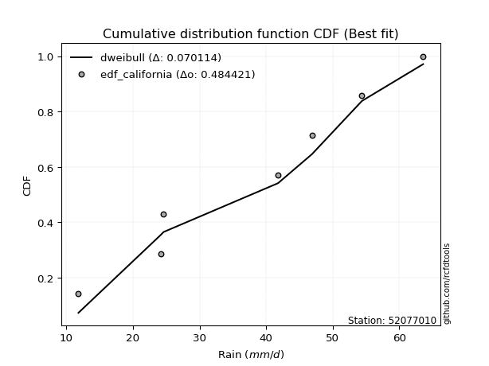</img>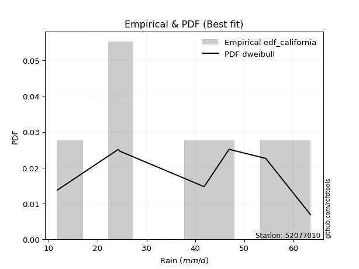</img>

</div>


### 2. EDF Hazen (1930)

Hazen method for plotting positions is a formula used to estimate the empirical cumulative probability distribution of flood events or other hydrological data. This formula often results in biased estimations, particularly when extrapolating to extreme events (high return periods).

<div align="center">


$P=(m-0.5)/n$


</div>


**2.1. Empirical values**

<div align="center">

|                | 0                   | 1                   | 2                   | 3         | 4                  | 5                  | 6                  |
|:---------------|:--------------------|:--------------------|:--------------------|:----------|:-------------------|:-------------------|:-------------------|
| date           | 2018                | 2022                | 2019                | 2017      | 2025               | 2020               | 2024               |
| x              | 11.8                | 24.2                | 24.6                | 41.8      | 46.9               | 54.4               | 63.6               |
| m              | 1                   | 2                   | 3                   | 4         | 5                  | 6                  | 7                  |
| empirical_dist | edf_hazen           | edf_hazen           | edf_hazen           | edf_hazen | edf_hazen          | edf_hazen          | edf_hazen          |
| empirical      | 0.07142857142857142 | 0.21428571428571427 | 0.35714285714285715 | 0.5       | 0.6428571428571429 | 0.7857142857142857 | 0.9285714285714286 |
| empirical_tr   | 1.0769230769230769  | 1.2727272727272727  | 1.5555555555555558  | 2.0       | 2.8000000000000003 | 4.666666666666666  | 14.000000000000007 |

</div>


**2.2. Kolmogorov-Smirnov fit test (sorted by Δ)**


<div align="center">

|                | 0                   | 1                   | 2                   | 3                   | 4                   | 5                   | 6                   | 7                   | 8                   | 9                   | 10                  | 11                  | 12                  | 13                  | 14                  | 15                  | 16                  | 17                  | 18                  | 19                  | 20                  | 21                  | 22                  | 23                  | 24                  | 25                  | 26                  | 27                  | 28                  | 29                  | 30                  | 31                  | 32                  | 33                  | 34                  | 35                  | 36                  | 37                  | 38                  | 39                  | 40                  | 41                  | 42                  | 43                  | 44                  | 45                  | 46                  | 47                  | 48                  | 49                  | 50                  | 51                  | 52                  | 53                  | 54                  | 55                  | 56                  | 57                  | 58                  | 59                  | 60                  | 61                  | 62                  | 63                  | 64                  | 65                  | 66                  | 67                  | 68                  | 69                  | 70                  | 71                  | 72                  | 73                  | 74                  | 75                  | 76                  | 77                  | 78                  | 79                  | 80                  | 81                  | 82                  | 83                  | 84                  | 85                  | 86                  | 87                  | 88                  | 89                  | 90                  | 91                  | 92                  | 93                  | 94                  | 95                  | 96                  | 97                  | 98                  | 99                  | 100                 | 101                 | 102                 | 103                 | 104                 | 105                 | 106                 | 107                 | 108                 | 109                 | 110                 | 111                 | 112                 | 113                 | 114                 | 115                 | 116                 | 117                 | 118                 | 119                 | 120                 | 121                 | 122                 | 123                 | 124                 | 125                 | 126                 | 127                 | 128                 | 129                 | 130                 | 131                 | 132                 | 133                 | 134                 | 135                 | 136                 | 137                 | 138                 | 139                 | 140                 | 141                 | 142                 | 143                 | 144                 | 145                 | 146                 | 147                 | 148                 | 149                 | 150                 | 151                 | 152                 | 153                 | 154                 | 155                 | 156                 | 157                 | 158                 | 159                 |
|:---------------|:--------------------|:--------------------|:--------------------|:--------------------|:--------------------|:--------------------|:--------------------|:--------------------|:--------------------|:--------------------|:--------------------|:--------------------|:--------------------|:--------------------|:--------------------|:--------------------|:--------------------|:--------------------|:--------------------|:--------------------|:--------------------|:--------------------|:--------------------|:--------------------|:--------------------|:--------------------|:--------------------|:--------------------|:--------------------|:--------------------|:--------------------|:--------------------|:--------------------|:--------------------|:--------------------|:--------------------|:--------------------|:--------------------|:--------------------|:--------------------|:--------------------|:--------------------|:--------------------|:--------------------|:--------------------|:--------------------|:--------------------|:--------------------|:--------------------|:--------------------|:--------------------|:--------------------|:--------------------|:--------------------|:--------------------|:--------------------|:--------------------|:--------------------|:--------------------|:--------------------|:--------------------|:--------------------|:--------------------|:--------------------|:--------------------|:--------------------|:--------------------|:--------------------|:--------------------|:--------------------|:--------------------|:--------------------|:--------------------|:--------------------|:--------------------|:--------------------|:--------------------|:--------------------|:--------------------|:--------------------|:--------------------|:--------------------|:--------------------|:--------------------|:--------------------|:--------------------|:--------------------|:--------------------|:--------------------|:--------------------|:--------------------|:--------------------|:--------------------|:--------------------|:--------------------|:--------------------|:--------------------|:--------------------|:--------------------|:--------------------|:--------------------|:--------------------|:--------------------|:--------------------|:--------------------|:--------------------|:--------------------|:--------------------|:--------------------|:--------------------|:--------------------|:--------------------|:--------------------|:--------------------|:--------------------|:--------------------|:--------------------|:--------------------|:--------------------|:--------------------|:--------------------|:--------------------|:--------------------|:--------------------|:--------------------|:--------------------|:--------------------|:--------------------|:--------------------|:--------------------|:--------------------|:--------------------|:--------------------|:--------------------|:--------------------|:--------------------|:--------------------|:--------------------|:--------------------|:--------------------|:--------------------|:--------------------|:--------------------|:--------------------|:--------------------|:--------------------|:--------------------|:--------------------|:--------------------|:--------------------|:--------------------|:--------------------|:--------------------|:--------------------|:--------------------|:--------------------|:--------------------|:--------------------|:--------------------|:--------------------|
| station        | 52077010            | 52077010            | 52077010            | 52077010            | 52077010            | 52077010            | 52077010            | 52077010            | 52077010            | 52077010            | 52077010            | 52077010            | 52077010            | 52077010            | 52077010            | 52077010            | 52077010            | 52077010            | 52077010            | 52077010            | 52077010            | 52077010            | 52077010            | 52077010            | 52077010            | 52077010            | 52077010            | 52077010            | 52077010            | 52077010            | 52077010            | 52077010            | 52077010            | 52077010            | 52077010            | 52077010            | 52077010            | 52077010            | 52077010            | 52077010            | 52077010            | 52077010            | 52077010            | 52077010            | 52077010            | 52077010            | 52077010            | 52077010            | 52077010            | 52077010            | 52077010            | 52077010            | 52077010            | 52077010            | 52077010            | 52077010            | 52077010            | 52077010            | 52077010            | 52077010            | 52077010            | 52077010            | 52077010            | 52077010            | 52077010            | 52077010            | 52077010            | 52077010            | 52077010            | 52077010            | 52077010            | 52077010            | 52077010            | 52077010            | 52077010            | 52077010            | 52077010            | 52077010            | 52077010            | 52077010            | 52077010            | 52077010            | 52077010            | 52077010            | 52077010            | 52077010            | 52077010            | 52077010            | 52077010            | 52077010            | 52077010            | 52077010            | 52077010            | 52077010            | 52077010            | 52077010            | 52077010            | 52077010            | 52077010            | 52077010            | 52077010            | 52077010            | 52077010            | 52077010            | 52077010            | 52077010            | 52077010            | 52077010            | 52077010            | 52077010            | 52077010            | 52077010            | 52077010            | 52077010            | 52077010            | 52077010            | 52077010            | 52077010            | 52077010            | 52077010            | 52077010            | 52077010            | 52077010            | 52077010            | 52077010            | 52077010            | 52077010            | 52077010            | 52077010            | 52077010            | 52077010            | 52077010            | 52077010            | 52077010            | 52077010            | 52077010            | 52077010            | 52077010            | 52077010            | 52077010            | 52077010            | 52077010            | 52077010            | 52077010            | 52077010            | 52077010            | 52077010            | 52077010            | 52077010            | 52077010            | 52077010            | 52077010            | 52077010            | 52077010            | 52077010            | 52077010            | 52077010            | 52077010            | 52077010            | 52077010            |
| empirical_dist | edf_hazen           | edf_hazen           | edf_hazen           | edf_hazen           | edf_hazen           | edf_hazen           | edf_hazen           | edf_hazen           | edf_hazen           | edf_hazen           | edf_hazen           | edf_hazen           | edf_hazen           | edf_hazen           | edf_hazen           | edf_hazen           | edf_hazen           | edf_hazen           | edf_hazen           | edf_hazen           | edf_hazen           | edf_hazen           | edf_hazen           | edf_hazen           | edf_hazen           | edf_hazen           | edf_hazen           | edf_hazen           | edf_hazen           | edf_hazen           | edf_hazen           | edf_hazen           | edf_hazen           | edf_hazen           | edf_hazen           | edf_hazen           | edf_hazen           | edf_hazen           | edf_hazen           | edf_hazen           | edf_hazen           | edf_hazen           | edf_hazen           | edf_hazen           | edf_hazen           | edf_hazen           | edf_hazen           | edf_hazen           | edf_hazen           | edf_hazen           | edf_hazen           | edf_hazen           | edf_hazen           | edf_hazen           | edf_hazen           | edf_hazen           | edf_hazen           | edf_hazen           | edf_hazen           | edf_hazen           | edf_hazen           | edf_hazen           | edf_hazen           | edf_hazen           | edf_hazen           | edf_hazen           | edf_hazen           | edf_hazen           | edf_hazen           | edf_hazen           | edf_hazen           | edf_hazen           | edf_hazen           | edf_hazen           | edf_hazen           | edf_hazen           | edf_hazen           | edf_hazen           | edf_hazen           | edf_hazen           | edf_hazen           | edf_hazen           | edf_hazen           | edf_hazen           | edf_hazen           | edf_hazen           | edf_hazen           | edf_hazen           | edf_hazen           | edf_hazen           | edf_hazen           | edf_hazen           | edf_hazen           | edf_hazen           | edf_hazen           | edf_hazen           | edf_hazen           | edf_hazen           | edf_hazen           | edf_hazen           | edf_hazen           | edf_hazen           | edf_hazen           | edf_hazen           | edf_hazen           | edf_hazen           | edf_hazen           | edf_hazen           | edf_hazen           | edf_hazen           | edf_hazen           | edf_hazen           | edf_hazen           | edf_hazen           | edf_hazen           | edf_hazen           | edf_hazen           | edf_hazen           | edf_hazen           | edf_hazen           | edf_hazen           | edf_hazen           | edf_hazen           | edf_hazen           | edf_hazen           | edf_hazen           | edf_hazen           | edf_hazen           | edf_hazen           | edf_hazen           | edf_hazen           | edf_hazen           | edf_hazen           | edf_hazen           | edf_hazen           | edf_hazen           | edf_hazen           | edf_hazen           | edf_hazen           | edf_hazen           | edf_hazen           | edf_hazen           | edf_hazen           | edf_hazen           | edf_hazen           | edf_hazen           | edf_hazen           | edf_hazen           | edf_hazen           | edf_hazen           | edf_hazen           | edf_hazen           | edf_hazen           | edf_hazen           | edf_hazen           | edf_hazen           | edf_hazen           | edf_hazen           | edf_hazen           | edf_hazen           |
| p_dist         | wrapcauchy          | logtrapezoid        | ksone               | loggenhalflogistic  | logbeta             | arcsine             | kappa4              | beta                | semicircular        | tukeylambda         | bradford            | truncweibull_min    | vonmises_line       | genpareto           | uniform             | anglit              | loggengamma         | logskewnorm         | loggumbel_l         | logburr             | rayleigh            | logpearson3         | gausshyper          | invgauss            | logargus            | invgamma            | maxwell             | logmielke           | logsemicircular     | weibull_min         | loggompertz         | logtriang           | logweibull_min      | rice                | burr                | alpha               | logloggamma         | genlogistic         | kappa3              | mielke              | betaprime           | loganglit           | logjohnsonsu        | logburr12           | gamma               | erlang              | dweibull            | cosine              | loggenextreme       | johnsonsu           | logexponweib        | nct                 | t                   | exponnorm           | truncnorm           | crystalball         | norm                | skewnorm            | f                   | kstwobign           | pearson3            | halfnorm            | ncf                 | logarcsine          | gompertz            | genextreme          | gumbel_r            | dgamma              | logcrystalball      | logt                | lognorm             | logexponnorm        | logf                | logfatiguelife      | lognct              | logncf              | logfoldnorm         | argus               | logrice             | loginvweibull       | loggamma            | loggamma            | logbetaprime        | loginvgauss         | loginvgamma         | logistic            | logalpha            | logerlang           | logdgamma           | logdweibull         | gumbel_l            | halflogistic        | moyal               | loglogistic         | logmaxwell          | hypsecant           | triang              | genhalflogistic     | genexpon            | logkstwobign        | loggenpareto        | lograyleigh         | burr12              | truncexpon          | logcosine           | loghypsecant        | loggenexpon         | laplace             | logloglaplace       | loglevy_l           | loghalfnorm         | logkappa4           | lomax               | loggumbel_r         | logjohnsonsb        | loglaplace          | loglaplace          | logksone            | loghalflogistic     | loghalfgennorm      | logmoyal            | logrdist            | logtukeylambda      | logbradford         | logkappa3           | loguniform          | lognakagami         | logvonmises_line    | logwrapcauchy       | levy_l              | nakagami            | trapezoid           | halfgennorm         | wald                | gennorm             | loggennorm          | loglomax            | logwald             | loggausshyper       | logtruncweibull_min | logtruncnorm        | logtruncexpon       | logweibull_max      | exponweib           | logexponpow         | invweibull          | foldnorm            | exponpow            | fatiguelife         | gengamma            | powerlaw            | johnsonsb           | weibull_max         | logpowerlaw         | truncpareto         | logtruncpareto      | rdist               | loggenlogistic      | logvonmises         | vonmises            |
| delta          | 0.07654444759012655 | 0.0800012063233344  | 0.08497702199331186 | 0.0867677772105726  | 0.08994780618219425 | 0.09090752454744447 | 0.09547237961498711 | 0.09632864717693401 | 0.10168419657212957 | 0.10377114665292048 | 0.10469323412806791 | 0.10651646404969334 | 0.10767758650235895 | 0.10830724430113636 | 0.11003861003861001 | 0.11402990865626342 | 0.11777386547365618 | 0.11830282800568592 | 0.11915719802083904 | 0.11943936115542114 | 0.11987707725921792 | 0.1209372305552231  | 0.12268922436716515 | 0.12305424359763883 | 0.12427119790154145 | 0.1255703106942634  | 0.12634004587583123 | 0.12687609911274148 | 0.12730415733093936 | 0.12806627768525775 | 0.12999917673308525 | 0.1308499817256331  | 0.13096948586611715 | 0.13103991048417302 | 0.131364681391774   | 0.13141941632498855 | 0.13169250030954766 | 0.13267343462523273 | 0.13368091153555434 | 0.1339281664340821  | 0.13512209326117916 | 0.1359158283736689  | 0.1361928511829395  | 0.1376168795592212  | 0.14048655595522974 | 0.14056820300286715 | 0.14061559034098683 | 0.14065915127194167 | 0.14161597842770154 | 0.1418531207987675  | 0.14200000337309482 | 0.14206064098238508 | 0.14215618607218483 | 0.14215686662467292 | 0.14215718317015996 | 0.14215718465250027 | 0.14215718756365164 | 0.14227150844514153 | 0.14270544480891964 | 0.1430287115733173  | 0.14332033493937152 | 0.14475024397635794 | 0.14540021240192835 | 0.14733398165393433 | 0.14925549940605196 | 0.15008623810587943 | 0.1512184416377791  | 0.15622149157028556 | 0.15627362260298516 | 0.15640477496566318 | 0.15640638022971753 | 0.15640822304901647 | 0.15698202099844327 | 0.15728848898423886 | 0.15739572031534177 | 0.1588268561149584  | 0.15930321155882798 | 0.16033885097469341 | 0.1606762462511413  | 0.16142387808732217 | 0.1616292034807778  | 0.1616292034807778  | 0.1617487736176455  | 0.1633833166596681  | 0.164152358182595   | 0.164281561833516   | 0.16440979665404665 | 0.16442157662962886 | 0.16613704060299314 | 0.17236285882245453 | 0.17257543273045925 | 0.17285368994522687 | 0.1747598693608634  | 0.17488687291322336 | 0.17735099806011823 | 0.17776905218418176 | 0.17816688121199356 | 0.1788812633694144  | 0.17943284436282692 | 0.18220696959298488 | 0.18332205973227808 | 0.1836254408410103  | 0.1843755797433614  | 0.18714436504503285 | 0.18764665330008456 | 0.18911643429273883 | 0.18952931070872392 | 0.19337446302316968 | 0.19944569290413752 | 0.20058984780753827 | 0.20194651476099656 | 0.2040903120723272  | 0.2040975895215622  | 0.21534810886227984 | 0.2158613181360094  | 0.21708698498277101 | 0.21708698498277101 | 0.2243692567000297  | 0.2299596483185592  | 0.23176009715411883 | 0.23478483010149764 | 0.23994560433275233 | 0.24439005733317032 | 0.2507670707952704  | 0.2508366225749513  | 0.250837840442087   | 0.25411285946391104 | 0.2543536624451095  | 0.2607803705624129  | 0.2681183835408547  | 0.2707978512879369  | 0.2734752471721584  | 0.2824191378355081  | 0.28347939769814534 | 0.2857142857142857  | 0.2857142857142857  | 0.2869950704378471  | 0.29005208465578514 | 0.29198776976184004 | 0.2953965229959852  | 0.3185467634825089  | 0.3222159216236352  | 0.3848257177154987  | 0.40476359003777707 | 0.4493992569560513  | 0.4894151808816346  | 0.5                 | 0.5033108892616195  | 0.5515279371833871  | 0.5602959662735668  | 0.5731124704162878  | 0.5909392281028225  | 0.6109192623954486  | 0.6408830684629806  | 0.680920182207222   | 0.7222528651100523  | 0.7420406215328065  | 0.7857142857142857  | 1.147614279786524   | 10.00185585268535   |
| deltao         | 0.48442053926100004 | 0.48442053926100004 | 0.48442053926100004 | 0.48442053926100004 | 0.48442053926100004 | 0.48442053926100004 | 0.48442053926100004 | 0.48442053926100004 | 0.48442053926100004 | 0.48442053926100004 | 0.48442053926100004 | 0.48442053926100004 | 0.48442053926100004 | 0.48442053926100004 | 0.48442053926100004 | 0.48442053926100004 | 0.48442053926100004 | 0.48442053926100004 | 0.48442053926100004 | 0.48442053926100004 | 0.48442053926100004 | 0.48442053926100004 | 0.48442053926100004 | 0.48442053926100004 | 0.48442053926100004 | 0.48442053926100004 | 0.48442053926100004 | 0.48442053926100004 | 0.48442053926100004 | 0.48442053926100004 | 0.48442053926100004 | 0.48442053926100004 | 0.48442053926100004 | 0.48442053926100004 | 0.48442053926100004 | 0.48442053926100004 | 0.48442053926100004 | 0.48442053926100004 | 0.48442053926100004 | 0.48442053926100004 | 0.48442053926100004 | 0.48442053926100004 | 0.48442053926100004 | 0.48442053926100004 | 0.48442053926100004 | 0.48442053926100004 | 0.48442053926100004 | 0.48442053926100004 | 0.48442053926100004 | 0.48442053926100004 | 0.48442053926100004 | 0.48442053926100004 | 0.48442053926100004 | 0.48442053926100004 | 0.48442053926100004 | 0.48442053926100004 | 0.48442053926100004 | 0.48442053926100004 | 0.48442053926100004 | 0.48442053926100004 | 0.48442053926100004 | 0.48442053926100004 | 0.48442053926100004 | 0.48442053926100004 | 0.48442053926100004 | 0.48442053926100004 | 0.48442053926100004 | 0.48442053926100004 | 0.48442053926100004 | 0.48442053926100004 | 0.48442053926100004 | 0.48442053926100004 | 0.48442053926100004 | 0.48442053926100004 | 0.48442053926100004 | 0.48442053926100004 | 0.48442053926100004 | 0.48442053926100004 | 0.48442053926100004 | 0.48442053926100004 | 0.48442053926100004 | 0.48442053926100004 | 0.48442053926100004 | 0.48442053926100004 | 0.48442053926100004 | 0.48442053926100004 | 0.48442053926100004 | 0.48442053926100004 | 0.48442053926100004 | 0.48442053926100004 | 0.48442053926100004 | 0.48442053926100004 | 0.48442053926100004 | 0.48442053926100004 | 0.48442053926100004 | 0.48442053926100004 | 0.48442053926100004 | 0.48442053926100004 | 0.48442053926100004 | 0.48442053926100004 | 0.48442053926100004 | 0.48442053926100004 | 0.48442053926100004 | 0.48442053926100004 | 0.48442053926100004 | 0.48442053926100004 | 0.48442053926100004 | 0.48442053926100004 | 0.48442053926100004 | 0.48442053926100004 | 0.48442053926100004 | 0.48442053926100004 | 0.48442053926100004 | 0.48442053926100004 | 0.48442053926100004 | 0.48442053926100004 | 0.48442053926100004 | 0.48442053926100004 | 0.48442053926100004 | 0.48442053926100004 | 0.48442053926100004 | 0.48442053926100004 | 0.48442053926100004 | 0.48442053926100004 | 0.48442053926100004 | 0.48442053926100004 | 0.48442053926100004 | 0.48442053926100004 | 0.48442053926100004 | 0.48442053926100004 | 0.48442053926100004 | 0.48442053926100004 | 0.48442053926100004 | 0.48442053926100004 | 0.48442053926100004 | 0.48442053926100004 | 0.48442053926100004 | 0.48442053926100004 | 0.48442053926100004 | 0.48442053926100004 | 0.48442053926100004 | 0.48442053926100004 | 0.48442053926100004 | 0.48442053926100004 | 0.48442053926100004 | 0.48442053926100004 | 0.48442053926100004 | 0.48442053926100004 | 0.48442053926100004 | 0.48442053926100004 | 0.48442053926100004 | 0.48442053926100004 | 0.48442053926100004 | 0.48442053926100004 | 0.48442053926100004 | 0.48442053926100004 | 0.48442053926100004 | 0.48442053926100004 | 0.48442053926100004 | 0.48442053926100004 |
| eval           | Δo > Δ              | Δo > Δ              | Δo > Δ              | Δo > Δ              | Δo > Δ              | Δo > Δ              | Δo > Δ              | Δo > Δ              | Δo > Δ              | Δo > Δ              | Δo > Δ              | Δo > Δ              | Δo > Δ              | Δo > Δ              | Δo > Δ              | Δo > Δ              | Δo > Δ              | Δo > Δ              | Δo > Δ              | Δo > Δ              | Δo > Δ              | Δo > Δ              | Δo > Δ              | Δo > Δ              | Δo > Δ              | Δo > Δ              | Δo > Δ              | Δo > Δ              | Δo > Δ              | Δo > Δ              | Δo > Δ              | Δo > Δ              | Δo > Δ              | Δo > Δ              | Δo > Δ              | Δo > Δ              | Δo > Δ              | Δo > Δ              | Δo > Δ              | Δo > Δ              | Δo > Δ              | Δo > Δ              | Δo > Δ              | Δo > Δ              | Δo > Δ              | Δo > Δ              | Δo > Δ              | Δo > Δ              | Δo > Δ              | Δo > Δ              | Δo > Δ              | Δo > Δ              | Δo > Δ              | Δo > Δ              | Δo > Δ              | Δo > Δ              | Δo > Δ              | Δo > Δ              | Δo > Δ              | Δo > Δ              | Δo > Δ              | Δo > Δ              | Δo > Δ              | Δo > Δ              | Δo > Δ              | Δo > Δ              | Δo > Δ              | Δo > Δ              | Δo > Δ              | Δo > Δ              | Δo > Δ              | Δo > Δ              | Δo > Δ              | Δo > Δ              | Δo > Δ              | Δo > Δ              | Δo > Δ              | Δo > Δ              | Δo > Δ              | Δo > Δ              | Δo > Δ              | Δo > Δ              | Δo > Δ              | Δo > Δ              | Δo > Δ              | Δo > Δ              | Δo > Δ              | Δo > Δ              | Δo > Δ              | Δo > Δ              | Δo > Δ              | Δo > Δ              | Δo > Δ              | Δo > Δ              | Δo > Δ              | Δo > Δ              | Δo > Δ              | Δo > Δ              | Δo > Δ              | Δo > Δ              | Δo > Δ              | Δo > Δ              | Δo > Δ              | Δo > Δ              | Δo > Δ              | Δo > Δ              | Δo > Δ              | Δo > Δ              | Δo > Δ              | Δo > Δ              | Δo > Δ              | Δo > Δ              | Δo > Δ              | Δo > Δ              | Δo > Δ              | Δo > Δ              | Δo > Δ              | Δo > Δ              | Δo > Δ              | Δo > Δ              | Δo > Δ              | Δo > Δ              | Δo > Δ              | Δo > Δ              | Δo > Δ              | Δo > Δ              | Δo > Δ              | Δo > Δ              | Δo > Δ              | Δo > Δ              | Δo > Δ              | Δo > Δ              | Δo > Δ              | Δo > Δ              | Δo > Δ              | Δo > Δ              | Δo > Δ              | Δo > Δ              | Δo > Δ              | Δo > Δ              | Δo > Δ              | Δo > Δ              | Δo > Δ              | Δo > Δ              | Δo > Δ              | Δo <= Δ             | Δo <= Δ             | Δo <= Δ             | Δo <= Δ             | Δo <= Δ             | Δo <= Δ             | Δo <= Δ             | Δo <= Δ             | Δo <= Δ             | Δo <= Δ             | Δo <= Δ             | Δo <= Δ             | Δo <= Δ             | Δo <= Δ             | Δo <= Δ             |
| fit            | 1                   | 1                   | 1                   | 1                   | 1                   | 1                   | 1                   | 1                   | 1                   | 1                   | 1                   | 1                   | 1                   | 1                   | 1                   | 1                   | 1                   | 1                   | 1                   | 1                   | 1                   | 1                   | 1                   | 1                   | 1                   | 1                   | 1                   | 1                   | 1                   | 1                   | 1                   | 1                   | 1                   | 1                   | 1                   | 1                   | 1                   | 1                   | 1                   | 1                   | 1                   | 1                   | 1                   | 1                   | 1                   | 1                   | 1                   | 1                   | 1                   | 1                   | 1                   | 1                   | 1                   | 1                   | 1                   | 1                   | 1                   | 1                   | 1                   | 1                   | 1                   | 1                   | 1                   | 1                   | 1                   | 1                   | 1                   | 1                   | 1                   | 1                   | 1                   | 1                   | 1                   | 1                   | 1                   | 1                   | 1                   | 1                   | 1                   | 1                   | 1                   | 1                   | 1                   | 1                   | 1                   | 1                   | 1                   | 1                   | 1                   | 1                   | 1                   | 1                   | 1                   | 1                   | 1                   | 1                   | 1                   | 1                   | 1                   | 1                   | 1                   | 1                   | 1                   | 1                   | 1                   | 1                   | 1                   | 1                   | 1                   | 1                   | 1                   | 1                   | 1                   | 1                   | 1                   | 1                   | 1                   | 1                   | 1                   | 1                   | 1                   | 1                   | 1                   | 1                   | 1                   | 1                   | 1                   | 1                   | 1                   | 1                   | 1                   | 1                   | 1                   | 1                   | 1                   | 1                   | 1                   | 1                   | 1                   | 1                   | 1                   | 1                   | 1                   | 1                   | 1                   | 0                   | 0                   | 0                   | 0                   | 0                   | 0                   | 0                   | 0                   | 0                   | 0                   | 0                   | 0                   | 0                   | 0                   | 0                   |
| n              | 7                   | 7                   | 7                   | 7                   | 7                   | 7                   | 7                   | 7                   | 7                   | 7                   | 7                   | 7                   | 7                   | 7                   | 7                   | 7                   | 7                   | 7                   | 7                   | 7                   | 7                   | 7                   | 7                   | 7                   | 7                   | 7                   | 7                   | 7                   | 7                   | 7                   | 7                   | 7                   | 7                   | 7                   | 7                   | 7                   | 7                   | 7                   | 7                   | 7                   | 7                   | 7                   | 7                   | 7                   | 7                   | 7                   | 7                   | 7                   | 7                   | 7                   | 7                   | 7                   | 7                   | 7                   | 7                   | 7                   | 7                   | 7                   | 7                   | 7                   | 7                   | 7                   | 7                   | 7                   | 7                   | 7                   | 7                   | 7                   | 7                   | 7                   | 7                   | 7                   | 7                   | 7                   | 7                   | 7                   | 7                   | 7                   | 7                   | 7                   | 7                   | 7                   | 7                   | 7                   | 7                   | 7                   | 7                   | 7                   | 7                   | 7                   | 7                   | 7                   | 7                   | 7                   | 7                   | 7                   | 7                   | 7                   | 7                   | 7                   | 7                   | 7                   | 7                   | 7                   | 7                   | 7                   | 7                   | 7                   | 7                   | 7                   | 7                   | 7                   | 7                   | 7                   | 7                   | 7                   | 7                   | 7                   | 7                   | 7                   | 7                   | 7                   | 7                   | 7                   | 7                   | 7                   | 7                   | 7                   | 7                   | 7                   | 7                   | 7                   | 7                   | 7                   | 7                   | 7                   | 7                   | 7                   | 7                   | 7                   | 7                   | 7                   | 7                   | 7                   | 7                   | 7                   | 7                   | 7                   | 7                   | 7                   | 7                   | 7                   | 7                   | 7                   | 7                   | 7                   | 7                   | 7                   | 7                   | 7                   |
| best_fit       | 1                   | 0                   | 0                   | 0                   | 0                   | 0                   | 0                   | 0                   | 0                   | 0                   | 0                   | 0                   | 0                   | 0                   | 0                   | 0                   | 0                   | 0                   | 0                   | 0                   | 0                   | 0                   | 0                   | 0                   | 0                   | 0                   | 0                   | 0                   | 0                   | 0                   | 0                   | 0                   | 0                   | 0                   | 0                   | 0                   | 0                   | 0                   | 0                   | 0                   | 0                   | 0                   | 0                   | 0                   | 0                   | 0                   | 0                   | 0                   | 0                   | 0                   | 0                   | 0                   | 0                   | 0                   | 0                   | 0                   | 0                   | 0                   | 0                   | 0                   | 0                   | 0                   | 0                   | 0                   | 0                   | 0                   | 0                   | 0                   | 0                   | 0                   | 0                   | 0                   | 0                   | 0                   | 0                   | 0                   | 0                   | 0                   | 0                   | 0                   | 0                   | 0                   | 0                   | 0                   | 0                   | 0                   | 0                   | 0                   | 0                   | 0                   | 0                   | 0                   | 0                   | 0                   | 0                   | 0                   | 0                   | 0                   | 0                   | 0                   | 0                   | 0                   | 0                   | 0                   | 0                   | 0                   | 0                   | 0                   | 0                   | 0                   | 0                   | 0                   | 0                   | 0                   | 0                   | 0                   | 0                   | 0                   | 0                   | 0                   | 0                   | 0                   | 0                   | 0                   | 0                   | 0                   | 0                   | 0                   | 0                   | 0                   | 0                   | 0                   | 0                   | 0                   | 0                   | 0                   | 0                   | 0                   | 0                   | 0                   | 0                   | 0                   | 0                   | 0                   | 0                   | 0                   | 0                   | 0                   | 0                   | 0                   | 0                   | 0                   | 0                   | 0                   | 0                   | 0                   | 0                   | 0                   | 0                   | 0                   |
| best_fit_sort  | 1                   | 2                   | 3                   | 4                   | 5                   | 6                   | 7                   | 8                   | 9                   | 10                  | 11                  | 12                  | 13                  | 14                  | 15                  | 16                  | 17                  | 18                  | 19                  | 20                  | 21                  | 22                  | 23                  | 24                  | 25                  | 26                  | 27                  | 28                  | 29                  | 30                  | 31                  | 32                  | 33                  | 34                  | 35                  | 36                  | 37                  | 38                  | 39                  | 40                  | 41                  | 42                  | 43                  | 44                  | 45                  | 46                  | 47                  | 48                  | 49                  | 50                  | 51                  | 52                  | 53                  | 54                  | 55                  | 56                  | 57                  | 58                  | 59                  | 60                  | 61                  | 62                  | 63                  | 64                  | 65                  | 66                  | 67                  | 68                  | 69                  | 70                  | 71                  | 72                  | 73                  | 74                  | 75                  | 76                  | 77                  | 78                  | 79                  | 80                  | 81                  | 82                  | 83                  | 84                  | 85                  | 86                  | 87                  | 88                  | 89                  | 90                  | 91                  | 92                  | 93                  | 94                  | 95                  | 96                  | 97                  | 98                  | 99                  | 100                 | 101                 | 102                 | 103                 | 104                 | 105                 | 106                 | 107                 | 108                 | 109                 | 110                 | 111                 | 112                 | 113                 | 114                 | 115                 | 116                 | 117                 | 118                 | 119                 | 120                 | 121                 | 122                 | 123                 | 124                 | 125                 | 126                 | 127                 | 128                 | 129                 | 130                 | 131                 | 132                 | 133                 | 134                 | 135                 | 136                 | 137                 | 138                 | 139                 | 140                 | 141                 | 142                 | 143                 | 144                 | 145                 | 146                 | 147                 | 148                 | 149                 | 150                 | 151                 | 152                 | 153                 | 154                 | 155                 | 156                 | 157                 | 158                 | 159                 | 160                 |

</div>


**2.3. Best fit**

<div align="center">

|   id |   station | empirical_dist   | p_dist     |     delta |   deltao | eval   |   fit |   n |   best_fit |   best_fit_sort |
|-----:|----------:|:-----------------|:-----------|----------:|---------:|:-------|------:|----:|-----------:|----------------:|
|    0 |  52077010 | edf_hazen        | wrapcauchy | 0.0765444 | 0.484421 | Δo > Δ |     1 |   7 |          1 |               1 |

</div>


<div align="center">

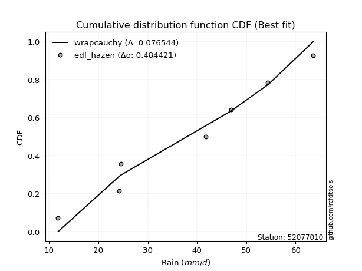</img></img>

</div>


### 3. EDF Weibull (1939)

Weibull plotting position formula is an empirical method used to estimate the non-exceedance probability or plotting position for a set of observed data, is often recommended or widely used in practice, particularly in flood frequency analysis.

<div align="center">


$P=m/(n+1)$


</div>


**3.1. Empirical values**

<div align="center">

|                | 0                  | 1                  | 2           | 3           | 4                  | 5           | 6           |
|:---------------|:-------------------|:-------------------|:------------|:------------|:-------------------|:------------|:------------|
| date           | 2018               | 2022               | 2019        | 2017        | 2025               | 2020        | 2024        |
| x              | 11.8               | 24.2               | 24.6        | 41.8        | 46.9               | 54.4        | 63.6        |
| m              | 1                  | 2                  | 3           | 4           | 5                  | 6           | 7           |
| empirical_dist | edf_weibull        | edf_weibull        | edf_weibull | edf_weibull | edf_weibull        | edf_weibull | edf_weibull |
| empirical      | 0.125              | 0.25               | 0.375       | 0.5         | 0.625              | 0.75        | 0.875       |
| empirical_tr   | 1.1428571428571428 | 1.3333333333333333 | 1.6         | 2.0         | 2.6666666666666665 | 4.0         | 8.0         |

</div>


**3.2. Kolmogorov-Smirnov fit test (sorted by Δ)**


<div align="center">

|                | 0                   | 1                   | 2                   | 3                   | 4                   | 5                   | 6                   | 7                   | 8                   | 9                   | 10                  | 11                  | 12                  | 13                  | 14                  | 15                  | 16                  | 17                  | 18                  | 19                  | 20                  | 21                  | 22                  | 23                  | 24                  | 25                  | 26                  | 27                  | 28                  | 29                  | 30                  | 31                  | 32                  | 33                  | 34                  | 35                  | 36                  | 37                  | 38                  | 39                  | 40                  | 41                  | 42                  | 43                  | 44                  | 45                  | 46                  | 47                  | 48                  | 49                  | 50                  | 51                  | 52                  | 53                  | 54                  | 55                  | 56                  | 57                  | 58                  | 59                  | 60                  | 61                  | 62                  | 63                  | 64                  | 65                  | 66                  | 67                  | 68                  | 69                  | 70                  | 71                  | 72                  | 73                  | 74                  | 75                  | 76                  | 77                  | 78                  | 79                  | 80                  | 81                  | 82                  | 83                  | 84                  | 85                  | 86                  | 87                  | 88                  | 89                  | 90                  | 91                  | 92                  | 93                  | 94                  | 95                  | 96                  | 97                  | 98                  | 99                  | 100                 | 101                 | 102                 | 103                 | 104                 | 105                 | 106                 | 107                 | 108                 | 109                 | 110                 | 111                 | 112                 | 113                 | 114                 | 115                 | 116                 | 117                 | 118                 | 119                 | 120                 | 121                 | 122                 | 123                 | 124                 | 125                 | 126                 | 127                 | 128                 | 129                 | 130                 | 131                 | 132                 | 133                 | 134                 | 135                 | 136                 | 137                 | 138                 | 139                 | 140                 | 141                 | 142                 | 143                 | 144                 | 145                 | 146                 | 147                 | 148                 | 149                 | 150                 | 151                 | 152                 | 153                 | 154                 | 155                 | 156                 | 157                 | 158                 | 159                 |
|:---------------|:--------------------|:--------------------|:--------------------|:--------------------|:--------------------|:--------------------|:--------------------|:--------------------|:--------------------|:--------------------|:--------------------|:--------------------|:--------------------|:--------------------|:--------------------|:--------------------|:--------------------|:--------------------|:--------------------|:--------------------|:--------------------|:--------------------|:--------------------|:--------------------|:--------------------|:--------------------|:--------------------|:--------------------|:--------------------|:--------------------|:--------------------|:--------------------|:--------------------|:--------------------|:--------------------|:--------------------|:--------------------|:--------------------|:--------------------|:--------------------|:--------------------|:--------------------|:--------------------|:--------------------|:--------------------|:--------------------|:--------------------|:--------------------|:--------------------|:--------------------|:--------------------|:--------------------|:--------------------|:--------------------|:--------------------|:--------------------|:--------------------|:--------------------|:--------------------|:--------------------|:--------------------|:--------------------|:--------------------|:--------------------|:--------------------|:--------------------|:--------------------|:--------------------|:--------------------|:--------------------|:--------------------|:--------------------|:--------------------|:--------------------|:--------------------|:--------------------|:--------------------|:--------------------|:--------------------|:--------------------|:--------------------|:--------------------|:--------------------|:--------------------|:--------------------|:--------------------|:--------------------|:--------------------|:--------------------|:--------------------|:--------------------|:--------------------|:--------------------|:--------------------|:--------------------|:--------------------|:--------------------|:--------------------|:--------------------|:--------------------|:--------------------|:--------------------|:--------------------|:--------------------|:--------------------|:--------------------|:--------------------|:--------------------|:--------------------|:--------------------|:--------------------|:--------------------|:--------------------|:--------------------|:--------------------|:--------------------|:--------------------|:--------------------|:--------------------|:--------------------|:--------------------|:--------------------|:--------------------|:--------------------|:--------------------|:--------------------|:--------------------|:--------------------|:--------------------|:--------------------|:--------------------|:--------------------|:--------------------|:--------------------|:--------------------|:--------------------|:--------------------|:--------------------|:--------------------|:--------------------|:--------------------|:--------------------|:--------------------|:--------------------|:--------------------|:--------------------|:--------------------|:--------------------|:--------------------|:--------------------|:--------------------|:--------------------|:--------------------|:--------------------|:--------------------|:--------------------|:--------------------|:--------------------|:--------------------|:--------------------|
| station        | 52077010            | 52077010            | 52077010            | 52077010            | 52077010            | 52077010            | 52077010            | 52077010            | 52077010            | 52077010            | 52077010            | 52077010            | 52077010            | 52077010            | 52077010            | 52077010            | 52077010            | 52077010            | 52077010            | 52077010            | 52077010            | 52077010            | 52077010            | 52077010            | 52077010            | 52077010            | 52077010            | 52077010            | 52077010            | 52077010            | 52077010            | 52077010            | 52077010            | 52077010            | 52077010            | 52077010            | 52077010            | 52077010            | 52077010            | 52077010            | 52077010            | 52077010            | 52077010            | 52077010            | 52077010            | 52077010            | 52077010            | 52077010            | 52077010            | 52077010            | 52077010            | 52077010            | 52077010            | 52077010            | 52077010            | 52077010            | 52077010            | 52077010            | 52077010            | 52077010            | 52077010            | 52077010            | 52077010            | 52077010            | 52077010            | 52077010            | 52077010            | 52077010            | 52077010            | 52077010            | 52077010            | 52077010            | 52077010            | 52077010            | 52077010            | 52077010            | 52077010            | 52077010            | 52077010            | 52077010            | 52077010            | 52077010            | 52077010            | 52077010            | 52077010            | 52077010            | 52077010            | 52077010            | 52077010            | 52077010            | 52077010            | 52077010            | 52077010            | 52077010            | 52077010            | 52077010            | 52077010            | 52077010            | 52077010            | 52077010            | 52077010            | 52077010            | 52077010            | 52077010            | 52077010            | 52077010            | 52077010            | 52077010            | 52077010            | 52077010            | 52077010            | 52077010            | 52077010            | 52077010            | 52077010            | 52077010            | 52077010            | 52077010            | 52077010            | 52077010            | 52077010            | 52077010            | 52077010            | 52077010            | 52077010            | 52077010            | 52077010            | 52077010            | 52077010            | 52077010            | 52077010            | 52077010            | 52077010            | 52077010            | 52077010            | 52077010            | 52077010            | 52077010            | 52077010            | 52077010            | 52077010            | 52077010            | 52077010            | 52077010            | 52077010            | 52077010            | 52077010            | 52077010            | 52077010            | 52077010            | 52077010            | 52077010            | 52077010            | 52077010            | 52077010            | 52077010            | 52077010            | 52077010            | 52077010            | 52077010            |
| empirical_dist | edf_weibull         | edf_weibull         | edf_weibull         | edf_weibull         | edf_weibull         | edf_weibull         | edf_weibull         | edf_weibull         | edf_weibull         | edf_weibull         | edf_weibull         | edf_weibull         | edf_weibull         | edf_weibull         | edf_weibull         | edf_weibull         | edf_weibull         | edf_weibull         | edf_weibull         | edf_weibull         | edf_weibull         | edf_weibull         | edf_weibull         | edf_weibull         | edf_weibull         | edf_weibull         | edf_weibull         | edf_weibull         | edf_weibull         | edf_weibull         | edf_weibull         | edf_weibull         | edf_weibull         | edf_weibull         | edf_weibull         | edf_weibull         | edf_weibull         | edf_weibull         | edf_weibull         | edf_weibull         | edf_weibull         | edf_weibull         | edf_weibull         | edf_weibull         | edf_weibull         | edf_weibull         | edf_weibull         | edf_weibull         | edf_weibull         | edf_weibull         | edf_weibull         | edf_weibull         | edf_weibull         | edf_weibull         | edf_weibull         | edf_weibull         | edf_weibull         | edf_weibull         | edf_weibull         | edf_weibull         | edf_weibull         | edf_weibull         | edf_weibull         | edf_weibull         | edf_weibull         | edf_weibull         | edf_weibull         | edf_weibull         | edf_weibull         | edf_weibull         | edf_weibull         | edf_weibull         | edf_weibull         | edf_weibull         | edf_weibull         | edf_weibull         | edf_weibull         | edf_weibull         | edf_weibull         | edf_weibull         | edf_weibull         | edf_weibull         | edf_weibull         | edf_weibull         | edf_weibull         | edf_weibull         | edf_weibull         | edf_weibull         | edf_weibull         | edf_weibull         | edf_weibull         | edf_weibull         | edf_weibull         | edf_weibull         | edf_weibull         | edf_weibull         | edf_weibull         | edf_weibull         | edf_weibull         | edf_weibull         | edf_weibull         | edf_weibull         | edf_weibull         | edf_weibull         | edf_weibull         | edf_weibull         | edf_weibull         | edf_weibull         | edf_weibull         | edf_weibull         | edf_weibull         | edf_weibull         | edf_weibull         | edf_weibull         | edf_weibull         | edf_weibull         | edf_weibull         | edf_weibull         | edf_weibull         | edf_weibull         | edf_weibull         | edf_weibull         | edf_weibull         | edf_weibull         | edf_weibull         | edf_weibull         | edf_weibull         | edf_weibull         | edf_weibull         | edf_weibull         | edf_weibull         | edf_weibull         | edf_weibull         | edf_weibull         | edf_weibull         | edf_weibull         | edf_weibull         | edf_weibull         | edf_weibull         | edf_weibull         | edf_weibull         | edf_weibull         | edf_weibull         | edf_weibull         | edf_weibull         | edf_weibull         | edf_weibull         | edf_weibull         | edf_weibull         | edf_weibull         | edf_weibull         | edf_weibull         | edf_weibull         | edf_weibull         | edf_weibull         | edf_weibull         | edf_weibull         | edf_weibull         | edf_weibull         | edf_weibull         |
| p_dist         | logtrapezoid        | ksone               | dweibull            | semicircular        | dgamma              | logpearson3         | bradford            | logskewnorm         | wrapcauchy          | genpareto           | logbeta             | truncweibull_min    | beta                | tukeylambda         | kappa4              | loggenhalflogistic  | logarcsine          | arcsine             | vonmises_line       | logsemicircular     | uniform             | loggenpareto        | loggompertz         | logdgamma           | logtriang           | anglit              | genlogistic         | loggengamma         | invgauss            | loganglit           | logdweibull         | loggumbel_l         | logburr             | rayleigh            | gausshyper          | logexponweib        | logargus            | kstwobign           | invgamma            | maxwell             | logmielke           | halfnorm            | ncf                 | weibull_min         | loglevy_l           | logweibull_min      | rice                | burr                | alpha               | logloggamma         | lomax               | kappa3              | mielke              | betaprime           | logjohnsonsu        | logburr12           | logcrystalball      | logt                | lognorm             | logexponnorm        | logf                | logfatiguelife      | lognct              | gamma               | erlang              | cosine              | logncf              | logfoldnorm         | loggenextreme       | johnsonsu           | nct                 | t                   | exponnorm           | truncnorm           | crystalball         | norm                | skewnorm            | f                   | logrice             | pearson3            | loginvweibull       | loggamma            | loggamma            | gumbel_r            | logbetaprime        | loginvgauss         | loginvgamma         | logalpha            | logerlang           | gompertz            | genextreme          | halflogistic        | moyal               | loglogistic         | burr12              | logmaxwell          | argus               | genexpon            | logjohnsonsb        | logistic            | logkstwobign        | lograyleigh         | truncexpon          | logcosine           | loghypsecant        | loggenexpon         | gumbel_l            | hypsecant           | triang              | genhalflogistic     | loghalfnorm         | logkappa4           | logrdist            | logksone            | laplace             | levy_l              | loggumbel_r         | loglaplace          | loglaplace          | logloglaplace       | logwrapcauchy       | loghalflogistic     | loghalfgennorm      | logmoyal            | logtukeylambda      | halfgennorm         | gennorm             | loggennorm          | logbradford         | logkappa3           | loguniform          | loglomax            | lognakagami         | logvonmises_line    | nakagami            | logwald             | trapezoid           | loggausshyper       | logtruncweibull_min | wald                | logtruncexpon       | logtruncnorm        | logweibull_max      | exponweib           | logexponpow         | invweibull          | exponpow            | foldnorm            | fatiguelife         | gengamma            | powerlaw            | johnsonsb           | weibull_max         | logpowerlaw         | truncpareto         | logtruncpareto      | rdist               | loggenlogistic      | logvonmises         | vonmises            |
| delta          | 0.09055369611730002 | 0.10283416485045471 | 0.10490130462670111 | 0.11954133942927242 | 0.12050720585599983 | 0.1209372305552231  | 0.12499975864926749 | 0.12499982539634558 | 0.12499999946973736 | 0.12499999951294827 | 0.1249999997579836  | 0.12499999999468958 | 0.12499999999924438 | 0.1249999999999929  | 0.12499999999999802 | 0.12499999999999867 | 0.125               | 0.125               | 0.1255347293595018  | 0.12730415733093936 | 0.12789575289575286 | 0.1297506311608495  | 0.12999917673308525 | 0.13042275488870742 | 0.1308499817256331  | 0.13188705151340627 | 0.13267343462523273 | 0.13563100833079902 | 0.13583476554170248 | 0.1359158283736689  | 0.1366485731081688  | 0.1370143408779819  | 0.137296504012564   | 0.13758991036264356 | 0.140546367224308   | 0.14200000337309482 | 0.1421283407586843  | 0.1430287115733173  | 0.14342745355140624 | 0.14419718873297407 | 0.14473324196988432 | 0.14475024397635794 | 0.14540021240192835 | 0.1459234205424006  | 0.1470184192361097  | 0.14882662872326    | 0.14889705334131587 | 0.14922182424891686 | 0.1492765591821314  | 0.1495496431666905  | 0.1505261609501336  | 0.15153805439269719 | 0.15178530929122494 | 0.152979236118322   | 0.15404999404008235 | 0.15547402241636404 | 0.15627362260298516 | 0.15640477496566318 | 0.15640638022971753 | 0.15640822304901647 | 0.15698202099844327 | 0.15728848898423886 | 0.15739572031534177 | 0.1583436988123726  | 0.15842534586001    | 0.15851629412908452 | 0.1588268561149584  | 0.15930321155882798 | 0.1594731212848444  | 0.15971026365591035 | 0.15991778383952793 | 0.16001332892932768 | 0.16001400948181577 | 0.1600143260273028  | 0.16001432750964312 | 0.1600143304207945  | 0.16012865130228437 | 0.1605625876660625  | 0.1606762462511413  | 0.16117747779651437 | 0.16142387808732217 | 0.1616292034807778  | 0.1616292034807778  | 0.1616884413686493  | 0.1617487736176455  | 0.1633833166596681  | 0.164152358182595   | 0.16440979665404665 | 0.16442157662962886 | 0.1671126422631948  | 0.16794338096302228 | 0.17285368994522687 | 0.1747598693608634  | 0.17488687291322336 | 0.1763764749627783  | 0.17735099806011823 | 0.17819599383183626 | 0.17943284436282692 | 0.1801470324217237  | 0.18213870469065885 | 0.18220696959298488 | 0.1836254408410103  | 0.18714436504503285 | 0.18764665330008456 | 0.18911643429273883 | 0.18952931070872392 | 0.1904325755876021  | 0.1956261950413246  | 0.1960240240691364  | 0.19673840622655725 | 0.20194651476099656 | 0.2040903120723272  | 0.2042313186184666  | 0.20903153370173932 | 0.21123160588031253 | 0.2145469549694261  | 0.21534810886227984 | 0.21708698498277101 | 0.21708698498277101 | 0.21730283576128037 | 0.22506608484812712 | 0.2299596483185592  | 0.23176009715411883 | 0.23478483010149764 | 0.24439005733317032 | 0.24670485212122234 | 0.25                | 0.25                | 0.2507670707952704  | 0.2508366225749513  | 0.250837840442087   | 0.2512807847235614  | 0.25411285946391104 | 0.2543536624451095  | 0.2707978512879369  | 0.29005208465578514 | 0.2913323900293012  | 0.29198776976184004 | 0.2953965229959852  | 0.3013365405552882  | 0.3222159216236352  | 0.3364039063396517  | 0.34911143200121303 | 0.36904930432349137 | 0.4136849712417656  | 0.435843752310206   | 0.4675966035473338  | 0.5                 | 0.5158136514691014  | 0.5245816805592811  | 0.5373981847020021  | 0.5552249423885368  | 0.5752049766811629  | 0.6051687827486949  | 0.6452058964929362  | 0.6865385793957666  | 0.7063263358185208  | 0.75                | 1.147614279786524   | 10.05542728125678   |
| deltao         | 0.48442053926100004 | 0.48442053926100004 | 0.48442053926100004 | 0.48442053926100004 | 0.48442053926100004 | 0.48442053926100004 | 0.48442053926100004 | 0.48442053926100004 | 0.48442053926100004 | 0.48442053926100004 | 0.48442053926100004 | 0.48442053926100004 | 0.48442053926100004 | 0.48442053926100004 | 0.48442053926100004 | 0.48442053926100004 | 0.48442053926100004 | 0.48442053926100004 | 0.48442053926100004 | 0.48442053926100004 | 0.48442053926100004 | 0.48442053926100004 | 0.48442053926100004 | 0.48442053926100004 | 0.48442053926100004 | 0.48442053926100004 | 0.48442053926100004 | 0.48442053926100004 | 0.48442053926100004 | 0.48442053926100004 | 0.48442053926100004 | 0.48442053926100004 | 0.48442053926100004 | 0.48442053926100004 | 0.48442053926100004 | 0.48442053926100004 | 0.48442053926100004 | 0.48442053926100004 | 0.48442053926100004 | 0.48442053926100004 | 0.48442053926100004 | 0.48442053926100004 | 0.48442053926100004 | 0.48442053926100004 | 0.48442053926100004 | 0.48442053926100004 | 0.48442053926100004 | 0.48442053926100004 | 0.48442053926100004 | 0.48442053926100004 | 0.48442053926100004 | 0.48442053926100004 | 0.48442053926100004 | 0.48442053926100004 | 0.48442053926100004 | 0.48442053926100004 | 0.48442053926100004 | 0.48442053926100004 | 0.48442053926100004 | 0.48442053926100004 | 0.48442053926100004 | 0.48442053926100004 | 0.48442053926100004 | 0.48442053926100004 | 0.48442053926100004 | 0.48442053926100004 | 0.48442053926100004 | 0.48442053926100004 | 0.48442053926100004 | 0.48442053926100004 | 0.48442053926100004 | 0.48442053926100004 | 0.48442053926100004 | 0.48442053926100004 | 0.48442053926100004 | 0.48442053926100004 | 0.48442053926100004 | 0.48442053926100004 | 0.48442053926100004 | 0.48442053926100004 | 0.48442053926100004 | 0.48442053926100004 | 0.48442053926100004 | 0.48442053926100004 | 0.48442053926100004 | 0.48442053926100004 | 0.48442053926100004 | 0.48442053926100004 | 0.48442053926100004 | 0.48442053926100004 | 0.48442053926100004 | 0.48442053926100004 | 0.48442053926100004 | 0.48442053926100004 | 0.48442053926100004 | 0.48442053926100004 | 0.48442053926100004 | 0.48442053926100004 | 0.48442053926100004 | 0.48442053926100004 | 0.48442053926100004 | 0.48442053926100004 | 0.48442053926100004 | 0.48442053926100004 | 0.48442053926100004 | 0.48442053926100004 | 0.48442053926100004 | 0.48442053926100004 | 0.48442053926100004 | 0.48442053926100004 | 0.48442053926100004 | 0.48442053926100004 | 0.48442053926100004 | 0.48442053926100004 | 0.48442053926100004 | 0.48442053926100004 | 0.48442053926100004 | 0.48442053926100004 | 0.48442053926100004 | 0.48442053926100004 | 0.48442053926100004 | 0.48442053926100004 | 0.48442053926100004 | 0.48442053926100004 | 0.48442053926100004 | 0.48442053926100004 | 0.48442053926100004 | 0.48442053926100004 | 0.48442053926100004 | 0.48442053926100004 | 0.48442053926100004 | 0.48442053926100004 | 0.48442053926100004 | 0.48442053926100004 | 0.48442053926100004 | 0.48442053926100004 | 0.48442053926100004 | 0.48442053926100004 | 0.48442053926100004 | 0.48442053926100004 | 0.48442053926100004 | 0.48442053926100004 | 0.48442053926100004 | 0.48442053926100004 | 0.48442053926100004 | 0.48442053926100004 | 0.48442053926100004 | 0.48442053926100004 | 0.48442053926100004 | 0.48442053926100004 | 0.48442053926100004 | 0.48442053926100004 | 0.48442053926100004 | 0.48442053926100004 | 0.48442053926100004 | 0.48442053926100004 | 0.48442053926100004 | 0.48442053926100004 | 0.48442053926100004 | 0.48442053926100004 |
| eval           | Δo > Δ              | Δo > Δ              | Δo > Δ              | Δo > Δ              | Δo > Δ              | Δo > Δ              | Δo > Δ              | Δo > Δ              | Δo > Δ              | Δo > Δ              | Δo > Δ              | Δo > Δ              | Δo > Δ              | Δo > Δ              | Δo > Δ              | Δo > Δ              | Δo > Δ              | Δo > Δ              | Δo > Δ              | Δo > Δ              | Δo > Δ              | Δo > Δ              | Δo > Δ              | Δo > Δ              | Δo > Δ              | Δo > Δ              | Δo > Δ              | Δo > Δ              | Δo > Δ              | Δo > Δ              | Δo > Δ              | Δo > Δ              | Δo > Δ              | Δo > Δ              | Δo > Δ              | Δo > Δ              | Δo > Δ              | Δo > Δ              | Δo > Δ              | Δo > Δ              | Δo > Δ              | Δo > Δ              | Δo > Δ              | Δo > Δ              | Δo > Δ              | Δo > Δ              | Δo > Δ              | Δo > Δ              | Δo > Δ              | Δo > Δ              | Δo > Δ              | Δo > Δ              | Δo > Δ              | Δo > Δ              | Δo > Δ              | Δo > Δ              | Δo > Δ              | Δo > Δ              | Δo > Δ              | Δo > Δ              | Δo > Δ              | Δo > Δ              | Δo > Δ              | Δo > Δ              | Δo > Δ              | Δo > Δ              | Δo > Δ              | Δo > Δ              | Δo > Δ              | Δo > Δ              | Δo > Δ              | Δo > Δ              | Δo > Δ              | Δo > Δ              | Δo > Δ              | Δo > Δ              | Δo > Δ              | Δo > Δ              | Δo > Δ              | Δo > Δ              | Δo > Δ              | Δo > Δ              | Δo > Δ              | Δo > Δ              | Δo > Δ              | Δo > Δ              | Δo > Δ              | Δo > Δ              | Δo > Δ              | Δo > Δ              | Δo > Δ              | Δo > Δ              | Δo > Δ              | Δo > Δ              | Δo > Δ              | Δo > Δ              | Δo > Δ              | Δo > Δ              | Δo > Δ              | Δo > Δ              | Δo > Δ              | Δo > Δ              | Δo > Δ              | Δo > Δ              | Δo > Δ              | Δo > Δ              | Δo > Δ              | Δo > Δ              | Δo > Δ              | Δo > Δ              | Δo > Δ              | Δo > Δ              | Δo > Δ              | Δo > Δ              | Δo > Δ              | Δo > Δ              | Δo > Δ              | Δo > Δ              | Δo > Δ              | Δo > Δ              | Δo > Δ              | Δo > Δ              | Δo > Δ              | Δo > Δ              | Δo > Δ              | Δo > Δ              | Δo > Δ              | Δo > Δ              | Δo > Δ              | Δo > Δ              | Δo > Δ              | Δo > Δ              | Δo > Δ              | Δo > Δ              | Δo > Δ              | Δo > Δ              | Δo > Δ              | Δo > Δ              | Δo > Δ              | Δo > Δ              | Δo > Δ              | Δo > Δ              | Δo > Δ              | Δo > Δ              | Δo > Δ              | Δo > Δ              | Δo > Δ              | Δo <= Δ             | Δo <= Δ             | Δo <= Δ             | Δo <= Δ             | Δo <= Δ             | Δo <= Δ             | Δo <= Δ             | Δo <= Δ             | Δo <= Δ             | Δo <= Δ             | Δo <= Δ             | Δo <= Δ             | Δo <= Δ             |
| fit            | 1                   | 1                   | 1                   | 1                   | 1                   | 1                   | 1                   | 1                   | 1                   | 1                   | 1                   | 1                   | 1                   | 1                   | 1                   | 1                   | 1                   | 1                   | 1                   | 1                   | 1                   | 1                   | 1                   | 1                   | 1                   | 1                   | 1                   | 1                   | 1                   | 1                   | 1                   | 1                   | 1                   | 1                   | 1                   | 1                   | 1                   | 1                   | 1                   | 1                   | 1                   | 1                   | 1                   | 1                   | 1                   | 1                   | 1                   | 1                   | 1                   | 1                   | 1                   | 1                   | 1                   | 1                   | 1                   | 1                   | 1                   | 1                   | 1                   | 1                   | 1                   | 1                   | 1                   | 1                   | 1                   | 1                   | 1                   | 1                   | 1                   | 1                   | 1                   | 1                   | 1                   | 1                   | 1                   | 1                   | 1                   | 1                   | 1                   | 1                   | 1                   | 1                   | 1                   | 1                   | 1                   | 1                   | 1                   | 1                   | 1                   | 1                   | 1                   | 1                   | 1                   | 1                   | 1                   | 1                   | 1                   | 1                   | 1                   | 1                   | 1                   | 1                   | 1                   | 1                   | 1                   | 1                   | 1                   | 1                   | 1                   | 1                   | 1                   | 1                   | 1                   | 1                   | 1                   | 1                   | 1                   | 1                   | 1                   | 1                   | 1                   | 1                   | 1                   | 1                   | 1                   | 1                   | 1                   | 1                   | 1                   | 1                   | 1                   | 1                   | 1                   | 1                   | 1                   | 1                   | 1                   | 1                   | 1                   | 1                   | 1                   | 1                   | 1                   | 1                   | 1                   | 1                   | 1                   | 0                   | 0                   | 0                   | 0                   | 0                   | 0                   | 0                   | 0                   | 0                   | 0                   | 0                   | 0                   | 0                   |
| n              | 7                   | 7                   | 7                   | 7                   | 7                   | 7                   | 7                   | 7                   | 7                   | 7                   | 7                   | 7                   | 7                   | 7                   | 7                   | 7                   | 7                   | 7                   | 7                   | 7                   | 7                   | 7                   | 7                   | 7                   | 7                   | 7                   | 7                   | 7                   | 7                   | 7                   | 7                   | 7                   | 7                   | 7                   | 7                   | 7                   | 7                   | 7                   | 7                   | 7                   | 7                   | 7                   | 7                   | 7                   | 7                   | 7                   | 7                   | 7                   | 7                   | 7                   | 7                   | 7                   | 7                   | 7                   | 7                   | 7                   | 7                   | 7                   | 7                   | 7                   | 7                   | 7                   | 7                   | 7                   | 7                   | 7                   | 7                   | 7                   | 7                   | 7                   | 7                   | 7                   | 7                   | 7                   | 7                   | 7                   | 7                   | 7                   | 7                   | 7                   | 7                   | 7                   | 7                   | 7                   | 7                   | 7                   | 7                   | 7                   | 7                   | 7                   | 7                   | 7                   | 7                   | 7                   | 7                   | 7                   | 7                   | 7                   | 7                   | 7                   | 7                   | 7                   | 7                   | 7                   | 7                   | 7                   | 7                   | 7                   | 7                   | 7                   | 7                   | 7                   | 7                   | 7                   | 7                   | 7                   | 7                   | 7                   | 7                   | 7                   | 7                   | 7                   | 7                   | 7                   | 7                   | 7                   | 7                   | 7                   | 7                   | 7                   | 7                   | 7                   | 7                   | 7                   | 7                   | 7                   | 7                   | 7                   | 7                   | 7                   | 7                   | 7                   | 7                   | 7                   | 7                   | 7                   | 7                   | 7                   | 7                   | 7                   | 7                   | 7                   | 7                   | 7                   | 7                   | 7                   | 7                   | 7                   | 7                   | 7                   |
| best_fit       | 1                   | 0                   | 0                   | 0                   | 0                   | 0                   | 0                   | 0                   | 0                   | 0                   | 0                   | 0                   | 0                   | 0                   | 0                   | 0                   | 0                   | 0                   | 0                   | 0                   | 0                   | 0                   | 0                   | 0                   | 0                   | 0                   | 0                   | 0                   | 0                   | 0                   | 0                   | 0                   | 0                   | 0                   | 0                   | 0                   | 0                   | 0                   | 0                   | 0                   | 0                   | 0                   | 0                   | 0                   | 0                   | 0                   | 0                   | 0                   | 0                   | 0                   | 0                   | 0                   | 0                   | 0                   | 0                   | 0                   | 0                   | 0                   | 0                   | 0                   | 0                   | 0                   | 0                   | 0                   | 0                   | 0                   | 0                   | 0                   | 0                   | 0                   | 0                   | 0                   | 0                   | 0                   | 0                   | 0                   | 0                   | 0                   | 0                   | 0                   | 0                   | 0                   | 0                   | 0                   | 0                   | 0                   | 0                   | 0                   | 0                   | 0                   | 0                   | 0                   | 0                   | 0                   | 0                   | 0                   | 0                   | 0                   | 0                   | 0                   | 0                   | 0                   | 0                   | 0                   | 0                   | 0                   | 0                   | 0                   | 0                   | 0                   | 0                   | 0                   | 0                   | 0                   | 0                   | 0                   | 0                   | 0                   | 0                   | 0                   | 0                   | 0                   | 0                   | 0                   | 0                   | 0                   | 0                   | 0                   | 0                   | 0                   | 0                   | 0                   | 0                   | 0                   | 0                   | 0                   | 0                   | 0                   | 0                   | 0                   | 0                   | 0                   | 0                   | 0                   | 0                   | 0                   | 0                   | 0                   | 0                   | 0                   | 0                   | 0                   | 0                   | 0                   | 0                   | 0                   | 0                   | 0                   | 0                   | 0                   |
| best_fit_sort  | 1                   | 2                   | 3                   | 4                   | 5                   | 6                   | 7                   | 8                   | 9                   | 10                  | 11                  | 12                  | 13                  | 14                  | 15                  | 16                  | 17                  | 18                  | 19                  | 20                  | 21                  | 22                  | 23                  | 24                  | 25                  | 26                  | 27                  | 28                  | 29                  | 30                  | 31                  | 32                  | 33                  | 34                  | 35                  | 36                  | 37                  | 38                  | 39                  | 40                  | 41                  | 42                  | 43                  | 44                  | 45                  | 46                  | 47                  | 48                  | 49                  | 50                  | 51                  | 52                  | 53                  | 54                  | 55                  | 56                  | 57                  | 58                  | 59                  | 60                  | 61                  | 62                  | 63                  | 64                  | 65                  | 66                  | 67                  | 68                  | 69                  | 70                  | 71                  | 72                  | 73                  | 74                  | 75                  | 76                  | 77                  | 78                  | 79                  | 80                  | 81                  | 82                  | 83                  | 84                  | 85                  | 86                  | 87                  | 88                  | 89                  | 90                  | 91                  | 92                  | 93                  | 94                  | 95                  | 96                  | 97                  | 98                  | 99                  | 100                 | 101                 | 102                 | 103                 | 104                 | 105                 | 106                 | 107                 | 108                 | 109                 | 110                 | 111                 | 112                 | 113                 | 114                 | 115                 | 116                 | 117                 | 118                 | 119                 | 120                 | 121                 | 122                 | 123                 | 124                 | 125                 | 126                 | 127                 | 128                 | 129                 | 130                 | 131                 | 132                 | 133                 | 134                 | 135                 | 136                 | 137                 | 138                 | 139                 | 140                 | 141                 | 142                 | 143                 | 144                 | 145                 | 146                 | 147                 | 148                 | 149                 | 150                 | 151                 | 152                 | 153                 | 154                 | 155                 | 156                 | 157                 | 158                 | 159                 | 160                 |

</div>


**3.3. Best fit**

<div align="center">

|   id |   station | empirical_dist   | p_dist       |     delta |   deltao | eval   |   fit |   n |   best_fit |   best_fit_sort |
|-----:|----------:|:-----------------|:-------------|----------:|---------:|:-------|------:|----:|-----------:|----------------:|
|    0 |  52077010 | edf_weibull      | logtrapezoid | 0.0905537 | 0.484421 | Δo > Δ |     1 |   7 |          1 |               1 |

</div>


<div align="center">

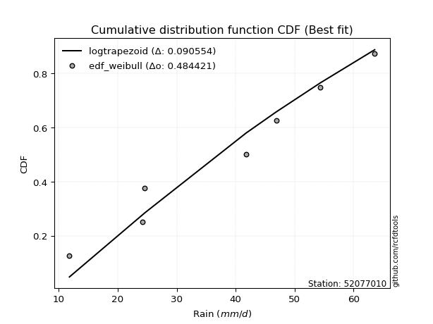</img>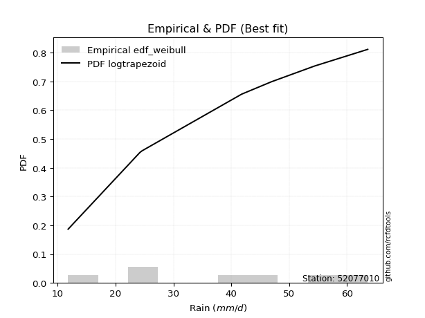</img>

</div>


### 4. EDF Beard (1943)

The Beard formula (or Beard´s plotting position formula) in hydrology is used to estimate the empirical non-exceedance probability _(P)_ of a flood event (or other extreme hydrological data point) within a given dataset.

<div align="center">


$P=(m-0.31)/(n+0.38)$


</div>


**4.1. Empirical values**

<div align="center">

|                | 0                   | 1                   | 2                   | 3         | 4                  | 5                  | 6                  |
|:---------------|:--------------------|:--------------------|:--------------------|:----------|:-------------------|:-------------------|:-------------------|
| date           | 2018                | 2022                | 2019                | 2017      | 2025               | 2020               | 2024               |
| x              | 11.8                | 24.2                | 24.6                | 41.8      | 46.9               | 54.4               | 63.6               |
| m              | 1                   | 2                   | 3                   | 4         | 5                  | 6                  | 7                  |
| empirical_dist | edf_beard           | edf_beard           | edf_beard           | edf_beard | edf_beard          | edf_beard          | edf_beard          |
| empirical      | 0.09349593495934959 | 0.22899728997289973 | 0.36449864498644985 | 0.5       | 0.6355013550135502 | 0.7710027100271003 | 0.9065040650406505 |
| empirical_tr   | 1.1031390134529149  | 1.29701230228471    | 1.5735607675906182  | 2.0       | 2.743494423791822  | 4.366863905325444  | 10.695652173913055 |

</div>


**4.2. Kolmogorov-Smirnov fit test (sorted by Δ)**


<div align="center">

|                | 0                   | 1                   | 2                   | 3                   | 4                   | 5                   | 6                   | 7                   | 8                   | 9                   | 10                  | 11                  | 12                  | 13                  | 14                  | 15                  | 16                  | 17                  | 18                  | 19                  | 20                  | 21                  | 22                  | 23                  | 24                  | 25                  | 26                  | 27                  | 28                  | 29                  | 30                  | 31                  | 32                  | 33                  | 34                  | 35                  | 36                  | 37                  | 38                  | 39                  | 40                  | 41                  | 42                  | 43                  | 44                  | 45                  | 46                  | 47                  | 48                  | 49                  | 50                  | 51                  | 52                  | 53                  | 54                  | 55                  | 56                  | 57                  | 58                  | 59                  | 60                  | 61                  | 62                  | 63                  | 64                  | 65                  | 66                  | 67                  | 68                  | 69                  | 70                  | 71                  | 72                  | 73                  | 74                  | 75                  | 76                  | 77                  | 78                  | 79                  | 80                  | 81                  | 82                  | 83                  | 84                  | 85                  | 86                  | 87                  | 88                  | 89                  | 90                  | 91                  | 92                  | 93                  | 94                  | 95                  | 96                  | 97                  | 98                  | 99                  | 100                 | 101                 | 102                 | 103                 | 104                 | 105                 | 106                 | 107                 | 108                 | 109                 | 110                 | 111                 | 112                 | 113                 | 114                 | 115                 | 116                 | 117                 | 118                 | 119                 | 120                 | 121                 | 122                 | 123                 | 124                 | 125                 | 126                 | 127                 | 128                 | 129                 | 130                 | 131                 | 132                 | 133                 | 134                 | 135                 | 136                 | 137                 | 138                 | 139                 | 140                 | 141                 | 142                 | 143                 | 144                 | 145                 | 146                 | 147                 | 148                 | 149                 | 150                 | 151                 | 152                 | 153                 | 154                 | 155                 | 156                 | 157                 | 158                 | 159                 |
|:---------------|:--------------------|:--------------------|:--------------------|:--------------------|:--------------------|:--------------------|:--------------------|:--------------------|:--------------------|:--------------------|:--------------------|:--------------------|:--------------------|:--------------------|:--------------------|:--------------------|:--------------------|:--------------------|:--------------------|:--------------------|:--------------------|:--------------------|:--------------------|:--------------------|:--------------------|:--------------------|:--------------------|:--------------------|:--------------------|:--------------------|:--------------------|:--------------------|:--------------------|:--------------------|:--------------------|:--------------------|:--------------------|:--------------------|:--------------------|:--------------------|:--------------------|:--------------------|:--------------------|:--------------------|:--------------------|:--------------------|:--------------------|:--------------------|:--------------------|:--------------------|:--------------------|:--------------------|:--------------------|:--------------------|:--------------------|:--------------------|:--------------------|:--------------------|:--------------------|:--------------------|:--------------------|:--------------------|:--------------------|:--------------------|:--------------------|:--------------------|:--------------------|:--------------------|:--------------------|:--------------------|:--------------------|:--------------------|:--------------------|:--------------------|:--------------------|:--------------------|:--------------------|:--------------------|:--------------------|:--------------------|:--------------------|:--------------------|:--------------------|:--------------------|:--------------------|:--------------------|:--------------------|:--------------------|:--------------------|:--------------------|:--------------------|:--------------------|:--------------------|:--------------------|:--------------------|:--------------------|:--------------------|:--------------------|:--------------------|:--------------------|:--------------------|:--------------------|:--------------------|:--------------------|:--------------------|:--------------------|:--------------------|:--------------------|:--------------------|:--------------------|:--------------------|:--------------------|:--------------------|:--------------------|:--------------------|:--------------------|:--------------------|:--------------------|:--------------------|:--------------------|:--------------------|:--------------------|:--------------------|:--------------------|:--------------------|:--------------------|:--------------------|:--------------------|:--------------------|:--------------------|:--------------------|:--------------------|:--------------------|:--------------------|:--------------------|:--------------------|:--------------------|:--------------------|:--------------------|:--------------------|:--------------------|:--------------------|:--------------------|:--------------------|:--------------------|:--------------------|:--------------------|:--------------------|:--------------------|:--------------------|:--------------------|:--------------------|:--------------------|:--------------------|:--------------------|:--------------------|:--------------------|:--------------------|:--------------------|:--------------------|
| station        | 52077010            | 52077010            | 52077010            | 52077010            | 52077010            | 52077010            | 52077010            | 52077010            | 52077010            | 52077010            | 52077010            | 52077010            | 52077010            | 52077010            | 52077010            | 52077010            | 52077010            | 52077010            | 52077010            | 52077010            | 52077010            | 52077010            | 52077010            | 52077010            | 52077010            | 52077010            | 52077010            | 52077010            | 52077010            | 52077010            | 52077010            | 52077010            | 52077010            | 52077010            | 52077010            | 52077010            | 52077010            | 52077010            | 52077010            | 52077010            | 52077010            | 52077010            | 52077010            | 52077010            | 52077010            | 52077010            | 52077010            | 52077010            | 52077010            | 52077010            | 52077010            | 52077010            | 52077010            | 52077010            | 52077010            | 52077010            | 52077010            | 52077010            | 52077010            | 52077010            | 52077010            | 52077010            | 52077010            | 52077010            | 52077010            | 52077010            | 52077010            | 52077010            | 52077010            | 52077010            | 52077010            | 52077010            | 52077010            | 52077010            | 52077010            | 52077010            | 52077010            | 52077010            | 52077010            | 52077010            | 52077010            | 52077010            | 52077010            | 52077010            | 52077010            | 52077010            | 52077010            | 52077010            | 52077010            | 52077010            | 52077010            | 52077010            | 52077010            | 52077010            | 52077010            | 52077010            | 52077010            | 52077010            | 52077010            | 52077010            | 52077010            | 52077010            | 52077010            | 52077010            | 52077010            | 52077010            | 52077010            | 52077010            | 52077010            | 52077010            | 52077010            | 52077010            | 52077010            | 52077010            | 52077010            | 52077010            | 52077010            | 52077010            | 52077010            | 52077010            | 52077010            | 52077010            | 52077010            | 52077010            | 52077010            | 52077010            | 52077010            | 52077010            | 52077010            | 52077010            | 52077010            | 52077010            | 52077010            | 52077010            | 52077010            | 52077010            | 52077010            | 52077010            | 52077010            | 52077010            | 52077010            | 52077010            | 52077010            | 52077010            | 52077010            | 52077010            | 52077010            | 52077010            | 52077010            | 52077010            | 52077010            | 52077010            | 52077010            | 52077010            | 52077010            | 52077010            | 52077010            | 52077010            | 52077010            | 52077010            |
| empirical_dist | edf_beard           | edf_beard           | edf_beard           | edf_beard           | edf_beard           | edf_beard           | edf_beard           | edf_beard           | edf_beard           | edf_beard           | edf_beard           | edf_beard           | edf_beard           | edf_beard           | edf_beard           | edf_beard           | edf_beard           | edf_beard           | edf_beard           | edf_beard           | edf_beard           | edf_beard           | edf_beard           | edf_beard           | edf_beard           | edf_beard           | edf_beard           | edf_beard           | edf_beard           | edf_beard           | edf_beard           | edf_beard           | edf_beard           | edf_beard           | edf_beard           | edf_beard           | edf_beard           | edf_beard           | edf_beard           | edf_beard           | edf_beard           | edf_beard           | edf_beard           | edf_beard           | edf_beard           | edf_beard           | edf_beard           | edf_beard           | edf_beard           | edf_beard           | edf_beard           | edf_beard           | edf_beard           | edf_beard           | edf_beard           | edf_beard           | edf_beard           | edf_beard           | edf_beard           | edf_beard           | edf_beard           | edf_beard           | edf_beard           | edf_beard           | edf_beard           | edf_beard           | edf_beard           | edf_beard           | edf_beard           | edf_beard           | edf_beard           | edf_beard           | edf_beard           | edf_beard           | edf_beard           | edf_beard           | edf_beard           | edf_beard           | edf_beard           | edf_beard           | edf_beard           | edf_beard           | edf_beard           | edf_beard           | edf_beard           | edf_beard           | edf_beard           | edf_beard           | edf_beard           | edf_beard           | edf_beard           | edf_beard           | edf_beard           | edf_beard           | edf_beard           | edf_beard           | edf_beard           | edf_beard           | edf_beard           | edf_beard           | edf_beard           | edf_beard           | edf_beard           | edf_beard           | edf_beard           | edf_beard           | edf_beard           | edf_beard           | edf_beard           | edf_beard           | edf_beard           | edf_beard           | edf_beard           | edf_beard           | edf_beard           | edf_beard           | edf_beard           | edf_beard           | edf_beard           | edf_beard           | edf_beard           | edf_beard           | edf_beard           | edf_beard           | edf_beard           | edf_beard           | edf_beard           | edf_beard           | edf_beard           | edf_beard           | edf_beard           | edf_beard           | edf_beard           | edf_beard           | edf_beard           | edf_beard           | edf_beard           | edf_beard           | edf_beard           | edf_beard           | edf_beard           | edf_beard           | edf_beard           | edf_beard           | edf_beard           | edf_beard           | edf_beard           | edf_beard           | edf_beard           | edf_beard           | edf_beard           | edf_beard           | edf_beard           | edf_beard           | edf_beard           | edf_beard           | edf_beard           | edf_beard           | edf_beard           | edf_beard           |
| p_dist         | logtrapezoid        | ksone               | wrapcauchy          | logbeta             | arcsine             | loggenhalflogistic  | kappa4              | beta                | semicircular        | tukeylambda         | bradford            | truncweibull_min    | genpareto           | vonmises_line       | uniform             | logskewnorm         | logpearson3         | anglit              | loggengamma         | invgauss            | dweibull            | loggumbel_l         | logburr             | rayleigh            | logsemicircular     | loggompertz         | gausshyper          | logtriang           | logargus            | logarcsine          | genlogistic         | invgamma            | maxwell             | logmielke           | weibull_min         | loganglit           | logweibull_min      | rice                | burr                | alpha               | logloggamma         | kappa3              | mielke              | dgamma              | logexponweib        | betaprime           | kstwobign           | logjohnsonsu        | halfnorm            | logburr12           | ncf                 | gamma               | erlang              | cosine              | loggenextreme       | johnsonsu           | nct                 | t                   | exponnorm           | truncnorm           | crystalball         | norm                | skewnorm            | f                   | pearson3            | gumbel_r            | logdgamma           | logcrystalball      | logt                | lognorm             | logexponnorm        | gompertz            | logf                | logfatiguelife      | lognct              | genextreme          | logdweibull         | logncf              | logfoldnorm         | logrice             | loggenpareto        | loginvweibull       | loggamma            | loggamma            | logbetaprime        | loginvgauss         | loginvgamma         | logalpha            | logerlang           | argus               | logistic            | halflogistic        | moyal               | loglogistic         | burr12              | logmaxwell          | loglevy_l           | genexpon            | gumbel_l            | lomax               | logkstwobign        | lograyleigh         | hypsecant           | triang              | genhalflogistic     | truncexpon          | logcosine           | loghypsecant        | loggenexpon         | laplace             | logjohnsonsb        | loghalfnorm         | logkappa4           | logloglaplace       | logksone            | loggumbel_r         | loglaplace          | loglaplace          | logrdist            | loghalflogistic     | loghalfgennorm      | logmoyal            | logtukeylambda      | levy_l              | logwrapcauchy       | logbradford         | logkappa3           | loguniform          | lognakagami         | logvonmises_line    | halfgennorm         | nakagami            | gennorm             | loggennorm          | loglomax            | trapezoid           | logwald             | wald                | loggausshyper       | logtruncweibull_min | logtruncexpon       | logtruncnorm        | logweibull_max      | exponweib           | logexponpow         | invweibull          | exponpow            | foldnorm            | fatiguelife         | gengamma            | powerlaw            | johnsonsb           | weibull_max         | logpowerlaw         | truncpareto         | logtruncpareto      | rdist               | loggenlogistic      | logvonmises         | vonmises            |
| delta          | 0.08005234110374987 | 0.09233280983690456 | 0.09349593442908695 | 0.09349593471733308 | 0.09349593495934959 | 0.0941235650541653  | 0.10282816745857981 | 0.10368443502052671 | 0.10903998441572227 | 0.11112693449651317 | 0.11204902197166061 | 0.11387225189328604 | 0.11402301640734575 | 0.11503337434595165 | 0.11739439788220271 | 0.11830282800568592 | 0.1209372305552231  | 0.12138569649985612 | 0.12512965331724887 | 0.12533341052815233 | 0.12590401465380138 | 0.12651298586443174 | 0.12679514899901384 | 0.1270885553490934  | 0.12730415733093936 | 0.12999917673308525 | 0.13004501221075784 | 0.1308499817256331  | 0.13162698574513415 | 0.13262240596674887 | 0.13267343462523273 | 0.13292609853785609 | 0.13369583371942392 | 0.13423188695633417 | 0.13542206552885044 | 0.1359158283736689  | 0.13832527370970985 | 0.13839569832776571 | 0.1387204692353667  | 0.13877520416858125 | 0.13904828815314035 | 0.14103669937914703 | 0.1412839542776748  | 0.1415099158831001  | 0.14200000337309482 | 0.14247788110477186 | 0.1430287115733173  | 0.1435486390265322  | 0.14475024397635794 | 0.1449726674028139  | 0.14540021240192835 | 0.14784234379882244 | 0.14792399084645985 | 0.14801493911553437 | 0.14897176627129424 | 0.1492089086423602  | 0.14941642882597778 | 0.14951197391577753 | 0.14951265446826562 | 0.14951297101375266 | 0.14951297249609297 | 0.14951297540724434 | 0.14962729628873422 | 0.15006123265251234 | 0.15067612278296422 | 0.1512184416377791  | 0.1514254649158077  | 0.15627362260298516 | 0.15640477496566318 | 0.15640638022971753 | 0.15640822304901647 | 0.15661128724964465 | 0.15698202099844327 | 0.15728848898423886 | 0.15739572031534177 | 0.15744202594947213 | 0.15765128313526908 | 0.1588268561149584  | 0.15930321155882798 | 0.1606762462511413  | 0.1612546962014999  | 0.16142387808732217 | 0.1616292034807778  | 0.1616292034807778  | 0.1617487736176455  | 0.1633833166596681  | 0.164152358182595   | 0.16440979665404665 | 0.16442157662962886 | 0.1676946388182861  | 0.1716373496771087  | 0.17285368994522687 | 0.1747598693608634  | 0.17488687291322336 | 0.1763764749627783  | 0.17735099806011823 | 0.1785224842767601  | 0.17943284436282692 | 0.17993122057405195 | 0.1820302259907841  | 0.18220696959298488 | 0.1836254408410103  | 0.18512484002777446 | 0.18552266905558626 | 0.1862370512130071  | 0.18714436504503285 | 0.18764665330008456 | 0.18911643429273883 | 0.18952931070872392 | 0.20073025086676238 | 0.201149742448824   | 0.20194651476099656 | 0.2040903120723272  | 0.20680148074773022 | 0.20965768101284424 | 0.21534810886227984 | 0.21708698498277101 | 0.21708698498277101 | 0.22523402864556688 | 0.2299596483185592  | 0.23176009715411883 | 0.23478483010149764 | 0.24439005733317032 | 0.2460510200100765  | 0.2460687948752274  | 0.2507670707952704  | 0.2508366225749513  | 0.250837840442087   | 0.25411285946391104 | 0.2543536624451095  | 0.2677075621483226  | 0.2707978512879369  | 0.2710027100271003  | 0.2710027100271003  | 0.2722834947506617  | 0.2808310350157511  | 0.29005208465578514 | 0.29083518554173804 | 0.29198776976184004 | 0.2953965229959852  | 0.3222159216236352  | 0.3259025513261016  | 0.37011414202831333 | 0.39005201435059167 | 0.4346876812688659  | 0.4673478173508565  | 0.4885993135744341  | 0.5                 | 0.5368163614962017  | 0.5455843905863814  | 0.5584008947291024  | 0.5762276524156371  | 0.5962076867082632  | 0.6261714927757952  | 0.6662086065200366  | 0.7075412894228669  | 0.7273290458456211  | 0.7710027100271003  | 1.147614279786524   | 10.02392321621613   |
| deltao         | 0.48442053926100004 | 0.48442053926100004 | 0.48442053926100004 | 0.48442053926100004 | 0.48442053926100004 | 0.48442053926100004 | 0.48442053926100004 | 0.48442053926100004 | 0.48442053926100004 | 0.48442053926100004 | 0.48442053926100004 | 0.48442053926100004 | 0.48442053926100004 | 0.48442053926100004 | 0.48442053926100004 | 0.48442053926100004 | 0.48442053926100004 | 0.48442053926100004 | 0.48442053926100004 | 0.48442053926100004 | 0.48442053926100004 | 0.48442053926100004 | 0.48442053926100004 | 0.48442053926100004 | 0.48442053926100004 | 0.48442053926100004 | 0.48442053926100004 | 0.48442053926100004 | 0.48442053926100004 | 0.48442053926100004 | 0.48442053926100004 | 0.48442053926100004 | 0.48442053926100004 | 0.48442053926100004 | 0.48442053926100004 | 0.48442053926100004 | 0.48442053926100004 | 0.48442053926100004 | 0.48442053926100004 | 0.48442053926100004 | 0.48442053926100004 | 0.48442053926100004 | 0.48442053926100004 | 0.48442053926100004 | 0.48442053926100004 | 0.48442053926100004 | 0.48442053926100004 | 0.48442053926100004 | 0.48442053926100004 | 0.48442053926100004 | 0.48442053926100004 | 0.48442053926100004 | 0.48442053926100004 | 0.48442053926100004 | 0.48442053926100004 | 0.48442053926100004 | 0.48442053926100004 | 0.48442053926100004 | 0.48442053926100004 | 0.48442053926100004 | 0.48442053926100004 | 0.48442053926100004 | 0.48442053926100004 | 0.48442053926100004 | 0.48442053926100004 | 0.48442053926100004 | 0.48442053926100004 | 0.48442053926100004 | 0.48442053926100004 | 0.48442053926100004 | 0.48442053926100004 | 0.48442053926100004 | 0.48442053926100004 | 0.48442053926100004 | 0.48442053926100004 | 0.48442053926100004 | 0.48442053926100004 | 0.48442053926100004 | 0.48442053926100004 | 0.48442053926100004 | 0.48442053926100004 | 0.48442053926100004 | 0.48442053926100004 | 0.48442053926100004 | 0.48442053926100004 | 0.48442053926100004 | 0.48442053926100004 | 0.48442053926100004 | 0.48442053926100004 | 0.48442053926100004 | 0.48442053926100004 | 0.48442053926100004 | 0.48442053926100004 | 0.48442053926100004 | 0.48442053926100004 | 0.48442053926100004 | 0.48442053926100004 | 0.48442053926100004 | 0.48442053926100004 | 0.48442053926100004 | 0.48442053926100004 | 0.48442053926100004 | 0.48442053926100004 | 0.48442053926100004 | 0.48442053926100004 | 0.48442053926100004 | 0.48442053926100004 | 0.48442053926100004 | 0.48442053926100004 | 0.48442053926100004 | 0.48442053926100004 | 0.48442053926100004 | 0.48442053926100004 | 0.48442053926100004 | 0.48442053926100004 | 0.48442053926100004 | 0.48442053926100004 | 0.48442053926100004 | 0.48442053926100004 | 0.48442053926100004 | 0.48442053926100004 | 0.48442053926100004 | 0.48442053926100004 | 0.48442053926100004 | 0.48442053926100004 | 0.48442053926100004 | 0.48442053926100004 | 0.48442053926100004 | 0.48442053926100004 | 0.48442053926100004 | 0.48442053926100004 | 0.48442053926100004 | 0.48442053926100004 | 0.48442053926100004 | 0.48442053926100004 | 0.48442053926100004 | 0.48442053926100004 | 0.48442053926100004 | 0.48442053926100004 | 0.48442053926100004 | 0.48442053926100004 | 0.48442053926100004 | 0.48442053926100004 | 0.48442053926100004 | 0.48442053926100004 | 0.48442053926100004 | 0.48442053926100004 | 0.48442053926100004 | 0.48442053926100004 | 0.48442053926100004 | 0.48442053926100004 | 0.48442053926100004 | 0.48442053926100004 | 0.48442053926100004 | 0.48442053926100004 | 0.48442053926100004 | 0.48442053926100004 | 0.48442053926100004 | 0.48442053926100004 | 0.48442053926100004 |
| eval           | Δo > Δ              | Δo > Δ              | Δo > Δ              | Δo > Δ              | Δo > Δ              | Δo > Δ              | Δo > Δ              | Δo > Δ              | Δo > Δ              | Δo > Δ              | Δo > Δ              | Δo > Δ              | Δo > Δ              | Δo > Δ              | Δo > Δ              | Δo > Δ              | Δo > Δ              | Δo > Δ              | Δo > Δ              | Δo > Δ              | Δo > Δ              | Δo > Δ              | Δo > Δ              | Δo > Δ              | Δo > Δ              | Δo > Δ              | Δo > Δ              | Δo > Δ              | Δo > Δ              | Δo > Δ              | Δo > Δ              | Δo > Δ              | Δo > Δ              | Δo > Δ              | Δo > Δ              | Δo > Δ              | Δo > Δ              | Δo > Δ              | Δo > Δ              | Δo > Δ              | Δo > Δ              | Δo > Δ              | Δo > Δ              | Δo > Δ              | Δo > Δ              | Δo > Δ              | Δo > Δ              | Δo > Δ              | Δo > Δ              | Δo > Δ              | Δo > Δ              | Δo > Δ              | Δo > Δ              | Δo > Δ              | Δo > Δ              | Δo > Δ              | Δo > Δ              | Δo > Δ              | Δo > Δ              | Δo > Δ              | Δo > Δ              | Δo > Δ              | Δo > Δ              | Δo > Δ              | Δo > Δ              | Δo > Δ              | Δo > Δ              | Δo > Δ              | Δo > Δ              | Δo > Δ              | Δo > Δ              | Δo > Δ              | Δo > Δ              | Δo > Δ              | Δo > Δ              | Δo > Δ              | Δo > Δ              | Δo > Δ              | Δo > Δ              | Δo > Δ              | Δo > Δ              | Δo > Δ              | Δo > Δ              | Δo > Δ              | Δo > Δ              | Δo > Δ              | Δo > Δ              | Δo > Δ              | Δo > Δ              | Δo > Δ              | Δo > Δ              | Δo > Δ              | Δo > Δ              | Δo > Δ              | Δo > Δ              | Δo > Δ              | Δo > Δ              | Δo > Δ              | Δo > Δ              | Δo > Δ              | Δo > Δ              | Δo > Δ              | Δo > Δ              | Δo > Δ              | Δo > Δ              | Δo > Δ              | Δo > Δ              | Δo > Δ              | Δo > Δ              | Δo > Δ              | Δo > Δ              | Δo > Δ              | Δo > Δ              | Δo > Δ              | Δo > Δ              | Δo > Δ              | Δo > Δ              | Δo > Δ              | Δo > Δ              | Δo > Δ              | Δo > Δ              | Δo > Δ              | Δo > Δ              | Δo > Δ              | Δo > Δ              | Δo > Δ              | Δo > Δ              | Δo > Δ              | Δo > Δ              | Δo > Δ              | Δo > Δ              | Δo > Δ              | Δo > Δ              | Δo > Δ              | Δo > Δ              | Δo > Δ              | Δo > Δ              | Δo > Δ              | Δo > Δ              | Δo > Δ              | Δo > Δ              | Δo > Δ              | Δo > Δ              | Δo > Δ              | Δo > Δ              | Δo > Δ              | Δo <= Δ             | Δo <= Δ             | Δo <= Δ             | Δo <= Δ             | Δo <= Δ             | Δo <= Δ             | Δo <= Δ             | Δo <= Δ             | Δo <= Δ             | Δo <= Δ             | Δo <= Δ             | Δo <= Δ             | Δo <= Δ             | Δo <= Δ             |
| fit            | 1                   | 1                   | 1                   | 1                   | 1                   | 1                   | 1                   | 1                   | 1                   | 1                   | 1                   | 1                   | 1                   | 1                   | 1                   | 1                   | 1                   | 1                   | 1                   | 1                   | 1                   | 1                   | 1                   | 1                   | 1                   | 1                   | 1                   | 1                   | 1                   | 1                   | 1                   | 1                   | 1                   | 1                   | 1                   | 1                   | 1                   | 1                   | 1                   | 1                   | 1                   | 1                   | 1                   | 1                   | 1                   | 1                   | 1                   | 1                   | 1                   | 1                   | 1                   | 1                   | 1                   | 1                   | 1                   | 1                   | 1                   | 1                   | 1                   | 1                   | 1                   | 1                   | 1                   | 1                   | 1                   | 1                   | 1                   | 1                   | 1                   | 1                   | 1                   | 1                   | 1                   | 1                   | 1                   | 1                   | 1                   | 1                   | 1                   | 1                   | 1                   | 1                   | 1                   | 1                   | 1                   | 1                   | 1                   | 1                   | 1                   | 1                   | 1                   | 1                   | 1                   | 1                   | 1                   | 1                   | 1                   | 1                   | 1                   | 1                   | 1                   | 1                   | 1                   | 1                   | 1                   | 1                   | 1                   | 1                   | 1                   | 1                   | 1                   | 1                   | 1                   | 1                   | 1                   | 1                   | 1                   | 1                   | 1                   | 1                   | 1                   | 1                   | 1                   | 1                   | 1                   | 1                   | 1                   | 1                   | 1                   | 1                   | 1                   | 1                   | 1                   | 1                   | 1                   | 1                   | 1                   | 1                   | 1                   | 1                   | 1                   | 1                   | 1                   | 1                   | 1                   | 1                   | 0                   | 0                   | 0                   | 0                   | 0                   | 0                   | 0                   | 0                   | 0                   | 0                   | 0                   | 0                   | 0                   | 0                   |
| n              | 7                   | 7                   | 7                   | 7                   | 7                   | 7                   | 7                   | 7                   | 7                   | 7                   | 7                   | 7                   | 7                   | 7                   | 7                   | 7                   | 7                   | 7                   | 7                   | 7                   | 7                   | 7                   | 7                   | 7                   | 7                   | 7                   | 7                   | 7                   | 7                   | 7                   | 7                   | 7                   | 7                   | 7                   | 7                   | 7                   | 7                   | 7                   | 7                   | 7                   | 7                   | 7                   | 7                   | 7                   | 7                   | 7                   | 7                   | 7                   | 7                   | 7                   | 7                   | 7                   | 7                   | 7                   | 7                   | 7                   | 7                   | 7                   | 7                   | 7                   | 7                   | 7                   | 7                   | 7                   | 7                   | 7                   | 7                   | 7                   | 7                   | 7                   | 7                   | 7                   | 7                   | 7                   | 7                   | 7                   | 7                   | 7                   | 7                   | 7                   | 7                   | 7                   | 7                   | 7                   | 7                   | 7                   | 7                   | 7                   | 7                   | 7                   | 7                   | 7                   | 7                   | 7                   | 7                   | 7                   | 7                   | 7                   | 7                   | 7                   | 7                   | 7                   | 7                   | 7                   | 7                   | 7                   | 7                   | 7                   | 7                   | 7                   | 7                   | 7                   | 7                   | 7                   | 7                   | 7                   | 7                   | 7                   | 7                   | 7                   | 7                   | 7                   | 7                   | 7                   | 7                   | 7                   | 7                   | 7                   | 7                   | 7                   | 7                   | 7                   | 7                   | 7                   | 7                   | 7                   | 7                   | 7                   | 7                   | 7                   | 7                   | 7                   | 7                   | 7                   | 7                   | 7                   | 7                   | 7                   | 7                   | 7                   | 7                   | 7                   | 7                   | 7                   | 7                   | 7                   | 7                   | 7                   | 7                   | 7                   |
| best_fit       | 1                   | 0                   | 0                   | 0                   | 0                   | 0                   | 0                   | 0                   | 0                   | 0                   | 0                   | 0                   | 0                   | 0                   | 0                   | 0                   | 0                   | 0                   | 0                   | 0                   | 0                   | 0                   | 0                   | 0                   | 0                   | 0                   | 0                   | 0                   | 0                   | 0                   | 0                   | 0                   | 0                   | 0                   | 0                   | 0                   | 0                   | 0                   | 0                   | 0                   | 0                   | 0                   | 0                   | 0                   | 0                   | 0                   | 0                   | 0                   | 0                   | 0                   | 0                   | 0                   | 0                   | 0                   | 0                   | 0                   | 0                   | 0                   | 0                   | 0                   | 0                   | 0                   | 0                   | 0                   | 0                   | 0                   | 0                   | 0                   | 0                   | 0                   | 0                   | 0                   | 0                   | 0                   | 0                   | 0                   | 0                   | 0                   | 0                   | 0                   | 0                   | 0                   | 0                   | 0                   | 0                   | 0                   | 0                   | 0                   | 0                   | 0                   | 0                   | 0                   | 0                   | 0                   | 0                   | 0                   | 0                   | 0                   | 0                   | 0                   | 0                   | 0                   | 0                   | 0                   | 0                   | 0                   | 0                   | 0                   | 0                   | 0                   | 0                   | 0                   | 0                   | 0                   | 0                   | 0                   | 0                   | 0                   | 0                   | 0                   | 0                   | 0                   | 0                   | 0                   | 0                   | 0                   | 0                   | 0                   | 0                   | 0                   | 0                   | 0                   | 0                   | 0                   | 0                   | 0                   | 0                   | 0                   | 0                   | 0                   | 0                   | 0                   | 0                   | 0                   | 0                   | 0                   | 0                   | 0                   | 0                   | 0                   | 0                   | 0                   | 0                   | 0                   | 0                   | 0                   | 0                   | 0                   | 0                   | 0                   |
| best_fit_sort  | 1                   | 2                   | 3                   | 4                   | 5                   | 6                   | 7                   | 8                   | 9                   | 10                  | 11                  | 12                  | 13                  | 14                  | 15                  | 16                  | 17                  | 18                  | 19                  | 20                  | 21                  | 22                  | 23                  | 24                  | 25                  | 26                  | 27                  | 28                  | 29                  | 30                  | 31                  | 32                  | 33                  | 34                  | 35                  | 36                  | 37                  | 38                  | 39                  | 40                  | 41                  | 42                  | 43                  | 44                  | 45                  | 46                  | 47                  | 48                  | 49                  | 50                  | 51                  | 52                  | 53                  | 54                  | 55                  | 56                  | 57                  | 58                  | 59                  | 60                  | 61                  | 62                  | 63                  | 64                  | 65                  | 66                  | 67                  | 68                  | 69                  | 70                  | 71                  | 72                  | 73                  | 74                  | 75                  | 76                  | 77                  | 78                  | 79                  | 80                  | 81                  | 82                  | 83                  | 84                  | 85                  | 86                  | 87                  | 88                  | 89                  | 90                  | 91                  | 92                  | 93                  | 94                  | 95                  | 96                  | 97                  | 98                  | 99                  | 100                 | 101                 | 102                 | 103                 | 104                 | 105                 | 106                 | 107                 | 108                 | 109                 | 110                 | 111                 | 112                 | 113                 | 114                 | 115                 | 116                 | 117                 | 118                 | 119                 | 120                 | 121                 | 122                 | 123                 | 124                 | 125                 | 126                 | 127                 | 128                 | 129                 | 130                 | 131                 | 132                 | 133                 | 134                 | 135                 | 136                 | 137                 | 138                 | 139                 | 140                 | 141                 | 142                 | 143                 | 144                 | 145                 | 146                 | 147                 | 148                 | 149                 | 150                 | 151                 | 152                 | 153                 | 154                 | 155                 | 156                 | 157                 | 158                 | 159                 | 160                 |

</div>


**4.3. Best fit**

<div align="center">

|   id |   station | empirical_dist   | p_dist       |     delta |   deltao | eval   |   fit |   n |   best_fit |   best_fit_sort |
|-----:|----------:|:-----------------|:-------------|----------:|---------:|:-------|------:|----:|-----------:|----------------:|
|    0 |  52077010 | edf_beard        | logtrapezoid | 0.0800523 | 0.484421 | Δo > Δ |     1 |   7 |          1 |               1 |

</div>


<div align="center">

</img>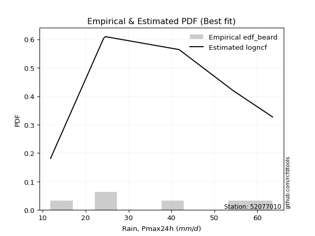</img>

</div>


### 5. EDF Chegodayev (1955)

The Chegodayev formula is an empirical plotting position formula used in hydrological frequency analysis to estimate the exceedance probability or return period of a specific event from a set of observed data. It is primarily used for plotting observed data points on probability paper to fit a theoretical distribution, particularly for analyzing extreme events like maximum flood flows or rainfall intensities. The constant _b_ value in the generalized plotting position formula is 0.3.

<div align="center">


$P=(m-b)/(n+1-2b)$


</div>


**5.1. Empirical values**

<div align="center">

|                | 0                   | 1                   | 2                   | 3              | 4                  | 5                  | 6                  |
|:---------------|:--------------------|:--------------------|:--------------------|:---------------|:-------------------|:-------------------|:-------------------|
| date           | 2018                | 2022                | 2019                | 2017           | 2025               | 2020               | 2024               |
| x              | 11.8                | 24.2                | 24.6                | 41.8           | 46.9               | 54.4               | 63.6               |
| m              | 1                   | 2                   | 3                   | 4              | 5                  | 6                  | 7                  |
| empirical_dist | edf_chegodayev      | edf_chegodayev      | edf_chegodayev      | edf_chegodayev | edf_chegodayev     | edf_chegodayev     | edf_chegodayev     |
| empirical      | 0.09459459459459459 | 0.22972972972972971 | 0.36486486486486486 | 0.5            | 0.6351351351351351 | 0.7702702702702703 | 0.9054054054054054 |
| empirical_tr   | 1.1044776119402986  | 1.2982456140350878  | 1.574468085106383   | 2.0            | 2.7407407407407405 | 4.352941176470589  | 10.571428571428568 |

</div>


**5.2. Kolmogorov-Smirnov fit test (sorted by Δ)**


<div align="center">

|                | 0                   | 1                   | 2                   | 3                   | 4                   | 5                   | 6                   | 7                   | 8                   | 9                   | 10                  | 11                  | 12                  | 13                  | 14                  | 15                  | 16                  | 17                  | 18                  | 19                  | 20                  | 21                  | 22                  | 23                  | 24                  | 25                  | 26                  | 27                  | 28                  | 29                  | 30                  | 31                  | 32                  | 33                  | 34                  | 35                  | 36                  | 37                  | 38                  | 39                  | 40                  | 41                  | 42                  | 43                  | 44                  | 45                  | 46                  | 47                  | 48                  | 49                  | 50                  | 51                  | 52                  | 53                  | 54                  | 55                  | 56                  | 57                  | 58                  | 59                  | 60                  | 61                  | 62                  | 63                  | 64                  | 65                  | 66                  | 67                  | 68                  | 69                  | 70                  | 71                  | 72                  | 73                  | 74                  | 75                  | 76                  | 77                  | 78                  | 79                  | 80                  | 81                  | 82                  | 83                  | 84                  | 85                  | 86                  | 87                  | 88                  | 89                  | 90                  | 91                  | 92                  | 93                  | 94                  | 95                  | 96                  | 97                  | 98                  | 99                  | 100                 | 101                 | 102                 | 103                 | 104                 | 105                 | 106                 | 107                 | 108                 | 109                 | 110                 | 111                 | 112                 | 113                 | 114                 | 115                 | 116                 | 117                 | 118                 | 119                 | 120                 | 121                 | 122                 | 123                 | 124                 | 125                 | 126                 | 127                 | 128                 | 129                 | 130                 | 131                 | 132                 | 133                 | 134                 | 135                 | 136                 | 137                 | 138                 | 139                 | 140                 | 141                 | 142                 | 143                 | 144                 | 145                 | 146                 | 147                 | 148                 | 149                 | 150                 | 151                 | 152                 | 153                 | 154                 | 155                 | 156                 | 157                 | 158                 | 159                 |
|:---------------|:--------------------|:--------------------|:--------------------|:--------------------|:--------------------|:--------------------|:--------------------|:--------------------|:--------------------|:--------------------|:--------------------|:--------------------|:--------------------|:--------------------|:--------------------|:--------------------|:--------------------|:--------------------|:--------------------|:--------------------|:--------------------|:--------------------|:--------------------|:--------------------|:--------------------|:--------------------|:--------------------|:--------------------|:--------------------|:--------------------|:--------------------|:--------------------|:--------------------|:--------------------|:--------------------|:--------------------|:--------------------|:--------------------|:--------------------|:--------------------|:--------------------|:--------------------|:--------------------|:--------------------|:--------------------|:--------------------|:--------------------|:--------------------|:--------------------|:--------------------|:--------------------|:--------------------|:--------------------|:--------------------|:--------------------|:--------------------|:--------------------|:--------------------|:--------------------|:--------------------|:--------------------|:--------------------|:--------------------|:--------------------|:--------------------|:--------------------|:--------------------|:--------------------|:--------------------|:--------------------|:--------------------|:--------------------|:--------------------|:--------------------|:--------------------|:--------------------|:--------------------|:--------------------|:--------------------|:--------------------|:--------------------|:--------------------|:--------------------|:--------------------|:--------------------|:--------------------|:--------------------|:--------------------|:--------------------|:--------------------|:--------------------|:--------------------|:--------------------|:--------------------|:--------------------|:--------------------|:--------------------|:--------------------|:--------------------|:--------------------|:--------------------|:--------------------|:--------------------|:--------------------|:--------------------|:--------------------|:--------------------|:--------------------|:--------------------|:--------------------|:--------------------|:--------------------|:--------------------|:--------------------|:--------------------|:--------------------|:--------------------|:--------------------|:--------------------|:--------------------|:--------------------|:--------------------|:--------------------|:--------------------|:--------------------|:--------------------|:--------------------|:--------------------|:--------------------|:--------------------|:--------------------|:--------------------|:--------------------|:--------------------|:--------------------|:--------------------|:--------------------|:--------------------|:--------------------|:--------------------|:--------------------|:--------------------|:--------------------|:--------------------|:--------------------|:--------------------|:--------------------|:--------------------|:--------------------|:--------------------|:--------------------|:--------------------|:--------------------|:--------------------|:--------------------|:--------------------|:--------------------|:--------------------|:--------------------|:--------------------|
| station        | 52077010            | 52077010            | 52077010            | 52077010            | 52077010            | 52077010            | 52077010            | 52077010            | 52077010            | 52077010            | 52077010            | 52077010            | 52077010            | 52077010            | 52077010            | 52077010            | 52077010            | 52077010            | 52077010            | 52077010            | 52077010            | 52077010            | 52077010            | 52077010            | 52077010            | 52077010            | 52077010            | 52077010            | 52077010            | 52077010            | 52077010            | 52077010            | 52077010            | 52077010            | 52077010            | 52077010            | 52077010            | 52077010            | 52077010            | 52077010            | 52077010            | 52077010            | 52077010            | 52077010            | 52077010            | 52077010            | 52077010            | 52077010            | 52077010            | 52077010            | 52077010            | 52077010            | 52077010            | 52077010            | 52077010            | 52077010            | 52077010            | 52077010            | 52077010            | 52077010            | 52077010            | 52077010            | 52077010            | 52077010            | 52077010            | 52077010            | 52077010            | 52077010            | 52077010            | 52077010            | 52077010            | 52077010            | 52077010            | 52077010            | 52077010            | 52077010            | 52077010            | 52077010            | 52077010            | 52077010            | 52077010            | 52077010            | 52077010            | 52077010            | 52077010            | 52077010            | 52077010            | 52077010            | 52077010            | 52077010            | 52077010            | 52077010            | 52077010            | 52077010            | 52077010            | 52077010            | 52077010            | 52077010            | 52077010            | 52077010            | 52077010            | 52077010            | 52077010            | 52077010            | 52077010            | 52077010            | 52077010            | 52077010            | 52077010            | 52077010            | 52077010            | 52077010            | 52077010            | 52077010            | 52077010            | 52077010            | 52077010            | 52077010            | 52077010            | 52077010            | 52077010            | 52077010            | 52077010            | 52077010            | 52077010            | 52077010            | 52077010            | 52077010            | 52077010            | 52077010            | 52077010            | 52077010            | 52077010            | 52077010            | 52077010            | 52077010            | 52077010            | 52077010            | 52077010            | 52077010            | 52077010            | 52077010            | 52077010            | 52077010            | 52077010            | 52077010            | 52077010            | 52077010            | 52077010            | 52077010            | 52077010            | 52077010            | 52077010            | 52077010            | 52077010            | 52077010            | 52077010            | 52077010            | 52077010            | 52077010            |
| empirical_dist | edf_chegodayev      | edf_chegodayev      | edf_chegodayev      | edf_chegodayev      | edf_chegodayev      | edf_chegodayev      | edf_chegodayev      | edf_chegodayev      | edf_chegodayev      | edf_chegodayev      | edf_chegodayev      | edf_chegodayev      | edf_chegodayev      | edf_chegodayev      | edf_chegodayev      | edf_chegodayev      | edf_chegodayev      | edf_chegodayev      | edf_chegodayev      | edf_chegodayev      | edf_chegodayev      | edf_chegodayev      | edf_chegodayev      | edf_chegodayev      | edf_chegodayev      | edf_chegodayev      | edf_chegodayev      | edf_chegodayev      | edf_chegodayev      | edf_chegodayev      | edf_chegodayev      | edf_chegodayev      | edf_chegodayev      | edf_chegodayev      | edf_chegodayev      | edf_chegodayev      | edf_chegodayev      | edf_chegodayev      | edf_chegodayev      | edf_chegodayev      | edf_chegodayev      | edf_chegodayev      | edf_chegodayev      | edf_chegodayev      | edf_chegodayev      | edf_chegodayev      | edf_chegodayev      | edf_chegodayev      | edf_chegodayev      | edf_chegodayev      | edf_chegodayev      | edf_chegodayev      | edf_chegodayev      | edf_chegodayev      | edf_chegodayev      | edf_chegodayev      | edf_chegodayev      | edf_chegodayev      | edf_chegodayev      | edf_chegodayev      | edf_chegodayev      | edf_chegodayev      | edf_chegodayev      | edf_chegodayev      | edf_chegodayev      | edf_chegodayev      | edf_chegodayev      | edf_chegodayev      | edf_chegodayev      | edf_chegodayev      | edf_chegodayev      | edf_chegodayev      | edf_chegodayev      | edf_chegodayev      | edf_chegodayev      | edf_chegodayev      | edf_chegodayev      | edf_chegodayev      | edf_chegodayev      | edf_chegodayev      | edf_chegodayev      | edf_chegodayev      | edf_chegodayev      | edf_chegodayev      | edf_chegodayev      | edf_chegodayev      | edf_chegodayev      | edf_chegodayev      | edf_chegodayev      | edf_chegodayev      | edf_chegodayev      | edf_chegodayev      | edf_chegodayev      | edf_chegodayev      | edf_chegodayev      | edf_chegodayev      | edf_chegodayev      | edf_chegodayev      | edf_chegodayev      | edf_chegodayev      | edf_chegodayev      | edf_chegodayev      | edf_chegodayev      | edf_chegodayev      | edf_chegodayev      | edf_chegodayev      | edf_chegodayev      | edf_chegodayev      | edf_chegodayev      | edf_chegodayev      | edf_chegodayev      | edf_chegodayev      | edf_chegodayev      | edf_chegodayev      | edf_chegodayev      | edf_chegodayev      | edf_chegodayev      | edf_chegodayev      | edf_chegodayev      | edf_chegodayev      | edf_chegodayev      | edf_chegodayev      | edf_chegodayev      | edf_chegodayev      | edf_chegodayev      | edf_chegodayev      | edf_chegodayev      | edf_chegodayev      | edf_chegodayev      | edf_chegodayev      | edf_chegodayev      | edf_chegodayev      | edf_chegodayev      | edf_chegodayev      | edf_chegodayev      | edf_chegodayev      | edf_chegodayev      | edf_chegodayev      | edf_chegodayev      | edf_chegodayev      | edf_chegodayev      | edf_chegodayev      | edf_chegodayev      | edf_chegodayev      | edf_chegodayev      | edf_chegodayev      | edf_chegodayev      | edf_chegodayev      | edf_chegodayev      | edf_chegodayev      | edf_chegodayev      | edf_chegodayev      | edf_chegodayev      | edf_chegodayev      | edf_chegodayev      | edf_chegodayev      | edf_chegodayev      | edf_chegodayev      | edf_chegodayev      | edf_chegodayev      |
| p_dist         | logtrapezoid        | ksone               | wrapcauchy          | logbeta             | loggenhalflogistic  | arcsine             | kappa4              | beta                | semicircular        | tukeylambda         | bradford            | truncweibull_min    | genpareto           | vonmises_line       | uniform             | logskewnorm         | logpearson3         | anglit              | dweibull            | loggengamma         | invgauss            | loggumbel_l         | logburr             | logsemicircular     | rayleigh            | loggompertz         | gausshyper          | logtriang           | logarcsine          | logargus            | genlogistic         | invgamma            | maxwell             | logmielke           | weibull_min         | loganglit           | logweibull_min      | rice                | burr                | alpha               | logloggamma         | dgamma              | kappa3              | mielke              | logexponweib        | betaprime           | kstwobign           | logjohnsonsu        | halfnorm            | logburr12           | ncf                 | gamma               | erlang              | cosine              | loggenextreme       | johnsonsu           | nct                 | t                   | exponnorm           | truncnorm           | crystalball         | norm                | skewnorm            | f                   | logdgamma           | pearson3            | gumbel_r            | logcrystalball      | logt                | lognorm             | logexponnorm        | logdweibull         | gompertz            | logf                | logfatiguelife      | lognct              | genextreme          | logncf              | logfoldnorm         | loggenpareto        | logrice             | loginvweibull       | loggamma            | loggamma            | logbetaprime        | loginvgauss         | loginvgamma         | logalpha            | logerlang           | argus               | logistic            | halflogistic        | moyal               | loglogistic         | burr12              | logmaxwell          | loglevy_l           | genexpon            | gumbel_l            | lomax               | logkstwobign        | lograyleigh         | hypsecant           | triang              | genhalflogistic     | truncexpon          | logcosine           | loghypsecant        | loggenexpon         | logjohnsonsb        | laplace             | loghalfnorm         | logkappa4           | logloglaplace       | logksone            | loggumbel_r         | loglaplace          | loglaplace          | logrdist            | loghalflogistic     | loghalfgennorm      | logmoyal            | logtukeylambda      | levy_l              | logwrapcauchy       | logbradford         | logkappa3           | loguniform          | lognakagami         | logvonmises_line    | halfgennorm         | gennorm             | loggennorm          | nakagami            | loglomax            | trapezoid           | logwald             | wald                | loggausshyper       | logtruncweibull_min | logtruncexpon       | logtruncnorm        | logweibull_max      | exponweib           | logexponpow         | invweibull          | exponpow            | foldnorm            | fatiguelife         | gengamma            | powerlaw            | johnsonsb           | weibull_max         | logpowerlaw         | truncpareto         | logtruncpareto      | rdist               | loggenlogistic      | logvonmises         | vonmises            |
| delta          | 0.08041856098216488 | 0.09269902971531957 | 0.09459459406433195 | 0.09459459435257822 | 0.0945945945945933  | 0.09459459459459463 | 0.10319438733699482 | 0.10405065489894172 | 0.10940620429413728 | 0.11149315437492818 | 0.11241524185007562 | 0.11423847177170104 | 0.11438923628576075 | 0.11539959422436666 | 0.11776061776061772 | 0.11830282800568592 | 0.1209372305552231  | 0.12175191637827112 | 0.1251715748969714  | 0.12549587319566388 | 0.12569963040656734 | 0.12687920574284675 | 0.12716136887742885 | 0.12730415733093936 | 0.12745477522750842 | 0.12999917673308525 | 0.13041123208917285 | 0.1308499817256331  | 0.13188996620991889 | 0.13199320562354916 | 0.13267343462523273 | 0.1332923184162711  | 0.13406205359783893 | 0.13459810683474918 | 0.13578828540726545 | 0.1359158283736689  | 0.13869149358812485 | 0.13876191820618072 | 0.13908668911378172 | 0.13914142404699625 | 0.13941450803155536 | 0.14077747612627012 | 0.14140291925756204 | 0.1416501741560898  | 0.14200000337309482 | 0.14284410098318687 | 0.1430287115733173  | 0.1439148589049472  | 0.14475024397635794 | 0.1453388872812289  | 0.14540021240192835 | 0.14820856367723745 | 0.14829021072487486 | 0.14838115899394938 | 0.14933798614970925 | 0.1495751285207752  | 0.14978264870439278 | 0.14987819379419254 | 0.14987887434668062 | 0.14987919089216767 | 0.14987919237450797 | 0.14987919528565935 | 0.14999351616714923 | 0.15042745253092735 | 0.1506930251589777  | 0.15104234266137923 | 0.15155330623351415 | 0.15627362260298516 | 0.15640477496566318 | 0.15640638022971753 | 0.15640822304901647 | 0.1569188433784391  | 0.15697750712805966 | 0.15698202099844327 | 0.15728848898423886 | 0.15739572031534177 | 0.15780824582788713 | 0.1588268561149584  | 0.15930321155882798 | 0.16015603656625493 | 0.1606762462511413  | 0.16142387808732217 | 0.1616292034807778  | 0.1616292034807778  | 0.1617487736176455  | 0.1633833166596681  | 0.164152358182595   | 0.16440979665404665 | 0.16442157662962886 | 0.16806085869670112 | 0.1720035695555237  | 0.17285368994522687 | 0.1747598693608634  | 0.17488687291322336 | 0.1763764749627783  | 0.17735099806011823 | 0.17742382464151513 | 0.17943284436282692 | 0.18029744045246696 | 0.18093156635553898 | 0.18220696959298488 | 0.1836254408410103  | 0.18549105990618947 | 0.18588888893400127 | 0.1866032710914221  | 0.18714436504503285 | 0.18764665330008456 | 0.18911643429273883 | 0.18952931070872392 | 0.20041730269199398 | 0.2010964707451774  | 0.20194651476099656 | 0.2040903120723272  | 0.20716770062614523 | 0.20903153370173932 | 0.21534810886227984 | 0.21708698498277101 | 0.21708698498277101 | 0.2245015888887369  | 0.2299596483185592  | 0.23176009715411883 | 0.23478483010149764 | 0.24439005733317032 | 0.24495236037483153 | 0.2453363551183974  | 0.2507670707952704  | 0.2508366225749513  | 0.250837840442087   | 0.25411285946391104 | 0.2543536624451095  | 0.2669751223914926  | 0.2702702702702703  | 0.2702702702702703  | 0.2707978512879369  | 0.2715510549938317  | 0.2811972548941661  | 0.29005208465578514 | 0.29120140542015305 | 0.29198776976184004 | 0.2953965229959852  | 0.3222159216236352  | 0.3262687712045166  | 0.3693817022714833  | 0.38931957459376165 | 0.4339552415120359  | 0.4662491577156114  | 0.4878668738176041  | 0.5                 | 0.5360839217393717  | 0.5448519508295514  | 0.5576684549722724  | 0.5754952126588071  | 0.5954752469514332  | 0.6254390530189652  | 0.6654761667632065  | 0.7068088496660369  | 0.7265966060887911  | 0.7702702702702703  | 1.147614279786524   | 10.025021875851374  |
| deltao         | 0.48442053926100004 | 0.48442053926100004 | 0.48442053926100004 | 0.48442053926100004 | 0.48442053926100004 | 0.48442053926100004 | 0.48442053926100004 | 0.48442053926100004 | 0.48442053926100004 | 0.48442053926100004 | 0.48442053926100004 | 0.48442053926100004 | 0.48442053926100004 | 0.48442053926100004 | 0.48442053926100004 | 0.48442053926100004 | 0.48442053926100004 | 0.48442053926100004 | 0.48442053926100004 | 0.48442053926100004 | 0.48442053926100004 | 0.48442053926100004 | 0.48442053926100004 | 0.48442053926100004 | 0.48442053926100004 | 0.48442053926100004 | 0.48442053926100004 | 0.48442053926100004 | 0.48442053926100004 | 0.48442053926100004 | 0.48442053926100004 | 0.48442053926100004 | 0.48442053926100004 | 0.48442053926100004 | 0.48442053926100004 | 0.48442053926100004 | 0.48442053926100004 | 0.48442053926100004 | 0.48442053926100004 | 0.48442053926100004 | 0.48442053926100004 | 0.48442053926100004 | 0.48442053926100004 | 0.48442053926100004 | 0.48442053926100004 | 0.48442053926100004 | 0.48442053926100004 | 0.48442053926100004 | 0.48442053926100004 | 0.48442053926100004 | 0.48442053926100004 | 0.48442053926100004 | 0.48442053926100004 | 0.48442053926100004 | 0.48442053926100004 | 0.48442053926100004 | 0.48442053926100004 | 0.48442053926100004 | 0.48442053926100004 | 0.48442053926100004 | 0.48442053926100004 | 0.48442053926100004 | 0.48442053926100004 | 0.48442053926100004 | 0.48442053926100004 | 0.48442053926100004 | 0.48442053926100004 | 0.48442053926100004 | 0.48442053926100004 | 0.48442053926100004 | 0.48442053926100004 | 0.48442053926100004 | 0.48442053926100004 | 0.48442053926100004 | 0.48442053926100004 | 0.48442053926100004 | 0.48442053926100004 | 0.48442053926100004 | 0.48442053926100004 | 0.48442053926100004 | 0.48442053926100004 | 0.48442053926100004 | 0.48442053926100004 | 0.48442053926100004 | 0.48442053926100004 | 0.48442053926100004 | 0.48442053926100004 | 0.48442053926100004 | 0.48442053926100004 | 0.48442053926100004 | 0.48442053926100004 | 0.48442053926100004 | 0.48442053926100004 | 0.48442053926100004 | 0.48442053926100004 | 0.48442053926100004 | 0.48442053926100004 | 0.48442053926100004 | 0.48442053926100004 | 0.48442053926100004 | 0.48442053926100004 | 0.48442053926100004 | 0.48442053926100004 | 0.48442053926100004 | 0.48442053926100004 | 0.48442053926100004 | 0.48442053926100004 | 0.48442053926100004 | 0.48442053926100004 | 0.48442053926100004 | 0.48442053926100004 | 0.48442053926100004 | 0.48442053926100004 | 0.48442053926100004 | 0.48442053926100004 | 0.48442053926100004 | 0.48442053926100004 | 0.48442053926100004 | 0.48442053926100004 | 0.48442053926100004 | 0.48442053926100004 | 0.48442053926100004 | 0.48442053926100004 | 0.48442053926100004 | 0.48442053926100004 | 0.48442053926100004 | 0.48442053926100004 | 0.48442053926100004 | 0.48442053926100004 | 0.48442053926100004 | 0.48442053926100004 | 0.48442053926100004 | 0.48442053926100004 | 0.48442053926100004 | 0.48442053926100004 | 0.48442053926100004 | 0.48442053926100004 | 0.48442053926100004 | 0.48442053926100004 | 0.48442053926100004 | 0.48442053926100004 | 0.48442053926100004 | 0.48442053926100004 | 0.48442053926100004 | 0.48442053926100004 | 0.48442053926100004 | 0.48442053926100004 | 0.48442053926100004 | 0.48442053926100004 | 0.48442053926100004 | 0.48442053926100004 | 0.48442053926100004 | 0.48442053926100004 | 0.48442053926100004 | 0.48442053926100004 | 0.48442053926100004 | 0.48442053926100004 | 0.48442053926100004 | 0.48442053926100004 | 0.48442053926100004 |
| eval           | Δo > Δ              | Δo > Δ              | Δo > Δ              | Δo > Δ              | Δo > Δ              | Δo > Δ              | Δo > Δ              | Δo > Δ              | Δo > Δ              | Δo > Δ              | Δo > Δ              | Δo > Δ              | Δo > Δ              | Δo > Δ              | Δo > Δ              | Δo > Δ              | Δo > Δ              | Δo > Δ              | Δo > Δ              | Δo > Δ              | Δo > Δ              | Δo > Δ              | Δo > Δ              | Δo > Δ              | Δo > Δ              | Δo > Δ              | Δo > Δ              | Δo > Δ              | Δo > Δ              | Δo > Δ              | Δo > Δ              | Δo > Δ              | Δo > Δ              | Δo > Δ              | Δo > Δ              | Δo > Δ              | Δo > Δ              | Δo > Δ              | Δo > Δ              | Δo > Δ              | Δo > Δ              | Δo > Δ              | Δo > Δ              | Δo > Δ              | Δo > Δ              | Δo > Δ              | Δo > Δ              | Δo > Δ              | Δo > Δ              | Δo > Δ              | Δo > Δ              | Δo > Δ              | Δo > Δ              | Δo > Δ              | Δo > Δ              | Δo > Δ              | Δo > Δ              | Δo > Δ              | Δo > Δ              | Δo > Δ              | Δo > Δ              | Δo > Δ              | Δo > Δ              | Δo > Δ              | Δo > Δ              | Δo > Δ              | Δo > Δ              | Δo > Δ              | Δo > Δ              | Δo > Δ              | Δo > Δ              | Δo > Δ              | Δo > Δ              | Δo > Δ              | Δo > Δ              | Δo > Δ              | Δo > Δ              | Δo > Δ              | Δo > Δ              | Δo > Δ              | Δo > Δ              | Δo > Δ              | Δo > Δ              | Δo > Δ              | Δo > Δ              | Δo > Δ              | Δo > Δ              | Δo > Δ              | Δo > Δ              | Δo > Δ              | Δo > Δ              | Δo > Δ              | Δo > Δ              | Δo > Δ              | Δo > Δ              | Δo > Δ              | Δo > Δ              | Δo > Δ              | Δo > Δ              | Δo > Δ              | Δo > Δ              | Δo > Δ              | Δo > Δ              | Δo > Δ              | Δo > Δ              | Δo > Δ              | Δo > Δ              | Δo > Δ              | Δo > Δ              | Δo > Δ              | Δo > Δ              | Δo > Δ              | Δo > Δ              | Δo > Δ              | Δo > Δ              | Δo > Δ              | Δo > Δ              | Δo > Δ              | Δo > Δ              | Δo > Δ              | Δo > Δ              | Δo > Δ              | Δo > Δ              | Δo > Δ              | Δo > Δ              | Δo > Δ              | Δo > Δ              | Δo > Δ              | Δo > Δ              | Δo > Δ              | Δo > Δ              | Δo > Δ              | Δo > Δ              | Δo > Δ              | Δo > Δ              | Δo > Δ              | Δo > Δ              | Δo > Δ              | Δo > Δ              | Δo > Δ              | Δo > Δ              | Δo > Δ              | Δo > Δ              | Δo > Δ              | Δo > Δ              | Δo > Δ              | Δo <= Δ             | Δo <= Δ             | Δo <= Δ             | Δo <= Δ             | Δo <= Δ             | Δo <= Δ             | Δo <= Δ             | Δo <= Δ             | Δo <= Δ             | Δo <= Δ             | Δo <= Δ             | Δo <= Δ             | Δo <= Δ             | Δo <= Δ             |
| fit            | 1                   | 1                   | 1                   | 1                   | 1                   | 1                   | 1                   | 1                   | 1                   | 1                   | 1                   | 1                   | 1                   | 1                   | 1                   | 1                   | 1                   | 1                   | 1                   | 1                   | 1                   | 1                   | 1                   | 1                   | 1                   | 1                   | 1                   | 1                   | 1                   | 1                   | 1                   | 1                   | 1                   | 1                   | 1                   | 1                   | 1                   | 1                   | 1                   | 1                   | 1                   | 1                   | 1                   | 1                   | 1                   | 1                   | 1                   | 1                   | 1                   | 1                   | 1                   | 1                   | 1                   | 1                   | 1                   | 1                   | 1                   | 1                   | 1                   | 1                   | 1                   | 1                   | 1                   | 1                   | 1                   | 1                   | 1                   | 1                   | 1                   | 1                   | 1                   | 1                   | 1                   | 1                   | 1                   | 1                   | 1                   | 1                   | 1                   | 1                   | 1                   | 1                   | 1                   | 1                   | 1                   | 1                   | 1                   | 1                   | 1                   | 1                   | 1                   | 1                   | 1                   | 1                   | 1                   | 1                   | 1                   | 1                   | 1                   | 1                   | 1                   | 1                   | 1                   | 1                   | 1                   | 1                   | 1                   | 1                   | 1                   | 1                   | 1                   | 1                   | 1                   | 1                   | 1                   | 1                   | 1                   | 1                   | 1                   | 1                   | 1                   | 1                   | 1                   | 1                   | 1                   | 1                   | 1                   | 1                   | 1                   | 1                   | 1                   | 1                   | 1                   | 1                   | 1                   | 1                   | 1                   | 1                   | 1                   | 1                   | 1                   | 1                   | 1                   | 1                   | 1                   | 1                   | 0                   | 0                   | 0                   | 0                   | 0                   | 0                   | 0                   | 0                   | 0                   | 0                   | 0                   | 0                   | 0                   | 0                   |
| n              | 7                   | 7                   | 7                   | 7                   | 7                   | 7                   | 7                   | 7                   | 7                   | 7                   | 7                   | 7                   | 7                   | 7                   | 7                   | 7                   | 7                   | 7                   | 7                   | 7                   | 7                   | 7                   | 7                   | 7                   | 7                   | 7                   | 7                   | 7                   | 7                   | 7                   | 7                   | 7                   | 7                   | 7                   | 7                   | 7                   | 7                   | 7                   | 7                   | 7                   | 7                   | 7                   | 7                   | 7                   | 7                   | 7                   | 7                   | 7                   | 7                   | 7                   | 7                   | 7                   | 7                   | 7                   | 7                   | 7                   | 7                   | 7                   | 7                   | 7                   | 7                   | 7                   | 7                   | 7                   | 7                   | 7                   | 7                   | 7                   | 7                   | 7                   | 7                   | 7                   | 7                   | 7                   | 7                   | 7                   | 7                   | 7                   | 7                   | 7                   | 7                   | 7                   | 7                   | 7                   | 7                   | 7                   | 7                   | 7                   | 7                   | 7                   | 7                   | 7                   | 7                   | 7                   | 7                   | 7                   | 7                   | 7                   | 7                   | 7                   | 7                   | 7                   | 7                   | 7                   | 7                   | 7                   | 7                   | 7                   | 7                   | 7                   | 7                   | 7                   | 7                   | 7                   | 7                   | 7                   | 7                   | 7                   | 7                   | 7                   | 7                   | 7                   | 7                   | 7                   | 7                   | 7                   | 7                   | 7                   | 7                   | 7                   | 7                   | 7                   | 7                   | 7                   | 7                   | 7                   | 7                   | 7                   | 7                   | 7                   | 7                   | 7                   | 7                   | 7                   | 7                   | 7                   | 7                   | 7                   | 7                   | 7                   | 7                   | 7                   | 7                   | 7                   | 7                   | 7                   | 7                   | 7                   | 7                   | 7                   |
| best_fit       | 1                   | 0                   | 0                   | 0                   | 0                   | 0                   | 0                   | 0                   | 0                   | 0                   | 0                   | 0                   | 0                   | 0                   | 0                   | 0                   | 0                   | 0                   | 0                   | 0                   | 0                   | 0                   | 0                   | 0                   | 0                   | 0                   | 0                   | 0                   | 0                   | 0                   | 0                   | 0                   | 0                   | 0                   | 0                   | 0                   | 0                   | 0                   | 0                   | 0                   | 0                   | 0                   | 0                   | 0                   | 0                   | 0                   | 0                   | 0                   | 0                   | 0                   | 0                   | 0                   | 0                   | 0                   | 0                   | 0                   | 0                   | 0                   | 0                   | 0                   | 0                   | 0                   | 0                   | 0                   | 0                   | 0                   | 0                   | 0                   | 0                   | 0                   | 0                   | 0                   | 0                   | 0                   | 0                   | 0                   | 0                   | 0                   | 0                   | 0                   | 0                   | 0                   | 0                   | 0                   | 0                   | 0                   | 0                   | 0                   | 0                   | 0                   | 0                   | 0                   | 0                   | 0                   | 0                   | 0                   | 0                   | 0                   | 0                   | 0                   | 0                   | 0                   | 0                   | 0                   | 0                   | 0                   | 0                   | 0                   | 0                   | 0                   | 0                   | 0                   | 0                   | 0                   | 0                   | 0                   | 0                   | 0                   | 0                   | 0                   | 0                   | 0                   | 0                   | 0                   | 0                   | 0                   | 0                   | 0                   | 0                   | 0                   | 0                   | 0                   | 0                   | 0                   | 0                   | 0                   | 0                   | 0                   | 0                   | 0                   | 0                   | 0                   | 0                   | 0                   | 0                   | 0                   | 0                   | 0                   | 0                   | 0                   | 0                   | 0                   | 0                   | 0                   | 0                   | 0                   | 0                   | 0                   | 0                   | 0                   |
| best_fit_sort  | 1                   | 2                   | 3                   | 4                   | 5                   | 6                   | 7                   | 8                   | 9                   | 10                  | 11                  | 12                  | 13                  | 14                  | 15                  | 16                  | 17                  | 18                  | 19                  | 20                  | 21                  | 22                  | 23                  | 24                  | 25                  | 26                  | 27                  | 28                  | 29                  | 30                  | 31                  | 32                  | 33                  | 34                  | 35                  | 36                  | 37                  | 38                  | 39                  | 40                  | 41                  | 42                  | 43                  | 44                  | 45                  | 46                  | 47                  | 48                  | 49                  | 50                  | 51                  | 52                  | 53                  | 54                  | 55                  | 56                  | 57                  | 58                  | 59                  | 60                  | 61                  | 62                  | 63                  | 64                  | 65                  | 66                  | 67                  | 68                  | 69                  | 70                  | 71                  | 72                  | 73                  | 74                  | 75                  | 76                  | 77                  | 78                  | 79                  | 80                  | 81                  | 82                  | 83                  | 84                  | 85                  | 86                  | 87                  | 88                  | 89                  | 90                  | 91                  | 92                  | 93                  | 94                  | 95                  | 96                  | 97                  | 98                  | 99                  | 100                 | 101                 | 102                 | 103                 | 104                 | 105                 | 106                 | 107                 | 108                 | 109                 | 110                 | 111                 | 112                 | 113                 | 114                 | 115                 | 116                 | 117                 | 118                 | 119                 | 120                 | 121                 | 122                 | 123                 | 124                 | 125                 | 126                 | 127                 | 128                 | 129                 | 130                 | 131                 | 132                 | 133                 | 134                 | 135                 | 136                 | 137                 | 138                 | 139                 | 140                 | 141                 | 142                 | 143                 | 144                 | 145                 | 146                 | 147                 | 148                 | 149                 | 150                 | 151                 | 152                 | 153                 | 154                 | 155                 | 156                 | 157                 | 158                 | 159                 | 160                 |

</div>


**5.3. Best fit**

<div align="center">

|   id |   station | empirical_dist   | p_dist       |     delta |   deltao | eval   |   fit |   n |   best_fit |   best_fit_sort |
|-----:|----------:|:-----------------|:-------------|----------:|---------:|:-------|------:|----:|-----------:|----------------:|
|    0 |  52077010 | edf_chegodayev   | logtrapezoid | 0.0804186 | 0.484421 | Δo > Δ |     1 |   7 |          1 |               1 |

</div>


<div align="center">

</img>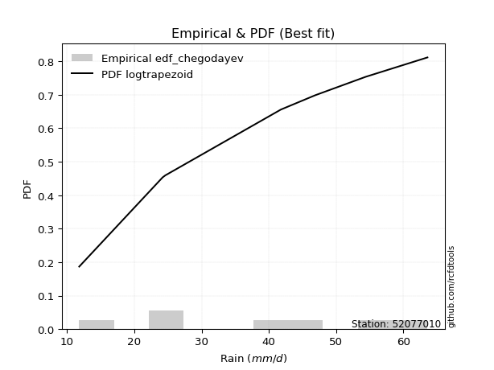</img>

</div>


### 6. EDF Blom (1958)

The Blom formula is a specific "plotting position" formula used in hydrology and statistical analysis to estimate the empirical cumulative probability (or non-exceedance probability) of a data series. It is particularly recommended for data that are approximately normally distributed. The constant _a_ is set to 0.375 (or 3/8).

<div align="center">


$P=(m-a)/(n+1-2a)$


</div>


**6.1. Empirical values**

<div align="center">

|                | 0                   | 1                   | 2                  | 3        | 4                  | 5                  | 6                  |
|:---------------|:--------------------|:--------------------|:-------------------|:---------|:-------------------|:-------------------|:-------------------|
| date           | 2018                | 2022                | 2019               | 2017     | 2025               | 2020               | 2024               |
| x              | 11.8                | 24.2                | 24.6               | 41.8     | 46.9               | 54.4               | 63.6               |
| m              | 1                   | 2                   | 3                  | 4        | 5                  | 6                  | 7                  |
| empirical_dist | edf_blom            | edf_blom            | edf_blom           | edf_blom | edf_blom           | edf_blom           | edf_blom           |
| empirical      | 0.08620689655172414 | 0.22413793103448276 | 0.3620689655172414 | 0.5      | 0.6379310344827587 | 0.7758620689655172 | 0.9137931034482759 |
| empirical_tr   | 1.0943396226415094  | 1.288888888888889   | 1.5675675675675675 | 2.0      | 2.7619047619047623 | 4.461538461538462  | 11.600000000000007 |

</div>


**6.2. Kolmogorov-Smirnov fit test (sorted by Δ)**


<div align="center">

|                | 0                   | 1                   | 2                   | 3                   | 4                   | 5                   | 6                   | 7                   | 8                   | 9                   | 10                  | 11                  | 12                  | 13                  | 14                  | 15                  | 16                  | 17                  | 18                  | 19                  | 20                  | 21                  | 22                  | 23                  | 24                  | 25                  | 26                  | 27                  | 28                  | 29                  | 30                  | 31                  | 32                  | 33                  | 34                  | 35                  | 36                  | 37                  | 38                  | 39                  | 40                  | 41                  | 42                  | 43                  | 44                  | 45                  | 46                  | 47                  | 48                  | 49                  | 50                  | 51                  | 52                  | 53                  | 54                  | 55                  | 56                  | 57                  | 58                  | 59                  | 60                  | 61                  | 62                  | 63                  | 64                  | 65                  | 66                  | 67                  | 68                  | 69                  | 70                  | 71                  | 72                  | 73                  | 74                  | 75                  | 76                  | 77                  | 78                  | 79                  | 80                  | 81                  | 82                  | 83                  | 84                  | 85                  | 86                  | 87                  | 88                  | 89                  | 90                  | 91                  | 92                  | 93                  | 94                  | 95                  | 96                  | 97                  | 98                  | 99                  | 100                 | 101                 | 102                 | 103                 | 104                 | 105                 | 106                 | 107                 | 108                 | 109                 | 110                 | 111                 | 112                 | 113                 | 114                 | 115                 | 116                 | 117                 | 118                 | 119                 | 120                 | 121                 | 122                 | 123                 | 124                 | 125                 | 126                 | 127                 | 128                 | 129                 | 130                 | 131                 | 132                 | 133                 | 134                 | 135                 | 136                 | 137                 | 138                 | 139                 | 140                 | 141                 | 142                 | 143                 | 144                 | 145                 | 146                 | 147                 | 148                 | 149                 | 150                 | 151                 | 152                 | 153                 | 154                 | 155                 | 156                 | 157                 | 158                 | 159                 |
|:---------------|:--------------------|:--------------------|:--------------------|:--------------------|:--------------------|:--------------------|:--------------------|:--------------------|:--------------------|:--------------------|:--------------------|:--------------------|:--------------------|:--------------------|:--------------------|:--------------------|:--------------------|:--------------------|:--------------------|:--------------------|:--------------------|:--------------------|:--------------------|:--------------------|:--------------------|:--------------------|:--------------------|:--------------------|:--------------------|:--------------------|:--------------------|:--------------------|:--------------------|:--------------------|:--------------------|:--------------------|:--------------------|:--------------------|:--------------------|:--------------------|:--------------------|:--------------------|:--------------------|:--------------------|:--------------------|:--------------------|:--------------------|:--------------------|:--------------------|:--------------------|:--------------------|:--------------------|:--------------------|:--------------------|:--------------------|:--------------------|:--------------------|:--------------------|:--------------------|:--------------------|:--------------------|:--------------------|:--------------------|:--------------------|:--------------------|:--------------------|:--------------------|:--------------------|:--------------------|:--------------------|:--------------------|:--------------------|:--------------------|:--------------------|:--------------------|:--------------------|:--------------------|:--------------------|:--------------------|:--------------------|:--------------------|:--------------------|:--------------------|:--------------------|:--------------------|:--------------------|:--------------------|:--------------------|:--------------------|:--------------------|:--------------------|:--------------------|:--------------------|:--------------------|:--------------------|:--------------------|:--------------------|:--------------------|:--------------------|:--------------------|:--------------------|:--------------------|:--------------------|:--------------------|:--------------------|:--------------------|:--------------------|:--------------------|:--------------------|:--------------------|:--------------------|:--------------------|:--------------------|:--------------------|:--------------------|:--------------------|:--------------------|:--------------------|:--------------------|:--------------------|:--------------------|:--------------------|:--------------------|:--------------------|:--------------------|:--------------------|:--------------------|:--------------------|:--------------------|:--------------------|:--------------------|:--------------------|:--------------------|:--------------------|:--------------------|:--------------------|:--------------------|:--------------------|:--------------------|:--------------------|:--------------------|:--------------------|:--------------------|:--------------------|:--------------------|:--------------------|:--------------------|:--------------------|:--------------------|:--------------------|:--------------------|:--------------------|:--------------------|:--------------------|:--------------------|:--------------------|:--------------------|:--------------------|:--------------------|:--------------------|
| station        | 52077010            | 52077010            | 52077010            | 52077010            | 52077010            | 52077010            | 52077010            | 52077010            | 52077010            | 52077010            | 52077010            | 52077010            | 52077010            | 52077010            | 52077010            | 52077010            | 52077010            | 52077010            | 52077010            | 52077010            | 52077010            | 52077010            | 52077010            | 52077010            | 52077010            | 52077010            | 52077010            | 52077010            | 52077010            | 52077010            | 52077010            | 52077010            | 52077010            | 52077010            | 52077010            | 52077010            | 52077010            | 52077010            | 52077010            | 52077010            | 52077010            | 52077010            | 52077010            | 52077010            | 52077010            | 52077010            | 52077010            | 52077010            | 52077010            | 52077010            | 52077010            | 52077010            | 52077010            | 52077010            | 52077010            | 52077010            | 52077010            | 52077010            | 52077010            | 52077010            | 52077010            | 52077010            | 52077010            | 52077010            | 52077010            | 52077010            | 52077010            | 52077010            | 52077010            | 52077010            | 52077010            | 52077010            | 52077010            | 52077010            | 52077010            | 52077010            | 52077010            | 52077010            | 52077010            | 52077010            | 52077010            | 52077010            | 52077010            | 52077010            | 52077010            | 52077010            | 52077010            | 52077010            | 52077010            | 52077010            | 52077010            | 52077010            | 52077010            | 52077010            | 52077010            | 52077010            | 52077010            | 52077010            | 52077010            | 52077010            | 52077010            | 52077010            | 52077010            | 52077010            | 52077010            | 52077010            | 52077010            | 52077010            | 52077010            | 52077010            | 52077010            | 52077010            | 52077010            | 52077010            | 52077010            | 52077010            | 52077010            | 52077010            | 52077010            | 52077010            | 52077010            | 52077010            | 52077010            | 52077010            | 52077010            | 52077010            | 52077010            | 52077010            | 52077010            | 52077010            | 52077010            | 52077010            | 52077010            | 52077010            | 52077010            | 52077010            | 52077010            | 52077010            | 52077010            | 52077010            | 52077010            | 52077010            | 52077010            | 52077010            | 52077010            | 52077010            | 52077010            | 52077010            | 52077010            | 52077010            | 52077010            | 52077010            | 52077010            | 52077010            | 52077010            | 52077010            | 52077010            | 52077010            | 52077010            | 52077010            |
| empirical_dist | edf_blom            | edf_blom            | edf_blom            | edf_blom            | edf_blom            | edf_blom            | edf_blom            | edf_blom            | edf_blom            | edf_blom            | edf_blom            | edf_blom            | edf_blom            | edf_blom            | edf_blom            | edf_blom            | edf_blom            | edf_blom            | edf_blom            | edf_blom            | edf_blom            | edf_blom            | edf_blom            | edf_blom            | edf_blom            | edf_blom            | edf_blom            | edf_blom            | edf_blom            | edf_blom            | edf_blom            | edf_blom            | edf_blom            | edf_blom            | edf_blom            | edf_blom            | edf_blom            | edf_blom            | edf_blom            | edf_blom            | edf_blom            | edf_blom            | edf_blom            | edf_blom            | edf_blom            | edf_blom            | edf_blom            | edf_blom            | edf_blom            | edf_blom            | edf_blom            | edf_blom            | edf_blom            | edf_blom            | edf_blom            | edf_blom            | edf_blom            | edf_blom            | edf_blom            | edf_blom            | edf_blom            | edf_blom            | edf_blom            | edf_blom            | edf_blom            | edf_blom            | edf_blom            | edf_blom            | edf_blom            | edf_blom            | edf_blom            | edf_blom            | edf_blom            | edf_blom            | edf_blom            | edf_blom            | edf_blom            | edf_blom            | edf_blom            | edf_blom            | edf_blom            | edf_blom            | edf_blom            | edf_blom            | edf_blom            | edf_blom            | edf_blom            | edf_blom            | edf_blom            | edf_blom            | edf_blom            | edf_blom            | edf_blom            | edf_blom            | edf_blom            | edf_blom            | edf_blom            | edf_blom            | edf_blom            | edf_blom            | edf_blom            | edf_blom            | edf_blom            | edf_blom            | edf_blom            | edf_blom            | edf_blom            | edf_blom            | edf_blom            | edf_blom            | edf_blom            | edf_blom            | edf_blom            | edf_blom            | edf_blom            | edf_blom            | edf_blom            | edf_blom            | edf_blom            | edf_blom            | edf_blom            | edf_blom            | edf_blom            | edf_blom            | edf_blom            | edf_blom            | edf_blom            | edf_blom            | edf_blom            | edf_blom            | edf_blom            | edf_blom            | edf_blom            | edf_blom            | edf_blom            | edf_blom            | edf_blom            | edf_blom            | edf_blom            | edf_blom            | edf_blom            | edf_blom            | edf_blom            | edf_blom            | edf_blom            | edf_blom            | edf_blom            | edf_blom            | edf_blom            | edf_blom            | edf_blom            | edf_blom            | edf_blom            | edf_blom            | edf_blom            | edf_blom            | edf_blom            | edf_blom            | edf_blom            | edf_blom            |
| p_dist         | logtrapezoid        | wrapcauchy          | logbeta             | arcsine             | ksone               | loggenhalflogistic  | kappa4              | beta                | semicircular        | tukeylambda         | bradford            | truncweibull_min    | genpareto           | vonmises_line       | uniform             | logskewnorm         | anglit              | logpearson3         | loggengamma         | invgauss            | loggumbel_l         | logburr             | rayleigh            | logsemicircular     | gausshyper          | logargus            | loggompertz         | invgamma            | dweibull            | logtriang           | maxwell             | logmielke           | genlogistic         | weibull_min         | logweibull_min      | loganglit           | rice                | burr                | alpha               | logloggamma         | logarcsine          | kappa3              | mielke              | betaprime           | logjohnsonsu        | logexponweib        | logburr12           | kstwobign           | halfnorm            | ncf                 | gamma               | erlang              | cosine              | dgamma              | loggenextreme       | johnsonsu           | nct                 | t                   | exponnorm           | truncnorm           | crystalball         | norm                | skewnorm            | f                   | pearson3            | gumbel_r            | gompertz            | genextreme          | logcrystalball      | logdgamma           | logt                | lognorm             | logexponnorm        | logf                | logfatiguelife      | lognct              | logncf              | logfoldnorm         | logrice             | loginvweibull       | loggamma            | loggamma            | logbetaprime        | logdweibull         | loginvgauss         | loginvgamma         | logalpha            | logerlang           | argus               | loggenpareto        | logistic            | halflogistic        | moyal               | loglogistic         | burr12              | logmaxwell          | gumbel_l            | genexpon            | logkstwobign        | hypsecant           | triang              | lograyleigh         | genhalflogistic     | loglevy_l           | truncexpon          | logcosine           | loghypsecant        | lomax               | loggenexpon         | laplace             | loghalfnorm         | logkappa4           | logloglaplace       | logjohnsonsb        | logksone            | loggumbel_r         | loglaplace          | loglaplace          | loghalflogistic     | logrdist            | loghalfgennorm      | logmoyal            | logtukeylambda      | logbradford         | logkappa3           | loguniform          | logwrapcauchy       | levy_l              | lognakagami         | logvonmises_line    | nakagami            | halfgennorm         | gennorm             | loggennorm          | loglomax            | trapezoid           | wald                | logwald             | loggausshyper       | logtruncweibull_min | logtruncexpon       | logtruncnorm        | logweibull_max      | exponweib           | logexponpow         | invweibull          | exponpow            | foldnorm            | fatiguelife         | gengamma            | powerlaw            | johnsonsb           | weibull_max         | logpowerlaw         | truncpareto         | logtruncpareto      | rdist               | loggenlogistic      | logvonmises         | vonmises            |
| delta          | 0.0800012063233344  | 0.0862068960214615  | 0.08620689630970768 | 0.08620689655172414 | 0.0899031303676961  | 0.09169388558495684 | 0.10039848798937134 | 0.10125475555131824 | 0.1066103049465138  | 0.1086972550273047  | 0.10961934250245214 | 0.11144257242407757 | 0.11159333693813728 | 0.11260369487674318 | 0.11496471841299424 | 0.11830282800568592 | 0.11895601703064765 | 0.1209372305552231  | 0.1226999738480404  | 0.12305424359763883 | 0.12408330639522328 | 0.12436546952980537 | 0.12465887587988495 | 0.12730415733093936 | 0.12761533274154938 | 0.12919730627592568 | 0.12999917673308525 | 0.13049641906864762 | 0.13076337359221835 | 0.1308499817256331  | 0.13126615425021546 | 0.1318022074871257  | 0.13267343462523273 | 0.13299238605964198 | 0.13589559424050138 | 0.1359158283736689  | 0.13596601885855725 | 0.13629078976615824 | 0.13634552469937278 | 0.13661860868393189 | 0.13748176490516584 | 0.13860701990993857 | 0.13885427480846632 | 0.1400482016355634  | 0.14111895955732373 | 0.14200000337309482 | 0.14254298793360543 | 0.1430287115733173  | 0.14475024397635794 | 0.14540021240192835 | 0.14541266432961397 | 0.14549431137725138 | 0.1455852596463259  | 0.14636927482151707 | 0.14654208680208577 | 0.14677922917315173 | 0.1469867493567693  | 0.14708229444656906 | 0.14708297499905715 | 0.1470832915445442  | 0.1470832930268845  | 0.14708329593803587 | 0.14719761681952576 | 0.14763155318330387 | 0.14824644331375575 | 0.1512184416377791  | 0.1541816077804362  | 0.15501234648026366 | 0.15627362260298516 | 0.15628482385422465 | 0.15640477496566318 | 0.15640638022971753 | 0.15640822304901647 | 0.15698202099844327 | 0.15728848898423886 | 0.15739572031534177 | 0.1588268561149584  | 0.15930321155882798 | 0.1606762462511413  | 0.16142387808732217 | 0.1616292034807778  | 0.1616292034807778  | 0.1617487736176455  | 0.16251064207368604 | 0.1633833166596681  | 0.164152358182595   | 0.16440979665404665 | 0.16442157662962886 | 0.16526495934907764 | 0.16854373460912536 | 0.16920767020790023 | 0.17285368994522687 | 0.1747598693608634  | 0.17488687291322336 | 0.1763764749627783  | 0.17735099806011823 | 0.17750154110484348 | 0.17943284436282692 | 0.18220696959298488 | 0.182695160558566   | 0.1830929895863778  | 0.1836254408410103  | 0.18380737174379863 | 0.18581152268438555 | 0.18714436504503285 | 0.18764665330008456 | 0.18911643429273883 | 0.18931926439840951 | 0.18952931070872392 | 0.19830057139755392 | 0.20194651476099656 | 0.2040903120723272  | 0.20437180127852175 | 0.20600910138724093 | 0.2145170399512612  | 0.21534810886227984 | 0.21708698498277101 | 0.21708698498277101 | 0.2299596483185592  | 0.23009338758398384 | 0.23176009715411883 | 0.23478483010149764 | 0.24439005733317032 | 0.2507670707952704  | 0.2508366225749513  | 0.250837840442087   | 0.25092815381364436 | 0.25334005841770196 | 0.25411285946391104 | 0.2543536624451095  | 0.2707978512879369  | 0.2725669210867396  | 0.27586206896551724 | 0.27586206896551724 | 0.27714285368907865 | 0.2784013555465426  | 0.28840550607252957 | 0.29005208465578514 | 0.29198776976184004 | 0.2953965229959852  | 0.3222159216236352  | 0.3234728718568931  | 0.37497350096673027 | 0.3949113732890086  | 0.43954704020728286 | 0.4746368557584819  | 0.493458672512851   | 0.5                 | 0.5416757204346186  | 0.5504437495247984  | 0.5632602536675193  | 0.581087011354054   | 0.6010670456466801  | 0.6310308517142121  | 0.6710679654584535  | 0.7124006483612838  | 0.732188404784038   | 0.7758620689655172  | 1.147614279786524   | 10.016634177808504  |
| deltao         | 0.48442053926100004 | 0.48442053926100004 | 0.48442053926100004 | 0.48442053926100004 | 0.48442053926100004 | 0.48442053926100004 | 0.48442053926100004 | 0.48442053926100004 | 0.48442053926100004 | 0.48442053926100004 | 0.48442053926100004 | 0.48442053926100004 | 0.48442053926100004 | 0.48442053926100004 | 0.48442053926100004 | 0.48442053926100004 | 0.48442053926100004 | 0.48442053926100004 | 0.48442053926100004 | 0.48442053926100004 | 0.48442053926100004 | 0.48442053926100004 | 0.48442053926100004 | 0.48442053926100004 | 0.48442053926100004 | 0.48442053926100004 | 0.48442053926100004 | 0.48442053926100004 | 0.48442053926100004 | 0.48442053926100004 | 0.48442053926100004 | 0.48442053926100004 | 0.48442053926100004 | 0.48442053926100004 | 0.48442053926100004 | 0.48442053926100004 | 0.48442053926100004 | 0.48442053926100004 | 0.48442053926100004 | 0.48442053926100004 | 0.48442053926100004 | 0.48442053926100004 | 0.48442053926100004 | 0.48442053926100004 | 0.48442053926100004 | 0.48442053926100004 | 0.48442053926100004 | 0.48442053926100004 | 0.48442053926100004 | 0.48442053926100004 | 0.48442053926100004 | 0.48442053926100004 | 0.48442053926100004 | 0.48442053926100004 | 0.48442053926100004 | 0.48442053926100004 | 0.48442053926100004 | 0.48442053926100004 | 0.48442053926100004 | 0.48442053926100004 | 0.48442053926100004 | 0.48442053926100004 | 0.48442053926100004 | 0.48442053926100004 | 0.48442053926100004 | 0.48442053926100004 | 0.48442053926100004 | 0.48442053926100004 | 0.48442053926100004 | 0.48442053926100004 | 0.48442053926100004 | 0.48442053926100004 | 0.48442053926100004 | 0.48442053926100004 | 0.48442053926100004 | 0.48442053926100004 | 0.48442053926100004 | 0.48442053926100004 | 0.48442053926100004 | 0.48442053926100004 | 0.48442053926100004 | 0.48442053926100004 | 0.48442053926100004 | 0.48442053926100004 | 0.48442053926100004 | 0.48442053926100004 | 0.48442053926100004 | 0.48442053926100004 | 0.48442053926100004 | 0.48442053926100004 | 0.48442053926100004 | 0.48442053926100004 | 0.48442053926100004 | 0.48442053926100004 | 0.48442053926100004 | 0.48442053926100004 | 0.48442053926100004 | 0.48442053926100004 | 0.48442053926100004 | 0.48442053926100004 | 0.48442053926100004 | 0.48442053926100004 | 0.48442053926100004 | 0.48442053926100004 | 0.48442053926100004 | 0.48442053926100004 | 0.48442053926100004 | 0.48442053926100004 | 0.48442053926100004 | 0.48442053926100004 | 0.48442053926100004 | 0.48442053926100004 | 0.48442053926100004 | 0.48442053926100004 | 0.48442053926100004 | 0.48442053926100004 | 0.48442053926100004 | 0.48442053926100004 | 0.48442053926100004 | 0.48442053926100004 | 0.48442053926100004 | 0.48442053926100004 | 0.48442053926100004 | 0.48442053926100004 | 0.48442053926100004 | 0.48442053926100004 | 0.48442053926100004 | 0.48442053926100004 | 0.48442053926100004 | 0.48442053926100004 | 0.48442053926100004 | 0.48442053926100004 | 0.48442053926100004 | 0.48442053926100004 | 0.48442053926100004 | 0.48442053926100004 | 0.48442053926100004 | 0.48442053926100004 | 0.48442053926100004 | 0.48442053926100004 | 0.48442053926100004 | 0.48442053926100004 | 0.48442053926100004 | 0.48442053926100004 | 0.48442053926100004 | 0.48442053926100004 | 0.48442053926100004 | 0.48442053926100004 | 0.48442053926100004 | 0.48442053926100004 | 0.48442053926100004 | 0.48442053926100004 | 0.48442053926100004 | 0.48442053926100004 | 0.48442053926100004 | 0.48442053926100004 | 0.48442053926100004 | 0.48442053926100004 | 0.48442053926100004 | 0.48442053926100004 |
| eval           | Δo > Δ              | Δo > Δ              | Δo > Δ              | Δo > Δ              | Δo > Δ              | Δo > Δ              | Δo > Δ              | Δo > Δ              | Δo > Δ              | Δo > Δ              | Δo > Δ              | Δo > Δ              | Δo > Δ              | Δo > Δ              | Δo > Δ              | Δo > Δ              | Δo > Δ              | Δo > Δ              | Δo > Δ              | Δo > Δ              | Δo > Δ              | Δo > Δ              | Δo > Δ              | Δo > Δ              | Δo > Δ              | Δo > Δ              | Δo > Δ              | Δo > Δ              | Δo > Δ              | Δo > Δ              | Δo > Δ              | Δo > Δ              | Δo > Δ              | Δo > Δ              | Δo > Δ              | Δo > Δ              | Δo > Δ              | Δo > Δ              | Δo > Δ              | Δo > Δ              | Δo > Δ              | Δo > Δ              | Δo > Δ              | Δo > Δ              | Δo > Δ              | Δo > Δ              | Δo > Δ              | Δo > Δ              | Δo > Δ              | Δo > Δ              | Δo > Δ              | Δo > Δ              | Δo > Δ              | Δo > Δ              | Δo > Δ              | Δo > Δ              | Δo > Δ              | Δo > Δ              | Δo > Δ              | Δo > Δ              | Δo > Δ              | Δo > Δ              | Δo > Δ              | Δo > Δ              | Δo > Δ              | Δo > Δ              | Δo > Δ              | Δo > Δ              | Δo > Δ              | Δo > Δ              | Δo > Δ              | Δo > Δ              | Δo > Δ              | Δo > Δ              | Δo > Δ              | Δo > Δ              | Δo > Δ              | Δo > Δ              | Δo > Δ              | Δo > Δ              | Δo > Δ              | Δo > Δ              | Δo > Δ              | Δo > Δ              | Δo > Δ              | Δo > Δ              | Δo > Δ              | Δo > Δ              | Δo > Δ              | Δo > Δ              | Δo > Δ              | Δo > Δ              | Δo > Δ              | Δo > Δ              | Δo > Δ              | Δo > Δ              | Δo > Δ              | Δo > Δ              | Δo > Δ              | Δo > Δ              | Δo > Δ              | Δo > Δ              | Δo > Δ              | Δo > Δ              | Δo > Δ              | Δo > Δ              | Δo > Δ              | Δo > Δ              | Δo > Δ              | Δo > Δ              | Δo > Δ              | Δo > Δ              | Δo > Δ              | Δo > Δ              | Δo > Δ              | Δo > Δ              | Δo > Δ              | Δo > Δ              | Δo > Δ              | Δo > Δ              | Δo > Δ              | Δo > Δ              | Δo > Δ              | Δo > Δ              | Δo > Δ              | Δo > Δ              | Δo > Δ              | Δo > Δ              | Δo > Δ              | Δo > Δ              | Δo > Δ              | Δo > Δ              | Δo > Δ              | Δo > Δ              | Δo > Δ              | Δo > Δ              | Δo > Δ              | Δo > Δ              | Δo > Δ              | Δo > Δ              | Δo > Δ              | Δo > Δ              | Δo > Δ              | Δo > Δ              | Δo > Δ              | Δo > Δ              | Δo <= Δ             | Δo <= Δ             | Δo <= Δ             | Δo <= Δ             | Δo <= Δ             | Δo <= Δ             | Δo <= Δ             | Δo <= Δ             | Δo <= Δ             | Δo <= Δ             | Δo <= Δ             | Δo <= Δ             | Δo <= Δ             | Δo <= Δ             |
| fit            | 1                   | 1                   | 1                   | 1                   | 1                   | 1                   | 1                   | 1                   | 1                   | 1                   | 1                   | 1                   | 1                   | 1                   | 1                   | 1                   | 1                   | 1                   | 1                   | 1                   | 1                   | 1                   | 1                   | 1                   | 1                   | 1                   | 1                   | 1                   | 1                   | 1                   | 1                   | 1                   | 1                   | 1                   | 1                   | 1                   | 1                   | 1                   | 1                   | 1                   | 1                   | 1                   | 1                   | 1                   | 1                   | 1                   | 1                   | 1                   | 1                   | 1                   | 1                   | 1                   | 1                   | 1                   | 1                   | 1                   | 1                   | 1                   | 1                   | 1                   | 1                   | 1                   | 1                   | 1                   | 1                   | 1                   | 1                   | 1                   | 1                   | 1                   | 1                   | 1                   | 1                   | 1                   | 1                   | 1                   | 1                   | 1                   | 1                   | 1                   | 1                   | 1                   | 1                   | 1                   | 1                   | 1                   | 1                   | 1                   | 1                   | 1                   | 1                   | 1                   | 1                   | 1                   | 1                   | 1                   | 1                   | 1                   | 1                   | 1                   | 1                   | 1                   | 1                   | 1                   | 1                   | 1                   | 1                   | 1                   | 1                   | 1                   | 1                   | 1                   | 1                   | 1                   | 1                   | 1                   | 1                   | 1                   | 1                   | 1                   | 1                   | 1                   | 1                   | 1                   | 1                   | 1                   | 1                   | 1                   | 1                   | 1                   | 1                   | 1                   | 1                   | 1                   | 1                   | 1                   | 1                   | 1                   | 1                   | 1                   | 1                   | 1                   | 1                   | 1                   | 1                   | 1                   | 0                   | 0                   | 0                   | 0                   | 0                   | 0                   | 0                   | 0                   | 0                   | 0                   | 0                   | 0                   | 0                   | 0                   |
| n              | 7                   | 7                   | 7                   | 7                   | 7                   | 7                   | 7                   | 7                   | 7                   | 7                   | 7                   | 7                   | 7                   | 7                   | 7                   | 7                   | 7                   | 7                   | 7                   | 7                   | 7                   | 7                   | 7                   | 7                   | 7                   | 7                   | 7                   | 7                   | 7                   | 7                   | 7                   | 7                   | 7                   | 7                   | 7                   | 7                   | 7                   | 7                   | 7                   | 7                   | 7                   | 7                   | 7                   | 7                   | 7                   | 7                   | 7                   | 7                   | 7                   | 7                   | 7                   | 7                   | 7                   | 7                   | 7                   | 7                   | 7                   | 7                   | 7                   | 7                   | 7                   | 7                   | 7                   | 7                   | 7                   | 7                   | 7                   | 7                   | 7                   | 7                   | 7                   | 7                   | 7                   | 7                   | 7                   | 7                   | 7                   | 7                   | 7                   | 7                   | 7                   | 7                   | 7                   | 7                   | 7                   | 7                   | 7                   | 7                   | 7                   | 7                   | 7                   | 7                   | 7                   | 7                   | 7                   | 7                   | 7                   | 7                   | 7                   | 7                   | 7                   | 7                   | 7                   | 7                   | 7                   | 7                   | 7                   | 7                   | 7                   | 7                   | 7                   | 7                   | 7                   | 7                   | 7                   | 7                   | 7                   | 7                   | 7                   | 7                   | 7                   | 7                   | 7                   | 7                   | 7                   | 7                   | 7                   | 7                   | 7                   | 7                   | 7                   | 7                   | 7                   | 7                   | 7                   | 7                   | 7                   | 7                   | 7                   | 7                   | 7                   | 7                   | 7                   | 7                   | 7                   | 7                   | 7                   | 7                   | 7                   | 7                   | 7                   | 7                   | 7                   | 7                   | 7                   | 7                   | 7                   | 7                   | 7                   | 7                   |
| best_fit       | 1                   | 0                   | 0                   | 0                   | 0                   | 0                   | 0                   | 0                   | 0                   | 0                   | 0                   | 0                   | 0                   | 0                   | 0                   | 0                   | 0                   | 0                   | 0                   | 0                   | 0                   | 0                   | 0                   | 0                   | 0                   | 0                   | 0                   | 0                   | 0                   | 0                   | 0                   | 0                   | 0                   | 0                   | 0                   | 0                   | 0                   | 0                   | 0                   | 0                   | 0                   | 0                   | 0                   | 0                   | 0                   | 0                   | 0                   | 0                   | 0                   | 0                   | 0                   | 0                   | 0                   | 0                   | 0                   | 0                   | 0                   | 0                   | 0                   | 0                   | 0                   | 0                   | 0                   | 0                   | 0                   | 0                   | 0                   | 0                   | 0                   | 0                   | 0                   | 0                   | 0                   | 0                   | 0                   | 0                   | 0                   | 0                   | 0                   | 0                   | 0                   | 0                   | 0                   | 0                   | 0                   | 0                   | 0                   | 0                   | 0                   | 0                   | 0                   | 0                   | 0                   | 0                   | 0                   | 0                   | 0                   | 0                   | 0                   | 0                   | 0                   | 0                   | 0                   | 0                   | 0                   | 0                   | 0                   | 0                   | 0                   | 0                   | 0                   | 0                   | 0                   | 0                   | 0                   | 0                   | 0                   | 0                   | 0                   | 0                   | 0                   | 0                   | 0                   | 0                   | 0                   | 0                   | 0                   | 0                   | 0                   | 0                   | 0                   | 0                   | 0                   | 0                   | 0                   | 0                   | 0                   | 0                   | 0                   | 0                   | 0                   | 0                   | 0                   | 0                   | 0                   | 0                   | 0                   | 0                   | 0                   | 0                   | 0                   | 0                   | 0                   | 0                   | 0                   | 0                   | 0                   | 0                   | 0                   | 0                   |
| best_fit_sort  | 1                   | 2                   | 3                   | 4                   | 5                   | 6                   | 7                   | 8                   | 9                   | 10                  | 11                  | 12                  | 13                  | 14                  | 15                  | 16                  | 17                  | 18                  | 19                  | 20                  | 21                  | 22                  | 23                  | 24                  | 25                  | 26                  | 27                  | 28                  | 29                  | 30                  | 31                  | 32                  | 33                  | 34                  | 35                  | 36                  | 37                  | 38                  | 39                  | 40                  | 41                  | 42                  | 43                  | 44                  | 45                  | 46                  | 47                  | 48                  | 49                  | 50                  | 51                  | 52                  | 53                  | 54                  | 55                  | 56                  | 57                  | 58                  | 59                  | 60                  | 61                  | 62                  | 63                  | 64                  | 65                  | 66                  | 67                  | 68                  | 69                  | 70                  | 71                  | 72                  | 73                  | 74                  | 75                  | 76                  | 77                  | 78                  | 79                  | 80                  | 81                  | 82                  | 83                  | 84                  | 85                  | 86                  | 87                  | 88                  | 89                  | 90                  | 91                  | 92                  | 93                  | 94                  | 95                  | 96                  | 97                  | 98                  | 99                  | 100                 | 101                 | 102                 | 103                 | 104                 | 105                 | 106                 | 107                 | 108                 | 109                 | 110                 | 111                 | 112                 | 113                 | 114                 | 115                 | 116                 | 117                 | 118                 | 119                 | 120                 | 121                 | 122                 | 123                 | 124                 | 125                 | 126                 | 127                 | 128                 | 129                 | 130                 | 131                 | 132                 | 133                 | 134                 | 135                 | 136                 | 137                 | 138                 | 139                 | 140                 | 141                 | 142                 | 143                 | 144                 | 145                 | 146                 | 147                 | 148                 | 149                 | 150                 | 151                 | 152                 | 153                 | 154                 | 155                 | 156                 | 157                 | 158                 | 159                 | 160                 |

</div>


**6.3. Best fit**

<div align="center">

|   id |   station | empirical_dist   | p_dist       |     delta |   deltao | eval   |   fit |   n |   best_fit |   best_fit_sort |
|-----:|----------:|:-----------------|:-------------|----------:|---------:|:-------|------:|----:|-----------:|----------------:|
|    0 |  52077010 | edf_blom         | logtrapezoid | 0.0800012 | 0.484421 | Δo > Δ |     1 |   7 |          1 |               1 |

</div>


<div align="center">

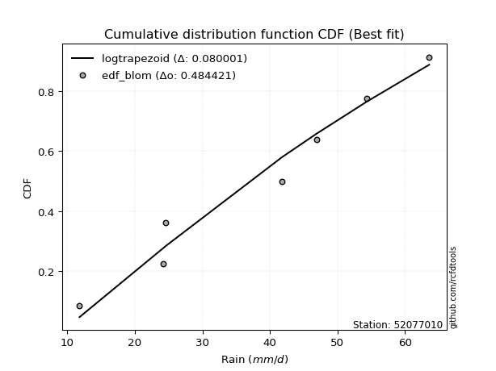</img>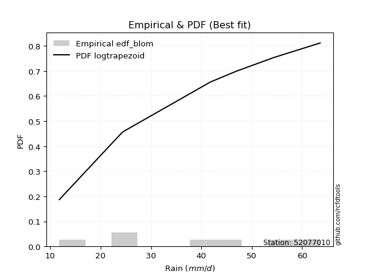</img>

</div>


### 7. EDF Tukey (1962)

In hydrology, the Tukey formula is used as a plotting position formula to estimate the empirical probability or frequency of a flood event (or other hydrological data). The formula parameter is given as _c=0.333_ (or 1/3).

<div align="center">


$P=(m-c)/(n+1-2c)$


</div>


**7.1. Empirical values**

<div align="center">

|                | 0                   | 1                   | 2                   | 3         | 4                  | 5                  | 6                  |
|:---------------|:--------------------|:--------------------|:--------------------|:----------|:-------------------|:-------------------|:-------------------|
| date           | 2018                | 2022                | 2019                | 2017      | 2025               | 2020               | 2024               |
| x              | 11.8                | 24.2                | 24.6                | 41.8      | 46.9               | 54.4               | 63.6               |
| m              | 1                   | 2                   | 3                   | 4         | 5                  | 6                  | 7                  |
| empirical_dist | edf_tukey           | edf_tukey           | edf_tukey           | edf_tukey | edf_tukey          | edf_tukey          | edf_tukey          |
| empirical      | 0.09090909090909091 | 0.22727272727272727 | 0.36363636363636365 | 0.5       | 0.6363636363636364 | 0.7727272727272727 | 0.9090909090909091 |
| empirical_tr   | 1.1                 | 1.2941176470588236  | 1.5714285714285714  | 2.0       | 2.75               | 4.3999999999999995 | 10.999999999999996 |

</div>


**7.2. Kolmogorov-Smirnov fit test (sorted by Δ)**


<div align="center">

|                | 0                   | 1                   | 2                   | 3                   | 4                   | 5                   | 6                   | 7                   | 8                   | 9                   | 10                  | 11                  | 12                  | 13                  | 14                  | 15                  | 16                  | 17                  | 18                  | 19                  | 20                  | 21                  | 22                  | 23                  | 24                  | 25                  | 26                  | 27                  | 28                  | 29                  | 30                  | 31                  | 32                  | 33                  | 34                  | 35                  | 36                  | 37                  | 38                  | 39                  | 40                  | 41                  | 42                  | 43                  | 44                  | 45                  | 46                  | 47                  | 48                  | 49                  | 50                  | 51                  | 52                  | 53                  | 54                  | 55                  | 56                  | 57                  | 58                  | 59                  | 60                  | 61                  | 62                  | 63                  | 64                  | 65                  | 66                  | 67                  | 68                  | 69                  | 70                  | 71                  | 72                  | 73                  | 74                  | 75                  | 76                  | 77                  | 78                  | 79                  | 80                  | 81                  | 82                  | 83                  | 84                  | 85                  | 86                  | 87                  | 88                  | 89                  | 90                  | 91                  | 92                  | 93                  | 94                  | 95                  | 96                  | 97                  | 98                  | 99                  | 100                 | 101                 | 102                 | 103                 | 104                 | 105                 | 106                 | 107                 | 108                 | 109                 | 110                 | 111                 | 112                 | 113                 | 114                 | 115                 | 116                 | 117                 | 118                 | 119                 | 120                 | 121                 | 122                 | 123                 | 124                 | 125                 | 126                 | 127                 | 128                 | 129                 | 130                 | 131                 | 132                 | 133                 | 134                 | 135                 | 136                 | 137                 | 138                 | 139                 | 140                 | 141                 | 142                 | 143                 | 144                 | 145                 | 146                 | 147                 | 148                 | 149                 | 150                 | 151                 | 152                 | 153                 | 154                 | 155                 | 156                 | 157                 | 158                 | 159                 |
|:---------------|:--------------------|:--------------------|:--------------------|:--------------------|:--------------------|:--------------------|:--------------------|:--------------------|:--------------------|:--------------------|:--------------------|:--------------------|:--------------------|:--------------------|:--------------------|:--------------------|:--------------------|:--------------------|:--------------------|:--------------------|:--------------------|:--------------------|:--------------------|:--------------------|:--------------------|:--------------------|:--------------------|:--------------------|:--------------------|:--------------------|:--------------------|:--------------------|:--------------------|:--------------------|:--------------------|:--------------------|:--------------------|:--------------------|:--------------------|:--------------------|:--------------------|:--------------------|:--------------------|:--------------------|:--------------------|:--------------------|:--------------------|:--------------------|:--------------------|:--------------------|:--------------------|:--------------------|:--------------------|:--------------------|:--------------------|:--------------------|:--------------------|:--------------------|:--------------------|:--------------------|:--------------------|:--------------------|:--------------------|:--------------------|:--------------------|:--------------------|:--------------------|:--------------------|:--------------------|:--------------------|:--------------------|:--------------------|:--------------------|:--------------------|:--------------------|:--------------------|:--------------------|:--------------------|:--------------------|:--------------------|:--------------------|:--------------------|:--------------------|:--------------------|:--------------------|:--------------------|:--------------------|:--------------------|:--------------------|:--------------------|:--------------------|:--------------------|:--------------------|:--------------------|:--------------------|:--------------------|:--------------------|:--------------------|:--------------------|:--------------------|:--------------------|:--------------------|:--------------------|:--------------------|:--------------------|:--------------------|:--------------------|:--------------------|:--------------------|:--------------------|:--------------------|:--------------------|:--------------------|:--------------------|:--------------------|:--------------------|:--------------------|:--------------------|:--------------------|:--------------------|:--------------------|:--------------------|:--------------------|:--------------------|:--------------------|:--------------------|:--------------------|:--------------------|:--------------------|:--------------------|:--------------------|:--------------------|:--------------------|:--------------------|:--------------------|:--------------------|:--------------------|:--------------------|:--------------------|:--------------------|:--------------------|:--------------------|:--------------------|:--------------------|:--------------------|:--------------------|:--------------------|:--------------------|:--------------------|:--------------------|:--------------------|:--------------------|:--------------------|:--------------------|:--------------------|:--------------------|:--------------------|:--------------------|:--------------------|:--------------------|
| station        | 52077010            | 52077010            | 52077010            | 52077010            | 52077010            | 52077010            | 52077010            | 52077010            | 52077010            | 52077010            | 52077010            | 52077010            | 52077010            | 52077010            | 52077010            | 52077010            | 52077010            | 52077010            | 52077010            | 52077010            | 52077010            | 52077010            | 52077010            | 52077010            | 52077010            | 52077010            | 52077010            | 52077010            | 52077010            | 52077010            | 52077010            | 52077010            | 52077010            | 52077010            | 52077010            | 52077010            | 52077010            | 52077010            | 52077010            | 52077010            | 52077010            | 52077010            | 52077010            | 52077010            | 52077010            | 52077010            | 52077010            | 52077010            | 52077010            | 52077010            | 52077010            | 52077010            | 52077010            | 52077010            | 52077010            | 52077010            | 52077010            | 52077010            | 52077010            | 52077010            | 52077010            | 52077010            | 52077010            | 52077010            | 52077010            | 52077010            | 52077010            | 52077010            | 52077010            | 52077010            | 52077010            | 52077010            | 52077010            | 52077010            | 52077010            | 52077010            | 52077010            | 52077010            | 52077010            | 52077010            | 52077010            | 52077010            | 52077010            | 52077010            | 52077010            | 52077010            | 52077010            | 52077010            | 52077010            | 52077010            | 52077010            | 52077010            | 52077010            | 52077010            | 52077010            | 52077010            | 52077010            | 52077010            | 52077010            | 52077010            | 52077010            | 52077010            | 52077010            | 52077010            | 52077010            | 52077010            | 52077010            | 52077010            | 52077010            | 52077010            | 52077010            | 52077010            | 52077010            | 52077010            | 52077010            | 52077010            | 52077010            | 52077010            | 52077010            | 52077010            | 52077010            | 52077010            | 52077010            | 52077010            | 52077010            | 52077010            | 52077010            | 52077010            | 52077010            | 52077010            | 52077010            | 52077010            | 52077010            | 52077010            | 52077010            | 52077010            | 52077010            | 52077010            | 52077010            | 52077010            | 52077010            | 52077010            | 52077010            | 52077010            | 52077010            | 52077010            | 52077010            | 52077010            | 52077010            | 52077010            | 52077010            | 52077010            | 52077010            | 52077010            | 52077010            | 52077010            | 52077010            | 52077010            | 52077010            | 52077010            |
| empirical_dist | edf_tukey           | edf_tukey           | edf_tukey           | edf_tukey           | edf_tukey           | edf_tukey           | edf_tukey           | edf_tukey           | edf_tukey           | edf_tukey           | edf_tukey           | edf_tukey           | edf_tukey           | edf_tukey           | edf_tukey           | edf_tukey           | edf_tukey           | edf_tukey           | edf_tukey           | edf_tukey           | edf_tukey           | edf_tukey           | edf_tukey           | edf_tukey           | edf_tukey           | edf_tukey           | edf_tukey           | edf_tukey           | edf_tukey           | edf_tukey           | edf_tukey           | edf_tukey           | edf_tukey           | edf_tukey           | edf_tukey           | edf_tukey           | edf_tukey           | edf_tukey           | edf_tukey           | edf_tukey           | edf_tukey           | edf_tukey           | edf_tukey           | edf_tukey           | edf_tukey           | edf_tukey           | edf_tukey           | edf_tukey           | edf_tukey           | edf_tukey           | edf_tukey           | edf_tukey           | edf_tukey           | edf_tukey           | edf_tukey           | edf_tukey           | edf_tukey           | edf_tukey           | edf_tukey           | edf_tukey           | edf_tukey           | edf_tukey           | edf_tukey           | edf_tukey           | edf_tukey           | edf_tukey           | edf_tukey           | edf_tukey           | edf_tukey           | edf_tukey           | edf_tukey           | edf_tukey           | edf_tukey           | edf_tukey           | edf_tukey           | edf_tukey           | edf_tukey           | edf_tukey           | edf_tukey           | edf_tukey           | edf_tukey           | edf_tukey           | edf_tukey           | edf_tukey           | edf_tukey           | edf_tukey           | edf_tukey           | edf_tukey           | edf_tukey           | edf_tukey           | edf_tukey           | edf_tukey           | edf_tukey           | edf_tukey           | edf_tukey           | edf_tukey           | edf_tukey           | edf_tukey           | edf_tukey           | edf_tukey           | edf_tukey           | edf_tukey           | edf_tukey           | edf_tukey           | edf_tukey           | edf_tukey           | edf_tukey           | edf_tukey           | edf_tukey           | edf_tukey           | edf_tukey           | edf_tukey           | edf_tukey           | edf_tukey           | edf_tukey           | edf_tukey           | edf_tukey           | edf_tukey           | edf_tukey           | edf_tukey           | edf_tukey           | edf_tukey           | edf_tukey           | edf_tukey           | edf_tukey           | edf_tukey           | edf_tukey           | edf_tukey           | edf_tukey           | edf_tukey           | edf_tukey           | edf_tukey           | edf_tukey           | edf_tukey           | edf_tukey           | edf_tukey           | edf_tukey           | edf_tukey           | edf_tukey           | edf_tukey           | edf_tukey           | edf_tukey           | edf_tukey           | edf_tukey           | edf_tukey           | edf_tukey           | edf_tukey           | edf_tukey           | edf_tukey           | edf_tukey           | edf_tukey           | edf_tukey           | edf_tukey           | edf_tukey           | edf_tukey           | edf_tukey           | edf_tukey           | edf_tukey           | edf_tukey           | edf_tukey           |
| p_dist         | logtrapezoid        | wrapcauchy          | logbeta             | arcsine             | ksone               | loggenhalflogistic  | kappa4              | beta                | semicircular        | tukeylambda         | bradford            | truncweibull_min    | genpareto           | vonmises_line       | uniform             | logskewnorm         | anglit              | logpearson3         | loggengamma         | invgauss            | loggumbel_l         | logburr             | rayleigh            | logsemicircular     | dweibull            | gausshyper          | loggompertz         | logargus            | logtriang           | invgamma            | genlogistic         | maxwell             | logmielke           | logarcsine          | weibull_min         | loganglit           | logweibull_min      | rice                | burr                | alpha               | logloggamma         | kappa3              | mielke              | betaprime           | logexponweib        | logjohnsonsu        | kstwobign           | dgamma              | logburr12           | halfnorm            | ncf                 | gamma               | erlang              | cosine              | loggenextreme       | johnsonsu           | nct                 | t                   | exponnorm           | truncnorm           | crystalball         | norm                | skewnorm            | f                   | pearson3            | gumbel_r            | logdgamma           | gompertz            | logcrystalball      | logt                | lognorm             | logexponnorm        | genextreme          | logf                | logfatiguelife      | lognct              | logncf              | logfoldnorm         | logdweibull         | logrice             | loginvweibull       | loggamma            | loggamma            | logbetaprime        | loginvgauss         | loggenpareto        | loginvgamma         | logalpha            | logerlang           | argus               | logistic            | halflogistic        | moyal               | loglogistic         | burr12              | logmaxwell          | gumbel_l            | genexpon            | loglevy_l           | logkstwobign        | lograyleigh         | hypsecant           | lomax               | triang              | genhalflogistic     | truncexpon          | logcosine           | loghypsecant        | loggenexpon         | laplace             | loghalfnorm         | logjohnsonsb        | logkappa4           | logloglaplace       | logksone            | loggumbel_r         | loglaplace          | loglaplace          | logrdist            | loghalflogistic     | loghalfgennorm      | logmoyal            | logtukeylambda      | logwrapcauchy       | levy_l              | logbradford         | logkappa3           | loguniform          | lognakagami         | logvonmises_line    | halfgennorm         | nakagami            | gennorm             | loggennorm          | loglomax            | trapezoid           | wald                | logwald             | loggausshyper       | logtruncweibull_min | logtruncexpon       | logtruncnorm        | logweibull_max      | exponweib           | logexponpow         | invweibull          | exponpow            | foldnorm            | fatiguelife         | gengamma            | powerlaw            | johnsonsb           | weibull_max         | logpowerlaw         | truncpareto         | logtruncpareto      | rdist               | loggenlogistic      | logvonmises         | vonmises            |
| delta          | 0.0800012063233344  | 0.09090909037882827 | 0.09090909066707453 | 0.09090909090909094 | 0.09147052848681836 | 0.0932612837040791  | 0.10196588610849361 | 0.10282215367044051 | 0.10817770306563607 | 0.11026465314642697 | 0.11118674062157441 | 0.11300997054319983 | 0.11316073505725954 | 0.11417109299586545 | 0.11653211653211651 | 0.11830282800568592 | 0.12052341514976991 | 0.1209372305552231  | 0.12426737196716267 | 0.12447112917806613 | 0.12565070451434554 | 0.12593286764892764 | 0.1262262739990072  | 0.12730415733093936 | 0.12762857735397384 | 0.12918273086067164 | 0.12999917673308525 | 0.13076470439504795 | 0.1308499817256331  | 0.13206381718776988 | 0.13267343462523273 | 0.13283355236933772 | 0.13336960560624797 | 0.13434696866692133 | 0.13455978417876424 | 0.1359158283736689  | 0.13746299235962364 | 0.1375334169776795  | 0.1378581878852805  | 0.13791292281849504 | 0.13818600680305415 | 0.14017441802906083 | 0.1404216729275886  | 0.14161559975468566 | 0.14200000337309482 | 0.142686357676446   | 0.1430287115733173  | 0.14323447858327257 | 0.1441103860527277  | 0.14475024397635794 | 0.14540021240192835 | 0.14698006244873624 | 0.14706170949637365 | 0.14715265776544817 | 0.14810948492120804 | 0.148346627292274   | 0.14855414747589157 | 0.14864969256569133 | 0.1486503731181794  | 0.14865068966366646 | 0.14865069114600676 | 0.14865069405715814 | 0.14876501493864802 | 0.14919895130242614 | 0.14981384143287801 | 0.1512184416377791  | 0.15315002761598015 | 0.15574900589955845 | 0.15627362260298516 | 0.15640477496566318 | 0.15640638022971753 | 0.15640822304901647 | 0.15657974459938592 | 0.15698202099844327 | 0.15728848898423886 | 0.15739572031534177 | 0.1588268561149584  | 0.15930321155882798 | 0.15937584583544154 | 0.1606762462511413  | 0.16142387808732217 | 0.1616292034807778  | 0.1616292034807778  | 0.1617487736176455  | 0.1633833166596681  | 0.1638415402517586  | 0.164152358182595   | 0.16440979665404665 | 0.16442157662962886 | 0.1668323574681999  | 0.1707750683270225  | 0.17285368994522687 | 0.1747598693608634  | 0.17488687291322336 | 0.1763764749627783  | 0.17735099806011823 | 0.17906893922396575 | 0.17943284436282692 | 0.1811093283270188  | 0.18220696959298488 | 0.1836254408410103  | 0.18426255867768826 | 0.18461707004104266 | 0.18466038770550006 | 0.1853747698629209  | 0.18714436504503285 | 0.18764665330008456 | 0.18911643429273883 | 0.18952931070872392 | 0.19986796951667618 | 0.20194651476099656 | 0.2028743051489964  | 0.2040903120723272  | 0.20593919939764402 | 0.2113822437130167  | 0.21534810886227984 | 0.21708698498277101 | 0.21708698498277101 | 0.22695859134573934 | 0.2299596483185592  | 0.23176009715411883 | 0.23478483010149764 | 0.24439005733317032 | 0.24779335757539986 | 0.2486378640603352  | 0.2507670707952704  | 0.2508366225749513  | 0.250837840442087   | 0.25411285946391104 | 0.2543536624451095  | 0.2694321248484951  | 0.2707978512879369  | 0.2727272727272727  | 0.2727272727272727  | 0.2740080574508341  | 0.27996875366566487 | 0.28997290419165184 | 0.29005208465578514 | 0.29198776976184004 | 0.2953965229959852  | 0.3222159216236352  | 0.3250402699760154  | 0.37183870472848574 | 0.3917765770507641  | 0.4364122439690383  | 0.46993466140111506 | 0.4903238762746065  | 0.5                 | 0.5385409241963741  | 0.5473089532865538  | 0.5601254574292748  | 0.5779522151158095  | 0.5979322494084356  | 0.6278960554759676  | 0.667933169220209   | 0.7092658521230393  | 0.7290536085457935  | 0.7727272727272727  | 1.147614279786524   | 10.021336372165871  |
| deltao         | 0.48442053926100004 | 0.48442053926100004 | 0.48442053926100004 | 0.48442053926100004 | 0.48442053926100004 | 0.48442053926100004 | 0.48442053926100004 | 0.48442053926100004 | 0.48442053926100004 | 0.48442053926100004 | 0.48442053926100004 | 0.48442053926100004 | 0.48442053926100004 | 0.48442053926100004 | 0.48442053926100004 | 0.48442053926100004 | 0.48442053926100004 | 0.48442053926100004 | 0.48442053926100004 | 0.48442053926100004 | 0.48442053926100004 | 0.48442053926100004 | 0.48442053926100004 | 0.48442053926100004 | 0.48442053926100004 | 0.48442053926100004 | 0.48442053926100004 | 0.48442053926100004 | 0.48442053926100004 | 0.48442053926100004 | 0.48442053926100004 | 0.48442053926100004 | 0.48442053926100004 | 0.48442053926100004 | 0.48442053926100004 | 0.48442053926100004 | 0.48442053926100004 | 0.48442053926100004 | 0.48442053926100004 | 0.48442053926100004 | 0.48442053926100004 | 0.48442053926100004 | 0.48442053926100004 | 0.48442053926100004 | 0.48442053926100004 | 0.48442053926100004 | 0.48442053926100004 | 0.48442053926100004 | 0.48442053926100004 | 0.48442053926100004 | 0.48442053926100004 | 0.48442053926100004 | 0.48442053926100004 | 0.48442053926100004 | 0.48442053926100004 | 0.48442053926100004 | 0.48442053926100004 | 0.48442053926100004 | 0.48442053926100004 | 0.48442053926100004 | 0.48442053926100004 | 0.48442053926100004 | 0.48442053926100004 | 0.48442053926100004 | 0.48442053926100004 | 0.48442053926100004 | 0.48442053926100004 | 0.48442053926100004 | 0.48442053926100004 | 0.48442053926100004 | 0.48442053926100004 | 0.48442053926100004 | 0.48442053926100004 | 0.48442053926100004 | 0.48442053926100004 | 0.48442053926100004 | 0.48442053926100004 | 0.48442053926100004 | 0.48442053926100004 | 0.48442053926100004 | 0.48442053926100004 | 0.48442053926100004 | 0.48442053926100004 | 0.48442053926100004 | 0.48442053926100004 | 0.48442053926100004 | 0.48442053926100004 | 0.48442053926100004 | 0.48442053926100004 | 0.48442053926100004 | 0.48442053926100004 | 0.48442053926100004 | 0.48442053926100004 | 0.48442053926100004 | 0.48442053926100004 | 0.48442053926100004 | 0.48442053926100004 | 0.48442053926100004 | 0.48442053926100004 | 0.48442053926100004 | 0.48442053926100004 | 0.48442053926100004 | 0.48442053926100004 | 0.48442053926100004 | 0.48442053926100004 | 0.48442053926100004 | 0.48442053926100004 | 0.48442053926100004 | 0.48442053926100004 | 0.48442053926100004 | 0.48442053926100004 | 0.48442053926100004 | 0.48442053926100004 | 0.48442053926100004 | 0.48442053926100004 | 0.48442053926100004 | 0.48442053926100004 | 0.48442053926100004 | 0.48442053926100004 | 0.48442053926100004 | 0.48442053926100004 | 0.48442053926100004 | 0.48442053926100004 | 0.48442053926100004 | 0.48442053926100004 | 0.48442053926100004 | 0.48442053926100004 | 0.48442053926100004 | 0.48442053926100004 | 0.48442053926100004 | 0.48442053926100004 | 0.48442053926100004 | 0.48442053926100004 | 0.48442053926100004 | 0.48442053926100004 | 0.48442053926100004 | 0.48442053926100004 | 0.48442053926100004 | 0.48442053926100004 | 0.48442053926100004 | 0.48442053926100004 | 0.48442053926100004 | 0.48442053926100004 | 0.48442053926100004 | 0.48442053926100004 | 0.48442053926100004 | 0.48442053926100004 | 0.48442053926100004 | 0.48442053926100004 | 0.48442053926100004 | 0.48442053926100004 | 0.48442053926100004 | 0.48442053926100004 | 0.48442053926100004 | 0.48442053926100004 | 0.48442053926100004 | 0.48442053926100004 | 0.48442053926100004 | 0.48442053926100004 | 0.48442053926100004 |
| eval           | Δo > Δ              | Δo > Δ              | Δo > Δ              | Δo > Δ              | Δo > Δ              | Δo > Δ              | Δo > Δ              | Δo > Δ              | Δo > Δ              | Δo > Δ              | Δo > Δ              | Δo > Δ              | Δo > Δ              | Δo > Δ              | Δo > Δ              | Δo > Δ              | Δo > Δ              | Δo > Δ              | Δo > Δ              | Δo > Δ              | Δo > Δ              | Δo > Δ              | Δo > Δ              | Δo > Δ              | Δo > Δ              | Δo > Δ              | Δo > Δ              | Δo > Δ              | Δo > Δ              | Δo > Δ              | Δo > Δ              | Δo > Δ              | Δo > Δ              | Δo > Δ              | Δo > Δ              | Δo > Δ              | Δo > Δ              | Δo > Δ              | Δo > Δ              | Δo > Δ              | Δo > Δ              | Δo > Δ              | Δo > Δ              | Δo > Δ              | Δo > Δ              | Δo > Δ              | Δo > Δ              | Δo > Δ              | Δo > Δ              | Δo > Δ              | Δo > Δ              | Δo > Δ              | Δo > Δ              | Δo > Δ              | Δo > Δ              | Δo > Δ              | Δo > Δ              | Δo > Δ              | Δo > Δ              | Δo > Δ              | Δo > Δ              | Δo > Δ              | Δo > Δ              | Δo > Δ              | Δo > Δ              | Δo > Δ              | Δo > Δ              | Δo > Δ              | Δo > Δ              | Δo > Δ              | Δo > Δ              | Δo > Δ              | Δo > Δ              | Δo > Δ              | Δo > Δ              | Δo > Δ              | Δo > Δ              | Δo > Δ              | Δo > Δ              | Δo > Δ              | Δo > Δ              | Δo > Δ              | Δo > Δ              | Δo > Δ              | Δo > Δ              | Δo > Δ              | Δo > Δ              | Δo > Δ              | Δo > Δ              | Δo > Δ              | Δo > Δ              | Δo > Δ              | Δo > Δ              | Δo > Δ              | Δo > Δ              | Δo > Δ              | Δo > Δ              | Δo > Δ              | Δo > Δ              | Δo > Δ              | Δo > Δ              | Δo > Δ              | Δo > Δ              | Δo > Δ              | Δo > Δ              | Δo > Δ              | Δo > Δ              | Δo > Δ              | Δo > Δ              | Δo > Δ              | Δo > Δ              | Δo > Δ              | Δo > Δ              | Δo > Δ              | Δo > Δ              | Δo > Δ              | Δo > Δ              | Δo > Δ              | Δo > Δ              | Δo > Δ              | Δo > Δ              | Δo > Δ              | Δo > Δ              | Δo > Δ              | Δo > Δ              | Δo > Δ              | Δo > Δ              | Δo > Δ              | Δo > Δ              | Δo > Δ              | Δo > Δ              | Δo > Δ              | Δo > Δ              | Δo > Δ              | Δo > Δ              | Δo > Δ              | Δo > Δ              | Δo > Δ              | Δo > Δ              | Δo > Δ              | Δo > Δ              | Δo > Δ              | Δo > Δ              | Δo > Δ              | Δo > Δ              | Δo > Δ              | Δo <= Δ             | Δo <= Δ             | Δo <= Δ             | Δo <= Δ             | Δo <= Δ             | Δo <= Δ             | Δo <= Δ             | Δo <= Δ             | Δo <= Δ             | Δo <= Δ             | Δo <= Δ             | Δo <= Δ             | Δo <= Δ             | Δo <= Δ             |
| fit            | 1                   | 1                   | 1                   | 1                   | 1                   | 1                   | 1                   | 1                   | 1                   | 1                   | 1                   | 1                   | 1                   | 1                   | 1                   | 1                   | 1                   | 1                   | 1                   | 1                   | 1                   | 1                   | 1                   | 1                   | 1                   | 1                   | 1                   | 1                   | 1                   | 1                   | 1                   | 1                   | 1                   | 1                   | 1                   | 1                   | 1                   | 1                   | 1                   | 1                   | 1                   | 1                   | 1                   | 1                   | 1                   | 1                   | 1                   | 1                   | 1                   | 1                   | 1                   | 1                   | 1                   | 1                   | 1                   | 1                   | 1                   | 1                   | 1                   | 1                   | 1                   | 1                   | 1                   | 1                   | 1                   | 1                   | 1                   | 1                   | 1                   | 1                   | 1                   | 1                   | 1                   | 1                   | 1                   | 1                   | 1                   | 1                   | 1                   | 1                   | 1                   | 1                   | 1                   | 1                   | 1                   | 1                   | 1                   | 1                   | 1                   | 1                   | 1                   | 1                   | 1                   | 1                   | 1                   | 1                   | 1                   | 1                   | 1                   | 1                   | 1                   | 1                   | 1                   | 1                   | 1                   | 1                   | 1                   | 1                   | 1                   | 1                   | 1                   | 1                   | 1                   | 1                   | 1                   | 1                   | 1                   | 1                   | 1                   | 1                   | 1                   | 1                   | 1                   | 1                   | 1                   | 1                   | 1                   | 1                   | 1                   | 1                   | 1                   | 1                   | 1                   | 1                   | 1                   | 1                   | 1                   | 1                   | 1                   | 1                   | 1                   | 1                   | 1                   | 1                   | 1                   | 1                   | 0                   | 0                   | 0                   | 0                   | 0                   | 0                   | 0                   | 0                   | 0                   | 0                   | 0                   | 0                   | 0                   | 0                   |
| n              | 7                   | 7                   | 7                   | 7                   | 7                   | 7                   | 7                   | 7                   | 7                   | 7                   | 7                   | 7                   | 7                   | 7                   | 7                   | 7                   | 7                   | 7                   | 7                   | 7                   | 7                   | 7                   | 7                   | 7                   | 7                   | 7                   | 7                   | 7                   | 7                   | 7                   | 7                   | 7                   | 7                   | 7                   | 7                   | 7                   | 7                   | 7                   | 7                   | 7                   | 7                   | 7                   | 7                   | 7                   | 7                   | 7                   | 7                   | 7                   | 7                   | 7                   | 7                   | 7                   | 7                   | 7                   | 7                   | 7                   | 7                   | 7                   | 7                   | 7                   | 7                   | 7                   | 7                   | 7                   | 7                   | 7                   | 7                   | 7                   | 7                   | 7                   | 7                   | 7                   | 7                   | 7                   | 7                   | 7                   | 7                   | 7                   | 7                   | 7                   | 7                   | 7                   | 7                   | 7                   | 7                   | 7                   | 7                   | 7                   | 7                   | 7                   | 7                   | 7                   | 7                   | 7                   | 7                   | 7                   | 7                   | 7                   | 7                   | 7                   | 7                   | 7                   | 7                   | 7                   | 7                   | 7                   | 7                   | 7                   | 7                   | 7                   | 7                   | 7                   | 7                   | 7                   | 7                   | 7                   | 7                   | 7                   | 7                   | 7                   | 7                   | 7                   | 7                   | 7                   | 7                   | 7                   | 7                   | 7                   | 7                   | 7                   | 7                   | 7                   | 7                   | 7                   | 7                   | 7                   | 7                   | 7                   | 7                   | 7                   | 7                   | 7                   | 7                   | 7                   | 7                   | 7                   | 7                   | 7                   | 7                   | 7                   | 7                   | 7                   | 7                   | 7                   | 7                   | 7                   | 7                   | 7                   | 7                   | 7                   |
| best_fit       | 1                   | 0                   | 0                   | 0                   | 0                   | 0                   | 0                   | 0                   | 0                   | 0                   | 0                   | 0                   | 0                   | 0                   | 0                   | 0                   | 0                   | 0                   | 0                   | 0                   | 0                   | 0                   | 0                   | 0                   | 0                   | 0                   | 0                   | 0                   | 0                   | 0                   | 0                   | 0                   | 0                   | 0                   | 0                   | 0                   | 0                   | 0                   | 0                   | 0                   | 0                   | 0                   | 0                   | 0                   | 0                   | 0                   | 0                   | 0                   | 0                   | 0                   | 0                   | 0                   | 0                   | 0                   | 0                   | 0                   | 0                   | 0                   | 0                   | 0                   | 0                   | 0                   | 0                   | 0                   | 0                   | 0                   | 0                   | 0                   | 0                   | 0                   | 0                   | 0                   | 0                   | 0                   | 0                   | 0                   | 0                   | 0                   | 0                   | 0                   | 0                   | 0                   | 0                   | 0                   | 0                   | 0                   | 0                   | 0                   | 0                   | 0                   | 0                   | 0                   | 0                   | 0                   | 0                   | 0                   | 0                   | 0                   | 0                   | 0                   | 0                   | 0                   | 0                   | 0                   | 0                   | 0                   | 0                   | 0                   | 0                   | 0                   | 0                   | 0                   | 0                   | 0                   | 0                   | 0                   | 0                   | 0                   | 0                   | 0                   | 0                   | 0                   | 0                   | 0                   | 0                   | 0                   | 0                   | 0                   | 0                   | 0                   | 0                   | 0                   | 0                   | 0                   | 0                   | 0                   | 0                   | 0                   | 0                   | 0                   | 0                   | 0                   | 0                   | 0                   | 0                   | 0                   | 0                   | 0                   | 0                   | 0                   | 0                   | 0                   | 0                   | 0                   | 0                   | 0                   | 0                   | 0                   | 0                   | 0                   |
| best_fit_sort  | 1                   | 2                   | 3                   | 4                   | 5                   | 6                   | 7                   | 8                   | 9                   | 10                  | 11                  | 12                  | 13                  | 14                  | 15                  | 16                  | 17                  | 18                  | 19                  | 20                  | 21                  | 22                  | 23                  | 24                  | 25                  | 26                  | 27                  | 28                  | 29                  | 30                  | 31                  | 32                  | 33                  | 34                  | 35                  | 36                  | 37                  | 38                  | 39                  | 40                  | 41                  | 42                  | 43                  | 44                  | 45                  | 46                  | 47                  | 48                  | 49                  | 50                  | 51                  | 52                  | 53                  | 54                  | 55                  | 56                  | 57                  | 58                  | 59                  | 60                  | 61                  | 62                  | 63                  | 64                  | 65                  | 66                  | 67                  | 68                  | 69                  | 70                  | 71                  | 72                  | 73                  | 74                  | 75                  | 76                  | 77                  | 78                  | 79                  | 80                  | 81                  | 82                  | 83                  | 84                  | 85                  | 86                  | 87                  | 88                  | 89                  | 90                  | 91                  | 92                  | 93                  | 94                  | 95                  | 96                  | 97                  | 98                  | 99                  | 100                 | 101                 | 102                 | 103                 | 104                 | 105                 | 106                 | 107                 | 108                 | 109                 | 110                 | 111                 | 112                 | 113                 | 114                 | 115                 | 116                 | 117                 | 118                 | 119                 | 120                 | 121                 | 122                 | 123                 | 124                 | 125                 | 126                 | 127                 | 128                 | 129                 | 130                 | 131                 | 132                 | 133                 | 134                 | 135                 | 136                 | 137                 | 138                 | 139                 | 140                 | 141                 | 142                 | 143                 | 144                 | 145                 | 146                 | 147                 | 148                 | 149                 | 150                 | 151                 | 152                 | 153                 | 154                 | 155                 | 156                 | 157                 | 158                 | 159                 | 160                 |

</div>


**7.3. Best fit**

<div align="center">

|   id |   station | empirical_dist   | p_dist       |     delta |   deltao | eval   |   fit |   n |   best_fit |   best_fit_sort |
|-----:|----------:|:-----------------|:-------------|----------:|---------:|:-------|------:|----:|-----------:|----------------:|
|    0 |  52077010 | edf_tukey        | logtrapezoid | 0.0800012 | 0.484421 | Δo > Δ |     1 |   7 |          1 |               1 |

</div>


<div align="center">

</img></img>

</div>


### 8. EDF Gringorten (1963)

Gringorten plotting position formula is essential for estimating the probability and return periods of extreme events like floods and heavy rainfall. The constant _a=0.44_.

<div align="center">


$P=(m-a)/(n+1-2a)$


</div>


**8.1. Empirical values**

<div align="center">

|                | 0                   | 1                   | 2                  | 3              | 4                  | 5                  | 6                  |
|:---------------|:--------------------|:--------------------|:-------------------|:---------------|:-------------------|:-------------------|:-------------------|
| date           | 2018                | 2022                | 2019               | 2017           | 2025               | 2020               | 2024               |
| x              | 11.8                | 24.2                | 24.6               | 41.8           | 46.9               | 54.4               | 63.6               |
| m              | 1                   | 2                   | 3                  | 4              | 5                  | 6                  | 7                  |
| empirical_dist | edf_gringorten      | edf_gringorten      | edf_gringorten     | edf_gringorten | edf_gringorten     | edf_gringorten     | edf_gringorten     |
| empirical      | 0.07865168539325844 | 0.21910112359550563 | 0.3595505617977528 | 0.5            | 0.6404494382022471 | 0.7808988764044943 | 0.9213483146067415 |
| empirical_tr   | 1.0853658536585364  | 1.2805755395683454  | 1.5614035087719298 | 2.0            | 2.781249999999999  | 4.564102564102562  | 12.714285714285701 |

</div>


**8.2. Kolmogorov-Smirnov fit test (sorted by Δ)**


<div align="center">

|                | 0                   | 1                   | 2                   | 3                   | 4                   | 5                   | 6                   | 7                   | 8                   | 9                   | 10                  | 11                  | 12                  | 13                  | 14                  | 15                  | 16                  | 17                  | 18                  | 19                  | 20                  | 21                  | 22                  | 23                  | 24                  | 25                  | 26                  | 27                  | 28                  | 29                  | 30                  | 31                  | 32                  | 33                  | 34                  | 35                  | 36                  | 37                  | 38                  | 39                  | 40                  | 41                  | 42                  | 43                  | 44                  | 45                  | 46                  | 47                  | 48                  | 49                  | 50                  | 51                  | 52                  | 53                  | 54                  | 55                  | 56                  | 57                  | 58                  | 59                  | 60                  | 61                  | 62                  | 63                  | 64                  | 65                  | 66                  | 67                  | 68                  | 69                  | 70                  | 71                  | 72                  | 73                  | 74                  | 75                  | 76                  | 77                  | 78                  | 79                  | 80                  | 81                  | 82                  | 83                  | 84                  | 85                  | 86                  | 87                  | 88                  | 89                  | 90                  | 91                  | 92                  | 93                  | 94                  | 95                  | 96                  | 97                  | 98                  | 99                  | 100                 | 101                 | 102                 | 103                 | 104                 | 105                 | 106                 | 107                 | 108                 | 109                 | 110                 | 111                 | 112                 | 113                 | 114                 | 115                 | 116                 | 117                 | 118                 | 119                 | 120                 | 121                 | 122                 | 123                 | 124                 | 125                 | 126                 | 127                 | 128                 | 129                 | 130                 | 131                 | 132                 | 133                 | 134                 | 135                 | 136                 | 137                 | 138                 | 139                 | 140                 | 141                 | 142                 | 143                 | 144                 | 145                 | 146                 | 147                 | 148                 | 149                 | 150                 | 151                 | 152                 | 153                 | 154                 | 155                 | 156                 | 157                 | 158                 | 159                 |
|:---------------|:--------------------|:--------------------|:--------------------|:--------------------|:--------------------|:--------------------|:--------------------|:--------------------|:--------------------|:--------------------|:--------------------|:--------------------|:--------------------|:--------------------|:--------------------|:--------------------|:--------------------|:--------------------|:--------------------|:--------------------|:--------------------|:--------------------|:--------------------|:--------------------|:--------------------|:--------------------|:--------------------|:--------------------|:--------------------|:--------------------|:--------------------|:--------------------|:--------------------|:--------------------|:--------------------|:--------------------|:--------------------|:--------------------|:--------------------|:--------------------|:--------------------|:--------------------|:--------------------|:--------------------|:--------------------|:--------------------|:--------------------|:--------------------|:--------------------|:--------------------|:--------------------|:--------------------|:--------------------|:--------------------|:--------------------|:--------------------|:--------------------|:--------------------|:--------------------|:--------------------|:--------------------|:--------------------|:--------------------|:--------------------|:--------------------|:--------------------|:--------------------|:--------------------|:--------------------|:--------------------|:--------------------|:--------------------|:--------------------|:--------------------|:--------------------|:--------------------|:--------------------|:--------------------|:--------------------|:--------------------|:--------------------|:--------------------|:--------------------|:--------------------|:--------------------|:--------------------|:--------------------|:--------------------|:--------------------|:--------------------|:--------------------|:--------------------|:--------------------|:--------------------|:--------------------|:--------------------|:--------------------|:--------------------|:--------------------|:--------------------|:--------------------|:--------------------|:--------------------|:--------------------|:--------------------|:--------------------|:--------------------|:--------------------|:--------------------|:--------------------|:--------------------|:--------------------|:--------------------|:--------------------|:--------------------|:--------------------|:--------------------|:--------------------|:--------------------|:--------------------|:--------------------|:--------------------|:--------------------|:--------------------|:--------------------|:--------------------|:--------------------|:--------------------|:--------------------|:--------------------|:--------------------|:--------------------|:--------------------|:--------------------|:--------------------|:--------------------|:--------------------|:--------------------|:--------------------|:--------------------|:--------------------|:--------------------|:--------------------|:--------------------|:--------------------|:--------------------|:--------------------|:--------------------|:--------------------|:--------------------|:--------------------|:--------------------|:--------------------|:--------------------|:--------------------|:--------------------|:--------------------|:--------------------|:--------------------|:--------------------|
| station        | 52077010            | 52077010            | 52077010            | 52077010            | 52077010            | 52077010            | 52077010            | 52077010            | 52077010            | 52077010            | 52077010            | 52077010            | 52077010            | 52077010            | 52077010            | 52077010            | 52077010            | 52077010            | 52077010            | 52077010            | 52077010            | 52077010            | 52077010            | 52077010            | 52077010            | 52077010            | 52077010            | 52077010            | 52077010            | 52077010            | 52077010            | 52077010            | 52077010            | 52077010            | 52077010            | 52077010            | 52077010            | 52077010            | 52077010            | 52077010            | 52077010            | 52077010            | 52077010            | 52077010            | 52077010            | 52077010            | 52077010            | 52077010            | 52077010            | 52077010            | 52077010            | 52077010            | 52077010            | 52077010            | 52077010            | 52077010            | 52077010            | 52077010            | 52077010            | 52077010            | 52077010            | 52077010            | 52077010            | 52077010            | 52077010            | 52077010            | 52077010            | 52077010            | 52077010            | 52077010            | 52077010            | 52077010            | 52077010            | 52077010            | 52077010            | 52077010            | 52077010            | 52077010            | 52077010            | 52077010            | 52077010            | 52077010            | 52077010            | 52077010            | 52077010            | 52077010            | 52077010            | 52077010            | 52077010            | 52077010            | 52077010            | 52077010            | 52077010            | 52077010            | 52077010            | 52077010            | 52077010            | 52077010            | 52077010            | 52077010            | 52077010            | 52077010            | 52077010            | 52077010            | 52077010            | 52077010            | 52077010            | 52077010            | 52077010            | 52077010            | 52077010            | 52077010            | 52077010            | 52077010            | 52077010            | 52077010            | 52077010            | 52077010            | 52077010            | 52077010            | 52077010            | 52077010            | 52077010            | 52077010            | 52077010            | 52077010            | 52077010            | 52077010            | 52077010            | 52077010            | 52077010            | 52077010            | 52077010            | 52077010            | 52077010            | 52077010            | 52077010            | 52077010            | 52077010            | 52077010            | 52077010            | 52077010            | 52077010            | 52077010            | 52077010            | 52077010            | 52077010            | 52077010            | 52077010            | 52077010            | 52077010            | 52077010            | 52077010            | 52077010            | 52077010            | 52077010            | 52077010            | 52077010            | 52077010            | 52077010            |
| empirical_dist | edf_gringorten      | edf_gringorten      | edf_gringorten      | edf_gringorten      | edf_gringorten      | edf_gringorten      | edf_gringorten      | edf_gringorten      | edf_gringorten      | edf_gringorten      | edf_gringorten      | edf_gringorten      | edf_gringorten      | edf_gringorten      | edf_gringorten      | edf_gringorten      | edf_gringorten      | edf_gringorten      | edf_gringorten      | edf_gringorten      | edf_gringorten      | edf_gringorten      | edf_gringorten      | edf_gringorten      | edf_gringorten      | edf_gringorten      | edf_gringorten      | edf_gringorten      | edf_gringorten      | edf_gringorten      | edf_gringorten      | edf_gringorten      | edf_gringorten      | edf_gringorten      | edf_gringorten      | edf_gringorten      | edf_gringorten      | edf_gringorten      | edf_gringorten      | edf_gringorten      | edf_gringorten      | edf_gringorten      | edf_gringorten      | edf_gringorten      | edf_gringorten      | edf_gringorten      | edf_gringorten      | edf_gringorten      | edf_gringorten      | edf_gringorten      | edf_gringorten      | edf_gringorten      | edf_gringorten      | edf_gringorten      | edf_gringorten      | edf_gringorten      | edf_gringorten      | edf_gringorten      | edf_gringorten      | edf_gringorten      | edf_gringorten      | edf_gringorten      | edf_gringorten      | edf_gringorten      | edf_gringorten      | edf_gringorten      | edf_gringorten      | edf_gringorten      | edf_gringorten      | edf_gringorten      | edf_gringorten      | edf_gringorten      | edf_gringorten      | edf_gringorten      | edf_gringorten      | edf_gringorten      | edf_gringorten      | edf_gringorten      | edf_gringorten      | edf_gringorten      | edf_gringorten      | edf_gringorten      | edf_gringorten      | edf_gringorten      | edf_gringorten      | edf_gringorten      | edf_gringorten      | edf_gringorten      | edf_gringorten      | edf_gringorten      | edf_gringorten      | edf_gringorten      | edf_gringorten      | edf_gringorten      | edf_gringorten      | edf_gringorten      | edf_gringorten      | edf_gringorten      | edf_gringorten      | edf_gringorten      | edf_gringorten      | edf_gringorten      | edf_gringorten      | edf_gringorten      | edf_gringorten      | edf_gringorten      | edf_gringorten      | edf_gringorten      | edf_gringorten      | edf_gringorten      | edf_gringorten      | edf_gringorten      | edf_gringorten      | edf_gringorten      | edf_gringorten      | edf_gringorten      | edf_gringorten      | edf_gringorten      | edf_gringorten      | edf_gringorten      | edf_gringorten      | edf_gringorten      | edf_gringorten      | edf_gringorten      | edf_gringorten      | edf_gringorten      | edf_gringorten      | edf_gringorten      | edf_gringorten      | edf_gringorten      | edf_gringorten      | edf_gringorten      | edf_gringorten      | edf_gringorten      | edf_gringorten      | edf_gringorten      | edf_gringorten      | edf_gringorten      | edf_gringorten      | edf_gringorten      | edf_gringorten      | edf_gringorten      | edf_gringorten      | edf_gringorten      | edf_gringorten      | edf_gringorten      | edf_gringorten      | edf_gringorten      | edf_gringorten      | edf_gringorten      | edf_gringorten      | edf_gringorten      | edf_gringorten      | edf_gringorten      | edf_gringorten      | edf_gringorten      | edf_gringorten      | edf_gringorten      | edf_gringorten      | edf_gringorten      |
| p_dist         | wrapcauchy          | logtrapezoid        | logbeta             | arcsine             | ksone               | loggenhalflogistic  | kappa4              | beta                | semicircular        | tukeylambda         | bradford            | truncweibull_min    | genpareto           | vonmises_line       | uniform             | anglit              | logskewnorm         | loggengamma         | logpearson3         | loggumbel_l         | logburr             | rayleigh            | invgauss            | gausshyper          | logargus            | logsemicircular     | invgamma            | maxwell             | logmielke           | loggompertz         | weibull_min         | logtriang           | genlogistic         | logweibull_min      | rice                | burr                | alpha               | logloggamma         | dweibull            | loganglit           | kappa3              | mielke              | betaprime           | logjohnsonsu        | logburr12           | logexponweib        | logarcsine          | gamma               | erlang              | kstwobign           | cosine              | loggenextreme       | johnsonsu           | nct                 | t                   | exponnorm           | truncnorm           | crystalball         | norm                | skewnorm            | halfnorm            | f                   | ncf                 | pearson3            | gumbel_r            | dgamma              | gompertz            | genextreme          | logcrystalball      | logt                | lognorm             | logexponnorm        | logf                | logfatiguelife      | lognct              | logncf              | logfoldnorm         | logrice             | logdgamma           | loginvweibull       | loggamma            | loggamma            | logbetaprime        | argus               | loginvgauss         | loginvgamma         | logalpha            | logerlang           | logistic            | logdweibull         | halflogistic        | moyal               | loglogistic         | gumbel_l            | loggenpareto        | logmaxwell          | genexpon            | burr12              | hypsecant           | triang              | genhalflogistic     | logkstwobign        | lograyleigh         | truncexpon          | logcosine           | loghypsecant        | loggenexpon         | loglevy_l           | laplace             | lomax               | logloglaplace       | loghalfnorm         | logkappa4           | logjohnsonsb        | loggumbel_r         | loglaplace          | loglaplace          | logksone            | loghalflogistic     | loghalfgennorm      | logmoyal            | logrdist            | logtukeylambda      | logbradford         | logkappa3           | loguniform          | lognakagami         | logvonmises_line    | logwrapcauchy       | levy_l              | nakagami            | trapezoid           | halfgennorm         | loggennorm          | gennorm             | loglomax            | wald                | logwald             | loggausshyper       | logtruncweibull_min | logtruncnorm        | logtruncexpon       | logweibull_max      | exponweib           | logexponpow         | invweibull          | exponpow            | foldnorm            | fatiguelife         | gengamma            | powerlaw            | johnsonsb           | weibull_max         | logpowerlaw         | truncpareto         | logtruncpareto      | rdist               | loggenlogistic      | logvonmises         | vonmises            |
| delta          | 0.0786516848629958  | 0.0800012063233344  | 0.0851323968724029  | 0.08609211523765312 | 0.08738472664820751 | 0.08917548186546825 | 0.09788008426988276 | 0.09873635183182966 | 0.10409190122702522 | 0.10617885130781612 | 0.10710093878296356 | 0.10892416870458899 | 0.1090749332186487  | 0.1100852911572546  | 0.11244631469350566 | 0.11643761331115907 | 0.11830282800568592 | 0.12018157012855182 | 0.1209372305552231  | 0.12156490267573469 | 0.12184706581031679 | 0.12214047216039636 | 0.12305424359763883 | 0.1250969290220608  | 0.1266789025564371  | 0.12730415733093936 | 0.12797801534915904 | 0.12874775053072687 | 0.12928380376763712 | 0.12999917673308525 | 0.1304739823401534  | 0.1308499817256331  | 0.13267343462523273 | 0.1333771905210128  | 0.13344761513906866 | 0.13377238604666966 | 0.1338271209798842  | 0.1341002049644433  | 0.13580018103119548 | 0.1359158283736689  | 0.13608861619044998 | 0.13633587108897774 | 0.1375297979160748  | 0.13860055583783515 | 0.14002458421411684 | 0.14200000337309482 | 0.14251857234414297 | 0.1428942606101254  | 0.1429759076577628  | 0.1430287115733173  | 0.14306685592683732 | 0.1440236830825972  | 0.14426082545366314 | 0.14446834563728073 | 0.14456389072708048 | 0.14456457127956857 | 0.1445648878250556  | 0.14456488930739592 | 0.1445648922185473  | 0.14467921310003717 | 0.14475024397635794 | 0.1451131494638153  | 0.14540021240192835 | 0.14572803959426717 | 0.1512184416377791  | 0.1514060822604942  | 0.1516632040609476  | 0.15249394276077508 | 0.15627362260298516 | 0.15640477496566318 | 0.15640638022971753 | 0.15640822304901647 | 0.15698202099844327 | 0.15728848898423886 | 0.15739572031534177 | 0.1588268561149584  | 0.15930321155882798 | 0.1606762462511413  | 0.1613216312932018  | 0.16142387808732217 | 0.1616292034807778  | 0.1616292034807778  | 0.1617487736176455  | 0.16274655562958906 | 0.1633833166596681  | 0.164152358182595   | 0.16440979665404665 | 0.16442157662962886 | 0.16668926648841165 | 0.16754744951266318 | 0.17285368994522687 | 0.1747598693608634  | 0.17488687291322336 | 0.1749831373853549  | 0.17609894576759105 | 0.17735099806011823 | 0.17943284436282692 | 0.17956017043357006 | 0.1801767568390774  | 0.1805745858668892  | 0.18128896802431005 | 0.18220696959298488 | 0.1836254408410103  | 0.18714436504503285 | 0.18764665330008456 | 0.18911643429273883 | 0.18952931070872392 | 0.19336673384285125 | 0.19578216767806533 | 0.1968744755568751  | 0.20185339755903317 | 0.20194651476099656 | 0.2040903120723272  | 0.211045908826218   | 0.21534810886227984 | 0.21708698498277101 | 0.21708698498277101 | 0.21955384739023834 | 0.2299596483185592  | 0.23176009715411883 | 0.23478483010149764 | 0.23513019502296098 | 0.24439005733317032 | 0.2507670707952704  | 0.2508366225749513  | 0.250837840442087   | 0.25411285946391104 | 0.2543536624451095  | 0.25596496125262147 | 0.26089526957616765 | 0.2707978512879369  | 0.275882951827054   | 0.2776037285257167  | 0.2808988764044944  | 0.2808988764044944  | 0.2821796611280558  | 0.285887102353041   | 0.29005208465578514 | 0.29198776976184004 | 0.2953965229959852  | 0.3209544681374045  | 0.3222159216236352  | 0.3800103084057073  | 0.39994818072798577 | 0.44458384764626    | 0.4821920669169475  | 0.4984954799518282  | 0.5                 | 0.5467125278735958  | 0.5554805569637755  | 0.5682970611064965  | 0.5861238187930311  | 0.6061038530856572  | 0.6360676591531893  | 0.6761047728974307  | 0.717437455800261   | 0.7372252122230152  | 0.7808988764044943  | 1.147614279786524   | 10.009078966650039  |
| deltao         | 0.48442053926100004 | 0.48442053926100004 | 0.48442053926100004 | 0.48442053926100004 | 0.48442053926100004 | 0.48442053926100004 | 0.48442053926100004 | 0.48442053926100004 | 0.48442053926100004 | 0.48442053926100004 | 0.48442053926100004 | 0.48442053926100004 | 0.48442053926100004 | 0.48442053926100004 | 0.48442053926100004 | 0.48442053926100004 | 0.48442053926100004 | 0.48442053926100004 | 0.48442053926100004 | 0.48442053926100004 | 0.48442053926100004 | 0.48442053926100004 | 0.48442053926100004 | 0.48442053926100004 | 0.48442053926100004 | 0.48442053926100004 | 0.48442053926100004 | 0.48442053926100004 | 0.48442053926100004 | 0.48442053926100004 | 0.48442053926100004 | 0.48442053926100004 | 0.48442053926100004 | 0.48442053926100004 | 0.48442053926100004 | 0.48442053926100004 | 0.48442053926100004 | 0.48442053926100004 | 0.48442053926100004 | 0.48442053926100004 | 0.48442053926100004 | 0.48442053926100004 | 0.48442053926100004 | 0.48442053926100004 | 0.48442053926100004 | 0.48442053926100004 | 0.48442053926100004 | 0.48442053926100004 | 0.48442053926100004 | 0.48442053926100004 | 0.48442053926100004 | 0.48442053926100004 | 0.48442053926100004 | 0.48442053926100004 | 0.48442053926100004 | 0.48442053926100004 | 0.48442053926100004 | 0.48442053926100004 | 0.48442053926100004 | 0.48442053926100004 | 0.48442053926100004 | 0.48442053926100004 | 0.48442053926100004 | 0.48442053926100004 | 0.48442053926100004 | 0.48442053926100004 | 0.48442053926100004 | 0.48442053926100004 | 0.48442053926100004 | 0.48442053926100004 | 0.48442053926100004 | 0.48442053926100004 | 0.48442053926100004 | 0.48442053926100004 | 0.48442053926100004 | 0.48442053926100004 | 0.48442053926100004 | 0.48442053926100004 | 0.48442053926100004 | 0.48442053926100004 | 0.48442053926100004 | 0.48442053926100004 | 0.48442053926100004 | 0.48442053926100004 | 0.48442053926100004 | 0.48442053926100004 | 0.48442053926100004 | 0.48442053926100004 | 0.48442053926100004 | 0.48442053926100004 | 0.48442053926100004 | 0.48442053926100004 | 0.48442053926100004 | 0.48442053926100004 | 0.48442053926100004 | 0.48442053926100004 | 0.48442053926100004 | 0.48442053926100004 | 0.48442053926100004 | 0.48442053926100004 | 0.48442053926100004 | 0.48442053926100004 | 0.48442053926100004 | 0.48442053926100004 | 0.48442053926100004 | 0.48442053926100004 | 0.48442053926100004 | 0.48442053926100004 | 0.48442053926100004 | 0.48442053926100004 | 0.48442053926100004 | 0.48442053926100004 | 0.48442053926100004 | 0.48442053926100004 | 0.48442053926100004 | 0.48442053926100004 | 0.48442053926100004 | 0.48442053926100004 | 0.48442053926100004 | 0.48442053926100004 | 0.48442053926100004 | 0.48442053926100004 | 0.48442053926100004 | 0.48442053926100004 | 0.48442053926100004 | 0.48442053926100004 | 0.48442053926100004 | 0.48442053926100004 | 0.48442053926100004 | 0.48442053926100004 | 0.48442053926100004 | 0.48442053926100004 | 0.48442053926100004 | 0.48442053926100004 | 0.48442053926100004 | 0.48442053926100004 | 0.48442053926100004 | 0.48442053926100004 | 0.48442053926100004 | 0.48442053926100004 | 0.48442053926100004 | 0.48442053926100004 | 0.48442053926100004 | 0.48442053926100004 | 0.48442053926100004 | 0.48442053926100004 | 0.48442053926100004 | 0.48442053926100004 | 0.48442053926100004 | 0.48442053926100004 | 0.48442053926100004 | 0.48442053926100004 | 0.48442053926100004 | 0.48442053926100004 | 0.48442053926100004 | 0.48442053926100004 | 0.48442053926100004 | 0.48442053926100004 | 0.48442053926100004 | 0.48442053926100004 |
| eval           | Δo > Δ              | Δo > Δ              | Δo > Δ              | Δo > Δ              | Δo > Δ              | Δo > Δ              | Δo > Δ              | Δo > Δ              | Δo > Δ              | Δo > Δ              | Δo > Δ              | Δo > Δ              | Δo > Δ              | Δo > Δ              | Δo > Δ              | Δo > Δ              | Δo > Δ              | Δo > Δ              | Δo > Δ              | Δo > Δ              | Δo > Δ              | Δo > Δ              | Δo > Δ              | Δo > Δ              | Δo > Δ              | Δo > Δ              | Δo > Δ              | Δo > Δ              | Δo > Δ              | Δo > Δ              | Δo > Δ              | Δo > Δ              | Δo > Δ              | Δo > Δ              | Δo > Δ              | Δo > Δ              | Δo > Δ              | Δo > Δ              | Δo > Δ              | Δo > Δ              | Δo > Δ              | Δo > Δ              | Δo > Δ              | Δo > Δ              | Δo > Δ              | Δo > Δ              | Δo > Δ              | Δo > Δ              | Δo > Δ              | Δo > Δ              | Δo > Δ              | Δo > Δ              | Δo > Δ              | Δo > Δ              | Δo > Δ              | Δo > Δ              | Δo > Δ              | Δo > Δ              | Δo > Δ              | Δo > Δ              | Δo > Δ              | Δo > Δ              | Δo > Δ              | Δo > Δ              | Δo > Δ              | Δo > Δ              | Δo > Δ              | Δo > Δ              | Δo > Δ              | Δo > Δ              | Δo > Δ              | Δo > Δ              | Δo > Δ              | Δo > Δ              | Δo > Δ              | Δo > Δ              | Δo > Δ              | Δo > Δ              | Δo > Δ              | Δo > Δ              | Δo > Δ              | Δo > Δ              | Δo > Δ              | Δo > Δ              | Δo > Δ              | Δo > Δ              | Δo > Δ              | Δo > Δ              | Δo > Δ              | Δo > Δ              | Δo > Δ              | Δo > Δ              | Δo > Δ              | Δo > Δ              | Δo > Δ              | Δo > Δ              | Δo > Δ              | Δo > Δ              | Δo > Δ              | Δo > Δ              | Δo > Δ              | Δo > Δ              | Δo > Δ              | Δo > Δ              | Δo > Δ              | Δo > Δ              | Δo > Δ              | Δo > Δ              | Δo > Δ              | Δo > Δ              | Δo > Δ              | Δo > Δ              | Δo > Δ              | Δo > Δ              | Δo > Δ              | Δo > Δ              | Δo > Δ              | Δo > Δ              | Δo > Δ              | Δo > Δ              | Δo > Δ              | Δo > Δ              | Δo > Δ              | Δo > Δ              | Δo > Δ              | Δo > Δ              | Δo > Δ              | Δo > Δ              | Δo > Δ              | Δo > Δ              | Δo > Δ              | Δo > Δ              | Δo > Δ              | Δo > Δ              | Δo > Δ              | Δo > Δ              | Δo > Δ              | Δo > Δ              | Δo > Δ              | Δo > Δ              | Δo > Δ              | Δo > Δ              | Δo > Δ              | Δo > Δ              | Δo > Δ              | Δo > Δ              | Δo <= Δ             | Δo <= Δ             | Δo <= Δ             | Δo <= Δ             | Δo <= Δ             | Δo <= Δ             | Δo <= Δ             | Δo <= Δ             | Δo <= Δ             | Δo <= Δ             | Δo <= Δ             | Δo <= Δ             | Δo <= Δ             | Δo <= Δ             |
| fit            | 1                   | 1                   | 1                   | 1                   | 1                   | 1                   | 1                   | 1                   | 1                   | 1                   | 1                   | 1                   | 1                   | 1                   | 1                   | 1                   | 1                   | 1                   | 1                   | 1                   | 1                   | 1                   | 1                   | 1                   | 1                   | 1                   | 1                   | 1                   | 1                   | 1                   | 1                   | 1                   | 1                   | 1                   | 1                   | 1                   | 1                   | 1                   | 1                   | 1                   | 1                   | 1                   | 1                   | 1                   | 1                   | 1                   | 1                   | 1                   | 1                   | 1                   | 1                   | 1                   | 1                   | 1                   | 1                   | 1                   | 1                   | 1                   | 1                   | 1                   | 1                   | 1                   | 1                   | 1                   | 1                   | 1                   | 1                   | 1                   | 1                   | 1                   | 1                   | 1                   | 1                   | 1                   | 1                   | 1                   | 1                   | 1                   | 1                   | 1                   | 1                   | 1                   | 1                   | 1                   | 1                   | 1                   | 1                   | 1                   | 1                   | 1                   | 1                   | 1                   | 1                   | 1                   | 1                   | 1                   | 1                   | 1                   | 1                   | 1                   | 1                   | 1                   | 1                   | 1                   | 1                   | 1                   | 1                   | 1                   | 1                   | 1                   | 1                   | 1                   | 1                   | 1                   | 1                   | 1                   | 1                   | 1                   | 1                   | 1                   | 1                   | 1                   | 1                   | 1                   | 1                   | 1                   | 1                   | 1                   | 1                   | 1                   | 1                   | 1                   | 1                   | 1                   | 1                   | 1                   | 1                   | 1                   | 1                   | 1                   | 1                   | 1                   | 1                   | 1                   | 1                   | 1                   | 0                   | 0                   | 0                   | 0                   | 0                   | 0                   | 0                   | 0                   | 0                   | 0                   | 0                   | 0                   | 0                   | 0                   |
| n              | 7                   | 7                   | 7                   | 7                   | 7                   | 7                   | 7                   | 7                   | 7                   | 7                   | 7                   | 7                   | 7                   | 7                   | 7                   | 7                   | 7                   | 7                   | 7                   | 7                   | 7                   | 7                   | 7                   | 7                   | 7                   | 7                   | 7                   | 7                   | 7                   | 7                   | 7                   | 7                   | 7                   | 7                   | 7                   | 7                   | 7                   | 7                   | 7                   | 7                   | 7                   | 7                   | 7                   | 7                   | 7                   | 7                   | 7                   | 7                   | 7                   | 7                   | 7                   | 7                   | 7                   | 7                   | 7                   | 7                   | 7                   | 7                   | 7                   | 7                   | 7                   | 7                   | 7                   | 7                   | 7                   | 7                   | 7                   | 7                   | 7                   | 7                   | 7                   | 7                   | 7                   | 7                   | 7                   | 7                   | 7                   | 7                   | 7                   | 7                   | 7                   | 7                   | 7                   | 7                   | 7                   | 7                   | 7                   | 7                   | 7                   | 7                   | 7                   | 7                   | 7                   | 7                   | 7                   | 7                   | 7                   | 7                   | 7                   | 7                   | 7                   | 7                   | 7                   | 7                   | 7                   | 7                   | 7                   | 7                   | 7                   | 7                   | 7                   | 7                   | 7                   | 7                   | 7                   | 7                   | 7                   | 7                   | 7                   | 7                   | 7                   | 7                   | 7                   | 7                   | 7                   | 7                   | 7                   | 7                   | 7                   | 7                   | 7                   | 7                   | 7                   | 7                   | 7                   | 7                   | 7                   | 7                   | 7                   | 7                   | 7                   | 7                   | 7                   | 7                   | 7                   | 7                   | 7                   | 7                   | 7                   | 7                   | 7                   | 7                   | 7                   | 7                   | 7                   | 7                   | 7                   | 7                   | 7                   | 7                   |
| best_fit       | 1                   | 0                   | 0                   | 0                   | 0                   | 0                   | 0                   | 0                   | 0                   | 0                   | 0                   | 0                   | 0                   | 0                   | 0                   | 0                   | 0                   | 0                   | 0                   | 0                   | 0                   | 0                   | 0                   | 0                   | 0                   | 0                   | 0                   | 0                   | 0                   | 0                   | 0                   | 0                   | 0                   | 0                   | 0                   | 0                   | 0                   | 0                   | 0                   | 0                   | 0                   | 0                   | 0                   | 0                   | 0                   | 0                   | 0                   | 0                   | 0                   | 0                   | 0                   | 0                   | 0                   | 0                   | 0                   | 0                   | 0                   | 0                   | 0                   | 0                   | 0                   | 0                   | 0                   | 0                   | 0                   | 0                   | 0                   | 0                   | 0                   | 0                   | 0                   | 0                   | 0                   | 0                   | 0                   | 0                   | 0                   | 0                   | 0                   | 0                   | 0                   | 0                   | 0                   | 0                   | 0                   | 0                   | 0                   | 0                   | 0                   | 0                   | 0                   | 0                   | 0                   | 0                   | 0                   | 0                   | 0                   | 0                   | 0                   | 0                   | 0                   | 0                   | 0                   | 0                   | 0                   | 0                   | 0                   | 0                   | 0                   | 0                   | 0                   | 0                   | 0                   | 0                   | 0                   | 0                   | 0                   | 0                   | 0                   | 0                   | 0                   | 0                   | 0                   | 0                   | 0                   | 0                   | 0                   | 0                   | 0                   | 0                   | 0                   | 0                   | 0                   | 0                   | 0                   | 0                   | 0                   | 0                   | 0                   | 0                   | 0                   | 0                   | 0                   | 0                   | 0                   | 0                   | 0                   | 0                   | 0                   | 0                   | 0                   | 0                   | 0                   | 0                   | 0                   | 0                   | 0                   | 0                   | 0                   | 0                   |
| best_fit_sort  | 1                   | 2                   | 3                   | 4                   | 5                   | 6                   | 7                   | 8                   | 9                   | 10                  | 11                  | 12                  | 13                  | 14                  | 15                  | 16                  | 17                  | 18                  | 19                  | 20                  | 21                  | 22                  | 23                  | 24                  | 25                  | 26                  | 27                  | 28                  | 29                  | 30                  | 31                  | 32                  | 33                  | 34                  | 35                  | 36                  | 37                  | 38                  | 39                  | 40                  | 41                  | 42                  | 43                  | 44                  | 45                  | 46                  | 47                  | 48                  | 49                  | 50                  | 51                  | 52                  | 53                  | 54                  | 55                  | 56                  | 57                  | 58                  | 59                  | 60                  | 61                  | 62                  | 63                  | 64                  | 65                  | 66                  | 67                  | 68                  | 69                  | 70                  | 71                  | 72                  | 73                  | 74                  | 75                  | 76                  | 77                  | 78                  | 79                  | 80                  | 81                  | 82                  | 83                  | 84                  | 85                  | 86                  | 87                  | 88                  | 89                  | 90                  | 91                  | 92                  | 93                  | 94                  | 95                  | 96                  | 97                  | 98                  | 99                  | 100                 | 101                 | 102                 | 103                 | 104                 | 105                 | 106                 | 107                 | 108                 | 109                 | 110                 | 111                 | 112                 | 113                 | 114                 | 115                 | 116                 | 117                 | 118                 | 119                 | 120                 | 121                 | 122                 | 123                 | 124                 | 125                 | 126                 | 127                 | 128                 | 129                 | 130                 | 131                 | 132                 | 133                 | 134                 | 135                 | 136                 | 137                 | 138                 | 139                 | 140                 | 141                 | 142                 | 143                 | 144                 | 145                 | 146                 | 147                 | 148                 | 149                 | 150                 | 151                 | 152                 | 153                 | 154                 | 155                 | 156                 | 157                 | 158                 | 159                 | 160                 |

</div>


**8.3. Best fit**

<div align="center">

|   id |   station | empirical_dist   | p_dist     |     delta |   deltao | eval   |   fit |   n |   best_fit |   best_fit_sort |
|-----:|----------:|:-----------------|:-----------|----------:|---------:|:-------|------:|----:|-----------:|----------------:|
|    0 |  52077010 | edf_gringorten   | wrapcauchy | 0.0786517 | 0.484421 | Δo > Δ |     1 |   7 |          1 |               1 |

</div>


<div align="center">

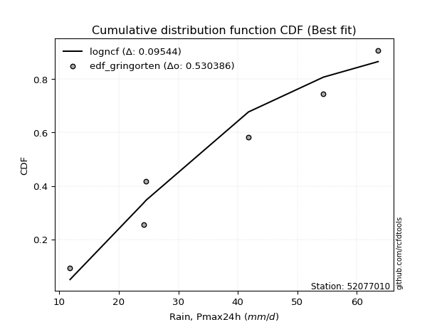</img>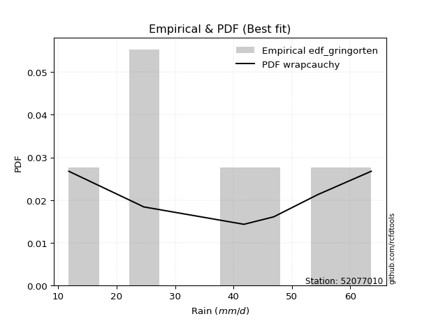</img>

</div>


### 9. EDF Filliben (1975)

The specific values of the constants (0.3175) (often denoted as $alpha$) and (0.365) are derived from a method proposed by James J. Filliben in a 1975 paper. This particular formula is the mean value of the $i$-th order statistic of the normal distribution and is considered a robust and effective plotting position formula for the normal probability plot correlation coefficient test for normality.

<div align="center">


$P=(m-0.3175)/(n+0.365)$


</div>


**9.1. Empirical values**

<div align="center">

|                | 0                   | 1                   | 2                   | 3            | 4                  | 5                  | 6                  |
|:---------------|:--------------------|:--------------------|:--------------------|:-------------|:-------------------|:-------------------|:-------------------|
| date           | 2018                | 2022                | 2019                | 2017         | 2025               | 2020               | 2024               |
| x              | 11.8                | 24.2                | 24.6                | 41.8         | 46.9               | 54.4               | 63.6               |
| m              | 1                   | 2                   | 3                   | 4            | 5                  | 6                  | 7                  |
| empirical_dist | edf_filliben        | edf_filliben        | edf_filliben        | edf_filliben | edf_filliben       | edf_filliben       | edf_filliben       |
| empirical      | 0.09266802443991853 | 0.22844534962661237 | 0.36422267481330617 | 0.5          | 0.6357773251866938 | 0.7715546503733877 | 0.9073319755600815 |
| empirical_tr   | 1.1021324354657687  | 1.2960844698636163  | 1.5728777362520021  | 2.0          | 2.7455731593662627 | 4.377414561664191  | 10.791208791208794 |

</div>


**9.2. Kolmogorov-Smirnov fit test (sorted by Δ)**


<div align="center">

|                | 0                   | 1                   | 2                   | 3                   | 4                   | 5                   | 6                   | 7                   | 8                   | 9                   | 10                  | 11                  | 12                  | 13                  | 14                  | 15                  | 16                  | 17                  | 18                  | 19                  | 20                  | 21                  | 22                  | 23                  | 24                  | 25                  | 26                  | 27                  | 28                  | 29                  | 30                  | 31                  | 32                  | 33                  | 34                  | 35                  | 36                  | 37                  | 38                  | 39                  | 40                  | 41                  | 42                  | 43                  | 44                  | 45                  | 46                  | 47                  | 48                  | 49                  | 50                  | 51                  | 52                  | 53                  | 54                  | 55                  | 56                  | 57                  | 58                  | 59                  | 60                  | 61                  | 62                  | 63                  | 64                  | 65                  | 66                  | 67                  | 68                  | 69                  | 70                  | 71                  | 72                  | 73                  | 74                  | 75                  | 76                  | 77                  | 78                  | 79                  | 80                  | 81                  | 82                  | 83                  | 84                  | 85                  | 86                  | 87                  | 88                  | 89                  | 90                  | 91                  | 92                  | 93                  | 94                  | 95                  | 96                  | 97                  | 98                  | 99                  | 100                 | 101                 | 102                 | 103                 | 104                 | 105                 | 106                 | 107                 | 108                 | 109                 | 110                 | 111                 | 112                 | 113                 | 114                 | 115                 | 116                 | 117                 | 118                 | 119                 | 120                 | 121                 | 122                 | 123                 | 124                 | 125                 | 126                 | 127                 | 128                 | 129                 | 130                 | 131                 | 132                 | 133                 | 134                 | 135                 | 136                 | 137                 | 138                 | 139                 | 140                 | 141                 | 142                 | 143                 | 144                 | 145                 | 146                 | 147                 | 148                 | 149                 | 150                 | 151                 | 152                 | 153                 | 154                 | 155                 | 156                 | 157                 | 158                 | 159                 |
|:---------------|:--------------------|:--------------------|:--------------------|:--------------------|:--------------------|:--------------------|:--------------------|:--------------------|:--------------------|:--------------------|:--------------------|:--------------------|:--------------------|:--------------------|:--------------------|:--------------------|:--------------------|:--------------------|:--------------------|:--------------------|:--------------------|:--------------------|:--------------------|:--------------------|:--------------------|:--------------------|:--------------------|:--------------------|:--------------------|:--------------------|:--------------------|:--------------------|:--------------------|:--------------------|:--------------------|:--------------------|:--------------------|:--------------------|:--------------------|:--------------------|:--------------------|:--------------------|:--------------------|:--------------------|:--------------------|:--------------------|:--------------------|:--------------------|:--------------------|:--------------------|:--------------------|:--------------------|:--------------------|:--------------------|:--------------------|:--------------------|:--------------------|:--------------------|:--------------------|:--------------------|:--------------------|:--------------------|:--------------------|:--------------------|:--------------------|:--------------------|:--------------------|:--------------------|:--------------------|:--------------------|:--------------------|:--------------------|:--------------------|:--------------------|:--------------------|:--------------------|:--------------------|:--------------------|:--------------------|:--------------------|:--------------------|:--------------------|:--------------------|:--------------------|:--------------------|:--------------------|:--------------------|:--------------------|:--------------------|:--------------------|:--------------------|:--------------------|:--------------------|:--------------------|:--------------------|:--------------------|:--------------------|:--------------------|:--------------------|:--------------------|:--------------------|:--------------------|:--------------------|:--------------------|:--------------------|:--------------------|:--------------------|:--------------------|:--------------------|:--------------------|:--------------------|:--------------------|:--------------------|:--------------------|:--------------------|:--------------------|:--------------------|:--------------------|:--------------------|:--------------------|:--------------------|:--------------------|:--------------------|:--------------------|:--------------------|:--------------------|:--------------------|:--------------------|:--------------------|:--------------------|:--------------------|:--------------------|:--------------------|:--------------------|:--------------------|:--------------------|:--------------------|:--------------------|:--------------------|:--------------------|:--------------------|:--------------------|:--------------------|:--------------------|:--------------------|:--------------------|:--------------------|:--------------------|:--------------------|:--------------------|:--------------------|:--------------------|:--------------------|:--------------------|:--------------------|:--------------------|:--------------------|:--------------------|:--------------------|:--------------------|
| station        | 52077010            | 52077010            | 52077010            | 52077010            | 52077010            | 52077010            | 52077010            | 52077010            | 52077010            | 52077010            | 52077010            | 52077010            | 52077010            | 52077010            | 52077010            | 52077010            | 52077010            | 52077010            | 52077010            | 52077010            | 52077010            | 52077010            | 52077010            | 52077010            | 52077010            | 52077010            | 52077010            | 52077010            | 52077010            | 52077010            | 52077010            | 52077010            | 52077010            | 52077010            | 52077010            | 52077010            | 52077010            | 52077010            | 52077010            | 52077010            | 52077010            | 52077010            | 52077010            | 52077010            | 52077010            | 52077010            | 52077010            | 52077010            | 52077010            | 52077010            | 52077010            | 52077010            | 52077010            | 52077010            | 52077010            | 52077010            | 52077010            | 52077010            | 52077010            | 52077010            | 52077010            | 52077010            | 52077010            | 52077010            | 52077010            | 52077010            | 52077010            | 52077010            | 52077010            | 52077010            | 52077010            | 52077010            | 52077010            | 52077010            | 52077010            | 52077010            | 52077010            | 52077010            | 52077010            | 52077010            | 52077010            | 52077010            | 52077010            | 52077010            | 52077010            | 52077010            | 52077010            | 52077010            | 52077010            | 52077010            | 52077010            | 52077010            | 52077010            | 52077010            | 52077010            | 52077010            | 52077010            | 52077010            | 52077010            | 52077010            | 52077010            | 52077010            | 52077010            | 52077010            | 52077010            | 52077010            | 52077010            | 52077010            | 52077010            | 52077010            | 52077010            | 52077010            | 52077010            | 52077010            | 52077010            | 52077010            | 52077010            | 52077010            | 52077010            | 52077010            | 52077010            | 52077010            | 52077010            | 52077010            | 52077010            | 52077010            | 52077010            | 52077010            | 52077010            | 52077010            | 52077010            | 52077010            | 52077010            | 52077010            | 52077010            | 52077010            | 52077010            | 52077010            | 52077010            | 52077010            | 52077010            | 52077010            | 52077010            | 52077010            | 52077010            | 52077010            | 52077010            | 52077010            | 52077010            | 52077010            | 52077010            | 52077010            | 52077010            | 52077010            | 52077010            | 52077010            | 52077010            | 52077010            | 52077010            | 52077010            |
| empirical_dist | edf_filliben        | edf_filliben        | edf_filliben        | edf_filliben        | edf_filliben        | edf_filliben        | edf_filliben        | edf_filliben        | edf_filliben        | edf_filliben        | edf_filliben        | edf_filliben        | edf_filliben        | edf_filliben        | edf_filliben        | edf_filliben        | edf_filliben        | edf_filliben        | edf_filliben        | edf_filliben        | edf_filliben        | edf_filliben        | edf_filliben        | edf_filliben        | edf_filliben        | edf_filliben        | edf_filliben        | edf_filliben        | edf_filliben        | edf_filliben        | edf_filliben        | edf_filliben        | edf_filliben        | edf_filliben        | edf_filliben        | edf_filliben        | edf_filliben        | edf_filliben        | edf_filliben        | edf_filliben        | edf_filliben        | edf_filliben        | edf_filliben        | edf_filliben        | edf_filliben        | edf_filliben        | edf_filliben        | edf_filliben        | edf_filliben        | edf_filliben        | edf_filliben        | edf_filliben        | edf_filliben        | edf_filliben        | edf_filliben        | edf_filliben        | edf_filliben        | edf_filliben        | edf_filliben        | edf_filliben        | edf_filliben        | edf_filliben        | edf_filliben        | edf_filliben        | edf_filliben        | edf_filliben        | edf_filliben        | edf_filliben        | edf_filliben        | edf_filliben        | edf_filliben        | edf_filliben        | edf_filliben        | edf_filliben        | edf_filliben        | edf_filliben        | edf_filliben        | edf_filliben        | edf_filliben        | edf_filliben        | edf_filliben        | edf_filliben        | edf_filliben        | edf_filliben        | edf_filliben        | edf_filliben        | edf_filliben        | edf_filliben        | edf_filliben        | edf_filliben        | edf_filliben        | edf_filliben        | edf_filliben        | edf_filliben        | edf_filliben        | edf_filliben        | edf_filliben        | edf_filliben        | edf_filliben        | edf_filliben        | edf_filliben        | edf_filliben        | edf_filliben        | edf_filliben        | edf_filliben        | edf_filliben        | edf_filliben        | edf_filliben        | edf_filliben        | edf_filliben        | edf_filliben        | edf_filliben        | edf_filliben        | edf_filliben        | edf_filliben        | edf_filliben        | edf_filliben        | edf_filliben        | edf_filliben        | edf_filliben        | edf_filliben        | edf_filliben        | edf_filliben        | edf_filliben        | edf_filliben        | edf_filliben        | edf_filliben        | edf_filliben        | edf_filliben        | edf_filliben        | edf_filliben        | edf_filliben        | edf_filliben        | edf_filliben        | edf_filliben        | edf_filliben        | edf_filliben        | edf_filliben        | edf_filliben        | edf_filliben        | edf_filliben        | edf_filliben        | edf_filliben        | edf_filliben        | edf_filliben        | edf_filliben        | edf_filliben        | edf_filliben        | edf_filliben        | edf_filliben        | edf_filliben        | edf_filliben        | edf_filliben        | edf_filliben        | edf_filliben        | edf_filliben        | edf_filliben        | edf_filliben        | edf_filliben        | edf_filliben        |
| p_dist         | logtrapezoid        | ksone               | wrapcauchy          | logbeta             | arcsine             | loggenhalflogistic  | kappa4              | beta                | semicircular        | tukeylambda         | bradford            | truncweibull_min    | genpareto           | vonmises_line       | uniform             | logskewnorm         | logpearson3         | anglit              | loggengamma         | invgauss            | loggumbel_l         | dweibull            | logburr             | rayleigh            | logsemicircular     | gausshyper          | loggompertz         | logtriang           | logargus            | invgamma            | genlogistic         | logarcsine          | maxwell             | logmielke           | weibull_min         | loganglit           | logweibull_min      | rice                | burr                | alpha               | logloggamma         | kappa3              | mielke              | logexponweib        | dgamma              | betaprime           | kstwobign           | logjohnsonsu        | logburr12           | halfnorm            | ncf                 | gamma               | erlang              | cosine              | loggenextreme       | johnsonsu           | nct                 | t                   | exponnorm           | truncnorm           | crystalball         | norm                | skewnorm            | f                   | pearson3            | gumbel_r            | logdgamma           | logcrystalball      | gompertz            | logt                | lognorm             | logexponnorm        | logf                | genextreme          | logfatiguelife      | lognct              | logdweibull         | logncf              | logfoldnorm         | logrice             | loginvweibull       | loggamma            | loggamma            | logbetaprime        | loggenpareto        | loginvgauss         | loginvgamma         | logalpha            | logerlang           | argus               | logistic            | halflogistic        | moyal               | loglogistic         | burr12              | logmaxwell          | loglevy_l           | genexpon            | gumbel_l            | logkstwobign        | lomax               | lograyleigh         | hypsecant           | triang              | genhalflogistic     | truncexpon          | logcosine           | loghypsecant        | loggenexpon         | laplace             | logjohnsonsb        | loghalfnorm         | logkappa4           | logloglaplace       | logksone            | loggumbel_r         | loglaplace          | loglaplace          | logrdist            | loghalflogistic     | loghalfgennorm      | logmoyal            | logtukeylambda      | logwrapcauchy       | levy_l              | logbradford         | logkappa3           | loguniform          | lognakagami         | logvonmises_line    | halfgennorm         | nakagami            | gennorm             | loggennorm          | loglomax            | trapezoid           | logwald             | wald                | loggausshyper       | logtruncweibull_min | logtruncexpon       | logtruncnorm        | logweibull_max      | exponweib           | logexponpow         | invweibull          | exponpow            | foldnorm            | fatiguelife         | gengamma            | powerlaw            | johnsonsb           | weibull_max         | logpowerlaw         | truncpareto         | logtruncpareto      | rdist               | loggenlogistic      | logvonmises         | vonmises            |
| delta          | 0.0800012063233344  | 0.09205683966376088 | 0.0926680239096559  | 0.0926680241979021  | 0.09266802443991853 | 0.09384759488102162 | 0.10255219728543613 | 0.10340846484738303 | 0.10876401424257859 | 0.1108509643233695  | 0.11177305179851693 | 0.11359628172014236 | 0.11374704623420206 | 0.11475740417280797 | 0.11711842770905903 | 0.11830282800568592 | 0.1209372305552231  | 0.12110972632671244 | 0.1248536831441052  | 0.12505744035500865 | 0.12623701569128806 | 0.12645595500008874 | 0.12651917882587016 | 0.12681258517594973 | 0.12730415733093936 | 0.12976904203761416 | 0.12999917673308525 | 0.1308499817256331  | 0.13135101557199047 | 0.1326501283647124  | 0.13267343462523273 | 0.13317434631303623 | 0.13341986354628024 | 0.1339559167831905  | 0.13514609535570676 | 0.1359158283736689  | 0.13804930353656616 | 0.13811972815462203 | 0.13844449906222303 | 0.13849923399543757 | 0.13877231797999667 | 0.14076072920600335 | 0.1410079841045311  | 0.14200000337309482 | 0.14206185622938747 | 0.14220191093162818 | 0.1430287115733173  | 0.14327266885338852 | 0.1446966972296702  | 0.14475024397635794 | 0.14540021240192835 | 0.14756637362567876 | 0.14764802067331617 | 0.1477389689423907  | 0.14869579609815056 | 0.1489329384692165  | 0.1491404586528341  | 0.14923600374263385 | 0.14923668429512194 | 0.14923700084060898 | 0.14923700232294929 | 0.14923700523410066 | 0.14935132611559054 | 0.14978526247936866 | 0.15040015260982054 | 0.1512184416377791  | 0.15197740526209505 | 0.15627362260298516 | 0.15633531707650097 | 0.15640477496566318 | 0.15640638022971753 | 0.15640822304901647 | 0.15698202099844327 | 0.15716605577632844 | 0.15728848898423886 | 0.15739572031534177 | 0.15820322348155644 | 0.1588268561149584  | 0.15930321155882798 | 0.1606762462511413  | 0.16142387808732217 | 0.1616292034807778  | 0.1616292034807778  | 0.1617487736176455  | 0.16208260672093097 | 0.1633833166596681  | 0.164152358182595   | 0.16440979665404665 | 0.16442157662962886 | 0.16741866864514243 | 0.17136137950396502 | 0.17285368994522687 | 0.1747598693608634  | 0.17488687291322336 | 0.1763764749627783  | 0.17735099806011823 | 0.17935039479619116 | 0.17943284436282692 | 0.17965525040090827 | 0.18220696959298488 | 0.1828581365102151  | 0.1836254408410103  | 0.18484886985463078 | 0.18524669888244258 | 0.18596108103986342 | 0.18714436504503285 | 0.18764665330008456 | 0.18911643429273883 | 0.18952931070872392 | 0.2004542806936187  | 0.20170168279511136 | 0.20194651476099656 | 0.2040903120723272  | 0.20652551057458654 | 0.2102096213591316  | 0.21534810886227984 | 0.21708698498277101 | 0.21708698498277101 | 0.22578596899185424 | 0.2299596483185592  | 0.23176009715411883 | 0.23478483010149764 | 0.24439005733317032 | 0.24662073522151476 | 0.24687893052950757 | 0.2507670707952704  | 0.2508366225749513  | 0.250837840442087   | 0.25411285946391104 | 0.2543536624451095  | 0.26825950249460995 | 0.2707978512879369  | 0.27155465037338766 | 0.27155465037338766 | 0.2728354350969491  | 0.2805550648426074  | 0.29005208465578514 | 0.29055921536859436 | 0.29198776976184004 | 0.2953965229959852  | 0.3222159216236352  | 0.3256265811529579  | 0.3706660823746007  | 0.39060395469687903 | 0.4352396216151533  | 0.4681757278702875  | 0.48915125392072145 | 0.5                 | 0.5373683018424891  | 0.5461363309326688  | 0.5589528350753897  | 0.5767795927619245  | 0.5967596270545505  | 0.6267234331220826  | 0.6667605468663239  | 0.7080932297691542  | 0.7278809861919084  | 0.7715546503733877  | 1.147614279786524   | 10.023095305696698  |
| deltao         | 0.48442053926100004 | 0.48442053926100004 | 0.48442053926100004 | 0.48442053926100004 | 0.48442053926100004 | 0.48442053926100004 | 0.48442053926100004 | 0.48442053926100004 | 0.48442053926100004 | 0.48442053926100004 | 0.48442053926100004 | 0.48442053926100004 | 0.48442053926100004 | 0.48442053926100004 | 0.48442053926100004 | 0.48442053926100004 | 0.48442053926100004 | 0.48442053926100004 | 0.48442053926100004 | 0.48442053926100004 | 0.48442053926100004 | 0.48442053926100004 | 0.48442053926100004 | 0.48442053926100004 | 0.48442053926100004 | 0.48442053926100004 | 0.48442053926100004 | 0.48442053926100004 | 0.48442053926100004 | 0.48442053926100004 | 0.48442053926100004 | 0.48442053926100004 | 0.48442053926100004 | 0.48442053926100004 | 0.48442053926100004 | 0.48442053926100004 | 0.48442053926100004 | 0.48442053926100004 | 0.48442053926100004 | 0.48442053926100004 | 0.48442053926100004 | 0.48442053926100004 | 0.48442053926100004 | 0.48442053926100004 | 0.48442053926100004 | 0.48442053926100004 | 0.48442053926100004 | 0.48442053926100004 | 0.48442053926100004 | 0.48442053926100004 | 0.48442053926100004 | 0.48442053926100004 | 0.48442053926100004 | 0.48442053926100004 | 0.48442053926100004 | 0.48442053926100004 | 0.48442053926100004 | 0.48442053926100004 | 0.48442053926100004 | 0.48442053926100004 | 0.48442053926100004 | 0.48442053926100004 | 0.48442053926100004 | 0.48442053926100004 | 0.48442053926100004 | 0.48442053926100004 | 0.48442053926100004 | 0.48442053926100004 | 0.48442053926100004 | 0.48442053926100004 | 0.48442053926100004 | 0.48442053926100004 | 0.48442053926100004 | 0.48442053926100004 | 0.48442053926100004 | 0.48442053926100004 | 0.48442053926100004 | 0.48442053926100004 | 0.48442053926100004 | 0.48442053926100004 | 0.48442053926100004 | 0.48442053926100004 | 0.48442053926100004 | 0.48442053926100004 | 0.48442053926100004 | 0.48442053926100004 | 0.48442053926100004 | 0.48442053926100004 | 0.48442053926100004 | 0.48442053926100004 | 0.48442053926100004 | 0.48442053926100004 | 0.48442053926100004 | 0.48442053926100004 | 0.48442053926100004 | 0.48442053926100004 | 0.48442053926100004 | 0.48442053926100004 | 0.48442053926100004 | 0.48442053926100004 | 0.48442053926100004 | 0.48442053926100004 | 0.48442053926100004 | 0.48442053926100004 | 0.48442053926100004 | 0.48442053926100004 | 0.48442053926100004 | 0.48442053926100004 | 0.48442053926100004 | 0.48442053926100004 | 0.48442053926100004 | 0.48442053926100004 | 0.48442053926100004 | 0.48442053926100004 | 0.48442053926100004 | 0.48442053926100004 | 0.48442053926100004 | 0.48442053926100004 | 0.48442053926100004 | 0.48442053926100004 | 0.48442053926100004 | 0.48442053926100004 | 0.48442053926100004 | 0.48442053926100004 | 0.48442053926100004 | 0.48442053926100004 | 0.48442053926100004 | 0.48442053926100004 | 0.48442053926100004 | 0.48442053926100004 | 0.48442053926100004 | 0.48442053926100004 | 0.48442053926100004 | 0.48442053926100004 | 0.48442053926100004 | 0.48442053926100004 | 0.48442053926100004 | 0.48442053926100004 | 0.48442053926100004 | 0.48442053926100004 | 0.48442053926100004 | 0.48442053926100004 | 0.48442053926100004 | 0.48442053926100004 | 0.48442053926100004 | 0.48442053926100004 | 0.48442053926100004 | 0.48442053926100004 | 0.48442053926100004 | 0.48442053926100004 | 0.48442053926100004 | 0.48442053926100004 | 0.48442053926100004 | 0.48442053926100004 | 0.48442053926100004 | 0.48442053926100004 | 0.48442053926100004 | 0.48442053926100004 | 0.48442053926100004 | 0.48442053926100004 |
| eval           | Δo > Δ              | Δo > Δ              | Δo > Δ              | Δo > Δ              | Δo > Δ              | Δo > Δ              | Δo > Δ              | Δo > Δ              | Δo > Δ              | Δo > Δ              | Δo > Δ              | Δo > Δ              | Δo > Δ              | Δo > Δ              | Δo > Δ              | Δo > Δ              | Δo > Δ              | Δo > Δ              | Δo > Δ              | Δo > Δ              | Δo > Δ              | Δo > Δ              | Δo > Δ              | Δo > Δ              | Δo > Δ              | Δo > Δ              | Δo > Δ              | Δo > Δ              | Δo > Δ              | Δo > Δ              | Δo > Δ              | Δo > Δ              | Δo > Δ              | Δo > Δ              | Δo > Δ              | Δo > Δ              | Δo > Δ              | Δo > Δ              | Δo > Δ              | Δo > Δ              | Δo > Δ              | Δo > Δ              | Δo > Δ              | Δo > Δ              | Δo > Δ              | Δo > Δ              | Δo > Δ              | Δo > Δ              | Δo > Δ              | Δo > Δ              | Δo > Δ              | Δo > Δ              | Δo > Δ              | Δo > Δ              | Δo > Δ              | Δo > Δ              | Δo > Δ              | Δo > Δ              | Δo > Δ              | Δo > Δ              | Δo > Δ              | Δo > Δ              | Δo > Δ              | Δo > Δ              | Δo > Δ              | Δo > Δ              | Δo > Δ              | Δo > Δ              | Δo > Δ              | Δo > Δ              | Δo > Δ              | Δo > Δ              | Δo > Δ              | Δo > Δ              | Δo > Δ              | Δo > Δ              | Δo > Δ              | Δo > Δ              | Δo > Δ              | Δo > Δ              | Δo > Δ              | Δo > Δ              | Δo > Δ              | Δo > Δ              | Δo > Δ              | Δo > Δ              | Δo > Δ              | Δo > Δ              | Δo > Δ              | Δo > Δ              | Δo > Δ              | Δo > Δ              | Δo > Δ              | Δo > Δ              | Δo > Δ              | Δo > Δ              | Δo > Δ              | Δo > Δ              | Δo > Δ              | Δo > Δ              | Δo > Δ              | Δo > Δ              | Δo > Δ              | Δo > Δ              | Δo > Δ              | Δo > Δ              | Δo > Δ              | Δo > Δ              | Δo > Δ              | Δo > Δ              | Δo > Δ              | Δo > Δ              | Δo > Δ              | Δo > Δ              | Δo > Δ              | Δo > Δ              | Δo > Δ              | Δo > Δ              | Δo > Δ              | Δo > Δ              | Δo > Δ              | Δo > Δ              | Δo > Δ              | Δo > Δ              | Δo > Δ              | Δo > Δ              | Δo > Δ              | Δo > Δ              | Δo > Δ              | Δo > Δ              | Δo > Δ              | Δo > Δ              | Δo > Δ              | Δo > Δ              | Δo > Δ              | Δo > Δ              | Δo > Δ              | Δo > Δ              | Δo > Δ              | Δo > Δ              | Δo > Δ              | Δo > Δ              | Δo > Δ              | Δo > Δ              | Δo > Δ              | Δo > Δ              | Δo <= Δ             | Δo <= Δ             | Δo <= Δ             | Δo <= Δ             | Δo <= Δ             | Δo <= Δ             | Δo <= Δ             | Δo <= Δ             | Δo <= Δ             | Δo <= Δ             | Δo <= Δ             | Δo <= Δ             | Δo <= Δ             | Δo <= Δ             |
| fit            | 1                   | 1                   | 1                   | 1                   | 1                   | 1                   | 1                   | 1                   | 1                   | 1                   | 1                   | 1                   | 1                   | 1                   | 1                   | 1                   | 1                   | 1                   | 1                   | 1                   | 1                   | 1                   | 1                   | 1                   | 1                   | 1                   | 1                   | 1                   | 1                   | 1                   | 1                   | 1                   | 1                   | 1                   | 1                   | 1                   | 1                   | 1                   | 1                   | 1                   | 1                   | 1                   | 1                   | 1                   | 1                   | 1                   | 1                   | 1                   | 1                   | 1                   | 1                   | 1                   | 1                   | 1                   | 1                   | 1                   | 1                   | 1                   | 1                   | 1                   | 1                   | 1                   | 1                   | 1                   | 1                   | 1                   | 1                   | 1                   | 1                   | 1                   | 1                   | 1                   | 1                   | 1                   | 1                   | 1                   | 1                   | 1                   | 1                   | 1                   | 1                   | 1                   | 1                   | 1                   | 1                   | 1                   | 1                   | 1                   | 1                   | 1                   | 1                   | 1                   | 1                   | 1                   | 1                   | 1                   | 1                   | 1                   | 1                   | 1                   | 1                   | 1                   | 1                   | 1                   | 1                   | 1                   | 1                   | 1                   | 1                   | 1                   | 1                   | 1                   | 1                   | 1                   | 1                   | 1                   | 1                   | 1                   | 1                   | 1                   | 1                   | 1                   | 1                   | 1                   | 1                   | 1                   | 1                   | 1                   | 1                   | 1                   | 1                   | 1                   | 1                   | 1                   | 1                   | 1                   | 1                   | 1                   | 1                   | 1                   | 1                   | 1                   | 1                   | 1                   | 1                   | 1                   | 0                   | 0                   | 0                   | 0                   | 0                   | 0                   | 0                   | 0                   | 0                   | 0                   | 0                   | 0                   | 0                   | 0                   |
| n              | 7                   | 7                   | 7                   | 7                   | 7                   | 7                   | 7                   | 7                   | 7                   | 7                   | 7                   | 7                   | 7                   | 7                   | 7                   | 7                   | 7                   | 7                   | 7                   | 7                   | 7                   | 7                   | 7                   | 7                   | 7                   | 7                   | 7                   | 7                   | 7                   | 7                   | 7                   | 7                   | 7                   | 7                   | 7                   | 7                   | 7                   | 7                   | 7                   | 7                   | 7                   | 7                   | 7                   | 7                   | 7                   | 7                   | 7                   | 7                   | 7                   | 7                   | 7                   | 7                   | 7                   | 7                   | 7                   | 7                   | 7                   | 7                   | 7                   | 7                   | 7                   | 7                   | 7                   | 7                   | 7                   | 7                   | 7                   | 7                   | 7                   | 7                   | 7                   | 7                   | 7                   | 7                   | 7                   | 7                   | 7                   | 7                   | 7                   | 7                   | 7                   | 7                   | 7                   | 7                   | 7                   | 7                   | 7                   | 7                   | 7                   | 7                   | 7                   | 7                   | 7                   | 7                   | 7                   | 7                   | 7                   | 7                   | 7                   | 7                   | 7                   | 7                   | 7                   | 7                   | 7                   | 7                   | 7                   | 7                   | 7                   | 7                   | 7                   | 7                   | 7                   | 7                   | 7                   | 7                   | 7                   | 7                   | 7                   | 7                   | 7                   | 7                   | 7                   | 7                   | 7                   | 7                   | 7                   | 7                   | 7                   | 7                   | 7                   | 7                   | 7                   | 7                   | 7                   | 7                   | 7                   | 7                   | 7                   | 7                   | 7                   | 7                   | 7                   | 7                   | 7                   | 7                   | 7                   | 7                   | 7                   | 7                   | 7                   | 7                   | 7                   | 7                   | 7                   | 7                   | 7                   | 7                   | 7                   | 7                   |
| best_fit       | 1                   | 0                   | 0                   | 0                   | 0                   | 0                   | 0                   | 0                   | 0                   | 0                   | 0                   | 0                   | 0                   | 0                   | 0                   | 0                   | 0                   | 0                   | 0                   | 0                   | 0                   | 0                   | 0                   | 0                   | 0                   | 0                   | 0                   | 0                   | 0                   | 0                   | 0                   | 0                   | 0                   | 0                   | 0                   | 0                   | 0                   | 0                   | 0                   | 0                   | 0                   | 0                   | 0                   | 0                   | 0                   | 0                   | 0                   | 0                   | 0                   | 0                   | 0                   | 0                   | 0                   | 0                   | 0                   | 0                   | 0                   | 0                   | 0                   | 0                   | 0                   | 0                   | 0                   | 0                   | 0                   | 0                   | 0                   | 0                   | 0                   | 0                   | 0                   | 0                   | 0                   | 0                   | 0                   | 0                   | 0                   | 0                   | 0                   | 0                   | 0                   | 0                   | 0                   | 0                   | 0                   | 0                   | 0                   | 0                   | 0                   | 0                   | 0                   | 0                   | 0                   | 0                   | 0                   | 0                   | 0                   | 0                   | 0                   | 0                   | 0                   | 0                   | 0                   | 0                   | 0                   | 0                   | 0                   | 0                   | 0                   | 0                   | 0                   | 0                   | 0                   | 0                   | 0                   | 0                   | 0                   | 0                   | 0                   | 0                   | 0                   | 0                   | 0                   | 0                   | 0                   | 0                   | 0                   | 0                   | 0                   | 0                   | 0                   | 0                   | 0                   | 0                   | 0                   | 0                   | 0                   | 0                   | 0                   | 0                   | 0                   | 0                   | 0                   | 0                   | 0                   | 0                   | 0                   | 0                   | 0                   | 0                   | 0                   | 0                   | 0                   | 0                   | 0                   | 0                   | 0                   | 0                   | 0                   | 0                   |
| best_fit_sort  | 1                   | 2                   | 3                   | 4                   | 5                   | 6                   | 7                   | 8                   | 9                   | 10                  | 11                  | 12                  | 13                  | 14                  | 15                  | 16                  | 17                  | 18                  | 19                  | 20                  | 21                  | 22                  | 23                  | 24                  | 25                  | 26                  | 27                  | 28                  | 29                  | 30                  | 31                  | 32                  | 33                  | 34                  | 35                  | 36                  | 37                  | 38                  | 39                  | 40                  | 41                  | 42                  | 43                  | 44                  | 45                  | 46                  | 47                  | 48                  | 49                  | 50                  | 51                  | 52                  | 53                  | 54                  | 55                  | 56                  | 57                  | 58                  | 59                  | 60                  | 61                  | 62                  | 63                  | 64                  | 65                  | 66                  | 67                  | 68                  | 69                  | 70                  | 71                  | 72                  | 73                  | 74                  | 75                  | 76                  | 77                  | 78                  | 79                  | 80                  | 81                  | 82                  | 83                  | 84                  | 85                  | 86                  | 87                  | 88                  | 89                  | 90                  | 91                  | 92                  | 93                  | 94                  | 95                  | 96                  | 97                  | 98                  | 99                  | 100                 | 101                 | 102                 | 103                 | 104                 | 105                 | 106                 | 107                 | 108                 | 109                 | 110                 | 111                 | 112                 | 113                 | 114                 | 115                 | 116                 | 117                 | 118                 | 119                 | 120                 | 121                 | 122                 | 123                 | 124                 | 125                 | 126                 | 127                 | 128                 | 129                 | 130                 | 131                 | 132                 | 133                 | 134                 | 135                 | 136                 | 137                 | 138                 | 139                 | 140                 | 141                 | 142                 | 143                 | 144                 | 145                 | 146                 | 147                 | 148                 | 149                 | 150                 | 151                 | 152                 | 153                 | 154                 | 155                 | 156                 | 157                 | 158                 | 159                 | 160                 |

</div>


**9.3. Best fit**

<div align="center">

|   id |   station | empirical_dist   | p_dist       |     delta |   deltao | eval   |   fit |   n |   best_fit |   best_fit_sort |
|-----:|----------:|:-----------------|:-------------|----------:|---------:|:-------|------:|----:|-----------:|----------------:|
|    0 |  52077010 | edf_filliben     | logtrapezoid | 0.0800012 | 0.484421 | Δo > Δ |     1 |   7 |          1 |               1 |

</div>


<div align="center">

</img>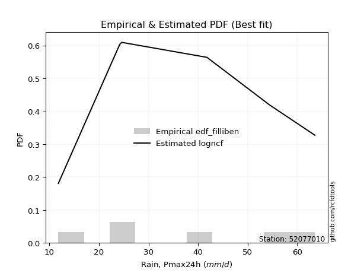</img>

</div>


### 10. EDF Jenkinson (1977)

The Jenkinson formula in hydrology is an empirical plotting position formula used to estimate the non-exceedance probability _(P)_ or return period _(T)_ of a given ordered observation within a sample. It is a widely used method in the frequency analysis of extreme events such as floods and rainfall, as it provides a distribution-free way to plot data. _a≈0.31_ and _b≈0.38_ are constants derived to approximate the median of the probability distribution for the given rank.

<div align="center">


$P=(m-a)/(n+b)$


</div>


**10.1. Empirical values**

<div align="center">

|                | 0                   | 1                   | 2                   | 3             | 4                  | 5                  | 6                  |
|:---------------|:--------------------|:--------------------|:--------------------|:--------------|:-------------------|:-------------------|:-------------------|
| date           | 2018                | 2022                | 2019                | 2017          | 2025               | 2020               | 2024               |
| x              | 11.8                | 24.2                | 24.6                | 41.8          | 46.9               | 54.4               | 63.6               |
| m              | 1                   | 2                   | 3                   | 4             | 5                  | 6                  | 7                  |
| empirical_dist | edf_jenkinson       | edf_jenkinson       | edf_jenkinson       | edf_jenkinson | edf_jenkinson      | edf_jenkinson      | edf_jenkinson      |
| empirical      | 0.09349593495934959 | 0.22899728997289973 | 0.36449864498644985 | 0.5           | 0.6355013550135502 | 0.7710027100271003 | 0.9065040650406505 |
| empirical_tr   | 1.1031390134529149  | 1.29701230228471    | 1.5735607675906182  | 2.0           | 2.743494423791822  | 4.366863905325444  | 10.695652173913055 |

</div>


**10.2. Kolmogorov-Smirnov fit test (sorted by Δ)**


<div align="center">

|                | 0                   | 1                   | 2                   | 3                   | 4                   | 5                   | 6                   | 7                   | 8                   | 9                   | 10                  | 11                  | 12                  | 13                  | 14                  | 15                  | 16                  | 17                  | 18                  | 19                  | 20                  | 21                  | 22                  | 23                  | 24                  | 25                  | 26                  | 27                  | 28                  | 29                  | 30                  | 31                  | 32                  | 33                  | 34                  | 35                  | 36                  | 37                  | 38                  | 39                  | 40                  | 41                  | 42                  | 43                  | 44                  | 45                  | 46                  | 47                  | 48                  | 49                  | 50                  | 51                  | 52                  | 53                  | 54                  | 55                  | 56                  | 57                  | 58                  | 59                  | 60                  | 61                  | 62                  | 63                  | 64                  | 65                  | 66                  | 67                  | 68                  | 69                  | 70                  | 71                  | 72                  | 73                  | 74                  | 75                  | 76                  | 77                  | 78                  | 79                  | 80                  | 81                  | 82                  | 83                  | 84                  | 85                  | 86                  | 87                  | 88                  | 89                  | 90                  | 91                  | 92                  | 93                  | 94                  | 95                  | 96                  | 97                  | 98                  | 99                  | 100                 | 101                 | 102                 | 103                 | 104                 | 105                 | 106                 | 107                 | 108                 | 109                 | 110                 | 111                 | 112                 | 113                 | 114                 | 115                 | 116                 | 117                 | 118                 | 119                 | 120                 | 121                 | 122                 | 123                 | 124                 | 125                 | 126                 | 127                 | 128                 | 129                 | 130                 | 131                 | 132                 | 133                 | 134                 | 135                 | 136                 | 137                 | 138                 | 139                 | 140                 | 141                 | 142                 | 143                 | 144                 | 145                 | 146                 | 147                 | 148                 | 149                 | 150                 | 151                 | 152                 | 153                 | 154                 | 155                 | 156                 | 157                 | 158                 | 159                 |
|:---------------|:--------------------|:--------------------|:--------------------|:--------------------|:--------------------|:--------------------|:--------------------|:--------------------|:--------------------|:--------------------|:--------------------|:--------------------|:--------------------|:--------------------|:--------------------|:--------------------|:--------------------|:--------------------|:--------------------|:--------------------|:--------------------|:--------------------|:--------------------|:--------------------|:--------------------|:--------------------|:--------------------|:--------------------|:--------------------|:--------------------|:--------------------|:--------------------|:--------------------|:--------------------|:--------------------|:--------------------|:--------------------|:--------------------|:--------------------|:--------------------|:--------------------|:--------------------|:--------------------|:--------------------|:--------------------|:--------------------|:--------------------|:--------------------|:--------------------|:--------------------|:--------------------|:--------------------|:--------------------|:--------------------|:--------------------|:--------------------|:--------------------|:--------------------|:--------------------|:--------------------|:--------------------|:--------------------|:--------------------|:--------------------|:--------------------|:--------------------|:--------------------|:--------------------|:--------------------|:--------------------|:--------------------|:--------------------|:--------------------|:--------------------|:--------------------|:--------------------|:--------------------|:--------------------|:--------------------|:--------------------|:--------------------|:--------------------|:--------------------|:--------------------|:--------------------|:--------------------|:--------------------|:--------------------|:--------------------|:--------------------|:--------------------|:--------------------|:--------------------|:--------------------|:--------------------|:--------------------|:--------------------|:--------------------|:--------------------|:--------------------|:--------------------|:--------------------|:--------------------|:--------------------|:--------------------|:--------------------|:--------------------|:--------------------|:--------------------|:--------------------|:--------------------|:--------------------|:--------------------|:--------------------|:--------------------|:--------------------|:--------------------|:--------------------|:--------------------|:--------------------|:--------------------|:--------------------|:--------------------|:--------------------|:--------------------|:--------------------|:--------------------|:--------------------|:--------------------|:--------------------|:--------------------|:--------------------|:--------------------|:--------------------|:--------------------|:--------------------|:--------------------|:--------------------|:--------------------|:--------------------|:--------------------|:--------------------|:--------------------|:--------------------|:--------------------|:--------------------|:--------------------|:--------------------|:--------------------|:--------------------|:--------------------|:--------------------|:--------------------|:--------------------|:--------------------|:--------------------|:--------------------|:--------------------|:--------------------|:--------------------|
| station        | 52077010            | 52077010            | 52077010            | 52077010            | 52077010            | 52077010            | 52077010            | 52077010            | 52077010            | 52077010            | 52077010            | 52077010            | 52077010            | 52077010            | 52077010            | 52077010            | 52077010            | 52077010            | 52077010            | 52077010            | 52077010            | 52077010            | 52077010            | 52077010            | 52077010            | 52077010            | 52077010            | 52077010            | 52077010            | 52077010            | 52077010            | 52077010            | 52077010            | 52077010            | 52077010            | 52077010            | 52077010            | 52077010            | 52077010            | 52077010            | 52077010            | 52077010            | 52077010            | 52077010            | 52077010            | 52077010            | 52077010            | 52077010            | 52077010            | 52077010            | 52077010            | 52077010            | 52077010            | 52077010            | 52077010            | 52077010            | 52077010            | 52077010            | 52077010            | 52077010            | 52077010            | 52077010            | 52077010            | 52077010            | 52077010            | 52077010            | 52077010            | 52077010            | 52077010            | 52077010            | 52077010            | 52077010            | 52077010            | 52077010            | 52077010            | 52077010            | 52077010            | 52077010            | 52077010            | 52077010            | 52077010            | 52077010            | 52077010            | 52077010            | 52077010            | 52077010            | 52077010            | 52077010            | 52077010            | 52077010            | 52077010            | 52077010            | 52077010            | 52077010            | 52077010            | 52077010            | 52077010            | 52077010            | 52077010            | 52077010            | 52077010            | 52077010            | 52077010            | 52077010            | 52077010            | 52077010            | 52077010            | 52077010            | 52077010            | 52077010            | 52077010            | 52077010            | 52077010            | 52077010            | 52077010            | 52077010            | 52077010            | 52077010            | 52077010            | 52077010            | 52077010            | 52077010            | 52077010            | 52077010            | 52077010            | 52077010            | 52077010            | 52077010            | 52077010            | 52077010            | 52077010            | 52077010            | 52077010            | 52077010            | 52077010            | 52077010            | 52077010            | 52077010            | 52077010            | 52077010            | 52077010            | 52077010            | 52077010            | 52077010            | 52077010            | 52077010            | 52077010            | 52077010            | 52077010            | 52077010            | 52077010            | 52077010            | 52077010            | 52077010            | 52077010            | 52077010            | 52077010            | 52077010            | 52077010            | 52077010            |
| empirical_dist | edf_jenkinson       | edf_jenkinson       | edf_jenkinson       | edf_jenkinson       | edf_jenkinson       | edf_jenkinson       | edf_jenkinson       | edf_jenkinson       | edf_jenkinson       | edf_jenkinson       | edf_jenkinson       | edf_jenkinson       | edf_jenkinson       | edf_jenkinson       | edf_jenkinson       | edf_jenkinson       | edf_jenkinson       | edf_jenkinson       | edf_jenkinson       | edf_jenkinson       | edf_jenkinson       | edf_jenkinson       | edf_jenkinson       | edf_jenkinson       | edf_jenkinson       | edf_jenkinson       | edf_jenkinson       | edf_jenkinson       | edf_jenkinson       | edf_jenkinson       | edf_jenkinson       | edf_jenkinson       | edf_jenkinson       | edf_jenkinson       | edf_jenkinson       | edf_jenkinson       | edf_jenkinson       | edf_jenkinson       | edf_jenkinson       | edf_jenkinson       | edf_jenkinson       | edf_jenkinson       | edf_jenkinson       | edf_jenkinson       | edf_jenkinson       | edf_jenkinson       | edf_jenkinson       | edf_jenkinson       | edf_jenkinson       | edf_jenkinson       | edf_jenkinson       | edf_jenkinson       | edf_jenkinson       | edf_jenkinson       | edf_jenkinson       | edf_jenkinson       | edf_jenkinson       | edf_jenkinson       | edf_jenkinson       | edf_jenkinson       | edf_jenkinson       | edf_jenkinson       | edf_jenkinson       | edf_jenkinson       | edf_jenkinson       | edf_jenkinson       | edf_jenkinson       | edf_jenkinson       | edf_jenkinson       | edf_jenkinson       | edf_jenkinson       | edf_jenkinson       | edf_jenkinson       | edf_jenkinson       | edf_jenkinson       | edf_jenkinson       | edf_jenkinson       | edf_jenkinson       | edf_jenkinson       | edf_jenkinson       | edf_jenkinson       | edf_jenkinson       | edf_jenkinson       | edf_jenkinson       | edf_jenkinson       | edf_jenkinson       | edf_jenkinson       | edf_jenkinson       | edf_jenkinson       | edf_jenkinson       | edf_jenkinson       | edf_jenkinson       | edf_jenkinson       | edf_jenkinson       | edf_jenkinson       | edf_jenkinson       | edf_jenkinson       | edf_jenkinson       | edf_jenkinson       | edf_jenkinson       | edf_jenkinson       | edf_jenkinson       | edf_jenkinson       | edf_jenkinson       | edf_jenkinson       | edf_jenkinson       | edf_jenkinson       | edf_jenkinson       | edf_jenkinson       | edf_jenkinson       | edf_jenkinson       | edf_jenkinson       | edf_jenkinson       | edf_jenkinson       | edf_jenkinson       | edf_jenkinson       | edf_jenkinson       | edf_jenkinson       | edf_jenkinson       | edf_jenkinson       | edf_jenkinson       | edf_jenkinson       | edf_jenkinson       | edf_jenkinson       | edf_jenkinson       | edf_jenkinson       | edf_jenkinson       | edf_jenkinson       | edf_jenkinson       | edf_jenkinson       | edf_jenkinson       | edf_jenkinson       | edf_jenkinson       | edf_jenkinson       | edf_jenkinson       | edf_jenkinson       | edf_jenkinson       | edf_jenkinson       | edf_jenkinson       | edf_jenkinson       | edf_jenkinson       | edf_jenkinson       | edf_jenkinson       | edf_jenkinson       | edf_jenkinson       | edf_jenkinson       | edf_jenkinson       | edf_jenkinson       | edf_jenkinson       | edf_jenkinson       | edf_jenkinson       | edf_jenkinson       | edf_jenkinson       | edf_jenkinson       | edf_jenkinson       | edf_jenkinson       | edf_jenkinson       | edf_jenkinson       | edf_jenkinson       | edf_jenkinson       |
| p_dist         | logtrapezoid        | ksone               | wrapcauchy          | logbeta             | arcsine             | loggenhalflogistic  | kappa4              | beta                | semicircular        | tukeylambda         | bradford            | truncweibull_min    | genpareto           | vonmises_line       | uniform             | logskewnorm         | logpearson3         | anglit              | loggengamma         | invgauss            | dweibull            | loggumbel_l         | logburr             | rayleigh            | logsemicircular     | loggompertz         | gausshyper          | logtriang           | logargus            | logarcsine          | genlogistic         | invgamma            | maxwell             | logmielke           | weibull_min         | loganglit           | logweibull_min      | rice                | burr                | alpha               | logloggamma         | kappa3              | mielke              | dgamma              | logexponweib        | betaprime           | kstwobign           | logjohnsonsu        | halfnorm            | logburr12           | ncf                 | gamma               | erlang              | cosine              | loggenextreme       | johnsonsu           | nct                 | t                   | exponnorm           | truncnorm           | crystalball         | norm                | skewnorm            | f                   | pearson3            | gumbel_r            | logdgamma           | logcrystalball      | logt                | lognorm             | logexponnorm        | gompertz            | logf                | logfatiguelife      | lognct              | genextreme          | logdweibull         | logncf              | logfoldnorm         | logrice             | loggenpareto        | loginvweibull       | loggamma            | loggamma            | logbetaprime        | loginvgauss         | loginvgamma         | logalpha            | logerlang           | argus               | logistic            | halflogistic        | moyal               | loglogistic         | burr12              | logmaxwell          | loglevy_l           | genexpon            | gumbel_l            | lomax               | logkstwobign        | lograyleigh         | hypsecant           | triang              | genhalflogistic     | truncexpon          | logcosine           | loghypsecant        | loggenexpon         | laplace             | logjohnsonsb        | loghalfnorm         | logkappa4           | logloglaplace       | logksone            | loggumbel_r         | loglaplace          | loglaplace          | logrdist            | loghalflogistic     | loghalfgennorm      | logmoyal            | logtukeylambda      | levy_l              | logwrapcauchy       | logbradford         | logkappa3           | loguniform          | lognakagami         | logvonmises_line    | halfgennorm         | nakagami            | gennorm             | loggennorm          | loglomax            | trapezoid           | logwald             | wald                | loggausshyper       | logtruncweibull_min | logtruncexpon       | logtruncnorm        | logweibull_max      | exponweib           | logexponpow         | invweibull          | exponpow            | foldnorm            | fatiguelife         | gengamma            | powerlaw            | johnsonsb           | weibull_max         | logpowerlaw         | truncpareto         | logtruncpareto      | rdist               | loggenlogistic      | logvonmises         | vonmises            |
| delta          | 0.08005234110374987 | 0.09233280983690456 | 0.09349593442908695 | 0.09349593471733308 | 0.09349593495934959 | 0.0941235650541653  | 0.10282816745857981 | 0.10368443502052671 | 0.10903998441572227 | 0.11112693449651317 | 0.11204902197166061 | 0.11387225189328604 | 0.11402301640734575 | 0.11503337434595165 | 0.11739439788220271 | 0.11830282800568592 | 0.1209372305552231  | 0.12138569649985612 | 0.12512965331724887 | 0.12533341052815233 | 0.12590401465380138 | 0.12651298586443174 | 0.12679514899901384 | 0.1270885553490934  | 0.12730415733093936 | 0.12999917673308525 | 0.13004501221075784 | 0.1308499817256331  | 0.13162698574513415 | 0.13262240596674887 | 0.13267343462523273 | 0.13292609853785609 | 0.13369583371942392 | 0.13423188695633417 | 0.13542206552885044 | 0.1359158283736689  | 0.13832527370970985 | 0.13839569832776571 | 0.1387204692353667  | 0.13877520416858125 | 0.13904828815314035 | 0.14103669937914703 | 0.1412839542776748  | 0.1415099158831001  | 0.14200000337309482 | 0.14247788110477186 | 0.1430287115733173  | 0.1435486390265322  | 0.14475024397635794 | 0.1449726674028139  | 0.14540021240192835 | 0.14784234379882244 | 0.14792399084645985 | 0.14801493911553437 | 0.14897176627129424 | 0.1492089086423602  | 0.14941642882597778 | 0.14951197391577753 | 0.14951265446826562 | 0.14951297101375266 | 0.14951297249609297 | 0.14951297540724434 | 0.14962729628873422 | 0.15006123265251234 | 0.15067612278296422 | 0.1512184416377791  | 0.1514254649158077  | 0.15627362260298516 | 0.15640477496566318 | 0.15640638022971753 | 0.15640822304901647 | 0.15661128724964465 | 0.15698202099844327 | 0.15728848898423886 | 0.15739572031534177 | 0.15744202594947213 | 0.15765128313526908 | 0.1588268561149584  | 0.15930321155882798 | 0.1606762462511413  | 0.1612546962014999  | 0.16142387808732217 | 0.1616292034807778  | 0.1616292034807778  | 0.1617487736176455  | 0.1633833166596681  | 0.164152358182595   | 0.16440979665404665 | 0.16442157662962886 | 0.1676946388182861  | 0.1716373496771087  | 0.17285368994522687 | 0.1747598693608634  | 0.17488687291322336 | 0.1763764749627783  | 0.17735099806011823 | 0.1785224842767601  | 0.17943284436282692 | 0.17993122057405195 | 0.1820302259907841  | 0.18220696959298488 | 0.1836254408410103  | 0.18512484002777446 | 0.18552266905558626 | 0.1862370512130071  | 0.18714436504503285 | 0.18764665330008456 | 0.18911643429273883 | 0.18952931070872392 | 0.20073025086676238 | 0.201149742448824   | 0.20194651476099656 | 0.2040903120723272  | 0.20680148074773022 | 0.20965768101284424 | 0.21534810886227984 | 0.21708698498277101 | 0.21708698498277101 | 0.22523402864556688 | 0.2299596483185592  | 0.23176009715411883 | 0.23478483010149764 | 0.24439005733317032 | 0.2460510200100765  | 0.2460687948752274  | 0.2507670707952704  | 0.2508366225749513  | 0.250837840442087   | 0.25411285946391104 | 0.2543536624451095  | 0.2677075621483226  | 0.2707978512879369  | 0.2710027100271003  | 0.2710027100271003  | 0.2722834947506617  | 0.2808310350157511  | 0.29005208465578514 | 0.29083518554173804 | 0.29198776976184004 | 0.2953965229959852  | 0.3222159216236352  | 0.3259025513261016  | 0.37011414202831333 | 0.39005201435059167 | 0.4346876812688659  | 0.4673478173508565  | 0.4885993135744341  | 0.5                 | 0.5368163614962017  | 0.5455843905863814  | 0.5584008947291024  | 0.5762276524156371  | 0.5962076867082632  | 0.6261714927757952  | 0.6662086065200366  | 0.7075412894228669  | 0.7273290458456211  | 0.7710027100271003  | 1.147614279786524   | 10.02392321621613   |
| deltao         | 0.48442053926100004 | 0.48442053926100004 | 0.48442053926100004 | 0.48442053926100004 | 0.48442053926100004 | 0.48442053926100004 | 0.48442053926100004 | 0.48442053926100004 | 0.48442053926100004 | 0.48442053926100004 | 0.48442053926100004 | 0.48442053926100004 | 0.48442053926100004 | 0.48442053926100004 | 0.48442053926100004 | 0.48442053926100004 | 0.48442053926100004 | 0.48442053926100004 | 0.48442053926100004 | 0.48442053926100004 | 0.48442053926100004 | 0.48442053926100004 | 0.48442053926100004 | 0.48442053926100004 | 0.48442053926100004 | 0.48442053926100004 | 0.48442053926100004 | 0.48442053926100004 | 0.48442053926100004 | 0.48442053926100004 | 0.48442053926100004 | 0.48442053926100004 | 0.48442053926100004 | 0.48442053926100004 | 0.48442053926100004 | 0.48442053926100004 | 0.48442053926100004 | 0.48442053926100004 | 0.48442053926100004 | 0.48442053926100004 | 0.48442053926100004 | 0.48442053926100004 | 0.48442053926100004 | 0.48442053926100004 | 0.48442053926100004 | 0.48442053926100004 | 0.48442053926100004 | 0.48442053926100004 | 0.48442053926100004 | 0.48442053926100004 | 0.48442053926100004 | 0.48442053926100004 | 0.48442053926100004 | 0.48442053926100004 | 0.48442053926100004 | 0.48442053926100004 | 0.48442053926100004 | 0.48442053926100004 | 0.48442053926100004 | 0.48442053926100004 | 0.48442053926100004 | 0.48442053926100004 | 0.48442053926100004 | 0.48442053926100004 | 0.48442053926100004 | 0.48442053926100004 | 0.48442053926100004 | 0.48442053926100004 | 0.48442053926100004 | 0.48442053926100004 | 0.48442053926100004 | 0.48442053926100004 | 0.48442053926100004 | 0.48442053926100004 | 0.48442053926100004 | 0.48442053926100004 | 0.48442053926100004 | 0.48442053926100004 | 0.48442053926100004 | 0.48442053926100004 | 0.48442053926100004 | 0.48442053926100004 | 0.48442053926100004 | 0.48442053926100004 | 0.48442053926100004 | 0.48442053926100004 | 0.48442053926100004 | 0.48442053926100004 | 0.48442053926100004 | 0.48442053926100004 | 0.48442053926100004 | 0.48442053926100004 | 0.48442053926100004 | 0.48442053926100004 | 0.48442053926100004 | 0.48442053926100004 | 0.48442053926100004 | 0.48442053926100004 | 0.48442053926100004 | 0.48442053926100004 | 0.48442053926100004 | 0.48442053926100004 | 0.48442053926100004 | 0.48442053926100004 | 0.48442053926100004 | 0.48442053926100004 | 0.48442053926100004 | 0.48442053926100004 | 0.48442053926100004 | 0.48442053926100004 | 0.48442053926100004 | 0.48442053926100004 | 0.48442053926100004 | 0.48442053926100004 | 0.48442053926100004 | 0.48442053926100004 | 0.48442053926100004 | 0.48442053926100004 | 0.48442053926100004 | 0.48442053926100004 | 0.48442053926100004 | 0.48442053926100004 | 0.48442053926100004 | 0.48442053926100004 | 0.48442053926100004 | 0.48442053926100004 | 0.48442053926100004 | 0.48442053926100004 | 0.48442053926100004 | 0.48442053926100004 | 0.48442053926100004 | 0.48442053926100004 | 0.48442053926100004 | 0.48442053926100004 | 0.48442053926100004 | 0.48442053926100004 | 0.48442053926100004 | 0.48442053926100004 | 0.48442053926100004 | 0.48442053926100004 | 0.48442053926100004 | 0.48442053926100004 | 0.48442053926100004 | 0.48442053926100004 | 0.48442053926100004 | 0.48442053926100004 | 0.48442053926100004 | 0.48442053926100004 | 0.48442053926100004 | 0.48442053926100004 | 0.48442053926100004 | 0.48442053926100004 | 0.48442053926100004 | 0.48442053926100004 | 0.48442053926100004 | 0.48442053926100004 | 0.48442053926100004 | 0.48442053926100004 | 0.48442053926100004 | 0.48442053926100004 |
| eval           | Δo > Δ              | Δo > Δ              | Δo > Δ              | Δo > Δ              | Δo > Δ              | Δo > Δ              | Δo > Δ              | Δo > Δ              | Δo > Δ              | Δo > Δ              | Δo > Δ              | Δo > Δ              | Δo > Δ              | Δo > Δ              | Δo > Δ              | Δo > Δ              | Δo > Δ              | Δo > Δ              | Δo > Δ              | Δo > Δ              | Δo > Δ              | Δo > Δ              | Δo > Δ              | Δo > Δ              | Δo > Δ              | Δo > Δ              | Δo > Δ              | Δo > Δ              | Δo > Δ              | Δo > Δ              | Δo > Δ              | Δo > Δ              | Δo > Δ              | Δo > Δ              | Δo > Δ              | Δo > Δ              | Δo > Δ              | Δo > Δ              | Δo > Δ              | Δo > Δ              | Δo > Δ              | Δo > Δ              | Δo > Δ              | Δo > Δ              | Δo > Δ              | Δo > Δ              | Δo > Δ              | Δo > Δ              | Δo > Δ              | Δo > Δ              | Δo > Δ              | Δo > Δ              | Δo > Δ              | Δo > Δ              | Δo > Δ              | Δo > Δ              | Δo > Δ              | Δo > Δ              | Δo > Δ              | Δo > Δ              | Δo > Δ              | Δo > Δ              | Δo > Δ              | Δo > Δ              | Δo > Δ              | Δo > Δ              | Δo > Δ              | Δo > Δ              | Δo > Δ              | Δo > Δ              | Δo > Δ              | Δo > Δ              | Δo > Δ              | Δo > Δ              | Δo > Δ              | Δo > Δ              | Δo > Δ              | Δo > Δ              | Δo > Δ              | Δo > Δ              | Δo > Δ              | Δo > Δ              | Δo > Δ              | Δo > Δ              | Δo > Δ              | Δo > Δ              | Δo > Δ              | Δo > Δ              | Δo > Δ              | Δo > Δ              | Δo > Δ              | Δo > Δ              | Δo > Δ              | Δo > Δ              | Δo > Δ              | Δo > Δ              | Δo > Δ              | Δo > Δ              | Δo > Δ              | Δo > Δ              | Δo > Δ              | Δo > Δ              | Δo > Δ              | Δo > Δ              | Δo > Δ              | Δo > Δ              | Δo > Δ              | Δo > Δ              | Δo > Δ              | Δo > Δ              | Δo > Δ              | Δo > Δ              | Δo > Δ              | Δo > Δ              | Δo > Δ              | Δo > Δ              | Δo > Δ              | Δo > Δ              | Δo > Δ              | Δo > Δ              | Δo > Δ              | Δo > Δ              | Δo > Δ              | Δo > Δ              | Δo > Δ              | Δo > Δ              | Δo > Δ              | Δo > Δ              | Δo > Δ              | Δo > Δ              | Δo > Δ              | Δo > Δ              | Δo > Δ              | Δo > Δ              | Δo > Δ              | Δo > Δ              | Δo > Δ              | Δo > Δ              | Δo > Δ              | Δo > Δ              | Δo > Δ              | Δo > Δ              | Δo > Δ              | Δo > Δ              | Δo > Δ              | Δo > Δ              | Δo <= Δ             | Δo <= Δ             | Δo <= Δ             | Δo <= Δ             | Δo <= Δ             | Δo <= Δ             | Δo <= Δ             | Δo <= Δ             | Δo <= Δ             | Δo <= Δ             | Δo <= Δ             | Δo <= Δ             | Δo <= Δ             | Δo <= Δ             |
| fit            | 1                   | 1                   | 1                   | 1                   | 1                   | 1                   | 1                   | 1                   | 1                   | 1                   | 1                   | 1                   | 1                   | 1                   | 1                   | 1                   | 1                   | 1                   | 1                   | 1                   | 1                   | 1                   | 1                   | 1                   | 1                   | 1                   | 1                   | 1                   | 1                   | 1                   | 1                   | 1                   | 1                   | 1                   | 1                   | 1                   | 1                   | 1                   | 1                   | 1                   | 1                   | 1                   | 1                   | 1                   | 1                   | 1                   | 1                   | 1                   | 1                   | 1                   | 1                   | 1                   | 1                   | 1                   | 1                   | 1                   | 1                   | 1                   | 1                   | 1                   | 1                   | 1                   | 1                   | 1                   | 1                   | 1                   | 1                   | 1                   | 1                   | 1                   | 1                   | 1                   | 1                   | 1                   | 1                   | 1                   | 1                   | 1                   | 1                   | 1                   | 1                   | 1                   | 1                   | 1                   | 1                   | 1                   | 1                   | 1                   | 1                   | 1                   | 1                   | 1                   | 1                   | 1                   | 1                   | 1                   | 1                   | 1                   | 1                   | 1                   | 1                   | 1                   | 1                   | 1                   | 1                   | 1                   | 1                   | 1                   | 1                   | 1                   | 1                   | 1                   | 1                   | 1                   | 1                   | 1                   | 1                   | 1                   | 1                   | 1                   | 1                   | 1                   | 1                   | 1                   | 1                   | 1                   | 1                   | 1                   | 1                   | 1                   | 1                   | 1                   | 1                   | 1                   | 1                   | 1                   | 1                   | 1                   | 1                   | 1                   | 1                   | 1                   | 1                   | 1                   | 1                   | 1                   | 0                   | 0                   | 0                   | 0                   | 0                   | 0                   | 0                   | 0                   | 0                   | 0                   | 0                   | 0                   | 0                   | 0                   |
| n              | 7                   | 7                   | 7                   | 7                   | 7                   | 7                   | 7                   | 7                   | 7                   | 7                   | 7                   | 7                   | 7                   | 7                   | 7                   | 7                   | 7                   | 7                   | 7                   | 7                   | 7                   | 7                   | 7                   | 7                   | 7                   | 7                   | 7                   | 7                   | 7                   | 7                   | 7                   | 7                   | 7                   | 7                   | 7                   | 7                   | 7                   | 7                   | 7                   | 7                   | 7                   | 7                   | 7                   | 7                   | 7                   | 7                   | 7                   | 7                   | 7                   | 7                   | 7                   | 7                   | 7                   | 7                   | 7                   | 7                   | 7                   | 7                   | 7                   | 7                   | 7                   | 7                   | 7                   | 7                   | 7                   | 7                   | 7                   | 7                   | 7                   | 7                   | 7                   | 7                   | 7                   | 7                   | 7                   | 7                   | 7                   | 7                   | 7                   | 7                   | 7                   | 7                   | 7                   | 7                   | 7                   | 7                   | 7                   | 7                   | 7                   | 7                   | 7                   | 7                   | 7                   | 7                   | 7                   | 7                   | 7                   | 7                   | 7                   | 7                   | 7                   | 7                   | 7                   | 7                   | 7                   | 7                   | 7                   | 7                   | 7                   | 7                   | 7                   | 7                   | 7                   | 7                   | 7                   | 7                   | 7                   | 7                   | 7                   | 7                   | 7                   | 7                   | 7                   | 7                   | 7                   | 7                   | 7                   | 7                   | 7                   | 7                   | 7                   | 7                   | 7                   | 7                   | 7                   | 7                   | 7                   | 7                   | 7                   | 7                   | 7                   | 7                   | 7                   | 7                   | 7                   | 7                   | 7                   | 7                   | 7                   | 7                   | 7                   | 7                   | 7                   | 7                   | 7                   | 7                   | 7                   | 7                   | 7                   | 7                   |
| best_fit       | 1                   | 0                   | 0                   | 0                   | 0                   | 0                   | 0                   | 0                   | 0                   | 0                   | 0                   | 0                   | 0                   | 0                   | 0                   | 0                   | 0                   | 0                   | 0                   | 0                   | 0                   | 0                   | 0                   | 0                   | 0                   | 0                   | 0                   | 0                   | 0                   | 0                   | 0                   | 0                   | 0                   | 0                   | 0                   | 0                   | 0                   | 0                   | 0                   | 0                   | 0                   | 0                   | 0                   | 0                   | 0                   | 0                   | 0                   | 0                   | 0                   | 0                   | 0                   | 0                   | 0                   | 0                   | 0                   | 0                   | 0                   | 0                   | 0                   | 0                   | 0                   | 0                   | 0                   | 0                   | 0                   | 0                   | 0                   | 0                   | 0                   | 0                   | 0                   | 0                   | 0                   | 0                   | 0                   | 0                   | 0                   | 0                   | 0                   | 0                   | 0                   | 0                   | 0                   | 0                   | 0                   | 0                   | 0                   | 0                   | 0                   | 0                   | 0                   | 0                   | 0                   | 0                   | 0                   | 0                   | 0                   | 0                   | 0                   | 0                   | 0                   | 0                   | 0                   | 0                   | 0                   | 0                   | 0                   | 0                   | 0                   | 0                   | 0                   | 0                   | 0                   | 0                   | 0                   | 0                   | 0                   | 0                   | 0                   | 0                   | 0                   | 0                   | 0                   | 0                   | 0                   | 0                   | 0                   | 0                   | 0                   | 0                   | 0                   | 0                   | 0                   | 0                   | 0                   | 0                   | 0                   | 0                   | 0                   | 0                   | 0                   | 0                   | 0                   | 0                   | 0                   | 0                   | 0                   | 0                   | 0                   | 0                   | 0                   | 0                   | 0                   | 0                   | 0                   | 0                   | 0                   | 0                   | 0                   | 0                   |
| best_fit_sort  | 1                   | 2                   | 3                   | 4                   | 5                   | 6                   | 7                   | 8                   | 9                   | 10                  | 11                  | 12                  | 13                  | 14                  | 15                  | 16                  | 17                  | 18                  | 19                  | 20                  | 21                  | 22                  | 23                  | 24                  | 25                  | 26                  | 27                  | 28                  | 29                  | 30                  | 31                  | 32                  | 33                  | 34                  | 35                  | 36                  | 37                  | 38                  | 39                  | 40                  | 41                  | 42                  | 43                  | 44                  | 45                  | 46                  | 47                  | 48                  | 49                  | 50                  | 51                  | 52                  | 53                  | 54                  | 55                  | 56                  | 57                  | 58                  | 59                  | 60                  | 61                  | 62                  | 63                  | 64                  | 65                  | 66                  | 67                  | 68                  | 69                  | 70                  | 71                  | 72                  | 73                  | 74                  | 75                  | 76                  | 77                  | 78                  | 79                  | 80                  | 81                  | 82                  | 83                  | 84                  | 85                  | 86                  | 87                  | 88                  | 89                  | 90                  | 91                  | 92                  | 93                  | 94                  | 95                  | 96                  | 97                  | 98                  | 99                  | 100                 | 101                 | 102                 | 103                 | 104                 | 105                 | 106                 | 107                 | 108                 | 109                 | 110                 | 111                 | 112                 | 113                 | 114                 | 115                 | 116                 | 117                 | 118                 | 119                 | 120                 | 121                 | 122                 | 123                 | 124                 | 125                 | 126                 | 127                 | 128                 | 129                 | 130                 | 131                 | 132                 | 133                 | 134                 | 135                 | 136                 | 137                 | 138                 | 139                 | 140                 | 141                 | 142                 | 143                 | 144                 | 145                 | 146                 | 147                 | 148                 | 149                 | 150                 | 151                 | 152                 | 153                 | 154                 | 155                 | 156                 | 157                 | 158                 | 159                 | 160                 |

</div>


**10.3. Best fit**

<div align="center">

|   id |   station | empirical_dist   | p_dist       |     delta |   deltao | eval   |   fit |   n |   best_fit |   best_fit_sort |
|-----:|----------:|:-----------------|:-------------|----------:|---------:|:-------|------:|----:|-----------:|----------------:|
|    0 |  52077010 | edf_jenkinson    | logtrapezoid | 0.0800523 | 0.484421 | Δo > Δ |     1 |   7 |          1 |               1 |

</div>


<div align="center">

</img></img>

</div>


### 11. EDF Cunnane (1978)

Cunnane´s work in statistical hydrology has focused on the performance and evaluation of different probability distributions (such as GEV, Gumbel, Lognormal) for flood frequency estimation. _b_ is a constant, typically set to 0.4.

<div align="center">


$P=(m-b)/(n+1-2b)$


</div>


**11.1. Empirical values**

<div align="center">

|                | 0                   | 1                   | 2                  | 3           | 4                  | 5                  | 6                  |
|:---------------|:--------------------|:--------------------|:-------------------|:------------|:-------------------|:-------------------|:-------------------|
| date           | 2018                | 2022                | 2019               | 2017        | 2025               | 2020               | 2024               |
| x              | 11.8                | 24.2                | 24.6               | 41.8        | 46.9               | 54.4               | 63.6               |
| m              | 1                   | 2                   | 3                  | 4           | 5                  | 6                  | 7                  |
| empirical_dist | edf_cunnane         | edf_cunnane         | edf_cunnane        | edf_cunnane | edf_cunnane        | edf_cunnane        | edf_cunnane        |
| empirical      | 0.08333333333333333 | 0.22222222222222224 | 0.3611111111111111 | 0.5         | 0.6388888888888888 | 0.7777777777777777 | 0.9166666666666666 |
| empirical_tr   | 1.090909090909091   | 1.2857142857142856  | 1.565217391304348  | 2.0         | 2.7692307692307687 | 4.499999999999998  | 11.999999999999995 |

</div>


**11.2. Kolmogorov-Smirnov fit test (sorted by Δ)**


<div align="center">

|                | 0                   | 1                   | 2                   | 3                   | 4                   | 5                   | 6                   | 7                   | 8                   | 9                   | 10                  | 11                  | 12                  | 13                  | 14                  | 15                  | 16                  | 17                  | 18                  | 19                  | 20                  | 21                  | 22                  | 23                  | 24                  | 25                  | 26                  | 27                  | 28                  | 29                  | 30                  | 31                  | 32                  | 33                  | 34                  | 35                  | 36                  | 37                  | 38                  | 39                  | 40                  | 41                  | 42                  | 43                  | 44                  | 45                  | 46                  | 47                  | 48                  | 49                  | 50                  | 51                  | 52                  | 53                  | 54                  | 55                  | 56                  | 57                  | 58                  | 59                  | 60                  | 61                  | 62                  | 63                  | 64                  | 65                  | 66                  | 67                  | 68                  | 69                  | 70                  | 71                  | 72                  | 73                  | 74                  | 75                  | 76                  | 77                  | 78                  | 79                  | 80                  | 81                  | 82                  | 83                  | 84                  | 85                  | 86                  | 87                  | 88                  | 89                  | 90                  | 91                  | 92                  | 93                  | 94                  | 95                  | 96                  | 97                  | 98                  | 99                  | 100                 | 101                 | 102                 | 103                 | 104                 | 105                 | 106                 | 107                 | 108                 | 109                 | 110                 | 111                 | 112                 | 113                 | 114                 | 115                 | 116                 | 117                 | 118                 | 119                 | 120                 | 121                 | 122                 | 123                 | 124                 | 125                 | 126                 | 127                 | 128                 | 129                 | 130                 | 131                 | 132                 | 133                 | 134                 | 135                 | 136                 | 137                 | 138                 | 139                 | 140                 | 141                 | 142                 | 143                 | 144                 | 145                 | 146                 | 147                 | 148                 | 149                 | 150                 | 151                 | 152                 | 153                 | 154                 | 155                 | 156                 | 157                 | 158                 | 159                 |
|:---------------|:--------------------|:--------------------|:--------------------|:--------------------|:--------------------|:--------------------|:--------------------|:--------------------|:--------------------|:--------------------|:--------------------|:--------------------|:--------------------|:--------------------|:--------------------|:--------------------|:--------------------|:--------------------|:--------------------|:--------------------|:--------------------|:--------------------|:--------------------|:--------------------|:--------------------|:--------------------|:--------------------|:--------------------|:--------------------|:--------------------|:--------------------|:--------------------|:--------------------|:--------------------|:--------------------|:--------------------|:--------------------|:--------------------|:--------------------|:--------------------|:--------------------|:--------------------|:--------------------|:--------------------|:--------------------|:--------------------|:--------------------|:--------------------|:--------------------|:--------------------|:--------------------|:--------------------|:--------------------|:--------------------|:--------------------|:--------------------|:--------------------|:--------------------|:--------------------|:--------------------|:--------------------|:--------------------|:--------------------|:--------------------|:--------------------|:--------------------|:--------------------|:--------------------|:--------------------|:--------------------|:--------------------|:--------------------|:--------------------|:--------------------|:--------------------|:--------------------|:--------------------|:--------------------|:--------------------|:--------------------|:--------------------|:--------------------|:--------------------|:--------------------|:--------------------|:--------------------|:--------------------|:--------------------|:--------------------|:--------------------|:--------------------|:--------------------|:--------------------|:--------------------|:--------------------|:--------------------|:--------------------|:--------------------|:--------------------|:--------------------|:--------------------|:--------------------|:--------------------|:--------------------|:--------------------|:--------------------|:--------------------|:--------------------|:--------------------|:--------------------|:--------------------|:--------------------|:--------------------|:--------------------|:--------------------|:--------------------|:--------------------|:--------------------|:--------------------|:--------------------|:--------------------|:--------------------|:--------------------|:--------------------|:--------------------|:--------------------|:--------------------|:--------------------|:--------------------|:--------------------|:--------------------|:--------------------|:--------------------|:--------------------|:--------------------|:--------------------|:--------------------|:--------------------|:--------------------|:--------------------|:--------------------|:--------------------|:--------------------|:--------------------|:--------------------|:--------------------|:--------------------|:--------------------|:--------------------|:--------------------|:--------------------|:--------------------|:--------------------|:--------------------|:--------------------|:--------------------|:--------------------|:--------------------|:--------------------|:--------------------|
| station        | 52077010            | 52077010            | 52077010            | 52077010            | 52077010            | 52077010            | 52077010            | 52077010            | 52077010            | 52077010            | 52077010            | 52077010            | 52077010            | 52077010            | 52077010            | 52077010            | 52077010            | 52077010            | 52077010            | 52077010            | 52077010            | 52077010            | 52077010            | 52077010            | 52077010            | 52077010            | 52077010            | 52077010            | 52077010            | 52077010            | 52077010            | 52077010            | 52077010            | 52077010            | 52077010            | 52077010            | 52077010            | 52077010            | 52077010            | 52077010            | 52077010            | 52077010            | 52077010            | 52077010            | 52077010            | 52077010            | 52077010            | 52077010            | 52077010            | 52077010            | 52077010            | 52077010            | 52077010            | 52077010            | 52077010            | 52077010            | 52077010            | 52077010            | 52077010            | 52077010            | 52077010            | 52077010            | 52077010            | 52077010            | 52077010            | 52077010            | 52077010            | 52077010            | 52077010            | 52077010            | 52077010            | 52077010            | 52077010            | 52077010            | 52077010            | 52077010            | 52077010            | 52077010            | 52077010            | 52077010            | 52077010            | 52077010            | 52077010            | 52077010            | 52077010            | 52077010            | 52077010            | 52077010            | 52077010            | 52077010            | 52077010            | 52077010            | 52077010            | 52077010            | 52077010            | 52077010            | 52077010            | 52077010            | 52077010            | 52077010            | 52077010            | 52077010            | 52077010            | 52077010            | 52077010            | 52077010            | 52077010            | 52077010            | 52077010            | 52077010            | 52077010            | 52077010            | 52077010            | 52077010            | 52077010            | 52077010            | 52077010            | 52077010            | 52077010            | 52077010            | 52077010            | 52077010            | 52077010            | 52077010            | 52077010            | 52077010            | 52077010            | 52077010            | 52077010            | 52077010            | 52077010            | 52077010            | 52077010            | 52077010            | 52077010            | 52077010            | 52077010            | 52077010            | 52077010            | 52077010            | 52077010            | 52077010            | 52077010            | 52077010            | 52077010            | 52077010            | 52077010            | 52077010            | 52077010            | 52077010            | 52077010            | 52077010            | 52077010            | 52077010            | 52077010            | 52077010            | 52077010            | 52077010            | 52077010            | 52077010            |
| empirical_dist | edf_cunnane         | edf_cunnane         | edf_cunnane         | edf_cunnane         | edf_cunnane         | edf_cunnane         | edf_cunnane         | edf_cunnane         | edf_cunnane         | edf_cunnane         | edf_cunnane         | edf_cunnane         | edf_cunnane         | edf_cunnane         | edf_cunnane         | edf_cunnane         | edf_cunnane         | edf_cunnane         | edf_cunnane         | edf_cunnane         | edf_cunnane         | edf_cunnane         | edf_cunnane         | edf_cunnane         | edf_cunnane         | edf_cunnane         | edf_cunnane         | edf_cunnane         | edf_cunnane         | edf_cunnane         | edf_cunnane         | edf_cunnane         | edf_cunnane         | edf_cunnane         | edf_cunnane         | edf_cunnane         | edf_cunnane         | edf_cunnane         | edf_cunnane         | edf_cunnane         | edf_cunnane         | edf_cunnane         | edf_cunnane         | edf_cunnane         | edf_cunnane         | edf_cunnane         | edf_cunnane         | edf_cunnane         | edf_cunnane         | edf_cunnane         | edf_cunnane         | edf_cunnane         | edf_cunnane         | edf_cunnane         | edf_cunnane         | edf_cunnane         | edf_cunnane         | edf_cunnane         | edf_cunnane         | edf_cunnane         | edf_cunnane         | edf_cunnane         | edf_cunnane         | edf_cunnane         | edf_cunnane         | edf_cunnane         | edf_cunnane         | edf_cunnane         | edf_cunnane         | edf_cunnane         | edf_cunnane         | edf_cunnane         | edf_cunnane         | edf_cunnane         | edf_cunnane         | edf_cunnane         | edf_cunnane         | edf_cunnane         | edf_cunnane         | edf_cunnane         | edf_cunnane         | edf_cunnane         | edf_cunnane         | edf_cunnane         | edf_cunnane         | edf_cunnane         | edf_cunnane         | edf_cunnane         | edf_cunnane         | edf_cunnane         | edf_cunnane         | edf_cunnane         | edf_cunnane         | edf_cunnane         | edf_cunnane         | edf_cunnane         | edf_cunnane         | edf_cunnane         | edf_cunnane         | edf_cunnane         | edf_cunnane         | edf_cunnane         | edf_cunnane         | edf_cunnane         | edf_cunnane         | edf_cunnane         | edf_cunnane         | edf_cunnane         | edf_cunnane         | edf_cunnane         | edf_cunnane         | edf_cunnane         | edf_cunnane         | edf_cunnane         | edf_cunnane         | edf_cunnane         | edf_cunnane         | edf_cunnane         | edf_cunnane         | edf_cunnane         | edf_cunnane         | edf_cunnane         | edf_cunnane         | edf_cunnane         | edf_cunnane         | edf_cunnane         | edf_cunnane         | edf_cunnane         | edf_cunnane         | edf_cunnane         | edf_cunnane         | edf_cunnane         | edf_cunnane         | edf_cunnane         | edf_cunnane         | edf_cunnane         | edf_cunnane         | edf_cunnane         | edf_cunnane         | edf_cunnane         | edf_cunnane         | edf_cunnane         | edf_cunnane         | edf_cunnane         | edf_cunnane         | edf_cunnane         | edf_cunnane         | edf_cunnane         | edf_cunnane         | edf_cunnane         | edf_cunnane         | edf_cunnane         | edf_cunnane         | edf_cunnane         | edf_cunnane         | edf_cunnane         | edf_cunnane         | edf_cunnane         | edf_cunnane         | edf_cunnane         |
| p_dist         | logtrapezoid        | wrapcauchy          | logbeta             | arcsine             | ksone               | loggenhalflogistic  | kappa4              | beta                | semicircular        | tukeylambda         | bradford            | truncweibull_min    | genpareto           | vonmises_line       | uniform             | anglit              | logskewnorm         | logpearson3         | loggengamma         | invgauss            | loggumbel_l         | logburr             | rayleigh            | gausshyper          | logsemicircular     | logargus            | invgamma            | loggompertz         | maxwell             | logmielke           | logtriang           | weibull_min         | genlogistic         | dweibull            | logweibull_min      | rice                | burr                | alpha               | logloggamma         | loganglit           | kappa3              | mielke              | betaprime           | logarcsine          | logjohnsonsu        | logburr12           | logexponweib        | kstwobign           | gamma               | erlang              | cosine              | halfnorm            | ncf                 | loggenextreme       | johnsonsu           | nct                 | t                   | exponnorm           | truncnorm           | crystalball         | norm                | skewnorm            | f                   | pearson3            | dgamma              | gumbel_r            | gompertz            | genextreme          | logcrystalball      | logt                | lognorm             | logexponnorm        | logf                | logfatiguelife      | lognct              | logdgamma           | logncf              | logfoldnorm         | logrice             | loginvweibull       | loggamma            | loggamma            | logbetaprime        | loginvgauss         | loginvgamma         | argus               | logalpha            | logerlang           | logdweibull         | logistic            | loggenpareto        | halflogistic        | moyal               | loglogistic         | burr12              | gumbel_l            | logmaxwell          | genexpon            | hypsecant           | triang              | logkstwobign        | genhalflogistic     | lograyleigh         | truncexpon          | logcosine           | loglevy_l           | loghypsecant        | loggenexpon         | lomax               | laplace             | loghalfnorm         | logloglaplace       | logkappa4           | logjohnsonsb        | loggumbel_r         | logksone            | loglaplace          | loglaplace          | loghalflogistic     | loghalfgennorm      | logrdist            | logmoyal            | logtukeylambda      | logbradford         | logkappa3           | loguniform          | logwrapcauchy       | lognakagami         | logvonmises_line    | levy_l              | nakagami            | halfgennorm         | trapezoid           | loggennorm          | gennorm             | loglomax            | wald                | logwald             | loggausshyper       | logtruncweibull_min | logtruncexpon       | logtruncnorm        | logweibull_max      | exponweib           | logexponpow         | invweibull          | exponpow            | foldnorm            | fatiguelife         | gengamma            | powerlaw            | johnsonsb           | weibull_max         | logpowerlaw         | truncpareto         | logtruncpareto      | rdist               | loggenlogistic      | logvonmises         | vonmises            |
| delta          | 0.0800012063233344  | 0.08333333280307069 | 0.08333333309131696 | 0.08333333333333337 | 0.08894527596156582 | 0.09073603117882656 | 0.09944063358324107 | 0.10029690114518797 | 0.10565245054038352 | 0.10773940062117443 | 0.10866148809632187 | 0.11048471801794729 | 0.110635482532007   | 0.1116458404706129  | 0.11400686400686397 | 0.11799816262451737 | 0.11830282800568592 | 0.1209372305552231  | 0.12174211944191013 | 0.12305424359763883 | 0.123125451989093   | 0.1234076151236751  | 0.12370102147375467 | 0.1266574783354191  | 0.12730415733093936 | 0.1282394518697954  | 0.12953856466251734 | 0.12999917673308525 | 0.13030829984408518 | 0.13084435308099543 | 0.1308499817256331  | 0.1320345316535117  | 0.13267343462523273 | 0.13267908240447887 | 0.1349377398343711  | 0.13500816445242697 | 0.13533293536002797 | 0.1353876702932425  | 0.1356607542778016  | 0.1359158283736689  | 0.1376491655038083  | 0.13789642040233605 | 0.13909034722943311 | 0.13939747371742636 | 0.14016110515119345 | 0.14158513352747515 | 0.14200000337309482 | 0.1430287115733173  | 0.1444548099234837  | 0.1445364569711211  | 0.14462740524019563 | 0.14475024397635794 | 0.14540021240192835 | 0.1455842323959555  | 0.14582137476702145 | 0.14602889495063903 | 0.14612444004043879 | 0.14612512059292687 | 0.14612543713841392 | 0.14612543862075422 | 0.1461254415319056  | 0.14623976241339548 | 0.1466736987771736  | 0.14728858890762547 | 0.1482849836337776  | 0.1512184416377791  | 0.1532237533743059  | 0.15405449207413338 | 0.15627362260298516 | 0.15640477496566318 | 0.15640638022971753 | 0.15640822304901647 | 0.15698202099844327 | 0.15728848898423886 | 0.15739572031534177 | 0.15820053266648518 | 0.1588268561149584  | 0.15930321155882798 | 0.1606762462511413  | 0.16142387808732217 | 0.1616292034807778  | 0.1616292034807778  | 0.1617487736176455  | 0.1633833166596681  | 0.164152358182595   | 0.16430710494294737 | 0.16440979665404665 | 0.16442157662962886 | 0.16442635088594657 | 0.16824981580176995 | 0.1714172978275162  | 0.17285368994522687 | 0.1747598693608634  | 0.17488687291322336 | 0.17643907180685345 | 0.1765436866987132  | 0.17735099806011823 | 0.17943284436282692 | 0.18173730615243572 | 0.18213513518024751 | 0.18220696959298488 | 0.18284951733766835 | 0.1836254408410103  | 0.18714436504503285 | 0.18764665330008456 | 0.18868508590277638 | 0.18911643429273883 | 0.18952931070872392 | 0.19219282761680023 | 0.19734271699142364 | 0.20194651476099656 | 0.20341394687239148 | 0.2040903120723272  | 0.20792481019950138 | 0.21534810886227984 | 0.21643274876352173 | 0.21708698498277101 | 0.21708698498277101 | 0.2299596483185592  | 0.23176009715411883 | 0.23200909639624437 | 0.23478483010149764 | 0.24439005733317032 | 0.2507670707952704  | 0.2508366225749513  | 0.250837840442087   | 0.25284386262590486 | 0.25411285946391104 | 0.2543536624451095  | 0.2562136216360928  | 0.2707978512879369  | 0.2744826298990001  | 0.27744350114041233 | 0.2777777777777778  | 0.2777777777777778  | 0.2790585625013392  | 0.2874476516663993  | 0.29005208465578514 | 0.29198776976184004 | 0.2953965229959852  | 0.3222159216236352  | 0.32251501745076283 | 0.3768892097789907  | 0.39682708210126916 | 0.4414627490195434  | 0.47751041897687263 | 0.4953743813251116  | 0.5                 | 0.5435914292468792  | 0.5523594583370589  | 0.5651759624797799  | 0.5830027201663145  | 0.6029827544589406  | 0.6329465605264727  | 0.672983674270714   | 0.7143163571735444  | 0.7341041135962986  | 0.7777777777777777  | 1.147614279786524   | 10.013760614590113  |
| deltao         | 0.48442053926100004 | 0.48442053926100004 | 0.48442053926100004 | 0.48442053926100004 | 0.48442053926100004 | 0.48442053926100004 | 0.48442053926100004 | 0.48442053926100004 | 0.48442053926100004 | 0.48442053926100004 | 0.48442053926100004 | 0.48442053926100004 | 0.48442053926100004 | 0.48442053926100004 | 0.48442053926100004 | 0.48442053926100004 | 0.48442053926100004 | 0.48442053926100004 | 0.48442053926100004 | 0.48442053926100004 | 0.48442053926100004 | 0.48442053926100004 | 0.48442053926100004 | 0.48442053926100004 | 0.48442053926100004 | 0.48442053926100004 | 0.48442053926100004 | 0.48442053926100004 | 0.48442053926100004 | 0.48442053926100004 | 0.48442053926100004 | 0.48442053926100004 | 0.48442053926100004 | 0.48442053926100004 | 0.48442053926100004 | 0.48442053926100004 | 0.48442053926100004 | 0.48442053926100004 | 0.48442053926100004 | 0.48442053926100004 | 0.48442053926100004 | 0.48442053926100004 | 0.48442053926100004 | 0.48442053926100004 | 0.48442053926100004 | 0.48442053926100004 | 0.48442053926100004 | 0.48442053926100004 | 0.48442053926100004 | 0.48442053926100004 | 0.48442053926100004 | 0.48442053926100004 | 0.48442053926100004 | 0.48442053926100004 | 0.48442053926100004 | 0.48442053926100004 | 0.48442053926100004 | 0.48442053926100004 | 0.48442053926100004 | 0.48442053926100004 | 0.48442053926100004 | 0.48442053926100004 | 0.48442053926100004 | 0.48442053926100004 | 0.48442053926100004 | 0.48442053926100004 | 0.48442053926100004 | 0.48442053926100004 | 0.48442053926100004 | 0.48442053926100004 | 0.48442053926100004 | 0.48442053926100004 | 0.48442053926100004 | 0.48442053926100004 | 0.48442053926100004 | 0.48442053926100004 | 0.48442053926100004 | 0.48442053926100004 | 0.48442053926100004 | 0.48442053926100004 | 0.48442053926100004 | 0.48442053926100004 | 0.48442053926100004 | 0.48442053926100004 | 0.48442053926100004 | 0.48442053926100004 | 0.48442053926100004 | 0.48442053926100004 | 0.48442053926100004 | 0.48442053926100004 | 0.48442053926100004 | 0.48442053926100004 | 0.48442053926100004 | 0.48442053926100004 | 0.48442053926100004 | 0.48442053926100004 | 0.48442053926100004 | 0.48442053926100004 | 0.48442053926100004 | 0.48442053926100004 | 0.48442053926100004 | 0.48442053926100004 | 0.48442053926100004 | 0.48442053926100004 | 0.48442053926100004 | 0.48442053926100004 | 0.48442053926100004 | 0.48442053926100004 | 0.48442053926100004 | 0.48442053926100004 | 0.48442053926100004 | 0.48442053926100004 | 0.48442053926100004 | 0.48442053926100004 | 0.48442053926100004 | 0.48442053926100004 | 0.48442053926100004 | 0.48442053926100004 | 0.48442053926100004 | 0.48442053926100004 | 0.48442053926100004 | 0.48442053926100004 | 0.48442053926100004 | 0.48442053926100004 | 0.48442053926100004 | 0.48442053926100004 | 0.48442053926100004 | 0.48442053926100004 | 0.48442053926100004 | 0.48442053926100004 | 0.48442053926100004 | 0.48442053926100004 | 0.48442053926100004 | 0.48442053926100004 | 0.48442053926100004 | 0.48442053926100004 | 0.48442053926100004 | 0.48442053926100004 | 0.48442053926100004 | 0.48442053926100004 | 0.48442053926100004 | 0.48442053926100004 | 0.48442053926100004 | 0.48442053926100004 | 0.48442053926100004 | 0.48442053926100004 | 0.48442053926100004 | 0.48442053926100004 | 0.48442053926100004 | 0.48442053926100004 | 0.48442053926100004 | 0.48442053926100004 | 0.48442053926100004 | 0.48442053926100004 | 0.48442053926100004 | 0.48442053926100004 | 0.48442053926100004 | 0.48442053926100004 | 0.48442053926100004 | 0.48442053926100004 |
| eval           | Δo > Δ              | Δo > Δ              | Δo > Δ              | Δo > Δ              | Δo > Δ              | Δo > Δ              | Δo > Δ              | Δo > Δ              | Δo > Δ              | Δo > Δ              | Δo > Δ              | Δo > Δ              | Δo > Δ              | Δo > Δ              | Δo > Δ              | Δo > Δ              | Δo > Δ              | Δo > Δ              | Δo > Δ              | Δo > Δ              | Δo > Δ              | Δo > Δ              | Δo > Δ              | Δo > Δ              | Δo > Δ              | Δo > Δ              | Δo > Δ              | Δo > Δ              | Δo > Δ              | Δo > Δ              | Δo > Δ              | Δo > Δ              | Δo > Δ              | Δo > Δ              | Δo > Δ              | Δo > Δ              | Δo > Δ              | Δo > Δ              | Δo > Δ              | Δo > Δ              | Δo > Δ              | Δo > Δ              | Δo > Δ              | Δo > Δ              | Δo > Δ              | Δo > Δ              | Δo > Δ              | Δo > Δ              | Δo > Δ              | Δo > Δ              | Δo > Δ              | Δo > Δ              | Δo > Δ              | Δo > Δ              | Δo > Δ              | Δo > Δ              | Δo > Δ              | Δo > Δ              | Δo > Δ              | Δo > Δ              | Δo > Δ              | Δo > Δ              | Δo > Δ              | Δo > Δ              | Δo > Δ              | Δo > Δ              | Δo > Δ              | Δo > Δ              | Δo > Δ              | Δo > Δ              | Δo > Δ              | Δo > Δ              | Δo > Δ              | Δo > Δ              | Δo > Δ              | Δo > Δ              | Δo > Δ              | Δo > Δ              | Δo > Δ              | Δo > Δ              | Δo > Δ              | Δo > Δ              | Δo > Δ              | Δo > Δ              | Δo > Δ              | Δo > Δ              | Δo > Δ              | Δo > Δ              | Δo > Δ              | Δo > Δ              | Δo > Δ              | Δo > Δ              | Δo > Δ              | Δo > Δ              | Δo > Δ              | Δo > Δ              | Δo > Δ              | Δo > Δ              | Δo > Δ              | Δo > Δ              | Δo > Δ              | Δo > Δ              | Δo > Δ              | Δo > Δ              | Δo > Δ              | Δo > Δ              | Δo > Δ              | Δo > Δ              | Δo > Δ              | Δo > Δ              | Δo > Δ              | Δo > Δ              | Δo > Δ              | Δo > Δ              | Δo > Δ              | Δo > Δ              | Δo > Δ              | Δo > Δ              | Δo > Δ              | Δo > Δ              | Δo > Δ              | Δo > Δ              | Δo > Δ              | Δo > Δ              | Δo > Δ              | Δo > Δ              | Δo > Δ              | Δo > Δ              | Δo > Δ              | Δo > Δ              | Δo > Δ              | Δo > Δ              | Δo > Δ              | Δo > Δ              | Δo > Δ              | Δo > Δ              | Δo > Δ              | Δo > Δ              | Δo > Δ              | Δo > Δ              | Δo > Δ              | Δo > Δ              | Δo > Δ              | Δo > Δ              | Δo > Δ              | Δo > Δ              | Δo <= Δ             | Δo <= Δ             | Δo <= Δ             | Δo <= Δ             | Δo <= Δ             | Δo <= Δ             | Δo <= Δ             | Δo <= Δ             | Δo <= Δ             | Δo <= Δ             | Δo <= Δ             | Δo <= Δ             | Δo <= Δ             | Δo <= Δ             |
| fit            | 1                   | 1                   | 1                   | 1                   | 1                   | 1                   | 1                   | 1                   | 1                   | 1                   | 1                   | 1                   | 1                   | 1                   | 1                   | 1                   | 1                   | 1                   | 1                   | 1                   | 1                   | 1                   | 1                   | 1                   | 1                   | 1                   | 1                   | 1                   | 1                   | 1                   | 1                   | 1                   | 1                   | 1                   | 1                   | 1                   | 1                   | 1                   | 1                   | 1                   | 1                   | 1                   | 1                   | 1                   | 1                   | 1                   | 1                   | 1                   | 1                   | 1                   | 1                   | 1                   | 1                   | 1                   | 1                   | 1                   | 1                   | 1                   | 1                   | 1                   | 1                   | 1                   | 1                   | 1                   | 1                   | 1                   | 1                   | 1                   | 1                   | 1                   | 1                   | 1                   | 1                   | 1                   | 1                   | 1                   | 1                   | 1                   | 1                   | 1                   | 1                   | 1                   | 1                   | 1                   | 1                   | 1                   | 1                   | 1                   | 1                   | 1                   | 1                   | 1                   | 1                   | 1                   | 1                   | 1                   | 1                   | 1                   | 1                   | 1                   | 1                   | 1                   | 1                   | 1                   | 1                   | 1                   | 1                   | 1                   | 1                   | 1                   | 1                   | 1                   | 1                   | 1                   | 1                   | 1                   | 1                   | 1                   | 1                   | 1                   | 1                   | 1                   | 1                   | 1                   | 1                   | 1                   | 1                   | 1                   | 1                   | 1                   | 1                   | 1                   | 1                   | 1                   | 1                   | 1                   | 1                   | 1                   | 1                   | 1                   | 1                   | 1                   | 1                   | 1                   | 1                   | 1                   | 0                   | 0                   | 0                   | 0                   | 0                   | 0                   | 0                   | 0                   | 0                   | 0                   | 0                   | 0                   | 0                   | 0                   |
| n              | 7                   | 7                   | 7                   | 7                   | 7                   | 7                   | 7                   | 7                   | 7                   | 7                   | 7                   | 7                   | 7                   | 7                   | 7                   | 7                   | 7                   | 7                   | 7                   | 7                   | 7                   | 7                   | 7                   | 7                   | 7                   | 7                   | 7                   | 7                   | 7                   | 7                   | 7                   | 7                   | 7                   | 7                   | 7                   | 7                   | 7                   | 7                   | 7                   | 7                   | 7                   | 7                   | 7                   | 7                   | 7                   | 7                   | 7                   | 7                   | 7                   | 7                   | 7                   | 7                   | 7                   | 7                   | 7                   | 7                   | 7                   | 7                   | 7                   | 7                   | 7                   | 7                   | 7                   | 7                   | 7                   | 7                   | 7                   | 7                   | 7                   | 7                   | 7                   | 7                   | 7                   | 7                   | 7                   | 7                   | 7                   | 7                   | 7                   | 7                   | 7                   | 7                   | 7                   | 7                   | 7                   | 7                   | 7                   | 7                   | 7                   | 7                   | 7                   | 7                   | 7                   | 7                   | 7                   | 7                   | 7                   | 7                   | 7                   | 7                   | 7                   | 7                   | 7                   | 7                   | 7                   | 7                   | 7                   | 7                   | 7                   | 7                   | 7                   | 7                   | 7                   | 7                   | 7                   | 7                   | 7                   | 7                   | 7                   | 7                   | 7                   | 7                   | 7                   | 7                   | 7                   | 7                   | 7                   | 7                   | 7                   | 7                   | 7                   | 7                   | 7                   | 7                   | 7                   | 7                   | 7                   | 7                   | 7                   | 7                   | 7                   | 7                   | 7                   | 7                   | 7                   | 7                   | 7                   | 7                   | 7                   | 7                   | 7                   | 7                   | 7                   | 7                   | 7                   | 7                   | 7                   | 7                   | 7                   | 7                   |
| best_fit       | 1                   | 0                   | 0                   | 0                   | 0                   | 0                   | 0                   | 0                   | 0                   | 0                   | 0                   | 0                   | 0                   | 0                   | 0                   | 0                   | 0                   | 0                   | 0                   | 0                   | 0                   | 0                   | 0                   | 0                   | 0                   | 0                   | 0                   | 0                   | 0                   | 0                   | 0                   | 0                   | 0                   | 0                   | 0                   | 0                   | 0                   | 0                   | 0                   | 0                   | 0                   | 0                   | 0                   | 0                   | 0                   | 0                   | 0                   | 0                   | 0                   | 0                   | 0                   | 0                   | 0                   | 0                   | 0                   | 0                   | 0                   | 0                   | 0                   | 0                   | 0                   | 0                   | 0                   | 0                   | 0                   | 0                   | 0                   | 0                   | 0                   | 0                   | 0                   | 0                   | 0                   | 0                   | 0                   | 0                   | 0                   | 0                   | 0                   | 0                   | 0                   | 0                   | 0                   | 0                   | 0                   | 0                   | 0                   | 0                   | 0                   | 0                   | 0                   | 0                   | 0                   | 0                   | 0                   | 0                   | 0                   | 0                   | 0                   | 0                   | 0                   | 0                   | 0                   | 0                   | 0                   | 0                   | 0                   | 0                   | 0                   | 0                   | 0                   | 0                   | 0                   | 0                   | 0                   | 0                   | 0                   | 0                   | 0                   | 0                   | 0                   | 0                   | 0                   | 0                   | 0                   | 0                   | 0                   | 0                   | 0                   | 0                   | 0                   | 0                   | 0                   | 0                   | 0                   | 0                   | 0                   | 0                   | 0                   | 0                   | 0                   | 0                   | 0                   | 0                   | 0                   | 0                   | 0                   | 0                   | 0                   | 0                   | 0                   | 0                   | 0                   | 0                   | 0                   | 0                   | 0                   | 0                   | 0                   | 0                   |
| best_fit_sort  | 1                   | 2                   | 3                   | 4                   | 5                   | 6                   | 7                   | 8                   | 9                   | 10                  | 11                  | 12                  | 13                  | 14                  | 15                  | 16                  | 17                  | 18                  | 19                  | 20                  | 21                  | 22                  | 23                  | 24                  | 25                  | 26                  | 27                  | 28                  | 29                  | 30                  | 31                  | 32                  | 33                  | 34                  | 35                  | 36                  | 37                  | 38                  | 39                  | 40                  | 41                  | 42                  | 43                  | 44                  | 45                  | 46                  | 47                  | 48                  | 49                  | 50                  | 51                  | 52                  | 53                  | 54                  | 55                  | 56                  | 57                  | 58                  | 59                  | 60                  | 61                  | 62                  | 63                  | 64                  | 65                  | 66                  | 67                  | 68                  | 69                  | 70                  | 71                  | 72                  | 73                  | 74                  | 75                  | 76                  | 77                  | 78                  | 79                  | 80                  | 81                  | 82                  | 83                  | 84                  | 85                  | 86                  | 87                  | 88                  | 89                  | 90                  | 91                  | 92                  | 93                  | 94                  | 95                  | 96                  | 97                  | 98                  | 99                  | 100                 | 101                 | 102                 | 103                 | 104                 | 105                 | 106                 | 107                 | 108                 | 109                 | 110                 | 111                 | 112                 | 113                 | 114                 | 115                 | 116                 | 117                 | 118                 | 119                 | 120                 | 121                 | 122                 | 123                 | 124                 | 125                 | 126                 | 127                 | 128                 | 129                 | 130                 | 131                 | 132                 | 133                 | 134                 | 135                 | 136                 | 137                 | 138                 | 139                 | 140                 | 141                 | 142                 | 143                 | 144                 | 145                 | 146                 | 147                 | 148                 | 149                 | 150                 | 151                 | 152                 | 153                 | 154                 | 155                 | 156                 | 157                 | 158                 | 159                 | 160                 |

</div>


**11.3. Best fit**

<div align="center">

|   id |   station | empirical_dist   | p_dist       |     delta |   deltao | eval   |   fit |   n |   best_fit |   best_fit_sort |
|-----:|----------:|:-----------------|:-------------|----------:|---------:|:-------|------:|----:|-----------:|----------------:|
|    0 |  52077010 | edf_cunnane      | logtrapezoid | 0.0800012 | 0.484421 | Δo > Δ |     1 |   7 |          1 |               1 |

</div>


<div align="center">

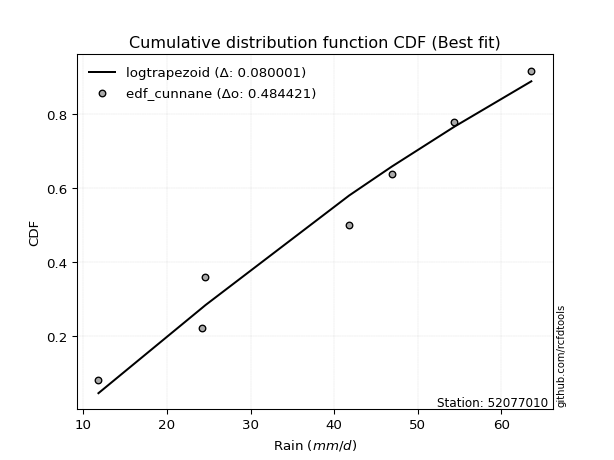</img>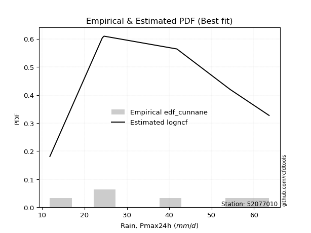</img>

</div>


### 12. EDF Adamowski (1981)

The Adamowski formula in hydrology refers to a specific plotting position formula used for estimating the non-parametric empirical distribution of hydrological events (like flood peaks) to calculate their return periods. This formula provides an alternative to traditional parametric methods (like the Gumbel or Log Pearson Type III distributions). 

<div align="center">


$P=(m-0.25)/(n+0.5)$


</div>


**12.1. Empirical values**

<div align="center">

|                | 0                  | 1                   | 2                   | 3             | 4                  | 5                  | 6                  |
|:---------------|:-------------------|:--------------------|:--------------------|:--------------|:-------------------|:-------------------|:-------------------|
| date           | 2018               | 2022                | 2019                | 2017          | 2025               | 2020               | 2024               |
| x              | 11.8               | 24.2                | 24.6                | 41.8          | 46.9               | 54.4               | 63.6               |
| m              | 1                  | 2                   | 3                   | 4             | 5                  | 6                  | 7                  |
| empirical_dist | edf_adamowski      | edf_adamowski       | edf_adamowski       | edf_adamowski | edf_adamowski      | edf_adamowski      | edf_adamowski      |
| empirical      | 0.1                | 0.23333333333333334 | 0.36666666666666664 | 0.5           | 0.6333333333333333 | 0.7666666666666667 | 0.9                |
| empirical_tr   | 1.1111111111111112 | 1.3043478260869565  | 1.5789473684210527  | 2.0           | 2.727272727272727  | 4.2857142857142865 | 10.000000000000002 |

</div>


**12.2. Kolmogorov-Smirnov fit test (sorted by Δ)**


<div align="center">

|                | 0                   | 1                   | 2                   | 3                   | 4                   | 5                   | 6                   | 7                   | 8                   | 9                   | 10                  | 11                  | 12                  | 13                  | 14                  | 15                  | 16                  | 17                  | 18                  | 19                  | 20                  | 21                  | 22                  | 23                  | 24                  | 25                  | 26                  | 27                  | 28                  | 29                  | 30                  | 31                  | 32                  | 33                  | 34                  | 35                  | 36                  | 37                  | 38                  | 39                  | 40                  | 41                  | 42                  | 43                  | 44                  | 45                  | 46                  | 47                  | 48                  | 49                  | 50                  | 51                  | 52                  | 53                  | 54                  | 55                  | 56                  | 57                  | 58                  | 59                  | 60                  | 61                  | 62                  | 63                  | 64                  | 65                  | 66                  | 67                  | 68                  | 69                  | 70                  | 71                  | 72                  | 73                  | 74                  | 75                  | 76                  | 77                  | 78                  | 79                  | 80                  | 81                  | 82                  | 83                  | 84                  | 85                  | 86                  | 87                  | 88                  | 89                  | 90                  | 91                  | 92                  | 93                  | 94                  | 95                  | 96                  | 97                  | 98                  | 99                  | 100                 | 101                 | 102                 | 103                 | 104                 | 105                 | 106                 | 107                 | 108                 | 109                 | 110                 | 111                 | 112                 | 113                 | 114                 | 115                 | 116                 | 117                 | 118                 | 119                 | 120                 | 121                 | 122                 | 123                 | 124                 | 125                 | 126                 | 127                 | 128                 | 129                 | 130                 | 131                 | 132                 | 133                 | 134                 | 135                 | 136                 | 137                 | 138                 | 139                 | 140                 | 141                 | 142                 | 143                 | 144                 | 145                 | 146                 | 147                 | 148                 | 149                 | 150                 | 151                 | 152                 | 153                 | 154                 | 155                 | 156                 | 157                 | 158                 | 159                 |
|:---------------|:--------------------|:--------------------|:--------------------|:--------------------|:--------------------|:--------------------|:--------------------|:--------------------|:--------------------|:--------------------|:--------------------|:--------------------|:--------------------|:--------------------|:--------------------|:--------------------|:--------------------|:--------------------|:--------------------|:--------------------|:--------------------|:--------------------|:--------------------|:--------------------|:--------------------|:--------------------|:--------------------|:--------------------|:--------------------|:--------------------|:--------------------|:--------------------|:--------------------|:--------------------|:--------------------|:--------------------|:--------------------|:--------------------|:--------------------|:--------------------|:--------------------|:--------------------|:--------------------|:--------------------|:--------------------|:--------------------|:--------------------|:--------------------|:--------------------|:--------------------|:--------------------|:--------------------|:--------------------|:--------------------|:--------------------|:--------------------|:--------------------|:--------------------|:--------------------|:--------------------|:--------------------|:--------------------|:--------------------|:--------------------|:--------------------|:--------------------|:--------------------|:--------------------|:--------------------|:--------------------|:--------------------|:--------------------|:--------------------|:--------------------|:--------------------|:--------------------|:--------------------|:--------------------|:--------------------|:--------------------|:--------------------|:--------------------|:--------------------|:--------------------|:--------------------|:--------------------|:--------------------|:--------------------|:--------------------|:--------------------|:--------------------|:--------------------|:--------------------|:--------------------|:--------------------|:--------------------|:--------------------|:--------------------|:--------------------|:--------------------|:--------------------|:--------------------|:--------------------|:--------------------|:--------------------|:--------------------|:--------------------|:--------------------|:--------------------|:--------------------|:--------------------|:--------------------|:--------------------|:--------------------|:--------------------|:--------------------|:--------------------|:--------------------|:--------------------|:--------------------|:--------------------|:--------------------|:--------------------|:--------------------|:--------------------|:--------------------|:--------------------|:--------------------|:--------------------|:--------------------|:--------------------|:--------------------|:--------------------|:--------------------|:--------------------|:--------------------|:--------------------|:--------------------|:--------------------|:--------------------|:--------------------|:--------------------|:--------------------|:--------------------|:--------------------|:--------------------|:--------------------|:--------------------|:--------------------|:--------------------|:--------------------|:--------------------|:--------------------|:--------------------|:--------------------|:--------------------|:--------------------|:--------------------|:--------------------|:--------------------|
| station        | 52077010            | 52077010            | 52077010            | 52077010            | 52077010            | 52077010            | 52077010            | 52077010            | 52077010            | 52077010            | 52077010            | 52077010            | 52077010            | 52077010            | 52077010            | 52077010            | 52077010            | 52077010            | 52077010            | 52077010            | 52077010            | 52077010            | 52077010            | 52077010            | 52077010            | 52077010            | 52077010            | 52077010            | 52077010            | 52077010            | 52077010            | 52077010            | 52077010            | 52077010            | 52077010            | 52077010            | 52077010            | 52077010            | 52077010            | 52077010            | 52077010            | 52077010            | 52077010            | 52077010            | 52077010            | 52077010            | 52077010            | 52077010            | 52077010            | 52077010            | 52077010            | 52077010            | 52077010            | 52077010            | 52077010            | 52077010            | 52077010            | 52077010            | 52077010            | 52077010            | 52077010            | 52077010            | 52077010            | 52077010            | 52077010            | 52077010            | 52077010            | 52077010            | 52077010            | 52077010            | 52077010            | 52077010            | 52077010            | 52077010            | 52077010            | 52077010            | 52077010            | 52077010            | 52077010            | 52077010            | 52077010            | 52077010            | 52077010            | 52077010            | 52077010            | 52077010            | 52077010            | 52077010            | 52077010            | 52077010            | 52077010            | 52077010            | 52077010            | 52077010            | 52077010            | 52077010            | 52077010            | 52077010            | 52077010            | 52077010            | 52077010            | 52077010            | 52077010            | 52077010            | 52077010            | 52077010            | 52077010            | 52077010            | 52077010            | 52077010            | 52077010            | 52077010            | 52077010            | 52077010            | 52077010            | 52077010            | 52077010            | 52077010            | 52077010            | 52077010            | 52077010            | 52077010            | 52077010            | 52077010            | 52077010            | 52077010            | 52077010            | 52077010            | 52077010            | 52077010            | 52077010            | 52077010            | 52077010            | 52077010            | 52077010            | 52077010            | 52077010            | 52077010            | 52077010            | 52077010            | 52077010            | 52077010            | 52077010            | 52077010            | 52077010            | 52077010            | 52077010            | 52077010            | 52077010            | 52077010            | 52077010            | 52077010            | 52077010            | 52077010            | 52077010            | 52077010            | 52077010            | 52077010            | 52077010            | 52077010            |
| empirical_dist | edf_adamowski       | edf_adamowski       | edf_adamowski       | edf_adamowski       | edf_adamowski       | edf_adamowski       | edf_adamowski       | edf_adamowski       | edf_adamowski       | edf_adamowski       | edf_adamowski       | edf_adamowski       | edf_adamowski       | edf_adamowski       | edf_adamowski       | edf_adamowski       | edf_adamowski       | edf_adamowski       | edf_adamowski       | edf_adamowski       | edf_adamowski       | edf_adamowski       | edf_adamowski       | edf_adamowski       | edf_adamowski       | edf_adamowski       | edf_adamowski       | edf_adamowski       | edf_adamowski       | edf_adamowski       | edf_adamowski       | edf_adamowski       | edf_adamowski       | edf_adamowski       | edf_adamowski       | edf_adamowski       | edf_adamowski       | edf_adamowski       | edf_adamowski       | edf_adamowski       | edf_adamowski       | edf_adamowski       | edf_adamowski       | edf_adamowski       | edf_adamowski       | edf_adamowski       | edf_adamowski       | edf_adamowski       | edf_adamowski       | edf_adamowski       | edf_adamowski       | edf_adamowski       | edf_adamowski       | edf_adamowski       | edf_adamowski       | edf_adamowski       | edf_adamowski       | edf_adamowski       | edf_adamowski       | edf_adamowski       | edf_adamowski       | edf_adamowski       | edf_adamowski       | edf_adamowski       | edf_adamowski       | edf_adamowski       | edf_adamowski       | edf_adamowski       | edf_adamowski       | edf_adamowski       | edf_adamowski       | edf_adamowski       | edf_adamowski       | edf_adamowski       | edf_adamowski       | edf_adamowski       | edf_adamowski       | edf_adamowski       | edf_adamowski       | edf_adamowski       | edf_adamowski       | edf_adamowski       | edf_adamowski       | edf_adamowski       | edf_adamowski       | edf_adamowski       | edf_adamowski       | edf_adamowski       | edf_adamowski       | edf_adamowski       | edf_adamowski       | edf_adamowski       | edf_adamowski       | edf_adamowski       | edf_adamowski       | edf_adamowski       | edf_adamowski       | edf_adamowski       | edf_adamowski       | edf_adamowski       | edf_adamowski       | edf_adamowski       | edf_adamowski       | edf_adamowski       | edf_adamowski       | edf_adamowski       | edf_adamowski       | edf_adamowski       | edf_adamowski       | edf_adamowski       | edf_adamowski       | edf_adamowski       | edf_adamowski       | edf_adamowski       | edf_adamowski       | edf_adamowski       | edf_adamowski       | edf_adamowski       | edf_adamowski       | edf_adamowski       | edf_adamowski       | edf_adamowski       | edf_adamowski       | edf_adamowski       | edf_adamowski       | edf_adamowski       | edf_adamowski       | edf_adamowski       | edf_adamowski       | edf_adamowski       | edf_adamowski       | edf_adamowski       | edf_adamowski       | edf_adamowski       | edf_adamowski       | edf_adamowski       | edf_adamowski       | edf_adamowski       | edf_adamowski       | edf_adamowski       | edf_adamowski       | edf_adamowski       | edf_adamowski       | edf_adamowski       | edf_adamowski       | edf_adamowski       | edf_adamowski       | edf_adamowski       | edf_adamowski       | edf_adamowski       | edf_adamowski       | edf_adamowski       | edf_adamowski       | edf_adamowski       | edf_adamowski       | edf_adamowski       | edf_adamowski       | edf_adamowski       | edf_adamowski       | edf_adamowski       |
| p_dist         | logtrapezoid        | ksone               | wrapcauchy          | logbeta             | loggenhalflogistic  | arcsine             | kappa4              | beta                | semicircular        | tukeylambda         | bradford            | truncweibull_min    | genpareto           | vonmises_line       | logskewnorm         | uniform             | logpearson3         | dweibull            | anglit              | loggengamma         | logsemicircular     | invgauss            | logarcsine          | loggumbel_l         | logburr             | rayleigh            | loggompertz         | logtriang           | gausshyper          | genlogistic         | logargus            | invgamma            | maxwell             | loganglit           | logmielke           | dgamma              | weibull_min         | logweibull_min      | rice                | burr                | alpha               | logloggamma         | logexponweib        | kstwobign           | kappa3              | mielke              | betaprime           | halfnorm            | ncf                 | logjohnsonsu        | logdgamma           | logburr12           | gamma               | erlang              | cosine              | loggenextreme       | johnsonsu           | nct                 | t                   | exponnorm           | truncnorm           | crystalball         | norm                | skewnorm            | f                   | pearson3            | logdweibull         | gumbel_r            | loggenpareto        | logcrystalball      | logt                | lognorm             | logexponnorm        | logf                | logfatiguelife      | lognct              | gompertz            | logncf              | logfoldnorm         | genextreme          | logrice             | loginvweibull       | loggamma            | loggamma            | logbetaprime        | loginvgauss         | loginvgamma         | logalpha            | logerlang           | argus               | loglevy_l           | halflogistic        | logistic            | moyal               | loglogistic         | lomax               | burr12              | logmaxwell          | genexpon            | gumbel_l            | logkstwobign        | lograyleigh         | truncexpon          | hypsecant           | logcosine           | triang              | genhalflogistic     | loghypsecant        | loggenexpon         | logjohnsonsb        | loghalfnorm         | laplace             | logkappa4           | logloglaplace       | logksone            | loggumbel_r         | loglaplace          | loglaplace          | logrdist            | loghalflogistic     | loghalfgennorm      | logmoyal            | levy_l              | logwrapcauchy       | logtukeylambda      | logbradford         | logkappa3           | loguniform          | lognakagami         | logvonmises_line    | halfgennorm         | gennorm             | loggennorm          | loglomax            | nakagami            | trapezoid           | logwald             | loggausshyper       | wald                | logtruncweibull_min | logtruncexpon       | logtruncnorm        | logweibull_max      | exponweib           | logexponpow         | invweibull          | exponpow            | foldnorm            | fatiguelife         | gengamma            | powerlaw            | johnsonsb           | weibull_max         | logpowerlaw         | truncpareto         | logtruncpareto      | rdist               | loggenlogistic      | logvonmises         | vonmises            |
| delta          | 0.08222036278396666 | 0.09450083151712135 | 0.09999999946973737 | 0.09999999975798357 | 0.09999999999999865 | 0.1                 | 0.1049961891387966  | 0.1058524567007435  | 0.11120800609593906 | 0.11329495617672997 | 0.1142170436518774  | 0.11604027357350283 | 0.11619103808756254 | 0.11720139602616844 | 0.11830282800568592 | 0.1195624195624195  | 0.1209372305552231  | 0.12156797129336777 | 0.12355371818007291 | 0.12729767499746567 | 0.12730415733093936 | 0.12750143220836913 | 0.12828636260631526 | 0.12868100754464853 | 0.12896317067923063 | 0.1292565770293102  | 0.12999917673308525 | 0.1308499817256331  | 0.13221303389097463 | 0.13267343462523273 | 0.13379500742535094 | 0.13509412021807288 | 0.13586385539964072 | 0.1359158283736689  | 0.13639990863655096 | 0.1371738725226665  | 0.13759008720906724 | 0.14049329538992664 | 0.1405637200079825  | 0.1408884909155835  | 0.14094322584879804 | 0.14121630983335715 | 0.14200000337309482 | 0.1430287115733173  | 0.14320472105936383 | 0.14345197595789158 | 0.14464590278498865 | 0.14475024397635794 | 0.14540021240192835 | 0.145716660706749   | 0.14708942155537408 | 0.14714068908303068 | 0.15001036547903923 | 0.15009201252667664 | 0.15018296079575116 | 0.15113978795151103 | 0.15137693032257699 | 0.15158445050619457 | 0.15167999559599432 | 0.1516806761484824  | 0.15168099269396945 | 0.15168099417630976 | 0.15168099708746113 | 0.15179531796895102 | 0.15222925433272913 | 0.152844144463181   | 0.15331523977483547 | 0.15335510803531593 | 0.1547506311608495  | 0.15627362260298516 | 0.15640477496566318 | 0.15640638022971753 | 0.15640822304901647 | 0.15698202099844327 | 0.15728848898423886 | 0.15739572031534177 | 0.15877930892986145 | 0.1588268561149584  | 0.15930321155882798 | 0.15961004762968892 | 0.1606762462511413  | 0.16142387808732217 | 0.1616292034807778  | 0.1616292034807778  | 0.1617487736176455  | 0.1633833166596681  | 0.164152358182595   | 0.16440979665404665 | 0.16442157662962886 | 0.1698626604985029  | 0.1720184192361097  | 0.17285368994522687 | 0.1738053713573255  | 0.1747598693608634  | 0.17488687291322336 | 0.17552616095013363 | 0.1763764749627783  | 0.17735099806011823 | 0.17943284436282692 | 0.18209924225426874 | 0.18220696959298488 | 0.1836254408410103  | 0.18714436504503285 | 0.18729286170799125 | 0.18764665330008456 | 0.18769069073580305 | 0.1884050728932239  | 0.18911643429273883 | 0.18952931070872392 | 0.19681369908839041 | 0.20194651476099656 | 0.20289827254697917 | 0.2040903120723272  | 0.208969502427947   | 0.20903153370173932 | 0.21534810886227984 | 0.21708698498277101 | 0.21708698498277101 | 0.22089798528513327 | 0.2299596483185592  | 0.23176009715411883 | 0.23478483010149764 | 0.2395469549694261  | 0.2417327515147938  | 0.24439005733317032 | 0.2507670707952704  | 0.2508366225749513  | 0.250837840442087   | 0.25411285946391104 | 0.2543536624451095  | 0.263371518787889   | 0.2666666666666667  | 0.2666666666666667  | 0.2679474513902281  | 0.2707978512879369  | 0.28299905669596787 | 0.29005208465578514 | 0.29198776976184004 | 0.29300320722195483 | 0.2953965229959852  | 0.3222159216236352  | 0.32807057300631837 | 0.36577809866787975 | 0.38571597099015803 | 0.4303516379084323  | 0.460843752310206   | 0.48426327021400045 | 0.5                 | 0.532480318135768   | 0.5412483472259477  | 0.5540648513686688  | 0.5718916090552035  | 0.5918716433478296  | 0.6218354494153615  | 0.661872563159603   | 0.7032052460624332  | 0.7229930024851874  | 0.7666666666666667  | 1.147614279786524   | 10.03042728125678   |
| deltao         | 0.48442053926100004 | 0.48442053926100004 | 0.48442053926100004 | 0.48442053926100004 | 0.48442053926100004 | 0.48442053926100004 | 0.48442053926100004 | 0.48442053926100004 | 0.48442053926100004 | 0.48442053926100004 | 0.48442053926100004 | 0.48442053926100004 | 0.48442053926100004 | 0.48442053926100004 | 0.48442053926100004 | 0.48442053926100004 | 0.48442053926100004 | 0.48442053926100004 | 0.48442053926100004 | 0.48442053926100004 | 0.48442053926100004 | 0.48442053926100004 | 0.48442053926100004 | 0.48442053926100004 | 0.48442053926100004 | 0.48442053926100004 | 0.48442053926100004 | 0.48442053926100004 | 0.48442053926100004 | 0.48442053926100004 | 0.48442053926100004 | 0.48442053926100004 | 0.48442053926100004 | 0.48442053926100004 | 0.48442053926100004 | 0.48442053926100004 | 0.48442053926100004 | 0.48442053926100004 | 0.48442053926100004 | 0.48442053926100004 | 0.48442053926100004 | 0.48442053926100004 | 0.48442053926100004 | 0.48442053926100004 | 0.48442053926100004 | 0.48442053926100004 | 0.48442053926100004 | 0.48442053926100004 | 0.48442053926100004 | 0.48442053926100004 | 0.48442053926100004 | 0.48442053926100004 | 0.48442053926100004 | 0.48442053926100004 | 0.48442053926100004 | 0.48442053926100004 | 0.48442053926100004 | 0.48442053926100004 | 0.48442053926100004 | 0.48442053926100004 | 0.48442053926100004 | 0.48442053926100004 | 0.48442053926100004 | 0.48442053926100004 | 0.48442053926100004 | 0.48442053926100004 | 0.48442053926100004 | 0.48442053926100004 | 0.48442053926100004 | 0.48442053926100004 | 0.48442053926100004 | 0.48442053926100004 | 0.48442053926100004 | 0.48442053926100004 | 0.48442053926100004 | 0.48442053926100004 | 0.48442053926100004 | 0.48442053926100004 | 0.48442053926100004 | 0.48442053926100004 | 0.48442053926100004 | 0.48442053926100004 | 0.48442053926100004 | 0.48442053926100004 | 0.48442053926100004 | 0.48442053926100004 | 0.48442053926100004 | 0.48442053926100004 | 0.48442053926100004 | 0.48442053926100004 | 0.48442053926100004 | 0.48442053926100004 | 0.48442053926100004 | 0.48442053926100004 | 0.48442053926100004 | 0.48442053926100004 | 0.48442053926100004 | 0.48442053926100004 | 0.48442053926100004 | 0.48442053926100004 | 0.48442053926100004 | 0.48442053926100004 | 0.48442053926100004 | 0.48442053926100004 | 0.48442053926100004 | 0.48442053926100004 | 0.48442053926100004 | 0.48442053926100004 | 0.48442053926100004 | 0.48442053926100004 | 0.48442053926100004 | 0.48442053926100004 | 0.48442053926100004 | 0.48442053926100004 | 0.48442053926100004 | 0.48442053926100004 | 0.48442053926100004 | 0.48442053926100004 | 0.48442053926100004 | 0.48442053926100004 | 0.48442053926100004 | 0.48442053926100004 | 0.48442053926100004 | 0.48442053926100004 | 0.48442053926100004 | 0.48442053926100004 | 0.48442053926100004 | 0.48442053926100004 | 0.48442053926100004 | 0.48442053926100004 | 0.48442053926100004 | 0.48442053926100004 | 0.48442053926100004 | 0.48442053926100004 | 0.48442053926100004 | 0.48442053926100004 | 0.48442053926100004 | 0.48442053926100004 | 0.48442053926100004 | 0.48442053926100004 | 0.48442053926100004 | 0.48442053926100004 | 0.48442053926100004 | 0.48442053926100004 | 0.48442053926100004 | 0.48442053926100004 | 0.48442053926100004 | 0.48442053926100004 | 0.48442053926100004 | 0.48442053926100004 | 0.48442053926100004 | 0.48442053926100004 | 0.48442053926100004 | 0.48442053926100004 | 0.48442053926100004 | 0.48442053926100004 | 0.48442053926100004 | 0.48442053926100004 | 0.48442053926100004 | 0.48442053926100004 |
| eval           | Δo > Δ              | Δo > Δ              | Δo > Δ              | Δo > Δ              | Δo > Δ              | Δo > Δ              | Δo > Δ              | Δo > Δ              | Δo > Δ              | Δo > Δ              | Δo > Δ              | Δo > Δ              | Δo > Δ              | Δo > Δ              | Δo > Δ              | Δo > Δ              | Δo > Δ              | Δo > Δ              | Δo > Δ              | Δo > Δ              | Δo > Δ              | Δo > Δ              | Δo > Δ              | Δo > Δ              | Δo > Δ              | Δo > Δ              | Δo > Δ              | Δo > Δ              | Δo > Δ              | Δo > Δ              | Δo > Δ              | Δo > Δ              | Δo > Δ              | Δo > Δ              | Δo > Δ              | Δo > Δ              | Δo > Δ              | Δo > Δ              | Δo > Δ              | Δo > Δ              | Δo > Δ              | Δo > Δ              | Δo > Δ              | Δo > Δ              | Δo > Δ              | Δo > Δ              | Δo > Δ              | Δo > Δ              | Δo > Δ              | Δo > Δ              | Δo > Δ              | Δo > Δ              | Δo > Δ              | Δo > Δ              | Δo > Δ              | Δo > Δ              | Δo > Δ              | Δo > Δ              | Δo > Δ              | Δo > Δ              | Δo > Δ              | Δo > Δ              | Δo > Δ              | Δo > Δ              | Δo > Δ              | Δo > Δ              | Δo > Δ              | Δo > Δ              | Δo > Δ              | Δo > Δ              | Δo > Δ              | Δo > Δ              | Δo > Δ              | Δo > Δ              | Δo > Δ              | Δo > Δ              | Δo > Δ              | Δo > Δ              | Δo > Δ              | Δo > Δ              | Δo > Δ              | Δo > Δ              | Δo > Δ              | Δo > Δ              | Δo > Δ              | Δo > Δ              | Δo > Δ              | Δo > Δ              | Δo > Δ              | Δo > Δ              | Δo > Δ              | Δo > Δ              | Δo > Δ              | Δo > Δ              | Δo > Δ              | Δo > Δ              | Δo > Δ              | Δo > Δ              | Δo > Δ              | Δo > Δ              | Δo > Δ              | Δo > Δ              | Δo > Δ              | Δo > Δ              | Δo > Δ              | Δo > Δ              | Δo > Δ              | Δo > Δ              | Δo > Δ              | Δo > Δ              | Δo > Δ              | Δo > Δ              | Δo > Δ              | Δo > Δ              | Δo > Δ              | Δo > Δ              | Δo > Δ              | Δo > Δ              | Δo > Δ              | Δo > Δ              | Δo > Δ              | Δo > Δ              | Δo > Δ              | Δo > Δ              | Δo > Δ              | Δo > Δ              | Δo > Δ              | Δo > Δ              | Δo > Δ              | Δo > Δ              | Δo > Δ              | Δo > Δ              | Δo > Δ              | Δo > Δ              | Δo > Δ              | Δo > Δ              | Δo > Δ              | Δo > Δ              | Δo > Δ              | Δo > Δ              | Δo > Δ              | Δo > Δ              | Δo > Δ              | Δo > Δ              | Δo > Δ              | Δo > Δ              | Δo > Δ              | Δo <= Δ             | Δo <= Δ             | Δo <= Δ             | Δo <= Δ             | Δo <= Δ             | Δo <= Δ             | Δo <= Δ             | Δo <= Δ             | Δo <= Δ             | Δo <= Δ             | Δo <= Δ             | Δo <= Δ             | Δo <= Δ             |
| fit            | 1                   | 1                   | 1                   | 1                   | 1                   | 1                   | 1                   | 1                   | 1                   | 1                   | 1                   | 1                   | 1                   | 1                   | 1                   | 1                   | 1                   | 1                   | 1                   | 1                   | 1                   | 1                   | 1                   | 1                   | 1                   | 1                   | 1                   | 1                   | 1                   | 1                   | 1                   | 1                   | 1                   | 1                   | 1                   | 1                   | 1                   | 1                   | 1                   | 1                   | 1                   | 1                   | 1                   | 1                   | 1                   | 1                   | 1                   | 1                   | 1                   | 1                   | 1                   | 1                   | 1                   | 1                   | 1                   | 1                   | 1                   | 1                   | 1                   | 1                   | 1                   | 1                   | 1                   | 1                   | 1                   | 1                   | 1                   | 1                   | 1                   | 1                   | 1                   | 1                   | 1                   | 1                   | 1                   | 1                   | 1                   | 1                   | 1                   | 1                   | 1                   | 1                   | 1                   | 1                   | 1                   | 1                   | 1                   | 1                   | 1                   | 1                   | 1                   | 1                   | 1                   | 1                   | 1                   | 1                   | 1                   | 1                   | 1                   | 1                   | 1                   | 1                   | 1                   | 1                   | 1                   | 1                   | 1                   | 1                   | 1                   | 1                   | 1                   | 1                   | 1                   | 1                   | 1                   | 1                   | 1                   | 1                   | 1                   | 1                   | 1                   | 1                   | 1                   | 1                   | 1                   | 1                   | 1                   | 1                   | 1                   | 1                   | 1                   | 1                   | 1                   | 1                   | 1                   | 1                   | 1                   | 1                   | 1                   | 1                   | 1                   | 1                   | 1                   | 1                   | 1                   | 1                   | 1                   | 0                   | 0                   | 0                   | 0                   | 0                   | 0                   | 0                   | 0                   | 0                   | 0                   | 0                   | 0                   | 0                   |
| n              | 7                   | 7                   | 7                   | 7                   | 7                   | 7                   | 7                   | 7                   | 7                   | 7                   | 7                   | 7                   | 7                   | 7                   | 7                   | 7                   | 7                   | 7                   | 7                   | 7                   | 7                   | 7                   | 7                   | 7                   | 7                   | 7                   | 7                   | 7                   | 7                   | 7                   | 7                   | 7                   | 7                   | 7                   | 7                   | 7                   | 7                   | 7                   | 7                   | 7                   | 7                   | 7                   | 7                   | 7                   | 7                   | 7                   | 7                   | 7                   | 7                   | 7                   | 7                   | 7                   | 7                   | 7                   | 7                   | 7                   | 7                   | 7                   | 7                   | 7                   | 7                   | 7                   | 7                   | 7                   | 7                   | 7                   | 7                   | 7                   | 7                   | 7                   | 7                   | 7                   | 7                   | 7                   | 7                   | 7                   | 7                   | 7                   | 7                   | 7                   | 7                   | 7                   | 7                   | 7                   | 7                   | 7                   | 7                   | 7                   | 7                   | 7                   | 7                   | 7                   | 7                   | 7                   | 7                   | 7                   | 7                   | 7                   | 7                   | 7                   | 7                   | 7                   | 7                   | 7                   | 7                   | 7                   | 7                   | 7                   | 7                   | 7                   | 7                   | 7                   | 7                   | 7                   | 7                   | 7                   | 7                   | 7                   | 7                   | 7                   | 7                   | 7                   | 7                   | 7                   | 7                   | 7                   | 7                   | 7                   | 7                   | 7                   | 7                   | 7                   | 7                   | 7                   | 7                   | 7                   | 7                   | 7                   | 7                   | 7                   | 7                   | 7                   | 7                   | 7                   | 7                   | 7                   | 7                   | 7                   | 7                   | 7                   | 7                   | 7                   | 7                   | 7                   | 7                   | 7                   | 7                   | 7                   | 7                   | 7                   |
| best_fit       | 1                   | 0                   | 0                   | 0                   | 0                   | 0                   | 0                   | 0                   | 0                   | 0                   | 0                   | 0                   | 0                   | 0                   | 0                   | 0                   | 0                   | 0                   | 0                   | 0                   | 0                   | 0                   | 0                   | 0                   | 0                   | 0                   | 0                   | 0                   | 0                   | 0                   | 0                   | 0                   | 0                   | 0                   | 0                   | 0                   | 0                   | 0                   | 0                   | 0                   | 0                   | 0                   | 0                   | 0                   | 0                   | 0                   | 0                   | 0                   | 0                   | 0                   | 0                   | 0                   | 0                   | 0                   | 0                   | 0                   | 0                   | 0                   | 0                   | 0                   | 0                   | 0                   | 0                   | 0                   | 0                   | 0                   | 0                   | 0                   | 0                   | 0                   | 0                   | 0                   | 0                   | 0                   | 0                   | 0                   | 0                   | 0                   | 0                   | 0                   | 0                   | 0                   | 0                   | 0                   | 0                   | 0                   | 0                   | 0                   | 0                   | 0                   | 0                   | 0                   | 0                   | 0                   | 0                   | 0                   | 0                   | 0                   | 0                   | 0                   | 0                   | 0                   | 0                   | 0                   | 0                   | 0                   | 0                   | 0                   | 0                   | 0                   | 0                   | 0                   | 0                   | 0                   | 0                   | 0                   | 0                   | 0                   | 0                   | 0                   | 0                   | 0                   | 0                   | 0                   | 0                   | 0                   | 0                   | 0                   | 0                   | 0                   | 0                   | 0                   | 0                   | 0                   | 0                   | 0                   | 0                   | 0                   | 0                   | 0                   | 0                   | 0                   | 0                   | 0                   | 0                   | 0                   | 0                   | 0                   | 0                   | 0                   | 0                   | 0                   | 0                   | 0                   | 0                   | 0                   | 0                   | 0                   | 0                   | 0                   |
| best_fit_sort  | 1                   | 2                   | 3                   | 4                   | 5                   | 6                   | 7                   | 8                   | 9                   | 10                  | 11                  | 12                  | 13                  | 14                  | 15                  | 16                  | 17                  | 18                  | 19                  | 20                  | 21                  | 22                  | 23                  | 24                  | 25                  | 26                  | 27                  | 28                  | 29                  | 30                  | 31                  | 32                  | 33                  | 34                  | 35                  | 36                  | 37                  | 38                  | 39                  | 40                  | 41                  | 42                  | 43                  | 44                  | 45                  | 46                  | 47                  | 48                  | 49                  | 50                  | 51                  | 52                  | 53                  | 54                  | 55                  | 56                  | 57                  | 58                  | 59                  | 60                  | 61                  | 62                  | 63                  | 64                  | 65                  | 66                  | 67                  | 68                  | 69                  | 70                  | 71                  | 72                  | 73                  | 74                  | 75                  | 76                  | 77                  | 78                  | 79                  | 80                  | 81                  | 82                  | 83                  | 84                  | 85                  | 86                  | 87                  | 88                  | 89                  | 90                  | 91                  | 92                  | 93                  | 94                  | 95                  | 96                  | 97                  | 98                  | 99                  | 100                 | 101                 | 102                 | 103                 | 104                 | 105                 | 106                 | 107                 | 108                 | 109                 | 110                 | 111                 | 112                 | 113                 | 114                 | 115                 | 116                 | 117                 | 118                 | 119                 | 120                 | 121                 | 122                 | 123                 | 124                 | 125                 | 126                 | 127                 | 128                 | 129                 | 130                 | 131                 | 132                 | 133                 | 134                 | 135                 | 136                 | 137                 | 138                 | 139                 | 140                 | 141                 | 142                 | 143                 | 144                 | 145                 | 146                 | 147                 | 148                 | 149                 | 150                 | 151                 | 152                 | 153                 | 154                 | 155                 | 156                 | 157                 | 158                 | 159                 | 160                 |

</div>


**12.3. Best fit**

<div align="center">

|   id |   station | empirical_dist   | p_dist       |     delta |   deltao | eval   |   fit |   n |   best_fit |   best_fit_sort |
|-----:|----------:|:-----------------|:-------------|----------:|---------:|:-------|------:|----:|-----------:|----------------:|
|    0 |  52077010 | edf_adamowski    | logtrapezoid | 0.0822204 | 0.484421 | Δo > Δ |     1 |   7 |          1 |               1 |

</div>


<div align="center">

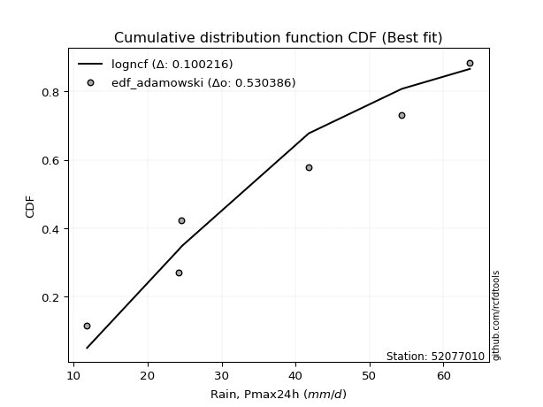</img></img>

</div>


## C. Best fit & Estimate extreme values for specific return periods - Tr

Best fit in probability distribution analysis means finding the theoretical distribution (like Normal, Poisson, Exponential, etc.) that most accurately mirrors your real-world data´s patterns (shape, center, spread) for better predictions, using methods like visual checks (Q-Q plots), goodness-of-fit tests (Kolmogorov-Smirnov, Chi-Squared), and information criteria (AIC) to score and select the simplest, most representative model.


### 1. Best fit (ordered by delta Δ)

:file_folder:Table: [bestfit_52077010.csv](table/bestfit_52077010.csv)

<div align="center">

|   id |   station | empirical_dist   | p_dist       |     delta |   deltao | eval   |   fit |   n |   best_fit |   best_fit_sort |
|-----:|----------:|:-----------------|:-------------|----------:|---------:|:-------|------:|----:|-----------:|----------------:|
|    0 |  52077010 | edf_california   | dweibull     | 0.0701138 | 0.484421 | Δo > Δ |     1 |   7 |          1 |               1 |
|    1 |  52077010 | edf_hazen        | wrapcauchy   | 0.0765444 | 0.484421 | Δo > Δ |     1 |   7 |          1 |               2 |
|    2 |  52077010 | edf_gringorten   | wrapcauchy   | 0.0786517 | 0.484421 | Δo > Δ |     1 |   7 |          1 |               3 |
|    3 |  52077010 | edf_cunnane      | logtrapezoid | 0.0800012 | 0.484421 | Δo > Δ |     1 |   7 |          1 |               4 |
|    4 |  52077010 | edf_blom         | logtrapezoid | 0.0800012 | 0.484421 | Δo > Δ |     1 |   7 |          1 |               5 |
|    5 |  52077010 | edf_filliben     | logtrapezoid | 0.0800012 | 0.484421 | Δo > Δ |     1 |   7 |          1 |               6 |
|    6 |  52077010 | edf_tukey        | logtrapezoid | 0.0800012 | 0.484421 | Δo > Δ |     1 |   7 |          1 |               7 |
|    7 |  52077010 | edf_jenkinson    | logtrapezoid | 0.0800523 | 0.484421 | Δo > Δ |     1 |   7 |          1 |               8 |
|    8 |  52077010 | edf_beard        | logtrapezoid | 0.0800523 | 0.484421 | Δo > Δ |     1 |   7 |          1 |               9 |
|    9 |  52077010 | edf_chegodayev   | logtrapezoid | 0.0804186 | 0.484421 | Δo > Δ |     1 |   7 |          1 |              10 |
|   10 |  52077010 | edf_adamowski    | logtrapezoid | 0.0822204 | 0.484421 | Δo > Δ |     1 |   7 |          1 |              11 |
|   11 |  52077010 | edf_weibull      | logtrapezoid | 0.0905537 | 0.484421 | Δo > Δ |     1 |   7 |          1 |              12 |

</div>


### 2. Extreme values and % difference analysis

In hydrology, a return period (or recurrence interval $Tr$) is the statistical average time between extreme events like floods or droughts of a specific magnitude, indicating how rare an event is, with a 100-year flood, for example, having a 1% chance of occurring in any given year, not that it happens exactly every century. It is a key tool for infrastructure design (like bridges or dams) and risk assessment, calculated from historical data to determine the probability of future events, although it is important to remember it is statistical average, and events can cluster or be missed.

The extreme value porcentage difference is evaluated as $pdiff = 1 - (ETrBf / ETr) * 100$, where _ETrBf_ correspond to the bestfit extreme value for a specific recurrence interval and _ETr_ correspond to the extreme value for one of the most used PDFsused in hydrology.

> risk_rate: assuming the return period as the project useful life.

:file_folder:Table: [extreme_52077010.csv](table/extreme_52077010.csv), all PDFs.  
:file_folder:Table: [extremepdiff_52077010.csv](table/extremepdiff_52077010.csv), % difference between bestfit and most used PDFs in Hydrology.

<div align="center">

Extreme values table for only best fit PDFs
|   id |      tr |   prob_l |     prob_g |    alpha |   anglit |   arcsine |   argus |    beta |   betaprime |   bradford |    burr |   burr12 |   cosine |   crystalball |   dgamma |   dweibull |   erlang |   exponnorm |   exponpow |   exponweib |       f |   fatiguelife |   foldnorm |   gamma |   gausshyper |   genexpon |   genextreme |   gengamma |   genhalflogistic |   genlogistic |   gennorm |   genpareto |   gompertz |   gumbel_l |   gumbel_r |   halfgennorm |   halflogistic |   halfnorm |   hypsecant |   invgamma |   invgauss |      invweibull |   johnsonsb |   johnsonsu |   kappa3 |   kappa4 |   ksone |   kstwobign |   laplace |   levy_l |   loggamma |   logistic |   loglaplace |    lomax |   maxwell |   mielke |    moyal |   nakagami |      ncf |     nct |    norm |   pearson3 |   powerlaw |   rayleigh |    rdist |    rice |   semicircular |   skewnorm |       t |   trapezoid |   triang |   truncexpon |   truncnorm |   truncpareto |   truncweibull_min |   tukeylambda |   uniform |   vonmises |   vonmises_line |     wald |   weibull_max |   weibull_min |   wrapcauchy |   logalpha |   loganglit |   logarcsine |   logargus |   logbeta |   logbetaprime |   logbradford |   logburr |   logburr12 |   logcosine |   logcrystalball |   logdgamma |   logdweibull |   logerlang |   logexponnorm |   logexponpow |   logexponweib |     logf |   logfatiguelife |   logfoldnorm |   loggausshyper |   loggenexpon |   loggenextreme |   loggengamma |   loggenhalflogistic |   loggenlogistic |   loggennorm |   loggenpareto |   loggompertz |   loggumbel_l |   loggumbel_r |   loghalfgennorm |   loghalflogistic |   loghalfnorm |   loghypsecant |   loginvgamma |   loginvgauss |   loginvweibull |   logjohnsonsb |   logjohnsonsu |   logkappa3 |   logkappa4 |   logksone |   logkstwobign |   loglevy_l |   logloggamma |   loglogistic |   logloglaplace |   loglomax |   logmaxwell |   logmielke |   logmoyal |   lognakagami |   logncf |   lognct |   lognorm |   logpearson3 |   logpowerlaw |   lograyleigh |   logrdist |   logrice |   logsemicircular |   logskewnorm |     logt |   logtrapezoid |   logtriang |   logtruncexpon |   logtruncnorm |   logtruncpareto |   logtruncweibull_min |   logtukeylambda |   loguniform |   logvonmises |   logvonmises_line |   logwald |   logweibull_max |   logweibull_min |   logwrapcauchy |   station |   n |   risk_rate |
|-----:|--------:|---------:|-----------:|---------:|---------:|----------:|--------:|--------:|------------:|-----------:|--------:|---------:|---------:|--------------:|---------:|-----------:|---------:|------------:|-----------:|------------:|--------:|--------------:|-----------:|--------:|-------------:|-----------:|-------------:|-----------:|------------------:|--------------:|----------:|------------:|-----------:|-----------:|-----------:|--------------:|---------------:|-----------:|------------:|-----------:|-----------:|----------------:|------------:|------------:|---------:|---------:|--------:|------------:|----------:|---------:|-----------:|-----------:|-------------:|---------:|----------:|---------:|---------:|-----------:|---------:|--------:|--------:|-----------:|-----------:|-----------:|---------:|--------:|---------------:|-----------:|--------:|------------:|---------:|-------------:|------------:|--------------:|-------------------:|--------------:|----------:|-----------:|----------------:|---------:|--------------:|--------------:|-------------:|-----------:|------------:|-------------:|-----------:|----------:|---------------:|--------------:|----------:|------------:|------------:|-----------------:|------------:|--------------:|------------:|---------------:|--------------:|---------------:|---------:|-----------------:|--------------:|----------------:|--------------:|----------------:|--------------:|---------------------:|-----------------:|-------------:|---------------:|--------------:|--------------:|--------------:|-----------------:|------------------:|--------------:|---------------:|--------------:|--------------:|----------------:|---------------:|---------------:|------------:|------------:|-----------:|---------------:|------------:|--------------:|--------------:|----------------:|-----------:|-------------:|------------:|-----------:|--------------:|---------:|---------:|----------:|--------------:|--------------:|--------------:|-----------:|----------:|------------------:|--------------:|---------:|---------------:|------------:|----------------:|---------------:|-----------------:|----------------------:|-----------------:|-------------:|--------------:|-------------------:|----------:|-----------------:|-----------------:|----------------:|----------:|----:|------------:|
|    0 |    2    | 0.5      | 0.5        |  36.9026 |  38.1857 |   38.1857 | 40.5753 | 39.3964 |     37.5179 |    37.5148 | 41.2827 |  29.3528 |  38.0327 |       38.1857 |  34.889  |    35.5297 |  38.0146 |     38.1856 |    15.5918 |     17.4619 | 38.19   |       11.8    |    43.0588 | 38.0187 |      40.1106 |    30.0782 |      40.855  |    12.6465 |           45.6627 |       35.3188 |      37.7 |     44.1084 |    40.9297 |    41.0136 |    35.3578 |       24.4041 |        33.9519 |    34.6621 |     38.1857 |    36.662  |    36.0994 |   769.831       |     63.5997 |     38.1858 |  11.8    |  37.1925 | 38.1857 |     34.6918 |   38.1857 |  42.9895 |    33.0029 |    38.1857 |      33.53   |  39.6534 |   36.7135 |  41.5208 |  34.4448 |    27.7972 |  34.3666 | 38.1802 | 38.1857 |    38.3646 |    12.6198 |    36.1913 |  8.54522 | 37.0838 |        38.1857 |    38.2007 | 38.1857 |     50.5738 |  43.8012 |      31.2095 |     38.1857 |       12.1444 |            37.1373 |       37.6995 |   37.7    |  -1.2867   |         37.6185 |  32.6058 |       63.1643 |       36.8743 |      37.702  |    32.6508 |     33.53   |      33.53   |    38.144  |   36.9138 |        33.0294 |       27.3969 |   39.3188 |     37.3145 |     31.5773 |          33.5351 |     32.829  |       32.1954 |     32.9267 |        33.5299 |       17.8917 |        34.4766 |  33.5023 |          33.4899 |       33.5781 |         24.7712 |       29.3332 |         42.4369 |       36.586  |              37.1814 |         inf      |      27.3948 |        38.8023 |       35.5159 |       36.6856 |       30.6459 |          28.0031 |           29.306  |       29.9753 |        33.53   |       32.8807 |       32.5877 |         30.9825 |        44.6155 |        40.7523 |        11.8 |     29.8018 |    27.3949 |        29.505  |     42.0855 |       40.8805 |       33.53   |         41.8001 |    24.136  |      31.9962 |     41.054  |    29.7689 |       29.8929 |  33.1121 |  33.4236 |   33.53   |       35.6553 |       12.2642 |       31.4693 |    27.038  |   33.0775 |           33.53   |       36.0333 |  33.5301 |        36.8322 |     34.9913 |         23.1186 |        31.679  |          11.9643 |               25.0652 |          27.3967 |      27.3949 |     0.0638874 |            27.0675 |   28.0779 |          61.1583 |          37.1006 |         27.3949 |  52077010 |   7 |    0.75     |
|    1 |    2.33 | 0.570815 | 0.429185   |  39.9865 |  41.7638 |   43.557  | 43.7897 | 43.6421 |     40.625  |    41.2092 | 44.9361 |  33.6739 |  41.1541 |       41.2575 |  43.3562 |    43.5451 |  41.0951 |     41.2574 |    17.5096 |     20.8218 | 41.2674 |       12.551  |    43.123  | 41.1008 |      44.2946 |    34.1054 |      43.9738 |    13.4818 |           49.0487 |       38.6334 |      37.7 |     48.5958 |    43.9686 |    43.6861 |    38.2041 |       29.6323 |        36.8784 |    37.9773 |     40.6441 |    39.8025 |    39.2955 | 20903.9         |     63.6    |     41.2617 |  11.8    |  40.9926 | 42.4084 |     38.0429 |   40.0446 |  49.242  |    36.4973 |    40.8922 |      35.5722 |  45.7903 |   39.9049 |  45.1508 |  37.1393 |    29.9876 |  37.7524 | 41.2523 | 41.2575 |    41.4301 |    13.6106 |    39.4299 | 11.5636  | 40.2795 |        42.0233 |    41.2717 | 41.2575 |     53.5833 |  47.074  |      35.0474 |     41.2575 |       12.3818 |            40.6694 |       41.4765 |   41.3682 |  -1.06517  |         41.2983 |  34.62   |       63.3839 |       40.0717 |      42.7114 |    36.1909 |     37.5713 |      39.7763 |    41.5685 |   41.767  |        36.5143 |       30.8684 |   43.0076 |     40.4507 |     35.0056 |          36.9775 |     42.0007 |       40.1826 |     36.3819 |        36.9711 |       20.0987 |        37.9275 |  36.9394 |          36.9242 |       36.9318 |         27.9279 |       33.1829 |         46.0816 |       39.8521 |              41.1354 |         inf      |      27.3948 |        46.6915 |       38.8315 |       39.9401 |       33.5497 |          31.6493 |           32.1646 |       33.3086 |        36.2569 |       36.3511 |       36.1629 |         35.0327 |        54.5057 |        44.1017 |        11.8 |     33.6086 |    31.611  |        33.4269 |     47.7058 |       44.4835 |       36.5441 |         45.1168 |    28.2579 |      35.4144 |     44.8076 |    32.4325 |       32.1141 |  36.6406 |  36.8785 |   36.9712 |       39.1516 |       12.7751 |       34.8835 |    32.0806 |   36.5741 |           37.8827 |       39.4532 |  36.9713 |        41.2162 |     38.6239 |         25.9671 |        33.4215 |          12.0753 |               28.1359 |          30.9804 |      30.8657 |     0.0701994 |            30.5486 |   29.9354 |          62.7441 |          40.282  |         37.7153 |  52077010 |   7 |    0.729209 |
|    2 |    5    | 0.8      | 0.2        |  52.0705 |  54.388  |   57.8802 | 54.1004 | 56.1584 |     52.4919 |    53.1659 | 55.6975 |  56.0771 |  52.4024 |       52.6731 |  51.5161 |    52.7891 |  52.6289 |     52.673  |    30.8858 |     57.9559 | 52.7427 |       28.5041 |    43.3942 | 52.6397 |      56.8346 |    54.2406 |      53.9385 |    28.1776 |           57.9533 |       53.0144 |      37.7 |     59.5442 |    53.8479 |    52.3198 |    50.57   |       70.9499 |        50.1202 |    51.9972 |     50.5051 |    52.2539 |    52.3337 |     3.77811e+10 |     63.6    |     52.6924 |  57.6245 |  53.3482 | 56.0747 |     52.2777 |   49.3387 |  59.6009 |    53.4016 |    51.3422 |      47.8064 |  76.4735 |   52.4659 |  55.7877 |  49.6201 |    44.6074 |  53.3703 | 52.67   | 52.6731 |    52.7228 |    25.4354 |    52.3954 | 20.3589  | 52.6129 |        55.1192 |    52.6765 | 52.6731 |     62.2176 |  56.4636 |      48.9716 |     52.6731 |       16.1034 |            52.4555 |       53.595  |   53.24   |  -0.196768 |         53.2074 |  45.8955 |       63.5897 |       52.5069 |      55.6415 |    53.6756 |     56.1346 |      62.7285 |    52.9557 |   56.4389 |        53.2995 |       45.4149 |   54.5358 |     52.5028 |     50.751  |          53.168  |     54.3826 |       54.6742 |     53.0564 |        53.1547 |       35.4964 |        53.2712 |  53.1173 |          53.089  |       52.6071 |         42.4513 |       54.7092 |         56.419  |       52.6001 |              53.68   |         inf      |      27.3948 |        61.7462 |       52.3304 |       52.5609 |       49.7157 |          47.0328 |           49.0093 |       52.0247 |        49.6131 |       53.2685 |       54.1165 |         59.7465 |        64.2416 |        54.5098 |        11.8 |     48.5245 |    50.2385 |        56.7971 |     58.717  |       55.1667 |       50.9518 |         67.678  |    62.1582 |      52.8057 |     55.9988 |    48.2362 |       45.9083 |  53.6254 |  53.214  |   53.1548 |       53.6082 |       19.4441 |       52.6874 |    52.0028 |   53.3337 |           57.4552 |       51.3776 |  53.155  |        56.91   |     51.2769 |         39.8868 |        42.1905 |          13.8367 |               42.1657 |          45.9558 |      45.409  |     0.100044  |            45.1905 |   42.8473 |          63.5914 |          52.546  |         55.9921 |  52077010 |   7 |    0.67232  |
|    3 |   10    | 0.9      | 0.1        |  60.6752 |  61.5335 |   61.338  | 59.0724 | 60.6025 |     60.6457 |    58.383  | 60.0054 |  77.616  |  59.1982 |       60.2459 |  56.3958 |    57.4957 |  60.355  |     60.2457 |    46.2976 |    138.078  | 60.3889 |       50.5313 |    43.5948 | 60.3683 |      61.1146 |    72.5188 |      58.9981 |    72.3805 |           61.0273 |       64.7152 |      37.7 |     62.3631 |    59.3763 |    57.1267 |    60.6418 |      133.931  |        61.117  |    62.3715 |     58.3794 |    61.2495 |    62.0617 |     4.71789e+15 |     63.6    |     60.2753 |  63.3525 |  58.7081 | 62.0376 |     63.1157 |   57.7756 |  62.1017 |    69.137  |    59.0382 |      62.5204 | 104.327  |   61.3057 |  60.0252 |  60.4867 |    58.6951 |  67.1669 | 60.245  | 60.2459 |    60.1278 |    39.3825 |    61.6401 | 23.1421  | 61.0572 |        61.839  |    60.2356 | 60.2459 |     65.5902 |  60.1311 |      55.9384 |     60.2459 |       24.9469 |            57.8939 |       58.746  |   58.42   |   0.459841 |         58.4037 |  57.8615 |       63.5991 |       61.0896 |      59.8063 |    70.4565 |     70.4577 |      70.0206 |    58.6022 |   61.1843 |        68.8292 |       53.7482 |   59.433  |     60.7099 |     63.5186 |          67.6508 |     63.6397 |       64.6016 |     68.5306 |        67.6305 |       56.8829 |        65.9645 |  67.6059 |          67.5661 |       66.5225 |         51.7493 |       78.4221 |         60.2854 |       61.4443 |              58.8606 |         inf      |      27.3948 |        63.3768 |       62.0783 |       61.2433 |       68.4875 |          55.9073 |           69.5297 |       72.3616 |        63.7325 |       69.2072 |       71.7445 |         92.2957 |        64.603  |        59.6318 |        11.8 |     56.1454 |    61.493  |        85.0388 |     61.736  |       59.4697 |       65.0821 |        101.458  |   127.14   |      69.949  |     60.5295 |    68.1505 |       61.4648 |  69.3169 |  67.9369 |   67.6306 |       64.2254 |       30.475  |       70.6969 |    59.7578 |   68.6601 |           71.1455 |       57.2118 |  67.6308 |        64.5535 |     57.2785 |         49.6994 |        49.3992 |          18.7314 |               51.3407 |          54.3347 |      53.7402 |     0.127659  |            53.6107 |   62.6899 |          63.5998 |          60.9264 |         60.0252 |  52077010 |   7 |    0.651322 |
|    4 |   15    | 0.933333 | 0.0666667  |  65.1603 |  64.5848 |   61.9975 | 60.9626 | 61.843  |     64.7996 |    60.122  | 61.3993 |  90.7723 |  62.2938 |       64.0249 |  58.9081 |    59.7134 |  64.2329 |     64.0247 |    56.0669 |    216.181  | 64.2146 |       64.9375 |    43.6993 | 64.2472 |      62.2284 |    83.2108 |      61.0418 |   122.436  |           61.9512 |       71.3143 |      37.7 |     62.9825 |    61.8844 |    59.3036 |    66.3242 |      183.914  |        67.3402 |    67.7703 |     62.8732 |    65.9769 |    67.2592 |     3.54107e+18 |     63.6    |     64.0593 |  65.2619 |  60.4757 | 64.0253 |     68.8694 |   62.7109 |  62.8572 |    78.7828 |    63.2314 |      73.1461 | 120.62   |   65.8413 |  61.3941 |  66.7932 |    66.4752 |  75.3986 | 64.0253 | 64.0249 |    63.7973 |    46.0852 |    66.4033 | 23.8249  | 65.3223 |        64.4594 |    64.0059 | 64.0249 |     66.6723 |  61.3079 |      58.4084 |     64.0249 |       31.8728 |            59.7628 |       60.4212 |   60.1467 |   0.802157 |         60.1358 |  65.5455 |       63.5998 |       65.4371 |      61.0943 |    80.9679 |     77.6381 |      71.5048 |    60.7672 |   62.3357 |        78.3099 |       56.8529 |   61.0527 |     64.8381 |     70.3548 |          76.2924 |     69.038  |       70.0093 |     77.9983 |        76.2676 |       73.3892 |        73.1482 |  76.2583 |          76.2119 |       74.7878 |         55.3931 |       94.4736 |         61.4757 |       65.9385 |              60.5164 |         inf      |      27.3948 |        63.5357 |       67.1232 |       65.6338 |       82.0542 |          59.2289 |           84.7476 |       85.9173 |        73.5246 |       79.0653 |       82.9551 |        117.966  |        64.6317 |        61.712  |        11.8 |     58.7516 |    65.7792 |       105.36   |     62.6782 |       60.8649 |       74.367  |        130.854  |   193.232  |      80.8034 |     62.0039 |    83.2871 |       71.7925 |  78.8841 |  76.7667 |   76.2677 |       69.7341 |       37.5179 |       82.2609 |    61.6514 |   77.9235 |           77.3291 |       59.2726 |  76.2681 |        67.2172 |     59.3493 |         53.7813 |        52.9058 |          23.5279 |               55.022  |          57.374  |      56.8441 |     0.144838  |            56.7527 |   80.0442 |          63.6    |          65.1493 |         61.233  |  52077010 |   7 |    0.644736 |
|    5 |   20    | 0.95     | 0.05       |  68.1703 |  66.3797 |   62.2298 | 62.0002 | 62.3979 |     67.5507 |    60.9915 | 62.089  | 100.365  |  64.1975 |       66.4997 |  60.5962 |    61.1352 |  66.7806 |     66.4995 |    63.2027 |    289.934  | 66.7236 |       75.6036 |    43.7689 | 66.7954 |      62.7022 |    90.7969 |      62.2098 |   173.258  |           62.3927 |       75.9342 |      37.7 |     63.2228 |    63.4467 |    60.6586 |    70.3029 |      225.913  |        71.7004 |    71.3697 |     66.0433 |    69.1633 |    70.7912 |     3.65096e+20 |     63.6    |     66.5373 |  66.2165 |  61.3525 | 65.0191 |     72.7452 |   66.2125 |  63.2441 |    85.8714 |    66.1296 |      81.7632 | 132.18   |   68.8514 |  62.0709 |  71.2595 |    71.7435 |  81.3669 | 66.5011 | 66.4997 |    66.1912 |    49.914  |    69.5693 | 24.1057  | 68.1301 |        65.9129 |    66.4743 | 66.4996 |     67.2061 |  61.8884 |      59.6738 |     66.4997 |       36.8953 |            60.7092 |       61.2456 |   61.01   |   1.01598  |         61.0019 |  71.2716 |       63.5999 |       68.3017 |      61.7275 |    88.7965 |     82.1991 |      72.0349 |    61.9593 |   62.8033 |        85.2604 |       58.4719 |   61.8605 |     67.5485 |     74.9193 |          82.5414 |     72.9308 |       73.7519 |     84.9486 |        82.5132 |       87.1702 |        78.1792 |  82.5182 |          82.4672 |       80.7493 |         57.3298 |      106.942  |         62.0477 |       68.9049 |              61.3251 |         inf      |      27.3948 |        63.5734 |       70.4824 |       68.5242 |       93.123  |          60.9763 |           97.3535 |       96.3383 |        81.3244 |       86.3509 |       91.3797 |        140.082  |        64.6388 |        62.9213 |        11.8 |     60.0444 |    68.0331 |       121.72   |     63.1663 |       61.5557 |       81.5477 |        158.059  |   260.055  |      88.9216 |     62.7417 |    95.9996 |       79.6747 |  85.8918 |  83.1712 |   82.5133 |       73.3932 |       42.1788 |       90.9754 |    62.4042 |   84.6702 |           80.9877 |       60.3277 |  82.5137 |        68.5714 |     60.3982 |         56.0123 |        55.0075 |          27.6681 |               57.004  |          58.9311 |      58.4626 |     0.15768   |            58.3921 |   96.0327 |          63.6    |          67.9244 |         61.8265 |  52077010 |   7 |    0.641514 |
|    6 |   25    | 0.96     | 0.04       |  70.424  |  67.5961 |   62.3375 | 62.6692 | 62.7046 |     69.5915 |    61.5132 | 62.5005 | 107.958  |  65.5326 |       68.3214 |  61.8632 |    62.1695 |  68.6601 |     68.3212 |    68.82   |    359.494  | 68.5724 |       84.0781 |    43.8207 | 68.6753 |      62.9541 |    96.6812 |      62.986  |   223.398  |           62.6504 |       79.4925 |      37.7 |     63.3426 |    64.5589 |    61.6229 |    73.3676 |      262.478  |        75.0597 |    74.0478 |     68.4968 |    71.5561 |    73.4574 |     1.29764e+22 |     63.6    |     68.3615 |  66.7894 |  61.8753 | 65.6154 |     75.6484 |   68.9286 |  63.487  |    91.5232 |    68.3467 |      89.1403 | 141.147  |   71.0861 |  62.4747 |  74.7214 |    75.6883 |  86.0848 | 68.3236 | 68.3214 |    67.9488 |    52.3776 |    71.9216 | 24.2514  | 70.2035 |        66.8558 |    68.2911 | 68.3214 |     67.5241 |  62.2343 |      60.4432 |     68.3214 |       40.6114 |            61.281  |       61.7346 |   61.528  |   1.16098  |         61.5215 |  75.8581 |       63.6    |       70.4179 |      62.1049 |    95.0991 |     85.4415 |      72.2822 |    62.7292 |   63.0436 |        90.7922 |       59.4653 |   62.3445 |     69.5461 |     78.2959 |          87.4662 |     76.0015 |       76.6182 |     90.4858 |        87.4353 |       99.1581 |        82.0532 |  87.4536 |          87.399  |       85.4394 |         58.5298 |      117.271  |         62.382  |       71.0989 |              61.8026 |         inf      |      27.3948 |        63.5866 |       72.9809 |       70.6582 |      102.657  |          62.0656 |          108.331  |      104.904  |        87.9244 |       92.1839 |       98.2059 |        159.907  |        64.6416 |        63.7398 |        11.8 |     60.8101 |    69.4223 |       135.618  |     63.4745 |       61.9681 |       87.5056 |        183.912  |   327.428  |      95.4716 |     63.1916 |   107.173  |       86.1122 |  91.4656 |  88.2297 |   87.4354 |       76.1053 |       45.4541 |       98.0427 |    62.783  |   90.0135 |           83.4533 |       60.969  |  87.4358 |        69.3912 |     61.0319 |         57.4177 |        56.4135 |          31.15   |               58.2424 |          59.8742 |      59.4558 |     0.168086  |            59.3984 |  111.114  |          63.6    |          69.9709 |         62.1809 |  52077010 |   7 |    0.639603 |
|    7 |   50    | 0.98     | 0.02       |  77.0629 |  70.5904 |   62.4815 | 64.1862 | 63.2416 |     75.5094 |    62.5566 | 63.3192 | 132.412  |  69.0284 |       73.5382 |  65.6174 |    65.0836 |  74.0617 |     73.538  |    86.5495 |    659.801  | 73.8753 |      111.268  |    43.9713 | 74.0775 |      63.3683 |   114.959  |      64.8379 |   455.371  |           63.1469 |       90.453  |      37.7 |     63.5215 |    67.5798 |    64.2403 |    82.8082 |      400.146  |        85.4102 |    81.8321 |     76.1035 |    78.6376 |    81.4103 |     7.7674e+26  |     63.6    |     73.5852 |  67.935  |  62.9101 | 66.808  |     84.1735 |   77.3655 |  64.0337 |   110.015  |    75.1206 |     116.576  | 169      |   77.5671 |  63.2778 |  85.4684 |    87.2104 | 101.323  | 73.5428 | 73.5382 |    72.9598 |    57.7038 |    78.7499 | 24.4824  | 76.1676 |        69.0099 |    73.4921 | 73.5382 |     68.1553 |  62.9206 |      62.0054 |     73.5382 |       50.1553 |            62.434  |       62.6943 |   62.564  |   1.48935  |         62.5608 |  90.833  |       63.6    |       76.5061 |      62.8559 |   116.084  |     93.9782 |      72.6138 |    64.4783 |   63.4181 |       108.837  |       61.5031 |   63.3124 |     75.2721 |     87.8761 |         103.256  |     85.9071 |       85.3987 |    108.58   |       103.215  |      144.543  |        93.973  | 103.287  |         103.222  |      100.432  |         61.0157 |      153.312  |         63.0247 |       77.4227 |              62.734  |         inf      |      27.3948 |        63.5984 |       80.2439 |       76.7921 |      138.608  |          64.4386 |          150.562  |      134.373  |       111.99   |      111.413  |      121.19   |        240.423  |        64.6446 |        65.7794 |        11.8 |     62.296  |    72.2864 |       186.295  |     64.1741 |       62.7883 |      108.543  |        303.156  |   669.728  |     117.326  |     64.1699 |   150.846  |      107.975  | 109.625  | 104.51   |  103.216  |       83.915  |       53.3589 |      121.824  |    63.3514 |  107.286  |           89.371  |       62.271  | 103.216  |        71.0472 |     62.3093 |         60.3911 |        59.6394 |          42.0462 |               60.8369 |          61.7682 |      61.493  |     0.203493  |            61.4633 |  178.897  |          63.6    |          75.8425 |         62.8889 |  52077010 |   7 |    0.63583  |
|    8 |   75    | 0.986667 | 0.0133333  |  80.7428 |  71.9082 |   62.5081 | 64.7878 | 63.3903 |     78.7301 |    62.9044 | 63.5934 | 147.349  |  70.6978 |       76.3374 |  67.7144 |    66.6233 |  76.9717 |     76.3372 |    97.0178 |    907.737  | 76.7259 |      127.644  |    44.0532 | 76.9878 |      63.4729 |   125.651  |      65.6225 |   658.886  |           63.3053 |       96.8233 |      37.7 |     63.5608 |    69.1083 |    65.5639 |    88.2955 |      499.033  |        91.4269 |    86.0695 |     80.5488 |    82.5828 |    85.8762 |     4.6443e+29  |     63.6    |     76.3881 |  68.3168 |  63.25   | 67.2056 |     88.8639 |   82.3008 |  64.2584 |   121.544  |    79.0329 |     136.389  | 185.294  |   81.0907 |  63.5471 |  91.7531 |    93.4897 | 110.705  | 76.3434 | 76.3374 |    75.6353 |    59.6036 |    82.4647 | 24.5378  | 79.3819 |        69.8704 |    76.2819 | 76.3374 |     68.3642 |  63.1478 |      62.5333 |     76.3374 |       54.1255 |            62.8212 |       63.0062 |   62.9093 |   1.60852  |         62.9072 | 100.048  |       63.6    |       79.7865 |      63.1054 |   129.437  |     98.0007 |      72.6755 |    65.1731 |   63.5055 |       120.047  |       62.1978 |   63.6396 |     78.345  |     92.8564 |         112.872  |     92.0081 |       90.4915 |    119.844  |       112.826  |      177.559  |       100.888  | 112.938  |         112.866  |      109.533  |         61.8689 |      177.411  |         63.2285 |       80.8371 |              63.0347 |         inf      |      62.21   |        63.5995 |       84.2006 |       80.0939 |      165.037  |          65.3708 |          182.314  |      153.76   |       128.997  |      123.509  |      136.001  |        304.743  |        64.6451 |        66.7073 |        11.8 |     62.7669 |    73.2672 |       221.852  |     64.4638 |       63.0603 |      122.925  |        415.018  |  1017.88   |     131.24   |     64.5745 |   184.222  |      122.131  | 120.89   | 114.469  |  112.826  |       88.1046 |       56.4762 |      137.102  |    63.4763 |  117.902  |           91.8507 |       62.711  | 112.827  |        71.6041 |     62.738  |         61.4334 |        60.8648 |          47.557  |               61.7385 |          62.3961 |      62.1875 |     0.226915  |            62.1675 |  239.816  |          63.6    |          78.9966 |         63.1254 |  52077010 |   7 |    0.634587 |
|    9 |  100    | 0.99     | 0.01       |  83.2802 |  72.6917 |   62.5175 | 65.1236 | 63.4566 |     80.9264 |    63.0783 | 63.7344 | 158.241  |  71.7442 |       78.2307 |  69.1673 |    67.6568 |  78.9447 |     78.2304 |   104.455  |   1122.83   | 78.6561 |      139.426  |    44.1091 | 78.9608 |      63.517  |   133.238  |      66.0786 |   841.177  |           63.3826 |      101.332  |      37.7 |     63.5761 |    70.1084 |    66.4297 |    92.1792 |      578.109  |        95.6854 |    88.9562 |     83.7021 |    85.311  |    88.9772 |     4.28669e+31 |     63.6    |     78.2839 |  68.5078 |  63.4183 | 67.4043 |     92.0776 |   85.8024 |  64.3897 |   130.066  |    81.7952 |     152.456  | 196.854  |   83.4908 |  63.686  |  96.2119 |    97.7629 | 117.597  | 78.2376 | 78.2307 |    77.4396 |    60.5778 |    84.9955 | 24.5604  | 81.5608 |        70.3523 |    78.1685 | 78.2307 |     68.4684 |  63.2612 |      62.7986 |     78.2307 |       56.2895 |            63.0153 |       63.1598 |   63.082  |   1.66939  |         63.0804 | 106.766  |       63.6    |       82.0092 |      63.2301 |   139.435  |    100.474  |      72.6971 |    65.5613 |   63.5406 |       128.317  |       62.5481 |   63.8096 |     80.4227 |     96.1208 |         119.879  |     96.4937 |       94.0998 |    128.164  |       119.828  |      204.258  |       105.775  | 119.973  |         119.897  |      116.152  |         62.2996 |      195.978  |         63.3275 |       83.1534 |              63.1822 |         inf      |      62.5604 |        63.5998 |       86.898  |       82.3299 |      186.735  |          65.905  |          208.757  |      168.546  |       142.605  |      132.5    |      147.177  |        360.419  |        64.6452 |        67.2763 |        11.8 |     62.9943 |    73.7625 |       250.058  |     64.6338 |       63.1961 |      134.213  |        523.997  |  1369.88   |     141.65   |     64.8212 |   212.289  |      132.817  | 129.192  | 121.745  |  119.828  |       90.9269 |       58.1401 |      148.594  |    63.5246 |  125.679  |           93.2693 |       62.9321 | 119.829  |        71.8835 |     62.953  |         61.9646 |        61.5111 |          50.8411 |               62.1965 |          62.7076 |      62.5376 |     0.245069  |            62.5226 |  296.944  |          63.6    |          81.1304 |         63.2438 |  52077010 |   7 |    0.633968 |
|   10 |  200    | 0.995    | 0.005      |  89.1867 |  74.1721 |   62.5265 | 65.7073 | 63.5427 |     85.9625 |    63.3392 | 63.9695 | 185.521  |  73.8717 |       82.5251 |  72.5703 |    69.9804 |  83.4339 |     82.5249 |   122.331  |   1800.72   | 83.0406 |      168.268  |    44.2368 | 83.4501 |      63.5703 |   151.516  |      66.9148 |  1438.86   |           63.4955 |      112.17   |      37.7 |     63.5927 |    72.2828 |    68.3115 |   101.516  |      801.451  |       105.923  |    95.5584 |     91.2987 |    91.6845 |    96.2564 |     2.27335e+36 |     63.6    |     82.5841 |  68.7942 |  63.6678 | 67.7025 |     99.4796 |   94.2393 |  64.6385 |   151.845  |    88.4212 |     199.38   | 224.707  |   88.9819 |  63.9189 | 106.954  |   107.511  | 135.084  | 82.5346 | 82.5251 |    81.5165 |    62.07   |    90.7863 | 24.5867  | 86.5165 |        71.1924 |    82.4469 | 82.5252 |     68.6244 |  63.4308 |      63.1982 |     82.5251 |       59.7825 |            63.3072 |       63.3857 |   63.341  |   1.76178  |         63.3402 | 123.502  |       63.6    |       87.0604 |      63.417  |   165.456  |    105.318  |      72.7179 |    66.2365 |   63.5806 |       149.386  |       63.0772 |   64.0985 |     85.1309 |    103.116  |         137.427  |    107.895  |      102.81   |    149.4    |       137.366  |      281.152  |       117.5    | 137.605  |         137.518  |      132.687  |         62.9499 |      246.147  |         63.4708 |       88.4253 |              63.3982 |         inf      |      63.0898 |        63.6    |       93.0743 |       87.4078 |      251.3    |          66.9033 |          289.103  |      207.928  |       181.578  |      155.666  |      176.579  |        539.545  |        64.6453 |        68.4102 |        11.8 |     63.3194 |    74.5118 |       329.426  |     64.957  |       63.3994 |      165.698  |        954.013  |  2801.98   |     168.679  |     65.3366 |   298.751  |      160.861  | 150.314  | 140.039  |  137.366  |       97.2663 |       60.7783 |      178.643  |    63.5772 |  145.297  |           95.7949 |       63.2652 | 137.366  |        72.3037 |     63.2761 |         62.7743 |        62.5266 |          56.5997 |               62.8927 |          63.1684 |      63.0666 |     0.295592  |            63.059  |  505.616  |          63.6    |          85.9692 |         63.4217 |  52077010 |   7 |    0.633042 |
|   11 |  250    | 0.996    | 0.004      |  91.0347 |  74.5489 |   62.5276 | 65.8439 | 63.5573 |     87.5166 |    63.3913 | 64.0263 | 194.626  |  74.455  |       83.8375 |  73.6408 |    70.6854 |  84.8096 |     83.8373 |   128.057  |   2074.37   | 84.3822 |      177.667  |    44.2761 | 84.8258 |      63.5787 |   157.4    |      67.1214 |  1687.31   |           63.5174 |      115.655  |      37.7 |     63.595  |    72.9227 |    68.8652 |   104.518  |      883.861  |       109.215  |    97.5895 |     93.7441 |    93.6851 |    98.5499 |     7.50824e+37 |     63.6    |     83.8982 |  68.8515 |  63.717  | 67.7621 |    101.77   |   96.9554 |  64.7033 |   159.249  |    90.5485 |     217.369  | 233.674  |   90.6722 |  63.9756 | 110.413  |   110.501  | 141      | 83.8477 | 83.8375 |    82.7581 |    62.3729 |    92.5689 | 24.5906  | 88.0343 |        71.3895 |    83.7541 | 83.8375 |     68.6556 |  63.4647 |      63.2784 |     83.8375 |       60.519  |            63.3657 |       63.43   |   63.3928 |   1.78037  |         63.3922 | 129.038  |       63.6    |       88.606  |      63.4544 |   174.452  |    106.587  |      72.7204 |    66.3946 |   63.5865 |       156.53   |       63.1835 |   64.1699 |     86.5681 |    105.121  |         143.286  |    111.758  |      105.626  |    156.612  |       143.221  |      310.075  |       121.262  | 143.496  |         143.405  |      138.195  |         63.0804 |      264.05   |         63.4983 |       90.0406 |              63.4404 |         inf      |      63.1962 |        63.6    |       94.9766 |       88.9607 |      276.473  |          67.1622 |          321.007  |      221.803  |       196.264  |      163.601  |      186.842  |        614.278  |        64.6454 |        68.7173 |        11.8 |     63.3811 |    74.6626 |       358.762  |     65.0414 |       63.4401 |      177.297  |       1170.78   |  3527.89   |     177.996  |     65.4878 |   333.486  |      170.611  | 157.467  | 146.167  |  143.221  |       99.1797 |       61.3275 |      189.064  |    63.5845 |  151.888  |           96.3973 |       63.332  | 143.221  |        72.3879 |     63.3408 |         62.9382 |        62.7368 |          57.8904 |               63.0333 |          63.2591 |      63.1729 |     0.314442  |            63.1668 |  602.962  |          63.6    |          87.4471 |         63.4573 |  52077010 |   7 |    0.632858 |
|   12 |  500    | 0.998    | 0.002      |  96.6384 |  75.4831 |   62.529  | 66.158  | 63.5829 |     92.1666 |    63.4957 | 64.1735 | 223.951  |  76.007  |       87.7294 |  76.9016 |    72.7633 |  88.9002 |     87.7291 |   145.717  |   3130.05   | 88.3656 |      207.153  |    44.3932 | 88.9162 |      63.5924 |   175.678  |      67.6198 |  2671.7    |           63.5602 |      126.47   |      37.7 |     63.5985 |    74.7576 |    70.4524 |   113.834  |     1175.21   |       119.431  |   103.645  |    101.34   |    99.7683 |   105.544  |     3.88871e+42 |     63.6    |     87.7952 |  68.9666 |  63.8144 | 67.8814 |    108.635  |  105.392  |  64.8705 |   183.553  |    97.1457 |     284.272  | 261.527  |   95.716  |  64.123  | 121.155  |   119.387  | 160.344  | 87.7421 | 87.7294 |    86.4279 |    62.9834 |    97.8874 | 24.5968  | 92.5434 |        71.8432 |    87.6298 | 87.7294 |     68.7178 |  63.5324 |      63.439  |     87.7294 |       62.0319 |            63.4828 |       63.5171 |   63.4964 |   1.81761  |         63.4961 | 146.642  |       63.6    |       93.1931 |      63.5292 |   204.488  |    109.802  |      72.7237 |    66.7581 |   63.5956 |       179.916  |       63.3968 |   64.3572 |     90.8241 |    110.649  |         162.17   |    124.416  |      114.432  |    180.261  |       162.092  |      414.601  |       132.916  | 162.494  |         162.393  |      155.91   |         63.3413 |      325.623  |         63.5517 |       94.8404 |              63.5229 |          63.5204 |      63.4096 |        63.6    |      100.655  |       93.5668 |      371.824  |          67.8356 |          444.241  |      268.916  |       249.897  |      189.845  |      221.432  |        918.849  |        64.6454 |        69.5324 |        11.8 |     63.4988 |    74.9651 |       463.273  |     65.2598 |       63.5213 |      218.689  |       2300.63   |  7216.03   |     208.967  |     65.9329 |   469.306  |      203.275  | 180.851  | 165.989  |  162.092  |      104.767  |       62.4483 |      223.909  |    63.5953 |  173.265  |           97.7986 |       63.4659 | 162.093  |        72.5565 |     63.4703 |         63.2678 |        63.1645 |          60.6303 |               63.3158 |          63.4378 |      63.3861 |     0.384352  |            63.3831 | 1055.45   |          63.6    |          91.826  |         63.5286 |  52077010 |   7 |    0.632489 |
|   13 |  750    | 0.998667 | 0.00133333 |  99.8336 |  75.8967 |   62.5293 | 66.2842 | 63.59   |     94.7767 |    63.5305 | 64.2472 | 241.863  |  76.7592 |       89.8914 |  78.7699 |    73.9101 |  91.1794 |     89.8911 |   155.94   |   3912.92   | 90.5815 |      224.575  |    44.4586 | 91.1952 |      63.5958 |   186.37   |      67.833  |  3421.17   |           63.574  |      132.792  |      37.7 |     63.5992 |    75.7384 |    71.3007 |   119.281  |     1372.03   |       125.403  |   107.028  |    105.783  |   103.248  |   109.557  |     2.21697e+45 |     63.6    |     89.9601 |  69.0064 |  63.8463 | 67.9211 |    112.492  |  110.328  |  64.9499 |   198.729  |   101      |     332.585  | 277.821  |   98.5371 |  64.1972 | 127.439  |   124.332  | 172.389  | 89.9055 | 89.8914 |    88.4589 |    63.1883 |   100.862  | 24.5983  | 95.0531 |        72.0259 |    89.7824 | 89.8914 |     68.7385 |  63.5549 |      63.4927 |     89.8914 |       62.5484 |            63.5218 |       63.5455 |   63.5309 |   1.83003  |         63.5308 | 157.197  |       63.6    |       95.7428 |      63.5541 |   223.626  |    111.255  |      72.7244 |    66.9043 |   63.5977 |       194.474  |       63.468  |   64.4523 |     93.184  |    113.432  |         173.716  |    132.316  |      119.634  |    195.012  |       173.63   |      487.115  |       139.715  | 174.118  |         174.011  |      166.714  |         63.428  |      366.142  |         63.5688 |       97.512  |              63.5496 |          63.5476 |      63.4809 |        63.6    |      103.832  |       96.1256 |      442.147  |          68.1603 |          537.165  |      299.465  |       287.83   |      206.382  |      243.712  |       1162.77   |        64.6454 |        69.9291 |        11.8 |     63.5355 |    75.0661 |       534.823  |     65.3637 |       63.5483 |      247.21   |       3517.27   | 10967.2    |     228.584  |     66.1828 |   573.128  |      224.13   | 195.385  | 178.157  |  173.63   |      107.804  |       62.8288 |      246.123  |    63.5977 |  186.426  |           98.3684 |       63.5105 | 173.631  |        72.6127 |     63.5136 |         63.3783 |        63.3094 |          61.5935 |               63.4104 |          63.4962 |      63.4573 |     0.436138  |            63.4553 | 1476.47   |          63.6    |          94.2556 |         63.5524 |  52077010 |   7 |    0.632366 |
|   14 | 1000    | 0.999    | 0.001      | 102.069  |  76.1432 |   62.5294 | 66.3551 | 63.5932 |     96.585  |    63.5478 | 64.2963 | 254.924  |  77.2336 |       91.3799 |  80.0802 |    74.6967 |  92.7516 |     91.3796 |   163.14   |   4552.95   | 92.1084 |      237.002  |    44.5038 | 92.7672 |      63.5973 |   193.956  |      67.9573 |  4043.05   |           63.5808 |      137.277  |      37.7 |     63.5995 |    76.3986 |    71.8716 |   123.144  |     1524.24   |       129.639  |   109.365  |    108.936  |   105.686  |   112.373  |     1.99832e+47 |     63.6    |     91.4506 |  69.0276 |  63.8621 | 67.941  |    115.163  |  113.829  |  64.9997 |   209.949  |   103.733  |     371.766  | 289.381  |  100.487  |  64.2467 | 131.897  |   127.738  | 181.284  | 91.395  | 91.3799 |    89.854  |    63.2909 |   102.917  | 24.5989  | 96.7828 |        72.1285 |    91.2643 | 91.3799 |     68.7489 |  63.5662 |      63.5195 |     91.3799 |       62.8089 |            63.5414 |       63.5595 |   63.5482 |   1.83625  |         63.5481 | 164.79   |       63.6    |       97.4986 |      63.5666 |   237.955  |    112.131  |      72.7246 |    66.9864 |   63.5986 |       205.216  |       63.5037 |   64.5162 |     94.8068 |    115.223  |         182.14   |    138.158  |      123.351  |    205.909  |       182.048  |      544.188  |       144.53   | 182.602  |         182.492  |      174.585  |         63.4713 |      397.064  |         63.5771 |       99.3532 |              63.5627 |          63.5613 |      63.5166 |        63.6    |      106.028  |       97.887  |      499.953  |          68.3671 |          614.64   |      322.566  |       318.186  |      218.678  |      260.507  |       1374.13   |        64.6454 |        70.1814 |        11.8 |     63.5532 |    75.1167 |       590.775  |     65.4291 |       63.5618 |      269.662  |       4820.25   | 14759.9    |     243.207  |     66.3575 |   660.442  |      239.749  | 206.098  | 187.056  |  182.048  |      109.863  |       63.0203 |      262.748  |    63.5986 |  196.069  |           98.6899 |       63.5329 | 182.049  |        72.6409 |     63.5352 |         63.4336 |        63.3822 |          62.0849 |               63.4578 |          63.525  |      63.493  |     0.479667  |            63.4915 | 1879.72   |          63.6    |          95.9268 |         63.5643 |  52077010 |   7 |    0.632305 |


</div>


<div align="center">

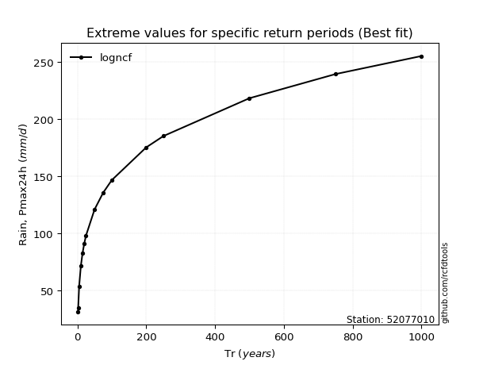</img>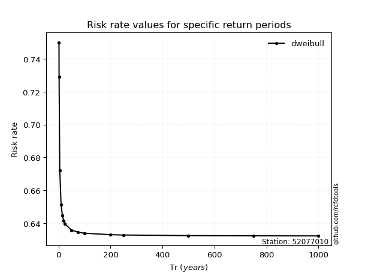</img>

</div>


<sub>**APP DISCLAIMER**: NO WARRANTY - This software is provided by [github.com/rcfdtools](https://github.com/rcfdtools) "as is", without any express or implied warranty, including warranties of merchantability, fitness for a particular purpose, or non-infringement. There is no guarantee that the software will be error-free or operate without interruption. LIMITATION OF LIABILITY - Neither the authors nor copyright holders will be liable for claims or damages arising from the software or its use. You are responsible for determining if the software is appropriate for your use and assume all associated risks, including errors, legal compliance, and data loss. NO PROFESSIONAL ADVICE - The software provides general information and does not offer professional advice. It should not replace consultation with professional advisors.</sub>